CONSIDER
CONSIDER
1. In an and the state

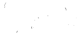

C. Construction ting the content of the content to the content of the CONSIDER
. In
..

CONSIDER
-
CONSIDER
  

s
.

..

..

..

.

.

CONSIDER

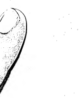

CONSIDERATION
..
.

CONSIDER

COLOGICAL
.

.

-
.

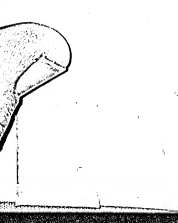

-

.

-
.

..

.

' . T ".

An elementary Pali Grammar abridged the Under-graduate Course Originally Edited and Translated by The late Mahamahopadhyaya Dr. SATISCHANDRA VIDYABHUSANA
- AND
The late Samana PUNNANANDA swami revised and recast
(With additional matter)
IT'
SA1LENDRANATH M1TRA, M.A.

LECTURER, CALCUTTA UNIVERSITY


PUBLISHED BY THE
UNIVERSITY OF CALCUTTA
1935 e PRINTRD BY BHUPENDRALAL BANERJEE
AT THE CALCUITA UNIVERSITY PRESS; SENATE HOUSE, CALCUITA.

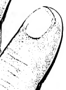

.

s Bec. No. 706B.-June, 1935-A.

..

.

x

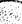


.

CONSIDER
..

Sudasien-Institut der Universität Heidelberg lriventarisiert unter nsp ul...

()

# Preface

o
' ' -The Bdlavatara, - originally-- edited for use in fbe upper classes of High English Schools by the late Malmniahopadhyaya Dr. Satiscbandra Vidyahhusana and the late Samana Punnananda Swann, ha"bLn revised and ' recast in the present edition. The sutras of the a have been omitted altogeto J.matter nrnvpfl bonus to the beginn >
•In that Lotion has been re-shnffled and conveniently arranged. New topics-M Km*,
and Vibhatti-bheda have been ad .

simple reason that they are essential at the prel
"nary stage. As Vernacular has been trade the medium oi instruction tor the***
Examination in subjects other ban tog'8".

I have deemed it desirable to explain t*•
additions rr: iaetuthe ***».*"»*
I have drawn very largely upon Kaccayapa.

A word of explanation is, I believe, necessary A a to the Case (Vibhatti). According in regard to th Vibhattis are
^'SingT^-. winch in English confound the beginner (whose knowledge of nglish grammar !S presupposed) by stating at<
the outset that the Vocative is not regarded as an independent case, I have preferred, as will be sden at page 31 to count the cases as eight notion T h' Vocatlve)> having the student's notion to. be gradually cleared as he reaches' the sections on Karaka and Vibhatti-bheda.

Ghatak ^ t0 Mr' AtuIchandl-a hatak M.A Superintendent of the University Press, for the ready assistance he has given in seeing the book through the press.

Senate House :


Calcutta, The 1st June, 1935. Sailendranath Mitra CONTENTS
o 2.

| PAGR             |    |      |
|------------------|----|------|
| ]                |    |      |
| Sanna            | 7  |      |
| Sara-Sandhi      | 16 |      |
| Byañjana-Sandhi  | 19 |      |
| Niggahīta-Sandhi | :  | ' 25 |
| Vomissaka-Sandhi | 31
O77    |      |
| Namakanda        |    |      |
| Samasa           | 83 |      |
| Kāraka           | 93 |      |
| Vibhattibheda    |    |      |

CONSIDER
..

e and the state of

e C.
1.

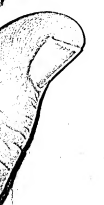

-
.

.

..

CONTROL
1. See

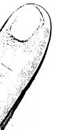

the content of the content to the content of the conte 1.

.

.

..

.

.

the content of the content.

..

SECON
CONSIDER
ole CONSIDER AND E
SELL, OR ALL
al and the state o D 
AAAA
..

CONTROL
.

:
i
.

an and the y
.

,
.

. 

e e
.


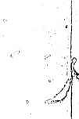


.

.

.

ol of the state of the state.

' SAffli Orthography i I H'li'ITiWlfl I i I ? I ^
1. - Akkkarapadayo ekacattallsam.

farPfap <2tat^
-«i <sri ^jtf? <3wfsr*tf5 ; vti,— ' .,

| %   | X>   | X,   | «»   |    |
|-----|------|------|------|----|
| V   | K,   | X>   | %    |    |
| t   | X,   | x>   | X,   |    |
| %   | X,   | X>   | x>   | x> |
| %   | \>   | V    | x>   |    |

•0

. - —. >

l> n.

X M
n..

i£|^ *Bli5 ^*f s> ">
A *f, X:()I]
* These figures refer to the Book, the Chapter and the_ Sutra respectively of Kaccayana's Pali Grammar, to which tho Balavatara
$utra can bo traced.

The letters beginning with a arc forty-one, useful to Suttanta.

They are:—

| a,   | i,   | I,     | u,   | u,   | c,   | and   | o;   |
|------|------|--------|------|------|------|-------|------|
| k,   | kh,  | g»     | gt.  | n,   |      |       |      |
| C,   | ch,  | b      | jh»  | n>   |      |       |      |
| t,   | th,  | a,     | dh,  | n>   |      |       |      |
| t,   | th,  | d,     | dh,  | n,   |      |       |      |
| p>   | ph,  | bh,    | in,  |      |      |       |      |
| y»   | r,   | 1,     | v,   |      |      |       |      |
| 8,   | h,   | 1 (35) | and  | rh.  |      |       |      |

R I to *is 11111 3


2. Tatthodanta Sara attha.

g\% t'B\' v
'Sftfefe '®IW5F ^ I
«WR C*1%»N Wf*[SS |]
Of them, the first eight letters ending with o arc Vowels.

They are:—a, a, i, !, u, u, e and o.

[these are classified in the following two suttas. ]
3 I 'STfTOT cllft I ? I ? I 8 3. Lahumattii tayo Kassil.

' TOPfo TO V, <%» f%qjg The three of soft measure are short (vowels).

Of the vowels, the three of soft measure, viz,,
a, i, u are short.

« i 111 ? i ^
4. Anne Dlglia.

, ^ ^fejg ^<3 TOJ W1
'^, '&, '<h', I f^5 '=WHt*f>-^'fo* ^
s(tf%t?I 'W ''Q> ^
... («flt«)> CTWJ1 (W1''
^3S1 (^D.^(CTt<?f) I

## The Rest Arc Long.

The vowels other than the short ones arc long,
'_ a, r. u, e and o. But a and o preceding combined'consonants are sometimes regarded as sliorfc vowels.

[By 'combined consonants' are meant consonants without any vowel intervening them.]
The examples of a and o regarded as short "owe s are:—<3 "in ettha and soyyo; o in ottho and sotthi.

## N I Si^T I S» U I I

5. Sosa ByafijanS.V ^ 't^8*
^csfartfe ^^4©FT*3<1 The remaining letters are Consonants.

Setting aside the vowels, the other thirty-three letters, from h to m, are consonants.

. «n itftw ^^ ***
^'iRPWt'l The Consonants arc.:—

| k,   | kh,   | g»   | gk,   | h,   |
|------|-------|------|-------|------|
| c,   | cli,  | b    | jk,   | h,   |
| t,   | th,   | d,   | dh,   | n,   |
| t,   | th,   | d,   | dh,   | n,   |
| P>   | ph,   | b,   | bh,   | m.   |
| y>   | r,    | 1,   | v,    |      |
| s>   | 1     | and  | lii h |      |

4 I JTnfT | ? | ? I 'Q
6. Vagga pancapancaso manta.

WWfafsft W Y 'if oftrs
*ff5 VtS fws5; tlRr irp^fs t<pp
(4M) ^ i ^ra <2t«pf M'SRprttl srfr 55 J 5«[1—% % %, $ = ; 5, w, «*p
=V-^; Tj, ®, U", ^ ='ip-ijtf; ^5, sT, ^ If, ^
= ; *f, Ip, 3S, <5, n='*p.^ |
<2^5 ^ f^\#f ('<teJ1J *f, 5, 5, Tj, V> % % 50 'flfe 'iRC^t5^
(5t*V'® <'5WtV)-^cf | 4cf>l'-J^C^ (<5fsft?,
5^sf 'Q *f$if i£)<^ if, s* } ^ ^


^ 5\#f) cqt^ ^i 1 The Yaggas are groups of five of the first twenty-five consonants ending with m.

Of the consonants, the first twenty-five, from h to m, are arranged in fivo groups, each consisting of fivo lettors.

Aa-Vagga- k, kli, g, gh, f,

Ga-Vagga—1 c, eh, j, jh, fi;

fa-Vagga— t, tli, <1, dh, 1x.

Ta-Vagga— t, tli, d, dh, n;

, Pa-Vagga— p, ph, b, bh, m.

The first and second letters of each Vagga, together with s, are called Aghosa or Surds, the remaining letters ending with 1 are Ghosa* or Sonants.

The Surds are:—k, kh, c, cli, t, tli, t, th, p, ph and s.

The Sonants are:—g, gh, n, j, jh, fi, d, dh, n, d, dh, n, b, bh, m, y, r, 1, v, h, and 1.

'J) i ^ ^ I \ I ? I 7~
7. Am iti Niggaliitam.

<<5r> (=^)
fH tit
'wtetra ^ 1 W ^ ^ c^'s ^ ^
55 *rl i .

## M Is Niggahita.

The nasal denoted by m, which is sounded after ai (in the syllable am), is called Niggahita
(arrested letter).!

The vowels i and u may also be placed before it, but not any other vowel.

* The technical terms Ghosa and Aghosa have been taken from Sanskrit Grammar, as is indicated in the Sutta " Tarasamanna payoge " (vide Kaccayana, 1. 9). cs ..

Other terms have been similarly borrowed, e.g., Linga, Sabba-nima, Pada, Upasagga, Nlpata, etc.

t Tho following verse gives a full definition of Niggahita :
Bindu efija-man'-akaro Niggahitan ti vuccate I
Kevalass'appayogattfi a-k5ro sannidhiyate II
i.c., The point resembling a small gem is called Nigga uta. s it is not employed alono, a is placed beforo it. ,

## Mlavataua 0

1 he letters of the alphabet can be grouped, according to their seats of pronunciation a> d, h, and ka-vagga are Gutturals ( ^«f).

h i, y, and ca-vagga are Palatals (^ ).

w, ut and pa-vagga are Labials ( vq^ ).

r> and ia-vagga are Linguals ( ^cf )\#
s, < and ta-vagga are Dentals (^cf)\#
* o is Gutturo-Palatal ( <*<).

o is Gutturo-Lablal ( ^f).

v is Dento-Labial ( ).

' as follows : —


SAKA-SANDHI «

# Vowel-Junction

Sandhi (Junction) means proximity of two letters without any other letter or pause intervening them.

*RT 1 ? I * I ? :-
1. Sara sare lopam.

('sqsfK '5(^ ^ *5)
cg-S^cf C5jt^+'®ic?n=c5itf ^t\#i=pit?c9i i
(i) ^«ffa ; ^1)—Ts+^ta ^ 5^*1
^ <pta«i 'tf^Ftura *lra <hk ''shift's 'srftc^ *2pfr
^ 'sre^tcira *fa«rto 1
- * wifa Tffavs^ wwfrp 5t5ftr? Jra&rt
'5t?t3 ^5( 5^C$ <}*tf ^fS5l sltPlPS 55; H|;— "OTfa+^pMl" &fW5 *ll%
^fsras&st, •ifan fafare : cJitf-^+^tl: 3t5ft *tnj ^ar-^RpitSl
^fas 551 •

W 5ft^I fwtt SiRJfa <5T3f%^
^®t<i <8ftf^ ^
31*11 ^ ; 3«t1,—
, "<Wf5R^f%
^Sffl'fsp CTsjtft r
*Rn G^°s 3 3^*|f% |"
^ \#it* *wfr*qtfr *pm nra«ttfw 3j3*fft <3^ f^€tn 53^ -spgf^g
*f^®l 3%^ <i^<H ftfif l] >. ,
There is elision of o, vowel before <i vowel.


A vowel immediately followed by a vowel is elided, as loka+aggo= lok'aggo.

[There is no vowel-sandhi, if there is intervention of (t) a consonant, as in Marh + ahasi=
Marh ahasi (here a is not joined with a, because of m intervening), or (it) a pause in metie (on account of which the 2nd foot is not joined with the 3rd), as in the following Gatha:—
" Pamadamanuyunjanti bala dummedhino jand \
/lppamadafica medhavl dhanarh seUham va rakkhati."
Jana + appamadarh=janil appamadaih, where d of the second foot has not been joined with a of the third foot on account of a pause after the d of
"jana".

Such is the caso in all Sandhis.]

## Sara-Sandi1I 9

3. I iff 'STOW I ? U « ^
2. Va paro asarupa.

ispprft =333< «ttfwi, *133\# f33asi 53; 3*11,—*13 +^C3=*13 ,C3=4>t=TC^ ; 'slt3t3, 5^ C*TM?' ^3t33tt3, 53 : =
J ^+^= ^+^C3=,p\#TC,SI I
There is optional elision of a vowel after a dissimilar vowel. - n A vowel after a dissimilar vowel is optionally elided:
Pana+ imo=Pana 'me, Pan' ime.

3 I I ? I * > $
3. Kvacasavannam lutte.

^3 3p3ts(3tC3 *\WU ^33< qtf 5^3*1,
^ 53; 3*11, 0) +
^^=3^3*1+^3=3W*13 I <&$'*1, *
^tW. 'W 53 I 00 3 + =
= I ^3i*f, •*> 53 I
[% ^ 43?

*?3 3C*t l] •
In case of elision, the succeeding vowel sometimes becomes dissimilar.

If tlie preceding vowel is elided, the succeeding vowel is sometimes changed into a dissimilar vowel, so that i and u are respectively changed into e and o owing to the affinity of their pronunciation:
Bandhussa + iva=Bandhuss' ova. (So also t is changed into c.)
Na + upeti= N' opeti. (So also ft is ? changed into o.)
2

8 1 I * I ^ I 8 4. Dlgham.

'HR'Q fft ^ ; ^«|1,—^Jf+'BPR ='5^[+'B|t^ =
; *ra1+^«f = + ??*(=
'iffo; =^5'f^ | a There is lengthening of the succeeding vowel.

If the preceding vowel is elided, the succeeding yowcl is sometimes lengthened :
Tatra + ayam^tatr* iiyairi.

Yfmi + idha=yan* Idha.

Bahu + upakaram = bah' upaknram.

Saddh^t + idha = saddh, idha.

Tatha + upamaih^tath' upam am.

5. Pubbo* ca.

m qg sfcpi,
^ ; ^5f1) = | Tliere is lengthening of the preceding vowel.

If the succeeding vowel is elided, the preceding vowel is sometimes lengthened :
Kiihsu + idha=kimsu + 'dha=ldmsu 'dha
* The word 1b always spelt with a short « in Pali {Me Sutta 10>
W. I have left tho spell,nff just as it occurs in manuscripts.

## T77~»Y'>Ttj F-R:... Sa Ha-Sandiii Ll

<| I I ? I * I *
6. Yamedantassadeso.

^ «ftfwt, *£|HW3 ^ ^tCR **F»
'vine 'X -re+^=^h+^=
^i fas, C®+TO='STte
"tfa" Ow) '5^
^rttg ; £ Wfa* ^1*1 : ^
sStcn *2j\#3 ^ '5PR ^^u"—4 WI ^',
4$ ^fgcs *W* *U** ^ ''5,,>
^^1 '^l' 0 The final e is changed into y.

The final c (of the preceding word) followed by a dissimilar vowel is sometimes changed into y:
To - I- ajja=ty+ajja=tyajja. ,
But, Te + aharil =Tyfihaiii. [Here a is lengthened, because - ' a vowel followed by a consonant is sometimes lengthened " (vide Kaccayana, 1. 3. 3).]

## ^ | En^Jtlpt 1*1*1'°

Vamodudantanarii.

^cf TO «ttfa:*t, ^nm ^
^^ 'X. 'srtw*t **; ^,--<?ti+'5>JR==
= ; <5^(+c£lf% =^+^= 'sl^ I
TOl + 5

The final o and u are changed into v.

The final o and u (of the preceding word)
followed by a (dissimilar) vowel are sometimes changed into v:
So 4- assa= svassa.

Anu + eti = anveti.

C'y But, " Tayo + assu =tay' assu.

Sametu + ayasma= Samet' ayasma.

## C I 'Ft I U ^ Id.


8. Do dhassa ca.

V ^ ^'Q V ** ;
^fl>—+^=^7+^+<srt^ (^r 8, "ffat",
'tCit f^'Q 'q> 'ff>
; dst1—I
Dh is sometimes changed into d.

If a vowel follows, dh is sometimes into d:changed Idlia+aham=Idaham. [Here a of 'ahum' is lengthened, because the preceding a is elided
(vide Suttu 4 above).]
But, Idlia+eva=Idh' eva.

Even when followed by a consonant, dh is sometimes changed into d:
r I(llm + hliikldiavo = idu bhildkhavc.

## Sara-Sandhi 13 * A | I? I * I

9. Ivanno yam na va. •
TWfm sttfwb ttH
^ v **, ^^1 ^ srt; ^tl—^%+wf=
yspp i ^ w\ w ^ w ** 5 ^?|1"
= I ^4-^=^I
??vs\w **tfe (^I«n) «*fe
[^-^«f '%' 'Q 'I' 3?W I *fos*f
«Tjq®f\#n® ^"« *«ir, <*w ®-^*f
<%' 'Q 'fe* ^ttl l]
1 and I may or may not be changed into y.

If a (dissimilar) vowel follows, the preceding letters i and i may or may not be clanged into y: >
Vutti + assa= vuttyassa. [If there is ty, it is sometimes changed into cc; as, pati + antain=
patyantam=paccantam.]
But, pati + aggi=pataggi. [Here i becomes l by the sutta "Pati patisseti " (vide Kadcayana, 1. 5. 7).]
The word " vanno " is used to include in all cases both short and long, vowels; for instance, tho
" vannu a " implies both a and d ; the " vanna i implies both i and t ; and the " vanna u " implies t both u and ft. '

ft, 55% ^ n *, u 10. < Evadissa ri, pubbo ca rasso.

. ^ •<<& $ *tc*ra
'fl' 53 ^ ; 1 ^ly—
¥ii+<*rc=1 o t
® °f cva is optionally changed into n,: and the preceding vowel is shortened.

If cva follows tv vowol, the c of cva may optionally be changed into ri, and the preceding vowel into its corresponding short form::
Yatha + eva=yathariva, yath' eva.?

?? 1, ^nm^irrea-T ^fwt i ? 1 « 1 $
c ( > 11. , Yavainadanatara]ii cagama.

i
' . - ^sft^> A,
*U <& ^ ^ ^ *s I W\
'Sft'bl ?5.!; T-tl,-—
'5T5+'5{'^!='5pg^^. |
^£51 + blf% | 5RNf®+«iPl =3Rj%C5R I
J+'rt'W-wNi 1 (ftm, =,(
" '5 ^f'SSSf'G *r% |)
, SARASAND HI 15
'^+^> f^i ^wr **, *m ^ ^
5U.31 I)
" fr%f, ^f% + ^lfC^1 I
r, ,. m, i, «, t, r, ,"d l are the optional
.. insertions.

When a vowel follows, the letters y, v,m, d, n. C, and/ may be optionally inaarted. 0 « »
may come as an insertion.

Na + imassa=na-y-imassa.

Ti f angiham—ti-v-ahgikarii.

Laliu + essati = lahu-m-essati.

Atta + attbarii= atta-d-attham.

Ito + ayati = ito-n-ayati.

Tasma + iha= tasma-t-iha. ,
Sabbhi + ova= sabblii-r-eva.

Cha + abhif.ua= cha.l-abbifmii. '(Sometimes there is no sandhi.) ,
And, putha + ova=putha-g-ova. (Sometimes there
°is no sandhi.)
Alto, pa + era=ptt-g'Oro- (Sometimes th.ro is no sandhi.)
But. abhi + uggato=abbhuggato.

BYAftJANA-SANDI-II
Consonant-Junction
*
^sfTtc?ra
^ ^'Wi We') ^ s$5 ^ ^
^I
In the following suttas the words byanjane ('when a consonant follows') and kvacit ('sometimes') are understood.]
? - rramrr^ i ? i ^ i n.

1. Lopafica tatrakaro.

[ WH< j
; C*rM 3^*1 '<5t' <$^5^ 53 . 35^_
^l-+ f^t,=*t+ 7{+ *n +f%^s(= ^.f%^,
^WfQ tiR* V ^ ; 3^ _
+ 50 | frl, CTH \#,=CT| * < ^fh ,f,^ifl ) ,
There is elision of the vowel, with an insertion of a in its place.

A vowel followed by a consonant is sometimes elided and a is inserted in its place:
So + hhikkhu =sa bhikkhu.

, 'V and 0 rnay also come as insertions:
1 Janema + taiii=janemu tain

## 0 Byasjana-Sandhi I I

Kaccinu + tvaiii - kaccinotvarh.

But, So + muni = so muni (without Sandhi).

## ^F/'\0^1 ^ Li 11 ^ I ^

' 'r<\ 2. Vagge gliosfighosanaiii tatiya-patliama.

: ; > ' " \# -<wf ^ «tW «<PR *** ^
WR*f R<fc «Wf <fc" «W ^
•> ^ <a ^ yft* ^ fa
^+CTtWl=I
\ , w,< =b* (Hh ^ « »w * >
r " . fea «?' *f« A" <* SOT
5,. ,,l1i_-s]l+»tR'.='IVt1'P I [«.* < WW
' "wpt" (>w>) "* ^T"
5^ 5^3ft5 ! ] ^ (
fvi J^af ufert ^4 l *Mr- '' " 3
(>) ^Rtf'ica 4tfwi ^R *«' ^ 55 ;>
Tjefl,—^^ 5^1'1
*fm+c*ficoii [«a ,<5^-
'KPfl 5t«" 't ^^
^ *lW ^ 1 ]
(*) '^'^ ^,R ^ ,'Q'
*nj . Tje{1,—^ + »K1='8*ffi1 I
f%75, <q* +
The' sonant and surd consonants of a vagga get doubled by taking before them the third and the first letter respectively of the va^ga.

3

The fourth and the second letters of a vaerga after a vowel are in some instanced doubled hmughconjunction with thc third and the first lettei1 respectively bf the vagga: -
' - *> U + ghoso = ugghoso.

A + khatam= akkhiitaiii. [Hero « is shortened according to tfia T'
"Rssaiii" m 7 , , Knccayana satta folln . iL ' Whlcl' ,ays down: "A vowel
_ . ' ' * J
;; «) when . consonant Para + saliassarh =porosaliassarft Sertjon ",A",PP" + 1,ih"="tiPP'>8okllo. [There i, in.

to 2 1 r" 0 h" b"" "W«l according ili,.]8Utt" eagnmn •• J!

(") *» » aomotaoe change,1 ,"bl " wbon ,,
consonant follows: , •
1t , . ; Ava+nndclha=onaddhu.' ' "
> Ava-fsussntu=avasussatu. '
IV
<> JMIGGAHlTA*-SANDHI i ^
'>
, Nasal-Junction
' , i l i qwl r ? i » i ^
1. Vaggantarb va vagge.

wwftca W fro* sjfffa C*W< ( '*&*' ^^ 55 ; 5,St1,—, j ;
JR.+*Ttl®l=*Wfe®1 I
i. .. - 3}? -f (Xt'oi=*ii»c®r i -> " ^
' t5*+^=W I. ..', , '; *
, ° f%^; <sk fai?ra **} 5I^1>—
^^ I)
^+fW=,$T' 1 ;,,/,:
The Niggahita followed by a consonant of a vagga
. is optionally transformed into the last , consonant of that vagga.

* See p. 5, sutta 1.7, .where the word is spelt with r,8hoft».

## 20 Liala.Vatait,A

M followed by a consonant of a vagga is optionally changed into the last consonant of the same vagga:
, Kim + kato= kinkato.

Sam + juto = safijato, Sam + thito == sanihifco.

« lam + dhanam== tandhanairi.

- ^-arb + mittam=tammiitarri.

But' Na tam+kammam= na tain kaminam
(without Sandhi).

M may he changed into l when followed by a l:
1 urn 4* Iingam = Pullingam.

## ^ I | ? I 8 I H

, Mada, sarc.

'•'C CTWe X
Evam + assa=cvam + assa=ovamassa.

r But m * " - °Ca=Ctam + avoca=oMavocn JJul> Mam+ ajini=math ajini.

## , Niggahlta-Sand Hi 21

3 | 33T | * I 8 I 3 3. Eliennam.

'a\' f%p1 'X *tra «ttfwi fWP
<? -tOTtPrt itw' ( w) W
'3PTC I
+^=v5^^| ; f^CHj—'®*d% (*\# ^ I
When c or h follows, [the Niggahlla is optionally changed into] n.

M' followed by c or h is optionally changed mt0 Tarii + ova=tafincva—[the doubling ofn takes place according to the Kaecayana sutta
"Paradvebhavo thane" (1. 3. 0)]; also,—
>

tameva. ^ •> > \
Tam+ hi = taflhi ; also, - taiiihi ( without Sandhi).

## 8 1 H $,^1 ? I « - 8

{ >
4. Sa ye ca.

'X *»ra «-t^ fwP
w & , ^,—jr+CTttfti=»ia>wi—[
0 WtWf >W* ** 3 5 I
The NiggalMa together witli y, which follows, is also optionally changed into n. '
Even when followed by y, the m together with the y is optionally changed into Q:
Sniii+yogo=safifiogo—[the doubling of fi takos place according to the Kacciiynna 22 j BAlAVATARA
sutta (1. 3- 6), , qyo^ed above] ; also,-.


surhyogo. ,
* I fiw&m I ? I 8 I « '
5. * Niggahitanca.

*ta ^Ttf%C®T, C^t5? C<Ft^
^ ?>S; »wi,—
+ ^E5'l
^+ fel I
[ fwl wrc< *tra qtfo*i, c^t^'Q w\ C'tM'Q w—('Tbbtiw ^ar ii8i»,
c»it*h," ) i '
(•>) ft?!R+^Jf* = fiSjiT + ^lHs=%I*f« |
, . ' ^fa*+^\=^fa+'5ras=^t*it^ i (^ ^s\

```
. , "ffat" 4* '^arfiprlW 'SFFft =?tcq 'srf^trt
                         ?&itr5; f> >->,^8 ghj i)
        <•
           

```

(*) +*lt»PK = IJSto srfaFR |
*r + ?rtc*t1 = *i+stall=*rt?rfe*ri i (m ^
"fta", ii«i«, ^ ^arJBRpjtw ^t?-
Tt?i i) ]
i The Niggahita is a,Iso [sometimes optionallyj inserted.

M is also sometimes optionally inserted when n vowel or a consonant follows:
, Cakkliu + aniccam=cakkhurii aniceam.

. . , Ava + siro = avain siro.

## Niqgahlta-Sandhi 23

[The opposite is also noticeable (vide Kaccayana, 1.4.9—Kvaci loparri "):
(i) Jli is sometimes elided when a vowel follows:
Vidunam4-aggam = viduna + aggam = vklunaggam.

Tasam + aharh = tasa -f aham = tasaham.

(Here, the second vowel of tdsdham is
" lengthened according to tlie sutta
"Dighihh," see ante, p. 10, sutta 4.)
(ii) There is occasional elision even when a consonant follows:
Buddhfinam + sasanam - Buddhana sasanam.

Sarii + rago= sa + rago= stirago. (For the lengthening of the first vowel of samjot
" vide Kaccayqpa, 1.3.3,—''Dlgham.")].,

## A N»I«

G. Paro va saro.

^11 —
The succeeding vowel is sometimes optionally elided. ,
Sometimes the vowel after m is optionally elided:
Bljaih + iva=bljarh V4,

o i ^ l ? 'i 8 l 7. Byaujano ca visaimogo.

WIC<5 C^TH <if ^
iSWfa ^ ; >1%—
<i|<K +'5]7W=^ + '*PJ=^°n '*! I
**
The consonant is also simplified.

When the vowel is elided after m, the succeeding conjunct is simplified; Evarii + assa= evarh + 'ssa = cvam 'sa.

V
O VOMISSAKA-SANDHI
Miscellaneous Junction
[ * t 5=crq\*rat i ? i * u°
1. Anupadittlianam vuttayogato.

'S ctfttf CT *PR Jjf% ^
liRVCT JpR fist nfe ^ *rf*f'5 ^ ^
1 ^ i ^ *if% ^rtRc^
*$t&m e Jife
(SfCft'f ^f3C5 *lf? + - Wz7\z.;
<atft+'=|5ri = c^isri i (i*j ^c\#s* a\--m\] 4 q ^1" (1: ) ^tspitra 'tfr 'Q f<3tfi'<i V ^11,—-^, c^t^Jx; ^tra, <•? ^tara
=?tc^ 'ft' '5rtwc*fa X' 'Q %' ^tP?

'Q I )
The foregoing suttas are to be suitably applied * to instances not yet discussed.,
The foregoing' suttas of vowel-junction anti consonant-junction arc to bo applied in a suitable manner to the prefix, indeclinable and other kinds of junction, not yet discussed :
For instance, Yadi + cvaiii = yady + evaiii =
ynjjevnm—(first, by tho sutta "I-vdnno yam 4

## Ba.Ija.'Vata.11A

na va" (see ante, p. 13), di of yadi is changed into <hj; secondly, by the principle (implied in the same sutta) that " ill is sometimes changed into cc," <l\) is changed into jj). Similarly, Bodhi+ yrffc'b.:
- aiiga=bodhy + aiigii bojjhahga.) ... /■■ *'
Tlie .following minor rules are applicable in Miscellaneous Junction :—
(*) 'srefen-ntft ^ i Asadisa-samyoge ekasarupatii ca.

sprta i*i <snn ^ hfl 4 <*ph1=1-<4^1
(•>'0 % s )=^+i£PHl=,twPll l In junction, the preceding consonant is assimilated to the succeeding dissimilar consonant:
Pari + esanii =pary + esanii (vide sutta 0, p. 18)
= payyesanii (r being assimilated to y),

## (L'») ^Xi F^Qflcitu % \

Vanniinam bahuttam viparitata ca.

Cf'fa CTft WI 'IWR ^ CTM CTft JltW ^.il, <£ft\ o|-i c*vPl ^1, 'i§' ^) i
^+ iwN =^^1—('f%'3'V; *11 f fasbi ) i

## V0Missaka-Sand1Ii 27

5\1 4-^5 = Oftfa—( 5.1« fafa'^
^ra cfafa *lra 'Jrt'fl ^'CTPft) i
^ ^stsfara 'V
«^.» 'SJ5—^\«|8—'«B?rtra *Ufa* 5?»
"tra '*£r*« ^tcq
^0 I
^+<srt^;srt=^wc*rt—Un '^'
=^\CT ^', ^ fa' 'S '\' ) >
= 'swteft—(fafafa faw faV
^OT*t, *iC4 ^ S'QSft 5.18 ^
?rt) >
In some eases there is multiplication of a letter, and in certain cases there is inversion too.

hor instance, In sa + rail= sumurati, there are insertion of ma (II. 11'/ and transformation o£ u into u (III. I).'
In 'iti + warn - itvevaxh, there is transformation of i into v by extension of sutta II. ^ (p. 11). *
In sa + itthi = sotthi, the succeeding vowel i naving been elided, the preceding d is changed into o by extension of sutta II. 5 (p. 10>.

In bustt + cutt=t)usamiva, >a is inserted
(II. 11), the preceding vowel a is shortened (vide Ivaccayana, 1. 3. 4.—" llassaih ") and the, succeeding (' is changed into i by oxtensipn of sutta 11. 10 (p. 14).

In bahu. + (lbddho=bavbnbr\dhOi u being followed by the dissimilar vowel a is first changed >
into v (II. 7), and then there is inversion between h and v.

In (idlfi + nbhuiu = addhfibliavi, there js application of the principle according lo which "<Hfn

is sometimes changed into addha, " and of sutta II. 4 (p. 10), which Jays down, "If the
« preceding vowel is elided, the succeeding vowel is sometimes lengthened. V
(uV) sft i * '
Radanam lo.

f 'X * X' ^; ^1,—
, +crterl = ; *rf3+Ftaf1 = i B and d are changed into 1;—
Pari + bodho =palibodho.

Pari + dalio =parilfiho.

(iv) Wife ifl l


'Sare byahjane va pare binduno Icvaci mo.

•, , , 3J"+'5l?,tf%=''TI( [ "Wl )
+'m?=\^ 'rh? i If a vowel or a consonant follows, in is sometimes changed into m : '
Mam + ahiisi=mam ahfisi (vhlo sutta IV. 2) ;
Buddhaiii + saranom= Buddham saranarii.

(») f4!^ ^Tr^nsisi^cnfq I
Binduto parasarunain-afinassaratapi.

ftltflfloil 5m< i2(t3
**1,—
r *fca, *«j* ^i]
, [si* '^rl^Ttra

## Vomissaka.-Sanjd Mi

^+ _["'arfr-
® The vowels after ?u mo t
' dissimilar vowels: ° CJlan^e^
Tam 4* imina = tadamina_U * 1 i after m has been replaced hv 7 S ° iau^ec^ *u^° a»
IV- 2)< ^ P 6d by d according to sutta Bv«a + imaiii=esumaih—(lj( "^aoootd.

mg to the Itaocajana sutta "Kwa lopaii,', 1 "
and then i is changed into zi. *
Ki,h + .ham=toha,h_(,h is oMtf. and f iB
changed into e).

(vi) GK'Tlfaara )fq , 9 Vakyasukhucciranatthaiii chandahunitthafica vanna-*
lopo 'pi." ' 11 *;
^R'S 0?fM ^

## C^) I

%f%_( ) ,
Letters are sometimes omitted for the sake of euphony and metro : v Patisaiiiklniya + yoniso = patisaiiiklm' yoniso
—(the preceding ya is olided for the salco of
^ euphony).

Alupuni sidanti = 'liipuni sldanti—(the initial a of aldpuni is olided on account of the exigency of metro). •> - ,J>

## 30 Balavataiia

(l)ii) PffiKt'fa I
Vuttyabheduyu, vikiiro 'pi.

stt'ltS atOttVlfcpifcw ^5J-
' c f%*tcs ^fiwta —
'®T'^^TT?X3T C'3='®f<P'ai*|>^i C® I
N
There is exception even to the above sub-rule for the sake of metro :*
Akaramhase + te= ckaramhasa te—(the long vowel c of sc is changed into the short vowel at metri causa).

1 * ^praKfarot gfa i f < ^ "f? 9 ii Akkharaoiyamo Chandaih, garu-lahu-niyamo bhave Vutti, Dlgto sarhyogadi-pubbo rasso ca garu, hihu tu rasso.

foflfipt ^
toi i 'q fi^flrair 3^-
"w". ^1 ^f*it\ 'w «w ^ 1
<R(j ^^S1 Metre is the harmonious order of letters. Measure is the regulation of heavy and light vowels.

```
  A heavy vowel is a long vowel, and so is also the short vowel which
precedes a double consonant or the Niggahita; c.g., the italics in the
following a «ssa, aiu.
  A light vowel is a short vowel; c.g.t the vowels a, i and n.

```

## I

 Name

1. Words are chiefly divided into two classes,
—Name and Verb.

2. Name comprises Noun, Pronoun (including the Numerals), Preposition and the Indeclin-
» able.

3. There are three Genders:—Masculine, Feminine and Neuter. ,O A 3 4. There are two Numbers :•—Singular and.,
Plural.

5. There are eight Cases (including the Vocative) :—PatJiamd or the First Case
(Nominative), Duliyd, the Second Case
(Accusative), Taliya, the Third Case (Instrumental), Gatutthi, the Fourth (Dative),
Pancarm, the Fifth (Ablative), Gliattlil, the Sixth (Genitive), Sattami, the Seventh (Locative), and Alapana or the Case of Address (Vocative) . In derivation the last one is not distinguished from the Pathama, although it is apparently different in the Singular: number'

## Balavatara


Case-endings are added to the Linga or crude form of a word (which is also called its ktem or Base), according to the particular
, relation in which we intend to use it.

The case-endings are set in order as follows;—-

| Singular                  | Plural     |       |       |    |
|---------------------------|------------|-------|-------|----|
| 1st—•Panama (Nominative)  | J          | si    | .     | yo |
| Alapana                   | (Vocative) | si    | or ga | yo |
| 2nd—Dutiyii (Accusative)  | J          | aril  | yo    |    |
| 3rd—Tatiya (Instrumental) | J          | nil   | hi    |    |
| 4th~CatutthI              | .          |       |       |    |
| (Dative)                  | /          | sa    | narh  |    |
| 5tli—PahcamI              | ^          |       |       |    |
| (Ablative)                | J          | smii  | hi    |    |
| fdth—Chattbi              | \          |       |       |    |
| (Genitive)                | j          | sa    | nam   |    |
| 7th—SattamI (Locative)    | J          | smith | ...   | su |

' A stem is said to be declined, when the case-endings are stuck to it. The case-endings undergo change in some instances, as can be seen from the declension of the stem Buddha, given belov;: —

| Singular   | Plural   |                                          |
|------------|----------|------------------------------------------|
| Pathamd    | Buddho   |                                          |
| Alapana    | Buddha,  | Buddha                                   |
| Duiiyd     | Buddhaw  | Buddha Buddha Buddha Buddhe/n* Buddhcb/n |
| Tattya     | Buddhcna |                                          |

Singular Plural

Catutthi Buddhassa Buddhrma*.

(

'Buddha )

Pancaml .3| Buddhaswd fBuddhc/u

isBuddham/td ^Buddhehlii

Chatthi

(

Buddhassa

'Buddhe

Buddhana?ii

| (       |                            |
|---------|----------------------------|
| Chatthi | Buddhassa 'Buddhe (        |
| Satlaml | a jBuddhasjum ( ..BuddhamM |

(

jBuddhasjum

..BuddhamM

> Buddhcsu

7. Stems are crude forms of words which are neither roots* nor verbal terminations, nor case-endings, but 'which yet convey a certain meaning; for instance, when we merely say Buddha, the term signifies neither the root v budh from which it is derived, nor any verbal termination; nor, again, has any case-en,ding been added to it, giving it the bearing of the nominative or the accusative or the "instrumental and so on. Nevertheless, it means somte one named ' Buddha,' but not yet in any particular relation to any person, action or thing, and as such it is merely a nominal stem or base. It is only when particular relations are intended that suitable case-endings are applied to the stem. Thus, when we understand
' Buddha ' doing something, we use the nominative form Bvddlio; and, when we mean
' Buddha ' as the object of an action, we employ the accusative Buddham; again, if we want to express something done by 'Buddha,'
we make use of the instrumental Buddheya, 5

In this way, all the case-forms can be used to
. convey different senses, as is shown below.

## The Use Of Cases

 C Jpathamd

(0 Lihgatthc,—in' the sense of the crude form (i.c.,
stem or nominal base), c.g., Buddha, puriso (vide Kaccayana, 3. 1. 14).

00 Alapane ca,—in vocation too, c.g-, bho purisa, bhavanto purisa ; bho rajcbhavanto rdjdno ;
he sakha, he sakhino (vide Kaccayana, 3. 1. 15).

(iii) To denote the kattd or subject, c,g., so karoti ;
Saltha atltarh ahari.

## Dntiya

0) Kammatihe,—to denote an object, c.g., ratliaih


karoti ; dhammam suniiti ; vdcam bhasati ; gavam hanati ; vlhayo lunati (vide Kaccayana, 3.1.27).

Tatiyd
(i) Kattari ca,—to denote the agent too (beside the Pathama), c.g,t raitild hato poso; Yakkhena dinno varo ; ahina dattho naro (vide Kaccayana, 3.i.l8).

(n) Karanct to denote instrumentality, c.g., agginahutiih jhapeti; rnanasd ce padutthena ; kayena kammam karoti (vide Kaccayana, 3.1.10).

## Gatatthi

(i) Sampaddne,—to denote the recipient, c.g., Buddhassa va Dhammassa va Sahghassa va dixnam deti (vide Kaccayana, 3.1.23).

[One to whom something is desired to be r given, or one who entertains a liking for

something, or one from whom something is taken as debt, is put in the Dative case—Yaasa ddtuhamo tocatc vd Aharayate vd tarn Sampaddnam (vide Kaccayana, 3.1.6), e.g.t samanassa civaraih daduti ; samanassa rocate saccarii ;
0 suvannaiii me dharayate.]

## -> Pancami » >

(0 Apdddne,—to denote the Ablative, e.g,y pdpd cittarii nivaraye ; abblid mutto va candima; bhayd muccati so naro (vide Kaccayana, 3.1.25).

[The Ablative case signifies that from which some person or thing goes off or fear arises or something is received—Yasmadapeti bhayam adatte va tad Apdddnam vide Kaccayana 3. 1. 1), c.g.} gtimd apenti munayo ; nagard niggato raja ; ]
M cora bhayam jayate ; dcariy'u'pajjhayahi sikkhaiii ganhiiti sisso.] .

## Ghatthi

(i) Sdmismim,—to denote ownership, e.glatsa bhikkhnno pativisam ; tassa bhihlchuno pattam; tassa bhihlchuno clvaram ; attano mukham (vide Kaccayana, 3.1.31). ,
Sattaml '
0
(0 Oleiisc,—to denote location, e.g., gambhhc odalc'annavc ; pupaemim ravnati maiio ; Bliagavaii brahmacariyam vasati kulaputto (vide Kaccayana, 55,1.32).

[The Rite of an action is called Olcilsa (location),
and the Locative case signified 'sito'—Y'o

'clhdro Lam oUdsam (vide Kaccayana, 3.1.8).

. Site is of four kinds:—
( ) Vyapiko or co-cxtensivc,—e.g,., jalesu khiraiii ; tilesu telarii ; ucchusu raso.

( ) Opasilcsiko or contiguous,—c,gpariyahJcj raja seti ; dsanc upavittho Sarigho. ^
(c) < Vcsayiko or objective, relating to
, f plaice or quarter,—o.g.t bhumisu manussa ;
aniarikhhe vayu Jf died8c sakunn.

(d) Sdmipilco or proximate, adjacent, vane hatthino ; Oahgdyam glioso ; vaje gaviiii dullanti ; Sdvatlhiyam viharati Jetavane.\
8. Nouns are divided into four classes, according as they have •(!) one gender, (2) two genders,
, <(3) three genders, and (4) no gender.

1 '2 A,, Declension of Nouns having one Gender-masculine, feminine or neuter..'
r 1. MASCULINE.

(t) Masculine Stems ending in -a.

f Buddha*

| Singular   | Plural   |        |        |
|------------|----------|--------|--------|
| m          | Buddko   | Buddha |        |
| Voc."      | Buddha,  | Buddha | Buddha |
| 2nd        | Buddhaih | Buddhc |        |

```
   * Stems declined like Buddha are sura, nara, uraga, asura, naga,
yakklia, gandhabba, kinnara, manussa, pisaca, peta, siha, matanga,
jaftgama, turafiga, varftlia, byaggha, accha, kacchapa, taraccba, miga,
assa, sona, ^urisa, aloka, loka, nilaya, anila, caga, yoga, vayama,
garo^, nigaraa, iigama, dbarama, karna, sangha, ogha, ghosa, patigba.

```

## Namakanpo 37

Singular Plural

3rd Buddliena ( Buddhehi,

v Buddhebhi

4th Buddhassa Buddhanaiii

1

r Buddha,r Buddhehi,

utli *

1 A

Buddhamha,

LBuddhasma

1Buddhebhi

Oth Buddhassa Buddho^aam

- Buddhe,. i i

7th l

| Buddhamha,                             |
|----------------------------------------|
| LBuddhasma ! Buddhamlii, iBuddhasmirii |

Buddhesu

Atta

Singular Plural

| -         | 1st                   | Atta   | Attano   |
|-----------|-----------------------|--------|----------|
| 2nd       | Attanarh,             | Attain | Attano   |
| 'j        |                       |        |          |
| 4th       | ,                     | ^ttano |          |
| r Attana, |                       |        |          |
| 5th       | -< Attamha, (.Attasma |        |          |

* Voc. Atta, Atta Attano

2nd Attanarh, Attain Attano

f Attanehi,

3rd Attepa, Attana L Attanebhi

4th

'j

, ^ttano

r Attana,

5th -< Attamha,

f Attanehi, >

v. Attanebhi

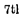


(.Attasma

0th Attano Attanaiii a

f Attanesu,

. 7th Attani

| f Attanehi, Attanarii *   |
|---------------------------|

1 Attesu.


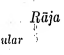


Singular ' Plural 0

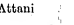


1st Raja Rajano

Voc. Raja, Raja Rajano

Singular 2ad llujunarh, Eujam 3rd RaanaT Rajena 4th Rafiho, Rfijino 5th i* Manila, Rajamha, Rajasma Gth Rafiflo, Rajino 7th Rafifie, Rfijini

## Gunavanta*

[Strictly speaking, the stem is Gunavantu.]
Singular Plural 1st Gunava Gunavanto, Gunavanta
* _ at0mii of t,ie followinfi aro declined like Gimnmnla r-maghavl, kulava, phalqyS, yaanvi, dlianavft, mitava, hliapavii, himava, balavii, silavfV, pafifiava, f^c.

Plural Rajano Rajuhi, Rfijubhi, Rajehi, Rajebhi Ranfiam, Rajunarh, *
Raj anam Rajuhi, Rajubhi, (:
Rajehi, Rajebhi Ranfiam, Rajfinarh, Raj ana th Rajusu, Rajusu, Rfijesu.

Voc. •
c Gunavarh, Gunava,
(.Gunava »* M
2nd, Gunavantam u> Gunavante 2 ^ f Gunavata, r vGunavantcna f Gunavantehi,
^ Gunavantebhi
(
r Gunavato, rGunavatam,
^Gunavantassa
^Gunavata, CGunavantanaiii 4th j 6th -J Gunavantamha, r Gunavantehi,
(^Gunavantasmfi (.Gunavantebhi Gth {
.Gunavato, rGunavatam l
(
Gtmavantassa
'Gunavati, Gunavantc, iGunavantanarii 7th -
(
jGunavantamhi,
-Gunavantasmirh Gunavantesu.

# Namakando 39 Gacchanta *

Sihgular Plural >

1st Gaccham, Gacchanto p Gaccham, Gacchanto, Gacchanta r Gacchanto, Voc. ]
* <[Gacha, Gacchfi tGacchanta 2nd Gacchantam Gacchante 0. ir Gaechatii, c Gacchantehi, L Gacchantebhi 3rd iL Gacchantena 4th \
f Gacchato, ,
L Gacchantassa ' ]
r Gaccbata, | 5th <
. i
( Gacchantamha, i 1 ' 1 L Gacchantasma r Gacchato, i f Gacchantehi, l Gacchantebhi r Gacchatarii, 6th j J
L Gacchantassa 1
'-Gacchati, Gacchante,
(
7th i
<
j Gacchantamhi,

```
^ Gacchantasmim
                                        Gacchantesu. >
                                                                      
                                                                        )

```

f Gacchaiam, L Gacchantanarii i L Gacchantanam
(it) Masculine Stems ending in -i.

## •> / Aggi T

Singular Plural A

1st Aggi Aggi, Aggayo

Voc. Aggi Aggi, Aggayo

2nd Aggirh Aggi, Aggayo

3rd Aggina Aggihi, Aggibni

>

```
   * Stems of the following are declined like Gacchanta mabam,
caraih, tit^ham, dadam, bhufijaih, sunaih, pacaiii, jayam, jiram, cavam,
miyarh, sararh, kubbam, japam, vajam, etc.
   f Stems declined like Aggi are Joti, pani, ganthi, mutthi, kncchi,
s&Ii, vihi, vyadhi, bodhi, sandhi, rasi, dlpi, isi, muni, mapi, dhani, girl,
ravi, kavi, kapi, asi,"inasi, nidlii, vidhi, ahi, kimi, pati, haris> ari, Mini,
kali, bali, afljali, atithi, sainadhi, upadhi, etc. ^ ^

```

| Singular.   |                  |         |
|-------------|------------------|---------|
| '5th        | |A88in5> AggimhS |         |
| 4th         | Aggino,          | Aggissa |
| t- Aggismii |                  |         |
| 6th         | Aggino,          | Aggissa |

7bh Aggimhi, Aggismihi Agglsu.

Plural

| Agglnam Agginarh   |
|--------------------|

Aggihi, Agglbhi
*-£?£££ . Ami' 'V"h * *',8htd"eMd" "
Loc. Sing.- adiiii, ado, adimhi, adismirh.

$\downarrow$ . 
(in) Masculine Sstems eending in -Z.

$\frac{1}{4}$ . 
$$D a n d i*\cdot$$

| Singular Da^di Da^di                                                                                                               |                                |    |
|------------------------------------------------------------------------------------------------------------------------------------|--------------------------------|----|
| /Dandinam, ^Dandfirh Dandina -Dandino, Dandissa {Daudina, Baudimha, Dandisma Dandino, Dandissa fDandini, Daridimhi, t- Daijdismirh | Plural Dandi, Dandino *»t : >> |    |
| I Dandi,                                                                                                                           | Dandino,                       |    |
| Dandino Dapdihi,                                                                                                                   | Dapdibhi                       |    |
| Dandinarii                                                                                                                         |                                |    |
| /Da^dihi, iDaijdibhi Daridlnarh fDaijclisu, t-Dapdisu.                                                                             |                                |    |
| The following steins are declined                                                                                                  | lii-"                          | n  |

The following steins are declined lii-" n aapl, hatthl, pakkhl, chatti, mall, yogi bhJ7- 1^"'
sasl, kuRbl, jatl, yinj, sukbi, 8ikht ' «'• k®">i, aaml, dhaji, g pftmkarl, dhar?mavSdl, dlghajtvi, etc. ' raant,' kttri' ku9alI> mui

## Namakando 41 J >

(iv) Masculine Stems ending in _

## Bhilchhu

Singular

## Plural

1st .

Bhikkliu Bhikkhu, Bhikkhavo Bhikkhum Bhikkhunii
>t >*
Bhikkhuhi, Bhikkhubhi |Bhikkhunam Voc.

2nd 3rd 4th | Bhikkhuno, Bhikkljussa 6th | Bhikkhunn, Bhikkhumhfi, Bhikkhusma 6th {
' Bhikkhuno,
. Bhikkhussa 7th- | Bhikkhumhi, Bhikkliusmiih Bhikkhusu,' Bhikkhusu.

Bhikkhuhi, Bhikkhubhi |Bhikkhunam i Hetu
* , Plural Singular 1st Hofcu Hetu, Hctavp, Hctuyo Voc t $t " -> M
0 . Hetu, Hetavo, Hetuyo.

2nd Hetum
[The rest are like BhilikKu.]
Gamanimhr •' 7 G&mantsu Gamanismira 1 )*
Senanimhi 7 SenanTsu Senanismim '
Sudhimhi 7 Budhlsu.

Sudhismim )
6
" ,, . alined like Dandt excjtft in the 7th Gamam, senanl and sudhi are declio
•ending, where the forms respectively are •

## ,42 15Alayataita

Singular 1st Jantu Jantu Plural
{Jantu, Jantavo, Jantuno, Jantuyo.

Voc. Jantu 2nd Janturh
[The rest aro like Bhilckhu (p. 41).]

## Satthu *

| Singular   | Plural        |                  |             |
|------------|---------------|------------------|-------------|
| 1st        | Satthu        | Sattharo         |             |
| Voc.       | Sattha,       | Satthu           | Satthuro    |
| 2nd        | Satthurarh    | Satthare,        | Sattharo    |
| 3rd        | Sattharu      | Sattharchi,      | Sattharebhi |
| ('Satthu,  | Satthuno,     | / Sattharanarii, |             |
| 4th        | J t Satthussa | l Satthanarh     |             |

4th J

('Satthu, Satthuno, / Sattharanarii,

t Satthussa l Satthanarh

5th Sattharu Sattburehi, Sattlihrebbi

hth ''.f Satthu, Satuhuno, r Sattharanarii,
(.Satthussa \Satthanarh 7tlf Satthari Sattharcsu.

> - * t
> * > t

| Singular   |         |      |
|------------|---------|------|
| (lst       | Pita    |      |
| Voc.       | Pita,   | Pita |
| 2nd        | Pitaram |      |
| 3rd        | Pitara  |      |

## ) Pitu T

i y

Pitaro, Pitaro

Pitarehi, Pitarcbhi,

Pifcuhi, Pitubhi

* Stems declined like Satthu are : Nattu, bhattu, vattu, netu, sotu, niitu, jctu, <j»bcttu, bhcttu» datui dbiitu, boddbu, vinfiapetu, etc*
< t Dhatu andrtbe like are declined like Pitu.

| Plural   |
|----------|
| Pitaro   |

( Pitarfmah),

1 Pitanam, Pitfmaih

oth Like the 3rd.

Oth Like the 4th.

7tli Pitari Pitaresu, Pitusu.

| oth       | Like    | the     | 3rd.   |
|-----------|---------|---------|--------|
| Oth       | Like    | the     | 4th.   |
| 4th       | C Pitu, | Pituno, |        |
| C Pitussa |         |         |        |

j > 1
o(v) Masculine Stems ending m -%>

$\phi$
Abhibhu Singular Plural 1st Abhibhu Abhibhuvo, Abhibhu
[The rest are like Bhilclchu (p. 41). Thus is also declined Sabbafluu with the only difference that in the 1st case-ending plural the forms are sabbannunOt sabbafluu. ]
(vi) Masculine Stems ending in -o.

$\mathbf{s}\;\;\;\text{ENDING}\;\;\text{IN}\;\;\text{-}6$  . 
$=\;\pm\,\pm\,\pm\,\pm\,\pm\,\pm\,\pm$ . 
$$G_{0}$$
Singular

Go

Go

Gixvum, Gavaiii, Gavarii

Gavena, Gavena

4th Gavassa, Gavassa

| 1st. Voc. 2nd 3rd   |
|---------------------|

f Gavfi, Gava, o 5th -< Guvamha, Gavamhfi,
(, Gavasma, Gavasma Oth Like the 4tli. SGavc, Gave, Gavamhi, Gavamhi, Gtivasmirh, Gavasmirh

## Plural

Gavo, Gavo Gobi, Gobhi
( Gavarh, , Gunl n,arh, Gonarn
!

Gobi, Gobhi f Gavcsu,
< Gave.'su, CCusu.

2. FEMININE:
(i) Feminine Stems ending in -a.

| Kanna    | *          |             |          |
|----------|------------|-------------|----------|
| Singular | Plural     |             |          |
| 1st      | KanfiH     | Kafifia,    | Kahnayo  |
| Voc.     | Kamle      | C           |          |
| >>       | a          |             |          |
| 2nd      | Kanham     | 'a          | »»       |
| 3rd      | Karmaya    | Kannahi,    | Katmubhi |
| 4th      | *»         | Kannanam    |          |
| 6th      | >»         | Kannahi,    | Kanmibhi |
| Gth      | > >        | Kannanam    |          |
| 7th      | Kafifiaya, | Kafinuyaiii | Kaunasu. |

(ii) Feminine Stems ending in -i.

| Singular   | Plural   |          |            |          |       |
|------------|----------|----------|------------|----------|-------|
| 1st        | Ratti    | (,       | Ratti,     | Rattiyo, | Ratyo |
| Voc"       | llatti   | »»       | *»         |          |       |
| 2n<3       | Rattim   | it       | t>         | it       |       |
| 3rd        | Rattiya, | Ratya    | Rattihi,   | Rattibhi |       |
| 4th        | > >      | ,,       | Rattlnarii | l?       |       |
| 5th        | #        |          |            |          |       |
| i)         | ,,       | Rattihi, | Rattibhi   |          |       |

```
       # Stems declined like Kanna are Saddha, medka, pailfia, vijja"
   ointa, tanka, iccba, maya, metta, sikkba, bbikkhfi, giva, jivba, vaca.
   cbaya,asa, ganga, nava, gatha, sena, lekba, sala, mala, vela, puja,
   pipasa, vedarfa, cetana, paja, devata, godha, parisa, sabba, sephalika,
   lanka, salaka, valika, sikha, b'alaka, manda, jara, aja, elaka, koldla,
   ass5, musika, jata;,gba{a, jettba, karuija, vanita, lata, katha, nidda,
< sudba, radha, vasaiia, pabka, alma, kharna, jaya, khattiya, sura, dola,
   tula, sala, Ilia, mekbala, kala, musa, disa, nasa, juijha, grba
   and vasudba. .
       f Steins declined like Ratti arc Kitti, mutti, titbi, kbanti, yanti,
   tanti, siddlii, suddbi, iddbi, buddbi, bodlii, bliuini, jati, J>Iti, koti, di^lii,
   tufthi, yatfbi, fali, fill and keli.

```

6th Rattiya, Ratyfi Rattlnam
/-Rattiya, Rattiyarh, )
7th 4 Ratyam, Rattim, > Rattisu, Rattl&u.

v. Ratto )
(Hi) Feminine Stems ending in •%.

Nadi *
1st

Singular

Nadi

i Plural »

Nadi, Nadiyo ,

Yoc. NadiIV >> M

2nd Nadim . >) M

' 3rd Nadiya Nadlhi, Nadlblii

4th >» Nadlnam

5th 7 7 Nadlhi, Nadlbhi

6th 7 > Nadlnam

7th Nadiya, Nadiyaih Nadlsu.

(iv) Feminine Stems ending in

. 3rd Yaguyii Yaguhi, Yagubhi

4th * ) Yagunaril

5th 7 7 - Yaguhi, Yagubhi

6th 77 Yagunam

7th 7 t Yagusu, Yagusu.

[Miitu > dliitu and duhitu follow the declension rules

Pitu (pp. 42-43).]>>

```
   * StemB declined like Nadi are : —Nagarl, krmiiri, bralima^I,
taruni, kukkuti, itthT, matuliini, sakbi, liatthl.* bhott, inanavl,
navik.\ venateyyi, gotamT, gunavatf, gui^avantl, dliitimatl, dhitimantl,
rnabatT, mahanti, gabapatani, bhikkhunl, riljim, mcdbavinl, tapassim,
dbammacariiiT, bbayadassaviui aud bhuttavini.

```

* Ilatthi as a feminine form being non-sense. Sinhalese grammar:ins have now corrected it to hatti.

| Ydgu          | PluTjl   | > '       | )       |         |
|---------------|----------|-----------|---------|---------|
| Yagu,         | Yaguyo   |           |         |         |
| Voc.          | Yagu     | 7 7       | 77      |         |
| 2nd           | Yuguiil  | 77        | >>      |         |
| Singular Yagu |          |           |         |         |
| 1st           |          |           |         |         |
| .             | 3rd      | Yaguyii   | Yaguhi, | Yagubhi |
| 4th           | * )      | Yagunaril |         |         |
| 5th           | 7 7      | -         | Yaguhi, | Yagubhi |
| 6th           | 77       | Yagunam   |         |         |
| 7th           | 7 t      | Yagusu,   | Yagusu. |         |

(v) Feminine Stem ending in -5.

Jamba ^
, [The procedure of declension is like that of Nadi
(p. 45).]

$3.^{\circ}$  NE)
3: NEUTER:
C
(i) Neuter Stems ending in -a.

$\mu$. 
Gitta Singular Plural 1st Cittaih

Oittii, Cittani Voc. Citta, Citta 1 J t M
2nd Cittarh Oitte, Cittiini.

[ The rest are like Buddha (pp. 36-87).]

$${}^{*}M u n u\ {}^{*}$$
t' Mana *
a Singular Plural 1st Manairi Mana, Mqnani Voc. Mana, Mana >» > j 2nd Manarri Mane, Manani 3rd Manasa, Manena - Manehi, Manebhi 4th Manaso, Manassa Mananaril

```
5th j
     f Manasa, Manamha,
     u Manasma J
                               i
                               
                               - Manehi, Manebhi

```

6th Like the 4 th.

f Manasi, Mane, j- Manesu.

l-Manomhi, Manasrnirb -
7th

# Namakando 47 It * *

## Gunavanta

[According to strict grammar, the stem is Gunavantu,]
Plural Gunavanta, Gunavantiini Singular 1st , Gunavaiii Voc. f Gunavarh, Gunava, l Gunava
(. Gunavantani f Gunavante, »
l Gunavantani.

[The rest are like the masculine (p. 38). Gacchania is similarly ' declined ; for the masculine declension, see p. 39.]
2nd Gunavantatri
(ii) Neuter Stem ending in -i.

Atthi Singular Plural

```
1st Atthi At.tin, Atthlni
Voc. Atthi tt >7 *
2nd Atthiin > n >
        <) 1
       [The rest are like Aggi (pp. 39*40).]

```

(/it) Neuter Stem ending in -i.

Dand/i Singular Plural 1st Dandi Dandi, Dandlni Voc, ,, >> . n i 2nd Dandiin >> >>
[The rest are declined like the*masculine (p. 40),]
(iv) Neuter Stem ending in -m.

•> Ayu
[The procedure of declension is lilcc that ^of Atthi abovo.] « ,

```
48. BAlAVATARA
                              I
                              
             B. Nouns having two Genders.

```

[These nouns are declined in their different genders in the manner illustrated above. The form given in the subjoined list is that of the nominative singular.] ' ^

| (0       | Masculine      | and        | Feminine :   |           |
|----------|----------------|------------|--------------|-----------|
| Mas.     | ,              | Fcm.       | Mas.         | Fcm.      |
| Ghato    | "              | " Ghat!    | Kato         | Katl      |
| Yatthi   | Yatthi         | , Muttbi   | Muttbi       |           |
| Sindhu   | Sindhu         | Renu       | Renu         |           |
| Khattiyo | Khattiyfi      | Samano     | SamnnI       |           |
| Gajo     | Gajft          | Byaggho    | Byagghl.     |           |
| (ii)     | Masculini3 AND | NHOTRII:   |              |           |
| Mas.     | Neuter         | Mas.       | Neuter:      |           |
| Dhammo   | Dhammam        | Bhusano    | Bhusanarh    |           |
| Kavnmo   | *              | Kammarri   | Asano        | Asanam    |
| Brahma   | Brahmamf       | Sayano'    | Sayanaiii    |           |
| Kusumo   | (              | Kusumam    | Odano        | Odanarh   |
| Sangamo  | Sahgamaih      | Akilso     | Akasarh      |           |
| Padumo   | Padumarh       | Upavaso    | Upavaearh    |           |
| Assamo   | Assamarii      | Maso       | Masam        |           |
| Viharo   | -              | Yihararh   | Divaso       | Divasarii |
| Sariro   | Sarirarri      | Raso       | Rasarh       |           |
| Suvanno  | Suvannarh      | Thalo      | Thaiarh      |           |
| Yanno    | Vannarri       | Pbalo      | Phalam       |           |
| Kahapano | Kahapanarh     | Rattho     | Ratthaiii    |           |
| Bhavano  | Bhavanarri     | Ambu       | Ambuhi       |           |
| Bhuvano  | Bhuvanam       | Madhu      | Mad burn.    |           |
| Yobbano  | *              | Yobbanarri |              |           |

(iii) Feminine and Neuter * i Fcm.t.Neuter Fern.. Neuter
%gurl Nagararri Acci Acci*

C. Nouns having three Genders (including Pronouns)

## I. Nouns

| (declined   | as above)   |          |           |
|-------------|-------------|----------|-----------|
| Mas.        | Fcm.        | Ncui.    |           |
| Tato        | Tati        | Tatam    |           |
| Puto        | Puti        | Putarh   |           |
| Puro        | Puri        | Purarii  | >         |
| Patto       | Patta       | Pattam   |           |
| Mandalo     | .           | Mandali  | Mandalarh |
| Kalaso      | Kalasi      | Kalasarh |           |

Tato Tati Tatam

Puto Puti Putarh

Puro Puri Purarii >

Patto Patta Pattam

Mandalo . Mandali Mandalarh

Kalaso Kalasi Kalasarh

Devadatto Devadatta Devadattarh.

## Ii. Pronouns

(declined as follows)

```
    Sabba*
i>

   Masculine

```

\# Katara, katamn, ubliaya, itara, anfia, aimatara aD<J annafcama are declined like Sabba, ^
7

| Singular    | ,             | Plural     | *           |
|-------------|---------------|------------|-------------|
| 1st         | Sabbo         | Sabbe      |             |
| Voc.        | Sabba         | Sabbe      |             |
| 2nd         | Sabbarh       | Sabbe      |             |
| 3rd         | Sabbena       | Sabbehi,   | Sabbebhi    |
| 4th         | Sabbassa      | Sabbesarh, | Sabbesanam  |
| f Sabbamha, | ^ Sabbehi,    | Sabbebhi   |             |
| 5th         | ' t Sabbasma  |            |             |
| 6th         | Sabbassa      | 'Sabbesam, | Sabbosiinam |
| f Sabbamhi, | ^ Sabbcsu.    |            |             |
| 7th         | i, Sabbasmirh |            |             |

Feminine

Singular Plural

1st Sabba Sabba, Sabbayo

Voc. Sabbe >) ft

2nd Sabbarn tt j i '

3rd Sabbiiya Sabbahi, Sabbabhi

4th Sabbassii, Sabbaya Sabbusam, Sabbusfciarh

5th c Sabbaya Sabbahi, Sabbabhi

Oth Sabbassa, Sabbay a Sabbiisam, Sabbasanarh

7th f Sabbassarii, t Sabbayam 1j Sabbasu.

## Neuter

Singular Plural

1st Sabbam Sabbam

Voc. Sabba, Sabbii Sabbani

2nd Sabbam Sabbe, Sabbani.

[The rest are like the masculine.]

## Pubba*

Masculine

Singular Plural 0

1st Pubbo Pubbe, Pubba

Yoc. Pubba, Pubba Pubbe, Pubba

2nd Pubbam Pubbe

3rd Pubbena Pubbehi, Pubbebhi

4thoPubbassa Pubbesam, Pubbesanam

5fch f Pubba, Pubbamha, ^
l-Pubbasma J
p Pubbehi, Pubbebhi 6th Like the 4th.

7th f Pubbe, Pubbamhi, -
IPubbasmirh j* Pubbesu.

c Para, apara, dakkhina, uttara and adhara are declined like Pubba.

# Namakatfdo

Feminine

| Singular   | Plural       |              |             |
|------------|--------------|--------------|-------------|
| 1st        | Pubba        | Pubba,       | Pubbayo     |
| Voc.       | Pubbe        | Pubba,       | Pubbayo     |
| •2nd $ 3rd | Pubbarn      | Pubba,       | Pubbayo     |
| Pubbaya    | Pubbahi,     | Pubbabhi     |             |
| Mi         | fPubbassa,   | ")           | Pubbasarii, |
| \Pubbaya   | J            | Pubbasanam   |             |
| 5th        | Like         | , the        | 3rd.        |
| 6th        | Like         | the          | 4th.        |
| 7th        | f Pubbassam, | ^ [- Pubbasu |             |

## Neuter 0

Singular Plural

1st Pubbarn Pubba, Pubbani

Voc. Pubba >i* si O

2nd Pubbhm Pubbiini.

[The rest are dike the masculine.]

## Ya

Masculine

| Singular   | Plural   | ?        |           |       |
|------------|----------|----------|-----------|-------|
| 1st        | Yo       | "Yo      |           |       |
| 2nd        | Yam      | :        | Yo        | ;     |
| 3rd        | Ycna     | Yehi,    | Yobbi     |       |
| 4th        | Yassa    | Yesarii, | Yesfmam   |       |
| 5th        | Yamha,   | Yasrna   | Yehi,     | Yobbi |
| 6th        | Yassa    | Yesam,   | Yesanam o |       |
| 7th        | Yamhi,   | Yasmirh  | Yesu,     |       |

52 bAlavatara

| Feminine   |          |        |         |         |
|------------|----------|--------|---------|---------|
| Singular   | Plural   |        |         |         |
| 1st        | Ya       | Ya,    | Yayo    |         |
| 2nd        | Yarn     | t»     | > >     |         |
| 3rd        | Yaya     | Yahi,  | Yabhi   |         |
| 4th        | Yassa,   | Yaya   | Yasaih, | Yasanam |
| 5th        | 1 Like   | the    | 3rd.    |         |
| 6th        | Like     | the    | 4th.    |         |
| 7th        | Yassarh, | Yayarn | Yasu.   |         |

Neuter

Singular Plural

1st Yam Ye, Yani

2nd Yam

[The rest are like the masculine.]

## Ta

Masculine.

Singular Plural

1st So Ne, To

2nd Narii, Tam Ne, Te

3rd Nena, Tena

fNehi, Tehi,

4th Nassa, Tassa iNebhi, Tebhi Nesarh, Tesam 5th *jfNamha, Tamha, \ Nehi, Tehi, iNasma, Tasma J Nebhi, Tebhi 6th Like the 4th.

7th -
f Namhi, Tamhi, tNasmith, Tasmim Nesu, Tcsu.

Feminine Singular Plural 1st Sa Na, Nayo, Ta, Tayo 2nd f Narh, Tam 99 99 99

## Namakatfdo 53

Sin gular Plural 3rd Naya, Taya Nahi, Tahi, Nubhi, Tabhi 4th j fTissaya, Tissa iTassa, Taya » J
Tasam, Tasanam 5th Like the 3rd.

6th Like the 4th.

7th .

fTissam, Tassam, vTayam J
j-Nasu, Tasu.'
» >

## Neuter

Singular Plural 1st Nam, Tam Ne, Nani, Te, Tani 2nd Nam, Tam Ne, Nani, Te, Tani.

[The rest are like the masculine.]

## Eta O Masculine

Singular Plural 1 >

1st Eso Ete 0 2nd Etarh Ete

3rd Etena Etehi, Etebhi

4th Etassa Etesam, Eiesanam

5th Etamha, Etasma Etehi, Etebhi

6th Etassa Etesam, Etesanam

7th Etamhi, Etasmim Etesu. ; ^

## Feminin^

| Singular   | Plural    |        |           |       |
|------------|-----------|--------|-----------|-------|
| let        | Esa       | -      | Eta,      | Etuyo |
| 2nd        | Etarii    | ,      | Eta,      | Etayo |
| 3rd        | Etaya     | Etahi, | Etabhi    |       |
| r Etaya,   | Etissaya, | -j     | Etasaril  | }     |
| 4th        | 1 Etissa  | J      | Etasanixm | '*    |

## 54 Balavatara 1 ,I '

Singular Plural
,5th Like the 3rd.

6th Like the 4th.

7th f Etayarri, Etissam Etassam,j. Etasu.

## Neuter

Singular Plural 1st ^ Etadi Etc, Etani 2nd Etaiii Ete, Etani.

[The rest are like the masculine.]

## Ima (=Idam)

Masculine

Singular - Plural

1st Ayarh Ime

,2nd Imarh Ime

3rd Anena, Imina0.f Ehi, Ebhi, i-Imehi, Imebhi 4th ( Assa, Imassa fEsam, Esanarh, Clmesam, Imesanam 5th / Asma, Imamha, *) Ehi, Ebhi, l*Imasma J Imehi, Imebhi Oth Like the 4th.

7th ( Asmirh, Imamhi, t'lmasmim
^ Esu, Imesu.

f Eeminine Singular < Plural 1st Ayam Irna, Imayo 2nd Imarii Ima. Imayo 3rd Imiiya r Imaya, Imissa, >
Irnahi, Imabhi

```
i
    
 j Imissaya, Assa, |
 (.Assaya j
                                                                                                                                                                                                     1
                                                                                                                                                                                                             
                                                                                                                                                                                                     . IinfiBiuri, Imasanarh

```

4 th .

Singular Imaya Like the 4th.

flmayam, Imissa, Clrnissam, Assam }
Plural 5th Gtli Imahi, Imabhi Imfisu.

7th

## Neuter

Singular Plural >
1st Idam, Imarii Ime, Imani 2nd *» >»•y i i» i, 3rd Anena^ Iminu Ehi, Ebhi, Imehi, Imebhi
[The rest are like the masculine.]

## Amu Masculine Singular Plural

1st j f Asu, Asuko *]( Asuka, Amuka LAmuy^Amuko J* Amu, Amuyo
'f Asukarh, Amukam, | Asuke, Amuke °
2nd ,v Amurh ) Amu, Amuyo 3rd Amuna Amuhi, .Amubhi 4th -
f Amuno, Amussa, | Amusam, tAdussa i Amiisanam >
5th -
r Amuna, Amumba, 1 Amuhi, Amubhi lAmusma J
6th Like the 4th.

7th Amumhi, Amusmirh Amusu.

$\quad\bullet\bullet\bullet$ . 
Feminine Singular Plural 1st -
f Asu, Asuka, lAmu, Amuka j-Amu, Amuyo 2nd Amum Amu, Amuyp 3rd Amuya Amuhi, .Amubhi

# 5G Balavatarat-

Singular Plural 7th c Amussam,
(.Amiiyam Amusu.

4th f Amussa, Amusam, C Amuya J Amusan am 5th Like the 3rd.

0th Like the ' 4th.

Neuter

Singular Plural

1st Adum Amu, Amuni

2nd Adurii Amu, Amuni.

[The rest are like the masculine.]

## Kim R Masculine

Singular Plural

'1st < Ko Ke

2nd Kam Ke

3rd Kena Kehi, Kebhi

4th Kassa, Kissa Kesam, Keaanarh

5th

fKamha, Kasma,

i.Kisma

Kehi, Kebhi

Gth Like the 4th.

7th rKamhi, Kimhi,
\Kasmirh, Kismirh
^j-Keau.

r Feminine

Singular Plural

1st Ka Ka, Kayo

2nd Karii Ka, Kayo

3rd

< Kaya Kahi, Kabhi,

, [Th© rest are like Sabba (p. 50).]

## •I

Neuter 1st Kim, Kam Ke, Kani 2nd Kim, Karh Ke, Kani.

[The rest are like the masculine gender.]
Eka

Masculine

oSingular> >

Plural

1st Eko Eke

2nd Ekarh Eke

3rd Ekena Ekehi, Ekebhi

4th Ekasaa Ekesam, Ekesanarh

5th fEkamha '

tEkasma

^ Ekehi, Ekebhi

6th Like the 4th, 7th f Ekamhi t-Ekasmirh j-Ekesu.

```
                Feminine
                                      . >
                                        
1st Eka Eka, Ekayo
2nd Ekarh Eka, Ekayo
3rd Ekaya Ekahi, Ekabhi

```

4th /Ekissa, Ekassa, "T. Ekfisarii, Ekasanam tEkaya /
5th Ekaya Ekahi, Ekabhi 6th Like , the 4th.

7th fEkissam, Ekassam,*)
v-Ekayarh /
Neuter 1st Ekarh Eko, Ekani 2nd Ekarh Eke, Ekani 3rd Ekena Ekehi, Ekebhi?

8

[The rest are like the masculine. Eka means sahkhyd
(number), inlya (equal), sahdya (friend) and aflfla (other).

When it means number it is singular; otherwise it is declined in both the numbers.]

## Tumha @ ( Singular < Plural Amha Singular Plural

1st Tvam, Tuvam Tumhe
'Tam, Tavarh f Tumhakam, 2nd |" Tvam, Tuvam lTumhe 3rd Tvaya, Taya Tumhehi, Tumhebhi Tava, Tuyham, f Tumhakam, 4th |.Tumham C Tumhe 5th Tvaya, Taya Tumhehi, Tumhebhi 6th Like the 4th.

' " 7th Tvayi, Tayi Tumhesu.

```
<
           f * '
                                                                 r.
                                                 [Same in all the genders.]

```

1st Aham Mayam, Amhe
* 2nd Mam, Mamam Amhakam, Amhe 3rd, Maya Amhehi, Amhobhi
'Mama, Mayharri, c Asmakam, 4th |" Amhari), Mamarri (.Amhakam, Amhe
' 5th AJaya Amhehi, Amhebhi ,
Oth Like the 4th.

- 7th Mayi Amhesu.

c o [Same in all tho genders.]

## Namakalvipo Ubha

Plural 1st Ubho, Ubhe .

2nd 3rd / Ubhohi, Ubhobhi, lubhelii, Ubhebhi 4th Ubhinnam 5th , Like the 3rd; 6th Like the 4th.

7th Ubhosu, Ubhesu.

The Numerals :
Eha
[For its'declension, sec note on Eka, p. 58.]

## Dvi Plural

1st Duve, Dve 2nd ,, "
3rd Dvlhi, Dvibhf.

4th Dvinnam, Duvinnarh 5tli Like the 3rd.

6th Like the 4th.

7th Dvisu.

[Same in all tho genders.]

Ti

Mas. Fern, Neut.

1st Tayo Tisso Tini

) t

2nd > i

3rd Tlhi, Tibhi Tihi, Tibhi Tihi, Tibhi

4th-f Tinnam, -j

j* Tissannam

[The rest ' are

** Tinnannarh J like the mas5th Tihi, Tibhi Tihi, Tibhi culine.]

6th Like the 4th. ! Tissannam '

7tb Trsu Tisu.

## Gatu

Mas. Fern.. Neut.

1st Cattaro, Caturo Catasso Cattari 2nd »> >> f > ii 3rd Catuhi, Catubhi' r Catuhi, Catubhi f Catuhi, 1 Catubhi 4th Catunnam Catassannam [The rest 5th Catuhi, Catubhi Catuhi, Catubhi are like 6th Catunnam Catassannam the mascu7th Catusu, Catusu Catusu, Catusu line.]

## Panca

1st Pafica 2nd "
3rd Paficahi, Paficabhi 4th Paficannam 5th Paficahi, Paficabhi Cth Paficannarh 7th Paficasu.

[Cha, satta, a^tha, nava, dasa, ekadasa, ekarasa, barasa, dvadasa, terasa, telasa, cuddasa, coddasa, catuddasa, paficadasa, pannarasa, solasa, sorasa, sattadasa, sattarasa, atthadasa and attharasa are declined like PaHca and are the same in all genders. *
Visati, timsati, satthi, sattati, asiti, navuti, koti are, whThi used alone, feminine stems in the singular number, and they are declined like Haiti. All the case-endings used after the stems cattalisa and pafinasa are elided. The stems sata, sahassa etc. arc neuter and singular, when used alone.

The stem visati can be used in the plural number in all instances, when they are differentiated by some other number, c.r/.—
Dve visatiyo Buddhadanta, 'twice twenty (/.<?., 40)
1 teeth of Buddha.'
Tisso visatiyo dinaghatika, 'thrice twenty (lx.f 60)
hours of a day.' ^
Such is also, the case with the numerals tims'ati, satthi, sattati etc.} and sata, sahassa etc.] ,

## D. Nouns Having No Gender (Alinga). They Are :

1. Some *suffiX'formed* words, —There are .some suffixes which can be used in place of certain caseendings, c.g,, -to; -tra, -tha; -va;o-himt -hark, -hiflcanam;
-ha, -dha; -dhi; -da, -dacanam; -dani, -da; -jja> *jju;
*rahi, -d/mna, -dani. Stems, masculine,,, feminine or neuter, when these suffixes are joined, become words
(noun or pronoun), because the suffixes themselves are regarded as case-endings. Hence, no m$rc casoendings are required. The words thus formed have no

## 62 Balavataiia <

Gender of their own, nor do thoy sion:—
admit of declen-
Suffixes.

(i) -to as ablative 00 *Ira and -tha as locative of place
(if?) -va as locative of cplace
{iv) -him\ •hani and
-hiiicanam as locative of place
(v) -ha and -dha as locative of place'
(vi) -dhi as locative of f fd ace and | c maifner (
SVords (noun or pronoun).

| [                                                                                                   | cora +to =corato pitu 4- to=pitito   | A   |
|-----------------------------------------------------------------------------------------------------|--------------------------------------|-----|
| matu + to =matito adi + to = adito (both Ablative and Locative) ima + to =s ito eta + to= ato, etto |                                      |     |
| .                                                                                                   | kim-fto=kuto.                        |     |

' sabba +tra=sabbattra sabba + tha=sabbattha .

eta + tra= atra eta +tha=attha, ettha kim + tra=kutra kirh +tha=^kuttka, kattha.

( kirn + him=kuhim ,,
kirn 4- ham =kuharh, kaharri kirn 4* hificanam=kuhblcanairi ta-f him = tahirri ta + harh =taham

| £   | kim-H va=kva.   |
|-----|-----------------|

[ ya + hirh - yakirh.

ima + ha=iha ima + dha = idha.

sabba + dhi = sabbadhi.

(mi) -dd and -dacanam j as locative of time
(viii) -ddm\ -da, as locative of r> time
' , "I
(zee) -jja and -jju as locative of time
(x) •rahi, -dhuna, (
- -dam as locative ]
of time 1 kirn + da=kadti sabba + du. = sabbada, sada anna + da= annadfi oka + da = ekada ya + da= yada - >
kirn + dacanam= kudacanarii.

ta + dani = tad(ini ta + da= tada.

, >
ima + jja=ajja samana + jju = sajju apara + jju = aparajju.

ima + rahi = etarahi ima + dhuna = adhuna ima + dani = idani.

2. The Prefixes or Prepositions (Upasaggas).—±T\iQy are so called because they *\re pre-fixed to words, e.g.^
pa-haro, pa^h^rati. They cannot be declined, as all caseendings are elided after them, and they have no Gender or Number. The Prefixes or Upasaggas are twenty:
pa, pa^a, ni, ni, u, du, sam, vi, ava, anu, pari, adhi, abhi, pati, su, a, ati, api, apa, upa.

i 3. The Indcclinables (Nipdtas).—These arc particles and words which do not admit of declension, as all case-endings are dropped after them, and 'they, too, have no Gender or Number.^ The Ind&clinables or Nipatasare: ca, na, va, va, ma, hi, dhi, ci, ku, tu, nu, ce, re, he, sve, ve, vo, kho, no, to, yam, nam, tarh^ kim; ^
Handa, kira, eva, kiva, yava, tiiva, vata, vatha, atha, ahga, ihgha, taggha, ama, ndma, nuna, puna, pana, aha, saha, musa, s.akka, labbhu, hettha, ara, dura,'diva, nava, vina, nana, addha, muddha, miccha, pacchu, avi, sakkhi,

sacci, sacchi, bahi, yadi, iti, kinti, atthi, sottbi, khalu, nanu, kimu, assu, yagghe, sace, have, auve, suvb, are, pure, naiuo, tiro, adho, atho, aho, rako, hiyyo, bhiyyo, anto, pato, sudam, kallam, evam, dhuvarh, alaih, halam; sayarh, sayarh, samam, sarnam, kamam, param, oram, ciram, huram, aham, saham, uccarh, nlcarh, sakim, saddhim:
... \ , w *
Athava, (antara, araka, bahira, bahiddha, yavata, tavatu, samanta, samanta, amanta, sammukha, carabi, tarahi, sampati, ayati, upari, yavade, tiivade,tiriyam, sanikam, sasakkam; Etarahi, ettavata, parammukha, kittavata, afmadatthu,


seyyathldam, appevanama, bhiyyosomattilya.

[IV. B. All case-endings are elided also after the word ,
avuso*, c.g%i tvam avuso, tumhe avuso.]
[The Indeclinables (Nipatas) have been defined by Grammarians as follows:—
( <
Sadisa ye tidihgesu sabbasu ca vibhatti3U
r vacanesu ca sabbesu te Nipata ti kittita.

i.e., "those which are the same in the three genders, in all the case-endings and all the numbers, are called Nipatas (Indeclinables)."
Thus, the nipata uccam, for instance, remains unchanged in respect of Gender, whatever the Gender of the noun with which it is used:-—uccam rukkho (m.) ;
uccam lata (/.) ; uccam gharani (n.). So also in respect of Case-endings :—uccam rukkho (nom,); uccam rukkham
, (acc-)'> uccam rukkhena (msfr.), and so on. And so, too, in respect of dumber:—uccam rukkho (sing.) ; uccam rukkha (ph).

Prefixer and Indeclinables, such as express
'self/ 'action,5,'place,* 'time/ 'direction/ 'qualities/

etc., can be reckoned in the sense of the corresponding case-endings. Thus— •»
Adhi may be used in the sense of the 7th case, c.g., adhitthi, \vhich expresses the sense of the Locative ittliiyaify.

& Anto can express the sense of the 7th case, c.g.,
anionagaram for nagare (Locative/.

* Sayam may be interpreted in the sense ot the 3rd and of the 6th case, c.g., sayamhatarh for attand (3rd) hatarh; sayampabhd for attano
(6th) pabha; sometimes, in the sense of the 1st case, c,g., sayambhu for sayam (1st) bhavaii.

Namo may be regarded in the sense of the 1st and of the 2nd case, c.g., Namo tyatthu, where namo is in the Nominative , namo Icavohi, >
where namo is in the Accusative. J
Diva can fit itself to tiie sense of theolst Or the 2n<i or the 7th case, c.g., diva hoti, where diva is in the Nominative ; divalcaio, where
* diva expresses the sense of the Accusative, diva iapati adicco, where diva cpnveys the
> sense of the Locative.

Tlettha can convey the sense of the Locative and can, therefore, be said to answer tp the 7th case, e.g., hclthd gopphalcapariyarUam, where hetthd means 'dowfiwards' and thus points to direction, which must be expressed by the 7th case-ending. >
Uccaih is good for all the cases. See above (p. 64),
He, in the sense of the Vocative, relates to the first case. * ()
9

The remaining Prefixes (pa-saddas) and Indeclinables (ca-saddas) are to be reckoned in the sense of the ist case-ending.

Prefixes are alwaye attached to other words, but some of the Indeclinables are used separately. e.g.,-
Prefix paharo, paharati; Indeclinables: so ca; sa ca; bhasati va karoti va.

e' SAMASA
' > '
Compounds
? i sitot* writ g'ficpt (Ri'QiO 1
!• Namanam Samaso yutt'attho.

, ,.^/VA*.<****«*£
=,t dm -wwpsr ^ ^ m'TL'
*R=«ttw-9ws 'pn;',1 5 * '•' ..

W3W1 I :
aamasa (Compound) is the aS8ieSa^° .

minings of words used to denote names.

, E'"°P"'t0""i"T!!j"11tote-bbattaa>-
Agantukassa bhattam 8c,.mana.brahm£ln5.

Samano ca brahmanb ca=Samana a
* i fcr ^ 0u®iO qqT^
town) i r."Ba 2- Tesarn vibhattiyo lopa ca ra
- sar'antasaa. -
^ ts *\m tw-
^pHcnW**,^ ****

<2RF5 <2ft^ ^ | 'spfaprtW C*tt *W
% 'S fwf^5^ S3 ; 3«TI,—"S^' <*R* "(TTfE" ^
^«ftsl JPTbl ^pfsTO ^E?|, "E5^ E CTt^s" 5" c *f? <2tartsf ^feit, istst'Es: "e^'JV' xs
^ ^0 'Kfs <?rM ^flc® ^<1—si'fK
"Ef^-CTt^s" ^ (2t^a <E^ ( basic form )tf|
^*t3 iSt^tsRtt^tra 'SpfosW ffj5f
'S fi*fe CTW ,• ^1,—"E^t-CTt^",
"E^f-OTtC^" ^\5Jtf? | "<{S\kM *3EsT =
Vsfa'Q ^ *fw3 f^sf^5 c?rW 3$ ^1; f^ofal fasf^i! C?rM Hi ^3l "*1^131" ^ W't ^ I ]
And-the case-endings of those words which are united in a compound are < - (generally)
elided.

And the case-endings having elided, the words ending in vowels assume their basic forms
(and then the compound assumes gender, number and case ):
va Cakkhurh ca sotam ca = Gakkhu-sotarn* Gakkhunk ca sotena ca=Cakkhu-sotena.

Gakkhuhi ca sotehi ca= Cakkku-sotehi.

- Railfio putto=Raja-putto, Rafino puriso= Raja*puriso.

^ut, the case-ending is retained in such instances as Pabharp karoti =Pabhaip-karo.

samAsa 69 31 (Ri'aiA) i 3. Dvipade tulyadliikarane Kammadharayo. >
'Q ftc*faT *97^3 f%^1 5 ftrW-ij® *Pr 'Q sa, ®teta
; 3^1,—*t5C3l S CTl tlral 6tf®=
*> ; * *ff%al 5 *rl a»^1 Ftf®=?lf%a-weypi i +
[ 'fafes *iOT3 'si'f'sft 3*R
^rcaFtfa® ^sfK sprftiw ( ^itc^f)
a>ra, ®,i^ cat *t? ^{§sa> '^^rtfSf-^-sl^i ata i i£ii*t aaftaa *3\# '1* ^ W'
f^fe^S5 ^ ; 5J«f|y—"SJ^Sl ffcal* ^ *9f 3i^Qel's ft%'?3cl-ata1 fa®^^ (^c®i "<2K5ir1
) <sjtf ^3® ^®IJt«*f .

^atftc®^ ; '5)\®^ "a^si" Laa° "%3l" ^ *$t ?^{5 I ^®a ''Kjra
'spif(2ta>'M-fafaifi "5" *C*l1* ^
*ta? aja?ta ^fat® ^ i ] o
* aatca "a^s* a^i '3yutf'Rr3tci *tw" (yii5*)y^ti-
^atB! "3(95" *|CTT3 ^ Htfla*!®! *W w "5" ^ ^ 8
"^X' 'srtt'f*t ; *i'tl,—1"srctfiraf, ^t^r, "'fatal* ^Jtft; ft^.

fatal, f^al, fWfl, fatal, «n l t aft »taS> dflftw ^a, <5tf1 "'psataa c&" (wif')
^^r4?h^tfatnamis'srt'fta ^ 3a: a«fl—a ai j^i ptf%"r="3j^.^r; "f^tat-a®^*-. "a®a;" a<l\JT3f ftw aftral ftrW-f® "faftfr *tafi! *|yfsw ^ *rt I -> ,
When two words (an adjective and a noun)
possessing similar case-endings are combined,
'the combination is called Kammadharaya or Descriptive Compound :
Mahantocaso vlro cu ti= Mahav!ro.

Khattiya ca sa kafina ca ti=Khattiya-kanna.

<[In a Kammadharaya compound, mahanta is generally changed to mahd and Jcu occasionally to M or had (according to Kaccfiyana, 2. 7."15); e.g maha-viro, ha-puriso, hadanno; but, hu-dara, hu-putta, hu-gchti, hu-ddsa, kuvattha. If both the words are feminine, the first member of the compound assumes the masculine form (according to Kaccayana, 2. 7. 17) ; c. g.% hhattiya* karma, makd-saddha. Otherwise, there is no c change ; as, humari-ratanam (where ratanam being neuter, the first member human, whiqh is used as an adjective, retains its feminine
, foi'm).]

## 8 L F^J (*I«I \»)—^Rfr Tei'Sk) I

4. Saiikhyapubbo Digu—Diguss'ekattam.'
^t?l 'rotate 'Pit3! ^ i ipjfsr <|<ypi
; ^1,—"^1 ;
If the first member of a Descriptive Compound is a numeral, the combination is called Bigu or Numeral Compound, which becomes singular 0 and neuter:
Tayo lokii samahata=Tilokam. So also, Cafcuddisarh, Paucindriyaiii.

>
^ ?£-) I
5. ^TJbhe Tappurisa—Ainadayo parapadehi— Attain Nassa Tappurise—Sare An. '
W fpQ 'Q ^ ^3-Pi-
«3f%F=i C^^") p\ i
'1CT1 nfcs «t<ra\# *tl?5 CT ^ 53,
,c*k >prti?ra Jit3! jnr i *2^7 «
(«r) kri" fafw,
, WW<1 CH '®t5l ^ JRtR W 55 I
CT ft'sfe * C^rt f^s^g 'S't^fipra Jit3! 5^1 «ttc^ i 5^1 3frt«f^^: 42\#wni
«Jt^F ql I ^1 i& •SPFttfSRl
\#11 «ltt¥ ;
V, 's | ^f%qo, 5tC^1=^-5R^1 (faffal c3rt'»i?i1=5i55^f%*CTtURl (<*?)
* I g><5t=%J]5RH^ ^)
WR 1w=*rafw; $)
=.?5lt?l^-^* (^f)
8 | = CT'JJltt.'l^l
^SR=^-^I' (^)
* C5t^l1 '5?R=CEfa-'3JR (^)
* w*tor f%"^i m*w ^fVi s j

## 72 Balavatara Use.

« I 9<ipp2*S| fa$T '$«.)
" sf^t^TS. 3tfa=qupup-3tf5l $)
<» I WP\ *5%)
5^t« =5R*rt9-^K (^) «/-
<fa) *rtr 5f? fa' 55, <stei 5^c*i c ' O , ,
$ fa' ^tcq '^fa' ^tWfa ; 5«I1,—fa ^C5l=
fa-^rt; qgffifa1=fa-3faifa1 ; ^ H
^ ^^5J1 = ; fa *3?

C5p0l =^-^5j^}1 I [CT ^«J|«(fa5 fafatPTC
Cato'S 'rfjq*tt3''-f5rc«t5, ssfa'R^ fa??^ faJfa^fa fa) f%l, ^3fa< ^ii ^ *tW5 fa' ^1W
' 5R' ?ftor»t 55 ; 5«t1,—fa ^Jp1=<5H^CTl I
faSTfa 5C?i | ]
Numeral Compounds (Digu) and Descriptive Qompounds (Kammadharaya)' are botli called
' Tappurisa or Determinative Compounds.

When the first member possesses one or other of the case-endings am, na, etc. (i..s., the second, the third and so on), excepting the nominative and the vocative, and determines the meaning of the second member, their
'combination is called Tappurisa or Determinative. 0 In combination the case-ending o£ the first member is generally dropped. There are six kinds of Tappurisa Compound :
1. Bhurnim gato=Bhumi-gato (2nd*Tappurisa).

' Sabbarattim sobhano = Sabbnratti-sobhano
<- '• (Do.).

## Samasa 73

; % . Issaren-akatam = Issara-katam (3rd Tappurisa).

Sallena viddham=Salla-viddham (Do.).

3. Kathinassa dussam^Kathina-dussam
(4th Tappurisa).

^ ' Agantukassa bhattam=Agantuka-bhattam
(4th Tappurisa).

/''J 4. Methunasmd apeto - Methunapeto
(5th Tappurisa).

'* Eajato bhayarh = Itaja'bhayarhs *
' > , (5th Tappurisa).

Com bhayam=Cora-bhayarh (Do.).

5. Hauilo putto= Iiaja-putto (6th Tappurisa).

Dhafxudnam rasi=Dhahna-rasi (Do.).

G. Rupe sauna ==Itupa-saiina (7th Tappurisa).

Samsarc dukkham = Samsara-dukkham (Do.).

If (( na * * is the first member in a Determinative Compound, it is changed into ** a 99 :
O
Na suro - a-suro; na Brahm&no = >aBrahmano; na vasall= a-vasall; na bhikkhu = abhikkhu; na panca-vasso = a-pancavasso; na punageyya= a-punageyya. [A Kammadharaya combination, having a nipata as its first member, is nailed '' Nan Tatpurusa 99 in Sanskrit Grammar.]
But, if a vowel follows, tlie "na" becomes
" an " : '
Na asao=an-asso.

6. A.finapad* attliesu Bahubblhi.

^{5 'Tfa 'ty'sf'l
^5t?tW3 ^ ^ 31 ^t^il 10

ftft") TOi 5rc®T, $ JRto'ffe *® f%tol m i TO^tft *rfto tolsito-toFJ fafhrl,
'fifal <2F?f% froto^s5- "^" *tw ^{3 *t? ,®rt?ra^
TO toN ^to ^ ; <f^ CT fttoRI
to^rsjjws Tiro c^ f%tora
?$ i to,—^too-wil ^rsjttor ^
"tos-wir ,to3 tow "^stowl" tois tofa *t? i toft, "tos-wtr ^{3 TO5tfc-totos *t? i *«im«* 'Q "W totoii M ^1 to? ^1 sjto, toprl ^{3 *t>f
^ptoses j wffc—'"<?$ ^$5to, a WJtto TORfl <sitTO toftorc"—"f<tos1 ,?FIefl
«R Cto ,33Tt'?fo-'5T^R;«i1 ^StoPTl" I
' to*t> ' TO Wfl CHlfertofec^rl to«t1; to ^spFl ^ 3>wp1 c*rt
<>-fo^S<g>vpqsi iito; SRI to to CTl
—fto,fF3-^T*>ll toil rferl ^«fl to- ^to Cto^to; TOlto *Plto vfax tott? C*Tl—'®Rto ; tottto
=ftoMtowl ( *$| ^VjJFO, totfo"
<ltos<?[1 ^ ^TOC®Tl OTlf^CSttCf-Wtiro^cto ?t^toi (toffft); ^sjtf<f i

## *Rto Ft% :—

> I I—CT .*t»TQf% - to c to*! ?toi
'STO toF ; CTO, 'Jcto? "'«rtTO1 TO1 ^ ^^7(5^ "«lt5t^r 'Q "WIT ^
^(«W ^rr >2tw
•' "'sit^-wir *RWW ^JtfWKfl
*rW ^1 *rt^P3 ntra i
* 1 1—<^ ®fei 5R-
:> ^.ftft *f*rt*t r, c*rt to
' . fi)5f, 'Q ^R «ftcsp ;, CTO, TOl
^t" (fit TOjte ^TOf®ITO
^5tnt^ ^TO, f¥§ *®CTP <1?jS >2t«W5
- (iJ^RTO I w W^-TOl" ^
^c? fsfftfw^ TO,ftft jptN suites ^®tl
*ThM ...

When . words signifying names of objects are
.combined together to signify the name of a, different object, the Compound 'is,( called Bahubblhi or Attributive : > v/
" *
Agata samana yam sangharamam so—Agata-0 samano sangharamo.

Jitani indriyani yena samanena so—Hitindriyo
'» samano.

Dinno suhko yassa ranno so—Dinna-suhko raja.

Niggata jana yasma gama so—Niggata-jano gamo.

Chinna hattha yassa purisassa so—Chinnd-hattho puriso. ■■ "' ; ^
Sampannani sassani "yasmim janapado so— Sampanna-sasso janapado.

Nigrodhassa pnrimandalo = Nigrodha-parimandalo
(6th Tappurisa); Nigrodha-parimandalo iva
^ parimandalo yassa rajakumarasSa so— Nigrodha-parimandalo rajakumarol(Bakubbihi,\

## H Balayataiia

Attributive Compounds are of two kinds:
1. Tulyadhikarana.—When the words which are combined together are of the same gender, number and case, the samdsa is called Tulyadhikarana Bahubblhi: \#
Agata samand yam sahgharamarh so—Ayata-
<• samano sahgharamo (where agata and samand are both masculine, plural and
; nominative).

2. Bhinnadhikarana—When the words which are combined together are different in gender, number and case, the samdsa is called Bhinnadhikarana Bahubblhi:
Pupphehi bhavo yassa so—Puppha-bhavo (where pupphehi is neuter, plural and ablative, while
, bhavo is masculine, singular and nominative).

## ( Ff *'

C ^ 1 ^(^l'Q|?8) I "
7. v Namanaiii sarauccayo Dvamlo.

*
(*W) jprtq; qqi,—
' " , 5 qtfiroii 5 ^ _ .

c 5 *nrt 5 -)
wt-stMl, qlfircijB-CTfitotal,srtart-'WfoM,
t wwi, i When 'Several words (denoting names) in the
; same case are joined together, the Compound is called Dvanda or Aggregative : .

Candima ca suriyo ca—Candima-suriya. •*
Nara ca nariyo ca j_Nara.nariyo.

0 Naro ca narl ca J ,
Akkkararh ca padam ca d —Akkhara-padani.

Akkharani ca padani ca J °
Similarly, Samana-brahmana, SariputtaMoggallanfi, Brakmana-gahapafcika, Yama-Varuna, Kuvera-Vasava and so on.

8. Tatha Dvande pani-turiya-yogga-senangakhuddajantuka-yividha-Tiruddha-vikabha.g'atthadlnam ca. ;
- " . *»
cwt frs 's
<?wi <£tffag'wrtF^ *1^, m*
'*fa <5]*If*H3ef5tF;F <2fafa3 C5fat
'Q 55 5 ...

;i, \l ^1° 5 PlfatS—'F^CTfa^} '
sfawi-r <2ft% <w C^tf55*s I :
. * I 5 F—?ifa-5tffat ; V
i F F—; r '®W

## 78 Mlavatara

« I 5 spratE-fW!; CTfatT?

<spf '5R<
8 I 'srf*R 5 FJR 5—'qft-FJR ;
<^*t, •raf-^raWt,
(TRht^PT'sptf v
!

«i^tral b w^i 5-^sra-^t;
<4fosi, \#rfe-
C-
^<S ®f^ 'SRsf 1 i
«b I 'Sifl 5 Sfljral B—'®rf?-5|f9It";
4^*1, 1 I sit*R B l*ft 5—srfa-^Pft ;
j- 'SRTff 5R«f-
(As the Digu Compound,) even so the Dvanda Compound, consisting of words of the follow-
' ing among other descriptions, is put in the singular number and neuter gender :
(1) signifying limbs of living beings:—
Cakkbum ca sotarn ca—Cakkhu-sotam.

Similarly, Mukha-nasikam, Chavi-mamsalohitam;
( < •
(2) signifying branches or instruments of music:—«
Gitam ca va(ditam-~Gita-vaditam; Sahkho ca panavo ca—Sankha-panavarh.

Sijmilarly, Daddari-dendimam ;
(3) signifying objects belonging to a yoke:— '
1 (* Yugarh ca naftgalarh ca—Yuga-narignlam.

e Similarly, Phala-pacanam;

## Samasa 79

(4) signifying objects relating to, or component parts of, an army:—
Asim ca cammam ca—Asi-cammam.

Similarly, Dhanu-kalapam, Hatth'-assam, Batha-pattikam; 3 (5) signifying little creatures (worms, insects etc.):—
J Darhso ca masako ca—Darhsa-rnasak&tfi.

Similarly, Kuntha-kipilakarh, Kita-sirimsapam;
(6) signifying objects which indicate various degrees of difference:—
Ahi ca nakulo ca—Ahi-nakulam.

Similarly, Bilara-musikam, Kakolukam ;
(7) signifying contrary qualities:—
Namam ca Bupam ca—Nama-Buparh.

Similarly, Sila-panfiam, Samatha-vipasspnam, 1 Vijja-caranam.

(RI'QIC) I
' \
9. Vibhasa rukkha-tina-pasu-dhana-dhanfiajanapadadlnam ca.

p5, fl, *t«, «R,
JfWIS CT 3PfWff, ^
'Q fosf <£ft3 3$ > ¥(1— >
> I 1RlE\#HtF-A
F F—'sppi^r- ,l'

* I 35^1 5—
> ^cj
'TtF'P
^N-%*fl 1^
8 I 5^8* F—V <&-
f^^-^UTl | ) ^tF^>
« I 'sK?Sfl 5 tflWl 5—'«lC^T^t, 'si&Wl |—'ttO-st5^
'« i ^rtfq F ^ F—>itf%-W, ^rtft-^Rl I «Tt2MrtFF
* I 'Ptft 5 Cap'll F—'Ptfa-CPtW, | W?ft-it A Dvanda compound, consisting of words of the following among other descriptions, is also put in the singular number and neuter gender, optionally :— ,
(
(1) denoting trees: Dhava-khadiram, DkavaV v khadira ; ° Assattha-kapittharh, Assatthakapittha; c (2) denoting grass: Mufija-babbajam, Munjababbaja ; Usira-blranarh, Usira-blrnna ; ••
f (3) denoting animals : Aj'elakam, ,Aj'eIaka ;
(4) signifying valuable things: Hirknna-suvannam, Hiranna-suvanna ;
c , (5) denoting grains : Sali-yavarh, Sali-yava ;
(G) denoting inhabitants of a country: KasiKosalam^ Kasi-kosala.

## I ^P^-Faqra-Hsapfit (^I^Is) I

10. Upasagga-Nipata-pubbako Abyaylbhuvoi.

"j faafa, 'srhftil, 'STFpl, 'SRf^SR, fM,

## Samasa 81

*tuni '5ra ^ 'T'rt'i ^
^ jptRi1 <*& *prt*pfw* ^jrt RP? ^Tl ^ItC^ ["CTl q^^-fq^r=^5Et?R, *ir«]
'W 'W® ^ [**iki1 wpi ^pn^*=^BFhra, yiR-i] ; ^1ffra* I'
"ifaRts ^ 'qR ^t%*s
,=^R-^rtR
'sjctf i
^Rt* ^ftf%55 ^1 'ejR ^Rm
- JrtfMj 'sptf 1
«i'«tc5Tl=Rwk j- 'srsR «re< i 1 5P?fa5FRU 'BpstC^ =R^f«f^ J1" o '5Rf^3R
n% j
.... ]
"'wTi ?

1 CTCT^-'WPJJ^ |l V- *$'•'
i , <qctf I
\#1^ *tfr® '*&$ i
^1 <1^51 ( mt )=^t<t^5^,v 1 |- %l «fC<l
''ll iWSl ( %5?. ) = J
f%rai=f%^l-,w^,s •
CTt^i *rf&=*t(3-CTt<5*s *
j. 1 The combination of words with upasagga or nipdta in the following among other senses is called Abyaylbliava or Indeclinable 11

## Balava'Rara

Compound The compound is put in the neuter gender [vide Kaccayana, 2.7;5] and the final vowel is made short [vide Kaccayana, 2.7.27] :
Cittaih adhikicca=ild7izcittam.

Kumarim adhikiccaY
or >=^Adhikumari, .<&
' Adhi kumarlyam J
Jtthim adhikicca ^
* or >z=Adhi'tthi.

!Adhi itthiyam )
Nagarassa samlpe = l/panagaram.

Darathassa abhavo = Mdd&ratham.

Masakassa abhuvo = Nmmasakarh.

Makkhikanam abhavo = Mmmakkhikarii.

Vuddhanam patipatiya = Yai/zdvuddham.

Sattim anatikkamma—Yatkdsatti.

Ye ye vuddha= Yaifkavuddham.

Jlvassa yattako paricchedo = Yciva]lvam.

V A pabbata°(khettam) = idpabbatarn.

A jalanta (sltam) ==Zjalantaift.

c Pabbatassa tiro==TzYopabbatarh Sotassa pati = Pa£zsotam.

0 tasadassa anto = /lnfopasadarh.

VIII
A
* 3iR=fi O
karaka o Gomplementives* 1. Karoti kiriyarii nippkadetiti Karakaiii.

5JtSl '^X5' 'Sjsft®, 'fSFSl - ®t5tc^
^ (oo *J: ®^j) | ['Fta'F
^•si, ^S4!, *r*t?R 'Q
^•**1 i 'Jit^t' '^*1^' 'Mfc fe5i stores w
' *1*11 I]
Karaka or the Complementive* is so called because it completes an action (see p. 33).

0 There are six Karakas: Kavxina, Katlii, Karana, Satnpadana, Apatfana, and Olcdsa or Adhikarana. Sami or the Genitive and Alapana or the Vocative are not regarded as Karaka, because neither of them satisfies the required condition.

* The term has been coined by mo.—S^AT. o

2. -Yaiii karoti tam Kammam.

, 'Itsl f%g f®, $ apj
(fetf*); ^«fl, TOtf% |>8 '$fe1'?i 3BfHj I ] C
That which t one does (sees or hears) , is called the Object:
e. g., Rathaih karoti. [See examples under Dutiya, P- 34.] .

## 3 1 *It ^F?I * Wm \ Rkiu

3. Yo karoti sa Katta.

' CT fell TO CT ==js^1 (*^|"); 5fefj,—
'H'^1 ^51".; 5fTOR fesl
'*tCSl ; 5JC^1 Sftral I '^feT, '5f<FCaR',
'X^'i fell Jp^ltlR TO ^fel f3F^' I [08 'J: ''fet'-a <5j^vf5 $ sr | ]
One who does an action is called the Agent:
G' Ahina dattho naro, Garulena hato niigo, Buddhcna jito Maro; Upaguttena bandho
( Maro; whore the italicized words are the Agents, because each of them performs an action. [See example Hi, under Pathama, pv 34.]
« I rT ^R7!T 1 4r Yena v5 kayirate tam Karanam.

karaka 85
^ f3Rl <5t?1 H%—TO ftfe g*Ttfo ; ^fm\ W^\ '5^f% ;
^3^1 f^tfa ; fftttFR ^Ts
; ^t»11 Wit ; CTtTOR m's ^Itfe I
|>8 «W5fo * JR ^fft^a4! ^Ji]
1$)
o That by means of which an act of doing (seeing
"or hearing) is accomplished is called the Instrument: ..

c. gti Daltcna vlhim lunati; vasiya rukkham tacchati; pharasima rukkharh ckindati; Icuddalcna rukkham kkanati; hatthena kammam karoti; caJtkliuna rupam passati;
^ sotena saddarn sunati. [See example iit under >
Tatiya, p. 84.]
a, i *nwr ?r o 5. Yassa datukamo rocatc vii dliarayate va tam Sampadanam. >
^pfs, f^3l ^o1 *fW3 fjpfk <«% «W3 JTN
s=p=s?fl^t=T —Wt% ffatt Wtf®; IR'tTlIl C3tK® 'TO* ;
3t3WS ; ^SR CT *ft3TO5 I [«8
^ JR WftI I ]
One to whom something is desired to be given, or one who entertains a liking lor'something1,

or one from whom something is taken as a debt is called the Dative :
e. g.t Samanassa civaram dadati; samanassa( rocate saccam; Dcvadaltassa suvanna-n chattarh dharayate Yanfiadatto; suvannamme dharayate. [See example i, under CaiSitthi,
' P- 34.]
[The Dative (Sampadana) is also.distinguished in the following ways:—
(0 . in connection with the following roots the object assumes the sense of the Dative:—
(a) silagha (to flatter or boast of), c.gBuddhassa silaghate ; (b) hanu (to hide from), c.g., haniite mayham. eva ; (o) apa + ftia (to worship or wait on), c.gupatittheyya Sakyaputtanara vactdhaki ;
(d) sapa (to blame or curse), c.g., mayham sapate ;
c {e)'dhdra (to ow$ to any person), c.g., suvannarh
. r. f _ •
te dharayate ; (/) piha (to long for), c.g.}
c. Buddhassa annatitthi^a pihayanti, samiddhdna?h pihayanti dalidda ; ({7) hadha (to be angry* with),
c.g., kodhayati Devadattassa, tassa kujjha mahuvira ; (h) duha (to meditate mischief), c.g.,
duhayafci disarcam megho ; (i) issa (to envy), c.g.,
titthiya samananara , issayanti ; (/) uauyya (to 4 grumble at), c.g,, titthiya samananaw usuyyanti, hjbhagiddhena dujjana gunavantanam usuyyanti ;
(n) in connection with the roots rddha and ihlcha when used in answer to a query, the object can be both Dative or Accusative, c.g., aradho me raililo (also, rdjdnarh) ; dyasmato Updlitherassa
/also, dyasmantam Upalitheram) upasampadapekJ$ho Upatisso ;
(:iii) in connection with the root suna (with the prefix pati or a) and the root gina (with the prefix ami or pati), that which was previously in the Nominative becomes Dative, e.g Bhagavu (Nominative) bhikkhu etad avocat Bliagavato (Dative) paccassosurh to bhikkhu ;
Bhikkhu (Nominative) janam dhammam saveti, iassa bhikhhuno (Dative) jano anuginati;
(iu) in connection with woirds signifying announcement ("Bdcan'attha "), e.g., arocayami vo bhikkhave, amantayami vo bhikkhavc ;
('y) in denoting aim or purpose " Tadattha "
e.g., unassa paripurir/a, Buddhassa atthaya ;
(yi) in signifying the meaning of the infinitive suffix turn (" Tnrnattha'"), c.g., lokanukampdyaf phasuvihardya ;
(vii) in signifying (ijhe sense of alam (4<AlamattbaM), e.g., alam me Buddho, dlanl me rajjam, alam bhikkhu pattassa, alam mallo mallassa (where alani means 'fit for') ; alam
'me ruparh karamyam, alam me liirafnlasuvannehi
(where alam means 'enough', 'unnecessary') ;
(viii) if' the object of the root mailila be an inanimate thing and if it denotes disrespect, it assumes the sense of the Dative ("MgiUV'anadar'appanini"), e.g., katthassa tuvam mafifie, kaliiigarassa tuvam mafifie' ; but, suvannaih tarn mafifie, gadrabham tarn mafifie ;
(uc) the object of verbs denoting 'going' assumes the sense of the Dative (" GalyatihaIcammani"), e.g.t gamnssa pfidena gato, appo saggd?/a gaccliati, muldya patiknsseyj a Safigho ; ,>

(x) in denoting good wish ("Asims'attha"),
o.g., bhaddam bhavaio hotu, kusalam bhavato r hotu ;
(xi) in connection with the word sammuii,
'consent* ("Sammutippayoge"), c,gsadhu sammuti me tassa Bhagavato dassanaya ;
(xii) in connection with the word bJtfyya
'mote*, 'abundant* ("Bhiyyap'payoge"), c.gt>
b, hiyyosomattaya ;
(xiii) in the sense of the Seventh case
("Sattamyattha'*), e.gmi tuyham ( = tava santike)
avikaromi, tassa me Sakko paturahosi.

The Dative is used not merely in connection with a particular word of a particular signification, but in connection with all words of that signification, c.g.t upamam te karissami, c ' dhammam vo bhikkhave desissami, desetu bhante Bhagava dhammam bhikkhunum, tassa phasu,
\ ( tdasa pahineyya, amhcilcam manina attho, kimattho me Buddhena, seyyo me attho, etc.

Sometimes, the endings of the Second, Third and Sixth cases are used.]

## $1 Oft R^Ht^R |

.Yasmadapeti bhayamadatte va tad Apadanaiii.

' 'rtel m \jri f%«l
; CFftl ^
5fcl?tf3 fW*i1 | [>24 ^t:
That from which a person' or thing goes away or fear arises or something is received is called the Ablative :
c. g.t Gama apenti munayo; nagard niggatp
.raja; papa cittam nivaraye; cord bhayam
^ jayate; acariy'upajjhdyehi sikkham ganhati sisso. [See example i under Paflcaml, p. 35.] '
(The Ablative (Apadana) is also distinguished in the following ways:
({) in connection with roots used with particular prefixes, c,g.t pard+\/;i (to subdue):
Buddhasmd parajenti anfiatitthiya (where 41 Buddha/' because he cannot be subdued, and not merely because he is the subduer, is put in the Ablative) ; pa + */bhu (to spring," proceed, arise): t Himavanta pabhavanti parica mahanadiyo (here,
" Himavanta/' from which the five rivers proceed^
is put in the Ablative) ; % * ^
(ii) in connection with particular nama »
(noun or word), c.g.t urasrnd j&to putto, bhumifo Aiggato raso, ubhafo sujato putto, tato pabhuti, nafifiam dukkhd, bhinno Devadattd ;
(tit) in connection with upasaggas (prepositions), o.p., apa ('away') saldya dyanti vanija, a pup to/ 'down to') Brahmalokd saddo t abbhuggacchati, upari pabbata devo - vassatiuppalam assa padumasmd pati (' for/ * instead of *) dadati ;
Buddhasmd pati (' like unto ') Sdriputto;
(fu) in connection with words denoting objects lying between two Karakas, ctg,y kosa vijjhati kufijaram (where the distance >f a kosa lies between two karakas, the agent and the 12

object, i.e.} elephant) ; similarly,—masasma bhunjati bhojanam, pakkhasraa vijjhati migam ;
{v) in connection with nipatas (indeclinables), when the endings of the Fifth case are used as well as those of the Second and Third cases, e.g., rahita ('bereft of/ 'without') matuja
(5th case), rahita matujam (2nd case), raMta matiijena (3rd case) ; similarly,—rite ('without')
saddhamma, saddhammam, saddhammcna ; so also with vina ('without'), nana ('various'), puthu
('separate/ 'different') ;
(vi) in connection with verbs denoting protection, where the object desired to be protected from any person or thing acquires the Ablative sense, e.gucchufo sigale rakkhati, yava patisedhenti gavo; sometimes the endings of the Seventh case are used instead of those of the Fifth; kake rakkhanti tandula:
c: , - * * a r' (vii) in connection with that from which disappearance is desired, e.g.t upajjhayd antaradtayati sisso; matard ca pitara ca (5th case)
antaradhayati putto; sometimes the endiiigs of the'Seventh case aro used: Jetavane (7th case)
antaradhayati Bhagava ;
{viii) in connection with words
(a) denoting distance (dura), e,g.t kivadOro ito tNalakaragamo; sometimes the endings of the Second a'ad Third cases are used: durafo
(also, duram and durcna) ugamma, araka to imismd dhammavinayd (also, imam dhammavinayam, ancna dhammavinaycnu) ; *
(5)0denoting vicinity (antiha), c.g.t antikam gama, as^nnarh gama, samiparh gama; tho endings of the Second and 'Third cases may also be used : antikarh gamam or gamena, etc. ;
(c) denoting space or time (addha-lcala), e.g.] ito Mathurdya catusu yojanesu Sankassa-naga-
. ram atthi (Space), ito ekanavuti-kappa-mat-'
thake (Time) ;
(d) left alone by the elision of verbal forms in -tvd
(tva-lopa), e.gti pasada sankamey^a (which originally stood as: pasadarh abhjruhitua sahkameyya), asand vutthaheyya (which was: asane nisldifud vutthaheyya), pasada passati (which was: pasadaro abhiruhitad passati); the Ablative here represents Accusative (Kamma) and Locative (Adhikarana)
constructions;
(e) denoting direction (disa-yoga), c.g., Avicifo
; upari ; puratthimafo, dakkhinafo, pacchimato, uttarafo ; yato assosum Bhagavato^
kittisaddam ; uddham padataid, udho kesa-1J ^
matthakd ; () >
(/) denoting comparison (vibhatta), e.g., yato panitataro, yato visRthataro; the endings of the Sixth case are sometimes used.:
channavutmam pasandanaw dhammdna?h pavaram idarh Sugatavinayam ;
(g) denoting cessation (arappayoga), e.g.} gamadhatnmd arati virati pativirati, panatipatd
- >
veramanl ; 0
(h) denoting purification (suddh'attha), c%g.t lobhanlye/u dharnmchi suddho, matifo ca pitifo ca suddho asamsattho anupaku^tho agaraliito ;
(i) denoting liberation (pamocan'attha), c,g.} parimutto dukkhasma, mutto 'snip Marabandhand ; '> 0

0) dkasm7 hetunfi V*"* ^fn-afffca), e.g.,
miwnfi '. kasm" tumhe dahara na someK a' (-uS 0 ^^ eva maranam bhavissati; and r« ° endingS °f «" Second, Third
(2nd) (2nd), )"kena ", °"MS "^
u,sd:^^
, tiranaA . .

^£XZTi1'ut''"ha)' *m°
(1) denotmg measure (pam&n'attha), e.g., dighaso
(m) V' 18 aPPam5nena) nava vidatthiyo ;
Tubb*1111 PUbba ('bef°r6,) (pubba-yoga), e.g-,
Pubb,eVa me bhikkhave sambodha ;
atthl)S the aCt °f binding or (bandha::'
s2na C.f-' 8ataswa bandho naro (also,
(o) denoting°f *he Third case);'
'e.g. nafifir, 6 quality (gupa-vacand),
issariyaguna^hetuto^11-1, i3sariyS (l<>"
,(P' left alone by the } ra^a Janarfi rakkhati ;
-tva nn/i - e 18100 °f verbal forms in lope), e q m t0 S qU6ry (Paflhe tvd'
* ^bammaW mlvfi, Pucchanti; the Ablnf u"dhamme *haM
Accusative (LnmlT ^ Stands ^ ^
baranal n , } and Locative (Adbi-
' caseijrf;Cti°nS- Instead of the Fifth
' Third a :S'a] th0S6 °f the Second and the dbamme;a al;°ucctd - Abhidbammam, Abhi-
/'»»«*, v,..^
° cati- tbe!PT * k" muccati. ldccha muc-
^aesarealsVuTed0^thokam, 0 SeCthokcna, °nd ^etc.^;

## Vibhatti-Biieda 93

```
(r) used in a non-subjective sense [a-hattari), e g
      katatta upacitatta ussannatto vipulatta
      uppannam cakkhuvinflunam. ]
                                 » 3
                                   
                                                                       3

```

## 'Sl ^ I

7... Yo 'dharo tam Okasam.

femi swn *m Cww>
,| TtW I
The place of an action is called the Okasa or the Locative.

[See examples under under ScttcmI, PP 35-36.]

## Vibhatti-Bheda Cases And Case-Endings

^L
counts for the use of ^ the Karaka that may mg home to us th the Patkama-vibhatti ve caused it. or for not only by means of e p. 34) con ° ac! y jMijattha and, Alapana (see B Kattu-lcaraka to (letormine the sense of iccayana) and it can he \ the Vibhattis
[The Vibhatti ortbo Case must^'^lauses that e Karuka. A 
3 att-J-rote. A^ ^ ;


the Alapana, which in Eriglish grammar is distinguished as the Case of Address. Only a. rough idea of the use of the seven Vibhattis is given at pages 34-36 ; a detailed treatment of them will be found below.]

## Pathama (The First Case) A ? Wm \

•I. Ling'attbe Pathama.

c? ferW? ^1, ft?

ftfe Wcit? wl ^
fwft5 ^ ^jtwcl w«prr ^c®i]; ?«f1 —ttfel c f
¥^=TtC5J5 ^ tifa ^TfEEJI
^'G ftWC'f <2t«l?1 feft5 ?? |ft^5
^1W "^CS5 >Q "^C<? <St«p|1 *-^C®T] j* 5I«H—Wl '&RI *|sf% ( ) j 'S?Rl
( )—ifl^T "^C?1" *t?fc a^U& ^sft" '
w'Q?Rl" <1?fS ''^CQ5 I
C
^t<W, OrWft J 3 vm *CTl C?ftff5| |
«t«W ^TlWIil 'Q ftfe Mwa "m\" *t?fo W^lrl feft? fetes i)
(

## Vibiiatt[-Bhe Da 95

fSprhf-wsi stfstOTcsrl
^ c*R3i > %pirI ^flpsl i (qwi
* "^teprcsfl* *f? isfc <2t^rl
%ft5 I)
The endings of the First Case are used, when only the sense of the crude form (i.e.f stem or nominal base) is spoken of : 0 Euriso, purisa ; ,eko, dvo ; aham, etc.

The agent when in the Active Voice (Kartrvacya) and the object when in the Passive (Karmavacya) require the ending of the First Case, which is also used if a word is governed by some Indcclinables, e.g,t— Sudo odanarh pacati (Active), Sudena odano j paccate (Passive) ; similarly,—Buddho dhammam desesi, Buddkena dhammo desito. >
Nagaseno nama thero, Slhaseno narua putto
(where "nama," an Indeclinable, governs the Proper names). 1
« •
2. Alapane ca.

fWfttf <£t«prl faofw ^
C^l w*s1 j cv\ ?rtw, ^r^rtwl j c? *t*r, re jiNptI i fkqfrfc whrc ^rmc5!

I] '
The endings of the First Case are also used to express the sense of addressing, coupled with the sense of the crude form : '

Bho puma, '' bhavanto purisa ; bho raja, bhavanto rajano ; he sakha, he sakhino. [In the Bulavatura these formations are allowed by the Sutra Lihgatthe iPathama,*- but Rule 2 occurs separately in Kaccayana.

## Dutiya (The Second Case) ? I \

1. Kammatthe Dutiya. 1 fwf^5 ^; ^'(1—
^f%, 5Wf%, fWs f5f*rf%,
TOtfa W 'tf&t ^t5\#, 'B'SpK <1^35, CFftt ^5%, ^ I
The endings of the Second Case are used in denoting the object (in the Kartr-vdcya), i.e.,
the 'Accusative:
Buddhaw vande, unapattam bhufijati, ka9$akajm maddati, visam gilati, ratham karoti, dhammam sunati, vacam bhasati, t^dularh pacati, coraw ghateti, gavaw hanati.

2. 1 Kaladdhanamaccantasarhyoge.

( zrj, ^ feits 'Q
fagfoi fasfa ; ^il,—siOTtfCifl"
'Wtfasl *11^3 ¥5 <?I 'itWrt'R);
^ro<W swt* ('Mb w?

o sift); "TOl faWI

## Vib1Iatti-Bheda 97

TTtfH^I 'jfetW fell ;
"CffBR; (<*\#«, *W
fegS 'spife CT ; "CTtSR* fel
(^^i, 'tM' <sfe 'qcWe'¥ *twa jjfe
<Wt5¥ 5RRt^tC^ 'CTtSR' *tl5*f 0 fetnl fef^5 ^ltE5) ; "C^1^ .

fet<l *lfe *tC!P *Tst?bt^ *K-
*t<*f feW fef%* fefe I

```
The endings of the Second Case are added to
  words denoting time or space, which have
   immediate proximity (to any object, attribute
  or action) :
                               o >
     Masarii mamsodano (where inasa denotes timo
        and maiiisodano object—i.e.t a 'mamsodano'
        which can be eaten for a whole month* '''Hero
        we have proximity, of time with an object). '
                                   >
                                   
     Saradam ramaniya nadi (where 'ramanlyata* is

```

,J an attribute of 'nadi,' which lasts throughout the season 'Sarada.' Hero \ve have
' proximity of timo with an attribute).

Masaih sajjhayati (where the action of 'sajjhayana' continues throughout a 'masa. * Here'* we have proximity of time with an action).

Yojanam vanaraji (proximity of space, yojana, with an objoct, vanaraji).

Yojanarh dlglio pabbato (proximity of space with an attribute, digha).

Kosa?h sajjhayati (proximity of space with an action, sajjhayati). J
13

3 i i 3. •Kammappavacanlya-yutte.

<2tcnt5t *fnni ^5 55 | *ff%} *ff| 'Q <sjfs ci)^ FtflfS
f85f*tfcna 5^cq, <^i4-
TO| : * * '
'*|W, %'Hl' ('qsfts, 5jtf%-^1),
%t^5' ('4| Stats' <»t5 'sr4K
'sfa <2(t3), ''Stsf, 'Q '€fa' I
"3 *>ff%r—'WT, 'fM*, 'Q
'5]C«f |
—'apHf, 'fMI' 'Q '\'^S' sfttf |
- " *' ^5 :-—"5;^^. <5^ facssft'SC® K^l"
^ ^*\#455^5 *tt?5 '^ppR' *t??TJ
f^«l5l f5®f% ^5tC§, C5C5^f> ^C5f sppj
^f?5l ^5tSt5 5>*ft5 W <2f^t*t *tf^3t5) ; "5^*1?

'SR{ 555fi" '=5^'
i£)^<? 5»'Q5t5 'ip'pR 57^5i°v' —
1 <*1WI f^5l ft'afs5) •, <<Jlt^W5tfP5l I,t'5^" '5I3" (^I'fK .XXWG 5Tf^ HC?, f%^
I2tf% 'JTt'55^ t<8Ff®tC*f Mt5l fa'efe, <2|t\# ^«T) ; "qwi\ 5* ^ fJHlj 55* ft5^«
('®l5ft<>, 5t?l '^it'TfS ^|5| ^5t?1 ^t5tC^ C'f'QUl —
"Wl **& ^ 'jr* M5t5 0' 5R^5-'^5tC5) ; Tfat\#" ('qfts

## Vibhatti-Bhed^ 99

C¥*||5 - 3=[f%\5 <iRr
'*$ c^ filfw f%^®t?rl) ; <t<£|3«Q3^i f%^> f%^
'2f5rfai*t> 'rtfipa^ t%jv[ (St®^ —
t tfa'bfatS^ '^' CTtC'f f^%l) | *
•>lf% 'Q *tf^ S—-"^FpR P|f% f%^5sft^5 5^»
(Wifitf) ; *f{% fassftvgt®
(ft^tC'f) ; *tf®» (^TfSlCsf) ;
"W^ *1* 'if® fel ^ ('St^ttlsf) | ,*tfV-*t5,F'6
<&Pf I
^rf%;—"^f«f*s <5?f% f^c^rt^s tuft" (Wttctf)}
«rf% 1%Ssrt®t® 5CT1" (ffafitf); "JTt^ '
CTWE^I 5lt'5$u (^<a(^5ft«f) |
^ vi u 4 »
The endings of the Second Case are added to words used in connection with terms (certain prepositions, particles or adverbs) employed to define an action (Kammappavacanitja).

Such terms are: anu, pati, pari and abhi.

Anu expresses the senses of (i) aiming at, (ii\ pervasion, (iii) exception, (iv) portion, (r>) homogeneity, and
(vi) inferiority : e.g., >
(t) Itukkham anu vijjotate cando (where the idea is that the moon is shining with the troe as 1 its aim ; the act of 'aiming at* is expressed by the Katnmappavacaniya 'anu' hence, rulchhaniy which it governs, takes ,«>tho ending of the Second Caso),

# * Ioo Balavatara

(u) Eukkhaw rukkham anu vijjotate cando (where c 'anu* expresses 'pervasion9 ; hence the repetition rulclcham ruhlcham and the ending of the Second Case).

(in) Siidhu Devadatto miltaram anu (where the meaning is that Devadatta is not by nature good, but he is good towards his mother ;
* hence, the Second Case-ending in malararh, which is governed by 'anu/ denoting 'exception')-
(iv) Yad ettha mam anu siya tarn diyatu (which means: Give me that which is my portion; thus 'anu9 has the force of 'share or portion,' and accordingly niani has the Second Case-ending).

(y) YTadim anvavasita Baran^si (where 'BaranasI*
(/ together with 'nadl' makes one complete whole; therefore, 'anu'in arivavasitd (anu 4ava + sita, Sk. sritii) denoting ''homogeneity, ,
nadim'has the Second Case-ending). ;
(
(vi) Anu Sariputta?h pannava bhikkhu (which means that the bhikkhu is wise, but that he is inferior to Sariputta in wisdom; hence,
'anu' having the force of 'inferiority/ Sariputtain has the Second Case-ending).

Pati an^] Pari have only the first four significations of Anu in the above illustrations and thoy can bo used in its stead.

Abhi hfys only tho first three significations of Anu
^mentioned above and it can bo used in its place.

8 i rt i 4. Gati-buddhi-bhuja-patha-hara-kara-sayadlnaifi karite va.

. (j 'zn', 'w 'S '*nr c^rPt
^*R ;
^?fl,—-'Rtft 'fRt -sft3!; 1%Ri 'Rtft 'tt'T*
Prof®" ; 'f*ppR') W ;
"sRbTtTl f^pj% (f%'^b 'f^H*lf) '
(fowl, 'Rt^fSpR')
ntkf®"; 3>ft? (f%wi, '\#H1') jmraf^"
(*fiR ^ilt^ot?), ^5Jtf? I
In the sense of causation ('karite'), the endings of the Second Case are optionally used in connection with the roots denoting' gati
(motion) or buddhi (knowing) and with the •<
roots bhuja, patha, hara, kara, saya, etc. :
Sam! diisaw gamarri gamayafci (aljo, dasend),
garu sissaiii dbammam bodhayati (also, sissona),
upasako bbikkhuw bbattam bhojayati (also>
bhikkhund) ; acariyo antevasikawi Pfilim pathayafci
(also, anfcevasikeaa) ; liattharoho hatthiia sayayati
(also, hatthi/itt). , '

## A, I Se^Wcp I ;

5. i Kvaci Dutiyfi Chatthlnaraatthc.

'spf'S
W ; W,—C«I1 *R

## ; 102 Balavatara

'SR^ftCvoj* (i^csy '^T ^Cvoj' ^
« 'S* '551^*' *tcf fwifal fq®f%? i '^sif,
^f®c®r, wfirar, '^(5®]'
. *twa «IWC*I« ^ fifM
^ > W1, "^51 5 Rt®!5?* (Mfc 'iftfffiqf)
5 JlJPftR Mfe '5tW)' - "^1 <&%»,
wf%C5l ^k", "sif®c®j sftw, 5ftJR», 'iw y( *tii>®tf®" i The endings of the Second Case are sometimes used in denoting the sense of those of the Sixth :
Tam kho pana Bhagavantam kalyana-kittisaddo "abbhuggato (whore tarn Bhagavantath means tassa Bliagavalo).

Sc also in connection with the words antara,
'. ''anio> h , abhito, parita, patibha etc.; e.g.,
antara oa Nulandam antara ca Riijagahaw ; ante rattham ; tiro ratthaw ; abhito gilrnawi ; parito gamant ; upama mam patibhati. *

## I I Cifarr-^Rfntfa^ I

6* Tatiya-Sattamlnan ca.

c
'spfG
^911,—"5jt Mh <jni1 'ffftftsf) Rt®i-
(W
fRqtc*r?r i
'Q <J\#F 'W'
c t\#'5' 'ft*. '21' « qt^r crtW <<pr VIBHATTI-BHEDA 103
^ 'fW ^ CTtESf'G
ftikl ft«f% ; ^Sfl,-"5ft3?* (^sffc,
'*ftpT ^f%0, 4^iPf, "Slfft ,5R{^lf%)
'5TfSl7tf®, <5jf^-
fa\#*, '5|tW *tf^f%') I
3
•tt^r ^31 ^C'f '*tr *ff^ 'S ^5M ^>3l 'Sftsf'W
. «(t^ CTtW'S 5jreft *,ctf fg\#!srl fasf%>'
^ J ^sfl—(^, '^<5 ^ <1Pi
^flFSCS') , "sftJK 5?f%" fasfH, '<5ftO>?

firsts') i
^^fl,—'Vi." (5^f 'cs'l 'Vi' ) I
*f*pfta 'Sftsf'S 35;
^1 —'*tt*R" C?tmi' '®n:«f) i 5^% 'sfttf'S ff%1 ^T;
faF3tfo*RPt'8 fqffai ^} *pfl— CTfa" i The endings of the Second Case are abo sometimes used in denoting the sense of those of the Third and Seventh Cases :
Mam (ue.9maya saha) nalapissati ; pubbanhasamayam (i.cM samayc) nivasetva.

The endings of the Second Case are also sometimes used in the sense of those of the
, Seventh Case in connection with the following:—
upa + \/ vasa, anu + \f vnsa, adhi + \f va^a, a +
\/vasa ; adhi-t- \/si ; adhi+ Vt'ha > adhi + \Zasa ;
abhi + ni + visa ; e.gti gamam upavasati

game vasati) similarly,—gamara anuvasati, adhivasati, Tivasati, adhisete, adhititthati, ajjhasayati, abhinivisati (i.c., game pavisati).

Similarly, in connection with \/pa (to drink)
and \/car (to go about) ; e.g.t nadim pivati (i.e nadiyaih pamyarh pivati) ; giima?h c$rati
{i.e.\ game carati).

* Als.o, in the sense of the endings of the Fourth Case ; e.g., p^tcearocemi tarn (for tc).

And in the sense of the endings of the Fifth Case ; e.g.} pubbena g:1mam (for gdmasmd).

Also, adverbially ; e.g., sukham seti.

## Tatiya (The Third Case)

? i rifh^n i 1. Karane Tatiya.

^
(4^?i 'jffcr W,—Rife ^ ^
Wv
^Tl 'Sft'iJtfw WHdW) I
The endings of the Third Case are used in denoting instrumentality :
CDattcna vlhirh lunati (where an external act is being performed by means of a 'datta'—
bdhira Icarana) ; nettcna candarh ikkhato (where the action is being done inivardly by means of the oye —ajjhaltika Icarana).

# Vibhatti-Bheda 105

2. Sahadi-yoge ca.

,,w', mtc?t 5i?tc«f f%l fasfo5 5«t1—^f%, ^rl, =T? «R*;
f%t cs snlift i *w =rl 'ttfwre fitnl j 't«tl,—ftirf? «*trl 'ife %t
?ffl TlFF '*1%' W'Ttt't ftffl)} ' w f^bl (jnrf«f ^15? 'JR' CTftsf fsfal); fac5\# 'Rft'tft
(^t, RRI* *rw?( C^TC^t fit'll) ; 'RtFtf?

farMcri ('far *rwrtcn fft^i) i The endings of the Third Case are also used in
; "connection with the words siha,,alaihikim, etc., or in denoting the meanings thereof :
Puttc?ia saha vutti"; puttawa saha thulo ;
puttena saha dhanam ; alam te idha-vaseni ;
kirh te jatahi. The endings of the Thhd Case
.would be used even without saha, only if the sense of saha be there: nisidi Bhagavii saddhim bhikkhu-sanghena ; sahasseno samarh mita ;
'piyehi maniipe/ti nana-bhavo ; piyefci manapchi vina-bhavo.

J

## 3 1 §0^=31 Rkia

3. Hetvatthe ca.

'c^s' *tCTBl C'RR'G ftfal fwft? ; 3«t1,—
C53C<: ^OR 3*\# 'm C5f'); 'C5f' 'W-CTfC*!:
C5^T|; '(C'JR ^fi, ^ ^
w*rl c^tfi, vfFR cst^Rl C'RP'R cR rWcsI ( >
U

## 106 Balavatara' , S I ^ I * 1 |

1 •
In denoting cause and al$o 'in< connection with the word 'hetu', the endings of the Third Case are used :
. , Anncna vasati (because anna here is the ause ) , kena hetuna (because used with'the word hetu). Similarly, dhammena vasati ;
vijjai/a vasati ; na jacca vasalo hoti ; danena oga.a hoti; kcn atthcna so agato, 4- Sattamyatthe ca.


^thrl f%sj% $$..

^ '5ttsr'2rl
^ WK *tw»); <n^, C5-.I <ttl
. - *RCsR | "
endings of the Third Case are used in the sense of the Seventh Case too : :
Pubbena gamaih (=gamasma pubbaswn»H) ;
°na kalcna (=ta8jnim kale). Similarly, tana kho Sflmfnravir, J 9 5. Yen'ahgavikaro.^-
j C^TlFo^

## Vibiiatti-Bh Eda 107

The endings of the Third Case are added to the word which denotes that* diseased riiernboi of the body whereby the whole appearance is affected :
" Akkhiwa kano ; sotcna badhiro ; hatthena kuni ; padena kkafijo ; piithi2/a khujjo.

## * Fci^^ I Rkrr . ' .

' o * '
6. < Visesane ca. *
The endings of the Third Case are also used in
-denoting a distinguishing attribute ;
Gobtena Gotamo ; tapasa uttamo. ^
' - l> (A l
- -r .>
7. Kattari ca. , •
^ ^
- • ^ [*8 T-
^ ^ *IW1 afafli
^ftr^) I i of the Third Case are used in denotagent (in the Karma- amhBhava-
The endings ing the vacyas) :
108bAlAvatAra( nuiifn°^ano Paccate [see p. 94] ; pumuna p; J m,, "a ai" ' £Jdajetjihena sudena odano pucaKL , °ththeageQts' the employer and the employed, aredu the Third case).

## 0 Gatutthl (The Fourth Case)

? I | 1. Sampad'ane Catutthl.


' * ^^^ tw 5^ )
^ ***** m' ('*£ ^ 1 CTR5f ¥0)
******. (W cw vzi)
^ ^fei ^ b-u-b-b- cr?r i]
UfZ,1 the E°Urth are added to .

Datto, ^ 'he « •-. ll"
».e/rr""4'"T dadr"i ('"*' beC"IS
(because used with /T TOCate ohattarh dharayatc (\ J YafifiadafctaS*'
fPor ttip rT\# (because used with i/dhan)
' pp. S3-S8 ] M",liti0nS °f "

## Hi ^Qbnftarq',,

Q
Namo-yogadisvapj ca.

'Ww lew ntct p}« fisfc
^ h —'*Wl C?> ViTTri ' lC

## Vib H Attj-B H E I) A 109

, citf'sj' CS CTtft CS I 'f%t' CTtPt'S 5^? 51; l«fl,—\#? fistfotltl I
> 5 The endings of the Fourth; Case are also used in connection with namo and similar words (i.c..,
forms of reverential address) .

Namo te, namo karohi uagassa ; sotthi pajfinam; sotthi te bhagini, sotthN gahbhassa ;
"f. i - svagatarii te. With kith also the Fourth Case is Used: kim vippatisaraya.

## Pancann (The Fifth Case)

I 1 k j j Apadane Pancami. o i**
^ cm ®t<fs,C<K ^
ciw tra MK W *»'*" ^
, iftra ita), *P««' 'lra '"tf% 'aTO5 'srtW^
lie endings of the Fifth Case are used in denoting the Ablative: " •
anti . cora. hliayanti ; upajjhiiya sikthahh'ganhn.ti ; upajjhayaiaM ndlnyate (in the Woi 'receiving
. pate; rukkh« phalam pale. i conditions of Apadana, see pi>. «W
110 BALAVATARA
Ghat(hi (the Sixth Case)

## ( 1,

1. Samismim Chattlil.

\# fwfw 5?r ("¥pr
^1 *ifr(stZ5l v\ JTtfr," ) - 5jsf1,—
IPhr, jbiPr fart jffiFpr 'iff*?,
^Jpr Stft, <Ff*PpT W I <il^J%5 ^§J i2f^tC?f'Q
\# | The endings of the Sixth Case are added to the word that denotes the owner.

According to Kacciiyana, 2. G. 13 (Yassa vd parujgaho tain Sami), * owner' means that which has a possessive relation (;pariggaho) with something ; e.gbhikl'himo clvaraih; naribiam indo, nagarassa Bamipam, suvannassa rasi, rukkhassa
, sakha.-—There are also other ways in which the Sixth Case is used. t

## * I Rtfa- Fqqrr-^T^^-Nfr^-Q^Fr-

2. Sami-'ssaradhipati-dayada-sakkhi-patibhu-pa-,
suta-kusalehi ca.

,<3Ttf^/ '^pra/
'S '^I' ^ C¥ft5f \# 'G
C'JKPR C5ftC«f^ JTfft.

"t5? *mm crtw 'c^impr' (\#) 'Q 'c'twy

## Vibhatti-Bheda ' Hi

The endings of the SixthfCase as well as those of the Seventh are used in connection with the words sami, ismra, adhipati, ddydda, sakkhi, patibhu, pasiita and kusala :
Gonnnam sami, gonesu sami. Similarly, the remaining words will have gonanam (Sixth case) and gonesu (Seventh case) enn^ ^
I%^1 'BJtff
'Q fwf%* ^ wi,—srafat '^3')
- yfmrl 7i^-
fmvl, jrfol srrf^r? (^,
(°iw, >tpx ftmii itvtfiK
(IFF, XftiCtft') CfPlVttt^rfbc&l I 1
) ^ ,
The endings of the Sixth Case as well as those of the Seventh are also used in denoting specification :
r Narawara (also, narasy) khattiyo sQrataro, Kanha gavinarii (also, gavisw) sampanna-bhiratama, Sama navinaih (also, nariaw) dassaniyatama, pathibanaw (also, pafchibeflu) dhavarh sighatamo, brabrnanaaaw (also, brahmans)
Devadatto pandito.

WS1 ¥tW^T wfa TlWTfjfsr I '
11* BALAVATARA. , '
f)
The endings of the Si!xth Case as well as those of the Seventh are also used in denoting neglect or contempt: "
Budafo durakassa pabbaji ; also, rudantaswim darake pabbaji.

f;

## 5. Chafthi Ca.


. r«*
('TOR* ^ 5
^ ('C^R' <4§ ^ ('CSH*
fJpTl ('qss^CS'- U&
^50; <4^H, ^ <5pptE55fpR
i( <*& ^tf) I , .... . ../,. .

The endings of the Sixth Case are sometimes used in denoting the sense of those of the Third and Seventh cases: ' \#
Pupphassa Buddham yajati (in the sense oi 'pupphena'), ghatassa aggim juhoti (for
'ghatena'), kim tassa (in the sense of 'tent1'),
kusalii naccagltassa (in the sense of * naccaglts*).

similarly,—kusalo tvarh rathassa angapaccanganam
(in the sense of '%*accangcsu').

## A I I ^

6, Dutfiya-Pancamlnafi ca. .; :
'a ^«hT'Q ntf f^sf%s ^ ;
^il,—wtft .(foffottsf), feto*

## Vibhatti-Bheda 113

etifc wcsrt (^% ,®ic<) i The endings of the Sixth Case are also sometimes use<? in denoting the sense of those of the Second and Fifth cases :
Kammassa kattaro, bhinnanaro sandhutu (ir.

the sense of the Second Case) ; sabbe tasanti dandassa, sabbe bhnyanti maccune- (in the sense of the Fifth Case). .

Sattaml (the Seventh Case)
o
]. Okase Sattaml.

''Q^' *1 '5|fw{l-m5? (04-
'W» y i '1*2(1,—'Tffit, HfTO C5*K | Tn° endings of the Seventh Case are used in denoting location (see pp. 35-36) :
Ghatcsn vari, salile maccha, nadij/am sassarh, tilesu telam.

## >

2. Kamma-Karana-Nimittatthesu Sattaml.

'Ptf, 'F?fl 'Q|f^fWtt«f faafa 53; ¥11 —
'Tt^ (''TferT '*15' *ft^( CTtw *R351
•2ft\# '¥51^' ).. ^
16 114 BA LAVATillA.

~ ' f
^ «tc*f ^tc«f *[3%
, ^'5rf^htwf% CTtC?t ^tc«f
*tc^ fa'SpI Fgf% {!''mi3' W*i 5J^
*tc^=*ft^ft), fgicii ifcs^c =
ilie endings of the Seventh Case are used in denoting the sense of the Accusative and the Instrumental as well as in signifying a motive :
Bahasw gahetva, muddham cumbitva, bhikkbusn abhivadenti (all in tho sense of the Accusative); pattcsu pindfiya cnranti (in the sense of ^ the Instrumental =pattehi); kufijaro danlystt hafinate (where ' dantesu' = 'dantakaranaya',
signifyipa motive).

*
^ **V
3* kampadane ca. ¥ '
* - t-
('5^'=(
Tho endings of the Seventh Case are also us,a i" denoting the sense of the Dative :
dinn11^ fl,nnarh °n th° S6nSe °f ' Snf,Shnlm
; r a i tP3*srcj^ ^ i d>. Pahcamyatthe ca.

' 'wfe fcf*
- T'jc endings of the Seventh,'Case are also used in
- the: sense of the Fifth : '
Kadallsi/ (for 'kadallhi') gajam rakkhati.

## A. I ^ I 5. Kalabhavesu Ca.

^t»rtc<—*^3t5-Wl ?1TO1 (itqtflWV
'stiw—?tpsi oi<k w f f?^¥ lltl 5^'af5*t, f%ft uf^nrl C?1C*R
—Vtn ll ; t^<Tf'vsfSK *tC5, The endings of the Seventh Case are'•Iso used in denoting time ( as well as the sense of the Nominative Absolute: . ''
t '
- ^ > 1 ,
Pubbanha-samaye goto (denoting time) ;
Sanghcsa bhojiyamanmi, gato (in the sense of the Nominative Absolute). Similarly,—tasmfm gate, aharh gamissami.

## $ | | 5.1^188

0. ^.padhyadhik'-issaravacane.

'Ihfl'-'sKltFF '^fV life ClW fi'sfa 51; l«t1,—'flftl '55'M'l* (^<15, fall irfm) j ^ tffin (i^rt) crtc^i i «if<
lOTl OltftS, CH^l ^stl 11); e^?Pi, «lfl 1.1TC5 (l^tt) I '

## Nr, , Balavatara

The endings of the (Seventh Case are used rjv connection with adhi and upa to denote superiority :
Upnnikkhc (i.e., more than a nikkha) kahupauam ; similarly,—upa kharit/arH dorjo. Adhi
' devesu (i.e., superior to the devas) Bud^jho similarly,—adhi Brahmadatte Paflcala,

## O »' «I Afran ^ I -

7. Manditussukkesu Tatiya ca. '
*Wf « « Ji^f ft<5%
^«iPtWR (5sleKI WsftfTA) (ftfW-
' 'Sltf) I
The endings of the Third Case as Well as f .of...

the Seventh are used in connection with words denoting adornment and zeal: /(
I - •
Sanasmtm (also, ft&nena) pnsidito (denoting adornment) ; flanena (also, fianasmitn) -^^uko
(denoting zeal). ' ' V
e and the state of
..

.

.

e
,

.

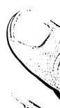

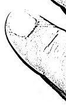

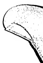

