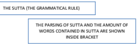
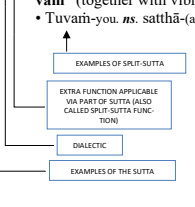

Kaccāyana Pāli Vyākaraṇaṁ कच्चायन पालिवेयाकरणम kaccayana

# Pali Grammar

Translated into English with Additional Notes, Simple Explanations and Tables Volume 2 Bv A. Thitzana This eBook is offered freely. If you wish, you may donate and help us continue offering our services. May you be happy!

To make a donation, please visit:

www.pariyatti.org

## Pariyatti

867 Larmon Road Onalaska, Washington 98570 USA 360.978.4998 www.pariyatti.org Pariyatti is a nonprofit organization dedicated to enriching the world by: 
! Disseminating the words of the Buddha
! Providing sustenance for the seeker's journey
! Illuminating the meditator's path Kaccāyana Pāli Vyākaraṇaṁ kCc;yn p;ilVy;krû' Kaccāyana Pāli Grammar Volume 2 Translated into English with additional notes, simple explanations and tables By A. Thitzana

Pariyatti Press an imprint of Pariyatti Publishing www.pariyatti.org First edition © 2016 Pariyatti All rights reserved. No part of this book may be used or reproduced in any manner whatsoever without the written permission of the publisher, except in the case of brief quotations embodied in critical articles and reviews.

ISBN: 978-1-68172-037-1 LCCN: 2016906544 DEDICATION
Yo me upajjāyo āsi, Asokā'rāmamāpako, Aggamahā panditā'bhi-dhajamahāraṭṭhaguru, Chaṭṭasaṅgīti-ukkaṭṭho, Sūriyo guṇabāṇumā, Ta'mahaṁ abhipūjemi, Vyākaraṇena iminā.

# Contents

| Preface                                                                                      |
|----------------------------------------------------------------------------------------------|
| Preface to the Second Edition............................................................. 7 |
| Introduction .                                                                               |
| Pronunciation Guide                                                                          |
| Guide to Conjuncts .                                                                         |
| Key to Entries                                                                               |
| List of Abbreviations                                                                        |
| Frequently Found Words                                                                       |
| Suttakkama (Order of Suttas) .                                                               |
| 17                                                                                           |
| 2. Nāma Kappa                                                                                |
| 3. Kāraka Kappa.                                                                             |
| 4. Samāsa Kappa.                                                                             |
| 5. Taddhita Kappa                                                                            |
| 6. Ākhyāta Kappa .                                                                           |
| 7. Kibbidhāna Kappa                                                                          |
| 8. Uṇādi Kappa .                                                                             |
| Appendices                                                                                   |
| Index                                                                                        |

# Preface

## A Wholesome Pursuit

This work of translation was carried out with an aim and a noble desire to bridge the gap which naturally exists between the contemporary man and an ancient sacred language known as "Pāli".

The language of Pāli is like a gateway to the treasury of profound wisdom called "Tipiṭaka Pāli canon" expounded by Buddha. The study of Pāli, the spoken language of Buddha, is a worth-while and wholesome pursuit for anyone with a sincere heart and an inquiring intellectual mind whose apparent aim and purpose is to explore and understand Buddha's spoken words. By being able to understand His words, it will enrich knowledge and deepen one's wisdom thus leading to a much nobler and more meaningful life. Understanding the words of Buddha will surely bring a person much closer to the noble message of Buddha in its original tone, on the first-hand basis of the speech as it was originally spoken by Him more than almost two thousand six hundred years ago. When I first taught Pāli to some foreign students from 1997 to 2005, using some well-written guide books on the Pāli study, I found out that they can progress quite smoothly in the reading and understanding of the Pāli passages. However, they usually make a number of recurrent mistakes in their writing exercises. Though most serious students are able to understand what they have learnt to some degree, they still find it quite challenging to write correctly and flawlessly. The areas of weakness for the majority of students is in using the correct form of words with the right inflection, verb forms in the right place and the usage of participles and gerunds in the correctly arranged sentences. Pāli, as a matter of fact, is a highly inflective language based on its case and the role each word plays in a sentence of a contextual structure. Various word-

formations such as nouns, verbs and other essential parts of the sentence too are quite variable based mainly on the case, tense and syntactical role of the word. Unless one clearly understands how each word is structured and how they are syntactically related according to the role they play, one will not be able to gain mastery of the language and necessary skills in spite of making the best efforts in learning it.

## A Long-Felt Need

An earnest student with serious interest needs a very basic, thorough understanding and careful study about the structural patterns of words and their morphological process. This can be achieved only through studying its original grammatical text along with detailed explanations on the rules known as Suttas and the accompanying word-examples shown alongside in the Suttas. In other words, there is no replacement for an original ancient text with a ready-made, short-cut guide though it may fill some language-learning need but not in such a way as an original text can certainly do. An original grammar text written at a distant time when the ancient grammatical concepts and rules were conceptualized and formulated by the ancient sages, can clearly explain all aspects of the language and its grammar. The oldest Pāli grammar widely used and still extant is the one supposedly written by the most Venerable Kaccāyana. His grammar is a very-well written book, concise but lucid, compact with only six hundred and seventy-five Suttas1. It is complete as 

it covers all areas of the grammatical importance, ideally suited for any serious students of Pāli to study and master it within a short span of time. It is still used as a major popularly used grammatical text in countries such as Thailand, Myanmar and Sri Lanka where Buddhist scriptures are studied. To date, there have been two translations of the text. One is a French translation by M.E. Senart published in 1871. The other is an English translation of the Kaccāyana's original Pāli grammar text translated by Satis Chandra Āchariya Vidyābhūshana, the Professor, Sanskrit College, Calcutta and published by the Mahābodhi Society in 1901. Each Suttas of the text were shown in archaic Devanāgari-Pāli characters along with French or English translation of the Suttas and a few word examples. Both were nonetheless inaccessible to those who cannot read nor understand the French and the old-style Devanāgari characters.

Although both translations are neither a thorough translation nor a detailed treatment of the complete text, they were indeed helpful in providing some basically needed insights into grammar and served as useful guides and references for the students of Pāli for many years since. There is a long-felt need to have a more thorough and complete English rendering of the great grammarian's work so that it can benefit all those studying Pāli. This book is the first-ever attempt not only to translate all of the whole text but also to contemporize an ancient grammar and its contents for the contemporary world. I fervently hope that through such a detailed translation, it would surely be much more easier and more accessible to any 

student, regardless of various language backgrounds with the aid of a translated grammatical text such as this.

## An Eternal Tribute

Although this work is a not a groundbreaking work nor laying of a new foundation in the matters of Pāli grammar, it is nevertheless an important milestone in the Pāli grammatical literature. I 
humbly hope that this translation work will take the study of Pāli to a more higher dimension of advanced, in-depth study for all serious international students of Pāli. It will thus greatly benefit the students of Pāli in their study in many ways either as a basic companion guide or as an academic reference text at all times as long as their association with the Pāli study is concerned. I had started this work of translation as a token of eternal tribute to my great preceptor, the most Venerable Sayādaw Bhaddanta Sūriyābhivaṁsa (1879-1975), the founder of two great Masoeyein (Asokārāma) monasteries in Mandalay. He was also the chief presiding patriarch chairman of the great sixth Buddhist Synod held in 1954-56, as well as the founder of Pañcanikāya Sāsana Beikman monastery, Yangon, who has had nurtured me even while I was just a young novice. It is also a memorial tribute of deep gratitude to my late Pāli teachers venerable Kan-oo Sayādaw U Kondañña, (Lhaw-gar, Pale township, Monywa) and Sayādaw U Nāyakābhivaṁsa, (Masoeyein Taik-thit Monastery, Mandalay), to whom I feel greatly indebted for all the grammatical knowledge I had acquired. It is through dedicated care and guidance of such great teachers that I am able to share this translation work of an ancient sacred language with others. I feel that all the immense amount of energy, time and effort put into this important work will not be in vain, if this translated ancient grammatical text would surely and greatly benefit all serious students of Pāli in providing strong grammatical insights and skills they earnestly wished for. It will even be like receiving the greatest reward and abundant blessings for me if all earnest stu-

dents pursuing the study of Pāli would one day become competent and accomplished Pāli scholars of great goodwill who would selflessly serve the common interests and well-being of many in the human society.

## Acknowledgement

While this translation work is being carried out, some people have graciously rendered unstinted support and compassionate help in many ways. Among such gracious people are the most Venerable Si-shin Sayādaw Bhaddanta Aggañāṇābhivaṁsa (Mahāvisuddhārāma Monastery, Mandalay), Shwe-tu-wan Sayā daw U Saddhiyābhivaṁsa (Yangon), Sayādaw U Ñeyadhammā bhivaṁsa & U Vicittābhivamsa of Masoe Yein Monastery
(Mandalay), Sayādaw U Rājinda (Satipaṭṭhāna Meditation Center) & Ms.Yap Siew Choo (Singapore) who ran errands and did all the necessary things tirelessly, Phrakru Vara Paññā Khun (Wat Mahā That, Bangkok), Phra Ñāṇakusala, Jamroon Damatā (Mahā Chulalongkorn Rājavidyālaya University, Bangkok, Thailand), Rob Moult who helped in reformatting of the book with great dedication, Dr. Wong & Flora Wong, Sister L.C., Ms. Elaine Lew Mee Ling, Yennifer Low, (all from Kuala Lumpur, Malaysia), Mrs. Genny Chee Family, Brother Li Chum family (Singapore), David Berry (Dharma Centre of Canada), Donald Altman (Moonlake media & Mindful Practices USA), Ms.Yin Yin Aye (Corona Hills, USA) Brihas Sarathy & U Tin Htoon (Pariyatti, USA), Nyan Lin Aung (La Puente, USA), Ms. Khin Mar Kyi & Ms. Khin Myo Kyi, Ms. Myint Myint Than & Hnin Hnin Aye (All from Mandalay), M. Thet Naing Kyaw (General formatting), K. Kyaw Han, Nalin Ariyarathne (Cover design), Ms. Moe Moe & Ms. Soe Moe Lwin (Final proof-reading), K.

Kyaw Lwin of Dhamma download, all well-wishers not mentioned by name but who generously contributed to this project.

To all of them, I feel greatly indebted. Their generous help and goodwill are forever appreciated. May their goodwill and generosity enrich them in material abundance and spiritual wisdom to 

lead a blessed and fulfilled life. May their devotion to the triple gem bring them countless blessings.

Patthanu'yyojanā Englisāya bhāsāya, Anuvuttaṁ Kaccāyanaṁ. Sādhavo viciya sukhaṁ, Sikkhe Pālivyākaraṇaṁ. Ya'miha sutṭhu ni'dditthaṁ, anvī'ritañ'ca sabbaso Sū'padhāriya sabbaṁ taṁ, Pāliniruttisa'ññhitaṁ Paññāya somanassena, saddhāpubbena chandasā Vyākaraṇamhi kusalā, Buddhavacanamāmakā Saddhammagarukā hontu, saddhammavuḍḍhikārino Saparahitakārī ca, amatayāyino bhave. With boundless Mettā and goodwill for all, A. Thitzana February 21, 2016 USA

# Preface To The Second Edition

It is not an overstatement to say that ancient India is not only the cradle of the Indian civilization, but also of four major religious beliefs; Hinduism, Jainism, Buddhism and Sikhism. The profound wisdom, extraordinary talent and uniquely diverse and rich ideas of ancient Indian sages and scholars of various branches of knowledge have enriched the life, the language, the custom and traditions of people in myriad ways in India as well as in other lands of the East and Southeast Asia. Pāli is one of the ancient Indian languages used and spoken by Buddha in imparting his profound wisdom and daily teachings throughout his entire life. Buddha had taught his teachings on the basis of intellectual analysis and wisdom, not on the basis of either dogma or rituals. Knowing Pāli with substantial amount of mastery is the sure way to appreciate his teachings in its entirety. The learners of an ancient language such as Pāli or Sanskrit need a more simple and easy guide in their first stage of learning, a guide book free of any hard-to-understand technical terms and academic aspects of non-essential details. Every effort had been made to ensure that the English translation of Kaccāyana Pāli grammar is free of any complexity for both beginners and scholars alike. Since its publication in 2016, the first edition of English translation of Kaccāyana Pāli grammar had provided a convenient platform for the study of Pāli, paving the way for a more progressive and systematic Pāli and Buddhist text studies. 

This second edition of the Kaccāyana Pāli Grammar is thoroughly revised and edited to make sure that any typographic or inadvertent errors which might have escaped the scrutiny and careful proof-reading in the first edition are either rectified or improved. Some additional footnotes along with a few more relevant explanations are added wherever needed. In addition, a new note under the heading of "Gender Classification" is further 

added in the appendices section in order to provide the students with an important basic guide regarding the gender of Pāli words. The main body of first edition, however, mostly remained intact. 

I fervently hope that this revised new edition will provide all the students of Pāli and Indology with a simple and convenient guide in their endeavor to go deeper into the language and further develop necessary grammatical knowledge and language skills. 

## Acknowledgement

I would like to acknowledge my utmost sincere thanks to Antonio Costanzo who have made the most part of reviewing process. He reviewed both volumes of the text with great commitment and dedicated effort by going through every detail of the two volumes of Kaccāyana grammar text. Antonio had put a lot of time and energy into reviewing of the books with much patience and perseverance for which I felt eternally indebted beyond words and humbly inspired by such selfless help. My profound thanks are also due to Motilal Banarsidass Publishers for the vision and foresight to continuously enrich and enhance the wonderful heritage of ancient Indian civilization by having the English translation copy of this ancient Indian grammar text printed at their press and thus providing an opportunity to be shared with others in the world. 

 **Patthanā** 
 Kaccāyani'daṁ byākaraṇaṁ, dutiyam'pi sumudditaṁ Motilal banarsidass-bhāratiyamuddālaye. Englisā'nuvacitaṁ, vyakkhātaṁ suvibhāvitaṁ suvisodhiya nissesaṁ, sampuṇṇaṁ suviracitaṁ saddalakkhaṇabodheyaṁ, suvibhattaṁ sujāniyaṁ sukhena prijānantu, samuggaṇhantu sādhavo. 

[Translation] This Kaccayana Grammar text which have been translated into English, is published for the second time, at the Motilal Banarsidassa Press, India, after having thoroughly edited and improved. May the students of goodwill easily understand and study well this exegetical work which had been wellexplained and easy to learn on the grammatical aspects. 

 pTqn; kCc;yind' By;kr,') duityiMp sumuid(dt')
moitl;l b;n;rsId;s-.;ritymud(d;lye_
suivsoi/y inSses')sMpu<,' suivrict')
î©ils;nuvict')ByK%;t' suiv.;ivt' _
sd(dlK%,bo/ey')suiv.Tt' suj;iny')
su%en pirj;nNtu )smuGg<hNtu s;/vo _
 **A. Thitzana**
 21st October, 2018 USA

# Introduction

Historical Background The relationship of Sanskrit, **Pāli and Prakrit**
It is quite obvious that Pāli, Sanskrit and Prakrit have indeed common linguistic traits and close parallels to each other. These ancient languages, which belong to the Indo-Aryan language family of the Indus civilization, are linked not only in terms of geographic, cultural and close societal conditions, but also through some shared grammatical elements and inherent linguistic patterns. The intimate contact through daily interaction among people might have played a greater part in the development of such shared linguistics which resulted in somewhat interfused grammatical system. It can be logically assumed that the grammar of each respective language might have had appeared alongside since many centuries prior to or around the time of Buddha. None of them, however, were put into any record in the form of the written manuscripts but were rather passed through generations as orally transmitted grammatical trends. This might be the reason why the great grammarian Pāṇinī had made references in some of his Suttas to his predecessor grammarians. Amazingly enough, with the emergence of various belief-systems in the ancient Indian society, each language has come to play as the sacred languages of three main religious ideas among which Sanskrit became the sacred language of Hinduism and Vedic texts, while Pāli being the sacred media for all Buddhist texts and Prakrit being the sacred language of Jains and their religious texts.

## Pāli Grammar Vs. Sanskrit Grammar

The grammar or the science of language, had occupied high and honorable place in the ancient civilization of India. Having much grammatical skill and expertise is one of the virtues of being a respectable man of dignity among high social elites. The 

pursuit of grammatical study was thus a very respected trend of learning those days. Though there have been ancient grammars previously, the only extant and oldest Sanskrit grammar still in use is the one written by Pāṇini which is referred to as "ashṭadhyāyī". As the name suggests, it has eight chapters, with numerous Suttas (aphorisms or brief grammatical rules) totaling 3995 in all. Both Sanskrit and Pāli grammars have similar grammatical models as all have the same format of having eight chapters although the contents of each are distinctive and different in their own various aspects. The Pāli Grammar, the one traditionally believed to have been written by the great Pāli grammarian Kaccāyana is not totally based on the Pāṇinīan-system but an independent work which has its own style and character. Thus, there is significant difference and an independent way of presentation of the grammar. 

## The Grammarians Of Ancient India

In ancient Indian society, the tradition of learning any branch of knowledge including the grammar, is usually based on the oral tradition transmitted by teacher to student for many generations until modern printing machine was introduced into India at the turn of fifteenth century by the Christian missionaries. The study of grammar, even before Buddha's time, is pursued by social elites especially those belonging to the high Brāhmin caste. The Sanskrit, Pāli and Prakrit are the languages interwoven and intertwined into the ancient Indian society as linguistic threads in the matters of daily communication and learning among diverse communities. It is no wonder that the grammar of each language, as a result, have certain things in common despite having some distinctive features of their own in many respects. The following verses mention the name of ancient grammarians:

 (1) îN{íN{" k;xkOTSn;ipxlI x;k$;yn") p;i,NymrjwneN{;" jyNTy˛;idx;iBdk;"_  (2) îN{' c;N{' k;xkOTSn' kom;r' x;k$;ynm s;rSVt' c;ipxl' x;kLy' p;i,nIykm _
 $\overline{\gamma\mathrm{C}\Gamma\Phi\Gamma}$: !! 

According to these verses, there have been eight earlier grammarians (ādisabdikā) such as Indra, Candra, Kāśakṛtsna, Āpiśali, Śākaṭāyana, Pāṇini, Amara and Jainendra. In the second verse, Komāra (usually referred to as Kātantra or Kalāpa Vyākaraṇa), Sārasvata and Śākalya are extra names cited as grammarians. All those Indian grammarians are a mixed breed of scholars from different religious backgrounds. Among them, Candra
(Circa 400-480 A.D), Jainendra (Circa 8th century A.D), for example, are the disciples of Buddha. There was a verse of salutation to Buddha by the author Candra Gomin at the beginning of his grammar text which reads:

$${\frac{\widehat{\mathrm{HHG}}}{\widehat{\mathrm{HHG}}}}\ {\widehat{\mathrm{HHG}}}\ |\ {\widehat{\mathrm{HHG}}}\ |\ {\widehat{\mathrm{HHG}}}\ {\widehat{\mathrm{HHG}}}\ |$$

Those grammarians had lived in different timelines though some of them might have been quite possibly co-eval. However, it is beyond the capacity of anyone to deconstruct or reconstruct the past incidences which happened many centuries ago. As such, it is quite problematic to establish the exact order of timeline of these ancient grammarians and establish the correct biographic profile and the earliest seniority of one over another. 

Of those grammarians, Pāṇinī is the most eminent as his grammar is still extant and occupies the highest place of honor and respect among the grammarians of ancient India. In both aspects of linguistics and grammar, Pāṇinī's grammar is indisputably an outstanding treatise as it details the areas of word-formation,

morphology, philology, sound system and various grammatical rules. Despite unique attributes of linguistic ingenuity, Pāṇinī had undoubtedly adapted or incorporated the grammatical concepts of his predecessors in one way or the other. This fact is clearly noticeable through references he used to make in some Suttas of his grammar text to his predecessor grammarians such as Kāsakrtsna, Apisāli and Sākatāyana. Pāṇinī's "ashṭadhyāyī" grammar served as a seminal ground in which attempts either to gloss over his text or to reformat or to improve on his grammar are pursued by later grammarians. This had led to the development of rich grammatical literature of ancient India. Among such notable grammatical treatises written within the premises of Pāṇinīan concepts are: (A) a monumental commentary work titled "Mahā Bāshya" by Patanjali, (B) a more improved thematic treatment of Pāṇinī titled "Vaiyākaraṇa Siddhanta Kaumudi" by Bhaṭṭoji Dikṣetā and (C) Kāśikā Vṛitti (still an extensive commentarial work on Pāṇinī).

Also, another grammarian named Varadarāja, who is the disciple of Bhaṭṭoji Dikṣetā, wrote three grammar texts. They are:
(1) Madhyakaumudī, (2) Laghukaumudī, (3) Sārakaumudī, (an abridged, but well-presented version of Laghukaumudī). His grammars are arranged in a manner which is more thematic and easy to study, yet simple to understand even for the beginners. 

## Kaccāyana

Kaccāyana, like Pāṇinī, is a pioneer, the earliest-known Pāli grammarian whose work too either adapted or absorbed some terminology and fundamental grammatical concepts from the preceding grammatical sources he is well-conversant with. Even though his work cannot be said as a grammar solely based on the Pāṇinīan system and model, there are quite a number of Suttas whose physical structures or functions share some similari-

ties with those found in Pāṇinī's "ashṭadhyāyī" grammar. This does not mean that all those supposedly similar Suttas are totally identical in terms of both structure and function. Upon closer observation and careful analysis, some of the Suttas are found only to have structural resemblances to some degree but quite different in terms of functions. Some Suttas, as a matter of objective analysis, are found to have similar functions although the ratio of such Suttas are quite marginal in relation to voluminous numbers of Suttas contained in Ashµadhyāyī. 

## Kaccāyana And His Identity

The term Kaccāyana (kCc;yn or k;Ty;yn Katyāyana2, a somewhat differently spelt name due mainly to different morphological procedures which exists in Pāli & Sanskrit grammars) is a name of highly regarded disciple of Buddha. According to the descriptions in Buddhist texts, he was born in Ujjenī, into an educated wealthy Brāhmin family, whose father is royal advisor (Purohita) to the king. He is highly educated in all ancient Vedic and Upanishad texts and also highly skilled in the grammar. He later became a disciple of Buddha and well-known for his wonderful capacity to explain any brief sayings of Buddha in a way either to be in tune with or completely agrees with Buddha's original view. Therefore, Lord Buddha praised him and placed him in a special position of honor known as Eta'dagga (The most outstanding position) among disciples in a 

particular field of excellence in being able to correctly elucidate Buddha's short sayings into detail. In Apādāna'ṭṭhakaṭhā, II (the commentary to Apādāna texts which is like the biographic accounts about special deeds in the past lives of eminent disciples of Buddha), there is some remarkable account regarding Venerable Mahā Kaccāyana which reads: Attano pubbapatthanāvasena Kaccāyanapakaraṇaṁ, Mahāniruttipakaraṇaṁ, Nettipakaraṇan'ti pakaraṇattayaṁ saṁghamajjhe vyākāsi. Atha santuṭṭhena bhagavatā "etada'ggaṁ bhikkhave mama sāvakānaṁ *saṁkhittena bhāsitassa vitthārena atthaṁ* vibhajantānaṁ ya'didaṁ *Mahākaccāno"ti etada'ggaṭhāne ṭhapito aggaphalasukhena vihāsi.* (Mahākaccāyana'tthera apādānavaṇṇanā, 54 Kaccāyana vagga, pp 213, Chaṭṭha saṅgā yanā Edition) 
[Translation] By virtue of his own aspirations in times of previous Buddhas, he (**i.e.** Kaccāyana) was able to outline and declare three monologues (texts) at an assembly of Saṁgha, namely, Kaccāyana text, Mahā **Nirutti** and **Netti** texts. Being satisfied on his intellectual prowess, Lord Buddha then honored him with the **"etadagga"** honor, a highest, outstandingly exalted position by making the following statement: 
"Of all my disciples who can explain whatever I have said briefly, Kaccāyana is the most outstanding of all". Having placed in such an exalted position, Venerable Mahā Kaccāyana, mostly lived a quiet and unfettered life enjoying the noble peaceful fruit (**i.e.** the benefit) of his enlightenment. Also, there are some discourses such as Madhupiṇḍika Sutta, Madhura Sutta and Mahākaccāna Badde'karatta Sutta in the Majjhima Nikāya and Uparipaṇṇāsa texts where Venerable Mahā Kaccāyana's detailed explanations won Buddha's unreserved praise.

In the light of such accounts from Buddhist texts, the author of earliest Pāli grammar can still possibly be assumed as a wellknown personality from the viewpoint of scriptural records despite some later academic opinions of different views. However, the two grammatical texts, (Kaccāyana text & Mahā **Nirutti)** 
which he was supposed to have authored, may have actually existed in the form of grammatical principles and relevant knowledge handed down and preserved through successive generations of monastics by means of the oral tradition only.

In one ancient Pāli record named **Sutta-niddesa**, the legend has it that the first Sutta of Kaccāyana's grammar **"Attho Akkharasaññāto"** which had served as the most important initial statement regarding the principle of grammatical necessity of a language, is attributed to Lord Buddha Himself. Those words which form as the first Sutta were supposed to have been said by Buddha as the brief outline of advice and reminder to two meditating monks who were meditating by the river bank, but whose minds were being distracted and wrongly uttering the words 
"*Udakabaka*-water and egret" instead of the right word "*Udayabbaya*-the arising and passing". Those initial words of Buddha, according to Sutta-niddesa, were further elaborated by venerable Kaccāyana. Thus, that elaboration and exposition process has led to the development of such a detailed grammatical work which commonly referred to as "Kaccāyana Vyākaraṇa".

## Netti And Peṭakopadesa

Although the Mahā Nirutti text is no longer extant, The **Netti** (Annotative Exegesis) which is attributed to Kaccāyana's au-

thorship is still extant. Besides these texts, The **Peṭakopadesa** (the conspectus summary of the canonical principles) is likewise attributed to his bright authorship evidently traceable through Pāli records contained in both *ganthārambha* (the beginning section) and *Nigama* (the concluding verses) at the end of both texts with his name specifically cited as shown below: (a) *Soḷasahārā netti, pañcanayā sasanassa pariyeṭṭhi* aṭṭhārasamūlapadā, **Mahākaccānena** *niddiṭṭhā*
(The Beginning verse. 3 of Netti Pāli text) 
(b) Ettāvatā samattā netti yā āyasmatā *Mahākaccāyanena* bhāsita bhagavatā anumoditā *mūlasaṅgītiyaṁ saṅgītā'ti*
(The concluding words, the Netti Pāli text) 
(a) Aṭṭhārasamūlapadā **Mahākaccāyana***-gotta-niddiṭṭhā* 
(Uddāna Gāthā, Peṭakopadesa Pāli Text) 
(b) Peṭakopadese **Mahākaccāyanena** *bhāsite paṭhabhūmi* ariyasaccapakāsanā nāma
(c) Therassa **Mahākaccāyanassa** *jambuvanavāsino* peṭakopadeso samatto (At the end of each section called "*Bhūmi*" and also at the conclusion of Peṭakopadesa Pāli Texts) 
The Netti and Peṭakopadesa Pāli texts are replete with the most brilliant analytical exegesis and encyclopedic wisdom of the author. The texts themselves serve as the clear testament to the linguistic ingenuity and extraordinary broad level of wisdom of Kaccāyana. The grammar which he was supposed to have been elaborated is also unique in many ways. It bespeaks itself about the simplicity of Pāli grammatical system without any hint of delicate technical complexities. It was in fact concisely written to explain the basic grammatical concepts, the relevant terms and simple morphological procedures. Due to incomplete fragments of the records and lack of exactly coherent chronological stratification in such a remote time, it is nevertheless impossible to draw an exclusive conclusion on the true identity of the author. The fact that the author may be a re-

puted personality such as the one found in the scriptural records or just an obscure person of the same name who might have been much earlier or coeval with the author of Kātantra grammar or a much later one is an unsettled issue. It is still open for unbiased scholarly opinion and intellectual analysis. It is nonetheless beyond the capacity of anyone to exactly point out in a more conclusive manner by reconstructing incoherent and unreliable fragments of the past records and events which happened in such a long span of time except on vague terms of intellectual speculation and inferential hypothesis. 

It is almost logically as well as historically tenable to hold a factual view not based on inveterate bias. Among such views, is a possibility that there must have already been a Pāli grammar of some sort which might have existed not in the form of a complete text but in an oral tradition over such a long period of 1800 years' time spanning from the birth of Lord Buddha in B.C. 624 to the close of 1200 A.D, a timeline when Buddhism had flourished in the Indian sub-continent.

According to the "Indica" written in Arabic by Persian scholar Al-Bīrūnī (Circa 973-1048) and translated by Edward Sachau, some mention is made regarding the popular grammars used then among Buddhist communities. They were the one written by Candra Gomin and another non-Pāṇinīan grammar named Kātantra written by Sarvavarman, both of which were known to have been widely used among Buddhist communities. Candra Gomin authored Candra Vyakaraṇa, a Sanskrit grammar somewhat similar to the Pāṇinīan system but a distinctive grammatical work which has about 3099 Suttas. The author himself was a disciple of Buddha which he had indicated by the beginning verse of the text. 

Kātantra and Kaccāyana Some Western scholars, such as 3Arthur A. Macdonell had opined that Kaccāyana's work must have been based mainly on the grammatical model of **Kātantra** vyākaraṇa also known as Kalāpa or Komāra (authored by Sarvavarman) as the striking similarities, especially similar naming of the chapters, the names of Ākhyāta verbs and some similar Suttas are found in the Kaccāyana's work. To put such similarity in a clear perspective, it could be simply and obviously **a matter of shared fundamentals** of the Sanskrit and Pāli. Both languages have had inherent affinity to each other since the early days of their inception as the spoken languages as far as the Indian civilization is concerned. This nature of affiliation along with interfusion of the grammatical thoughts of successive generation of grammarians had resulted in such apparent grammatical similitude to a certain degree. Supposedly, Kātantra could had been a widely used grammatical text among Buddhist communities in India and Tibet for many years. Most scholars such as Sri Patidatta (!I pitdTt), Trilocanadāsa (i]locnd;s, the author of Kalāpa Piñjikā) and Durgasimha (dugRis'h, the author of Kātantra Vṛitti Ṭikā), an important commentary on the Kātantra grammar, were assumed to be Buddhist disciples in the light of the following verse written by Durgasimha at the beginning of his text "Kātantra Vṛitti". The verse clearly attest to it. Here is the verse: 
devdev' p[,My;d;w)svRD' svRdixnm)
k;tN]Sy p[v+y;im)Vy;:yn' x;vRvimkm_
If seen from the viewpoint of a broader intellectual position and unbiased objectivity, the nature of some fundamental similarity 

found in Pāṇinī, Kaccāyana and Kātantra can also be viewed as a kind of relative symbiosis, **not as complete similarity**. Most similar Suttas, with the exception of a few identical ones found in the Pāṇinī, Kātantra and Kaccāyana, are not totally identical with regard to the functions they enjoined or the meanings implied by those supposedly similar Suttas. This fact is very clearly noticeable and self-evident when one carefully delves into Kaccāyana's grammar and make a comparative juxtaposition and objective analysis. **The list of such seemingly similar Suttas,**
albeit being different in terms of contents and enjoined functions, are shown separately in the appendices section of this book in order of Suttas as found in the "ashṭadhyāyī" of Pāṇinī and Kātantra grammars. 

## The Talent And Skill

Regardless of various views with respect to the exact authorship, the Kaccāyana's Pāli Grammar text is a living testament to the linguistic talent, the grammatical skills and intellectual caliber of the author. He had deftly charted his own grammatical path by defining a more clearly distinctive presentation of the grammar uniquely independent of ubiquitous Pāṇinīan influences. There is no doubt regarding the fact that he is an accomplished as well as a competently talented grammarian who has had unquestionable mastery in both Sanskrit and Pāli languages and in relevant matters of the grammar. His grammatical work simply stands out of the shadow of predecessors and shines in his own intellectual light and in a class by itself. His linguistic acumen, the highest level of caliber and ingenuity as a skillful grammarian are clearly noticeable. Had Kaccāyana followed all which he had known in the Sanskrit grammarian models, even the initial preliminary section (s'Z;p[kr,m) alone would have become a sort of repetition. He had skillfully drawn the clear and fine line of a very important Pāli-grammatical core principle which he 

has formally termed as "**Jinavacanayutta** (the principle of conformity to the relevant usage in Buddhist Pāli texts)."
He had formulated this important principle in Sutta number 52 so as to steer clear of the procedures and linguistic nuances which used to be generally applied in the Sanskrit grammars. He had dexterously distinguished the natural physiology of Pāli words and its grammar by formulating new relevant rules, numbers, tense and moods, verb and noun terminations and simple morphological procedures. These facts are distinctive from the Sanskrit although he had adapted or integrated some aspects of the Sanskrit grammatical models. He had thus masterfully laid out a very simple, yet markedly different grammatical model quite uniquely exceptional in its own way though not totally dissimilar from that of the fraternal Sanskrit models.

These facts are self-manifest by the grammatical text itself. He clearly sees a very fine and delicate line which inherently exists between what is Sanskritized and what is not. This becomes even more noticeable when one goes into all the length, width, and depth of his grammatical text. One will, in the course of studying his text, clearly understand how difficult and delicate it will be for a grammarian to draw a very subtle demarcation between the two languages which have shared, though not totally identical, grammatical frameworks and linguistic norms. Unless he is a very consummate grammarian, it will certainly be impossible to formulate the rules and procedures applicable and relevant to the natural linguistic patterns of the Pāli. Instead, it will be a rebranding of the same packet with the same contents.

## The Distinctive Pāli Grammars

There are a number of Pāli grammars which were written by eminent scholars. Among such treatises, the **Moggalāna** Pāli grammar written by the great scholar monk named Moggalāna of Sri Lanka (Circa 11-12 A.D), is a distinctively unique Pāli 

grammar. With 1037 Suttas thematically arranged in seven differently named chapters, he had authored one of the most brilliant Pāli grammatical texts, unique in its own style. His text was supposed to have been mainly based on the Candra Vyākaraṇa4 of Candra Gomin. It was in fact a different grammatical work independent of Kaccāyana but seemed a bit Sanskritized in the physical structure of some Suttas and distinctive terminology of some functions, affixes and usage of anuvandha (conjoined techterms). The great grammarian Kaccāyana can rightly be said as a pioneering grammarian whose seminal work had served as a foundation from which various grammatical treatises of the Pāli language had later emerged. Among such ones is the **Saddanīti** written by the great Pāli scholar named Aggavaṁsa of Burma in the ancient city of Bagan (Circa 1157 A.D). The author of Saddanīti, could be coeval with Moggalāna. Saddanīti is indeed a very extensive grammatical treatise which is almost encyclopedic in terms of topic and contents written within the premises of Kaccāyana. 

Another grammar is **Rūpasiddhi** Vyākaraṇa (also known as Pada rūpasiddhi). It is a very unique grammatical text written by the great Pāli scholar monk named Buddhappiya of Sri Lanka (Circa 13 A.D). There are 672 Suttas with the exception of three Suttas viz. Samāse ca vibhāsa, Arahasakkādīhi tuṁ, *Sacajānaṁ* 

kagā ṇānubandhe, found in Kaccāyana. It is a very extensive, broad treatment of the Kaccāyana's work with a more systematic explanation of thematically arranged Suttas, a unique aspect of his grammatical text which proves the talent and wisdom of a true scholarly capacity of the author. A wider variety of relevant examples in each Suttas drawn from the scriptures as well as from various sources also added up to its uniqueness. His text, although he had said as being based on Kaccāyana's work, is in fact an outstanding work of the applied grammar written within the confines of Kaccāyana's grammar and had as such received much popularity. The style and presentation of grammatical lessons such as proceeding from the previous Sutta to the next Sutta, explaining the meaning of Sutta and elucidating the word structure and the relevant morphology of an example in a very pithy way, are innovative and informative which is not found in other Pāli grammar texts. Thus, it is much easier to understand and accessible for both teachers and the students alike. 

Following the style of Rūpasiddhi, is a concise grammar superbly written by Dhammakitti of Sri Lanka (Circa 1390-1410 A.D) 
which is called **Bālāvatāra**. The term Bālāvatāra means "the beginner's easy access". [**bāla**-the young person, **i.e.** uninitiated beginner+**ava-**down, being inside+**tara**-to swim, **i.e.** to access]. It is an abridged grammar arranged in a very systematic order of relevant chapters with about 420 Suttas, making it much more compact and concise in the structural design of grammatical text. The text has remarkable brevity and simplicity in imparting necessary grammatical knowledge and presentation of it in a more effectively brief style. Despite its small size, it covers all the essential aspects of grammar for beginners thus making it quite suitable for the beginners. In addition, there is another grammar which deserves respectful mentioning. It is **Nirutti Dīpanī** written by the eminent scholar monk Ñāṇadhaja Mahāthera, popularly known as the great Ledi 

Sayādaw of Burma (1846-1923 A.D). His text is based on the Moggalāna's grammar as mentioned in the beginning verses of the text. In fact, it can even be said as an improvement on Moggalāna's grammatical text as there are some complex points in some Suttas of the original text. It is an outstanding grammatical masterpiece written in a very simple and understandable manner.

As a matter of fact, there are considerable numbers of grammatical treatises written by the successive generations of Pāli scholars of Sri Lanka and Burma from 11 century A.D to the close of 19 century A.D. periods. Most of them can be classified into two Pāli grammatical schools as either of Kaccāyana or Moggalāna.

However, not all of those written treatises are focused on grammatical aspects. A few ones, such as **Sadda'tthabhedacintā** and Kaccāyanasāra etc., mostly dealt with some of the delicate points of the grammar and grammatical polemics. One can only be amazed and inspired by the development of such a rich Pāli grammatical literature in the history of Buddhism. 

## The Study Of Pāli Advantage And Disadvantages

Learning an ancient language such as Pāli has more advantages than disadvantages. The reasons are quite obvious. Firstly, it is no longer a daily spoken language. Therefore, it has not expanded over a long period of time spanning two and half millennium.

No new words nor any circumstantially emerged new terms are added through the passage of such a long time of Buddhism in its daily contact with the changing social, cultural and language patterns of everyday world. This does not mean that Pāli is a completely dead language which remains static. It can nevertheless be active and progressive like its cousin language Sanskrit when it is being revived and renewed by means of the relevant coinage of appropriate words and more added loan-words by the forward-looking academics. 

Secondly, Pāli, especially the canonical Pāli in the Buddhist scriptures, has a more fixed pattern of the style and usage in its coherent structure and modes of expression. Anyone with serious interest and determination, supported by the reliable source of guidance, such as a good book or a good teacher along with an effective learning method can progress quite smoothly and successfully within a short span of two to three years. There is no appreciable disadvantage in the learning process of Pāli for anyone. These two facts, that it is no longer a living language with an ever-expanding vocabulary and having fixed patterns of the structure, are wonderful advantages for a keen and serious student in his learning journey. 

## Why The Romanized Pāli?

When translating the grammar text, a common linguistic platform of the Romanized Pāli is deliberately chosen, instead of the traditional oriental scripts such as either Devanāgari or Burmese scripts. The choice of the Romanized Pāli is genuinely for the sake of reaching out to a wider base of the international students, not out of disregard for the tradition, nor based on any biased views and language preferences. 

All of the grammatical text has been translated along with detailed explanations, footnotes and tables added wherever necessary. Some grammatical points, which may seem quite complex to students, are carefully explained and simplified by means of a more simple yet easy to understand clarification and elucidation process. Detailed care is given to interpret and elucidate the essential meanings of each Sutta so that the students will easily understand the function and the rules each Sutta implies in addition to clearly highlighting the applied function on the examples.

Sometimes one may come across some of the redundant phrases and easily understandable sentences in its original text. Such instances of repeated texts are left as it is, in order to avoid pleonastic renderings. Of any translation work on the Kaccāyana's 

grammar, it is humbly hoped that this is by far a thorough and complete work as all the original text of each Sutta, along with its main examples, the split-Sutta functions, some additional expositions regarding the component words of the Sutta and related examples thereof, are translated and explained in a more simple and understandable manner.

## Dialectics And Simple Exegesis

The students will even find that studying and reading such an ancient grammatical text, which may be seemingly boring and monotonous, becomes quite lively and enlightening when they go through the question and answer sessions which used to begin with **"Kima'tthaṁ?** (For what purpose is this word, this function or this procedure?) and **Kva'ttho?** (What benefit is there?) etc. It is clear that the ancient grammarians did not lack common sense, tact or talent in imparting the grammatical knowledge to the students. They clearly knew what they needed to do in the process of teaching a language to enliven the interest of the students and keep them engaged in the learning process by means of including such a system of dialectics. Therefore, simple explanatory answers are given to each question in a detailed, understandable manner as it was traditionally taught by teachers. Thus, it becomes more clearer and understandable by practically pointing out the relevant examples shown in the Sutta. As a matter of fact, translating such an ancient text complete with complex linguistic concepts and some subtle grammatical technicalities through the medium of another language, is not an easy task. Needless to say, it surely requires resourcefulness, a lot of hard work, strong determination and an extensive research and references along with the relevant information from various sources. During the entire period of translating and preparing this book, various grammatical texts and other related literature written in Pāli, Sanskrit as well as in Hindi were extensively researched.

It is a daunting project fraught with challenges and pitfalls. Every effort has been made to avoid any inadvertent error or misrepresentations throughout the translation process although it can not be said as a perfect work. It is nonetheless humbly assumed as a thorough work which has been done in a more detailed manner as far as possible and to the extent of pertinent necessity. Any phrase or word of the grammatical significance is never left untranslated nor remain unexplained throughout.

## Traditional Pāli Script Vs. Romanized Pāli

Traditional Pāli written in Devanāgari or any Asian alphabet system poses some evident challenges for a beginner as there is no clear and visible separation of the vowel and consonant in its writing style. It is generally written by means of diacritical marks, add-on ligature and sometimes a dot. A dot represents "niggahita" in the Pāli grammar which is also called "anusvara" in the Sanskrit grammars. The grammars of ancient Indo-Aryan languages such as Sanskrit and Pāli, teach about a detailed system of metamorphosis of the words which occur among vowels and consonants. A student of such grammars needs to have the basic knowledge on the rudiments of such languages, a process which takes some considerable amount of time before the actual learning process can practically start. 

In order to easily understand this, the following basically differing writing styles of the Devanāgari Pāli, Burmese Pāli and Romanized Pāli are shown alongside. [Please note that there is no representation of an "a" as it is traditionally assumed hidden in the basic form of every consonant without any mark. Read left to right. Left will be referred to as "the front" while the right will be referred to as "behind, **after or the next"** in explaining the morphological procedures and application of a Sutta's function in this book].

[Devanāgari] k k; ik kI ku kU ke ko k'
$${\overleftrightarrow{\Phi}}\quad{\overleftrightarrow{\Phi}}\quad{\overleftrightarrow{\Phi}}\quad{\overleftrightarrow{\Phi}}\quad{\overleftrightarrow{\Phi}}\quad{\overleftrightarrow{\Phi}}\quad{\overleftrightarrow{\Phi}}$$
[Diacritical marks which symbolizes vowels & dot]  n/a T T & $\gamma$
$$\mathbf{\hat{T}}$$
$$[{\mathrm{Burnese}}]\ \alpha\ \alpha\gamma\ \alpha\beta\ \alpha\gamma\ \alpha\beta\ \alpha\gamma\ \alpha\beta$$
[Diacritical marks which symbolizes vowels & dot]   n/a m d D k l a ašm H
[Romanized Pāli]Ka Kā Ki Kī Ku Kū Ke Ko Kaṁ In Devanāgari and Burmese characters, "a", the first vowel, is totally invisible. ā, **i, ī, u, ū, e,** o are shown by diacritical marks while "ṁ or ṃ" is **shown by a dot** on top or below the consonant "m".

Besides, the way of writing conjunct-consonants is quite a challenge for a beginner as it is written either horizontally or vertically. In Devanāgarī, it is written in either horizontal or vertical style using a truncated half-form of the syllable and add-on symbols. For example, 

$$(\mathrm{H})$$

(Horizontal) Kk(kka) K%(kkha) Gg(gga) G`(ggha) 

$\epsilon\leftrightarrow\epsilon$
Cc (cca) Jj(jja) Ll(lla) 
(Vertical) ˚(ṅka) ©(ṅga) Ø(ṭṭa) ´(ddha) ˆ(hna) and so on.

In Burmese writing style, it is also either in horizontal or vertical style. For example, 
(Horizontal) um (Kā) au (Ke) aum (Ko) 

(Vertical) ud(Ki), uD(Kī), uk(Ku), ul(Kū), uH(Kaṁ),   uU(kka), uQ(kkha), *ƒ(ggha), wW(tta), jENd (ndri),
$${\underline{{\mathrm{pa}}}})\;{\mathsf{T e I}}$$
$$\Gamma(\mathrm{gcha})$$
In the Romanized Pāli, the vowel after each consonant it accompanies, is clearly visible in a non-conjunct single combination of one consonant and one vowel. In the writing style of conjuncts, it is quite clear and simple without any vowel between two or three cluster-formation of the consonants. There is no need to use any vertical style writing nor any diacritical mark. This makes it far more easier for the student **to understand** some minute details in the process of morphological changes being taken place in a word as per the function of a Sutta's rule. Such ease of understanding will further make it even more interesting to learn the grammatical evolution process of Pāli words for the students. 

## The Rules And Role Of Grammar

When one starts learning a new language, grammar is a first step to begin with. **The rules of grammar are consistently established patterns of a language** discovered by the grammarians of sharp linguistic insight. As such, they do neither invent **nor** stipulate these rules but expound those rules in such a way that it would make a coherently understandable text for the student. The majority of modern Pāli learning guides written by the scholars, usually adopt a more brief, efficient, and abridgedform of the teaching method which may contain, if not all, necessary rules with the practical exercises. They may not cover all the minute nuances and some essential aspects which play more important roles in the development of grammatical insight and subsequent mastery of the language. They may not be able to offer more in-depth, detailed insight into the structural patterns of words in a way an original text of the Pāli grammar can possibly do. Take a look at the following sentences to clarify this.

For example, 

(a) Namo Tassa Bhagavato Arahato Sammāsambuddhassa.

Salutation to that Lord Buddha, who has infinite glories, worthy of respect and perfectly enlightened.

Namo (Re: Sutta 104) Tassa (Re: Sutta 61) Bhagavato (Re: Sutta 127) Arahato (Re: Sutta 187, 127) Sammāsambuddhassa (Re: Sutta 61) 
(b) Buddhaṁ Saraṇaṁ Gacchāmi .

To the Buddha, I go (as) refuge.

Buddhaṁ (Re: Sutta 297) Saraṇaṁ (Re: Sutta 297) Gacchāmi (Re: Sutta 423, 476, 478) 
(c) Ekaṁ Samayaṁ Bhagavā Sāvatthiyaṁ ViharatiJetavane.

At one time, Lord Buddha stays at the city of Sāvatthi, in the prince Jeta's grove.

Ekaṁ Samayaṁ (Re: Sutta 307) Bhagavā (Re: Sutta 124) Sāvatthiyaṁ (Re: Sutta 216) Viharati (Re: Sutta 423) Jetavane (Re: Sutta 108) 
Note: The underlined points indicate the grammatical aspects. The numbers indicate the relevant Suttas whose rules affect such word-forms & structures.

Although one may roughly understand the meaning of each sentence, one may not yet thoroughly understand with respect to the structural patterns or the specific mode of inflection shown underlined as to why it is shaped like such and what it means etc.

An ancient grammar such as this Pāli grammar can give all the necessary instruction and insight into the fundamental aspects of the word structure and thereby leading to the development of strong grammatical skills firmly established in the students. It will take the student far beyond superficial level of the words to a more deeper understanding of how each word is built and evolved to play their individual roles and convey necessary meanings. To simply put, it will provide the students with a more in-depth understanding of the individual words so that they gain mastery of the Pāli words in the long term. This will further help them firmly settle in the good stead of the Pāli language. 

## 30 The Style Of Translation

Translating an ancient academic text is quite different from translating a simple narrative. It has to be simple and to the point so that it is easily understandable. Therefore, a more informal non-literary style of translation is applied for the most part of this translation although some literal "word for word" translations are added wherever necessary in order to elucidate some of the delicate and complex points. In addition, notes, some detailed explanations, tables and footnotes are added for the purpose of easy understanding and clarification wherever it is called for. For some Pāli-terms with ambiguous meanings, an equivalent Sanskrit word is shown alongside. Every reasonable effort has been made to translate almost every part of the grammatical text without making any exception to its contents. The purpose is to make students aware that a standard ancient grammatical text is a very broad and a very rich presentation of the linguistics and grammar conceptualized by the most bright and talented sages of the ancient times. There is a very visible element of dynamics in the whole text where the evolution of a word, or words as part of a complete language, are brought to coherent completion by means of injunctive rules of each Sutta and due morphological procedures. This way, each different Pāli word of various evolving patterns becomes ready to be used in a group of words known grammatically as a sentence. Moreover, a grammatical text also explains on genders, nouns, verbs, voices, persons and all the necessary rules regarding the applicable grammatical norms and standards though it may not be quite identical with today's contemporary grammars.

## The Grammatical Codes

When translating the meaning of each individual word, whether it be an example word without context, or a word with different structural components such as the plain nouns, compound nouns, Taddhita-nouns, Kita-affixed nouns or Ākhyāta verbs along with their relevant case-endings, a standardized, yet 

easy-to-understand grammatical codes of abbreviations is devised and added wherever deemed necessary. Without the use of such improvised codes, it would be rather futile and impossible to render a meaningful translation of such an ancient text. **It is therefore advisable to refer to the list of abbreviations section and necessary information** prior to studying this book. 

## Some Notes On The Romanized Pāli Alphabets "Ṁ" Or "Ṃ" Or "Ŋ"?

When representing some Pāli words, especially **"Niggahita**, the so-called **dot"**, it is used to be shown either as "ṁ" or "ṃ" or
"ŋ". In view of the grammatical norms regarding the "Niggahita", "ṁ" is more preferable as it is rather in line with its inherent nature of having a symbolic "upper dot" aptly positioned on top of the three short (rassa) vowels, such as **"aṁ,** iṁ and uṁ",
not with its symbolic "dot" down below. In the earlier publications of Pāli-related books, ṁ or ṃ are used to show it. Sometimes, "ŋ" is also found to be used by some scholars in the caseendings of words or wherever a niggahita is needed to be represented. All three styles are correct in its own way as it represents nasalized nature of the Niggahita, but it tends to be a bit confusing for the uninitiated beginner. In order to have a more standardized, uniform representation of the niggahita dot, only "ṁ" is chosen throughout this book so that the students will find it much easier to understand. As a matter of fact, a niggahita-dot can remain unchanged when the word ending in it is either an independent word by itself in a sentence, or the word itself has an integral dot as part of its structure such as **vaṁsa**-race, saṁgha-community (**saṅgha** is also applicable writing in case of a vagganta-function), **aṁsa**-shoulder, portion etc. However, when it is used as non-independent word such as the one being conjoined in a Sandhi-combination, it will have to change into any of ṅ, ñ, ṇ, n or m depending on any specific vagga-group of the letter it precedes.

Another confusable word is "b" which is interchangeable with "v". Please keep in mind that both can be assumed as the same as they are morphologically interchangeable though they have different sources of the sound. ["b" is labial, *oṭṭhaja* while "v" is denti-labial, *danto'ṭṭhaja*] 
Similarly, l and ḷ can be assumed quite similar as well as interchangeable although they have different origins of the sound as l is dental *dantaja*, while ḷ is palatal *muddhaja* (cerebral, also called retroflex). Other syllables of somewhat similar sounds, such as ṭ and **t, ṭha** 
and tha, ḍ and **d, ḍha** and **dha, ṇ** and n are also morphologically interchangeable although they have different origins of the sound.

## The Steps Of Effective Learning

The study of Pāli language is to be pursued systematically so that the student will progress smoothly and successfully. The first step is called "**Padasikkhā**-learning about the physiology of the words". The next second step is called "**Vākyasikkhā**-the study of sentences". These two important steps, when methodically followed, will surely set the student in a firm foundation of the grammar, leading him to develop the skills and ability to use the correct words in the right place in actual sentence writing and understanding of it. The first step of Padasikkhā, studying the physiology of words involves learning the Suttas, its meaning and the enjoined function and example words as explained in the relevant Suttas, along with studying their structural evolution through applicable morphological procedures.

When this is sufficiently done, the noun **groups** which have similar make-ups through similar morphological procedures, classified in the same gender and declension, are to be familiarized both orally and grammatically. This process is called 
"Nāma padamālā (the garland of Nouns festooned together) " study. Then, the **Verb groups** which share similar kind of affix, conjugation and the same shared morphological procedures are to be studied likewise. This is called **"Ākhyāta padamālā"** study. Having thoroughly and proficiently trained in these steps, it will lead the student to a firm grasp of the Nouns and Verbs and will further lead to the development of strong understanding, reading and writing skills gradually and effectively.

## Sub-Units Of The Grammar Study

In addition, all other sub-branches of grammar study, such as **(a)** word-analysis (abbreviated as WA), **(b)** Etymological Definition (ED) and **(c)** the study of structural morphology (SM) are to be included in this important process of Padasikkhā. Those wishing to have a more scholarly grasp of the language should include these sub-branches in their study so that the study itself becomes a multi-faceted and multi-disciplined approach for a more advanced, skill-oriented, in-depth learning. This approach of study is very effective in the development of scholarly skills and a thorough understanding of Pāli in its entirety. 

## Vākyasikkhā, The Study Of Sentences

The next step "Vākyasikkhā", the study of sentences, should be done progressively by studying suitable minor readings and a small collection of easy texts and verses from the scriptural sources. This will immerse the student in the actual language, keeping him in touch with the vocabulary of new words, various usages of both literary and figurative styles in addition to rich structural pattern of the sentences. With strong determination and persistent effort, the student should proceed studying the whole length of some selectively chosen short Suttas. It is rec-

ommended to start with the following: (a) Bodhikathā (It is a very inspiring account on the early days of Buddha's enlightenment) (b) Dhamma cakka pavattana Sutta, (c) Anattalakkhaṇa Sutta, (these are from Mahāvagga Pāli, Vinaya Piṭaka) (d) Mahāsati paṭṭhāna Sutta, (e) Dhammapada verses etc.

## How To Study The Kaccāyana'S Text?

There are eight chapters in the Kaccāyana text. The core of each chapter which forms the important part are a collection of 673 grammatical rules. The rules are further clarified by the Vutti and word-examples whose structural patterns are to be brought to completion by means of applying those rules. The rules are short and pithy descriptions of injunctions enclosed in a short sentence-structure called Sutta. It literally means "the thread" used as a measurement tool by the carpenters of ancient times for cutting the wood in the prescribed measures.

## The Components Of A Sutta

A Sutta mainly consists of three components. They are: **(a)** Sutta
(a brief and concise rule), **(b)** Vutti (explanatory sentences clarifying the rule) and **(c)** Udāharaṇa (applicable examples drawn from the scriptures) and Paccudāharaṇa (inapplicable examples). See the kinds of Suttas and the roles of each Sutta explained in the table below:

| No.   | Sutta Type      |                                                                                                                                                                  | Sutta Rule Classification   |
|-------|-----------------|------------------------------------------------------------------------------------------------------------------------------------------------------------------|-----------------------------|
| 1     | Saññā Sutta     | outlines the formal terms and some basic  preliminaries of the grammar.                                                                                          |                             |
| 2     | Adhikāra Sutta  | influences the nature of other related Suttas.                                                                                                                   |                             |
| 3     | Paribhāsā Sutta | general announcements on the grammatical  outline serving as a general directive.                                                                                |                             |
| 4     | Vidhi Sutta     | enjoins various kinds of rules and procedures  to be applied in the Pāli morphology showing  the evolution of actual word-formation and  structural linguistics. |                             |

Of these four kinds of Sutta, **Vidhi** Suttas play quite important roles as they enjoin the rules to perform various specific functions and morphological procedures. The term "vidhi" means function to be carried out for completing the word. It is classified into eight groups according to the functions they perform.

See the table below to understand clearly.

| Types of Vidhi (functions)   |                                     |                                                                                                 |
|------------------------------|-------------------------------------|-------------------------------------------------------------------------------------------------|
| No                           | Name of Vidhi                       | Function                                                                                        |
| 1                            | Lopa (means to elide, to   delete)  | elides a vowel, or consonant or a  niggahita or an affix or a vibhatti  or even the whole word. |
| 2                            | ādesa (to change or to  substitute) | transforms either of above (vowels etc,) into different syllables. These kind of Suttas usually  have various functions, such as  changing the whole word into  another word-form, Vuddhi, Vipriyāya, Pakati, Atidesa and  so on, are also included.                                                                                                 |
| 3                            | āgama (to come and  insert)         | inserts a new syllable into a  word to become a complete  word.                                 |
| 4                            | dīgha (to lengthen)                 | lengthens the short vowel of a  word.                                                           |
| 5                            | rassa (to shorten)                  | shortens a long vowel.                                                                          |
| 6                            | patisedha (to debar)                | debars a specific function of a  Sutta as it is inapplicable.                                   |
| 7                            | paccaya (an affix)                  | applies an affix.                                                                               |
| 8                            | 5vibhatti (a vibhatti)              | applies a vibhatti after a noun or  a verb.                                                     |

The Recommended Order of the Study As a beginner, it is **not necessary to go through all the passages of the grammatical text in the arranged order of the chapters** although one may do so for the purpose of orientation and familiarization with each chapter. Begin the practical learning guide shown in the table by order of numerical sequence. Try to understand the meanings of various Suttas in the recommended order of chapters. Learn to recognize the enjoined rules and relevant examples. Then check how the enjoined function of a Sutta matches the way selected example words are being structured to become a complete word. Priority should be given to the recommended chapter sequence when studying Pāli grammar using this practical reference guide.

| Pāli Grammar Study Guide   |                                                                                          |
|----------------------------|------------------------------------------------------------------------------------------|
| Chapter                    | Explains about:                                                                          |
| 1                          | Grammar Fundamentals & Sandhi.                                                           |
| 2                          | Nouns.                                                                                   |
| 6                          | Verbs.                                                                                   |
| 7                          | Kita-affixed nouns and some verbs.                                                       |
| 8                          | Uṇādi-affixed nouns and a few verbs. (Can skip this chapter to study after all chapters) |
| 4                          | Compound nouns.                                                                          |
| 5                          | Taddhita-affixed nouns.                                                                  |
| 3                          | Case-endings of nouns specifically termed as  Kāraka and non-Kāraka.                     |

## Chapter One

In this chapter, Sandhi (euphonic combination of words) will provide the student with some fundamentals of grammatical terms and concepts. Sandhi is one specific feature of the ancient Indo-Aryan languages such as Sanskrit and Pāli. It is somewhat similar to the contracted word-forms in the English such as He'll, I've, etc. Sandhi is formed by combining two different words into one, so that verbal expressions are smooth and concise. Sometimes it may occur in one single word where multiple upasagga (prefixes) particles are present in its structure.

## Types Of Sandhi

Sandhi is usually formed through the union of vowels of two different words or one single word. Sometimes it may occur at the union of an end-vowel of the front word and the initial consonant of the next word. Sometimes it may occur at the union of 

a niggahita dot of the front word and an initial vowel or the consonant of the next word. In order to better understand this, one needs to know about different types of Sandhi. See the table below:
According to Rūpasiddhi, there are four types of Sandhi:

| No.   | Sandhi Type      |                                                                                                                      | Sandhi Formation   |
|-------|------------------|----------------------------------------------------------------------------------------------------------------------|--------------------|
| 1     | Sara-sandhi      | union of two vowels, one being the endvowel of the preceding word, the other  being the initial vowel of the second  word to be united.                                                                                                                      |                    |
| 2     | Vyañjana-sandhi  | union of the end-vowel of the preceding  word and an initial consonant of the  next word in a would-be combination.  |                    |
| 3     | Niggahita-sandhi | union of niggahita in the initial word  with either a vowel or consonant of the  next following word.                |                    |
| 4     | Pakati-sandhi    | retaining the status quo of the structural  pattern of two or more words without  performing any specific procedure. |                    |

In the initial stage of study, unless one is a highly intelligent, sharp learner with a good memory, one need not try to understand everything. Just go through all Suttas, meanings, enjoined rules and relevant examples. One may test one's understanding by separating and combining the separated examples into a Sandhi on one's own. For the ease and convenience, a practical workshop shown as SM is provided in the first chapter.

## Chapter Two

A more intense and focused study should be made on nouns and verbs, which are like major building blocks of the language. In this Chapter, all information regarding word structure and declension rules of the nouns are clearly explained through relevant Suttas. There is an apt saying: "If you have understood nouns in their entirety, then you have grasped half of the gram-

mar" which is particularly relevant as the subsequent chapters of Samāsa, Taddhita, Kita, Uṇādi and Kāraka explain more about different noun patterns.

## Chapter Six

After studying nouns in the chapter two, students should proceed to the chapter six regarding main Pāli verbs called 
"Ākhyāta". The two chapters are complementary as they deal with nouns and verbs which constitute the fundamentals of sentence construction. The additional notes at the end of the first section of the chapter six are really quite important as they explain fundamental aspects of the Pāli verbs in clear detail. 

It can be said or safely assumed that as soon as the second and the sixth chapters are thoroughly studied, the student may have now understood some important facts on the plain nouns and basic Pāli verbs fundamental to a more comprehensive understanding of the language and its grammar.

## Chapter Seven

One should then proceed to study chapter seven on Kita-affixed nouns. In this chapter, the basic structure and morphological procedures of all Kita-affixed verbal nouns and words are clearly explained in more detail. Priority and more careful focus should be given to study Sutta Nos. 540, 555, 556, 557, 560, 561, 562, 563, **564 and 565,** to learn about the affixes which can be used sometimes either as main verbs or some auxiliary verbs such as the absolutive (also called gerund), the present participle and past participle. The majority of Kita-affixed words, except the example words shown in above Suttas, are just nouns structured with roots and affixes. Though a student may not at first understand the roles played by all these Kita-affixes, one will slowly and firmly understand about them later on.

## 40 Next Important Step

After one had made a firm grasp of understanding on the nouns and Ākhyāta verbs and some Kita-affixed words as explained in those chapters, one should start studying all those nouns and verbs together in a more practical mode of application. For this, Dr. Lily De Silva's book, "The Pāli Primer", or "The New Pāli course" by Venerable A.P. Buddhadatta and A.K. Warder's "Introduction to Pāli" are quite suitable ones to start with. These books will surely complement and reinforce the basic grammatical knowledge a student has acquired through the study of recommended chapters in the ancient Kaccāyana grammar text thus far.

## Chapter Eight

Chapter eight, **the uṇādi section,** is like an extension or expansion of the chapter seven which further explains some more about words having affixes similar to Kita-affixed words of the previous chapter. This time, however, with a different rubric known as **"uṇādi-affixes"**. The word "uṇādi" refers to the initial affix **"ṇu"** which has an ṇ-joined "u". [Re: Sutta 624, example words with this affix such as Kāru, Kāruko]. All the affixes shown in this chapter are collectively known as "uṇādi-affixes".

That is the reason why there are some Suttas with similar functions as those shown in the previous chapter.

Priority and focused attention should be given to Suttas 625, 626, 635, 636, 637 and 655 as there are explanations regarding some affixes which can be used as either verbs or auxiliary verbs or future participles. Most of the remaining Suttas are usually about nouns structured with root and affixes. The study of this chapter is quite easy if one had done a thorough study of the Kita chapter as both are interrelated. There, the student may even find quite a few interesting affixes such as "kta" and "**ghiṇ**" which may seem somewhat San-

skritized. In the Sanskrit grammar texts, the affix "ta" is termed as "kta (Kt)". The affix "tvā" is termed in Sanskrit "**ktvā** (KTv;)"
while "ṇī" is termed as "**ghinuṇ** (i`nu,Ò)." Also, the affix "ṇa" is sometimes differently termed "**ghañ** (`ñÒ)". These are just a few examples. Actually, the Sanskrit and Pāli grammars have different grammatical systems, morphological procedures and terminology even though they have some shared fundamentals occurred through long periods of affiliation, synthesis and shared ancestry in the ancient Indo-Aryan civilization. 

## Chapters Four And Five

A keen student, if he may wish so, can still decide to continue chapter eight or skip it to go back to study the chapter four on compound nouns and then chapter five on Taddhita-affixed nouns. These two chapters too explain **about nouns of different structure,** the former being two or more nouns conjoined in a process called "Samāsa, the compound noun", while the latter, instead of being joined with another noun, is affixed with a suffix expressive of distinctive meanings and consequently have some distinctive structural patterns.

## Order Of Suttas To Study In The Samāsa

When studying the Samāsa chapter, students should begin with Sutta 316, 317 and 318 to understand the nature of Samāsa. Then 319, 320, 341, 342 and 343 together to learn all about abyayībhāva. Then proceed to study 325 and 321 together to learn about Digu. Afterwards, proceed to study 329, 322, 323 and 339 to learn about Dvanda compound. Then, begin with 324, 330 and 332 to learn about Kammadhāraya compound. Then continue 327, 326, 333, 334, 335 and 336 to learn about Tappurisa compound. After all this is thoroughly done, one can start with Sutta 328 (Skip all the long compound structures at first go),
331, 338 and 340 to learn about Bahubbīhi compound. Later on, one should round off all the remaining Suttas to cover all of the 

chapter. This way, it will be more effective and quicken the learning process in a short time. As for the chapter five, just follow the Suttas as shown in this book under each individual heading of a Taddhita. No specific further recommendation is required. Actually, the study of uniquely-structured nouns in these two chapters is quite a fascinating learning-experience which can further enrich the grammatical knowledge of the student in many ways.

| A quick study guide of Samāsa: Step Sutta No   |                         | Learning objective                   |                        |         |    |     |
|------------------------------------------------|-------------------------|--------------------------------------|------------------------|---------|----|-----|
| 1                                              | 316, 317 and 318        | Understand                           | the                    | nature  | of |     |
| Samāsa                                         |                         |                                      |                        |         |    |     |
| 2                                              | 319, 320, 341, 342, 343 | Abyayībhāva (Adverbial Compound)     |                        |         |    |     |
| 3                                              | 325, 321                | Digu                                 | (Numeral Determinative |         |    |     |
| Compound)                                      |                         |                                      |                        |         |    |     |
| 4                                              | 329, 322, 323, 339      | Dvanda (Copulative Compound)         |                        |         |    |     |
| 5                                              | 324, 330, 332           | Kammadhāraya (Appositional Compound) |                        |         |    |     |
| 6                                              | 327,326,333,334,335,336 | Tappurisa (Determinative Compound)   |                        |         |    |     |
| 7                                              | 328, 331, 338, 340      | Bahubbīhi (Attributive Compound)     |                        |         |    |     |
| 8                                              | 337                     | Some                                 | general                | aspects | on | the |
| inflection of                                  | Determinative and       |                                      |                        |         |    |     |
| Attributive Compounds.                         |                         |                                      |                        |         |    |     |

## Chapter Three

When sufficient amount of time and effort is being made to study the chapters four and five, one should start studying chapter three. In it, all the grammatical terms of noun case-endings called "Kāraka" and their implied meaning and usage, are explained in detail. Although it is termed as Kāraka-chapter, it also explains about non-Kārakas and unique case-endings which 

have exceptionally special senses along with the relevant examples.

Both Kāraka & non-Kārakas form parts of a complete sentence. They are syntactically related to verbs as well as to each other in a language structure formally known as "the sentence" and play their respective roles such as the subject (Kattā), the object (Kamma) or the possessive (Sāmi) and so on. It is not necessary to memorize but only required to familiarize with grammatical concepts, their relevant roles and practical application in the actual expression of verbalized or written language. To simply put, the chapter three, after all, is like a continuation of the chapter two regarding nouns. 

Sub-Units **of the Grammar Study**
There are other sub-units of Pāli grammar study as outlined below: No Sub-Unit Title **Abbreviation Used** 1 Etymological Definition: 
 Viggaha-vākya

| below: No   | Sub-Unit Title                           | Abbreviation Used   |
|-------------|------------------------------------------|---------------------|
| 1           | Etymological Definition:   Viggaha-vākya | ED                  |
| 2           | Word Analysis: Pada-vicaya               | WA                  |
| 3           | Structural Morphology:   Rūpasiddhi      | SM                  |

The ED, which stands being abbreviated for the **Etymological** Definition, called **"Viggaha-vākya"** in Pāli (similarly termed ivg[hv;Ky in Sanskrit) is a process of expansion and explanation of the original example words shown in some Suttas. In chapters 4, 5, 7 and 8, the students will have to go through some form of grammatical sub-unit of the study termed EDs. This ED is an important feature which forms part and parcel of a complete grammatical text. The student, as a beginner does not yet need to study EDs in the initial phase of learning except a casual light-reading through all those translated examples of 

EDs and try to get some familiarity with it, so that one will get used to it later on. This will help a lot in smoothly moving through all the chapters without bumping into any hard-tounderstand word or phrases which may pose unnecessary challenge to the beginner.

Knowing and understanding the ED as well as being able to write a relevant ED of a word, is in fact one special characteristic of a true Pāli scholar. One cannot develop this skill in the beginning as it takes considerable amount of time and study. A student only needs to be able to understand its basic meaning and the resultant structure of a word by examining its ED. Therefore, it is not yet at all necessary to prioritize the study of EDs in the initial phase of learning.

## Three Kinds Of Eds

There are three different categories of EDs classified as per the respective chapters. They are: (1) **Samāsa-Viggaha,** compound EDs for those examples shown in the Samāsa-chapter, 
(2) **Taddhita Viggaha,** the ED of Taddhita-affixed nouns for the examples shown in the Taddhita-chapter, 
(3) **Kita-Viggaha,** the ED of Kita-affixed words in the Kita chapter and the Uṇādi chapters.

Of these three,
(a) **The compound ED explains** how each relevant noun is conjoined in a compounding process, using any applicable caseending of nouns, Upasagga or *Nipāta* particles, according to a specific category of the compound a word belongs to. Once a student can clearly understand its ED, he will then be instantly able to tell what kind of a particular compound the example word belongs to. 

(b) Taddhita-viggaha, **the ED of Taddhita-affixed nouns,** 
usually explains the base word and the implied meaning of 

its component affix by means of using relevant explanatory words or phrases. By understanding it, one will be able to dissect the complete make-up of a Taddhita-affixed noun in a very simple way. The student will also understand what specific kind of Taddhita-class it belongs to. 

(c) The last is Kita-viggaha, the ED of Kita & Uṇādi-affixed nouns. This kind of **Kita-ED explains** the meaning of the root of example word, together with the respective "Sādhanameaning" of the affix comprised in an example. It is in the ED of Kita-affixed words where so-called seven **Sādhana** are originated. Usually a Kita-ED may employ an Ākhyāta verb or a Kita-verb which is synonymous with the root's meaning in one of three voices to signify the relevant Sādhana of Kitaaffixed-word, either it be a Kattu or Kamma or Bhāva. Sometimes, a substitute verb with approximate meaning may also be employed in the ED.

If an example word belongs to other four Sādhanas such as Karaṇa, Sampadāna, Apādāna or Adhikaraṇa, it may use additional Sabbanāma-nouns such as tena, etena, **yena** (Instrumental case for Karaṇa Sādhana examples), Tassa, **assa** (Dative for Sampadāna Sādhana), Tasmā, yasmā, asmā, **yato,** (Ablative for Apādāna Sādhana), **Ettha, Yasmim** (Locative for Adhikaraṇa Sādhana) and so on. These additional words are called "**Sādhana-indicators**". It is quite interesting to learn about EDs and their role in exposing the structural dynamics of a word and its relevant semantics although one may at first find it a bit confusing and challenging. In consideration of the benefits a student can acquire through the study of EDs, it does not need to further emphasize nor overrate on its role. It is up to the personal capacity and convenience of the student either to pay some amount of focused attention or just pass it by through cursory glance. It should be noted that some examples may have an ED, while some words may be without it. If a student has made a thorough study and possess some degree of comprehensive knowledge of the chapter two,

six and seven, studying different kinds of EDs will not pose a problem. 

## Wa (Word Analysis)

The next important part is to have a firm grasp of Pāli words by clearly understanding its complete make-up (for Ākhyāta & 
Kita-affixed words), and the related name of Samāsa and Taddhita (for compound and Taddhita-affixed nouns). One can acquire this skill by studying WA, an acronym abbreviated for the word analysis. This, in fact, is not an original sub-branch of the grammatical study included in the text, but a latter-day development devised by the wise, far-sighted teachers of the grammar in ancient times for easy development of the necessary word-analysis skill of the students. If truth be told, a well-trained grammatical student should have this "WA skill" known in Pāli as "Padavicayañāṇa [**Pada**-word+
vicaya-analysis+**ñāṇa**-knowledge]" or "pada vicāraṇa [**pada+vicāraṇa**analysis]." Having this skill greatly helps the student to gain a high level of mastery on the Pāli words. It will also help the student to be able to build any form of correct and suitable word in the language with much efficiency and skill. Therefore, this word analysis feature (WA) is included in almost every Sutta of the chapters 5, 6, 7 and 8. **The students do not** need to memorize them at all but make some careful study of it so that necessary grammatical skills will gradually increase as the student proceeds through various chapters.

## 47 6Rūpasiddhi Or Payogasiddhi

(The Structural Morphology, SM) 
Another equally important part of the grammar study is understanding the structural morphology of words known as "Rūpa siddhi or Payogasiddhi." This is also a sub-branch of the grammatical study which can be said as already included in the Suttas but not in a complete detail under any formal name. As a matter of fact, Pāli grammar, like its cousin Sanskrit grammars, explains about the grammatical rules and brief morphological procedures with an aim to show how each word is basically structured and how it is brought to completion to become a coherent word by means of applying the functions of relevant Suttas. If seen from the perspective of objective analysis, the study of Kaccāyana grammar or other similar grammatical texts of the Indo-Aryan Languages, is the science of pure linguistics which may be seemingly quite different from the way modern-day contemporary grammars are structured and designed. 

This branch of SM study is a very beneficial process as it can strengthen the understanding of a Sutta and its related functions. It can also reinforce the knowledge and skill of understanding on the gradual evolution process of a word till it finally becomes a complete word. This feature abbreviated as SM is included in the first chapter of Sandhi but not in the remaining chapters for the sake of making this translation work less bulky and less challenging for the students.

Through this feature, the grammatical information as to how a separated Sandhi-example is recombined into a perfect Sandhi by applying the relevant function of each applicable Sutta, is clearly explained in a step-by-step detail. The study of Rūpasiddhi may not be possible without the aid of a truly competent teacher or a reliable guidebook, such as the one written by the late *Tha-bye-kan* Sayādaw Bhaddanta Ukkaṁsācāra, a very well-known, highly respected, Pāli, Hindi, and Sanskrit scholar of Burma. In the days gone-by in countries where the study of Pāli is pursued in a more strict systematic manner, this step along with memorization of the whole of Kaccāyana text, is a necessity and always emphasized. Those who have had included this sub-branch in their study, become very competent Pāli students and scholars. 

## Footnotes

There are important additional notes inserted in the form of footnotes wherever necessary. They are intended to be part of the required readings for all keen students as they contain essential information for the development of overall grammatical knowledge and the skills. Therefore, it need not be further emphasized to be part of an inclusive study regimen for all serious students.

## Appendix

There is also an appendix section at the end of the book which provides some essentially necessary grammatical information for the serious student. The sample morphology, the Kāraka & Sādhana and the Pāli-root index are some of the subtle areas of grammatical skills and study. Proceeding through those sections will not only enrich but also broaden the scope of understanding and the grammatical knowledge. Therefore, it is encouraged to read the appendices section. 

## 49 Generalized Understanding

When studying an ancient language such as Pāli, it is quite necessarily important to have a balanced as well as relaxed attitude toward the subject of study. One should neither push oneself too much nor be inert. So, there are two scenarios and choices. One is a casual student whose aim and purpose is only to be able to read and understand Pāli to some degree. The other is a serious student with keen interest, whose aim is not only to be able to read and understand, but also to be able to write the flawless Pāli by gaining some substantial amount of mastery on it. For both of them, having a generalized understanding of the subject is the first necessary step and an important key to further progress which one has to decide for a more intensive and progressively detailed study. Therefore, students should start their study by going through various Suttas in the recommended order of the chapters, try to understand their meanings, the enjoined rules and relevant examples as shown in each translation. Then check how the enjoined function of a Sutta matches the way example words are accordingly structured and completed. If the student finds that what one has learned is as it is explained in the Sutta, then it can be assumed that one has been coming along well and made some progress in the first step. The students will surely have some degree of understanding of whatever is read and studied and thus be ready to progress much further. It is not at all necessary to understand everything in the text even though having a more substantial way of understanding is far more preferable than having a vague understanding. It is sincerely and firmly hoped that with strong determination, consistent efforts combined with graduated steps of the study, students will certainly progress in the learning process of Pāli in a minimum span of two to three years. This is what this English translation work is specifically and mainly intended for.

# Pronunciation Guide

## The Eight Vowels

Except a few special ones unique to Pāli, the majority of ordinary Pāli alphabets are pronounced like basic normal sound of English words. The following are the sample sounds of individual vowels. Please take only the sound of underlined words, not of the whole word nor of any consonant.

(1) a to be pronounced as in amid, about (2) ā to pronounce as in far
(3) i as in meet, eat
(4) ī as in we, he (5) u as in shoot
(6) ū as in you, beauty
(7) e as in way
(8) o as in all, auto

## The Consonants

There is an "a" after each consonant which is added for easy utterance or producing an articulate sound of the respective consonants. There are five groups comprising five consonants in each which is called "vagga". On the other hand, there are non-vagga consonants comprising seven consonants and one niggahita.

## Ka-Group

This group of consonants are velar (guttural).

Note: In each group, every **second and fourth** consonants are aspirated. As a physical sign, there is an "h" which symbolizes the stress. So, it has to be pronounced with the stress and a puff of air being released.

The first and the third are unaspirated. So, they are pronounced normally without stress. **The fifth** ones in each vagga-group are nasals.

(1) Ka as in Kab (2) Kha as in khaki, khmer
(3) Ga as in glad
(4) Gha as in ghat (5) Ṅa as in sing, John Ng

## 51 Ca-Group

This group of consonants are palatal.

(1) Ca as in Ciao (Italian greeting word) (2) Cha as in Charge, charity (3) Ja as in jab (4) Jha as in jack Note: See en.oxforddictionaries.com for the sound of "Ciao." There is a slight variation of the sound for both "**J and** Jh" which are pronounced as "za" and "zha" in Burmese.

(5) Ña as in Lasagna, signor, signora (It is a nasal sound) 

## Ṭa-Group

This group of consonants are retroflex, to be pronounced with the tongue being pulled backward away from the teeth and slightly touching the upper palate. (1) Ṭa as in tea (2) Ṭha as in train (3) Ḍa as in disc (4) Ḍha as in dart (5) Ṇa as in Nagoya

## Ta-Group

This group of consonants are dental, to be pronounced with the tip of tongue touched against upper teeth or the ridge behind the upper teeth. (1) Ta as in tachometer (2) Tha as in try or train (3) Da as in daffodil (4) Dha as in dark (5) Na as in nab

## Pa-Group

This group of consonants are labial, to be pronounced with lips gently touched against each other and then quickly opened. (1) Pa as in pacific

(2) Pha as in Facility, phacelia (3) Ba as in basalt (4) Bha as in bath (5) Ma as in macau

## Seven Non-Vagga Group Consonants

(1) Ya as in yacht, yak (2) Ra as in rabbit (3) La as in lab (to be pronounced with the tip of tongue gently touching the upper teeth.) 
(4) Ḷa as in lasagna (Actually, this is very much the same as ordinary "la"). To be pronounced with the mouth being slightly opened, with the tip of tongue slightly touching the upper palate.

Note: This is one special "Ḷ" with a different dot down below which is unique only to Sanskrit and Pāli. In the grammatical texts, it is mentioned as being homogenous and interchangeable with ordinary "L" despite having slight physical difference.

(5) Wa as in warp, vat (Both sounds of **w & v** are permissible) 
Note: In the grammatical text, there will be more of "v" such as "kvaci, vā and so on" though it is rather pronounced as "w" in majority of cases. 

For example, the word "Kvaci" is pronounced as Kuaci or **kwaci**, while 
"vā" is sounded as wā. In Asian syllabary such as Devanāgari and Burmese, there are only two representations of "v & w". For example, "v" is shown as "b-A" while "w" is written as "v-0". However, in Romanized Pāli, "v" is sometimes represented as "b" while "w" is shown by both ways either as "v" or "w". Therefore, keep in mind that all these three of 
"**b, v & w**" are basically as well as morphologically homogenous to each other. This fact will become even clearer when studying the morphological procedures of the Pāli words which comprise either "v" or "w".

## One Sibilant

(6) Sa as in sabbath One Aspirate sound
(7) Ha as in habit, half

## 53 Niggahita Dot

This Niggahita "upper-dot" is semi-vowel as well as a semiconsonant though it is classified as a byañjana, (**i.e.** consonant in the grammatical text) (1) ṁ as in am Note: This "ṁ" is interchangeable with all the fifth syllables "**ṅ, ñ, ṇ, n, m**"
of the five vagga-groups through applicable morphological procedure. This means that "ṁ" can change into any consonant form of "ṅ, ñ, ṇ, n, m". These fives are called "vagganta" which means the group-endings [**vagga**-group+ anta-ending]. Sometimes, it is also referred to as "five nasal stops".

# Guide To Conjuncts

A conjunct is a cluster of consonants combined together by being based on a single vowel. Such a structure is technically called "saṁyoga" in grammatical term. Most conjuncts in Asian languages are written either in horizontal or vertical structure
(Refer to the preface of this book). Depending on how it is written, one has to read it from left to right or up to down. In Romanized Pāli, it is written in horizontal style which is much easier to read from left to right. [saṁyoga=saṁ-together+**yoga**-to bind, to join, i.e. being joined together, conjunct]
There are two types of conjuncts: (a) conjuncts of similar consonants,
(b) conjuncts of dissimilar consonants.

Of the two, conjuncts of similar consonants usually occur: (1) in the first and third consonants of five vagga-groups, (2) also in the last four "ñ, ṇ, n, m" of five vagga-group with the exception of "ṅ" of Ka-group. Of non-vagga consonants, conjuncts also occur in y, l, w, s. There are **no conjuncts of similar consonants found to be combined with** the four consonants "ṅ, r, ḷ, h". This kind of conjunct is formed due mainly to:
(a) the rule of Sutta No. 28, (b) other applicable morphological procedures, and (c) the natural structure of the word itself. **One of these three** 
causes lead to the formation of conjuncts of similar consonants.

Conjuncts of similar consonants Vagga-group similar conjuncts
(Ka-group) kka, gga, (Ca group) cca, jja, ñña, (Ṭa group) ṭṭa, ḍḍa, ṇṇa, (Ta group) tta, dda, nna, (Pa group) ppa, bba, mma,

## Non-Vagga Group Similar Conjuncts

yya, lla, vva, (Being morphologically homogenous and interchangeable, it is also sometimes written as bba), ssa,

## Conjuncts Of Dissimilar Consonants

As for the conjuncts of dissimilar consonants, it used to occur in the second, fourth and the fifth of vagga-group consonants. However, this explanation is only about general patterns from the grammatical perspective, not a complete description. There are diverse varieties of anomalous conjunct-formation of dissimilar consonants found in the Pāli texts caused and mainly influenced by: 
(a) the rule of Sutta No. 29, (b) other relevant applicable morphological procedures, and (c) the natural structure of the word itself. One of these three causes may lead to the formation of such conjuncts of dissimilar consonants. The following is a list of such dissimilar conjuncts found in various Pāli literature. By studying the list carefully, one will easily understand how these conjunct-words are formed.

## Vagga Conjuncts

(1st vagga) kkha, ggha (2nd Vagga) ccha, jjha (3rd Vagga) tṭha, ḍdha (4th Vagga) ttha, ddha (5th Vagga) ppha, bbha (Refer to function of Sutta No. 29) 
The following conjuncts are formed by joining the last of vagga with its own group. Please carefully study so that it becomes 

much easier to understand some of the fixed pattern of such dissimilar conjuncts. Actually, this pattern is as what is described in the rule of Sutta number 31. (Conjuncts with the last alphabet "ṅ" of 1st Vagga) ṅka, ṅkha, ṅga, ṅgha (Conjuncts with the last alphabet "ñ" of 2nd Vagga) ñca, ñcha, ñja, ñjha (Conjuncts with the last alphabet "ṇ" of 3rd Vagga) ṇṭa, ṇṭha, ṇḍa, ṇḍha (Conjuncts with the last alphabet "n" of 4th Vagga) nta, ntha, nda, ndha (Conjuncts with the last alphabet "m" of 5th Vagga) mpa, mpha, mba, mbha

## Non-Vagga Conjuncts

1. Dissimilar conjuncts with non-vagga "ya" (This type of conjuncts with "ya" are usually found in the grammatical texts) 
(1st) kya, khya, gya, (2nd) cya, (3rd) ṭya, ḍya, ṇya (4th) tya, thya, dya, dhya, nya (5th) pya, phya, bya & vya, bhya, mya (nonvagga) lya, sya, Dissimilar conjuncts with non-vagga "ra"
(1st) kra, kri, (4) tra, tri, dra, dri (5) bru (with non-vagga "sa" & "ta") stra 3. Two dissimilar conjuncts with non-vagga "la"
(1st) kla (5th) pla 4. Eight dissimilar conjuncts with non-vagga "va" kva, khva, ṇva, tva, dva, nva (Non-vagga) sva, hva 5. One dissimilar conjuncts with non-vagga "sa" sta as in Usto-shocked.

5. Nine Dissimilar conjuncts with non-vagga "ha" ñha, ṇha, nha, mha, 
(Non-vagga) yha, rha, lha, vha, ḷha,

## Triple Conjuncts

Note: Triple conjuncts are quite rarely found except a few words. 

(1) ndri as in Indriya-faculty. (2) ntvā as in Gantvā-having gone Note: There is no quadri-conjuncts found in the texts. Keep in mind that these shown above are only a common list of conjuncts which used to be found in a wider source of Pāli literature, not a limitation of other possible 

forms of conjuncts. As a general rule of grammar, any acceptable conjunct coined within the confines of grammatical logic and relevant morphological applicability is still possible depending on the skill and discretion of the author. "Paṭādīhyalaṁ, Cyādīhi Īvaro, Sasvādīhi tudavo (See the underlined conjuncts)" are such examples among applicable possibilities found in this gammatical text.

## Vowel Conjuncts?

 In Sanskrit, there are some vowels such as Ew , a*, classified as diphthongs. But in Pāli, there are absolutely no such vowels. The vowels are like foundations where generally one or two or three consonants are based to produce a clear, well-articulated sound. In order to produce such sound of an individual consonant or two to three consonants in a cluster-formation, one vowel alone is sufficient. The rules of Suttas 12 & 83 clearly indicate this fixed linguistic pattern of morphology as stipulated in the Pāli grammatical texts.

# Key To Entries

THE NUMBER OF THIS SUTTA IN RŪPASIDDHI GRAMMAR

140, 232. **Tva'mahaṁ simhi ca.**
[Tvaṁ, ahaṁ+simhi+ca. 3]
[V] Sabbesaṁ tumha, **amha**saddānaṁ savibhattīnaṁ **tvaṁ,** ahaṁ, icce'te ādesā honti yathāsaṅkhyaṁ simhi vibhattimhi. The whole words "**tumha** and **amha**" changes into "**tvaṁ,** ahaṁ" respectively along with vibhatti "si" applied after them. (Tumha+si=**tvaṁ,** Amha+si=**ahaṁ**) - Tvaṁ-you. - Ahaṁ-I. ns.

SIMPLIFIED EXPLANATION OF FUNCTION
CASE-ENDING CODE
Simhīti kimatthaṁ? What is the word "simhi" for? To show that in the examples below, the function of Sutta is inapplicable as they are not of "si", but of "smiṁ". * Tayi. * Mayi. (Refer to Sutta 139) Caggahaṇena **tuvaṁ** ca hoti.

By means of "ca" in the Sutta, tumha also changes into "**tuvaṁ**" (together with vibhatti) when "si" is applied after it.

- Tuvaṁ-you. ns. satthā-(are) teacher. nv. **i.e.** You are teacher.

INAPPLICABLE EXAMPLES

SIMPLIFIED MEANING

# List Of Abbreviations (The Grammatical Codes)

Case-endings
(Shown in order of cases) 
ns..Nominative singular np..Nominative plural vs..Vocative singular vp..Vocative plural as..Accusative singular ap..Accusative plural is..Instrumental singular ip..Instrumental plural ds..Dative singular dp..Dative plural abs..Ablative singular abp..Ablative plural gs..Genitive singular gp..Genitive plural ls..Locative singular lp..Locative plural

## Speciality Case-Endings In The Extraordinary Senses

Nominative: nas, nap..Nominative in Accusative. This type of case-ending plays the role of an object (Vutta-Kamma, principal object) in a passive voice sentence.

## Accusative:

als..Accusative in locative sense singular which means "at, in" e.g. ekaṁ samayaṁ, pubbaṇhasamayaṁ, ekamantaṁ (Only singular is commonly found in the Pāli texts. Therefore, plural case in this sense is inapplicable) aas, aap..Accusative of accantasaṁ*yoga* (on-going condition) which means "till, until, for a period of, for a certain distance of".

## 60 Instrumental:

iss, isp..Instrumental Subject singular or plural which means 
"by". This type of case-ending plays the role of non-principal Subject (avutta-kattā) in a passive voice sentence.

irs, irp..Instrumental of Reason singular or plural which means 
"by means of, due to".

Ablative: abrs, abrp..Ablative of Reason. It means "for reason of, due to".

## Genitive:

gns, gnp..Genitive in Nominative, also *ags, agp*..Agent Genitive (Kattvattha-chaṭṭhī). It means like an ordinary nominative but plays "the role of a subject". This type of case-ending is usually found in wider areas of Pāli texts in the context of either a passive participle Kita-noun or a passive-voiced Ākhyāta verb. 

gas, gap..Genitive in Accusative, also called Patient-Genitive or Kammattha chaṭṭhī. It means "to" like an ordinary Kamma but plays "the role of an object". This type of case-ending is also found in the Pāli texts in the context of a passive participle Kita-noun or an Ākhyāta verb of passive voice structure. gsp..Genitive of Selection plural, also called niddhāraṇa chaṭṭhī. It means "among, amid, out of". Note: Singular-case is inapplicable in such usage. cgs..Concurrent-Genitive singular cgp..Concurrent Genitive plural (Also referred to as anādara or absolute *chaṭṭhī*) 
Note: This case-ending is usually an *anādara* expression depending on the context.

Locative: cls..Concurrent Locative singular clp..Concurrent Locative plural. (Also referred to as absolute sattamī or *lakkhaṇa sattamī,* **but** in some cases, it can be an *anādara sattamī* too) lr, Locative of Reason, also called nimitta *sattamī.* Note: This case-ending is frequently found in the majority of Suttas as well as throughout all grammatical text. It is usually a reason-descriptive Locative-case called *Nimitta-sattamī* in the grammatical terms. However, sometimes it may be an *anādara* or a *Lakkhaṇa* expression depending on the contextual aspect. Examples of *nimitta sattamī*: Sare pare (Sutta No.12), pubbasare lutte(14) se vibhattimhi(61) saṁ,sāsu ekavacanesu vibhattādesesu(62) lss, lsp..Locative of Selection also called *niddhāraṇa sattamī*. lss is seldom found in the Pāli texts though applicable. Specific terms based on the structure or syntactic context: ab..Absolutive (also called gerund). adj..Adjective adv..Adverb āv..Ākhyāta verb cn..Compound noun ger..Gerund ind..Indeclinable inf..Infinitive kn..Kita noun kv..Kita verb ni..*Nipāta* particle n..Noun nn..Numerical noun

prp..Present participle pp..Past participle sn..Sabbanāma noun tn..Taddhita noun up..*Upasagga* particle

## Other Abbreviations

A: Answer B. Bahubbīhi CS..Combination of Sandhi ED..Etymological Definition also called *Viggaha.* e.g. for example. Function means the application of the Sutta's rule to be applied on the example as stipulated by the rule of Sutta. MA..Morphological Analysis. Q: question S..Sutta, short aphorisms which concisely explains a grammatical rule or principle.

SS..Separation of Sandhi SM..Structural morphology V..Vutti, explanatory words of a Sutta WA..Word analysis
' ' This apostrophe is a sign of Sandhi, euphonic combination.

It shows a hidden Sandhi procedure in the combined words which will be found throughout this grammatical text. >becomes. Therefore. <reversed. =(a) equals to. (b) Sometimes it indicates an ED in front of an example word in Taddhita, Ākyāta, Kita and Uṇādi sections. (c) Sometimes it indicates WA of an example such as parsing into various parts and showing the meaning of each component.

√ preceded by (as by an Upasagga or *nipāta* prefix) - example word applicable by the function of Sutta or any of split-Sutta function or a component word of Sutta.

* Inapplicable example word by the rule of the Sutta. 

(...) The words inside parenthesis are not translations from the original texts but complementary and explanatory words intentionally included for the purpose of easy understanding.

Note: These codes are devised and used for the ease and convenience of grammar study. Without the aid of such codes, the students will find it difficult to understand the important syntactical relation of words and their implied meaning in a sentence. 

Only a few essential ones are chosen and improvised after careful analysis and research.

# Frequently Found Words

ādeso-to change, **i.e.** the function applicable by the rule of Sutta. āpajjate, āpajjante-literally it means "to reach a morphologically changed state of". āv.

Icce'vam'ādī-etc, [iccevamādī=iti+evaṁ+ādī. ādi-means "etc., so on".

iti and **evaṁ** are indeclinable particles, redundant usage of two *indicatives*]
Iccevamadī yojetabbā-and so on, should be applied. [yuja+tabba, kv]
Iccete, Iccanena, Iccetassassa, **Iccetesaṁ,** also of the same meaning in different case-endings. All these words are *dual indicatives* which comprise "iti-as+ima-this". They emphatically mean "such this word", an equivalent of English expression such as "this very man", "that very day".

Iti-This word serves as:
(a) indicative, which means "as, thus". Usually found after the very word it emphatically indicates. e.g. *Yutte'ti Kasmā?* [yutte+iti kasmā, Sutta No.11]
Why is this word as "Yutte" said here?

(b) a disjunctive which is expressive of the end of a section, usually found at the end of a section or a chapter. 

e.g. *Iti sandhikappe paṭhamo kaṇḍo* the first section of Sandhi ends. *ind.*
Evaṁ-thus, similarly, in the same manner. [a *nipāta* particle, ind.] Bhāvaniddesena-by a component part of Sutta structured in an abstract Taddhita affix "tta" such as **anattaṁ** (See Sutta 211), **kāsattaṁ** (Sutta 491). [**bhāva**-in abstract formation+**niddesa**-statement, cn.]
Dhātu-Root, **Dhātva'ntassa** (Sutta 615) [**dhātu**-root+**anta**-parts+ssa-of gs]
Part of the root such as vowel or consonant contained in the root is called dhātvanta]
Hoti-is, **Honti-**are. āv.[hū+a+ti or anti.]. Kasmā-why, for what reason. [ka-what+smā-is an ablative case-ending.

See Sutta No. 55 to understand this suffix. Both ko and ka derived from kiṁ. See Sutta No. 229 to understand this morphological change.]
Kāro-sometimes it refers to **a certain syllable** if used after alphabets such as **a-kāro-**the syllable "a", **ya-kāro-**the syllable "ya" etc. Sometimes it means "to change into **a, ya**" etc.,. In the latter sense, it is an equivalent of 
"ādeso". 

Kārā'deso-this means to change, to be substituted with, to transform into, which implies the function applicable by the rule of Sutta. It also has the same meaning as the word "ādesa". A compound noun [**kāra+ādesa,** cn].

Kima'tthaṁ-For what purpose? This usage is also the same as **kva'ttho**.

[kiṁ-what+**atthaṁ**-purpose, result, **kva'ttho**-ko+attho, cn.]
Kvaci-at some instances, optionally. *ind.*.[kiṁ+va+ci, dual suffixed kiṁ] Kva'ttho-what benefit? [**kva'ttho=ko**-what+**attho**-benefit, result. cn.] Navā, **Vibhāsā** (also of the same meaning like "kvaci". *ind.*) Nipajjate, Nipajjante-completed, finished. āv.[ni√pada+ya+te or ante.] Puna-again. *ind.* Suttavibhāgena-by splitting part of Sutta. [**Sutta+vibhāga-**splitting, cn, is]
Taṁ Yathā? For example. [Taṁ-that. It is a Sabbanāma noun "ta" in nominative case "si" which have been transformed into an "aṁ" as it belongs to neuter at this point of usage. See Sutta No. 219 to understand this change. Yathā-is a *Nipāta* particle which indicates question. It is more like a question mark? and also *ind.*]
Tāva-first. Usually this word serves as an introductory to the next phase of statement or explanation though being interpreted as "first". [an indeclinable Nipāta particle. *ind.*]
Tena-by that. [It is a Sabbanāma noun "ta" in instrumental case "nā" which have been transformed into "ena". See Sutta No. 103.]
Yathājinavacanā'nuparodhena-not contravening the words of Buddha. **i.e.** according to usage in Pāli canon. [**Yathā**-according to. ind+**jina**Buddha**+vacana**-word**+anuparodhena**-by not going against. 

An *abyayībhāva* compound in instrumental case which serves as an adverb.]
Yathāsaṅkhyaṁ-according to the order of number and sequence.

i.e. respectively. [**Yathā**-according to. ind+**saṅkhyaṁ**-number or sequence. 

An *abyayībhāva* compound in accusative case which serves as an adverb.]
Yathāsambhavaṁ-according to possible applicability. adv.

[**Yathā**-according to+ **sambhavaṁ**-possibility. The same *abyayībhāva* compound, cn]
Yogavibhāgena-by splitting part of Sutta. [**yoga-**Sutta+vibhāga, cn.] Vā-optionally, not always, as other possible method of the example, *ind.* Vacanaṁ, vacanena, gahaṇaṁ, gahaṇena, All refer to a certain word or case-termination included in a Sutta or in a Vutti of it. **Vacana** or gahaṇa means a word. n.

e.g. (a) Sivacanassa, (b) Nāvacanassa, (c) Smāvacanassa, (d) Caggahaṇena All refer to **"si" "nā" "smā"** noun case-endings in a, b and c. 

It refers to the *nipāta* particle **"ca"** in (d). (a) ādiggahaṇena, (b) **anta**ggahaṇena, (c) **vibhatti**ggahaṇaṁ. All refer to the word "ādi", "anta" **"vibhatti"** etc,.

# Namo Tassa Bhagavato Arahato Sammāsambuddhassa Suttakkama (Order Of Suttas)

## 1. Sandhi

Sandhi (Euphonic Combination) 
Note: Of the two numbers shown before each Sutta, **the first** refers to the serial sequence of Kaccāyana grammar text while **the second** refers to the numerical order applied in the Rūpasiddhi grammar.

| 1, 1.   | Attho akkharasaññāto.                                      |
|---------|------------------------------------------------------------|
| 2, 2.   | Akkharā'pādayo ekacattālīsaṁ.                              |
| 3, 3.   | Tattho'dantā sarā aṭṭha.                                   |
| 4, 4.   | Lahumattā tayo rassā.                                      |
| 5, 5.   | Aññe dīghā.                                                |
| 6, 8.   | Sesā byañjanā.                                             |
| 7, 9.   | Vaggā pañcapañcaso ma'ntā.                                 |
| 8, 10.  | Aṁ-iti niggahitaṁ.                                         |
| 9, 11.  | Parasamaññā payoge.                                        |
| 10, 12. | Pubba'madhoṭhita'massaraṁ sarena viyojaye.                 |
| 11, 14. | Naye paraṁ yutte. Iti sandhikappe paṭhamo kaṇḍo.           |
| 12, 13. | Sarā sare lopaṁ.                                           |
| 13, 15. | Vā paro asarūpā.                                           |
| 14, 16. | Kvacā'savaṇṇaṁ lutte.                                      |
| 15, 17. | Dīghaṁ.                                                    |
| 16, 18. | Pubbo ca.                                                  |
| 17, 19. | Ya'me'dantassā'deso.                                       |
| 18, 20. | Va'mo'du'dantānaṁ.                                         |
| 19, 22. | Sabbo caṁ ti.                                              |
| 20, 27. | Do dhassa ca.                                              |
| 21, 21. | Ivaṇṇo yaṁ navā.                                           |
| 22, 28. | Evā'dissa ri pubbo ca rasso. Iti sandhikappe dutiyo kaṇḍo. |

Kaccāyana Pāli Vyākaraṇaṁ

| 23, 36.   | Sarā pakati byañjane.                                                               |          |
|-----------|-------------------------------------------------------------------------------------|----------|
| 24, 35.   | Sare kvaci.                                                                         |          |
| 25, 37.   | Dīghaṁ.                                                                             |          |
| 26, 38.   | Rassaṁ.                                                                             |          |
| 27, 39.   | Lopañ'ca tatrā'kāro.                                                                |          |
| 28, 40.   | Para dvebhāvo ṭhāne.                                                                |          |
| 29, 42.   | Vagge ghosā'ghosānaṁ tatiyapaṭhamā. Iti sandhikappe tatiyo kaṇḍo.                   |          |
| 30, 58.   | Aṁ byañjane niggahitaṁ.                                                             |          |
| 31, 49.   | Vaggantaṁ vā vagge.                                                                 |          |
| 32, 50.   | Ehe ñaṁ.                                                                            |          |
| 33, 51.   | Sa ye ca.                                                                           |          |
| 34, 52.   | Ma, dā sare.                                                                        |          |
| 35, 34.   | Ya,va,ma,da,na,ta,ra,lā                                                             | cā'gamā. |
| 36, 47.   | Kvaci o byañjane.                                                                   |          |
| 37, 57.   | Niggahitañ'ca.                                                                      |          |
| 38, 53.   | Kvaci lopaṁ.                                                                        |          |
| 39, 54.   | Byañjane ca.                                                                        |          |
| 40, 55.   | Paro vā saro.                                                                       |          |
| 41, 56.   | Byañjano ca visaññogo. Iti sandhikappe catuttho kaṇḍo.                              |          |
| 42, 32.   | Go sare puthassā'gamo kvaci.                                                        |          |
| 43, 33.   | Pāssa ca'nto rasso.                                                                 |          |
| 44, 24.   | Abbho abhi.                                                                         |          |
| 45, 25.   | Ajjho adhi.                                                                         |          |
| 46, 26.   | Te na vā ivaṇṇe.                                                                    |          |
| 47, 23.   | Atissa ca'ntassa.                                                                   |          |
| 48, 43.   | Kvaci paṭi patissa.                                                                 |          |
| 49, 44.   | Puthassu' byañjane.                                                                 |          |
| 50, 45.   | O avassa.                                                                           |          |
| 51, 59.   | Anu'padiṭṭhānaṁ vuttayogato. Iti sandhikappe pañcamo kaṇḍo. Sandhisuttaṁ niṭṭhitaṁ. |          |

# 2. Nāma (Nouns)

| 52, 60.   | Jinavacanayuttaṁ hi.                                         |
|-----------|--------------------------------------------------------------|
| 53, 61.   | Liṅgañ'ca nippajjate.                                        |
| 54, 62.   | Tato ca vibhattiyo.                                          |
| 55, 63.   | Si, yo, aṁ, yo, nā, hi, sa, naṁ, smā, hi, sa, naṁ, smiṁ, su. |
| 56, 64.   | Ta'danuparodhena.                                            |
| 57, 71.   | Ālapane si gasañño.                                          |
| 58, 29.   | Ivaṇṇu'vaṇṇā jhalā.                                          |
| 59, 182.  | Te itthikhyā po.                                             |
| 60, 177.  | Ā gho.                                                       |
| 61, 86.   | Sā'gamo se.                                                  |
| 62, 206.  | Saṁsāsve'kavacanesu ca.                                      |
| 63, 217.  | Eti'māsa'mi.                                                 |
| 64, 216.  | Tassā vā.                                                    |
| 65, 215.  | Tato sassa ssāya.                                            |
| 66, 205.  | Gho rassaṁ.                                                  |
| 67, 229.  | No ca dvā'dito naṁmhi.                                       |
| 68, 184.  | A'mā pato smiṁ, smā, naṁ vā.                                 |
| 69, 186.  | Ādito o ca.                                                  |
| 70, 30.   | Jha,lāna'miyu'vā sare vā.                                    |
| 71, 505.  | Ya,va,kārā ca.                                               |
| 72, 185.  | Pasaññassa ca.                                               |
| 73, 174.  | Gā'va se.                                                    |
| 74, 169.  | Yosu ca.                                                     |
| 75, 170.  | Ava'ṁmhi ca.                                                 |
| 76, 171.  | Āvassu'vā.                                                   |
| 77, 175.  | Tato na'maṁ patimhā'lutte ca samāse.                         |
| 78, 31.   | O sare ca.                                                   |
| 79, 46.   | Tabbiparītū'papade byañjane ca.                              |
| 80, 173.  | Goṇa naṁmhi vā.                                              |
| 81, 172.  | Su,hi,nā,su ca.                                              |
| 82, 149.  | Aṁ,mo niggahitaṁ jha,la,pehi.                                |

| 83, 67.   | Saralopo'mādesapaccayā'dimhi saralope tu pakati.   |
|-----------|----------------------------------------------------|
| 84, 144.  | Agho rassa'mekavacanayosva'pi ca.                  |
| 85, 150.  | Na si,smima'napuṁsakāni.                           |
| 86, 227.  | Ubhā'dito na'minnaṁ.                               |
| 87, 231.  | Iṇṇa'miṇṇannaṁ tīhi saṅkhyāhi.                     |
| 88, 147.  | Yosu katanikāralopesu dīghaṁ.                      |
| 89, 87.   | Su,naṁ,hisu ca.                                    |
| 90, 252.  | Pañcā'dīna'mattaṁ.                                 |
| 91, 194.  | Patissi'nīmhi.                                     |
| 92, 100.  | Ntussa'nto yosu ca.                                |
| 93, 106.  | Sabbassa vā aṁsesu.                                |
| 94, 105.  | Simhi vā.                                          |
| 95, 145.  | Aggissi'ni.                                        |
| 96, 148.  | Yosva'katarasso jho.                               |
| 97, 156.  | Ve, vo, su lo ca.                                  |
| 98, 189.  | Mātulā'dīna'mānatta'mīkāre.                        |
| 99, 81.   | Smā,hi,smiṁ,naṁ mhābhimhi vā.                      |
| 100, 214. | Na ti'mehi katā'kārehi.                            |
| 101, 80.  | Suhisva'kāro e.                                    |
| 102, 202. | Sabbanāmānaṁ naṁmhi ca.                            |
| 103, 79.  | Ato ne'na.                                         |
| 104, 66.  | So'.                                               |
| 105,…     | So vā.                                             |
| 106, 313. | Dīgho'rehi.                                        |
| 107, 69.  | Sabbayonīna'mā-e.                                  |
| 108, 90.  | Smā,smiṁ,naṁ vā.                                   |
| 109, 304. | Āya catutthe'kavacanassa tu.                       |
| 110, 201. | Tayo ne'va ca sabbanāmehi.                         |
| 111, 179. | Ghato nā'dīnaṁ.                                    |
| 112, 183. | Pato yā.                                           |
| 113, 132. | Sakhato gasse' vā.                                 |
| 114, 178. | Ghate' ca.                                         |
| 115, 181. | Na ammā'dito.                                      |
| 116, 157. | Akatarassā lato yvā'lapanassa ve,vo.               |
| 117, 124. | Jha,lato sassa no vā.                              |

118, 146. Gha,pato ca yonaṁ lopo. 119, 155. Lato vokāro ca.

Iti nāmakappe paṭhamo kaṇḍo.

| 125, 198.   | Aṁ napuṁsake.                                        |
|-------------|------------------------------------------------------|
| 126, 101.   | Avaṇṇā ca ge.                                        |
| 127, 102.   | To,ti,tā sa,smiṁ,nā,su.                              |
| 128, 104.   | Naṁmhi taṁ vā.                                       |
| 129, 222.   | Imassi'da'maṁsisu napuṁsake.                         |
| 130, 225.   | Amussā'duṁ.                                          |
| 131,…       | Itthipumanapuṁsakasaṅkhyaṁ.                          |
| 132, 228.   | Yosu dvinnaṁ dve ca.                                 |
| 133, 230.   | Ti,catunnaṁ tisso,catasso,tayo,cattāro,tīṇi,cattāri. |
| 134, 251.   | Pañcā'dīna'makāro.                                   |
| 135, 118.   | Rājassa rañño,rājino se.                             |
| 136, 119.   | Raññaṁ naṁmhi vā.                                    |
| 137, 116.   | Nāmhi raññā vā.                                      |
| 138, 121.   | Smiṁmhi raññe,rājini.                                |
| 139, 245.   | Tumha'mhākaṁ tayi,mayi.                              |
| 140, 232.   | Tva'mahaṁ simhi ca.                                  |
| 141, 241.   | Tava,mama se.                                        |
| 142, 242.   | Tuyhaṁ,mayhañ'ca.                                    |
| 143, 235.   | Taṁ,mama'ṁmhi.                                       |
| 144, 234.   | Tavaṁ, mamañ'ca navā.                                |
| 145, 238.   | Nāmhi tayā,mayā.                                     |
| 146, 236.   | Tumhassa tuvaṁ,tva'mamhi.                            |
| 147, 246.   | Padato dutiyā,catutthī,chaṭṭhīsu vo,no.              |
| 148, 247.   | Te,me'kavacanesu ca.                                 |
| 149, 248.   | Na aṁmhi.                                            |

150, 249. Vā tatiye ca. 151, 250. Bahuvacanesu vo,no. 152, 136. Puma'ntassā' simhi. 153, 138. A'mālapane'kavacane. 154,… Samāse ca vibhāsā. 155, 137. Yosvā'no. 156, 142. Āne smiṁmhi vā. 157, 140. Hivibhatthimhi ca. 151, 143. Susmi'mā vā. 159, 139. U nāmhi ca. 160, 197. A Kamma'ntassa ca.

Iti nāmakappe dutiyo kaṇḍo.

161, 244. Tumha'mhehi na'mākaṁ. 162, 237. Vā yva'ppaṭhamo. 163, 240. Sassa'ṁ. 164, 200. Sabbanāmakārate'paṭhamo. 165, 208. Dvandaṭṭhā vā. 166, 209. Nā'ññaṁ sabbanāmikaṁ. 167, 210. Bahubbīhimhi ca. 168, 203. Sabbato naṁ saṁ,sā,naṁ. 169, 117. Rājassa rāju su,naṁ,hisu ca. 170, 220. Sabbassi'masse' vā. 171, 219. Ani'mi nāmhi ca. 172, 218. Anapuṁsakassā'yaṁ simhi. 173, 223. Amussa mo saṁ. 174, 211. Eta,tesaṁ so. 175, 212. Tassa vā nattaṁ sabbattha. 176, 213. Sa,smā,smiṁ,saṁ,sāsva'ttaṁ. 177, 221. Ima-saddassa ca. 178, 224. Sabbato ko. 179, 204. Gha,pato smiṁ,sā,naṁ saṁ,sā.

180, 207. Ne'tāhi, smi'māya, yā.

181, 95. Manogaṇā'dito smiṁ,nā,na'mi,ā.

| 186, 107.   | Simhi gacchantā'dīnaṁ nta-saddo aṁ.   |
|-------------|---------------------------------------|
| 187, 108.   | Sesesu ntu'va.                        |
| 188, 115.   | Brahma'tta,sakha,rājā'dito a'mānaṁ.   |
| 189, 113.   | Sy'ā ca.                              |
| 190, 114.   | Yona'māno.                            |
| 191, 130.   | Sakhato cā'yo no.                     |
| 192, 135.   | Smi'me.                               |
| 193, 122.   | Brahmato gassa ca.                    |
| 194, 131.   | Sakhantassi' no,nā,naṁ,sesu.          |
| 195, 134.   | Āro himhi vā.                         |
| 196, 133.   | Suna'maṁsu vā.                        |
| 197, 125.   | Brahmato tu smiṁni.                   |
| 198, 123.   | Uttaṁ sa,nā,su.                       |
| 199, 158.   | Satthupitā'dīna'mā sismiṁ silopo ca.  |
| 200, 159.   | Aññesvā'rattaṁ.                       |
| 201, 163.   | Vā naṁmhi.                            |
| 202, 164.   | Satthunattañ'ca.                      |
| 203, 162.   | U sasmiṁ salopo ca.                   |
| 204, 167.   | Sakkamandhātā'dīnañ'ca.               |
| 205, 160.   | Tato yona'mo tu.                      |
| 206, 165.   | Tato smi'mi.                          |
| 207, 161.   | Nā ā.                                 |
| 208, 166.   | Āro rassa'mikāre.                     |
| 209, 168.   | Pitā'dīna'masimhi.                    |
| 210, 239.   | Tayā,tayīnaṁ takāro tva'ttaṁ vā.      |

Iti nāmakappe tatiyo kaṇḍo.

211, 126. Atta'nto hismi'manattaṁ.

212, 129. Tato smiṁ ni.

213, 127. Sassa no.

214, 128. Smā nā. 215, 141. Jha,la,to ca. 216, 180. Ghapato smiṁ yaṁ vā. 217, 199. Yonaṁ ni napuṁsakehi. 218, 196. Ato niccaṁ. 219, 195. Si'ṁ. 220, 74. Sesato lopaṁ gasi'pi. 221, 282. Sabbāsa'māvuso'pasagganipātā'dīhi ca. 222, 342. Pumassa liṅgā'dīsu samāsesu. 223, 188. Aṁ yam'īto pasaññato. 224, 153. Naṁ jhato katarassā. 225, 151. Yonaṁ no. 226, 154. Smiṁ ni. 227, 270. Kissa ka ve ca. 228, 272. Ku hiṁ,haṁsu ca. 229, 226. Sesesu ca. 230, 262. Tra,to,the-su ca. 231, 263. Sabbasse'tassā'kāro vā. 232, 267. Tre niccaṁ. 233, 264. E to,the-su ca. 234, 265. Imassi'thaṁ,dāni,ha,to,dhe-su ca. 235, 281. A dhunāmhi ca. 236, 280. Eta rahimhi. 237, 176. Itthiya'mato āpaccayo. 238, 187. Nadā'dito vā ī. 239, 190. ṇava,ṇika,ṇeyya,ṇantuhi. 240, 193. Pati,bhikkhu, rājī'kārantehi inī. 241, 191. Ntussa ta'mīkāre.

242, 192. Bhavato bhoto7.

243,110. Bho ge tu.

244, 72. Akārapitā'dya'ntāna'mā. 245,152. Jha,la,pā rassaṁ. 246,73. Ākāro vā.

Iti nāmakappe catuttho kaṇḍo.

247, 261. Tvā'dayo vibhattisaññāyo. 248, 260. Kvaci to pañcamya'tthe. 249, 266. Tra,tha, sattamiyā sabbanāmehi. 250, 268. Sabbato dhi. 251, 269. Kiṁsmā vo. 252, 271. Hiṁ,haṁ,hiñcanaṁ 253, 273. Tamhā ca. 254, 274. Imasmā ha,dhā ca. 255, 275. Yato hiṁ. 256,… Kāle. 257, 276. Kiṁ,sabba'ññe'ka,ya,ku,hi dā,dācanaṁ. 258, 278. Tamhā dāni ca. 259, 279. Imasmā rahi,dhunā,dāni ca. 260, 277. Sabbassa so dāmhi vā. 261, 369. Avaṇṇo ye lopañ'ca. 262, 391. Vuḍḍhassa jo iyi'ṭṭhesu. 263, 392. Pasatthassa so ca. 264, 393. Antikassa nedo. 265, 394. Bāḷhassa sādho. 266, 395. Appassa kaṇ. 267, 396. Yuvānañ'ca. 268, 397. Vantu,mantu,vī,nañ'ca lopo. 269, 41. Yavataṁ ta,la,ṇa,da,kārānaṁ byañjanāni 

ca,la,ña,ja,kārattaṁ.

270, 120. Amha,tumha'ntu,rāja,brahma'tta,sakha,satthu,

pitā'dīhi smā nā'va.

Iti nāmakappe pañcamo kaṇḍo.

Nāmasuttaṁ niṭṭhitaṁ.

# 3. Kāraka

(Parts of the Sentence & their Case-endings) 

| 271, 88.   | Yasmā'dapeti, bhaya'mādatte vā ta'dapādānaṁ.                                                                                                                                                                                       |
|------------|------------------------------------------------------------------------------------------------------------------------------------------------------------------------------------------------------------------------------------|
| 272, 309.  | Dhātunāmāna'mupasaggayogā'dīsva'pi ca.                                                                                                                                                                                             |
| 273, 310.  | Rakkhaṇa'tthāna'micchitaṁ.                                                                                                                                                                                                         |
| 274, 311.  | Yena vā'dassanaṁ.                                                                                                                                                                                                                  |
| 275, 312.  | Dūra'ntika'ddhakāla,nimmāna,tvālopa,disā yoga, vibhattā'rappayoga,suddha'ppamocana,hetu, vivitt'ppamāṇa,pubbayoga,bandhana,guṇavacana, pañha,kathana,thokā'kattūsu ca.                                                             |
| 276, 302.  | Yassa dātukāmo rocate dhārayate vā taṁ                                                                                                                                                                                             |
|            | sampadānaṁ.                                                                                                                                                                                                                        |
| 277, 303.  | Silāgha,hanu,ṭhā,sapa,dhāra,piha,kudha, duhi'sso'ssūya,rādhi'kkha,paccā'suṇa,anupatigiṇa, pubbakattā'rocanattha,ta'dattha,tuma'tthā'lamattha, maññā'nādarappā'ṇini,gatya'tthakammani āsisattha, sammuti,bhiyya,sattamya'tthesu ca. |
| 278, 320.  | Yo'dhāro ta'mokāsaṁ.                                                                                                                                                                                                               |
| 279, 292.  | Yena vā kayirate taṁ karaṇaṁ.                                                                                                                                                                                                      |
| 280, 285.  | Yaṁ karoti taṁ kammaṁ.                                                                                                                                                                                                             |
| 281, 294.  | Yo karoti sa kattā.                                                                                                                                                                                                                |
| 282, 295.  | Yo kāreti sa hetu.                                                                                                                                                                                                                 |
| 283, 316.  | Yassa vā pariggaho taṁ sāmī.                                                                                                                                                                                                       |
| 284, 283.  | Liṅga'tthe paṭhamā.                                                                                                                                                                                                                |
| 285, 70.   | Ālapane ca.                                                                                                                                                                                                                        |
| 286, 291.  | Karaṇe tatiyā.                                                                                                                                                                                                                     |
| 287, 296.  | Sahā'diyoge ca.                                                                                                                                                                                                                    |
| 288, 293.  | Kattari ca.                                                                                                                                                                                                                        |
| 289, 297.  | Hetva'tthe ca.                                                                                                                                                                                                                     |
| 290, 298.  | Sattamya'tthe ca.                                                                                                                                                                                                                  |
| 291, 299.  | Yen'aṅgavikāro.                                                                                                                                                                                                                    |
| 292, 300.  | Visesane ca.                                                                                                                                                                                                                       |
| 293, 301.  | Sampadāne catutthī.                                                                                                                                                                                                                |
| 294, 305.  | Namoyogā'dīsva'pi ca.                                                                                                                                                                                                              |

| 295, 307.   | Apādāne pañcamī.                                                     |
|-------------|----------------------------------------------------------------------|
| 296, 314.   | Kāraṇa'tthe ca.                                                      |
| 297, 284.   | Kamma'tthe dutiyā.                                                   |
| 298, 287.   | Kāla'ddhāna'maccantasaṁyoge.                                         |
| 299, 288.   | Kamma'ppavacanīyayutte.                                              |
| 300, 286.   | Gati,buddhi,bhuja,paṭha,hara,kara,sayā'dīnaṁ kārite  vā.             |
| 301, 315.   | Sāmismiṁ chaṭṭhī.                                                    |
| 302, 319.   | Okāse sattamī.                                                       |
| 303, 321.   | Sāmi'ssarā'dhipati,dāyāda,sakkhi,patibhū,pasuta, kusalehi ca.        |
| 304, 322.   | Niddhāraṇe ca.                                                       |
| 305, 323.   | Anā'dare ca.                                                         |
| 306, 289.   | Kvaci dutiyā chaṭṭhīna'matthe.                                       |
| 307, 290.   | Tatiyā,sattamīnañ'ca.                                                |
| 308, 317.   | Chaṭṭhī ca.                                                          |
| 309, 318.   | Dutiyā,pañcamī nañ'ca.                                               |
| 310, 324.   | Kamma,karaṇa,nimitta'tthesu sattamī.                                 |
| 311, 325.   | Sampadāne ca.                                                        |
| 312, 326.   | Pañcamya'tthe ca.                                                    |
| 313, 327.   | Kāla,bhāvesu ca.                                                     |
| 314, 328.   | Upa'dhyā'dhikissaravacane.                                           |
| 315, 329.   | Maṇḍitu'ssukkesu tatiyā ca. Iti nāmakappe kārakakappo chaṭṭho kaṇḍo. |

Kārakasuttaṁ niṭṭhitaṁ.

| 318, 333.   | Pakati ca'ssa sara'ntassa.                |
|-------------|-------------------------------------------|
| 319, 330.   | Upasagganipātapubbako abyayībhāvo.        |
| 320, 335.   | So napuṁsakaliṅgo.                        |
| 321, 349.   | Digusse'kattaṁ.                           |
| 322, 359.   | Tathā dvande pāṇi,tūriya,yogga,sena'ṅga,  |
|             | khuddajantuka,vividha viruddha,visabhāga' |
|             | tthādīnañ'ca.                             |
| 323, 360.   | Vibhāsā rukkha,tiṇa,pasu,dhana,dhañña,    |
|             | janapadā'dīnaṁ ca.                        |
| 324, 339.   | Dvipade tulyā'dhikaraṇe kammadhārayo.     |
| 325, 348.   | Saṅkhyāpubbo digu.                        |
| 326, 341.   | Ubhe tappurisā.                           |
| 327, 351.   | A'mā'dayo parapadebhi.                    |
| 328, 352.   | Aññapada'tthesu bahubbīhi.                |
| 329, 357.   | Nāmānaṁ samuccayo dvando.                 |
| 330, 340.   | Mahataṁ mahā tulyā'dhikaraṇe pade.        |
| 331, 353.   | Itthiyaṁ bhāsitapumi'tthī pumā'va ce.     |
| 332, 343.   | Kammadhāraya saññe ca.                    |
| 333, 344.   | Attaṁ nassa tappurise.                    |
| 334, 345.   | Sare an.                                  |
| 335, 346.   | Kad kussa.                                |
| 336, 347.   | Kā'ppa'tthesu ca.                         |
| 337, 350.   | Kvaci samāsanta gatāna'makāranto.         |
| 338, 356.   | Nadimhā ca.                               |
| 339, 358.   | Jāyāya tu daṁ,jāni patimhi.               |
| 340, 355.   | Dhanumhā ca.                              |
| 341, 336.   | Aṁ vibhattīna'makārantā abyayībhāvā.      |

# 5. Taddhita (Nouns In Affixes)

| 244, 361.   | Vā ṇā'pacce.                                                               |
|-------------|----------------------------------------------------------------------------|
| 345, 366.   | Ṇāyana,ṇāna, vacchā'dito.                                                  |
| 346, 367.   | Ṇeyyo kattikā'dīhi.                                                        |
| 347, 368.   | Ato ṇi vā.                                                                 |
| 348, 371.   | Ṇavo'pakvā'dīhi.                                                           |
| 349, 372.   | Ṇera vidhavā'dito.                                                         |
| 350, 373.   | Yena vā saṁsaṭṭhaṁ,tarati,carati,vahati, ṇiko.                             |
| 351, 374.   | Ta'madhīte, te nakatā'di,sannidhāna,niyoga,sippa, bhaṇḍa,jīvika'tthesu ca. |
| 352, 376.   | Ṇa rāgā, tasse'da'mañña'tthesu ca.                                         |
| 353, 378.   | Jātā'dīna'mimi'yā ca.                                                      |
| 354, 379.   | Samūha'tthe kaṇ,ṇā.                                                        |
| 355, 380.   | Gāma,jana,bandhu,sahāyā'dīhi tā.                                           |
| 356, 381.   | Ta'dassa ṭhāna'miyo ca.                                                    |
| 357, 382.   | Upamatthā'yitattaṁ.                                                        |
| 358, 383.   | Tan'nissitatthe lo.                                                        |
| 359, 384.   | Ālu tabbahule.                                                             |
| 360, 387.   | Ṇya,tta,tā bhāve tu.                                                       |
| 361, 388.   | Ṇa visamā'dīhi.                                                            |
| 362, 389.   | Ramaṇīyā'dito kaṇ.                                                         |
| 363, 390.   | Visese tara,tami'siki'yi'ṭṭhā.                                             |
| 364, 398.   | Ta'dassa'tthī'ti vī ca.                                                    |
| 365, 399.   | Tapā'dito sī.                                                              |
| 366, 400.   | Daṇḍā'dito ika,ī.                                                          |
| 367, 401.   | Madhvā'dito ro.                                                            |
| 368, 402.   | Guṇā'dito vantu.                                                           |
| 369, 403.   | Satyā'dīhi mantu.                                                          |
| 370, 405.   | Saddhā'dito ṇa.                                                            |
| 371, 404.   | Āyussu'kārā'sa mantumhi.                                                   |
| 372, 385.   | Tappakativacane mayo.                                                      |
| 373, 406.   | Saṅkhyāpūraṇe mo.                                                          |
| 374, 408.   | Sa chassa vā.                                                              |

| 376, 257.   | Dase so niccañ'ca.                                                                                                                         |
|-------------|--------------------------------------------------------------------------------------------------------------------------------------------|
| 377,…       | Ante niggahitañ'ca.                                                                                                                        |
| 378, 414.   | Ti ca.                                                                                                                                     |
| 379, 258.   | La da,rānaṁ.                                                                                                                               |
| 380, 255.   | Vīsati,dasesu bā dvissa tu.                                                                                                                |
| 381, 254.   | Ekā'dito dassa ra saṅkhyāne.                                                                                                               |
| 382, 259.   | Aṭṭhā'dito ca.                                                                                                                             |
| 383, 253.   | Dve'ka'ṭṭhāna'mākāro vā.                                                                                                                   |
| 384, 407.   | Catu'cchehi tha,ṭhā.                                                                                                                       |
| 385, 409.   | Dvi,tīhi tiyo.                                                                                                                             |
| 386, 410.   | Tiye du, tā'pi ca.                                                                                                                         |
| 387, 411.   | Tesa'maḍḍhūpapadena  aḍḍhuḍḍha,divaḍḍha,diyaḍḍha'ḍḍhatiyā.                                                                                 |
| 388, 68.    | Sarūpāna'mekasesva'sakiṁ.                                                                                                                  |
| 389, 413.   | Gaṇane dasassa dvi,ti,catu,pañca,cha,satta,aṭṭha, navakānaṁ vī,ti,cattāra,paññā,cha,sattā'sa,navā yosu  yonañ'cī'sa'māsaṁ,ṭhi,ri,tī'tu'ti. |
| 390, 256.   | Catū'papadassa lopo tu'ttarapadā'dicassa cu,co'pi  navā.                                                                                   |
| 391, 423.   | Ya'danu'papannā nipātanā sijjhanti.                                                                                                        |
| 392, 418.   | Dvā'dito ko'nekatthe ca.                                                                                                                   |
| 393, 415.   | Dasa dasakaṁ sataṁ dasakānaṁ sataṁ sahassañ'ca yomhi.                                                                                      |
| 394, 416.   | Yāva ta'duttari dasaguṇitañ'ca.                                                                                                            |
| 395, 417.   | Sakanāmehi.                                                                                                                                |
| 396, 363.   | Tesaṁ ṇo lopaṁ.                                                                                                                            |
| 397, 420.   | Vibhāge dhā ca.                                                                                                                            |
| 398, 421.   | Sabbanāmehi pakāravacane tu thā.                                                                                                           |
| 399, 422.   | Ki'mimehi thaṁ.                                                                                                                            |
| 400, 364.   | Vuddhā'disarassa vā'saṁyogantassa saṇe ca.                                                                                                 |
| 401, 375.   | Mā 'yūna'māgamo ṭhāne.                                                                                                                     |
| 402, 377.   | Āttañ'ca.                                                                                                                                  |
| 403, 354.   | Kvacā'dimajjhu'ttarānaṁ dīgha,rassā, paccayesu ca.                                                                                         |
| 404, 370.   | Tesu vuddhi,lopā'gama,vikāra,viparītā'desā ca.                                                                                             |

405, 365. A'yuvaṇṇānañ'cā'yo vuddhi.

Iti nāmakappe taddhitakappo aṭṭhamo kaṇḍo.

# Taddhitasuttaṁ Niṭṭhitaṁ.

## 6. Ākhyāta (Verbs)

406, 429. Atha pubbāni-vibhattīnaṁ cha **parassapadāni**. 407, 439. Parāny'**attanopadāni**. 408, 431. Dve dve paṭhama, majjhimu'ttamapurisā. 409, 441. Sabbesa'mekā'bhidhāne paro puriso. 410, 432. Nāmamhi payujjamāne'pi tulyā'dhikaraṇe paṭhamo. 411, 436. Tumhe majjhimo.

412, 437. Amhe uttamo.

413, 427. Kāle. 414, 428. Vattamānā pacc'uppanne. 415, 451. Āṇatyā'siṭṭhe'nuttakāle pañcamī. 416, 454. Anumati, parikappa'tthesu sattamī. 417, 460. Apaccakkhe parokkhā'tīte. 418, 456. Hiyyopabhuti'paccakkhe hiyyattanī. 419, 469. Samīpe'jjatanī. 420, 471. Māyoge sabbakāle ca. 421, 473. Anā'gate bhavissanti. 422, 475. Kiriyā'tipanne'tīte kālātipatti. 423, 426. **Vattamānā** ti-anti, si-tha, mi-ma, te-ante, se-vhe,

e-mhe.

424, 450. **Pañcamī** tu-antu, hi-tha, mi-ma, taṁ-antaṁ, ssu-vho,

e-āmase.

425, 453. **Sattamī** eyya-eyyuṁ, eyyāsi-eyyātha, eyyāmieyyāma, etha-eraṁ, etho-eyyāvho, eyyaṁ-eyyāmhe.

426, 459. **Parokkhā** a-u, e-ttha, aṁ-mha, ttha-re, ttho-vho,

iṁ-mhe.

427, 455. **Hiyyattanī** ā-ū, o-ttha, aṁ-mhā, ttha-tthuṁ, se-vhaṁ, iṁ-mhase.

428, 468. **Ajjatanī** ī-uṁ o-ttha, iṁ-mhā, ā-ū, se-vhaṁ, aṁ-mhe. 429,472. **Bhavissantī** ssati-ssanti, ssasi-ssatha, ssāmi-ssāma, ssate-ssante, ssase-ssavhe, ssaṁ-ssāmhe.

430,474. **Kālātipatti** ssā-ssaṁsu, sse-ssatha, ssaṁ-ssāmhā, ssatha-ssiṁsu8, ssase-ssavhe, ssaṁ-ssāmhase.

431, 458. Hiyyattanī, sattamī, pañcamī, vattamānā sabbadhātukaṁ.

Iti ākhyātakappe paṭhamo kaṇḍo

| 432, 362.   | Dhātuliṅgehi parā paccayā.                       |
|-------------|--------------------------------------------------|
| 433, 528.   | Tija,gupa,kita,mānehi kha,cha,sā vā.             |
| 434, 534.   | Bhuja,ghasa,hara,su,pā'dīhi tu'miccha'tthesu.    |
| 435, 536.   | Āya nāmato kattū'pamānā'dācāre.                  |
| 436, 537.   | Īyū'pamānā ca.                                   |
| 437, 538.   | Nāmamhā'tticcha'tthe.                            |
| 438, 540.   | Dhātūhi ṇe,ṇaya,ṇāpe,ṇāpayā kāritāni hetva'tthe. |
| 439, 539.   | Dhāturūpe nāmasmā ṇayo ca.                       |
| 440, 445.   | Bhāvakammesu yo.                                 |
| 441, 447.   | Tassa cavagga,yakāra,vakārattaṁ sadhātvantassa.  |
| 442, 448.   | Ivaṇṇā'gamo vā.                                  |
| 443, 449.   | Pubbarūpañ'ca.                                   |
| 444, 511.   | Tathā kattari ca.                                |
| 445, 433.   | Bhūvā'dito a.                                    |
| 446, 509.   | Rudhā'dito niggahitapubbañ'ca.                   |
| 447, 510.   | Divā'dito yo.                                    |
| 448, 512.   | Svā'dito ṇuṇā uṇā ca.                            |
| 449, 513.   | Kiyā'dito nā.                                    |
| 450, 517.   | Gahā'dito ppa,ṇhā.                               |
| 451, 520.   | Tanā'dito o,yirā.                                |
| 452, 525.   | Curā'dito ṇe,ṇayā.                               |

453, 444. Attanopadāni bhāve ca kammani. 454, 440. Kattari ca. 455, 530. Dhātupaccayehi vibhattiyo. 456, 430. Kattari parassapadaṁ. 457, 424. Bhūvā'dayo dhātavo.

Iti ākhyātakappe dutiyo kaṇḍo.

482, 508. Dā'dantassaṁ' mi,mesu.

483, 527. Asaṁyoga'ntassa vuddhi kārite.

458, 461. Kvacā'divaṇṇāna'mekassarānaṁ dvebhāvo. 459, 462. Pubbo'bbhāso. 460, 506. Rasso. 461, 464. Dutiya,catutthānaṁ paṭhama,tatiyā. 462, 467. Kavaggassa cavaggo. 463, 532. Māna,kitānaṁ va,tattaṁ vā. 464, 504. Hassa jo. 465, 463. Antassi'vaṇṇā'kāro vā. 466, 489. Niggahitañ'ca. 467, 533. Tato pā,mānānaṁ vā,maṁ sesu. 468, 492. Ṭhā tiṭṭho. 469, 494. Pā pivo. 470, 514. Ñāssa jā,jaṁ,nā. 471, 483. Disassa passa,dissa,dakkhā vā. 472, 531. Byañjana'ntassa co chapaccayesu ca. 473, 529. Ko khe ca. 474, 535. Harassa gī se. 475, 465. Brū,bhūna'māha,bhūvā parokkhāyaṁ. 476, 442. Gamissa'nto ccho vā sabbāsu. 477, 479. Vacassa'jjatanimhi'makāro o. 478, 438. Akāro dīghaṁ hi,mi,mesu. 479, 452. Hi lopaṁ vā. 480, 490. Hotissare'ho'he bhavissantimhi ssassa ca. 481, 524. Karassa sapaccayassa kāho.

Iti ākhyātakappe tatiyo kaṇḍo.

| 488, 481.   | Ha vipariyayo lo vā.                          |
|-------------|-----------------------------------------------|
| 489, 519.   | Gahassa ghe ppe.                              |
| 490, 518.   | Halopo ṇhāmhi.                                |
| 491, 523.   | Karassa kāsatta'majjatanimhi.                 |
| 492, 499.   | Asasmā mi,mānaṁ mhi,mhā'ntalopo ca.           |
| 493, 498.   | Thassa tthattaṁ.                              |
| 494, 495.   | Tissa tthittaṁ.                               |
| 495, 500.   | Tussa tthuttaṁ.                               |
| 496, 497.   | Simhi ca.                                     |
| 497, 477.   | Labhasmā ī,iṁnaṁ ttha,tthaṁ.                  |
| 498, 480.   | Kusasmā 'dī cchi.                             |
| 499, 507.   | Dā-dhātussa dajjaṁ.                           |
| 500, 486.   | Vadassa vajjaṁ.                               |
| 501, 443.   | Gamissa ghammaṁ.                              |
| 502, 493.   | Yamhi dā,dhā,mā,ṭhā,hā,pā,maha,mathā'dīna'mī. |
| 503, 485.   | Yajassā'dissi'.                               |
| 504, 470.   | Sabbato uṁ iṁsu.                              |
| 505, 482.   | Jara,marānaṁ jīra,jiyya,miyyā vā.             |
| 506, 496.   | Sabbatthā'sassā'dilopo ca.                    |
| 507, 501.   | Asabbadhātuke Bhū.                            |
| 508, 515.   | Eyassa ñāto iyā,ñā.                           |
| 509, 516.   | Nāssa lopo ya-kārattaṁ.                       |
| 510, 487.   | Lopañ'ce'tta'makāro.                          |
| 511, 521.   | Utta'mokāro.                                  |
| 512, 522.   | Karassā'kāro ca.                              |

518, 446. Attanopadāni parassapadattaṁ. 519, 457. A-kārā'gamo hiyyattanī,ajjatanī,kālātipattīsu. 520, 502. Brūto ī timhi. 521, 425. Dhātussa'nto lopo'nekasarassa. 522, 476. Isu,yamūna'manto ccho vā. 523, 526. Kāritānaṁ ṇo lopaṁ.

Iti ākhyātakappe catuttho kaṇḍo.

## Ākhyāta-Suttaṁ Niṭṭhitaṁ. 7. Kibbidhāna

(Verbal Nouns & Nouns in Kita Affixes) 
524, 561. Dhātuyā kammā'dimhi ṇo.

525, 565. Saññāya'ma,nu.

526, 567. Pure dadā ca iṁ. 527, 568. Sabbato ṇvu,tvā'vī vā. 528, 577. Visa,ruja,padā'dito ṇa. 529, 580. Bhāve ca. 530, 584. Kvi ca. 531, 589. Dharā'dīhi rammo. 532, 590. Tassīlā'dīsu ṇī,tvā'vī ca. 533, 591. Sadda,kudha,cala,maṇḍa'ttha,rucā'dīhi yu. 534, 592. Pārā'digamimhā rū. 535, 593. Bhikkhā'dito ca. 536, 594. Hanatyā'dīnaṁ ṇuko. 537, 566. Nu niggahitaṁ pada'nte. 538, 595. Saṁhanā'ññāya vā ro gho. 539, 558. Ramhi ra'nto rā'di no. 540, 545. Bhāva,kammesu tabbā'nīyā. 541, 552. Ṇyo ca. 542, 557. Karamhā ricca. 543, 555. Bhūto'bba.

544, 556. Vada,mada,gamu,yuja,garahā'kārādīhi jja,mma,gga,yhe'yyā gāro vā.

545, 548. Te kiccā. 546, 562. Aññe kit. 547, 596. Nandā'dīhi yu. 548, 597. Kattu,karaṇa,padesesu ca. 549, 550. Ra,hā'dito ṇa.

Iti kibbidhānakappe paṭhamo kaṇḍo.

550, 546. Ṇā'dayo tekālikā. 551, 598. Saññāyaṁ dādhāto i. 552, 609. Ti kit cā'siṭṭhe. 553, 599. Itthiya'matiyavo vā. 554, 601. Karato ririya. 555, 612. Atīte ta,tavantu,tāvī. 556, 622. Bhāva,kammesu ta. 557, 606. Budha,gamā'ditthe kattari. 558, 602. Jito ina sabbattha. 559, 603. Supato ca. 560, 604. Īsaṁ,du,sūhi kha. 561, 636. Iccha'tthesu samānakattukesu tave,tuṁ vā. 562, 638. Araha,sakkā'dīsu ca. 563, 639. Pattavacane ala'matthesu ca. 564, 640. Pubbakāle'kakattukānaṁ tuna,tvāna,tvā vā. 565, 646. Vattamāne māna'ntā. 566, 574. Sāsā'dīhi ratthu. 567, 575. Pā'ti'to ritu. 568, 576. Mānā'dīhi rātu. 569, 610. Āgamā tuko. 570, 611. Bhabbe ika.

Iti kibbidhānakappe dutiyo kaṇḍo.

571, 624. Paccayā'daniṭṭhā nipātanā sijjhanti. 572, 625. Sāsa,disato tassa riṭṭho ca. 573, 626. Sā'di santa,puccha,bhanja,hansā'dīhi ṭṭho. 574, 613. Vasato uṭṭha (vasato uttha). 575, 614. Vassa vā vu.

| 576, 607.   | Dha,ḍha,bha,hehi dha,ḍhā ca.                                             |
|-------------|--------------------------------------------------------------------------|
| 577, 628.   | Bhanjato ggo ca.                                                         |
| 578, 560.   | Bhujā'dīna'manto no dvi ca.                                              |
| 579, 629.   | Vaca vā vu'.                                                             |
| 580, 630.   | Gupā'dīnañ'ca.                                                           |
| 581, 616.   | Tarā'dīhi iṇṇo.                                                          |
| 582, 631.   | Bhidā'dito inna,anna,īṇā vā.                                             |
| 583, 617.   | Susa,paca,sakato kkha,kkā ca.                                            |
| 584, 618.   | Pakkamā'dīhi nto ca.                                                     |
| 585, 619.   | Janā'dīna'mā timhi ca.                                                   |
| 586, 600.   | Gama,khana,hana,ramā'dīna'manto.                                         |
| 587, 632.   | Rakāro ca.                                                               |
| 588, 620.   | Ṭhā,pāna'mi-ī ca.                                                        |
| 589, 621.   | Ha'ntehi ho hassa ḷo vā adaha,nahānaṁ. Iti kibbidhānakappe tatiyo kaṇḍo. |
| 590, 579.   | Ṇamhi ranjassa jo bhāva,karaṇesu.                                        |
| 591, 544.   | Hanassa ghāto.                                                           |
| 592, 503.   | Vadho vā sabbattha.                                                      |
| 593, 564.   | Ākārantāna'māyo.                                                         |
| 594, 582.   | Pura,sa'mupaparīhi karotissa kha,kharā vā                                |
|             | tapaccayesu ca.                                                          |
| 595, 637.   | Tave,tunā'dīsu kā.                                                       |
| 596, 551.   | Gama,khana,hanā'dīnaṁ tuṁ,tabbā'dīsu na.                                 |
| 597, 641.   | Sabbehi tunā'dīnaṁ yo.                                                   |
| 598, 643.   | Ca,na'ntehi raccaṁ.                                                      |
| 599, 644.   | Disā svāna,svā'ntalopo ca.                                               |
| 600, 645.   | Ma,ha,da,bhehi mma,yha,jja,bbha,ddhā ca.                                 |
| 601, 334.   | Taddhita,samāsa,kitakā nāmaṁ'vā'tave,tunā'dīsu ca.                       |
| 602, 6.     | Dumhi garu.                                                              |
| 603, 7.     | Dīgho ca.                                                                |
| 604, 684.   | Akkharehi kāra.                                                          |
| 605, 547.   | Yathā'gama'mikāro.                                                       |
| 606, 642.   | Da,dha'ntato yo kvaci. Iti kibbidhānakappe catuttho kaṇḍo.               |

607, 578. Niggahita saṁyogā'di no. 608, 623. Sabbattha ge gī. 609, 484. Sadassa sīdattaṁ. 610, 627. Yajassa sarassi'ṭṭhe. 611, 608. Ha,catutthāna'mantānaṁ do dhe. 612, 615. Ḍo ḍhakāre. 613, 583. Gahassa ghara ṇe vā. 614, 581. Dahassa do ḷaṁ. 615, 586. Dhātva'ntassa lopo kvimhi. 616, 587. Vida'nte Ū. 617, 633. Na,ma,ka,rāna'mantānaṁ ni'yuttatamhi. 618, 571. Na ka,gattaṁ ca,jā ṇvumhi. 619, 573. Karassa ca tattaṁ tusmiṁ. 620, 549. Tuṁ,tuna,tabbesu vā. 621, 553. Kāritaṁ viya ṇā'nubandho. 622, 570. Ana'kā yu,ṇvūnaṁ. 623, 554. Ka,gā ca,jānaṁ.

Iti kibbidhānakappe pañcamo kaṇḍo.

## Kibbidhānasuttaṁ Niṭṭhitaṁ. 8. Uṇādikappa

(Nouns in Uṇādi-Affixes)
624, 563. Kattari kit. 625, 605. Bhāva,kammesu kicca,kta,kha'tthā. 626, 634. Kammani dutiyāyaṁ kto. 627, 652. Khyā'dīhi man ma ca to vā. 628, 653. Samā'dīhi tha,mā. 629, 569. Gahassu'padhasse'vā. 630, 654. Masussa sussa, cchara,ccherā. 631, 655. Āpubbacarassa ca.

632, 656. Ala,kala,salehi la,yā.

633, 657. Yāṇa,lāṇā.

| 634, 658.   | Mathissa thassa lo ca.                                        |
|-------------|---------------------------------------------------------------|
| 635, 559.   | Pesā'tisagga,pattakālesu kiccā.                               |
| 636, 659.   | Avassakā'dhamiṇesu ṇī ca.                                     |
| 637,…       | Araha,sakkā'dīhi tuṁ.                                         |
| 638, 668.   | Vajā'dīhi pabbajjā'dayo nippajjante.                          |
| 639, 585.   | Kvi lopo ca.                                                  |
| 640,…       | Saca,jānaṁ ka,gā ṇā'nubandhe.                                 |
| 641, 572.   | Nudā'dīhi yu ṇvūna'manā'nanā'kā'nanakā sakāritehi  ca.        |
| 642, 588.   | I,ya,ta,ma,kiṁ,esāna'mantassaro dīghaṁ kvaci                  |
|             | disassa guṇaṁ do raṁ sa,kkhī'ca.                              |
| 643, 635.   | Bhyā'dīhi mati,budhi,pūjādī'hi ca kto.                        |
| 644, 661.   | Vepu,sī,dava,vamu,ku,dā,bhū,hvā'dīhi thu,ttima,ṇimā nibbatte. |
| 645, 662.   | Akkose na'mhā'ni.                                             |
| 646, 419.   | Ekā'dito sakissa kkhattuṁ.                                    |
| 647, 663.   | Sunassu'nasso'ṇa,vānu,vānū'nū'nakhu'nā'nā.                    |
| 648, 664.   | Taruṇassa susu ca.                                            |
| 649, 665.   | Yuvassu'vassu'vu'vānu'nū'nā.                                  |
| 650, 651.   | Kāle vattamānā'tīte ṇvā'dayo.                                 |
| 651, 647.   | Bhavissati gamā'dīhi ṇī,ghiṇ.                                 |
| 652, 648.   | Kiriyāyaṁ ṇvu,tavo.                                           |
| 653, 306.   | Bhāva vācimhi catutthī.                                       |
| 654, 649.   | Kammani ṇo.                                                   |
| 655, 650.   | Sese ssaṁ,ntu,mānā'nā.                                        |
| 656, 666.   | Chadā'dīhi ta,traṇ.                                           |
| 657, 667.   | Vadā'dīhi ṇitto gaṇe.                                         |
| 658, 668.   | Midā'dīhi tti,tiyo.                                           |
| 659, 669.   | Usu,ranja,daṁsānaṁ, daṁsassa daḍdho ḍha,ṭhā ca.               |
| 660, 670.   | Sū,vu'sāna'mū'vusāna'mato tho ca.                             |
| 661, 671.   | Ranju'dā'dīhi dha,di'dda,ki'rā kvaci ja,da,lopo ca.           |
| 662, 672.   | Paṭito hissa heraṇ,hīraṇ.                                     |
| 663, 673.   | Kaḍhyā'dīhi ko.                                               |
| 664, 674.   | Khādā'ma,gamānaṁ khandha'ndha,gandhā.                         |
| 665, 675.   | Paṭā'dīhya'laṁ.                                               |

Kaccāyana Pāli Vyākaraṇaṁ 666, 676. Puthassa puthu,pathā'mo vā. 667, 677. Sasvā'dīhi tu,davo. 668, 678. Ca'yā'dīhi īvaro. 669, 679. Munā'dīhi ci'. 670, 680. Vidā'dīhyū'ro. 671, 681. Hanā'dīhi ṇu,nu,tavo. 672, 682. Kuṭā'dīhi ṭho. 673, 683. Manu,pūra,suṇā'dīhi ussa,ṇusi'sā.

Iti kibbidhānakappe uṇādikappo chaṭṭho kaṇḍo.

Uṇādisuttaṁ **niṭṭhitaṁ.**

# Suøaekm 1. Sv®D

1, 1. S¥To SEKrs²YAto 2, 2. SEKrApAdyo ak cØAAlIs M
3, 3 t¥Tod®tA srA S§ 4, 4. lhumØAA tyo r‰sA
5, 5. S²Y e dIGA
6, 8. s esA ˆy²jnA 7, 9. vŸgA p²cp²cso m®tA 8, 10.S Mqit inŸgiht M 9, 11.prsm²YA pyog e 10, 12. puˆbmDoiXtm‰sr M sr en ivyojy e 11, 14. ny e pr M yuØA e qit sV®DkþFp e pXmo kþ»zo 
 
12, 13. srA sr e lopM
13, 15. vA pro SsÁpA
14, 16. EvcAsv»f M luØA e 15, 17. dIGM
16, 18. puˆbo c 17, 19. y m ed®t‰sAd eso 18, 20. v modud®tAn M
19. 22. sˆbo c M it 20, 27. do D‰s c 21, 21. qv»fo y M nvA
22, 28. avAid‰s ir puˆbo c r‰so qit sV®DkþFp e duityo kþ»zo 
 
23, 36. srA pk it ˆy²jne 24, 35. sr e Evic 25, 37. dIGM

Kaccāyana Pāli Vyākaraṇaṁ 26, 38. r‰s M
27, 39. lop²c t©Ak Aro 28, 40. pr « eBAvo XAn e 29, 42. vŸg e GosAGosAn M titypXmA
 qit sV®DkþFp e tityo kþ»zo 
 
30, 58. S M ˆy²jn e inŸgiht M
31. 49. vŸg®t M vA vŸg e 32, 50. ah e Y M
33. 51. s y e c 34, 52. mdA sre 35, 34. yvmdntrlA cAgmA 36, 47. Evic So ˆy²jne 37, 57. inŸgiht²c 38, 53. Evic lopM
39, 54. ˆy²jn e c 40, 55. pro vA sro 41, 56. ˆy²jno c ivs²Yogo qit sV®DkþFp e ctu¥To kþ»zo 
 
42, 32. go sr e puT‰sAgmo Evic 43, 33. pA‰s c®to r‰so 44, 24 SˆBo SiB
45, 25. SÀJo SiD 46, 26. t e n vA qv»f e 47, 23. Sit‰s c®t‰s 48, 43. Evic pix pit‰s 49, 44. puT‰su ˆy²jne 50, 45. So Sv‰s 51, 59. Snupid§An M vuØAyogto qit sV®DkþFp e p²cmo kþ»zo sV®DsuØA M ini§t M¦ 

# 2. Nam

52, 60. ijnvcnyuØA M ih 53, 61. il½²c inFpÀjt e 54, 62. tto c ivBVØAyo 55, 63. is yo, S M yo, nA ih, s n M, ‰mA ih, s n M, ˜‰m su 56, 64. tdnuproD en 57, 71. SAlpn e is gs²Yo 58, 29. qv»fuv»fA JlA
59, 182. t e qV¥T¼yA po 60, 177. SA Go 61, 86. sAgmo s e 62, 206. s MsA‰v ek vcn esu c 63, 217. aitmAs im 64, 216. t‰sA vA 65, 215. tto s‰s ‰sAy 66, 205. Go r‰s M
67, 229. no c «Aidto n MVýh 68, 184. SmA pto ˜‰m‰mAn M vA 
69, 186. SAidto So c 70, 30. JlAn imyuvA sr e vA
71, 505. yvk ArA c 72, 185. ps²Y‰s c 73, 174. gAv s e 74, 169. yosu c 75, 170. Sv MVýh c 76, 171. SAv‰su vA
77, 175, tto nm M pitýhAluØA e c smAs e 78, 31. So sr e c 79, 46. tVˆbprIt Uppd e ˆy²jn e c 80, 173. gof n MVýh vA
81, 172. suihnAsu c 82, 149. S Mmo inŸgiht M Jlp eih 83, 67. srlopo mAd espœcyAidVýh srlop e tu pk it

84, 144. SGo r‰sm ek vcnyo‰vip c 85, 150. n isV‰m mnpuMsk Ain 86, 227. wBAidto nimÚA M
87, 231. q»fim»fÚA M tIih sºAih 88, 147. yosu k tink Arlop esu dIG M
89, 87. sun Mihsu c 90, 252. p²cAdIn mØAM
91, 194. pitV‰snIVýh 92, 100. ®tu‰s®to yosu c 93, 106. sˆb‰s vA S Ms esu 94, 105. isVýh vA 95, 145. SVŸgV‰sin 96, 148. yo‰vk tr‰so Jo 97, 156. v evosu lo c 98, 189. mAtulAdIn mAnØA mIk Ar e 99, 81. ‰mAih˜‰mn M ýhAiBVýh vA 100, 214. n itm eih k tAk Ar eih 101, 80. suih‰vk Aro a 102, 202. sˆbnAmAn M n MVýh c 103, 79. Sto n en 104, 66. so 105, 0. so vA
106, 313. dIGor eih 107, 69. sˆbyonIn mAa 108, 90. ‰mA˜‰mn M vA
109, 304. SAy ctu¥T ek vcn‰s tu 110, 201. tyo n ev c sˆbnAm eih 111, 179. Gto nAdIn M
112, 183. pto yA
113, 132. sKto g‰s e vA
114, 178. Gt e c 115, 181. n SýmAidto 116, 157. Sk tr‰sA lto †vAlpn‰s v evo 117, 124. Jlto s‰s no vA

118, 146. Gpto c yon M lopo 119, 155. lto vok Aro c qit nAmkþFp e pXmo kþ»zo 
 
120, 243. Sýh‰s mm M sivBVØA‰s s e 121, 233. my M yoVýh pXme 122, 99. ®tu‰s ®to 123, 103. ®t‰s s e vA 124, 98. SA isVýh 125, 198. S M npuMsk e 126, 101. Sv»fA c g e 127, 102. toittA s˜‰mnAsu 128, 104. n MVýh t M vA 129, 222. qmV‰sd m Missu npuMsk e 130, 225. Smu‰sAduM
131, 0. qV¥TpumnpuMsk sº M 132, 228. yosu i«ÚA M « e c 133, 230. itctuÚA M it‰so ct‰so, tyo cØAAro, tIif cØAAir 134, 251. p²cAdIn mk Aro 135, 118. rAj‰s r²YorAijno s e 136, 119. r²Y M n MVýh vA
137, 116. nAVýh r²YA vA
138, 121. ˜‰mVýh r²Y erAijin 139, 245. tuýhýhAk M tiymiy 140, 232. ¥vmh M isVýh c 141, 241. tvmm s e 142, 242. tu†h M m†h²c 143, 235. t Mmm MVýh 144, 234. tv Mmm²c nvA
145, 238. nAVýh tyA myA
146, 236. tuýh‰s tuv M¥vmVýh 147, 246. pdto duityActu¥TIC§Isu vono 148, 247. t em ek vcn esu c 149, 248. n S MVýh

Kaccāyana Pāli Vyākaraṇaṁ 150, 249. vA tity e c 151, 250. bhuvcn esu vo no 152, 136. pum®t‰sA isVýh 153, 138. SmAlpn ek vcn e 154, 0. smAs e c ivBAsA
155, 137. yo‰vAno 156, 142. SAn e ˜‰mVýh vA
157, 140. ihivBV¥tVýh c 151, 143. suV‰m mA vA
159, 139. w nAVýh c 160, 197. S kþým®t‰s c qit nAmkþFp e duityo kþ»zo 161, 244. tuýhýh eih nmAk M
162, 237. vA †vFpXmo 163, 240. s‰s M 164, 200. sˆbnAmk Art e pXmo 165, 208. «®d§A vA
166, 209. nA²Y M sˆbnAimk M
167, 210. bhuˆbIihVýh c 168, 203. sˆbto n M s MsAn M
169, 117. rAj‰s rAjusun Mihsu c 170, 220. sˆbV‰sm‰s e vA
171, 219. Sinim nAVýh c 172, 218. SnpuMsk ‰sA y M VsVýh 173, 223. Smu‰s mo s M
174, 211. att es M so 175, 212. t‰s vA nØA M sˆb¥T
176, 213. s‰mA˜‰ms MsA‰vØA M
177, 221. qms¡‰s c 178, 224. sˆbto k o 179, 204. Gpto ˜‰msAn M s MsA
180, 207. n etAih V‰m mAyyA
181, 95. mnogfAidto ˜‰mnAn imSA

182, 97. s‰s co 183, 48. at es mo lop e 184, 96. s sr e vAgmo 185, 112. s®ts¡‰s so B e bo c®t e 186, 107. isVýh gœC®tAdIn M ®ts¡o S M
187, 108. s es esu ®tuv 188, 115. b RµØAsKrAjAidto S mAn M
189, 113. ‰yA c 190, 114. yon mAno 191, 130. sKto cAyo no 192, 135. V‰m m e 193, 122. b Rµto g‰s c 194, 131. sK®tV‰s nonAn Ms esu 195, 134. SAro ihVýh vA
196, 133. sunm Msu vA
197, 125. b Rµto tu ˜‰m in 198, 123. wØA M snAsu 199, 158. s¥TuiptAdIn mA is˜‰m islopo c 200, 159. S²Y e‰vArØA M
201, 163. vA n MVýh 202. 164. s¥TunØA²c 203, 162. w s˜‰m slopo c 204, 167. sEk m®DAtAdIn²c 205, 160. tto yon mo tu 206, 165. tto V‰m im 207, 161. nA SA
208, 166. SAro r‰s imk Ar e 209, 168. iptAdIn misVýh 210, 239. tyAtyIn M tk Aro ¥vØA M vA 
 qit nAmkþFp e tityo kþ»zo 

Kaccāyana Pāli Vyākaraṇaṁ 211, 126. SØA®to ihV‰m mnØAM
212, 129. tto ˜‰m in 213, 127. s‰s no 214, 128. ‰mA nA
215, 141. Jlto c 216, 180. Gpto ˜‰m y M vA
217, 199. yon M in npuMsk e ih 218, 196. Sto inœc M 219, 195. ˜s 220, 74. s esto lop M gisip 221, 282. sˆbAs mAvusopsŸginpAtAdIih c 222, 343. pum‰s il½AdIsu smAs esu 223, 188. S M y mIto ps²Yto 224, 153. n M Jto k tr‰sA
225, 151. yon M no 226, 154. ˜‰m in 227, 270. ik ‰s k v e c 228, 272. ku ˜hh Msu c 229, 226. s es esu c 230, 262. ©toT esu c 231, 263. sˆb‰s et‰sAk Aro vA
232, 267. © e inœc M
233, 264. a toT esu c 234, 265. qmV‰s T MdAinhtoD esu c 235, 281. S DunAVýh c 236, 280. at rihVýh 237, 176. qV¥Ty mto SApœcyo 238, 187. ndAidto vA q Q
239, 190. fvifk f e†yf®tuih 240, 193. pitiBEKurAjIk Ar®t eih qnI
241, 191. ®tu‰s t mIk Ar e 242, 192. Bvto Boto 243, 110. Bo g e tu 244, 72. Sk AriptA¨tAn mA

245, 152. JlpA r‰s M
246, 73. SAk Aro vA qit nAmkþFp e ctu¥To kþ»zo 247, 261. ¥vAdyo ivBVØAs²YAyo 248, 260. Evic to p²cýy¥T e 249, 266. ©T sØAimyA sˆbnAm eih 250, 268. sˆbto iD 251, 269. ˜k ‰mA vo 252, 271. ˜hh Mih²cn M 
253, 273. týhA c 254, 274. qm‰mA hDA c 255, 275. yto ˜h 256, 0. k Al e 257, 276. ˜k sˆb²Y ek ykuih dAdAcn M
258, 278. týhA dAin c 259, 279. qm‰mA rihDunAdAin c 260, 277. sˆb‰s so dAVýh vA
261, 369. Sv»fo y e lop²c 262, 391. vu¾‰s jo qiy§ esu 263, 392. ps¥T‰s so c 264, 393. SV®tk ‰s n edo 265, 394. bA¨h‰s sADo 266, 395. SFp‰s k fÒ 267, 396. yuvAn²c 268, 397. v®tum®tuvIn²c lopo 269, 41. yvt M tlfdk ArAn M ˆy²jnAin clYjk ArØAM 270, 120. Sýhtuýh®turAjb RµØAsKs¥TuiptAdIih ‰mA nAv
 
 qit nAmkþFp e p²cmo kþ»zo¦ 
nAmsuØA M ini§t M¦ 

# 3. Kþarkþ

271, 308. y‰mA dp e˜t BymAdØA e vA t dpAdAn M 272, 309. DAtunAmAn mupsŸgyogAdI‰vip c 273, 310. rEKf¥TAn imVœCt M
274, 311. y en vA d‰sn M 
275, 312.d UrV®tk Âk Al inýmAn ¥vAlop idsAyog ivBØAArFpyog suÂFpmocn h etu ivivØAFpmAf puˆbyog b®Dn gufvcn p²h k Tn Tok AkØA Usu c 276, 302. y‰s dAtuk Amo roct e DAryt e vA t M sýpdAn M
277, 303. islAG hnu XA sp DAr iph kuDduih‰so‰s Uy rAiDEKpœcAsuf Snupitigf puˆbk ØAArocn¥T td¥T tum¥TAlm¥T m²YA 
 nAdrFpAifin g¥y¥Tkþýmin SAsIs¥Tsýmuit iB†y sØAýy¥T esu c 278, 320. yoDAro t mok As M 279, 292. y en vA k iyrt e t M k rfM
280, 285, y M k roit t M kþým M
281, 294. yo k roit s k ØAA 282, 295. yo k Ar eit s h etu 283, 316. y‰s vA pirŸgho t M sAmI
284, 283. il½¥T e pXmA
285, 70. SAlpn e c 286, 291. k rf e tityA
287, 296, shAidyog e c 288, 293. k ØAir c 289, 297. h e¥v¥T e c 290, 298. sØAýy¥T e c 291, 299. y en½ivk Aro 292, 300. ivs esn e c 293, 301. sýpdAn e ctu¥TI
294, 305. nmoyogAdI‰vip c 295, 307. SpAdAn e p²cmI
296, 314. k Arf¥T e c 297, 284. kþým¥T e duityA

298. 287. k AlÂAn mœc®ts Myog e 299, 288. kþýmFpvcnIyyuØA e 300, 286. gitbuiÂBujpXhrk rsyAdIn M k Airt e vA
301, 315. sAim˜‰m C§I 
302, 319. Sok As e sØAmI
303, 321. sAim‰srAiDpitdAyAdsiEKpitB Upsutkusl eih c 304, 322. inÂArf e c 305, 323. SnAdr e c 306, 289. Evic duityA C§In m¥T e 307, 290. tityAsØAmIn²c 308, 317. C§I c 309, 318. duityAp²cmIn²c 310, 324. kþýmk rfinimØA¥T esu sØAmI 311, 325. sýpdAn e c 312, 326. p²cýy¥T e c 313, 327. k AlBAv esu c 314, 328. wp›yAiDik ‰srvcn e 315, 329. mV»ztu‰suEk e su tityA c

## Qit Namkþfp E Kþarkþkþfpo C§O Kþ»Zo Kþarkþsuøa M Ini§T M¦ 4. Smas

316, 331. nAmAn M smAso yuØA¥To 317, 332. t es M ivBVØAyo lopA c 318, 333. pk it c‰s sr®t‰s 319, 330. wpsŸginpAtpuˆbk o SˆyyIBAvo 320, 335. so npuMsk il½o 321. 349. idgu‰s ek ØAM
322, 359. tTA «®d e pAift UiryyoŸgs en½Ku¡j®tuk ivivDivrŒÂ 
 ivsBAg¥TAdIn²c 323, 360. ivBAsA rŒEKitfpsuDnD²YjnpdAdIn²c 324, 339. i«pd e tu£yAiDk rf e kþýmDAryo

Kaccāyana Pāli Vyākaraṇaṁ 325, 348. sºApuˆbo idgu 326, 341. wB e tFpuirsA 327, 351. SmAdyo prpd eiB
328, 352. S²Ypd¥T esu bhuˆbIih 329, 357. nAmAn M smuœcyo «®do 330, 340. mht M mhA tu£yAiDk rf e pd e 331, 353. qV¥Ty M BAistpuim¥TI pumAv c e 332, 343. kþýmDArys²Y e c 333, 344. SØA M n‰s tFpuirs e 334, 345. sr e SnÒ
335, 346. k dÒ ku‰s 336, 347. k AFp¥T esu c 337, 350. Evic smAs®tgtAn mk Ar®to 338, 356. nidýhA c 339, 358. jAyAy tu d MjAin pitVýh 340, 355. DnuýhA c 341, 336. S M ivBØAIn mk Ar®tA SˆyyIBAvA
342, 337. sro r‰so npuMsk e 343, 338. S²Y‰mA lopo c qit nAmkþFp e smAskþFpo sØAmo kþ»zo smAssuØA M ini§t M 

## 5. Tiât

244, 361. vA fA'pœc e 345, 366. fAyn fAn vœCAidto 346, 367. f e†yo k VØAkAdIih 347, 368. Sto if vA 348, 371. fvopEvAdIih 349, 372. f er ivDvAidto 350, 373. y en vA s Ms§ M trit crit vhit ifk o 351, 374. tmDIt e t enk tAid sVÚADAn inyog isFp B»z jIivk ¥T esu c 352, 376. f rAgA t‰s ed m²Y¥T esu c

353, 378. jAtAdIn imimyA c 354, 379. sm Uh¥T e k fÒ fA 355, 380. gAmjnb®DushAyAdIih tA
356, 381. td‰s XAn imyo c 357, 382. wpm¥TAiytØAM
358, 383. tVÚAV‰st¥T e lo 359, 384. SAlu tˆbhul e 360, 387. »y¥ttA BAv e tu 361, 388. f ivsmAdIih 362, 389. rmfIyAidto k fÒ 363, 390. ivs es e trtimisik iy§A
364, 398. td‰s¥TIit vI c 365, 399. tpAidto sI 366, 400. d»zAidto qk q Q
367, 401. m›vAidto ro 368, 402. gufAidto v®tu 369, 403. s¥yAdIih m®tu 370, 405. sÂAidto f 371, 404. SAyu‰suk ArAs m®tuVýh 372, 385. tFpk itvcn e myo 373, 406. sºAp Urf e mo 374, 408. s C‰s vA
375, 412. ak Aidto ds‰sI
376, 257. ds e so inœc²c 377, 0. S®t e inŸgiht²c 378, 414. it c 379, 258. l drAn M 380, 255. vIsitds esu bA i«‰s tu 381, 254. ak Aidto d‰s r sºAn e 382, 259. S§Aidto c 383, 253. « ek §An mAk Aro vA
384, 407. ctuœC eih TXA
385, 409. i«tIih ityo 386, 410. ity e dutAip c

387, 411. t es m¾Oppd en S¾‡¾idv¾idy¾¾ityA
388, 68. sÁpAn m ek s e‰vs˜k 389, 413. gfn e ds‰s i«itctup²cCsØAS§nvk An M vIitcØAAr p²YACsØAAsnvA yosu yon²cIsmAs MiXirtItuit 390, 256. ct Uppd‰s lopo tuØArpdAidc‰s cucoip nvA
391, 423. ydnuppÚAA inpAtnA isÀJV®t 392, 418. «Aidto k o n ek ¥T e c 393, 415. dsdskM st M dsk An M st M sh‰s²c yoVýh 394, 416. yAv tduØAir dsguift²c 395, 417. sk nAm eih 396, 363. t es M fo lop M 397, 420. ivBAg e DA c 398, 421. sˆbnAm eih pk Arvcn e tu TA 399, 422. ik imm eih T M
400, 364. vuÂAidsr‰s vA s Myog®t‰s sf e c 401, 375. mA y Un mAgmo XAn e 402. 377. SAØA²c 403, 354. EvcAidmÀJuØArAn M dIGr‰sA pœcy esu c 404, 370. t esu vui lopAgm ivk Ar ivprItAd esA c 405, 365. Syuv»fAn²cAyo vuiÂ
 
qit nAmkþFp e tiÂtkþFpo S§mo kþ»zo tiÂtsuØA M ini§t M 

## 6. Sa¼Yat

406, 429. ST puˆbAin ivBØAIn M C pr‰spdAin 407, 439. prA®yØAnopdAin 408, 431. « e « e pXmmVÀJmuØAmpuirsA 409, 441. sˆb es m ek AiBDAn e pro puirso 410, 432. nAmVýh pyuÀjmAn eip tu£yAiDk rf e pXmo 411, 436. tuýh e mVÀJmo 412, 437. Sýh e wØAmo

413, 427. k Al e 414, 428. vØAmAnA pœcuFpÚA e 415, 451. SAf¥yAis§ enuØAk Al e p²cmI
416, 454. Snumitpirk Fp¥T esu sØAmI
417, 460. SpœcEK e proEKAtIt e 418, 456. ih†yopBuit pœcEK e ih†yØAnI
419, 469. smIpeÀjtnI
420, 471. mAyog e sˆbk Al e c 421, 473. SnAgt e Biv‰s®tI
422, 475. ik iryAitpÚAe tIt e k AlAitpVØA
423, 426. vØAmAnA tI SV®t, is T, im m, t e S®t e, s e ¯h e, a ýh e 424, 450. p²cmI tu S®tu, ih T, im m, t M S®t M, ‰su ¯ho, a SAms e 425, 453. sØAmI a†y a†yuM, a†yAis a†yAT, a†yAim a†yAm, aT ar M, aTo a†yA¯ho, a†y M a†yAýh e 426, 459. proEKA S w, a ¥T, S M ýh, ¥T r e, ¥To ¯ho, q M ýh e 427, 455. ih†yØAnI SA W, So ¥T, S M ýhA, ¥T ¥TuM, s e ¯h M, q M ýhs e 427, 468. SÀjtnI q Q w M, So ¥T, q M ýhA, SA W, s e ¯h M, S M ýh e 429, 472. Biv‰s®tI ‰sit ‰sV®t, ‰sis ‰sT, ‰sAim ‰sAm, 
 ‰ste ‰s®t e, ‰ss e ‰s¯h e, ‰s M ‰sAýh e 430, 474. k AlAitpVØA ‰sA ‰s Msu, ‰s e ‰sT, ‰s M ‰sAýhA, 
 ‰sT V‰sMsu, ‰ss e ‰s¯h e, ‰s M ‰sAýhs e 431, 458. ih†yØAnI sØAmI p²cmI vØAmAnA sˆbDAtuk M qit SA¼yAtkþFp e pXmo kþ»zo 432, 362. DAtuil½eih prA pœcyA
433, 528. itjgupik tmAn eih KCsA vA
434, 534. BujGshrsupAdIih tuimœC¥T esu 435, 536. SAy nAmto k ØA UpmAnA dAcAr e 436, 537. q Qy UpmAnA c 437, 538. nAmýhAVØAœC¥T e 438, 540. DAt Uih f efyfAp efApyA k AirtAin h e¥v¥T e 439, 539. DAtuÁp e nAm‰mA fyo c 440, 445. BAvkþým esu yo 441, 447. t‰s cvŸgyk Arvk ArØA M sDA¥v®t‰s

Kaccāyana Pāli Vyākaraṇaṁ 442, 448. qv»fAgmo vA
443, 449. puˆbÁp²c 444, 511. tTA k ØAir c 445, 433. B UvAidto S
446, 509. rŒDAidto inŸgihtpuˆb²c 447, 510. idvAidto yo 448, 512. ‰vAidto fufAwfA c 449, 513. ik yAidto nA 450, 517. ghAidto Fp»hA
451, 520. tnAidto SoiyrA
452, 525. curAidto f efyA 453, 444. SØAnopdAin BAv e c kþýmin 454, 440. k ØAir c 455, 530. DAtuFpœcy eih ivBVØAyo 456, 430. k ØAir pr‰spd M
457, 424. B UvAdyo DAtvo qit SA¼yAtkþFp e duityo kþ»zo 
 
458, 461. EvcAidv»fAn m ek ‰srAn M « eBAvo 459, 462. puˆbo ˆBAso 460, 506. r‰so 461, 464. duityctu¥TAn M pXmtityA
462, 467. k vŸg‰s cvŸgo 463, 532. mAnik tAn M vtØA M vA 464, 504. h‰s jo 465, 463. S®tV‰sv»fAk Aro vA
466, 489. inŸgiht²c 467, 533. tto pAmAnAn M vAm M s esu 468, 492. XA it§o 469, 494. pA ipvo 470, 514. YA‰s jAj MnA
471, 483. ids‰s p‰sid‰sdEKA vA
472, 531. ˆy²jn®t‰s co CFpœcy esu c 473, 529. k o K e c

474, 535. hr‰s gI s e 475, 465. b RUB Un mAhB UvA proEKAy M 476, 442. gim‰s®to œCo vA sˆbAsu 477, 479. vc‰sÀjtinVýh mk Aro So 478, 438. Sk Aro dIG M ihimm esu 479, 452. ih lop M vA
480, 490. hoit‰sr ehoh e Biv‰sV®tVýh ‰s‰s c 481, 524. k r‰s spœcy‰s k Aho qit SA¼yAtkþFp e tityo kþ»zo 
 
482, 508. dAd®t‰s M imm esu 483, 527. Ss Myog®t‰s vui k Airt e 484, 542. GxAdIn M vA 485, 434. S²Y esu c 486, 543. guhdusAn M dIG M
487, 478. vcvsvhAdIn muk Aro v‰s y e 488, 481. h ivpiryyo lo vA
489, 519. gh‰s G e Fp e 490, 518. hlopo »hAVýh 491, 523. k r‰s k AsØA mÀjtinVýh 492, 499. Ss‰mA immAn M imýhA®tlopo c 493, 498. T‰s ¥T¥t M
494, 495. it‰s V¥T¥t M
495, 500. tu‰s ¥TuØA M 496, 497. isVýh c 497, 477. lB‰mA q QqMn M ¥T¥T M 
498, 480. kus‰mA dI VœC 499, 507. dADAtu‰s dÀj M
500, 486. vd‰s vÀj M
501, 443. gim‰s Gým M
502, 493. yVýh dADAmAXAhApAmhmTAdIn mI
503, 485. yj‰sAidV‰s 504, 470. sˆbto w M q Msu 505, 482. jrmrAn M jIrij†yim†yA vA

Kaccāyana Pāli Vyākaraṇaṁ 506, 496. sˆb¥TAs‰sAidlopo c 507, 501. SsˆbDAtuk e BU 508, 515. a†y‰s YAto qyA YA
509, 516. nA‰s lopo yk ArØAM
510, 487. lop²c eØA mk Aro 511, 521. wØA mok Aro 512, 522. k r‰sAk Aro c 513, 435. So Sv sre 514, 491. a Sy 515, 541. t e SAvAyA k Airt e 516, 466. qk ArAgmo SsˆbDAtuk Výh 517, 488. Evic DAtuivBVØAFpœcyAn M dIGivprItAd eslopAgmA c 518, 446. SØAnopdAin pr‰spdØA M 519, 457. Sk ArAgmo ih†y¥tnISÀjtnIk AlAitpØAIsu 520, 502. b RUto q Q itVýh 521, 425. DAtu‰s®to lopon ek sr‰s 522, 476. qsuym Un m®to œCo vA
523, 526. k AirtAn M fo lop M
qit SA¼yAtkþFp e ctu¥To kþ»zo SA¼yAtsuØA M ini§t M 
7. ikþVˆbDAn 524, 561. DAtuyA kþýmAidVýh fo 525, 565. s²YAy m nu 526, 567. pur e ddA c q M 527, 568. sˆbto »vu¥vAvI vA
528, 577. ivsrŒjpdAidto f 529, 580. BAv e c 530, 584. VEv c 531, 589. DrAdIih rýmo 532, 590. t‰sIlAdIsu fI¥vAvI c 533, 591. s¡kuDclm»z¥TrŒcAdIih yu 534, 592. pArAidgimýhA Á

535, 593. iBEKAidto c 536, 594. hn¥yAdIn M fuk o 537, 566. nu inŸgiht M pd®t e 538, 595. s MhnA²YAy vA ro Go 539, 558. rVýh r®to rAid no 540, 545. BAvk ým esu tˆbAnIyA
541, 552. »yo c 542, 557. k rýhA irœc 543, 555. B Utoˆb 544, 556. vdmdgmuyujgrhAk ArAdIih ÀjýmŸg†h e†yAgAro vA
545, 548. t e ik œcA 546, 562. S²Y e ik tÒ 547, 596. n®dAdIih yu 548, 597. k ØAuk rfpd es esu c 549, 550. rhAidto f qit ikþVˆbDAnkþFp e pXmo kþ»zo 550, 546. fAdyo t ek Ailk A
551, 598. s²YAy M dADAto q 552, 609. it ik t Ò cAis§ e 553, 599. qV¥Ty mityvo vA
554, 601. k rto iriry 555, 612. StIt e ttv®tutAvI
556, 622. BAvkþým esu t 557, 606. buDgmAid¥T e k ØAir 558, 602. ijto qn sˆb¥T
559, 603. supto c 560, 604. q Qs Mdus Uih K
561, 636. qœC¥T esu smAnk ØAuk e su tv etuM vA
562, 638. SrhsEk AdIsu c 563, 639. pØAvcn e Slm¥T esu c 564, 640. puˆbk Alek k ØAuk An M tun¥vAn¥vA vA
565, 646. vØAmAn e mAn®tA
566, 574. sAsAdIih r¥Tu

Kaccāyana Pāli Vyākaraṇaṁ 567, 575. pAitto irtu 568, 576. mAnAdIih rAtu 569, 610. SAgmA tuk o 570, 611. Bˆb e qk qit ikþVˆbDAnkþFp e duityo kþ»zo 571, 624. pœcyAdin§A inpAtnA isÀJV®t 572, 625. sAsidsto t‰s ir§o c 573, 626. sAid s®tpuœCB®jh®sAdIih §o 574, 613. vsto w§
575, 614. v‰s vA vu 576, 607. DZBheih DZA c 577, 628. B®jto Ÿgo c 578, 560. BujAdIn m®to no i« c 579, 629. vc vA vu 580, 630. gupAdIn²c 581, 616. trAdIih q»fo 582, 631. iBdAidto qÚASÚAq QfA vA
583, 617. suspcsk to EKEk A c 584, 618. pEk mAdIih ®to c 585, 619. jnAdIn mA itVýh c 586, 600. gmKnhnrmAdInm®to 587, 632. rk Aro c 588,620 XApAn imq Q c 589, 621. h®t eih ho h‰s Lo vA SdhnhAn M
qit ikþVˆbDAnkþFp e tityo kþ»zo 590, 579. fVýh r®j‰s jo BAvk rf esu 591, 544. hn‰s GAto 592, 503. vDo vA sˆb¥T
593, 564. SAk Ar®tAn mAyo 594, 582. pursmupprIih k roit‰s K KrA vA tpœcy esu c 595, 637. tv etunAdIsu k A
596, 551. gmKnhnAdIn M tuMtˆbAdIsu n

597, 641. sˆb eih tunAdIn M yo 598, 643. cn®t eih rœc M 599, 644. idsA ‰vAn‰vA®tlopo c 600, 645. mhdB eih ým†hÀjˆBÂA c 601, 334. tiÂtsmAsik tk A nAm M vAtv etunAdIsu c 602, 6. duVýh grŒ
603, 7. dIGo c 604, 684. SEKr eih k Ar 605, 547. yTAgm imk Aro 606, 642. dD®tto yo Evic qit ikþVˆbDAnkþFp e ctu¥To kþ»zo 607, 578. inŸgiht s MyogAid no 608, 623. sˆb¥T g e gI
609, 484. sd‰s sId¥tM
610, 627. yj‰s srV‰s § e 611, 608. hctu¥TAnm®tAn M do D e 612, 615. zo Zk Ar e 613, 583. gh‰s Gr f e vA
614, 581. dh‰s do L M
615, 586. DA¥v®t‰s lopo VEvVýh 616, 587. ivd®t e W
617, 633. nmk rAn m®tAn M inyuØAtVýh 618, 571. n k g¥tM cjA »vuVýh 619, 573. k r‰s c t¥tM tu˜‰m 620, 549. tuMtuntˆb esu vA
621, 553. k Airt M ivy fAnub®Do 622, 570. Snk A yu »v Un M
623, 554. k gA cjAn M
qit ikþVˆbDAnkþFp e p²cmo kþ»zo ikþVˆbDAnsuØA M ini§t M 

# 8. Wfaidkþfp

624, 563. k ØAir ik tÒ 625, 605. BAvkþým esu ik œcEtK¥TA
626, 634. kþýmin duityAyM Eto 627, 652. ¼yAdIih mnÒ m c to vA
628, 653. smAdIih TmA
629, 569. gh‰supD‰s e vA 630, 654. msu‰s su‰s œCrœC erA
631, 655. SApuˆbcr‰s c 632, 656. Slk lsl eih lyA
633, 657. yAflAfA
634, 658. miT‰s T‰s lo c 635, 559. p esAitsŸgpØAk Al esu ik œcA 636, 659. Sv‰sk ADimf esu fI c 637, 0. SrhsEk AdIih tuM
638, 668. vjAdIih pˆbÀjAdyo inFpÀj®t e 639, 585. VEvlopo c 640, 0. scjAn M k gA fAnub®D e 641, 572. nudAdIih yu»v Un mnAnnAk Annk A sk Airt eih c 642, 588. qytm˜k asAn m®t‰sro dIG M Evic ids‰s guf M do r M 
 sEKI c 643, 635. ÄyAdIih mitbuiDp UjAdIih c Eto 644, 661. v epusIdvvmukudABU¹AdIih TuVØAmifmA inˆbØAe 645, 662. SEk os e nýhAin 646, 419. ak Aidto sik ‰s EKØAuM 647, 663. sun‰sun‰sofvAnuvAn UnunKunAnA
648, 664. trŒf‰s susu c 649, 665. yuv‰suv‰suvuvAnun UnA 650, 651. k Al e vØAmAnAtIt e »vAdyo 651, 647. Biv‰sit gmAdIih fIiGfÒ
652, 648. ik iryAy M »vutvo 653, 306. BAvvAicVýh ctu¥TI
654, 649. kþýmin fo

655, 650. s es e ‰s M®tumAnAnA
656, 666. CdAdIih t©fÒ 657, 667. vdAdIih ifØAo gf e 658, 668. imdAdIih VØAityo 659, 669. wsur®jdMsAn M d Ms‰s d¾o ZXA c 660, 670. s UvusAn m UvusAn mto To c 661, 671. r®judAdIih Did¡ik rA Evic jdlopo c 662, 672. pixto ih‰s h erfÒ hIrfÒ
663, 673. k z ÒyAdIih k o 664, 674. KAdAmgmAn M K®D®Dg®DA 
665, 675. pxAdI´l M 666, 676. puT‰s puTupTA mo vA 667, 677. s‰vAdIih tudvo 668, 678. œyAdIih q Qvro 669, 679. munAdIih ic 670, 680. ivdAdI´ Uro 671, 681. hnAdIih funutvo 672, 682. kuxAdIih Xo 673, 683. mnup UrsufAdIih w‰sfuissA
qit ikþVˆbDAnkþFp e wfAidkþFpo C§o kþ»zo wfAidsuØA M ini§t M 

MAHĀ **KACCĀYANA**
SADDA **PĀṬHA**
PĀLI GRAMMAR TEXT
1. Sandhi Kappa Euphonic Combinations Chapter Paṭhama **Kaṇḍa**
The First Section Ratanattaya-vandanā Homage to Triple Gem
(a) Seṭṭhaṁ tilokamahitaṁ abhivandiya'ggaṁ, Buddhañ'ca Dhamma'mamalaṁ Gaṇa'muttamañ'ca, Satthussa tassa vacana'tthavaraṁ subuddhuṁ, Vakkhāmi suttahita'mettha Susandhikappaṁ. Having bowed down to the Buddha, the most praised, Honored by three worlds of human, divine beings and Brahmā (Gods), And the holiest of the world, To the sacred Dhamma and the noble Saṅgha. I will expound the grammar (starting with) the good chapter of Sandhi-section For easily understanding of the sacred words of Buddha, to benefit (those studying) Buddhist scriptures.

(b) Seyyaṁ jine'ritanayena budhā labhanti, Tañ'cā'pi tassa vacana'tthasubodhanena, atthañ'ca akkharapadesu amohabhāvā, seyya'tthiko padamato vividhaṁ suṇeyya. The wise realize the supreme happiness, In the way as taught by the Lord Buddha.

That way is to be acquired only through a good understanding of the meaning of the sacred words and by being free from any confusion on the meaning of the sacred words. Therefore, anyone aspiring to attain supreme happiness, should learn the grammar about various words.

1, 1. S¥To SEKrs²YAto 1, 1. **Attho akkharasaññāto.** [Attho+akkharasaññāto, 2 words]
[V] Sabbavacanāna'mattho akkharehe'va saññāyate.

Akkharavipattiyaṁ hi atthassa du'nnayatā hoti. Tasmā akkharakosallaṁ bahū'pakāraṁ suttantesu. The meaning of all words can be understood only by means of letters (words). Verily, in case of corrupt letters, the correct meaning of words is difficult to know. Therefore, having the skilled knowledge of letters, (**i.e.** grammatical knowledge) is of much benefit in (the study of) texts.

## 2, 2. Sekrapadyo Akþcøaalis M

2, 2. **Akkharā'pā'dayo ekacattālīsaṁ.**
[Akkharā+api+a-ādayo+ekacattālīsaṁ. 4 words]
[V] Te ca kho akkharā'api akārā'dayo ekacattālīsaṁ suttantesu so'pakārā. Those "a" and so on, amounting forty-one letters, called "**akkharā-**the alphabets" are of great benefit in (the study of) Pāli texts. Taṁ yathā? What are those "akkharā"? They are: a, ā, i, ī, u, ū, e, o, ka, kha, ga, gha, ṅa, ca, cha, ja, jha, ña, ṭa, ṭha, ḍa, ḍha, ṇa, ta, tha, da, dha, na, 

pa, pha, ba, bha, ma, ya, ra, la, va, sa, ha, ḷa, aṁ, iti **akkharā** nāma. These are called "**akkharā**, the letters". Tena kva'ttho? Attho akkharasaññāto. What is the benefit by mentioning akkhrā? It has the benefit of making easy reference in Suttas such as "Attho akkharasaññāto". Summary: This Sutta explains and names the forty-one Pāli alphabets.

## 3, 3 T¥Tod®Ta Sra S§ 3, 3. Tattho'Dantā Sarā Aṭṭha.

[Tattha+o-antā+sarā+aṭṭha. 4 words]
[V] Tattha akkharesu akārā'dīsu o'dantā aṭṭha akkharā sarā nāma honti.

Of those "forty-one akkhrās", the eight vowels, beginning with letter "a" and ending in "o", are called "**sara,** vowels". Taṁ yathā? What are those Sara? Namely: A, ā, i, ī, u, ū, e, o, iti **sarā** nāma. These are called "Sara, vowels". Tena kva'ttho? Sarā sare lopaṁ. What is the benefit by naming that "sara"? It has the benefit of making easy reference in Suttas such as "Sarā sare lopaṁ". Summary: This Sutta formally names eight Pāli vowels as "**sara**-vowels".

## 4, 4. Lhumøaa Tyo R‰Sa

4, 4. Lahumattā **tayo rassā.** [Lahumattā+tayo+rassā. 3 words]
[V] Tattha aṭṭhasu saresu lahumattā tayo sarā rassā nāma honti.

Of those eight "Sara (vowels) ", the three Sara which have a short duration of utterance are called "**Rassa**-short vowels". Taṁ yathā? What are those Rassa?

Namely:
A, i, u, iti **rassā** nāma. A, i, u, These are called Rassa. Tena kvattho? Rassaṁ. What is the benefit by naming that "rassa"?

It has the benefit of easy reference in Suttas such as "Rassaṁ".

Summary: This Sutta terms three short vowels known as "**rassa**-the vowels of short sounds".

## 5, 5. S²Y E Diga

5, 5. **Aññe dīghā.** [Aññe+dīghā. 2 words]
[V] Tattha aṭṭhasu saresu rassehi aññe pañca sarā dīghā nāma honti. Of the eight Sara (vowels), the other five sara (vowels) are called "**Dīgha**-Long vowels, **i.e.** the Sara which have a longer duration of utterance". Taṁ yathā? What are those Dīgha? Namely: Ā, ī, ū, e, o, iti **dīghā** nāma. "Ā, ī, ū, e, o", These are called Dīgha. Tena kva'ttho? Dīgham. What benefit is there by naming that "dīgha"? It has the benefit of easy reference in Suttas such as "Dīghaṁ". Summary: This Sutta terms five long vowels known as "**dīgha**-the vowels of long sound".

## 120 6, 8. S Esa ˆY²Jna

6, 8. **Sesā byañjanā.** [Sesā+byañjanā. 2 words]
[V] Ṭhapetvā aṭṭha sare sesā akkharā ka-kārā'dayo niggahita'ntā byañjanā nāma honti.

Excluding the eight Saras (vowels), the remaining thirtythree letters beginning with "ka" and ending in Niggahita 
"aṁ", are called "**Byañjana-**consonants". Taṁ yathā? What are those byañjana (consonants) ? Namely:
Ka, kha, ga, gha, ṅa, ca, cha, ja, jha, ña, ṭa, ṭha, ḍa, ḍha, ṇa, ta, tha, da, dha, na, pa, pha, ba, bha, ma, ya, ra, la, va, sa, ha, ḷa, aṁ, iti **byañjanā** nāma.

These are called byanñjana (consonants). Tena kva'ttho? Sarā pakati byañjane.

What is the benefit by mentioning that "byañjana (consonant) "?

It has the benefit of easy reference in Suttas such as "Sarā pakati byañjane". Summary: This Sutta terms thirty-three Pāli consonants as "**byañjana**-those that manifest the meaning".

Note: The vowel "a" after each consonant is included for the purpose of easy utterance. Actually, the consonants are better represented without any vowel such as "K, kh, g, gh, ṅ, c, ch, j, jh, ñ, ṭ, ṭh, ḍ, ḍh, ṇ, t, th, d, dh, n, p, ph, b, bh, m, y, r, l, v, s, h, ḷ, ṁ,". 

## 121 7, 9. Vÿga P²Cp²Cso M®Ta

7, 9. Vaggā pañcapañcaso **ma'ntā.**
[Vaggā+pañcapañcaso+ma-antā. 3 words]
[V] Tesaṁ kho byañjanānaṁ ka-kārā'dayo ma-kāra'ntā pañcapañcaso akkharavanto vaggā nāma honti. Of those byañjana (consonants), the letters beginning with "ka" and ending in "ma" which are grouped together in fives of each, are called "**vaggas**-the groups". Taṁ yathā? What are those vaggas (groups) ? Namely: Ka, kha, ga, gha, ṅa, (This group is called **Ka-vagga**) ca, cha, ja, jha, ña, (This group is called **Ca-vagga**) 
ṭa, ṭha, ḍa, ḍha, ṇa, (This group is called **Ṭa-vagga**) 
ta, tha, da, dha, na, (This group is called **Ta-vagga**) pa, pha, ba, bha, ma. (This group is called **Pa-vagga**) iti **vaggā** nāma. These are called " Vagga" . Tena kva'ttho? Vaggantaṁ vā vagge. What is the benefit by mentioning that "Vaggas (groups) "? It has the benefit of ease of reference in Suttas such as "Vaggantaṁ vā vagge".

Summary: This Sutta names the fives of each group as
"**vagga**-the group" being grouped together out of the twentyfive Pāli consonants. There are five vaggas each comprising five consonants. "ṅ, ñ, ṇ, n, m" are formally called **Vagganta**-the end consonants of the group, also called "nasal stops"
(**Vagga**-group+**anta**-end). Knowing and understanding these vagga-groups and their end-consonants will help in understanding some of the complex morphological procedures which will be explained in this grammar.

8, 10.S Mqit inŸgiht M 
8, 10. Aṁ iti **niggahitaṁ9**. [Aṁ-iti+niggahitaṁ. 2 words]
[V] Aṁ iti niggahitaṁ nāma hoti.

The letter "aṁ" is called "**niggahita**"
Tena kva'ttho? Aṁ byañjane niggahitaṁ.

What is the benefit by mentioning "niggahita"? It has the benefit of ease of reference in Suttas such as "Aṁ byañjane niggahitaṁ". Summary: This Sutta names one nasalized "aṁ" as the "niggahita". See the footnote.

9 A **Niggahita** is represented by the consonant "ṁ" in the Romanized Pāli. It is called "Niggahita" as it has to be uttered or sounded out through nasal passage by having the necessary parts of the mouth which serve as a mechanism of the speech or spoken sound such as lip etc, gently pressed while at the same time other parts such as tongue, teeth, etc, remain inactive during the enunciation process. [Niggahīta=ni√gaha+ta] [Reference Text] Rassasaraṁ nissāya gayhati, *karaṇam niggahetvā* gayhatī'ti vā niggahitaṁ.

(Translation) It is called Niggahita as it is uttered being based on short vowels, also because it is spoken with the act of enunciation (karaṇa) the sources of voice (**ṭhāna**) being repressed. Here, the root "gaha" prefixed with an upasagga particle "ni" means to press and to restrain.

Karaṇaṁ Niggahetvāna, mukhenā'vivaṭena'yaṁ Vuccate niggahita'nti, Vuttaṁ Bindhusarā'nugaṁ. (Rūpasiddhi) 
(Translation) This sound of dot is said by restrained act of utterance, with mouth (lips) kept unopened. So, this "dot" is called "niggahita" which used to depend on (three) short vowels. In Thai, Burmese and Devanāgari alphabets, it is usually represented by a small dot on top of the letters it joined. See these following sample words:
Thaiอํ, Burmese tH, Devanāgari SM .

The niggahita is usually found joined on top of only three rassa (short) vowels "**a, i, u".** It is called an "anusvāra" in Sanskrit. Some grammarians view it as a semi-vowel as well as a semi-consonant as it is interchangeable in the morphological procedure of Pāli grammar. Please note that only "ṁ" is called Niggahita while "a" is added for the purpose of easy utterance.

## 123 9, 11.Prsm²Ya Pyog E

9, 11. Parasamaññā **payoge.** [Parasamaññā+payoge. 2 words]
[V] Yā ca pana paresu sakkataganthesu samaññā **ghosā**'ti vā, aghosā'ti vā, tā payoge sati etthā'pi yujjante. Any grammatical term such as "ghosa or **aghosa** and so forth, which are used in other Sanskrit grammar texts, can also be applied here in this Pāli grammar as and when appropriate and applicable.

Tattha **ghosā** nāmaOf those terms, the following are called "**ghosa-**voiced or sonants". ga **gha ṅa, ja jha ña,** ḍa ḍha ṇa, da dha na, ba bha ma, ya ra la va ha ḷa, (21) iti **ghosā** nāma. These are "ghosa".

Aghosā nāmaThose called "**aghosa-**unvoiced, or surds" are:
ka kha, ca cha, ṭa ṭha, ta tha, pa pha, sa, (11) iti **aghosā** nāma. These are "aghosa". Tena kva'ttho? Vagge ghosā'ghosānaṁ tatiyapaṭhamā. What is the benefit by mentioning that "ghosa and aghosa"? It has the benefit of ease of reference in Suttas such as "Vagge ghosā'ghosānaṁ tatiyapaṭhamā". Summary: This Sutta states permissibility to use some of the relevant grammatical terms such as "Ghosa and Aghosa" etc., which are used in the Sanskrit grammars.

## 124 10, 12. PuˆBmdoixtm‰Sr M Sr En Ivyojy E 10, 12. Pubba'Madhoṭhita'Massaraṁ Sarena Viyojaye. [Pubbaṁ+Adhoṭhitaṁ+Assaraṁ+Sarena+Viyojaye. 5 Words] [V] Tattha Sandhiṁ Kattukāmo Pubbabyañjanaṁ Adhoṭhitaṁ Assaraṁ Katvā, Sarañ'Ca Upari Katvā, Sarena Viyojaye.

There, when wanting to conduct the grammatical procedure of Sandhi (Euphonic combination of words), the preceding front consonant has to be put below and make it vowel-less by separating it from its attached vowel and keep the separated vowel above. For example, "• Tatrā'ya'mādi" Summary: This Sutta sets the rule **to separate the consonant from vowel** it is attached to before performing any morphological procedure such as eliding, shortening, lengthening or changing into other forms of syllables etc., can be carried out properly. The functions prescribed in Sutta 10 and 11 are two important fundamental procedures of the morphology in the Pāli grammar.

Example: **Tatrā'ya'mādi.**
(Here, three words "Tatra, ayaṁ and ādi", are combined in a Sandhi).

See ' **the apostrophe marks** shown as **a sign of Sandhi**). In this example, the point of Sandhi is shown by apostrophe mark '. Please carefully note this mark as all sign of Sandhi will be shown by this mark throughout this book. Note that there are two points of Sandhi in this example, one between **trā'ya** and the other between ya and mā. Now, it will look like this when all the combined words are separated:

## Tatra+Ayaṁ+Ādi

(3 words. 2 Point of Sandhi being separated are shown by + sign) 
[**Tatra-**at that Nibbāna. **ayaṁ-**this four kind of purity. **ādi-**is the beginning]
Note: The separation process of consonant from vowel as prescribed by this Sutta may seem quite irrelevant in Romanized letters as they are already separated. In Pāli written in Devanāgari or in Burmese etc., it is quite relevant and necessary as the vowels are usually written by being joined in one single 

letter comprising both a vowel and a consonant such as ik" kI" ku" kU" ud˜ uD˜
uk˜ ul. In these sample words, the diacritical marks symbolize vowels which need to be separated.

## 11, 14. Ny E Pr M Yuøa E

11, 14. Naye paraṁ **yutte.** [Naye+paraṁ+yutte. 3 words]
[V] Assaraṁ kho byañjanaṁ adhoṭhitaṁ para'kkharaṁ naye yutte.

The vowel-less consonant being kept below, should be reattached to the rear (next) letter when appropriate. (**i.e.** after all due morphological procedures have been done).

Summary: This Sutta sets the rule **to re-attach the separated consonant to the next vowel** after any necessary morphological procedure such as eliding, shortening, lengthening have been done.

Below is an example of Sandhi. Note that there are two (') apostrophe marks which show point of Sandhi. 

[CS] - Tatrā'bhirati'miccheyya. (3 words, CS means combined in Sandhi) 
(Meaning) **Tatra-**at that three kind of tranquility. **abhiratiṁ-**joy. 

iccheyya-(one) should prefer. **i.e.** One should prefer enjoying at that three kind of tranquility, peace.

[SS] Tatra+abhiratiṁ+iccheyya. (SS means Sandhi Separated, 3 words) 
Morphological Explanation of Example [ME]
[ME] Here, Sandhi is between two points where bold-faced letters with a plus sign are shown.

The steps to make these separated words of Sandhi to be recombined into a perfect Sandhi.

Now let's study **the necessary morphological procedures** on the first point of Sandhi: (1) First the initial "a" in front of the plus sign is to be elided as per Sutta 12. It then looks like this: Tatr+abhiratiṁ+iccheyya.

(2) Then the next "a" is to be lengthened by procedure as prescribed in Sutta 15. It now becomes > Tatr+ābhiratiṁ+iccheyya. 

(3) By procedure of this Sutta 11, the vowel-less "r" is then to be attached to next lengthened "ā" > Tatrābhiratiṁ+iccheyya. 

Now let's work on the second point of Sandhi:
(1) "ṁ" is to be changed into "m" by the procedure as per Sutta 34. It then becomes > Tatrābhiratim+iccheyya. 

(2) By procedure of this Sutta 11, "m" is to be attached to next vowel 
"i". Now finally morphed form is > **Tatrābhiratimiccheyya.**
Thus through all due procedures as shown in these Suttas, it becomes a complete word. **The students do not need to remember all this.** They just only need to learn how morphological procedures as said in the Suttas are carried out in the various stages of evolution of the Pāli words. This will help them learn the structural patterns of the word and gain some insight into the language patterns and achieve mastery of language to some degree, which in many ways can greatly benefit in the study of Buddhist texts written in Pāli. Keep in mind that the role of Sutta 10 and 11 are always necessary **as far as the study of** 
morphological procedures of words are concerned in the Pāli grammar.

Yutte'ti kasmā? Why the word "yutte" is included in Sutta? *Akkocchi maṁ, *avadhi maṁ, *ajini maṁ, *ahāsi me.

Akkocchi-(he) reviled. maṁ-me. **avadhi-**(he) hurt. maṁ-me. **ajini**-
(he) conquered. **maṁ-**me, **ahāsi-**(he) took me-my (things).

Ettha pana yuttaṁ na hoti. Here in this example "Akkocchi maṁ etc.,", there is no 
"yutta", hence no need to re-attach any vowel-less consonant in those phrases. (In such examples, the term "yutte",
as a result, is irrelevant and inapplicable.) 
Note: **Yutta** means being appropriate, **i.e.** the applicability of Sandhi procedure.

Kasmā-kiṁ-what+smā-for, ablative case-ending. **i.e.** Why?. 

Iti sandhikappe paṭhamo kaṇḍo.

The First Section of Sandhi ends.

# Dutiya Kaṇḍa The Second Section

## 12, 13. Sra Sr E Lop M

12, 13. **Sarā sare lopaṁ.** [Sarā+sare+lopaṁ. 3 words]
[V] Sarā kho sare pare lopaṁ papponti.

When a Sara (vowel) follows, the preceding vowel is to be elided.

Summary: The function of this Sutta **elides the front vowel** when two vowels of different words are in a union after the separation of Sandhi, one in the front, and the other next to it.

[CS] (a) - Yass'indriyāni samathaṅ'gatāni.

(b) - No he'taṁ bhante.

(c) - Sametā'yasmā saṅghena.

[SS] (a) Yassa+indriyāni.

Yassa-of whose. indriyāni-faculties.

[Here see union of two vowels, one the last "a" of the word Yassa, the other front "i" of the word indriyani. The front "a" is to be elided.] 
(b) No hi+etaṁ bhante.

No hi-is not appropriate. **etaṁ-**this fact. **bhante-**Lord Buddha. [Here, union occurs between **"i and e"**.]
(c) Sametu+āyasmā saṅghena.

Sametu-let it be harmonious. **āyasmā-**Your venerable. **saṅghena**-with community of Sangha. [Here, union occurs between "u and ā".]
Now look at separations of Sandhi shown above. There is a union of two vowels, one in the front and one next to it in each separated Sandhi, shown by means of a plus+ sign.

The front vowel is to be elided as per this Sutta. Then the vowel-less consonant in front of the elided vowel is to be attached to next vowel after the plus sign as prescribed by Sutta 11. Then it becomes a complete word perfectly combined in Sandhi.

The whole procedure is quite simple and easy to understand though it may at first seem a bit complex process for a beginner.

The Structural Morphology:
(This will be abbreviated as [SM] throughout this book) 
[SM] Just elide or wipe out the front vowels **(a) a (b) i (c) u** and attach all front three vowel-less consonants **(a) s (b) h (c) t** to next vowels. It is done! This means that once it is done, it will be combined into a Sandhi such as those **shown in [CS**]

## 13, 15. Va Pro Ssápa

13, 15. **Vā paro asarūpā.** [Vā+paro+asarūpā. 3 words]
[V] Saramhā asarūpā10 paro saro lopaṁ pappoti vā11.

The next dissimilar vowel from the preceding dissimilar one (in a union of two different vowels) is to be elided sometimes.

(This Sutta **elides next vowel out of a union of two non-homogenous,**
different vowels. See the examples) 
[CS] (a) - Cattāro'me bhikkhave dhammā.

(b) - Kinnu'mā'va samaṇiyo.

[SS] (a) Cattāro+ime Cattāro-four. **ime-**these. [Here, union occurs between "o and i".]
(b) Kinnu+**imā+e**va (2 points of Sandhi in this example b.) Kinnu-? **imā-**these nuns. **eva-**only. **i.e.** Are these only Bhikkhunī
(female monks)? Aren't we? [Here, between "u and i" **& "ā and** 
e".]
Kinnu=Kiṁ+nu. [This combination of the Sabbanāma noun **"kiṁ"**
and *nipāta* particle **"nu"** is equal to a question mark "?". "ṁ" changes into "n" by Sutta 31]
[SM] Just elide or wipe out next vowels **(a) i (b) i &** e. That is it!

Vā'ti kasmā? Why the word "Vā" is included in Sutta? *Pañci'ndriyāni. *Taya'ssu dhammā jahitā bhavanti. It is to show that the function of this rule is inapplicable in such instances as "Pañci'ndriyāni, Taya'ssu dhammā jahitā bhavanti etc." because it is restricted by "vā"
[CS] (a) * Pañci'ndriyāni.

(b) * Taya'ssu dhammā jahitā bhavanti
[SS] (a) * Pañca+indriyāni. **Pañca-**five. **indriyāni**-faculties.

(b) * Tayo+assu dhammā jahitā bhavanti.

Tayo-three. **assu-**are. **dhammā**-defilements. **jahitā-**removed. 

bhavanti-are. **i.e.** Three defilements are removed.

(**assu** and **bhavanti** are two different verbs of the same meaning redundantly used).

[SM] Elide the front vowels **(a) a (b) o** and then attach the front vowel-less consonants **(a) c (b) y** to the next **i and a** respectively. It is done.

## 14, 16. Evcasv»F M Luøa E 14, 16. Kvacā'Savaṇṇaṁ Lutte.

[Kvaci+asavaṇṇaṁ+lutte. 3 words]
[V] Saro kho paro pubbasare lutte kvaci **asavaṇṇaṁ** pappoti.

When the preceding vowel has been elided, the next one sometimes changes into asavaṇṇa Sara (a dissimilar vowel) 
which may be either an "e" or an **"o".** [i or ī>e , u or ū>o]
[CS] (a) Saṅkhyaṁ - no'peti vedagū.

Saṅkhyaṁ-to the state of being counted as a commoner. na-does not. **upeti-**reach. **vedagū**-The enlightened saint. **i.e.** The enlightened saint does not reach to the state of being counted as a common worldling.

(b) - Bandhusse'va samāgamo.

Bandhussa-of relative. **iva-**is like. **samāgamo**-meeting. 

i.e. The meeting is like that (of seeing one's) relatives.

[SS] (a) - na+upeti (b) - Bandhussa+iva [SM] Just elide or wipe out the front vowels (a) a **(b) a** by Sutta 12. Then change **(a) u** into "o" **(b) i** into "e" by this Sutta. Then combine the front vowel-less consonants (a) n **(b) s** to next vowels "o" and "e" respectively. Now, it is done easily!

Kvacī'ti kasmā? Why there is the word "Kvaci" in Sutta? Yassi'ndriyāni. Tathū'pamaṁ dhammavaraṁ adesayi. It is to show that the function of this rule is inapplicable in the examples shown below as implied by the word "kvaci". * Yassi'ndriyāni. * Tathū'pamaṁ dhammavaraṁ adesayi.

[CS] (a) * Yassi'ndriyāni.

(b) * Tathū'pamaṁ dhammavaraṁ adesayi.

[SS] (a) * Yassa+indriyāni.

(b) * Tathā+upamaṁ dhammavaraṁ adesayi.

Tathā-Like that. **upamaṁ-**simile. **dhammavaraṁ-**the noble Dhamma. **adesayi-** (Buddha) taught. **i.e.** Buddha taught the noble Dhamma resembling that simile.

[SM] (a) This example previously explained in Sutta 12.

(b) Elide the front vowel "ā". Then lengthen next "u" as "ū" by Sutta 15. Attach "th" to that "**ū".** It is done.

## 15, 17. Dig M

15, 17. **Dīghaṁ.** [Dīghaṁ. 1 word]
[V] Saro kho paro pubbasare lutte kvaci **dīghaṁ** pappoti.

When the preceding vowel has been elided, the one behind is to be sometimes changed into a Dīgha-Sara, **i.e.** it is to be lengthened. [After the front vowel had been elided, the next one is to be lengthened into "a>ā, i>ī, u>ū"]

[CS] (a) - Saddhī'dha vittaṁ purisassa seṭṭhaṁ.

Saddhā-faith. **idha-**in this world. **vittaṁ-**is wealth. **purisassa-**for a person. **seṭṭhaṁ-**the best. **i.e.** Faith is the best possession of a person in this world.

(b) Anāgārehi - cū'bhayaṁ.

Anāgārehi ca-with homeless persons, **i.e.** ascetics also. **ubhayaṁ-**with both.

[SS] (a) - Saddhā+idha (b) - ca+ubhayaṁ. [SM] Just elide or wipe out the front vowels (a) ā **(b) a** by Sutta 12. Then lengthen **(a) i** into "ī" **(b) u** into "ū" by this Sutta. Then combine vowel-less front consonants (a) dh **(b) c** to the next vowels "ī" and "ū" respectively. It is thus done.

Kvacī'ti kasmā? Why there is the word "Kvaci" in Sutta? It is to show that the function of this rule is inapplicable in examples shown below as restricted by "kvaci".

* Pañcahu'pāli aṅgehi samannāgato. * Nattha'ññaṁ kiñci.

[CS] (a) * Pañcahu'pāli aṅgehi samannāgato.

(b) * Nattha'ññaṁ kiñci
[SS] (a) * Pañcahi+upāli aṅgehi samannāgato.

Pañcahi-by five. **upāli-**Upāli! **aṅgehi-**factors. **samannāgato-**the one who has. **i.e.** Upāli! The one who has five factors.

(b) * Natthi+aññaṁ kiñci Natthi-there is no. **aññaṁ-**else, other. **kiñci-**something. **i.e.**
There is nothing else.

[SM] For both examples (a & b), Elide the front vowels "i". It is done.

## 16, 18. PuˆBo C

16, 18. **Pubbo ca.** [Pubbo+ca. 2 words]
[V] Pubbo ca saro parasaralope kate kvaci **dīghaṁ** pappoti.

When the next (rear) vowel has been elided, the one in the front is sometimes made into a Dīgha-Sara, **i.e.** lengthened.

[CS] (a) - Kiṁsū'dha vittaṁ purisassa seṭṭhaṁ.

Kiṁ su-what is. **idha-**in this world. **vittaṁ-**wealth. **purisassa-**for a person. **seṭṭhaṁ-**the best. [su-is expletive, meaningless] **i.e.** What is the best asset for a person in this world?

(b) - Sādhū'ti paṭissuṇitvā.

Sādhu-well. **iti-**thus. **paṭissuṇitvā-**having replied, **i.e.** Having replied thus (by saying the word) "well".

[SS] (a) - Kiṁsu+idha
(b) - Sādhu+iti.

[SM] Just elide or wipe out rear vowels (a) i **(b) i** by Sutta 12. Then lengthen both front **(a) u (b) u** into "ū" by this Sutta. It's done!

Kvacī'ti kasmā? Why there is the word "Kvaci" in Sutta? It is to show that the function of this rule is inapplicable in some examples shown below as restricted by "kvaci". * Iti'ssa muhuttam'pi.

[CS] * Iti'ssa muhuttam'pi (2 points of Sandhi) [SS] * Iti+assa muhuttaṁ+api.

Iti-therefore. **assa-**for that monk. **muhuttaṁ-**for a moment. 

api-even.

[SM] For the first point, elide the next vowel "a" by Sutta 13. For the second point, elide "a" behind "ṁ" by Sutta 40. Change "ṁ" into "m" by 31 and attach it to next "p". It is done.

## 17, 19. Ym Ed®T‰Sad Eso 17, 19. Ya'Me'Dantassā'Deso.

[Yaṁ+e-antassa+ādeso. 3 words]
[V] E-kārassa antabhūtassa sare pare kvaci ya-kārā'deso hoti.

When a vowel follows (**i.e.** Present behind), the front vowel "e" sometimes changes into consonant "**ya".** [This Sutta changes "e" into "y". Usually, this "e" is part of "me-my, te-your, those, kiṁ-what, why" etc.,]
Note: First study SS below before you read the translation of examples.

[CS] (a) Adhigato kho - myā'yaṁ dhammo.

adhigato-realized, known. **kho-**really. me-by me. **ayaṁ-**this. dhammo-Dhamma. i.e. This Dhamma realized by me, in fact, (is very deep).

(b) - Tyā'haṁ evaṁ vadeyyaṁ.

Te-to you. ahaṁ-I. **evaṁ-**thus. **vadeyyaṁ-**should say. i.e. If I should say thus to you.

(c) - Tya'ssa pahīnā honti.

Te-those defilements. **assa-**by that person (genitive case in nominative sense). **pahīnā-**being removed. **honti**-are. 

i.e. Those defilements are being removed by that person.

[SS] (a) - Myā'yaṁ > - me+ayaṁ,
(b) - Tyā'haṁ > - te+ahaṁ (c) - Tya'ssa > - te+assa
[SM] Just change all "e" of **(a) (b) (c)** by this Sutta into "y". Then lengthen all next "a" of **(a) (b)** into an "ā" by Sutta 15. Now, It becomes:
(a) •my+āyaṁ,
(b) - ty+āhaṁ Now, attach all the front newly morphed consonant "y" to next "ā" and it is done. For example (c), no dīgha (lengthening of a into ā) is necessary. Just attach "y" to next "a". It is done.

## Kvacī'Ti Kasmā?

Why there is the word "Kvaci" in Sutta? It is to show that the function of this rule is inapplicable in the examples shown below as restricted by "kvaci". * Ne'nāgatā. * Iti ne'ttha.

[CS] (a) * Ne'nāgatā.

(b) * Iti ne'ttha
[SS] (a) * Ne+anāgatā.

ne-those people. **anāgatā-**not coming.[na+āgatā] 
i.e. Those people do not come.

(b) * Iti na+ettha.

iti-thus. na-not. **ettha-**here.

[SM] For (a), Just elide next vowel "a" by Sutta 13. It is done. No need to attach anything here! For (b), elide front vowel "a" as per Sutta 12 and attach "n" to next "e". It is quite simple and easy.

## 18, 20. Vmodud®Tan M 18, 20. Va'Mo'Du'Dantānaṁ.

[Vaṁ+o, u, antānaṁ. 2 words]
[V] O-kāru'kārānaṁ antabhūtānaṁ sare pare kvaci va-kārā'deso hoti.

When there is a vowel present behind, the front vowels "o or u" sometimes changes into the consonant "Va".

[This Sutta changes "o" or "u" into "v"]
[CS] (a) Atha - khva'ssa.

(b) - Sva'ssa hoti.

(c) - Bahvā'bādho.

(d) - Vatthve'ttha vihitaṁ niccaṁ.

Vatthu-location place. **ettha-**here. **vihitaṁ-**arranged. **niccaṁ-**always. i.e. A place is always arranged here.

(e) - Cakkhvā'pātha'māgacchati. (Here Sandhi is at two points. 

So one extra function is necessary) 
[SS] (a) - Atha kho+assa.

Atha kho-then. **assa-**of that person.

(b) - So+assa hoti.

So-that**. assa**-of that person. **hoti**-is.

(c) - Bahu+ābādho.

Bahu-much. **ābādho-**disease.

(d) - Vatthu+ettha (e) - Cakkhu+āpāthaṁ+āgacchati. (2 points of Sandhi in e) 
Cakkhu+āpāthaṁ-clear vision of wisdom eye. **āgacchati-**comes. **i.e.** The clear vision of the wisdom eye comes. **i.e.** appears. [**Cakkhu-**the eye**+āpāthaṁ-**to a state of being vivid. **i.e.**
clear vision]
[SM] Just change all **(a) o (b) o (c) u (d) u** by this Sutta into "v". Now by Sutta 11, attach all the newly morphed consonant "v" to next **(a) a** 
(b) a (c) ā (d) e and it is done. For first point of **(e),** change "u" into "v" by this Sutta and attach it to next vowel. For the second point: change "ṁ" into "m" by Sutta 34 and attach the morphed "m" to next "ā". It is done.

## Kvacī'Ti Kasmā?

Why there is the word "Kvaci" in Sutta? It is to show that the function of this rule is inapplicable in such instances of phrase examples as "* cattāro'me bhikkhave dhammā. * kinnumā'va samaṇiyo" etc.

[CS] (a) * Cattāro'me bhikkhave dhammā.

(b) * Kinnu'mā'va samaṇiyo.

[SS] (a) * Cattāro+ime bhikkhave dhammā.

(b) * Kinnu+imā'va samaṇiyo.

[SM] These examples are already explained in Sutta 13.

## 19. 22. SˆBo C M It

19, 22. Sabbo caṁ ti. [Sabbo+caṁ+ti. 3 words]
[V] Sabbo icce'so tisaddo byañjano sare pare kvaci ca-kāraṁ pappoti.

The whole "ti"(which is part of ati, pati, **iti** *upasagga* particles), sometimes changes into consonant "c".

(This "c" is reduplicated so that it becomes a conjunct consonant "cc" by Sutta 28) 
[CS] (a) - Icce'taṁ kusalaṁ. (b) - Icca'ssa vacanīyaṁ.

(c) - Paccu'ttaritvā. (d) - Paccā'harati.

[SS] (a) - Iti+etaṁ kusalaṁ.

I**ti+etaṁ-**such this result. **kusalaṁ**-is good.

(b) - I**ti+a**ssa vacanīyaṁ.

Iti-thus. **assa-**should be. **vacanīyaṁ-**said. **i.e.** It should be said thus.

(c) - Pati+uttaritvā.

Pati-uttaritvā-having crossed again. [**pati**-again**+ uttaritvā-**having crossed]
(d) - Pati+āharati.

Pati-āharati-(he) carries again. [**pati-**again**+āharati-**carries]
[SM] Just change all "ti" of **(a) (b) (c) (d)** by this Sutta into "c". Then double one more "c" to that morphed "c" by rule of Sutta 28. Then attach duplicated "cc" to next vowels. It is all done.

Kvacī'ti kasmā? Why there is the word "Kvaci" in Sutta? It is to show that the function of this rule is inapplicable in examples shown below as restricted by "kvaci". * Iti'ssa muhuttam'pi.

[CS] * Iti'ssa muhuttam'pi (Sandhi at two points) 
[SS] * Iti+assa muhuttaṁ+api
[SM] Explained in Sutta 16.

## 136 20, 27. Do D‰S C

20, 27. **Do dhassa ca.** [Do+dhassa+ca. 3 words]
[V] Dha-icce'tassa sare pare kvaci da-kārā'deso hoti.

When a vowel follows, the front consonant "dha" sometimes changes into a "da". (The main function of this Sutta is changing one form of syllable into another form).

[CS] - Ekami'dā'haṁ bhikkhave samayaṁ. (2 points of Sandhi) 
Ekaṁ-one. **ida-**here. ahaṁ-I. **bhikkhave-**monks! **samayaṁ**-at a time. **i.e.** Monks! (While) I (was) here, at one time (once).

[SS] - Eka**ṁ+idha+a**haṁ [SM] **(1st point** of Sandhi solution) Change "ṁ" into "m" by Sutta 34 and attach it to next "i". (2nd point) Change "dh" into "d" by this Sutta. Then elide one front
"a" by Sutta 12 and lengthen next "a" into "ā" by Sutta 15 and attach 
"d" to that lengthened "ā". It's done.

## Kvacī'Ti Kasmā?

Why there is the word "Kvaci" in Sutta? It is to show that the function of this rule is inapplicable in some instances shown below as restricted by "kvaci". * Idhe'va maraṇaṁ bhavissati.

[CS] * Idhe'va maraṇaṁ bhavissati. [SS] * Idha+eva maraṇaṁ bhavissati.

Idha-here. **eva-**only. **maraṇaṁ-**death. **bhavissati-**shall be.

i.e. My death shall be only here at this place! (I will not get up until you grant my wishes to become a monk, a request made by a son to his parents) 
[SM] Just elide the front vowel "a" as per Sutta 12 and attach "dh" to next 
"e". It is done.

Caggahaṇena **dha-**kārassa ha-kārā'deso hoti By means of the word "ca" the consonant "dha" sometimes changes into "ha".

[An additional sub-function applied by force of the word **'ca'**]
[CS] - Sā'hu dassana'mariyānaṁ.

[SS] - Sā+dhu dassanaṁ+ariyānaṁ. (Sandhi at two points) 
Sādhu-is good. **dassanaṁ-**even seeing or meeting. **ariyānaṁ-**the noble saints. **i.e.** Even meeting saintly persons is good.

[SM] Change "dh" into "h" by means of "ca". For 2nd point, apply the function of Sutta 34 & 11 as shown before and it is done!

## Functions By "Yogavibhāga" (The Split-Sutta Procedure)

Suttavibhāgena bahudhā siyā. By means of splitting multiple partial Suttas such as "To dassa ca" etc., other forms of various morphological changes are made possible. (See examples below shown in bold-letters. This sign > means it becomes. All examples are quite easy to understand. As a matter of fact, these examples are not Sandhi but a kind of **word-form changes only**) 

## (1) To Dassa,

The consonant "d" is changed into "t".

yathā? for example, - Sugato-well-gone or the Buddha who speaks only the wholesome, beneficial and truthful words. [Su-well+**gato**-gone, uttered or said]
- Sugato> Sugado.

[SM] Just change "d" to "t". Then morphological procedure for the word 
"sugato" as prescribed by this split-Sutta function is done.

Note: No procedure of separation and combination of Sandhi is needed. The SM of subsequent examples are also the same. Just change into any syllable as required by the enjoined rules.

## (2) Ṭo Tassa.

The consonant "t" is changed into "ṭ". yathā? - Dukkaṭaṁ-a badly done deed.

e.g., - Dukkaṭaṁ> Dukkataṁ. [du-badly**+kaṭaṁ-**done, an improper act]

## (3) Dho Tassa.

The consonant "t" is changed into "dh". yathā? - gandhabbo-a would-be being who is going to be conceived into a would-be mother's womb.

e.g. - Gandhabbo> Gantabbo. [Gan-a derivative of **gamu+tabba**a Kita affix]

## 138 (4) Tro Ttassa.

The conjunct-consonant "tt" is changed into "tr". yathā? - Atrajo-self-generated, the child born of oneself, one's own child.

e.g., - Atrajo> Attajo. [**Atta-**self**+jo-**born of]
(5) **Ko ga**ssa.

The consonant "g" is changed into "k". yathā? - Kulūpako-the monk who always used to visit lay people's home.

e.g., - Kulūpako> Kulūpago. [**kula-**family**+upago-**approacher]
(6) Lo rassa.

The consonant "r" is changed into "l". yathā? - Mahāsālo-the one who has great wealth. e.g., - Mahāsālo> Mahāsāro. [**Mahā-**great**+sāro-**wealth]
(7) Jo yassa.

The consonant "y" is changed into "j". yathā? - Gavajo-a kind of cattle raised in hilly regions or anything that is a product of cattle such as milk, ghee etc.

e.g., - Gavajo> Gavayo. [**Gava-**cattle+jo-born of, derived from].

(8) **Bbo vva**ssa.

The consonant "vv" is changed into "**bb".** yathā? - Kubbato-of the one who has done, of doer. e.g., - Ku'bbato> Kuvvato. [Ku<derivative of kara+bbato<anta. 

See Sutta 127 for "to"]

## (9) Ko Yassa.

The consonant "y" is changed into "k". yathā? - Sake-of one's own. e.g., - Sake> Saye.

(10) Yo jassa.

The consonant "j" is changed into "y". yathā? - Niyaṁputtaṁ-the child born of oneself. e.g., - Niyaṁputtaṁ>Nijaṁputtaṁ
(11) Ko tassa.

The consonant "t" is changed into "k".

yathā? - niyako-permanent. e.g., - Niyako>Niyato.

(12) Cco ttassa.

The consonant "tt" is changed into "cc". yathā? - Bhacco-wage-earning worker, the servant. e.g., - Bhacco>Bhatto.

(13) **Pho pa**ssa.

The consonant "p" is changed into "ph". yathā? - Nipphatti-accomplishment, the act of finishing. e.g., - Nipphatti>Nipatti.

(14) **Kho ka**ssa.

The consonant "k" is changed into "kh". yathā? - Nikkhamati-(He) goes out, leaves. e.g., - Nikkhamati>Nikkamati.

Change the last "k" into "kh". It becomes Nikkhamati.

Icceva'mādī yojetabbā.

Other similar examples (like these shown here), should be applied as per these rules. [**The split-Sutta functions: 14**]

## 21, 21. Qv»Fo Y M Nva

21, 21. Ivaṇṇo yaṁ **navā.** [Ivaṇṇo+yaṁ+navā. 3 words]
[V] Pubbo **ivaṇṇo**12 sare pare ya-kāraṁ pappoti navā.

When a vowel is present behind, the vowels of front consonants "i and ī" called "**ivaṇṇa**" sometimes morph into consonant "ya". [This Sutta changes "i or ī" into "y"]

[CS] (a) - Paṭisanthāravuttya'ssa.

(b) Sabbā - vittyā'nubhūyate.

[SS] (a) - Paṭisanthāravutti+assa.

paṭisanthāravutti-diplomatically courteous. **assa-**(one) should be. **i.e.** (one) should be diplomatically courteous. (to avoid conflict and maintain harmony) 
(b) - vitti+anubhūyate.

Sabbā-all. **vitti-**wealth. **anubhūyate-**is enjoyed. **i.e.** all the wealth is enjoyed.

[SM] These examples will be explained in Sutta 41 later.

Navā'ti kasmā? Pañcaha'ṅgehi samannāgato. Muttacāgī anu'ddhato. Why is there the word "navā" in Sutta? It is to show that the function of this rule is inapplicable in such instances of phrase examples as "pañcaha'ṅgehi samannāgato, muttacāgī anu'ddhato" and so on as it is being restricted by the word "navā".

[CS] (a) * Pañcaha'ṅgehi samannāgato.

(b) * Muttacāgī anu'ddhato
[SS] (a) * Pañcahi+aṅgehi samannāgato.

(b) * Muttacāgī+anu'ddhato.

Muttacāgī-the one who used to offer generously. **anu'ddhato-**is not restless, **i.e.** calm. i.e. The one who used to offer generously is calm with joy, not being restless.

[SM] (a) Just elide the front vowel and attach "h" to next "a".

(b) Keep as pakati (**i.e.** as it is). No specific function needed.

## 22, 28. Avaid‰S Ir PuˆBo C R‰So 22, 28. Evā'Dissa Ri Pubbo Ca Rasso.

[Eva-ādissa+ri+pubbo+ca+rasso. 5 words]
[V] Saramhā parassa evassa e-kārassa ādissa rikāro hoti.

Pubbo ca saro rasso hoti navā. The component vowel "e" of the *nipāta* particle "eva" after the front vowel, changes into "ri" while the front vowel is also made into a "rassa" (**i.e.** shortened) sometimes.

Summary: This Sutta changes "e" of "eva" into "ri" and also shortens the vowel in front of "**eva".** (2 Functions) 
[CS] (a) - Yatha'riva vasudhātalañ'ca sabbaṁ.

Yatha'riva-like, just as, **vasudhātalañ'ca**-the surface of the earth. **sabbaṁ-**all. [**vasudhā-**earth**. talaṁ-**surface**+ca-**also]
(b) - Tatha'riva guṇavā supūjaniyo.

Tatha'riva-similarly in that manner. **guṇavā-**the virtuous one. supūjaniyo-is to be honored well. **i.e.** Just as all the surface of earth (is to be appreciated), so is the virtuous one to be honored. 

[SS] (a) - Yathā+eva (b) - Tathā+eva [SM] For both examples, just change "e" into "ri" and shorten the front "ā" into "a". It is done.

Navā'ti kasmā? *Yathā eva. *Tathā eva. Why is there the word "navā" in Sutta?

It is to show that the function of this Sutta's rule is inapplicable in such instances of phrase examples as "yathā eva, tathā eva" etc. (There is no Sandhi in the example. Hence, inapplicable. These words are already separate words).

Iti sandhikappe dutiyo kaṇḍo.

The Second Section of Sandhi ends.

# Tatiya Kaṇḍa The Third Section

23, 26. srA pkþit ˆy²jne 23, 26. **Sarā pakati byañjane.** [Sarā+pakati+byañjane. 3 words]
[V] Sarā kho byañjane pare pakatirūpāni honti.

When a consonant follows, the front vowel is to be kept as a "pakati"(without applying any morphological function).

Note: Withholding any specific function such as elision, changing into other word forms as prescribed in certain Suttas such as 12, 13, 14, 15, 17, is called a "**pakati sandhi**" process. Why a "Pakati" procedure? Because it is totally unnecessary to have any Sandhi process lest it may corrupt the structural pattern of words or phrases. Thus keeps the proper meaning of the words.

See examples carefully. Even though a next consonant is present in each examples shown by the side of a plus sign, there is no specific function of Sandhi applied on the front vowels. 

[CS] (a) - Mano'pubbaṅgamā dhammā.

(b) - Pamādo'maccuno padaṁ. (c) Tiṇṇo'pāraṅgato ahu.

[SS] (a) - Mano+pubbaṅgamā dhammā.

manopubbaṅgamā-are preceded by mind. **dhammā-**all mental states and physical actions. **i.e.** All mental states and physical phenomenon are preceded by the mind.

(b) - Pamādo+maccuno padaṁ, Pamādo-the carelessness. maccuno-of death. padaṁ-is the cause.

i.e. the carelessness is the cause of (repeated) death (in Samsāra).

(c) Tiṇṇo+pāraṅgato ahu.

Tiṇṇo-the one who had crossed. **pāraṅgato-**the one who had gone to the other shore of safety and peace. **ahu-**was. i.e. (The enlightened saint) had crossed the ocean of suffering and had gone to the shore of Nibbāna. 

[SM] For all examples (a-b-c), keep the vowel "o" as a "**pakati, o**" without performing any morphological procedure. 

## 143 24, 35. Sr E Evic

24, 35. **Sare kvaci.** [Sare+kvaci. 2 words]
[V] Sarā kho sare pare kvaci pakatirūpāni honti.

When a vowel follows, the front vowel is sometimes kept as a pakati (as an un-altered one).

[CS] - Ko imaṁ pathaviṁ vicessati. [SS] - Ko+imaṁ pathaviṁ vicessati.

Ko-who. **imaṁ-**this. **pathaviṁ-**earthly body. **vicessati-**will analyze (with insight knowledge) ? **i.e.** Who is going to analyze this earthly body with insight knowledge?

[SM] Keep the front vowel "o" as a "**pakati, o".** No specific Sandhi procedure is applied on the front vowel "o" despite the presence of next vowel "i". 

## Kvacī'Ti Kasmā?

Why there is the word "Kvaci" in Sutta? It is to show that the function of this rule is inapplicable in the examples shown below as restricted by the word "kvaci". * Appassutā'yaṁ puriso.

[CS] * Appassutā'yaṁ puriso [SS] * Appassuto+ayaṁ puriso Appassuto-is of less knowledge. **ayaṁ puriso**-this person. i.e. This person is of less knowledge.

[SM] Just elide the front vowel "o" and lengthen next vowel "a" into "ā" by Sutta 15. Then attach the front consonant "t" to "ā".

Note: The relevant Sutta for each relevant function is an easy guess work for a keen student. So sometimes it will be intentionally left unexplained.

## 25, 37. Dig M

25, 37. **Dīghaṁ.** [Dīghaṁ. 1 word]
[V] Sarā kho byañjane pare kvaci dīghaṁ papponti.

When a consonant follows, the front vowel is sometimes made into "dīgha", **i.e.** lengthened.

[CS] (a) - Sammā dhammaṁ vipassato.

Sammā-well or rightly. **dhammaṁ**-the Dhamma. **vipassato**-to the one who sees.

(b) Evaṁ gāme - munī care.

Evaṁ-thus. **gāme**-in the village. **muni-**the wise monk**. care**should conduct. **i.e.** The wise monk should thus conduct in the village (to the devotees without negatively affecting their faith or wealth) 
(c) - Khantī paramaṁ tapo titikkhā.

Khantī-the practice of patience**. paramaṁ-**noble. **tapo-**is highest ethical virtue. **titikkhā-**a spiritual quality called "titikkhā". **i.e.** a spiritual quality called "**titikkhā**", the practice of patience is the highest noble ethical virtue.

[SS] (a) - Samma+dhammaṁ
(b) - Muni+care. (c) - Khanti+paramaṁ
[SM] Lengthen "a" of (a) into "ā" and "i" of both (b) and (c) into "ī" by this Sutta. It is done.

## Kvacī'Ti Kasmā?

Why is there the word "Kvaci" in Sutta? It is to show that the function of this rule is inapplicable in examples shown below as restricted by "kvaci". * Idha modati * Pecca modati.

Idha-Here in this life. **modati-**(he) rejoices. Pecca-there in next life. **modati**-(he) rejoices.

* Patilīyati. * Paṭihaññati.

Patilīyati-(he) hesitates. **Paṭihaññati**-(he) is stressed out or hurt.

Note: No Sandhi procedure in * examples. This function occurs:
(1) where a convenient and easy recitation of a verse is required,
(2) and where exact metrical measure of a Pāli verse (gāthā) 
is needed to be maintained for the smooth versification.

## 145 26, 38. R‰S M

26, 38. **Rassaṁ.** [Rassaṁ. 1 word]
[V] Sarā kho byañjane pare kvaci rassaṁ papponti.

When a consonant follows, the front vowel is sometimes made into "rassa", **i.e.** shortened. Note: This function occurs: (1) when preserving exact metrical measure in a Gathā
(verse),
(2) where a new syllable is inserted, (3) in the instances with conjunct-consonants.

[CS] (a) - Bhovādi'nāma so hoti.

Bhovādi'nāma-is called bhovādī. so-that person. **hoti**-is. i.e. That person is called **Bhovādi-**the one who used to say the term "bho".

(b) Yathābhāvi'guṇena so.

Yathābhāvī-is called Yathābhāvī. **guṇena-**by virtue. so-that person. 

[SS] (a) - Bhovādī+nāma 
(b) - Yathābhāvī+guṇena so.

[SM] Shorten "ī" of both (a) and (b) into "i" by this Sutta. It is done.

Kvacī'ti kasmā? Why is there the word "Kvaci" in Sutta? It is to show that the function of this rule is inapplicable in such instances of phrase examples shown below as it is being restricted by the word "kvaci".

* Sammā samādhi. * Sāvittī chandaso mukhaṁ. * Upanīyati jīvita'mappa'māyu.

[CS] (a) * Sammāsamādhi.

(b) * Sāvittī chandaso mukhaṁ. (c) * Upanīyati jīvita'mappa'māyu.

[SS] (a) * Sammā+samādhi-the right concentration.

(b) * Sāvittī+chandaso mukhaṁ.

Sāvittī-the verse addressed to "Sāvitrī-the sun god". **chandaso-**of Vedic hymns. **mukhaṁ-**(is) the beginning. **i.e.** the verse ad-

dressed to "sāvitrī" is the beginning of vedic hymns (Rig veda III, 62, 10).

(c) * Upanīyati jīvitaṁ+**appaṁ+ā**yu Upanīyati-is brought nearer (to death). **jīvitaṁ-**life. **appaṁ-**short. **āyu-**age. **i.e.** Short life and age (of living beings) is brought nearer (to death day by day).

[SM] No rassa function for vowels ā, & ī in (a-b) before plus sign.

There is Sandhi in non-example words "jīvitaṁ+appaṁ+āyu".

[SM] Just change both "ṁ" into "m" by 34 and attach it to next vowels.

Note: This function of Sutta occurs: (1) when preserving exact metrical measure in prosody, (2) where a new syllable is being inserted, (3) in the words with conjunct-consonants.

See the examples shown in order of point of occurrence. Please see the underlined short vowels which are made into a Rassa (shortened vowel).

(1) Bhovadi Nāma So Hoti (Here "i" is intentionally shortened to preserve the metrical measure of the verse) 
(2) Samma'dakkhato [Sammā+akkhāto] (Here "a" is intentionally shortened due to an inserted syllable "d") 
(3) Parakkamo [Parā+kamo] (Here "a" is intentionally shortened due to the conjunct-consonants "kk") 

## 27, 39. Lop²C T©Akþaro

27, 39. **Lopañ'ca tatrā'kāro** [Lopaṁ+ca+tatra+a-kāro. 4 words]
[V] Sarā kho byañjane pare kvaci lopaṁ papponti.

Tatra ca lope kate a-kārā'gamo hoti. When a consonant is present behind, the front vowel is sometimes elided. In place of the elided vowel, an "a" is inserted to replace it. [See SS before reading translations]
[CS] (a) - Sa sīlavā.

So-that person. **sīlavā-**(is) virtuous.

(b) - Sa paññavā.

So-that person. **paññavā-**(is) wise.

(c) - Esa dhammo sanantano.

Eso-this**. dhammo-**Dhamma. **sanantano-**is ancient. **i.e.** This is ancient Dhamma.

(d) - Sa ve kāsāva'marahati.

So-that person. ve-in fact. **kāsāvaṁ-**the robe. **arahati-**deserves 
(to wear). **i.e.** That person indeed deserves to wear the robes.

(e) - Sa mānakāmo'pi bhaveyya.

So-that person. **mānakāmo'pi-**desirous of admiration. **bhaveyya-**should be.

(f) - Sa ve muni jātibhayaṁ adassi.

So. ve-indeed. **muni**-sage, monk. **jātibhayaṁ-**the danger of rebirth. **adassi**-saw. **i.e.** That sage saw the danger of rebirth.

[SS] (a) - So+sīlavā. (b) - So+paññavā.

(c) - Eso+dhammo (d) - So+ve kasāvaṁ+arahati. (e) - So+mānakāmo'pi bhaveyya. (f) - So+ve muni jātibhayaṁ adassi.

[SM] Just elide "o" of all examples and insert "a" in its place. It is done.

In **(d)** Sandhi is at two points. In 2nd point, just change "ṁ" into "m" by 34.

## Kvacī'Ti Kasmā?

Why is there the word "Kvaci" in Sutta? It is to show that the function of this rule is inapplicable in some examples shown below as implied by the word "kvaci". * So muni-that monk. * Eso dhammo padissati.

Eso dhammo-That Dhamma. **padissati-**is clearly seen (that Dhamma is seen clearly).

* Na so kāsāva'marahati.

Na-does not. so-that person. **kāsāvaṁ-**the robe. **arahati**-deserves (to wear). **i.e.** That person does not deserve (to wear) the robe.

Note: There is no Sandhi process occurred in the examples except in the non-example word "kāsāva'marahati".

[SS] Kāsāvaṁ+arahati.

[SM] Just change "ṁ" into "m" and attach it to the next vowel "a" by 34.

## 28, 40. Pr « Ebavo Xan E

28, 40. Para dvebhāvo **ṭhāne.** [Para+dvebhāvo+ṭhāne. 3 words]
[V] Saramhā parassa byañjanassa **dvebhāvo** hoti ṭhāne.

The consonant after the front vowel is to be reduplicated by adding a similar consonant to it wherever appropriate and applicable.

[See the examples below carefully as said in the Vutti of Sutta. There is a vowel before the apostrophe and plus signs. The consonant behind it is to be reduplicated]
[CS] (a) - Idha'ppamādo purisassa jantuno.

(b) - Pa'bbajjaṁ kittayissāmi. (c) - Cātu'ddasiṁ. (d) - Pañca'ddasiṁ. (e) - Abhi'kkantataro cando.

[SS] (a) - Idha+pamādo purisassa jantuno.

Idha-in this world. **pamādo-**lack of diligence, carelessness. **purisassa-**of a person. **jantuno-**of a being. **i.e.** In this world, the carelessness of a person, a living being.

(b) - Pa+bajjaṁ kittayissāmi.

Pabajjaṁ-the monkhood. **kittayissāmi-**(I) shall announce.

(c) - Cātu+dasiṁ.

Cātudasiṁ-on the the fourteenth day.

(d) - Pañca+dasiṁ.

Pañcadasiṁ-on the fifteenth day.

(e) - Abhi+kantataro cando.

Abhikantataro-is more beautiful. **cando-**the moon. [**Abhi-**specially**.+ kanta-**beautiful**+taro-**more] **i.e.** The moon is more beautiful on the 14th and 15th days.

[Examples c, d, e are translated together in the same context.]
[SM] Just reduplicate similar consonants of each example shown in boldfaced letters. It is done.

## Ṭhāne'Ti Kasmā?

Why is there the word "ṭhāne" in Sutta? It is to show that the function of this rule is inapplicable in some instances as shown below as they are not the right point for reduplication procedure.

* Idha modati, * Pecca modati. (Refer to Sutta 25) Note: No Sandhi process in these examples.

Table of Reduplication with Similar Consonants.

The Consonants eligible for homogenous reduplication process by the rule of this Sutta No. 28, are shown in order of their own grouping.

| Vagga  Groups                                                                                                           | The first   | The        |           |           |         |
|-------------------------------------------------------------------------------------------------------------------------|-------------|------------|-----------|-----------|---------|
| second                                                                                                                  | The  third  | The fourth | The fifth |           |         |
| Ka-group                                                                                                                | k+k>kk      | N/A        | g+g>gg    | N/A       | N/A     |
| Ca-group                                                                                                                | c+c>cc      | N/A        | j+j>jj    | N/A       | ñ+ñ> ññ |
| Ṭa-group                                                                                                                | ṭ+ṭ>ṭṭ      | N/A        | ḍ+ḍ>ḍḍ    | N/A       | ṇ+ ṇ>ṇṇ |
| Ta-group                                                                                                                | t+t>tt      | N/A        | d+d>dd    | N/A       | n+n>nn  |
| Pa-group                                                                                                                | p+p>pp      | N/A        | b+b>bb    | N/A       | m+m>mm  |
| Non-Vagga y, r, l, v, s,  h, ḷ,                                                                                         | y+y>yy      | N/A        | l+l>ll    | v+v>vv>bb | s+s>ss  |
| "r, ḷ and h" are inapplicable for reduplication. Though v+v  are augmented as "vv", it usually further changes as "bb". |             |            |           |           |         |

## 29, 42. Vÿg E Gosagosan M Titypxma 29, 42. Vagge Ghosā'Ghosānaṁ Tatiya, Paṭhamā.

[Vagge+ghosa, aghosānaṁ+tatiya, paṭhamā. 3 words]
[V] Vagge kho pubbesaṁ byañjanānaṁ ghosā'ghosabhūtānaṁ saramhā yathāsaṅkhyaṁ tatiya, paṭhama'kkharā dvebhāvaṁ gacchanti ṭhāne. To vagga group consonants which may be either **ghosa (i.e.**
the second) or aghosa **(i.e.** the fourth) following a vowel, a reduplication process is to be carried out by adding the dissimilar consonants of either the **first** (to the second) or the **third** (to the fourth) from the same vagga group respectively wherever applicable.

Note: Even though it is categorically said as **"ghosā'ghosabhūtānaṁ"** in Vutti, not all ghosa or **aghosa** are eligible to be the candidate (**i.e.** the base word) for reduplication. The eligible ghosa is only **the second** and the aghosa eligible to be reduplicated is **the fourth** one. **This Sutta enjoins** to reduplicate the second ghosa with the first of the same vagga group while the fourth is to be reduplicated with the third. Note that non-vagga ghosa and aghosa are inapplicable. Please refer to Sutta 7 & 9 regarding Vagga and ghosa or aghosa. Normally, the procedure of this Sutta is quite challenging to understand without a more simplified explanation and elucidation. The wording 

structure of the Sutta itself seems a bit misplaced. If Sutta is structured as "Vagge ghosā'ghosānaṁ paṭhama, tatiyā", it could be more simple to understand its meaning for the students.

## Method:

(1) If the candidate base word is **the second** in Vagga group, then, the **first** 
dissimilar letter from the same group is to be added to it.

(2) If **the fourth** is the candidate base word, then **the third** from the group is to be added to it. See all the examples and accompanying tables.

Table of Reduplication with Dissimilar Consonants
(Only the second and the fourth consonants are to be reduplicated) 

Aghosa-group Reduplication Table

Vagga Aghosa **Examples**

The third The fourth (Drawn from Pāli texts) 

Ka-vagga g> +gh paggharati-(it) drips.[pa+gharati] Ca-group j> +jh ujjhāyanti-(they) complain. [u+jhāyanti] Ṭa-group ḍ> +ḍh *vaḍḍheti-(it) grows.[vaḍheti] 

 (The examples are rare in this group) 

Ta-group d> +dh niddhāreti-(he) carries out.[ni+dhāreti]

Pa-group b> +bh vibbhamati-(it) totters.[vi+bhamati]

| Ghosa (aspirated)   | Aghosa (Unaspirated)         |            |    |            |     |
|---------------------|------------------------------|------------|----|------------|-----|
| The                 | The Second                   | The        |    |            |     |
| First               | Base syllable                | Fifth      |    |            |     |
| (shown in bold)     | The                          | The Fourth |    |            |     |
| Third               | Base syllable (shown in old) |            |    |            |     |
| Ka-group            | K>                           | K+kha=kkha | G> | G+gha=ggha | n/a |
| Ca-group            | C>                           | C+cha=ccha | J> | J+Jha=jjha | n/a |
| Ṭa-group            | Ṭ>                           | Ṭ+ṭha=ṭṭha | Ḍ> | Ḍ+ḍha=ḍḍha | n/a |
| Ta-group            | T>                           | T+tha=ttha | D> | D+dha=ddha | n/a |
| Pa-group            | P>                           | P+pha=ppha | B> | B+bha=bbha | n/a |

| Ghosa-group Reduplication Table   |            |                         |                                            |
|-----------------------------------|------------|-------------------------|--------------------------------------------|
| Vagga                             | Ghosa      | Examples                |                                            |
| The first                         | The second | (Drawn from Pāli texts) |                                            |
| Ka-vagga                          | k>         | +kh                     | nakkhamati-(he) dislikes[na+khamati]       |
| Ca-group                          | c>         | +ch                     | ducchannaṁ-badly covered [du+channaṁ]      |
| Ṭa-group                          | ṭ>         | +ṭh                     | adhiṭṭhāti-(it) stands firmly [adhi+ṭhāti] |
| Ta-group                          | t>         | +th                     | vitthāreti-(it) expands [vi+thāreti]       |
| Pa-group                          | p>         | +ph                     | nipphalaṁ-without result [ni+phalaṁ]       |

Note: The Sandhi applicable by the rule of this Sutta usually used to occur mostly in the individual words prefixed with upasagga particles though it also occurs occasionally in the union of two different words like those cited in the Sutta below.

The examples of Sutta (these examples are at the union of two words) :
[CS] (a) Ese'va - ca**j'jh**ānapphalo.

(b) - Yatra**ṭ'ṭh**itaṁ nappasaheyya maccu. (c) Sele yathā - pabbatamuddhani **ṭ'ṭh**ito. (d) - Cattāri **ṭ'ṭh**ānāni naro pamatto.

[SS] (a) Eseva - ca+jhānapphalo.

Ese'va ca-only this. **jhānapphalo-**is the result of Jhānas. **i.e.** Only this is the result of Jhānas (deep mental absorption states).

(b) - Yatra+ṭhitaṁ nappasaheyya maccu.

Yatra-where. **ṭhitaṁ-**to the one standing. **na'ppasaheyya-**would not overwhelm. **maccu-**death. **i.e.** A place where death cannot overwhelm.

(c) Sele yathā - pabbatamuddhani+ṭhito.

Sele-rocky. **yathā-**like. **pabbatamuddhani-**on top of mountain. 

ṭhito-standing. **i.e.** Like the one standing on top of the rocky mountain (can see things below clearly) 
(d) - Cattāri+ṭhānāni naro pamatto.

Cattāri-the four. **ṭhānāni-**points. **naro-**man. **pamatto-**being ignorant of. **i.e.** The man who is ignorant of the four points.

[SM] For (a) add dissimilar "j" to "jh". [Here "jha" **is the fourth** in Vagga. Therefore, "j"**, the third** becomes its reduplicate]
For (b) add "ṭ" to "ṭh" for (b) (c) and (d). [Here, "ṭha" **is the second**
in Vagga. So "ṭ"**, the first** is its reduplicate]
[See both the front and rear letters carefully as shown in bold-faced letters. Check what kind of dissimilar letter is to be reduplicated in each example.]

## Ṭhāne'Ti Kasmā?

Why is there the word "ṭhāne" in Sutta? It is to show that the function of this rule is inapplicable in the example shown below as it is not the due place for this rule. * Idha cetaso daḷhaṁ gaṇhāti thāmasā.

Idha-in this noble teaching of Budda. **cetaso-**of the mind. daḷhaṁ-

firmly. **gaṇhāti-**holds or focuses. **thāmasā-**by power of. **i.e.** In this noble teaching of Buddha, (The disciple who is committed) firmly holds his (object of meditation) by power of the concentrated mind.

[CS] * Idha cetaso [SM] The function of this Sutta is inapplicable as it is not the due point. 

("**ṭhāna-**means due point") 
Iti sandhikappe tatiyo kaṇḍo.

The Third Section of Sandhi ends.

# Catuttha Kaṇḍa The Fourth Section

## 30, 58. S M ˆY²Jn E Inÿgiht M

30, 58. **Aṁ byañjane niggahitaṁ**
[Aṁ+byañjane+niggahitaṁ. 3]
[V] Niggahitaṁ13 kho byañjane pare aṁ-iti hoti.

When a consonant follows, [**i.e.** presents behind] the "niggahita-ṁ" in the front changes into aṁ. [See the footnote.]
[CS] (a) - Evaṁ'vutte.

(b) - Taṁ'sādhū'ti paṭissuṇitvā. (Sandhi at 2 points in this example) 
[SS] (a) - Evaṁ+vutte.

Evaṁ-thus. **vutte-**(when) said. **i.e.** When thus said.

(b) - Taṁ+**sādhu+i**ti paṭissuṇitvā.

Taṁ-to that said word of Buddha. **sādhu iti**- "Well Sir!"(replying) thus. **paṭissuṇitvā-**having accepted and replied. **i.e.** Having replied to Buddha's call by saying "Well, Venerable Sir!".

[SM] For (a), by this Sutta, change "ṁ" into "aṁ". Now, it will look like this: [• Eva+**aṁ+v**utte.] Elide the "a" of "eva". Now, it will look like this: [• Ev+**aṁ+v**utte.]. It is done. For (b) the first point of Sandhi, by this Sutta, change "ṁ" into "aṁ". Now, it will look like this: [• Ta+aṁ+**sādhu+i**ti paṭissuṇitvā] Elide the front "a" of "Ta". Now, it will look like this:
[• T+aṁ+**sādhu+i**ti paṭissuṇitvā].

For the second point of Sandhi, elide the next vowel "i" by Sutta 13 and lengthen the front "u" into "ū" by Sutta 16.

Now, it will be combined in Sandhi like this: [• Taṁ sādhūti paṭissuṇitvā]. It is done.

## 31. 49. Vÿg®T M Va Vÿg E 31, 49. Vagga'Ntaṁ Vā Vagge

[Vagga-antaṁ+vā+vagge. 3 words]
[V] Vaggabhūte byañjane pare niggahitaṁ kho **vaggantaṁ** vā pappoti.

When a consonant belonging to a specific vagga group follows (**i.e.** is present behind), the "niggahita-ṁ" in front is to be sometimes changed into the last consonant of that vagga group accordingly.

Summary: This Sutta enjoins to change so-called Niggahita "ṁ" into "**ṅ, ñ, ṇ, n, m**" depending on the next letter of relevant Vagga-groups it precedes. The five consonants "**ṅ, ñ, ṇ,** 
n, m" are called "**Vagganta**-the end-consonants of the Vagga-group, or nasal stops". [Refer to Sutta 7 to clearly understand this function.]
Here is how the rule of this Sutta is to be applied:
(a) If "ṁ" precedes one of **k, kh, g, gh** then it will be changed into "ṅ". (b) If "ṁ" precedes one of **c, ch, j, jh** then it will be changed into
"ñ".

(c) If "ṁ" precedes one of **ṭ, ṭh, ḍ, ḍh** then it will be changed into
"ṇ".

(d) If "ṁ" precedes one of **t, th, d, dh,*n** then it will be changed into "n".

(e) If "ṁ" precedes one of **p, ph, b, bh, m** then it will be changed into "m".

Note: The **anomalous examples** where *n constitute as the end-syllable of Vagga are also found in some Pāli texts such as "tan'niccutaṁ, **Kinnu**" etc.

In this grammar text, in Sutta No. 573, Sā'disanta puccha, bhanja, hansā'dīhi ṭṭho, "**hansādīhi**" is an anomalous Sandhi-form where a non-vagga "s" is preceded by "ṁ". Without such Sandhi being applied, it should be "**haṁsādīhi**-from the root **haṁsa** etc,".

[CS] (a) - Tan'niccutaṁ. Here "ṁ" precedes "n".

(b) - Dhammañ'care sucaritaṁ. Here "ṁ" precedes "c", so it becomes "ñ".

(c) - Cirap'pavāsiṁ purisaṁ. Here "ṁ" precedes "p", so it becomes "m".

(d) - Santan'tassa manaṁ hoti. Here "ṁ" precedes "t", so it becomes "n".

(e) - Taṅ'kāruṇikaṁ. Here "ṁ" precedes "k", so it becomes "ṅ". (f) - Evaṅ'kho bhikkhave sikkhitabbaṁ. Here "ṁ" precedes
"kh", hence it becomes "ṅ".

Note: Though the Sutta enjoins to change "ṁ" into the end-syllables 
"ṅ, ñ, ṇ, n, m", **there are some anomalous examples** such as the example (c). See the points of Sandhi in these examples shown in bold-faced two letters. Check which Vagga group the next letter belongs to. The solution as to which letter is to become the morpheme of the front niggahita will be quite easy to understand.

[SS] (a) - Taṁ+niccutaṁ.

Taṁ-That Nibbāna. **niccutaṁ-**is without change [Ni-without+**cuta-**death or change]
(b) - Dhammaṁ+care sucaritaṁ.

Dhammaṁ-the Dhamma. **care-**(one) should practice. **sucaritaṁ-**by being well-practiced. **i.e.** One should practice Dhamma well,
(not half-heartedly nor sporadically but with consistent effort).

(c) - Ciraṁ+pavāsiṁ purisaṁ.

Ciraṁ-for long. **pavāsiṁ-**used to be living abroad. **purisaṁ-**to the person. **i.e.** To the person who used to live in other lands for long (when he safely returns, both family and friends warmly welcome him).

(d) - Santaṁ+tassa manaṁ hoti.

Santaṁ-calm. **tassa-**of that person. **manaṁ-**mind. **hoti-**is. **i.e.**
The mind of that person (who progressed in meditation) is calm.

(e) - Taṁ+kāruṇikaṁ.

Taṁ-to that. **kāruṇikaṁ-**compassionate Buddha.

(f) - Evaṁ+kho bhikkhave.

Evaṁ kho-thus. **bhikkhave-**monks!

[SM] For example (a), change "ṁ" into "n". For (b) change into "ñ", For 
(c) change into "m", this "m" is to be changed into "p" by means of "Ca" in Sutta 35. If directly changes into "p" by this Sutta alone, it will contravene the injunction of this Sutta. For (d) change into "n",

For (e-f), change into "ṅ".

Vāggahaṇena niggahitaṁ kho la-kārādeso hoti. By the word "vā" included in this Sutta, the niggahita changes into consonant "l".

[CS] - Puggalaṁ-to an individual. [SS] Puggaṁ+aṁ
[SM] Change the front "aṁ" into "l" and attach it to next "a". It is done.

Vā'ti kasmā? Why is there the word "vā" in Sutta? It is to show that the function of this rule is inapplicable in the examples shown below as restricted by "vā".

[CS] * Na taṁ kammaṁ kataṁ sādhu.

Na-not. **taṁ-**that. **kammaṁ-**deed. **kataṁ-**which is done. **sādhu-**good. **i.e.** that (unwholesome) deed which has been done is not good.

[SS] * Na taṁ+kammaṁ kataṁ sādhu. [SM] No Sandhi function.

| Vagga                                                                                                                                                      | The first                                                        | The second                                            | The third                             | The fourth                              |
|------------------------------------------------------------------------------------------------------------------------------------------------------------|------------------------------------------------------------------|-------------------------------------------------------|---------------------------------------|-----------------------------------------|
| Group Ka                                                                                                                                                   | ṁ+ka>ṅka                                                         | ṁ+kha>ṅkha                                            | ṁ+ga>ṅga                              | ṁ+gha>ṅgha                              |
| group                                                                                                                                                      | Taṅkāruṇikaṁ                                                     | Taṅkhaṇaṁ                                             | Saṅgaho                               | Saṅghāto                                |
| Ca                                                                                                                                                         | ṁ+ca>ñca                                                         | ṁ+cha>ñcha                                            |                                       |                                         |
| group                                                                                                                                                      | Tañca [taṁ+ca]                                                   | Sañchanno [Saṁ+channo]                                | ṁ+jha>ñjha * Sañjhāyati [Saṁ+jhāyati] |                                         |
| Ṭa                                                                                                                                                         | ṁ+ṭa>ṇṭa                                                         |                                                       |                                       |                                         |
| group                                                                                                                                                      | No examples  found in the texts  though applicable  by the rule. | ṁ+ja>ñja Sañjānāti  [Saṁ+jānāti]                      |                                       |                                         |
| ṁ+ṭha>ṇṭha  Saṇṭhāti  [Saṁ+ṭhāti]                                                                                                                          | ṁ+ḍa>ṇḍa * Saṇḍahati  [Saṁ+ḍahāti]                               | ṁ+ḍha>ṇḍha No examples found though it is applicable. |                                       |                                         |
| Ta                                                                                                                                                         | ṁ+ta>nta                                                         |                                                       |                                       |                                         |
| group                                                                                                                                                      | Santussati [Saṁ+tussati]                                         | ṁ+dha>ndha Jutindharo [Jutiṁ+dharo]                   |                                       |                                         |
| Pa                                                                                                                                                         | ṁ+pa>mpa                                                         |                                                       |                                       |                                         |
| group                                                                                                                                                      | Sampatto  [Saṁ+patto]                                            | ṁ+tha>ntha  Santhāro [Saṁ+thāro]                      | ṁ+da>nda Sandiṭṭhiko [Saṁ+diṭṭhiko]   | ṁ+bha>mbha Sambhujjhati [Saṁ+bhujjhati] |
| Note: The example shown with * mark are not frequently found in the majority of Pāli texts.ṁ+pha>mpha Tamphalaṁ [Taṁ+phalaṁ] ṁ+ba>mba Sambodho [Saṁ+bodho] |                                                                  |                                                       |                                       |                                         |

TABLE OF VAGGANTA-FUNCTION
This table explains how "ṁ" is to be systematically morphed into the respective end-consonants of vagga. 

32, 50. ah e Y M 
32, 50. **E,he ñaṁ** [E-he+ñaṁ. 2 words]
[V] E-kāra, ha-kāre pare niggahitaṁ kho ña-kāraṁ pappoti vā.

When either vowel "e" or consonant "h" are present behind, the "niggahita-ṁ" in front sometimes changes into "ñ". [See "e" is behind in the examples **a, b**. "h" is behind in c, d]
[CS] (a) - Paccattañ'ñeva parinibbāyissāmi.

Paccattañ'ñeva-by oneself. **parinibbāyissāmi-**(I) will enter into Nibbānic peace by oneself.

(b) - Tañ'ñeve'ttha paṭipucchissāmi.

Tañ'ñeva-only to you. **ettha**-here. **paṭipucchissāmi-**(I) will requestion. i.e. I will question you again in this matter.

(c) - Evañ'hi vo bhikkhave sikkhitabbaṁ.

Evañ'hi-only thus. vo-by you. **bhikkhave-**monks! **sikkhitabbaṁ**-should train. **i.e.** You should thus train (practice).

(d) - Tañ'hi tassa musā hoti.

Tañ'hi-that word. **tassa-**of that person. **musā**-wrong. **hoti**-is. 

i.e. His word is wrong.

[SS] (a) - Paccattaṁ+eva.

(b) - Taṁ+evettha. (e of a *nipāta* word "eva" is present in these examples) 
(c) - Evaṁ+hi.

(d) - Taṁ+hi. (h of a *nipāta* word "hi" is present in these examples) 
[SM] For (a) (b), change "ṁ" of all examples into one single "ñ" and redouble it by Sutta 28. Then attach the double "ññ" to next respective vowels.

For (c) (d), just change "ṁ" into "ñ" and attach it to next consonant 
"h". It is done.

Vā'ti kasmā? Why is there the word "vā" in Sutta? It is to show that the function of this rule is inapplicable in some instances shown below as restricted by the word "vā".

[CS] * Eva'metaṁ abhiññāya, *Evaṁ hoti subhāsitaṁ.

Evaṁ-thus. **etaṁ-**that Dhamma. **abhiññāya-**having known. Evaṁthus. **hoti-**is. **subhāsitaṁ-**well-said. **i.e.** Having known that Dhamma thus, (the word thus said) is well-said.

[SS] *(a) Evaṁ+etaṁ (b) *Evaṁ hoti [SM] (a) Change "ṁ" into "m" by 34 and attach it to the next vowel. It is done. (b) Same as in example "evaṁ vutte" at Sutta 30.

## 33. 50. S Y E C

33, 50. **Sa ye ca** [Sa+ye+ca. 3 words]
[V] Niggahitaṁ kho ya-kāre pare saha ya-kārena ñakāraṁ pappoti vā. When consonant "ya" follows, the "niggahita-ṁ" in front, along with "ya", sometimes changes into "ñ".

[CS] (a) - Sañ'ñogo-joined together. (b) - Sañ'ñuttaṁ-conjoined. [SS] (a) - Saṁ+yogo (b) - Saṁ+yuttaṁ. [SM] Change "ṁ" together with "y" as prescribed by Sutta into one single 
"ñ". Reduplicate it by 28 and attach to respective vowels "o and u" of each example. It is done.

Vā'ti kasmā? Why is there the word "vā" in Sutta? It is to show that the function of this rule is inapplicable in some instances shown below as restricted by "vā". * Saṁyogo. * Saṁyuttaṁ.

[SM] No Sandhi in these examples. That is why there is an "ṁ" still remaining intact without changing into any specific word-form.

## 34, 52. Mda Sre

34, 52. **Ma,dā sare** [Ma, dā+sare. 2 words]
[V] Niggahitassa kho sare pare ma-kāra, da-kārā'desā honti vā. When a vowel is present behind, the "niggahita-ṁ" in front is to be sometimes changed into consonants "m or d".

[CS] (a) - Ta'mahaṁ brūmi brahmaṇaṁ.

(b) - Eta'davoca satthā.

[SS] (a) - Taṁ+ahaṁ brūmi brahmaṇaṁ.

Taṁ-to that person. **ahaṁ-I. brūmi-**declare. **brahmaṇaṁ-**as Brahmaṇa. **i.e.** I say that person as a Brāhmin (the one who have had removed sins. **i.e.** saint).

(b) - Etaṁ+avoca satthā.

Etaṁ-this. **avoca-**said. **satthā-**Lord Buddha. **i.e.** Lord Buddha said this discourse.

[SM] (a) Change "ṁ" into "m" (b) into "d". Then attach those "m" and "d" to next vowels. Then they become perfectly combined words in the Sandhi.

Vā'ti kasmā? Why is there the word "vā" in Sutta? It is to show that the function of this rule is inapplicable in examples shown below as it is restricted by the word "vā". *Akkocchi maṁ, *avadhi maṁ, *ajini maṁ, *ahāsi me. (Re: 
Sutta 11) 
[SM] No Sandhi process occurred in these examples.

## 35, 34. Yvmdntrla Cagma

35, 34. Ya,va,ma,da,na,ta,ra,ḷā **cā'gamā**
[Ya, va, ma, da, na, ta, ra, lā+ca+āgamā. 3 words]
[V] Sare pare yakāro vakāro makāro dakāro nakāro takāro rakāro ḷakāro ime āgamā honti vā. The consonants "**y, v, m, d, n, t, r, ḷ**" are sometimes to be inserted when a vowel is present behind (**i.e.** follows).

See the examples below where the consonants to be inserted are clearly shown in brackets. The points to be inserted are behind the + plus sign, right in front of the vowels in each example.

SM is quite simple for these examples except a few.

[y] - Na'yimassa vijjā> [ss] Na+imassa vijjā.

Na-not. **imassa-**of this person. **vijjā-**knowledge.

i.e. There is no knowledge in this person.

[SM] Insert "y" in front of "i" and it is done.

- Yatha'yidaṁ cittaṁ> Yathā idaṁ cittaṁ.

Yathā-like. **idaṁ cittaṁ-**this mind.

[SM] Insert "y" in front of "i" and shorten the front "ā" into "a" by Sutta 26.

[v] Migī bhantā - vudikkhati> udikkhati.

Migī bhantā - udikkhati.

Migī-female-deer. **bhantā-**being shaken. **udikkhati-**looks. i.e. The female deer looks shaken.

[m] Sittā te - lahu'messati.> lahu+essati.

Sittā-the boat with water being thrown out or removed. te-your. **lahu-**quickly. **essati-**will move.

i.e. With the seeped water being taken out, your boat will move fast.

Asittā te - garu'messati> garu+essati Asittā-the boat with water not being thrown out. te-your. **garu-**heavily. essati-will move. **i.e.** With the seeped water not taken out, your boat will move heavily.

Asso bhadro - kasā'miva> kasā'+iva Asso-the horse. **bhadro-**good. **kasā iva-**(keeps off) from goading stick.

i.e. A good horse keeps off the goading stick (It does not need to be hit with a whipping stick).

[d] - Samma'daññā vimuttānaṁ> - Sammā+aññā Sammā-well. **aññā-**having known. **vimuttānaṁ-**of those liberated.

[SM] Shorten the front "ā" into "a" by Sutta 26 after "d" is inserted and attached to next vowel.

- Manasā'daññā vimuttānaṁ> Manasā+aññā Manasā-by mind. **aññā-**having known. **vimuttānaṁ-**of those liberated. [SM same as before]
- Atta'dattha'mabhiññāya> - Atta+atthaṁ+abhiññāya
(2 points of Sandhi) 
Atta **atthaṁ-**the well-being of oneself. **abhiññāya-**having known.

i.e. knowing one's wellbeing, (one should care about one's own business).

[SM] Insert "d" at the first point and attach it to next vowel. Then at second point, change the front "ṁ" into "m" by 31 and attach it to the next vowel.

[n] - Ciraṁ'nāyati> ciraṁ āyati. - Ito'nāyati> ito āyati.

Ciraṁ-after a long time. **āyati-**(he) comes. **Ito-**from here. **āyati-**(he) 
comes.

- nāyati>āyati. (Both are the same, insert "n" before ā) 
[t] - Yasmā'tiha bhikkhave> Yasmā'+iha bhikkhave Yasmā-for which reason. **iha-**in this world. **bhikkhave-**monks!

- Tasmā'tiha bhikkhave> Tasmā'+iha bhikkhave
(Both examples are the same) 

Tasmā-for that reason. **iha-**in this world. **bhikkhave-**monks!

- Ajja'tagge pāṇupetaṁ> Ajja+agge Ajja-today. **agge-**starting from. **pāṇupetaṁ-**for life.

i.e. Starting today for life (I take refuge in Buddha).

[r] - Sabbhi'reva samāsetha> Sabbhi+eva samāsetha.

Sabbhi-with saints. **eva-**only. **samāsetha-**(one) should associate.

- Āragge'riva> Āragge+iva-is like on the edge of wood-chisel.

 sāsapo-the mustard seed. (**i.e.** like a mustard seed placed on the edge of achisel can easily fall).

Āraggā-from the edge of chisel. - Sāsapo'riva> Sāsapo+iva-like a fallen mustard seed. (both are the same in matters of function, just insert "r" before "i") 
[ḷ] - Cha'ḷabhiññā> Cha+abhiññā-six psychic powers.

(Insert "ḷ". **Note** that both "l" and "ḷ" are the same) 
- Sa'ḷāyatanaṁ> Cha+āyatanaṁ-six sense-bases.

(In this example, after "ḷ" is inserted, change "cha" into "sa" by Sutta 374.) 
Vā'ti kasmā? Why is there the word "vā" in Sutta? It is to show that the function of this Sutta is inapplicable in some instances shown below as it is restricted by the word "vā". * Evaṁ mahiddhiyā esā.

Evaṁ-thus. **mahiddhiyā-**is of great power. **esā-**This condition of having wholesome deeds.

i.e. This condition of having wholesome deeds is thus of great power.

* Akkocchi maṁ, avadhi maṁ, ajini maṁ, ahāsi me.

 (Re: Sutta 11) 
* ajeyyo anugāmiko.

ajeyyo-unconquered by enemies. **anugāmiko-**something which accompanies.

Caggahaṇena idhe'va ma-kārassa pa-kāro hoti. By means of the word "ca" in Sutta, the consonant "m" is changed into "p".

[CS] - Cirap'pavāsiṁ purisaṁ [SS] Ciram+pavāsiṁ purisaṁ (Re Sutta 31) 

[SM] Change "m" into "p" by means of "ca" in this Sutta and attach it to the next "p".

Kakārassa ca dakāro hoti.

The consonant "k" is changed into "d". (These also are additional functions applicable through "ca") 
[CS] - Sad'atthapasuto siyā
[SS] Sa+katthapasuto siyā.

Sakatthapasuto-focused on one's own best interest. **siyā-**one should be. **i.e.** One should be focused on one's own wellbeing. 

 [**Saka-**self**+attha-**interest or business**+pasuto-**involved or focused]
Dakārassa ca takāro hoti. The consonant "d" changes into "t". [Note that this function is similar to the function applied by means of "ca" in Sutta 20. Refer to "to dassa", the splitSutta function]
- Sugato>Sugado-gone well, or the one who speaks good words.

## 36, 47. Evic So ˆY²Jne

36, 47. **Kvaci o byañjane** [Kvaci+o+byañjane. 3 words]
[V] Byañjane pare kvaci o-kārā'gamo hoti.

When a consonant follows behind, the vowel "o" is sometimes inserted (in front of it).

[CS] (a) - Atippago' kho tāva sāvatthiyaṁ piṇḍāya carituṁ.

Atippago' kho-it is too early. **tāva-**first. **sāvatthiyaṁ-**in the city of Sāvatthi. **piṇḍāya-**for alms. **carituṁ-**to go around. i.e. It is still early to go for alms in the city of Sāvatthi.

(b) - Paro'sahassaṁ-more than thousands.

[**para**-more than+**sahassaṁ**-thousand]
[SS] (a) - Atippa+kho (b) - Para+sahassaṁ. [SM] For (a), Insert "o" in front of "kh" by this Sutta. [atippa+o+kho]
Insert "g" by the preceding Sutta in front of "o" [atippa+g+o+kho]
Attach "g" to "o". It is done.

For (b), Insert "o" by this Sutta in front of "s". At this stage, it will look like this: [• Para+o+sahassaṁ]. Elide "a" as there is "o" present behind at the union of two vowels [Par+o+sahassaṁ.]. Attach "r" to next "o" . It is done.

## 163 Kvacī'Ki Kasmā?

Why is there the word "kvaci" in Sutta? It is to show that the function of this rule is inapplicable in some instances shown below as restricted by "kvaci".

[CS] (a) * Etha'passathi'maṁ lokaṁ.

(b) * Andhībhūto ayaṁ'loko.

[CS] (a) * Etha+passatha+imaṁ lokaṁ. (2 points of Sandhi) 
Etha-come! **passatha-**see! **imaṁ-**this. **lokaṁ-**world. i.e. Come and see this world!

(b) * Andhī bhūto ayaṁ loko.

andhī bhūto-is being blind. **ayaṁ-**this. **loko-**world. **i.e.** This world is being blind (as majority of beings lack wisdom).

[SM] For (a), no Sandhi function at the first point, inserting "o" in front of
"p" is inapplicable. At the second point, the front vowel "a" of "tha" is elided and "th" is attached to the next "i".

For example (b), no specific Sandhi function is applied.

## 37, 57. Inÿgiht²C

37, 57. **Niggahitañ'ca** [Niggahitaṁ+ca. 2 words]
[V] Niggahitañ'cā'gamo hoti sare vā byañjane vā pare kvaci.

When either a consonant or a vowel is present behind, "the niggahita-ṁ" is sometimes inserted (in front of that vowel or consonant).

[CS] (a) - Cakkhuṁ'udapādi.

(b) - Avaṁ'siro. (c) - Yāva'ñc'idha bhikkhave (d) - Purimaṁ'jātiṁ sarāmi. (e) - Aṇu**ṁ'th**ūlāni sabbaso. (f) - Manopubbaṅgamā dhammā.

[SS] (a) - Cakkhu+udapādi.

Cakkhu-the wisdom eye. **udapādi-**arose, appeared.

(b) - Ava+siro-with the head being downward. (c) - Yāva+ca+idha bhikkhave (2 points).

Yāva ca-very much. **idha-**here. **bhikkhave-**monks!

(d) - Purima+jātiṁ sarāmi.

Purimajātiṁ-the previous life. **sarāmi**-(I) remember.

(e) - Aṇu+thūlāni sabbaso.

Aṇuthūlāni-small and big unwholesome things. **sabbaso-**by all means. [aṇu-small+**thūla**-big]
(f) - Mano pubba+gamā dhammā. (Re Sutta 23) 
[SM] For (a) (b) (d) (e), just insert "ṁ" in front of each "**u, s, j, th**". It is done quite easily.

For the first point of (c), insert "ṁ" in front of "c". Change that "ṁ" into "ñ" by Sutta 31 and attach it to next consonant "c". It will look like this [**• Yāva+ñca+idha**]. Now, at the second point, elide the front vowel "a" of "ñca" and attach the conjunct consonants "ñc" to next "i". Then, it will look like ["**• Yāvañcidha".**] It is done now and becomes a perfectly combined Sandhi.

As for (f), insert "ṁ" in front of "**g".** Then, change it into "ṅ" by Sutta 31. Attach it to next "ga". It is done.

## Kvacī'Ti Kasmā?

Why is there the word "kvaci" in Sutta? It is to show that the function of this Sutta is inapplicable in some instances shown below as restricted by "kvaci". * Idhe'va naṁ pasaṁsanti. * Pecca sagge pamodati.

Idha eva-even here in this world. **naṁ-**to that person. **pasaṁsanti**-(the wise) praise. **Pecca**-in the next life. **sagge**-in the heaven. **pamodati**-(he) rejoices. **i.e.** Even in this world, the wise praise him. In next life too, he rejoices in the heaven.

*Na hi etehi yānehi, gaccheyya agataṁ disaṁ.

Na-not. hi-in fact. **etehi-**by these. **yānehi-**vehicles, **gaccheyya-**(one) 
may go. **agataṁ-**never gone before. **disaṁ-**to the direction of Nibbāna.

i.e. In fact, one would not reach the never-gone-before direction of Nibbāna by means of these physical vehicles.

In the stanza above, there are only two examples:
[CS] (a) * Idhe'va (b) * Pecca sagge (c) * Na hi etehi [SS] (a) * Idha+eva (b) * Pecca+sagge (c) * Na hi etehi [SM] For (a) just elide the front vowel "a" and attach "dh" to next "e". It is done. This example is where a possible Sandhi is inapplicable between two vowels a and e.

For (b,c), there is no Sandhi at all.

Caggahaṇena vi-saddassa ca pa-kāro hoti. By means of "ca" in the Sutta, "vi" sometimes becomes "**pa".**
[CS] - P'acessati. * Vicessati vā. (*means inapplicable example) [SS] - Pa'cessati-will choose.>Vi'cessati-will choose. [SM] A very simple procedure. Just change "vi" into "pa". It is done.

Note that both "vi" and "pa" are two *upasagga* words which are interchangeable in terms of meaning. The *upasagga* "vi" means specially or specifically and "pa" means "in various ways, or analytically". Both are widely used as prefixes of the Pāli verbs which can impact the meaning of roots in various ways.

## 38, 53. Evic Lopm

38, 53. **Kvaci lopaṁ** [Kvaci+lopaṁ.2]
[V] Niggahitaṁ kho sare pare kvaci lopaṁ pappoti.

When a vowel follows behind, the front "the niggahita-ṁ" is sometimes elided.

[CS] (a) - Tāsā'haṁ santike. (b) - Vidūna'gga'miti. [SS] (a) - Tāsaṁ+ahaṁ santike.

Tāsaṁ-of those women. **ahaṁ**-I. **santike**-at the proximity, near.

i.e. I (am) at proximity of those women.

(b) - Vidūnaṁ+aggaṁ+iti (2 points of Sandhi).

Vidūnaṁ-among the wise. **aggaṁ iti-**as the most noble.

[SM] For (a), elide "aṁ" by this Sutta and lengthen next "a" into "ā" by 15. Then, attach "s" to next "ā". It is done. For the first point of (b), elide "aṁ" and attach "n" to next "a". For the second point, change "ṁ" into "m" by 34 and attach it to next "i". It is done.

## Kvacī'Ti Kasmā?

Why is there the word "kvaci" in Sutta? It is to show that the function of this rule is inapplicable in some examples like the one shown below as restricted by the word "kvaci".

* Aha'meva nūna bālo. * Eta'matthaṁ viditvāna.

[CS] (a) * Aha'meva nūna bālo.

(b) * Eta'matthaṁ viditvāna.

[SS] (a) * Ahaṁ+eva nūna bālo.

Ahaṁ eva-I only. nūna-? **bālo**-(am) stupid? **i.e.** Am I only stupid?

[**nūna-**is a *nipāta* particle which signifies both question and doubt]
(b) * Etaṁ+atthaṁ viditvāna.

Etaṁ-this. **atthaṁ-**meaning or fact. **viditvāna-**having known. i.e. Having known this meaning or fact.

[SM] In both (a-b), change "ṁ" into "m" by 34 and attach it to next vowels. That is it.

39, 54. ˆy²jn e c 39, 54. **Byañjane ca** [Byañjane+ca. 2 words]
[V] Niggahitaṁ kho byañjane pare kvaci lopaṁ pappoti.

When a consonant is present behind, the front "niggahita-ṁ" is sometimes elided.

[CS] (a) - Ariyasaccāna'dassanaṁ.

(b) Etaṁ - buddhāna'sāsanaṁ.

[SS] (a) - Ariyasaccānaṁ+dassanaṁ.

Ariyasaccānaṁ-of the noble truths. **dassanaṁ-**seeing or knowing.

i.e. Seeing of noble truths.

(b) Etaṁ - buddhānaṁ+sāsanaṁ.

Etaṁ-this. **buddhānaṁ-** of Buddhas. **sāsanaṁ-**is the teaching.

i.e. This is the teaching of Buddhas.

[SM] For both examples, just elide the front "ṁ" by this Sutta and it is done. No further action required.

Kvacī'ti kasmā? Why is there the word "kvaci" in Sutta? It is to show that the function of this rule is inapplicable in some examples shown below as restricted by "kvaci". (a) * Etaṁ maṅgala'muttamaṁ. (b) * Taṁ vo vadāmi bhaddante.

[CS] (a) * Etaṁ maṅgalam'uttamaṁ. [SS] (a) * Etaṁ maṅgalaṁ+uttamaṁ.

Etaṁ-this. **maṅgalaṁ-**is blessing. **uttamaṁ-**the noble. i.e. This is the noble blessing.

(b) * Taṁ vo vadāmi bhaddante. [No sandhi]
Taṁ-that word. vo-to you. **vadāmi-**(I) say. **bhaddante-**your honorable. **i.e.** Your honorable! I say that to you.

[SM] Although "ṁ" should be elided in both examples, it is not elided. No Sandhi process except in (a) where it is shown by a plus sign. Just change "ṁ" into "m" by 34 and attach it to the next vowel "u" . It is done. There is no Sandhi in (b).

## 40, 55. Pro Va Sro

40, 55. **Paro vā saro** [Paro+vā+saro. 3 words]
[V] Niggahitamhā paro saro lopaṁ pappoti vā.

The vowel after "the niggahita-ṁ" is sometimes elided.

[CS] (a) Bhāsitaṁ - abhinandun'ti.

(b) - Uttattaṁ'va. (c) - Yathābījaṁ'va. (d) - Yathādhaññaṁ'va.

[SS] (a) Bhāsitaṁ - abhinanduṁ+iti.

Bhāsitaṁ-to what has been said (by Buddha). **abhinanduṁ-** (they) were rejoiced. **iti-**this is the end of discourse.

(b) - Uttattaṁ+iva.

Uttattaṁ iva-like the refined and sufficiently heated gold.

(c) - Yathābījaṁ+iva-like the seed. (d) - Yathādhaññaṁ+iva-like whatever kind of grain.

[SM] For (a), elide "i" behind "ṁ" by this Sutta. Then, change "ṁ" into 
"n" by Sutta 31. It is done.

For (b-c-d) Just elide all the vowels behind "ṁ" by this Sutta. It is done.

Vā'ti kasmā? Why is there the word "vā" in Sutta? It is to show that the function of this rule is inapplicable in some instances shown below as restricted by "vā". * Aha'meva nūna bālo. * Eta'dahosi.

[CS] (a) * Aha'meva nūna bālo. (b) * Eta'dahosi.

[SS] (a) * Ahaṁ+eva nūna bālo. (Re: Sutta 38) 
(b) * Etaṁ+ahosi.

Etaṁ-this thought. **ahosi**-happened, occurred.

[SM] For (a), change "ṁ" into "m". For (b), change "ṁ" into "d" by Sutta 34. Then, attach those "m" and "d" to the next vowel.

## 41, 56. ˆY²Jno C Ivs²Yogo

41, 56. **Byañjano ca visaññogo.** [Byañjano+ca+visaññogo. 3 words]
[V] Niggahitamhā parasmiṁ sare lutte yadi byañjano sasaññogo, visaññogo hoti. After the vowel behind "the niggahita-ṁ" had been elided, if that consonant right next to the elided vowel is a double conjunct-consonant, then it has to be made into a single consonant. Summary: This Sutta changes conjunct-consonants located behind the deleted vowel after "niggahita-ṁ" into a single consonant. [See the examples and SM to clarify this function]
[CS] (a) - Evaṁ'sa te āsavā. (b) - Pupphaṁ'sā uppajji.

See conjunct consonants shown below in bold, underlined.

[SS] (a) - Evaṁ+assa te āsavā.

Evaṁ-thus. **assa-**of that person. **te āsavā-**those mental taints.

(b) - Puppha**ṁ+ass**ā uppajji.

Pupphaṁ-flower, **i.e.** menstruation (figurative expression). **assā-**of that woman. **uppajji-**occurred. **i.e.** The flower of that woman i.e. menses occurred.

[SM] For both (a-b), elide "a" behind "ṁ" by Sutta 40. Now, change conjunct "ss" into single "s" by eliding one "s" through this Sutta. It is done.

## Lutte'Ti Kasmā?

Why is there the word "lutte" included in Sutta?

It is to show that in the examples below, there is no "Luttaelision procedure" occurred. So, inapplicable for the rule of this Sutta to be applied on them.

* Eva'massa. * Vidūna'gga'miti. (2 points) 

[CS] * Eva'massa. * Vidūna'gga'miti (Re: Sutta 38) [SS] (a) * Evaṁ+assa.

Evaṁ-thus. **assa**-should have been.

(b) * Vidūnaṁ+aggaṁ+iti.

[SM] For (a), Just change "ṁ" into "m" by Sutta 34 and attach it to next vowel "a". (For example (b) refer to Sutta 38.) 
Caggahaṇena tiṇṇaṁ byañjanāna'mantare ye sarūpā, tesam'pi lopo hoti.

By means of "ca" included in Sutta, one of similar consonants conjoined in a cluster of three consonants, has to be elided. (See the examples and detailed explanation) 
Note: Only "**gg,** and **tt",** two similar consonants can be seen in the separation. It will become three when "i" changes into "y" in the morphological procedure as per Sutta 21. Then, one "g" and one "t" has to be elided as per the function of the word "ca" in this Sutta. **See SM to understand on how all the necessary procedures are done** to complete the word.

[CS] (a) - Agyā'gāraṁ-fire-hut (where sacrifices are performed or cooking etc., is done).

(b) - Paṭisanthāravuty'assa. (Re: Sutta 21) 
[SS] (a) - Aggi+āgāraṁ.

(b) - Paṭisanthāravutti+assa.

[SM] For (a), change "i" into "y" by Sutta 21. Now, it will look like: 
"(a) - Aggy+āgāraṁ". By means of applying the function of "ca" in this Sutta, elide one "g" of "gg" where three conjunct consonants 
"ggy" are clustered. It then looks like: "(a) - Agy+āgāraṁ". Now, attach "gy" to the next vowel "ā". It is done.

For (b), change "i" into "y" by Sutta 21. Now, it looks like: "(b) - Paṭisanthāravutty+assa". By means of applying the function of 
"ca" in this Sutta, elide one "t" of "tt" where three conjunct consonants "tty" are clustered. Now, it looks like:
"(b) - Paṭisanthāravuty+assa". It will become a perfectly combined word in a Sandhi when conjunct consonants "ty" are attached to the next vowel "a".

## Iti Sandhikappe Catuttho Kaṇḍo.

The Fourth Section of Sandhi ends.

# Pañcama Kaṇḍa The Fifth Section

## 42, 32. Go Sr E Put‰Sagmo Evic 42, 32. Go Sare Puthassā'Gamo Kvaci.

[Go+sare+puthassa+āgamo+kvaci. 5 words]
[V] **Putha**-icce'tassa ante sare pare kvaci ga-kārā'gamo hoti.

When a vowel is present behind, the consonant "g" is sometimes inserted at the end (back) of the word "**putha**".

[This Sutta inserts a "g" after the word "putha"]
[CS] - Putha'geva-is separate (from the enlightened ones.) 
i.e. (The unenlightened one) is separate from the enlightened ones.

[SS] - Putha+eva. [SM] Just insert "g" in front of "e" by this Sutta and attach it to next vowel 
"e". It is done.

Kvacī'ti kasmā? Why is there the word "kvaci" in Sutta? It is to show that the function of this rule is inapplicable in examples shown below as restricted by "kvaci". * Putha eva.

[CS] * Putha eva (No Sandhi. Already separated individual words) 

## 43, 33. Pa‰S C®To R‰So

43, 33. **Pāssa ca'nto rasso.** [Pāssa+ca+anto+rasso. 4 words]
[V] Pā-icce'tassa ante sare pare kvaci ga-kārā'gamo hoti.

anto ca saro rasso hoti.

When a vowel is present behind, the consonant "g" is sometimes inserted at the back of (**i.e.** after) the word "pā" while the component vowel "ā" is also shortened into "a".

[CS] - Pa'geva vutty'assa. [SS] - Pā+eva vutty'assa.

Pā eva-is early. **vutti-**occurrence. **assa-**of that thing or person. 

i.e. That person's or thing's occurrence is early.

[SM] Insert "g" after the *upasagga* word "pā" and shorten "ā" into "a" by 26. Attach "g" to that shortened "a". It is done.

Kvacī'ti kasmā? Why is there the word "kvaci" in Sutta? It is to show that the function of this rule is inapplicable in the examples shown below as restricted by "kvaci".

* Pā eva vutty'assa.

[CS] * Pā eva (No Sandhi) * Vutty'assa [SM explained in Sutta 41]

## 44, 24 SˆBo Sib

44, 24. **Abbho abhi.** [Abbho+abhi. 2 words]
[V] **Abhi**-icce'tassa sare pare **abbhā**'deso hoti.

When a vowel follows behind, the *upasagga* particle "**abhi**" in front, is to be morphed into "**abbha".** [This Sutta enjoins to change *upasagga* "**abhi**" into "**abbha**" when there is a vowel following next to it]
[CS] (a) - Abbhu'dīritaṁ.

(b) - Abbhu'ggacchati.

[SS] (a) - Abhi+udīritaṁ-excessively said.

(b) - Abhi+uggacchati-excessively rises up, spreads.

[SM] For both (a-b), change *upasagga* particle "**abhi**" into "**abbha**".

Elide the last vowel "a" of "**abbha**". Attach "**abbh**" to next "**u".** It is done.

## 45, 25. Sàjo Sid

45, 25. **Ajjho adhi.** [Ajjho+adhi. 2 words]
[V] **Adhi**-icce'tassa sare pare **ajjh**ā'deso hoti.

When a vowel is present behind, the *upasagga* particle "**adhi**" in front, is to be morphed into "**ajjha**". [Function is easy to understand as it is to change "**adhi**" into "**ajjha**".]
[CS] (a) - Ajjho'kāse-in the open space.

(b) - Ajjhā'gamā-(he) came or realized, attained.

[SS] (a) - Adhi+okāse.

(b) - Adhi+āgamā.

[SM] For both (a-b), change *upasagga* "**adhi**" into "**ajjha**". Elide the last vowel "a" of "**ajjha**". Attach "**ajjh**" to next "o" **and "ā**". It is done.

## 46, 26. T E N Va Qv»F E

46, 26. **Te na vā ivaṇṇe.** [Te+na+vā+ivaṇṇe. 4 words]
[V] Te ca kho abhi,adhi-iccete ivaṇṇe pare abbho, ajjho-iti vuttarūpā na honti vā. When "**i or ī**" vowels are present behind, changing the two upasagga particles "**abhi** and **adhi**" into "**abbha** and ajjha" are not to be carried out. (**i.e.** not applicable) Summary: This Sutta debars changing of two *upasagga*
"abhi & **adhi**" into "**abbha, ajjha**" when an "**i or** ī" is present next to it.

What does it mean? It means that when "**i or** ī" is present in a word next to "**abhi or adhi**", the "abbha, ajjha" function does not usually occur.

[It is a common language pattern found in the Pāli texts.]
[CS] (a) - Abhi'cchitaṁ-excessively wanted.

(b) - Adhī'ritaṁ-excessively said.

[SS] (a) - Abhi+icchitaṁ. [Here, "i" is present]
(b) - Adhi+īritaṁ. [Here, "ī" is present]
[SM] For both (a-b), elide the front vowels "i" of "**abhi** and **adhi**". Attach 
"**abh** and adh" to next "i" and "ī" respectively. It is done.

Vā'ti kasmā? Why is there the word "vā" in Sutta? It is to show that the function of this rule is inapplicable in some examples shown below. (a) * Abbhī'ritaṁ-(It is) excessively said. (b) * Ajjhiṇamutto-(He) is very much free from debts.

[CS] (a) * Abbhī'ritaṁ.

(b) * Ajjhiṇamutto.

[SS] (a) * Abbhi+īritaṁ.

(b) * Adhi+iṇamutto

[SM] For (a), elide the vowel "i" of "**abhi**". Attach "**abbh**" to next "ī". It is done. For (b), change "**adhi**" into **ajjh**. Elide the last vowel "a" of it.

 Attach "**ajjh**" to next "i". It is done.

## 47, 23. Sit‰S C®T‰S

47, 23. **Atissa ca'ntassa.** [Atissa+ca+antassa. 3 words]
[V] Ati-icce'tassa antabhūtassa ti-saddassa ivaṇṇe pare 
"sabbo caṁ tī"ti vuttarūpaṁ na hoti. When "i or ī" vowels are present behind, changing the word "ti" into "ca" as prescribed in Sutta "sabbo caṁ tī", is not applicable. [This Sutta debars the rule of "sabbo caṁ ti" when an "i or ī" is after **ati, pati, iti**. This is also a statement about common language pattern where changing into "c" of "ti" is not always applicable in some word-structures.]
[CS] (a) - Atī'sigaṇo-many group of hermits.

(b) - Atī'ritaṁ-excessively said.

[SS] (a) - Ati+isigaṇo.

(b) - Ati+īritaṁ.

[SM] For (a) Just elide the front vowel and lengthen next "i" into "ī".

Attach vowel-less "t" to next vowel "ī". It is done. For (b), just elide front vowel "i" and attach "t" to next vowel "ī". It is done.

## Ivaṇṇe'Ti Kasmā?

Why is there the word " ivaṇṇe" in Sutta? It is to show that the function of this rule is inapplicable in examples shown below as there is no "i or ī" after it. * Acca'ntaṁ (In this example, "ti" of "ati" changes into "cca" as there is no "i or ī" behind it, only an "a") 
[CS] * Acca'ntaṁ-beyond the end (limit), certainly (two meanings). [SS] * Ati+antaṁ [SM] Change "ti" of *upasagga* "ati" into "c" by Sutta 19. Then, reduplicate it into "cc". Attach "cc" to next "a". It is done.

## 174 48, 43. Evic Pix Pit‰S

48, 43. **Kvaci paṭi patissa.** [Kvaci+paṭi+patissa. 3 words]
[V] **Pati**-icce'tassa sare vā byañjane vā pare kvaci **paṭi-**ādeso hoti. When either a vowel or a consonant follows, the *upasagga* particle "**pati**" in the front optionally changes into "**paṭi**". Note: Both "**pati** and **paṭi**" are *upasagga* particles of the same meaning. Only "**t & ṭ**" are different but interchangeably used in the Pāli texts.

[CS] (a) - Paṭa'ggi dātabbo.

Paṭa'ggi-counter-fire. **dātabbo-**should be given. (When a forestfire breaks out, one should start a small fire before it reaches one's place. This preventive fire is called "**Paṭa'ggi**") 
(b) - Paṭi'haññati. (Re Sutta 25) 
[SS] (a) - Pati+aggi dātabbo.

(b) - Pati+haññati.

[SM] For (a), change the *upasagga* word "**pati**" into "**paṭi**". Elide "i" of Pati. Attach "paṭ" to the next "a". It is done. For (b), just change "**pati**" into "**paṭi**". It is done.

Kvacī'ti kasmā? Why is there the word "kvaci" in Sutta? It is to show that the function of this rule is inapplicable in some instances shown below as restricted by "kvaci". * Paccantimesu janapadesu. * Patilīyati. * Patirūpadesavāso ca.

[CS] (a) * Paccantimesu janapadesu.

Paccantimesu-at extremely distant, far-flung. **janapadesu-**districts.

(b) * Patilīyati. (Re Sutta 25) (c) * Patirūpadesavāso ca.

Patirūpadesavāso ca-living at suitable place also (is good for general progress).

[SS] (a) * Pati+antimesu janapadesu.

(b) * Patilīyati.

(c) * Patirūpadesavāso ca.

[SM] For (a), change "ti" of "**pati**" into "c" and reduplicate it as "cc". 

Attach "cc" to next "a". It is done. For (b-c), there is no Sandhi process. Hence, no SM required.

## 49, 44. Put‰Su ˆY²Jne

49, 44. Puthassu' **byañjane.** [Puthassa+u+byañjane. 3 words]
[V] **Putha-**icce'tassa anto saro byañjane pare u-kāro hoti.

When a consonant is present behind, the vowel "a" of the word "**putha**", changes into an "u". [present behind=follows]
[CS] (a) - Puthu'jjano-un-enlightened person, common worldling.

(b) - Puthu'bhūtaṁ-being multitude.

[SS] (a) - Putha+jano.

(b) - Putha+bhūtaṁ.

[SM] For (a), change "a" of "**putha**" into "u" by this Sutta. Reduplicate "j" as "jj" by Sutta 28. It is done. For (b), change "a" of "**putha**" into "u" by this Sutta. It is done.

Antaggahaṇena **aputha**ssā'pi sare pare antassa u-kāro hoti. By means of anta (included in Vutti, see the word "**anto**"), the component vowels of other words rather than the word "putha", also changes into "u".

[CS] - Manu'ññaṁ-the pleasing object (n) or being pleasant (adj). [SS] - Mano+aññaṁ. [SM] Change the front vowel "o" into "u" by means of the word "**anta**" in the Sutta. Elide the next dissimilar vowel "a" by Sutta 13. It is done.

## 50, 45. So Sv‰S

50, 45. **O avassa.** [O+avassa. 2 words]
[V] **Ava-**icce'tassa byañjane pare kvaci o-kāro hoti.

When a consonant is present behind, the *upasagga* "ava" sometimes changes into an "o". Note: This Sutta changes "ava" into "o". So, keep in mind that "ava" and "o" are interchangeable.

[CS] Andhakārena - o'naddhā.

Andhakārena-by darkness of ignorance. **o'naddhā-**are entangled, blinded.

[SS] - ava+naddhā. [SM] Change *upasagga* word "ava" into "o". It is done.

Kvacī'ti kasmā?

Why is there the word "kvaci" in Sutta? It is to show that the function of this rule is inapplicable in some instances shown below as being restricted by "kvaci".

[CS] * Ava'sussatu me sarīre maṁsalohitaṁ.

Ava'sussatu-let it dry up. me-my. **sarīre-**in the body. **maṁsa, lohitaṁ-**flesh and blood. **i.e.** "Let flesh and blood in my body dry up" 
(I will not cancel my sitting meditation until I attain enlightenment- a firm vow made by the Buddha-to-be).

[SM] * Avasussatu (Ava+susa+tu, āv) No change of "ava" into "o" occurred. So, no Sandhi in this example.

## 51, 59. Snupid§An M Vuøayogto 51, 59. Anu'Padiṭṭhānaṁ Vuttayogato.

[na-upadiṭṭhānaṁ+vuttayogato.2]
[V] Anupadiṭṭhānaṁ upasagga, nipātānaṁ sarasandhīhi byañjanasandhīhi vuttasandhīhi ca yathāyogaṁ yojetabbaṁ.

The Sandhi procedures not previously shown regarding the vowel Sandhi or the consonant Sandhi or the niggahita Sandhi for any 14*Upasagga* and *Nipāta*-prefixed words, can 

be carried out (15either by any applicable means shown in the preceding Suttas or by this great Sutta *Mahāvutti*).

Examples: The word in squiggly brackets shows an *upasagga* or a *nipāta* as an initial part of the example word. See footnote below.

(1) {pa} •Pā'panaṁ> Pa+āpanaṁ-specifically arriving.

[SM] Elide the front "a" and attach "p" to the next "ā".

(2) {parā} - Parā'yaṇaṁ> Para+āyaṇaṁ-shelter, refuge. (3) {upa} - Upā'yanaṁ> Upa+āyanaṁ-carrying closely.

- Upā'hanaṁ> Upa+āhanaṁ-slippers, such as shoes etc,.

(MS is the same as foregoing example) 
(4) {ni} •Nyā'yogo> Ni+ā'yogo-consistent effort.

[SM] Change "i" into "y" and attach it to next "ā".

- Ni'rupadhi> Ni+upadhi-without Upadhi (base).

[SM] Insert "r" in front of "u" and attach it to next "u".

Note: Attaching the inserted consonant to the next vowel is quite a necessary process for Pāli words written in Asian Languages. But, for Romanized Pāli, it is almost unnecessary as both vowel and consonants are written in tandem without being **conjoined together. Even if it is unnecessary, it is shown in SM as a way of** 
adhering to the formal **standard morphological procedures.**
(5) {anu} - Anu'bodho> Anu+bodho-knowledge based on method or inference.

[SM] Keep as a "**Pakati**" without any alteration through Sandhi procedure. This is the only example of "**pakati Sandhi**".

(6) {du} - Du'vūpasantaṁ> Du+upasantaṁ-bad calm.

[SM] Insert "v" in front of "u" and lengthen "u" by 25 & attach it to "ū".

(7) {su} - Suv'ūpasantaṁ> Su+upasantaṁ-good calm.

[SM] Insert "v" in front of "u" and lengthen "u" by 25 & attach it to "ū".

(8) {du} - Dvā'layo> Du+ā'layo-bad base or bad desire.

[SM] Change "u" into "v" and attach "dv" to "ā".

(9) {su} - Svā'layo> Su+ā'layo-good base, good desire.

[SM] Change "u" into "v" and attach "dv" to "ā".

(10) {du} - Du'rākhyātaṁ> Du'+ākhyātaṁ-badly said.

[SM] Insert "r" in front of "ā" and attach it to "ā".

(11) {su} - Svā'khyāto > Su+ākhyāto-well said.

[SM] Change "u" into "v" and attach "sv" to "ā".

Note: In majority of Buddhist texts, the word "Svakkhāto" is mostly found without consonant "y" after "kh". It is to be separated as Su+akkhāto. Just change "u" into "v".

(12) {u} - U'dīritaṁ> U+īritaṁ-much said.

[SM] Insert "d" in front of "ī" and attach it to "ī".

(13) {saṁ} - Sa'muddiṭṭhaṁ> Saṁ+uddiṭṭhaṁ-well expounded.

[SM] Change "ṁ" into "m" by 34 and attach it to next vowel "u".

(14) {vi} - Vi'yaggaṁ> Vi+aggaṁ-specially noble.

[SM] Insert "y" in front of "a" and it is done.

(15) {vi} - Vi'jjhaggaṁ> Vi+**adhi+a**ggaṁ-especially more noble.

[SM] Change "**adhi**" into "**ajjha**" by 45 [Vi+ajjha+aggaṁ]. Elide the initial "a" of "**ajjha**" by Sutta 13 [Vi+jjha+aggaṁ]. Also, elide the last "a" of "**jjha**" by Sutta 12 and attach triple consonant "jjh" to next "a". It is done [Vi+jjh+aggaṁ].

(16) {vi} - Bya'ggaṁ> Vi+aggaṁ-specially noble.

[SM] Change "i" into "y" by 21 and attach "vy" to next "a". It is done.

(17) {ava} - Ava'yāgamanaṁ> Ava+āgamanaṁ-badly coming.

[SM] Insert "y" in front of "ā" by 35. It is done.

(18) {anu} - Anve'ti> Anu+eti-subsequently follows.

[SM] Change "u" into "v" by 18 and attach "nv" to next vowel "e".

- Anu'paghāto> Ana+upaghāto-unharmed.

[SM] Elide front "a" by 12 and attach "n" to next "u".

(19) {ana or anu} - Ana'cchariyaṁ> Ana+acchariyaṁ-not surprising. **Also:** Anu+acchariyaṁ-repeatedly surprising.

(**Please Note:** Two possible SS for this word as "ana" 

can be a morpheme of *Nipāta* particle "na-not" or upasagga "**anu-**repeatedly".

[SM] In both SS, elide the front vowels and attach "n" to next vowels. It is quite a simple process.

(20) {pari} - Pari'yesanā> Pari+esanā-search.

[SM] Insert "y" in front of "e" by 35.

(21) {parā} - Parā'māso> Para+āmāso-repeatedly rubbing and touching something or wrongly holding a view or an idea.

[SM] Elide the front "a" and attach "r" to next "ā".

evaṁ sare ca honti. Thus, (these shown above are examples of) vowel-Sandhi.

(1) {pari} - Pari'ggaho> Pari+gaho-taking possession. (2) {pa} - Pa'ggaho> Pa+gaho-supporting by means of encouragement.

etc.

- Pakkamo> Pa+kamo-leaving away, departure. - Parakkamo> Para+kamo-continuous effort.

(3) {ni} - Ni'kkamo> Ni+kamo-departure.

- Ni'kkasāvo> Ni+kasāvo-without taint of defilements. - Ni'llayanaṁ> Ni+layanaṁ-hiding.

(4) {du} - Du'llayanaṁ> Du+layanaṁ-badly based.

[SM] For all these examples above, reduplicate a similar consonant in front of each relevant consonant and attach to it.

- Du'bbhikkhaṁ> Du+bhikkhaṁ-famine, scarcity of food.

[SM] Reduplicate a dissimilar consonant "b" in front of "bh" and attach to it.

(5) {du} - Du'bbuttaṁ>Du+buttaṁ-badly said.

[SM] Reduplicate a similar consonant "b" and attach to it.

(6) {saṁ} - San'diṭṭhaṁ > Saṁ+diṭṭhaṁ-well seen or to be seen by oneself.

[SM] Change "ṁ" into "n" by Sutta 31 and attach that "n" to "di".

(7) {du} - Du'ggaho> Du+gaho-bad taking.

(8) {vi}• Vi'ggaho> Vi+gaho-specially taking or dispute.

(9) {ni}• Ni'ggato> Ni+gato-leaving. (10) {abhi} - Abhi'kkamo> Abhi+kamo-advancing. (11) {paṭi} - Paṭi'kkamo> Paṭi+kamo-going backward.

[SM] For all these examples, just reduplicate similar consonants and attach it to the next consonant to form conjuncts.

evaṁ byañjane ca.

Thus, (these shown above are examples of) consonantSandhi.

Sesā sabbe yojetabbā. All the rest (of other similar examples from various source of texts) should be similarly applied.

Note: Necessary morphological procedures for completing all the examples shown in the Sutta can be performed by means of this Sutta although most of examples are similar to those already shown in the previous Suttas. In addition, other various examples of Sandhi found in the wider areas of Pāli texts can also be completed. 

Iti sandhikappe pañcamo kaṇḍo.

The Fifth Section of Sandhi ends.

Sandhikappo niṭṭhito.

Sandhi Chapter ends.

2. **Nāma Kappa** Nouns Chapter

# Paṭhama Kaṇḍa The First Section

## 52, 60. Ijnvcnyuøa M Ih

52, 60. **Jinavacanayuttaṁ hi.** [Jinavacanayuttaṁ+hi. 2 words]
[V] "Jinavacanayuttaṁ hi" icce'taṁ adhikāratthaṁ veditabbaṁ.

This "**Jinavacanayuttaṁ** hi" Sutta is to be known as an Adhikāra (Prevailing or governing rule) Sutta. Summary: Jinavacanayuttaṁ hi means that "only what conforms to the words of Buddha," **i.e.** usage in the Buddhist texts, (shall be applied throughout this grammar.) 
Note: This influences all the preceding and succeeding Suttas regarding the observation of important grammatical principle of conformity to the relevant and applicable usages in the Pāli Buddhist texts.

[Adhikāra=Adhi-By prevailing over, influencing+**kara**-to do+ṇa-act of. This applied affix ṇa is in the base structure of the word] 
There are three kinds of adhikāra:
(1) sīha-gatika.This type affects all the preceding and succeeding Suttas. [**sīha**-the lion's+**gatika**-mode of motion all over]
(2) maṇḍūka-gatika. This only affects a certain few Suttas of relevant and related nature from here and there. [**maṇḍūka**-the frog's+**gatika**- mode of leaping] 
(3) yathānupubbika. This kind of Sutta affects in orderly manner of sequences, especially succeeding Suttas [**yathā**-according to+**anu** pubbika-the order of sequence]. This Sutta is the first type which is also very important grammatical principle for the whole text.

## 53, 61. Il½²C Infpàjt E

53, 61. **Liṅgañ'ca nippajjate.** [Liṅgaṁ+ca+nippajjate. 3 words]
[V] Yathā yathā jinavacanayuttaṁ hi liṅgaṁ, tathā tathā idha liṅgañ'ca nippajjate.

The genders of nouns will be laid out and explained here in this grammar only in ways that conform to the usage patterns of Buddha' words. **i.e.**, prevalent linguistic pattern and usage applicable in the Buddhist texts.

Taṁ yathā? 

What is that? (**i.e.** for example) - Eso no satthā. - Brahmā . - Attā. - Sakhā. - Rājā.

[Translation of Examples] Eso-that person, no-our, satthā-(is) teacher. **i.e.** That person is our teacher.

Brahmā-Holy Brahmā, God. Attā-soul, oneself (a reflexive pronoun, two meanings). Sakhā-friend. Rājā-King.

## Liṅga (Genders)

There are **three genders**: masculine, feminine and neuter genders. (1) The outstanding feature of masculine gender nouns is
"o". e.g. manusso (the man), Buddho (Buddha) etc.

(2) The outstanding feature of the feminine gender nouns are "**ā, ī** and **inī".** e.g., mālā (the flower), nadī (the river), rājinī (the princess).

(3) Major feature for the neuter gender nouns is "aṁ". e.g., 
Vanaṁ (the forest), phalaṁ (the fruit) etc.

Note: All features are for nouns in nominative singular. This is a traditionally taught basic for the beginners. Please note this fact clearly.

## Gender And Nouns

These liṅga (genders) are to be assigned to each individual nouns such as masculine gender noun, feminine gender noun and neuter gender nouns. There are various kinds of nouns which students of grammar should understand as a basic knowledge. They are: (1) **Nāma** nāma-**individual nouns** with specific gender.

(2) **Sabba** nāma-**common nouns** such as ya-which, **ta, eta**that, ima-this, kiṁ-what, amu-so and so, which have variable three genders.

 (The **pronouns** such as **tumha**-you, and **amha**-me, are included in this group though they have no specific gender) 
(3) **Samāsa** nāma-**compound nouns** with specific gender.

(4) **Taddhita** nāma-**nouns in Taddhita-affixes** with specific gender. **Numerical nouns** are also included in this group though some are of variable gender.

(5) **Kita** nāma-**nouns in Kita-affixes** with specific gender
(**Uṇādi**-affixed words included in this category).

Note: The term "Nāma" means noun.

## 54, 62. Tto C Ivbvøayo

54, 62. **Tato ca vibhattiyo.** [Tato+ca+vibhattiyo. 3 words]
[V] Tato jinavacanayuttehi liṅgehi vibhattiyo parā honti.

The Vibhatti, (**i.e.** prepositions or **case-endings of nouns**) are to be **applied after those nouns** of specific genders in line with the prevalent usage in the Buddhist texts. Summary: This Sutta clearly sets out the rule that the vibhattis are to be applied after nouns of clearly defined three genders in order to be changed into various wordforms and inflections in accordance with the prescribed morphological rules of Suttas in this grammar text. Verb-terminations also similarly known as **vibhatti** are to be applied after the roots in the case of Pāli Ākhyāta verbs. See Vibhatti **for nouns** in the next Sutta. The other Vibhatti **for verbs** will be shown in the first section of Ākhyāta. Note: Even though it cannot be defined in terms of noun or gender, some certain *upasagga* and *nipāta* particles, which are used as an independent word in a sentence are applicable to this rule as an exception. 

Vibhatti means that which defines and distinguishes between what is one and what is more than one, **i.e.** singular and plural. (vi-specifically, bhatti-setting aside, to divide). **Vibhatti** means preposition, but the 

translated English term is a misnomer as the vibhattis are to be applied after nouns, a rather different linguistic norm most prevalent in the ancient Indian languages and one aspect different from the English grammar. "14 Vibhattis" will be shown in the next Sutta. **[Vibhatti**=Vispecially+**baja**-to assign+ti-act of. A feminine gender Kita-noun word]
 

## 55, 63. Is Yo, S M Yo, Na Ih, S N M, ‰Ma Ih, S N M, ˜‰M Su 55, 63. Si Yo, Aṁ Yo, Nā Hi, Sa Naṁ, Smā Hi, Sa Naṁ, Smiṁ Su.

[Si yo, aṁ yo, nā hi, sa naṁ, smā hi, sa naṁ, smiṁ su.1 word]
[V] Kā ca pana tāyo vibhattiyo?

What are those Vibhatti (noun case-endings) ? Si, yo iti **paṭhamā.** aṁ, yo iti **dutiyā.** nā, hi iti **tatiyā.** sa, naṁ iti catutthī. smā, hi iti **pañcamī.** sa, naṁ iti chaṭṭhī. smiṁ, su iti **sattamī.** They are namely: (1) **Si, yo,** these two are called **paṭhamā vibhatti** (Nominative case, si is nominative singular, yo is nominative plural).

(2) **Si, yo,** these two are called **ālapana paṭhamā vibhatti** (Vocative case). (**This is not in the original text**, added for the completeness's sake for vocative case.) 
(3) **aṁ, yo,** these two are called **dutiyā vibhatti** (Accusative case, aṁ is singular, yo is plural).

(4) **nā, hi,** these two are called **tatiyā vibhatti** (Instrumental case, nā is singular, hi is plural).

(5) **sa, naṁ,** these two are called **catutthī vibhatti** (Dative case, sa is singular, naṁ is plural).

(6) **smā, hi,** these two are called **pañcamī vibhatti** (Ablative case, smā is singular, hi is plural).

(7) **sa, naṁ,** these two are called **chaṭṭhī vibhatti** (Genitive case, sa is singular, naṁ is plural).

Note that Dative and Genitive case are similar except in the meaning.

| THE FOURTEEN NOUN VIBATTI(CASE-ENDINGS)   |                        |                         |                          |                             |                                 |                        |
|-------------------------------------------|------------------------|-------------------------|--------------------------|-----------------------------|---------------------------------|------------------------|
| Name                                      | Number                 | Vibatti                 | Implied Role             | Grammatical Term            | Where to use                    | Suttas to Refer        |
| Pathamā                                   | Singular               | Si                      | Subject                  | Kattu or Kattā              | To indicate the Subject, Doer   | Lingatthe Pathamā 284  |
| Nominative                                | (Active Voice)         |                         |                          |                             |                                 |                        |
| Plural                                    | Yo                     |                         |                          |                             |                                 |                        |
| Singular                                  | Si                     | Adress                  | To address, to call      | Alapane ca 285              |                                 |                        |
| Alapana                                   | Alapana                |                         |                          |                             |                                 |                        |
| Vocative                                  | Plural                 | Yo                      |                          |                             |                                 |                        |
| Dutiva                                    | Singular               | Am                      | (Object)                 | Kamma                       | To indicate the object          | Kammatthe Dutiys 297   |
| Accusative                                | to                     |                         |                          |                             |                                 |                        |
| Plural                                    | Yo                     | TII,                    | Accantasamyoga           | To express continuity for a | Kaladdhing                      |                        |
| certain period or distant                 | maccantasamyoge 298    |                         |                          |                             |                                 |                        |
| Tatry a                                   | Singular               | Na                      | (Subject)                | Kattu or Katta              | To indicate the Subject.        | Kattari Ca 288         |
| Instrumental                              | By                     | (For Passive Voice)     |                          |                             |                                 |                        |
| Plural                                    | HI                     | (Instrumental)          | Karana                   | To indicate the             | Karane Tatiya 286               |                        |
| by, With                                  | Supporting cause       |                         |                          |                             |                                 |                        |
| With, Together                            | Sahayoga               | To indicate the company | Sanadiyoge Ca 287        |                             |                                 |                        |
| By means of,                              | Visesana               | To indicate the         | Viseane Ca 292           |                             |                                 |                        |
| In regard of                              | specific aspect or Adj |                         |                          |                             |                                 |                        |
| Due to / for                              | Karana                 | Reason                  | Hetvatthe Ca 289         |                             |                                 |                        |
| Catuthi                                   | Singular               | Sa                      | Receivership             | Sampadana                   | To indicate recipient of action | Sampadane Catusthi 293 |
| Dative                                    | Purpose                |                         |                          |                             |                                 |                        |
| Plural                                    | Nam                    |                         |                          |                             |                                 |                        |
| Pancami                                   | Singular               | Sma                     | From                     | Apādāna                     | To indicate the source          | Apādāne Pañcamī 295    |
| Ablative                                  | from which it occurs.  |                         |                          |                             |                                 |                        |
| Plural                                    | Hi                     | for / due to            | Karana (Reason)          | The reason                  | Karanatthe Ca 296               |                        |
| ChatthT                                   | Singular               | Sa                      | (Possesive)              | Sami                        | To indicate the owner           | Samismim Chatthr 301   |
| Genitive                                  | of                     |                         |                          |                             |                                 |                        |
| Plural                                    | Nam                    | Among / out of          | Niddharana               | To express selection for    | Niddharane Ca 304               |                        |
| comparision                               |                        |                         |                          |                             |                                 |                        |
| while,despite                             | Anadara                | two concurrent actions  | Anadare Ca 305           |                             |                                 |                        |
| Sattami                                   | Singular               | Smim                    | at, in, on               | Adhikarana                  | To indicate the location or     | Okase Sattam 1 302     |
| Locative                                  | or Okfisa              | position                |                          |                             |                                 |                        |
| Plural                                    | Su                     | among / out of          | Niddhärana               | To express selection        | Niddhärane Ca 304               |                        |
| for companision                           |                        |                         |                          |                             |                                 |                        |
| For / Due to                              | Nimitta                | To indicate the cause   | Kammakarananimittatthesu |                             |                                 |                        |
| SattamT310                                |                        |                         |                          |                             |                                 |                        |
| While, When                               | Lakkhana(Marker)       | two concurrent actions  | Kalabharesu Ca 313       |                             |                                 |                        |
| Despite, While                            | Anadara                | Anadare Ca 305          |                          |                             |                                 |                        |

| VARIOUS MORPHOLOGICAL STAGES OF A NOUN               |                                                  |                                            |                                                             |                                                     |                                          |                |
|------------------------------------------------------|--------------------------------------------------|--------------------------------------------|-------------------------------------------------------------|-----------------------------------------------------|------------------------------------------|----------------|
| Name                                                 | Number                                           | Vibatti                                    | Noun                                                        | Base Structure                                      | Morphological Function (Re:Suna Numbers) | Finished Words |
| to be applied                                        | The first stage                                  | Vibami is applied after the                | In this stage,certain changes takes place to Vibatti & word |                                                     |                                          |                |
| noun in this stage.                                  |                                                  |                                            |                                                             |                                                     |                                          |                |
| Pathamā                                              | Singular                                         | Si                                         | Purisa+si                                                   | Si changes into"o" by rale of Sutta 104,> Purisa+O. | Puriso(Msn)                              |                |
| Nominative                                           | The front "a" is elided.>Puristo                 |                                            |                                                             |                                                     |                                          |                |
| Plural                                               | Yo                                               | Purisa+yo                                  | Yo changes into "a". Front "a" is elided 107                | Purisa(Mar)                                         |                                          |                |
| Alapana                                              | s                                                | Si                                         | Purisa+si                                                   | Si is termed "ga" and elided, 57- 220               | Bho Purisa (Oh Man)                      |                |
| Vocative                                             | P                                                | Yo changes into "a", front "a" elided. 107 | Bhonto Purisa (Chr men)                                     |                                                     |                                          |                |
| Yo                                                   | Purisa+vo                                        |                                            |                                                             |                                                     |                                          |                |
| Dutiva                                               | s                                                | Purisa+am                                  | No changes takes place. Only front "a" elided.              |                                                     |                                          |                |
| Am                                                   | Purisam.                                         |                                            |                                                             |                                                     |                                          |                |
| Accusative                                           | (To man)                                         |                                            |                                                             |                                                     |                                          |                |
| P                                                    | Yo                                               | Purisa+yo                                  | Yo changes into "e", front "a" is elided. 107               | Purise (To men)                                     |                                          |                |
| s                                                    | NA                                               | Purisa+na                                  | Na changes into "ena", front "a" is elided. 103             | Purisena                                            |                                          |                |
| Tatiya                                               | (With/ by man)                                   |                                            |                                                             |                                                     |                                          |                |
| Instrumental                                         | Hi                                               | arisa (Man) Masculine Gend                 | Purisa+hi                                                   | No change. The front "a" turns into "e" 101         | Purischi                                 |                |
| P                                                    | (Vith' by men)                                   |                                            |                                                             |                                                     |                                          |                |
| Hi turns into "bhi". Front "a" turns into "e" 99.101 | Purisebhi                                        |                                            |                                                             |                                                     |                                          |                |
| (With' by men)                                       |                                                  |                                            |                                                             |                                                     |                                          |                |
| s                                                    | Sa                                               | Purisa+sa                                  | No change. An extra "S" is  inserted.  purisa+ssa   61      | Purisassa                                           |                                          |                |
| Catutth 2                                            | (Of7 for man)                                    |                                            |                                                             |                                                     |                                          |                |
| Dative                                               | P.                                               | Nam                                        | Purisa+nam                                                  | No change. Front "a" is lengthened into "a" 89      | Purisanam                                |                |
| (Of7 for men)                                        |                                                  |                                            |                                                             |                                                     |                                          |                |
| s                                                    | Smä                                              | No change to the applied vibatti¬          | Purisasma                                                   |                                                     |                                          |                |
| Purisa÷smā                                           | Sma changes into "mha". 99                       | Purisamhā                                  |                                                             |                                                     |                                          |                |
| Pañcanï                                              |                                                  |                                            |                                                             |                                                     |                                          |                |
| Ablative                                             | Sma changes into "a". Front "a" is elided 108    | Purisa (From man)                          |                                                             |                                                     |                                          |                |
| Refer to changes in instrumental plural              |                                                  |                                            |                                                             |                                                     |                                          |                |
| P                                                    | Hi                                               | Purisa+hi                                  | Purisehi                                                    |                                                     |                                          |                |
| Purisebhi (From mon)                                 |                                                  |                                            |                                                             |                                                     |                                          |                |
| S                                                    | Purisa+sa                                        | Refer to showe changes in Dative case.     | Purisassa (Of man)                                          |                                                     |                                          |                |
| Sa                                                   |                                                  |                                            |                                                             |                                                     |                                          |                |
| Chatthi                                              | P                                                | Nam                                        | Purisa+nam                                                  | Purisanam                                           |                                          |                |
| Genitive                                             | (Of' anong men)                                  |                                            |                                                             |                                                     |                                          |                |
| No change.                                           |                                                  |                                            |                                                             |                                                     |                                          |                |
| s                                                    | Smim                                             | Purisasmim                                 |                                                             |                                                     |                                          |                |
| Sattami                                              | Purisa+smim                                      | Smith changes into "mhi", 99               | Purisamhi                                                   |                                                     |                                          |                |
| Locative                                             | Smirii changes into "c". Front "a" is elided.108 | Purise                                     |                                                             |                                                     |                                          |                |
| (At/In/on/ by man)                                   |                                                  |                                            |                                                             |                                                     |                                          |                |
| P.                                                   | Purisa+su                                        | No change. Front "a" turns into "e". 101   | Purisesu                                                    |                                                     |                                          |                |
| Su                                                   | (At/In/on/ by/among_men)                         |                                            |                                                             |                                                     |                                          |                |

## Various Morphological Stages Of A Noun

(8) **smiṁ, su,** these two are called **sattamī vibhatti** (Locative case, smiṁ is singular, su is plural).

Vibhatti-icca'nena kvattho? By terming these vibhattis, what is the benefit? Amhassa mamaṁ savibhattissa se.

It has the benefit of making easy reference in Suttas such as 
"Amhassa mamaṁ savibhattissa se" etc.

Note: This Sutta shows all **14 vibhattis**. It is very important as it explains all fourteen noun-vibhattis or case-endings to be applied after every noun. All keen students need to try to familiarize with all fourteen of them. See the two tables and study it repeatedly until one clearly understands the way they are used as well as the way they are transformed into finished words after due procedures as enjoined by the rules of respective Suttas .

The first table explains everything related to noun vibhatti (caseendings of nouns) to be applied after them.

The second table shows a sample of morphological stages of the word
"**Purisa** (man) " which is an a-ending noun. By studying the table, the student will get an idea how each noun has to go through various stages of morphological change as enjoined by the rules of relevant Suttas 
(whose numbers are shown alongside in the table) until it becomes a complete word. Although these tables are not a complete guide to all the grammatical nuances and aspects, it will surely acquaint the student with all essential elementary facts of grammar and the structural morphology of words. If the students understand this, all procedures explained in this grammatical text will be much easier and simple to study and understand clearly.

## The Ending Of Nouns

All nouns are simply grouped according to their base-endings. These endings are called "Kāra'nta". [**kāra**-syllable+**anta**-the end. **i.e.** the end-syllable]
This is the vowel-ending of a noun in its initial base stage before all the necessary morphological procedures are done. Altogether, there are eight "Kārantas" in Pāli Language. They are **a, ā, i, ī, u, ū, o** and ṁ. There is absolutely no "e" **nor any consonant-ending** as in the Sanskrit grammars.

NOUN-ENDINGS BASED ON GENDER
(a) Seven Kārantas in the Masculine gender There are **seven Kārantas** in the Masculine gender. 

They are **a, ā, i, ī, u, ū** and o.

Examples in order of endings: To clarify, please see the last ending-vowel in each of these nouns. Purisa-man, Sā-dog, **Aggi**-fire, **Daṇḍī**-the one who has stick, **Setu**-bridge, Kataññū-the grateful person, Go-cow [Pronounce "Go" as "gaw"]
(b) Six Kārantas in the Feminine gender There are **six Kārantas** in Feminine gender. They are **ā, i, ī, u, ū** and o. Examples in order of endings:
Mālā-flower, **Ratti**-night, **Nadī**-river, **Yāgu**-porridge, **Vadhū**-daughter-inlaw, Go-cow [This word is a dual gender word]
(c) Seven Kārantas in the Neuter gender There are **seven Kārantas** in the Neuter gender. 

They are **aṁ, ā, i, ī, u, ū** and o.

Examples in order of endings:
Cittaṁ-mind, **Asaddhā**-the family without faith, **Vāri**-water, **Sukhakārī**-the happiness-making good deed, Āyu-life, **Gotrabhū**-the mind which transcends unenlightened state, **Cittagu**-the cow with color-streaks.

Note: In the Rūpasiddhi, it is stated "akāranto napuṁsakaliṅgo Cittasaddo" which means "the neuter-gender word **Citta** ending in a". However, many teachers rather prefer as "**aṁ-ending**" because it is a very outstanding mark of the neuter gender nouns found in the Pāli canon. In the Sanskrit grammars, there are not only vowel-endings, but also consonant-endings. In Pāli, all nouns are grouped only in vowel-endings though there are some affix-based nouns which can be assumed as the consonant endings such as those **ntu-**affixed ones and those which ends in an āra-morpheme. However, it has been grouped based on their base-ending of vowels by the traditional teachers of Pāli grammar.

## Temporary Terms For Some Endings

Some of the endings are given formal temporary terms such as "**gha, pa,**
jha and la" in order to carry out some specific morphological procedures.

Among such endings: (1) The "ā" **of ā-ending nouns of feminine gender** are given a formal temporary name "gha". [Re: Sutta 60]
(2) The "**i, ī, u** and ū" **of feminine gender nouns** ending in **i, ī, u** and ū are given the formal name of "pa". [Re: Sutta 59]
(3) The **i, ī, of masculine and neuter nouns** ending in i and ī, are given a formal name "jha" while **u, ū of masculine and neuter gender nouns** 
ending in u and ū are given a temporary formal name of "la". [Re: Sutta 58]

## 190 56, 64. Tdnuprod En

56, 64. **Ta'danu'parodhena.** [Taṁ-ana-uparodhena. 1 word]
[V] Yathā yathā tesaṁ jinavacanānaṁ anu'parodho.

Tathā tathā idha liṅgañ'ca nippajjate.

The gender and the word-forms are to be defined and completed (with due morphological procedures) in a way not going against the Buddha's words. (**i.e.** according to the prevalent usage in the canonical texts).

## 57, 71. Salpn E Is Gs²Yo 57, 71. Ālapane Si Gasañño. [Ālapane+Si+Gasañño. 3 Words] [V] Ālapana'Tthe Si Gasañño Hoti.

When signifying vocative case, the paṭhamā singular vibhatti "si" is to be termed "ga" (by means of this Sutta). - bhoti ayye!. - bhoti kaññe!. - bhoti kharādiye!. (All three are examples of Vocative singular, addressed to female gender nouns) 
bhoti ayye-Oh madam! bhoti kaññe-Oh Girl! bhoti kharādiye-Oh the girl named kharādiya! (All examples are vs.) Ālapane'ti kimatthaṁ? What is the word "Ālapane" for? To show that this example "Sā ayyā" is not an Ālapana, a vocative. But, it is an ordinary noun. * sā ayyā-that lady, ns Sī'ti kimatthaṁ? [sīti=si-the word "si"+it-this] What is this word "si" for? To show this example "Bhotiyo ayyāyo" is vocative noun in plural, not a singular "si". So, irrelevant to name as "ga" though it is a noun in vocative case. * bhotiyo ayyāyo! * bhotiyo ayyāyo-Oh Madams! vp. Ga-icca'nena kvattho? Ghate ca. What is the benefit by this term "ga"? (When setting out morphological rules), it has the benefit of 

making easy reference in Suttas such as "Ghate ca" and so on.

Note: There are two "si" vibhattis: (1) **paṭhamā** (nominative) **singular** vibhatti "si" and 
(2) an **Ālapana** (vocative) **Singular** "si". The second is also called "**gatermed si**" as it is named "ga" by this Sutta.

The purpose of naming "ga" **is to duly perform any necessary morphological procedure** as prescribed by the relevant Suttas. **It also enables to easily distinguish between the two** "si" **vibhattis,** one being nominative and the other vocative.

## 58, 29. Qv»Fuv»Fa Jla

58, 29. **Ivaṇṇu'vaṇṇā jha,lā.** [Ivaṇṇa, uvaṇṇā+jha, lā. 2 words]
[V] Ivaṇṇu'vaṇṇā-icce'te **jha,la**saññā honti yathāsaṅkhyaṁ.

The nouns (of masculine and neuter genders) ending in "i-ī, u-ū" are to be formally termed "**jha, la**" respectively (by means of this Sutta).

Note:(1) the **i, ī** of i, ī-ending nouns of masculine and neuter gender are to be termed "jha" and
(2) the **u, ū** of u , ū-ending **nouns of masculine and neuter gender** are to be termed "la" by this Sutta.

The purpose of giving this formal temporary term of "jha, la" is for easy referencing in the relevant Suttas and to facilitate necessary morphological procedures.

Examples:
Isi-hermit, (i-ending noun) Daṇḍī-the one who has a stick, (ī-ending noun), Setu-Bridge, (u-ending noun), Sayambhū-Self-enlightened Buddha, (ū-ending noun).

[Benefit of this formal procedure] By terming "jha, la", all necessary procedures such as changing the applied vibhatti after each of these nouns into "no" etc., can be duly carried out.

Examples of Sutta
[i-ending nouns] - isino-of/for hermits. aggino-of/for fire. - gahapatino-of/for householder.

[ī-ending noun] - daṇḍino-of/for those who have stick. [u-ending nouns] - setuno-of/for bridge. 

- ketuno-of/for banner. - bhikkhuno-of/for monk.

[ū-ending nouns] - sayambhuno-of/for self-enlightened ones (**i.e.** those Buddhas who attained Buddhahood themselves, without any help of outside agent).

- abhibhuno-of/for the Buddhas who has over-powering capacities on defilements etc. All examples are of ds, gs Jha, la-icca'nena kvattho? Jhalato sassa no vā. What is the benefit by this terming of "jha, la"? It serves a purpose in duly referencing in Suttas such as "Jhalato sassa no vā" and so on.

## 59, 182. T E Qv¥T¼Ya Po

59, 182. **Te itthikhyā po.** [Te+itthikhyā+po. 3 words]
[V] Te ivaṇṇu'vaṇṇā yadā itthikhyā, tadā pasaññā honti.

When those nouns ending in "**i ī, u ū**" signify feminine gender, they are to be formally termed "pa". [i-ending noun] - rattiyā-night. [ī-ending noun] - itthiyā-woman. [u-ending noun] - dhenuyā-cow. [ū-ending noun] - vadhuyā-daughter-in-law. (All examples are in is, ds, abs, gs, ls. Therefore, the meaning of each example can be translated accordingly) 
Itthikhyā'ti kimatthaṁ?

What is the word "Itthikhyā" for? [**Itthi**-feminine gender, **khyā**indicative of]
To show that the examples shown below are of masculine gender, not of feminine gender. So, they are not to be named "pa" by this Sutta. * isinā-hermit (is). * bhikkhunā-monk *(is).*
Pa-icca'nena kvattho? Pato yā.

What is the benefit by this term "pa"?

It serves a purpose in duly referencing regarding pa-termed nouns in Suttas such as "Pato yā" and so on.

 

## 60, 177. Sa Go

60, 177. **Ā gho.** [Ā+gho. 2 words]
[V] Ā-kāro yadā itthikhyo, tadā ghasañño hoti.

When an "ā-ending noun" signifies feminine gender, it has to be formally termed "gha" by means of this Sutta. (All examples below are ā-ending feminine gender nouns. All are of *Instrumental, singular cases.* However, all these examples can also be in dative, ablative, genitive and locative *singular* as they share the same morphological procedure.) 
- saddhāya-faith. - kaññāya-young girl. - vīṇāya-harp. - gaṅgāya-the river Ganges. - disāya-the direction.

- sālāya-public rest house. - mālāya-flower. - tulāya-the scale.

- dolāya-the cradle. - pabhāya-the light. - sobhāya-the beauty 
(In some books, it is found as **sotāya-**flowing current of the river etc.).

- paññāya-wisdom. - karuṇāya-compassion. - nāvāya-boat. - kapālikāya-small cup or a piece of broken clay pot. Ā'ti kimatthaṁ? What is the word "Ā" for?

To show that the following examples below are not ā-ending nouns. Hence, they are not to be named "gha".

* rattiyā-the night. * itthiyā-the woman (both examples are of *is, ds,* 
abs, gs, ls).

Itthikhyo'ti kimatthaṁ? What is the word "Itthikhyo" for? To show the example word "Satthārā" shown below is of a masculine gender, not of feminine gender. So, it is irrelevant to be named as "gha". (It means that despite the word Satthārā ends in an ā, it does not denote feminine gender. It is a only vibhatti-morpheme "ā")
* satthārā desito ayaṁ dhammo. * satthārā-by teacher, **i.e.** Lord Buddha is. desito-was taught, kv. ayaṁ-this as. dhammo-Dhamma as. **i.e.** This Dhamma was taught 

by Buddha. [The sentence is in passive voice construction, with the use of a Kita verb]
Gha-icca'nena kvattho? Ghato nādīnaṁ. What is the benefit by terming "gha" ? It serves a purpose in duly referencing in Suttas such as "Ghato nādīnaṁ" and so on.

## 61, 86. Sagmo S E

61, 86. **Sā'gamo se.** [Sa-āgamo+se. 2 words]
[V] Sa-kārā'gamo hoti se vibhattimhi.

An "s" is to be inserted and added (to the front of) **"sa"** when a Catutthi or Chaṭṭhi vibhatti singular **"sa"** is applied after a noun. [s+sa>ssa]
See the **added** "s" in front of "sa" **shown in bold, underlined.**
- purisassa-of man. - aggissa-of fire. - isissa-of hermit. - daṇḍissa-of the one who has stick. - bhikkhussa-of monk. - sayambhussa-of self-enlightened Buddha. - abhibhussa-of the Buddha who possess great dominating power. ds, gs.

Se'ti kimattaṁ? What is the word "Se" for? To show that the example below is a noun in smiṁ vibhatti, not of "sa". (So, the function of this Sutta is not applicable) * purisasmiṁ-in man (ls).

## 195 62, 206. S Msa‰V Ekþvcn Esu C 62, 206. Saṁ,Sā,Sve'Kavacanesu Ca.

[Saṁ, sā, su+ekavacanesu+ca. 3 words]
[V] **Saṁ,sā**,su ekavacanesu vibhattā'desesu sa-kārā'gamo hoti.

An "s" is to be similarly inserted to (the front of) "saṁ and sā" when sattamī, catutthī, chaṭṭhī, singular vibhattis have been transformed into "saṁ or sā". [s+saṁ>**ssaṁ**, s+sā>ssā] 
Summary: "**smiṁ**" vibhatti applied after feminine gender noun words such as "ya (which), **ta, eta** (that), **ima** (this) and **amu** (so and so) ", 
change into "saṁ" while "sa" changes into "sā".

This Sutta enjoins an additional "s" to be added to that "**saṁ & sā**". The added "s" is shown in bold, underlined. Note that Saṁ is a derivative morpheme of **Smiṁ**. Sā is a morpheme of **sa.** Refer to Sutta 179.

(1) [eta-saṁ] - etissaṁ-at that woman or that thing, ls.

[eta-sā] - etissā-of that woman or that thing, *ds, gs.*
(2) [ima-saṁ] - imissaṁ-at this woman or that thing, ls.

[ima-sā] - imissā-of this woman or that thing, *ds, gs*.

(3) [ta-saṁ] - tissaṁ- at that woman or that thing, ls.

[ta-sā] - tissā-of that woman or that thing, *ds, gs*.

(4) [ta-saṁ] - tassaṁ- at that woman or that thing, ls.

[ta-sā] - tassā-of that woman or that thing, *ds, gs*.

(5) [ya-saṁ] - yassaṁ- at which woman or that thing, ls.

[ya-sā] - yassā-of which woman or that thing, *ds, gs*.

(6) [amu-saṁ] - amussaṁ-at such and such a woman or that thing, ls.

[amu-sā] - amussā-of such and such a woman or thing, *ds, gs*.

Saṁsāsvī'ti kimatthaṁ? [saṁsāsvīti=saṁsāsu+iti]
What is this word "**Saṁsāsu**" for? To show that the examples shown below have no morpheme "**Saṁ, sā**" in them.

So, they are inapplicable. (They have only a nā vibhatti which is shown underlined) 
* agginā-by fire, from fire, is, abs. * pāṇinā-by hand, from hand, is, abs.

Ekavacanesvī'ti kimatthaṁ? [ekavacanesvīti=ekavacanesu+iti]
What is this word "Ekavacanesu" for? To show that the examples shown below are of plural vibhattis. So, they are inapplicable.

* tāsaṁ-those women or things. * sabbāsaṁ-all women or things. dp, gp. Vibhattādesesvī'ti kimatthaṁ?

[vibhattādesesvīti=vibhattādesesu+iti]
What is this word "Vibhattādesesu" for?

To show that the examples shown below have no vibhattimorpheme in them, hence inapplicable.

* manasā-mind. * vacasā-speech. * thāmasā-energy or power. All is.

Note: sā in the words is not a vibhattādesa, which means vibhatti-origin morpheme, so, inapplicable.

Vibhattādesa=vibhatti+ādesa=a Vibhatti derivative, a morpheme of vibhatti. It refers to **saṁ,** & sā which derives from vibhattis, vibhattiderivative.

## 63, 217. Aitmas Im

63, 217. **Eti'māsa'mi.** [Etā, imāsaṁ+i. 2 words]
[V] **Etā,imā**-icce'tesa'manto saro i-kāro hoti saṁsāsu ekavacanesu vibhattā'desesu. The last vowel "ā" of "etā and imā" changes into "i" when "**saṁ, sā**" functions have been carried out. [See the completed examples carefully. The applied "i" is shown in bold, underlined]
- etissaṁ. ls - etissā. ds, gs. - imissaṁ. ls - imissā. ds, gs.

(The meaning shown in the preceding Sutta).

Saṁsāsvī'ti kimatthaṁ? What is the word "Saṁ sāsu" for? To show that examples below are inapplicable as they have no "**Saṁ, sā**" in them.

* etāya-of that woman or thing. * imāya-of this woman or thing 
(Both are in *ds, gs.*)
Ekavacanesvī'ti kimatthaṁ?

What is the word "Ekavacanesu" for? To show that the examples shown below are of plural vibhattis. So, they are inapplicable.

* etāsaṁ-of those women. * imāsaṁ-of these women. (Both are in dp, gp).

## 64, 216. T‰Sa Va

64, 216. **Tassā vā.** [Tassā+vā. 2 words]
[V] Tassā itthiyaṁ vattamānassa antassa ā-kārassa i-kāro hoti vā saṁ,sāsu ekavacanesu vibhattā'desesu. The last vowel "ā" of "tā-that lady, that thing of feminine gender" changes into "i" when "**saṁ, sā**" functions have been carried out. [See the completed examples carefully. The applied "i" is shown in bold, underlined. The function of both Sutta 63, 64 are the same except the nouns they change].

- tissaṁ-in that woman, ls. - tissā-of that woman *ds, gs*. * tassaṁ ls. * tassā *ds, gs*. (These are inapplicable examples. 

Refer to Sutta No. 62 for the meaning of examples) 

## 65, 215. Tto S‰S ‰Say

65, 215. **Tato sassa ssāya.** [Tato+sassa+ssāya. 3 words]
[V] Tato **tā, etā**, imā-to sassa vibhattissa ssāyā'deso hoti vā.

The vibhatti "sa" applied after the feminine Sabbanāma gender noun "**tā, etā** (that woman) and **imā** (this woman) " sometimes changes into "**ssāya**".

[The function of Sutta is easy to understand. See the effect of function shown in bold, underlined]
- ti**ssāya**-that woman. - eti**ssāya**-that woman. - imi**ssāya**-this woman (All examples are of ds, gs).

Vā'ti kimatthaṁ? [vāti=vā+iti] What is the word "vā" for? * tissā. * etissā. * imissā. *ds, gs* (meaning shown) To show that in the above examples, there is no function of this Sutta as restricted by the word "vā".

 

## 66, 205. Go R‰S M

66, 205. **Gho rassaṁ.** [Gho+rassaṁ. 2 words]
[V] Gho rassa'māpajjate saṁsāsu ekavacanesu vibhattā'desesu.

The gha-termed vowel "ā" of feminine gender nouns such as "**tā, yā,** and **sabbā** (all things of feminine gender), is to be shortened when "**saṁ, sā**" function follows it (**i.e.** After that function had been done). [The shortened "a" is shown in bold, underlined]
- tassaṁ ls. - tassā *ds, gs*. - yassaṁ ls. - yassā *ds, gs*. - sabbassaṁ-all woman or thing ls. - sabbassā-all woman or thing *ds, gs*. Saṁsāsvī'ti kimatthaṁ? What is the word "**Saṁ sāsu**" for? To show these examples shown below have no morpheme "**saṁ, sā**" in them. Hence, inapplicable. * tāya-that woman or thing. * sabbāya-all woman or thing (Both are of *ds, gs*).

Ekavacanesvī'ti kimatthaṁ? What is the word "Ekavacanesu" for? It shows that the examples shown below are of plural vibhattis. So, they are inapplicable. * tāsaṁ-those women or things. * sabbāsaṁ-all women or things 
(Both are of *dp, gp*).

## 199 67, 229. No C «Aidto N Mvýh 67, 229. No Ca Dvā'Dito Naṁmhi.

[No+ca+dvi-ādito+naṁmhi. 4 words]
[V] **Dvi-**icce'va'mādito saṅkhyāto na-kārā'gamo hoti naṁmhi vibhattimhi. An additional consonant "n" has to be added to dative and plural case-ending vibhatti "naṁ" applied after numerical nouns such as "dvi-two" etc. **[n+naṁ>nnaṁ]**
[An added "n" before naṁ is clearly visible as it is shown in bold, underlined]
- dvinnaṁ-two. - tinnaṁ-three. - catunnaṁ-four. - pañcannaṁ-five. - channaṁ-six. - sattannaṁ-seven. - aṭṭhannaṁ-eight. - navannaṁ-nine. - dasannaṁ-ten 
 (All examples are of *dp, gp*).

Dvādito'ti kimatthaṁ? [dvāditoti=dvādito+iti] What is the word "dvādito" for? * sahassānaṁ-of thousands *dp, gp*. The example above is not the word "dvi-two". It is **sahassa** (thousand). Hence, inapplicable. Naṁmhī'ti kimatthaṁ? [naṁmhīti=naṁmhi+iti] What is the word "naṁmhi" for? * dvīsu-in two, * tīsu-in three (Both are of lp). The examples shown are of vibhatti "su", not of "naṁ". Hence, it is inapplicable. Caggahaṇena ssañ'cā'gamo hoti.

[**ssañ'cā'gamo=ssaṁ**-ss+ca-also+**āgamo**-to come]
By means of the word "ca" in Sutta, a double "ssa" is also to be inserted and attached to vibhatti "naṁ"[after **catu-**four and ti-three. ssa+nnaṁ>**ssannaṁ**].

(See the examples carefully. "ssa" is shown in bold, underlined. An added "n" before "naṁ" is the function applied through the main function of this Sutta) 
- catassannaṁ-four. itthīnaṁ-women, **i.e.** of four women.

- tissannaṁ-three. vedanānaṁ-feelings. **i.e.** of three feelings.

(All examples are of dp, gp).

## 200 68, 184. Sma Pto ˜‰M‰Man M Va 68, 184. A'Mā Pato Smiṁ, Smānaṁ Vā. [Aṁ, Ā+Pato+Smiṁ, Smānaṁ+Vā. 4 Words] [V] Pa-Icce'Tasmā Smiṁ,Smā-Icce'Tesaṁ Aṁ,Ā, Ādesā Honti Vā Yathāsaṅkhyaṁ.

The **smiṁ, smā** vibhattis, applied after "pa-termed, **i, ī-**ending" nouns of feminine gender, change into aṁ and ā respectively.[Smiṁ>**aṁ, smā**>ā.]
See examples, **smiṁ** changed into **aṁ, smā** into ā. Both are shown in bold, underlined. Both aṁ and ā functions are shown in each pair of examples.

(1) [i-ending nouns, aṁ function of smiṁ]
- matyaṁ. - matiyaṁ-at wisdom ls. - matyā. - matiyā-from wisdom abs. [ā function of smā]
(2) - nikatyaṁ. - nikatiyaṁ ls.

 - nikatyā. - nikatiyā-cunning abs.

(3) - vikatyaṁ. - vikatiyaṁ ls.

 - vikatyā. - vikatiyā-change, transformation abs.

(4) - viratyaṁ. - viratiyaṁ ls.

 - viratyā. - viratiyā-abstaining abs.

(5) - ratyaṁ. - rattiyaṁ ls.

 - ratyā. - rattiyā-night *abs.*
(6) [ī-ending nouns] 
- puthavyaṁ. - puthaviyaṁ ls. - puthavyā. - puthaviyā-earth abs.

(7) [i-ending nouns] 
- pavatyaṁ ls. - pavattiyaṁ abs. - pavatyā ls. - pavattiyā-event. abs.

## 201 69, 186. Saidto So C

69, 186. **Ādito o ca.** [Ādito+o+ca. 3 words]
[V] Ādi-icce'tasmā **smiṁ**vacanassa **aṁ, o-**ādesā honti vā.

The vibhatti "**smiṁ**" applied after the noun word "ādi", sometimes changes into "aṁ or o".

(ādi means beginning, so forth. Sometimes used as an equivalent of "etc." in this grammar. See examples. Both ṁ and o are shown in bold, underlined) 
- ādīṁ [aṁ-function]. - ādo [o-function]-in the beginning ls. Vā'ti kimatthaṁ? What is the word "vā" for? In the examples below, the function of Sutta is not applied as indicated by the word "vā". (That is why the vibhatti smiṁ and its morpheme "mhi" are seen after "ādi". See below underlined) 
* ādismiṁ. * ādimhi nāthaṁ namassitvāna.

* ādismiṁ. * ādimhi-in the beginning ls. nāthaṁ-to the lord Buddha as. namassitvāna-having bowed down*, kv, gerund*.

i.e. Having bowed down to the Lord Buddha in the beginning.

Caggahaṇena aññasmā'pi **smiṁ**-vacanassa **ā,o,aṁ**-ādesā honti. By means of the word "ca" in Sutta, the vibhatti "**smiṁ**", applied after other words, can also be morphed into "**ā, o** and **aṁ".** (The changed letters are shown in bold, underlined) - divā ca - ratto ca haranti ye baliṁ. - divā-in day time ls, ca-also nip - ratto-at night ls. ca-also nip. haranti-carry (offer) āv. ye-those who np. baliṁ-offering, sacrifice as.

i.e. Those who carry (offer) sacrifice to (deities) day and night. (In each of both examples one "**smiṁ**" changes into ā and the other "**smiṁ**" changes into "o") 
- vārāṇasiṁ ahu rājā. (Here, the "**smiṁ**" changes into an "aṁ".) - vārāṇasiṁ-in the city of Vārāṇasī ls. ahu-there was. āv. rājā-king ns. **i.e.** there was a king in the city of Vārāṇasī.

Note: These examples are frequently found in the Pāli texts.

 

## 70, 30. Jlan Imyuva Sr E Va 70, 30. Jha,Lā,Na'Miyu'Vā Sare Vā.

[Jha, lā, naṁ+iya, uvā+sare+vā. 4 words]
[V] **Jha,la**,icce-tesaṁ **iya,uva-**icce'te ādesā honti vā sare pare yathāsaṅkhyaṁ.

Jha-termed "i" changes into "iya", while la-termed "u" changes into "uva" respectively when followed by a vowel (in a word structure).

[See the examples underlined to clarify the function]
- tiyantaṁ - pacchiyāgāre. - aggiyāgāre.

In these examples, the consonant "y" after "i" is a morpheme which becomes iya.

- tiyantaṁ-ti+antaṁ-three edge ns. [ti-three+antaṁ-edge] 
- pacchiyāgāre- pacchi+āgāre-at basket house ls. [pacchibasket+āgāre-home]
- aggiyāgāre- aggi+āgāre-fire-house, where sacrifices are performed ls. [Aggi-fire+āgāre-house]
- bhikkhuvāsane nisīdati. - puthuvāsane nisīdati.

(In these examples, the consonant "v" behind "u" is a morpheme which becomes uva) 
- bhikkhuvāsane-bhikkhu+āsane-at the monk's place ls. nisīdati-(he) sits. āv. [bhikkhu-monk's+āsane-place] - puthuvāsane- puthu+āsane-at the wide place ls. nisīdati-(he) 
sits. āv. [puthu-wide and big+āsane-place]
Sare'ti kimatthaṁ? What is the word "sare" for? It shows that in examples below, there is no Sara (vowel) behind i and u. So, the function of Sutta is not applied.

(There is no vowel behind each **i & u.** See all bold-faced letters shown in each example to make it understandable. All examples except the last one are *Digu* compound nouns preceded by numerals. The last example is a **Kammadhāraya** compound noun.) 
* timalaṁ-three stains [Ti-three+**mala**-stain, impurity]. * tiphalaṁ-three fruits [**phala**-fruit]. * ticatukkaṁ-three quadriads [**catukka**-a group of four, quadriad].

* tidaṇḍaṁ-three walking-stick [**daṇḍa**-stick]. * tilokaṁ-three worlds [**loka**-world]. * tinayanaṁ-three eyes [**nayana**-eye]. * tipāsaṁ-three traps [**pāsa-**trap, snare]. * tihaṁsaṁ-three swans [**haṁsa-**swan]. * tibhavaṁ-three existences [**bhava**-life]. * tikhandhaṁ-three aggregates [**khanda**-aggregate]. * tipiṭakaṁ-three baskets (Canonical texts) [**piṭaka**-basket]. * tivedanaṁ-three feelings [**vedanā**-feeling]. * catuddisaṁ-the four directions [**disā**-direction]. * puthubhūtaṁ-the wide and big [**puthu**-big+**bhūta**-that which is].

Note: aṁ is derivative morpheme of **si,** an ns vibhatti applied after all nouns of neuter gender.

Vā'ti kimatthaṁ?

What is the word "vā" for?

In the examples below, the function of Sutta is not applied as indicated by the word "vā". * pañcaha'ṅgehi. * tīhā'kārehi. * cakkhā'yatanaṁ. (These are in fact **Sandhi** examples. See the separation of Sandhi below) 
[SS] * pañcahi+aṅgehi. [pañcahi-by five+aṅgehi-factors.]
* tīhi+ākārehi [tīhi-by three+ākārehi-manners]. * cakkhu+āyatanaṁ [cakkhu-eye+āyatanaṁ-base].

Vā'ti vikappana'tthaṁ, i-kārassa ayā'deso hoti.

The word "vā" has a sense of vikappna (speculative grammatical function). By means of it, the vowel "i" of the word "tithree" changes into "aya".

(Of the word Ti, i becomes "aya">taya+aṁ=ttayaṁ, after having one "a" dropped, one "t" being reduplicated. See the applied function as shown in bold, underlined in the example below) 
- vatthutt**ayaṁ**-a group of three things ns. [**vatthu**-things+**ttaya**group of three] (vatthu+ti=aya+aṁ) 

## 204 71, 505. Yvkþara C

71, 505. **Ya,va,kārā ca.** [Ya, va, kārā+ca. 2 words]
[V] **Jha,lā**, naṁ ya-kāra,va-kārā'desā honti sare pare yathāsaṅkhyaṁ. The vowels "i and u", formally termed as "**jha, la**", change into "**ya, va**" respectively when a vowel is present next to it. [**I>y and u>v**]
Note: This pattern of morphological change in the examples shown here is somewhat similar to the functions applied in Suttas 21 and 18 in the Sandhi section. See y and v of each examples shown in bold to clearly understand the function of Sutta.

- agyā'gāraṁ-fire-house ns. - cakkhvāyatanaṁ-eye-base ns. - svā'gataṁ te mahāvīra! - svā'gataṁ-good coming nv. te-your gs. mahāvīra-Oh great brave one! (a **vocative, singular**, being addressed to someone so-named. **i.e.**
Mahāvīra, your coming is good. You are welcome Mahāvīra!

[SS] - aggi+āgāraṁ. ("i" becomes "y" in this example) 
- cakkhu+āyatanaṁ. - su+āgataṁ. ("u" becomes "v" in these two examples) 
Caggahaṇaṁ sam'piṇḍana'tthaṁ.

[sam'piṇḍanatthaṁ=**saṁ+piṇḍana**-merging+**atthaṁ**-for purpose of]
The "ca" in Sutta is only for sampiṇḍana (merging the function of preceding Sutta and this Sutta as a whole because both Sutta somewhat resemble to each other in changing i into **iya, ya** and u into **uva, va**). [sam'piṇḍana=saṁ-together+
piṇḍana-merging]

## 72, 185. Ps²Y‰S C

72, 185. **Pa-saññassa ca.** [Pa-saññassa+ca. 2 words]
[V] Pasaññassa ca ivaṇṇassa vibhattā'dese sare pare ya-kārā'deso hoti. The pa-termed front vowel "i or ī", sometimes changes into "ya" when followed by a morpheme vowel "ā" of the for-

mer vibhatti "**smā".** (See applied function "y" shown underlined below) 
- puthavyā-from earth. - ratyā-from night. - matyā-from wisdom. 

(All three examples are of abs) 
Sare'ti kimatthaṁ? What is the word "sare" for?

To show that there is no vowel behind. So, the function of Sutta is inapplicable in the example shown below. (See consonant "y" behind "i" to clarify this).

* puthaviyaṁ-on earth ls.

## 73, 174. Gav S E

73, 174. **G'āva se.** [Go+āva+se. 3 words]
[V] Go-icce'tassa o-kārassa āvā'deso hoti se vibhattimhi.

The vowel "o" of the word "go (cow)", changes into "āva" when followed by a catutthī and chaṭṭhī singular vibhatti "sa". (**i.e.** when "sa" has been applied after it) Summary: "o" of "go" changes into "āva" in dative and genitive singular case-ending "sa".

[See the applied function "āva" shown underlined.]
- gāvassa-of cow *ds, gs*.

 

## 74, 169. Yosu C

74, 169. **Yosu ca.** [Yosu+ca. 2 words]
[V] Go-icce'tassa o-kārassa āvā'deso hoti yo-icce'tesu paresu.

When a pathamā or an ālapana or a dutiyā plural vibhatti "yo" is applied behind, the component vowel "o" of the word "go", changes into "āva". [Masculine] - gāvo gacchanti. - gāvo passanti.

- gāvo-the cattle np. gacchanti-go āv. - gāvo-the cattle ap. passanti-(they) see āv.

[Feminine] - gāvī gacchanti. - gāvī passanti.

- gāvī-the cows np. gacchanti-go āv. - gāvī-the cows ap. passanti-(they) see āv.

Caggahaṇaṁ kimatthaṁ? Nā,smā,smiṁ-su vacanesu āvā'deso hoti. What extra function can the word "ca" in Sutta affect? By means of "ca", when "**nā, smā, smiṁ, su**" vibhattis are applied after the word "go", the component vowel "o" thereof also changes into an "āva". - gāvena-by cow is. - gāvā-from cow abs. - gāve-in cow ls. - gāvesu-in cows lp.

## 75, 170. Svmvýh C

75, 170. **Ava'ṁmhi ca.** [Ava+aṁmhi+ca. 3 words]
[V] Go-icce'tassa o-kārassa **āva,ava-**icce'te ādesā honti aṁmhi vibhattimhi.

When a dutiyā singular vibhatti "aṁ" is applied behind, the vowel "o" of the word "go", changes into "**āva** and ava". - gāvaṁ [āva function], - gavaṁ-to the cow as [ava function]. Caggahaṇena sā'disesesu pubbu'ttavacanesu go-icce'tassa o-kārassa avā'deso hoti. By means of the word "ca" in Sutta, the component vowel "o" of the word "go" can also be changed into "ava" when all the remaining vibhattis **except aṁ**, are applied after the word "go".

Note: This extra function is applicable when **eight** vibhattis: two **yo,** 
two sa vibhattis**, nā, sa, smiṁ, su,** are applied after the word "go".

- gavassa *ds, gs*. - gavo *np, ap*. - gavena is. - gavā abs. - gave ls. - gavesu lp.

76, 171. SAv‰su vA 
76, 171. Āvassu' **vā.** [Āvassa+u+vā. 3 words]
[V] **Āva-**icce'tassa gāvā'desassa antasarassa u-kārā'deso hoti vā aṁmhi vibhattimhi. The last "a" of āva, which in itself is a morpheme of "o" of the word "go", sometimes changes into "u" in dutiyā singular vibhatti "aṁ" case-ending.

[This Sutta changes the last vowel "a" of "āva" into "u" in accusative, singular case of "go". See "u" on the first example shown in bold]
- gāvuṁ. * gāvaṁ. as. Āvasse'ti kimatthaṁ? What is the word "Āvassa" for? To show that the example below is inapplicable as it has no "āva" function, only "ava" function. * gavaṁ as. Aṁmhī'ti kimatthaṁ? What is the word "Amhi" for? To show that the example below is inapplicable as it is not of "aṁ", but of "yo". * gāvo tiṭṭhanti. * gāvo-cows np. tiṭṭhanti-stand āv.

77, 175, tto nm M pitýhAluØA e c smAs e 77, 175. **Tato na'maṁ patimhā'lutte ca samāse.**
[Tato+naṁ+aṁ+patimhi+alutte+ca+samāse. 7 words]
[V] Tato go-saddato naṁvacanassa aṁ-ādeso hoti.

Go-icce'tassa o-kārassa avā'deso hoti patimhi pare alutte16 ca samāse.

The component vowel "o" of "go" in Chaṭṭī plural "naṁ" changes into "ava". In addition, the Chaṭṭī plural vibhatti "naṁ" also changes into an "aṁ" in an Alutta compound noun (which comprises the word "go" being combined with a rear word "pati"). [go-cow+**pati**-lord]
 Note: This Sutta has two functions: (a) ava function and (b) aṁ function. See the example carefully to clarify it. **Alutta** compound means un-elided compound-noun whose trace of Vibhatti applied during the Samāsa process is not disappeared nor elided. As a result, the visible trace of vibhatti still remains in it. In the middle of this compound noun example **Gavaṁpati**, the trace of vibhatti "aṁ" still remains. [A-not+**lutta**-elided]
- gavaṁpati-the lord of cattle cn. Alutte'ti kimatthaṁ? What is the word "alutte" for? To show that the example below is inapplicable as it is a lutta-compound noun in which vibhatti applied after "go" has been elided. Hence, inapplicable. * gopati-the lord of cattle cn. Caggahaṇena asamāse'pi naṁ-vacanassa aṁ-ādeso hoti. Go-icce'tassa o-kārassa avā'deso hoti.

By the word "ca" in Sutta, the vibhatti "naṁ" can also be changed into "aṁ" while the component vowel "o" of the word "go" can morph into "ava" in non-compound-noun (**i.e.** plain noun) words. [2 functions] - gavaṁ *dp, gp*. [ava+aṁ, two functions]

## 78, 31. So Sr E C

78, 3. **O sare ca.** [O+sare+ca. 3 words]
[V] Go-icce'tassa okārassa avā'deso hoti samāse ca sare pare.

The vowel "o" of the front word "go", usually changes into "ava" when followed by a vowel in a compound noun which consists of the word "go".

[See the examples carefully. the second component words in the examples, rather than "go", are vowel-initial words such as **assakaṁ-**horse, eḷakaṁ-sheep**, ajinaṁ-**leopard]
- gavassakaṁ-cow and horse cn. - gaveḷakaṁ-cow and sheep cn.

- gavājinaṁ-cow and leopard cn. (All examples are Dvanda, copulative compounds) 
Caggahaṇena **uvaṇṇa**-icce'va'mantānaṁ liṅgānaṁ uva,ava,urā'desā honti **smiṁ,yo,** icce'tesu kvaci. By means of "ca" in Sutta, the component vowels "**u, ū**" of the certain nouns ending in "u, ū", can sometimes morph into "**uva, ava, ura**" when **smiṁ** and yo vibhattis are applied after them. (See the examples carefully) - bhuvi-in the earth ls [uva-function examples]. - pasavo-beasts *np, ap*. - guravo-teachers np, ap
 [Both are **ava-**function examples].

- caturo-the fours np, ap [ura-function]. Sare'ti kimatthaṁ? What is the word "sare" for? To show that despite being compound nouns, the examples shown below have no vowels. Instead, they have only consonants behind "o". Hence, inapplicable.

[See bold-faced consonants **"dh, v"** to clarify it]
* godhano-the one having cows as an asset *as, cn*. * govindo-the lord of cows *as, cn*.

## 79, 46. TvˆBprit Uppd E ˆY²Jn E C 79, 46. Tabbiparītū'Papade Byañjane Ca.

[Tabbiparīto+ūpapade+byañjane+ca. 4 words]
[V] Tassa ava-saddassa yadā upapade tiṭṭhamānassa tassa okārassa **viparīto** hoti byañjane pare. When a consonant is being present behind, the *upasagga* word "ava" in the front, has to be conversely changed into "u" [as a way of grammatical morphology procedure known as "**tabbiparīta**"] (ta-that, **viparīta-**reversal).

 Summary: This Sutta changes ava into u. As a matter of morphological process, the **"ava"** is a base *upasagga* particle which normally changes into "o" (Refer to Sutta 50). Here, instead, it changes into "u".

This is called **tabbiparita**. This process does not occur always. Sometimes, in some instances, the **"ava"** remains unchanged. See below regarding the function of "ca". "u" is shown in bold. Assume that it is a reversely changed form of the *upasagga* word **"ava"**.

- uggate-when arises, ls. sūriye-the sun, ls. **i.e.** when the sun arises, on sunrise.

- uggacchati-(It) rises up āv. - uggahetvā-having learnt *kv,* 
(gerund).

Caggahaṇa'mavadhāraṇa'tthaṁ.

[**ca-gahaṇaṁ**-the word "ca"+**avadhāraṇa**-restrict+**atthaṁ**=purpose]
The word "ca" in Sutta is meant for the purpose of 
"**avadhāraṇa17**", restricting the function of Sutta on the examples below. (So, there will be two kinds of words, one being changed into "u" and the other remaining in the original *upasagga* form 

of "ava" in the Buddhist texts shown below in bold).

* avasāne-in the end, finally ls. * avakiraṇe-in scattering ls. * avakirati-(he) scatters āv.

## 80, 173. Gof N Mvýh Va

80, 173. **Goṇa naṁmhi vā.** [Goṇa+naṁmhi+vā. 3 words]
[V] Sabbasse'va go-saddassa **goṇā**'deso hoti vā naṁmhi vibhattimhi. The entire "go" sometimes changes into the new word-form 
"**goṇa**" when a catutthī, chaṭṭī plural vibhatti "naṁ" is applied after it. [See the changed form shown in bold]
- goṇānaṁ-cows gp. sattannaṁ-seven *gp,* numerical adjective.

 i.e. of seven cows.

Vā'ti kimatthaṁ? What is the word "vā" for? To show that in the examples shown below, the function is not applied as indicated by it.

[There is only one example in the stanza shown by a star mark]

## Gāthā (Stanza)

* gonañ'ce taramānānaṁ, ujuṁ gacchati puṅgavo. sabbā gāvī ujuṁ yanti, nette ujuṁ gate sati. taramānānaṁ-those moving, gp *adj.* [gonañ'ce=gonaṁ+ce]. gonaṁ-amongst cows, gp, puṅgavo-(the leading) male-bull ns, ujuṁ-straightly *nip, adv*. ce-if, nip, conditional. gacchati-goes āv. i.e. Among moving cows, if the male-bull (leading the herd) goes straight, (the first line of the verse). nette-(the leading) bull cls, ujuṁ-straightly *nip, adv*, gate-(when) going cls, sati-happens, cls. sabbā-all np adj * gāvī-(the accompanying) cows np. ujuṁ-straightly *nip, adv*. yanti-go, follow. āv. i.e. When the male-bull (leading the herd) goes straight, all (the accompanying) cows will follow straightly. (This is an analogical statement which means that if a leader is in the straight moral 

path without being corrupt, then others will follow suit doing the same thing.) 
Yogavibhāgena aññatrā'pi **goṇā**'deso hoti. By means of yogavibāga (split-Sutta function), the word 
"go" also morphs into "**goṇa**" in cases of other compound noun words. (In the example below, there is another word "bhūta" after the word "go".) 
- goṇabhūtānaṁ-(those which have been) cows. *gp, cn*.

## 81, 172. Suihnasu C

81, 172. **Su,hi,nā,su ca.** [Su, hi, nā, su+ca. 2 words]
[V] **Su,hi,nā,**icce'tesu sabbassa go-saddassa **goṇā**'deso hoti vā.

When one of "**su, hi, nā**" vibhattis are being applied behind the word "go", the entire word "go" sometimes changes into another word-form "**goṇa".** (See the applied function shown in bold) 
- goṇesu-cows. lp. - goṇehi ip. - goṇebhi ip. - goṇena is. Vā'ti kimatthaṁ? What is the word "vā" for? To show that in the examples shown below, the function is not applied as restricted by it. * gosu lp * gohi ip. * gobhi ip. * gavena is. Caggahaṇena syā'disesesu pubbu'ttaravacanesu'pi goṇa,gu,gavayā'desā honti. [syā'disesesu=si+ādisesesu] By means of "ca", the word "go" can change into "**goṇa,** gu, gavaya" when all the remaining vibhattis such as "si" etc., are applied after it.

Note: (1) Changing into "gu" occurs for naṁ-vibhatti-applied "go".

(2) Changing into "**gavaya**" is only in hi-vibhatti-applied "go".

See the examples carefully to clarify this function.

[**goṇa**-function] - goṇo ns. - goṇā np. - goṇaṁ as.

- goṇe ap. - goṇassa *ds, gs*.

- goṇamhā abs. - goṇamhi ls.

[gu-function] - gunnaṁ dp, gp.

[**gavaya**-function] - gavayehi ip. - gavayebhi ip.

## 82, 149. S Mmo Inÿgiht M Jlp Eih 82, 149. Aṁ,Mo Niggahitaṁ Jha,La,Pehi.

[Aṁmo+niggahitaṁ+jha, la, pehi. 3]
[V] Aṁvacanassa ma-kārassa ca jha,la,pa,icce'tehi niggahitaṁ hoti.

Dutiyā (accusative) singular "aṁ", applied after "**jha, la, pa-**termed nouns" and the "m" of some compound nouns, changes into a "niggahita-ṁ".

 Summary: This Sutta enjoins two functions:
(1) keeping aṁ of accusative, singular vibhatti as an aṁ, (2) changing an "m" of a component word "puma (male) " in a compound noun into a niggahita represented by a dot.

The purpose of first function is to show consistency of this "ṁ" pattern in the accusative singular cases of those jha, la, pa-termed, i, ī, u, ū-ending nouns without any further morphological change being applied or occurred.

As for the second function, it is to further transform the niggahita into "vagganta, **the end-letter** of vagga group" as prescribed in Sutta No. 31 of the Sandhi section.

Examples of "aṁ" function, 
(the first function on **Masculine Gender Nouns**) 
Note: All examples of both genders shown below are of as vibhatti.

[i-ending, jha-termed nouns] - aggiṁ-fire. - isiṁ-hermit.

- gahapatiṁ-householder.

[ī-ending, jha-termed nouns] - daṇḍiṁ-the one who has a stick.

- mahesiṁ-the holy Buddha.

[u-ending, la-termed nouns] - bhikkhuṁ-monk.

- paṭuṁ-the skilled person.

[ū-ending, la-termed nouns] - sayambhuṁ-the self-enlightened Buddha. - abhibhuṁ-the Buddha of overpowering capacities. 

(Feminine Gender Nouns) 
[i-ending, pa-termed nouns] - rattiṁ-night.

[ī-ending, pa-termed nouns] - itthiṁ-woman. [ū-ending, pa-termed nouns] - vadhuṁ-daughter-in-law.

Note that only "ṁ" is visible behind such **i, ī, u, ū-**ending nouns in accusative, singular case.

Examples of changing "m" **into niggahita**
(the second function **applied after la-termed u of puma)**
18
(Changed letters are shown in bold, underlined. All are compound nouns) 
- pulliṅgaṁ-the male-gender, male manner. [Here, m changes into
"ṁ" but it has to be changed into "l" by means of vā of Sutta 31. This is an anomalous morphological procedure]
- pumbhāvo-manhood. [Here, Niggahita changes into "m" as it precedes "bh." These two are *chaṭṭhī tappurisa* compound nouns]
- puṅkokilo-male Koel bird. [Here, Niggahita changes into "ṅ" as it precedes "k". This is a *kammadhāraya* compound noun]

## Morphological Process [Sm]

Pulliṅgaṁ=**puma**-male+**liṅga**-manner (the base structure)
Step (1) elide "a" of puma> pum+liṅga as per Sutta 222.

Step (2) "u" of puma is termed "la" by 58.

Step (3) By this Sutta, "m" is changed into "ṁ"> puṁ+liṅga Step (4) By "vā" of 31, "ṁ" is changed into an "l"> pulliṅga Step (5) recognize as a neuter gender noun and refer all the remaining procedures as explained for the word **citta** of the nominative singular in the appendex section of the volume one.

Pumbhāvo=puma+bhāva Puṅkokilo=puma+kokila (masculine gender compound nouns) Aṁmo'ti kimatthaṁ? What is the word "Aṁmo" for?

To show that in the examples shown below are neither "dutiyā singular aṁ" nor contain an "m" in them. Hence, inap-

plicable. * agginā. * pāṇinā-hand. * bhikkhunā. * rattiyā. * itthiyā. * vadhuyā
(All are of is . The meaning of some words shown before are omitted).

Jha,la,pehī'ti kimatthaṁ?

What is the word "jha,la,pehi" for?

To show that the examples shown below are not of jha, la, pa-ending nouns. So, the function is not applied as indicated by that word. (Those examples end in "a". So, they are not named jha, la, pa, but ordinary a-ending nouns in accusative case. That is why 
"aṁ" can still be seen clearly in them).

* sukhaṁ-happiness. * dukkhaṁ-suffering as.

Punā'rambhaggahaṇaṁ19 vibhāsā-nivattana'tthaṁ.

Including the word "jhalapehi" again in the Sutta has a purpose of affirming the function of the Sutta as being consistent for such nouns as shown below.

- aggiṁ. - paṭuṁ. - buddhiṁ-wisdom. - vadhuṁ. (These words are already shown as examples of Sutta) 

## 83, 67. Srlopo Mad Espœcyaidvýh Srlop E Tu Pkþit 83, 67. Saralopo'Mādesa Paccayā'Dimhi Saralope Tu Pakati. [Saralopo+Ādesa, Paccaya-Ādimhi+Saralope+Tu+Pakati. 5 Words] [V] Saralopo Hoti Am'Ādesapaccayā'Dimhi. Saralope Tu Pakati Hoti.

When various vibhattis such as "aṁ" etc., are applied and necessary morphological procedures are done, further pro-

cess of eliding the vowel and keeping morphed forms of the word in a state of "pakati", (**i.e.** keeping as it is without further morphological modification) is to be carried out. (This Sutta's function is broadly applied to all words in all chapters). This Sutta enjoins two functions:
(a) **the first** is eliding the vowels, morphemes and affixes etc., which need to be elided in the course of morphological change of words so that it becomes a complete word.

(b) **the second** is keeping a state of pakati as it is to prevent further action. In other words, it is like a stop-work order after the last major morphological procedure is done.

- purisaṁ-man as. - purise-men ap. - pāpaṁ-sin as. - pāpe-sins ap. - pāpiyo-the one who is worse ns / tn. - pāpiṭṭho-the worst ns /
tn. (Taddhita-nouns) 
Am'ādesapaccayā'dimhī'ti kimatthaṁ?

What is the word "am'ādesapaccayā'dimhi" for? To show that in the example shown below, there is neither an "aṁ", nor any ādesa (morphological change), so it is inapplicable.

* appamādo amataṁ padaṁ. (This is part of a verse) * appamādo-diligence. amataṁ-of deathlessness. padaṁ-is the reason. **i.e.** Being diligent is the reason of deathlessness (as it can lead to the attainment of deathless Nibbāna).

Saralope'ti kimatthaṁ? What is the word "saralope" for? To show that there is no procedure of eliding a vowel in the examples shown below. So, it is inapplicable. * purisassa *ds, gs*. * daṇḍinaṁ-those who have sticks *dp, gp*. Tuggahaṇa'mavadhāraṇa'tthaṁ. The word "tu" in Sutta restricts the function of Sutta in the examples below. (It means that in the two examples below, there is no elision of preceding vowels).

* bhikkhunī-female-monk ns. * gahapatānī-housewife ns.

Pakatiggahaṇasāmatthena puna sandhibhāvo ca hoti.

By means of the word **"pakati"** in Sutta, further Sandhiaction is possible in the examples below.

- seyyo-the noble one ns. - seṭṭho-the noblest ns. - jeyyo-the senior one ns. - jeṭṭho-the most senior ns.

(Sandhi procedure of changing "i" into "e" and doubling of "y" occurs in two examples of "Seyyo" and "Jeyyo". These four examples are Taddhita nouns, tn).

## 84, 144. Sgo R‰Sm Ekþvcnyo‰Vip C 84, 144. Agho Rassa'Mekavacanayosva'Pi Ca. [Agho+Rassaṁ+Ekavacanayosu+Api+Ca. 5 Words] [V] Agho Saro Rassa'Māpajjate Ekavacana, Yo-Icce'Tesu.

The vowels " ī, ū" of **non-gha**-termed nouns ending in both singular and plural vibhattis, are to be shortened and made into rassa (short) vowels "i and u". Note: The function of this Sutta is to shorten " **ī, ū**" into " i, u" for **ī, ū-**ending nouns in **yo, aṁ, nā, sa, smā, sa, smiṁ,** case-endings only.

Example words of Feminine gender nouns.

See all the shortened i and u in the examples shown in bold, underlined.

[ī-ending, pa-termed feminine gender nouns] - itthiṁ as.

- itthiyo *np, vp, ap*. - itthiyā *is, ds, abs, gs, ls*.

[ū-ending, pa-termed feminine gender nouns] - vadhuṁ as.

- vadhuyo *np, vp, ap*. - vadhuyā *is, ds, abs, gs, ls*.

Example words of Masculine gender nouns.

See all the shortened i and u in the examples shown in bold, underlined.

[ī-ending, jha-termed nouns] - daṇḍiṁ as. - daṇḍino *np, ap, ds, gs,*.

- daṇḍinā *is, abs*.

[ū-ending, la-termed nouns] - sayambhuṁ as. - sayambhuvo *np, ap,*. 

- sayambhunā *is, abs*.

Agho'ti kimatthaṁ? What is the word "agho" for? To show that examples below are inapplicable as they are gha-termed nouns. * kaññaṁ as. * kaññāyo *np, vp, ap*. * kaññāya-girl *is, ds, abs, gs,* 
ls.

Ekavacanayosvī'ti kimatthaṁ? What is the word "ekavacanayosu" for? To show that the examples below are inapplicable as they are in plural "hi", which is excluded here. * itthīhi *ip, abp*. * sayambhūhi *ip, abp*. Caggahaṇa'mavadhāraṇa'tthaṁ. The word "ca" in the Sutta has the purpose of affirming the function of this Sutta in such examples shown below.

(It affirms the consistency of this morphological pattern in such nouns throughout Buddhist texts) 
- nadiṁ-river as. - nadiyo *np, vp, ap*. - nadiyā *is, ds, abs, gs, ls,*. Apiggahaṇena na rassa'māpajjate. By the word "api" in Sutta, it debars the "rassa" procedure in the examples shown below. (See the vowel "ī" in them remain unshortened. Note that they are in nominative-case "si" vibhatti. This pattern is a consistent one. Also see the next Sutta to affirm this fact.) 
* itthī ns. * bhikkhunī-female monk ns.

## 85, 150. N Isv‰Mmnpumskþain 85, 150. Na Sismi'Manapuṁsakāni.

[Na+sismiṁ+anapuṁsakāni. 3 words]
[V] Sismiṁ anapuṁsakāni liṅgāni **na rassa'**māpajjante.

There is no procedure of shortening into "rassa vowel" for masculine, feminine gender, ī, ū-ending nouns in Pathamā singular vibhatti "si" case. (**i.e.** They will retain their natural long vowels in the nominative singular case, without being shortened. See the examples carefully to clarify this. The unshortened vowels are shown in bold, underlined) 
- itthī ns. - bhikkhunī ns. - vadhū ns. - daṇḍī ns.

- sayambhū ns.

Sismin'ti kimatthaṁ? What is the word "sismiṁ" for? To show that the examples shown below are not of vibhatti "si", but of "ālapana-vocative case si". So, they are inapplica-

ble. (So, they have their long-vowels shortened as a result of being in the ālapana case. See the examples carefully. The shortened vowels are shown in bold, underlined) 
Bhoti * itthi-Oh woman! Bhoti * vadhu-Oh daughter-in-law! Bho * Daṇḍi-Oh the one with stick! Bho * sayambhu-Oh self-enlightened Buddha! vs. Anapuṁsakānī'ti kimatthaṁ? What is the word "anapuṁsakāni" for? To show that the examples below are of neuter gender. So, they are inapplicable here. (See shortened vowels shown in bold as these words are adjectives which modify their corresponding words such as "dānaṁ etc." which belong to the neuter gender. As such, the rule of this Sutta cannot affect these words of neuter gender.) 
* sukhakāri-happiness-maker, ns**, adj**, dānaṁ-charitable deed ns.

i.e. The charitable deed which creates happiness.

* sukhakāri-happiness-maker ns**, adj**, sīlaṁ-morality ns.

i.e. The morality which creates happiness.

* sīghayāyi-quickly-going, **i.e.** occurring ns**, adj**, cittaṁ-mind ns.

i.e. the fast-going mind, quickly occurring mind.

 

## 86, 227. Wbaidto Nimúa M 86, 227. Ubhā'Dito Na'Minnaṁ.

[Ubha-ādito+naṁ+innaṁ. 3 words]
[V] **Ubha-**icce'vamādito saṅkhyāto naṁvacanassa **innaṁ** hoti.

The catutthī-chaṭṭī plural vibhatti " naṁ" applied after the numerical word **ubha** etc, changes into "**innaṁ**".

[See the applied function shown underlined]
- ubhinnaṁ-of two. *dp, gp*. - duvinnaṁ-of two *dp, gp* (both have the same meaning).

Ubhādito'ti kimatthaṁ? What is the word "ubhādito" for? To show that the example below is "ubhaya", not "ubha". So, it is irrelevant for the function of this Sutta to be applied on it. * ubhayesaṁ-of two dp, gp.

## 220 87, 231. Q»Fim»Fúa M Tiih Sºaih 87, 231. Iṇṇa'Miṇṇannaṁ Tīhi Saṅkhyāhi.

[Iṇṇaṁ, iṇṇannaṁ+tīhi+saṅkhyāhi. 3 words]
[V] Naṁvacanassa **iṇṇaṁ,iṇṇannaṁ,**icce'te ādesā honti tīhi saṅkhyāhi. The catutthī, chaṭṭī plural vibhatti "naṁ" which is applied after the numerical word "ti (three)", changes into "**innaṁ,** iṇṇannaṁ". [See the applied function shown in bold] - t**iṇṇaṁ**. - t**iṇṇannaṁ**-of three *dp, gp*. (The "i" of "ti-three" is elided) 
Tīhī'ti kimatthaṁ? What is the word "tīhi" for? To show that the example below is "**dvi** (two) ", not "ti (three) ". So, it is irrelevant for the function of this Sutta to be applied. * dvinnaṁ-of two *dp, gp*.

## 88, 147. Yosu Kþtinkþarlop Esu Dig M

88, 147. **Yosu katanikāralopesu dīghaṁ.** [Yosu+kata, nikāra, lopesu+dīghaṁ. 3 words]
[V] Sabbe sarā yosu katanikāralopesu **dīgha**'māpajjante.

When pathamā, ālapana and dutiyā plural vibhatti "yo" had either been changed into "ni" or elided, the vowel in front of "yo", has to be made into a **dīgha,** i.e., to be lengthened.

The examples of yo-elided nouns See the lengthened vowels shown in bold, underlined
[i-ending masculine noun] - aggī-fires. *np, ap*. [u-ending masculine noun] - bhikkhū-monks. *np, ap*. [i-ending feminine noun] - rattī-nights. *np, ap*. [u-ending feminine noun] - yāgū-rice-porridges. *np, ap*, [i-ending neuter noun] - aṭṭhī-bones. *np, ap*. [u-ending neuter noun] - āyū-lives. *np, ap*.

(In these examples above, yo is elided by undergoing a **lopa** process as per Sutta No.118. After elision procedure, short "i" "u" vowels are lengthened by this Sutta.) 

The examples of ni-function-applied nouns of neuter gender
(The lengthened vowels are in front of "ni") 
- aṭṭhīni-bones. - āyūni-lives. - sabbāni-all. - yāni-whichever things. - tāni-those. - kāni-whatever things. - katamāni-whichever things. - etāni-those. - amūni-so and so things. - imāni-these.

[All examples are of *np, ap.*]
Note: In these examples, "yo" is changed into "ni" as per Sutta No. 217 after which there is a **dīgha procedure** by this Sutta. See the lengthened vowel ī & ū in each examples located in front of "ni", shown in bold. It is quite simple to understand the function of this Sutta.

Yosvī'ti kimatthaṁ? What is the word "yosu" for? To show that the examples below are not of "yo". So, they are inapplicable here. (All are of "si" vibhatti) * aggi-fire. * bhikkhu-monk. * ratti-night. * yāgu-porridge ns,.

["si" is elided in these examples. No other specific action is needed]
* sabbo-all. * yo-which. * so-that. * ko-who or what. * amuko-such and such a thing or person ns. ["si" is changed into "o" in these examples]

## Katanikāralopesvī'Ti Kimatthaṁ?

What is the word "katanikāralopesu" for? To show that in the examples below, there is no "ni nor **lopa**" function. So, they are inapplicable here. (yo is still seen as it is neither elided nor changed into **ni.** See Sutta 119 for * sayambhuvo) 
* itthiyo-women. * vadhuyo-daughters-in-law. * sayambhuvo-self-enlightened Buddhas *np, vp, ap*. Punā'rambhaggahaṇaṁ kimatthaṁ? Why (such a Sutta with "dīgha" function) is repeated again? Niccadīpana'tthaṁ.

To show that this procedure is a consistent process of morphological pattern for such words.

•aggī. •bhikkhū. •rattī. •yāni. •tāni. •katamāni. (This is just a repeated display of examples shown above to confirm the consistency of such morphological procedure) 

## 222 89, 87. Sun Mihsu C

89, 87. **Su,naṁ,hi,su ca.** [Su, naṁ, hi, su+ca. 2 words]
[V] **Su,naṁ,hi,**iccetesu sabbe sarā **dīgha**'māpajjante.

When "**su, naṁ, hi,** vibhattis" are being applied after nouns, the front vowel before the applied vibhattis is to be made into a "dīgha"(lengthened).

[To clarify this, see the long **ī, ū, ā,** vowels in front of **su, naṁ, hi** vibhattis of the examples shown in bold, underlined.]
- aggīsu lp. - aggīnaṁ *dp, gp*. - aggīhi-fire *ip, abp*. - rattīsu lp. - rattīnaṁ *dp, gp*. - rattīhi-night *ip, abp*. - bhikkhūsu lp. - bhikkhūnaṁ *dp, gp*. - bhikkhūhi-monk *ip,* abp. - purisānaṁ-men *dp, gp*. Etesvī'ti kimatthaṁ? What is the word "etesu" for? To indicate that in the examples below, inapplicable "nā" vibhatti is applied. So, it is inapplicable. * agginā ip. * pāṇinā-hand ip. * daṇḍinā ip. Caggahaṇa'mavadhāraṇa'tthaṁ. The *nipāta* word "ca" in Sutta restricts the function of this Sutta on the examples shown below. (So, there is no dīgha process in front of "su, hi" vibhattis) 
sukhettesu-(like) good soils, lp. adj * brahmacārisu-at those who practice the noble Dhamma lp.

dhamma'makkhāsi bhagavā
[SS] [dhamma'makkhāsi=dhammaṁ+akkhāsi, two words in Sandhi]
dhammaṁ-the noble Dhamma as. bhagavā-the lord Buddha ns. akkhāsi-taught āv. **i.e.** The lord Buddha taught the noble Dhamma. * bhikkhunaṁ datvā sakehi * pāṇibhi. * bhikkhunaṁ-to monks dp. sakehi-with one's own, ip*, adj* * pāṇibhi-hands ip. datvā-having offered *kv,* gerund.

i.e. having offered to the monks by one's own hands.

Note: See that in the three examples shown with the mark *, there is no dīgha process. It is easily understandable.

## 223 90, 252. P²Cadinmøam

90, 252. **Pañcā'dīna'mattaṁ.** [Pañca-ādīnaṁ+attaṁ. 2 words]
[V] Pañcā'dīnaṁ saṅkhyānaṁ anto atta'māpajjate su,naṁ,hi-iccetesu.

When " **Su, naṁ, hi,** vibhattis" are being applied after numerical nouns such as Pañca etc., the component vowel thereof has to be remained in "a". Summary: This Sutta enjoins to keep the vowel "a" of Pañca etc as "a". No other functions such as lengthening etc, are allowed. 

This is a consistent pattern of such numerical nouns from Pañca to **dasa**. No specific change is applicable in these Vibhattis. That is why the vibhattis can be seen without any alteration to them or to any vowel before them. See the underlined vibhattis. One "n" is augmented in 
"naṁ" vibhatti. All these examples are simple and clear to understand.

- pañcasu lp. - pañcannaṁ *dp, gp*. - pañcahi-fives *ip, abp*. - chasu lp. - channaṁ *dp, gp*. - chahi-sixes *ip, abp*. - sattasu lp. - sattannaṁ *dp, gp*. - sattahi-sevens. *ip, abp*. - aṭṭhasu lp. - aṭṭhannaṁ *dp, gp*. - aṭṭhahi-eights *ip, abp*. - navasu lp. - navannaṁ *dp, gp*. - navahi-nines *ip, abp*. - dasasu lp. - dasannaṁ *dp, gp*. - dasahi-tens *ip, abp*. Pañcādīna'mīti kimatthaṁ? What is the word "Pañcādīnaṁ" for? To show the examples shown below are inapplicable. [**Pañcādīna**'mīti- Pañcādīnaṁ+īti] * dvīsu lp. * dvinnaṁ *dp, gp*. * dvīhi-two *ip, abp*.

(Note that in these two numerical nouns, there is **a dīgha** in front of Su, hi, vibhattis and an extra "n" is attached to **naṁ** vibhatti though there is no dīgha in it.) 
Atta'miti bhāvaniddeso ubhayassā'gamanatthaṁ. anto u-kāro atta'māpajjate. By means of the bhāva taddhita-suffix word "atta (refer to the word **mattaṁ**)" in Sutta, the double "ssa" is to be inserted (at the front of) naṁ-vibhatti applied after some numeral nouns while the component vowel "u" of the word catu

(four) also changes into "a". (2 Extra-functions. See "ssa" before naṁ in both examples and the "u" of **catu** becomes "a", which is shown in bold, underlined. The function of Sutta's rule is quite simple)
 - cat**assa**nnaṁ-four, *dp, gp, adj*. itthīnaṁ-women *dp, gp*. - tissannaṁ-three *dp, gp, adj*. vedanānaṁ-feelings *dp, gp*.

## 91, 194. Pitv‰Snivýh

91, 194. **Patissi'nīmhi.** [Patissa+inīmhi. 2 words]
[V] **Pati**ssa'nto atta'māpajjate inīmhi paccaye pare.

The vowel "i" of the word "**pati**-lord" affixed with a feminine suffix "inī" after it, is to be changed into "a".

[**pati+inī**=pata-inī. Other morphological procedures are yet required to become "patānī"]
- gahapatānī-lord of the house, **i.e.** housewife ns. Inīmhī'ti kimatthaṁ? What is the word "inīmhi" for? To show that in the example below, there is no "inī" affix. So, it is inapplicable here. * gahapati-lord of the house, **i.e.** householder, a husband ns.

92, 100. ®tu‰s®to yosu c 92, 100. **Ntussa'nto yosu ca.** [Ntussa+anto+yosu+ca. 4 words]
[V] Ntupaccayassa20 anto atta'māpajjate su,naṁ,hi,yo-icce'tesu paresu.

When "**su, naṁ, hi, yo** vibhattis" are applied after a Ntusuffixed nouns, the component vowel "u" of Ntu is to be 

changed into an "a". (This function is to initiate other morphological procedures needed for the completion of ntu-suffixed words.) 
[su] - guṇavantesu-virtuous lp. [naṁ] - guṇavantānaṁ *dp, gp*. [hi] - guṇavantehi *ip, abp*. [paṭhamā-yo] - guṇavantā np. [dutiyā-yo] - guṇavante ap. Ntusse'ti kimatthaṁ? What is the word "ntussa" for? To show that the example shown below has no "ntu" affix in it. So, it is inapplicable. * isīnaṁ-hermits *dp, gp*. Etesvī'ti kimatthaṁ? What is the word "etesu" for? To show that the example below is of a "si" vibhatti, not of "su, **naṁ, hi, yo**". So it is inapplicable. * guṇavā-the virtuous one ns. Caggahaṇena aññesu vacanesu attañ'ca hoti. By means of "ca", the same function of Sutta can also be applied on **smiṁ, nā-**vibhatti, ntu-affixed words.

(**i.e.** Change "u" of ntu-suffix into an "a" in these case-endings too) 
[smiṁ] - guṇavantasmiṁ ls. [nā] - guṇavantena is. Antaggahaṇena ntupaccayassa anto atta'māpajjate, Yonañ'ca ikāro hoti. (2 Functions by means of "**Anta**") 
By the word "anto (refer to **anto** out of **ntuss'anto**)" in Sutta, the affix "ntu" changes into "a" while the applied "yo" after ntu-affixed noun changes into an "i". ["a and i" function] Note that this function is limited only to "yo" applied after the word "gunavantu (virtuous)" in the neuter gender. - guṇavanti np.

## 226 93, 106. SˆB‰S Va S Ms Esu 93, 106. Sabbassa Vā Aṁ,Sesu.

[Sabbassa+vā+aṁ, sesu. 3 words]
[V] Sabbasse'va ntupaccayassa attaṁ hoti vā **aṁ,sa**-icce'tesu.

When "**aṁ, sa,** vibhattis" are applied after a Ntu-suffixed noun, the whole Ntu sometimes changes into an "a".

Note: The second in each set of examples is inapplicable example.

To easily understand the function of Sutta, the difference between two examples regarding the function being applied or not applied are shown in bold-faced letters. The word "vā" means that there can also be some other form of the same word in Pāli texts. It also means "in other way of use" which implies inconsistency of the function of Sutta.

[aṁ] - satimaṁ-the one who has Sati, *as, adj*. bhikkhuṁ-monk as.

* sati**mantaṁ** bhikkhuṁ vā. (the same meaning, function not applied) [Explanation] - sati**maṁ=sati**-alertness, or sati**+maṁ=**the one who has **sati**. In second example, **mantaṁ** is of the same meaning, but function is not applied. [**mantaṁ=**mantu+aṁ]
[aṁ] - bandhumaṁ-the one who has relatives *as, adj*. rājānaṁ- king as.

* bandhu**mantaṁ** rājānaṁ vā.

[sa] - satimassa *ds, adj*. bhikkhuno ds.

* satimato *ds, adj*. bhikkhuno vā ds.

[sa] - bandhu**massa ds, adj.** rañño ds suṅkaṁ-tax as.

* bandhumato *ds, adj*. rañño ds, vā suṅkaṁ as, deti-(he) pays āv,. **i.e.** (he) pays tax to the king who has relatives.

Etesvī'ti kimatthaṁ? What is the word "etesu" for? To show that the examples below are of "si" vibhatti. So they are inapplicable. * satimā-the one who has sati *ns, adj*, bhikkhu-monk ns. * bandhumā-the one who has relatives *ns, adj*, rājā-king ns.

94, 105. isVýh vA 
94, 105. **Simhi vā.** [Simhi+vā. 2 words]
[V] Ntupaccayassa antassa attaṁ hoti vā simhi vibhattimhi.

When a "si" is applied after a Ntu-suffixed noun, the component vowel "u" of Ntu is to be changed into vowel "a".

(**i.e.** it becomes "Nta").

- himavanto-the one which has snow *ns, adj*, pabbato-mountain ns.

i.e. the mountain which has snow (on it), the snowy mountain.

Vā'ti kimatthaṁ? What is the word "vā" for? To show that the function of this sutta is not applied in some instances even if it is of "si" vibhatti and ntu-affixed as restricted by the word "vā". * himavā *ns, adj*, pabbato ns,.

(The same meaning as in "himavanto pabbato".) 

## 95, 145. Svÿgv‰Sin

95, 145. **Aggissi'ni.** [Aggissa+ini. 2 words]
[V] **Aggi**ss'antassa ini-hoti vā simhi vibhattimhi.

When "si" is applied after the word "aggi", the component vowel "i" thereof, sometimes changes into "ini". purato-from/in front *abs, ls, ind*, - aggini-fire ns,. pacchato-from/in behind *abs, ls, ind*, - aggini-fire ns,. dakkhiṇato-from/at the right *abs, ls, ind*, - aggini-fire ns. vāmato-from/at left *abs, ls, ind*, - aggini-fire ns. Vā'ti kimatthaṁ? What is the word "vā" for? To show that the function of this sutta is not applied in some instances shown below as restricted by the word "vā".

(So, there will be two examples of nominative singular Aggi, one with "ini" function and one without it in the Pāli texts) 
* aggi ns.

## 228 96, 148. Yo‰Vkþtr‰So Jo

96, 148. **Yosva'katarasso jho.** [Yosu+a'katarasso+jho. 3 words]
[V] Yosu akatarasso jho atta'māpajjate.

When paṭhamā, ālapana and dutiyā plural vibhatti "yo" are applied after jha-termed, i-ending nouns, the component vowel "i" thereof, which is also an "akatarassa", **i.e.** natural short vowel, changes into an "a".

(This Sutta changes "i" into "a" for those "i-ending **jha-**termed nouns in "yo" vibhatti. See "a" in examples shown in bold, underlined, to clarify it.) 
- aggayo-fires. - munayo-sages. - isayo-hermits. - gahapatayo-householders *np, vp, ap*. Yosvī'ti kimatthaṁ?

What is the word "yosu" for?

To show that the example below is inapplicable as it is of "su" vibhatti. * aggīsu-fire lp. Akatarasso'ti kimatthaṁ? What is the word "akatarasso" for?

To show that the example below is inapplicable as the vowel "i" in it is a "katarassa, **i.e.** not a natural rassa, but morphologically shortened rassa".

* daṇḍino-those who have sticks *np, vp, ap*. Jho'ti kimatthaṁ? What is the word "jho" for?

To show that the example below is inapplicable as the vowel "i" in it is not a "jha-termed one". (the vowel "i" in it is a 
"pa-termed one").

* rattiyo-the nights *np, vp, ap*.

Note: **kata**-done, made morphologically+**rassa**-short vowel. **i.e.** intentionally changed short vowel.

Akatarassa=na-not+**kata**-done+**rassa**-short vowel. **i.e.** natural short vowel. (The nipāta particle na-changed into "a")

## 229 97, 156. V Evosu Lo C

97, 156. **Ve,vo,su lo ca.** [Ve, vo, su+lo+ca. 3 words]
[V] **Ve,vo,**icce'tesu akatarasso lo atta'māpajjate.

When "morphed form **ve, vo**" is present after a natural rassa 
"u-ending noun", that vowel "u" changes into "a". (The function of this Sutta changes "u" into "a" for those u-ending, la-termed nouns. See "a" shown in bold, underlined) 
- bhikkhave- Oh monks ! vp. - bhikkhavo-monks *vp, np, ap*. - hetave-Oh reasons! vp. - hetavo-reasons *vp, np, ap*. Akatarasso'ti kimatthaṁ? What is the word "akatarasso" for? To show that the examples below are inapplicable as the vowel "u" in them is a "katarassa, **i.e.** not a natural rassa, but morphologically shortened rassa". * sayambhuvo-Self-enlightened Buddhas np. * vessabhuvo-Buddhas named Vessabhū np. * parābhibhuvo-those who can overwhelm others np. Vevosvī'ti kimatthaṁ? What is the word "vevosu" for? To show that the examples below are inapplicable as they have no "ve, vo" function in them. * hetunā-reason is. * ketunā-banner is. * setunā-bridge is. Caggahaṇa'manukaḍḍhana'tthaṁ.

[ca-gahaṇaṁ+**anukaḍḍana**=pulling+**atthaṁ**=purpose]
The word "ca" in Sutta has a purpose of pulling, **i.e.** taking "a-changing function" of preceding Sutta toward this Sutta.

(That is why this Sutta is a bit similar in changing "u" into an "a". The preceding Sutta changes "i" into an "a" though).

## 230 98, 189. Matuladinmanøamikþar E 98, 189. Mātulā'Dīna'Mānatta'Mīkāre.

[Mātula-ādīnaṁ+ānattaṁ+īkāre. 3 words]
[V] **Mātula**-icce'vamādīnaṁ anto ānatta'māpajjate ī-kāre paccaye pare. The last component vowel "a" of ī-affixed feminine gender nouns such as **mātula** and so forth, changes into "āna".

[**āna+ī**= ānī]
Summary: This Sutta changes the last "a" into "āna" for ī-affixed feminine gender nouns such as **mātula**=mātulāna+ī > **mātulānī.**
See this function shown in bold, underlined.

- mātulānī-aunt ns. - ayyakānī-madam, or an honorable lady . ns.

 - varuṇānī-a medium woman or wife of a deity named Varuṇa, ns.

Īkāre'ti kimatthaṁ? What is the word "īkāre" for? To show that the examples below are inapplicable as they have no " ī " in them. (They have only an "inī" affix) * bhikkhunī-female monk ns. * rājinī-princess or a lady of royal blood ns. * jālinī-a divine being so-named ns. * gahapatānī-housewife ns. Ānattaggahaṇena **nadī**-icce'tassa dī-saddassa **jjo,jjā**-ādesā honti saha vibhattiyā **yo,nā,sa**-icce'tesu. By means of the word "**ānatta**" in Sutta, the component word "dī" of the word "**nadī** (river)" changes into "**jjo, jjā**" together with vibhattis "**yo, nā, sa**", which are applied after "nadī". [yo>jjo. **nā, sa>jjā**]
See the effect of function shown in bold.

[yo] - najjo sandanti. [najjo-the rivers np. sandanti-flow *āv,* **i.e.** The rivers flow]
[nā] - najjā kataṁ taraṅgaṁ.

[najjā-by the river is. kataṁ-done kv. taraṅgaṁ-wave ns. i.e. The river-caused wave. (Kita verb in Passive voice) 
[sa] - najjā nerañjarāya tīre.

[najjā-of river gs. nerañjarāya-named nerañjarā *gs, adj*. tīre-on the bank ls . **i.e.** on the bank of the river named Nerañjarā]

## 231 99, 81. ‰Maih˜‰Mn M Ýhaibvýh Va

99, 81. **Smā,hi,smiṁ,naṁ mhā,bhi,mhi vā.**
[Smā, hi, smiṁ, naṁ+mhā, bhi, mhi+vā. 3]
[V] Sabbato liṅgato **smā,hi,smiṁ** iccetesaṁ **mhā,bhi,mhi**icce'te ādesā honti vā yathāsaṅkhyaṁ.

The "**smā, hi, smiṁ**" vibhattis which are applied after all masculine and neuter gender nouns, sometimes changes into "**mhā, bhi, mhi**" respectively. [smā>mhā. hi>bhi, smiṁ>mhi]
Note: The functions are shown in bold. The second example in each pair is inapplicable. Hence, the applied vibhattis remain unchanged in them. See those unchanged vibhattis shown underlined.

[smā] - purisamhā. * purisasmā-from man abs. [hi] - purisebhi. * purisehi-by/with men *ip, abp*. [smiṁ] - purisamhi. * purisasmiṁ-in men ls. Smā,hi,smiṁna'miti kimatthaṁ? What is the word "smā, hi, smiṁnaṁ" in Sutta for? To show that the examples below are inapplicable as they are not of "**smā, hi, smiṁ**" vibhattis. * vaṇṇavantaṁ-that which has beautiful look *as, adj* * agandhakaṁ-that which has no fragrance *as, adj* * viruḷhapupphaṁ-a fully-blooming flower *as, cn*.

i.e. Beautiful, non-fragrant, fully blooming flower.

[mahantaṁ-big *as, adj*. chattaṁ-umbrella as] * mahāchattaṁ big umbrella *as, cn*.

[mahantaṁ-big *as, adj*. dhajaṁ-banner as.] * mahādhajaṁ-big banner *as, cn*.

Note: The words within brackets are called ED or viggaha, not examples. Such EDs will be found in Samāsa, Taddhita, Kita and Uṇādi chapters frequently.

## 232 100, 214. N Itm Eih Kþtakþar Eih 100, 214. Na Ti'Mehi Katā'Kārehi.

[Na+ta, imehi+kata-akārehi. 3 words]
[V] **Ta,ima,** icce'tehi katākārehi **smā,smiṁ,**naṁ mhā,mhi icce'te ādesā **ne'va** honti. After Sabbanāma nouns such as "ta (that) and **ima** (this)" are being changed into "a", the **smā, smiṁ** vibhattis applied after them, are never to be changed into "**mhā, mhi**".

[See Sutta No. 176-177 to understand changing into "a"]
The function of Sutta keeps those **smā, smiṁ** vibhattis as it is. Hence, there are no "**amhā, amhi**" word-forms applicable in the ablative and locative singular cases. In the examples shown below, "**smā, smiṁ**" 
vibhattis are shown in unaltered states in bold, underlined.

- a**smā-**from that abs. ṭhānā-place abs. bhayaṁ-fear ns. uppajjati-arises āv. **i.e.** fear arises from that place.

- a**smiṁ** ls ṭhāne-at that place ls. bhayaṁ-fear ns. tiṭṭhati-exists āv. **i.e.** fear stands/exists at that place.

- asmā-from that, from this abs. - a**smiṁ-**at that, at this ls. (These are plain examples without any contextual word) 
Katākārehī'ti kimatthaṁ? What is the word "katākārehi" for? To show that the examples below are inapplicable as they do not have any morpheme "a" derived from "ta, ima". So, "**mhā, mhi**" functions are seen in them being applied.

[See "**mhā, mhi**" in examples shown underlined.]
* tamhā-from that abs. * tamhi-at/in that ls. * imamhā-from this abs. * imamhi-at/in this ls.

## 101, 80. Suih‰Vkþaro A

101, 80. **Su,hi,sva'kāro e.** [Su, hi, su+a'kāro+e. 3 words]
[V] **Su,hi,**icce'tesu akāro etta'māpajjate.

The component vowel "a" of nouns changes into an "e" when "**su, hi**" vibhattis are applied after nouns. [See the examples. The "e" in front of Vibhatti "**su, hi**" is shown in bold, under-

lined. This function is quite a consistent morphological pattern usually found in all **a-ending nouns** of masculine and neuter genders.]
[su] - sabbesu-all lp. - yesu-in which lp. - tesu-in that lp.

- kesu-at what lp. - purisesu-in men lp. - imesu-in this lp. - kusalesu-in wholesome deeds lp. - tumhesu-in you lp.

- amhesu-in us lp.

[hi] - sabbehi *ip, abp*. - yehi ip. - tehi *ip, abp*. - kehi *ip, abp*.

- purisehi *ip, abp*. - imehi *ip, abp*. - kusalehi *ip, abp*. - tumhehi *ip, abp*. - amhehi *ip, abp*.

## 102, 202. SˆBnaman M N Mvýh C

102, 202. **Sabbanāmānaṁ naṁmhi ca.** [Sabbanāmānaṁ+naṁmhi+ca. 3 words]
[V] Sabbesaṁ sabbanāmānaṁ anto akāro etta'māpajjate naṁmhi vibhattimhi. The last component vowel "a" of Sabbanāma nouns before the applied vibhatti "naṁ", changes into "e".

[Sabbanāma nouns are sabba, **ya, ta, ka** and so on. See the examples carefully. "e" is shown in bold, underlined. The "**saṁ, sānaṁ**" after "e" are morphed forms derived from the "naṁ" vibhatti. Hence, it is invisible]
[**sabba**-all] - sabbesaṁ. - sabbesānaṁ. [ya-which] - yesaṁ. - yesānaṁ. [ta-that] - tesaṁ. - tesānaṁ. [ima-this] - imesaṁ. - imesānaṁ. - kesaṁ. - kesānaṁ. [**itara**-other] - itaresaṁ-others. - itaresānaṁ-others, [**katama**-what] - katamesaṁ-of which ones. - katamesānaṁ-of which ones. All examples are *dp, gp* Sabbanāmāna'miti kimatthaṁ? What is the word "sabbanāmānaṁ" for? To show that examples below are inapplicable as they are not sabbanāma nouns. * buddhānaṁ * bhagavantānaṁ āciṇṇasamāciṇṇo. * buddhānaṁ-Buddhas gp * bhagavantānaṁ-those having six 

glories called "bhaga", gp, adj, āciṇṇasamāciṇṇo-(is) habitually done sacred custom nv. i.e. (It) is a habitually done sacred custom of Buddhas who have six glories called as "bhaga".

Akāro'ti kimatthaṁ? What is the word "akāro" for? To show that examples below are inapplicable as they have no "akāra-the letter-a" in them, but "ū" instead. * amūsaṁ . * amūsānaṁ- of so and so people or things *dp, gp*. Naṁmhī'ti kimatthaṁ? What is the word "naṁmhi" for? To show that examples below are inapplicable as they are of "yo", not of "naṁ". * sabbe-all *np, ap*. * ime-these *np, ap*. Caggahaṇa'manukaḍḍhana'tthaṁ.

The word "ca" in Sutta has a purpose of pulling in "e-changing function" from the preceding Sutta No.101 (to this Sutta).

## 103, 79. Sto N En

103, 79. **Ato ne'na.** [Ato+nā+ena. 3 words]
[V] Tasmā akārato nāvacanassa enā'deso hoti.

The vibhatti "nā" applied after a-ending nouns (of masculine 
& neuter genders), changes into "ena". [See examples in their original form of a-endings shown in bracket. The "ena" is shown in bold, underlined]
[sabba] - sabbena-with all. [ya] - yena-with which. [ta] - tena-with that. [ka] - kena-with what. [ima] - anena-with this. [ima-changes into "ana" by Sutta No.171] [purisa] - purisena-with man. [rūpa] - rūpena-with form, or any physical matter.

(All are a-ending nouns in is) 
Ato'ti kimatthaṁ? What is the word "ato" for? To show that examples below are inapplicable as they end 

in "i-u". So, the vibhatti is kept as it is without being changed into "ena". [See Vibhatti "nā" in the examples below which is shown underlined]
[muni] * muninā-sage is. (This is an i-ending noun) [amu] * amunā-so and so person or thing is. [Bhikkhu] * bhikkhunā-monk is. (These are u-ending nouns. So they are inapplicable) 
Nā'ti kimatthaṁ? What is the word "nā" for? To show that example below is inapplicable as it is of "smā", not of "nā". * tasmā-from that abs.

104, 66. so 104, 66. **So'.** [Si+o. 2 words]
[V] Tasmā akārato sivacanassa okārā'deso hoti.

The Paṭhamā singular vibhatti "si" applied after a-ending nouns (of masculine & Neuter gender), is to be changed into "o".

[See examples, The applied function "o" is shown in bold-face]
- sabbo-all ns. - yo-which ns. - so-that ns. - ko-who or what ns. - amuko-such and such a person, thing etc. ns. - puriso-man ns. Sī'ti kimatthaṁ? What is the word "si" for? To show that the example below is inapplicable as it is of "naṁ", not of "si". * purisānaṁ- of men *dp, gp*. Ato'ti kimatthaṁ? What is the word "ato" for? To show that the example below is inapplicable as it does not end in an "a", but ends in "ū". * sayambhū ns.

## 236 105, 0. So Va

105,…**So vā.** [So+vā. 2 words]
[V] Tasmā a-kārato nāvacanassa so-ādeso hoti vā.

The vibhatti "nā" applied after a-ending nouns, changes into "so". [This Sutta changes "nā" into "so". Such examples are widely found in the Buddhist texts **used as either adjective or adverb**. See the applied function shown in bold, underlined]
- atthaso dhammaṁ jānāti. [Trans] - atthaso-by means of meaning is. dhammaṁ-the Dhamma or Pāli *as.* jānāti-(he) knows āv. **i.e.** He knows the Dhamma by means of understanding the meaning.

- byañjanaso atthaṁ jānāti. [Trans] - byañjanaso-by means of words is…atthaṁ-the meaning as…jānāti-(he) knows āv. **i.e.** He knows the meaning by means of understanding the words.

- akkharaso-by letter. - suttaso-by Sutta (discourse). - padaso-by word. - yasaso-by fame. - upāyaso-by logic or method. - sabbaso-by all means. - thāmaso-by capacity. - ṭhānaso-by the right reason, reasonably. (All are of is) Vā'ti kimatthaṁ? What is the word "vā" for?

To show that in examples below, the function of Sutta is inapplicable as implied by that word "vā". (That is why there is no "so" in three examples. Instead, the applied "nā" becomes "ena" as per Sutta 103).

* pādena vā * pādārahena vā * atirekapādena vā yo bhikkhu * theyyacittena parassa bhaṇḍaṁ gaṇhāti, so bhikkhu pārājiko hoti asaṁvāso. * pādena vā-either by a quarter * pādārahena vā-or by a quarter's worth. * atirekapādena vā-or in excess of a quarter's worth. yo bhikkhu-whoever monk. * theyyacittena-with an intent to steal. parassa-of other. bhaṇḍaṁ-belonging. gaṇhāti-(if) takes.

so bhikkhu-that monk. pārājiko-the one who is defeated, fallen from monk's sacred life. hoti-is. asaṁvāso-the one who doesn't have any more monastic communion.

i.e. Whoever a monk, with the intent of stealing, takes other's belonging (which is) either mere a quarter (in terms of cash) or a quarter's worth or in excess of it, he is defeated from monkhood and has no more shared monastic conduct (communion) with other good monks. (**i.e.** defrocked) 

## 106, 313. Digor Eih

106, 313. **Dīgho'rehi.** [Dīgha, orehi. 1 word]
[V] **Dīgha,ora,** icce'tehi smāvacanassa so-ādeso hoti vā.

The vibhatti "smā" applied after the words "**dīgha** and ora" sometimes changes into "so". [Function shown in bold] - dīghaso-by terms of length abs. - oraso-by this side abs. * dīghamhā-from length abs. * oramhā-from this side abs.

 (Both are inapplicable examples) 
Dīghorehi'ti kimatthaṁ?

What is the word "dīghorehi" for? To show that in the examples below, the function of Sutta is inapplicable as they are not "dīgha, and ora". * saramhā-from vowel or from sound, abs. * vacanamhā-from speech, abs.

## 107, 69. SˆByoninmaa

107, 69. **Sabbayonīna'mā-e.** [Sabba-yonīnaṁ+ā-e. 2 words]
[V] Tasmā akārato sabbesaṁ **yo,nī**naṁ ā-e-ādesā honti vā yathāsaṅkhyaṁ.

The vibhatti "yo" and a morpheme "ni" applied after all aending nouns are to be changed into "ā" and "e" respectively. [This Sutta changes **yo and ni** into **ā and e,** which is shown underlined]
Masculine Gender, a-ending noun Examples
- purisā-men np. - purise ap. (In these examples of masculine gender nouns, nominative, vocative plural "yo" changes into ā and accusative plural "yo" changes into e) 

Neuter Gender, a-ending noun Examples
- rūpā-form or matters np. - rūpe ap. (In these examples of neuter gender nouns, all "yo" is to be first changed into "ni" and that "ni" changes into "ā" for nominative and vocative cases and into "e" for accusative plural case. Please **note this specific fact** carefully) 
Vā'ti kimatthaṁ? What is the word "vā" for?

To show that in the examples below, the function of Sutta is inapplicable as implied by that word "vā". * aggayo. * munayo. * isayo. (See Sutta 96 for these examples.) Yonīnan'ti kimatthaṁ? What is the word "yonīnaṁ" for? To show that in examples below, there is no "yo or ni" as required by this Sutta. Hence, inapplicable. * purisassa-of man *ds, gs*. * rūpassa-of matter *ds, gs*. Akārato'ti kimatthaṁ? What is the word "akārato" for? To show that the examples below do not end in "a", **i.e.** not a-ending nouns. So, inapplicable. (They end in " ī & i") 
* daṇḍino-those having sticks np. [**daṇḍī**-this noun ends in ī] * aṭṭhīni-bones np. * aggī-fire (s) np. pajjalanti-shine āv. **i.e.** The fires shine (are aflame). * munī-sages np. caranti-move āv. **i.e.** The sages move. [**aṭṭhi, aggi, muni**, these three nouns end in i.]

## 108, 90. ‰Ma˜‰Mn M Va

108, 90. **Smā,smiṁnaṁ vā.** [Smā, smiṁnaṁ+vā. 2 words]
[V] Tasmā akārato sabbesaṁ **smā,smiṁ** icce'tesaṁ ā,e-ādesā honti vā yathāsaṅkhyaṁ. The two "**smā, smiṁ** vibhattis" applied after a-ending nouns of masculine and neuter gender, sometimes changes into "ā and e" respectively. [smā>ā. **smiṁ>e**]
See ā & e shown in bold, underlined. The second in each pair is inapplicable. That is why there are the applied vibhattis still visible in them.

- purisā. * purisasmā-from man abs.

- purise. * purisasmiṁ-in man ls.

Akārato'ti kimatthaṁ? What is the word "akārato" for? To show that in examples below, the function of Sutta is inapplicable as they do not end in "a". (They end in " ī & u") * daṇḍinā *is, abs*. " daṇḍismiṁ ls. [**daṇḍī,** this noun ends in ī] * bhikkhunā *is, abs*. * bhikkhusmiṁ ls. [**bhikkhu**, this noun ends in u]

## 109, 304. Say Ctu¥T Ekþvcn‰S Tu 109, 304. Āya Catutthe'Kavacanassa Tu.

[Āya+catutthī-ekavacanassa+tu. 3 words]
[V] Tasmā akārato catutthe'kavacanassa āyā'deso hoti vā.

(To express a **purpose** or a **benefit** or a **result** of an action) 
the catutthī singular vibhatti "sa" (which is applied after aending nouns of masculine and neuter genders), is to be changed into an "āya" sometimes. **[sa>āya]**
Note: This Sutta changes dative singular "sa" applied after a-ending masculine and neuter gender nouns into "āya. Such word forms in "āya" express the purpose or benefit or result.

It is widely **used in the canonical texts.** See the examples carefully. 

The function āya is shown in bold, underlined to make it easily noticeable and understandable.

- atth**āya-**for benefit, ds. - hit**āya-**for wellbeing, ds. - sukh**āya-**for happiness. ds. devamanussānaṁ-of deities and men. gp. buddhoBuddha, ns. loke-in the world. ls. uppajjati-arises, emerges. āv. [**attha**-benefit, **hita**-wellbeing, **sukha**-happiness. All are a-ending nouns]
i.e. The Buddha appears in the world for benefit, for the wellbeing and for the happiness of deities and men.

Ato'ti kimatthaṁ? What is the word "ato" for? To show that in the examples below, the function of Sutta is inapplicable as it does not end in "a". (It ends in "i") * isissa-of hermit *ds, gs*. [Isi-this noun ends in i] Catutthī'ti kimatthaṁ? What is the word " catutthī " for? To show that the example 

below is of a "chaṭṭī vibhatti". So, it is inapplicable. * purisassa-of man gs. mukhaṁ-face ns. **i.e.** man's face. Ekavacanasse'ti kimatthaṁ? What is the word "ekavacanassa" for? To show that the example below is of plural "naṁ" vibhatti, not of ekavacana (singular). So, it is inapplicable. * purisānaṁ dp. dadāti-(he) gives āv. **i.e.** He gives to men. Vā'ti kimatthaṁ? What is the word "vā" for? To show that in the examples below, the function of Sutta is inapplicable as being restricted by it.

dātā hoti * samaṇassa vā * brahmaṇassa vā. * samaṇassa ds vā nip-either to the monk * brahmaṇassa ds vā nip-or to a Brāhmin. dātā-giver *ns, kn*. hoti-is āv. (Here, double use of *nipāta* word "vā" is equal to "either or".) 
i.e. (He) is the donor either to monk or Brāhmin.

Tuggahaṇena **tthañ**'ca hoti. [tthañ'ca=tthaṁ+ca] By means of the word "tu" in Sutta, the catutthī singular vibhatti "sa" also changes into "**tthaṁ".**
Note: See "**tthaṁ**" shown in bold, underlined. **This word form too is**
widely used in scriptures including this Pāli grammar text. See, for example, "Vāti kimatthaṁ?".

Kimatthaṁ=kiṁ+atthaṁ, kiṁ-what+**atthaṁ**-for purpose, benefit?

- attha**tthaṁ-**for benefit. - hita**tthaṁ-**for the wellbeing. - sukha**tthaṁ-**for happiness. All ds.

## 110, 201. Tyo N Ev C SˆBnam Eih 110, 201. Tayo Ne'Va Ca Sabbanāmehi.

[Tayo+na+eva+ca+sabbanāmehi. 5 words]
[V] Tehi sabbanāmehi akāra'ntehi **smā,smiṁ,sa-**icce'tesaṁ tayo **ā,e,āyā**'desā **ne'va** honti. Three functions of changing "**smā, smiṁ, sa**" vibhattis into 
" **ā, e, āya**" are inapplicable for a-ending Sabbanāma nouns.

Note: This Sutta debars three functions: changing smā into "**ā", smiṁ** into "**e", sa** into "āya" in a-ending Sabbanāma nouns. See the examples carefully to clarify this injunction. Practically, this Sutta restricts the function of Sutta No.108, and 109 in Sabbanāma nouns. In other words, the most Venerable Great Grammarian states that in a-ending masculine and neuter gender Sabbanāma nouns, there are no word-forms in **smā,** 
smiṁ, sa vibhatti cases which have "ā, e, **āya" functions.** [See all examples with unaltered vibhattis shown underlined.]
- sabbasmā-from all abs. - sabbasmiṁ-in all ls. - sabbassa-of all *ds, gs*.

- yasmā-from which. abs. - yasmiṁ. ls - yassa. *ds,gs* - tasmā-from that. abs. - tasmiṁ. ls - tassa. *ds,gs* - kasmā-from what. abs. - kasmiṁ. ls - kassa. ds, gs - imasmā-from this. abs. - imasmiṁ. ls - imassa. ds, gs
(The meaning of examples are easily understandable as shown in the first example) 

## Sabbanāmehī'Ti Kimatthaṁ?

What is the word "sabbanāmehi" for? To show that in examples below, the restriction of this Sutta is inapplicable as they are not Sabbanāma nouns. (That is why they are seen in "**ā, e, āya**" procedures.) 
* pāpā-from sin or evil abs. * pāpe-in sin or evil ls. * pāpāya-for accruing sin or evil ds. Caggahaṇa'manukaḍḍhana'tthaṁ. The word "ca" in the Sutta has a purpose of pulling in the word "ato" which comes from Suttas 103 all the way up to 104, 105,107, 108, 109 and 110 and withholding it here in this Sutta. What does it mean? It means that in the forthcoming Suttas, the function is generally focused on other nouns rather than aending nouns.

## 242 111, 179. Gto Nadin M

111, 179. **Ghato nā'dīnaṁ.** [Ghato+nā-ādīnaṁ. 2 words]
[V] Tasmā ghato nā'dīna'mekavacanānaṁ vibhattigaṇānaṁ āyā'deso hoti. All five singular "nā, sa, **smā, sa, smiṁ**" vibhattis applied after ā-ending feminine gender nouns, change into "**āya".**
Note: This means that in all nā, sa, **smā, sa, smiṁ** vibhattiapplied cases of **ā-ending feminine nouns,** there will be the same word form marked by an "āya". See the examples carefully to familiarize with word-forms of ā-ending nouns of feminine gender. Also note that only those - marked are examples, the rest are predicates which complements the sentence. [See "āya" function shown underlined in the examples below.]
[nā] - kaññāya-by girl is. kataṁ-done kv. kammaṁ-deed as.

i.e. The deed done by girl. (Passive voice) 
[sa] - kaññāya-to the girl ds. dīyate-is given āv. **i.e.** the girl is given 
(something by somebody) 
[smā] - kaññāya-from girl abs. nissaṭaṁ-came off, dropped kv. vatthaṁ-the dress ns. **i.e.** the cloth which comes off (slipped off) 
from the (body of) girl.

[sa] - kaññāya-of girl gs. pariggaho-possession *ns, nv*. **i.e.** the girl's possession.

[smiṁ] - kaññāya-in girl ls. patiṭṭhitaṁ-stood. kv. sīlaṁ-virtue ns.

i.e. The virtue exists in girl.

## Ghato'Ti Kimatthaṁ?

What is the word "ghato" for? To show that in the examples below, the function of Sutta is inapplicable as they are not "gha-termed" ā-ending nouns. (They are nouns ending in i, ī, u, ū.

Ratti, Itthī, Dhenu, Vadhū) 
* rattiyā. * itthiyā. * dhenuyā. * vadhuyā. (All are *is, ds,* 
abs, gs, ls. The meaning of examples shown before) 
Nā'dīna'miti kimatthaṁ?

What is the word "nādīnaṁ" for? 

To show that in examples below, the function of Sutta is inapplicable as they are not of applicable vibhatti. (They are of aṁ vibhatti) 
* kaññaṁ-the girl*, as*. passati (he) sees āv. **i.e.** (he) sees the girl.

* vijjaṁ-knowledge. * vīṇaṁ-the harp. * gaṅgaṁ-the river Ganges. (All are as) 
Ekavacanāna'miti kimatthaṁ?

What is the word "ekavacanānaṁ" for? To show that in examples below, the function of Sutta is inapplicable as they are in plural "su" vibhattis. * sabbāsu. * yāsu. * tāsu. * kāsu-at what. * imāsu. * pabhāsu-lights. (All are lp, ā-ending sabbanāma nouns of feminine gender) 

## 112, 183. Pto Ya

112, 183. **Pato yā.** [Pato+yā. 2 words]
[V] Tasmā pato nā'dīna'mekavacanānaṁ vibhattigaṇānaṁ yā-ādeso hoti. All five singular "nā, sa, **smā, sa, smiṁ** vibhattis" applied after "**i, ī, u, ū-ending**" feminine gender nouns, are to be changed into "yā".

Note: This means that in all nā, sa, **smā, sa, smiṁ** vibhattiapplied cases of **i, ī, u, ū**-ending feminine gender nouns, there will be the same word-form marked by a "yā". See the examples. "yā" is shown underlined. - rattiyā. - itthiyā. - deviyā-queen or female divine being. - dhenuyā. - yāguyā-porridge. - vadhuyā.

(All examples are *is, ds, abs, gs, ls*) 
Nā'dīna'miti kimatthaṁ? What is the word "nādīnaṁ" for? To show that in examples below, the function of Sutta is inapplicable as they are not of "nā etc." vibhatti. * rattī ns. * rattiṁ as. * itthī ns. * itthiṁ as.

Pato'ti kimatthaṁ? What is the word "pato" for? To show that in the examples below, the function of Sutta is inapplicable as they are not "pa-termed" nouns, but are gha-termed nouns. * kaññāya. * vīṇāya. * gaṅgāya. * pabhāya-light. * sobhāya-beauty or allure. (All examples are ā-ending nouns in *is,* 
ds, abs, gs, ls).

Ekavacanāna'miti kimatthaṁ? What is the word "ekavacanānaṁ" for? To show that in the examples below, the function of Sutta is inapplicable as they are not singulars (ekavacana), but plurals (dative and genitive plurals). * rattīnaṁ *dp, gp*. * itthīnaṁ *dp, gp*.

## 113, 132. Skto G‰S E Va

113, 132. **Sakhato gasse' vā.**
[Sakhato+gassa+e+vā. 4 words]
[V] Tasmā **sakha**to gassa akāra,ākāra,ikāra,īkāra,ekārā'desā honti vā. An Ālapana (vocative) "si vibhatti" formally termed "ga" and applied after the word **sakha** (friend), changes into "**a, ā,** i, ī, e". (This Sutta changes "si" applied after a-ending, masculine, vocative-case word "**sakha-**friend" into "**a, ā, i, ī, e**". See examples carefully. The function-applied vowels are shown underlined).

bho - sakha! bho - sakhā! bho - sakhi! bho - sakhī! bho - sakhe!-Oh friend! vs.

(All examples are of the same meaning, vs. "bho" is a vocative prefix used before male gender nouns when addressing the male. "bho" is a derivative morpheme of the word **bhavanta** which means "your honorable".) 

114, 178. Gt e c 114, 178. **Ghate' ca.** [Ghato+e+ca. 3 words]
[V] Tasmā ghato gassa ekārā'deso hoti.

The Ālapana (vocative) "si vibhatti" formally termed "ga" and applied after ā-ending feminine gender nouns, changes into "e". (This Sutta changes "vocative case-si" applied after feminine gender, vocative-case, gha-termed, ā-ending nouns such as "**ayyā**madam" into an "e". See the examples. "e" is shown underlined).

bhoti - ayye! bhoti - kaññe! bhoti - kharādiye! vs.

(Refer to Sutta No. 57 for these examples) 
Caggahaṇa'mavadhāraṇa'tthaṁ sanniṭṭhānaṁ. The word "ca" in Sutta has a purpose of re-affirming the function of Sutta as a consistent morphological pattern.

## 115, 181. N Sýmaidto

115, 181. **Na ammā'dito.** [Na+amma-ādito. 2 words]
[V] Tato **ammā**'dito gassa ekārattaṁ na hoti.

The Ālapana (vocative-case) "si" formally termed "ga" and applied after the word "amma (mother)" etc, is not to be changed into "e". (This Sutta debars function of "e", in vocative noun word "amma" etc. Therefore, there is an "ā" in the examples below shown in bold, underlined.) 
bhoti - ammā! bhoti - annā.!bhoti - ambā! bhoti - tātā!-Oh mother! vs (All are of the same meaning).

Ammādito'ti kimatthaṁ? What is the word "ammādito" for? To show that in example below, the function of Sutta is inapplicable as it is not the word "amma" etc. bhoti * kaññe!-Oh girl! vs.

116, 157. Skþtr‰sA lto †vAlpn‰s v evo 116, 157. **Akatarassā lato yvā'lapanassa ve,vo.**
[Akatarassā+lato+yo-ālapanassa+ve, vo. 4 words]
[V] Tasmā akatarassā lato yvā'lapanassa **ve,vo**-ādesā honti.

The Ālapana (vocative) plural "yo" applied after "**natural** 
u-ending nouns", changes into "**ve, vo**". (Natural "u" means not morphologically shortened "u".) 
This Sutta changes vocative, plural "yo" applied after natural short vowel u-ending masculine gender nouns into "ve and vo" which is shown underlined below.

- bhikkhave. - bhikkhavo. - hetave. - hetavo vp. (Refer to Sutta No. 97 for other necessary function) 
Akatarassā'ti kimatthaṁ?

What is the word "akatarassā" for? To show that in the example below, the function of Sutta is inapplicable as it is not "akata-rassa, **i.e.** natural rassa", but is a "katarassa-**i.e.** morphologically altered rassa". * sayambhuvo *np, ap*. (Refer to Sutta 119). Lato'ti kimatthaṁ? What is the word "lato" for? To show that in the examples below, the function of Sutta is inapplicable as they are not la-termed nouns. (They are pa-termed feminine gender nouns, hence irrelevant and inapplicable) * nāgiyo-female-dragons *np, vp, ap*. * dhenuyo-cows. *np, vp, ap*.

 * yāguyo-porridges *np, vp, ap*.

Ālapanasse'ti kimatthaṁ?

What is the word "ālapanassa" for? To show that in the examples below, the function of Sutta is inapplicable as they are not ālapana (vocative). (The examples are statement in nominative plural "yo") 
te-those *np, ap, adj* * hetavo-reasons, *np, ap*. **i.e.** those reasons. te-those *np, ap, adj* * bhikkhavo-monks, *np, ap*. **i.e.** those monks.

## 247 117, 124. Jlto S‰S No Va

117, 124. **Jhalato sassa no vā.** [Jhalato+sassa+no+vā. 4 words]
[V] Tasmā jhalato sassa vibhattissa no-ādeso hoti vā.

The catutthī and chaṭṭī singular (dative and genitive) "sa vibhatti" applied after "**i, ī, u, ū-ending nouns**", sometimes changes into "no". [This Sutta changes "sa" into "no". See "no" shown underlined below. The second one in each pair is inapplicable example.]
[i] - aggino. * aggissa *ds, gs*. [i] - sakhino. * sakhissa *ds, gs*. [ī] - daṇḍino. * daṇḍissa *ds, gs*. [u] - bhikkhuno. * bhikkhussa *ds, gs*.

[ū] - sayambhuno. * sayambhussa *ds, gs*. (The meaning of examples shown before.) 
Sasse'ti kimatthaṁ? What is the word "sassa" for? To show that in the examples below, the function of Sutta is inapplicable as they are not of "sa", but of "nā" vibhatti. (See "nā" vibhatti shown underlined below.) 
* isinā is. * bhikkhunā is. Jhalato'ti kimatthaṁ? What is the word "jhalato" for? To show that in the example below, the function of Sutta is inapplicable as it is not **jha, la**-termed noun. (It is only an ordinary a-ending noun in
"sa" vibhatti.) 
* purisassa *ds, gs*.

## 118, 146. Gpto C Yon M Lopo 118, 146. Gha,Pa,To Ca Yonaṁ Lopo.

[Gha, pa, to+ca+yonaṁ+lopo. 4 words]
[V] Tehi gha,pa,jha,la,icce'tehi yonaṁ **lopo** hoti vā.

All paṭhamā, ālapana and dutiyā plural "yo vibhattis" being applied after nouns ending in "**ā, i, ī, u, ū**", are sometimes elided.

[This Sutta deletes all nominative, vocative and accusative plural "yo vibhattis" applied after gha, pa, **jha,** la-termed "**ā, i, ī, u, ū-ending**" nouns.]
See the examples below where "yo" **is elided in the first examples.** The second one is inapplicable. That is why there is still a "yo" visible in it.

Examples of Feminine gender:
[ā, gha-termed] - kaññā. * kaññāyo. [i, pa-termed] - rattī. * rattiyo. [ī, pa-termed] - itthī. * itthiyo. [u, pa-termed] - yāgū. * yāguyo. [ū, pa-termed] - vadhū. * vadhuyo.

Examples of Masculine gender:
[i, jha-termed] - aggī. * aggayo.

[u, la-termed] - bhikkhū. * bhikkhavo.

[ū, la-termed] - sayambhū. * sayambhuvo.

Examples of Neuter gender:
[i, jha-termed] - aṭṭhī. * aṭṭhīni. [u, la-termed] - āyū. * āyūni-life or ages. (The meanings are shown before. All examples are *np, vp, ap*) 
Caggahaṇa'manukaḍḍhana'tthaṁ. The word "ca" in Sutta has a purpose of pulling (taking in) the word "jhalato" from previous Sutta No.117 to this Sutta. (That is why jha, la-termed nouns are additionally included for the application of the function as prescribed in this Sutta).

119, 155. lto vokþAro c 119, 155. **Lato vokāro ca.** [Lato+vokāro+ca. 3 words]
[V] Tasmā lato yonaṁ vokāro hoti vā.

The pathamā and dutiyā plural "yo vibhattis" applied after "**u, ū-ending nouns**" sometimes change into "vo".

[This Sutta changes nominative and accusative plural "yo" applied after u, ū-ending nouns into "vo". See the examples. The applied "vo" is shown underlined. The second is inapplicable one.]
[u, la-termed] - bhikkhavo. * bhikkhū, *np, ap*. [ū, la-termed] - sayambhuvo. * sayambhū, *np, ap*. Kāraggahaṇaṁ kimatthaṁ? What benefit is there by the word "kāra"? (Refer to the word 
"vokāro" included in Sutta) 
Yonaṁ no ca hoti.

By means of it, the vibhatti "yo" becomes "no" in some words. (See "no" shown in bold) - jantuno-creatures, *np, ap*. Caggahaṇa'mavadhāraṇa'tthaṁ. The word "ca" in the Sutta has a purpose of restricting the function of Sutta in the examples shown below.

What does it mean? It means that there can be no such words like 
"**Amuvo**" in the canonical texts as such nouns are excluded from the function of Sutta.

* amū-so and so *np, adj*. purisā-men np. tiṭṭhanti-stand āv.

i.e. So and so men stand.

* amū *ap, adj* purise-so and so men ap. passatha-(you) see āv.

i.e. See so and so men!

Iti nāmakappe paṭhamo kaṇḍo.

The first Section of Noun ends.

# Dutiya Kaṇḍa The Second Section

## 120, 243. Sýh‰S Mm M Sivbvøa‰S S E 120, 243. Amhassa Mamaṁ Savibhattissa Se.

[Amhassa+mamaṁ+savibhattissa+se. 4 words]
[V] Sabbasse'va **amha**saddassa savibhattissa **mamaṁ-**ādeso hoti se vibhattimhi. The whole of "**amha**-(I)" together with the applied vibhatti 
"sa" changes into "**mamaṁ**" when a catutthī, chaṭṭhī singular "sa" vibhatti is applied after it. [amha+sa>mamaṁ]
This function is quite simple and easy to understand.

- mamaṁ-my (for me). ds. dīyate-given, āv. purisena-by man, is.

 i.e. I am given (something) by man. (Passive voice sentence) 
- mamaṁ-my. gs. pariggaho-possession, nv. **i.e.** my possession.

## 121, 233. My M Yovýh Pxme 121, 233. Mayaṁ Yomhi Paṭhame.

[Mayaṁ+yomhi+paṭhame. 3 words]
[V] Sabbasse'va **amha**saddassa savibhattissa **mayaṁ-**ādeso hoti yomhi paṭhame. The whole of "amha" together with vibhatti "yo" changes into "**mayaṁ**" when a paṭhamā plural "yo" follows after it. - mayaṁ-we. np. gacchāma-go. āv. **i.e.** We go. - mayaṁ-we. np. dema-give. āv. **i.e.** We give. Amhasse'ti kimatthaṁ? What is the word "amhassa" for? To show that in example below, the function of Sutta is inapplicable as it is not the word "amha". * purisā-men. np. tiṭṭhanti-stand. āv. **i.e.** Men stand. Yomhī'ti kimatthaṁ? What is the word "yomhi" for? To show that in example below, the function of Sutta is in-

applicable as it is not of "yo" vibhatti. * ahaṁ-I. ns. gacchāmi-go. āv. **i.e.** I go. Paṭhame'ti kimatthaṁ? What is the word "paṭhame" for? To show that in example below, the function of Sutta is inapplicable as it is not of a 
"paṭhamā yo" vibhatti. (It is of dutiyā "yo", accusative plural. Hence, inapplicable).

* amhākaṁ-us. ap. passasi-see. āv. tvaṁ-you. ns. **i.e.** You see us.

## 122, 99. ®Tu‰S ®To

122, 99. **Ntussa nto.** [Ntussa+nto. 2 words]
[V] Sabbasse'va ntupaccayassa savibhattissa **nto-**ādeso hoti yomhi paṭhame.

When a paṭhamā plural "yo" vibhatti is applied after the 
"**ntu-**suffixed nouns", the entire "ntu" together with vibhatti "yo", changes into "nto". (See the example word clearly. 

nto is shown in bold, underlined).

- guṇavanto-those who have virtue. np. tiṭṭhanti-stand, āv.

 i.e. The virtuous stand.

Ntusse'ti kimatthaṁ?

What is the word "ntussa" for? To show that in the examples below, the function of Sutta is inapplicable as they are not ntu-affixed nouns. * sabbe-all. np. sattā-creatures. np. gacchanti-go. āv.

i.e. All creatures go.

Paṭhame'ti kimatthaṁ?

What is the word "paṭhame" for? To show that in the example below, the function of Sutta is inapplicable as it is not of "paṭhamā yo" vibhatti. (It is of dutiyā yo, accusative plural). * guṇavante-the virtuous or those having dignity. ap. passanti-see.

āv. janā-people. np. **i.e.** People see virtuous ones or people are impressed with those having worldly dignity.

## 252 123, 103. ®T‰S S E Va

123, 103. **Ntassa se vā.** [Ntassa+se+vā. 3 words]
[V] Sabbasse'va ntupaccayassa savibhattissa **ntassā**'deso hoti vā se vibhattimhi. When a catutthī, chaṭṭhī singular "sa" vibhatti is applied after a "**ntu-**suffixed noun", the whole of "ntu" together with vibhatti "sa" sometimes changes into "**ntassa**".

(See the example below. Function is shown in bold, underlined) 
- sīlava**ntassa**-the one having "sīla-morality". ds **(adj).** jhāyinowho used to have jhānas. ds. **i.e.** Of the one having morality and jhānas.

* sīlavato jhāyino vā. (This example is inapplicable, of the same meaning) 
Se'ti kimatthaṁ?

What is the word "se" for? To show that in example below, the function of Sutta is inapplicable as it is not of "sa" vibhatti. (It is of "si", a nominative singular. See next Sutta for morphological function of this example).

* sīlavā-the one who has "sīla". ns. tiṭṭhati-stands. āv.

 i.e. The one who has Sīla (moral virtue) stands.

## 124, 98. Sa Isvýh

124, 98. **Ā simhi.** [Ā+simhi. 2 words]
[V] Sabbasse'va ntupaccayassa savibhattissa ā-ādeso hoti simhi vibhattimhi.

When a paṭhamā singular "si" vibhatti is applied after ntuaffixed nouns, the whole of "ntu" together with vibhatti 
"si" changes into an "ā". (See "ā" shown underlined in bold. The 
"v" in front is that "v" of "**vantu".** Please refer to Sutta 368. The "m" in front is that "m" of affix "**mantu**". Please refer to Sutta 369) 
- guṇavā-the one who has "**guṇa**-virtue or dignity", the virtuous. - paññavā-the one who has "**paññā**-wisdom", the wise. - sīlavā-the one who has "**sīla**-moral virtue". - balavā-the one who has "**bala**-energy", the strong. - dhanavā-the one who has **dhana**-wealth, the wealthy.

- matimā-the one who has **mati**-intellect, the intelligent. - satimā-the one who has "**sati**-attention, alertness,", alert. - dhitimā-the one who has "**dhiti**-knowledge", the wise.(all ns.) Ntusse'ti kimatthaṁ? What is the word "ntussa" for? To show that in the example below, the function of Sutta is inapplicable as it is not a ntuaffixed word, but an ordinary word.

* puriso-man. ns. tiṭṭhati-stands. āv. Simhī'ti kimatthaṁ? What is the word "simhi" for? To show that in the example below, the function of Sutta is inapplicable as it is not of "si" vibhatti. (It is of "yo" vibhatti.) * sīlavanto-those who have "sīla-morality". np. tiṭṭhanti-stand. āv.

i.e. Those having moral virtue stand.

## 125, 198. S M Npumsk Eþ

125, 198. **Aṁ napuṁsake.** [Aṁ+napuṁsake. 2 words]
[V] Sabbasse'va ntupaccayassa savibhattissa aṁ-ādeso hoti simhi vibhattimhi napuṁsake vattamānassa. When a paṭhamā singular "si" vibhatti is applied after a ntu-affixed neuter gender noun, the entire "ntu" together with "si" changes into "**aṁ".** (See the function shown underlined) (1) - guṇavaṁ-the virtuous. ns (adj). cittaṁ-mind. ns. tiṭṭhatiexists. āv. **i.e.** The virtuous mind exists.

(2) - rucimaṁ-the bright. ns (adj). pupphaṁ-flower. ns. virocati- looks beautiful. āv. **i.e.** The bright flower looks beautiful.

## Simhī'Ti Kimatthaṁ?

What is the word "simhi" for? To show that in the example below, the function of Sutta is inapplicable as it is not of "si" vibhatti. (It is of dutiyā "aṁ" vibhatti.) * vaṇṇavantaṁ-that which has beauty. as (adj). agandhakaṁ-that which does not have fragrance. as (adj). virūḷhapupphaṁ-fully blooming flower. as. passasi-see. āv. tvaṁ-you. ns.

i.e. You see fully blooming, beautiful flower without any fragrant smell.

126, 101. Sv»fA c g e 126, 101. **Avaṇṇā ca ge.** [Avaṇṇā+ca+ge. 3 words]
[V] Sabbasse'va ntupaccayassa savibhattissa **aṁ, a**vaṇṇā ca honti ge pare. When an ālapana (vocative) singular "si" vibhatti is applied after "ntu" suffixed noun, the entire "ntu" together with vibhatti "si" changes into "**aṁ, a, ā".** [All three functions are shown underlined]
bho - guṇavaṁ. bho - guṇava. bho - guṇavā-Oh virtuous one! (All the same meaning, vs) 
Caggahaṇa'manukaḍḍhanatthaṁ.

The word "ca" has a purpose of pulling in the word "aṁ" from preceding Sutta (to this Sutta).

What does it mean? It means that the function of changing into aṁ is also included here in addition to **a, ā** functions.

## 127, 102. Toitta S˜‰Mnasu 127, 102. To,Ti,Tā Sa,Smiṁ,Nā,Su.

[To, ti, tā+sa, smiṁ, nā, su. 2 words]
[V] Sabbasse'va ntupaccayassa savibhattissa **to,ti,tā**, ādesā honti vā **sa,smiṁ,nā**-icce'tesu yathāsaṅkhyaṁ. When singular "sa, **smiṁ**, nā" vibhattis are applied after ntu-affixed nouns, the entire "ntu" together with vibhattis
"sa, **smiṁ,** nā" sometimes changes into "to, ti, tā" respectively. [ntu+sa>to, ntu+**smiṁ**>ti, ntu+nā>tā]
See all examples of three functions shown in pairs. The second one in each set is inapplicable example. The applied functions are shown underlined.

[sa] - guṇavato. * guṇavantassa. *ds, gs.* [smiṁ] - guṇavati. * guṇavantasmiṁ. ls, [nā] - guṇavatā. * guṇavantena. is,

[sa] - satimato. * satimantassa. *ds, gs* [smiṁ] - satimati. * satimantasmiṁ. Ls [nā] - satimatā. * satimantena. is Etesvī'ti kimatthaṁ? What is the word "etesu" for? To show that in the examples below, the function of Sutta is inapplicable as they are not of "**sa, smiṁ, nā**" vibhatti. (They are of "si" vibhatti.) * guṇavā. * satimā. ns.

## 128, 104. N Mvýh T M Va

128, 104. **Naṁmhi taṁ vā.** [Naṁmhi+taṁ+vā. 3 words]
[V] Sabbasse'va ntupaccayassa savibhattissa **taṁ-**ādeso hoti vā naṁmhi vibhattimhi.

When a catutthī, or chaṭṭhī plural "naṁ" vibhatti is applied after ntu-suffixed nouns, the entire "ntu" together with vibhatti "naṁ" sometimes changes into "**taṁ".**
(The function is shown underlined. The second is inapplicable example) 
- guṇavataṁ. * guṇavantānaṁ. - satimataṁ. * satimantānaṁ. (all are *dp, gp*). Naṁmhī'ti kimatthaṁ? What is the word "naṁmhi" for? To show that in examples below, the function of Sutta is inapplicable as they are not of "naṁ" vibhatti. (They are of "yo" vibhatti) * guṇavanto, np. tiṭṭhanti. āv. * satimanto-those who have "sati". np. tiṭṭhanti-stand. āv.

## 256 129, 222. Qmv‰Sdm Missu Npumsk Eþ 129, 222. Imassi'Da'Maṁsisu Napuṁsake.

[Imassa+idaṁ+aṁ, si, su+napuṁsake. 4 words]
[V] Sabbasse'va imasaddassa savibhattissa **idaṁ-**ādeso hoti vā aṁ,si,su napuṁsake vattamānassa. When singular "aṁ, si," vibhattis are applied after **ima** (this) in neuter gender, the whole "ima" together with "aṁ, si vibhattis" optionally changes into "**idaṁ**". [aṁ] - idaṁ cittaṁ-this mind. as. passasi-(you) see. āv.

 i.e. You see this mind.

[si] - idaṁ cittaṁ-this mind. ns. tiṭṭhati-exists. āv.

 i.e. This mind exists.

Inapplicable examples:
[aṁ] * imaṁ cittaṁ passasi.

[si] * imaṁ cittaṁ tiṭṭhati. (The same meaning) 
Napuṁsake'ti kimatthaṁ? What is the word "napuṁsake" for? To show that in examples below, the function of Sutta is inapplicable as they are of masculine gender. * imaṁ purisaṁ-this man. as. passasi-(you) see. āv.

i.e. You see this man.

* ayaṁ puriso-this man. ns. tiṭṭhati-stands. āv.

 i.e. This man stands.

## 130, 225. Smu‰Sadum

130, 225. **Amussā'duṁ.** [Amussa+aduṁ. 2 words]
[V] Sabbasse'va amusaddassa savibhattissa **aduṁ**-ādeso hoti aṁ,si,su napuṁsake vattamānassa. When singular "aṁ, si," vibhattis are applied after neuter gender noun word "amu-so and so", the whole of "amu" along with "aṁ, si" changes into "**aduṁ".**
- aduṁ pupphaṁ-so and so flower. as. passasi-(you) see. āv.

 i.e. You see so and so flower.

- aduṁ pupphaṁ-so and so flower. ns. virocati-looks beautiful.

 i.e. Such and such a flower looks beautiful.

Napuṁsake'ti kimatthaṁ? What is the word "napuṁsake" for?

To show that in examples below, the function of Sutta is inapplicable as they are of masculine gender.

* amuṁ rājānaṁ-so and so king. as. passasi-(you) see. āv.

 i.e. You see so and so a king.

* asu rājā-so and so king. ns. tiṭṭhati-stands. āv.

## 131, 0. Qv¥Tpumnpumskþsº M 131,…Itthi,Puma,Napuṁsaka,Saṅkhyaṁ.

[Itthi, puma, napuṁsaka, saṅkhyaṁ. 1 word]
[V] "Itthipumanapuṁsakasaṅkhyaṁ" icce'taṁ adhikāra'tthaṁ veditabbaṁ. This Sutta is to be regarded as an "adhikāra" Sutta effecting succeeding three Suttas (with regard to numerical nouns by implying that all numerical nouns are related to three genders).

Note: The Sutta itself means that "numerical nouns of feminine, masculine and neuter gender". So, it influences next three Suttas 132, 133 and 134 by highlighting the relationship of numerical nouns with all genders.

## 132, 228. Yosu I«Úa M « E C 132, 228. Yosu Dvinnaṁ Dve Ca.

[Yosu+dvinnaṁ+dve+ca. 4 words]
[V] Dvinnaṁ saṅkhyānaṁ itthipumanapuṁsake vattamānānaṁ savibhattīnaṁ dve hoti yo-icce'tesu. The numerical word "**dvi** (two)" which belongs to all three genders, changes into "dve" along with vibhatti "yo" applied after it. (See the examples carefully with its corresponding words in different genders) 

- dve itthiyo-two women (Feminine). - dve dhammā-two Dhammas (Masculine). - dve rūpāni-two forms (Neuter). (all *np, ap*.) Yosvī'ti kimatthaṁ? What is the word "yosu" for? To show that in the example below, the function of Sutta is inapplicable as it is not of "yo", but of "su". * dvīsu-at two. Caggahaṇena **duve,dvaya,ubha,ubhaya,duvi** ca honti **yo,** nā,naṁ icce'tesu. By means of "ca" in Sutta, "**yo, nā, naṁ**" vibhattis applied after "dvi" change into "duve, dvaya, ubha, ubhaya, duvi".

- duve samaṇā-two monks. - duve brahmaṇā-two Brāhmins.

- duve janā-two persons. *np. ap.* - dvayena-with two. is. - dvayaṁ-to two, **i.e.** two by two, mutually.

as.

- ubhinnaṁ. - ubhayesaṁ. - duvinnaṁ-of two (All three are of the same meaning). *dp, gp*.

## 133, 230. Itctuúa M It‰So Ct‰So, Tyo Cøaaro, Tiif Cøaair 133, 230. Ti Catunnaṁ Tisso,Catasso, Tayo,Cattāro,

tīṇi,cattāri. [Ti, catunnaṁ+tisso, catasso, tayo, cattāro, tīṇi, cattāri. 2 words]
[V] **Ti, catu**nnaṁ saṅkhyānaṁ itthipumanapuṁsake vattamānānaṁ savibhattīnaṁ tisso,catasso, tayo,cattāro, tīṇi,cattāri icce'te ādesā honti yathāsaṅkhyaṁ yo-icce'tesu. The numerical words "ti (three), **catu** (four) " which belongs to all three genders, changes into "tisso, catasso, tayo, cattāro, **tīṇi, cattāri,**" respectively along with vibhatti "yo" applied after them.

tisso (three), **catasso** (four) = [To be used with corresponding feminine gender words only]

tayo, cattāro= [Masculine] tīṇi, cattāri= [Neuter]
See the examples shown below with words of corresponding gender. The numerical nouns serve as adjective words.

[Feminine] - tisso vedanā-three feelings.

 - catasso disā-four directions.

[Masculine] - tayo janā, jane-three persons.

- cattāro purisā, purise-four men.

[Neuter] - tīṇi āyatanāni-three bases.

- cattāri ariyasaccāni-four noble truths. *All np. ap.*
Yosvī'ti kimatthaṁ? What is the word "yosu" for? To show that in the examples below, the function of Sutta is inapplicable as they are not of "yo", but of "su" vibhatti.

* tīsu-at threes. * catūsu-at fours. lp.

## 134, 251. P²Cadinmkþaro

134, 251. **Pañcā'dīna'makāro.** [Pañca-ādīnaṁ+akāro. 2 words]
[V] **Pañcā**'dīnaṁ saṅkhyānaṁ itthipumanapuṁsake vattamānānaṁ savibhattissa antassa sarassa akāro hoti yo-icce'tesu. In numerical noun words such as "pañca (five) etc.," which belongs to all three genders, the last component vowel thereof changes into an "a" along with vibhatti "yo" applied after them.

Note: Only the last vowel changes into "a". Changing "a" back to "a" is a redundant function, which is stipulated so as to prevent any further morphological modification. Compare with the function of Sutta number 90.

- pañca-five, - pañca-five. - cha, - cha-six. - satta, - satta-seven. - aṭṭha, - aṭṭha-eight. - nava, - nava-nine. - dasa, - dasa-ten. np, ap.

Note: The same word shown two times, **the first** being nominative plural and **the second accusative plural**.

Pañcādīna'miti kimatthaṁ? What is the word "Pañcādīnaṁ" for? To show that in the examples below, the function of Sutta is inapplicable as they are not pañca etc. (They are dvi and ti. 

Hence, unlike Pañca etc., they undergo different morphological changes).

* dve-two. * tayo-three. *np. ap.*
 

## 135, 118. Raj‰S R²Yo Raijno S E 135, 118. Rājassa Rañño,Rājino Se.

[Rājassa+rañño, rājino+se. 3 words]
[V] Sabbasse'va **rāja**saddassa savibhattissa rañño,rājino-icce'te ādesā honti se vibhattimhi. The whole word "**rāja** (king)" changes into "**rañño, rājino**" along with vibhatti "sa" applied after it.

- rañño. - rājino-of the king. *ds, gs*.

Se'ti kimatthaṁ? What is the word "se" for? To show that in the example below, the function of Sutta is inapplicable as it is not of "sa", but of "nā". * raññā-by the king. is.

## 136, 119. R²Y M N Mvýh Va 136, 119. Raññaṁ Naṁmhi Vā.

[Raññaṁ+naṁmhi+vā. 3 words]
[V] Sabbasse'va **rāja**saddassa savibhattissa **raññaṁ-**ādeso hoti vā naṁmhi vibhattimhi. The entire word "**rāja** (king)" sometimes changes into "**raññaṁ**" along with vibhatti "naṁ" applied after it.

[The second is inapplicable example]
- raññaṁ, * rājūnaṁ-kings', gp. idaṁ raṭṭhaṁ-this country (is) 
ns…**i.e.** This country is of the kings.

137, 116. nAVýh r²YA vA 
137, 116. **Nāmhi raññā vā.** [Nāmhi+raññā+vā. 3 words]
[V] Sabbasse'va **rāja**saddassa savibhattissa **raññā-**ādeso hoti vā nāmhi vibhattimhi. The entire word "**rāja** (king)" sometimes changes into "**raññā**" along with the vibhatti "nā" applied after it. tena - raññā-by that king. is. kataṁ-done. kv.

i.e. done by that king.

* rājena-by king. vā-in other way of usage of the same word. kataṁ-done. (This is inapplicable example, of the same meaning) Nāmhī'ti kimatthaṁ? What is the word "nāmhi" for? To show that in the example below, the function of Sutta is inapplicable as it is not of "nā", but of "sa". * rañño-king's. gs. santakaṁ-belonging. *nv-ns*.

## 138, 121. ˜‰Mvýh R²Y E Raijin

138, 121. **Smiṁmhi raññe,rājini.**
[Smiṁmhi+raññe, rājini. 2 words]
[V] Sabbasse'va **rāja**saddassa savibhattissa raññe,rājini-icce'te ādesā honti **smiṁ**mhi vibhattimhi. The whole word "**rāja** (king)" sometimes changes into "**raññe, rājini**" along with vibhatti "**smiṁ**" applied after it. - raññe, - rājini-in king. ls. sīlaṁ-morality. ns. tiṭṭhati-exists. āv.

## 262 139, 245. Tuýhýhak Mþ Tiy Miy

139, 245. **Tumha'mhākaṁ tayi,mayi.**
[Tumha, amhākaṁ+tayi, mayi. 2 words]
[V] Sabbesaṁ **tumha,amha**-saddānaṁ savibhattīnaṁ tayi,mayi, icce'te ādesā honti yathāsaṅkhyaṁ **smiṁ**mhi vibhattimhi.

The entire word "**tumha** (you), **amha** (I)" changes into "tayi, **mayi**" respectively along with vibhatti "**smiṁ**" applied after them. (tumha+smiṁ>**tayi**. amha+smiṁ>**mayi**) - tayi-in you. - mayi-in me. ls. Smiṁmhī'ti kimatthaṁ? What is the word "smiṁmhi" for? To show that in the examples below, the function of Sutta is inapplicable as they are not of "smiṁ", but of "si". * tvaṁ-you. ns. bhavasi-are. āv. **i.e.** You are. * ahaṁ-I. ns. bhavāmi-am. āv. **i.e.** I am.

## 140, 232. ¥Vmh M Isvýh C 140, 232. Tva'Mahaṁ Simhi Ca.

[Tvaṁ, ahaṁ+simhi+ca. 3 words]
[V] Sabbesaṁ **tumha,amha**saddānaṁ savibhattīnaṁ tvaṁ,ahaṁ, icce'te ādesā honti yathāsaṅkhyaṁ simhi vibhattimhi. The whole words "**tumha** and **amha**" changes into "**tvaṁ,** ahaṁ" respectively along with vibhatti "si" applied after them. [tumha+si>**tvaṁ,** amha+si>**ahaṁ**] - tvaṁ-you. - ahaṁ-I. ns. Simhī'ti kimatthaṁ? What is the word "simhi" for? To show that in the examples below, the function of Sutta is inapplicable as they are not of "si", but of "smiṁ". * tayi. * mayi. (Refer to Sutta 139) 

Caggahaṇena **tuvaṁ** ca hoti. By means of "ca" in the Sutta, "tumha" also changes into "**tuvaṁ**" (together with vibhatti) when "si" is applied after it. - tuvaṁ-you. ns. satthā-(are) teacher. nv. **i.e.** You are teacher.

## 141, 241. Tvmm S E

141, 241. **Tava,mama se.** [Tava, mama+se. 2 words]
[V] Sabbesaṁ **tumha,amha**saddānaṁ savibhattīnaṁ tava,mama-icce'te ādesā honti yathāsaṅkhyaṁ se vibhattimhi.

The entire "**tumha,** and **amha**" changes into "tava, **mama**" respectively along with vibhatti "sa" applied after them. [tumha+sa>**tava,** amha+sa>**mama**] - tava-yours. - mama-my. Se'ti kimatthaṁ? What is the word "se" for? To show that in the examples below, the function of Sutta is inapplicable as they are not of "sa", but of "smiṁ". * tayi. * mayi. (Refer to Sutta 139) 
142, 242. tu†h M m†h²c 142, 242. **Tuyhaṁ,mayhañ'ca.** 
[Tuyhaṁ, mayhaṁ+ca. 2 words]
[V] Sabbesaṁ **tumha,amha**saddānaṁ savibhattīnaṁ tuyhaṁ,mayhaṁicce'te ādesā honti yathāsaṅkhyaṁ se vibhattimhi.

The whole "**tumha** and **amha**" changes into "tuyhaṁ, mayhaṁ" respectively along with vibhatti "sa".

[tumha+sa>**tuyhaṁ,** amha+sa>**mayhaṁ**]
- tuyhaṁ-your. - mayhaṁ-my. ds. dhanaṁ-wealth. as. dīyate- (is) given (by someone) āv.

Se'ti kimatthaṁ? What is the word "se" for? To show that in the examples below, the function of Sutta is inapplicable as they are not of "sa", but of "nā". * tayā-with/ by you. * mayā-with/ by me. is.

## 143, 235. T Mmm Mvýh

143, 235. **Taṁ,mamaṁ'mhi.** [Taṁ, maṁ+amhi. 2 words]
[V] Sabbesaṁ **tumha,amha**saddānaṁ savibhattīnaṁ taṁ,maṁ icce'te ādesā honti yathāsaṅkhyaṁ aṁmhi vibhattimhi. The whole words "**tumha,** and **amha**" changes into "taṁ, maṁ," respectively along with vibhatti "aṁ," applied after them. [tumha+aṁ>**taṁ,** amha+aṁ>maṁ] - taṁ-to you. - maṁ-to me. as. Aṁmhī'ti kimatthaṁ? What is the word "aṁmhi" for? To show that in the examples below, the function of Sutta is inapplicable as they are not of "aṁ", but of "nā". * tayā. * mayā. (Refer to Sutta 145) 

## 144, 234. Tv Mmm²C Nva

144, 234. **Tavaṁ mamañ'ca navā.** [Tavaṁ, mamaṁ+ca+navā. 3 words]
[V] Sabbesaṁ **tumha,amha**saddānaṁ savibhattīnaṁ tavaṁ,mamaṁ-icce'te ādesā honti navā yathāsaṅkhyaṁ aṁmhi vibhattimhi. The entire "**tumha** and **amha**" sometimes changes into "**tavaṁ, mamaṁ,**" respectively along with vibhatti "aṁ," applied after them. [tumha+aṁ>**tavaṁ,** amha+aṁ>**mamaṁ**] - tavaṁ-to you, - mamaṁ-to me. as. passati-(he) sees. āv.

 i.e. (he) sees you and me.

Navā'ti kimatthaṁ? What is the word "navā" for? To show that in the examples below, despite being in "aṁ" vibhatti, the function of Sutta is inapplicable as implied by the word "navā". * taṁ-to you. * maṁ-me. passati-(he) sees (The same meaning like preceding ones, but different word forms).

Caggahaṇa'manukaḍḍhana'tthaṁ. The word "ca" in Sutta has a purpose of pulling in the word "aṁmhi" from previous Sutta to this Sutta.

## 145, 238. Navýh Tyamya

145, 238. **Nāmhī tayā,mayā.** [Nāmhī+tayā, mayā. 2 words]
[V] Sabbesaṁ **tumha,amha**saddānaṁ savibhattīnaṁ tayā,mayā-icce'te ādesā honti yathāsaṅkhyaṁ nāmhi vibhattimhi. The whole words "**tumha** and **amha**" changes into "**tayā,** mayā" respectively along with vibhatti "nā" applied after them. [tumha+nā>**tayā,** amha+nā>**mayā**]
- tayā-by you, - mayā-by me. is. kataṁ-done. kv.

Nāmhi'ti kimatthaṁ? What is the word "nāmhi" for? To show that in the examples below, the function of Sutta is inapplicable as they are not of "nā", but of "hi". * tumhehi-by/from you, * amhehi-by/from us. *ip, abp*.

## 146, 236. Tuýh‰S Tuv M¥Vmvýh 146, 236. Tumhassa Tuvaṁ,Tva'Maṁ'Mhi.

[Tumhassa+tuvaṁ, tvaṁ+aṁmhi. 3 words]
[V] Sabbassa **tumha**saddassa savibhattissa **tuvaṁ,tvaṁ,** icce'te ādesā honti aṁmhi vibhattimhi. The whole word "**tumha** (you)" changes into "tuvaṁ, tvaṁ" along with vibhatti "aṁ" applied after them.

[tumha+aṁ>tuvaṁ, **tvaṁ**]

(1) kaliṅgarassa-(as if it were) worthless chaff . ds. - tuvaṁ-to you. as. maññe-(I) think. āv. **i.e.** I think you as if worthless chaff. (2) kaṭṭhassa-(as if it were a) piece of wood. ds. - tvaṁ-to you. as.

maññe-(I) assume. āv. **i.e.** I regard you as if a piece of wood.

## 147, 246. Pdto Duityactu¥Tic§Isu Vono

147, 246. **Padato dutiyā,catutthī,chaṭṭhīsu vo,no.** [Padato+dutiyā, catutthī, chaṭṭhīsu+vo, no. 3 words]
[V] Sabbesaṁ **tumha-amha**saddānaṁ savibhattīnaṁ yadā padasmā paresaṁ **vo,no-**ādesā honti navā yathāsaṅkhyaṁ dutiyā,catutthī,chaṭṭhī, iccetesu bahuvacanesu. The whole words "**tumha** and **amha**", when used after a contextual word in a sentence, sometimes changes into "**vo,** no" respectively along with dutiyā plural "yo", catutthī, chaṭṭhī plural "naṁ" vibhattis applied after them.

[tumha+yo & naṁ>vo, amha+yo & naṁ>no]
(1) pahāya-leaving. kv. - vo-you. ap. bhikkhave-Oh monks! vp. gamissāmi-(I) will go. āv. **i.e.** I will go leaving you.

(2) mā-do not. nip. - no-us. ap. ajja-today. ind. vikantiṁsu-cut into pieces. āv. rañño-king's, gs. sūdā-royal cook. ns. mahānase- at great kitchen. ls. **i.e.** Today, do not cut us into pieces by the royal cook in the great kitchen.

evaṁ **dutiya'tthe.**
Thus, (these examples are) in the sense of accusative case.

(1) dhammaṁ-Dhamma. as. - vo-you. dp. bhikkhave-Oh monks!

 vp. desessāmi-(I) will teach. āv.

 i.e. I will teach you Dhamma, Oh monks!

(2) saṁvibhajetha-distribute formally well, āv. - no-us. dp. rajjena-with (matters of ruling authority over) kingdom. is.

i.e. Assign (distribute power) us well with kingdom!

evaṁ **catutthya'tthe.**
Thus, (these examples are) in the sense of dative case.

(1) tuṭṭho'smi [Tuṭṭho+asmi] - vo bhikkhave pakatiyā.

tuṭṭho-pleased. kn. asmi-(I) am. āv. - vo-you. gp. bhikkhave-

Oh monks! pakatiyā-by nature, naturally. is.

i.e. I am naturally pleased with you, Oh monks!

(2) satthā-teacher. ns. - no-our. gp. bhagavā-great honorable. ns.

anuppatto-has come, arrived. kv.

i.e. Our great honorable teacher has arrived.

evaṁ **chaṭṭhya'tthe.**
Thus, (these examples are) in the sense of genitive case.

Navā'ti kimatthaṁ? What is the word "navā" for? To show that in the example below, despite being in "naṁ" vibhatti, the function of Sutta is inapplicable as implied by the word "navā". ["navā" restricts the function] eso-this. ns. * amhākaṁ-our. gp. satthā-(is) teacher. nv in ns.

i.e. This is our teacher.

Tumha'mhāka'miti kimatthaṁ?

[tumha'mhākaṁ-tumha+amhākaṁ]
What is the word "tumhamhākaṁ" for? To show that in the examples below, the function of Sutta is inapplicable as they are not "tumha, amha". * ete-these. ap. * isayo-hermits. ap. passasi-(you) see. āv.

i.e. You see these hermits.

Padato'ti kimatthaṁ? What is the word "padato" for? To show that in the example below, the function of Sutta is inapplicable as it is not behind a word in the context of a sentence. It is an independent word not contextually related to any word in front of it. So, it is inapplicable. * tumhākaṁ-your. gp. satthā-teacher. *nv in* ns. Etesvī'ti kimatthaṁ? What is the word "etesu" for? To show that in the example below, the function of Sutta is inapplicable as it is of "paṭhamā yo". gacchatha-go. āv. * tumhe-you. np. **i.e.** You go!

148, 247. t em ekþvcn esu c 148, 247. **Te, me'kavacanesu ca.**
[Te, me+ekavacanesu+ca. 3 words]
[V] Sabbesaṁ **tumha,amha-**saddānaṁ savibhattīnaṁ yadā padasmā paresaṁ **te,me**-ādesā honti yathāsaṅkhyaṁ catutthī,chaṭṭhī, icce'tesu ekavacanesu.

The whole words "**tumha** and **amha**" positioned after a contextual word, changes into "**te, me,**" respectively along with catutthī, chaṭṭhī singular vibhatti "sa" applied after them. [tumha+sa>te, amha+sa>me] (1) dadāmi-(I) give. āv. - te-you. ds. gāmavarāni-reward villages. ap. pañca-five. ap (Numerical Adj).

 i.e. I give you five villages as a reward.

(2) dadāhi-give. āv. - me-me. ds. gāmavaraṁ-gift village
 (request). as. **i.e.** Give me village as a reward! (Said to kings in ancient times) 
(3) idaṁ-this. ns. - te-your. gs. raṭṭhaṁ-(is) country. nv.

 i.e. This (is) your country.

(4) ayaṁ-this. ns. - me-my. gs. putto-(is) son. nv.

 i.e. This (is) my son.

Padato'ti kimatthaṁ? What is the word "padato" for? To show that in the examples below, the function of Sutta is inapplicable as it is not after another word in the context of a sentence. (There is not a context-word before it) 
* tava-your. gs. ñāti-relative. nv. * mama-my. gs. ñāti-relative. nv.

## 269 149, 248. N S Mvýh

149, 248. **Na aṁmhi.** [Na+aṁmhi. 2 words]
[V] Sabbesaṁ **tumha,amha**saddānaṁ savibhattīnaṁ yadā padasmā paresaṁ **te,me**-ādesā na honti aṁmhi vibhattimhi. The whole words "**tumha,** and **amha**" are not to be changed into "**te, me,**" when followed by dutiyā singular vibhatti "aṁ". (There is no "te, me" function in accusative singular case. Instead, only ordinary vibhatti "aṁ" applied after them. See the examples carefully).

(1) passeyya-would like to see. āv. - taṁ-you. as. vassasataṁ-till hundred years. as (adv). arogaṁ-being healthy. cn in as (also adv). (2) so-that person. ns. - maṁ-to me. as. bravīti-says. āv.

i.e. He says to me (that he) would like to see you being healthy for a hundred years.

## 150, 249. Va Tity E C

150, 249. **Vā tatiye ca.** [Vā+tatiye+ca. 3 words]
[V] Sabbesaṁ **tumha-amha**saddānaṁ savibhattīnaṁ yadā padasmā paresaṁ **te,me**-ādesā honti vā yathāsaṅkhyaṁ tatiye'kavacane pare.

The entire "**tumha,** and **amha**" which are after a contextual word, sometimes change into "**te, me,**" respectively along with tatiyā singular vibhatti "nā" applied after them.

[tumha+nā>te, amha+nā>me]
(1) kataṁ-done. kv. - te-by you. is. pāpaṁ-unwholesome deed, evil, sin. as. **i.e.** unwholesome deed was done by you.

(2) kataṁ, kv. - me-by me. is. pāpaṁ. as.

i.e. unwholesome deed was done by me.

The following examples are inapplicable ones as restricted by "Vā". 

The meaning is very much the same though.

(1) kataṁ * tayā-by you. is. pāpaṁ. (2) kataṁ * mayā-by me. is. pāpaṁ. Padato'ti kimatthaṁ? What is the word "padato" for?

To show that in the example below, the function of Sutta is inapplicable as it is not after a contextual word. * tayā-by you. is. kataṁ-done. * mayā-by me. is. kataṁ-done.

## 151, 250. Bhuvcn Esu Vono

151, 250. **Bahuvacanesu vo,no.** [Bahuvacanesu+vo, no. 2 words]
[V] Sabbesaṁ **tumha-amha**saddānaṁ savibhattīnaṁ yadā padasmā paresaṁ **vo,no**-ādesā honti yathāsaṅkhyaṁ tatiyā-bahuvacanesu paresu. The whole words "**tumha** and **amha**", when used after the contextual words, sometimes changes into "vo and no" respectively along with tatiyā plural "hi" vibhatti applied after them.

(1) kataṁ-done. - vo-by you. ip. kammaṁ-deed, action. as.

 i.e. The deed was done by you.

(2) kataṁ - no-by us. ip. kammaṁ. as.

i.e. The deed was done by us.

Padato'ti kimatthaṁ? What is the word "padato" for? To show that in the examples below, the function of Sutta is inapplicable as they are not after a word in the context of a sentence. * tumhehi-by you. ip. kataṁ. **i.e.** done by you. * amhehi-by us. ip. kataṁ. **i.e.** done by us. Bahuvacanaggahaṇena yomhi **paṭhame vo,no**-ādesā honti. By use of Bahuvacana (Refer to the word "**Bahuvacanesu**") in the Sutta, "tumha, and amha" of paṭhamā "yo-nominative plural" can also be changed into "vo and no" along with the vibhatti "yo".

(1) gāmaṁ-to the village. as. - vo-you. np. gaccheyyātha-should go. āv. **i.e.** You should go to village.

(2) gāmaṁ, as. - no-we. np. gaccheyyāma-should go. āv.

i.e. We should go to the village.

## 152, 136. Pum®T‰Sa Isvýh 152, 236. Puma'Ntassā' Simhi.

[Puma-antassa+ā+simhi. 3 words]
[V] **Puma-**icce'va'mantassa savibhattissa ā-ādeso hoti simhi vibhattimhi. The last component vowel of the word "**puma** (man)", changes into "ā" along with paṭhmā singular "si" vibhatti applied after it. (See example. The function is shown underlined) - pumā-man. ns. tiṭṭhati-stands. āv. **i.e.** The man stands. Simhī'ti kimatthaṁ? What is the word "simhi" for? To show that in the example below, the function of Sutta is inapplicable as it is not of "si". It is of "yo" vibhatti. * pumāno-men. np. tiṭṭhanti-stand. āv. **i.e.** The men stand. Antaggahaṇena **maghava,yuva**-icce'va'mādīna'mantassa savibhattissa ā-ādeso hoti.

By the word "anta", the last component vowel "a" of **maghava, yuva** etc, can also be changed into "ā" together with the applied vibhattis. - maghavā-the king of heaven named Magha. ns. - yuvā-young man. ns.

153, 138. SmAlpn ekþvcne 153, 138. **A'mālapane'kavacane.** [Aṁ+ālapana-ekavacane. 2 words]
[V] **Puma-**icce'va'mantassa savibhattissa aṁ-ādeso hoti ālapane'kavacane pare. The last component vowel "a" of the word "**puma** (man)", changes into "aṁ" along with an Ālapana (vocative) singular "si" vibhatti applied behind it. (See function shown underlined) he - pumaṁ-Oh man! vs. ["he" is a vocative particle similar to "hey" in English. "he" is to be pronounced as in "Hay"]
Ālapane'ti kimatthaṁ? What is the word "ālapane" for? To show that in the example below, the function of Sutta is not applied as it is not "ālapana (vocative) si" as stipulated by Sutta. It is an ordinary nominative singular "si". * pumā-man. ns. Ekavacane'ti kimatthaṁ? What is the word "ekavacane" for? To show that in the example below, the function of Sutta is not applied as it is not an ekavacana (vocative singular), but a plural "yo". he * pumāno!-Oh men! vp.

## 154, 0. Smas E C Ivbasa

154,…**Samāse ca vibhāsā.** [Samāse+ca+vibhāsā. 3 words]
[V] **Puma-**icce'va'mantassa samāse ca aṁ-ādeso hoti vibhāsā samāse kate. The last component vowel "a" of the word "**puma**", when used in compound nouns, sometimes changes into "aṁ" after a Samāsa (compound process) is complete.

See the example where bold-faced, double nn is shown. The first n is a morpheme derived from aṁ function applied as per this Sutta. The last component vowel "a" of **puma** changes into **aṁ>pumaṁ**. That "ṁ" is 

further changed into "n" by means of Sutta No.31>**puman.** After this process, it thus becomes a complete word: "•Itthipumannapuṁsakānāni".

Note: This example is a Dvanda (copulative) compound noun. The words inside bracket are called ED (etymological definition) also called viggaha. There will be a lot of Viggaha (EDs) in Samāsa, Taddhita, Kita and Uṇādi sections as the example words are explained through the use of **EDs.**
[Itthī ca-feminine also. pumā ca-masculine also. napuṁsako caneuter also] - Itthipumannapuṁsakānāni-feminine, masculine and neuter natures. [Dvanda compound]
[Itthipumanapuṁsakānaṁ-of feminine, masculine and neuter genders. samūho-group] - itthipumannapuṁsakasamūho-the group of feminine, masculine and neuter genders. [This is a chaṭṭhī-tappurisa, Determinative compound noun]
Vibhāsā'ti kimatthaṁ?

What is the word "Vibhāsā" for?

To show that the function of Sutta is inapplicable in the example below. (See the word "**puma**" in bold-face. There is no function of this Sutta applied) 
* Itthi**puma**napuṁsakāni- feminine, masculine and neuter natures.

Note: Vibhāsā-means "sometimes" or "in some instances" which is similar to "vā, navā" etc.

155, 137. yo‰vAno 155, 137. **Yosvā'no.** [Yosu+āno. 2 words]
[V] **Puma-**icce'va'mantassa savibhattissa **āno-**ādeso hoti yosu vibhattīsu. The last component vowel "a" of word "**puma**", changes into "āno" along with plural "yo" vibhatti applied after it.

[See "āno" shown in bold, underlined]
- pumāno-men. *np, ap*. he - pumāno-Oh men! . vp. Yosvī'ti kimatthaṁ? What is the word "yosu" for? To show that in the example below, the function of Sutta is inapplicable as it is not of 

"yo". It is a singular "si" vibhatti. * pumā-man.

## 156, 142. San E ˜‰Mvýh Va

156, 142. **Āne smiṁmhi vā.** [Āne+smiṁmhi+vā. 3 words]
[V] **Puma-**icce'va'mantassa savibhattissa **āne-**ādeso hoti vā smiṁmhi vibhattimhi.

The last component vowel "a" of the word "**puma**", sometimes changes into "āne" along with sattamī singular 
"**smiṁ**" vibhatti applied after it. [See "āne" in the first example shown in bold, underlined. The second is inapplicable example].

- pumāne-in man. * pume vā-in man. ls.

## 157, 140. Ihivbv¥Tvýh C

157, 140. **Hivibhattimhi ca.** [Hivibhattimhi+ca. 2 words]
[V] **Puma-**icce'va'mantassa hivibhattimhi ca āneādeso hoti.

The last component vowel "a" of the word "**puma**", sometimes changes into "āne" when tatiyā, pañcamī plural "hi" vibhattis are applied after it. (See "āne" shown in bold, underlined below) 
- pumānehi. - pumānebhi-with/from men (Both are of *ip, abp* and of the same meaning).

Puna **vibhatti**ggahaṇaṁ kimatthaṁ? Savibhattiggahaṇanivattana'tthaṁ. Why is there the word "vibhatti" included in Sutta again? 

(Please refer to Hi**vibhattimhi** in Sutta) 
To prevent the word "**Savibhatti**" from being used in the Sutta and its function. (This means that the function of Sutta in the example below is carried out excluding "hi" vibhatti, without making any morphological change to it, leaving the vibhatti as it is. That is why there is "hi" still visible in the example).

- pumānehi.

Caggahaṇena **maghava,yuva-**icce'va'mādīna'mantassa āna-ādeso hoti **si,yo,aṁ,yo,** icce'tesu vibhattīsu. Puma,kamma,thāma'ntassa cu'kāro hoti **sa,smā,**su vibhattīsu. By means of the word "ca" in Sutta, the last component vowel "a" of **maghava, yuva** changes into "āna" when "si, yo, aṁ, yo," vibhattis are applied after them. Also, the last component vowel "a" of the words "puma, **kamma,** 
thāma" changes into "u" when "**sa, smā**" vibhattis are applied after them. [2 functions by "ca"]
See the āna-function underlined in the examples below carefully.

- maghavāno, ns. - maghavānā. np. - maghavānaṁ, as. - maghavāne. ap. a youth named "Magha". - yuvāno-young man. ns. - yuvānā, np. - yuvānaṁ, as. - yuvāne. ap. (All āna-function examples) 
Below are u-function examples. "u" is shown in bold, underlined before morpheme no and nā vibhattis.

- pumuno-of man, *ds, gs*. - pumunā-from man. abs. - kammuno, *ds, gs*. - kammunā-with/by Kamma, *abs.* - thāmuno. *ds, gs*. - thāmunā-with/by capacity or strength. *abs.*

## 151, 143. Suv‰M Ma Va

158, 143. **Susmi'mā vā.** [Susmiṁ+ā+vā. 3 words]
[V] **Puma-**icce'va'mantassa su-icce'tasmiṁ vibhattimhi ā-ādeso hoti vā. The last component vowel of the word "**puma**", sometimes changes into "ā" when sattamī plural vibhatti "su" is applied after it. (See "ā" in front of "su" shown in bold, underlined. 

The second is inapplicable).

- pumāsu-in men. * pumesu vā lp. (the same meaning) 

159, 139. w nAVýh c 159, 139. **U nāmhi ca.** [U+nāmhi+ca. 3 words]
[V] **Puma-**icce'va'mantassa **ā,u-**ādesā honti vā nāmhi vibhattimhi. The last component vowel of the word "**puma**", sometimes changes into "**ā & u**" when a tatiyā singular "nā" vibhatti is applied after it. (See the first two examples carefully. Both ā and u are shown in bold, underlined) 
- pumānā, - pumunā-with man, * pumena vā (all is. this is inapplicable but of the same meaning) Caggahaṇa'manukaḍḍhana'tthaṁ.

The word "ca" in Sutta has a purpose of pulling in "āfunction" from the preceding Sutta to this Sutta.

## 160, 197. S Kþým®T‰S C 160, 197. A Kamma'Ntassa Ca.

[A+kamma-antassa+ca. 3 words]
[V] **Kamma-**icce'vamantassa ca **u,a-**ādesā honti vā nāmhi vibhattimhi. The last component vowel "a" of the word "**kamma** (action, volitional kammic energy)", sometimes changes into "u & a" when a tatiyā singular "nā" vibhatti is applied after it.

Note: Although the word "a" only is included in Sutta, "u" from the preceding Sutta is carried over to this Sutta. Therefore "u" function is also enjoined in this Sutta in addition to "a" function. See u and a shown in bold, underlined in the examples.

- kammunā. - kammanā-with/by Kamma. * kammena vā (All is, this is inapplicable example of the same meaning)
Caggahaṇena **maghava, yuva-**icce'va'mantassa ā-ādeso hoti kvaci **nā,su-**icce'tesu vibhattīsu.

By means of the word "ca" in the Sutta, the last component vowel "a" of **maghava, yuva,** sometimes changes into "ā" when "**nā, su**" vibhattis are applied behind them. [See two pairs of examples in each group carefully. The " ā" is shown in bold, underlined. The second pair is inapplicable one]
(1) - maghavānā. is. - maghavāsu-with/by king of heaven named Magha. lp.

* maghavesu. lp. * maghavena vā. is. (Inapplicable words) 
(2) - yuvānā-with/by youth. is. - yuvāsu-in youths, lp.

* yuvesu, lp. * yuvena vā. is. (Inapplicable examples) 
Iti nāmakappe dutiyo kaṇḍo.

The Second Section of Noun ends.

# Tatiya Kaṇḍa The Third Section

## 161, 244. Tuýhýh Eih Nmak Mþ

161, 244. **Tumha'mhehi na'mākaṁ.**
[Tumha, amhehi+naṁ+ākaṁ. 3 words]
[V] Tehi tumha,amhehi naṁvacanassa **ākaṁ** hoti.

The catutthī, chaṭṭhī plural vibhatti "naṁ" which is applied after the words "**tumha** and **amha**" changes into "**ākaṁ".**
[See "**ākaṁ**" shown in bold, underlined]
- tumh**ākaṁ-**your. - amh**ākaṁ-**our. *dp, gp*. Na'miti kimatthaṁ?

What is the word "naṁ" for? To show that the examples below are inapplicable as they are not of "naṁ" vibhatti.

(They are of "hi" vibhatti) 
* tumhehi. * amhehi. *ip, abp*.

162, 237. vA †vFpXmo 162, 237. **Vā yva'ppaṭhamo.** [Vā+yo+a-paṭhamo. 3 words]
[V] Tehi **tumha,amhe**hi yo appaṭhamo **ākaṁ** hoti vā.

The dutiyā plural vibhatti "yo", applied after "**tumha,** and amha" sometimes changes into "ākaṁ".

Note: dutiyā plural vibhatti "yo" is also called apaṭhamā (non-paṭhamā) "yo". The second examples are inapplicable.

- tumh**ākaṁ**-you. ap. passāmi-(I) see. āv. **i.e.** (I) see you. * tumhe, ap. passāmi vā. **i.e.** (I) see you. - amh**ākaṁ**-us. ap. passasi-(you) see, āv. **i.e.** (You) see us. * amhe passasi vā. **i.e.** (You) see us. Yo'ti kimatthaṁ? What is the word "yo" for? To show that the examples below are inapplicable as they are not of "yo" vibhatti, but of "hi" vibhatti. * tumhehi-with/by you. * amhehi-with/by us.

appaṭhamo'ti kimatthaṁ? What is the word "appaṭhamo" for? To show that the examples below are inapplicable as they are not of apaṭhama (non-paṭhamā) "yo" vibhatti. (They are paṭhamā, nominative, plural "yo") 
gacchatha-go. āv. * tumhe-you. np. **i.e.** You go! gacchāma-go. āv. * mayaṁ-we. np. **i.e.** We go. Vā'ti vikappanatthena yonaṁ **aṁ,ānaṁ** honti.

By the word "vā" which has a specific "vikappana" meaning, the vibhatti "yo" (applied after **tumha** and **amha**), can change into "**aṁ, ānaṁ**". (accusative plural "yo" is applied. See both "**aṁ, ānaṁ-**functions" shown underlined below) 
- tumhaṁ. - tumhānaṁ-you. - amhaṁ. - amhānaṁ-we, us. ap.

## 163, 240. S‰S M

163, 240. **Sassa'ṁ.** [Sassa+aṁ. 2 words]
[V] Tehi **tumha-amhehi sa**ssa vibhattissa aṁ-ādeso hoti vā.

The catutthī and chaṭṭhī singular vibhatti "sa", which is applied after "**tumha** and **amha**" sometimes changes into 
"aṁ". [See function shown underlined. The second is inapplicable] [catutthī] - tumhaṁ-for you. ds. dīyate-given. āv.

* tava dīyate. (inapplicable, but the same meaning) 
[chaṭṭī] - tumhaṁ-your. gs. pariggaho-possession. nv.

* tava pariggaho. (The same meaning) 
[catutthī] - amhaṁ-for me. dīyate-given. * mama dīyate. [chaṭṭī] - amhaṁ-my. pariggaho. * mama pariggaho. Sasse'ti kimatthaṁ? What is the word "sassa" for? To show that the examples below are inapplicable as they are not of "sa", but of "su". * tumhesu-in you. * amhesu-in us. lp.

## 280 164, 200. SˆBnamkþart E Pxmo 164, 200. Sabbanāma'Kārate' Paṭhamo.

[Sabbanāma-akārato+e+paṭhamo. 3 words]
[V] Sabbesaṁ sabbanāmānaṁ akārato yo paṭhamo etta'māpajjate.

The paṭhamā plural vibhatti "yo" which is applied after aending Sabbanāma nouns, changes into "e".

[a-ending Sabbanāma nouns are **ya, ta, eta, ima** and **sabba** etc. of masculine and neuter genders except **amu** and Sabbanāma nouns of feminine gender. The function "e" is shown in bold, underlined below]
- sabbe-all. - ye-which. - te-those. - ke-who/what. - tumhe-you. - amhe-we. - ime-these. np. Sabbanāmā'ti kimatthaṁ? What is the word "sabbanāma" for? To show that the examples below are inapplicable as they are not Sabbanāma nouns. * devā-deities. * asurā-demons. * nāgā-dragons. * gandhabbā-celestial musician deities. * manussā-humans. (all np.) 
Akārato'ti kimatthaṁ? What is the word "akārato" for? To show that the example below is inapplicable as it does not end in "a", but ends in "ū". * amū purisā-so and so men. np. tiṭṭhanti-stand. āv. Yo'ti kimatthaṁ?

What is the word "yo" for? To show that the examples below are inapplicable as they are not of "yo", but of "si" vibhatti. * sabbo-all. * yo-which. * so-that. * ko-who/what. * ayaṁ-this.

(all ns.) 
Paṭhamaggahaṇaṁ uttarasutta'tthaṁ.

[**uttara**-the next+**sutta**-Sutta+**atthaṁ**-for]
The word "paṭhama" in Sutta is meant to follow to the next Sutta. [See it in the next Sutta]

## 281 165, 208. «®D§A Va

165, 208. **Dvandaṭṭhā vā.** [Dvandaṭṭhā+vā. 2 words]
[V] Tasmā sabbanāma'kārato dvandaṭṭhā yo paṭhamo etta'māpajjate vā. The paṭhamā plural vibhatti "yo" which is applied after Sabbanāma nouns in a Dvanda-samāsa compound, sometimes changes into "e".

[See "e" shown in bold, underlined in the example below. The second is inapplicable example, but the same meaning]
- katara,katame-what and which. * katara,katamā vā. Sabbanāmā'ti kimatthaṁ? What is the word "sabbanāma" for? To show that in the example below, there is no sabbanāma word in it despite being a dvanda compound. So, it is inapplicable.

* devā'sura,nāga,gandhabba,manussā-deities, demons, dragons, musician deities and humans.

Dvandaṭṭhā'ti kimatthaṁ?

What is the word "dvandaṭṭhā" for? To show that the example below is not a dvanda compound. So, it is inapplicable.

(They are only ordinary Sabbanāma nouns) 
* te-those. * sabbe-all. (all *np, ap*) 

## 166, 209. Na²Y M SˆBnaimk Mþ 166, 209. Nā'Ññaṁ Sabbanāmikaṁ.

[Na+aññaṁ+sabbanāmikaṁ. 3 words]
[V] Sabbanāmikānaṁ dvandaṭṭhe nā'ññaṁ kāriyaṁ hoti.

The morphological functions such as "**ssaṁ, ssānaṁ**" and so forth, are not to be carried out for Sabbanāma nouns in a Dvanda-samāsa compound except some function of changing nominative plural "yo" into "e".

[This Sutta debars morphological functions such as "**ssaṁ, ssānaṁ**" and so forth, for Sabbanāma nouns in a Dvanda-samāsa.]

- pubbā'parānaṁ-the east and west or the front and rear. - pubbu'ttarānaṁ-east and north. - adharu'ttarānaṁ-down and north. *dp, gp.*

## 167, 210. BhuˆBiihvýh C

167, 210. **Bahubbīhimhi ca.** [Bahubbīhimhi+ca. 2 words]
[V] Bahubbīhimhi ca samāse sabbanāmavidhānañ'ca nā'ññaṁ kāriyaṁ hoti. In a Bahubbīhi samāsa (Attributive compound), no other morphological procedures (except "e" function of "yo"), are to be carried out for Sabbanāma nouns. [Similar debarring function]
- piyapubbāya-of the woman who have had ex-husband or ex-lover before. *ds, gs.*
- piyapubbānaṁ-of those who have had ex-spouse or ex-lover before. *dp, gp*.

- piyapubbe. ls. - piyapubbassa. *ds, gs*. (the same meaning but in different case-ending) 
Ce'ti kimatthaṁ? What is the word "ca" for? Sabbanāmavidhānaṁ hoti. [sabbanāma+**vidhānaṁ**-function] To show that some morphological functions of "**ssaṁ, ssā**" are allowed (as an exception) in some examples below for those compound nouns in "smiṁ, sa" vibhattis. (See allowed functions of "ssaṁ and ssā" shown underlined).

- dakkhiṇapubbassaṁ-South-east. ls. - dakkhiṇapubbassā-South-east. *ds, gs*. - uttarapubbassaṁ-North-east. ls. - uttarapubbassā-North-east. *ds, gs*.

## 283 168, 203. SˆBto N M S Msan M

168, 203. **Sabbato naṁ saṁ,sānaṁ.** [Sabbato+naṁ+saṁ, sānaṁ. 3 words]
[V] Sabbato sabbanāmato naṁvacanassa **saṁ,sānaṁ**-icce'te ādesā honti. The catutthī, chaṭṭhī plural vibhatti " naṁ" which is applied after the Sabbanāma nouns changes into "**saṁ, sānaṁ**".

[See both functions in the examples below shown underlined]
[Masculine & Neuter] - sabbesaṁ. - sabbesānaṁ. [Feminine] - sabbāsaṁ. - sabbāsānaṁ-all. [M & N] - yesaṁ. - yesānaṁ. [F] - yāsaṁ. - yāsānaṁ. [M & N] - tesaṁ. - tesānaṁ. [F] - tāsaṁ. - tāsānaṁ. [M & N] - kesaṁ. - kesānaṁ. [F] - kāsaṁ. - kāsānaṁ. [M & N] - imesaṁ. - imesānaṁ. [F] - imāsaṁ. - imāsānaṁ. [M, N & F] - amūsaṁ. - amūsānaṁ-so and so. (all *dp, gp*) Na'miti kimatthaṁ? What is the word "naṁ" for? To show that examples below are inapplicable as they are not of "naṁ", but of "sa". * sabbassa, * yassa, * tassa, * kassa. (all *ds, gs*) Evaṁ sabbattha. Evaṁ-(Should note) in this way or thus. sabbattha-at all examples of Sabbanāma nouns.

## 169, 117. Raj‰S Raju Sun Mihsu C

169, 117. **Rājassa rāju su,naṁ,hi,su ca.**
[Rājassa+rāju+su, naṁ, hi, su+ca. 4 words]
[V] Sabbasse'va **rāja**saddassa **rāju**-ādeso hoti su,naṁ,hi-iccetesu. The whole word "**rāja** (king)" changes into "**rāju**" when "**su, naṁ, hi**" vibhattis are applied after it.

- rājūsu-in kings. - rājūnaṁ-of kings. - rājūhi, - rājūbhi-with/by kings. ["u" is lengthened by 89]
Sunaṁhisū'ti kimatthaṁ?

What is the word "sunaṁhisu" for? To show that the example below is inapplicable as it is not of "su, naṁ, hi" vibhattis, but of "si". * rājā-king. Caggahaṇa'mavadhāraṇa'tthaṁ. The word "ca" has a purpose of restricting the function of Sutta in the examples below. * rājesu,* rājānaṁ,* rājehi,* rājebhi. (the same meaning as those of Sutta) 

## 170, 220. SˆBv‰Sm‰S E Va

170, 220. Sabbassi'masse' **vā.** 
[Sabbassa+imassa+e+vā. 4 words]
[V] Sabbasse'va imasaddassa ekāro hoti vā su,naṁ,hi-icce'tesu. The entire word "**ima** (this)" sometimes changes into "e" when "**su, naṁ, hi**" vibhattis are applied after it. (See "e" shown in bold, in the examples below. Second is inapplicable one.) 
[M & N] - esu, * imesu-in these, lp, [M & N] - esaṁ, * imesaṁ-of these, *dp, gp,* [M & N] - ehi, - ebhi, * imehi, * imebhi-with/by these. *ip, abp,* Imasse'ti kimatthaṁ?

What is the word "imassa" for? To show that examples below are inapplicable as they are not "ima, but eta-that".

[M & N] * etesu, * etesaṁ, * etehi, * etebhi-with/by those.

Note: The function of Sutta is applicable only to "ima" Sabbanāma noun of masculine and neuter gender.

## 285 171, 219. Sinim Navýh C

171, 219. **Ani'mi nāmhi ca.** [Ana, imi+nāmhi+ca. 3 words]
[V] Imasaddassa sabbasse'va **ana,imi**-iccete ādesā honti nāmhi vibhattimhi. The whole word "**ima** (this)" changes into "**ana, imi**" when tatiyā singular "nā" vibhatti is applied after it.

[The functions are shown in bold, underlined]
- anena dhammadānena, sukhitā hotu sā pajā. [Trans] - anena-by this. is, dhammadānena-gift of Dhamma, *is,* sukhitā-happy. ns (adj), hotu-may be. āv, sā pajā-that (community of living) beings. ns. i.e. By this gift of Dhamma, may that community of beings be happy!

- iminā buddhapūjena, patvāna amataṁ padaṁ. [Trans] - Iminā-by this. is, buddhapūjena-act of worshipping of lord Buddha, is, patvāna-having reached, kv. amataṁ padaṁ-to the deathless Nibbāna. as, i.e. Having attained the deathless state of Nibbāna by this act of honoring of the Lord Buddha. (Both are Pāli stanzas) 
Nāmhī'ti kimatthaṁ?

What is the word "nāmhi" for? To show that examples below are inapplicable as they are not of "nā" vibhatti, but of 
"su, naṁ, hi". * imesu, lp, * imesaṁ, *dp, gp,* * imehi, * imebhi. *ip, abp,*

172, 218. SnpuMskþ‰sAy M VsVýh 172, 218. Anapuṁsakassā'yaṁ21 **simhi.** [Anapuṁsakassā+ayaṁ+simhi. 3 words]
[V] Imasaddassa sabbasse'va anapuṁsakassa **ayaṁ-**ādeso hoti simhi vibhattimhi. The whole word "ima" belonging to non-neuter gender, changes into "**ayaṁ**" when paṭhamā singular "si" vibhatti is applied after it. (Non-neuter means masculine and feminine gender.

The function is shown underlined.) 
[Masculine gender example] - ayaṁ puriso-this man, ns, [Feminine gender example] - ayaṁ itthī-this woman. ns, Anapuṁsakasse'ti kimatthaṁ? What is the word "anapuṁsakassa" for? To show that example below is inapplicable as it is a neuter gender word. * idaṁ cittaṁ-this mind. tiṭṭhati-exists. Simhī'ti kimatthaṁ? What is the word "simhi" for? To show that example below is inapplicable as it is not of "si" vibhatti, but of "aṁ". * imaṁ purisaṁ-this man. as, passasi-See. āv, tvaṁ-(Do) you.

ns, **i.e.** do you see this man?

## 287 173, 223. Smu‰S Mo S M

173, 223. **Amussa mo saṁ.** [Amussa+mo+saṁ. 3 words]
[V] Amusaddassa anapuṁsakassa makāro sakāra'māpajjate vā simhi vibhattimhi. The consonant "m" of the word "**amu** (so and so) " changes into "s" when paṭhamā singular "si" vibhatti is behind it.

[See the function shown in bold, underlined]
- asu rājā-so and so king, ns. - asu itthī-so and so woman, ns. * amuko rājā, * amukā itthī. ns. (Inapplicable examples with an extra "k" added behind, meaning is the same though) 
Anapuṁsakasse'ti kimatthaṁ? What is the word "anapuṁsakassa" for? To show that the example below is inapplicable as it is a neuter gender word.

(The function of Sutta is meant for non-neuter gender word "amu" only) 
* aduṁ-so and so. pupphaṁ-flower. ns, virocati-looks beautiful.

āv.

Amusse'ti kimatthaṁ? What is the word "amussa" for? To show that the example shown is inapplicable as it is not "amu", but of "ima (this)". * ayaṁ puriso-this man. ns. tiṭṭhati-stands. āv. Simhī'ti kimatthaṁ? What is the word "simhi" for? To show that example below is inapplicable as it is not of "si". * amuṁ purisaṁ-so and so man. as. passasi-(Do you) see. āv.

i.e. (do you) see so and so man?

174, 211. att es M so 174, 211. **Eta,tesaṁ so.** [Eta, tesaṁ+so. 2 words]
[V] **Eta, ta-**icce'tesaṁ anapuṁsakānaṁ takāro sakāramā'pajjate simhi vibhattimhi. The consonant "t" of the non-neuter-gender Sabbanāma word "**eta, ta** (that)" changes into "s" when a paṭhamā singular "si" vibhatti is applied after it. [See changed "s" shown in bold, underlined]
Note: In majority of texts, it is found as "Etatesaṁ to". As the main function of the Sutta is to change "t" of eta and ta into "s", "so" is more relevant and aptly reflective of the function. 

In Moggalāna Pāli grammar text, Syādi chapter, there is a Sutta (number 128) with the same function titled "tyate'tānaṁ **tassa so"**.

In Paṇinī, there is also a Sutta with similar function. It is "tadoḥ saḥ sāvanantyayo" (tdo" s" s;vnNTyyo 7-2-106). In view of those two Suttas which use the word **"so "** and "s"" , **"so"** is a more likely relevant and correct text.

[Examples of "eta", Masculine] - eso puriso-that man. [Feminine] - esā itthī-that woman. [Examples of "ta", Masculine] - so puriso-that man. [Feminine] - sā itthī-that woman (all ns) Etatesa'miti kimatthaṁ? What is the word "etatesaṁ" for? To show that the examples below are inapplicable as they are not "eta, ta", but "itara-other". [Masculine] * itaro-the other. puriso-man, ns. [Feminine] * itarā itthī-the other woman. ns. Anapuṁsakāna'miti kimatthaṁ? What is the word "anapuṁsakānaṁ" for?

[See this word in the Vutti of Sutta]
To show that the examples below are inapplicable as they are not non-neuter gender words, but of neuter genders. [Examples of "eta" Neuter] * etaṁ cittaṁ-that mind. * etaṁ rūpaṁ-that matter. [Examples of "ta" Neuter] * taṁ cittaṁ,* taṁ rūpaṁ. *ns, as.* 
 (the same meaning) 

175, 212. t‰s vA nØA M sˆb¥T 
175, 212. **Tassa vā nattaṁ sabbattha.**
[Tassa+vā+nattaṁ+sabbattha. 4 words]
[V] Tassa sabbanāmassa takārassa nattaṁ hoti vā sabbattha liṅgesu.

The consonant "t" of the word "ta (that)" sometimes changes into "n" for "ta" of all gender and in all cases.

[See the function in the first word of each set of examples shown in bold, underlined. The second is inapplicable one.]
[Feminine] - nāya, * tāya, is. [M & N] - naṁ, * taṁ, as. [M & N] - ne, * te, *np, ap.* [M & N] - nesu, * tesu, lp. [M & N] - namhi, * tamhi, ls. [Feminine] - nāhi, * tāhi, *ip, abp.* [Feminine] - nābhi, * tābhi. *ip, abp.*

## 176, 213. S‰Ma˜‰Ms Msa‰Vøa M 176, 213. Sa,Smā,Smiṁ,Saṁ,Sāsva'Ttaṁ.

[Sa, smā, smiṁ, saṁ, sāsu+attaṁ. 2 words]
[V] Tassa sabbanāmassa takārassa sabbasse'va attaṁ hoti vā sa,smā,smiṁ,saṁ,sā-icce'tesu sabbattha liṅgesu. The whole sabbanāma word "ta (that)" sometimes changes into "a" in all gender and in **sa, smā, smiṁ, vibhatti** cases, as well as when **saṁ, sā** morphemes are already applied after it.

Note: This Sutta sometimes changes the whole "ta" into "a" in three **sa, smā, smiṁ** cases and those with **saṁ, sā,** function already applied. [See the applied function "a" in the first example of each set shown in bold, underlined]
[sa, in m & n] - assa, * tassa. [smā in m & n] - asmā, * tasmā. [**smiṁ** in m & n] - asmiṁ, * tasmiṁ.

[**smiṁ,** feminine with saṁ] - assaṁ, * tassaṁ. [**sa,** feminine with sā] - assā, * tassā. Takārasse'ti kimatthaṁ? What is the word "takārassa" for? To show that example below is inapplicable as it is not a "ta", but "amu". [Feminine] * amussaṁ, ls. * amussā. *ds, gs.* Etesvī'ti kimatthaṁ? What is the word "etesu" for? To show that examples below are inapplicable as they are not of "**sa, smā, smiṁ**" vibhattis, but of "su". [m & n] * nesu, * tesu-in those. *lp.* [See Sutta 175]

## 177, 221. Qms¡‰S C

177, 221. **Imasaddassa ca.** [Imasaddassa+ca. 2 words]
[V] Imasaddassa ca sabbasse'va attaṁ hoti vā sa,smā,smiṁ,saṁ,sā-icce'tesu sabbattha liṅgesu. The whole "ima" sometimes changes into "a" for all gender and in **sa, smā, smiṁ** vibhattis, also when **saṁ, sā** functions have already been applied after it.

Note: This Sutta sometimes changes "ima" of all genders into "a" in 
"**sa, smā, smiṁ**" vibhatti-cases or when "**saṁ or sā**" functions have been already applied. The function "a" is shown in bold, underlined. 

Out of a pair of each examples, the second * marked is inapplicable. 

The unchanged "ima" is shown in the second example. It is quite simple to understand.

[sa, m & n] - assa, * imassa-of this. [smā, m & n] - asmā, * imasmā. [smiṁ, m & n] - asmiṁ, * imasmiṁ. [smiṁ, feminine with Saṁ] - assaṁ, * imissaṁ. [sa, feminine with sā] - assā, * imissā. Imasaddasse'ti kimatthaṁ? What is the word "imasaddassa" for? To show that examples below are inapplicable as they are not "ima", but of "eta".

[Feminine] * etissaṁ, ls. * etissā. *ds, gs.*
Note: In view of the function of these two Suttas 176-177, it is clear that "a" is to be regarded as a derivative morpheme of either "ta" or "**ima".**
So, whenever one comes across such words as "assa" or "asmiṁ" and so on, correct interpretation should be made in accordance with context of the sentence.

## 178, 224. SˆBto Kþo

178, 224. **Sabbato ko.** [Sabbato+ko. 2 words]
[V] Sabbato sabbanāmato ka-kārā'gamo hoti vā simhi vibhattimhi. Sometimes, there should be a consonant "k" affixed after all sabbanāma nouns in a paṭṭhamā singular si-vibhatti.

(See "k" shown in bold, underlined. This "k" is meaningless though it carries some meanings in some other words depending on context) 
- sabbako-all, - yako-which, - sako-that or one's own (Two meanings. The second meaning is widely used).

- amuko, - asuko-so and so. ns (both the same meaning). Vā'ti kimatthaṁ? What is the word "vā" for? To show that examples below are inapplicable as indicated by the word "vā". * sabbo-all, * yo-which, * so-that, * ko-who/what. ns. Sabbanāmato'ti kimatthaṁ? What is the word "sabbanāmato" for? To show that example below is inapplicable as it is not a sabbanāma noun. (It is an ordinary noun). Hence, inapplicable.

* puriso-man. ns. Puna **sabbato**ggahaṇena aññasmā'pi ka-kārā'gamo hoti.

By including the word "sabbato" in the Sutta again, the affix "ka" can also be affixed after other common nouns rather than sabbanāma nouns.

[See "k" shown underlined below. **sabbato**-means after all words]
- hīnako-lowly and mean person. - potako-the young one. ns.

## 179, 204. Gpto ˜‰Msan M S Msa

179, 204. **Ghapato smiṁ,sānaṁ saṁ,sā.**
[Ghapato+smiṁ, sānaṁ+saṁ, sā. 3 words]
[V] Sabbato sabbanāmato **gha,pa,**saññato smiṁ,sa-icce'tesaṁ **saṁ,sā-**ādesā honti vā yathāsaṅkhyaṁ.

The **smiṁ** vibhatti applied after all **gha, pa**-termed, ā , uending feminine gender sabbanāma nouns sometimes changes into "saṁ". Also, the sa vibhatti which is applied after such nouns changes into "sā" respectively.

[smiṁ>saṁ. sa>sā]
Note that out of a pair of each examples, the saṁ is in the first example, the sā function is in the second examples which are shown underlined. Each is reduplicated with an additional "s".

sabbā-all**, feminine gender,**
gha-termed, ā-ending sabbanāma noun.

[sabbā+smiṁ. saṁ function] - sabbassaṁ-in all. [sabbā+sa, sā function] - sabbassā-of all. [sabbā+smiṁ] * sabbāyaṁ. [sabbā+sa] * sabbāya. (Same meaning as the first set)
imā-this, feminine gender gha-termed, ā-ending sabbanāma noun.

[imā+smiṁ] - imissaṁ-in this. [imā+sa] - imissā-of this. [imā+smiṁ] * imāyaṁ [imā+sa] * imāya (Same as the preceding set of examples) 
Amu-so and so**, feminine gender,**
pa-termed, u-ending sabbanāma noun.

[amu+smiṁ] - amussaṁ-in so and so. [amu+sa] - amussā-of so and so. [amu+smiṁ] * amuyaṁ. [amu+sa] * amuyā. (Same as the preceding set of examples)
Note: Those shown inside the bracket are the original forms based on gender and case before any morphological process is being carried out.

Sabbanāmato'ti kimatthaṁ? What is the word "sabbanāmato" for? To show that examples below are inapplicable as they are not sabbanāma nouns. * itthiyaṁ-in woman, ls. * itthiyā-of woman. *ds, gs.* Smiṁ,sāna'miti kimatthaṁ? What is the word "smiṁ, sānaṁ" for? To show that example below is inapplicable as it is not of "smiṁ, sa" vibhatti. (It is of "yo".) * amuyo-so and so women/ those women. *np, ap.*

## 180, 207. N Etaih V‰Mmayya

180, 207. **Ne'tāhi smi'māya yā.** 
[Na+etāhi+smiṁ+āya, yā. 4 words]
[V] Etehi sabbanāmehi **gha,pa**saññehi **smiṁ**vacanassa ne'va āya, yā-ādesā honti. No "**āya, yā**" functions are to be performed for all those "ā, u-ending, **gha, pa**-termed sabbanāma nouns in **smiṁ** vibhatti (locative case). [This Sutta debars "**āya, yā**" function in ā, u-ending Sabbanāma nouns of feminine gender in **smiṁ** vibhatti locative-case.]
[gha-termed, ā-ending "etā"] - etissaṁ, - etāyaṁ-in that woman. [gha-termed, ā-ending "imā"] - imissaṁ, - imāyaṁ-in this woman. [pa-termed, u-ending "amu"] - amussaṁ, - amuyaṁ-in so and so woman. (all ls).

Smiṁ'nti kimatthaṁ? What is the word "smiṁ" for? To show that examples below are inapplicable as they are not of "smiṁ" vibhatti, but of "chaṭṭhī sa". So, there is an "āya, yā" function applied. * tāya * itthiyā-of that woman gs. mukhaṁ-face. nv.

 i.e. that woman's face.

Etāhī'ti kimatthaṁ? What is the word "etāhi" for?

To show that examples below are inapplicable as they are not of "smiṁ" vibhatti. (they are of "catutthī & chaṭṭhī sa". So, there is an "āya" procedure applied. The restriction of this Sutta is void) 
* kaññāya, * vīṇāya, * gaṅgāya. (Refer to Sutta No. 111, 112) * kapālikāya-piece of broken earthen jar. *ds, gs.*

## 181, 95. Mnogfaidto ˜‰Mnan Imsa 181, 95. Manogaṇā'Dito Smiṁ,Nā,Na'Mi, Ā.

[Manogaṇa-ādito+smiṁ, nā, naṁ+i, ā. 3 words]
[V] Tasmā manogaṇā'dito **smiṁ,nā**-icce'tesaṁ ikāra,ākārā'desā honti vā yathāsaṅkhyaṁ. The **smiṁ, nā** vibhattis applied after "mano (mind)" etc., sometimes change into "**i, ā**" respectively.

[**smiṁ**>i, nā >ā. After changing into i & ā, an "s" is attached to them as per Sutta No.184>**si, sā**. See both functions shown underlined. The second example is inapplicable.]
- manasi, * manasmiṁ-in the mind. *ls.* [**mana**-mind] - sirasi, * sirasmiṁ-in the head. *ls.* [**sira**-head] - manasā, * manena-with/by mind. is. - vacasā, * vacena-with/by speech, *is.* [**vaca**-speech] - sirasā, * sirena-with/by head is. - sarasā,* sarena-with/by arrow, sound or pond, *is.* [**sara**-arrow, sound, pond]
- tapasā,* tapena-with/by act of austerity, heat, *is.* [**tapa**-Austerity, heat]
- vayasā, * vayena-with/by age, *is.* [**vaya**-phase of life, age] - yasasā, * yasena-with/by fame or following, *is.* 
 [**yasa**-fame or retinue]
- tejasā, * tejena-with/by power, *is.* [**teja**-power] - urasā, * urena-with/by chest, *is.* [ura-bosom, chest] - thāmasā, * thāmena-with/by strength. *is.* [**thāma**-power, strength]
Smiṁ,nāna'miti kimatthaṁ?

What is the word "smiṁnānaṁ" for?

To show that examples below are inapplicable as they are 

not of "smiṁ, nā" vibhatti. (They are of "si".) * mano-mind. * siro-head. * tamo-darkness. * tapo-austerity practice, * tejo-power. all ns. Ādiggahaṇena aññāsmā'pi **smiṁ,nā**naṁ ikāra,ākārā'desā honti. By means of the word "ādi" comprised in the Sutta, the vibhattis "**smiṁ, nā**" applied after other nouns rather than "mana" can also change into "i and ā" respectively. - bilasi-at hole or den, ls. - bilasā-with/by hole, *is.* [**bila**-hole] - padasi-in word or foot, *ls. •* padasā-with/by word or foot. *is.* 
 [pada-word, foot]

## 182, 97. S‰S Co

182, 97. **Sassa co'.** [Sassa+ca+o. 3 words]
[V] Tasmā manogaṇā'dito sassa ca okāro hoti.

The "sa" vibhatti, applied after that noun word **mano** and so on, changes into "o".

Note: After changing into an "o", an "s" is attached before it as per Sutta 184. See the function shown underlined in the examples.

- manaso-of mind. - thāmaso- of strength. - tapaso- of austerity practice. *ds, gs.*

## 183, 48. At Es Mo Lop E

183, 48. **Etesa'mo lope.** [Etesaṁ+o+lope. 3 words]
[V] Etesaṁ manogaṇā'dīnaṁ anto otta'māpajjate vibhattilope kate.

After eliding the applied-vibhattis, the last component vowel "a" of those mano-group nouns, changes into "o".

Summary: This Sutta changes the last vowel of manogroup nouns such as **aya-**iron**, teja-**power and so on, which are joined in a compound noun into "o". This must be done after the applied vibhatti (case-endings) are deleted.

Note: The examples shown are compound nouns where the mano-

group nouns such as **aya, teja, tapa,** constitute the first component. Normally, most component words comprised in a compound process lost their distinctive genders, vibhattis (case-endings) as they have to be elided. But these groups can retain their salient characteristic "o" as per this Sutta even after it becomes a complete compound. (See the changed "o" shown underlined) 
- manomayaṁ-mind-made (mind-generated). - ayomayaṁ-ironmade. (made of iron), *ns.* - tejosamena-with/by flame-like.

- tapoguṇena-with/by virtue of austerity. - siroruhena-with/by head-grown hair. is.

Ādiggahaṇaṁ kima'tthaṁ? For what purpose the word "ādi" is included in the Vutti of Sutta? (refer to the word "manogaṇādīnaṁ") Aññesa'manto otta'mā'pajjate.

To show that changing into "o" can occur in other nouns too.

Note: This function enjoined by component part word "ādi" is very much the same as the main function of Sutta.

- āposamena-with/by water-like. - vāyosamena with/by air-like.

is.

Lope'ti kimatthaṁ? What is the word "lope" for? To show that examples below are inapplicable as they have no "lopa-elision procedure". * padasā-with/by word or foot. * tapasā- with/by austerity. * yasasā-with/by fame. * vacasā-with/by speech. * manasā-with/by mind, is. eva'maññe'pi yojetabbā.

Thus, other examples too should be applied.

## 297 184, 96. S Sr E Vagmo

184, 96. **Sa sare vā'gamo.** [Sa+sare+vā+āgamo. 4 words]
[V] Etehe'va manogaṇā'dīhi vibhattā'dese sare pare sakārā'gamo hoti vā. After changing of the **smiṁ, nā** vibhattis into "i & ā" (as per Sutta No.181), an "s" should be inserted in front of those vowels and be combined to those vowels "i and ā". Summary: This Sutta enjoins to insert an "s" in front of "i and ā" after which it becomes si & sā. See the function below shown underlined.

[sā] - manasā-with/by mind. - vacasā-with/by speech. is. [si] - manasi-in mind. - vacasi-in speech. ls. Vā'ti kimatthaṁ? What is the word "vā" for? To show that examples below are inapplicable as restricted by the word "vā" * manena-with/by mind. * tejena-with/by power.

 * yasena--with/by fame. is.

Sare'ti kimatthaṁ? What is the word "sare" for? To show that the examples below are inapplicable as they have no "vibhatti-derivative morpheme vowel **i or** ā". * mano-mind. * tejo-power. * yaso-fame. ns. Puna ādiggahaṇena aññasmim'pi paccaye pare sakārāgamo hoti. By including the word "ādi" in the Vutti again, the inserting of "sa" can also be applied in other nouns with "Taddhitaaffix".

[See the applied "s" shown underlined in the examples carefully. They are affixed with a **Taddhita affix "ika".** The "aṁ" is case-ending]
- mānasikaṁ-the mind-related. - vācasikaṁ-the speech-related. ns.

## 298 185, 112. S®Ts¡‰S So B E Bo C®T E

185, 112. **Santasaddassa so bhe bo ca'nte.**
[Santasaddassa+so+bhe+bo+ca+ante. 6]
[V] Sabbassa **santa**saddassa sakārā'deso hoti bhakāre pare, ante ca bakārā'gamo hoti.

The entire word "**santa** (saint)", changes into "sa" when a morpheme "bhi" is present behind. Additionally, an extra "b" has to be added to "bhi". [Santa>sa+b+bhi>**Sabbhi**].

(See the function-applied examples shown in bold, underlined.) Note: There are two kinds of "bha": (1) one is a vibhatti-derivative morpheme bha from "bhi" as per Sutta No. 99.

(2) the other is just an ordinary bha of the root word bhu etc.

## The First Stanza

Examples in the stanza are shown in bold. Word-for-word detailed translation is provided for more detailed in-depth understanding of each word and the whole stanza.

- s**abbhi'**reva samāsetha, - s**abbhi** kubbetha santhavaṁ. sataṁ saddhamma'maññāya, seyyo hoti na pāpiyo.

(Sandhi) Sabbhi'reva= **Sabbhi**+eva. saddhamma'maññāya= saddhammaṁ+aññāya.

[Trans] **sabbhi**-with good people, or saints. *ip.* eva-only, ind. samāsetha-should congregate, or associate. āv. **sabbhi**-with good people, or saints. ip. kubbetha-should be done. *āv.* santhavaṁfriendship. as. sataṁ-of saints. gp. saddhammaṁ-noble teaching or noble way of saints. as. aññāya-having known, kv. seyyo-more noble. tn, *ns.* hoti-is. āv. na-not. *ind.* pāpiyo-evil or bad. *tn, ns.*
The First Stanza in English
(One) should associate only with the saints. The friendship should be done with the saints. Knowing the noble way of saints, Is more noble and is not evil.

The Second Stanza Jīranti ve rājarathā sucittā, atho sarīram'pi jaraṁ upeti. satañ'ca dhammo na jaraṁ upeti, santo have - s**abbhi** pavedayanti.

(Sandhi) sarīram'pi=sarīraṁ+api. satañ'ca=sataṁ+ca.

[Trans] Jīranti-gets old, dilapidated, āv. ve-really, *ind.* rājarathā-the king's chariots. *cn, np.* sucittā-wonderful. *cn, np, adj.* atho-besides, ind. sarīraṁ-the body. *ns.* api-also. *ind.* jaraṁ-to the (state of being) old. as. upeti-approaches. āv. sataṁ-of the saints. *gp.* ca-however, ind. dhammo-(the noble) Dhamma. ns. na-not. *ind.* jaraṁ-to getting old. as. upeti- approaches. āv. [**upeti=upa**-near+eti-gets, **i.e.** approaches.] santo-saints. np. have-in fact. *ind.* - sa**bbhi**-with saints. ip.

pavedayanti-made known, praise. āv.

The Second Stanza in English Really, the wonderful royal chariots of the king fall into decay. Besides, the body too gets old. But, the way of saints does not get old (by being out of fashion).

The saints, in fact, are to be known by saints (only).

The two examples below are compound nouns with an ordinary bha where the function of this Sutta is applied.

- sabbhūto-being a saint. *cn, ns.* [**santa**-saint+**bhūta**-being]
- sabbhāvo-being in a state of saint. *cn, ns.* [**santa**-saint+**bhāva**being in a state of. One more "b" is reduplicated]
Bhe'ti kimatthaṁ? What is the word "bhe" for? To show that example below is inapplicable as it does not have a vibhatti-morpheme "bh" of "bhi" in it. (Example shown below has only a "hi", not a "bhi") 
* santehi-by saints. ip. pūjito-is honored. kv. bhagavā-the Lord Buddha. (ns in accusative sense, passive voice sentence). i.e. Buddha is honored by saints.

Caggahaṇaṁ kvaci sakārasse'va pasiddhatthaṁ.

The word "ca" in the Sutta has a purpose of affecting to change "**santa**" into "sa" in certain words as shown below.

(See changed "sa" in both examples shown below. They are in Kitaaffixes) 
- sakkāro-the saint's act. *kn.* **i.e.** devotion, practice of Dhamma etc. 

[**santa**-saints+**kāro**-act]
- sakkato-by saints+done. *kv.* **i.e.** an act done by saints. [**santa**saints+**kato**-done. One more "k" is reduplicated in both examples]
Note: In both examples, sa is assumed to be derived from **santa**. However, it can also be derivative of an *upasagga* "saṁ-well, respectfully". 

In such case, sakkāro-means **act of devotion**. Sakkato-means done well, respectfully. This is widely found in the canonical texts. 

The words can be brought to completion by eliding the niggahita "ṁ" of *upasagga* and augmenting with one more "k".

## 186, 107. Isvýh Gœc®Tadin M ®Ts¡O S M 186, 107. Simhi Gacchantā'Dīnaṁ Ntasaddo22 Aṁ. [Simhi+Gacchanta-Ādīnaṁ+Nta-Saddo+Aṁ. 4 Words] [V] Simhi Gacchantā'Dīnaṁ Nta-Saddo Aṁ-Āpajjate Vā.

The affix "nta" of the word gacchanta etc., sometimes changes into "aṁ" when a "si" Vibhatti is applied after them.

See each pairs of examples. Both "aṁ and **anto**" are shown in bold so that students can easily distinguish between the applied example and inapplicable examples. The second one *marked is inapplicable example.

- gacchaṁ, * gacch**anto**-the one who goes, while going. - mahaṁ, * mah**anto**-the one who is great or honorable. - caraṁ, * car**anto**-the one who goes, while going. - khādaṁ, * khād**anto**-the one who munches, while munching. ns.

Gacchantādīna'miti kimatthaṁ?

What is the word "gacchantādīnaṁ" for?

To show that examples below are inapplicable as they do not belong to "nta-affixed, gacchantādi-noun group" though they may seem like nta-affixed nouns. (They are in fact *Kita* ta-affixed verbal nouns) 
* anto-afflicted. * danto-tamed. * vanto-vomitted. * santopeaceful. (Refer to Sutta 584 for details and relevant function of these examples).

## 187, 108. S Es Esu ®Tuv

187, 108. **Sesesu ntu'va.** [Sesesu+ntu+iva. 3 words]
[V] Gacchantā'dīnaṁ ntasaddo ntuppaccayo'va daṭṭhabbo sesesu vibhattipaccayesu. The affix nta has to be recognized as an equal to ntu-affix except for nta-affixed nouns in si-vibhatti. Q: Why "nta" has to be recognized like "ntu"?

A: The purpose of equating nta with ntu is to enable to perform necessary morphological procedures in the same way as ntu-affixed nouns, such as changing nta-affixed nouns into "**to, ti, tā**" and so forth.

[**to, ti, tā**" functions are shown underlined in the examples. Refer to Sutta 127 for this function.]
(1) - gacchato-of goer. - mahato-of great person. *ds, gs.* (2) - gacchati-in goer. - mahati-in great person. ls.

Note: This second type of word form is easily confusable with an Ākhyāta verb with "ti" termination.

(3) - gacchatā-with/by goer. - mahatā- with/by great person. is. Sesesū'ti kimatthaṁ? What is the word "sesesu" for? To show that the examples below are inapplicable as they are of "si" vibhatti. (The function for si-vibhatti-applied, ntu-affixed nouns is already mentioned in Sutta No.186. So, it has to be excluded.) 
* gacchaṁ, * mahaṁ, * caraṁ, * khādaṁ. (Refer to preceding Sutta 186) 

## 302 188, 115. B Rµøaskrajaidto S Man M

188,115. **Brahma'tta,sakha,rājā'dito a'mānaṁ.** [Brahma, atta, sakha, rāja-ādito+aṁ+ānaṁ. 3 words]
[V] **Brahma,atta,sakha,rāja**-icceva'mādito aṁ-vacanassa ānaṁ hoti vā.

The "aṁ" vibhatti applied after the noun words "brahma, atta, sakha, rāja" etc., sometimes changes into "**ānaṁ**".

(The applied function of "**ānaṁ**" is shown underlined in the first. The second is inapplicable example) 
- brahmānaṁ, * brahmaṁ-to the holy Brahmā, God. - attānaṁ, * attaṁ- to oneself (reflexive pronoun), soul. - sakhānaṁ, * sakhaṁ- to the friend. - rājānaṁ, * rājaṁ- to the king. as. A'miti kimatthaṁ? What is the word "aṁ" for? To show that example below is inapplicable as it is not of an "aṁ" vibhatti. (It is of "si".) * rājā-the king. ns.

## 189, 113. ‰Ya C

189, 113. **Syā' ca.** [Si+ā+ca. 3 words]
[V] **Brahma,atta,sakha,rāja**-icceva'mādito si-vacanassa ā-ca hoti.

The "si" vibhatti applied after the noun words brahma, atta, **sakha, rāja** etc., changes into "ā". [See the applied function of "ā" shown underlined below.]
- brahmā, - attā, - sakhā, - rājā, - ātumā-body, oneself. ns.

190, 114. yon mAno 190, 114. **Yona'māno.** [Yonaṁ+āno. 2 words]
[V] **Brahma,atta,sakha,rāja**-icce'va'mādito yonaṁ āno-ādeso hoti. The "yo" vibhatti applied after the noun words brahma, atta, **sakha, rāja** etc., changes into "āno".

[See the applied function "āno" shown underlined]
- brahmāno-the Brahmās, holy Gods. - attāno, - sakhāno, - rājāno, - ātumāno. *np, ap.*
191, 130. sKto cAyo no 191, 130. **Sakhato cā'yo no.** [Sakhato+ca+āyo, no. 3 words]
[V] Tasmā **sakha**to ca yonaṁ **āyo,no-**ādesā honti.

The "yo" vibhatti applied after the noun word **sakha** changes into "**āyo, no".**
[See the applied function of "**āyo and no**" shown underlined. The first is āyo-function, the second example is no-function]
- sakhāyo, - sakhino-friends. *np, ap.* Yona'miti kimatthaṁ?

What is the word "yonaṁ" for? To show that example below is inapplicable as it is not of "yo" vibhatti. (It is of 
"si".) * sakhā-friend. ns.

## 192, 135. V‰Mm E

192, 135. **Smi'me.** [Smiṁ+e. 2 words]
[V] Tasmā **sakhato smiṁ**vacanassa e-kāro hoti.

The "**smiṁ**" vibhatti applied after the noun word **sakha** changes into "e". [See the applied function "e" shown underlined] - sakhe-in friend. ls.

## 304 193, 122. B Rµto G‰S C

193, 122. **Brahmato gassa ca.** [Brahmato+gassa+ca. 3 words]
[V] Tasmā **brahmato ga**ssa ca ekāro hoti.

The vocative singular "si" vibhatti formally termed as "ga" and applied after the noun word **brahma,** changes into "e".

[See the applied function "e" shown underlined]
he - brahme!-Oh Brahmā!, Oh holy God! vs.

## 194, 131. Sk®Tv‰S Nonan Ms Esu

194, 131. **Sakha'ntassi' no,nā,naṁ,sesu.** [Sakha-antassa+i+no, nā, naṁ, sesu. 3 words]
[V] Tassa **sakha'**ntassa ikāro hoti **no,nā,naṁ,sa**-icce'tesu.

When "**nā, naṁ, sa**" vibhattis and a morpheme "no"(Re: 
Sutta No.191) is being present behind, the last component vowel "a" of the word "**sakha**" changes into "i".

[See the applied function "i" shown in bold and underlined]
[sa, no-function] - sakhino-of friend. [nā] - sakhinā-with/by friend. [naṁ] - sakhīnaṁ-of friends. [sa] - sakhissa-of friend. Etesvī'ti kimatthaṁ? What is the word "etesu" for? To show that example below is inapplicable as it is not of "nā, naṁ, sa" vibhatti. (It is of "hi".) * sakhārehi-with/ by friends. *ip, abp.* (See morphological function of this word in the next Sutta).

## 195, 134. Saro Ihvýh Va

195, 134. **Āro himhi vā.** [Āro+himhi+vā. 3 words]
[V] Tassa **sakha**'ntassa āro hoti vā himhi vibhattimhi.

The last component vowel "a" of "**sakha**" sometimes changes into "āra" when followed by vibhatti "hi".

[See the applied "āra" function shown underlined.]
- sakhārehi, * sakhehi-with/by/from friends. ip, abp.

196, 133. sunm Msu vA 
196, 133. **Suna'maṁ,su vā.** [Su, naṁ, aṁsu+vā. 2 words]
[V] Tassa **sakha**'ntassa āro hoti vā **su,naṁ,aṁ-**icce'tesu.

The last component vowel "a" of "**sakha**" sometimes changes into "āra" when "**su, naṁ, aṁ**" vibhattis are applied after it. [See the applied function of "āra" shown underlined in the first examples of each. The second is inapplicable.]
[su] - sakhāresu, * sakhesu-in friends. [naṁ] - sakhārānaṁ, * sakhīnaṁ-of friends. [aṁ] - sakhāraṁ, * sakhaṁ-to friend.

## 197, 125. B Rµto Tu ˜‰Min 197, 125. Brahmato Tu Smiṁ Ni.

[Brahmato+tu+smiṁ+ni. 4 words]
[V] Tasmā **brahmato smiṁ-**vacanassa ni-ādeso hoti.

The locative singular vibhatti "**smiṁ**" which is applied after the noun word **brahma**, changes into "ni".

[See the applied function "ni" shown underlined]
- brahmani-in Brahmā. ls. Tuggahaṇena abrahmato'pi **smiṁ**-vacanassa ni hoti. By means of the *nipāta* "tu" in Sutta, the vibhatti "**smiṁ**" applied after other nouns rather than "brahma" can also be changed into "**ni".** [See the applied function "ni" shown underlined in the examples.]
- kammani-in kamma. - cammani-in skin. - muddhani-in the head. ls.

## 306 198, 123. Wøa M Snasu

198, 123. **Uttaṁ sa,nā,su.** [Uttaṁ+sa, nā, su. 2 words]
[V] Tassa **brahma**saddassa anto utta'māpajjate sa,nā-icce'tesu. The last component vowel "a" of "**brahma**" changes into
"u" when "**sa, nā**" vibhattis are applied after it. [See the applied function "u" shown in bold, underlined.]
[sa] - brahmuno-of Brahmā. [nā] - brahmunā-with/ by Brahmā. Sanāsū'ti kimatthaṁ? What is the word "sanāsu" for? To show that the example below is inapplicable as it is not of "sa, nā" vibhatti. (It is of "si".) * brahmā-Brahmā. ns.

## 199, 158. S¥Tuiptadin Ma Is˜‰M Islopo C

199, 158. **Satthupitā'dīna'mā sismiṁ silopo ca.** [Satthupitu-ādīnaṁ+ā+sismiṁ+silopo+ca. 5 words]
[V] **Satthu,pitu-**ādīna'manto ātta'māpajjate sismiṁ silopo ca hoti. When a nominative singular "si" vibhatti follows, the last component vowel "u" of the word **Satthu** (teacher) and **pitu** (father) etc, changes into "ā". Besides, the "si" vibhatti which is applied after it, is to be elided. Summary: This Sutta changes "u" of satthu, pitu etc, into "ā" and deletes "si" applied after them. See the applied function "ā" shown underlined in the examples. - satthā-teacher. - pitā-father. - mātā-mother. - bhātā-brother. - kattā-doer. ns. Sismin'ti kimatthaṁ? What is the word "sismiṁ" for? To show that the examples below are inapplicable as they are not of "si" vibhatti. (They are of "catutthī, chaṭṭhī, sa"). * satthussa-of teacher, * pitussa, * mātussa, * bhātussa, * kattussa-of doer. ds, gs.

## 307 200, 159. S²Y E‰Varøa M

200, 159. **Aññesvā'rattaṁ.** [Aññesu+ārattaṁ. 2 words]
[V] **Satthu,pitu-**ādīna'manto aññesu vacanesu āratta'māpajjate. The last component vowel "u" of noun word **satthu, pitu** etc; changes into "āra" when all the vibhattis except "si",
are applied after them. [See the applied function "āra" shown underlined in the examples. Also note that "ā" is shortened in some words.]
[aṁ] - satthāraṁ-to teacher. - pitaraṁ-to father.

- mātaraṁ-to mother. - bhātaraṁ-to brother. - kattāraṁ-to doer.

[hi] - satthārehi-with/by teachers. - pitarehi, - mātarehi,
- bhātarehi. - kattārehi.

Aññesvī'ti kimatthaṁ? What is the word "**Aññesu**" for? To show that the examples below are inapplicable as they are of "si" vibhatti, which is excluded by the word "aññesu".

(Note the function for those nouns of si-vibhatti case-endings are already prescribed in Sutta No.199. Hence, excluded. See the examples below).

* satthā-teacher. * pitā, * mātā, * bhātā, * kattā. ns.

## 201, 163. Va N Mvýh

201, 163. **Vā naṁmhi.** [Vā+naṁmhi. 2 words]
[V] **Satthu,pitu-**ādīna'manto āratta'māpajjate vā naṁmhi vibhattimhi. The last component vowel "u" of noun word **satthu, pitu** etc., sometimes changes into "āra" when dative, genitive plural "naṁ" vibhatti follows. [See the applied function "āra" shown underlined in the examples.]
- satthārānaṁ-of teachers. - pitarānaṁ, - mātarānaṁ, 
 - bhātarānaṁ. dp, gp.

Vā'ti kimatthaṁ?

What is the word "vā" for?

To show that the examples below are inapplicable as stipulated by the word "vā".

* satthānaṁ-of teachers. * pitūnaṁ, * mātūnaṁ, 
 * bhātūnaṁ. *dp, gp.*

## 202. 164. S¥Tunøa²C

202, 164. **Satthun'attañ'ca.** [Satthunaṁ+attaṁ+ca. 3 words]
[V] Tassa **satthu**saddassa anto atta'māpajjate vā naṁmhi vibhattimhi. The last component vowel "u" of that noun word **satthu**, sometimes changes into "a" when dative, genitive plural 
"naṁ" vibhattis is applied after it.

[See the applied function "a" shown underlined. This "a" is lengthened as "ā" due to the presence of "naṁ" vibhatti] (Refer to the rule of Sutta 89).

- satthānaṁ-of teachers, - pitānaṁ, - mātānaṁ, - bhātānaṁ, - kattānaṁ. *dp, gp.* Vā'ti kimatthaṁ? What is the word "vā" for?

To show that the examples below are inapplicable as restricted by the word "vā".

* satthārānaṁ, * pitarānaṁ, * mātarānaṁ, * bhātarānaṁ, * dhītarānaṁ-of daughters. Caggahaṇaṁ aññesam'pi saṅgahaṇatthaṁ. The word "ca" has a purpose of taking in other nouns such as "**dhītu**-daughter" for the application of this Sutta. (example already shown).

## 309 203, 162. W S˜‰M Slopo C

203, 162. **U sasmiṁ salopo ca.**[U+sasmiṁ+salopo+ca. 4 words]
[V] **Satthu,pitu-**icce'va'mādīna'mantassa uttaṁ hoti vā sasmiṁ, salopo ca. The last component vowel "u" of the words **satthu, pitu** etc., remains unchanged when a dative and genitive singular "sa" is applied after them. The applied vibhatti "sa" is sometimes elided in such instances.

 [The rule of Sutta is to keep "u" as "u". See that in the first example 
"**Satthu**", "sa" is elided. In the second example "**satthussa**", the eliding of "sa" is not carried out sometimes but reduplicated with another "s". 

For the word "**Satthuno",** please refer to Sutta 117 for its "no" function. There are three forms of word possible in this "**sa-vibhatti**" caseending. The contextual verb "**dīyate**" implies the dative case while the word "**pariggaho**" signifies genitive of the examples.]
- satthu, - satthussa, - satthuno-to/of teacher. *ds, gs.* dīyate-(it is) given, āv. pariggaho-possession. nv. vā. - pitu, - pitussa, - pituno-to/ of father. dīyate, pariggaho vā. - bhātu, - bhātussa, - bhātuno-to/of brother. dīyate, pariggahovā. Caggahaṇaṁ dutiyasampiṇḍana'tthaṁ.

[dutiyasampiṇḍana'tthaṁ=dutiya-the second function+sampiṇḍana+atthaṁ]
The word "ca" in the Sutta has a purpose of bringing in the second function of "eliding sa" to this Sutta.

## 204, 167. Sekþm®Datadin²C 204, 167. Sakkamandhātā'Dīnañ'Ca.

[Sakkamandhātu-ādīnaṁ+ca. 2 words]
[V] **Sakkamandhātu-**icce'va'mādīna'manto utta'māpajjate sasmiṁ salopo ca hoti. The last component vowel "u" of the word sakkaman dhātu, (a king so-named), remains unchanged when dative or genitive singular "sa" vibhatti is after it. - sakkamandhātu-that of king Sakkamandhātu. gs. iva-like. ind.

 assa-of that. gs. rājino-king. *gs.* vibhavo-wealth. ns.

 i.e. that king's wealth is like that of the universal monarch named
 "Sakkamandhātu".

## Evaṁ

- kattu-of doer. - gantu-of goer. - dātu-of donor. *ds, gs.*
 icce'va'mādī-and so on.

Punā'rambhaggahaṇaṁ kimatthaṁ? Why this Sutta enjoins this redundant function of keeping "u" as "u"?.

Niccadīpana'tthaṁ. [**Nicca**-as permanent function +**dīpana**showing+**atthaṁ**-for the purpose of.]
The purpose of the function of keeping "u" as an "u" again, is to show the consistency of this pattern of the word "sakkamandhātu".

- sakkamandhātu-of king Sakkamandhātu.

Caggahaṇaṁ dutiyasampiṇḍana'tthaṁ.

The word "ca" in the Sutta also has a purpose of bringing the second function of eliding "sa" from Sutta 203 to this Sutta.

## 205, 160. Tto Yon Mo Tu

205, 160. **Tato yona'mo tu.** [Tato+yonaṁ+o+tu. 4 words]
[V] Tato ārā'desato sabbesaṁ yonaṁ okārā'deso hoti.

The vibhatti "yo" applied after nouns like **satthu, pitu,** whose component vowels have already been morphed into "āra", changes into "o".

[This Sutta changes "yo" into "o" after "āra" function has been applied. The function is shown underlined below. Re:200, 201 for "āra" process]
- satthāro-teachers. - pitaro, - mātaro, - bhātaro, - kattāro, - vattāro-speakers. *np, vp, ap.* Tuggahaṇena aññasmā'pi yonaṁ okāro hoti. By the word "tu" in Sutta, the vibhatti "yo" applied after other nouns can also change into "o".

[See "o" shown underlined in the examples]

- caturo-four. janā-people. - gāvo-cows. - ubho-two. purisāmen. np.

## 206, 165. Tto V‰M Im

206, 165. **Tato smi'mi.** [Tato+smiṁ+i. 3 words]
[V] Tato ārā'desato **smiṁ-**vacanassa i-kārā'deso hoti.

The vibhatti "**smiṁ**" applied after nouns like **satthu, pitu** whose component vowels had been changed into "**āra",** morphs into an "i". [This Sutta changes "**smiṁ**" into "i" after "āra" function is done. See the function shown in bold, underlined]
- satthari, - pitari, - mātari, - dhītari-in daughter. - bhātari, - kattari, - vattari-in speaker. ls. Puna **tato**gahaṇena aññasmā'pi **smiṁ**vacanassa ikāro hoti. By using the word "tato" again in Sutta, the vibhatti "**smiṁ**" applied after other nouns can also change into "i".

[See the example. "i" is shown in bold, underlined]
- bhuvi-in the earth. ls.

207, 161. nA SA 
207, 161. **Nā ā.** [Nā+ā. 2 words]
[V] Tato ārā'desato nāvacanassa ā-ādeso hoti.

The vibhatti "nā" applied after nouns like **satthu, pitu** whose component vowels have become" āra", changes into "ā". [This Sutta changes "nā" into "ā" after "āra" function is done. See the applied function "ā" shown in bold, underlined in the examples]
- satthārā-with/by teacher. - pitarā, - mātarā, - bhātarā, - dhītarā, - kattārā, - vattārā. is.

207, 166. SAro r‰s imkþAr e 208, 166. **Āro rassa'mikāre.** [Āro+rassaṁ+ikāre. 3 words]
[V] Ārā'deso **rassa**'māpajjate ikāre pare.

The vowel "ā" of "āra" has to be shortened into "a" when followed by an "i" which is a morpheme of vibhatti "**smiṁ**".

(Refer to Sutta No. 206 for "i" function. The shortened "a" is shown underlined).

- satthari-in teacher. - pitari, - mātari, - dhītari, - kattari-in doer. - vattari-in speaker. ls.

## 209, 168. Iptadin Misvýh

209, 168. **Pitā'dīna'masimhi.** [Pitu-ādīnaṁ+asimhi. 2 words]
[V] Pitā'dīna'mārādeso **rassa**'māpajjate asimhi vibhattimhi.

The vowel "ā" of "**āra-**function", applied in the words **pitu** etc., have to be similarly shortened into "a" in all cases (vibhatti) except "si". (Also **smiṁ,** is to be excluded as the function of rassa had been done as per Sutta No. 208. The Shortened "a" is shown underlined) 
Note: This procedure is applicable only for all **yo, aṁ, nā,** hi, naṁ, smā, su vibhattis applied after **pitu, mātu** (mother), bhātu (brother), **dhītu** (daughter). - pitarā-with/ by father. - mātarā, - bhātarā, - dhītarā. (These examples are in nā vibhatti case-ending) 
- pitaro-fathers. - mātaro, - bhātaro, - dhītaro. (These examples are in yo vibhatti case-ending) 
Asimhiggahaṇaṁ tomhi pare ikārā'desañāpana'tthaṁ. The word "asimhi" in Sutta, has a purpose of changing the last component vowel of other nouns affixed with a "to" suffix into an "i". [asimhi=a (derived from "na")-not+si-vibhatti "si"+
mhi-derived from **smiṁ**, which means "due to, when". See an "i" before "**to-affix**" on the examples shown in bold, underlined. "to" is an indeclinable affix. See Sutta No. 248. It is not a Vibhatti per se.]

- mātito-from mother. - pitito-from father. - bhātito-from brother. - duhitito-from daughter.

210, 239. tyAtyIn M tkþAro ¥vØA M vA 210, 239. **Tayā,tayīnaṁ takāro tvattaṁ vā.**
[Tayā, tayīnaṁ+takāro+tvattaṁ+vā. 4 words]
[V] **Tayā,tayi**-icce'tesaṁ takāro tvatta'māpajjate vā.

The "ta" of "**tayā, tayi**" morphemes (See Suttas 139, 145), sometimes changes into "tva".

[See the applied function "tva" shown underlined in the examples.]
- tvayā, * tayā-with/by you. is. - tvayi, * tayi-in you. ls. Etesa'miti kimatthaṁ? What is the word "etesaṁ" for? To show that examples below are inapplicable as the word "etesu" refers only to "tayā & tayi". * tuvaṁ. * tavaṁ-to you. as.

Iti nāmakappe tatiyo kaṇḍo.

The Third Section of Noun ends.

# Catuttha Kaṇḍa The Fourth Section

## 211, 126. Søa®To Ihv‰M Mnøam 211, 126. Atta'Nto Hismi'Manattaṁ.

[Atta-anto+hismiṁ+anattaṁ. 3 words]
[V] Tassa **atta**no anto anatta'māpajjate himhi vibhattimhi.

The last component vowel of that noun word "**atta** (self)" when followed by the Vibhatti "hi", changes into "ana".

[This Sutta changes the last "a" of "atta" into "ana". The applied function "an" is shown underlined. "e" is the function applied by Sutta 101.

- attanehi, - attanebhi-with/by/from oneself, ourselves. *ip. abp.* Attanto'ti kimatthaṁ?

What is the word "attanto" for?

To show that examples below are inapplicable as they are not the word "atta". * rājehi, * rājebhi-with/ by/ from kings. *ip. abp.* Hismin'ti kimatthaṁ? [hismiṁ+iti] What is the word "hismiṁ" for? To show that example below is inapplicable as it is not of "hi", but of "sa". (See the function of the example in Sutta 213) * attano-of oneself. *ds, gs.* Anatta'miti bhāvaniddesena **atta**saddassa **sakā'**deso hoti sabbāsu vibhattīsu. By using the word "anatta" in a Bhāva taddhita expression as "anattaṁ" (See Sutta), the word "**atta** (self)" changes into another word-form "**saka**-one's own" in all vibhattis. [See 
"**saka**" shown underlined below.]
- sako-oneself, one's own, *ns.* - sakā, np. - sakaṁ, as. - sake. ap.

Note: The ending vowels "o" "ā" etc. in the examples are Vibhattiderivative morphemes of the relevant vibhattis.

212, 129. tto ˜‰m in 212, 329. **Tato smiṁ ni.** [Tato+smiṁ+ni. 3 words]
[V] Tato **attato smiṁ**vacanassa ni hoti.

The vibhatti "**smiṁ**" applied after that noun word "**atta**", changes into "ni". [See "ni" shown underlined in the example.] - attani-in onself. ls.

213, 127. s‰s no 213, 127. **Sassa no.** [Sassa+no. 2 words]
[V] Tato **atta**to sassa vibhattissa no hoti.

The vibhatti "sa" applied after "**atta**", changes into "no".

[See "no" shown underlined in the example.]
- attano-of oneself. *ds, gs.*

## 214, 128. ‰Ma Na

214, 128. **Smā nā.** [Smā+nā. 2 words]
[V] Tato attato **smā-**vacanassa nā hoti.

The vibhatti "smā" applied after that noun word "**atta",** changes into "nā". [See "nā" shown underlined in the example.] - attanā-from oneself. *abs.*
Note: Sometimes, this type of word may be in instrumental singular case "nā" [atta+nā]. In this case, no specific function is required as the word itself is complete to convey the necessary meaning "by oneself, or by itself". It is a reflexive pronoun in case of the second meaning.

Puna **tato**gahaṇena tassa **atta**no takārasse'va rakāro hoti sabbesu vacanesu. By using the word "tato" again in the Vutti of Sutta, the last component word "ta" of "atta" changes into "ra" in all vibhatti cases. (**i.e.** last "t" of "tta" becomes "r". See it below shown underlined) 
- atrajo-son born of oneself, one's own child, ns. - atrajaṁ-to son born of oneself, to one's own child. as.

## 316 215, 141. Jlto C

215, 141. **Jhalato ca.** [Jhalato+ca. 2 words]
[V] **Jha,la**-icce'tehi smāvacanassa nā hoti.

The vibhatti "smā" applied after "**i, ī, u, ū-**ending, **jha, la-**termed nouns of masculine gender, changes into "nā".

[This Sutta changes "smā" applied after **i, ī, u, ū-**ending, **jha, la-**termed nouns of masculine gender into "**nā".** See "nā" shown underlined]
[jha-termed, i-ending noun] - agginā-from fire. [jha-termed, ī-ending noun] - daṇḍinā-from the one who has a stick. [la-termed, u-ending noun] - bhikkhunā-from monk. [la-termed, ū-ending noun] - sayambhunā-from self-enlightened Buddha. All examples *abs.*
Smā'ti kimatthaṁ?

What is the word "smā" for?

To show that examples below are inapplicable as they are not of "smā". (They are of "yo") 
* aggayo, * munayo, * isayo. *np, ap.* [The meaning shown before]

## 216, 180. Gpto ˜‰M Y M Va 216, 180. Gha,Pato Smiṁ Yaṁ Vā.

[Gha, pato+smiṁ+yaṁ+vā. 4 words]
[V] Tasmā gha,pato **smiṁ**vacanassa **yaṁ** hoti vā.

The vibhatti "**smiṁ**" applied after **gha, pa-**named, "ā, i, ī, u, ū-ending nouns of feminine gender sometimes changes into "**yaṁ".** ["smiṁ" becomes "yaṁ". See it shown underlined] [gha-termed, ā-ending noun] - kaññāyaṁ, * kaññāya-in girl. [pa-termed, i-ending noun] - rattiyaṁ, * rattiyā- in night. [pa-termed, ī-ending noun] - itthiyaṁ, * itthiyā- in woman. [pa-termed, u-ending noun] - yāguyaṁ, * yāguyā- in rice-porridge.

[pa-termed, ū-ending noun] - vadhuyaṁ, * vadhuyā-in daughter-inlaw. ls.

Note: All examples are of feminine gender. The second example in each pair is inapplicable.

## 317 217, 199. Yon M In Npumsk Eþih 217, 199. Yonaṁ Ni Napuṁsakehi.

[Yonaṁ+ni+napuṁsakehi. 3 words]
[V] Sabbesaṁ yonaṁ ni hoti vā napuṁsakehi liṅgehi.

The vibhatti "yo" applied after all neuter gender nouns changes into "ni" sometimes.

[This Sutta changes "yo" applied only after **i, ī, u, ū-**ending neutergender nouns into "ni". See "ni" in the first example of each pair shown by being underlined. The second is inapplicable example.]
[i-ending noun] - aṭṭhīni, * aṭṭhī-bones. [la-termed, u-ending noun] - āyūni, * āyū-age, life. *np, ap.* Napuṁsakehī'ti kimatthaṁ?

What is the word "napuṁsakehi" for? To show that example below is inapplicable as it is not a "napuṁsaka-neuter gender word". (It is of feminine gender) * itthiyo-women. *np, ap.*
Note: The next Sutta also changes "yo" applied after a-ending neuter gender nouns into "ni".

## 218, 196. Sto Inœc M

218, 196. **Ato niccaṁ.** [Ato+niccaṁ. 2 words]
[V] Akārantehi napuṁsakaliṅgehi yonaṁ ni hoti niccaṁ.

The vibhatti "yo" applied after neuter gender nouns ending in "a", always changes into "**ni".**
["ni" is shown underlined. In each pair of examples, the first is nominative, vocative plural and the second is accusative plural though both may look the same in the physical structure.]
- yāni. - yāni-which. - tāni. - tāni-those. - kāni. - kāni- which/ what. - bhayāni. - bhayāni-dangers. - rūpāni. - rūpāni-forms/ physical matters. *np, ap.*

219, 195. ˜s 219, 195. **Si'ṁ.** [Si+aṁ. 2 words]
[V] Akāra'ntehi napuṁsakaliṅgehi sivacanassa aṁ hoti niccaṁ.

The vibhatti "si" applied after a-ending neuter gender nouns, always changes into "aṁ". [The applied function "aṁ" is shown underlined.]
- sabbaṁ-all. - yaṁ-which. - taṁ-that. - kaṁ-what. - rūpaṁ-form. ns.

## 220, 74. S Esto Lop M Gisip 220, 74. Sesato Lopaṁ Gasi'Pi.

[Sesato+lopaṁ+gasi+api. 4 words]
[V] Tato niddiṭṭhehi liṅgehi sesato ga si-icce'te lopa'māpajjante.

The paṭhamā (nominative) and ga-named vocative singular vibhatti "si", are to be elided.

Note: The first example is vocative "si", **the second one is** an ordinary nominative "si". Both "si" are elided by this Sutta. Bhoti is a vocative particle to be used before feminine gender nouns. Bho is used in front of masculine gender nouns.

bhoti - itthi!-Oh woman! vs. sā - itthī-that woman. ns. bho - daṇḍi!-Oh stick-holding person! vs. so - daṇḍī-that person having stick. ns. bho - sattha!-Oh teacher! vs. so - satthā-that teacher. ns. bho - rāja!-Oh king! *vs.* so - rājā-that king. ns. Sesato'ti kimatthaṁ? What is the word "sesato" for? To show that the example below is inapplicable as it is of "paṭhmā si", not ga-termed "si". (So, that "si" is not elided.

 Instead, it changed into "o" by Sutta No. 104) 
* puriso-man. *ns.* gacchati-goes. āv. Gasī'ti kimatthaṁ? What is the word "gasi" for? To show that the examples be-

low are inapplicable as they are not "ga-termed si", but "savibhatti".

* itthiyā-of woman, * satthussa-of teacher. *ds, gs.*
Note: (1) The nominative "si" applied after a-ending nouns in **masculine**
gender usually changes into "o" (see Sutta 104).

(2) "si" applied after a-ending nouns in **neuter gender** usually changes into "aṁ" (See Sutta 219).

(3) "si" applied after the word "Satthu-teacher, rajā etc," changes into an "ā" (Refer to Sutta 199, 189).

The function of this Sutta is applicable only for nominative and vocative "si" vibhattis applied after some **i, ī, u, ū,** ending nouns. It is inapplicable for nouns which are applicable by the function of Suttas 104, 113, 114, 124, 125, 126, 152, 189, 193 and 219. In view of this procedure, it should be noted that both nominative, vocative singular vibhatti "si" **is usually invisible in majority of nouns of all genders** 
and declensions though traces of vibhatti-forms of other 13 vibhattiapplied nouns are still visible even after various kinds of morphological procedures have been applied.

## Traces Of Vibhatti-Forms

Shown below are traces of various Vibhattis (case-endings) except for nouns in "si" Vibhatti. Traces of unchanged vibhatti-forms are shown in bold.

Kaññāyo (Nominative plural "yo") 
Purisaṁ (Accusative singular "aṁ") 
Munayo (Accusative plural "yo") 
Kammunā (Instrumental singular "nā") Purisehi (Instrumental plural "hi") purisassa (Dative & Genitive singular "sa") Purisānaṁ (Dative & Genitive plural "naṁ") 
Purisasmā (Ablative singular "smā") 
Purisehi (Ablative plural "hi") Purisa**smiṁ** (Locative singular "**smiṁ**") Purisesu (Locative plural "su") 

## 320 221, 282. SˆBas Mavusopsÿginpatadiih C

221, 282. **Sabbāsa'māvuso'pasagga,nipātā'dīhi ca.**
[Sabbāsaṁ+āvuso, upasagga, nipāta-ādīhi+ca. 3 words]
[V] Sabbāsaṁ vibhattīnaṁ ekavacana,bahuvacanānaṁ paṭhamā, dutiyā,tatiyā,catutthī,pañcamī,chaṭṭhī,sattamīnaṁ lopo hoti āvuso,upasagga,nipāta-icce'va'mādīhi ca.

All (the singular and plural of "paṭhamā, dutiyā, tatiyā, catutthī, pañcamī, chaṭṭhī, sattamī") vibhattis, applied after upasagga and *nipāta* words, including the vocative particle "**āvuso**", are to be elided.

Summary: This Sutta enjoins to delete any vibhatti (caseendings) applied after *upasagga* and *nipāta* particles including the vocative particle "**āvuso**-my friend".

Q: Why **vibhattis** (case-ending of nouns) applied after *upasagga* and *nipāta* particles have to be elided? A: Because it is not necessary to apply any morphological function of structural and physical change to them.

Q: If to be elided, why then the vibhattis are applied after them?

A: It is applied as a rule of the grammatical necessity. A complete word in a meaningful sentence has to end in a certain vibhatti so that it can convey and signify its meaning according to the relevant vibhatti being applied even though it might had been either elided or changed into other newly-morphed forms. Q: Do all *upasagga* and *nipāta* **particles require to be applied with**
 Vibhattis?

A: Only those certain *upasagga* and *nipāta* words (which are used independently in a sentence as an individual word) are necessary to be applied with a Vibhatti. However, most of *upasagga* words used as prefixes of the verbs and verbal nouns are not required to be applied with Vibhattis.

Q: What kind of Vibhattis are generally applied **then?** A: Most are found to be applied with a nominative singular or plural. In cases of vocative words, vocative is applied. Some scholars state that nominative is usually applied after independent *upasagga* words and all seven vibhattis can be applied after independent *nipāta* words. However, it should be noted that **any relevant vibhatti can be applied after** 
them depending on the contextual position and the role each word plays such as adjective, adverb or disjunctive and so forth.

## 321 Examples Cited In Sutta

Tvaṁ - panā'**vuso**, (tvaṁ-you, - panā'**vuso=pana+āvuso,** pana-no meaning, āvuso-my friend? **i.e.** how about you, my friend? Singular) 
tumhe panā**'vuso,** (tumhe - panā'vuso=**pana+āvuso, i.e.** How about you? in plural sense here) 
- padaso dhammaṁ vāceyya, (He) should teach and say Dhamma word by word, **i.e.** in detail. **padaso**-by word, *is.* **dhammaṁ**-the dhamma, *as.* **vāceyya**-(one) should cause to say students, āv. **i.e.** teach. 

(a causative verb) vihāraṁ - sve upagaccheyya.

vihāraṁ-to the temple, *as.* sve-tomorrow, *nip.* **upagaccheyya**-(one) should approach. āv. **i.e.** (He) should come to the temple tomorrow.

(Pana, **āvuso,** and sve are *nipātas*. The rest are non-*nipāta* words. Both numbers of "si" and "yo" in vocative case can be applied to **āvuso** and must be elided. The word **āvuso** means "my friend", a peer-language used to address among equals of both monks and lay people alike. The nipāta "**pana**" has no meaning here though it has some distinctive meanings occasionally based on context of where it is positioned in a sentence. **Padaso** is a nā-vibhatti-ending word with indeclinable affix 
"so". Sve is a plain *nipāta* without an affix in the locative sense) 

## 20 Upasagga Words

(Important to be memorized by serious students) 
- Pa, - parā, - **ni, - nī,** - u, - du, **• saṁ, vi, ava, anu, pari, adhi,** abhi, pati, su, ā, ati, api, apa, upa. (These are called 20 *upasagga* words, with no vibhatti. However, *upasagga* words can affect various meanings **and usages when they are prefixed to the roots of verbs**.

## Upasagga Particles Prefixed In Front Of Roots

Below is only a sample of *upasagga* words prefixed to the roots "**hara**-to carry and bhū-to be" shown in the Sutta, thus forming various Kita-nouns. The *upasagga* **(prefix) words are shown underlined.**
- pahāro, - parābhavo, - nihāro, - nīhāro, - uhāro, - duhāro, - saṁhāro, - vihāro, - avahāro, - anuhāro, - parihāro, - adhihāro, - abhihāro, - patihāro, - suhāro, - āhāro, - atihāro, - apihāro, - apahāro, - upahāro, [These will be translated later. all ns.] evaṁ vīsati upasaggehi ca. Thus, (vibhatti are applied) after twenty upasagga words. [This is only a generalized statement. Except after some 

independently used *upasagga* words, the other *upasagga* words used as prefix such as these, do not require to have any vibhatti case-endings]
Note: Vibhattis are not elided in these examples shown above as they have become nouns. That is why there is an "o-ending" in these words. See each Upasagga is prefixed to the front of the root "hara or bhū" and becomes a complete word "**pahāro**" etc, after going through necessary morphological procedures. Note that the only example where the root "bhū" contains is "**parābhavo".** The rest are made up of one single root "hara".

## The Use Of Upasagga Particles

The meaning of each *upasagga* words in examples will be explained in some detail so that the students will be able to figure out some possible meaning of upasagga words they may encounter and develop some basic knowledge of them. Usage: *upasagga* words are generally used as prefixes placed before the roots of **Ākhyāta verbs** and Kita-affixed Kita-nouns. **There are quite a few** 
upasagga words which can be independently used. *nipāta* words are used in various places of sentences and words. When an *upasagga* word **or a** nipāta **word is used as an independent word** in a sentence, some **certain** 
vibhattis, especially nominative, can be applied. After application, the vibhattis are to be elided by this Sutta as a general rule of the grammar.

## Three Kinds Of Upasagga Particles

There are three kinds of *upasaggas*. They are: (1) Those that follow the meaning of the root, without affecting its original meaning. This kind of *upasagga* is called "Dhātva'tthā'nuvattaka".

[**Dhātu**-root+**attha**-meaning+anu-following+**vattaka**-that which happens]
(2) Those that absolutely mean opposite of the root. These categorically change the original meaning of the root. This is called "Dhātva'tthabādhaka". [Dhātu+**attha+bādhaka**-that which debars, is opposite of the meaning of the root.]
(3) Those that enhance the original meaning of the root by adding more specific meaning and flavor to it. This kind of upasagga is called "Dhātva'tthavisesaka".

[Dhātu+**attha+visesaka**-modifier or enhancer]

## 323 Detailed Meanings Of Upasagga Particles

Note: Sometimes, certain *upasagga* words shown by the ◊ mark can also be used independently in sentences in addition to being used as prefixes.

- Pa
(a) specifically, specially, in various ways, e.g. Pajānāti-(He) knows specifically, in various ways. [Pa+jānāti] Paññā- knowing specifically, in various ways, **i.e.** wisdom, knowledge. [Pa+ñā]
(b) up, e.g. Paggaṇhāti-(He) takes up, lifts up by praise and support etc. [Pa+gaṇhāti] Paggāho-such an act. [Pa+gāho]
(c) away, abroad, far away, e.g. Pakkamati-(He) goes away. [Pa+kamati] Pakkanto-gone away. [Pa+kanto] Pavāsaṁ-living abroad, the distant place. [Pa+vāsaṁ] Pavāsī-resident abroad, one who lives at a distant region or country. [Pa+vāsī]
(d) the source, e.g. Pabhavati-(It) originates. **i.e.** it starts to happen. [Pa+bhavati] Pabhavo-origin. [Pa+bhavo]
(e) successively, e.g. Papitāmaho-great-grandfather. [Pa+pitāmaho] Panattā-great-grandchildren. [Pa+nattā] Pācariyā-successive generation of preceding teachers. [Pa+ācariyā]
(f) chief, noble, e.g. Padhānaṁ-chief, principal. [Pa+dhānaṁ] Pāvacanaṁ-the noble words of Buddha, **i.e.** canonical texts. [Pa+vacanaṁ, "a" is lengthened] Paṇītaṁ-noble, the best. [Pa+nītaṁ. n changed into ṇ]
(g) being clear and clean,

e.g. Pasīdati-(It) settles clear (as the mind being clear with joy and faith). [Pa+sīdati] Pasanno-being joyous or pleased with joy etc. [Pa+sanno]
(h) inside, Pakkhipati-(He) puts inside. [Pa+khipati] Pakkhitto-having put inside. [Pa+khitto] Pasassati-(He) breathes in. [Pa+sassati] Passāso-inhalation [Pa+ssāso].

(i) intensifier, Padahati-(he) firmly exerts effort. [Pa+dahati] Padhānaṁ-Effort in meditation practice or in any pursuit [Pa+dhānaṁ] Pavassati-(It) rains heavily. [pa+vassati] Pavanaṁ-thick forest. [pa+vanaṁ]

## - Parā

(a) opposite of, e.g. Parājayati-(He) fails or is defeated. [Parā+jayati] 
Parājayo-defeat, failure. [Parā+jayo] Compare with>Jayaticonquers.

Parābhavati-(He) loses. [Parā+bhavati]
Parābhavo-loss, ruin. [Parā+bhavo] compare with>Bhavatihappens, arises.

(b) again and again, continuously, e.g. Parakkamati-(He) makes effort again and again [Parā+kamati] Parakkamo-continuous, successive effort [Parā+kamo].

(c) wrongly, e.g. Parāmasati-(He) touches it wrongly, takes it in wrong way. [Parā+āmasati]. Parāmāso-touching wrongly, wrong view. [Parā+āmāso]

## - Ni

(a) out, away, e.g. Nikkhamati-(He) comes out. [Ni+kamati]

Niggato-gone out, left. [Ni+gato]
(b) down, into, e.g. Nidahati-(He) keeps underneath, stores (as of precious things by burying) or takes it deeply. [Ni+dahati] Nidhānaṁ-such an act. [Ni+dhānaṁ] Nihito-having kept down. [Ni+hito] Nikkhipati-(He) drops down. [Ni+khipati] Nikkhitto-having dropped. [Ni+khitto] Nisīdati-(He) settles down. **i.e.** sits. [Ni+sīdati] Nisinno- having sat. [Ni+sinno] Niggaṇhāti-(he) takes down, **i.e.** censures. [Ni+gaṇhāti] Compare>Paggaṇhāti-lifts up by praise etc. [Pa+gaṇhāti] Niggaha-censure. [Ni+gaha] Compare>Paggaha-encouragement and support [Pa+gaha]
(c) back down, as in going or in an action, opposite of, e.g. Nivattati-backs down or gives up [Ni+vattati]
 Nivattanaṁ-returning or act of giving up. (d) without, lack of, e.g. Nidukkho-without suffering. [Ni+dukkho] Nirogo-without disease, healthy. [Ni+rogo] Nillajjo-without shame, shameless. [Ni+lajjo]
- nī out, off, to remove, e.g. Nīharati-(He) takes out, removes. [Nī+harati] Nīharaṇaṁ-act of taking out, removal. [Nī+haraṇaṁ]
Note: Both Ni and Nī are not different from each other except the fact that one is a lengthened-form of upasagga.

- u
(a) up, upward, e.g. Uggacchati-(It) goes upward. [U+gacchati] Uggamanaṁ-act of going up. [U+gamanaṁ] Uṇṇamati-(It) leans up (as a young shoot of tree or like a person being arrogant). [U+namati] Uṇṇamanaṁ-act of leaning up, arrogance, pride. [U+namanaṁ] Uggaṇhāti-takes upward, **i.e.** learns. [U+gaṇhāti]
(b) wrong, opposite of, e.g. Ummaggo-the wrong path [U+maggo] Uddhammaṁ-wrong Dhamma [U+dhammaṁ] Ubbinayaṁ-wrong Vinaya (discipline) [U+vinayaṁ]
(c) intensifier, Uyyuñjanti-to make intensive effort. [U+yuñjanti]
Ubbādhati-(It) stresses out intensely, exhausts [U+bādhati] Ubbādhanaṁ-such a condition [U+bādhanaṁ]

## - Du

(a) bad, unwholesome, poor in nature, e.g. Duccarati-(He) acts badly or unethically. [Du+carati] Dukkaṭaṁ-bad deed. [Du+kataṁ] Duggati-bad rebirth, bad destiny. [Du+gati]
(b) ill, inauspicious, Dumaṅgalaṁ-inauspiciousness. [Du+maṅgalaṁ] Dunnimittaṁ-bad omen. [Du+nimittaṁ]
(c) without, lack of, e.g. Dubbhikkhaṁ-without food, famine. [Du+Bhikhaṁ] Dussīlo-without morality. [Du+sīlo] Duppañño-without wisdom, ignorant. [Du+pañño] Dusassaṁ-lack of paddy, having poor crops of rice due to draught or pests etc. [Du+sassaṁ]
(d) being difficult of, e.g. Dukkaraṁ-hard to do. [Du+karaṁ] Dullabhaṁ-hard to get. [Du+labhaṁ]

Dujjānaṁ-hard to know. [Du+jānaṁ]
- saṁ
(a) together, in union, e.g. Saṁvasati-(He) lives together. [Saṁ+vasati] Saṁvāso-act of being together, co-habitation. [Saṁ+vāso] Saṁyujjati-(It) joins together. [Saṁ+yujjati] Saṁyogo-act of joining together. [Saṁ+yogo]
(b) well, unitedly, e.g. Saṅgāyati-(He) sings or chants together. [Saṁ+gāyati] Saṅgīti-act of singing together. [Saṁ+gīti] Saṅkharoti-(It) acts together. [Saṁ+karoti] Saṅkhāro-such an act or state, **i.e.** conditioned things. [Saṁ+karo] 
Saṅgahṇāti-(He) takes well, such as by means of praise, support etc. [Saṁ+gaṇhāti] Saṅgaho-such an act. [Saṁ+gaho]
Note: "ṁ" becomes "ṅ" as it precedes "kh" or "g" in the words above.

(c) self, oneself, e.g. Sambhujjhati-(He) knows by himself (without any outside help). [Saṁ+bhujjhati]
Sambuddho-the one who knows by himself, **i.e.** a Buddha. [Saṁ+bhuddho]
Note: "ṁ" becomes "m" as it precedes "bh" here.

Sandiṭṭhiko-seen by oneself. [Saṁ+diṭṭhiko]
Note: "ṁ" becomes "n" as it precedes "d" here.

(d) again and again, e.g. Sandhāvati-(It) runs again and again (from one life to another etc). [Saṁ+dhāvati]
Note: "ṁ" becomes "n" as it precedes "dh" here.

Saṁsarati-(It) happens again and again [Saṁ+sarati].

(e) intense, intensifier, e.g. Sāratto-attached with strong lust or attachment. [Saṁ+ratto] **Note:** "saṁ" becomes "sā" here.

- vi 
(a) specially, e.g. Vipassati-(He) sees specially. [Vi+passati]
Vipassanā-act of seeing in a special way. **i.e.** insight meditation. [Vi+passanā]
(b) transformed, e.g. Vikaroti-(He) makes so that it becomes something else. [Vi+karoti] Vikati-such an act, a non-natural state. [Vi+kati]. Compare >Pakati-natural<vikati-non-natural.

Vimukho-face being changed, the changed face due to unhappiness or anger etc.[Vi+mukho]
Vipatisāro-thinking with guilt, regret. [Vi+patisāro]
(c) variously, in different ways, e.g. Vimati-various thought, different view, doubt.

[Vi+mati]
(d) opposite of, against, e.g. Vivadati-(He) speaks against, disputes or quarrels. [Vi+vadati] Vivādo-dispute, bickering, conflicting talk. [Vi+vādo] Vya'sanaṁ-ruin, loss. [Vi+asanaṁ]
(e) without, out, e.g. Virajjati-(He) does not crave, detaches. [Vi+rajjati] Virāgo-such an act, detachment. [Vi+rāgo]
(f) being off, separated, being apart, e.g. Viyujjati-(It) does not join, disjoins. [Vi+yujjati]
 Viyogo-such an act. [Vi+yogo]
Vippayutto-disjoined. [Vi+pa+yutto] Vigacchati-(It) goes off, disappears. [Vi+gacchati] Vigamo-such an act. [Vi+gamo]

## 329 - Ava

(a) down, inside, e.g. Avagacchati-(It) goes down. [Ava+gacchati] Avagamanaṁ-such an act. [Ava+gamanaṁ] Oggacchati, Oggamanaṁ (Same meaning as in previous examples, except that "ava" changes into "o") 
Avagaṇhāti>Oggaṇhāti-(It) submerges, goes down into water etc. or looks into the problem, ponders upon (figuratively used). [Ava+gaṇhāti]
Avagāho-such an act. [Ava+gāho] Osarati> (He) goes down into water etc. [ava+sarati]
(b) contemptuously, mean, e.g. Avajānāti-(He) knows contemptuously, looks down. [Ava+jānāti] Avamāno-such an act, disdain. [Ava+māno] Avaharati-(He) takes it in a mean manner, **i.e.** steals [Ava+harati]. Avahāro-such an act, stealing. [Ava+hāro]
Note: "Ava" and "O" are two interchangeable *upasagga* words.

## ◊ Anu

(a) at every frequency of time, occurring at certain times, repeatedly (followed by descriptive word of time such as māsa-month, addhamāsa-half month, dina-day or saṁvaccharayear etc.) 
e.g. Anumāsaṁ-every month [Anu+māsaṁ] Anvaddhamāsaṁ-every half month [Anu+addhamāsaṁ] Anudinaṁ-every day [Anu+dinaṁ] Anusaṁvaccharaṁ-every year [Anu+saṁvaccharaṁ].

(b) following, after, e.g. Anugacchati-(He) goes following, accompanies. [Anu+gacchati] Anve'ti [Anu+eti] (same meaning). Anugati-such an act. [Anu+gati]

Anujānāti-(He) knows accordingly as requested, **i.e.** permits [Anu+jānāti]. Anuññā-permission. [Anu+ñā] Anuññāto-allowed, permitted. [Anu+ñāto] Anukūlaṁ-suitable, appropriate, following the course of a person's action [Anu+kūlaṁ].

(c) again and again, repeatedly, e.g. Anuyuñjati-(He) engages again and again. i.e. makes repeated effort, interrogates. [Anu+yuñjati]. Anuyogo-such an act, questioning repeatedly, sustained effort [Anu+yogo].

Anussarati-(He) remembers repeatedly [Anu+sarati].

 Anussati-such an act [Anu+sati].

Anumodati-(He) rejoices repeatedly. Anumodanaṁ, Anumodo-such an act [Anu+modati]. Anusaṁvaṇṇeti-explains again and again, re-explains [Anu+saṁ+vaṇṇeti]. Anusaṁvaṇṇanā-re-explanation, sub-commentary. [Anu+saṁ+vaṇṇanā].

(d) behind, e.g. Anurathaṁ-behind chariot or vehicle [Anu+rathaṁ].

(e) alongside, in imitation of, e.g. soto nadiṁ anusandati-the current flows along the river [anu+sandati]. Bhagavantaṁ anupavajjiṁsu-(Young Sakyan princes too) ordained in imitating the Buddha [anu+pavajjiṁsu].

Sisso ācariyaṁ anugacchati ca anuvattati ca. The pupil follows teacher and imitates too. [anu+gacchati] [anu+vattati].

(f) inferior or lower in rank, sub-standard, e.g. Anutherā-those below senior monks, **i.e.** less-senior monks [Anu+therā].

Anunāyakā-those below senior leaders, **i.e.** less-senior leaders [Anu+nāyakā].

(g) in compliance with, suitable, being appropriate, favorable, agreeable, according to,

e.g. Anurūpaṁ-suitable, appropriate [Anu+rūpaṁ], compare>Patirūpaṁ-* suitable [Pati+rūpaṁ].

Anukūlaṁ-suitable, agreeable. following [Anu+kūlaṁ-the bank of a river etc. a figurative expression.]. Compare>Paṭikūlaṁ-disagreeable, unlikable [Paṭi+kūlaṁ. This is also a figurative expression]. Anulomaṁ-in sequential order. [Anu-following+lomaṁ-the hair, a figurative expression.], Compare>Paṭilomaṁ-in reverse order, [Paṭi-against+lomaṁ. This is also a figurative expression] Anurujjhati-(he) favors, likes [Anu+rujjhati]. Anurodho-favour, agreement [Anu+rodho]. Compare> Virodho-disfavor, dislike.

(h) small, in detail, Anubyañjanaṁ-small bodily marks or parts and figure. [Anu+byañjanaṁ]. Anusaṁvaṇṇeti-explains in detail. [Anu+saṁ+vaṇṇeti]

## - Pari

(a) from all around, round and round, being surrounded, e.g. Parikkharitvā-having surrounded. [Pari+karitvā] parikkhāro-accessory, personal effects. [Pari+karo]
Paribhāsati-(He) says condescendingly (as in giving instructions or yelling abusive language) [Pari+bhāsati].

Paribhāsā-such an act as a directive or a revilement. [Pari+bhāsā] Paricchedati-(He) cuts from all around, sets the limits.

 Paricchedo-such an act, limitation, section, chapter.

[pari+chedati] Parikhā-moat, dug around the palace premises in ancient times. [pari+khā]
(b) overall, e.g. Parijānāti-(He) knows overall. [Pari+jānāti]
Pariññā-overall knowledge. [Pari+ñā]
(c) being dominant,

e.g. Paribhavati-(He) is from all around, dominates, bullies. [Pari+bhavati] Paribhavo-such an act. [Pari+bhavo]

## ◊ Adhi

(a) up, above, over, e.g. adhivāseti-(He) lets it on him, **i.e.** accepts or enjoys without resisting. [adhi+vāseti] Adhivāsanā-such an act, acceptance of a request or desire etc. [Adhi+vāsanā]. adhiṭṭhāti-(It) firmly stands, **i.e.** firmly resolves in mind. [adhi+ṭhāti]. adhiṭṭhānaṁ-firm mental resolve, strong decision.

(b) specially, superior, supreme, e.g. Adhisīlaṁ-superior Sīla. [Adhi+sīlaṁ]
Adhirājā-the supreme king. [Adhi+rājā] Adhidevatā-the supreme deity. [Adhi+devatā]
(c) being dominant of, the lord over (usually followed by a noun in locative case when it means being "the lord over" as an independently used word), E.g. *Adhi* devesu Buddho. The Buddha is supreme lord of deities. As a prefix to a verb: **e.g.** Adhigahṇāti-(It) takes up all, **i.e.** exceeds [Adhi+gahṇāti]. Adhipati-lord [Adhi+pati]. Ajjhāvasati-(He) lives as a lord or being dominant, reigns. (as a king or chief authority of a location). [Adhi+ā+vasati]. Ajjhāvāso-such an act [Adhi+ā+vāso].

(d) attain, reach, e.g. adhigacchati-realizes, knows, attains. [Adhi+gacchati] adhigamo-such an act [Adhi+gamo].

(e) deeply, e.g. adhimuccati-(One) keeps in depth (such as tendencies, thoughts etc.) [adhi+muccati].

adhimutti-such a mental condition, inner tendency or preferences. [adhi+mutti].

(f) excessively, very much, Adhimaññati-(He) thinks highly. [Adhi+maññati] Adhimāno-viewing oneself highly, extreme self-pride, such as thinking oneself that one has attained a higher state of spiritual progress which is not true. [Adhi+māno].

(g) with regard to, relating to, in connection with, Adhikicca-concerning, in respect of [adhi+kicca].

## - Abhi

(a) specially, being special, distinctive, e.g. Abhijānāti-(One) knows in a special manner. [Abhi+jānāti].

Abhiññā-special knowledge, psychic powers etc.

[Abhi+ñā]. Abhidhammo-special Dhamma [abhi+dhamma].

(b) beyond, e.g. abhikkamati-(It) goes beyond, proceeds, pleased. [abhi+kamati]. Abhikkanto-gone ahead, pleased. [abhi+kanto].

(c) very much, predominantly, e.g. Abhicchati-(He) wants it very much. [Abhi+icchati]. Abhibhavati-(It) dominates. [Abhi+bhavati]. Abhibhūto-being overwhelmed. [Abhi+bhūto]. Abhirūpo-very beautiful. [Abhi+rūpo]. abhinandati-(He) enjoys or likes very much. [abhi+nandati] Abhiniggaṇhāti-(It) represses very much, restrains. [Abhi+ni+gaṇhāti]. Abhijjhā-looking beyond, **i.e.** covetousness [Abhi+jhā].

(d) towards, e.g. Abhimukhaṁ-face-ward, toward oneself. [Abhi+mukhaṁ].

(e) opposite, recklessly, wrongly,

e.g. Abbhācikkhati-(he) wrongly accuses, says the opposite. [Abhi+ācikkhati].

(f) up, above, upward, e.g. Abhiruhati-(It) climbs up, grows up (as a tree). [Abhi+ruhati] Abhisiñjati-(It) pours on, sprinkles on (as on a tree or on the hand or head). [Abhi+siñjati]. Abhiseko-such an act of sprinkling, in times of coronation of kings in ancient times, coronation itself is called "Abhiseka." [Abhi+seko]

## ◊ Pati

(a) again, e.g. Paccāgacchati-(He) comes back, returns.

[Pati+ā+gacchati]
Paccāgamanaṁ-such an act, coming back. [Pati+ā+gamanaṁ].

Note: Refer to Sutta 19 for **Pacca**-function.

Patikaroti-(It) acts back, reacts, cures as with medicine. [Pati+karoti]
(b) in response to, e.g. Patijānāti-(He) knows back, admits [Pati+jānāti]. paṭiññā-such an act, confession, promise. [pati+ñā]. Pativadati-replies or responds. [Pati+vadati] Patikaroti-reacts, heals (an offence or a disease), repays a gratitude. [Pati+karoti] Patisuṇāti-listens or responds. [Pati+suṇāti] pativacanaṁ-reply word, response. [pati+vacanaṁ].

(c) instead of, in exchange for, (usually preceded by the word denoting to be replaced in the ablative case); e.g. telasmā *pati* ghataṁ dadāti. (Instead of sesame oil, (he) gives ghee). tilehi *pati* māse dadāti. (Instead of sesame, (he) gives beans) 
(d) opposite of, against, contrary to,

e.g. Pativirujjhati-(It) counteracts. opposes [Pati+virujjhati]. Pativirodho-opposition, disfavor [Pati+virodho]. Patipakkho-opposite party [Pati+pakkho]. Patimukhaṁ-facing against, face to face. [Pati+mukhaṁ]. Patisotaṁ-against current, upstream. [Pati+sotaṁ]. Pativātaṁ-against the direction of the wind [Pati+vātaṁ]. Patikūlaṁ-disagreeable, unfavorable. [Pati+kūlaṁ].

(e) back, backward, e.g. Patikkamati-(He) moves back, returns [Pati+kamati]. patikkante-when returned [pati+kante]. patilomaṁ-backward order, reversely. [pati+lomaṁ-hair]. Patikkhipati-(He) throws back, rejects. [Pati+khipati]. patikkhitto-having thrown back, being rejected, given up on. [Pati+khitto].

(f) representing, on behalf of, (usually preceded by a word to be represented in the ablative case, used as independent word),
e.g. Buddhasmā *pati* sāriputto dhammaṁ deseti. **i.e.** Representing Lord Buddha, Venerable Sāriputta teaches the Dhamma.

(g) similar to, an imitation of (a fake), being suitable, e.g. patirūpaṁ-image, suitable [pati+rūpaṁ].

(h) minor parts or limbs of the body such as fingers etc, e.g. paccaṅgāni-minor parts of the body [pati+aṅgāni].

(i) intensifier, e.g. Patihaññati-(he) feels hurt, stresses out. [pati+haññati]. Patigho-anger, stress. [pati+gho] Pativijjhati-knows penetratingly, enlightened. [pati+vijjhati]
- su
(a) well, good, e.g. Sucaritaṁ-good conduct or action [Su+caritaṁ]. Sugandho-good smell [Su+gandho]. Sujano-good person [Su+jano]. Sugati-good rebirth [Su+gati].

(b) auspicious, e.g. Sukhaṇo-auspicious moment [Su+khaṇo].

Svāgataṁ-auspicious coming, good coming. **i.e.** Welcome! [Su+ā+gataṁ].

(c) being easy of, e.g. Sukaraṁ-easy to do [Su+karaṁ]. Sulabhaṁ-easy to obtain [Su+labhaṁ]. Sujjānaṁ-easy to know [Su+jānaṁ].

(d) abundance, e.g. Subhikkhaṁ-abundance of food. [Su+bhikkhaṁ].

◊ ā
(a) till, up to (used as an independent word in a sentence),
e.g. ā bhavaggā-till the uppermost heaven.

 ā Brahmalokā-till the world of Gods. (b) modifier affecting opposite meaning of the root it prefixed, in reverse of, e.g. Gacchati (he) goes>Āgacchati-(He) comes [ā+gacchati]. Gamanaṁ-going>Āgamanaṁ-coming [ā+gamanaṁ]. Yāti (he) goes>Āyāti-(He) comes [Ā+yāti]. Dāti-(he) gives. Ādāti-(he) takes. Dānaṁ- giving>Ādānaṁ-taking. Neti-(He) carries>Āneti-(He) brings [Ā+neti].

(c) upward, e.g. Āruhati-(He) climbs up. [Ā+ruhati].

(d) intensely, firmly, intensifier, e.g. Ādānaṁ-intensely grabbing, clinging. [Ā+dānaṁ]. Āhaññati-(It) hurts intensely. [Ā+haññati]. Āghāto-hurt feelings, grudge. [Ā+ghāto].

- ati
(a) over, very much, excessively, e.g. Aticchati-(He) wants it very much [Ati+icchati]. Aticchā-such an act [Ati+icchā]. Atirocati-(It) looks very much beautiful [Ati+rocati]. Atipaṇītaṁ-very noble, the best. [Ati+Paṇītaṁ]

(b) beyond, transgress, across, e.g. Atikkamati-(He) moves beyond, transgress [Ati+kamati]. Atikkanto-gone beyond [Ati+kanto]. Accayo-act of going beyond, **i.e.** offense, fault. [accayo=ati+ayo].

## ◊ Api

(a) also, too, e.g. Dhammaṁ api-to the Dhamma also.

(b) even though, although, even if, despite, e.g. Api dibbesu kāmesu-even in divine pleasures (he does not enjoy).

(c) introducing a question, e.g. Api bhante bhikkham labhittha? Have you got food Venerable Sir?

(d) above, cover up, close on (used as prefix),
Pidahati-(He) closes, covers [Pidahati=api+dahati] (Here, "a" is to be elided always). Apidhānaṁ-cover of a pot etc. [Api+dhānaṁ].

## ◊ Apa

(a) away from, off, e.g. Apakkamati-(He) moves away [Apa+kamati]. Apagacchati-(It) moves away, disappears [Apa+gacchati]. Apeti (same meaning) [Apeti=apa+i+ti]. Apaneti-(It) carries off, removes [Apa+neti]. Apanayanaṁ-removal [Apa+nayanam].

(b) do away with, negatively, wrongly, e.g. Apavadati-(he) negatively says, rejects [Apa+vadati]. Apavādo-verbal rejection of something [Apa+vādo]. Apakaroti-(He) does ungratefully or does away with other's good deed, ignores good-deed received from friends. [Apa+karoti].

Apakāro-improper deed, wrong action, act of ingratitude. [Apa+karo]. Aparajjhati-(He) offends, or sometimes (it) fails to hit the target [Apa+rajjhati]. Aparādho-Fault, offense, failure [Apa+rādho].

## - Upa

(a) near to, close by, towards, e.g. Upanisīdati-(He) sits near [Upa+ni+sīdati]. Upanisinno- having sat closely [Upa+ni+sinno]. Upanagaraṁ-near the city [Upa+nagaraṁ]. Upagacchati-approaches, **i.e.** goes near, toward. [Upa+gacchati]. Upapajjati-closely happens, **i.e.** conceives or born.

[Upa+pajjati].

Upapatti-conception or birth [Upa+patti].

(b) firmly, intensifier, e.g. Upādānaṁ-clinging [Upa+ā+dānaṁ].

(c) up, high (as in good-willed act, attaining a high condition etc.), e.g. Upakaroti-highly acts, **i.e.** helps [Upa+karoti]. Upakāro-such an act, a good-willed help (done usually by parents, good friends etc. [Upa+karo]. Upasampajjati-attains higher state [Upa+saṁ+pajjati]. Upasampanno-having attained a higher state [Upa+saṁ+panno].

Note: "ṁ" becomes "m" as it precedes "p".

(d) allegation, e.g. Upavadati-(He) speaks closely, **i.e.** accuses. [Upa+vadati]. Upavādo-accusation [Upa+vado].

(e) deputy or assistant or the second in rank, subordinate, e.g. Uparājā-the crown prince [Upa+rājā]. Upaukkaṭho-vice-chairman [Upa+ukkaṭho].

(f) over, exceeds (usually followed by a locative word in its context denoting the lesser amount or value),
e.g. Upa khāriyaṁ doṇo. A measure of "doṇa" is in excess of a "khāri."

## Translation Of The Examples

Having explained the meanings of *upasagga* particles in some detail, it is now more simple and easy for the students to figure out and understand the meaning of *upasagga*-prefixed nouns in Kita-affixes shown as examples in this Sutta. The following is a translation of the example words of Sutta:
- pahāro-carrying (instruments of harm) specially, **i.e.** beating, striking. [pa-specially+hara-carrying+ṇa-suffix]
- parābhavo-loss, ruin. [**parā**-opposite+bhava-to be, being=ruin, loss] - nihāro, - nīhāro-taking out, evicting. [ni-out+hara-carrying] (Both ni and nī are the same) 
- uhāro-carrying up. [u-up+hara-carrying] - duhāro-carrying badly. [du-bad+hara-carrying] - saṁhāro-carrying well. [saṁ-well+hara-carrying] - vihāro-carrying one's body specially, staying. [vi-specially+haracarrying. **i.e.** act of staying at a place using alternating bodily modes]
- avahāro-carrying in a mean manner, **i.e.** stealing. [ava-lowly, contemptuous, mean+hara-carrying]
- anuhāro-carrying accordingly. [anu-following, subsequent+haracarrying]
- parihāro-carrying from all around. [**pari**-all around+hara-carrying] - adhihāro-carrying nicely. [**adhi**-specially, nicely+hara-carrying] - abhihāro-carrying toward. [**abhi**-toward+hara-carrying] - patihāro-carrying again. [**pati**-again+hara-carrying] - suhāro-carrying well. [su-well+hara-carrying] - āhāro-carrying toward, food or meal. [ā-toward+hara-carrying] - atihāro-carrying beyond or excessively. [ati-beyond, excessive+ hara-carrying] - apihāro-carrying down. [api-downward+hara-carrying]

- apahāro-carrying outward, **i.e.** removing. [apa-out, away+haracarrying] - upahāro-carrying toward proximity, bringing up closer. [upa-near, close to+hara-carrying, complementary gift etc.]
Note: ā of the root "hara" is a vuddhi vowel which occurred due to the presence of a Kita ṇa-affix applicable in the examples.

## The Nipāta Particles

The *Nipāta* words or particles are many and varied throughout Pāli literature. They are so called as they can be found placed in the beginning, in the middle or at the end of sentences and words, but not as the prefixes of the roots.

[ni√**pata**-to fall. **i.e.** to be placed anywhere]. However, there are quite a few nipāta particles which are placed before some verbs or Kita-affixed nouns and similarly used like prefixes. Here are a few of them:
Antara-between, **Āvi, Pātu**-vividly, clearly. **Sacchi**-being a witness to, together. **Vinā**-without, being apart. **Saha**-together. **Puna**-again.

Examples in front of the roots and verbs:
(1) **Antara**dhāyati-(he) disappears. [Antara+dhāyati] (2) Āvikaroti-(he) makes it openly, displays clearly. [Āvi+karoti]
(3) **Pātu**bhavati-(It) arises visibly, **i.e.** appears. [Pātu+bhavati]
(4) **Sacchi**karoti-(he) realizes, **i.e.** attains. All are āv [Sacchi+karoti]
Examples in front of various nouns:
(5) **Vinā**bhāvo-separation, being apart. kn [Vinā+bhāvo]
(6) **Saha**cārī-the one who used be together, a friend. kn [Saha+cārī]
(7) **Puna**bbhavo-being born again, rebirth. kn [Puna+bhavo]
The following is a brief descriptive list of some *nipāta* words shown in this Sutta. **Some are plain** *nipātas* without any affix**, while some are with indeclinable affixes. Some may even have a sort of vibhatti-ending** in them. 

Any vibhatti applied after most of the *nipāta* words are generally elided. As a rare exception, some may still have traces of vibhattis. Please note that the implied meaning of elided vibhatti still remains in effect for some *nipāta* words such as **yathā, tathā and evaṁ** etc. To gain mastery of the language, the students should also study the meanings and usage of both *upasagga* and nipāta words in addition to the general aspects of grammar.

- yathā, - tathā-in a manner that, in such a way as [A combination of Sabbanāma noun "ya" "ta" with indeclinable affix "thā". The affix itself is expressive of manner or mood.]

- evaṁ-thus, in this way, true as it is said, yes. (Many meanings) [This nipāta is used in accusative-case ending "aṁ", very frequently used in Pāli texts.]
- khalu-used mostly in a reported narrative. - kho, a plain *nipāta*, mostly meaningless, but found often in main Buddhist texts. Used together with "atha" "evaṁ" "taṁ" etc. Sometimes it may mean 
"only, really".

- tatra-there, [a combination of Sabbanāma noun "ta" with indeclinable affix "tra".]
- atho-in addition, besides. - atha-now, then, later on, if. [Sometimes used in the beginning of a chapter or an episode, as an introductory or initiating word]
- hi-really, for, only. [Sometimes a meaningless particle.] - tu-in addition, only. [Also an expletive without meaning, sometimes added to be more emphatic in a statement.]
- ca-also, too. [It is used to express some additional meaning in grammatical texts. Sometimes meaningless. Sometimes it has a lot of meanings when used after other *nipāta* particles]
- vā-similar to either or, in other ways. [In grammatical texts, sometimes it is used to express other option or method or inconsistency of a function.

 Sometimes with no particular meaning.]
- vo-you. [It is sometimes a meaningless expletive.] - haṁ, - ahaṁ. the use of these two *nipāta* are seldom found in texts unless it means "I".

- alaṁ-is widely used to express:
 (a) enough, **(b)** suitable, **(c)** worthiness, **(d)** appropriateness, **(e)** ability. Also, **(f)** sometimes used as a prohibition or rejection, usually used in combination with (1) a **noun in instrumental case**, or (2) **tuṁ-infinitive** Kita **verbs** or (3) an **āya-infinitive in dative case** nouns.

- eva, equal to "only", used next to the word it want to modify or restrict or confirm in its implied meaning. [A plain *nipāta*.]
- ho!, - aho!, these are expression of interjection or surprise. No vibhatti. - he! - ahe! - re! - are!. Vocative *nipāta* particles, similar to "hey" in English. Usually vocative case vibhatti is applicable, but to be elided.

Eva'mādīhi nipātehi ca yojetabbāni.

Thus, after such and other *nipāta* words too, the function of this Sutta (**i.e.** elision of the applied vibhattis) should be applied. Caggahaṇa'mavadhāraṇa'tthaṁ. The word "ca" in Sutta has a purpose of affirming the function of the Sutta.

## 222, 342. Pum‰S Il½Adisu Smas Esu 222, 342. Pumassa Liṅgā'Dīsu Samāsesu.

[Pumassa+liṅga-ādīsu+samāsesu. 3 words]
[V] **Puma**-icce'tassa anto lopa'māpajjate liṅgā'dīsu parapadesu samāsesu.

When the word "puma (male)" is joined in a compound process with other words (such as **liṅga, bhāva, kokila**) in a samāsa, the last component vowel "a" of "ma" in the word "**puma**" is to be elided. [After elision, only "pum" will remain]
(See the example words shown below. See that after "a" is elided, "m" also changed into ṁ by Sutta 82. Then it either changed into l, m, or ṅ.

See the underlined syllable in the examples which derives from ṁ. Also see Sutta 82 to understand more clearly).

- pulliṅgaṁ-male manner. - pumbhāvo-malehood. - puṅkokilo- male koel bird, also called black cuckoo. cn, ns.

Pumasse'ti kimatthaṁ? What is the word "pumassa" for? To show that examples below are inapplicable as they do not have the word "puma" in them.

* itthiliṅgaṁ-feminine manner/gender, * napuṁsakaliṅgaṁneuter manner/neuter gender. cn, ns.

Liṅgādīsū'ti kimatthaṁ? What is the word "liṅgādisu" for? To show that example below is inapplicable as it does not have the word "liṅga". * pumitthī-male, female. cn, ns. Samāsesū'ti kimatthaṁ? What is the word "samāsesu" for? To show that example below is inapplicable as it is not a compound noun word 
(samāsa). (It is only an incomplete sentence) 
* pumassa-of male. gs. liṅgaṁ-appearance. ns.

## 343 223, 188. S M Y Mito Ps²Yto 223, 188. Aṁ Ya'Mīto Pasaññato. [Aṁ+Yaṁ+Īto+Pasaññato. 4 Words] [V] Aṁvacanassa Yaṁ Hoti Vā Īto Pasaññato.

The dutiyā singular vibhatti "aṁ", applied after pa-named, 
"ī-ending nouns of feminine gender, sometimes changes into "yaṁ". [This Sutta changes accusative, singular "aṁ" into "yaṁ". 

See "yaṁ" shown underlined in the example. The second is inapplicable.]
- itthiyaṁ, * itthiṁ-to the woman. as. Pasaññato'ti kimatthaṁ? What is the word "pasaññato" for? To show that examples below are inapplicable as they are not pa-termed nouns. (The ending "ī" of these nouns is a "jha", not "pa". Hence, inapplicable) 
* daṇḍinaṁ-to the one having stick. * bhoginaṁ-to the one having wealth. tn in as. A'miti kimatthaṁ? What is the word "aṁ" for? To show that example below is inapplicable as it is not of "aṁvibhatti".

* itthīhi-with/by/from women. *ip, abp.*

## 224, 153. N M Jto Kþtr‰Sa 224, 153. Naṁ Jhato Katarassā.

[Naṁ+jhato+katarassā. 3 words]
[V] Tasmā jhato katarassā aṁvacanassa naṁ hoti.

The vibhatti "aṁ" applied after nouns ending in jha-named "ī" but later shortened into an "i", sometimes changes into a "naṁ". [This Sutta changes accusative singular aṁ into naṁ after "ī" is shortened by Sutta 84. The applied function "naṁ" is shown underlined below]
- daṇḍinaṁ, - bhoginaṁ. (Refer Sutta 223 for meaning) 

Jhato'ti kimatthaṁ? 

What is the word "jhato" for? To show that the example below is inapplicable as it does not have a jha-termed " ī ". (It has only a "la-termed ū," but shortened, shown underlined.) 
* vessabhuṁ-to the Buddha named "Vessabhū". as.

Katarassā'ti kimatthaṁ? 

What is the word "katarassā" for? To show that the example below is inapplicable as it has a natural rassa (akatarassa). (This Sutta's function is applicable for only those nouns with morphologically altered rassa).

* kucchiṁ-to the stomach. as.

## 225, 151. Yon M No

225, 151. **Yonaṁ no.** [Yonaṁ+no. 2 words]
[V] Sabbesaṁ yonaṁ jhato katarassā no hoti.

The vibhatti "yo" applied after jha-named "ī-ending" nouns and later shortened into "i", changes into "no".

[This Sutta changes "yo" into "no" after Rassa process by Sutta No. 84. See "no" function shown underlined below.]
[Nominative "yo"] - daṇḍino-those having sticks. - bhogino-those having wealth, wealthy, *np, ap.* [Vocative "yo"] he - daṇḍino-Oh those having sticks! he - bhogino-Oh wealthy! vp. Katarassā'ti kimatthaṁ? 

What is the word "katarassā" for? To show that the examples below are inapplicable as they have a natural rassa
(akatarassa).

* aggayo, * munayo, * isayo. Jhato'ti kimatthaṁ? 

What is the word "jhato" for? To show that the example below is inapplicable as it does not have a jha-termed " ī".

(The example has only a "la-termed ū, but shortened".) 
* sayambhuno np, ap.

## 345 Yonan'Ti Kimatthaṁ?

What is the word "yonaṁ" for? To show that the examples below are inapplicable as they are not of "yo". (It is only a 
"nā" vibhatti in both examples) 
* daṇḍinā-with the one who has stick. * bhoginā-with wealthy one. is.

## 226, 154. ˜‰M In

226, 154. **Smiṁ ni.** [Smiṁ+ni. 2 words]
[V] Tasmā jhato katarassā **smiṁ**vacanassa ni-ādeso hoti.

The vibhatti "**smiṁ**" applied after jha-named "ī-ending" nouns and later shortened into "i", changes into "ni". [This Sutta changes "**smiṁ**" into "ni" which is applied after jha-termed, īending nouns, after ī has been shortened by Sutta No. 84]
- daṇḍini-in the one having stick. - bhogini-in wealthy one. ls. Katarassā'ti kimatthaṁ? What is the word "katarassā" for? To show that the example below is inapplicable as it has a natural rassa (akatarassa). * vyādhimhi-at disease/ sickness. ls.

## 227, 270. Ikþ‰S Kþ V E C

227, 270. **Kissa ka ve ca.** [Kissa+ka+ve+ca. 4 words]
[V] **Kim-**icce'tassa ko ca hoti va-paccaye pare.

The interrogative sabbanāma noun "kiṁ (what)" changes into "ka" when a "va" affix is applied after it.

[See changed "k" shown underlined below.]
- kva-where. *ind.* gato'si [gato'si=gato+asi] gato-gone. kn.

asi-is. āv. tvaṁ-you. devānaṁ piyatissa-King devānaṁ piya tissa! **i.e.** Where did you go King Devānaṁ Piyatissa?

Caggahaṇena **a-va**paccaye pare'pi ko ca hoti. By the word "ca" in Sutta, "kiṁ" can also be changed into 
"ka" when **non-va** affixes such as "**thaṁ**" and other ordinary vibhattis are applied after "kiṁ". [See changed "k" of 

"kiṁ" shown underlined below.]
[Kiṁ in "Si" Vibhatti Example] - ko-who. ns. taṁ-to that person. as.

ninditu'marahati. [ninditu'marahati= nindituṁ+arahati] nindituṁfor blaming, censuring. *kv.* arahati-deserves. āv. **i.e.** Who deserves to blame that person?

[kiṁ in **thaṁ**-affix] - kathaṁ-how. *ind.* bodhayituṁ-to enlighten or to made known. *kv.* dhammaṁ-Dhamma. as. **i.e.** How one should make Dhamma known?

Ve'ti kimatthaṁ? What is the word "ve" for? To show that example below is inapplicable as it does not have a "va" affix in it. [It means that there is no function in case of to-affixed words such as "kato" etc. Instead, another function of changing into "ku" etc. is applicable]
* kuto-whence, from where. *ind.* āgato'si [āgatosi=āgato+asi] āgato=come. kn in ns. asi-is? āv. tvaṁ-you. ns. **i.e.** Where did you come from?

## 228, 272. Kuþ ˜Hh Msu C

228, 272. **Ku hiṁ,haṁ,su ca.** [Ku+hiṁ, haṁ, su+ca. 3 words]
[V] Kim'icce'tassa ku hoti **hiṁ,haṁ,**icce'tesu ca.

The interrogative sabbanāma noun "kiṁ" changes into 
"ku" when "**hiṁ, haṁ**" affixes follow after it (**i.e.** applied after it). [See changed "ku" of "kiṁ" shown underlined below.]
- kuhiṁ-Where. *ind.* gacchasi-(do you) go? *āv.* **i.e.** Where do you go?

- kuhaṁ, *ind.* gacchasi. *āv.* (The same meaning). Caggahaṇena **hiñcanaṁ,dācanaṁ**-paccayesu paresu aññatthā'pi ku hoti. By means of "ca", "kim" can also change into into "ku" when affixed with "hiñcanaṁ, **dācanaṁ**".

[See changed "ku" of "kiṁ" shown underlined]
- kuhiñcanaṁ. - kudācanaṁ-occasionally, in no time. ind.

## 347 229, 226. S Es Esu C

229, 226. **Sesesu ca.** [Sesesu+ca. 2 words]
[V] Kim'icce'tassa ko hoti sesesu vibhattipaccayesu paresu.

The interrogative sabbanāma noun "kiṁ" changes into "ka" when followed by the remaining vibhatti and affixes. [ko-what. pakāro-manner?.] - kathaṁ-how, what manner?

[kaṁ-to what. pakāraṁ-manner?] - kathaṁ-how, to what manner?. *ind.*
Note: The words shown within bracket are called "**Viggaha**" or etymological definition or expansion of the example word in the grammatical analysis known as "Viggaha". Here, Ka is expanded by "Ko" a nominative singular while "**thaṁ**" is expanded by the word "**pakāro**" which means that the indeclinable affix **thaṁ** here signifies manner. In the second Viggaha, the expansion is shown by using accusative singular for both components with the same meaning. Finally, when these two words are combined, it becomes **Kathaṁ** which means "which manner" "how".

Caggahaṇa'manukaḍḍhana'tthaṁ.

The word "ca" in Sutta has a purpose of pulling in "the kachanging function" from Sutta 227 to this Sutta.

## 230, 262. ©Tot Esu C

230, 262. **Tra,to,the,su ca.** [Tra, to, the, su+ca. 2 words]
[V] Kimicce'tassa ku hoti **tra,to,tha,**icce'tesu ca.

The interrogative sabbanāma noun "kim" changes into "ku" when affixed with "tra, to, **tha** affixes".

[See changed "ku" of "kiṁ" shown underlined below.]
- kutra-where. - kuto-from where, for what reason, why. [2 meanings] - kuttha-where. *ind.* Caggahaṇa'manukaḍḍhana'tthaṁ. The word "ca" in Sutta has a purpose of pulling in the word "Kissa" from Sutta No. 227, and "ku-changing function" from Sutta No. 228 to this Sutta. ["Ca" thus pulls two things from the preceding Suttas to this Sutta]

## 348 231, 263. SˆB‰S Et‰Sakþaro Va 231, 263. Sabbasse'Tassa'Kāro Vā.

[Sabbassa+etassa+akāro+vā. 4 words]
[V] Sabbassa etasaddassa akāro hoti vā **to,tha**-icce'tesu.

The entire sabbanāma noun "**eta** (that)" sometimes changes into "a" when affixed with "**to, tha**". [See changed "a" of "eta" shown underlined below]
- ato-thence, for that reason. - attha-there, at that place. * etto, * ettha. *ind.* (Inapplicable examples of the same meaning) 
232, 267. © e inœc M 232, 267. **Tre niccaṁ.** [Tre+niccaṁ. 2 words]
[V] Sabbassa etasaddassa akāro hoti niccaṁ tra-paccaye pare.

The entire sabbanāma noun word "eta" always changes into 
"a" when affixed with "tra". [This means that "atra" not "etra" is a consistent pattern. See changed "a" of "eta" shown underlined] 
- atra-there, at that place or position. *ind.*

## 233, 264. A Tot Esu C

233, 264. **E to,the,su ca.** [E+to, the, su+ca. 3 words]
[V] Sabbassa etasaddassa ekāro hoti vā **to,tha**-icce'tesu.

The whole sabbanāma word "eta" sometimes changes into "e" when affixed with "**to, tha**".

[See changed "e" of "eta" shown underlined]
- etto, * ato-from there. - ettha, * attha-at that place, there. *ind.*

## 349 234, 265. Qmv‰S T Mdainhtod Esu C

234, 265. **Imassi'thaṁ,dāni,ha,to,dhe,su ca.** [Imassa+i+thaṁ, dāni, ha, to, dhe, su+ca. 4 words]
[V] Imasaddassa sabbasse'va ikāro hoti thaṁ,dāni,ha,to,dha-icce'tesu. The whole sabbanāma word "**ima** (this)" changes into "i" when affixed with "**thaṁ, dāni, ha, to, dha**". [This Sutta changes "ima" which is suffixed with "thaṁ, dāni, **ha, to, dha**" affixes into "i". See changed "i" of "ima" shown in bold, underlined below.]
- itthaṁ-in this manner, thus [one dissimilar "t" reduplicated]. - idāni-now, at this moment. - iha-here, at this place. - ito-from here. - idha-here, at this place, in this world. *ind.*
 

## 235, 281. S Dunavýh C

235, 281. **A dhunāmhi ca.** [A+dhunāmhi+ca. 3 words]
[V] Imasaddassa sabbasse'va akāro hoti **dhunā**mhi paccaye pare. The entire sabbanāma word "ima" changes into "a" when affixed with "**dhunā**".

[See changed "a" of "ima" shown underlined below]
- adhunā-now, at this moment, nowadays. *ind.* Caggahaṇa'mavadhāraṇa'tthaṁ. The word "ca" has a purpose of affirming the function of the Sutta as being consistent.

236, 280. at rihVýh 236, 280. **Eta rahimhi.** [Eta+rahimhi. 2 words]
[V] Sabbasse'va imasaddassa etā'deso hoti **rahi**mhi paccaye pare. The whole sabbanāma word "ima" changes into "eta" when affixed with "**rahi**".

[See changed "eta" of "ima" shown underlined below.]
- etarahi-now, at this time, in this moment, nowadays. ind.

## 350 237, 176. Qv¥Ty Mto Sapœcyo 237, 176. Itthiya'Mato Āpaccayo.

[Itthiyaṁ+ato+āpaccayo. 3 words]
[V] Itthiyaṁ vattamānāya akārato āpaccayo hoti.

An "ā" affix has to be added to all a-ending nouns when signifying the feminine gender. (See the affix "ā" shown underlined below) 
- sabbā-all. - yā-which. - sā-that. - kā-what/what woman. - katarā-which. ns. Note: This affix "ā" and "ī" "inī" affixes signify feminine gender. The affix "ī" is applied by next two Suttas 238-239 while "inī" is applied by Sutta 240.

## 238, 187. Ndaidto Va Q Q

238, 187. **Nadā'dito vā ī.** [Nada-ādito+vā+ī. 3 words]
[V] Nadā'dito vā anadā'dito vā itthiyaṁ vattamānāya ī-paccayo hoti. To signify feminine gender, an "ī" affix should be applied after "**nadī** (river)" and other words.

(See the affix "ī" shown in bold, underlined below) 
- nadī-river. - mahī-earth. - kumārī-unmarried girl. - taruṇī-young female. - sakhī-female friend. - itthī-woman. ns.

## 239, 190. Fvifkþf E†Yf®Tuih

239, 190. **Ṇava,ṇika,ṇeyya,ṇa,ntu,hi.**
[Ṇava, ṇika, ṇeyya, ṇa, ntu, hi. 1 word]
[V] **Ṇava,ṇika,ṇeyya,ṇa,ntu,**icce'tehi itthiyaṁ vattamānehi ī-paccayo hoti. To signify feminine gender of the nouns already affixed with ṇava, **ṇika, ṇeyya, ṇa, ntu,** affixes, one more vowel 
"ī" is to be added after them. (See the affix "ī" shown in bold, underlined below) 

[ṇava-affixed example] - māṇavī-the daughter of Manu.

 - paṇḍavī- the daughter of Paṇḍu.

[ṇika-affixed] - nāvikī-boatman's wife. [ṇeyya-affixed] - venateyyī- the daughter of Vinatā.

- kunteyyī- the daughter of Kunti.

[ṇa-affixed] - gotamī- the daughter of Gotama. [ntu-affixed] - guṇavatī-the virtuous lady.

[**guṇa**-virtue+**vatī**-the woman who has].

- sāmāvatī-the woman who has golden color of skin.

[**sāmā**-golden complexion+**vatī**-the woman who has] (all ns.) 

## 240, 193. Pitibekurajikþar®T Eih Qni 240, 193. Pati,Bhikkhu,Rājī'Kārantehi Inī.

[Pati, bhikkhu, rājī'kārantehi+inī. 2 words]
[V] **Pati,bhikkhu,rājī'**kāra'ntehi itthiyaṁ vattamānehi inīpaccayo hoti.

To signify feminine gender, an " inī" affix is to be added after **pati, bhikkhu, rāja** and other ī-ending nouns.

(See the affix "inī" shown in bold, underlined below. There is some morphological change in the first two examples) 
- gahapatānī-the female lord of the house, housewife. - bhikkhunī-female monk. - rājinī-wife of someone of royal blood. - hatthinī-she-elephant. - daṇḍinī-the woman who has a stick. - medhāvinī-woman-scholar. - tapassinī-female-ascetic.

 (all examples are ns.) 

## 241, 191. ®Tu‰S T Mikþar E

241, 191. **Ntussa ta'mīkāre.** [Ntussa+taṁ+īkāre. 3 words]
[V] Sabbasse'va ntupaccayassa t-kāro hoti vā īkāre pare.

When an "ī" affix is applied after a **ntu-**suffixed feminine gender noun, that whole "ntu" shall change to become a single "t". (Later, that "t" has to be attached to "ī").

[See each pair shown below. The second is inapplicable. "tī & ntī" are shown in bold to make it easily understandable]

- guṇavatī, * guṇavantī-the virtuous woman. (all examples are ns.) - kulavatī, * kulavantī-a lady of prestigious family. - satimatī, * satimantī-the woman who has "**sati**-alertness". - mahatī, * mahantī-the noble or great woman. - gottamatī, * gottamantī-the woman who has high caste, woman of high caste (by being born into it).

## 242, 192. Bvto Boto

242, 192. **Bhavato bhoto.** [Bhavato+bhoto. 2 words]
[V] Sabbasse'va **bhavanta**saddassa **bhotā'**deso hoti īkāre itthigate pare.

The whole word **bhavanta**-(your honorable), changes to "**bhota**" when a feminine-gender "ī" affix follows it. (See Sutta No. 238 for affix "ī". The example is only the word "Bhoti", not accompanying words. The affix "ī" is shortened which later becomes 
"Bhoti".) 
- bhoti ayye! - bhoti kaññe! - bhoti kharādiye! vs.

(Refer to Sutta No. 57 for the meaning of examples.) Note: The word "Bhoti" is a polite form of address to a female.

## 243, 110. Bo G E Tu

243, 110. **Bho ge tu.** [Bho+ge+tu. 3 words]
[V] Sabbasse'va **bhavanta**saddassa **bho-**ādeso hoti ge pare.

When vocative singular "si" vibhatti follows, the whole of the word **bhavanta** changes to "**bho".** (The example is only the word "Bho", not accompanying words in vocative case.) 
- bho purisa!-Oh man! - bho aggi!-Oh fire! - bho rāja!-Oh king! - bho sattha!-Oh teacher! - bho daṇḍi!-Oh the one who has stick! - bho sayambhu!-Oh self-enlightened Buddha! vs.

Note: "bho" is a vocative particle used before nouns of masculine gender, while "**bhoti**" is used for the nouns of feminine gender. 

Ge'ti kimatthaṁ? What is the word "ge" for? To show that the examples below are inapplicable as they 

are not "ga-termed si". They are of "nā" and ordinary "si" vibhattis.

* bhavatā-by your honor, is. * bhavaṁ-your honor. ns. **23Tu**ggahaṇena aññasmim'pi vacane sabbassa bhavantasaddassa **bhonta,bhante,bhonto,bhadde,bhotā,** bhoto,icce'te ādesā honti.

 109. SoBAvo Evic yosu vkþAr‰s. 23 109. Obhāvo kvaci yosu vakārassa.

 [Obhāvo+kvaci+yosu+vakārassa. 4 words]
[V] **Bhavanta-**iccetassa vakarassa o-bhāvo hoti kvaci yo-iccetesu. The "va" of "bhavanta" optionally changes into "o" when "yo" is applied after the bhavanta. 

[Function is shown in bold, underlined. It is easily understandable]
Imam-this stuff. as. - bhonto-your honorables. np. nisāmetha-keep it back or keep in mind. **i.e.** restore this stuff (in its original place in an orderly manner) or keep in mind (by listening attentively. Two possible meanings) 
* bhavanto-your honorables. *np. ap.* [This is inapplicable example]

## 111. Bd®T‰S B¡®T,B®T E.

111. **Bhadantassa Bhaddanta, bhante.** [Bhadantassa+Bhaddanta, bhante. 2 words]
[V] Sabbasse'va **bhadanta-**saddassa **bhaddanta,bhante**-iccete ādesā honti kvaci ge pare yosu ca. The whole word "**bhadanta**-your honorable" optionally changes into either bhaddanta or **bhante** when "a vocative singular ga-termed "si" or "yo" is applied after it.

By the word "tu" in Sutta, the word "**bhavanta**" can also change into " **bhonta, bhante, bhonto, bhadde, bhotā,** bhoto" in cases of other vibhattis.

- bhonta! vs. - bhante! *vs. vp.* - bhonto!-honorable sir!, vp, np, ap.

- bhadde!-Oh honorable lady! madam! vs. - bhotā-by honorable. is. - bhoto-of honorable person. *ds, gs.*
Note: Some of the functions applicable by means of **"tu"** are quite similar to the two Suttas mentioned in Rūpasiddhi and in earlier version of the text though not found in Myanmar and Sri Lanka versions.

See those two Suttas together with complete translation shown in the footnote.

## The Different Usages

of Vocative Form "Bhavanta".

(1) **Bhante** is generally used when addressing monks, ascetics and people of senior rank as a token of politeness.

(2) **Bhonta, Bhonto** are forms of both vocative particles used to address general class of people as a polite form of address.

(3) **Bhadde** is specifically used for addressing women of respect and to politely address one's wife or any woman.

## 244, 72. Skþaripta¬®Tan Ma 244, 72. Akārapitādya'Ntāna'Mā.

[Akāra, pitu-ādi-antānaṁ+ā. 2 words]
[V] Akāro ca pitādīna'manto ca ātta'māpajjate ge pare.

The component vowels "**a, u**" of words like **purisa** (man), pitu (father) etc., changes to "ā" when a vocative singular ga-named "si" vibhatti is applied after it. (See the applied "ā" shown in bold, underlined below) 
bho - purisā!-Oh man! bho - rājā!-Oh king! bho - pitā!-Oh father! bho - mātā!-Oh mother! bho - satthā!-Oh teacher! vs.

245, 152. JlpA r‰s M 
245, 152. **Jha,la,pā rassaṁ.** [jha, la, pā+rassaṁ. 2 words]
[V] **Jha,la,pa,**icce'te **rassa**'māpajjante ge pare.

The "ī, ū" of **jha, la, pa**-named, ī, ū-ending nouns are to be shortened when a vocative singular "si" vibhatti is applied after them.

(See the shortened "i-u" shown in bold, underlined) 
bho - daṇḍi!-Oh the one who has stick! bho - sayambhu!-Oh self-enlightened Buddha! bhoti - itthi!-Oh woman! bhoti - vadhu!-Oh daughter-in-law! vs.

246, 73. SAkþAro vA 
246, 73. **Ākāro vā. [Ākāro+vā. 2 words]**
[V] Ākāro rassa'māpajjate vā ge pare.

The morpheme vowel "ā" of nouns (prescribed in Sutta No.

244) is shortened into "a" sometimes when a vocative singular "si" vibhatti is applied after it.

(Both examples in each pair are in vocative, one with a shortened "a", 
shown in bold, underlined and the other not shortened, inapplicable example) 
bho - rāja! * Bho rājā!-Oh king! bho - atta! * Bho attā!-Oh body or soul! bho - sakha! * Bho sakhā!-Oh friend! bho - sattha! * Bho satthā!-Oh teacher! vs.

Iti nāmakappe catuttho kaṇḍo.

The Fourth Section of Noun ends.

# Pañcama Kaṇḍa The Fifth Section

## 247, 261. ¥Vadyo Ivbvøas²Yayo.

247, 261. **Tvā'dayo vibhattisaññāyo.**
[To-ādayo+vibhattisaññāyo. 2 words]
[V] To-ādi yesaṁ paccayānaṁ, te honti **tvā'dayo**.

[This is a Bahubbīhi Samāsa ED of the word "tvā'dayo"]
Te paccayā tvā'dayo vibhattisaññā'va daṭṭhabbā. All the indeclinable affixes such as "to"(pronounced as "taw") etc, are to be regarded as equals to the ordinary vibhattis applied after ordinary nouns.

[This means that those affixes have the same grammatical role of providing various meanings such as locative, ablative and so on in the same way just as the ordinary **vibhattis** do although they may assume morphologically unchanged forms. See the examples below to clarify this. See "**to, dā, dha**" and "**dāni**" affixes shown underlined in the examples.]
[to-affixed] - sabbato-from all. - yato-from which. - tato-from that. - kuto-from where? - ato-from that. - ito-from here. [dā-affixed] - sabbadā-at all times, always. - yadā- at which time.

- tadā-at that time, then. - kadā-which time, when?

[dha-affixed] - idha-here, at this place, at this point. [**dāni**-affixed] - idāni-now, at this time, at this moment. *ind.*

## 248, 260. Evic To P²Cýy¥T E 248, 260. Kvaci To Pañcamya'Tthe. [Kvaci+To+Pañcamī-Atthe. 3 Words] [V] Kvaci To-Paccayo Hoti Pañcamya'Tthe.

The "to" affix is sometimes to be affixed after various nouns in the sense of pañcamī vibhatti (ablative case). - sabbato, - yato, - tato, - kuto, - ato, - ito. *ind.* Kvacī'ti kimatthaṁ? What is the word "kvaci" for?

To show that the examples below are inapplicable as the word "kvaci" restricts the function of this Sutta on some words like those shown.

It means that in addition to indeclinable affixes, ordinary vibhattis are also applicable after Sabbanāma nouns. See "smā" applied after them.

* sabbasmā-from all. * imasmā-from this. *abs.*

## 249, 266. ©T Søaimya SˆBnam Eih 249, 266. Tra,Tha Sattamiyā Sabbanāmehi.

[Tra, tha+sattamiyā+sabbanāmehi. 3 words]
[V] **Tra,tha,**icce'te paccayā honti sattamya'tthe sabbanāmehi.

The "**tra, tha**" affixes are applied after various sabbanāma nouns in the sense of locative (sattamī vibhatti).

[See "**tra, tha**" affixes in the examples shown underlined. In "tha" affix, one dissimilar "t" is reduplicated.]
- sabbatra, - sabbattha-at all places, everywhere. - yatra, - yattha-at which place, where. - tatra, - tattha-at that place, there. *ind.*

## 250, 268. SˆBto Id

250, 268. **Sabbato dhi.** [Sabbato+dhi. 2 words]
[V] **Sabba-**icce'tasmā dhipaccayo hoti kvaci sattamya'tthe.

The "dhi" affix is sometimes applied after the word "**sabba**-all" in the sense of locative (sattamī vibhatti).

[See "dhi" affix in the example shown underlined.]
- sabbadhi, *ind.* * sabbasmiṁ-at all places, everywhere. *ls.* (Only ordinary vibhatti 
"smiṁ" is applied in this example as implied by "kvaci").

251, 269. ˜kþ‰mA vo 251, 269. **Kiṁsmā vo.** [Kiṁsmā+vo. 2 words]
[V] Kimicce'tasmā vapaccayo hoti sattamya'tthe.

The "va" affix is applied after interrogative sabbanāma noun "kiṁ" in the sense of locative (sattamī vibhatti).

[See "va" affix in the example shown underlined.]
- kva gato'si tvaṁ devānaṁ piyatissa! *ind.* (Re: Sutta 227) 

## 252, 271. ˜Hh Mih²Cn M 252, 271. Hiṁ,Haṁ,Hiñcanaṁ.

[Hiṁ, haṁ, hiñcanaṁ. 1 word]
[V] Kimicce'tasmā **hiṁ,haṁ,hiñcanaṁ** icce'te paccayā honti sattamya'tthe.

The "**hiṁ, haṁ, hiñcanaṁ**" affixes are affixed after interrogative noun "kiṁ" in the sense of locative (sattamī vibhatti).

[See "**hiṁ, haṁ, hiñcanaṁ**" affixes in the examples shown underlined.]
- kuhiṁ, - kuhaṁ, - kuhiñcanaṁ-where? *ind.*
253, 273. týhA c 253, 273. **Tamhā ca.** [Tamhā+ca. 2 words]
[V] Tamhā ca **hiṁ,haṁ,** icce'te paccayā honti sattamya'tthe.

The "**hiṁ, haṁ**" affixes are to be affixed after sabbanāma noun "ta" in the sense of locative (sattamī vibhatti).

[See "**hiṁ, haṁ**" affixes in the examples shown underlined.]
- tahiṁ, - tahaṁ-at that place, there. *ind.* Caggahaṇaṁ **hiñcana**ggahaṇanivattana'tthaṁ. The word "ca" in the Sutta has a purpose of debarring the use of affix "hiñcanaṁ" in the application of this Sutta's function.

(This means that there can be no such usage of words as **tahiñcanaṁ** in the Buddhist texts).

254, 274. qm‰mA hDA c 254, 274. **Imasmā ha,dhā ca.** [Imasmā+ha, dhā+ca. 3 words]
[V] Imasmā **ha,dha,** icce'te paccayā honti sattamya'tthe.

The "**ha, dha**" affixes are applied after "ima" in the sense of locative (sattamī vibhatti).

[See "**ha, dhā**" affixes in the examples shown underlined.]
- iha, - idha-at this place, at this point, here. *ind.* Caggahaṇa'mavadhāraṇa'tthaṁ. The word "ca" in the Sutta has a purpose of affirming the function of Sutta.

255, 275. yto ˜h 255, 275. **Yato hiṁ.** [Yato+hiṁ. 2 words]
[V] Tasmā yato hiṁ-paccayo hoti sattamya'tthe.

The "hiṁ" affix is applied after "ya" in the sense of locative (sattamī vibhatti). [See "hiṁ" affix shown underlined.]
- yahiṁ-at which place. *ind.*
256, 0. kþAl e 256…**Kāle.** [Kāle. 1 word]
[V] "Kāle" icce'taṁ adhikāra'tthaṁ veditabbaṁ.

This "Kāle" Sutta is to be regarded as an adhikāra Sutta.

[This influences next three Suttas from 257 to 259, stating to the effect that the affixes to be applied through those four Suttas are meant for the expression of time. See the examples in those Suttas carefully to clarify this. In accordance with the term "adhikāra", the word "Kāle" will follow to next three Suttas 257, 258, 259 which can be found in the Vutti of each Sutta.]

## 360 257, 276. ˜KþsˆB²Y Ekþykuþih Dadacn M

257, 276. **Kiṁ,sabba'ññe'ka,ya,kuhi dā,dācanaṁ.**
[Kiṁ, sabba, añña, eka, ya, ku, hi+dā, dācanaṁ. 2 words]
[V] **Kiṁ,sabba,añña,eka,ya,ku** icce'tehi dā,dācanaṁ, icce'te paccayā honti kāle sattamya'tthe.

The "**dā, dācanaṁ**" affixes are to be affixed after sabbanāma nouns "**kiṁ, sabba, añña, eka, ya, ku**" when expressing time in the sense of locative (sattamī vibhatti).

[See "**dā, dācanaṁ**" affixes in the examples shown underlined.]
- kadā-when, at what time. - sabbadā-at all times, always. - aññadā-at other time. - ekadā-at one time, once. - yadā-at what time, when. - kudācanaṁ-occasionally, never. *ind.*

## 258, 278. Týha Dain C

258, 278. **Tamhā dāni ca.** [Tamhā+dāni+ca. 3 words]
[V] Ta-icce'tasmā **dāni,dā-**iccete paccayā honti kāle sattamya'tthe. The "**dāni, dā**" affixes are to be affixed after sabbanāma noun "ta" to express time in the sense of locative (sattamī vibhatti). [See "**dāni, dā**" affixes in the examples shown underlined.] - tadāni, - tadā-at that time, then. *ind.* Caggahaṇa'manukaḍḍhana'tthaṁ. The word "ca" in Sutta has a purpose of taking in (pulling) "dā" from the preceding Sutta.

This means that although "**dāni** affix" only is shown in Sutta, the "dā" affix is also included in the application of this Sutta's function. Note that the word "**tadā**" is more frequently found in Pāli texts than 
"tadāni".

## 361 259, 279. Qm‰Ma Rihdunadain C 259, 279. Imasmā Rahi,Dhunā,Dāni Ca.

[Imasmā+rahi, dhunā, dāni+ca. 3 words]
[V] Imasmā **rahi,dhunā,dāni** icce'te paccayā honti kāle sattamya'tthe.

The "**rahi, dhunā, dāni**" affixes are to be affixed after the sabbanāma noun "ima" in expression of time, in the sense of locative (sattamī vibhatti).

[See "**rahi, dhunā, dāni**" affixes in the examples shown underlined.]
- etarahi, - adhunā, - idāni-now, at this time, at this moment. *ind.* Caggahaṇa'manukaḍḍhana'tthaṁ. The word "ca" in Sutta has a purpose of taking in (pulling) the words "kāle sattam'yatthe" from the preceding Suttas.

(This means that the affixes shown in this Sutta signify "time in the locative sense") 

## 260, 277. SˆB‰S So Davýh Va 260, 277. Sabbassa So Dāmhi Vā.

[Sabbassa+so+dāmhi+vā. 4 words]
[V] **Sabba**-icce'tassa sakārā'deso hoti vā dāmhi paccaye pare.

The whole of **sabba** changes into "sa" when a "dā" affix is applied after it. [See changed "sa" shown underlined. The second example is inapplicable]
- sadā, * sabbadā-at all times, always. *ind.*
261, 369. Sv»fo y e lop²c 261, 369. **Avaṇṇo ye lopañ'ca.**
[Avaṇṇo+ye+lopaṁ+ca. 4 words]
[V] Avaṇṇo ye paccaye pare **lopa**'māpajjate.

The component vowel of last consonant in a "ṇya-affixed" Taddhita noun, is to be elided when "ya" of that "ṇya-affix is after the word. (See Sutta No. 360 regarding "ṇya" affix and how the "ṇ" is elided).

Note: This Sutta elides the component vowel of the last consonant of a Taddhita-noun applied with a ṇya affix. The vowel is located right before "ya". Later, that vowel-less consonant is attached to "ya" for further morphological procedures. See more detailed explanation in Sutta 269 to clearly understand this complex procedure. **All examples are** Taddhita-nouns from Taddhita section.

- bāhussaccaṁ-a state of having much knowledge, knowledgeability.

- paṇḍiccaṁ-a state of being wise, eruditeness. - vepullaṁ-a state of being abundant, abundance. - kāruññaṁ-a state of being kind, compassion. - kosallaṁ-a state of being skilled, skillful. - sāmaññaṁ-(a) a state of being a monk, monkhood, the goal of monkhood. Also, (b) a state of being similar, commonality, the ordinary. [Two possible meanings. Base word structure is also different depending on each different meaning].

- sohajjaṁ-a state of having good heart, the good-willed. tn in ns.

## 262, 391. Vu¾‰S Jo Qiy§ Esu

262, 391. **Vuḍḍhassa jo iyi'ṭṭhesu.** [Vuḍḍhassa+jo+iya, iṭṭhesu. 3 words]
[V] Sabbasse'va **vuḍḍha**saddassa jo-ādeso hoti iya,iṭṭha icce'tesu paccayesu. The entire word "**vuḍḍha**" changes into "j" when "**iya,** iṭṭha" affixes are applied after the word vuḍḍha.

[Refer to Sutta 363 regarding affixes. See changed "j" shown in bold, underlined.]
- Jeyyo-more senior. - Jeṭṭho-the most senior. tn in ns.

## 363 263, 392. Ps¥T‰S So C

263, 392. **Pasatthassa so ca.**
[Pasatthassa+so+ca. 3 words]
[V] Sabbasse'va **pasattha**saddassa so-ādeso hoti, jā-deso ca **iya,iṭṭha** icce'tesu paccayesu.

The whole word "**pasattha**" changes into "s and j" when "**iya, iṭṭha**" affixes are applied after the word pasattha.

[See changed "S and J" shown in bold, underlined.]
- seyyo-more praised. - seṭṭho-the most praised, the best. tn in ns.

 (S-function applied in these examples) 
- Jeyyo, - Jeṭṭho-the best, the most senior. tn in ns. (These two are examples of J-function).

 

## 264, 393. Sv®Tkþ‰S N Edo

264, 393. **Antikassa nedo.** [Antikassa+nedo. 2 words]
[V] Sabbassa **antika**saddassa **nedā**'deso hoti iya,iṭṭha icce, tesu paccayesu.

The entire word "**antika**" changes into "**neda**" when followed by "**iya, iṭṭha**" affixes. [See changed "ned" shown underlined.]
- nediyo-more near. - nediṭṭho-the nearest. tn in ns.

265, 394. bA¨h‰s sADo 265, 394. **Bāḷhassa sādho.** [Bāḷhassa+sādho. 2 words]
[V] Sabbassa **bāḷha**saddassa **sādhā**'deso hoti iya,iṭṭha icce'tesu paccayesu. The whole word "**bāḷha**" changes into "**sādha**" when "**iya,** 
iṭṭha" affixes follows after it. [See changed "**sādha**" shown underlined]
- sādhiyo-more strong. - sādhiṭṭho-the strongest. tn in ns.

266, 395. SFp‰s kþfÒ 
266, 395. **Appassa kaṇ.** [Appassa+kaṇ. 2 words]
[V] Sabbassa **appa**saddassa **kaṇ-**ādeso hoti **iya,iṭṭha** icce'tesu paccayesu. The whole word "**appa**" changes into "kaṇ" when followed by "**iya, iṭṭha**" affixes. [See changed "kaṇ" shown in bold.] - kaṇiyo-the lesser. - kaṇiṭṭho-the least. tn in ns.

267, 396. yuvAn²c 267, 396. **Yuvānañ'ca.** [Yuvānaṁ+ca. 2 words]
[V] Sabbassa **yuva**saddassa **kaṇ-**ādeso hoti **iya,iṭṭha** icce'tesu paccayesu. The whole word "**yuva**" changes into "kaṇ" when "iya, iṭṭha" affixes are applied after it. [See changed "kaṇ" shown in bold but ṇ has to be changed into n by 404. See Sutta 396, Rūpasiddhi]
- kaniyo-the younger. - kaniṭṭho-the youngest. tn in ns.

[The second word form is found to be in widespread usage in the texts]
Caggahaṇa'manukaḍḍhana'tthaṁ.

24 The word "ca" in Sutta has a purpose of pulling in the function of "kaṇ" from the preceding Sutta to this Sutta.

 **Note:** It is usually found as "kan" in Sanskrit grammars. 

 [See Sutta 5-3-64, Pāṇinī]
 In Pāli it is found as kaṇ. This may be because the word **kaṇa** is synonymous with other words such as "appa, kaṇa, thoka, khuddaka etc,"
which mean a few, a little, minuscule.

268, 397. v®tum®tuvIn²c lopo 268, 397. **Vantu,mantu,vīnañ'ca lopo.**
[Vantu, mantu, vī, naṁ+ca+lopo. 3 words]
[V] **Vantu,mantu,vī** icce'tesaṁ paccayānaṁ **lopo** hoti

## 365 Iya, Iṭṭha Icce'Tesu Paccayesu.

The entire suffixes "**vantu, mantu** and vī," are elided when additional "**iya, iṭṭha**" affixes are to be applied after a noun which have already been suffixed with those "**vantu, mantu** and vī" affixes.

Note: This Sutta elides the pre-existing affixes such as "**vantu, mantu,** vī" if other secondary form of affixes like " **iya, or iṭṭha**" are necessary to be added. (Refer to Suttas **368, 369, 364** regarding affixes "vantu, mantu, vī") 
- guṇiyo-more virtuous. - guṇiṭṭho-the most virtuous. - satiyo-more attentive. - satiṭṭho-the most attentive. - medhiyo-the wiser. - medhiṭṭho-the wisest. tn in ns.

269, 41. yvt M tlfdkþArAn M ˆy²jnAin clYjkþArØAM 
269, 41. Yavataṁ ta,la,ṇa,da,kārānaṁ **byañjanāni** 
ca,la,ña,ja,kārattaṁ.

[Yavataṁ+ta, la, ṇa, da, kārānaṁ+byañjanāni+ca, la, ña, ja, kārattaṁ. 4 words]
[V] Yakāravantānaṁ **ta,la,ṇa,da-**kārānaṁ byañjanāni ca,la,ña,ja-kāratta'māpajjante yathāsaṅkhyaṁ. Those **ta, la, ṇa, da** consonants of Taddhita nouns having a residual trace "ya" of ṇya-affix after them, respectively change into "**ca, la, ña, ja**".

Note: "ya" affix in this Sutta refers to "ṇya" Taddhita affix whose "ṇ" has been elided and only "ya" remained after elision. (See Sutta No. 

360, 396). Those morphed consonants "**ca, la, ña, ja**" are reduplicated afterwards to become complete words. Sutta 261 & 269 are related to each other in performance of the necessary morphological procedure on these words. All the complex morphological procedures are explained below in a very simple, understandable way.

## Explanation

Now, let's take a closer look at morphological solution by taking four example words because each of them consists of ta, la, ṇa, da in them. (See those **ta, la, ṇa, da** letters shown in bold) 

Here they are: (a) paṇḍita-wise. (b) kusala-skill. (c) karuṇā-kindness. (d) suhada-good-heart. [su-good+**hada**-heart, **i.e.** goodwill]

## Step (A)

Because we want all these words to express "being in a state of" i.e. the abstract expression, an affix "ṇya" has to be applied after each word by **Sutta 360**. So, the basic structural pattern of each example becomes as follows: (a) - paṇḍita+ṇya. (b) - kusala+ṇya. (c) - karuṇa+ṇya. (d) - suhada+ṇya.

## Step (B)

Here are necessary **morphological procedures** to be carried out further. (1) First, let's elide "ṇ" of "ṇya-affix" in each example by Sutta No. 396 in Taddhita section. It will now look like this: (a) - paṇḍita+ya. (b) - kusala+ya. (c) - karuṇa+ya. (d) - suhada+ya.

(2) Second, by **Sutta 261**, all the vowel "a" of **ta, la, ṇa, da** are to be elided. It becomes like this: **t, l, ṇ, d.** No more "a" is left. See below how it may looks like now: (a) - paṇḍit+ya. (b) - kusal+ya. (c) - karuṇ+ya. (d) - suhad+ya.

(3) Now, combine these "**t, l, ṇ, d**" vowel-less plain consonants to ya (a residual trace of a ṇya-taddhita affix). Now, it will look like this: **tya, lya, ṇya, dya.**
See the examples carefully as shown. Remember what is said in the translation of Sutta which states: "Those **ta, la, ṇa, da** consonants of Taddhita nouns having a residual trace 'ya' of ṇyaaffix".

Also please refer to Pāli words in Vutti of Sutta which said: "Yavataṁ ta, la, ṇa, da **kārānaṁ (yavataṁ-**having a ya, talaṇada kārānaṁ-of those ta, la, ṇa, da letters)". This is what it becomes of now as shown here. The practical morphological solution and the explained rule of the Sutta are perfectly matched. See below how it all look now: (a) - paṇḍitya. (b) - kusalya. (c) - karuṇya. (d) - suhadya.

## Step (C)

(1) Now, let's perform next morphological procedure again.

This time, by this Sutta. We will change those ya-conjoined t, l, ṇ, d consonants into **c, l, ñ, j** consonants respectively.

(2) Now, here is the result: 
(a) ty> c> Augment it as per **Sutta 28** with another similar c> cca> - paṇḍicca.

 (b) ly> l > Augment it with a similar l> **lla>** - kusalla. (c) ṇy> ñ> Augment it with a similar **ñ> ñña**> - karuñña. (d) **dy> j >** Augment it with a similar j> **jja>** - suhajja. (3) Now, we need to do a **vuddhi** procedure by Sutta 400 on b, d and c. This means that vowel "u" of both b and d has to be changed into an "o" while "a" of "ka" in c is to be lengthened. Suppose it has been carried out now and finished. It will look like this: (b) - kosalla. (c) - kāruñña. (d) - sohajja. (Now, it is almost done, but not over yet).

(4) To finalize all this, let's do a formal recognition procedure of all this almost-finished words as noun by **Sutta 601** as these words are not actual nouns yet, but words in Taddhita-affix ṇya, in a state of morphological transit pending the completion. After this formal recognition as "nouns", a nominative singular "si" is to be applied after each word.

(5) Let's assume that all this is done and the words have been applied with "si" and will look like this:
- paṇḍicca+si. - kosalla+si. - kāruñña+si. **• sohajja+si**.

(6) Next, that "si" is to be further changed into an "aṁ" by **Sutta 219.** (Know that any noun affixed with a Taddhita affix
"ṇya" belongs to neuter gender group. As such, the "si" has to be changed into an "aṁ") Now, it will look like this: - paṇḍicca+aṁ. - kosalla+aṁ. - kāruñña+aṁ. - sohajja+aṁ.

(7) Then, all vowel "a" after each duplicated words (refer to cca etc.) before the plus sign + are to be elided and keep as a "pakati" by **Sutta 83** (keeping **pakati** means putting a stop to all further procedures. It also means that morphological procedures for these words are almost complete. **So, no more action!**).

(8) Then, vowel-less conjuncts are attached to next "aṁ" by means of **Sutta 11**. (A consonant can not be combined to two vowels at the same time. Hence, one must be elided.) Now, all the words become perfectly complete words with a distinctive gender and case-endings, ready to play any important role in the structure of a sentence and convey their relevant meanings. See the examples of Sutta as completed words shown below.

- bāhussaccaṁ (a state of having much knowledge).

 [**bahu-**much**+suta**-knowledge+ṇya]
 - paṇḍiccaṁ (a state of being wise). - vepullaṁ (a state of abundance). - kāruññaṁ (a state of being kind). - kosallaṁ (a state of being skilled). - nepuññaṁ (a state of having deep wisdom).

 [**nipuṇa**-deep wisdom+ṇya]
 - sāmaññaṁ (a state of being a monk, monkhood or commonality, sameness). [**samaṇa**-monk, or **samāna**-same, common+ṇya]
 - sohajjaṁ (a state of being good-hearted). tn in ns. Yavata'miti kimatthaṁ? What is the word "yavataṁ" for?

 To show that the example below is inapplicable as it does not 

 have a "ya" in it. * tiṇadalaṁ-grass and leaves (a Dvanda, copulative compound noun). Talaṇadakārāna'miti kimatthaṁ? What is the word "talaṇadakārānaṁ" for? To show that the examples below are inapplicable as there is no "ta, la, ṇa, da", although they may have a "ya" in them. * ālasyaṁ-a state of being idle, **i.e.** laziness. [**alasa**-being lazy+ṇya-state] * ārogyaṁ-a state of being without disease, or being healthy. **i.e.** healthiness. [**aroga**-being healthy+ṇya] Byañjanāna'miti kimatthaṁ? What is the word "byañjanānaṁ" for? To show that the example below is inapplicable as there is no 
"byañjana-consonant", but an "ā" of vibhatti "nā" in the instrumental case.

* maccunā-by death (a plain noun). Kāraggahaṇaṁ kimatthaṁ? Yakārassa makārā'desañāpana'tthaṁ. What is the word "kāra" for? The word "**kāra** (refer to kārānaṁ)" in the Sutta, shows that the "y" (affix "y" of "ṇya") can change into an "m". (It has to be reduplicated later on. See the example below to clarify this. "m" is shown in bold.) - opammaṁ-similitude. [**upamā**-being similar+ṇya.] "u" becomes "o". Then, "ā & ṇ" are elided. "my" then becomes "m" and augmented as [opamma]. Afterwards, a nominative singular "si" is applied [opamma+si] and changed into "aṁ" [opamma+aṁ]. One "a" is to be elided. 

This is how the word is brought to completion by means of due morphological process.

270, 120. Sýhtuýh®turAjb RµØAsKs¥TuiptAdIih ‰mA nAv 270, 120. Amha,tumha,ntu,rāja,brahma'tta,sakha, satthu,pitā'dīhi **smā nā'va.**
[Amha, tumha, ntu, rāja, brahma, atta, sakha, satthu, pituādīhi+smā+nā+iva. 4 words]

[V] **Amha,tumha,ntu,rāja,brahma,atta,sakha,satthu,pitu-**icce'va'mādīhi smāvacanaṁ nā'va daṭṭhabbaṁ.

A "smā" vibhatti applied after nouns such as **amha, tumha, ntu-affxed nouns, rāja, brahma, atta, sakha, satthu,** 
pitu etc, is to be regarded as an equal to ordinary "nā vibhatti" (so that any necessary morphological procedure applicable to an ordinary nā-vibhatti-applied nouns of instrumental case can be done in the same way as in an original nā-vibhatti-applied nouns.) 
Summary: This Sutta enjoins to recognize ablative singular "smā" as an equal of instrumental singular "nā". [amha] - mayā-from me. [all examples are *abs.*] [tumha] - tayā-from you.

[ntu-affixed nouns] - guṇavatā-from virtuous one.

[rāja] - raññā-from king. [Brahma] - brahmunā-from Brahmā, God. [atta] - attanā-from oneself. [sakha] - sakhinā-from friend. [satthu] - satthārā-from teacher. [Pitu etc.] - pitarā-from father. - mātarā-from mother. - bhātarā-from brother. - dhītarā-from daughter. - kattārā-from doer. - vattārā-from speaker. Etehī'ti kimatthaṁ? What is the word "etehi" for? To show that the example below is inapplicable as the word is not relevant to those shown in Sutta such as "amha, tumha, etc.".

(There is no need to recognize the vibhatti in it as a "nā". Actually, the vibhatti itself is an original "smā-vibhatti". Besides, there are no further morphological procedures needed for that word to be recognized as a 
"nā", except changing that smā-vibhatti directly into an ā).

* Purisā-from man. *abs.*
Note: The purpose of recognition by this Sutta is only to facilitate the necessary morphological procedures applicable for the 

Kaccāyana Pāli Vyākaraṇaṁ ordinary instrumental singular "nā" to be similarly applied on the ablative singular case smā-applied nouns too. However, the meaning of completed word will remain unchanged though. It has to be interpreted the same meaning of ablative, singular case "smā" such as "from, due to" etc. not "with, by". 

Iti nāmakappe pañcamo kaṇḍo.

The Fifth Section of Noun ends.

Nāmakappo niṭṭhito.

Nouns Chapter ends.

## 372 3. Kāraka Kappa

Kāraka25 **Chapter**
Various meanings and usage-rules of the Vibhatti (Noun case-endings) 
applied after parts of the sentences are explained in detail. Those parts, with the exception of *Ākhyāta*-verbs, upasagga & *nipāta* particles, are formally known as "Kāraka or non-Kāraka".

## Chaṭṭha Kaṇḍa

The Sixth Section of Noun 271, 88, 308. y‰mA dp eit BymAdØA e vA tdpAdAn M 271, 88, 308. Yasmā'dapeti bhaya'mādatte vā ta'dapādānaṁ.

[Yasmā+apeti+bhayaṁ+ādatte+vā+taṁ+apādānaṁ. 7 words]
[V] Yasmā vā apeti, yasmā vā bhayaṁ jāyate, yasmā vā ādatte, taṁ kārakaṁ apādānasaññaṁ hoti. The place or source from which someone left or something originated, the source from which fear arises, the one from which one learns, such a source is named an "**apādāna".**

Taṁ yathā? What is that? **i.e.** For example. (1) - gāmā-from village. apenti-come off, depart. munayo-the sages. **i.e.** The sages depart from village. [Here, the sages left from village. So, the village has to be in ablative case to signify an apādāna]
(2) - nagarā-from city. niggato-(had) left. rājā-the king.

 i.e. The king departed from city.

 [Here, the king left from city. So, the city has to be in ablative case]
(3) - corā-from thief. bhayaṁ-fear. jāyate-arises. **i.e.** The fear arises from thief.

 [Here, fear arises from thief. So, the thief has to be in ablative case]
(4) - ācariyu'pajjhāyehi-from teachers and preceptors. sikkhaṁlesson. gaṇhāti-takes. sisso-the pupil. **i.e.** The pupil takes lesson from teacher and preceptors. [Here, the pupil takes lessons from teachers and preceptors. So, they have to be in ablative, plural case to signify an apādāna]
Apādāna'micca'nena kvattho? Apādāne pañcamī. What is the benefit by terming "apādāna" ? It has the benefit of ease of reference in such Suttas as: "Apādāne pañcamī" etc.

| The Six Kāraka and Applicable Vibhattis Name of  Applicable Vibhatti Applicable Sutta Kāraka (Case-ending)   |           |              |                    |
|--------------------------------------------------------------------------------------------------------------|-----------|--------------|--------------------|
| 1                                                                                                            | Kattu     | Nominative   | Liṅgatthe paṭhmā   |
| 2                                                                                                            | Kamma     | Accusative   | Kammatthe dutiyā   |
| 3                                                                                                            | Karaṇa    | Instrumental | Karaṇe tatiyā      |
| 4                                                                                                            | Sampadāna | Genitive     | Sampadāne catutthī |
| 5                                                                                                            | Apādāna   | Ablative     | Apādāne pañcamī    |
| 6                                                                                                            | Okāsa     | Locative     | Okāse sattamī      |

Note: This table shows only the general rules of applicable vibhatti for each Kāraka. There are other applicable exceptions which will be explained in detail in later part of this chapter.

## 374 272, 309. Datunaman Mupsÿgyogadi‰Vip C

272, 309. **Dhātunāmāna'mupasaggayogādīsva'pi ca.** [Dhātunāmānaṁ+upasaggayoga-ādīsu+api+ca. 4 words]
[V] Dhātunāmānaṁ payoge ca upasaggayogā'dīsva'pi ca taṁ kārakaṁ apādānasaññaṁ hoti. An expression of "**apādāna**" can also occur when used in the context of verbs with certain roots, nouns and some upasagga words and so on.

## Dhātūnaṁ Payoge Tāva:

First, (here are) the example of apādāna expression in the context of (certain) roots of verbs.

ji-iccetassa dhātussa **parā**pubbassa payoge yo asaho, so apādānasañño hoti.

When the root "ji" (to conquer) prefixed with **parā** is used together,
(the source from which) one is defeated, is named an **apādāna**. (Hence, it has to be in the ablative case to signify it). The root ji prefixed with parā means "being defeated, to lose in a fight or the struggle".

Taṁ yathā? For example:
- Buddhasmā-from Buddha. parājenti-(are) defeated. aññatitthiyā-(those) holding other views, heretics.

i.e. The heretics are defeated from (**i.e.** by) the Buddha.

Bhū-icce'tassa dhātussa papubbassa payoge yato acchinnappabhavo, so apādānasañño hoti.

When the root "bhū", prefixed with "pa" is used together (as a verb in a sentence), which means an initial **originating source** of a continuous occurrence, that source is an apādāna.

Taṁ yathā? For example, (1) - himavatā-from the mount Himavantā. pabhavanti-originate.

pañca-five. mahānadiyo-great rivers. **i.e.** The five great rivers originate from the mount Himavantā (Himālaya mountains from where rivers flow continuously). [**pabhavanti=pa√bhū+anti**]
(2) - anavatattamhā-from lake anavatatta. pabhavanti-originate. mahāsarā-the great lakes.

i.e. The great lakes originate from lake Anavatatta.

(3) - aciravatiyā-from the river Aciravatī. pabhavanti-originate.

kunnadiyo-The small creeks.

i.e. The small creeks originate from the river Aciravatī.

Nāmappayoge'pi taṁ kārakaṁ apādānasaññaṁ hoti.

When used in contexts of certain nouns, that noun can also be named an apādāna. [This is the most common type of apādāna]
Taṁ yathā? (1) - urasmā-from chest (womb). jāto-(was) born. putto-the son.

i.e. The son was born from chest (**i.e.** womb).

(2) - bhūmito-from earth. niggato-came out. raso-the taste (of fruit etc.). **i.e.** The taste came out from the earth.

(3) - ubhato-from both sides. sujāto-well-bred, well-born. puttoson. - mātito-from mother. ca-also. - pitito ca-from father's side also. **i.e.** also from mother's side, also from father's side, from both sides, the son was well-bred, well-born.

Here are three example words: 
- ubhato, - mātito - pitito which are affixed with an indeclinable affix "to". [See Sutta 248. This affix has an ablative sense.]

## Upasaggayoge Taṁ Kārakaṁ Apādānasaññaṁ Hoti.

When a word is used in the context of some *Upasagga* words, that word can also be an apādāna.

Taṁ yathā?

(1) **apa-**by skirting. - sālāya-from the rest house. āyanti-come.

vāṇijā-the traders. **i.e.** The traders come by skirting (avoiding) from the rest-house. [apa=taking off, by avoiding]
(2) ā-till, up to. - brahmalokā-the high heavens of Brahmā. saddothe sound. abbhuggacchati-rises up.

i.e. The sound (of applause) rises up to the high heavens of Brahmā.

(3) **upari-**above. - pabbatā-the mountain. devo-the rain. vassatipours. **i.e.** The rain pours above the mountain.

(4) - Buddhasmā-from Buddha. **pati-**on behalf of, representing.

Sāriputto-Venerable Sāriputta. dhammadesanāya-for the purpose of teaching Dhamma. bhikkhū-monks. ālapati-addresses.

temāsaṁ-for three months. **i.e.** representing (from) Buddha, Venerable Sāriputta addresses the monks in order to teach Dhamma for three months.

(5) ghata'massa - telasmā **pati** dadāti.

[ghata'massa=ghataṁ+assa] ghataṁ-ghee. assa-to that person. - telasmā-from sesame oil. **pati**-instead of. dadāti-(he) gives.

i.e. He gives him ghee instead of sesame oil.

(6) uppala'massa - padumasmā **pati** dadāti. uppalaṁ-white lotus. assa-to that person. - padumasmā-from red lotus. **pati**instead of. dadāti-(he) gives. **i.e.** He gives him white lotus instead of red lotus.

(7) kanaka'massa - hiraññasmā **pati** dadāti. kanakaṁ-gold.

assa-to that person. - hiraññasmā-from silver. **pati**-instead of. dadāti-(he) gives. **i.e.** He gives him gold instead of silver. Ādiggahaṇena kārakamajjhe'pi pañcamī-vibhatti hoti. By the word "ādi" in the Sutta, pañcamī vibhatti can be applied in the midst of Kāraka (sentence parts).

Note: This word "ādi" comes from "upasaggayog**ā'dī**sva'pi ca" in Sutta. See "ādi" is shown in bold.

Examples:
(1) ito-(starting) from this day. - pakkhasmā-from a pakkha of 15 days. vijjhati-shoots. migaṁ-deer. luddako-the hunter. Here, apādāna word "• pakkhasmā" is between "Ito" and "migaṁ", two Kārakas of ablative and accusative cases. **i.e.** Starting from today within 15 days, the hunter (is going to) shoot the deer and other games (in the forest).

(2) - kosā-from a distance of a Kosa. vijjhati-(he) shoots. kuñjaraṁ-the elephant. **i.e.** (He) shoots the elephant from (a distant of) a kosa.

(3) - māsasmā-from a period of a month. bhuñjati-(he) eats. bhojanaṁ-food. **i.e.** (He) eats food from (since) a month.

Apiggahaṇena **nipāta**payoge'pi pañcamī-vibhatti hoti dutiyā ca tatiyā ca. By the *upasagga* word "api" in Sutta, in addition to pañcamī vibhatti, **dutiyā (accusative case)** and **tatiyā (instrumental case)** can also be applied for **apādāna** expression when used in context of certain *nipāta* words.

Note: This word "api" comes from "upasaggayogā'dīsv**a'pi** ca" in Sutta. The "api" is shown in bold.

(1) **rahitā**-(riht;) except/abandoning. - mātujā-from son. puññaṁmeritorious deed. katvā-having done. dānaṁ-alms. deti-(he) 
gives. i.e. Having done meritorious deed without son, he gives alms.

Note: Usually majority of apādāna words are in ablative case 
(pañcamī vibhatti). However, as an exception, in the following examples, **accusative (dutiyā)** and **instrumental (tatiyā)** cases are also applied. Please carefully note such words shown underlined below.

rahitā-Except, leaving or deserting. - mātujaṁ-the son, **i.e.** Leaving son or without son. **rahitā** - mātujena-with the son. vā.

Note: Though being translated in instrumental case, it does not mean "with the son" but without son. [rahitā-means without, except]
(2) **rite** (At)e -except. - saddhammā-noble way of Dhamma. kutowhere. sukhaṁ-happiness. labhati-(one can) get. **i.e.** Where (one) 
can get happiness without (except) the noble way of Dhamma?

rite - saddhammaṁ, [Here apādāna word is in accusative case] rite - saddhammena vā. [Here apādāna word is in instrumental case, with the same meaning, but in different case-ending]
(3) te-those. bhikkhū-monks. nānā-leaving or deserting. - kulāfrom families or nānā kulā-from various families and homes (two words together). pabbajitā-came forth, (become) monks. **i.e.** Those monks (become) monks (after) leaving (various) families.

(4) **vinā-**except. - saddhammā-from noble Dhamma. natthañño 
[natthañño=natthi+añño] natthi-no. añño-other. koci-else, something. nātho-refuge/help. loke-in the world. vijjati-is. **i.e.** There is no other refuge/help in the world except the noble way of Dhamma.

Vinā - saddhammaṁ, vinā - saddhammena vā. Vinā - Buddhasmā-from Buddha. vinā - Buddhaṁ vinā - Buddhena vā. [Meaning is easy to understand] Caggahaṇena aññatthā'pi pañcamī-vibhatti hoti.

By means of the word "ca", pañcamī vibhatti can also be applied after various sabbanāma nouns.

Note: This word "ca" comes from "upasaggayogā'dīsva'pi ca" in Sutta. 

See "ca" is shown in bold.

- yato'haṁ bhagini ariyāya jātiyā jāto. [yato'haṁ=yato+ahaṁ]
yato-since the time when. ahaṁ-I. bhagini-sister. ariyāya-by noble. jātiyā-birth. jāto-(was) born. **i.e.** Sister, since I was born the noble birth (by being enlightened).

- yato-since. sarāmi-(I) remember. attānaṁ-oneself.

i.e. Since or as far as I remember myself.

- yato patto'smi viññutaṁ. [patto'smi=patto+asmi] yato-since. patto-the one who attained. asmi-I am. viññutaṁ-to a state of being mature, wise. **i.e.** Since I reach a state of being wise (capable of knowing right and wrong, mature adulthood).

- yatvā'dhikaraṇa'menaṁ cakkhu'ndriyaṁ asaṁvutaṁ viharantaṁ abhijjhā, domanassā pāpakā akusalā dhammā anvā'saveyyuṁ.

[Trans] yato adhikaraṇaṁ-For the reason which. enaṁ-to that (person). cakkhundriyaṁ-[cakkhu+indriyaṁ] the faculty of eye. asaṁvutaṁ-without restraining. viharantaṁ-(to the one who is) living. abhijjhā, domanassā-desire and aversion etc. pāpakā-those which are bad. akusalā-unwholesome. dhammā-mental states. anvā'saveyyuṁ-may repeatedly arise. **i.e.** For (such a) reason of 
(casually) living without restraining one's eye, bad, unwholesome mental states (such as) desire, and aversion etc., may repeatedly arise to (the mind of) that person. [yatvā'dhikaraṇa'menaṁ=**yato+adhikaraṇaṁ**-reason+**enaṁ**]
[anvā'saveyyuṁ=anu-repeatedly, again and again+**āsaveyyuṁ**-may flow, increase. ā-intensifier√+su-to flow+**eyyuṁ**]

## 273, 310. Rekf¥Tan Imvœct M 273, 310. Rakkhaṇa'Tthāna'Micchitaṁ.

[Rakkhaṇa-atthānaṁ+icchitaṁ. 2 words]
[V] Rakkhaṇatthānaṁ dhātūnaṁ payoge yaṁ icchitaṁ, taṁ kārakaṁ apādānasaññaṁ hoti. When used in the context of verbs with the root meaning "to protect or prevent from", that noun (the object for which the protection is desired) can also be regarded as an 
"**apādāna**".

[See the examples. It is clear that the object for whom the protection is desired becomes an apādāna. Hence, that object is in ablative case.]
(1) kāke-crows. rakkhanti-(people) prevent. - taṇḍulā-from 
 (snatching) rice. **i.e.** People prevent crows from (eating) the rice.

(2) - yavā-from (eating) barley. paṭisedhenti-(people) prevent. 

 gāvo-the cattle. **i.e.** People prevent cattle from (eating) the barley.

## 274, 311. Y En Va D‰Sn M

274, 311. **Yena vā'dassanaṁ.** [Yena+vā+adassanaṁ. 3 words]
[V] Yena vā adassana'micchitaṁ, taṁ kārakaṁ apādānasaññaṁ hoti. When one wishes not to be seen by someone, that person from which one wants to hide, can also be an "**apādāna**". (1) - upajjhāyā-from preceptor (teacher). antaradhāyati-hides. sisso-the pupil. **i.e.** The pupil hides from the preceptor. (2) - mātarā ca-from mother also. - pitarā ca-from father also.

 antaradhāyati-hides. putto-son. **i.e.** The son hides from mother and father also.

Vā'ti kimatthaṁ? What is the word "vā" for? Sattamīvibhatyatthaṁ. It has some benefit for applying sattamī vibhatti (locative case) in some instances where disappearance is mentioned.

(as in the example shown below).

* jetavane-at Jetavana temple. antaradhāyati-disappears. bhagavā-Buddha. **i.e.** Lord Buddha disappears at Jetavana temple.

275, 312.d UrV®tkþÂkþAl inýmAn ¥vAlop idsAyog ivBØAArFpyog suÂFpmocn h etu ivivØAFpmAf puˆbyog b®Dn gufvcn p²h kþTn TokþAk ØAUsu c 275, 312. **Dūra'ntika'ddhakāla, nimmāna, tvālopa,** 
disāyoga, vibhattā'rappayoga, suddha' ppamocana, hetu, vivitta'ppamāṇa, pubbayoga, bandhana, guṇa-vacana, pañha, kathana, thokā'kattūsu ca.

[Dūra, antika, addha, kāla-nimmāna, tvālopa, disāyoga, vibhatti, āra-payoga, suddha, pamocana, hetu, vivitta, pamāṇa, pubbayoga, bandhana, guṇa-vacana, pañha, kathana, thoka, akattūsu+ca. **2 words** only in this great Sutta]
[V] Dūratthe, antikatthe, addhanimmāne, kālanimmāne, tvālope, disāyoge, vibhatte, ārappayoge, suddhe, pamocane, hetva'tthe, vivitta'tthe, pamāṇe, pubbayoge, bandhana'tthe, guṇavacane, pañhe, kathane, thoke, akattari ca icce'te svatthesu, payogesu ca, taṁ kārakaṁ apādānasaññaṁ hoti.

It can also be named an "Apādāna" in many instances of expressions when (words expressive of Apādāna are) used **in the context of the following:** [1] the word "dura" which means "distant and far" or any word synonymous with it,
[2] the word "antika", which means "near" or any synonymous word,
[3] in expressing measurement of distance, [4] in expressing measurement of time, [5] when used in the accusative and locative sense, without using a tvā-affixed *Kita* verb but the verb's implied meaning still evident in the sentence,
[6] when referring to direction between one location and other locations,
[7] when making an analytical comparison to highlight distinctive quality of superiority or seniority,

[8] when expressing abstinence using the words such as
"ārati" or any synonymous word,
[9] when expressing purity and the state of being unadulterated,
[10] when expressing release and freedom, [11] when expressing reason, [12] when expressing dissociation or being free from, [13] when expressing measurement, [14] when used in context of the word "pubba" which means
"before, prior to",
[15] when expressing of getting arrested, [16] when expressing the result and benefit of a virtue, [17] when questioning, [18] When answering, [19] when used in the context of the words meaning "a little, a small amount" 
[20] when used in expressions with the sense of non-agent but the implied meaning of reason and result are more evident, **i.e.** reason-descriptive nouns which assumes the role of apādāna.

dūra'tthe tāva-First, (here are the examples of apādāna) where the word **dūra** (meaning "far") is used in the context:
(1) kīva-how much. dūro-(it is) far. - ito-from here.

naḷakāragāmo-bamboo-crafter's village?

i.e. How far is from here to bamboo-crafter's village?

(2) - dūrato'vā'gamma 
[dūrato'vā'gamma=dūrato+eva+āgamma]
dūrato eva-from afar only. āgamma-having come.

i.e. having come from a distant only.

Below are the examples of apādāna where the word "**āraka**", synonymous with **dūra**, is used in the context:
(1) ārakā-are far. te-those. moghapurisā-empty men. - imasmā-from this. - dhammavinayā-teaching of Buddha.

i.e. Those "empty men" are far from this noble teaching of Buddha.

Note: The term "empty men-**moghapurisa**" is used by Lord 

Buddha when censuring someone for any improper action.

Dutiyā ca, tatiyā ca dutiyā (accusative) and tatiyā (instrumental) cases can also be applied in the apādāna-expression words. For example:
(1) - dūraṁ - gāmaṁ-from distant village. āgato-come. [Here, it is in dutiyā, accusative case]
(2) - dūrena - gāmena-from distant village. vā-as another example. 

āgato-come. [Here, apādāna word is in tatitiyā, instrumental case]
(3) ārakā-far. - imaṁ - dhammavinayaṁ-from this Buddha's teaching. [Here in dutiyā, accusative case]
(4) - anena - dhammavinayena vā [Here is in tatiyā, instrumental case] icce'va'mādi [iti+evaṁ+ādī]-and so on.

Antika'tthe–(Here is the example of apādāna) where the word **antika** (meaning "near") is used in the context:
(1) antikaṁ-(is) near - gāmā-from village.

Below are the examples of apādāna where the two words "āsanna, samīpa" synonymous with **antika** are used:
(1) āsannaṁ-(is) near - gāmā, [Meaning the same] (2) samīpaṁ - gāmā, (3) samīpaṁ - saddhammā-from noble Dhamma. Dutiyā ca, tatiyā ca. dutiyā and tatiyā cases can also be applied in apādāna. Examples in the context of the word "**antika**"
(1) antikaṁ - gāmaṁ, [dutiyā case] (2) antikaṁ - gāmena vā. [tatiyā case]
Examples with the word "**āsanna**"
(1) āsannaṁ - gāmaṁ, [dutiyā case] (2) āsannaṁ - gāmena vā. [tatiyā case]
Examples in the context of the word "**samīpa**"
(1) samīpaṁ - gāmaṁ. [dutiyā case] (2) samīpaṁ - gāmena vā. [tatiyā case] (3) samīpaṁ - saddhammaṁ, [dutiyā case] (4) samīpaṁ - saddhammena vā [tatiyā case] icce'va'mādi.

Addhanimmāne–(Here is the example of apādāna) where the measure of geographic distance is expressed:
(1) - ito-from here. - mathurāya-from city of Mathurā. catūsufour. yojanesu-at "yojana". saṅkassaṁ nāma-named "saṅkassa". nagaraṁ-city. atthi-there is. tattha-there, at that city.

bahū-many. janā-people. vasanti-live. **i.e.** At four "yojana distance" from this city of Mathurā, there is a city named "**saṅkassa".**
Many people live there.

[**addha**-the distance+ **nimmāna**-measure]
icce'va'mādi.

Note: A yojana is about four kosa (about 8 miles) distant.

Kālanimmāne–(Here are the examples of apādāna) where the measure of **time** is expressed:
(1) - ito-from now. bhikkhave-monks! ekanavutikappe-at a time of 91 eons. vipassī nāma-named Vipassī. bhagavā-Buddha. loke-in the world. udapādi-appeared. **i.e.** Monks! at a time of 91 eons from now, the Buddha named "**Vipassī**", appeared in the world.

(2) - ito-from now. tiṇṇaṁ-of three. māsānaṁ-months. accayenaon passing (instrumental case in the locative sense. See Sutta 290).

parinibbāyissati-(the Buddha) will expire.

i.e. On passing of three months from now, the Buddha will enter into parinibbāna.

icce'va'mādi.

Tvālope kammā'dhikaraṇesu– [tvā-tvā-affixed *Kita*-verb+**lope**=elided, deleted. **i.e.** absent, not seen]
(Here are the examples of apādāna) where **tvā-**affixed gerund-verb is absent but the implied meaning thereof is evident and in the sense of accusative and locative.

There are **four set of examples**. In the first of each, there is no **tvā-**affixed gerund-verb. The meaning is implicit while in the second one it is explicit as there is a **tvā-**affixed gerund-verb being present.

(1) (a) - pāsādā-from mansion or palace. saṅkameyya-(he should) 
move. **i.e.** He should move from mansion. The meaning that he has been already on the mansion by going up there is implicit as there is no **tvā-**affixed gerund-verb.

 (b) * pāsādaṁ-to the mansion or palace. abhiruhitvā-going up. vā-in other words. [This is an example of Kamma, accusative, 

not apādāna example] Here, **tvā-**affixed gerund-verb is already present. So, it is explicit. But this is not an apādāna example.

(2) (a) - pabbatā-from mountain. saṅkameyya.

i.e. He should move from mountain.

 (b) * pabbataṁ abhiruhitvā vā. [Similar to "pāsādaṁ abhiruhitvā"] [an example of Kamma, not apādāna]
(3) (a) - hatthikkhandhā-from the back of elephant. saṅkameyya.

i.e. He should move from back of the elephant.

 (b) * hatthikkhandhaṁ abhiruhitvā vā. [an example of Kamma, not apādāna]
(4) (a) - āsanā-from seat. vuṭṭhaheyya-(he) should get up.

i.e. He should get up from seat.

 (b) *āsane-in the seat. nisīditvā-having seated. vā.

[an example of okāsa-locative, not apādāna]
icce'va'mādi.

Disāyoge–(The examples of apādāna) where words indicative of direction and physical points are used in the context:
(1) - avicito-from lowest hell. yāva-up to. upari bhavaggamantare-in between the highest heaven.

[upari bhavagga'mantare= **upari**-above, **bhava'gga**-the highest heaven**+antare**-in between]
bahū-many diverse. sattanikāyā-groups of living beings. vasanti-live. **i.e.** many diverse groups of beings live in between from the lowest hell (underneath) to the highest heaven above.

(2) - yato-where. khemaṁ-(it is) safe. - tato-there. bhayaṁ-(it is) 
unsafe. **i.e.** Where (it used to be) safe (before), is no longer safe.

(3) - puratthimato-from the East, - dakkhiṇato-from the South,
- pacchimato-from the West, - uttarato-from the North. aggīthe fires. pajjalanti-are aflame.

(4) - yato-since. assosuṁ-(they) heard. bhagavantaṁ-the Buddha. 

i.e. Since they heard Buddha's (words).

(5) uddhaṁ-above. - pādatalā-from the feet. adho-down below.

- kesamatthakā-till the tip of hairs.

i.e. From the feet up till the tip of hairs and down below (to the feet) 
icce'va'mādi.

Vibhatte–(The examples of apādāna) where the words indicative of comparison to highlight a distinction are used in the context:
(1) - yato-from which. paṇītataro vā-either the best. visiṭṭhataro vā-or the most outstanding thing. na'tthi-there is no. [natthi=nanot+**atthi**-is] **i.e.** From this Dhamma, there is nothing else which is either the best or more outstanding (than the Dhamma).

(2) Chaṭṭhī ca-chaṭṭhī (genitive) case is also applicable for apādāna.

e.g. - channavutīnaṁ-of ninety-six. - pāsaṇḍānaṁ-impious. dhammānaṁ-ideas. pavaraṁ-(is) the most excellent. yadidaṁ- that which is. sugatavinayo-the discipline of Buddha.

i.e. Of the ninety-six impious ideas, the discipline (teaching) of Buddha is the most excellent.

icce'va'mādi.

Ārappayoge–(The examples of apādāna) where the words of abstinence are used in the context:
(1) - gāmadhammā-from the way of villagers. - vasaladhammāfrom impious way. - asaddhammā-from ignoble way. ārati-
(mentally) abstinence. virati-(physically) abstinence. paṭivirati- sustained abstinence.

(2) - pāṇātipātā-from killing. veramaṇī-abstinence.

icce'va'mādi.

Suddhe–(The examples of apādāna) where words indicative of the purity, are used in the context:
(1) - lobhaniyehi-from greed-causing. - dhammehi-phenomenon.

suddho-(is) pure. asaṁsaṭṭho-(is) dissociated.

i.e. It is pure and dissociated from greed-causing phenomenon.

(2) - mātito ca-from mother's side also. - pitito ca-from father's side also. suddho-(is) pure. asaṁsaṭṭho-(is) not mixed (with other castes). anu'pakuddho-(is) not censured. agarahito-(is) not reproached. **i.e.** (He) is not to be censured nor to be reproached as he is pure and not racially mixed either from the mother's side or from the father's side.

icce'va'mādi.

Pamocane–(The examples of apādāna) where words indicative of freedom and release are used:
(1) parimutto-is free. - dukkhasmā'ti [dukkhasmā+iti]
- dukkhasmā-from suffering. iti-as. vadāmi-(I) say.

i.e. I say that it is freedom from suffering.

(2) mutto'smi [mutto'smi=mutto+asmi] mutto-free. asmi-(I) am.

- mārabandhanā-from the snares of the devil.

i.e. I am free from the snares of the devil.

(3) na-not. te-they. muccanti-are free. - maccunā-from death.

i.e. They are not being free from death.

icce'va'mādi.

Hetva'tthe–(The examples of apādāna) where the word indicative of the reason is used in the context:
(1) - kasmā - hetunā-for what reason, why? (ablative case example) (2) - kena - hetunā-for what reason? (instrumental case example) (3) - kissa - hetunā-for what reason? (genitive case example) 
Note: See these examples from 1 to 3 in three different cases after the interrogative Sabbanāma word "kiṁ". This clearly shows a grammatical rule where an example word indicative of "reason" has to be in one of these three cases.

(4) - kasmā-why. nu-is a *nipāta* particle which signifies a question and similar to such a question mark "?". tumhaṁ-of you, among you. daharā-the young ones. na mīyare-do not die. **i.e.** Why the young ones among you (in the family) do not die young?

(5) - kasmā-why. idhe'va [idhe'va=idha+eva] idha-here. eva-only.

maraṇaṁ-death. bhavissati-will be. **i.e.** Why my death will be only here?

icce'va'mādi.

Vivitta'tthe– (Here are the examples of apādāna) where words indicative of dissociation is used in the context:
(1) vivitto-is dissociated, being detached from. - pāpakāunwholesome. - dhammā-mental state.

i.e. Being detached from unwholesome mental state.

(2) vivicce'va [vivicce'va=vivicca+eva] vivicca-being detached.

eva-only. - kāmehi-from sensual pleasures. vivicca-being detached.

- akusalehi-unwholesome. - dhammehi-mental states. **i.e.** Being detached from sensual pleasure and unwholesome mental states.

icce'va'mādi. Pamāṇe–(The examples of apādāna) where the words indicative of measurement is used:
(1) - dīghaso-by length. navavidatthiyo-a measure of nine "vidatthi".

sugatavidatthiyā-by measure of Buddha's vidatthi. pamāṇikāmeasurement. kāretabbā-should be made measured. majjhimassa-of medium height. purisassa-of man. aḍḍha-teḷasahatthāhalf of thirteen feet. **i.e.** By measure of Buddha's vidatthi measurement, nine vidatthi in length, half-thirteen feet by measure of a medium height man are to be measured.

Note: A **vidatthi** is a length of measure of the distance between the extended thumb and the little finger while both are being stretched out.

icce'va'mādi. Pubbayoge–(The example of apādāna) where the word "pubba" is used in the context.

(1) pubbe'va [pubbe'va=pubbe+eva] pubbe-before, previously.

eva-only. - sambodhā-from (the time of) enlightenment. **i.e.** at the previous time from enlightenment, (prior to enlightenment).

icce'va'mādi.

Bandhana'tthe–(Here are the example of apādāna) where the word meaning "to arrest" is used in the context.

(1) - satasmā-for (from the reason of) a hundred. bandho-arrested.

naro-man. **i.e.** Man got arrested for a hundred.

Tatiyā ca- tatiyā (instrumental) case can also be applied. **e.g.** (2) - satena-by a hundred. bandho naro raññā-by king.

- iṇatthena-by reason of debt. **i.e.** Man was arrested by king for reasons of (unpaid) debt of a hundred.

icce'va'mādi.

Guṇavacane–(The examples of apādāna) when extolling the result or benefit of a virtue or a specific quality.

(1) - puññāya-by meritorious deed. sugatiṁ-to good destiny (rebirth). yanti-(people) go. **i.e.** People go to a good (destiny of) rebirth by virtue of meritorious deed.

(2) - cāgāya-by alms. vipulaṁ-is abundant. dhanaṁ-wealth.

i.e. abundance of wealth is by virtue of alms.

(3) - paññāya-by wisdom. vimutti-is free. mano-the mind.

i.e. The mind is free by virtue of wisdom.

(4) - issariyāya-by authority. janaṁ-people. rakkhati-protects or governs. rājā-the king. **i.e.** The king governs people by virtue of authority.

icce'va'mādi.

Pañhe tvālope kammā'dhikaraṇesu–(Here are the examples of apādāna) in case of questioning used together without a tvā-gerund Kita verb, in the sense of accusative and locative.

(1) - abhidhammā-from abhidhamma. pucchanti-(they) ask.

[a tvā-affixed *Kita-*verb is absent in this example]
i.e. They ask question from (**i.e.** regarding) Abhidhamma.

* abhidhammaṁ sutvā-having listened. [This is a tvā-affixed Kita-verb] **i.e.** Having listened to Abhidhamma, they ask question.

* abhidhamme ṭhatvā-standing (there as point of question) vā.

[a tvā-affixed *Kita-*verb is present] **i.e.** Standing on Abhidhamma, they ask question.

(2) - vinayā-from vinaya. pucchanti, [a tvā-affixed *Kita* verb is absent]
* vinayaṁ sutvā, * vinaye ṭhatvā vā. [a tvā-affixed *Kita-*verb is present]
Dutiyā ca tatiyā ca-dutiyā case and tatiyā cases are also applied. 

e.g.

(1) - abhidhammaṁ, - abhidhammena vā. (2) - vinayaṁ, - vinayena vā.

Evaṁ-similarly in this way. - suttā-from Sutta. - geyyā-from stanza. - gāthāya-from verse. - veyyākaraṇā-from explanatory nonstanza discourses. - udānā-from joyous utterances. - itivuttakā-from 

itivuttaka (re-narrated) discourses. - jātakā-from Buddha's former life stories. - abbhutadhammā-from inspirational discourses. - vedallā-from joyous sayings. icce'va'mādi.

Kathane tvālope kammā'dhikaraṇesu–(the examples of apādāna) in regards of answering without a tvā-affixed *Kita-*verb, in the sense of accusative and locative.

(1) - abhidhammā kathayanti-(they) answer. [a tvā-affixed *Kita-*verb is absent here] **i.e.** They answer question from (regarding) Abhidhamma.

* abhidhammaṁ sutvā.

i.e. Having listened to Abhidhamma, they answer question.

* abhidhamme ṭhatvā vā. [a tvā-affixed *Kita-*verb is present here]
i.e. Standing on Abhidhamma, they answer question.

(2) - vinayā kathayanti. [a tvā-affixed *Kita-*verb is absent]
* vinayaṁ sutvā, * vinaye ṭhatvā vā. [a tvā-affixed *Kita-*verb is present]
Dutiyā ca tatiyā ca- dutiyā case and tatiyā cases can also be applied for apādāna word. (See the examples) 
(1) - abhidhammaṁ, - abhidhammena vā. (2) - vinayaṁ, - vinayena vā. Evaṁ - suttā, - geyyā, - gāthāya, - veyyākaraṇā, - udānā, - itivuttakā, - jātakā, - abbhutadhammā, - vedallā. icce'va'mādi.

Thoke–(the examples of apādāna) in the context of the words meaning "a little, a meagre amount".

(1) - thokā-from reasons of little (excuse). muccanti-(they) are free
(from confinement). **i.e.** They are free by means of a little excuse.

(2) - appamattakā-from little amount. muccanti. (3) - kicchā-from being weary. muccanti. Tatiyā ca-tatiyā case can also be applied in apādāna word. e.g. - thokena-by little. - appamattakena, - kicchena vā icce'va'mādi.

Akattari ca–(the examples of apādāna) where non-agent words indicative of obvious reason, is an **apādāna.**
(1) kammassa-of (good) kamma. - katattā-for having done.

- upacitattā-for having collected. - ussannattā-for having accumulated. - vipulattā-for having increased. cakkhuviññāṇaṁthe eye-consciousness. uppannaṁ-act of arising. hoti-is.

i.e. for reasons of having done, for having collected, for having accumulated, for having increased the (good) Kamma, the eyeconsciousness arises.

icce'va'mādi.

Caggahaṇena sesesu'pi ye mayā no'padiṭṭhā apādānapayogikā, te payogavicakkhaṇehi yathāyogaṁ yojetabbā.

By means of "ca" (included in this Sutta), the remaining instances and expressions of apādāna which are not explained by me, should also be applied by those skilled in the knowledge of grammatical examples wherever possible and applicable. (Refer to the last word "ca" in Sutta) 

## 276, 302. Y‰S Datukþamo Roct E Daryt E Va T M Sýpdan M 276, 302. Yassa Dātukāmo Rocate Dhārayate Vā Taṁ Sampadānaṁ.

[Yassa+dātukāmo+rocate+dhārayate+vā+taṁ+sampadānaṁ. 7 words]
[V] Yassa vā dātukāmo, yassa vā rocate, yassa vā dhārayate, taṁ kārakaṁ sampadānasaññaṁ hoti.

To whom one wishes to give something, to whom something adorns, or to whom one carries something for, such instances of expressions are called a "**sampadāna-**the recipient".

(1) - samaṇassa-of (to) the monk. cīvaraṁ-the robe. dadāti-(He) 
offers. **i.e.** He offers the robe to the monk. [Here, the monk is receiver. So, it has to be in dative case, thus signifying Sampadāna]
(2) - samaṇassa-of the monk. rocate-adorns. saccaṁ-truth. **i.e.** The truth adorns the monk. [Here, truth adorns the monk. So, the monk has to be in dative case]

(3) - devadattassa-of (for) Devadatta. suvaṇṇacchattaṁ-golden umbrella. dhārayate-carries. yaññadatto-Yaññadatta.

i.e. Yaññadatta carries the golden-umbrella for (shielding) Devadatta.

[Here, Yaññadatta carries the umbrella for Devadatta's protection.

So, Devadatta has to be in dative case as he is the recipient]
Sampadāna'micca'ne'na kvattho? Sampadāne catutthī. What is the benefit by terming "sampadāna"? It has the benefit of ease of reference in such Suttas as: "Sampadāne catutthī" etc. Vā'ti vikappana'tthaṁ.

Dhātunāmānaṁ payoge vā upasaggappayoge vā nipātappayoge vā sati atthavikappanatthaṁ vā'ti padaṁ payujjati.

 The word "vā" is included in Sutta to allow other instances of sampadāna (rather than those examples shown here) applicable in context of certain roots, or nouns, or *upasagga* words, or *nipāta* particles and wherever applicable.

277, 303. islAG hnu XA sp DAr iph kuþDduih‰so‰s Uy rAiDEKpœcAsuf Snupitigf puˆbkþØAArocn¥T td¥T tum¥TAlm¥T m²YA 
 nAdrFpAifin g¥y¥Tkþýmin SAsIs¥Tsýmuit iB†y sØAýy¥T esu c 277, 303. **Silāgha, hanu, ṭhā, sapa, dhāra, piha,** 
kudha, duhiss'osūya, rādh'ikkha, paccā'suṇa, anupatigiṇa, pubbakattā' **rocana'ttha, ta'dattha, tumatthā'lamattha,**
maññā'nādara' ppāṇini, gatya'tthakammani, āsīsattha, sammuti, bhiyya, sattamya'tthesu ca.

[Silāgha, hanu, ṭhā, sapa, dhāra, piha, kudha, duha, issa, usūya, rādha, ikkha, pati√ ā√suṇa, anu√pati√giṇa, pubbakattu, ārocana-attha, ta'dattha, tumattha, alaṁ-attha, mañña, anādara, apāṇini+gati-atthakammani+āsīsattha, sammuti, bhiyya, sattamī-atthesu+ca. **4 words.** Only four words in this long Sutta]
[V] Silāgha, hanu, ṭhā, sapa, dhāra, piha, kudha, duha, issaicce'tesaṁ dhātūnaṁ payoge, usūya'tthānañ'ca payoge, rādha, ikkhappa-yoge, paccā'suṇa-anupatigiṇānaṁ pubbakattari, ārocana'tthe, ta'datthe, tuma'tthe, alama'tthe, maññati'ppayoge, anā'dare, a'ppāṇini, gatya'tthānaṁ dhātūnaṁ kammani, āsīsa'tthe ca, sammuti, bhiyya, sattamya'tthesu ca taṁ kārakaṁ sampadānasaññaṁ hoti.

There are also many instances of expressions where it can be named as "sampadāna" when used in conjunction with **the following:**
[1] When used in the context of verbs with roots "**silāgha,**
hanu, ṭhā, sapa, dhara, piha, kudha, duha, issa, usūya, **radha, ikkha,** the root "su" prefixed with **pati** and ā *upasaggas*, the root "ge" prefixed with anu and pati *upassaga* where preceding subject of the sentence assumes the position of "sampadāna" later on, the root 

"**ruca**" prefixed with an "ā" *upsagga* which means "to tell" and other verbal roots of similar meaning,
[2] also, when expressing a purpose in the context of the word "**attha**" or nouns in dative case with a morpheme "āya", expressive of a "to-infinitive purpose" similar to "tuṁ-suffixed *Kita* **verbs**",
[3] when used in the context of the *nipāta* word "**alaṁ**"
which has the meanings of worthiness and rejection,
[4] when expressing **disrespect** and sneering at someone as a **lifeless stuff** in a contemptuous manner used in the context of the verbal word "**maññe-**I think", having the root "mana-to consider",
[5] when using a dative-case noun in the accusative sense of
"to" in the context of verbs based in roots having the meaning of "**gati**-to move, to go" (that noun itself becomes a sampadāna),
[6] when expressing "**āsīsa**" (wishing well-being for someone), [7] when used in context of the words "**sammuti** (recognition), **bhiyya** (being in excess of or beyond measure)",
[8] when used in the context of locative-sense words. Silāghappayoge tāva–First, (here are examples of sampadāna) in the context of verb with the root "**silāgha**-to praise"
(1) - buddhassa-of the Buddha (to the Buddha). silāghate-(he) 
praises. **i.e.** He praises the Buddha.

(2) - dhammassa-of Dhamma. silāghate-(he) praises. **i.e.** He praises the Dhamma.

(3) - saṅghassa-of Sangha. silāghate-(he) praises. **i.e.** He praises the Sangha.

(4) sakaṁ-one's own. - upajjhāyassa-of preceptor. silāghate-(he) 
praises, **i.e.** He praises his own preceptor.

(5) - tava-you. silāghate-(he) praises. **i.e.** He praises you. (6) - mama-me. silāghate-(he) praises. **i.e.** He praises me.

icce'va'mādi. and so on.

Note: Here, Sampadāna word in dative case is like that of accusative case having the meaning "to".

Hanu'ppayoge– Examples of Sampadāna used in context of verb with the root "**hanu**-to destroy or remove other's fault and shortcomings" :
(1) hanute - tuyha'meva, [tuyha'meva= tuyhaṁ+eva]
hanute-(he) removes, hides. tuyhaṁ-your (faults). eva-only.

i.e. He hides your faults only.

(2) hanute - mayha'meva [refer to the previous example for Sandhi] hanute-(he) removes, hides. mayhaṁ-my (faults). eva-only icce'va'mādi. and so on.

Ṭhā-payoge–Examples of sampadāna in context of verb with the root "ṭhā-to stand" :
(1) upatiṭṭheyya-(should) stand nearby (to wait on). - sakyaputtānaṁ-to the sons of Sakyas. vaḍḍhakī-the carpenter. **i.e.** The carpenter should stand near (to attend) to the sons of Sakyas (**i.e.** monks).

(2) - bhikkhussa-of the monk. - bhuñjantassa-while eating.

pānīyena vā-either by (passing) drinking-water. vidhūpanena vā-or by fanning (to keep him cool). upatiṭṭheyya-(should) stand by (to attend to). bhikkhunī-female monk. **i.e.** The female monk should wait on the monk while eating by passing water or by fanning.

icce'va'mādi.

Sapa-ppayoge– Examples of sampadāna in the context of verb with the root "**sapa**-to curse, to swear" :
(1) - tuyhaṁ-your (to you). sapate-(he) curses. **i.e.** He curses you. (2) - mayhaṁ-my (me). sapate. **i.e.** He curses me. icce'va'mādi. Dhāra-ppayoge– Examples of Sampadāna in context of verb with the root "**dhara**-to carry":
(1) suvaṇṇaṁ-gold. - te-your. dhārayate-(He) carries.

i.e. (He, the debtor) carries your (the creditor's) gold. (It means that the debtor has to make repayment of gold to the creditor) 
icce'va'mādi.

Piha-ppayoge–Examples of sampadāna in the context of verb with the root "**piha**-to adore":

Sometimes other roots with the similar meanings can also necessitate the expression of sampadāna. See examples in 2 and 3.

(a) In 2, the root "**kamu**-to like, to wish" is found in the *Kita* noun verb "dassanakāmā". [**dassana**-see+**kāma**-want to]
(b) In example 3, the root "isu-to wish" is used in the *Ākhyāta* verb "**icchāmi".**
(1) - Buddhassa-the Buddha. aññatitthiyā-those having other belief and philosophies, heretics. pihayanti-adore.

 i.e. Those having other belief and philosophies adore Buddha.

(2) devā-the deities. dassanakāmā-want to see. - te-you.

 i.e. The deities (celestial beings) want to see you.

(3) yato-since. icchāmi-(I) prefer. - bhaddantassa-venerable one.

 i.e. Since I prefer the Venerable one.

(4) - samiddhānaṁ-wealthy persons. pihayanti-adore. daliddāpoor people. **i.e.** The poor adore the rich people.

 icce'va'mādi.

Kudha,duha,issa,usūya-ppayoge–Examples of the sampadāna in the context of verb with the root "**kudha**-to be angry, **duha**-to spoil, **issa**-to be envious of, **usūya**-to be jealous of". Kudha-root **example:**
(1) kodhayati-(he) is angry. - devadattassa-at Devadatta. **i.e.** (He is) angry at Devadatta.

(2) - tassa-to that king "Kalābu". kujjha-(be) angry. mahāvīra-Oh respectable hermit of great effort. mā-do not. raṭṭhaṁ-the kingdom. vinassa-destroy. idaṁ-this. **i.e.** Oh respectable hermit of great effort! Be angry at that king "Kalābu" (only). But, do not destroy this (whole) kingdom.

## Duha-Root Example:

(1) duhayati-spoils, destroys. - disānaṁ-directions. megho-rain.

 **i.e.** The rains effect (the pleasant atmosphere of the) directions (for those wanting the clear skies).

## Issa-Root Example:

(1) titthiyā-those having other views. - samaṇānaṁ-of the monks.

 issayanti-(are) envious. guṇagiddhena-craving for fame.

 **i.e.** Craving for fame, those having other views, **i.e.** heretics, are envious of the monks.

(2) titthiyā - samaṇānaṁ issayanti lābhagiddhena-craving for offerings. **i.e.** Craving material-offerings, those having other views,
 **i.e.** heretics, are envious of the monks.

## Usūya-Root Example:

(1) dujjanā-bad people. - guṇavantānaṁ-of those having dignity.

 usūyanti-are jealous. guṇagiddhena-craving for dignity.

 **i.e.** Craving dignity, the bad guys are jealous of those with dignity.

(2) kā-of what (benefit is there). usūyā-being jealous. - vijānataṁof the wise. **i.e.** What benefit is there by being jealous of the wise!

icce'va'mādi.

Rādha, ikkha-icce'tesaṁ dhātūnaṁ payoge–Examples of sampadāna in the context of verbs with the root "**rādha**-to accomplish, to be pleased (for verb in the first example), to injure (for verb in the second example). **ikkha**-to look at, to consider, to take into account".

Note: Besides this root, other root of the similar meaning is also applied in the first example.

yassa akathitassa pucchanaṁ kammavikkhyāpanatthañ'ca, taṁ kārakaṁ sampadānasaññaṁ hoti, dutiyā ca.

When asking a question to the one who is muted (**re:** the example Nos. 

3, 4) and specifically telling one's emotions (kamma) to someone (**re:** 
example Nos. 1, 2), that person being silent, that someone being talked to, is called "sampadāna". (In such cases,) dutiya (accusative) case is also applicable in addition to catutthī (dative) case. See the examples carefully to clarify this explanatory sentence shown above. rādha-root example:
(1) ārādho'haṁ - rañño. [ārādho'haṁ=ārādho+ahaṁ] ārādho-(am pleased with). ahaṁ-I. - rañño-of the king.

(2) ārādho'haṁ - rājānaṁ-to king. [Here, accusative case is used as sampadāna, meaning the same] **i.e.** I am pleased with king.

Note: "**of &** to" are only the meanings reflective of the case.

(3) kyā'haṁ - ayyānaṁ aparajjhāmi. [kyā'haṁ=kiṁ+ahaṁ] kiṁ-What (wrong). ahaṁ-do I. aparajjhāmi-offend, insult. - ayyānaṁ-to the venerables. **i.e.** What do I offend against the venerables? **i.e.** what wrong or insult I did to upset you?

(4) kyā'haṁ - ayye aparajjhāmi. [Here, accusative plural case, is applied for sampadāna, meaning the same, in place of dative case]
Note: Both examples 3 & 4 are the types of usage and words said as a question of inquiry to the monks who remain silent without giving any polite response despite the repeated act of respectful greeting.

ikkha-root example:
(1) cakkhuṁ - janassa dassanāya taṁ viya maññe. cakkhuṁ viya-like the eye. - janassa-of people. dassanāya-to see. taṁthat Venerable one. maññe-I think or it seems like. **i.e.** It seems that for people to see that Venerable one is like their only sight (at this moment).

(2) - āyasmato - upālitherassa upasampadā'pekkho upatisso. - āyasmato - upālitherassa-of Venerable Upāli, upasampadā'pekkho-considering to get ordained. upatisso-(the monk-to-be, a postulant) Venerable Upatissa. **i.e.** The postulant Upatissa is considering (wanting) to get ordained 
 (under the preceptorship) of Venerable Upāli.

Note: In this sentence, - āyasmato - **upālitherassa** are two words of sampadāna in dative case. The word "**āyasmato**" is an adjective which modifies the next word. It equals to "Venerable", a form of respectful term used to address those senior ones. Its original base-word is actually
"**āyasmā**". It is a **Taddhita noun** with "**mantu**" affix which means "the one having long life". See **Sutta 371** for detail.

(3) - āyasmantaṁ vā [sampadāna in accusative case] icce'va'mādi.

Note: The word "**• upālitheraṁ**" is omitted in this example. In this example, sampadāna word "• āyasmantaṁ" is in accusative case though the meaning is the same. The next word "• **upālitherassa**" of the first sentence **has to be in accusative case too.** So, it will be "**• āyasmantaṁ** - upālitheraṁ". Thus making two sampadāna words to complete the meaning.

Paccā'suṇa anupatigiṇānaṁ pubbakattari–Examples of sampadāna in the context of verb with the root "su-to listen to, prefixed with **pati** and ā", also the root "ge-to sing, prefixed with anu and **pati**
upasaggas":
suṇotissa paccā'yoge yassa kammuno pubbassa yo kattā, so sampadānasañño hoti.

The subject of first object, which is related to a verb with the root "su-to listen to, prefixed with **pati** and ā", is (to be herein) named a sampadāna.

Taṁ yathā? For example, bhagavā bhikkhū eta'davoca [eta'davoca=etaṁ+avoca] 
(an active voice sentence) 

bhagavā-the Lord Buddha. bhikkhū-monks. etaṁ-this word. avoca-said. **i.e.** Buddha said this discourse to the monks.

Note: In the above sentence, there are two objects (Kammas). They are bhikkhū (the monks) and **etaṁ** (this word, **i.e.** discourse).

Below is a grammatical explanation given by the great Grammarian Kaccāyana regarding the preceding sentence.

bhikkhū'ti-the word "Bhikkhū". akathita kammaṁ-is called akathita kamma (non-principal object). **etan**'ti-the word "etaṁ". kathitakammaṁ-is called kathita kamma (the principal object).

Note: The student has to basically understand the nature of active and passive voice sentences in order to clearly understand "the principal and non-principal role of the subject and object which are determined according to the voice of a sentence. Please refer to "The formative system of Pāli Verbs" in Ākhyāta chapter, explained at the end of first section.

Yassa kammuno pubbassa yo kattā, so **bhagavā**'ti "yo karoti sa kattā" ti suttavacanena **kattu**sañño.

Of the two Kammas (objects), the word "**bhagavā**" which is subject of the first Kamma (Re: Bhikkhū) is named **Kattā** (doer, the one who does the action of saying the discourse to the monks) by the grammatical principle as stipulated by the Sutta "yo karoti **sa kattā**".

Evaṁ yassa kammuno pubbassa yo kattā, so sampadānasañño hoti.

Thus, the subject of the first Kamma (after changing its role as a Subject) is named a sampadāna. **i.e.** it becomes a sampadāna.

Taṁ yathā? For example, Note: Below, there are two examples. In the first example, the verb is "**paccassosuṁ** (pati√ā√su+uṁ) ". Here, the root "su" is prefixed with **pati** and ā. In the second, the verb is "**āsuṇanti** (ā√su+ṇā-affix+anti) ". Here, the root word "su" is prefixed with an ā.

(1) te bhikkhū - bhagavato paccassosuṁ. te-those. bhikkhū-monks. - bhagavato-(to the word) of Buddha. paccassosuṁ-listened or responded in affirmative.

 **i.e.** Those monks listened (responded) to the Buddha.

Note: In this sentence, the word "**bhagavā**" in the first sentence becomes a Sampadāna by changing its case into dative case as "bhaga vato" as it receives the respectful attention (**i.e.** response) of the listener monks.

(2) āsuṇanti - buddhassa bhikkhū. āsuṇanti-(attentively) listen. - buddhassa-of Buddha (to the Buddha). bhikkhū-monks.

 **i.e.** The monks (attentively) listened to the Buddha.

Note: In this sentence, "**Budhassa**" is a synonymous with bhagavato.

## Explanation

In the foregoing sentence "**Bhagavā bhikkhū eta'davoca**", the word "**Bhagavā**" is Subject. In the latter two sentences above, - **bhagavato** and 
- **Buddhassa** are **Sampadānas** in dative case. Now, it can be clearly seen that the word "**Bhagavā**", which had played the role of being a Subject in the first sentence, becomes a Sampadāna in next sentence when used in the context of the verb "**paccassosuṁ**" and here, the root "su" is prefixed with **pati**
and ā. In the second sentence, the Sampadāna word "**Buddhassa**" is a synonym of 
"**Bhagavato**" in the same case, playing the same grammatical role as a Sampadāna in the sentence used in the context of the verb "**āsuṇanti**". Here the root word "su" is prefixed with "ā".

Giṇassa anu,pati,yoge–Examples of Sampadāna in the context of verb with the root "ge-to sing, prefixed with anu and **pati** *upasaggas*".

yassa kammuno pubbassa yo kattā, so sampadānasañño hoti.

(Here too) the subject of the first Kamma word, is named Sampadāna.

Taṁ yathā? For example, bhikkhu janaṁ dhammaṁ sāveti. bhikkhu-monk. janaṁ-people. dhammaṁ-Dhamma. sāveti-causes it heard. **i.e.** The monk preaches dhamma to the devotees. [Causative sentence]
Note: In this sentence, the word "**Bhikkhu**" played the role of Subject. In next sentences below, it will become a Sampadāna word changing its case into dative as "**Bhikkhuno**". Please note that the word "**tassa**" also is a Sampadāna as it serves as an adjective of "**Bhikkhuno**".

(1) - tassa - bhikkhuno-(to the word) of that monk. jano-people. anugiṇāti-repeats after him. [anugiṇāti-anu√ge+ṇā+ti]
i.e. People repeat (say in chorus) after that preacher monk.

(2) - tassa - bhikkhuno jano patigiṇāti-rejoins in unison giving him (to the monk) appreciative words of Sādhu. **i.e.** People rejoin (in unison, giving) that monk appreciative words (such as saying Sādhu etc.).

[patigiṇāti-pati√ge+ṇā+ti]

## Explanatory Stanza

Yo vadeti sa **'kattā'**ti, vuttaṁ **'kamman'**ti vuccati. yo paṭiggāhako tassa, **'sampadānaṁ'** vijāniyā. The one who says, is to be known as **Kattā**, the subject. That which is said, is called **Kamma**, the object. The receiver of that said word, should be formally known as "**sampadāna**". Icce'va'mādi. and so on.

Ārocana'tthe– Examples of sampadāna in the context of verb with certain roots meaning "to announce, to summon, to make it known, to speak":
(1) ārocayāmi-(I) say. - vo-you. bhikkhave-Oh monks!

 i.e. Oh monks! (I) tell you.

(2) āmantayāmi-(I) call on. - vo bhikkhave.

 i.e. Oh monks! (I) call on you.

(3) paṭivedayāmi (I) let it be known. - vo bhikkhave.

 i.e. Oh monks! (I) inform you.

(4) ārocayāmi - te-you. mahārāja-great king! **i.e.** I tell you great king! (5) āmantayāmi - te mahārāja, **i.e.** (I) call on you great king! (6) paṭivedayāmi - te mahārāja **i.e.** (I) inform you great king!

icce'va'mādi.

Ta'datthe– Examples of sampadāna as dative-case nouns expressive of 
"to-infinitive". Here, the sampadāna words are **āya** and **yā-ending nouns.** They are result-descriptive, formally called "**ta'dattha**" words. See all the examples carefully to clarify this grammatical concept of "ta'dattha sampadāna". [**ta'datthe=taṁ**-that+**atthe**-result]
(1) ūnassa-the need. - pāripūriyā-for the purpose of filling up. taṁ cīvaraṁ-that emergency robe. nikkhipitabbaṁ-should keep.

 i.e. That emergency robe should be kept to fulfil a (future) need.

(2) buddhassa-of the Buddha. - atthāya-for the benefit.

 i.e. For the benefit of Buddha.

(3) dhammassa-of the Dhamma. - atthāya-for the benefit.

 i.e. For the benefit of Dhamma.

(4) saṅghassa-of the Sangha. - atthāya-for the benefit. jīvitaṁ-(one's) life. pariccajāmi-(I) sacrifice.

 i.e. I sacrifice (my) life for the benefit of Sangha.

icce'va'mādi. so on.

Tu'matthe– Examples of sampadāna in dative case nouns with "āya" whose meaning is similar to tuṁ-affixed *Kita* verbs expressive of "toinfinitive, purpose". [**tumatthe**=tuṁ+atthe]
(1) - lokā'nukampāya-for compassion of the world. - atthāya-for the benefit. - hitāya-for the wellbeing. - sukhāya-for the happiness. devamanussānaṁ-of human and divine beings. Buddho-the Lord Buddha. loke-in the world. uppajjati-arises, emerges.

i.e. The Lord Buddha appears in the world for the compassionate action of the world, for the benefit, wellbeing and happiness of human and divine beings.

(2) bhikkhūnaṁ-of the monks. - phāsuvihārāya-for purpose of living in peace. vinayo-the monastic codes (rules and regulations). paññatto- clearly set out, set forth.

i.e. The monastic codes are imposed for (benefit of promoting) peaceful living of all the monks.

icce'va'mādi.

Note: The words ending in "āya" are sampadāna, which are similar to tuṁaffixed *Kita* verbs expressive of purpose. See Sutta 109 for "āya". This is called Tumattha sampadāna.

Ala'matthappayoge–Examples of sampadāna in the context of the nipāta particle "**alaṁ**"

## Ala'Miti Arahati,Paṭikkhittesu.

The *nipāta* word "**alaṁ**" has two meanings: worthiness and rejection.

(Below are examples of sampadāna in the context of the *nipāta* word "**alaṁ**" meaning worthiness. Please carefully note that depending on the meaning, the case-ending (vibhatti) of the corresponding word, will change. In this meaning, the contextual word is in nominative case) 
(1) alaṁ-deserves, is good. - me-to me. buddho-Buddha.

 i.e. I deserve (to see) Buddha.

(2) alaṁ - me rajjaṁ-kingdom. **i.e.** I deserve (to rule) the kingdom. (3) alaṁ bhikkhu-monk. - pattassa-bowl.

 i.e. The monk deserves (to have) bowl.

(4) alaṁ mallo-boxer. - mallassa-boxer.

 i.e. The boxer deserves (to wrestle with other) boxer.

(5) arahati-deserves (to fight or play against.) mallo - mallassa.

 i.e. The boxer deserves (to play against the other) boxer.

Paṭikkhitte–(Examples) when the "alaṁ" means rejection. (Here, the contextual word is either in nominative or instrumental case.) 
(1) alaṁ-of no use. - te-for you. rūpaṁ-beauty. karaṇīyaṁ-cosmetically made. **i.e.** your cosmetically made beauty is of no use. (for the spiritual progress etc.) 
(2) alaṁ - me-for me. hirañña, suvaṇṇena-by silver and gold.

i.e. Gold and silver is of no use for me (I do not need it).

icce'va'mādi.

Maññati-ppayoge,anādare,appāṇini–Examples of sampadāna in context of the word "**maññe**" expressing disrespect, lifeless stuff.

(1) - kaṭṭhassa-(like) the wood. tuvaṁ-you. maññe-I Think.

 i.e. I regard you (like a piece of) wood.

(2) - kaliṅgarassa-(like) useless chaff. tuvaṁ maññe.

 i.e. I regard you (like useless) chaff.

Anādare'ti kimatthaṁ? What is the word "anādare" for? 

To show that the example below does not mean for "anādaradisrespect". So, it is inapplicable. (catutthī vibhatti is not applied, instead, dutiyā only applied).

* suvaṇṇaṁ-gold. viya-like. * taṁ-you. maññe.

 i.e. I regard you like gold (You are like the precious gold).

Appāṇinī'ti kimatthaṁ? What is the word "appāṇini" for? To show that the example below is not an "appāṇini-a lifeless stuff" which is said in derogatory mode. So, it is inapplicable. (Hence, dutiyā, accusative case only is applied).

* gadrabhaṁ-(like) mule. * tuvaṁ maññe. **i.e.** I think you as a mule. icce'va'mādi. Gatya'ttha'kammani–Examples of sampadāna serving the role of Kamma (object) in the context of verbs with the root meaning "motion".

(1) - gāmassa-to village. pādena-by foot. gato-(he has) gone.

 i.e. He has gone to village on foot.

(2) - nagarassa-to city. pādena gato.

 i.e. He has gone to the city on foot.

(3) appo-a few. - saggāya-to heaven. gacchati-goes.

 i.e. A few go to heaven. [Here, the sampadāna word is with āya-function, in dative case]
- saggassa-to heaven. gamanena-by going. vā-in other usage.

 [Here ordinary sa-vibhatti, with no "āya" function]
(4) - mūlāya-to the original state of normalcy. paṭikasseyya-(should) pull. saṅgho-the community of Sangha. **i.e.** the Sangha (should) pull
 (reinstate that monk back) to the original state of normalcy.

Dutiyā ca-Examples where accusative (dutiyā) case is applicable: (1) * gāmaṁ-to village. pādena gato. **i.e.** He has gone to the village on foot.

(2) * nagaraṁ-to city. pādena gato. **i.e.** He has gone to the city on foot.

(3) appo * saggaṁ-to heaven. gacchati. **i.e.** A few go to the heaven.

* saggaṁ-to heaven. gamanena vā.

(4) * mūlaṁ- paṭikasseyya saṅgho. **i.e.** the Sangha (should) pull (reinstate that monk back) to the original state of normalcy.

icce'va'mādi.

Āsīsa'tthe–Examples of sampadāna in the context of "wishing well":
Note: The sampadāna, receiver of well-wishes is in dative case in all examples.

(1) - āyasmato-for Venerable. dīghāyuko-(being) long life. hotu-may it be! **i.e.** May you be of long-life!

(2) bhaddaṁ-good fortune or blessing. - bhavato-for your honorable. hotu! **i.e.** May there be good fortune or blessing for your honorable! (3) kusalaṁ-wholesomeness . - bhavato hotu!

 May there be wholesomeness (auspiciousness) for your honorable!

(4) anāmayaṁ-(being) healthy. - bhavato hotu!

 May there be healthiness for your honorable!

(5) sukhaṁ-happiness. - bhavato hotu!

 May there be happiness for your honorable!

(6) svāgataṁ-welcome. - bhavato hotu! You are welcome your honorable!

(7) attho-benefit. - bhavato hotu!

 May there be benefit for your honorable!

(8) hitaṁ-good. - bhavato hotu! May there be good for your honorable!

icce'va'mādi.

Sammuti-ppayoge– Examples of sampadāna in context of the word 
"**sammuti**-to formally acknowledge":
(1) aññatra-except for. saṅghasammutiyā-formal recognition of Sangha.

- bhikkhussa-of a monk (for a monk). vippavatthuṁ-to live apart. 

 na-not. vaṭṭati-permissible. **i.e.** Except through formal recognition of release from Sangha, a monk should not live apart (with his robes).

(2) sādhu-(it is) good. sammuti-giving formal recognition. - me-for me.

tassa-that. bhagavato-Buddha. dassanāya-to see.

 i.e. It is good giving me formal recognition to see that Buddha.

icce'va'mādi.

Bhiyya-ppayoge– Examples of sampadāna in context of the word "**bhiyya**-beyond measure, excessively":
bhiyyoso-in excess, beyond. - mattāya-of measure. icce'va'mādi. Sattamya'tthe– Examples of sampadāna in the locative sense: (1) - tuyhañ'ca'ssa āvi karomi, [tuyhañ'ca'ssa-tuyhaṁ+ca+assa]
assa tuyhaṁ ca-in the presence of that you also. āvi-openly. karomi-(I) do, admit. **i.e.** I openly admit in the presence of that you.

(2) - tassa - me-to that me. sakko-the king of heaven. pātu'rahosi [pātu'rahosi=**pātu**-vividly, visible+**ahosi**-was] pātu-clearly visible. ahosi-was. The king of heaven appears to that me.

 i.e. Sakka, the king of heaven appeared to me.

icce'va'mādi.

Note: **"tuyhaṁ assa**-that you", "**tassa me**-that me" are emphatic use of reference which used to be frequently found in the Pāli texts.

Atthaggahaṇena bahūsu akkharappayogesu dissati. By the word "attha", [refer to "attha" in "Sattamya'tthesu=sattamī+**atthe**su"] sampadāna expression is also possible in the context of other "akkharā-words". Taṁ yathā? For example, (1) upamaṁ-simile. - te-your (to you). karissāmi-(I) will do.

 i.e. I will do (**i.e.** show) you simile (for easy understanding).

(2) dhammaṁ-Dhamma. - vo-you. desessāmi-(I) will preach.

 i.e. I will preach you the Dhamma.

Sāra'tthe ca–(Here are some examples) related to noble meanings such as Buddha etc, too:
(1) desetu-teach. bhante-Venerable Lord. bhagavā-Buddha.

 dhammaṁ-Dhamma. - bhikkhūnaṁ-to the monks.

 i.e. Lord Buddha! teach Dhamma to the monks.

(2) - tassa-of that person. phāsuvihārāya-for peaceful living. hoti-is.

 i.e. (That) is for the purpose of peaceful living of that person.

(3) - etassa-this person. pahiṇeyya-(he) should send.

 i.e. (He should) send that person.

(4) yathā-in which manner. - no-to us. bhagavā-Buddha. vyākareyyawould answer. tathā'pi-in that manner too. - tesaṁ-to them. vyākarissāma-(We are going to) tell.

 i.e. We will tell them in the way Buddha would tell us.

(5) kappati-is permissible. - samaṇānaṁ-to the monks. āyogo-clothbelt. **i.e.** Is a cloth-belt permissible for the monks? (to band around the waist to keep the upper robe in place firmly so as to prevent it from fluttering and slipping off) 
(6) - amhākaṁ-for us. maṇinā-with ruby. attho-want.

 i.e. We want ruby.

(7) ki'mattho - me. buddhena. [kima'ttho=kiṁ+attho] kiṁ-what. attho-result. **i.e.** What benefit - me-for me. buddhena- with Buddha.

 i.e. Of what benefit for me with Buddha? or I have nothing to do with Buddha.

(8) seyyo-noble. - me-for me. attho-(May there be) the benefit.

 i.e. (May there be) the noble benefit to me.

(9) bahū'pakārā-of great help. bhante-Lord Buddha! mahāpajāpatigotamī-(Your aunt, foster mother) Mahāpajāpati Gotamī.

 - bhagavato-for the lord Buddha.

i.e. Lord Buddha! (your aunt) Mahāpajāpati Gotamī was of great help to you (when you were very young).

(10) bahū'pakārā-of much help. bhikkhave-monks. mātāpitaro- parents. - puttānaṁ-to children.

i.e. Monks! parents are of great help to (their) children.

 icce'va'mādi. Sesesu akkharappayogesu'pi aññe'pi payogā payogavicakkhaṇehi yojetabbā.

All those remaining examples of sampadāna expressions can also be applied by those skilled in the grammatical examples.

Caggahaṇaṁ vikappanattha, vāggahaṇā'nukaḍḍhanatthaṁ. The word "ca" in Sutta has the purpose of pulling in the word 
"vā" which has a meaning of "**vikappana** (intellectual thinking on grammatical issues)" from the preceding Sutta to this Sutta. Ye keci saddā sampadānappayogikā mayā no'padiṭṭhā, tesaṁ gahaṇatthaṁ idha vikappīyati vāsaddo. Any instances of possible sampadāna examples yet unexplained by me in this Sutta, can also be applied. The word "vā" is pulled into this Sutta to allow such grammatical possibility. Taṁ yathā? What are (some of) such examples? (1) - bhikkhusaṅghassa-of community of monks. pabhū-is the lord. ayaṁ-this. bhagavā-Buddha.

 i.e. This Buddha is the lord (**i.e.** Chief) of community of monks.

(2) - desassa-of region. pabhū ayaṁ rājā-this king.

 i.e. This king is the lord of the region.

(3) - khettassa-of the farming field. pabhū ayaṁ gahapati-this householder. **i.e.** This householder is the lord of farming field.

(4) - araññassa-of the forest. pabhū ayaṁ luddako-this hunter.

 i.e. This hunter is the lord of forest.

icce'va'mādi. and so on.

What do these examples mean? It means that the use of the word "**Pabhū**" can also necessitates a sampadāna. Its corresponding noun has to be in the dative case in the way certain English words like "want" or "listen" are to be usually used with the preposition "to" etc.

Kvaci dutiyā, tatiyā, pañcamī, chaṭṭhī, sattamya'tthesu ca. In some instances, the expression of sampadāna can also happen in the sense of dutiyā (accusative), tatiyā (instrumental), pañcamī (ablative), chaṭṭhī (genitive) and sattamī (locative).

## 407 278, 320. Yodaro T Mokþas M 278, 320. Yo'Dhāro Ta'Mokāsaṁ. [Yo+Ādhāro+Taṁ+Okāsaṁ. 4 Words] [V] Yo Ādhāro, Taṁ Okāsasaññaṁ Hoti.

That which assumes the role of a location (in regard of time, things, events and other various conditions on which things come to pass) is to be named "okāsa or **ādhāra** (Locative) ". Svā'dhāro catubbidho: vyāpiko, opasilesiko, vesayiko sāmīpiko cā'ti. That ādhāra is of four kinds. Namely: (1) **Vyāpika** ādhāra locative by means of permeation.

[vyāpika-vi√apa+**ṇika**, vyāpa-being permeated all over, ika- pertaining to. "ā" is a vuddhi vowel of "a" in the root **apa.**]
(2) **Opasilesika** ādhāra locative by being stuck closely (in a place or with something. **i.e.** contact. or by being related to in terms of time or any correlative situation.

[opasilesika-upa√**silisa+ṇika**, upasilisa-being closely stuck, in close contact with, related. ika-pertaining to. "o" is a vuddhi vowel of "u" in upa. There is also a vuddhi vowel "e" of the second "i" of the root **silisa**-to stick to]
(3) **Vesayika** ādhāra, by mode of domain where one becomes a part of it or an integral element in it.

[vesayika-visaya+**ṇika, visaya**-domain, ika-pertaining to. "e" is a vuddhi vowel of "i" in **visaya.**]
(4) **Sāmīpika** ādhāra, by mode of proximity, nearness.

[sāmīpika-samīpa+ika, **samīpa**-near, proximity, **ṇika**-pertaining to. "ā" is a vuddhi vowel of the first "a" in **samīpa.**]
Tattha **vyāpiko** tāva–Of those four, at first (here are the examples of) **vyāpika** ādhāra.

- jalesu-in the waters. khīraṁ-milk. tiṭṭhati-stands, **i.e.** exists.

 i.e. The milk exists in the water.

- tilesu-in sesame seeds. telaṁ-oil. **i.e.** The oil is in the sesame. - ucchūsu-in the sugar-cane plants. raso-the taste.

 i.e. The (sweet) taste is in the sugar-cane (being spread all over in it).

Opasilesiko–(Here are the examples of) **opasilesika** ādhāra.

- pariyaṅke-on the royal couch. rājā-the king. seti-lies down.

 i.e. The king lies down on the couch.

- āsane-in (the assigned) seat. upaviṭṭho-dwells. saṅgho-the Sangha. **i.e.** The Sangha dwells in the seat.

Vesayiko–(Here are the examples of) **vesayika** ādhāra.

- bhūmīsu-on the earth. manussā-humans. caranti-move about. **i.e.** The humans move on the earth (they cannot live being separated from it as the earth is their domain of life).

- antalikkhe-in the sky. vāyū-the winds. vāyanti-blow.

 i.e. The winds blow in the space.

- ākāse-in the sky. sakuṇā-the birds. pakkhandanti-fly.

 i.e. The birds fly in the sky.

Sāmīpiko–(Here are examples of) **sāmīpika** ādhāra.

- vane-in the forest. hatthino-the elephants. caranti-move about.

 i.e. The elephants move in the forest.

- gaṅgāyaṁ-in the river Ganges. ghoso-the noise. tiṭṭhati- exists.

 i.e. The noise exists in the river Ganges.

- vaje-in the cattle pen. gāvo-the cows. duhanti-(are) milked.

 i.e. The cows are milked in the cattle pen.

- sāvatthiyaṁ-in the city of Sāvatthi. viharati-(Buddha) lives. - jetavane-in the Jeta grove temple. **i.e.** Buddha lives in the Jetagrove temple in the city of Sāvatthi.

Okāsa'micca'nena kvattho? Okāse sattamī.

What is the benefit by terming "okāsa"? It has the benefit of ease of reference in such Suttas as: "Okāse sattamī" etc.

279, 292. y en vA kþiyrt e t M kþrfM 
279, 292. **Yena vā kayirate taṁ karaṇaṁ.**
[Yena+vā+kayirate+taṁ+karaṇaṁ. 5 words]
[V] Yena vā kayirate, yena vā passati, yena vā suṇāti, taṁ kārakaṁ **karaṇa**saññaṁ hoti. That by means of which an action is done, by means of which one sees or hears, is called "**karaṇa,** the instrumental".

[See the karaṇa words in the instrumental cases]
- dattena-by sickle. vihiṁ-the paddy plant. lunāti-(He) cuts.

 i.e. He cuts paddy by sickle.

- vāsiyā-by adze. kaṭṭhaṁ-the wood. tacchati-(He) chops (to shape). i.e. He chops (to shape) the wood by adze.

- pharasunā-by axe. rukkhaṁ-the tree. chindati-(He) cuts down.

 i.e. He cuts down the tree by axe.

- kudālena-by shovel. pathaviṁ-the soil. khaṇati-(He) digs.

 i.e. He digs the soil by shovel.

- satthena-by knife. kammaṁ-the work. karoti-(He) does.

 i.e. He does the work by means of the knife.

- cakkhunā-by eye. rūpaṁ-the sight. passati-(He) sees.

 i.e. He sees the sight by the eye.

Karaṇa'micca'nena kvattho? Karaṇe tatiyā. What is the benefit by terming "karaṇa"? It has the benefit of ease of reference in such Suttas as: "Karaṇe tatiyā" etc.

## 280, 285, Y M Kþroit T M Kþým M 280, 285. Yaṁ Karoti Taṁ Kammaṁ.

[Yaṁ+karoti+taṁ+kammaṁ. 4 words]
[V] Yaṁ vā karoti, yaṁ vā passati, yaṁ vā suṇāti, taṁ kārakaṁ **kamma**saññaṁ hoti. That which is being done, or being seen or being heard etc.

is called "**kamma,** the Object". [See Kamma words in the accusative case]

- chattaṁ-umbrella. karoti-(He) makes. **i.e.** He makes an umbrella. - rathaṁ-the chariot or vehicle. karoti-(He) makes.

 **i.e.** He makes the chariot.

- rūpaṁ-the sight. passati-(He) sees. **i.e.** He sees the sight. - saddaṁ-the sound. suṇāti-(He) hears. **i.e.** He hears the sound. - kaṇṭakaṁ-the thorn. maddati-(He) tramples on.

 i.e. He tramples on the thorn.

- visaṁ-poison. gilati-(He) swallows. **i.e.** He swallows the poison. Kamma'micca'nena kvattho? Kammatthe dutiyā. What is the benefit by terming "kamma"? It has the benefit of ease of reference in such Suttas as "Kammatthe dutiyā" etc.

## 281, 294. Yo Kþroit S Kþøaa

281, 294. **Yo karoti, sa' kattā.**
[Yo+karoti+so+kattā. 4 words]
[V] Yo karoti, so **kattu**sañño hoti.

Whoever does an action (or whichever facilitates to happen), is called a "**kattu or kattā** (doer, **i.e.** the subject)". [See the Kattu words in instrumental case]
- ahinā-by snake. daṭṭho-(is) bitten. naro-man.

 i.e. The man is bitten by snake.

- garuḷena-by garuda bird. hato-(is) killed. nāgo-the dragon.

 i.e. The dragon is killed by garuda bird.

- buddhena-by Buddha. jito-(is) conquered. māro-the evil one.

 i.e. The evil one is conquered by Buddha.

- upaguttena-by Venerable Upagutta. māro-the evil one. bandho- (is) bound, restrained.

 i.e. The evil one is restrained by Venerable Upagutta.

Kattu-icca'nena kvattho? Kattari ca. What is the benefit by terming "kattu (subject)"? It has the benefit of ease of reference in such Suttas as "Kattari ca" etc.

282, 295. yo kþAr eit s h etu 282, 295. Yo kāreti. sa' **hetu.** [Yo+kāreti+so+hetu. 4 words]
[V] Yo kattāraṁ kāreti, so **hetu**sañño hoti, kattā ca.

The one who prompts someone (while doing something) to do, (that prompter) is named "**hetu,** reason, prompter" as well as "**kattā**-agent or subject". Summary: This Sutta defines the nature of **hetu kattā** or causative subject in a causative sentence. (1) - so puriso-that man. taṁ purisaṁ-to that man, **i.e.** him. kammaṁ-work. kāreti-(causes) to do.

 i.e. That man prompts him to do the work.

(2) - so puriso-that man. tena purisena-to that man. kammaṁ kāreti. [the same meaning]
(3) - so puriso-that man. tassa purisassa-to that man. kammaṁ kāreti. [the same meaning]
Evaṁ-in the same way, hāreti-(causes) to bring, pāṭheti-(causes) to recite, pāceti-(causes) to cook, dhāreti-(causes) to carry. Hetu-icca'nena kvattho? Dhātūhi ṇe ṇaya ṇāpe ṇāpayā kāritāni hetvatthe. What is the benefit by terming "hetu"? It has the benefit of ease of reference in such Suttas as "Dhātūhi ṇe, ṇaya, ṇāpe, ṇāpayākāritāni hetvatthe" etc.

Note: The examples shown in this Sutta are **causative sentence and** verb examples. Please note the structural patterns carefully. It will be seen that there is one causative subject, two objects and one causative verb. These will be the integral parts of a typical causative sentence. 

Also note the case-endings applicable in the subject and the objects.

## 283, 316. Y‰S Va Pirÿgho T M Sami

283, 316. **Yassa vā pariggaho, taṁ sāmī.**
[Yassa+vā+pariggaho+taṁ+sāmī. 5 words]
[V] Yassa vā pariggaho, taṁ **sāmi**saññaṁ hoti.

The one who possesses something, is called "**sāmī** (the owner, possessive)".

[See the "sāmi words" in the genitive case. This **sāmi is non-kāraka**]
- tassa bhikkhuno-of that monk. paṭivīso-share, portion.

 i.e. that monk's share.

- tassa bhikkhuno patto-bowl, **i.e.** that monk's bowl.

- tassa bhikkhuno cīvaraṁ-robe, **i.e.** that monk's robe. - attano-of oneself. mukhaṁ-face. **i.e.** One's face. Sāmi-icca'nena kvattho? Sāmismiṁ chaṭṭhī. What is the benefit by terming "sāmi"? It has the benefit of ease of reference in such Suttas as "Sāmismiṁ chaṭṭhī" etc.

## 284, 283. Il½¥T E Pxma 284, 283. Liṅga'Tthe Paṭhamā.

[Liṅga-atthe+paṭhamā. 2 words]
[V] Liṅgatthā'bhidhānamatte paṭhamāvibhatti hoti.

The **paṭhamā** vibhatti (nominative case) should be applied when signifying the definitive gender and its meaning (be it a masculine or a feminine or a neuter) in nominative sense. [Plain nouns] - puriso-man. - purisā-men. [Numeral nouns] - eko-one. - dve-two. [*Nipāta*, indeclinables] - ca-also. - vā-either or. [Vocative indeclinable particles] - he! - ahe! - re! - are!-hey, Hi!

Note: These examples show a wider variety of words where this paṭhamā vibhatti is to be applied. But the vibhatti applied after the indeclinable words such as *nipāta* and other indeclinable words are usually to be elided while the vibhattis applied after other ordinary nouns undergo various forms of morphological changes.

## 285, 70. Salpn E C

285, 70. **Ālapane ca.** [Ālapane+ca. 2 words]
[V] Ālapana'tthā'dhike liṅgatthā'bhidhānamatte ca paṭhamāvibhatti hoti.

When addressing and signifying the meaning of mere gender, **paṭhamā** vibhatti is to be applied after that noun being addressed to (also after the vocative particles such as "**bho, he**" etc). [Singular] bho - purisa!-Oh man! [Plural] bhavanto - purisā!-Oh men! [Singular] bho - rāja!-Oh king! [Plural] bhavanto - rājāno!-Oh Kings! [Singular] he - sakhe!-Oh friend! [Plural] he - sakhino!-Oh friends! Note: This **Ālapana** (vocative) is **non-Kāraka**.

## 286, 291. Kþrf E Titya

286, 291. **Karaṇe tatiyā.** [Karaṇe+tatiyā. 2 words]
[V] Karaṇakārake tatiyāvibhatti hoti.

When expressing a karaṇa, **tatiyā** vibhatti (instrumental case) is to be applied after the noun denoting it. - agginā-by fire. kuṭiṁ-the hut. jhāpeti-burns.

 i.e. The hut burns by fire.

- manasā-by mind. ce-if. - paduṭṭhena-unwholesome.

 i.e. If (committed) by unwholesome mind.

- manasā-by mind. ce-if. - pasannena-clean or wholesome.

 i.e. If (committed) by wholesome mind.

- kāyena-by body. kammaṁ-deed, work. karoti-(he) does.

 i.e. He does the deed or the work by (means of) body.

## 287, 296, Shaidyog E C

287, 299. **Sahā'diyoge ca.** [Saha-ādiyoge+ca. 2 words]
[V] Sahādiyoga'tthe ca tatiyāvibhatti hoti.

When used in the contexts of words such as "saha (together) 
and so on", a **tatiyā** vibhatti (instrumental case) is to be applied after the noun related thereto.

(1) sahā'pi-together also. - gaggena-with a monk named "Gagga". 

 saṅgho-the Sangha. uposathaṁ-(twice monthly recital of the

 vinaya rules called) uposatha. kareyya-should conduct. vinā'pi-without also, - gaggena-with a monk named "Gagga". 

 [Here the contextual *nipāta* is "**saha**-with, **vinā**-without"]
 i.e. Sangha should conduct uposatha either with Venerable Gagga or without him in attendance.

(2) - mahatā-with a large. - bhikkhusaṅghena-community of monks. saddhiṁ-together. **i.e.** together with a large community of monks. [Here the contextual *nipāta* is "**saddhiṁ**-together"]
(3) - sahassena-with a thousand. samaṁ-equally. mitā-(are) measured.

 i.e. (They) are equally measured with a thousand. [Here the *nipāta* is "**samaṁ**-equal to".] Note: This Sutta enjoins to apply Tatiyā vibhatti (instrumental case) when certain *nipāta* particles which means "with, together, similar to, equal with, without" and so on are used in the context of a sentence.

## 288, 293. Kþøair C

288, 293. **Kattari ca.** [Kattari+ca. 2 words]
[V] Kattari ca tatiyāvibhatti hoti.

When expressing **a kattā (subject) (in a** Kamma-dominant passive voice sentence) **tatiyā** vibhatti (instrumental case) is to be applied after the noun denoting the subject.

Please note carefully that this Sutta enjoins to apply tatiyā vibhatti only after a subject in a passive voice sentence, not in an active voice sentence. This kind of subject is called "**avutta Kattā**" which means **nonprincipal subject** in a Kamma-dominant passive voice sentence.

- raññā-by king. hato-(is) killed. poso-man.

 i.e. The man is killed by the king.

- yakkhena-by (a) spirit. dinno-(is) given, granted. varo-a boon.

 i.e. A boon is given (granted) by (the) spirit.

- ahinā-by snake. daṭṭho-(is) bitten. naro-man.

 i.e. The man is bitten by the snake. [All are passive voice sentences]

## 289, 297. H E¥V¥T E C

289, 297. **Hetva'tthe ca.** [Hetu-atthe+ca. 2 words]
[V] Hetva'tthe ca tatiyāvibhatti hoti.

When expressing a reason, **tatiyā** vibhatti (instrumental case) is to be applied after the noun denoting the reason.

Note: This type of vibhatti is called "Instrumental of reason".

- annena-by rice. vasati-(he) lives.

 i.e. He lives by (means of) rice.

- dhammena-by Dhamma. vasati-(he) lives.

 i.e. He lives by means of Dhamma.

- vijjāya-by knowledge. vasati-(he) lives.

 i.e. He lives by means of knowledge.

- sakkārena-by devotion. vasati-(he) lives.

 i.e. He lives by means of devotion.

## 290, 298. Søaýy¥T E C

290, 298. **Sattamya'tthe ca.** [Sattamī-atthe+ca. 2 words]
[V] Sattamya'tthe ca tatiyāvibhatti hoti.

(As an exceptional usage,) **tatiyā** vibhatti (Instrumental case) can also be applied in the locative sense. [See the examples and meanings carefully as such examples are frequently found in the texts]
Examples of Instrumental case in the Locative **sense:**
- tena kālena, - tena samayena-at that time, then. - yena kālena, - yena samayena-at which time, when. - tena kho pana - samayena-at that time, then.

["kho & **pana**" are two particles without meaning here though they may have meaning sometimes in some instances.]

## 291, 299. Y En½Ivkþaro

291, 299. **Yena'ṅgavikāro.** [Yena+aṅgavikāro. 2 words]
[V] Yena vyādhimatā aṅgena aṅgino vikāro lakkhīyate, Tattha tatiyāvibhatti hoti.

When expressing a physical defect, a **tatiyā** vibhatti (instrumental case) is applied after the noun denoting the defective bodily part. [See the examples to clarify this injunction] (1) - akkhinā-by eye. kāṇo-is blind.

 i.e. the one who is blind by eye.

(2) - hatthena-by hand. kuṇī-(the one who is) crooked.

 i.e. the one who is crooked by hand.

(3) kāṇaṁ-(the one who is) blind. passati-(he) sees. - nettena-by eye. **i.e.** By eye, he sees the (other) blind person.

(4) - pādena-by foot. khañjo-(the one who is) lame.

 i.e. the one who is lame by foot.

(5) - piṭṭhiyā-by back. khujjo-(the one who is) bent.

 i.e. the one who is bent by back, hunchbacked.

## 292, 300. Ivs Esn E C

292, 300. **Visesane ca.** [Visesane+ca. 2 words]
[V] Visesana'tthe ca tatiyāvibhatti hoti.

When expressing a modifying quality of adjective (visesana), **tatiyā** vibhatti (instrumental case) is applied after that noun denoting the adjective of modification.

 [See Visesana words in instrumental case]
- gottena-by race. gotamo-(is) gotama. nātho-Lord Buddha.

 i.e. Lord Buddha is Gotama by race.

- suvaṇṇena-by (having) golden complexion. abhirūpo-(is) 
 handsome.

 i.e. (He) is handsome by (virtue of having) golden complexion.

- tapasā-by austerity. uttamo-(is) noble.

 i.e. (He) is noble by (the practice of) austerity.

## Visesana

Here, the students should understand the visesana, which means distinguishing attributive. There are two kinds of visesanas. They are: (1) Tulyā'dhikaraṇa Visesana [**tulya**-similar+**adhikaraṇa** position, 
 **i.e.** vibhatti case-ending. The **appositional** visesana]
(2) Bhinnā'dhikaraṇa Visesana [**bhinna**-dissimilar+**adhikaraṇa**position, **i.e.** vibhatti case-ending. **Non-appositional** visesana]
Both play important roles in the structure of a sentence. Both are qualifier adjectives in different word-forms playing the same role.

The former qualifies a noun of similar case-ending while **the latter** qualifies a noun of different case-ending. In this Sutta, only the latter is to be taken as the referred visesana to be applied with a tatiyā (instrumental case).

## Gender And Number

A Visesana has its pair component-word known as "**Visesya** or Visesitabba" which means "the qualified". They are related to each other as the qualifier and the qualified in terms of syntactical relationship and have to be of similar gender and number for the tulyā'dhikaraṇa visesana. The gender and number are usually determined by "Visesya or **Visesitabba** (the modified)" word. In order to simplify and make it clearly understandable for the students, here is some more detailed explanation on practical aspects: (a) If the word qualified is of masculine gender and singular, its qualifier word "Visesana" has to be also of the same masculine gender and singular in number. If plural, both has to be plural. Example: (1) **abhirūpo puriso-**the handsome man. (singular) (2) **abhirūpā purisā**-the handsome men. (plural) 
Here, the qualified word or Visesya is **puriso,** a noun belonging to masculine gender and singular in number. The qualifier word (visesana) is "**abhirūpo**". So it has to follow gender and number of the word it qualifies. 

In example 2, the qualified word is plural. So, it has to be in plural too.

(b) If the qualified is of feminine gender and singular, its qualifier word "visesana" has to be of feminine gender and singular. If plural, both has to be of the same numbers.

Example: (1) **abhirūpā itthī**-the beautiful woman. (2) **abhirūpāyo itthiyo**-the beautiful women.

Here, the qualified word or visesya is **itthī**, a noun belonging to feminine gender and singular in number. The qualifier word (visesana) is "**Abhirūpā**". So, it has to follow gender and number of the word it qualifies. 

In example 2, the qualified word is plural. So, it has to be plural.

(c) If the qualified is of neuter gender and singular, its qualifier word "visesana" has to be of neuter gender and singular. If 

plural, both has to be of the same numbers. Example: (1) **abhirūpaṁ pupphaṁ**-the beautiful flower. (2) **abhirūpāni pupphāni**-the beautiful flowers.

Here, the qualified word or visesya is **pupphaṁ**, a noun belonging to neuter gender and singular in number. The qualifier word (visesana) is "**abhirūpaṁ**". So it has to follow the gender and number of the word it qualifies. In example 2, the qualified word is plural. So, it has to be plural. As bhinnā'dhikaraṇa visesana is applicable visesana in this Sutta, it doesn't have to be of similar gender and numbers. The examples themselves will clarify this.

293, 301. sýpdAn e ctu¥TI 293, 301. **Sampadāne catutthī.** [Sampadāne+catutthī. 2 words]
[V] Sampadānakārake catutthīvibhatti hoti.

In cases of sampadāna expression, **catutthī** vibhatti (dative case) is applied after the noun denoting it. (1) - buddhassa vā-either to the Buddha. - dhammassa vā-or to the Dhamma. - saṅghassa vā-or to the Sangha. dānaṁ-alms. deti-(He) offers. **i.e.** He offers alms either to Buddha, or to the Dhamma or to the Sangha.

(2) dātā-giver. hoti-(He) is - samaṇassa vā-either to the monk.

- brahmaṇassa vā-or to the Brāhmin.

 i.e. (He is) the donor either to the monk or to the Brāhmin.

## 294, 305. Nmoyogadi‰Vip C

294, 305. **Namoyogā'dīsva'pi ca.**
[Namo, yoga-ādīsu+api+ca. 3 words]
[V] Namoyogā'dīsva'pi ca catutthīvibhatti hoti.

A **catutthī** vibhatti (dative case) is also applicable in the context of the words "**namo** (to salute)" etc after the noun "being saluted". (1) namo-(my) bowing. - te-to you. buddha-Lord Buddha! vīrathe lord of great effort! or brave one! atthu-(may it) be. [vīra'tthu= 
 vīra+atthu] **i.e.** May my bowing (salutation) be to the Lord Buddha

 of great effort!

(2) sotthi-blessing. - pajānaṁ-of beings. atthu-(may it) be.

 i.e. May blessings be to (all) beings!

(3) namo-bowing. karohi-do. - nāgassa-to the monk.

 i.e. Do bowing to the monk!

 [Here, nāga means an enlightened holy monk, not dragon nor snake]
(4) svāgataṁ-auspicious coming. - te-your (to you). mahārājagreat king! **i.e.** Welcome the great king!

Note: the words **sotthi** (blessing), **svāgataṁ** (welcome) etc, are included in the context for the application of catutthī.

The word "atthu" in the example (2) is not from the original text. But shown to make the meaning of the sentence complete. Such kind of word is called **pāṭhasesa** which means a complementary word. 

## 295, 307. Spadan E P²Cmi

295, 307. **Apādāne pañcamī.** [Apādāne+pañcamī. 2 words]
[V] Apādānakārake pañcamīvibhatti hoti.

In cases of an apādāna expression, **pañcamī** vibhatti (ablative case) is applied after the noun denoting it.

[See the apādāna words in ablative case]
- pāpā-from sin. cittaṁ-the mind. nivāraye-should restrain.

 i.e. One should restrain the mind from sin.

- abbhā-from the cloud. mutto'va [mutto'va=mutto+iva] muttofree. iva-like. candimā-moon.

 i.e. Like the moon being free from the clouds.

- bhayā-from danger. muccati-is free. so naro-that man.

 i.e. That man is free from danger or fear.

296, 314. kþArf¥T e c 296, 314. **Kāraṇa'tthe ca.** [Kāraṇa-atthe+ca. 2 words]
[V] Kāraṇa'tthe ca pañcamīvibhatti hoti.

Pañcamī vibhatti (ablative case) is also used in expressing "the reason" after the noun denoting it. [See the words denoting the reason in the ablative case. Also refer to Sutta 108 for "ā" function]

- ana'nubodhā-for not knowing. - a'ppaṭivedhā-for not penetrating (by means of insight knowledge, path and fruition knowledge). catunnaṁ-four. ariyasaccānaṁ-noble truths. yathābhūtaṁ-rightly.

 - adassanā-for not seeing.

i.e. For reasons of not knowing, not penetrating and not seeing four noble truths rightly.

Note: Also see another Sutta No. 289 regarding the applicable vibhatti after such nouns denoting the reason. This pañcamī is called "ablative of reason". 

## 297, 284. Kþým¥T E Duitya

297, 284. **Kamma'tthe dutiyā.** [Kamma-atthe+dutiyā. 2 words]
[V] Kamma'tthe dutiyāvibhatti hoti.

To denote a Kamma, **dutiyā** vibhatti (accusative case) is to be applied after the noun denoting Kamma (the object). [See the kamma words in accusative case, singular "aṁ"]
- gāvaṁ-the cow. hanati-(He) kills. - vīhayo-the paddy plants. lunāti-(He) cuts. - satthaṁ-the weapon. karoti-(He) makes. - ghaṭaṁ-the ghee. karoti-(He) makes. - rathaṁ-the chariot. karoti-(He) makes. - dhammaṁ-to the Dhamma. suṇāti-(He) listens. - buddhaṁ-the Buddha. pūjeti-(He) honors. - vācaṁ-the speech. bhāsati-(He) says. - taṇḍulaṁ-the rice. pacati-(He) cooks. - coraṁ-the thief. ghāteti-(He causes to) kill.

## 298. 287. Kþalâanmœc®Ts Myog E 298, 287. Kāla'Ddhāna'Maccantasaṁyoge. [Kāla, Addhānaṁ+Accanta-Saṁyoge. 2 Words] [V] Kāla'Ddhānaṁ Accantasaṁyoge Dutiyāvibhatti Hoti.

When expressing a continuous, on-going action (or a situation or something) which occurs for a certain period or 

which lasts up to a certain distance, **dutiyā** vibhatti (accusative case) is applied after the noun denoting time or distance.

Examples of the Kāla Accantasaṁyoga
(Time-specific on-going incidence) 
(1) - māsaṁ-for a month. maṁsodanaṁ-the meat-mixed rice.

 bhuñjati-(He) eats. **i.e.** He eats the meat-mixed biryani rice for a month. (2) - saradaṁ-for autumn. ramaṇīyā-is pleasant. nadī-the river.

 The river is pleasant for the period of autumn.

(3) - māsaṁ-for a month. sajjhāyati-(He) chants.

 He chants for a month.

## Examples Of The Addhāna Accantasaṁyoga

(Distance-specific on-going incidence) 
(1) - yojanaṁ-for (the distance of) a yojana. vanarāji-is the forest shadow. The forest-shadow is for (up to) the distant of a yojana.

 i.e. The shadowy length of forest is up to a yojana's distance.

(2) - yojanaṁ-for (the distance of) a yojana. dīgho-is long. pabbatomountain. **i.e.** The length of mountain is for a yojana-distance long. (3) - kosaṁ-for (the distant of) a kosa. sajjhāyati-(He) chants.

 He chants for a kosa. **i.e.** His chanting time lasts up to a kosa's distance.

Accantasaṁyoge'ti kimatthaṁ? What is the word "Accantasaṁyoge" for? To show that there is no nature of "accantasaṁyoga" in the example shown below. So, no dutiyā vibhatti is applied after it.

[Only locative case is applied instead]
* saṁvacchare-annually. bhojanaṁ-the food. bhuñjati-(He) eats.

Note: **Kosa** and **Yojana** are measurement units of geographic distance in ancient India. 

 Acca'nta=ati-beyond+**anta**-the end, the limit. **i.e.** continuously, without end. **saṁyoga**-being related to, involved.

299, 288. kþýmFpvcnIyyuØA e 

# 299, 288. Kamma'Ppavacanīyayutte.

[Kammappavacanīyayutte. 1 word]
[V] Kammappavacanīyayutte dutiyāvibhatti hoti.

When certain *upasagga* words complementary to a Kamma, are prefixed to a verb, **dutiyā** vibhatti (accusative case) is to be applied after the Kamma-word which has a modified meaning afterwards.

[The *upasagga* prefixes such as **abhi** and anu in the examples called 
"Kammappavacanīya" are shown in bold, underlined.]
(1) - taṁ kho pana-of that. - bhavantaṁ-honorable.

 - gotamaṁ-gotama. evaṁ-thus. kalyāṇo-good. kittisaddo-the sound of fame. **abbh**uggato-spread far and wide. [**abhi**-being spread+**uggato-**rises. **i.e.** The good sound of fame of Buddha 
 (referred to as Honorable Gotama) spread far and wide.

(2) - pabbajita'**manu**pabbajiṁsu.

 [pabbajitaṁ+**anu-**following, in emulating+pabbajiṁsu]
 pabbajitaṁ-to the Buddha (who had entered into) monkhood. anupabbajiṁsu-(following him, his brethren too) become ordained.

 i.e. To the Buddha entering monkhood, (his brethren too) ordained emulatively. Note: Certain *upasagga* particles which can distinctively change the meaning of a Kamma word by affecting to have specific meaning are called "**Kammappavacanīya**-the meaning-enhancer of Kamma".

[**Kamma**-a Kamma, **i.e.** object+pa-specially+**vacanīya**-to indicate]

300, 286. gitbuiÂBujpXhrkþrsyAdIn M kþAirt e vA 
300, 286. **Gati buddhi bhuja paṭha hara kara sayā'**
dīnaṁ kārite vā.

[Gati, buddhi, bhuja, paṭha, hara, kara, si-ādīnaṁ+kārite+vā. 3 words]
[V] **Gati,buddhi,bhuja,paṭha,hara,kara,sayā'**dīnaṁ payoge kārite dutiyāvibhatti hoti vā. When certain verbs based in roots such as gamu, budha, bhuja, paṭha, hara, kara, si, are used in a causative sentence, **dutiyā** vibhatti (accusative case) is sometimes applied after the noun denoting the Kamma (a subordinate object of the causative verb).

Note: The injunction of this Sutta reflects only a common pattern of case-endings applicable after sub-ordinate object in a causative sentence. This kind of object is called a causative-object or sub-ordinate object (Kārita-Kamma or payujjita-Kamma). In addition to dutiyā-vibhatti (accusative) case, other cases such as **tatiyā** (instrumental) and chaṭṭhī (genitive) cases can also be applied after the causative-object. Please see the underlined words below which denote causative object in three case-endings. This is generally observed grammatical rule regarding applicable vibhatti case-ending of the causative objects. (1) puriso-man. - purisaṁ-to the other man. - gāmaṁ-to village. 

 gāmayati-makes (him) go, prompts to go.

 i.e. The man makes the other man (causes him to) go to the village.

 (also) The man prompts (**i.e.** orders) the other man (a servant) to go to the village.

(2) puriso * purisena vā, (Here the causative object is in instrumental case singular.) 
(3) puriso * purisassa vā. (Here the causative object is in genitive case singular.) 
Note: These two sentences have the same meaning, **except the caseendings of causative-object which is shown underlined.**
Evaṁ-in the same way.

bodhayati-causes him to know. bhojayati-causes him to eat. pāṭhayati-causes him to chant. hārayati-causes him to bring. kārayati-causes him to do. sayāpayati-causes him to lie down. Evaṁ-(one should know the same pattern of causative sentences) in this way. sabbattha-in all. kārite-(other) causative sentence too.

## 301, 315. Saim˜‰M C§I

301, 315. **Sāmismiṁ chaṭṭhī.** [Sāmismiṁ+chaṭṭhī. 2 words]
[V] Sāmismiṁ chaṭṭhīvibhatti hoti.

When expressing a sāmi (possessor or owner), **chaṭṭhī** vibhatti (genitive case) is applied after the noun denoting it. - tassa - bhikkhuno paṭivīso. - tassa - bhikkhuno patto. - tassa - bhikkhuno cīvaraṁ. - attano mukhaṁ.

(Re: Sutta No. 283) 

## 302, 319. Sokþas E Søami

302, 319. **Okāse sattamī.** [Okāse+sattamī. 2 words]
[V] Okāsakārake sattamīvibhatti hoti.

When expressing an okāsa (locative), **sattamī** vibhatti (locative case) is to be applied after the noun denoting it.

- gambhīre-in deep. - odakantike-at the end of (underground) water. **i.e.** In the depth at the end of underground-water, (one keeps one's precious wealth as it is the custom in the ancient times.) 
- pāpasmiṁ-in sin. ramati-enjoys. mano-the mind.

 i.e. The mind enjoys in sin (unwholesome thoughts and things).

- bhagavati-in (the presence of) Buddha. brahmacariyaṁ-the noble practice. vussati-practices. kulaputto-the son of noble family. **i.e.** The son of noble family practices the noble Dhamma in Buddha.

303, 321. sAim‰srAiDpit dAyAd siEK pitB U psut kuþsl eih c 303, 321. **Sāmi'ssarā'dhipati,dāyāda,sakkhi,patibhū**
pasuta,kusalehi ca.

[Sāmi, issara, adhipati, dāyāda, sakkhi, patibhū, pasuta, kusalehi+ca. 2 words]
[V] **Sāmi,issara,adhipati,dāyāda,sakkhi,patibhū,pasuta,**
kusala, icce'tehi payoge **chaṭṭhī**vibhatti hoti **sattamī** ca. Either a **chaṭṭhī** (genitive case) or **sattamī** vibhatti (locative case) are applicable in the context of the words such as "**sāmi, issara, adhipati, dāyāda, sakkhi, patibhū, pasuta** and **kusala**" after the nouns corresponding to those words.

[See each pair of examples shown in two applicable case-endings]
(1) - goṇānaṁ-of cows. sāmi-master, owner, **i.e.** the master of cows. - goṇesu-in/over the cows. sāmi-master, owner.

 i.e. the master over cows.

(2) - goṇānaṁ issaro-lord, **i.e.** the lord of cows. - goṇesu issaro. 

 i.e. the lord over cows.

(3) - goṇānaṁ adhipati-ruler. - goṇesu adhipati. (4) - goṇānaṁ dāyādo-heir. - goṇesu dāyādo. (5) - goṇānaṁ sakkhi-witness. - goṇesu sakkhi, (6) - goṇānaṁ patibhū-guarantor. - goṇesu patibhū. (7) - goṇānaṁ pasuto-progenitor. - goṇesu pasuto. (8) - goṇānaṁ kusalo-skillful, expert. - goṇesu kusalo.

## 304, 322. Inâarf E C

304, 322. **Niddhāraṇe ca.** [Niddhāraṇe+ca. 2 words]
[V] **Niddhāraṇa**'tthe ca **chaṭṭhī**vibhatti hoti, **sattamī** ca.

When making a selection (out of many for the purpose of comparison to highlight a distinction), either **chaṭṭhī** (genitive case) or **sattamī** vibhatti (locative case) is applied after the noun denoting "many" from which the selection is made. Note: Please note that only chaṭṭhī or **sattamī** vibhatti in the plural number can be used. As a rare exception, a sin-

gular in the locative case is found to be used in the Pāli texts. See the sample examples and sentences shown below. (1) (a) kaṇhā-the black one. - gāvīnaṁ-of all cows. sampanna khīratamā-(is of) more delicious milk. [chaṭṭhī] Of all cows, the black cow is of the most delicious milk.

(b) kaṇhā - gāvīsu-in or among all cows. sampannakhīratamā [Here is a sattamī case-ending, of the same meaning.]
(2) (a) sāmā-the gold-skinned one. - nārīnaṁ-of the women. dassanīyatamā-most attractive. [chaṭṭhī]
(b) sāmā - nārīsu-in or among all women. dassanīyatamā. [sattamī] Of all women, the gold-complexioned woman is the most attractive.

(3) (a) - manussānaṁ-of all men. khattiyo-the warrior. sūratamo- the most brave. [Here is chaṭṭhī]
(b) - manussesu-in or among all men. khattiyo sūratamo.

[sattamī] Of all men, the warrior is the most brave.

(4) (a) - pathikānaṁ-of all wayfarers. dhāvanto-the runner.

sīghatamo-(is) the quickest. [chaṭṭhī]
(b) - pathikesu-in or among all the wayfarers. dhāvanto-the runner. sīghatamo-(is) the quickest. Of all the travelers, the runner is the quickest. [sattamī]

## Niddhāraṇa-Catukka (Niddhāraṇa-Quadriad)

According to traditional teaching of grammar devised by teachers, there are four Niddhāraṇa-related things which all students of Pāli grammar should understand. They are called NiddhāraṇaCatukka. Namely:
(1) Niddhāraṇa-samudāya (The selection-group) (2) Niddhāraṇa (Act of Selection) (3) Niddhāraṇiya (The selected) (4) Niddhāraṇa-hetu (The reason of selection) 
Of the three, (1) The group of people, animals or inanimate-things from which selection is being made is called **Niddhāraṇa samudāya.**
(2) Making selection by act of pointing out the distinctive quality of someone or something is Niddhāraṇa.

(3) Someone or something being selected for purpose of comparison is called Niddhāraṇiya.

(4) The distinctive qualities are **Niddhāraṇa-hetu** (the reason for selection).

 The function of this Sutta is applicable only after Niddhāraṇa-samudāya.

This means that when making a selection for distinctive comparison, either chaṭṭhī or sattamī vibhattis in plural are to be applied after nouns which denote Niddhāraṇa-samudāya (group from which selection is made).

## Explanation

Example: Kaṇhā - gāvīnaṁ sampannakhīratamā.

(1) In the example above, the word "**gāvīnaṁ**" which indicates the group of cows, is **Niddhāraṇa-samudāya.** That is why a chaṭṭhī vibhatti, plural number, is applied after it. [**niddhāraṇa**-selection+**samudāya**-group]
(2) The words indicative of selection "**sampannakhīratamā**" is Niddhāraṇa, which is a statement of distinction. [ni-out+**dhara**-to take+yu-act of]
(3) The word "**Kaṇhā**" which indicates black cow is **Niddhāraṇiya** (the selected animal for its distinctive quality of milk).

[ni+dhara+**anīya**-that which is being selected]
(4) The distinctively delicious sweet taste of the milk produced by black cow is **Niddhāraṇa-hetu** (reason of selection. **Hetu**-reason) 
Now, the students can also easily analyze other niddhāraṇa examples based on this clear and simple explanation.

## 305, 323. Snadr E C

305, 323. **Anā'dare ca.** [Anādare+ca. 2 words]
[V] Anā'dare **chaṭṭhī**vibhatti hoti, **sattamī** ca.

When expressing disrespect (in the context of two concurring actions, one being neglected, the other proceeding to perform an action regardless) either a **chaṭṭhī** (genitive case) or **sattamī** vibhatti (locative case) can be applied after both the noun denoting "anādariya, the disrespected" and after its correlative word. [**anā'dara=na**-without+**ādara**-respect, disregard]
Note: Please note that only one of chaṭṭhī or **sattamī** vibhatti in the same number can be applied. See the sample sentences and examples below. Unlike in the Niddhāraṇa

expression, both singular and plural numbers are applicable in this "anādara expression".

(1) - rudato-while crying, cgs. - dārakassa-the boy's (the boy), cgs. pabbaji-(the father) renounces, āv. [chaṭṭhī, singular example] **i.e.** While the boy is crying, the father renounced (to become an ascetic or a monk).

(2) - rudantasmiṁ-when crying, cls. - dārake-the boy, cls. pabbaji.āv.

[sattamī, singular, example] **i.e.** At the time (or as) the boy is crying, the father renounced (to become an ascetic or a monk).

## Anā'Dara-Catukka (Anādara-Quadriad)

Here too, there are four Anādara-related things the students of Pāli grammar should thoroughly understand. They are called anādara-catukka. Namely: (1) Anādara (act of neglect) (2) Anādaravanta (anādara-correlative) (3) Anādariya (the neglected) (4) Anādariyavanta (anādariya-correlative) 
Of the three components, (1) The action of neglect to living things or inanimate-things is called anādara. In this case, it is usually a verb, expressive of such action.

(2) Any word which is related to that act of anādara, such as the one who commit such act is called **anādaravanta.** It is usually a subject or a word denoting it. [anādara+vanta. See Sutta 368 for this suffix "vantu"]
(3) Someone or something being neglected is called **anādariya.** [anādara+iya] (4) Any word syntactically related to it as a verb (usually an auxiliary verb) 
etc. is called **anādariyavanta.** [anādariya+vanta]
The function of this Sutta is applicable only after anādariya and its correlative. This means that chaṭṭhī or sattamī vibhattis are to be applied after the nouns which denote anādariya and its correlative words.

## 429 Explanation

Example: - Rudato - dārakassa pitā pabbaji.

While the boy is crying, the father renounces. **i.e.** left (to become an ascetic). [The word "**pitā**-father" is added to make the sentence more complete]. (1) In the example above, the word "**dārakassa**" which indicates the neglected, crying boy, is "**anādariya**-the disrespected or the neglected". That is why a chaṭṭhī, singular "sa" vibhatti is applied after it. (2) The word indicative of the boy's crying act "Rudato" is **anādariya-cor-** relative which is related to "dārakassa". A similar chaṭṭhī vibhatti is to be applied after it as it is **anādariya-correlative.** [Re: Sutta 187, 127, to understand the morphological procedure of this word]
(3) The word "**pitā-**father" which indicates the father who renounces home without compassionate regard for the crying boy is **anādara-correlative**
 (the neglector, which plays the role as a subject).

(4) The word "**pabbaji**" which indicates "renouncing act" is **anādara** (a verb related to the subject as the doer of disrespectful act).

Now, students can also easily analyze the second example by being based on the explanation of this example.

Note: Despite it may literally mean "non-respect", the actual purpose of this grammatical concept of "**anādara**" is to describe two concurrent actions going on (sometimes in a pitiful, frustrating manner), not in the sense of intentional disrespect.

Here is one more relevant example to clarify this: E.g. Ñātīnaṁ pekkhataṁ maccu ādāya gacchati.

While the relatives are looking on, the death goes (away) by snatching (the loved one).

This example is very simple and vividly clear to understand. While relatives are looking on, or desperately thinking about what they can do for their sick, almost dying, beloved one who is lying on the bed, death invisibly takes away the loved ones as if snatching by force. In this example, (1) the words "ādāya gacchati-goes by snatching" are anādara. (2) the word "maccu-death" is an anādara-correlative. (3) the word "ñātīnaṁ-the relatives" is anādariya. (4) the word "pekkhataṁ-while looking on" is its correlative
(anādariyavanta). Both are in chaṭṭhī (genitive) plural case.

Regarding the word "pekkhataṁ", please refer to Sutta No.187, 128 on how this word is brought to completion through due morphological procedures. It is hoped that the students will clearly understand this seemingly complex grammatical concept and will be able to write such sentences on their own without much difficulty.

306, 289. Evic duityA C§In m¥Te 306, 289. **Kvaci dutiyā chaṭṭhīna'matthe.**
[Kvaci+dutiyā+chaṭṭhīnaṁ+atthe. 4 words]
[V] **Chaṭṭhī**na'matthe kvaci **dutiyā**vibhatti hoti.

(As an exceptional usage), **a dutiy**ā vibhatti sometimes can be applied **in chaṭṭhī** (genitive sense) **expression.**
Note: This kind of dutiyā (accusative) is called accusative-in-genitive sense found in the Pāli texts.

Example of the Accusative case in Genitive **sense:**
apissu-in fact. - maṁ-(in) my (mind). aggivessana!-Oh Aggivessana! tisso-three. upamā-similes. paṭibhaṁsu-intuitively come up.

i.e. Oh Aggivessana! In fact, three similes come up in my mind intuitively (out of blue).

307, 290. tityAsØAmIn²c 307, 290. **Tatiyā,sattamīnañ'ca.**
[Tatiyā, sattamīnaṁ+ca. 2 words]
[V] **Tatiyā,sattamī**naṁ atthe ca kvaci **dutiyā**vibhatti hoti.

(As an exceptional usage), **a dutiyā** vibhatti (an accusative) sometimes can be used **in tatiyā** (instrumental sense) and sattamī (locative sense) expressions.

Examples of the Accusative in Instrumental **sense:**
(1) sace-if. - maṁ-with me. samaṇo gotamo-the monk Gotama.

ālapissati-will talk. **i.e.** If the monk Gotama will talk with me.

(2) tvañ'ca [tvañca=tvaṁ+ca]-you too. - maṁ-with me. nābhibhāsasido not talk [na+abhibhāsasi]. **i.e.** You too do not talk with me. Evaṁ tatiya'tthe. Thus, (these examples in the accusative case are) in the sense of instrumental.

Examples of the Accusative in Locative sense:

(1) - pubbaṇhasamayaṁ-in the morning. nivāsetvā-having dressed.

 i.e. Having dressed in the morning.

(2) - ekaṁ-at one. - samayaṁ-time, **i.e.** on one occasion. bhagavā-the lord Buddha **i.e.** At one time, the Lord Buddha (is staying in such and such a place etc.) 
Evaṁ sattamya'tthe. Thus, (these words in the accusative case) are in the sense of locative.

## 308, 317. C§I C

308, 317. **Chaṭṭhī ca.** [Chaṭṭhī+ca. 2 words]
[V] **Tatiyā,sattamī**naṁ atthe ca kvaci **chaṭṭhī**vibhatti hoti.

(As an exceptional usage), a **chaṭṭhī** vibhatti sometimes can be applied **in tatiyā** (instrumental, subject) and **sattamī** (locative) sense expressions.

Note: These kinds of chaṭṭhī are called the genitive-in-instrumental, the genitive-in-locative sense, which are found the Pāli texts.

Examples of the Genitive in Instrumental **sense:**
(1) kato-done. - me-by me. kalyāṇo-the good deed (meritorious deed).

i.e. The good deed (is) done by me.

(2) kataṁ - me pāpaṁ-unwholesome, bad deed.

i.e. The bad deed (is) done by me.

Evaṁ tatiya'tthe. Thus, (these examples in genitive case) are in the sense of instrumental. Note: Please do not be confused with ordinary instrumental which normally means "with". In this Sutta, it only means **instrumental subject** which means "by", mostly found as the meaning of subjects used in passive voice sentences. This type of word in genitive case, but whose meaning is the instrumental subject "by", is usually referred to as "Katv'attha-chaṭṭhī" in grammatical terms. Such words usually play similar role of the subject in a passive voice sentence as the verbs they syntactically related to are structured using an affix of Kamma-sense only. This is one of a very delicate point of grammar.

[Katv'attha-chaṭṭhī=**kattu**-subject in instrumental+**attha**-sense. **chaṭṭhī**genitive-case word which has the sense and role of a Kattā, i.e. **Subjectgenitive, or agent genitive**].

Examples of the Genitive in Locative sense:
(1) kusalā-(are) skillful. - naccagītassa-in dancing and singing. sikkhitā-trained. cāturitthiyo [cāturitthiyo=cāturo+itthiyo], cāturo- beautiful (c;tuyR -shrewdness, lovely). itthiyo-women. **i.e.** the pretty women skilled and trained in dancing and singing.

(2) kusalo-(are) skillful? tvaṁ-you. rathassa-of chariot. - aṅgapaccaṅgānaṁ-in (things related to) various components.

i.e. Are you skilled in the chariot's component parts?

Evaṁ sattamya'tthe. Thus, (these examples of genitive case) are in the sense of locative.

Kvacī'ti kimatthaṁ? What is the word "kvaci" for? To show that in the example shown below, the function of Sutta is inapplicable as it is restricted by the word "kvaci". (1) yo-which. vo-you. ānanda!-Oh Ānanda! * mayā-by me. dhammo ca- Dhamma also. vinayo ca-monastic discipline also. desito-have taught. paññatto-have promulgated.

i.e. Oh Ānanda! Dhamma which have been taught and vinaya which had been prescribed by me (will be your teachers).

(2) ānando-Venerable Ānanda. * atthesu-in matters of meanings (of the various Dhamma). vicakkhaṇo-(is) wise.

i.e. Ānanda is wise in the matters of meanings of Dhamma.

## 309, 318. Duityap²Cmin²C 309, 318. Dutiyā,Pañcamīnañ'Ca.

[Dutiyā, pañcamīnaṁ+ca. 2 words]
[V] **Dutiyā,pañcamī**nañ'ca atthe kvaci **chaṭṭhī**vibhatti hoti.

(As an exceptional usage), **a chaṭṭhī** vibhatti (genitive case) sometimes can be used **in dutiyā** (accusative) and **pañcamī** (ablative) sense expressions.

Examples of the Genitive in Accusative **sense:**
(1) - tassa-to that person. bhavanti-will be. vattāro-those who censure.

 i.e. there will be people censuring him. [vattāro-speakers, those who say in displeasure and disapproval]
(2) sahasā-in a hurry. - kammassa-the action. kattāro-doers.

 i.e. those doing the action in a hurry.

Evaṁ dutiya'tthe. Thus, (these examples are) in the sense of accusative.

Note: This type of words in genitive case, but whose meaning is the accusative "to", is usually referred to as "**Kamma'ttha-chaṭṭhī**" in a typical formal grammatical term. Such words usually play a similar role of the object in any sentence of both voices. [Kamma'ttha-chaṭṭhī=**kamma**-object in accusative+**attha**-sense. **chaṭṭhī**-genitive case word**. i.e.** the **object-genitive or patient-genitive**]. This is also very delicate point of grammar.

Examples of the Genitive in Ablative **sense:**
(1) assavanatā-for reason of not hearing. - dhammassa-from the Dhamma. parihāyanti-(they) lost.

 i.e. They lost for not hearing Dhamma.

 [**assavanatā=a**-not+**savana**-hearing+tā-suffix, due to a state of. See Sutta 360]
(2) kin'nu kho [kin'nu kho=kiṁ+nu+kho] kiṁ-why. ahaṁ-I. - tassa sukhassa-from that happiness. bhāyāmi-should be afraid of.

 i.e. Why I should be afraid of that happiness?

(3) sabbe-all. tasanti-are frightened - daṇḍassa-from punishment.

 i.e. All are afraid of punishment.

(4) sabbe bhāyanti-fear. - maccuno-from death.

i.e. All are afraid of death.

(5) bhīto-feared. - catunnaṁ-from four. - āsīvisānaṁ-from quickly poisonous. - ghoravisānaṁ-from strongly poisonous.

i.e. Being fearful of four snakes of quick poison and strong poison.

(6) bhāyāmi-(I) fear. - ghoravisassa-from strongly poisonous.

- nāgassa-from snake.

i.e. I am afraid of the snake of strong poison.

Evaṁ pañcamy'atthe. Thus, (these examples are) in the sense of ablative.

310, 324. kþýmkþrfinimØA¥T esu sØAmI
310, 324. **Kamma,karaṇa,nimitta'tthesu sattamī.**
[Kamma, karaṇa, nimitta-atthesu+sattamī. 2 words]
[V] **Kamma,karaṇa,nimitta**'tthesu **sattamī**vibhatti hoti.

(As an exceptional usage), a **sattamī** vibhatti (locative case) 
sometimes can be applied **in Kamma** (accusative), **karaṇa**
(instrumental), and **nimitta** (reason-descriptive) **sense expressions.**
Note: These kinds of sattamī are called the locative in accusative-sense, the locative in instrumental-sense, locative of reason (reason-descriptive sattamī, also called nimitta-sattamī, or **absolute-sattamī**) which are occasionally found in the canonical texts. The last kind of sattamī is frequently found in many Suttas of this grammar text.

Example of the Locative in Accusative **sense:**
(1) sundarā'vuso [sundarā'vuso= Sundarā+āvuso] sundarā-(are) nice.

āvuso-Oh friends! ime-these. ājīvakā-heretics. - bhikkhūsu-to the monks. abhivādenti-bow (pay respect.) 
i.e. Oh friends! These heretics are nice that they bow to the monks.

Evaṁ kamma'tthe.

Thus, (this example is) in the sense of kamma, accusative.

Examples of the Locative in Instrumental **sense:**
(1) - hatthesu-by hands. piṇḍāya-for alms. caranti-go.

 i.e. By hands (the monks) go for alms. (They put food in the hands as they do not have bowls).

(2) - pattesu-by bowls. piṇḍāya caranti.

 i.e. By bowls (the monks) go for alms.

(3) - pathesu-by roads. gacchanti-go.

 i.e. By (means of) roads, (people) go.

Evaṁ karaṇa'tthe.

Thus, (these examples are) in the sense of karaṇa, instrumental.

Examples of the Locative in Nimitta (Locative of reason) sense:
(1) dīpi-the leopard. - cammesu-for the skins. haññate-(is) killed.

i.e. The leopard is killed for (its) hide.

(2) kuñjaro-the elephant. - dantesu-for tusks. haññate-(is) killed.

i.e. The elephant is killed for (its) tusks (ivories).

evaṁ nimitta'tthe.

Thus, (these examples are) in the sense of nimitta, reason.

311, 325. sýpdAn e c 311, 325. **Sampadāne ca.** [Sampadāne+ca. 2 words]
[V] Sampadāne ca **sattamī**vibhatti hoti.

(As an exceptional usage), a **sattamī** vibhatti (locative case) is applied **in the sampadāna** (dative sense) **expression.**
Note: This kinds of sattamī is called the locative in dative-sense, which is sometimes found in the canonical texts.

Examples of the Locative in Dative **sense:**
(1) - saṅghe-of Sangha (community of monks as a whole). dinnaṁ-the offered charity. mahapphalaṁ-(is) of great result.

 i.e. Alms donated to Sangha is of great benefit.

(2) - saṅghe-of Sangha. tvaṁ-you. gotamī!-Oh Gotamī! dehi-give.

 i.e. Gotamī! (you) donate to the Sangha.

(3) - saṅghe-of Sangha. te-by you. dinne-when given. ahañ'ce'va
 [ahaṁ+ca+eva]-to me also. pūjito-honored. bhavissāmi-will be.

 i.e. When Sangha is offered by you, it will be like honoring me (Buddha)
 too. (When you offer Sangha, it is like honoring me as well.) 
312, 326. p²cýy¥T e c 312, 326. **Pañcamya'tthe ca.** [Pañcamī-atthe+ca. 2 words]
[V] **Pañcamy**a'tthe ca **sattamī**vibhatti hoti.

(As an exceptional usage), a **sattamī** vibhatti (locative case) is applied **in the pañcamī** (ablative sense) expression.

Note: This kind of sattamī is called the locative in ablative-sense, which is found in the Pāli canon.

Examples of the Locative in Ablative **sense:**
 - kadalīsu-from (eating) banana plants. gaje-the elephants. rakkhanti-(people) prevent.

 i.e. People prevent the elephants from eating banana plants.

 
313, 327. kþAlBAv esu c 313, 327. **Kālabhāvesu ca.** [Kāla, bhāvesu+ca. 2 words]

[V] Kāla, bhāvesu ca kattari payujjamāne **sattamī**vibhatti hoti.

When a subject is being engaged to time and action (of the two concurring incidences), a **sattamī** vibhatti (locative case) is to be applied.

## Explanation

When expressing two concurrent actions using time or action 
(an event) as a correlative marker, and with a subject being involved in the act, a **sattamī** vibhatti is applied after the noun denoting time, or action along with the corresponding subject or the object of the action. This Sutta enjoins to apply a sattamī vibhatti after the subject **or the object** and **the verb** denoting coinciding action or event. In such a sentence, the verb is usually nta, māna or ta-suffixed **Kita verbs** though Ākhyāta verbs are sometimes used to express the last action out of the two concurring actions in a precise and simple manner. See the examples below carefully to understand this seemingly complex grammatical concept and its applied function in the practical sentence.

## Example Of Kāla-Lakkhaṇa (Time-Definitive Concurrent Action)

(1) - pubbaṇhasamaye-in the morning. gato-(he) went. (First action) 
- sāyanhasamaye-in the evening. āgato-(he) comes. (Subsequent incident) **i.e.** He went in the morning. In the evening, he came back.

## Example Of Bhāva-Lakkhaṇa (Action-Definitive Concurrent Action)

(1) - bhikkhūsu-(when) the monks, clp - bhojīyamānesu-(are still) eating, clp. gato-(he) went, kv. **i.e.** When the monks are still eating, he went. - bhuttesu-having eaten (when they finished eating), clp. āgato- (he) came back. kv. **i.e.** When having eaten, he came. (When the monks finished eating, he came back).

(2) - gosu-(when) cows. clp - duyhamānesu-(are being) milked. clp.

 gato-(he) goes, **i.e.** When the cows are still being milked, he goes.

- duddhāsu-when milked (when milking is done), clp. āgato-(he) 
 came back. **i.e.** When having milked, he came. (When milking is done, 

 he came back).

Note: In these two examples, the **present passive participle** is used in the first incidence while the **past passive participle** is employed in the next incidence. Please note carefully this delicate mode of sentence structure.

## Lakkhaṇa-Catukka (Lakkhaṇa-Quadriad)

There are four Lakkhaṇa-related things which all the students of Pāli grammar should understand so that they will have a clear and comprehensive understanding of this grammatical concept. They are called lakkhaṇa-catukka. Namely: (1) Lakkhaṇa (the act of first marking) (2) Lakkhaṇavanta (lakkhaṇa-correlative) (3) Lakkhya (the concurring act called "the marked") (4) Lakkhya-vanta (lakkhya-correlative) 
Of these four, (1) When an ongoing primary event and another secondary incidence are taking place at the same time, the primary event is used as a marker of the secondary event. Such act of marking is called "**Lakkhaṇa**" by the ancient grammarians which means "the mark". (2) Its correlative word, either it be a subject or an object that is syntactically related to it, is called "**Lakkhaṇavanta**". (3) The secondary incidence, is termed "**Lakkhya**". (4) Its correlative word, either it be a subject or an object, is called "**Lakkhyavanta**".

The function of this Sutta is to apply sattamī vibhatti (locative case) after
"Lakkhaṇa and Lakkhaṇa-correlative", so that it becomes a complete and meaningful sentence when expressing two concurrent actions.

## Explanation

Example: - bhikkhūsu - bhojīyamānesu puriso gato.

While or when the monks are eating, the man goes. ["**puriso**-man" is added for completeness's sake of the sentence] Here, the man's going incidence is marked by the primary event of the monks' eating.

(1) In the example above, the word "**bhojīyamānesu**" which indicates the primary event of the monk's eating, is **Lakkhaṇa** by means of which the 

 man's going is marked. (2) The word "**bhikkhūsu**" is its correlative object. Therefore, both are in the locative, plural case of sattamī vibhatti.

(3) the word "**gato**" which indicates the secondary action of man's going, is
 "**Lakkhya**". (4) The word "**puriso**" is its correlative which serves as a subject "goer". These two words are inapplicable by the rule of this Sutta.

## The Injunction Of Suttas 305, 313

The Sutta 305 and 313 enjoins the two prevalent grammatical rules regarding the expression of two simultaneous actions, one based on the concept of "anādara" and the other based on time and action as definitive markers. Regardless of what has been explained in two Suttas, the students should know that there are also some methods of expressing two concurring incidences using relative pronouns and short sentences. The sentence structures based on the rules enjoined by these two Suttas are far more concise and needs less word. It should also be noted that even though there is no element of disrespect nor any definitive marker, one can still write the sentences based on the rules enjoined by these Suttas. Although it may at first seem a bit complex to the beginner, it is hoped that all the necessary simple explanation given thus far will suffice to make these two complex injunctions clear and simple to understand.

## 314, 328. Wp›Yaidikþ‰Srvcn E 314, 328. Upa'Dhyā'Dhiki'Ssaravacane.

[Upa, adhi+adhika, issara, vacane. 2 words]
[V] **Upa, adhi**-iccetesaṁ payoge **adhika,issara**-vacane **sattamī**vibhatti hoti. When used in the context of certain *upasagga* particles such as upa and **adhi,** meaning **over** and **the lord** respectively, a sattamī vibhatti (locative case) is applied (to its correlative noun qualified by those *upasaggas*).

Note: *Upasagga* words applied in the sentence have specific meanings which can thereby affect the case-ending of the nouns they are related to. See the case-endings of each example carefully to clearly understand this Sutta's function.

(1) upa-(is) over, in excess. - khāriyaṁ-than a measure of "khāri". 

doṇo-a measure of "doṇa".

 i.e. A measure of "doṇa" is in excess of a "khāri". (A "doṇa" is more than a "khāri").

Note: "khāri" and "doṇa" are measurement units of the grain in ancient India.

(2) upa-(is) over, in excess. - nikkhe-than a measure of "nikkha". kahāpaṇaṁ-the measure of "kahāpaṇa".

i.e. A measure of "kahāpaṇa" is in excess of a "nikkha". 

 (A "kahāpaṇa" is more than a "nikkha") 
Note: "nikkha" and "kahāpaṇa" are measurements of the monetary units in ancient India just as cents and dollar are common monetary units.

(3) **adhi**-(is) the retinue. - brahmadatte-of the king Brahmadatta. pañcālā-(the people) of Pañcāla.

i.e. The people of Pañcāla are retinue of the king Brahmadatta.

Note: Though this example is mostly found in the texts, "adhi brahmadatto pañcālesu. **i.e.** The king Brahmadatta is the lord of the people of Pañcāla" is also applicable text. In the grammatical rule, the word denoting the lordship or dominancy is in nominative case and the word denoting the subject of lordship or "the dominated" is usually in the locative case. Comparing with next two examples will clarify this fact which conform to this usage pattern and grammatical norm.

(4) **adhi**-(is) the lord. - naccesu-over the dancers. gotamī-(a lady named) Gotamī. **i.e.** Gotamī is the chief of all dancers. (She is the leader of the dance-ensemble).

(5) **adhi**-(is) the lord. - devesu-over all the celestial beings. buddho-the Lord Buddha. **i.e.** Buddha is the Lord over all celestial beings.

315, 329. mV»ztu‰suEk eþsu tityA c 315, 329. Maṇḍitu'ssukkesu tatiyā ca. [Maṇḍita, ussukkesu+tatiyā+ca. 3 words]
[V] **Maṇḍita,ussukka**-icce'tesva'tthesu **tatiyā**vibhatti hoti, sattamī ca. When used in the context of the words **maṇḍita** (being clear and unobstructed), **ussukka** (to strive, or being strenuous) or any other synonymous word, either **tatiyā** (instrumental case) or sattamī (locative case) is to be applied after the nouns related to those words.

## Examples Of The Word "Maṇḍita"

(Here, a synonymous word "pasīdito" is used instead) 
(a) - ñāṇena-by intellect. pasīdito-(is) clear, unobstructed.

 i.e. (Buddha or his disciple are) clear or unobstructed by (in terms of) 
 intellect. [tatiyā example]
(b) - ñāṇasmiṁ-in the intellect. vā-to show other applicable case-ending. pasīdito-(is) clear, unobstructed. [sattamī example]

## Examples Of The Word "Ussuka"

(a) - ñāṇena-by intellect. ussukko-(is) strenuous.

 i.e. (Buddha or his disciples are) strenuous by (in terms of) intellect.

(b) - ñāṇasmiṁ-in intellect. vā ussukko-(is) strenuous.

 tathāgato vā-either Buddha. tathāgatagotto vā-or the one in lineage of Buddha. **i.e.** a disciple.

 i.e. Either Buddha or Buddha's disciple are intellectually strenuous.

Iti nāmakappe kārakakappo chaṭṭho kaṇḍo.

Kāraka Chapter, the Sixth Section of Noun ends.

Kārakakappo niṭṭhito.

Kāraka Chapter ends.

4. Samāsa Kappa Samāsa (Compound Noun) Chapter Sattama Kaṇḍa The Seventh Section of Noun

## 316, 331. Naman M Smaso Yuøa¥To

316, 331. **Nāmānaṁ samāso yutta'ttho.**
[Nāmānaṁ+samāso+yuttattho. 3 words]
[V] Tesaṁ nāmānaṁ payujjamānapada'tthānaṁ yo yutta'ttho, so **samāsa**sañño hoti. Those nouns of the relevant and related meanings, when combined together, are called a **Samāsa** (compound noun). Summary: This Sutta clearly defines the nature of Samāsa and explains what a Samāsa is. It explains that combining two or more nouns of the relevant, related and coherent meanings is called a Samāsa (compound noun). - kathinadussaṁ-the robe reserved for Kathina.

 [Kathina+dussa, two nouns are compounded in this example]
- āgantukabhattaṁ-the food for guest. [āgantuka+bhatta] - jīvitindriyaṁ-the faculty of life.

 [jīvita+indriya]
- samaṇabrahmaṇā-monk and Brāhmins.

 [samaṇa+brahmaṇa]
- sāriputtamoggalānā-Venerable Sāriputta and Venerable Moggalāna. [sāriputta+moggalāna]
- brahmaṇagahapatikā-the Brāhmin and house-holders.

 [brahmaṇa+gahapatika]
Nāmāna'miti kimatthaṁ? What is the word "nāmānaṁ" for? To show that the examples shown below are nouns and verbs in a sentence, not nouns which are relevant to be combined in a Samāsa process. So, there is no Samāsa. devadatto-Devadatta. pacati-cooks. **i.e.** Devadatta cooks. yaññadatto-yaññadatta. pacati-cooks. **i.e.** Yaññadatta cooks.

Yuttattho'ti kimatthaṁ?

What is the word "Yuttattho" for? [**Yutta**-related+**attho**meaning]
To show that there is no "yutattha, **i.e.** having related meaning which are mutually relevant to each other in a compound process" of the words in the sentence shown below. So, there is no Samāsa.

* bhato-servant. rañño-of king. * putto-son. devadattassa-of Devadatta. Samāsa-icca'nena kvattho? "Kvaci samāsantagatāna'makāranto". What benefit is there by terming "Samāsa"? It has benefit of ease of reference in such Suttas as "Kvaci samāsantagatāna'makāranto" etc.

## 317, 332. T Es M Ivbvøayo Lopa C 317, 332. Tesaṁ Vibhattiyo Lopā Ca.

[Tesaṁ+vibhattiyo+lopā+ca. 4 words]
[V] Tesaṁ yutta'tthānaṁ samāsānaṁ vibhattiyo lopā ca honti.

Those vibhattis applied after each component words during a compounding process of nouns, are to be elided (so that it becomes a complete compound noun with one single vibhatti).

Summary: This Sutta enjoins elision of vibhatti (caseendings) and related things. Before it becomes a complete Samāsa (compound) noun, there is a combining process of two or more nouns with different vibhattis (case-endings) 
which is called a viggaha sentence (ivg[hv;Ky) abbreviated as ED. All those different vibhattis and related morphological remnant morphemes which are present during viggaha process are required to be elided by injunction of this Sutta so that it will become a completed Samāsa (compound noun) 
with one single vibhatti. Students will not fully understand the function of this Sutta unless they study the structural 

morphology of words in grammar called "Payogasiddhi or Padasiddhi". [See the appendices Section] - kathinadussaṁ, - āgantukabhattaṁ (meaning shown). Tesaṁgahaṇena samāsa, taddhitā'khyāta, kitakānaṁ vibhatti, paccaya, pada'kkharā'gamā ca lopā honti. By means of the word "tesaṁ" in Sutta, all those vibhattis, affixes, morphemes, inserted words (āgama) of Samāsa nouns, any morpheme of Taddhita nouns, Ākhyata verbs and Kita nouns, which has been component parts of the ED, can also be elided (as necessary).

- Vāsiṭṭho-Vasiṭṭha's son. - Venateyyo-Vinata's son.

Caggahaṇa'mavadhāraṇa'tthaṁ. The word "ca" in Sutta has a purpose of restricting the function of this Sutta in some examples shown below. (See that vibhatti aṁ in the preceding component word "**Pabhaṅ**" of the compound noun "**Pabhaṅkaro**" is not elided. The "ṅ" is a vagganta morpheme of **aṁ.** This kind of compound is sometimes called "**alutta** 
samāsa" where the vibhatti remains intact and is not elided as prescribed by this Sutta).

- pabhaṅ'karo-the light-maker, **i.e.** Sun. - amataṅ'dado-the giver of deathlessness, **i.e.** Buddha. - medhaṅ'karo-the wisdom-maker, or a Buddha so-named. - dīpaṅ'karo-the wisdom-light-maker, or a Buddha so-named.

## 318, 333. Pkþit C‰S Sr®T‰S 318, 333. Pakati Ca'Ssa Sara'Ntassa. [Pakati+Ca+Assa+Sarantassa. 4 Words] [V] Luttāsu Vibhattīsu Assa Sara'Ntassa Liṅgassa Pakatirūpāni Honti.

After the elision of vibhattis and other related things are done in the process of a compound noun (as per preceding Sutta), all that is left after elision, has to be kept as a "pakati". (Keep it as it is, to further carry out necessary procedures of finalizing as a complete compound noun word).

- cakkhusotaṁ-eye and ear. - mukhanāsikaṁ-face and nose. - rājaputto-the king's son, **i.e.** the prince. - rājapuriso-the king's man, **i.e.** the royal staff.

Note: The function of these two Suttas (317-318) are interrelated when performing morphological procedures. To clearly understand, please refer to the appendices section on the sample morphological procedures of a compound explained in this book.

## 319, 330. WpsÿginpatpuˆBkþo SˆYyibavo 319, 330. Upasagganipātapubbako Abyayībhāvo. [Upasagga, Nipāta, Pubbako+Abyayībhāvo. 2 Words] [V] Upasagga, Nipātapubbako Samāso Abyayībhāvasañño Hoti.

A compound noun, when preceded by either an *upasagga* or a *nipāta* particle, is called an "**abyayībhāva-adverbial**
compound". [See the examples carefully. Those shown in bold are upasagga or *nipāta* words].

Summary: This Sutta outlines the basic characteristics and nature of "Abyayībhāva compound nouns" by explaining that any compound noun preceded in its structure by either an *upasagga* or a *nipāta* particle as the first component, is named "Abyayībhāva compound". Note: Only those shown with this mark - are examples. The preceding words and phrases are called "viggaha" or etymological definition and expansion of example word abbreviated as ED. The first example is translated in detail along with its viggaha so as to make it more easily understandable for the students.

(1) nagarassa samīpe pavattati kathā iti - upanagaraṁ, [Trans] Nagarassa-of the city. samīpe-in proximity. pavattatiis, arises. kathā-the talk. **i.e.** The talk arises in proximity of (regarding) city. iti-therefore. upanagaraṁ-is called "upanagaraṁ", 
 [This is the translation of ED, the unfinished compounding process of the words].

 - upanagaraṁ-the talk which happens near the city. **i.e.** the talk whose general nature is concerning the city. (This is the meaning of completed compound noun). [upa-near+**nagaraṁ**-city. The talk relating to city]

(2) darathānaṁ-of worries. abhāvo-being absent. - niddarathaṁbeing absent of worries, **i.e.** worriless. [ni-without+**darathaṁ**worry. one "d" reduplicated]
(3) makasānaṁ-of flies. abhāvo - nimmakasaṁ-absent of flies, without flies, the fly-less. [ni-without+**makasaṁ**-fly. one "m" reduplicated]
(4) vuḍḍhānaṁ-of senior people. paṭipāṭi-serial order.

yathāvuḍḍhaṁ- in accordance with the seniority.

[**yathā**-according to+**vuḍḍhaṁ-**seniority]
(5) ye ye-whosoever. vuḍḍhā-are senior. vā-to explain in another way.

- **yathā**vuḍḍhaṁ-whoever senior.

(6) jīvassa-of life. yattako-whatever. paricchedo-span.

- **yāva**jīvaṁ-for any span of life, **i.e.** for life. [**yāva**-indefinite measure+**jīvaṁ**-life]
(7) citta'madhikicca [cittaṁ+adhikicca] pavattanti te dhammā'ti [dhammā+iti] - **adhi**cittaṁ
[cittaṁ-consciousness, mind. adhikicca-on account of. pavattanti-arise. te dhammā-those phenomena. **i.e.** Those phenomena which arise on account of mind. iti-therefore. adhicittaṁ-is so called. - **adhi**cittaṁ-mind-related things. [**adhi**-related+**cittaṁ**-mind]
(8) pabbatassa-of the mountain. tiro-other side, yonder.

- **tiro**pabbataṁ-other side of the mountain.

[**tiro**-beyond+**pabbataṁ**-mountain]
(9) sotassa-of the flow. pati-against. pavattati-is. nāvā-the boat.

i.e. The boat is against the current.

iti-therefore. **pati**sotaṁ-is so called. - **pati**sotaṁ-The boat against the current. **i.e.** upstream-moving boat.

 [**pati**-against+**sotaṁ**-current] (10) pāsādassa-of the mansion. anto-inside. - **anto**pāsādaṁ-the inside of mansion. [**anto**-inside+**pāsādaṁ**-mansion]
Abyayībhāva'micca'nena kvattho? Aṁ vibhattīna makārantā abyayībhāvā. What benefit is there by terming "abhyayībhāva"? It has benefit of ease of reference in such Suttas as "Aṁ vibhattīna'makārantā abyayībhāvā" etc.

## 447 320, 335. So Npumskþil½O 320, 335. So Napuṁsakaliṅgo.

[So+napuṁsakaliṅgo. 2 words]
[V] So abyayībhāvasamāso napuṁsakaliṅgo'va daṭṭhabbo.

That **abyayībhāva** compound is to be regarded as belonging to the neuter gender.

Summary: This Sutta defines the gender of "abyayībhāva compounds" as being neuter gender.

(1) kumārīsu-in the girls. adhikicca-regarding. pavattati-arises.

kathā iti. - **adhi**kumāri-the talk regarding the girls.

[**adhi**-relating to+**kumāri**-girl]
(2) vadhuyā-of the daughter-in-law. samīpe pavattati kathā iti
- upavadhu-the talk regarding the daughter-in-law.

[upa-near+**vadu**-daughter-in-law]
(3) gaṅgāya-of the river Ganges. samīpe pavattati kathā iti.

- upagaṅgaṁ-the talk regarding the river Ganges.

[upa-near+**gaṅgaṁ**-the river Ganges]
(4) maṇikāya-of the big water pot. samīpe pavattati kathā iti.

- upamaṇikaṁ-the talk about big water-pot.

[upa-near+**maṇikā**-water-pot]

## 321. 349. Idgu‰S Ekþøam

321, 349. **Digusse'kattaṁ.** [Digussa+ekattaṁ. 2 words]
[V] Digussa samāsassa ekattaṁ hoti, napuṁsakaliṅgattañ'ca.

The "Digu" compound is to be recognized as of singular in number and belonging to neuter gender. Summary: This Sutta marks the gender and number of 
"Digu compound noun" as being of neuter gender and singular in number. [Look at examples carefully to clarify this. All examples end in an "aṁ" which is a derivative morpheme of nominative singular "si", a common characteristic pattern of neuter gender nouns]
(1) tayo-the three. lokā-worlds. - tilokaṁ-three world (of human, heaven and Brahma, Gods' worlds). [ti-three+**loka**-world]

(2) tayo daṇḍā-sticks. - tidaṇḍaṁ-three stick. [ti-three+**daṇḍa**stick]
(3) tīṇi-three. nayanāni-eyes. - tinayanaṁ-three eye.

[**ti+nayana**-eye]
(4) tayo siṅgā-horns. - tisiṅgaṁ-three horn. [ti+**siṅga**-horn] (5) catasso-four. disā-directions. - **catu**ddisaṁ-four direction.

[**catu**-four+**disā**-direction]
(6) pañca-five. indriyāni-faculties. - **pañc**indriyaṁ-five faculty.

[**pañca**-five+**indriya**-faculty]

## 322, 359. Tta «®D E Paift Uiryyoÿgs En½Ku¡J®Tukþivivdivrœâ

 ivsBAg¥TAdIn²c 322, 359. **Tathā dvande pāṇi,tūriya,yogga,senaṅga,** 
khuddajantuka,vividha viruddha, visabhāga'tthā'dīnañ'ca.

[Tathā+dvande+pāṇi, tūriya, yogga, sena-aṅga, khuddajantuka, vividha viruddha, visabhāga-attha-ādīnaṁ+ca. 4 words]
[V] Tathā dvande samāse pāṇi,tūriya,yogga,sena'ṅga, khuddhajantuka,vividhaviruddha,visabhāga'tthaicce'va'mādīnaṁ ekattaṁ hoti napuṁsakaliṅgattañ'ca.

When bodily parts, musical instruments, farming tools, accessories of military, small creatures, mutually hostile animals, mutually distinctive virtues are expressed together, an expression of Dvanda compound can takes place and it is also to be regarded as neuter gender and singular in number.

Taṁ yathā? For example,
(1) cakkhu-eye. ca-also, sotañ'ca [sotañca=sotaṁ+ca. Refer to Sutta 31 to understand what happens to "ṁ"] sotaṁ ca-ear also,
- cakkhusotaṁ-eye and ear.

(2) mukhañ'ca [mukhañca= mukhaṁ+ca] mukhaṁ ca-mouth also, nāsikā ca-nose also, - mukhanāsikaṁ-mouth and nose.

Note: The a-ending neuter gender nouns in the nominative singular usually have a morpheme "aṁ". So, they used to have this vagganta function "ñca"

(3) chavi ca-skin also, maṁsañ'ca [maṁsañca= maṁsaṁ+ca] lohitañ'ca [lohitañca= lohitaṁ+ca] maṁsaṁ ca-flesh also, lohitaṁ ca-blood also, - chavimaṁsalohitaṁ-skin, flesh and blood.

Evaṁ pāṇya'ṅgatthe. Thus, (are the examples regarding) parts of the body.

(1) saṅkho-conch. ca-also, paṇavo-drum. ca-also, - saṅkhapaṇavaṁ-conch and drum. (2) gītañ'ca-singing also, vāditañ'ca-playing of musical instruments also, - gītavāditaṁ-singing and playing of instruments. (3) daddari ca-a kind of drum named "daddari" also, ḍiṇḍimo ca-a small drum so-named also,
 - daddariḍiṇḍimaṁ-daddari drum and ḍiṇḍima drums.

Evaṁ tūriya'ṅgatthe. Thus, are the examples regarding musical instruments.

(1) phālo ca-plow also, pācanañ'ca [pācanañca=pācanaṁ+ca] pācanaṁ ca-goad also, - phālapācanaṁ-plow and goad. (2) yugañ'ca [yugañca= yugaṁ+ca] yugaṁ+ca-yoke also, naṅgalañ'ca [naṅgalañca= naṅgalaṁ+ca] naṅgalaṁ ca-plough also, - yuganaṅgalaṁ-yoke and plough. Evaṁ yogga'ṅgatthe. Thus, are the examples regarding farming tools.

(1) asi ca-sword also, cammañ'ca [cammañca= cammaṁ+ca] cammaṁ ca-skin-armor also, - asicammaṁ-sword and skinarmor.

(2) dhanu ca-bow also, kalāpo ca-quiver also,
 - dhanukalāpaṁ-bow and quiver.

(3) hatthī ca-elephant also, asso ca-horse also, - hatthiassaṁ- elephant and horse.

(4) ratho ca-chariot also, pattiko ca-infantry soldier also,
 - rathapattikaṁ-chariot and infantry soldier.

Evaṁ sena'ṅgatthe. Thus, are the examples regarding military accessories.

(1) ḍaṁsā ca-gnat also, makasā ca-mosquitoes also, - ḍaṁsamakasaṁ-gnat and mosquito. (2) kuntho ca-ant also, kipilliko ca-termite also,
 - kunthakipillikaṁ-ant and termite.

(3) kīṭo ca-caterpillar also, sarīsapo ca-scorpion also,
 - kīṭasarīsapaṁ-caterpillar and scorpion.

Evaṁ khuddajantuka'tthe. Thus, are the examples regarding small creatures.

(1) ahi ca-snake also, nakulo ca-mongoose also, - ahinakulaṁ-snake and mongoose. (2) biḷāro ca-cat also, mūsiko ca-rat also,
 - biḷāramūsikaṁ-cat and mouse.

(3) kāko ca-crow also, ulūko ca-owl also,
 - kākolūkaṁ-crow and owl.

Evaṁ vividha-viruddha'tthe. Thus, are the examples regarding mutually hostile animals.

(1) sīlañ'ca [sīlañ'ca=sīlaṁ+ca] sīlaṁ ca-morality also, paññāṇañ'ca
 [paññāṇañ'ca=paññāṇaṁ+ca] paññāṇaṁ ca-wisdom also, - sīlapaññāṇaṁ-morality and wisdom.

(2) samatho ca-samatha meditation also, vipassanā ca-vipassanā meditation also,
 - samathavipassanaṁ-samatha and vipassanā meditation.

(3) vijjā ca-knowledge also, caraṇañ'ca [caraṇañ'ca=caraṇaṁ+ca] caraṇaṁ ca-virtuous practices also,
 - vijjācaraṇaṁ-knowledge and virtuous practice.

Evaṁ visabhāga'tthe. Thus, are the examples regarding distinctive virtues.

Ādiggahaṇaṁ kimatthaṁ? What is the word "ādi" for? It is to show that the following examples of **dvanda** samāsa (copulative compound) expressions are possible in many instances besides those explained herein.

(1) dāsī ca-female-slave also, dāso ca-male-slave also,
 - dāsidāsaṁ-female and male slave.

(2) itthī ca-woman also, pumā ca-man also,
 - itthipumaṁ-woman and man.

(3) patto ca-bowl also, cīvarañ'ca [cīvarañ'ca=cīvaraṁ+ca] cīvaraṁ ca-robe also, - pattacīvaraṁ-bowl and robe. (4) chattañ'ca [chattañ'ca=chattaṁ+ca] chattaṁ ca-umbrella also, upāhanā ca-slippers also, - chattu'pāhanaṁ-umbrella and slipper.

(5) tikañ'ca [tikañ'ca=tikaṁ+ca] tikaṁ ca-triad also, catukkañ'ca
 [catukkañ'ca=catukkaṁ+ca] catukkaṁ ca-quadriad also, - tikacatukkaṁ-triad and quadriad.

(6) veno ca-bamboo-craftsman also, rathakāro ca-chariot-craftsman also, - venarathakāraṁ-bamboo-craftsman and chariot-craftsman.

(7) sākuṇiko ca-bird-hunter also, māgaviko ca-game-hunter also,
- sākuṇikamāgavikaṁ-bird-hunter and game-hunter.

(8) dīgho ca-the long also, majjhimo ca-the medium also,
 - dīghamajjhimaṁ-the long and the medium. icce'va'mādi.

## 323, 360. Ivbasa Rœekitfpsudnd²Yjnpdadin²C 323, 360. Vibhāsā Rukkha,Tiṇa,Pasu,Dhana,Dhañña, Janapadā'Dīnañ'Ca.

[Vibhāsā+rukkha, tiṇa, pasu, dhana, dhañña, janapadaādīnaṁ+ca. 3 words]
[V] Rukkha,tiṇa,pasu,dhana,dhañña,janapada-icce'vamādīnaṁ vibhāsā ekattaṁ hoti napuṁsakaliṅgattañ'ca dvande samāse. When expressing trees, grass, animals, wealth, grain, town and regions collectively, a dvanda samāsa in singular number sometimes can take place for that expression and it also belongs to neuter gender.

Note: there are two examples in each. The first is of neuter gender, singular. The second, accompanied by a *nipāta* word "vā", is of plural. 

The word "vibhāsā" in Sutta is an equivalent of "vā" which signifies inconsistency of the function of the Sutta. By the word "vibhāsā", it means that there will be some dvanda compound nouns which may end in plural, not only in singular as prescribed in this Sutta.

(1) assattho ca-holy fig tree also, kapītano ca-pipal tree also,
- assatthakapītanaṁ-holy fig tree and pipal tree. [neuter, singular]
* assatthakapītanā vā [neuter, plural, the same meaning].

(2) usīrañ'ca [usīrañ'ca=usīraṁ+ca] usīraṁ ca-a kind of grass named "usīra" also, bīraṇañ'ca [bīraṇañ'ca=bīraṇaṁ+ca] bīraṇaṁ ca-a kind of grass named "bīraṇa" also,
 - usīrabīraṇaṁ-"usīra" and "bīraṇa" grass.

* usīrabīraṇā vā. [neuter gender, plural]
(3) ajo ca-goat also. eḷako ca-sheep also, - ajeḷakaṁ-goat and sheep.

* ajeḷakā vā.

(4) hiraññañ'ca [hiraññañ'ca=Hiraññaṁ+ca] hiraññaṁ ca-silver also, suvaṇṇañ'ca [suvaṇṇañ'ca=suvaṇṇaṁ+ca] suvaṇṇaṁ cagold also, - hiraññasuvaṇṇaṁ-silver and gold.

 * hiraññasuvaṇṇā vā. (5) sāli ca-rice, yavo ca-barley also, - sāliyavaṁ-rice and barley.

* sāliyavā vā.

(6) kāsī ca-the Kāsi region also, kosalā ca-the Kosala region also,
- kāsikosalaṁ-the Kāsi and Kosala region. * kāsikosalā vā.

Ādiggahaṇaṁ kimatthaṁ? What is the word "ādi" for? It has a purpose to show that the following examples of dvanda samāsa expressions are possible in many instances in addition to those explained above in Sutta.

(1) sāvajjañ'ca [sāvajjañ'ca=sāvajjaṁ+ca] sāvajjaṁ ca-the blameworthy thing (unwholesome) also, anavajjañ'ca [anavajjañ'ca=
anavajjaṁ+ca] anavajjaṁ ca-the blameless thing (wholesome) also,
- sāvajjā'navajjaṁ-the blame-worthy thing and the blameless things (**i.e.** the unwholesome and wholesome thing).

* sāvajjā'navajjā vā.

(2) hīnañ'ca [hīnañ'ca=hīnaṁ+ca] hīnaṁ ca-the lowly thing also, paṇītañ'ca [paṇītañ'ca=paṇītaṁ+ca] paṇītaṁ ca-the holy thing also, - hīnapaṇītaṁ-the lowly and the holy thing. * hīnapaṇītā vā.

(3) kaṇho ca-the black also, sukko ca-the white also,
- kaṇhasukkaṁ-the black and white. * kaṇhasukkā vā.

Note: Suttas 322, 323 show the natural characteristic of "dvanda compound" nouns in two ways, one is that every dvanda has to apply a nipāta "ca" in its ED, and the other is that they used to be of neuter gender and singular. However, as an exception, there are also some dvanda compounds in plural case.

## 324, 339. I«Pd E Tu£Yaidkþrf E Kþýmdaryo 324, 339. Dvipade Tulyā'Dhikaraṇe Kammadhārayo.

[Dvipade+tulya-adhikaraṇe+kammadhārayo. 3 words]
[V] Dve padāni tulyā'dhikaraṇāni yadā samasyante, tadā so samāso **kammadhāraya**sañño hoti. When two component nouns of the related meaning and of similar case-endings are combined together, it is then called a "**kammadhāraya-appositional compound**". Summary: This Sutta defines the two chief characteristics of a "Kammadhāraya" compound noun. They are: (1) having two component words to be compounded, (2) those words must be of tulyādhikaraṇa, which means having the same base in terms of vibhatti as well as in terms of relevant meaning each word imply.

 [**tulya**-similar+**adhikaraṇa**-base or position, being in apposition to each other in terms of having the same case ending, coherent meaning and syntactic as well as syntagmatic relation]
 To clarify this fact, take a closer look at its EDs shown below. There is a "ca" after each component word which mutually pulls two words together and a sabbanāma noun "ta" shown by means of "so-that" which signifies the harmony and collateral relationship of the implied 

meaning of the two words in addition to having the same vibhattis in nominative case.

(1) mahanto ca-great also, so-that which is great, puriso cā'ti [ca+iti] puriso ca-(is) man also, iti-therefore, mahāpuriso-it is called "mahāpuriso". - mahāpuriso-the great man.

(2) kaṇho ca-black also, so sappo cā'ti sappo ca-snake also,
 - kaṇhasappo-the black snake.

(3) nīlañ'ca [Nīlaṁ+ca] nīlaṁ ca-blue also, taṁ-that, uppalañ'cā'ti [uppalaṁ+ca+iti] uppalaṁ ca-lotus also, 
 - nīluppalaṁ-the blue lotus.

(4) lohitañ'ca [lohitaṁ+ca] lohitaṁ-red, taṁ candanañ'cā'ti [candanaṁ+ca+it] candanaṁ-sandal wood.

 - lohitacandanaṁ-the red sandal wood.

(5) brahmaṇī ca-female Brāhmin, sā-that woman, dārikā ca-girl, cā'ti - brahmaṇadārikā-the Brāhmin girl.

(6) khattiyā ca-a female of warrior (=i]y) caste, sā kaññā ca-girl, cā'ti. - khattiyakaññā-the khattiya girl. Kammadhāraya-icca'nena kvattho? What benefit is there by terming "kammadhāraya"? Kammadhārayasaññe ca. It has the benefit of ease of reference in such Suttas as "Kammadhārayasaññe ca" etc.

## 325, 348. SºapuˆBo Idgu 325, 348. Saṅkhyāpubbo Digu.

[Saṅkhyā-pubbo+digu. 2 words]
[V] Saṅkhyāpubbo kammadhārayasamāso **digu**sañño hoti.

A Kammadhāraya compound noun, when preceded by the words of numerical values (**i.e.** a numerical noun), is called "**digu-numeral appositional compound**".

Summary: This Sutta simply and clearly defines the characteristic of "digu" compound by pointing to the fact that a Kammadhāraya compound when preceded by a word of the numerical value in its combination is called "digu". 

See both EDs and examples carefully to clarify this. (1) tīṇi-three, malāni-impurities. timalaṁ-three (kinds of) impurities. [the word "**mala**" is of neuter gender]
(2) tīṇi phalāni-fruits. - tiphalaṁ-three fruit. [**phala** is of neuter gender]
(3) tayo lokā - tilokaṁ. [**loka** is of masculine gender]
(4) tayo daṇḍā - tidaṇḍaṁ. [**daṇḍa** is of masculine gender] (5) catasso disā - **catu**ddisaṁ. [**disā** is of feminine gender] (6) pañca indriyāni - **pañc**indriyaṁ. [**indriya** is of neuter gender]
(7) satta-seven, godāvariyo-Godāvarī rivers. - **satta**godāvaraṁ- seven Godāvarī rivers. [The word **Godāvarī** is of feminine gender]
Digu-icca'nena kvattho? Digusse'kattaṁ. What benefit is there by terming "digu"? It has the benefit of ease of reference in Suttas like 
"Digusse'kattaṁ" etc.

## 326, 341. Wb E Tfpuirsa

326, 341. **Ubhe tappurisā.** [Ubhe+tappurisā. 2 words]
[V] Ubhe **digu,kammadhāraya**samāsā **tappurisa**saññā honti.

The two **Digu, Kammadhāraya** samāsas are called "Tappurisa".

Summary: This Sutta simply defines a combination of Digu and Kammadhāraya as a Tappurisa when it is preceded by a negative particle *nipāta* word "na" which means 
"not". See both EDs and examples carefully to clarify this.

"na" morphs into either "a" or "an" later on when it becomes a completed compound noun. (Refer to Sutta 333, 334 for changing into "a" or "an").

(1) na-not, brahmaṇo-the Brāhmin, - abrahmaṇo-non-Brāhmin.

 i.e. the bogus Brāhmin.

(2) na vasalo-a wretch, vile person. - avasalo-not a wretch, 
 **i.e.** noble.

(3) na bhikkhu-monk, - abhikkhu-non-monk, **i.e.** bogus monk.

(4) na pañcavassaṁ-five year. - apañcavassaṁ-not five years.

 [pañca-five+vassa-year]
(5) na pañcapūlī-five packet. - apañcapuli-not five packet.

 [pañca-five+puli-packet]
(6) na sattagodāvaraṁ-seven Godāvarī rivers.

- asattagodāvaraṁ-not seven Godāvarī rivers.

(7) na dasagavaṁ-ten cows. - adasagavaṁ-not ten cows.

 [dasa-ten+gava-cow]
(8) na pañcagavaṁ-five cows. - apañcagavaṁ-not five cows. Tappurisa-icca'nena kvattho? Attaṁ nassa tappurise. What benefit is there by terming "tappurisa"?

It has the benefit of ease of reference in such Suttas as "Attaṁ nassa tappurise" etc.

Note: This Tappurisa is called Paṭhmā Tappurisa (Tappurisa in nominative case) as well as ubhe tappurisa (Tappurisa of dual nature as referred to in this Sutta) by Pāli grammarians. In the Sanskrit grammars, it is called (nñ( tpu®W) by the Sanskrit grammarians.

## 327, 351. Smadyo Prpd Eib 327, 351. A'Mādayo Parapadebhi.

[Aṁ-ādayo+parapadebhi. 2 words]
[V] Tā a'mādayo nāmehi parapadebhi yadā samasyante, tadā so samāso **tappurisa**sañño hoti. When those dutiyā (accusative) "aṁ vibhatti" and similar vibhattis (except nominative and vocative) are joined with the other component words together, it is then called a "**Tappurisa-Determinative compound**" Samāsa. Summary: This Sutta defines Tappurisa Samasa. When one of dutiyā, tatiyā, catutthī, pañcamī, chaṭṭhī, and sattamī vibhattis are applied after the front component nouns with its **corresponding component noun ending in** nominative case, it is then called "Tappurisa Samāsa".

In a Tappurisa compound, the front component word usually ends in one of these six vibhattis while the other compo-

nent word ends in nominative. This is a basic structural pattern of most of Tappurisa compounds. Look at the EDs of examples shown below carefully. Each vibhatti applied after the front word is clearly shown underlined in the ED of each example. If students are quite familiar with morphological patterns explained in the Nouns section, they will understand the nature of this Samāsa without much difficulty.

## [Dutiyā Tappurisa]

["ṁ" "aṁ" after the front component word, shown underlined, is indicative of the accusative case, singular]
(1) bhūmiṁ-to the earth, gato-goer, - bhūmigato-the earth-goer.

i.e. the one who walks on earth.

(2) sabbarattiṁ-for the whole night, sobhaṇo-beautiful,
- sabbarattisobhaṇo-beautiful for the whole night.

(3) apāyaṁ-to four apāyas, gato-goer, gone, - apāyagato-the one who has gone to apāyas (woeful states).

## [Tatiyā Tappurisa]

["ena" behind the front component word is indicative of the instrumental case, singular. Re: Sutta 103]
(1) issarena-by powerful, kataṁ-done, - issarakataṁ-done by powerful, an act done by a person of authority, or God-made if Issara-means God.

(2) sallena-by arrow, viddho-hurt, penetrated, - sallaviddho-hurt or penetrated by arrow, a person hit by arrow.

## [Catutthī Tappurisa]

["ssa" behind the front component word is indicative of the dative case, singular. Re: Sutta 61]
(1) kathinassa-for Kathina, dussaṁ-(designed & offered) robe,
- kathinadussaṁ-Kathina-robe.

(2) āgantukassa-for the guest, bhattaṁ-reserved food,
- āgantukabhattaṁ-the guest-food.

## 458 [Pañcamī Tappurisa]

["ā" behind the front component word is indicative of the ablative case, singular. Re: 108]
(1) methunā-from sexual intercourse, apeto-abstaining,
- methunāpeto-abstinence from the sexual intercourse.

(2) corā-from thief, bhayaṁ-fear, - corabhayaṁ-fear of thief.

## [Chaṭṭhī Tappurisa]

[For "**rañño**", re: Sutta 135. "naṁ" behind the front component word is indicative of the genitive case, plural]
(1) rañño-of king, putto-son, - rājaputto-the king's son. **i.e.** the prince. (2) dhaññānaṁ-of grains, rāsi-heap, - dhaññarāsi-the heap of grain.

## [Sattamī Tappurisa]

["e" behind the front component word is indicative of the locative case, singular. Re: 108]
(1) rūpe-in the form, saññā-concept, - rūpasaññā-the form-concept. (2) saṁsāre-in the Samsarā, dukkhaṁ-suffering,
- saṁsāradukkhaṁ-suffering of the Samsāra.

## 328, 352. S²Ypd¥T Esu BhuˆBiih 328, 352. Aññapada'Tthesu Bahubbīhi.

[Aññapada-atthesu+bahubbīhi. 2 words]
[V] Aññesaṁ padānaṁ atthesu dve nāmāni bahūni vā nāmāni yadā samasyante, tadā so samāso **bahubbīhi-**sañño hoti.

When the meaning of (an external) other word is predominant in a combination of two or more nouns, it is then called a "**Bahubbīhi-attributive** compound".

## Summary

When an **external sabbanāma noun** word, such as "**ya, ima**" etc. rather than component words included in the compound, plays a dominant role in determining the qualified collective meaning of the completed compound noun, it is then called a "**Bahubbīhi**" Samāsa compound.

To clarify this, please refer to the first example "Āgatasamaṇo" shown below. In it, the collective meaning of complete com-

pound as a whole is not the coming monks as implied by two component words "āgata and samaṇa", but the temple where the monks had arrived which is shown by the external word "ima (imaṁ)" in the ED. That external word is called "**aññapada**" and the meaning of it is known as "**aññapadattha**". This meaning is usually a predominant character of the whole Bahubbīhi compound when completed no matter how short or how long it may be. In the end of most examples shown in this grammar, the 
"**aññapadattha**" of each Bahubbīhi compound is directly indicated by the great grammarian himself. [**Añña-**other+**pada**word+**attha**-meaning. **i.e.** the meaning of other word.]
Why it is called "Bahubbīhi"? Because any compound noun in this category of compounds has the same nature of having the same implied meaning of an external, foreign word like the word "bahubbīhi". [**bahu**-much, abundant+**vīhi**-rice. Here, it does not literally mean "the abundant rice" as meant by the combination of these two words, but it only means a district where the rice is **abundant**.]
How many kinds of "**Bahubbīhi**" are there? Basically, there are altogether seven kinds of Bahubbīhi which are determined based on the vibhatti (case-ending) being applied after an "**aññapada-**(i.e. the other foreign word) such as ya, ta, eta and ima". They are: pathamā, dutiyā, tatiyā, catutthī, pañcamī, chaṭṭhī and sattamī. (7) 
Note: There are other forms of Bahubbīhi as explained by eminent Pāli grammarian **Buddha piyā'cariya**, the author of Rūpasiddhi-vyākaraṇa. However, all those forms, despite some slight differences, are also based on the case-ending of aññapada. The vibhatti-based classification is much easier to learn and remember for the beginners in the beginning process. Therefore, a student needs to carefully look out for what vibhatti case-ending is applied after an "**aññapada**" in the ED of a "**Bahubbīhi compound**". By knowing its vibhatti case-ending, they 

will be able to determine it according to its case-ending. This will not be quite difficult if a student has already studied the nouns chapter very well as all the chapters of grammar, except Sandhi and Ākhyāta, are **mostly nouns** in various forms.

For the ease of study, all the case-endings of aññapada will be shown in bold, underlined **in the ED of each compound** with the exception of its correlative word located next to it which have the same vibhatti case-ending throughout this Bahubbīhi section. This way, the students will easily notice and clearly understand its relevant category according to its vibhatti case-ending. How long a "**Bahubbīhi**" compound can be? It rather depends on how many different kinds of word are to be joined into a would-be Bahubbīhi compound until it becomes a completed Bahubbīhi. Before it becomes a Bahubbīhi, all the different words are to be first joined into relevant compounds such as Tappurisa, Kammadhāraya, Dvanda and so on. It is very interesting to study this compounding process till it becomes a complete Bahubbīhi compound. In the forthcoming pages, different Bahubbīhi compounds, some quite long, some longer and some being the longest, will be shown and explained. The students will even see some long Bahubbīhi compounds with the beautiful poetic expressions of idyllic nature coupled with the spiritual element of undying respect and pure devotion toward the Buddha, the appreciation of spiritual life of the forestdwelling ascetics, masterfully woven together by the great grammarian Mahā Kaccāyana.

## Āgatasamaṇo

[āgata-those arrived, came+**samaṇa**-monk. "o" is the derivative of "si"]
āgatā-had come. samaṇā-monks. **imaṁ**-to this. saṅghārāmaṁ-monk's place, monastery. **i.e.** The monks had come to this monastery.

so'yaṁ [so'yaṁ=so+ayaṁ] so-that. ayaṁ-this place. āgatasamaṇo-is called "āgatasamaṇo". [The meaning of the whole ED]

[the meaning of completed Samāsa] - āgatasamaṇo-the monastery where the monks came. **i.e.** have arrived. This is a **dutiyā Bahubbīhi** compound. The temple is **aññapadattha** or the exact final sense of the whole compound.

saṅghārāmo-"the monastery where the monks have come to" is to be taken as "āgatasamaṇo".

Note: so'yaṁ is a redundant use of two sabbanāma words "ta" and "ima".

The meaning has to be either "that or this". Sometimes it is quite similar to emphatic usage of "this very place" in the English language.

## Jiti'Ndriyo

[**jita**-conquered+**indriya**-faculty]
jitāni-had conquered. indriyāni-faculties (**i.e.** eye etc.) **anena**-by this. samaṇena-monk. **i.e.** Faculties are conquered by this monk. so'yaṁ-that monk. jitin'driyo-is called "jitindriyo".

- jitin'driyo-the monk who has conquered (his own) faculties. **i.e.** the monk who can restrain his senses completely. [This is a **tatiyā Bahubbīhi**
compound]. [aññapadattha] samaṇo-the monk is to be taken or regarded as 
"jitindriyo".

## Dinnasuṅko

[**dinna**-paid+**suṅka**-revenue]
dinno-had been given, paid (by people). suṅko-revenue or tax. **yassa**-of whom. rañño-of the king. **i.e.** the king for whom the revenue is paid by people. so'yaṁ-that king. dinnasuṅko-is called "dinnasuṅko",
- dinnasuṅko-the king who has revenues paid by people. [This is a **Catutthī Bahubbīhi** compound]. [aññapadattha] rājā-the king is to be taken as the meaning of this compound noun.

## Niggatajano

[**niggata**-departed+**jana**-people]
niggatā-had come out. janā-people. **asmā**-from that. gāmā-from village. i.e. people had come out from that village. so'yaṁ-that village. niggatajano-is called "niggatajano", - niggatajano- the village from where people left. [This is a **Pañcamī Bahubbīhi** compound]. [aññapadattha] 
gāmo-the village is the meaning of this compound noun.

## 462 Chinnahattho

[**chinna**-cut, amputated+**hattha**-hand]
chinno-is cut. hatto-hand. **yassa**-of which, whose. purisassa-man. **i.e.** the man whose hand is cut. so'yaṁ-that man. chinnahattho-is called "chinnahattho", - chinnahattho-the man whose hand is cut (amputated).

[This is a Chaṭṭhī **Bahubbīhi** compound]. [aññapadattha] puriso-the amputee man is to be regarded as the directly implied meaning of this compound.

## Sampannasasso [Sampanna-Abundant+Sassa-Rice]

sampannāni-(are) abundant. sassāni-the rice, paddy. **yasmiṁ**-in which, where. janapade-district. **i.e.** the district where the rice plants or paddy are abundant and thriving. so'yaṁ-that district. sampannasasso-is called 
"sampannasasso". - sampannasasso-the district where the rice is abundant. [This is a **Sattamī Bahubbīhi** compound]. [aññapadattha] janapado- the district is to be taken as the meaning of this compound noun.

## Nigrodhaparimaṇḍalo

[**nigrodha**-banyan tree+**parimaṇḍala**-circle, diameter]
(1) nigrodhassa-of banyan tree. parimaṇḍalo-circumference.

 - nigrodhaparimaṇḍalo-the circumference of banyan tree.

 [Chaṭṭhī **Tappurisa compound]** (2) nigrodhaparimaṇḍalo iva-(is) like the circumference of banyan tree.

parimaṇḍalo-(the proportionate) bodily figure. yo-whosoever. rājakumāro-the prince. **i.e.** the prince who has body-figure like that of a banyan tree. so'yaṁ-that prince. nigrodhaparimaṇḍalo-is called "nigrodhaparimaṇḍalo". [This is a **Paṭhamā Bahubbīhi** compound].

 - nigrodhaparimaṇḍalo- the prince who has the proportionate, shapely bodily figure like that of a banyan tree.

atha vā-(Here is to explain this compound in) other method: nigrodhaparimaṇḍalo iva-like the circumference of banyan tree.

parimaṇḍalo-(the proportionate) bodily figure. **yassa**-whose. rājakumārassa-of the prince. **i.e.** the prince, whose proportionate bodily figure is like that of symmetrically shaped Banyan tree. so'yaṁ - nigrodhaparimaṇḍalo- the prince whose proportionate, shapely bodily figure is like that of a banyan tree. [This is a **Chaṭṭhī Bahubbīhi** compound. Catutthī is 

also possible] [aññapadattha] rājakumāro-the prince is to be taken as the meaning of this compound noun. Note: iva and **viya** are two *nipāta* particles which mean "like". In this second method ED, a genitive case is applied after aññapada.

## Cakkhubhūto

[**cakkhu**-eye+**bhūto**-that was, that has arisen]
(1) cakkhuno-of the eye. bhūto-the arisen nature. - cakkhubhūto-the arisen nature of eye. **[Chaṭṭhī Tappurisa compound]**
(2) cakkhubhūto iva-like the arisen nature of eye. bhūto-has arisen. yo-whosoever. bhagavā-the lord Buddha. **i.e.** The lord Buddha has arisen like the eye. so'yaṁ-that lord Buddha. cakkhubhūto-is called "cakkhubhūto". - cakkhubhūto-The lord Buddha who has arisen (like the guiding) 
eye of the worldlings. [This is a **Paṭhamā Bahubbīhi** compound].

[aññapadattha] bhagavā-The Lord Buddha is to be taken as the meaning of this compound noun. 

Note: This term "bhūto" means only a state, a condition. e.g. **Cakkhubhūto**being like an eye. **Manussabhūto**-being a human.

## Suvaṇṇavaṇṇo [Suvaṇṇa-Gold+Vaṇṇa-Color]

(1) suvaṇṇassa-of the gold. vaṇṇo-color. - suvaṇṇavaṇṇo-the gold's color. **[Chaṭṭhī Tappurisa]**
(2) suvaṇṇavaṇṇo viya-(is) like the gold's color. vaṇṇo-the skin complexion. **yassa** bhagavato-of the lord Buddha. so'yaṁ suvaṇṇavaṇṇo-is called "suvaṇṇavaṇṇo". - suvaṇṇavaṇṇo-the Lord Buddha whose skin complexion is like that of gold. [This is a **Chaṭṭhī Bahubbīhi**
compound. The Catutthī is also applicable].

[aññapadattha] bhagavā-The Lord Buddha is to be taken as the meaning of this compound noun.

## Brahmassaro

[**brahma**-Brahmā, **i.e.** God+**sara**-voice. One "s" is augmented]
(1) brahmuno-of Brahmā. saro-the voice. - brahmassaro-The Brahmā's voice. **[Chaṭṭhī Tappurisa]**
(2) brahmassaro viya- like the Brahmā's voice. saro-the voice. **yassa**whose. bhagavato-of Lord Buddha. so'yaṁ. brahmassaro-is called Brahmassaro. - brahmassaro-The Lord Buddha whose voice is like that of Brahmā's voice. [This is a **Chaṭṭhī Bahubbīhi** compound. **Catutthī** is also applicable].

[aññapadattha] bhagavā-The Lord Buddha is to be taken as the meaning of this compound noun.

## Sayaṁ Patita Paṇṇa Pupphaphalavāyutoyā'Hārā

[sayaṁ-self. **patita**-fallen. **paṇṇa**-leave. **puppha**-flower. **phala**-fruit. **vāyu**air. **toya**-water. **āhārā**-food.]
 "Sayaṁ patita paṇṇa **pupphaphalavāyutoyā'hārā**"
In this long Bahubbīhi compound noun, how the graduated series of relevant compounds are first combined in order to become **a final Bahubbīhi Samāsa** will be explained step by step by joining different words into applicable compounds according to their relevant meaning and correlation of each word. 

Here, it will be seen that there are five, separate compounds **occurred** according to the relevant and coherent meanings of each word, being combined into various appropriate compounds. Please study carefully.

## "Sayaṁ Patita Paṇṇa Pupphaphalavāyutoyā'Hārā"Ti–

Now, this compound containing above "**Sayaṁ patita paṇṇa pupphaphalavāyutoyā'hārā**" words, will be explained (on how it finally becomes a perfect Bahubbīhi after combining various words into relevant compounds):
(1) paṇṇañ'ca-leave also, pupphañ'ca-flower also. phalañ'ca-fruit also. - paṇṇapupphaphalāni-the leaves, flowers and fruits.

[This is a **dvanda**, copulative compound. See "ca" in the ED]
(2) saya'meva [saya'meva=sayaṁ+eva] patitāni - sayaṁpatitāni, sayaṁ-itself. eva-only. patitāni-fallen. sayaṁpatitāni-fallen itself. [**Kammadhāraya.** Due to usage of a *nipāta* particle "eva-only", it is called "**ava-dhāraṇa** Kammadhāraya compound"]
(3) sayaṁpatitāni ca tāni paṇṇapupphaphalāni ce'ti
- sayaṁpatitapaṇṇapupphaphalāni **[Kammadhāraya]**
sayaṁpatitāni ca-fallen itself also. tāni-those fallen. paṇṇapupphaphalāni ce'ti [ceti=ca+iti] paṇṇapupphaphalāni ca-(are) leaves, flowers and fruits. sayaṁpatitapaṇṇapupphaphalāni-self-fallen leaves, flowers and fruits.

(4) vāyu ca toyañ'ca [toyaṁ+ca] - vāyutoyāni. [**Dvanda Compound**]
vāyu ca-air also. toyaṁ ca-water also. - vāyutoyāni-air and waters.

(5) sayaṁpatitapaṇṇapupphaphalāni ca-self-fallen leaves, flowers, fruits also. vāyutoyāni ca-air and waters also. - sayaṁpatitapaṇṇapupphaphalavāyutoyāni-self-fallen leaves, flowers, fruits, air and waters. [**Dvanda Compound**]

(B) sayaṁpatitapaṇṇapupphaphalavāyutoyāni-self-fallen leaves, flowers, fruits, air and waters. āhārā-(are) foods or nourishments. **yesaṁ**whose. te-they. sayaṁpatitapaṇṇapupphaphalavāyutoyāhārā-are called "sayaṁpatitapaṇṇapupphaphalavāyutoyāhārā".

- sayaṁpatitapaṇṇapupphaphalavāyutoyā'hārā-the hermits whose foods are self-fallen (natural) leaves, flowers, fruits and air, waters. [aññapadattha] isayo-(the forest-living) hermits are to be taken as the final sense of this compound.

Ya'mettha [ya'mettha=yaṁ+ettha] yaṁ-whatever. ettha-here (regarding the nature of this Bahubbīhi compound) vattabbaṁ-should be said. taṁthat. heṭṭhā-below (**i.e.** previously). vutta'meva [vuttaṁ+eva].

vuttaṁ-(I have already) said. eva-only. **i.e.** Whatever should be said on the nature of this compound, had already been said before in the beginning of Sutta. ayaṁ-this compound noun. pana-a *nipāta* with no meaning. **dvanda,kammadhāraya,**gabbho-dvanda and Kammadhāraya compounds concealed inside. **tulyā'dhikaraṇa**bahubbīhi-(is called) **tulyādhikaraṇa**bahubbīhi compound. [This is so-called because the two words, sayaṁpatitapaṇṇapupphaphalavāyutoyāni and **āhārā** have the same caseendings in the nominative plural].

atha vā–Here is another method of combining: sayaṁpatitapaṇṇapupphaphalavāyutoyehi-by (means of consuming) self-fallen leaves, flowers, fruit, (fresh) air and waters. āhārā-(daily) foods. yesaṁ-of whom. **i.e.** the daily foods of whom are by means of consuming self-fallen leave, flowers, fruit, fresh air and waters. te-they. sayaṁpatitapaṇṇapupphaphalavāyutoyāhārā-are called "sayaṁpatitapaṇṇapupphaphalavāyutoyāhārā ".

- sayaṁpatitapaṇṇapupphaphalavāyutoyā'hārā-the hermits whose foods are by means of self-fallen leaves, flowers, fruit, (fresh) air and waters. Note: There is a slight difference in translation of this completed compound as it has to be translated in strict accordance with the second ED.

ayaṁ pana-this Bahubbīhi compound. bhinnā'dhikaraṇabahubbīhi-is called **bhinnā'dhikaraṇa**bahubbīhi.

Note: "B" means Bahubbīhi. This is called **bhinnā'dhikaraṇa**bahubbīhi because the two words, one 
"**sayaṁpatitapaṇṇapupphaphalavāyutoyehi**" and the other "**āhārā**" have different case-endings, one in instrumental and the other in nominative plural. 

Please refer to Sutta 292 for explanation regarding these two words Tulyā'dhikaraṇa and **bhinnā'dhikaraṇa.** [bhinna+adhikaraṇa]

## Nānā Dumapatita Pupphavāsita Sānu

[**nānā**-various. **duma**-tree. **patita**-fallen. **puppha**-flower. **vāsita**-scented. 

sānū-hill-surface of the peak]
Nānā dumapatita **pupphavāsita sānū'**ti–Now, it will be explained this Bahubbīhi which contains above words:
(1) nānā pakārā-various kinds of. dumā-trees. - nānādumā-various kinds of trees. **[Kammadhāraya]**
(2) nānādumehi-from various trees. patitāni-fallen. - nānādumapatitāni-fallen from various trees, **[Pañcamī Tappurisa]**
(3) nānādumapatitāni ca-fallen from various tree also. tāni-those fallen.

pupphāni ce'ti [ca+iti] pupphāni ca-are flowers also. iti-therefore. nānādumapatitapupphāni-is called "nānādumapatitapupphāni". - nānādumapatitapupphāni-flowers fallen from various-trees.

[Kammadhāraya]
(4) nānādumapatitapupphehi-by flowers fallen from various trees.

vāsitā-are scented. - nānādumapatitapupphavāsitā-scented by the flowers fallen from various trees. **[Tatiyā Tappurisa]**
(B) nānādumapatitapupphavāsitā-(is) scented with flowers fallen from various trees. sānū-the level surface of mountain peak. **yassa**-of which. pabbatarājassa-mountain king (**i.e.** great mountain). so'yaṁ-that peak. nānādumapatitapupphavāsitasānu-is so-called.

- nānādumapatitapupphavāsitasānu-the mountain peak which is scented with flowers fallen from various trees. [This is a Chaṭṭhī Bahubbīhi compound. Catutthī is also applicable]
[aññapadattha] pabbatarājā-the great mountain (whose peak is fragrant) is to be regarded as the final meaning of this compound.

ayaṁ pana **kammadhāraya,tappurisa,**gabbho **tulyādhikaraṇa**bahubbīhi-This Bahubbīhi is a **tulyādhikaraṇa**bahubbīhi with kammadhāraya, tappurisa concealed inside.

atha vā–Here is another method: (1) vāsitā-the scented. sānū-mountain peak. - vāsitasānu-the scented peak. **[Kammadhāraya]**
sā'pekkhatte sati'pi gamakattā samāso.

Despite having different syntactical relation of the word "vāsita" to an external word "pupphehi" (see next procedure), there is Bahubbīhi Samāsa process as the implied meaning is still relevant and related between "**vāsita**" and
"**sānu**". [This is an explanation of some subtle complexity in the foregoing ED. In the next examples, this statement will be left untranslated].

sā'pekkhatte=sa+apekkha+tte-being syntactically related. **sati'pi**=sati+apidespite. **gamakattā**=gamaka+ttā-due to understandability. **gamaka** doesn't mean "to go". Here, it means "to easily know".

(B) nānādumapatitapupphehi-with flowers fallen from various trees.

vāsitasānū-scented peak. **yassa**-of which. pabbatarājassa-great mountain. **i.e.** The great mountain whose peak is scented with flowers fallen from various trees. so'yaṁ-that peak. nānādumapatitapupphavāsitasānu-is so-called.

- nānādumapatitapupphavāsitasānu-The great mountain whose peak is scented with flowers fallen from various trees.

[aññapadattha] pabbatarājā-the king of mountains, **i.e.** the great mountain. ayaṁ pana **bhinnā'dhikaraṇa**bahubbīhi.

This is a **bhinnā'dhikaraṇa** bahubbīhi.

## Vyā'Lamba'Mbudharabinducumbitakūṭo

[**vyālamba**-variously hanging. **ambudhara**-rain-cloud. **bindu**-drop. **cumbita**-sprayed, kissed. **kūṭo-**mountain-peak]
Vyā'lamba'mbudharabinducumbitakūṭo'ti–Now, it will be explained this Bahubbīhi which contains these words:
(1) ambuṁ-the water. dhāretī'ti [dhāretī'ti=dhāreti+iti] dhāreti-carries.

iti-therefore. ambudharo-is so called, - ambudharo-the watercarrying. **[dutiyā Tappurisa]** ko-what. so-that? What is that? Pajjunno-the rain clouds (are called ambudharo).

Note: This word is called "samudāya'ttha-ekavacana", collective singular though it may mean many clouds. [**ambu**-water+**dhara**-to carry, carrier] 
(2) vividhā-by various ways. ālambo-is hanging (dangling in the sky) 
- vyā'lambo-hanging variously. [vyālambo=vi-variously**+ālambo-**hanging in the sky] **[Kammadhāraya]**
(3) vyā'lambo ca-variously hanging also. so-that hanging thing. ambudharo cā'ti [ca+iti] ambudharo ca-(is) the water-carrying raincloud. iti-therefore. vyālambambudharo-is so-called.

- vyā'lambambudharo-The variously hanging, water-carrying raincloud. [Kammadhāraya]
(4) vyā'lambambudharassa-of variously hanging, water-carrying rain cloud, bindū-drops. - vyā'lambambudharabindū-the rain-drops of variously hanging, water-carrying cloud. **[Chaṭṭhī Tappurisa]**
(5) vyā'lambambudharabindūhi-by the rain-drops of variously hanging, water-carrying clouds. cumbito-sprayed, kissed.

- vyā'lambambudharabinducumbito-sprayed or kissed by the raindrops of variously hanging, water-carrying clouds. **[Tatiyā Tappurisa]**
(B) vyā'lambambudharabinducumbito-(is) sprayed or kissed by the rain-drops of variously hanging, water-carrying cloud, kūṭo-the peak. **yassa**-of which. pabbatarājassa-great mountain. so'yaṁ-that peak.

vyā'lambambudharabinducumbitakūṭo-is so-called. - vyā'lambambudharabinducumbitakūṭo-the peak which is sprayed or kissed by the rain-drops of variously hanging, water-carrying clouds.

ayaṁ pana **kammadhāraya,tappurisa**gabbho tulyā'dhikaraṇabahubbīhi.

This Bahubbīhi is a **tulyā'dhikaraṇa**bahubbīhi with **kammadhāraya, tappurisa compounds** concealed inside.

atha vā–Here is another method of combining into necessary Samāsa: (1) cumbito-the sprayed. kūṭo-peak. - cumbitakūṭo-the sprayed peak.

[Kammadhāraya]
sā'pekkhatte sati'pi gamakattā samāso. (B) vyā'lambambudharabindūhi-by drops of variously hanging, water carrying rain-clouds. cumbitakūṭo-the sprayed peak. **yassa**-of which. pabbatarājassa-great mountain. so'yaṁ-that peak. vyā'lambambudharabinducumbitakūṭo-is so-called. - vyā'lambambudharabinducumbitakūṭo-the mountain whose peak is sprayed by the drops of variously hanging, water-carrying rain-clouds.

ayaṁ pana **bhinnā'dhikaraṇa**bahubbīhi.

This Bahubbīhi is a **bhinnā'dhikaraṇa**bahubbīhi.

## 469 Amitabalaparakkamajuti

[**amita**-immeasurable. **bala**-strength. **parakkama**-effort. **juti**-light, or glory]
Amitabalaparakkamajutī'ti–Now, it will be explained this Bahubbīhi which contains these words:
(1) na-not (negative particle). mitā-measurable. - amitā-immeasurable.

[Ubhe Tappurisa, also known as Kammadhāraya]
(2) balañ'ca [balaṁ+ca] balaṁ ca-strength also. parakkamo ca-effort also. juti ca-glory also. - balaparakkamajutiyo-strength, effort and glories. [Dvanda]
(B) amitā-(are) immeasurable. balaparakkamajutiyo-strength, effort and glories. **yassa**-of whom. so'yaṁ-that Buddha. amitabalaparakkamajuti-is so called. - amitabalaparakkamajuti-The Buddha whose strength, effort and glories are immeasurable.

ayaṁ pana **kammadhāraya,dvanda**gabbho tulyā'dhikaraṇabahubbīhi.

This Bahubbīhi is a **tulyā'dhikaraṇa**bahubbīhi with kammadhāraya, dvanda compounds concealed inside.

## Pīṇo'Rakkha'Ṁsabāhū

[**pīṇa**-full, **i.e.** having attractively plump body-mass. ura-chest. **akkha**-collar bones. **aṁsa**-shoulder. **bāhū-**arms]
Pīṇo'rakkha'ṁsabāhū'ti–Now, it will be explained this Bahubbīhi which contains these "**Pīṇo'rakkha'ṁsa bāhu**" words:
(1) uro ca-chest also. akkhañ'ca [akkaṁ+ca] akkhaṁ ca-collar bone also. aṁso ca-shoulder also. bāhu ca-arm also. - ura'kkha'ṁsabāhavo-chest, collar-bone, shoulder and arms.

[Dvanda]
(B) pīṇā-(are) full, plump. urakkh'aṁsabāhavo-chest, collar-bone, shoulder and arms. **yassa**-whose. bhagavato-Lord Buddha. so'yaṁ- that Buddha. pīṇo'rakkha'ṁsabāhu-is so-called. - pīṇo'rakkha'ṁsabāhu-The Buddha whose chest, collar-bone, shoulder and arms are full (with appropriate body-mass, being plump).

ayaṁ pana **dvanda**gabbho **tulyā'dhikaraṇa**bahubbīhi.

This Bahubbīhi is a **tulyā'dhikaraṇa**bahubbīhi with **dvanda** inside.

Pīṇa gaṇḍa vadana thanū'ru **jaghanā**
[**pīṇa**-full. **gaṇḍa**-cheek. **vadana**-mouth. **thanu**-breast. ūru-thigh. **jaghanā-**waist]
Pīṇagaṇḍavadanathanū'rujaghanā'ti–Now, it will be explained this Bahubbīhi which contains these "**Pīṇagaṇḍavadanathanū'rujaghanā**" 
words:
(1) gaṇḍo ca-cheek also. vadanañ'ca [vadanaṁ+ca] vadanaṁ camouth also. thano ca-breast also. ūru ca-thigh also. jaghanañ'ca [jaghanaṁ+ca] jaghanaṁ ca-waist also.

- gaṇḍavadanathanū'rujaghanā-cheek, mouth, breast, thigh and waists.

 [Dvanda compound]
(B) pīṇā-(are) full, plump. gaṇḍavadanathanū'rujaghanā-cheek, mouth, breast, thigh and waists. **yassā**-of whose (woman). sā'yaṁ
[sā+ayaṁ] sā ayaṁ-that woman. pīṇagaṇḍavadanathanū'rujaghanā- is so called.

- pīṇagaṇḍavadanathanū'rujaghanā-the woman whose cheek, mouth, breast, thigh and waists are (attractively) full, plump.

ayam'pi [**ayaṁ**-this+api-also, too] dvandagabbho **tulyā'dhikaraṇa**bahubbīhi.

This Bahubbīhi too is a **tulyā'dhikaraṇa** bahubbīhi with a **dvanda** hidden inside.

## Pavara Surā'Sura Garuḍa Manuja Bhujaga Gandhabba Makuṭa

kūṭa cumbita sela saṅghaṭṭita caraṇo
[**pavara**-noble. **surā**-gods. **asura**-demons. **garuḍa**-mythical birds (griffon).

manuja-human. **bhujaga**-dragons. **gandhabba**-celestial artiste. **makuṭa**crown. **kūṭa**-peak. **cumbita**-fixed. **sela**-precious-stones, **saṅghaṭṭita-**touched. **caraṇo**-feet] (* This Bahubbīhi compound noun is the longest one).

Pavara surā'sura garuḍa manuja bhujaga gandhabba makuṭa kūṭa cumbita sela **saṅghaṭṭita caraṇo**'ti–
Now, it will be explained this Bahubbīhi which contains the words "**Pavara**" etc.

(1) surā ca-gods also. asurā ca-demons. garuḍā ca-garuḍa birds. manujā ca-humans. bhujagā ca-dragons. gandhabbā ca-celestial artiste also. - surā'suragaruḍamanujabhujagagandhabbā-gods, demons, garuḍa birds, humans, dragons and celestial artistes.

[Dvanda compound]
(2) pavarā ca-(are) noble. te-those noble ones are.

surā'suragaruḍamanujabhujaga gandhabbā ca-gods, demons, garuḍa birds, humans, dragons and celestial artistes. ceti [ceti=ca+iti] - pavarasurā'suragaruḍamanujabhujagagandhabbā-the noble gods, demons, garuḍa birds, humans, dragons and celestial artistes. [Kammadhāraya]
(3) pavarasurā'suragaruḍamanujabhujagagandhabbānaṁ-of the noble gods, demons, garuḍa birds, humans, dragons and celestial artistes.

makuṭāni-crowns.

- pavarasurā'suragaruḍamanujabhujagagandhabbamakuṭāni- the crowns of the noble gods, demons, garuḍa birds, humans, dragons and celestial artistes. **[Chaṭṭhī Tappurisa]**
(4) pavarasurā'suragaruḍamanujabhujagagandhabbamakuṭānaṁof the crowns of noble gods, demons, garuḍa birds, humans, dragons and celestial artistes. kūṭāni-the tips.

•pavarasurāsuragaruḍamanujabhujagagandhabbamakuṭakūṭāni- the tip of crowns of noble gods, demons, garuḍa birds, humans, dragons and celestial artistes. **[Chaṭṭhī Tappurisa]**
(5) pavarasurā'suragaruḍamanujabhujagagandhabbamakuṭakūṭesu-on the tip of crowns of noble gods, demons, garuḍa birds, humans, dragons and celestial artistes. cumbitā-studded.

 - pavarasurā'suragaruḍamanujabhujagagandhabbamakuṭakūṭa cumbitā-studded on the tip of crowns of noble gods, demons, garuḍa birds, humans, dragons and celestial artistes. [**Sattamī Tappurisa]**
(6) pavarasurā'suragaruḍamanujabhujagagandhabbamakuṭakūṭacumbitā ca- studded on the tip of crowns of noble gods, demons, garuḍa birds, humans, dragons and celestial artistes. te-those (studded). selā ca- (are the precious) stones. cā'ti [ca+iti] iti-therefore.

 pavarasurā'suragaruḍamanujabhujagagandhabbamakuṭakūṭacumbitaselā-are so called. - pavarasurā'suragaruḍamanujabhujagagandhabbamakuṭakūṭacumbitaselā-The precious stones studded on tip of the crowns of noble gods, demons, garuḍa birds, humans, dragons and celestial artistes. [Kammadhāraya]
(7) pavarasurāsuragaruḍamanujabhujagagandhabbamakuṭakūṭacumbitaselehi-by the precious stones studded on tip of the crowns of noble gods, demons, garuḍa birds, humans, dragons and celestial artistes. saṅghaṭṭitā-(are) touched.

 - pavarasurā'suragaruḍamanujabhujagagandhabbamakuṭakūṭacumbitaselasaṅghaṭṭitā-touched by precious stones studded on tip of the crowns of noble gods, demons, garuḍa birds, humans, dragons and celestial artistes. **[Tatiyā Tappurisa]**
(B) pavarasurā'suragaruḍamanujabhujagagandhabbamakuṭakūṭacumbitaselasaṅghaṭṭitā-touched by precious stones studded on tip of the crowns of noble gods, demons, garuḍa birds, humans, dragons and celestial artistes. caraṇā-a pair of feet. **yassa** tathāgatassa-of which Buddha. so'yaṁ-that Buddha. pavarasurāsuragaruḍamanujabhujagagandhabbamakuṭakūṭacumbitaselasaṅghaṭṭitacaraṇo-is so called.

- pavarasurā'suragaruḍamanujabhujagagandhabbamakuṭakūṭacumbitaselasaṅghaṭṭitacaraṇo-The Buddha whose pair of feet are touched by precious stones studded on tip of the crowns of noble gods, demons, garuḍa birds, humans, dragons and celestial artistes. [aññapadattha] tathāgato-the Buddha is to be taken as the final meaning of this Bahubbīhi.

ayaṁ pana **dvanda,kammadhāraya,tappurisa-**gabbho tulyā'dhikaraṇabahubbīhi.

This Bahubbīhi is a **tulyādhikaraṇa**bahubbīhi with **dvanda, kammadhāraya, tappurisa compounds** concealed inside.

atha vā- (1) saṅghaṭṭitā-touched. caraṇā-feet. saṅghaṭṭitacaraṇā-touched feet.

[Kammadhāraya]
sā'pekkhatte sati'pi gamakattā samāso.

Pavarasurāsura garuḍamanujabhujagagandhabbamakuṭakūṭacumbitaselehi- by precious stones studded on the tip of the crowns of noble gods, demons, garuḍa birds, humans, dragons and celestial artistes.

saṅghaṭṭitacaraṇā-touched feet. **yassa** tathāgatassa so'yaṁ.

- pavarasurāsuragaruḍamanujabhujagagandhabbamakuṭakūṭacumbitaselasaṅghaṭṭitacaraṇo-Buddha who has the feet touched with precious stones studded on the tip of crowns of noble gods, demons, garuḍa birds, humans, dragons and celestial artistes (whenever they paid respects to the Buddha).

ayaṁ pana **bhinnā'dhikaraṇa**bahubbīhi.

This Bahubbīhi is a **bhinnā'dhikaraṇa**bahubbīhi.

## Catu'Ddiso

[**catu**-four. **disā**-directions]
Catu'ddiso'ti–Now, it will be explained this Bahubbīhi which contain the words "**catu'ddiso**":
catasso-(are unobstructed) four. disā-directions. **yassa**-whose. so'yaṁthat Buddha. catu'ddiso-is called "catu'ddiso".

- catuddiso-the Lord Buddha for whom all the four directions are unobstructed (as he has the all-penetrating, all-knowing omniscient knowledge).

[aññapadattha] bhagavā-Buddha is to be taken as the meaning of this Bahubbīhi compound noun.

## Pañcacakkhu

[**pañca**-five. **cakkhu**-eyes]
Pañcacakkhū'ti–Now, it will be explained this Bahubbīhi which contain the words "pañca **cakkhu**":
pañca-(have) the five. cakkhūni-eyes. **yassa**-of which, whose. tathāgatassa-Lord Buddha. so'yaṁ-that Buddha. pañcacakkhu-is called 
"pañcacakkhu",
- pañcacakkhu-the Buddha who has five kinds of eyes. [aññapadattha] tathāgato-Buddha is to be taken as the sense of this Bahubbīhi compound noun.

## Dasabalo

[**dasa**-ten. **bala**-powers of super-knowledge]
Dasabalo'ti–Now, it will be explained this Bahubbīhi which contain the words "**dasabalo**":
dasa-(have) the ten. balāni-powers. **yassa** so'yaṁ dasabalo-is socalled. - dasabalo-the Buddha who has ten kinds of powers.

[aññapadattha] bhagavā-Buddha is to be taken as the implied meaning of this Bahubbīhi compound noun.

## 474 Ana'Ntañāṇo

[**ana'nta**-unlimited, infinite. **ñāṇa**-knowledge.]
Ana'ntañāṇo'ti–Now, it will be explained this Bahubbīhi which contain the words "**anantañāṇo**":
(1) na'ssa [na+assa]. na-(There is) no, **assa**-for that knowledge (of Buddha). anto-the end, the limit. iti-therefore. anantaṁ-is called "ananta".

- anantaṁ-the knowledge which has no limit.

[**ana'nta=na**-no+**anta**-limit]
(2) anantaṁ-(is) limitless. ñāṇaṁ-knowledge. **yassa** tathāgatassa-of Buddha. so'yaṁ-that Buddha. anantañāṇo-is called "anantañāṇo", - anantañāṇo-Buddha who has limitless (infinite) knowledge.

[aññapadattha] tathāgato-Buddha is to be taken as the sense of this Bahubbīhi compound noun.

Note: This compound is a unique noun since both of its combinations are not other compounds, but Bahubbīhi only.

## Amita Ghana Sarīro

[amita-immeasurable. **ghana**-solid. **sarīra**-body]
[**amita=na**-not+**mita**-measured. **i.e.** immeasurable]
Amitaghanasarīro'ti–Now, it will be explained this Bahubbīhi which contain the words "**Amitaghanasarīro**":
(1) na-not. mitaṁ-measured. - amitaṁ-unmeasured. **[Ubhe Tappurisa]** (2) ghanaṁ eva-the solid only. sarīraṁ-body. - ghanasarīraṁ-the solid body. **[avadhāraṇa-Kammadhāraya]**
(B) amitaṁ-(is) not measurable. ghanasarīraṁ-the strong, solid body.

yassa tathāgatassa-of Buddha. so'yaṁ-that Buddha. amitaghanasarīro-is so called. - amitaghanasarīro-Lord Buddha who has immeasurable solid body. (immeasurable means in terms of strength, and proportionate body-mass) [aññapadattha] tathāgato-Buddha is to be taken as the meaning of this Bahubbīhi compound noun.

## Amita Bala Parakkama Patto

[**amita-**immeasurable. **bala-**power. **parakkama**-effort. **patta**-achieved]
Amitabalaparakkamapatto'ti–Now, it will be explained this Bahubbīhi which contain the words "Amitabala **parakkamapatto**":
(1) na-not. mitā-measured. - amitā-un-measured. **[Ubhe Tappurisa]** (2) balañ'ca [balaṁ+ca] balaṁ ca-power also. parakkamo ca-effort also. - balaparakkamā-power and effort, [Dvanda]

(3) amitā eva-immeasurable only. balaparakkamā-power and efforts.

- amitabalaparakkamā-immeasurable power and effort, **[avadhāraṇa-Kammadhāraya]**
(B) amitabalaparakkamā-(to) immeasurable power and efforts. pattāhad achieved or attained. **yena**-by whom (**i.e.** Lord Buddha). so'yaṁ amitabalaparakkamapatto-is so-called. - amitabalaparakkamapatto-The Lord Buddha who had attained the immeasurable power and effort. [aññapadattha] bhagavā-Buddha is the referred meaning of this compound.

## Ayaṁ Pana Kammadhāraya,Dvandagabbho

tulyā'dhikaraṇabahubbīhi.

This Bahubbīhi is a **tulyā'dhikaraṇa**bahubbīhi with **kammadhāraya,** dvanda concealed inside.

## Matta Bhamara Gaṇa Cumbita Vikasitapuppha Vallināgarukkho'Pasobhita Kandaro

[**matta**-inebriated. **bhamara**-bee. **gaṇa**-group. **cumbita**-kissed. **vikasita**blooming. **puppha**-flower. **valli**-vines. **nāgarukkha**-mesua ferrea=iron wood tree, **upasobhita**-adorned. **kandaro**-valley]
Matta bhamara gaṇa cumbita vikasitapupphavallināgarukkho'pasobhitakandaro'ti–Now, it will be explained this Bahubbīhi which contain the words "**Matta…etc.**":
(1) mattā eva-inebriated. bhamarā-bees. - mattabhamarā-the inebriated bees. **[avadhāraṇa-Kammadhāraya]**
(2) mattabhamarānaṁ-of the inebriated bees. gaṇā-groups. - mattabhamaragaṇā-the groups of inebriated bees. **[Chaṭṭhī Tappurisa]**
(3) mattabhamaragaṇehi-by groups of inebriated bees. cumbitāni-
(are) kissed (**i.e.** touched). - mattabhamaraṇacumbitāni-kissed by the groups of inebriated bees. **[Tatiyā Tappurisa]**
(4) vikasitāni eva-the blooming only. pupphāni-flowers. - vikasitapupphāni-the blooming flowers. [avadhāraṇa-Kammadhāraya] (5-B) mattabhamaragaṇacumbitāni-(are) kissed by groups of inebriated bees. vikasitapupphāni-the blooming flowers. **yesaṁ**-of which 
(vines, trees etc.) te'ti [te+iti] te-those (vines and mesua ferrea trees) ititherefore. mattabhamaragaṇacumbitavikasitapupphā-are so called. - mattabhamaragaṇacumbitavikasitapupphā-the trees whose blooming flowers are kissed by the groups of inebriated bees.

 [Bahubbīhi] (6) valli ca-vine also. nāgarukkho ca-mesua ferrea tree also.

- vallināgarukkhā-vine and mesua ferrea trees. **[Dvanda]**
(7) mattabhamaragaṇacumbitavikasitapupphā ca-the plants whose blooming flowers are kissed by groups of inebriated bees. te-those plants. vallināgarukkhā ce'ti [ca+iti] vallināgarukkhā ca-vine and mesua ferrea trees also. iti-therefore. mattabhamaragaṇacumbitavikasitapupphavallināgarukkhā-are so-called. - mattabhamaragaṇacumbitavikasitapupphavallināgarukkhā-vine and mesua ferrea trees whose blooming flowers are kissed by groups of inebriated bees. [Kammadhāraya]
(8) mattabhamaragaṇacumbitavikasitapupphavallināgarukkhehiby vine and mesua ferrea trees whose blooming flowers are kissed by groups of inebriated bees. upasobhitāni-(are) adorned. 

- mattabhamaragaṇacumbitavikasitapupphavallināgarukkho' pasobhitāni-adorned by vine, and mesua ferrea trees whose blooming flowers are kissed by groups of inebriated bees. **[Tatiyā Tappurisa]**
(B) mattabhamaragaṇacumbitavikasitapupphavallināgarukkho' pasobhitāni-(are) adorned by vine and mesua ferrea trees whose blooming flowers are kissed by groups of inebriated bees. kandarāni-valleys.

yassa pabbatarājassa-of which great mountain. so'yaṁ-that mountain. mattabhamaragaṇacumbitavikasitapupphavallināgarukkho'pasobhitakandaro-is so called.

- mattabhamaragaṇacumbitavikasitapupphavallināgarukkho' pasobhitakandaro-the mountain whose valleys are adorned with vines, mesua ferrea trees, the blooming flowers, which are kissed by groups of inebriated bees. 

[aññapadattha] pabbatarājā-the mountain (with such beautiful valleys) 
is to be taken as the final sense of this compound noun.

ayaṁ pana **dvanda,kammadhāraya,tappurisa**gabbho tulyā'dhikaraṇabahubbīhi. This Bahubbīhi is a **tulyā'dhikaraṇa**bahubbīhi with **dvanda,** 
kammadhāraya, tappurisa compounds concealed inside.

atha vā–Here is another method of compounding:
(1) upasobhitāni-beautiful. kandarāni-valleys. upasobhitakandarānibeautiful valleys. **[Kammadhāraya]**
sā'pekkhatte sati'pi gamakattā samāso.

Mattabhamaragaṇacumbitavikasitapupphavallināgarukkhehiby vine and mesua ferrea trees whose blooming flowers are kissed by groups of inebriated bees.

upasobhitakandarāni-(have) beautiful valleys.

yassa pabbatarājassa-of which mountain. so'yaṁ. mattabhamaragaṇacumbitavikasitapupphavallināgarukkho'pasobhitakandaro-is so-called.

•mattabhamaragaṇacumbitavikasitapupphavallināgarukkho'paso bhitakandaro-the mountain which have beautiful valleys with vines and mesua ferrea trees, the blooming flowers of which are kissed by inebriated bees.

[aññapadattha] pabbatarājā- the mountain (with such beautiful valleys) is the final sense of this compound.

ayaṁ pana **bhinnā'dhikaraṇa**bahubbīhi.

This Bahubbīhi is a **bhinnā'dhikaraṇa**bahubbīhi.

Nānā rukkha tiṇa patita puppho'pasobhita **kandaro**
[**nānā**-various. **rukkha**-tree. **tiṇa**-grass. **patita**-fallen. **puppha**-flower. upasobhita-adorned. **kandaro**-valley]
Nānārukkhatiṇapatitapuppho'pasobhita kandaro'ti– Now, it will be explained this Bahubbīhi which contain the words "**Nānā…etc**.":
(1) rukkho ca-the tree also. tiṇañ'ca [tiṇaṁ+ca] tiṇaṁ ca-the grass also. - rukkhatiṇāni-the tree and grass. **[Dvanda]**
(2) nānā pakārāni eva-various only. rukkhatiṇāni-tree and grass.

- nānārukkhatiṇāni-various tree and grass. [**Kammadhāraya]**
(3) nānārukkhatiṇehi-from various tree and grass. patitāni-fallen.

- nānārukkhatiṇapatitāni-fallen from various tree and grass.

[Pañcamī Tappurisa]

(4) nānārukkhatiṇapatitāni ca-fallen from various tree and grass. tānithose that fall. pupphāni ca-(are) the flowers too. ce'ti [ca+iti] ititherefore. nānārukkhatiṇapatitapupphāni-are so called,
- nānārukkhatiṇapatitapupphāni-the flowers fallen from various tree and grass. **[Kammadhāraya]**
(5) nānārukkhatiṇapatitapupphehi-with the flowers fallen from various tree and grass. upasobhitāni-are adorned. - nānārukkhatiṇapatitapuppho'pasobhitāni-adorned with the flowers fallen from various trees and grass. **[Tatiyā Tappurisa]**
(B) nānārukkhatiṇapatitapuppho'pasobhitāni- adorned with the flowers fallen from various trees and grass. kandarāni-valleys. **yassa** pabbatarājassa-of which mountain. so'yaṁ-that mountain. nānārukkhatiṇapatitapuppho'pasobhitakandaro-is so called. - nānārukkhatiṇapatitapuppho'pasobhitakandaro-the mountain which has valleys adorned with the flowers fallen from various trees and grass. [aññapadattha] pabbatarājā.

ayaṁ pana **dvanda,kammadhāraya,tappurisa**gabbho tulyādhikaraṇabahubbīhi.

This Bahubbīhi is a **tulyādhikaraṇa**bahubbīhi with **dvanda,** 
kammadhāraya, tappurisa concealed inside.

atha vā–upasobhitāni eva-adorned only. kandarāni-valleys. upasobhitakandarāni-adorned valleys. **[Kammadhāraya]** sā'pekkhatte sati'pi gamakattā samāso. (B) nānārukkhatiṇapatitapupphehi-by flowers fallen from various trees and grass. upasobhitakandarāni-(are) adorned valleys. **yassa** pabbatarājassa-of which mountain. so'yaṁ-that mountain.

nānārukkhatiṇapatitapupphopasobhitakandaro-is so called. - nānārukkhatiṇapatitapupphopasobhitakandaro-the mountain whose valleys are adorned with flowers fallen from various trees and grass. [aññapadattha] pabbatarājā.

ayaṁ pana **bhinnā'dhikaraṇa**bahubbīhi.

This Bahubbīhi is a **bhinnā'dhikaraṇa**bahubbīhi.

## 479 Nānā Musala Phāla Pabbata Taru Kaliṅgara Sara Dhanugadā'Si Tomara Hatthā.

[**nānā**-various. **musala**-pestle. **phāla**-ploughshare. **pabbata**-mount. **taru**tree. **kaliṅgara**-pieces of wood such as twigs and branches. **sara**-arrow.

dhanu-bow. **gada**-javelin. asi-sword. **tomara**-lance. **hatthā**-hands]
Nānāmusala phāla pabbata taru kaliṅgara sara dhan **gadā'si** tomara **hatthā**'ti–Now, it will be explained this Bahubbīhi which contain the words "**Nānā…etc**.":
(1) musalo ca-pestle also. phālo ca-ploughshare also. pabbato camount also. taru ca-tree also. kaliṅgaro ca-piece of wood also. saro ca-arrow also. dhanu ca-bow also. gadā ca-javelin also. asi ca-sword also. tomaro ca-lance also.

 - musalaphālapabbatatarukaliṅgarasaradhanugadāsitomarāpestle, ploughshare, mount, tree, piece of wood, arrow, bow, javelin, sword and lance. **[Dvanda compound]**
(2) nānā pakārā eva-various only.

 musalaphālapabbata tarukaliṅgarasaradhanugadāsitomarāpestle, ploughshare, mount, tree, piece of wood, arrow, bow, javelin, sword, and lance.

 - nānāmusalaphālapabbatatarukaliṅgarasaradhanugadāsi tomarā-various pestle, ploughshare, mount, tree, piece of wood, arrow, bow, javelin, sword and lance. **[avadhāraṇa-Kammadhāraya]**
(B) nānāmusalaphālapabbatatarukaliṅgarasaradhanugadāsi tomarā-(are) various pestle, ploughshare, mount, tree, piece of wood, arrow, bow, javelin, sword, and lances. hatthesu-(held) in the hands.

yesaṁ-of whose (the companions of Māra, the evil one). te-those companions. nānāmusalaphālapabbatatarukaliṅgarasaradhanugadāsitomarahatthā-are so called. - nānāmusalaphālapabbatatarukaliṅgarasaradhanugadāsitomara hatthā-the companions of Māra, the evil one, in whose hands are various pestle, ploughshare, mount, tree, piece of wood, arrow, bow, javelin, sword and lances (preparing to launch an assault on Buddha so as to disrupt his efforts to attain enlightenment under the Bodhi tree).

ayaṁ pana **dvanda,kammadhāraya**gabbho bhinnā'dhikaraṇabahubbīhi.

This Bahubbīhi is a **bhinnā'dhikaraṇa**bahubbīhi with **dvanda, kamma** dhāraya compounds concealed inside.

Note: This Bahubbīhi is called a **bhinnā'dhikaraṇa**bahubbīhi because
(1) the word "**nānāmusalaphālapabbatatarukaliṅgarasaradhanugadā'sitomarā**" is in nominative plural while its correlative word "hattha" ends in the locative plural as "**hatthesu".** So, they are not **tulyā'dhikaraṇa** 
as both component words are in different case-endings.

Bahubbīhi-icca'nena kvattho? Bahubbīhimhi ca. What benefit is there by terming "Bahubbīhi"? It has the benefit of making easy reference in such Suttas as "Bahubbīhimhi ca" etc. 

## 329, 357. Naman M Smuœcyo «®Do 329, 357. Nāmānaṁ Samuccayo Dvando.

[Nāmānaṁ+samuccayo+dvando. 3 words]
[V] Nāmānaṁ ekavibhattikānaṁ yo samuccayo, so **dvanda**sañño hoti. When multiple nouns of different meanings but with the same vibhattis are joined together, it is called "**dvanda**copulative compound".

Summary: This Sutta defines a dvanda Samāsa. The two chief distinctive marks of a dvanda are: (1) having a *nipāta* "ca" after every component word, (2) all the component words including *nipāta* particle "ca" end in the nominative-case in the ED. [See the EDs and examples to validate this].

(1) candimā ca-moon also, sūriyo ca-sun also, - candimasūriyā-moon and suns. (2) samaṇo ca-monk also, brahmaṇo ca-the Brāhmin also,
 - samaṇabrahmaṇā-the monk and Brāhmins.

(3) sāriputto ca-Venerable Sāriputta also, moggalāno ca-
 Venerable Moggalāna also, - sāriputtamoggalānā- Venerable Sāriputta and Venerable Moggalānas.

(4) brahmaṇo ca-the Brāhmin also, gahapatiko ca-householder also, - brahmaṇagahapatikā- the Brāhmin and householders.

(5) yamo ca-yama also, varuṇo ca-varuṇa also, - yamavaruṇā-(two deities named) Yama and Varuṇas. (6) kuvero ca-kuvera also, vāsavo ca-vāsava also, - kuveravāsavā- Kuvera and Vāsavas. (two guardian deities so-named) 
 Dvanda-icca'nena kvattho? Dvandaṭṭhā vā.

What benefit is there by terming "dvanda"? It has the benefit of making easy reference in such Suttas as "Dvandaṭṭhā vā" etc.

 

## 330, 340. Mht M Mha Tu£Yaidkþrf E Pd E 330, 340. Mahataṁ Mahā Tulyā'Dhikaraṇe Pade.

[Mahataṁ+mahā+tulyādhikaraṇe+pade. 4 words]
[V] Tesaṁ **mahanta**saddānaṁ **mahā-**ādeso hoti tulyādhikaraṇe pade. The word "mahanta" in a Kammadhāraya compound, changes to "mahā".

Note: The front word always has to follow the gender of next word.

(1) mahanto ca-great also. so-that great. puriso ca-is man also.

cā'ti [ca+iti] iti-therefore. mahāpuriso-is called "mahāpuriso", - mahāpuriso-the great man.

(2) mahantī ca-great. sā-that woman. devī-is queen. cā'ti
- mahādevī-the great queen.

(3) mahantañ'ca [mahantaṁ+ca] mahantaṁ ca-great. taṁ-that great. balañcā'ti [balaṁ+ca+iti] balaṁ ca-is power. iti. - mahābalaṁ-the great power.

(4) mahanto ca so nāgo ca-dragon. cā'ti - mahānāgo-the great dragon, the great elephant or great saint (three possible meanings).

(5) mahanto ca so yaso ca-fame or retinue. cā'ti - mahāyaso-the great fame or retinue (two possible meanings).

(6) mahantañ'ca taṁ padumavanañ'cā'ti [padumavanaṁ+ca+iti]
padumavanaṁ ca-red lotus grove. [**paduma**-lotus+**vanaṁ**-
grove]
- mahāpadumavanaṁ-the great red lotus-grove.

(7) mahantī ca sā nadī-river. cā'ti - mahānadī-the great river. (8) mahanto ca so maṇi-ruby. cā'ti - mahāmaṇi-the great ruby. (9) mahanto ca so gahapatiko-householder or the wealthy man.

cā'ti - mahāgahapatiko-the great house-holder or the great wealthy man.

(10) mahantañ'ca taṁ dhanañ'cā'ti [dhanaṁ+ca+iti] dhanaṁwealth. - mahādhanaṁ-the great wealth.

(11) mahanto ca so puñño ca-virtuous. cā'ti
- mahāpuñño-the great virtuous.

## Bahuvacanaggahaṇena Kvaci Mahantasaddassa Mahādeso Hoti.

By means of bahuvacana (plural number indicated by the word 
"mahataṁ" in Sutta), changing of "mahanta" into "**maha**" can occur in some Kammadhāraya compound nouns. [Please note that it is with a short vowel "**maha**". See the examples. Augmentation with either a similar or dissimilar consonant is also occurred in each example which is shown in bold]
(1) mahantañ'ca [mahantaṁ+ca] mahantaṁ ca taṁ phalañ'cā'ti [phalaṁ+ca+iti] phalaṁ ca-fruit or result.

 - maha'pphalaṁ-the great fruit or the great result.

(2) - maha'bbalaṁ-the great power. [No ED in these examples, just only examples] **evaṁ-**similarly in this way. (3) - maha'ddhanaṁ-the great wealth. (4) - maha'bbhayaṁ-the great danger or the great fear.

## 331, 353. Qv¥Ty M Baistpuim¥Ti Pumav C E 331, 353. Itthiyaṁ Bhāsitapumi'Tthī Pumā'Va Ce.

[Itthiyaṁ+bhāsitapumā+itthī+pumā+iva+ce.6]
[V] Itthiyaṁ tulyā'dhikaraṇe pade ce bhāsitapumi'tthī pumā'va daṭṭhabbā. In a Bahubbīhi compound, the last component word which once used to belong to feminine gender, has to be assumed 

as that of a masculine gender of the completed compound (when it becomes a complete word). (1) dīghā-long. jaṅghā-legs. **yassa**-of whose. so'yaṁ - dīghajaṅgho-the one who has long legs.

(2) - kalyāṇabhariyo-the one who has good wife.

(3) - pahūtapañño-the one who has much wisdom.

 [All three are Bahubbīhi].

## Explanation

In these three examples, the last component words "**jaṅghā**-calf or leg, bhariyā-wife, **paññā**-wisdom" are permanent feminine gender nouns. So, they can still assume feminine gender in the compounding process of ED. But, when the word becomes a complete word, they have become of masculine gender as the meaning of completed compound noun refers to only the man who has long leg, good wife and much wisdom.

## Bhāsitapume'Ti Kimatthaṁ?

What is the word "bhāsitapume" for? To show that the last component word "bhariyā-(wife)" in the example below is not a "bhāsitapuma-word". It is always a feminine gender. Hence, it does not need to be assumed as a masculine noun. brahmaṇabandhu ca-of the Brāhmin caste also. sā-that woman. bhariyā ca-(is) wife also. cāti * brahmaṇabandhubhariyā-the Brāhmin-caste wife. [Kammadhāraya]
 

## 332, 343. Kþýmdarys²Y E C 332, 343. Kammadhārayasaññe Ca.

[Kammadhārayasaññe+ca. 2 words]
[V] Kammadhārayasaññe ca samāse itthiyaṁ tulyā'dhikaraṇe pade pubbe bhāsitapumi'tthī ce, pumā'va daṭṭhabbā. In a Kammadhāraya compound, the first component word, which is currently a modifier adjective to the latter in feminine gender, has to be assumed as that of a masculine gender when the compound becomes a completed word.

(It means that the first word serving as a modifier adjective to the latter 

of feminine gender has to be in the same feminine gender as per the grammatical rule in the pending etymological process of compound. It is the rule of syntax that the qualifier and the qualified has to be in the same gender and of same vibhatti. But, when completed, the preceding word must re-assume its masculine gender, no longer of feminine gender which it has once been conformed to during the compounding process of ED.) 
(1) - brahmaṇadārikā-the Brāhmin girl, (2) - khattiyakaññā-the Khattiya girl, (3) - khattiyakumārikā-the Khattiya little girl.

## Explanation

In these three examples, the first component words "**brahmaṇa**-Brāhmin, khattiya-warrior" are usually of masculine genders. So, they can still assume feminine gender in the compounding process of ED by being "Brahmaṇī, Khattiyā" as per the grammatical rule. See the possible ED of the example words shown below.

(1) brahmaṇī ca sā dārikā cā'ti - brahmaṇadārikā [This is ED]
Here is the Meaning of ED:
brahmaṇī ca-(is) the Brāhmin caste also. sā-that woman. dārikā ca-is also the girl. iti-therefore - brahmaṇadārikā-the Brāhmin caste girl.

[The EDs are **not shown in the original grammatical text**. This is a sample of possible ED shown as correctly as possible. In the ED, see the word "brahmaṇī" which ends in an "ī-affix" indicating the feminine gender. This first word has to follow the feminine gender of the last word "dārikā" as it is of feminine gender].

In the meaning of completed word, the first component words re-assume their masculine gender as the meaning of completed compound noun refers to only the one whose caste or family back-ground is that of a Brāhmin or Khattiya caste system.

## Bhāsitapume'Ti Kimatthaṁ?

What is the word "bhāsitapume" for? To show that the last component word "dārikā-the young girl" in the example shown below is not a "bhāsitapuma-word". It is always of a feminine gender. Hence, it does not need to be assumed as a masculine noun.

[**bhāsita**-said before, **i.e.** being indicative of. **puma**-literally means male, **i.e.**
masculine gender].

(1) * khattiyabandhudārikā-the young girl of Khattiya caste.

(2) * brahmaṇabandhudārikā-the young girl of Brāhmin caste.

 [All examples are Kammadhāraya compounds].

## 333, 344. Søa M N‰S Tfpuirs E

333, 344. **Attaṁ nassa tappurise.**
[Attaṁ+nassa+tappurise. 3 words]
[V] Nassa padassa tappurise uttarapade attaṁ hoti.

The word "na (meaning not)" which is the first component part in a tappurisa compound, changes into an "a". (1) na brahmaṇo [ED] - abrahmaṇo. [Complete word] (2) - avasalo. (3) - abhikkhu. (4) - apañcavassaṁ. (5) - apañcagavaṁ. (Refer to Sutta 326) 
 [All examples are Ubhe-tappurisa compounds].

## 334, 345. Sr E Snò

334, 345. **Sare an.** [Sare+an. 2 words]
[V] Nassa padassa tappurise an-ādeso hoti sare pare.

In an Ubhe-tappurisa compound when the "na" is followed by a vowel of the vowel-initial-component word, it changes into an "an".

Note: The function of previous Sutta is applicable for **the consonantinitial** Ubhe-tappurisa compounds. The function of this Sutta is applicable for **the vowel-initial** Ubhe tappurisa compounds such as "asso, issaro, ariyo" and so forth. See the examples carefully to clarify this.

(1) na-not. asso-horse. - anasso-non-horse. (2) - anissaro-not Lord, uncontrolled, undominated. (3) - anariyo-not noble. [All are Ube-tappurisa compounds]
335, 346. kþdÒ kuþ‰s 335, 346. **Kad kussa.** [Kad+kussa. 2 words]
[V] Ku-icce'tassa kad hoti sare pare.

In a Kammadhāraya compound where the "ku (means bad or disgusting)" is the first component part of the compound, it is then to be changed into "**kad".** ["ku" is substituted with "kad"] (1) kucchitaṁ-disgusting, or of poor taste. annaṁ-rice. [ED]
 - kadannaṁ-the disgusting or poorly-cooked rice.

 [The complete word]
(2) kucchitaṁ-bad. asanaṁ-food.

- kadasanaṁ-bad food (without taste.) 
Sare'ti kimatthaṁ? What is the word "sare" for? To show that examples shown below are inapplicable as they do not have sara (vowels) in the initial of them.

(See the last component words: **dāra**-wife, **jana**-people, **putta**-son, geha-home, **vattha**-cloth, **dāsa**-servant. The initial letter in them is not a vowel, but consonants "**d, j, p, g, v** and d". Hence, are inapplicable.) 
(1) kucchitā-disgusting. dārā-wife. **yesaṁ**-of whose. (apuññakārānaṁ-those who have done unwholesome deeds). te-those. hontī'ti [honti+iti] honti-are. iti-therefore.

 i.e. those who had done unwholesome deeds in the past have bad wife. They are called "kudārā". * kudārā-those who have bad wife.

(2) * kujanā-those who have bad people (friends). Evaṁ- (1) * kuputtā-those who have bad son. (2) * kugehā-those who have bad home. (3) * kuvatthā-those who have bad (poor-quality) cloth.

 (4) * kudāsā-those who have bad servant [All Bahubbīhi compounds]

## 336, 347. Kþafp¥T Esu C

336, 347. **Kā'ppa'tthesu ca.** [Kā+appa-atthesu+ca. 3 words]
[V] Ku-icce'tassa kā hoti appa'tthesu ca.

In a Kammadhāraya compound where "ku (here it means little amount, small in size)" is the first component part of the compound, it changes into "kā". ["ku" is substituted with "kā"]

- kālavaṇaṁ-little salt. [kā-little+**lavaṇa**-salt] - kāpupphaṁ-small flower. [kā-small+**puppha**-flower] Bahuvacanaggahaṇaṁ kimatthaṁ? What is the use of Bahuvacana (refer to the word "Kā'ppa'tthe su" in Sutta which is in locative, plural number "su") for? Ku-icce'tassa ana'ppatatthesu'pi kvaci kā hoti. To show that changing "ku" into "kā" can also happen in some words with other meaning (such as being bad or evil etc).

- kāpurisā-bad men. [kā-bad+**purisa**-man] [Kammadhāraya compound]
Note: (a) The function of previous Sutta 335 is applicable for compounds which begins with a vowel.

(b) The function of this Sutta is applicable for compounds which begins with consonants such as "lavaṇaṁ", "pupphaṁ" and so on. See the examples carefully to clarify this difference.

## 337, 350. Evic Smas®Tgtan Mkþar®To 337, 350. Kvaci Samāsa'Ntagatāna'Makāra'Nto. [Kvaci+Samāsa-Antagatānaṁ+Akāro+Anto. 4 Words] [V] Samāsa'Ntagatānaṁ Nāmāna'Manto Saro Kvaci Akāro Hoti.

The last component vowel at the end of a compound, changes into an "a".

[This Sutta changes the end-vowel of the last word of some compound nouns into an "a". For example, the end vowels "a" of **rāja**-king etc.

will remain in "a" while "i" of **akkhi**-eye etc. will change into "a". See the examples 1 and 8 to clarify this function]
(1) devānaṁ-of deities. rājā-king. - devarājo, - devarājā-the king of deities. [Chaṭṭhī-tappurisa] (2) devānaṁ sakhā-friend. - devasakho, - devasakhā-the friend of deities. [Chaṭṭhī-tappurisa]
(3) pañca-five. ahāni-days. - pañcā'haṁ-five days. [pañca+ahaṁ, Digu]
(4) - sattā'haṁ-seven days. [satta+ahaṁ, Digu] (5) - pañcagavaṁ-five cows. [Digu] (6) - chattu'pāhanaṁ-umbrella and slipper. [Dvanda]

(7) - upasaradaṁ-the talk regarding autumn. [Abyayībhāva] (8) - visālakkho-the wide-eyed person. [Bahubbīhi] (9) - vimukho-the person who has unsightly face. [Bahubbīhi] Kāraggahaṇaṁ kimatthaṁ? Ākāranta ikārantā ca honti.

What is the word "kāra" for?

[Refer to the word "Kāra" in "makāranto" in Sutta]
It is to show that by the word "kāra" in Sutta, the last component vowel of some compound nouns can also be changed into "ā or i".

The example of "ā-function". ("ā" shown underlined in the example) 
(1) paccakkhā-attained, known. dhammā-the dhamma. **yassa** so'yan'ti [ED] - paccakkhadhammā-the who has attained Dhamma. [complete word, Bahubbīhi compound]
The example of "i-function" ("i" shown underlined).

(1) surabhino-of pleasant flower. gandho-odor.

 - surabhigandhi-the odor of pleasant flower.[Chaṭṭhī-tappurisa]
(2) sundaro-good. gandho-smell. - sugandhi-the good smell. [Kammadhāraya]
(3) pūtino-foul. gandho-smell. - pūtigandhi-the foul smell.

 [Kammadhāraya]
(4) kucchito-disgusting. gandho - kugandhi-disgusting smell.

 [Kammadhāraya]
(5) duṭṭhu-bad. gandho-smell. **yassa** so'yan'ti [so+ayaṁ+iti]
 - dugandhi-something which has a bad smell. [Bahubbīhi]
(6) pūti eva-foul only. gandho-smell. - pūtigandhi-the foul smell.

 [Kammadhāraya]
Nadī-antā ca **kattu-**antā ca kapaccayo hoti samāsa'nte. The "ka" affix can be applied at the end of "nadī" and 
 "kattu-doer" in the bahubbīhi compound nouns. (1) bahū-(are) plenty. nadiyo-rivers. **yasmiṁ**-in which (district). so'yaṁ-that district. bahunadiko-is so called.

- bahunadiko-the district where there are a lot of rivers.

[Bahubbīhi]
[aññapadattha] janapado-the district is to be regarded as the final sense of this compound.

(2) bahavo-(are) plenty. kattāro-doers, **i.e.** workers. **yassa**-whose (employer). so'yaṁ-that man (employer). bahukattuko-is socalled. - bahukattuko-the man who has many workers. [Bahubbīhi] puriso-the man (employer) who has many workers, is to be taken as the sense of this compound noun.

## 338, 356. Nidýha C

338, 356. **Nadimhā ca.** [Nadimhā+ca. 2 words]
[V] **Nadi**mhā ca kapaccayo hoti samāsa'nte.

The affix "ka" has to be added after the last component word "nadī" in a Bahubbīhi compound. [This function was already shown in the preceding Sutta. It is shown here again to show the consistency of the function. The applied **"ka"** is shown underlined]
(1) bahū nadiyo **yasmiṁ** so'yan'ti - bahunadiko.

 (Refer to the preceding Sutta) 
(2) bahū kantiyo-pleasures. **yassa** so'yan'ti - bahukantiko-the man who has a lot of pleasures (amenities). [Bahubbīhi]
(2) - bahunāriko-the man who has a lot of women. [Bahubbīhi]

## 339, 358. Jayay Tu D Mjain Pitvýh 339, 358. Jāyāya Tu Daṁ,Jāni Patimhi.

[Jāyāya+tu+daṁ, jāni+patimhi. 4 words]
[V] **Jāyā**-icce'tāya tu **daṁ,jāni**-icce'te ādesā honti **pati**mhi pare. [The particle "tu" is an expletive without specific meaning] The front word "**jāyā-**wife" changes into "daṁ" and "**jāni**"
when the word "**pati**-husband" follows in a dvanda compound. (See the function shown underlined.) 
- daṁpati (d'pit) - jānipati-wife and husband. 

 [Both examples are of the same meaning. Dvanda compound]

340, 355. DnuýhA c 340, 355. **Dhanumhā ca.** [Dhanumhā+ca. 2 words]
[V] **Dhanu**mhā ca ā-paccayo hoti samāsa'nte.

An "ā" is be added after the word "**dhanu** (arrow)" in a Bahubbīhi compound.

gaṇḍīvo-noded. dhanu-bow. **yassa** so'yaṁ gāṇḍīvadhanvā-is so-called. - gāṇḍīvadhanvā-the one who has knotted-bow. [Bahubbīhi].

Note: This example word (g<@v/Nv;) is also found in the Pāṇinī, Sutta Number 5-4-132.

## 341, 336. S M Ivbøain Mkþar®Ta SˆYyibava 341, 336. Aṁ Vibhattīna'Makārantā Abyayībhāvā.

[Aṁ+vibhattīnaṁ+akārantā+abyayībhāvā. 4 words]
[V] Tasmā akāra'ntā abyayībhāvasamāsā parāsaṁ vibhattīnaṁ kvaci aṁ hoti. In a-ending Abyayībhāva compounds, the vibhattis applied after them sometimes changes into "ṁ".

(See the examples carefully to clarify it. "ṁ" is shown underlined) 
- **adhi**cittaṁ-the mind-related thing. - **yathā**vuḍḍhaṁ-according to seniority. - upakumbhaṁ-the talk about pot. - **yāva**jīvaṁ-for lifetime. - **tiro**pabbataṁ-beyond the mountain. - **tiro**pākāraṁ-beyond the fence. - **tiro**kuṭṭaṁ-beyond the wall. - **anto**pāsādaṁ-inside the mansion. Kvacī'ti kimatthaṁ?

What is the word "kvaci" for? To show that in some examples like the ones shown below, the function of Sutta is not applied as restricted by the word "kvaci".

* adhicittassa-the one striving for mental development. bhikkhuno-of the monk.

What does the function of "kvaci" mean? It means that when such compound nouns are used as an adjective in the wider areas of Buddhist texts based on the context, different caseendings are applied. Thus, the rule of Sutta is only a statement of the general pattern of such nouns.

Note: Though it is said in Sutta as only a-ending Abyayībhāva is applicable, it should be noted that ā-ending abyayībhāva compound is also applicable by the function of this Sutta after "ā" is shortened by the next Sutta 342. See ā-ending abyayībhāva example "upagaṅgaṁ" shown in the next Sutta to clarify this fact.

## 342, 337. Sro R‰So Npumsk Eþ

342, 337. **Saro rasso napuṁsake.** [Saro+rasso+napuṁsake. 3 words]
[V] Napuṁsake vattamānassa abyayībhāvasamāsassa liṅgassa saro rasso hoti. In Abyayībhāva compounds of neuter gender, the end dīgha (long vowels) "**ā, ī, ū",** change into "**rassa** (short vowels)". (1) kumārīsu-in the girls. adhikicca-regarding. pavattati-arises. 

 kathā-talk. **i.e.** the talk arises regarding the young the girls. ititherefore. - **adhi**kumāri-the talk regarding young girls.

[Here, the last vowel "ī" of "**kumārī**-young girl" is shortened into "i"]
(2) - upavadhu-the talk regarding daughter-in-law. [Here, the last vowel "ū" of "**vadhū**-daughter in law" is shortened into "u"]
(3) - upagaṅgaṁ-the talk regarding the river Ganges. [Here, the last vowel "ā" of "**gaṅgā**-the river Ganges" is shortened into an "a"]
(4) - upamaṇikaṁ-the talk regarding big-water-pot. [Here, the last vowel "ā" of "**maṇikā**-big water pot" is shortened into an "a"]

## 492 343, 338. S²Y‰Ma Lopo C

343, 338. **Aññasmā lopo ca.** [Aññasmā+lopo+ca. 3 words]
[V] Aññasmā abyayībhāvasamāsā anakāra'ntā parāsaṁ vibhattīnaṁ lopo ca hoti. Except the vibhatti (case-endings) applied after a-ending abyayībhāva compounds, the vibhattis which have been applied after those **ī, ū-**ending abyayībhāva compounds, are to be elided. - **adhi**'tthi-the talk regarding woman. [adhi+itthī] - **adhi**kumāri. [Adhi+kumārī] - upavadhu. [Upa+vadhū] (Refer to previous Sutta for the meaning) 
Explanation: The vibhatti applied after a-ending abyayībhāva is not elided as it undergoes morphological procedure of changing into "aṁ" by Sutta 341. Also, in ā-ending abyayībhāva compounds, ā is shortened by the preceding Sutta and then undergoes similar procedure by Sutta 341. In **ī, ū-**ending abyayībhāva compounds, the vibhattis applied after them are to be elided as they do not need to undergo any further morphological function. Compare similar functions enjoined for those plain, non-compound nouns ending in "ī, ū" by Suttas 118, 220 in the nouns chapter.

## Endings Of Abyayībhāva Compound

(The Endings of compound is usually to be determined by the gender and ending of the last word after the first preceding Upasagga or *Nipāta* word) 
(a) The Abyayībhāva compound nouns ending in "a"
- **adhi**cittaṁ. [adhi+citta]
 - upanagaraṁ. [upa+nagara] - **tiro**pabbataṁ etc. [tiro+pabbata]
(b) The Abyayībhāva compound nouns ending in "ā",
 - upagaṅgaṁ. [upa+gaṇgā]
 - upamaṇikaṁ etc. [upa+maṇikā]
(c) The Abyayībhāva compound nouns ending in "ī",
 - **adhi**'tthi. [adhi+itthī] - **adhi**kumāri etc. [adhi+kumārī]
(d) The Abyayībhāva compound nouns ending in "ū",
 - upavadhu etc. [upa+vadhū]

Kaccāyana Pāli Vyākaraṇaṁ Iti nāmakappe samāsakappo sattamo kaṇḍo.

Samāsa Chapter, the Seventh Section of Noun ends.

Samāsakappo niṭṭhito.

Samāsa Chapter ends.

5. Taddhita Kappa Taddhita26 Chapter
(Nouns in *Taddhita* Affixes) 
Aṭṭhama Kaṇḍa The Eighth Section of Noun Apacca Taddhita
[**Apacca**-son, offspring, descendant]
(Nouns in Patronymic-affixes) 
Note: Suttas 344, 345, 346, 347, 348, 349 apply the affixes which are expressive of family lineage or ancestry of a proper noun.

344, 361. vA fApœc e 344, 361. **Vā ṇā'pacce.** [Vā+ṇa+apacce. 3 words]
[V] Ṇapaccayo hoti vā "**tassā'pacca**" micce'tasmiṁ atthe.

To signify "the son or descendant of someone", an affix "ṇa" is sometimes added after that noun denoting it.

[The affix "ṇa" is invisible in the examples]
Note: There are **three types of endings** in each example:
ending in "o, aṁ, and ī". The "o" and "aṁ", are vibhattiderivative morphemes of masculine and neuter genders respectively while "ī" is an affix for the feminine gender. The 
"o" is morpheme of nominative singular "si" for any nouns of masculine gender while "aṁ" is derivative morpheme of "si" for nouns of neuter gender. The "ī" represents nouns belonging to feminine gender which has no morpheme as 

applied "si" is elided. Such type of word-endings will be found not only in Taddhita, but also in Samāsa, Kita and Uṇādi chapters as those words are also nouns in different genders. To highlight this, the word "si" is included in the WA of each Taddhita nouns. The word analysis [WA] is shown only where necessary. WA for most examples is quite easy to study in Taddhita. In WA, there will be slight changes of vowels between the example and word analysis. For example, it will be **ā, e** or o though it is shown as **a, i,** or u in the word analysis of example word. This is due to the **Vuddhi** procedure occurred in the example as a result of having an ṇ-conjoined affix. [Refer to Sutta 400, 404] (1) (a) vasiṭṭhassa-of a person named Vasiṭṭha. apaccaṁ-son or male descendant. vāsiṭṭho-Vasiṭṭha's son or descendant. 

 [Masculine noun]
 [wa] - vāsiṭṭho=vasiṭṭha+ṇa+si. (ā is a lengthened vuddhi vowel) 
 * vasiṭṭhassa apaccaṁ vā.

Note: This is not an example. It is rather an incomplete sentence which signifies as being inapplicable. Throughout this grammar text, any inapplicability will be sometimes shown by means of such incomplete sentences which may also contain a *nipāta* **particle** "vā".

(b) vasiṭṭhassa apaccaṁ-daughter or female descendant.

- vāsiṭṭhī-Vasiṭṭha's daughter or female descendant. [Feminine Taddhita-noun] [wa] vāsiṭṭhī=vasiṭṭha+ṇa+ī+si 
 ["si" is elided. "ā" of vā is a vuddhi vowel] (c) vasiṭṭhassa apaccaṁ-descendant race as a whole.

- vāsiṭṭhaṁ- Vasiṭṭha's race. [Taddhita-noun, Neuter gender] [wa] - vāsiṭṭhaṁ=vasiṭṭha+ṇa+si ["si" becomes "aṁ"]
Note: As WA of all three examples in three genders are quite easy to understand, only the first one's WA will be shown.

Evaṁ-similarly in this way.

(2) - bhāradvājo-bhāradvāja m-descendant.

 [wa] bhāradvājo=bhāradvāja+ṇa+si.

- bhāradvājī-bhāradvāja f-descendant.

 [wa] bhāradvājī=bhāradvāja+ṇa+ī+si.

- bhāradvājaṁ-bhāradvāja race.

 [wa] bhāradvājaṁ=bhāradvāja+ṇa+si.

Note: In next examples, only WA of one example will be shown as it is easy to understand.

(3) - gotamo-Gotama m-descendant.

- gotamī-Gotama f-descendant. - gotamaṁ-Gotama race.

 [wa] gotamo=Gotama+ṇa+si.

(4) - vāsudevo-Vasudeva m-descendant.

- vāsudevī-Vasudeva f-descendant.

 - vāsudevaṁ-Vasudeva race. [wa] vāsudevo=Vasudeva+ṇa+si.

(5) - bāladevo-Baladeva m-descendant.

 - bāladevī-Baladeva f- descendant. - bāladevaṁ-Baladeva race. [wa] bāladevo=Baladeva+ṇa+si.

(6) - vesāmitto-Vesāmitta m-descendant. - vesāmittī-Vesāmitta f- descendant. - vesāmittaṁ-Vesāmitta race.

 [wa] vesāmitto=Vesāmitta+ṇa+si.

Note: Please note that **m-descendant** means male-descendant while **fdescendant** means female-descendant.

## 345, 366. Faynfan Vœcaidto 345, 366. Ṇāyana, Ṇāna Vacchā'Dito.

[Ṇāyana, ṇāna+vaccha-ādito. 2 words]
[V] Tasmā **vacchā**'dito gottagaṇato **ṇāyana,ṇāna**paccayā honti vā "tassā'pacca" micce'tasmiṁ atthe. To express "the son or descendant of someone", affixes "**ṇāyana, ṇāna**" are added after the race-descriptive noun "**vaccha** (a man so-named) etc".

Note: "ṇ" of **ṇāyana, ṇāna** is usually elided. Hence, only "**āyana** and āna" will be left. This pattern is clearly shown underlined in the first set of examples. Please look carefully to understand it.

(1) (a) vacchassa-of Vaccha. apaccaṁ - vacchāyano, vacchāno-Vaccha m-descendant. [M-gender] * vacchassa apaccaṁ vā.

 [wa] vacchāyano=vaccha+ṇāyana+si. [wa] vacchāno=vaccha+ṇāna+si.

(b) vacchassa apaccaṁ - vacchāyanī, - vacchānī-Vaccha f-descendant. [F-gender]
[wa] vacchāyanī=vaccha+ṇāyana+ī+si. [wa] vacchānī=vaccha+ṇāna+ī+si.

(c) vacchassa apaccaṁ - vacchāyanaṁ, - vacchānaṁVaccha race. [N-gender]
[wa] vacchāyanaṁ=vaccha+ṇāyana+si. [wa] vacchānaṁ=vaccha+ṇāna+si.

(2) sakaṭassa apaccaṁ - sākaṭāyano, - sākaṭāno-Sākata m-descendant.

 * sakaṭassa apaccaṁ vā.

- sākaṭāyanī, - sākaṭānī-Sākata f-descendant. - sākaṭāyanaṁ, - sākaṭānaṁ-Sākata race.

[wa] sākaṭāyano=sakaṭa+ṇāyana+si. [wa] sākaṭāno=sakaṭa+ṇāna+si ["ā" of sākata is a vuddhi vowel. Only WA of masculine gender words will be shown]
Evaṁ---
(3) - kaṇhāyano, - kaṇhāno-Kaṇha m-descendant. * kaṇhassa apaccaṁ vā. - kaṇhāyanī, - kaṇhānī-Kaṇha f-descendant.

- kaṇhāyanaṁ, - kaṇhānaṁ-Kaṇha race. [wa] kaṇhāyano=kaṇha+ṇāyana+si. [wa] kaṇhāno=kaṇha+ṇāna+si.

(4) - aggivessāyano, - aggivessāno-Aggivessa m-descendant.

- aggivessāyanī, - aggivessānī-Aggivessa f-descendant. - aggivessāyanaṁ, - aggivessānaṁ-Aggivessa race. [wa] aggivessāyano=aggivessa+ṇāyana+si. [wa] aggivessāno=aggivessa+ṇāna+si.

(5) - gacchāyano, - gacchāno-Gaccha m-descendant.

- gacchāyanī, - gacchānī-Gaccha f-descendant. - gacchāyanaṁ, - gacchānaṁ-Gaccha race. [wa] gacchāyano=gaccha+ṇāyana+si. [wa] gacchāno=gaccha+ṇāna+si.

(6) - kappāyano, - kappāno-Kappa m-descendant.

- kappāyanī, - kappānī-Kappa f-descendant. - kappāyanaṁ, - kappānaṁ-Kappa race. [wa] kappāyano=kappa+ṇāyana+si. [wa] kappāno=kappa+ṇāna+si.

(7) - moggallāyano, - moggallāno-Moggalla m-descendant.

- moggallāyanī, - moggallānī-Moggalla f-descendant. - moggallāyanaṁ, - moggallānaṁ-Moggalla race. [wa] moggalāyano=moggala+ṇāyana+si. [wa] moggalāno=moggala+ṇāna+si.

(8) - muñcāyano, - muñcāno-Muñca m-descendant.

- muñcāyanī, - muñcānī-Muñca f-descendant. - muñcāyanaṁ, - muñcānaṁ-Muñca race. [wa] muñcāyano=muñca+ṇāyana+si. [wa] muñcāno=muñca+ṇāna+si.

(9) - saṅghāyano, - saṅghāno-Saṅgha m-descendant.

- saṅghāyanī, - saṅghānī-Saṅgha f-descendant. - saṅghāyanaṁ, - saṅghānaṁ-Saṅgha race. [wa] saṅghāyano=saṅgha+ṇāyana+si. [wa] saṅghāno=saṅgha+ṇāna+si.

(10) - lomāyano, - lomāno-Loma m-descendant.

- lomāyanī, - lomānī-Loma f-descendant. - lomāyanaṁ, - lomānaṁ-Loma race. [wa] lomāyano=loma+ṇāyana+si. [wa] lomāno=loma+ṇāna+si.

(11) - sākamāyano, - sākamāno-Sākama m-descendant.

- sākamāyanī, - sākamānī-Sākama f-descendant. - sākamāyanaṁ, - sākamānaṁ-Sākama race. [wa] sākamāyano=sakama+ṇāyana+si.

[wa] sākamāno=sakama+ṇāna+si. ["ā" of Sākama is a vuddhi vowel]
(12) - nārāyano, - nārāno-Nara m-descendant.

- nārāyanī, - nārānī-Nara f-descendant. - nārāyanaṁ, - nārānaṁ-Nara race. [wa] nārāyano= nara+ṇāyana+si [wa] nārāno=nara+ṇāna+si [first "ā" of nārā is a vuddhi vowel]
(13) - corāyano, - corāno-Cora m-descendant.

- corāyanī, - corānī-Cora f-descendant. - corāyanaṁ, - corānaṁ-Cora race. [wa] corāyano=cora+ṇāyana+si. [wa] corāno=cora+ṇāna+si.

(14) - āvasālāyano, - āvasālāno-Avasāla m-descendant.

- āvasālāyanī, - āvasālānī-Avasāla f-descendant. - āvasālāyanaṁ, - āvasālānaṁ-Avasāla race. [wa] āvasālāyano=avasāla+ṇāyana+si [wa] āvasālāno=avasāla+ṇāna+si
 ["ā" of āva is vuddhi vowel]
(15) - dvepāyano, - dvepāno-Dvipa m-descendant.

- dvepāyanī, - dvepānī-Dvipa f-descendant.

- dvepāyanaṁ, - dvepānaṁ-Dvipa race. [wa] dvepāyano= dvipa+ṇāyana+si [wa] dvepāno= dvipa+ṇāna+si ["e" of dve is a vuddhi vowel]
(16) - kuñcāyano, - kuñcāno-Kuñca m-descendant.

- kuñcāyanī, - kuñcānī-Kuñca f-descendant. - kuñcāyanaṁ, - kuñcānaṁ-Kuñca race. [wa] kuñcāyano=kuñca+ṇāyana+si. [wa] kuñcāno=kuñca+ṇāna+si.

(17) - kaccāyano, - kaccāno-Kacca m-descendant.

- kaccāyanī, - kaccānī-Kacca f-descendant. - kaccāyanaṁ, - kaccānaṁ-Kacca race. [wa] kaccāyano=kacca+ṇāyana+si. [wa] kaccāno=kacca+ṇāna+si.

## 500 346, 367. F E†Yo Kþvøakþadiih

346, 367. **Ṇeyyo kattikā'dīhi.** [Ṇeyyo+kattika-ādīhi. 2 words]
[V] Tehi gottagaṇehi **kattikā**'dīhi **ṇeyya**paccayo hoti vā "tassā'pacca" micce'tasmiṁ atthe.

When expressing "the son or descendant of someone", an affix "**ṇeyya**" is sometimes added after the feminine noun word "**kattikā** etc".

Note: "ṇ" of **ṇeyya**, is usually elided. Hence, only "**eyya**" will be left. See this pattern shown underlined in the examples.

(1) kattikāya apaccaṁ - kattikeyyo-a woman named kattikā's m-descendant.

 [wa] kattikeyyo=kattikā+ṇeyya+si
 * kattikāya apaccaṁ vā.

## Evaṁ

(2) - venateyyo-a woman named Vinatā's m-descendant.

[wa] venateyyo=Vinatā+ṇeyya+si ["e" of ve is a vuddhi vowel]
(3) - rohiṇeyyo-a woman named Rohiṇī's m-descendant.

[wa] rohiṇeyyo=rohiṇī+ṇeyya+si
(4) - gaṅgeyyo-a woman named Gaṅgā's m-descendant.

[wa] gaṅgeyyo=gaṅgā+ṇeyya+si
(5) - kaddameyyo-a woman named Kaddamā's m-descendant.

[wa] kaddameyyo=kaddamā+ṇeyya+si
(6) - nādeyyo-a woman named Nadī's m-descendant.

[wa] nādeyyo=nadī+ṇeyya+si ["ā" of nā is a vuddhi vowel]
(7) - āleyyo-a woman named Ālī's m-descendant.

[wa] āleyyo=ālī+ṇeyya+si
(8) - āheyyo-a woman named Āhī's m-descendant.

[wa] āheyyo=āhī+ṇeyya+si
(9) - kāmeyyo-a woman named Kāmī's m-descendant.

[wa] kāmeyyo=kāmī+ṇeyya+si
(10) - suciyā-a woman named Suci or of a pure woman. apaccaṁ.

- soceyyo-a woman named Suci's m-descendant or a pure wom-

an's son. [wa] soceyyo=suci+ṇeyya+si ["o" of so is a vuddhi vowel]
(11) - sāleyyo-a woman named Sālā's m-descendant.

 [wa] sāleyyo=sālā+ṇeyya+si
(12) - bāleyyo-a woman named Bālā's m-descendant.

 [wa] bāleyyo=bālā+ṇeyya+si
(13) - māleyyo-a woman named Mālā's m-descendant.

 [wa] māleyyo=mālā+ṇeyya+si
(14) - kāleyyo-a woman named Kalā's m-descendant.

 [wa] kāleyyo=kalā+ṇeyya+si

## 347, 368. Sto If Va

347, 368. **Ato ṇi vā.** [Ato+ṇi+vā. 3 words]
[V] Tasmā akārato ṇipaccayo hoti vā "tassā'pacca" micce'tasmiṁ atthe.

An affix "ṇi" is added after that a-ending noun to signify
"the son or descendant of someone".

Note: ṇ of "ṇi" is usually elided. Hence, only "i" will be left. See this pattern shown in bold, underlined in the examples.

(1) dakkhassa-of a person named "Dakkha". apaccaṁ.

 - dakkhi- Dakkha's son or descendant. [wa] dakkhi=dakkha+ṇi+si ("si" is elided) * dakkhassa apaccaṁ vā. (2) duṇassa apaccaṁ - doṇi-Duṇa's son or descendant.

[wa] Doṇi=duṇa+ṇi+si ["o" of do is a vuddhi vowel] * duṇassa apaccaṁ vā.

## Evaṁ

(3) - vāsavi-Vāsava's son or descendant.

[wa] vāsavi=vāsava+ṇi+si
(4) - sakyaputti-Sakya's son or descendant.

[wa] sakyaputti=sakyaputta+ṇi+si
(5) - nāṭaputti-Naṭa's son or descendant.

[wa] nāṭaputti=naṭaputta+ṇi+si ["ā" of nā is a vuddhi vowel]

(6) - dāsaputti-Dāsa's son or descendant.

[wa] dāsaputti=dāsaputta+ṇi+si
(7) - dāsavi-Dāsava's son or descendant.

[wa] dāsavi=dāsava+ṇi+si
(8) - vāruṇi-Varuṇa's son or descendant.

[wa] vāruṇi=varuṇa+ṇi+si ["ā" of vā is a vuddhi vowel]
(9) - gaṇḍi-Gaṇḍa's son or descendant.

[wa] gaṇḍi=gaṇḍa+ṇi+si
(10) - bāladevi-Baladeva's son or descendant.

[wa] bāladevi=baladeva+ṇi+si ["ā" of bā is a vuddhi vowel]
(11) - pāvaki-Pāvaka's son or descendant.

[wa] pāvaki=pāvaka+ṇi+si
(12) - jenadatti-Jinadatta's son or descendant.

[wa] jenadatti=jinadatta+ṇi+si ["e" of je is a vuddhi vowel]
(13) - buddhi-Buddha's son or descendant.

[wa] buddhi=buddha+ṇi+si
(14) - dhammi-Dhamma's son or descendant.

[wa] dhammi=dhamma+ṇi+si
(15) - saṅghi-Sangha's son or descendant.

[wa] saṅghi=Saṅgha+ṇi+si
(16) - kappi-Kappa's son or descendant.

[wa] kappi=kappa+ṇi+si
(17) - anuruddhi-Anuruddha's son or descendant.

[wa] anuruddhi=anuruddha+ṇi+si Vā'ti vikappanatthena **ṇika**paccayo hoti 
"tassāpacca" miccetasmiṁ atthe.

By means of the word "vā" which has a "vikappana" meaning, a "**ṇika**" affix is also applied after some nouns when expressing "the son or descendants of someone".

[**Vikappana**- speculative possibility of grammatical application. See the affix shown underlined]
(1) sakyaputtassa apaccaṁ - sakyaputtiko-Sakyaputta's son or descendant.

 [wa] sakyaputtiko=sakyaputta+ṇika+si

## 503 Evaṁ

(2) - nāṭaputtiko-Naṭaputta's son or descendant.

 [wa] nāṭaputtiko=naṭaputta+ṇika+si
(3) - jenadattiko-Jinadatta's son or descendant.

 [wa] jenadattiko=jinadatta+ṇika+si

## 348, 371. Fvopevadiih

348, 371. **Ṇavo'pakvā'dīhi.** [Ṇavo+upaku-ādīhi. 2 words]
[V] **Upaku-**icce'va'mādīhi **ṇava**paccayo hoti vā "tassā'pacca" micce'tasmiṁ atthe. An affix "**ṇava**" is added after the nouns "**upaku** (a person so-named)" etc. to express "the son or descendant of someone".

Note: "ṇ" of ṇava is usually elided. Hence only "ava" will be left. See this pattern shown underlined in the first example. The same should be noted in subsequent Suttas.

(1) upakussa-of a man named Upaku. apaccaṁ.

 - opakavo-Upaku's son or descendant. [wa] opakavo=upaku+ṇava+si ["o" of opa is a vuddhi] * upakussa apaccaṁ vā.

(2) manuno apaccaṁ - mānavo-Manu's son or descendant.

[wa] mānavo=manu+ṇava+si * manuno apaccaṁ vā.

(3) bhaggussa apaccaṁ - bhaggavo-Bhaggu's son or descendant.

[wa] bhaggavo=bhaggu+ṇava+si * bhaggussa apaccaṁ vā.

(4) paṇḍussa apaccaṁ - paṇḍavo-Paṇḍu's son or descendant.

[wa] paṇḍavo=paṇḍu+ṇava+si * paṇḍussa apaccaṁ vā.

(5) bahussa apaccaṁ - bāhavo-Bahu's son or descendant.

[wa] bāhavo=bahu+ṇava+si * bahussa apaccaṁ vā.

## 504 349, 372. F Er Ivdvaidto

349, 372. **Ṇera vidhavā'dito.** [Ṇera+vidhava-ādito. 2 words]
[V] Tasmā **vidhavā**'dito **ṇera**paccayo hoti vā
"tassā'pacca" micce'tasmiṁ atthe.

An affix "**ṇera**" is sometimes added after the nouns "**vidhavā** (a widow) etc." to express "the son or descendant of someone". (vi-without+**dhava**-spouse, husband, **i.e.** widow) (1) vidhavāya-of widow. apaccaṁ-son. - vedhavero-Widow's son or descendant.

 [wa] vedhavero=vidhavā+ṇera+si ["e" of ve is a vuddhi]
* vidhavāya apaccaṁ vā.

(2) bandhukiyā-of a person named Bandhuki. apaccaṁ.

 - bandhukero-Bandhuki's son or descendant.

 [wa] bandhukero=bandhuki+ṇera+si
 * bandhukiyā apaccaṁ vā.

(3) samaṇassa apaccaṁ - sāmaṇero-Samaṇa's son, 
 **i.e.** A novice who is like the preceptor's son.

[wa] sāmaṇero=samaṇa+ṇera+si ["ā" of sā is a vuddhi]
 * samaṇassa apaccaṁ vā.

Evaṁ-in this way.

 - sāmaṇerī-Samaṇa's daughter or **i.e.** A female-novice who is like the preceptor's daughter. 

[wa] sāmaṇerī=samaṇa+ṇera+ī+si
 - sāmaṇeraṁ-Samaṇa's race.

 [wa] sāmaṇeraṁ=samaṇa+ṇera+si (4) - nāḷikero-Nāḷika's son or m-descendant.

 [wa] nāḷikero=nāḷika+ṇera+si - nāḷikerī-Nāḷika's daughter or f-descendant. [wa] nāḷikerī=nāḷika+ṇera+ī+si
 - nāḷikeraṁ-Nāḷika's race.

 [wa] nāḷikeraṁ=nāḷika+ṇera+si

## 505 Ane'Ka'Ttha Taddhita

[**Aneka**=na-not+eka-one, **i.e.** not one but many, various+**attha**-meaning]
(Nouns in affixes expressive of various meanings) 
Note: Suttas 350, 351, 352, 353 apply affixes expressive of various meanings.

## 350, 373. Y En Va S Ms§ M Trit Crit Vhit Ifkþo 350, 373. Yena Vā Saṁsaṭṭhaṁ Tarati Carati Vahati Ṇiko. [Yena+Vā+Saṁsaṭṭhaṁ+Tarati+Carati+Vahati+Ṇiko. 7 Words] [V] Yena Vā Saṁsaṭṭhaṁ, Yena Vā Tarati, Yena Vā Carati, Yena Vā Vahati-Icce'Tesva'Tthesu Ṇikapaccayo Hoti Vā.

To express "being mixed in something as an ingredient, mode of crossing a river, mode of travel, mode of carrying something etc., an affix "**ṇika**" is sometimes added after the nouns.

Note: Only "ika" will be left when "ṇ" of **ṇika** is elided which is somewhat similar to English suffix "ic" or "**ical**". The applied affix is shown underlined.

Examples of "saṁsaṭṭha" **which means "being mixed in as an ingredient":**
(1) tilena-with sesame. saṁsaṭṭhaṁ-mixed. bhojanaṁ-food.

- telikaṁ-food mixed with sesame. [wa] telikaṁ=tila+ṇika+si ["e" of te is a vuddhi]
 * tilena saṁsaṭṭhaṁ vā. (inapplicable example sentence) Evaṁ (2) - goḷikaṁ-food mixed with guḷa (molasses or jaggery).

 [wa] goḷikaṁ=guḷa+ṇika+si ["o" of go is a vuddhi]
(3) - ghātikaṁ-food mixed with ghee.

 [wa] ghātikaṁ=ghata+ṇika+si ["ā" of gha is a vuddhi]
Examples of "tarati" which means "**mode of crossing a river etc.":**
(1) nāvāya-by boat. taratī'ti [tarati+iti] tarati-crosses. iti-so.

 nāviko-is called "nāviko". - nāviko-traveler by boat.

 [wa] - nāviko=nāvā+ṇika+si 
 * nāvāya tarati vā.

Note: Other connotations such as boat operator, owner or anyone connected with the Boat such as sailors can also be termed as nāviko.

Evaṁ (2) - oḷumpiko-traveller by raft (uḷumpa).

 [wa] oḷumpiko=uḷumpa+ṇika+si ["u" changes into "o" through vuddhi. So, "o" is a vuddhi vowel]
Examples of "carati" which means **"mode of travel or practice":**
(1) sakaṭena-by ox-drawn cart. caratī'ti [carati+iti] carati-travels.

- sākaṭiko-bullock-cart-traveler.

 [wa] sākaṭiko=sakaṭa+ṇika+si
 * sakaṭena carati vā. Evaṁ-similarly in this way. (2) - pattiko-wing-traveler, bird.

 [wa] - pattiko=patta+ṇika+si
(3) - daṇḍiko-the one moving with stick.

 [wa] - daṇḍiko=daṇḍa+ṇika+si
(4) - dhammiko-the one who practices Dhamma, the religious.

 [wa] - dhammiko=dhamma+ṇika+si
(5) - pādiko-foot-traveller, pedestrian.

 [wa] - pādiko=pāda+ṇika+si Examples of "vahati" **which means "mode of carriage**":
(1) sīsena-by head. vahatī'ti [vahati+iti] vahati-carries.

 - sīsiko-one who carries (something) on head. [wa] - sīsiko=sīsa+ṇika+si * sīsena vahati vā.

(2) aṁsena-by shoulder. vahatī'ti - aṁsiko-shoulder-carrier.

 [wa] - aṁsiko=aṁsa+ṇika+si
 * aṁsena vahati vā. Evaṁ-similarly in this way. (3) - khandhiko-shoulder-carrier.

 [wa] khandiko=khanda+ṇika+si
(4) - aṅguliko-finger-carrier.

 [wa] aṅguliko=aṅgula+ṇika+si

Vā'ti vikappanatthena aññesu'pi ṇikapaccayo hoti. By means of the word "vā" of "vikappana meaning", a "**ṇika**" affix is also applied after some nouns. (1) rājagahe-in the city of Rājagaha. vasatīti [vasati+iti] vasatidwells. iti-therefore. - rājagahiko-is called the resident of Rājagaha city.

 [wa] - rājagahiko=rājagaha+ṇika+si
 * rājagahe vasati vā. (2) rājagahe jāto-born. - rājagahiko-the native of Rājagaha city.

 * rājagahe jāto vā.

Evaṁ (3) - māgadhiko-the resident or native of Magadha.

 [wa] - māgadhiko=magadha+ṇika+si
(4) - sāvatthiko-the resident or native of Sāvatthi city.

 [wa] - sāvatthiko=sāvatthi+ṇika+si
(5) - kāpilavatthiko-the resident or native of Kapilavatthu city.

 [wa] - kāpilavatthiko=kapilavatthu+ṇika+si
(6) - pāṭaliputtiko-the resident or native of Pāṭaliputta city.

 [wa] - pāṭaliputtiko=pāṭaliputta+ṇika+si
(7) - vesāliko-the resident or native of Vesālī city.

 [wa] - vesāliko=vesālī+ṇika+si 351, 374. tmDIt e t enkþtAid sVÚADAn inyog isFp B»z jIivkþ¥T esu c 351, 374. Ta'madhīte tena katādi, sannidhāna, niyoga, sippa, bhaṇḍa, jīvika'tthesu ca.

[Taṁ+adhīte+tena katādi, sannidhāna, niyoga, sippa, bhaṇḍa, jīvika-atthesu+ca. 4 words]
[V] Ta'madhīte, tena katā'di-atthe, tamhi sannidhānā, tattha niyutto, ta'massa sippaṁ, ta'massa bhaṇḍaṁ, ta'massa jīvikaṁ, icce'tesva'tthesu ca **ṇika**paccayo hoti vā.

To express "the subject of study", "the mode or means by which something is done", "that in which something is originated", "where one is involved as a duty", "skill of science", "that which is possessed", "livelihood" etc., an affix 

"**ṇika**" is sometimes added after the nouns to which the meaning is to be affected.

Examples of "Adhīte" **which means "learning or subject of study**":
(1) vinaya'madhīte [vinayaṁ+adhīte] vinayaṁ-Vinaya texts. adhīte-(he) learns. iti-therefore. venayiko-is so called.

 - venayiko-Vinaya-learner. **i.e.** the student of Vinaya texts. [wa] - venayiko=vinaya+ṇika+si * vinaya'madhīte vā.

## Evaṁ

(2) - suttantiko-Suttanta-learner. **i.e.** Suttanta Student.

 [wa] suttantiko=suttanta+ṇika+si
(3) - ābhidhammiko-Abhidhamma-learner. 

 i.e. an Abhidhamma Student.

 [wa] ābhidhammiko=abhidhamma+ṇika+si
(4) - veyyākaraṇiko-vyākaraṇa-learner. **i.e.** vyākaraṇa-the grammar Student. (vyākaraṇa means grammar) 
 [wa] veyākaraṇiko=vyākaraṇa+ṇika+si Note: Although it is said in Sutta the word "adhīte" and its related ED, 
the meaning thus implied can also be broadly taken as contextually variable and applicable. For example, when it refers to those who not only learn Suttanta, but also those who chant, teach or those who are expert in any respective subjects of Suttanta, Abhidhamma or Vinaya, it can be usually referred to as "Suttantika, Ābhidhammika, or Venayika" and so on.

Examples of "tena Kataṁ" **which means "modes of action":**
(1) kāyena-by body. kataṁ-done. kammaṁ-action.

 - kāyikaṁ- bodily action. [wa] kāyikaṁ=kāya+ṇika+si * kāyena kataṁ kammaṁ vā.

Evaṁ (2) - vācasikaṁ-verbal action.

 [wa] vācasikaṁ=vaca+ṇika+si
(3) - mānasikaṁ-mental action.

 [wa] mānasikaṁ=mana+ṇika+si ["s" is inserted in front of
 "ika" as per the rule "ādi" of Sutta 184 in these two examples]

Examples of "Sannidhāna" **which means "originated in":** (1) sarīre-in the body. sannidhānā-existing. vedanā-feeling.

 - sārīrikā-the bodily feeling. **i.e.** bodily pain etc. [wa] sārīrikā=sarīra+ṇika+si * sarīre sannidhānā vā.

Evaṁ (2) - mānasikā-mental feeling.

 [wa] mānasikā=mana+ṇika+si Examples of "niyutta" **which means "being involved in or related** 
to":
(1) dvāre-in the door. niyutto-involved (as a responsibility etc).

 - dovāriko-the door-keeper, guard. [wa] dovāriko=dvāra+ṇika+si * dvāre niyutto vā.

Evaṁ (2) - bhaṇḍāgāriko-the store-keeper or treasurer.

 [wa] bhaṇḍāgāriko=bhaṇḍāgāra+ṇika+si
(3) - nāgariko-the city-keeper. **i.e.** mayor, city-resident etc.

 [wa] nāgariko=nagara+ṇika+si
(4) - nāvakammiko-the new-deed keeper. **i.e.** one who is involved in a new project or action. 

 [wa] nāvakammiko=navakamma+ṇika+si Examples of "sippa" **which means "profession or knowledge":**
(1) vīṇā-(playing) harp. assa-of that person. sippaṁ-is profession.

- veṇiko-the harp-professional, the harpist. [wa] veṇiko=vīṇā+ṇika+si * vīṇā assa sippaṁ vā.

## Evaṁ

(2) - pāṇaviko-the drum-professional, drummer.

 [wa] pāṇaviko=paṇava+ṇika+si
(3) - modiṅgiko-the tambourine-professional, tambourinist.

[wa] modiṅgiko=mudiṅga+ṇika+si
(4) - vaṁsiko-the flute-professional, Flutist.

 [wa] vaṁsiko=vaṁsa+ṇika+si

Examples of "bhaṇḍaṁ" **which means "merchandise":**
(1) gandho-perfume or fragrance. assa-of that person. bhaṇḍaṁ-
 (is) the merchandise. - gandhiko-the perfume-trader, perfumer. [wa] gandhiko=gandha+ṇika+si * gandho assa bhaṇḍaṁ vā. Evaṁ
(2) - teliko-the cooking-oil trader.

 [wa] teliko=tila+ṇika+si
(3) - goḷiko-the molasses-trader.

 [wa] goḷiko=guḷa+ṇika+si Examples of "jīvika" **which means "livelihood**": (1) urabbhaṁ-sheep. hantvā-having killed. jīvatī'ti-lives (makes a living). - orabbhiko-sheep-butcher.

 [wa] orabbhiko=urabbha+ṇika+si
 * urabbhaṁ hantvā jīvati vā.

(2) magaṁ hantvā jīvatī'ti - māgaviko-deer-butcher, hunter.

 [wa] māgaviko=maga+ṇika+si * magaṁ hantvā jīvati vā.

Evaṁ (3) - sokariko-pig-butcher, pig-farmer.

 [wa] sokariko=sūkara+ṇika+si
(4) - sākuṇiko-bird-butcher.

 [wa] sākuṇiko=sakuṇa+ṇika+si Ādiggahaṇena aññatthā'pi **ṇika**paccayo yojetabbo. By means of the word "ādi" in Sutta, "**ṇika**" affix can also be applied after some nouns (of other meanings).

Below is a list of examples applicable by means of the word "ādi". Examples of "hata" **which means "mode of killing for a living":**
(1) jālena-by (casting) net. hato-(one) kills. - jāliko-fisher-man. * jālena hato vā.

 [wa] jāliko=jāla+ṇika+si
(2) suttena-by thread. bandho-(one) binds. - suttiko-the threadtrapper (who sets traps by thread or strings to catch small creatures such as birds and wild rabbits etc.). 

 [wa] suttiko=sutta+ṇika+si * suttena bandho vā.

Examples of "āvudha" **which means "weapon**":
(1) cāpo-bow. assa-of that person. āvudho-(is) weapon. - cāpiko-archer.

 [wa] cāpiko=cāpa+ṇika+si
 * cāpo assa āvudho vā. Evaṁ (2) - tomariko-lance-armed.

 [wa] tomariko=tomara+ṇika+si
(3) - muggariko-club-bearer, club-armed.

 [wa] muggariko=muggara+ṇika+si
(4) - mosaliko-pestle-armed, or pestle-bearer.

 [wa] mosaliko=musala+ṇika+si Examples of "ābādha" which means "**disease or pain**":
(1) vāto-the wind (gas). assa ābādho-(is) disease or pain. - vātiko-gas-pain sufferer.

 [wa] vātiko=vāta+ṇika+si * vāto assa ābādho vā.

Evaṁ (2) - semhiko-phlegm-caused pain sufferer.

 [wa] semhiko=semha+ṇika+si
(3) - pittiko-bile-based pain sufferer.

 [wa] pittiko=pitta+ṇika+si Examples of "pasanna" which means "being pleased with or being devoted to":
(1) buddhe-in the Buddha. pasanno-(is) pleased. - buddhiko-the one who is pleased in Buddha. **i.e.** a devotee of Buddha.

 [wa] buddhiko=buddha+ṇika+si
 * buddhe pasanno vā.

## Evaṁ

(2) dhammiko-the one who is pleased in Dhamma. **i.e.** a religious devotee. [wa] dhammiko=dhamma+ṇika+si

(3) - saṅghiko-the one who is pleased in Saṅgha. 

 i.e. a Saṅgha-supporter devotee. (also spelled **saṁgha**)
 [wa] saṅghiko=saṅgha+ṇika+si Examples of "santakaṁ" **which means "possession, being owned** by":
(1) buddhassa-of Buddha. santakaṁ-(is) possession.

 - buddhikaṁ-Buddha's possession such as funds meant for shrine-renovation etc. [wa] buddhikaṁ=buddha+ṇika+si * buddhassa santakaṁ vā.

Evaṁ (2) - dhammikaṁ-Dhamma's possession such as funds to print Dhamma-books etc. 

 [wa] dhammikaṁ=dhamma+ṇika+si
(3) - saṅghikaṁ-Saṅgha's possession such as temple building etc.

 [wa] saṅghikaṁ=saṅgha+ṇika+si Examples of "kītaṁ" which means "**mode of purchase, being bartered with":**
(1) vatthena-by cloth. kītaṁ-bought. bhaṇḍaṁ-the thing.

 - vatthikaṁ-the thing bought by means of bartering with cloth. [wa] vatthikaṁ=vattha+ṇika+si * vatthena kītaṁ bhaṇḍaṁ vā.

Evaṁ (2) - kumbhikaṁ-anything bought with a measure of Kumbha.

 [wa] kumbhikaṁ=kumbha+ṇika+si
(3) - phālikaṁ-anything bought with cotton.

 [wa] phālikaṁ=phāla+ṇika+si
(4) - kiṁkaṇikaṁ-anything bought with small bell.

 [wa] kiṁkaṇikaṁ=kiṁkaṇa+ṇika+si
(5) - sovaṇṇikaṁ-anything bought with gold.

 [wa] sovaṇṇikaṁ=suvaṇṇa+ṇika+si Examples of "parimāṇa" **which means "measurement":**
(1) kumbho-one measure of Kumbha. assa-of that thing. parimāṇaṁ-(is) measure. - kumbhikaṁ-a thing of one Kumbha measure of grain.

 [wa] kumbhikaṁ=kumbha+ṇika+si

 * kumbho assa parimāṇaṁ vā.

Examples of "rāsi" **which means "heap":**
(1) kumbha'ssa [kumbho+assa] kumbho assa rāsi-the heap.

 - kumbhikaṁ-one-kumbha-measured heap of grains. kumbhassa rāsi vā. [wa] is the same.

Examples of "arahati" **which means "deserve":** (1) kumbhaṁ-for one Kumbha. arahatīti [arahati+iti] arahati-(he) deserves. iti-therefore. - kumbhiko-someone deserving one-
 Kumbha of grains.

 [wa] kumbhiko=kumbha+ṇika+si * kumbhaṁ arahati vā.

Examples of "dibbati" **which means "to play a game of luck":**
(1) akkhena-by (throwing) dice. dibbatī'ti [dibbati+iti] dibbati- (he) plays or gambles. iti - akkhiko-dice-player, gambler.

 [wa] akkhiko=akkha+ṇika+si * akkhena dibbati vā.

Evaṁ (2) - sālākiko-the one who plays by using a small piece of cutbamboo. [wa] sālākiko=salāka+ṇika+si (3) - tindukiko-the one who plays using a *tinduka* seed, (tinduka-
 Diospyros Embryopteris, also called Indian persimmon or wild persimmon whose fruits are edible when ripe) 
 [wa] tindukiko=tinduka+ṇika+si
(4) - ambaphaliko-the one who plays using mango seed.

 [wa] ambaphaliko=ambaphala+ṇika+si
(5) - kapiṭṭhaphaliko-the one who plays using the seed of a fruit called "*Kapiṭṭha*-Limonia Acidissima, also called wood apple".

 [wa] kapiṭṭhaphaliko=kapiṭṭhaphala+ṇika+si
(6) - nāḷikeriko-the one who plays using coconut shell.

 [wa] nāḷikeriko=nāḷikera+ṇika+si icce'va'mādi.

## 514 352, 376. F Raga T‰S Edm²Y¥T Esu C 352, 376. Ṇa Rāgā Tasse'Da'Maññatthesu Ca.

[Ṇa+rāgā+tassa+idaṁ+aññatthesu+ca.6]
[V] Ṇapaccayo hoti vā rāgamhā "tena rattaṁ" iccetasmiṁ atthe, 
"tasse'daṁ" aññatthesu ca. To express "that by which a specific color is dyed with, "that which it belongs to" etc, an affix "ṇa" is sometimes added after the nouns.

Note: "ṇa" affix is invisible in the examples.

## Examples Of "Rāga-Dye":

(1) kasāvena-by yellow color. rattaṁ-dyed. vatthaṁ-the cloth. - kāsāvaṁ-yellow-colored robe. [wa] kāsāvaṁ=kasāva+ṇa+si * kasāvena rattaṁ vatthaṁ vā. Evaṁ (1) - kosumbhaṁ-Safflower-colored cloth.

 [wa] kosumbhaṁ=kusumbha+ṇa+si
(2) - hāliddaṁ-tumeric-colored cloth.

 [wa] hāliddhaṁ=haliddha+ṇa+si
(3) - pāṭaṅgaṁ-red-colored cloth whose dye is available from the Sappan-wood tree (pt'g). [wa] pāṭaṅgaṁ=paṭaṅga+ṇa+si
(4) - rattaṅgaṁ-Hibiscus rosa sinensis-flower-colored cloth.

 [wa] rattaṅgaṁ=rattaṅga+ṇa+si
(5) - mañjiṭṭhaṁ-crimson-colored cloth (whose color is available from plants such as Indian madder plant).

 [wa] mañjiṭṭhaṁ= mañjiṭṭha +ṇa+si
(6) - kuṅkumaṁ-saffron-colored cloth.

 [wa] kuṅkumaṁ=kuṅkuma+ṇa+si Examples of "idaṁ-(this) belongs to":
(1) sūkarassa-(is) of pig. idaṁ-this. maṁsaṁ-meat. - sokaraṁpig's meat, **i.e.** pork.

 [wa] sokaraṁ=sūkara+ṇa+si
 * sūkarassa idaṁ maṁsaṁ vā.

## 515 Evaṁ

(2) - māhiṁsaṁ-meat of buffalo.

 [wa] māhiṁsaṁ=mahiṁsa+ṇa+si Examples of "avidūra-not far off, in proximity":
(1) udumbarassa-(of) fig tree. avidūre-near. pavattaṁ-that exists. vimānaṁ-the mansion. - odumbaraṁ-the mansion near fig tree.

 [wa] odumbaraṁ=udumbara+ṇa+si * udumbarassa avidūre pavattaṁ vimānaṁ vā.

(2) vidisāya-(of) the corner or a city so-named. avidūre-nearby. nivāso-the residence. - vediso-the residence near corner or near a city so-named.

 [wa] vediso=vidisā+ṇa+si vidisāya avidūre nivāso vā.

Note: Vedisa (vwidxm() is translated as a city so-named located in the neighbourhood where the river Vidisa flows. [Siddhanta Kaumudi by Ṣrīṣa Chandra Vasu, Sutta Number 1282]
Examples of "**jāta-native**":
(1) mathurāya-at the city of Mathurā. jāto-(he) was born.

- māthuro-the native of Mathurā.

 [wa] māthuro=mathurā+ṇa+si * mathurāya jāto vā.

Examples of "āgata-comer":
(1) mathurāya-from the city of Mathurā. āgato-came. - māthurothe person coming from the city of Mathurā.

 * mathurāya āgato vā.

## The Names Of Twelve Months Examples Of "Niyutta-Being Related To Or With":

kattikāya-with the star named "Kattikā". niyutto-(prominently) related. māso-the month, **i.e.** the month when a star named Kattikā is prominent.

(1) - kattiko-the month when the star named "Kattikā (Kṛittika)" is prominent. [wa] kattiko=kattikā+ṇa+si
 * kattikāya niyutto māso vā.

## 516 Evaṁ

(2) - māgasiro-the month when the star27 named "Migasira (Mṛgaśi ra)" is prominent. (ED: magasirena yutto māso=māgasiro)
 [wa] māgasiro=magasira+ṇa+si
(3) - phusso-the month when the star named "Phussa (Puṣyami)" is prominent. (ED: phussena yutto māso=phusso) 
 [wa] phusso=phussa+ṇa+si (4) - māgho-the month when the star named "Magha" is prominent.

 (ED: maghena yutto māso=māgho) 
 [wa] māgho=magha+ṇa+si
(5) - phagguno-the month when the star named "Phaggunī (Phāl gunī)" is prominent. (ED: phagguniyā yutto māso=phagguno)
 [wa] phagguno=phaggunī+ṇa+si (6) - citto-the month when the star named "Cittā (Chitrā)" is prominent. (ED: cittāya yutto māso=citto)
 [wa] citto=cittā+ṇa+si
(7) - vesākho-the month when the star named "Visākhā" is prominent. (ED: visākhāya yutto māso=vesākho) 
 [wa] vesākho=visākhā+ṇa+si (8) - jeṭṭho-the month when the star named "Jeṭṭhā (Jyeṣṭhā)" is prominent. (ED: jeṭṭhāya yutto māso=jeṭṭho)
 [wa] jeṭṭho=jeṭṭhā+ṇa+si
(9) - āsaḷho-the month when the star named "Āsaḷhā (aṣādhā)" is prominent. (also spelled āsaḷhī)
 (ED: āsaḷhāya yutto māso=āsaḷho)
 [wa] āsaḷho=āsaḷha+ṇa+si
(10) - sāvaṇo-the month when the star named "Sāvaṇa (Sravaṇa)" is

 prominent. (ED: savaṇena yutto māso=sāvaṇo)
 [wa] sāvaṇo=savaṇa+ṇa+si
(11) - bhaddo-the month when the star named "Bhaddra (Bhadrapada)" is prominent. (also found as poṭṭhapāda in Devanāgarī edition) (ED: bhaddena yutto māso=bhaddo) 
 [wa] bhaddo=bhadda+ṇa+si
(12) - assayujo-the month when the star named "Assayuja (Aśvinī)"
 is prominent. (ED: assayujena yutto māso=assayujo) 
 [wa] assayujo=assayuja+ṇa+si Na vuddhi **nīla, pītā**'do, paccaye saṇakārake. Phakāro **phussa**saddassa, "**siro**" ti **sirasaṁ** vade. No vuddhi function is applied in the words "**nīla**" and "**pīta**", though an ṇ-joined-affix is present. No vuddhi ever occurs in the "pha" of "**phussa**", No extra "sa" is ever inserted after the word "**siro**", So it is not said as "**sirasaṁ**".

## Explanation

This stanza shows that there can never be an absolute rule regarding the rules of morphological procedures as prescribed in the Suttas. Sometimes, in some instances, that rule is not applied. Thus leaving room for any exception for variable outcome of the words as the pattern of common spoken language may prevail sometimes despite the prescribed grammatical rules. In the examples of words cited, all the three words have an ṇ-joined-ṇa affix applied as per this Sutta. With an **ṇ-joined-affix** being present in the words, both "ī" of **Nīla**-blue-dyed cloth and **Pīta**-yellow-dyed cloth, also the vowel "u" of Phusso, should have seen a vuddhi process occurred. Thus possibly affecting to change into other word-forms such as **Nela, Peta** and **Phossa**. But it never had occurred as common usage pattern of the language is only **Nīla, Pīta** and Phussa. Similarly, if an additional consonant "s" is to be attached to the aṁvibhatti-ending word "**siro**-head", then it should have become "**sirasaṁ**" 
instead. But it remained unchanged though. Therefore, sometimes there may be some exceptions to any prescribed grammatical rule as and when dictated by the prevalent common norms and patterns of the language in the society. This is what the stanza means.

Examples of "samūha-collective grouping":
(1) sikkhānaṁ-of the precepts. samūho-collection.

 - sikkho-the collection of the precepts.

 [wa] sikkho=sikkhā+ṇa+si
(2) bhikkhānaṁ-of dishes. samūho - bhikkho-motley of dishes.

 [wa] bhikkho=bhikkhā+ṇa+si Evaṁ (3) - kāpoto-the group of pigeons.

 [wa] kāpoto=kapota+ṇa+si
(4) - māyūro-the group of peacocks.

 [wa] māyūro=mayūra+ṇa+si
(5) - kokilo-the group of koel birds (i.e. black cuckoo, which has a sweet voice.) 
 [wa] kokilo=kokila+ṇa+si Examples of "devatā-being devoted like **a deity**":
(1) buddho-Buddha. assa-of that person. devatā-(is like) deity.

 - buddho-the one who devotes Buddha like a deity. [wa] buddho=buddha+ṇa+si Evaṁ (2) - bhaddo-the one who devotes Bhadda like a deity.

 [wa] bhaddo=bhadda+ṇa+si
(3) - māro-the one who devotes Māra like a deity.

 [wa] māro=māra+ṇa+si
(4) - māhindo-the one who devotes a deity named Mahinda.

 [wa] māhindo=mahinda+ṇa+si
(5) - vessavaṇo-the one who devotes a deity named Vessavaṇa.

 [wa] vessavaṇo=vessavaṇa+ṇa+si
(6) - yāmo-the one who devotes a deity named Yama.

 [wa] yāmo=yama+ṇa+si
(7) - somo-the one who devotes a deity named Soma.

 [wa] somo=soma+ṇa+si
(8) - nārāyaṇo-the one who devotes a deity named Nārāyaṇa.

 [wa] nārāyaṇo=nārāyaṇa+ṇa+si Examples of "being related for a certain period such as a year etc.

or being related to a skill of knowledge":
(1) saṁvacchara'madhīte [saṁvaccharaṁ+adhīte] saṁvaccharaṁ-for (the whole) year. adhīte-(he) learns.

- saṁvaccharo-annual learner, yearly student. [wa] saṁvaccharo=saṁvacchara+ṇa+si Evaṁ (2) - mohutto-the one who studies for a moment, part-time student.

 [wa] mohutto=muhutta+ṇa+si
(3) - nemitto-the one who studies about interpreting various omens and signs.

 [wa] nemitto=nimitta+ṇa+si
(4) - aṅgavijjo-the one who studies physiognomy.

 [wa] aṅgavijjo=aṅgavijja+ṇa+si
(5) - veyyākaraṇo-the one who studies grammar, the grammarstudent.

 [wa] veyyākaraṇo=vyākaraṇa+ṇa+si
(6) - chando-the one who studies prosody and the art of writing metrical stanzas, the student of prosody.

 [wa] chando=chanda+ṇa+si
(7) - bhāsso-the one who studies commentaries.

 [wa] bhāsso=bhāssa+ṇa+si
(8) - cando-the one who studies a text named Canda.

 [wa] cando=canda+ṇa+si Examples of "visaya-domain or a specifically reserved place etc.":
(1) vasādānaṁ-of lions, visayo-domain, deso-location, - vāsādo-the lion's den.

 [wa] vāsādo=vasāda+ṇa+si Evaṁ (2) - kumbho-the place of pots.

 [wa] kumbho=kumbha+ṇa+si
(3) - sākunto-the place of birds.

 [wa] Sākunto=sakunta+ṇa+si
(4) - ātisāro-the place of guests.

 [wa] ātisāro=atisāra+ṇa+si
(5) udumbarā-fig trees. asmiṁ-at that. padese-location. santī'ti [santi+iti] santi-(there) are. - odumbaro-the place where there are fig trees.

 [wa] odumbaro=udumbara+ṇa+si The following **examples are of different meanings.**
(1) sāgarehi-by the princes called Sāgara. nibbatto-made.

- sāgaro-the place made by Sāgara, **i.e.** ocean.

 [wa] sāgaro=sāgara+ṇa+si The examples with meaning of "being resident and chief".

(1) sāgala'massa [sāgalaṁ+assa] sāgalaṁ-city of Sāgala. assa-of that person. nivāso-(is) residence. - sāgalo-the resident of Sāgala. [wa] sāgalo=sāgala+ṇa+si (2) (a) mathurā assa nivāso - māthuro-the resident of Mathurā.

 [wa] māthuro=mathurā+ṇa+si
 (b) mathurāya-at Mathurā. issaro-(is) chief. - māthuro-the chief of Mathurā. **Note:** WA is similar.

Icce'va'mādayo yojetabbā. Icce'va'mādayo-such examples. yojetabbā-should be applied.

## 353, 378. Jatadin Imimya C 353, 378. Jātā'Dīna'Mi'Mi'Yā Ca.

[Jāta-ādīnaṁ+ima, iyā+ca. 3 words]
[V] **Jāta-**icce'va'mā'dīna'matthe **ima, iya**paccayā honti.

To express "when and where it happens or in which species one is born into etc." the affixes "**ima, iya**" are added after the nouns to denote it. [See the applied affixes shown underlined.]
ima-affix examples:
(1) pacchā-in the back or at a later time. jāto-(it) was. - pacchimo- that which happens later, the latter, the last.

 [wa] pacchimo=pacchā+ima+si Evaṁ (2) - antimo-that which happens in the end, the last.

 [wa] antimo=anta+ima+si
(3) - majjhimo-that which happens in the center, the middle.

 [wa] majjhimo=majjha+ima+si
(4) - purimo-that which happens in the beginning, the first.

 [wa] purimo=pura+ima+si

(5) - uparimo-that which happens above.

 [wa] uparimo=upari+ima+si
(6) - heṭṭhimo-that which happens down below.

 [wa] heṭṭhimo=heṭṭhā+ima+si
(7) - gopphimo-that which happens on metatarsal surface of the feet.

 [wa] gopphimo=goppha+ima+si iya-affix examples:
(1) bodhisattajātiyā-by birth as Bodhisatta. jāto-was born.

- bodhisattajātiyo-the one who was born as a Bodhisatta.

 [wa] bodhisattajātiyo=bodhisattajāti+iya+si Evaṁ
(2) - assajātiyo-the one which was born as a horse, **i.e.** horse-species.

 [wa] assajātiyo=assajāti+iya+si
(3) - hatthijātiyo-the one which was born as an elephant.

 [wa] hatthijātiyo=hatthijāti+iya+si
(4) - manussajātiyo-the one who was born as a human.

 [wa] manussajātiyo=manussajāti+iya+si Ādiggahaṇena **niyutta**tthā'dito'pi **tadassatthā**'dito'pi **ima,** iya,ika-icce'te paccayā honti.

By means of the word "ādi" in Sutta, the "**ima, iya, ika**" affixes can also be applied after some nouns to express "pertaining to" and "a qualitative inherent characteristic or a possession".

Examples **of "pertaining to":**
(1) ante-in the end. niyutto-(is) related. - antimo-that which is related to the end, **i.e.** the end, the final.

 [wa] antimo=anta+ima+si Evaṁ - antiyo, - antiko-that which is related to the end **i.e.** the end, the final. (the same meaning, but with different affix) 
 [wa] antiyo=anta+iya+si [wa] antiko=anta+ika+si Examples of "having something **as an inherent quality etc":**
(2) putto-son. assa-of that person. atthi-(there) is. tasmiṁ-in that person. vā-in other way. vijjatī'ti [vijjati+iti] vijjati-has. iti-

therefore. puttimo-is so called. - puttimo-the one who has son (child). [wa] puttimo=putta+ima+si Note: The words "**tasmiṁ vā vijjatī'ti**" themselves show one more possible ED of "puttimo". See such similar EDs in Suttas starting from 364 to 371. The *nipāta* word "vā" indicates other possible method.

Evaṁ - puttiyo, - puttiko-the one who has son (child). (the same meaning but with different affix) 
[wa] puttiyo=putta+iya+si [wa] puttiko=putta+ika+si (3) - kappimo, - kappiyo, - kappiko-the one who has plan and thought.

 [wa] kappimo=kappa+ima+si [wa] kappiyo=kappa+iya+si [wa] kappiko=kappa+ika+si Caggahaṇena **kiya**paccayo hoti **niyutta**'tthe.

By means of the word "ca" in Sutta, the affix "**kiya**" can also be applied after some nouns in the sense of "pertaining to".

Examples:
(1) jātiyaṁ-in the conception or in birth. niyutto-(is) related. - jātikiyo-birth-related, inborn, innate. [wa] jātikiyo=jāti+kiya+si (2) andhe-in being blind. niyutto-(is) related. - andhakiyoblindness-related.

 [wa] andhakiyo=andha+kiya+si
(3) jātiyā-by birth. andho-(is) blind. - jaccandho-blind by birth,
 **i.e.** an inborn blindness. [Tatiyā Tappurisa, this is called a minor ED shown for partial word "jaccandhao", an incomplete ED]
 jaccandhe-in being born blind. niyutto-(is) related. - jaccandhakiyo-the one who is born blind. [This is final complete ED for the whole word, 2 EDs for this word]
 [wa] jaccandhakiyo=jaccandha+kiya+si

## Samūha Taddhita

(Nouns in affixes expressive of collective grouping) 
Note: Suttas 354, 355 apply the affixes expressive of collective grouping.

354, 379. sm Uh¥T e kþfÒfA 354, 379. **Samūha'tthe kaṇ,ṇā.** 
[Samūha-atthe+kaṇ, ṇā. 2 words]
[V] **Samūha**'tthe **kaṇ,ṇa-**iccete paccayā honti.

When expressing a collective assembly, the affixes "kaṇ, ṇa" are added after the nouns to denote it.

 Note: In the affix "kaṇ", only "k" will be seen in the example while the affix "ṇ" is almost unnoticeable. See the two examples in each set. the first is "**kaṇ-**affixed" example where "k" is shown underlined. The second is an ṇ-affixed example where the applied affix is invisible.

[**samūha**-collective group]
(1) rājaputtānaṁ-of the king's son, **i.e.** of the princes. samūhogroup. - rājaputtako-the collective group of princes.

 [wa] rājaputtako=rājaputta+kaṇ+si Evaṁ - rājaputto-the collective group of princes. [wa] rājaputto=rājaputta+ṇa+si (2) - mānussako, - mānusso-the collective group of men.

 [wa] mānussako=manussa+kaṇ+si [wa] mānusso=manussa+ṇa+si
(3) - māyūrako, - māyūro-the collective group of peacocks.

 [wa] māyūrako=mayūra+kaṇ+si [wa] māyūro=mayūra+ṇa+si
(4) - māhiṁsako, - māhiṁso-the collective group of buffaloes.

 [wa] māhiṁsako=mahiṁsa+kaṇ+si [wa] māhiṁso=mahiṁsa+ṇa+si 355, 380. gAmjnb®DushAyAdIih tA 355, 380. **Gāma, jana, bandhu, sahāyā'dīhi tā.**
[Gāma, jana, bandhu, sahāya-ādīhi+tā. 2 words]
[V] **Gāma,jana,bandhu,sahāya,** icce'va'mādīhi tā-paccayo hoti **samūha**'tthe.

To express a collective grouping, an affix "tā" is added after the nouns **gāma** (villages), **jana** (people), **bandhu** (relatives),
sahāya (friends) etc. to denote it.

[See the affix shown underlined in the examples]
(1) gāmānaṁ-of the villages. samūho-group.

 - gāmatā-the collective group of villages.

 [wa] gāmatā=gāma+tā+si ("si" is to be elided) Evaṁ (2) - janatā-the collective group of people.

 [wa] janatā=jana+tā+si
(3) - bandhutā-the collective group of relatives.

 [wa] bandhutā=bandhu+tā+si
(4) - sahāyatā-the collective group of friends.

 [wa] sahāyatā=sahāya+tā+si
(5) - nagaratā-the collective group of cities.

 [wa] nagaratā=nagara+tā+si

## Ta'Dassaṭhāna Taddhita

(Nouns in affixes expressive of the source or the cause) 
356, 381. td‰s XAnimyo c 356, 381. **Ta'dassa ṭhāna'miyo ca.**
[Taṁ+assa+ṭhānaṁ+iyo+ca. 5 words]
[V] "Tadassa ṭhāna" micce'tasmiṁ atthe iyapaccayo hoti.

When expressing an instigating source or a cause for passion, arrest, release, joy, etc. an affix "iya" is added after the nouns to denote it. (The affix is shown underlined in the examples) [Ta'dassaṭhāna=taṁ-that+**assa**-of that infatuation etc.+**ṭhāna**-is the source. Here, "ṁ" becomes "d" as per Sutta 31]
(1) madanassa-of being infatuated or inebriated. ṭhānaṁ-(is) cause or source. - madaniyaṁ-the source of infatuation or inebriation, something alluring or extremely tempting or attractive thus causing lust or madness etc.

 [wa] madaniyaṁ=madana+iya+si (2) bandhanassa-of getting arrested. ṭhānaṁ - bandhaniyaṁ-the

 cause of imprisonment. [wa] bandaniyaṁ=bandana+iya+si
(3) mucchanassa-of intoxication. ṭhānaṁ - mucchaniyaṁ-the source of intoxication, **i.e.** sensual pleasures, alcohol and something very confusing etc.

 [wa] mucchaniyaṁ=mucchana+iya+si Evaṁ (4) - rajaniyaṁ-the source of desire or craving, the thing which arouses desire, lust etc. 

 [wa] rajaniyaṁ=rajana+iya+si
(5) - kamaniyaṁ-the source of pleasure, pleasing.

 [wa] kamaniyaṁ=kamana+iya+si
(6) - gamaniyaṁ-the source of going, somewhere one should go and see, worth going to see.

 [wa] gamaniyaṁ=gamana+iya+si
(7) - dussaniyaṁ-the source of anger, causing anger.

 [wa] dussaniyaṁ=dussana+iya+si
(8) - dassaniyaṁ-the source of seeing, something deserving to see, attractive. 

 [wa] dassaniyaṁ=dassana+iya+si Note: This affix is somewhat confusable with a **Kita-affix** "anīya" applied by Sutta 540. Remember the distinction between two affixes. The Kita affix has an "ī" and this affix has a shortened "i".

## Upamā Taddhita

(Nouns in the affix expressive of analogous similitude) 
357, 382. wpm¥TAiytØA M 357, 382. **Upamatthā'yitattaṁ.** 
[Upamā-atthe+āyitattaṁ. 2 words]
[V] **Upama**'tthe **āyitatta**paccayo hoti.

When expressing a simile or a metaphoric likeness, an "**āyitatta**" affix is added after the noun to denote it.

[**upamā**-comparing, likening by means of an analogy or a metaphor] (See the affix "āyitatta" shown underlined.) 
(1) dhūmo-smoke. viya-like. dissati-looks. aduṁ-that. vanaṁforest, **i.e.** that forest looks like smoke. ta'didaṁ [taṁ+idaṁ]
 taṁ idaṁ-that forest. dhūmāyitattaṁ-is so called.

 - dhūmāyitattaṁ- the smoky forest (whose color is like greengreyish when seen from a distant).

 [wa] dhūmāyitattaṁ=dhūma+āyitatta+si (2) timiraṁ viya-like darkness. dissati aduṁ vanaṁ ta'didaṁ
 - timirāyitattaṁ-the darkish-looking forest. [wa] timirāyitattaṁ=timira+āyitatta+si

## Tannissita Taddhita

(Nouns in affix expressive of "dependent nature and source") 
358, 383. tVÚAV‰st¥T e lo 358, 383. **Tannissita'tthe lo.** [Tannissita-atthe+lo. 2 words]
[V] "**Tannissitatthe,tadassa ṭhāna**" micce'tasmiṁ atthe ca lapaccayo hoti.

To express that "on which something depends or being associated to or being the source of ", the "la" affix is to be added after the noun to denote it.

[Taṁ-to that+**nissita**-dependent. The "ṁ" becomes "n" by Sutta 31 word. See affix "l" with one more reduplicated "l" together in the examples shown in bold, underlined. "aṁ" is derivative morpheme of 
"si"] 
(1) duṭṭhu-bad or indecent nature. nissitaṁ-related to. - duṭṭhullaṁ-related to bad nature, indecent, obscene. [wa] duṭṭhullaṁ=duṭṭhu+la+si (2) vedaṁ-joy. nissitaṁ - vedallaṁ-relating to joy, joyous.

 [wa] vedallaṁ=veda+la+si The following are different EDs of the same examples. Note that in the EDs, the word "**ṭhāna**-cause" is used in place of "nissita":
(1) duṭṭhu-of bad or indecent nature. ṭhānaṁ-(is) the cause, the point.

- duṭṭhullaṁ-the cause or the point of bad, indecent.

(2) vedassa-of joy. ṭhānaṁ - vedallaṁ-the cause of joy.

 [wa] is very much the same.

## 527 Tabbahula Taddhita

(Nouns in affix expressive of the prominent nature) 
359, 384. SAlu tˆbhul e 359, 384. **Ālu tabbahule.** [Ālu+tabbahule. 2 words]
[V] Ālupaccayo hoti **tabbahula**'tthe.

To express "a state of being a common prominent nature", 
an "ālu" affix is added after the noun to denote it. [ta-that nature+**bahula**-being much, prominent. One "b" augmented. See the affix shown underlined.]
(1) abhijjhā-covetousness. assa-of that person. pakati-(is) nature, **i.e.** covetousness is the nature of that person. - abhijjhālu-the one whose nature is covetousness. (This ED is different which uses the word "pakati-nature"). abhijjhā assa bahulā-(is) usual nature. vā-to explain other method. - abhijjhālu-the one who is usually covetous. (This ED is different as it uses the word "bahulā-usually much").

 [wa] abhijjhālu=abhijjhā+ālu+si [abhijjhā is permanently a feminine gender noun word ending in "ā"]
Evaṁ (2) - sītālu-one whose nature is cold, or the one who is usually cold i.e. the one who is intolerant of cold and used to catch cold easily due to such a weak bodily nature.

 [wa] sītālu=sīta-cold+ālu+si
(3) - dhajālu-the place or building where there are a lot of banners.

 [wa] dhajālu=dhaja-banner+ālu+si
(4) - dayālu-the one whose nature is compassion, or the one who is usually compassionate. [dayā is a feminine gender noun]
 [wa] dayālu=dayā-kindness+ālu+si

## Bhāva Taddhita

(Nouns in affix expressive of the abstract condition) 
Note: Suttas 360, 361, 362 apply affixes to form abstract nouns expressive of condition or state or a qualitative character of someone or something. The affixes are similar to English affixes such as "hood, **ship**" from the words "boyhood, lordship" etc.

## 528 360, 387. »Yøata Bav E Tu

360, 387. **Ṇya,tta,tā bhāve tu.** 
[Ṇya, tta, tā+bhāve+tu. 3 words]
[V] **Ṇya,tta,tā-**icce'te paccayā honti **bhāva**'tthe.

When expressing a **bhāva**, (a state of being so and so, a situation, or a qualitative character of someone or something),
the affixes "**ṇya, tta, tā**" are added after the noun to denote it. [Applied affixes are shown underlined.]
ṇya-affix example:
(1) alasassa-of being lazy. bhāvo-is state. - ālasyaṁ-the state of being lazy, the laziness.

 [wa] ālasyaṁ=alasa+ṇya+si [**alasa**-being lazy]
(2) arogassa-of being healthy. bhāvo-is state. - ārogyaṁ-the state of being healthy, the healthiness.

 [wa] ārogyaṁ=aroga+ṇya+si [a-without+**roga**-disease]
tta-affix example:
(1) paṁsukūlikassa-of being a practitioner of Paṁsukūlika austeritypractice. bhāvo-is state. - paṁsukūlikattaṁ-practitioner-hood of Paṁsukūlika austerity-practice.

 [wa] paṁsukūlikattaṁ=paṁsukūlika+tta+si Note: paṁsu-earth, dusty+**kūla**=edges of cloth+ika & tta are two affixes. The word refers to an austerity practice done by monks in ancient times of Buddha who wear the robes made up of rag clothes discarded by people and stitched together and dyed in maroon or saffron color.

(2) anodarikassa-of being an anodarika. bhāvo-is state.

- anodarikattaṁ-the state of being an anodarika.

 [wa] anodarikattaṁ=anodarika+tta+si Note: Anodarika=na-not+**odarika**-stomach-caring, **i.e.** always caring and paying priority to fill up one's stomach. It is more of an analogical statement figuratively referring to the one who cares only about material needs of this life, not about spiritual progress nor moral integrity.

[odarika=**udara**-stomach+ika-concerned, pertaining to. "u" is transformed into "o" through **vuddhi** procedure.]
tā-affix example:

(1) saṅgaṇikā'rāmassa-of being gregarious. bhāvo-is state.

- saṅgaṇikā'rāmatā-gregariousness, being fond of socializing.

 [wa] saṅgaṇikārāmatā=saṅgaṇikārāma+tā+si Note: Saṅ'gaṇikā'rāma=saṁ-being together+**gaṇika**-friendship, being social+**ārāma-**enjoying. **i.e.** spending more of one's time in socializing and paying priority to it rather than important things.

(2) niddā'rāmassa-of being indolent. bhāvo-is state.

- niddā'rāmatā-state of being indolent, slothfulness.

 [wa] niddārāmatā=niddārāma+tā+si Note: niddā=sleep+**ārāma**-enjoying. **i.e.** always spending time sleeping, no meditation, nor any study nor doing anything worthwhile.

## Tuggahaṇena Ttanapaccayo Hoti.

By means of the word "tu" in Sutta, the affix "**ttana**" can also be applied after some nouns in the sense of bhāva.

(1) - puthujjanattanaṁ-state of being unenlightened, a common worldling who is still a victim of defilements.

 [wa] puthujjanattanaṁ=puthujjana+ttana+si
(2) - vedanattanaṁ-the state of feeling.

 [wa] vedanattanaṁ=vedanā+ttana+si

## 361, 388. F Ivsmadiih

361, 388. **Ṇa visamā'dīhi.** [Ṇa+visama-ādīhi. 2 words]
[V] Ṇapaccayo hoti **visamā'**dīhi "tassa bhāvo" iccetasmiṁ atthe.

To express a **bhāva**, (a state of being so and so, a situation or a qualitative character of someone or something), an affix "ṇa" is added after the words **visama** (non-level land) etc.

[**Note:** The affix "ṇa" is invisible in the examples.]
(1) visamassa-of being uneven. bhāvo-is state. - vesamaṁ-state of being uneven, ruggedness, uneven-ness, non-level place of the earth.

 [wa] vesamaṁ=visama+ṇa+si Note: Sometimes, this word is figuratively used to express crookedness of mind or actions of being dishonest.

(2) sucissa-of being pure. bhāvo-is state. - socaṁ-state of purity.

 [wa] socaṁ=suci+ṇa+si

## 362, 389. Rmfiyaidto Kþfò

362, 389. **Ramaṇīyā'dito kaṇ.** [Ramaṇīya-ādito+kaṇ. 2 words]
[V] **Ramaṇīya-**icce'va'mādito kaṇpaccayo hoti "tassa bhāvo" icce'tasmiṁ atthe.

When expressing a **bhāva**, (a state of being so and so, a situation or a qualitative character), an affix "kaṇ" is added after the words "**ramaṇīya** (being pleasant)" etc, to denote it.

Note: In the affix "**kaṇ",** the joint word "aṇ" has to be elided. So, only "k" is visible. It is shown in bold, underlined.

(1) ramaṇīyassa-of being pleasant. bhāvo-is state.

 - rāmaṇīyakaṁ-pleasantness.

 [wa] rāmaṇīyakaṁ=ramaṇīya+kaṇ+si (2) manuññassa-of being enjoyable. bhāvo-is state.

- mānuññakaṁ-enjoyability.

 [wa] mānuññakaṁ=manuñña+kaṇ+si

## Visesa Taddhita

(Nouns in affix expressive of superlative-comparison) 
363, 390. ivs es e trtimisikþiy§A 363, 390. **Visese tara,tami'siki'yiṭṭhā.**
[Visese+tara, tama, isika, iya, iṭṭhā. 2 words]
[V] **Visesa**'tthe **tara,tama,isika,iya,iṭṭha-**icce'te paccayā honti.

To express a **visesa** (a comparative comparison for the superlative), the affixes "**tara, tama, isika, iya, iṭṭha**" are to be added after the nouns to denote it. [**Visesa**-distinction]
 Note: The affixes are to be grouped into two:
(a) **tara, tama** are the first group. (b) **isika, iya and iṭṭha** are the second group.

 The order of superlative degree is as per the sequence of each affix.

For example, **tara** is positive while **tama** is superlative. Similarly, isika

is positive, **iya** is comparative and **iṭṭha** is superlative. Sometimes, the words in a combination of two superlative affixes are found to be used frequently. E.g. **seṭṭhataro**-the most best. [Here, both **iṭṭha** and **tara** affixes are applied. See all the affixes shown underlined in the examples below.]

## The Examples Of First Group Affixes

(1) sabbe-all. ime-these. pāpā-(are) bad. aya'mimesaṁ [ayaṁ+imesaṁ] ayaṁ-this one. imesaṁ-among or of these. visesena-especially. pāpo'ti [pāpo+iti] pāpo-(is) bad. ititherefore. pāpataro-is so called, **i.e.** These are bad. Of all these bad, this one is especially bad. So, it is called "pāpataro" [tara].

 - pāpataro-specially bad among the bad. **i.e.** especially bad of the bad. 

 [wa] pāpataro=pāpa+tara+si Evaṁ-in this way. (2) [tama] - pāpatamo-the most bad, the worst.

 [wa] pāpatamo=pāpa+tama+si The second group affixes
(1) [isika] - pāpisiko-specially bad.

 [wa] pāpisiko=pāpa+isika+si
(2) [iya] - pāpiyo-more bad.

 [wa] pāpiyo=pāpa+iya+si
(3) [iṭṭha] - pāpiṭṭho-the most bad or the worst.

 [wa] pāpiṭṭho=pāpa+iṭṭha+si

## Ta'Dassa'Tthi Taddhita

(Nouns in affixes expressive of possessed quality or inherent nature) Note: Suttas 364, 365, 366, 367, 368, 369, 370, apply affixes expressive of quality or nature possessed by someone or inherent in something.

364, 398. td‰s¥TIit vI c 364, 398. **Ta'dassa'tthī'ti vī ca.**
[Taṁ+assa+atthi+iti+vī+ca. 6 words]
[V] "**Ta'dassatthi**" icce'tasmiṁ atthe vīpaccayo hoti.

When expressing a "**ta'dassa'tthi**", a quality being possessed by someone (or something), the affix "vī" is added after the noun denoting the quality or character.

(See the affix shown underlined) Note: [ta'dassa'tthi=taṁ-that quality or nature+**assa**-of that person or thing+**atthi**-is]
(1) medhā-intellect or wisdom. yassa-of whose. atthi-there is. tasmiṁ-in that person. vā-to show another method. vijjatī'ti.

 [vijjati+iti] vijjati-has. iti-therefore. medhāvī-is so-called. - medhāvī-the one who has intellect or wisdom, the wise.

 [wa] medhāvī=medhā+vī+si Note: There are two methods of ED for this word "medhāvī". (a) One uses dative-case word "**assa**" and an *ākyāta* verb "**atthi**".

(b) The other uses locative-case word "**tasmiṁ**" and *Ākhyāta* verb 
 "**vijjati**". There is not much difference in the meaning of both EDs. Throughout this category of "**ta'dassa'tthi**" taddhita, there will be such kind of EDs shown in both methods.

Evaṁ (2) - māyāvī-the one who has deceit, deceitful.

 [wa] māyāvī=māyā+vī+si Caggahaṇena so-paccayo hoti. By means of the word "ca" in Sutta, the affix "so" can also be applied after some nouns in expressing a "**tadassatthi**".

(See the affix underlined.) 
sumedhā-good intellect. yassa atthi. tasmiṁ vā vijjatī'ti. - sumedhaso-the one who has good intellect. [wa] sumedhaso=sumedhā+so+si

## 365, 399. Tpaidto Si

365, 399. **Tapā'dito sī.** [Tapa-ādito+sī. 2 words]
[V] **Tapā'**dito sīpaccayo hoti "**ta'dassa'tthi**" icce'tasmiṁ atthe.

To express a "ta'**dassatthi**", a quality being possessed, the affix "sī" is added after the words "**tapa** (austerity practice)" etc. [One "s" is augmented to the affix and it becomes "ssī"]

(1) tapo-austerity. yassa atthi tasmiṁ vā vijjatī'ti. - tapassīthe one having austerity practices, an ascetic, a hermit.

 [wa] tapassī=tapa+ssī+si Evaṁ (2) - yasassī-the one who has fame, famous.

 [wa] yasassī=yasa+sī+si
(3) - tejassī-the one who has power, powerful.

 [wa] tejassī=teja+sī+si

## 366, 400. D»Zaidto Qkþq Q

366, 400. **Daṇḍā'dito ika,ī.** [Daṇḍa-ādito+ika, ī. 2 words]
[V] **Daṇḍā'**dito **ika,ī-**icce'te paccayā honti "**ta'dassa'tthi**" 
icce'tasmiṁ atthe.

To express a "**tadassatthi**", a quality being possessed by someone or in something, the affixes "**ika, ī**" are added after nouns "**daṇḍa** (stick)" etc. (1) daṇḍo-stick. yassa atthi. tasmiṁ vā vijjatī'ti. - daṇḍiko, - daṇḍī-the one having stick. [wa] daṇḍiko=daṇḍa+ika+si [wa] daṇḍī=daṇḍa+ī+si Evaṁ (2) - māliko, - mālī-the one having flower, a florist.

 [wa] māliko=mālā+ika+si [wa] mālī=mālā+ī+si

## 367, 401. M›Vaidto Ro

367, 401. **Madhvā'dito ro.** [Madhu-ādito+ro. 2 words]
[V] **Madhu-**icce'va'mādito rapaccayo hoti "**ta'dassa'tthi**" icce'tasmiṁ atthe.

To express a "**tadassatthi**", a quality being possessed, an affix "ra" is added after the words "**madhu** (of sweet taste)" etc. (See the affix "r" shown in bold, underlined) 
(1) madhu-sweet taste. yassa atthi, tasmiṁ vā vijjatī'ti.

 - madhuro-something having sweet taste, sweet. [wa] madhuro=madhu+ra+si

## 534 Evaṁ

(2) - kuñjaro-the one having jaws, **i.e.** elephant. [**kuñja**-jaw]
 [wa] kuñjaro=kuñja+ra+si
(3) - muggaro-the one having bean. [**mugga**-bean]
 [wa] muggaro=mugga+ra+si
(4) - mukharo-the one having bad-mouth, rude. [**mukha**-mouth]
 [wa] mukharo=mukha+ra+si
(5) - susiro-something having hollow. [**susi**-hollow]
 [wa] susiro=susi+ra+si
(6) - sīsaro-the one having head. [**sīsa**-head]
 [wa] sīsaro=sīsa+ra+si
(7) - sukaro-the one having arrow. [**suka**-arrow, a dubious word]
 [wa] sukaro=suka+ra+si
(8) - suṅkaro-the one having revenue, a king. [**suṅka**-revenue]
 [wa] suṅkaro=suṅka+ra+si
(9) - subharo-the one having beauty. [**subha**-beauty]
 [wa] subharo=subha+ra+si
(10) - suciro-the one having purity, pure. [**suci**-purity]
 [wa] suciro=suci+ra+si
(11) - ruciro-the one having light. [**ruci**-light, shine, beauty] 
 [wa] ruciro=ruci+ra+si

## 368, 402. Gufaidto V®Tu

368, 402. **Guṇā'dito vantu.** [Guṇa-ādito+vantu. 2 words]
[V] **Guṇa-**icce'va'mā'dito **vantu-**paccayo hoti "**ta'dassa'tthi**" 
icce'tasmiṁ atthe. To express a "**tadassatthi**", a quality being possessed by someone or in something, the affix "**vantu**" is added after the words "**guṇa** (virtue or dignity)" etc.

Note: Due to necessary morphological procedure, only "vā" will be left in the affix which is shown underlined. See Sutta 124 for clarification.

(1) guṇo-virtue or dignity. yassa atthi, tasmiṁ vā vijjatī'ti. - guṇavā-virtuous or a dignitary. [**guṇa**-virtue] [wa] guṇavā=guṇa+vantu+si

## 535 Evaṁ

(2) - yasavā-the one having fame, the famous. [**yasa**-fame]
 [wa] yasavā=yasa+vantu+si
(3) - dhanavā-the one having wealth, the wealthy. [**dhana**-wealth]
 [wa] dhanavā=dhana+vantu+si
(4) - paññavā-the one having wisdom, the wise. [**paññā**-wisdom]
 [wa] paññavā= paññā +vantu+si
(5) - balavā-the one having power, the powerful. [**bala**-power]
 [wa] balavā=bala+vantu+si
(6) - bhagavā-the one having auspiciousness, the glorious.

 [**bhaga**-auspiciousness, glory]
 [wa] bhagavā=bhaga+vantu+si

## 369, 403. S¥Yadiih M®Tu

369, 403. **Satyā'dīhi mantu.** [Sati-ādīhi+mantu. 2 words]
[V] **Sati**-iccevamādīhi **mantu-**paccayo hoti "**ta'dassa'tthi**"
icce'tasmiṁ atthe. To signify "**tadassatthi**", a quality being possessed by someone or in something, the affix "**mantu**" is added after the words "**sati** (mindfulness or memory)" etc.

Note: Due to necessary morphological procedure, only "mā" will be visible in the affix which is shown underlined. Also see Sutta 124.

(1) sati-mindfulness. yassa atthi, tasmiṁ vā vijjatī'ti. - satimā- the one having mindfulness, mindful.

 [wa] satimā=sati+mantu+si Evaṁ (2) - jutimā-the one having light, the bright.

 [wa] jutimā=juti+mantu+si
(3) - rucimā-the one having light, the illustrious.

 [wa] rucimā=ruci+mantu+si
(4) - thutimā-the one having praise, the praised.

 [wa] thutimā=thuti+mantu+si
(5) - dhitimā-the one having wisdom or integrity, the wise.

 [wa] dhitimā=dhiti+mantu+si

(6) - matimā-the one having intellect, intelligent.

 [wa] matimā=mati+mantu+si
(7) - bhāṇumā-the one having shine, **i.e.** the sun.

 [wa] bhāṇumā=bhāṇu+mantu+si

## 370, 405. Sâaidto F

370, 405. **Saddhā'dito ṇa.** [Saddhā-ādito+ṇa. 2 words]
[V] **Saddhā-**icce'va'mādito ṇapaccayo hoti "**ta'dassa'tthi**" 
icce'tasmiṁ atthe. When expressing "**tadassatthi**", a quality being possessed by someone, the affix "ṇa" is added after the words "**saddhā** (faith)" etc. [This affix is invisible]
(1) saddhā-faith. yassa atthi, tasmiṁ vā vijjatī'ti - saddho-the one having faith, the faithful. [wa] saddho=saddhā+ṇa+si Evaṁ (2) - pañño-the one having wisdom, the wise.

 [wa] pañño=paññā+ṇa+si
(3) - amaccharo-the one having non-stinginess, the generous. [wa] amaccharo=amacchara+ṇa+si Note: "a" in the last example is a morpheme of negative particle "na" which means "**without, not**". [na-without+**macchara**-stinginess. See Sutta 333 to understand the procedure of changing "na" into "a"]

## 371, 404. Sayu‰Sukþaras M®Tuvýh 371, 404. Āyussu'Kārā'Sa Mantumhi.

[Āyussa+u-kāro+asa+mantumhi. 4 words]
[V] Āyussa anto ukāro asā'deso hoti **mantu**mhi paccaye pare.

The component vowel "u" of the word "**āyu** (life)" changes into "asa" when the affix "**mantu**" is affixed after it. āyu-life. assa atthi, tasmiṁ vā vijjatīti - āyasmā-the one having life, [wa] āyasmā=āyu+mantu+si Note: This term "**āyasmā**" is a very polite form of address used among monastics which means "the one having a long life-span".

Ta'ppakati Taddhita
(Nouns in affix expressing "made up of something") 
372, 385. tFpkþitvcn e myo 372, 385. **Ta'ppakativacane mayo.**
[Tappakativacane+mayo. 2 words]
[V] **Tappakati**vacana'tthe **maya**paccayo hoti.

To express "**tappakati**", "by means of which something is made up of, or crafted with", an affix "**maya**" is added after the noun to denote it. See the affix shown underlined. 

 [ta-by that+**pakati**-done, made of, crafted with]
(1) suvaṇṇena-with gold. pakataṁ-made, crafted. kammaṁ-deed or craft, **i.e.** the craft made with gold or made up of gold. - sovaṇṇamayaṁ-made of gold. [wa] sovaṇṇamayaṁ=suvaṇṇa+maya+si Evaṁ (2) - rūpiyamayaṁ-made of silver.

 [wa] rūpiyamayaṁ=rūpiya+maya+si
(3) - jatumayaṁ-made of lac.

 [wa] jatumayaṁ=jatu+maya+si
(4) - rajatamayaṁ-made of silver.

 [wa] rajatamayaṁ=rajata+maya+si
(5) - iṭṭhakamayaṁ-made of brick.

 [wa] iṭṭhakamayaṁ=iṭṭhakā+maya+si
(6) - ayomayaṁ-made of iron, 
 [wa] ayomayaṁ=aya+maya+si
(7) - mattikāmayaṁ-made of clay or mud.

 [wa] mattikāmayaṁ=mattikā+maya+si
(8) - dārumayaṁ-made of wood.

 [wa] dārumayaṁ=dāru+maya+si
(9) - gomayaṁ-originated from cow, **i.e.** cow-dung.

 [wa] gomayaṁ=go+maya+si

# Saṅkhyā Taddhita

(Numerical Nouns in Taddhita-affix)
Note: Suttas 373, 374, 375, 376, 377, 378, 379, 380, 381, 382, 383, 384, 385, 386, 387, 388, 389, 390, 391, 392, 393, 394, 395, these twenty-three Suttas deal with numerical nouns. Of these, five Suttas 373, 375, 384, 385, 392, apply various affixes.

Of various numerical nouns:
(a) The cardinal numbers from "**one to ten**" are independent numerical nouns.

(b) **Upward numerical nouns** such as **visa** (twenty) to **navuti** (ninety) and mixed-value numerical nouns, which are made up of numerical nouns of lesser and higher value, such as from eleven to nineteen, ninety-one to ninety-nine, are mostly **Samāsa (compound) nouns.**
(c) Other numerical nouns of higher to the highest value, starting from **sata**
(hundred) to **koṭi** (crore) to **asaṅkhyeya** (infinity, aeon) are nouns with numerical values of progressive multiplication which have specific gender and numbers.

## 373, 406. Sºap Urf E Mo 373, 406. Saṅkhyāpūraṇe Mo. [Saṅkhyāpūraṇe+Mo. 2 Words] [V] Saṅkhyāpūraṇa'Tthe Ma-Paccayo Hoti.

To express "full completeness of the value" in the ordinal numbers, an affix "ma" is added after the numerical nouns.

[See the affix "ma" shown in bold, underlined. Note that "o" is derivative morpheme of nominative singular "si" applied after the word.]
(1) pañcannaṁ-of five. pūraṇo-fullness. - pañcamo-the fullness of five, the fifth. [Chaṭṭhī Tappurisa] 
 [wa] pañcamo=pañca+ma+si Evaṁ (2) - sattamo-fullness of seven, the seventh
 [wa] sattamo=satta+ma+si
(3) - aṭṭhamo-fullness of eight, the eighth
 [wa] aṭṭhamo=aṭṭha+ma+si
(4) - navamo-fullness of nine, the ninth.

 [wa] navamo=nava+ma+si

(5) - dasamo-fullness of ten, the tenth.

 [wa] dasamo=dasa+ma+si [All are Chaṭṭhī Tappurisa]

## 374, 408. S C‰S Va

374, 408. **Sa chassa vā.** [Sa+chassa+vā. 3 words]
[V] Chassa sakārādeso hoti vā saṅkhyāpūraṇa'tthe.

The numerical word "cha-six" sometimes changes into "sa" in the order of ordinal numbers. [See "sa" shown underlined] (1) channaṁ-of six. pūraṇo - saṭṭho-fullness of six, the sixth.

 [Chaṭṭhī Tappurisa] 
 [wa] saṭṭho=cha+ṭṭha+si (2) * chaṭṭho-fullness of six, the sixth. vā-also. (This one is inapplicable example) [wa] chaṭṭho=cha+ṭṭha+si Note: "chaṭṭho vā" means that there are two forms of usage for this numerical word, one with "sa" and one with its original "cha" where the function of Sutta is not applied.

## 375, 412. Akþaidto Ds‰Si

375, 412. **Ekā'dito dasassī'.** [Eka-ādito+dasassa+ī. 3 words]
[V] **Ekā'**dito **dasa**ssa ante ī-paccayo hoti vā saṅkhyāpūraṇatthe.

When signifying fullness of numerical value, an affix "ī" is added after the word "**dasa** (ten)" (which is positioned after "**eka** (one)" etc.

Note: This affix also **signifies feminine gender**. See the affix "ī" shown in bold, underlined in the examples.

(1) eko ca-one also, dasa ca-ten also, ekādasa-one and ten or one plus ten, the eleven. [Dvanda. This is minor ED which combines
 "eka" and "dasa"]
 ekādasannaṁ-of one and ten. pūraṇī-is fullness. - ekādasī- fullness of one and ten, **i.e.** the eleventh. [Chaṭṭhī Tappurisa, final complete ED]
 [wa] ekādasī=ekādasa+ī+si (2) pañca ca-five also, dasa ca pañcadasa-five and ten, the fifteen.

[Dvanda]. pañcadasannaṁ-of five and ten. pūraṇī-is fullness.

- pañcadasī-fullness of five and ten, the fifteenth. [Chaṭṭhī Tappurisa]
[wa] pañcadasī=pañcadasa+ī+si
(3) cattāro ca-four also, dasa ca catuddasa-four and ten. [Dvanda]
catuddasannaṁ-of four and ten. pūraṇī-is fullness. - cātuddasī- fullness of four and ten, **i.e.** the fourteenth. [Chaṭṭhī Tappurisa]
[wa] cātuddasī=catudasa+ī+si (one "d" augmented)
Pūraṇe'ti kimatthaṁ? What is the word "puraṇa" for?

To show that numerical nouns shown below are not a "puraṇa-signifying the fullness", so, inapplicable.

(No need to affix with "ī" affix) 
* ekādasa-one and ten, eleven. * pañcadasa-five and ten, the fifteen. [Dvanda compounds]

## 376, 257. Ds E So Inœc²C

376, 257. **Dase so niccañ'ca.** [Dase+so+niccaṁ+ca. 4 words]
[V] **Dasa**sadde pare niccaṁ chassa so hoti.

When the word "**dasa**" follows (in a numerical compound noun), the front word "**cha** (six)" always changes into "so".

["so" shown underlined]
- soḷasa-six and ten, sixteen. [Dvanda]

## 377, 0. S®T E Inÿgiht²C

377,…**Ante niggahitañ'ca.** [Ante+niggahitaṁ+ca. 3 words]
[V] Tāsaṁ saṅkhyānaṁ ante niggahitā'gamo hoti.

At the ends of numerical compounds (such as pañcadasafifteen, cātuddasa-fourteen), there comes a "**niggahita-ṁ".**
[This Sutta enjoins to insert an "ṁ" after certain numerical nouns.

 See the added "ṁ" in the examples shown in bold, underlined]
(1) - pañcadasiṁ-on the fifteenth day or for fifteen days.

(2) - cātuddasiṁ-on the fourteenth day or for fourteen days.

Note: An accusative singular "aṁ" in the sense of accanta-saṁyoga or Locative can also be applied to complete this word properly if the function of this Sutta is not applied.

378, 414. it c 378, 414. **Ti ca.** [Ti+ca. 2 words]
[V] Tāsaṁ saṅkhyānaṁ ante tikārā'gamo hoti.

(In numerical nouns like **vīsa** and **tiṁsa**), there is a "ti" affix to be added after them.

[See "ti" in the examples shown in bold, underlined.]
(1) - vīsati-twenty. (2) - tiṁsati-thirty. [Dvanda compound] Note: Note that the "ti-affixed numerical nouns" are usually of **feminine gender, singular.**
379, 258. l drAn M 
379, 258. **La da,rānaṁ.** [La+da, rānaṁ. 2 words]
[V] Dakāra,rakārānaṁ saṅkhyānaṁ lakārā'deso hoti.

The consonants "d" and "r" of numerical nouns changes into "ḷ or l". [**i.e.** it is substituted with "ḷ-l", shown in bold]
Explanation: In the numerical words "chadasa (sixteen) and cattārīsa
(forty)", the consonants "d" of **chadasa** and "r" of **cattārīsa** changes into "l" in the morphological process of those words. See "ḷ and I" shown in bold in the examples. In the grammatical parlance, both "ḷ and l" are not different except in the shape of writing as they are interchangeable.

[Reference text] Laḷāna'maviseso (Sandhi, Sutta 34, Rūpasiddhi text) (1) - soḷasa-sixteen. (2) - cattālīsaṁ-forty. [Dvanda compound]

380, 255. vIsitds esu bA i«‰s tu 380, 255. **Vīsati,dasesu bā dvissa tu.**
[Vīsati, dasesu+bā+dvissa+tu. 4 words]
[V] **Vīsati,dasa,**icce'tesu dvissa bā hoti.

The numerical word "dvi" changes into "bā" (where **vīsa** or dasa are after it in a numerical compound).

[See the applied-function "bā" shown in bold, underlined. This "bā" is similar to the English prefix "**by, bi**"]
(1) - bāvīsati'ndriyāni-twenty-two faculties. [bāvīsati+indriyāni] 
 [Dvigu]
(2) - bārasa-twelve. manussā-men. [Dvanda]
Tuggahaṇena dvissa **du,di,do**-ādesā ca honti. By virtue of the word "tu" in Sutta, the numerical word 
"dvi" also changes into "**du, di, do".** [See the applied functions shown in bold, underlined.]
[Du-function] - durattaṁ-two nights. [Dvigu] [Di-function] - dirattaṁ-two nights. - diguṇaṁ-two layered or two times. [Dvigu] [Do-function] - dohaḷinī-a pregnant woman having a craving 
(which used to occur during pregnancy). [Ta'dassa'tthi Taddhita]

## 381, 254. Akþaidto D‰S R Sºan E 381, 254. Ekā'Dito Dassa Ra Saṅkhyāne.

[Eka-ādito+dassa+ra+saṅkhyāne. 4 words]
[V] **Ekā'**dito **dasa**ssa dakārassa rakāro hoti vā saṅkhyāne.

In the numerical compound noun "ekādasa (eleven) etc.," the consonant "d" of the word "dasa" located after "eka" etc, sometimes changes into an "r". [The changed "r" is shown in bold, underlined. The second is inapplicable example]
(1) - ekārasa, * ekādasa-eleven. (Both are of the same meaning) (2) - bārasa, * dvādasa-twelve. [Dvanda] Saṅkhyāne'ti kimatthaṁ? What is the word "saṅkhyāne" for? 

To show that the example below is inapplicable as it does not signify a numerical noun, but only a numerical qualifier (an adjective).

* dvādasā'yatanāni-twelve bases. [Dvādasa+āyatanāni]

## 382, 259. S§Aidto C

382,259. **Aṭṭhā'dito ca.** [Aṭṭha-ādito+ca. 2 words]
[V] **Aṭṭha-**icce'va'mādito ca **dasa**saddassa dakārassa rakārā'deso hoti vā saṅkhyāne.

In the numerical nouns "Aṭṭhādasa (eighteen) etc.", the consonant "d" of numerical word "dasa" placed after "aṭṭha", 
sometimes changes into an "r". [The changed "r" is shown in bold, underlined.]
- aṭṭhārasa-eight and ten, the eighteen.

* aṭṭhadasa-eighteen. [Second is inapplicable example] [Dvanda] Aṭṭhādito'ti kimatthaṁ? What is the word "aṭṭhādito" for? To show that the examples below are inapplicable as they are not in "aṭṭhādi-the 18s group". * pañcadasa-fifteen. * soḷasa-sixteen [Dvanda compound]. Saṅkhyāne'ti kimatthaṁ? What is the word "saṅkhyāne" for? To show that the example shown below is inapplicable as it is not a numerical noun, but a numeral adjective. * aṭṭhadasiko-something of eighteen parts. [Ta'dass'atthi Taddhita] [wa] aṭṭhadasiko=aṭṭhadasa+ika+si

## 544 383, 253. « Ekþ§An Makþaro Va 383, 253. Dve'Ka'Ṭṭhāna'Mākāro Vā.

[Dvi, eka, aṭṭhānaṁ+ākāro+vā. 3 words]
[V] **Dvi,eka,aṭṭha**-icce'tesa'manto ākāro hoti vā saṅkhyāne.

The last component vowels "**i, a**" of the numerical words dvi, eka, aṭṭha, change into "ā" sometimes. (It all becomes dvā, ekā, aṭṭhā. See the applied functions shown in bold).

- dvādasa-twelve. - ekādasa-eleven. - **aṭṭhā**rasa-eighteen. 

[Dvanda compounds]
Saṅkhyāne'ti kimatthaṁ? What is the word "saṅkhyāne" for? To show that the examples shown are inapplicable as they are not numerical nouns, but numeral adjectives of the "Bahubbīhi compound nouns".

* dvidanto-someone having two teeth. [dvi-two+**danta**-teeth+o] * ekadanto-someone having one tooth. [eka-one+**danta+o**] * eka'cchanno-the building having one roof.

 [eka-one+**channa**-roofed, covered+o, one "c" augmented]
* aṭṭhatthambho-the building having eight pillars.

 [**aṭṭha**-eight+**thamba**-pillar+o, "t" augmented] [All are Bahubbīhi Compounds]

## 384, 407. Ctuœc Eih Txa

384, 407. **Catu,cchehī tha,ṭhā.** 
[Catu, cchehī+tha, ṭhā. 2 words]
[V] **Catu,cha-**icce'tehi **tha,ṭha**-icce'te paccayā honti saṅkhyāpūraṇa'tthe. When expressing ordinal numbers, the affixes "**tha, ṭha**" should be added after numerical words **catu** (four), **cha** (six) respectively. [See the affixes shown in bold.] (1) - catuttho-the fourth. [wa] catuttho=catu+tha+si (one dissimilar "t" augmented) (2) - chaṭṭho-the sixth. [Chaṭṭhī Tappurisa]
[wa] chaṭṭho=cha+ṭha+si (one dissimilar "ṭ" augmented) 

## 545 385, 409. I«Tiih Ityo

385, 409. **Dvi, tīhi tiyo.** [Dvi, tīhi+tiyo. 2 words]
[V] **Dvi ti-**icce'tehi **tiya**paccayo hoti saṅkhyāpūraṇa'tthe.

When expressing ordinal numbers, the affix "**tiya**" is added after numerical nouns **dvi** (two) and ti (three) respectively.

[See the applied affix in bold, underlined.]
- dutiyo-the second. (See next Sutta for "du" function) [wa] dutiyo=dvi+tiya+si - tatiyo-the third. [Chaṭṭhī Tappurisa] (See next Sutta for "ta" function) [wa] tatiyo=ti+tiya+si

## 386, 410. Ity E Dutaip C

386, 410. **Tiye du,tā'pi ca.** [Tiye+du,tā+api+ca. 4 words]
[V] **Dvi,ti,**icce'tesaṁ **du,ta-**icce'te ādesā honti **tiya**paccaye pare.

Dvi changes into "du" and ti changes into "ta" when the affix "**tiya**" is added after them. [See the applied function displayed in bold.]
- dutiyo. - tatiyo. (Refer to 385) Apiggahaṇena aññesu'pi **dvi-**iccetassa du-ādeso hoti. By means of the word "api" in Sutta, The numerical word "dvi" also changes into "du" in other instances of words.

[See the applied function displayed in bold.]
- durattaṁ-two night. [Compare the function prescribed by "tu" in Sutta 380] [Dvigu]
Caggahaṇena **dvi-**icce'tassa dikāro hoti. By means of the word "ca" in Sutta, the numerical word "dvi" also changes into "di". - dirattaṁ-two night. - diguṇaṁ-two-layered. saṅghāṭiṁ-cover robe. pārupetvā-having clothed. **i.e.** having covered with two-layered robe. [Compare the function prescribed by "tu" in Sutta 380. This seems like a redundant function]

387, 411. t es m¾Oppd en S¾‡¾idv¾idy¾¾ityA 
387, 411. Tesa'maḍḍh'ūpapadena **aḍḍhuḍḍha, divaḍḍha, diyaḍḍha'ḍḍhatiyā.**
[Tesaṁ+aḍḍha-upapadena+aḍḍhuḍḍha, divaḍḍha, diyaḍḍha, aḍḍhatiyā. 3 words]
[V] Tesaṁ **catuttha,dutiya,tatiyā**naṁ **aḍḍh**'ūpapadānaṁ aḍḍhuḍḍha,divaḍḍha,diyaḍḍha,aḍḍhatiyā'desā honti, aḍḍhū'papadena saha nippajjante. Those numerical words **catuttha** (fourth), **dutiya** (second),
tatiya (third) which has a penultimate word **aḍḍha** (half) before them, respectively change into **aḍḍhuḍḍha, divaḍḍha,** 
diyaḍḍhha, **aḍḍhatiya,** along with the word "**aḍḍha**".

[Function is quite simple and easy to understand]

## The Order Of Functions

aḍḍha+catuttha (half & fourth) >aḍḍhuḍḍha. aḍḍha+dutiya (half & second) >divaḍḍha, diyaḍḍha. [Two functions] aḍḍha+tatiya (half & third) >aḍḍhatiya.

(1) aḍḍhena-together with half. catuttho-the four or fourth.

- aḍḍhuḍḍho-(is called) four and half.

(2) aḍḍhena-together with half. dutiyo-the two or second.

- divaḍḍho-(is called) two and half.

(3) aḍḍhena-together with half. dutiyo-the two or second.

- diyaḍḍho-(is called) two and half.

(4) aḍḍhena-together with half. tatiyo- the three or third.

- aḍḍhatiyo-(is called) three and half.

[All examples are Tatiyā Tappurisa compounds].

 

## 388, 68. Sápan M Ekþs E‰Vs˜Kþ 388, 68. Sarūpāna'Mekasesva'Sakiṁ.

[Sarūpānaṁ+ekaseso+asakiṁ. 3 words]
[V] **Sarūpā**naṁ **pada,byañjanā**naṁ **ekaseso** hoti asakiṁ.

When repeatedly expressing multiple words of the same shape and meaning, a procedure called "**ekasesa**" is to be performed, making all those words into one and retaining only one word. [eka-one+**sesa**-left, to remain, to retain]

puriso ca-man also. puriso ca-man also. - purisā-men [Dvanda].

Note: Here, two of the same word "Purisa" are made into one by "ekasesa" procedure of this Sutta, making all those words of similar form into one.

Sarūpāna'miti kimatthaṁ?

What is the word "sarupānaṁ" for? To show that the example words of dvanda compound nouns shown below are words of dissimilar forms and meanings, not "sarūpa-words of similar forms and meanings". Hence, they are inapplicable here. [**sarūpa**=words of similar forms and meaning]
hatthī ca-elephant also. asso ca-horse also. ratho ca-chariot also.

pattiko ca-infantry man also.* hatthi, assa, ratha, pattikā-the elephant, horse, chariot and infantry man. [Dvanda compound]
Asakin'ti kimatthaṁ? [asakiṁ+iti+kimatthaṁ]
What is the word "asakiṁ" for?

To show that the example below is meant for only one time, not "asakim-many times". So, it is inapplicable. * puriso-man.

389, 413. gfn e ds‰s i«itctup²cCsØAS§nvkþAn M vIitcØAAr p²YACsØAAsnvA yosu yon²cIsmAs MiXirtItuit 389, 413. **Gaṇane dasassa**
dvi,ti,catu,pañca,cha,satta, aṭṭha, navakānaṁ **vī,ti,cattāra,paññā,cha,** 
sattā'sa,navā yosu.

 Yonañ'cī'sa'māsaṁ,ṭhi,ri,tī'tu'ti.

[Gaṇane+dasassa+dvi, ti, catu, pañca, cha, satta, aṭṭha, navakānaṁ+vī, ti, cattāra, paññā, cha, satta, asa, navā+yosu+ yonaṁ+ca+īsaṁ, āsaṁ, ṭhi, ri, ti, īti, uti. 8 words]
[V] Gaṇane dasassa **dvika,tika,catukka,pañcaka,chakka,**
sattaka,aṭṭhaka,navakānaṁ sarūpānaṁ kate'kasesānaṁ yathāsaṅkhyaṁ **vī,ti,cattāra,paññā,cha,satta,asa,nava-**iccā'desā honti asakiṁ yosu. Yonañ'ca īsaṁ,āsaṁ,ṭhi,ri,ti, īti,uti-iccā'desā honti. Pacchā puna nippajjante.

In numerical nouns, the numerical word "dasa", with "yo" vibhattis duly applied after it, also having made it into an "ekasesa" after being multiplied by times **dvika** (two), **tika** (three), **catukka** (four), **pañcaka** (five), **chakka** (six), **sattaka** (seven), **aṭṭhaka** (eight), **navaka** (nine), changes into "vī, ti, cattāra, **paññā, cha, satta, asa, nava**" respectively. All the applied "yo" vibhattis after them also change into "**īsaṁ,** āsaṁ, ṭhi, ri, ti, īti, uti" respectively.

## Explanation

(on the morphological procedure as prescribed in the Sutta) 
When a **dasa** (a numerical value in ten) is multiplied by times in a Dvanda: dvika (two), **tika** (three), **catukka** (four), **pañcaka** (five), **chakka** (six), sattaka (seven), **aṭṭhaka** (eight), **navaka** (nine), all the resultant times of the same **dasa** in the dvanda compound process has to be made into "**ekasesa**", 
thereby having only one "**dasa**" left, but the resultant numerical value of each multiplication is to remain accordingly unchanged. Afterwards, it will look like this:
(1) **dasa** [multiplied x in two times=twenty]
(2) **dasa** [multiplied x in three times=thirty] (3) **dasa** [multiplied x in four times=forty]

(4) **dasa** [multiplied x in five times=fifty] (5) **dasa** [multiplied x in six times=sixty] (6) **dasa** [multiplied x in seven times=seventy] (7) **dasa** [multiplied x in eight times=eighty] (8) **dasa** [multiplied x in nine times=ninety]
Now, next stage **of morphological procedure is like this:**
Here, paṭhamā "yo" vibhatti (nominative plural) is to be applied after each dasa. So, there will be a "yo" after each of eight "dasa".

Example: (1) dasa+yo.....(8) dasa+yo By injunction of this Sutta, each of eight "**dasa**" are to be respectively changed into **vī, ti, cattāra, paññā, cha, satta, asa,** 
nava respectively. Then it will look like this: (1) **vī+yo**, (2) **ti+yo**, (3) **cattāra+yo**, (4) **paññā+yo**, (5) **cha+yo**, (6) (a) **satta+yo**, (b) **satta+yo**, (7) **asa+yo**, (8) **nava+yo**. Then, all the applied "yo" after each of eight "**dasa**" are to be changed into **īsaṁ** (for three initial words), āsaṁ, ṭhi, ri, ti, īti, **uti** 
respectively. Now, here is what it will look like: (when all preceding morphological procedures are done) 
(1) **vī+īsaṁ** (elide ī after v and then, join v to ī) **vīsaṁ**=20 (2) **ti+īsaṁ** ("i" of "ti" is elided. A niggahita ṁ has to be inserted after ti, 
"ī" is shortened) **tiṁsaṁ**=30
(3) **cattāra+īsaṁ** (elide a behind r and change "r" into "l" by 379, join l to ī) **cattālīsaṁ**=40 ["**īsam**" function for examples 1,2,3]
(4) **paññā+āsaṁ** (elide ā after ñ and join ñ to next **ā) paññāsaṁ**=50 (5) **cha+ṭhi** (change "cha" into "sa". Reduplicate with one ṭ) **saṭṭhi**=60 (6) (a) **satta+ri**=(no further action needed) **sattari**=70 (b) **satta+ti**=(no further action needed) **sattati**=70
[2 examples for the 70]
(7) **asa+īti**=(delete a after s and join s to next ī) **asīti**=80 (8) **nava+uti**=(elide a after v and then join v to next u) **navuti**=90 Now, let's see the examples of Sutta as finished words:
- vīsaṁ-Twenty. - tiṁsaṁ-Thirty. - cattālīsaṁ-Forty.

- paññāsaṁ-Fifty. - saṭṭhi-Sixty. - sattari-Seventy. - sattatiSeventy. - asīti-Eighty. - navuti-Ninety.

 [All these words are Dvanda compound nouns]
Asakin'ti kimatthaṁ? What is the word "asakiṁ" for? To show that the example below is meant for only one time, not "asakim-many times". So, it is inapplicable.

[This word "**asakiṁ**" is to be found in the vutti of Sutta]
* dasa-ten. Gaṇane'ti kimatthaṁ? What is the word "gaṇane" for? To show that the example below is meant for the statement of a fact, not for numerical counting. So, it is inapplicable. * dasadasakā-ten multiplied by ten. purisā-men (a hundred men).

## 390, 256. Ct Uppd‰S Lopo Tuøarpdaidc‰S Cu Coip Nva 390, 256. Catū'Papadassa Lopo Tu'Ttarapadā'Dicassa Cuco'Pi Navā.

[Catu-upapadassa+lopo+tu+uttarapada-ādicassa+cu, co+api+ navā. 7 words]
[V] **Catū**'papadassa gaṇane pariyāpannassa tukārassa lopo hoti.

Uttarapadā'dicakārassa **cu,co'**pi ādesā honti navā. Of the numerical word "**catu** (four)", "tu" has to be deleted and the initial "ca" thereof also changes into "**cu, co**". [See the applied function which is shown in bold, underlined. Only the first two examples are applicable. The third is inapplicable.]
(1) - cuddasa, (2) - coddasa. (3) *catuddasa-fourteen. [One "d" is augmented in example words, all Dvanda compounds] Apiggahaṇena anu'papadassā'pi padā'dicakārassa lopo hoti navā. cassa **cu,co'**pi honti. By means of the word "api" in Sutta, the initial word "ca" which has no penultima, is occasionally elided while in some words, that initial "ca" changes into "cu or co". [See the applied function in bold, underlined]

(1) - tālīsaṁ (The initial ca is elided in this example). (2) * cattālīsaṁ (ca is not elided in this example) (3) - cuttālīsaṁ ("cu" function). (4) - cottālīsaṁ-Forty. ("co" function. All have the same meaning. 

 All examples are Dvanda compounds without any penultima) 
 

## 391, 423. Ydnuppúaa Inpatna Isàjv®T

391, 423. **Ya'danu'papannā nipātanā sijjhanti.** [Yaṁ+ana-upapannā+nipātanā+sijjhanti. 4 words]
[V] Ye saddā a'niddiṭṭhalakkhaṇā
[1] akkhara,pada,byañjanato, [2] itthi,puma,napuṁsakaliṅgato, [3] nāmu'pasagga,nipātato, [4] abyayībhāva samāsa,taddhitā'khyātato,
[5] gaṇana,saṅkhyā,kāla,kāraka'ppayoga saññāto,
[6] sandhi,pakati,vuddhi,lopā'gama,vikāra,viparītato, [7] vibhattivibhajanato ca, te nipātanā sijjhanti. Any Pāli word, structural characteristic of which are as yet morphologically unexplained herein: [1] by mode of letter, completed word form and consonant, [2] by means of feminine, masculine and neuter genders, [3] by Noun, Upasagga, *Nipāta*, [4] by means of Samāsa nouns such as Abyayībhāva etc. Taddhita noun and Ākhyāta verbs, [5] by numerical terms, time, Kāraka (parts of sentences in any specific case-endings) and example words and grammatical terms, [6] Sandhi (euphonic combination), Pakati (keeping a word as it is. **i.e.** holding off any morphological procedure), vuddhi, Lopa-elision, insertion, vikāra and viparita procedures,
[7] by analysis of Vibhatti-(Noun case-endings and Verbterminations), can be brought to completion by this Sutta.

 

## 552 392, 418. «Aidto Kþo N Ekþ¥T E C

392, 418. **Dvā'dito ko'neka'tthe ca.**
[Dvi-ādito+ko+aneka-atthe+ca. 4 words]
[V] **Dvi-**icce'va'mādito kapaccayo hoti aneka'tthe ca, nipātanā sijjhanti. There should come a "ka" to be affixed after the numerical word "dvi" and so on when expressing a sense of the multitude. (Those shown with mark - only are examples. See "k" shown in bold, underlined. The "aṁ" is a vibhatti morpheme of the nominative singular "si" for neuter gender nouns).

(1) satassa-of a hundred. - dvikaṁ-two times. dvisataṁ-(is called) two hundred, 200. [wa] dvikaṁ=dvi+ka+si 
 (WA of all the examples are the same except the preceding numeral component word such as "**ti, catu**" etc.) 
(2) satassa-of a hundred. - tikaṁ-three times. tisataṁ-(is called) three hundred, 300. [wa] tikaṁ=ti+ka+si (3) satassa - catukkaṁ-four times (one "k" augmented). catusataṁ-(is called) four hundred, 400. [wa] catukaṁ=catu+ka+si (4) satassa - pañcakaṁ-five times. pañcasataṁ-(is called) five hundred, 500. [wa] pañcakaṁ=pañca+ka+si (5) satassa - chakkaṁ-six times (one "k" augmented). chasataṁ- (is called) six hundred, 600. [wa] chakkaṁ=cha+ka+si (6) satassa - sattakaṁ-seven times. sattasataṁ-(is called) seven hundred, 700. [wa] sattakaṁ=satta+ka+si
(7) satassa - aṭṭhakaṁ-eight times. aṭṭhasataṁ-(is called) eight hundred, 800. [wa] aṭṭhakaṁ=aṭṭha+ka+si (8) satassa - navakaṁ-nine times. navasataṁ-(is called) nine hundred, 900. [wa] navakaṁ=nava+ka+si (9) satassa-of a hundred. - dasakaṁ-ten times. dasasataṁ-(is called) ten hundred, 1000. sahassaṁ-(is also called) one thousand. hoti-(the term) is.

 [wa] dasakaṁ=dasa+ka+si

Note: The same examples are shown in Rūpasiddhi grammar though there are some differing views regarding the way the examples are shown and explained by some scholars.

## 393, 415. Dsdskmþ St M Dskþan M St M Sh‰S²C Yovýh 393, 415. Dasadasakaṁ Sataṁ Dasakānaṁ Sataṁ Sahassañ'Ca Yomhi.

[Dasadasakaṁ+sataṁ+dasakānaṁ+sataṁ+sahassaṁ+ca+ yomhi. 7 words]
[V] Gaṇane pariyāpannassa **dasadasaka**ssa **sataṁ** hoti, **satadasaka**ssa **sahassaṁ** hoti, yomhi pare.

In matters of counting, when a "**dasa** (ten)" is multiplied by ten (**dasadasaka** means ten times by ten), it becomes "**sata** (a hundred)" and a **sata** multiplied further by ten becomes a 
"**sahassaṁ** (one thousand)" with "yo" applied after those numerical nouns. ("Yo" is applied only after "multiple dasa" before it becomes a **sata or sahassa**. It is to be deleted afterwards.) 
(1) - sataṁ-hundred. (2) - sahassaṁ-thousand. Dvikā'dīnaṁ **ta'duttarapadā**nañ'ca nippajjante yathāsaṅkhyaṁ. By progressive multiplication of **dvika** (two times) and so on, all upward numerical terms can be duly formulated in order of value. (1) satassa-of a hundred. dvikaṁ-two times. (ta'didaṁ-that.

 hoti-is) - dvisataṁ-two hundred. **i.e.** A hundred by two times is called two-hundred.

Evaṁ-thus in the same way, (2) - tisataṁ-three hundred. (3) - catusataṁ-four hundred. (4) - pañcasataṁ-five hundred. (5) - chasataṁ-six hundred. (6) - sattasataṁ-seven hundred. (7) - aṭṭhasataṁ-eight hundred. (8) - navasataṁ-nine hundred.

(9) - dasasataṁ-ten hundred. (10) - sahassaṁ-thousand. hoti-is.

 (9 & 10 are two terms for a thousand)

## 394, 416. Yav Tduøair Dsguift²C 394, 416. Yāva Ta'Duttari Dasaguṇitañ'Ca.

[Yāva+taṁ-uttari+dasaguṇitaṁ+ca. 4 words]
[V] Yāva tāsaṁ saṅkhyānaṁ uttari dasaguṇitañ'ca kātabbaṁ.

For numerical words (starting from a hundred and upwards to a **koṭi-**ten million or one crores), it is to be multiplied by ten. Taṁ yathā? For example,
(1) dasassa-of ten. gaṇanassa-the numerical value. dasaguṇitaṁten-times multiplication. katvā-having done. - **sataṁ-**a hundred.

hoti-is. **i.e.** having done multiplication of the numerical value ten by ten times, (it) becomes a hundred.

(2) satassa-of a hundred. dasaguṇitaṁ katvā - **sahassaṁ-**a thousand. hoti. **i.e.** having done multiplication of a hundred by ten times, (it) becomes a thousand.

(3) sahassassa-of a thousand. dasaguṇitaṁ katvā 
- **dasasahassaṁ**-ten thousand. hoti. **i.e.** having done multiplication of a thousand by ten times, (it) becomes ten thousand.

(4) dasasahassassa-of ten thousand. dasaguṇitaṁ katvā
- **satasahassaṁ**-a hundred thousand. hoti. **i.e.** having done multiplication of ten thousand by ten times, (it) becomes a hundred thousand.

(5) satasahassassa-of a hundred thousand. dasaguṇitaṁ katvā
- **dasasatasahassaṁ**-ten hundred-thousand. hoti. **i.e.** having done multiplication of a hundred thousand by ten times, (it) becomes ten-hundred thousand, (one million).

(6) dasasatasahassassa-of ten hundred-thousand. dasaguṇitaṁ katvā - **koṭi**-a crore or ten million. hoti. **i.e.** having done multiplication of ten-hundred thousand by ten times, (it) becomes a **koṭi** 
(a crore, ten million) 
(7) koṭisatasahassassa-of a hundred-thousand crores, sataguṇitaṁ-a hundred-times multiplication. katvā - **pakoṭi**-a pakoṭi. hoti. **i.e.** having done multiplication of a hundred thousand **koṭi**
by hundred times, (it) becomes a **pakoṭi**. [Here, multiplication is by a hundred]
Evaṁ sesā'pi yojetabbā. Evaṁ-thus. sesā'pi [sesā+api]-the remaining numerical terms also. yojetabbā-should be engaged or formulated. Caggahaṇaṁ visesana'tthaṁ. The word "ca" in Sutta has a purpose for allowing "visesana" (any applicable specific mathematical formulation).

## 395, 417. Skþnam Eih

395, 417. **Sakanāmehi.** [Sakanāmehi. 1 word]
[V] Yāsaṁ pana saṅkhyānaṁ aniddiṭṭhanāmadheyyānaṁ sakehi sakehi nāmehi nippajjante. Those numerical words whose names are not yet shown, are to be completed by their individual names. (1) satasahassānaṁ-of a hundred-thousands. sataṁ-a hundred.

 - koṭi-is a **koṭi**. A hundred-thousand (multiplied by) times a hundred is a **koṭi**.

(2) koṭisatasahassānaṁ sataṁ - **pakoṭi.** A hundred-thousand 
 **koṭi**, (multiplied by) times a hundred is a **pakoṭi**.

(3) pakoṭisatasahassānaṁ sataṁ - **koṭipakoṭi.** A hundredthousand **pakoṭi**, (multiplied by) times a hundred is a **koṭipakoṭi**.

(4) koṭipakoṭisatasahassānaṁ sataṁ - **nahutaṁ.** A hundredthousand **koṭipakoṭi**, (multiplied by) times a hundred is a **nahuta**.

(5) nahutasatasahassānaṁ sataṁ - **ninnahutaṁ.** A hundredthousand **nahuta**, (multiplied by) times a hundred is a **ninnahuta**.

(6) ninnahutasatasahassānaṁ sataṁ - **akkhobhiṇī.** A hundred-thousand **ninnahuta**, (multiplied by) times a hundred is an **akkhobhiṇī**.

Tathā-multiply similarly in that manner (for the following terms): - bindu, - abbudaṁ, - nirabbudaṁ, - ahahaṁ, **• ababaṁ**, - aṭaṭaṁ, - sogandhikaṁ, - uppalaṁ, **• kumudaṁ**, - padumaṁ, **• puṇḍarikaṁ, - kathānaṁ**, - mahākathānaṁ, **• asaṅkhyeyyaṁ**.

Note: Each upward numeral terms such as **bindu, abbuda** and up to asaṅkhyeyya (infinity or **aeon)** are to be multiplied by a hundred times progressively.

## 396, 363. T Es M Fo Lop M

396, 363. **Tesaṁ ṇo lopaṁ.** [Tesaṁ+ṇo+lopaṁ. 3 words]
[V] Tesaṁ paccayānaṁ ṇo lopa'māpajjate.

The "ṇ" of all Taddhita affixes containing "ṇ" is to be elided.

gotamassa-of a person named Gotama. apaccaṁ-son. - gotamo-Gotama's son. [See Sutta 344] Evaṁ - vāsiṭṭho. - venateyyo. - ālasyaṁ. - ārogyaṁ. (These examples are shown already).

Note: "**ṇa, ṇāyana, ṇāna, ṇeyya, ṇi, ṇika, nava, ṇera, ṇya,** etc are called 
"ṇ-containing affixes". After elision procedure, only "a, āyana, āna, eyya, i, ika, ava, era, ya, will be left in the examples.

## Abyaya Taddhita

(Nouns in indeclinable affixes) 
Note: Suttas 397, 398, 399 apply indeclinable affixes. Any word applied with one of these affixes becomes indeclinable which has no gender, nor any change of word-form through a specific morphological procedure. Although some appropriate Vibhattis are applicable depending on the context, they have to be elided though without undergoing any form of change. [anot+**byaya**-change. **i.e.** changeless]

## 397, 420. Ivbag E Da C

397, 420. **Vibhāge dhā ca.** [Vibhāge+dhā+ca. 3 words]
[V] **Vibhāga**'tthe ca **dhā-**paccayo hoti.

To signify distributive expressions, an affix "dhā" is added.

[See the "dhā" affix shown underlined in examples. This affix can be applied after numerical nouns and also after other common nouns. It is an indeclinable affix and has no gender. It serves as a distributive adjective or adverb. See the affix shown underlined in the examples]

ekena-by one. vibhāgena-division of portion.• ekadhā-by one portion, in one kind. [wa] ekadhā=eka+dhā ["nā" Vibhatti is applicable but to be deleted. All examples are the same]
Evaṁ - dvidhā-by two portions, in two kinds. - tidhā-by three portions, in three kinds. - catudhā-by four portions, in four kinds. - pañcadhā-by five portions, in five kinds. - chadhā-by six portions, in six kinds. [wa] chadhā=cha+dhā
 (WA of all examples are the same except the preceding numbers) 
Ce'ti kimatthaṁ? What is the word "ca" in Sutta for? So-paccayo hoti.

To show that an affix "so" can be applied after other nonnumerical words. [See the "so" affix shown underlined]
- suttaso-by means of Sutta. [wa] suttaso=sutta+so - byañjanaso-by means of byañjana (consonants). [wa] byañjanaso=byañjana+so - padaso-by means of pada (word). [wa] padaso=pada+so Note: This affix "so" usually means "by means of". It is an indeclinable affix which serves as an equivalent of the instrumental case.

## 398, 421. SˆBnam Eih Pkþarvcn E Tu Ta 398, 421. Sabbanāmehi Pakāravacane Tu Thā. [Sabbanāmehi+Pakāravacane+Tu+Thā. 4 Words] [V] Sabbanāmehi Pakāravacana'Tthe Thāpaccayo Hoti.

After sabbanāma nouns, the affix "thā" is added to express manner and mode. [**pakāra**-manner+**vacana**-expression]
 Look at the following EDs of nouns affixed with "thā" "**thaṁ**" of Sutta 398-399. All the seven vibhatti (case endings) are shown being applied by the great Grammarian. However, it should be noted that the most widely used one in the majority of Buddhist text is only instrumental case. See the "thā" affix shown underlined in the examples.

(1) so pakāro-that manner. - tathā-that manner. (2) taṁ pakāraṁ-to that manner. - tathā-to that manner. (3) tena pakārena-by that manner. - tathā-by that manner. (4) tassa pakārassa-of that manner. - tathā-of that manner. (5) tasmā pakārā-from that manner. - tathā-from that manner. (6) tassa pakārassa-of that manner. - tathā-of that manner. (7) tasmiṁ pakāre-at, in that manner. - tathā-in that manner.

[wa] tathā=ta+thā

## Evaṁ

- yathā-by which manner. [wa] yathā=ya+thā - sabbathā-by all manner, after all. [wa] sabbathā=sabba+thā - aññathā-by other manner, otherwise, or else. [wa] aññathā=añña+thā - itarathā-by another manner, to speak other way or otherwise. [wa] itarathā=itara+thā (All examples are similar in WA) Tuggahaṇaṁ kimatthaṁ? What is the word "tu" in Sutta for? Thattā-paccayo hoti. By it, an affix "**thattā**" can also be applied after some words. so pakāro - tathattā-by that manner. Evaṁ - yathattā-by which manner. - sabbathattā-by all manner. - aññathattā-by other manner. - itarathattā-by other manner. [wa] - itarathattā=itara+thattā (All examples are similar in WA) 
Note: The words in this affix "**thattā**" are seldom found in majority of Pāli texts.

## 399, 422. Ikþimm Eih T M

399, 422. **Ki'mimehi thaṁ.** [Kiṁ, imehi+thaṁ. 2 words]
[V] **Kiṁ, ima**-icce'tehi **thaṁ**paccayo hoti **pakāra**vacana'tthe.

The affix "**thaṁ**" is added after **kiṁ** (what) and ima (this) sabbanāma nouns when expressing manner and mode.

[See "**thaṁ**" affix shown underlined in the examples. Also note seven case-endings applied in each ED of the examples]
Examples of "kiṁ"
(1) ko pakāro-what manner. - kathaṁ-what manner, How? [wa] kathaṁ=kiṁ+thaṁ (2) kaṁ pakāraṁ-to what manner. - kathaṁ-to what manner. (3) kena pakārena-by what manner. - kathaṁ-by what manner, how?

(4) kassa pakārassa - kathaṁ-of what manner. (5) kasmā pakārā - kathaṁ-from what manner. (6) kassa pakārassa - kathaṁ-of what manner. (7) kasmiṁ pakāre - kathaṁ-in what manner.

Examples of "ima"
(1) ayaṁ pakāro-this manner. - itthaṁ-this manner. [one dissimilar
 "t" is augmented by Sutta 28]. [wa] itthaṁ=ima+thaṁ
(2) imaṁ pakāraṁ - itthaṁ-to this manner. (3) iminā pakārena-by this manner, - itthaṁ-by this manner, in this way.

(4) imassa pakārassa - itthaṁ-of this manner. (5) imasmā pakārā - itthaṁ-from this manner. (6) imassa pakārassa - itthaṁ-of this manner. (7) imasmiṁ pakāre - itthaṁ-in this manner.

## 400, 364. Vuâaidsr‰S Va S Myog®T‰S Sf E C 400, 364. Vuddhā'Disarassa Vā'Saṁyogantassa Saṇe Ca. [Vuddhi+Ādisarassa+Vā+A-Saṁyoga-Antassa+Saṇe+Ca. 6 Words] [V] Ādisarassa Vā Asaṁyogantassa Ādibyañjanassa Vā Sarassa Vuddhi Hoti Saṇakārake Paccaye Pare.

When an "ṇ-conjoined affix" is present in a Taddhita noun without any conjunct word, either the initial vowel or the vowel of a certain consonant is to undergo a morphological process called "**vuddhi**".

[Vowels where vuddhi-function is applied are shown underlined]

- ābhidhammiko. - venateyyo. - vāsiṭṭho. - ālasyaṁ. - ārogyaṁ. [These examples already shown] Asaṁyogantasse'ti kimatthaṁ? What is the word "asaṁyogantassa" for?

To show that examples below are not "asaṁyogantassasingle consonant Taddhita-nouns". Instead, they are Taddhitanouns with conjunct-consonants. So, they are inapplicable.

(See **bold-faced, underlined conjuncts** in the example words below) 
* bhaggavo-the son of a person named Bhaggu. * manteyyo-the son of a woman named Mantī. [wa] manteyyo=mantī+ṇeyya+si * kunteyyo-the son of a woman named Kuntī. [wa] kunteyyo=kuntī+ṇeyya+si Note: The WA of most examples are already shown.

## 401, 375. Ma Y Unmagmo Xan E

401, 375. **Mā 'yūna'māgamo ṭhāne.** [Mā+iū-naṁ+āgamo+ṭhāne. 4 words]
[V] **I,u-**icce'tesaṁ ādibhūtānaṁ mā vuddhi hoti.

Tesu ca **e,o-**vuddhā'gamo hoti ṭhāne. The **vuddhi** procedure on the initial vowels "**i, u**" of certain Taddhita nouns is debarred. Instead, the vowel "**e, o**" are to come (insert) and be replaced in the place of "**i, u**" where appropriate. [Replacing "i" with "e" can be applied only when it is followed by "y", while replacing "u" with "o" is applicable only when followed by a "v"]
 Note: In **examples 1**, 2, 3, "e" is inserted in the front of "i" and "i" is changed into "y".

In **example 4,** "o" is inserted in front of "u" and that "u" is changed into "v". The substituted vowels are shown in bold, underlined. In WA, a process of applicable expansion called **saṁpasāraṇa** (sMp[s;r,) is shown in bold, underlined to clearly understand somewhat complex function of this Sutta.

(1) vyākaraṇa'madhīte [vyākaraṇaṁ+adhīte] vyākaraṇaṁgrammar. adhīte-(he) learns. - veyyākaraṇiko-the one who

 learns grammar, a grammar-student.

 [wa] veyyākaraṇiko=vi-ākaraṇa+ṇika+si (2) nyāya'madhīte [nyāyaṁ+adhīte] nyāyaṁ-the logic. adhīte
 - neyyāyiko-the one who learns logic called "nyāya", a logicstudent. [wa] neyyāyiko=ni-āya+ṇika+si (3) vyāvacchassa-of a person named vyāvaccha. apaccaṁ-son.

 - veyyāvaccho-the son of vyāvaccha. [wa] veyyāvaccho=vi-āvaccha+ṇika+si
(4) dvāre-at the door. niyutto-(is) involved. - dovāriko-doorkeeper, security-man at the door.

 [wa] dovāriko=du-āra+ṇika+si

## 402. 377. Saøa²C

402, 377. **Āttañ'ca.** [Āttaṁ+ca. 2 words]
[V] **I,u-**icce'tesaṁ āttañ'ca hoti. ri-kārā'gamo ca ṭhāne.

The vowels "**i, u**" changes into "ā". The "ri" also comes to be inserted in some Taddhita nouns where appropriate.

 Note: (a) The two vowels "i" and "u", which form part of the basic front component of each word are included in the ED of examples. 

Those vowels and the changed "ā" are shown in bold, underlined.

In examples 1 & 2, "i" changes into "ā". The coming of "ri-function" is applied and "ri" is inserted after the changed "ā" in the first example only. (b) **In examples 3 & 4**, "u" changes into "ā". But the changed "ā" is shortened in example 4. (All examples shown are Bhāva Taddhita) 
(1) isissa-of hermit. bhāvo-state. - ārisyaṁ-the state of hermit, the hermit-hood.

 [wa] ārisyaṁ=isi+ṇya+si ["i" of "isi" becomes "ā"**, "ri**" is inserted after it in this example] (2) iṇassa-of debt. bhāvo-state. - āṇyaṁ-state of debt, being indebted.

 [wa] āṇyaṁ=iṇa+ṇya+si ["i" of "iṇa" becomes "ā" in this example]
Note: Also "**ānaṇyaṁ**" is found in the Pāli texts.

[1. **anaṇa**-being debt-free+ṇya, tn. 2. **anaṇa=na**-without+iṇa-debt. bahubbīhi cn]
(3) usabhassa-of being brave like a strong bull. bhāvo - āsabhaṁ-

 bravery, fearlessness.

 [wa] āsabhaṁ=usabha+ṇa+si ["u" of "**usabha**" becomes "ā" in this example]
(4) ujuno-of being upright, bhāvo - ajjavaṁ-uprightness.

 [wa] ajjavaṁ=uju+ṇa+si Note **on morphological procedure of example 4:** 
(1) "u" of "uju" becomes "ā" in this example> āju. 

(2) One "j" is augmented>**ājju**. The second "u" changed into 
 "av">**ājjav.** 
(3) The "ā" is shortened later on. Thus, it becomes "**ajjava**" and 
 "si" is applied after it. **[ajjav+si]** . (4) That "si" is again changed into an "**aṁ". [ajjav+aṁ]**. The word is thus completed after all due procedures are done.

icce'va'mādī yojetabbā.

Yūna'miti kimatthaṁ?

What is the word "yūnaṁ" for?

To show that in the example below, there is no "i-u", which is grammatically known as "yū". So, it is inapplicable. Instead, it undergoes only a normal vuddhi procedure. (The applied vuddhi-vowel is shown underlined).

apāyesu-in woeful states of apāya. jāto-born. * āpāyiko-the one who was born in woeful states, the apāya-born. [wa] āpāyiko=apāya+ṇika+si Ṭhāne'ti kimatthaṁ? What is the word "ṭhāne" for? To show that the example shown below is a point of the ordinary "vuddhi". So they are inapplicable. Only a normal vuddhi procedure occurred. (The applied vuddhi-vowel is shown underlined. In the first example "i" becomes "e". In the other three examples, "u" becomes "o") 
* vematiko-doubt-related, doubtful. [wa] vematiko=vimati+ṇika+si * opanayiko--inference-related, accessible, being logical. [wa] opanayiko=upanaya+ṇika+si
* opamāyiko-simile-related, analogous.

[wa] opamāyiko=upamā+ṇika+si

* opāyiko-method-related, methodical.

[wa] opāyiko=upāya+ṇika+si 

## 403, 354. Evcaidmàjuøaran M Digr‰Sa Pœcy Esu C

403, 354. Kvacā'di, majjhu'ttarānaṁ dīgha,rassā paccayesu ca.

[Kvaci+ādi, majjha, uttarānaṁ+dīgha, rassā+paccayesu+ca. 

5 words]
[V] Kvaci ādi,majjha,uttara-icce'tesaṁ dīgha,rassā honti paccayesu ca apaccayesu ca. When paccaya (vibhattis and affixes) or non-paccaya (*Upasagga* and *Nipāta* particles etc) are present in the words, the process of changing into "dīgha" or "rassa" can sometimes be performed at the beginning, or in the middle, or at the end of the words.

Ādidīgho tāva–First, (here are examples where) "**dīgha-lengthening**" process takes place in the beginning:
[Look at the examples carefully. The long vowels ā and ī shown in bold and underlined in the beginning of words, are the lengthened vowels.]
- pākāro-fence. - nīvāro-hindrance. [The word **nīvaraṇaṁ** is a frequently found word in the texts]. - pāsādo-mansion. - pākaṭo-wellknown. - pātimokkho-monastic discipline. - pāṭikaṅkho-wanted, or surely to happen (two meanings).

icce'va'mādi.

Majjhedīgho tāva–First, (here are examples where) "**dīgha-lengthening**" process takes place in the middle:
[The long vowel ā shown in bold and underlined in the middle of the words is the lengthened vowel.]
- aṅgamāgadhiko-the resident of aṅga and magadha regions.

[wa] aṅgamāgadhiko=aṅgamagadha+ṇika+si
- orabbhamāgaviko-sheep and game hunter.

[wa] orabbhamāgaviko=urabbha,magava+ṇika+si icce'va'mādi.

Uttaradīgho tāva–First, (here are examples where) "**dīghalengthening**" process takes place in the end:

[The long vowels ī and ā shown in bold and underlined in the end of the words are the lengthened vowels.]
- khantī-the practice of patience. paramaṁ-noble. tapo-(is) the highest ethics. titikkhā-a quality called titikkhā.

i.e. the practice of patience, a quality called "titikkhā" is the noble and highest ethic.

- añjanā-so-called. giri-mountain.

- koṭarā-which has cave or hollowed trees (ko$r). vanaṁ-forest.

- aṅgulī-finger. icce'va'mādi. Ādirasso tāva–First, (here are examples where) "**rassa-shortening**"
process takes place in the beginning:
[Look at example carefully. The short vowel a shown in bold and underlined in the beginning of the word is the shortened vowel.]
- pageva [pā+eva] pageva-early in the morning. icce'va'mādi.

Majjhe rasso tāva–First, (here are examples where) "**rassashortening**" process takes place in the middle: [The short vowel a shown in bold and underlined in the middle of the words is the shortened vowel.]
- sumedhaso-the one who has good intellect. - suvaṇṇadharehi-by the flows of molten-gold. icce'va'mādi.

Uttararasso tāva–First, (here are examples where) "rassa- **shortening**" process takes place in the end:
[Look at examples carefully. The short vowel i shown in bold, underlined in the end of the words is the shortened vowel.]
- bhovādi nāma-named "bhovādī". so-that person. hoti-is. - yathābhāvi-is called "yathābhāvī". guṇena-by virtue. so-that person.

icce'va'mādi. Aññe'pi yathājinavacanā'nuparodhena yojetabbā.

Other similar examples should be applied in a way not contravening the prevalent usage of Tipiṭaka Pāli canon.

Caggahaṇena apaccayesu cā'ti atthaṁ samucceti.

By the word "ca" in Sutta, it also shows that the function of Sutta can also be applied in cases of non-paccaya words.

 

## 404, 370. T Esu Vui Lopagmivkþarivpritad Esa C 404, 370. Tesu Vuddhi, Lopā'Gama,Vikāra,Viparītā'

desā ca. 

[Tesu+vuddhi, lopa, āgama, vikāra, viparīta, ādesā+ca. 

3 words]
[V] Tesu ādi,majjhu'ttaresu yathājinavacanā'nuparodhena kvaci vuddhi hoti. Kvaci **lopo** hoti. Kvaci **āgamo** hoti. Kvaci vikāro hoti. Kvaci **viparīto** hoti. Kvaci **ādeso** hoti. At the beginning, or in the middle or in the end of various words, the morphological procedures of vuddhi, **lopa**, āgama, vikāra, **viparīta** and **ādesa** are applicable in a way not contravening the usages of the canonical Buddhist texts.

Note: Some examples and most of the procedures have been already shown before in the preceding chapters. See underlined vowels in each example shown in bold. It is where the respective procedure takes place.

## Vuddhi Procedure

(1) Changing of "a" into "ā",
(2) changing of "i-ī" into "e", (3) changing of "u-ū" into "o" is called "**vuddhi**-to increase".

Ādivuddhi tāva– First, (here are examples where) "**vuddhi**" process takes place in the beginning:
- ābhidhammiko-the Abhidhamma scholar or student [Here, "a" becomes "ā"].

- venateyyo-the son of someone named Vinatā. [Here, "i" becomes
 "e"]
icce'va'mādi. Majjhe vuddhi tāva– First, (here are examples where) "**vuddhi**"
process takes place in the middle:
- sukhaseyyaṁ-happily sleeping. [Here, "i" becomes "e"] - sukhakāri-happiness-creating. dānaṁ-charity, **i.e.** charitable deed

 which creates happiness.

- sukhakāri-happiness-creating. sīlaṁ-morality.

 [In these two examples, "a" becomes "ā"].

icce'va'mādi. Uttaravuddhi tāva– First, (here are examples where) "**vuddhi**"
process takes place at the end:
- kāliṅgo-the resident of Kaliṅga. - māgadhiko-the resident of Magadha. [In these two examples, the applied vibhatti nominative singular "si" becomes "o". This function is redundant as it was already shown in the nouns section]
- paccakkhadhammā-the one who have witnessed (realized) 
 Dhamma. [Here, component vowel "a" of the last word "ma" becomes "ā". Note: This function is also redundant as "yo" applied after it can be changed into "ā" by normal procedure as prescribed in the previous sections of noun and Samāsa. [ādi-in the beginning. **majje**-in the middle, uttara-at the last point]
icce'va'mādi.

## Lopa Procedure

Disappearance of a visible, pre-existing syllable by procedure of elision is called "Lopa".

Ādilopo tāva– First, (here are examples where) "**lopa-**elision" process takes place in the beginning:
- tālīsaṁ-forty. [Here, "ca" before "tā" is elided]
icce'va'mādi.

Majjhe **lopo** Tāva– First, (here are examples where) "**lopa**" process takes place in the middle:
- kattukāmo-the one wanting to do. [Here, "ṁ" before "kā" is elided. If left unelided, it will be "**Kattuṁ kāmo**"].

- kumbhakāraputto-the son of potter. [Here, "ṁ" before "kā" is elided. If unelided, it will be "**Kumbhaṁ kāraputto**"].

- vedallaṁ-joy-related. [Here, "ṁ" before "ll" is elided. If left unelided, it will be "**vedaṁ llaṁ**"].

icce'va'mādi.

Uttaralopo tāva– First, (here are examples where) "**lopa**" process takes place at the end:

- bhikkhu-male-monk. - bhikkhunī-female-monk. [In these examples, "si" vibhatti applied after them is elided. As this procedure was also shown in the Nouns section, it is a redundant function]
icce'va'mādi.

## Āgama Procedure

Appearance of non-existent syllable by procedure of āgama-'coming', this insertion process is called "āgama".

Ādi-āgamo tāva– First, (here are examples where) "**āgama-**coming 
& inserting of new alphabet" process takes place in the beginning:
- vutto-said. bhagavatā-by lord Buddha. 

 [Here, "v" is inserted before "u"]
icce'va'mādi. Majjhe āgamo tāva–First, (here are examples where) "**āgama**"
process takes place in the middle:
- sa sīlavā [so+sīlavā] so-that person. sīlavā-has Sīla (morality).

 [Here, "a" is inserted between two "s"]
- sa paññavā [so+paññvā] so paññvā-has paññā (wisdom).

 [Here, "a" is inserted between "s and p". Note: In both examples, this procedure was already shown in Sutta 27, the Sandhi section.

icce'va'mādi. Uttara-āgamo tāva– First, (here are examples where) "**āgama**"
process takes place at the end:
- vedallaṁ-joy-related. [Here, "si" is inserted in the end of the word and transformed into an "aṁ"].

Note: This procedure of changing "si" into "aṁ" was already shown in the nouns section.

icce'va'mādi.

## Vikāra Procedure

The transformation of a visible syllable into other different form of syllable is called "Vikāra".

Ādivikāro tāva– First, (here are examples where) "**vikāra-**changing into different forms" process takes place in the beginning:
- ārisyaṁ [Here, "i" changed into "ā" and "ri" is inserted after it]. - āṇyaṁ [Here, "i" changed into "ā"]. - āsabhaṁ [Here, "u" changed into "ā"]. - ajjavaṁ [Here, "u" changed into "ā" and shortened]
 (The functions already shown in Sutta 402) 
icce'va'mādi. Majjhe vikāro tāva–First, (here are examples where) "**vikāra**"
process takes place in the middle:
- varārisyaṁ-the state of being a holy ascetic.

 [wa] varārisyaṁ=vara-isi+ṇya+si - parārisyaṁ-the state of being other ascetic. [In both examples, "i" changed into "ā" and "ri" is inserted in the middle].

 [wa] parārisyaṁ=para-isi+ṇya+si icce'va'mādi.

Uttaravikāro tāva– First, (here are examples where) "**vikāra**" process takes place at the end:
- yāni-those which. - tāni-those. - sukhāni-those joys. 

 [In all these examples, "yo" vibhatti after them transformed into "ni".

 This function was already shown in the Nouns section]
icce'va'mādi.

Viparīta Procedure Changing of a visible syllable such as "o or ava" into "u" and vice versa is called "viparīta".

Ādiviparīto tāva–First, (here are examples where) "**viparītareversal**" process takes place in the beginning:
- uggate-when arisen. sūriye-the sun. **i.e.** When the sun arises. - uggacchati-(it) rises up.

[In both examples, the initial vowel "ava" transforms into "u"] .

icce'va'mādi. Majjhe viparīto tāva– First, (here are examples where) "**viparīta**"
process takes place in the middle:
- sa'muggacchati [saṁ+uggacchati], saṁuggacchati-(it) rises up well.

- sa'muggate [saṁ+uggate] saṁuggate-when well-arisen. sūriye-the sun i.e. when the sun is well-arisen.

[In both examples, the middle vowel "u" between "m" and "**g",** which is shown underlined, is a reversed morpheme of "**ava".** This function was already shown in Sutta 79, the Nouns chapter].

icce'va'mādi.

Uttaraviparīto tāva– First, (here are examples where) "**viparīta**"
process takes place at the end:
- digu-two cows. [Here, the last vowel "o" of "go-cow" transforms into "u"] 
- diguṇaṁ-two-layered. [Here, the applied vibhatti "si" transforms into
 "aṁ"]
icce'va'mādi.

Ādesa Procedure Changing of an existing syllable to another form of syllable is called 
"Ādesa".

Ādi-ādeso tāva–First, (here are examples where) "**ādesa-**the process of changing the vowel into consonant and vice versa" takes place in the beginning:
- yūnaṁ-of "i" and "u" Note: The word "**yūnaṁ**" is to be initially based as: "iu". Then, by this Sutta, "i" transforms into "y">yu. Then, apply a genitive plural "naṁ" after it>**yu+naṁ.** After "u" is lengthened by Sutta 89, it eventually becomes a complete word "**yūnaṁ**".

icce'va'mādi.

Majjhe-ādeso tāva– First, (here are examples where) "**ādesa**" process takes place in the middle:
- nyāyogo-being always involved, constant effort. [Here, the original word is "ni+āyogo". "i" transforms into "y" by means of this Sutta and later it becomes a completed word. The example shown in Sutta 51].

icce'va'mādi.

Uttara-ādeso tāva–First, (here are examples where) "**ādesa**" process takes place at the end:
- sabbaseyyo-the noblest of all. - sabbaseṭṭho-the best of all. [In both examples, "si" vibhatti applied after these words transforms into "o" by this Sutta].

- cittaṁ-the amazing, the mind. [Here, "si" vibhatti applied after the word transforms into "aṁ" by this Sutta. The function of all three examples have been already shown in the Nouns section. The word "Citta" originally means wonderful, amazing].

icce'va'mādi. Evaṁ yathājinavacanā'nuparodhena sabbattha yojetabbā.

Thus, appropriate procedures should be applied in all examples by not contravening Buddha's words.

Note: Some functions, although shown previously, are included in this Sutta again in order to show that all those various kinds of morphological procedures and functions can also be performed by means of invoking the injunction of this great Sutta.

## 405, 365. Syuv»Fan²Cayo Vui

405, 365. **A'yu,vaṇṇānañ'cā'yo vuddhi. [1.** A, yu, vaṇṇānaṁ+ca+āyo+vuddhi. 4 words]
 [2. A, i, u, vaṇṇānaṁ+ca+ā, e, o+vuddhi.]
 (The second is a **more detailed parsing** of the Sutta) 
[V] A-iti akāro, **i-ī-**iti **ivaṇṇo, u-ū-**iti **uvaṇṇo**, tesaṁ akāra, ivaṇṇu'vaṇṇānaṁ ā,e,o,vuddhiyo honti yathāsaṅkhyaṁ.

 ā,ī,ū vuddhi ca.

(1) a-is to be known as akāra (a-letter). (2) i and ī are to be known as **ivaṇṇa**. (3) u and ū are to be known as **uvaṇṇa.**
Changing into "ā, e, **o,"** of all these a, i-ī, u-ū, vowels respectively, are formally called the process of "**vuddhi**".

ā, ī, and ū vowels are also called the natural vuddhi.

Note: As shown in translation, the vowel "a" changes into "ā". "i or ī" changes into "e". "u or ū" changes into "o". This is what is formally called "vuddhi". 

By the last sentence "**ā, ī, ū-**vuddhi ca", it explains that "ā", "ī" and "ū" are also termed natural vuddhi (*pakati vuddhi*).

This Sutta clearly defines the process of "vuddhi" in a very simple explanation.

The last sentence is not found in the Devanāgarī edition of Kaccāyana Vyākaraṇa edited by (l=mIn;r;y, itv;rI and bIrbl xmR;).

- ābhidhammiko [Here "a" becomes "ā" as a result of vuddhi procedure. Re: 351].

- venateyyo [Here "i" becomes "e". Re: 346] - oḷumpiko [Here "u" becomes "o". Re: 350. The meanings of words shown already in the preceding relevant Suttas]

Puna **vuddhi**ggahaṇaṁ kimatthaṁ? What is the purpose of using the word "vuddhi" again in this Sutta for? Uttarapadavuddhibhāvatthaṁ. To apply performing of vuddhi function at the end of the words too.

(**See the underlined vowels** at the end of each example shown in bold. They are the result of vuddhi procedure. Note that in the majority of examples previously shown thus far, vuddhi occurs only in the beginning or in the middle. Here, it occurs also at the end of the word through the injunction of Sutta 404.

(1) aṅgamagadhehi-from Aṅga and Magadha regions. āgatā'ti [āgatā+iti] āgatā-come. iti - aṅgamāgadhikā-those coming from Aṅga and Magadha. [Here, "a" becomes "ā". Vuddhi occurs at two points in this example]
 [wa] aṅgamāgadhikā=aṅgamagadha+ṇika+yo
(2) nigamajanapadesu-in big village and districts. jātā'ti [jātā+iti] jātā-born. iti - negamajānapadā-the native of big village and districts.

 [Here, "i" becomes "e" and "a" becomes "ā". Vuddhi occurs at three points in this word]
 [wa] negamajānapadā=nigamajanapada+ṇa+yo
(3) purimajanapadesu-in the Eastern districts. jātā'ti [jātā+iti] jātā-born. iti-therefore. - porimajānapadā-the native of Eastern districts.

 [Here, "u" becomes "o" and "a" becomes "ā". Vuddhi occurs at three points in this example]
 [wa] porimajānapadā=purimajanapada+ṇa+yo
(4) sattā'he [**satta+ahe**] sattā'he-in seven days. niyutto'ti
 [niyutto+iti] niyutto-engaged. iti - sattāhikā-seven-dayers. 

 [Here, "a" becomes "ā". Vuddhi occurs at one point in this example]
 [sattāhikā=**satta**-seven+aha-day+ika-the one who has]
 [wa] sattāhikā=sattāha+ṇika+yo
(5) catuvijje-in four (kinds of) sciences. niyutto'ti [niyutto+iti] niyutto-involved. iti-therefore. cātuvijjikā-are so called 
 "cātu vijjikā".

- cātuvijjikā-those expert in four kinds of science.

 [Vuddhi occurs at two points in this example.]
 [Cātuvijjikā=**catu**-four+**vijjā**-knowledge+ika-the one who is involved with or is skilled in] 
 [wa] cātuvijjikā=catuvijja+ṇika+yo Icce'va'mādī yojetabbā.

Note: All the lengthened long vowels at the very end of each example are the function expressly and specifically applied by Sutta 404. Besides, it should be known that any morphological procedure which was prescribed in the Nouns section can also be applied.

Vuddhi-icca'nena kvattho? Vuddhā'disarassa vā'saṁyogantassa saṇe ca. What benefit is there by this term "vuddhi"? It has the benefit of making easy reference in such Suttas as "Vuddhā'disarassa vā'saṁyogantassa saṇe ca" etc.

Iti nāmakappe taddhitakappo aṭṭhamo kaṇḍo.

Taddhita Chapter, the Eight Section of Noun ends.

Taddhitakappo niṭṭhito.

Taddhita Chapter ends.

6. Ākhyāta Kappa Ākhyāta Verbs Chapter Paṭhama Kaṇḍa The First Section
(a) Ākhyātasāgara'matha'jjatanītaraṅgaṁ, Dhātujjalaṁ vikaraṇā'gamakālamīnaṁ. Lopā'nubandhariya'matthavibhāgatīraṁ, Dhīrā taranti kavino puthubuddhināvā. The wise of eloquent speech, Navigate the vast ocean of verbs, By big ship of broad grammatical wisdom, On the waves of Aorist vibhattis, Thro' ocean water of the roots, Vikaraṇa affixes, Āgama and tenses. Resembling its aquatic creatures, Elision of ṇ-conjoined-affix, like its mud, whose shore is the grammatical skill of words.

(b) Vicittasaṅkhāraparikkhitaṁ imaṁ, Ākhyātasaddaṁ vipulaṁ asesato. Paṇamya sambuddha'manantagocaraṁ, Sugocaraṁ yaṁ vadato suṇātha me. Having bowed down to the Lord Buddha, Of infinite wisdom of boundless domain, Whose mind is set on the Nibbānic-bliss, Ye! Hearken this entire Ākhyāta section, Adorned with verbs of unique nature, Which is going to be explained by me.

(c) Adhikāre maṅgale ce'va, nipphanne cā'vadhāraṇe, Anantare cā'pādāne, **atha**saddo pavattati.

The *Nipāta* particle 28 "**atha**" has various connotations, such as in the senses of: (1) **adhikāra** (Introductory particle placed at the beginning of a text), (2) **maṅgala** (As a word of auspiciousness said at the beginning of performance of rites and rituals),
(3) **nipphanna** (Conclusion), (4) **avadhārana** (Restriction or limitation), (5) **anantara** (Disjunctive particle meaning "then, afterwards, after the section of") and
(6) **apādāna** (Besides, moreover, apart from that).

406, 429. ST puˆbAin ivBØAIn M C pr‰spdAin 406, 429. Atha pubbāni vibhattīnaṁ cha **parassapadāni.**
[Atha+pubbāni+vibhattīnaṁ+cha+parassapadāni. 5 words]
[V] Atha sabbāsaṁ vibhattīnaṁ yāni yāni pubbakāni cha padāni, tāni tāni parassapadasaññāni honti. After Taddhita-nouns section, out of twelve in each of the eight Ākhyāta Vibhatti (Verb-terminations), the first pairs of six are called "parassapada".

 **Summary:** There are **eight group** of Ākhyāta Vibhattis for all Pāli verbs known as Ākhyāta. Each Vibhatti comprises twelve. This Sutta **names the first pair of six** which are out of **that twelve, as the "Parassapada"** group. Here in this section, a **Vibhatti is a form of verb-endings** 
or verb-terminations to be applied after the roots in order to form a Verb. **In the nouns section, a Vibhatti is a** 

case-ending to be applied after the nouns. Note this distinctive role of two types of Vibhattis carefully.

Taṁ yathā? For example. Ti-anti, si-tha, mi-ma. They are "Ti-anti, si-tha, mi-ma". **(6)** Parassapada'micca'nena kvattho? Kattari parassapadaṁ. What is the benefit by terming "parassapada"? It has the benefit of making easy reference in such Suttas as "Kattari parassapadaṁ" etc.

407, 439. prA®yØAnopdAin 407, 439. **Parānya'ttanopadāni.**
[Parāṇi+attanopadāni. 2 words]
[V] Sabbāsaṁ vibhattīnaṁ yāni yāni parāni cha padāni, tāni tāni attanopadasaññāni honti. Of all the Ākhyāta vibhattis, the other six (out of twelve in each of the eight Ākhyāta Vibhatti) are called "Attanopada".

Taṁ yathā? For example, Te ante, se vhe, e mhe. They are "Te ante, se vhe, e mhe". **(6)** Attanopada'micca'nena kvattho? Attanopadāni bhāve ca kammani. What is the benefit by terming "attanopada"? It has the benefit of making easy reference in such Suttas as "Attanopadāni bhāve ca kammani" etc.

Summary: This Sutta names other six pairs as "**attanopada**". By both Suttas 406-407, the Ākhyāta verbs are divided into **two main groups**. Viz.

(1) **Parassapada** verbs and (2) **Attanopada** verbs.

The purpose is to make a clear distinction between the two groups in 

terms of voice and the way they are used in a sentence. The voice of each vibhatti **groups will be explained in Sutta No. 453 and 456.**
408, 431. « e « e pXmmVÀJmuØAmpuirsA 
408, 431. Dve dve **paṭhama,majjhimu'ttama,purisā.**
[Dve, dve+paṭhama, majjhima, uttama, purisā. 2 words]
[V] Tāsaṁ sabbāsaṁ vibhattīnaṁ parassapadānaṁ attanopadānañ'ca **dve dve** padāni paṭhama,majjhim'uttama-purisasaññāni honti. Of all the eight vibhattis which have been grouped into six parassapada and six attanopada, a pair of two in each of those two groups, are called **paṭhama purisa, majjhima** purisa and uttama purisa respectively. Taṁ yathā? For example:
Among the first six parassapada vibhattis:
Ti, anti, iti **paṭhama**purisā. (The first pair) 
ti and **anti** are called **paṭhama**purisa (The first person, **i.e.** third person).

si, tha, iti **majjhima**purisā. (The second pair) 
si and **tha** are called **majjhima**purisa (The middle person. **i.e.** Second person).

mi, ma, iti **uttama**purisā. (The third pair) 
mi and ma are called **uttama**purisa (The * high person. **i.e.** First person).

Note: * It is translated as the high person as the word "uttama" implies.

Attanopadānam'pi.

Of (the next six) attanopada vibhattis:
te, ante, iti **paṭhama**purisā.

te and **ante** are called **paṭhama**purisa (The first person).

se, vhe, iti **majjhima**purisā.

se and **vhe** are called **majjhima**purisa (The middle person).

e, mhe, iti **uttama**purisā.

e and **mhe** are called **uttama**purisa (The high person).

Evaṁ-(It should be noted) thus. sabbattha-in all eight vibhattis.

Paṭhamamajjhimuttamapurisa'micca'nena kvattho? Nāmamhi payujjamāne'pi tulyādhikaraṇe paṭhamo, Tumhe majjhimo, Amhe uttamo.

What is the benefit by terming "Paṭhama, majjhima, uttama-purisa"?

It has the benefit of making easy reference in such Suttas as "Nāmamhi payujjamānepi tulyādhikaraṇe paṭhamo, Tumhe majjhimo, Amhe uttamo" etc.

Note: This Sutta clearly sets out a pair of two in each vibhatti group to three persons (purisas) assigning each pair to their respective purisas. Please note it carefully because the assigned pairs of vibhattis are to be conjugated with their respective verbs and persons accordingly. Only when one correctly knows with what vibhatti and purisa (person) are to be used together, one will then be able to write and understand Pāli easily.

## 409, 441. SˆB Es M Ekþaibdan E Pro Puirso 409, 441. Sabbesa'Mekā'Bhidhāne Paro Puriso.

[Sabbesaṁ+eka-abhidhāne+paro+puriso. 4 words]
[V] Sabbesaṁ tiṇṇaṁ paṭhama,majjhimu'ttama-purisānaṁ ekā'bhidhāne paro puriso gahetabbo. When all two or three purisas (as possible subjects) specify the same action in a sentence, the last one is to determine the purisa of the sentence.

 It means that only relevant vibhatti and number that conforms to the last purisa (person, **i.e.** subject) shall be used in the verb when multiple subjects are involved in the same action (**i.e.** verb). Look at example sentences (a) and (b) shown below carefully. In (a), two different persons with their relevant verbs. In (b), only the last person's plural termination "tha" is applied thus combining both. Purisa and vibhattis are shown in bold-faced letters.

[a] so-that person. ca-also. paṭhati-recites. tvañ'ca [tvañ'ca=tvaṁ+ca]-you also. paṭhasi-recites.

Here two purisas are concurrently shown for the same action of a verb. 

See that the second person singular "tvaṁ" is the last purisa. This will determine as the purisa to be used in a sentence of combined purisas. 

See the final sentence here:

[b] **tumhe-**you (both that person and you). paṭha**tha-**recite.

(Two purisa, **i.e.** persons are combined into one second person plural in this last sentence. Only the last purisa, second person, plural number is used in the verb. It is to be assumed that the first purisa 
"so" is included in the second person plural form "tumhe-you both".

This example shows how the last purisa, **i.e.** person, is to determine the verb of combined purisa. Next example is the same except the action of verb).

[a] so ca pacati-cooks. **tvañ**'ca [tvañ'ca=tvaṁ+ca] pacasi. [b] tumhe-you (both that person and you). paca**tha-**cook. Evaṁ sesāsu vibhattīsu paro puriso yojetabbo. In this way, in the remaining vibhattis, the last person should be applied.

## The Three Persons

Note: The following three Sutta Nos. 410, 411 and 412 will explain three persons, called **"purisa"**, which are used in Pāli grammar. Note them carefully as it is one of very important fundamental aspects of the grammar.

410, 432. nAmVýh pyuÀjmAn eip tu£yAiDkþrf e pXmo 410, 432. Nāmamhi payujjamāne'pi tulyā'dhikaraṇe paṭhamo.

[Nāmamhi+payujjamāne+api+tulya-adhikaraṇe+paṭhamo. 

5 words]
[V] Nāmamhi payujjamāne'pi appayujjamāne'pi tulyādhikaraṇe paṭhamapuriso hoti.

When a noun [as a subject] is either directly present or implicit in a sentence which is of a tulyādhikaraṇa (being appositional) nature, it is called **paṭhamapurisa** (the first person). [**paṭhama=**first+**purisa=**person]
(1) [Singular subject & verb] so-that person, or he. gacchati-goes. (2) [Plural subject & verb] te-those persons, or they. gacch**anti-**go.

 (In these two sentences, both subject and verb are present.) 
Appayujjamāne'pi–example where subject is implicit (not directly shown):
(1) [Singular verb only] gacchati-(he) goes.

(2) [Plural verb only] gacch**anti**-(they) go. (In these two sentences, only the verb is shown. The subject is not shown) 
Tulyādhikaraṇe'ti ki'matthaṁ? What is the word "tulyādhikaraṇe" for? To show that in the example shown below, there is no "tulyādhikaraṇa". So, it is inapplicable.

tena-by that. haññase-(are) killed. tvaṁ-you. devadattenaDevadatta. **i.e.** You are killed by that Devadatta (passive voice, in the 2nd person).

Note: Tulyā'dhikaraṇe-means of being in the same position. The relationship of the subject and verb has to be directly related to each other in terms of meaning as well as in direct syntactic relation of voice.

Here, subject, the killer "tena Devadattena" has no direct syntactic relationship, but the killed "tvaṁ" only has direct link to the verb as the main principal object of passive voice verb. Hence, no tulyādhikaraṇa. As a result, the first person verb termination ti or **anti** is inapplicable in this sentence.

## 411, 436. Tuýh E Mvàjmo

411, 436. **Tumhe majjhimo.** [Tumhe+majjhimo. 2 words]
[V] Tumhe payujjamāne'pi appayujjamāne'pi tulyādhikaraṇe majjhimapuriso hoti.

When a **tumha** (you) pronoun [as a subject] is either directly present or implicit in a sentence of tulyādhikaraṇa, it is called **majjhimapurisa** (The middle person, **i.e.** the second person). [**majjhima=**middle+**purisa=**person] (1) [Singular subject & verb] tvaṁ-you (singular). yā**si-go.** (2) [Plural subject & verb] tumhe-you (plural). yā**tha-go.** Appayujjamāne'pi–example where subject is implicit (not directly shown):
(1) [Singular verb only] yāsi-(you) go, (2) [Plural verb only] yātha-(you-plural) go.

Tulyādhikaraṇe'ti ki'matthaṁ?

What is the word "tulyādhikaraṇe" for? To show that in the 

example shown below, there is no "tulyādhikaraṇa". So, it is inapplicable. tayā-by you. paccate-(is) cooked. odano-the rice.

i.e. the rice is cooked by you.

## 412, 437. Sýh E Wøamo

412, 437. **Amhe uttamo.** [Amhe+uttamo. 2 words]
[V] Amhe payujjamāne'pi appayujjamāne'pi tulyā'dhikaraṇe uttamapuriso hoti.

When an **amha** (me) pronoun [as a subject] is either directly present or implicit in a sentence of tulyādhikaraṇa nature, it is called **uttamapurisa** (the high person, "**Uttama**" means noble or high or the last.)
Note: Terming persons is a bit different from the English grammar. 

Here **in Pāli grammar, the third person is the first. The last person** 
is the first in English grammar. Despite such minor differences, the role of each person remain the same in terms of actual usage in each language. [**uttama=**high, noble, last+**purisa=**person]
(1) [Singular subject & verb] ahaṁ-I. yajāmi-worship. (2) [Plural subject & verb] mayaṁ-we. yajāma-worship. Appayujjamāne'pi–example where subject is implicit (not directly shown) :
(1) [Singular verb only] yajāmi-(I) worship. (2) [Plural verb only] yajāma-(We) worship. Tulyādhikaraṇe'ti kimatthaṁ? What is the word "tulyādhikaraṇe" for? To show that in the example shown below, there is no "tulyādhikaraṇa". mayā-by me. ijjate-(is) worshipped. buddho-Buddha.

i.e. The Buddha is worshipped by me.

413, 427. kþAl e 413, 427. **Kāle.** [Kāle. 1 word]
[V] "Kāle" icce'taṁ adhikāratthaṁ veditabbaṁ.

This "kāle" Sutta is to be regarded as an adhikāra Sutta. (This means that this Sutta influences next Suttas from 414 to 422, in indicating a specific time and tense of all the Ākhyāta vibhattis as shown by those forthcoming Suttas.) 

## The Eight Modes Of Ākhyāta Pāli Verbs

Note: In these Suttas from 414 to 422, (a) the eight modes and tenses of Ākhyāta Pāli Verbs, and (b) when and where they are to be applied, are briefly explained. 

## 414, 428. Vøamana Pœcufpúa E 414, 428. Vattamānā Paccuppanne. [Vattamānā+Paccuppanne. 2 Words] [V] Paccuppanne Kāle Vattamānā Vibhatti Hoti.

Vattamānā vibhatti (the present termination) is (used to express actions or events which occur) at the present.

(1) pāṭaliputtaṁ-to the city of Pāṭaliputta. gacchati-(he) goes.

i.e. He goes to the city of Pāṭaliputta.

(2) sāvatthiṁ-to the city of Sāvatthi. pavisati-(he) enters.

i.e. He enters into the city of Sāvatthi.

Note: From this Sutta No.414 to 422, see bold-faced letters such as 
"**ti, tu**" at the end of example verbs carefully. They are called the Ākhyāta vibhattis or **Verb-endings** which have to be applied after the roots. [Verb-ending or verb-termination refers to Ākhyāta vibhattis]

## 415, 451. Saf¥Yais§ Enuøakþal E P²Cmi 415, 451. Āṇatyā'Siṭṭhe'Nuttakāle Pañcamī.

[Āṇati, āsiṭṭhe+ana-uttakāle+pañcamī. 3 words]
[V] Āṇatyā'tthe ca āsīsa'tthe ca anuttakāle pañcamī vibhatti hoti. Pañcamī vibhatti (the imperative) is (used to express) āṇatti (command), āsīsa (wish) at a non-specific time-frame mode (anuttakāla).

(1) karotu-(please) do. kusalaṁ-meritorious deed.

i.e. Do meritorious deed. (**āṇatti-**command) 
(2) sukhaṁ-happiness. te-for you. hotu-be.

May happiness be for you, **i.e.** May you be happy. (**āsīsa**-wish, prayer) 

## 416, 454. Snumitpirkþfp¥T Esu Søami 416, 454. Anumatiparikappa'Tthesu Sattamī.

[Anumati, parikappa-atthesu+sattamī. 2 words]
[V] Anumatya'tthe ca parikappa'tthe ca anuttakāle sattamī vibhatti hoti.

Sattamī vibhatti (the optative) is applied (to express) anumati (permission), parikappa (thought) at a non-specific time (anuttakāla). (1) tvaṁ-you. gacch**eyyāsi-**should go or can go. i.e. You should go or you can go. (**anumati**-permission) (2) ki'mahaṁ [kiṁ+ahaṁ] kiṁ-what. ahaṁ-I. kar**eyyāmi-**
 should do.

 i.e. What I should do? (This is **parikappa**-thinking about what to do).

## 417, 460. Spœcek E Proekatit E

417, 460. **Apaccakkhe parokkhā'tīte.**
[Apaccakkhe+parokkhā+atīte. 3 words]
[V] Apaccakkhe atīte kāle parokkhāvibhatti hoti.

Prokkhā vibhatti (the past perfect) is (to be applied to express things happened in one's absence, in a situation where the speaker is not a witness to) at a past time-frame mode (atīta-past). (1) supine-in the dream. kila'māha [kila+āha] kila āha-(he is supposed to have) said. **i.e.** (He is supposed to have) said in the dream.

(2) evaṁ-thus. kila porāṇā'hu [porāṇā+āhu] porāṇā-ancient sages. āhu-(are supposed to) have said.

 i.e. Ancient sages (are supposed to) have said thus.

Note: **Paro'kkhā=para**-beyond, **i.e.** past+**akkha**-physical senses, **i.e.** something which had occurred without one's knowledge 
 +ā=a feminine noun affix.

 "kila" is *nipāta* particle used in indirect hearsay where the speaker is uncertain of truthfulness of what he heard or not a witness to the actual event occurred. Sometimes it means an asseveration or an emphasis.

## 418, 456. Ih†Yopbuit Pœcek E Ih†Yøani 418, 456. Hiyyopabhuti Paccakkhe Hiyyattanī.

[Hiyyopabhuti+paccakkhe+hiyyattanī. 3 words]
[V] Hiyyopabhuti atīte kāle paccakkhe vā apaccakkhe vā hiyyattanī vibhatti hoti.

Hiyyattanī vibhatti (the past imperfect) is (used to express events that took place) in past time starting from yesterday, either being witnessed or not witnessed (by the speaker).

(1) so-that person, or he. agamā-went. maggaṁ-to the road.

 i.e. He went to the road. (Singular verb) 
(2) te-those persons, or they. agamū-went (plural). maggaṁ.

 i.e. They went to the road. (Plural Verb) 
Note: **Hiyyattanī=hiyya**-yesterday, **i.e.** a somewhat distant past+
 **ttana**-having occurred. A bhāva affix applicable by means of particle "tu" in Sutta 360 +ī-feminine affix. 

## 419, 469. Smipeàjtni

419, 469. **Samīpe'jjatanī.** [Samīpe+ajjatanī. 2 words]
[V] Ajjappabhuti atīte kāle paccakkhe vā apaccakkhe vā samīpe ajjatanīvibhatti hoti.

Ajjattanī vibhatti (the aorist) is (used to express things happened) in the near past starting from today, either being witnessed or not witnessed (by the speaker). (1) so maggaṁ agamī-went, gone. **i.e.** He has (just) gone to the road.

(2) te maggaṁ agamuṁ-went, gone. (plural verb) 
 i.e. They have (just) gone to the road.

Note: **Ajjatanī=ajja**-today, **i.e.** recent past+**tana**-having occurred.

A bhāva affix applicable by means of particle "tu" in Sutta 360 +īa feminine-gender noun affix. 

420, 471. mAyog e sˆbkþAl e c 420, 471. **Māyoge sabbakāle ca.** 
[Māyoge+sabbakāle+ca. 3 words]
[V] **Hiyyattanī,ajjatanī-**icce'tā vibhattiyo yadā māyogā, tadā sabbakāle ca honti.

When **Hiyyattanī, Ajjatanī** vibhattis are used in the context of a *nipāta* word "mā" (barring the action), they then assume all tenses. [mā-means "do not", a particle of prohibition] (1) [Hiyyattanī] mā-do not. gamā-be gone. (Do not go) mā-do not. vacā-be said. (Do not say) (2) [Ajjattanī] mā-do not. gamī-be gone. (Do not go) 
 mā-do not. vacī-be said. (Do not say) Caggahaṇena pañcamīvibhatti'pi hoti. By the word "ca" in Sutta, pañcamī vibhatti can also be applied (in the context of mā, assuming all tenses). [Pañcamī] mā gacchāhi. (You) do not go.

## 421, 473. Snagt E Biv‰S®Ti

421, 473. **Anāgate bhavissantī.** [Anāgate+bhavissantī. 2 words]
[V] Anāgate kāle bhavissantī vibhatti hoti.

Bhavissanti vibhatti (the future) is (to be used) in the (expression of) future. **Note:** Anāgata means that which has not yet come to pass. **i.e.** future, 
[**anā'gata**=na-not+**āgata**-coming yet. **i.e.** not happening].

(1) so-that person. gacchi**ssati-**will go. kari**ssati-**will do.

 i.e. He will go. He will do. (Singular verbs) 
(2) te gacchi**ssanti-**will go (plural). kari**ssanti-**will do (plural).

 i.e. They will go. They will do. (Plural verbs) 

422, 475. ikþiryitpÚAe tIt e kþAlAitpVØA 
422, 475. **Kiriyā'tipanne'tīte kālā'tipatti.**
[Kiriyā-atipanne+atīte+kālā'tipatti. 3 words]
[V] Kiriyā'tipannamatte atīte kāle kālātipatti vibhatti hoti.

Kālātipatti vibhatti (the conditional) is (to be used) in (the expression of) an action that was past (without being materialized due to adverse conditions or lack of the supporting causes). (1) so ce taṁ yānaṁ alabhissā, agacchissā (Singular).

[so-that person or he. ce-if. taṁ-that. yānaṁ-vehicle. alabhi**ssā-**should have got. agacchi**ssā-**(he) might have gone already.]
i.e. If he should have got that vehicle, he might have gone already. **Actually, he did not have that vehicle** [supporting cause absent, **reason**].

and as a result, he did not go [action of going not materialized, the **result**].

(2) te ce taṁ yānaṁ alabhi**ssaṁsu**, agacchi**ssaṁsu**. (Plural verbs) 
[te-they. ce-if. taṁ-that. yānaṁ-vehicle. alabhi**ssaṁsu-**should have got. agacchi**ssaṁsu-**would have gone already.] i.e. Had they got that vehicle, they might have gone already. **Actually,** they did not get **that vehicle** [supporting cause absent, reason] and as a result, **they did not go** [action not materialized, the **result**].

Note: **Kālā'tipatti=kāla**-time+ati-past beyond+**patti**-to happen. 

 The term literally means "something timed out".

## 587 The Eight Ākhyāta Vibhattis

The Pāli Ākhyāta Verb-terminations Note: All Ākhyāta vibhattis are clearly shown in **the following eight Suttas** starting from 423 to 430. The students should try to familiarize with these vibhattis, twelve in each, by all means if they want to learn Pāli successfully and efficiently. These are the ending-forms of Pāli verbs which need to be familiar at all times.

## 423, 426. Vøamana Ti Sv®T, Is T, Im M, T E S®T E, S E ¯H E, A Ýh E

423, 426. **Vattamānā ti anti, si tha, mi ma, te ante, se** 
vhe, e mhe. 

[Vattamānā+ti anti, si tha, mi ma, te ante, se vhe, e mhe. 2 words]
[V] **Vattamānā** icce'sā saññā hoti ti anti, si tha, mi ma, te ante, se vhe, e mhe icce'tesaṁ dvādasannaṁ padānaṁ. "ti anti, si tha, mi ma, te ante, se vhe, e mhe" all these twelve are called "**Vattamānā**" (the present). Vattamānā icca'nena kvattho? Vattamānā paccuppanne. What is the benefit by terming "vattamānā" ? It has the benefit of making easy reference in Suttas as "Vattamānā paccuppanne" etc.

424, 450. p²cmI tu S®tu, ih T, im m, t M S®t M, ‰su ¯ho, a SAms e 424, 450. **Pañcamī tu antu, hi tha, mi ma, taṁ** 
antaṁ, ssu vho, e āmase. 

[Pañcamī+tu antu, hi tha, mi ma, taṁ antaṁ, ssu vho, e āmase. 2 words]
[V] **Pañcamī** icce'sā saññā hoti tu antu, hi tha, mi ma, taṁ antaṁ, ssu vho, e āmase icce'tesaṁ dvādasannaṁ padānaṁ. "tu antu, hi tha, mi ma, taṁ antaṁ, ssu vho, e āmase" all these twelve are called "**Pañcamī** (the imperative)".

Pañcamī icca'nena kvattho? Āṇatyā'siṭṭhe nuttakāle pañcamī. What is the benefit by terming "Pañcamī"? It has the benefit of making easy reference in Suttas as "Āṇatyāsiṭṭhe nuttakāle pañcamī" etc.

425, 453. sØAmI a†y a†yuM, a†yAis a†yAT, a†yAim a†yAm, aT ar M, aTo a†yA¯ho, a†y M a†yAýh e 425, 453. Sattamī eyya-eyyuṁ, eyyāsi-eyyātha, eyyāmi-eyyāma, etha-eraṁ, etho-eyyāvho, eyyaṁ-eyyāmhe. 

[Sattamī+eyya-eyyuṁ, eyyāsi-eyyātha, eyyāmi-eyyāma, ethaeraṁ, etho-eyyāvho, eyyaṁ-eyyāmhe. 2 words]
[V] **Sattamī** iccesā saññā hoti eyya-eyyuṁ, eyyāsi-eyyātha, eyyāmi-eyyāma, etha-eraṁ, etho-eyyāvho, eyyaṁ-eyyāmhe icce'tesaṁ dvādasannaṁ padānaṁ. "eyya-eyyuṁ, eyyāsi-eyyātha, eyyāmi-eyyāma, etha-eraṁ, etho-eyyāvho, eyyaṁ-eyyāmhe",
 all these twelve are called "**sattamī** (the optative)".

Sattamī icca'nena kvattho? Anumatiparikappatthesu sattamī. What is the benefit by terming "sattamī"? It has the benefit of making due reference in Suttas as "Anumatiparikappatthesu sattamī" etc.

426, 459. proEKA S w, a ¥T, S M ýh, ¥T r e, ¥To ¯ho, q M ýh e 426, 459. Parokkhā a-u, e-ttha, 29aṁ-mha, ttha-re, ttho-vho, iṁ-mhe. 

[Parokkhā+a-u, e-ttha, aṁ-mha, ttha-re, ttho-vho, iṁ-mhe. 2 words]
[V] **Parokkhā** icce'sā saññā hoti a-u, e-ttha, aṁ-mha, ttha-re ttho-vho, iṁ-mhe icce'tesaṁ dvādasannaṁ padānaṁ. "a-u, e ttha, aṁ mha, ttha re, ttho vho, iṁ mhe", all these twelve are called "**Parokkhā** (the past imperfect)". Parokkhā icca'nena kvattho? Apaccakkhe parokkhā'tīte. What is the benefit by terming "Parokkhā"? It has the benefit of making easy reference in Suttas as 
"Apaccakkhe parokkhā'tīte" etc.

427, 455. ih†yØAnI SA W, So ¥T, S M ýhA, ¥T ¥TuM, s e ¯h M, q M ýhs e 427, 455. Hiyyattanī ā-ū, o-ttha, aṁ-mhā, **tthatthuṁ, se-vhaṁ, iṁ-mhase.** 
[Hiyyattanī+ā-ū, o-ttha, aṁ-mhā, ttha-tthuṁ, se-vhaṁ, iṁmhase. 2 words]
[V] **Hiyyattanī** icce'sā saññā hoti ā-ū, o-ttha, aṁ-mhā, tthatthuṁ, se-vhaṁ, iṁ-mhase icce'tesaṁ dvādasannaṁ padānaṁ.

"ā-ū, o ttha, aṁ mhā, ttha tthuṁ, se vhaṁ, iṁ mhase", all these twelve are called "**Hiyyattanī** (the past perfect)". Hiyyattanī icca'nena kvattho?

Hiyyopabhuti paccakkhe hiyyattanī.

What is the benefit by terming "hiyyattanī"? It has the benefit of making easy reference in Suttas as 
"Hiyyopabhuti paccakkhe hiyyattanī" etc. 

427, 468. SÀjtnI q Q wM, So¥T, q M ýhA, SA W, s e ¯h M, S M ýh e 428, 468. Ajjatanī ī-uṁ, o-ttha, iṁ-mhā, **ā-ū,** 
se-vhaṁ, aṁ-mhe. 

[Ajjatanī+ī-uṁ, o-ttha, iṁ-mhā, ā-ū, se-vhaṁ, aṁ-mhe. 2 words]
[V] **Ajjatanī** icce'sā saññā hoti ī-uṁ, o-ttha, iṁ-mhā, ā-ū, se-vhaṁ, aṁ-mhe icce'tesaṁ dvādasannaṁ padānaṁ. "ī uṁ, o ttha, iṁ mhā, ā-ū, se vhaṁ, aṁ mhe", all these twelve are called "**Ajjatanī** (Aorist)".

Ajjatanī icca'nena kvattho? Samīpe'jjatanī. What is the benefit by terming "ajjatanī" ? It has the benefit of making easy reference in Suttas as "Samīpe'jjatanī" etc.

429, 472. Biv‰s®tI ‰sit ‰sV®t, ‰sis ‰sT, ‰sAim ‰sAm, 
 ‰st e ‰s®t e, ‰ss e ‰s¯h e, ‰s M ‰sAýh e 429, 472. Bhavissantī ssati-ssanti, ssasi-ssatha, ssāmi-ssāma, ssate-ssante, ssase-ssavhe, ssaṁ-ssāmhe. 

[Bhavissantī+ssati-ssanti, ssasi-ssatha, ssāmi-ssāma, ssate-ssante, ssasessavhe, ssaṁ-ssāmhe. 2 words]

[V] **Bhavissanti** icce'sā saññā hoti ssati-ssanti, ssasi-ssatha, ssāmi-ssāma, ssate-ssante, ssase-ssavhe, ssaṁ-ssāmhe icce'tesaṁ dvādasannaṁ padānaṁ.

"ssati-ssanti, ssasi-ssatha, ssāmi-ssāma, ssate-ssante, ssase-ssavhe, ssaṁ-ssāmhe", all these twelve are called "**Bhavissanti** (Future)". Bhavissanti icca'nena kvattho? Anāgate bhavissantī. What is the benefit by terming "bhavissanti"? It has the benefit of making easy reference in Suttas as "Anāgate bhavissantī" etc.

430, 474. kþAlAitpVØA ‰sA ‰s Msu, ‰s e ‰sT, ‰s M ‰sAýhA, 
 ‰sT V‰sMsu, ‰ss e ‰s¯h e, ‰s M ‰sAýhs e 430, 474. Kālātipatti ssā-ssaṁsu, sse-ssatha, ssaṁssāmhā, **ssatha-ssiṁsu, ssase-ssavhe, ssaṁssāmhase.**
[Kālātipatti+ssā-ssaṁsu, sse-ssatha, ssaṁ-ssāmhā, ssathassiṁsu, ssase-ssavhe, ssaṁ-ssāmhase. 2 words]
[V] **Kālātipatti** icce'sā saññā hoti ssā-ssaṁsu, sse-ssatha, ssaṁssāmhā, ssatha-ssiṁsu, ssase-ssavhe, ssaṁ-ssāmhase icce'tesaṁ dvādasannaṁ padānaṁ. "ssā-ssaṁsu, sse-ssatha, ssaṁ-ssāmhā, ssatha-ssiṁsu, ssase-ssavhe, ssaṁ-ssāmhase", all these twelve are called "**Kālātipatti** (Conditional)". Kālātipatti icca'nena kvattho? Kiriyātipanne'tīte kālātipatti. What is the benefit by terming "kālātipatti"? It has the benefit of making easy reference in Suttas as "Kiriyātipanne'tīte kālātipatti" etc.

431, 458. ih†yØAnIsØAmIp²cmIvØAmAnA sˆbDAtuk Mþ 431, 458. **Hiyyattanī sattamī pañcamī vattamānā**
sabbadhātukaṁ30. [Hiyyattanī, sattamī, pañcamī, vattamānā+sabbadhātukaṁ. 

2 words]
[V] Hiyyattanā'dayo catasso vibhattiyo **sabbadhātuka**saññā honti. "Hiyyattanī, sattamī, pañcamī, **vattamānā**", all these four vibhattis are called "**sabbadhātuka vibhatti**". [Hiyyattanī] Agamā-(he) went. [Sattamī] gacch**eyya-**(he should) go. [Pañcamī] gacchatu-(let him) go. [Vattamānā] gacchati-(he) goes. Sabbadhātuka icca'nena kvattho? Ikārāgamo asabbadhātukamhi.

What is the benefit by terming "sabbadhātuka"?

It has the benefit of making easy reference in Suttas like "Ikārāgamo asabbadhātukamhi" etc.

[**Sabba**-all+**dhātu**-roots+ka-related to]
Iti ākhyātakappe paṭhamo kaṇḍo.

The First Section of Ākhyāta Verb ends.

*********

# Ākhyāta Vibhatti Tables

The Verb-termination and three persons How they are to be conjugated and used according to their relevant Purisa 
(persons) and Numbers.

Please carefully study the two tables shown alongside in next pages to clearly understand as to (a) how each purisa (person) is related to an individual Ākhyāta vibhatti (Verb-terminations) and how they are to be used together accordingly and (b) what are the relevant three persons among various kinds of Pāli nouns. Once the students clearly understand all the necessary basics for the correct conjugation, only then they will be able to correctly conjugate and use three purisas with their respective relevant vibhatti (verb-terminations) together in a sentence. Note that those two vibhattis shown with this *mark are not widely and frequently used in the scriptures.

## The Formative System Of Pāli Verbs

"The Roots and Ākhyāta Verb-terminations" How to conjugate them together to form a Pāli verb.

## The Roots

The students should understand the important role of the roots as they are the bases of the verbs on which verbs are built. There are three kinds of roots. They are: (a) single stem or one-syllable roots such as:
vā-to move, yā-to go, pā-to drink, ji-to conquer, nī-to carry, su-to flow, **bhū-**to be, etc.

(b) dual-word roots such as: **gamu-**to go, **paca-**to cook, **vada-**to speak etc.

(c) multiple-stem or three syllable roots such as **vāyama-**to attempt, **araha-**to deserve, **kilisa-**to torment, etc.

Note: Only the roots with a maximum of three syllables are found to be in use in the scriptural texts.

The Vibhattis
(The Verb-terminations) 
Before studying conjugation, it is necessary to understand various nature of vibhattis. There are three kinds of vibhattis based on their initials. They are: (a) **consonant-initial** vibhatti such as ti, se, tu, ssati, ssā etc. (b) **vowel-initial** vibhatti such as **anti, ante**, aṁ, **āmase** etc. (c) **complete-vowel** vibhatti such as e, a, ā, ī, u, ū, etc. Method: For consonant-initial vibhattis, just put the root before the vibhatti. It is quite easy. For the vowel-initial or complete vowels roots, delete the last component vowel of the root and only the last vowel-less consonant of the root should be attached to the vibhatti by placing it before a vibhatti.

## 595 The Form Of Verbs

There are three factors which play an integral part in shaping the form of a verb. They are: (a) the vibhatti, (b) the component vowel of the root, (c) the affix which is applied after the root.

## Explanation

It is quite easy to understand a verb by looking at the applied vibhatti (verb-termination) if the student knows all the eight groups of Ākhyāta-vibhattis thoroughly well.

## Component Vowels Of The Root

(a) For the roots comprising only an "a" such as **paca-**to cook, vasa-to dwell, and **vada-**to speak, there is not much difference in the shape of verbs as it has only one "a" in it. Therefore, it is quite easy and simple to form a verb using those roots.

(b) For the single-syllable roots with an "ā", it may retain its natural vowel sometimes. But that "ā" may sometimes change into an "āya" in most instances of verbs.

(c) For the single-syllable roots with an "e", it may keep its natural vowel sometimes. But that "e" may change into an 
"āya" in some instances of verbs.

(d) For the roots comprising either of "i, ī, u, ū" vowels in a root, regardless of being a single or a dual or a multiple syllable root, there used to be a slight change in the form of the verb. This happens due to a morphological process known as "**vuddhi**" and its follow-up procedure. According to this procedure, "i, ī" used to be changed into an "e". In some cases, "e" changes into an "aya" and even that "aya" further changes into an "āya" in some instances of verbs. For the roots containing "**u or** ū", it may change into an "o". In some cases, it may further change into an "ava". In some cases, it may still continue to change into an "āva".

## 596 Examples: (1) The Single-Stem Root With "Ā"

Vā-to blow, to move. Here "ā" does not undergo any change thus retaining its natural vowel. e.g., **Vāti** (The wind blows). When this "ā" further changes into "āya", a new verb form emerges. e.g., **Vāyati** (The wind blows).

## (2) The Single-Stem Root With "I"

Ji-to win, to conquer. Here " i" changes into "e", e.g. **Jeti** (he wins). When this "e" further changes into "aya", a new verb form emerges, e.g., **Jayati** (he wins).

(3) The single-stem root with "ī" Nī-to carry. Here "ī" changes into "e", e.g. **Neti** (he carries). When this "e" further changes into "aya", a new verb form emerges as **Nayati** (he carries).

(4) The single-stem root with "u" Su-to flow. Here "u" changes into "o". This "o" further changes into "ava" resulting in a new verb form as **Savati** (the river) flows. Hu-to sacrifice. Here "u" changes into "o". This "o" further changes into "ava" resulting in a new verb form as **Havati** (He) sacrifices.

(5) The single-stem root with "ū" Hū-to be. Here "ū" changes into "o", e.g. **Hoti** (it is). Bhū-to be. Here "ū" changes into "o". This "o" further changes into "ava", resulting in a new verb form as **Bhavati**
(It is).

(6) The single-syllable **root with "e**"
For the single-syllable roots with an "e", it usually changes into an "āya" in most instances. Example: Ge-to sing, e.g. **Gāyati** (He) sings. Jhe-to burn, to contemplate. e.g. **Jhāyati** (The fire) burns or (he) 
contemplates.

| Parassapada(6), Active Voice Only   | Attanopada(6), Active,Passive,Impersonal Voice   |                |               |                |                |               |       |        |      |        |     |         |
|-------------------------------------|--------------------------------------------------|----------------|---------------|----------------|----------------|---------------|-------|--------|------|--------|-----|---------|
| Akhyata Vibatti                     |                                                  |                |               |                |                |               |       |        |      |        |     |         |
| Mode & Tenses or                    | Pathama Purisa                                   | Majjima Purisa | Uttama Purisa | Pathama Purisa | Majjima Purisa | Uttama Purisa |       |        |      |        |     |         |
| Verb-endings                        | Third Person                                     | Second Person  | First Person  | Third Person   | Second Person  | First Person  |       |        |      |        |     |         |
| Name of Vibatti                     | Singular                                         | Plural         | Singular      | Plural         | Sin            | Plural        | Sin   | Plural | Sin  | Plural | Sin | Plural  |
| Vattamana. Present                  | Ti                                               | Si             | Hta           | Mi             | MA             |               |       |        |      |        |     |         |
| anti                                | te                                               | ante           | se            | vhe            | s              | mhe           |       |        |      |        |     |         |
| Pincami. Imperative                 | tu                                               | antu           | hi            | tha            | mi             | ma            | tam   | antam  | su   | vho    | e   | amasc   |
| Sattami. Potential                  | eyyātha                                          | eyyami         | etha          | eyyävho        | eyämhe         |               |       |        |      |        |     |         |
| eyya                                | eyyum                                            | eyyasi         | eyyama        | eram           | etho           | eyam          |       |        |      |        |     |         |
| *Parokkha.Perfect                   | a                                                | u              | c             | tha            | am             | mha           | tha   | re     | tho  | vho    | im  | mhe     |
| *Hiyyattanī.Imperfect               | a                                                | ü              | tha           | am             | mh             | tha           | thum  | vham   | im   | mhase  |     |         |
| o                                   | S                                                |                |               |                |                |               |       |        |      |        |     |         |
| Ajjattani. Aorist                   | i                                                | um             | 0             | tha            | im             | mha           |       | û      | se   | vham   | am  | mhe     |
| Bhavissanti. Future                 | sati                                             | sssi           | satha         | sami           | samhe          |               |       |        |      |        |     |         |
| santi                               | sama                                             | sate           | sante         | ssss           | savhe          | sam           |       |        |      |        |     |         |
| Kālātipatti. Conditional            | sa                                               | samsu          | se            | satha          | sam            | sāmhā         | satha | simsu  | ssss | savhe  | sam | samhase |

AETEXEYV IIEEI BUEYELLI

| (2)The Persons(Purisa) and Relevant Vibattis     |                                                |                                 |
|--------------------------------------------------|------------------------------------------------|---------------------------------|
| Purisa(Persons)                                  | Practical Word of nouns implied by each Purisa | Vibatti to apply                |
| So (he),Sā (she),Puriso (man)                    | Third Person Singular                          |                                 |
| itthī (woman), Bhikkhu (monk)                    | Such as Ti,Te etc.                             |                                 |
| The Pathama Purisa                               | Rājā (King), Buddho (Buddha)                   | c.g.,Gacchati. Gacchate.        |
| (The third Person                                | Cittam (Conciousness), Rupam (matter)          | (Please refer to above table    |
| in English Grammar)                              | Pabbato (mountain), Nadī (river),              | for all the remaining vibattis) |
| Both animate and inanimate Subjects rather than  |                                                |                                 |
| You and me are to be included in this Purisa.    |                                                |                                 |
| Te (They-male), Täyo (They-female), Purisä (men) | Third Person Plural                            |                                 |
| Itthiyo (women), Bhikkhū (monks)                 | Such as anti, ante etc.                        |                                 |
| Rājāno (Kings), Buddhā (Buddhas)                 | e,g,,Gacchanti.                                |                                 |
| Cittāni (many conciousnesses), Rūpāni (matters), | Gacchante.                                     |                                 |
| Pabbata (mountains), Nadiyo (rivers)             | Second Person Singular                         |                                 |
| The Majjima Purisa                               | Tvam (you)                                     | Such as si, se, etc.            |
| Middle Person                                    | e,g.,Gacchasi. Gacchase.                       |                                 |
| (Second Person)                                  | Second Person Plural                           |                                 |
| Tumhe (You-plural)                               | Such as tha, vhe, etc.                         |                                 |
| e,g.,Gacchatha. Gacchavhe.                       |                                                |                                 |
| First Person Sigular                             |                                                |                                 |
| Aham (I)                                         |                                                |                                 |
| The Uttama Purisa                                | Such as mi, e, etc.                            |                                 |
| The High Person                                  | e,g.,Gacchämi. Gacche.                         |                                 |
| (The First Person                                | First Person Plural                            |                                 |
| in English Grammar)                              | Mayam (we)                                     | Such as ma, mhe etc.            |
| e,g,,Gacchama. Gacchamhe.                        |                                                |                                 |

# The Affix And Its Impact On The Verb Forms

When an affix such as a **Kārita (causative affix) or other affix** is applied after the root in a verb, it can usually affect the vuddhi process and some subsequent follow-up morphological procedures occur. Examples:
Lū-to cut, Base structure: lū+ṇe+ti (with causative affix ṇe & ti. "ṇ" is deleted leaving only "e">lū+e+ti) 
Here "ū" changes into "o" as a "vuddhi" procedure. This "o" further changes into an "āva"> lāv+e+ti, resulting in a new verb form as **Lāveti** (It causes to cut). Nī-to carry. **Base structure:** nī+ṇe+ti Here "ī" changes into "e" as a "vuddhi" procedure. This "e" further changes into an "āya", resulting in a new verb form as Nāyeti (It causes to carry).

## The Conjugation Of Dual-Syllable Roots

Of the three roots mentioned above, conjugation of the dualsyllable roots is quite simple and easy for beginners to understand. Study the following example of the root "**gamu**-to go".

Note that the last component vowel "u" is to be elided as per Sutta No. 521 thus having the root-form as "gam" and consonant "m" of the root changes into "cch" as per Sutta 476. So, the steps of change for this root is=**gamu**>gam>gacch. See below. Example: **gamu>gam>gacch**-to go (a) Now, let's attach this root to consonant-initial vibhattis "**ti, si** 
and **tha".** It is quite easy as there is nothing complex to do except to conjugate everything together. Gacch+a+ti= Gacchati (He) goes. Gacch+a+si=Gacchasi (You) go. Gacch+a+tha=Gacchatha (You, plural) go.

Note: An affix "a" is applied as per Sutta 445. When conjugating with vibhattis like **mi, ma** and **mhe,** follow the rule 

prescribed in Sutta No.478. The rule stipulates that the front vowel in front of **mi, ma** and mhe must be lengthened. So, it will look like "Gacchā". Now, let's attach this morphed root-structure to "mi" "ma" and "mhe". Gacchā+mi= Gacchāmi. (I) go. Gacchā+ma= Gacchāma. (we) go. Gacchā+mhe= Gacchāmhe. (we) go.

(b) Let's attach this "gacch" to vowel-initial vibhattis "**anti, ante, aṁ** and **āmase".** Don't forget to remove the affix vowel 
"a" because one consonant can be combined to one vowels only, not to two vowels. So, we have to delete it before combining. Look at examples below carefully. Gacch+anti=Gacchanti (They) go. Gacch+ante=Gacchante (They) go. Gacch+aṁ=Gacchaṁ (I) went. Gacch+āmase=Gacchāmase (We must) go.

(c) Now, again, let's attach this same thing to complete-vowel vibhattis "**e, a, ā, ī, u** and ū". Remember that the same rule of removing the last component vowel applies. Also keep in mind that as per the rule set forth in Sutta No. 519, there should be an "a" in the front of verbs applied with **ā, ī, ū,** vibhattis. There can also be verbs without "a" as the rule is optional, not a consistent injunction. So, there will be two example of the verbs. Gacch+e=Gacche, (I) go. Gacch+a=Gaccha, (he) have gone. Gacch+ā=Agacchā, gacchā, (he) has gone. Gacch+ī=Agacchī, gacchī, (he) had gone. Gacch+ī=Agacchi, gacchi, (he) had gone. (When "ī" is shortened as "i") 
Gacch+u=Gacchu, (they) have gone. Gacch+ū=Agacchū, gacchū, (They) have gone.

# Sample Combination Of The Roots With Ākhyāta Vibhattis

The following is a completely detailed form of various verbs conjugated with all eight Ākhyāta vibhattis. The sample verbs of each Vibhatti will be shown here so that the students will be able to try conjugating other roots with all of the eight vibhattis easily. All the vibhattis, except Parokkhā, Hiyyattanī and Ajjattanī, are quite easy to conjugate with any root. However, it may be a challenge for the student to conjugate verbs using Parokkhā, Hiyyattanī and Ajjattanī vibhattis. But, with determination and practice, the student will find it a bit easy later on. Please note that the Verbs shown with this *mark are **irregular-verbs**
different from their original vibhatti forms. Please see the explanations carefully so that students will not be confused with the irregular verb forms. It is recommended that any serious student who wants to learn and master the Pāli efficiently should study these sample verb-forms repeatedly until they become quite familiar with all verb forms.

Note: The verb-forms shown below are **plain verbs in the active voice** 
mode which are easier for the beginners. For the **Passive voice verb forms** and causative **verb forms,** only a few samples will be shown. All detailed treatment of this subject are dealt with in a separate book.

## The Plain Verbs (Active Voice) Vattamānā Vibhatti

(Present Indicative) 
Root: gamu-to go. The "m" of the root changes into "**ccha**" (Re Sutta 476).

[Parassapada]
(ti) Gacchati, *Gacche. **(anti)** Gacchanti, *Gacchare. ("anti" changes into "re" sometimes) (si) Gacchasi. **(tha)** Gacchatha.

(mi) Gacchāmi, *Gacche. ("ti, mi" sometimes changes into "e") (ma) Gacchāma.

[Attanopada]
(te) Gacchate. **(ante)** Gacchante, *Gacchare. ("ante" sometimes change into "re") 
(se) Gacchase. (**vhe)** Gacchavhe. (e) Gacche. **(mhe)** Gacchāmhe.

Note: Please note carefully that there is a dīgha "ā" in "mi, ma and mhe" vibhatti verbs, as per injunction of Sutta No. 478.

## Pañcamī Vibhatti (Imperative)

[Parassapada]
(tu) Gacchatu, *Gacche. **(antu)** Gacchantu. (hi) Gacchāhi, *Gaccha ("hi" elided), *Gacchassu. (tha) Gacchatha. (mi) Gacchāmi, *Gacche ("tu, mi" sometimes changes into "e"). (ma) Gacchāma.

## [Attanopada]

(taṁ) Gacchataṁ. **(antaṁ)** Gacchantaṁ. (ssu) Gacchassu. (**vho)** Gacchavho. (e) Gacche. **(āmase)** Gacchāmase.

Note: Please note carefully that there are three examples in "hi-vibhatti", one without "hi" (Re: Sutta 479), the other with a "hi" and another with "ssu" function (Re: Sutta 571). Also note a dīgha in "mi, ma-vibhatti" verbs.

## Sattamī Vibhatti (Optative) [Parassapada]

(eyya) Gaccheyya, *Gacche. **(eyyuṁ)** Gaccheyyuṁ. (eyyāsi) Gaccheyyāsi, *Gacche. **(eyyātha)** Gaccheyyātha. (eyyāmi) Gaccheyyāmi, *Gacche. **(eyyāma)** Gaccheyyāma.

[Attanopada]
(etha) Gacchetha. (**eraṁ)** Gaccheraṁ. (etho) Gacchetho. (**eyyāvho)** Gaccheyyāvho.

(eyyaṁ) Gaccheyyaṁ, *Gacche.

(eyyāmhe) Gaccheyyāmhe.

Note: Note the irregular verb form "e" in "**eyya, eyyāsi, eyyāmi, eyyaṁ**" vibhattis as these sometimes changes into "e" in the canonical Pāli texts.

Parokkhā Vibhatti (Past Perfect) 
[Parassapada]
(a) Jagama, jagāma. **(u)** Jagamu. (e) Jagame. **(ttha)** Jagamittha. (aṁ) Jagamaṁ. **(amha)** Jagamimha.

## [Attanopada]

(ttha) Jagamittha. **(re)** Jagamire. (ttho) Jagamittho. **(vho)** Jagamivho. (iṁ) Jagamiṁ. **(mhe)** Jagamimhe.

Note: In this Vibhatti group, there is some reduplication of the initial word of root as per Sutta 458. See "ja" as the effect of this function. Also, in the Parokkhā, Ajjatanī, Bhavissanti, Kālātipatti vibhattis, there is an "i" behind the root of some verbs as per Sutta No. 516. To clarify this, see the verbs in ttha, re, ttho, vho, mhe vibhattis where an "i" is shown in bold. [See Sutta 467 "Kavaggassa cavaggo", Rūpasiddhi Pāli grammar text].

## Hiyyattanī Vibhatti (Imperfect) [Parassapada]

(ā) Agacchā-Gacchā, *Agaccha-Gaccha ("ā" shortened). (ū) Agacchū-Gacchū, *Agacchu-Gacchu ("ū" shortened). (o) Agaccho-Gaccho, *Agaccha-Gaccha, *Agacchi-Gacchi. (ttha) Agacchattha-Gacchattha, *Agacchatha-Gacchatha. (aṁ) Agacchaṁ-Gacchaṁ. (mhā) Agacchamhā-Gacchamhā.

[Attanopada]
(ttha) Agacchattha-Gacchattha. (tthuṁ) Agacchatthuṁ-Gacchatthuṁ. (se) Agacchase-Gacchase. (vhaṁ) Agacchavhaṁ-Gacchavhaṁ. (iṁ) Agacchiṁ-Gacchiṁ. (mhase) Agacchamhase-Gacchamhase.

Note: Please carefully note that there are two types of verbs in each vibhatti, one with an "a" in front and the other without it. It is as per the rule set forth in Sutta No. 519, but is not a consistent pattern. Also note carefully that in 
"o-vibhatti" verb, there are extra two pairs of verbs: Agaccha-Gaccha, Agacchi-Gacchi which is seen frequently in the Pāli texts. The vibhatti "o" changes into "a" or "i" sometimes. It is quite rare to see verbs in the original structure of "o" vibhatti **in the scriptures.** Instead, it is seen in changed state of "a" **or "i**". Regarding this, there is a grammatical rule in Moggalāṇa Vyākaraṇa which specifically stipulated that the "o" changes into either "a" or "i" or "ttha" or "**ttho**" by a procedure of Sutta named "**Ossa a, i, ttha,** 
ttho". Also in Rūpasiddhi, a very well-known, highly respected grammar, it is said: "**Kvacidhātū'ti ādina okarassa a-ādeso vā**". It means that by applying the function of "Kvaci dhātu" Sutta (No. 517), "o-vibhatti" changes into an "a" in some instances. Although two pairs of extra examples are shown, all the examples can be found in the scriptures.

## Ajjatanī Vibhatti (Aorist) [Parassapada]

(ī) Agacchī-Gacchī, *Agacchi-Gacchi,
 ("ī" is shortened in this second pair of verbs).

(uṁ) Agacchuṁ-Gacchuṁ, *Agacchiṁsu-Gacchiṁsu,
("uṁ" changed into "iṁsu" in this pair of verbs. Re: Sutta 504).

(o) Agaccho-Gaccho, *Agaccha-Gaccha, *Agacchi-Gacchi,
(See foregoing notes for explanation regarding irregular verb forms different from the original verb-form).

(ttha) Agacchittha-Gacchittha. (iṁ) Agacchiṁ-Gacchiṁ. **(mhā)** Agacchimhā-Gacchimhā, *Agacchimha-Gacchimha ("ā" of mhā is shortened).

[Attanopada]
(ā) Agacchā-Gacchā, *Agacchittha-Gacchittha,
 ("ā" changed into "ttha" in this pair of verbs and "i" is inserted).

(ū) Agacchū-Gacchū. **(se)** Agacchise-Gacchise. (**vhaṁ)** Agacchivhaṁ-Gacchivhaṁ. (aṁ) Agacchaṁ-Gacchaṁ, *Agaccha-Gaccha, ("aṁ" changed into "a" in this pair of verbs). (mhe) Agacchimhe-Gacchimhe.

Note: Please note that there is an "i" after the root of some verbs in ttha, mhā, se, vhaṁ, mhe vibhatti-terminations as per the rule of Sutta No. 516.

Bhavissanti Vibhatti (Future) 
[Parassapada]
(ssati) Gacchissati. **(ssanti)** Gacchissanti, *Gacchissare. (ssasi) Gacchissasi. **(ssatha)** Gacchissatha. (ssāmi) Gacchissāmi. **(ssāma)** Gacchissāma.

[Attanopada]
(ssate) Gacchissate. **(ssante)** Gacchissante, *Gacchissare. **(ssase)** Gacchissase. (**ssavhe)** Gacchissavhe.

(ssaṁ) Gacchissaṁ. **(ssāmhe)** Gacchissāmhe.

Note: There is an "i" shown in bold, added after the root of all verbs in all Bhavissanti vibhatti-terminations as per the rule of Sutta No. 516.

## Kālātipatti Vibhatti (Conditional) [Parassapada]

(ssā) Agacchissā-Gacchissā, *Agacchissa-Gacchissa,
("ā" is shortened in this second pair of verbs).

(ssaṁsu) Agacchissaṁsu-Gacchissaṁsu. (sse) Agacchisse-Gacchisse, Agacchissa-Gacchissa. (The "e" of 
"sse" is changed into "a" in this second pair of verb-forms by Sutta 517)
(ssatha) Agacchissatha-Gacchissatha. (ssaṁ) Agacchissaṁ-Gacchissaṁ. (ssāmhā) Agacchissāmhā-Gacchissāmhā. *Agacchissāmha-Gacchissāmha ("ā" is shortened in this pair).

[Attanopada]
(ssatha) Agacchissatha-Gacchissatha. (**ssiṁsu)** Agacchissiṁsu-Gacchissiṁsu. (ssase) Agacchissase-Gacchissase. (ssavhe) Agacchissavhe-Gacchissavhe. (ssaṁ) Agacchissaṁ-Gacchissaṁ. (ssāmhase) Agacchissāmhase-Gacchissāmhase.

Note: In the Kālātipatti vibhattis, there is an "i" shown in bold, after the root of all verbs as per rule of Sutta No. 516.

# The Plain Verbs (Passive Voice) Vattamānā Vibhatti

To build passive voice verb-forms, students should understand two mainly important things. They are: (1) The passive voice verb forms are mainly Kamma-specific in nature. As such, they have to be in Kamma-specific vibhattis. This means that no other vibhattis, except Kamma-specific **six** Attanopada-vibhattis only can be used in the passive voice.

(2) Next, those verbs are to be affixed with Kamma-specific affixes only. This means that no other affixes can be used in the passive voice structure.

## The Kamma-Specific Vibhatti And Affixes

Out of twelve Verb-terminations in each of eight Ākhyāta vibhattis, **only six Attanopada have Kamma** (passive) and Bhāva (impersonal) **voices**. (Refer to Sutta 453). However, they may be Kattu-specific sometimes. (See Sutta 454). As for Kamma-specific affixes, only one "ya" affix applied by Sutta 440 is eligible to be used in the passive voice structure of Ākhyāta verbs. This basic rule is quite easy to understand and apply in the sentence structure. Therefore, Pāli is quite simple to learn.

## The Practical Method

Method: (1) Begin with six attanopada Vattamānā Vibhattis. (2) Use only "ya" affix.

Please note that **the verbs affixed with "ya" have some distinctive forms** which may be a bit challenging for the beginners. Therefore, only more simple **structure** and easy to build verbform **will be shown** here.

The formula of passive voice form is: (Try to remember) Root+i or ī +ya+relevant attanopada vibhatti. (4 parts) Now, let's start building verbs in the passive voice: Root: Paca=to cook. Affix: ya Attanopada-termination Kamma-specific
(te) Pacīyate. **(ante)** Pacīyante, *Pacīyare. (se) Pacīyase. **(vhe)** Pacīyavhe. **(e)** Pacīye. **(mhe)** Pacīyāmhe.

## Parassapada-Termination (Reversed)

Now, let's try building the Passive Voice verb-forms using "the Parassapada vibhattis". This is made possible by Sutta 518.

Please remember that these "parassapada" are actually "attanopada vibhattis" being reversed to look like "parassapada", not the original ones. Therefore, the voice will still remain Kammaspecific (**i.e.** passive voice) though.

Also please know that the actual "Parassapada vibhattis" never signify the sense of Kamma in any way. **They have only one** voice of Kattu (active voice). Therefore, they are always to be used in the active voice only. This is an important grammatical rule to be remembered.

Sample Passive Voice Verb in the reversed Parassapada-termination
(ti) Pacīyati. *Pacīye. **(anti)** Pacīyanti,*Pacīyare. (si) Pacīyasi. **(tha)** Pacīyatha. (mi) Pacīyāmi, *Pacīye ("ti, mi" sometimes changes into "e"). (ma) Pacīyāma.

## ********* 608

CAUSATIVE VERBS
Like the plain verbs, there are two types of causative verbs. They are: (a) Causative verb in the active voice, (b) Causative verb in the passive voice. To be able to build causative verbs and to understand them well, the students need to understand two things which are fundamental to the core structural pattern of a causative verb.

They are: (1) The causative affixes, (2) Subsequent vuddhi procedures resulting from causative affix.

[This needs much study and practice].

## Method Causative Verb In The Active Voice

It will be explained here in a way as simple as possible for the students. First, there are four causative affixes which are mainly used in the causative verbs. They are "ṇe, ṇaya, **ṇāpe** and ṇāpaya". Please refer to **Sutta 438**. It is also important to understand that "ṇ" has to be removed from all the causative affixes as per **Sutta 523**. There will remain only "e, aya, āpe, **āpaya**". One of these affixes will be used in the sample causative verbs. Regarding the vuddhi procedure, refer to **Sutta 483**. It may at first seems like a big challenge for a beginner. But, it is not that much difficult if simple guidelines are understood. The vuddhi procedure usually occurs in the initial vowel of the root if that is a two-stem root. As an exception, there are some roots such as jīva-to live, **katha**-to speak, **kilamu**-to be weary, which never undergo a vuddhi procedure in a causative or even in the plain verb forms. Now, here is the formula of causative verb to remember: The root with an initial vowel being in a vuddhi+one of the four causative affixes+relevant **vibhatti** (3 integral parts).

Now, let's work out that formula here:
The root: **Paca**-to cook.

See the table below. All the complex structural patterns of causative verbs are shown in the table in a very simple way. 

[(1) Vuddhi procedure in the initial vowel of the root "a" as "ā", (2) the last component vowel of the root deleted, (3) the component consonant "ṇ" of the affix elided. Three important procedures]

| Base Structure   | After three Procedures               | The completed verb          |
|------------------|---------------|-----------------------------|
| Paca+ṇe+ti>      | Pāc+e+ti>     | Pāceti. (He) causes to cook |
| Paca+ṇaya+ti>    | Pāc+aya+ti>   | Pācayati.                   |
| Paca+ṇāpe+ti>    | Pāc+āpe+ti>   | Pācāpeti.                   |
| Paca+ṇāpaya+ti>  | Pāc+āpaya+ti> | Pācāpayati.                 |

## Sample Causative Verb In The Active Voice [Parassapada]

Now, let's start building causative verbs in the active voice: Root: Paca=to cook. (1st) **Affix:** "ṇe"
(ti) Pāceti. **(anti)** Pācenti ("a" of "anti" is deleted) (si) Pācesi. **(tha)** Pācetha. (mi) Pācemi. **(ma)** Pācema. [No dīgha procedure in "mi & ma"]
(2nd) **Affix:** "ṇaya"
(ti) Pācayati. **(anti)** Pācayanti ("a" of "anti" is deleted). (si) Pācayasi. **(tha)** Pācayatha. (mi) Pācayāmi. (**ma)** Pācayāma.[Dīgha procedure in "mi & ma"]
Note: In verbs with 3rd and 4th affixes, there can be some verb forms with no vuddhi function occurred on the initial vowel. So, two examples of verb forms are shown below.

(3rd) **Affix:** "ṇāpe"
(ti) Pācāpeti, pacāpeti. **(anti)** Pācāpenti, pacāpenti. (si) Pācāpesi, pacāpesi. (**tha)** Pācāpetha, pacāpetha. (mi) Pācāpemi, pacāpemi. **(ma)** Pācāpema, pacāpema.

[No dīgha procedure in "mi & ma"]

(4th) **Affix:** "ṇāpaya"
(ti) Pācāpayati, pacāpayati. **(anti)** Pācāpayanti, pacāpayanti. (si) Pācāpayasi, pacāpayasi.

 **(tha)** Pācāpayatha, pacāpayatha.

(mi) Pācāpayāmi, pacāpayāmi. (**ma)** Pācāpayāma, pacāpayāma. [Dīgha procedure in "mi & ma"]
Note: Please note that verbs in "ṇe and ṇāpe" affixes are slightly similar to each other while verbs in "ṇaya and ṇāpaya" affixes share some similar morphological traits. 

## Causative Verb In The Passive Voice

This too may be a bit challenging. But remember that it is very much similar to the plain verbs in respect of the passive voice structural pattern. It only needs **to insert one more affix "ya**" signifying the Kamma (passive voice). Here is one thing to be mindful that not all causative affixes are used in the passive voice structure. Only a few causative affixes, mostly "ṇe" and "ṇāpe" are found to be used in the Pāli literature. This does not mean that the remaining ones are not used at all. There could be some instances of usage. Please note that in the passive voice causative verbs, there used to be two or sometimes even three affixes though some traces of the causative affixes are not easily noticeable. Here is the formula to remember: **the root** with an initial vowel being a vuddhi+e or āpe+i or ī+ya+the relevant **Vibhatti**. (5 integral parts) Now, let's practically work out that formula here: The root: Paca-to cook Affix: ṇe or ṇāpe+ya.

Assume that all three basic procedures have already been done. So, it will be:
(a) Pāca+e+i+ya+ti > Pāciyati. [The trace of causative affix unnoticeable in this verb with the **"ṇe"** affix, as its residual vowel "e" is already absent except a vuddhi vowel "ā" representing it]
(b) Pāca+āpe+i+ya+ti >Pācāpiyati. [The trace of causative affix is slightly noticeable in this verb with the **"ṇāpe"** affix]

Verbs with affix: "ṇe" (ti) Pāciyati. **(anti)** Pāciyanti. (si) Pāciyasi. **(tha)** Pāciyatha. (mi) Pāciyāmi. **(ma)** Pāciyāma. [Dīgha procedure in "mi & ma"]
Verbs with affix: "ṇāpe"
(ti) Pācāpiyati. **(anti)** Pācāpiyanti. (si) Pācāpiyasi. **(tha)** Pācāpiyatha. (mi) Pācāpiyāmi. (**ma)** Pācāpiyāma. [Dīgha procedure in "mi &
ma"]
Note: These samples are to orient the student with the basic causative verb forms. It is important to study and familiarize with these sample verb forms as explained here.

*********

THE BASIC PĀLI SENTENCE STRUCTURE
Based on conjugation of the verbs and various verb-forms which have been explained thus far in some detail, some basic sentence structure and the relevant rules will be explained here for the benefit of all serious students of the Pāli grammar. There are, as a matter of the grammatical fact stated in Suttas, three voices in the Pāli grammar. They are: (a) the active voice (Kattu), (b) the passive voice (Kamma) and (c) the impersonal voice (Bhāva). Of the three, bhāva voice is rarely used in the actual usage of Pāli texts and a wider area of the Pāli literature except in the etymological definition of words in the Pāli grammar and some instances of the commentary and subcommentary texts where some detailed and delicate explanation is necessary regarding a word or a phrase. Even in this Kaccāyana's grammar, especially in Kita and Uṇādi chapters, bhāva voice known as Bhāva Sādhana is widely applied to explain some etymological definition of the example words using either an Ākhyāta verb or a Kita verb of bhāva sense and voice. Only active and passive voices are used in the majority of written Pāli texts. Therefore, fundamental rules and the writing-method of these two voices only will be explained.

## The Rules Of Active Voice Sentence

An active voice sentence is called in grammatical parlance as 
"Kattu-vācaka Vākya" which means the subject-principal sentence where Kattā (the agent, doer subject) is much more dominant. Such a subject is called "Kathita Kattā" or "Vutta-kattā" which means a predominant-subject. The object (Kamma) in such a sentence plays a secondary role. Hence it is called an 
"Akathita-kamma" or "Avutta-kamma" which means a nonprincipal object.

## 613 Here Are The Rules Of An Active Voice Sentence:

(1) The subject must be in the nominative case. (2) The object has to be in the accusative case. (3) The verb must be either in the parassapada-termination in most cases or in the attanopada-termination with or without an affix of Kattu-sense. [But affixes of Kamma sense such as ya, **tabba,** ta, etc. are absolutely inapplicable.] (Tabba & Ta are *Kita* affixes not to be used with Ākhyāta verbs) 
(4) The persons (subjects) and verbs should be concordant. Note: The rule numbers 3 and 4, are not required when writing active voice sentences using *Kita* verbs and *Kita* affixes of Kattu-sense or past perfect such as "ta". (Refer to Sutta 555, 557).

## Formula:

Subject+Object+Verb [S+V+O is possible and permissible although majority style is S+O+V]
Now, let us study the sample sentences shown in the table.

| Subject      | Object       | Verb                   |                                                            |
|--------------|--------------|------------------------|------------------------------------------------------------|
| (nominative) | (accusative) | (in kattuaffix "a")                        | Meaning                                                    |
| Puriso       | odanaṁ       | pacati                 | Man, the rice, cooks. (Man cooks  the rice).               |
| Purisā       | odanaṁ       | pacanti                | Men, the rice, cook. (Men cook  the rice).                 |
| Buddho       | dhammaṁ      | deseti disa-to  teach. | Buddha, the Dhamma, teaches.  (Buddha teaches the Dhamma). |
| Buddhā       | dhammaṁ      | desenti                | Buddhas, the Dhamma, teach.  (Buddhas teach the Dhamma).   |
| Tvaṁ         | odanaṁ       | pacasi                 | You cook the rice.                                         |
| Tumhe        | odanaṁ       | pacatha                | You (plural) cook the rice.                                |
| Ahaṁ         | odanaṁ       | pacāmi                 | I cook the rice.                                           |
| Mayaṁ        | odanaṁ       | pacāma                 | We cook the rice.                                          |

Please note that all the relevant subjects (persons), verbs and their numbers are to be in perfect agreement.

## The Rules Of Passive Voice Sentence

A passive voice sentence is called in grammatical parlance as 
"Kamma-vācaka Vākya" which means the object-principal sentence where the Kamma (the thing being done, the object) is more visibly dominant by being in the nominative case. Such an object is called "Kathita Kamma" or "Vutta-kamma" which means the predominant-object. The subject (Kattā) in such a sentence is called an "Akathita-kattā" or an "Avutta-kattā" which means the non-principal subject. The rules in a passive voice sentence are: (1) The subject has to be in the instrumental case. (2) The object has to be in the nominative case. (3) The verb should be mainly in the attanopada-termination or it can be in a reversed Parassapada form with an affix which has a Kamma-sense only.

[Refer to the verb and verb-forms shown in Suttas 440, 441 442 and 443.

The easiest verb-form to use is the type of verb affixed with a "ya" preceded by either an inserted "i" or "ī".]
(4) The object (not the subject!) and verb should be in agreement. Note: The rule number four is a major distinction of Sanskrit and Pāli passive voice sentences which is different from other grammars of modern languages such as English. In Sanskrit and Pāli grammar, the subject is dominant in the active voice. In the passive voice sentence, the object is dominant. So, the verb has to follow them accordingly. In English grammar, the subject is more emphasized in both active and passive voices. Therefore, the subject and verb are to be in perfect agreement with each other in both voices. 

| Subject        | Object       | Verb                       |                                                                       |
|----------------|--------------|----------------------------|-----------------------------------------------------------------------|
| (instrumental) | (nominative) | (Kamma-affix "ya" and "ī") | Meaning                                                               |
| Purisena       | odano        | pacīyate                   | By man, the rice, is cooked  (The rice is cooked by man)              |
| Purisehi       | odano        | pacīyate                   | By men, the rice, is cooked  (The rice is cooked by men)              |
| Buddhena       | dhammo       | desīyate                   | By Buddha, the Dhamma,  is taught (The Dhamma is  taught by Buddha)   |
| Buddhehi       | dhammo       | desīyate                   | By Buddhas, the Dhamma,  is taught (The Dhamma is  taught by Buddhas) |
| Rājena         | tvaṁ         | dīyase                     | By king, you are given                                                |
| Rājena         | tumhe        | dīyavhe                    | By king, you (pl) are given                                           |
| Raññā          | ahaṁ         | dīye                       | By king, I am given                                                   |
| Raññā          | mayaṁ        | dīyāmhe                    | By king, we are given                                                 |

*********

## The Impersonal Voice

Q: What does an impersonal voice **(Bhāva) sentence** looks like in terms of the sentence structure?

A: It is much more like a passive voice sentence in the structural pattern except that it conveys a Bhāva sense of expressing just **mere action**. Neither the doer (subject) nor the thing being done (Kamma) is in fact implied as a principal focus or the subject matter of the sentence.

## The Applicable Person And Number

According to the most Venerable Buddhapiyācariya, the great grammarian of Rūpasiddhi Vyākaraṇa Pāli grammar, it is said that in a Bhāva (impersonal voice) sentence, only the paṭhama purisa (third person), **singular** number is applicable. No other (purisa) persons are applicable because Bhāva itself singularly 

signifies just mere action, not any materiality nor the physical tangibility of any sort as implied by the relevant roots of the verb. Re: Ākhyāta chapter, Rūpasiddhi Vyākaraṇa, Pāli grammar, in Sutta No. 446, (Attanopadāni parassapadattaṁ) which said:
"Bhāve Adabbavuttino Bhāvass'ekattā *ekavacana'meva.*
Tañ'ca *paṭhamapurisasse'va".*

## The Sample Sentences Of Impersonal Voice

(1) Devadattena (Devadatta, the subject) bhūyate. [bhū-to be]
(by Devadatta, became. **i.e.** Devadatta's being) 
(2) Pabbatena (the mountain, the subject) ṭhīyate. [ṭhā-to stand] (by the mountain, standing, **i.e.** The mountain's standing) 
(3) Purisena (by man, the subject) kathīyate. [**katha**-to speak] (by the man, said. **i.e.** The man speaks, or man's speaking) 
Note: Please note that strictly there is no applicable Kamma word (the object) in an impersonal voice sentence though it cannot be ruled out the likely presence of a Kamma word in a verb with sakammaka roots (transitive verb) of a Bhāva structure.

Sometimes, genitive case is also found to be employed in place of a subject in some Pāli writings although it is not a consistent pattern.

Re: Kaccāyana Vyākaraṇa, Sutta No. 556: "Bhāve tāva, Tassa Gītaṁ" etc. Here genitive case is used in the context of a *Kita* verb to signify a Bhāva voice and most possibly "the mere action".

## ********* 617 Sample Causative Sentence

There are **four integral parts** in a causative sentence. They are: (1) Causative subject (grammatically known as Hetu-kattā, or Payojaka-kattā, the prompter or the mover, abbreviated as CS),
(2) Subordinate Object (also called Kārita-kamma, causative object, CO),
(3) The root-object (also called dhātu-kamma, the object of the root which has direct connection to the root in terms of having direct relationship with the meaning of the root, RO),
(4) The causative verb, CV. Note that there used to be two objects in an ordinary causative sentence although sometimes there may be some more additional objects depending on nature of the root. For example, if the root is a dual-kamma-indicative root (dvikammaka) such as nī-to carry, **duha**-to milk, then there can be three objects.

| Causative  Subject (nominative)   | Subordinate  Object (accusative)   | The rootobject (accusative)                                               | Causative Verb (one  causative affix   | Meaning   |
|-----------------------------------|------------------------------------|-----------------------------------------------|----------------------------------------|-----------|
| Puriso (cs)                       | purisaṁ (co)                       |                                               |                                        |           |
| the man                           | to the other man                   | Man causes  the other  man to cook  the rice. |                                        |           |
| Purisā (cs)                       | purise (co)                        |                                               |                                        |           |
| the men                           | to the other  men                  | odanaṁ (ro)                                   | pāceti (cv)                            |           |
| the rice                          | causes to  cook                    |                                               |                                        |           |
| odanaṁ (ro)                       | pācenti (cv)                       |                                               |                                        |           |
| the rice                          | cause to  cook                     | Men cause  the other  men to cook  the rice.  |                                        |           |

This is a very simple causative sentence which is quite easy to understand. It is hoped that all the explanation given regarding the verbs and basic types of Pāli sentence structures thus far is sufficient for all keen students at this point to make the study of 

the next sections of the Pāli grammar much more easier and understandable for them.

## Exercises

By studying the example of verbs shown in all of Ākhyāta vibhattis along with sample active and passive voice sentences, it is hoped that the students will be able to do some practical drills by themselves using the following roots. (a) Now, please try conjugating one of the roots with any two or more vibhatti of your choice: (1) **paca**-to cook. (2) **vasa**-to dwell, to live. (3) **vada**-to speak. 

 (4) **labha**-to get, to obtain. (5) **sara-**to remember. (b) Please translate the following sentences and determine the voice of each sentence and the kind of possible sentence correctly. (1) Buddho vihāraṁ (the temple) gacchati. (2) Buddhā vihāraṁ (the temple) gacchanti. (3) Puriso gāmaṁ (the village) gacchati. (4) Purisā gāmaṁ (the village) gacchanti. (5) Purisena gāmo (the village) gacchiyate. (6) Purisehi dhammo cariyante. (the root "**cara**-to practice") (7) Puriso dhanaṁ (wealth) labhati. (the root "**labha**-to get") (8) Upāsako (the devotee) saggaṁ (Heaven) gacchati. (9) * Puriso purisaṁ gāmaṁ gacchāpeti.

[Please also determine the type of sentence after translating this]
(10) * Purisā purise gāmaṁ gacchāpenti.

[Please also determine the type of sentence after translating]

Dutiya Kaṇḍa The Second Section 432, 362. DAtuil½eih prA pœcyA 
432, 362. **Dhātuliṅgehi parā paccayā31.** [Dhātuliṅgehi+parā+paccayā. 3 words]
[V] **Dhātu,liṅga**-icce'tehi parā **paccayā** honti.

"**paccaya**-the affixes" are to be applied after "**dhātu** (roots)" and "**liṅga** (words of the specific gender)". Summary: This Sutta enjoins to apply "paccaya":
(a) after the "**dhātu-**roots" in the case of verbs and kitanouns structured with roots,
(b) after "**liṅga-**gender-specific words" in the case of various kinds of nouns such as plain common nouns, Sabbanāma nouns, Samāsa nouns, Taddhita nouns and Kita nouns. What are the "**paccayas**"? Vibhattis and various *Taddhita, Ākhyāta* and *Kita* **affixes** are called "paccaya". Here is how to apply each relevant "paccaya": (a) First, **noun-vibhattis** (noun case-endings) such as paṭhamā (nominative case) etc. are to be applied after gender-specific nouns (Samāsa, Taddhita and Kita words are also included as they are classified as nouns).

(b) Ākhyāta vibhattis such as "**ti, anti**" and so forth, together with various **Ākhyāta affixes** are to be applied after the roots of Ākhyāta verbs.

(c) Kita affixes and **noun-vibhattis** are to be applied in the Kita-nouns.

(d) Those **Taddhita-affixes** and **noun-vibhattis** are to be applied after Taddhita-nouns according to their respective meanings as prescribed in the relevant Taddhita Suttas.

Ākhyāta Verb Examples cited in **Sutta**
(1) [Plain Verb] - karoti-(he) does. - gacchati-(he) goes.

(2) [Causative Verb] yo koci-whoever. karoti-does (an action). taṁto that person. añño-the other person. "karohi-do! karohi-do!" 
icce'vaṁ-as such. bravīti-says. **i.e.** Suppose someone is doing something, then someone come and says "do it, do it". This act of prompting is called a causative motive **(Payojaka vyāpāra)** which is expressed by such verbs as "**Kāreti, Kārenti**" etc. 

 atha vā-in other words, karontaṁ-(while one is) doing (something), payojayati-prompts. This act of prompting or urging results in such a causative verb as: - kāreti-(he) causes to do.

(3) [Nominal Verb] (a) saṅgho-the Sangha, monks. pabbata'miva
[**pabbataṁ**-mountain+iva-like] pabbataṁ iva-like mountain.

attāna'mācarati [**attānaṁ**-oneself+**ācarati**-practises] attānaṁoneself. ācarati-conducts (being unshaken by temptations).

- pabbatāyati-The Sangha conducts itself like mountain (when faced with temptations and defilements without being emotionally upset).

(b) taḷākaṁ-the reservoir. samudda'miva [**samuddaṁ**-sea+ivalike] samuddaṁ iva-like the sea. attāna'mācarati 
[attānaṁ+ācarati]
- samuddāyati-(The reservoir) behaves itself like an ocean.

i.e. The reservoir is so wide and big. As such, it seems like an ocean for its own size.

(c) saddo-the sound. cicciṭa'miva [**cicciṭaṁ**-sizzling sound+iva]
cicciṭaṁ iva-like a sizzling sound. attāna'mācarati. attānaṁitself. ācarati-acts. - cicciṭāyati-The sound acts itself like a sizzling sound.

Taddhita noun Example in ṇ-affix & noun-vibhatti
(4) vasiṭṭhassa apaccaṁ - vāsiṭṭho. (Refer to Sutta 344) 
Eva'maññe'pi [**evaṁ**-thus+**aññe**-other examples+api-also]
 yojetabbā-should be engaged, **i.e.** applied.

## 433, 528. Itjgupikþtman Eih Kcsa Va 433, 528. Tija,Gupa,Kita,Mānehi Kha,Cha,Sā Vā.

[Tija, gupa, kita, mānehi+kha, cha, sā+vā. 3 words]
[V] **Tija,gupa,kita,māna-**icce'tehi dhātūhi **kha,cha,sa-**icce'te paccayā honti vā. The affixes "**kha, cha, sa**" are sometimes applied after the roots "**tija, gupa, kita, māna**". [The applied affixes are shown underlined in the examples]
- titikkhati-(He) forbears, endures. [wa] tija+kha+ti - jigucchati-(He) detests. [wa] gupa+cha+ti - tikicchati-(He) treats, cures (a patient by medicine).

 [wa] kita+cha+ti
- vīmaṁsati-(He) inquires. [wa] māna+sa+ti Vā'ti kimatthaṁ? What is the word "vā" for? To show that in examples shown below, no "kha, cha, sa" affixes are applied to them as restricted by the word "vā". * tejati-(He) sharpens. [wa] tija+a+ti * gopati-(He) protects. [wa] gupa+a+ti
* māneti-(He) adores. [wa] māna+a+ti 
 

# 434, 534. Bujgshrsupadiih Tuimœc¥T Esu 434, 534. Bhuja,Ghasa,Hara,Su,Pā'Dīhi

 tu'micchatthesu32. [Bhuja, ghasa, hara, su, pā-ādīhi+tuṁ, icchā-atthesu. 2 words]
[V] **Bhuja,ghasa,hara,su,pā-**icce'va'mādīhi dhātūhi tu'miccha'tthesu **kha,cha,sa-**iccete paccayā honti vā. The affixes "**kha, cha, sa**" are sometimes applied after the roots "**bhuja, ghasa, hara, su, pā** etc." when expressing a wish (to-infinitive) 
Note: Only those examples shown with the mark - are examples. The other preceding words are etymological explanations of the verb which is not an ED. The affixes applied by this Sutta are shown underlined.

(1) bhottu'micchati [bhottuṁ+icchati] bhottuṁ-to eat. icchati-
 (He) wants.= - bubhukkhati-(He) wants to eat.

 [wa] bhuja+kha+ti (2) ghasitu'micchati [ghasituṁ+icchati] ghasituṁ-to eat.

 icchati=• jighacchati-(He) wants to eat. [wa] ghasa+cha+ti
(3) haritu'micchati [harituṁ+icchati] harituṁ-to carry. icchati=
- jigīsati-(He) wants to carry. [wa] hara+sa+ti
(4) sotu'micchati [sotuṁ+icchati] sotuṁ-to hear.

 icchati=• sussusati-(He) wants to hear. [wa] su+sa+ti
(5) pātu'micchati [pātuṁ+icchati] pātuṁ-to drink.

 icchati=• pivāsati-(He) wants to drink. [wa] Pā+sa+ti Vā'ti kimatthaṁ? What is the word "vā" for? To show that the example shown below, is inapplicable as restricted by "vā". bhottu'micchati. [Bhottuṁ+icchati] bhottuṁ-to eat, *icchati- (He) wants. [wa] *isu+a+ti.

Tu'micchatthesū'ti kimatthaṁ? What is the word "tumicchattesu" for? To show that the example shown below has no expression of purpose "tumicchatta". So, it is inapplicable here. (Hence, no "kha, cha, sa" affixes are applied in it, only an ordinary "a" affix is applied) 
* bhuñjati-(He) eats. [wa] bhuja+a+ti 435, 536. SAy nAmto kþØA UpmAnA dAcAr e 435, 536. Āya nāmato33 **kattū'pamānā'dācāre.**
[Āya+nāmato+kattu-upamānā+ācāre. 4 words]
[V] **Nāma**to kattū'pamānā ācāra'tthe āyapaccayo hoti.

An affix "āya" is applied after the noun likened to a doer (kattā-agent), being expressed as a metaphorical analogy.

[Affixes are shown underlined]
(1) saṅgho pabbata'miva attāna'mācarati=• pabbatāyati, [wa] pabbata+āya+ti (2) taḷākaṁ samudda'miva attāna'mācarati=• samuddāyati, [wa] Samudda+āya+ti (3) saddo cicciṭa'miva attāna'mācarati=• cicciṭāyati.

 [wa] cicciṭa+āya+ti Eva'maññe'pi yojetabbā. (Please refer to Sutta 432) 

436, 537. q Qy UpmAnA c 436, 537. **Īyū'pamānā ca.** [Īya+upamānā+ca. 3 words]
[V] **Nāma**to upamānā ācāra'tthe ca īyapaccayo hoti.

An affix "īya" is to be applied after a noun which has a meaning of behaving in a specific manner in an analogous expression. [The affix "īya" is shown underlined in the examples] (1) achattaṁ-Despite being not umbrella. chatta'miva [chattaṁ+iva] chattaṁ iva-like umbrella. ācarati-(he) treats=
 - chattīyati-He treats (a big leave) as if it was like an umbrella. 

 i.e. he uses it like an umbrella. [wa] chatta+īya+ti (2) aputtaṁ-Despite being not (one's own) son. putta'miva 
 [puttaṁ+iva] puttaṁ iva=like one's own son. ācarati=
- puttīyati-(He) treats (him) like a son (even though not a son).

 [wa] putta+īya+ti Upamānā'ti kimatthaṁ? What is the word "upamānā" for? To show that the example below is inapplicable as it is not expressive of simile. dhammaṁ-Dhamma, * ācarati-(he) practices. i.e. He practices Dhamma. [wa]* ā+cara+a+ti Ācāre'ti kimatthaṁ? What is the word "ācāre" for? To show that the example below is inapplicable as the verb and its meaning meant in sentence is irrelevant to the word "ācāra" achattaṁ chattam'iva * rakkhati-protects.

i.e. He protects non-umbrella stuff like an umbrella though it is not an umbrella. [wa] * rakkha+a+ti Eva'maññe'pi yojetabbā.

## 625 437, 538. Namýhavøaœc¥T E 437, 538. Nāmamhā'Tticchatthe.

[Nāmamhā+atta-icchā-atthe. 2 words]
[V] **Nāma**mhā attano iccha'tthe īyapaccayo hoti.

When expressing wanting something for oneself, an affix 
"īya" is applied after a noun denoting that thing being wished for. [The affix "īya" is shown underlined in the examples] (1) attano-for oneself. patta'micchati [pattaṁ+icchati] pattaṁthe bowl. icchati-(He) wants. - pattīyati-(He) wants bowl for himself. [wa] patta+īya+ti Evaṁ-similarly. (2) - vatthīyati-(He) wants cloth for himself. [wa] vattha+īya+ti (3) - parikkhārīyati-(He) wants accessories for himself.

 [wa] parikkhāra+īya+ti
(4) - cīvarīyati-(He) wants robe for himself. [wa] cīvara+īya+ti (5) - dhanīyati-(He) wants wealth for himself. [wa] dhana+īya+ti (6) - ghaṭīyati-(He) wants ghee for himself. [wa] ghaṭa+īya+ti Atticchatthe'ti kimatthaṁ? What is the word "atticchatthe" for? To show that the example below is expressive of wishing for others, not for oneself. So, it is inapplicable. * aññassa-for other person. patta'micchati. [pattaṁ+icchati] Eva'maññe'pi yojetabbā.

438, 540. DAt Uih f efyfAp efApyA kþAirtAin h e¥v¥T e 438, 540. Dhātūhi ṇe,ṇaya,ṇāpe,ṇāpayā kāritāni hetva'tthe34. [Dhātūhi+ṇe, ṇaya, ṇāpe, ṇāpayā+kāritāni+hetu-atthe. 4 words]
[V] Sabbehi dhātūhi **ṇe,ṇaya,ṇāpe,ṇāpaya-**icce'te paccayā honti **kārita**saññā ca hetva'tthe. When expressing a "prompting causative mode action", the affixes "ṇe, **ṇaya, ṇāpe, ṇāpaya**" are applied after the roots of the verb. The affixes thus applied are to be also formally termed as "**kārita-**the causative affix".

Example of Causative Singular verb, using the root "kara-to do"
(Please also refer to Sutta 432) 
See all four affixes "**ṇe, ṇaya, ṇāpe, ṇāpaya**" are applied in each verb. However, as the conjoined "ṇ" is to be elided as per morphological procedures, only "**e, aya, āpe, āpaya**" can be seen in the verbs (see these affixes underlined in the first set of examples. Also see the long vowel "ā" in the initial point of the verb which is a result of **vuddhi procedure** affected by "ṇ" affix).

yo koci karoti, taṁ añño "karohi karohi" icce'vaṁ bravīti. atha vā karontaṁ payojayati. [Re: Sutta 432]
In other words, (he) prompts (while someone is) doing. This act of prompting or urging results in causative verb expressions such as shown below:
- kāreti. - kārayati. - kārāpeti. - kārāpayati-(he) causes to do. [Causative verbs in singular, all are of the same meaning]
[wa] kara+ṇe+ti [wa] kara+ṇaya+ti [wa] kara+ṇāpe+ti

[wa] kara+ṇāpaya+ti (WA is shown in order of example verbs) 
Example of Causative plural verb, using the root "kara-to do" ye keci karonti, te aññe "karotha karotha" icce'vaṁ bruvanti.

i.e. Suppose people are doing, (then) other people tell them "do! do!".

- kārenti, - kārayanti, - kārāpenti, - kārāpayanti-(they) cause to do.

[Causative verbs in plural]
[wa] kara+ṇe+anti [wa] kara+ṇaya+anti [wa] kara+ṇāpe+anti [wa] kara+ṇāpaya+anti Example of Causative singular verb, using the root "**paca-**to cook" yo koci pacati-cooks. taṁ añño" pacāhi-cook! pacāhi-cook!" icce'vaṁ bravīti, **i.e.** Suppose someone is cooking, (then) someone tells him "cook!, cook!".

atha vā pacantaṁ payojayati.

In other words, (he) prompts (while one is) cooking. This act of prompting or urging results in a causative verb expression such as these:
- pāceti, - pācayati, - pācāpeti, - pācāpayati-(He) causes to cook.

[Causative verbs in singular]
[wa] paca+ṇe+ti [wa] paca+ṇaya+ti [wa] paca+ṇāpe+ti [wa] paca+ṇāpaya+ti Example of Causative plural verb, using the root "paca-to cook" ye keci pacanti, te aññe "pacatha pacatha" icce'vaṁ bruvanti.

Whoever are cooking. (Then) other people tell them "cook! cook!".

- pācenti, - pācayanti, - pācāpenti. - Pācāpayanti-(They) cause to cook. [Causative verbs in plural]
[wa] paca+ṇe+anti [wa] paca+ṇaya+anti [wa] paca+ṇāpe+anti [wa] paca+ṇāpaya+anti Evaṁ-similarly in this manner, [In a different root "**bhaṇa**-to talk"]
- bhaṇeti, - bhaṇayati, - bhaṇāpeti, - bhaṇāpayati-(He) causes to speak. [Causative verbs in singular]
[wa] baṇa+ṇe+ti [wa] baṇa+ṇaya+ti [wa] baṇa+ṇāpe+ti [wa] baṇa+ṇāpaya+ti - bhaṇenti, - bhaṇayanti, - bhaṇāpenti, - bhaṇāpayanti-(They) 
cause to speak. [Causative verbs in plural]
[wa] baṇa+ṇe+anti [wa] baṇa+ṇaya+anti [wa] baṇa+ṇāpe+anti [wa] baṇa+ṇāpaya+anti

Tatha'riva [Tathā+iva] tathā-in that way. iva-like. aññe'pi-other examples (using various roots) too. yojetabbā-should be applied.

i.e. other causative-examples should also be similarly applied.

Hetvatthe'ti kimatthaṁ? What is the word "hetvatthe" for?

To show that the examples below are inapplicable as they have no meaning of "hetu-the prompting". It is only a statement, a plain verb. * karoti-(He) does. * pacati-(He) cooks. (wa of these example will be shown later) 
Atthaggahaṇena **ala-**paccayo hoti. By the use of the word "attha (refer to hetv**a'tthe**)" in Sutta, an "ala" affix can be applied after some roots. [The affix is shown in bold, underlined]
- jotalati-(It causes to) shine or (it) shines. [wa] juta+ala+ti 439, 539. DAtuÁp e nAm‰mA fyo c 439, 539. **Dhāturūpe nāmasmā ṇayo ca.**
[Dhāturūpe+nāmasmā+ṇayo+ca. 4 words]
[V] Tasmā **nāma**smā **ṇaya**paccayo hoti kāritasañño ca dhāturūpe sati.

A "**ṇaya**" affix is to be added after that noun when it functions like an actual "**dhātu-**the root". [The affix is shown underlined]
(1) hatthinā-by the elephant. atikkamati-(he) passes. maggaṁ-the road. - atihatthayati-(He) passes the road by (riding on an) 
 elephant. [wa] atihatthī+ṇaya+ti
(2) vīṇāya-by harp. upagāyati-(he) sings along. gītaṁ-the music.

 - upavīṇayati-(He) sings along with (playing) a harp. [wa] upavīṇā+ṇaya+ti
(3) daḷhaṁ-firmly. karoti-(He) does. vīriyaṁ-effort.

 - daḷhayati-(He) makes firm effort. [wa] daḷha+ṇaya+ti
(4) visuddhā-clear. hoti-is. ratti-the night. - visuddhayati-the

 night is clear (as being free from clouds).

 [wa] visuddha+ṇaya+ti Caggahaṇena **āra, āla-**iccete paccayā honti. By the word "ca" in Sutta, "**āra, āla**" affixes can be applied (after nominal stems). (1) santaṁ-to be peaceful. karoti-(He) does. - santārati-(He) 
 makes it calm. [wa] Santa+āra+ti
(2) upakkamaṁ-the effort. karoti - upakkamālati-(He) exerts effort. [wa] upakkama+āla+ti 440, 445. BAvkþým esu yo 440, 445. **Bhāva,kammesu yo35.** [Bhāvakammesu+yo. 2 words]
[V] Sabbehi dhātūhi bhāva,kammesu yapaccayo hoti.

A "ya" affix is added after all roots when signifying the senses of "**Bhāva** (impersonal voice)" and "**Kamma** (passive voice)". Note: The verbs affixed with "ya" applied by this Sutta play very important role as passive voice verbs in the Pāli texts. [See also Sutta No.447 for a similar kind of "ya" affix. The verbs affixed with it are the active voice verbs]
There are two kinds of ya-affixed verbs. **They are:** (a) The simple "ya-affixed" verbs, (b) The complex "ya-affixed" verbs augmented with simi-

 lar or dissimilar syllables.

## Explanation

(a) The first type of verbs are simple and easy to build and to understand as they do not have any complex morphological changes. They are usually structured by simply inserting either a "ya" affix only or putting one more vowel "i" or "ī" in front of "**ya".** They are usually one single-stem (one syllable) roots such as "nī" "dā" or ordinary double-stem or multiple-stem roots. [Refer to Sutta Nos. 442, 502]

## Example: Single-Stem Root Verbs:

Nīyati, (no morphological change in this verb except a "ya" affix being inserted between the root **"nī"** and vibhatti **"ti"** ) Dīyati, here, besides inserting "ya" affix, the vowel of the root is changed into an "ī". [Refer to Sutta No.502 to clarify this change]

## Multiple-Stem Root Verbs:

 Karīyati, (double-stem root, here, both "ī" and "ya" affixes are inserted. Refer to Sutta No. 442 to understand this function) The examples (1) & (5) shown in Sutta are such simple type of verbs.

(b) The verb-type "b" is a bit complex as the affix "ya" itself undergoes a word-form change and it is further augmented with either similar word of that changed letter or with a rather dissimilar word. As a result of complex morphologic changes, the affix "ya" becomes invisible in these verbs. [Refer to Suttas 441, 443, 444, 487, 488 for more clarification].

Examples (3) (6) (7) below are augmented with similar words while examples (2) and (4) are augmented with dissimilar words. If one carefully studies the examples below, it will be easy to understand these different struc-

tural patterns of ya-affixed verbs. To highlight these unique patterns, all the examples are shown underlined.

(1) - ṭhīyate-act of standing. [wa] ṭhā+ya+te (2) - bujjhate-act of knowing, (It is) known. [wa] budha+ya+te
(3) - paccate-act of cooking, (It is) cooked. [wa] paca+ya+te
(4) - labbhate-act of obtaining, (It is) obtained. [wa] labha+ya+te (5) - karīyate-act of doing, (It is) done. [wa] kara+ya+te (6) - yujjate-act of beating or yoking. (It is) beaten, or is bound.

 [wa] yudha or yuja+ya+te (2 possible roots) 
(7) - uccate-act of speaking, (It is) spoken. [wa] uca+ya+te Note: There are two types of translations in each example. The first is a "**Bhāva translation**" while the second signifies "**Kamma translation".**
In the next sections, only the relevant type of one translation will be shown to avoid redundancy and confusion.

Bhāva,kammesū'ti kimatthaṁ? What is the word "bhāvakammesu" for? To show that the examples shown below are inapplicable as they have only **kattu-voice.** * karoti. * pacati. * paṭhati-(He) recites. [wa] kara+o+ti [wa] paca+a+ti [wa] paṭha+a+ti

## 441, 447. T‰S Cvÿgykþarvkþarøa M Sda¥V®T‰S 441, 447. Tassa Cavagga,Yakāra,Vakārattaṁ Sadhātvantassa. [Tassa+Cavagga, Yakāra, Vakārattaṁ+Sa-Dhātvantassa. 3 Words] [V] Tassa Yapaccayassa Cavagga,Yakāra,Vakārattaṁ Hoti Dhātūnaṁ Antena Saha Yathāsambhavaṁ.

That "ya" affix, together with the last component consonant of the root word, changes into "ca-group consonants or ya or va as per relevant applicability. (1) - vuccate-(It is) said. sl. [wa] uca, vaca+ya+te
- vuccante-(These) are said, pl. [wa] uca, vaca+ya+ante
 [two possible roots for both sets of examples in 1 and 2]

(2) - uccate-(It is) said. sl. [wa] uca+ya+te
- uccante-(these) are said. pl. [wa] uca+ya+ante
(3) - paccate-(It is) cooked. sl. [wa] paca+ya+te
- paccante-(Those) are cooked. pl. [wa] paca+ya+ante In these examples above, the last consonant of the root "c" and the consonant "y" of the affix merged into one single "c" and later augmented with similar "c" and it thus becomes "cca".

(4) - majjate-(He is) intoxicated or (He is being) massaged, rubbed. sl.

 [wa] mada or maja+ya+te (the root for 1st meaning),
- majjante. pl. [wa] mada or maja+ya+ante (Note that there are two roots based on different meaning) 
(5) - yujjate-(It is) tied, engaged. sl. [wa] yuja+ya+te
- yujjante. pl. [wa] yuja+ya+ante In the examples above, the last consonant of the root "j" and the affix 
"y" changed into one single "j" and later augmented with a similar "j".

(6) - bujjhate-(It is) known. sl. [wa] budha+ya+te
- bujjhante. pl. [wa] budha+ya+ante
(7) - kujjhate-(He is) angry. sl. [wa] kudha+ya+te
- kujjhante. pl. [wa] kudha+ya+ante
(8) - ujjhate-(It is) abandoned, or discarded. sl. [wa] udha+ya+te
- ujjhante. pl. [wa] udha+ya+ante In the examples above, the last consonant of the root "dh" and the affix "y" changed into one single "jh" and later augmented with a dissimilar "j".

(9) - haññate-(It is) killed. sl. [wa] hana+ya+te
- haññante. pl. [wa] hana+ya+ante In the example above, the last consonant of the root "n" and the affix "y" changed into one single "ñ" and later augmented with a similar "ñ".

(10) - kayyate-(It is) done. sl. [wa] kara+ya+te
 - kayyante. pl. [wa] kara+ya+ante In the example above, the last consonant of the root "r" and the affix 
"y" changed into one single "y" and later augmented with a similar "y".

(11) - dibbate-(It is) shined. sl. [wa] divu+ya+te
 - dibbante. pl. [wa] divu+ya+ante In the example above, the last consonant of the root "v" and the affix 
"y" changed into one single "b" and later augmented with a similar "b".

## 442, 448. Qv»Fagmo Va

442, 448. **Ivaṇṇā'gamo vā.** [Ivaṇṇa-āgamo+vā. 2 words]
[V] Sabbehi dhātūhi yamhi paccaye pare **ivaṇṇā**'gamo hoti vā.

Either "i or ī" is to be inserted after all roots when a "ya" affix follows (after the root). [Usually in front of "ya" affix]. (1) - karīyate, - karīyati-(It is) done. [wa] kara+ya+te (both are the same but the second is a Prassapada-reversed verb) 
(2) - gacchīyate, - gacchīyati-(It's) gone.

 [wa] gamu+ya+te (Both are the same) 
Note: Please keep in mind that in each pair of verbs, the first is of Attanopada verb-group while **the second verb form is a reversed verbform of Attanopada into Parassapada.** However, the voice still remains only in passive mode regardless of change. Of also greatly important is to note that these verb-forms applied by the function of this Sutta are **for purely passive voice use only.** They are never to be used in the active voice mode like the verbs which share the same morphological procedures prescribed in Sutta 441, 442, 443. They can be used interchangeably either as active or passive voice depending on the sense and voice of affix "ya" in addition to contextual nature of sentence. For example, being in the presence or absence of an Avutta-kattā 
(**i.e.** non-principal subject) in a sentence. This means that: (a) If the sense and voice of the affix "ya" is Kamma as per Sutta 440, and have a non-principal subject (Avutta-kattā) in the sentence, then it will surely be a passive voice verb.

(b) If it is a "ya" affix as per Sutta 447 without the presence of an Avutta-kattā (non-principal subject) in the sentence, then it will be an active voice verb.

Vā'ti kimatthaṁ? What is the word "vā" for? To show that as restricted by the word "vā", there is no "i or ī" applied in the example below. * kayyate. [wa] kara+ya+te

## 443, 449. PuˆBáp²C

443, 449. **Pubbarūpañ'ca.** [Pubbarūpaṁ+ca. 2 words]
[V] Sabbehi dhātūhi yapaccayo **pubbarūpa**'māpajjate vā.

A "ya" affix sometimes undergoes a morphological procedure of **pubbarūpa**, (changing into a consonant similar to the last consonant of the root). [**Pubba**-of front, the preceding letter of the root. **i.e.** the last consonant of root+**rūpa**-shape. **i.e.** assimilation].

Note: Example verb (1) and (5) are anomalous verbs.

(1) - vuḍḍhate-(It's) grown. [wa] vaḍha+ya+te  In the example above, the affix "y" changed into "ḍh". So it becomes
"vaḍh+ḍha+te" [It is still a pubbarūpa, similar syllables]. Later on, the last word of the root has to be changed into a "ḍ" by Sutta 612. 

The "a" of "va" further changes into an "u" by Sutta 517 bringing the word to completion. (This is an anomalous verb of dissimilar syllables whose morphological procedure is a bit complex for the beginners).

(2) - phallate-(It is) finished or come to fruition.

 [wa] phala+ya+te In this example, the affix "y" changed into "l". [This is a simple pubbarūpa verb of similar syllables]
(3) - dammate-(It is) tamed. [wa] damu+ya+te In this example, the affix "y" changed into "m". [This is a simple pubbarūpa verb of similar syllables]
(4) - sakkate-(It is) honored. [wa] saka+ya+te In this example, the affix "y" changed into "k". [This is a simple pubbarūpa verb of similar syllables]
(5) - labbhate-(It is) obtained. [wa] labha+ya+te In this example, the affix "y" changed into "bh". Later on, the last consonant "bh" of the root is to be changed into "b" by Sutta 20 or 517 [This is an anomalous verb with dissimilar augmentation]

(6) - dissate-(It is) seen. [wa] disa+ya+te In this example, the affix "y" changed into "s". [This is a simple pubbarūpa verb of similar syllables or assimilation]

## 444, 511. Tta Kþøair C

444, 511. **Tathā kattari ca.** [Tathā+kattari+ca. 3 words]
[V] Yathā heṭṭhā bhāvakammesu yapaccayassa ādeso hoti, tathā kattari'pi yapaccayassa ādeso kātabbo. The morphological procedures on "ya" affix prescribed in previous Suttas are to be similarly applied to "ya" affix (of active voice as prescribed in forthcoming Sutta 447 "Divā' dito yo").

Note: This Sutta enjoins that the two functions of Sutta 441, 443 are to be similarly applied on the "ya-affixed verbs" of Sutta 447 too. So, the function of all examples are easily understandable. The only difference is that these verbs are not applicable for the reversal procedure into Parassapada as they themselves are basically of the Parassapadas whose voice is always "active voice". This is the reason why the verb-ending is only Parassapada "ti", not "te". (See the applied-functions in the examples shown underlined.) 
(1) - bujjhati-(He) knows. [wa] budha+ya+ti (2) - vijjhati-(It) penetrates. (as with a sharp object or by means of sharp intellect) [wa] vidha+ya+ti
 [These verbs are augmented with dissimilar syllables]
(3) - maññati-(He) knows. [wa] mana+ya+ti (4) - sibbati-(He) sews. [wa] sivu+ya+ti
 [These verbs are augmented with similar syllables]

445, 433. B UvAidto S 
445, 433. **Bhūvā'dito a36.** [Bhū-ādito+a. 2 words]
[V] **Bhū-**icce'vamādito dhātugaṇato apaccayo hoti kattari.

An "a" affix is to be added after the roots "bhū" etc. in the sense of active voice of Kattā (the agent).

[The applied affix "a" is shown in bold, underlined.]
- bhavati-(It) becomes. [wa] bhū+a+ti - paṭhati-(He) recites. [wa] paṭha+a+ti - pacati-(He) cooks. [wa] paca+a+ti - jayati-(He) conquers. [wa] ji+a+ti

## 446, 509. Rœdaidto InÿgihtpuˆB²C 446, 509. Rudhā'Dito Niggahitapubbañ'Ca.

[Rudha-ādito+niggahita-pubbaṁ+ca. 3 words]
[V] **Rudha**-icce'va'mādito dhātugaṇato apaccayo hoti kattari.

Pubbe **niggahitā**'gamo hoti. An "a" affix is to be added after the root "**rudha**" etc. in the sense of the active voice (Kattā). Besides, a "**niggahita**" is also to be put on top of the first component consonant of the root.

Note: That Niggahita later changes into one of "ṅ, ñ, ṇ, n, m" based on 

the next consonant it precedes as prescribed in Sutta 31. The transformed "n" of niggahita is shown in bold, underlined.

- rundhati-(He) obstructs. [wa] rudha+a+ti - chindati-(He) cuts. [wa] chida+a+ti - bhindati-(He) breaks. [wa] bhida+a+ti Caggahaṇena **i, ī, e, o-**iccete paccayā honti niggahitapubbañ'ca. By the word "ca" in Sutta, "**i, ī, e, o**" affixes can also be applied while a niggahita is inserted on top of initial letter of the root.

Note: The transformed "n" and "m" of niggahita and all four affixes are shown in bold, underlined.

- rundhiti, [wa] rudha+i+ti - ru**ndhī**ti, [wa] rudha+ī+ti - rundheti, [wa] rudha+e+ti - rundhoti-(he) obstructs. [wa] rudha+o+ti - sumbhoti-(he) beats. [wa] subha+o+ti - parisumbhoti-(He) beats. [wa] pari√subha+o+ti

## 447, 510. Idvaidto Yo

447, 510. **Divā'dito yo.** [Divu-ādito+yo. 2 words]
[V] **Divu**-icce'va'mādito dhātugaṇato yapaccayo hoti kattari.

A "ya" affix is to be added after the roots "**divu**" etc. in the sense of the active voice (Kattā). - dibbati-(It) shines or (He) plays. [wa] divu+ya+ti - sibbati-(He) sews. [wa] sivu+ya+ti - yujjhati-(He) fights or engages. [wa] yuja+ya+ti - vijjhati-(It) penetrates. [wa] vidha+ya+ti - bujjhati-(He) knows. [wa] budha+ya+ti.

Note: All the verbs affixed with "ya" applied by this Sutta are the active voice only. The meanings of verb are translated based on the possible meaning of the root. 

## 638 448, 512. ‰Vaidto Fufawfa C 448, 512. Svā'Dito Ṇu,Ṇā,Uṇā Ca.

[Su-ādito+ṇu, ṇā, uṇā+ca. 3 words]
[V] Su-icce'va'mādito dhātugaṇato **ṇu,ṇā,uṇā-**icce'te paccayā honti kattari. The affixes "**ṇu, ṇā, uṇā**" are added after the roots "su" etc. in the sense of the active voice of Kattā.

Note: The affixes are shown in bold. The "u" of affix "ṇu" changes into "o" through vuddhi procedure. There are two verbs with different affixes for each root, but of the same meaning.

(1) [ṇu] - abhisuṇoti, [wa] abhi-√su+ṇu+ti
[ṇā] - abhisuṇāti-(he attentively) listens. [wa] abhi√su+ṇā+ti
(2) [ṇu] - saṁvuṇoti, [wa] saṁ-√vu+ṇu+ti
[ṇā] - saṁvuṇāti-(he) protects or prevents.

 [wa] saṁ√vu+ṇā+ti
(3) [ṇu] - āvuṇoti [wa] ā-√vu+ṇu+ti
[ṇā] - āvuṇāti-(he) protects or prevents. [wa] ā-√vu+ṇā+ti
(4) [ṇu] - pāpuṇoti, [wa] pa-√apa+ṇu+ti.

[uṇā] - pāpuṇāti-(he) reaches. [wa] pa-√apa+uṇā+ti.

## 449, 513. Ikþyaidto Na

449, 513. **Ki'yādito nā.** [Kī-ādito+nā. 2 words]
[V] Kī-icce'va'mādito dhātugaṇato nā-paccayo hoti kattari.

A "nā" affix is to be added after the roots "kī" etc. in the sense of the active voice (Kattā).

Note: The affix is shown in bold. The "n" of affix "nā" changes into "ṇ" in the first example. "ī" of the root "kī" is sometimes shortened into 
"i".

- kiṇāti-(he) purchases. [wa] kī+nā+ti. - jināti-(he) conquers. [wa] ji+nā+ti. - dhunāti-(it) shakes. [wa] dhu+nā+ti. - munāti-(he) knows. [wa] muna+nā+ti.

 [The last "n" of the root is to be elided in this example]

- lunāti-(he) cuts or harvests. [wa] lu+nā+ti. - punāti-(it) cleanses. [wa] pu+nā+ti.

## 450, 517. Ghaidto Fp»Ha

450, 517. **Gahā'dito ppa,ṇhā.** [Gaha-ādito+ppa, ṇhā. 2 words]
[V] **Gaha-**icce'va'mādito dhātugaṇato **ppa,ṇhā,** icce'te paccayā honti kattari. The "**ppa, ṇhā**" affixes are added to the root "**gaha**" etc. in the sense of the active voice (Kattā). (The affixes are shown in bold.) 
- gheppati, [wa] gaha+ppa+ti. - gaṇhāti-(he) takes. [wa] gaha+ṇhā+ti.

## 451, 520. Tnaidto Soiyra

451, 520. **Tanā'dito o,yirā.** [Tanu-ādito+o, yirā. 2 words]
[V] **Tanu-**icce'va'mādito dhātugaṇato **o,yira-**icce'te paccayā honti kattari. The "**o, yira**" affixes are added after the roots "**tanu**" etc. in the sense of the active voice (Kattā). (The affixes are shown in bold, underlined.) 
- tanoti-(it) expands or stretches. [wa] tanu+o+ti. - tanohi-Expand! (command). [wa] tanu+o+hi. - karoti-(he) does. [wa] kara+o+ti. - karohi-Do! (command). [wa] kara+o+hi. - ka**yira**ti-(he) does. [wa] kara+yira+ti. - kayirāhi-Do! (command). [wa] kara+yira+hi.

452, 525. curAidto f efyA 
452, 525. **Curā'dito ṇe,ṇayā.** [Cura-ādito+ṇe, ṇayā. 2 words]
[V] **Cura-**icce'va'mādito dhātugaṇato **ṇe,ṇaya-**icce'te paccayā honti kattari, kāritasaññā ca.

The "**ṇe, ṇaya**" affixes are added after the roots "**cura**" etc. in the sense of the active voice (Kattā). Those affixes are al-

so to be formally termed as "**kārita**".

(The affixes are shown underlined.) 
Note: Although formally named as "**kārita**", these affixes have no nature of "payojaka-vyāpāra-the prompting". The purpose of naming as 
"Kārita" is to initiate vuddhi procedure and to serve as distinctive mark of the Curādi-verb-groups.

(1) - coreti, [wa] cura+ṇe+ti.

- corayati-(He) steals. [wa] cura+ṇaya+ti.

(2) - cinteti, [wa] cinta+ṇe+ti.

- cintayati-(He) thinks. [wa] cinta+ṇaya+ti.

(3) - manteti, [wa] manta+ṇe+ti.

- mantayati-(He) consults or speaks. [wa] manta+ṇaya+ti.

## 453, 444. Søanopdain Bav E C Kþýmin 453, 444. 37Attanopadāni Bhāve Ca Kammani. [Attanopadāni+Bhāve+Ca+Kammani. 4 Words] [V] Bhāve Ca Kammani Ca Attanopadāni Honti.

The Vibhattis of "**attanopada-group**" are in the sense of "**bhāva** and **kamma**" voice. - uccate, - uccante, - majjate, - majjante, - yujjate, - yujjante, - kujjhate, - kujjhante, (Refer to Sutta 441) - labbhate, [wa] labha+ya+te. - labbhante. [wa] labha+ya+ante. (Refer to Sutta 443) - kayyate, - kayyante. (Refer to Sutta 441) 

454, 440. kþØAir c 454, 440. Kattari38 **ca.** [Kattari+ca. 2 words]
[V] Kattari ca attanopadāni honti.

The "**attanopada-group**" vibhattis can also be in "**kattā**" the active voice.

Summary: This Sutta indicates that verbs in "Attanopada-terminations" can also be in the sense of Kattā, as the active voice verbs.

(1) - maññate-(he) knows or thinks. [wa] mana+ya+te. (2) - rocate-(it) shines. [wa] ruca+a+te. (3) - socate-(he) worries. [wa] suca+a+te. (4) - bujjhate-(he) knows. [wa] budha+ya+te. (5) - jāyate-(it) arises. [wa] jana+ya+te. [The last "n" of the root is elided and "a" of the root lengthened]
38The Sutta No. 454 indicates again that the Ākhyāta verbs of Attanopada vibhatti-termination can also sometimes signify Kattu (active) voice. **Please** 
do not be confused by injunction of this Sutta. The Ākhyāta verbs in Attanopada vibhatti group signify active voice on condition that the verbs are either be affixed in kattu-voiced affixes or be without it, **but no Kammavoiced affix** in them. Otherwise they will be only in passive voice. Studying the examples shown in Sutta will clarify this fact more clearly. Here, examples 1,4,5 are applied with kattu-voiced "ya" affix as per Sutta No. 447, while 2, 3 are applied with a kattu-voiced "a" affix per Sutta No. 445.

455, 530. DAtuFpœcy eih ivBVØAyo 455, 530. Dhātuppaccayehi39 **vibhattiyo.**
[Dhātuppaccayehi+vibhattiyo. 2 words]
[V] Dhātuniddiṭṭhehi paccayehi khā'dikārita'ntehi vibhattiyo honti. The vibhattis are applied only after the affixes starting with "kha and ending in kārita **causative affixes**", formally known as "**dhātuniddiṭṭha affixes**" have been first applied. - titikkhati, - jigucchati, - vīmaṁsati, - samuddāyati, - puttīyati, - kāreti, - pāceti. (Refer to Sutta 433, 435, 438) 
456, 430. kþØAir pr‰spd M 
456, 430. **Kattari parassapadaṁ40.** [Kattari+parassapadaṁ. 2 words]
[V] Kattari parassapadaṁ hoti.

The "**prassapada-**group vibhattis" are in the sense and voice of the "**kattā** (agent or active)".

Summary: This Sutta indicates that "verbs of parassapada-vibhatti termination" are to be applied in the active voice only.

- karoti, - pacati, - paṭhati, - gacchati.

 [Refer to the preceding Suttas]

## 457, 424. B Uvadyo Datvo

457, 424. Bhūvā'dayo41 **dhātavo.**
[Bhū-ādayo+dhātavo. 2 words]
[V] **Bhū-**icceva'mādayo ye saddagaṇā, te **dhātu**saññā honti.

The root words such as "bhū" and so forth are formally called "**dhātu**". (1) - bhavati-(It) is, it becomes. sl. [wa] bhū+a+ti.

- bhavanti-(they) are, they become. pl. [wa] bhū+a+anti.

(2) - carati-(He) practices or moves. sl. [wa] cara+a+ti.

- caranti*, pl*. [wa] cara+a+anti.

(3) - pacati-(He) cooks. sl. [wa] paca+a+ti.

- pacanti*, pl*. [wa] paca+a+anti.

(4) - cintayati-(He) thinks. sl. [wa] cinta+ṇaya+ti.

- cintayanti*, pl*. [wa] cinta+ṇaya+anti.

(5) - hoti-(It) is. sl. [wa] hū+a+ti.

- honti, pl. [wa] hū+a+anti.

(6) - gacchati-(He) goes. sl. [wa] gamu+a+ti.

- gacchanti pl. [wa] gamu+a+anti.

Iti ākhyātakappe dutiyo kaṇḍo.

The Second Section of Ākhyāta Verb ends.

# Tatiya Kaṇḍa The Third Section

458, 461. EvcAidv»fAn m ekþ‰srAn M « eBAvo 458, 461. **Kvacā'divaṇṇāna'mekassarānaṁ**
dvebhāvo42. [Kvaci+ādivaṇṇānaṁ+ekassarānaṁ+dvebhāvo. 4 words]
[V] Ādibhūtānaṁ vaṇṇānaṁ ekassarānaṁ kvaci dvebhāvo hoti.

The initial consonant of the root is sometimes reduplicated with a similar word of the same vowel.

Note: See the reduplicated syllables shown in bold underlined. Due to morphological changes after reduplication procedure, there are some examples which have dissimilar syllables in different forms.

- titikkhati-(he) bears or is patient with. - jigucchati-(he) detests. - tikicchati-(he) cures. - vīmaṁsati-(he) investigates. - bubhukkhati-(He) wants to eat. - pivāsati-(He) wants to drink. 

 [Refer to Sutta 433-434 for WA of these examples]
- daddallati-(It) shines. [wa] dala+a+ti. - dadāti-(He) gives. [wa] dā+a+ti. - jahāti-(He) abandons. [wa] hā+a+ti. - caṅkamati-(He) paces up and down. [wa] kamu+a+ti. Kvacī'ti kimatthaṁ? What is the word "kvaci" for? To show that "reduplication procedure" is not applied in some examples shown below as restricted by the word "kvaci". * kampati, [wa] kapi+a+ti. * calati-(He) trembles. (Both verbs are of same meaning) [wa] cala+a+ti.

459, 462. puˆbo ˆBAso 459, 462. **Pubbo'bbhāso.** [Pubbo+abbhāso. 2 words]
[V] Dvebhūtassa dhātussa yo pubbo, so **abbhāsa**sañño43 hoti.

The duplicated initial consonant (as per the previous Sutta) is to be formally named as an "**abbhāsa**".

Summary: This Sutta enjoins to name the reduplicated syllable as an "**abbhāsa**".

- dadhāti-(He) carries. [wa] dhā+a+ti. - dadāti, [Re: Sutta 458] - babhūva-(It) was. [wa] bhū+a ("a" is a Parokkā vibhatti, not affix) 
460, 506. r‰so 460, 506. **Rasso.** [Rasso. 1 word]
[V] Abbhāse vattamānassa sarassa rasso hoti.

The component dīgha vowel of duplicated consonant named as "**abbhāsa**" is shortened.

Summary: This Sutta shortens a long vowel of reduplicated "**abbhāsa**". [See the shortened vowel in the examples shown underlined.]
- dadhāti, - jahāti.

461, 464. duityctu¥TAn M pXmtityA 
461, 464. **Dutiyacatutthānaṁ paṭhama,tatiyā44.** [Dutiya, catutthānaṁ+paṭhama, tatiyā. 2 words]
[V] Abbhāsagatānaṁ **dutiya,catutthā**naṁ **paṭhama,tatiyā**
honti. Those **abbhāsa** consonants which are **dutiya** (the second), catuttha (the fourth) in the vagga groups, are to be changed into **paṭhama** (the first), **tatiyā** (the third) consonant of vagga groups respectively.

Note: dutiya-the second becomes paṭhama (the first). catuttha-the fourth becomes tatiyā (the third).

The changed words are shown in bold, underlined.

- ciccheda-(It was) cut. [wa] chida+a (Parokkā vibhatti) [Here, the second "cha" changes into the first "c"] - bubhukkhati, - babhūva, [Here, the fourth "bha" changes into the third "b"]
- dadhāti-(He) carries. [Here, the fourth "dha" changes into the third
"d"]

## 462, 467. Kþvÿg‰S Cvÿgo 462, 467. Kavaggassa Cavaggo.

[Kavaggassa+cavaggo. 2 words]
[V] Abbhāse vattamānassa kavaggassa cavaggo hoti.

Those "abbhāsa consonants" belonging to ka-vagga group are to be changed into ca-vagga group consonants.

[Changed consonants are shown underlined]
- Cikicchati-(He) cures. [wa] kita+cha+ti.

 [Here, "k" changes into "c"]
- Jigucchati-(He) detests. [wa] gupa+cha+ti.

 [Here, "g" changes into "j"]

- Jighacchati-(He) wants to eat. [wa] ghasa+cha+ti.

 [Here, "gha" changes into "j"]
- Jigīsati-(He) wants to carry. [wa] hara+sa+ti.

 [This is **an anomalous example.** First, the root "hara" changes into
 "gī" and "g" of it further changes into "j"]
- Jaṅgamati-(He) goes. [wa] gamu+a+ti.

 [Here, "g" changes into "j"]
- Caṅkamati. (He) paces up and down. [wa] kamu+a+ti.

 [Here, "k" changes into "c"]

## 463, 532. Manikþtan M Vtøa M Va 463, 532. Mānakitānaṁ Va,Ta-Ttaṁ Vā.

[Mānakitānaṁ+va, ta-ttaṁ+vā. 3 words]
[V] **Māna,kita-**icce'tesaṁ dhātūnaṁ abbhāsagatānaṁ vakāra,takārattaṁ hoti vā yathāsaṅkhyaṁ. Those "abbhāsa consonants m and k" which are part of the roots "**māna, kita**", sometimes change into consonants "v" and "t" respectively. (The duplicated abbhāsa m of **māna** becomes 
"v" and k of the root **kita** becomes "t". See shown underlined below) 
- vīmaṁsati-(He) investigates. - tikicchati. Vā'ti kimatthaṁ? What is the word "vā" for? To show that function of this Sutta is not always applied in some examples shown below as restricted by the word "vā". * cikicchati [Refer to 462].

## 464, 504. H‰S Jo

464, 504. **Hassa jo.** [Hassa+jo. 2 words]
[V] Abbhāse vattamānassa hakārassa jo hoti.

The reduplicated abbhāsa consonant "h" changes into "j".

(The applied function shown in bold, underlined) 
- Jahāti, [wa] hā+a+ti. - Juhvati-(He) sacrifices. [wa] hu+a+ti. - Juhoti-(He) sacrifices. [wa] hu+a+ti. - Jahāra-(He had) carried. [wa] hara+a (Parokkhā vibhatti, not an affix).

465, 463. S®tV‰sv»fAkþAro vA 
465, 463. **Antassi'vaṇṇā'kāro vā.**
[1.Antassa+ivaṇṇa, akāro+vā. 3 words. 

2.Antassa+ivaṇṇo+akāro+vā. 4 words.]
[V] Abbhāsassa antassa ivaṇṇo hoti, akāro vā.

The component vowels of abbhāsa consonants sometimes changes into "i" or "ī" or "a". (The applied functions are shown in bold, underlined) 
- Jigucchati, [Here, "u" of "gu" changes into "i"] - pivāsati, [Here, "ā" of "pā" changes into "i"] - vīmaṁsati, [Here, "ā" of "mā" changes into "ī"] - jighacchati, [Here, "a" of "gha" changes into "i"] - babhūva, [Here, "ū" of "bhū" changes into "a"] - dadhāti. [Here, "ā" of "dhā" changes into "a"] [wa shown already] Vā'ti kimatthaṁ? What is the word "vā" for? To show that function of this Sutta is not always applied in some examples as restricted by the word "vā".

[Hence, there is no "babhukkhati", but "bubhukkhati".]
* bubhukkhati-(He) wants to eat.

## 466, 489. Inÿgiht²C

466, 489. **Niggahitañ'ca.** [Niggahitaṁ+ca. 2 words]
[V] Abbhāsassa ante niggahitā'gamo hoti vā.

Sometimes, there has to come a "niggahita" by the end of an abbhāsa consonant. ["by the end of" is a literal translation which means "after". The applied "niggahita-ṁ" is invisible except its derivative morpheme "ṅ" or "ñ" in its place shown in bold, underlined]
- caṅkamati, - cañcalati-(He) shakes, [wa] cala+a+ti. - jaṅgamati. Vā'ti kimatthaṁ? What is the word "vā" for? To show that function of this Sutta is not always applied in 

some examples shown below as restricted by the word "vā". * Pivāsati, * daddallati.

## 467, 533. Tto Pamanan M Vam M S Esu

467, 533. **Tato pā,mānānaṁ vā,maṁ sesu.**
[Tato+pā, mānānaṁ+vā, maṁ+sesu. 4 words]
[V] Tato abbhāsato **pā,māna-**icce'tesaṁ dhātūnaṁ **vā,maṁ-**icce'te ādesā honti yathāsaṅkhyaṁ sapaccaye pare.

When "sa" affix follows, the root pā and **māna,** located after an abbhāsa word, changes into "vā" and maṁ" respectively [This Sutta changes Pā into Vā and the root **māna** into maṁ.

The applied functions are shown in bold, underlined]
- pivāsati, - vīmaṁsati.

468, 492. XA it§o 468, 492. **Ṭhā tiṭṭho.** [Ṭhā+tiṭṭho. 2 words]
[V] **Ṭhā-**icce'tassa dhātussa **tiṭṭhā**'deso hoti vā.

The root word "ṭhā" sometimes changes into "**tiṭṭha**".

[The applied function is shown in bold]
- **tiṭṭh**ati-(He) stands. [wa] ṭhā+a+ti. - **tiṭṭh**atu-(Let it) stand. [wa] ṭhā+a+tu. - **tiṭṭh**eyya-(He) should stand. [wa] ṭhā+eyya. - **tiṭṭh**eyyuṁ-(They) should stand. [wa] ṭhā+eyyuṁ. Vā'ti kimatthaṁ? What is the word "vā" for? To show that function of this Sutta is not always applied in some examples shown below as restricted by the word "vā". * ṭhāti-(It) stands. [wa] ṭhā+a+ti.

Note: In Sutta 468, 469, the structures of verbs are so simple that sometimes it may be unnecessary to apply an affix such as "a". But, some teachers used to hold the strict view that there should be an affix of Kattu sense in it to signify the relevant voice. Even if the affix is applied, it has to be elided by Sutta 510. In WA of examples, some are shown with an affix and some are not. This is a delicate minor grammatical matter.

However, the golden rule is that it makes a grammatical sense to have at 

least one appropriate affix even though without an affix, the applied vibhattis can still signify the voice (Refer to Suttas 453, 456). As such, in cases where the structure of the verb is so simple and does not require any complex morphological procedure, it is still possible for such simple verbs without an affix.

## 469, 494. Pa Ipvo

469, 494. **Pā pivo.** [Pā+pivo. 2 words]
[V] Pā-icce'tassa dhātussa **pivā**'deso hoti vā.

The root "pā" sometimes changes into "**piva**".

[The applied function is shown in bold, underlined]
- **piva**ti-(He) drinks. [wa] pā+a+ti. - **piva**tu-(Let him) drink. [wa] pā+a+tu. - piveyya-(He) should drink. [wa] pā+eyya. - piveyyuṁ. pl. [wa] pā+eyyuṁ. Vā'ti kimatthaṁ? What is the word "vā" for? To show that function of this Sutta is not always applied in some examples shown below as restricted by the word "vā". * pāti-(He) drinks. [wa] pā+a+ti.

## 470, 514. Ya‰S Jaj Mna

470, 514. **Ñāssa jā,jaṁ,nā.** [Ñāssa+jā, jaṁ, nā. 2 words]
[V] Ñā-icce'tassa dhātussa **jā,jaṁ,nā-**ādesā honti vā.

The root "ñā" sometimes changes into "**jā, jaṁ, nā**". [The applied functions are shown underlined]
[jā-function] - Jānāti-(He) knows. [wa] ñā+nā+ti.

 - jāneyya - jāniyā-(He) should know or he may know.

[jaṁ-function] - jaññā-(He) should know. [wa] ñā+nā+eyya
(**Please note** that **jāneyya, jāniyā, jaññā** all have the same WA).

[nā-function] - nāyati-(He) knows. [wa] ñā+nā+ti.

Note: (1) "jā" function is applied only when "nā" affix is applied after the root.

(2) "jaṁ" function is applied when "ñā" morphological function is present behind (**i.e.** after this function has been done by Sutta 508) 
(3) "nā" function is applied when changing of affix "nā" into "ya" is done by Sutta 509.

## 471, 483. Ids‰S P‰Sid‰Sdeka Va

471, 483. **Disassa passa,dissa,dakkhā vā.**
[Disassa+passa, dissa, dakkhā+vā. 3 words]
[V] **Disa-**icce'tassa dhātussa **passa,dissa,dakkha-**icce'te ādesā honti vā. The root "**disa**" sometimes changes into "passa, dissa, dakkha". [The applied functions are shown underlined] - passati, - dissati, - dakkhati-(He) sees. [wa] disa+a+ti. (All three have the same wa) - adakkha-(He) saw. [wa] disa+ā (A shortened Hiyyattanī "ā" vibhatti in the verb). Vā'ti kimatthaṁ? What is the word "vā" for? To show that function of this Sutta is not always applied in some instances shown below as restricted by the word "vā". * addasa-(He) saw. [wa] disa+ā (A shortened Hiyyattanī "ā" vibhatti in the verb).

## 472, 531. ˆY²Jn®T‰S Co Cpœcy Esu C 472, 531. Byañjana'Ntassa Co Chapaccayesu Ca. [Byañjana-Antassa+Co+Chapaccayesu+Ca. 4 Words] [V] Byañjana'Ntassa Dhātussa Co Hoti Chapaccayesu Paresu.

The last component consonant of a root changes into "ca" when a "cha" affix follows. [The applied function "c" is shown in bold, underlined]
(1) - jigucchati. (Here, the last consonant "p" of the root "**gupa**"
 changes into "c") 
(2) - tikicchati. (Here, the last consonant "t" of the root "**kita**"
 changes into "c") 

(3) - jighacchati. (Here, the last consonant "s" of the root "**ghasa**"
 changes into "c") [Refer to 434]

## 473, 529. Kþo K E C

473, 529. **Ko khe ca.** [Ko+khe+ca. 3 words]
[V] Byañjana'ntassa dhātussa ko hoti khapaccaye pare.

The last component consonant of the root changes into "ka" when a "kha" affix is applied after the root.

[The applied function "k" is shown in bold, underlined]
(1) - titikkhati. (Here, the last consonant "j" of the root "**tija**"
 changes into "k") 
(2) - bubhukkhati. (Here, the last consonant "j" of the root "**bhuja**"
 changes into "k") [Re: 433-434]

## 474, 535. Hr‰S Gi S E

474, 535. **Harassa gī se.** [Harassa+gī+se. 3 words]
[V] **Hara-**icce'tassa dhātussa sabbasse'va gī-ādeso hoti sapaccaye pare. The entire root "**hara**" changes into "gī" when an affix "sa" is applied after the root.

[The applied function "gī" is shown in bold, underlined]
- Jigīsati-(He) wants to carry or to search. [This verb has other root such as "esa-to search"] [wa] hara or esa+sa+ti [Re: 434]

## 475, 465. B Rub Un Mahb Uva Proekay M

475, 465. **Brū,bhū,na'māha,bhūvā parokkhāyaṁ.**
[Brū, bhū, naṁ+āha, bhūvā+parokkhāyaṁ. 3 words]
[V] **Brū,bhū-**icce'tesaṁ dhātūnaṁ **āha,bhūva-**icce'te ādesā honti yathāsaṅkhyaṁ parokkhāyaṁ vibhattiyaṁ.

The root words "**brū, bhū**" changes into "**āha, bhūva**" respectively when Parokkhā vibhattis are applied after them.

[Brū>āha. Bhū>bhūva. The applied functions shown underlined]

- āha-(He) said. sl. [wa] brū+a (Parokkhā vibhatti.) - āhu-(They) said. pl. [wa] brū+u (Parokkhā vibhatti) - babhūva-(It) has been. sl. [wa] bhū+a (Parokkhā vibhatti) - babhūvu-(they have been) pl. [wa] bhū+u (Parokkhā vibhatti. No affixes) 
Parokkhāya'miti kimatthaṁ? What is the word "parokkhāyaṁ" for? To show that the example below is not a parokkhā vibhatti. So, it is inapplicable.

- abravuṁ-(they) said. [wa] brū+uṁ (Ajjattanī vibhatti. "a" is inserted in front of the verb by Sutta 519 and meaningless) 

## 476, 442. Gim‰S®To Œco Va SˆBasu 476, 442. Gamissa'Nto Ccho Vā Sabbāsu.

[Gamissa+anto+ccho+vā+sabbāsu. 5 words]
[V] **Gamu-**icce'tassa dhātussa anto makāro ccho hoti vā sabbāsu paccaya,vibhattīsu.

The component consonant "m" of the root "**gamu**" sometimes changes into "cch" in verbs of all vibhattis and affixes. [The applied function "cch" is shown in bold, underlined]
- ga**ccha**māno-(While he is) going. [wa] gamu+"a+māna"+si.

Note: This example has two affixes. Those inside the quotation mark
 " " are two affixes.

- ga**ccha**nto-(While he is) going. [wa] gamu+anta+si.

In each set of examples below, the second is inapplicable one.

- ga**ccha**ti, * gameti-(He) goes. (In second * example, affix "a" becomes "e" by Sutta 510) 
 [wa] gamu+a+ti (Both are Vattamāna vibhatti verbs, same WA). - ga**ccha**tu, * gametu-(Let him) go. (Here, "a" becomes "e" by 510) 
 [wa] gamu+a+tu (Both are Pañcamī vibhatti verbs, same WA). - gaccheyya. * gameyya-(He should) go. [wa] gamu+eyya (Both are Sattamī vibhatti verbs, the same WA). - agacchā, * agamā-(He) has gone. [wa] gamu+ā (Both Hiyyattanī vibhatti verbs, the same WA, with

 no affix).

- agacchī, * agamī-(He) has gone. [wa] gamu+ī (Both Ajjattanī vibhatti verbs, the same WA). - gacchissati, * gamissati-(He) will go. [wa] gamu+ssati (Both Bhavissanti vibhatti verbs, same WA). - agacchissā, * agamissā-(He might have) gone (actually he didn't).

 [wa] gamu+ssā (Both Kālātipatti vibhatti verbs, same WA). Gamisse'ti kimatthaṁ? What is the word "gamissa" for? To show that the example below is not of the root "gamu", but the other root word "isu". So it is inapplicable. * icchati-(He) wants. [wa] isu+a+ti.

## 477, 479. Vc‰S Àjtinvýh Mkþaro So 477, 479. Vacassa'Jjatanimhi'Makāro O.

[Vacassa+ajjatanimhi+akāro+o. 4 words]
[V] **Vaca-**icce'tassa dhātussa akāro otta'māpajjate ajjatanimhi vibhattimhi. The initial component vowel of the root "**vaca**" changes into "o" when an Ajjattanī vibhatti is applied after the root.

[The applied function is shown in bold, underlined]
- avoca-(He) said. sl. [wa] vaca+ā (Ajjatanī attanopada vibhatti verb). - avocuṁ-(They) said. pl. [wa] vaca+uṁ (Ajjattanī parassapada verb).

Ajjatanimhī'ti kimatthaṁ? What is the word "ajjattanimhi" for? To show that examples below are not of "ajjattanī", but of "Hiyyattanī". So, they are inapplicable. * avaca-(He) said. sl. [wa] vaca+ā [vibhatti "ā" is shortened] * avacū-(they) said. pl. [wa] vaca+ū

## 655 478, 438. Skþaro Dig M Ihimm Esu 478, 438. Akāro Dīghaṁ Hi,Mi,Mesu.

[Akāro+dīghaṁ+hi, mi, mesu. 3 words]
[V] Akāro **dīgha**'māpajjate **hi,mi,ma-**icce'tesu vibhattīsu.

When "**hi, mi, ma**" vibhattis are applied in a verb, the vowel before them is to be made into a dīgha (**i.e.** lengthened).

["mhe" vibhatti is also applicable for the function of this Sutta. The applied function is shown in bold, underlined]
- gacchāhi-(You) go. [wa] gamu+a+hi - gacchāmi-(I) go. [wa] gamu+a+mi - gacchāma-(We) go. [wa] gamu+a+ma - gacchāmhe-(We) go. [wa] gamu+a+mhe Mikāraggahaṇena hivibhattimhi akāro kvaci na dīgha'māpajjate.

By means of "mi" in Sutta, the dīgha procedure is inapplicable in some words (even if "hi" is applied).

* gacchahi-(You) go. [wa] gamu+a+hi

## 479, 452. Ih Lop M Va

479, 452. **Hi lopaṁ vā.** [Hi+lopaṁ+vā. 3 words]
[V] Hivibhatti **lopa**'māpajjate vā.

The "hi" vibhatti (belonging to pañcamī vibhatti group) is sometimes elided.

[Only the first is applied example. The second is inapplicable in each set.]
- gaccha, * gacchāhi-(You) go. [wa] gamu+a+hi - gama, * gamāhi-(You) go. [wa] gamu+a+hi (wa of both set of examples are the same) 
- gamaya, * gamayāhi-(You causes to) go. (You prompt him to go.

 Causative verbs). [wa] gamu+ṇaya+hi Hī'ti kimatthaṁ? What is the word "hi" for? To show that examples shown below are not of "hi", but of

"ti". So they are inapplicable. * gacchati-(He) goes. [wa] gamu+a+ti * gamayati-(He causes to) go. [wa] gamu+ṇaya+ti

## 480, 490. Hoit‰Sr E Hoh E Biv‰Sv®Tvýh ‰S‰S C 480, 490. Hotissare'Ho'He' Bhavissantimhi Ssassa Ca.

[Hotissaro+eha, oha, e+bhavissantimhi+ssassa+ca. 5 words]
[V] Hū-icce'tassa dhātussa saro **eha,oha,e-**tta'māpajjate bhavissantimhi, ssassa ca **lopo** hoti vā.

The component vowel "ū" of the root word "hū" sometimes changes into "**eha, oha, e**" when bhavissanti vibhatti is applied after the root. Besides, the component consonants "ss" of the vibhatti are also elided. [Two functions]
In three set of examples below, all two functions are applied. Shown in bold, underlined.

[eh] - hehiti-(It) will be. [wa] hū+ssati
 - hehinti-(They) will be. pl. [wa] hū+ssanti
[oh] - hohiti, [wa] hū+ssati - hohinti, pl. [wa] hū+ssanti [e] - heti, [wa] hū+ssati - henti, pl. [wa] hū+ssanti In three set of examples below, only the first function is applied. Eliding of "ss", the second function, is not applied.

[eh] - hehissati, [wa] hū+ssati - hehissanti, pl. [wa] hū+ssanti [oh] - hohissati,[wa] hū+ssati - hohissanti, pl. [wa] hū+ssanti [e] - hessati, [wa] hū+ssati - hessanti. pl. [wa] hū+ssanti Note: No affix in these examples though there can be an "a" affix applicable. There will be an "i" to be inserted before vibhatti which renders any extra vowel unnecessary to complete the word.

Hū'ti kimatthaṁ? What is the word "hū" for? To show that the examples below are not of the root word "hū", but of "bhū". So, they are inapplicable. * bhavissati-(It) will be. [wa] bhū+ssati * bhavissanti-(they) will be. pl. [wa] bhū+ssanti Bhavissantimhī'ti kimatthaṁ? What is the word "bhavissantimhi" for?

To show that the example below is not of "bhavissanti", but of "vattamānā-ti". So, it is inapplicable. * hoti-(It) is. [wa] hū+a+ti

## 481, 524. Kþr‰S Spœcy‰S Kþaho 481, 524. Karassa Sapaccayassa Kāho.

[Karassa+sa-paccayassa+kāho. 3 words]
[V] **Kara-**icce'tassa dhātussa sapaccayassa **kāhā**'deso hoti vā bhavissantimhi vibhattimhi, ssassa ca niccaṁ **lopo** hoti. When a bhavissanti is applied, the root "**kara**", along with the component consonant "ss" of the applied vibhatti, sometimes changes into "**kāha**". Besides, the component consonants "ss" of the vibhatti are always elided.

[Applied functions are shown in bold, underlined.]
- kāhati, - kāhiti-(He) will do. [wa] kara+a+ssati (Both are the same) 
- **kāha**si, - kāhisi-(You) will do. [wa] kara+a+ssasi (Both are the same) 
- kāhāmi-(I) will do. [wa] kara+a+ssāmi - kāhāma-(We) will do. [wa] kara+a+ssāma Vā'ti kimatthaṁ? What is the word "vā" for? To show that function of this Sutta is not always applied in some examples shown below as restricted by the word "vā". * karissati-(He) will do. [wa] kara+a+ssati * karissanti-(They) will do. [wa] kara+a+ssanti Sapaccayaggahaṇena aññehi'pi bhavissantiyā vibhattiyā khāmi,khāma,chāmi,chāma-iccā'dayo ādesā honti. By means of the word "**sapaccaya**" in Sutta, the "ssāmi, ssāma" of bhavissanti vibhatti applied after other roots, can also change into "**khāmi, khāma, chāmi, chāma**" respectively. [Functions are shown underlined]
(1) - vakkhāmi-(I) will say. [wa] vaca+a+ssāmi
- vakkhāma-(We) will say. [wa] vaca+a+ssāma

Note: The last consonant "c" of the root changes into "k" by Sutta 473 in these examples and later combined it to next "kh".

(2) - vacchāmi-(I) will stay. [wa] vasa+a+ssāmi
- vacchāma-(We) will stay. [wa] vasa+a+ssāma Note: The last consonant "s" of the root changes into "c" by Sutta 472 in these examples. It is later combined to next "ch" to become a complete word.

Iti ākhyātakappe tatiyo kaṇḍo.

The Third Section of Ākhyāta Verb ends.

# Catuttha Kaṇḍa The Fourth Section

482, 508. dAd®t‰s M imm esu 482, 508. **Dā'dantassa'ṁ mi, mesu.**
[Dā-antassa+aṁ+mi, mesu. 3 words]
[V] Dā-icce'tassa dhātussa antassa aṁ hoti **mi,ma-**icce'tesu.

The component vowel "ā" of the root "dā" changes into "aṁ" when "**mi, ma**" vibhattis are applied after it. [See the function shown underlined below]
- dammi-(I) give. [wa] dā+mi - damma-(We) give. [wa] dā+ma Note: The applied "ṁ" becomes ordinary "m" by the rule of sutta 31.

483, 527. Ss Myog®t‰s vui kþAirt e 483, 527. Asaṁyoga'ntassa vuddhi45 **kārite.**
[Asaṁyogantassa+vuddhi+kārite. 3 words]
[V] Asaṁyoga'ntassa46 dhātussa kārite **vuddhi** hoti.

The component vowel of non-conjunct root undergoes the process of "**vuddhi**" in verbs where causative affixes are applied after them. [The applied vuddhi vowels are shown in bold] - kāreti-(He) causes to do. - kārenti-(They) cause to do. - kārayati, - kārayanti, - kārāpeti, - kārāpenti, - kārāpayati, - kārāpayanti. [Refer to Sutta 438] Asaṁyoga'ntasse'ti kimatthaṁ? What is the word "asaṁyogantassa" for?

To show that the examples shown below are not 45**Vuddhi** means an increase in the metrical nature of the word. Through this procedure, "a" changes into "ā", "i" changes into "ī", "u" changes into "**ū".** 
This may seems like similar to "dīgha-the lengthening process" of rassa **i.e.**
short vowels. But it is somewhat different in terms of how it takes place. In addition, "i" **and "ī**" changes into "e", while "**u & ū**" changes into "o". This process of morphing into another different vowel form is called "**vuddhi**". Furthermore, "e" becomes either "aya" or "āya" while "o" also becomes "ava" **or "āva**" by means of another follow-up procedure called "**anuvuddhi**" (anu-means following, **i.e.** a follow-up procedure after vuddhi has been applied in some words). All three Suttas from 483, 484, 485, perform vuddhi function. Only 483-485 have a wider application while Sutta 484 is confined to only a few roots in its function. 46 "**Asaṁyoganta**" means ending in non-conjunct. [A-not, **saṁyoga**-being well-joined in a cluster of words, **i.e.** conjunct, **anta**-ending] The conjunctconsonants are clearly noticeable in the oriental Asian scripts which used to be written in vertical order in the languages such as Devanāgari and Burmese etc. In the Romanized Pāli which used to be written in horizontal mode, it may not be easily noticeable. However, when double, vowel-less consonants of similar or dissimilar shape are present in the root, it can be easily assumed as "**saṁyoganta dhātu** (the conjunct-ending root)".

"asaṁyoganta-single consonant words", but "saṁyogantaconjunct-consonants words". So, they are inapplicable. (See conjuncts in the verbs shown in bold, underlined) 
* Cintayati-(he) thinks. * mantayati-(he) consults or calls. [Refer to Sutta 452 ]

## 484, 542. Gxadin M Va

484, 542. **Ghaṭā'dīnaṁ vā.** [Ghaṭa-ādīnaṁ+vā. 2 words]
[V] **Ghaṭā'**dīnaṁ dhātūnaṁ asaṁyoga'ntānaṁ **vuddhi** hoti vā kārite. The component vowel of the non-conjunct root "**ghaṭa**" etc.

sometimes undergoes the process of "**vuddhi**" when followed by a causative affix.

[The applied vuddhi vowels are shown in bold. The second example in each pair is inapplicable]
- ghāṭeti, * ghaṭeti-(He) causes to make effort. [wa] ghaṭa+ṇe+ti - ghāṭayati,* ghaṭayati. [wa] ghaṭa+ṇaya+ti - ghāṭāpeti, * ghaṭāpeti. [wa] ghaṭa+ṇāpe+ti - ghāṭāpayati, * ghaṭāpayati. [wa] ghaṭa+ṇāpaya+ti - gāmeti, * gameti-(He) causes to go. [wa] gamu+ṇe+ti - gāmayati, * gamayati. [wa] gamu+ṇaya+ti - gāmāpeti, * gamāpeti. [wa] gamu+ṇāpe+ti - gāmāpayati, * gamāpayati. [wa] gamu+ṇāpaya+ti Ghaṭādīna'miti kimatthaṁ? What is the word "ghatādīnaṁ" for? To show that the example below is inapplicable as it is not the root "ghaṭa", but "kara". * kāreti.

485, 434. S²Y esu c 485, 434. **Aññesu ca.** [Aññesu+ca. 2 words]
[V] Aññesu ca paccayesu sabbesaṁ dhātūnaṁ asaṁyoga'ntānaṁ **vuddhi** hoti.

The component vowel of non-conjunct roots usually undergoes the process of "**vuddhi**" in verbs when other noncausative affixes and vibhattis follow. [The result of applied point of vuddhi are shown underlined]
- jayati-(He) conquers. - hoti, [wa] hū+a+ti - bhavati. [Refer to Sutta 445]
Caggahaṇena ṇu-paccayassā'pi **vuddhi** hoti. By the word "ca", the affix "ṇu" can become a vuddhi, (**i.e.** 
the component vowel "u" of the affix changes into "o".) 
[See "o" in the example shown in bold, underlined]
- abhisuṇoti-(He) listens. [Refer to Sutta 448]

## 486, 543. Guhdusan M Dig M 486, 543. Guha,Dusānaṁ Dīghaṁ.

[Guha, dusānaṁ+dīghaṁ. 2 words]
[V] **Guha,dusa-**icce'tesaṁ dhātūnaṁ saro **dīgha**'māpajjate kārite. The component vowel "u" of root words "**guha, dusa**" changes into a dīgha "ū" when causative affixes are applied after them. [See the applied dīgha vowels shown in bold] - gūhayati-(It) causes to protect, hides. [wa] guha+ṇaya+ti - dūsayati-(he) causes to spoil. [wa] dusa+ṇaya+ti

487, 478. vcvsvhAdIn mukþAro v‰s y e 487, 478. **Vaca,vasa,vahā'dīna'mukāro vassa ye.**
[Vaca, vasa, vaha-ādīnaṁ+ukāro+vassa+ye. 4 words]
[V] **Vaca,vasa,vaha-**icce'va'mādīnaṁ dhātūnaṁ vakārassa ukāro hoti yapaccaye pare. The component vowel "a" and sometimes consonant "v" of the roots "**vaca, vasa, vaha**" changes into "u" when a "ya" affix follows, (**i.e.** is present in the verb).

Note: Two ways of changing into "u": in the first example, the whole 
"va" changes into "u". In the rest, only "a" of "va" changes into "u". 

The applied vowel "u" is shown in bold, underlined.

- uccate, [wa] vaca+ya+te [Here, "va" changes into "u"] - vuccati, [wa] vaca+ya+te [Refer to Sutta 441, both are the same]
- vussati-(has) stayed. [wa] vasa+ya+te - vuyhati-(It is) carried away (as in river currents). [wa] vaha+ya+te

## 488, 481. H Ivpiryyo Lo Va

488, 481. Ha vipariyayo47 **lo vā.**
[Ha-vipariyayo+lo+vā. 3 words]
[V] Hakārassa **vipariyayo** hoti yapaccaye pare, yapaccayassa ca lo hoti vā.

In the roots such as "vaha" etc. with "ya" affix being applied after it, the consonants "h (of the root)" and "y (of the affix)" are to be reversed in their positions (i.e. y of the affix 
"ya" moved to front. Hence, it looks like "yha"). In addition, "ya" changes into "la" in some instances of verbs.

[The words being reversed are shown in bold, underlined]

- vulhati, - vuyhati-(It is) carried away (as by river currents, same meaning). [wa] vaha+ya+te Note: In first example, the affix "y" becomes "l" after reversal. In the second, only "h" and "y" are reversed.

## 489, 519. Gh‰S G E Fp E

489, 519. **Gahassa ghe ppe.** [Gahassa+ghe+ppe. 3 words]
[V] **Gaha-**icce'tassa dhātussa sabbassa ghekāro hoti ppa-paccaye pare. The entire root "**gaha**" changes into "ghe" when the affix "ppa" is applied after the root. [See the applied function shown underlined]
- gheppati-(he) takes. [Refer to Sutta 450]

## 490, 518. Hlopo »Havýh

490, 518. **Halopo ṇhāmhi.** [Halopo+ṇhāmhi. 2 words]
[V] **Gaha-**icce'tassa dhātussa hakārassa **lopo** hoti **ṇhā-**mhi paccaye pare. The consonant "ha" of the root word "**gaha**" is elided when the affix "ṇhā" follows it. [See only "ga" with the elided "ha" of the root "**gaha**" no longer visible, which is shown underlined.]
- gaṇhāti-(he) takes. [Refer to Sutta 450]

## 491, 523. Kþr‰S Kþasøamàjtinvýh 491, 523. Karassa Kāsatta'Majjatanimhi.

[Karassa+kāsattaṁ+ajjatanimhi. 3 words]
[V] **Kara-**icce'tassa dhātussa sabbassa **kāsa**ttaṁ hoti vā ajjatanimhi vibhattimhi. The entire root word "**kara**" sometimes changes into "**kāsa**" in verbs when an ajjattanī vibhatti is applied.

[The applied function "**kāsa**" is shown in bold, underlined]

- akāsi-(he) did. [wa] kara+ī - akāsuṁ-(they) did. [wa] kara+uṁ * akari-(he) did. [wa] kara+ī * akaruṁ-(they) did. [wa] kara+uṁ (These are inapplicable examples) 
Kāsatta'mitibhāvaniddesena aññatthā'pi sā'gamo hoti.

By using the bhāva-taddhita expression "kāsattaṁ", an "s" is to be inserted (before the vibhatti) applied after other roots rather than the root "kara". [The applied function "s" is shown in bold, underlined. The vibhatti "ī" is shortened]
- Ahosi-(It) was. [wa] hū+ī - adāsi-(he) gave. [wa] dā+ī

## 492, 499. Ss‰Ma Imman M Imýha®Tlopo C 492, 499. Asasmā Mi,Mā,Naṁ Mhimhā'Ntalopo Ca.

[Asasmā+mi, mā, naṁ+mhi, mhā+antalopo+ca. 5 words]
[V] **Asa-**icce'tāya dhātuyā **mi,ma,** icce'tesaṁ vibhattīnaṁ **mhi,mhā**'desā honti vā, dhātva'ntassa lopo ca.

The vibhattis "**mi, ma**" applied after the root word "asa" sometimes changes into "**mhi, mha**" respectively. In addition, the component consonant "s" of the root is also elided.

[Two functions. See applied function "mhi" "mha" shown underlined.]
- amhi-(I) am. [wa] asa+mi - amha-(we) are. [wa] asa+ma * asmi-(I) am. [wa] asa+mi * asma-(we) are. [wa] asa+ma

## 493, 498. T‰S ¥T¥T M

493, 498. **Thassa tthattaṁ.** [Thassa+tthattaṁ. 2 words]
[V] **Asa-**icce'tāya dhātuyā thassa vibhattissa **ttha**ttaṁ hoti, dhātva'ntassa lopo ca.

The vibhatti "tha" applied after the root word "asa" sometimes changes into "**ttha**". Besides, the component consonant "s" of the root is also elided.

[Two functions. See the applied function "**ttha**" shown underlined]
- attha-(you, pl) are. [wa] asa+tha

494, 495. it‰s V¥T¥t M 
494, 495. **Tissa tthittaṁ.** [Tissa+tthittaṁ. 2 words]
[V] **Asa-**icce'tāya dhātuyā tissa vibhattissa **tthi**ttaṁ hoti, dhātva'ntassa lopo ca.

The vibhatti "ti" applied after the root word "asa" sometimes changes into "**tthi**". Besides, the component consonant "s" of the root is also elided.

(See the applied function "**tthi**" shown underlined).

- atthi-(There) is. [wa] asa+ti 495, 500. tu‰s ¥TuØA M 495, 500. **Tussa tthuttaṁ.** [Tussa+tthuttaṁ. 2 words]
[V] **Asa-**icce'tāya dhātuyā tussa vibhattissa **tthu**ttaṁ hoti, dhātva'ntassa lopo ca. The vibhatti "tu" applied after the root "asa" sometimes changes into "**tthu**" . In addition, the component consonant "s" of the root is also elided.

[See the applied function "**tthu**" shown underlined.]
- atthu-(Let it) be, (may) it be. [wa] asa+tu 496, 497. isVýh c 496, 497. **Simhi ca.** [Simhi+ca. 2 words]
[V] Asasse'va dhātussa simhi vibhattimhi antassa **lopo** ca hoti.

The component consonant "s" of the root word "asa" is elided when "si" vibhatti is applied after the root. (The applied function is understandable only through morphological procedure.) 
ko nu tva'masi mārisa? ko-who. nu-? tva'masi [tvaṁ+asi] tvaṁ-you. - asi-(you) are. mārisa-friend, **i.e.** Friend, who are you? [wa] asa+si Note: "nu" is a *nipāta* particle equal to a question mark "?". It is used to be syntactically related to the verb. Here, it is related to the verb "**asi+nu**" which can be translated as "**are you?**".

## 667 497, 477. Lb‰Ma Q Qq Mn M ¥T¥T M

497, 477. **Labhasmā ī,iṁnaṁ ttha,tthaṁ.** [Labhasmā+ī, iṁnaṁ+ttha, tthaṁ. 3 words]
[V] **Labha-**icce'tāya dhātuyā **ī,iṁ**naṁ vibhattīnaṁ ttha,tthaṁ-ādesā honti, dhātva'ntassa lopo ca.

The ajjattanī vibhattis "**ī, iṁ**" applied after the root "**labha**" respectively changes into "**ttha, tthaṁ**". Additionally, the component consonant "bh" of the root is also elided.

[Two functions. See the applied functions "ttha" "**tthaṁ**" shown underlined.]
- alattha-(he) got, obtained. [wa] labha+ī - alatthaṁ-(I) got, obtained. [wa] labha+iṁ

## 498, 480. Kuþs‰Ma Di Vœc

498, 480. **Kusasmā'dī cchi.** [Kusasmā+ī+cchi. 3 words]
[V] **Kusa-**icce'tāya dhātuyā ī-vibhattissa **cchi** hoti, dhātva'ntassa lopo ca. The ajjattanī vibhatti "ī" applied after the root word "**kusa**" changes into "**cchi**" and the component consonant "sa" of the root is also elided.

[Two functions. See applied function "**cchi**" shown underlined]
- akkocchi-(He) reviled (by saying abusive words etc). [wa] kusa+ī

## 499, 507. Da Datu‰S Dàj M

499, 507. **Dādhātussa dajjaṁ.** [Dā-dhātussa+dajjaṁ. 2 words]
[V] Dā-icce'tassa dhātussa sabbassa **dajjā'**deso hoti vā.

The whole "dā" of the root "dā" sometimes changes into "**dajja".** [See the applied function of "**dajja**" shown underlined.]
- dajjāmi-(I) give. [wa] dā+a+mi
- dajjeyya-(he) should give. [wa] dā+eyya

* dadāmi-(I) give. [wa] dā+a+mi * dadeyya-(he) should give. [wa] dā+eyya (Inapplicable examples) 

## 500, 486. Vd‰S Vàj M

500, 486. **Vadassa vajjaṁ.** [Vadassa+vajjaṁ. 2 words]
[V] **Vada-**icce'tassa dhātussa sabbassa **vajjā**'deso hoti vā.

The entire root "**vada**" sometimes changes into "**vajja**".

[See applied function "**vajja**" shown underlined. The second pair is inapplicable]
- vajjāmi-(I) say. [wa] vada+a+mi - vajjeyya-(he) should say. [wa] vada+eyya * vadāmi-(I) say. [wa] vada+a+mi * vadeyya-(he) should say. [wa] vada+eyya

## 501, 443. Gim‰S Gým M

501, 443. **Gamissa ghammaṁ.** [Gamissa+ghammaṁ. 2 words]
[V] **Gamu-**icce'tassa dhātussa sabbassa **ghammā**'deso hoti vā.

The entire root "**gamu**" sometimes changes into "**ghamma**". [See the applied function "**ghamma**" shown underlined.]
- ghammatu-(let him) go. [wa] gamu+a+tu - ghammāhi-(you) go. [wa] gamu+a+hi - ghammāmi-(I) go. [wa] gamu+a+mi Note: These ghamma-function applied verbs are seldom found in the canonical texts.

Vā'ti kimatthaṁ? What is the word "vā" for?

To show that the function of Sutta is not applied as restricted by the word "vā" in the examples below.

* gacchatu-(let him) go. * gacchāhi-(you) go. * gacchāmi-(I) go. [WA as shown above]

## 669 502, 493. Yvýh Dadamaxahapamhmtadin Mi 502, 493. Yamhi Dā,Dhā,Mā,Ṭhā,Hā,Pā,Maha, Mathā'Dīna'Mī.

[Yamhi+dā, dhā, mā, ṭhā, hā, pā, maha, matha-ādīnaṁ+ī. 3 words]
[V] Yamhi paccaye pare **dā,dhā,mā,ṭhā,hā,pā,maha,matha-**icce'va'mādīnaṁ dhātūnaṁ anto ī-kāra'māpajjate.

The component vowel of the roots "**dā, dhā, mā, ṭhā, hā,** pā, **maha, matha**" etc, changes into "ī" when a "ya" affix is applied after the roots. [See the applied function "ī" shown in bold in front of "ya" affix. This affix is applicable by Sutta 440 only, not by 447. As such, these verbs are only in Kamma, Bhāva senses and voices. However, verbs of active voice prefixed with some *upasagga* and structured in this pattern are sometimes found in the Pāli texts. 

e.g. Ohīyati-(he) loses. Nilīyati-(he) hides. Pidhīyati-(It) blocks]
- dīyati-(It is) given. [wa] dā+ya+te - dhīyati-(It is) carried. [wa] dhā+ya+te - mīyati-(It is) measured. [wa] mā+ya+te - ṭhīyati-(It is) stood. [wa] ṭhā+ya+te - hīyati-(It is) abandoned. [wa] hā+ya+te - pīyati-(It is) drunk. [wa] pā+ya+te - mahīyati-(It is) honored. [wa] maha+ya+te - mathīyati-(It is) churned. [wa] matha+ya+te

## 503, 485. Yj‰Saidv‰S

503, 485. **Yajassā'dissi'.** [Yajassa+ādissa+i. 3 words]
[V] **Yaja-**icce'tassa dhātussa ādissa i-kārādeso hoti yapaccaye pare. The initial "ya" of the root word "**yaja**" changes into "i" when a "ya" affix is applied after it. [See the applied function 
"i" shown in bold. One "j" is augmented]
- ijjate-(is) worshiped. mayā-by me. Buddho-Buddha, **i.e.** Buddha is worshipped by me (Passive voice verb). [wa] yaja+ya+te

504, 470. sˆbto w M q Msu 504, 470. **Sabbato uṁ iṁsu.** [Sabbato+uṁ+iṁsu. 3 words]
[V] Sabbehi dhātūhi uṁ-vibhattissa **iṁsu**ādeso hoti.

An ajjattanī vibhatti "uṁ" applied after the roots of all verbs, changes into "**iṁsu**". [See the applied function "**iṁsu**" shown underlined.]
- upasaṅkamiṁsu-(they) approached, came near. [wa] upa√saṁ√kamu+uṁ. - nisīdiṁsu-(they) sat. [wa] ni√sada+uṁ.

## 505, 482. Jrmran M Jirij†Yim†Ya Va

505, 482. **Jara,marānaṁ jīra,jiyya,miyyā vā.** [Jara, marānaṁ+jīra, jiyya, miyyā+vā. 3 words]
[V] **Jara,mara-**icce'tesaṁ dhātūnaṁ **jīra,jiyya,miyyā**'desā honti vā. The root words "**jara, mara**" sometimes changes into "**jīra,** jiyya, miyya".

Note: The root "**jara**" changes into "**jīra, jiyya**" and the root "**mara**" changes into "**miyya**".

[**jīra-**function] - jīrati-(he) gets old. [wa] jara+a+ti.

 - jīranti-(they) get old. [wa] jara+a+anti.

[**jiyya**-function] - jiyyati-(he) gets old. - jiyyanti-(they) get old
 [WA same as before]
[**miyya**-function] - miyyati-(he) dies. [wa] mara+a+ti.

- miyyanti-(they) die. [wa] mara+a+anti. * marati-(he) dies. * maranti-(they) die.

[The last two are inapplicable examples as restricted by "vā"]

## 671 506, 496. SˆB¥Ta S‰Saidlopo C 506, 496. Sabbatthā'Sassā'Dilopo Ca.

[Sabbattha+asassa+ādilopo+ca. 4 words]
[V] Sabbattha vibhatti, paccayesu **asa-**icce'tassa dhātussa ādissa lopo hoti vā. In instances of all vibhattis and affixes, the initial vowel "a" of the root "asa" is sometimes elided.

[The function is clearly noticeable as there is no more "a" of the root "asa". These examples are widely found in the Pāli texts.]
- siyā-(It) should be. [wa] asa+eyya. - santi-(There) are. [wa] asa+a+anti. - sante-(while it) is being, that being so. kv.

[wa] asa+anta+smiṁ [smiṁ became "e"].

- samāno-(while it) is, if being so. kv.

[wa] asa+"a+māna"+si [si became "o"].

Note: Both **Sante** and **Samāno** are auxiliary Kita-verbs with multipleuses. They are frequently used as present participle or cls or *adv* or adj.

Vā'ti kimatthaṁ? What is the word "vā" for?

To show that the function of Sutta is not applied as restricted by the word "vā".

* asi-(you) are. [wa] asa+si. (See Sutta 496)

## 507, 501. SsˆBdatuk Eþ B U

507, 501. **Asabbadhātuke bhū.** [Asabbadhātuke+bhū. 2 words]
[V] Asasse'va dhātussa bhū hoti vā asabbadhātuke.

The whole root "asa" sometimes changes into "bhū" in verbs where asabbadhātuka vibhattis are applied. (The applied function can be seen in the same form of verbs structured with the root "bhū". This is the only injunction in the grammar where a root is changed into the verb-form of the other root "bhū" in instances of verbs with Asabbadhātuka-terminations.) 

- bhavissati-(it) will be. [wa] asa+a+ssati. - bhavissanti-(they) will be. [wa] asa+a+ssanti. Vā'ti kimatthaṁ? What is the word "vā" for?

To show that the function of Sutta is not applied as restricted by the word "vā".

* āsuṁ-(they) were. [wa] asa+uṁ.

## 508, 515. A†Y‰S Yato Qyaya 508, 515. Eyyassa Ñāto Iyā,Ñā.

[Eyyassa+ñāto+iyā, ñā. 3 words]
[V] **Eyya**ssa vibhattissa ñā-icce'tāya dhātuyā parassa **iyā,ñā-**ādesā honti vā.

A Sattamī vibhatti "**eyya**" applied after the root word "ñā" sometimes changes into "**iyā, ñā**".

[The applied functions "iyā" and "ñā" are shown underlined].

- jāniyā, - jaññā-(he) should know or it should be known. [One "ñ" is augmented in the second example. Refer to Sutta 470] Vā'ti kimatthaṁ? What is the word "vā" for?

To show that the function of Sutta is not applied in the example below as being restricted by the word "vā".

* jāneyya-(he) should know. [Refer to Sutta 470]

## 509, 516. Na‰S Lopo Ykþarøam 509, 516. Nāssa Lopo Yakārattaṁ.

[Nāssa+lopo+yakārattaṁ. 3 words]
[V] Ñā-icce'tāya dhātuyā parassa nāpaccayassa **lopo** hoti vā, yakārattañ'ca. The affix "nā" applied after the root word "ñā" is elided. Sometimes, the affix "nā" changes into "ya". [Two functions, one function for each example below]
- jaññā-(He) should know. [Eliding of affix "nā" is applied] - nāyati-(He) knows. [Changing of the affix "nā" into "ya" is applied.

 Refer to Sutta 470]

Vā'ti kimatthaṁ? What is the word "vā" for? To show that the function of Sutta is not applied as being restricted by the word "vā". * jānāti-(he) knows.

## 510, 487. Lop²C Eøa Mkþaro 510, 487. Lopañ'Ce'Tta'Makāro.

[Lopaṁ+ca+ettaṁ+akāro. 4 words]
[V] Akārapaccayo **lopa'**māpajjate, ettañ'ca hoti vā.

The affix "a"(per Sutta 445) is sometimes either elided or if unelided, it changes into an "e". [This Sutta changes the affix "a" into "e" sometimes or elides it in most cases of "Bhū-group" verbs.]
- vajjemi, - vademi-(I) say. [Here, "a" changes into "e". See "e" shown in bold, underlined]
- vajjāmi, - vadāmi-(I) say. [Here, "a" is lengthened into "ā"] [wa] vada+a+mi [Refer to Sutta 500]

## 511, 521. Wøa Mokþaro

511, 521. **Utta'mokāro.** [Uttaṁ+okāro. 2 words]
[V] Okārapaccayo utta'māpajjate vā.

The affix "o" applied after the root word "**kara**" sometimes changes into "u". [See the applied "u" function shown in bold, underlined in the first example. The second is inapplicable one]
- kurute-(He) does. [wa] kara+o+te. * karoti-(He) does. [wa] kara+o+ti. Okāro'ti kimatthaṁ? What is the word "okāro" for?

To show that here "o" means an affix, not a "**vuddhi** morpheme o" as shown in the example below. Hence, it is inapplicable here.

* hoti. [wa] hū+a+ti.

## 674 512, 522. Kþr‰Sakþaro C

512, 522. **Karassā'kāro ca.** [Karassa+akāro+ca. 3 words]
[V] **Kara-**icce'tassa dhātussa akāro utta'māpajjate vā.

The component vowel "a" of "ka" in the root word "**kara**", sometimes changes into "u". [See the applied "u" function shown in bold, underlined in the two examples]
- kurute, * karoti. [WA shown in the preceding Sutta] - kubbanti-(they) do. [wa] kara+o+anti.

 **Note:** Morphological procedure: 1. Change the affix "o" into "u" by 511 
[kar+u+anti]. 2. Change a of kar into u by this 512 [kur+u+anti] 3. Delete "r" by 517 [ku+u+anti]. 4. Change the second "u" into "v" by 18 [ku+v+anti]. 

 5. Add one more "v" by 28 [ku+vv+anti]. 6. Change "vv" into "bb" by "ca" of 20 [kubbanti]. "Kurute" can be easily completed by the functions of 511-512.

 * kayirati-(he) does. [wa] kara+yira+ti.

Karasse'ti kimatthaṁ? What is the word "karassa" for? To show that the examples below are not of the root "kara", but of the root "sara & mara". So, they are inapplicable. * sarati-(he) remembers. [wa] sara+a+ti. * marati-(he) dies. [wa] mara+a+ti.

## 513, 435. So Sv Sr E

513, 435. **O ava sare.** [O+ava+sare. 3 words]
[V] Okārassa dhātva'ntassa sare pare **avā'**deso hoti.

A vuddhi morpheme "o" (of root words such as "**cu, bhū**" etc.) changes into "ava" when a vowel follows it ["a vowel follows it" here means the affix "a"].

Note: "o" is a morpheme derivative of vuddhi procedure performed on "u-ū" of the roots "**cu, bhū**". See the applied function shown in bold, underlined.

- cavati-(It) moves or dies. [wa] cu+a+ti. - bhavati-(It) is. [wa] bhū+a+ti. O'ti kimatthaṁ? What is the word "o" for? To show that in the example below, there is no "o", but on-

ly a **vuddhi** morpheme "e", So it is inapplicable here. * jayati-(he) conquers. [wa] ji+a+ti.

514, 491. a Sy 514, 491. **E aya.** [E+aya. 2 words]
[V] Ekārassa dhātva'ntassa sare pare **ayā'**deso hoti.

A vuddhi morpheme "e" (of root words such as "**nī, ji**" etc) changes into "aya" when a vowel follows.[ **i.e.** present behind in a verb. See the applied function shown in bold, underlined] Note: "o" is a morpheme derivative of vuddhi procedure performed on "i-ī" of the roots "ji and nī ". See the applied function shown in bold, underlined.

- nayati-(he) carries. [wa] nī+a+ti. - jayati. [wa] ji+a+ti.

## 515, 541. T E Savaya Kþairt E

515, 541. **Te āvā'yā kārite.** [Te+āva, āyā+kārite. 3 words]
[V] Te **o,e-**icce'te **āva,āyā'**dese pāpuṇanti kārite.

Those vowels "o" and "e" respectively change into "āva" and "āya" when a causative affix follows. [See the applied functions of "āva" and "āya" shown in bold, underlined]
Note: "o" and "e" are morpheme derivatives of vuddhi procedure performed on "ū-ī" of the roots "lū" and "nī". See the applied function shown in bold, underlined.

- lāveti-(he) causes to cut. [wa] lū+ṇe+ti. - nāyeti-(he) causes to carry. [wa] nī+ṇe+ti. Yogavibhāgena aññasmim'pi ekārassa **āyā'**deso hoti. By means of **yogavibhāga** procedure, the component vowel "e" changes into "āya" in verbs where a non-causative affix is applied. [See the applied function shown in bold, underlined] - gāyati-(he) sings. [wa] ge+a+ti. - gāyanti-(they) sing. [wa] ge+a+anti.

Note: A **yogavibhāga** means splitting Sutta without the word "kārite". 

So, in this split-Sutta function, the word Kārite is excluded. [**yoga**=Sutta, **vibhāga**=splitting]

516, 466. qkþArAgmo SsˆbDAtukþVýh 516, 466. **I-kārā'gamo asabbadhātukamhi48.** [I-kāra-āgamo+asabbadhātukamhi. 2 words]
[V] Sabbasmiṁ **asabbadhātuka**mhi i-kārā'gamo hoti.

In verbs with **asabbadhātuka** vibhatti-terminations, there should come an "i" after the last consonant of the root and be joined to it. (See the inserted "i" shown in bold, underlined in the examples. See the footnote of Sutta 431 for Asabbadhātuka vibhatti) 
- gamissati-(He) will go. [wa] gamu+ssati. - karissati-(He) will do. [wa] kara+ssati. - labhissati-(He) will obtain. [wa] labha+ssati. - pacissati-(He) will cook. [wa] paca+ssati. Asabbadhātukamhī'ti kimatthaṁ? What is the word "asabbadhātukamhi" for? To show that as the vibhattis in the examples below do not belong to "asabbadhātuka" group, the function is therefore not applied. * gacchati-(He) goes. * karoti-(He) does. [WA shown already] * labhati-(He) obtains. [wa] labha+a+ti. * pacati-(He) cooks. [wa] paca+a+ti.

517, 488. Evic DAtuivBVØApœcyAn M dIGivprItAd eslopAgmA c 517, 488. Kvaci49 dhātuvibhattipaccayānaṁ dīgha, viparītā'desa, lopā'gamā ca.

[Kvaci+dhātu, vibhatti, paccayānaṁ+dīgha, viparīta, ādesa, lopa, āgamā+ca. 4 words]
[V] Idha ākhyāte aniddiṭṭhesu sādhanesu kvaci dhātu,vibhatti, paccayānaṁ dīgha,viparītā'desa,lopā'gama-icce'tāni kāriyāni jinavacanānurūpāni kātabbāni. All the necessary morphological procedures such as dīgha, viparīta, ādesa, lopa and **āgama** which conforms to usage in Buddhist texts, can be occasionally performed as necessary for verbs of all roots, vibhattis and affixes whose morphological procedures were not explained in this Ākhyāta section. (1) - jāyati-(It) borns, arises. [wa] jana+a+ti. (2) - kareyya-(He) should do. [wa] kara+o+eyya.

["o" affix is elided by this Sutta.]
(3) - jāniyā-(It) should be known. [For wa, re: 508] (4) - siyā-(It) is or it should be. [For wa, Re: 506] (5) - kare-(He) should do. [wa] kara+eyya.

(6) - gacche-(He) should go. [wa] gamu+eyya. ["eyya" is substituted with "e" by this Sutta in examples 5 and 6.]
(7) - jaññā-(He) should know or (it) should be known. [Re: 508] (8) - vakkhetha-(You) should say. pl. [wa] vaca+tha. [Component word "ca" of the root changed into "khe" by this Sutta]
(9) - dakkhetha-(You) should see. pl. [wa] disa+tha.

[Component word "sa" of the root changed into "khe" by this Sutta and "i" of the root "disa" changed into "a"]
(10) - dicchati-(He) sees. [wa] disa+ti.

[Component word "sa" of the root changed into "ccha" by this Sutta]
(11) - agacchi-(He) went. [wa] gamu+ī. (Ajjattanī) 
[The "ī" shortened into "i" by this Sutta. Also refer to 476, 519]
(12) - agacchuṁ-(They) went. [wa] gamu+uṁ. [Re: 476, 519] (13) - ahosi-(It) was. [wa] hū+ī
["ī" changed into "si" by this Sutta]
(14) - ahesuṁ-(They) were. [wa] hū+uṁ. Icce'va'mādīni-so on. aññāni'pi-others also. sādhanāni-example words of Sādhana. yojetabbāni-should be applied.

## 518, 446. Søanopdain Pr‰Spdøa M 518, 446. Attanopadāni Parassapadattaṁ. [Attanopadāni+Parassapadattaṁ. 2 Words] [V] Attanopadāni Kvaci Parassapadatta'Māpajjante.

Sometimes, the Attanopada vibhattis assume the physical mode of Prassapada vibhattis (except in terms of actual voice.) 
This means that they can take physical appearance of the Parassapada vibhattis by having all six prassapada-terminations at the end of verbs as if they are Prassapada. However, the voice still remains in passive voice. Sometimes it is referred to as reversal of Attanopada vibhattis into Parassapada **vibhattis.** In the examples below, see the underlined Parassapada verb-endings shown in bold. Actually, they are reversed from Attanopada verb-ending "te" to "ti". Therefore, in WA, it has to be shown as "te" to represent its true Vibhatti.

- vuccati-(It is) said. [wa] vaca+ya+te. - labbhati-(It is) obtained. [wa] labha+ya+te. - paccati-(It is) cooked. [wa] paca+ya+te. Kvacī'ti kimatthaṁ?

What is the word "kvaci" for?

It shows that as restricted by the word "kvaci", the function of Sutta is not applied in some examples shown below.

(Hence, Attanopada verb-ending "te" remains without being reversed. See the underlined verb-endings shown in bold, underlined).

* karīyate-(is) done. [wa] kara+ya+te. * labbhate-(is) obtained. [wa] labha+ya+te. * paccate-(is) cooked. [wa] paca+ya+te.

519, 457. SkþArAgmo ih†y¥tnISÀjtnIkþAlAitpØAIsu 519, 457. Akārā'gamo50 **hiyyattanī,ajjatanī,** 
kālātipattīsu.

[Akāra-āgamo+hiyyattanī, ajjatanī, kālātipattīsu. 2 words]
[V] Kvaci akārāgamo hoti **hiyyattanī,ajjatanī,kālātipatti-**icce'tāsu vibhattīsu.

In verbs with **Hiyyattanī, Ajjatanī, Kālātipatti** vibhattiterminations, there should sometimes come an "a" and be inserted at the initial point of such verbs.

(See the added "a" shown in bold, underlined. This "a" has no meaning except that it is a distinctive symbolic mark of **Hiyyattanī, Ajjatanī** and **Kālātipatti** vibhatti-applied verbs) 

- agamā-(he) went. [wa] gamu+ā. - agamī-(he) went. [wa] gamu+ī - agamissā-(he) might have gone (but did not). [wa] gamu+ssā. Kvacī'ti kimatthaṁ?

What is the word "kvaci" for?

It shows that as restricted by the word "kvaci", the function of Sutta is not applied in some examples shown below though they are in Hiyyattanī, Ajjatanī, Kālātipatti vibhattis. * gamā, * gamī, * gamissā. (The same meaning and wa as those preceding three examples shown in this Sutta) 

## 520, 502. B Ruto Q Q Itvýh

520, 502. **Brūto ī timhi.** [Brūto+ī+timhi. 3 words]
[V] **Brū-**icce'tāya dhātuyā īkārā'gamo hoti timhi vibhattimhi.

There should come an "ī" after the root word "brū" when a "ti" vibhatti is applied.

Note: In the example, the vowel "ū" of "brū" changes into "o" through vuddhi process and it further changes into "av" and "ī" is then inserted by this Sutta. The inserted "ī" is shown in bold, underlined.

- bravīti-(he) says. [wa] brū+a+ti

521, 425. DAtu‰s®to lopo n ekþsr‰s 521, 425. Dhātussa'nto51 **lopo'nekasarassa.**
[Dhātussa+anto+lopo+ana-ekasarassa. 4 words]
[V] Dhātussa anto kvaci lopo hoti ane'kasarassa.

The last component vowel of the multiple-stem roots having multiple-vowels, is usually elided except a few roots.

Note: This Sutta deletes the last vowel in multi-stem roots as a basic morphological standard procedure before other procedures are performed.

- gacchati-(he) goes. - sarati-(he) remembers. - marati-(he) dies. Ane'kasarasse'ti kimatthaṁ? What is the word "ane'kasarassa" for?

To show that the function of Sutta is not applied in the examples shown below as they are of single-vowel, one letter 
(single-stem) roots. * pāti-(he) drinks. [wa] pā+a+ti. * yāti-(he) goes. [wa] yā+a+ti. * vāti-(It) goes. [wa] vā+a+ti. Kvacī'ti kimatthaṁ? What is the word "kvaci" for? It shows that as restricted by the word "kvaci", the function of Sutta is not applied in some examples as those shown below even though they are multiple-stem roots.

* Mahīyati-(is) honored. [wa] maha+ya+te. * mathīyati-(is) churned. [wa] matha+ya+te. 

522, 476. qsuym Un m®to œCo vA 
522, 476. **Isu, yamūna'manto ccho vā.**
[Isu, yamūnaṁ+anto+ccho+vā. 4 words]
[V] **Isu,yamu-**icce'tesaṁ dhātūnaṁ anto ccho hoti vā.

The last component consonants "s" and "m" of the roots 
"**isu, yamu**" sometimes changes into "**cch".**
[See the applied function "cch" shown in bold, underlined]
- icchati-(he) wants. (Here, "s" becomes "cch") [wa] isu+a+ti. - niyacchati-(he) abstains, restrains. (Here, "m" becomes "cch".) [wa] ni-√yamu+a+ti. Vā'ti kimatthaṁ? What is the word "vā" for? To shows that as restricted by the word "vā", the function of Sutta is not applied in some examples shown below. * esati-(he) wants or searches. "e" is vuddhi-vowel of "i" in the root "isu-to want, to search for". [wa] isu+a+ti. * niyamati-(he) abstains. [wa] ni√yamu+a+ti.

523, 526. kþAirtAn M fo lop M 
523, 526. Kāritānaṁ ṇo52 **lopaṁ.**
[Kāritānaṁ+ṇo+lopaṁ. 3 words]
[V] **Kārita-**icce'tesaṁ **paccayā**naṁ ṇo lopa'māpajjate.

The "ṇ" of all causative affixes called "**kārita**" is (always) 
to be elided. - kāreti, - kārayati, - kārāpeti, - kārāpayati. (Refer to Sutta 438) 
Nigama Gāthā The Concluding Verses Sāsana'tthaṁ sa'muddiṭṭhaṁ, mayā'khyātaṁ samāsato.

Sakaṁ buddhivisesena, cintayantu vicakkhaṇā.

"For the benefit of Buddha's Sāsana, Ākhyāta section was explained briefly by me.

By one's own special intelligence, may the wise study and analyze it".

Iti ākhyātakappe catuttho kaṇḍo.

The Fourth Section of Ākhyāta Verb ends.

Ākhyātakappo niṭṭhito.

Ākhyāta Chapter ends.

52 "ṇ" means those causative affixes which has an "ṇ" in them. 

They are: ṇe, **ṇaya, ṇāpe, ṇāpaya.** See Sutta No. 438, 452. When these affixes are applied after the root in a verb, "ṇ" has to be elided, only component vowels such as e, aya, āpe, **āpaya** will be left. Then **vuddhi**
procedure is usually performed either in the initial or the middle vowel of the verb. The purpose of eliding by this Sutta is to enable vuddhi process and thereby leading to completion of the word.

7. Kibbidhāna **Kappa**
Kita Chapter Paṭhama **Kaṇḍa**
The First Section
(a) Buddhaṁ ñāṇasamuddaṁ, sabbaññuṁ lokahetu'khīṇamatiṁ, vanditvā pubba'mahaṁ, vakkhāmi sasādhanaṁ hi kitakappaṁ. Having first prostrated to the Buddha Of the vast ocean of infinite wisdom, Inexhaustible in guiding the world, I am going to expound the Kita section, Which indeed comprises Sādanas. (b) Sādhanamūlaṁ hi payogaṁ, āhu payogamūla'matthañ'ca, atthesu visāradamatayo, sāsanassudharā jinassa matā. "The words are of Sādhana origin, The meaning too is of word origin" So said by the sages, Bearers of Buddha's noble teachings, Who have erudite wisdom, On the meaning of words. (c) Andho desakavikalo, ghata, madhu, telāni bhājanena vinā, naṭṭho naṭṭhāni yathā, payogavikalo tathā attho.

Just as the blind without a guide, clarified butter, honey and oil without vessel, Will perish and disappear. So will the meanings without example words.

(d) Tasmā saṁrakkhaṇatthaṁ, munivacana'tthassa dullabhassā'haṁ, vakkhāmi sissakahitaṁ, kitakappaṁ sādhanena yutaṁ.

Therefore, to well preserve the meaning Of rarely available teachings of the holy sage, Will I expound the Kita section related to Sādhanas53, Benefiting the generations of Students.

524, 561. DAtuyA kþýmAidVýh fo 524, 561. **Dhātuyā kammā'dimhi ṇo.**
[Dhātuyā+kamma-ādimhi+ṇo. 3 words]
[V] **Dhātuyā** kammā'dimhi ṇapaccayo hoti.

An affix "ṇa" is to be applied after the root which is preceded by a Kamma (an object in accusative case).

Summary: This Sutta applies a "ṇa" affix after the roots preceded by a Kamma (a noun in accusative case). This noun in accusative case is known as "saddūpapada" which means a near-by word, closely located in front of the 

roots "kara" etc. [saddū'papada=**sadda**-syllable+upa-near+**pada**word]
Actually, the words shown as examples in Suttas 524, 525 are compound nouns known grammatically as "Kita'ntogadha dutiyā Tappurisa". Therefore, in the word analysis of each example, the front component parts of the words such as **kamma-**work**, kumbha-**pot**, mālā-**flower and so forth are to be regarded as saddūpapada, **i.e.** the preceding near-by words. "kara, gaha" and so on are the roots after which an affix "ṇa" is to be applied. [Kita'ntogadha=**Kita**-a kita-noun+**antogadha**-inside. **i.e.** compound noun with a Kita-word inside as a component]
(1) kammaṁ-work. karotī'ti [karoti+iti] karoti-does. iti-for this reason] kammakāro-is called "kammakāra". - kammakāro-the one who does work, **i.e.** worker, laborer.

 [wa] kamma-saddūpapada+kara+ṇa Note: Always refer the front word as "saddūpapada" for all similar examples. The words inside bracket are called ED. All EDs are Kattusādhana ones in this Sutta.

Evaṁ-similarly, (2) - kumbhakāro-the one who makes pots, **i.e.** the potter.

[wa] kumbha+kara+ṇa
(3) - mālākāro-the one who makes flowers, **i.e.** the florist.

[wa] mālā+kara+ṇa ["**mālā**" is permanently feminine gender word]
(4) - kaṭṭhakāro-the one who makes fire-wood, **i.e.** fire-wood maker.

[wa] kaṭṭha-wood+kara+ṇa
(5) - rathakāro-the one who makes chariot, **i.e.** the chariot-maker.

[wa] ratha-chariot+kara+ṇa
(6) - rajatakāro-the one who does silver-craft, **i.e.** the silver-smith.

[wa] rajata-silver+kara+ṇa
(7) - suvaṇṇakāro-the one who makes gold-craft, **i.e.** the gold-smith.

[wa] suvaṇṇa+kara+ṇa
(8) - pattaggāho-the one who holds bowl, **i.e.** the panhandler, beggar.

[wa] patta+gaha+ṇa
(9) - tantavāyo-the one who weaves thread, **i.e.** the weaver, textileworker. [wa] tanta+ve+ṇa

(10) - dhaññamāyo-the one who measures grains, **i.e.** the grainmeasurer. [wa] dhañña+mā+ṇa
(11) - dhammakāmo-the one who prefers Dhamma, **i.e.** the Dhamma-admirer, a spiritual person. [wa] dhamma+kamu+ṇa
(12) - dhammacāro-the one who practices Dhamma, **i.e.** the Dhamma-practitioner. [wa] dhamma+cara+ṇa

## 525, 565. S²Yay M Nu

525, 565. **Saññāya'ma nu.** [Saññāyaṁ+a+nu. 3 words]
[V] **Saññā**ya'mabhidheyyāyaṁ **dhātu**yā kammā'dimhi akārapaccayo hoti. **nāma**mhi ca nukārā'gamo hoti.

When denoting a personal name, an affix "a" is applied after the roots preceded by a Kamma word and a "nu" is also placed after the word denoting name.

[Two functions. The "nu" changes into a niggahita "ṁ" later on by Sutta 537 and further functions. See it shown in bold, underlined]
(1) ariṁ-enemy. dametī'ti [dameti+iti] dameti-subdues. ititherefore. arindamo-is so called. - arindamo-the one who subdues enemies. rājā-the king who subdues enemies is to be regarded as "**arindamo**". [wa] ari-saddūpapada+damu+a
(2) vessaṁ-the merchant road. taratī'ti [tarati+iti] tarati-passes. itiso. - vessantaro-is so called. rājā-the king who was born past the merchant road, is to be regarded as such. (Here, "ṁ" changed into "n") [wa] vessa+tara+a
(3) taṇhaṁ-the craving. karotī'ti [karoti+iti] karoti-overcomes. iti
- taṇhaṅkaro-is so called. bhagavā-the Buddha who overcomes craving is to be regarded as "taṇhaṅkaro". [wa] taṇhā+kara+a Note: Here, the root "kara" does not mean "to do". It means "to overwhelm, to kill".

(4) medhaṁ-wisdom. karotī'ti [karoti+iti] karoti-makes. iti
- medhaṅkaro-the wisdom-maker, the one who can lead to development of wisdom for all. bhagavā-the Buddha who makes (promotes) wisdom (in other beings), is to be regarded as "medhaṅkaro".

[wa] medhā+kara+a

(5) saraṇaṁ-refuge or sanctuary. karotī'ti - saraṇaṅkaro-the one who creates refuge or sanctuary. bhagavā-the Buddha who makes refuge or sanctuary (for all beings) is to be regarded as "saraṇaṅkaro". [wa] Saraṇa+kara+a
(6) dīpaṁ-the light of wisdom. karotī'ti - dīpaṅkaro-the light of wisdom maker. bhagavā-the Buddha who makes the light of wisdom is to be regarded as "dīpaṅkaro". [wa] dīpa+kara+a Note: All EDs in this Sutta are Kattu-sādhana EDs.

## 526, 567. Pur E Dda C Q M

526, 567. **Pure dadā ca iṁ.** [Pure+dadā+ca+iṁ. 4 words]
[V] **Pura**sadde ādimhi **dada-**icce'tāya dhātuyā akārapaccayo hoti. **pura**saddassa akārassa ca iṁ hoti. An affix "a" is added after the root word "**dada**" prefixed with the word "**pure**". In addition, the last component vowel "a" of "**pura**" changes into "iṁ". (Later that "ṁ excluding-i" becomes "n") 
pure-in the previous past. dānaṁ-alms, charitable giving. adāsī'ti [adāsi+iti] adāsi-gave. iti-so. - purindado-the one who gave alms in the previous past lives. devarājā-the king of heaven is to be regarded as "purindado". [Kattu-sādhana ED]
[wa] Pura-saddūpapada+dada+a

## 527, 568. SˆBto »Vu¥Vavi Va

527, 568. **Sabbato ṇvu,tvā'vī vā.** [Sabbato+ṇvu, tu, āvī+vā. 3 words]
[V] Sabbato dhātuto kammā'dimhi vā akammā'dimhi vā akāra,**ṇvu,tu,āvī** icce'te paccayā honti. Either being preceded by a Kamma (object) word or not, the affixes "**a, ṇvu, tu, āvī**" are applied after all roots.

[This Sutta applies these four affixes after the roots whether there is a preceding Kamma word or not]

Examples of a-affixed words
(1) taṁ-that deed. karotī'ti [karoti+iti] - takkaro-the one who does that deed. [wa] Ta-saddūpapada+kara+a
(2) hitaṁ-wellbeing. karotī'ti - hitakaro the one who creates wellbeing. [Both 1 and 2 are Kattu-sādhana EDs]
[wa] hita-saddūpapada+kara+a
(3) vineti-(It) disciplines. ettha-in this precept. etenā'ti [etena+iti]
etena-by this code of conduct. iti. vā-to show other method of Viggaha. vinayo-is called "vinaya". - vinayo-the discipline where one is trained in or by which one is regulated (to conduct properly). [Adhikaraṇa and Karaṇa-sādhana EDs for this word]
[wa] Vi√nī+a Note: Please study the ED of this word "vinayo". It is shown in two methods, one using an adhikaraṇa (locative case) "**ettha**" and the other using a Karaṇa (instrumental case) "**etena**". The first is called **adhikaraṇa sādana** and the second ED is called **Karaṇa sādhana**. The complete meaning of "vinayo" also has to be systematically translated in accordance with the ED explanation of the word.

(4) nissāya-being dependent on. naṁ-to that person or that thing.

vasatī'ti [vasati+iti] vasati-(one) lives. iti - nissayo-supporting person or things such as teacher and requisites on which one depends. [Kamma or Kattu sādhana ED] [wa] Ni√sī+a

## Examples Of Ṇvu-Affixed Words

Ṇvumhi–(Here are examples of) ṇvu-affixed words.

(1) rathaṁ-chariot. karotī'ti - rathakārako-the one who makes chariot, the chariot-maker.

[wa] ratha-saddūpapada+kara+ṇvu
(2) annaṁ-food. dadātī'ti [dadāti+iti] dadāti-(one) gives. iti
- annadāyako-the one who gives food, food-giver. [wa] anna-saddūpapada+dā+ṇvu
(3) vineti-(one) leads. satte'ti [satte+iti] satte-beings. iti
- vināyako-the one who leads others, the leader. [wa] vi√nī+ṇvu
(4) karotī'ti [karoti+iti] - kārako-the one who makes, maker, the doer. [wa] kara+ṇvu
(5) dadātī'ti [dadāti+iti] - dāyako-the one who donates, the donor.

[wa] dā+ṇvu

(6) netī'ti [neti+iti] neti-(one) leads. iti - nāyako-the one who leads, the leader. [All Kattu-sādhana EDs] [wa] nī+ṇvu Examples of tu-affixed words Tumhi–(Here are examples of) tu-affixed words.

(1) (a) taṁ-that deed. karotī'ti - takkattā-the one who does that deed. (one "k" and "t" is augmented) 
(b) tassa kattā'ti vā - takkattā-the one who does that deed.

(2 EDs. In ED-a, the word "ta-that" is shown in accusative case "taṁ". In ED-b, it is shown in genitive case "tassa".) 
 [wa] ta-saddūpapada+kara+tu
(2) (a) bhojanaṁ-food. dadātī'ti - bhojanadātā-the one who gives food, the food-giver.

(b) bhojanassa dātā'ti vā bhojanadātā-the one who gives food, the food-donor (2 EDs).

[wa] bhojana-saddūpapada+dā+tu
(3) Karotī'ti - kattā-the one who makes, the maker. [wa] kara+tu (4) Saratī'ti - saritā-the one who remembers. [wa] sara+tu

## Examples Of Āvī-Affixed Words

Āvīmhi–(Here are examples of) āvī-affixed words.

(1) bhayaṁ-danger. passatī'ti [passati+iti] passati-(one) sees. iti
- bhayadassāvī-the one who sees danger. [wa] bhaya-saddūpapada+disa+āvī [All are Kattusādhana EDs.] icce'va'mādi-and so on.

## 528, 577. Ivsrœjpdaidto F 528, 577. Visa,Ruja,Padā'Dito Ṇa.

[Visa, ruja, pada-ādito+ṇa. 2 words]
[V] **Visa,ruja,pada-**icce'va'mādīhi dhātūhi ṇapaccayo hoti.

An affix "ṇa" is applied after various roots such as visa, ruja, pada and so on. (1) pavisatī'ti [pavisati+iti] pavisati-(one) enters. iti - paveso-the one who enters. [wa] pa√visa+ṇa
(2) rujatī'ti [rujati+iti] rujati-(It) afflicts. iti - rogo-that which afflicts, pain or disease. [wa] ruja+ṇa
(3) uppajjatī'ti [uppajjati+iti] uppajjati-(It) arises. iti - uppādothat which arises, the process of arising. [wa] u√pada+ṇa (4) phusatī'ti [phusati+iti] phusati-(it) touches. iti - phasso-that which touches, contact. [wa] phusa+ṇa
(5) ucatī'ti [ucati+iti] ucati-(It) emerges (as a whole). iti - oko-that which emerges as a whole (from a state of small pieces), **i.e.** a house etc. [wa] uca+ṇa
(6) bhavatī'ti [bhavati+iti] bhavati-(It) arises. iti - bhāvo-that which arises, act of arising. [wa] bhū+ṇa
(7) ayatī'ti [ayati+iti] ayati-(It) arises. iti - āyo-that which arises (as an income), revenue. [wa] aya+ṇa
(8) sammā-well, bujjhatī'ti [bujjhati+iti] bujjhati-(one) knows. iti
- sambodho-the one who knows well, a Buddha. [wa] saṁ√budha+ṇa
(9) viharatī'ti [viharati+iti] viharati-(It) removes (physical tensions).

iti - vihāro-that which removes physical tensions, an act of dwelling at a place (where one can relax one's bodily tensions either by lying down, or sitting or choosing whatever alternative bodily mode is comfortable.) [wa] vi√ hara+ṇa
[All are Kattu sādhana EDs] 

## 529, 580. Bav E C

529, 580. **Bhāve ca.** [Bhāve+ca. 2 words]
[V] Bhāvatthā'bhidheyye sabbadhātūhi ṇapaccayo hoti.

An affix "ṇa" is applied after all roots in the sense of bhāva (action). (1) [a] paccate, [b] pacanaṁ-cooking. vā-to show other method.

 - pāko-act of cooking. [wa] paca+ṇa 
(2) [a] cajate-sharing. [b] cajanaṁ-sharing. vā - cāgo-act of sharing, giving charity. [Bhāva-sādhana] [wa] caja+ṇa Note: The numbers indicate two modes of ED, one using an Ākhyāta verb of Bhāva voice and the other being a Kita verb of bhāva sense. 

However, both verbs signify "Bhāva". Both EDs are similar in meaning except the verb-forms.

Evaṁ-similarly in this way.

(3) - yāgo-act of sacrifice, the sacrifice. [wa] yaja+ṇa (4) - yogo-act of tying up, or making effort. [wa] yuja+ṇa (5) - bhāgo-act of dividing or sharing of portions. [wa] bhaja+ṇa (6) - paridāho-act of burning (as with heat, desire or emotions etc.). [All Bhāva sādhana EDs] [wa] pari-√daha+ṇa

## 530, 584. Vev C

530, 584. **Kvi ca.** [Kvi+ca. 2 words]
[V] Sabbadhātūhi kvipaccayo hoti.

An affix "kvi" is applied after all roots. (1) sambhavatī'ti [sambhavati+iti] sambhavati-(one) which happens well or arises well. iti - sambhū-the one which happens or arises well. [wa] saṁ√bhū+kvi
(2) visesena-specially. bhavatī'ti [bhavati+iti] bhavati-(one) arises. iti - vibhū-the one which specially happens or arises.

[wa] vi√bhū+kvi
(3) bhujena-by being in zigzag twists, wiggling. gacchatī'ti [gacchati+iti] gacchati-(one) goes. iti - bhujago-the one which moves in twists. a snake or a reptile which moves sinuously.

[wa] bhuja-saddūpapada+gamu+kvi
(4) [a] saṁ attānaṁ-oneself. khanati-(it) digs.

[b] saṁ suṭṭhu-well. khanatī'ti [khanati+iti] khanati iti vā-to show other form of ED.

- saṅkho-the sea creature which digs itself or which burrows well 
 (into the sand), conch, marine gastropod mollusks. [2 EDs, All Kattu-sādhana EDs] [wa] saṁ√khanu+kvi

## 693 531, 589. Dradiih Rýmo

531, 589. **Dharā'dīhi rammo.** [Dhara-ādīhi+rammo. 2 words]
[V] **Dhara-**icce'vamādīhi dhātūhi **ramma-**paccayo hoti.

An affix "**ramma**" is applied after the roots such as **dhara** etc. (1) dharati-carries (good results). tenā'ti [tena+iti] tena-by virtue of that wholesome meritorious deed. iti - dhammo-the wholesome righteous Dhamma by which good-result are carried.

 [Karaṇa-sādhana ED] [wa] dhara+ramma.

(2) karīyate-(is) done. tan'ti [taṁ+iti] taṁ-that action. iti
- kammaṁ-that which is being done, an action. [Kamma-sādhana ED] [wa] kara+ramma.

## 532, 590. T‰Siladisu Fi¥Vavi C 532, 590. Tassīlā'Dīsu Ṇītvā'Vī Ca.

[Tassīla-ādīsu+ṇī, tu, āvī+ca. 3 words]
[V] Sabbehi dhātūhi **tassīlā**'dīsva'tthesu **ṇī, tu, āvī-**icce'te paccayā honti. In expressing (either) a habitual pattern etc. (an ingrained nature or a dedicated habit of doing things well), "**ṇī, tu,** āvī" affixes are applied after all roots.

Note: The words within parenthesis are included for the sake of completeness as implied by the word "ādi" contained in the word 
"Tassīlādīsu". By that word "ādi-etc", (1) Taddhamma and (2) Tassādhukārī are implied.

(1) **Tassīla=**ta-that+sīla-habit. **i.e.** a habit, habitual pattern, a consistent character.

(2) **Taddhamma**=ta-that+dhamma-nature. **i.e.** an ingrained, innate nature.

(3) **Tassādhukārī**=ta-that+sadhu-well+karī-used to do. **i.e.** the one who used to do efficiently in doing something. All three affixes applied by this Sutta signify one of these three meanings. The words in these affixes are widely found in the Pāli texts.

## 694 Examples

(1) piyaṁ-to whom one loves. pasaṁsituṁ-to praise. sīlaṁ-(is) 
the habit. yassa rañño-of whoever king. so-that. hoti-is. rājāking (syntactically related to the word "so-that"), **i.e.** The king whose habit is only to praise the loved one, that (type of) king.

piyapasaṁsī-is called "piyapasaṁsī". - piyapasaṁsī-the king who used to praise the loved ones.

[wa] piya-saddūpapada+pa√saṁsa+ṇī [pa is a prefix of the root]
(2) brahmaṁ-the holy practice. carituṁ-to practice. sīlaṁ-(is) the habit. yassa puggalassa-of any individual. so-that. hoti-is. puggalo-individual. - brahmacārī-the individual who used to practice holy practice. [wa] brahma-saddūpapada+cara+ṇī
(3) pasayha-by overbearing. pavattituṁ-to behave. sīlaṁ yassa rañño, so hoti rājā - pasayhapavatthā-the king who used to behave overbearingly. [wa] pasayha-saddūpapada+pa√vatu+tu
(4) bhayaṁ-the danger. passituṁ-to see. sīlaṁ yassa samaṇassa-of any monastic. so hoti samaṇo-monastic. - bhayadassāvī-the monk who used to see dangers (of unwholesome actions).

[wa] bhaya-saddūpapada+disa+āvī Note: All are Kattu-sādhana EDs.

icce'va'mādi.

## 533, 591. S¡Kuþdclm»Z¥Trœcadiih Yu 533, 591. Sadda,Kudha,Cala,Maṇḍa'Ttha,Rucā'Dīhi

 yu. [Sadda, kudha, cala, maṇḍa'ttha, ruca-ādīhi+yu. 2 words]
[V] **Sadda,kudha,cala,maṇḍa**tthehi ca **rucā**'dīhi ca dhātūhi yupaccayo hoti **tassīlā**'dīsva'tthesu.

When expressing a habitual pattern etc, a "yu" affix is applied after the roots "sadda, kudha, cala, maṇḍa, **ruca**" 
etc. (1) ghosanasīlo-the one whose habit is to be vocal. - ghosano-the vocal one, noisy talker. [wa] ghusa+yu

(2) bhāsanasīlo-the one used to talk. - bhāsano-the talkative.

[wa] bhāsa+yu Evaṁ-thus. viggaho-the ED. kātabbo-should be done, i.e. the EDs of the remaining examples should be done similarly.

(3) - kodhano-the one who used to get angry, temperamental person.

[wa] kudha+yu
(4) - dosano-the one who used to spoil, the spoiler. [wa] dusa+yu (5) - calano-the one used to shake, the fickle person. [wa] cala+yu (6) - kampano (same meaning as "calano"). [wa] kapi+yu (7) - phandano (same meaning as "calano"). [wa] phadi+yu (8) - maṇḍano-the one who used to adorn. [wa] maḍi+yu (9) - vibhūsano-the one who used to beautify. [wa] vi√bhūsa+yu (10) - rocano-the one which used to be bright and shiny. [wa] ruca+yu
(11) - jotano-the one which used to be bright and flashy.

[wa] juta+yu
(12) - vaḍḍhano-the one which used to be progressive.

[wa] vaḍḍha+yu

## 534, 592. Paraidgimýha Á

534, 592. **Pārā'digamimhā rū.** [Pāra-ādigamimhā+rū. 2 words]
[V] **Gamu-**icce'tamhā dhātumhā **pāra**saddā'dimhā rūpaccayo hoti **tassīlā**'dīsva'tthesu.

When expressing a habitual pattern etc, a "rū" affix is applied after the root word "**gamu**" prefixed with the word 
"**pāra-**shore".

bhavassa-of life. pāraṁ-other shore or side. bhavapāraṁ-the other shore of life. [This is a minor partial ED, Chaṭṭhī tappurisa]. bhavapāraṁ-to the other shore of life. gantuṁ-to go. sīlaṁ yassa purisassa-of man. so hoti puriso - bhavapāragū-the man whose habit is to go the other shore of life, **i.e.** an enlightened *Arahanta* monk. [This is complete ED of the example. Kattu-sādhana ED]
[wa] bhavapāra-saddūpapada+gamu+rū Note: All syllables "am" of the root "gamu" and "r" of the affix are 

elided by Sutta 539. "u" of the root is already elided by Sutta 521. Thus, it becomes a complete word as "Bhavapāragū".

Tassīlādīsvī'ti kimatthaṁ? What is the word "tassilādīsu" for? To show that the example shown below is inapplicable as it does not have an expression of "tassīla-a habitual pattern" in it. (So, the affix "rū" is not applied) * pāraṅgato-the one who had gone to the other shore of life. [wa] pāra-saddūpapada+gamu+ta [Re Sutta 555 for this affix] Pārādigamimhā'ti kimatthaṁ? What is the word "pārādigamimhā" for? To show that the example below is not prefixed with "pāra" as indicated in Sutta, but prefixed with "anu". So it is inapplicable. (So, the affix "rū" is not applied.) 
* anugāmī-the one who used to follow. [wa] anu√gamu+ṇī

## 535, 593. Ibekaidto C

535, 593. **Bhikkhā'dito ca.** [Bhikkha-ādito+ca. 2 words]
[V] **Bhikkha-**icce'va'mādīhi dhātūhi rūpaccayo hoti tassīlā'dīsva'tthesu.

When expressing a habitual pattern etc, a "rū" affix is applied after the roots "**bhikkha**" etc.

(1) bhikkhanasīlo yācanasīlo-the one who used to beg. - bhikkhu-the one used to begging. [wa] bhikkha+rū Note: Yācanasīlo is synonymous with Bhikkhanasīlo.

(2) vijānanasīlo-the one used to analytically understand.

- viññū-the wise person, an analyst. [wa] vi-ñā+rū

## 697 536, 594. Hn¥Yadin M Fukþo 536, 594. Hanatyā'Dīnaṁ Ṇuko.

[Hana-iti-ādīnaṁ+ṇuko. 2 words]
[V] **Hana**tyā'dīnaṁ dhātūnaṁ ante **ṇuka**paccayo hoti tassīlā'dīsva'tthesu. When expressing a habitual pattern etc. a "**ṇuka**" affix is applied after the roots "**hana**" etc. (1) āhananasīlo-the one used to kill or hurt. - āghātuko-the executioner, killer. [wa] ā√hana+ṇuka
(2) karaṇasīlo-the one used to do (crafts). - kāruko-the artisan, carpenter, craftsman etc. [wa] kara+ṇuka

## 537, 566. Nu Inÿgiht M Pd®T E 537, 566. Nu Niggahitaṁ Pada'Nte.

[Nu+niggahitaṁ+pada-ante. 3 words]
[V] Pada'nte nukārā'gamo **niggahita'**māpajjate.

The word "nu", which has been applied at the end of a kamma word (by Sutta 525), changes into a "niggahita-ṁ".

[This "ṁ" further changes into "n" or "ṅ" or "ñ".]
(1) ariṁ dametī'ti - arindamo. rājā. [wa] ari-saddūpapada+damu+a (2) vessaṁ taratī'ti - vessantaro. rājā. (Refer to Sutta 525) 
[wa] vessa-saddūpapada+tara+a
(3) pabhaṁ-the light. karotī'ti [karoti+iti] karoti-makes. iti
- pabhaṅkaro-the light-maker. bhagavā-the Buddha who makes the light of wisdom is to be regarded as "pabhaṅkaro".

[wa] pabhā-saddūpapada+kara+a

## 698 538, 595. S Mhna²Yay Va Ro Go

538, 595. **Saṁhanā'ññāya vā ro gho.**
[Saṁhanā+aññāya+vā+ro+gho. 5 words]
[V] Saṁpubbāya **hana-**iccetāya dhātuyā, aññāya vā dhātuyā ra-paccayo, **hana**ssa ca gho hoti. A "ra" affix is to be added after the root "**hana**" prefixed with an *upasagga* "saṁ" and other roots. Besides, that root word "**hana**" changes into "gh". [Two functions] (1) samaggaṁ-being united. kammaṁ-to the activities. sa'mupagacchatī'ti [saṁ+upa+gacchati+iti] saṁupagacchaticongregates. iti-therefore. saṅgho-is called "Saṅgho". [saṁ=well, unitedly+upa=closely+**gacchati**=goes, **i.e.** gathering together unitedly]
 - saṅgho-the community of brethren who congregates to (conduct) 
 the sacred activities unitedly. [Kattu-sādhana]
 [wa] saṁ√-hana+ra
(2) samantato-from all around. nagarassa-of the city. bāhireoutside. khaññatī'ti [khaññati+iti] khaññati-(is) dug. iti-so.

- parikhā-that which is dug outside city (filled with water to provide security), a moat. [Kamma-sādhana]
[wa] pari√-khanu+ra
(3) antaṁ-the ending. karotī'ti [karoti+iti] karoti-(It) does. iti 
- antako-the end-maker, terminator of life, **i.e.** the devil or death. [Kattu-sādhana ED] [wa] anta-saddūpapada-kara+ra Saṁ-iti kimatthaṁ? What is the word "saṁ" for? To show that example shown here is inapplicable as it is not prefixed with "saṁ", but with an "upa" instead. So, it is inapplicable. upahananaṁ-hurting closely.* upaghāto-closely hurting, a close irritant such as bodily or mental pain or fear etc.

[wa] upa√hana+ṇa [Bhāva-sādhana ED]

## 699 539, 558. Rvýh R®To Raid No 539, 558. Ramhi Ra'Nto Rā'Di No.

[Ramhi+ra-anto+ra-ādi+no. 4 words]
[V] Ramhi paccaye pare sabbo dhātva'nto ra-kārā'di **lopo** hoti.

When either a "ra" affix or any r-containing morpheme is present in a word, the first component vowel preceding the last vowel-less consonant of the root and that last consonant of the root too are usually to be elided along with the vowel of the "**r-containing affix**" as well as any r-containing morphemes. Summary: This Sutta deletes:
(1) the component **vowel** in front of the last vowel-less consonant of the root,
(2) the vowel-less **consonant** of the root (It is referred to as vowel-less as its vowel was already elided by Sutta 521 in the initial procedure),
(3) the vowel of any of "**r-containing affix**", (4) any r-contained morphemes such as those applied by Sutta 572. (Examples 1,2 and 3 have r-containing affixes while example 4 contains r-morphemes).

The list of r-containing affixes **(8)** 
ramma (531), rū (534), ra (538), ricca (542), ririya (554),
ratthu (566), ritu (567), rātu (568).

The list of r-containing functions **(4)** 
riṭṭha (572), raṭṭha, raṭṭhuṁ (These two functions are applied by means of "ca" of 572), racca (598).

(1) - antako-the end-maker, terminator, **i.e.** the devil or death.

[wa] anta-saddūpapada-kara+ra (**anta**-the end+**kara**-to do) 
(2) - pāragū-the one who have reached the shore (the climax of something), also an expert. [wa] pāra-saddūpapada-gamu+rū
(3) - satthā-the one who instructs, **i.e.** a teacher. [wa] sāsa+ratthu (4) - diṭṭho-seen. [wa] disa+ta icce'va'mādi.

## 700 Detailed Explanation

[As the rule of Sutta and the related morphological procedures are a bit complex for uninitiated beginner, a simple explanation is given below.]
First, look at the WA of the word "**antako**" as shown above.

(a) Here (refer to wa of item 1, shown above), the root is "**kara**". The first 
"a" after "k" as well as the vowel-less "r" are to be deleted along with the applied affix "ra" leaving only the words "**Anta+k**".

Note: Assume that "r" is vowel-less as its "a" had been already elided by Sutta 521 in the initial procedure of morphology for this word. It will then look like this=**anta+k**.

(b) Then, this pending incomplete word "**anta+k**" is to be formally recognized as a noun by means of Sutta 601.

(c) Only after this formal recognition procedure, a nominative singular "si" can be applied. Thus, > anta+k+si.

(d) Then, that "si" is to be changed into "o" by 104> **antako** (complete) 
[Through such a detailed step-by-step morphological process, this word becomes a complete word]

## 540, 545. Bavkþým Esu TˆBaniya 540, 545. Bhāvakammesu Tabbā'Nīyā.

[Bhāva, kammesu+tabba, anīyā. 2 words]
[V] **Bhāva,kamma-**icce'tesva'tthesu **tabba,anīya**-icce'te paccayā honti sabbadhātūhi. The affixes "**tabba, anīya**" are applied after all roots in the sense of both Bhāva and Kamma voices. Note: Any word affixed with these "**tabba, anīya**" affixes are to be regarded as belonging to Bhāva and Kamma sense verbs and verbal nouns. See each pairs of examples. (1) [a]• bhavitabbaṁ-(It) should be (Kamma sense), or the state of being (Bhāva sense). [wa] bhū+tabba
 [b]• bhavanīyaṁ-(It) should be (Kamma), or state of being
 (Bhāva). [wa] bhū+anīya
(2) [a]• āsitabbaṁ-(It should be) entered, or act of entering.

[wa] āsa+tabba [b]• āsanīyaṁ [wa] āsa+anīya
(3) [a]• pajjitabbaṁ-(It) should be reached, moved, or act of reaching, moving. [wa] pada+tabba
 [b]• pajjanīyaṁ [wa] pada+anīya

(4) [a]• kattabbaṁ-(It) should be done, or act of doing.

[wa] kara+tabba [b] - karaṇīyaṁ [wa] kara+anīya
(5) [a]• gantabbaṁ-(It) should be gone, or act of going.

[wa] gamu+tabba [b] - gamanīyaṁ [wa] gamu+anīya

## 541, 552. »Yo C

541, 552. **Ṇyo ca.** [Ṇyo+ca. 2 words]
[V] **Bhāva,kamme**su sabbadhātūhi ṇyapaccayo hoti.

An affix "ṇya" is applied after all roots in the sense of both Bhāva and Kamma voices.

Note: Any word affixed with this "ṇya" affix is to be regarded as belonging to Bhāva and Kamma sense verbs and nouns. (1) kattabbaṁ - kāriyaṁ-(It) should be done or act of doing, an act. (Two translations, one as a verb, other as a verbal noun) 
 [wa] kara+ṇya (2) jetabbaṁ - jeyyaṁ-(It) should be conquered or act of winning.

[wa] ji+ṇya
(3) netabbaṁ - neyyaṁ-(It) should be carried or act of carriage.

(Sometimes it means "knowing".) [wa] nī+ṇya icce'va'mādi. Caggahaṇena **teyya**paccayo hoti.

By the word "ca" in Sutta, a "**teyya**" affix is similarly applied (in the sense of Bhāva and Kamma. This affix is also used either as verb or verbal noun). (1) ñātabbaṁ-(should be) known. - ñāteyyaṁ-it should be known or act of knowing. [wa] ñā+teyya
(2) - daṭṭheyyaṁ-it should be seen, or act of seeing.

[wa] disa+teyya
(3) - patteyyaṁ-it should be reached, or act of reaching.

[wa] pada+teyya icce'va'mādi. [All are Kamma and Bhāva sādhana EDs]
Note: The Kita verbs such as "**Kattabbaṁ, jettabbaṁ**" etc. shown in front of the examples are EDs, not examples.

542, 557. kþrýhA irœc 542, 557. **Karamhā ricca.** [Karamhā+ricca. 2 words]
[V] **Kara-**icce'tamhā dhātumhā **ricca**paccayo hoti bhāva,kammesu. An affix "**ricca**" is applied after the root "kara" in the sense of Bhāva and Kamma. kattabbaṁ-(should be) done. - kiccaṁ-something that should be done, **i.e.** a matter or a case or a duty to do. [Kamma-sādhana]
[wa] kara+ricca.

## 543, 555. B UtoˆB

543, 555. **Bhūto'bba.** [Bhūto+abba. 2 words]
[V] **Bhū-**icce'tāya dhātuyā ṇyapaccayassa ūkārena saha **abbā**'deso hoti **bhāvakamme**su.

An affix "ṇya" applied after the root "bhū" changes into "abba" together with component vowel "ū" of the root in the Bhāva and Kamma senses of the word. Summary: This Sutta changes the "ū" of bhū and the affix "ṇya" into "**abba">bh+abba>bhabba**. (1) bhavitabbo-(It should) be. - bhabbo-likely to happen, likely to occur. [wa] bhū+ṇya
(2) bhavitabbaṁ-(It should) be. - bhabbaṁ-possibly to happen, likely to occur. [Both Kamma and Bhāva sādhana] [wa] bhū+ṇya

544, 556. vdmdgmuyujgrhAkþArAdIih ÀjýmŸg†h e†yAgAro vA 
544, 556. **Vada,mada,gamu,yuja,garahā'kārā'dīhi** 
jja,mma,gga,yhe'yyā'gāro vā.

[Vada, mada, gamu, yuja, garaha, ākāra-ādīhi+jja, mma, gga, yha, eyyā+gāro+vā. 4 words]
[V] **Vada,mada,gamu,yuja,garahā**'kāranta-icce'va'mādīhi dhātūhi ṇyapaccayassa yathāsaṅkhyaṁ **jja,mma,gga,yha,** eyyā'desā honti vā dhātva'ntena saha, **gara**ssa ca gāro hoti bhāvakammesu.

## Translation Of Sutta Vutti:

[1] The affix "ṇya" applied after the roots "vada, mada, gamu, yuja, **garaha**", along with the last component consonants "d, m, j, h" of the roots, changes into "jja, mma, gga, **yha** respectively.

[2] Also, the ā-of ā-ending roots such as "dā, pā, hā, mā, ñā", together with affix "ṇya" applied after them, changes into an "**eyya**" and 
[3] the word "**gara**" of the root "**garaha-**to censure" changes into "**gāra**" in cases of the words which are affixed with 
"ṇya" in Bhāva and Kamma senses. [This Sutta has **three functions.** Please look at examples below carefully to clarify all the functions. Look at explanatory words shown inside parenthesis] The examples of d, m, j-ending roots:
(d+ṇya**>jja)** 
(1) vattabbaṁ-(that should be) said.

- vajjaṁ-something said, **i.e.** a fault to be censured or the talk. [wa] vada+ṇya
(2) madanīyaṁ-(that which causes) being drunk or inebriated.

- majjaṁ-liquor, narcotics. [wa] mada+ṇya 
(m+ṇya**>mma)** 
(1) gamanīyaṁ-(It should be) gone.

- gammaṁ-act of going or a place to be. [wa] gamu+ṇya
(j+ṇya>gga) 

(1) yojanīyaṁ-(It should be) bound or engaged.

- yoggaṁ-yoke, act of involvement. [wa] yuja+ṇya The examples of h-ending root "garaha":
(h+ṇya**>yha, gara>gāra>gāra+yha**. [2 functions for this word]
(1) garahitabbaṁ-(that should be) censured. - gārayhaṁ-deserving censure, **i.e.** an offence, a wrong-doing to be censured.

[wa] garaha+ṇya The examples of ā-ending roots:
(ā+ṇya**>eyya)** 
(1) dātabbaṁ-(that should be) given. - deyyaṁ-something to give.

[wa] dā+ṇya
(2) pātabbaṁ-(that which should be) drunk. - peyyaṁ-something to drink, beverage. [wa] pā+ṇya
(3) hātabbaṁ-(that which should be) abandoned. - heyyaṁsomething to abandon. [wa] hā+ṇya
(4) mātabbaṁ-(that which should be) measured. meyyaṁsomething to measure. [wa] mā+ṇya
(5) ñātabbaṁ-(that which should be) known. - ñeyyaṁ-something to know. [wa] ñā+ṇya icce'va'mādi. [All are Kamma-sādhana EDs]

## 545, 548. T E Ikþœca

545, 548. **Te kiccā.** [Te+kiccā. 2 words]
[V] Ye paccayā **tabbā'**dayo **ricca**'ntā, te **kicca**saññā'ti veditabbā. Those affixes starting from "tabba" up to "**ricca**" are to be formally known as "**kicca affixes**". Kiccasaññāya kiṁpayojanaṁ? Bhāvakammesu kiccaktakhatthā. What is the benefit by terming "kicca"? It has the benefit of making due reference in Suttas such as "Bhāvakammesu kiccaktakhatthā" etc.

Note: tabba, anīya, ṇya, teya, ricca, these five affixes are called 

 **Kicca** affixes.

546, 562. S²Y e ikþtÒ 546, 562. **Aññe kit.** [Aññe+kit. 2 words]
[V] **Aññe** paccayā kit-eva saññā honti.

All the remaining other affixes (shown in this Kita section) are to be formally termed "**Kita affixes**". Kit-saññāya kiṁ payojanaṁ? Kattari kit. What is the benefit by terming "kit"? It has the benefit of making due reference in such Suttas as "Kattari Kit" etc.

Note: Below is a list of **Kita-affixes**: ṇa, a, ṇvu, tu, āvī, kvi, ramma, ṇī, yu, rū, ṇuka, ra, i, ti, ririya, ta, tavantu, tāvī, ina, kha, tave, tuṁ, tuna, tvāna, tvā, māna, anta, ratthu, ritu, rātu, tuka, ika, kāra. (33 **affixes)**

## 547, 596. N®Dadiih Yu

547, 596. **Nandā'dīhi yu.** [Nanda-ādīhi+yu. 2 words]
[V] **Nandā'**dīhi dhātūhi yupaccayo hoti **bhāva,kamme**su.

The "yu" affix is applied after the root "**nanda**" etc, in the senses of Bhāva and Kamma. (1) (a) nandīyate-act of liking. - nandanaṁ-act of liking, the pleasure (Bhāva Sādhana ED) [wa] nanda+yu
(b) nanditabbaṁ-(that which should be) pleased. vā 
- nandanaṁ-something which should be pleased with, being pleasant or such a thing. (Kamma Sādhana ED) [wa] nanda+yu
(2) gahaṇīyaṁ-(that which should be) taken. - gahaṇaṁ-something to take, act of grabbing. [wa] gaha+yu
(3) caritabbaṁ-(that which should be) practiced. - caraṇaṁsomething to practice, the practice of Dhamma etc. [wa] cara+yu
 [All are Bhāva & Kamma-sādhana EDs which use Ākhyāta and Kita verbs]
Evaṁ sabbattha yojetabbā.

548, 597. kþØAukþrfpd es esu c 548, 597. **Kattu,karaṇa,padesesu ca.**
[Kattu, karaṇa, padesesu+ca. 2 words]
[V] **Kattu,karaṇa,padesa-**icce'tesva'tthesu ca yupaccayo hoti. The "yu" affix is also applied in the senses of **kattu** (agent), karaṇa (instrumental) and **padesa** (locative). Kattari tāva–(Here is) the example in the Kattu (subject, agent) 
sense:
(1) rajaṁ-the dust. haratī'ti [harati+iti] harati-(it) removes. iti
 - rajoharaṇaṁ-the dust-remover. toyaṁ-the water (is to be regarded as such). In some cases, it refers to handkerchief or a napkin. 

 [Kattu-sādhana] [wa] raja-saddūpapada+hara+yu Karaṇe tāva––(Here is) the example in the karaṇa (instrumental) 
sense:
(2) karoti-(it) does (to finish). tenā'ti [tena+iti] tena-by means of that cause. iti - karaṇaṁ-a supporting cause, a means or an instrument by which actions are accomplished. [Karaṇa-sādhana ED] 
 [wa] kara+yu Padese tāva–(Here is) the example in the padesa (locative) sense: (3) **tiṭṭhanti**-(they) stand. tasmin'ti [tasmiṁ+iti] tasmiṁ-at that point. iti - ṭhānaṁ-point or location on which things stand or exist.

[wa] ṭhā+yu [Adhikaraṇa-sādhana ED.

Note: The term "**padesa**" in Sutta means **adhikaraṇa**. Sometimes also called as "**okāsa**" or "**ādhāra**". These four terms refer to "locative".

Evaṁ sabbattha yojetabbā-This way, it should be applied at all applicable instances.

549, 550. rhAidto f 549, 550. **Ra,hā'dito ṇa.** [Ra, ha-ādito+ṇa. 2 words]
[V] Rakāra,hakārādya'ntehi dhātūhi anā'desassa nassa ṇo hoti.

The "n" of morpheme "ana" derived from affix "yu", which has been applied after "**r, h-ending** roots", usually changes into an "ṇ". Summary: This Sutta enjoins the morpheme "n" of "ana" to be changed into an "ṇ". [So, it becomes an "aṇa"]. The rule is **applicable after r,** h-ending **roots** only. The "ana" function is applied by Sutta 622. The function of Sutta is slightly similar to the function of Sutta "rW;>y' no," sm;npd"e in the Pāṇinī Sanskrit grammar. [See the applied "ṇ" shown in bold in the examples below]
(1) karoti tenā'ti - karaṇaṁ. [wa] kara+yu [Re: The previous Sutta]
(2) pūreti-(causes) to fill. tenā'ti [tena+iti] tena-by that. iti 
- pūraṇaṁ-an addition which causes to fill. [wa] pūra+yu
(3) gahaṇīyaṁ-(should be) taken. tenā'ti - gahaṇaṁ-the cause of grabbing. [wa] gaha+yu [All are Karaṇa-sādhana EDs Eva'maññe'pi yojetabbā-Thus, other examples should be applied.

Iti 54kibbidhānakappe paṭhamo kaṇḍo.

The First Section of Kita ends.

# Dutiya Kaṇḍa The Second Section

550, 546. fAdyo t ekþAilkþA 
550, 546. **Ṇā'dayo tekālikā.** [Ṇa-ādayo+tekālikā. 2 words]
[V] Ṇā'dayo paccayā yupaccaya'ntā tekālikā'ti veditabbā.

The affixes starting from "ṇa" to "yu" are to be known as "tekālika" which means belonging to three tenses. Note: Please carefully see the EDs of the examples. All numbered verbs in three tenses signify three tenses of those affixes. WA of examples are already shown in the first section. [Tekālika=ti-three+**kāla**-time+**ṇika**-relating to, "e" is a vuddhivowel, i.e. the affixes whose meanings are related to three tenses]
(1) kumbhaṁ-the pot. [1] karoti-makes (this present verb signifies present). [2] akāsi-made (this signifies past). [3] karissatī'ti [ka rissati+iti] (this signifies future) karissati-will make. iti-therefore, kumbhakāro-is so called. - kumbhakāro-the potter who makes the pot (at present), who made the pot (in the past), who will make the pot (in the future).

(2) [1] karoti [2] akāsi [3] karissati tenā'ti [tena+iti] tena-by that cause. iti - karaṇaṁ-a supporting cause or an instrument by which actions are accomplished at present, had been accomplished in the past and will also be accomplished in the future. (To understand the tenses of verbs, refer to the relevant Suttas in the first section of Ākhyāta) 
Eva'maññe'pi yojetabbā-Thus, other examples should be applied.

551, 598. s²YAy M dADAto q 551, 598. **Saññāyaṁ dādhāto i.**
[Saññāyaṁ+dā,dhā,to+i. 3 words]
[V] **Saññāya**'mabhidheyyāyaṁ **dādhā**to i-paccayo hoti.

When denoting a name (proper noun), an "i" affix is to be applied after the root dā and dhā.

(1) paṭhamaṁ-initially. ādīyatī'ti [ādīyati+iti] ādīyati-(is) taken. iti - ādi-something taken initially, a beginning, an inception, a starting point. [Kamma-sādhana] [wa] ā√-dā+i
(2) udakaṁ-water. dadhātī'ti [dadhāti+iti] dadhāti-(it) carries. iti
- udadhi-that which carries water, an ocean.

[wa] udaka-saddūpapada-dhā+i
(3) maho'dakāni [**mahā**-great+**udakāni**-waters]-the great (amount of) water. dadhātī'ti - mahodadhi-that which carries great 
(amount of) water, an ocean. [Both 2, 3 are Kattu-sādhana EDs]
[wa] mahodaka-saddūpapada-dhā+i
(4) vālāni-hairs. dadhāti-(it) carries. tasmin'ti [tasmiṁ+iti]
tasmiṁ-in that tail. iti - vāladhi-the body part where it carries hairs, the tail of an animal. [Adhikaraṇa-sādhana]
[wa] vāla-saddūpapada-dhā+i
(5) sammā-well. dhīyatī'ti [dhīyati+iti] dhīyati-(is) kept combined. iti - sandhi-act of combining well. [Kamma-sādhana] [wa] saṁ√-dhā+i

## 552, 609. It Ikþt Ò Ca'Is§ E

552, 609. Ti kit **cā'siṭṭhe.** [Ti+kit+ca+āsiṭṭhe. 4 words]
[V] **Saññāya**'mabhidheyyāyaṁ sabbadhātūhi ti-paccayo hoti, kit ca āsiṭṭhe. When denoting the name (proper noun) with an expression of well-wishes, a "ti" affix as well as other "kita" affixes are applied after the roots denoting the proper noun. (1) jino-Buddha. enaṁ-that person. bujjhatū'ti [bujjhatu+iti] bujjhatu-let be known! iti-for this reason. jinabuddhi-is so called. - jinabuddhi-the name "Jinabuddhi" meaning "may the Buddha know him". [wa] jina-saddūpapada-budha+ti (2) dhanaṁ-wealth. assa-for that son. bhavatū'ti [bhavatu+iti]
bhavatu-may there be! iti - dhanabhūti-the name "dhanabhūti" meaning "may he be prosperous or wealthy".

[wa] dhana-saddūpapada-bhū+ti

(3) Bhavatū'ti [bhavatu+iti] bhavatu-may there be. iti - bhūto-the name "bhūto" meaning "may be, **i.e.** grow". [wa] bhū+ta
(4) bhavatū'ti - bhāvo-the name "bhāvo". [wa] bhū+ṇa (5) dhammo-the Dhamma. enaṁ-to that person. dadātū'ti 
[dadātu+iti] dadātu-may give (happiness)! iti.

 - dhammadinno-the name "Dhammadinno" meaning "may the Dhamma give him (happiness)".

 [wa] dhamma-saddūpapada-dā+ta (6) vaḍḍhatū'ti [Vaḍḍhatu+iti] vaḍḍhatu-May he prosper! iti
- vaḍḍhamāno-the name so-called meaning "prosperous". [wa] vaḍḍha+māna Eva'maññe'pi yojetabbā.

## 553, 599. Qv¥Ty Mityvo Va 553, 599. Itthiya'Matiyavo Vā.

[Itthiyaṁ+a, ti, yu, vo+vā. 3 words]
[V] **Itthiya'**mabhidheyyāyaṁ sabbadhātūhi akāra**,ti,yu-**icce'te paccayā honti vā. The affixes "a, ti, yu" are sometimes applied after the roots and such "a, ti, **yu-affixed words**" belong to feminine gender.

Note: Only affix "ti" is of permanent feminine gender. The
"a, yu" affixes applied through other Suttas can also be of variable genders.

[a-affix] jīratī'tī [jirati+iti] jirati-(it) degenerates. iti - jarā-that which degenerates, decaying, the old-age. [wa] jara+a
[ti-affix] maññatī'ti [Maññati+iti] maññati-(It) thinks. iti - matithat which thinks, thought, view, opinion. [wa] mana+ti
[yu-affix] (1) cetayatī'ti [Cetayati+iti] cetayati-(it) motivates. iti - cetanā-that which motivates, motive, volition, intent. [wa] citi+yu (2) vedayatī'ti [Vedayati+iti] vedayati-(it) feels. iti - vedanā-that which feels, feeling. [All Kattu-sādhana EDs] [wa] vida+yu Eva'maññe'pi yojetabbā.

## 711 554, 601. Kþrto Iriry

554, 601. **Karato ririya.** [Karato+ririya. 2 words]
[V] Karato **itthiya'manitthiyaṁ** vā abhidheyyāyaṁ ririya-paccayo hoti vā. The affix "**ririya**", which may be of feminine gender or not, is sometimes applied after the root "**kara**". (1) kattabbā-(it) should be done. - kiriyā-an action.

 [Feminine gender word] [wa] kara+ririya
(2) karaṇīyaṁ-(it) should be done. - kiriyaṁ-an action. [Neuter gender word] [Both Kamma-sādhana EDs] [wa] kara+ririya

## 555, 612. Stit E T Tv®Tu Tavi 555, 612. Atīte Ta,Tavantu,Tāvī.

[Atīte+ta, tavantu, tāvī. 2 words]
[V] **Atīte** kāle sabbadhātūhi **ta,tavantu,tāvī**-icce'te paccayā honti. The affixes "**ta, tavantu, tāvī**" are applied after all roots in the sense of past. Note: The affixes applied by this Sutta usually signify a past tense. So, any word affixed with these "**ta, tavantu,** tāvī" affixes are to be regarded as belonging to past perfect verbs and verbal nouns. These affixes are also referred to as "past participles". [See three pairs of examples for each affix in three roots]
(1) (a) - huto. [wa] hu+ta (b) - hutavā. [wa] hu+tavantu
 (c) - hutāvī-given, sacrificed. [wa] hu+tāvī
(2) (a) - vusito. [wa] vasa+ta (b) - vusitavā. [wa] vasa+tavantu
(c) - vusitāvī-lived. [wa] vasa+tāvī
(3) (a) - bhutto, [wa] bhuja+ta 

 (b) - bhuttavā [wa] bhuja+tavantu
(c) - bhuttāvī-eaten. [wa] bhuja+tāvī

## 556, 622. Bavkþým Esu T

556, 622. **Bhāva,kammesu ta.** [Bhāva, kammesu+ta. 2 words]
[V] **Bhāva,kamme**su atīte kāle tapaccayo hoti sabbadhātūhi.

The affix "ta" is applied in the sense of Bhāva (action), Kamma (passive voice) and past tense.

Note: Any word affixed with this "ta" affix is to be regarded as having either Bhāva or Kamma sense (passive voice verb) or past tense verbs according to context.

Bhāve tāva–(Here are) examples in the sense of Bhāva.

(1) tassa-of that person. (this word in genitive case signifies Bhāvasense of the example). - gītaṁ-singing, **i.e.** The singing act of that person. [wa] ge+ta
(2) - naccaṁ-dancing. [wa] naṭa+ta (3) - naṭṭaṁ-dancing. [wa] naṭa+ta (2 words of the same root but different word-forms) 
(4) - hasitaṁ-laughing. [wa] hasa+ta Kammani tāva––(Here are) examples in the sense of Kamma (passive voice).

(1) tena-by that person. (this word in instrumental case signifies Kamma-sense of the example, indicative of non-principal subject).

 - bhāsitaṁ-is said, **i.e.** said by that person. [wa] bhāsa+ta (2) - desitaṁ-is taught or proclaimed. [wa] disa+ta

## 557, 606. Budgmaid¥T E Kþøair 557, 606. Budha,Gamā'Ditthe Kattari.

[Budha, gamu-ādi-atthe+kattari. 2 words]
[V] **Budha,gamu-**icce'va'mādīhi dhātūhi ta'datthe gamyamāne tapaccayo hoti **katta**ri sabbakāle. The affix "ta" is applied after the roots "budha, gamu" etc. in the sense of Kattā (an active voice) at all tense modes.

Note: Any word affixed with this "ta" affix is to be regarded as belonging to Kattu-sense, active voice verb.

(1) sabbe-all. saṅkhatā'saṅkhate-the conditioned and unconditioned. dhamme-phenomena. [1] bujjhati-knows. [2] abujjhiknew. [3] bujjhissatī'ti [bujjhissati+iti] bujjhissati-will know. iti-therefore. Buddho-is called Buddha. - Buddho-the one who knows, who knew and who will know all conditioned and unconditioned phenomena, the Buddha. [Kattu-sādhana ED] 
 [wa] budha+ta (2) - saraṇa'ṅgato-the one who went/goes/will go to refuge.

[wa] saraṇa-saddūpapada gamu+ta
(3) - samatha'ṅgato-the one who attained/attains/will attain peace.

[wa] samatha-saddūpapada gamu+ta
(4) - amata'ṅgato-the one who attained/attains/will attain *amata*
(deathlessness). [wa] amata-saddūpapada gamu+ta
(5) [1] jānāti-(He) knows. [2] ajāni-knew. [3] jānissatī'ti [jānissati+iti] jānissati-will know. iti - ñāto-the one who knows, knew, will know. [Kattu-sādhana] [wa] ñā+ta icce'va'mādi.

Note: The numbered three verbs in the ED indicate all three tense modes of the words affixed with "**ta".** In view of Suttas 555, 556 and 557, it should be noted that there are four senses of Pāli words affixed with a "ta". They are: (1) Atīta (past), (2) the Bhāva (impersonal voice), (3) Kamma (Passive voice) and (4) Kattu (Active voice). Knowing this basic fact will help in the understanding of Pāli texts and words suffixed with this "ta" affix.

## 558, 602. Ijto Qn SˆB¥T

558, 602. **Jito ina sabbattha.** [Jito+ina+sabbattha. 3 words]
[V] Ji-iccetāya dhātuyā **ina-**paccayo hoti sabbakāle kattari.

An "ina" affix is applied after the root "ji" in the sense of Kattā in all tenses.

(1) pāpake-evil. akusale-unwholesome. dhamme-phenomena. [1] jināti-subjugates. [2] ajini-subjugated. [3] jinissatī'ti [jinissati+iti] jinissati-will subjugate. iti-therefore. jino-is called jina. - jino-the one who subjugates, subjugated and will subjugate the evil, bad, unwholesome mental states, Buddha, the victor of evil. 

 [Kattu-sādhana ED] [wa] ji+ina

## 559, 603. Supto C

559, 603. **Supato ca.** [Supato+ca. 2 words]
[V] **Supa-**iccetāya dhātuyā inapaccayo hoti kattari,bhāve ca.

A similar "ina" affix is applied after the root "**supa**" in the sense not only of Kattā but also of bhāva. (1) (a) supatī'ti [supati+iti] supati-(it) sleeps. iti-therefore.

 - supinaṁ-dream, (seen while sleeping) [Kattu-sādhana].

(b) supīyate-act of sleeping. - supinaṁ-sleep. [Bhāva-sādhana ED] [wa] supa+ina

## 560, 604. Q Qs Mdus Uih K

560, 604.**Īsaṁ,du,sū,hi kha.** [Īsaṁ, du, sū, hi+kha. 2 words]
[V] **Īsaṁ,du,su-**saddā'dīhi sabbadhātūhi khapaccayo hoti.

A "kha" affix is applied after the roots prefixed with Upasagga and *Nipāta* particles such as "**īsaṁ** (small, little), du (badly), su (well)".

Note: The affix "kha" is only a kh-conjoined affix "a". So, only "a" will be shown in WA as the actual affix in the examples below.

Examples in the root "si"
(1) - īsassayo-little-sleeping, a nap. [wa] īsaṁ-saddhūpapada, si+a (2) - dussayo-badly-sleeping, bad sleep. [wa] du√si+a (3) - sussayo-well-sleeping. bhavatā-by your honorable [This word in instrumental case signifies bhāva and kamma senses of the affix and all these Kita-verbs and verbal nouns affixed with it]
[wa] su√si+a

Examples in the root "kara"
(1) īsakkaraṁ-little-doing. [one "k" augmented]
[wa] īsaṁ-saddhūpapada, kara+a
(2) - dukkaraṁ-being not easy to do, badly-done, hard to do. [one "k" augmented] [wa] du√kara+a (3) - sukaraṁ-easily done, well-done, bhavatā-by your honorable.

[wa] su√kara+a

## 561, 636. Qœc¥T Esu Smankþøauk Eþsu Tv Etum Va 561, 636. Iccha'Tthesu Samānakattukesu Tave,Tuṁ Vā. [Icchā-Atthesu+Samānakattukesu+Tave, Tuṁ+Vā. 4 Words] [V] Iccha'Tthesu Samānakattukesu Sabbadhātūhi Tave,Tuṁicce'Te Paccayā Honti Sabbakāle Kattari.

When expressing "wish" or "**purpose**" in a sentence having one same Kattā (subject), the affixes "**tave**", "tuṁ" are applied after all roots in all tenses.

(1) puññāni-meritorious deeds. - kātave-to do, **i.e.** for the purpose of doing meritorious deeds. [wa] kara+tave (2) saddhammaṁ-the noble teachings. - sotu'micchati 
[sotuṁ+icchati] sotuṁ-to listen. icchati-(he) wants. **i.e.** He wants to listen to the Dhamma. [wa] su+tuṁ

## 562, 638. Srhsekþadisu C 562, 638. Araha,Sakkā'Dīsu Ca.

[Araha, sakka-ādīsu+ca. 2 words]
[V] **Araha,sakkā'**dīsu ca atthesu sabbadhātūhi **tuṁ-**paccayo hoti. When expressing worthiness and ability, the affix "tuṁ" is applied after all roots. (1) ko-who. taṁ-to that person, him. - ninditum'arahati [nindituṁ+arahati] nindituṁ-to blame. arahati-deserves? **i.e.** Who deserves to blame that person? [wa] ninda+tuṁ

(2) sakkā-can be. - jetuṁ-to conquer. dhanena-by wealth. vā-also.

i.e. It may be possible to conquer by means of wealth also.

[wa] ji+tuṁ Eva'maññe'pi yojetabbā.

## 563, 639. Pøavcn E Slm¥T Esu C

563, 639. **Pattavacane ala'matthesu ca.** [Pattavacane+alaṁ, atthesu+ca. 3 words]
[V] **Pattavacane alama'tthe**su sabbadhātūhi **tuṁ-**paccayo hoti. To express "appropriateness" to do something, which is one of the meanings of the word "alaṁ", an affix "tuṁ" is applied after all roots.

Summary: This Sutta enjoins to apply "tuṁ" affix after all roots of the verb used in the context of "**alaṁ**" which has the meaning of suitability and appropriateness.

(1) ala'meva [alaṁ+eva] alaṁ-(is) appropriate. eva-only. dānānialms. - dātuṁ-to offer, **i.e.** It is only appropriate to offer alms (as it can enrich one in many ways). [wa] dā+tuṁ
(2) ala'meva [alaṁ+eva] alaṁ eva puññāni-meritorious deeds.

- kātuṁ-to do, **i.e.** It is fitting or suitable to do meritorious deeds (as it can lead to wholesome results). [wa] kara+tuṁ

## 564, 640. PuˆBkþal E Kþkþøaukþan M Tun¥Van¥Va Va 564, 640. Pubbakāle'Kakattukānaṁ Tuna,Tvāna,Tvā Vā. [Pubbakāle+Ekakattukānaṁ+Tuna, Tvāna, Tvā+Vā. 4 Words] [V] Pubbakāle Ekakattukānaṁ Dhātūnaṁ Tuna,Tvāna,Tvā-Icce'Te Paccayā Honti Vā.

To express concurrent actions of a single doer, one being a preceding action and the other being next subsequent action, the affixes "**tuna, tvāna, tvā**" are sometimes applied after the root (of the verb denoting the preceding action).

Note: The verbs suffixed with these three affixes applied by this Sutta are called "gerund or **absolutive**" which have no gender.

(1) - kātuna-having done, [the preceding action]. kammaṁ-work.

gacchati-(he) goes [the subsequent action], **i.e.** He goes (after) having done work. [wa] kara+tuna
(2) - akātuna-not having done ("a" is a morpheme of negative particle
"na" which means "not"). puññaṁ-meritorious deed. kilissantiwill suffer, **i.e.** (He) will suffer for not having done meritorious deeds. [wa] na-√kara+tuna
(3) sattā-living beings. - sutvāna-having heard. dhammaṁ-the Dhamma. modanti-are delighted, **i.e.** having heard Dhamma, the living beings are delighted. [wa] su+tvāna
(4) ripuṁ-the enemy. - jitvāna-having conquered. vasati-(he) lives, i.e. Having conquered the enemy, (he) lives. [wa] ji+tvāna
(5) dhammaṁ-Dhamma. - sutvāna'ssa [sutvāna+assa] sutvānahaving heard. assa-of that person. eta'dahosi [etaṁ+ahosi]
etaṁ-this (thought). ahosi-was, arose, **i.e.** having heard Dhamma, this thought arose in him (in his mind). [wa] su+tvāna
(6) ito-from this place. - sutvāna-having heard. amutra-at that place, there. kathayanti-(they) say, **i.e.** having heard here, they say there (what they heard). [wa] su+tvāna
(7) - sutvā-after having heard. jānissāma-(we) must know, **i.e.** We must know (how to respond) (only after) having heard (from you).

[wa] su+tvā Evaṁ sabbattha yojetabbā.

## 565, 646. Vøaman E Man®Ta 565, 646. Vattamāne Māna'Ntā.

[Vattamāne+māna, antā. 2 words]
[V] **Vattamāne Kāle** sabbadhātūhi **māna,anta-**icce'te paccayā honti. To express an on-going action being done or still taking place at present, (**i.e.** as yet unfinished action), the affixes "māna" or "**anta**" are applied after all roots. Note: These two affixes are often referred to as the present participle and play various roles in a sentence.

[māna affix] - saramāno-while remembering. rodati-(he) cries.

 [wa] sara+a+māna (two affixes) 
[anta affix] - gacchanto-while going. gaṇhāti-(he) takes or grabs.

[wa] gamu+anta 566, 574. sAsAdIih r¥Tu 566, 574. **Sāsā'dīhi ratthu.** [Sāsa-ādīhi+ratthu. 2 words]
[V] **Sāsa-**icce'va'mādīhi dhātūhi **ratthu**paccayo hoti.

The affix "**ratthu**" is applied after the roots "**sāsa**" etc. (a) sāsatī'ti [Sāsati+iti] sāsati-(he) teaches. iti - satthā-the one who teaches, the teacher.

(b) sāsati hiṁsatī'ti [hiṁsati+iti] hiṁsati-(he) hurts defilements. iti vā - satthā-the one who hurts the defilements, Buddha who hurts defilements. [Kattu-sādhana ED] [wa] sāsa+ratthu Note: In the second ED, the verb "**hiṁsati**" is another possible meaning of the previous verb "**sāsati**". It means that the root word "**sāsa**" in the verb "**sāsati**" does not only mean to teach, but it also means to hurt, as shown by another verb "**hiṁsati**". Such explanation by means of a substitute verb of different meaning or the same meaning will be frequently found in the EDs of forthcoming sections of Kita and Uṇādi chapters. The students need to be familiar with such explanatory verbs and words in the EDs.

## 567, 575. Paitto Irtu

567, 575. **Pā'ti'to ritu.** [Pātito+ritu. 2 words]
[V] Pā-icce'tāya dhātuyā **ritu-**paccayo hoti.

The affix "**ritu**" is applied after the root "pā". pāti-(One) protects. puttan'ti [puttaṁ+iti] puttaṁ-son or offspring. iti - pitā-the one who protects one's offspring, the father. [Kattu-sādhana ED] [wa] pā+ritu

568, 576. mAnAdIih rAtu 568, 576. **Mānā'dīhi rātu.** [Māna-ādīhi+rātu. 2 words]
[V] **Māna-**icce'va'mādīhi dhātūhi **rātu-**paccayo hoti, ritu-paccayo ca. The affix "**rātu**", as well as the affix "**ritu**", is applied after the roots "**māna**" etc. (1) dhammena-justly. puttaṁ-son or offspring. mānetī'ti [māneti+iti] māneti-adores. iti - mātā-the one who justly adores (her) offspring, the mother. [wa] māna+rātu
(2) pubbe-before (other young siblings). bhāsatī'ti [bhāsati+iti]
bhāsati-speaks. iti - bhātā-the one who speaks (first before other young siblings) **i.e.** Brother. [Both Kattu-sādhana]
[wa] bhāsa+rātu
(3) mātāpitūhi-by mother and father. dhārīyatī'ti [dhārīyati+iti]
dhārīyati-(is) carried or protected. iti - dhītā-the one protected by mother and father. **i.e.** a daughter. [Kamma-sādhana] 
[wa] dhara+ritu

## 569, 610. Sagma Tukþo

569, 610. **Āgamā tuko.** [Āgamā+tuko. 2 words]
[V] Ā-iccā'dimhā gamito **tuka**paccayo hoti.

The affix "**tuka**" is applied after the root "**gamu**" prefixed with an *upasagga* particle "ā". āgacchatī'ti [āgacchati+iti] āgacchati-(he) comes (to visit). iti
- āgantuko-the one who comes (to visit). bhikkhu-the guest monk.

[Kattu-sādhana] [wa] ā-√gamu+tuka Note: Any guest is also implied by the word.

570, 611. Bˆb e qkþ 570, 611. **Bhabbe ika.** [Bhabbe+ika. 2 words]
[V] **Gamu-**icce'tamhā dhātumhā ikapaccayo hoti bhabbe.

The affix "ika" is applied after the root "**gamu**" in the sense of expressing a future possibility or prospect. [1] gamissati-will go. [2] gantuṁ-to go (on a trip). bhabbo'ti 
[bhabbo+iti] bhabbo-is likely. iti - gamiko-the one who will go or who is likely (be going on a trip). the would-be-traveler, the tourist.

bhikkhu-the traveler monk is here to be known as a "gamiko".

[wa] gamu+ika Note: Any traveler is also implied by the word. The numbered verb and phrases indicate two possible EDs of this word.

Iti kibbidhānakappe dutiyo kaṇḍo.

The Second Section of Kita ends.

# Tatiya Kaṇḍa The Third Section

571, 624. pœcyAdin§A inpAtnA isÀJV®t 571, 624. **Paccayā'daniṭṭhā nipātanā sijjhanti.**
[Paccayā+aniṭṭhā+nipātanā+sijjhanti. 4 words]
[V] Saṅkhyā,nāma,samāsa,taddhitā'khyāta,kitakappamhi sappaccayā ye saddā aniṭṭha'ṅgatā, te sādhanena ni'rakkhitvā sakehi sakehi nāmehi nipātanā sijjhanti.

Any uncompleted word of Saṅkhyā (numerical nouns), or Nāma (noun words), or Samāsa (compound noun words), or Taddhita (nouns in Taddhita affixes), or Ākhyāta (verbs), or Kita (nouns in Kita affixes), all those words can be completed by means of this great Sutta.

Some functions on Numerical Nouns Saṅkhyāyaṁ tāva–First, are some examples of numerical nouns (which can also be completed by this Sutta). (1) ekassa ekā hoti. **dasa**ssa ca dakārassa rakārā'deso hoti.

The numerical word "eka-one" becomes "ekā". The syllable "d" of the word "**dasa**-ten" changes into "r".

eko ca-one also. dasa ca-ten also. - ekārasa-one and ten, 
 **i.e.** eleven.

(2) dvissa bā hoti. **dasa**ssa ca dakārassa rakārā'deso hoti.

The numerical word "dvi-two" becomes "bā". The syllable "d" of the word "**dasa**-ten" changes into "r".

dve ca-two also. dasa ca - bārasa-two and ten, **i.e.** twelve.

(3) dvissa bā hoti. **dasa**ssa ca **vīsaṁ** hoti.

The numerical word "dvi-two" becomes "bā". The word 
 "**dasa**-ten" changes into "**vīsaṁ**".

dve ca-two also. vīsañca [vīsaṁ+ca] vīsaṁ ca-twenty also. - bāvīsaṁ-two and twenty, **i.e.** twenty-two.

(4) chassa so hoti. **dasa**ssa ca dakārassa ḷo hoti.

The numerical word "cha-six" becomes "so". The syllable "d" of the word "**dasa**-ten" changes into "ḷ".

cha ca-six also. dasa ca - soḷasa-six and ten, **i.e.** sixteen.

(5) **cha-āyatana**mhi chassa **saḷo** hoti.

In the example word "cha-āyatana", the numerical word "cha-six" becomes "**saḷa**".

- saḷāyatanaṁ-six base.

Evaṁ sesā saṅkhyā kātabbā. Thus, the remaining numerical nouns should be applied. Note: The functions for most of these examples are already shown in relevant Suttas in the Saṅkhyā Taddhita section.

Some functions on **Nouns**
Nāmike tāva-Here are some examples of nouns. ima,samāna,apara-iccetehi **jja,jju-**paccayā honti.

ima, samāna-saddānañ'ca akāra, sakārā'desā honti.

The "**jja, jju**" affixes are applied after the words **ima** (this), samāna (similar) and **apara** (other). Besides, "ima" changes into "a" and "**samāna**" changes into "sa". (1) imasmiṁ kāle-at this time. - ajja, - ajju-at this time, **i.e.** today. [wa] ajja=ima+jja [wa] ajju=ima+jju (2) samāne kāle-at the same time. - sajja, - sajju-at the same time, at once, simultaneously.

[wa] sajja=samāna+jja [wa] sajju=samāna+jju
(3) aparasmiṁ kāle-at other time. - aparajja, - aparajju-the other day, on the following day.

[wa] aparajja=apara+jja [wa] aparajju=apara+jju Note: The words affixed with "jja, jju" are indeclinable, which have no gender nor number except that it signifies a locative sense. The words "imasmiṁ kāle" etc. are EDs for the examples.

Some functions on Compound **Nouns**
Samāse tāva–Here are some examples of compound nouns. - bhūmigato. - apāyagato. - issarakataṁ. - sallaviddho. - kathinadussaṁ. - corabhayaṁ. - dhaññarāsi. - saṁsāradukkhaṁ. [Tappurisa compounds] - pubbā'paraṁ-front and back (This is a Dvanda compound).

 [Pubbañ'ca aparañ'ca **Pubbā'paraṁ** ED].

## Some Functions On Taddhita-Nouns

Taddhite tāva–Here are some examples of Taddhita nouns.

- vāsiṭṭho. - bhāradvājo. - bhaggavo. - paṇḍavo. - kāleyyo.

Note: All examples shown in Samāsa and Taddhita section of this Sutta have been already shown in their respective Suttas of the relevant chapters. The purpose of showing again here by the great grammarian is to show that these words too can be completed by means of this great Sutta wherever necessary by invoking necessary morphological procedures.

## Some Functions On Ākhyāta-Verbs

Ākhyāte tāva-Here are some examples of Ākhyāta (verbs).

"asa bhāve" ti dhātuto vattamānesu ekavacana, bahuvacanesu **ekavacana**ssa tissa sso hoti antena saha, **bahuvacana**ssa **anti**ssa ssu hoti antena saha.

The Vattamānā singular vibhatti "ti" applied after the root 
"**asa-**to be", changes into "ssa" while the plural vibhatti "**anti**" changes into "ssu" together with last component word 
"sa" of the root. [ti>ssa, **anti>ssu.**] (1) eva'• massa [evaṁ+assa] Evaṁ-thus. assa-should be. vacanīyo-said, **i.e.** it should be said thus. [wa] assa=asa+ti (2) eva'• massu [evaṁ+assu] evaṁ assu-should be, pl. vacanīyā, pl. [wa] assu=asa+anti Āṇattiyaṁ hissa ssu hoti vā. In expression of command, the pañcamī vibhatti "hi" is substituted with "ssu" sometimes. - gacchassu-go. * gacchāhi-go. (The second is inapplicable example). [wa] gamu+hi (Both are the same) 

Some functions on Kita-nouns Kitake tāva– Here are some examples of nouns in Kitaaffixes.

vada,hana-icce'va'mādīhi dhātūhi kapaccayo hoti. An affix "ka" is applied after the roots "**vada**-to speak" and "**hana**-to kill". vadassa ca **vādo** hoti. The root "vada" becomes "vāda". hanassa ca **ghāto** hoti. The root "hana" becomes "ghāta". (1) - vādako-speaker. [wa] vada+ka [No "ṇvu" affix in these words]
(2) - ghātako-killer. [wa] hana+ka Note: These two examples can also be completed by applying "ṇvu" affix as per the standard morphological procedures prescribed in Suttas 527, 622.

Naṭadhātuto tapaccayassa **cca,ṭṭā'**desā honti antena saha. Also, the affix "ta", applied after the root "**naṭa-**to dance", changes into "**cca** and ṭṭa" along with the last consonant "ṭ" of the root.

- naccaṁ-dancing. - naṭṭaṁ-dancing. [wa] naṭa+ta (two different word-forms of the same meaning & the same basic structure) 
Icce'va'mādayo nipātanā sijjhanti. Such example of words can be completed by means of this Sutta.

## 725 572, 625. Sasidsto T‰S Ir§O C 572, 625. Sāsa,Disato Tassa Riṭṭho Ca.

[Sāsa, disa-to+tassa+riṭṭho+ca. 4 words]
[V] **Sāsa,disa-**icce'va'mādīhi dhātūhi tapaccayassa **riṭṭhā**'deso hoti ṭhāne. The affix "ta" applied after the roots "**sāsa, disa**" etc. changes into "**riṭṭha**" at some appropriate instances of words. (1) - anusiṭṭho-(have) instructed. so-that person. mayā-by me. **i.e.** That person was instructed by me. [wa] anu-√sāsa+ta (2) - diṭṭhaṁ-(have) seen. me-by me. rūpaṁ-the sight, **i.e.** The sight was seen by me. [wa] disa+ta Caggahaṇena kiccatakārassa ca **tuṁ-**paccayassa ca **raṭṭha**,
raṭṭhuṁ, ādesā honti.

By means of "ca" in Sutta, "ta" of **tabba** affix and the whole "**tuṁ-**affix" changes into "**raṭṭha, raṭṭhuṁ**".

Note: (a) "ta" of tabba>raṭṭha> **raṭṭhabba**, 
(b) tuṁ**>raṭṭhuṁ**.

(See the examples below. The function is shown in bold. The "r" is deleted by Sutta 539) 
(1) dassanīyaṁ-(should be) seen or known. - d**aṭṭha**bbaṁ-should see or know. [wa] daṭṭhabbaṁ=disa+tabba
(2) - d**aṭṭhuṁ**-to see. vihāraṁ-to the temple. gacchanti-(they) go.

samaṇānaṁ-the monks, **i.e.** (They) go to the temple in order to see the monks. [wa] daṭṭhuṁ=disa+tuṁ

## 726 573, 626. Saids®T Puœc B®J H®Sadiih §O 573, 626. Sā'Di Sa'Nta,Puccha,Bhanja,Hansā'Dīhi Ṭṭho. [Sa-Ādi+Sa-Anta, Puccha, Bhanja, Hansa-Ādīhi+Ṭṭho. 3 Words] [V] Sakāranta,Puccha,Bhanja,Hansa-Icce'Va'Mādīhi Dhātūhi Tapaccayassa Sahā'Dibyañjanena Ṭṭhā'Deso Hoti Ṭhāne.

The affix "ta" applied after the roots puccha, bhanja, **hansa** and the roots ending in "s" etc, together with the last component consonant of the root, changes into "**ṭṭha**" in some instances. [See the function shown in bold] (1) - tuṭṭho-pleased. [wa] tusa+ta (2) ahinā-by the snake. - daṭṭho-(had) bitten. naro-the man, **i.e.** the man is bitten by snake. [wa] daṁsa+ta
(3) mayā-by me. - puṭṭho-(have) asked. [wa] puccha+ta (4) - bhaṭṭho. [wa] bhanja+ta (5) - pabhaṭṭho-(have) thrashed or slipped down.

[wa] pa√bhanja+ta Note: 4 and 5 have the same root and meaning except the prefix.

(6) - haṭṭho. [wa] haṁsa+ta (7) - pahaṭṭho-(have) delighted, laughed. [wa] pa-√haṁsa+ta Note: 6 and 7 have the same root and meaning except the prefix.

(8) - yiṭṭho-(have) sacrificed. [wa] yaja+ta Eva'maññe'pi dhātavo sabbattha yojetabbā. Thus, similar examples of other roots should be applied.

## 574, 613. Vsto W§

574, 613. **Vasato uṭṭha.** [Vasato+uṭṭha. 2 words]
[V] **Vasa-**icce'tamhā dhātumhā takārapaccayassa sahā'dibyañjanena **uṭṭh**ā'deso hoti ṭhāne. The affix "ta" applied after the root "**vasa**", together with the last consonant "s" of the root, changes into "**uṭṭha**"
where applicable.

vassaṁ-for three month of rains retreat (vassa). - vuṭṭho-(have) 
lived, **i.e.** (a monk who have) lived three month's rains retreat.

[wa] vasa+ta Note: Both "uṭṭha (w§)" and "uttha (w¥T)" are acceptable texts. 

 See Sutta no. 613, Rūpasiddhi Pāli grammar text. 

## 575, 614. V‰S Va Vu

575, 614. **Vassa vā vu.** [Vassa+vā+u. 3 words]
[V] **Vasa-**sse'va dhātussa tapaccaye pare vakārassa ukārā'deso hoti vā.

The component consonant "v" of the root "**vasa**", sometimes changes into "u" when a "ta" affix is applied. [This Sutta changes "v" of "**vasa**-to stay" into "u". Function shown in bold, underlined]
(1) - vusitaṁ-(have) lived. **i.e.** completed. brahmacariyaṁ-the noble practice. [Here, "v" of "**vasa**-to stay" becomes "u" and "v" is inserted before it by Sutta 404] [wa] vasa+ta (2) - uṭṭho [Here, "v" of "**vasa-**to stay" becomes "u" and affix "ta" along with the root-end consonant "s" changes into "ṭṭha" by 573].

[wa] vasa+ta
(3) - vuṭṭho-(have) lived. vā-also, as another possible example found in texts. [wa] vasa+ta Note: "vā" means another possible example although being inapplicable by the function of this Sutta, but usually found in the Pāli texts.

## 576, 607. Dzbheih Dza C 576, 607. Dha,Ḍha,Bha,Hehi Dha,Ḍhā Ca.

[Dha, ḍha, bha, hehi+dha, ḍhā+ca. 3 words]
[V] **Dha,ḍha,bha,ha-**icce'va'mantehi dhātūhi takārapaccayassa yathākkamaṁ **dha,ḍhā'**desā honti. The affix "ta" applied after the roots ending in consonants "**dha, ḍha, bha, ha**" changes into "**dha, ḍha**" respectively.

Note: Affix "ta" after **dha, bha-**ending roots becomes dha while affix "ta" after **ḍha, ha-**ending roots becomes ḍha.

Yathā? For example,

(1) - buddho-enlightened. bhagavā-Buddha. [Here, affix "ta" changes into "dha"] [wa] budha+ta
(2) - vuḍḍho-grown-up, old. bhikkhu-monk, **i.e.** senior monk. [Here, affix "ta" becomes "ḍha"] [wa] vaḍha+ta Note: The morphological procedure of this example is a bit complex.

(3) - laddhaṁ-obtained. me-by me. patta,cīvaraṁ-bowl and robe, i.e. I have got my bowl and robes. [Here, affix "ta" changes into 
"dha"] [wa] labha+ta
(4) agginā-by fire. - daḍḍhaṁ-was burnt. vanaṁ-the forest, **i.e.** the forest was burnt by fire. [Here, affix "ta" changes into "ḍha"] [wa] daha+ta

## 577, 628. B®Jto Ÿgo C

577, 628. **Bhanjato ggo ca.** [Bhanjato+ggo+ca. 3 words]
[V] **Bhanja**to dhātumhā takārapaccayassa ggo-ādeso hoti sahā'dibyañjanena. The affix "ta" applied after the root "**bhanja**", together with its last component consonant "j" changes into "gga". - bhaggo-(have) broken. [wa] bhanja+ta

## 578, 560. Bujadin M®To No I« C 578, 560. Bhujā'Dīna'Manto No Dvi Ca.

[Bhuja-ādīnaṁ+anto+no+dvi+ca. 5 words]
[V] **Bhuja**icce'va'mādīnaṁ dhātūnaṁ **anto** no hoti, tapaccayassa ca **dvibhāvo** hoti. The last component consonant of the roots "**bhuja**" etc. is elided, while the affix "ta" applied after them is duplicated too. [Eliding the root consonant and augmenting the affix "ta". Two functions]
(1) - bhutto-he had eaten. [wa] bhuja+ta (2) - bhuttāvī-he ate. [wa] bhuja+tāvī (3) - catto-given up, abandoned, sacrificed. [wa] caja+ta (4) - satto-clung to, attached to. [wa] sanja+ta

(5) - ratto-attached to (as with desire or lust), enamored of.

 [wa] ranja+ta
(6) - yutto-tied, engaged, bound. [wa] yuja+ta (7) - vivitto-retired by being secluded. [wa] vi-√vica+ta Note: All examples shown here have the roots ending in consonants "j" and "c".

## 579, 629. Vc Va Vu 579, 629. Vaca Vā'Vu.

[1.Vaca+vā+u. 3 words or 2. Vaca+vā+va+u. 4 words.] (This Sutta is structurally somewhat similar to 575) 
[V] **Vaca-**icce'tassa dhātussa vakārassa ukārā'deso hoti.

Anto cakāro no hoti. Ta-paccayassa ca **dvebhāvo** hoti vā.

The entire component letters "va" of the root "**vaca**", sometimes changes into "u" while component consonant "c" of the root is elided. Besides, the applied affix "ta" is also reduplicated. [Three functions]
(1) - vuttaṁ-(is) said. bhagavatā-by Buddha. [Here, "va" becomes "u" and a "v" is inserted] [wa] vaca+ta (2) - uttaṁ-(is) said. vā. [Here, "v" is not inserted leaving "u" as it is.] [wa] vaca+ta Note: Compare the function of Sutta numbers 487, 575, 579, as they are somewhat similar to each other.

## 580, 630. Gupadin²C

580, 630. **Gupā'dīnañ'ca.** [Gupa-ādīnaṁ+ca. 2 words]
[V] **Gupa-**icceva'mādīnaṁ dhātūnaṁ anto ca byañjano no hoti, ta-paccayassa ca **dvebhāvo** hoti. The last component consonant of the roots "**gupa**" etc. is elided while the affix "ta" applied after them is also reduplicated. [Two functions]
(1) - sugutto-well-protected, well-kept. [wa] su-√gupa+ta (2) - catto (Re: 578). (3) - litto-anointed. [wa] lipa+ta

(4) - santatto-well-heated. [wa] saṁ-√tapa+ta (5) - utto (Re: 579). (6) - vivitto (Re: 578). (7) - sitto-poured (as with liquid). [wa] sica+ta Eva'maññe'pi yojetabbā.

## 581, 616. Tradiih Q»Fo

581, 616. **Tarā'dīhi iṇṇo.** [Tara-ādīhi+iṇṇo. 2 words]
[V] **Tara-**icce'vamādīhi dhātūhi ta-paccayassa **iṇṇā'**deso hoti, anto ca byañjano no hoti. The affix "ta" applied after the roots "**tara**" etc changes into "**iṇṇa**" and the last component consonant of the root is also elided. [Two functions] (1) taratī'ti [tarati+iti] tarati-crosses over. iti - tiṇṇo-(had) crossed, overcome (such as river, obstacles etc,). [wa] tara+ta
(2) uttaratī'ti [uttarati+iti] uttarati-moves beyond. iti - uttiṇṇomoved beyond. [wa] u-√tara+ta
(3) saṁpūratī'ti [saṁpūrati+iti] saṁpūrati-is well-filled. iti 
- sampuṇṇo-well filled, full. [wa] saṁ-√pūra+ta
(4) turatī'ti [turati+it] turati-dashes off. iti - tuṇṇo-hurried.

[wa] tura+ta Note: It is also found tudatī'ti tuṇṇo. In this case, the root is tuda-to poke, to pierce.

(5) parijīratī'ti [parijīrati+iti] parijīrati-degenerates. iti.

- parijiṇṇo-degenerated, old. [wa] pari-√jara+ta
(6) ākiratī'ti [ākirati+iti] ākirati-mingles. iti - ākiṇṇo-mingled, mixed. [All Kattu-sādhana EDs] [wa] ā-√kira+ta

## 582, 631. Ibdaidto Qúasúaq Qfa Va 582, 631. Bhidā'Dito Inna,Anna,Īṇā Vā. [Bhida-Ādito+Inna, Anna, Īṇā+Vā. 3 Words] [V] Bhidi-Icce'Va'Mādīhi Dhātūhi Ta-Paccayassa Inna,Anna,Īṇā'Desā Honti Vā, Anto Ca Byañjano No Hoti. 731

The affix "ta" applied after the roots "**bhida**" etc. sometimes changes into "**inna, anna, īṇa**" and the last component consonant of the root is also elided. [Two functions]
inna-function examples:
(1) bhinditabbo'ti [Bhinditabbo+iti] Bhinditabbo-should break apart. iti - bhinno-split, broken. [Kamma-sādhana] [wa] bhida+ta
(2) chindīyatī'ti [chindīyati+iti] chindīyati-(is) cut. iti - chinnocut. [wa] chidi+ta (3) ucchindīyitthā'ti [ucchindīyittha+iti] ucchindīyittha-(was) totally cut. iti - ucchinno-cut. [wa] u-√chidi+ta
(4) dīyatī'ti [dīyati+iti] dīyati-(is) given. iti - dinno-given.

[All Kamma-sādhana EDs] [wa] dā+ta
(5) nisīdatī'ti [nisīdati+iti] nisīdati-sits. iti - nisinno-sat. [Kattusādhana] [wa] ni-√sada+ta anna-function examples:
(1) suṭṭhu-well. chādīyatī'ti [chādīyati+iti] chādīyati-(is) covered.

iti - suchanno-well-covered. [Kamma-sādhana] [wa] su-√chada+ta
(2) khidatī'ti [khidati+iti] khidati-exhausts, wears out. iti 
- khinno-exhausted, fatigued, feared. [wa] khida+ta Note: There is another possible root as "**khiṭa**-to fear"
(3) rodatī'ti [rodati+iti] rodati-weeps. iti - runno-wept. [Both Kattu-sādhana] [wa] ruda+ta īṇa-function example:
(1) - khīṇā-(is) finished up, nothing left. jāti-rebirth. [wa] khī+ta Vā'ti kimatthaṁ? What is the word "vā" for?

To show that the examples below are inapplicable for function of this Sutta as restricted by the word "vā".

bhijjatī'ti [Bhijjati+iti] bhijjati-(it) breaks. iti * bhitti-wall (made of breakable materials). [Kattu-sādhana] [wa] bhida+ti

583, 617. suspcskþto EKEkþA c 583, 617. **Susa,paca,sakato kkha,kkā ca.** [Susa, paca, sakato+kkha, kkā+ca. 3 words]
[V] **Susa,paca,saka-**icce'va'mādīhi dhātūhi ta-paccayassa kkha,kkā'desā honti, anto ca byañjano no hoti. The affix "ta" applied after the roots "**susa, paca, saka**"
etc. changes into "**kkha, kka**" and the last component consonant of the root is also elided. [Two functions]
kkha-function example:
(1) sussatī'ti [sussati+iti] sussati-(it) dries. iti - sukkhaṁ-dried.

kaṭṭhaṁ-wood, the dry timber. [Kattu-sādhana] [wa] susa+ta kka-function examples:
(1) paccatī'ti [paccati+iti] paccati-(is) ripe. iti - pakkaṁ-ripened.

phalaṁ-fruit, the ripe fruit. [Kamma-sādhana] [wa] paca+ta
(2) [1] sakati samattheti-(is) able.

[2] pūjetī'ti [pūjeti+iti] pūjeti-honors. iti vā - sakko-an able being or an honored being, **i.e.** the king of heaven. sujampati-the husband of a deity named "Sujā" is to be regarded as "sakko". [Kattu-sādhana] [wa] saka+ta Note: There are two EDs for the word **Sakko.** The first is shown by "**Sakati samattheti**-is able". The second is explained by "**pūjeti**". These two EDs show two different meanings of the root "saka" in the word "Sakko".

## 584, 618. Pekþmadiih ®To C 584, 618. Pa'Kkamā'Dīhi Nto Ca.

[Pa-kamu-ādīhi+nto+ca. 3 words]
[V] **Pa'kkama-**icce'va'mādīhi dhātūhi ta-paccayassa **nto-**ādeso hoti, anto ca no hoti. The affix "ta" applied after the roots "**kamu** prefixed with pa" etc. changes into "nta" and the last component consonant of the root is also elided. [Two functions]

(1) pakkamatī'ti [Pakkamati+iti] Pakkamati-goes away. iti - pakkanto-gone away. [pa-away+**kanta**-gone.] [wa] pa-√kamu+ta (2) vibbhamatī'ti [Vibbhamati+iti] Vibbhamati-totters. iti
- vibbhanto-tottered, disrobed (as a wavering monk being no longer able to maintain pious life). [Both Kattu-sādhana]
[wa] vi-√bhamu+ta
(3) - saṅkanto-moved (to somewhere else). [wa] saṁ-√kamu+ta (4) - khanto-endured with patience, being patient or dug up. [wa] khamu+ta, Note: In the second meaning, the root is khanu-to dig.

(5) - santo-calmed, calm. [wa] samu+ta (6) - danto-trained, tame. [wa] damu+ta (7) - vanto-vomitted. [wa] vamu+ta Caggahaṇaṁ kimatthaṁ? Tehe'va dhātūhi ti-paccayassa **nti** hoti. Anto ca no hoti. What does the extra word "ca" in Sutta meant for? By means of the word "ca" in Sutta, the affix "ti (Re: Sutta 553)" applied after those roots changes into "nti" while the last consonant of the root is also elided. (1) - kanti-act of liking, joy. [wa] kamu+ti (2) - khanti-act of endurance, patience. [wa] khamu+ti Evaṁ sabbattha.

 

## 585, 619. Jnadin Ma Itvýh C 585, 619. Janā'Dī'Na'Mā Timhi Ca.

[Jana-ādīnaṁ+ā+timhi+ca. 4 words]
[V] **Jana-**icce'va'mādīnaṁ dhātūnaṁ antassa byañjanassa āttaṁ hoti ta-paccaye pare, timhi ca. The vowel of the initial consonant of the root "**jana**" changes into "ā" when the affix "ta" or "ti" is applied after it. ["a" of "ja" changes into "ā". See it shown in bold] (1) ajanī'ti [ajani+iti] ajani-(was) born, arisen. iti - jāto-born,

 arisen. [Kattu-sādhana] [wa] jana+ta (2) jananaṁ-act of arising or being born. - jāti-arising, the birth.

[Bhāva-sādhana ED] [wa] jana+ti Timhī'ti kimatthaṁ?

Aññasmim'pi paccaye pare ākāra-nivattanatthaṁ.

What is the word "timhi" in Sutta for? This function of changing into "ā" is debarred in words where other affixes are applied. [See examples] (1) janitvā-having arisen. [wa] jana+tvā (2) janitā-that which arises. [wa] jana+ta (3) janituṁ-to arise, for arising. [wa] jana+tuṁ (4) janitabbaṁ-should arise. [wa] jana+tabba icce'va'mādi.

## 586, 600. Gmknhnrmadin M®To 586, 600. Gama,Khana,Hana,Ramā'Dīna'Manto.

[Gama, khana, hana, ramu-ādīnaṁ+anto. 2 words]
[V] **Gama,khana,hana,ramu-**icce'va'mādīnaṁ dhātūnaṁ anto byañjano no hoti vā ta-paccaye pare, timhi ca. The last consonants of the roots "gamu, khana, **hana**, ramu" etc, is sometimes elided when affixes "ta" or "ti" follow. [This Sutta elides the last consonants "**m, n**" of the roots 
"gamu, khana, etc" when affixed with either "ta" or "ti" affix after them.]
(1) sundaraṁ-to the good. nibbānaṁ-Nibbāna. gacchatī'ti [gacchati+iti] gacchati-goes. iti - sugato-Lord Buddha who goes to good destiny of Nibbāna. [wa] su√gamu+ta (2) sundaraṁ nibbānaṁ gacchatī'ti - sugati [Meaning the same, except different affix "ti"]. [Kattu-sādhana] [wa] su√gamu+ti
(3) - khataṁ-dug. [wa] khanu+ta (4) - khati-digging. [wa] khanu+ti
(5) - upahataṁ-killed, hurt. [wa] upa√hana+ta
(6) - upahati-killing, hurting. [wa] upa√hana+ti

(7) - rato-rejoiced. [wa] ramu+ta (8) - rati-rejoicing. [wa] ramu+ti (9) - mato-knew, known. [wa] mana+ta (10) - mati-knowing, knowledge, view, idea. [wa] mana+ti Vā'ti kimatthaṁ? What is the word "vā" for?

To show that examples below are inapplicable for function of this Sutta as restricted by the word "vā". (1) * ramato-of the one who rejoices. [wa] ramu+anta+sa (Noun in genitive case, not a verb) 
(2) * ramati-(He) rejoices. [wa] ramu+a+ti (an Ākhyāta verb) 

## 587, 632. Rkþaro C

587, 632. **Rakāro ca.** [Rakāro+ca. 2 words]
[V] Rakāro ca dhātūna'mantabhūto no hoti tapaccaye pare timhi ca.

The last component consonant "r" of roots "**kara, sara**" etc. is elided when a "ta" or "ti" affix is applied after them. (1) pakārena-by various manner. karīyatī'ti [karīyati+iti] karīyati-
 (is) done. iti - pakato-done variously. [wa] pa√kara+ta
(2) paṭhamaṁ-initially. karīyatī'ti - pakati-act of initial state, the natural. [wa] pa√kara+ti (3) visarīyatī'ti [visarīyati+iti] visarīyati-moves disorderly. iti 
- visato-moving disorderly, being spread. [wa] vi√sara+ta
(4) - visati-disorderly move or being spread as poison or water or effect of medicine etc. [All Kamma-sādhana EDs] 
[wa] vi√sara+ti

## 736 588,620 Xapan Imq Q C

588, 620.**Ṭhā,pā,na'mi,ī ca.** [Ṭhā, pā, naṁ+i, ī+ca. 3 words]
[V] **Ṭhā,pā-**icce'tesaṁ dhātūnaṁ antassa ākārassa i-kāra,ī-kārā'desā honti yathāsaṅkhyaṁ tapaccaye pare, timhi ca.

The component vowel "ā" of the roots "**ṭhā, pā**" etc. changes into "**i, ī**" respectively when "ta" or "ti" affixes are applied after them. [ā of **ṭhā>i, pā>ī.]** (1) yatra-where. - ṭhito-stood. [wa] ṭhā+ta (2) - ṭhiti-act of standing. [wa] ṭhā+ti (3) - pīto-(he was) drunk, being drunk. [wa] pā+ta (4) - pīti-act of drinking. [wa] pā+ti Note: When the root is different as "pī", the word "**pīti**" has a different meaning as "joy". It is also inapplicable by the function of this Sutta. Just apply the affix "ti" after the root. No other procedure is required in such case of a word in this root.

## 589, 621. H®T Eih Ho H‰S Lo Va Sdhnhan M 589, 621. Ha'Ntehi Ho Hassa Ḷo Vā A-Daha, Nahānaṁ.

[Ha-antehi+ho+hassa+ḷo+vā+a-daha, nahānaṁ. 6 words]
[V] Hakāra'ntehi dhātūhi ta-paccayassa hakārā'deso hoti, hakārassa dhātva'ntassa ḷo hoti vā adaha, nahānaṁ. The affix "ta" applied after "ha-ending roots", (except "**daha**" and "**naha**"), changes into "ha". In addition, the component consonant "h" of the root changes into "ḷ" in some words. [two functions, the affix "ta" changes into "h" and the last consonant "h" of the root becomes "ḷ">ḷh] (1) āruhitthā'ti [āruhittha+iti] āruhittha-climbed up, rode. iti 
 - āruḷho-climbed, rode. [Kamma-sādhana ED] [wa] ā√ruha+ta
(2) - gāḷho-plunged, entered deeply into, unfathomable (This is figurative meaning). [wa] gaha+ta
(3) - bāḷho-grown, increased, intense (adj). [wa] baha+ta Note: This word is mainly used as an adjective meaning "severe and intense".

(4) - mūḷho-confused, being ignorant (adj). [wa] muha+ta

Adaha,nahāna'miti kimatthaṁ? What is the word "adaha, nahānaṁ" for? To show that the examples below are inapplicable as they have the roots "daha" & "naha" in them. (This word "adaha, nahānaṁ" means "except the roots daha & naha").

(1) dayhatī'ti [Dayhati+iti] dayhati-(is) burnt. iti * daḍḍho-burnt.

[wa] daha+ta
(2) saṁ suṭṭhu-well. nayhatī'ti [nayhati+iti] nayhati-(is) tied, bound. iti. * sannaddho-well-tied, entangled. [Both Kammasādhana EDs] [wa] saṁ√naha+ta Note: Suṭṭhu is a synonym of the *nipāta* word "saṁ". In the EDs, it is natural to give explanation of the less-understandable word by using more understandable word of similar meaning.

Iti kibbidhānakappe tatiyo kaṇḍo.

The Third Section of Kita ends.

# Catuttha Kaṇḍa The Fourth Section

590, 579. fVýh r®j‰s jo BAvkþrf esu 590, 579. **Ṇamhi ranjassa jo bhāva,karaṇesu.**
[Ṇamhi+ranjassa+jo+bhāva,karaṇesu. 4 words]
[V] Ṇamhi paccaye pare **ranja-**icce'tassa dhātussa antabhūtassa nja-kārassa jo-ādeso hoti bhāva,karaṇesu.

The "nja" of the root "**ranja**" changes into "j" when an affix "ṇ" of bhāva and karaṇa senses is applied after the root.

(1) rañjanaṁ-act of coloring, also act of craving, - rāgo-dyeing
 (Literal meaning, said of clothes or linen), craving or lust (figurative meaning, said of the mind). [Bhāva-sādhana]
(2) ranjanti-dye. etenā'ti [etena+iti] etena-by that dye. iti - rāgothat by which things get dyed, dye, any coloring agent, lust.

[Karaṇa-sādhana ED] [wa] ranja+ṇa Bhāva,karaṇesū'ti kimatthaṁ? What is the word "bhāvakaraṇesu" for? To show that the example below is inapplicable as the "ṇa-affix" of the word has only a sense of **kattu** in it, not bhāva or **karaṇa** senses. [Kattu sense of affix shown by its ED]
ranjatī'ti [Ranjati+iti] ranjati-(it) dyes, iti * raṅgo-dye, coloring agent. [Kattu-sādhana] [wa] ranja+ṇa

## 591, 544. Hn‰S Gato

591, 544. **Hanassa ghāto.** [Hanassa+ghāto. 2 words]
[V] **Hana-**icce'tassa dhātussa sabbassa **ghātā**'deso hoti ṇamhi paccaye pare. The root "**hana**" changes into "**ghāta**" when a "ṇa" affix is applied after the root. (1) upahanatī'ti [upahanati+iti] upahanati-(It) hurts closely. iti - upaghāto-hurting closely. [wa] upa√hana+ṇa

(1) gāvo-the cows. hanatī'ti [hanati+iti] hanati-(he) kills. iti
- goghātako-the one who kills cows, **i.e.** butcher. [Both Kattu-sādhana] [wa] Go-saddūpapada-hana+ṇvu

## 592, 503. Vdo Va SˆB¥T 592, 503. Vadho Vā Sabbattha.

[Vadho+vā+sabbattha. 3 words]
[V] **Hana-**icce'tassa dhātussa **vadhā**'deso hoti vā sabbattha ṭhānesu. The root "**hana**" sometimes changes into "**vadha**" when a "ṇa" affix is applied at all instances. (1) hanatī'ti. hanati-(One) kills or hurts. iti - vadho-the one who hurts or kills. [wa] hana+ṇa
(2) - vadhako-the one who hurts or kills, killer. [ED for both are the same Kattu-sādhana] [wa] hana+ṇvu
(3) - avadhi-(he) killed. * ahani-(He) killed. vā. [wa] hana+ī
(Ākhyāta verb, these two examples show that the function is applicable not only in Kita-affixed words, but also in a wide range of words including such Ākhyāta verbs shown here.) 

## 593, 564. Sakþar®Tan Mayo

593, 564. **Ākāra'ntāna'māyo.** [Ākāra-antānaṁ+āyo. 2 words]
[V] Ākāra'ntānaṁ dhātūnaṁ antassa ākārassa **āyā'**deso hoti ṇamhi paccaye pare. The component vowel "ā" of ā-ending roots changes into an "āya" when a "ṇa-containing" affix is applied after the roots. [The ā-ending roots are such as dā-to give, vā-to move, etc.] (1) dadātī'ti [Dadāti+iti] dadāti-(one) gives. iti - dāyako-the one who gives, a donor. [wa] dā+ṇvu
(2) dānaṁ-alms. dātuṁ-to give. sīlaṁ-(is) the habit. yassā'ti [yassa+iti] yassa-of whatever person. iti - dānadāyī-the one whose habit is to give alms, a generous habitual alms-donor.

[wa] dāna-saddūpapada-dā+ṇī

(3) majjaṁ-intoxicants. dātuṁ sīlaṁ yassā'ti - majjadāyī-the one whose habit is to give intoxicants, an intoxicant-sponsor.

[wa] majja-saddūpapada-dā+ṇī
(4) nagaraṁ-to the city. yātuṁ-to go. sīlaṁ yassā'ti 
- nagarayāyī-the one whose habit is to go to city, a habitual city-goer. [Kattu-sādhana EDs] [wa] nagara-saddūpapada-yā+ṇī Note: Even though it is said "ṇamhi paccaye pare" in vutti of Sutta, the function is not limited to only ṇa-affixed words. It is also applicable for any word applied with ṇ-containing affix. Please refer to Sutta 532 for similar examples expressive of the habitual nature.

## 594, 582. Pursmuppriih Kþroit‰S Kkra Va Tpœcy Esu C 594, 582. Pura,Sa'Mupa,Parīhi Karotissa Kha,Kharā Vā Ta-Paccayesu Ca.

[Pura, saṁ, upa, parīhi+karotissa+kha, kharā+vā+tapaccayesu+ca. 6 words]
[V] **Pura,saṁ,upa,pari-**icce'tehi karotissa dhātussa kha,kharā'desā honti vā ta-paccaye pare, ṇamhi ca.

 The root "**kara**" prefixed with "**pura** (front), **saṁ** (well), **upa** 
(near), **pari** (around)" sometimes changes into "kha" or "**khara**" when either "ta" or "ṇa" affixes etc are applied after it.

(1) pure-at the front. karīyatī'ti [karīyati+iti] karīyati-(is) done or kept. iti - purakkhato-done or kept at the front, **i.e.** preferred, honored. [wa] pura-saddūpapada-kara+ta
(2) sammā-well. karīyatī'ti - saṅkhato-well-done, **i.e.** all conditioned things. [wa] saṁ-√kara+ta
(3) upagantvā-having approached. karīyatī'ti - upakkhato-done in proximity. [1,2,3 are Kamma-sādhana EDs]
[wa] upa-√kara+ta
(4) parisamantato-from all around. karotī'ti [karoti+iti] karoti-(it) 
does, **i.e.** keeps. iti - parikkhāro-things kept around oneself, **i.e.**
accessories of daily need, personal effects. [Kattu-sādhana ED] 
[wa] pari-√kara+ṇa

Note: In the word "parisamantato", **samantato** is a synonymous explanation for "**pari**" as *Upasagga* word "**pari**" alone is not enough to convey the meaning.

(5) saṁkarīyatī'ti [saṁkarīyati+iti] saṁkarīyati-(is) well-done. iti
- saṅkhāro-well-done, **i.e.** conditioned things. [Kamma-sādhana ED] [wa] saṁ-√kara+ṇa Vā'ti kimatthaṁ? What is the word "vā" for? To show that the example is inapplicable as restricted by the word "vā". (There is "ṇ" affix in it. The root is also "kara", 
but no function of the Sutta. What does it all mean? It means that in Buddhist scriptures, you will find words with "kha or khara" morphemes while you will also find words without it. So, don't be confused whenever you come across such a wide diversity of words for the same root word "kara") 
Upagantvā karotī'ti * upakāro-an act done nearby, **i.e.** help or any act of good-will done by parents, teachers, best friends or goodwilled strangers etc. [Kattu-sādhana] [wa] upa-√kara+ṇa

## 595, 637. Tv Etunadisu Kþa

595, 637. **Tave,tunā'dīsu kā.** [Tave, tunā'dīsu+kā. 2 words]
[V] **Tave,tuna-**icce'va'mādīsu paccayesu karotissa dhātussa kā-ādeso hoti vā. The root "**kara**" sometimes changes into "kā" when "**tave,** tuna" affixes are applied after it. (1) - kātave-to do. [wa] kara+tave (2) - kātuṁ-to do. [wa] kara+tuṁ
* kattuṁ-to do. vā [Inapplicable example] [wa] kara+tuṁ
(3) - kātuna-having done. [wa] kara+tuna
* kattuna-having done. vā. [Inapplicable example] [wa] kara+tuna (Both are the same) 
 
596, 551. gmKnhnAdIn M tuMtˆbAdIsu n 596, 551. Gama,khana,hanā'dīnaṁ 

## 742 Tuṁ,Tabbā'Dīsu Na.

[Gama, khana, hana-ādīnaṁ+tuṁ, tabba-ādīsu+na. 3 words]
[V] **Gama,khana,hana-**icce'va'mādīnaṁ dhātūnaṁ antassa nakāro hoti vā **tuṁ,tabbā**'dīsu paccayesu.

The last component consonants "**m, n**" of roots "**gamu,** 
khanu, hana" etc sometimes changes into an "n" when "**tuṁ, tabba**" affixes are applied after them.

Note: In each pair of examples, the "n" is shown in bold underlined, and clearly visible in the first example. The second is inapplicable example where an "i" is inserted.

(1) - gantuṁ, * gamituṁ-to go. [wa] gamu+tuṁ (2) - gantabbaṁ,* gamitabbaṁ-should go. [wa] gamu+tabba (3) - khantuṁ. * khanituṁ-to dig. [wa] khanu+tuṁ (4) - khantabbaṁ * khanitabbaṁ-should dig.

 [wa] khanu+tabba
(5) - hantuṁ, * hanituṁ-to kill, to hurt. [wa] hana+tuṁ (6) - hantabbaṁ. * hanitabbaṁ-should kill or hurt.

 [wa] hana+tabba
(7) - mantuṁ, * manituṁ-to know. [wa] mana+tuṁ (8) - mantabbaṁ, * manitabbaṁ-should know.

 [wa] mana+tabba Ādiggahaṇaṁ kimatthaṁ? **Tuna**ggahaṇatthaṁ. What is the word "ādi" for? For the purpose of including the affix "**tuna**" (for application of the function of this Sutta in **tuna**-affixed verbs too).

- gantuna-having gone. [wa] gamu+tuna - khantuna-having dug. [wa] khanu+tuna - hantuna-having hurt. [wa] hana+tuna - mantuna-having known. [wa] mana+tuna Note: Many verbs with other affixes are also found to be applicable as per the rule of this Sutta in the canonical texts.

## 743 597, 641. SˆB Eih Tunadin M Yo 597, 641. Sabbehi Tunā'Dīnaṁ Yo.

[Sabbehi+tuna-ādīnaṁ+yo. 3 words]
[V] Sabbehi dhātūhi **tunā'**dīnaṁ paccayānaṁ yakārā'deso hoti vā. The affixes "**tuna, tvāna, tvā**" etc, applied after all roots sometimes changes into "ya". [See "ya" shown in bold. In each set of examples, the second one is inapplicable]
(1) - abhivandiya * abhivanditvā-having bowed. [wa] abhi√vanda+tvā (2) - ohāya, * ohitvā-having abandoned. [wa] ava-√hā+tvā (3) - upanīya, * upanetvā-having carried along.

 [wa] upa√nī+tvā
(4) - passiya, * passitvā-having seen. [wa] disa+tvā (5) - uddissa, ["tvā" changes into "ya" by this Sutta>u√dis+ya.

 (assume that the root-ending vowel "a" of disa had been elided)
 "ya" morphs into "sa" by assimilation procedure of 443 in this example >u+dissa. The consonant "d" of the root is augmented >uddissa]
* uddisitvā-having directed. [wa] u√disa+tvā
(6) - ādāya, * ādiyitvā-having taken. [wa] ā√dā+tvā

## 598, 643. Cn®T Eih Rœc M 598, 643. Ca,Na'Ntehi Raccaṁ.

[Ca, na-antehi+raccaṁ. 2 words]
[V] Cakāra,nakāra'ntehi dhātūhi **tunā**'dīnaṁ paccayānaṁ raccā'deso hoti vā. All the affixes "**tuna, tvāna, tvā**" etc applied after all "ca, na-ending roots" sometimes changes into "**racca**".

["r" is to be elided as per Sutta 539 thus leaving only "acca" shown underlined]
(1) - vivicca-having renounced, being away from. [wa] vi√vica+tvā (2) - āhacca-having hurt or having touched. [wa] ā√hana+tvā

(3) - upahacca-having hurt or having touched closely.

 [wa] upa√hana+tvā Vā'ti kimatthaṁ? What is the word "vā" for? To show the example below is inapplicable as restricted by the word "vā".

* hantvā-having killed. [wa] hana+tvā

## 599, 644. Idsa ‰Van‰Va®Tlopo C

599, 644. **Disā svāna,svā'ntalopo ca.**
[Disā+svāna, svā+antalopo+ca. 4 words]
[V] **Disa-**icce'tāya dhātuyā **tunā**'dīnaṁ paccayānaṁ svāna,svā'desā honti, antalopo ca. The affixes "**tuna**" etc applied after the root word "disa" changes into "**svāna, svā**" and the last consonant "s" of the root is also elided. [See the applied function shown underlined] (1) - disvāna-having seen. [wa] disa+tuna or tvāna [one of these affixes are applicable]
(2) - disvā-having seen, after seeing. [wa] disa+tvā

## 600, 645. Mhdb Eih Ým†HàjˆBâa C 600, 645. Ma,Ha,Da,Bhehi Mma,Yha,Jja,Bbha,Ddhā Ca.

[Ma, ha, da, bhehi+mma, yha, jja, bbha, ddhā+ca. 3 words]
[V] **Ma,ha,da,bha**-icce'va'mantehi dhātūhi **tunā'**dīnaṁ paccayānaṁ **mma,yha,jja,bbha,ddha**-ādesā honti vā.

 antalopo ca.

All the affixes "**tuna, tvāna, tvā**" etc applied after all "ma, ha, da, bha-ending roots", sometimes changes into "mma, yha, jja, bbha, **ddha**" respectively. In addition, the last component consonants of the root are also elided. [See the applied functions shown underlined. The second is inapplicable example.]
(1) [mma-function] - āgamma, * āgamitvā-having come.

 [wa] ā√gamu+tvā

(2) - okkamma. * okkamitvā-having gone downward, or plunging into (as into a pond or a problem). [wa] ava√kamu+tvā
(3) [yha-function] - paggayha, * paggaṇhitvā-having lifted up (by act or words of encouragement or courtesy when someone did well).

[wa] pa√gaha+tvā (First example WA) [wa] * pa√gaha+ṇhā+tvā (Second example, dual affixes) 
(4) [jja-function] - uppajja, * uppajjitvā-having arisen.

[wa] u√pada+tvā
(5) [**bbha**-function] - ārabbha, * ārabhitvā-having exerted, after having made effort. [wa] ā√rabha+tvā
(6) [**ddha-**function] - āraddha, * ārabhitvā-having exerted.

[wa] ā√rabha+tvā

## 601, 334. Tiâtsmasikþtkþa Nam M Va Tv Etunadisu C 601, 334. Taddhita,Samāsa,Kitakā Nāmaṁ'Vā' Tave,

 tunā'dīsu ca. [Taddhita, samāsa, kitakā+nāmaṁ+iva+a-tave, tunā'dīsu+ca. 

 5 words]
[V] **Taddhita,samāsa,kitaka-**icce'va'mantā saddā nāmaṁ'va daṭṭhabbā **tave,tuna,tvāna,tvā**dipaccaya'nte vajjetvā. All the words processed by due morphological procedures as prescribed in relevant Suttas and explained in the sections of Taddhita, Samāsa and Kitaka, except those words ending in affixes tave, tuna, **tvāna** and tvā etc., are to be recognized as nouns. Summary: This Sutta enjoins to formally recognize all Samāsa words, Taddhita-affixed words, Kita-affixed words as nouns except those Kita-words suffixed with tave, **tuna**, tvāna and tvā affixes.

## The Benefit Of Recognition

After this formal recognition as nouns, the noun-vibhatti (case-terminations) can be applied after them. Then, all the necessary steps of morphological procedures are carried out 

and thus these formally recognized nouns become complete words to convey the relevant meanings in a sentence. **Note:** All other indeclinable affixes such as tuṁ, khattuṁ, thaṁ, dhā, to, dā, dāni and so on are to be excluded. This exclusion means that words affixed with such indeclinable affixes are neither required to formalize as nouns nor any specific morphological procedure be performed on them. As a result, such words with indeclinable affixes will remain unchanged without any specific declension contingent on caseending of nouns.

- vāsiṭṭho (Re Sutta 344).

- pattadhammo-the one who have attained Dhamma. [Tatiyā Bahubbhīhi compound] - kumbhakāro. (Re Sutta 524) 
icce'va'mādi.

Note: Those ending in affixes "tave", "tuna", "**tvāna**" and "tvā" are indeclinable. They do not have any gender and numbers. As such, do not require to be recognized as nouns. That is why they are excluded.

Q: Why compound-nouns, words in Taddhita-affixes and Kita-affixes are to be formally recognized as nouns by this Sutta?

A: The purpose is to bring such kind of words to completion in the same way as ordinary nouns are completed by applying all necessary vibhattis (noun-case endings) and performing due morphological procedures on them.

This Sutta is a proof which affirms the fact that all Taddhita, Samāsa and Kita words too are actually nouns in different forms.

## 602, 6. Duvýh Grœ

602, 6. **Dumhi garu.** [Dumhi+garu. 2 words]
[V] Dumhi akkhare yo **pubbo** akkharo, so **garu**ko'va daṭṭhabbo. When two syllables (i.e. conjunct-consonants) follow, the front word in a short vowel is to be regarded as "**garu**".

[The preceding short vowel is shown in bold and succeeding conjunct consonants are shown underlined. See the examples carefully to clarify]
(1) - bhitvā-having broken. [wa] bhida+tvā

(2) - chitvā-having cut. [wa] chidi+tvā (3) - datvā-having given. [wa] dā+tvā (4) - hutvā-having been. [wa] hū+tvā

## 603, 7. Digo C

603, 7. **Dīgho ca.** [Dīgho+ca. 2 words]
[V] **Dīgho** ca saro **garu**ko'va daṭṭhabbo.

Any **dīgha** (long) vowel is also to be regarded as "**garu**".

[See dīgha-long vowels shown underlined below.]
- āhāro-food. [wa] ā-√hara+ṇa (a Kita-affixed noun) - nadī-river. - vadhū-daughters-in-law. te-those. - dhammā-Dhamma. (These words are nouns in Dīgha) - opanayiko-deserved to understand closely as well as logically.

[wa] upanaya+ṇika (This word is a Taddhita noun) 
Q: Why it has to be regarded as "**garu**-heavy syllable" and "**lahu**-light syllable"? A: To make the students understand a very basic matter of metrical measurement of the garu and lahu, which has to be applied in the art of composing Pāli verses. It further provides the student with basic knowledge in the study of Pāli prosody and learning of the necessary stress, rhythm and intonation so that reciting of Pāli proses and texts can be done correctly. Note: The recitation period of a garu syllable is two morae while it is one mora for reciting a lahu syllable.

## 604, 684. Sekr Eih Kþar

604, 684. **Akkharehi kāra.** [Akkharehi+kāra. 2 words]
[V] Akkhara'tthehi akkharā'bhidheyyehi **kāra**paccayo hoti payoge sati. To signify a letter, the suffix "**kāra**" is to be applied after that letter denoting and referring to it.

a-eva-"a" only. - akāro-the letter "a" [wa] a+kāra ā-eva-"ā" only. - ākāro-the letter "ā" [wa] ā+kāra ya-eva-"ya" only. - yakāro-the letter "ya" [wa] ya+kāra

## 605, 547. Ytagm Imkþaro

605, 547. **Yathāgama'mikāro.** [Yathā-āgamaṁ+ikāro. 2 words]
[V] Yathā'gamaṁ sabbadhātūhi sabbapaccayesu i-kārā'gamo hoti. An "i" has to be added after the roots in all affixes in a way that conforms to the scriptural usage of Buddhist texts.

[See the added "i" in each examples shown in bold]
- kāriyaṁ-(it) should be done. [wa] kara+ṇya
- bhavitabbaṁ-(it) should be. [wa] bhū+tabba
- janitabbaṁ-(it) should happen. [wa] jana+tabba Note: In major Pāli texts, another word form is found as "jānitabbaṁ" which means "it should be known. In this case, wa is with dual affixes.

[wa] ñā+"nā+tabba"
- viditabbaṁ-(it) should be known. [wa] vida+tabba - karitvā-having done. [wa] kara+tvā - icchitaṁ-(is) wanted. [wa] isu+ta

## 606, 642. Dd®Tto Yo Evic 606, 642. Da,Dha'Ntato Yo Kvaci.

[Da, dha-antato+yo+kvaci. 3 words]
[V] Dakāra,dhakāra'ntāya dhātuyā yathāgamaṁ yakārā'gamo hoti kvaci **tunā'**dīsu paccayesu. A "ya" is sometimes to be added after "**da, dha-**ending roots" when "**tuna, tvāna, tvā**" affixes are applied.

("y" should be inserted between the root and affix. Later that "y", along with the last consonant of the root, changes into "j" and is reduplicated.

See the augmented "jj" in the examples shown in bold.) 
(1) buddho-the Buddha. loke-in the world. - uppajjitvā-having arisen. [wa] u√pada+tvā

(2) dhammaṁ-the Dhamma. - bujjhitvā-having known.

[wa] budha+tvā Dadha'ntato'ti kimatthaṁ? What is the word "dadhantato" for?

To show that the example below is inapplicable as it is the root "labha" which ends in a "bha", not in "da, dha". * labhitvā-having obtained. [wa] labha+tvā Kvacī'ti kimatthaṁ? What is the word "kvaci" for?

To show that the example below is inapplicable as restricted by the word "kvaci".

* uppādetvā-having caused to arise, causing it to happen. [wa] u√pada+ṇe+tvā (Dual affixes, please note this.) 
Note: This gerund verb (also referred to as absolutive) is a special kind of gerund called **causative gerund verb.** As a result of having a causative affix, there is a vuddhi vowel "ā" in the verb after the last "p" of 
"**upa".** Also see one more "p" is reduplicated.

Iti kibbidhānakappe catuttho kaṇḍo.

The Fourth Section of Kita ends.

# Pañcama Kaṇḍa The Fifth Section

## 607, 578. Inÿgiht S Myogaid No

607, 578. **Niggahita saṁyogā'di no.**
[Niggahita+saṁyoga-ādi+no. 3 words]
[V] Saṁyogā'dibhūto nakāro **niggahita**'māpajjate.

The "n" which used to be the initial syllable of two conjunct-consonants of some roots, changes into a "**niggahitaṁ**".

[In the root "**Ranja**-to dye", "nj" is a conjunct, double consonants joined in the root. The "n" is said to be in the initial point. That "n" is to be changed into "a niggahita-ṁ" by this Sutta. That "ṁ" further changes into "ṅ" by Sutta 31. See the examples below to clarify this evolving process of word and the related function of Sutta]
(1) - raṅgo-act of coloring. [wa] ranja+ṇa (2) - bhaṅgo-act of breaking, tearing apart. [wa] bhanja+ṇa (3) - saṅgo-act of clinging. [wa] sanja+ṇa

## 608, 623. SˆB¥T G E Gi

608, 623. **Sabbattha ge gī.** [Sabbattha+ge+gī. 3 words]
[V] Ge-icce'tassa dhātussa gī-ādeso hoti sabbattha ṭhāne.

The root word "ge-to sing" changes into "gī" wherever appropriate in all instances.

- gītaṁ-sung, the music. [wa] ge+ta [This is a Kita Verbal-noun] * gāyati-(He) sings, **i.e.** He sings the music. [wa] ge+a+ti 
 [This is an Ākhyāta Verb]

## 751 609, 484. Sd‰S Sidøa M

609, 484. **Sadassa sīdattaṁ.** [Sadassa+sīdattaṁ. 2 words]
[V] **Sada-**icce'tassa dhātussa **sīdā**'deso hoti sabbattha ṭhāne.

The root "**sada**" changes into "**sīda**" wherever appropriate at all instances. - nisinno-sat. [wa] ni√sada+ta [This is a Kita Verb] - nisīdati-(He) sits. [wa] ni√sada+a+ti [This is an Ākhyāta Verb]

## 610, 627. Yj‰S Srv‰S § E

610, 627. **Yajassa sarassi'ṭṭhe.**
[Yajassa+sarassa+i+ṭṭhe. 4 words]
[V] **Yaja-**icce'tassa dhātussa sarassa i-kārā'deso hoti ṭṭhe pare.

The component vowel "a" of "ya" in the root "**yaja**" changes into "i" when the "**ṭṭha**", a derivative morpheme of former affix "ta" is behind it. [For "**ṭṭha**" function, refer to Sutta 573]
- yiṭṭho-(is) sacrificed. sl. [wa] yaja+ta - yiṭṭhā-(are) sacrificed. pl. [wa] yaja+ta ṭṭhe'ti kimatthaṁ? What is the word "ṭṭhe" for? To show that the example shown below is inapplicable as it lacks a ta-morpheme "**ṭṭha**" in it. * yajanaṁ-act of sacrifice. [wa] yaja+yu

## 611, 608. Hctu¥Tan M®Tan M Do D E 611, 608. Ha-Catutthāna'Mantānaṁ Do Dhe. [Ha-Catutthānaṁ+Antānaṁ+Do+Dhe. 4 Words] [V] Ha-Catutthānaṁ Dhātva'Ntānaṁ Do-Ādeso Hoti Dhe Pare.

The last component consonants "ha, dha, bha" of the roots "naha, kudha, yudha, sidha, labha, **rabha**" etc. change into "da" when a morpheme "dha" of former affix "ta" is being present behind. [Refer to Sutta 576 for "dha" morpheme]

(1) - sannaddho-well-tied. [ha changes into da]
 [wa] saṁ√naha+ta
(2) - kuddho-(was) angry. [wa] kudha+ta (3) - yuddho-fought. [wa] yudha+ta (4) - siddho-accomplished. [wa] sidha+ta
 [In example 2, 3, 4, dha changes into da]
(5) - laddho-obtained. [wa] labha+ta (6) [a] - āraddho-exerted. [wa] ā√rabha+ta. [In 5,6, bha changes into da]
[b] pleased [wa] ā√radha+ta (different root for this meaning).

Note: Catuttha (fourth) means those which are fourth in the vagga group. Especially, dha from ta-group, bha from pagroup. They are to be changed into "da" by function of this Sutta.

612, 615. zo ZkþAr e 612, 615. **Ḍo ḍhakāre.** [Ḍo+ḍhakāre. 2 words]
[V] Ha-catutthānaṁ dhātva'ntānaṁ ḍo-ādeso hoti ḍhakāre pare.

The last component consonants "**ha, ḍha**" of the root "daha, vaḍha" change into "ḍa" when a morpheme "ḍha" of the former affix "ta" is being present behind. [Refer to Sutta 576 regarding the function of "ḍha"]
(1) dayhatī'ti [Dayhati+iti] dayhati-(is) burnt. iti - daḍḍho-burnt. [Kamma-sādhana] [wa] daha+ta
(2) vaḍḍhatī'ti [Vaḍḍhati+iti] vaḍḍhati-(it) grows. iti - vuḍḍhogrown, increased. [Kattu-sādhana] [wa] vaḍha+ta ḍhakāre'ti kimatthaṁ? What is the word "ḍhakāre" for? To show that the example below is inapplicable as it does not have a morpheme "ḍha" in it. * dāho-act of burning, the heat. [wa] daha+ṇa

## 753 613, 583. Gh‰S Gr F E Va

613, 583. **Gahassa ghara ṇe vā.**
[Gahassa+ghara+ṇe+vā. 4 words]
[V] **Gaha**-icce'tassa dhātussa sabbassa **gharā**'deso hoti vā ṇa-paccaye pare. The entire root "**gaha**" sometimes changes into "**ghara**" when the affix "ṇa" follows after it. - gharaṁ-house. ns. [wa] gaha+ṇa+si - gharāni also gharāṇi-houses. np. [wa] gaha+ṇa+yo Vā'ti kimatthaṁ? What is the word "vā" for? To show that the example shown below is inapplicable as restricted by the word "vā". * gāho-act of grabbing such as one's view, notion etc.[wa] gaha+ṇa

## 614, 581. Dh‰S Do L M 614, 581. Dahassa Do Ḷaṁ.

[Dahassa+do+ḷaṁ. 3 words]
[V] **Daha**-icce'tassa dhātussa dakāro ḷatta'māpajjate vā ṇa-paccaye pare.

The component letters "da" of the root word "**daha**" sometimes changes into "ḷa" when affix "ṇa" is applied after it.

[da=ḷa>ḷaha> after vuddhi procedure of "a", it becomes> ḷāha=pari ḷāha]
paridahanaṁ-act of burning. - pariḷāho-burning (as with heat, desire, anger, sorrow etc.). [Bhāva-sādhana ED] [wa] pari√daha+ṇa Vā'ti kimatthaṁ? What is the word "vā" for?

To show that the example shown is inapplicable as restricted by the word "vā".

* paridāho-burning. [wa] pari√daha+ṇa

615, 586. DA¥v®t‰s lopo VEvVýh 615, 586. **Dhātva'ntassa lopo kvimhi.**
[Dhātu-antassa+lopo+kvimhi. 3 words]
[V] Dhātva'ntassa byañjanassa lopo hoti kvimhi paccaye pare.

The last component consonant of the root is to be elided after the affix "kvi" is applied after the root. (1) bhujena gacchatī'ti - bhujago. (Re: Sutta 530) (2) urena-by chest, gacchatī'ti - urago-the creature which goes crawling by means of chest, a reptile, snake [Both Kattu-sādhana]
[wa] ura-saddūpapada-gamu+kvi
(3) - turago-the creature which goes by means of dashing speed, a horse. [wa] tura-saddūpapada-gamu+kvi (4) - saṅkho. (Re: Sutta 530) 

## 616, 587. Ivd®T E W

616, 587. **Vida'nte ū.** [Vida-ante+ū. 2 words]
[V] **Vida-**icce'tassa dhātussa ante ūkārā'gamo hoti kvimhi paccaye pare. There should come an "ū" after the root word "**vida**" when a "kvi" affix is applied after it. [This affix is later deleted] lokaṁ-the world. vidati jānātī'ti [jānāti+iti] jānāti-knows. iti - lokavidū-the one who knows the world, **i.e.** Buddha. [Kattu-sādhana ED] [wa] loka-saddūpapada-vida+kvi Note: Both verbs "**vidati**" and "**jānāti**" in ED are synonyms. The first verb "vidati" is explained by means of another verb of the same meaning. The purpose is to affirm the meaning of the root "**vida-to know**" as it has other different meanings such as "**to feel, to get**". In this instance, only this meaning "to know" is applicable.

## 755 617, 633. Nmkþran M®Tan M Inyuøatvýh 617, 633. Na,Ma,Ka,Rāna'Ma'Ntānaṁ Ni'Yuttatamhi.

[Na, ma, ka,rānaṁ+antānaṁ+na+iyutta-tamhi. 4 words]
[V] Nakāra,makāra,kakāra,rakārānaṁ dhātva'ntānaṁ lopo na hoti i-kārayutte ta-paccaye pare. The last component consonants "n, m, k, r" (of the roots "hana, gamu, ramu, saka, **kara**" etc.) are not to be elided in "ta-affixed" words when "**an inserted i**" is already in place. [Refer to Sutta 605 for "i"]
Summary: This Sutta enjoins not to elide the last consonants of the root in the "**ta-affixed words**" when an inserted "i" have been already applied in the word.

What does this injunction mean? It means that to form a very simple word-structure and word-form of "ta-affixed" verbs and verbal nouns, is only to apply the affix "ta" and insert an "i" between the root and affix. There is no need either to elide the last consonant of the root nor to do any other specific morphological change if these two functions have been already applied **on such words.**
See the examples carefully to clarify this. Throughout Pāli texts, such words are found aplenty. It is a very simple word-form of ta-affixed words. It should be noted that even though it is generally said in Sutta as "**tamhi**-ta-affixed", **all ta-containing affixes are also applicable** in view of a wider usage of such examples found in the Pāli texts.

Q: What kind of ta-containing affixes are applicable then? A: They are, tabba, tuṁ, tvā, **tvāna**, etc.

["**tuna, tave, tāye, tavantu, tāvi** and **teyya**" affixes are inapplicable. Please see the morphological structure of each word shown in the first square bracket before WA to clarify the rule of this Sutta.

(1) - hanituṁ-to kill. [hana+i+tuṁ] [wa] hana+tuṁ (2) - gamito-gone. [gamu+i+ta] [wa] gamu+ta (3) - ramito-rejoiced. [ramu+i+ta] [wa] ramu+ta (4) - sakito-honored. [saka+i+ta] [wa] saka+ta

(5) - sarito-remembered. [sara+i+ta] [wa] sara+ta (6) - karitvā-having done. [kara+i+tvā] [wa] kara+tvā ni'yuttatamhī'ti kimatthaṁ? What is the word "ni'yuttatamhi" for?

To show that in the examples shown below, there is no "i" in them. So, the last component of the root is elided. By word "vā", it means that restriction placed by this Sutta, is not always applied except in some instances of words where an "i" is already present with a "**ta-affix**" applied behind the root.

* gato-gone. [wa] gamu+ta * sato-remembered. [wa] sara+ta

## 618, 571. N Kþg¥T M Cja »Vuvýh 618, 571. Na Ka,Gattaṁ Ca,Jā Ṇvumhi.

[Na+ka, gattaṁ+ca, jā+ṇvumhi. 4 words]
[V] Cakāra,jakārā kakāra,gakārattaṁ nā'pajjante ṇvumhi paccaye pare.

The function of changing the last component consonants "c, j" of the roots into "**ka, ga**" is inapplicable when a "ṇvu" affix follows. Summary: This Sutta debars the function of Sutta 623 in words with a "ṇvu" affix having already been applied. Why? Because it is a very consistent pattern of the language for any ṇvu-affixed word to change into an "aka" as per Sutta 622. There is no other morphological procedure affecting on "ṇvu-affixed words" except the "aka" function and a vuddhi process where necessary. (1) pacatī'ti [pacati+iti] pacati-(One) cooks. iti - pācako-the one who cooks, chef. [wa] paca+ṇvu (2) yajatī'ti [Yajati+iti] yajati-(One) sacrifices. iti - yājako-the one who performs sacrifices. [All are Kattu-sādhana EDs]
[wa] yaja+ṇvu

## 757 619, 573. Kþr‰S C Tøa M Tu˜‰M 619, 573. Karassa Ca Tattaṁ Tusmiṁ.

[Karassa+ca+tattaṁ+tusmiṁ. 4 words]
[V] **Kara**-icce'tassa dhātussa antassa rakārassa takārattaṁ hoti tu-paccaye pare. The component consonant "r" of the root "**kara**" changes into "t" when a "tu" affix is applied after it. (1) karotī'ti [karoti+iti] karoti-(One) does. iti - kattā-the one who does, doer. ns [wa] kara+tu+si (2) karontī'ti [karonti+iti] karonti-(ones) do. iti - kattāro-those who do, doers. np. [Both are Kattu-sādhana] [wa] kara+tu+yo

## 620, 549. TumtuntˆB Esu Va 620, 549. Tuṁ,Tuna,Tabbesu Vā.

[Tuṁ, tuna, tabbesu+vā. 2 words]
[V] **Kara**-icce'tassa dhātussa antassa rakārassa takārattaṁ hoti vā **tuṁ,tuna,tabba**-icce'tesu paccayesu.

The component consonant "r" of the root "**kara**" sometimes changes into "t" when "tuṁ, tuna, **tabba**" affixes are applied. [That "t" shown in bold, is to be added to those affixes. See the examples carefully. The second example in each pair is inapplicable]
(1) - kattuṁ, * kātuṁ-to do. [wa] kara+tuṁ (2) - kattuna, * kātuna-having done. [wa] kara+tuna (3) - kattabbaṁ, * kātabbaṁ-(It) should be done. [wa] kara+tabba

## 758 621, 553. Kþairt M Ivy Fanub®Do 621, 553. Kāritaṁ Viya Ṇā'Nubandho.

[Kāritaṁ+viya+ṇa-anubandho. 3 words]
[V] Ṇakārā'nubandho paccayo kāritaṁ viya daṭṭhabbo vā.

Any "ṇ-conjoined affix" is sometimes to be formally named as "**kārita-affix**".

Note: "ṇa, ṇya, ṇvu, ṇī, ṇuka" affixes are called **ṇ-conjoined** affixes.

[ṇa-affixed words]
- dāho-burning. [wa] daha+ṇa - deho-body. [wa] diha+ṇa - vāho-mode of conveyance (such as horses, elephants, mules and chariots etc.), vehicle. [wa] vaha+ṇa
- bāho-arm. [wa] baha+ṇa - cāgo-charitable giving, sharing. [wa] caja+ṇa - vāro-turn. [wa] vara+ṇa - cāro-strolling, ambling. [wa] cara+ṇa - parikkhāro-accessories. [wa] pari√kara+ṇa
[ṇvu-affixed words] 
- dāyako-donor. [wa] dā+ṇvu - nāyako-leader. [wa] nī+ṇvu - lāvako-cutter. [wa] lū+ṇvu - bhāvako-the ariser, the developer. [wa] bhū+ṇvu Note: There is always an "aka" function in every word affixed with "ṇvu" affix in addition to having a vuddhi-vowel.

[ṇī-affixed words] 
- kārī-the one who used to do. [wa] kara+ṇī - ghātī-the one who used to kill. [wa] hana+ṇī - dāyī-the one who used to give. [wa] dā+ṇī Vā'ti kimatthaṁ? What is the word "vā" for? To show that the example below is an exception to the rule as restricted by "vā" of this Sutta. It is inapplicable to formally regard the applied "ṇ" affix in it as a Kārita, because 

there is no need to perform a "vuddhi function" for that word. [Please note that the purpose of function of this Sutta is to initiate a "vuddhi" procedure necessary for completion of some words]
* upakkharo-act done in proximity, intimate act, help. [wa] upa√kara+ṇa

## 622, 570. Snkþa Yu»V Un M 622, 570. Ana'Kā Yu,Ṇvū,Naṁ.

[Ana, akā+yu, ṇvū, naṁ. 2 words]
[V] **Yu,ṇvu-**icce'tesaṁ paccayānaṁ **ana,aka-**icce'te ādesā honti.

The affix "yu" changes into "ana" and the affix "ṇvu" changes into "aka". [See the functions shown in bold, underlined] - nandanaṁ-joy. [wa] nanda+yu - kārako-doer. [wa] kara+ṇvu Note: This Sutta shows a universal pattern of "**yu, ṇvu-affixed**" words by stating that yu-affixed words has to end in an "ana" while "ṇvuaffixed" words usually end in an "aka" function.

## 623, 554. Kþga Cjan M 623, 554. Ka,Gā Ca,Jānaṁ.

[Ka, gā+ca, jānaṁ. 2 words]
[V] **Ca,ja**-icce'tesaṁ dhātva'ntānaṁ kakāra,gakārā'desā honti ṇā'nubandhe paccaye pare. The last component consonant "c" of the root "**paca**" etc. changes into "k" and also last component consonant "j" of the root "**yaja**" etc. changes into "g" when an affix "ṇa" is applied after the roots. ["c">"k", "**j">"g**"] - pāko-cooking. [wa] paca+ṇa (Here, "c" changes into "k") - yogo-act of tying up, engaging, effort. [wa] yuja+ṇa (Here, "j" changes into "g") 

Iti kibbidhānakappe pañcamo kaṇḍo.

The Fifth Section of Kita ends.

Kitakappo niṭṭhito.

Kita Chapter ends.

# 8. Uṇādi Kappa Uṇādi Chapter

Chaṭṭha Kaṇḍa The Sixth Section of Kita 624, 563. kþØAir ikþtÒ 624, 563. **Kattari kit.** [Kattari+kit. 2 words]
[V] **Kattu**-icce'tasmiṁ atthe kit-paccayā honti.

All the "kita" affixes have a sense of Kattu (doer, agent). - kāru-maker, doer, an artisan such as carpenter etc. [wa] kara+ṇu - kāruko-same meaning as the first word. [wa] kara+ṇuka [Refer to Sutta 536 for similar affix] - kārako-the doer. [wa] kara+ṇvu - pācako-the cook. [wa] paca+ṇvu [Refer to Sutta 527] - kattā-the doer. [wa] kara+tu - janitā-that which causes something, the cause, the father. [wa] jana+tu - pacitā-the cook. [wa] paca+tu - netā-the carrier. [wa] nī+tu [Refer to Sutta 527 for similar affix] Note: WA of most examples are shown before.

## 625, 605. Bavkþým Esu Ikþœcetk¥Ta 625, 605. Bhāva,Kammesu Kicca,Kta,Kha'Tthā.

[Bhāva,kammesu+kicca, kta, kha-atthā. 2 words]
[V] Bhāva,kamma-icce'tesva'tthesu **kicca,kta,kha**'ttha-icce'te paccayā honti. All the **kicca** affixes and **kta, kh-**conjoined a suffixes have senses of **bhāva** and kamma.

Examples of Kicca affix "tabba" & **"anīya"**
(1) - upasampādetabbaṁ-should be ordained.

[wa] upa√saṁ√pada+tabba

(2) - upasampādanīyaṁ-should ordain. bhavatā-by your honorable, **i.e.** your honorable should get be ordained (as a novice or as a monk) [wa] upa√saṁ√pada+anīya
(3) - sayitabbaṁ-should sleep. bhavatā. **i.e.** your honorable should sleep [wa] si+tabba
(4) - kattabbaṁ-should do. bhavatā. [wa] kara+tabba (5) - bhottabbo-should eat. odano-the rice. bhavatā,
[wa] bhuja+tabba
(6) - asitabbaṁ-should eat. bhojanaṁ-meal. bhavatā.

[wa] asa+tabba Examples of the affix "ta"
(7) - asitaṁ-eaten. bhavatā. [wa] asa+ta (8) - sayitaṁ-slept. bhavatā. [wa] si+ta (9) - pacitaṁ-cooked. bhavatā. [wa] paca+ta (10) - asitaṁ-ate. asanaṁ-food. bhavatā. [wa] asa+ta (11) - sayitaṁ-slept. sayanaṁ-bed. bhavatā. [wa] si+ta (12) - pacito-cooked. odano-rice. bhavatā. [wa] paca+ta Examples of kh-conjoined "a" affix.

(13) - kiñcissayo-little sleep, sleeping a little.

 [wa] kiñci-saddūpapada-si+a
(14) - īsassayo (same meaning) [wa] īsaṁ-saddūpapada-si+a (15) - dussayo-bad sleep, sleeping badly. [wa] du-√si+a (16) - sussayo-good sleep, sleeping well. bhavatā. [wa] su-√si+a Note: The affix for examples 1, 2, 3, 4, 5, 6, are shown in Sutta 540. 

The affix for 7-12 are shown in 555, 556, 557. The affix for 13-16, are shown in Sutta 560. See the explanation in next Sutta regarding the affix in the examples 7-12. 

## 626, 634. Kþýmin Duityay M Eto 626, 634. Kammani Dutiyāyaṁ Kto.

[Kammani+dutiyāyaṁ+kto. 3 words]
[V] Kamma-icce'tasmiṁ atthe dutiyāyaṁ vibhattiyaṁ kattari kta-paccayo hoti. The affix "kta" is applied in the context of a kamma (object).

Note: This affix (Kt) is indeed a Sanskritized affix. It is similar to "ta" affix in the Kita section. So, it can be regarded as such. However, if it is taken as kta-affix, "k" has to be elided by 517. This affix is referred to sometimes as a k-conjoined "ta" affix by Pāli scholars. Also see Sutta 643 regarding this affix.

(1) dānaṁ-alms. - dinno-gave. [Re Sutta 582] devadatto- Devadatta, **i.e.** Devadatta gave alms. [wa] dā+ta (Shown before) (2) sīlaṁ-moral precept. - rakkhito-observed. devadatto.

i.e. Devadatta observed precept. [wa] rakkha+ta
(3) bhattaṁ-food. - bhutto-ate. devadatto **i.e.** Devadatta ate food.

[wa] bhuja+ta (Shown before in Sutta 578) 
(4) garuṁ-to the teacher. - upāsito-cared or approached. devadatto i.e. Devadatta approached or cared the teacher. 

[wa] upa√ āsa+ta 627, 652. ¼yAdIih mnÒ m c to vA 
627, 652. **Khyā'dīhi mān, ma ca to vā.**
[Khī-ādīhi+mān+ma+ca+to+vā. 6 words]
[V] **Khi,bhī,su,ru,hu,vā,dhū,hi,lū,pī,ada,** ice'va'mādīhi dhātūhi **man-**paccayo hoti, massa ca to hoti vā. The affix "man" is applied after such roots as "khi, bhī, su, ru, hu, vā, dhū, hi, lū, pī, ada etc." and the "m" of affix changes into a "t" in the word "**attā-**self". (1) khīyanti-(are) exhausted. upaddavā-dangers. etthā'ti[ettha+iti]
 ettha-here. iti-therefore. - khemo-safe place, **i.e.** Nibbāna where dangers are exhausted (disappeared). [Adhikaraṇa-sādhana ED] [wa] khī+man (2) [a] bhāyitabbo'ti [bhāyitabbo+iti] bhāyitabbo-should fear. iti
- bhemo-something to fear, fearful. [Kamma-sādhana ED]
[b] bhāyanti-(are) afraid of. etasmā'ti [etasmā+iti] etasmāfrom this (shocking) object. iti vā - bhemo-shocking thing from which people fear. [Apādāna-sādhana ED] [wa] bhī+man Note: There are two EDs for this word shown in two Sādhanas.

(3) raṁsiyo-the rays. abhissavetī'ti [abhissaveti+iti] abhissaveti-
(causes) to radiate. iti - somo-the moon which radiates the rays. [Hetu-kattu-sādhana ED] [wa] su+man
(4) ravati gacchatī'ti [gacchati+iti] gacchati-(it) comes up. iti 
- romo-hair. [Kattu-sādhana] [wa] ru+man
(5) huvati juhvati-sacrifices. etenā'ti [etena+iti] etena-by this offering. iti - homo-offerings by means of which a sacrifice is performed. [Karaṇa-sādhana] [wa] hu+man
(6) [a]paṭilomavasena-by being opposite of the right side. vāti gacchatī'ti, gacchati-goes, (happens). iti - vāmo-left side which goes or happens as the opposite of right.

[b] lāmakavasena-by being lower mode. vāti gacchati pavattatīti [pavattati+iti]. pavattati-happens. vā iti
- vāmo-the left side (which happens as lower mode as per ancient belief). [Kattu-sādhana] [wa] vā+man [2 EDs for this word based on two different meaning of the root word "vā"]
(7) dhunāti kampatī'ti. kampati-(it) shakes. - dhūmo-smoke which shakes, (is unstable). [Kattu-sādhana] [wa] dhū+man
(8) seṭṭhabhāvena-by being the best. hinoti pavattati-happens.

cittaṁ-mind, thought. etasmin'ti [etasmiṁ+iti] etasmiṁ-in this object (**i.e.** gold). iti - hemo-gold, where (human) mind happens to view it as the best (of all possessions). [Adhikaraṇa-sādhana] 
[wa] hi+man
(9) [a] lunitabbo'ti [lunitabbo+iti] lunitabbo-should shave, cut. iti
- lomo-the hair which should be shaved or cut.

[Kamma-sādhana]
[b] maṁsacammāni-flesh and skins, lunāti chindatī'ti [chindati+iti] chindati-cuts. iti vā - lomo-the hair which cuts through flesh and skins when it grows. [Kattu-sādhana] 
 [wa] lū+man
(10) [a] piyanaṁ-act of loving. - pemo-love. [Bhāva-sādhana]
[b] piyāyitabbo'ti [piyāyitabbo+iti] piyāyitabbo-should love.

iti vā - pemo-love. [Kamma-sādhana. 2 EDs] [wa] pī+man
(11) [a] sukha,dukkhaṁ-pleasure and pain. adati bhakkhatī'ti bhakkhati-consumes. iti - attā-the body which consumes 

both pleasure and pain (even though the mind doesn't like pain). [Kattu-sādhana] [wa] ada+man
[b] jāti,jarā,maraṇā'dīhi-by birth, old-age and death etc.

adīyate-is taken. bhakkhīyate'ti [bhakkhīyate+iti] bhakkhīyate-(is) devoured. iti vā - attā, * ātumā-the body devoured by birth, old-age and death etc. [Kamma-sādhana] 
[wa] ada+man

## 628, 653. Smadiih Tma

628, 653. **Samā'dīhi tha,mā.** [Samu-ādīhi+tha, mā. 2 words]
[V] **Samu,damu,dara,raha,du,hi,si,bhī,dā,yā,sā,ṭhā,bhasa-**icce'va'mādīhi dhātūhi **tha,ma,**paccayā honti.

The affixes "tha, ma" are applied after roots "samu, **damu**, dara, raha, du, hi, si, bhī, dā, yā, sā, ṭhā, **bhasa**" etc. (1) sametī'ti [sameti+iti] sameti-(it) calms the mind. iti 
- samatho-the samatha meditation which calms the mind.

 [Kattu-sādhana] [wa] samu+tha (2) [a] damatī'ti [damati+iti] damati-(it) tames, trains. iti 
- damatho-taming, training. [Kattu-sādhana] [wa] damu+tha
[b] damanaṁ-act of taming, training. vā - damatho-taming, training. [Bhāva-sādhana]
[c] damitabbo'ti damitabbo-should train. vā - damathosomething or someone to be domesticated, or trained.

[Kamma-sādhana.3 EDs]
(3) daratī'ti [darati+iti] darati-(it) exhausts. iti - daratho-anxiety, stress. [Kattu-sādhana] [wa] dara+tha
(4) [a] jiṇṇabhāvaṁ-to state of degeneration. rahissati gaṇhissatī'ti [gaṇhissati+iti] gaṇhissati-(it) will take up. iti - ratho-the chariot which will take up degeneration process (in the future). [Kattu-sādhana] [wa] raha+tha
[b] dabbasambhāre-component parts (such as wheels, axles, etc.). rahati gaṇhātī'ti [gaṇhātīi+iti]. gaṇhāti-takes up. iti vā - ratho-chariot (which takes up various components to build it). [Kattu-sādhana]

(5) [a] davati gacchatī'ti [gacchati+iti] gacchati-(it) comes up.

- dumo-tree which shoots up when growing. [Kattu-sādhana]
[wa] du+ma
[b] davati-grows. vuddhi viruḷhi-to the state of thriving and flourishing. gacchati-goes. pavattatī'ti [pavattati+iti] pavattati-happens. uddhaṁ-upward. iti vā dumo-tree which grows, happens upward when thriving. [Kattu-sādhana]
(6) pathavī, pabbatādīsu-on earth and mountain etc. gacchati patatī'ti [patati+iti] patati-falls. iti - himo-the snow, which falls on the earth and mountains and so on. [Kattu-sādhana]
[wa] hi+ma
(7) [a] kammavācāya-by formal kammavācā. bandhati-binds, demarcates. etthā'ti [ettha+iti] ettha-here. iti - sīmā-an ordination hall (where boundaries) are demarcated by means of formal recitation of kammavācā and declaration of boundaries.

[Adhikaraṇa-sādhana] [wa] si+ma
[b] bandhitabbā'ti. bandhitabbā-should be demarcated. iti vā
- sīmā-an ordination hall (which should be) demarcated by means of formal recitation of kammavācā. [Kamma-sādhana]
(8) bhāyanti etasmā'ti - bhīmo-the object from which people fear.

(Refer to 627) [Apādāna-sādhana] [wa] bhī+ma
(9) [a] satte-beings. avakhaṇḍenti nivārenti-prevents. etenā'ti
[etena+iti] etena-by this. iti - dāmo-preventive barrier of flower hedge. [Karaṇa-sādhana] [wa] dā+ma
[b] mūsikādīhi-by animals such as rat and so on. khādīyati avakhaṇḍīyatī'ti [avakhaṇḍīyati+iti] avakhaṇḍīyati-(is) bitten. iti vā - dāmo-floral works. [Kamma-sādhana]
(10) yāti gacchatī'ti gacchati-(it) passes. iti - yāmo-the phases of night which passes. [Kattu-sādhana] [wa] yā+ma
(11) paresaṁ-of others. cittaṁ-mind. gaṇhituṁ-to take. samatthetī'ti [samattheti+iti] samattheti-(is) able. iti - sāmogolden complexion of skin, which can attract other's mind.

 [Kattu-sādhana] [wa] sā+ma
(12) tiṭṭhanti-stand. etenā'ti etena-by this. - thāmo-energy by which people stand. [Karaṇa-sādhana] [wa] thā+ma (13) bhasati bhasmīkarīyatī'ti [bhasmīkarīyati+iti]

bhasmīkarīyati-makes it so as to become ash, pulverize into ash. iti - bhasmā-ash. [Kattu-sādhana, Re: original verb "**bhasati**"]
 [wa] bhasa+ma

## 629, 569. Gh‰Supd‰S E Va 629, 569. Gahassu'Padhasse' Vā.

[Gahassa+upadhassa+e+vā. 4 words]
[V] **Gaha**-icce'tassa dhātussa **upadha**ssa akārassa ettaṁ hoti vā. The penultimate vowel "a" of initial consonant "ga" of the root "**gaha**" sometimes changes into "e". [Look at example word to clarify the function of Sutta. It is quite simple and clear.]
dabbasambhāraṁ-building material. gaṇhātī'ti [gaṇhāti+iti] gaṇhāti-takes up. iti - gehaṁ, * gahaṁ-house (which takes up various building materials to build). [Kattu-sādhana] [wa] gaha+a Note: upadhā=penultimate syllable is called "upadhā". [upa-near by, closely+dhā-kept, located. A near-by vowel is called 
"upadhā"].

## 630, 654. Msu‰S Su‰S Œcrœc Era

630, 654. **Masussa sussa cchara,ccherā.**
[Masussa+sussa+cchara, ccherā. 3 words]
[V] **Masu-**icce'tassa pāṭipadikassa sussa **cchara,ccherā**'desā honti.

The "su" of pāṭipadika word "**masu**" changes into "**cchara**" and "**cchera**".

maccharatī'ti [maccharati+iti] maccharati-is jealous of. iti - maccharo-jealousy. [wa] masu+kvi evaṁ-similarly, - macchero-jealousy. [Kattu-sādhana] [wa] masu+kvi
[Masu is not a root, but a pāṭipadika. WA of both are the same]
Note: A crude form of word without any applied vibhatti, paccaya in it, but which has its own specific meaning in a morphologically uncomple-

ted state is called "**pāṭipadika**" which means an individual word separate from the completed word. [pati+pada+ika]

## 631, 655. SapuˆBcr‰S C

631, 655. **Āpubbacarassa ca.** [Āpubbacarassa+ca. 2 words]
[V] Āpubbassa **cara**-icce'tassa dhātussa cchariya,cchara, ccherā'desā honti, āpubbassa ca **rasso** hoti. The root "**cara**" prefixed with an *upasagga* "ā" changes into "cchariya, cchara, **cchera".** In addition, the prefix upasagga "ā" is shortened as "a". ābhuso-intensely, very much. caritabban'ti. caritabbaṁ-should be treated, wondered. **i.e.** something which occurs in an amazing way and treated with awe, and disbelief.

- acchariyaṁ-wonderful. Both *kn & adj* [Kamma-sādhana]
Evaṁ
- accharaṁ, - accheraṁ-wonderful. [wa] ā√cara+kvi Caggahaṇena **masu**ssa sussā'pi **cchariyā**'deso hoti.

By the word "ca", the "su" of the word "**masu**" also changes into "**cchariya".**
- macchariyaṁ-jealousy. [wa] masu+kvi 632, 656. Sl kþl sl eih l yA 
632, 656. **Ala,kala,salehi la,yā.** 
[Ala, kala, salehi+la, yā. 2 words]
[V] **Ala,kala,sala**-icce'tehi dhātūhi **la,ya**-paccayā honti.

The "**la, ya**" affixes are applied after the roots "ala, **kala** and **sala".** (1) alati samatthetī'ti, samattheti-is able. iti - allaṁ-wet. [Kattu-sādhana] [wa] ala+la (2) kalitabbaṁ saṅkhyātabban'ti [saṅkhyātabbaṁ+iti]
saṅkhyātabbaṁ-should count as being fit. iti - kallaṁ-suitable, fit, appropriate (adj). [Kamma-sādhana] [wa] kala+la
(3) salati gacchati pavisatī'ti pavisati-(it) enters (piercing.) 

 - sallaṁ-arrow, thorn etc. (which pricks or pierces). [Kattusādhana] [wa] sala+la Evaṁ - alyaṁ-wet. [wa] ala+ya - kalyaṁ-suitable, fit. [wa] kala+ya - salyaṁ-arrow, thorn etc. [wa] sala+ya

## 633, 657. Yaflafa

633, 657. **Yāṇa,lāṇā.** [Yāṇa, lāṇā. 1 word]
[V] Tehi **kala,sala**-icce'tehi dhātūhi **yāṇa,lāna**-paccayā honti.

The "**yāṇa, lāṇa**" affixes are applied after those "kala, **sala**" roots respectively.

(1) kalitabbaṁ saṅkhyātabban'ti [Re: 632] - kalyāṇaṁ-good. [Kamma-sādhana] [wa] kala+yāṇa (2) gaṇato-from the crowd. paṭikkamitvā-having left. salanti-stay.

etthā'ti ettha-here. iti - paṭisallāṇaṁ-quiet place,(where one stays alone leaving crowd or friends). [Adhikaraṇa-sādhana]
[wa] pati-√sala+lāṇa Evaṁ - sallāṇo (See the next word for meaning). [wa] sala+lāṇa - paṭisallāṇo-quiet place of seclusion or such an act. [wa] pati√sala+lāṇa

## 634, 658. Mit‰S T‰S Lo C 634, 658. Mathissa Thassa Lo Ca.

[Mathissa+thassa+lo+ca. 4 words]
[V] **Matha**-icce'tassa dhātussa thassa lā'deso hoti.

The component word "tha" of the root "**matha**", changes into "**la".** aññamaññaṁ-mutually, one against another. mathati viloḷatī'ti
[viloḷati+iti] viloḷati-wrestles. iti - mallo, - mallaṁ-wrestler, boxer. [Kattu-sādhana] [wa] matha+a (Both are the same) 
Caggahaṇena lato ko ca **āgamo** hoti.

By the word "ca", an additional "ka" is to be added after the "la". - mallako, - mallakaṁ-wrestler, boxer. [wa] matha+a (Both are the same) 

## 635, 559. P Esaitsÿgpøakþal Esu Ikþœca 635, 559. Pesā'Tisagga, Pattakālesu Kiccā.

[Pesa, atisagga, pattakālesu+kiccā. 2 words]
[V] **Pesa,atisagga,pattakāla-**icce'tesva'tthesu **kicca**paccayā honti. The "**kicca**" affixes are applied to express "**pesa-**command, atisagga-permission, **pattakāla-**telling due time to do something".

Summary: This Sutta shows where and when the suffixes shown in the examples are used. Even though it is referred generally as Kicca, there is more relevancy to "**tabba**" and "**anīya**" as these are two affixes widely used as verbs of the said meaning.

(1) - kattabbaṁ-should be done. kammaṁ-work. bhavatā-by your honorable. [wa] kara+tabba Three meanings **as per the rule of this Sutta**
 (a) Your honorable must do work. [**pesa,** command].

 **(b)** Your honorable can do work [**atisagga,** permission].

 (c) Work should be done by your honorable 
 [**pattakāla,** expressing the due time and obligation].

(2) - karaṇīyaṁ-should do. kiccaṁ-the matter, case. bhavatā,
[wa] kara+anīya i.e. The matter should be carried out by your honorable.

(3) - bhottabbaṁ-should eat. bhojanaṁ-meal. bhavatā.

[wa] bhuja+tabba i.e. The meal should be eaten by your honorable.

(4) - bhojanīyaṁ-should eat. bhojanaṁ bhavatā, 
[wa] bhuja+anīya i.e. The meal should be eaten by your honorable.

(5) - ajjhayitabbaṁ-should recite. ajjheyyaṁ-the thing to recite.

bhavatā. [wa] adhi-√i+tabba i.e. It should be recited by your honorable.

(6) - ajjhayanīyaṁ-should recite. ajjheyyaṁ bhavatā.

[wa] adhi-√ i+anīya i.e. The text should be recited by your honorable.

## 636, 659. Sv‰Skþadimf Esu Fi C 636, 659. Avassakā'Dhamiṇesu Ṇī Ca.

[Avassaka, adhamiṇesu+ṇī+ca. 3 words]
[V] **Avassaka,adhamiṇa**-icce'tesva'tthesu ṇī-paccayo hoti kiccā ca. When expressing a sure action or event and a debt owed to someone, a "ṇī" affix as well as other **kicca** affixes can also be applied. Avassake tāva–(Examples) in expressing sure action: (1) - kārī'si [kārī+asi] kārī-doer. asi-(you) are [Refer to Sutta 496 for understanding this word]. me-my. kammaṁ-work. avassaṁ-surely.

i.e. You are surely to do my work. [wa] kara+ṇī
(2) - hārī'si [hārī+asi] hārī-carrier. asi me bhāraṁ-load or burden.

avassaṁ-surely, **i.e.** You are surely to carry my burden or load. [wa] hara+ṇī Adhamiṇe–(Examples) in the expression of debt:
(1) - dāyī'si [dāyī+asi] dāyī-giver. asi me sataṁ-hundred. iṇaṁdebt **i.e.** You are to pay a hundred debt of mine. [wa] dā+ṇī
(2) - dhārī'si [dhārī+asi] dhārī-carrier. asi me sahassaṁthousand. iṇaṁ-debt. **i.e.** You carry (**i.e.** owe) a thousand debt to me. [wa] dhara+ṇī Kiccā ca–The examples of kicca-affixes: (1) - dātabbaṁ-should pay. me-my. bhavatā sataṁ iṇaṁ.

i.e. My one hundred debt should be paid by your honorable.

[wa] dā+tabba
(2) - dhārayitabbaṁ-should carry. me bhavatā sahassaṁ iṇaṁ.

i.e. You should be carrying my one thousand debt by your honorable. [So, you are obliged to pay back it to me.]
[wa] dhara+tabba

(3) - kattabbaṁ-should do. me bhavatā gehaṁ-house.

i.e. My home should be done by your honorable (please build a home for me now). [wa] kara+tabba
(4) - karaṇīyaṁ-should do. me bhavatā kiccaṁ-matter, i.e. My matter should be done by your honorable (do it for me).

[wa] kara+anīya
(5) - kāriyaṁ-should do (prepare). me bhavatā sayanaṁ-bed.

i.e. My bed should be made by your honorable (please prepare bed for me). [wa] kara+ṇya

## 637, 0. Srhsekþadiih Tum 637,…Araha,Sakkādīhi Tuṁ.

[Araha, sakka-ādīhi+tuṁ. 2 words]
[V] **Araha,sakka,bhabba**-icce'vamādīhi payoge sati sabbadhātūhi tuṁ-paccayo hoti. The affix "tuṁ" is applied after all roots in the contexts of araha-worthiness, **sakka-**ability and **bhabba-**possibility, likelihood and so on, to express those meanings.

Examples used in context of "araha-being deserved, worthiness" :
(1) arahā-deserves. bhavaṁ-your honorable. - vattuṁ-to speak, i.e. Your honorable deserves to speak (you should speak).

[wa] vada+tuṁ
(2) arahā bhavaṁ - kattuṁ-to do. [wa] kara+tuṁ i.e. Your honorable deserves to do (you should do).

Examples used in context of "sakka-ability and capacity":
(1) sakkā-is able. bhavaṁ - hantuṁ-to kill, i.e. Your honorable is able to kill. [wa] hana+tuṁ
(2) sakkā bhavaṁ - janetuṁ - janituṁ [wa] jana+tuṁ (both the same) - bhavituṁ-to let it happen. [wa] bhū+tuṁ i.e. Your honorable is able to let it happen (you can make it happen).

Note: janetuṁ, janituṁ and **bhavituṁ** have the same meaning.

(3) sakkā bhavaṁ - dātuṁ-to give.

i.e. Your honorable is able to give (you can give it). [wa] dā+tuṁ
(4) sakkā bhavaṁ - gantuṁ-to go.

i.e. Your honorable is able to go (you can go). [wa] gamu+tuṁ

Examples in context of "babba-possibility, likelihood and future prospect":
(1) bhabbo-is likely. bhavaṁ - janetuṁ-to cause it happen.

i.e. Your honorable is likely to cause it happen. [wa] shown icce'va'mādi.

## 638, 660. Vjadiih PˆBàjadyo Infpàj®T E 638, 660. Vajā'Dīhi Pabbajjā'Dayo Nippajjante.

[Vaja-ādīhi+pabbajja-ādayo+nippajjante. 3 words]
[V] **Vaja**-icce'vamādīhi dhātūhi, upasaggapaccayādīhi ca pabbajjā'dayo saddā nippajjante. The words "**pabbajjā**" etc., which has the root "**vaja-**to go, prefixed with pa" and other words with various affixes and upasagga prefixes, can be duly completed by means of this Sutta.

Examples with "ṇya" affix:
(1) paṭhama'meva [paṭhamaṁ+eva] paṭhamaṁ eva-the first only.

vajitabbā'ti [vajitabbā+iti] vajitabbā-should go. iti - pabbajjāspiritual life such as monastic life etc. which should be first in significance. [Kamma-sādhana] [wa] pa√vaja+ṇya
(2) iñjanaṁ-trembling. - ejjā-trembling. [wa] iji+ṇya (3) samajjanaṁ-moving in joyous manner. - samajjā-entertainment show, festival. [wa] Saṁ-√aja+ṇya
(4) nisīdanaṁ-sitting. - nisajjā-sitting. [wa] ni√sada+ṇya (5) vijānanaṁ-knowing. - vijjā-knowledge. [wa] vida+ṇya (6) visajjanaṁ-answering. - visajjā-answer. [wa] vi√saja+ṇya (7) padanaṁ-going. - pajjā-going. [wa] pada+ṇya (8) hananaṁ-killing. - vajjhā-killing. [wa] hana+ṇya Note: The root "hana" has to be changed into "vadha" by Sutta 592 and later completed by this Sutta.

(9) esanaṁ-wanting. - icchā-wish, desire. [wa] isu+ṇya (10) ati-esanaṁ-wanting very much [ati-very much+**esanaṁ**-wanting]. - aticchā-strong, excessive wish. [wa] ati-√isu+ṇya
(11) abhi-esanaṁ-wanting very much [**abhi**-very much+**esanaṁ**-
 wanting]. - abhicchā-strong, excessive wish.

 [wa] abhi-√isu+ṇya (12) sadanaṁ-being fatigued. - sajjā-fatigue. [2-11, All are Bhāvasādhana EDs] [wa] sada+ṇya (13) sayanti-lie down. etthā'ti [ettha+iti] ettha-here. iti - seyyābed where people lie down. [Adhikaraṇa-sādhana] [wa] si+ṇya Examples with "kvi" **affix:**
(14) sammā-well. cittaṁ-the mind. nidheti-keeps. etāyā'ti [etāya+iti] etāya-by this faith. iti - saddhā-faith by which one can keep one's mind well-convinced. [Karaṇa-sādhana]
 [wa] Saṁ-√dhā+kvi (15) caritabbā-should practice. - cariyā-the practice, conduct. [Kamma-sādhana] [wa] cara+kvi Example with "ṇya" **affix:**
(16) karaṇaṁ-act of doing. - kiriyā-action. [Bhāva-sādhana]
 [wa] kara+ṇya (this word has other affix in Sutta 554) 
Examples with "cha" **affix:**
(17) rujanaṁ-afflicting. - rucchā-affliction with ailment.

 [wa] ruja+cha
(18) padanaṁ-reaching. - pacchā-reaching. [wa] pada+cha (19) riñcanaṁ-retiring to be alone. - ricchā-retirement from crowd.

 [wa] rica+cha
(20) tikicchanaṁ-curing. - tikicchā-cure [wa] kita+cha (21) saṁkocanaṁ-withholding. - saṁkucchā-withholding.

 [wa] saṁ√kuca+cha
(22) madanaṁ-being mad. - macchā-madness. [wa] mada+cha (23) labhanaṁ-obtaining. - lacchā-attainment. [All Bhāva-sādhana]
 [wa] labha+cha
(24) [a] raditabbā'ti [raditabbā+iti] raditabbā-should etch. iti - racchā-road (which looks like an etched line on the surface of the earth). [Kamma-sādhana]
[b] radanaṁ vilekhanaṁ-etching. vā - racchā-etching. [Bhāva-sādhana] [wa] rada+cha
(25) adhobhāgena-by lower portion (with one's body being downward). gacchatī'ti [gacchati+iti] gacchati-goes. iti - tiracchā, 
- tiracchāno-the animal (which goes with one's belly horizontal-

 ly downward). [Kattu-sādhana] [wa] tira+cha (26) ajanaṁ-strolling. - acchā-stroll. [Bhāva-sādhana] 
 [wa] aja+cha Example with "kha" **affix:**
(27) titikkhatī'ti [titikkhati+iti] titikkhati-(He) bears. iti 
 - titikkhā-patience. [Kattu-sādhana] [wa] tija+kha Examples with "cha" **affix:**
(28) saha-together. āgamanaṁ-coming. - sāgacchā-coming together, congress. [wa] saha-saddūpapada, ā√gamu+cha Note: "Saha" becomes "sa". sa-togeher+ā-**gacchā**-coming.

(29) duṭṭhu-badly. bhakkhanaṁ-eating. - dobhacchā-bad eating.

 [wa] du√bhasa+cha
(30) duṭṭhu-bad. rosanaṁ-harassing. - durucchā-bad harassment.

 [wa] du√rusa+cha
(31) pucchanaṁ-questioning. - pucchā-question.

 [wa] puccha+cha
(32) muhanaṁ-being confused. - mucchā-confusion.

 [wa] muha+cha
(33) vasanaṁ-staying. - vacchā-stay. [wa] vasa+cha (34) kacanaṁ-shining. - kacchā-shine. [wa] kaca+cha (35) saha-together. kathanaṁ-talking. - sākacchā-discussion.

 [wa] saha-saddūpapada+katha+cha ["saha" becomes "sā"]
(36) tudanaṁ-poking. - tucchā-poking. [wa] tuda+cha (37) visanaṁ-entering. - vicchā-entry. [wa] visa+cha Example with "chilla" **affix:**
(38) pisanaṁ-crushing. - picchillā-crushed. [27 to 37 are Bhāvasādhana EDs] [wa] pisa+chilla Example with "cha" **affix:**
(39) sukha,dukkhaṁ-happiness and suffering. mudati bhakkhatī'ti [bhakkhati+iti] bhakkhati-consumes. iti 
 - macco-a living being who has to consume (**i.e.** bear) pleasure and pain (of life). [Kattu-sādhana] [wa] muda+cha Example with "tyu" **affix:**
(40) sattānaṁ-of beings. pāṇaṁ-life. museti-snatches. cajetī'ti 

 [cajeti+iti] cajeti-causes to abandon. iti - maccu-death which snatches and takes away the life of beings. [Kattu-sādhana]
 [wa] musa+tyu Examples with "tya" **affix:**
(41) satanaṁ-being perpetually true. - saccaṁ-truth. [Bhāvasādhana, neuter gender word] [wa] sata+tya (42) uddhaṁ-upward, on and on. dhunāti kampatī'ti [kampati+iti]
 kampati-flutters, agitated. - uddhaccaṁ-restlessness of mind. [Kattu-sādhana] [wa] u√dhu+tya Note: This word can also be a Bhāva-taddhita word with affix "ṇya". The base structural pattern is **uddhata**-being restless+ṇya-the state of.

uddhata is a Kita-noun [u√dhara+ta]. u-upward, on and on, **dhara**-to be carried away+ta-past perfect suffix **i.e.** restlessness]
(43) naṭanaṁ-dancing. - naccaṁ-dance. [Bhāva-sādhana]
 [wa] nata+tya
(44) nitanaṁ-being perpetual. - niccaṁ-always, perpetually (adj).

 [Bhāva-sādhana] [wa] niti+tya Example with "cha" **affix:**
(45) tathanaṁ-being true. - tacchaṁ-true. [Bhāva-sādhana] [wa] tatha+cha icce'va'mādi.

## 639, 585. Vevlopo C

639, 585. **Kvilopo ca.** [Kvilopo+ca. 2 words]
[V] Kvilopo hoti. Puna ca nippajjante.

The affix "kvi" is to be elided (so that all other necessary morphological procedures can be carried out for the completion of "kvi-affixed" words).

(1) [a] vividhehi-various. sīlādiguṇehi-by virtues such as sīla etc.

 bhavatī'ti [bhavati+iti] bhavati-is, becomes. iti - vibhū-the one who becomes a supreme being by means of various virtues.

 **i.e.** Buddha.

[b] visesena-specially. vā bhavatī'ti - vibhū-the one who specially happens or arises. [wa] vi-√bhū+kvi [Re: Sutta 530]

(2) sayaṁ attanā-oneself. bhavatī'ti - sayambhū-self-enlightened Buddha. [wa] sayam-saddūpapada-bhū+kvi
(3) abhibhavitvā-having overcome (all obstacles). bhavatī'ti
- abhibhū-the one who arises (emerges) by overcoming all obstacles. [wa] abhi√bhū+kvi
(4) saṁ suṭṭhu-well. dhunāti-shakes. kampatī'ti - sandhūsomething that shakes well. [wa] saṁ√dhu+kvi
(5) visesena bhāti-shines. dibbatī'ti [dibbati+iti] dibbati-shines.

iti - vibhā-specially shining light. [wa] vi√bhā+kvi
(6) nissesena-thoroughly. bhāti dibbatī'ti - nibhā-thoroughly shining light. [wa] ni-√bhā+kvi
(7) pakārena-variously. bhāti dibbatī'ti - pabhā-variously shining light. [wa] pa√bhā+kvi
(8) saha-together. bhāsanti-speak. etthā'ti, ettha-here in this meeting. - sabhā-conference where people talk together. [Adhikaraṇasādhana ED] [wa] saha-saddūpapada+bhāsa+kvi Note: "saha" changes into "sa". [etthā'ti-ettha+iti]
(9) ā bhuso-very much. bhāti-shines. dibbatī'ti - ābhā-intense light. [wa] ā√bhā+kvi [Here, *upasagga* particle "ā" is intensifier which is further explained by a synonymous word "bhuso"].

(10) bhujena kuṭilena-by being twisted, in zigzag. gacchatī'ti
 - bhujago. [Re: Sutta 530]
(11) turita,turito-speedily. gacchatī'ti - turago-the horse which goes by galloping speed. [wa] tura-saddūpapada-gamu+kvi
(12) saṁ suṭṭhu-well. pathaviṁ-earth. khanatī'ti [khanati+iti] 
 khanati-digs, burrows. - saṅkho-conch. [Re: Sutta 530]
(13) visesena yamati-abstains. uparamatī'ti [uparamati+iti] uparamati-abstains. - viyo-special abstinence. [wa] vi√yamu+kvi (14) suṭṭhu-well. manati-knows. jānātī'ti [jānātī'ti] jānāti-knows. 

 iti - sumo-a person so-named or the wise person. [wa] su√mana+kvi
(15) pari samantato-from all around. tanoti-extends. vitthāretī'ti
 [vitthāreti+iti] vitthāreti-spreads. iti - parito-the width all

 across, diametrically. [All, except 8, are Kattu-sādhana EDs]
 [wa] pari√tanu+kvi Note: Normally, this word is an indeclinable which means "from all around", an *upasagga* "pari" which is affixed with indeclinable affix 
"to". (Re: Sutta 248).

icce'va'mādi.

## 640, 0. Scjan M Kþga Fanub®D E 640,…Saca,Jānaṁ Ka,Gā Ṇā'Nubandhe.

[Sa, ca, jānaṁ+ka, gā+ṇa-anubandhe. 3 words]
[V] Sa**ca,jā**naṁ dhātūna'mantānaṁ **ca,jā**naṁ **ka,gā**'desā honti yathāsaṅkhyaṁ ṇā'nubandhe paccaye pare. The root-end consonants "**c, j**" of certain roots, change into "**k, g**" respectively when an ṇ-conjoined affix is applied after the roots. [Similar function with Sutta 623]
- oko [Re Sutta 528].

 - pāko [Re: Sutta 529, 623].

- seko-pouring. [wa] sica+ṇa - soko-sorrow. [wa] suca+ṇa - viveko-quiet solitude. [wa] vi-√vica+ṇa - cāgo [Re: Sutta 529, 621].

 - yogo [Re: Sutta 623].

- bhogo-That which should be properly used, wealth. [wa] bhuja+ṇa - rogo [Re: Sutta 528].

 - rāgo [Re: Sutta 590].

- bhāgo [Re: Sutta 529]. - bhaṅgo - raṅgo - saṅgo 
 [Re: Sutta 607 for these three examples].

641, 572. nudAdIih yu»v Un mnAnnAkþAnnkþA skþAirt eih c 641, 572. **Nudā'dīhi** 
yu,ṇvūna'manā'nanā'kā'nanakā 

# Sakāritehi Ca.

[Nuda-ādīhi+yu, ṇvūnaṁ+ana, ānana, aka, ānanakā+
 sakāritehi+ca. 5 words]
[V] **Nuda,sūda,jana,su,lū,hu,pu,bhū,ñā,asa,samu**-icce'va' mādīhi dhātūhi, **phanda,citi,āṇa**-icce'va'mādīhi sakāritehi ca **yu,ṇvū**naṁ paccayānaṁ **ana,ānana,aka,ānanakā**'desā honti yathāsaṅkhyaṁ kattari, bhāva,karaṇesu ca. The "yu, **ṇvu-**affixes" which have senses of Kattu, Bhāva and Karaṇa, being applied after the root "nuda, sūda, **jana**, su, lū, hu, pu, bhū, ñā, asa, **samu**" etc. and other roots such as "phanda, citi, āṇa", which also have causative affixes, change into "ana", "ānana", "aka" and "**ānanaka**"
respectively.

 Note: This Sutta changes "**yu, ṇvu-**affixes" into "ana", "**ānana**",
"aka" and "**ānanaka**". Please carefully note the systematic order of functions to be applied. Usually the functions applied in 3, 4 (see below) will be either Hetu-Kattu or Hetu-Kamma Sādhana, a very special combined type of Sādhana. Below is the order of functions to be applied according to the applied affixes.

(1) The "yu" affix (applied in the sense of Kattu, bhāva or Karaṇa) > **ana.** (2) The "ṇvu" affix (applied in the sense of Kattu, bhāva or Karaṇa) > **aka.**
(3) The "yu" affix plus a causative suffix> **ānana.** (4) The ordinary "ṇvu" affix plus a causative suffix> **ānanaka.** Kattari tāva–(Examples with "yu" affix) in the sense of Kattu **(doer**,
agent), in ana-function:
(1) panudatī'ti [panudati+iti] panudati-extracts. iti - panūdanoextractor. [Kattu-sādhana] [wa] pa√nuda+yu

## 781 Evaṁ

(2) - sūdano-something which flows. [wa] suda+yu (3) - janano-maker. [wa] jana+yu (4) - savaṇo-listener. [wa] su+yu (5) - lavano-cutter. [wa] lū+yu (6) - havano-sacrificer. [wa] hu+yu (7) - pavano-purifier. [wa] pu+yu (8) - bhavano-something which arises, ariser. [wa] bhū+yu (9) - ñāṇo-something which knows, knowledge. [wa] ñā+yu (10) - asano-eater. [wa] asa+yu (11) - samaṇo-calmer, the one who is calm, monk. [wa] samu+yu Bhāve ca–Examples with "yu" affix in the sense of Bhāva **(action):**
(1) panudate-act of extraction. - panūdanaṁ-extraction. [Bhāvasādhana]

## Evaṁ

(2) - sūdanaṁ-flowing. (3) - jananaṁ-arising. (4) - savaṇaṁ-listening. (5) - lavanaṁ-cutting. (6) - havanaṁ-sacrificing. (7) - pavanaṁ-purification. (8) - bhavanaṁ-arising. (9) - ñāṇaṁ-knowing. (10) - asanaṁ-eating. (11) - samaṇaṁ-being calm.

Note: WA of these examples are the same as foregoing ones except the neuter gender ending of these words.

Examples of "**yu+causative**" affix, in **ānana-**function:
(12) - sañjānanaṁ-causing to know well, educating.

 [wa] saṁ√ñā+yu
(13) - kuyate-sounding. - kānanaṁ-act of sounding. [All Bhāva-sādhana] [wa] ku+yu

Kārite ca–Examples with "**causative** ṇāpe-affix", "yu" affixes in Bhāva sense, **ana-**function:
(1) phandāpīyate-causing to shake - phandāpanaṁ-causing to shake. [Bhāva-sādhana] [wa] phadi+"ṇāpe+yu" [dual affixes]
(2) cetāpīyate-causing to incite. - cetāpanaṁ-inciting.

[wa] citi+"ṇāpe+yu" [two affixes]
(3) āṇāpīyate-causing to command - āṇāpanaṁ-command.

[wa] āṇa+"ṇāpe+yu" [Bhāva-sādhana] [two affixes]
Karaṇe–Examples with "yu" affix in the sense of Karaṇa (Instrument, **supporting cause) ana-**function:
(1) nudanti-extract. anenā'ti [anena+iti] anena-by this. iti
- nūdanaṁ-that by which things are extracted. [Karaṇa-sādhana] [wa] nuda+yu Evaṁ (2) - sūdanaṁ-that by which it flows. **i.e.** the source of flow. (3) - jananaṁ-that by which it arises. **i.e.** the cause of something. (4) - savaṇaṁ-that by which one listens. **i.e.** the source of hearing. (5) - lavaṇaṁ-that by which it is cut. **i.e.** the sickle etc. (6) - havanaṁ-that by which one sacrifices. **i.e.** the food or flower etc.

(7) - pavanaṁ-that by which one is purified. **i.e.** act of penance etc. (8) - bhavanaṁ-that by which it arises. **i.e.** the cause. (9) - ñāṇaṁ-that by which one knows. **i.e.** knowledge. (10) - asanaṁ-that by which one eats. **i.e.** the hand etc. (11) - samaṇaṁ-that by which one calms. **i.e.** the meditation etc.

Note: WA of these examples are the same as foregoing ones except the neuter gender ending of these words. Keep in mind that the words "that by which" are literalized interpretations reflective of Karaṇa sādhana.

Puna kattari–Again, examples with "ṇvu" affix in the sense of Kattu, aka-function:
See the underlined verbs of EDs which signifies a **Kattu-sādhana** before each example. The verbs of ED are affixed in invisible "a" affix of Kattu-sense in the present tense. That is why it is called **Kattu-sādhana** EDs).

(1) nudatī'ti [nudati+iti] nudati-(one) extracts.

 - nūdako-extractor. [wa] nuda+ṇvu (2) sūdatī'ti [sūdati+iti] sūdati-(it) flows. iti - sūdadhako-that which flows. [wa] sūda+ṇvu
(3) janetī'ti [janeti+iti] janeti-(it) causes, or causes to born (causative verb). iti - janako-a cause, father. [wa] jana+ṇvu
(4) suṇotī'ti [suṇoti+iti] suṇoti-(one) listens. iti - sāvako-the one who obeys guidance, a disciple, a follower. [wa] su+ṇvu
(5) lunātī'ti [lunāti+iti] lunāti-cuts (crops). iti - lāvako-harvester, cutter. [wa] lū+ṇvu
(6) juhotī'ti [juhoti+iti] juhoti-(one) sacrifices. iti - hāvakosacrificer. [wa] hu+ṇvu
(7) punātī'ti [punāti+iti] punāti-(it) purifies. iti - pāvako-purifier, fire. [wa] pu+ṇvu
(8) bhavatī'ti [bhavati+iti] bhavati-(it) arises. - bhāvakosomething which arises, developer. [wa] bhū+ṇvu
(9) jānātī'ti [jānāti+iti] jānāti-(one) knows. iti - jānako-someone who knows, knower. [wa] jana+ṇvu
(10) - asatī'ti [asati+iti] asati-(one) eats. iti - asako-consumer.

 [wa] asa+ṇvu
(11) upāsatī'ti [upāsati+iti] upāsati-(one) closely follows. iti - upāsako-follower, devotee. [wa] upa√asa+ṇvu (12) sametī'ti [sameti+iti] sameti-(it) calms. iti - samako-that which calms. [All Kattu-sādhana] [wa] samu+ṇvu Kārite tu–Examples with causative "ṇāpaya" and "ṇvu" affix in sense of causative Kattu voice (Causative Agent), **aka-**function: (The examples shown below are very unique as there are causative affixes in verb of ED and example. They are formally called "**Hetu-Kattu**
sādhana", a rare form of Sādhana. Causative verbs of ED1 and finished words of Hetu-kattu sādhana2 are shown in superscript numbers.) 
(1) phandāpayatī'ti [phandāpayati+iti] 1phandāpayati-(is) caused to be shaken. iti - 2phandāpayako-something causing to be shaken, the shaker, the cause of commotion. [Hetu-Kattu-sādhana]
[wa] phadi+"ṇāpaya+ṇvu" [Two affixes] Evaṁ
(2) - 2āṇāpayako-something causing to be commanded, the command-giver. [wa] āṇa+"ṇāpaya+ṇvu"

(3) - 2cetāpayako-something causing to be incited, the instigator.

 [wa] citi+"ṇāpaya+ṇvu" Examples of **ānanaka**-function with **causative+ṇvu** affixes:
(4) - 2sañjānanako-something or someone causing to know, enlightener or an educator. [wa] saṁ√ñā+"ṇāpe+ṇvu" 642, 588. qytm˜kþasAn m®t‰sro dIG M Evic ids‰s guf M do r M 
 sEKI c 642, 588. **I,ya,ta,ma,ki,e,sāna'mantassaro dīghaṁ** 
kvaci disassa guṇaṁ do raṁ sa,kkhī'ca.

[I, ya, ta, ma, ki, e, sānaṁ+antassaro+dīghaṁ+kvaci+disassa+guṇaṁ+ do+raṁ+sa, kkha, ī+ca. 10 words]
[V] **I,ya,ta,ma,ki,esa**-icce'tesaṁ sabbanāmāna'manto saro dīgha'māpajjate kvaci.

Disa-icce'tassa55 dhātussa i-kāro 56**guṇa**'māpajjate. Dakāro rakāra'māpajjate.

dhātva'ntassa sassa ca **sa,kkha,ī**-icce'te ādesā honti yathāsambhavaṁ.

Ete saddā sakena sakena nāmena yathā'nuparodhena Buddhasāsane pacchā puna nippajjante.

The component vowels "**i, ya, ta, ma, ki, e, sa**", which are parts of their respective Sabbanāma nouns change into dīgha (long vowels). The vowel "i" of the root "**disa**" changed into a guṇa "ī". The letter "d" of the root "**disa**" changes into an "r" and the component consonant "s" of the root "**disa**" changes into "sa, **kkha, ī**". Each of these words are to be morphologically completed not contravening the prevalent usage in the Pāli texts.

## Explanation

On Parts of Sabbanāma Nouns and Three Functions of Sutta I is part of **ima** (this), ya is part of ya (which), ta is part of ta (that), ma is part of **amha** (me), ki is part of **kiṁ** (what, interrogative), e is part of **eta** (that), sa is part of **samāna** (same, similar).

(1) Of all these, all "i, a" vowels in each sabbanāma-words except "e" of "eta", are to undergo the "dīgha" process of lengthening. Thus, each is lengthened as "**ī, yā, tā, mā, kī,** sā".

(2) The "d" of the root word "**disa**" changes into an "r". (3) "s" of "**disa**" changes into "**sa, kkha, ī**". [Changing "s" of "disa" into "s" is a redundant function of affirmation.]
Note: There is a hidden function not shown in the Vutti of Sutta. It is to change "**amha**" into "ma", "eta" into "e" and "**samāna**" into "sa" by this Sutta and to lengthen inherent vowels into dīgha. In **Rūpasiddhi**, it is said: "ma-iti nipātanena **amha**saddassa mādeso. e-iti nipātanena etasaddassa ekāro. sa-iti nipātanena **samāna**saddassa sādeso, ta'dantassa vā dīgho". 

(Rūpasiddhi Grammar, Sutta 588) 
There is also a Sutta (sm;ned' ikmd" seKy;m) U in the **Mugdhabhoda** Sanskrit grammar with somewhat similar function which changes "samāna" into "sa", 
"idam" into "ī", "kiṁ" into "kī" and "ada" into "amū".

The **following are examples where the lengthening procedure of dīgha** 
process takes place in the initial vowels excluding "e" of "eta". Only one function is applied in these examples.

(1) ima'miva [imaṁ+iva] imaṁ iva-like this person. naṁ-to that person. passatī'ti [passati+iti] passati-(he) sees. iti - īdiso-suchlike person or such-kind-of person.

[wa] ima-saddūpapada-disa+kvi
(2) ya'miva [yaṁ+iva] yaṁ iva-like any person. naṁ passatī'ti
- yādiso-any-kind-of person. [wa] ya-saddūpapada-disa+kvi
(3) ta'miva [taṁ+iva] taṁ iva-like that person. naṁ passatī'ti 
- tādiso-that-kind-of person. [wa] ta-saddūpapada-disa+kvi
(4) ma'miva [maṁ+iva] maṁ iva-like me. naṁ passatī'ti 
- mādiso-me-like person, or a person like me. [wa] amha-saddūpapada-disa+kvi
(5) kim'iva [kiṁ+iva] kiṁ iva-like who. naṁ passatī'ti - kīdisowhich kind of person. [wa] kiṁ-saddūpapada-disa+kvi
(6) eta'miva [etaṁ+iva] etaṁ iva-like that person. naṁ passatī'ti
- ediso-that-kind-of person. [wa] eta-saddūpapada-disa+kvi Note: "eta" changes into "e" by this Sutta. If this function is not applied, then the lengthening procedure is applicable thereby resulting in the word form "etādiso", which is also widely found in the Pāli texts.

(7) samāna'miva [samānaṁ+iva] samānaṁ iva-like same person.

naṁ passatī'ti - sādiso-similar-kind-of person. [All Kattusādhana EDs] [wa] samāna-saddūpapada-disa+kvi In the following examples, besides a dīgha process in the initial vowels, "d" of the root "disa" also changes into "r". However, the meanings and ED of each example **and WA are the same. See all** 
the **examples carefully to clarify two applied functions.**
(1) ima'miva naṁ passatī'ti - īriso. (2) ya'miva naṁ passatī'ti - yāriso. (3) ta'miva naṁ passatī'ti - tāriso. (4) ma'miva naṁ passatī'ti - māriso.

(5) kim'iva naṁ passatī'ti - kīriso. (6) eta'miva naṁ passatī'ti - eriso.

[one "r" changing function only, no dīgha function]
(7) samāna'miva naṁ passatī'ti - sāriso. [All Kattu-sādhana]
In the following examples, apart from a dīgha process in the initial vowels, "s" of the root "disa" changes into "kkh". The meanings and all EDs of each example **and WA are the same though.**
(1) ima'miva naṁ passatī'ti - īdikkho. (2) ya'miva naṁ passatī'ti - yādikkho. (3) ta'miva naṁ passatī'ti - tādikkho. [Kattu-sādhana] Evaṁ (4) - mādikkho. (5) - kīdikkho. (6) - edikkho. (7) - sādikkho.

In the following examples, besides dīgha process, "sa" **of the root** "disa" changes into an "ī". The meanings and ED of each examples and WA are the same.

(1) - īdī. (2) - yādī. (3) - tādī. (4) - mādī. (5) - kīdī. (6) - edī. (7) - sādī. Caggahaṇena tesa'meva saddānaṁ **i, ya,** icce'va'mādīna' manto ca saro **kvaci** dīghatta'māhu. By means of the word "ca" in Sutta, those initial vowels of "i, ya, etc." are said to be made into a "dīgha".

This function is already shown in the main Sutta. Hence, it seems like redundant. Note that there is no "dīgha" process in four examples shown with this asterisk mark * [WA of each example is the same as shown before]
(1) - īdikkho. (2) - yādikkho. (3) - tādikkho. (4) - mādikkho. (5) - kīdikkho. (6) *• edikkho. (7) - sādikkho-same-kind-of-person. [wa] samāna-saddūpapada-disa+kvi 
 (WA of 2, 3, 4 below are the same as **this)** 
(1) - īdiso. [wa] ima-saddūpapada-disa+kvi.

No dīgha in three examples below.

(2) *• sadiso-same-kind-of-person. (3) *• sariso-same-kind-of-person. (4) *• sarikkho-same-kind-of person.

## 643, 635. Äyadiih Mitbuidp Ujadiih C Eto 643, 635. Bhyā'Dīhi Mati,Budhi,Pūjā'Dīhi Ca Kto.

[Bhī-ādīhi+mati, budhi, pūja-ādīhi+ca+kto. 4 words]
[V] Bhī-icce'va'mādīhi dhātūhi, **mati,budhi,pūjā**'dito ca kta-paccayo hoti. The affix "kta" is applied after the roots "**bhī, mana (mati** refers to the root word **mana**-to know), **budha (budhi** refers to the root **budha**-to know), **pūja**" etc. (1) bhāyitabbo'ti [bhāyitabbo+iti] bhāyitabbo-should fear. iti - bhīto-feared. [wa] bhī+ta (2) supitabbo'ti [supitabbo+iti] supitabbo-should sleep. iti 
- sutto-slept. [wa] supa+ta
(3) mijjitabbo sinehetabbo-should like or admire. iti - mittofriend that should be liked. [wa] mida+ta
(4) [a] sammannitabbo-should acknowledge well. iti - sammato- well-acknowledged, well-recognized.

[b] saṁ suṭṭhu-well. mānitabbo pūjetabbo-should honor. iti
- sammato-well-honored.

[c] sammānīyitthā'ti [sammānīyittha+iti] sammānīyittha-well adored. iti - sammato-well-adored. [wa] saṁ√mana+ta
(5) [a] saṁkappīyate-well thought. iti - saṅkappito-well thought.

[b] saṁkappīyitthā'ti [saṁkappīyittha+iti] saṁkappīyitthawell thought. iti - saṅkappito-well thought.

[wa] saṁ√kappa+ta Note: In ED (a), an Ākhyāta verb in Kamma sense is used. In (b), the past tense mode is employed. All similar EDs should thus be noted.

(6) [a] sampādīyate-well provided. iti - sampādito-well provided.

[b] sampādīyitthā'ti [sampādīyittha+iti] - sampādito-well provided. [wa] saṁ√pada+ta
(7) [a] avadhārīyate-is limited. iti - avadhārito-limited, restricted.

[b] avadhārīyitthā'ti [avadhārīyittha+iti] - avadhārito-limited.

[wa] ava√dhara+ta
(8) bujjhitabbo ñātabbo-should know. iti - buddho-something which should know. [wa] budha+ta Note: "ñātabbo" is synonymous kita-verb of "bujjhitabbo".

(9) [a] ajjhayitabbo-should recite, or learn. iti - ito-something which should be recited or learnt.

[b] etabbo gantabbo-should go. iti - ito-somewhere which should be gone. [wa] i+ta Note: Though of the same root, these two words have different meanings. In **(9-a),** the root means to study, to recite (ajjhāyana' ttha), In **(9-b),** it means to go, to move **(gaty'attha)**.

(10) viditabbo ñātabbo-should know. iti - vidito-known, famous.

 [wa] vida+ta
(11) takkīyate-(is) thought out. iti - takkito-thought.

 [wa] takka+ta
(12) [a] pūjīyate-(is) honored. iti - pūjito-honored.

[b] pūjīyitthā'ti [pūjīyittha+iti] pūjīyittha-is honored. iti
- pūjito-honored. [wa] pūja+ta
(13) apacāyitabbo-should be respected. iti - apacāyito-respected.

 [wa] apa√caya+ta
(14) mānitabbo pūjetabbo-should be honored, or be adored. iti - mānito-honored, adored. [wa] māna+ta (15) apacīyate-(is) respected. iti - apacito-respected.

 [wa] apa√ci+ta
(16) [a] vandīyate-is bowed. iti - vandito-bowed.

[b] vandīyitthā'ti [vandīyittha+iti] - vandito-had bowed.

[wa] vanda+ta
(17) [a] sakkarīyate-(is) adored, is well treated with respect and devotion. iti - sakkārito-adored.

[b] sakkarīyitthā'ti [sakkarīyittha+iti] - sakkārito-adored.

[All are Kamma-sādhana EDs]
 [wa] saṁ√kara+ta or sakkara+ta Note: Even though the affix is mentioned as "kta" in Sutta, it is shown as "ta" in WA so as to be in conformity with prevalent 

usage in the canonical texts and the main grammatical principle of being "jinavacanayutta".

## 644, 661. V Epusidvvmukuþdab U¹Adiih Tuvøamifma InˆBøa E 644, 661. Vepu,Sī,Dava,Vamu,Ku,Dā,Bhū,Hvā'Dīhi

 thu,ttima,ṇimā nibbatte. [Vepu, sī, dava, vamu, ku, dā, bhū, hu-ādīhi+athu, ttima, ṇimā+ 
 nibbatte. 3 words]
[V] **Vepu,sī,dava,vamu,ku,dā,bhū,hu-**icce'va'mādīhi dhātūhi yathāsambhavaṁ **athu,ttima,ṇima-**paccayā honti nibbatta'tthe.

The affixes "athu, ttima, **ṇima**" are applied after the roots "vepu, sī, dava, vamu, ku, dā, **bhū,** hu" and so on, in the sense of "caused by, or originated from".

Note: There are two EDs for each example shown by numbers. The first is called minor-ED which precedes final major ED of example. It is not an example of Sutta but a related one, necessary to make the examples much easier to understand. The WA of minor ED is shown for enriching the grammatical knowledge and broadening the grammatical skill of the students. The second is major, complete ED of the word.

(1) [1]vepanaṁ-shaking. vepo-tremor or involuntary motion of the body. [Bhāvasādhana, Minor ED] [wa] vepu+ṇa [2] tena-by that shaking. nibbatto-(it) arises. - vepathu-ailment which occurs by shaking of body (like that of Parkinson's).

 [Major, final ED] [wa] vepu+athu
(2) [1]sayanaṁ-sleeping. sayo-sleep. [wa] si+ṇa 
[2]tena nibbatto - sayathu-disease characterized by abnormal sleepiness. [wa] si+athu
(3) [1]davanaṁ-heating. davo-the heat. [wa] dava+a 
[2]tena nibbatto - davathu-illness characterized by body heat 
(high temperature). [wa] dava+athu
(4) [1]vamanaṁ-vomitting. vamo-act of vomiting. [wa] vamu+a tena nibbatto - vamathu-disease marked by vomitting.

[wa] vamu+athu

(5) [1]kutti-creating. karaṇaṁ-act. [wa] kara+yu 
[2]kena nibbattaṁ - kuttimaṁ-something created artificially, not naturally. [wa] kara+ttima
(6) [1]dāti-giving. dānaṁ-giving. [wa] dā+yu 
[2]tena nibbattaṁ - dattimaṁ-something received by giving.

[wa] dā+ttima
(7) [1]bhūti-arising. bhavanaṁ-arising. [wa] bhū+yu 
[2]tena nibbattaṁ - bhottimaṁ-something that occurs by arising. [wa] bhū+ttima
(8) [1]avahuti-sacrificing. avahanaṁ-sacrificing.

[wa] ava-√hu+yu
[2]tena nibbattaṁ - ohāvimaṁ-things meant for sacrifice or left over after sacrifice. [wa] ava-√hu+ṇima 

## 645, 662. Sekþos E Nýhain

645, 662. **Akkose namhā'ni.** [Akkose+namhi+āni. 3 words]
[V] **Akkosa**-icce'tasmiṁ atthe namhi paṭisedhayutte āni-paccayo hoti dhātūhi.

To express reviling or cursing, an affix "āni" is applied after the roots in the context of the negative particle "na" barring the action.

(1) na-not. gamitabbaṁ-should go. - agamāni-should not go. teby you. jamma-bad guy! desaṁ-to the location, **i.e.** You should not be going there, bad guy! [wa] na-saddūpapada-gamu+āni
(2) na kattabbaṁ-should not do. - akarāṇi-should not do. te jamma kammaṁ-work. **i.e.** You should not be doing that deed, bad guy! [wa] na-saddūpapada-kara+āni Namhī'ti kimatthaṁ? What is the word "namhi" for? To show that the examples shown below are inapplicable as there is no negative *nipāta* "na" used in the context. Hence, no "āni" affix applied. (1) * vipatti-be ruined! te-for you. jamma-mean guy! **i e.** Be ruined to you mean (lowly) guy! [wa] vi-pada+ti

(2) * vikati-be broke! te jamma-mean guy! **i.e.** Be broke to you mean guy! [wa] vi-kara+ti Akkose'ti kimatthaṁ? What is the word "akkose" for? To show that the example shown below is inapplicable as it doesn't mean "akkosa-to revile". Hence, no "āni" affix is applied. na gantabbā-should not go. * agati-any partial act. te-by you.

i.e. You should not go to any partial, biased action.

[wa] agati=na-saddūpapada-gamu+ti

## Note: The Words With This "Āni" Affix Used In This Context Are Seldom Found In The Tipiṭaka Canonical Texts. 646, 419. Akþaidto Sikþ‰S Ekøaum 646, 419. Ekā'Dito Sakissa Kkhattuṁ. [Eka-Ādito+Sakissa+Kkhattuṁ. 3 Words] [V] Ekā'Dito Sakissa Kkhattuṁ Hoti.

The *nipāta* particle "**sakiṁ**-times" applied after numerical nouns "eka" etc, changes into "**kkhattuṁ**".

Note: When expressing "one time", the "**kkhattuṁ**" affix denoting time and frequency, is suffixed after numerical words and (other words) 
like "**eka-one**" etc. It is an indeclinable affix without gender. It rather serves as an adverb of frequency or times in a sentence.

(1) ekassa-of one. pada'tthassa-the meaning of word. sakiṁ-one time. vāraṁ-one turn. **i.e.** the meaning of one word for one-time as well as one-turn. - ekakkhattuṁ-is called "ekakkhattuṁ" which means "once, one time". [wa] eka+kkhattuṁ (eka etc. is not the root, but numeral noun) 
(2) dvinnaṁ-of two. pada'tthānaṁ-the meaning of words. sakiṁ vāraṁ - dvikkhattuṁ-twice, two times. [wa] dvi+kkhattuṁ
(3) tiṇṇaṁ-of three. pada'tthānaṁ sakiṁ vāraṁ - tikkhattuṁthrice, three times. [wa] ti+kkhattuṁ evaṁ
(4) - catukkhattuṁ-four times. [wa] catu+kkhattuṁ (5) - pañcakkhattuṁ-five times. [wa] pañca+kkhattuṁ (6) - chakkhattuṁ-six times. [wa] cha+kkhattuṁ

(7) - sattakkhattuṁ-seven times. [wa] satta+kkhattuṁ (8) - aṭṭhakkhattuṁ-eight times. [wa] aṭṭha+kkhattuṁ (9) - navakkhattuṁ--nine times. [wa] nava+kkhattuṁ (10) - dasakkhattuṁ-ten times. [wa] dasa+kkhattuṁ Icce'va'mādayo saddā yojetabbā. Such words should be applied. Note: According to prevalent view of the Pāli grammarians, this morpheme, "**kkhattuṁ**" should be regarded as an indeclinable affix denoting frequency or times which does not have gender. The "**kkhattuṁ**-affixed word" usually plays the role of an adverb in the sentence.

## 647, 663. Sun‰Sun‰Sofvanuvan Ununkunana 647, 663. Sunassu'Nasso'Ṇa Vānu, Vānū Nu'Nakhu'Nānā.

[Sunassa+unassa+oṇa, vāna, uvāna, ūna, unakha, una, ā, ānā. 3 words]
[V] **Suna**-icce'tassa pāṭipadikassa unassa **oṇa,vāna,uvāna,** 
ūna,unakha,una,ā,ānā'desā honti. The "una" of the pāṭipadika word "**suna** (dog)", changes into "oṇa", "vāna", "**uvāna**", "ūna", "**unakha**", "una", "ā" and "āna". 

[This Sutta changes "una" of the word "suna" into "oṇa", "**vāna**",
"uvāna", "ūna", "unakha", "una", "ā" and "āna". See examples]
(1) sāmikassa-of owner. saddaṁ-voice. suṇātī'ti [suṇāti+iti] 
 suṇāti-listens, obeys. iti - soṇo-the animal which obeys the voice-command of the owner, the dog.

 [Kattu-sādhana, ona-function example] [wa] suna+si [No affix, but nominative singular "si"] (2) sāmikassa saddaṁ suṇātī'ti - svāno-the dog. [**vāna**-function]

## Evaṁ

- suvāno-the dog [**uvāna**-function] - sūno [ūna-function] - sunakho [**unakha**-function] - suno [una-function] - sā [ā-function] - sāno-dog [āna-function] (All the same meaning).

648, 664. trŒf‰s susu c 648, 664. **Taruṇassa susu ca.** [Taruṇassa+susu+ca. 3 words]
[V] **Taruṇa**-icce'tassa pāṭipadikassa **susu**-ādeso hoti.

The pāṭipadika word "**taruṇa**" changes into "**susu**". - susu-youth. kāḷakeso-who has black hair. **i.e.** the black-haired youth. [wa] taruṇa+si [No affix, but nominative singular "si"]
Note: The word "taruṇa" is also a pātipadika word, not a root, with a noun-vibhatti "si" applied after it.

 

## 649, 665. Yuv‰Suv‰Suvuvanun Una 649, 665. Yuvassu'Vassu'Vu Vānu'Nūnā.

[Yuvassa+uvassa+uva, uvāna, una, ūnā. 3 words]
[V] **Yuva**-icc'etassa pāṭipadikassa uvassa uva,uvāna,una, ūnā'desā honti. The component letters "uva" of pāṭipadika word "**yuva**", change into "uva", "**uvāna**", "una" and "ūna". [This Sutta changes "uva" of the word "yuva" into "uva", "uvāna", "una", and "ūna"]
- yuvā, - yuvāno, - yuno, - yūno-youth. (all of the same meaning). [wa] yuva+si [No affix, but nominative singular "si"]
Note: "yuva" is also a pātipadika word, not a root, with a noun-vibhatti 
"si" applied after it. That "si" later changes into ''ā" by Sutta 152.

## 650, 651. Kþal E Vøamanatit E »Vadyo 650, 651. Kāle Vattamānā' Tīte Ṇvā'Dayo.

[Kāle+vattamānā-atīte+ṇu-ādayo. 3 words]
[V] Kāle **vattamāna**'tthe ca **atīta**'tthe ca **ṇu,yu,ta-**paccayā honti. The affixes "ṇu, yu, ta" are applied in the sense of present and past. (1) [1] akāsi-did. [2] karotī'ti [karoti+iti] karoti-does. iti - kāru-

 an artisan or carpenter who did, and is doing his craft or carpentry.

 [wa] kara+ṇu (2) [1] agacchi-gone. [2] gacchatī'ti [gacchati+iti] gacchati-goes.

iti. - vāyu-the wind which has gone blowing and goes blowing in both past and present. [wa] vā+yu
(3) [1] abhavi-it was. [2] bhavatī'ti [bhavati+iti] bhavati-it is. iti
- bhūtaṁ-creature (big and small) which had been and which still is). [All are Kattu-sādhana] [wa] bhū+ta Note: In the EDs, there are two numbered verbs which signify a specific tense of the past and present according to the structure of verbs.

 

## 651, 647. Biv‰Sit Gmadiih Fiigfò 651, 647. Bhavissati Gamā'Dīhi Ṇī,Ghiṇ.

[Bhavissati+gamu-ādīhi+ṇī, ghiṇ. 3 words]
[V] **Bhavissati**kāla'tthe **gamu,bhaja,su,ṭhā**-icc'eva'mā'dīhi dhātūhi **ṇī,ghiṇ**-paccayā honti.

In the sense of future, the affixes "ṇī, **ghiṇ**" are applied after the roots "gamu, **bhaja**, su, ṭhā" etc.

(1) āyatiṁ-in the future. gamituṁ-to go. sīlaṁ-(is the) habit. yassa-whose. so-that person. hotī'ti - gāmī-one who will go habitually. [wa] gamu+ṇī
(2) āyatiṁ bhajituṁ-to share. sīlaṁ yassa, so hotī'ti - bhājīone who will share (the portions) habitually. [wa] bhaja+ghiṇ
(3) āyatiṁ passāvituṁ-to listen. sīlaṁ yassa, so hotī'ti
- passāvī-one who will listen habitually. [wa] pa√su+ghiṇ
(4) āyatiṁ paṭṭhāyituṁ-to stand. sīlaṁ yassa, so hotī'ti 
- paṭṭhāyī-one who will stand habitually. [All are Kattu-sādhana] [wa] pa√ṭhā+ṇī Note: Compare the words like "evaṁbhāvī-will be thus" which are expressive of future process [Nava sivathika-pabba Section, Mahā Satipaṭṭhāna Sutta]. This Sutta enjoins to apply two affixes in the sense of future. Actually, the affix "ṇī" alone is sufficient to complete these words used in the context of future sense in this Sutta. The examples affixed with "**ghiṇ-affix**" are found to be very much the same like "ṇī". 

As a matter of fact, it could be a redundant affix as it is very much simi-

lar to "ṇī" affix shown in Suttas 532 (Kita chapter), 636. To clarify this, there is an affix "i`nu,Ò" which seems strikingly similar to "**ghiṇ-affix**" 
of this Sutta found in Kṛdanta affixes section, Sutta Numbers 3121, 3122, 3123, 3124, 3125 of **Siddhanta-Kaumudi Sanskrit Grammar,** PP 129-131. Some of the examples shown in those Sutta are: **Damī** 
(dmI) -the one who is tamed, **Pamādī**-(p[m;dI) the one who is mad or forgetful or negligent etc.

## 652, 648. Ikþiryay M »Vutvo

652, 648. **Kiriyāyaṁ ṇvu, tavo.** [Kiriyāyaṁ+ṇvu, tuvo. 2 words]
[V] Kiriyāya'matthe **ṇvu,tu**-icc'ete paccayā honti bhavissatikāle. When expressing an impending action of future, the "ṇvu, tu" affixes are applied in the sense of future. (The affix is already shown in Sutta 527 except distinctive sense of future tense expression) 
(1) "karissan" ti [karissaṁ+iti] "karissaṁ-I will do". iti-thinking thus. - kārako-would-be doer. vajati-goes. [wa] kara+ṇvu
(2) "bhuñjissan" ti [bhuñjissaṁ+iti] "bhuñjissaṁ-I will eat" iti
- bhottā-would-be eater. vajati. [Kattu-sādhana] [wa] bhuja+tu

## 653, 306. Bavvaicvýh Ctu¥Ti 653, 306. Bhāvavācimhi Catutthī.

[Bhāvavācimhi+catutthī. 2 words]
[V] Bhāvavācimhi **catutthī**vibhatti hoti bhavissatikāle.

The catutthī vibhatti (dative case) is applied after nouns which signifies "**bhāva**-action" in the sense of the future.

(Each example word is shown by two EDs by means of a future and bhāva action in its EDs. See two numbered verbs in each EDs) 
(1) [1] pacissate-will cook. [2] pacanaṁ-cooking. vā **pāko**- cooking. [Here, a bhāva-sādhana mini ED in the sense of future or bhāva as shown in ED]
 - pākāya-in order to cook. vajati-(he) goes. [Here, dative case in 

 the sense of future or bhāva is applied and changed into an "āya" by Sutta 109. This function "āya" itself signifies an infinitive]
 **i.e.** He goes with the intention to cook. 

 [wa] paca+ṇa+sa ("sa" is dative-case singular)
(2) [1] bhuñjissate-will eat. [2] bhojanaṁ-eating. vā **bhogo**eating. [Here, a bhāva-sādhana mini ED] - bhogāya-in order to eat. vajati. [Here, dative case in the sense of future or bhāva is applied] **i.e.** He goes with the intention to eat. [wa] bhuja+ṇa+sa
(3) [1] naccissate-will dance. [2] naccanaṁ-dancing. vā **naccaṁ**.

[Here, a bhāva-sādhana mini ED] - naccāya-in order to dance. vajati. **i.e.** He goes with the intention to dance.

[wa] nata+ṇa+sa Note: The dative case applied through injunction of this Sutta clearly defines the meaning of each word in dative case by showing as an infinitive. The result or purpose of such word is a possible intended action of the future which is about to take place.

## 654, 649. Kþýmin Fo

654, 649. **Kammani ṇo.** [Kammani+ṇo. 2 words]
[V] Kammani upapade ṇa-paccayo hoti bhavissatikāle.

The "ṇa" affix is applied in context of a near-by **kamma** word in the sense of future. (1) nagaraṁ-city. karissati-will create. - nagarakāro-the wouldbe city-planner. vajati-goes. **i.e.** "I will create the city", thinking thus, the would-be city-planner goes.

 [wa] nagara-saddūpapada-kara+ṇa (2) sāliṁ-barley. lāvissati-will harvest. - sālilāvo-the would-be barley-harvester. vajati. [wa] sāli-saddūpapada-lū+ṇa
(3) dhaññaṁ-grain. vapissati-will sow. - dhaññavāpo-the wouldbe grain-planter. vajati. [wa] dhañña-saddūpapada-vapa+ṇa
(4) bhogaṁ-wealth. dadissati-will give. - bhogadāyo-the wouldbe wealth-sharer. vajati. [wa] bhoga-saddūpapada-dā+ṇa
(5) sindhuṁ-the water of Sindhu river. pivissati-will drink.

- sindhupāyo-the would-be water-drinker. vajati. [wa] sindhu-saddūpapada-pā+ṇa

## 798 655, 650. S Es E ‰S M®Tumanana 655, 650. Sese Ssaṁ,Ntu,Mānā'Nā.

[Sese+ssaṁ, ntu, māna, ānā. 2 words]
[V] **Sesa**-icce'tasmiṁ atthe **ssaṁ,ntu,māna,āna**-icce'te paccayā honti bhavissatikāle kammū'papade.

When expressing as yet unfinished action, the affixes "**ssaṁ**, ntu, māna, āna" are applied in the sense of future tense in the context of a near-by Kamma-word. (1) kammaṁ-work. karissati-will do. kammaṁ-work. - karissaṁ-while doing. [wa] kara+ssaṁ evaṁ-similarly, (2) kammaṁ - karonto [wa] kara+ntu
(3) kammaṁ - kurumāno [wa] kara+māna
(4) kammaṁ - karāno-while doing. vajati-(he) goes.

[wa] kara+āna
(1) bhojanaṁ-food. bhuñjissati-will eat. bhojanaṁ 
- bhuñjissaṁ- while eating. [wa] bhuja+ssaṁ evaṁ (2) bhojanaṁ - bhuñjanto. [wa] bhuja+ntu (3) bhojanaṁ - bhuñjamāno. [wa] bhuja+māna (4) bhojanaṁ - bhuñjāno-while eating. vajati-(he) goes.

[wa] bhuja+āna
(1) khādanaṁ-dessert. khādissati-will munch. khādanaṁ
- khādissaṁ-while munching. [wa] khāda+ssaṁ evaṁ (2) khādanaṁ - khādanto. [wa] khāda+ntu (3) khādanaṁ - khādamāno [wa] khāda+māna (4) khādanaṁ - khādāno-while munching. vajati.

[wa] khāda+āna
(1) maggaṁ-the road. carissati-will go. maggaṁ - carissaṁwhile going. [wa] cara+ssaṁ

## 799 Evaṁ

(2) maggaṁ - caranto. [wa] cara+ntu (3) maggaṁ - caramāno. [wa] cara+māna (4) maggaṁ - carāno vajati. [wa] cara+āna (1) bhikkhaṁ-food. bhikkhissati-will beg. bhikkhaṁ
- bhikkhissaṁ-while begging. [wa] bhikkha+ssaṁ evaṁ (2) bhikkhaṁ - bhikkhanto. [wa] bhikka+ntu (3) bhikkhaṁ - bhikkhamāno. [wa] bhikkha+māna (4) bhikkhaṁ - bhikkhāno-while begging. vajati.

[wa] bhikkha+āna Note: There are differing views regarding the affixes of Sutta. According to the current version of Kaccāyana text and its examples, there will be four affixes. 

(a) In the second opinion of Rūpasiddhi in Sutta 650, it is said "**ssantu**iti eko'va paccayo daṭṭhabbo". [Trans] It should be regarded **ssantu** as one complete affix, not ssaṁ and ntu separately. 

But Rūpasiddhi accepted the affix "māna and āna" without any different opinion. 

(b) *Tha-bye-kan* Sayādaw, one of the most respectable Pāli scholars of Burma, is of the opinion that the actual affixes applicable by this Sutta in all likelihood should be **"ssantu, ssamāna and āna"** affixes. He has strong reasons for having this view based on his wide knowledge of the Sanskrit grammar texts.

(c) In Moggalāna Pāli grammar, Khādikaṇḍa section, there is a Sutta 
"Te ssapubbā'nāgate, aw \ykAŠm³em*aw", with its two examples shown as "ṭhassanto, ṭhassamāno". See the double **"ss"** in the affix-position carefully.

(d) In Kātantra Grammar, Kṛdanta chapter, the fourth section, there is a Sutta titled "xN];n* Sys'iht* xeWe c", with the examples shown as "kirXyn v[jit" kirXym;,o v[jit" Karissaṁ vajati, Karissamāno vajati". 

In light of these facts, the affixes applicable by this Sutta are more likely **"ssantu, ssamāna and āna"**. In this case, the examples will have to reflect the affixes such as "**(a)** Karissaṁ, Karissanto, Karissamāno, Karāno, **(b)** Buñjissaṁ, Buñjissanto, Buñjissamāno, Buñjāno" and so forth.

The words in these affixes are sometimes called "future participles" according to their contextual position in a sentence. Except in the case of āna-affixed example, it is a common pattern of language to have an "i" after the root and a double **"ss"** in the affix or verb-termination in such words of simple structure when denoting the future. The words in affix "āna" are frequently found in the Pāli texts such as "sayāno, anupādiyāno, jigīsāno, esāno" and so on. 

## 656, 666. Cdadiih T©Fò

656, 666. **Chadā'dīhi ta,traṇ.** [Chada-ādīhi+ta, traṇ. 2 words]
[V] Chda,citi,su,nī,vida,pada,tanu,yata,ada,mada,yuja,vatu, mida,mā,pu,kala,vara,ve,pu,gupa,dā-icce'va'mādīhi dhātūhi **ta,traṇ**-icce'te paccayā honti yathāsambhavaṁ. The affixes "ta, **tran**" are accordingly applied after the roots "chada, **citi**, su, nī, vida, pada, tanu, yata, ada, mada, yuja, vatu, mida, mā, pu, kala, vara, ve, pu, **gupa**, 
dā" etc.

Note: The words affixed with "**tran-**affix" are seldom found in the Pāli texts except the word "Cittraṁ".

(1) ātapaṁ-the heat. chādetī'ti [chādeti+iti] chādeti-covers. iti
- chattaṁ, - chatraṁ-the umbrella which covers the heat. [Kattusādhana] [wa] chada+ta [wa] chada+tran
(2) [a] ārammaṇaṁ-the object. cintetī'ti [cinteti+iti] cintetiawares. iti - cittaṁ, - citraṁ-the mind which is aware or thinks of the object. [Kattu-sādhana]
[b] cintenti-aware. sampayuttadhammā-concomitant mental states. etenā'ti [etena+iti] etena-by this mind. vā - cittaṁ, - citraṁ-the mind by which all concurring mental states are aware of the objects. [Karaṇa-sādhana]
 [wa] citi+ta [wa] citi+tran
(3) [a] atthe-the meanings. abhissavetī'ti [abhissaveti+iti] abhissaveti-causes to flow, presents. iti - suttaṁ, - sutraṁSutta or grammatical principle (aphorisms) which presents (explains) the meanings.

[b] atthe sūcetī'ti [sūceti+iti] sūceti-exposes, clarifies. iti vā
- suttaṁ, - sutraṁ-Sutta (a discourse) or a grammatical 

principle which exposes the meaning. [Kattu-sādhana]
[wa] su+ta [wa] su+tran
(4) [a] satte-beings. netī'ti [neti+iti] neti-leads or guides. iti 
- nettaṁ, - netraṁ-eye which guides beings. [Kattu-sādhana]
[b] satte icchitaṭṭhānaṁ-to the intended place. nenti etenā'ti
[etena+iti] etena-by this eye. iti vā - nettaṁ, - netraṁ-the eye by which living beings are guided to (reach) intended place.

[Karaṇa-sādhana] [wa] nī+ta [wa] nī+tran
(5) [a] pakārena-in various ways. vidatī'ti [vidati+iti] vidatiknows. - pavittaṁ, - pavitraṁ-various knowledge.

[wa] pa√vida+ta [wa] pa√vida+tran
[b] vividhena-by various. ākārena-manner. maṅgaṁ pāpaṁbad things. punāti-cleanses. sodhetī'ti [sodheti+iti] sodheticlears. - pavittaṁ, - pavitraṁ (piv]')-the pure, the sacred and the sinless.

Note: According to this ED, the root of this word is not "vida", but 
"pu-to cleanse" [wa] pu+ta [wa] pu+tran [c] sucibhāvaṁ-to the state of purity. vā pāpuṇātī'ti 
[pāpuṇāti+iti] pāpuṇāti-reaches. iti - pavittaṁ, - pavitraṁthe pure and sacred which reaches to the state of purity. [Kattusādhana] [wa] pa√vida+ta [wa] pa√vida+tran
(6) [a] Padati-goes. pāpuṇātī'ti pāpuṇāti-reaches. - patto,
- patro-pedestrian. [Kattu-sādhana] [wa] pada+ta. [wa] pada+tran
[b] āhārā-foods. patanti-fall (when put in). ettha-here.

bhājane'ti [bhājane+iti] bhājane-in the bowl. iti - pattaṁ, - patraṁ-the bowl where foods fall. [Adhikaraṇa-sādhana]. [wa] pata+ta [wa] pata+tran Note: According to this ED, the root is "**pata**-to fall, not **pada**".

[c] padati pavattatī'ti [pavattati+iti] pavattati-(food) arises. vā - pattaṁ, - patraṁ-bowl where food is. [Kattu-sādhana] 
[wa] pada+ta [wa] pada+tran
(7) [a] tanoti-extends. vitthāretī'ti [vitthāreti+iti] vitthāretispreads. iti - tantaṁ, - tantraṁ-thread on the loom which extends or spreads. [Kattu-sādhana]

[b] tanitabbaṁ vitthāretabban'ti [vitthāretabbaṁ+iti]
vitthāretabbaṁ-should spread. iti vā - tantaṁ, - tantraṁ- thread on the loom which should be spread. [Kamma-sādhana]
[wa] tanu+ta [wa] tanu+tran
(8) [a] yatatī'ti [yatati+iti] yatati-exerts effort. - yattaṁ, 
- yatraṁ-effort. [Kattu-sādhana]
[b] yatati-exerts. vīriyaṁ karoti-makes effort. etenā'ti 
[etena+iti] etena-by this mental energy. vā - yattaṁ, - yatraṁ-effort. [Karaṇa-sādhana]
[c] yatanaṁ-attempting. vā - yattaṁ, - yatraṁ-effort.

[Bhāva-sādhana] [wa] yata+ta [wa] yata+tran
(9) sukha,dukkhaṁ adati bhakkhatī'ti - attā, - atrā-body. [Re Sutta 627] [Kattu-sādhana] [wa] ada+ta [wa] ada+tran (10) madatī'ti [madati+iti] madati-inebriates. iti - mattaṁ, 
 - matraṁ-intoxicated. [Kattu-sādhana] [wa] mada+ta 
 [wa] mada+tran
(11) vatthuṁ-things. yujjanti-are tied. etenā'ti [etena+iti] etenaby this rope. - yottaṁ, - yotraṁ-rope by which things are tied up. [Karaṇa-sādhana] [wa] yuja+ta [wa] yuja+tran
(12) vattatī'ti [vattati+iti] vattati-(It goes) rolling. iti - vattaṁ,
 - vatraṁ-a ball, or any spherical object which rolls. [Kattusādhana] [wa] vatu+ta [wa] vatu+tran
(13) [a] midati-moistens. sinehaṁ-love. karotī'ti [karoti+iti] karoti-does. **i.e.** It moistens (softens the mind) and creates love.

iti - mittaṁ. - mitraṁ-friendly relationship which moistens 
(softens) (**i.e.** goodwill). [Kattu-sādhana]
 [b] midati sinehati-loves. etāyā'ti [etāya+iti] etāya-by this spirit. iti - mettā, - metrā-mettā by which one loves others, i.e. the spirit of love). [Karaṇa-sādhana]
[wa] mida+ta [wa] mida+tran
(14) [a] pari samantato-from all around. sabbā'kārena-by all manner. minanti-measure. etāyā'ti [etāya+iti] etāya-by this measurement. iti - mattā, - matrā-measuring yardstick or ruler by which all-around dimensions of things are measured.

[Karaṇa-sādhana]

[b] mānanaṁ-act of measuring. vā - mattaṁ, - matraṁmeasuring. [wa] mā+ta [wa] mā+tran
(15) attano-of oneself. kulaṁ-family race. punāti-cleanses.

 sodhetī'ti [sodheti+iti] sodheti-clears. - putto, - putro-son, who cleanses and clears family lineage. [Kattu-sādhana]
 [wa] pu+ta [wa] pu+tran
(16) kalitabbaṁ saṅkhyātabban'ti [Re Sutta 632] - kalattaṁ,
- kalatraṁ (kl])' -wife, whom one should count (as family).

 [Kamma-sādhana] [wa] kala+ta [wa] kala+tran
(17) saṁ suṭṭhu-well. vāreti-prevents. etenā'ti [etena+iti] etenaby this. iti - varattaṁ, - varatraṁ-leather-strap by which it prevents dress from slipping. [Karaṇa-sādhana]
 [wa] vara+ta [wa] vara+tran
(18) vepati kampatī'ti [kampati+iti] kampati-shakes. - vettaṁ,
 - vetraṁ-rattan vine which is shaken by winds etc.

 [Kattu-sādhana] [wa] vepu+ta [wa] vepu+tran
(19) gopitabbaṁ-should be protected. rakkhitabban'ti [rakkhitabbaṁ+iti] rakkhitabbaṁ-should be guarded. iti - guttaṁ. - gutraṁ, - gottaṁ, - gotraṁ-family race which should be protected. [Kamma-sādhana] [wa] gupa+ta [wa] gupa+tran
(20) dāti avakhaṇḍati-cuts. etenā'ti [etena+iti] etena-by this sickle. iti - dāttaṁ, - dātraṁ-sickle by which grain-crops are cut 
 (when harvesting). [Karaṇa-sādhana]
 [wa] dā+ta [wa] dā+tran icce'va'mādi.

## 657, 667. Vdadiih Iføao Gf E 657, 667. Vadā'Dīhi Ṇitto Gaṇe.

[Vada-ādīhi+ṇitto+gaṇe. 3 words]
[V] **Vada,cara,vara**-icce'va'mā'dīhi dhātūhi **ṇitta**-paccayo hoti **gaṇa**'tthe.

The affix "**ṇitta**" is applied after the roots "vada, cara, **vara**" etc. in expressing collective grouping. [**gaṇa**-group]
(1) vāditānaṁ-of musical instrument players. gaṇo-group.

 - vādittaṁ- the group of instrument players, orchestra.

 [wa] vada+ṇitta Evaṁ (2) - cārittaṁ-group of ethical precepts or rules, moral codes.

[wa] cara+ṇitta
(3) - vārittaṁ-group of legal injunctions, legal codes. 

[wa] vara+ṇitta icce'va'mādi.

## 658, 668. Imdadiih Vøaityo

658, 668. **Midā'dīhi tti,tiyo.** [Mida-ādīhi+tti, tiyo. 2 words]
[V] **Mida,pada,ranja,tanu,dhā**-icce'va'mādīhi dhātūhi tti,ti-icce'te paccayā honti. The affixes "**tti, ti**" are applied after the roots "mida, pada, ranja, tanu, dhā" etc. (1) midati sinehatī'ti [Re Sutta 656] - metti-love. [Kattu-sādhana] [wa] mida+tti
(2) padati gacchatī'ti [gacchati+iti] gacchati-goes. - patti- pedestrian, infantry soldier etc. which goes on foot. [Kattu-sādhana]
[wa] pada+tti
(3) ranjati-craves. etthā'ti [ettha+iti] ettha-at this night time. iti 
- ratti-The night when craving arises in beings. [Adhikaraṇasādhana]
[wa] ranja+tti
(4) [a] tanoti vitthāretī'ti [vitthāreti+iti] [Re Sutta 656] - tantilineage.

[b] attano-of oneself. kulaṁ-family. tanoti-extends.

vitthāretī'ti vā - tanti-lineage which extends one's family line. [Both Kattu-sādhana] [wa] tanu+ti
(5) [a] paresaṁ-of others. itthīnaṁ-women. puttaṁ-child.

dhāretī'ti [dhāreti+iti] dhāreti-carries. iti - dhāti-fostermother who carries to raise other woman's child.

[b] khīraṁ-milk. dhāretī'ti vā - dhāti-foster-mother who carries (**i.e.** suckles) milk (for other's child).

[c] attano-of itself. sabhāvaṁ-nursing nature. dhāretī'ti vā
- dhāti-foster-mother who carries one's nursing nature. [All three Kattu-sādhana] [wa] dhā+ti icc'eva'mādi.

## 659, 669. Wsur®Jdmsan M D Ms‰S D¾O Zxa C 659, 669. Usu,Ranja,Daṁsānaṁ Daṁsassa Daḍḍho

ḍha,ṭhā ca. 

[Usu, ranja, daṁsānaṁ+daṁsassa+daḍḍho+ḍha, ṭhā+ca. 5 words]
[V] **Usu,ranja,daṁsa**-icce'tesaṁ dhātūnaṁ **daṁsa**ssa daḍḍhā'deso hoti. **ḍha,ṭha**-paccayā ca honti. The affixes "ḍha, ṭha" are applied after the roots "usu, ranja, **daṁsa**". Besides, the word "**daṁsa**" changes into "**daḍḍha".** [Two functions] (1) usīyate-heating - uḍḍho-heat or heated. [Bhāva-sādhana] [wa] usu+ḍha (2) ranjanti-clings (as with desire). etthā'ti [ettha+iti] ettha-here in this land. - raṭṭhaṁ-the country or kingdom (where kings or rulers cling to as with fervent attachment to maintain authority & control).

[Adhikaraṇa-sādhana] [wa] ranja+ṭha
(3) daṁsīyate'ti [daṁsīyate+iti] daṁsīyate-(is) bitten. iti 
- daḍḍho-bitten (as by the snake etc.). [Kamma-sādhana] [wa] daṁsa+kvi

## 660, 670. S Uvusan M Uvusan Mto To C 660, 670. Sū,Vu,Sāna'Mū,Vu'Sāna'Mato, Tho Ca.

[Sū, vu, asānaṁ+ū, u, asānaṁ+ato+tho+ca. 5 words]
[V] **Sū,vu,asa**-icce'tesaṁ dhātūnaṁ **ū,u,asā**naṁ atā'deso hoti, thapaccayo ca. The "**ū, u, asa**" of the roots "sū, vu, asa" changes into "**ata".** Besides, the affix "tha" is also applied. [Two functions]

(1) savati hiṁsati-hurts. etenā'ti [etena+iti] etena-by this weapon. - satthaṁ-weapon by which one is hurt. [Karaṇa-sādhana] [wa] sū+tha (2) hiro'ttappaṁ-the modesty. saṁvarati-protects. etenā'ti.

etena-by this dress. - vatthaṁ-cloth by means of which one's modesty is protected. [Karaṇa-sādhana] [wa] vu+tha
(3) saddā'nurūpaṁ-in accordance with the word. asati bhavatī'ti bhavati-it is. iti - attho-the meaning (which happens or which has to be interpreted in accordance with the structural pattern of the original word). [Kattu-sādhana] [wa] asa+tha

## 661, 671. R®Judadiih Did¡Ikþra Evic Jdlopo C 661, 671. Ranju'Dā'Dīhi Dha,Di'Dda,Kirā Kvaci Ja, Da,Lopo Ca.

[Ranja, uda-ādīhi+dha, da, idda, ka, irā+kvaci+ja, da, lopo+ca. 

5 words]
[V] Ranja,uda,idi,cadi,madi,khuda,chidi,rudi,dala,susa, suca,vaca,vaja-icce'va'mādīhi dhātūhi dha,da,idda,ka, ira-icce'te paccayā honti, kvaci **ja,da,**lopo ca.

 Puna nippajjante.

The affixes "dha, da, idda, ka, ira" are applied after the roots "ranja, uda, idi, cadi, madi, khuda, chidi, rudi, dala, susa, suca, vaca, **vaja"** etc. At some instances of words, the component words "ja, da" of some roots are elided. [Two Functions]
Note:(1) After the root **ranja, dha-**affix is applied.

(2) After **uda, idi, cadi, madi, khuda, chidi, rudi,** da-affix (3) After dala, **idda-**affix. (4) After susa, suca, vaca, ka-affix. (5) After vaja, **ira-**affix is applied.

(1) [a] rañjitabban'ti [rañjitabbanṁ+iti] rañjitabbaṁ-to get colored or get stuck to. iti - randhaṁ-hole.

[b] ranjayitthā'ti [ranjayittha+iti] ranjayittha-painted, stuck.

 iti vā - randhaṁ-hole. [Both Kamma-sādhana. 

 In this example, the component consonant "j" is elided]
 [wa] ranja+dha

Note: The word "randha" has various meanings: (a) an opening of a hole (b) A fault, shortcoming (as a figurative expression) (c) the cooked food.

 [Reference texts] (a-b) R*andhaṁ na passanti* (Theragāthā Pāli, Mahākappinathera Gāthā verse No.547) 
(c) Randhaṁ rājā *aloṇakaṁ* (Mūgapakkha Jātaka, Jātaka Pāli, Verse No.85) 
(2) attani-in oneself. sannissitānaṁ-to those dependent on. macchamakārānaṁ-fish, shark and sea animals. pīti,somanassaṁjoy and happiness. undati-increases. pasavati-multplies. janetī'ti [janeti+iti] janeti-causes. iti - samuddo-ocean which causes joy and happiness to all sea-creatures which are dependent on it. [Kattu-sādhana] [wa] saṁ√uda+da
(3) [a] indati parami'ssariyaṁ-highest authority. karotī'ti [karoti+iti] karoti-makes. - indo-the celestial king named "Indra" who makes (**i.e.** asserts) the highest authority on his underlings.

[b] indattaṁ adhipatibhāvaṁ-the lordship. karotī'ti vā 
- indo-the celestial king named "Indra" who makes the lordship on other celestial beings. [Both Kattu-sādhana] [wa] idi+da
(4) canditabbo icchitabbo'ti [icchitabbo+iti] icchitabbo-should be wished. iti - cando-moon wished (by beings to bring light at the night time). [Kamma-sādhana] [wa] cadi+da
(5) [a] mandati hāsetī'ti [hāseti+iti] hāseti-should be amused. iti
- mando-the young one which should be amused or keep entertained. [Kattu-sādhana]
[b] maditabbo hāsetabbo'ti [hāsetabbo+iti] hāsetabbo-should be amused. iti vā - mando-the young one. [Kamma-sādhana] [wa] madi+da
(6) khudati pipāsetī'ti [pipāseti+iti] pipāseti-causes thirst. iti 
- khuddo-thirst, thirsty. [Kattu-sādhana] [wa] khuda+da
(7) chinditabbo'ti [chinditabbo+iti] chinditabbo-should cut. iti
- chiddo-the hole which should be cut. [Kamma-sādhana] [wa] chidi+da
(8) rudati hiṁsatī'ti [hiṁsati+iti] hiṁsati-hurts. iti - ruddo-rude person who hurts (others). [Kattu-sādhana] [wa] rudi+da

(9) dalati duggatabhāvaṁ-to the state of being poor. gacchatī'ti
[gacchati+iti] gacchati-gets. - daliddo-destitute person who reaches to the state of being poor. [Kattu-sādhana]
[wa] dala+idda
(10) sussatī'ti [sussati+iti] sussati-(it) dries. iti - sukkaṁ-any dried thing or dry (adj). [Kattu-sādhana] [wa] susa+ka
(11) sucatī'ti [sucati+iti] sucati-worries. iti - soko-sadness, worry.

[Kattu-sādhana] [wa] suca+ka
(12) vacitabban'ti [vacitabbaṁ+iti] vacitabbaṁ-should utter. iti
- vakkaṁ-speech which should be uttered. [Kamma-sādhana] [wa] vaca+ka
(13) appaṭihato-unobstructed. hutvā-being. vajati-goes. gacchatī'ti [gacchati+iti] gacchati-goes. - vajiraṁ-thunder-bolt, which goes being unobstructed. It also means "diamond". [Kattusādhana] [wa] vaja+ira icc'eva'mādi.

## 662, 672. Pixto Ih‰S H Erfòhirfò

662, 672. **Paṭito hissa heraṇ,hīraṇ.**
[Paṭito+hissa+heraṇ, hīraṇ. 3 words]
[V] **Paṭi**-icce'tasmā hissa dhātussa **heraṇ,hīraṇ**-ādesā honti.

The root word "hi" prefixed with "**paṭi**" changes into "**heraṇ**", "**hīraṇ**". paṭipakkhe-the opponents. madditvā-having crushed. gacchati pavattatī'ti [pavattati+iti] pavattati-happens. iti - pāṭiheraṁ,
- pāṭihīraṁ-the act of miracle which happens (as if to dispel doubt of the opponent skeptics). [Kattu-sādhana] [wa] pati√hi+kvi [wa] pati√hi+kvi 663, 673. kþz ÒyAdIih kþo 663, 673. **Kaḍyā'dīhi ko.** [Kaḍi-ādīhi+ko. 2 words]
[V] Kaḍi,ghaḍi,vaḍi,karaḍi,maḍi,saḍi,kuṭhi,bhaḍi,paḍi, daḍi,raḍi,taḍi,isiḍi,caḍi,gaḍi,aḍi,laḍi,meḍi,eraḍi,khaḍi-

icce'va'mādīhi dhātūhi ka-paccayo hoti. Saha paccayena ca nippajjante yathāsambhavaṁ. An affix "ka" is applied after the roots "kaḍi, ghaḍi, **vaḍi**, karaḍi, maḍi, saḍi, kuṭhi, bhaḍi, paḍi, daḍi, raḍi, **taḍi**,
isiḍi, caḍi, gaḍi, aḍi, laḍi, meḍi, eraḍi, **khaḍi**" etc.

[This "ka" affix is elided later on]
(1) kaṇḍitabbo chinditabbo'ti [chinditabbo+iti] chinditabboshould be cut. iti - kaṇḍo-section, chapter which should keep cut and separated. [Kamma-sādhana] [wa] kaḍi+ka
(2) ghaṇḍitabbo ghaṭetabbo'ti [ghaṭetabbo+iti] ghaṭetabboshould be struck. iti - ghaṇḍo-bell. [Kamma-sādhana]
[wa] ghaḍi+ka
(3) vaṇḍanti-gather. etthā'ti [ettha+iti] ettha-here. - vaṇḍo-stem where all fruits and flowers gather (to grow). [Adhikaraṇa-sādhana]
[wa] vaḍi+ka
(4) karaṇḍitabbo bhājetabbo'ti [bhājetabbo+iti] bhājetabboshould be put in portions. iti - karaṇḍo-small cups and mini foodcontainers. [Kamma-sādhana] [wa] karaḍi+ka
(5) maṇḍīyate vibhūsīyate-(is) adorned. etenā'ti [etena+iti]
etena-by this. - maṇḍo-beauty products. [Karaṇa-sādhana] [wa] maḍi+ka
(6) saṇḍanti gumbanti-gathers together. etthā'ti [ettha+iti] etthahere. iti - saṇḍo-group, multitude. [Adhikaraṇa-sādhana]
[wa] saḍi+ka
(7) aṅgamaṅgāni-bodily parts. kuṇṭhati chindatī'ti [chindati+iti]
chindati-cuts. iti - kuṭṭhaṁ-leprosy which cuts bodily parts. [Kattu-sādhana] [wa] kuṭhi+ka
(8) bhaṇḍitabban'ti [bhaṇḍitabbaṁ+iti] bhaṇḍitabbaṁ-should argue or fight for. iti - bhaṇḍaṁ-possession for which people argue or fight. [Kamma-sādhana] [wa] bhaḍi+ka
(9) paṇḍati-goes. liṅgavekallabhāvaṁ-to the state of having deviant gender (sexual nature). gacchatī'ti [gacchati+iti] gacchatigoes or happens. iti - paṇḍako-gay who goes to the state of having deviant gender (sexual nature). [Kattu-sādhana] [wa] paḍi+ka

(10) daṇḍati-punishes (the offender). āṇaṁ-the executive order. karoti-makes. etenā'ti [etena+iti] etena-by this. iti - daṇḍo- punishment or fine meted out (by authorities as a way of punishing and imposing law and order on the offenders & wrong-doers).

[Karaṇa-sādhana] [wa] daḍi+ka
(11) raṇḍati hiṁsatī'ti [hiṁsati+iti] hiṁsati-hurts (himself and others). iti - raṇḍo-drunkard, an alcoholic who hurts (himself and others). [Kattu-sādhana] [wa] raḍi+ka
(12) visesena-specially. taṇḍati cāleti-shakens. paresaṁ-other.

viññūnaṁ-scholars. hadayaṁ-heart. kampetī'ti [kampeti+iti] kampeti-shakens. iti - vitaṇḍo-opposite views which agitates the heart of scholars. [Kattu-sādhana] [wa] vi-√taḍi+ka
(13) isiṇḍati-dominates. paresaṁ-the opposing party. maddatī'ti
[maddati+iti] maddati-overwhelms. iti - isiṇḍo-A king named "Isiṇḍa". [Kattu-sādhana] [wa] isiḍi+ka
(14) caṇḍati caṇḍikkabhāvaṁ-to the state of being cruel. karotī'ti
[karoti+iti] karoti-creates. - caṇḍo-cruelty which by itself creates a state of being cruel. [Kattu-sādhana] [wa] caḍi+ka
(15) gaṇḍati sannicayati-(it) collects. samūhaṁ-collection.

karoti-makes. etthā'ti [ettha+iti] ettha-in this side of the mouth. iti - gaṇḍo-each lateral side of the mouth (where some people used to keep food for chewing while they eat).

[Adhikaraṇa-sādhana] [wa] gaḍi+ka
(16) aṇḍīyati-laid. nibbattīyatī'ti [nibbattīyati+iti] nibbattīyati-
(is) caused. iti - aṇḍo-The egg laid and caused (produced) by hen. [Kamma-sādhana] [wa] aḍi+ka
(17) laṇḍitabbo jigucchitabbo'ti [jigucchitabbo+iti] jigucchitabbo-to be detested. iti - laṇḍo-feces, and animal droppings. [Kamma-sādhana] [wa] laḍi+ka
(18) meṇḍati-goes. kuṭilabhāvaṁ-to the state of being crooked.

gacchatī'ti [gacchati+iti] gacchati-goes. - meṇḍo-the goat which goes (moves) in a non-straight way. [This ED is a bit ambiguous] [Kattu-sādhana] [wa] meḍi+ka
(19) eraṇḍati-fights. rogaṁ-disease. hiṁsatī'ti [hiṁsati+iti] 
hiṁsati-fights. iti - eraṇḍo-caster oil plant, also called jatropa 

[Ricinus Communis] which fights disease (as it contains some curative, medicinal properties). [Kattu-sādhana] [wa] eraḍi+ka
(20) khaṇḍitabbo chinditabbo'ti [chinditabbo+iti] chinditabboshould be cut. iti - khaṇḍo-section or portion of jaggery (molasses). [Kamma-sādhana] [wa] khaḍi+ka icce'va'mādi.

## 664, 674. Kadamgman M K®D®Dg®Da 664, 674. Khādā'Ma,Gamānaṁ Khandha'Ndhagandhā. [Khāda, Ama, Gamānaṁ+Khandha, Andha, Gandhā. 2 Words] [V] Khāda,Ama,Gamu-Icce'Tesaṁ Dhātūnaṁ Khandha,Andha, Gandhā'Desā Honti, Ka-Paccayo Ca Hoti.

The roots "khāda, ama, **gamu**" change into "**khandha**, andha, **gandha**" respectively while an affix "ka" is also applied at the end of some words. [Two functions]
(1) jāti,jarā,maraṇā'dīhi-by birth, old-age and death etc. saṁsāradukkhehi-sufferings of Saṁsarā. khāditabbo'ti [khāditabbo+iti] khāditabbo-consumed. iti - khandho-body or aggregates which is consumed (devoured) by sufferings of Saṁsarā such as birth, old-age and death etc. [Kamma-sādhana]
 [wa] khāda+kvi (2) [a] amati aṅga'maṅgassa-of (certain) bodily part.

rujjanabhāvaṁ-to the state of being afflicted. gacchatī'ti [gacchati+iti] gacchati-goes. iti - andho-blindness in which a certain bodily part called "eye" goes to the state of being afflicted and inapplicable. [Kattu-sādhana]
[b] cakkhunā-by way of the eye. amati rujjatī'ti [rujjati+iti]
rujjati-is afflicted. iti vā-another method of ED. - andhoblindness by which the eye is afflicted by it. [Kattu-sādhana] [wa] ama+kvi
(3) taṁ-to that. taṁ-to that. ṭhānaṁ-place, **i.e.** here and there. vātenaby means of wind. gacchatī'ti. gacchati-goes. iti - gandho-smell or scent which travels to here and there by means of wind. [Kattusādhana] [wa] gamu+kvi

Evaṁ-in same manner, are the examples where "ka" affix is applied after the word.

(1) - khandhako-five aggregates, the body. [wa] khāda+ka (2) - andhako-blindness, the blind. [wa] ama+ka (3) - gandhako-the smell or scent. [wa] gamu+ka

## 665, 675. Pxadi´L M

665, 675. **Paṭā'dīhya'laṁ.** [Paṭa-ādīhi+alaṁ. 2 words]
[V] **Paṭa,kala,kusa,kada,bhaganda,mekha,vakka,takka, palla,sadda,mūla,bila,vida,caḍi,pañca,vā,vasa,paci,** 
maca,musa,gotthu,puthu,bahu,maṅga,baha,kamba, samba,agga-icceva'mādīhi dhātūhi pāṭipadikehi ca uttarapadesu **ala-**paccayo hoti. pacchā puna nippajjante.

An affix "ala" is applied after roots "paṭa, kala, **kusa**, kada, bhaganda, mekha, vakka, takka, **palla, sadda**, mūla, bila, vida, caḍi, pañca, vā, vasa, paci, maca, **musa**, gotthu, puthu, bahu, maṅga, baha, kamba, samba, **agga** and also after some **pāṭipadika** words. (1) paṭe-in being useful. alan'ti [alaṁ+iti] alaṁ-is fit or suitable. iti
- paṭalaṁ-layer or slab which is fit to be used. [wa] paṭa+ala
(2) kale-in being muddy. alan'ti [alaṁ+iti] alaṁ-is fit or suitable. iti
- kalalaṁ-mud. [wa] kala+ala
(3) [a] pāpake-the evil. akusale dhamme-unwholesome mental states. kusati chindatī'ti [chindati+iti] chindati-cuts. iti - kusalaṁ-merit or wholesome mental state which cuts evil and unwholesome mental states. [Kattu-sādhana]
[b] kusabhūte-those vile things termed Kusa (kux). yathāsabhāvadhamme-in the naturally bad things. alan'ti vā. alaṁis able to remove. - kusalaṁ-able in removing naturally vile things called Kusa.

[c] kuse uddissa-being specifically focused. dāne-in giving alms. alan'ti vā - kusalaṁ-wholesome meritorious goodwill by which one can give alms.

[d] kuse sañcaye dhammasamudāye-group of unwholesome mental states. alan'ti vā - kusalaṁ-the wholesome things which can overwhelm collective group of unwholesome mental states. [wa] kusa+ala
(4) kadde madde-in being intoxicated. alan'ti - kadalaṁ-banana
(Refers to bananas which are being fermented). [wa] kada+ala
(5) [a] bhagande secane-in dripping of bodily fluid. alan'ti
- bhagandalaṁ-fistula disease.

[b] bhagande muttakarīsaharaṇe-in discharging of stool and urine. alan'ti vā - bhagandalaṁ-Fistula which makes the discharge of bodily waste (i.e. feces) quite a problem.

 [wa] bhaganda+ala
(6) mekhe kaṭivicitte-in adorning the waist. alan'ti - mekhalaṁbelt which adorns the waist (in a practical sense), belt.

[wa] mekha+ala
(7) vakke rukkhatace-in being a tree-bark. alan'ti - vakkalaṁtree-bark, fibrous matter of the plant. [wa] vakka+ala
(8) takke rukkhasilese-in being tree sap. alan'ti - takkalaṁ-tree sap. [wa] takka+ala
(9) palle ninnaṭṭhāne-in low sloping areas. alan'ti - pallalaṁmuddy clay. [wa] phalla+ala
(10) sadde harite-in being green. alan'ti - saddalaṁ-greenery.

 [wa] sadda+ala
(11) mūle patiṭṭhāne-in being established. alan'ti - mulālaṁ-the stem of lotus which makes it established. [wa] mula+ala
(12) biḷe nissaye-in being reliable (as a resource). alan'ti 
 - bilālaṁ-sea-salt. [wa] bila+ala
(13) vide vijjamāne-in being present. alan'ti vidalaṁ-visible object. [wa] vida+ala (14) caṇḍe-in hard and dirty works. alan'ti - caṇḍālo-manual laborer, or a person of lowest caste in ancient India. [wa] caḍi+ala (15) pañcannaṁ-of the five. rājūnaṁ-kings. alan'ti - pañcālothe region so-named which is so wide that it fits to be ruled by five separate kings. [wa] pañca+ala (16) vā gatigandhanesu-in being mobile and binding. alan'ti
- vālaṁ-tail. [wa] vā+ala

(17) vā padagamane-in being able to move on foot. alan'ti vā
- vāḷo-wild animal. [wa] vā+ala Note: Example 16,17 are two different words with different "l".

(18) vase acchādane-in hiding, covering up one's faults. alan'ti
- vasalo-a person of mean conduct and mentality who used to cover up one's own faults. [wa] vasa+ala
(19) pace vitthāre-in amplifying things to be this and that. alan'ti
- pacalo-fickle person who used to make a fuss. [wa] paci+ala
(20) mace corakamme-in act of stealing. alan'ti - macalo-thief.

 [wa] maca+ala
(21) muse theyye-in stealing, muse pāṇacāge-in being fatal when struck with. vā alan'ti - musalo-pestle or a club. [wa] musa+ala
(22) gotte vaṁse siṅgālajātiyaṁ-in being included in the species as a fox. alan'ti - gotthulo-fox or hyena. [wa] gotthu+ala
(23) puthumhi vitthāre-in being broad. alan'ti - puthulo-broad, huge (adj). [wa] puthu+ala
(24) [a] bahumhi-much. saṅkhyāne-in counting. alan'ti 
- bahulo-many (adj).

[b] bahumhi vuddhimhi-in being numerous. alan'ti vā
- bahulo-numerous, many (adj). [wa] bahu+ala
(25) maṅgamhi gamane-in going auspicious. alan'ti 
- maṅgalaṁ-blessing. [wa] maṅga+ala
(26) bahumhi vuddhimhi-in being grown. alan'ti - bahalaṁsolidly grown, thick (adj). [wa] baha+ala
(27) kambamhi sañcalane-in being portable, alan'ti 
- kambalaṁ-carpet or woolen coat. [wa] kamba+ala
(28) sambamhi maṇḍane-in adorning and providing. alan'ti
- sambalaṁ-provisions for the journey, viaticum (x'bl).'
 [wa] samba+ala
(29) agge gatikoṭille-in going roundabout. alan'ti - aggaḷaṁdoor-latch (agRl"). [wa] agga+ala Icce'va'mādayo aññe'pi saddā bhavanti.

And other example words in similar affix too are applicable.

## 666, 676. Put‰S Putupta Mo Va 666, 676. Puthassa Puthu,Pathā'Mo Vā.

[Puthassa+puthu, pathā+amo+vā. 4 words]
[V] **Putha**-icce'tassa pāṭipadikassa **puthu,pathā**'desā honti.

kvaci ama-paccayo hoti. The pāṭipadika word "**putha**" changes into "**puthu, patha**". In some words, an affix "ama" is applied. (1) puthu-vast. hutvā-having being. jātan'ti [jātaṁ+iti] jātaṁoccurred. iti - puthavī-earth which occurred (as a vast expanse of the land mass). [wa] putha+kvi (2) pathame-in the beginning. jāto-happens. - pathamo-the first.

[wa] putha+ama
 - pathavī-earth. - paṭhamo-first. vā. [wa is the same as the first pair of example]
(3) puthu-various. kilese-defilements. janetī'ti [janeti+iti] janeticauses. iti - puthujjano-an unenlightened commoner, worldling who still causes defilements (in his mind). [Kattu-sādhana]
[wa] puthu-saddūpapada-jana+kvi (putha is also possible word) 
(4) puthu hutvā jātan'ti - pathavī, - paṭhavī-earth. (different in terms of **tha & ṭha**) vā. [wa] puthu+kvi

## 667, 677. S‰Vadiih Tudvo

667, 677. **Sasvā'dīhi tu,davo.** [Sasu-ādīhi+tu, duvo. 2 words]
[V] **Sasu,dada,ada,mada**-icce'va'mādīhi dhātūhi tu,du-icce'te paccayā honti. The affixes "tu, du" are applied after the roots "sasu, **dada**, ada, mada" etc. (1) aññe-other. satte-beings. sasati hiṁsatī'ti [hiṁsati+iti] hiṁsati-hurts. iti - sattu-enemy who harms others. [Kattu-sādhana] [wa] sasu+tu (2) dukkhaṁ-trouble. dadātī'ti [dadāti+iti] dadāti-gives. iti 
- daddu-the itch which gives trouble. [Kattu-sādhana] [wa] dada+du

(3) [a] dukkhena-with pain. adati bhakkhati-eats. etthā'ti etthahere. - addu-prison where one is consumed by pain.

[Adhikaraṇa-sādhana]
 [b] dukkhaṁ-suffering. adati anubhavati-undergoes. janopeople. etenā'ti. etena-by this. iti vā - addu-prison by which people undergo suffering. [Karaṇa-sādhana]
 [c] dukkhaṁ-of trouble. bhājanaṁ ādhāraṁ-as place of origin. bhāvatī'ti. bhavati-is. vā - addu-prison which is like a place of the origin of troubles. [Kattu-sādhana] 
 [wa] ada+du
(4) [a] madati-inebriates. ummattaṁ-a state of being mad. karotī'ti. karoti-creates. iti - maddu-narcotics which can intoxicate or create a state of being crazy (to the user).

[Kattu-sādhana]
 [b] madati maddabhāvaṁ-a state of overwhelming. karotī'ti vā - maddu-narcotics which overwhelms (the reasoning capacity and the sane mind of) the user. [Kattu-sādhana]
[wa] mada+du

## 668, 678. Œyadiih Q Qvro

668, 678. **Cyā'dīhi īvaro.** [Ci-ādīhi+īvaro. 2 words]
[V] **Ci,pā,dhā**-icce'va'mādīhi dhātūhi **īvara**-paccayo hoti.

An affix "**īvara**" is applied after the roots "ci, pā, dhā" etc. (1) cīyatī'ti [cīyati+iti] cīyati-(is) sewn or stitched. iti - cīvaraṁ-the robe which is stitched by tailor. [Kamma-sādhana] [wa] ci+īvara
(2) [a] pivatī'ti [pivati+iti] pivati-drinks. iti - pīvaro (pIvr) fat or corpulent person who becomes fat by drinking or eating much.

[Kattu-sādhana] [wa] pā+īvara
 [b] pātabbaṁ rakkhitabban'ti [rakkhitabbaṁ+iti]
rakkhitabbaṁ-should be protected. iti vā - pīvaraṁ-the fat person whom should be protected from falling down etc.

[Kamma-sādhana] [wa] pā+īvara
(3) dhāreti-carries. dhāretvā-having carried (fishing net). jīvitaṁliving. kappetī'ti [kappeti+iti] kappeti-makes. - dhīvaro, 

- dhīvaraṁ-(/Ivr) fisher-man who carries fishing net, who makes a living having carried it. [Kattu-sādhana] [wa] dhā+īvara

## 669, 679. Munadiih Ic

669, 679. **Munā'dīhi ci'.** [Muna-ādīhi+ca+i. 3 words]
[V] **Muna,yata,agga,pata,kava,suca,ruca,mahāla,bhaddāla,** 
mana-icce'va'mādīhi dhātūhi, pāṭipadikehi ca i-paccayo hoti. An affix "i" is applied after the roots "muna, yata, **agga**, pata, kava, suca, ruca, mahāla, bhaddāla, **mana** and also after some pāṭipadika words.

(1) atthā'natthaṁ-what is beneficial and not beneficial. munātiknows. ñeyyadhammaṁ-things that should be known.

lakkhaṇā'divasena-by understanding the characteristics etc. vāalso. jānātī'ti [jānāti+iti] jānāti-knows. iti - muni-sage who knows what is beneficial and not beneficial, the one who also knows things that should be known by understanding the characteristics etc. [Kattu-sādhana] [wa] muna+i
(2) yatati-exerts. vīriyaṁ-effort. karotī'ti karoti-makes. - yati-an ascetic who makes effort. [Kattu-sādhana] [wa] yata+i
(3) aggati kuṭilabhāvaṁ-to the state of being twisted in motion.

gacchatī'ti [gacchati+iti] gacchati-goes. - aggi-fire which goes in zigzag course (such as the flames and smoke in its motion).

[Kattu-sādhana] [wa] agga+i
(4) patati, seṭṭho-dominant. hutvā-having. purato-at front. gacchatī'ti - pati-husband who goes at the front by being dominant in the position (in the family & households in the ancient patriarchal societies). [Kattu-sādhana] [wa] pata+i
(5) [a] kavyaṁ-poem and poetic expression. bandhatī'ti 
[bandhati+iti] bandhati-composes. iti - kavi-the poet who composes poems or poetic expressions. [Kattu-sādhana]
 [b] kantaṁ-pleasant. manāpavacanaṁ-charming word. vadatī'ti. vadati-speaks. vā-also, as other method of ED.

- kavi-the wise who speaks charming words, eloquent speaker. [Kattu-sādhana] [wa] kava+i

(6) sucati-cleans. parisuddhaṁ-being pure. bhavatī'ti. bahavatiis. - suci-the pious who is clean and pure. [Kattu-sādhana]
[wa] suca+i
(7) rucati-shines. dibbatī'ti. dibbati-shines. - ruci-the light which shines. [Kattu-sādhana] [wa] ruca+i
(8) mahantaṁ-great. vibhavaṁ-wealth. bhogakkhandhaṁ-the collection of possession. lātī'ti [lāti+iti] lāti-takes. iti - Mahāli-a person named "mahāli" who takes great collection of wealth, rich.

[Kattu-sādhana] [wa] mahāla-pātipadika+i
 (also) mahā-saddūpapada+lā+i [**mahā**-great+lā-to take+i]
Note: According to ED, the word "mahāli" means the one who take great amount of wealth. However, it is only an explanation of the the word **mahāli** dividing it into two components "**mahā**" and "lā" from grammatical point. The actual condition of the person may not reflect ED as he may be a poor man or just a person of ordinary social status.

(9) bhaddaṁ-good. yasaṁ-fame. lātī'ti - Bhaddāli-a person named **bhaddāli** who takes good fame. [Kattu-sādhana]
[wa] Bhaddāla-pātipadika+i, (also) Bhadda-saddūpapada+lā+i
[**badda**-good+lā-to take+i]
(10) manaṁ-the mind. tattha ratane-in that jewel. nayatī'ti. nayati-carries. - maṇi-Ruby which carries the fantasy of people (as it is quite precious and glamorous to own and wear).

 [Kattu-sādhana] [wa] maṇa+i 

## 670, 680. Ivdadi´ Uro

670, 680. **Vidā'dīhyū'ro.** [Vida-ādīhi+ūro. 2 words]
[V] **Vida,valla,masa,sida,du,ku,kapu,maya,udi,khajja,kura,** 
icce'va'mādīhi dhātūhi, pāṭipadikehi ca ūrapaccayo hoti. An affix "ūra" is applied after the roots "vida, valla, **masa**,
sida, du, ku, kapu, maya, udi, khajja, **kura**" and also after some pāṭipadika words.

(1) [a] vidituṁ-to get. alan'ti. alaṁ-not easy, not able. [Re: Sutta 665 on usage of this word "alaṁ"] iti. - vidūro-distant place.

Another possible and applicable meaning:
[a] vidituṁ-to know. alan'ti. alaṁ-is capable. iti. - vidūro- the one who is capable of knowing, **i.e.** the wise person.

[b] vidūraṭṭhāne-in a distant place. jāto-(is) born. - vedūro-one who was born in a distant place. [wa] vida+ūra Note: The second ED is possibly a Taddhita ED which is irrelevant for WA.

(2) [a] vallati vallabhāvena-as cover. bhavatī'ti. bhavatihappens. iti - vallūro-a leafy shelter, a bower which serves as a shelter. [Kattu-sādhana]
[b] vallati aññamaññaṁ-one on one, mutually. bandhatī'ti.

bandati-ties up, entangles. vā - vallūro-a thicket. [Kattu-sādhana] [wa] valla+ūra Note: valla (vLl) is a covering of thickly grown vines or bushes serving as a canopy. Vallūro (vLlUr) is such a place. In some instances, it also means dried meat.

(3) āmasitabbo'ti [āmasitabbo+iti] āmasitabbo-should rub. iti
- masūro-pulses such as lentil. [Kamma-sādhana]
 [wa] masa+ūra
(4) [a] sindati siṅgārabhāvaṁ-to a state of being glamorous. gacchatī'ti - sindūro-glamor.

[b] sindati virocatī'ti. virocati-looks glamorous. vā 
- sindūro-glamor. [Both are Kattu-sādhana] [wa] sida+ūra
(5) gamituṁ-to travel. alaṁ-not suitable. anā'sannattā'ti 
[ana+āsannattā+iti] anāsannattā-for reason of being not near. iti - dūro-The distant, far away place which is not fit to travel as it is not near. [wa] du+ūra
(6) kuti, saddaṁ-the cracking sound. karotī'ti. karoti-makes.

- kūro-dried cooked-rice, which makes a cracking sound (when roasted or fried). [Kattu-sādhana] [wa] ku+ūra
(7) [a] attano-of its own. gandhena-by smell. aññaṁ-other.

gandhaṁ-scent. kapati hanati-rids. hiṁsatī'ti. hiṁsatioverwhelms. - kappūro-camphor which overwhelms other smells.

[b] kappati rogā'panayane-in removing some ailments. samatthetī'ti. samattheti-is able. vā - kappūro-camphor which can remove (cure) some ailments. [Both Kattu-sādhana]
[wa] kapu+ūra
(8) [a] mahiyaṁ-on the earth. ravatī'ti. ravati-sounds, or sings. iti
- mayūro-peacock which makes sound on earth.

[b] mahiyaṁ yāti-goes. gacchatī'ti. gacchati-goes. iti
- mayūro-peacock which moves on earth. [Both Kattusādhana] [wa] maya-pāṭipadika+ūra Note: This is a grammatical ED for this word. Actually, other creatures also move and make sounds while moving on the surface of earth.

(9) paṁsuṁ-the soil. undati pasavatī'ti [pasavati+iti] pasavatiincreases (when burrowing). iti - undūro-rat or any rodent.

[Kattu-sādhana] [wa] unda-pātipadika+ūra
(10) khajjitabbo khāditabbo'ti [khāditabbo+iti] khāditabboshould be eaten (as a dessert snack). iti - khajjūro-date (Phoenix Dactylifera). [Kamma-sādhana] [wa] khajja+ūra
(11) kurati akkosatī'ti [akkosati+iti] akkosati-curses uttering abusive words, reviles. iti - kurūro-rude person. [Kattu-sādhana]
[wa] kura+ūra

## 671, 681. Hnadiih Funutvo 671, 681. Hanā'Dīhi Ṇu,Nu,Tavo.

[Hana-ādīhi+ṇu, nu, tavo. 2 words]
[V] **Hana,jana,bhā,ri,khanu,ama,ve,dhe,dhā,si,ki,hi**icce'va'mādīhi dhātūhi **ṇu,nu,tu**,icce'te paccayā honti.

The affixes "ṇu, nu, tu" are applied after the roots "**hana**, jana, bhā, ri, khanu, ama, ve, dhe, dhā, si, ki, hi" etc. (1) bhojanaṁ-food. hanati hiṁsati-grinds and chews. etenā'ti etena-by this bodily part. iti - haṇu-jaw by which food is chewed. [Karaṇa-sādhana] [wa] hana+ṇu - hanu vā-It is also found in ordinary "n" as "**hanu**".

(2) gamanaṁ-act of moving. janetī'tī. janeti-(it) causes. - jāṇuknee through which moving is caused. [Kattu-sādhana]
[wa] jana+ṇu.

Note: In some texts, the word "jānu" is also found in ordinary "n" which is also applicable.

(3) bhāti-(it) shines. dibbatī'ti. dibbati-shines. - bhāṇu-the sun which shines. [Kattu-sādhana] [wa] bhā+ṇu

(4) nivāte-in the air-less (air-tight) place. riti-wafts. gacchatī'tī.

gacchati-goes. - reṇu-dust which falls even in air-less place. [Kattu-sādhana] [wa] ri+ṇu
(5) khaṇitabbo-should be dug. avadāritabbo'ti [avadāritabbo+iti]
avadāritabbo-should be cut. iti - khāṇu-tree stump which should be dug out and cut. [Kamma-sādhana] [wa] khanu+ṇu
(6) aṅgamaṅgassa-of bodily part. rujjanabhāvaṁ-to the state of penetration. amati gacchatī'ti. gacchati-goes. - aṇu-atomic particles which penetrates even into bodily parts. [Kattu-sādhana]
[wa] ama+ṇu
(7) [a] veti tantasantāne-in the fibrous row of fibers. bhavatī'ti.

bhavati-occurs. iti - veṇu-bamboo which has fibrous content.

[Kattu-sādhana]
[b] bahisāre-in outer layer only. alan'ti [alaṁ+iti] alaṁ-fit to use. iti vā - veṇu-bamboo which is usable only in outer part (as it lacks core hard-wood). [wa] ve+ṇu
(8) vacchaṁ-calf. dheti pāyetī'ti [pāyeti+iti] pāyeti-suckles. iti
- dhenu-cow which suckles her calf. [Kattu-sādhana] [wa] dhe+ṇu
(9) [a] atthaṁ-meaning. dhāretī'ti [dhāreti+iti] dhāreti-carries. iti
- dhātu-the root of verb which carries its meaning.

[Kattu-sādhana]
[b] gamana, pacanā'dikaṁ [gamana, pacana+ādikaṁ] gamana, pacana, ādikaṁ-going, cooking and so on. kriyaṁ-the action. dhāretī'tī [dhāreti+itī] dhāreti-carries. iti vā - dhātu-the root of verb which carries (explains) various actions such as going and cooking etc. [Kattu-sādhana] [wa] dhā+tu
(10) sīyatī bandhīyatī'ti [bandhīyati+iti] bandhīyati-(is) tied up.

 iti - setu-bridge which is to be tied up (by various materials such as nails and timber etc.). [Kamma-sādhana] [wa] si+tu
(11) uddhaṁ-upward. gacchati-goes. pavattatī'ti [pavattati+iti]
 pavattati-happens. iti - ketu-banner, flag which flutters up through the winds. [Kattu-sādhana] [wa] ki+tu
(12) attano-of itself. phalaṁ-result. hinoti-causes. pavattatī'ti
 [pavattati+iti] pavattati-happens. iti - hetu-reason or cause which gives rise to its result. [Kattu-sādhana] [wa] hi+tu

## 672, 682. Kuþxadiih Xo

672, 682. **Kuṭā'dīhi ṭho.** [Kuṭa-ādīhi+ṭho. 2 words]
[V] **Kuṭa,kusa,kaṭa**-icce'va'mādīhi dhātūhi, pāṭipadikehi ca ṭha-paccayo hotī. An affix "ṭha" is applied after the roots "kuṭa, kusa, **kaṭa**" and pāṭipadika words. (1) aṅgamaṅgaṁ-parts of body. kuṭati chindatī'ti. chindaticuts. - kuṭṭhaṁ-leprosy which cuts some parts of the body such as fingers and toes and so on as it advances. [Kattu-sādhana]
 [wa] kuṭa+ṭha
(2) dhaññena-by grain. chādetabbo-should be covered. pūretabbo'ti [pūretabbo+iti] pūretabbo-should be filled. iti 
- koṭṭho-grain-storage or grain-silo which should be filled with grain. [Kamma-sādhana] [wa] kusa+ṭha
(3) kaṭitabbaṁ madditabban'ti [madditabbaṁ+iti] madditabbaṁ-should be split. iti - kaṭṭhaṁ-wood which should be split 
(for any purpose such as timber or fire-wood). [Kamma-sādhana] [wa] kaṭa+ṭha

## 673, 683. Mnup Ursufadiih W‰Sfuissa 673, 683. Manu,Pūra,Suṇā'Dīhi Ussa,Ṇusi'Sā.

[Manu, pūra, suṇa-ādīhi+ussa, ṇusa, isā. 2 words]
[V] **Manu,pūra,suṇa,ku,su,ila,ala,maha,si,ki**-icce'va'mādīhi dhātūhi pāṭipadikehi ca **usa,ṇusa,isa,**iccete paccayā honti. Puna nippajjante. The affixes "usa, ṇusa, isa" are applied after the roots "manu, pūra, suṇa, ku, su, ila, ala, maha, si, ki" and also after some pāṭipadika words.

Note: In the Sutta, both "Manu, pūra, suṇā'dīhi" and "Mana, pūra, suṇā'dīhi" are two possible and applicable texts. If the word is taken as "manu", then it will be a pāṭipadika which means someone named manu-an early ancestor of mankind so-named. If taken as "mana", it is 

the root which means "to know, to understand". The latter matches with all three EDs of the two example words "manusso, mānusso" as all EDs use an Ākhyāta verb "manati" which comprises the root "mana". In light of three EDs which uses the two verbs "**manati**" and its synonymous verb "**jānati**", it could be the root "**mana**-to know" in the word 
"manusso". It also matches with the Sutta number 10, (mne"y") the six pāda, Uṇādi Vṛtti text.

(1) [a] kusalā'kusale [Kusala+akusale] kusalā'kusale dhamme-(both) wholesome and unwholesome things.

 manati-knows. jānātī'ti [jānāti+iti] jānāti-knows. iti 
 - manusso, - mānusso-a human being who knows both wholesome and unwholesome things (the knower of good and bad things).

[b] kāraṇā'kāraṇaṁ [Kāraṇa+akāraṇaṁ] kāraṇā'kāraṇaṁ-
(both) reason and non-reason. manati jānātī'ti vā - manusso, - mānuso-a human being who knows both reason and non-reason. **i.e.** the one who can distinguish between what is reasonable and what is unreasonable.

[c] atthā'natthaṁ [attha+anatthaṁ] atthā'natthaṁ-(both) 
things of benefit and non-benefit. manati jānātī'ti vā 
- manusso, - mānuso-a human being who knows both beneficial and non-beneficial things. [All three are Kattu-sādhana EDs] - manusso [wa] manu or mana+usa - mānuso [wa] manu or mana+ṇusa
(2) [a] mātāpitūnaṁ-of mother and father. hadayaṁ-heart.

pūretī'ti [pūreti+iti] pūreti-fills (with joy). iti - puriso-maleoffspring or son who fills the heart of mother and father (with joy and pride).

[b] attano-of oneself. manorathaṁ-the mind's chariot, **i.e.** desire. pūretī'ti vā - puriso-male person who fulfils one's wishes. [wa] pūra+isa
[c] pūretī'ti vā - poso-man. [All Kattu-sādhana] 
[wa] pūra+isa
(3) [a] sasurehi-by in-laws. suṇitabbā hiṁsitabbā'ti [hiṁsitabbā+iti] hiṁsitabbā-is bothered. iti - suṇisā-daughter-inlaw who is (sometimes) bothered or pestered by in-laws.

[Kamma-sādhana]

[b] dvinnaṁ-of two. jānānaṁ-people (wife's side and husband's side). kulasantānaṁ-the family lineage. karotī'tīti. karoticreates to increase. vā iti. - suṇisā-daughter-in-law who increases the family lineage of two persons (wife and husband).

[Kattu-sādhana] [wa] suṇa+isa
(4) kucchitabban'ti [kucchitabbaṁ+iti] kucchitabbaṁ-is to be detested. iti - karīsaṁ-feces which is detested. [Kamma-sādhana] 
[wa] ku+isa
(5) [a] gabbhaṁ-dark cloud cover. vimocetī'ti [vimoceti+iti] vimoceti-releases (removes). iti - suriso-Sun which removes dark clouds. [wa] su+isa
[b] tama'ndhakāravidhamanena [tama+andhakāravidhamanena=**tama-**darkness+**andhakāra**invisibility-causing, **vidhamanena-**by removing]
tama'ndhakāravidhamanena-by removing darkness which causes invisibility. sattānaṁ-of beings. bhayaṁ-fear. surati hiṁsatī'ti [hiṁsati+iti] hiṁsati-kills, or removes. iti - sūriyo-Sun which kills or removes fear of beings by removing darkness. [Both Kattu-sādhana] [wa] su+isa
(6) rogaṁ-(certain) ailment. hiṁsatī'ti. hiṁsati-kills or cures. iti
- sirīso-rain tree which can kill or cure some disease (by its medicinal curative properties). [Kattu-sādhana] [wa] su+isa
(7) [a] ilati kampatī'ti [kampati+iti] kampati-trembles. iti - illiso-a person named "**illiso**" who trembles (a fickle person).

[b] taṇhāya-due to craving. dubbalo-weak. hutvā-having being.

ilati kampatī'ti vā - illiso-a person named "**illiso**" who fickles in the face of temptations due to craving, capricious. [Both Kattu-sādhana] [wa] ila+isa
(8) pāpakaraṇe-in doing unwholesome things. alati-is able. samatthetī'ti. samattheti-is able. iti - alaso-the idle person (lazy man) who is prone to do unwholesome things. [Kattu-sādhana]
[wa] ala+isa
(9) mahitabbo pūjetabbo'ti [pūjetabbo+iti] pūjetabbo-is honored.

iti - mahiso-buffalo which is honored (in some tribal societies). [Kamma-sādhana] [wa] maha+isa

Note: The word is also found spelled as "mahiṁso" in the majority of texts. It should be noted as an "ṁ" is inserted in such case of word.

(10) sīyati bandhīyatī'ti [bandhīyati+iti] bandhīyati-is tied up. iti
 - sīsaṁ-Head which is tied up (by head-band etc). [Kamma-sādhana] [wa] si+isa
(11) kitabbaṁ hiṁsitabban'ti [hiṁsitabbaṁ+iti] hiṁsitabbaṁ-is hurt. iti - kisaṁ-emaciated person (who is hurt or is vulnerable by possible onset of infections or diseases etc.) [Kamma-sādhana] 
 [wa] ki+isa icce'va'mādi-and so on.

Iti kibbidhānakappe uṇā'dikappo chaṭṭho kaṇḍo.

The Sixth Uṇādi Section of Kita ends.

Uṇā'dikappo niṭṭhito.

Uṇādi Chapter ends.

Kaccāyanapakaraṇaṁ 57niṭṭhitaṁ.

Kaccāyana's Pāli Grammar ends.

57 In the earlier versions of the text such as those of M.E. Senart and Mahābodhi editions, there is following colophon: Yāni sippāni lokasmiṁ, Aṇuṁ thūlāni vijjare, Tāni sabbāni sippāni, Sayaṁ sijjā bhavantu me.

Here is translation of the verse: "Whatever branch of knowledge in the world, be it trivial or significant one, May all those knowledges be self-manifest to me". 

## 827 Nigama-Gāthāyo

The Concluding Verses
(These verses are not from the original text, but composed by the translator as a record for the posterity) 
Aho gambhīracittatā, niruttaññuno desanā!

yathā'nusiṭṭhaṁ caranto, sukhāpeti sukhesīnaṁ! Māgadhikāya Sambuddho, niruttipadakovido saddhammaṁ suṭṭhu desayi, pāpento amataṁ pajaṁ. Tassā vyākaraṇasatthaṁ, Kaccāyanena vihitaṁ anuvyā'haṭaṁ vi'yākataṁ, **Englisā**'nukūlato.

58Sajjana-nāmadheyena, **Mramma**jaccena bhikkhunā saddhammavuḍḍhikāmena, saddhāpamukhacetasā. "Ayaṁ gantho sukhaṁ detu, sādhujane mahītale sukhena niruttiñāṇam, saṁvaḍḍhento puna'ppunaṁ Buddhapāvacanaseṭṭhaṁ, ñāpayaṁ sampamodayaṁ" Puññenā'nena katena, mā'ha'massaṁ bālo sayaṁ bālenā'pi na saṁvase, na kare pāpajamminaṁ. Attaparahitaṅkaro, tikkhagambhīrañāṇavā Dhammakāmī dhammagaru, dhammaññū ca susīlavā. Pāpabālehi ajeyo, bahūnaṁ sukhadāyako attapaṇidhisampanno, paññājīvī dukkha'ntagū.

# Appendices

## Sample Morphology

Note: Studying morphological procedure is an important part of grammar study in the ancient times. It helps students learn how a word is evolved till it becomes a complete word after a series of procedures as prescribed in relevant Suttas are being carried out. It is in fact an active process of grammatical dynamics pursued by ancient students which is both interesting and enriching.

Studying the meaning of various Suttas and relevant examples alone is not enough for a serious student as it may seem like quite a quiescent process. It has tremendous impact in the development of grammatical knowledge and in gaining the mastery of the language effectively in the process. A few samples of systematic morphological procedures are shown below. Keep in mind that there are different steps for each word according to their grouping as a noun, or compound noun, or a Taddhitaaffixed noun, or an Ākhyāta verb, or Kita and Uṇādi-affixed words. [Morphological procedures for Sandhi are already shown in the Sandhi chapter.]

## Noun Words

Steps of the procedures: (1) Set up the base according to its natural ending category of the vowel. (2) Apply the applicable vibhatti (case-ending) after it.

(3) Perform necessary functions till it becomes a complete word.

(a) **Puriso**-man. (Nominative Singular) [Re: Sutta 104] [1] Set up the base as **Purisa** [This is a crude noun-form] [2] Apply a nominative, singular "si" after it> **purisa+si** [3] Change "si" into "o" by 104 > **Purisa+o** [4] Elide the last "a" of purisa and keep it as it is by 83
> **puris+o** (It thus becomes a complete word) 
(b) **Purisā**-men (Nominative Plural) [Re: Sutta 107] [1] Set up the base as Purisa

[2] Apply a nominative plural "yo" after it> **Purisa+yo** [3] Change "yo" into "ā" by 107 > **Purisa+ā** [4] Elide the last "a" of Purisa and keep it as it is by 83
> **Puris+ā** (It becomes a complete word) 

## Ākhyāta Verbs

Steps of the procedures: (1) Set up the root as a base. (2) Declare the relevant meaning of the root and formally name it as a root by 457.

(3) Elide the last vowel of the root as necessary by 521. (4) First, apply applicable Vibhatti after the root and then apply an applicable affix between the root and vibhatti.

(5) Perform any necessary morphological procedure till it becomes a complete verb.

(a) **Gacchati**-(He) goes. [Re: Sutta 476] (An Ākhyāta verb, in present tense, third person singular "ti" termination) 
[1] **Gamu**-*gatimhi*-to go. [2] Elide the last vowel of the root "u" by 521> gam
[3] Apply a verb termination in present tense, third person singular "ti" by 414 after the root > **gam+ti**
[4] Then, apply an affix "a" in the sense of a Kattā (active voice) right after the root by Sutta 445 > **gam+a+ti**
[5] Change "m" of the root into "cch" by 476> **ga+cch+a+ti** (It becomes a complete word). (b) **Gacchanti**-(They) go. [Re: Sutta 410] (An Ākhyāta verb, in present tense, third person plural "anti" termination) 
[1] Gamu-gamane-to go. [2] Elide the last vowel of the root "u" by 521> gam
[3] Apply a verb termination in present tense, third person plural "anti" by 414 after the root> **gam+anti**
[4] Then, apply an affix "a" in the sense of a Kattā (active voice) right after the root> **gam+a+anti**
[5] Change "m" of the root into "cch" by 476 > **ga+cch+a+anti**
(Remember, one "a" is still needed to be elided).

[6] Elide the affix "a" by 510> **ga+cch+anti** (The completed word) 

## Kita-Affixed Words

Steps of the procedures: (1) Set up the root as a base.

(2) Declare relevant meaning of the root and name it as a root.

(3) Elide the last vowel of the root as necessary. (4) Apply applicable affix after the root. (5) Perform any necessary morphological procedure. (6) When all is done, formally recognize it as a noun.

(7) Apply a noun vibhatti case-ending after it and do all necessary further morphological procedures as those prescribed in normal noun words.

Note: There are two stage-procedures: 
(a) **Step 1-5** are Kita-morphological procedures. 

(b) **The remaining steps** are noun procedures. 

The procedure for uṇādi-affixed words are similar to that of Kitaaffixed words.

(a) **Cāgo**-charitable giving, sharing [Re: Sutta 529] [1] **Caja**-*cāge*-to share generously [2] Elide the last vowel of the root> caj [3] Apply a "ṇa" affix after the root by 529> **caj+ṇa** [4] recognize the ṇ-containing affix as a Kārita by 621 [5] Then elide that "ṇ" by 523> **caj+a** [6] Then apply a "vuddhi" function on the first "a" of "caj" by 483> **cāja** (It becomes an "ā" as a result of Vuddhi function) 
[7] Change "j" into "g" by 623> **cāga** [8] Recognize this almost-finished word "cāga" in transit as a noun by 601
[9] Apply a noun-vibhatti in nominative singular "si" after it >
cāga+si
[10] Change "si" into "o"> **cāga+o**. Next apply step 4 procedure as mentioned in Puriso. (It thus becomes a complete word "cāgo".) 
(b) **Buddho**-The one who knows truth, who awakened. [Re Sutta 557] [1] **Budha**-*ñāṇe*-to know, *jāgaraṇe-*to wake up. [2] Elide the last vowel of the root> Budh

[3] Apply a "ta" affix after the root by 557> **Budh+ta** [4] Change the affix "ta" applied after dh-ending root into
"dha" by 576> **Budh+dha**
[5] Then, change "dh" of the root into "d" by 611> **Bud+dha** [6] Recognize this almost-finished word "Bud+dha" in transit as a noun by 601.

[7] Apply a noun-vibhatti in nominative singular "si" after it >
Buddha+si
[8] Change "si" into "o"> **Buddha+o**. Next apply the step 4 procedure as mentioned in Puriso ("Buddho" completed.) 

## Uṇādi-Affixed Words

(a) **Samatho**-that which calms the mind, Samatha meditation. [Re: Sutta 628]
[1] **Sama**-*upasame*-to calm
[2] Apply a "tha" affix after the root by 628> **Sama+tha** (No need to elide the last vowel of the root) 
[3] Recognize this word "Sama+tha" in transit as a noun by 601.

[4] Apply a noun-vibhatti in nominative singular "si" after it >
Samatha+si
[5] Change "si" into "o"> **Samatha+o**. [6] Next apply the step 4 procedure as mentioned in Puriso. (It becomes a complete word "Samatho".) 
(b) **Gehaṁ**-home [A neuter gender word in nominative singular, Re: Sutta 629]
[1] **Gaha**-*gahaṇe*-to take. [2] Elide the last vowel of the root> gah [3] Apply an "a" affix after the root by 527> **Gah+a** [4] Then apply the function of changing the near-by first vowel 
"a" of "Gah" into "e" by 629> **Geha**
[5] Recognize this half-finished word "Geha" in transit as a noun by 601.

[6] Apply a noun-vibhatti in nominative singular "si" after it >
Geha+si
[7] Then, change "si" into "aṁ" by Sutta 219> **Geha+aṁ.** [8] Next apply step 4 procedure as mentioned in Puriso.

(It thus becomes a complete word "Gehaṁ") 

## Compound Nouns

Steps of the procedures: (1) Set up all component words in crude-forms as a base.

(2) Apply a vibhatti after each base-word.

(3) Perform any necessary morphological procedure as shown in nouns chapter till it becomes a complete ED with coherent and relevant meaning. (4) Then, declare the meaning of ED and name it as a compound noun. 

 Also give a relevant specific name of compound.

(5) Delete all the applied vibhatti and all morphological traces of change till it returns to its initial crude-stage of the base.

(6) Then, recognize it as a noun and apply any necessary procedure as explained below until it becomes a complete word.

Rājaputto-the king's son, **i.e.** the prince. [1] Set up the two base words as "**rāja+Putta**" [2] Then apply genitive singular "sa" after rāja and nominative singular "si" after putta> rāja+sa, **Putta+si.**
[3] (a) Change rāja together with the applied vibhatti "sa" into 
"**rañño**" by 135. (b) also change the nominative singular vibhatti "si" applied after putta into "o">putta+o. Then elide the preceding "a" by 83> putto> **rañño putto**.

[4] After this basic procedure is done, it becomes a complete viggaha sentence (ED) as "**Rañño putto**" which has a coherent and relevant meaning as "the king's son" [**rañño**-of king, **putto**-son]
[5] Then, as this ED sentence has coherent and relevant meanings to each other, it is declared and formally named as Chaṭṭhī-Tappurisa by Sutta 327.

[6] Then, elide all vibhattis and its concomitants (noun-caseendings "sa" and "si" along with their traces of morphological proce-

dure such as newly changed word-forms "rañño putto") by Sutta 317 > **rājaputta**. In addition, keep it as it is by Sutta 318.

[7] Then, this word "rājaputta" in transit is to be recognized as noun by means of Sutta 601.

[8] Apply a nominative singular "si" after rājaputta
> **rājaputta+si**
[9] Then, change "si" into "o" by Sutta 104> **Rājaputta+o**. [10] Apply elision procedure on the last "a" of the rājaputta by Sutta 83 (It becomes a complete word.) 

## Noun In Taddhita-Affix

Steps of the procedures: (1) Set up the word and applicable additional words such as "apacca" etc. 

as a base according to specific category of Taddhita.

(2) Apply a vibhatti after each base-word.

(3) Perform any necessary morphological procedure as shown in the nouns chapter till it becomes a complete ED with coherent and relevant meaning.

(4) Then, declare the meaning of ED and apply a relevant affix as necessary.

(5) Wipe out the applied vibhatti and all morphological traces of change till it returns to its initial crude-stage of the base.

(6) Then, recognize it as a noun and apply any necessary procedure as explained below until it becomes a complete word.

Vāsiṭṭho-Vasiṭṭha's son. [1] Set up the base as **Vasiṭṭha+apacca** [2] Apply genitive singular "sa" after vasiṭṭha> **Vasiṭṭha+sa**
and add one more "s" to the front of "sa" by means of Sutta 61 > **vasiṭṭhassa**
[3] Apply a nominative singular "si" after apacca>apacca+si.

Besides, change that "si" into "aṁ" by Sutta 219 > apacca+aṁ. Then, elide the preceding "a" by means of 83>
apaccaṁ. Thus, it becomes a complete ED sentence as "**Vasiṭṭhassa apaccaṁ**" which has relevant meaning.

[4] **Vasiṭṭhassa-**of someone named "vasiṭṭha", **apaccaṁ-**son. When this meaning signifying patronymic is implied by this ED, 

an affix "ṇa" is applied between two words by 344. It will then look like this> **vasiṭṭhassa+ṇa+apaccaṁ**.

[5] Then, by means of the word "tesaṁ" in Sutta 317, all the applied vibhatti, traces of morphological procedures as well as the word "apacca" are to be deleted> **vasiṭṭha+ṇa**.

[6] Elide the "ṇ" of the affix by means of Sutta 396>
vasiṭṭha+a.

[7] Keep it as it is by Sutta 318. [8] Then, by rule of Sutta 400, perform a vuddhi function on the front "a" at Vasiṭṭha> **Vāsiṭṭha+a**. Then, elide the second "a" by Sutta 83.

[9] Recognize this word "**vāsiṭṭha**" as a noun by Sutta 601 and apply a nominative "si" after it> **Vāsiṭṭha+si**
[10] Then, change that applied "si" into "o" by Sutta 104 >
Vāsiṭṭha+o.

[11] Apply elision procedure by Sutta 83 on the last vowel "a" of Vāsiṭṭha> **Vāsiṭṭh+o** (It thus becomes a complete word.) Note: Performing morphological procedures for Samāsa and Taddhita words require a strong and thorough knowledge and understanding of Nāma, Ākhyāta and Kita chapters. Thus, this branch of study of the structural morphology of Pāli words can broaden and enrich the grammatical insight of the student in many ways and lead to a more profound in-depth mastery of the language. 

# Kāraka And Sādhana

Sādhana means that by which a specific word suffixed with a Kita or an *uṇādi* affix is completed or brought to completion. It refers to various kinds of Kita and Uṇādi affixes. Through application of them, words are brought to completion as perfect words. The completed words carry the specific subtle meanings such as those grammatically defined terms of Kattu, Kamma and so on. The grammatical concept of Sādhana is originally based on the nature of affix being applied after the root and its relevant EDs. There are certain Suttas, such as *Bhāvakammesu ta (*556), Kattukaraṇapadesesu ca (548) and so on, which directly show a specific affix to be applied in a particular sense of Sādhana. Besides, the EDs of such words are also to be in concordant with relevant Sādhanas. For example, if the affix of the word is applied in the sense of Kattu sādhana, then the ED of that word has to be a Kattu Sādhana ED. For the ease and convenience of students, the name of specific Sādhana of EDs are shown in both Kita and Uṇādi chapters.

Though studying and understanding the Sādhanas and their general aspect and characteristics can help to develop a more thorough grammatical knowledge and skill, it is not essential for beginners. However, for the benefit of developing such a skill, all relevant information will be briefly explained. [Sādhiyate nipphādiyate anenā'ti sādhanaṁ. **sadha**-*nipphattiyaṁ-*to complete+yu]

## The Role Of Kāraka & Sādhana

Though Kāraka and Sādhana share somewhat similar implications, the role they can play in the grammar and actual sentence structure of the practical language application are quite different. (a) The six Kārakas in individually assigned case-endings as per the relevant Suttas in the Kāraka chapter, can definitely play their own specific roles such as the subject (for Kattukāraka) or the object (for Kamma-kāraka) and so forth.

(b) On other hand, most of the Sādhanas do not have this kind of significant role. However, out of seven Sādhanas, Kattu, Kamma and Bhāva, have some significant role in affecting the voice of a verb and **the structure of a sentence.**
For example, a Kattu-affixed word may affect the voice of sentence to be an active voice. Kamma-affixed word and Bhāva-affixed words will affect as passive voice and impersonal voices respectively. Shown below are some sample sentences structured with such words as examples.

Example sentence of Kattu-Sādhana-affixed words. Note: The verbs with Kattu-sādhana affix are shown underlined.

(1) Dānaṁ Dinno devadatto [dā+ta] (Sutta 626, Kaccāyana text, Uṇādi chapter) Devadatta gave alms. (Active voice) 
(2) Kumaro antepuraṁ gato [gamu+ta] (Mahāpadāna Sutta, Mahāvagga Pāli) The prince went into the palace. (Active voice) 
(3) So bhagavā sayam'pi cattāri saccāni Buddho [Budha+ta]
(Cūla-Saccaka Sutta commentary, Mūlapaṇṇāsa Pāli texts) That glorious Buddha knew four truths by himself too. (Active voice) 
Example sentence **of Kamma-sādhana affixed words**
Note: The verbs with Kamma-sādhana affix are shown underlined.

(1) Buddhena dhammo desito [disa+ta] The Dhamma is taught by Buddha. (Passive voice) 
(2) Bhotabbo odano bhavatā [bhuja+tabba] (Sutta 625, Uṇādi chapter, Kaccāyana text) The rice is to be eaten by your honorable. (Passive voice) Example sentence of Bhāva-sādhana affixed word. Note: The verbs with Bhāva-sādhana affix are shown underlined.

(1) Tassa Gītaṁ [ge+ta] (Sutta 556, Kita chapter) Of that person (**i.e.**
His) singing, His singing.

(2) Sayitabbaṁ bhavatā [si+tabba] (Sutta 625, Uṇādi chapter) 
Eating by your honorable. (Impersonal voice) 

## 837 General Aspects Of Sādhana.

Keep in mind that the remaining four Sādhanas, namely Karaṇa, Sampadāna, Apādāna and Adhikaraṇa, do not have any significant role except that of an ordinary noun in a sentence. The meaning of words affixed in each of the seven Sādhanas have their own subtle meanings which are clearly and simply translated below. See an ordinary translation and then a bit detailed explanatory note shown in parenthesis which reflect their respective Sādhana and the ED in Pāli. In order to understand a Sādhana and relevant ED of each Sādhana, a student needs to know the sense of affix and the general structural aspect of each ED which are distinctive from each other. Please read notes carefully which explains general aspects of the EDs of each Sādhana. As a matter of fact, it requires a very firm foundation of thorough study and grammatical knowledge to understand all aspects of Sādhana and EDs. 1. **[Kattu]** Nāyako-the leader (who leads) (Sutta 527) 
[ED in Pāli] Netī'ti Nāyako. [neti+iti]
Note: Here, Kattu-sādhana is signified by means of the Ākhyāta verb "neti" which in itself is an active-voice verb in Kattu-sense. Also note the word "iti" is included to indicate the reason (*Vacana-hetu*).

2. **[Kamma]** Kammaṁ-work (which is being done) (531) 
[ED in Pāli] Karīyate tan'ti Kammaṁ. [karīyate taṁ+it]
Note: Here, Kamma-sādhana is signified by means of the Ākhyāta verb 
"Karīyate" which in itself is a passive voice verb with the affix "ya" in Kamma-sense. Also note the word "iti" is included to indicate the reason.

3. **[Bhāva]** Cāgo-generosity (act of giving, sharing) (529) [ED 
in Pāli] Cajate, Cajanaṁ vā Cāgo (vā indicates another possible ED) Note: Here, Bhāva-sādhana is signified by means of twin verbs of two applicable EDs, the first "Cajate" being an Ākhyāta verb in Bhāva voice and the second Kita word "Cajanaṁ" in Bhāva affix "yu". Here, the verbs which in themselves are expressive of Bhāva-sense. Also note that there is no "iti" at all. This is the only Sādhana where there is no 
"iti" required in its ED.

4. **[Karaṇa]** Vinayo-the discipline (by which one is trained) 
(527) [ED in Pāli] Vineti etenā'ti Vinayo. [etena+iti]
Note: Here, Karaṇa-sādhana is signified by means of a Sabbanāmanoun word "eta" in instrumental case which by itself is a Karaṇa. Also note the word "iti" is included to indicate the reason.

5. **[Sampadāna]** Dānīyo-the recipient monk (to which alms should be given) [ED in Pāli] Databbo Assā'ti Dānīyo.

 [assa+iti]
Note: Here, Sampadāna-sādhana is signified by means of the Sabbanāma word "Ta" in dative case which by itself is a Sampadāna. Also note the word "iti" is included to indicate the reason.

6. **[Apādāna]** Bhemo-the fearsome object (from which people fear) (627) [ED in Pāli] Bhāyanti etasmā'ti Bhemo. [etasmā+iti]
Note: Here, Apādāna-sādhana is signified by means of Sabbanāma noun "eta" in ablative case which by itself is an Apādāna. Also note the word "iti" is included to indicate the reason.

7. **[Adhikaraṇa]** Ṭhānaṁ-the place (where people stand) 
(548) [ED in Pāli] Tiṭṭhanti Tasmin'ti Ṭhānaṁ [tasmiṁ+iti]
Note: Here, Adhikaraṇa-sādhana is signified by means of Sabbanāma noun "ta" in locative case which by itself is an Adhikaraṇa also called Padesa or Okāsa. Also note the word "iti" is included to indicate the reason.

By taking a careful look at the above explanation, it is hoped that the students will clearly understand how Kāraka and Sādhana play their inherent parts in the structure of Pāli words and its sentences.

# The List Of Similar Suttas Found In Pāṇinī & Kaccāyana.

Sanskrit Sutta (SS) and Kaccāyana Sutta (KS) are shown here alongside in transliterated Romanized characters to show different or similar physical structure of each Sutta found in both grammatical texts. Numbers after Suttas indicate the book, chapter and serial sequence of each respectively. Being similar does not necessarily mean to be identical in terms of function and physical structure. Most Suttas, except a few, have only partial similarity and affinity in terms of the implied function, physical structure of wording and sentence make-up. The transliterated words of each Sutta will attest to the fact that Kaccāyana's work can not be unilaterally averred as a complete copy of its cousin grammars, but a work borne out of shared linguistics which have deeply-rooted ancestry in the ancient Indo-Aryan civilization. 

59There are 3925 or 3996 Suttas in Pāṇinī while Kaccāyana comprises only 673 or 675 if two more Suttas from earlier versions are included. The ratio and margin of similarity is not much substantial in relation to the amount of Suttas in the Sanskrit texts as it was assumed by some scholars. Below is a list of Suttas which have some similarities, being prepared after careful research of the relevant texts. 

(1) tTpu®W" sm;n;i/kr," kmR/;ry" (1-2-42) 
[SS] Tatpuruṣaḥ samānādhikaraṇaḥ karmadhārayaḥ [KS] Dvipade tulyā'dhikaraṇe kammadhārayo
(2) sÂp;,mekxeW Ekiv>Kt* (1-2-64) 
[SS] Sarūpānamekaṡeṣa ekavibhaktau [KS] Sarūpāna'mekasesva'sakiṁ
(3) .Uv;dyo /;tv" (1-3-1) 
[SS] Bhūvādyo dhātavaḥ [KS] Bhūvādayo dhātavo
(4) .;vkmR,o" (1-3-13) 
[SS] Bhāvakarmaṇoḥ [KS] Attanopadāni bhāve ca kammani
(5) xeW;tÒ k\#Rir prSmwpdmÒ (1-3-78) 
[SS] Śeṣāt kratri prasamepadaṁ
[KS] Kattari parassapadaṁ
(6) yUS]‰;:yo ndI (1-4-3) 
[SS] Ūstryākhyau nadī [KS] Nadā'dito vā ī
(7) s'yoge gu® (1-4-11) 
[SS] Saṁyoge guru [KS] Dumhi garu
(8) dI`RHc (1-4-12) 
[SS] Dīrghañca. [KS] Dīgho ca
(9) /[vmp;yeåp;d;nm (1-4-24) 
[SS] Dhruvamapāye'pādānaṁ [KS] Yasmā'dapeti, bhaya'mādatte vā ta'dapādānaṁ
(10) s;/ktm' kr,m (1-4-42) 
[SS] Sādhakatamaṁ karaṇaṁ [KS] Yena vā karīyate taṁ karaṇaṁ

(11) a;/;roåi/kr,m (1-4-45) 
[SS] Ādhāro'dhikaraṇaṁ [KS] Yo'dhāro ta'mokāsaṁ
(12) ktuRrIiPsttm kmR (1-4-49) 
[SS] Karturīpsitatamaṁ karma [KS] Yaṁ karoti taṁ kammaṁ
(13) l" prSmwpdmÒ (1-4-99) 
[SS] Laḥ Parasmepadaṁ [KS] Atha pubbāni vibhattīnaṁ cha parassapadāni
(14) tõ;n;v;TmnepdmÒ (1-4-100) 
[SS] Taṅānāvātmanepadaṁ [KS] Parāṇya'ttanopadāni
(15) itõS}Ii, ]Ii, p[qm m?ymo\#m;" (1-4-101) 
[SS] Tiṅacatrīṇi trīṇi prathama, mdhyamottamāḥ [KS] Dve dve paṭhama, majjimu'ttamapurisā
(16) yu"m¥uppde sm;n;i/kr,e Sq;inNyip m?ym" (1-4-105) 
[SS] Yuṣmadyūpapade samānādhikaraṇe sthāninyapi madhyamaḥ [KS] Tumhe Majjimo
(17) áSm¥u\#m" (1-4-107) 
[SS] Asmadyutttamaḥ [KS] Amhe Uttamo
(18) xeWe p[qm" (1-4-108) 
[SS] Śeṣe prathamaḥ [KS] Nāmamhi payujjamāne'pi tulyādhikaraṇe paṭhamo
(19) s':y;pUvo i$gu (2-1-52) 
[SS] Saṅkhyāpūvo dvigu [KS] Saṅkhyāpubbo digu
(20) anekmNypd;qeR (2-2-24) 
[SS] Anekamanyapadārtthe [KS] Aññapada'tthesu bahubbīhi

(21) c;qeR $n$" (2-2-29) 
[SS] Carthe dvandvaḥ [KS] Nāmānaṁ samuccayo dvando
(22) kmRiû i$ity; (2-3-2) 
[SS] Karmaṇi dvitiyā [KS] Kama'tthe dutiyā
(23) k;l;?vnorTyNt s'yoge (2-3-5) 
[SS] Kālādhvanoratyanta saṁyoge [KS] Kālā'ddhāna'maccantasaṁyoge
(24) kmRp[vcnIyyuk\#e i$ity; (2-3-8) 
[SS] Karmapravacanīyayukte dvitiyā [KS] Kamma'ppavacanīyayutte
(25) ctuqIR s'p[d;ne (2-3-13) 
[SS] Caturtthī saṁpradāne
[KS] Sampadāne catutthī
(26) yen©ivk;ro (2-3-20) 
[SS] Yenaṅgavikāro [KS] Yena'ṅgavikāro
(27) ap;d;ne pHcmI (2-3-28) 
[SS] Apādāne Pañcamī [KS] Apādāne Pañcamī
(28) ySy c .;ven .;vl=,m (2-3-37) 
[SS] Yasya ca bhāvena bhāvalakṣaṇaṁ [KS] Kālabhāvesu ca 
(29) WœI c;n;dre (2-3-38) 
[SS] Ṣaṣṭhī cānādāre [KS] Anā'dare ca
(30) Sv;mIXvr;i/pit d;y;d s;i=p[it.Up[sutwí(2-3-39) 
[SS] Svāmīśvarādhipati dāyāda sākṣi pratibhū prasutaiśca [KS] Sāmi'ssarādhipatidāyādasakhipatibhūpasuta kusalehi ca

(31) ytí inı;Rr,mÒ (2-3-41) 
[SS] Yataśca nirdhāraṇaṁ [KS] Niddhāraṇe ca
(32) p[istoTsuk;>y' tOity; (2-3-44) 
[SS] Prasitotsukābyāṁ tṛtiyā [KS] Maṇḍitu'ssukesu tatiyā
(33) s'bo/ne c (2-3-47) 
[SS] Saṁbodhane ca [KS] Ālapane ca 
(34) i$gurekvcnmÒ (2-4-1) 
[SS] Dvigurekavacanaṁ [KS] Dvigusse'kattaṁ
(35) s npu'skmÒ (2-4-17) 
[SS] Sa napuṁsakaṁ [KS] So napuṁsakaliṅgo
(36) aste.RU" (2-4-52) 
[SS] Asaterbhūḥ [KS] Asabbadhātuke bhū
(37) p[tyy" (3-1-1) 
[SS] Pratyayaḥ [KS] Dhātuliṅgehi parā paccayā
(38) gupÒitjiÒ kdÒ>y" snÒ (3-1-5) 
[SS] Guptijakidbyaḥ san [KS] Tija, gupa, kita, mānehi kha, cha, sā vā
(39) ¨pm;n;d;c;re (3-1-10) 
[SS] Upamānā dācāre [KS] Āya nāmato kattū'pamānā'dācāre
(40) k\#Rir xp (3-1-68) 
[SS] Kartri śap [KS] Bhū'vādito a

(41) idv;id>y" XynÒ (3-1-69) 
[SS] Divādibhyaḥ śyan [KS] Divā'dito yo
(42) !uv" xO c (3-1-74) 
[SS] Śruvaḥ śṛi ca [KS] Svā'dito ṇuṇā, uṇā ca.

(43) ®/;id>y" XnmÒ (3-1-78) 
[SS] Rudhādibhyaḥ śnaṁ [KS] Rudhā'dito niggahitapubbañ'ca
(44) tn;id'ñ>y" ¨" (3-1-79) 
[SS] Tanādi kṛiñbhyaḥ uḥ [KS] Tanā'dito o, yirā
(45) k[y;id>y" Xn; (3-1-81) 
[SS] Kryādibhyaḥ śnā [KS] Ki'yādito nā
(46) tVy\#Vy;nIyr" (3-1-96) 
[SS] Tavyattavyānīyaraḥ [KS] Bhāvakammesu tabbā'nīyā
(47) niNdg[ihpc;id>yo LyuiûNyc" (3-1-134) 
[SS] Nandi, grahi, pacādibhyo lyuṇinyacaḥ [KS] Nandā'dīhi yu
(48) kmR<y,Ò (3-2-1) 
[SS] Karmaṇyaṇ [KS] Dhātuyā kammā'dimhi ṇo
(49) ikúpÒ c (3-2-76) 
[SS] Kvip ca [KS] Kvi ca
(50) pro=e il$( (3-2-115) 
[SS] Parokṣe liṭ [KS] Apaccakkhe prokhā'tīte

(51) ku/m<@;qeR>yí (3-2-151) 
[SS] Krudhamaṇḍārthebhya śca [KS] Sadda, kudha, cala, maṇḍattha, rucā'dīhi yu
(52) mitbui´pUj;qeR>yí (3-2-188) 
[SS] Mati, buddhi, pūjārthebyaśca [KS] Bhyā'dīhi mati, budhi, pūjādīhi ca kto
(53) tumuN<vul* ik[y;y' ik[y;q;Ry;mÒ (3-3-10) 
[SS] Tumun ṇvulau kriyāyaṁ kriyārthāyāṁ [KS] Kriyāyaṁ ṇvutavo
(54) .;vvcn;í (3-3-11) 
[SS] Bhāvavacanāśca [KS] Bhāvavācimhi catutthī
(55) a,Ò kmRi, c (3-3-12) 
[SS] Aṇ karmaṇi ca [KS] Kammani ṇo
(56) pd®jivxSpOxo `ñÒ (3-3-16) 
[SS] Pada, ruja, viśa, spṛśo ghañ [KS] Visa, ruja, padā'dito ṇa
(57) .;ve (3-3-18) 
[SS] Bhāve [KS] Bhāve ca Note: There is another Sutta (4-4-144) with identical structure like KS, but with rather different function.

(58) iS]y;' iKtnÒ (3-3-94) 
[SS] Striyāṁ ktin [KS] Itthiya'matiyavo vā
(59) a;k[oxe nHyin" (3-3-112) 
[SS] Ākrośe nañyaniḥ [KS] Akkose namhā'ni
(60) ÈW¡u"suWu'Cz;'CzqeRWu %lÒ (3-3-126) 
[SS] Īṣadduḥsuṣukṛchrākṛcchrārtheṣu khal
[KS] Īsaṁ, du, sūhi kha

(61) sm;nktROkeWu tumunÒ (3-3-158) 
[SS] Samānakartṛkeṣu tumun [KS] Icchatthesu samānakattukesu tave,tuṁ vā
(62) pe[W;itsgRp[;Ptk;leWu kOTy;í (3-3-163) 
[SS] Praiṣātisargaprāptakāleṣu kṛtyā śca [KS] Pesā'tisaggapattakālesu kiccā
(63) a;vXyk;/môyRyo iûRnI" (3-3-170) 
[SS] Āvaśyakādhamarṇyayorṇinīḥ [KS] Avassakā'dhamiṇesu ṇī ca
(64) m;iõluõÒ (3-3-175) 
[SS] Māṅi luṅ [KS] Māyoge sabbakāle ca
(65) sm;nktORkyo" pUvRk;le (3-4-21) 
[SS] Samānakartṛkayoḥ pūrvakāle [KS] Pubbakāle'kakattukānaṁ tuna, tvāna, tvā vā
(66) ktRir kOt (3-4-67) 
[SS] Kartari kṛt [KS] Kattari Kitā
(67) tyorev 'TyKt%lq;R" (3-4-70) 
[SS] Tayoreva kṛtya, kta, khalarathāḥ [KS] Bhāvakkamesu Kicca, kta, kkha'tthā
(68) itõixts;vR/;tukmÒ (3-4-113) 
[SS] Tiṅśita sarvadhātukaṁ [KS] Hiyyattanī, pañcamī, vattamānā sabbadhātukaṁ
(69) tSy;pTymÒ (4-1-92) 
[SS] Tasyā patyaṁ [KS] Vā ṇā'pacce
(70) ten r\#' r;g;tÒ (4-2-1) 
[SS] Tena Rattaṁ rāgāt [KS] Ṇa rāgā tass'eda'maññatthesu ca

(71) g[;mjnbN/ush;yo>yStlÒ (4-2-43) 
[SS] Grāma, jana, bandhu, sahāyobhyastal [KS] Gāma, jana, bandhu, sahāyā'dihi tā
(72) $eSity" (5-2-54) 
[SS] Dvestiyaḥ [KS] Dvitīhi tiyo
(73) îdmo h" (5-3-11) 
[SS] Idamo haḥ [KS] Imasmā ha, dhā ca
(74) svwRk;Nyik'y\#d" k;le d; (5-3-15) 
[SS] Saravaikānyakiṁyattadaḥ kāle dā [KS] Kiṁ, sabbaññe'ka, ya, ku, hi dā, dācanaṁ
(75) îdmo ihRlÒ (5-3-16) 
[SS] Idamo rhil [KS] Imasmā rahi, dhunā, dāni ca
(76) p[k;rvcne q;lÒ (5-3-23) 
[SS] Prakārvacane thāl [KS] Sabbanāmehi pakāravacane tu thā
(77-78) (a) îdmSqmu" (5-3-24) 
(b) ikmí (5-3-25) 
[SS] Idamsthamuḥ [SS] Kimaśca [KS] Kimi'mehi thaṁ
(79) p[XySy !" (5-3-60) 
[SS] Praśasyasya śraḥ [KS] Pasatthassa so ca
(80) vO´Sy c (5-3-62) 
[SS] Vṛddhasya ca [KS] Vuddhassa jo iye'tthesu
(81) aiNtkb;!yo neRds;/* (5-3-63) 
[SS] Antikabāḍhayor nedasādhau 
[KS] Antikassa nedo

 [KS] Bālhassa sādho
(82) yuv;Lpyo" knNytrSy;mÒ (5-3-64) 
[SS] Yuvālpayoḥ kananyatarasyāṁ [KS] Yuvānañ'ca
 [KS] Appassa kaṇ
(83) vINmto luRkÒ (5-3-65) 
[SS] Vīnmatorluk [KS] Vantu,mantu,vīnañ'ca lopo
(84) tTp['tvcne my$Ò (5-4-21) 
[SS] Tatprakṛtavacane myaṭ [KS] Ta'ppakativacane mayo
(85) /nuW í (5-4-132) 
[SS] Dhanuṣa śca [KS] Dhanumhā ca 
(86) puvoR>y;s" (6-1-4) 
[SS] Purvo bhyāsaḥ [KS] Pubbo'bbhāso
(87) îko y,ic (6-1-77) 
[SS] Iko yaṇaci [KS] Ivaṇṇo yaṁ navā
(88) a;$í (6-1-90) 
[SS] Āṭaśca [KS] Āttañ'ca (Only Sutta's wording is identical. Function is totally different).

(89) iS]y;" pu'v%;iWtpu'Sk;dnUõÒ sm;n;idkr,e iS]y;mpUr,I
ipy;dIWu (6-3-34) 
[SS] striyāḥ puṁvadbhāṣitapuṁsakādanūṅ samānādhikaraṇe striyāmapūrṇī piyādīṣu
[KS] Itthiyaṁ bhāsitapumitthī pumā'va ce
(90) pu'vTkmR/;ryj;itydeixyeWu (6-3-42) 
[SS] Puṁvat karmadhāraya jātiyadeśiyeṣu
[KS] Kammadhārayasaññe ca

(91) îd'ikmorIxkI (6-3-90) 
[SS] Idaṁkimorīśkī [KS] Iyatamakiṁetānamantassaro dīghaṁ kvaci disassa guṇaṁ do raṁ sakhī' ca
(92) ko" k\#Tpu®Weåic (6-3-101) 
[SS] Koḥ kattatpuruṣe'ci [KS] Kad Kussa
(93) ÈWdqeR (6-3-105) 
[SS] Īṣadarthe [KS] Kā'ppatthesu ca
(94) at ¨Ts;vR/;tuke (6-4-110) 
[SS] Ata utsarvadhātuke [KS] Karassā'kāro ca
(95) XnsorLlop" (6-4-111) 
[SS] Śna sorallopaḥ [KS] Sabbatthā'sassā'dilopo ca
(96) yuvorn;k* (7-1-1) 
[SS] Yuvo ranākau [KS] Ana'kā yu,ṇvūnaṁ 
(97) atoåmÒ (7-1-24) 
[SS] Ato'ṁ [KS] Siṁ'
(98) sm;se nñpUveR KTvo LypÒ (7-1-37) 
[SS] Samāse'nañpūrve ktvo lyap [KS] Sabbehi tunā'dīnaṁ yo
(99) Tv;h* s* (7-2-94) 
[SS] Tvāhau sau [KS] Tva'mahaṁ simmhi ca
(100) tu>ymÁ* õiy (7-2-95) 
[SS] Tubhyamahyau ṅayi [KS] Tuyhaṁ mayhañ'ca

(101) tvmm* õis (7-2-96) 
[SS] Tava mamau ṅasi [KS] Tava mama se
(102) ikm" k" (7-2-103) 
[SS] Kimaḥ Kaḥ [KS] Sesesu ca
(103) tdo" s" s;vnNTyyo" (7-2-106) 
[SS] tadoḥ saḥ sāvanantyayoḥ [KS] Etatesaṁ so
(104) îdoåy pu'is (7-2-111) 
[SS] Ido'ya puṁci [KS] Anapuṁsakassā'yaṁ siṁmhi
(105) an;Pyk" (7-2-112) 
[SS] Anāpyakaḥ
[KS] Ani'mi nāmhi ca
(106) ti´te"vc;m;de" (7-2-117) 
[SS] Taddhiteṣvacāmādeḥ [KS] Vuddhā'disarassa vā'saṁyogantassa saṇe ca
(107) @Wugimym;' z" (7-3-77) 
[SS] Iṣugamiyamāṁ chaḥ [KS] (a) Gamissa'nto cho vā sabbāsu (b) Isu, yamūna'manto cho vā
(108) p;`[;?m;Sq;Mn;d;,ÎXyiTtRsitRxdsd;' ipbij`[/mitœ mnyCzpXyÅCz/*xIysId;" (7-3-78) 
[SS] Pā, ghrā, dhamā, sṭhā, manā, dāṇ, driṣi, aratti, sarti, sada, sadāṁ piva, jighra, dhama, tiṣṭha, mana, yaccha, paṣya, riccha, dhau, sīya, sīdāḥ [KS] (a) Pā pivo (b) ṭhā tiṭho (c) Disassa passa, dissa, dakkhā vā (d) Sadassa sīdattaṁ (4 Suttas) 
(109) D;jno j;R (7-3-79) 
[SS] Jñā, janorjā [KS] ñāssa jā, jaṁ, nā

(110) bhuvcne ZLyetÒ (7-3-103) 
[SS] Bahuvacane jhalayet [KS] Suhisva'kāro e
(111) vc" ¨mÒ (7-4-20) 
[SS] Vacaḥ uṁ
[KS] Vacassa'jjattanimhi'makāro o
(112) ÓSv"/? (7-4-59) 
[SS] Hrasvaḥ [KS] Rasso
(113) kuho íu" (7-4-62) 
[SS] Kuho ścuḥ [KS] Kavaggassa cavaggo
(114) yu"mdSmdo" WœI-ctuqIR-i$tIy;Sqyov;RÑ;v* (8-1-20) 
[SS] Yuṣmadasmadoḥ ṣaṣṭhī caturthī dvitiyā sthayorvānnāvau
[KS] Padato dutiyā, catutthī, chaṭṭhīsu vo, no
(115) bhuvcnSy vSns* (8-1-21) 
[SS] Bahuvacanasya vasanasau [KS] Bahuvacanesu vo, no
(116) temy;vekvcnSy (8-1-22) 
[SS] Temayāvekavacanasya [KS] Te, me'kavacanesu ca
(117) tv;m* i$ity;y;" (8-1-23) 
[SS] Tavāmau dvitiyāyāḥ [KS] Tvaṁ mama'mhi
(118) s'yog;NtSy lop" (8-2-23) 
[SS] Saṁyogāntasya lopaḥ [KS] Vyañjano ca visa'ññogo
(119) mo nuSv;r" (8-3-23) 
[SS] Mo nusvāraḥ [KS] Aṁ vyañjane niggahitaṁ

Appendices
(120) my ¨ño vo v; (8-3-33) 
[SS] Maya uño vo vā [KS] Va'mo'du'dantānaṁ
(121) rW;>y' no ," sm;npde (8-4-1) 
[SS] Raṣābhyāṁ no ṇa: samānapade [KS] Ra,hā'dito ṇa Total: 121

# The List Of Similar Suttas Found In Kātantra & Kaccāyana.

There are about 1401 Suttas in Kātantra grammar and 399 Suttas in Uṇādi Vritti. Those shown below are a list of Suttas from both texts which share some partial or total similarities in terms of function or structural wording although not all of them bear a complete resemblance. However, there are quite a few Suttas which are almost identical.

siN/ **(Sandhi)** 
(1) te vg;R pç pç pç
[SS] Te varggā pañca pañca pañca
[KS] Vaggā Pañcapañcaso mantā
(2) a' îTynuSv;r"
[SS] Aṁ itya nusvāraḥ [KS] Aṁ iti niggahitaṁ
(3) VyÔnmSvr' pr' v,R' nyetÒ
[SS] Vyañjana masvaraṁ paraṁ varṇa nayet [KS] Naye paraṁ yutte
(4-5) (a) av,R îv,eR E [SS] Aavrṇa-ivarṇe e.

(b) ¨v,eR ao [SS] Uvraṇṇe O. [2 Suttas]
[KS] Kvacā'savaṇṇaṁ lutte
(6) îv,oR ymsv,eR n c pro loPy"
[SS] Ivarṇo yamasavarṇe na ca paro lopyaḥ [KS] Ivaṇṇo yaṁ navā
(7) vmuv,R"
[SS] Vamu varṇaḥ [KS] Va'mo'du'dantānaṁ
(8) E ay E aya
(9) ao av O ava (These Suttas which are identical with Kaccāyana Suttas, are found in Ākhyāta verbs chapter in the Kaccāyana text) 

(10) anupid˛í
[SS] Anupadiṣtañśca [KS] Anu'padiṭṭhāhaṁ vuttayogato
(11) moånuSv;r' VyHjne
[SS] Mo nusvāraṁ vyañjane [KS] Aṁ byañjane niggahitaṁ
(12) vgeR tdvgRpHcm' v;
[SS] Varge tadvargapañcamaṁ vā [KS] Vaggantaṁ vā vagge n;m **(Nāma)** 
(1) tSm;Tpr; iv.Tty"
[SS] Tasmā taprā Vibhaktayaḥ [KS] Tato ca vibhattiyo
(2) a;miN]te is" s'bui´
[SS] Āmantrite si: saṁbuddhi [KS] Ālapane si gasañño
(3) $N$Sq;Cc
[SS] Dvandvasṭṭhā cca [KS] Dvandaṭṭhā vā
(4) n;ytÒ s;vRn;imkmÒ
[SS] Nāyat sārvanāmikaṁ [KS] Nā'ññaṁ sabbanāmikaṁ
(5) bhuv[Ih*
[SS] Bahuvrīhau [KS] Bahubbīhimhi ca
(6) TvmhmÒ s* siv.Éo"
[SS]Tvamahaṁ sau savibhaktayoḥ 
 [KS] Tvamahaṁ simhi ca

(7) tu>ymÒ mÁmÒ õiy
[SS]Tubyaṁ mayhaṁ ṅayi 
 [KS] Tuyhaṁ mayhañca 
(8) tv mmõis
[SS]Tavamama ṅasi 
 [KS]Tava mama se
(9) ikmÒ k"
[SS]Kiṁ kaḥ 
 [KS] Sesesu ca k;rk **(Kāraka)** 
(1) aVyyI.;v;dk;rNt;i$.KtIn;mÒ mpHcMy;"
[SS] Avyayībhāvādakārantād vibhaktīnā'ṁ' mapañcamyāḥ [KS] Aṁ vibhattīna'makārantā abyayībhāvā
(2) aNySm;LlukÒ
[SS] Anyasmālluk [KS] Aññsmā lopo ca Note: In Kaccāyana grammar, these two Suttas are found in the Samāsa chapter which is more relevant.

(3) ytoåpwit .ym;d\#e v; tdpÒ ;d;nmÒ
[SS] Yatopeti bhaya mādatte vā tadpādānaṁ [KS] Yasmā'dapeti bhaya'mādatte vā ta'dapādānaṁ
(4) îiPst' c r=;q;Rn;mÒ
[SS] Ipsitaṁ ca rakhāratthānaṁ [KS] Rakkhaṇatthāna'micchitaṁ
(5) ySmw idTs; rocte /;ryte v; ttÒ smp[d;nmÒ
[SS] Yasme ditsā rocate dhārayate vā tat sampradānaṁ [KS] Yassa dātukāmo rocate, dhārayate vā.

 taṁ sampadānaṁ

(6) y a;/;rStdidkr,mÒ
[SS] Ya ādhārastadikaraṇaṁ [KS] Yo'dhāro ta'mokāsaṁ
(7) yen ik[yte ttÒ kr,mÒ
[SS] Yena kriyate tat kraṇaṁ
[KS] Yena vā kariyate. taṁ karaṇaṁ.

(8) ytÒ ik[yte ttÒ kmR
[SS] Yat kriyate tat krama [KS] Yaṁ karoti. taṁ kammaṁ
(9) y" kroit s kt;R
[SS] Ya: kroti sa krattā [KS] Yo karoti. sa kattā
(10) k;ryit y" s hetuí
[SS] Kāryati yaḥ sa hetuśca [KS] Yo kāreti. sa hetu
(11) pqm; iv.i\#il©qRvcne
[SS] Paṭhamā vibhakti liṅgaratthavacane [KS] Liṅga'tthe paṭhamā
(12) a;mN],e c
[SS] Āmantraṇe ca [KS] Ālapane ca
(13) kmRp[vcnIywí
[SS] Karmapravacanīyeśca [KS] Kamma'ppavacanīyayutte
(14) nm" SviStSv;h;Sv/;ål'vX@yoge ctuqIR
[SS] Namaḥ svasti, svāhā, svādhālaṁvaśḍayoge caturatthī [KS] Namo yogādīsva'pi ca
(15) tOtiy; shyoge
[SS] Tṛtiyā sahayoge [KS] Sahādiyoge ca

(16) heTvqeR [SS] Hetvaratthe 
[KS] Hetvatthe ca
(17) kuiTsteå©e
[SS] Kutsitaṅge 
[KS] Yena'ṅgavikaro
(18) ivxeW,e
[SS] Viśeṣaṇe [KS] Visesane ca
(19) ktRir c
[SS] Karttari ca [KS] Kattari ca
(20) k;l.;vyo" sPtmI
[SS] Kālabhāvayoḥ saptamī [KS] Kālabhāvesu ca
(21) Sv;imí;r;i/pit d;y;d s;i=p[it.Up[sutw" W"\#I c
[SS] Svāmiśvārādhipati dāyāda sākhṣī pratibhū pra suteḥ ṣaṣṭhī ca [KS] Sāmi'ssarā'dhipati, dāyāda, sakkhī, patibhū, pasuta, kusalehi ca
(22) in/;R,e c
[SS] Niddhāraṇe ca [KS] Niddhāraṇe ca sm;s **(Samāsa)** 
(1) n;m;nmÒ sm;so yuKtqR"
[SS] Nāmānaṁ samāso yuktratthaḥ [KS] Nāmānaṁ samāso yuttattho
(2) tTSq; loPy; iv>Kty"
[SS] Tatsthā lopyā vibhaktayaḥ
[KS] Tesaṁ vibhattiyo lopā ca

(3) p['ití Svr;NtSy
[SS] Prakṛti śca svarāntasya [KS] Pakati ca'ssa sara'ntassa
(4) pde tuLy;i/kr,e ivZey" kmR?;ry"
[SS] Pade tulyādhikraṇe viñeya: karmadhāryaḥ [KS] Dvipade tulyādhikaraṇe kammadhārayo
(5) s':y;puvoR i$guirit Dey"
[SS] Saṅkhyāpurvo dviguriti ñeyaḥ [KS] Saṅkhyāpubbo digu
(6) tTpuruÂW;vu.*
[SS] Tatpurūṣā vubhau [KS] Ubhe tappurisā
(7) iv>\#yo i$ity;¥ n;Mn; prpden tu SmSyNte sm;so ih ZeyStTpu®W" s c
[SS] Vibhaktayo dvitiyādya nāmnā parapadena tu smassayante samāso hi ñyeya statpuruṣaḥ sa ca
[KS] A'mādayo parapadebhi
(8) Sy;t' yid pde $e tu yid v; SyubRhUNyip)
t;NyNySy pdSy;qeR bhuv[Iih"
[SS] Syātaṁ yadi pade dve tu yadi vā syurbahūnyapi, Tānyan'yasya padasyāratthe bahuvrīhiḥ
[KS] Aññapada'tthesu bahubbīhi
(9) $N$" smuCcyo n;MnobRhUn;' v;ip yo .vetÒ
[SS] Dvandva: samuccayo nāmanorbahūnaṁ vā'pi yo bhavet
[KS] Nāmānaṁ samuccayo dvando
(10) s npu'skil©' Sy;tÒ
[SS] Sa napuṁsakaliṅgaṁ syāt [KS] So napuṁsakaliṅgo
(11) pu'v%;iWtp'uSk;nUõpUr<y;idWu iS]y;' tuLy;i/ur,e
[SS] Puṁvadbhāṣita puṁskānūṅpūraṇyādiṣu striyaṁ 

 tulyādhikraṇe
[KS] Itthiyaṁ bhāsitapumi'tthī pumā'va ce
(12) kmR/;rys'De tu pu'v%;vo iv/Iyte
[SS] Karmadhārayasaññe tu puṁvadbhāvo vidhīyate [KS] Kammadhārayasaññe ca
(13) ko" ktÒ
[SS] Koḥ Kat [KS] Kad kussa
(14) k; TvIWdqeRå=e
[SS] Kā tvīṣadartthe khṣe [KS] Kā'ppatthesu ca ti´t **(Taddhita)** 
(1) v; ,pTye
[SS] Vā ṇa patye [KS] Vā ṇā'pacce
(2) tTv* .;ve
[SS] Tatvau bhāve [KS] Ṇyattatā bhāvesu
(3) tdSy;StIit mNTvNTvInÒ
[SS] Tadasyā stīti mantvantvīn [KS] Satyā'dīhi mantu. Guṇadito Vantu Tadassatthīti vī ca (3 Suttas in Kaccāyana text) 
(4) s':y;y;" pUr,e @mo
[SS] Saṅkhyāyāḥ Pūraṇe imo [KS] Saṅkhyāpūraṇe mo
(5) $eStIy"
[SS] Dvestiyaḥ [KS] Dvitīhi tiyo

(6) îdmo h"
[SS] Idamo haḥ [KS] Imasmā ha, dhā ca (Found in the Nāma, Nouns chapter in Kaccāyana text) 
(7) îdmo ÁR/un;d;inmÒ
[SS] Idamo rahya, dhunā, dānim
[KS] Imasmā rahi, dhunā, dāni ca (Found in Nāma, Nouns chapter in Kaccāyana text) 
(8) d;d;inm* td" SmOt*
[SS] Dā, dānimau tadḥ smṛtau [KS] Tamhā dāni ca (Found in Nāma, Nouns chapter in Kaccāyana text) 
(9) p[k;rvsne tu q;
[SS] Prakāravacane tu thā [KS] Sabbanāmehi pakāravacane tu thā
(10) îdmiÒ kM>y;' qmu" k;YyR"
[SS] Idam, kiṁbhyāṁ thamuḥ kāriyyaḥ [KS] Ki'mimehi thaṁ
(11) vOi´r;d* s,e
[SS] Vṛddhi rādau saṇe [KS] Vuddhā'disarassa vā'saṁyogantassa saṇe ca
(12) n Yvo" pd;¥ovORi´r;gm"
[SS] Na yvoḥ padādyor vṛddhirāgamaḥ [KS] Mā yūna'māgamo thāne a;:y;t **(Ākhyāta)** 
(1) aq prSmwpd;in nv
[SS] Atha prasmepadāni nava [KS] Atha pubbāni vibhattīnaṁ cha parassapadāni
(2) nv pr;<yTmne
[SS] Nava prāṇyatmane
[KS] Parāṇy'attanopadāni

(3) ]Ii, ]Ii, p[qm m?y mo\#m;
[SS] Trīṇi trīṇi prathama, madhya'moktamā [KS] Dve dve paṭhama, majjimu'ttama, purisā
(4) yugpdvcne pr" pu®W,;mÒ
[SS] Yugapadavacane praḥ puruṣaṇāṁ [KS] Sabbesa'mekābhidhāne paro puriso
(5) n;iMn p[yuJym;neåip p[qm"
[SS] Nāmani payujjamāne'pi prathamaḥ [KS] Nāmamhi payujjamāne'pi tulyādhikaraṇe paṭhamo
(6) yu"mid m?ym"
[SS] Yuṣamadi mdhyamaḥ [KS] Tummhe majjimo
(7) aSm¥u\#m"
[SS] Asmadyuttamaḥ
[KS] Ammhe Uttamo
(8) k;le
[SS] Kāle [KS] Kāle
(9) sMp[it vtRm;n;
[SS] Samprati Vratamānā [KS] Vattamānā paccuppanne
(10) pro=;
[SS] Prokhā [KS] Apaccakkhe prokhā'tīte
(11) pHcMynumt;w
[SS] Pañcamya numatau [KS] Āṇaty'āsiṭṭhe anuttakāle pañcamī
(12) m;yogeå¥\#InÒ
[SS] Māyogedyattīn [KS] Māyoge sabbakāle ca

(13) W@;¥;" s;vR/;tukmÒ
[SS] Ṣaḍādyāḥ sravadhātukaṁ [KS] Hiyyattanī, sattamī, pañcamī, vattamānā sabbadhātukaṁ
(14) p[tyy" pr"
[SS] Pratyayaḥ praḥ [KS] Dhātuliṅgehi parā paccayā
(15) guiPtjik%y" snÒ
[SS] Guptija kidbyaḥ san [KS] Tija, gupa, kita, mānehi kha, cha, sā va
(16) /;tov;RtumNt;idCzitnwkktROk;tÒ
[SS] Dhātorvā tumantādicchati nekakatrikāt [KS] Bhuja, ghasa, hara, su, pā'dīhi tu'micchatthesu
(17) n;Mn a;TmeCz;y' iynÒ
[SS] Nāmna ātme'cchāyaṁ yin [KS] Nāmammhā'tticcha'the
(18) ¨pm;n; d;c;re
[SS] Upamānā dācāre [KS] Āya nāmato kattūpamānā'dācāre
(19) cur;deí
[SS] Curāde śca [KS] Curā'dito ṇe, ṇayā
(20) anÒ ivkr," k\#Rir
[SS] An vikaranaḥ kattari [KS] Bhūvādito a
(21) idv;deyRnÒ
[SS] Divāde ryan [KS] Divā'dito yo
(22) nu" Sv;de"
[SS] Nuḥ svādeḥ
[KS] Svādito ṇuṇā, uṇā ca

(23) n; k[y;de"
[SS] Nā Kryādeḥ [KS] Ki'yādito nā
(24) a;Tmnepd;in .;vkmR,o"
[SS] Atmanepadāni bhāvakrammaṇoḥ [KS] Attanopadāni bhāve ca kammani
(25) xeW;tÒ k\#Rir prSmwpdmÒ
[SS] Śeṣāt katri prasamepadaṁ [KS] Kattari parassapadaṁ
(26) i$vRcnmn>y;sSy*kSvrSy;¥Sy
 [SS] Dvirvacanamanabhyāsasyaukasvarasyādysya
 [KS] Kvcādivaṇṇāna mekasarānaṁ dvebhāvo
(27) pUvoRå>y;s"
[SS] Pūrvo bhyāsaḥ
[KS] Pubbo'bbhāso
(28) i$ityctuqRyo p[qmtOity*
[SS] Dvitiya, caturthayo prathama, tritiyo [KS] Dutiya, catutthānaṁ paṭhama, tatiyā
(29) ho j"
[SS] Ho jaḥ [KS] Hassa jo
(30) kvgRSy cvgR"
[SS] Kavargasya ca vragaḥ [KS] Kavaggassa cavaggo
(31) ÓSv"
[SS] Hrasvaḥ [KS] Rasso
(32-33) (a) .vter" (b) sNyv,RSy
[SS] (a) Bhavateraḥ (b) Sanya varṇasya [2 Suttas] [KS] Antassi'vaṇṇā'kāro vā

(34) aSyok;r" s;vR/;tukeågu,e
[SS] Asayokāraḥ sārvadhātuke guṇe [KS] Karassā'kāro ca
(35) aSter;de"
[SS] Asaterādeḥ [KS] Sabbatthā'sassā'dilopo ca
(36-37) (a) goheÂdup/;y;" (b) duWe" k;irte
[SS] (a) Gohe rūdupdhāyāḥ (b) Duṣe kārite [2 Suttas] [KS] Guha, dusānaṁ dīhaṁ
(38) aSte .U Rrs;vR/;tuke
[SS] Asater bhūr sārvadhātuke [KS] Asabbadhātuke bhū
(39) gim"ym;' z"
[SS] Gamiṣyamāṁ chaḥ
[KS] Gamissanto ccho vā sabbāsu
(40) p" ipb"
[SS] Paḥ pivaḥ [KS] Pā pivo
(41) Sq; iStœ"
[SS] Sṭhā stiṣṭhaḥ [KS] ṭhā tiṭho
(42) Îxo" pXy"
[SS] Dṛśoḥ Paśyaḥ [KS] Disassa passa, dissa, dakkhā vā
(43) D;í
[SS] ñā śca [KS] ñāssa jā jaṁ nā
(44) ai,vcerodup/;y;"
[SS] Aṇivacerodupadhāyāḥ [KS] Vacassa'jjatanimhi'makāro o

ikt **(Kita)** 
(1) tVy;nIy*
[SS] Tavyā nīyau [KS] Bhāvakammesu tabbā'nīyā
(2) te 'Ty;
[SS] Te kṛtyā [KS] Te Kiccā
(3) nN¥deyuR"
[SS] Nandyāderyuḥ [KS] Nandā'dīhi yu
(4) kmR<y,Ò
[SS] Karma ṇyaṇ [KS] Dhātuyā kammādimhi ṇo
(5) iKvpÒ c
[SS] Kvip ca [KS] Kvi ca
(6,7,8) (a) kmR<yupm;ne Tyd;d* dOx˛ksk* c
(b) îdmI (c) ikmÒ kI
[SS] (a) Kramaṇyupamāne tydādau dṛśaṣakaskau ca [SS] (b) Ida mī (c) Kim kī [KS] I, ya, ta, ma, kiṁ, esāna'mantassaro dīghaṁ kvaci disassa guṇaṁ do raṁ sakhī ca
(9) HynubN/mitbui´pUj;qeR>y" Kt"
[SS] ṅyanuvandha, mati, vuddhi, pūjārthabhyaḥ ktaḥ [KS] Bhyā'dīhi mati, budhi, pujā'dīhi ca kto
(10) .ivXyitgMy;dy"
[SS] Bhaviśyati gamyādyaḥ [KS] Bhavissati gamā'dīhi ṇī, ghiṇ
(11) vu,Òtum* ik[y;y' ik[y;q;RymÒ
[SS] Vuṇ tumau kriyāyaṁ kriyarāthāyaṁ
[KS] Kiriyāyaṁ ṇvu, tavo

## 866 (12) .;Vv;Icnê

[SS] Bhāvavācinañśca [KS] Bhāvavācimhi catutthī
(13) kmRi, c;,Ò
[SS] Karmaṇi cāṇ [KS] Kammani ṇo
(14) xN];n* Sys'iht* xeWe c
[SS] Śantrānau syasaṁhitau śeṣe ca [KS] Sese ssantu, mānā'nā
(15) pdrujivxSpOh xoc;' `ñÒ
[SS] Padarujaviśaspṛha śocāṁ ghañ [KS] Visa, ruja, padādito ṇa
(16) .;ve
[SS] Bhāve [KS] Bhāve ca
(17) iS]y;' iKt
 [SS] Striyāṁ kti
 [KS] Itthiya'matiyavo vā 
(18) îCz;qeR"vekktORkeWu tumÒ
[SS] Icchārtthe ṣaveka krattrikeṣu tuṁ [KS] Icchatthesu samānakattukesu tave, tuṁ vā
(19) avXyk;/im,yo i,
[SS] Avaśykā dhamiṇayo ṇi [KS] Avassakā'dhamiṇesu ṇī ca
(20) ktRir 't"
[SS] Krattari kṛtaḥ [KS] Kattari kit
(21) .;vkmR,o 'Ty\#%lq;R"
[SS] Bhāva karmaṇo kṛtya, kta, khalara'tthāḥ [KS] Bhāvakammesu kicca, kta, kkha'tthā

(22) sm;se .;ivNynñ" \#vo ypÒ
[SS] Samāse bhāvinyañ ktvo yap [KS] Sabbehi tunādīnaṁ yo
(23) cjo" kg* `u@`;nubN/y*"
[SS] Cajoḥ kagau ghuḍaghānuvandhayauḥ [KS] Ka, gā ca, jānaṁ
 ¨û;id **(Uṇādi)** 
(1) %ijR'ipmisipHj;l;id>y" Ërol*
[SS] Khrajikripimasipiñcālādibya ūrolau [KS] Vidā'dīhihū'ro
(2) svR/;tu>ye mnÒ
[SS] Sarvadhātubye man
[KS] Khyā'dīhi man, ma ca to vā
(3) p[qerm"
[SS] Prathe ramaḥ [KS] Puthassa puthu, pathāmo vā
(4-5) (a) mne"y" (b) m;neÂW"
[SS] (a) Mane rūshyaḥ (b) Māne rūshaḥ [KS] Manupūrasuṇā'dīhi usa, ṇusi'sā
(6) mi@kui@miõg>yeål"
[SS] Maḍi, kuḍi, maṅgibhyo laḥ [KS] Paṭādīhya'laṁ Total: 142.

# Gender Classification

Knowing and determining the gender of a specific Pāli word and being able to use it properly is one important characteristic of a true Pāli scholar. It is a very delicate skill which can be slowly developed through a thorough understanding of the structural dynamic of a word and long-term study of the language. In this appendix, the gender of compounds, **taddhita-affixes** and **kitasuffixes** are shown being classified into the specific gender groups. Please note that **this is not a definitive guide** as there are two kinds of words, the ones having a fixed gender and those having variable genders. If a word is shown as being of variable gender, it means that the word may become either feminine or neuter depending on its contextual meaning and usage though it is shown as being masculine. This process used to occur when either used contextually or as an adjective which modifies another word of either neuter or feminine meaning despite it is originally specified as masculine. **Note:** The gender of most of the ordinary nouns are not shown here as it is to be explained in a separate book.

| The Gender of Compound Nouns       |                                                                         |                     |
|------------------------------------|-------------------------------------------------------------------------|---------------------|
| Name of compound                                    | Gender                                                                  | Reference           |
| Abyayībhāva                        | Neuter Gender                                                           | so napuṁsakaliṅgo   |
| (Adverbial compound)               | (Kaccāyana Sutta 320)                                                   |                     |
| Kammadhāraya (Appositional compound)                                    | Variable gender or  it follows the gender of the last component word.                                                                         | abhidheyavacano, para                     |
| liṅgo ca. (Rūpasiddhi, Sutta  341) |                                                                         |                     |
| Digu                               |                                                                         |                     |
| (Numeral Appositional  compound)   | Neuter gender, usually singular but  can also be plural  sometimes.                                                                         | digusse'kattaṁ      |
| (Kaccāyana Sutta 321) ayañ'ca tappuriso abhidheyavacanaliṅgo                                    |                                                                         |                     |
| Variable gender                    | (Rūpasiddhi, Sutta 351)                                                 |                     |
| Tappurisa                          |                                                                         |                     |
| (Determinative compound) Dvanda                                    | Mostly neuter gender but variable in                                                                         |                     |
| (Copulative compound)              | some instances as  per the gender of  last component  word.             | samāhāre napuṁsakaṁ |
| (Moggalāna Sutta 20, 3rd  chapter) |                                                                         |                     |
| Bahubbīhi                          | Variable gender as                                                      |                     |
| (Attributive compound)             | per the contextual  meaning of the  aññapada i.e. the  external word of |                     |
| attributive meaning.               | bahubbīhi cā'yaṁ abhidheyaliṅgavacano. (Rūpasiddhi, Sutta 352)                                                                         |                     |

The Gender of Taddhita-affixes The possible and applicable gender of words suffixed with each specific taddhita-affix are shown in the tables below. If a certain taddhita-affix is shown as being variable gender, it will be affixed with an additional suffix such as ā or ī or inī in order to signify the feminine gender. In some cases where contextually used as an adjective or adverb, the gender tends to be variable. This used to occur in the words affixed with non-patronymic affixes. For masculine and neuter genders, one affix is quite a normative pattern along with the necessary morphological derivative of the applicable case-ending. 

| Name of  Taddhita                                                               | Affix &        | gender                                               | Note          |
|---------------------------------------------------------------------------------|----------------|------------------------------------------------------|---------------|
| Sutta number                                                                    |                |                                                      |               |
| Apacca Taddhita (Patronymic Affixes) 8 affixes as similar  ones are counted as  one                                                                                 | ṇa (344)       | Basically masculine but can also  be variable gender                                                      |               |
| ṇāyana, ṇāna (345) ṇeya (346) ṇi (347)                                          | Masculine      |                                                      |               |
| ṇika                                                                            | (as            | per                                                  | Basically masculine and variable               |
| "vā" of 347) ṇava (348) ṇera (349)                                              |                |                                                      |               |
| Ane'kattha Taddhita 6 affixes                                                                                 | ṇika           | (350-                                                | Masculine but |
| 351)                                                                            | variable when  |                                                      |               |
| contextually used  as an adjective  etc.                                        |                |                                                      |               |
| ṇa (352) ima, iya (353) ima, iya, ika (by "ādi" of  353) kiya (by "ca"  of 353) |                |                                                      |               |
| samūha 2 affixes                                                                | kaṇ, ṇa (354)  | Masculine                                            |               |
| tā (355)                                                                        | Feminine       |                                                      |               |
| ta'dassathāna                                                                   | iya (356)      | Mostly neuter but  variable when used  as adjective. |               |
| upamā                                                                           | āyitatta (357) | Neuter                                               |               |

| tan'nissitattha                                                                      | la (358)                              | Mostly neuter   |                                                   |
|--------------------------------------------------------------------------------------|---------------------------------------|-----------------|---------------------------------------------------|
| bahula                                                                               | ālu (359)                             | Variable        | An extra "ka" is  added sometimes.  e.g. dayāluko |
| bhāva                                                                                |                                       |                 |                                                   |
| (Abstract conditions) 5 affixes                                                                                      | ṇya, tta (360) ttana (by "tu"         | Neuter gender   |                                                   |
| of 360) tā (360)                                                                     | Always feminine  gender               |                 |                                                   |
| ṇa (361)                                                                             | Neuter gender                         |                 |                                                   |
| visesa (Comparison) 5 affixes                                                                                      | tara, tama,  isika, iya,  iṭṭha (363) | Variable gender |                                                   |
| ta'dassa'tthi 9 affixes                                                              | vī (364)                              | Mostly masculine but can also  be variable gender                 |                                                   |
| so (by "ca" of  364) sī (365) ika, ī (366) ra (367) vantu (368) mantu (369) ṇa (370) |                                       |                 |                                                   |
| tappakati                                                                            | maya (372)                            | Variable gender |                                                   |

| Saṅkhyā  Taddhita   |                       |        |      |
|---------------------|-----------------------|--------|------|
| (Numerical taddhita nouns) 5 affixes                     | Affix & Sutta  number | Gender | Note |
| ma (373)            | Variable gender       |        |      |
| ī (375)             | Feminine              |        |      |
| ti (378, 389)       | Feminine              | "ti" is not an affix but an inserted one or a derivative morpheme.        |      |
| tiya (385)          | Variable              |        |      |
| ka (392)            | Neuter                |        |      |

| Abyaya  taddhita                                             |                                  |        |      |
|--------------------------------------------------------------|----------------------------------|--------|------|
| (Indeclinable  Taddhita) 6 affixes                           | Affix & Sutta                    | Gender | Note |
| dhā (397)                                                    | Used as adverb                   |        |      |
| so (by "ca" of                                               | or adjective                     |        |      |
| 397)                                                         |                                  |        |      |
| thā (398)                                                    |                                  |        |      |
| thattā (by "tu" of  398) thaṁ (399) khattuṁ (646 Uṇādisutta) | No gender, no  word-form  change |        |      |

Abyaya-taddhita affixes Abyaya affixes **applied after Sabbanāma-nouns**
(All these affixes are used as substitutes for certain noun case-endings, especially the ablative or locative cases)

| Indeclinable                                                                                      |                 |                |     |
|---------------------------------------------------------------------------------------------------|-----------------|----------------|-----|
| Noun Affixes 15 (Shown in the 5th  section of Nouns  chapter and the  3rd section, Kita  chapter) | Affix & Sutta   | Gender         | Use |
|                                                                                                   | to (248)        | To express reason or time                |     |
| No Gender                                                                                         |                 |                |     |
| tra, tha (249)                                                                                    |                 |                |     |
|                                                                                                   | dhi (250)       |                |     |
|                                                                                                   | va (251)        |                |     |
| hiṁ, haṁ,  hiñcanaṁ (252) ha, dha (254) dā, dācanaṁ                                               | To express time |                |     |
|                                                                                                   | (257)           | To express position or place                |     |
|                                                                                                   | rahi, dhunā,    |                |     |
|                                                                                                   | dāni (259)      |                |     |
|                                                                                                   | jja, jju (571)  | To express day |     |

## Kita Affixes & Gender

The majority of kita-affixes, except quite a few, do not have a fixed gender. Even though it is shown as being a specific gender, it can be of variable gender in some cases. With the exception of those suffixed with verbal affixes, any word affixed with other non-verbal kita-affix may belong to a specific gender. Therefore, the applicable and likely gender of the words suffixed with a specific kita-affix are shown in three tables; (a) one for the verbal affixes, (b) one for the gerund affixes and (c) one for the affixes which help form to become certain individual noun words. The majority of Uṇādi-affixes, except some verbal affixes, are used mainly in the formation of individual nouns of varying genders. Therefore, it is not shown here separately as it is assumed to be easily inferable for any keen student of Pāli. 

| (a) The Verbal Affixes                                                                   |                    |               |     |
|------------------------------------------------------------------------------------------|--------------------|---------------|-----|
| Affix &                                                                                  | Voice              | Gender        | Use |
| Sutta                                                                                    |                    |               |     |
| tabba (540)                                                                              | Passive or impersonal. Mostly passive  voice use is more  frequently found  in the Pāli literature.                    | Variable as per the  corresponding syntactic relative               | Verb or adjective     |
| word.                                                                                    |                    |               |     |
| anīya (540) ṇya (541)                                                                    | Basically neuter   |               |     |
| but variable sometimes.                                                                                          |                    |               |     |
| teya                                                                                     | (by "ca"           |               |     |
| of 541) kha (560) ta (555, 556,                                                          | Active, Passive or | Variable      |     |
| 557)                                                                                     | impersonal         |               |     |
| (b) The Affixes which serve as gerund or Auxiliary verbs Affix &  Voice Gender Use Sutta |                    |               |     |
| tave (561)                                                                               | No voice           | to-infinitive |     |
| No gender                                                                                |                    |               |     |
| tuṁ (561,  562, 563) tuna, tvāna,                                                        | No voice, but the  |               |     |
| tvā (564)                                                                                | nature of active   |               |     |
| voice is more pronounced.                                                                                          | Gerund             |               |     |

| māna, anta   | Active or Passive   |    |    |
|--------------|---------------------|----|----|
| (565)        | as per the absence  or presence of corresponding additional affix "ya."                     | Variable gender as  per the corresponding syntactic  relative word.    | Present participle or adjective or  adverb    |

| (c) Affixes which form the Individual noun words   |                        |                 |                                    |
|----------------------------------------------------|------------------------|-----------------|------------------------------------|
| No                                                 | Affix & Sutta          | Gender          | Use                                |
| 1                                                  | ṇa ( 524, 528, 529)    | Variable        | The formation of  Individual Noun. |
| 2                                                  | a (525, 526, 527, 553) | Variable        |                                    |
| 3                                                  | ṇvu, tu, āvī (527)     | Masculine       |                                    |
| 4                                                  | kvi (530)              | Masculine       |                                    |
| 5                                                  | ramma (531)            | Neuter & Masculine                 |                                    |
| 6                                                  | ṇī, tu, āvī (532)      | Masculine       |                                    |
| 7                                                  | yu (533, 553)          | Variable        |                                    |
| 8                                                  | rū (534, 535)          | Masculine       |                                    |
| 9                                                  | ṇuka (536)             | Masculine       |                                    |
| 10                                                 | ra (538)               | Variable        |                                    |
| 11                                                 | ricca (542)            | Neuter          |                                    |
| 12                                                 | i (551)                | Variable        |                                    |
| 13                                                 | ti (552, 553)          | Always Feminine |                                    |
| 14                                                 | ririya (554)           | Feminine but variable                 |                                    |
| 15                                                 | tavantu, tāvī (555)    | Masculine       |                                    |
| 16                                                 | ina (558, 559)         | Neuter & Masculine                 |                                    |
| 17                                                 | ratthu (566)           | Masculine       |                                    |
| 18                                                 | ritu (567)             | Masculine       |                                    |
| 19                                                 | rātu (567)             | Feminine        |                                    |
| 20                                                 | tuka (569)             | Masculine       |                                    |
| 21                                                 | ika (570)              | Masculine       | Note: Even  though it is           |
| shown as being  belonging to a                     |                        |                 |                                    |
| specific gender, it  can be of variable  gender.   |                        |                 |                                    |

# Kaccāyana Dhātvā'Vali The Index Of Roots In Kaccāyana Text

Note: The roots are like the basic building blocks of various Pāli words. One can multiply various verb-forms and nouns by using different verb-terminations and applicable affixes. Therefore, it is quite important to have some basic knowledge of the roots. Below is an alphabetical order of the roots in the list. (a) The root called *dhātu* is shown in bold. (b) Its meaning called *Dhātvattha-pavedanā* is shown in italicized Pāli followed by English. 

(c) The Sutta numbers where example word of the root are found, are shown alongside. [**dhātvattha-dhātu**-the root+ **attha**meaning+**pavedanā**-letting it be known, **i.e.** declaration.]
Usually, *dhātvatthapavedanā* is a kita-affixed noun in locative singular case-ending which may be affixed with one of **yu, ṇa, a** or ti affixes. (1) When it is affixed in "yu", it will end in "**ane, aṇe, āne,** 
āṇe". e.g. Kathane, saraṇe, dāne, ñ**āṇe .**
(2) When affixed in ṇa or a, it will end in just an "e" with or without a *vuddhi* function in the word. e.g. Pāke, Naye.

(3) When affixed in "ti", it will be just plain "ti" ending in **yaṁ** 
or **mhi.** e.g. gatiyaṁ, gatimhi. (yaṁ and mhi are derivative morpheme of locative singular "smiṁ". Refer to Sutta 216, 99) 
A *dhātvatthapavedanā* usually declares the meaning of the root as **an action** (*kriya'ttha*) such as "to go, to speak" and so on. But in some rare instances, there are a few roots which may mean **the substance** (*dabba'ttha*) rather than being an action. e.g., **palla**-*ninnathāne*-in being low-lying area. Please note that generally some roots may have one single meaning but there are roots with more than one meaning. Some of the roots may even change their original meaning in many distinctive ways when prefixed with various *upasagga* particles. 

Also note that any root having the meaning of "**gati**-to move, to go" may even mean "to know, to be or to reach" which is a bit like English verb "get" which has a rich variety of meanings in various contextual usages. All of the roots are drawn from Ākhyāta, Kita and Uṇādi chapters totaling 273.

[a]
The numbers inside parenthesis indicate the Sutta numbers.

agga-*gatikoṭille*-to move in a non-straight way. (665) aja-*gatimhi*-to go (638) ada-*bhakkhaṇe*-to consume, to eat (627) aḍi-*aṇḍatthe*-to lay the egg. (663) apa-*pāpuṇe*-to reach (448) ama-*roge*-to afflict,(664) aya-*gatimhi*-to go, to be (528) ala-*sāmatthe*-to be able to, (632) asa-*bhuvi*-to be (492-494) bhakkhaṇe-to eat (641). (9) 
[ā]
āsa-*upavesane*-to approach, to devote (540) (1) 
[i]
i-*gatiyaṁ*-to go, to move (when prefixed with "adhi", it means to learn, to recite (635). ikkha-*pekkhane*-to look to, to see (277) iji-*kampane*-to shake (638) idi-*paramissariye*-to lord over (661) ila-*kampane*-to tremble, (673) isiḍi-*avamaddane*-to press down, to crush (663) issa-*issāyaṁ*-to be jealous of. (277) isiḍi-*vimaddane*-to press. (663) isu-*icchāyaṁ*-to want (522) (9) 

[u]
uca-*samavāye*-to manifest together (640). viyattiyaṁ *vācāyaṁ*-to articulately speak (580) udi-*pasavane*-to increase. (661) udha-*usagge*-to discard, to throw (441) usu-*dāhe*-to burn (659) usūya-*usūyāyaṁ*-to be envious of. (277) (5) 
[e]
eraḍi-*hiṁsāyaṁ*-to torture, (663) (1) 
[ka]
kaca-*dittiyaṁ*-to shine (638) kaṭa-*maddane*-to thrash (672) katha-*kathane*-to speak (564) kaḍi-*chedane*-to cut (663) kada-*madde*-to inebriate (665) kappa-*takkane*-to think (643) kapi-*calane*-to shake (533) kapu-*hiṁsā, takkala, gandhesu*-to torture, in being the smell of tree sap (670) kamu-*padavikkhepe*-to move steps, to go (458). (also) *icchāyaṁ*-to want (524) kamba (also) **kabi**-*sañcalane*-to shake (665) kara-*karaṇe*-to do (451) karaḍi-*bhājane*-to distribute as in small cups (663) kala-*saṅkhyāne*-to count (632) ki-*hiṁsāyaṁ*-to torment (673) ki, kī-*dabbavinimaye*-to sell, to trade (449) kita-*rogāpanayane*-to cure as diseases. *kaṅkhāyaṁ*-to doubt (433) kira-*vikiraṇe*-to spread, to cast all over (581) ku-*sadde*-to sound. (670) *kucchite*-in being disgusted (673) 
kuca-*saṁkocane*-to hesitate (638) 
kuṭa-*chedane*-to cut. (672) 

kuṭhi-*chedane*-to cut (663) kudha-*kopane*-to be angry (533) kura-*akkose*-to revile (670) kusa-*akkose* (498) *chedana, bhūta, dāna, sañcayesu*-to cut, to be, to give, to accumulate (665) *acchāda, pūraṇe*-to cover, to fill up (672) (23) 
[kha]
khajja-*bhakkhaṇe*-to eat (670) khaḍi-*chedane*-to cut (663) khanu-*avadāraṇe*-to dig (586) khamu-*sahane*-to bear, to put up with (584) khādha-*bhakkhane*-to eat, to munch (664) khida-*khede*-to be weary, to tire out (582) 
khī-*khaye*-to run out of, to have no more (627) 
khuda-*pipāsāyaṁ*-to be hungry (661) (8) 
[ga]
gaṭi-*ghaṭṭane*-to strike (663) gaḍi-*sannicaye*-to gather gamu-*gatimhi*-to go, to move (476) garaha-*nindāyaṁ*-to censure (544) gaha-*upādāne*-to cling to, to grab, to take (450) gāhu-*viloḷane*-to mess up (589) gupa-*nindāyaṁ*-to censure, also, *gopane*-to protect (433) guha-*rakkhaṇe*-to protect, to hide (486) ge-*sadde*-to sound, to sing (608) (9) 
[gha]
ghaṭa-*cetāyaṁ*-to incite (484) ghaḍi-*ghaṭṭane*-to strike as a bell (663) ghasa-*bhakkhaṇe*-to eat (434) ghusa-*sadde*-to sound, *ghosane*-to say loudly (533) (4) 

[ca]
cadi-*icchā, kantīsu*-to want, to delight (661) caḍi-*caṇḍe*-in being harsh (663) cara-*caraṇe*-to practice (524), *gatiyaṁ*-to move, to go (631) cala-*calane*-to shake (533) citi-*cintāyaṁ*-to be aware (656),(also) c*etāyaṁ*-to spur, to incite (553) cinta-*cintāyaṁ*-to think, to be aware (452) 
cī, ci-*caye*-to accumulate (668) *pujāyaṁ*-to honor (when prefixed with "apa" as in 643) 
cu-*cavane*-to move, to die (513) cura-*thene*-to steal (452) (9) 
[cha]
chada-*chādane*-to cover as with a roof (582) 
apavāre-to prevent (656) chidi-*dvidhākaraṇe*-to cut into two, to cut (661) (2) 
[ja]
jana-*janane*-to cause to happen (454) jara-*jīraṇe*-to degenerate, to get old (also) v*ayohānimhi*-to fade out of youthful-age (Both imply the same meaning though different in usage of Pāli words) (505) ji-*jaye*-to conquer, to win (445) juta-*jotane*-to shine (533) (4) 
[ña]
ñā-*ñāṇe*-to know (470) (1) 
[ta]
takka-*rukkhasilese*-in being tree-sap (665). takkane-to think (643) taḍi-*calane*-to shake (663) tatha-*tacche*-in being true (638) tanu-*vitthāre*-to stretch (451) tapa-*santāpe*-to heat (580) 

tara-*taraṇe*-to cross over such as a river (581) tija-*khantiyaṁ*-to bear, to be patient with. (433) tira-*adhobhāge*-in being horizontal (638) tuda-*byasane*-to peck, to strike (638) tura-*vege*-to hasten (581) tusa-tosane or *pītiyaṁ*-to be joyous. (573) (11) 
[ṭh]
ṭhā-*ṭhāne*,(also) g*atinivattimhi*-to stop going, to stand (468) 
[da]
dada-*dāne*-to give (526) daḍi-*āṇāyaṁ*-to enforce authority, to fine (663) damu-*damane*-to tame, to train (584) daṁsa-*daṁsane*-to bite (573) dara-*dāhe*-to burn (628) dala-*duggatimhi*-to impoverish. (661) dala-*dittiyaṁ*-to shine (458) dava-*dāhe*-to burn (644) daha-*dāhe*-to burn (614) dā-*dāne*-to give (482) *avakhaṇḍane*-to cut (656) divu-*jutiyaṁ*-to shine (447) *kīḷāyaṁ*-to play, to frolic. disa-*pekkhaṇe*-to see (471) *uccāraṇe*-to utter, to speak (556) diha-*vuddhimhi*-to grow as human body or trees (621) du-*gatiyaṁ*-to move (628) dusa-*nāse*-to spoil (486) duha-*dohane*-to milk (313) *dūsane*-spoil. (16) 
[dha]
dhara-*dhāraṇe*-to carry (531) dhā-*dhāraṇe (*459) dhāra-*dhāraṇe (*277) dhū-*kampane*-to shake (449) dhe-*pāne*-to cause to drink (671) (5) 

[na]
naṭa-*gattavikkhepe*-to dance, to sway the body (571) namu-*paṇāme*-to bow as in respect (Begininng Verses) nanda-*nandane*-to be pleased (547) ninda-*nindāyaṁ*-to censure, to chide (562) naha-*bandhane*-to bind, to entangle (589) niti-*nicce*-in being eternal (638) nī-*naye*-to carry (514) nuda-*panūdane*-to extract, to pull out, *khepe*-to throw, to rid of (641) (8) 
[pa]
paca-*pāke*-to cook. (445) paci-*vitthāre*-to extend, to enlarge. (665) 
paṭa-*gatimhi*-to move (309) 
paṭha-*viyattiyaṁ vācāyaṁ*-to speak articulately, to recite (445) pata-*gatimhi, patane*-to move or to fall (669) pada-*gatimhi*-to move (also) -*pavattane*-to be (656) paḍi-*liṅgavekalle*-in being sexually deviant (663) palla-*ninnathāne*-in being low-lying area (665) phala-*nipphattiyaṁ*-to bear fruit, to accomplish (443) pisa-*sañcuṇṇe*-to pulverize, to crush to become powder (638) piha-*sinehe*-to love, to admire,(277) pā-*pāne*-to drink (469) *pālane*-to protect. pī-*tappane*-to enrapture, to be pleased with (627) pu-*pavane*-to purify (449) puccha-*pucchāyaṁ*-to question (573) putha-*vitthāre*-to stretch (665) pūra-*pūraṇe*-to fill (581) pūja-*pūjāyaṁ*-to honor, to worship (583) (18) 
[pha]
phadi-*calane*-to shake (533) 
phusa-*phusane*-to touch, to come in contact (528) (2) 

[ba]
bhaḍi-*bhaṇḍane*-to argue, to quarrel (663) baha-*vuddhimhi*-to grow (589) bahu-*saṅkhyāne*-to count (665) bila-*nissaye*-in being a dependent base (665) budha-*ñāṇe*-to know (557) (5) 
[bha]
bhaganda-*secane*-to pour, to drip (665) bhaja-*vibhāge*-to distribute (651) (also) bhanja-*avamaddane*-to press down, to crush (573) bhaṇa-*kathane*-to speak (227) bhamu-*anavaṭhāne*-to be unable to stand firmly, to be fickle, to spin around just as a top (584) 
bhasa-*bhasamīkaraṇe*-to pulverize, to make into ash as in burning (628) *bhakkhaṇe*-to eat (638) bhā-*dittiyaṁ*-to shine (671) bhāsa-*kathane*-to speak (533) *jutiyaṁ*-to shine. bhikkha-*yācane*-to beg (535) bhidi-*dvidhākaraṇe*-to divide into two, to break (582) bhī-*bhaye*-to fear (627) bhuja-*bhakkhaṇe*-to eat. (also) *pālane*-to protect (578) bhū-*sattāyaṁ*-to be (445) bhūsa-*alaṅkāre*-to adorn, to beautify (533) brū-*viyattiyaṁ vācāyaṁ*-to speak (520) (15) 
[ma]
maca-*core*-to steal (665) maja-*parimajjane*-to massage, to rub all over (441) maṅga-*maṅgale*-in being auspicious. (665) manta-*guttabhāsane*-to whisper as in private talk or discussion (452) matha-*vilolane*-to mess up (502) 
mada-*ummāde*-to inebriate, in being mad, (544) 
madi-*hāse*-to amuse (661) 

maḍi-*maṇḍane*-to adorn, to beautify (663) mana-*ñāṇe*-to know (444) mara-*maraṇe*-to die (505) masa-*āmasane*-to caress, to fondle, to rub (670) maha-*pūjāyaṁ*-to honor (502) mā-*māne*-to measure (502) māna-*vīmaṁsāyaṁ*-to analytically think (also) *sammānane*-to adore (433) mida-*sinehe*-to adore, to love (658) mekha-*kaṭivicitte*-to adorn waist as with a belt. meḍi-*kuṭile*-in being not straight as horns of an animal muna-*ñāṇe*-to know (449) musa-*theye*-to steal (665) *pāṇacāge*-to give up on life, to die (638) *vināse*-to lose, to disappear muha-*vecitte*-to be confused. mūla-*patiṭhāyaṁ*-to take root, to establish (665) (21) 
[ya]
yaja-*pūjāyaṁ*-to offer sacrifice to, to honor (503) yata-*payatane*-to exert effort (656) yamu-viratiyaṁ, or *uparamaṇe*-to abstain from (522) yā-*gatiyaṁ*-to move, to go (628) yuja-*yoge*-to tie up, to yoke, to bind (544) yudha-*pahāre*-to strike, to hit (447) (6) 
[ra]
rakkha-*rakkhaṇe*-to protect, to guard. raḍi-*hiṁsāyaṁ*-to torture, to hurt as a drunkard rabha-*ārambhe*-to exert effort (600) ranja-*rāge*-to dye as with color, to lust for (578) ramu-*ratiyaṁ*-to enjoy (587) raha-*upādāne*-to cling to (628) rādha-*saṁsiddhiyaṁ*-to accomplish (277) 
ri-*gatiyaṁ*-to move (671) 
ru-*gatimhi*-to move,(also) sadde-to sound (627) 

ruca-*rocane*-to shine (454) ruja-*roge*-to pain, to be afflicted. (528) ruda-*rodane*-to lament, to cry as in sadness (582) rudi-*hiṁsāyaṁ*-to torture, to harm (661) rudha-*āvaraṇe*-to obstruct (446) ruha-*ārohaṇe*-to go up as on a tree or building (589) rusa-*rosane*-to harass (638) (16) 
[la]
laḍi-*jegucche*-in being disgusted as excrement. labha-*lābhe*-to get, to obtain (497) lipa-*lepane*-to anoint, to smear (580) lū-*chedane*-to cut, to clip (449) (4) 
[va]
vakka-*rukkhattace*-in being tree-bark (665) vaja-*gatimhi*-to move (638) vatu-*āvattane*-to turn round,(also) p*avattane*-to be (656) vada-*viyattiyaṁ vācāyaṁ*-to speak (Ākhyāta verse) vaḍi-*saṅghāte*-to gather collectively as in a bunch (663) vaḍḍha-*vaḍḍhane*-to grow, to thrive (533) vanda-*vandane*-to bow as in a show of respect (597) vamu-*uggīraṇe*-to vomit (584) vapa-*bījanikkhepe*-to cast the seed, to sow (654) vara-*saṁvaraṇe*-to protect (656) valla-*bandhane*-to bind, to entangle (670) vasa-*nivāse*-to dwell (487) a*cchādane*-to cover up (665) vaha-*pāpuṇe*-to arrive at, *vāhane*-to carry (487) vā-*gatimhi*-to go (650) vica-*viveke*-to be alone, to dissociate from (578) v*icaye*-to analyze. vida-*ñāṇe*-to know (616) *anubhavane*-to feel (553) s*attāyaṁ*-to be (665) *lābhe*-to obtain (670) vidha-*vijjhane*-to penetrate, to pierce into (444) visa-*pavesane*-to enter (528) 

vu-*saṁvaraṇe*-to protect (448) ve-*bahisāre*-in being external essence (671), (also) *tantasantāne*-to weave fabrics as a weaver (524). vepu-*kampane*-to shake (644) (21) 
[sa]
saka-*sāmatthe*-to be able to (583) sata-*sātacce*-in being eternal, to endure always (638) sada-*nisīdane*-to sit (609) *visādane*-to tire,(638) sadda-*sadde*-to sound (533) *harite*-in being lush green (665) saḍi-*gumbatthe*-in being clusters (663) sanja-*saṅge*-to cling to (578) sapa-*akkose*-to revile, *upalabbhe*-to swear in order to win trust. sama-*upasame*-to calm (628) 
samu-*upasame*-to calm (584) *nivāse*-to dwell, *khede*-to be tired.

samba (sabi) -*maṇḍane*-to adorn (665) sara-*saraṇe*-to remember (512) sala-*gatiyaṁ*-to go (632) sasu-*hiṁsāyaṁ*-to torture (667) sā-*sāmatthe*-to be able to (628) sāsa-*anusiṭṭhimhi*-to instruct, to teach (556) si-*bandhane*-to bind (628) sida-*siṅgāre*-in being serene and romantic (670) sidha-*saṁsiddhimhi*-to accomplish, to succeed (611) sica-*secane*-to pour liquid on (580) silāgha-*thutiyaṁ*-to praise (277) sivu-*sibbane*-to sew, to stitch (447) si, sī-*saye*-to sleep, to lie down (644) su-*savaṇe*-to listen to (434) *abhisave*-to flow (656) gabbhavimocane-in being cleared of clouds (673) hiṁsāyaṁ (673) suca-*soke*-to be sad,(661) suṇa-*hiṁsā, kulasantānesu*-to harass, to prolong family lineage (673) supa-*soppe*-to fall sleep (559) 

subha-*pahāre*-to strike, to hit (446) susa-*sosane*-to dry, to wither (583) sū-*pīḷane*-to torment (660) sūca-*vibhāvane*-to clarify (656) sūda-*paggharaṇe*-to drip, to ooze (641) (31) 
[ha]
hana-*hiṁsāyaṁ*-to torture (586) hara-*haraṇe*-to carry over (434) hasa-*hasane*-to smile (556) hansa-*pahaṁsane*-to be happy (573) hā-*cāge*-to abandon, to dump (464) hi-*gatiyaṁ (*628) hu-*pūjāyaṁ*-to offer sacrifice (464) 
hū-*sattāyaṁ*-to come into being, to be (480) (8) 

## 887 Index

Note: The index is arranged in a chapter-wise, alphabetical order for easy access. S means Sutta while P means page. 

## 1 Introduction

A quick study guide of Samāsa P, 43 Kaccāyana and his identity P, 14 Pāli Grammar Study Guide P, 38 Rūpasiddhi P, 48 Sub-Units of grammar Study P, 44 The Components of a Sutta P, 35 The Steps of Effective Learning P, 33 Three Kinds of EDs P, 45 Types of Sandhi P, 38 Types of Vidhi P, 37 WA (Word Analysis) P, 47

## 1 Sandhi

Aghosa(surds) S.9/P, 124 Akkharā (Alphabet) S.2/P, 118 Asarūpa (Non-homogenous vowel) S.13/P, 129 Asavaṇṇa S.13/P, 129 Byanñjana (Consonant) S.6/P, 121 Dīgha (Long vowel) S.5/P, 120 Dvebhāvo (act of doubling, Reduplication) S.28/P, 149 Ghosa(sonant) S.9/P, 124 Niggahita (an upper dot of nasal sound which is placed on top of three short vowels) S.8/P, 123 Pakati procedure S.23,24/P, 143 Rassa (Short vowel) S.4/P, 120 Sara (vowel) S.3/P, 119 Sarūpa (Homogenous vowel) S.13/P, 129 Savaṇṇa S.13/P, 129 Suttavibhāga (Split-Sutta procedure) S.20/P, 138

Table of Reduplication with Dissimilar Consonants S.29/P, 151 Table of Reduplication with Similar Consonants S.28/P, 
150 Upasagga **particles** S.51/P, 177 Vagga (Group of five consonants classified as a vaggagroup) S.7/P, 122 Vagganta-Function (changing an upper dot into one of five nasal stops, 157 Vagganta-the end consonants of the group, sometimes referred as "nasal stops" S.7/P, 122 Visaññoga procedure (Changing conjunct into nonconjunct) S.41/P, 169 Yutte (Applicability) S.11/P, 126 2 Nāma
"ā" and "ī" "inī" affixes signify feminine gender. S.237, 238, 240/P, 351 20 Upasagga Words S.221/P, 322 Adhikāra (governing rule) S.52/P, 183 Akatarassa (Natural short vowel) S.96/P, 229 Alutta Samāsa S.77/P, 209 Avadhāraṇa (Limitation) S.79/P, 211 āya(Infinitive form of nouns) S.109/P., 240 Bhāvaniddesa (abstract wording of Sutta) S.90/P, 224 Detailed Meanings of Upasagga Particles S.221/P, 324 Different Usages of vocative form "Bhavanta" S.243/P, 
355 Jinavacanayutta S.52/P, 183 Kāranta (ending vowel of nouns) S.55/P, 189 Liṅga(Gender) S.53/P, 184 Nipāta Particles S.221/P, 341 Ntu affixes S.92/P, 225 Recognition of **nta-affix** as an equal of **ntu-affix** S.187/P, 
302

Recognition of **"smā"** vibatti as **"nā"** S.270/P, 371 Salient characteristic of Mano-group nouns S.183/P, 297 saṁ, sā function S.179, 293 santa (saint) changes into "**sa"** S.185/P, 299 Saralopo Sutta & two major functions S.83/P, 216 Tabbiparita (reversal procedure) S.79/P, 211 Temporary Terms For Some Endings S.55/P, 190 Three functions debarred in Sabbanāma nouns S.110/P, 
242 Three kinds of Upasagga particles S.221/P, 323 to, ti, tā function S.127/P, 255 Traces of vibatti-forms S.220/P, 320 ve, vo function S.116/P, 247 Vibatti (14 noun case-endings) S.54-55/P, 186 vo, no function S.147,151/P, 267, 271 yā function S.112/P, 244 Yogavibāga (split-Sutta procedure) S.80/P, 213 3 Kāraka Ablative of reason S.296/P, 421 Accantasaṁyoga(on-going condition) S.298/P, 422 Accusative case in Genetive sense S.306/P, 431 Accusative in Instrumental S.307/P, 431 Accusative in Locative S.307/P, 431 Ādhāra, Locative (of four kinds) S.278/P, 408 Ālapana(vocative) S.285/P, 413 Anā'dara S.305/P, 428 Anā'dara-Catukka S.305/P, 429 Aṅgavikāra(Defective body part) S.291/P, 416 Apādāna(Ablative) S.271/P, 373 Avuta Kattā (non-principal subject in a passive voice) 
S.288/P, 415 Binnā'dhikaraṇa Visesana S.292/P, 417 Genitive in Ablative S.309/P, 434 Genitive in Accusative S.309/P, 434

Genitive in Instrumental S.308/P, 432 Genitive in Locative S.308/P, 432 Hetu Kattā or **Causative subject** S.282/P, 412 Instrumental in the Locative sense S290/P, 416 Instrumental of reason S.289/P, 416 Kamma, the Object S.280/P, 410 Kamma'ttha-chaṭṭhī (Object-genitive or patient genitive)
S.309/P, 434 Kammappavacanīya (Kamma-enhancer particle) S.299/P, 
423 Karaṇa, the instrumental S.279/P, 410 Kattu or Kattā (subject), 411 Katv'attha-Chaṭṭhī (Subject-genitive or Agent genitive)
S.308/P, 432 Lakkhaṇa S.313/P, 437 Locative in Ablative S.312/P, 436 Locative in Accusative S.310/P, 435 Locative in Dative S.311/P, 436 Locative in Instrumental S.310/P, 435 Locative of reason (also called absolute or nimitta sattamī) 
S.310/P, 435 Niddhāraṇa(Selection) S.304/P, 426 Niddhāraṇa-Catukka S.304/P, 427 Okāsa or **ādhāra** S.278/P, 408 Sāmī (the owner, possessive) S.283/P, 413 Sampadāna(Recipient) S.278/P, 391 Six Kāraka and Applicable Vibattis S.273/P, 374 Ta'dattha Sampadāna S.277/P, 401 Tulyā'dhikaraṇa Visesana S.292/P, 417 Tumattha Sampadāna S.277/P, 402 Visesana S.292/P, 417 4 Samāsa Abyayībhāva (the nature of) S.319/P, 446 Aññapadattha S.328/P, 460

Bahubbīhi (the nature of) S.328/P, 459 Digu (Characteristic of) S.325/P, 455 Dvanda (the nature of) S.329/P, 481 Elision of vibatti(case-endings) and related things S.317/P, 
444 Endings of Abyayībhāva Compound S.343/P, 493 Gender and number of Digu S.321/P, 448 Gender of abyayībhāva S.320/P, 448 Kammadhāraya (The characteristic of) S.324/P, 454 Pakati procedure for compound nouns and Taddhita nouns S.317/P, 445 Tappurisa (the nature of) S.327/P, 457 Ubhe tappurisa S.326/P, 456 Yutattha, (being related and relevant) S.316/P, 444

## 5 Taddhita

"e, o"(Vuddhi-substitute vowels) S.401/P, 561 Absolute grammatical rule vs. conditional grammatical rule as per common usage pattern and relevant applicability S.352/P, 518 Abyaya Taddhita (indeclinables) S.397-399/P, 557 Ādesa Procedure S.404/P, 570 Āgama Procedure S.404/P, 568 Ane'ka'ttha Taddhita S.350-353/P, 506 Apacca Taddhita (nouns in patronymic affix) S.344-349/P, 
495 Bhāva Taddhita (abstract condition) S.360,361,362/P, 528 ivaṇṇa S.405/P, 571 koṭi(crores) to infinity S.395/P, 556 Lopa Procedure S.404/P, 567 Name of Twelve Months S.352/P, 516 ṇ-containing affixes S.396/P, 557 Samūha Taddhita S.354-355/P, 523 Saṅkhyā Taddhita S.373-395/P, 539

Ta'dassa'tthi Taddhita (quality or possession) S.364-370/P, 
532 Ta'dassaṭhāna Taddhita(source or cause) S.356/P, 525 Ta'ppakati Taddhita (made up of, crafted with) S.372/P, 538 Tabbahula Taddhita (prominent nature) S.359/P, 528 Taddhita (the nature of noun-enhancers) S.344/P, 495 Tannissita Taddhita (dependent nature or source) S.358/P, 
527 Upamā Taddhita (analogious similitude) S.357/P, 526 uvaṇṇa S.405/P, 571 Vikāra Procedure S.404/P, 568 Viparīta Procedure S.404/P, 569 Visesa Taddhita (superlative) S.363/P, 531 Vuddhi (the definition of)) S.405/P, 571 Vuddhi Procedure S.404/P, 566 vuddhi-function Sutta S.400/P, 560

## 6 Ākhyāta

"ya" affix S.440,447/P, 630 Abbhāsa (extra syllable), 646 Ajjatanī (Aorist) S.428/P, 591 Anuvuddhi (follow-up procedure of Vuddhi) 
S.513,514,515/P, 661 Asabba dhātuka vibatti (See footnote) S.431/P, 593 Asaṁyoganta (non-conjunct) S.483/P, 661 atha (various meanings of) S.406/P, 575 Attanopada S.407/P, 577 Bhavissanti (Future) S.429/P, 592 CAUSATIVE VERBS P., 609 Deleting "ṇ" of all causative **kārita** affixes S.523/P, 684 Deleting the last vowel in multi-stem roots S.521/P, 682 Dhātu (root) S.457/P, 644 Dhātu-paccaya also **Dhātu niddiṭṭha affixes** S.455/P, 643 Eight Ākhyāta verb-groups S.445-452/P, 637 Eight Modes of verbs S.414-422/P, 583

Eight Vibattis(verb-terminations) S.423-430/P, 588 Formative System of Pāli Verbs P., 594 Hiyyattanī (Past perfect) S.427/P, 591 Impersonal voice P., 616 Kālātipatti (Conditional) S.430/P, 592 Kārita Paccaya, or causative affixes S.438/P, 627 kha, cha, sa (Desiderative verb affixes) S.434/P, 623 Mahāsutta (Great Sutta of all morphological functions) 
S.391,517,404,571/P, 678 Nāma-dhātu kiriyā nominal-stem verbs S.435,436,437,439/P, 624 Onomatopoetic verb affixes S.435-437/P, 624 paccaya-the affixes S.432/P, 620 Pañcamī (The imperative) S.424/P, 588 Parassapada S.406/P, 576 Paro puriso (Applicable rule in a sentence of multiple persons as subjects) S.409/P, 579 Parokkhā (Past imperfect) S.426/P, 590 PLAIN VERBS (Active voice) P., 602 PLAIN VERBS (Passive Voice) P., 607 Pubbarūpa (assimilation of affix to the root-end consonant) 
S.443/P, 635 Purisa (three persons) S.408/P, 578 Reduplication procedure of certain verbs S.458/P, 645 Reversal of Attanopada into Parassapada procedure S.518/P, 679 Rules of Active Voice Sentence P., 613 Rules of Passive Voice Sentence P., 615 Sabbadhātuka vibatti S.431/P, 593 Sattamī (the optative) S.425/P, 589 The Affix and its impact on verb-form P., 600 Two kinds of ya-affixed verbs S.440/P, 630 Two main groups of verbs S.406,407/P, 577 Uttamapurisa (The high or last person) S.412/P, 582 Vattamāna-termination (Present Indicative) S.423/P, 588

VIBATTI TABLE P., 598 Vikaraṇa Paccaya affixes S.445-452/P, 637 Voice of attanopada-group verbs S.453/P, 641 Voice of prassapada-group verbs S.456/P, 643 Vuddhi procedure on verbs S.483,484,485/P, 661

## 7 Kibbidhāna

Garu (types of) S.602, 603/P, 747 Kārita-affix Recognition Procedure S.621/P, 759 kha affix S.560/P, 715 Kicca affixes S.545/P, 706 Kita'ntogadha(a hybrid of Kita & compound noun ) 
S.524/P, 687 Kita-affixes S.546/P, 706 List of r-containing affixes S.539/P, 700 List of r-containing functions S.539/P, 700 māna , **anta (present participle affix)** S.565/P, 718 Recognition as noun procedure S.601/P, 746 Sādanas & their roles P., 685 ta affix, its tenses & uses S.556,557/P, 714 ta, tavantu, tāvī affixes S.555/P, 712 tabba, anīya affixes S.540/P, 701 Tassila(habitual pattern) etc, S.532/P, 694 tave, tuṁ affix S.561,562,563/P, 716 tuna, tvāna, tvā (gerund or absolutive affixes) S.564/P, 
717 8 Uṇādi ghiṇ-affix S.651/P, 796 Guṇa vs. Vuddhi S.642, 406, 407/P, 785 Hetu-Kattu **Sādhana** S.641/P, 784 Pāṭipadika P., 769, 816, 818, 819, 823 ssantu, māna, āna (future participle affixes in the context of a Kamma) S.655/P, 799

Kaccāyana Pāli Vyākaraṇaṁ Three meanings of tabba, anīya-affixed words S.635/P, 
772 Upadhā, (A nearby word, penultimate syllable) S.629/P, 769

# About Pariyatti

Pariyatti is dedicated to providing affordable access to authentic teachings of the Buddha about the Dhamma theory ( pariyatti ) and practice ( patipatti ) of Vipassana meditation. A 501(c)(3) non-profit charitable organization since 2002, Pariyatti is sustained by contributions from individuals who appreciate and want to share the incalculable value of the Dhamma teachings.

We invite you to visit www.pariyatti.org to learn about our programs, services, and ways to support publishing and other undertakings.

## Pariyatti Publishing Imprints

Vipassana Research Publications (focus on Vipassana as taught by S.N. Goenka in the tradition of Sayagyi U Ba Khin) BPS Pariyatti Editions (selected titles from the Buddhist Publication Society, co-published by Pariyatti in the Americas)
Pariyatti Digital Editions (audio and video titles, including discourses)
Pariyatti Press (classic titles returned to print and inspirational writing by contemporary authors)

## Pariyatti Enriches The World By

- disseminating the words of the Buddha,
- providing sustenance for the seeker's journey,
- illuminating the meditator's path.