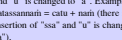
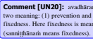

Namo tassa bhagavato arahato sammÈsambuddhassa. Namo tassa bhagavato arahato sammÈsambuddhassa. 

KaccÈyanabyÈkaraÓaÑ KaccÈyanabyÈkaraÓaÑ 
 
1-SANDHI-KAPPA ( KAPPA ( KAPPA (1-Sandhi Chapter) (1 Sandhi Chapter) (1 **Sandhi Chapter) (1—51)** 
PaÔhamo kaÓÉo (First Section) (1—11) Dutiyo kaÓÉo (Second Section) (11—22) Tatiyo kaÓÉo (Third Section) (23—29) Catuttho kaÓÉo (Fourth Section) (30—41) 
PaÒcamo kaÓÉo (Fifth Section) (42—51) 
2-NŒMA-KAPPA (2 KAPPA (2 KAPPA (2-Noun Chapter) (52 Noun Chapter) (52 **Noun Chapter) (52—270)** 
PaÔhamo kaÓÉo (First Section) (52—119) 
Dutiyo kaÓÉo (Second Section) (120—160) 
Tatiyo kaÓÉo (Third Section) (161—210) Catuttho kaÓÉo (Fourth Section) (211—246) 
PaÒcamo kaÓÉo (Fifth Section) (247—270) 
3-KŒRAKA-KAPPA ( KAPPA ( KAPPA (3-Case Chapter) (271 Case Chapter) (271 **Case Chapter) (271—315)** 
4-SAMŒSA-KAPPA ( KAPPA ( KAPPA (4-Compound Chapter) (216 Compound Chapter) (216 **Compound Chapter) (216—243)** 
5-TADDHITA TADDHITA TADDHITA-KAPPA ( KAPPA ( KAPPA (5-Secondary Derivative Chapter) (244 Secondary Derivative Chapter) (244 **Secondary Derivative Chapter) (244—405)** 
6-ŒKHYŒTA ŒKHYŒTA ŒKHYŒTA-KAPPA ( KAPPA ( KAPPA (6-Verb Chapter) (406 Verb Chapter) (406 **Verb Chapter) (406—523)** 
PaÔhamo kaÓÉo (First Section) (406—431) Dutiyo kaÓÉo (Second Section) (432—457) Tatiyo kaÓÉo (Third Section) (458—481) 
Catuttho kaÓÉo (Fourth Section) (482—523) 
7-KIBBIDHŒNA KIBBIDHŒNA **KIBBIDHŒNA-KAPPA1 (7. Primary Derivative Chapter) (7. Primary Derivative Chapter) 7. Primary Derivative Chapter) (524—623)** 
PaÔhamo kaÓÉo (First Section) (524—549) Dutiyo kaÓÉo (Second Section) (550—570) 
Tatiyo kaÓÉo (Third Section) (571—589) Catuttho kaÓÉo (Fourth Section) (590—606) PaÒcamo kaÓÉo (Fifth Section) (607—623) 
8-UªŒPIKAPPA UªŒPIKAPPA UªŒPIKAPPA (624—673) 
 
Namo tassa bhagavato arahato sammÈsambuddhassa. Namo tassa bhagavato arahato sammÈsambuddhassa. 

KaccÈyanabyÈkaraÓaÑ KaccÈyanabyÈkaraÓaÑ
 
1. Sandhi PaÔhamakaÓÉa 1. 1. Attho (pg. ..0001) akkharasaÒÒÈto. 

 2. 2. AkkharÈpÈdayo ekacattÈlisaÑ. 3. 3. TatthodantÈ sarÈ aÔÔha. 

 4. 4. LahumattÈ tayo rassÈ. 5. 5. AÒÒe dÊghÈ. 

 6. 8. SesÈ byaÒjanÈ. 

 7. 9. VaggÈ paÒcapaÒcaso mantÈ. 8. 10. AÑ-iti niggahitaÑ. 

 9. 11. ParasamaÒÒÈ payoge. 

 10. 12. PubbamadhoÔhitamassaraÑ sarena viyojaye. 11. 14. Naye paraÑ yutte. 

 Iti sandhikappe paÔhamo kaÓÉo. 12. 13. SarÈ (pg. ..0002) sare lopaÑ. 

 13. 15. VÈ paro asar|po. 

 14. 16. KvacÈsavaÓÓaÑ lutte. 

 15. 17. DÊghaÑ. 

 16. 18. Pubbo ca. 

 17. 19. YamedantassÈdeso. 

 18. 20. VamodudantÈnaÑ. 19. 22. Sabbo caÑ ti. 

 20. 27. Do dhassa ca. 

 21. 22. IvaÓÓo yaÑ navÈ. 22. 28. EvÈdissa ri pubbo ca rasso. 

 Iti sandhikappe dutiyo kaÓÉo. 23. 36. SarÈ pakati byaÒjane. 

 24. 35. Sare kvaci. 

 25. 37. DÊghaÑ. 26. 38. RassaÑ. 27. 39. LopaÒca tatrÈkÈro. 28. 40. Para dvebhÈvo ÔhÈne. 

 29. 42. Vagge ghosÈghosÈnaÑ tatiyapaÔhamÈ. 

 Iti sandhikappe tatiyo kaÓÉo. 

 
 30. 58. AÑ (pg. ..0003) byaÒjane niggahitaÑ. 

 31. 49. VaggantaÑ vÈ vagge. 32. 50. Ehe ÒaÑ. 

 33. 51. Sa ye ca. 

 34. 52. MadÈ sare. 35. 34. Ya va ma da na ta ra lÈ cÈgamÈ. 

 36. 47. Kvaci o byaÒjane. 

 37. 57. NiggahitaÒca. 38. 53. Kvaci lopaÑ. 

 39. 54. ByaÒjane ca. 40. 55. Paro vÈ saro. 

 41. 56. ByaÒjano ca visaÒÒogo. 

 Iti sandhikappe catuttho kaÓÉo. 

 
 42. 32. Gosare puthassÈgamo kvaci. 43. 33. PÈssa canto rasso. 

 44. 24Abbho abhi. 

 45. 25. Ajjho adhi. 46. 26. Te na vÈ ivaÓÓe. 

 47. 23. Atissa cantassa. 

 48. 43. Kvaci (pg. ..0004) paÔi patissa. 49. 44. Puthassu byaÒjane. 

 50. 45. O avassa. 51. 59. AnupadiÔÔhÈnaÑ vuttayogato. 

 Iti sandhikappe paÒcamo kaÓÉo. 

 SandhisuttaÑ niÔÔhitaÑ. 

 
 2. NÈma 52. 60. JinavacanayuttaÑ hi. 53. 61. Li~gaÒca nippajjate. 

 54. 62. Tato ca vibhattiyo. 

 55. 63. Si yo aÑ yo nÈ hi sa naÑ smÈ hi sanaÑ smiÑ su. 56. 64. Tadanuparodhena. 

 57. 71. Œlapane si gasaÒÒo. 

 58. 29. IvaÓÓuvaÓÓÈ jhalÈ. 

 59. 182. Te itthidhyÈ po. 60. 177. Œ gho. 61. 86. SÈgamo se. 62. 206. SaÑsÈsvekavacanesu ca. 

 63. 217. EtimÈsami (pg. ..0005) 
 64. 216. TassÈ vÈ. 65. 215. Tato sassa ssÈya. 

 66. 205. Gho rassaÑ. 

 67. 229. No ca dvÈdito naÑmhi. 68. 184. AmÈ pato smiÑsmÈnaÑ vÈ. 

 69. 186. Œdito o ca. 70. 30. JhalÈnamiyuvÈ sare vÈ. 

 71. 489. YavakÈrÈ ca. 72. 185. PasaÒÒassa ca. 

 73. 174. GÈva se. 

 74. 169. Yosu ca. 75. 170. AvaÑmhi ca. 

 76. 171. Œvassu vÈ. 77. 175 Tato namaÑ patimhÈlutte ca samÈse. 

 78. 31. O sare ca. 79. 46. TabbiparÊt|papade byaÒjane ca. 

 80. 173. GoÓa naÑmhi vÈ. 

 81. 172. SuhinÈsu ca. 82. 149. AÑmo (pg. ..0006) niggahitaÑ jhalapehi. 

 83. 67. Saralopo mÈdesapaccayÈdimhi saralope tu pakati. 

 84. 144. Agho rassamekavacanayosvapi ca. 85. 150. Na sismimanapuÑsakÈni. 

 86. 227. UbhÈdito naminnaÑ. 87. 231. IÓÓamiÓÓannaÑ tÊhi sa~khyÈhi. 

 88. 147. YÈsu katanikÈralopesu dÊghaÑ. 89. 87. SunaÑhisu ca. 

 90. 252. PaÒcÈdÊnamattaÑ. 

 91. 194. PatissinÊmhi. 92. 100. Ntussanto yosu ca. 

 93. 106. Sabbassa vÈ aÑsesu. 

 94. 105. Simhi vÈ. 95. 145. Aggissini. 

 96. 148. Yosvakatarasso jho. 97. 156. Vevosu lo ca. 

 98. 189. MÈtulÈdÊnamÈnattamÊkÈre. 99. 81. SmÈhismiÑnaÑ mhÈbhimhi vÈ. 

 100. 214. Na timehi katÈkÈrehi. 

 101. 80. SuhisvakÈro (pg. ..0007) e. 102. 202. SabbanÈmÈnaÑ naÑmhi ca. 

 103. 79. Ato nena. 104. 66. So. 

 105... So vÈ. 106. 302. DÊghorehi. 107. 69. SabbayonÊnamÈ-e. 

 108. 90. SmÈsmiÑnaÑ vÈ. 

 109. 295. Œya catutthekavacanassa tu. 110. 201. Tayo neva ca sabbanÈmehi. 

 111. 179. Ghato nÈdÊnaÑ. 

 112. 173. Pato yÈ. 113. 132. Sakhato gasse vÈ. 

 114. 178. Ghate ca. 115. 181. Na ammÈdito. 

 116. 157. AkatarassÈ lato yvÈlapanassavevo. 117. 124. Jhalato sassa no vÈ. 

 118. 146. Ghapato ca yonaÑ lopo. 

 119. 115. Lato vokÈro ca. 

 Iti nÈmakappe paÔhamo kaÓÉo. 

 
 120. 243. Amhassa (pg. ..0008) mamaÑ savibhattissa se. 121. 233. MayaÑ yomhi paÔhame. 

 122. 99. Ntussa nto. 

 123. 103. Ntassa se vÈ. 124. 98. Œ simhi. 

 125. 198. AÑ napuÑsake. 126. 101. AvaÓÓÈ ca ge. 

 127. 102. To titÈ sasmiÑnÈsu. 128. 104. NaÑmhi taÑ vÈ. 

 129. 222. ImassidamaÑsisu napuÑsake. 

 130. 225. AmussÈduÑ. 131... ItthipumanapuÑsakasa~khyaÑ. 

 132. 228. Yosu dvinnaÑ dve ca. 

 133. 230. TicatunnaÑ tisso catasso tayocattÈro tÊÓi cattÈri. 

 134. 251. PaÒcÈdÊnamakÈro. 

 135. 118. RÈjassÈ raÒÒo rÈjino se. 

 136. 119. RaÒÒaÑ naÑmhi vÈ. 

 137. 116. NÈmhi raÒÒÈ vÈ. 138. 121. SmiÑmhi raÒÒe rÈjini. 

 139. 245. TumhamhÈkaÑ (pg. ..0009) tayi mayi. 

 140. 232. TvamahaÑ simhi ca. 141. 241. Tava mama se. 

 142. 242. TuyhaÑ mayhaÒca. 

 143. 235. TaÑmamaÑmhi. 144. 234. TavaÑmamaÒca na vÈ. 145. 238. NÈmhi tayÈ mayÈ. 

 146. 236. Tumhassa tuvaÑtvamamhi. 

 147. 246. Padato dutiyÈcatutthÊchaÔÔhÊsu vo no. 148. 247. Hemekavacanesu ca. 149. 248. Na aÑmhi. 

 150. 249. VÈ tatiye ca. 

 151. 250. Bahuvacanesu vo no. 152. 136. PumantassÈ simhi. 

 153. 138. AmÈlapanekavacane. 

 154... SamÈse ca vibhÈsÈ. 155. 137. YosvÈno. 

 156. 142. Œne smiÑmhi vÈ. 157. 140. Hivibhatthimhi ca. 

 151. 143. SusmimÈ (pg. ..0010) vÈ. 159. 139. U nÈmhi ca. 

 160. 197. Akammantassa ca. 

 Iti nÈmakappe dutiyo kaÓÉo. 

 161. 244. Tumhamhehi namÈkaÑ. 

 162. 237. VÈ yvappaÔhamo. 163. 240. SassaÑ. 

 164. 200. SabbanÈmakÈrate paÔhamo. 

 165. 208. DvandaÔÔhÈ vÈ. 166. 209. NÈÒÒaÑ sabbanÈmikaÑ. 

 167. 210. BahubbÊhimhi ca. 168. 203. Sabbato naÑ saÑsÈnaÑ. 

 169. 117. RÈjassa rÈju sunaÑ hisu ca. 170. 220. Sabbassimasse vÈ. 

 171. 219. Animi nÈmhi ca. 

 172. 218. AnapuÑsakassÈ yaÑ smimhi. 173. 223. Amussa mo saÑ. 

 174. 211. EtatesaÑ to. 

 175. 212. Tassa vÈ nattaÑ sabbattha. 

 176. 213. SasmÈsmiÑsaÑsÈsvattaÑ 
 177. 221. Imasaddassa ca. 

 178. 224. Sabbato ko. 

 179. 204. Ghapato smiÑ sÈnaÑ saÑsÈ. 180. 207. NetÈhi smimÈyayÈ. 

 181. 95. ManogaÓÈdito smiÑnÈnami-È. 

 182. 97. Sassa co. 183. 48. Etesamo lope. 

 184. 96. Sa sare vÈgamo. 

 185. 112. SantasaddassÈ so bhe bo cante. 186. 107. Simhi gacchantÈdÊnaÑ ntasaddo aÑ. 187. 108. Sesesu ntuva. 

 188. 155. Brahmatta sakha rÈjÈdito amÈnaÑ. 

 189. 113. SyÈ ca. 190. 114. YonamÈno. 191. 130. Sakhato cÈyo no. 

 192. 135. Smime. 

 193. 122. Brahmato vassa ca. 194. 131. Sakhantassi nonÈnaÑsesu. 

 195. 134. Œro (pg. ..0012) himhi vÈ. 

 196. 133. SunamaÑsu vÈ. 197. 125. Brahmato tu smiÑni. 

 198. 123. UttaÑ sanÈsu. 199. 158. SatthupitÈdÊnamÈ sismiÑ silopo ca. 

 200. 196. AÒÒesvÈrattaÑ. 201. 163. VÈ naÑmhi. 

 202. 164. SatthunattaÒca. 

 203. 162. U sasmiÑ salopo ca. 204. 167. SakkamandhÈtÈdÊnaÒca. 

 205. 160. Tato yonamo tu. 206. 165. Tato smimi. 

 207. 161. NÈ È. 207. 161. Œro rassamikÈre. 

 209. 168. PitÈdÊnamasimhi. 

 210. 239. TayÈtayinaÑ takÈro tvattaÑ vÈ. 

 Iti nÈmakappe tatiyo kaÓÉo. 

 211. 126. Attanto hismimanattaÑ. 212. 129. Tato smiÑ ni. 

 213. 127. Sassano. 

 214. 128. SmÈ nÈ. 215. 141. Jhalato ca. 

 216. 180. Ghapato smiÑyaÑ vÈ. 

 217. 199. YonaÑ ni napuÑsakehi. 

 218. 196. Ato niccaÑ. 

 219. 195. SiÑ. 

 220. 74. Sesato lopaÑ gasipi. 

 221. 282. SabbÈsamÈvusopasagganipÈtÈdÊhi ca. 222. 327. Pumassa li~gÈdÊsu samÈsesu. 

 223. 188. AÑ yamÊto pasaÒÒato. 

 224. 153. NaÑ jhato katarassÈ. 225. 151. YonaÑ no. 

 226. 154. SmiÑni. 

 227. 270. Kissa ka ve ca. 228. 272. Ku hiÑ haÑsu ca. 229. 226. Sesesu ca. 

 230. 262. Tra to thesu ca. 

 231. 263. SabbassetassÈkÈro vÈ. 232. 267. Tre niccaÑ. 233. 264. E tothesu ca. 

 234. 265. Imassi (pg. ..0014) thaÑ dÈni ha to dhesu ca. 

 235. 281. A dhunÈmhi ca. 236. 280. Eta rahimhi. 

 237. 176. Itthiyamato Èpaccayo. 

 238. 187. NadÈdito vÈ Ê. 239. 190. ªava Óika Óeyya Óantuhi. 

 240. 193. PatibhikkhurÈjÊkÈrantehi inÊ. 241. 191. Ntussa tadhÊkÈre. 

 242. 192. Bhavato bhoto. 243. 110. Bho ge tu. 

 244. 72. AkÈrapitÈdyantÈnamÈ. 

 245. 152. JhalapÈ rassaÑ. 246. 73. ŒkÈro vÈ. 

 Iti nÈmakappe catuttho kaÓÉo. 

 
 247. 261. TvÈdayo vibhattisaÒÒÈyo. 

 248. 260. Kvaci to paÒcamyatthe. 

 249. 266. Tratha sattamiyÈ sabbanÈmehi. 250. 268. Sabbato dhi. 

 251. 269. KiÑsmÈ vo. 252. 271. HiÑhaÑhiÒcanaÑ 
 253. 273. tamhÈ (pg. ..0015) ca. 254. 274. ImasmÈ hadhÈ ca. 

 255. 275. Yato hiÑ. 

 256... KÈle. 257. 276. KiÑsabbaÒÒekayakuhi dÈdÈcanaÑ. 

 258. 278. TamhÈ dÈni ca. 

 259. 279. ImasmÈ rahidhunÈdÈni ca. 

 260. 277. Sabbassa so dÈmhi vÈ. 

 261. 369. AvaÓÓo ye lopaÒca. 

 262. 391. VuÉÉhassa jo iyiÔÔhesu. 

 263. 392. Pasatthassa so ca. 264. 393. Antikassa nedo. 

 265. 394. BÈÄhassa sÈdho. 

 266. 395. Appassa kaÓa. 267. 396. YuvÈnaÒca. 

 268. 397. VantumantuvÊnaÒca lopo. 

 269. 41. YavataÑ talaÓadakÈrÈnaÑ byaÒjanÈni calaÒajakÈrattaÑ. 270. 120. Amha tumha ntu rÈja brahmatta sakha satthu– pitÈdÊhi smÈ nÈva. 

 Iti nÈmakappe paÒcamo kaÓÉo. 

 NÈmasuttaÑ niÔÔhitaÑ. 

 271. 88. yasmÈ (pg. ..0016) dapetiÑ bhayamÈdatte vÈ tadapÈdÈnaÑ. (308) 272. 309. dhÈtunÈmÈnamupasaggayogÈdÊsvapi ca. 

 273. 310. RakkhaÓatthÈnamicchitaÑ. 

 274. 311. Yena vÈ dassanaÑ 275. 312. d|rantikaddhakÈla nimmÈna tvÈlopa disÈ yoga vibhattÈrappayoga suddhappamocanahetu vivittappamÈÓapubbayoga bandhanaguÓavacana paÒhakathana thokÈtatt|su ca. 

 276. 302. Yassa dÈtukÈmo rocate dhÈrayate pÈ taÑ sampadÈnaÑ. 277. 303. SilÈgha hanu ÔhÈ sapa dhÈra piha kudha duhisso ss|ya rÈdhikkha paccÈsuÓa anupatigiÓa pubbakattÈrocanattha tadattha tumatthÈlamattha maÒÒÈnÈdarappÈÓini gatyatthakammani-Èsisatthasammutibhiyyasattamyatthesu ca. 

 278. 320. YodhÈro tamokÈsaÑ. 

 279. 292. Yena vÈ kayirate taÑ karaÓaÑ. 280. 285 YaÑ karoti taÑ kammaÑ. 

 281. 294. Yo karoti sa kattÈ. 282. 295. Yo kÈrehi sa hetu. 

 283. 316. Yassa (pg. ..0017) vÈ pariggaho taÑ sÈmÊ. 

 284. 283. Li~gatthe paÔhamÈ. 285. 70. Œlapane ca. 

 286. 291. KaraÓe tatiyÈ. 

 287. 296 SahÈdiyoge ca. 288. 293. Kattari ca. 

 289. 297. Hetvatthe ca. 290. 298. Sattamyatthe ca. 

 291. 299. Yena~gavikÈro. 292. 300. Visesane ca. 

 293. 301. SampadÈne catutthÊ. 

 294. 305. NamoyogÈdÊsvapi ca. 295. 307. ApÈdÈne paÒcamÊ. 

 296. 314. KÈraÓatthe ca. 

 297. 284. Kammatthe dutiyÈ. 298. 287. KÈladdhÈnamaccantasaÑyoge. 

 299. 288. KammappavacanÊyayutte. 300. 286. Gati buddhi bhuja paÔha hara kara sayÈdÊnaÑkÈ rite vÈ. 

 301. 315. SÈmismiÑ chaÔÔhÊ 302. 319. okÈse (pg. ..0018) sattamÊ. 

 303. 321. SÈmissarÈdhipati dÈyÈda sakkhÊ pathibh| pasuta kusalehi ca. 

 304. 322. NiddhÈraÓe ca. 305. 323. AnÈdare ca. 

 306. 289. Kvaci dutiyÈ chaÔÔhÊnamatthe. 307. 290. TatiyÈsattamÊnaÒca. 

 308. 317. ChaÔÔhÊ ca. 

# 3. Kèraka

 309. 318. DutiyÈpaÒcamÊnaÒca. 310. 324. KammakaraÓanimittatthesu sattamÊ. 

 311. 325. SampadÈne ca. 

 312. 326. PaÒcamyatthe ca. 313. 327. KÈlabhÈvesu ca. 

 314. 328. Upa'dhyÈdhikissaravacane. 

 315. 329. MaÓÉitussukkesu tatiyÈ ca. 

 Iti nÈmakappe kÈrakakappo chaÔÔho kaÓÉo. 

 KÈrakasuttaÑ niÔÔhitaÑ. 

 
 4. SamÈsa 316. 331. nÈmÈna samÈso yuttattho. 317. 332. TesaÑ vibhattiyo lopÈ ca. 

 318. 333. Pakati cassa sarantassa. 

 319. 330. UpasagganipÈtapubbako (pg. ..0019) abyayÊbhÈvo. 320. 335. So napuÑsakali~go. 

 321. 349. DigussekattaÑ. 

 322. 359. TathÈ dvande pÈÓi t|riye yogga sena~ga khuddajantuka vividha viruddha visabhÈgatthÈdÊnaÒca. 

 323. 360. VibhÈsÈ rukkha tiÓa pasu dhana dhaÒÒa janapadÈ dÊnaÒca. 

 324. 339. Dvipade tulyÈdhikaraÓe kammadhÈrayo. 

 325. 348. Sa~khyÈpubbo digu. 326. 341. Ubhe tappurisÈ. 

 327. 351. AmÈdayo parapadebhi. 

 328. 352. AÒÒapadatthesu bahubbÊhi. 329. 357. NÈmÈnaÑ samuccayo dvando. 

 330. 340. MahataÑ mahÈ tulyÈdhikaraÓe pade. 331. 353. ItthiyaÑ bhÈsitapumitthÊ pumÈva ce. 

 332. 343. KammadhÈrayasaÒÒe ca. 333. 344. AttaÑ nassa tappurise. 

 334. 345. Sare ana. 

 335. 346. Kadi kussa. 336. 347. KÈ'ppatthesu ca. 

 337. 350. Kvaci (pg. ..0020) samÈsanta gatÈnamakÈranto. 

 338. 356. NadimhÈ ca. 339. 358. JÈyÈya tudaÑ jÈni patimhi. 

 340. 355. DhanumhÈ ca. 

 341. 336. AÑvibhattÊnamakÈrantÈ abyÈyitÈvÈ. 

 342. 337. Saro rasso napuÑsake. 343. 338. AÒÒasmÈ lopo ca. 

 Iti nÈmakappe samÈsakappo sattamo kaÓÉo. 

 SamÈsasutthaÑ niÔÔhitaÑ. 

## 5. Taddhita

 244. 361. vÈ ÓÈ'pacce. 345. 366. ªÈyana ÓÈna vacchÈdito. 

 346. 367. ªeyyo kattiyÈdÊhi. 

 347. 368. Ato Ói vÈ. 348. 371. ªavopakvÈdÊhi. 

 349. 372. ªera vidhavÈdito. 350. 373. Yena vÈ saÑsaÔÔhaÑ tarati carati vahati Óiko. 

 351. 374. TamadhÊte tenakatÈdhi sannidhÈnaniyoga sippa bhaÓÉa jÊvikatthesu ca. 

 352. 376. ªa (pg. ..0021) rÈgÈ tassedamaÒÒatthesu ca. 

 353. 378. JÈtÈdÊnamimiyÈ ca. 354. 379. Sam|hatthe kaÓa ÓÈ. 

 355. 380. GÈma jana bandhu sahÈyÈdÊhi tÈ. 356. 381. Tadassa ÔhÈnamiyo ca. 

 357. 382. UpamatthÈyitattaÑ. 358. 383. Tannissitatthe lo. 

 359. 384. Œlu tabbahule. 

 360. 387. ªuttatÈ bhÈve tu. 361. 388. ªa visamÈdÊhi. 

 362. 389. RamaÓÊyÈdito kaÓa 363. 390. visese taratamisikiyiÔÔhÈ. 364. 398. TadassatthÊti vÊ ca. 

 365. 399. TapÈdito sÊ. 366. 400. DaÓÉÈdito ika Ê. 

 367. 401. MadhvÈdito ro. 368. 402. GuÓÈdito vantu. 

 369. 403. SatyÈdÊhi mantu. 

 370. 405. SaddhÈdito Óa. 371. 404. ŒyussukÈrÈsa mantumhi. 

 372. 385. Tappakativacane (pg. ..0022) mayo. 

 373. 406. Sa~khyÈp|raÓe mo. 374. 408. Sa chassa vÈ. 

 375. 412. EkÈdito dasassÊ. 376. 257. Dase so niccaÒca. 

 377... Ante niggahitaÒca. 378. 414. Ti ca. 

 379. 258. La da rÈnaÑ. 

 380. 255. VÊsati dasesu bÈ dvissa tu. 381. 254. EkÈdito dassa ra sa~khyÈne. 

 382. 259. AÔÔhÈdito ca. 383. 353. DvekaÔÔhÈnamÈkÈro vÈ. 

 384. 407. Catucche hi tha ÔhÈ. 385. 409. DvitÊhi tiyo. 386. 410. Tiye dutÈpi ca. 

 387. 411. TesamaÉÉh|papadena aÉÉhuÉÉhadivaÉÉha diyaÉÉha' ÉÉhatiyÈ. 

 388. 68. Sar|pÈna mekasesvasakiÑ. 389. 413. GaÓanedasassa dvi ti catu paÒca cha satta aÔÔhanavakÈnaÑ vÊ ti cattÈra paÒÒÈ cha sattÈsanavÈ yosu yonaÒcÊsamÈsaÑÔhiritÊtuti. 

 390. 256. Cat|papadassa (pg. ..0023) lopo tu'ttarapadÈdicassa cu copi navÈ. 391. 423. YadanupapannÈ nipÈtanÈ sijjhanti. 

 392. 418. DvÈdito ko'nekatthe ca. 393. 415. DasadasakaÑ sataÑ dasakÈnaÑ sataÑ sahassaÒca yomhi. 

 394. 416. YÈva taduttari dasaguÓitaÒca. 395. 417. SakanÈmehi. 

 396. 363. TesaÑ Óo lopaÑ. 

 397. 420. VibhÈge dhÈ ca. 398. 421. SabbanÈmehi pakÈravacane tu thÈ. 

 399. 422. Kimimehi thaÑ. 400. 364. VuddhÈdisarassa vÈ'saÑyogantassa saÓe ca. 

 401. 375. MÈy|namÈgamo ÔhÈne. 402.. 377. ŒttaÒca. 

 403. 354. KvacÈdimajjhuttarÈnaÑ dÊgharassa paccayesu ca. 

 404. 370. Tesu vuddhi lopÈgama vikÈra viparitÈdesÈ ca. 405. 365. AyuvaÓÓÈnaÒcÈyo vuddhi. 

 Iti nÈmakappe taddhitakappo aÔÔhamo kaÓÉo. 

 TaddhitasuttaÑ niÔÔhitaÑ. 

 

## 6. Œkhyèta

 406. 429. atha (pg. ..0024) pubbÈni-vibhattÊnaÑ cha parassapadÈni. 407. 439. ParÈÓuttanopadÈni. 

 408. 430. Dve dve paÔhamamajjhimuttamapurisÈ. 409. 441. SabbesamekÈbhidhÈne paro puriso. 

 410. 432. NÈmamhi payujjamÈnepi tulyÈdhikaraÓe paÔhamo. 

 411. 436. Tumhe majjhimo. 412. 437. Amhe uttamo. 

 413. 426. KÈle. 

 414. 428. VattamÈnÈ paccuppanne. 415. 451. ŒÓÈtyÈsiÔÔhe'nuttakÈle paÒcamÊ. 

 416. 454. Anumatiparikappetthesu sattamÊ. 

 417. 460. Apaccakkhe parokkhÈ'tÊte. 

 418. 456. Hiyyopabhuti paccakkhe hiyyattanÊ. 419. 469. SamÊpe'jjatanÊ. 

 420. 471. MÈyoge sabbakÈle ca. 

 421. 473. AnÈgate bhavissantÊ. 422. 475. KriyÈtipanne'tÊte kÈlÈtipatti. 423. 426. VattamÈnÈ tÊ anti, si tha, mi ma te ante, sevhe, e mhe. 424. 450. PaÒcamÊ (pg. ..0025) tu antu, hi tha, mi ma, taÑ antaÑ, ssu vho, e Èmase. 

 425. 453. SattamÊ eyya eyyuÑ, eyyÈsi eyyÈtha, eyyÈmi eyyÈma, etha eraÑ, 
etho eyyÈvho, eyyaÑ eyyÈmhe. 

 426. 459. ParokkhÈ a u, e ttha, aÑ mha, ttha re, ttho vho, iÑ mhe. 

 427. 455. HiyyattanÊ È |, o ttha, aÑ mhÈ, ttha tthuÑ, sevhaÑ, iÑ mhase. 427. 468. AjjatanÊ ÊÒaÑ ottha, iÑ mhÈ, È |, se vhaÑ, aÑ mhe. 

 429. 472. SsavissantÊ ssati ssanti, ssasi ssatha, ssÈmi ssÈma, ssate ssante, ssase ssavhe, ssaÑ ssÈmhe. 

 430. 474. KÈlÈtipatti ssÈ ssaÑsu, sse ssatha, ssaÑ ssÈmÈ, ssatha ssisu, ssase ssavhe, ssiÑ ssÈmhase. 

 431. 428. HiyyattanÊ sattamÊ paÒcamÊ vattamÈnÈ sabbadhÈtukaÑ. 

 Iti ÈkhyÈtakappe paÔhamo kaÓÉo. 

 432. 362. DhÈtuli~gehi parÈ paccayÈ. 

 433. 528. TijagupakitamÈnehi khachasÈ vÈ. 434. 534. BhujaghasaharasupÈdÊhitumicchatthesu. 

 435. 536. Œya (pg. ..0026) nÈmato katt|pamÈnÈdÈcÈre. 

 436. 537. ¢y|'pamÈnÈ ca. 437. 538. NÈmamhÈ'tticchatthe. 

 438. 540. DhÈt|hi Óe Óaya ÓÈpe ÓÈpayÈ kÈritÈni hetvatthe. 439. 539. DhÈtur|pe nÈmasmÈ Óa yo ca. 

 440. 445. BhÈvakammesu yo. 441. 447. Tassa cavaggayakÈravakÈrattaÑ sadhÈtvantassa. 

 442. 448. IvaÓÓÈgamo vÈ. 

 443. 449. Pubbar|paÒca. 444. 511. TathÈ kattari ca. 

 445. 433. Bh|vÈdito a. 

 446. 509. RudhÈdito niggahitapubbaÒca. 

 447. 510. DivÈdito yo. 

 448. 512. SvÈdito ÓuÓÈ uÓÈ ca. 

 449. 513. KiyÈdito nÈ. 

 450. 517. GahÈdito ppaÓhÈ. 451. 520. TanÈdito oyirÈ. 

 452. 525. CurÈdito Óe ÓayÈ. 

 453 444. AttanopadÈni bhÈve ca kammani. 454. 440. Kattari ca. 

 455. 530. DhÈtuppaccayehi (pg. ..0027) vibhattiyo. 

 456. 420. Kattari parassapadaÑ. 457. 424. Bh|vÈdayo dhÈtavo. 

 Iti ÈkhyÈtakappe dutiyo kaÓÉo. 

 
 458. 461. KvacÈdivaÓÓÈnamekassarÈnaÑ dvebhÈvo. 459. 462. Pubbo' bbhÈso. 460. 506. Rasso. 

 461. 464. DutiyacatutthÈnaÑ paÔhamatatiyÈ. 

 462. 467. Kavaggassa cavaggo. 463. 532. MÈnakitÈnaÑ va tattaÑ vÈ. 

 464. 504. Hassa jo. 

 465. 463. AntassivaÓÓÈkÈro vÈ. 466. 489. NiggahitaÒca. 

 467. 533. Tato pÈmÈnÈnaÑ vÈmaÑ sesu. 468. 492. ®hÈ tiÔÔho. 

 469. 494. PÈ pivo. 470. 514. ÑÈssa jÈjaÑnÈ. 

 471. 483. Disassa passa dissa dakkhÈ vÈ. 

 472. 531. ByaÒjanantassa co chappaccayesu ca. 473. 529. Ko khe ca. 

 474. 535. Harassa gÊ se. 475. 465. Br|bh|namÈhabh|vÈ (pg. ..0028) parokkhÈyaÑ. 

 476. 442. Gamissanto ccho vÈ sabbÈsu. 477. 479. Vacassa'jjatanimhi makÈrÈ o. 

 478. 438. AkÈro dÊghaÑ himimesu. 

 479. 452. Hi lopaÑ vÈ. 480. 490. Hotissare' ho'he bhavissantimhi sassa ca. 

 481. 524. Karassa sappaccayassa kÈho. 

 Iti ÈkhyÈtakappe tatiyo kaÓÉo. 

 
 482. 508. DÈdantassaÑ mimesu. 

 483. 527. AsaÑyogantassa vuddhi kÈrite. 484. 542. GhaÔÈdÊnaÑ vÈ. 

 485. 434. AÒÒesu ca. 

 486. 543. GuhadusÈnaÑ dÊghaÑ. 

 487. 478. Vaca vasa vahÈdÊnamukÈro vassaye. 

 488. 481. Ha vipariyayo lo vÈ. 

 489. 519. Gahassa ghe ppe. 

 490. 518. Halopo ÓhÈmhi. 491. 523. Karassa kÈsattamajjatanimhi. 

 492. 499. AsasmÈ mimÈnaÑ mimhÈn'talopo ca. 

 493. 498. Thassa tthatthaÑ. 494. 495. Tissa (pg. ..0029) tissa tthitthaÑ. 

 495. 500. Tussa tthuttaÑ. 

 496. 497. Simhi ca. 497. 477. LabhasmÈ Ê-aÑnaÑ tthattaÑ. 498. 480. KusasmÈ dÊ cchi. 

 499. 480. DÈ dhÈtussa dajjaÑ. 

 500. 486. Vadassa vajjaÑ. 501. 443. Gamissa ghammaÑ. 502. 493. Yamhi dÈ dhÈ mÈ ÔhÈ hÈ pÈ maha mathÈdÊnamÊ. 

 503. 485. YajassÈdissi. 

 504. 470. Sabbato uÑ iÑsu. 505. 482. JaramarÈnaÑ jÊra jÊyya mÊyyÈ vÈ. 

 506. 496. SabbatthÈ'sassÈdilopo ca. 

 507. 501. AsabbadhÈtuke ÒÈ. 508. 515. Yyessa ÒÈto iyÈ ÒÈ. 

 509. 516. NÈssa lopo yakÈrattaÑ. 510. 487. LopaÒcettamakÈro. 

 511. 521. UttamokÈro. 512. 522. KarassÈkÈro ca. 

 513. 435. O ava sare. 

 514. 491. E aya. 515. 541. Te (pg. ..0030) ÈvÈyÈ kÈrite. 

 516. 466. IkÈrÈgamo asabbadhÈtukamhi. 517. 488. Kvaci dhÈtuvibhattippaccayÈnaÑ dÊghaviparÊtÈdesa lopÈgamÈ ca. 

 518. 446. AttanopadÈni parassapadattaÑ. 519. 457. AkÈrÈgamo hiyyatthanÊ-ajjatanÊkÈlÈtipattÊsu. 

 520. 502. Br|to Ê timhi. 

 521. 425. DhÈtussanto lopo' nekasarassa. 522. 476. Isuyam|namanto ccho vÈ. 

 523. 526. KÈritÈnaÑ Óo lopaÑ. 

 Iti ÈkhyÈtakappe catuttho kaÓÉo. 

 ŒkhyÈtasuttaÑ niÔÔhitaÑ. 

 
 7. KibbidhÈna 524. 561. dhÈtuyÈ kammÈdimhi Óo. 

 525. 565. SaÒÒÈyama nu. 526. 567. Pure dadÈ ca iÑ. 

 527. 568. Sabbato ÓvutvÈ'vÊ vÈ. 

 528. 577. Visa ruja padÈdito Óa. 529. 580. BhÈve ca. 

 530. 584. Kvi ca. 

 531. 589. DharÈdÊhi (pg. ..0031) rammo. 532. 590. TassÊlÈdÊsu ÓÊ tvÈ vÊ ca. 

 533. 591. Sadda kudha cala maÓÉattha rucÈdÊhi yu. 

 534. 592. PÈrÈdigamimhÈ r|. 

 535. 593. BhikkhÈdito ca. 536. 594. HanatyÈdÊnaÑ Óuko. 

 537. 566. Nu niggahitaÑ padante. 

 538. 595. SaÑhanÈÒ'ÒÈya vÈ ro gho. 539. 558. Ramhi ranto rÈdino. 540. 545. BhÈvakammesu tabbÈ'nÊyÈ. 541. 552. ªyo ca. 

 542. 557. KaramhÈ ricca. 

 543. 555. Bh|to'bba. 544. 556. Vada mada gamu yuja garahÈkÈrÈdÊhi jja mmaggayheyyÈvÈro vÈ. 

 545. 548. Te kiccÈ. 

 546. 562. AÒÒe kitta. 547. 596. NandÈdÊhi yu. 

 548. 597. KattukaraÓapadesesu ca. 549. 550. RahÈdito Óa. 

 Iti kibbidhÈnakappe paÔhamo kaÓÉo. 

 550. 549. ªÈdayo (pg. ..0032) tekÈlikÈ. 551. 598. SaÒÒÈyaÑ dÈdhÈto i. 

 552. 609. Ti kiccÈ'siÔÔhe. 553. 599. Itthiyamatiyavo vÈ. 

 554. 601. Karato ririya. 555. 612. AtÊte ta tavantu tÈvÊ. 

 556. 622. BhÈvakammesu ta. 

 557. 606. BudhagamÈditthe kattari. 558. 602. Jito ina sabbattha. 

 559. 603. Supato ca. 560. 604. ¢saÑdus|hi kha. 

 561. 636. Icchatthesu samÈnakattukesu tave tuÑ vÈ. 562. 638. ArahasakkÈdÊsu ca. 

 563. 639. Pattavacane alamatthesu ca. 

 564. 640. PubbakÈle'kakattukÈnaÑ tuna tvÈna tvÈ vÈ. 565. 646. VattamÈne mÈnan'tÈ. 

 566. 574. SÈsÈdÊhi ratthu. 

 567. 575. PÈtito ritu. 

 568. 576. MÈnÈdÊhi (pg. ..0033) rÈtu. 

 569. 610. ŒgamÈ tuko. 

 570. 611. Bhabbe ika. 

 Iti kibbidhÈnakappe dutiyo kaÓÉo. 

 571. 624. PaccayÈdaniÔÔhÈ nipÈtanÈ sijjhanti. 572. 625. SÈsadisato tassa riÔÔho ca. 

 573. 626. SÈdisanta puccha bhanja hantÈdÊhi ÔÔho. 

 574. 613. Vasato uttha. 

 575. 614. Vasa vÈvu. 576. 607. Dha Éha bha he hi dhaÉÉhÈ ca. 

 577. 628. Bhanjato ggo ca. 

 578. 560. BhujÈdÊnamanto no dvi ca. 579. 629. Vaca vÈ vu. 580. 630. GupÈdÊnaÒca. 581. 616. TarÈdÊhi iÓÓo. 

 582. 631. BhidÈdito inna anna ÊÓÈ vÈ. 

 583. 617. Susa paca sakato kkha kkÈ ca. 584. 618. PakkamÈdÊhi nto ca. 

 585. 619. JanÈdÊna mÈ timhi ca. 

 586. 600. Gama khana hana ramÈdÊnamanto. 587. 632. RakÈro ca. 

 588. ®hÈpÈnami-Ê (pg. ..0034) ca. 589. 621. Hantehi ho hassa Äo vÈ adahanahÈnaÑ. 

 Iti kibbidhÈnakappe tatiyo kaÓÉo. 

 590. 579. ªamhi ranjassa jo bhÈvakaraÓesu. 591. 544. Hanassa ghÈto. 

 592. 503. Vadho vÈ sabbattha. 593. 564. ŒkÈrantÈnamÈyo. 

 594. 582. PurasamupaparÊhi karotissa kha kharÈ vÈ tappaccayesu ca. 595. 637. TavetunÈdÊsu kÈ. 

 596. 551. GamakhanahanÈdÊnaÑ tuÑtabbÈdÊsu na. 

 597. 641. Sabbehi tunÈdÊnaÑ yo. 598. 643. Canantehi raccaÑ. 

 599. 644. DisÈ svÈnasvantalopo ca. 600. 645. Mahadabhehi mma yha jja bbha ddhÈ ca. 

 601. 334. TaddhitasamÈsakitakÈ nÈmaÑ vÈ'tavetunÈdÊsu ca. 602. 6. Dumhi garu. 

 603. 7. DÊgho (pg. ..0035) ca. 

 604. 684. Akkharehi kÈra. 605. 547. YathÈgamamikÈro. 

 606. 642. Dadhantato yo kvaci. 

 Iti kibbidhÈnakappe catuttho kaÓÉo. 

 607. 578. Niggahita saÑyogÈdi no. 

 608. 623. Sabbattha ge hÊ. 609. 484. Sadassa sÊdatthaÑ. 

 610. 627. Yajassa sarassi ÔÔhe. 

 611. 608. HacatutthÈnamantÈnaÑ do dhe. 612. 615. ho ÉhakÈre. 

 613. 583. Gahassa ghara Óe vÈ. 

 614. 581. Dahassa do ÄaÑ. 

 615. 586. DhÈtvantassa lopo kvimhi. 616. 587. Vidante |. 

 617. 633. Na ma ka rÈnamantÈnaÑ niyuttatamhi. 

 618. 571. Na ka vatthaÑ ca jÈ Óvumhi. 619. 573. Karassa ca tattaÑ thusmiÑ. 620. 549. TuÑtunatabbesu vÈ. 621. 553. KÈritaÑ (pg. ..0036) viya ÓÈnubandho. 

 622. 570. AnakÈ yu Óv|naÑ. 

 623. 554. Ka gÈ ca jÈnaÑ. 

 Iti kibbidhÈnakappe paÒcamo kaÓÉo. 

 KibbidhÈnasuttaÑ niÔÔhitaÑ. 

 
 8. UÓÈdikappa 624. 563. kattari kitta. 

 625. 605. BhÈvakammesu kiccattakkhatthÈ. 626. 634. Kammani dutiyÈya tto. 

 627. 652. KhyÈdÊhi mana ma ca to vÈ. 628. 653. SamÈdÊhi thamÈ. 

 629. 569. Gahassu'padhasse vÈ. 

 630. 654. Masussa sussa ccharaccherÈ. 631. 655. Œpubbacarassa ca. 

 632. 656. Ala kala salehi la yÈ. 

 633. 657. YÈÓa lÈÓÈ. 

 634. 658. Mathissa thassa lo ca. 635. 559. PesÈtisaggapattakÈlesu kiccÈ. 

 636. 659. AvassakÈdhamiÓesu ÓÊ ca. 

 637... ArahasakkÈdÊhi tuÑ. 638. 668. VajÈdÊhi pabbajjÈdayo nippajjante. 

 639. 585. Kvilopo (pg. ..0037) ca. 

 640... SacajÈnaÑ ka gÈ ÓÈnubandhe. 641. 572. NudÈdÊhi yu Óv|na manÈ na nÈ kÈ na na kÈ sakÈritehi ca. 

 642. 588. I ya ta ma kiÑ esÈnamantassaro dÊghaÑ kvaci dusassa guÓaÑ 
doraÑ sa kkhÊ ca. 

 643. 635. BhyÈdÊhi mati budhi p|jÈdÊhi ca tto. 644. 661. Vepu sÊ dava vamu ku dÈ bh|tvÈdÊhi thuttima ÓimÈ nibbatte. 

 645. 662. Akkose namhÈni. 

 646. 419. EkÈdito sakissa kkhattuÑ. 647. 663. Sunassunasso Óa vÈnuvÈn|nanakhunÈnÈ. 

 648. 664. TaruÓassa susu ca. 

 649. 665. YuvassuvassuvuvÈnan|nÈ. 650. 651. KÈle vattamÈnÈtÊte ÓvÈdayo. 

 651. 647. Bhavissati gamÈdÊhi ÓÊ ghiÓa. 

 652. 648. KriyÈyaÑ Óvu tavo. 

 653. 307. BhÈvavÈcimhi catutthÊ. 654. 649. Kammani Óo. 

 655. 650. Sese ssaÑ ntu mÈnÈnÈ. 

 656. 666. ChadÈdÊhi ta traÓa. 657. 667. VadÈdÊhi Óitto gaÓe. 658. 668. MidÈdÊhi tti tiyo. 659. 669. UsuranjadasÈnaÑ (pg. ..0038) daÑsassa daÉÉho ÉhaÔhÈ ca. 

 660. 670. S|vusÈnam|vusÈnamato tho ca. 

 661. 671. RanjudÈdÊhi dhadiddakirÈ kvaci jadalopo ca. 662. 672. PaÔito hissa heraÓa hÊraÓa. 

 663. 673. KaÉhÈdÊhi ko. 

 664. 674. KhÈdÈmagamÈnaÑ khandhandhagandhÈ. 665. 675. PaÔÈdÊlyalaÑ. 

 666. 676. Puthassa puthu pathÈ mo vÈ. 667. 677. SasvÈdÊhi tu davo. 

 668. 678. JhÈdÊhi Êvaro. 669. 679. MunÈdÊhi ci. 

 670. 680. VidÈdÊly|ro. 

 671. 681. HanÈdÊhi nu Óu tavo. 672. 682. KuÔÈdÊhi Ôho. 

 673. 683. Manup|rasuÓÈdÊhi ussanusisÈ. 

 Iti kibbidhÈnakappe uÓÈdikappo chaÔÔho kaÓÉo. 

 UÓÈdisuttaÑ niÔÔhitaÑ. 

## Kaccœyana Byœkaraªa¥ Kaccœyana Byœkaraªa¥

Namo Tassa Bhagavato Arahato SammÈsambuddhassa! Namo Tassa Bhagavato Arahato SammÈsambuddhassa! 

 
1-SANDHI-KAPPA 
1-Sandhi Chapter Chapter Chapter 
 
PA®HAMA- **PA®HAMA-KAªA** 
First Section First Section 
 (a) SeÔÔhaÑ tilokamahitaÑ abhivandiy' aggaÑ, 
 BuddhaÒ ca Dhammam amalaÑ GaÓam uttamaÒ ca, Satthussa tassa vacanatthavaraÑ subuddhuÑ, 
 VakkhÈmi suttahitam ettha SusandhikappaÑ2. 

 (b) SeyyaÑ jineritanayena budhÈ labhanti, TaÒ c'Èpi tassa vacanatthasubodhanena, AtthaÒ ca akkharapadesu amohabhÈvÈ, 
 Seyyatthiko padam ato vividhaÑ suÓeyya1. 

Comment [U N1]: **Sandhi is already** 
an English word. It can be found in **The** 
American Heritage Dictionary of the English Language, Third Edition **and** 
The Oxford English Dictionary, Second Edition.

(a) **Having saluted the excellent, honored by the three worlds, the highest** 
Buddha, together with the pure Dhamma, and the noble Sangha, I will expound here the good chapter on sandhi in accordance with the Discourses to know well the noble meaning of the word of the Teacher. 

(b) **The wise ones get better by the way preached by the Victorious One, by** 
knowing well the meaning of His word and by non-confusion of the meaning among letters and words. Therefore, let the one who wishes to excel listen to the various words. (check) 

## 1. 1. Attho Akkharasaòòèto. 1. 1. Attho Akkharasaòòèto. **1. 1. Attho Akkharasaòòèto.**

 
 SabbavacanÈnam attho akkhareh' eva saÒÒÈyate. AkkharavipattiyaÑ hi atthassa dunnayatÈ hoti, tasmÈ akkharakosallaÑ bah|pakÈraÑ Suttantesu. 

The meaning of all words is only known by letters. For failure with letters leads to the wrong meaning. Therefore, skillfulness with letters is very useful in the Discourses. 

## 2. 2. Akkharè P' Èdayo Ekacattèlêsañ 2. 2. Akkharè P' Èdayo Ekacattèlêsañ **2. 2. Akkharè P' Èdayo Ekacattèlêsañ (1,2).**

 
 Te ca kho akkharÈ api akÈradayo ekacattÈlÊsaÑ Suttantesu sopakÈrÈ. 

 
TaÑ yathÈ? a È i Ê u | e o; ka kha ga gha ~a; ca cha ja jha Òa; Ôa Ôha Éa Éha Óa; ta tha da dha na; pa pha ba bha ma; ya ra la va sa ha Äa aÑ. Iti akkharÈ akkharÈ **akkharÈ nÈma.** 
 Tena kvattho? Attho akkharasaÒÒÈto3. 

And these letters which are forty one beginning with 'a' are very useful in the Discourses. Which are these? a È i Ê u | e o; ka kha ga gha ~a; ca cha ja jha Òa; Ôa Ôha Éa Éha Óa; ta tha da dha na; pa pha ba bha ma; ya ra la va sa ha Äa aÑ. These are called 'letters'(akkharÈ). 

What is the need of that (saying letters)? The meaning is known by letters letters **letters** 
(see §1). 

 3. 3. Tatth' odantÈ sarÈ aÔÔha 3. 3. Tatth' odantÈ sarÈ aÔÔha **3. 3. Tatth' odantÈ sarÈ aÔÔha (3).** 
 
 Tattha akkharesu akÈrÈdÊsu odantÈ aÔÔha akkharÈ sarÈ nÈma honti. 

 TaÑ yathÈ? a È i Ê u | e o. Iti sarÈ nÈma. 

 
3 § 1. 

 Tena kvattho? SarÈ sare lopaÑ4. 

Among those letters, the eight letters beginning with 'a' and ending with 'o' are called 'vowels'. 

Which are these? a È i Ê u | e o. These are called 'vowels' (sarÈ). 

What is the need of that (saying vowels)? Vowels because of a vowel (come to) elision (see §12).. 

 4. 4. LahumattÈ tayo rassÈ 4. 4. LahumattÈ tayo rassÈ **4. 4. LahumattÈ tayo rassÈ (4).** 
 Tattha aÔÔhasu saresu lahumattÈ tayo sarÈ rassÈ nÈma honti. 

 TaÑ yathÈ? a i u. Iti rassÈ nÈma. 

 Tena kvattho? RassaÑ5. 

 
Among the eight vowels, the three light-measured are called 'short'. 

Which are these? a i u. These are called 'short' (rassÈ).

What is the need of that (saying short)? Corta (see §26). 

 
 5. 5. AÒÒe dÊghÈ 5. 5. AÒÒe dÊghÈ 5. 5. AÒÒe dÊghÈ (5). 

 Tattha aÔÔhasu saresu rassehi aÒÒe paÒca sarÈ dÊghÈ nÈma honti. TaÑ yathÈ? È Ê | e o. Iti dÊghÈ nÈma. 

 
 Tena kvattho? DÊghaÑ6. 

Among the eight vowels, the five other vowels apart from the shorts 
(vowels) are called 'long'. 

Which are these? È Ê | e o. These are called 'long' (dÊghÈ). 

What is the need of that (saying long)? Long (see §25). 

## 6. 8. Sesè Byaòjanè 6. 8. Sesè Byaòjanè 6. 8. Sesè Byaòjanè (6).

 
 ®hapetvÈ aÔÔha sare sesÈ akkharÈ kakÈrÈdayo niggahita niggahita **niggahitantÈ byaÒjanÈ nÈma** 
honti. 

 TaÑ yathÈ? ka kha ga gha ~a; ca cha ja jha Òa; Ôa Ôha Éa Éha Óa; ta tha da dha na; pa pha ba bha ma; ya ra la va sa ha Äa aÑ. Iti byaÒjan byaÒjanÈ **byaÒjanÈ nÈma. È**
 Tena kvattho? SarÈ pakati byaÒjane7. 

Apart from the eight vowels, the remaining letters beginning with 'k' and ending with the niggahita **('Ñ') are called 'consonants'.** 
Which are these? ka kha ga gha ~a; ca cha ja jha Òa; Ôa Ôha Éa Éha Óa; ta tha da dha na; pa pha ba bha ma; ya ra la va sa ha Äa aÑ. These are called 'consonants' (byaÒjanÈ). 

What is the need of that (saying consonants)? Vowels because of consonants consonants **consonants** 
remain natural (unchanged) (see §23). 

## 7. 9. Vaggè Paòcapaòcaso Mantè 7. 9. Vaggè Paòcapaòcaso Mantè 7. 9. Vaggè Paòcapaòcaso Mantè (7).

 TesaÑ kho byaÒjanÈnaÑ kakÈrÈdayo makÈrantÈ paÒcapaÒcaso akkharavanto8 vaggÈ nÈma honti. 

 TaÑ yathÈ? ka kha ga gha ~a; ca cha ja jha Òa; Ôa Ôha Éa Éha Óa; ta tha da dha na; pa pha ba bha ma. Iti vaggÈ nÈma. 

 Tena kvattho? VaggantaÑ vÈ vagge9. 

Of those consonants, the five groups of five (twenty five) belonging to the letters beginning with 'k' and ending with 'm' are called 'grouped'. 

Which are these? ka kha ga gha ~a; ca cha ja jha Òa; Ôa Ôha Éa Éha Óa; ta tha da dha na; pa pha ba bha ma. These are called 'grouped' (vaggÈ). 

What is the need of that (saying grouped)? (The niggahita**) sometimes (when** 
followed by a) grouped grouped **grouped (consonant) (becomes) the last letter of the group** 
(see §31). 

## 8. 10. Añ Iti Niggahitañ 8. 10. Añ Iti Niggahitañ 8. 10. Añ Iti Niggahitañ (8).

 AÑ iti niggahitaÑ niggahitaÑ **niggahitaÑ nÈma hoti.** 
 Tena kvattho? AÑ byaÒjane niggahitaÑ10. 

'¥' is called niggahita**. (check)** 
What is the need of that (saying niggahita**)? When there a consonant** (follows) there is niggahita **which is 'Ñ' (see §30). (check)** 

## 9. 11. Parasamaòòè Payoge. 9. 11. Parasamaòòè Payoge. **9. 11. Parasamaòòè Payoge.**

 YÈ ca pana paresu sakkataganthesu samaÒÒÈ ghosÈ ti vÈ aghosÈ ti vÈ, tÈ payoge sati etth' Èpi yujjante. 

 Tattha ghosÈ nÈma: ga gha ~a; ja jha Òa; Éa Éha Óa; da dha na; ba bha ma; ya ra la va ha Äa. Iti ghosÈ nÈma. AghosÈ nÈma: ka kha; ca cha; Ôa Ôha; ta tha; pa pha; sa. Iti aghosÈ nÈma. 

 Tena kvattho? Vagge ghosÈghosÈnaÑ tatiya-paÔhamÈ11. 

Those terms (found) in the Sanskrit books such as 'voiced' or 'voiceless', when there is need, they are also used. Among them, the voiced are: ga gha ~; ja jha Òa; Éa Éha Óa; da dha na; ba bha ma; ya ra la va ha Äa. These are called 'voiced' (ghosÈ). The voiceless are: ka kha; ca cha; Ôa Ôha; ta tha; pa pha; sa. These are called 'voiceless' 
(aghosÈ). 

What is the need of that (saying voiced and voiceless)? Among the grouped 
(consonants) there is (substitution) of the voiced or voiceless (consonants) by the first and the third (of the group) (see §30). 

## 10. 12. Pubbam Adhoôhitam Assarañ Sarena 10. 12. Pubbam Adhoôhitam Assarañ Sarena **10. 12. Pubbam Adhoôhitam Assarañ Sarena Viyojaye Viyojaye Viyojaye (28).**

 Tattha sandhiÑ kattukÈmo pubbabyaÒjanaÑ adhoÔhitaÑ assaraÑ katvÈ saraÒ 
ca upari katvÈ sarena viyojaye. Tatr Èyam Èdi (Khu. i, 67). 

 
10 **§ 30.** 11 § 29. 

Herein, the student who wants to do joining of words should, after making the previous consonant that lies (lit. sits) below1, free from the vowel and putting the vowel above1, separate the consonant from the vowel. Example: 
TatrÈyamÈdi. 

1 **'Below' means on the left, and 'above' means on the right. What has been** 
read was called in ancient times "below', and what has not been read but about to be read is called 'above'. 

See §13 for formal formation of the word. 

 
 11. 14. Naye paraÑ yutte 11. 14. Naye paraÑ yutte **11. 14. Naye paraÑ yutte (29).** 
 AssaraÑ kho byaÒjanaÑ adhoÔhitaÑ parakkharaÑ naye yutte. 

 TatrÈbhirati-m-iccheyya (Khu. i, 29). 

 Yutte ti kasmÈ? Akkocchi maÑ avadhi maÑ, ajini maÑ ahÈsi me (Khu. i, 26). Ettha pana yuttaÑ na hoti. 

When appropriate, the student should carry the consonant which is without a vowel and which lies below, to the following letter. Example: 
TatarÈbhiratimiccheyya. 

Why say 'yutte'? To show that in this example, 'Akkocchi maÑ avadhi maÑ, 
ajini maÑ ahÈsi me', there is no carrying of consonant to the vowel. See §13 for formal formation of the word. * When there is reason for joining the words together, the student should combine the consonat which is without a vowel and which lies on the left, with the the vowel which follows. 

In the example "Akkocchi maÑ avadhi maÑ, ajini maÑ ahÈsi me' the niggahÊta (Ñ**) which is a consonant should not be combined with the** 
following vowel 'a' , **because it is not an appropriate place to combine.** To show this, the word 'yutte' is mentioned in the Sutta. 

 
Iti sandhi- Iti sandhi-kappe paÔhamo kaÓÉo kappe paÔhamo kaÓÉo **kappe paÔhamo kaÓÉo** 
Thus ends the first section of the chapter on sandhi Thus ends the first section of the chapter on sandhi DUTIYA- **DUTIYA-KAªA** 
Second Section Second Section 
 

## 12. 13. Sarè Sare Lopañ 12. 13. Sarè Sare Lopañ **12. 13. Sarè Sare Lopañ (30).**

 SarÈ kho sare pare lopaÑ papponti. 

 Yass' indriyÈni samatha~ gatÈni (Khu. i, 27, 358), no h' etaÑ bhante (Vin. iii, 19), samet' ÈyasmÈ saÑghena (Vin. i, 265). 

Vowels come to elision because of a vowel. * There is elision of vowels when they are followed by vowels. 

Formation of words in combinations (sandhi) previous suttas: 1. TatrÈyamÈdi: In order to form this word, first the word must be written down as 'tatra ayamÈdi'. Then by §10 the consonant (here conjunct consonant) 'tr' is seperated from the vowel 'a', and put on the left (tatr a ayamÈdi); by §12 the 'a' is elided because of the following vowel 'a' (tatr ayamÈdi); by §15 the 'a' of ayamÈdi is made long (tatr ÈyamÈdi); now the consonant 'tr' is carried to (or combined with) the following 'È' by §11. The word 'tatrÈyamÈdi' is finished. 

* The formation of the word given above is the traditional method of forming words. Students have to follow this procedure when they study PÈÄi grammar and form words. Every example in the book has to be formed formally in this way. In oriental scripts, consonants and vowels are written in such a way that they do not appear seperately as in Roman script. Therefore in order to do something to the consonant and also the vowel, they have to be seperated first and written seperately. Only then can one do whatever is appropriate. But in Roman script there is no need to seperate them as they stand seperately and not one on top of the other or the two blended together. 

2. 'TatrÈbhiratimiccheyya' should be treated the same way as 'tatrÈyamÈdi'. Sequence: tatra abhiratimiccheyya; tatr abhiratimiccheyya; tatr Èbhiratimiccheyya; tatrÈbhiratimiccheyya. 

3. YassindriyÈni: In order to form this word, first the word must be written down as 'yassa indriyÈni'. Then by §10 the consonant (here conjunct consonant) 'ss' is seperated from the vowel 'a', and is put on the left (yass a indriyÈna); by §12 the 'a' is elided because of the following vowel 'i' (yass indriyÈni); now the consonant 'ss' is carried to (combined with) the following 'i' by §11. The word 'yassindriyÈni' is finished. 

4. No hetaÑ: Sequence: no hi etaÑ ; no h i etaÑ (10); no h etaÑ (12); 
nohetaÑ (11). 5. SametÈyasmÈ: sametu ÈyasmÈ; samet u ÈyasmÈ (10); samet ÈyasmÈ (12); 
sametÈyasmÈ (11). 

 
 13. 15. VÈ paro asar|p 13. 15. VÈ paro asar|p 13. 15. VÈ paro asar|pÈ (31). 

 SaramhÈ asar|pÈ paro saro lopaÑ pappoti vÈ. CattÈro 'me bhikkhave dhammÈ (A. i, 311), kinnu 'mÈ 'va samaÓiyo (Vin. iii, 304). VÈ ti kasmÈ? PaÒc' indriyÈni (Abhi. iii, 1), tay' assu dhammÈ jahitÈ bhavanti (Khu. i, 6). 

The vowel after a dissimilar vowel comes to elision optionally. 

* 'Dissimilar' means dissimilar in the place of articulation. E. g. 'a' and 'È' are said to be 'similar' because they are pronounced at 'kaÓÔha' the throat; 'i' and 
'Ê' are similar being pronounced at the soft palate with the middle of the tongue in proximity with the palate, and so on. But 'a' and 'i' are said to be dissimilar because they are pronounced at different places of articulation. 

Examples: 
 1. CattÈrome: cattÈro ime; cattÈr o ime (10); cattÈr o me (13); cattÈrome (11). 

 2. KinnumÈva: kinnu imÈva; kinn u imÈva (10); kinn u mÈva (13); 
kinnumÈva (10). 

Why say 'optionally'? To prevent elision of the following vowel in the following: paÒcindriyÈni; tayassu dhammÈ jahitÈ bhavanti, although they fall in the scope of this Sutta. 

Counter examples: 
1. PaÒcindriyÈni: In order to form this word, first the word must be written down as 'paÒca indriyÈni'. Then by §10 the consonant (here conjunct consonant) 'Òc' is seperated from the vowel 'a', and is put on the left (paÒc a indriyÈni); although 'i' could be elided by §13 it is not done here because the Sutta says 'optionally'; then the 'a' is elided by 
§12 because of the following vowel 'i' (paÒc indriyÈni); now the consonant 'Òc' is carried to (combined with) the following 'i' by §11. The word 'paÒcindriyÈni' is finished. 

2. Tayassu dhammÈ: Sequence; tayo assu dhammÈ; tay o assu dhammÈ (10); although 'a' could be elided by §13 it is not done because the Sutta says 'optionally'; then the 'o' should be elided by §12 (tay assu dhammÈ); tayassu dhammÈ (11). 

 

## 14. 16. Kvac' Èsavaóóañ Lutte 14. 16. Kvac' Èsavaóóañ Lutte **14. 16. Kvac' Èsavaóóañ Lutte (34).**

 Saro kho paro pubbasare lutte kvaci asavaÓÓaÑ pappoti. 

 Sa~kyaÑ n' opeti vedag| (S. 408), bandhuss' eva samÈgamo. KvacÊ ti kasmÈ? Yass' indriyÈni (Khu. i, 27, 358), tath|pamaÑ 
dhammavaraÑ adesayi (Khu. i, 7, 314). 

When the previous vowel has been elided, the following vowel sometimes becomes dissimilar. 

Examples: 
nopeti: na upeti; n a upeti (10); n upeti (12); n opeti (14); nopeti (11). bandhusseva: bandhussa iva; bandhuss a iva (10); bandhuss iva (12); 
bandhuss eva (14); bandusseva (11). 

Why say 'sometimes? To prevent the operation of this rule in the following: 
Yass' indriyÈni, tath|pamaÑ dhammavaraÑ adesayi. 

Counter examples: yassindriyÈni: yassa indriyÈni; yass a indriyÈni (10); yass indriyÈni (12); 
yassindriyÈni (11). tath|pamaÑ: tathÈ upamaÑ; tath È upamaÑ (10); tath upamaÑ (12); tath |pamaÑ (15); tath|pamaÑ (11). 

 

## 15. 17. Dêghañ 15. 17. Dêghañ **15. 17. Dêghañ (36).**

 
 Saro kho paro pubbasare lutte kvaci dÊghaÑ pappoti. 

 Saddh' Êdha vittaÑ purisassa seÔÔhaÑ (Khu. i, 306), anÈgÈrehi c' |bhayaÑ (Khu. i, 71, 376). 

 KvacÊ ti kasmÈ? PaÒcah' UpÈli a~gehi samannÈgato (Vin. v, 342), natth' aÒÒaÑ kiÒci. 

When the previous vowel has been elided, the following vowel sometimes becomes long. 

Examples. 

1. **saddhÊdha: saddhÈ idha; saddh È idha (10); saddh idha (12); saddh** 
Êdha (15); saddhÊdha (11). 

2. **c|bhayaÑ: ca ubhayaÑ; c a ubhayaÑ (10); c ubhayaÑ (12); c** 
|bhayaÑ (15); c|bhayaÑ (11). 

Why say 'sometimes? To prevent the operation of this rule in the following: PaÒcah' UpÈli a~gehi samannÈgato, natth' aÒÒaÑ kiÒci. 

Counter examples. 

1. **paÒcahupÈli: paÒcahi upÈli; paÒcah i upÈli (10); paÒcah upÈli (12);** 
paÒcahupÈli (11). 

2. **natthaÒÒaÑ: natthi aÒÒaÑ; natth i aÒÒaÑ (10); natth aÒÒaÑ (12);** 
natthaÒÒaÑ (11). 

 16. 18. Pubbo ca 16. 18. Pubbo ca **16. 18. Pubbo ca (35).** 
 
 Pubbo ca saro parasaralope kate kvaci dÊghaÑ pappoti. 

 KiÑ s| 'dha vittaÑ purisassa seÔÔhaÑ (Khu. i, 306), sÈdh| ti paÔissuÓitvÈ 
(DhA. i, 30). 

 KvacÊ ti kasmÈ? Iti 'ssa muhuttam pi (Vin. ii, 196). 

When the following vowel has been elided, the previous vowel sometimes becomes long. 

Examples. 

1. **kiÑs|dha: kiÑsu idha; kiÑs u idha (10); kiÑs u dha (13); kiÑs | dha** 
(16); kiÑs|dha (11). (check) 
2. **sÈdh|ti: sÈdhu iti; sÈdh u iti (10); sÈdh u ti (13); sÈdh | ti (16); sÈdh|ti** 
(11). (check) 
Why say 'sometimes'? To prevent the operation of this rule in the following: Iti 'ssa muhuttam pi. 

Counter examples. 

Itissa: iti assa; it i assa (10); it i ssa (13); itissa (11). (check) 
 17. 19. Yam edantass' Èdeso 17. 19. Yam edantass' Èdeso **17. 19. Yam edantass' Èdeso (43).** 
 
 EkÈrassa antabh|tassa sare pare kvaci yakÈrÈdeso hoti. 

 Adhigato kho my ÈyaÑ dhammo (Vin. iii, 5), ty ÈhaÑ evaÑ vadeyyaÑ (M. i, 16), ty Èssa (A. i, 153) pahÊnÈ honti. 

 KvacÊ ti kasmÈ? ne 'nÈgatÈ, iti n' ettha. 

When a vowel follows, the letter 'e' which stands at the end sometimes is substituted for 'y'. 

Examples. 

1. **myÈyaÑ: me ayaÑ; m e ayaÑ (10); m y ayaÑ (17); m y ÈyaÑ (25);** 
myÈyaÑ (11). 

2. **tyÈhaÑ: te ahaÑ; t e ahaÑ (10); t y ahaÑ (17); t y ÈhaÑ (25); tyÈhaÑ** 
(11). 

Why say 'sometimes'? To prevent the operation of this rule in the following: ne 'nÈgatÈ, iti n' ettha. Counter examples. 1. **nenÈgatÈ: ne anÈgatÈ; n e anÈgatÈ (10); n e nÈgatÈ (13); nenÈgatÈ (11).** 
2. **nettha: ne ettha; n e ettha (10); n ettha (12); nettha (11).** 

## 18. 20. Vam Od 18. 20. Vam Od 18. 20. Vam Od-Udantènañ Udantènañ **Udantènañ (44).**

 OkÈr'-ukÈrÈnaÑ antabh|tÈnaÑ sare pare kvaci vakÈrÈdeso hoti. 

 Attha kv assa (M. i, 243), sv assa hoti, bahv ÈbÈdho (S. i, 94), vatthv ettha vihitaÑ niccaÑ, cakkhv ÈpÈtham Ègacchati. 

 KvacÊ ti kasmÈ? CattÈro 'me bhikkhave dhammÈ (A. i, 311), kinnu 'mÈ 'va samaÓiyo (Vin. ii, 304). 

When a vowel follows, the letters 'o' and 'u' which stand at the end sometimes are substituted for 'v'. 

Examples. 

1. **attha kvassa: attha ko assa; atth k o assa (10); attha k v assa (18);** 
attha kvassa (11). 

2. **svassa: so assa; s o assa (10); s v assa (18); svassa (11).** 3. **bahvÈbÈdho: bahu ÈbÈdho; bah o ÈbÈdho (10); bah v ÈbÈdho (18);** 
bahvÈbÈdho (11). 

4. **vatthvettha: vatthu ettha; vatth o ettha (10); vatth v ettha (18);** 
vatthvettha (11). 

5. **cakkhvÈpÈtham: cakkhu ÈpÈtham; cakkh u ÈpÈtham (10); cakkh v** 
ÈpÈtham (18); cakkhvÈpÈtham (11). 

Why say 'sometimes'? To prevent the operation of this rule in the following: CattÈro 'me bhikkhave dhammÈ, kinnu 'mÈ 'va samaÓiyo. 

Counter examples. 

1. **cattÈrome: cattÈro ime; cattÈr o ime (10); cattÈr o me (13); cattÈrome** 
(11). 

2. **kinnumÈva: kinnu imÈva; kinn u imÈva (10); kinn u mÈva (13);** 
kinnumÈva (11). 

## 19. 22. Sabbo Cañ Ti 19. 22. Sabbo Cañ Ti **19. 22. Sabbo Cañ Ti (46, 47).**

 Sabbo icc' eso tisaddo byaÒjano sare pare kvaci cakÈraÑ pappoti. 

 Icc' etaÑ kusalaÑ (Vin. i, 265), icc' assa vacanÊyaÑ (D. ii, 47), paccuttaritvÈ 
(JA. vi, 94), paccÈharati (Vin. i, 204). 

 KvacÊ ti kasmÈ? Iti 'ssa muhuttam pi (Vin. ii, 196). 

When a vowel follows, the syllable 'ti' sometimes becomes 'c'. 

Examples. 

1. **iccetaÑ: iti etaÑ; i ti etaÑ (10); i c etaÑ (19); i cc etaÑ (28); iccetaÑ** 
(11). (check) 
2. **iccassa: iti assa; i ti assa (10); i c assa (19); i cc assa (28); iccassa** 
(11). 

3. **paccuttaritvÈ: pati uttaritvÈ; pa ti uttaritvÈ (10); pa c uttaritvÈ (19); pa** 
cc uttaritvÈ (28); paccuttaritvÈ (11). 

4. **paccÈharati: pati Èharati; pa ti Èharati (10); pa c Èharati (19); pa cc** 
Èharati (28); paccÈharati (11). 

Why say 'sometimes'? To prevent the operation of this rule in the following: 
Iti 'ssa muhuttam pi. 

Counter example. 

1. **itissa: iti assa: it i assa (10); it i ssa (13); itissa (11).** 

20. 27. Do dhassa ca 20. 27. Do dhassa ca **20. 27. Do dhassa ca (50).** 
 Dha icc' etassa sare pare kvaci dakÈrÈdeso hoti. 

 Ekam idÈhaÑ bhikkhave samayaÑ (M. i, 401). 

 KvacÊ ti kasmÈ? Idh' eva maraÓaÑ bhavissati (Vin. i, 15). 

When a vowel follows, 'dha' sometimes is substituted by 'da'. 

Examples. 

1. **idÈhaÑ: idha ahaÑ; i dha ahaÑ (10); i da ahaÑ (20); i d ahaÑ (12); i** 
d ÈhaÑ (15); idÈhaÑ (11). (check) 
Why say 'sometimes'? To prevent the operation of this rule in the following: Idh' eva maraÓaÑ bhavissati. 

Counter examples. 

1. **idheva: idha eva; idh a eva (10); idh eva (12); idheva (11).** 
 CaggahaÓena dhakÈrassa hakÈrÈdeso hoti. SÈhu dassanam ariyÈnaÑ (Khu. i, 34). 

By taking 'ca' there is substitution of 'dha' for 'ha'. * 'Ca' in this sutta means that this rule has further applications such as the substitution of 'dha' for 'ha'. Example: sÈhu: sÈdhu; sÈ dhu (10); sÈhu (20). 

Comment [U N2]: **Bhante, please** 
comment on the technical uses of the particle 'ca'. In my notes, it says that 'ca' has two meanings: (1) dragging from previous suttas and (2) stopping from going to other suttas. But here it seems that it is used to extend the application of the sutta to other uses such as the substitution of 'dha' for 'ha'.

 SuttavibhÈgena bahudhÈ siyÈ: 
 To dassa, yathÈ? Sugato (Vin. i, 1). 

 ®o tassa, yathÈ? DukkaÔaÑ (Vin. v, 262). 

 Dho tassa, yathÈ? Gandhabbo (M. i, 332). 

 Tro ttassa, yathÈ? Atrajo (Vin. iii, 428). Ko gassa, yathÈ? Kul|pako (Vin. i, 192). 

 Lo rassa, yathÈ? MahÈsÈlo (D. ii, 121). 

 Jo yassa, yathÈ? Gavajo (Khu. v, 283). 

 Bbo vvassa, yathÈ? Kubbato (Khu. v, 95). 

 Ko yassa, yathÈ? Sake (Khu. vi, 325). Yo jassa, yathÈ? NiyaÑ puttaÑ (Khu. i, 11,301). 

 Ko tassa, yathÈ? Niyako. 

 Cco ttassa, yathÈ? Bhacco. 

 Pho passa, yathÈ? Nipphatti. 

 Kho kassa, yathÈ? Nikkhamati. Icc' evamÈdÊ yojetabbÈ. 

According to the Discourses there are many: 
'd' is changed to 't' as in Sugato (Sugado → **Sugato); 't' to 'Ô' as in dukkaÔaÑ** 
(dukkataÑ→ **dukkaÔaÑ); 't' to 'dh' as in gandhabbo (gantabbo** →
gandhabbo); 'tt' to 'tr' as in atrajo (attajo → **atrajo); 'g' to 'k' as in kul|pako** 
(kul|pago → kul|pako); 'r' to 'l' as in mahÈsÈlo (mahÈsÈro → **mahÈsÈlo);** 
'y' to 'j' as in gavajo (gavayo → **gavajo); 'vv' to 'bb' as in kubbato (kuvvato** → kubbato); 'y' to 'k' as in sake (saye → **sake); 'j' to 'y' as niyaÑ (nijaÑ** →
niyaÑ); 't' to 'k' as in niyako (niyato → **niyako); 'tt' to 'cc' as in bhacco** 
(bhatto → bhacco); 'p' to 'ph' as in nipphatti (nippatti → **nipphatti); 'k' to** 
'kh' as in nikkhamati (nikkamati → **nikkhamati). Beginning thus they should** 
be formed. (check) 

## 21. 21. Ivaóóo Yañ Navè 21. 21. Ivaóóo Yañ Navè **21. 21. Ivaóóo Yañ Navè (51).**

 Pubbo ivaÓÓo sare pare yakÈraÑ pappoti navÈ. 

 PaÔisanthÈravuty assa (Khu. i, 67), sabbÈ vity Ènubh|yate. 

 NavÈ ti kasmÈ? PaÒcah' a~gehi samannÈgato (Vin. v, 343), muttacÈgÊ anuddhato. 

When a vowel follows, the previous letter 'i' (or 'Ê') occasionally becomes 'y'. Examples. 

1. **paÔisanthÈravutyassa: paÔisanthÈravutti assa; paÔisanthÈravutt i assa** 
(10); paÔisanthÈravutt y assa (21); paÔisanthÈravut y assa (?); 
paÔisanthÈravutyassa (11). 

2. **vityÈnubh|yate: vitti anubh|yate; vitt i anubh|yate (10); vitt y** 
anubh|yate (21); vit y anubh|yate (?); vit y Ènubh|yate (25); 
vityÈnubh|yate (11). 

Why say 'occassionally'? To prevent the operation of this rule in the following: PaÒcah' a~gehi samannÈgato, muttacÈgÊ anuddhato. 

Counter examples. 

1. **paÒcaha~gehi: paÒcahi a~gehi; paÒcah i a~gehi (10); paÒcah a~gehi** 
(12); paÒcaha~gehi (11). 

2. **muttacÈgÊ anuddhato. Here there is the possibility of 'Ê' becoming 'y'** 
but the word 'navÈ' (occasionally) in the sutta here prevents the operation of this rule. 

## 22. 28. Evèdissa Ri Pubbo Ca Rasso 22. 28. Evèdissa Ri Pubbo Ca Rasso **22. 28. Evèdissa Ri Pubbo Ca Rasso (52).**

 SaramhÈ parassa evassa ekÈrassa Èdissa rikÈro hoti, pubbo ca saro rasso hoti navÈ. Yatha-r-iva (D. i, 85) vasudhÈtalaÒ ca sabbaÑ, tatha-r-iva guÓavÈ sup|janiyo. 

Comment [U N3]: **Bhante, please** 
comment what is the difference, if any, among 'vÈ', 'kvaci', 'navÈ' and 'ÔhÈne'. I 
translate 'vÈ' ,following you, as 
'optionally', 'kvaci' as 'sometimes', 'navÈ' as 'occasionally' and 'ÔhÈne' as 'in some places'. R|pasiddhi §21 says 
"navÈsaddo kvacisaddapariyÈyo."
 NavÈ ti kasmÈ? YathÈ eva, tathÈ eva. 

After a vowel, there is substitution of the letter 'e' which is the beginning of 'eva' for the syllable 'ri', and the previous vowel occasionally becomes short. 

Examples. 

1. **yathariva: yathÈ eva; yath È eva (10); yath È riva (22); yath a riva** 
(22); yathariva (11). 

2. **tathariva: tathÈ eva; tath È eva (10); tath È riva (22); tath a riva (22);** 
tathariva (11). 

Why say 'occasionally'? To prevent the operation of this rule in the following: YathÈ eva, tathÈ eva. 

Iti sandhi- Iti sandhi-kappe dutiyo kaÓÉo kappe dutiyo kaÓÉo **kappe dutiyo kaÓÉo** 
Thus ends the second section of the chapter on sandhi Thus ends the second section of the chapter on sandhi 
 
TATIYA- **TATIYA-KAªA** 
Third Section Third Section 

23. 36. SarÈ pakati byaÒjane 23. 36. SarÈ pakati byaÒjane 23. 36. SarÈ pakati byaÒjane (62). 

 
 SarÈ kho byaÒjane pare pakatir|pÈni honti. 

 Manopubba~gamÈ dhammÈ (Khu. i, 13), pamÈdo maccuno padaÑ (Khu. i, 16), tiÓÓo pÈra~gato ahu (Khu. i, 72). 

When a consonant follows, vowels retain their original form. 

Examples. 

1. **manopubba~gamÈ dhammÈ. Here the 'È' remains unchanged** 
because it is followed by a consonant. 

2. **pamÈdo maccuno padaÑ. The 'o' of pamÈdo and the 'o' of** 
maccuno remain unchanged because they are followed by consonants. 

3. **tiÓÓo pÈra~gato ahu. The 'o' of tiÓÓo remains unchanged because** 
it is followed by a consonant. The 'o' of pÈra~gato remains unchanged before the vowel 'a' of ahu according to next sutta. 

## 24. 35. Sare Kvaci 24. 35. Sare Kvaci **24. 35. Sare Kvaci (63).**

 SarÈ kho sare pare kvaci pakatir|pÈni honti. 

 Ko imaÑ pathaviÑ vicessati (Khu. i, 19). 

 KvacÊ ti kasmÈ? Appassut' ÈyaÑ puriso (khu. i, 36). 

When a vowel follows, vowels sometimes retain their original forms. 

Examples. 

1. **kho imaÑ. Here the 'o' of kho remains unchanged when followed by** 
a vowel. 

Why say 'sometimes'? To prevent the operation of this rule in the following: Appassut' ÈyaÑ puriso. 

Counter examples. 

1. **appassutÈyaÑ: appassuto ayaÑ; appassut o ayaÑ (10); appassut ayaÑ** 
(12); appassut ÈyaÑ (15); appassutÈyaÑ (11). 

 
 25. 37. DÊghaÑ 25. 37. DÊghaÑ **25. 37. DÊghaÑ (64, 71, 165).** 
 SarÈ kho byaÒjane pare kvaci dÊghaÑ papponti. 

 SammÈ dhammaÑ vipassato (Khu. i, 67), evaÑ gÈme munÊ care (Khu. i, 20), khantÊ paramaÑ tapo titikkhÈ (D. ii, 42). KvacÊ ti kasmÈ? Idha modati pecca modati (Khu. i, 15), patilÊyati (A. ii, 434), paÔihaÒÒati (Vi. iv, 292). 

When a consonant follows, vowels sometimes become long. 

Examples. 

1. **sammÈ dhammaÑ: samma dhammaÑ; sammÈ dhammaÑ (25).** 
2. **munÊ care: muni care; munÊ care (25).** 3. **khantÊ paramaÑ: khanti paramaÑ; khantÊ paramaÑ (25).** 
Whey say 'sometimes'? To prevent the operation of this rule in the following: Idha modati pecca modati, patilÊyati, paÔihaÒÒati. 

Counter examples. 

1. **idha modati pecca modati. Here the vowels 'a' of idha and pecca** 
remain unchanged before the consonants. 

2. **patilÊyati: pati + lÊ + ya + ti.** 
3. **paÔihaÒÒati: paÔi + hana + ya + ti.** 
 
 26. 38. RassaÑ 26. 38. RassaÑ **26. 38. RassaÑ (65, 179).** 
 SarÈ kho byaÒjane pare kvaci rassaÑ papponti. 

 BhovÈdi nÈma so hoti (Khu. i, 71), yathÈ bhÈvi guÓena so. 

 KvacÊ ti kasmÈ? SammÈ samÈdhi (Vin. iii, 14), sÈvittÊ chandaso mukhaÑ, 
upanÊyati jÊvitam appam Èyu (S. i, 2). 

When a consonant follows, vowels sometimes become short. 

Examples. 

1. **bhovÈdi nÈma: bhovÈdÊ nÈma; bhovÈdi nÈma (26).** 2. **bhÈvi guÓena: bhÈvÊ guÓena; bhÈvi guÓena (26).** 
Why say 'sometimes'? To prevent the operation of this rule in the following: SammÈ samÈdhi, sÈvittÊ chandaso mukhaÑ, upanÊyati jÊvitam appam Èyu. Counter examples. 

1. **sammÈ samÈdhi. Here and in the following counter example the final** 
vowels do not become short. 

2. **sÈvittÊ chandaso.** 
3. **upanÊyati jÊvitaÑ. Here the final 'i' of upanÊyati is already naturally** 
short. (check) 

## 27. 39. Lopaò Ca Tatrèkèro 27. 39. Lopaò Ca Tatrèkèro **27. 39. Lopaò Ca Tatrèkèro (66, 163-4).**

 
 SarÈ kho byaÒjane pare kvaci lopaÑ papponti, tatra ca lope kate akÈrÈgamo hoti. 

 Sa sÊlavÈ (Khu. i, 25), sa paÒÒavÈ ((Khu. i, 25), esa dhammo sanantano (Khu. 

i, 14), sa ve kasÈvam arahati (Khu. i, 14), sa mÈnakÈmo pi bhaveyya, sa ve muni jÈtibhayaÑ adassi. KvacÊ ti kasmÈ? So muni (Khu. i, 52), eso dhammo padissati, na so kÈsÈvam arahati (Khu. i, 14). 

When a consonant follows, vowels sometimes are elided, and there, at the place of the elision, the letter 'a' is inserted. Examples. 

1. **sa sÊlavÈ: so sÊlavÈ; s o sÊlavÈ (10); s sÊlavÈ (27); s a sÊlavÈ (27); sa** 
sÊlavÈ (11). 

2. **sa paÒÒavÈ: so paÒÒavÈ; s o paÒÒavÈ (10); s paÒÒavÈ (27); s a** 
paÒÒavÈ (27); sa paÒÒavÈ (11). 

3. **esa dhammo: eso dhammo; es o dhammo (10); es dhammo (27); es a** 
dhammo (27); esa dhammo (11). 

4. **sa ve: so ve: s o ve (10); s ve (27); s a ve (27); sa ve (11).** 5. **sa mÈnakÈmo: so mÈnakÈmo; s o mÈnakÈmo (10); s mÈnakÈmo (27);** 
s a mÈnakÈmo (27); sa mÈnakÈmo (11). 

6. **sa ve. Same as 4.** 
Why say 'sometimes'? To prevent the operation of this rule in the following: So muni, eso dhammo padissati, na so kÈsÈvam arahati. 

Counter examples. 

1. **so muni. Here and in the other counter examples there is no** 
change. 

2. **eso dhammo.** 
3. **so kÈsÈvam.** 

## 28. 40. Paradvebhèvo Ôhène 28. 40. Paradvebhèvo Ôhène **28. 40. Paradvebhèvo Ôhène (67).**

 SaramhÈ parassa byaÒjanassa dvebhÈvo hoti ÔhÈne. 

 Idha ppamÈdo, purisassa jantuno, pabbajjaÑ kittayissÈmi (Khu. i, 340), cÈtuddasiÑ (A. i, 142), paÒcaddasiÑ (A. i, 142), abhikkantataro cando. ®hÈne ti kasmÈ? Idha modati pecca modati (Khu. i, 15). 

In some places, after a vowel, there is doubling of the following consonant. 

Examples. 

1. **idhappamÈdo: idha pamÈdo; idha ppamÈdo (28); idhappamÈdo (11).** 
(check) 
2. **purisassa. Here there is the insertion of 's' after the stem 'purisa'** 
before the inflection 'sa' (fourth and sixth inflection masculine singular). See §61. 

3. **pabbajjaÑ: pa bajjaÑ; pa bbajjaÑ (28); pabbajjaÑ (11).** 4. **cÈtuddasiÑ: cÈtu dasiÑ; cÈtu ddasiÑ (28); cÈtuddasiÑ (11).** 
5. **paÒcaddasiÑ: paÒca dasiÑ; paÒca ddasiÑ (28); paÒcaddasiÑ (11).** 6. **abhikkantataro: abhi kantataro; abhi kkantataro (28); abhikkantataro** 
(11). 

Why say 'in some places'? To prevent the operation of this rule in the following: Idha modati pecca modati. 

Counter examples. 

1. **idha modati pecca modati. Here there is no doubling of 'm' after 'a'** 
of idha and pecca. 

## 29. 42. Vagge Ghosèghosènañ Tatiya 29. 42. Vagge Ghosèghosènañ Tatiya 29. 42. Vagge Ghosèghosènañ Tatiya-Paôhamè Paôhamè **Paôhamè (68).**

 Vagge kho pubbesaÑ byaÒjanÈnaÑ ghosÈghosabh|tÈnaÑ saramhÈ yathÈsa~khyaÑ tatiya-paÔhamakkharÈ dvebhÈvaÑ gacchanti ÔhÈne. Es' eva ca jjhÈnapphalo, yatra ÔÔhitaÑ na ppasaheyya maccu (Khu. i, 32), sele yathÈ pabbatamuddhani ÔÔhito (Vin. iii, 6), cattÈri ÔÔhÈnÈni naro pamatto (Khu. i, 57). 

 ®hÈne ti kasmÈ? Idha cetaso daÄhaÑ gaÓhÈti thÈmasÈ. 

In some places, the first and third letters become the double of the second and fourth letters (voiceless and voiced) respectively of that group when they are preceded by a vowel. (check) 
Examples. 

1. **cajjhÈnapphalo: ca jhÈnapphalo; ca jjhÈnapphalo (29); cajjhÈnapphalo.** 2. **yatraÔÔhitaÑ: yatra ÔhitaÑ; yatra ÔÔhitaÑ (29); yatraÔÔhitaÑ.** 
3. **nappasaheyya: na pasaheyya; na ppasaheyya (28); nappasaheyya.** 4. **pabbatamuddhaniÔÔhito: pabbatamuddhani Ôhito; pabbatamuddhani** 
ÔÔhito (29); pabbatamuddhaniÔÔhito. 

5. **cattÈriÔÔhÈnÈni: cattÈri ÔhÈnÈni; cattÈri ÔÔhÈnÈni (29); cattÈriÔÔhÈnÈni.** 
Why say 'in some places'? To prevent the operation of this rule in the following: Idha cetaso daÄhaÑ gaÓhÈti thÈmasÈ. Counter examples. 

1. **idha cetaso. Here there is no doubling of the 'c' of cetaso after the** 
vowel 'a' of idha. 

2. **cetaso daÄhaÑ. There is no doubling of the 'd' of daÄhaÑ after the** 
vowel 'o' of cetaso. 

 
Iti sandhi- Iti sandhi-kappe tatiyo kaÓÉo kappe tatiyo kaÓÉo **kappe tatiyo kaÓÉo** 
Thus ends the third section of the chapter on sandhi Thus ends the third section of the chapter on sandhi CATUTTHA CATUTTHA-KAªA 

# Fourth Section Fourth Section

## 30. 58. Añ Byaòjane Niggahitañ 30. 58. Añ Byaòjane Niggahitañ **30. 58. Añ Byaòjane Niggahitañ (153).**

 NiggahitaÑ kho byaÒjane pare aÑ iti hoti. 

 EvaÑ vutte (Vin. i, 7), taÑ sÈdh| ti paÔissuÓitvÈ (DhA. i, 30). 

When a consonant follows, there is the niggahita **'Ñ'.** 
*According to this sutta the niggahita **'Ñ' remain unchanged when followed** 
by a consonant. 

Examples. 

1. **evaÑvutte: evaÑ vutte (30).** 2. **taÑsÈdh|ti: taÑ sÈdh| ti (30).** 
 

## 31. 49. Vaggantañ Vè Vagge 31. 49. Vaggantañ Vè Vagge **31. 49. Vaggantañ Vè Vagge (138-9).**

 
 Vaggabh|te byaÒjane pare niggahitaÑ kho vaggantaÑ vÈ pappoti. 

 Tan niccutaÑ, dhammaÒ care sucaritaÑ (Khu. i, 39), cirappavÈsiÑ purisaÑ (Khu. i, 45). Santan tassa manaÑ hoti (Khu. i, 27), ta~ kÈruÓikaÑ, eva~ kho bhikhave sikkhitabbaÑ. 

 VÈggahaÓenaniggahitaÑ kho lakÈrÈdeso hoti. PuggalaÑ12. 

 
 VÈ ti kasmÈ? Na taÑ kammaÑ kataÑ sÈdhu (Khu. i, 23). 

When a grouped consonant follows, the (previous) niggahita **optionally** 
becomes the last letter of the group. 

Examples. 

1. **tannicuttaÑ: taÑ nicuttaÑ; tan nicuttaÑ (31); tannicuttaÑ.** 2. **dhammaÒcare: dhammaÑ care; dhammaÒ care (31); dhammaÒcare.** 
3. **cirappavÈsiÑ: ciraÑ pavÈsiÑ; ciram pavÈsiÑ (31); cirap pavÈsiÑ** 
(35); cirappavÈsiÑ. 

4. **santantassa: santaÑ tassa; santan tassa (31); santantassa.** 
5. **taÓkÈruÓikaÑ: taÑ kÈruÓikaÑ; ka~ kÈruÓikaÑ (31); taÓkÈruÓikaÑ.** 
6. **eva~kho: evaÑ kho; eva~ kho (31); eva~kho.** 
By taking 'optionally' there is substitution of the niggahita **for 'l'. Example,** 
puggalaÑ: puggaÑ aÑ; puggalaÑ. (check) Why say 'optionally'? To prevent the operation of this rule in the following: Na taÑ kammaÑ kataÑ sÈdhu. Counter example. 

1. **taÑ kammaÑ. Here there is no substitution of 'Ñ' for '~'.** 
 
 32. 50. E 32. 50. E **32. 50. E-he ÒaÑ (140).** 
 EkÈra-hakÈre pare niggahitaÑ kho ÒakÈraÑ pappoti vÈ. PaccattaÒ Òeva parinibbÈyissÈmi (M. i, 318), taÒ Òev' ettha paÔipucchissÈmi (D. i, 57), evaÒ hi vo bhikkhave sikkhitabbaÑ (M. i, 171). TaÒ hi tassa musÈ hoti 
(Khu. i, 396). 

 VÈ ti kasmÈ? Evam etaÑ abhiÒÒÈya (Khu. i, 447), evaÑ hoti subhÈsitaÑ. 

When the letters 'e' and 'h' follow, the niggahita **optionally becomes 'Ò'.** 
Examples. 

1. **paccattaÒÒeva: paccattaÑ eva; paccataÒ eva (32); paccataÒÒ eva (320);** 
paccattaÒÒeva. 

2. **taÒÒevettha: taÑ ev' ettha; taÒ ev' ettha (32); taÒÒ ev' ettha (32);** 
taÒÒevettha. 

3. **evaÒhi: evaÑ hi; evaÒ hi (32); evaÒhi.** 
4. **taÒhi: taÑ hi; taÒ hi (32); taÒhi.** 
Why say 'optionally'? To prevent the operation of this rule in the following: 
Evam etaÑ abhiÒÒÈya, evaÑ hoti subhÈsitaÑ. 

* **The particle 'vÈ' in this sutta is used as a fixed alternative** 
(vavatthitavibhÈsa). The change of 'Ñ' to 'Ò' applies only when it is followed by 'eva' and 'hi'. 

Counter examples. 

1. **evam etaÑ: evaÑ etaÑ. Here the 'Ñ' of evaÑ is not followed by** 
'eva'. 

2. **evaÑ hoti. Here the 'Ñ' is not followed by 'hi'.** 

## 33. 51. Sa Ye Ca 33. 51. Sa Ye Ca **33. 51. Sa Ye Ca (141).**

 NiggahitaÑ kho yakÈre pare saha yakÈrena ÒakÈraÑ pappoti vÈ. 

 SaÒÒogo, saÒÒuttaÑ. 

 VÈ ti kasmÈ? SaÑyogo, saÑyuttaÑ. 

When the letter 'y' follows, the niggahita **together with the letter 'y'** 
optionally becomes 'Ò'. 

Examples. 

1. **saÒÒogo: saÑ yogo; saÒ Òogo (33); saÒÒogo.** 2. **saÒÒuttaÑ: saÑ yuttaÑ; saÒ ÒuttaÑ (33); saÒÒuttaÑ.** 
Why say 'optionally'? To prevent the operation of this rule in the following: 
SaÑyogo, saÑyuttaÑ. 

Counter examples. 

1. **saÑyogo.** 2. **saÑyuttaÑ.** 
 
 34. 52. Ma 34. 52. Ma 34. 52. Ma-dÈ sare dÈ sare **dÈ sare (142-5).** 
 Niggahitassa kho sare pare makÈra-dakÈrÈdesÈ honti vÈ. 

 Tam ahaÑ br|mi brÈhmaÓaÑ (Khu. i, 68), etad avoca satthÈ (S. i, 222). 

 VÈ ti kasmÈ? Akkocchi maÑ avadhi maÑ (Khu. i, 13), ajini maÑ ahÈsi me 
(Khu. i, 13). 

When a vowel follows, optionally there is substitution of the niggahita **for** 
the letters 'm' and 'd'. Examples. 

1. **tamahaÑ: taÑ ahaÑ; tam ahaÑ (34); tamahaÑ.** 
2. **etadavoca: etaÑ avoca; etad avoca (34); etadavoca.** 
Why say 'optionally'? To prevent the operation of this rule in the following: 
Akkocchi maÑ avadhi maÑ, ajini maÑ ahÈsi me. 

Counter examples. 

1. **maÑ avadhi.** 
2. **maÑ ahÈsi.** 
 35. 34. Ya 35. 34. Ya 35. 34. Ya-va-ma-da-na-ta-ra-lÈ c' ÈgamÈ lÈ c' ÈgamÈ lÈ c' ÈgamÈ (56). 

 Sare pare yakÈro vakÈro makÈro dakÈro nakÈro takÈro rakÈro lakÈro ime ÈgamÈ honti vÈ. 

 Na-y-imassa vijjÈ (Khu. v, 74), yatha-y-idaÑ cittaÑ (A. i, 4). MigÊ bhantÈ-vudikkhati (Khu. vi, 40), sittÈ te lahu-m-essati (Khu. i, 66), asittÈ te garu-m-essati. 

Asso bhadro kasÈ-m-iva (Khu. i, 34), samma-d-aÒÒÈ vimuttÈnaÑ (Khu. i, 21). 

ManasÈ-d-aÒÒÈ vimuttÈnaÑ, atta-d-attham abhiÒÒÈya (Khu. i, 38). CiraÑ-n-Èyati, iton-Èyati. YasmÈ-t-iha bhikkhave, tasmÈ-t-iha bhikkhave (S. i, 267), ajja-t-agge (D. i, 80) pÈÓupetaÑ. Sabbhi-r-eva samÈsetha (S. i, 16), Èragge-r-iva sÈsapo (Khu. i, 71), 
sÈsapo-r-iva ÈraggÈ13 (Khu. i, 71). Cha-Ä-abhiÒÒÈ (Khu. iv, 322), sa-Ä-ÈyatanaÑ 
(Vin. iii, 1). 

 VÈ ti kasmÈ? EvaÑ mahiddhiyÈ esÈ, akkocchi maÑ, avadhi maÑ (Khu. i, 13), ajini maÑ ahÈsi me (Khu. i, 13), ajeyyo anugÈmiko (Khu. i, 10). 

 CaggahaÓena idh' eva makÈrassa pakÈro hoti. CirappavÈsiÑ purisaÑ (Khu. i, 45). KakÈrassa ca dakÈro hoti. Sadatthapasuto siyÈ (Khu. i, 38). 

 DakÈrassa ca takÈro hoti. Sugato (Vin. i, 1). 

 When a vowel follows, optionally there are these insertions: 'y', 'v', 'm', 
'd', 'n', 't', 'r', and 'l'. 

Examples. 

1. **na-y-imassa.** 
2. **yatha-y-idaÑ.** 
3. **bhantÈ-v-udikkhati.** 4. **lahu-m-essati.** 
5. **garum-m-essati.** 
6. **kasÈ-m-iva.** 7. **samma-d-aÒÒÈ.** 
8. **manasÈ-d-aÒÒÈ.** 9. **atta-d-attham.** 
10. **ciraÑ-n-Èyati.** 11. **ito-n-Èyati.** 
12. **yasmÈ-t-iha.** 
13. **tasmÈ-t-iha.** 14. **ajja-t-agge.** 
15. **sabbhi-r-eva.** 
16. **Èragge-r-iva.** 
17. **sÈsapo-r-iva.** 
 
13 Œragge (K). 

18. **cha-Ä-abhiÒÒÈ.** 19. **sa-Ä-ÈyatanaÑ.** 
Why say 'optionally'? To prevent the operation of this rule in the following: EvaÑ mahiddhiyÈ esÈ, akkocchi maÑ, avadhi maÑ, ajini maÑ ahÈsi me, ajeyyo anugÈmiko. 

Counter examples. 

1. **mahiddhiyÈ esÈ.** 2. **akkocchi maÑ, avadhi maÑ, ajini maÑ ahÈsi me.** 
3. **ajeyyo anugÈmiko.** 
Comment [U N4]: **Bhante, what is** 
the example here? 

By taking 'ca' here there are the following substitutions: 'm' for 'p', 'k' for 
'd' and 'd' for 't'. Example. 

1. **cirappavÈsiÑ: ciraÑ pavÈsiÑ; ciram pavÈsiÑ (31); cirap pavÈsiÑ** 
(35); cirappavÈsiÑ. 

2. **sadatthapasuto: saka atthapasuto; sak a atthapasuto (10); sak** 
atthapasuto (12); sad atthapasuto (35); sadatthapasuto (11). 

3. **sugato: sugado; sugato (35).** 

## 36. 47. Kvaci O Byaòjane 36. 47. Kvaci O Byaòjane **36. 47. Kvaci O Byaòjane (130).**

 ByaÒjane pare kvaci okÈrÈgamo hoti. 

 Atippago (A. iii, 424) kho tÈva SÈvatthiyaÑ piÓÉÈya carituÑ. ParosahassaÑ 
(S. i, 194). 

 KvacÊ ti kasmÈ? Etha passath' imaÑ lokaÑ (Khu. i, 39), andhÊbh|to ayaÑ 
loko (Khu. i, 39). 

When a consonant follows, sometimes there is the insertion of the letter 'o'. 

Examples. 

1. **atippagokho: atippa kho; atippa g kho (by 'ca' of sutta 35); atippa go** 
kho (36); atippagokho. 

2. **parosahassaÑ: para sahassaÑ; par a sahassaÑ (10); par sahassaÑ** 
(12); par o sahassaÑ (36); parosahassaÑ. 

Why say 'sometimes'? To prevent the operation of this rule in the following: Etha passath' imaÑ lokaÑ, andhÊbh|to ayaÑ loko. 

Counter examples. 

1. **etha passath' imaÑ lokaÑ.** 2. **andhÊbh|to ayaÑ loko.** 
Comment [U N5]: **Bhante, please** 
indicate what are the counter examples?

## 37. 57. Niggahitaò Ca 37. 57. Niggahitaò Ca **37. 57. Niggahitaò Ca (146).**

 NiggahitaÒ c' Ègamo hoti sare vÈ byaÒjane vÈ pare kvaci. 

 CakkhuÑ udapÈdi (Vin. iii, 15), avaÑsiro (Khu. v, 230), yÈvaÒ c' idha bhikkhave purimaÑ jÈtiÑ sarÈmi, aÓuÑth|lÈni sabbaso (Khu. i, 54), manopubba~gamÈ dhammÈ (Khu. i, 13). 

 KvacÊ ti kasmÈ? Idh' eva naÑ pasaÑ santi, pecca sagge pamodati (Khu. vi, 82; A~. i, 311); na hi etehi yÈnehi, gaccheyya agataÑ disaÑ (Khu. i, 59). 

 CaggahaÓena visaddassa ca pakÈro hoti. Pacesssati, vicessati vÈ (Khu. i, 19). 

When a vowel or a consonant follows, sometimes there is the insertion of the niggahita. 

Examples. 

1. **cakkhuÑ udapÈdi: cakkhu udapÈdi; cakkhu Ñ udapÈdi (37); cakkhuÑ** 
udapÈdi. 

2. **avaÑsiro: ava siro; ava Ñ siro (37); avaÑsiro.** 
3. **yÈvaÒcidha: yÈva ca idha; yÈva c a idha (10); yÈva c idha (12); yÈva** 
Ñ c idha (37); yÈva Ò c idha (31); yÈvaÒcidha (11). 

4. **aÓuÑth|lÈni: aÓu th|lÈni; aÓu Ñ th|lÈni (37); aÓuÑth|lÈni.** 5. **manopubba~gamÈ: manopubba gamÈ; manopubba Ñ gamÈ (37);** 
manopubba ~ gamÈ (31); manopubba~gamÈ. 

Why say 'sometimes'? To prevent the operation of this rule in the following: 
Idh' eva naÑ pasaÑsanti, pecca sagge pamodati; na hi etehi yÈnehi, gaccheyya agataÑ disaÑ. Counter examples. Please explain which are the counter examples? 

By taking 'ca' there is also 'pa' of 'vi'. Pacesssati, vicessati vÈ. 

## 38. 53. Kvaci Lopañ 38. 53. Kvaci Lopañ **38. 53. Kvaci Lopañ (147).**

 
 NiggahitaÑ kho sare pare kvaci lopaÑ pappoti. 

 TÈsÈhaÑ santike (Vin. ii, 303), vid|n aggam iti. 

 KvacÊ ti kasmÈ? Aham eva n|na bÈlo etam atthaÑ viditvÈna (Vin. iii, 2). 

When a vowel follows, sometimes the niggahita **comes to elision.** 
Examples. 

1. **tÈsÈhaÑ: tÈsaÑ ahaÑ; tÈsa ahaÑ (38); tÈs a ahaÑ (10); tÈs ahaÑ (12);** 
tÈs ÈhaÑ (15); tÈsÈhaÑ (11). 

2. **vid|naggamiti: vid|naÑ aggaÑ iti; vid|na aggaÑ iti (38); vid|n a** 
aggaÑ iti (10); vid|n aggaÑ iti (12); vid|n aggam iti (34); vid|naggamiti (11). 

Why say 'sometimes'? To prevent the operation of this rule in the following: 
Aham eva n|na bÈlo etam atthaÑ viditvÈna. 

Counter examples. 

1. **aham eva.** 2. **etam attthaÑ.** 

## 39. 54. Byaòjane Ca 39. 54. Byaòjane Ca 39. 54. Byaòjane Ca (147).

 NiggahitaÑ kho byaÒjane pare kvaci lopaÑ pappoti. AriyasaccÈna' dassanaÑ (Khu. i, 4), etaÑ buddhÈna' sÈsanaÑ (Khu. i, 41). 

 KvacÊ ti kasmÈ? EtaÑ ma~galam uttamaÑ (Khu. i, 3), taÑ vo vadÈmi bhaddante (Khu. v, 168). 

When a consonant follows, sometimes the niggahita **comes to elision.** 
Examples. 

1. **ariyasaccÈnadassanaÑ: ariyasaccÈnaÑ dassanaÑ; ariyasaccÈna** 
dassanaÑ (39); ariyasaccÈnadassanaÑ. 

2. **buddhÈnasÈsanaÑ: buddhÈnaÑ sÈsanaÑ; buddhÈna sÈsanaÑ (39);** 
buddhÈnasÈsanaÑ. 

Why say 'sometimes'? To prevent the operation of this rule in the following: 
EtaÑ ma~galam uttamaÑ, taÑ vo vadÈmi bhaddante. 

Counter examples. 

1. **etaÑ ma~galam.** 2. **taÑ vo.** 
 40. 55. Paro vÈ saro 0. 55. Paro vÈ saro 0. 55. Paro vÈ saro (148). 

 NiggahitamhÈ paro saro lopaÑ pappoti vÈ. BhÈsitaÑ abhinandun ti (D. i, 43); uttattaÑ 'va, yathÈbÊjaÑ 'va, yathÈdhaÒÒaÑ 'va. VÈ ti kasmÈ? Aham eva n|na bÈlo, etad ahosi (Vin. i, 13).

The vowel after the niggahita **optionally comes to elision.** 
Examples. 

1. **abhinandunti: abhinanduÑ iti; abhinanduÑ ti (40); abhinandun ti (31);** 
abhinandunti. 

2. **uttattaÑva: uttattaÑ iva; uttattaÑ va (40); uttattaÑva.** 3. **yathÈbÊjaÑva: yathÈbÊjaÑ iva; yathÈbÊjaÑ va (40); yathÈbÊjaÑva.** 
4. **yathÈdhaÒÒaÑva: yathÈdhaÒÒaÑ iva; yathÈdhaÒÒaÑ va (40);** 
yathÈdhaÒÒaÑva. 

Why say 'optionally'? To prevent the operation of this rule in the following: 
Aham eva n|na bÈlo, etad ahosi. 

Counter examples. 

1. **ahameva: ahaÑ eva.** 
2. **etadahosi. etaÑ ahosi; etad ahosi.** 
 41. 56. ByaÒjano ca 41. 56. ByaÒjano ca 41. 56. ByaÒjano ca visaÒÒogo visaÒÒogo **visaÒÒogo (135-6, 149).** 
 NiggahitamhÈ parasmiÑ sare lutte yadi byaÒjano sasaÒÒogo visaÒÒogo hoti. 

 EvaÑ 'sa te ÈsavÈ (M. i, 13), pupphaÑ 'sÈ uppajji (Vin. i, 21). 

 Lutte ti kasmÈ? Evam assa (Vin. i, 265) vidh|n' aggam iti. CaggahaÓena tiÓÓaÑ byaÒjanÈnam antare ye sar|pÈ, tesam pi lopo hoti. AgyÈgÈraÑ (Vin. ii, 145); paÔisanthÈravuty assa (Khu. i, 67). 

When the vowel that follows the niggahita **is elided, if the syllable has a** 
conjunct consonant, it becomes single consonant. (check) 
Examples. 

1. **evaÑsa: evaÑ assa; evaÑ ssa (40); evaÑ sa (41); evaÑsa.** 2. **pupphaÑsÈ: pupphaÑ assÈ; pupphaÑ ssÈ (40); pupphaÑ sÈ (41);** 
pupphaÑsÈ. 

Why say 'elided'? To prevent the operation of this rule in the following: Evam assa vidh|n' aggam iti. Counter examples. 

1. **evamassa: evaÑ assa. Here there is no elision of the vowel that** 
follows the **niggahita**. 

2. **vidh|naggam: vidh|naÑ aggaÑ. Since there is no elision of the 'a' of** 
aggaÑ, the conjunct consonant 'gg' does not become single consonant. 

By taking 'ca', when there are three consonants, there is also elsion of those consonants that are similar. Examples. 

1. **agyÈgÈraÑ: aggi ÈgÈraÑ; aggy ÈgÈraÑ (21); agy ÈgÈraÑ (41);** 
agyÈgÈraÑ. 

2. **paÔisanthÈravutyassa: paÔisanthÈravutti assa; paÔisanthÈravutty assa** 
(21); paÔisanthÈravuty assa (41); paÔisanthÈravutyassa. 

Iti sandhi- Iti sandhi-kappe catuttho kaÓÉo kappe catuttho kaÓÉo **kappe catuttho kaÓÉo** 
Thus ends the fourth section of the chapter on sandhi 
 
 
PA©CAMA- **PA©CAMA-KAªA** 
Fifth Section Fifth Section 

42. 32. Go sare puthass' Ègamo kvaci 42. 32. Go sare puthass' Ègamo kvaci **42. 32. Go sare puthass' Ègamo kvaci (53).** 
 Putha icc' etassa ante sare pare kvaci gakÈrÈgamo hoti. 

 Puthag eva. 

At the end of 'putha', when a vowel follows, sometimes there is the insertion of the letter 'g'. 

Examples. 

1. **puthageva: putha eva; putha g eva (42); puthageva.** 

## 43. 33. Pèssa C' Anto Rasso 43. 33. Pèssa C' Anto Rasso **43. 33. Pèssa C' Anto Rasso (54).**

 PÈ icc' etassa ante sare pare kvaci gakÈrÈgamo hoti, anto ca saro rasso hoti. 

 Pag eva (Khu. v, 111) vutyassa. 

 KvacÊ ti kasmÈ? PÈ eva (Vin. iv, 476) vutyassa. 

At the end of 'pÈ', when a vowel follows, sometimes there is the insertion of the letter 'g', and the end vowel becomes short. 

Examples. 

1. **pageva: pÈ eva; pÈ g eva (43); pa g eva (43); pageva.** 
Why say 'sometimes'? To prevent the operation of this rule in the following: PÈ eva vutyassa. 

## 44. 24. Abbho Abhi 44. 24. Abbho Abhi **44. 24. Abbho Abhi (57).**

 Abhi icc' etassa sare pare abbhÈdeso hoti. 

 AbbhudÊritaÑ, abbhuggacchati (M. i, 177). 

'Abhi', when a vowel follows, is substituted for 'abbh'. 

Examples. 

1. **abbhudÊritaÑ: abhi udÊritaÑ; abbh udÊritaÑ (44); abbhudÊritaÑ.** 2. **abbhuggacchati: abhi uggacchati; abbh uggacchati (44);** 
abbhuggacchati. 

## 45. 25. Ajjho Adhi 45. 25. Ajjho Adhi **45. 25. Ajjho Adhi (58).**

 Adhi icc' etassa sare pare ajjhÈdeso hoti. 

 AjjhokÈse (Vin. ii, 58), ajjhÈgamÈ. 

'Adhi', when a vowel follows, is substituted for 'ajjh'. 

Examples. 

1. **ajjhokÈse: adhi okÈse; ajjh okÈse (45); ajjhokÈse.** 2. **ajjhÈgamÈ: adhi ÈgamÈ; ajjh ÈgamÈ (45); ajjhÈgamÈ.** 

## 46. 26. Te Na Vè Ivaóóe 46. 26. Te Na Vè Ivaóóe **46. 26. Te Na Vè Ivaóóe (59).**

 Te ca kho abhi adhi abhi adhi abhi adhi icc' ete ivaÓÓe pare abbho ajjho abbho ajjho abbho ajjho iti vuttar|pÈ na honti vÈ. 

 AbhicchitaÑ, adhÊritaÑ. 

 VÈ ti kasmÈ? AbbhÊritaÑ, ajjhiÓamutto. 

When the letters 'i' and 'Ê' follow 'abhi' and 'adhi', optionally there is no substitution for the said forms: 'abbh' and 'ajjh'.

Examples. 

1. **abhicchitaÑ: abhi icchitaÑ; abhicchitaÑ.** 2. **adhÊritaÑ. adhi ÊritaÑ; adhÊritaÑ.** 
Why say 'optionally'? To allow the operation of this rule in the following: 
AbbhÊritaÑ, ajjhiÓamutto. 

Counter examples. 

1. **abbhÊritaÑ: abhi ÊritaÑ; abbh ÊritaÑ (44); abbhÊritaÑ.** 2. **ajjhiÓamutto: adhi iÓa mutto; ajjh iÓa mutto (44); ajjhiÓamutto.** 

## 47. 23. Atissa C' Antassa 47. 23. Atissa C' Antassa **47. 23. Atissa C' Antassa (60).**

 Ati icc' etassa antabh|tassa tisaddassa ivaÓÓe pare "sabbo caÑ tÊ" ti vuttar|paÑ na hoti. 

 AtÊsigaÓo, atÊritaÑ. 

 IvaÓÓe ti kasmÈ? AccantaÑ (VinA. i, 1). 

When the letters 'i' and 'Ê' follow, the said form (sutta 19) "sabbo caÑ ti" does not apply to the end syllable 'ti' of 'ati'. 

Examples. 

1. **atÊsigaÓo: ati isi gaÓo; at i isi gaÓo (10); at isi gaÓo (12); at Êsi gaÓo** 
(15); atÊsigaÓo (11). 

2. **atÊritaÑ: ati ÊritaÑ; atÊritaÑ.** 
Why say 'letters 'i' and 'Ê'? To allow the operation of this rule in the following: accantaÑ. 

Counter examples. 

1. **accantaÑ: ati antaÑ; a ti antaÑ (10); a c antaÑ (19); a cc antaÑ (28);** 
accantaÑ (11). 

 48. 43. 48. 43. 48. 43. Kvaci paÔi patissa Kvaci paÔi patissa Kvaci paÔi patissa (137). 

 Pati icc' etassa sare vÈ byaÒjane vÈ pare kvaci paÔi-Èdeso hoti. 

 PaÔaggi (Vin. iv, 279) dÈtabbo, paÔihaÒÒati (Vin. iv, 292). 

 KvacÊ ti kasmÈ? Paccantimesu janapadesu (Vin. iii, 287), patilÊyati (A. ii, 434), patir|padesavÈso ca (Khu. i, 4). 

When a consonant or a vowel follows, sometimes there is the substitution of 
'pati' for 'paÔi'. 

Examples. 

1. **paÔaggi: pati aggi; pat i aggi (10); pat aggi (12); paÔ aggi (48); paÔaggi** 
(11). 

2. **paÔihaÒÒati: pati haÒÒati; paÔi haÒÒati (48); paÔihaÒÒati.** 
Why say 'sometimes'? To prevent the operation of this rule in the following: Paccantimesu janapadesu, patilÊyati, patir|padesavÈso ca. 

Counter examples. 

1. **paccantimesu: pati antimesu; pa ti antimesu (10); pa c antimesu (19);** 
pa cc antimesu (28); paccantimesu (11). 

2. **patilÊyati. pati lÊyati. No substitution.** 
3. **patir|padesavÈso. pati r|padesavÈso. No substitution.** 

## 49. 44. Puthass' U Byaòjane 49. 44. Puthass' U Byaòjane **49. 44. Puthass' U Byaòjane (129).**

 Putha icc' etassa anto saro byaÒjane pare ukÈro hoti. 

 Puthujjano (D. i, 3), puthubh|taÑ (D. ii, 89). 

 AntaggahaÓena aputhass' Èpi sare pare antassa ukÈro hoti. ManuÒÒaÑ (Khu. 

ii, 119). 

When a consonant follows, the end vowel of 'putha' becomes 'u'. 

Examples. 

1. **puthujjano: putha jano; puth a jano (10); puth u jano (49); puth u** 
jjano (28); puthujjano (11). 

2. **puthubh|taÑ: putha bh|taÑ; puth a bh|taÑ (10); puth u bh|taÑ (49);** 
puthubh|taÑ (11). 

By taking 'anta', when a vowel follows, there is also the substitution of the end vowel of words other than 'putha' for the letter 'u'. 

Examples. 

1. **manuÒÒaÑ: mano aÒÒaÑ; man o aÒÒaÑ (10); man u aÒÒaÑ (49); man** 
u ÒÒaÑ (13); manuÒÒaÑ (11). 

 50. 45. O avassa 50. 45. O avassa **50. 45. O avassa (126).** 
 Ava icc' etassa byaÒjane pare kvaci okÈro hoti. 

 AndhakÈrena onaddhÈ (Khu. i, 35). 

 KvacÊ ti kasmÈ? Avasussatu me sarÊre maÑsalohitaÑ (M. ii, 146). 

When a consonant follows, sometimes there is the substitution of 'ava' for 
'o'. 

Examples. 

1. **onaddhÈ: ava naddhÈ; o naddhÈ (50); onaddhÈ.** 
Why say 'sometimes'? To prevent the operation of this rule in the following: 
Avasussatu me sarÊre maÑsalohitaÑ. 

Counter examples. 

1. **avasussatu. Here there is no substitution of 'ava' for 'o'.** 

## 51. 59. Anupadiôôhènañ Vuttayogato 51. 59. Anupadiôôhènañ Vuttayogato **51. 59. Anupadiôôhènañ Vuttayogato (150, 154).**

AnupadiÔÔhÈnaÑ upasagganipÈtÈnaÑ sarasandhÊhi14 byaÒjanasandhÊhi vuttasandhÊhi ca yathÈyogaÑ yojetabbaÑ. 

PÈpanaÑ (AbhiA. ii, 466), parÈyaÓaÑ (Khu. i, 335), upÈyanaÑ, upÈhanaÑ 
(Vin. iii, 272), nyÈyogo, nirupadhi (Khu. i, 148), anubodho (AbhiA. i, 296), duv|pasantaÑ, suv|pasantaÑ, dvÈlayo, svÈlayo, durÈkhyÈtaÑ, svÈkhyÈto, udÊritaÑ (Khu. i, 131), samuddiÔÔhaÑ, viyaggaÑ, vijjhaggaÑ, byaggaÑ, avayÈgamanaÑ, anveti (Khu. i, 13), anupaghÈto (Khu. i, 41), anacchariyaÑ (Vin. 

iv, 39), pariyesanÈ (A. i, 570), parÈmÈso (Abhi. i, 93). EvaÑ sare ca honti. 

Pariggaho (D. ii, 50), paggaho (Khu. ix, 291), pakkamo, parakkamo (Abhi. i, 92), nikkamo (Abhi. i, 93), nikkasÈvo, nillayanaÑ, dullayanaÑ, dubbhikkhaÑ (Vin. i, 8), dubbuttaÑ, sandiÔÔhaÑ (Vin. i, 112), duggaho, viggaho (D. i, 223), 
niggato (SuttanipÈtaA. ii, 208), abhikkamo (M. iii, 302), paÔikkamo (Khu. vi, 171). EvaÑ byaÒjane byaÒjane byaÒjane ca. SesÈ sabbe yojetabbÈ. 

Those words with prefixes and particles, whose formations have not been shown, should be formed according to usage by the vowel-sandhi, consonant-sandhi or verse-sandhi according to usage. (check) 

| Comment [U N6]: Bhante, please  check the formation of this and the  following examples.   |
|--------------------------------------------------------------------------------------------|

Examples. When a vowel follows. 

1. **pÈpanaÑ: pa ÈpanaÑ; p a ÈpanaÑ (10); p ÈpanaÑ (12); pÈpanaÑ** 
(11). 

2. **parÈyaÓaÑ: parÈ ayaÓaÑ; par È ayaÓaÑ (10); par ayaÓaÑ (12); par** 
ÈyaÓaÑ (15); parÈyaÓaÑ (11). 

3. **upÈyanaÑ: upa ayanaÑ; up a ayanaÑ (10); up ayanaÑ (12); up** 
ÈyanaÑ (15); upÈyanaÑ (11). 

4. **upÈhanaÑ: upa ÈhanaÑ; up a ÈhanaÑ (10); up ÈhanaÑ (12);** 
upÈhanaÑ (11). 

5. **nyÈyogo: ni Èyogo; ny Èyogo (21); nyÈyogo.** 6. **nirupadhi: ni upadhi; ni r upadhi (35); nirupadhi.** 
7. **anubodho: anu bodho (23).** 8. **duv|pasantaÑ: du upasantaÑ; du v upasantaÑ (35); du v |pasantaÑ** 
(25); duv|pasantaÑ. 

9. **suv|pasantaÑ: su upasantaÑ; su v upasantaÑ (35); su v |pasantaÑ** 
(25); suv|pasantaÑ. 

10. **dvÈlayo: du Èlayo; dv Èlayo (18); dvÈlayo.** 11. **svÈlayo: su Èlayo; sv Èlayo (18); svÈlayo.** 
12. **durÈkhyÈtaÑ: du ÈkhyÈtaÑ; du r ÈkhyÈtaÑ (35); durÈkhyÈtaÑ.** 
13. **svÈkhyÈto: su ÈkhyÈto; sv ÈkhyÈto (18); svÈkhyÈto.** 14. **udÊritaÑ: u ÊritaÑ; u r ÊritaÑ (35); udÊritaÑ.** 
15. **samuddiÔÔhaÑ: saÑ uddiÔÔhaÑ; sam uddiÔÔhaÑ (34); samuddiÔÔhaÑ.** 16. **viyaggaÑ: vi aggaÑ; vi y aggaÑ (35); viyaggaÑ.** 
17. **vijjhaggaÑ: vi adhi aggaÑ; vi ajjh aggaÑ (42); vijjhaggaÑ.** 18. **byaggaÑ = viyaggaÑ.** 
19. **avayÈgamanaÑ: ava ÈgamanaÑ; ava y ÈgamanaÑ (35);** 
avayÈgamanaÑ. 

20. **anveti: anu eti; anv eti (18); anveti.** 
21. **anupaghÈto: na upaghÈto; an upaghÈto (334); anupaghÈto.** 
22. **anacchariyaÑ: na acchariyaÑ; an acchariyaÑ (334); anacchariyaÑ.** 23. **pariyesanÈ: pari esanÈ; pari y esanÈ (35); pariyesanÈ.** 
24. **parÈmÈso: pari ÈmÈso; par i ÈmÈso (10); par ÈmÈso (12); parÈmÈso** 
(11). 

Comment [U N7]: **Is is 'pari' or** 
'para'?

## When A Consonat Follows.

1. **pariggaho: pari gaho; pari ggaho (28); pariggaho.** 
2. **paggaho: pa gaho; pa ggaho (28); paggaho.** 3. **pakkamo: pa kamo; pa kkamo (28); pakkamo.** 
4. **parakkamo: para kamo; para kkamo (28); parakkamo.** 5. **nikkamo: ni kamo; ni kkamo (28); nikkamo.** 
6. **nikkasÈvo: ni kasÈvo; ni kkasÈvo (28); nikkasÈvo.** 7. **nillayanaÑ: ni layanaÑ; ni llayanaÑ (28); nillayanaÑ.** 8. **dullayanaÑ: du layanaÑ; du llayanaÑ (28); dullayanaÑ.** 
9. **dubbhikkhaÑ: du bhikkhaÑ; du bbhikkhaÑ (29); dubbhikkhaÑ.** 
10. **dubbuttaÑ: du uttaÑ; du v uttaÑ (35); du vv uttaÑ (28); du bb uttaÑ** 
(20); dubbuttaÑ. 

11. **sandiÔÔhaÑ: saÑ diÔÔhaÑ; san diÔÔhaÑ (31); sandiÔÔhaÑ.** 
12. **duggaho: du gaho; du ggaho (28); duggaho.** 13. **viggaho: vi gaho; vi ggaho (28); viggaho.** 
14. **niggato: ni gato; ni ggato (28); niggato.** 15. **abhikkamo: abhi kamo; abhi kkamo (28); abhikkamo.** 
16. **paÔikkamo: paÔi kamo; paÔi kkamo (28); paÔikkamo.** 
Iti sandhi- Iti sandhi-kappe paÒcamo kaÓÉo kappe paÒcamo kaÓÉo **kappe paÒcamo kaÓÉo** 
Thus ends the fifth section of the chapter on sandhi Thus ends the fifth section of the chapter on sandhi 
 
Sandhi- Sandhi-kappo niÔÔhit kappo niÔÔhit **kappo niÔÔhito** 
End of the Sandhi Chapter End of the Sandhi Chapter 2-NŒMA-KAPPA 
2-Noun Chapter Noun Chapter **Noun Chapter** 
 
PA®HAMA- **PA®HAMA-KAªA** 
FIRST SECTION FIRST SECTION 
[This chapter deals with formation of inflected nouns, pronouns, etc.] 
 52. 60. JinavacanayuttaÑ hi. 52. 60. JinavacanayuttaÑ hi. **52. 60. JinavacanayuttaÑ hi.** 
 "JinavacanayuttaÑ hi" icc' etaÑ adhikÈratthaÑ veditabbaÑ. 

"Conforming to the Word of The Conqueror (Buddha)". This should be understood for the sake of following, i.e., to apply to all the suttas backward and forward. 

Note. This is an Note adhikÈra sutta**, an aphorism that has general application. It applies** 
to all aphorisms in the book. Every thing that is mentioned in this book is in accordance with the word of the Buddha, or the language used by the Buddha. 

 53. 61. Li~gaÒ ca nippajjate 53. 61. Li~gaÒ ca nippajjate **53. 61. Li~gaÒ ca nippajjate (192).** 
 YathÈ yatthÈ jinavacanayuttaÑ hi li~gaÑ, tathÈ tathÈ idha li~gaÒ ca nippajjate. 

 TaÑ yathÈ? Eso no satthÈ, brahmÈ, attÈ, sakhÈ, jÈnÈ. Here the base should be established in such a way that it conforms to the Word of The Conqueror. As what? Eso no satthÈ, brahmÈ, attÈ, sakhÈ, rÈjÈ. 

Note. The particle 'ca' in the sutta is used to include Note roots (dhÈtu**); roots also should** be established conforming to the Word of the Conqueror. 

 The real examples for this sutta are esa, amha, satthu, brahma, atta, sakha and rÈja. Since it is impossible to show the words without the inflectional endings they are here shown as completed words, --base and inflectional endings. 

## 54. 62. Tato Ca Vibhattiyo 54. 62. Tato Ca Vibhattiyo **54. 62. Tato Ca Vibhattiyo (202-3).**

 Tato jinavacanayuttehi li~gehi vibhattiyo parÈ honti.

Inflectional endings (vibhattis) are placed after the bases that conform to the Word of The Conqueror. 

Note. The particle 'ca' in the sutta indicates that infle Note **ctional endings are also used** 
after the indeclinables which end with suffixes like 'tave', tunÈ', etc. 

 55. 63. Si yo, aÑ yo, nÈ hi, sa naÑ, smÈ hi, sa naÑ, sm 55. 63. Si yo, aÑ yo, nÈ hi, sa naÑ, smÈ hi, sa naÑ, sm 55. 63. Si yo, aÑ yo, nÈ hi, sa naÑ, smÈ hi, sa naÑ, smiÑ su (200). **Ñ su** 
 KÈ ca pana tÈyo vibhattiyo? Si, yo iti paÔhamÈ; aÑ, yo iti dutiyÈ; nÈ, hi iti tatiyÈ; sa, naÑ iti catutthÊ; smÈ, hi iti paÒcamÊ; sa, naÑ iti chaÔÔhÊ; smiÑ, su iti sattamÊ. 

 Vibhatti Vibhatti **Vibhatti icc' anena kvattho? Amhassa mamaÑ savibhattissa se.** 
And which are those inflectional endings? Si, yo are the first (pair); aÑ, yo are the second; nÈ, hi are the third; sa, naÑ are the fourth; smÈ, hi are the fifth; sa, naÑ are the sixth; smiÑ, su are the seventh. 

What is the use of saying 'inflectional ending'? The use is in such suttas as Amhassa mamaÑ savibhattissa se, etc. When 'sa' follows there is (substitution of) 'amha' together with the inflectional ending inflectional ending inflectional ending for 'mamaÑ'. (§120). 

Note: The inflectional endings are divided into eight **Note: pairs, namely, PaÔhamÈ, DutiyÈ,** TatiyÈ, CatutthÊ, PaÒcamÊ, ChaÔÔhÊ, SattamÊ and AÔÔhamÊ. AÔÔhamÊ is the name for the endings in vocative case, and in the order in declensions it is placed after the PaÔhamÈ. The first of each of the pairs are singular, and the second, plural. There is no dual number in PÈÄi. 

## 56. 64. Tadanuparodhena. 56. 64. Tadanuparodhena. **56. 64. Tadanuparodhena.**

 YathÈ yathÈ tesaÑ jinavacanÈnaÑ anuparodho15, tathÈ tathÈ idha li~gaÒ ca nippajjate. 

Here the base should be formed in such a way that it does not contradict the Word of the Conqueror. 

Note: The particle 'ca' in the sutta indicates that ver Note: **bs (ÈkhyÈta) should also be** 
formed in accordance with the Word of the Conqueror. The difference between this sutta and the sutta §53 is that by sutta §53 the base should be put down in accordance with Word of the Conqueror and by this sutta the completed form should be established in accordance with Word of the Conqueror. Example: By sutta 
§53 the base for the word 'puriso' (nominative singular) should be put down as 'purisa' and not puruõa (as in Sanskrit); when the word is formed it should be 'puriso' and not 'puruõaÿ'. 

 57. 71. Œlapane si ga 57. 71. Œlapane si ga **57. 71. Œlapane si ga-saÒÒo (204).** 
 Œlapanatthe si gasaÒÒo hoti. 

 Bhoti ayye (Vin. ii, 280); bhoti kaÒÒe; bhoti KharÈdiye16. 

 
 Œlapane Œlapane **Œlapane ti kimatthaÑ? SÈ ayyÈ (Vin. ii, 307).** 
 SÊ ti kimatthaÑ? Bhotiyo ayyÈyo (Vin. ii, 288). 

 Ga icc' anena kvattho? Ghat' e ca. 

In the meaning of addressing 'si' has the name 'ga'. 

Examples: 
 1. Bhoti ayye = Dear lady! 2. Bhoti kaÒÒe = Dear girl! 

 3. Bhoti KharÈdiye = Dear KharÈdiyÈ! 

What is the purpose of saying 'addressing'? To prevent the operation of this rule in other cases such as "sÈ ayyÈ". Here the case is not 'addressing', but nominative. 

What is the purpose of saying 'si'? To prevent the operation of this rule in the example: "Bhotiyo ayyÈyo". Here the inflectional ending is 'yo', not 'si'. 

What is the purpose of saying 'ga'? For the use of name 'ga' in the sutta 'Ghat' e ca 
(§114). After 'gha' there is (substitution of 'ga') by 'e'. (see §114). 

58. 29. IvaÓÓ'- 58. 29. IvaÓÓ'-uvaÓÓÈ jha uvaÓÓÈ jha **uvaÓÓÈ jha-lÈ (205).** 
 IvaÓÓ'-uvaÓÓÈ icc' ete jha-lasaÒÒÈ honti yathÈsa~khyaÑ. 

 Isino, aggino, gahapatino, daÓÉino. Setuno, ketuno, bhikkhuno. Sayambhuno, abhibhuno. 

 Jha la icc' anena kvattho? Jha-lato sassa no vÈ. The letters 'i' and 'Ê', and 'u' and '|' are respectively named 'jha' and 'la'. 

The examples are isino, etc. When forming the word 'isino', first the base has to be put down as 'isi', then the inflectional ending ChaÔÔhÊ 'sa' is employed; then the second 'i' of 'isi' is given the name 'jha' by this sutta. The same should be done with the nouns with the bases in 'Ê, u, |'. 

What is the purpose of saying 'jha' and 'la'? For the use of name 'jha' and 'la' in the sutta 'Jha-lato sassa no vÈ' (§66). 

 59. 182. Te itthikhyÈ po 59. 182. Te itthikhyÈ po **59. 182. Te itthikhyÈ po (206).** 
 
 Te ivaÓÓ' Te ivaÓÓ' **Te ivaÓÓ'-uvaÓÓÈ yadÈ itthikhyÈ, tadÈ pasaÒÒÈ honti.** 
 RattiyÈ, itthiyÈ, dhenuyÈ, vadhuyÈ. 

 ItthikhyÈ ItthikhyÈ **ItthikhyÈ ti kimatthaÑ? IsinÈ, bhikkhunÈ.** 
 Pa icc' anena kvattho? Pato yÈ. These letters, 'i, Ê' and 'u, |', when they mean feminine gender, are named 'pa'. 

In forming 'rattiyÈ', the base 'ratti' is put down first, and then the inflectional ending 'nÈ' is employed. Then by this sutta the 'i' of feminine 'ratti' is named 'pa'. 

And then comes the application of the suttas 'Pato yÈ', etc. What is the purpose of saying 'itthikhyÈ'? In examples isinÈ, bhikkhunÈ, etc. there is no application of this sutta since they are masculine.

What is the purpose of saying 'pa'? For the use of name 'pa' in the sutta 'Pato yÈ' 
(§?), etc. 

 60. 177. Πgho 60. 177. Πgho **60. 177. Πgho (207).** 
 ŒkÈro yadÈ itthikhyo, tadÈ ghasaÒÒo hoti. 

 SaddhÈya, kaÒÒÈya, vÊÓÈya, ga~gÈya, disÈya sÈlÈya, mÈlÈya, tulÈya, dolÈya, pabhÈya, sobhÈya17, paÒÒÈya, karuÓÈya, nÈvÈya, kapÈlikÈya. 

 Œ ti kimatthaÑ? RattiyÈ, itthiyÈ. 

 Itthikhyo Itthikhyo **Itthikhyo ti kimatthaÑ? SatthÈrÈ desito ayaÑ dhammo.** 
 Gha icc' anena kvattho? Ghato nÈdÊnaÑ. 

The letter, 'È', when it means feminine gender, is named 'gha'. 

When forming 'saddhÈya', etc. the base is put down as 'saddhÈ', etc. The inflectional ending 'nÈ' is employed; then the 'È' of 'saddhÈ', etc. is named 'gha', 
and application of other suttas follows. 

What is the purpose of saying 'È'? There is no application of this sutta in rattiyÈ, itthiyÈ, etc. since the letter is 'i or Ê' and not 'È'. What is the purpose of saying 'itthikhyo'? In the examples 'SatthÈrÈ desito ayaÑ dhammo', etc. there is no application of this sutta, since the word is in the masculine. 

What is the purpose of saying 'gha'? For use of name 'gha' in suttas 'Ghato nÈdÊnaÑ', etc. 

 61. 86. SÈgamo se 61. 86. SÈgamo se **61. 86. SÈgamo se (208).** 
 SakÈrÈgamo hoti se vibhattimhi. 

 Purisassa, aggissa, isisssa, daÓÉissa, bhikkhussa, sayambhussa, abhibhussa. 

 Se ti kimatthaÑ? PurisasmiÑ. 

 
17 SotÈya (K). 

When 'sa' follows, there is insertion of 's'. Purisassa: purisa + sa. By this sutta 's' is inserted after the base. The rest are to be understood similarly. What is the purpose of saying 'se'? There is no aplication of this sutta in the example 'purisasmiÑ', since there is no 'sa'. 

 62. 206. SaÑ 62. 206. SaÑ 62. 206. SaÑ-sÈsv ekavacanesu ca sÈsv ekavacanesu ca **sÈsv ekavacanesu ca (209).** 
 SaÑ-sÈsu ekavacanesu vibhattÈdesesu sakÈrÈgamo hoti. EtissaÑ, etissÈ; imissaÑ, imissÈ; tissaÑ, tissÈ; tassaÑ, tassÈ; yassaÑ, yassÈ; amussaÑ, amussÈ. 

 SaÑ-sÈsvÊ ti kimatthaÑ? AgginÈ, pÈÓinÈ. 

 EkavacanesvÊ EkavacanesvÊ EkavacanesvÊ ti kimatthaÑ? TÈsaÑ, sabbÈsaÑ. 

 VibhattÈdesesvÊ VibhattÈdesesvÊ **VibhattÈdesesvÊ ti kimatthaÑ? ManasÈ, vacasÈ, thÈmasÈ.** 
There is the insertion of "s" when there is the substitution of inflections "saÑ" and 
"sa". 

Examples. EtissaÑ = etÈ + smiÑ ("È" of "etÈ" is changed to "i"; "smiÑ" is changed to "saÑ" and "s" is inserted). Meaning "in that (feminine)". 

EtissÈ = etÈ + sa ("È" of "etÈ" is changed to "i"; "sa" is changed to "sÈ" and "s" is inserted). Why it is said "saÑ-sÈsu"? To prevent the insertion of "s" because there is no "saÑ" or "sÈ" such as in the words "agginÈ" and "pÈÓinÈ". Why it is said "ekavacanesu"? Because it is not singular such as in "tÈsaÑ" and "sabbÈsaÑ". 

Why it is said "vibhattÈdesesu"? To prevent the insertion of "s" when there is no substitution of inflection such as in "manasÈ", "vacasÈ" and thÈmasÈ". 

 63. 217. Et' 63. 217. Et' 63. 217. Et'-imÈsam i imÈsam i **imÈsam i (210).** 
 EtÈ-imÈ icc' etesam anto saro ikÈro hoti saÑ-sÈsu ekavacanesu vibhattÈdesesu. 

 EtissaÑ, etissÈ; imissaÑ, imissÈ. SaÑ-sÈsvÊ ti kimatthaÑ? EtÈya, imÈya. 

 EkavacanesvÊ EkavacanesvÊ **EkavacanesvÊ ti kimatthaÑ? EtÈsaÑ, imÈsaÑ.** 
The end of "etÈ" and "imÈ" are changed to "i" when there is substitution of the inflections "saÑ" and "sÈ". 

Examples. The same as the previous sutta. 

Why it is said "saÑ-sÈsu"? To prevent the change into "i" when there is no "saÑ" or "sÈ" such as in "etÈya" and "imÈya". Why it is said "ekavacanesu"? To prevent the change into "i" when it is not singular such as in "etÈsaÑ" and "imÈsaÑ". 

 64. 216. TassÈ vÈ 64. 216. TassÈ vÈ **64. 216. TassÈ vÈ (211, 366-7).** 
 TassÈ itthiyaÑ vattamÈnassa antassa ÈkÈrÈssa ikÈro hoti vÈ saÑ-sÈsu ekavacanesu vibhattÈdesesu. 

 TissaÑ, tissÈ; tassaÑ, tassÈ. 

Optionally there is change to "i" of the "È", which is the last letter, in the feminine, of "tÈ", when there is substitution of the inflections "saÑ" and "sÈ" in the singular. 

Examples. TissaÑ = tÈ + smiÑ ("smiÑ" is changed to "saÑ"; "È" of "tÈ" is changed to "i" and there is insertion of "s"). 

TissÈ = tÈ + sa ("sa" is changed to "sÈ"; "È" of "tÈ" is changed to "i" and there is insertion of "s"). 

 65. 215. Tato sassa ssÈya 65. 215. Tato sassa ssÈya **65. 215. Tato sassa ssÈya (212).** 
 Tato tÈ-etÈ-imÈto sassa vibhattissa ssÈyÈdeso hoti vÈ. 

 TissÈya, etissÈya, imissÈya. 

 VÈ ti kimatthaÑ? TissÈ, etissÈ, imissÈ. 

Optionally, after "tÈ", "etÈ" and "imÈ", the inflection "sa" is changed to "ssÈya". 

Examples. TissÈya = tÈ + sa ("sa" is changed to "ssÈya"; "È" of "tÈ" is changed to "i). 

Why it is said "vÈ"? In "tissÈ", "etissÈ", and "imissÈ", etc., "sa" is changed to "ssÈya". 

 66. 205. Gho rassaÑ 66. 205. Gho rassaÑ **66. 205. Gho rassaÑ (213).** 
 Gho rassam Èpajjate saÑ-sÈsu ekavacanesu vibhattÈdesesu. 

 TassaÑ, tassÈ; yassaÑ, yassÈ; sabbassaÑ, sabbassÈ. 

 SaÑ-sÈsvÊ ti kimatthaÑ? TÈya, sabbÈya. 

 EkavacanesvÊ EkavacanesvÊ **EkavacanesvÊ ti kimatthaÑ? TÈsaÑ, sabbÈsaÑ.** 
"Gha" becomes short when there are the inflection substitutions "saÑ" and "sÈ". 

Examples. TassaÑ = tÈ + smiÑ ("smiÑ" is changed to "saÑ"; "s" is inserted; by Kac. 60 "È" is named "gha"; "È" of "tÈ" is shortened). 

Why it is said "when 'saÑ' and 'sÈ' follows"? To prevent the operation of this rule in 
"tÈya", "sabbÈya", etc. 

Why it is said "when 'ekavacana' follows"? To prevent the operation of this rule in 
"tÈsaÑ", "sabbÈsaÑ", etc. 

 67. 229. No ca dvÈdito naÑmhi 67. 229. No ca dvÈdito naÑmhi **67. 229. No ca dvÈdito naÑmhi (214).** 
 Dvi icc' evamÈdito sa~khyÈto nakÈrÈgamo hoti naÑmhi vibhattimhi. 

 DvinnaÑ, tinnaÑ, catunnaÑ, paÒcannaÑ, channaÑ, sattannaÑ, aÔÔhannaÑ, 
navannaÑ, dasannaÑ. 

 DvÈdito DvÈdito **DvÈdito ti kimatthaÑ? SahassÈnaÑ.** 
 NaÑmhi ti kimatthaÑ? DvÊsu, tÊsu. 

 CaggahaÓena CaggahaÓena **CaggahaÓena ssaÒ c' Ègamo hoti. CatassannaÑ itthÊnaÑ; tissannaÑ** 
vedanÈnaÑ. 

After the numbers "dvi" and so on, there is insertion of "n" when the inflection 
"naÑ" follows. 

Examples. DvinnaÑ = dvi + naÑ (by this sutta "n" is inserted). 

Why it is said "after "dvi" and so on"? To prevent the insertion of "n" in "sahassÈnaÑ", etc. Why it is said "'naÑ' follows"? To prevent the insertion of "n" in "dvÊsu", "tÊsu", etc. 

By taking "ca" there is also the insertion of "ssaÑ". Examples: catassannaÑ = catu + 
naÑ (by Kac. 404 "u" of catu is changed to "a"; by "ca" of this sutta there insertion of "ssaÑ"). 

## 68. 184. Amè Pato Smiñsmènañ Vè 68. 184. Amè Pato Smiñsmènañ Vè **68. 184. Amè Pato Smiñsmènañ Vè (216).**

 Pa icc' etasmÈ smiÑ smÈ smiÑ smÈ **smiÑ smÈ icc' etesaÑ aÑ-ÈadesÈ honti vÈ yathÈsa~khyaÑ.** 
MatyaÑ, matiyaÑ, matyÈ (Khu. vi, 39), matiyÈ. NikatyaÑ. NikatiyaÑ (Khu. vi, 39), 
nikatyÈ (Khu. v, 9), nikatiyÈ (PetavatthuA. 196). VikatyaÑ, vikatiyaÑ, vikatyÈ, vikatiyÈ. ViratyaÑ, viratiyaÑ, viratyÈ, viratiyÈ. RatyaÑ, ratiyaÑ, ratyÈ (Khu. vi, 315), ratiyÈ. PuthabyaÑ. MuthaviyaÑ, puthabyÈ, puthaviyÈ. PavatyaÑ, pavatyÈ, pavattiyaÑ, pavattiyÈ. Optionally after "pa", "smiÑ" and "smÈ" are change to "aÑ" and "È" respectively. 

Examples. MatyaÑ = mati + smiÑ ("smiÑ" is changed to "aÑ"; "i" of "mati" is changed to "y"). MatyÈ = mati + smÈ ("smÈ" is changed to "È"; "i" of "mati" is changed to "y"). 

 69. 186. Œdito o ca 69. 186. Œdito o ca **69. 186. Œdito o ca (218).** 
 Œdi icc' etasmÈ smiÑvacanassa aÑ-oÈdesÈ honti vÈ. ŒdiÑ, Èdo. 

 VÈ ti kimatthaÑ? ŒdismiÑ, Èdimhi nÈthaÑ namassitvÈna. 

 CaggahaÓena CaggahaÓena **CaggahaÓena aÒÒasmÈ pi smiÑvacanassa È-o-aÑÈdesÈ honti (Sad. 209). DivÈ** 
ca ratto ca haranti ye baliÑ (Khu. i, 312). BÈrÈÓasiÑ ahu rÈjÈ (Khu. v, 380). 

Optionally the inflection "smiÑ" after "Èdi" is changed to "aÑ" and "o". 

Examples. ŒdiÑ = Èdi + smiÑ ("smiÑ" is changed to "aÑ"; "i" of "Èdi" is elided). 

Œdo = Èdi + smiÑ ("smiÑ" is changed to "o"; "i" of "Èdi" is elided). 

Why it is said "vÈ"? To prevent the changed of "smiÑ" into "aÑ" and "o" such as in "ÈdismiÑ", "Èdimhi", etc. 

By taking "ca" there is substitution of "smiÑ", after other words, into "È", "o", and "aÑ". Examples: divÈ = divÈ + smiÑ ("smiÑ" is changed to "È"; "È" of "divÈ" is elided). Ratto = ratti + smiÑ ("smiÑ" is changed to "o"; "i" of "ratti" is elided). 

BÈrÈÓasiÑ = BÈrÈÓasÊ + smiÑ ("smiÑ" is changed to "aÑ"; "a" of "aÑ" is elided). 

## 70. 30. Jha 70. 30. Jha 70. 30. Jha-Lènam Iy' Lènam Iy' Lènam Iy'-Uvè Sare Va Uvè Sare Va **Uvè Sare Va (220).**

 Jha la icc' tesaÑ iya uva iya uva **iya uva icc' ete ÈdesÈ honti vÈ sare pare yathÈsa~kyaÑ.** 
 TiyantaÑ pacchiyÈgÈre, aggiyÈgÈre, bhikkhuvÈsane nisÊdati, puthuvÈsane nisÊdati. Sare ti kimatthaÑ? TimalaÑ, tiphalaÑ, ticatukkaÑ, tidaÓÉaÑ, tilokaÑ, tinayanaÑ, tipÈsaÑ, tihaÑsaÑ, tibhavaÑ, tikhandhaÑ, tipiÔakaÑ, tivedanaÑ, 
catuddisaÑ, puthubh|taÑ. 

 VÈ ti kimatthaÑ? PaÒcah' a~gehi (Vin. v, 343) tÊhÈkÈrehi. Cakkh' ÈyatanaÑ (Abhi. iii, 5). VÈ ti vikappanatthaÑ? IkÈrassa ayÈdeso hoti (Sad. 221). VatthuttayaÑ. 

Optionally there is substitution of "jha" and "la" by "iya" and "uva" respectively when a vowel follows. 

Examples: TiyantaÑ = ti + antaÑ ("i" of "ti" is named "jha"; "i" is changed to "iya"; "a" of "iya" is elided). BhikkhuvÈsane = bhikkhu + Èsane ("u" of "bhikkhu" is named 
"la"; "u" is changed to "uva"; "a" of "uva" is elided). 

Why it is said "when a vowel follows"? To prevent the operation of this rule when a vowel does not follow such as in "timalaÑ"... 

Why it is said "optionally"? To prevent the operation of this rule in "paÒcah' a~gehi"... 

"VÈ" is used in the meaning of "vikappana". By that "vÈ" there is substitution of "aya" of "i". Example: vatthuttayaÑ = vatthutti + si (by "vÈ", "i" of "ti" is changed to "aya"; "si" is changed to "aÑ"). 

Comment [UN8]: **substitute by** 
English word.

## 71. 505. Ya 71. 505. Ya 71. 505. Ya-Vakèrè Ca. Vakèrè Ca. **Vakèrè Ca.**

 Jha-lÈnaÑ yakÈra-vÈkÈrÈdesÈ honti sare pare yathÈsa~khyaÑ. 

 AgyÈgÈraÑ (Vin. iii, 33); cakkh' ÈyatanaÑ (Abhi. iii, 5); svÈgataÑ (Khu. v, 300); te mahÈvÊra. 

 CaggahaÓaÑ CaggahaÓaÑ **CaggahaÓaÑ sampiÓÉanatthaÑ.** 
When a vowel follows there are substitutions of "jha" and "la" by "ya" and "va" respectively. Examples: AgyÈgÈraÑ = aggi + ÈgÈraÑ ("i" of "aggi" is named "jha"; "i" is changed to "ya"; "a" of "ya" is elided; "g" of "aggi" is also elided). 

SvÈgataÑ = su + ÈgataÑ ("u" is named 'la"; "u" is changed to "va"; "a" of "va" is elided). 

"Ca" is used in the meaning of adding. 

Comment [UN9]: **not only "jha" and** 
"la" is changed to "iya" and "uva" by the previous sutta, but this sutta also there are "ya" and "va" substitutions.

 72. 185. PasaÒÒassa ca 72. 185. PasaÒÒassa ca **72. 185. PasaÒÒassa ca (222).** 
 PasaÒÒassa ca ivaÓÓassa vibhattÈdese sare pare yakÈrÈdeso hoti. 

 PuthabyÈ; ratyÈ (Khu. vi, 315); matyÈ (Khu. vi, 39). Sare ti kimatthaÑ? PuthaviyaÑ. 

When a vowel follows there is substitution of "i" and "Ê", which are named "pa", 
into "ya". 

Examples: puthabyÈ = puthavÊ + smÈ ("Ê" of "puthavÊ" is named "pa"; "smÈ" is changed to "È" by Kac. 68; "Ê" is changed to "ya"; "v" is changed to "b" by Kac. 20). 

Why it is said "when a vowel follows"? To prevent the operation of this rule when a vowel does not follow such as in "puthaviyaÑ". 

 73. 174. GÈva se 73. 174. GÈva se **73. 174. GÈva se (224).** 
 Go icc' etassa okÈrassa ÈvÈdeso hoti se vibhattimhi. 

 GÈvassa. 

When the inflection "sa" follows "o" of "go" is changed to "Èva". 

Example: gÈvassa = go + sa ("o" of "go" is changed to "Èva"; "s" is inserted by Kac.) 
Comment [UN10]: **find out sutta** 
number.

 74. 169. Yosu ca 69. Yosu ca **69. Yosu ca (224)** 
 Go icc' etessa okÈrassa ÈvÈdeso hoti yo icc' etesu paresu. GÈvo gacchanti; gÈvo passanti; gÈvÊ gacchanti; gÈvÊ passsanti. 

 CaggahaÓaÑ CaggahaÓaÑ **CaggahaÓaÑ kimatthaÑ? NÈ-smÈ-smiÑ-suvacanesu ÈvÈdeso hoti.** 
 GÈvena, gÈvÈ, gÈve, gÈvesu. 

When "yo" follows, "o" of "go" is changed to "Èva". 

Examples: gÈvo = go + yo ("o" of "go" is changed to "Èva"; "yo" is changed to "o" by the "tu" of Kac. 205; "a" is elided by Kac. 12). 

Why it is said "by taking 'ca'"? By taking "ca" there are substitutions of "Èva" when 
"nÈ", "smÈ", "smiÑ", and "su" follow. Examples: gÈvena = go + nÈ ("o" of "go" is changed to "Èva" by "ca" of this sutta; "nÈ" is changed to "ena" by Kac. 103; "a" is elided by Kac. 12). GÈva = go + smÈ ("o" of "go" is changed to "Èva" by "ca" of this sutta; "smÈ" is changed to "È" by Kac. 99; "a" is elided by Kac. 12). GÈve = go + 
smiÑ ("o" of "go" is changed to "Èva" by "ca" of this sutta; "smiÑ" is changed to "e" by Kac. 108; "a" is elided by Kac. 12). GÈvesu = go + su ("o" of "go" is changed to "Èva" by "ca" of this sutta; "a" is changed to "e" by Kac. 101). 

 75. 170. Av' amhi ca 75. 170. Av' amhi ca **75. 170. Av' amhi ca (224).** 
 Go icc' etassa okÈrassa Èva ava Èva ava **Èva ava icc' ete ÈdesÈ honti aÑmhi vibhattimhi.** 
 GÈvaÑ, gavaÑ. 

 CaggahaÓena CaggahaÓena **CaggahaÓena sÈdisesesu pubbuttavacanesu go icc' etassa okÈrassa avÈdeso** 
hoti. Gavassa, gavo, gavena, gavÈ, gave, gavesu. 

When the inflection "aÑ" follows, the "o" of "go" is changed to "Èva" and "ava". 

Examples: gÈvaÑ and gavaÑ = go + aÑ ("o" of "go" is changed to "Èva" and "ava"; 
"a" is elided by Kac. 12). 

By taking "ca", before the remaining inflections beginning with "sa", that are mentioned in the previous (two) suttas, the "o" of "go" is changed to "ava". 

Examples: gavassa = go + sa (by "ca" of this sutta the "o" of "go" is changed to 
"ava"; "s" is inserted by Kac. 63). 

 76. 171. Œvass' u vÈ . 171. Œvass' u vÈ . 171. Œvass' u vÈ (226). 

 Œva icc' etassa gÈvÈdesassa antasarassa ukÈrÈdeso hoti vÈ aÑmhi vibhattimhi. GÈvuÑ, gÈvaÑ. 

 Œvasse ti kimattham? GavaÑ. 

 AÑmhi ti kimatthaÑ? GÈvo tiÔÔhanti. 

Optionally when the inflection "aÑ" follows, the end vowel of "Èva", that is the substitution of "go", is changed to "u". 

Examples: gÈvuÑ = go + aÑ ("o" of "go" is changed to "Èva" by Kac. 73; "a" of 
"Èva" is changed to "u" by this sutta; "aÑ" is changed to "Ñ" by Kac. 82). 

Why it is said "of 'Èva'"? To prevent the operation of this rule in "gavaÑ", etc. 

Why it is said "when 'aÑ' follows"? To prevent the operation of this rule when there is no "aÑ" such as in "gÈvo..." 
 77. 175. Tato nam aÑ patimh' Èlutte ca samÈse 77. 175. Tato nam aÑ patimh' Èlutte ca samÈse **77. 175. Tato nam aÑ patimh' Èlutte ca samÈse (227-8).** 
 Tato gosaddato naÑvacanassa aÑÈdeso hoti, go icc' etassa okÈrassa avÈdeseso hoti pati avÈ **patimhi pare alutte ca samÈse.** 
 GavaÑpati (S. iii, 382). 

 Alutte ti kimatthaÑ? Gopati. 

 CaggahaÓena CaggahaÓena **CaggahaÓena asamÈse pi naÑvacanassa aÑÈdeso hoti, go icc' etassa okÈrassa** avÈdeso hoti. avÈ
 gavaÑ. 

When there is a compound where the inflection of the first member is not elided 
(alutta-samÈsa) and when "pati" follows, after the word "go" there is substitution of "naÑ" to "aÑ" and there is substitution of the "o" of "go" into "ava". 

Example: gavaÑpati = gonaÑ + pati ("naÑ" is changed to "aÑ" by this sutta; also by this sutta "o" of "go" is changed to "ava"). 

Why it is said "when there is a compound where the inflection of the first member is not elided (alutta-samÈsa)"? To prevent the operation of this sutta when there is elision of the inflection such as in "gopati", etc. 

By taking "ca", when there is no compound also, "naÑ" is changed to "aÑ" and "o" of "go" is changed to "ava". Example: gavaÑ = go + naÑ ("naÑ" is changed to 
"aÑ"; "o" of "go" is changed to "ava"). 

 78. 31. O 78. 31. O 78. 31. O sare ca sare ca **sare ca (229).** 
 Go icc' etassa okÈrassa avÈdeso hoti samÈse ca sare pare. 

 GavassakaÑ, gaveÄakaÑ, gavÈjinaÑ. 

 CaggahaÓena CaggahaÓena **CaggahaÓena uvaÓÓa icc' evam antÈnaÑ li~gÈnaÑ uva-ava-urÈdesÈ honti** 
smiÑ-yo icc' etesu kvaci. Bhuvi, pasavo, guravo, caturo (Khu. i, 293). 

 Sare ti kimatthaÑ? Godhano, govindho (D. ii, 186). 

When there is a compound and a vowel follows, the "o" of "go" is changed to "ava". 

Example: gavassakaÑ = go + assakaÑ ("o" of "go" is changed to "ava"; "a" of "ava" is elided by Kac. 12). 

By taking "ca", optionally when "smiÑ" and "yo" follow, there are substitution of the stems ending in "u" and "|" by "uva", "ava" and "ura". Examples: bhuvi = bh| + smiÑ ("|" of "bhuvi" is changed to "uva"; by "tato" of Kac. 206 "smiÑ" is changed to "i"; "a" of "uva" is elided by Kac. 12). Pasavo = pasu + yo (by "ca" of this sutta, "u" is changed to "ava"; by "tu" in Kac. 205 "yo" is changed to "o"; "a" of "ava" is elided by Kac. 12). Caturo = catu + yo ("u" is changed to "ura"; by "tu" in Kac. 205 "yo" is changed to "o"; "a" of "ava" is elided by Kac. 12). Why it is said "when a vowel follows"? To prevent the operation of this rule when a vowel does not follows such as in "godhano", "govindho", etc. 

## 79. 46. Tabbiparêt|Papade Byaòjane Ca 79. 46. Tabbiparêt|Papade Byaòjane Ca **79. 46. Tabbiparêt|Papade Byaòjane Ca.**

 Tassa avasaddassa yadÈ upapade tiÔÔhamÈnassa tassa okÈrassa viparÊto hoti byaÒjane pare. 

 Uggate s|riye; uggacchati; uggahetvÈ. 

 CaggahaÓam CaggahaÓam **CaggahaÓam avadhÈraÓatthaÑ. AvasÈne, avakiraÓe, avakirati.** 
When a consonant follows, "ava", that is the first member of a compound (upapada), is changed to the "viparÊta" of "o" (which is "u"). Comment [UN11]: **find out the** 
meaning of "viparÊta".

Examples: uggate = ava + gate ("ava" is changed to "u"; "g" of "gate" is doubled by Kac. 20). "Ca" is for preventing the operation of this rule such as in "avasÈne", "avakiraÓe", "avakirati", etc. 

 80. 173. 80. 173. 80. 173. GoÓa naÑmhi vÈ GoÓa naÑmhi vÈ **GoÓa naÑmhi vÈ (231).** 
 Sabbass' eva gosaddassa goÓÈdeso hoti vÈ naÑmhi vibhattimhi. 

 GoÓÈnaÑ sattannaÑ. 

 VÈ ti kimatthaÑ? GonaÒ18 ce taramÈnÈnaÑ, ujuÑ gacchati pu~gavo. SabbÈ 
gÈvÊ ujuÑ yanti, nette ujuÑ gate sati. 

 YogavibhÈgena YogavibhÈgena **YogavibhÈgena aÒÒatrÈ pi goÓÈdeso hoti. GoÓabh|tÈnaÑ.** 
Optionally when the inflection "naÑ" follows, all the word "go" is changed to 
"goÓa". 

Example: goÓÈnaÑ = go + naÑ ("go" is changed to "goÓa"; by Kac. 89 the "a" of 
"goÓa" is lenghtened). 

Why it is said "optionally"? To prevent the operation of this rule in "gonaÒ..." When the leader of the crossing cattle goes straight, all cows go straight when the leader goes straight. 

By dividing the sutta, in other places also there is the substitution "goÓa" such as in 
"goÓabh|tÈnaÑ". 

 81. 172. Su 81. 172. Su 81. 172. Su-hi-nÈsu ca nÈsu ca **nÈsu ca (231-2).** 
 Su hi nÈ Su hi nÈ **Su hi nÈ icc' etesu sabbassa gosaddassa goÓÈdeso hoti vÈ.** 
 GoÓesu, goÓehi, goÓebhi, goÓena. 

 VÈ ti kimatthaÑ? Gosu, gohi, gobhi, gavena. 

 CaggahaÓena syÈ CaggahaÓena syÈ **CaggahaÓena syÈdisesesu pubbuttaravacanesu pi goÓa-gu-gavayÈdesÈ honti.** 
GoÓo, goÓÈ, goÓaÑ, goÓe, goÓassa, goÓamhÈ. GoÓamhi, gunnaÑ, gavayehi, gavayebhi. 

Optionally, when "su", "hi", and "nÈ" follow, all the word "go" is changed to "goÓa". 

 
18 GavaÑ ce (Khu. vi, 46, 51) 
Examples: goÓesu = go + su ("go" is changed to "goÓa"). Why it is said "optionally"? To prevent the operation of this sutta in "gosu", "gohi", "gobhi", "gavena", etc. By taking "ca", when "si" and others follow, which are mentioned previously and following, there are also the substitution by "goÓa", "gu" and "gavaya". Examples: 
goÓo = go + si ("si" is changed to "o"; "go" is changed to "goÓa"). GunnaÑ = go + naÑ ("go" is changed to "gu"; "n" is inserted). Gavayehi = go + hi ("go" is changed to "gavaya"; by Kac. 108, "a" is changed to "e"). 

 82. 149. AÑ mo niggahitaÑ jha 82. 149. AÑ mo niggahitaÑ jha **82. 149. AÑ mo niggahitaÑ jha-la-pehi (235).** 
 AÑvacanassa, makÈrassa ca jha la pa jha la pa **jha la pa icc' etehi niggahitaÑ hoti.** 
 AggiÑ, isiÑ, gahapatiÑ, daÓÉiÑ, mahesiÑ, bhikkhuÑ, paÔuÑ, sayambhuÑ, 
abhibhuÑ, rattiÑ, itthiÑ, vadhuÑ, pulli~gaÑ, pumbhÈvo, pu~kokilo. 

 AÑ-mo ti kimatthaÑ? AgginÈ, pÈÓinÈ, bhikkhunÈ, rattiyÈ, itthiyÈ, vadhuyÈ. 

 Jha-la-pehÊ ti kimatthaÑ? SukhaÑ, dukkhaÑ. 

 Pun' ÈrambhaggahaÓaÑ Pun' ÈrambhaggahaÓaÑ **Pun' ÈrambhaggahaÓaÑ vibhÈsanivattanatthaÑ. AggiÑ, paÔuÑ, buddhiÑ,** 
vadhuÑ. 

After "jha", "la", and "pa", "aÑ" and "ma" are changed to "Ñ". 

Examples: aggiÑ = aggi + aÑ ("i" is named "jha"; "aÑ" is changed to "Ñ"). RattiÑ 
= ratti + aÑ ("i" of "ratti" is named "pa"; "aÑ" is changed to "Ñ"). Pulli~gaÑ = 
puma + li~gaÑ ("ma" of "puma" is changed to "Ñ"; by Kac. ?, "Ñ" is changed to "l"). 

Comment [UN12]: **check which** 
number. 

Why it is said "aÑ-ma"? To prevent the operation of this rule when there are no "aÑ-ma" such as in "agginÈ", etc. 

Why it is said "after 'jha', 'la' and 'pa'"? To prevent the operation of this rule there are no "jha", "la" or "pa" such as in "sukhaÑ", "dukkhaÑ", etc. 

Taking again "jha-la-pehi" is to prevent the following of "vÈ" here. 

 83. 67. Saralopo 'mÈdesa 83. 67. Saralopo 'mÈdesa 83. 67. Saralopo 'mÈdesa-paccayÈdimhi saralope tu pakati paccayÈdimhi saralope tu pakati **paccayÈdimhi saralope tu pakati (236).** 
 Saralopo hoti amÈdesa-paccayÈdimhi, saralope tu pakati hoti. 

 PurisaÑ, purise, pÈpaÑ, pÈpe, pÈpiyo, pÈpiÔÔho. 

 AmÈdesapaccayÈdimhÊ AmÈdesapaccayÈdimhÊ **AmÈdesapaccayÈdimhÊ ti kimatthaÑ? AppamÈdo amataÑ padaÑ (Khu. i, 16).** 
 Saralope Saralope **Saralope ti kimatthaÑ? Purisassa, daÓÉinaÑ.** 
 TuggahaÓam TuggahaÓam **TuggahaÓam avadhÈraÓatthaÑ? BhikkhunÊ, gahapatÈnÊ.** 
 PakatiggahaÓasÈmatthena PakatiggahaÓasÈmatthena **PakatiggahaÓasÈmatthena puna sandhibhÈvo ca hoti. Seyyo (Khu. i, 29);** 
seÔÔho (Vin. i, 4); jeyyo; jeÔÔho (D. ii, 13). 

There is elision of the vowel when the inflection "aÑ", a substitution, a suffix, etc., 
follow; and when there is elision of the vowel, the vowel does not change. 

Examples: purisaÑ = purisa + aÑ (because of "aÑ" there is elision of vowel "a" of 
"purisa" and "a" of "aÑ" is not changed). PÈpiyo = pÈpa + iya ("a" of "pÈpiya" is elided and "i" of "iya" is not changed). 

Why it is said "when the inflection "aÑ", a substitution, a suffix, etc., follow"? To prevent the operation of this rule when that does not happen such as in "appamÈdo amataÑ padaÑ". Here the "a" of "amataÑ" is not the inflection "aÑ", not a substitution, and not a suffix, therefore there is no operation of this rule. Why it is said "there is elision of the vowel"? To prevent the operation of this rule when there is no vowel such as in "purisassa", "daÓÉinaÑ", etc. 

"Tu" is for preventing the operation of this rule in "bhikkhunÊ", "gahapatÈnÊ", etc. 

BhikkhunÊ = bhikkhu + inÊ (here the "i" of "inÊ" is elided; by Kac. 13 the of "i" of "inÊ" is elided). GahapatÈnÊ = gahapati + inÊ (by Kac. 91 "i" of "pati" is changed to 
"a"; by Kac. 13 the of "i" of "inÊ" is elided; by Kac. 16 the "a" becomes "È"). 

Again by taking "pakati", there is also sandhi such as in "seyyo", "seÔÔho", "jeyyo", 
"jeÔÔho", etc. 

## 84. 144. Agho Rassam Ekavacana 84. 144. Agho Rassam Ekavacana 84. 144. Agho Rassam Ekavacanayosv Api Ca Yosv Api Ca **Yosv Api Ca (237-8).**

 Agho saro rassam Èpajjate ekavacana-yo icc' etesu. 

 ItthiÑ, itthiyo, itthiyÈ. VadhuÑ, vadhuyo, vadhuyÈ. DaÓÉiÑ19, daÓÉino, daÓÉinÈ. SayambhuÑ, sayambhuvo, sayambhunÈ. 

 Agho ti kimatthaÑ? KaÒÒaÑ, kaÒÒÈyo, kaÒÒÈya. 

 
19 DaÓÉinaÑ (NyÈ). 

 EkavacanayosvÊ EkavacanayosvÊ **EkavacanayosvÊ ti kimatthaÑ? ItthÊhi, sayambh|hi.** 
 CaggahaÓam CaggahaÓam **CaggahaÓam avadhÈraÓatthaÑ? NadiÑ, nadhiyo, nadiyÈ.** 
 ApiggahaÓena ApiggahaÓena **ApiggahaÓena na rassam Èpajjate. ItthÊ, bhikkhunÊ.** 
When singular inflection and "yo" follow, the vowel that is not "gha" becomes short. 

Examples: itthiÑ = itthÊ + aÑ ("Ê" of "itthÊ" is changed to "i"; "aÑ" is changed to 
"Ñ" by Kac. 82). Itthiyo = itthÊ + yo ("Ê" of "itthÊ" is changed to "i"). 

Why it is said "not 'gha'"? To prevent the operation of this rule when there is "gha" such as in "kaÒÒaÑ"... 

Why it is said "when the singular inflection and 'yo' follow"? To prevent the operation of this rule when this in not the case such as in "itthÊhi", "sayambh|hi", 
etc. 

"Ca" is for emphasis. 

Comment [UN13]: **you must do it,** 
there is no other way.

By taking "api" there is shortening. Examples: itthÊ = itthÊ + si ("Ê" is not changed to 
"i" because of "api" in the sutta; "si" is elided). 

 85. 150. Na sismim anapuÑsakÈni 85. 150. Na sismim anapuÑsakÈni **85. 150. Na sismim anapuÑsakÈni (239-48).** 
 
 SismiÑ anapuÑsakÈni li~gÈni na rassam Èpajjante. 

 ItthÊ, bhikkhunÊ, vadh|, daÓÉÊ, sayambh|. SismiÑ ti kimatthaÑ? Bhoti itthi, bothi vadhu, bho daÓÉi, bho sayambhu. 

 AnapuÑsakÈnÊ AnapuÑsakÈnÊ **AnapuÑsakÈnÊ ti kimatthaÑ? SukhakÈri dÈnaÑ, sukhakÈri sÊlaÑ, sÊghayÈyi** 
cittaÑ. 

When "si" follows, the stems that are not neuter do not become short. 

Examples: itthÊ = itthÊ + si ("Ê" is not changed to "i"; "si" is elided). 

Why it is said "when 'si' follows"? To prevent the operation of this rule "si" does not follow such as in "bhothi itthi"... Itthi = itthÊ + si ("si" is named "gha" by Kac. 57; by Kac. 245 "Ê" becomes short; "si" is elided). Why it is said "that are not neuter"? To prevent the operation of this rule when they are neuter such as in "sukhakÈri dÈnaÑ"... SukhakÈri = sukhakÈrÊ + si ("si" is name 
"jha"; by this sutta "Ê" become short; "si" is elided). 

 86. 227. UbhÈdito nam innaÑ 86. 227. UbhÈdito nam innaÑ **86. 227. UbhÈdito nam innaÑ (341).** 
 Ubha icc' evamÈdito sa~khyÈto naÑvacanassa innaÑ hoti. 

 UbhinnaÑ, duvinnaÑ. 

 UbhÈdito UbhÈdito **UbhÈdito ti kimatthaÑ? UbhayesaÑ.** 
After numerals such as "ubha", etc., the inflection "naÑ" is changed to "innaÑ". 

Examples: ubhinnaÑ = ubha + naÑ ("naÑ" is changed to "innaÑ"; "a" is elided by Kac. 83). DuvinnaÑ = dvi + naÑ ("naÑ" is changed to "innaÑ"; by "ca" of Kac. 132 "dvi" is changed to "duvi"; "i" is elided by Kac. 83).

Why it is said "after 'ubha', etc."? To prevent the operation of this rule when there is no "ubha" such as in "ubhayesaÑ", etc. 

 87. 231. IÓÓam 87. 231. IÓÓam 87. 231. IÓÓam-iÓÓannaÑ tÊhi sa~khyÈhi iÓÓannaÑ tÊhi sa~khyÈhi **iÓÓannaÑ tÊhi sa~khyÈhi (243).** 
 NaÑvacanassa iÓÓaÑ iÓÓannaÑ iÓÓaÑ iÓÓannaÑ **iÓÓaÑ iÓÓannaÑ icc' ete ÈdesÈ honti tÊhi sa~khyÈhi.** 
 TiÓÓaÑ, tiÓÓannaÑ. 

 TÊhÊ ti kimatthaÑ? DvinnaÑ. 

After the numeral "ti", the inflection "naÑ" is changed to "iÓÓaÑ" and "iÓÓannaÑ". 

Examples: tiÓÓaÑ, tiÓÓannaÑ = ti + naÑ ("naÑ" is changed to "iÓÓaÑ" and 
"iÓÓannaÑ"; "i" of "ti" is elided by Kac. 83). 

Why it is said "after 'ti'"? To prevent the operation of this rule when there is no "ti" such as in "dvinnaÑ", etc. 

 88. 147. Yosu katanik 88. 147. Yosu katanik 88. 147. Yosu katanikÈra-lopesu dÊghaÑ lopesu dÊghaÑ **lopesu dÊghaÑ (245).** 
 Sabbe sarÈ yosu katanikÈra-lopesu dÊgham Èpajjante. 

 AggÊ, bhikkh|, rattÊ, yÈg|, aÔÔhÊ, aÔÔhÊni, Èy|, Èy|ni, sabbÈni, yÈni, tÈni, kÈni, katamÈni, etÈni, am|ni, imÈni. 

 YosvÊ ti kimatthaÑ? Aggi, bhikkhu, ratti, yÈgu, sabbo, yo, so, ko, amuko. 

 KatanikÈralopesvÊ KatanikÈralopesvÊ **KatanikÈralopesvÊ ti kimatthaÑ? Itthiyo, vadhuyo, sayambhuvo.** 
 Pun' ÈrambhaggahaÓaÑ Pun' ÈrambhaggahaÓaÑ **Pun' ÈrambhaggahaÓaÑ kimatthaÑ? NiccadÊpanatthaÑ. AggÊ, bhikkh|, rattÊ,** 
yÈni, tÈni, katamÈni. When "yo" is changed to "ni" or elided, all the vowels become long. 

Examples: aggÊ = aggi + yo ("yo" is elided and "i" becomes "Ê"); Èy|ni = Èyu + yo ("yo" is changed to "ni"; "u" becomes "|"). 

Why it is said "when 'yo'"? To prevent the operation of this rule when there is no 
"yo" such as in "aggi"... 

Why it is said "changed to 'ni' or "elided"? To prevent the operation of this rule when it is not changed to "ni" nor "elided" such as in "itthiyo", "vadhuyo", "sayambhuvo", etc. 

What is the purpose of taking this sutta again? To show the fixed operation. 

Comment [UN14]: **making long** 
could be done by the universal sutta (Kac. 403), but for the fixed operation this sutta is taken.

 89. 87. Su 89. 87. Su 89. 87. Su-naÑ-hisu ca hisu ca **hisu ca (246).** Su naÑ hi Su naÑ hi **Su naÑ hi icc' etesu sabbe sarÈ dÊgham Èpajjante.** 
 AggÊsu, aggÊnaÑ, aggÊhi; rattÊsu, rattÊnaÑ, rattÊhi; bhikkh|su, bhikkh|naÑ, 
bhikkh|hi. PurisÈnaÑ. 

 EtesvÊ ti kimatthaÑ? AgginÈ, pÈÓinÈ, daÓÉinÈ. 

 CaggahaÓam CaggahaÓam **CaggahaÓam avadhÈraÓatthaÑ. Sukhettesu brahmacÈrisu (A. i, 352);** 
dhammam akkhÈsi BhagavÈ; bhikkhunaÑ datvÈ sakehi pÈÓibhi (Khu. ii, 138). 

When "su", "naÑ", and "hi" follow, all the vowels become long. 

Examples: aggÊsu = aggi + su ("i" becomes long). 

Why it is said "'su', 'naÑ', and 'hi' follow"? To prevent the operation of this rule when "su", "naÑ", and "hi" do not follow such as in "agginÈ", "pÈÓinÈ", "daÓÉinÈ", etc. "Ca" is for preventing. BrahmacÈrisu = brahmacÈri + su (here "i" does not become long); bhikkhunaÑ = bhikkhu + naÑ (here "u" does not become long); pÈÓibhi = 
pÈÓi + hi ("hi" is changed to "bhi" by Kac. 99; "i" does not become long). 

 90. 252. PancÈdÊnam attaÑ 90. 252. PancÈdÊnam attaÑ **90. 252. PancÈdÊnam attaÑ (247).** 
 PancÈdÊnaÑ sa~khyÈnaÑ anto attam Èpajjate su naÑ hi su naÑ hi **su naÑ hi icc' etesu.** 
 PaÒcasu, paÒcannaÑ, paÒcahi; chasu, channaÑ, chahi; sattasu, sattannaÑ, sattahi; aÔÔhasu, aÔÔhannaÑ, aÔÔhahi; navasu, navannaÑ, navahi; dasasu, dasannaÑ, 
dasahi. 

 PaÒcÈdÊnamÊ PaÒcÈdÊnamÊ **PaÒcÈdÊnamÊ ti kimatthaÑ? DvÊsu, dvinnaÑ, dvÊhi.** 
 Attam iti Attam iti Attam iti bhÈvaniddeso ubhayassÈgamanatthaÑ, anto ukÈro attam Èpajjate. 

CatassannaÑ itthÊnaÑ.TissannaÑ vedanÈnaÑ. 

Comment [UN15]: **in the sutta it is** 


said "paÒcadÊnam attaÑ" and not "paÒcadÊnam a"; "attam" = state of "a", 
so "attam" is called "bhÈvaniddesa", 
shown by state; the showing by state is for the purpose of inserting (two) "ssa" and "u" is changed to "a". Example: 



"a").

When "su", "naÑ", and "hi" follow, the end vowel of the numerals "paÒca", etc., 
becomes "a". 

Example: paÒcasu = paÒca + su ("a" is changed to "a"). 

Why it is said "'paÒca, etc."? To prevent the operation of this rule when there is no "paÒca", etc., such as in "dvÊsu", "dvinnaÑ", "dvÊhi", etc. Read the above comment. 

 91. 194. Patiss' inÊmhi 91. 194. Patiss' inÊmhi **91. 194. Patiss' inÊmhi (248).** 
 Patiss' anto attam Èpajjate inÊmhi paccaye pare. 

 GahapatÈnÊ. 

 InÊmhi ti kimatthaÑ? Gahapati. When the suffix "inÊ" follows, the end (vowel) of "pati" is changed to "a". 

Example: gahapatÈnÊ = gahapati + inÊ ("i" is changed to "a"; "i" of "inÊ" is elided by Kac. 13; "a" becomes long by Kac. 16). 

Why it is said "when 'inÊ' follows"? To prevent the operation of this rule when "inÊ" does not follow such as in "gahapati", etc. 

 92. 100. Ntuss' anto yosu ca 92. 100. Ntuss' anto yosu ca **92. 100. Ntuss' anto yosu ca (249).** 
 Ntupaccayassa anto attam Èpajjate su naÑ hi yo su naÑ hi yo **su naÑ hi yo icc' etesu paresu.** 
 GuÓavantesu, guÓavantÈnaÑ, guÓavantehi, guÓavantÈ, guÓavante.

 Ntusse ti kimatthaÑ? IsÊnaÑ. EtesvÊ ti kimatthaÑ? GuÓavÈ. 

 CaggahaÓena CaggahaÓena **CaggahaÓena aÒÒesu vacanesu attaÒ ca hoti. GuÓavantasmiÑ, guÓavantena.** 
 AntaggahaÓena AntaggahaÓena **AntaggahaÓena ntupaccayassa anto attam Èpajjate, yonaÒ ca ikÈro hoti.** 
GuÓavanti. 

When "su", "naÑ", "hi", and "yo" follow, the end (vowel) of the suffix "ntu" become "a". 

Examples: guÓavantesu = guÓavantu + su (when "su" follows "u" of "ntu" is changed to "a" and Kac. 89 "a" is changed to "e"). 

Why it is said "of 'ntu'"? To prevent the operation of this rule when there is no "ntu" such as in "isÊnaÑ", etc. 

Why it is said "'su', 'naÑ', 'hi', and 'yo'"? To prevent the operation of this rule when there are no "su", "naÑ", "hi", and "yo" such as in "guÓavÈ", etc. By taking "ca", when other follow there is also "a". 

By taking "anta" the end (vowel) of "ntu" is changed to "a" and "yo" is changed to 
"i". Example: guÓavanti = guÓavantu + yo ("u" of "ntu" is changed to "a" by "anta"; "yo" is changed to "i"; "a" is elided by Kac. 83). 

## 93. 106. Sabbassa Vè Añ 93. 106. Sabbassa Vè Añ **93. 106. Sabbassa Vè Añ-Sesu (251).**

 Sabbass' eva ntupaccayassa attaÑ hoti vÈ aÑ sa icc' etesu. SatimaÑ bhikkhuÑ, satimantaÑ bhikkhuÑ vÈ. BandhumaÑ rÈjÈnaÑ, bandhumantaÑ rÈjÈnaÑ vÈ (D. ii, 14). Satimassa bhikkhuno, satimato bhikkhuno vÈ. 

Bandhumassa raÒÒo (D. ii, 6) su~kaÑ. Bandhumato raÒÒo (D. ii, 13) vÈ su~kaÑ deti. 

 EtesvÊ ti kimatthaÑ? SatimÈ bhikkhu. BandhumÈ rÈjÈ ( D. ii, 6). 

Optionally when "aÑ" and "sa" follow, all the suffix "ntu" is changed to "a". 

Examples: satimaÑ = satimantu + aÑ ("ntu" is changed to "a"; "a" is elided by Kac. 

83; "aÑ" becomes "Ñ" by Kac. 82); satimassa = satimantu + sa ("ntu" is changed to 
"a"; "a" is elided by Kac. 83; "s" is inserted by Kac. 63). 

Why it is said "when 'aÑ' and 'sa' follow"? To prevent the operation of this rule when "aÑ" and "sa" do not follow such as in "satimÈ..." 
 94. 105. Simhi vÈ 94. 105. Simhi vÈ **94. 105. Simhi vÈ (252).** 
 
 Ntupaccayassa antassa attaÑ hoti vÈ simhi vibhattimhi. 

 Himavanto pabbato (Khu. i, 56). VÈ ti kimatthaÑ? HimavÈ pabbato (AbhiA. i, 337). 

Optionally when the inflection "si" follows, the end (vowel) of suffix "ntu" becomes "a". 

Example: himavanto = himavantu + si ("u" of "ntu" is changed to "a"; "si" is changed to "o" by Kac. 104; "a" is elided by Kac. 83). 

Why it is said "optionally"? To prevent the operation of this rule sometimes such as in "himavÈ..." 
 95. 145. Aggiss' ini 95. 145. Aggiss' ini **95. 145. Aggiss' ini (254).** 
 Aggiss' antassa ini hoti vÈ simhi vibhattimhi. 

 Purato aggini (JaA. iii, 301). Pacchato aggini. AkkhiÓato aggini. VÈmato aggini. 

 VÈ ti kimatthaÑ? Aggi. 

Optionally when the inflection "si" follows, the end (vowel) of "aggi" becomes "ini". 

Examples: aggini = aggi + si ("i" of "aggi" is changed to "ini"; "si" is elided by Kac. 

220). 

Why it is said "optionally"? To prevent the operation of this rule sometimes such as in "aggi", etc. 

 96. 148. Yosv akatarasso jho 96. 148. Yosv akatarasso jho **96. 148. Yosv akatarasso jho (259).** 
 Yosu akatarasso jho attam Èpajjate. 

 Aggayo; munayo (ItivuttaA. 114); Isayo (Khu. ii, 88); gahapatayo (Khu. vi, 423). 

 YosvÊ ti kimatthaÑ? AggÊsu. 

 Akatarasso Akatarasso Akatarasso ti kimatthaÑ? DaÓÉino. 

 Jho ti kimatthaÑ? Rattiyo. When "yo" follows, "jha", which has not been shortened, becomes "a". 

Examples: aggayo = aggi + yo ("i" is named "jha" and it has not been shortened; "i" is changed to "a"). 

Why it is said "when 'yo' follows"? To prevent the operation of this rule when "yo" does not follows such as in "aggÊsu", etc. 

Why it is said "which has not been shortened"? To prevent the operation of this rule when it has been shortened such as in "daÓÉino", etc. DaÓÉino = daÓÉÊ + yo ("Ê" of 
"daÓÉÊ" is changed to "i" by Kac. 84; therefore this rule does not operate). 

Why it is said "jha"? To prevent the operation of this rule when there is no "jha" such as in "rattiyo", etc. 

 97. 156. Ve 97. 156. Ve **97. 156. Ve-vosu lo ca vosu lo ca vosu lo ca (260).** 
 Ve-vo icc' etesu akatarasso lo attam Èpajjate. 

 Bhikkhave, bhikkhavo; hetave, hetavo. 

 Akatarasso Akatarasso **Akatarasso ti kimatthaÑ? Sayambhuvo, vessabhuvo, parÈbhibhuvo.** 
 Ve-vosvÊ ti kimatthaÑ? HetunÈ, ketunÈ, setunÈ. 

 CaggahaÓam CaggahaÓam **CaggahaÓam anukaÉÉhanatthaÑ.** 
When "ve" and "vo" follow, "la", that has not been shortened, becomes "a". 

Examples: bhikkhave = bhikkhu + yo ("u" of bhikkhu is named "la"; by Kac. 119 
"yo" is changed "ve"). 

Why it is said "that has not been shortened"? To prevent the operation of this rule when it has been shortened such as in "sayambhuvo..." 
Why it is said "when 've' and 'vo' follow"? To prevent the operation of this rule when "ve" or "vo" do not follow such as in "hetunÈ..." 
Comment [UN16]: **"ca" is dragging** 
"attaÑ" from Kac. 90 and it does not go forward to the following suttas.

 98. 189. MÈtulÈdÊnam Ènattam ÊkÈre 98. 189. MÈtulÈdÊnam Ènattam ÊkÈre **98. 189. MÈtulÈdÊnam Ènattam ÊkÈre (261).** 
"Ca" is for dragging. MÈtula icc' evamÈdÊnaÑ anto Ènattam Èpajjate ÊkÈre paccaye pare. 

 MÈtulÈnÊ (Khu. i, 219); ayyakÈnÊ; varuÓÈnÊ. 

 ¢kÈre ti kimatthaÑ? BhikkhunÊ, rÈjinÊ, jÈlinÊ, gahapatÈnÊ (Vin. i, 314). 

 ŒnattaggahaÓena nadÊ ŒnattaggahaÓena nadÊ **ŒnattaggahaÓena nadÊ icc' etassa dÊsaddassa jjo-jjÈÈdesÈ honti saha vibhattiyÈ** 
yo nÈ sa icc' etesu. Najjo sandanti (S. ii, 178); najj yo nÈ sa **È kataÑ tara~gaÑ; najjÈ** 
neraÒjarÈya tÊre (Vin. iii, 1). 

When the suffix "Ê" follows, the end (vowel) of "mÈtula", etc., becomes "Èna". 

Examples: mÈtulÈnÊ = mÈtula + Ê ("a" of "mÈtula" is changed to "Èna"; "a" is elided by Kac. 83). 

Why it is said "when 'Ê" follows"? To prevent the operation of this rule when "Ê" does not follow such as in "bhikkhunÊ..." 
By taking the state of "Èna", when "yo", "nÈ", and "sa" follow, "dÊ" of "nadÊ" is changed to "jjo" and "jjÈ" together with the inflections. Najjo = nadÊ +yo ("dÊ" is changed to "jjo" together with the infection "yo"). 

 99. 81. SmÈ 99. 81. SmÈ 99. 81. SmÈ-hi-smiÑnaÑ mhÈ smiÑnaÑ mhÈ **smiÑnaÑ mhÈ-bhi-mhi vÈ (265-6).** Sabbato li~gato smÈ hi smiÑ smÈ hi smiÑ smÈ hi smiÑ icc' etesaÑ mhÈ bhi mhi mhÈ bhi mhi **mhÈ bhi mhi icc' ete ÈdesÈ honti vÈ** 
yathÈsa~khyaÑ. 

 PurisamhÈ, purisasmÈ; purisebhi, purisehi; purisamhi, purisasmiÑ. 

 SmÈ-hi-smiÑnam smiÑnam **smiÑnam iti kimatthaÑ? VaÓÓavantaÑ (Khu. i, 20) agandhakaÑ**
viruÄhapupphaÑ; mahantaÑ chattaÑ mahÈchattaÑ; mahantaÑ dhajaÑ mahÈdhajaÑ. 

Optionally, after all stems "smÈ", "hi", and "smiÑ" are substituted by "mhÈ", "bhi", 
and "mhi" respectively. 

Examples: purisamhÈ = purisa + smÈ ("smÈ" is changed to "mhÈ"). 

Why it is said "of 'smÈ', 'hi', and 'smiÑ'"? To prevent the operation of this rule when there are not "smÈ", "hi", and "smiÑ" such as in "vaÓÓavantaÑ..." 

## 100. 214. Na T' 100. 214. Na T' **100. 214. Na T'-Imehi Katèkèrehi Imehi Katèkèrehi Imehi Katèkèrehi (267).**

 Ta ima icc' etehi katÈkÈrehi smÈ-smiÑnaÑ mhÈ-mhi icc' ete ÈdesÈ n' eva honti. 

 AsmÈ ÔhÈna bhayaÑ uppajjati; asmiÑ ÔhÈne bhayaÑ tiÔÔhati; asmÈ; asmiÑ. 

 KatÈkÈrehÊ KatÈkÈrehÊ **KatÈkÈrehÊ ti kimatthaÑ? TamhÈ, tamhi, imamhÈ, imamhi.** 
When "ta" and "ima" are changed to "a", "smÈ" and "smiÑ" are not substituted by 
"mhÈ" and "mhi". 

Examples: asmÈ = ta + smÈ ("ta" is changed to "a" by Kac. 176; "smÈ" is not changed to "mhÈ"); asmiÑ = ta + smiÑ ("ta" is changed to "a" by Kac. 176; "smiÑ" is not changed to "mhi"). Note: "asmÈ" and "asmiÑ" can be formed from "ima" also. 

In that case Kac. 117 applies. 

Why it is said "are changed to 'a'"? To prevent the operation of this rule when "ta" and "ima" are not changed to "a" such as in "tamhÈ..." 
 101. 80. Su 101. 80. Su 101. 80. Su-hisv akÈro e hisv akÈro e **hisv akÈro e (268).** 
 Su hi icc' etesu akÈro etttam Èpajjate. 

 Sabbesu, yesu, tesu, kesu, purisesu, imesu, kusalesu, tumhesu, amhesu; sabbehi, yehi, tehi, kehi, purisehi, imehi, kusalehi, tumhehi, amhehi. 

When "su" and "hi" follow, "a" becomes "e". 

Examples: sabbesu = sabba + su ("a" is changed to "e"); sabbehi = sabba + hi ("a" is changed to "e"). 

 102. 202. S 102. 202. S **102. 202. SabbanÈmÈnaÑ naÑmhi ca abbanÈmÈnaÑ naÑmhi ca abbanÈmÈnaÑ naÑmhi ca (270).** 
 
 SabbesaÑ sabbanÈmÈnaÑ anto akÈro ettam Èpajjate naÑmhi vibhattimhi. 

 SabbesaÑ, sabbesÈnaÑ; yesaÑ, yesÈnaÑ; tesaÑ, tesÈnaÑ; imesaÑ, 
imesÈnaÑ; kesaÑ, kesÈnaÑ; itaresaÑ, itaresÈnaÑ; katamesaÑ, katamesÈnaÑ. 

 SabbanÈmÈnam SabbanÈmÈnam **SabbanÈmÈnam iti kimatthaÑ? BuddhÈnaÑ BhagavantÈnaÑ ÈciÓÓasamÈciÓÓo** 
(Vin. i, 114). 

 AkÈro ti kimatthaÑ? Am|saÑ, am|sÈnaÑ. 

 NaÑmhi ti kimatthaÑ? Sabbe, ime. 

 CaggahaÓam CaggahaÓam CaggahaÓam anukaÉÉhanatthaÑ. 

When the infection "naÑ" follows, the "a", which is the end (vowel) of all pronouns, becomes "e". Examples: sabbesaÑ = sabba + naÑ ("a" becomes "e"; "naÑ" is changed to "saÑ" 
by Kac. 168). 

Why it is said "of (all) pronouns"? To prevent the operation of this rule when there are not pronouns such as "BuddhÈnaÑ..." 
Comment [UN17]: **the example here** 
is "BuddhÈnaÑ bhavantÈnaÑ". 

Why it is said "a"? To prevent the operation of this rule when there is no "a" such as in "am|saÑ..." 
Why it is said "when 'naÑ' follows"? To prevent the operation of this rule when "naÑ" does not follow such as in "sabbe..." Sabbe = sabba + yo (here "a" is not changed to "e", but "yo" is changed to "e"). 

Comment [UN18]: **for dragging "e"** 
from the previous sutta.

 103. 79. Ato n' ena 103. 79. Ato n' ena **103. 79. Ato n' ena (271).** 
 TasmÈ akÈrato nÈvacanassa enÈdeso hoti. Sabbena, yena, tena, kena, anena, purisena, r|pena. 

 Ato ti kimatthaÑ? MuninÈ, amunÈ, bhikkhunÈ. 

 NÈ ti kimatthaÑ? TasmÈ. 

After "a", "nÈ" is changed to "ena". 

Examples: sabbena = sabba + nÈ ("nÈ" is changed to "ena"; "a" is elided by Kac. 83). Why it is said "after 'a'"? To prevent the operation of this rule when there is no "a" such as in "muninÈ..." Why it is said "nÈ"? To prevent the operation of this rule when there is no "nÈ" such as in "tasmÈ", etc. 

 104. 66. S' o 104. 66. S' o **104. 66. S' o (272).** 
 
 TasmÈ akÈrato sivacanassa okÈrÈdeso hoti. 

 Sabbo, yo, so, ko, amuko, puriso. 

 SÊ ti kimatthaÑ? PurisÈnaÑ. 

"Ca" is for dragging. Ato ti kimatthaÑ? Sayambh|. 

After "a", the inflection "si" is changed to "o". 

Examples: sabbo = sabba + si ("si" is changed to "o"; "a" is elided by Kac. 83). Why it is said "si"? To prevent the operation of this rule when there is no "si" such as in "purisÈnaÑ", etc. 

Why it is said "after 'a'"? To prevent the operation of this rule when there is no "a" such as in "sayambh|". 

 105. 0. So vÈ 105. 0. So vÈ **105. 0. So vÈ (273).** 
 
 TasmÈ akÈrato nÈvacanassa soÈdeso hoti vÈ. 

 Atthaso dhammaÑ jÈnÈti. ByaÒjanaso atthaÑ jÈnÈti. Akkharaso. Suttaso (A. 

ii, 207). Padaso (Vin. ii, 25). Yasaso. UpÈyaso. Sabbaso (A. i, 556). ThÈmaso. ®hÈnaso. VÈ ti kimatthaÑ? PÈdena vÈ pÈdÈrahena vÈ atirekapÈdena vÈ yo bhikkhu theyyacittena parassa bhaÓÉaÑ gaÓhÈti, so bhikkhu pÈrÈjiko hoti asaÑvÈso. Optionally, after "a" the inflection "nÈ" is changed to "so". 

Examples: atthaso = attha + nÈ ("nÈ" is changed to "so"). 

Why it is said "optionally"? To allows exceptions to this rule such as in "pÈdena..." 
 106. 313. DÊgh' 106. 313. DÊgh' **106. 313. DÊgh'-orehi (274).** 
 
 DÊgha ora DÊgha ora **DÊgha ora icc' etehi smÈvacanassa soÈdeso hoti vÈ.** 
 DÊghaso (Vin. i, 227), oraso; dÊghamhÈ, oramhÈ. 

 DÊgh'-orehi ti kimatthaÑ? SaramhÈ, vacanamhÈ. 

Optionally, after "dÊgha" and "ora" the inflection "smÈ" is changed to "so". 

Examples: dÊghaso = dÊgha + nÈ ("nÈ" is changed to "so"). 

Why it is said "after 'dÊgha' and 'ora'"? To prevent the operation of this rule when there are not "dÊgha" and "ora" such as in "saramhÈ..." 
 107. 69. Sabbayo 107. 69. Sabbayo 107. 69. Sabbayo-nÊnam È e nÊnam È e **nÊnam È e (275, 277).** 
 TasmÈ akÈrato sabbesaÑ yo-nÊnaÑ È-eÈdesÈ honti vÈ yathÈsa~khyaÑ. 

 PurisÈ, purise; r|pÈ, r|pe. VÈ ti kimatthaÑ? Aggayo, munayo, isayo. 

 Yo-nÊnan ti kimatthaÑ? Purisassa, r|passa. 

 AkÈrato AkÈrato **AkÈrato ti kimatthaÑ? DaÓÉino, aÔÔhÊni, aggÊ, pajjalanti, munÊ caranti.** 
Optionally, after "a", all "yo" and "nÊ" are changed to "È" and "e" respectively. 

Examples: purisÈ = purisa + yo ("yo" is changed "È"; "a" is elided by Kac. 83). 

Why it is said "optionally"? To allow exceptions to this rule such as in "aggayo..." 
Why it is said "of 'yo' and 'nÊ'"? To prevent the operation of this rule when there are no "yo" and "nÊ" such as in "purisassa..." 
Why it is said "after 'a'"? To prevent the operation of this rule when there is no "a" such as in "daÓÉino..." 
 108. 90. SmÈ 108. 90. SmÈ 108. 90. SmÈ-smiÑnaÑ vÈ smiÑnaÑ vÈ **smiÑnaÑ vÈ (276).** TasmÈ akÈrato sabbesaÑ smÈ smiÑ smÈ smiÑ **smÈ smiÑ icc' etesaÑ È-eÈdesÈ honti vÈ** 
yathÈsa~khyaÑ. 

 PurisÈ, purisasmÈ, purise, purisasmiÑ. 

 AkÈrato AkÈrato **AkÈrato ti kimatthaÑ? DaÓÉinÈ, daÓÉismiÑ; bhikkhunÈ, bhikkhusmiÑ.** 
Optionally, after "a", all "smÈ" and "smiÑ" are changed to "È" and "e" respectively. 

Examples: purisÈ = purisa + smÈ ("smÈ" is changed to "È"; "a" is elided by Kac. 83). 

Why it is said "after 'a'"? To prevent the operation of this rule when there is no "a" such as in "daÓÉinÈ..." 
 109. 304. Œya catutthekavacanassa tu 109. 304. Œya catutthekavacanassa tu **109. 304. Œya catutthekavacanassa tu (279-80)20.**
 TasmÈ akÈrato catutthekavacanassa ÈyÈadeso hoti vÈ. 

 AtthÈya hitÈya sukhÈya devamanussÈnaÑ Buddho loke uppajjati (A. i, 21). 

 Ato ti kimatthaÑ? Isissa. 

 CatutthÊ CatutthÊ **CatutthÊ ti kimatthaÑ? Purisassa mukhaÑ.** 
 Ekavacanasse Ekavacanasse **Ekavacanasse ti kimatthaÑ? PurisÈnaÑ dadÈti.** 
 VÈ ti kimatthaÑ? DÈtÈ hoti samaÓassa vÈ brÈhmaÓassa vÈ. 

 TuggahaÓen' atthaÒ TuggahaÓen' atthaÒ **TuggahaÓen' atthaÒ ca hoti. AtthatthaÑ, hitatthaÑ, sukhatthaÑ.** 
Optionally, after "a", there is substitution of the fourth inflection singular into "Èya". 

Examples: atthÈya = attha + sa ("sa" is changed to "Èya"; "a" is elided by Kac. 83). 

Why it is said "after 'a'"? To prevent the operation of this rule when there is no "a" such as in "isissa", etc. 

Why it is said "fourth (inflection)"? To prevent the operation of this rule when there is no fourth inflection such as in "purisassa mukhaÑ", etc. 

Why it is said "singular"? To prevent the operation of this rule when there is no singular such as in "purisÈnaÑ dadÈti", etc. 

Why it is said "optionally"? To allow exceptions to this rule such as in "dÈtÈ hoti samaÓassa vÈ brÈhmaÓassa vÈ", etc. By taking "tu" there is also substitution by "atthaÑ". Examples: atthatthaÑ = attha + sa (by "tu" of this sutta "sa" is changed to "atthaÑ"; "a" is elided by Kac. 83). 

## 110. 201. Tayo N' Eva Ca Sabbanèmehi 110. 201. Tayo N' Eva Ca Sabbanèmehi **110. 201. Tayo N' Eva Ca Sabbanèmehi (281)21.**

 Tehi sabbanÈmehi akÈrantehi smÈ smiÑ sa smÈ smiÑ sa smÈ smiÑ sa-ekavacana ekavacana **ekavacana icc' etesaÑ22 tayo È-eÈyÈdesÈ n' eva honti. ÈyÈ**
 SabbasmÈ, sabbasmiÑ, sabbassa. YasmÈ, yasmiÑ, yassa. TasmÈ, tasmiÑ, tassa. KasmÈ, kasmiÑ, kassa. ImasmÈ, imasmiÑ, imassa. 

 SabbanÈmehi SabbanÈmehi **SabbanÈmehi ti kimatthaÑ? PÈpÈ, pÈpe, pÈpÈya.** 
 CaggahaÓam CaggahaÓam **CaggahaÓam anuÉÉhanatthaÑ.** 
After those pronouns ending in "a", "smÈ", "smiÑ", and "sa", that is a singular 
(inflection), are not changed to the following three: "È", "e", and "Èya". 

Examples: sabbasmÈ = sabba + smÈ ("smÈ" is not changed to "È"). 

Why it is said "after pronouns"? To prevent the operation of this rule when there are not pronouns such as in "pÈpÈ..." 
"Ca" is for dragging. 

Comment [UN19]: **for draggin "ato"** 
from "ato n' ena" (Kac. 103). That is according to NyÈsa, but Padar|pasiddhi says differently. 

## 111. 179. Ghato Nèdênañ 111. 179. Ghato Nèdênañ **111. 179. Ghato Nèdênañ (283).**

 TasmÈ ghato nÈdÊnam ekavacanÈnaÑ vibhattigaÓÈnaÑ ÈyÈdeso hoti. 

 KaÒÒÈya kataÑ kammaÑ, kaÒÒÈya dÊyate, kaÒÒÈya nissaÔaÑ vatthaÑ. 

KaÒÒÈya pariggaho, kaÒÒÈya patiÔÔhitaÑ sÊlaÑ. 

 Ghato ti kimatthaÑ? RattiyÈ, itthiyÈ, dhenuyÈ, vadhuyÈ.

 NÈdÊnam NÈdÊnam **NÈdÊnam iti kimatthaÑ? KaÒÒaÑ passati; vijjaÑ, vÊÓaÑ, ga~gaÑ.** EkavacanÈnam EkavacanÈnam **EkavacanÈnam iti kimatthaÑ? SabbÈsu, yÈsu, tÈsu, kÈsu, imÈsu, pabhÈsu.** 
After "gha", the group of singular inflections beginning with "nÈ" is changed to 
"Èya". 

Examples: kaÒÒÈya = kaÒÒÈ + nÈ ("È" of "kaÒÒÈ" is named "gha"; "nÈ" is changed to 
"Èya"; "È" is elided by Kac. 83). 

Why it is said "after 'gha'"? To prevent the operation of this rule when there is no 
"gha" such as in "rattiyÈ..." 
Why it is said "'nÈ', etc."? To prevent the operation of this rule when there are no "nÈ" and others such as in "kaÒÒaÑ passati..." Why it is said "singular"? To prevent the operation of this rule when there is no singular such as in "sabbÈsu..." 
 112. 183. Pato yÈ 112. 183. Pato yÈ **112. 183. Pato yÈ ( 284).** 
 TasmÈ pato nÈdÊnam ekavacanÈnaÑ vibhattigaÓÈnaÑ yÈÈdeso hoti. RattiyÈ, itthiyÈ, deviyÈ, dhenuyÈ, yÈguyÈ, vadhuyÈ. 

 NÈdÊnam NÈdÊnam **NÈdÊnam iti kimatthaÑ? RattÊ, rattiÑ; itthÊ, itthiÑ.** 
 Pato ti kimatthaÑ? KaÒÒÈya, vÊÓÈya, ga~gÈya, pabhÈya, sobhÈya. 

 EkavacanÈnam EkavacanÈnam **EkavacanÈnam iti kimatthaÑ? RattÊnaÑ, itthÊnaÑ.** 
After "pa", the group of singular inflections beginning with "nÈ" is changed to "yÈ". Examples: rattiyÈ = ratti + nÈ ("i" of "ratti" is named "pa"; "nÈ" is changed to "yÈ"). 

Why it is said "'nÈ', etc."? To prevent the operation of this rule when there are no "nÈ", etc., such as in "ratti..." 
Why it is said "after 'pa'"? To prevent the operation of this rule when there is no 
"pa" such as in "kaÒÒÈya..." 
Why it is said "singular"? To prevent the operation of this rule when there is no singular inflection such as in "rattÊnaÑ..." 
 113. 132. Sakhato gass' e vÈ 113. 132. Sakhato gass' e vÈ **113. 132. Sakhato gass' e vÈ (285-6).** 
 TasmÈ sakhato gassa akÈra-ÈkÈra-ikÈra-ÊkÈra-ekÈrÈdesÈ honti vÈ. 

 Bho sakha, bho sakhÈ, bho sakhi, bho sakhÊ, bho sakhe. 

Optionally, "ga" after "sakha" is changed to "a", "È", "i", "Ê", and "e". Examples: sakha = sakha + si ("si" is named "ga"; "ga" is changed to "a"; by Kac. 83 "a" is elided). 

 114. 178. Ghat' e ca 114. 178. Ghat' e ca **114. 178. Ghat' e ca (288).** 
 TasmÈ ghato gassa ekÈrÈdeso hoti. 

 Bhoti ayye, bhoti kaÒÒe, bhoti KharÈdiye (Khu. v, 4).

```
 CaggahaÓam CaggahaÓam CaggahaÓam avadhÈraÓatthaÑ. SanniÔÔhÈnaÑ. 
                                                  Comment [UN20]: avadhÈraÓa has 
                                                  two meaning: (1) prevention and (2) 
                                                  fixedness. Here fixedness is meant 
                                                  (sanniÔÔhÈnaÑ means fixedness).



```

"Ga" after "gha" is changed to "e". 

Examples: ayye = ayyÈ + si ("È" is named "gha"; "si" is named "ga"; "ga" is changed to "e"; "È" is elided by Kac. 83). 

"Ca" is for fixedness. 

 115. 181. Na ammÈdito 115. 181. Na ammÈdito **115. 181. Na ammÈdito (290).** 
 Tato ammÈdito gassa ekÈrattaÑ na hoti. 

 Bhoti ammÈ, bhoti annÈ, bhoti ambÈ, bhoti tÈtÈ. 

 AmmÈdito AmmÈdito **AmmÈdito ti kimatthaÑ? Bhoti kaÒÒe.** 
"Ga" after "ammÈ", etc., is not changed to "e". 

Examples: ammÈ = ammÈ + si ("si" is named "ga" and elided; here "ga" is not changed to "e" because there is "ammÈ"). Why it is said "after 'ammÈ', etc."? To prevent the operation of this rule when there is no "ammÈ", etc., such as in "bhoti kaÒÒe", etc. 

 116. 197. 116. 197. 116. 197. AkatarassÈ lato yv Èlapanassa ve AkatarassÈ lato yv Èlapanassa ve **AkatarassÈ lato yv Èlapanassa ve-vo (291).** 
 TasmÈ akatarassÈ lato yvÈlapanassa ve-voÈdesÈ honti. 

 Bhikkhave, bhikkhavo; hetave, hetavo. 

 AkatarassÈ AkatarassÈ **AkatarassÈ ti kimatthaÑ? Sayambhuvo.** 
 Lato ti kimatthaÑ? NÈgiyo, dhenuyo, yÈguyo. 

 Œlapanasse Œlapanasse **Œlapanasse ti kimatthaÑ? Te hetavo, te bhikkhavo.** 
After "la", that is not shortened, vocative "yo" is changed to "ve" and "vo". 

Example: bhikkhave = bhikkhu + yo ("u" is named "la"; "yo" is changed to "ve"; by Kac. 97 "u" is changed to "a"). Why it is said "that is not shortened"? To prevent the operation of this rule when "la" is shortened such as in "sayambhuvo", etc. Sayambhuvo = sayambh| + yo ("u" is named "la"; "|" is changed to "u" by Kac. 84; because "|" is shortened, there is no operation of this rule; "yo" is changed to "vo" by Kac. 119). 

Why it is said "after 'la'"? To prevent the operation of this rule where there is no "la" such as in "nÈgiyo", "dhenuyo", "yÈguyo", etc. Why it is said "of vocative"? To prevent the operation of this rule when there is no vocative such as in "te hetavo", "te bhikkhavo", etc. 

 117. 124. Jha 117. 124. Jha 117. 124. Jha-lato sassa no vÈ lato sassa no vÈ **lato sassa no vÈ (292).** 
 
 TasmÈ jha-lato sassa vibhattissa noÈdeso hoti vÈ. 

 Aggino, aggissa; sakhino, sakhissa; daÓÉino, daÓÉissa; bhikkhuno, bhikkhussa; sayambhuno, sayambhussa. Sasse ti kimatthaÑ? IsinÈ, bhikkhunÈ. 

 Jha-lato ti kimatthaÑ? Purisassa. 

Optionally, after "jha" and "la", the inflection "sa" is changed to "no". 

Examples: aggino = aggi + sa ("i" is named "jha"; "sa" is changed to "no"); 
bhikkhuno = bhikkhu + sa ("u" is named "la"; "sa" is changed to "no"). 

Why it is said "of 'sa'"? To prevent the operation of this rule when there is no "sa" such as in "isinÈ", "bhikkhunÈ", etc. 

Why it is said "after 'jha' and 'la'"? To prevent the operation of this rule when there is no "jha" or "la" such as in "purisassa", etc. 

 118. 146. Gha 118. 146. Gha 118. 146. Gha-pato ca yonaÑ lopo pato ca yonaÑ lopo **pato ca yonaÑ lopo (293).** 
 Tehi gha pa jha la gha pa jha la **gha pa jha la icc' etehi yonaÑ lopo hoti vÈ.** 
 KaÒÒÈ, kaÒÒÈyo; rattÊ, rattiyo; itthÊ, itthiyo; yÈg|, yÈguyo; vadh|, vadhuyo. AggÊ, aggayo; bhikkh|, bhikkhavo; sayambh|, sayambhuvo; aÔÔhÊ, aÔthÊni; Èy|, Èy|ni. 

 CaggahaÓam CaggahaÓam **CaggahaÓam anukaÉÉhanatthaÑ.** 
Optionally, after "gha", "pa", "jha", and "la", there elision of "yo". 

Examples: kaÒÒÈ = kaÒÒÈ + yo ("È" is named "gha"; "yo" is elided). 

"Ca" is for dragging. Comment [UN21]: **"ca" is for** 
dragging "jha" and "la".

 119. 155. Lato vokÈro ca 119. 155. Lato vokÈro ca **119. 155. Lato vokÈro ca (294).** 
 TasmÈ lato yonaÑ vokÈro hoti vÈ. 

 Bhikkhavo, bhikkh|; sayambhuvo, sayambh|. 

 KÈraggahaÓaÑ KÈraggahaÓaÑ **KÈraggahaÓaÑ kimatthaÑ? YonaÑ no ca hoti. Jantuno.** 
 CaggahaÓam CaggahaÓam **CaggahaÓam avadhÈraÓatthaÑ. Am| purisÈ tiÔÔhanti. Am| purise passatha.** 
Optionally, after "la", yo is changed to "vo". 

Examples: bhikkhavo = bhikkhu + yo ("u" is named "la"; "u" is changed to "a" by Kac. 97; "yo" is changed to "vo"). 

What is the purpose of taking "kÈra" (in the sutta)? Also "yo" is changed to "no" such as in "jantuno", etc. 

"Ca" for preventing. Examples: am| = amu + yo ("u" is named "la"; because of "ca", 
"yo" is not changed to "no"; "yo" is elided by Kac. 118; "u" is lengthened by Kac. 

88). 

Iti nÈma- Iti nÈma-kappe paÔhamo kaÓÉo kappe paÔhamo kaÓÉo **kappe paÔhamo kaÓÉo** 
DUTIYA- **DUTIYA-KAªA** 

120. 243. Amhassa mamaÑ savibhattissa se 120. 243. Amhassa mamaÑ savibhattissa se **120. 243. Amhassa mamaÑ savibhattissa se (295).** 
 Sabbass' eva amhasaddassa savibhattissa mamaÑÈdeso hoti se vibhattimhi. 

 MamaÑ dÊyate purisena. MamaÑ pariggaho. 

When the inflection "sa" follows, all of the word "amha" together with the inflection is changed to "mamaÑ". 

Examples: mamaÑ = amha + sa ("amha" together with the inflection "sa" is changed to "mamaÑ). 

 121. 233. MayaÑ yomhi paÔhame 121. 233. MayaÑ yomhi paÔhame **121. 233. MayaÑ yomhi paÔhame (296).** 
 Sabbass' eva amhasaddassa savibhattissa mayaÑÈdeso hoti yomhi paÔhame. 

 MayaÑ gacchÈma. MayaÑ dema. 

 Amhasse Amhasse **Amhasse ti kimatthaÑ? PurisÈ tiÔÔhanti.** 
 Yomhi kimatthaÑ? AhaÑ gacchÈmi. 

 PaÔhame PaÔhame **PaÔhame ti kimatthaÑ? AmhÈkaÑ passasi tvaÑ.** 
When the first (inflection) "yo" follows, all of the word "amha" together with the inflection is changed to "mayaÑ". 

Examples: mayaÑ = amha + yo ("amha" together with the inflection "yo" is changed to "mayaÑ). 

Why it is said "of 'amha'"? To prevent the operation of this rule when there is no 
"amha" such as in "purisÈ tiÔÔhanti", etc. 

Why it is said "when 'yo' follows"? To prevent the operation of this rule when "yo" does not follow such as in "ahaÑ gacchÈmi", etc. Why it is said "when the first (inflection) follows"? To prevent the operation of this rule when "yo" is not the first inflection such as in "amhÈkaÑ passasi tvaÑ", etc. 

 122. 99. Ntussa nto 122. 99. Ntussa nto **122. 99. Ntussa nto (297).** 
 Sabbass' eva ntupaccayassa savibhattissa ntoÈdeso hoti yomhi paÔhame. 

 GuÓavanto tiÔÔhanti. 

 Ntusse ti kimatthaÑ? Sabbe sattÈ gacchanti. 

 PaÔhame PaÔhame **PaÔhame ti kimatthaÑ? GuÓavante passanti janÈ.** 
When the first (inflection) "yo" follows, all of suffix "ntu" together with the inflection is changed to "nto". 

Examples: guÓavanto = gunavantu + yo ("ntu" together with the inflection "yo" is changed to "nto"). 

Why it is said "of 'ntu'"? To prevent the operation of this rule when there is no "ntu" such as in "sabbe sattÈ gacchanti", etc. 

Why it is said "when the first (inflection) follows"? To prevent the operation of this rule when the first inflection does not follow such as in "guÓavante passanti janÈ", 
etc. 

## 123. 103. Ntassa Se Vè 123. 103. Ntassa Se Vè **123. 103. Ntassa Se Vè (298).**

 Sabbass' eva ntupaccayassa savibhattissa ntassÈdeso hoti vÈ se vibhattimhi. SÊlavantassa jhÈyino (Khu. i, 29), sÊlavato jhÈyino vÈ. 

 Se ti kimatthaÑ? SÊlavÈ tiÔÔhati. 

Optionally, when the inflection "sa" follows, all of suffix "ntu" together with the inflection is changed to "ntassa". Examples: sÊlavantassa = sÊlavantu + sa ("ntu" together with the inflection "sa" is changed to "ntassa"). 

Why it is said "when 'sa' follows"? To prevent the operation of this rule when "sa" does not follow such as in "sÊlavÈ tiÔÔhati", etc. 

 124. 98. Πsimhi 124. 98. Πsimhi **124. 98. Πsimhi (299).** 
 Sabbass' eva ntupaccayassa savibhattissa ÈÈdeso hoti simhi vibhattimhi. 

 GuÓavÈ, paÒÒavÈ, sÊlavÈ, balavÈ, dhanavÈ, mahimÈ, satimÈ (M. i, 70), dhitimÈ 
(S. i, 170). 

 Ntusse ti kimatthaÑ? Puriso tiÔÔhati. 

 SimhÊ ti kimatthaÑ? SÊlavanto tiÔÔhanti. 

When the inflection "si" follows, all the suffix "ntu" together with the inflection is changed to "È". 

Examples: guÓavÈ = guÓavantu + si ("ntu" together with the inflection "si" is changed to "È"; "a" is elided by Kac. 83). 

Why it is said "of 'ntu'"? To prevent the operation of this rule when there is no "ntu" such as in "puriso tiÔÔhati", etc. Why it is said "when (the inflection) "si" follows"? To prevent the operation of this rule when "si" does not follow such as in "sÊlavanto tiÔÔhanti", etc. 

 125. 198. AÑ napuÑsake 125. 198. AÑ napuÑsake 125. 198. AÑ napuÑsake (300-1). 

 Sabbass' eva ntupaccayassa savibhattissa aÑÈdeso hoti simhi vibhattimhi napuÑsake vattamÈnassa23. 

 GuÓavaÑ cittaÑ tiÔÔhati; rucimaÑ pupphaÑ virocati. 

 Simhi ti kimatthaÑ? VaÓÓavantaÑ agandhakaÑ vir|ÄhapupphaÑ passasi tvaÑ. 

When the inflection "si" follows, all the suffix "ntu", which is in the neuter, together with the inflection is changed to "aÑ". Example: guÓavaÑ = guÓavantu + si ("ntu" together with the inflection "si" is changed to "aÑ"; "a" is elided by Kac. 83). Why it is said "when (the inflection) 'si' follows"? To prevent the operation of this rule when "si" does not follow such as in "vaÓÓavantaÑ..." 
 126. 101. AvaÓÓÈ ca ge 126. 101. AvaÓÓÈ ca ge **126. 101. AvaÓÓÈ ca ge (301-2).** 
 Sabbass' eva ntupaccayassa savibhattissa aÑ-avaÓÓÈ ca honti ge pare. Bho guÓavaÑ, bho guÓava, bho guÓavÈ. 

 CaggahaÓam CaggahaÓam **CaggahaÓam anukaÉÉhanatthaÑ.** 
When "ga" follows, all the suffix "ntu" together with the inflection is changed to "aÑ", "a", and "È". Examples: guÓavaÑ = guÓavantu + si ("si" is named "ga"; "ntu" together with the inflection "si" is changed to "aÑ"; "a" is elided is by Kac. 83). "Ca" is for dragging. 

Comment [UN22]: **For dragging** 
"aÑ", so it does not follow to next sutta.

## 127. 102. To 127. 102. To 127. 102. To-Ti-Tè Sa Smiñ Tè Sa Smiñ **Tè Sa Smiñ-Nèsu (303).**

 Sabbass' eva ntupaccayassa savibhattissa to-ti-tÈdesÈ honti vÈ sa smiÑ nÈ smiÑ nÈ **smiÑ nÈ icc'** 
etesu yathÈsa~khyaÑ. 

 GuÓavato, guÓavantassa; guÓavati, guÓavantasmiÑ; guÓavatÈ, guÓavantena; satimato, satimantassa; satimati, satimantasmiÑ; satimatÈ, satimantena. 

 EtesvÊ ti kimatthaÑ? GuÓavÈ. SatimÈ (M. i, 70). 

 
23 **VattamÈnassa li~gassa (SÊ).** 
Optionally, when "sa", "smiÑ", and "nÈ" follows, all the suffix "ntu" together with the inflection is changed to "to", "ti", and "tÈ" respectively. 

Examples: guÓavato = guÓavantu + sa ("ntu" together with the inflection "sa" is changed to "to"). 

Why it is said "when these follow"? To prevent the operation of this rule when these do not follow such as in "guÓavÈ", "satimÈ", etc. 

 128. 104. NaÑmhi taÑ vÈ 128. 104. NaÑmhi taÑ vÈ **128. 104. NaÑmhi taÑ vÈ (304).** 
 Sabbass' eva ntupaccayassa savibhattissa taÑÈdeso hoti vÈ naÑmhi vibhattimhi. 

 GuÓavataÑ, guÓavantÈnaÑ; satimataÑ, satimantÈnaÑ. 

 NaÑmhi ti kimatthaÑ? GuÓavanto tiÔÔhanti. Satimanto tiÔÔhanti. 

Optionally, when the inflection "naÑ" follows, all the suffix "ntu" together with the inflection is changed to "taÑ". 

Examples: guÓavataÑ = guÓavantu + naÑ ("ntu" together with inflection "naÑ" is changed to "taÑ"). 

Why it is said "when (the inflection) 'naÑ' follows"? To prevent the operation of this rule when "naÑ" does not follow such as in "guÓavanto tiÔÔhanti..." 

## 129. 222. Imass' Idam Añ 129. 222. Imass' Idam Añ 129. 222. Imass' Idam Añ-Sisu Napuñsake Sisu Napuñsake **Sisu Napuñsake (305).**

 Sabbass' eva imasaddassa savibhattissa idaÑÈdeso hoti vÈ aÑ-sisu napuÑsake vattamÈnassa24. 

 IdaÑ cittaÑ passasi; idaÑ cittaÑ tiÔÔhati; imaÑ cittaÑ passasi; imaÑ cittaÑ 
tiÔÔhati. 

 NapuÑsake NapuÑsake **NapuÑsake ti kimatthaÑ? ImaÑ purisaÑ passasi. AyaÑ puriso tiÔÔhati.** 
Optionally, when "aÑ" and "si" follow, all the stem "ima", that is in the neuter, together with the inflection is changed to "idaÑ". 

Comment [UN23]: **"sadda" here is** 
better to translate as stem.

Examples: idaÑ = ima + aÑ ("ima" together with the inflection "aÑ" is changed to "idaÑ"). Why it is said "in the neuter"? To prevent the operation of this rule when it is not neuter such as in "imaÑ purisaÑ passasi"; "ayaÑ puriso tiÔÔhati", etc. 

## 130. 225. Amuss' Èduñ 130. 225. Amuss' Èduñ **130. 225. Amuss' Èduñ (308).**

 Sabbass' eva amusaddassa savibhattissa aduÑÈdeso hoti aÑ-sisu napuÑsake vattamÈnassa25. 

 AduÑ (Khu. v, 34) pupphaÑ passasi; aduÑ (Khu. v, 34) pupphaÑ virocati. 

 NapuÑsake NapuÑsake **NapuÑsake ti kimatthaÑ? AmuÑ (M. i, 210) rÈjÈnaÑ passasi; asu (D. ii,** 
162) rÈjÈ tiÔÔhati. 

When "aÑ" and "si" follow, all the stem "amu", that is in the neuter, together with the inflection is changed to "aduÑ". 

Examples: aduÑ = amu + aÑ ("amu" together with the inflection "aÑ" is changed to 
"aduÑ"). 

Why it is said "in the neuter"? To prevent the operation of this rule when it is not neuter sucha as in "amuÑ rÈjÈnaÑ passasi"; "asu rÈjÈ tiÔÔhati", etc. 

 131. 0. Itthi 131. 0. Itthi 131. 0. Itthi-puma-napuÑsaka napuÑsaka napuÑsaka-sa~khyaÑ sa~khyaÑ **sa~khyaÑ.** 
 "Itthi-puma-napuÑsaka-sa~khyaÑ" icc' etaÑ adhikÈratthaÑ26 veditabbaÑ. 

(This sutta) "itthi-puma-napuÑsaka-sa~khyaÑ" is for dragging. 

Comment [UN24]: **It means it will** 
follow to other suttas.

## 132. 228. Yosu Dvinnañ Dve Ca ( 132. 228. Yosu Dvinnañ Dve Ca ( **132. 228. Yosu Dvinnañ Dve Ca (310).**

 DvinnaÑ DvinnaÑ **DvinnaÑ sa~khyÈnaÑ itthi-puma-napuÑsake vattamÈnÈnaÑ savibhattÊnaÑ** 
dve hoti yo **dve icc' etesu.** Dve itthiyo, dve dhammÈ, dve r|pani. 

 CaggahaÓena duve dvaya ubha ubhaya duvi CaggahaÓena duve dvaya ubha ubhaya duvi CaggahaÓena duve dvaya ubha ubhaya duvi ca honti yo nÈ aÑ yo nÈ aÑ nam **yo nÈ aÑ nam icc' etesu. nam**
Duve (DA. i, 58) samaÓÈ. Duve (DA. i, 58) brÈhamaÓÈ. Duve (DA. i, 58) janÈ. 

Dvayena, dvayaÑ (Vin. i, 24; VinA. i, 105). UbhinnaÑ (Khu. v, 18). UbhayesaÑ duvinnaÑ. When "yo" follows, the number "dvi", that is femenine, masculine, and neuter, together with the inflection is changed to "dve". 

Examples: dve = dvi + yo ("dvi" together with the inflection "yo" is changed to 
"dve"). 

Why it is said "when 'yo' follows"? To prevent the operation of this rule when "yo" does not follow such as in "dvÊsu", etc. 

By taking "ca", when "yo", "nÈ", "aÑ", and "naÑ" follow, there are also (substitutions by) "duve", "dvaya", "ubha", "ubhaya", and "duvi". Examples: duve = 
dvi + yo ("dvi" together with the inflection "yo" is changed to "duve"). 

## 133. 230. Ti 133. 230. Ti 133. 230. Ti-Catunnañ Tisso Catasso Tayo Cattèro Têói Cattèri Catunnañ Tisso Catasso Tayo Cattèro Têói Cattèri **Catunnañ Tisso Catasso Tayo Cattèro Têói Cattèri (311).**

 Ti-catunnaÑ sa~khyÈnaÑ itthi-puma-napuÑsake vattamÈnÈnaÑ 
savibhattÊnaÑ tisso catasso tayo cattÈro tÊÓÊ c tisso catasso tayo cattÈro tÊÓÊ c **tisso catasso tayo cattÈro tÊÓÊ cattÈri icc' ete ÈdesÈ honti yathÈsa~kyaÑ** yo icc' etesu. yo Tisso vedanÈ (D. iii, 181); catasso disÈ; tayo janÈ (Khu. v, 196), jane; cattÈro purisÈ, purise; tÊÓi ÈyatanÈni; cattÈri ariyasaccÈni (Khu. i, 3). 

 YosvÊ ti kimatthaÑ? TÊsu, cat|su. 

When "yo" follows, the numbers "ti" and "catu", that are femenine, masculine, and neuter, together with the inflections are changed to "tisso", "catasso", "tayo", 
"cattÈro", "tÊÓÊ", "cattÈri" respectively. 

Examples: tisso = ti + yo ("ti", that is femenine, together with the inflection "yo" is changed to "tisso"). 

Why it is said "when 'yo' follows"? To prevent the operation of this rule when "yo" does not follow such as in "tÊsu", "cat|su", etc. 

 134. 251. PaÒcÈdÊnam akÈro 134. 251. PaÒcÈdÊnam akÈro 134. 251. PaÒcÈdÊnam akÈro (247). 

 PaÒcÈdÊnaÑ sa~kyÈnaÑ itthi-puma-napuÑsake vattamÈnÈnaÑ savibhattissa antassa sarassa akÈro hoti yo icc' etesu. PaÒca, paÒca; cha, cha; satta, satta; aÔÔha, aÔÔha; nava, nava; dasa, dasa. 

 PaÒcadÊnam PaÒcadÊnam **PaÒcadÊnam iti kimatthaÑ? Dve, tayo.** 
When "yo" follows, the last vowel together with the inflection of the the numbers 
"paÒca", etc., that are femenine, masculine, and neuter, is changed to "a". 

Examples: paÒca = paÒca + yo ("a" of "paÒca" together with the inflection "yo" is changed to "a"). Why it is said "of the numbers 'paÒca', etc."? To prevent the operation of this rule when there no "paÒca", etc., such as in "dve", "tayo", etc. 

 135. 118. RÈjassa raÒÒo rÈjino se 135. 118. RÈjassa raÒÒo rÈjino se **135. 118. RÈjassa raÒÒo rÈjino se (314).** Sabbass' eva rÈjasaddassa savibhattissa raÒÒo rÈjino raÒÒo rÈjino **raÒÒo rÈjino icc' ete ÈdesÈ honti se** 
vibhattimhi. 

 RaÒÒo, rÈjino (Khu. i, 324). 

 Se ti kimatthaÑ? RaÒÒÈ. 

When the inflection "sa" follows, all the stem "rÈja" together with the inflection is changed to "raÒÒo" and "rÈjino". 

Examples: raÒÒo = rÈja + sa ("rÈja" together with the inflection "sa" is changed to 
"raÒÒo"). 

Why it is said "when 'sa' follows"? To prevent the operation of this rule when "sa" does not follow such as in "raÒÒÈ", etc. 

## 136. 119. Raòòañ Nañmhi Vè 136. 119. Raòòañ Nañmhi Vè **136. 119. Raòòañ Nañmhi Vè (315).**

 Sabbass' eva rÈjasaddassa savibhattissa raÒÒaÑÈdeso hoti vÈ naÑmhi vibhattimhi. 

 RaÒÒaÑ, rÈj|naÑ (Khu. i, 88) idaÑ raÔÔhaÑ. 

Optionally, when the inflection "naÑ" follows, all the stem "rÈja" together with the inflection is changed to "raÒÒaÑ". 

Comment [UN25]: **This sutta is to to** 
prevent the operation of the sutta Kac. 107.

Examples: raÒÒaÑ = rÈja + naÑ ("rÈja" together with the inflection "naÑ" is changed to "raÒÒaÑ"). 

 137. 116. NÈmhi 137. 116. NÈmhi 137. 116. NÈmhi raÒÒÈ vÈ raÒÒÈ vÈ **raÒÒÈ vÈ (316).** 
 Sabbass' eva rÈjasaddassa savibhattissa raÒÒÈÈdeso hoti vÈ nÈmhi vibhattimhi. 

 Tena raÒÒÈ kataÑ, rÈjena vÈ kataÑ. 

 NÈmhi ti kimatthaÑ? RaÒÒo santakaÑ. Optionally, when the inflection "nÈ" follows, all the stem "rÈja" together with the inflection is changed to "raÒÒÈ". 

Examples: raÒÒÈ = rÈja + nÈ ("rÈja" together with the inflection "nÈ" is changed to 
"raÒÒÈ"). 

Why it is said "when (the inflection) 'nÈ' follows"? To prevent the operation of this rule when "nÈ" does not follow such as in "raÒÒo santakaÑ", etc. 

## 138. 121. Smiñmhi Raòòe Rèjini 138. 121. Smiñmhi Raòòe Rèjini **138. 121. Smiñmhi Raòòe Rèjini (317).**

 Sabbass' eva rÈjasaddassa savibhattissa raÒÒe-rÈjini icc' ete ÈdesÈ honti smiÑmhi vibhattimhi. smiÑ
 RaÒÒe, rÈjini sÊlaÑ tiÔÔhati. When the inflection "smiÑ" follows, all the stem "rÈja" together with the inflection is changed to "raÒÒe", and "rÈjini". Examples: raÒÒe = rÈja + smiÑ ("rÈja" together with the inflection "smiÑ" is changed to "raÒÒe"). 

## 139. 245. Tumh' 139. 245. Tumh' 139. 245. Tumh'-Èmhèkañ **Èmhèkañ27 Tayi Mayi (318). Tayi Mayi .**

 SabbessaÑ tumha-amhasaddÈnaÑ savibhattÊnaÑ tayi mayi icc' ete ÈdesÈ honti yathÈsa~khyaÑ smiÑmhi vibhattimhi. 

 SmiÑmhÊ SmiÑmhÊ **SmiÑmhÊ ti kimatthaÑ? TvaÑ bhavasi. AhaÑ bhavÈmi.** 
When the inflection "smiÑ" follows, all the stems "tumha" and "amha" together with the inflections are changed to "tayi" and "mayi" respectively. Examples: tayi = tumha + smiÑ ("tumha" together with "smiÑ" is changed to "tayi"). 

Why it is said "when (the inflection) 'smiÑ' follows"? To prevent the operation of this rule when "smiÑ" does not follow such as in "tvaÑ bhavasi", "ahaÑ bhavÈmi", etc. 

## 140. 232. Tvam 140. 232. Tvam 140. 232. Tvam-Ahañ Simhi Ca Ahañ Simhi Ca **Ahañ Simhi Ca (319-20).**

 SabbesaÑ tumha-amhasaddÈnaÑ savibhattÊnaÑ tvaÑ-ahaÑ icc' ete ÈdesÈ 
honti yathÈsa~khyaÑ simhi vibhattimhi. 

 TvaÑ, ahaÑ. 

 Simhi ti kimatthaÑ? Tayi, mayi. 

 CaggahaÓena CaggahaÓena **CaggahaÓena tuvaÑ ca hoti. TuvaÑ satthÈ (M. ii, 354).** 
When the inflection "si" follows, all the stems "tumha" and "amha" together with the inflections are changed to "tvaÑ" and "ahaÑ" respectively. 

Examples: tvaÑ = tumha + si ("tumha" together with the inflection "si" is changed to "tvaÑ"). 

Why it is said "when (the inflection) 'si' follows"? To prevent the operation of this rule when "si" does not follow such as in "tayi", "mayi", etc. 

By taking "ca", there is also "tuvaÑ". Example: tuvaÑ = tumha + si ("tumha" together with inflection "si" is changed to "tuvaÑ"). 

## 141. 241. Tava 141. 241. Tava 141. 241. Tava-Mama Se. Mama Se. **Mama Se.**

 SabbesaÑ tumha-amhasaddÈnaÑ savibhattÊnaÑ tava mama tava mama **tava mama icc' ete ÈdesÈ** 
honti yathÈsa~khyaÑ se vibhattimhi. 

 Tava, mama. 

## Se Ti Kimatthañ? Tayi, Mayi.

When the inflection "sa" follows, all the stems "tumha" and "amha" together with the inflections are changed to "tava" and "mama" respectively. 

Examples: tava = tumha + sa ("tumha" together with the inflection "sa" is changed to "tava"). 

Why it is said "when (the inflection) 'sa' follows"? To prevent the operation of this rule when "sa" does not follow such as in "tayi", "mayi", etc. 

## 142. 242. Tuyhañ Mayhaò Ca 142. 242. Tuyhañ Mayhaò Ca 142. 242. Tuyhañ Mayhaò Ca (321).

 SabbesaÑ tumha-amhasaddÈnaÑ savibhattÊnaÑ tuyhaÑ mayhaÑ tuyhaÑ mayhaÑ **tuyhaÑ mayhaÑ icc' ete** 
ÈdesÈ honti yathÈsa~khyaÑ se vibhattimhi. 

 TuyhaÑ, mayhaÑ dhanaÑ dÊyate. 

 Se ti kimatthaÑ? TayÈ, mayÈ. 

When the inflection "sa" follows, all the stems "tumha" and "amha" together with the inflections are changed to "tuyhaÑ" and "mayhaÑ" respectively. 

Examples: tuyhaÑ = tumha + sa ("tumha" together the inflection "sa" is changed to 
"tuyhaÑ"). 

Why it is said "when (the inflection) 'sa' follows"? To prevent the operation of this rule when "sa" does not follow such as in "tayÈ", "mayÈ", etc. 

 143. 235. TaÑ 143. 235. TaÑ 143. 235. TaÑ-mam aÑmhi mam aÑmhi **mam aÑmhi (322).** 
 SabbesaÑ tumha-amhasaddÈnaÑ savibhattÊnaÑ taÑ maÑ taÑ maÑ **taÑ maÑ icc' ete ÈdesÈ honti** 
yathÈsa~khyaÑ aÑmhi vibhattimhi. 

 TaÑ, maÑ. 

 AÑmhi ti kimatthaÑ? TayÈ, mayÈ. 

When the inflection "aÑ" follows, all the stems "tumha" and "amha" together with the inflections are changed to "taÑ" and "maÑ" respectively. 

Examples: taÑ = tumha + aÑ ("tumha" together with the inflection "aÑ" is changed to "taÑ") 
Why it is said "when (the inflection) 'aÑ' follows"? To prevent the operation of this rule when the inflection "aÑ" does not follow such as in "tayÈ", "mayÈ", etc. 

## 144. 234. Ta 144. 234. Ta 144. 234. Tavañ Mamaò Ca Navè Vañ Mamaò Ca Navè **Vañ Mamaò Ca Navè (322).**

 SabbesaÑ tumha-amhasaddÈnaÑ savibhattÊnaÑ tavaÑ-mamaÑ icc' ete ÈdesÈ honti navÈ yathÈsa~khyaÑ aÑmhi vibhattimhi. 

 TavaÑ, mamaÑ passati. 

 NavÈ ti kimatthaÑ? TaÑ, maÑ passati. 

 CaggahaÓam CaggahaÓam **CaggahaÓam anukaÉÉhanatthaÑ.** 
Optionally, when the inflection "aÑ" follows, all the stems "tumha" and "amha" together with the inflection are changed to "tavaÑ" and "mamaÑ" respectively. 

Examples: tavaÑ = tumha + aÑ ("tumha" together with the inflection "aÑ" is changed to "tavaÑ"). 

Why it is said "optionally"? To allow exceptions to this rule such as in "taÑ, maÑ 
passati", etc. 

## 145. 238. Nèmhi Tayè Mayè 145. 238. Nèmhi Tayè Mayè **145. 238. Nèmhi Tayè Mayè (323).**

 SabbessaÑ tumha-amhasaddÈnaÑ savibhattÊnaÑ tayÈ mayÈ tayÈ mayÈ **tayÈ mayÈ icc' ete ÈdesÈ** 
honti yathÈsa~khyaÑ nÈmhi vibhattimhi. TayÈ, mayÈ kataÑ. 

 NÈmhÊ ti kimatthaÑ? Tumhehi, amhehi. 

When the inflection "nÈ" follows, all the stems "tumha" and "amha" together with the inflections are changed to "tayÈ" and "mayÈ" respectively. 

Examples: tayÈ = tumha + nÈ ("tumha" together with the inflection "nÈ" is changed to "tayÈ"). Why it is said "when (the inflection) 'nÈ' follows"? To prevent the operation of this rule when "nÈ" does not follow such as in "tumhehi", "amhehi", etc. 

 146. 236. Tumhassa tuvaÑ 146. 236. Tumhassa tuvaÑ 146. 236. Tumhassa tuvaÑ-tvaÑ 'Ñhi tvaÑ 'Ñhi tvaÑ 'Ñhi (324). 

 
 Sabbassa tumhasaddassa savibhattissa tuvaÑ tv tuvaÑ tv **tuvaÑ tvaÑ icc' ete ÈdesÈ honti aÑmhi** 
vibhattimhi. 

 Kali~garassa28 tuvaÑ maÒÒe, kaÔÔhassa tvaÑ maÒÒe. 

When the inflection "aÑ" follows, all the stem "tumha" together with the inflection is changed to "tuvaÑ" and "tvaÑ". 

Examples: tuvaÑ = tumha + aÑ ("tumha" together with the inflection "aÑ" is changed to "aÑ"). 

## 147. 246. Padato Dutiyè 147. 246. Padato Dutiyè 147. 246. Padato Dutiyè-Datutthê Datutthê Datutthê-Chaôôhêsu Vo Chaôôhêsu Vo **Chaôôhêsu Vo-No (325).**

 SabbesaÑ tumha-amhasaddÈnaÑ savibhattÊnaÑ yadÈ padasmÈ paresaÑ vo-no ÈdesÈ honti navÈ yathÈsa~kyaÑ dutiyÈ catutthÊ caÔÔhÊ dutiyÈ catutthÊ caÔÔhÊ **dutiyÈ catutthÊ caÔÔhÊ icc' etesu bahuvacanesu.** 
 PahÈya vo bhikkhave gamissÈmi (Khu. iv, 265); mÈ no ajja vikantiÑsu (Khu. 

vi, 93) raÒÒo s|dÈ mahÈnase. EvaÑ dutiyatthe dutiyatthe **dutiyatthe.** 
 DhammaÑ vo bhikkhave desessÈmi (M. iii, 86); saÑvibhajetha no rajjena (D. 

ii, 188). EvaÑ catutthyatthe catutthyatthe **catutthyatthe.** 
 TuÔÔho 'smi vo bhikkhave pakatiyÈ (Khu. vi, 89); satthÈ no BhagavÈ 
anuppatto (M. i, 266). EvaÑ caÔÔhyatthe caÔÔhyatthe **caÔÔhyatthe.** 
 NavÈ ti kimatthaÑ? Eso amhÈkaÑ satthÈ. Tumha-mhÈkam iti kimatthaÑ? Ete isayo passasi. 

 Padato ti kimatthaÑ? TumhÈkaÑ satthÈ. 

 EtevÊ ti kimatthaÑ? Gacchatha tumhe. 

Optionally, when the second, fourth, and sixth (inflections) in the plural follow, all the stems "tumha" and "amha", that are after the word, together with the inflections are changed to "vo" and "no" respectively. Examples: vo = tumha + yo ("tumha" togeher with the second plural inflection "yo" is changed to "vo"). 

Examples: vo = tumha + naÑ ("tumha" together with the fourth plural inflection 
"naÑ" is changed to "vo") 
Examples: vo = tumha + naÑ ("tumha" together with the sixth plural inflection "naÑ" is changed to "vo"). Why it is said "optionally"? To allow exceptions to this rule such as in "eso amhÈkaÑ satthÈ", etc. Why it is said "of 'tumha' and 'amha'"? To prevent the operation of this rule when there are no "tumha" and "amha" such as in "ete isayo passasi", etc. 

Why it is said "after the word"? To prevent the operation of this rule when they are not after the word such as in "tumhÈkaÑ satthÈ", etc. 

Why it is said "second, fourth, and sixth (inflection) follow"? To prevent the operation of this rule when the second, fourth, and sixth inflections do not follow such as in "gacchatha tumhe", etc. 

## 148. 247. Te 148. 247. Te 148. 247. Te-Me 'Kavacanesu Ca Me 'Kavacanesu Ca **Me 'Kavacanesu Ca (326).**

 SabbesaÑ tumha-amhasaddÈnaÑ savibhattÊnaÑ yadÈ padasmÈ paresaÑ te me ÈdesÈ honti yathÈsa~khyaÑ catutthÊ caÔÔhÊ catutthÊ caÔÔhÊ **catutthÊ caÔÔhÊ icc' etesu ekavacanesu.** 
 DadÈmi te gÈmavarÈni paÒca (Khu. v, 229); dadÈhi me gÈmavaraÑ (Khu, v, 227); idaÑ te raÔÔhaÑ (Khu. vi, 66, 131); ayaÑ me putto. 

 Padato ti kimatthaÑ? Tava ÒÈti, mama ÒÈti. 

When the fourth and sixth (inflections) in the singular follow, all the stems "tumha" and "amha", that are after the word, together with the inflecions are changed to "te" and "me" respectively. 

Examples: te = tumha + sa ("tumha" together with the fourth singular inflection "sa" is changed to "te"). 

Why it is said "after the word"? To prevent the operation of this rule when they are not after the word such as in "tava ÒÈti", "mama ÒÈti", etc. 

## 149. 248. Na Añmhi 149. 248. Na Añmhi **149. 248. Na Añmhi (327).**

 SabbesaÑ tumha-amhasaddÈnaÑ savibhattÊnaÑ yadÈ padasmÈ paresaÑ te-me ÈdesÈ na honti aÑmhi vibhattimhi. 

 Passeyya taÑ vassasataÑ arogaÑ29 (Khu. vi, 14); so maÑ bravÊti30. 

When the inflection "aÑ" follows, all the stems "tumha" and "amha", that are after the word, together with the inflections are not changed to "te" and "me". 

Examples: taÑ = tumha + aÑ (here "tumha" together with the inflection "aÑ" is not changed to "te", but it is changed to "taÑ" by Kac. 143). 

## 150. 249. Vè Tatiye Ca 150. 249. Vè Tatiye Ca **150. 249. Vè Tatiye Ca (328).**

 SabbesaÑ tumha-amhasaddÈnaÑ savibhattÊnaÑ yadÈ padasmÈ paresaÑ temeÈdesÈ honti vÈ yathÈsa~khyaÑ tatiy'-ekavacane pare. me KataÑ te pÈpaÑ, kataÑ me pÈpaÑ, kataÑ tayÈ pÈpaÑ, kataÑ mayÈ pÈpaÑ. Padato ti kimatthaÑ? TayÈ kataÑ, mayÈ kataÑ. Optionally, when the third singular inflection follows, all the stems "tumha" and "amha", that are after the word, together with the inflections are changed to "te" and 
"me" respectively. 

Examples: te = tumha + nÈ ("tumha" together with the third singular inflection "nÈ" 
is changed to "te"). 

Why it is said "after the word"? To prevent the operation of this rule when they are not after the word such as in "tayÈ kataÑ", "mayÈ kataÑ", etc. 

## 151. 250. Bahuvacanesu Vo No 151. 250. Bahuvacanesu Vo No **151. 250. Bahuvacanesu Vo No (329).**

 SabbesaÑ tumha-amhasaddÈnaÑ savibhattÊnaÑ yadÈ padasmÈ paresaÑ vonoÈdesÈ honti yathÈsa~kyaÑ tatiyÈbahuvacanesu paresu. no KataÑ vo kammaÑ, kataÑ no kammaÑ. 

 Padato ti kimatthaÑ? Tumhehi kataÑ, amhehi kataÑ. 

 BahuvacanaggahaÓena yo BahuvacanaggahaÓena yo **BahuvacanaggahaÓena yomhi paÔhame vo-noÈdesÈ honti. GÈmaÑ vo** 
gaccheyyÈtha. GÈmaÑ no gaccheyyÈma. When the third plural inflection follows, all the stems "tumha" and "amha", that are after the word, together with the inflections are changed to "vo" and "no" respectively. 

Examples: vo = tumha + hi ("tumha" together with the third plural inflection "hi" is changed to "vo"). 

Why it is said "after the word"? To prevent the operation of this rule when they are not after the word such as in "tumhehi kataÑ", "amhehi kataÑ", etc. 

By taking "bahuvacana", when the first inflection "yo" follows, there are substitution by "vo" and "no". Examples: vo = tumha + yo (by taking "bahuvacana" in this sutta, 
"tumha" together with the first inflection "yo" is changed to "vo"). 

## 152. 136. Pumantass' È Simhi 152. 136. Pumantass' È Simhi **152. 136. Pumantass' È Simhi (331-2).**

 Puma icc' evam antassa savibhattissa È-Èdeso hoti simhi vibhattimhi. 

 PumÈ tiÔÔhati. 

 SimhÊ ti kimatthaÑ? PumÈno tiÔÔhanti. 

 AntaggahaÓena maghava yuva icc' evamÈdÊnam antassa31 savibhattissa ÈÈdeso hoti. MaghavÈ, yuvÈ. 

When the inflection "si" follows, the end (vowel) of "puma" together with the inflection becomes "È". 

Examples: pumÈ = puma + si ("si" together with "a" of "puma" becomes "È"). Why it is said "when (the inflection) 'si' follows"? To prevent the operation of this rule when "si" does not follow such as in "pumÈno tiÔÔhanti", etc. Example: pumÈno 
= puma + yo ("a" of "puma" together with "yo" becomes "Èno" by Kac. 155). 

By taking "anta", the end of "maghava" and "yuva" together with the inflections is changed to "È". Examples: maghavÈ = maghava + si ("si" together with "a" of 
"maghava" is changed to "È"). 

Puma icc' evam antassa savibhattissa aÑ-Èdeso hoti Èlapan'-ekavacane pare. 

 He pumaÑ. 

 Œlapane Œlapane **Œlapane ti kimatthaÑ? PumÈ.** 
 Ekavacane Ekavacane **Ekavacane ti kimatthaÑ? He pumÈno.** 
When the vocative singular (inflection) follows, the end (vowel) of "puma" together with the inflection becomes "aÑ". 

Examples: pumaÑ = puma + si ("si" together with "a" of "puma" is changed to 
"aÑ"). 

Why it is said "when the vocative (singular) follows"? To prevent the operation of this rule when the vocative does not follow such as in "pumÈ", etc. 

Why it is said "when the (vocative) singular follows"? To prevent the operation of this rule when the (vocative) singular does not follow such as "he pumÈno", etc. 

 154. 0. SamÈse ca vibhÈsÈ 154. 0. SamÈse ca vibhÈsÈ **154. 0. SamÈse ca vibhÈsÈ (334).** 
 Puma icc' evam antassa samÈse ca aÑÈdeso hoti vibhÈsÈ samÈse kate. 

 ItthÊ ca pumÈ ca napuÑsakaÑ ca itthipumannapuÑsakÈni. ItthipumannapuÑsakÈnaÑ sam|ho itthipumannapuÑsakasam|ho.

 VibhasÈ VibhasÈ **VibhasÈ ti kimatthaÑ? ItthipumanapuÑsakÈni.** 
Optionally, when a compound is made, the end (vowel) of "puma" becomes "aÑ". 

Examples: itthipumannapuÑsakÈni ("È" of "puma" becomes "aÑ"; "Ñ" becomes "n" by Kac. 31). 

Why it is said "optionally"? To allow exceptions to this rule such as in "itthipumanapuÑsakÈni". 

 155. 137. Yos vÈno 155. 137. Yos vÈno **155. 137. Yos vÈno (335).** 
 
 Puma icc' evam antassa savibhattissa Èno-Èdeso hoti yosu vibhattÊsu. 

 PumÈno, he pumÈno. 

## Yosvê Ti Kimatthañ? Pumè.

When the inflection "yo" follows, the end (vowel) of "puma" together with the inflection becomes "Èno". 

Examples: pumÈno = puma + yo ("a" of "puma" together with "yo" becomes "Èno"). 

Why it is said "when (the inflection) 'yo' follows"? To prevent the operation of this rule when "yo" does not follow such as in "pumÈ". 

## 156. 142. Œne Smiñmhi Vè. 156. 142. Œne Smiñmhi Vè. **156. 142. Œne Smiñmhi Vè.**

 Puma icc' evam antassa savibhattissa Ène-Èdeso hoti vÈ smiÑmhi vibhattimhi. 

 PumÈne, pume vÈ. 

Optionally, when the inflection "smiÑ" follows, the end (vowel) of "puma" together with the inflection becomes "Ène". Examples: pumÈne = puma + smiÑ ("a" of "puma" together with the inflection "smiÑ" becomes "Ène"). 

 157. 140. Hi 157. 140. Hi 157. 140. Hi-vibhattimhi ca vibhattimhi ca **vibhattimhi ca (337-8).** 
 Puma icc' evam antassa hi vibhattimhi ca Ène-Èdeso hoti. 

 PumÈnehi, pumÈnebhi. 

 Puna vibhatti vibhatti vibhattiggahaÓaÑ kimatthaÑ? SavibhattiggahaÓa SavibhattiggahaÓa **SavibhattiggahaÓa-nivattanatthaÑ.** 
PumÈnehi. 

 CaggahaÓena maghava yuva maghava yuva maghava yuva icc' evamÈdÊnam antassa32 Èna-Èdeso hoti si yo aÑ yo icc' etesu aÑ yo **33 vibhattÊsu. Puma-kamma-thÈmantassa c' ukÈro hoti sa-smÈsu** 
vibhattÊsu. MaghavÈno. MaghavÈnÈ, maghavÈnaÑ, maghavÈne. YuvÈno, yuvÈnÈ, 
yuvÈnaÑ, yuvÈne; pumuno, pumunÈ. Kammuno, kammunÈ. ThÈmuno, thÈmunÈ. 

When the inflection "hi" follows, the end (vowel) of "puma" becomes "Ène". 

Examples: pumÈnehi = puma + hi ("a" of "puma" becomes "Ène"). Why (the word) "vibhatti" is taken again? To prevent the following of "savibhatti" to this sutta such as in "pumÈnehi". By taking "ca", when the inflections "si", "yo", "aÑ", "yo" follow, the end (vowel) of "maghava", "yuva", etc., becomes "Èna". And when the inflections "sa" and "smÈ" 
follow, the end (vowel) of "puma", "kamma", and "thÈma" becomes "u". Examples: 
maghavÈno = maghava + si (by "ca", "a" of "maghava" becomes "Èna"; "si" is changed to "o" by Kac. 104). 

 158. 143. Susmim È vÈ 158. 143. Susmim È vÈ **158. 143. Susmim È vÈ (339).** 
 Puma icc' evam antassa su icc' etasmiÑ vibhattimhi È-Èdeso hoti vÈ. 

 PumÈsu, pumesu vÈ. 

Optionally, when the inflection "su" follows, the end (vowel) of "puma" becomes 
"È". 

Examples: pumÈsu = puma + su ("a" of "puma" is changed to "È"). 

 159. 139. U nÈmhi ca 159. 139. U nÈmhi ca **159. 139. U nÈmhi ca (340).** 
 Puma icc' evam antassa È-u-ÈdesÈ honti vÈ nÈmhi vibhattimhi. 

 PumÈnÈ, pumunÈ, pumena vÈ. 

 CaggahaÓam CaggahaÓam **CaggahaÓam anukaÉÉhanatthaÑ.** 
Optionally, when the inflection "nÈ" follows, the end (vowel) of "puma" becomes "È" or "u". Examples: pumÈnÈ = puma + nÈ ("a" of "puma" is changed to "È"). 

Comment [UN26]: **It is for dragging** 
the "È"
 160. 197. A kammantassa ca 160. 197. A kammantassa ca **160. 197. A kammantassa ca (341).** 
 Kamma icc' evam antassa ca u-a-ÈdesÈ honti vÈ nÈmhi vibhattimhi. 

 KammunÈ (Khu. i, 299), kammanÈ (M. ii, 408), kammena vÈ. "Ca" is for dragging. 

 CaggahaÓena maghava yuva maghava yuva maghava yuva icc' evam antassa È-Èdeso hoti kvaci nÈ su icc' etesu vibhattÊsu. MaghavÈnÈ, maghavÈsu, maghavesu, maghavena vÈ. YuvÈnÈ, 
yuvÈsu, yuvesu, yuvena vÈ. 

Optionally, when the inflection "nÈ" follows, the end (vowel) of "kamma" becomes 
"u" or "a". 

Examples: kammunÈ = kamma + nÈ ("a" of "kamma" is changed to "u"). 

By taking "ca", optionally, when the inflections "nÈ" and "su" follow, the end 
(vowel) of "maghava", "yuva", etc., becomes "È". Examples: maghavÈnÈ = maghava + nÈ ("a" of "maghava" is changed to "È"). 

Iti nÈma- Iti nÈma-kappe dutiyo kaÓÉo kappe dutiyo kaÓÉo **kappe dutiyo kaÓÉo** 
TATIYA- **TATIYA-KAªA** 
 161. 244. Tumh' 161. 244. Tumh' 161. 244. Tumh'-amhehi nam ÈkaÑ amhehi nam ÈkaÑ **amhehi nam ÈkaÑ (344).** 
 Tehi tumha-amhehi naÑvacanassa ÈkaÑ hoti. 

 TumhÈkaÑ, amhÈkaÑ. 

 NaÑ iti kimatthaÑ? Tumhehi, amhehi. 

After (the stems) "tumha" and "amha", the inflection "naÑ" becomes "ÈkaÑ". Examples: tumhÈkaÑ = tumha + naÑ ("naÑ" becomes "ÈkaÑ"; "a" is elided by Kac. 83). Why it is said "of 'naÑ'"? To prevent the operation of this rule when there is no "naÑ such as in "tumhehi", "amhehi", etc. 

 162. 237. VÈ yv appaÔhamo 162. 237. VÈ yv appaÔhamo **162. 237. VÈ yv appaÔhamo (345).** 
 Tehi tumha-amhehi yo appaÔhamo ÈkaÑ hoti vÈ. 

 TumhÈkaÑ passÈmi, tumhe passÈmi vÈ. AmhÈkaÑ passasi, amhe passasi vÈ. 

 Yo ti kimatthaÑ? Tumhehi, amhehi. 

 AppaÔhamo AppaÔhamo **AppaÔhamo ti kimatthaÑ? Gacchatha tumhe, gacchÈma mayaÑ.** 
 VÈ ti vikappanatthena yonaÑ aÑ ÈnaÑ honti. TumhaÑ, tumhÈnaÑ. AmhaÑ, 
amhÈnaÑ. 

Optionally, after (the stems) "tumha" and "amha", "yo", that is not the first 
(inflection), becomes "ÈkaÑ". 

Examples: tumhÈkaÑ = tumha + yo ("yo" is changed to "ÈkaÑ"). 

Why it is said "yo"? To prevent the operation of this rule when there is no "yo" such as in "tumhehi", "amhehi", etc. Why it is said "that is not the first (inflection)"? To prevent the operation of this rule when there is the first inflection such as in "gacchatha tumhe" and "gacchÈma mayaÑ". 

 By "vÈ", showing alternative meaning, "yo" becomes "aÑ" or "ÈnaÑ". Examples: tumhaÑ = tumha + yo ("yo" becomes "aÑ"); tumhÈnaÑ = tumha + yo ("yo" becomes "ÈnaÑ"). 

 163. 240. Sass' aÑ 163. 240. Sass' aÑ **163. 240. Sass' aÑ (346).** 
 Tehi tumha-amhehi sassa vibhattissa aÑÈdeso hoti vÈ. 

 TumhaÑ dÊyate, tava dÊyate. TumhaÑ pariggaho, tava pariggaho. AmhaÑ 
dÊyate, mama dÊyate. AmhaÑ pariggaho, mama pariggaho. 

 Sasse ti kimatthaÑ? Tumhesu, amhesu. 

Optionally, after (the stems) "tumha" and "amha", the inflection "sa" becomes "aÑ". Examples: tumhaÑ = tumha + sa ("sa" becomes "aÑ"). 

Why it is said "of 'sa'"? To prevent the operation of this rule when there is no "sa" such as in "tumhesu", "amhesu", etc. 

 164. 200. SabbanÈmakÈrat' e paÔhamo 164. 200. SabbanÈmakÈrat' e paÔhamo **164. 200. SabbanÈmakÈrat' e paÔhamo (347).** 
 SabbesaÑ sabbanÈmÈnaÑ akÈrato34 yo paÔhamo ettam Èpajjate. 

 Sabbe, ye, te, ke, tumhe, amhe, ime. 

 SabbanÈmÈ SabbanÈmÈ **SabbanÈmÈ ti35 kimatthaÑ? DevÈ, asurÈ, nÈgÈ, gandhabbÈ, manussÈ.** 
 AkÈrato AkÈrato **AkÈrato ti kimatthaÑ? Am| purisÈ tiÔÔhanti.** 
 Yo ti kimatthaÑ? Sabbo, yo, so, ko, ayaÑ. 

 PaÔhama PaÔhama **PaÔhamaggahaÓaÑ uttarasuttatthaÑ.** 
After "a" of all pronouns, (the inflection) "yo", that is the first one, becomes "e". 

Examples: sabbe = sabba + yo ("yo" is changed to "e"). Why it is said "of (all) pronouns"? To prevent the operation of this rule when there are not pronouns such as in "devÈ", etc. 

Why it is said "after 'a'"? To prevent the operation of this rule when there is no "a" such as in "am| purisa tiÔÔhanti". 

Why it is said "yo"? To prevent the operation of this rule when there is no "yo" such as in "sabbo", etc. 

Taking "paÔhama" is to follow to the next sutta. 

 165. 208. DvandaÔÔhÈ vÈ 165. 208. DvandaÔÔhÈ vÈ **165. 208. DvandaÔÔhÈ vÈ (348).** 
 TasmÈ sabbanÈm'-akÈrato dvandaÔÔhÈ yo paÔhamo ettam Èpajjate vÈ. 

 Katarakatame, katarakatamÈ vÈ. 

 SabbanÈmÈ SabbanÈmÈ **SabbanÈmÈ ti36 kimatthaÑ? DevÈsuranÈgagandhabbamanussÈ.** 
 DvandaÔÔhÈ DvandaÔÔhÈ DvandaÔÔhÈ ti kimatthaÑ? Te, sabbe. 

Optionally, in a dvanda compound, after (the last) "a" of pronouns, "yo", that is the first (inflection), becomes "e". Examples: katarakatame = katarakatama + yo ("yo", that is the first inflection, is changed to "e"). Why it is said "pronouns"? To prevent the operation of this rule when there are not pronouns such as in "devÈ-sura-nÈga-gandhabba-manussÈ". Why it is said "in a dvanda compound"? To prevent the operation of this rule when there is no dvanda compound such as in "te" and "sabbe". 

 166. 209. NÈÒÒaÑ sabbanÈmikaÑ 166. 209. NÈÒÒaÑ sabbanÈmikaÑ **166. 209. NÈÒÒaÑ sabbanÈmikaÑ (349).** 
 SabbanÈmikÈnaÑ dvandaÔÔhe nÈÒÒaÑ kÈriyaÑ hoti. 

 PubbÈparÈnaÑ, pubbuttarÈnaÑ, adharuttarÈnaÑ. In a dvanda compound of pronouns, except the substitution "e" of the first inflection "yo", the other substitutions ("saÑ", "sÈnaÑ", etc.) are not done. 

Examples: pubbÈparÈnaÑ = pubbÈpara + naÑ (here "naÑ" is not changed to "saÑ", 
"sÈnaÑ", etc.). 

## 167. 210. Bahubbêhimhi Ca 167. 210. Bahubbêhimhi Ca **167. 210. Bahubbêhimhi Ca (351-2).**

 BahubbÊhimhi ca samÈse sabbanÈmavidhÈnaÒ ca nÈÒÒaÑ kÈriyaÑ hoti. 

 PiyapubbÈya, piyapubbÈnaÑ, piyapubbe, piyapubbassa. 

 Ce ti kimatthaÑ? SabbanÈmavidhÈnaÑ37 hoti. DakkhiÓapubbassaÑ, 
dakkhiÓapubbassÈ, uttarapubbassaÑ, uttarapubbassÈ. 

Optionally, also in an adjectival compound (bahubbÊhi), the substitution regarding pronouns, other than "e" of the first inflection "yo", does not operate. 

Example: piyapubbÈya = piyapubbÈ + smiÑ (here "smiÑ" is not changed to "saÑ" 
or "sÈ"; "smiÑ" is changed to "ya" by Kac. 101). 

Why it is said "ca"? There is substitution regarding pronouns. Examples: dakkhiÓapubbassaÑ = dakkhiÓapubba + smiÑ ("smiÑ" is changed "saÑ"; "s" is inserted by Kac. 63). 

Comment [UN27]: **Here "ca" means** 
optionally.

 168. 203. Sabbato naÑ saÑ 168. 203. Sabbato naÑ saÑ **168. 203. Sabbato naÑ saÑ-sÈnaÑ (353, 368).** Sabbato sabbanÈmato naÑvacanassa saÑ sÈnaÑ saÑ sÈnaÑ **saÑ sÈnaÑ icc' ete ÈdesÈ honti.** 
 
37 **SabbanÈmikavidhavanaÒ ca (SÊ), SabbanÈmikavidhÈnaÑ ca (R|).** 
 SabbesaÑ, sabbesÈnaÑ, sabbÈsaÑ, sabbÈsÈnaÑ. YesaÑ, yesÈnaÑ, yÈsaÑ, 
yÈsÈnaÑ. TesaÑ, tesÈnaÑ, tÈsaÑ, tÈsÈnaÑ. KesaÑ, kesÈnaÑ, kÈsaÑ, kÈsÈnaÑ. 

ImesaÑ, imesÈnaÑ, imÈsaÑ, imÈsÈnaÑ. Am|saÑ, am|sÈnaÑ. 

 Nam iti kimatthaÑ? Sabbassa, yassa, tassa, kassa. EvaÑ sabbattha. 

After all pronouns, the inflection "naÑ" becomes "saÑ" or "sÈnaÑ". 

Examples: sabbesaÑ = sabba + naÑ ("naÑ" is changed to "saÑ"; "a" is changed to 
"e" by Kac. 109). 

Why it is said "naÑ"? To prevent the operation of this rule when there is no "naÑ" 
such as in "sabbassa", etc. Everywhere is like this. 

 169. 117. RÈjassa rÈju su 169. 117. RÈjassa rÈju su 169. 117. RÈjassa rÈju su-naÑ-hisu ca hisu ca **hisu ca (354).** 
 Sabbass' eva rÈjasaddassa rÈju-Èdeso hoti su naÑ hi su naÑ hi **su naÑ hi icc' etesu.** 
 RÈj|su, rÈj|naÑ, rÈj|hi, rÈj|bhi. 

 Su-naÑ-hi-s| ti kimatthaÑ? RÈjÈ. 

 CaggahaÓam CaggahaÓam **CaggahaÓam avadhÈraÓatthaÑ. RÈjesu, rÈjÈnaÑ, rÈjehi, rÈjebhi.** 
When (the inflections) "su", "naÑ", and "hi" follow, all the stem "rÈja" becomes 
"rÈju". 

Examples: rÈj|su = rÈja + su ("rÈja" becomes "rÈju", "u" becomes "|" by Kac. 89). 

Why it is said "when (the inflections) 'su', 'naÑ', and 'hi' follow"? To prevent the operation of this rule when "su", "naÑ", and "hi" do not follow such as in "rÈjÈ". 

Comment [UN28]: **To prevent the** 
substitution "rÈju". Also there are alternative forms such as "rÈjesu", etc.

 170. 220. Sabbass' imass e vÈ 170. 220. Sabbass' imass e vÈ **170. 220. Sabbass' imass e vÈ (356).** 
 Sabbass' eva imasaddassa ekÈro hoti vÈ su naÑ hi su naÑ hi **su naÑ hi icc' etesu.** 
 Esu, imesu; esaÑ, imesaÑ; ehi, ebhi, imehi, imebhi. 

 Imasse ti kimatthaÑ? Etesu, etesaÑ, etehi, etebhi. 

"Ca" is for prevention. Optionally, when (the inflections) "su", "naÑ", and "hi" follow, all the stem "ima" becomes "e". Examples: esu = ima + su ("ima" becomes "e"). 

Why it is said "of 'ima'"? To prevent the operation of this rule when there is no 
"ima" such as in "etesu", etc. 

 171. 219. An' 171. 219. An' 171. 219. An'-imi nÈmhi ca imi nÈmhi ca **imi nÈmhi ca (357).** 
 Imasaddassa sabbass' eva ana imi ana imi **ana imi icc' ete ÈdesÈ honti nÈmhi vibhattimhi.** 
 Anena dhammadÈnena. SukhitÈ hotu sÈ pajÈ. 

 IminÈ Buddhap|jena patvÈ amataÑ padaÑ. 

 NÈmhÊ ti kimatthaÑ? Imesu, imesaÑ, imehi, imebhi. 

When the inflection "nÈ" follows, all the stem "ima" becomes "ana" or "imi". 

Examples: anena = ima + nÈ ("ima" becomes "ana"). Why it is said "when (the inflection) 'nÈ' follows"? To prevent the operation of this rule when the inflection "nÈ" does not follow such as in "imesu", etc. 

 172. 218. AnapuÑsakass' ÈyaÑ simhi 172. 218. AnapuÑsakass' ÈyaÑ simhi **172. 218. AnapuÑsakass' ÈyaÑ simhi (306-7, 358).** 
 Imasaddassa sabbass' eva anapuÑsakassa ayaÑ-Èdeso hoti simhi vibhattimhi. 

 AyaÑ puriso, ayaÑ itthÊ. 

 AnapuÑsakasse AnapuÑsakasse **AnapuÑsakasse ti kimatthaÑ? IdaÑ cittaÑ tiÔÔhati.** 
 SimhÊ ti kimatthaÑ? ImaÑ purisaÑ passasi tvaÑ. 

When the inflection "si" follows, all the stem "ima", that is not neuter, becomes "ayaÑ". Examples: ayaÑ = ima + si ("ima" becomes "ayaÑ"; "si" is elided by Kac. 220). 

Why it is said "that is not neuter"? To prevent the operation of this rule when it is neuter such as in "idaÑ cittaÑ tiÔÔhati". 

Why it is said "when (the inflection) 'si' follows"? To prevent the operation of this rule when "si" does not follow such as in "imaÑ purisaÑ passasi tvaÑ". 

 173. 223. Amussa mo saÑ 173. 223. Amussa mo saÑ **173. 223. Amussa mo saÑ (359).** 
 Amusaddassa anapuÑsakassa makÈro sakÈram Èpajjate vÈ simhi vibhattimhi. 

 Asu (M. ii, 175) rÈjÈ; asu itthÊ; amuko rÈjÈ; amukÈ itthÊ. 

 AnapuÑsakasse AnapuÑsakasse **AnapuÑsakasse ti kimatthaÑ? AduÑ (Khu. v, 34)pupphaÑ virocati.** 
 Amhasse Amhasse **Amhasse ti kimatthaÑ? AyaÑ puriso tiÔÔhati.** 
 SimhÊ ti kimatthaÑ? AmhaÑ (M. i, 211) purisaÑ passasi. 

Optionally, when the inflection "si" follows, "m" of the stem "amu", that is not neuter, becomes "s". 

Examples: asu = amu + si ("m" of "amu" is changed to "s"; "si" is elided by Kac. 

220). 

Why it is said "that is not neuter"? To prevent the operation of this rule when it is neuter such as in "aduÑ pupphaÑ virocati". 

Why it is said "of 'amha'"? To prevent the operation of this rule when there is no 
"amha" such as in "ayaÑ puriso tiÔÔhati". 

Why it is said "when (the inflection) 'si' follows"? To prevent the operation of this rule when the inflection "si" does not follow such as in "amhaÑ purisaÑ passasi". 

 174. 211. Eta 211. Eta 211. Eta-tesaÑ to tesaÑ to **tesaÑ to (360).** 
 Eta ta icc' etesaÑ anapuÑsakÈnaÑ takÈro sakÈram Èpajjate simhi vibhattimhi. 

 Eso puriso, esÈ itthÊ; so puriso, sÈ itthÊ. 

 Eta-tesam iti kimatthaÑ? Itaro puriso, itarÈ itthÊ. 

 AnapuÑsakÈnam AnapuÑsakÈnam **AnapuÑsakÈnam iti kimatthaÑ? EtaÑ cittaÑ, etaÑ r|paÑ; taÑ cittaÑ, taÑ** 
r|paÑ. 

When the inflection "si" follows, "t" of "eta" and "ta", that is not neuter, becomes "s". 

Examples: eso = eta + si ("t" of "eta" becomes "s"; "si" is elided by Kac. 220). 

Why it is said "of 'eta' and 'ta'"? To prevent the operation of this rule when there are not "eta" or "ta" such as in "itaro puriso", etc. 

Why it is said "of not neuter"? To prevent the operation of this rule when it is neuter such as in "etaÑ cittaÑ", etc. 

## 175. 212. Tassa Vè Nattañ Sabbattha 175. 212. Tassa Vè Nattañ Sabbattha **175. 212. Tassa Vè Nattañ Sabbattha (361).**

 Tassa38 sabbanÈmassa takÈrassa nattaÑ hoti vÈ sabbattha li~gesu. 

 NÈya, tÈya; naÑ (Khu. i, 308), taÑ; ne (DhA. i, 6), te; nesu, tesu; namhhi, tamhi; nÈhi, tÈhi; nÈbhi, tÈbhi. Optionally, in all genders, "t" of the pronoun "ta" becomes "n". Examples: nÈya = tÈ + nÈ ("t" of "tÈ" becomes "n"; "nÈ" is changed to "ya" by Kac. 101). 

## 176. 213. Sa 176. 213. Sa 176. 213. Sa-Smè-Smiñ-Sañ-Sèsv Attañ Sèsv Attañ **Sèsv Attañ (362, 368).**

 Tassa sabbanÈmassa takÈrassa sabbass' eva attaÑ hoti vÈ sa smÈ smiÑ saÑ sÈ sa smÈ smiÑ saÑ sÈ **sa smÈ smiÑ saÑ sÈ** 
icc' etesu sabbattha li~gesu. 

 Assa, tassa; asmÈ, tasmÈ; asmiÑ, tasmiÑ; assaÑ, tassaÑ; assÈ, tassÈ. 

 TakÈrasse ti kimatthaÑ? AmussaÑ, amussÈ. EtesvÊ ti kimatthaÑ? Nesu, tesu. 

Optionally, in the genders, when (the inflections) "sa", "smÈ", "smiÑ", "saÑ", and "sÈ" follow, all the "ta" of the pronoun "ta" becomes "a". 

Examples: assa = ta + sa ("ta" becomes "a"; "s" is inserted by Kac. 63). Why it is said "of the letter 'ta'"? To prevent the operation of this rule when there is no "ta" such as in "amussaÑ" and "amussÈ". Why it is said "when the inflections 'sa', 'smÈ', 'smiÑ', 'saÑ', and 'sÈ' follow"? To prevent the operation of this rule when these inflections do not follow such as in 
"nesu" and "tesu". 

## 177. 221. Imasaddassa Ca 177. 221. Imasaddassa Ca **177. 221. Imasaddassa Ca (363).**

 Imasaddassa ca sabbass' eva attaÑ hoti vÈ sa smÈ smiÑ saÑ sÈ sa smÈ smiÑ saÑ sÈ **sa smÈ smiÑ saÑ sÈ icc' etesu** 
sabbattha li~gesu. 

 Assa, imassa; asmÈ, imasmÈ; asmiÑ, imasmiÑ; assaÑ, imissaÑ; assÈ, imissÈ. 

 Imasadda Imasadda **Imasaddasse ti kimatthaÑ? EtissaÑ, etissÈ.** 
Optionally, in all genders, when (the inflections) "sa", "smÈ", "smiÑ", "saÑ", and 
"sÈ" follow, all the stem "ima" becomes "a". 

Examples: assa = ima + sa ("ima" becomes "a"; "s" is inserted by Kac. 63). 

Why it is said "of the stem 'ima'"? To prevent the operation of this rule when there is not "ima" such as in "etissaÑ" and "etissÈ". 

 178. 224. Sabbato ko 178. 224. Sabbato ko **178. 224. Sabbato ko (364).** 
 Sabbato sabbanÈmato kakÈrÈgamo hoti vÈ simhi vibhattimhi. 

 Sabbako, yako, sako, amuko, asuko (A. i, 73). 

 VÈ ti kimatthaÑ? Sabbo, yo, so, ko. 

 SabbanÈmato SabbanÈmato **SabbanÈmato ti kimatthaÑ? Puriso.** 
 Puna sabbato sabbato **sabbatoggahaÓena aÒÒasmÈ pi kakÈrÈgamo hoti. HÊnako, potako.** 
Optionally, when the inflection "si" follows, after all pronouns, "ka" is inserted. 

Examples: sabbako = sabba + si ("ka" is inserted; "si" is changed to "o"; "a" is elided) Why it is said "optionally"? To allow exceptions to this rule such as in "sabbo", etc. 

Why it is said "after (all) pronouns"? To prevent the operation of this rule when there are not pronouns such as in "puriso", etc. 

By taking "sabbato" again, also "ka" is inserted in other places such as in "hÊnako", etc. 

## 179. 204. Gha 179. 204. Gha 179. 204. Gha-Pato Smiñ Pato Smiñ **Pato Smiñ-Sènañ Sañ-Sè (365).**

 Sabbato sabbanÈmato gha-pasaÒÒato smiÑ sa smiÑ sa **smiÑ sa icc' etesaÑ saÑ-sÈ-ÈdesÈ honti** 
vÈ yathÈsa~khyaÑ. 

 SabbassaÑ, sabbassÈ; sabbÈyaÑ, sabbÈya. ImissaÑ, imissÈ (Abhi. ii, 254); imÈyaÑ, imÈya. AmussaÑ, amussÈ (M. iii, 10); amuyaÑ, amuyÈ. 

 SabbanÈmato SabbanÈmato **SabbanÈmato ti kimatthaÑ? ItthiyaÑ, itthiyÈ.** 
 SmiÑ-sÈnam iti kimatthaÑ? Amuyo. 

Optionally, after all pronouns, that have "gha" and "pa", "smiÑ" and "sa" are changed to "saÑ" and "sÈ" respectively. 

Examples: sabbasaÑ = sabbÈ + smiÑ ("È" is named "gha"; "smiÑ" is changed to 
"saÑ"; "s" is inserted by Kac. 63). 

Why it is said "after (all) pronouns"? To prevent the operation of this rule when there are not pronouns such as in "itthiyaÑ", etc. 

Why it is said "of 'smiÑ' and 'sa'"? To prevent the operation of this rule when there are not "smiÑ" and "sa" such as in "amuyo". 

 180. 207. N' etÈhi smim Èya 180. 207. N' etÈhi smim Èya **180. 207. N' etÈhi smim Èya-yÈ (369-70).** 
 Etehi sabbanÈmehi gha-pasaÒÒehi smiÑvacanassa n' eva Èya-yÈdesÈ honti. 

 EtissaÑ, etÈyaÑ; imissaÑ, imÈyaÑ; amussaÑ, amuyaÑ. 

 Smin ti kimatthaÑ? TÈya itthiyÈ mukhaÑ. 

 EtahÊ ti kimatthaÑ? KaÒÒÈya, vÊÓÈya, ga~gÈya, kapÈlikÈya. 

The inflection "smiÑ", that follows the pronouns that have "gha" and "pa", is not changed to "Èya" or "yÈ". 

Examples: etissaÑ = etÈ + smiÑ ("È" of "etÈ" is named "gha"; "smiÑ" is not changed to "Èya" or "yÈ"; "smiÑ" is changed to "ssaÑ" by Kac. 179; "È" is changed to "i" by Kac. 63). 

Why it is said "smiÑ"? To prevent the operation of this rule when there is not "smiÑ" such as in "tÈya itthiyÈ mukhaÑ". Why it is said "that follows the pronouns"? To prevent the operation of this rule when "smiÑ" does not follows the pronouns such as in "kaÒÒÈya", etc. 

## 181. 95. Manogaóèdito Smiñ 181. 95. Manogaóèdito Smiñ 181. 95. Manogaóèdito Smiñ-Nènam I È Nènam I È **Nènam I È (373).**

 TasmÈ manogaÓÈdito smiÑ nÈ smiÑ nÈ **smiÑ nÈ icc' etesaÑ ikÈra-ÈkÈrÈdesÈ honti vÈ** 
yathÈsa~kyaÑ. 

 Manasi (D. i, 12), manasmiÑ; sirasi, sirasmiÑ (VinA. i, 6); manasÈ (Khu. i, 13), manena; vacasÈ (A. i, 504), vacena; sirasÈ (M. ii, 406), sirena; sarasÈ, sarena; tapasÈ (Khu. ii, 128), tapena; vayasÈ (D. ii, 125), vayena; yasasÈ (Khu. ii, 73), 
yasena; tejasÈ (Khu. ii, 135), tejena; urasÈ (M. ii, 409), urena; thÈmasÈ (i, 323), thÈmena. 

 SmiÑ-nÈnam iti kimatthaÑ? Mano, siro, tamo, tapo, tejo. 

 ŒdiggahaÓena aÒÒÈsmÈ pi smiÑ-nÈnaÑ ikÈra-ÈkÈrÈdesÈ honti. Bilasi, bilasÈ; 
padasi, padasÈ. Optionally, after the group "mano", etc., "smiÑ" and "nÈ" are changed to "i" and "È" respectively. 

Examples: manasi = mana + smiÑ ("smiÑ" is changed to "i"; "s" is inserted by Kac. 

184). 

Why it is said "of 'smiÑ' and 'nÈ'"? To prevent the operation of this rule when there are not "smiÑ" and "nÈ" such as in "mano", etc. 

By taking "Èdi", in other places, "smiÑ" and "nÈ" are changed to "i" and "È" such as in "bilasi", etc. Examples: bilasi = bila + smiÑ ("smiÑ" is changed to "i"; "s" is inserted by Kac. 184). 

 182. 97. Sassa c' o 182. 97. Sassa c' o **182. 97. Sassa c' o (374).** 
 TasmÈ manogaÓÈdito sassa ca okÈro hoti. 

 Manaso (Khu. ii, 14), thÈmaso, tapaso. 

After the group "mano", etc., "sa" is changed to "o". 

Examples: manaso = mana + sa ("sa" is changed to 'o"; "s" is inserted by Kac. 184). 

 183. 48. Etesam o lope 183. 48. Etesam o lope **183. 48. Etesam o lope (375).** 
 EtesaÑ manogaÓÈdÊnaÑ anto ottam Èpajjate vibhattilope kate. 

 ManomayaÑ (D. i, 73), ayomayaÑ (Khu. i, 383), tejosamena, tapoguÓena, siroruhena. 

 ŒdiggahaÓaÑ kimatthaÑ? AÒÒesam anto ottam Èpajjate. Œposamena, vÈyosamena. Lope ti kimatthaÑ? PadasÈ, tapasÈ (Khu. ii, 121), yasasÈ (Khu. ii, 73), vacasÈ (A. i, 504), manasÈ (Khu. i, 13). EvaÑ aÒÒe pi yojetabbÈ. 

When the inflection is elided, the (end) vowel of the group "mano", etc., becomes 
"o". 

Comment [UN29]: **The example will** 
be given in Taddhita.

What is the purpose of taking "Èdi"? The (vowel) of other words becomes "o" such as in "Èposamena", etc. 

Why it is said "when (the inflection) is elided"? To prevent the operation of this rule when the inflection is not elided such as in "padasÈ", etc. 

 184. 96. Sa sare v' Ègamo 184. 96. Sa sare v' Ègamo **184. 96. Sa sare v' Ègamo (376).** 
 Eteh' eva manogaÓÈdÊhi vibhattÈdese sare pare sakÈrÈgamo hoti vÈ. 

 ManasÈ, vacasÈ; manasi, vacasi. 

 VÈ ti kimatthaÑ? Manena, tejena, yasena. 

 Sare ti kimatthaÑ? Mano, tejo, yaso. 

 Puna ÈdiggahaÓena aÒÒasmim pi paccaye pare sakÈrÈgamo hoti. MÈnasikaÑ, 
vÈcasikaÑ (Abhi. ii, 255). 

Optionally, when the vowel substitution of the inflection occurs, after the group 
"mano", etc., there is insertion of "s". 

Examples: manasÈ = mana + nÈ ("nÈ" is changed to "È"; "s" is inserted). 

Examples Why it is said "optionally"? To allow exceptions to this rule such as in "manena", 
etc. 

Why it is said "vowel occurs"? To prevent the operation of this rule when the vowel substitution of the inflection does not occur such as "mano", etc. 

Comment [UN30]: **This should not** 
be here. Nyasa also does not comment on it.

By taking "Èdi' again, also, when a other suffixs follow, there is insertion of "s" such as "mÈnasikaÑ", etc. 

 185. 112. Santasaddassa so bhe bo c' ante 185. 112. Santasaddassa so bhe bo c' ante **185. 112. Santasaddassa so bhe bo c' ante (378).** 
 Sabbassa santasaddassa sakÈrÈdeso hoti bhakÈre pare, ante ca bakÈrÈgamo hoti. 

 Sabbhir eva samÈsetha. Sabbhi kubbetha santhavaÑ. SataÑ saddhammam aÒÒÈya, seyyo hoti na pÈpiyo (S. i, 16). JÊranti ve rÈjaratha sucittÈ. Atho sarÊram pi rajaÑ upeti. SataÒ ca dhammo na rajaÑ upeti, santo have sabbhi pavedayanti (Khu. i, 36). Sabbh|to, sabbhÈvo. Bhe ti kimatthaÑ? Santehi p|jito BhagavÈ. 

 CaggahaÓaÑ kvaci sakÈrass' eva pasiddhatthaÑ. SakkÈro, sakkato. 

When "bha" follows, all the word "santa" is changed to "sa", and at the end there is the insertion of "b". Examples: sabbhi = santa + hi ("hi" is changed to "bhi"; "santa" is changed to "sa"; "b" is inserted). Why it is said "when 'bhi' follows"? To prevent the operation of this rule when "bhi" does not follow such as in "santehi", etc. 

Taking "ca" is for sometimes the substitution by "s" to be accomplished. 

Comment [UN31]: **"Ca" here is for** 
"s" to be accomplished and not "b".

 186. 107. Simhi gacchantÈdÊnaÑ ntasaddo aÑ 186. 107. Simhi gacchantÈdÊnaÑ ntasaddo aÑ **186. 107. Simhi gacchantÈdÊnaÑ ntasaddo aÑ (382-4).** Simhi gachantÈ gachantÈ **gachantÈdÊnaÑ ntasaddo am Èpajjate vÈ.** 
 GacchaÑ, gacchanto; mahaÑ, mahanto; caraÑ, caranto; khÈdaÑ, khÈdanto. 

 GacchantÈdÊnam GacchantÈdÊnam **GacchantÈdÊnam iti kimatthaÑ? Anto, danto, vanto, santo.** 
Optionally, when (the inflection) "si" follows, the word "nta" of "gacchanta", etc., 
becomes "am". 

Examples: gacchaÑ = gacchanta + si ("nta" is changed to "am"; "si" is elided; "a" is elided). 

Why it is said "of 'gacchanta', etc."? To prevent the operation of this rule when there is no "gacchanta", etc., such as in "anto", etc. 

 187. 108. Sesesu ntu 'va 187. 108. Sesesu ntu 'va **187. 108. Sesesu ntu 'va (385-8).** 
 GacchantÈ GacchantÈ **GacchantÈdÊnaÑ ntasaddo ntuppaccayo 'va daÔÔhabbo sesesu** 
vibhattippaccayesu. 

 Gacchato, mahato; gacchati, mahati, gacchatÈ, mahatÈ. 

 Seses| ti kimatthaÑ? GacchaÑ, mahaÑ, caraÑ, khÈdaÑ. 

When the remaining inflections follow, the suffix "nta" of "gacchanta" and others, should be regarded as "ntu". 

Examples: gacchato = gacchanta + sa ("nta" is regarded as "ntu"; the end vowel of 
"ntu" together with the inflection "sa" is changed to "to"). 

Why it is said "when the remaining (inflections) follow"? To prevent the operation of this rule when "si" follows such as in "gacchaÑ", etc. 

 188. 115. Brahm' 188. 115. Brahm' 188. 115. Brahm'-atta-sakha-rÈjÈdito am ÈnaÑ rÈjÈdito am ÈnaÑ **rÈjÈdito am ÈnaÑ (393).** 
 Brahma atta sakha rÈja Brahma atta sakha rÈja **Brahma atta sakha rÈja icc' evamÈdito aÑvacanassa ÈnaÑ hoti vÈ.** 
 BrahmÈnaÑ, brahmaÑ; attÈnaÑ, attaÑ; sakhÈnaÑ, sakhaÑ; rÈjÈnaÑ, rÈjaÑ. 

 Am iti kimatthaÑ? RÈjÈ. 

Optionally, after "brahma", "atta", "sakha", "rÈja', etc., the inflection "aÑ" is changed to "ÈnaÑ". 

Examples: brahmÈnaÑ = brahma + aÑ ("aÑ" is changed to "ÈnaÑ"; "a" is elided). 

Why it is said "aÑ"? To prevent the operation of this rule when "aÑ" does not follow such as in "rÈja", etc. 

 189. 113. Sy È ca 189. 113. Sy È ca **189. 113. Sy È ca (390-1).** 
 Brahma atta sakha rÈja Brahma atta sakha rÈja **Brahma atta sakha rÈja icc' evamÈdito sivacanassa È ca hoti.** 
 BrahmÈ, attÈ, sakhÈ, rÈjÈ, ÈtumÈ. 

After "brahma", "atta", "sakha", "rÈja", etc., the inflection "si" becomes "È". 

 190. 114. Yonam Èno 190. 114. Yonam Èno **190. 114. Yonam Èno (392).** Brahma atta sakha rÈja Brahma atta sakha rÈja **Brahma atta sakha rÈja icc' evamÈdÊto yonaÑ Èno-Èdeso hoti.** 
 BrahmÈno, attÈno, sakhÈno, rÈjÈno, ÈtumÈno. 

After "brahma", "atta", "sakha", "rÈja", etc., the inflection "yo" becomes "Èno". 

Examples: brahmÈno = brahma + yo ("yo" becomes "Èno"; "a" is elided). 

 191. 130. Sakhato **191. 130. Sakhato39 c' Èyo no (394). c' Èyo no** . 

 TasmÈ sakhato ca yonaÑ Èyo-no-ÈdesÈ honti. SakhÈyo, sakhino. 

 Yonam iti kimatthaÑ? SakhÈ. 

After "sakha", (the inflection) "yo" becomes "Èyo" and "no". 

Examples: sakhÈyo = sakha + yo ("yo" becomes "Èyo"; "a" is elided). 

Why it is said "of 'yo'"? To prevent the operation of this rule when "yo" does not follow such as in "sakhÈ". 

 192. 135. Smim e. 192. 135. Smim e. **192. 135. Smim e.** 
 TasmÈ sakhato smiÑvacanassa ekÈro hoti. 

 
39 SakhÈto (SÊ). 

 Sakhe. After "sakha", the inflection "smiÑ" becomes "e". 

Examples: sakhe = sakha + smiÑ ("smiÑ" becomes "e"; "a" is elided). 

 193. 122. Brahmato gassa ca 193. 122. Brahmato gassa ca **193. 122. Brahmato gassa ca (287).** 
 TasmÈ brahmato gassa ca ekÈro hoti. 

 He brahme. 

After "brahma", "ga" becomes "e". 

Examples: brahme = brahma + si ("si" is named "ga"; "si" is changed to "e"; "a" is elided). 

 194. 131. Sakhantass i no 194. 131. Sakhantass i no **194. 131. Sakhantass i no-nÈ-naÑ-sesu (407).** Tassa sakhantassa ikÈro hoti no nÈ naÑ sa no nÈ naÑ sa **no nÈ naÑ sa icc' etesu.** 
 Sakhino, sakhinÈ, sakhÊnaÑ, sakhissa. 

 EtesvÊ ti kimattham? SakhÈrehi. 

When "no", "nÈ", "naÑ", and "sa" follow, the end (vowel) of "sakha" becomes "i". Examples: sakhino = sakha + yo ("yo" is changed to "no" by Kac. 191; "a" of "sakha" is changed to "i"). Why it is said "when 'no', 'nÈ', 'naÑ', and 'sa' follow"? To prevent the operation of this rule when these do not follow such as in "sakhÈrehi". 

 195. 134. Œro himhi vÈ 195. 134. Œro himhi vÈ **195. 134. Œro himhi vÈ (408).** 
 Tassa sakhantassa Èro hoti vÈ himhi vibhattimhi. 

 SakhÈrehi, sakhehi. 

Optionally, when the inflection "hi" follows, the end (vowel) of "sakha" becomes 
"Èra". Examples: sakhÈrehi = sakha + hi ("a" of "sakha" is changed to "Èra"; "a" is changed to "e" by Kac. 101). 

 196. 133. Su 196. 133. Su 196. 133. Su-nam-aÑsu vÈ aÑsu vÈ **aÑsu vÈ (409).** 
 Tassa sakhantassa Èro hoti vÈ su saÑ aÑ su saÑ aÑ **su saÑ aÑ icc' etesu.** 
 SakhÈresu, sakhesu; sakhÈrÈnaÑ, sakhÊnaÑ; sakhÈraÑ, sakhaÑ. 

Optionally, when "su", "saÑ", and "aÑ" follow, the end (vowel) of "sakha" is changed to "Èra". Examples: sakhÈresu = sakha + su ("a" of "sakha" is changed to "Èra"; "a" is changed to "e" by Kac. 101). 

 197. 125. Brahmato tu smiÑ ni 197. 125. Brahmato tu smiÑ ni **197. 125. Brahmato tu smiÑ ni (405).** 
 TasmÈ brahmato smiÑvacanassa ni-Èdeso hoti. 

 Brahmani. TuggahaÓena abrahmato pi smiÑvacanassa ni hoti. Kammani, cammani, muddhani. 

After "brahma", the inflection "smiÑ" becomes "ni". 

Examples: brahmani = brahma + smiÑ ("smiÑ" becomes "ni"). By taking "tu", also after words other than "brahma", the inflection "smiÑ" becomes "ni" such as in "kammani", etc. Examples: kammani = kamma + smiÑ 
("smiÑ" is changed to "ni"). 

 198. 123. UttaÑ sa 198. 123. UttaÑ sa **198. 123. UttaÑ sa-nÈsu (410).** 
 Tassa brahma saddassa anto uttam Èpajjate sa nÈ icc' etesu. 

 Brahmuno, brahmunÈ. 

When "sa" and "nÈ" follow, the end (vowel) of the word "brahma" becomes "u". Examples: brahmuno = brahma + sa ("a" of "brahma" becomes "u"; "u" is named "jha"; "sa" is changed to "no" by Kac. 117). 

Comment [UN32]: **check number of** 
Sutta.b 199. 158. Satthu 199. 158. Satthu 199. 158. Satthu-pitÈdÊnam È sismiÑ silopo ca pitÈdÊnam È sismiÑ silopo ca **pitÈdÊnam È sismiÑ silopo ca (411).** 
 Satthu-pituÈdÊnam anto Èttam Èpajjate sismiÑ, silopo ca hoti. 

 SatthÈ, pitÈ, mÈtÈ, bhÈtÈ, kattÈ. Sismim iti kimatthaÑ? Satthussa, pitussa, mÈtussa, bhÈtussa, kattussa. 

When "si" follows, the end (vowel) of "satthu", "pitu", etc., becomes "È"; and also "si" is elided. 

Examples: satthÈ = satthu + si ("u" becomes "a"; "si" is elided). Why it is said "when 'si' follows"? To prevent the operation of this rule when "si" does not follow such as in "satthussa", etc. 

## 200. 159. Aòòesv Èrattañ 200. 159. Aòòesv Èrattañ **200. 159. Aòòesv Èrattañ (412).**

 Satthu-pituÈdÊnam anto aÒÒesu vacanesu Èrattam Èpajjate. 

 SatthÈraÑ, pitaraÑ, mÈtaraÑ, bhÈtaraÑ, kattÈraÑ, satthÈrehi, pitarehi, mÈtarehi, bhÈtarehi, kattÈrehi. 

 AÒÒesvÊ AÒÒesvÊ **AÒÒesvÊ ti kimatthaÑ? SatthÈ, pitÈ, mÈtÈ, bhÈtÈ, kattÈ41.** 
When other inflections follows, the end (vowel) of "satthu" and "pitu" becomes "Èra". 

Examples: satthÈraÑ = satthu + aÑ ("u" becomes "Èra"; "a" is elided). Why it is said "when other (inflections) follow"? To prevent the operation of this rule when others do not follow such as in "satthÈ", etc. 

 201. 163. VÈ naÑhi 201. 163. VÈ naÑhi **201. 163. VÈ naÑhi (416).** 
 Satthu-pituÈdÊnam anto Èrattam Èpajjate vÈ naÑmhi vibhattimhi. 

 SatthÈrÈnaÑ, pitarÈnaÑ, mÈtarÈnaÑ, bhÈtarÈnaÑ. VÈ ti kimatthaÑ? SatthÈnaÑ, pit|naÑ, mÈt|naÑ, bhÈt|naÑ. 

Optionally, when the inflection "naÑ" follows, the end (vowel) of "satthu" and "pitu" becomes "Èra". 

Examples: satthÈrÈnaÑ = satthu + naÑ ("u" of "satthu" is changed to "Èra"; "a" of 
"Èra" becomes "È" by Kac. 89). 

Why it is said "optionally"? To allow exceptions to this rule such as in "satthÈnaÑ", 
etc. 

 202. 164. Satthun attaÒ ca 202. 164. Satthun attaÒ ca 202. 164. Satthun attaÒ ca (417). 

 Tassa satthusaddassa anto attam Èpajjate vÈ naÑmhi vibhattimhi. 

 SatthÈnaÑ, pitÈnaÑ, mÈtÈnaÑ, bhÈtÈnaÑ, kattÈnaÑ. 

 VÈ ti kimatthaÑ? SatthÈrÈnaÑ, pitarÈnaÑ, mÈtarÈnaÑ, bhÈtarÈnaÑ, 
dhÊtarÈnaÑ. 

 CaggahaÓam aÒÒesam pi sa~gahaÓatthaÑ. 

Optionally, when the inflection "naÑ" follows, the end (vowel) of the word "satthu" becomes "a". 

Examples: satthÈnaÑ = satthu + naÑ ("u" of "satthu" is changed "a"; "a" becomes 
"È" by Kac. 89). 

Why it is said "optionally"? To allow exceptions to this rule such as in "satthÈrÈnaÑ", etc. 

"Ca" is for including others too. 

 203. 162. U sasmiÑ salopo ca 203. 162. U sasmiÑ salopo ca **203. 162. U sasmiÑ salopo ca (418).** 
 Satthu p Satthu p Satthu pitu icc' evamÈdÊnam antassa uttaÑ hoti vÈ sasmiÑ salopo ca. 

 Satthu, satthussa, satthuno dÊyate, pariggaho vÈ. Pitu, pitussa, pituno dÊyate, pariggaho vÈ. BhÈtu, bhÈtussa, bhÈtuno dÊyate, pariggaho vÈ. CaggahaÓaÑ dutiyasampiÓÉanatthaÑ. 

Optionally, when (the inflection) "sa" follows, the end (vowel) of "satthu", "pitu", 
etc., becomes "u"; and also "sa" is elided. 

Examples: satthu = satthu + sa ("u" is changed to "u" and "sa" is elided). 

"Ca" is for including the second (meaning). 

Comment [UN33]: **The first meaning** 
is changing "u" to "u" and the second meaning is the elision of "sa".

 204. 167. Sakkaman 204. 167. Sakkaman 204. 167. SakkamandhÈtÈdÊnaÒ ca dhÈtÈdÊnaÒ ca **dhÈtÈdÊnaÒ ca (419).** SakkamandhÈtu SakkamandhÈtu **SakkamandhÈtu icc' evamÈdÊnam anto uttam Èpajjate sasmiÑ, salopo ca hoti.** 
 SakkamandhÈtu iva assa rÈjino vibhavo. EvaÑ kattu, gantu, dÈtu icc' evamÈdÊ. 

 Pun' ÈrambhaggahaÓam Pun' ÈrambhaggahaÓam **Pun' ÈrambhaggahaÓam kimatthaÑ? NiccadÊpanatthaÑ. SakkamandhÈtu.** 
 CaggahaÓaÑ dutiyasampiÓÉanatthaÑ. 

When (the inflection) "sa" follows, the end (vowel) of "sakkamandhÈtu" becomes 
"u"; and also "sa" is elided. 

Example: sakkamandhÈtu = sakkamandhÈtu + sa ("u" is changed to "u"; "sa" is elided). What is the purpose of the repetition of this sutta? For fixing the change of "u" to "u". 

Comment [UN34]: **There is only one** 
example of "sakkamandhÈtu" with "sa".

"Ca" is for including the second (meaning). 

Comment [UN35]: **The first meaning** 
is changing "u" to "u" and the second meaning is the elision of "sa".

 205. 160. Tato yonam o tu 205. 160. Tato yonam o tu **205. 160. Tato yonam o tu (421).** 
 Tato ÈrÈdesato sabbesaÑ yonaÑ okÈrÈdeso hoti. SatthÈro, pitaro, mÈtaro, bhÈtaro, kattÈro, vattÈro. TuggahaÓena aÒÒasmÈ pi yonaÑ okÈro hoti. Caturo janÈ (Khu. i, 336), gÈvo, ubho, purisÈ42. 

After substitution "Èra", "yo" becomes "o". 

Examples: satthÈro = satthu + yo ("u" of "satthu" is changed to "Èra"; "yo" is changed to "o"). 

Comment [UN36]: **Check which** 
sutta. 

By taking "tu", after other words also "yo" is changed to "o" such as in "caturo", etc. 

 206. 165. Tato smim i 206. 165. Tato smim i **206. 165. Tato smim i (422).** 
 Tato ÈrÈdesato smiÑvacanassa ikÈrÈdeso hoti. 

 Satthari, pitari, mÈtari, dhÊtari, bhÈtari, kattari, vattari. 

 Puna tatogahaÓena aÒÒasmÈ pi smiÑvacanassa ikÈro hoti. Bhuvi. 

After the substitution "Èra", the infection "smiÑ" is changed to "i". Examples: satthari = satthu + smiÑ ("u" is changed to "Èra"; "smiÑ" is changed to "i"). 

Again by taking "tato", after other words also, the inflection "smiÑ" becomes "i", 
such as in "bhuvi". 

 207. 161. NÈ È 207. 161. NÈ È **207. 161. NÈ È (423).** 
 Tato ÈrÈdesato nÈvacanassa È-Èdeso hoti. 

 SatthÈrÈ, pitarÈ, mÈtarÈ, bhÈtarÈ, dhÊtarÈ, kattÈrÈ, vattÈrÈ.

After the substitution "Èra", the inflection "nÈ" becomes "È". 

Examples: satthÈrÈ = satthu + nÈ ("u" of "satthu" is changed to "Èra"; "na" is changed to "È"; "a" is elided). 

 208. 166. Œro rassam ikÈre 208. 166. Œro rassam ikÈre **208. 166. Œro rassam ikÈre (424).** 
 ŒrÈdeso rassam Èpajjate ikÈre pare. 

 Satthari, pitari, mÈtari, dhÊtari, kattari, vattari. 

When "i" follows, the substitution "Èra" is shortened. Examples: satthari = satthu + smiÑ ("u" is changed to "Èra"; "smiÑ" is changed to "i"; "È" of "Èra" is shortened; "a" is elided). 

 209. 168. PitÈdÊnam asimhi 209. 168. PitÈdÊnam asimhi **209. 168. PitÈdÊnam asimhi (425).** 
 PitÈdÊnam ÈrÈdeso rassam Èpajjate asimhi vibhattimhi. 

 PitarÈ, mÈtarÈ, bhÈtarÈ, dhÊtarÈ, pitaro, mÈtaro, bhÈtaro, dhÊtaro. 

 AsimhiggahaÓam tomhi pare ikÈrÈdesaÒÈpanatthaÑ. MÈtito (D. i, 106), pitito 
(D. i, 106), bhÈtito, duhitito. 

When the inflections other than "si" follow, the substitution "Èra" of "pitu", etc., 
becomes short. 

Examples: pitarÈ = pitu + nÈ ("u" is changed to "Èra"; "nÈ" is changed to "È"; "È" of 
"Èra" is shortened; "a" is elided). 

Taking the inflections other than "si", when "to" follows, is for showing the substitution "i". Examples: mÈtito = mÈtu + to ("u" of "mÈtu" is changed to 'i"). 

 210. 239. TayÈ 210. 239. TayÈ 210. 239. TayÈ-tayÊnaÑ takÈro tvattaÑ vÈ tayÊnaÑ takÈro tvattaÑ vÈ **tayÊnaÑ takÈro tvattaÑ vÈ (435).** 
 
 TayÈ tayi TayÈ tayi **TayÈ tayi icc' etesaÑ takÈro tvattam Èpajjate vÈ.** 
 TvayÈ, tayÈ; tvayi, tayi. 

 Etesam iti kimatthaÑ? TuvaÑ, tavaÑ. 

Optionally, "ta" of (the substitutions) "tayÈ" and "tayi" becomes "tva". 

Examples: tvayÈ = tumha + nÈ ("tumha" is changed to "tayÈ" together with the inflection by Kac. 245; "ta" is changed to "tva"). 

Why it is said "of (the substitutions 'tayÈ' and 'tayi')"? To prevent the operation of this rule when there are not "tayÈ" and "tayi" such as in "tuvaÑ", etc. 

Iti nÈma- Iti nÈma-kappe tatiyo kaÓÉo kappe tatiyo kaÓÉo **kappe tatiyo kaÓÉo** 
 
 
CATUTTHA- **CATUTTHA-KAªA** 

211. 126. Attanto hismim anattaÑ 211. 126. Attanto hismim anattaÑ **211. 126. Attanto hismim anattaÑ (439).** 
 Tassa attano anto anattam Èpajjate himhi vibhattimhi. 

 Attanehi, attanebhi. 

 Attanto Attanto **Attanto ti kimatthaÑ? RÈjehi, rÈjebhi.** 
 Hismin iti kimatthaÑ? Attano43. 

 
 Anattam Anattam Anattam iti bhÈvaniddesena attasaddassa sakÈdeso44hoti sabbÈsu vibhattÊsu. 

Sako, sakÈ, sakaÑ, sake. 

When the inflection "hi" follows, the end (vowel) of "atta" becomes "ana". 

Examples: attanehi = atta + hi ("a" of "atta" becomes "ana"; "a" is changed to "e"). 

Comment [UN37]: **Check Kac.** 
Number.

Why it is said "the end (vowel) of 'atta'"? To prevent the operation of this rule when there is no "atta" such as in "rÈjehi", etc. 

Why it is said "when (the inflection) 'hi' follows"? To prevent the operation of this rule when "hi" does not follow such as in "attano". 

By showing the state as "anatta", when all inflections follow, the word "atta" becomes "saka" such as in "sako", etc. 

 212. 129. Tato smiÑ ni 212. 129. Tato smiÑ ni **212. 129. Tato smiÑ ni (405).** 
 Tato attato smiÑvacanassa ni hoti. Attani. After "atta", the inflection "smiÑ" becomes "ni". 

 
43 **AttanÈ (SÊ).** 44 **SakÈrÈdeso (K).** 
Examples: attani = atta + smiÑ ("smiÑ" is changed to "ni"). 

 213. 127. Sassa no 213. 127. Sassa no **213. 127. Sassa no (440).** 
 Tato attato sasssa vibhattissa no hoti. 

 Attano. 

After "atta", the inflection "sa" becomes "no". 

Examples: attano = atta + sa ("sa" becomes "no"). 

 214. 128. SmÈ nÈ 214. 128. SmÈ nÈ **214. 128. SmÈ nÈ (441).** 
 Tato attato smÈvacanassa nÈ hoti. 

 AttanÈ. 

 Puna tatogahaÓena tassa attano takÈrass' eva rakÈro hoti sabbesu vacanesu. 

Atrajo, atrajaÑ. 

After "atta", the inflection "smÈ" becomes "nÈ". 

Examples: attanÈ = atta + smÈ ("smÈ" becomes "nÈ"). 

By taking "tato" again, when all inflections follow, "ta" of "atta" becomes "ra". 

Examples: atrajo = atta + jo ("ta" of "atta" becomes "ra"). 

 215. 141. Jha 215. 141. Jha 215. 141. Jha-lato ca **lato ca45(442).** 
 
 Jha la icc' etehi smÈvacanassa nÈ hoti. 

 AgginÈ, daÓÉinÈ, bhikkhunÈ, sayambhunÈ. SmÈ ti kimatthaÑ? Aggayo, munayo, isayo. 

After "jha" and "la", the inflection "smÈ" becomes "nÈ". 

Examples: agginÈ = aggi + smÈ ("i" is named "jha"; "smÈ" is changed to "nÈ"). 

 
45 CaggahaÓaÑ kvaci nivattanatthaÑ (R|), caggahaÓaÑ tadanukaÉÉhantthaÑ (NyÈ). 

Why it is said "smÈ"? To prevent the operation of this rule when "smÈ" does not follow such as in "aggayo", etc. 

 216. 180. Gha 216. 180. Gha 216. 180. Gha-pato smiÑ yaÑ vÈ pato smiÑ yaÑ vÈ **pato smiÑ yaÑ vÈ (443).** 
 TasmÈ gha-pato smiÑvacanassa yaÑ hoti vÈ. 

 KaÒÒÈyaÑ, kaÒÒÈya; rattiyaÑ, rattiyÈ; itthiyaÑ, itthiyÈ; yÈguyaÑ, yÈguyÈ; 
vadhuyaÑ, vadhuyÈ. 

Optionally, after "gha" and "pa", the inflection "smiÑ" becomes "yaÑ". 

Examples: kaÒÒÈyaÑ = kaÒÒÈ + smiÑ ("È" is named "gha"; "smiÑ" becomes 
"yaÑ"). 

 217. 199. YonaÑ ni napuÑsakehi 217. 199. YonaÑ ni napuÑsakehi **217. 199. YonaÑ ni napuÑsakehi (444).** 
 SabbesaÑ yonaÑ ni hoti vÈ napuÑsakehi li~gehi. 

 AÔÔhÊni, aÔÔhÊ; Èy|ni, Èy|. 

 NapuÑsakehÊ NapuÑsakehÊ **NapuÑsakehÊ ti kimatthaÑ? Itthiyo.** 
Optionally, after neuter stems, all of "yo" becomes "ni". 

Examples: aÔÔhÊÓi = aÔÔhi + yo ("yo" becomes "ni"; "i" becomes "Ê" by Kac. 88). Why it is said "after the neuter (stems)"? To prevent the operation of this rule when there are not neuter stems such as in "itthiyo". 

 218. 196. Ato niccaÑ 218. 196. Ato niccaÑ **218. 196. Ato niccaÑ (445).** 
 AkÈrantehi napuÑsakali~gehi yonaÑ ni hoti niccaÑ. 

 YÈni, yÈni; tÈni, tÈni; kÈni, kÈni; bhayÈni, bhayÈni; r|pÈni, r|pÈni. After neuter stems that end in "a", always "yo" becomes "ni". 

Examples: yÈni = ya + yo ("yo" becomes "ni"; "a" becomes "È" by Kac. 88). 

 219. 195. Si 'Ñ 219. 195. Si 'Ñ **219. 195. Si 'Ñ (446).** 
 AkÈrantehi napuÑsakali~gehi sivacanassa aÑ hoti niccaÑ. 

 SabbaÑ, yaÑ, taÑ, kaÑ, r|paÑ. After neuter stems that end in "a", always the inflection "si" becomes "aÑ". 

Examples: sabbaÑ = sabba + si ("si" becomes "aÑ"; "a" is elided). 

 220. 74. Sesato lopaÑ ga si pi 220. 74. Sesato lopaÑ ga si pi **220. 74. Sesato lopaÑ ga si pi (447).** 
 Tato niddiÔÔhehi li~gehi sesato ga si icc' ete lopam Èpajjante. 

 Bhoti itthi, sÈ itthÊ. Bho daÓÉi, bho daÓÉÊ. Bho sattha, bho satthÈ. Bho rÈja, bho rÈjÈ. 

 Sesato ti kimatthaÑ? Puriso gacchati. Ga-sÊ ti kimatthaÑ? ItthiyÈ; satthussa. 

After the remaining stems that are shown, "ga" and "si" are elided. 

Comment [UN38]: **Those that are** 
shown by the sutta "siÑ so syÈca" are called "sesa" here. 

Examples: itthi = itthi + si ("si" is named "ga"; "ga" is elided). 

Why it is said "after the remaining"? To prevent the operation of this rule when there are no remaining stems such as "puriso..." 
Why it is said "'ga' and 'si'"? To prevent the operation of this rule when "ga" and 
"si" do not follow such as in "itthiyÈ", etc. 

## 221. 282. Sabbèsam Èvuso 221. 282. Sabbèsam Èvuso 221. 282. Sabbèsam Èvuso-'Pasagga 'Pasagga 'Pasagga-Nipètèdêhi Ca Nipètèdêhi Ca **Nipètèdêhi Ca (448).**

 SabbÈsaÑ vibhattÊnaÑ ekavacanabahuvacanÈnaÑ paÔhamÈ-dutiyÈ-tatiyÈcatutthÊ-paÒcamÊ-chaÔÔhÊ-sattamÊnaÑ lopo hoti Èvuso upasagga Èvuso upasagga nipÈta **Èvuso upasagga nipÈta icc' evamÈdÊhi nipÈta**
ca. 

 TvaÑ pan' Èvuso (Vin. ii, 1); tumhe pan' Èvuso (Vin. ii, 161); padaso dhammaÑ vÈceyya (Vin. ii, 25); vihÈraÑ sve upagaccheyya. 

 Pa, parÈ, ni, nÊ, u, du, saÑ, vi, ava, anu, pari, adhi, abhi, pati, su, È, ati, api, apa, upa. PahÈro, parÈbhavo, nihÈro, nÊhÈro, uhÈro, duhÈro, saÑhÈro, vihÈro, avahÈro, anuhÈro, parihÈro, adhihÈro, abhihÈro, patihÈro, suhÈro, ÈhÈro, athihÈro, apihÈro, apahÈro, upahÈro. EvaÑ vÊsati upasaggehi upasaggehi **upasaggehi ca, yathÈ, tathÈ, evaÑ, khalu,** 
kho, tatra, atho, atha, hi, tu, ca, vÈ, vo, haÑ, ahaÑ, alaÑ, eva, ho, aho, he, ahe, re, are. EvamÈdÊhi nipÈtehi nipÈtehi **nipÈtehi ca yojetabbÈni.** 
 CaggahaÓam avadhÈraÓatthaÑ. After "Èvuso", prefixes and particles, etc., all the inflections, singular and plural, namely, first, second, third, fourth, fifth, sixth, seventh, are elided. 

Examples: Èvuso = Èvuso + si ("si" is elided). 

This rule should employed after the twenty prefixes, "pa", etc., and particles, 
"yathÈ", etc. 

"Ca" is for emphasis. 

 222. 342. Pumassa li~gÈdÊsu samÈsesu 222. 342. Pumassa li~gÈdÊsu samÈsesu **222. 342. Pumassa li~gÈdÊsu samÈsesu (449).** 
 Puma icc' etassa anto lopam Èpajjate li~gÈdÊsu parapadesu46 samÈsesu. 

 Pulli~gaÑ, pumbhÈvo, pu~kokilo. 

 Pumasse Pumasse **Pumasse ti kimatthaÑ? Itthili~gaÑ, napuÑsakali~gaÑ.** 
 Li~gÈdÊs| Li~gÈdÊs| **Li~gÈdÊs| ti kimatthaÑ? PumittthÊ.** 
 SamÈsesu ti kimatthaÑ? Pumassa li~gaÑ. 

In compounds, when (the word) "li~ga", etc., are the last member, the end (vowel) 
of "puma" is elided. 

Examples: pulli~gaÑ = puma + li~gaÑ ("a" of "puma" is elided; "m" becomes "Ñ" 
by Kac. 82; "Ñ" becomes "l" by "vÈ" in Kac. 31). 

Why it is said "of 'puma'"? To prevent the operation of this rule when there is not "puma" such as in "itthili~gaÑ", etc. Why it is said "when 'li~ga', etc., (are the last member)"? To prevent the operation of this rule when "li~ga", etc., are not the last member such as in "pumitthÊ". 

Why it is said "in compounds"? To prevent the operation of this rule where there are not compounds such as in "pumassa li~gaÑ". 

 
46 Parapadesu pi. 

 223. 188. AÑ yam Êto pasaÒÒato 223. 188. AÑ yam Êto pasaÒÒato **223. 188. AÑ yam Êto pasaÒÒato (450).** 
 AÑvacanassa yaÑ hoti vÈ Êto pasaÒÒato. 

 ItthiyaÑ, itthiÑ. 

 PasaÒÒato PasaÒÒato **PasaÒÒato ti kimatthaÑ? DaÓÉinaÑ, bhoginaÑ.** 
 Am iti kimatthaÑ? ItthÊhi. Optionally, after "Ê" that is named "pa", "aÑ" becomes "yaÑ". 

Examples: itthiyaÑ = itthÊ + aÑ ("Ê" is named "pa"; "aÑ" becomes "yaÑ"; "Ê" is shortened by Kac. 84). 

Why it is said "that is named 'pa'"? To prevent the operation of this rule when there is no "pa" such as in "daÓÉinaÑ", etc. 

Why it is said "aÑ"? To prevent the operation of this rule when there is not "aÑ" 
such as in "itthÊhi". 

 224. 153. NaÑ jhato katarassÈ 224. 153. NaÑ jhato katarassÈ **224. 153. NaÑ jhato katarassÈ (451).** 
 TasmÈ jhato katarassÈ aÑvacanassa naÑ hoti. 

 DaÓÉinaÑ, bhoginaÑ. 

 Jhato ti kimatthaÑ? VessabhuÑ. 

 KatarassÈ KatarassÈ **KatarassÈ ti kimatthaÑ? KucchiÑ.** 
After "jha" that has been made short, the inflection "aÑ" becomes "naÑ". 

Examples: daÓÉinaÑ = daÓÉÊ + aÑ ("Ê" is named "jha"; "Ê" is shortened by Kac. 84; "aÑ" becomes "naÑ"). Why it is said "after 'jha'"? To prevent the operation of this rule when there is not "jha" such as in "vessabhuÑ". 

Why it is said "that has been made short"? To prevent the operation of this rule when it has not been made short such as in "kucchiÑ". 

 225. 151. YonaÑ no 225. 151. YonaÑ no **225. 151. YonaÑ no (452).** 
 SabessaÑ yonaÑ jhato katarassÈ no hoti. DaÓÉino bhogino; he daÓÉino, he bhogino. 

 KatarassÈ KatarassÈ **KatarassÈ ti kimatthaÑ? Aggayo, munayo, isayo.** 
 Jhato ti kimatthaÑ? Sayambhuno. 

 Yonan ti kimatthaÑ? DaÓÉinÈ, bhoginÈ. 

After "jha' that has been made short, "yo" becomes "no". 

Examples: daÓÉino = daÓÉÊ + yo ("Ê" is named "jha"; "Ê" is shortened by Kac. 84; 
"yo" becomes "no"). 

Why it is said "that has been made short"? To prevent the operation of this rule when it has not been made short such as in "aggayo", etc. 

Why it is said "after 'jha'"? To prevent the operation of this rule where there is not 
"jha" such as in "sayambhuno". 

Why it is said "of 'yo'"? To prevent the operation of this rule where there is not "yo" such as in "daÓÉinÈ", etc. 

 226. 154. SmiÑ 226. 154. SmiÑ 226. 154. SmiÑ ni (406). 

 TasmÈ jhato katarassÈ smiÑvacanassa ni-Èdeso hoti. DaÓÉini, bhogini. 

 KatarassÈ KatarassÈ **KatarassÈ ti kimatthaÑ? ByÈdhimhi.** 
After "jha" that has been made short, the inflection "smiÑ" becomes "ni". 

Examples: daÓÉini = daÓÉÊ + smiÑ ("Ê" is named "jha"; "Ê" is shortened by Kac. 84; 
"smiÑ" is changed to "ni"). 

Why it is said "that has been made short"? To prevent the operation of this rule when it has not been made short such as in "byÈdhimhi". 

 227. 270. Kissa ka ve ca 227. 270. Kissa ka ve ca **227. 270. Kissa ka ve ca (456).** 
 Kim icc' etassa ko ca hoti vapaccaye pare. 

 Kva gato 'si tvaÑ DevÈnaÑpiyatissa. CaggahaÓena avapaccaye pare pi ko ca hoti. Ko taÑ ninditum arahati (Khu. i, 47); kathaÑ bodhayituÑ47 dhammaÑ. 

 Ve ti kimatthaÑ? Kuto Ègato 'si tvaÑ. When the suffix "va" follows too, "kiÑ" becomes "ka". 

Examples: kva = kiÑ + va ("kiÑ" becomes "ka"; "a" is elided by Kac. 404). 

By taking 'ca", when others suffixes that are not "va" follow, there is also "ka". Examples: ko = kiÑ + si ("kiÑ" becomes "ka"; "si" is changed to "o" by Kac. 104). Why it is said "va"? To prevent the operation of this rule when "va" does not follow such as in "kuto..." 
 228. 272. Ku hiÑ 228. 272. Ku hiÑ 228. 272. Ku hiÑ-haÑsu ca haÑsu ca **haÑsu ca (460).** 
 Kim icc' etassa ku hoti hiÑ haÑ hiÑ haÑ **hiÑ haÑ icc' etesu ca.** 
 KuhiÑ gacchasi, kuhaÑ gacchasi. 

 CaggahaÓena hiÒcanaÑ hiÒcanaÑ hiÒcanaÑ-dÈcanaÑ dÈcanaÑ **dÈcanaÑpaccayesu paresu aÒÒatthÈpi ku hoti.** 
KuhiÒcanaÑ, kudÈcanaÑ. Also when "hiÑ" and "haÑ" follow, "kiÑ" becomes "ku". 

Examples: kuhiÑ = kiÑ + hiÑ ("kiÑ" becomes "ku"). 

By taking "ca", when "hiÒcanaÑ" and "dÈcanaÑ" follow, in other places too, there is substitution by "ku". Examples: kuhiÒcanaÑ = kiÑ + hiÒcanaÑ ("kiÑ" is changed to "ku"). 

 229. 226. Sesesu ca 229. 226. Sesesu ca **229. 226. Sesesu ca (457).** 
 Kim icc' etassa ko hoti sesesu vibhattipaccayesu paresu. 

 
47 Bodhesi tvaÑ (SÊ). 

 Ko pakÈro, kathaÑ, kaÑ pakÈraÑ, kathaÑ. CaggahaÓam anukaÉÉhanatthaÑ. 

When the remaining inflections and suffixes follow, "kiÑ" becomes "ka". 

Examples: ko = kiÑ + si ("kiÑ" becomes "ka"; "si" becomes "o" by Kac. 104). 

"Ca" is for dragging. 

Comment [UN39]: **It is for dragging** 
"ka". 

 230. 262. Tra 230. 262. Tra 230. 262. Tra-to-thesu ca thesu ca **thesu ca (460).** 
 Kim icc' etassa ku hoti tra to tha tra to tha **tra to tha icc' etesu ca.** 
 Kutra, kuto, kuttha. 

 CaggahaÓam anukaÉÉhanatthaÑ. When "tra", "to", and "tha" follow, "kiÑ" becomes "ku". 

Examples: kutra = kiÑ + tra ("kiÑ" becomes "ku"). 

"Ca" is for dragging. 

Comment [UN40]: **It is for dragging** 
"kissa" and "ku". 

 231. 263. Sabbass' etass' ÈkÈro vÈ 231. 263. Sabbass' etass' ÈkÈro vÈ **231. 263. Sabbass' etass' ÈkÈro vÈ (461).** 
 Sabbassa etasaddassa akÈro hoti vÈ to tha icc' etesu. 

 Ato, attha; etto, ettha. Optionally, when "to" and "tha" follow, all the word "eta" becomes "a". 

Examples: ato = eta + to ("eta" becomes "a"). 

 232. 267. Tre niccaÑ 232. 267. Tre niccaÑ **232. 267. Tre niccaÑ (462).** 
 
 Sabbassa etasaddassa akÈro hoti niccaÑ tra-paccaye pare. 

 Atra. 

When the suffix "tra" follows, always all the word "eta" becomes "a". Examples: atra = eta + tra ("eta" becomes "a"). 

 233. 264. E to 233. 264. E to 233. 264. E to-thesu ca **thesu ca48.**
 Sabbassa etasaddassa ekÈro hoti vÈ to tha icc' etesu. 

 Etto, ato; ettha, attha. 

Optionally, when "to" and "tha" follow, all the word "eta" becomes "e". 

Examples: etto = eta + to ("eta" becomes "e"; "t" is doubled by Kac. 28). 

 234. 265. Imass' i thaÑ 234. 265. Imass' i thaÑ 234. 265. Imass' i thaÑ-dÈni-ha-to-dhesu ca dhesu ca **dhesu ca (463).** Imasaddassa sabbass' eva ikÈro hoti thaÑ dÈni ha tho dha dÈni ha tho dha **dÈni ha tho dha icc' etesu.** 
 ItthaÑ, idÈni, iha, ito, idha49. 

When "thaÑ", "dÈni", "ha", "tho", and "dha" follow, all the word "ima" becomes 'i". 

Examples: itthaÑ = ima + thaÑ ("ima" becomes "i"; "t" is doubled by Kac. 28). 

 235. 281. A dhunÈmhi ca 235. 281. A dhunÈmhi ca **235. 281. A dhunÈmhi ca (464).** 
 Imasaddassa sabbass' eva akÈro hoti dhunÈmhi paccaye pare. 

 AdhunÈ. 

 CaggahaÓam avadhÈraÓatthaÑ. 

When the suffix "dhunÈ" follows, all the word "ima" becomes "a". 

Examples: adhunÈ = ima + dhunÈ ("ima" becomes "a"). "Ca" for emphasis. 

 236. 280. Eta rahimhi 236. 280. Eta rahimhi **236. 280. Eta rahimhi (465).** 
 Sabbass' eva imasaddassa etÈdeso hoti rahimhi paccaye pare. 

 Etarahi. 

When the suffix "rahi" follows, all the word "ima" becomes "eta". 

Examples: etarahi = ima + rahi ("ima" becomes "eta"). 

 237. 176. Itthiyam ato Èpaccayo 237. 176. Itthiyam ato Èpaccayo **237. 176. Itthiyam ato Èpaccayo (466).** 
 ItthiyaÑ vattamÈnÈya akÈrato Èpaccayo hoti. 

 SabbÈ, yÈ, sÈ, kÈ, katarÈ. 

In the femenine after "a", there is the suffix "È". Examples: sabbÈ = sabba + si ("È" is inserted after "sabba"; "si" is elided; "a" is elided) 
Comment [UN41]: **Kac. Number?**
 238. 187. NadÈdito vÈ Ê 238. 187. NadÈdito vÈ Ê **238. 187. NadÈdito vÈ Ê (467).** 
 NadÈdito vÈ anadÈdito vÈ itthiyaÑ vattamÈnÈya Ê-paccayo hoti. 

 NadÊ, mahÊ, kumÈrÊ, taruÓÊ, sakhÊ, itthÊ50. 

In the femenine, after "nada" and the like, and after words that are not "nadÈdi", that end in "u" and "o", there is the suffix "Ê". 

Comment [UN42]: **"nadÈdi" are** 
words ending in "a" like "nada"; "anadÈdi" are words ending in "u" and "o", that do not belong to "nadÈdi".b Examples: nadÊ = nada + si ("Ê" is inserted after "nada"; "si" is elided; "a" is elided). 

 239. 190. ªava 239. 190. ªava **239. 190. ªava-Óika-Óeyya-Óa-nt|hi (468).** 
 ªava Óika Óeyya Óa ntu ªava Óika Óeyya Óa ntu **ªava Óika Óeyya Óa ntu icc' etehi51 itthiyaÑ vattamÈnehi Ê-paccayo hoti.** 
In the femenine, after (words ending in) "Óava", "Óika", "Óeyya", "Óa", "ntu", there is the suffix "Ê". 

Examples: mÈÓavÊ = mÈÓava + si ("Ê" is inserted after "mÈÓava"; "si" is elided; "a" is elided). 

## 240. 193. Pati 240. 193. Pati 240. 193. Pati-Bhikkhu Bhikkhu Bhikkhu-Rèjêkèrantehi Inê Rèjêkèrantehi Inê **Rèjêkèrantehi Inê (469-70).**

 Pati-bhikkhu-rÈj'-ÊkÈrantehi itthiyaÑ vattamÈnehi inÊ-paccayo hoti. 

 GahapatÈnÊ, bhikkhunÊ, rÈjinÊ, hatthinÊ, daÓÉinÊ, medhÈvinÊ, tapassinÊ. 

In the femenine, after "pati", "bhikkhu", "rÈja", and (words ending in) "Ê", there is the suffix "inÊ". 

Examples: gahapatÈnÊ = gahapati + si ("inÊ" is inserted after "gahapati"; "i" of "pati" is changed to "a" by Kac. 91; "i" of "inÊ" is elided by Kac. 13; "a" is lengthened by Kac. 16; "si" is elided). 

## 241. 191. Ntussa Tam Êkère 241. 191. Ntussa Tam Êkère **241. 191. Ntussa Tam Êkère (471).**

 Sabbass' eva ntupaccayassa takÈro52 hoti vÈ ÊkÈre pare. 

 GuÓavatÊ, guÓavantÊ; kulavatÊ, kulavantÊ; satimatÊ, satimantÊ; mahatÊ, mahantÊ; 
gottamatÊ, gottamantÊ. 

Optionally, when "Ê" follows, all of the suffix "ntu" becomes "ta". Examples: guÓavatÊ = guÓavantu + si ("Ê" is inserted after "guÓavantu" by Kac. 239; "ntu" becomes "ta"; "si" is elided; "a" is elided). 

 242. 192. Bhavato bhoto 242. 192. Bhavato bhoto **242. 192. Bhavato bhoto (472).** 
 Sabbass' eva bhavanta bhavanta **bhavantasaddassa bhotÈdeso hoti ÊkÈre itthigate53 pare.** 
 Bhoti ayye (Vin. ii, 280), bhoti kaÒÒe, bhoti KharÈdiye (Khu. v, 4). In the femenine ehen "Ê" follows, all the word "bhavanta" is changed to "bhota". 

 
52 **To Èdeso (K).** 53 ItthiyaÑ kate (SÊ). 

Examples: bhoti = bhavanta + si ("Ê" is inserted after "bhavanta" by Kac. 239; 
"bhavanta" is changed to "bhota"; "si" is elided; "a" is elided; "Ê" is shortened by Kac. 245). 

 243. 110. Bho ge tu 243. 110. Bho ge tu **243. 110. Bho ge tu (473-84).** 
 Sabbass' eva bhavanta bhavanta **bhavantasaddassa bho-Èdeso hoti ge pare.** 
 Bho purisa, bho aggi, bho rÈja, bho sattha, bho daÓÉi, bho sayambhu. 

 Ge ti kimatthaÑ? BhavatÈ54, bhavaÑ. 

 TuggahaÓena aÒÒasmim pi vacane sabbassa bhavanta bhavanta **bhavantasaddassa bhonta bhante nta bhante** 
bhonto bhadde bhotÈ bhoto icc' ete ÈdesÈ honti. Bhonta, bhonto bhadde bhotÈ bhoto **bhante, bhonto, bhadde,** bhotÈ, bhoto. When "ga" follows, all the word "bhavanta" becomes "bho". 

Examples: bho = bhavanta + si ("si" is named "ga"; "bhavanta" is changed to "bho"; 
"si" is elided). 

Why it is said "when 'ga' follows"? To prevent the operation of this rule when "ga" does not follow such as in "bhavatÈ", etc. 

By taking "tu", also when other inflections follow, all the word "bhavanta" becomes 
"bhonta", "bhante", "bhonto", "bhadde", "bhotÈ", and "bhoto". 

 244. 72. AkÈrapitÈdyantÈnam È 244. 72. AkÈrapitÈdyantÈnam È **244. 72. AkÈrapitÈdyantÈnam È (475).** 
 AkÈro ca pitÈdÊnam anto ca Èttam Èpajjate ge pare. 

 Bho purisÈ, bho rÈjÈ, bho pitÈ, bho mÈtÈ, bho satthÈ.

When "ga" follows, the letter 'a" and the end (vowel) of "pitu", etc., becomes "È". Examples: purisÈ = purisa + si ("si" is named "ga"; "a" becomes "È"; "si" is elided). 

 245. 152. Jha 245. 152. Jha 245. 152. Jha-la-pÈ rassaÑ pÈ rassaÑ **pÈ rassaÑ (477).** 
 Jha la pa icc' ete rassam Èpajjante ge pare. 

 Bho daÓÉi, bho sayambhu, bhoti itthi, bhoti vadhu. 

When "ga" follows, "jha", "la", and "pa" become short. Examples: daÓÉi = daÓÉÊ + si ("si" is named "ga"; "Ê" is named "jha"; "Ê" is shortened; "si" is elided). 

 246. 73. ŒkÈro vÈ 246. 73. ŒkÈro vÈ **246. 73. ŒkÈro vÈ (476, 478-9).** 
 ŒkÈro rassam Èpajjate vÈ ge pare. 

 Bho rÈja, bho rÈjÈ; bho atta, bho attÈ; bho sakha, bho sakhÈ; bho sattha, bho satthÈ. 

Optionally, when "ga" follows, "È" becomes short. 

Examples: rÈja = rÈja + si ("si" is named "ga"; "a" becomes "È" by Kac. 244; by this sutta "a" is shortened; "si" is elided). 

Iti nÈma- Iti nÈma-kappe catuttho kaÓÉo kappe catuttho kaÓÉo **kappe catuttho kaÓÉo** 
PA©CAMA **PA©CAMA-KAªA** 
 247. 261. TvÈdayo vibhattisaÒÒÈyo 247. 261. TvÈdayo vibhattisaÒÒÈyo **247. 261. TvÈdayo vibhattisaÒÒÈyo (492).** 
 ToÈdi yesaÑ paccayÈnaÑ, te honti tvÈdayo. Te paccayÈ tvÈdayo vibhattisaÒÒÈ va daÔÔhabbÈ. Sabbato, yato, tato, kuto, ato, ito, sabbadÈ, yadÈ, tadÈ, kadÈ, idha, idÈni. 

Those suffixes that begin with "to" are called "tvÈdi". These "tvÈdi" suffixes are named inflections. 

 248. 260. Kvaci to paÒcamyatthe 248. 260. Kvaci to paÒcamyatthe **248. 260. Kvaci to paÒcamyatthe (493).** 
 Kvaci topaccayo hoti paÒcamyatthe Sabbato, yato, tato, kuto, ato, ito. 

 KvacÊ ti kimatthaÑ? SabbasmÈ, imasmÈ. 

Optionally, in the meaning of the fifth (inflection) there is the suffix "to". 

Examples: sabbato = sabba + to ("to" is named the fifth inflection). Why it is said "optionally"? To allow exceptions to this rule such as in "sabbasmÈ", etc. 

 249. 266. Tra 249. 266. Tra 249. 266. Tra-tha sattamiyÈ sabbanÈmehi tha sattamiyÈ sabbanÈmehi **tha sattamiyÈ sabbanÈmehi (494).** Tra tha Tra tha **Tra tha icc' ete paccayÈ honti sattamyatthe sabbanÈmehi.** 
 Sabbatra, sabbattha; yatra, yattha; tatra, tattha. 

After pronouns, in the the meaning of the seventh (inflection), there are the suffixes 
"tra" and "tha". 

Examples: sabbatra = sabba + tra ("tra" is named the seventh inflection). 

 250. 268. Sabbato dhi 250. 268. Sabbato dhi **250. 268. Sabbato dhi (502).** 
 Sabba icc' etasmÈ dhi-paccayo hoti kvaci sattamyatthe. 

 Sabbadhi, sabbasmiÑ. 

Optionally, in the meaning of the seventh (inflection), after "sabba" there is the suffix "dhi". 

Examples: sabbadhi = sabba + dhi ("dhi" is named the seventh inflection). 

 251. 269. KiÑsmÈ vo 251. 269. KiÑsmÈ vo **251. 269. KiÑsmÈ vo (499).** 
 Kim icc' etasmÈ va-paccayo hoti sattamyatthe. 

 Kva gato 'si tvaÑ devÈnaÑ piyatissa. In the meaning of the seventh (inflection), after "kim" there is the suffix "va". 

Examples: kva = kiÑ + va ("va" is named the seventh inflection; "kiÑ" is changed to "ka" by Kac. 227; "a" is elided by Kac. 83). 

 252. 271. HiÑ 252. 271. HiÑ 252. 271. HiÑ-haÑ-hiÒcanaÑ hiÒcanaÑ **hiÒcanaÑ (500)55.**
 Kim icc' etasmÈ hiÑ haÑ hiÒcanaÑ hiÑ haÑ hiÒcanaÑ **hiÑ haÑ hiÒcanaÑ icc' ete paccayÈ honti sattamyatthe.** 
 KuhiÑ, kuhaÑ, kuhiÒcanaÑ. 

In the meaning of the seventh (inflection), after "kiÑ" there are the suffixes "hiÑ", 
"haÑ", and "hiÒcanaÑ". 

Examples: kuhim = kiÑ + hiÑ ("hiÑ" is named the seventh inflection; "kiÑ" is changed to "ku" by Kac. 228). 

 253. 273. TamhÈ ca 73. TamhÈ ca **73. TamhÈ ca (501).** 
 TamhÈ ca hiÑ haÑ hiÑ haÑ **hiÑ haÑ icc' ete paccayÈ honti sattamyatthe.** 
 TahiÑ, tahaÑ. 

 CaggahaÓaÑ hiÒcana hiÒcana hiÒcanaggahaÓa-nivattanatthaÑ. 

In the meaning of the seventh inflection, after "ta" there are the suffixes "hiÑ" and 
"haÑ". 

Examples: tahiÑ = ta + hiÑ ("hiÑ" is named the seventh inflection). 

"Ca" is to prevent "hiÒcana" to be dragged here. 

 254. 274. ImasmÈ ha 254. 274. ImasmÈ ha **254. 274. ImasmÈ ha-dhÈ ca (503).** 
 ImasmÈ ha dha icc' ete paccayÈ honti sattamyatthe. 

 Iha, idha. 

 CaggahaÓam avadhÈraÓatthaÑ. In the meaning of the seventh (inflection), after "ima" there are the suffixes "ha" and "dha". 

Examples: iha = ima + ha ("ha" is named the seventh inflection; "ima" becomes "i" by Kac. 234). 

 
55 Mog. 4. 

"Ca" is for preventing other words rather than "ima". 

 255. 275. Yato hiÑ 255. 275. Yato hiÑ **255. 275. Yato hiÑ (504).** 
 
 TasmÈ yato hiÑ-paccayo hoti sattamyatthe. 

 YahiÑ. 

In the meaning of the seventh inflection, after "ya" there is the suffix "hiÑ". 

Examples: yahiÑ = ya + hiÑ ("hiÑ" is named the seventh inflection) 
 256. 0. KÈle. 256. 0. KÈle. **256. 0. KÈle.** 
 "KÈle" icc' etaÑ adhikÈratthaÑ veditabbaÑ. 

(The word) "kÈle" is for dragging. 

 257. 276. KiÑ 257. 276. KiÑ 257. 276. KiÑ-sabb'-aÒÒ'-eka-ya-kuhi dÈ kuhi dÈ kuhi dÈ-dÈcanaÑ dÈcanaÑ **dÈcanaÑ (503).** KiÑ sabba aÒÒa eka ya ku KiÑ sabba aÒÒa eka ya ku KiÑ sabba aÒÒa eka ya ku icc' etehi dÈ dÈcanaÑ dÈ dÈcanaÑ **dÈ dÈcanaÑ icc' ete paccayÈ honti kÈle** 
sattamyatthe. 

 KadÈ, sabbadÈ, aÒÒadÈ, ekadÈ, yadÈ, kudÈcanaÑ. 

In time, in the meaning of the seventh (inflection), after "kiÑ", "sabba", "aÒÒa", 
"eka", "ya", and "ku" there are the suffixes "dÈ" and "dÈcanaÑ". 

Examples: kadÈ = kiÑ + dÈ ("dÈ" is named the seventh inflection in time; "kiÑ" is changed to "ka" by Kac. 227). 

 258. 278. Tam 258. 278. Tam 258. 278. TamhÈ dÈni ca hÈ dÈni ca **hÈ dÈni ca (506).** 
 Ta icc' etasmÈ dÈni dÈ dÈni dÈ **dÈni dÈ icc' ete paccayÈ honti kÈle sattamyatthe.** 
 TadÈni, tadÈ. 

 CaggahaÓam anukaÉÉhanatthaÑ. 

In time, in the meaning of the seventh inflection, after "ta" there are the suffixes "dÈni" and "dÈ". Examples: tadÈni = ta + dÈni ("dÈni" is named the seventh inflection in time). 

"Ca" is for dragging "dÈ". 

 259. 279. ImasmÈ rahi 259. 279. ImasmÈ rahi 259. 279. ImasmÈ rahi-dhunÈ-dÈni ca dÈni ca **dÈni ca (507).** 
 ImasmÈ rahi dhunÈ dÈni rahi dhunÈ dÈni **rahi dhunÈ dÈni icc' ete paccayÈ honti kÈle sattamyatthe.** 
 Etarahi, adhunÈ, idÈni. 

 CaggahaÓam anukaÉÉhanatthaÑ. 

In time, in the meaning of the seventh (inflection), after "ima" there are the suffixes 
"rahi", "dhunÈ", and "dÈni". 

Examples: etarahi = ima + rahi ("rahi" is named the seventh inflection in time; 
"ima" is changed to "eta" by Kac. 236). 

"Ca" is for dragging "dÈni". 

 260. 277. Sabbassa so dÈmhi vÈ 260. 277. Sabbassa so dÈmhi vÈ **260. 277. Sabbassa so dÈmhi vÈ (508).** 
 Sabba icc' etassa sakÈrÈdeso hoti vÈ dÈmhi paccaye pare. 

 SadÈ, sabbadÈ. 

Optionally, when the suffix "dÈ" follows, "sabba" becomes "sa". Examples: sadÈ = sabba + dÈ ("dÈ" is named seventh inflection in time; "sabba" is changed to "sa"). 

 261. 369. AvaÓÓo ye lopaÒ ca 261. 369. AvaÓÓo ye lopaÒ ca **261. 369. AvaÓÓo ye lopaÒ ca (509).** 
 AvaÓÓo ye paccaye pare lopam Èpajjate. 

 BÈhussaccaÑ (Khu. i, 4); paÓÉiccaÑ (Abhi. iii, 128); vepullaÑ (Abhi. iii, 128); kÈruÒÒaÑ; kosallaÑ (Abhi. iii, 128); sÈmaÒÒaÑ (Khu. vi, 177); sohajjaÑ. 

When the suffix "ya" follows, the letter "a" and "È" are elided. Examples Comment [UN43]: **This is a taddhita** 
suffix "Óya". 

 262. 391. VuÉÉhassa jo iy' 262. 391. VuÉÉhassa jo iy' 262. 391. VuÉÉhassa jo iy'-iÔÔhesu iÔÔhesu **iÔÔhesu (513).** 
 Sabbass' eva vuÉÉhasaddassa jo-Èdeso hoti iya iÔÔha iya iÔÔha **iya iÔÔha icc' etesu paccayesu.** 
 Jeyyo, jeÔÔho (D. ii, 13). 

When the suffixes "iya" and "iÔÔha" follow, all the word "vuÉÉha" becomes "jo". 

Examples 263. 392. Pasatthassa so ca 263. 392. Pasatthassa so ca **263. 392. Pasatthassa so ca (512).** 
 Sabbass' eva pasattha pasattha pasatthasaddassa so-Èdeso hoti, jÈdeso ca iya iÔÔha iya iÔÔha **iya iÔÔha icc' etesu** 
paccayesu. 

 Seyyo (A. i, 130), seÔÔho (D. ii, 13), jeyyo, jeÔÔho (D. ii, 13). 

When the suffixes "iya" and "iÔÔha" follow, all the word "pasattha" becomes "sa". Examples Comment [UN45]: **This is a taddhita** 
suffix "iya" and "iÔÔha".

 264. 393. Antikassa nedo 264. 393. Antikassa nedo **264. 393. Antikassa nedo (514).** 
 Sabbassa antikasaddassa nedÈdeso hoti iya iÔÔha iya iÔÔha **iya iÔÔha icc' etesu paccayesu.** 
 Nediyo, nediÔÔho. 

When the suffixes "iya" and "iÔÔha" follow, all the word "antika" becomes "neda". 

Examples Comment [UN46]: **This is a taddhita** 
suffix "iya" and "iÔÔha". 

 265. 394. BÈÄhassa sÈdho 265. 394. BÈÄhassa sÈdho **265. 394. BÈÄhassa sÈdho (515).** 
 Sabbassa bÈÄhasaddassa sÈdhÈdeso hoti iya iÔÔha iya iÔÔha **iya iÔÔha icc' etesu paccayesu.** 
 SÈdhiyo, sÈdhiÔÔho. 

When the suffixes "iya" and "iÔÔha" follow, all the word "bÈÄha" becomes "sÈdha". 

Comment [UN44]: **This a taddhita** 
suffix "iya" and "iÔÔha".

Examples Comment [UN47]: **This is a taddhita** 
suffix "iya" and "iÔÔha 266. 395. Appassa kaÓ 266. 395. Appassa kaÓ **266. 395. Appassa kaÓ (516).** 
 Sabbassa appasaddassa kaÓÈdeso hoti iya iÔÔha iya iÔÔha **iya iÔÔha icc' etesu paccayesu.** 
 KaÓiyo, kaÓiÔÔho. 

When the suffixes "iya" and "iÔÔha" follow, all the word "appa" becomes "kaÓ". 

Examples Comment [UN48]: **This is a taddhita** 
suffix "iya" and "iÔÔha 267. 396. YuvÈnaÒ ca 267. 396. YuvÈnaÒ ca 267. 396. YuvÈnaÒ ca (517). Sabbassa yuvasaddassa kaÓÈdeso hoti iya iÔÔha iya iÔÔha **iya iÔÔha icc' etesu paccayesu.** 
 Kaniyo, kaniÔÔho. 

 CaggahaÓam anukaÉÉhanatthaÑ. 

When the suffixes "iya" and "iÔÔha" follow, all the word "yuva" becomes "kaÓ". Examples Comment [UN49]: **This is a taddhita** 
suffix "iya" and "iÔÔha
"Ca" is for dragging the word "kaÓ". 

 268. 397. Vantu 268. 397. Vantu 268. 397. Vantu-mantu vÊnaÒ ca lopo mantu vÊnaÒ ca lopo **mantu vÊnaÒ ca lopo (518).** 
 Vantu mantu vÊ Vantu mantu vÊ Vantu mantu vÊ icc' etesaÑ paccayÈnaÑ lopo hoti iya iÔÔha iya iÔÔha **iya iÔÔha icc' etesu** 
paccayesu. GuÓiyo, guÓiÔÔho, satiyo, satiÔÔho, medhiyo, medhiÔÔho. 

When the suffixes "iya" and "iÔÔha" follow, the suffixes "vantu", "mantu", and "vÊ" are elided. 

Examples Comment [UN50]: **This is a taddhita** 
suffix "iya" and "iÔÔha 269. 401. YavataÑ ta 269. 401. YavataÑ ta 269. 401. YavataÑ ta-la-Óa-dakÈrÈnaÑ byaÒjanÈni ca dakÈrÈnaÑ byaÒjanÈni ca **dakÈrÈnaÑ byaÒjanÈni ca-la-Òa-ja-kÈ-rattaÑ** 
(104, 106, 119, 121-5). 

 YakÈravantÈnaÑ ta-la-Óa-dakÈrÈnaÑ byaÒjanÈni ca-la-Òa-ja-kÈrattam Èpajjante yathÈsa~khyaÑ. BÈhussaccaÑ (Khu, i, 4); paÓÉiccaÑ (Abhi. iii, 128); vepullaÑ (Abhi. iii, 128); kÈruÒÒaÑ (Khu. vi, 177); kosallaÑ (Abhi. iii, 128); nepuÒÒaÑ (Abhi. iii, 128); 
sÈmaÒÒaÑ (S. iii, 20); sohajjaÑ. 

 Yavatam ti kimatthaÑ? TiÓadalaÑ. 

 Ta-la-Óa-da-kÈrÈnam iti kimatthaÑ? ŒlasyaÑ (Abhi. iii, 364); ÈrogyaÑ (Khu. 

i, 395). 

 ByaÒjanÈn ByaÒjanÈn **ByaÒjanÈni iti kimatthaÑ? MaccunÈ.** 
 KÈraggahaÓaÑ kimatthaÑ? YakÈrassa makÈrÈdesaÒÈpanatthaÑ. OpammaÑ 
(M. ii, 42). 

The letters "t", "l", "Ó", and "d", which have "y", become "c", "l", "Ò", and "j" respectively. Examples: bÈhussaccaÑ = bÈhussuta + ya (last "a" is elided; "t" together with "y" becomes "c"; "c" is doubled by Kac. 28; "u" becomes "a" by Kac. 404). Why it is said "which have 'ya'"? To prevent the operation of this rule when there is not "ya" such as in "tiÓadalaÑ". 

Why it is said "the letters 't', 'l', 'Ó', and 'd'"? To prevent the operation of this rule when there are not these letters such as in "ÈlasyaÑ", etc. 

Why it is said "letters"? To prevent the operation of this rule when there are not letters such as in "maccunÈ". 

Comment [UN51]: **There are two** 
explanations here, one by NyÈsa and the other by R|pasiddhi. NyÈsa says after 
"musa-paÓacÈge", "tyu" suffix, by Kac. 638 the end of the dhÈtu "sa" and "u" of 
"mu" are elided.

Why "kÈra" is taken? To make known the substitution of the letter "ma" by the letter "ya" such as in "opammaÑ". 

 270. 120. Amha 270. 120. Amha **270. 120. Amha-tumha-ntu-rÈja-brahm'-atta-sakha-satthu-pitÈdihi smÈ nÈ 'va** 
(542). 

 Amha tumha n Amha tumha n Amha tumha ntu rÈja brahma atta sakha satthu pitu tu rÈja brahma atta sakha satthu pitu **tu rÈja brahma atta sakha satthu pitu icc' evamÈdÊhi** 
smÈvacanaÑ nÈ **smÈ 'va daÔÔhabbaÑ.** 
 MayÈ, tayÈ, guÓavatÈ, raÒÒÈ, brahmunÈ, attanÈ, sakhinÈ, satthÈrÈ, pitarÈ, 
mÈtarÈ, bhÈtarÈ, dhÊtarÈ, kattÈrÈ, vattÈrÈ. 

 EtehÊ ti kimatthaÑ? PurisÈ. After "amha", "tumha", "ntu", "rÈja", "brahma", "atta", "sakha", "satthu", "pitu", 
etc., the suffix "smÈ" is to be recognized as "nÈ". 

Examples: mayÈ = amha + smÈ ("smÈ" is recognized as "nÈ"; "amha" together with 
"smÈ" is changed to "mayÈ" by Kac. 245). 

Why it is said "after these"? To prevent the operation of this rule when they are not such as in "purisÈ". 

Iti nÈmakappe paÒcamo kaÓÉo Iti nÈmakappe paÒcamo kaÓÉo NÈmakappo NiÔÔhito NÈmakappo NiÔÔhito 3-KŒRAKA-KAPPA 
3-Case Chapter Chapter **Chapter** 
 
CHA®®HA- **CHA®®HA-KAªA** 
Sixth Section Sixth Section 
[This chapter deals with the different cases.] 
 271. 88, 3 271. 88, 3 271. 88, 308. YasmÈd apeti bhayam Èdatte vÈ tad apÈdÈnaÑ 08. YasmÈd apeti bhayam Èdatte vÈ tad apÈdÈnaÑ **08. YasmÈd apeti bhayam Èdatte vÈ tad apÈdÈnaÑ (555, 557).** 
YasmÈ vÈ apeti, yasmÈ vÈ bhayaÑ jÈyate, yasmÈ vÈ Èdatte, taÑ kÈrakaÑ 
apÈdÈnasaÒÒaÑ hoti. 

TaÑ yathÈ? GÈmÈ apenti munayo; nagarÈ niggato rÈjÈ; corÈ bhayaÑ jÈyate; ÈcariyupajjhÈyehi sikkhaÑ gaÓhÈti sisso. 

 ApÈdÈnam ApÈdÈnam **ApÈdÈnam icc' anena kvattho? ApÈdÈne paÒcamÊ.** 
He moves away from that, danger or fear from that, or (one) takes from that, that is "apÈdÈna". 

He moves away from that or fear/danger arises from that or (one) takes from that, that case has the name "apÈdÈna". 

As what? Sages go away from the village; the king goes out from (of) the city; fear/danger arises from the thief; the student takes training from teachers and preceptors. 

What is the purpose of (saying) "apÈdÈna"?56 For the use of the name 
"apÈdÈna" in the sutta "apÈdÈne paÒcamÊ" (§295). 

## 272. 309. Dhètu 272. 309. Dhètu 272. 309. Dhètu-Nèmènam Upasaggayogèdêsv Api Ca Nèmènam Upasaggayogèdêsv Api Ca **Nèmènam Upasaggayogèdêsv Api Ca (558, 568).**

DhÈtu-nÈmÈnaÑ payoge ca upasaggayogÈdÊsv api ca taÑ kÈrakaÑ 
apÈdÈnasaÒÒaÑ hoti. 

DhÈt|naÑ payoge tÈva ji DhÈt|naÑ payoge **ji icc' etassa dhÈtussa parÈpubbassa payoge yo asaho,** 
so apÈdÈnasaÒÒo hoti. 

 TaÑ yathÈ? BuddhasmÈ parÈjenti aÒÒatitthiyÈ. 

Bh| icc' etassa dhÈtussa pa **Bh|pubbassa payoge yato acchinnappabhavo, so** apÈdÈnasaÒÒo hoti. 

TaÑ yathÈ? HimavatÈ pabhavanti paÒca mahÈnadiyo (MA. iii, 26); 
AnavatattamhÈ pabhavanti mahÈsarÈ; AciravatiyÈ pabhavanti kunnadiyo. 

 NÈmappayoge NÈmappayoge **NÈmappayoge pi taÑ kÈrakaÑ apÈdÈnasaÒÒaÑ hoti.** 
TaÑ yathÈ? UrasmÈ jÈto putto; bh|mito niggato raso; ubhato sujÈto putto mÈtito ca pitito ca (D. i, 106, 113). 

 Upasaggayoge **Upasaggayoge57 taÑ kÈrakaÑ apÈdÈnasaÒÒaÑ hoti.** 
TaÑ yathÈ? ApasÈlÈya Èyanti vÈÓijÈ; ÈbrahmalokÈ saddo abbhuggacchati 
(Vin. i, 21); upari pabbatÈ58 devo vassati; buddhasmÈ pati SÈriputto dhammadesanÈya bhikkh| Èlapati temÈsaÑ; ghatam assa telasmÈ pati dadÈti; uppalam assa padumasmÈ pati dadÈti; kanakam assa hiraÒÒasmÈ pati dadÈti. 

ŒdiggahaÓena kÈrakamajjhe pi paÒcamÊvibhatti hoti. Ito ŒdiggahaÓena **pakkhasmÈ vijjhati** 
migaÑ luddako; (ito) kosÈ59 vijjhati kuÒjaraÑ; (ito) mÈsasmÈ60 bhuÒjati bhojanaÑ. 

ApiggahaÓena nipÈtapayoge pi paÒcamÊvibhatti hoti dutiyÈ ca **ApiggahaÓena tatiyÈ ca.** 
RahitÈ mÈtujÈ puÒÒaÑ katvÈ dÈnaÑ61 deti, rahitÈ mÈtujaÑ, rahitÈ mÈtujena vÈ. Rite saddhammÈ kuto sukhaÑ labhati, rite saddhammaÑ, rite saddhammena vÈ. Te bhikkh| nÈnÈ kulÈ pabbajitÈ (Vin. i, 9). VinÈ 
saddhammÈ natth' aÒÒo koci nÈtho loke vijjati, vinÈ saddhammaÑ, vinÈ 
saddhammena vÈ; vinÈ buddhasmÈ, vinÈ buddhaÑ, vinÈ buddhena vÈ. 

CaggahaÓena aÒÒatthÈ pi paÒcamÊvibhatti hoti. Yato 'haÑ bhag CaggahaÓena **ini ariyÈya** 
jÈtiyÈ jÈto (M. ii, 306). Yato sarÈmi attÈnaÑ (Khu. vi, 175); yato patto 'smi viÒÒutaÑ (Khu. vi, 175); yatv ÈdhikaraÓam enaÑ cakkhundriyaÑ asaÑvutaÑ 
viharantaÑ abhijjhÈdomanassÈ pÈpakÈ akusalÈ dhammÈ anvÈsaveyyuÑ (D. i, 66; S. ii, 384). 

(When there is connection with) roots and nouns and when there is connection with prefixes and others, also (there is "apÈdÈna). 

When there is connection with roots and nouns and when there is connection with prefixes and others, that case also has the name "apÈdÈna". 

First, when there is connection with roots, in connection with the root "ji" which is preceded by "parÈ", that which cannot be conquered, that has the name "apÈdÈna". 

Comment [UN52]: **also "opposed";** 


"endured". This is the meaning of "asaho". 

As what? The adherents of other teachers were defeated by the Buddha. 

In connection with the root "bh|" which is preceded by "pa", from that that there is uninterrupted flow, that has the name "apÈdÈna". 

As what? Five great rivers originate from the Himalayas; great lakes originate from the (lake) Anavatatta; small rivers originate from the (river) 
AciravatÊ. 

Also in connection with nouns, that case has the name "apÈdÈna". As what? A son born from the breast; the essence comes out from the earth; a son well-born from both mother and father. 

In connection with prefixes, that case has the name "apÈdÈna". 

As what? The merchants go avoiding the customs hall; the sound spreads as far as the world of Brahma; the rain falls above the hill;62substituting the Buddha, SÈriputta calls the bhikkhus to preach the Dhamma for three months; (he) gives butter to him instead of oil; (he) gives a lily to him instead of a lotus; (he) gives gold to him instead of silver. By taking "Èdi", there is also the fifth inflection in the middle of cases. The hunter pierces (will pierce) the dear fifteen days from now; (he) pierces the elephant a kosa **from here; (he) eats food a month from now.** 
By taking "api", there is also the fifth inflection in connection with particles, and also the second and third (inflection). Without a son, having done merit, (he) gives; without the good Dhamma, where can he get happiness? Those bhikkhus went forth away from the families; without the good Dhamma, there is no other refuge existing in the world. By taking "ca", there is also the fifth inflection in other meanings. Sister, from the time I was born by a Noble birth. From the time I remember myself; from time I became knowledgeable; for that reason, evil unwholesome dhammas, covetousness and grief, torment (the bhikkhu) who dwells unrestrained in the eye-faculty. 

## 273. 310. Rakkhaóatthènam Icchitañ 273. 310. Rakkhaóatthènam Icchitañ **273. 310. Rakkhaóatthènam Icchitañ (569).**

RakkhaÓatthÈnaÑ dhÈt|naÑ payoge yaÑ icchitaÑ, taÑ kÈrakaÑ 
apÈdÈnasaÒÒaÑ hoti. 

 KÈke rakkhanti taÓÉulÈ; yavÈ paÔisedhenti gÈvo. 

That which is desired (in conjuction with roots) meaning protection. 

When in conjuction with roots having the meaning of protection, that which is desired, that case has the name of "apÈdÈna". 

They keep the crows away from the rice; they keep the cows away from the barley. 

## 274. 311. Yena Vè 'Dassanañ 274. 311. Yena Vè 'Dassanañ **274. 311. Yena Vè 'Dassanañ (570).**

 
Yena vÈ adassanam icchitaÑ, taÑ kÈrakaÑ apÈdÈnasaÒÒaÑ hoti. UpajjhÈyÈ antaradhÈyati sisso; mÈtarÈ ca pitarÈ ca antaradhÈyati putto. 

VÈ ti kimatthaÑ? SattamÊvibhatyatthaÑ. Jetavane antaradhÈyat VÈ **i BhagavÈ.** 
Or not seeing by him. Or not seeing by him is desired, that case has the name "apÈdÈna". The student hides from the preceptor; the son hides from the mother and father. Why it is said "vÈ"? To allow its use in the meaning of the seventh inflection. The Blessed One disappeared in (from) Jetavana. 

275. 312. D|r'- 275. 312. D|r'-antik'-addhakÈlanimmÈna addhakÈlanimmÈna addhakÈlanimmÈna-tvÈlopa tvÈlopa tvÈlopa-disÈyoga disÈyoga disÈyoga-vibhatt' vibhatt' **vibhatt'-**
Èrappayoga- Èrappayoga-suddha-ppamocana ppamocana ppamocana-hetu-vivitta vivitta vivitta-ppamÈÓa ppamÈÓa ppamÈÓa-pubbayoga pubbayoga pubbayoga-bandhana bandhana bandhanaguÓavacana- guÓavacana-paÒha-kathana kathana kathana-thokÈkatt|su ca thokÈkatt|su ca **thokÈkatt|su ca (571).** 
D|ratthe, antikatthe, addhanimmÈne, kÈlanimmÈne, tvÈlope, disÈyoge, vibhatte, Èrappayoge, suddhe, pamocane, hetvatthe, vivittatthe, pamÈÓe, pubbayoge, bandhanatthe, guÓavacane, paÒhe, kathane, thoke, akattari ca icc' etesv atthesu payogesu ca, taÑ kÈrakaÑ apÈdÈnasaÒÒaÑ hoti.

D|ratthe tÈva: KÊvad|ro ito NaÄakÈragÈmo. D|rato v' Ègamma. **D|ratthe ŒrakÈ te** 
moghapurisÈ imasmÈ dhammavinayÈ. DutiyÈ ca tatiyÈ ca. D|raÑ gÈmaÑ Ègato, d|rena gÈmena vÈ Ègato. ŒrakÈ imaÑ dhammavinayaÑ, anena dhammavinayena vÈ icc' evamÈdi. 

Antikatthe: AntikaÑ gÈmÈ; ÈsannaÑ gÈmÈ; samÊpaÑ gÈmÈ. SamÊ Antikatthe **paÑ** 
saddhammÈ. DutiyÈ ca tatiyÈ ca. AntikaÑ gÈmaÑ, antikaÑ gÈmena vÈ. ŒsannaÑ gÈmaÑ, ÈsannaÑ gÈmena vÈ. SamÊpaÑ gÈmaÑ, samÊpaÑ gÈmena vÈ. SamÊpaÑ saddhammaÑ, samÊpaÑ saddhammena vÈ icc' evamÈdi. 

AddhanimmÈne: Ito MathurÈya cat|su yojanesu Sa~kassaÑ nÈma n AddhanimmÈne **agaraÑ** 
atthi; tattha bah| janÈ vasanti icc' evamÈdi. 

KÈlanimmÈne: Ito bhikkhave ekanavutikappe VipassÊ nÈma Bh KÈlanimmÈne **agavÈ loke** 
udapÈdi (D. ii, 2). Ito tiÓÓaÑ mÈsÈnaÑ accayena parinibbÈyissati (D. ii, 89) icc' evamÈdi. 

TvÈlope kammÈdhikaraÓesu: PÈsÈdÈ sa~kameyya (S. i, 96), pÈsÈ TvÈlope **daÑ** 
abhiruhitvÈ (sa~kameyya) vÈ. PabbatÈ sa~kameyya, pabbataÑ abhiruhitvÈ (sa~kameyya) vÈ. HatthikkhandhÈ sa~khameyya (S. i, 96), hatthikkhandhaÑ 
abhiruhitvÈ (sa~kameyya) vÈ. ŒsanÈ vuÔÔhaheyya, Èsane nisÊditvÈ 
(vuÔÔhaheyya) vÈ icc' evamÈdi. 

DisÈyoge: Avicito yÈva upari bhavaggam antare bah| sattanikÈy DisÈyoge **È vasanti.** Yato khemaÑ tato bhayaÑ (Khu. v, 193). Puratthimato, dakkhiÓato, Comment [UN54]: **shouldn't it be** 
AvÊcito?

pacchimato, uttarato aggÊ pajjalanti. Yato assosuÑ bhagavantaÑ. UddhaÑ pÈdatalÈ adho kesamatthakÈ (D. ii, 233) icc' evamÈdi. Vibhatthe: Yato paÓÊtataro vÈ visiÔÔhataro vÈ natthi. ChaÔÔh Vibhatthe **Ê ca.** ChannavutÊnaÑ pÈsaÓÉÈnaÑ dhammÈnaÑ pavaraÑ, yad idaÑ sugatavinayo icc' evamÈdi. 

Œrappayoge **Œrappayoge: GÈmadhammÈ vasaladhammÈ asaddhammÈ Èrati virati paÔivirati** 
(Khu. viii, 42); pÈÓÈtipÈtÈ veramaÓÊ icc' evamÈdi. 

Suddhe: Lobhaniyehi dhammehi suddho asaÑsaÔÔho (M. i Suddhe **i, 383). MÈtito ca** pitito ca suddho asaÑsaÔÔho anupakuddho agarahito (D. i, 106; M. ii, 377) 
icc' evamÈdi. 

Pamocane: Parimutto dukkhasmÈ ti vadÈmi (S. ii, 26). Mutt Pamocane **o 'smi** 
MÈrabandhanÈ. Na te muccanti maccunÈ icc' evamÈdi. 

Hetvatthe: KasmÈ hetunÈ, kena hetunÈ, kissa hetunÈ (M. i, **Hetvatthe 1; D. ii, 58).** KasmÈ nu tumhaÑ daharÈ na mÊyare (Khu. v, 214). KasmÈ idh' eva maraÓaÑ 
bhavissati icc' evamÈdi. 

Vivittatthe: Vivitto pÈpakÈ dhammÈ, vivicc' eva kÈmehi, **Vivittatthe vivicca akusalehi** 
dhammehi icc' evamÈdi. 

PamÈÓe: DÊghaso navavidatthiyo sugatavidatthiyÈ; pamÈÓikÈ PamÈÓe **kÈretabbÈ (Vin.** 
ii, 225); majjhimassa purisassa aÉÉhateÄasahatthÈ icc' evamÈdi. 

Pubbayoge: Pubbe 'va sambodhÈ (M. i, 219; A. i, 261) Pubbayoge **icc' evamÈdi.** 
Bandhanatthe: SatasmÈ bandho naro. TatiyÈ ca. Satena bandho naro **Bandhanatthe raÒÒÈ** 
iÓatthena icc' evamÈdi. 

GuÓavacane: PuÒÒÈya sugatiÑ yanti; cÈgÈya vipulaÑ dhanaÑ; paÒÒ GuÓavacane **Èya** 
vimuttimano; issariyÈya janaÑ rakkhati rÈjÈ icc' evamÈdi. 

PaÒhe tvÈlope kammÈdhikaraÓesu: AbhidhammÈ pucchanti, abhidh PaÒhe **ammaÑ** sutvÈ, abhidhamme ÔhatvÈ (pucchanti) vÈ. VinayÈ pucchanti, vinayaÑ sutvÈ, 
vinaye ÔhatvÈ (pucchanti) vÈ. DutiyÈ ca tatiyÈ ca. AbhidhammaÑ, abhidhammena vÈ. VinayaÑ, vinayena vÈ. EvaÑ suttÈ, geyyÈ, gÈthÈya, veyyÈkaraÓÈ, udÈnÈ, itivuttakÈ, jÈtakÈ, abbhutadhammÈ, vedallÈ (Khu. vii, 111; VinA. i, 22; DA. i, 24) icc' evamÈdi. 

Kathane tvÈlope kammÈdhikaranesu: AbhidhammÈ kathayanti, ab Kathane **hidhammaÑ** sutvÈ, abhidhamme ÔhatvÈ (kathayanti). VinayÈ kathayanti, vinayaÑ sutvÈ, 
vinaye ÔhatvÈ (kathayanti). DutiyÈ ca tatiyÈ ca. AbhidhammaÑ, 

| Comment [UN55]: LobhanÊyehi in  R|pasiddhi. Comment [UN56]: AnupakkuÔÔho in  R|pasiddhi   |
|-------------------------------------------------------------------------------------------|

abhidhammena vÈ. VinayaÑ, vinayena vÈ. EvaÑ suttÈ, geyyÈ, gÈthÈya, veyyÈkaraÓÈ, udÈnÈ, itivuttakÈ, jÈtaka, abbhutadhammÈ, vedallÈ (Khu. vii, 111; VinA. i, 22; DA. i, 24) icc' evamÈdi. 

Thoke: ThokÈ muccanti Thoke **63; appamattakÈ muccanti64; kicchÈ muccanti65.** 
TatiyÈ ca. Thokena, appamattakena, kicchena vÈ icc' evamÈdi.

Akattari ca: Kammassa katattÈ upacitattÈ ussannattÈ vipulatt **Akattari ca** È 
cakkhuviÒÒÈÓaÑ uppannaÑ hoti (Abh. i, 104) icc' evamÈdi.

CaggahaÓena sesesu pi ye mayÈ nopadiÔÔhÈ apÈdÈnapayogikÈ, te **CaggahaÓena**
payogavicakkhaÓehi yathÈyogaÑ yojetabbÈ. 

Far, near, measurement of distance and time, elision of 'tvÈ', in conjunction with direction, separation, abstinence, purity, liberation, cause, seclusion, measuring, in connection with the past, bondage, quality, question, talk, little and no-agent. In the meaning of far, in the meaning of near, in measurement of distance, in measurement of time, when there is elision of 'tvÈ', in connection with direction, in the meaning of separation, in conjunction with abstinence, in purity, in liberation, in the meaning of cause, in the meaning of seclusion, in measuring, in connection with the past, in the meaning of bondage, in quality, in question, in talk, in little, in no-agent; in these meanings and in these conjunctions this case has the name "apÈdÈna". 

First, in the meaning of far: How far (is) from here the village of NaÄakÈra? 

Having come from far. These foolish men are far away from this DhammaVinaya. Also in the second and third (inflection). (He) came from a far village. Far from this Dhamma-Vinaya, etc. In the meaning of near: Near to this village. Near the good Dhamma. Also in the second and third inflection. 

In measuring distance: The city called Sa~kassa is four yojanas **from** 
MathurÈ; many people live there. In measuring time: Bhikkhus, ninety one world cycles from this (world cycle) the Blessed One VipassÊ arose in the world. At the expiration of three months from now (the Buddha) will enter into ParinibbÈna. 

When there is elision of (a word ending in) 'tvÈ' in the accusative (kamma) 
and locative (adhikaraÓa): He should go from the mansion; or having gone up the mansion, he should go. He should go from the mountain; or having climbed the mountain, he should go. He should descend from the back of the elephant; or having climbed up the back of the elephant, he should descend. He should get up from the seat; or having sat on the seat, (one) 
should get up. 

In connection with (words meaning) direction: Many orders of beings live in between from AvicÊ as far up the top of existence. From where there is security, from there there is fear/danger. Fires blaze from the east, from the south, from the west, from the north. From there (they) listened to the Blessed One. Upward from the sole of the foot downward from the tip of the hair. 

In the meaning of separation: There is nothing more exalted or more excellent than this. Also in the sixth (inflection). This Vinaya of the One Who has Gone Rightly is better than the ninety six sectarian Dhammas. In conjunction with abstinence: (One) refrains, abstains, desists from the way of the villages, from the way of the outcasts, from the bad Dhamma. 

Abstention from killing. 

In purity: Pure and unmixed from things that are to be attached to. Pure, unmixed, blameless and irreproachable from the mother's side and the father's side. 

In liberation: I say "freed from suffering". I am freed from the bondage of MÈra. They are not liberated from death. 

In the meaning of cause:66 On account of what cause? Why your young did not die? Why here there will be only death? 

In the meaning of seclusion: Secluded from evil states, secluded from sensuality, secluded from unwholesome states. 

In measuring: From length nine spans of the span of the Buddha; it should be made according to the regular measurements; twelve and a half cubits of the average man. 

 
66 "Hetvatthe" means the word "hetu" as well as words having the same meaning as "hetu". 

In connection with the past: Before the Enlightenment. In the meaning of bondage: The man is imprisoned because of one hundred (debt). Also there is the third (inflection). The man was imprisioned by the king because of one hundred debt. 

In the expresion of quality (both good and bad): Because of merit they go to blissful states; because of generosity there is abundant wealth; because of wisdom (he) is one whose mind is freed; because of his power the king protects the people. 

In questioning when there is elision of (a word ending in) 'tvÈ' in the accusative (kamma) and locative (adhiraraÓa): They ask about Abhidhamma; have listened to the Abhidhamma or having stood on the Abhidhamma, they ask. They ask about Vinaya; having listened to the Vinaya or having stood on the Vinaya, they ask. There is also the second and third (inflection). 

In talking when there is elision of (a word ending in) 'tvÈ' in the accusative 
(kamma) and locative (adhiraraÓa): They talk about the Abhidhamma; have listened to the Abhidhamma or having stood on Abhidhamma, they talk. They talk about the Vinaya; having listened to the Vinaya or having stood on the Vinaya, they talk. There is also the second and third (inflection). 

In little: They are liberated with little (effort); they are liberated with not much; they are liberated with difficulty. There is also the third (inflection). 

And in no-agent:67 Because of the kamma being done, accumulated, abundant, much, eye-consciousness arises. 

By taking "ca" also in the remaining examples of "apÈdÈna" not shown by me, those examples should be constructed by those who are clever in giving examples. 

 276. 302. Yassa dÈtukÈmo rocate dhÈrayate vÈ taÑ sampadÈnaÑ 276. 302. Yassa dÈtukÈmo rocate dhÈrayate vÈ taÑ sampadÈnaÑ **276. 302. Yassa dÈtukÈmo rocate dhÈrayate vÈ taÑ sampadÈnaÑ (553).** 
Yassa vÈ dÈtukÈmo, yassa vÈ rocate, yassa vÈ dhÈrayate, taÑ kÈrakaÑ 
sampadÈnasaÒÒaÑ hoti. 

SamaÓassa cÊvaraÑ dadÈti; samaÓassa rocate saccaÑ; Devadattassa suvaÓÓacchattaÑ dhÈrayate YaÒÒadatto. 

Comment [UN57]: **check meaning of** 
guÓavacana. 

VÈ ti vikappanatthaÑ. DhÈtu-nÈmÈnaÑ payoge vÈ upasaggappayoge VÈ vÈ 
nipÈtappayoge vÈ sati atthavikappanatthaÑ vÈ ti padaÑ payujjati. 

To whom one wants to give, to whom (something) is pleasing, to whom 
(one) holds (something for), that is "sampadÈna". 

To whom one wants to give or to whom (something) is pleasing or to whom one holds (something for), that case has the name "sampadÈna". 

He gives a robe to the monk; truth delighs the monk; YaÒÒadatta holds a golden parasol for Devadatta. What is the purpose of (saying) "sampadÈna"? For the use of the name "sampadÈna" in the sutta "sampadÈne catutthÊ" (§293). 

'VÈ' is for the purpose of taking something more. When there is conjunction with roots and nouns, prefixes or indeclinable particles, to consider more meanings, the word 'vÈ' is employed (in this sutta). 

Comment [UN58]: **check translation** 
of "atthavikappanatthaÑ".

277. 303. SilÈgha- 277. 303. SilÈgha-hanu-ÔhÈ-sapa-dhÈra-piha-kudha-duh'-issos|ya issos|ya **issos|ya-rÈdh'-**
ikkha-paccÈsuÓaanupatigiÓapu paccÈsuÓaanupatigiÓapu paccÈsuÓaanupatigiÓapubbakatt' bbakatt' bbakatt'-Èrocanattha Èrocanattha Èrocanattha-tadattha tadattha tadatthatumatthÈlamattha- tumatthÈlamattha- maÒÒÈnÈdar' maÒÒÈnÈdar' maÒÒÈnÈdar'-appÈÓini, gatyatthakammani, ÈsÊsattha appÈÓini, gatyatthakammani, ÈsÊsattha appÈÓini, gatyatthakammani, ÈsÊsatthasammuti- sammuti-bhiyya-sattamyatthesu ca sattamyatthesu ca **sattamyatthesu ca (554).** 
SilÈgha hanu ÔhÈ sapa dhÈra piha kudha duha issa icc' etesaÑ **SilÈgha hanu ÔhÈ sapa dhÈra piha kudha duha issa dhÈt|naÑ** 
payoge, us|yatthÈnaÒ ca payoge, rÈdh'-ikkhappayoge, paccÈsuÓa-anu-patigiÓÈnaÑ pubbakattari, Èrocanatthe, tadatthe, tumatthe, alamatthe, maÒÒatippayoge anÈdare appÈÓini, gatyatthÈnaÑ dhÈt|naÑ kammani, ÈsÊsatthe ca sammuti bhiyya sattamyatthesu ca, taÑ kÈrakaÑ sampadÈnasaÒÒaÑ hoti. SilÈghappayoge tÈva: Buddhassa silÈghate, Dhammassa silÈgh SilÈghappayoge **ate, SaÑghassa** silÈghate; sakaÑ upajjhÈyassa silÈghate; tava silÈghate, mama silÈghate icc' evamÈdi. 

 Hanuppayoge Hanuppayoge **Hanuppayoge: Hanute tuyham eva, hanute mayham eva icc' evamÈdi** 
®hÈpayoge: UpatiÔÔheyya sakyaputtÈnaÑ vaÉÉhakÊ, bhikkhus ®hÈpayoge **sa bhuÒjantassa** 
pÈnÊyena vÈ vidh|panena vÈ upatiÔÔheyya (Vin. ii, 345) bhikkhunÊ icc' evamÈdi. 

 Sapappayoge Sapappayoge **Sapappayoge: TuyhaÑ sapate, mayhaÑ sapate icc' evamÈdi.** 
 DhÈrappayoge DhÈrappayoge **DhÈrappayoge: SuvaÓÓaÑ te dhÈrayate icc' evamÈdi.** 
Pihappayoge: Buddhassa aÒÒatitthiyÈ pihayanti; devÈ dassan Pihappayoge **akÈmÈ te (Khu.** 
vi, 186); yato icchÈmi bhaddantassa; samiddhÈnaÑ pihayanti daliddÈ icc' evamÈdi. 

Kudha-duha-issa-us|yappayoge us|yappayoge **us|yappayoge: Kodhayati Devadattassa; tassa kujjha** 
MahÈvÊra mÈ raÔÔhaÑ vinassa idaÑ (Khu. v, 99)68. Duhayati disÈnaÑ megho. 

TitthiyÈ samaÓÈnaÑ issayanti guÓagiddhena; titthiyÈ samaÓÈnaÑ issayanti lÈbhagiddhena. DujjanÈ guÓavantÈnaÑ us|yanti guÓagiddhena; kÈ us|yÈ 
vijÈnataÑ (Vin. iii, 55) icc' evamÈdi. 

RÈdha ikkha icc' etesaÑ dhÈt|naÑ payoge yassa akathitassa p RÈdha ikkha **ucchanaÑ** 
kammavikkhyÈpanatthaÒ ca, taÑ kÈrakaÑ sampadÈnasaÒÒaÑ hoti, dutiyÈ ca. 

ŒrÈdho 'haÑ raÒÒo, ÈrÈdho 'haÑ rÈjÈnaÑ69; ky ÈhaÑ ayyÈnaÑ aparajjhÈmi 
(Vin. i, 248); ky ÈhaÑ ayye aparajjhÈmi. CakkhuÑ janassa dassanÈya taÑ viya maÒÒe. Œyasmato UpÈlittherassa upasampadÈpekkho Upatisso, ÈyasmantaÑ vÈ icc' evamÈdi. 

PaccÈsuÓa- PaccÈsuÓa-anupatigiÓÈnaÑ pubbakattari suÓo anupatigiÓÈnaÑ pubbakattari suÓo **anupatigiÓÈnaÑ pubbakattari suÓotissa paccÈyoge yassa70**
kammuno pubbassa yo kattÈ, so sampadÈnasaÒÒo hoti. 

 TaÑ yathÈ? BhagavÈ bhikkh| etad avoca. 

Bhikkh| ti akathitakammam, etan Bhikkh| akathitakammam, etan akathitakammam, etan ti kathitakammaÑ. kathitakammaÑ. kathitakammaÑ. Yassa71 kammuno pubbassa yo kattÈ, so 'BhagavÈ' ti72 "yo karoti sa kattÈ" ti suttavacanena kattusaÒÒo. EvaÑ yassa73 kammuno pubbassa yo kattÈ, so sampadÈnasaÒÒo hoti. 

TaÑ yathÈ? Te bhikkh| Bhagavato paccassosuÑ (D. ii, 9; M. i, 1; A. i, 1). 

ŒsuÓanti Buddhassa bhikkh|. 

GiÓassa anu-patiyoge yassa74 kammuno pubbassa yo kattÈ, so sampadÈnasaÒÒo hoti. 

TaÑ yathÈ? Bhikkhu janaÑ dhammaÑ sÈveti. Tassa bhikkhuno jano anugiÓÈti; tassa bhikkhuno jano patigiÓÈti. 

 Yo vadeti sa 'kattÈ' ti, VuttaÑ 'kamman ti vuccati. 

 Yo paÔiggÈhako tassa, 'sampadÈnaÑ' vijÈniyÈ. icc' evamÈdi. 

Œrocanatthe: ŒrocayÈmi vo bhikhave (M. i, 339); ÈmantayÈm Œrocanatthe **i vo bhikkhave** 
(D. ii, 128); paÔivedayÈmi vo bhikkhave (M. i, 339). ŒrocayÈmi te mahÈrÈja (S. i, 101); ÈmantayÈmi te mahÈrÈja; paÔivedayÈmi te mahÈrÈja (S. i, 101) icc' evamÈdi. Tadatthe: hnassa pÈrip|riyÈ taÑ cÊvaraÑ nikkhipitabbaÑ (V Tadatthe **in. i, 304).** Buddhassa atthÈya, dhammassa atthÈya, saÑghassa atthÈya jÊvitaÑ 
pariccajÈmi icc' evamÈdi. 

Tumatthe: LokÈnukampÈya atthÈya hitÈya sukhÈya devamanussÈnaÑ **Tumatthe: Buddho** 
loke uppajjati (D. ii, 179; 181; M. i, 117; A. i, 21). Bhikkh|naÑ phÈsuvihÈrÈya vinayo paÒÒatto (Vin. i, 24; v, 2) icc' evamÈdi. 

Alamatthappayoge: Alam iti arahati paÔikkhittesu. AlaÑ me **Alamatthappayoge: Alam Buddho (Vin. i,** 
32). AlaÑ me rajjaÑ (Khu. vi, 151). AlaÑ bhikkhu pattassa. AlaÑ mallo mallassa; arahati mallo mallassa. PaÔikkhitte: PaÔikkhitte: **PaÔikkhitte: AlaÑ te r|paÑ karaÓÊyaÑ.** 
AlaÑ me hiraÒÒasuvaÓÓena icc' evamÈdi. 

MaÒÒatippayoge anÈdare appÈÓini: KaÔÔhassa tuvaÑ maÒÒe; ka MaÒÒatippayoge anÈdare appÈÓini: **li~garassa75**
tuvaÑ maÒÒe. 

 AnÈdare AnÈdare **AnÈdare ti kimatthaÑ? SuvaÓÓaÑ viya taÑ maÒÒe76.** 
 AppÈÓinÊ AppÈÓinÊ **AppÈÓinÊ ti kimatthaÑ? GadrabhaÑ tuvaÑ maÒÒe icc' evamÈdi.** 
Gatyatthakammani: GÈmassa pÈdena gato; nagarassa pÈdena gato; a Gatyatthakammani: **ppo** 
saggÈya gacchati (Khu. i, 39), saggassa gamanena vÈ (Khu. i, 40); m|lÈya paÔikasseyya saÑgho (Vin. iii, 442; iv, 114). DutiyÈ ca. GÈmaÑ pÈdena gato, nagaraÑ pÈdena gato, appo saggaÑ gacchati, saggaÑ gamanena vÈ. M|laÑ 
paÔikasseyya saÑgho icc' evamÈdi. 

ŒsÊsatthe: Œyasmato dÊghÈyuko ŒsÊsatthe: **77 hotu; bhaddaÑ bhavato hotu; kusalaÑ** 
bhavato hotu. AnÈmayaÑ bhavato hotu; sukhaÑ bhavato hotu; svÈgataÑ 
bhavato hotu; attho bhavato hotu; hitaÑ bhavato hotu icc' evamÈdi. 

Sammutippayoge: AÒÒatra saÑghasammutiyÈ bhikkhussa vippavat Sammutippayoge: **thuÑ na** vaÔÔati. SÈdhu sammuti me tassa Bhagavato dassanÈya icc' evamÈdi. 

 Bhiyyappayoge Bhiyyappayoge **Bhiyyappayoge: Bhiyyoso mattÈya78 icc' evamÈdi.** 
Sattamyatthe: TuyhaÒ c' assa Èvikaromi; tassa me Sakko pÈtu Sattamyatthe **r ahosi icc'** 
evamÈdi. 

 AtthaggahaÓena AtthaggahaÓena **AtthaggahaÓena bah|su akkharappayogesu dissati.** 
TaÑ yathÈ? UpamaÑ te karissÈmi (D. ii, 259; M. i, 203), dhammaÑ vo desessÈmi (M. iii, 86). 

SÈratthe79 ca: Desetu bhante BhagavÈ dhammaÑ bhikkh|naÑ (Vin. iii. 6, 7). 

Tassa phÈsu vihÈrÈya hoti. Etassa pahiÓeyya.80 YathÈ no BhagavÈ 
byÈkareyya, tathÈ pi tesaÑ byÈkarissÈma. Kappati samaÓÈnaÑ Èyogo. 

AmhÈkaÑ maÓinÈ attho (Vin. i, 220). Kim attho me buddhena. Seyyo me attho. Bah|pakÈrÈ bhante MahÈpajÈpatigotamÊ Bhagavato (M. iii, 290). Bah|pakÈrÈ bhikkhave mÈtÈpitaro puttÈnaÑ (Khu. i, 269; A. i, 131) icc' evamÈdi. 

 Sesesu akkharappayogesu pi aÒÒe pi payogÈ payogavicakkhaÓehi yojetabbÈ. 

TaÑ yathÈ? BhikkhusaÑghassa pabh| ayaÑ BhagavÈ. Desassa pabh| ayaÑ 
rÈjÈ. Khettassa pabh| ayaÑ gahapati. AraÒÒassa pabh| ayaÑ luddako icc' evamÈdi. Kvaci dutiyÈ tatiyÈ paÒcamÊ chaÔÔhÊ sattamyatthesu ca83. 

[Here I did not translate the sutta.] 
In conjunction with these roots: 'silÈgha', praising, 'hanu', removing, 'ÔhÈ', 
standing, 'sapa', swearing 'dhÈra', owing, 'piha', liking, 'kudha', being angry, 'duha', damaging, 'issa', envying; in conjunction with (roots having the meaning of) 'us|ya', showing anger, in conjunction with (the roots) 'rÈdha', 
liking, and 'ikkha', seeing; in the subject of the previous (sentence) with the root 'su', hearing, when preceded by 'pati' and 'È' and with the root 'ge', 
making sound, when preceded by 'anu' and 'pati'; in the meaning of announcing; in the purpose of that; in the meaning of 'tuÑ'; in the meaning of "alaÑ"; in conjuction with (the root) 'mana' in (showing) disrespect and in non living being; in the object of roots that have the meaning of going; in the meaning of benediction; (in conjunction) with "sammuti" and "bhiyya"; and in the meaning of the locative; that case has the name "sampadÈna". 

First, in conjunction with (the root) 'silÈgha', praising: (One) praises the Buddha, praises the Dhamma, praises the SaÑgha; (he) praises his own preceptor; (he) praises you, praises me. 

In conjunction with (the root) 'hanu', removing: He lies to you, he lies to me. 

In conjunction with (the root) 'ÔhÈ', standing: The carpenter should attend to the sons' of the Sakya; should a bhikkhuni attend to a bhikkhu that is eating with water or fanning... 

In conjunction with (the root) 'sapa', swearing (to tell the truth): He swears to you, he swears to me. 

In conjunction with (the root) 'dhÈra', owing: He owes you gold. 

In conjunction with (the root) 'piha', liking: The followers of other teachings like the Buddha; the deities wish to see you; because I want the venerable; the poor like the rich. 

In conjunction with (the roots) 'kudha', being angry, 'duha', damaging, 'issa', 
envying, 'us|ya', showing anger: He is angry with Devadatta; let the great man be angry with him, do not let this country to be destroyed. The storm destroys countries. Because they have greed for honor, followers of (other) 
 
83 DutiyÈ paÒcamÊ chaÔÔhÊ sattamyatthesu (SÊ). 

teachings are jeoulous of the monks; because they have greed for gain, followers of (other) teachings are jeoulous of the monks. Because they have greed for honor, bad people find fault with the virtuous; what is the criticism of those who know? 

In conjunction with the roots 'rÈdha', liking, and 'ikkha', seeing, the person that does not talk, that is being questioned, and for the purpose of making known the action, that case has the name "sampadÈna"; there is also the second (inflection). I like the king; what have I done wrong to the reverends? I consider the eye to see people just as I consider you (= I regard you as the eye). The Venerable Upatissa wishes the higher ordination from the Venerable UpÈli. In the former subject of the root 'su', hearing with 'pati' and 'È' and the root 'ge', making sound, with 'anu' and 'pati'. The root 'su', hearing, when in conjunction with 'pati' and 'È', whatever is the subject of the previous object, that subject has the name "sampadÈna". 

Comment [UN59]: **check this** 
sentence.

As what? The Blessed One said this to the bhikkhus. (Here) "bhikkh|" is the indirect object (akatthitakamma) and "etaÑ" is the direct object (kathitakamma). The subject of the previous object ("etaÑ"), 
"BhagavÈ", has the name "kattu" by the sutta "yo karoti sa kattÈ (§281). Thus whatever subject of the forme object, that (subject) has the name "sampadÈna". 

As what? Those bhikkhus listened to the Blessed One. The bhikkhus listened to the Buddha. 

That which is the subject of the previous object in conjunction with the root 
'ge', making sound, when it has (the prefixes) 'anu' and 'pati', that (subject) has the name "sampadÈna". As what? The bhikkhu makes the people listen to the Dhamma. The people cheer that bhikkhu; the people approve that bhikkhu. 

That who says, that is "subject", 
What is said is called "object". That who accepts it, Should be understood as "sampadÈna". 

In the meaning of announcing: Bhikkhus, I say to you. Great king, I say to you. 

In the purpose of that: That robe should be put aside for the sake of fulfilling that which is deficient. For the sake of the Buddha, for the sake of the Dhamma, for the sake of the SaÑgha I give up (my) life. 

In the meaning of 'tuÑ': The Buddha appears in the world out of compasion for the world, for the welfare, for the benefit and for the happiness of gods and humans. The Vinaya is established for the sake of the living in comfort of the bhikkhus. 

In conjunction with (words that have) the meaning of 'alaÑ': 'AlaÑ' means worthy (arahati) and rejection (paÔikkhitta). The Buddha is worthy for me. The kingdom is worthy for me. The bhikkhu is worthy of the bowl. One wrestler is a match for another wrestler. In the meaning of rejection: Matter is nothing to me. I do not need silver and gold. 

In not a living being and (showing) disrespect in conjunction with the root 'mana': I consider you as a log; I consider you as a rotten piece of wood. 

Why it is said "anÈdare"? To prevent the use when there is no disrespect such as in "I consider you as gold". 

Why it is said "appÈÓini"? To prevent the use when there is a living being such as in "I consider you an ass". 

In the object of (roots that have the) meaning of "going": Gone to the village by foot; gone to the city by foot; a few go to heaven; by going to heaven; the SaÑgha should draw back to beginning. There is also the second 
(inflection). (The same examples.) 
In the meaning of benediction: Let there be long life to your reverence; may there be good to you; may there be health to you. May you be free from disease; may there be happiness to you; you are welcome; may there be welfare to you; may there be benefit to you. 

In conjunction with "sammuti", consent: Except with the consent of the SaÑgha, it is not proper for a bhikkhu to stay away from the robe. It is good appointing me to see that Blessed One. 

In conjunction with "bhiyya", more: More than the measure. In the meaning of the seventh (inflection): I declare that to you. Sakka manifested to that me. 

By taking "attha" many examples are seen. 

As what? I will give you a simile; I will preach you the Dhamma. 

In the meaning of the root 'sÈra', going or thinking: Let the Blessed One preach the Dhamma to the bhikkhus. For his living in comfort. It should be sent to him. Just as the Blessed One explained to us, in the same way, we will explain them. Is "Èyoga" allowable to the monks? We want jewels. What is the use of the Buddha to me? The benefit is the best for me. Venerable Sir, MahÈpajÈpatigotamÊ has been very useful to the Blessed One. Bhikkhus, the mother and father are very helful to sons. 

Also other examples in conjunction with the remaining words should be constructed by those who are clever with examples. "Ca" is for dragging "vÈ" which has the meaning of an alternative (vikappana). Here the word "vÈ" is intended for dragging whatever words that are "sampadÈna" examples that have not been shown by me. 

As what? This Blessed One is the lord of the SaÑgha of bhikkhus. This king is the lord of the country. This householder is the lord of the field. This hunter is the lord of the forest. Sometimes also in the meaning of the second, third, fifth, sixth and seventh (inflection). 

 278. 320. Yo 'dhÈro tam okÈsaÑ 278. 320. Yo 'dhÈro tam okÈsaÑ **278. 320. Yo 'dhÈro tam okÈsaÑ (572-3).** 
Yo ÈdhÈro, taÑ okÈsasaÒÒaÑ hoti. Sv ÈdhÈro catubbidho: byÈpiko, opasilesiko, vesayiko sÈmÊpiko cÈ ti. 

 Tattha byÈpiko byÈpiko **byÈpiko tÈva: Jalesu khÊraÑ tiÔÔhati, tilesu telaÑ, ucch|su raso.** Opasilesiko Opasilesiko **Opasilesiko: Pariya~ke rÈjÈ seti; Èsane upaviÔÔho saÑgho.** 
Vesayiko: Bh|mÊsu manussÈ caranti; antalikkhe vÈy| vÈyant Vesayiko **i; ÈkÈse sakuÓÈ** 
pakkhandanti84. 

SÈmÊpiko: Vane hatthino caranti; ga~gÈyaÑ ghoso tiÔÔhati SÈmÊpiko **; vaje gÈvo** 
duhanti; SÈvatthiyaÑ viharati Jetavane (A. i, 1; S. i, 1). 

 OkÈsam icc' anena kvattho? OkÈse sattamÊ. 

That which is a receptacle, that is "okÈsa". 

Comment [UN60]: **check, root 'sÈra'** 
has two meanings 'gati' and 'cinta'.

Comment [UN61]: check meaning That which is a receptacle, that has the name "okÈsa". The receptacle is fourfold: (1) pervading (byÈpika), (2) close contact (opasilesika), (3) domain 
(vesayika) and (4) nearness (sÈmÊpika). 

Here first is pervading (byÈpika): Milk exists in water, oil exists in sesame, juice exist in sugarcanes. 

Close contact (opasilesika): The king lies down on the couch. The SaÑgha is seated on the seat. 

Domain (vesayika): Humans walk on the earth; the wind blows in the sky; birds fly in the space. Nearness (sÈmÊpika): Elephants roam near the forest; the village of cowherds is near the Ganges; they milk the cows near the pen; (the Blessed One) lives near SÈvatthÊ in the Jeta grove. 

What is purpose of (saying) "okÈsa"? For the use of name "okÈsa" in the sutta "okÈse sattamÊ" (§302). 

## 279. 292. Yena Vè Kayirate Tañ Karaóañ 279. 292. Yena Vè Kayirate Tañ Karaóañ **279. 292. Yena Vè Kayirate Tañ Karaóañ (552).**

Yena vÈ kayirate, yena vÈ passati, yena vÈ suÓÈti, taÑ kÈrakaÑ 
karaÓasaÒÒaÑ hoti. 

Dattena vÊhiÑ lunÈti; vÈsiyÈ kaÔÔhaÑ tacchati; pharasunÈ rukkhaÑ chindati; kudÈlena pathaviÑ85 khaÓati; satthena kammaÑ karoti. CakkhunÈ r|paÑ 
passati (D. ii, 269); sotena saddaÑ suÓÈti (D. ii, 269). 

 KaraÓam KaraÓam **KaraÓam icc' anena kvattho? KaraÓe tatiyÈ.** 
That by which he does, that is "karaÓa". 

By that he does, by that he sees, by that he hears, that case has the name "karaÓa". 

He cuts the paddy with the sickle; he chips timber with the adze; he cuts the tree with the hatchet; he digs the earth with the spade; he works with a knife; he sees forms with the eye; he hears a sound with the ear. 

What is purpose of (saying) "karaÓa"? For the use of name "karaÓa" in the sutta "karaÓe tatiyÈ" (§286). 

Comment [UN62]: **In R|pasiddhi it** 
says khÊresu jalaÑ.

## 280. 285. Yañ Karoti Tañ Kammañ 280. 285. Yañ Karoti Tañ Kammañ **280. 285. Yañ Karoti Tañ Kammañ (551).**

 YaÑ vÈ karoti, yaÑ vÈ passati, yaÑ vÈ suÓÈti, taÑ kÈrakaÑ kammasaÒÒaÑ hoti. 

ChattaÑ karoti; ratthaÑ karoti; r|paÑ passati (D. ii, 269); saddaÑ suÓÈti (D. ii, 269); kaÓÔakaÑ maddati; visaÑ gilati. 

 Kammam icc' anena kvattho? Kammatthe dutiyÈ. 

He does that, that is "kamma". He does that, the sees that, he hears that, that case has the name "kamma". 

He makes an umbrella; he makes a chariot; he sees a form; he hears a sound; he steps on a thorn; he swallows poison. 

What is the purpose of (saying) "kamma"? For the use of the name "kamma" in the sutta "kammatthe dutiyÈ" (§297). 

## 281. 294. Yo Karoti Sa Kattè 281. 294. Yo Karoti Sa Kattè **281. 294. Yo Karoti Sa Kattè (548).**

 Yo karoti, so kattusaÒÒo hoti. 

AhinÈ daÔÔho naro; garuÄena hato nÈgo. Buddhena jito MÈro; Upaguttena MÈro bandho86. 

 Kattu icc' anena kvattho? Kattari ca. 

That who does, he is "kattu". 

That who does, he has the name "kattu". 

The man is bitten by a snake; the serpent was killed by the garuÄa; MÈra was defeated by the Buddha; MÈra was bound by Upagutta. What is the purpose of (saying) "kattu"? For the use of the name "kattu" in the sutta "kattari ca" (§288). 

 282. 295. Yo kÈreti sa hetu 282. 295. Yo kÈreti sa hetu **282. 295. Yo kÈreti sa hetu (550).** 
 
86 Baddho (K). 

 Yo kattÈraÑ kÈreti, so hetusaÒÒo hoti, kattÈ ca. 

So puriso taÑ purisaÑ kammaÑ kÈreti; so puriso tena purisena kammaÑ kÈreti; so puriso tassa purisassa kammaÑ kÈreti. EvaÑ hÈreti, pÈÔheti, pÈceti, dhÈreti. 

 Hetu icc' anena kvattho? DhÈt|hi Óe-Óaya-ÓÈpe-ÓÈpayÈ kÈritÈni hetvatthe. 

That who causes to do, he is "hetu". 

That who causes the doer to do, that (case) has the name "hetu" and "kattu". The man causes the man to do the work. (The object of the causative can also be in the third inflection, "tena purisena" and sixth inflection, "tassa purisassa".) Thus with "hÈreti", cause to bring, "pÈÔheti", cause to read, "pÈceti", cause to cook, "dhÈreti", to hold. 

What is the purpose of (saying) "hetu"? For the use of the name "hetu" in the sutta "DhÈt|hi Óe-Óaya-ÓÈpe-ÓÈpayÈ kÈritÈni hetvatthe" (§438). 

## 283. 316. Yassa Vè Pariggaho Tañ Sèmê 283. 316. Yassa Vè Pariggaho Tañ Sèmê **283. 316. Yassa Vè Pariggaho Tañ Sèmê (575).87**

 Yassa vÈ pariggaho, taÑ sÈmÊsaÒÒaÑ hoti. 

Tassa bhikhuno paÔivÊso88; bhikkhuno patto; tassa bhikkhuno cÊvaraÑ; attano mukhaÑ. 

 SÈmÊ icc' anena kvattho? SÈmismiÑ chaÔÔhÊ. 

Possession of that, that is "sÈmÊ". 

Possession of that, that has the name "sÈmÊ". 

Portion of that bhikkhu; the bowl of the bhikkhu; the robe of that bhikkhu; mouth of oneself. 

What is the purpose of (saying) "sÈmÊ"? For the use of the name "sÈmÊ" in the sutta "sÈmismiÑ chaÔÔhÊ" (§301). 

 284. 283. Li~gatthe paÔhamÈ 284. 283. Li~gatthe paÔhamÈ **284. 283. Li~gatthe paÔhamÈ (577).** 
 Li~gatthÈbhidhÈnamatte paÔhamÈvibhatti hoti. 

 Puriso, purisÈ, eko, dve, ca, vÈ, he, ahe, re, are. 

In the property of the stem there is the first (inflection). 

In just denoting the property of the stem there is the first inflection. 

Man, men, one, two, and, or, hey, oh, heigh, halloo. 

 285. 70. Œlapane ca 285. 70. Œlapane ca **285. 70. Œlapane ca (578).** 
 ŒlapanatthÈdhike li~gathÈbhidhÈnamatte ca paÔhamÈvibhatti hoti. 

 Bho purisa, bhavanto purisÈ; bho rÈja, bhavanto rÈjÈno; he sakhe, he sakhino. 

Also in addressing. 

When the meaning of addressing is extra on just denoting the property of the stem there also is the first inflection. 

Oh man, oh men; oh king, oh kings; hey friend, hey friends. 

 286. 291. KaraÓe tatiyÈ 286. 291. KaraÓe tatiyÈ **286. 291. KaraÓe tatiyÈ (591).** 
 KaraÓakÈrake tatiyÈvibhatti hoti. 

AgginÈ kuÔiÑ jhÈpeti; manasÈ ce paduÔÔhena (Khu. i, 13); manasÈ ce pasannena (Khu. i, 13); kÈyena kammaÑ karoti (M. ii, 77). 

In the instrument there is the third (inflection). 

In the instrumental case there is the third inflection. 

He burns the cabin with fire; if with a corrupted mind; if with a pure mind; he does the work with the body. 

 287. 296. SahÈdiyoge ca 287. 296. SahÈdiyoge ca 287. 296. SahÈdiyoge ca (592). 

 SahÈdiyogatthe89 ca tatiyÈvibhatti hoti. 

SahÈ 'pi Gaggena saÑgho uposathaÑ kareyya (Vin. iii, 166), vinÈ pi gaggena 
(Vin. iii, 166), mahatÈ bhikkhusaÑghena saddhiÑ (Vin. iii, 45; D. i, 1; ii, 81); sahassena samaÑ mitÈ (S. i, 18). 

Also with "saha" and others. 

Also in conjunction with (words) that have the meaning of "saha" and others there is the third inflection. 

Comment [UN63]: **check translation** 
of sahÈdiyogatthe.

The SaÑgha should do the Uposatha with or without Gagga; together with the great Community of bhikkhus; measured evenly with one thousand. 

 288. 293. Kattari ca 288. 293. Kattari ca **288. 293. Kattari ca (594).** 
 Kattari ca tatiyÈvibhatti hoti. 

 RaÒÒÈ hato poso; yakkhena dinno varo; ahinÈ daÔÔho naro.

Also in the subject. 

Also in the subject there is the third inflection. 

The man was killed by the king; a boon was given by the yakkha; the man was bitten by the snake. 

 289. 297. Hetvatthe ca 289. 297. Hetvatthe ca **289. 297. Hetvatthe ca (601).** 
 
 Hetvatthe ca tatiyÈvibhatti hoti. 

 Annena vasati; dhammena vasati; vijjÈya vasati; sakkÈrena vasati. 

Also in the meaning of cause. 

In the meaning of cause there is also the third inflection. 

He lives because of food; he lives because of the Dhamma (because he wants to study the Dhamma); he lives because of learning (because he wants to learn); he lives because of honor (because he expects honor). 

 
89 **SahÈdÊnaÑ yoge sati, tadatthe ca tatiyÈvibhatti hoti, pa, ayaÑ pan' ettha padacchedo 'sahÈdiyoge** 
atthe cÈ' ti (NyÈ). 

## 290. 298. Sattamyatthe Ca 290. 298. Sattamyatthe Ca **290. 298. Sattamyatthe Ca (602).**

 
 Sattamyatthe ca tatiyÈvibhatti hoti. 

Tena kÈlena (Khu. iii, 41), tena samayena (Vin. i, 1). (Yena kÈlena, yena samayena)90 tena kho pana samayena (Vin. i,7; iii, 1; D. ii, 76). 

Also in the meaning of the seventh (inflection). In the meaning of the seventh (inflection) there is also the third inflection. 

At that time, in that occasion. 

## 291. 299. Yen' A~Gav 291. 299. Yen' A~Gav **291. 299. Yen' A~Gavikèro (603).**

 Yena byÈdhimatÈ a~gena a~gino vikÈro lakkhÊyate, tattha tatiyÈvibhatti hoti. 

AkkhinÈ kÈÓo; hatthena kuÓÊ; kÈÓaÑ passati nettena; pÈdena khaÒjo; piÔÔhiyÈ 
khujjo. 

Limb-deformation by that (part). 

The deformation of the body is characterized by the part that is diseased, in that (part) there is the third inflection. Blind by eye; cripple by hand; he sees a person that is blind by eye; lame by foot; humpbacked by back. 

 292. 300. Visesane ca 292. 300. Visesane ca **292. 300. Visesane ca (604).** 
 Visesanatthe ca tatiyÈvibhatti hoti. 

 Gottena (Khu. iii, 25) Gotamo nÈtho; suvaÓÓena abhir|po; tapasÈ uttamo. 

Also in qualifying. 

In the meaning of qualifying there is also the third inflection. 

The Lord Gotama by clan; handsome by golden color; excellent by ascetic practices. 

 293. 301. S 293. 301. S 293. 301. SampadÈne catutthÊ ampadÈne catutthÊ **ampadÈne catutthÊ (605).** 
 SampadÈnakÈrake catutthÊvibhatti hoti. 

Buddhassa vÈ Dhammassa vÈ SaÑghassa vÈ dÈnaÑ deti; dÈtÈ hoti samaÓassa vÈ brÈhmaÓassa vÈ (A. i, 524). 

In the dative there is the fourth (inflection). In the dative case there is the fourth inflection. 

He gives a gift to the Buddha, Dhamma or SaÑgha; a giver to the monk or to the brahmin. 

 294. 305. NamoyogÈdÊsv api ca 294. 305. NamoyogÈdÊsv api ca **294. 305. NamoyogÈdÊsv api ca (606).** 
 NamoyogÈdÊsv api ca catutthÊvibhatti hoti. 

Namo te BuddhavÊr' atthu (S. i, 48); sotthi pajÈnaÑ; namo karohi nÈgassa (M. i, 196); svÈgataÑ te mahÈrÈja (Khu. v, 329; vi, 156, 331). 

Also in conjunction with "namo", homage, etc. 

In conjunction with "namo", homage, etc., there is also the fourth inflection. Mighty Buddha, let there be honor to you; well being to the people; do homage to the Arahant (nÈga); welcome to you great king.

 295. 307. ApÈdÈne paÒcamÊ 295. 307. ApÈdÈne paÒcamÊ **295. 307. ApÈdÈne paÒcamÊ (607).** 
 ApÈdÈnakÈrake paÒcamÊvibhatti hoti. 

PÈpÈ cittaÑ nivÈraye (Khu. i, 30); abbhÈ mutto va candimÈ (Khu. i, 39), 
bhayÈ muccati so naro. 

In the ablative there is the fifth (inflection). 

In the ablative case there is the fifth inflection. 

One should restrain the mind from evil; like the moon that is freed from clouds; that man is freed from danger/fear. 

 
 296. 314. KÈraÓatthe ca 296. 314. KÈraÓatthe ca **296. 314. KÈraÓatthe ca (608).** 
 KÈraÓatthe ca paÒcamÊvibhatti hoti. 

AnanubodhÈ appaÔivedhÈ catunnaÑ ariyasaccÈnaÑ yathÈbh|taÑ adassanÈ (D. ii, 77). 

Also in the meaning of cause. In the meaning of cause there is also the fifth inflection. 

Because of not seeing, because of not penetrating; because of not knowing the Four Noble Truths according to reality. 

 297. 284. Kammatthe dutiyÈ 297. 284. Kammatthe dutiyÈ **297. 284. Kammatthe dutiyÈ (580).** 
 Kammatthe dutiyÈvibhatti hoti. 

GÈvaÑ hanati; vÊhayo lunÈti; satthaÑ karoti; ghaÔaÑ karoti; rathaÑ karoti; dhammaÑ suÓÈti (D. i, 93); BuddhaÑ p|jeti; vÈcaÑ bhÈsati (D. ii, 13); 
taÓÉulaÑ pacati; coraÑ ghÈteti. 

In the meaning of object there is the second (inflection). 

In the meaning of object there is the second inflection. 

He kills the cow; he cuts the paddy; he makes a book (also knife); he makes a water-pot; he makes a chariot; he hears the Dhamma; he honors the Buddha; he says a word; he cooks the rice; he kills the thief. 

 298. 287. KÈladdhÈnam accantasaÑyoge 298. 287. KÈladdhÈnam accantasaÑyoge **298. 287. KÈladdhÈnam accantasaÑyoge (581).** 
 KÈladdhÈnaÑ accantasaÑyoge dutiyÈvibhatti hoti. 

MÈsaÑ maÑsodanaÑ bhuÒjati; saradaÑ ramaÓÊyÈ nadÊ; mÈsaÑ sajjhÈyati. YojanaÑ vanarÈji; yojanaÑ dÊgho pabbato; kosaÑ sajjhÈyati.

 AccantasaÑyoge AccantasaÑyoge AccantasaÑyoge ti kimatthaÑ? SaÑvacchare bhojanaÑ bhuÒjati. 

In constant conjunction of time and space. 

When there is constant conjunction of time and space there is the second inflection. 

He eats meat and rice for a month (everyday for one month); the river is beautiful during autumn; he recites for a month. The line of the forest is one yojana long; the mountain is one yojana long; he recites for a kosa **(one** 
quarter of a **yojana**). 

What is the purpose of (saying) "accantasaÑyoge"? To prevent the the use of second inflection in the example: "He eats food during the year. 

Comment [UN64]: **check this** 
example and translation.

## 299. 288. Kammappavacanêyayutte 299. 288. Kammappavacanêyayutte **299. 288. Kammappavacanêyayutte (582-586).**

 KammappavacanÊya KammappavacanÊya **KammappavacanÊyayutte dutiyÈvibhatti hoti.** 
TaÑ kho pana bhavantaÑ gotamaÑ evaÑ kalyÈÓo kittissaddo abbhuggato 
(Vin. i, 1; iii, 45; D. i, 46, 83, 104; M. ii, 376). Pabbajitam anu pabbajiÑsu 
(D. ii, 25). 

In connection with those that have indicated action (kammappavacanÊya). 

In connection with those that have indicated action there is the second inflection. 

Thus the good reputation of that honorable Gotama goes up (spreads). They went forth following the example of the recluse (the Bodhisatta). 

 300. 286. Gati 300. 286. Gati 300. 286. Gati-buddhi-bhuja-paÔha-hara-kara-sayÈdÊnaÑ kÈ sayÈdÊnaÑ kÈ sayÈdÊnaÑ kÈrite vÈ rite vÈ **rite vÈ (587).** 
Gati-buddhi-bhuja-paÔha-hara-kara-sayÈdinaÑ payoge kÈrite dutiyÈvibhatti hoti vÈ. 

Puriso purisaÑ (gÈmaÑ) gÈmayati, puriso purisena vÈ, puriso purisassa vÈ. EvaÑ bodhayati, bhojayati, pÈÔhayati, hÈrayati, kÈrayati, sayÈpayati. EvaÑ 
sabbattha kÈrite. 

Or in the causative of 'gati', 'buddhi', 'bhuja', 'paÔha', 'hara', 'kara', 'si', etc. 

In conjunction with the causative of 'gati', going, 'buddhi', knowing, 'bhuja', 
eating, 'paÔha', reciting, 'hara', bringing, 'kara', doing, 'saya', lying down, etc. there is the second inflection. 

The man causes the man to go to the village. Also the object of the causative can be in third inflection (purisena) or in the sixth inflection (purisassa). 

Thus with "bodhayati", he causes to know, "bhojayati", he causes to eat, 
"pÈÔhayati", he causes to read; "hÈrayati", he causes to carry; "kÈrayati", he causes to do; "sayÈpayati", he causes to lie down. Thus everywhere in the causative. 

## 301. 315. Sèmismiñ Chaôôhê 301. 315. Sèmismiñ Chaôôhê **301. 315. Sèmismiñ Chaôôhê (609).**

 SÈmismiÑ chaÔÔhÊvibhatti hoti. 

Tassa bhikkhuno paÔivÊso; tassa bhikkhuno patto; tassa bhikkhuno cÊvaraÑ; 
attano mukhaÑ. 

In the possessor there is the sixth (inflection). 

In the possessor there is the sixth inflection. 

Portion of that bhikkhu; the bowl of the bhikkhu; the robe of that bhikkhu; mouth of oneself. 

 302. 319. OkÈse sattamÊ 302. 319. OkÈse sattamÊ **302. 319. OkÈse sattamÊ (630).** 
 OkÈsakÈrake sattamÊvibhatti hoti. 

GambhÊre odakantike (Khu. i, 9); pÈpasmiÑ ramati mano (Khu. i, 30); bhagavati brahmacariyaÑ vussati kulaputto (M. i, 208; ii, 93). In the locative there is the seventh (inflection). 

In the locative case there is the seventh inflection.

In the depth, in the bottom of water; the mind delights in evil; the young man practices the Holy Life in the Buddha. 

303. 321. SÈm'- 303. 321. SÈm'-issar'-Èdhipati Èdhipati Èdhipati-dÈyÈda-sakkhÊ-patibh| patibh| patibh|-pasuta-kusalehi ca alehi ca **alehi ca** 
(631). SÈmÊ issara adhipati dÈyÈda sakkhÊ patibh| pasuta kusala icc' e SÈmÊ issara adhipati dÈyÈda sakkhÊ patibh| pasuta kusala **tehi payoge** chaÔÔhÊvibhatti hoti, sattamÊ ca. 

GoÓÈnaÑ sÈmÊ, goÓesu sÈmÊ; goÓÈnaÑ issaro, goÓesu issaro; goÓÈnaÑ 
adhipati, goÓesu adhipati; goÓÈnaÑ dÈyÈdo, goÓesu dÈyÈdo; goÓÈnaÑ sakkhÊ, goÓesu sakkhÊ; goÓÈnaÑ patibh|, goÓesu patibh|; goÓÈnaÑ pasuto, goÓesu pasuto; goÓÈnaÑ kusalo, goÓesu kusalo. Also with 'sÈmÊ', owner, 'issara', lord, 'adhipati', master, 'dÈyÈda', inheritor, 'sakkhÊ', witness, 'patibh|', guarantor, 'pasuta', engaged in, 'kusala', skillful. When in conjunction with 'sÈmÊ', owner, 'issara', lord, 'adhipati', master, 'dÈyÈda', inheritor, 'sakkhÊ', witness, 'patibh|', guarantor, 'pasuta', engaged in, 
'kusala', skillful, there is the sixth inflection and the seventh (inflection). 

Owner of oxen; lord of oxen; master of oxen; inheritor of oxen; witness of oxen; guarantor (one who promises) of oxen; engaged in oxen; skillful in oxen. 

## 304. 322. Niddhèraóe Ca 304. 322. Niddhèraóe Ca **304. 322. Niddhèraóe Ca (632).**

 NiddhÈraÓatthe ca chaÔÔhÊvibhatti hoti, sattamÊ ca. 

KaÓhÈ gÈvÊnaÑ sampannakhÊratamÈ, kaÓhÈ gÈvÊsu sampannakhÊratamÈ. SÈmÈ 
nÈrÊnaÑ dassanÊyatamÈ, sÈmÈ nÈrÊsu dassanÊyatamÈ. ManussÈnaÑ khattiyo s|ratamo, manussesu khattiyo s|ratamo. PathikÈnaÑ dhÈvanto sÊghatamo, pathikesu dhÈvanto sÊghatamo. 

Also in taking out. 

In the meaning of taking out (selecting) there is the sixth inflection and the seventh (inflection). 

Among the cows, the black cow has the most milk. Among women, the one with golden complexion91 is the most beautiful. Among humans, the **khattiya**
is the bravest. Among travelers, the one who runs is the fastest. 

 305. 323. AnÈdare ca 305. 323. AnÈdare ca **305. 323. AnÈdare ca (633).** 
 AnÈdare chaÔÔhÊvibhatti hoti, sattamÊ ca. Rudato dÈrakassa pabbaji, rudantasmiÑ dÈrake pabbaji. 

Also in disregard. 

In disregard there is the sixth inflection and the seventh inflection. 

 
91 "SÈmÈ" can mean both golden complexion or dark complexion. 

Despite the crying of the son, he went forth.92 306. 289. Kvaci dutiyÈ chaÔÔhÊnam atthe 306. 289. Kvaci dutiyÈ chaÔÔhÊnam atthe **306. 289. Kvaci dutiyÈ chaÔÔhÊnam atthe (588).** 
 ChaÔÔhÊnam atthe kvaci dutiyÈvibhatti hoti. 

 Api ssu maÑ Aggivessana tisso upamÈ paÔibhaÑsu (M. i, 307). 

Sometimes in the meaning of the sixth (inflection) there is the second 
(inflection). 

Sometimes in the meaning of the sixth (inflection) there is the second inflection. Indeed, Aggivessana, my three similes manifested. 

 307. 290. TatiyÈ 307. 290. TatiyÈ 307. 290. TatiyÈ-sattamÊnaÒ ca sattamÊnaÒ ca **sattamÊnaÒ ca ( 589).** 
 TatiyÈ-sattamÊnaÑ atthe ca kvaci dutiyÈvibhatti hoti. 

Sace maÑ samaÓo Gotamo Èlapissati (S. i, 179); tvaÒ ca maÑ n' ÈbhibhÈsasi (Khu. vi, 359). EvaÑ tatiyatthe. 

PubbaÓhasamayaÑ nivÈsetvÈ (Vin. i, 7; iii, 48; D. ii, 75; M. i, 118); ekaÑ 
samayaÑ BhagavÈ (D. i, 1). EvaÑ sattamyatthe. 

Also (in the meaning) of the third and seventh (inflection). Also sometimes there is the second inflection in the meaning of the third and seventh (inflection). 

If the monk Gotama will speak with me; and you will not talk with me. Thus in the meaning of the third inflection. 

Having put on the lower robe in the morning time; on one occasion the Blessed One. Thus in the meaning of the seventh inflection. 

 308. 317. ChaÔÔhÊ ca 308. 317. ChaÔÔhÊ ca **308. 317. ChaÔÔhÊ ca (634).** 
 TatiyÈ-sattamÊnaÑ atthe ca kvaci chaÔÔhÊvibhatti hoti. 

 Kato me kalyÈÓo, kataÑ me pÈpaÑ. EvaÑ tatiyatthe. 

KusalÈ naccagÊtassa sikkhitÈ cÈturitthiyo (Khu. vi, 156, 158); kusalo tvaÑ 
rathassa a~gapacca~gÈnaÑ (M. ii, 58). EvaÑ sattamyatthe. 

KvacÊ ti kimatthaÑ? Yo vo Œnanda mayÈ dhammo ca vinayo ca des KvacÊ **ito** 
paÒÒato (D. ii, 126-7. PiÔÔhesu passitabbaÑ). Œnando atthesu vicakkhaÓo. 

Also the sixth (inflection). 

Also sometimes there is the sixth inflection in the meaning of the third and seventh (inflection). 

Well done by me; evil done by me. Thus in the meaning of the third (inflection). 

Graceful women, clever and trained in dancing and singing; are you skillful in the the diferent parts of the chariot? Thus in the meaning of the seventh 
(inflection). 

What is the purpose of saying "kvaci", sometimes? To show exceptions to this rule such as in the following examples: Œnanda, the Dhamma and Vinaya preached and expounded by me. Œnanda is clever in meanings. 

## 309. 318. Dutiyè 309. 318. Dutiyè 309. 318. Dutiyè-Paòcamênaò Ca Paòcamênaò Ca **Paòcamênaò Ca (640).**

 DutiyÈ-paÒcamÊnaÒ ca atthe kvaci chaÔÔhÊvibhatti hoti. 

 Tassa bhavanti vattÈro (M. ii, 133-5); sahasÈ kammassa kattÈro. EvaÑ 
dutiyatthe. 

AssavanatÈ dhammassa parihÈyanti (Vin. iii, 6; D. ii, 32, 40; M. i, 224; ii, 292; S. i, 139). Kinnu kho ahaÑ tassa sukhassa bhÈyÈmi (M. i, 313). Sabbe tasanti daÓÉassa (Khu. i, 32). Sabbe bhÈyanti maccuno (Khu. i, 32). BhÊto catunnaÑ ÈsÊvisÈnaÑ ghoravisÈnaÑ (S. ii, 381-2). BhÈyÈmi ghoravisassa nÈgassa. EvaÑ paÒcamyatthe. Also (in the meaning) of the second and fifth (inflection). 

Also sometimes there is the sixth inflection in the meaning of the second and fifth (inflection). 

They are sayers to him; suddenly doers of actions. Thus in the meaning of the second (inflection). Because of not hearing they fall away from the Dhamma. Why should I be afraid from (of) happiness? All tremble from punishment. All fear from death. Afraid from the four dreadful, poisonous snakes. I am afraid from a dreaful and poisonous snake. Thus in the meaning of the fifth (inflection). 

## 310. 324. Kamma 310. 324. Kamma 310. 324. Kamma-Karaóa-Nimittatthesu Sattamê Nimittatthesu Sattamê **Nimittatthesu Sattamê (641).**

 Kamma-karaÓa-nimittatthesu sattamÊvibhatti hoti. 

Sundar' Èvuso ime ÈjÊvakÈ bhikkh|su abhivÈdenti (Vin. i, 313). EvaÑ kammatthe. 

Hatthesu piÓÉÈya caranti (Vin. iii, 125); pattesu piÓÉÈya caranti; pathesu gacchanti. EvaÑ karaÓatthe. 

DÊpi cammesu haÒÒate (Khu. vi, 172); kuÒjaro dantesu haÒÒate (Khu. vi, 172). EvaÑ nimittatthe. 

The seventh (inflection) in the meaning of object, instrument and cause. 

There is the seventh inflection in the meaning of object (kamma), instrument 
(karaÓa) and cause (nimitta). 

Friend, these good ascetics pay respect to the bhikkhus. Thus in the meaning of object. They go for alms with hands; they go for alms with bowls; they go by roads. Thus in the meaning of the instrument. The leopard is killed because of its skin; the elephant is killed because of its tusks. Thus in the meaning of cause. 

## 311. 325. Sampadène Ca 311. 325. Sampadène Ca **311. 325. Sampadène Ca (642).**

 
 SampadÈne ca sattamÊvibhatti hoti. 

SaÑghe dinnaÑ mahapphalaÑ (Khu. ii, 49); saÑghe Gotami dehi (M. iii, 296); saÑghe te dinne ahaÒ c' eva p|jito bhavissÈmi (M. iii, 296). 

Comment [UN65]: **In KaccÈyana it** 
reads GotamÊ but in R|pasiddhi Gotami.

Also in the dative. Also there is the seventh inflection in the dative. What is given to the SaÑgha brings great fruit; Gotami, let you give it to the SaÑgha; if given to the SaÑgha by you, I will also be honored. 

 312. 326. PaÒcamyatthe ca 312. 326. PaÒcamyatthe ca **312. 326. PaÒcamyatthe ca (643).** 
 PaÒcamyatthe ca sattamÊvibhatti hoti. 

 KadalÊsu gaje rakkhanti. 

Also in the meaning of the fifth (inflection). 

Also there is the seventh inflection in the meaning of the fifth (inflection). 

They keep the elephants away from the plantains. 

## 313. 327. Kèla 27. Kèla **27. Kèla-Bhèvesu Ca Bhèvesu Ca Bhèvesu Ca (644).**

 KÈla-bhÈvesu ca kattari payujjamÈne sattamÊvibhatti hoti. 

PubbaÓhasamaye gato; sÈyanhasamaye93 Ègato. Bhikkh|su bhojÊyamÈnesu gato; (bhikkh|su) bhuttesu Ègato. Gosu duyhamÈnesu gato; (gosu) duddhÈsu Ègato. Also in time and state. 

When the agent is used in time (kÈla) and state (bhÈva), there is also the seventh inflection. 

Comment [UN66]: **Check translation.** 
BhÈva means kriyÈ in R|pasiddhi.

(He) went at the morning time; (he) came at the evening time. When the bhikkhus were being fed, (he) went; when the bhikkhus have eaten, (he) 
came. When the cows were being milked, (he) went; when the cows have been milked, (he) came. 

 314. 328. Upa 314. 328. Upa 314. 328. Upa-'dhyÈdhik' 'dhyÈdhik' 'dhyÈdhik'-issaravacane issaravacane **issaravacane (645).** 
Upa khÈriyaÑ doÓo; upa nikkhe kahÈpaÓaÑ. Adhi Brahmadatte PaÒcÈlÈ, adhi naccesu GotamÊ, adhi devesu Buddho. 

There is the the seventh inflection in conjunciton with 'upa' and 'adhi' when they mean 'adhika', excess and 'issara', authority, superiority. 

A doÓa in excess of a kÈri (one kÈri plus one doÓa); a kahÈpaÓa **in excess of** 
a nikkha**. The PaÒcÈlas are subjects of Brahmadatta; GotamÊ is superior to** the dancers; The Buddha is superior to the gods. 

 315. 329. MaÓÉit' 315. 329. MaÓÉit' 315. 329. MaÓÉit'-ussukkesu tatiyÈ ussukkesu tatiyÈ **ussukkesu tatiyÈ (646).** 
 MaÓÉita ussukka MaÓÉita ussukka **MaÓÉita ussukka icc' etesv atthesu tatiyÈvibhatti hoti, sattamÊ ca.** 
©ÈÓena pasÊdito, ÒÈÓasmiÑ vÈ pasÊdito; ÒÈÓena ussukko, ÒÈÓasmiÑ vÈ 
ussukko TathÈgato vÈ tathÈgatagotto vÈ. 

There is the third inflection with 'maÓÉita', clear and 'ussukka', zeal. 

In the meanings of "maÓÉita", clear, and "ussuka", zeal, energy, there is the third inflection and also the seventh (inflection).

Clear by understanding or clear in understanding; The TathÈgata or one belonging to his clan is energetic by understanding or energetic in understanding. 

Iti nÈma- Iti nÈma-kappe kÈraka kappe kÈraka kappe kÈraka-kappo chaÔÔho ka kappo chaÔÔho ka **kappo chaÔÔho kaÓÉo** 
KÈraka- KÈraka-kappo niÔÔhito. kappo niÔÔhito. **kappo niÔÔhito.** 
4-SAMŒSA-KAPPA 
4-Compound Chapter ompound Chapter **ompound Chapter** 
 
SATTAMA- **SATTAMA-KAªA** 
Seventh Section Seventh Section
 
 [This chapter deals with the different types of compounds.] 
 
 316. 331. NÈmÈnaÑ samÈso yuttattho 316. 331. NÈmÈnaÑ samÈso yuttattho **316. 331. NÈmÈnaÑ samÈso yuttattho (675).** 
 TesaÑ nÈmÈnaÑ payujjamÈnapadatthÈnaÑ yo yuttattho, so samÈsasaÒÒo hoti. 

KathinadussaÑ (Vin. iii, 352); ÈgantukabhattaÑ (Vin. iii, 460); jÊvitindriyaÑ (Abhi. i, 20, 168); samaÓabrÈhmaÓÈ (D. i, 6; M. i, 114-5); 
SÈriputtamoggallÈnÈ (Vin. iii, 50; M. ii, 119); brÈhmaÓagahapatikÈ (A. i, 386; ii, 26). 

 NÈmÈnam NÈmÈnam **NÈmÈnam iti kimatthaÑ? Devadatto pacati. YaÒÒadatto pacati.** 
 Yuttattho Yuttattho **Yuttattho ti kimatthaÑ? BhaÔo raÒÒo; putto Devadattassa.** 
 SamÈsa icc' anena kvattho? Kvaci samÈsantagatÈnam akÈranto. 

[Here "yuttattha" has two meanings: (1) connected meaning and (2) words that have their meaning connected.] 
The connected meaning of nouns is (called) a compound (samÈsa). 

The connected meaning of those nouns that have connected words and meanings, that has the name compound (samÈsa). 

A cloth for Kathina**; a meal for the guest; life faculty; monks and brahmins;** 
SÈriputta and MoggallÈna; brahmins and householders. 

Why it is said "nÈmÈnaÑ"? To prevent the formation of compounds with those which are not nouns such as in the following examples. Devadatta cooks. YaÒÒadatta cooks. 

Why it is said "yuttattho"? To prevent the the formation of compounds when words are not connected in meaning such as in the following examples. Soldier of the king; son of Devadatta. What is the purpose of saying "samÈsa"? For the use of the name "samÈsa" in the sutta "kvaci samÈsantagatÈnam akÈranto" (§337). 

## 317. 332. Tesañ Vibhattiyo Lopè Ca 317. 332. Tesañ Vibhattiyo Lopè Ca **317. 332. Tesañ Vibhattiyo Lopè Ca (676-7).**

 TesaÑ yuttatthÈnaÑ samÈsÈnaÑ vibhattiyo lopÈ ca honti. 

 KathinadussaÑ (Vin. iii, 352); ÈgantukabhattaÑ (Vin. iii, 460). 

TesaÑgahaÓena samÈsa-taddhit'-ÈkyÈta-kitakÈnaÑ vibhatti-pacc TesaÑ **aya-pad'-**
akkhar'-ÈgamÈ ca lopÈ honti94. VÈsiÔÔho (D. iii, 66; M. ii, 407); venateyyo 
(Khu. v, 204). 

 
94 Vibhatti, pa, gamÈnaÒ ca lopÈ honti (SÊ, K). 

CaggahaÓam avadhÈraÓatthaÑ. Pabha~karo (Khu. i, 430); aman Ca **tandado (S. i,** 
29); Medha~karo (Khu. iv, 381); DÊpa~karo (Khu. iv, 323-381). 

The infections of those are elided. The inflections of those compounds that have connected meaning are elided. 

A cloth for Kathina**; a meal for the guest.** 
By taking "tesaÑ", the inflections (vibhatti), suffixes (paccaya), words (pada), syllables (akkhara) and insertions (Ègama) of compounds (samÈsa), 
secondary derivatives (taddhita), verbs (ÈkyÈta), and primary derivatives 
(kitaka) are also to be elided. VÈsiÔÔho; venateyyo. 

Taking "ca" is for the purpose of restriction. Maker of light (sun); giver of the Deathless; Medha~karo; DÊpa~karo. 

 318. 333. Pakati c' assa sarantassa 318. 333. Pakati c' assa sarantassa **318. 333. Pakati c' assa sarantassa (693).** 
 LuttÈsu vibhattÊsu assa sarantassa li~gassa pakatir|pÈni honti. 

CakkhusotaÑ (Khu. i, 211); mukhanÈsikaÑ; rÈjaputto (Khu. iii, 205); rÈjapuriso (A. i, 170). 

There is the original form of those that end in a vowel. 

When the inflections are elided of those stems that end in a vowel, there are the original forms. 

Eye and ear; mouth and nose; son of the king; man of the king. 

 319. 330. Upasagga 319. 330. Upasagga 319. 330. Upasagga-nipÈtapubba nipÈtapubba nipÈtapubbako abyayÊbhÈvo ko abyayÊbhÈvo **ko abyayÊbhÈvo (696).** 
 Upassagga Upassagga Upassagga-nipÈtapubbako samÈso abyayÊbhÈva abyayÊbhÈva **abyayÊbhÈvasaÒÒo hoti.** 
Nagarassa samÊpe pavattati kathÈ iti upanagaraÑ; darathÈnaÑ abhÈvo niddarathaÑ; makasÈnaÑ95 abhÈvo nimmakasaÑ; vuÉÉhÈnaÑ paÔipÈÔi Comment [UN67]: **please check** 
these examples. I do not know if I should put 
"VÈsiÔÔhassa apaccaÑ" and explain that or if it is enough with putting the names. "VinatÈya apaccaÑ". 

yathÈvuÉÉhaÑ (VinA. i, 10); ye ye vuÉÉhÈ vÈ yathÈvuÉÉhaÑ (VinA. i, 10); 
jÊvassa yattako paricchedo yÈvajÊvaÑ (Vin. i, 27; iii, 63); cittam adhikicca pavattanti te dhammÈ ti adhicittaÑ (Vin. iii, 278; A. i, 232); pabbatassa tiro tiropabbataÑ (D. i, 73; M. i, 41; A. i, 170); sotassa pati pavattati nÈvÈ iti patisotaÑ; pÈsÈdassa anto antopÈsÈdaÑ. 

 AbyayÊbhÈvam AbyayÊbhÈvam **AbyayÊbhÈvam icc' anena kvattho? AÑvibhattÊnam akÈrantÈ abyayÊbhÈvÈ.** 
That which has a prefix or a particle in front is an adverbial compound 
(abyayÊbhÈva).96 The compound that has a prefix or a particle in front has the name "adverbial compound". "UpanagaraÑ", the talk that arises near the city is called; "niddarathaÑ", absence of distress; "nimmakasaÑ", absence of mosquitoes; "yathÈvuÉÉhaÑ", following the order of the older ones (according to seniority); "yÈvajÊvaÑ", as far as life goes; 
"adhicittaÑ", those states that exists referring to the mind; "tiropabbataÑ", across the mountain; "patisotaÑ", the ship that goes against the current; 
"antopÈsÈdaÑ", inside the mansion. 

What is the purpose of (saying) "abyayÊbhÈva"? For the use of the name " 
abyayÊbhÈva" in the sutta "aÑvibhattÊnam akÈrantÈ abyayÊbhÈvÈ" (§341), 

## 320. 335. So Napuñsakali~Go 320. 335. So Napuñsakali~Go **320. 335. So Napuñsakali~Go (698).**

 
 So abyayÊbhÈvasamÈso napuÑsakali~go 'va daÔÔhabbo. 

KumÈrÊsu adhikicca pavattati kathÈ iti adhikumÈri; vadhuyÈ samÊpe pavattati kathÈ iti upavadhu; ga~gÈya samÊpe pavattati kathÈ iti upaga~gaÑ; maÓikÈya samÊpe pavattati kathÈ iti upamaÓikaÑ. 

It has the neuter gender. 

That adverbial compound should be regarded as (belonging) to the neuter gender. 

"AdhikumÈri", talk that arises referring to maidens; "upavadhu", talk that arises near the daugther-in-law; "upaga~gaÑ", talk that arises near the Ganges; "upamaÓikaÑ", talk that arises near the big vessel. 

## 321. 349. Diguss' Ekattañ 321. 349. Diguss' Ekattañ **321. 349. Diguss' Ekattañ (699).**

 Digussa samÈsassa ekattaÑ hoti, napuÑsakali~gattaÒ ca. 

Tayo lokÈ tilokaÑ; tayo daÓÉÈ tidaÓÉaÑ; tÊÓi nayanÈni tinayanaÑ; tayo si~gÈ 
tisi~gaÑ. Catasso disÈ catuddisaÑ (D. i, 243); paÒca indriyÈni paÒcindriyaÑ (A. i, 468). 

There is the state of one of a numerical compound (digu). 

There is the state of one (singular) of a numerical compound (digu) and the state of the neuter gender. 

"TilokaÑ", the three worlds; "tidaÓÉaÑ", three sticks; "tinayanaÑ", three eyes; "tisi~gaÑ", three horns; "catuddisaÑ", four directions; "paÒcindriyaÑ", five faculties. 

322. 359. TathÈ dvande pÈÓit|riyayoggasena~ga- 322. 359. TathÈ dvande pÈÓit|riyayoggasena~ga-khuddajantuka khuddajantuka khuddajantukavividhaviruddha- vividhaviruddha-visabhÈgatthÈdÊnaÒ ca visabhÈgatthÈdÊnaÒ ca **visabhÈgatthÈdÊnaÒ ca (700).** 
TathÈ dvande samÈse pÈÓit|riyayoggasena~ga pÈÓit|riyayoggasena~ga pÈÓit|riyayoggasena~ga-khuddajantuka khuddajantuka khuddajantukavividhaviruddha- vividhaviruddha-visabhÈgattha visabhÈgattha **visabhÈgattha icc' evamÈdÊnaÑ ekattaÑ hoti,** 
napuÑsakali~gattaÒ ca. 

TaÑ yathÈ? Cakkhu ca sotaÒ ca cakkhusotaÑ (Khu. i, 211); mukhaÒ ca nÈsikÈ ca mukhanÈsikaÑ; chavi ca maÑsaÒ ca lohitaÒ ca chavimaÑsalohitaÑ. 

EvaÑ pÈÓya~gatthe pÈÓya~gatthe **pÈÓya~gatthe.** 
Sa~kho ca paÓavo ca sa~khapaÓavaÑ (D. i, 75); gÊtaÒ ca vÈditaÒ ca gÊtavÈditaÑ (D. i, 5); daddari ca ÉiÓÉimo ca daddariÉiÓÉaÑ97. EvaÑ 
t|riya~gatthe. t|riya~gatthe PhÈlo ca pÈcanaÒ ca phÈlapÈcanaÑ (S. i, 175; Khu. i, 291; SuttanipataA. 

132)98; yugaÒ ca na~galaÒ ca yugana~galaÑ (S. i, 175; Khu. i, 291; SuttanipataA. 132)99. EvaÑ yogga~gatthe yogga~gatthe **yogga~gatthe.** 
Asi ca cammaÒ ca asicammaÑ (M. i, 121; A. ii, 82); dhanu ca kalÈpo ca dhanukalÈpaÑ (M. i, 121; A. ii, 82); hatthÊ ca asso ca hatthi-assaÑ; ratho ca pattiko ca rathapattikaÑ. EvaÑ sena~gatthe sena~gatthe **sena~gatthe.** 
aÑsÈ ca makasÈ ca ÉaÑsamakasaÑ (M. i, 12); kuntho ca kipilliko ca kunthakipillikaÑ (Vin. iii, 134); kÊÔo ca sarÊsapo ca kÊÔasarÊsapaÑ. EvaÑ 
khuddajantukatthe. khuddajantukatthe Ahi ca nakulo ca ahinakulaÑ (DhA. i, 32); biÄÈro ca m|siko ca biÄÈram|sikaÑ; kÈko ca ul|ko ca kÈkol|kaÑ (DhA. i, 32). EvaÑ vividhaviruddhatthe. vividhaviruddhatthe SÊlaÒ ca paÒÒÈÓaÒ ca sÊlapaÒÒÈÓaÑ (A. ii, 26); samatho ca vipassanÈ ca samathavipassanaÑ (AbhA. i, 240); vijjÈ ca caraÓaÒ ca vijjÈcaraÓaÑ (A. ii, 2). EvaÑ visabhÈgatthe visabhÈgatthe **visabhÈgatthe.** 
ŒdiggahaÓaÑ kimatthaÑ? DÈsÊ ca dÈso ca dÈsidÈsaÑ (D. i, 5; **ŒdiggahaÓaÑ M. ii, 366;** Khu. vii, 37); itthÊ ca pumÈ ca itthipumaÑ; patto ca cÊvaraÒ ca pattacÊvaraÑ 
(Vin. i, 11; iii, 130); chattaÒ ca upÈhanÈ ca chattupÈhanaÑ (Vin. ii, 451; DhA. i, 241); tikaÒ ca catukkaÒ ca tikacatukkaÑ; veno ca rathakÈro ca venarathakÈraÑ; sÈkuÓiko ca mÈgaviko ca sÈkuÓikamÈgavikaÑ; dÊgho ca majjhimo ca dÊghamajjhimaÑ icc' evamÈdi. Likewise, in a copulative compound (dvanda) there is also (singular and neuter gender) of parts of beings (pÈÓi-a~ga), musical instruments (t|riyaa~ga), parts of a vehicle (yogga-a~ga), parts of an army (sena~ga), small creatures (khuddajantuka), different enemies (vividhaviruddha), opposite meaning (visabhÈgattha), etc. (Èdi). 

Likewise, in a copulative compound there is singular and neuter gender of parts of beings, musical instruments, parts of a vehicle, parts of an army, small creatures, different enemies, opposite meaning. As what? "CakkhusotaÑ", eye and ear; "mukhanÈsikhaÑ", mouth and nose; "chavimaÑsalohitaÑ", skin, flesh and blood. Thus in the meaning of parts of beings. 

"Sa~khapaÓavaÑ", conch and small drum; "gÊtavÈditaÑ", singing and playing; "daddariÉiÓÉaÑ", drums. Thus in the meaning of musical instruments. 

Comment [UN68]: check meaning 
"PhÈlapÈcanaÑ", ploughshare and goad; "yugana~galaÑ", yoke and plough. 

Thus in the meaning of parts of a vehicle. 

"AsicammaÑ", sword and shield; "dhanukalÈpaÑ", bow and case of arrows; 
"hatthi-assaÑ", elephant and horse; "rathapattikaÑ", chariot and soldier. Thus in the meaning of parts of an army. 

"DaÑsamakasaÑ", fly and mosquito; "kunthakipillikaÑ", ant and white ant; "kÊÔasarÊsapaÑ", moth and snake. Thus in the meaning of small creatures. "AhinakulaÑ", snake and mongoose; "biÄÈram|sikaÑ", cat and mouse; "kÈkol|kaÑ", crow and owl. Thus in the meaning of different enemies. "SÊlapaÒÒÈÓaÑ", virtue and wisdom; "samathavipassanaÑ", tranquility and insight; "vijjÈcaraÓaÑ", vision and conduct. Thus in the meaning of opposites. 

What is the purpose of taking "Èdi"? To include the following: "DÈsidÈsaÑ", male and female slave; "itthipumaÑ", female and male; "pattacÊvaraÑ", bowl and robe; "chattupÈhanaÑ", umbrella and sandals; "tikacatukkhaÑ", triad and quartet; "venarathakÈraÑ", bambu weaver and shoemaker; "sÈkuÓikamÈgavikaÑ", fowler and hunter; "dÊghamajjhimaÑ", long and middle. 

## 323. 360. Vibhèsè Rukkha 323. 360. Vibhèsè Rukkha 323. 360. Vibhèsè Rukkha-Tióa-Pasu-Dhana-Dhaòòa-Janapadèdênaò Ca Janapadèdênaò Ca **Janapadèdênaò Ca (701).**

Rukkha tiÓa pasu dhana dhaÒÒa janapada Rukkha tiÓa pasu dhana dhaÒÒa janapada **iÓa pasu dhana dhaÒÒa janapada icc' evamÈdÊnaÑ vibhÈsÈ ekattaÑ** 
hoti, napuÑsakali~gattaÒ ca dvande samÈse. 

Assattho ca kapÊtano100 ca assatthakapÊtanaÑ, assatthakapÊtanÈ vÈ. UsÊraÒ ca bÊraÓaÒ ca usÊrabÊraÓaÑ, usÊrabÊraÓÈ vÈ. Ajo ca eÄako ca ajeÄakaÑ, ajeÄakÈ 
(D. i, 5; M. i, 217; A. i, 351) vÈ. HiraÒÒaÒ ca suvaÓÓaÒ ca hiraÒÒasuvaÓÓaÑ (D. i, 108; M. ii, 258), hiraÒÒasuvaÓÓÈ vÈ. SÈli ca yavo ca sÈliyavaÑ, 
sÈliyavÈ vÈ. KÈsÊ ca KosalÈ ca KÈsikosalaÑ, KÈsikosalÈ va. 

ŒdiggahaÓaÑ kimatthaÑ? SÈvajjaÒ ca anavajjaÒ ca sÈvajjÈnavajjaÑ (A Œdi **. i,** 
126), sÈvajjÈnavajjÈ vÈ. HÊnaÒ ca paÓÊtaÒ ca hÊnapaÓÊtaÑ (A. i, 126), 
hÊnapaÓÊtÈ vÈ. KaÓho ca sukko ca kaÓhasukkaÑ (A. i, 553), kaÓhasukkÈ vÈ. 

Optionally also "rukkha", tree, "tiÓa", grass, "pasu", beast, "dhana", wealth, "dhaÒÒa", grain, "janapada", district, etc. 

In a copulative compound, (the words) "rukkha", tree, "tiÓa", grass, "pasu", 
beast, "dhana", wealth, "dhaÒÒa", grain, "janapada", district, etc., optionally are singular and neuter. "Assattha-kapÊtanaÑ" or "assattha-kapÊtanÈ", banyan tree and wood-apple. 

"UsÊra-bÊraÓaÑ" or "usÊra-bÊraÓÈ", fragrant root and grass. "AjeÄakaÑ" or 
"ajeÄakÈ", goat and wild goat. "HiraÒÒa-suvaÓÓaÑ or "hiraÒÒa-suvaÓÓÈ", silver and gold. "SÈli-yavaÑ" or "sÈli-yavÈ", rice and barley. "KÈsi-kosalaÑ" 
or "KÈsi-kosalÈ", KÈsÊ and KosalÈ. 

What is the purpose of taking "Èdi"? To allow the application of this rule in other cases. "SÈvajjÈnavajjaÑ" or "sÈvajjÈnavajjÈ", faulty and faultless. "HÊna-paÓÊtaÑ" or "hÊna-paÓÊtÈ", low and excellent. "KaÓha-sukkaÑ" or 
"kaÓha-sukkÈ", black and white. 

## 324. 339. Dvipade Tulyèdhikaraóe Kammadhèrayo 324. 339. Dvipade Tulyèdhikaraóe Kammadhèrayo **324. 339. Dvipade Tulyèdhikaraóe Kammadhèrayo (702).**

Dve padÈni tulyÈdhikaraÓÈni yadÈ samasyante, tadÈ so samÈso kammadhÈrayasaÒÒo hoti. kammadhÈraya Mahanto ca so puriso cÈ ti mahÈpuriso (A. i, 346; Khu. i, 64); kaÓho ca so sappo cÈ ti kaÓhasappo (Vin. i, 24); nÊlaÒ ca taÑ uppalaÒ cÈ ti nÊluppalaÑ; 
lohitaÒ ca taÑ candanaÒ cÈ ti lohitacandanaÑ; brÈhmaÓÊ ca sÈ dÈrikÈ cÈ ti brÈhmaÓadÈrikÈ; khattiyÈ ca sÈ kaÒÒÈ cÈ ti khattiyakaÒÒÈ (M. i, 122; A. i, 526). 

 KammadhÈraya KammadhÈraya **KammadhÈraya icc' anena kvattho? KammadhÈrayasaÒÒe ca.** 
When two words referring to the same thing (are compounded), there is an adjectival compound (kammadhÈraya). 

When two words referring to the same thing are compounded, this compound has the name "adjectival compound". 

"MahÈpuriso", great man; "kaÓha-sappo", black snake (cobra); "nÊluppalaÑ", 
blue lily; "lohita-candanaÑ", red sandal; "brÈhmaÓa-dÈrikÈ", brahmin girl; 
"khattiya-kaÒÒÈ", Khattiya **girl.** 
Why it is said "kammadhÈraya"? For the use of the name " kammadhÈraya" in the sutta "kammadhÈrayasaÒÒe" (§332). 

## 325. 348. Sa~Khyèpubbo Digu 325. 348. Sa~Khyèpubbo Digu **325. 348. Sa~Khyèpubbo Digu (703).**

 Sa~khyÈpubbo kammadhÈrayasamÈso digusaÒÒo hoti. 

Comment [UN69]: **please check** 
these translatations (meanings). Should it be singular and plural or both singular and plural?

TÊÓi malÈni timalaÑ; tÊÓi phalÈni tiphalaÑ; tayo lokÈ tilokaÑ; tayo daÓÉÈ tidaÓÉaÑ; catasso disÈ catuddisaÑ (D. i, 234); paÒca indriyÈni paÒcindriyaÑ 
(A. i, 468); satta GodÈvariyo sattagodÈvaraÑ. 

 Digu icc' anena kvattho? Diguss' ekattaÑ. 

(The adjectival compound) that has a numeral as its first member is a numerical compound (digu). 

The adjectival compound that has a numeral as the first member has the name "numerical compound". 

"TimalaÑ", three impurities; "tiphalaÑ", three fruits; "tilokaÑ", three worlds; 
"tidaÓÉaÑ", three sticks; "catuddisaÑ", four directions; "paÒcindriyaÑ", five faculties; "sattagodÈvaraÑ", seven GodÈvarÊ rivers. 

What is the purpose of (saying) "digu"? For the use of the name "digu" in the sutta "diguss' ekattaÑ" (§321). 

## 326. 341. Ubhe Tappurisè 326. 341. Ubhe Tappurisè **326. 341. Ubhe Tappurisè (707).**

 Ubhe digukammadhÈrayasamÈsÈ tappurisa tappurisa **tappurisasaÒÒÈ honti.** 
Na brÈhmaÓo abrÈhmaÓo (D. iii, 67); na vasalo avasalo; na bhikkhu abhikkhu 
(Vin. ii, 412); na paÒcavassaÑ apaÒcavassaÑ; na paÒcap|lÊ apaÒcap|lÊ; na sattagodÈvaraÑ asattagodÈvaraÑ; na dasagavaÑ adasagavaÑ; na paÒcagavaÑ 
apaÒcagavaÑ. 

 Tappurisa Tappurisa **Tappurisa icc' anena kvattho? AttaÑ n' assa tappurise.** 
Both are determinative compounds (tappurisa). Both, the numerical compound and adjectival compounds, are called determinative compounds. 

"AbrÈhmaÓo", not a brahmin; "avasalo", not an outcast; "abhikkhu", not a bhikkhu; "apaÒcavassaÑ", not five rains; "apaÒcap|lÊ", not five packages; "asattagodÈvaraÑ", not seven GodÈvarÊ rivers; "adasagavaÑ", not ten cows; 
"apaÒcagavaÑ", not five cows. 

Why it is said "tappurisa"? In a dependent determinative compound there is 
"a" of "na". Comment [UN70]: please check this.

## 327. 351. Amèdayo Parapadebhi 327. 351. Amèdayo Parapadebhi **327. 351. Amèdayo Parapadebhi (704).**

TÈ amÈdayo nÈmehi parapadebhi yadÈ samasyante, tadÈ so samÈso tappurisasaÒÒo hoti. tappurisa Bh|miÑ gato bh|migato (M. ii, 258; S. i, 102); sabbarattiÑ sobhaÓo sabbarattisobhaÓo; apÈyaÑ gato apÈyagato; issarena kataÑ issarakataÑ; sallena viddho sallaviddho (M. ii, 92; Khu. vii, 4); kathinassa dussaÑ 
kathinadussaÑ (Vin. iii, 352); Ègantukassa bhattaÑ ÈgantukabhattaÑ (Vin. iii, 406); methunÈ apeto methunÈpeto; corÈ bhayaÑ corabhayaÑ; raÒÒo putto rÈjaputto (D. i, 49; Khu. iii, 205); DhaÒÒÈnaÑ rÈsi dhaÒÒarÈsi; r|pe saÒÒÈ r|pasaÒÒÈ (A. iii, 211); saÑsÈre dukkhaÑ saÑsÈradukkhaÑ. "AÑ", etc. with the following nouns. 

When the (inflections) "aÑ", etc., are compounded with the following nouns, that compound has the name "determinative compound" (tappurisa). 

"Bh|migato", gone to the earth; "sabbarattisobhaÓo", beautiful for the whole night; "apÈyagato", gone to hell; "issarakataÑ", made by the creator; 
"sallaviddho", pierced by an arrow; "kathinadussaÑ", a cloth for **Kathina**; "ÈgantukabhattaÑ", a meal for the guest; "methunÈpeto", one who refrains from sexual intercourse; "corabhayaÑ", fear/danger from thieves; 
"rÈjaputto", son of the king; "dhaÒÒarÈsi", a heap of grain; "r|pasaÒÒÈ", perception in form; "saÑsÈradukkhaÑ", the suffering in the round of rebirths. 

## 328. 352. Aòòapadatthesu 328. 352. Aòòapadatthesu **328. 352. Aòòapadatthesu Bahubbêhi Bahubbêhi Bahubbêhi (708).**

AÒÒesaÑ padÈnaÑ atthesu dve nÈmÈni, bah|ni nÈmÈni yadÈ samasyante, tadÈ 
so samÈso bahubbÊhi bahubbÊhi **bahubbÊhisaÒÒo hoti.** 
ŒgatÈ samaÓÈ imaÑ saÑghÈrÈmaÑ so 'yaÑ ÈgatasamaÓo, saÑghÈrÈmo. JitÈni indriyÈni anena samaÓena so 'yaÑ jitindriyo (VimÈnaA. 262), samaÓo. 

Dinno su~kho yassa raÒÒo so 'yaÑ dinnasu~kho, rÈjÈ. NiggatÈ janÈ asmÈ gÈmÈ so 'yaÑ niggatajano, gÈmo. Chinno hattho yassa purisassa so 'yaÑ 
chinnahattho, puriso. SampannÈni sassÈni yasmiÑ janapade so 'yaÑ sampannasasso, janapado. Nigrodhassa parimaÓÉalo nigrodhaparimaÓÉalo, nigrodhaparimaÓÉalo iva parimaÓÉalo yo rÈjakumÈro so 'yaÑ nigrodhaparimaÓÉalo. Atha vÈ 
nigrodhaparimaÓÉalo iva parimaÓÉalo yassa rÈjakumÈrassa so 'yaÑ nigrodhaparimaÓÉalo (D. ii, 15; DA. ii, 40; D. iii, 118), rÈjakumÈro. 

Cakkhuno bh|to cakkhubh|to, cakkhubh|to iva bh|to yo BhagavÈ so 'yaÑ cakkhubh|to (M. i, 157; MA. i, 380), BhagavÈ. SuvaÓÓassa vaÓÓo suvaÓÓavaÓÓo, suvaÓÓavaÓÓo viya vaÓÓo yassa Bhagavato so 'yaÑ suvaÓÓavaÓÓo (D. ii, 15; DA. ii, 38; JA. i, 79), BhagavÈ. Brahmuno saro brahmassaro, brahmassaro viya saro yassa Bhagavato so 'yaÑ brahmassaro (D. ii, 16; DA. ii, 42), BhagavÈ. 

SayaÑ-patita-paÓÓa-puppha-phala-vÈyu-toy'-ÈhÈrÈ ti101 paÓÓaÒ ca pupphaÒ 
ca phalaÒ ca paÓÓapupphaphalÈni, sayam eva patitÈni sayaÑpatitÈni, sayaÑpatitÈni ca tÈni paÓÓapupphaphalÈni ceti sayaÑpatitapaÓÓapupphaphalÈni, vÈyu ca toyaÒ ca vÈyutoyÈni, sayaÑpatitapaÓÓapupphaphalÈni ca vÈyutoyÈni ca, sayaÑpatitapaÓÓapupphaphalavÈyutoyÈni, sayaÑpatitapaÓÓapupphaphalavÈyutoyÈni ÈhÈrÈ 
yesaÑ te sayaÑpatitapaÓÓapupphaphalavÈyutoyÈhÈrÈ, isayo. Yam ettha vattabbaÑ, taÑ heÔÔhÈ vuttam eva. AyaÑ pana dvanda-kammadhÈrayagabbho tulyÈdhikaraÓabahubbÊhi. 

Atha vÈ: SayaÑpatitapaÓÓapupphaphalavÈyutoyehi ÈhÈrÈ yesaÑ te sayaÑpatitapaÓÓapupphaphalavÈyutoyÈhÈrÈ. AyaÑ pana bhinnÈdhikaraÓabahubbÊhi. 

NÈnÈ-duma-patita-puppha-vÈsita-sÈn| ti nÈnÈ pakÈrÈ dumÈ nÈnÈdumÈ, nÈnÈdumehi patitÈni nÈnÈdumapatitÈni, nÈnÈdumapatitÈni ca tÈni pupphÈni ceti nÈnÈdumapatitapupphÈni, nÈnÈdumapatitapupphehi vÈsitÈ nÈnÈdumapatitapupphavÈsitÈ, nÈnÈdumapatitapupphavÈsitÈ sÈn| yassa pabbatarÈjassa so 
'yaÑ nÈnÈdumapatitapupphavÈsitasÈnu, pabbatarÈjÈ. AyaÑ pana kammadhÈrayatappurisagabbho tulyÈdhikaraÓabahubbÊhi. 

Atha vÈ: VÈsitÈ sÈn| vÈsitasÈnu; sÈpekkhatte sati pi gamakattÈ102 samÈso. 

NÈnÈdumapatitapupphehi vÈsitasÈn| yassa pabbatarÈjassa so 'yaÑ nÈnÈdumapatitapupphavÈsitasÈnu, pabbatarÈjÈ. AyaÑ pana bhinnÈdhikaraÓabahubbÊhi. 

ByÈlamb'- ByÈlamb'-ambu-dhara-bindu-cumbita cumbita **cumbita-k|Ôo ti ambuÑ dhÈretÊ ti ambudharo,** 
ko so? Pajjunno. VividhÈ Èlambo byÈlambo, byÈlambo ca so ambudharo cÈ ti byÈlambambudharo, byÈlambambudharassa bind| byÈlambambudharabind|, byÈlambambudharabind|hi cumbito byÈlambambudharabinducumbito, byÈlambambudharabinducumbito k|Ôo yasssa pabbatarÈjassa so 'yaÑ 
byÈlambambudharabinducumbikak|Ôo. AyaÑ pana kammadhÈrayatappurisagabbho tulyÈdhikaraÓabahubbÊhi. 

 
101 **SÊhaÄakaccÈyanapotthakesu 'sayaÑpatitapaÓÓapupphaphalavÈyutoyÈhÈrÈ' ti payogato paÔÔhÈya** 
kevalaÑ samÈsapadÈni yeva dissanti, na paÓÓaÒcÈtyÈdÊni nibbacanÈni. 

102 **GammakattÈ (K).** 
Comment [UN71]: **please check,** 
shouldn't it be "sÈn|". 

Atha vÈ: Cumbito k|Ôo cumbitak|Ôo, sÈpekkhatte sati pi gamakattÈ samÈso. 

ByÈlambambudharabind|hi cumbitak|Ôo yassa pabbatarÈjassa so 'yaÑ 
byÈlambambudharabinducumbitak|Ôo. AyaÑ pana bhinnÈdhikaraÓabahubbÊhi. 

Amita-bala-parakkama parakkama **parakkama-jutÊ ti na mitÈ amitÈ, balaÒ ca parakkamo ca juti ca** 
balaparakkamajutiyo, amitÈ balaparakkamajutiyo yassa so 'yaÑ amitabalaparakkamajuti. AyaÑ pana kammadhÈraya-dvandagabbho tulyÈdhikaraÓabahubbÊhi. 

PÊÓor'- **PÊÓor'-akkh'-aÑsa-bÈh| ti uro ca akkhaÒ ca aÑso ca bÈhu ca** 
urakkhaÑsabÈhavo, pÊÓÈ urakkhaÑsabÈhavo yassa Bhagavato so 'yaÑ
pÊÓorakkhaÑsabÈhu. AyaÑ pana dvandagabbho tulyÈdhikaraÓabahubbÊhi. 

PÊÓa-gaÓÉa-vadana-than'-|ru-jaghanÈ jaghanÈ **jaghanÈ ti gaÓÉo ca vadanaÒ ca thano ca |ru ca** 
jaghanaÒ ca gaÓÉavadanathan|rujaghanÈ, pÊÓÈ gaÓÉavadanathan|rujaghanÈ yassÈ sÈ 'yaÑ pÊÓagaÓÉavadanathan|rujaghanÈ. Ayam pi dvandagabbho tulyÈdhikaraÓabahubbÊhi. 

Pavara- Pavara-surÈsura surÈsura surÈsura-garuÉa-manuja-bhujaga bhujaga bhujaga-gandhabba gandhabba gandhabba-makuÔa-k|Ôa-cumbita cumbita cumbitasela-saÑghaÔÔita saÑghaÔÔita **saÑghaÔÔita-caraÓo ti surÈ ca asurÈ ca garuÉÈ ca manujÈ ca bhujagÈ ca** 
gandhabbÈ ca surÈsuragaruÉamanujabhujagagandhabbÈ, pavarÈ ca te surÈsuragaruÉamanujabhujagagandhabbÈ ceti pavarasurÈsuragaruÉamanujabhujagagandhabbÈ, pavarasurÈsuragaruÉamanujabhujagagandhabbÈnaÑ makuÔÈni pavarasurÈsuragaruÉamanujabhujagagandhabbamakuÔÈni, pavarasurÈsuragaruÉamanujabhujagagandhabbamakuÔÈnaÑ k|ÔÈni pavarasurÈsuragaruÉamanujabhujagagandhabbamakuÔak|ÔÈni, pavarasurÈsuragaruÉamanujabhujagagandhabbamakuÔak|Ôesu cumbitÈ 
pavarasurÈsuragaruÉamanujabhujagagandhabbamakuÔak|ÔacumbitÈ, 
pavarasurÈsuragaruÉamanujabhujagagandhabbamakuÔak|ÔacumbitÈ ca te selÈ 
cÈ ti pavarasurÈsuragaruÉamanujabhujagagandhabbamakuÔak|Ôak|ÔacumbitaselÈ, 
pavarasurÈsuragaruÉamanujabhujagandhabbamak|Ôacumbitaselehi saÑghaÔÔitÈ 
pavarasurÈsuragaruÉamanujabhujagagandhabbamakuÔak|ÔacumbitaselasaÑghaÔÔitÈ, pavarasurÈsuragaruÉamanujabhujagagandhabbamakuÔak|ÔacumbitaselasaÑghaÔÔitÈ caraÓÈ yassa tathÈgatassa so 'yaÑ 
pavarasurÈsuragaruÉamanujabhujagagandhabbamakuÔak|ÔacumbitaselasaÑghaÔÔitacaraÓo, tathÈgato. AyaÑ pana dvandakammadhÈrayatappurisagabbho tulyÈdhikaraÓabahubbÊhi. 

Atha vÈ: SaÑghaÔÔitÈ caraÓÈ saÑghaÔÔitacaraÓÈ, sÈpekkhatte sati pi gamakattÈ 
samÈso. PavarasurÈsuragaruÉamanujabhujagagandhabbamakuÔak|Ôacumbitaselehi saÑghaÔÔitacaraÓÈ yassa tathÈgatassa so 'yaÑ pavarasurÈsuragaruÉamanujabhujagagandhabbamakuÔak|ÔacumbitaselasaÑghaÔÔitacaraÓo. AyaÑ pana bhinnÈdhikaraÓabahubbÊhi. 

Catuddiso ti catasso disÈ yassa so 'yaÑ catuddiso (A. i Catuddiso **i, 119; Khu. i, 286),** 
BhagavÈ. 

PaÒcakkh| ti paÒca cakkh|ni yassa tathÈgatassa so 'yaÑ paÒcacak PaÒcakkh| **khu,** TathÈgato. 

Dasabalo ti dasa balÈni yassa so 'yaÑ dasabalo (Khu. iii, 3 Dasabalo **73), BhagavÈ.** AnantaÒÈÓo ti n' assa anto anantaÑ, anantaÑ ÒÈÓaÑ yassa tathÈgat AnantaÒÈÓo **assa so** 'yaÑ anantaÒÈÓo (Khi. iii, 373), TathÈgato. 

Amita-ghana-sarÊro ti na mitaÑ amitaÑ, ghanaÑ eva sarÊraÑ ghanasarÊraÑ, 
amitaÑ ghanasarÊraÑ yassa tathÈgatassa so 'yaÑ amitaghanasarÊro, TathÈgato. 

Amita-bala-parakkama parakkama **parakkama-patto ti na mitÈ amitÈ, balaÒ ca parakkamo ca** 
balaparakkamÈ, amitÈ eva balaparakkamÈ amitabalaparakkamÈ, 
amitabalaparakkamÈ pattÈ yena so' yaÑ amitabalaparakkamapatto, BhagavÈ. 

AyaÑ pana kammadhÈrayadvandagabbho tulyÈdhikaraÓabahubbÊhi. 

Matta-bhamara bhamara bhamara-gaÓa-cumbita cumbita cumbita-vikasita vikasita vikasita-puppha-valli-nÈgarukkhopasobhita nÈgarukkhopasobhita nÈgarukkhopasobhitakandaro ti mattÈ eva bhamarÈ mattabhamarÈ, mattabhamarÈnaÑ gaÓÈ **kandaro mattabhamaragaÓÈ, mattabhamaragaÓehi cumbitÈni mattabhamaragaÓacumbitÈni,** 
vikasitÈni eva pupphÈni vikasitapupphÈni, mattabhamaragaÓacumbitÈni vikasitapupphÈni yesaÑ te ti mattabhamaragaÓacumbitavikasitapupphÈ, valli ca nÈgarukkho ca vallinÈgarukkhÈ, mattabhamaragaÓacumbitavikasitapupphÈ ca te vallinÈgarukkhÈ ceti mattabhamaragaÓacumbitavikasitapupphavallinÈgarukkhÈ, 
mattabhamaragaÓacumbitavikasitapupphavallinÈgarukkhehi upasobhitÈni mattabhamaragaÓacumbitavikasitapupphavallinÈgarukkhopasobhitÈni, mattabhamaragaÓacumbitavikasitapupphavallinÈgarukkhopasobhitÈni kandarÈni yassa pabbatarÈjassa so 'yaÑ 
mattabhamaragaÓacumbitavikasitapupphavallinÈgarukkhopasobhitakandaro, pabbatarÈjÈ. AyaÑ pana dvandakammadhÈrayatappurisagabbho tulyÈdhikaraÓabahubbÊhi. 

Atha vÈ: UpasobhitÈni kandarÈni upasobhitakandarÈni, sÈpekkhatte sati pi gamakattÈ samÈso. MattabhamaragaÓacumbitavikasitapupphavallinÈgarukkhehi upasobhitakandarÈni yassa pabbatarÈjassa so 'yaÑ mattabhamaragaÓacumbitavikasitapupphavallinÈgarukkhopasobhitakandaro, pabbatarÈjÈ. AyaÑ pana bhinnÈdhikaraÓabahubbÊhi. 

NÈnÈ-rukkha-tiÓa-patita-pupphopasobhita pupphopasobhita pupphopasobhita-kandaro kandaro **kandaro ti rukkho ca tiÓaÒ ca** 
rukkhatiÓÈni, nÈnÈ pakÈrÈni eva rukkhatiÓÈni nÈnÈrukkhatiÓÈni, nÈnÈrukkhatiÓehi patitÈni nÈnÈrukkhatiÓapatitÈni, nÈnÈrukkhatiÓapatitÈni ca tÈni pupphÈni ceti nÈnÈrukkhatiÓapatitapupphÈni, nÈnÈrukkhatiÓapatitapupphehi upasobhitÈni nÈnÈrukkhatiÓapatitapupphopasobhitÈni, nÈnÈrukkhatiÓapatitapupphopasobhitÈni kandarÈni yassa pabbatarÈjassa so 
'yaÑ nÈnÈrukkhatiÓapatitapupphopasobhitakandaro, pabbatarÈjÈ. AyaÑ pana dvandakammadhÈrayatappurisagabbho tulyÈdhikaraÓabahubbÊhi. Atha vÈ: UpasobhitÈni eva kandarÈni upasobhitakandarÈni (sÈpekkhatte sati pi gamakattÈ samÈso). NÈnÈrukkhatiÓapatitapupphehi upasobhitakandarÈni yassa pabbatarÈjassa so 'yaÑ nÈnÈrukkhatiÓapatitapupphopasobhitakandaro, pabbatarÈjÈ. AyaÑ pana bhinnÈdhikaraÓabahubbÊhi. 

NÈnÈ-musala-phÈla-pabbata pabbata pabbata-taru-kali~gara kali~gara **kali~gara-sara-dhanu-gad'-Èsi-tomara-hatthÈ** 
ti musalo ca phÈlo ca pabbato ca taru ca kali~garo ca saro ca dhanu ca gadÈ 
ca asi ca tomaro ca musalaphÈlapabbatatarukali~garasaradhanugadÈsitomarÈ, nÈnÈ pakÈrÈ eva musalaphÈlapabbatatarukali~garasaradhanugadÈsitomarÈ 
nÈnÈmusalaphÈlapabbatatarukali~garasaradhanugadÈsitomarÈ, 
nÈnÈmusalaphÈlapabbatatarukali~garasaradhanugadÈsitomarÈ hatthesu yesaÑ te nÈnÈmusalaphÈlapabbatatarukali~garasaradhanugadÈsitomarahatthÈ. AyaÑ 
pana dvandakammadhÈrayagabbho bhinnÈdhikaraÓabahubbÊhi. 

BahubbÊhi icc' anena kvattho? BahubbÊhimhi ca. BahubbÊhi In the meaning of other words there is a relative compound (bahubbÊhi). 

When two nouns or many nouns are compounded in the meaning of other words,103 then that compound is called a relative compound. 

"ŒgatÈ samaÓÈ imaÑ saÑghÈrÈmaÑ so 'yam ÈgatasamaÓo, saÑghÈrÈmo". 

The monks (samaÓÈ) came (ÈgatÈ) to this monsatery of the SaÑgha (imaÑ saÑghÈrÈmaÑ), that is (called) (so ayaÑ) (where) the monks come 
(ÈgatasamaÓo), the monastery of a SaÑgha (is what is meant). 

"JitÈni indriyÈni anena samaÓena so 'yaÑ jitindriyo, samaÓo". 

The faculties (indriyÈni) are subdued (jitÈni) by this monk (anena samaÓena), 
he is (called) (so ayaÑ) (a person) whose faculties are subdued (jitindriyo), a monk (is what is meant). 

 
103 The other words are "ya", "ta", "eta", and "ima". 

"Dinno su~kho yassa raÒÒo so 'yaÑ dinnasu~kho, rÈjÈ". 

Tax (su~kho) is given (dinno) to this king (yassa raÒÒo), he is (called) (so ayaÑ) (a person) to whom tax is given (dinnasu~kho), a king (is what is meant). "NiggatÈ janÈ asmÈ gÈmÈ so 'yaÑ niggatajano, gÈmo". People (janÈ) went out (niggatÈ) from this village (asmÈ gÈmÈ), that is 
(called) (so ayaÑ) (a place) from which people went out (niggatajano), a village (is what is meant). 

"Chinno hattho yassa purisassa so 'yaÑ chinnahattho, puriso". 

The hand (hattho) is cut out (chinno) of this man (yassa purisassa), he is 
(called) (so ayaÑ) (a person) whose hand has been cut out (chinnahattho), a man (is what is meant). 

"SampannÈni sassÈni yasmiÑ janapade so 'yaÑ sampannasasso, janapado". 

Grains (sassÈni) are abundant (sampannÈni) in this district (yasmiÑ 
janapade), that is (called) (so ayaÑ), (a place where) grains are abundant 
(sampannasasso), a district (is what is meant). 

"Nigrodhassa parimaÓÉalo nigrodhaparimaÓÉalo, nigrodhaparimaÓÉalo iva parimaÓÉalo yo rÈjakumÈro so 'yaÑ nigrodhaparimaÓÉalo." 
The circumference (parimaÓÉalo) of the Banyan tree (nigrodhassa) (is called) Banyan tree circumference (nigrodhaparimaÓÉalo). 

That prince (yo rÈjakumÈro) circumference (parimaÓÉalo) is like (iva) the Banyan tree circumference (nigrodhaparimaÓÉalo), he is (called) (so ayaÑ) 
(one) whose circumference is like a Banyan tree (nigrodhaparimaÓÉalo). 

"Atha vÈ nigrodhaparimaÓÉalo iva parimaÓÉalo yassa rÈjakumÈrassa so 'yaÑ 
nigrodhaparimaÓÉalo, rÈjakumÈro". Alternatively (atha vÈ) the proportions (parimaÓÉalo) of this prince (yassa rÈjakumÈrassa) are like (iva) the Banyan tree circumference 
(nigrodhaparimaÓÉalo), he is (called) (so ayaÑ) (one) whose proportions are like the Banyan tree circumference (nigrodhaparimaÓÉalo), a prince (is what is meant). 

"Cakkhuno bh|to cakkhubh|to, cakkhubh|to iva bh|to yo BhagavÈ so 'yaÑ cakkhubh|to, BhagavÈ". 

Being (bh|to) of the eye (cakkhuno) (is called) being of the eye 
(cakkhubh|to), this Blessed One (BhagavÈ) is a being (bh|to) who is like (iva) the eye (cakkhubh|to), he is (called) (so ayaÑ) (one) who is like the eye (cakkhubh|to), the Blessed One (is what is meant). Comment [UN72]: **please check this** 
translation.

"SuvaÓÓassa vaÓÓo suvaÓÓavaÓÓo, suvaÓÓavaÓÓo viya vaÓÓo yassa Bhagavato so 'yaÑ suvaÓÓavaÓÓo, BhagavÈ". 

The color (vaÓÓo) of gold (suvaÓÓassa) (is called) golden color 
(suvaÓÓavaÓÓo), the complexion (vaÓÓo) of this Blessed One (yassa Bhagavato) is like (viya) golden color (suvaÓÓavaÓÓo), he is (called) (so ayaÑ) (one) one whose complexion is like golden color (suvaÓÓavaÓÓo), the Blessed One (is what is meant). 

"Brahmuno saro brahmassaro, brahmassaro viya saro yassa Bhagavato so 'yaÑ brahmassaro, BhagavÈ". 

Voice (saro) of Brahma (Brahmuno) (is called) voice of Brahma (brahmassaro), the voice (saro) of this Blessed One (yassa Bhagavato) is like 
(viya) the voice of Brahma (brahmassaro), he is (called) (so ayaÑ) (one) 
whose voice is like Brahma (brahmassaro), the Blessed One (is what is meant). 

"SayaÑ-patita-paÓÓa-puppha-phala-vÈyu-toy'-ÈhÈrÈ". 

Leaf and (paÓÓaÒ ca) flower and (pupphaÒ ca) fruit (phalaÒ ca), (they are called) leaf, flower and fruit (paÓÓapupphaphalÈni). [Dvanda-samÈsa] 
By themselves only (sayam eva) fallen down (patitÈni), by themselves fallen down (sayaÑpatitÈni). [KammadhÈraya-samÈsa] By themselves fallen down (sayaÑpatitÈni) and (ca) they are (tÈni) leaf, flower and fruit (paÓÓapupphaphalÈni ca), and so (iti) (they are called) leaf, flower and fruit that have fallen down by themselves (sayaÑpatitapaÓÓapupphaphalÈni). [KammadhÈraya-samÈsa] 
Air and (vÈyu ca) water (toyaÒ ca), (they are called) air and water (vÈyutoyÈni). [Dvanda-samÈsa] 
Leaf, flower and fruit that have fallen by themselves and (sayaÑpatitapaÓÓapupphaphalÈni ca) air and water (vÈyutoyÈni ca), and so (iti) (they are called) leaf, flower and fruit that have fallen by themselves and air and water 
(sayaÑpatitapaÓÓapupphaphalavÈyutoyÈni). [Dvanda-samÈsa] Their nutriment is (ÈhÈrÈ yesaÑ) leaf, flower and fruit that have fallen down by themselves and air and water (sayaÑpatitapaÓÓapupphaphalavÈyutoyÈ), 
they (te) are (called) those that have leaf, flower and fruit that have fallen down by themselves and air and water as nutriment 
(sayaÑpatitapaÓÓapupphaphalavÈyutoyÈhÈrÈ). The sages (isayo) (are what is meant). 

What is to be said here (yam ettha vattabbaÑ) has been said below only (actually above only) (taÑ hetthÈ vuttam eva). 

This is (ayaÑ pana) a relative compound which has the same location 
(tulyÈdhikaraÓabahubbÊhi) and which has copulative compund (dvandasamÈsa) and a adjectival compound (kammadhÈraya-samÈsa) in it (dvandakammadhÈraya-gabbho). 

Alternatively (atha vÈ), their food (ÈhÈrÈ yesaÑ) is by leaf, flower and fruit that have fallen down by themselves and air and water 
(sayaÑpatitapaÓÓapupphaphalavÈyutoyehi), they (te) are (called) those that have leaf, flower and fruit that have fallen down by themselves and air and water as nutriment (sayaÑpatitapaÓÓapupphaphalavÈyutoyÈhÈrÈ). This is 
(ayaÑ pana) relative compound which does not have the same location 
(bhinnÈdhikaraÓabahubbÊhi). 

"NÈnÈ-duma-patita-puppha-vÈsita-sÈnu." Different (nÈnÈ) (that means) various (pakÈrÈ) trees (dumÈ) (is called) 
various trees (nÈnÈdumÈ). [KammadhÈraya-samÈsa] Fallen down (patitÈni) from various trees (nÈnÈdumehi) (is called) fallen down from various trees (nÈnÈdumapatitÈni). [Tappurisa-samÈsa] 
Fallen down from various trees and (nÈnÈdumapatitÈÓi ca) those are flowers (tÈni pupphÈni ca), so (iti) (they are called) flowers that have fallen down from various trees (nÈnÈdumapatitapupphÈni). [KammadhÈraya-samÈsa] Perfumed (vÈsitÈ) by flowers that have fallen down from various trees 
(nÈnÈdumapatitapupphehi) (is called) perfumed by flowers that have fallen down from various trees (nÈnÈdumapatitapupphavÈsitÈ). [Tappurisa-samÈsa] 
Valleys (sÈn|) perfumed by flowers that have fallen down from various trees 
(nÈnÈdumapatitapupphavÈsitÈ) of that king of mountains (yassa pabbatarÈjassa), that is (called) (so ayaÑ) (a place which has) valleys perfumed by flowers that have fallen down from various trees 
(nÈnÈdumapatitapupphavÈsitasÈnu), the king of mountains (is what is meant). This is (ayaÑ pana) relative compound which has the same location 
(tulyÈdhikaraÓabahubbÊhi) and which has an adjectival compound and a determinative compound in it (kammadhÈraya-tappurisagabbho). 

Alternatively (atha vÈ), perfumed (vÈsitÈ) valleys (sÈn|) (is called) perfumed valleys (vÈsitasÈn|). [KammadhÈraya-samÈsa]. 

Although it is looking to another place (sÈpekkhatte sati pi), because it can convey the meaning (gamakattÈ), it is a compound (samÈso).

Valleys perfumed (vÈsitasÈn|) by flowers that have fallen down from various trees (nÈnÈdumapatitapupphehi) of that king of mountains (yassa pabbatarÈjassa), this is (called) (so ayaÑ) (a place which has) valleys perfumed by flowers that have fallen down from various trees (nÈnÈdumapatitapupphavÈsitasÈnu), the king of mountains (is what is meant). This is 
(ayaÑ pana) a relative compound which does not have the same location (bhinnÈdhikaraÓabahubbÊhi). "ByÈlamb'-ambu-dhara-bindu-cumbika-k|Ôo". It holds (dhÈreti) water (ambuÑ), so (iti) (it is called) holder of water. What is it? (ko so?) A rain-cloud (ambudharo). [Tappurisa-samÈsa] Different ways (vividhÈ) hanging (Èlambo) (is called) hanging in different ways (byÈlambo). [KammadhÈraya-samÈsa] 
Comment [UN73]: **please check** 
translation.

Hanging in different ways and (byÈlambo ca) it is a rain-cloud (ambudharo), so (iti) (it is called) a rain-cloud hanging in different ways 
(byÈlambambudharo). [KammadhÈraya-samÈsa] 
Drops (bind|) of a rain-cloud hanging in different ways (byÈlambambudharassa) (is called) drops of a rain-cloud hanging in different ways (byÈlambambudharabind|). [Tappurisa-samÈsa] 
Kissed (cumbito) by drops of a rain-cloud hanging in different ways (byÈlambambudharabind|hi) (is called) kissed by drops of a rain-cloud hanging in different ways (byÈlambambudharabinducumbito). [TappurisasamÈsa] 
A peak (k|Ôo) kissed by drops of a rain-cloud hanging in different ways (byÈlambambudharabinducumbito) of that king of mountains (yassa pabbatarÈjassa), that is (called) (so ayaÑ) (a place that has) a peak that is kissed by drops of a rain-cloud hanging in different ways (byÈlambambudharabinducumbikak|Ôo), the king of mountains (is what is meant). This is 
(ayaÑ pana) a relative compound which has the same location (tulyÈdhikaraÓabahubbÊhi) and which has an adjectival compound and a determinative compound in it (kammadhÈrayatappurisagabbho). 

Alternatively (atha vÈ), kissed (cumbito) peak (k|Ôo) (is called) a kissed peak 
(cumbitak|Ôo). [KammadhÈraya-samÈsa]. Although it is looking to another place (sÈpekkhatte sati pi), because it can convey the meaning (gamakattÈ), it is a compound (samÈso).

A peak kissed (cumbitak|Ôo) by drops of a rain-cloud hanging in different ways (byÈlambambudharabind|hi) of that king of mountains 
(pabbatarÈjassa), that is (called) (so ayaÑ) (that which has) a peak kissed by drops of a rain-cloud hanging in different ways 
(byÈlambambudharabinducumbitak|Ôo), the king of mountains (is what is meant). This is (ayaÑ pana) a relative compound which does not have the same location (bhinnÈdhikaraÓabahubbÊhi). 

"Amita-bala-parakkama-juti." 
Not (na) measure (mitÈ) (is called) immensurable (amitÈ). [KammadhÈrayasamÈsa] 
Strength and (balaÒ ca) energy and (parakkamo ca) brightness (juti ca), (that is called) strength, energy and brightness (balaparakkamajutiyo). [DvandasamÈsa] 
Immensurable (amitÈ) strength, energy and brightness (balaparakkamajutiyo) of that (yassa), that is (called) (so ayaÑ) (one who has) immensurable strength, energy and brightness (amitabalaparakkamajutiyo). This is (ayaÑ 
pana) a relative compound which has the same location (tulyÈdhikaraÓabahubbÊhi) and which has an adjectival compound and a copulative compound in it (kammadhÈraya-dvandagabbho). 

"PÊÓorakkhaÑsabÈhu." 

Comment [UN74]: **please check** 

translation. 

Comment [UN75]: **please check** 

translation.

Chest and (uro ca) collar bone and (akkhaÒ ca) shoulder and (aÑso ca) arms (bÈhu ca) (is called) chest, collar bone, shoulder and arms 
(urakkhaÑsabÈhavo). [Dvanda-samÈsa] 
Full (pÊÓÈ) chest, collar bone, shoulder and arms (urakkhaÑsabÈhavo) of that Blessed One (yassa Bhagavato), he is (called) (so ayaÑ) (one who has) full chest, collar bone, shoulder, and arms (pÊÓorakkhaÑsabÈhu), the Blessed One 
(is what is meant). This is (ayaÑ pana) a relative compound which has the same location (tulyÈdhikaraÓabahubbÊhi) and which has a copulative compound in it (dvandagabbho). 

"PÊÓagaÓÉavadanathan|rujaghanÈ." Cheeks and (gaÓÉo ca) mouth and (vadanaÒ ca) breasts and (thano ca) thighs and (|ru ca) hips (jaghanaÒ ca) (is called) cheeks, mouth, breasts, thighs and hips (gaÓÉavadanathan|rujaghanÈ). [Dvanda-samÈsa] Full (pÊÓÈ) cheeks, mouth, breasts, thighs and hips 
(gaÓÉavadanathan|rujaghanÈ) of she (yassÈ), she is (called) (sÈ ayaÑ) (a woman that has) full cheeks, mouth, breasts, thighs and hips 
(pÊÓagaÓÉavadanathan|rujaghanÈ). This is (ayaÑ pana) a relative compound which has the same location (tulyÈdhikaraÓabahubbÊhi) and which has a copulative compound in it (dvandagabbho). 

"Pavara-surÈsura-garuÉa-manuja-bhujaga-gandhabba-makuÔa-k|Ôa-cumbitasela-saÑghaÔÔita-caraÓo." 
Devas and (surÈ ca) titans and (asurÈ ca) garuÉas and (garuÉÈ ca) humans beings and (manujÈ ca) divine serpents (bhujagÈ ca) gandhabbas and 
(gandhabbÈ ca) (are called) devas, titans, garuÉas, human beings, divine serpents and gandhabbas (surÈsuragaruÉamanujabhujagagandhabbÈ). 

[Dvanda-samÈsa] Noble and (pavarÈ ca) they are (te) devas, titans, garuÉas, human beings, divine serpents and gandhabbas (surÈsuragaruÉamanujabhujagagandhabbÈ 
ca), so (iti) (they are called) noble devas, titans, garuÉas, human beings, divine serpents and gandhabbas (pavarasurÈsuragaruÉamanujabhujagagandhabbÈ). [KammadhÈraya-samÈsa] 
Head gears (makuÔÈni) of the noble devas, titans, garuÉas, human beings, divine serpents and gandhabbas (pavarasurÈsuragaruÉamanujabhujagagandhabbÈnaÑ) (are called) head gears of the noble noble devas, titans, garuÉas, human beings, divine serpents and gandhabbas (pavarasurÈsuragaruÉamanujabhujagagandhabbamakuÔÈni). [Tappurisa-samÈsa] 
The tops (k|ÔÈni) of the head gears of the noble devas, titans, garuÉas, human beings, divine serpents and gandhabbas (pavarasurÈsuragaruÉamanujabhujagagandhabbamakuÔÈnaÑ) (are called) the tops of the head gears of the noble devas, titans, garuÉas, human beings, divine serpents and gandhabbas (pavarasurÈsuragaruÉamanujabhujagagandhabbamakuÔak|ÔÈni). [Tappurisa-samÈsa] 
Kissed (cumbitÈ) on (by) the tops of the head gears of the noble devas, titans, garuÉas, human beings, divine serpents and gandhabbas 
(pavarasurÈsuragaruÉamanujabhujagagandhabbamakuÔak|Ôesu) (is called) 
kissed by the tops of the head gears of the noble devas, titans, garuÉas, human beings, divine serpents and gandhabbas 
(pavarasurÈsuragaruÉamanujabhujagagandhabbamakuÔak|ÔacumbitÈ). 

[Tappurisa-samÈsa] Kissed by the tops of the head gears of the noble devas, titans, garuÉas, human beings, divine serpents and gandhabbas and (pavarasurÈsuragaruÉamanujabhujagagandhabbamakuÔak|ÔacumbitÈ) they are 
(te) rocks (selÈ ca), so (iti) (they are called) rocks kissed by the tops of the head gears of the noble devas, titans, garuÉas, human beings, divine serpents and gandhabbas 
(pavarasurÈsuragaruÉamanujabhujagagandhabbamakuÔak|Ôak|ÔacumbitaselÈ). [KammadhÈraya-samÈsa] 
Touched (saÑghaÔÔitÈ) by rocks kissed by the tops of the head gears of the noble devas, titans, garuÉas, human beings, divine serpents and gandhabbas 
(pavarasurÈsuragaruÉamanujabhujagandhabbamak|Ôacumbitaselehi), (they are called) touched by rocks kissed by the tops of the head gears of the noble devas, titans, garuÉas, human beings, divine serpents and gandhabbas 
(pavarasurÈsuragaruÉamanujabhujagandhabbamak|ÔacumbitaselasaÑghaÔÔitÈ). [Tappurisa-samÈsa] 
Feet (caraÓÈ) touched by rocks kissed by the tops of the head gears of the noble devas, titans, garuÉas, human beings, divine serpents and gandhabbas 
(pavarasurÈsuragaruÉamanujabhujagagandhabbamakuÔak|ÔacumbitaselasaÑghaÔÔitÈ) of that TathÈgata (yassa TathÈgatassa), he is (called) 
(so ayaÑ) (one whose) feet are touched by rocks kissed by the tops of the head gears of the noble devas, titans, garuÉas, human beings, divine serpents and gandhabbas (pavarasurÈsuragaruÉamanujabhujagagandhabbamakuÔak|ÔacumbitaselasaÑghaÔÔitacaraÓo), the TathÈgata (is what is meant). This is (ayaÑ pana) a relative compound which has the same location (tulyÈdhikaraÓabahubbÊhi) and which has a copulative compound, an adjectival compound and a determinative compound in it 
(dvandakammadhÈrayatappurisagabbho). 

Alternatively (atha vÈ), touched (saÑghaÔÔitÈ) feet (caraÓÈ) (is called) touched feet (saÑghaÔÔitacaraÓÈ). [KammadhÈraya-samÈsa]. 

Although it is looking to another place (sÈpekkhatte sati pi), because it can convey the meaning (gamakattÈ), it is a compound (samÈso).

Feet touched by rocks kissed by the tops of the head gears of the noble devas, titans, garuÉas, human beings, divine serpents and gandhabbas (PavarasurÈsuragaruÉamanujabhujagagandhabbamakuÔak|Ôacumbitaselehi) of this TathÈgata (yassa TathÈgatassa), he is (called) (so ayaÑ) (one whose) feet are touched by rocks kissed by the tops of the head gears of the noble devas, titans, garuÉas, human beings, divine serpents and gandhabbas (pavara-
Comment [UN76]: **please check** 
translation.

surÈsuragaruÉamanujabhujagagandhabbamakuÔak|ÔacumbitaselasaÑghaÔÔitacaraÓo), the TathÈgata (is what is meant). This is (ayaÑ pana) a relative compound which does not have the same location (bhinnÈdhikaraÓabahubbÊhi). 

## "Catuddiso."

Four (catasso) directions (disÈ) of this (yassa), he is (called) (so ayaÑ) (one that has) the four directions (catuddiso), the Blessed One (is what is meant). 

"PaÒcacakkhu." 
Five (paÒca) eyes (chakkh|ni) of this TathÈgatassa (yassa TathÈgatassa), he is (called) (so ayaÑ) (one that has) five eyes (paÒcacakkhu), the TathÈgata (is what is meant). 

"Dasabalo." 
Ten (dasa) powers (bala) of this (yassa), he is (called) (so ayaÑ) (one that has) the ten powers (dasabalo), the TathÈgata (is what is meant). 

## "Anantaòèóo."

There is no (na) limit (anta) of this (assa). [KammadhÈraya-samÈsa] 
Unlimited (anantaÑ) understanding (ÒÈÓaÑ) of this (yassa), he is (called) (so ayaÑ) (one whose) understanding is unlimited, the TathÈgata (is what is meant). 

"AmitaghanasarÊro." 
Not (na) measure (mitaÑ). [KammadhÈraya-samÈsa] Solid itself (ghanaÑ eva) body (sarÊraÑ) (is called) a solid body 
(ghanasarÊraÑ). [KammadhÈraya-samÈsa] Immesurable (amitaÑ) solid body (ghanasarÊraÑ) of this TathÈgata (yassa tathÈgatassa), he is (called) (so ayaÑ) (one who has) an immesurable solid body (amitaghanasarÊro), the TathÈgata (is what is meant). 

Comment [UN77]: **Please check it** 
this transaltion is O.K. Is correct to translate "ghanaÑ eva" as solid itself or should be translated as solid only.

## "Amitabalaparakkamapatto."

Not (na) measure (mitÈ) (is called) immensurable (amitÈ). [KammadhÈrayasamÈsa] 
Strength and (balaÒ ca) exertion (parakkamo ca) (is called) strength and exertion (balaparakkamÈ). [Dvanda-samÈsa] 
Immensurable itself (amitÈ eva) strength and exertion (balaparakkamÈ) (is called) immensurable strength and exertion (amitabalaparakkamÈ). 

[KammadhÈraya-samÈsa] 
Immensurable strength and exertion (amitabalaparakkamÈ) reached (pattÈ) by this (yena), he is (called) (so ayaÑ) (one who has) reached immensurable strength and exertion (amitabalaparakkamapatto), the Blessed One (is what is meant). This is a relative compound which has the same location 
(tulyÈdhikaraÓabahubbÊhi) and which has an adjectival compound and a copulative compound in its (kammadhÈraya-dvandagabbho). 

"Matta-bhamara-gaÓa-cumbita-vikasita-puppha-valli-nÈgarukkhopasobhitakandaro." 
Intoxicated themselves (mattÈ eva) bees (bhamarÈ) (are called) intoxicated bees (mattabhamarÈ). [KammadhÈraya-samÈsa] Swarms (gaÓÈ) of intoxicated bees (mattabhamarÈnaÑ) (are called) swarms of intoxicated bees (bhamaragaÓÈ). [Tappurisa-samÈsa] Kissed (cumbitÈni) by swarms of intoxicated bees (mattabhamaragaÓehi) (is called) kissed by swarms of intoxicated bees (mattabhamaragaÓacumbitÈni). [Tappurisa-samÈsa] 
Blooming themselves (vikasitÈni eva) flowers (pupphÈni) (are called) 
blooming flowers (vikasitapupphÈni). [Tappurisa-samÈsa] Blooming flowers (vikasitapupphÈni) kissed by swarms of intoxicated bees 
(mattabhamaragaÓacumbitÈni) of these (yesaÑ), they are (called) (te) (those that have) blooming flowers kissed by swarms of intoxicated bees 
(mattabhamaragaÓacumbitavikasitapupphÈ). [BahubbÊhi-samÈsa] Creeper and (valli ca) iron-wood tree (nÈgarukkho ca) (are called) creepers and iron-wood trees (vallinÈgarukkhÈ). 

Blooming flowers kissed by swarms of intoxicated bees and 
(mattabhamaragaÓacumbitavikasitapupphÈ ca) they are (te) creepers and ironwood trees (vallinÈgarukkhÈ ca), so (iti) (they are called) creepers and ironwood trees that have blooming flowers kissed by swarms of intoxicated bees 
(mattabhamaragaÓacumbitavikasitapupphavallinÈgarukkhÈ). [KammadhÈrayasamÈsa] 
Embellished (upasobhitÈÓi) by creepers and iron-wood trees that have blooming flowers kissed by swarms of intoxicated bees (mattabhamaragaÓacumbitavikasitapupphavallinÈgarukkhehi) (they are called) embellished by creepers and iron-wood trees that have blooming flowers kissed by swarms of intoxicated bees (mattabhamaragaÓacumbitavikasitapupphavallinÈgarukkhopasobhitÈni). 

[Tappurisa-samÈsa] 
Caves (kandarÈni) embellished by creepers and iron-wood trees that have blooming flowers kissed by swarms of intoxicated bees 
(mattabhamaragaÓacumbitavikasitapupphavallinÈgarukkhopasobhitÈni) (are called) caves embellished by creepers and iron-wood trees that have blooming flowers kissed by swarms of intoxicated bees (mattabhamaragaÓacumbitavikasitapupphavallinÈgarukkhopasobhitÈni) of this king of mountains (yassa pabbatarÈjassa), that is (called) (so ayaÑ) (that which has) caves embellished by creepers and iron-wood trees that have blooming flowers kissed by swarms of intoxicated bees 
(mattabhamaragaÓacumbitavikasitapupphavallinÈgarukkhopasobhitakandaro), the king of mountains (is what is meant). This is (ayaÑ pana) a relative compound which has the same location (tulyÈdhikaraÓabahubbÊhi) and which has a copulative compound, an adjectival compound and a determinative compound in it (dvanda-kammadhÈraya-tappurisagabbho). Alternatively (atha vÈ), embellished (upasobhitÈni) caves (kandarÈni) (is called) embellished caves (upasobhitakandarÈni). [KammadhÈraya-samÈsa]. 

Although it is looking to another place (sÈpekkhatte sati pi), because it can convey the meaning (gamakattÈ), it is a compound (samÈso). Caves embellished (upasobhitakandarÈni) by creepers and iron-wood trees that have blooming flowers kissed by swarms of intoxicated bees (MattabhamaragaÓacumbitavikasitapupphavallinÈgarukkhehi) of that king of mountains (yassa pabbatarÈjassa), that is (called) (so ayaÑ) (that which has) caves embellished by creepers and iron-wood trees that have blooming flowers kissed by swarms of intoxicated bees (mattabhamaragaÓacumbitavikasitapupphavallinÈgarukkhopasobhitakandaro), the king of mountains (is what is meant). This is (ayaÑ pana) a relative compound which does not have the same location (bhinnÈdhikaraÓabahubbÊhi). 

Comment [UN78]: **please check** 
translation.

"NÈnÈ-rukkha-tiÓa-patita-pupphopasobhita-kandaro." Tree and (rukkho ca) shrub (tiÓaÒ ca) (are called) trees and shrubs 
(rukkhatiÓÈni). [Dvanda-samÈsa] 
Different (nÈnÈ) (means) various themselves (pakÈrÈni eva) trees and shrubs (rukkhatiÓÈni) (are called) various trees and shrubs (nÈnÈrukkhatiÓÈni). 

[KammadhÈraya-samÈsa] 
Fallen down (patitÈni) from various trees and shrubs (nÈnÈrukkhatiÓehi) (is called) fallen down from various trees and shrubs (nÈnÈrukkhatiÓapatitÈni). 

[Tappurisa-samÈsa] Fallen down from various trees and shrubs and (nÈnÈrukkhatiÓapatitÈni ca) 
they are (tÈni) flowers (pupphÈÓi ca), so (iti) (they are called) flowers fallen down from various trees and shrubs (nÈnÈrukkhatiÓapatitapupphÈni). 

[KammadhÈraya-samÈsa] 
Embellished (upasobhitÈni) by flowers fallen down from various trees and shrubs (nÈnÈrukkhatiÓapatitapupphehi) (is called) embellished by flowers fallen down from various trees and shrubs 
(nÈnÈrukkhatiÓapatitapupphopasobhitÈni). [Tappurisa-samÈsa] Caves (kandarÈni) embellished by flowers fallen down from various trees and shrubs (nÈnÈrukkhatiÓapatitapupphopasobhitÈni) of this king of mountains (yassa pabbatarÈjassa), that is (called) (so ayaÑ) (that which has) 
caves embellished by flowers fallen down from various trees and shrubs, the king of mountains (is what is meant). This is (ayaÑ pana) a relative compound which has the same location (tulyÈdhikaraÓabahubbÊhi) and which has a copulative compound, an adjectival compound and a determinative compound in its (dvanda-kammadhÈraya-tappurisagabbho). 

Comment [UN79]: **please check this** 
translation.

Alternatively (atha vÈ), embellished themselves (upasobhitÈni eva) caves (kandarÈni) (are called) embellished caves (upasobhitakandarÈni). 

[KammadhÈraya-samÈsa]. 

Although it is looking to another place (sÈpekkhatte sati pi), because it can convey the meaning (gamakattÈ), it is a compound (samÈso).

Embellisehd caves (upasobhitakandarÈni) by flowers fallen down from various trees and shrubs (nÈnÈrukkhatiÓapatitapupphehi) of that king of mountains (yassa pabbatarÈjassa), that is (called) (so ayaÑ) (that which has) 
caves embellished by flowers fallen from various trees and shrubs, the king of mountains (is what is meant). This is (ayaÑ pana) a relative compound which does not have the same location (bhinnÈdhikaraÓabahubbÊhi). 

Comment [UN80]: **please check** 
translation. 

Comment [UN81]: **please check** 
translation.

"NÈnÈ-musala-phÈla-pabbata-taru-kali~gara-sara-dhanu-gad'-Èsi-tomarahatthÈ." 
Pestle and (musalo ca) ploughshare and (phÈlo ca) mountain and (pabbato ca) 
tree and (taru ca) log and (kali~garo ca) arrow and (saro ca) bow and (dhanu ca) iron bar and (gadÈ ca) sword and (asi ca) spear (tomaro ca) (are called) 
pestles, ploughshares, mountains, trees, logs, arrows, bows, iron bars, swords and spears (musalaphÈlapabbatatarukali~garasaradhanugadÈsitomarÈ). 

[Dvanda-samÈsa] 
Different (nÈnÈ) (means) many themselves (pakÈrÈ eva) pestles, ploughshares, mountains, trees, logs, arrows, bows, iron bars, swords and spears (musalaphÈlapabbatatarukali~garasaradhanugadÈsitomarÈ) (they are called) many pestles, ploughshares, mountains, trees, logs, arrows, bows, iron bars, swords and spears (musalaphÈlapabbatatarukali~garasaradhanugadÈsitomarÈ). [KammadhÈraya-samÈsa] 
Many pestles, ploughshares, mountains, trees, logs, arrows, bows, iron bars, swords and spears (musalaphÈlapabbatatarukali~garasaradhanugadÈsitomarÈ) in the hands (hatthesu) of those (yesaÑ), they are (called) (te) (those who have) many pestles, ploughshares, mountains, trees, logs, arrows, bows, iron bars, swords and spears in their hands (nÈnÈmusalaphÈlapabbatatarukali~garasaradhanugadÈsitomarahatthÈ). This is (ayaÑ pana) a relative compound which which does not have the same location 
(bhinnÈdhikaraÓabahubbÊhi) and which has a copulative compound and an adjectival compound in it (dvandakammadhÈrayagabbho). 

Comment [UN82]: **please check** 
translation. 

Comment [UN83]: **Please check this** 
translation.

What is the purpose of (saying) "bahubbÊhi"? For the use of the name 
"bahubbÊhi" in the sutta "bahubbÊhimhi ca" (§167). 

Comment [UN84]: **Please check this** 
translation.

## 329. 357. Nèmènañ Samuccayo Dvando 329. 357. Nèmènañ Samuccayo Dvando **329. 357. Nèmènañ Samuccayo Dvando (709).**

 NÈmÈnaÑ ekavibhattikÈnaÑ yo samucccayo, so dvandasaÒÒo hoti. 

CandimÈ ca s|riyo ca candimas|riyÈ (D. i, 226; ii, 255; iii, 71; M. i, 404; A. i, 306); samaÓo ca brÈhmaÓo ca samaÓabrÈhmaÓÈ (A. i, 363; DA. i, 95); 
SÈriputto ca MoggallÈno ca SÈriputtamoggallÈnÈ (Vin. iii, 50; M. ii, 119); 
brÈhmaÓo ca gahapatiko ca brÈhmaÓagahapatikÈ (D. i, 104; M. i, 354); Yamo ca VaruÓo ca YamavaruÓÈ; Kuvero ca VÈsavo ca KuveravÈsavÈ. 

 Dvanda icc' anena kvattho? DvandaÔÔhÈ vÈ. 

A collection of nouns is (called) a copulative compound (dvanda). 

The collection of nouns having the same inflection is called a copulative compound. "Candima-s|riyÈ", the moon and the sun; "samaÓa-brÈhmaÓÈ", monks and brahmins; "SÈriputta-moggallÈnÈ", SÈriputta and MoggallÈna; "brÈhmaÓagahapatikÈ", brahmins and householders; "Yama-varuÓÈ", Yama (the king of Death) and VaruÓa; "KuveravÈsavÈ", Kuvera and VÈsava. 

What is the purpose of (saying) "dvanda"? For the use of the name "dvanda" in the sutta "dvandaÔÔhÈ vÈ" (§165). 

## 330. 340. Mahatañ Mahè Tulyèdhikaraóe Pade 330. 340. Mahatañ Mahè Tulyèdhikaraóe Pade **330. 340. Mahatañ Mahè Tulyèdhikaraóe Pade (710).**

 TesaÑ mahanta mahanta **mahantasaddÈnaÑ mahÈ-Èdeso hoti tulyÈdhikaraÓe pade.** 
Mahanto ca so puriso cÈ ti mahÈpuriso (D. iii, 118; A. i, 346; A. ii, 349; Khu. 

i, 64); mahantÊ ca sÈ devÊ cÈ ti mahÈdevÊ (JA. i, 483); mahantaÒ ca taÑ balaÒ cÈ ti mahÈbalaÑ (Khu. iii, 55); mahanto ca so nÈgo cÈ ti mahÈnÈgo (D. ii, 207); mahanto ca so yaso cÈ ti mahÈyaso; mahantaÒ ca taÑ padumavanaÒ cÈ 
ti mahÈpadumavanaÑ; mahantÊ ca sÈ nadÊ cÈ ti mahÈnadÊ (A.ii, 474; S. iii, 44); mahanto ca so maÓi cÈ ti mahÈmaÓi; mahanto ca so gahapatiko cÈ ti mahÈgahapatiko; mahantaÒ ca taÑ dhanaÒ cÈ ti mahÈdhanaÑ (DhA. i, 151); 
mahanto ca so puÒÒo cÈ ti mahÈpuÒÒo (Vin. i, 55)104. 

BahuvacanaggahaÓena kvaci mahanta BahuvacanaggahaÓena mahanta **mahantasaddassa mahÈdeso hoti. MahantaÒ ca** 
taÑ phalaÒ cÈ ti mahapphalaÑ (A. i, 161); mahabbalaÑ (Khu. iii, 55). EvaÑ 
mahaddhanaÑ (Khu. iii, 49); mahabbhayaÑ (Khu. i, 395). 

When there is a word having the same locus, "mahata" is changed to "mahÈ". 

When there is a word having the same locus, there is substitution as "mahÈ" 
of the word "mahanta". 

 
104 "HentaÒ ca taÑ puÒÒaÒ cÈ ti mahÈpuÒÒan" ti payogo va sundaro. 

Great and (mahanto ca) he is a man (so puriso ca), so (iti) (he is called) a great man (mahÈpuriso). Great and (mahantÊ ca) she is a queen (sÈ devÊ ca), 
so (iti) (she is called) a great queen (mahÈdevÊ). Great and (mahantaÒ ca) it is strength (taÑ balaÒ ca), so (iti) (it is called) great strength (mahÈbalaÑ). 

Great and (mahanto ca) it is snake (so nÈgo ca), so (iti) (it is called) a great snake (mahÈnÈgo). Great and (mahanto ca) it is fame (so yaso ca), so (iti) (it is called) great fame (mahÈyaso). Great and (mahantaÒ ca) it is forest of lotuses (taÑ padumavanaÒ ca), so (iti) (it is called) a great forest of lotuses (mahÈpadumavanaÑ). Great and (mahantÊ ca) it is a river (sÈ nadÊ ca), so 
(iti) (it is called) a great river (mahÈnadÊ). Great and (mahanto ca) and it is a gem (so maÓi ca), so (iti) (it is called) a great gem (mahÈmaÓi). Great and 
(mahanto ca) and he is a householder (so gahapatiko ca), so (iti) (he is called) 
a great householder (mahÈgahapatiko). Great and (mahantaÒ ca) it is wealth (taÑ dhanaÒ ca), so (iti) (it is called) great wealth (mahÈdhanaÑ). Great and 
(mahanto ca) and he has merit (so puÒÒo ca), so (iti) (he is called) (a person that has) great merit (mahÈpuÒÒo). 

Sometimes, by taking the plural105, there is substitution as "maha" of the word "mahanta". Great and (mahantaÒ ca) it is fruit (taÑ phalaÒ ca), so (iti), 
(it is called) great fruit (mahapphalaÑ). Great and (mahantaÒ ca) it is strength (taÑ balaÒ ca), so (iti) (it is called) great strength (mahabbalaÑ). Likewise "mahaddhanaÑ", great wealth; "mahabbhayaÑ", great fear/danger. 

## 331. 353. Itthiyañ Bhèsitapum' 331. 353. Itthiyañ Bhèsitapum' 331. 353. Itthiyañ Bhèsitapum'-Itthê Pum Itthê Pum Itthê Pumè 'Va Ce È 'Va Ce **È 'Va Ce (714-5).**

 ItthiyaÑ tulyÈdhikaraÓe pade ce bhÈsitapumitthÊ pumÈ 'va daÔÔhabbÈ. 

 DÊghÈ ja~ghÈ yassa so 'yaÑ dÊghaja~gho; kalyÈÓabhariyo; pah|tapaÒÒo. 

BhÈsitapumeti kimatthaÑ? BrÈhmaÓabandhu ca sÈ bhariyÈ cÈ ti BhÈsitapum brÈhmaÓabandhubhariyÈ.106 When there is a word that has the same locus in the feminine, if it is feminine that indicated masculine (in the past), it should be regarded as masculine. 

Comment [UN85]: **Please check** 
because puÒÒa is neuter, but here it says "so puÒÒo". I understand that it is a person that has great merit. 

he is (called) (so ayaÑ) (a man that has) a good wife (kalyÈÓabhariyo). Much (pah|tÈ) wisdom (paÒÒÈ) of this (yassa), he is (called) (so ayaÑ) (a man that has) much wisdom (pah|tapaÒÒo). 

Why it is said "bhÈsitapuma", that indicated masculine? To prevent the operation of this rule when it did not indicated masculine in the past. A 
relative of the brahmin and (brÈhmaÓabandhu ca) she is a wife (sÈ bhariyÈ ca), so (iti) (she is called) a wife that is a relative of a brahmin 
(brÈhmaÓabandhubhariyÈ). [In R|pasiddhi §354, another example is given, "saddhÈdhuro", foundation of faith; here "saddhÈ" is always feminine, it never indicated masculine in the past.] 

## 332. 343. Kammadhèrayasaòòe Ca 332. 343. Kammadhèrayasaòòe Ca **332. 343. Kammadhèrayasaòòe Ca (716).**

KammadhÈrayasaÒÒe ca samÈse itthiyaÑ tulyÈdhikaraÓe pade pubbe bhÈsitapumitthÊ ce, pumÈ va daÔÔhabbÈ. 

BrÈhmaÓadÈrikÈ; khattiyakaÒÒÈ (M. i, 122; A. i, 526); khattiyakumÈrikÈ (JA. 

i, 489). 

BhÈsitapumeti kimatthaÑ? KhattiyabandhudÈrikÈ; brÈhmaÓaband BhÈsitapum **hudÈrikÈ.** Also in an adjectival compound. 

Also when there is a word that has the same locus in the feminine in an adjectival compound, if the previous (word) is feminine that indicated masculine (in the past), it should be regarded as masculine. 

"BrÈhmaÓadÈrikÈ", a brahmin girl; "khattiyakaÒÒÈ", a Khattiya **girl;** 
"khattiyakumÈrikÈ", a Kattiya **maiden.** 
Why it is said "bhÈsitapuma", that indicated masculine? To prevent the operation of this rule when it did not indicated masculine in the past such as 
"khattiyabandhudÈrikÈ", a girl that is a relative of a **Khattiya**; 
"brÈhmaÓabandhudÈrikÈ", a girl that is relative of a brahmin. [R|pasiddhi §343 gives a different example, "Ga~gÈnadÊ", the river Ganges.] 

## 333. 344. Attañ Nassa Tappurise 333. 344. Attañ Nassa Tappurise **333. 344. Attañ Nassa Tappurise (717).**

 Nassa padassa tappurise uttarapade attaÑ hoti. 

Na brÈhmaÓo abrÈhmaÓo (D. iii, 67); avasalo; abhikkhu (Vin. ii, 412); 
apaÒcavassaÑ; apaÒcagavaÑ. 

Comment [UN86]: **please check.**
Comment [UN87]: **Please check this** 
translation, because in the tape you say that this example is not liked by many teachers. Because "bandhu" is always masculine gender. 

In a determinative compound, there is "a" of "na". When there is word following in a determinative compound, there is "a" of "na". Not (na) brahmin (brÈhmaÓo) (is called) not a brahmin (abrÈhmaÓo). Not (na) outcast (vasalo) (is called) not an outcast (avasalo). Not (na) bhikkhu 
(bhikkhu) (is called) not a bhikkhu (abhikkhu). Not (na) five rains (paÒcavassaÑ) (is called) not five rains (apaÒcavassaÑ). Not (na) five cows 
(paÒcagavaÑ) (is called) not five cows (apaÒcagavaÑ). 

 334. 345. Sare an 334. 345. Sare an **334. 345. Sare an (718).** 
 Nassa padassa tappurise anÈdeso hoti sare pare. 

 Na asso anasso; anissaro (VinA. i, 339); anariyo (Vin. iii, 14). 

When there is a vowel, there is "an". When a vowel follows in a determinative compound, there is substitution as "an" of the word "na". Not (no) horse (asso) (is called) not a horse (anasso), a mule. Not (na) creator (issaro) (is called) not a creator (anissaro). Not (na) noble (ariyo) (is called) not a noble one (anariyo). 

 335. 346. Kad kussa 335. 346. Kad kussa **335. 346. Kad kussa (719).** 
 Ku icc' etassa kad hoti sare pare. 

 KucchitaÑ annaÑ kadannaÑ; kucchitaÑ asanaÑ kadasanaÑ. 

Sare ti kimatthaÑ? KucchitÈ dÈrÈ yesaÑ (apuÒÒakÈrÈnaÑ) te h Sare **ontÊ ti kudÈrÈ;** 
kujanÈ. EvaÑ kuputtÈ, kugehÈ, kuvatthÈ, kudÈsÈ. 

There is "kad" of "ku". 

When a vowel follows, there is "kad" of "ku". 

Bad (kucchitaÑ) food (annaÑ) (is called) bad food (kadannaÑ). Bad 
(kucchitaÑ) aliment (asanaÑ) (is called) bad aliment (kadasanaÑ). 

Why it is said "sare", when a vowel (follows)? To prevent the operation of this rule when a vowel does not follow such as in the following examples. 

Bad (kucchitÈ) wives (dÈrÈ) of those (yesaÑ) that do demerit 
(apuÒÒakÈrÈnaÑ), they are (called) (te honti) (those that have) "bad wives" (kudÈrÈ). Bad (kucchito) persons (janÈ) (is called) bad persons (kujanÈ). 

Likewise "kuputtÈ", bad sons, "kugehÈ", bad houses, "kuvatthÈ", bad clothes, 
"kudÈsÈ", bad female slaves. 

## 336. 347. Kè 'Ppatthesu Ca 336. 347. Kè 'Ppatthesu Ca **336. 347. Kè 'Ppatthesu Ca (720).**

 Ku icc' etassa kÈ hoti appatthesu ca. KÈlavaÓaÑ; kÈpupphaÑ. 

BahuvacanaggahaÓaÑ kimatthaÑ? Ku Bahuvacana **Ku icc' etassa anappakatthesu pi kvaci kÈ** 
hoti. KÈpurisÈ (Khu. ii, 157; PetavatthuA. 117). 

Also in the meaning of little, there is "kÈ". Also in the meaning of little, there is "kÈ" of "ku". 

Little (appakaÑ) salt (lavanaÑ) (is called) little salt (kÈlavaÓaÑ). Little 
(appakaÑ) flower (pupphaÑ) (is called) little (few) flower(s) (kÈpupphaÑ). 

What is the purpose of taking "bahuvacana", plural? Sometimes also in meanings other than little there is "kÈ" of "ku". Bad (kucchitÈ) men (purisÈ) 
(is called) bad men (kÈpurisÈ). 

## 337. 350. Kvaci Samèsantagatènam Akèranto 337. 350. Kvaci Samèsantagatènam Akèranto **337. 350. Kvaci Samèsantagatènam Akèranto (722).**

 SamÈsantagatÈnaÑ nÈmÈnam anto saro kvaci akÈro hoti. 

DevÈnaÑ rÈjÈ devarÈjo, devarÈjÈ (S. i, 236-7); devÈnaÑ sakhÈ devasakho, devasakhÈ; paÒca ahÈni paÒcÈhaÑ (Vin. iv, 112), sattÈhaÑ (M. ii, 242; Khu. i, 87), paÒcagavaÑ; chattupÈhanaÑ (Vin. ii, 451); upasaradaÑ; visÈlakkho 
(Khu. vi, 241); vimukho. 

KÈraggahaÓaÑ kimatthaÑ? Œ **KÈrakÈranta-ikÈrantÈ107 ca honti. PaccakkhÈ** 
dhammÈ yassa so' yan ti paccakkhadhammÈ, surabhino gandho surabhigandhi; sundaro gandho sugandhi; p|tino gandho p|tigandhi; kucchito Comment [UN88]: **Bhante, this** 
compounds should be resolved as bahubbÊhi or as kammadhÈraya? Because the first one "kudÈrÈ" is resolved as a bahubbÊhi.

Comment [UN89]: **Please check this.** 
Should countable or uncountable? Singular or plural? 

gandho kugandhi; duÔÔhu gandho yassa so 'yan ti duggandhi; p|ti eva gandho p|tigandhi. 

 NadÊantÈ ca kattuantÈ ca kapaccayo hoti samÈsante. 

Bah| nadiyo yasmiÑ so 'yaÑ bahunadiko, janapado. Bahavo kattÈro yassa so 
'yaÑ bahukattuko, puriso. 

Sometimes there is "a" of the end vowel that stands at the end of a compound. 

Sometimes the end vowel of nouns that stand at the end of a compound becomes "a". 

King (rÈjÈ) of devas (devÈnaÑ) (is called) king of devas (devarÈjo, devarÈjÈ). 

Friend (sakhÈ) of devas (devÈnaÑ) (is called) friend of devas (devasakho, devasakhÈ). Five (paÒca) days (ahÈni) (is called) five days (paÒcÈhaÑ). Seven 
(satta) days (ahÈni) (is called) seven days (sattÈhaÑ). Five (paÒca) cows (gÈvo) (is called) five cows (paÒcagavaÑ). Umbrella and (chattaÑ ca) 
sandals (upÈhanaÑ) (is called) umbrella and sandals (chattupÈhanaÑ). Near 
(samÊpaÑ) autumn (saradassa) (is called) near autumn (upasaradaÑ). Large (visÈlaÑ) eye (akkhi) of this (yassa), he is (called) (so ayaÑ) (a man that has) 
large eyes (visÈlakkho). Deformed (vir|paÑ) face (mukhaÑ) of this (yassa), 
he is (called) (so ayaÑ), (a man that has) a deformed face (vimukho). 

Comment [UN90]: **Please check this.**
Comment [UN91]: **Please check this.** Comment [UN92]: Please check this.

What is the purpose of taking "kÈra" [why saying "akÈranto" instead of "aanto"]? To allow the substitution by "È" and "i". Realized (paccakkhÈ) 
Dhammas (dhammÈ) of this (yassa), he is (called) (so ayaÑ) (a man that has) realized Dhammas (paccakkhadhammÈ). Scent (gandho) of a fragant flower 
(surabhino) (is called) scent of a fragrant flower (surabhigandhi). Good 
(sundaro) smell (gandhi) (is called) good smell (sugandhi). Smell (gandho) of something rotten (p|tino) (is called) smell of something rotten (p|tigandhi). 

Bad (kucchito) smell (gandho) (is called) bad smell (kugandhi). Bad (duÔÔhu) 
smell (gandho) of this (yassa), he is (called) (so ayaÑ) (a man that has) "bad smell"(duggandhi). Rotten itself (p|ti eva) smell (gandho) (it is called) rotten smell (p|tigandhi). 

At the end of the compound there is the suffix "ka" of those that have "nadÊ" as the last member and those that have "kattu" as the last member. Many (bah|) rivers (nadiyo) in this (yasmiÑ), that is (called) (so ayaÑ) (a place that has) many rivers (bahunadiko), a district (is what is meant). Many 
(bahavo) helpers (kattÈro) of this (yassa), he is (called) (a man that has) many helpers (bahukattuko), a person (is what is meant). 

 338. 356. NadimhÈ ca 338. 356. NadimhÈ ca **338. 356. NadimhÈ ca (725).** 
 NadimhÈ ca kapaccayo hoti samÈsante. 

Bah| nadiyo yasmiÑ so 'yan ti bahunadiko. Bah| kantiyo yassa so 'yan ti bahukantiko. BahunÈriko. 

Also after "nadÊ" [here "nadÊ" means those words ending in "Ê" and "|" in feminine gender.] 
Also at the end of a compound after "nadÊ" there is the suffix 'ka". Many (bah|) rivers (nadiyo) in this (yasmiÑ), that is (called) (so ayaÑ) (a place that has) many rivers (bahunadiko). Many (bah|) charms (kantiyo) of this (yassa), he is (called) (a man that has) many charms (bahukantiko). Bah| (many) women (nÈriyo) of this (yassa), he is (called) (a man that has) many women (bahunÈriko). 

 339. 358. JÈyÈya tudaÑ 339. 358. JÈyÈya tudaÑ **339. 358. JÈyÈya tudaÑ-jÈni108 patimhi (731). patimhi** . 

 JÈyÈ icc' etÈya tudaÑ jÈni tudaÑ jÈni **tudaÑ jÈni icc' ete ÈdesÈ honti patimhi pare.** 
 TudaÑpatÊ109, jÈnipatÊ. 

When "pati" follows, there are "tuda" and "jÈni" of "jÈyÈ". 

When "pati" follows, there are these sustitutions of "jÈyÈ": "tudaÑ" and 
"jÈni". 

"TudaÑpatÊ", wife and husband, "jÈnipati", wife and husband. 

 340. 355. Dhanumh' È ca 340. 355. Dhanumh' È ca **340. 355. Dhanumh' È ca (732).** 
 DhanumhÈ ca Èpaccayo hoti samÈsante. 

 GÈÓÉÊvo dhanu yassa so 'yaÑ gÈÓÉÊvadhanvÈ. 

Also there is "È" after "dhanu". At the end of a compound, there is the suffix "È" after "dhanu". 

Jointed (gÈÓÉÊvo) bow (dhanu) of this (yassa), he is (called) (so ayaÑ) (a man that has) a bow with many joints (gÈÓÉÊvadhanvÈ). 

## 341. 33 341. 33 341. 336. Añ Vibhattênam Akèrantè Abyayêbhèvè 6. Añ Vibhattênam Akèrantè Abyayêbhèvè **6. Añ Vibhattênam Akèrantè Abyayêbhèvè (733).**

 TasmÈ akÈrantÈ abyayÊbhÈvasamÈsÈ parÈsaÑ vibhattÊnaÑ kvaci aÑ hoti. 

AdhicittaÑ (Vin. iii, 278; A. i, 232, 238); yathÈvuÉÉhaÑ (JA. i, 234; VinA. i, 10); upakumbhaÑ; yÈvajÊvaÑ (Vin. i, 27; iii, 63, 133); tiropabbataÑ (D. i, 73; M. i, 41; A. i, 170); tiropÈkÈraÑ (Vin. ii, 348); tirokuÔÔaÑ (D. i, 74; A. i, 170); antopÈsÈdaÑ. 

 KvacÊ ti kimatthaÑ? Adhicittassa bhikkhuno. 

After an adverbial compound that ends in "a", the inflections become "aÑ". 

Sometimes after an adverbial compound ending in "a", the following inflections become "aÑ".110 Higher mind (adhicittaÑ); according to seniority (yathÈvuÉÉhaÑ); the talk that arose near the water pot (upakumbhaÑ); as long as life lasts (yÈvajÊvaÑ); across the mountain (tiropabbataÑ); across the encircling wall 
(tiropÈkÈraÑ); beyond the wall (tirokuÔÔaÑ); inside the mansion (antopÈsÈdaÑ). Why it is said "kvaci", sometimes? To allow exceptions of this rule such as in the following example: Of the higher mind (adhicittassa) of the bhikkhu 
(bhikkhuno). 

## 342. 337. Saro Rasso Napuñsake 342. 337. Saro Rasso Napuñsake **342. 337. Saro Rasso Napuñsake (734).**

 NapuÑsake vattamÈnassa abyayÊbhÈvasamÈsassa li~gassa saro rasso hoti. 

KumÈrÊsu adhikicca pavattati kathÈ iti adhikumÈri. Upavadhu; upaga~gaÑ; 
upamaÓikaÑ. 

In the neuter (gender) there is short vowel. 

There is short vowel of the stem of an adverbial compound in the neuter gender. The conversation (kathÈ) that arises (pavattati) regarding (adhikicca) the maidens (kumÈrÊsu), so (iti) (is called) the conversation that arises regarding the maidens (adhikumarÊ). The conversation that arises near the daugher-inlaw (upavadhu). The conversation that arises near the Ganges (upaga~gaÑ). 

The conversation that arises near the big pot (upamaÓikaÑ). 

 
 343. 338. AÒÒasmÈ lopo ca 343. 338. AÒÒasmÈ lopo ca **343. 338. AÒÒasmÈ lopo ca (735).** 
 AÒÒasmÈ abyayÊbhÈvasamÈsÈ anakÈrantÈ parÈsaÑ vibhattÊnaÑ lopo ca hoti. 

 Adhitthi (Vism. i, 344), adhikumÈri, upavadhu. 

Also there is elision after others. 

Also there is elision of the following inflections after other adverbial compounds not ending in "a". 

The conversation that arises regarding a woman (adhitthi). The conversation that arises regarding the maidens (adhikumÈri). The conversation that arises near the daugher-in-law (upavadhu). 

Iti nÈma- Iti nÈma-kappe samÈsa kappe samÈsa kappe samÈsa-kappo sattamo kaÓÉo. kappo sattamo kaÓÉo. **kappo sattamo kaÓÉo.** 
Thus ends the seventh division, the compound chapter **Thus ends the seventh division, the compound chapter in the section on nouns the compound chapter in the section on nouns in the section on nouns** 
 
SamÈsa- SamÈsa-kappo niÔÔhito. kappo niÔÔhito. **kappo niÔÔhito.** 
End of the Compound chapter End of the Compound chapter 5-TADDHITA TADDHITA **TADDHITA-KAPPA** 
5-Secondary Derivative Chapter Secondary Derivative Chapter **Secondary Derivative Chapter** 
 
A®®HAMA- **A®®HAMA-KAªA** 
Eighth Section Eighth Section 344. 361. VÈ Ó' apacce 344. 361. VÈ Ó' apacce 344. 361. VÈ Ó' apacce (752). 

 
 ªapaccayo hoti vÈ "tass' Èpaccam" icc' etasmiÑ atthe. 

VasiÔÔhassa apaccaÑ VÈsiÔÔho (Vin. ii, 11; D. i, 225; iii, 66), VasiÔÔhassa apaccaÑ vÈ. VasiÔÔhassa apaccaÑ VÈsiÔÔhÊ. VasiÔÔhassa apaccaÑ VÈsiÔÔhaÑ. 

EvaÑ BhÈradvÈjo (D. i, 225; M. i, 47; A. ii, 197), BhÈradvÈjÊ, BhÈradvÈjaÑ. Gotamo (Vin. i, 1), GotamÊ (M. iii, 296; a. iii, 101), GotamaÑ (D. i, 236). 

VÈsudevo (JA. iv, 81), VÈsudevÊ, VÈsudevaÑ. BÈladevo (JA. iv, 81), 
BÈladevÊ, BÈladevaÑ. VesÈmitto (D. i, 97; A. ii, 197), VesamitttÊ, VesÈmittaÑ. 

In the offspring there is "Óa". 

There is the suffix "Óa" in this meaning: "offspring of him". The offspring (apaccaÑ) of VasiÔÔha (VasiÔÔhassa) (is called) VÈsiÔÔho or VÈsiÔÔhÊ or VÈsiÔÔhaÑ. Likewise, the offspring (apaccaÑ) of BharadvÈja 
(BharadvÈjassa) (is called) BhÈradvÈjo or BhÈradvÈjÊ or BhÈradvÈjaÑ. The offspring (apaccaÑ) of Gotama (Gotamassa) (is called) Gotamo or GotamÊ 
or GotamaÑ. The offspring (apaccaÑ) of Vasudeva (Vasudevassa) (is called) VÈsudevo or VÈsudevÊ or VÈsudevaÑ. The offspring (apaccaÑ) of Vasudeva 
(Vasudevassa) (is called) VÈsudevo or VÈsudevÊ or VÈsudevaÑ. The offspring (apaccaÑ) of Baladeva (Baladevassa) (is called) BÈladevo or BÈladevÊ or BÈladevaÑ. The offspring of VisÈmitto (VisÈmittassa) (is called) 
VesÈmitto or VesamittÊ or VesÈmittaÑ. 

## 345. 366. ªèyana 345. 366. ªèyana 345. 366. ªèyana-Óèna Vacchèdito Óèna Vacchèdito **Óèna Vacchèdito (754).**

TasmÈ VacchÈdito gottagaÓato ÓÈyana-ÓÈnapaccayÈ honti vÈ "tass' Èpaccam" icc' etasmiÑ atthe. Vacchassa apaccaÑ VacchÈyano (M. i, 232), VacchÈno, Vacchassa apaccaÑ vÈ, Vacchassa apaccaÑ VacchÈyanÊ, VacchÈnÊ, Vacchassa apaccaÑ 
VacchÈyanaÑ, VacchÈnaÑ. SakaÔassa apaccaÑ SÈkaÔÈyano, SÈkaÔÈno, SakaÔassa apaccaÑ vÈ, SÈkaÔÈyanÊ, SÈkaÔÈnÊ, SÈkaÔÈyanaÑ, SÈkaÔÈnaÑ. EvaÑ KaÓhÈyano (D. i, 87, 89), KaÓhÈno, KaÓhassa apaccaÑ vÈ, KaÓhÈyanÊ, 
KaÓhÈnÊ, KaÓhÈyanaÑ, KaÓhÈnaÑ. AggivessÈyano (M. i, 301, 302), AggivessÈno (M. i, 301, 302), AggivessÈyanÊ, AggivessÈnÊ, AggivessÈyanaÑ, 
AggivessÈnaÑ. GacchÈyano, GacchÈno, GacchÈyanÊ, GacchÈnÊ, GacchÈyanaÑ, GacchÈnaÑ. KappÈyano, KappÈno, KappÈyanÊ, KappÈnÊ, 
KappÈyanaÑ, KappÈnaÑ. MoggallÈyano (V. ii, 11; M. i, 279, 318), 
MoggallÈno (V. ii, 11; M. i, 279, 318), MoggallÈyanÊ, MoggallÈnÊ, MoggallÈyanaÑ, MoggallÈnaÑ. MuÒcÈyano, MuÒcÈno, MuÒcÈyanÊ, MuÒcÈnÊ, 
MuÒcÈyanaÑ, MuÒcÈnaÑ. SaÑghÈyano, SaÑghÈno, SaÑghÈyanÊ, SaÑghÈnÊ, SaÑghÈyanaÑ, SaÑghÈnaÑ. LomÈyano, LomÈno, LomÈyanÊ, LomÈnÊ,
LomÈyanaÑ, LomÈnaÑ. SÈkamÈyano, SÈkamÈno, SÈkamÈyanÊ, SÈkamÈnÊ, SÈkamÈyanaÑ, SÈkamÈnaÑ. NÈrÈyano, NÈrÈno, NÈrÈyanÊ, NÈrÈnÊ, NÈrÈyanaÑ, NÈrÈnaÑ. CorÈyano, CorÈno, CorÈyanÊ, CorÈnÊ, CorÈyanaÑ, 
CorÈnaÑ. ŒvasÈlÈyano, ŒvasÈlÈno, ŒvasÈlÈyanÊ, ŒvasÈlÈnÊ, ŒvasÈlÈyanaÑ, 
ŒvasÈlÈnaÑ. DvepÈyano, DvepÈno, DvepÈyanÊ, DvepÈnÊ, DvepÈyanaÑ, DvepÈnaÑ. KuÒcÈyano, KuÒcÈno, KuÒcÈyanÊ, KuÒcÈnÊ, KuÒcÈyanaÑ, 
KuÒcÈnaÑ. KaccÈyano (D. i, 52; M. i, 157; S. i, 68), KaccÈno (D. i, 52; M. i, 157; S. i, 68), KaccÈyanÊ (JA. iii, 404), KaccÈnÊ (JA. iii, 404), KaccÈyanaÑ, KaccÈnaÑ. 

After "Vaccha", etc., there is "ÓÈyana" and "ÓÈna". 

After the groups of clans "Vaccha" and others, there are the suffixes 
"ÓÈyana" and "ÓÈÓa" in this meaning: "the offspring of him". 

The offspring (apaccaÑ) of Vaccha (Vacchassa) (is called) VacchÈyano or VacchÈno or VacchÈyanÊ or VacchÈnÊ or VacchÈyanaÑ or VacchÈnaÑ. The offspring (apaccaÑ) of SakaÔa (SakaÔassa) (is called) SÈkaÔÈyano or SÈkaÔÈno or SÈkaÔÈyanÊ or SÈkaÔÈnÊ or SÈkaÔÈyanaÑ or SÈkaÔÈnaÑ. Likewise, the offspring (apaccaÑ) of KaÓha (KaÓhassa) (is called) KaÓhÈyano, KaÓhÈno, KaÓhÈyanÊ, KaÓhÈnÊ, KaÓhÈyanaÑ, KaÓhÈnaÑ. The offspring (apaccaÑ) of Aggivessa (Aggivessassa) (is called) AggivessÈyano, AggivessÈno, AggivessÈyanÊ, AggivessÈnÊ, AggivessÈyanaÑ, AggivessÈnaÑ. The offspring 
(apaccaÑ) of Gaccha (Gacchassa) (is called) GacchÈyano, GacchÈno, GacchÈyanÊ, GacchÈnÊ, GacchÈyanaÑ, GacchÈnaÑ. The offspring (apaccaÑ) of Kappa (Kappassa) (is called) KappÈyano, KappÈno, KappÈyanÊ, KappÈnÊ, 
KappÈyanaÑ, KappÈnaÑ. The offspring (apaccaÑ) of Moggalla (Moggallassa) (is called) MoggallÈyano, MoggallÈno, MoggallÈyanÊ, 
MoggallÈnÊ, MoggallÈyanaÑ, MoggallÈno, MoggallÈyanÊ, MoggallÈnÊ, MoggallÈyanaÑ, MoggallÈnaÑ. [The rest is formed in the same way] 
MuÒcÈyano, MuÒcÈno, MuÒcÈyanÊ, MuÒcÈnÊ, MuÒcÈyanaÑ, MuÒcÈnaÑ.

SaÑghÈyano, SaÑghÈno, SaÑghÈyanÊ, SaÑghÈnÊ, SaÑghÈyanaÑ, SaÑghÈnaÑ. LomÈyano, LomÈno, LomÈyanÊ, LomÈnÊ, LomÈyanaÑ,
LomÈnaÑ. SÈkamÈyano, SÈkamÈno, SÈkamÈyanÊ, SÈkamÈnÊ, SÈkamÈyanaÑ, 
SÈkamÈnaÑ. NÈrÈyano, NÈrÈno, NÈrÈyanÊ, NÈrÈnÊ, NÈrÈyanaÑ, NÈrÈnaÑ. CorÈyano, CorÈno, CorÈyanÊ, CorÈnÊ, CorÈyanaÑ, CorÈnaÑ. ŒvasÈlÈyano, ŒvasÈlÈno, ŒvasÈlÈyanÊ, ŒvasÈlÈnÊ, ŒvasÈlÈyanaÑ, ŒvasÈlÈnaÑ. The offspring (apaccaÑ) of Dvipa (Dvipassa) (is called) DvepÈyano, DvepÈno, DvepÈyanÊ, DvepÈnÊ, DvepÈyanaÑ, DvepÈnaÑ. KuÒcÈyano, KuÒcÈno, KuÒcÈyanÊ, KuÒcÈnÊ, KuÒcÈyanaÑ, KuÒcÈnaÑ. 

KaccÈyano, KaccÈno, KaccÈyanÊ, KaccÈnÊ, KaccÈyanaÑ, KaccÈnaÑ. 

 346. 367. ªeyyo KattikÈdÊhi 346. 367. ªeyyo KattikÈdÊhi 346. 367. ªeyyo KattikÈdÊhi (755). 

Tehi gottagaÓehi KattikÈ KattikÈ **KattikÈdÊhi Óeyyapaccayo hoti vÈ "tass' Èpaccam" icc'** 
etasmiÑ atthe. KattikÈya apaccaÑ Kattikeyyo, KattikÈya apaccaÑ vÈ. EvaÑ Venateyyo (Khu. v, 204), RohiÓeyyo (JA. iv, 84), Ga~geyyo (Khu. v, 54), Kaddameyyo, NÈdeyyo, Œleyyo, Œheyyo, KÈmeyyo. SuciyÈ apaccaÑ Soceyyo, SÈleyyo, BÈleyyo, MÈleyyo, KÈleyyo. 

After those that have "kattikÈ" as the beginning word there is "Óeyyo".111 After those groups of clans that have KattikÈ as the beginning word, there is the suffix "Óeyya" in this meaning: "The offspring of him". 

The offspring (apaccaÑ) of KattikÈ (KattikÈya) (is called) Kattikeyyo. 

Likewise, the offspring (apaccaÑ) of VinatÈ (VinatÈya) (is called) Venateyyo. The offspring (apaccaÑ) of RohiÓÊ (RohiÓiyÈ) (is called) RohiÓeyyo. The offspring (apaccaÑ) of Ga~gÈ (Ga~gÈya) (is called) 
Ga~geyyo. The offspring (apaccaÑ) of KaddamÈ (KaddamÈya) (is called) 
Kaddameyyo. The offspring (apaccaÑ) of NadÊ (NadiyÈ) (is called) NÈdeyyo. The offspring (apaccaÑ) of Œli (ŒliyÈ) (is called) Œleyyo. The offspring (apaccaÑ) of Œhi (ŒhiyÈ) (is called) Œheyyo. The offspring 
(apaccaÑ) of KamÊ (KamiyÈ) (is called) KÈmeyyo. The offspring (apaccaÑ) of Suci (SuciyÈ) (is called) Soceyyo. The offspring (apaccaÑ) of SalÈ 
(SalÈya) (is called) SÈleyyo. The offspring (apaccaÑ) of BalÈ (BalÈya) (is called) BÈleyyo. The offspring (apaccaÑ) of MalÈ (MalÈya) (is called) 
MÈleyyo. The offspring (apaccaÑ) of KalÈ (KalÈya) (is called) KÈleyyo. 

## 347. 368. Ato Ói Vè 347. 368. Ato Ói Vè **347. 368. Ato Ói Vè (756).**

 TasmÈ akÈrato Óipaccayo hoti vÈ "tass' Èpaccam" icc' etasmiÑ atthe. 

Dakkhassa apaccaÑ Dakkhi, Dakkhassa apaccaÑ vÈ. DuÓassa apaccaÑ DoÓi
(JA. iii, 270), DuÓassa apaccaÑ vÈ. EvaÑ VÈsavi, Sakyaputti, NÈÔaputti (D. i, 45), DÈsaputti, DÈsavi, VÈruÓi, GaÓÉi, BÈladevi, PÈvaki, Jenadatti (VinA. i, 171), Buddhi, Dhammi, SaÑghi, Kappi, Anuruddhi. 

VÈ ti vikappanatthena Óikapaccayo hoti "tass' Èpaccam" icc' etas VÈ ti vikappanatthena Óika **miÑ atthe.** 
Sakyaputtassa apaccaÑ sakyaputtiko. EvaÑ nÈÔaputtiko, jenadattiko. 

Sometimes after "a" there is "Ói". 

Sometimes after "a" there is the suffix "Ói" in this meaning: "The offspring of him". The offspring (apaccaÑ) of Dakkha (Dakkhassa) (is called) Dakkhi. The offspring (apaccaÑ) of DuÓa (DuÓassa) (is called) DoÓi. Likewise, the offspring (apaccaÑ) of VÈsava (Vasavassa) (is called) VÈsavi. The offspring 
(apaccaÑ) of Sakyaputta (Sakyaputtassa) (is called) Sakyaputti. The offspring (apaccaÑ) of NaÔaputta (NaÔaputtassa) (is called) NÈÔaputti. The offspring 
(apaccaÑ) of Dasaputta (Dasaputtassa) (is called) DÈsaputti. The offspring (apaccaÑ) of Dasava (Dasavassa) (is called) DÈsavi. The offspring 
(apaccaÑ) of VaruÓa (VaruÓassa) (is called) VÈruÓi. The offspring (apaccaÑ) of GaÓÉa (GaÓÉassa) (is called) GaÓÉi. The offspring (apaccaÑ) 
of Baladeva (Baladevassa) (is called) BÈladevi. The offspring (apaccaÑ) of Pavaka (Pavakassa) (is called) PÈvaki. The offspring (apaccaÑ) of Jinadatta (Jinadattassa) (is called) Jenadatti. The offspring (apaccaÑ) of Buddha 
(Buddhassa) (is called) Buddhi. The offspring (apaccaÑ) of Dhamma (Dhammassa) (is called) Dhammi. The offspring (apaccaÑ) of SaÑgha 
(SaÑghassa) (is called) SaÑghi. The offspring (apaccaÑ) of Kappa (Kappassa) (is called) Kappi. The offspring (apaccaÑ) of Anuruddha 
(Anuruddhassa) (is called) Anuruddhi. 

"VÈ" has the meaning of extending; so there is the suffix "Óika" in this meaning: "The offspring of him". The offspring (apaccaÑ) of Sakyaputta 
(Sakyaputtassa) (is called) Sakyaputtiko. Likewise, the offspring (apaccaÑ) of NaÔaputta (NaÔaputtassa) (is called) NÈÔaputtiko. The offspring (apaccaÑ) 
of Jinadatta (Jinadattassa) (is called) Jenadattiko. 

## 348. 371. ªavo 'Pakvèdêhi 348. 371. ªavo 'Pakvèdêhi **348. 371. ªavo 'Pakvèdêhi (757).**

 Upaku icc' evamÈdÊhi Óavapaccayo hoti vÈ "tass' Èpaccam" icc' etasmiÑ atthe. 

Upakussa apaccaÑ Opakavo, Upakussa apaccaÑ vÈ. Manuno apaccaÑ MÈnavo (D. i, 82), Manuno apaccaÑ vÈ. Bhaggussa apaccaÑ Bhaggavo (M. 

ii, 242; M. iii, 281), Bhaggussa apaccaÑ vÈ. PaÓÉussa apaccaÑ PaÓÉavo (JA. ii, 89), PaÓÉussa apaccaÑ vÈ. Bahussa apaccaÑ BÈhavo, Bahussa apaccaÑ 
vÈ. 

Optionally after "Upaku" and others, there is "Óava". 

Optionally after "Upaku" and others, there is the suffix "Óava" in this meaning: The offspring of him. 

The offspring (apaccaÑ) of Upaku (Upakussa) (is called) Opakavo. The offspring (apaccaÑ) of Manu (Manuno) (is called) MÈnavo. The offspring 
(apaccaÑ) of Bhaggu (Bhaggussa) (is called) Bhaggavo. The offspring 
(apaccaÑ) of PaÓÉu (PaÓÉussa) (is called) PaÓÉavo. The offspring of Bahu (Bahussa) (is called) BÈhavo. 

## 349. 372. ªera Vidhavèdito 349. 372. ªera Vidhavèdito **349. 372. ªera Vidhavèdito (758-9).**

 TasmÈ vidhavÈ vidhavÈ **vidhavÈdito Óerapaccayo hoti vÈ "tass' Èpaccam" icc' etasmiÑ atthe.** 
VidhavÈya apaccaÑ vedhavero (Khu. vi, 327), vidhavÈya apaccaÑ vÈ. 

BandhukiyÈ apaccaÑ bandhukero, bandhukiyÈ apaccaÑ vÈ. SamaÓassa apaccaÑ sÈmaÓero (Vin. ii, 160; iii, 116), samaÓassa apaccaÑ vÈ. EvaÑ sÈmaÓerÊ (Vin. ii, 160, 458), sÈmaÓeraÑ, nÈÄikero, nÈÄikerÊ, nÈÄikeraÑ. 

After "VidhavÈ" and others, there is "Óera". 

After "VidhavÈ" and others, there is the suffix "Óera" in this meaning: The offspring of him. 

The offspring (apaccaÑ) of a widow (vidhavÈya) (is called) son of a widow 
(vedhavero). The offspring (apaccaÑ) of a woman that goes to a lover 
(bandhukiyÈ) (is called) son of a woman that goes to a lover (bandhukero). The offspring (apaccaÑ) of monk (samaÓassa) (is called) a novice 
(sÈmaÓero). Likewise, female novice (sÈmaÓerÊ), (sÈmaÓeraÑ); coconut tree (nÈÄikero), (nÈÄikerÊ), (nÈÄikeraÑ). 

Comment [UN93]: **please explain** 
what it means in the neuter.

## 350. 373. Yena Vè Sañsaôôhañ Tarati Carati Vahati 350. 373. Yena Vè Sañsaôôhañ Tarati Carati Vahati 350. 373. Yena Vè Sañsaôôhañ Tarati Carati Vahati Óiko (764).

Yena vÈ saÑsaÔÔhaÑ, yena vÈ tarati, yena vÈ carati, yena vÈ vahati icc' etesv atthesu Óikapaccayo hoti vÈ. 

Tilena saÑsaÔÔhaÑ bhojanaÑ telikaÑ, tilena saÑsaÔÔhaÑ vÈ. EvaÑ goÄikaÑ, 
ghÈtikaÑ. 

 NÈvÈya taratÊ ti nÈviko (Khu. vi, 79), nÈvÈya tarati vÈ. EvaÑ oÄumpiko. 

SakaÔena caratÊ ti sÈkaÔiko (S. i, 56), sakaÔena carati vÈ. EvaÑ pattiko (D. i, 47), daÓÉiko, dhammiko (D. i, 80; M. ii, 262; Khu. ii, 273), pÈdiko. 

SÊsena vahatÊ ti sÊsiko, sÊsena vahati vÈ. AÑsena vahatÊ ti aÑsiko, aÑsena vahati vÈ. EvaÑ khandhiko, a~guliko. 

VÈ ti vikappanatthena aÒÒesu pi Óika VÈ ti vikappanatthena **Óikapaccayo hoti. RÈjagahe vasatÊ ti** 
rÈjagahiko, rÈjagahe vasati vÈ. RÈjagahe jÈto rÈjagahiko, rÈjagahe jÈto vÈ. 

EvaÑ mÈgadhiko (M. i, 287), sÈvatthiko, kapilavatthiko, pÈÔaliputtiko, vesÈliko (Vin. i, 27; A. iii, 47). 

There is "Óika" (in these meanings:) mixed with that, he crosses by that, he goes by that, he carries by that. 

There is the suffix "Óika" in these meanings: mixed with that, he crosses by that, he goes by that, he carries by that. 

Food (bhojanaÑ) mixed (saÑsaÔÔhaÑ) with sesamum seed (tilena) (is called) 
(food) mixed with sesamum seeds (telikaÑ). Food (bhojanaÑ) mixed 
(saÑsaÔÔhaÑ) with molasses (guÄena) (is called) (food) mixed with molasses (goÄikaÑ). Food (bhojanaÑ) mixed (saÑsaÔÔhaÑ) with ghee (ghatena) (is called) (food) mixed with ghee (ghÈtikaÑ). 

He crosses (tarati) by boat (nÈvÈya) (is called) a sailor (nÈviko). He crosses (tarati) by raft (uÄumpena) (is called) a rafter (oÄumpiko). He goes (carati) by cart (sakaÔena) (is called) a carter (sÈkaÔiko). He goes (carati) by foot (pattena) (is called) a pedestrian (pattiko). He goes (carati) by stick (daÓdena) (is called) a man that goes by a stick (daÓÉiko). He goes/lives 
(carati) by the Dhamma (Dhammena) (is called) a man that lives by the Dhamma (Dhammiko). He goes (carati) by foot (padena) (is called) a pedestrian (pÈdiko). 

He carries (vahati) with the head (sÊsena) (is called) a man that carries (something) with his head (sÊsiko). He carries (vahati) with the shoulder 
(aÑsena) (is called) a man that carries (something) with his shoulder 
(aÑsiko). He carries (vahati) with the shoulder (khandhena) (is called) a man that carries (something) with his shoulder (khandiko). He carries (vahati) 
with the fingers (a~gulÊhi) (is called) a man that carries (something) with his fingers (a~guliko). 

"VÈ" is for extending the uses, in other senses also there is the suffix "Óika". He lives (vasati) in RÈjagaha (RÈjagahe) (is called) a resident of RÈjagaha 
(RÈjagahiko). Born (jÈto) in RÈjagaha (RÈjagahe) (is called) a man that was born in RÈjagaha (RÈjagahiko). Likewise, he lives (vasati) in Magadha 
(Magadhe) (is called) a resident of Magadha (MÈgadiko), a resident of SÈvatthÊ (SÈvatthiko), a resident of Kapilavatthu (Kapilavatthiko), a resident of PÈÔaliputta (PÈÔaliputtiko), a resident of VesÈlÊ (VesÈliko). 

351. 374. Tam adhÊte tena- 351. 374. Tam adhÊte tena-katÈdi sannidhÈna katÈdi sannidhÈna katÈdi sannidhÈna-niyoga-sippa-bhaÓÉajÊvikatthesu ca (764). **jÊvikatthesu ca .** 
Tam adhÊte, tena katÈdi-atthe, tamhi sannidhÈnÈ, tattha niyutto, tam assa sippaÑ, tam assa bhaÓÉaÑ, tam assa jÊvikaÑ icc' etesv atthesu ca Óikapaccayo hoti vÈ. Óika Vinayam adhÊte Venayiko (Vin. i, 3), Vinayam adhÊte vÈ. EvaÑ Suttantiko 
(Vin. i, 244), Œbhidhammiko (AbhA. i, 12), VeyyÈkaraÓiko. 

KÈyena kataÑ kammaÑ kÈyikaÑ (Abh. ii, 255), kÈyena kataÑ kammaÑ vÈ. EvaÑ vÈcasikaÑ (Abh. ii, 255), mÈnasikaÑ. SarÊre sannidhÈnÈ vedanÈ sÈrÊrikÈ (M. i, 13, 300), sarÊre sannidhÈnÈ vÈ. EvaÑ mÈnasikÈ. 

DvÈre niyutto dovÈriko (Khu. iii, 351), dvÈre niyutto vÈ. EvaÑ bhaÓÉÈgÈriko 
(VinA. i, 310), nÈgariko, nÈvakammiko. 

VÊÓÈ assa sippaÑ veÓiko, vÊÓÈ assa sippaÑ vÈ. EvaÑ pÈÓaviko, modi~giko, vaÑsiko. 

Gandho assa bhaÓÉaÑ gandhiko (Khu. iii, 421), gandho assa bhaÓÉaÑ vÈ. 

EvaÑ teliko (Khu. iii, 421), goÄiko. 

UrabbhaÑ hantvÈ jÊvatÊ ti orabbhiko (M. ii, 6; A. i, 528; ii, 267), urabbhaÑ hantvÈ jÊvati vÈ. MagaÑ hantvÈ jÊvatÊ ti mÈgaviko (M. ii, 6; A. i, 528; ii, 267), magaÑ hantvÈ jÊvati vÈ. EvaÑ sokariko (M. ii, 6; A. i, 528; ii, 267), sÈkuÓiko (M. ii, 6; A. i, 528; ii, 267). 

ŒdiggahaÓena aÒÒatthÈ pi Óika ŒdiggahaÓena **Óikapaccayo yojetabbo. JÈlena hato jÈliko, jÈlena** 
hato vÈ. 

 Suttena bandho suttiko, suttena bandho vÈ. 

CÈpo assa Èvudho cÈpiko, cÈpo assa Èvudho vÈ. EvaÑ tomariko, muggariko, mosaliko. 

 VÈto assa ÈbÈdho vÈtiko, vÈto assa ÈbÈdho vÈ. EvaÑ semhiko, pittiko. 

Buddhe pasanno buddhiko, buddhe pasanno vÈ. EvaÑ dhammiko (Khu. i, 25), saÑghiko. 

Buddhassa santakaÑ buddhikaÑ, buddhassa santakaÑ vÈ. EvaÑ dhammikaÑ, 
saÑghikaÑ (Vin. ii, 58, 202). Vatthena kÊtaÑ bhaÓÉaÑ vatthikaÑ, vatthena kÊtaÑ bhaÓÉaÑ vÈ. EvaÑ 
kumbhikaÑ, phÈlikaÑ, kiÑkaÓikaÑ, sovaÓÓikaÑ. 

 Kumbho assa parimÈnaÑ kumbhikaÑ, kumbho assa parimÈÓaÑ vÈ. Kumbhassa rÈsi kumbhikaÑ, kumbhassa rÈsi vÈ. 

 KumbhaÑ arahatÊ ti kumbhiko, kumbhaÑ arahati vÈ. 

Akkhena dibbatÊ ti akkhiko, akkhena dibbati vÈ. EvaÑ sÈlÈkiko, tindukiko ambaphaliko, kapiÔÔhaphaliko, nÈÄikeriko icc' evamÈdi. Optionally, he learns that, made by that, etc., and in the meaning of staying in, engaged in, skill, merchandise, livelihood. 

Optionally, he learns that, in the meaning of made by that, etc., and in these meanings: staying in, engaged there, that is his skill, that is his merchandise, that is his livelihood, there is the suffix "Óika". He learns (adhÊte) Vinaya (VinayaÑ) (is called) a person that learns Vinaya (Venayiko). Likewise, he learns (adhÊte) Suttanta (SuttantaÑ) (is called) a person that learns Suttanta (Suttantiko). He learns (adhÊte) Abhidhamma 
(AbhidhammaÑ) (is called) a person that learns Abhidhamma (Œbhidhammiko). He learns (adhÊte) grammar (byÈkaraÓaÑ) (is called) a person that learns grammar (VeyyÈkaraÓiko). 

An action (kammaÑ) done (kataÑ) by the body (kÈyena) (is called) bodily (action) (kÈyikaÑ). Likewise, an action (kammaÑ) done (kataÑ) by the speech (vacasÈ) (is called) verbal (action) (vÈcasikaÑ); an action (kammaÑ) 
done (kataÑ) by the mind (manasÈ) (is called) mental (action) (mÈnasikaÑ). 

A feeling (vedanÈ) located (sannidhÈnÈ) in the body (sarÊre) (is called) bodily 
(feeling) (sÈrÊrikÈ). Likewise, a feeling (vedanÈ) located (sannidhÈnÈ) in the mind (manasi) (is called) a mental (feeling) (mÈnasikÈ).

Engaged (niyutto) at the door (dvÈre) (is called) a gatekeeper (dovÈriko). 

Likewise, engaged (niyutto) in the property (bhaÓÉÈgÈre) (is called) a treasurer (bhaÓÉÈgÈriko); engaged (niyutto) in the city (nagare) (is called) a citizen (nÈgariko), engaged (niyutto) in new work (navakamme) (is called) (a person that is) engaged in new work (nÈvakammiko). 

Playing the harp (vÊÓÈ) is his (assa) is skill (sippaÑ) (is called) a harpist (veÓiko). Likewise, playing the drum (paÓavo) is his (assa) skill (sippaÑ) (is called) a drummer (pÈÓaviko); playing the small drum (mudi~go) is his (assa) skill (sippaÑ) (is called) a small drum player (modi~giko); playing the flute (vaÑso) is his (assa) skill (sippaÑ) (is called) a flute player (vaÑsiko). Perfume (gandho) is his (assa) merchandise (bhaÓÉaÑ) (is called) a perfume seller (gandhiko). Likewise, oil (telaÑ) is his (assa) merchandise (bhaÓÉaÑ) 
(is called) a oil seller (teliko); sugar (guÄaÑ) is his (assa) merchandise 
(bhaÓÉaÑ) (is called) a seller of sugar (goÄiko). 

Having killed (hantvÈ) ram (urabbhaÑ) he lives (jÊvati), so (iti) (he is called) a dealer or butcher of sheep (orabbhiko). Having killed (hantvÈ) a beast 
(magaÑ) he lives (jÊvati), so (iti) (he is called) a hunter (mÈgaviko). Having killed (hantvÈ) a pig (s|karaÑ) he lives (jÊvati), so (iti) (he is called) a pork butcher (sokariko). Having killed (hantvÈ) a bird (sakuÓaÑ) he lives (jÊvati), 
so (iti) (he is called) a fowler (sÈkuÓiko). 

By taking "Èdi", also in other meanings the suffix "Óika" can be employed. Killed (hato) by net (jÈlena) (is called) (one that is) killed by net (jÈliko). 

Bound (bandho) by string (suttena) (is called) (one that is) bound by string 
(suttiko). 

A bow (cÈpo) is his (assa) weapon (Èvudho) (is called) an archer (cÈpiko). 

Likewise, a spear (tomaro) is his (assa) weapon (Èvudho) (is called) a spearman (tomariko); a club (muggaro) is his (assa) weapon (Èvudho) (is called) one whose weapon is a club (muggariko); a pestle (musalo) is his 
(assa) weapon (Èvudho) (is called) one whose weapon is a pestle (mosaliko). 

Wind (vÈto) is his (assa) disease (ÈbÈdho) (he is called) one whose disease is wind (vÈtiko). Likewise, phlegm (semhaÑ) is his (assa) disease (ÈbÈdho) (he is called) one whose disease is phlegm (semhiko); bile (pittaÑ) is his (assa) 
disease (ÈbÈdho) (he is called) one whose disease is bile (pittiko). 

Having faith (pasanno) in the Buddha (Buddhe) (he is called) one who has faith in the Buddha (buddhiko). Likewise, having faith (pasanno) in the Dhamma (Dhamme) (he is called) one who has faith in the Dhamma 
(dhammiko); having faith (pasanno) in the SaÑgha (SaÑghe) (he is called) one who has faith in the SaÑgha (saÑghiko). 

Property (santakaÑ) of the Buddha (Buddhassa) (it is called) the property of the Buddha (buddhikaÑ). Likewise, the property (santakaÑ) of the Dhamma 
(Dhammassa) (it is called) the property of the Dhamma (dhammikaÑ); the property (santakaÑ) of the SaÑgha (SaÑghassa) (it is called) the property of the SaÑgha (saÑghikaÑ). Comment [UN95]: please check.

Merchandise (bhaÓÉaÑ) bought (kÊtaÑ) with clothes (vatthena) (it is called) merchanise bought with cloth (vatthikaÑ). Likewise, merchandise (bhaÓÉaÑ) 
bought (kÊtaÑ) with a water-pot (kumbhaÑ) (it is called) merchandise bought with a water-pot (kumbhikaÑ); merchandise (bhaÓÉaÑ) bought (kÊtaÑ) with fruit (phalena) (it is called) merchandise bought with fruit (phÈlikaÑ); 
merchandise (bhaÓÉaÑ) bought (kÊtaÑ) with a kind of bell (kiÑkaÓena) (it is called) merchandise bought with a king of bell (kiÑkaÓikaÑ); merchandise (bhaÓÉaÑ) bought (kÊtaÑ) with gold (suvaÓÓena) (it is called) merchandise bought with gold (sovaÓÓikaÑ). 

A kumbha **(kumbho) is its (assa) measure (parimÈnaÑ) (it is called)** something that has a kumbha as its measure (kumbhikaÑ). A pile (rÈsi) of water-pots (kumbhassa) (it is called) a pile of water-pots (kumbhikaÑ). 

It is worth (arahati) a kumbha **(kumbhaÑ) (it is called) something that it is** 
worth a kumbha **(kumbhikaÑ).** 
He plays (dibbati) with dice (akkhena) (he is called) a dice-player (akkhiko). 

Likewise, he plays (dibbati) with bamboo sticks (salÈkehi) (he is called) a bamboo sticks player (sÈlÈkiko); he plays (dibbati) with a fig tree (tindukena) 
(he is called) a person that plays with a fig tree (tindukiko); he plays (dibbati) 
with mangoes (ambaphalena) (he is called) a person that plays with mangoes 
(ambaphaliko); he plays (dibbati) with the fruits of the KapiÔÔha **tree** 
(kapiÔÔhaphalena) (he is called) a person that plays with the fruits of the KapiÔÔha **tree (kapiÔÔhaphaliko); he plays (dibbati) with coconuts (nÈÄikerena)** 
(he is called) a person that plays with coconuts (nÈÄikeriko); etc. 

## 352. 376. ªa Règè Tass' Edam Aòòatthesu Ca 352. 376. ªa Règè Tass' Edam Aòòatthesu Ca **352. 376. ªa Règè Tass' Edam Aòòatthesu Ca (765).**

ªapaccayo hoti vÈ rÈgamhÈ "tena rattaÑ" icc' etasmiÑ atthe, "tas ªa **s' edaÑ"** 
aÒÒatthesu ca. 

KasÈvena rattaÑ vatthaÑ kÈsÈvaÑ (Khu. i, 14), kasÈvena rattaÑ vatthaÑ vÈ. 

EvaÑ kosumbhaÑ, hÈliddaÑ (Khu. v, 106), pÈÔa~gaÑ112, ratta~gaÑ, 
maÒjiÔÔhaÑ (M. i, 179), ku~kumaÑ (DAA. ii, 190). 

S|karassa idaÑ maÑsaÑ sokaraÑ, s|karassa idaÑ maÑsaÑ vÈ. EvaÑ 
mÈhiÑsaÑ (Mhvs. 25-6) 
Comment [UN94]: **What does it** 
mean?

Udumbarassa avid|re pavattaÑ vimÈnaÑ odumbaraÑ, udumbarassa avid|re pavattaÑ vimÈnaÑ vÈ. 

 VidisÈya avid|re nivÈso vediso (Khu. i, 432), vidisÈya avid|re nivÈso vÈ. 

 MathurÈya jÈto mÈthuro (M. ii, 270), mathurÈya jÈto vÈ.

 MathurÈya Ègato mÈthuro, mathurÈya Ègato vÈ. 

KattikÈya niyutto mÈso Kattiko (VinA. ii, 298, 308), kattikÈya niyutto mÈso vÈ. EvaÑ MÈgasiro (VinA. i, 163), Phusso (VinA. i, 163), MÈgho, Phagguno, Citto, VesÈkho, JeÔÔho (VinA. i, 53), ŒsaÄho, SÈvaÓo, Bhaddo, Assayujo 
(SÈrattha-®ÊkÈ i, 182). 

 Na vuddhi nÊlapÊtÈdo, paccaye saÓakÈrake. 

 PhakÈro phussasaddassa, "siro" ti sirasaÑ vade. 

SikkhÈnaÑ sam|ho sikkho, bhikkhÈnaÑ sam|ho bhikkho. EvaÑ kÈpoto, mÈy|ro, kokilo. Buddho assa devatÈ buddho. EvaÑ bhaddo, mÈro, mÈhindo, vessavaÓo, yÈmo, somo, nÈrÈyaÓo SaÑvaccharam adhÊte saÑvaccharo. EvaÑ mohutto, nemitto, a~gavijjo, veyyÈkaraÓo (D. i, 82), chando113, bhÈsso114, cando. 

 VasÈdÈnaÑ visayo deso vÈsÈdo.115 EvaÑ kumbho,116 sÈkunto, ÈtisÈro. 

UdumbarÈ asmiÑ padese santÊ ti odumbaro. SÈgarehi nibbatto sÈgaro. 

SÈgalam assa nivÈso sÈgalo117. MathurÈ assa nivÈso mÈthuro. MathurÈya issaro mÈthuro. Icc' evamÈdayo yojetabbÈ. 

There is "Óa" after "rÈga", dye, this of him and other meanings. Optionally, there is the suffix "Óa" after (words that have the meaning of) "rÈga", dye, in the sense of "dyed by that"; "this of him", and in other meanings. 

A cloth (vatthaÑ) dyed (rattaÑ) with orange color (kasÈvena) (it is called) a cloth dyed with orange color (kÈsÈvaÑ). Likewise, a cloth (vatthaÑ) dyed 
(rattaÑ) with safflower (kusumbhena) (it is called) a cloth dyed with safflower (kosumbhaÑ); a cloth (vatthaÑ) dyed (rattaÑ) with turmeric (haliddiyÈ) (it is called) a cloth dyed with turmeric (hÈliddaÑ); (pÈÔa~gaÑ); 
(ratta~gaÑ); (maÒjiÔÔhaÑ); a cloth (vatthaÑ) dyed (rattaÑ) with saffron 
(ku~kumena) (it is called) a cloth dyed with saffron (ku~kumaÑ). 

Comment [UN96]: **please supply the** 
meanings of these. 

This flesh (idaÑ maÑsaÑ) is of the pig (s|karassa) (it is called) flesh of the pig (sokaraÑ). Likewise, this flesh (idaÑ maÑsaÑ) is of the buffalo 
(mahiÑsassa) (it is called) flesh of the buffalo (mÈhiÑsaÑ). 

A mansion (vimÈnaÑ) situated (pavattaÑ) near (avid|re) the fig tree 
(udumbarassa)(it is called) a mansion situated near the fig tree (odumbaraÑ). 

A dwelling place (nivÈso) near (avid|re) the intermediate point of compass (vidisÈya) (it is called) a dwelling place near the intermediate point of compass (vediso). 

Born (jÈto) in Mathura (MathurÈya) (he is called) one born in Mathura 
(mÈthuro). 

Came (Ègato) from Mathura (MathurÈya) (he is called) one who came from Mathura (mÈthuro). 

A month (mÈso) in conjunction (niyutto) with the constellation **KattikÈ** (KattikÈya) (it is called) Kattiko**. Likewise, a month (mÈso) in conjunction** 
(niyutto) with the constellation Magasira **(Magasirena) (it is called)** 
MÈgasiro**; a month (mÈso) in conjunction (niyutto) with the constellation** 
Phussa (Phussena) (it is called) Phusso**; a month (mÈso) in conjunction** 
(niyutto) with the constellation Magha (Maghena) (it is called) MÈgho**; a** month (mÈso) in conjunction (niyutto) with the constellation **PhagguÓÊ** 
(PhagguÓiyÈ) (it is called) Phagguno**; a month (mÈso) in conjunction** 
(niyutto) with the constellation Citta (Cittena) (it is called) Citto**; a month** (mÈso) in conjunction (niyutto) with the constellation VisÈkhÈ **(VisÈkhÈya) (it** 
is called) VesÈkho**; a month (mÈso) in conjunction (niyutto) with the** 
constellation JeÔÔhÈ (JeÔÔhÈya) (it is called) JeÔÔho**; a month (mÈso) in** 
conjunction (niyutto) with the constellation ŒsaÄhÊ **(ŒsaÄhiyÈ) (it is called)** 
ŒsaÄho**; a month (mÈso) in conjunction (niyutto) with the constellation** 
SavaÓa (SavaÓena) (it is called) SÈvaÓo**; a month (mÈso) in conjunction** 
(niyutto) with the constellation Bhadda (Bhaddena) (it is called) Bhaddo**; a** 
month (mÈso) in conjunction (niyutto) with the constellation **Assayuja** 
(Assayujena) (it is called) **Assayujo**. 

When there is a suffix with the indicatory letter "Ó" (paccaye saÓakÈrake), there is no (na) strengthening 
(vuddhi) of (1) "nÊla", blue, "pÊta", yellow, and others 
(nÊla-pÊtÈdo), of (2) the vowel (u) of the word "phussa", and one should not say (na vade) "sirasa" 
(sirasaÑ) of "siro" (as in MÈgasiro). 

A collection (sam|ho) of trainings (sikkhÈnaÑ) (it is called) a collection of trainings (sikkho). A collection (sam|ho) of alms food (bhikkhÈnaÑ) (it is called) a collection of alms food (bhikkho). Likewise, a collection (sam|ho) 
of pigeons (kapotÈnaÑ) (it is called) a collection of pigeons (kÈpoto); a collection (sam|ho) of peacocks (may|rÈnaÑ) (it is called) a collection of peacocks (mÈy|ro); a collection (sam|ho) of cuckoos (kokilÈnaÑ) (it is called) a collection of cuckoos (kokilo). 

His (assa) deity (devatÈ) is the Buddha (Buddha), (he is called) one whose deity is the Buddha (Buddho). Likewise, his (assa) deity (devatÈ) is Bhadda 
(Bhaddo), (he is called) one whose deity is Bhadda (Bhaddo); his (assa) deity (devatÈ) is MÈra (MÈro), (he is called) one whose deity is MÈra (MÈro); his 
(assa) deity (devatÈ) is Mahinda (Mahindo), (he is called) one whose deity is Mahindo (MÈhindo); his (assa) deity (devatÈ) is VessavaÓa (VessavaÓo), (he is called) one whose deity is Mahindo (VessavaÓo); his (assa) deity (devatÈ) 
is Yama (Yamo), (he is called) one whose deity is Yama (YÈmo); his (assa) 
deity (devatÈ) is Soma (Somo), (he is called) one whose deity is Soma (Somo); his (assa) deity (devatÈ) is NÈrÈyaÓa (NÈrÈyaÓo), (he is called) one whose deity is NÈrÈyaÓa (NÈrÈyaÓo). 

He learns (adhÊte) for a year (saÑvaccharaÑ), (he is called) one who learns for a year (saÑvaccharo). Likewise, he learns (adhÊte) for a moment 
(muhuttaÑ), (he is called) one who learns for a moment (mohutto); he learns 
(adhÊte) marks (nimittaÑ), (he is called) one who learns marks (nemitto); he learns (adhÊte) the science of parts (a~gavijjaÑ), (he is called) one who learns the science of parts (a~gavijjo); he learns (adhÊte) grammar (byÈkaraÓaÑ), 
(he is called) a grammarian (veyyÈkaraÓo); he learns (adhÊte) prosody (chandaÑ), (he is called) a prosodist (chando); he learns (adhÊte) the book named BhÈssa (BhÈsso), (he is called) one who learns the book named BhÈssa (BhÈsso); he learns (adhÊte) the book named Canda (Cando), (he is called) one who learns the book named Canda (Cando). 

Comment [UN97]: **please check.**
Comment [UN98]: **please check.**
A region (deso) that is the domain (visayo) of lions (vasÈdÈnaÑ), (it is called) a region that is the domain of lions (vÈsÈdo). Likewise, (kumbho); (sÈkunto); (ÈtisÈro). 

Comment [UN99]: **Please supply** 
meanings.

There are (santi) fig trees (udumbarÈ) in this region (asmiÑ padese), so (iti) 
(it is called) a region where there are fig trees (odumbaro). Made (nibbatto) by princes (sÈgarehi), (it is called) ocean (sÈgaro). His (assa) dwelling place (nivÈso) is SÈgala (SÈgalaÑ), (he is called) a person whose dwelling place is SÈgala (SÈgalo). His (assa) dwelling place (nivÈso) is MathurÈ (MathurÈ), (he is called) a person whose dwelling place is MathurÈ (MÈthuro). The lord (issaro) of MathurÈ (MathurÈya), (he is called) a person that is the lord of MathurÈ (MÈthuro). 

## 353. 378. Jètèdênam Im' 353. 378. Jètèdênam Im' **353. 378. Jètèdênam Im'-Iyè Ca (767).**

 JÈta icc' evamÈdÊnam atthe ima-iyapaccayÈ honti. 

PacchÈ jÈto pacchimo (D. i, 225). EvaÑ antimo (Khu. iv, 4), majjhimo (D. i, 225), purimo (D. i, 225), uparimo (Khu. iv, 4), heÔÔhimo (Khu. ix, 120), 
gopphimo118 (VinA. ii, 202), bodhisattajÈtiyÈ jÈto bodhisattajÈtiyo. EvaÑ 
assajÈtiyo, hatthijÈtiyo, manussajÈtiyo. 

ŒdiggahaÓena niyuttatthÈdito pi tadassatthÈdito pi ima i ŒdiggahaÓena ima iya ika **ima iya ika icc' ete ya ika**
paccayÈ honti119. Ante niyutto antimo. EvaÑ antiyo, antiko. 

Putto assa atthi, tasmiÑ vÈ vijjatÊ ti puttimo. EvaÑ puttiyo, puttiko; kappimo, kappiyo (Khu. vii, 261), kappiko. 

CaggahaÓena kiyapaccayo hoti niyuttatthe. JÈtiyaÑ niyutto CaggahaÓena kiya **jÈtikiyo, andhe** niyutto andhakiyo, jÈtiyÈ andho jaccandho (D. ii, 262), jaccandhe niyutto jaccandhakiyo. 

Also there are "ima" and "iya" (in the meaning) of "jÈta", born, etc. In the meaning of "jÈta", born, etc., there are the suffixes "ima" and "iya". 

Born (jÈto) after (pacchÈ), (he is called) someone that was born after 
(pacchimo). Likewise, born (jÈto) last (ante), (he is called) someone that was born last (antimo); born (jÈto) in the middle (majjhe), (he is called) someone that was born in the middle (majjhimo); born (jÈto) earlier (pure), (he is called) someone that was born earlier (purimo); born (jÈto) above (upari), (he is called) someone that was born above (uparimo); born (jÈto) below (heÔÔhÈ), (he is called) someone that was born below (heÔÔhimo); born (jÈto) in the ankle (gupphe), (he is called) something that was born in the ankle 
(gopphimo); born (jÈto) in the family of Bodhisattas (bodhisattajÈtiyÈ), (he is called) someone that was born in the family of Bodhisattas 
 
118 **Goppimo (SÊ).** 119 **ŒdiggahaÓena tattha niyutto, tad assa atthi, tattha bhavoti ÈdÊsv api ima-iyapaccayÈ honti.** 
Casaddena ikappaccayo ca (R|). 

(BodhisattajÈtiyo). Likewise, born (jÈto) in the species of horses (assajÈtiyÈ), (it is called) a horse (assajÈtiyo); born (jÈto) in the species of elephants 
(hatthijÈtiyÈ), (it is called) an elephant (hatthijÈtiyo); born (jÈto) in the species of humans (manussajÈtiyÈ), (he is called) a human (manussajÈtiyo). 

By taking "Èdi", there are also the suffixes "ima", "iya" and "ika", in the meaning of engaged and others, and in the meaning of "there is this of him", and others. Engaged (niyutto) at the end (ante), (it is called) something or someone engaged at the end (antimo, antiyo, antiko). 

There is (atthi) a son (putto) of him (assa) or (vÈ) a son (putto) exists (vijjati) in him (tasmiÑ), (he is called) a person that has sons (puttimo, puttiyo, puttiko). Likewise, there is (atthi) a thought (kappa) of him (assa) or (vÈ) a thought (kappo) exists (vijjati) in him (tasmiÑ), (he is called) a person that has a thought (kappino, kappiyo, kappiko). 

By taking "ca", there is the suffix "kiya" in the meaning of engaged. Engaged 
(niyutto) in birth (jÈtiyaÑ), (he is called) someone engaged in birth (jÈtikiyo); engaged (niyutto) in darkness (andhe), (he is called) a blind person 
(andhakiyo); blind (andho) by birth (jÈtiyÈ), (he is called) someone who is blind by birth (jaccandho); engaged (niyutto) in being born blind (jaccandhe), (he is called) someone who is born blind (jaccandhakiyo). 

## 354. 379. Sam|Hatthe Kaó 354. 379. Sam|Hatthe Kaó **354. 379. Sam|Hatthe Kaó-Óè (770)120.**

 Sam|hatthe kaÓ-Óa icc' ete paccayÈ honti. 

RÈjaputtÈnaÑ sam|ho rÈjaputtako. EvaÑ rÈjaputto, mÈnussako, mÈnusso, mÈy|rako, mÈy|ro, mÈhiÑsako, mÈhiÑso121. 

In the meaning of collection there is "kaÓ" and "Óa". 

In the meaning of collection, there are the suffixes "kaÓ" and "Óa". 

A collection (sam|ho) of princes (rÈjaputtÈnaÑ), (it is called) a collection of princes (rÈjaputtako, rÈjaputto). Likewise, a collection (sam|ho) of humans (manussÈnaÑ), (it is called) a collection of humans (mÈnussako, mÈnusso); a collection (sam|ho) of peacocks (may|rÈnaÑ), (it is called) a collection of peacocks (mÈy|rako, mÈyuro); a collection (sam|ho) of buffalo (mahiÑsÈnaÑ), (it is called) a collection of buffalo (mÈhiÑsako, mÈhiÑso). 

## 355. 380. Gèma 355. 380. Gèma 355. 380. Gèma-Jana-Bandhu-Sahèyèdêhi Tè Sahèyèdêhi Tè **Sahèyèdêhi Tè (771).**

 GÈma jana bandhu sahÈya GÈma jana bandhu sahÈya **GÈma jana bandhu sahÈya icc' evamÈdÊhi tÈpaccayo hoti sam|hatthe.** 
GÈmÈnaÑ sam|ho gÈmatÈ. EvaÑ janatÈ (Khu. ii, 174; BuA. 228), bandhutÈ, 
sahÈyatÈ, nagaratÈ122. 

Also there is "tÈ" after "gÈma", village, "jana", people, "bandhu", relation, and "sahÈya", friend, and others. In the meaning of collection, there is the suffix "tÈ" after "gÈma", village, "jana", people, "bandhu", relation, "sahÈya", friend, and others. A collection (sam|ho) of villages (gÈmÈnaÑ), (it is called) a collection of villages (gÈmatÈ). Likewise, a collection (sam|ho) of people (janÈnaÑ), (it is called) a collection of people (janatÈ); a collection (sam|ho) of relatives 
(bandh|naÑ), (it is called) a collection of relatives (bandhutÈ); a collection 
(sam|ho) of friends (sahÈyÈnaÑ), (it is called) a collection of friends (sahÈyatÈ); a collection (sam|ho) of cities (nagarÈnaÑ), (it is called) a collection of cities (nagaratÈ). 

 356. 381. Tad assa ÔhÈnam iyo **356. 381. Tad assa ÔhÈnam iyo123 ca (773)124.** 
 
 "Tad assa ÔhÈnam" icc etasmiÑ atthe iyapaccayo hoti. 

Madanassa ÔhÈnaÑ madaniyaÑ (A. ii, 60), bandhanassa ÔhÈnaÑ bandhaniyaÑ 
(A. ii, 60), mucchanassa ÔhÈnaÑ mucchaniyaÑ (A. ii, 60). EvaÑ rajaniyaÑ, 
kamaniyaÑ (A. ii, 60), gamaniyaÑ, dussaniyaÑ (Khu. iii, 74), dassaniyaÑ 
(D. i, 44). 

Also there is "iya" in this is its cause. 

In this meaning: "this is its cause", there is the suffix "iya". The cause (ÔhÈnaÑ) of intoxication (madanassa), (it is called) the cause of intoxication, for example, the liquor (madaniyaÑ); the cause (ÔhÈnaÑ) of imprisonment (bandhanassa), (it is called) the cause of imprisonment 
(bandhaniyaÑ); the cause (ÔhÈnaÑ) of fainting (mucchanassa), (it is called) the cause of fainting (mucchaniyaÑ). Likewise, the cause (ÔhÈnaÑ) of attachment (rajanÈnaÑ), (it is called) the cause of attachment, beauty 
(rajaniyaÑ); the cause (ÔhÈnaÑ) of liking (kamanassa), (it is called) the cause of liking (kamaniyaÑ); the cause (ÔhÈnaÑ) of going (gamanassa), (it is called) the cause of going (gamaniyaÑ); the cause (ÔhÈnaÑ) of corruption 
(dussanassa), (it is called) the cause of corruption (dussaniyaÑ); the cause (ÔhÈnaÑ) of seeing (dassanassa), (it is called) the cause of seeing 
(dassaniyaÑ). 

## 357. 382. Upamatth' Èyitattañ 357. 382. Upamatth' Èyitattañ **357. 382. Upamatth' Èyitattañ (777).**

 Upamatthe Èyitatta Èyitatta **Èyitattapaccayo hoti.** 
Dh|mo viya dissati aduÑ vanaÑ125 tad idaÑ dh|mÈyitattaÑ (S. i, 222-3), 
timiraÑ viya dissati aduÑ vanaÑ tad idaÑ timirÈyitattaÑ (S. i, 222-3). In the meaning of comparison there is "Èyitatta". 

In the meaning of comparison there is the suffix "Èyitatta". 

This forest (aduÑ vanaÑ) seems (dissati) like (viya) smoke (dh|mo), (it is called) something that appears like smoke (dh|mÈyitattaÑ); this forest (aduÑ vanaÑ) seems (dissati) like (viya) darkness (timiraÑ), (it is called) something that appears like darkness (timirÈyitattaÑ). 

## 358. 383. Tannissitatthe Lo 358. 383. Tannissitatthe Lo **358. 383. Tannissitatthe Lo (778).**

 "Tannissitatthe, tad assa ÔhÈnam" icc' etasmiÑ atthe ca lapaccayo hoti. 

DuÔÔhu nissitaÑ duÔÔhullaÑ (Vin. i, 24), vedaÑ nissitaÑ vedallaÑ (A. i, 417), 
duÔÔhu ÔhÈnaÑ duÔÔhullaÑ (Vin. i, 24), vedassa ÔhÈnaÑ vedallaÑ (A. i, 417). 

There is "la" in the meaning of depending on that. 

There is the suffix "la" in the meaning of depending on that and in the meaning of "this is its cause". 

Depending on (nissitaÑ) something bad (duÔÔhu), (it is called) a grave offense (duÔÔhullaÑ); depending on (nissitaÑ) knowledge (vedaÑ), (it is called) something that depends on knowledge; bad (duÔÔhu) place (ÔhÈnaÑ), 
 
125 ®hÈnaÑ (SÊ). 

(it is called) a bad place (duÔÔhullaÑ); place (ÔhÈnaÑ) of knowledge (vedassa), (it is called) a place of knowledge (vedallaÑ).

## 359. 384. Œlu Tabbahule 359. 384. Œlu Tabbahule **359. 384. Œlu Tabbahule (779).**

 Œlupaccayo hoti tabbahulatthe. 

AbhijjhÈ assa pakati abhijjhÈlu (M. i, 21; Khu. i, 256), abhijjhÈ assa bahulÈ vÈ abhijjhÈlu (M. i, 21; Khu. i, 256). EvaÑ sÊtÈlu, dhajÈlu (JA. ii, 302), 
dayÈlu (DA. i, 178). 

There is "Èlu" (in the meaning of) abundance. 

There is the suffix "Èlu" in the meaning of abundance.

His (assa) nature (pakati) is covetousness (abhijjhÈ), (he is called) a covetous person (abhijjhÈlu) or (vÈ) much (bahulÈ) covetousness (abhijjhÈ) of him (assa), (he is called) a covetous person (abhijjhÈlu). Likewise, a person that has much coolness (sÊtÈlu); something that has many flags (dhajÈlu); a person that has much compasion (dayÈlu). 

## 360. 387. ªya 360. 387. ªya 360. 387. ªya-Tta-Tè Bhève Tu Tè Bhève Tu **Tè Bhève Tu (780).**

 ªya-tta-tÈ icc' ete paccayÈ honti bhÈvatthe. 

Alasassa bhÈvo ÈlasyaÑ (A. iii, 364), arogassa bhÈvo ÈrogyaÑ (D. i, 69). PaÑsuk|likassa bhÈvo paÑsuk|likattaÑ (A. i, 40), anodarikassa bhÈvo anodarikattaÑ (A. ii, 105). Sa~gaÓikÈrÈmassa bhÈvo sa~gaÓikÈrÈmatÈ (A. ii, 102, 273), niddÈrÈmassa bhÈvo niddÈrÈmatÈ (A. ii, 102, 273). 

 TuggahaÓena TuggahaÓena **TuggahaÓena ttanapaccaya hoti. PuthujjanattanaÑ, vedanattanaÑ.** 
There are "Óya", "tta" and "tÈ" in state. 

There are the suffixes "Óya", "tta" and "tÈ" in the the meaning of state. 

The state (bhÈvo) of a lazy person (alasassa), (it is called) laziness (ÈlasyaÑ); 
the state (bhÈvo) of a person without disease (arogassa), (it is called) health 
(ÈrogyaÑ). The state (bhÈvo) of a person who wears a rags robe (paÑsuk|likassa), (it is called) the state of a person who wears a rags robe 
(paÑsuk|likattaÑ); the state (bhÈvo) of a person who is not greedy in eating (anodarikassa), (it is called) the state of a person who is not greedy in eating 
(anodarikattaÑ). The state (bhÈvo) of a person that takes delight in society (sa~gaÓikÈrÈmassa), (it is called) the state of a person that takes delight in society (sa~gaÓikÈrÈmatÈ); the state (bhÈvo) of a person who takes delight in sleeping (niddÈrÈmassa), (it is called) the state of a person who takes delight in sleeping (niddÈrÈmatÈ). 

By taking "tu", there is the suffix "ttana". The state of being (bhÈvo) a worldling (puthujjanassa), (it is called) the state of being a worldling (puthujjanattanaÑ); the state (bhÈvo) of feeling (vedanÈya), (it is called) the state of feeling (vedanattanaÑ). 

 361. 388. ªa visamÈdÊhi 361. 388. ªa visamÈdÊhi **361. 388. ªa visamÈdÊhi (781).** 
 ªapaccayo hoti visamÈdÊhi "tassa bhÈvo" icc' etasmiÑ atthe. 

 Visamassa bhÈvo vesamaÑ, sucissa bhÈvo socaÑ. 

There is "Óa" after "visama", uneven, and others. 

There is the suffix "Óa" after "visama", uneven, and others in the meaning of 
"the state of that". 

The state (bhÈvo) of uneven (visamassa), (it is called) unevenness 
(vesamaÑ); the state (bhÈvo) of pure (sucissa), (it is called) purity (socaÑ). 

## 362. 389. Ramaóêyèdito Kaó 362. 389. Ramaóêyèdito Kaó **362. 389. Ramaóêyèdito Kaó (782).**

 RamaÓÊya RamaÓÊya **RamaÓÊya icc' evamÈdito kaÓpaccayo hoti "tassa bhÈvo" icc' etasmiÑ atthe.** 
RamaÓÊyassa bhÈvo rÈmaÓÊyakaÑ (Khu. i, 27; Khu. vii, 97), manuÒÒassa bhÈvo mÈnuÒÒakaÑ. There is "kaÓ" after "ramaÓÊya", delightful, and others.

There is the suffix "kaÓ" after "ramaÓÊya", delightful and others in the meaning of "state of that". 

The state (bhÈvo) of being delightful (ramaÓÊyassa), (it is called) 
delightfulness (rÈmaÓÊyakaÑ); the state (bhÈvo) of being delightful 
(manuÒÒassa), (it is called) delightfulness (mÈnuÒÒakaÑ). 

 363. 390. 363. 390. 363. 390. Visese tara Visese tara Visese tara-tam'-isik'-iy'-iÔÔhÈ (786). 

 Visesatthe tara tama isika iya iÔÔha tara tama isika iya iÔÔha **tara tama isika iya iÔÔha icc' ete paccayÈ honti.** 
Sabbe ime pÈpÈ, ayam imesaÑ visesena pÈpo ti pÈpataro (JA. i, 174). EvaÑ 
pÈpatamo, pÈpisiko126, pÈpiyo (Khu. i, 24; JA. i, 174), pÈpiÔÔho. 

In distinction there are "tara", "tama", "isika", "iya", "iÔÔha". 

In the meaning of distinction, there are the suffixes "tara", "tama", "isika", 
"iya", "iÔÔha". 

All (sabbe) these (ime) are evil (pÈpÈ), this (ayaÑ) of them (imesaÑ) is specially (visesena) evil (pÈpo), so (iti) (he is called) the evilest (pÈpataro, pÈpatamo, pÈpisiko, pÈpiyo, pÈpiÔÔho). 

## 364. 398. Tad Ass' Atthê Ti Vê Ca 364. 398. Tad Ass' Atthê Ti Vê Ca **364. 398. Tad Ass' Atthê Ti Vê Ca (787).**

 "Tad ass' atthi" icc' etasmiÑ atthe vÊpaccayo hoti. 

MedhÈ yassa atthi, tasmiÑ vÈ vijjatÊ ti medhÈvÊ (Vin. ii, 17; iii, 10). EvaÑ 
mÈyÈvÊ (M. i, 143). 

CaggahaÓena so CaggahaÓena **sopaccayo hoti. SumedhÈ yassa atthi, tasmiÑ vÈ vijjatÊ ti**
sumedhaso (A. i, 381). 

There is "vÊ" in "this of him exists". 

There is the suffix "vÊ" in the meaning of "this of him there is". 

Wisdom (medhÈ) of him (yassa) there is (atthi) or (vÈ) it exists (vijjati) in him (tasmiÑ), so (iti) (he is called) wise (medhÈvÊ). Likewise, deceit (mÈyÈ) 
of him (yassa) there is (atthi) or (vÈ) it exists (vijjati) in him (tasmiÑ), so (iti) (he is called) a deceitful person (mÈyÈvÊ). 

By taking "ca" there is the suffix "so". Good wisdom (sumedhÈ) of him 
(yassa) there is (atthi) or (vÈ) it exists (vijjati) in him (tasmiÑ), so (iti) (he is called) a wise person (sumedhaso). 

 365. 399. TapÈdito sÊ 365. 399. TapÈdito sÊ **365. 399. TapÈdito sÊ (789).** 
 TapÈdito sÊpaccayo hoti "tad ass' atthi" icc' etasmiÑ atthe. 

Tapo yassa atthi, tasmiÑ vÈ vijjatÊ ti tapassÊ (Vin. i, 3). EvaÑ yasassÊ (D. i, 45), tejassÊ (Khu. v, 73). There is "sÊ" after "tapa", austerity, and others. 

There is the suffix "sÊ" after "tapa", austerity, and others in the the meaning of "this of him there is". 

Austerity (tapo) of him (yassa) there is (atthi) or (vÈ) it exists (vijjati) in him (tasmiÑ), so (iti) (he is called) a ascetic person (tapassÊ). Likewise, fame 
(yaso) of him (yassa) there is (atthi) or (vÈ) it exists (vijjati) in him (tasmiÑ), so (iti) (he is called) a famous person yasassÊ; power (tejo) of him (yassa) 
there is (atthi) or (vÈ) it exists (vijjati) in him (tasmiÑ), so (iti) (he is called) 
a powerful person (tejassÊ). 

## 366. 400. Daóéèdito Ika 366. 400. Daóéèdito Ika **366. 400. Daóéèdito Ika-Ê (790).**

 DaÓÉÈdito ika Ê icc' ete paccayÈ honti "tad ass' atthi" icc' etasmiÑ atthe. DaÓÉo yassa atthi, tasmiÑ vÈ vijjatÊ ti daÓÉiko, daÓÉÊ. EvaÑ mÈliko, mÈlÊ. 

There are "ika" and 'Ê" after "daÓÉa", stick, and others. 

There are the suffixes "ika" and "Ê" after "daÓÉa", stick, and others in the the meaning of "this of him there is". 

A stick (daÓÉo) of him (yassa) there is (atthi) or (vÈ) it exists (vijjati) in him (tasmiÑ), so (iti) (he is called) a person who has a stick (daÓÉiko, daÓÉÊ). 

Likewise, a garland (mÈlÈ) of him (yassa) there is (atthi) or (vÈ) it exists 
(vijjati) in him (tasmiÑ), so (iti) (he is called) a person who has a garland (mÈliko, mÈlÊ). 

## 367. 401. Madhvèdito Ro 367. 401. Madhvèdito Ro 367. 401. Madhvèdito Ro (791).

 Madhu icc' evamÈdito rapaccayo hoti "tad ass' atthi" icc' etasmiÑ atthe. 

Madhu yassa atthi, tasmiÑ vÈ vijjatÊ ti madhuro (Vin.A. ii, 10). EvaÑ 
kuÒjaro (Khu. ii, 5), muggaro (PvA. 4), mukharo (M. i, 38), susiro (MA. ii, 200), (sÊsaro, sukaro, su~karo)127, subharo (Vin.A. i, 186), suciro, ruciro 
(Khu. ii, 5). 

There is "ra" after "madhu", honey, and others. 

There is the suffix "ra" after "madhu", sweet and others in the meaning of 
"this of him there is". 

Sweet (madhu) of it (yassa) there is (atthi) or (vÈ) it exists (vijjati) in it 
(tasmiÑ), so (iti) (it is called) something sweet (madhuro). Likewise, a big jaw (kuÒjo) of it (yassa) there is (atthi) or (vÈ) it exists (vijjati) in it (tasmiÑ), 
so (iti) (it is called) an elephant (kuÒjaro); green peas (muggÈ) of him (yassa) there are (santi) or (vÈ) they exist (vijjanti) in him (tasmiÑ), so (iti) (he is called) a person that has green peas (muggaro); mouth (mukhaÑ) yassa (of him) there is (atthi) or (vÈ) it exists (vijjati) in him (tasmiÑ), so (iti) (he is called) a talkative person (mukharo); a hole (susÊ) of it (yassa) there is (atthi) 
or (vÈ) it exists (vijjati) in it (tasmiÑ), so (it is called) something that has a hole (susiro); one that has a head (sÊsaro); one who has arrows (sukaro); one who has tax (su~karo); luck (subhaÑ) of him (yassa) there is (atthi) or (vÈ) it exists (vijjati) in him (tasmiÑ), so (iti) (he is called) one who is lucky 
(subharo); pure (suci) of him (yassa) there is (atthi) or (vÈ) it exists (vijjati) in him (tasmiÑ), so (iti) (he is called) a pure person (suciro); radiance (ruci) 
of him (yassa) there is (atthi) or (vÈ) it exists (vijjati) in him (tasmiÑ), so (iti) 
(he is called) a person who has radiance (ruciro). 

Comment [UN100]: **please check** 
these translations.

## 368. 402. Guóèdito Vantu 368. 402. Guóèdito Vantu **368. 402. Guóèdito Vantu (792).**

 GuÓa icc' evamÈdisto vantupaccayo honti "tad ass' atthi" icc' etasmiÑ atthe. 

GuÓo yassa atthi, tasmiÑ vÈ vijjatÊ ti guÓavÈ. EvaÑ yasavÈ, dhanavÈ, paÒÒavÈ (M. ii, 19), balavÈ (D. ii, 203), bhagavÈ (Vin. i, 1). There is "vantu" after "guÓa", quality, and others. 

There is the suffix "vantu" after "guÓa", quality, and others in the meaning of 
"this of him there is". 

Virtue (guÓo) of him (yassa) there is (atthi) or (vÈ) it exists (vijjati) in him (tasmiÑ), so (iti) (he is called) a virtuous person (guÓavÈ). Likewise, fame 
(yaso) of him (yassa) there is (atthi) or (vÈ) it exists (vijjati) in him (tasmiÑ), so (iti) (he is called) a famous person (yasavÈ); wealth (dhanaÑ) of him 
(yassa) there is (atthi) or (vÈ) it exists (vijjati) in him (tasmiÑ), so (iti) (he is called) a rich person (dhanavÈ); wisdom (paÒÒÈ) of him (yassa) there is (atthi) or (vÈ) it exists (vijjati) in him (tasmiÑ), so (iti) (he is called) a wise person (paÒÒavÈ); strength (balaÑ) of him (yassa) there is (atthi) or (vÈ) it exists (vijjati) in him (tasmiÑ), so (iti) (he is called) a strong person (balavÈ); 
luck (bhagaÑ) of him (yassa) there is (atthi) or (vÈ) it exists (vijjati) in him (tasmiÑ), so (iti) (he is called) the fortunate one (bhagavÈ). 

## 369. 403. Satyèdêhi Mantu 369. 403. Satyèdêhi Mantu **369. 403. Satyèdêhi Mantu (793).**

 Sati icc' evamÈdÊhi mantupaccayo hoti "tad ass' atthi" icc' etasmiÑ atthe. 

Sati yassa atthi, tasmiÑ vÈ vijjatÊ ti satimÈ (M. i, 70). EvaÑ jutimÈ (Khu. i, 355), rucimÈ, thutimÈ, dhitimÈ (S. i, 170), matimÈ (SnA. i, 102), bhÈÓumÈ (S. 

i, 197). 

There is "mantu" after "sati", mindful, and others.

There is the suffix "mantu" after "sati", mindfulness, and others in the meaning of "this of him there is". 

Mindfulness (sati) of him (yassa) there is (atthi) or (vÈ) it exists (vijjati) in him (tasmiÑ), so (iti) (he is called) a mindful person (satimÈ). Likewise, brightness (juti) of him (yassa) there is (atthi) or (vÈ) it exists (vijjati) in him 
(tasmiÑ), so (iti) (he is called) a bright person (jutimÈ); radiance (juti) of him (yassa) there is (atthi) or (vÈ) it exists (vijjati) in him (tasmiÑ), so (iti) (he is called) a person who has radiance (rucimÈ); praise (thuti) of him (yassa) 
there is (atthi) or (vÈ) it exists (vijjati) in him (tasmiÑ), so (iti) (he is called) a person who has praise (thutimÈ); courage (dhiti) of him (yassa) there is 
(atthi) or (vÈ) it exists (vijjati) in him (tasmiÑ), so (iti) (he is called) a courageous person (dhitimÈ); wisdom (mati) of him (yassa) there is (atthi) or 
(vÈ) it exists (vijjati) in him (tasmiÑ), so (iti) (he is called) a wise person (matimÈ); light (bhÈÓu) of it (yassa) there is (atthi) or (vÈ) it exists (vijjati) in it (tasmiÑ), so (iti) (it is called) the sun (bhÈÓumÈ). 

## 370. 405. Saddhèdito Óa 370. 405. Saddhèdito Óa **370. 405. Saddhèdito Óa (795).**

 SaddhÈ icc' evamÈdito Óapaccayo hoti "tad ass' atthi" icc' etasmiÑ atthe. 

SaddhÈ yassa atthi, tasmiÑ vÈ vijjatÊ ti saddho (A. i, 148). EvaÑ paÒÒo (Khu. 

i, 64), amaccharo. 

There is "Óa" after "saddhÈ", confidence, and others. 

There is the suffix "Óa" after "saddhÈ", confidence, and others in the meaning of "this of him there is". 

Confidence (saddhÈ) of him (yassa) there is (atthi) or (vÈ) it exists (vijjati) in him (tasmiÑ), so (iti) (he is called) a faithful person (saddho). Likewise, wisdom (paÒÒÈ) of him (yassa) there is (atthi) or (vÈ) it exists (vijjati) in him 
(tasmiÑ), so (iti) (he is called) a wise person (paÒÒo); no avarice (amaccharaÑ) of him (yassa) there is (atthi) or (vÈ) it exists (vijjati) in him 
(tasmiÑ), so (iti) (he is called) a person who is not avaricious (amaccharo). 

## 371. 404. Œyuss' Ukèr' Èsa Mantumhi 371. 404. Œyuss' Ukèr' Èsa Mantumhi **371. 404. Œyuss' Ukèr' Èsa Mantumhi (797).**

 
 Œyussa anto ukÈro asÈdeso hoti mantumhi paccaye pare. 

 Œyu assa atthi, tasmiÑ vÈ vijjatÊ ti ÈyasmÈ (A. i, 361).

When "mantu" follows there is "asa" of the "u" of "Èyu". 

When the suffix "mantu" follows, the "u" that is the end of "Èyu" is changed to "asa". 

Long life (Èyu) of him (assa) there is (atthi) or (vÈ) it exists (vijjati) in him 
(tasmiÑ), so (iti) (he is called) one who has long life (ÈyasmÈ). 

## 372. 385. Tappakativacane Mayo 372. 385. Tappakativacane Mayo **372. 385. Tappakativacane Mayo (798).**

 Tappakativacanatthe mayapaccayo hoti. 

SuvaÓÓena pakataÑ kammaÑ sovaÓÓamayaÑ (D. ii, 148). EvaÑ r|piyamayaÑ (D. ii, 148), jatumayaÑ, rajatamayaÑ (Khu. iii, 2), 
iÔÔhakamayaÑ, ayomayaÑ (Khu. i, 383), mattikÈmayaÑ (Vin. i, 52), 
dÈrumayaÑ (DhA. i, 124), gomayaÑ (D. iii, 33). 

There is "maya" in expressing what by that. 

There is the suffix "maya" in the meaning of made by that. 

Work (kammaÑ) made (pakataÑ) by gold (suvaÓÓena), (it is called) work that is made by gold (sovaÓnamayaÑ). Likewise, work (kamma) made (pakataÑ) by silver (r|piyena), (it is called) work made by silver 
(r|piyamayaÑ); work (kamma) made (pakataÑ) by lac (jatunÈ), (it is called) 
a work made by lac (jatumayaÑ); work (kamma) made (pakataÑ) by silver (rajatena), (it is called) work made by silver (rajatamayaÑ); work (kamma) 
made (pakataÑ) by brick (iÔÔhakÈya), (it is called) a work made by lac (iÔÔhakamayaÑ); work (kamma) made (pakataÑ) by iron (ayasÈ), (it is called) 
a work made by lac (ayomayaÑ); work (kamma) made (pakataÑ) by clay (mattikÈya), (it is called) a work made by lac (mattikÈmayaÑ); work (kamma) made (pakataÑ) by wood (dÈrunÈ), (it is called) a work made by lac 
(dÈrumayaÑ); work (kamma) made (pakataÑ) by cow (gÈvena), (it is called) 
cow dung (gomayaÑ). 

 373. 406. Sa~kyÈp|raÓe mo 373. 406. Sa~kyÈp|raÓe mo **373. 406. Sa~kyÈp|raÓe mo (802).** 
 Sa~kyÈp|raÓatthe mapaccayo hoti. 

PaÒcannaÑ p|raÓo paÒcamo (A. i, 9). EvaÑ sattamo (A. i, 12), aÔÔhamo (A. i, 14), navamo (A. i, 16), dasamo (A. i, 19). There is "ma" in filling numbers (ordinal numbers).

There is the suffix "ma" in the meaning of filling numbers (ordinal numbers). 

The filling (p|raÓo) of five (paÒcannaÑ), (it is called) the fifth (paÒcamo). 

Likewise, the filling (p|raÓo) of seven (sattannaÑ), (it is called) the seventh 
(sattamo); the filling (p|raÓo) of eight (aÔÔhannaÑ), (it is called) the eighth (aÔÔhamo); the filling (p|raÓo) of nine (navannaÑ), (it is called) the nineth 
(navamo); the filling (p|raÓo) of ten (dasannaÑ), (it is called) the tenth 
(dasamo). 

 374. 408. Sa chassa vÈ 374. 408. Sa chassa vÈ **374. 408. Sa chassa vÈ (804).** 
 Chassa sakÈrÈdeso hoti vÈ sa~kyÈp|raÓatthe. ChannaÑ p|raÓo saÔÔho, chaÔÔho (A. i, 10) vÈ. 

Optionally, there is "sa" of "cha". 

Optionally, in ordinal numbers there is substitution of "cha" by "sa". 

The filling (p|raÓo) of six (channaÑ), (it is called) the sixth (saÔÔho, chaÔÔho). 

## 375. 412. Ekèdito Dasass' Ê 375. 412. Ekèdito Dasass' Ê **375. 412. Ekèdito Dasass' Ê (805).**

 EkÈdito dasassa ante Êpaccayo hoti vÈ sa~kyÈp|raÓatthe. 

Eko ca dasa ca ekÈdasa, ekÈdasannaÑ p|raÓÊ ekÈdasÊ. PaÒca ca dasa ca paÒcadasa, paÒcadasannaÑ p|raÓÊ paÒcadasÊ (A. i, 142-3). CattÈro ca dasa ca catuddasa, catuddasannaÑ p|raÓÊ cÈtuddasÊ (A. i, 142-3). 

 P|raÓeti kimatthaÑ? EkÈdasa (Abh. ii, 76), paÒcadasa. 

After "eka", one, and others, there is "Ê" of (the end of) "dasa", ten. 

Optionally, in the meaning of ordinal numbers, after "eka", one, and others, there is the suffix "Ê" at the end of "dasa", ten. 

One and (eko ca) ten (dasa ca), (it is called) eleven (ekÈdasa), the filling 
(p|raÓÊ) of eleven (ekÈdasannaÑ), (it is called) the eleventh (ekÈdasÊ). Five and (paÒca ca) ten (dasa ca), (it is called) fifteen (paÒcadasa), the filling (p|raÓÊ) of fifteen (paÒcadasannaÑ), (it is called) the fifteenth (paÒcadasÊ). 

Four and (cattÈro) ten (dasa ca), (it is called) fourteen (catuddasa), the filling (p|raÓÊ) of fourteen (catuddasannaÑ), (it is called) the fourteenth (cÈtuddasÊ). 

Why it is said "p|raÓa", filling? To prevent the operation of this rule when there is not filling (ordinal numbers) such as in the following examples: 
eleven (ekÈdasa), fifteen (paÒcadasa). 

 376. 257. Dase so niccaÒ ca 376. 257. Dase so niccaÒ ca **376. 257. Dase so niccaÒ ca (806).** 
 Dasasadde pare niccaÑ chassa so hoti. 

 SoÄasa (Khu. ix, 381). 

When there is "dasa', ten, there is always "so" of "cha". 

When the word "dasa", ten, is next, there is always "sa" of "cha". Sixteen (soÄasa). 

 377. 0. Ante niggahitaÒ ca 377. 0. Ante niggahitaÒ ca **377. 0. Ante niggahitaÒ ca (807).** 
 TÈsaÑ sa~kyÈnaÑ ante niggahitÈgamo hoti. PaÒcadasiÑ (A. i, 142), cÈtuddasiÑ (A. i, 142). 

At the end there is the niggahita **(Ñ).** 
At the end of these numbers the niggahita is inserted. 

The fifteenth (paÒcadasiÑ), the fourteenth (cÈtuddasiÑ). 

 378. 414. Ti ca 378. 414. Ti ca **378. 414. Ti ca (808).** 
 TÈsaÑ sa~kyÈnaÑ ante tikÈrÈgamo hoti. 

 VÊsati (M. ii, 257), tiÑsati. 

And "ti". 

At the end of these numbers "ti" is inserted. 

Twenty (vÊsati), thirty (tiÑsati). 

 379. 258. La da 9. 258. La da **9. 258. La da-rÈnaÑ (809).** 
 DakÈra-rakÈrÈnaÑ sa~khyÈnaÑ lakÈrÈdeso hoti. 

 SoÄasa (Khu. ix, 381), cattÈlÊsaÑ (A. iii, 22). 

There is "la" of "da" and "ra". 

There is substitution of the numbers "da" and "ra" by "la". 

Sixteen (soÄasa), forty (cattÈlÊsaÑ). 

 380. 255. VÊsati 380. 255. VÊsati 380. 255. VÊsati-dasesu bÈ dvissa tu dasesu bÈ dvissa tu **dasesu bÈ dvissa tu (810).** 
 VÊsati dasa VÊsati dasa **VÊsati dasa icc' etesu dvissa bÈ hoti.** 
 BÈvÊsatindriyÈni (Abh. ii, 128), bÈrasa manussÈ. 

TuggahaÓena dvi TuggahaÓena **dvissa du-di-doÈdesÈ ca honti. DurattaÑ, dirattaÑ (Vin. ii, 28),** 
diguÓaÑ (Vin. iii, 402), dohaÄinÊ (Khu. vi, 279). 

When "visati", twenty, and "dasa", ten, follow, there is "bÈ" of "dvi". 

There is "bÈ" of "dvi" when "vÊsati", twenty, and "dasa", ten, follow. 

Twenty two faculties (bÈvÊsatindriyÈni), twelve (bÈrasa) human beings 
(manussÈ). By taking "tu", also "dvi", two, is substituted by "du", "di" and "do". Two nights (durattaÑ, dirattaÑ); two layers (diguÓaÑ), a pregnant woman who has some longing (dohaÄinÊ). 

## 381. 254. Ekèdito Dassa **381. 254. Ekèdito Dassa128 Ra Sa~Kyène (812). Ra Sa~Kyène** .

 EkÈdito dasassa dakÈrassa rakÈro hoti vÈ sa~kyÈne. 

 EkÈrasa, ekÈdasa; bÈrasa, dvÈdasa. 

 Sa~kyÈne Sa~kyÈne **Sa~kyÈne ti kimatthaÑ? DvÈdasÈyatanÈni.** 
In numbers, after "eka", one, and others, there is "ra" of "da". Optionally, in numbers, after "eka", one, and others, "da" of "dassa" becomes 
"ra". 

Eleven (ekÈrasa, ekÈdasa), twelve (bÈrasa, dvÈdasa). What is the purpose of saying "sa~kyÈÓe", in numbers? To prevent the operation of this rule when it is not a pure number such as in the compound twelve faculties (dvÈdasÈyatanÈni). 

 382. 259. AÔÔhÈdito ca 382. 259. AÔÔhÈdito ca **382. 259. AÔÔhÈdito ca (813).** 
 AÔÔha icc' evamÈdito ca dasasaddassa dakÈrassa rakÈrÈdeso hoti vÈ sa~kyÈne. 

 AÔÔhÈrasa (Abh. ii, 92), aÔÔhadasa. 

 AÔÔhÈdito AÔÔhÈdito **AÔÔhÈdito ti kimattaÑ? PaÒcadasa, soÄasa (Abh. ii, 93)129.** 
 Sa~kyÈne Sa~kyÈne **Sa~kyÈne ti kimatthaÑ? AÔÔhadasiko.** 
Also after "aÔÔha", eight, and others. 

Also optionally, in numbers after "aÔÔha", eight, and others, "da" of "dasa" becomes "ra". Why it is said "aÔÔhÈdito", after eight and others? To prevent the operation of this rule when it is not after eight and others such as in the following examples: fifteen (paÒcadasa), sixteen (soÄasa). 

Why it is said "sa~kyÈne", in numbers? To prevent the operation of this rule when it is not a pure number such as in the following example: a house that has eighteen posts (aÔÔhadasiko). 

 383. 253. Dv' 253. Dv' 253. Dv'-ek'-aÔÔhÈnam ÈkÈro vÈ aÔÔhÈnam ÈkÈro vÈ **aÔÔhÈnam ÈkÈro vÈ (815).** Dvi eka aÔÔha Dvi eka aÔÔha **Dvi eka aÔÔha icc' etesam anto ÈkÈro hoti vÈ sa~kyÈne.** 
 DvÈdasa (Abh. ii, 74), ekÈdasa (Abh. ii, 76), aÔÔhÈrasa (Abh. ii, 92). 

 Sa~kyÈne Sa~kyÈne **Sa~kyÈne ti kimatthaÑ? Dvidanto, ekadanto130, ekacchanno, aÔÔhatthambho.** 
Optionally there is "È" of "dvi", two, "eka", one, and "aÔÔha", eight. 

Optionally, in numbers the end of "dvi", two, "eka", one, and "aÔÔha", eight becomes "È". 

Twelve (dvÈdasa), eleven (ekÈdasa), eighteen (aÔÔhÈrasa). 

Why it is said "sa~kyÈne", in numbers? To prevent the operation of this rule when it is not a pure number such as in the following examples: two tusks 
(dvidanto), one tusk (ekadanto), one roof (ekacchanno), eight posts 
(aÔÔhatthambho). 

## 384. 407. Catu 384. 407. Catu 384. 407. Catu-Cchehi Tha Ôhè Cchehi Tha Ôhè **Cchehi Tha Ôhè (816).**

 Catu cha icc' etehi tha Ôha icc' ete paccayÈ honti sa~kyÈp|raÓatthe. 

 Catuttho (Khu. ix, 51), chaÔÔho (Khu. ix, 55). 

There is "tha" and "Ôha" after "catu", four, and "cha", six. 

In ordinal numbers, there are the suffixes "tha" and "Ôha" after "catu", four, and "cha", six. 

Fourth (catuttho), sixth (chaÔÔho). 

 
130 DvidaÓÉo, ekadaÓÉo (K). 

 385. 409. Dvi 385. 409. Dvi 385. 409. Dvi-tÊhi tiyo tÊhi tiyo **tÊhi tiyo (817).** 
 Dvi ti icc' etehi tiyapaccayo hoti sa~khyÈp|raÓatthe. Dutiyo (Khu. ix, 49), tatiyo (Khu. ix, 48). 

There is "tiya" after "dvi", two, and "ti", tree. 

In ordinal numbers, there is the suffix "tiya" after "dvi", two, and "ti", three. 

Second (dutiyo), third (tatiyo). 

 386. 410. Tiye du 386. 410. Tiye du 386. 410. Tiye du-tÈpi ca tÈpi ca **tÈpi ca (818).** 
 Dvi ti icc' etesaÑ du ta icc' ete ÈdesÈ honti tiyapaccaye pare. 

 Dutiyo (Khu. ix, 49), tatiyo (Khu. ix, 48). 

 ApiggahaÓena ApiggahaÓena **ApiggahaÓena aÒÒesu pi dvi icc' etassa duÈdeso hoti. DurattaÑ131**
CaggahaÓena dvi CaggahaÓena **dvi icc' etassa dikÈro hoti. DirattaÑ (Vin. ii, 28); diguÓaÑ** 
sa~ghÈÔiÑ pÈrupetvÈ (Vin. iii, 402). 

Also when "tiya" follows there are "du" and "ta". When the suffix "tiya" follows, "dvi", two, and "ti", three, are substituted by "du" and "ta". Second (dutiyo), third (tatiyo). 

By taking "api", also when others follows "dvi", two, is substituted by "du". Two nights (durattaÑ). 

By taking "ca", "dvi", two, becomes "di". Two nights (dirattaÑ), having wrapped the upper robe in two layers (diguÓaÑ). 

Comment [UN101]: **please check** 
this translation.

387. 411. Tesam aÉÉh|papadena aÉÉhuÉÉha- 387. 411. Tesam aÉÉh|papadena aÉÉhuÉÉha-divaÉÉha divaÉÉha divaÉÉha-diyaÉÉh' diyaÉÉh' diyaÉÉh'-aÉÉhatiyÈ aÉÉhatiyÈ **aÉÉhatiyÈ** 
(819). 

TesaÑ catuttha catuttha catuttha-dutiya-tatiyÈnaÑ aÉÉh|papadÈnaÑ aÉÉhuÉÉha aÉÉhuÉÉha aÉÉhuÉÉha-divaÉÉha divaÉÉha divaÉÉhadiyaÉÉha- diyaÉÉha-aÉÉhatiyÈ aÉÉhatiyÈ **aÉÉhatiyÈÈdesÈ honti, aÉÉh|papadena saha nippajjante.** 
AÉÉhena catuttho aÉÉhuÉÉho (AbhA. i, 336), aÉÉhena dutiyo divaÉÉho, aÉÉhena dutiyo diyaÉÉho (A. i, 231), aÉÉhena tatiyo aÉÉhatiyo (Vin. ii, 156; VvA. 59). 

There are "aÉÉhuÉÉha", "divaÉÉha", "diyaÉÉha", "aÉÉhatiya" of those (ordinal numbers) that have "aÉÉha" in front of them. There are the substitutions "aÉÉhuÉÉha", "divaÉÉha", "diyaÉÉha", "aÉÉhatiya" of "catuttha", fourth, "dutiya", second and "tatiya", third that have "aÉÉha", 
half, in front of them, (these substitutions) are accomplished along with "aÉÉha". 

It is fourth (catuttho) with a half (aÉÉhena),132 (it is called) three and a half 
(aÉÉhuÉÉho); it is second (dutiyo) with a half (aÉÉhena), (it is called) one and a half (divaÉÉho, diyaÉÉho); it is third (tatiyo) with a half (aÉÉhena), (it is called) two and a half (aÉÉhatiyo). 

 388. 68. Sar|pÈnam ekasesv asakiÑ 388. 68. Sar|pÈnam ekasesv asakiÑ **388. 68. Sar|pÈnam ekasesv asakiÑ(820-3).** 
 Sar|pÈnaÑ padabyaÒjanÈnaÑ ekaseso hoti asakiÑ. Puriso ca puriso ca purisÈ. 

Sar|pÈnam iti kimatthaÑ? HatthÊ ca asso ca ratho ca pattiko c **Sar|pÈnam** a hatthiassarathapattikÈ133 (Khu. iii, 24). 

 Asakin ti kimatthaÑ? Puriso. 

When not once, there is one remaining of those words having the same form in one remaining not once. 

When not once, there is one remaining of those words and letters having the same form. 

Comment [UN102]: **please check** 
these translations.

Why it is said "sar|pÈnaÑ", of those words having the same form" To prevent the operation of this rule when the words do not have the same form such as in the following example: elephant and (hatthÊ ca) horse and (asso ca) chariot and (rattho ca) foot soldier (pattiko ca), (they are called) elephants, horses, chariots and foot soldiers (hatthi-assa-ratha-pattikÈ). 

Why it is said "asakiÑ", not once? To prevent the operation of this rule when it is once such as in the following example: man (puriso). 

389. 413. GaÓane dasassa dvi- 389. 413. GaÓane dasassa dvi-ti-catu-paÒca-cha-satta-aÔÔha-navakÈnaÑ vÊ navakÈnaÑ vÊ navakÈnaÑ vÊ-ticattÈra- cattÈra-paÒÒÈ-cha-sattÈsa sattÈsa sattÈsa-navÈ yosu, yonaÒ c' Êsam ÈsaÑ Ôhi ri t' Êt' uti navÈ yosu, yonaÒ c' Êsam ÈsaÑ Ôhi ri t' Êt' uti **navÈ yosu, yonaÒ c' Êsam ÈsaÑ Ôhi ri t' Êt' uti (824).**
GaÓane dasassa dvika-tika-catukka-paÒcaka-chakka-sattaka-aÔÔhakanavakÈnaÑ sar|pÈnaÑ katekasesÈnaÑ yathÈsa~khyaÑ vÊ ti cattÈra p **vÊ ti cattÈra paÒÒÈ cha aÒÒÈ cha** 
satta asa nava icc' ÈdesÈ honti asakiÑ yo satta asa nava **yosu, yonaÒ ca ÊsaÑ ÈsaÑ Ôhi ri ti Êti** 
uti icc' ÈdesÈ honti, pacchÈ puna nippajjante. 

VÊsaÑ (D. i, 12; M. i, 101), tiÑsaÑ (D. i, 12; M. ii, 301), cattÈlÊsaÑ (D. i, 12; Khu. i, 190), paÒÒÈsaÑ (Khu. i, 190), saÔÔhi (D. i, 50), sattari, sattati (Khu. i, 190), asÊti (Khu. i, 190), navuti (Khu. i, 190). 

 Asakin ti kimatthaÑ? Dasa. 

 GaÓane ti kimatthaÑ? DasadasakÈ purisÈ. 

In counting, when there is "yo", there are "vÊ", "ti", "cattÈra", "paÒÒÈ", "cha", 
"satta", "asa", "nava" of two ten, three ten, for ten, five ten, six ten, seven ten, eight ten, and nine ten respectively, and there are "ÊsaÑ", "ÈsaÑ", "Ôhi", 
"ri", "ti", "Êti", "uti" of "yo". 

In counting, when there is "yo", in not once, after having done the one remaining of those words that have the same form, there are the following substitutions respectively of a group of two ten, a group of three ten, a group of four ten, a group of five ten, a group of six ten, a group of seven ten, a group of eight ten, a group of nine ten: "vÊ", "ti", "cattÈra", "paÒÒÈ", "cha", "satta", "asa", "nava", and there are the following substitutions of "yo": 
"ÊsaÑ", "ÈsaÑ", "Ôhi", "ri", "ti", "Êti, "uti", these are accomplished somehow. 

Comment [UN103]: **please check** 
these translations.

Twenty (vÊsaÑ), thirty (tiÑsaÑ), forty (cattÈlÊsaÑ), fifty (paÒÒÈsaÑ), sixty 
(saÔÔhi), seventy (sattari), eighty (asÊti), ninety (navuti). 

Why it is said "asakiÑ", in not once? To prevent the operation of this rule when there is only once such as in the following example: ten (dasa). 

Why it is said "gaÓane", in counting? To prevent the operation of this rule when there is not pure counting such as in the following example: men 
(purisÈ) that have ten decads (dasadasakÈ). 

Comment [UN104]: **please check** 
this translation.

## 390. 256. Cat|P 390. 256. Cat|P 390. 256. Cat|Papadassa Lopo T' Uttarapadèdicassa Cu Co Pi N Apadassa Lopo T' Uttarapadèdicassa Cu Co Pi Navè Apadassa Lopo T' Uttarapadèdicassa Cu Co Pi Navè (826). **Avè**

Cat|papadassa gaÓane pariyÈpannassa tu Cat| **tukÈrassa lopo hoti,** 
uttarapadÈdicakÈrassa cu co pi ÈdesÈ honti nava. 

 Cuddasa (D. i, 50; M. ii, 187), coddasa, catuddasa. 

ApiggahaÓena anupapadassÈ pi padÈdicakÈrassa ApiggahaÓena **134 lopo hoti navÈ, cassa cu** 
co pi honti. TÈlÊsaÑ, cattÈlÊsaÑ (D. i, 12), cuttÈlÊsaÑ, cot co **tÈlÊsaÑ.** 
There is elision of "tu", that is in numbers, of the previous word "catu"; also optionally there are the substitutions "cu" and "co" of "ca" which is the beginning of the following word. 

Fourteen (cuddasa, coddasa, catuddasa). By taking "api", even though it is not a previous word, optionally there is elision of "ca" which it is the beginning of the word; also there are "cu" and 
"co" of "ca". Forty (tÈlÊsaÑ, cattÈlÊsaÑ, cuttÈlÊsaÑ, cottÈlÊsaÑ). 

## 391. 423. Yad Anupapannè Nipètanè Sijjhanti 391. 423. Yad Anupapannè Nipètanè Sijjhanti **391. 423. Yad Anupapannè Nipètanè Sijjhanti (830).**

Ye saddÈ aniddiÔÔhalakkhaÓÈ135 akkharapadabyaÒjanato, itthipumanapuÑsakali~gato, nÈmupasagganipÈtato, abyayÊbhÈvasamÈsataddhitÈkhyÈtato136, gaÓanasa~kyÈkÈlakÈrakappayogasaÒÒÈto, sandhipakativuddhilopÈgamavikÈraviparÊtato, vibhattivibhajanato ca, te nipÈtanÈ sijjhanti. 

Those that are not complete (those that cannot be formed by ordinary suttas) 
are to be formed by this sutta. 

Those words whose suttas are not shown by way of letters, words and consonants, by way of feminine, masculine and neuter gender, by way of nouns, prefixes and particles, by way of adverbial compounds, secondary derivatives and verbs, by way of counting, number, time, case, example and names, by way of sandhi, natural form (pakati), strengthening (vuddhi), 
elision (lopa), insertion (Ègama), changing (vikÈra), reversing (viparÊta), and by way of division of inflections, they come to be accomplished by this sutta 
(nipÈtanÈ). 

## 392. 418. Dvèdito 392. 418. Dvèdito 392. 418. Dvèdito Ko 'Nekatthe Ca Ko 'Nekatthe Ca Ko 'Nekatthe Ca (831).

 Dvi icc' evamÈdito kapaccayo hoti anekatthe ca, nipÈtanÈ137 sijjhanti. 

Satassa dvikaÑ dvisataÑ, satassa tikaÑ tisataÑ, satassa catukkaÑ catusataÑ, 
satassa paÒcakaÑ paÒcasataÑ, satassa chakkaÑ chasataÑ, satassa sattakaÑ 
sattasataÑ, satassa aÔÔhakaÑ aÔÔhasataÑ, satassa navakaÑ navasataÑ, satassa dasakaÑ dasasataÑ, sahassaÑ (JA. i, 138) hoti. 

Also in the sense of many there is "ka" after "dvi" and others. 

Also in the sense of many there is the suffix "ka" after "dvi" and others, they are accomplished by the "nipÈtanÈ" sutta. 

Two groups (dvikaÑ) of hundreds (satassa), (it is called) two hundred 
(dvisataÑ); three groups (tikaÑ) of hundreds (satassa), (it is called) three hundred (tisataÑ); four groups (catukkaÑ) of hundred (satassa), (it is called) 
four hundred (catusataÑ); five groups (paÒcakaÑ) of hundreds (satassa), (it is called) five hundred (paÒcasataÑ); six groups (chakkaÑ) of hundreds 
(satassa), (it is called) six hundred (chasataÑ); seven groups (sattakaÑ) of hundreds (satassa), (it is called) seven hundred (sattasataÑ); eight (aÔÔhakaÑ) of hundreds (satassa), (it is called) eight hundred (aÔÔhasataÑ); nine groups 
(navakaÑ) of hundreds (satassa), (it is called) nine hundred (navasataÑ); ten groups (dasakaÑ) of hundreds (satassa), (it is called) one thousand (dasasataÑ, sahassaÑ). 

## 393. 415. Dasadasakañ Satañ Dasakènañ Satañ Sahassaò Ca Yomh **393. 415. Dasadasakañ Satañ Dasakènañ Satañ Sahassaò Ca Yomhi (832).**

GaÓane pariyÈpannassa dasadasakassa sataÑ hoti, satadasakassa sahassaÑ sahassaÑ **sahassaÑ** 
hoti yomhi pare. 

 SataÑ (D. i, 12-3), sahassaÑ (JA. i, 138). 

DvikÈdÊnaÑ taduttarapadÈnaÒ ca nippajjante yathÈsa~kyaÑ. Satassa dvikaÑ (tad idaÑ hoti) dvisataÑ. EvaÑ tisataÑ, catusataÑ, paÒcasataÑ, chasataÑ, 
sattasataÑ, aÔÔhasataÑ, navasataÑ, dasasataÑ, sahassaÑ hoti. 

When "yo" follows, ten groups of ten become "sataÑ", one hundred, and one hundred of ten become "sahassaÑ", one thousand. 

When yo follows, ten groups of ten that are included in counting become 
"sataÑ", one hundred, and ten groups of hundred become ""sahassaÑ", one thousand. 

One hundred (sataÑ), one thousand (sahassaÑ). Of "dvika", a group of two, and others, and of words that follow "sataÑ", hundred, and "sahassaÑ", one thousand, they are to be formed by the 
"nipÈtanÈ" sutta. Two groups (dvikaÑ) of one hundred (satassa), this is (tad idaÑ hoti) two hundred (dvisataÑ). Likewise, three hundred (tisataÑ), four hundred (catusataÑ), five hundred (paÒcasataÑ), six hundred (chasataÑ), seven hundred (sattasataÑ), eight hundred (aÔÔhasataÑ), nine hundred 
(navasataÑ), one thousand (dasasataÑ, sahassaÑ). 

## 394. 416. Yèva Taduttari **4. 416. Yèva Taduttari138 Dasaguóitaò Ca (833). Dasaguóitaò Ca** .

 YÈva tÈsaÑ sa~kyÈnaÑ uttari139dasaguÓitaÒ ca kÈtabbaÑ. 

TaÑ yathÈ? Dasassa gaÓanassa dasaguÓitaÑ katvÈ sataÑ (D. i, 12-3) hoti, satassa dasaguÓitaÑ katvÈ sahassaÑ (JA. i, 138) hoti, sahassassa dasaguÓitaÑ katvÈ dasasahassaÑ hoti, dasasahassassa dasaguÓitaÑ katvÈ satasahassaÑ (D. 

i, 12-3) hoti, satasahassassa dasaguÓitaÑ katvÈ dasasatasahassaÑ hoti, dasasatasahassassa dasaguÓitaÑ katvÈ koÔi (Khu. iv, 305) hoti, koÔisatasahassassa sataguÓitaÑ katvÈ pakoÔi (AA. iii, 329) hoti. EvaÑ sesÈ pi yojetabbÈ. 

 CaggahaÓaÑ CaggahaÓaÑ **CaggahaÓaÑ visesanatthaÑ.** 
As far as counting goes, beyond them (hundred and thousand) it is multipled by ten. 

As far as counting goes, beyond those numbers, multiplication by ten should be done. 

Comment [UN106]: **please check** 
translation.

Comment [UN105]: **please check** 
this translation.

As what? Having multiplied by ten (katvÈ dasaguÓitaÑ) the number ten (dasassa gaÓanassa), there is (hoti) one hundred (sataÑ); having multiplied by ten (katvÈ dasaguÓitaÑ) one hundred (satassa), there is (hoti) one thousand (sahassaÑ); having multiplied by ten (katvÈ dasaguÓitaÑ) one thousand (sahassassa), there is (hoti) ten thousand (dasasahassaÑ); having multiplied by ten (katvÈ dasaguÓitaÑ) one ten thousand (dasasahassassa), 
there is (hoti) hundred thousand (satasahassaÑ); having multiplied by ten (katvÈ dasaguÓitaÑ) one hundred thousand (satasahassassa), there is (hoti) 
ten hundred thousand, one million (dasasatasahassaÑ); having multiplied by ten (katvÈ dasaguÓitaÑ) one million (dasasatasahassassa), there is (hoti) ten million (koÔi); having multiplied by hundred (katvÈ sataguÓitaÑ) ten million hundred thousand, there is (hoti) 100,000,000,000,000 (pakoÔi). In this way the remaining should be formed. 

"Ca" has the meaning of clasification. 

## 395. 417. Sakanèmehi 395. 417. Sakanèmehi **395. 417. Sakanèmehi (833).**

YÈsaÑ pana sa~khyÈnaÑ aniddiÔÔhanÈm adheyyÈnaÑ140 sakehi sakehi nÈmehi nippajjante. 

SatasahassÈnaÑ sataÑ koÔi (Khu. iv, 305), koÔisatasahassÈnaÑ sataÑ pakoÔi, pakoÔisatasahassÈnaÑ sataÑ koÔipakoÔi (AA. iii, 329), koÔipakoÔisatasahassÈnaÑ sataÑ nahutaÑ (AA. iii, 329), 
nahutasatasahassÈnaÑ sataÑ ninnahutaÑ (AA. iii, 329), ninnahutasatasahassÈnaÑ sataÑ akkhobhiÓÊ (Khu. vi, 77), tathÈ bindhu, abbudaÑ (S. i, 153; A. iii, 396; AA. iii, 329), nirabbudaÑ (S. i, 153; A. iii, 396; AA. iii, 329), ahahaÑ (S. i, 154; A. iii, 396; Khu. i, 381-piÔÔhesu pi passitabbaÑ), ababaÑ (S. i, 153; A. iii, 396; AA. iii, 329), aÔaÔaÑ (S. i, 154; A. iii, 396; Khu. i, 381-piÔÔhesu pi passitabbaÑ), sogandhikaÑ (S. i, 154; A. 

iii, 396; Khu. i, 381-piÔÔhesu pi passitabbaÑ), uppalaÑ (S. i, 154; A. iii, 396; Khu. i, 381-piÔÔhesu pi passitabbaÑ), kumudaÑ (S. i, 154; A. iii, 396; Khu. i, 381-piÔÔhesu pi passitabbaÑ), padumaÑ (S. i, 154; A. iii, 396; Khu. i, 381piÔÔhesu pi passitabbaÑ), puÓÉarikaÑ (S. i, 154; A. iii, 396; Khu. i, 381piÔÔhesu pi passitabbaÑ), kathÈnaÑ, mahÈkathÈnaÑ, asa~kheyyaÑ (JA. i, 36). 

By their own names. 

Those numerals which names are not shown should be formed by their own names. 

Comment [UN107]: **please check** 
this translation. "VisesanatthaÑ".

One hundred (sataÑ) of hundred thousand (satasahassÈnaÑ), (it is called) ten million (koÔi); one hundred (sataÑ) of ten million hundred thousand 
(koÔisatasahassÈnaÑ), (it is called) 1014 **(pakoÔi); one hundred (sataÑ) of 10**14 hundred thousand (pakoÔisatasahassÈnaÑ), (it is called) 10 21 **(koÔipakoÔi); one** 
hundred (sataÑ) of 1021 **hundred thousand (koÔipakoÔisatasahassÈnaÑ), (it is** 
called) 1028 (nahutaÑ); one hundred (sataÑ) of 1028 **hundred thousand** 
(nahutasatasahassÈnaÑ), (it is called) 1035 **(ninnahutaÑ); one hundred (sataÑ)** 
of 1035 **hundred thousand (ninnahutasatasahassÈnaÑ), (it is called) 10**42
(akkhobhiÓÊ). Likewise, one hundred (sataÑ) of 1042 **hundred thousand** 
(akkhobhiÓÊsatasahassÈnaÑ), (it is called) 1049 **(bindhu); one hundred (sataÑ)** 
of 1049 **hundred thousand (bindhusatasahassÈnaÑ), (it is called) 10**56
(abbudaÑ); one hundred (sataÑ) of 1056 **hundred thousand** 
(abbudasatasahassÈnaÑ), (it is called) 1063 (nirabbudaÑ). 1070 **(ahahaÑ), 10**77 (ababaÑ), 1084 (aÔaÔaÑ), 1091 (sogandhikaÑ), 1098 (uppalaÑ), 10105 (kumudaÑ), 10112 (padumaÑ), 10119 (puÓÉarikaÑ), 10126 (kathÈnaÑ), 10133 (mahÈkathÈnaÑ), 10140 **(asa~kheyyaÑ).** 

## 396. 363. Tesañ Óo Lopañ 396. 363. Tesañ Óo Lopañ 396. 363. Tesañ Óo Lopañ (834).

 TesaÑ paccayÈnaÑ Óo lopam apajjate. 

Gotamassa apaccaÑ Gotamo (Vin. i, 1). EvaÑ VÈsiÔÔho (D. i, 225), 
Venateyyo (Khu. v, 204), ÈlasyaÑ (A. iii, 364), ÈrogyaÑ (D. i, 69). 

The "Ó" of them is elided. 

The "Ó" of those suffixed is elided The offspring (apaccaÑ) of Gotama (Gotamassa), (he is called) Gotamo. 

Likewise, the offspring (apaccaÑ) of VasiÔÔha (VasiÔÔhassa) (is called) VÈsitho; the offspring (apaccaÑ) of VinatÈ (VinatÈya) (is called) Venateyyo; the state (bhÈvo) of a lazy person (alasassa), (it is called) laziness (ÈlasyaÑ); 
the state (bhÈvo) of a person without disease (arogassa), (it is called) health (ÈrogyaÑ). 

 397. 420. VibhÈge dhÈ ca 397. 420. VibhÈge dhÈ ca **397. 420. VibhÈge dhÈ ca (836).** 
 VibhÈgatthe ca dhÈpaccayo hoti. 

Ekena vibhÈgena ekadhÈ. EvaÑ dvidhÈ (Khu. vii, 179), tidhÈ (DhA. i, 171), 
catudhÈ (D. iii, 153), paÒcadhÈ (AbhA. i, 385), chadhÈ. 

Comment [UN108]: **Please check** 
this. In R|pasiddhi it is 10112
(puÓÉarikaÑ); 10119 (padumaÑ).

C' eti kimatthaÑ? So **C'paccayo hoti. Suttaso (A. ii, 207), byaÒjanaso (A. i, 479),** 
padaso (Vin. ii, 25). There is "dhÈ" in division. 

In the meaning of division there is the suffix "dhÈ".

Division (vibhÈgena) by one (ekena), (it is called) "ekadhÈ". Likewise, division (vibhÈgena) by two (dvÊhi), (it is called) "dvidhÈ"; division (vibhÈgena) by three (tÊhi), (it is called) "tidhÈ"; division (vibhÈgena) by four 
(cat|hi), (it is called) "catudhÈ"; division (vibhÈgena) by five (paÒcahi), (it is called) "paÒcadhÈ"; division (vibhÈgena) by six (chahi), (it is called) 
"chadhÈ". 

Why it is said "ca"? There is the suffix "so". By Sutta (Suttaso), by letter 
(byaÒjanaso), by word (padaso). 

## 398. 421. Sabbanè 398. 421. Sabbanè 398. 421. Sabbanèmehi Pakèravacane Tu Thè Mehi Pakèravacane Tu Thè **Mehi Pakèravacane Tu Thè (844).**

 SabbanÈmehi pakÈravacanatthe thÈpaccayo hoti. 

So pakÈro tathÈ, taÑ pakÈraÑ tathÈ, tena pakÈrena tathÈ, tassa pakÈrassa tathÈ, tasmÈ pakÈrÈ tathÈ, tassa pakÈrassa tathÈ, tasmiÑ pakÈre tathÈ (M. i, 157; ii, 23). EvaÑ yathÈ (M. i, 157; ii, 23), sabbathÈ (M. ii, 27), aÒÒathÈ 
(Vin. i, 116), itarathÈ (VinA. i, 230). 

TuggahaÓaÑ kimatthaÑ? ThatthÈ TuggahaÓaÑ **ThatthÈ141 paccayo hoti. So pakÈro tathatthÈ142.** 
EvaÑ yathatthÈ, sabbathatthÈ, aÒÒathatthÈ, itarathatthÈ. 

After pronouns there is "thÈ" when saying manner. 

After pronouns in the meaning of saying manner there is the suffix "thÈ". 

That manner (so pakÈro), (it is called) that maner (tathÈ); by that manner 
(tena pakÈrena), (it is called) by that manner (tathÈ); to that manner tassa (pakÈrassa), (it is called) to that manner (tathÈ); from that manner (tasmÈ 
pakÈrÈ), (it is called) from that manner (tathÈ); of that manner (tassa pakÈrassa), (it is called) of that manner (tathÈ); in that mamner (tasmiÑ pakÈre), (it is called) in that manner (tathÈ). Likewise, that manner (yathÈ), 
all manner (sabbathÈ), another manner (aÒÒathÈ), other manner (itarathÈ). 

Why it is said "tu"? There is the suffix "tatthÈ". That manner (so pakÈro), (it is called) that manner (tathatthÈ). Likewise, that manner (yathatthÈ), all manner (sabbathatthÈ), another manner (aÒÒathatthÈ), other manner 
(itarathatthÈ). 

## 399. 422. Kim 399. 422. Kim 399. 422. Kim-Imehi Thañ Imehi Thañ **Imehi Thañ (845).**

 KiÑ ima KiÑ ima **KiÑ ima icc' etehi thaÑpaccayo hoti pakÈravacanatthe.** 
Ko pakÈro kathaÑ (Khu. vi, 149), kaÑ pakÈraÑ kathaÑ, kena pakÈrena kathaÑ, kassa pakÈrassa kathaÑ, kasmÈ pakÈrÈ kathaÑ, kassa pakÈrassa kathaÑ, kasmiÑ pakÈre kathaÑ (Khu. vi, 149). AyaÑ pakÈro itthaÑ (D. i, 31), imaÑ pakÈraÑ itthaÑ, iminÈ pakÈrena itthaÑ, imassa pakÈrassa itthaÑ, imasmÈ pakÈrÈ itthaÑ, imassa pakÈrassa itthaÑ, imasmiÑ pakÈre itthaÑ (D. 

i, 31). 

There is "thaÑ" after "kim" and "ima". 

In the meaning of saying manner, after "kim" and "ima" there is the suffix 
"thaÑ". 

What manner? (ko pakÈro), (it is called) what maner? (kathaÑ); what manner? (kaÑ pakÈraÑ), (it is called) what manner? (kathaÑ); by what manner? (kena pakÈrena), (it is called) by what manner? (kathaÑ); to what manner? (kassa pakÈrassa), (it is called) to what manner? (kathaÑ); from what manner? (kasmÈ pakÈrÈ), (it is called) from what manner? (kathaÑ); of what manner? (kassa pakÈrassa), (it is called) of what manner? (kathaÑ); in what manner? (kasmiÑ pakÈre), (it is called) in what manner? (kathaÑ). This manner (ayaÑ pakÈro), (it is called) this manner (itthaÑ); this manner (imaÑ 
pakÈraÑ), (it is called) this manner (itthaÑ); by this manner (iminÈ pakÈrena), (it is called) by this manner (itthaÑ); to this manner (imassa pakÈrassa), (it is called) to this manner (itthaÑ); from this manner (imasmÈ 
pakÈrÈ), (it is called) from this manner (itthaÑ); of this manner (imassa pakÈrassa), (it is called) of this manner (itthaÑ); in this manner (imasmiÑ 
pakÈre), (it is called) in this manner (itthaÑ). 

## 400. 364. Vuddh' Èdisarassa Vè 'Sañyogantassa Saóe Ca 400. 364. Vuddh' Èdisarassa Vè 'Sañyogantassa Saóe Ca **400. 364. Vuddh' Èdisarassa Vè 'Sañyogantassa Saóe Ca (847).**

Œdisarassa vÈ asaÑyogantassa ÈdibyaÒjanassa vÈ sarassa vuddhi hoti saÓakÈrake pacccaye pare. 

Œbhidhammiko (AbhA. i, 12; JA. i, 234), Venateyyo (Khu. v, 204), VÈsiÔÔho 
(Vin ii, 11), ÈlasyaÑ (A. iii, 364), ÈrogyaÑ (D. i, 69). AsaÑyogantasse ti kimatthaÑ? Bhaggavo (M. ii, 242; iii, **AsaÑyogantasse 281; JA. ii, 73),** 
Manteyyo, Kunteyyo. 

When there is a suffix with "Óa", the first vowel of the word, which has not a conjunct consonant at the end, is strengthened. 

When a suffix with "Óa" follows, there is strengthening of the beginning vowel of a consonant that is not conjunt and of the vowel of the beginning consonant. 

He learns (adhÊte) Abhidhamma (AbhidhammaÑ), (he is called) a person that learns Abhidhamma (Œbhidhammiko); the offspring (apaccaÑ) of VinatÈ 
(VinatÈya), (he is called) Venateyyo; the offspring (apaccaÑ) of VasiÔÔha (VasiÔÔhassa), (he is called) VÈsitho; the state (bhÈvo) of a lazy person 
(alasassa), (it is called) laziness (ÈlasyaÑ); the state (bhÈvo) of a person without disease (arogassa), (it is called) health (ÈrogyaÑ). 

Why it is said "asaÑyogantassa", of not a conjunct (consonant)? To prevent the operation of this rule when there is a conjunct consonant such as in the following examples: The offspring (apaccaÑ) of Bhaggu (Bhaggussa), (he is called) Bhaggavo; the offspring (apaccaÑ) of Manti (MantiyÈ), (he is called) 
Manteyyo; the offspring (apaccaÑ) of Kunti (KuntiyÈ), (he is called) 
Kunteyyo. 

## 401. 375. Mè Y 401. 375. Mè Y 401. 375. Mè Y-|Nam Ègamo Ôhène |Nam Ègamo Ôhène **|Nam Ègamo Ôhène (848).**

 I u icc' etesaÑ Èdibh|tÈnaÑ mÈ vuddhi hoti, tesu ca e-ovuddhÈgamo hoti ÔhÈne. 

ByÈkaraÓam adhÊte veyyÈkaraÓiko (D. i, 82; DA. i, 220-Sad. sutta 850), 
nyÈyam adhÊte neyyÈyiko, ByÈvacchassa apaccaÑ BeyyÈvaccho143, dvÈre niyutto dovÈriko (A. ii, 481-Sad. sutta 854). 

[Sutta has not been translated] 
When it is appropriate, there is not strengthening of "i" and "u" that are at the beginning, and in those places there is the strengthening "e" and "o". 

He learns (adhÊte) grammar (byÈkaraÓaÑ), (he is called) a grammarian 
(veyyÈkaraÓiko); he leans (adhÊte) logic (nyÈyaÑ), (he is called) a logician 
(neyyÈyiko); the offspring (apaccaÑ) of ByÈvaccha (ByÈvacchassa), (he is 
 
143 **ByÈvacchassa apaccaÑ veyyÈvaccho (Sad. sutta 853). ByÈvaccassa apaccaÑ veyyÈvacco (SÊ).** 
Comment [UN109]: **please check** 
this translation. 

| Comment [UN110]: is it short or  long "i"? Comment [UN111]: is it short or  long "i"?   |
|-----------------------------------------------------------------------------------------|

called) BeyyÈvaccho; engaged (niyutto) at the door (dvÈre), (he is called) a door keeper (dovÈriko). 

## 402. 377. Œttaò Ca 402. 377. Œttaò Ca **402. 377. Œttaò Ca (857).**

 I u icc' etesaÑ ÈttaÒ ca hoti, rikÈrÈgamo ca ÔhÈne. 

Isissa bhÈvo ÈrisyaÑ144, iÓassa bhÈvo ÈÓyaÑ, usabhassa bhÈvo ÈsabhaÑ (S. 

i, 265), ujuno bhÈvo ajjavaÑ145 (A. i, 93), icc' evamÈdÊ yojetabbÈ. 

 Y|nam iti kimatthaÑ? ApÈyesu jÈto ÈpÈyiko (Khu. i, 203). 

®hÈne ti kimatthaÑ? Vematiko (Vin. iv, 142), opanayiko ®hÈne **146, opamÈyiko,** 
opÈyiko (Vin. iii, 57). 

Also there is "È". 

Also there is "È" of "i" and "u" and in proper place there is the insertion of 
"ri". 

The state (bhÈvo) of a sage (isissa), (it is called) sageness (ÈrisyaÑ); the state (bhÈvo) of debt (iÓassa), (it is called) indebtedness (ÈÓyaÑ); the state (bhÈvo) 
of a bull (usabhassa), (it is called) bullness (ÈsabhaÑ); the state (bhÈvo) of straight (ujuno), (it is called) straightness (ajjavaÑ).

Why it is said "y|naÑ", of "i" and "u"? To prevent the operation of this rule when there is not "i" and "u" such as in the following example: born (jÈto) in hell (apÈyesu), (he is called) a person born in hell (ÈpÈyiko). 

Why it is said "ÔhÈne", in proper place? To prevent the operation of this rule when it is not in the proper place such as in the following examples: engaged (niyutto) in doubt (vimatiyÈ), (he is called) a person who has doubt 
(vematiko); engaged (niyutto) in bringing near (upanaye), (it is called) 
engaged bringing near (opanayiko); engaged (niyutto) in simile (upamÈya), (it is called) engaged in simile (opamÈyiko); engaged (niyutto) in an expedient (upÈye), (it is called), engaged in an expedient (opÈyiko). 

Kvaci Èdi-majjha-uttara icc' etesaÑ dÊgha-rassÈ honti paccayesu ca apaccayesu ca. 

ŒdidÊgho tÈva: PÈkÈro, nÊvÈro, pÈsÈdo, pÈkaÔo, pÈtimo ŒdidÊgho **kkho, pÈÔika~kho icc'** 
evamÈdi. 

 MajjhedÊgho MajjhedÊgho **MajjhedÊgho tÈva: A~gamÈgadhiko, orabbhamÈgaviko icc' evamÈdi.** 
UttaradÊgho tÈva: KhantÊ paramaÑ tapo titikkhÈ (Khu. i, 4 UttaradÊgho **1), AÒjanÈgiri (JA.** 
vii, 162), KoÔarÈvanaÑ, a~gulÊ icc' evamÈdi. 

 Œdirasso Œdirasso **Œdirasso tÈva: Pageva (M. i, 188) icc' evamÈdi.** 
 Majjherasso Majjherasso **Majjherasso tÈva: Sumedhaso (Khu. i, 17) suvanÓÓadharehi147 icc' evamÈdi.** 
Uttararasso tÈva: BhovÈdi nÈma so hoti (Khu. i, 70), yat Uttararasso **hÈbhÈvi guÓena so** 
icc' evamÈdi. AÒÒe pi yathÈjinavacanÈnuparodhena yojetabbÈ. 

 CaggahaÓena CaggahaÓena **CaggahaÓena apaccayesu cÈ ti atthaÑ samucceti.** 
When there are suffixes, sometimes the beginning, middle and end (letters) are lengthened or shortened. 

Whether there are suffixes or not, sometimes the beginning, middle of end 
(letters) become long or short. 

First, the beginning letter is lengthened: encircling wall (pÈkÈro); kind of grain (nÊvÈro); mansion (pÈsÈdo); famous (pÈkaÔo); pÈtimokkho; something to be desired or expected (pÈÔika~kho). The middle is lengthened: Belonging to A~ga and MagadhÈ (A~gamÈgadhiko); a hunter of goats (orabbhamÈgaviko). 

The last is lengthened: Patience is the foremost of the ascetic practices 
(khantÊ paramaÑ tapo titikkhÈ); the mountain AÒjanÈ (AÒjanÈgiri); the KoÔarÈ forest (KoÔarÈvanaÑ); finger (a~gulÊ). The first is shortened: much more (pageva). 

The middle is shortened: wise (sumedhaso); by a torrent of gold 
(suvaÓÓadharehi). 

The last is shortened: He is called BhovÈdi (Brahmin) by name (BhovÈdi nÈma so hoti); he is called YathÈbhÈvi by virtue (YathÈbhÈvi guÓena so). 

Others are also to be formed not going against the Word of the Conqueror. 

By taking "ca" the meaning "apaccayesu ca" is collected. 

 404. 370. Tesu vuddhi 404. 370. Tesu vuddhi 404. 370. Tesu vuddhi-lopÈgama lopÈgama lopÈgama-vikÈra-viparÊtÈdesÈ ca viparÊtÈdesÈ ca **viparÊtÈdesÈ ca (859).** 
Tesu Èdi-majjh'-uttaresu yathÈjinavacanÈnuparodhena148 kvaci vuddhi hoti, kvaci lopo hoti, kvaci Ègamo hoti, kvaci vikÈro hoti, kvaci viparÊto hoti, kvaci Èdeso hoti. 

 Œdivuddhi Œdivuddhi **Œdivuddhi tÈva: Œbhidhammiko, Venateyyo icc' evamÈdi.** 
Majjhevuddhi tÈva: SukhaseyyaÑ, sukhakÈri dÈnaÑ, sukha Majjhevuddhi **kÈri sÊlaÑ icc'** evamÈdi. Uttaravuddhi tÈva: KÈli~go (JA. iv, 233), MÈgadhiko (M. Uttaravuddhi **i, 287),** paccakkhadhammÈ icc' evamÈdi. 

 Œdilopo Œdilopo **Œdilopo tÈva: TÈlÊsaÑ icc' evamÈdi.** 
Majjhelopo tÈva: KattukÈmo (Vin. ii, 82), kumbhakÈraputt Majjhelopo **o (Vin. i, 50),** VedallaÑ icc' evamÈdi. 

 Uttaralopo aralopo **aralopo tÈva: Bhikkhu, bhikkhunÊ icc' evamÈdi.** 
 Œdi-Ègamo tÈva: Vutto BhagavatÈ (Khu. i, 195) icc' evamÈdi. 

 MajjheÈgamo MajjheÈgamo **MajjheÈgamo tÈva: Sa sÊlavÈ, sa paÒÒavÈ icc' evamÈdi.** 
 Uttara-Ègamo tÈva: VedallaÑ (Vin. i, 50) icc' evamÈdi. 

 ŒdivikÈro ŒdivikÈro **ŒdivikÈro tÈva: ŒrisyaÑ, ÈÓyaÑ, ÈsabhaÑ, ajjavaÑ icc' evamÈdi.** 
 MajjhevikÈro MajjhevikÈro **MajjhevikÈro tÈva: VarÈrisyaÑ, parÈrisyaÑ149 icc' evamÈdi.** 
 UttaravikÈro UttaravikÈro **UttaravikÈro tÈva: YÈni, tÈni, sukhÈni icc' evamÈdi.** 
 ŒdiviparÊto ŒdiviparÊto **ŒdiviparÊto tÈva: Uggate s|riye uggacchati icc' evamÈdi.** 
 MajjheviparÊto MajjheviparÊto **MajjheviparÊto tÈva: Samuggacchati, samuggate s|riye icc' evamÈdi.** 
 UttaraviparÊto UttaraviparÊto **UttaraviparÊto tÈva: Digu, diguÓaÑ150 (Vin. iii, 402) icc' evamÈdi.** 
 ŒdiÈdeso ŒdiÈdeso **ŒdiÈdeso tÈva: Y|naÑ icc' evamÈdi.** 
 MajjheÈdeso MajjheÈdeso **MajjheÈdeso tÈva: NyÈyogÈ icc' evamÈdi.** 
UttaraÈdeso tÈva: sabbaseyyo, sabbaseÔÔho, cittaÑ icc' evam UttaraÈdeso **Èdi. EvaÑ** yathÈjinavacanÈnuparodhena sabbattha yojetabbÈ. In the beginning, middle and end there is strengthening, sometimes elision, sometimes insertion, sometimes change, sometimes reversiong and sometimes substitution. 

In the beginning, middle and end by not going against the Word of the Conqueror, sometimes there is strengthening, sometimes elision, sometimes insertion, sometimes change, sometimes reversiong and sometimes substitution. 

First, strengthening in the beginning: Œbhidhammiko, Venateyyo. 

Strengthening in the middle: sleeping in comfort (sukhaseyyaÑ); generosity 
(dÈnaÑ) causing happiness (sukhakÈri); virtue (sÊlaÑ) causing happiness (sukhakÈri), etc. 

Strengthening in the end: KÈli~go; belonging to MagadhÈ (MÈgadhiko); onw who has realized the Dhamma (paccakkhadhammÈ). 

Elision of the beginning: fourty (tÈlÊsaÑ). Elision of the middle: wishing to do (kattukÈmo); the son of potter (kumbhakÈraputto); VedallaÑ, etc. 

Elision of the end: bhikkhu, bhikkhunÊ, etc. 

Insertion in the beginning: said (vutto) by the Blessed One (BhagavatÈ), etc. Insertion in the middle: he is virtuous (sa sÊlavÈ); he is wise (sa paÒÒavÈ), etc. 

Insertion in the end: VedallaÑ, etc. 

Change in the beginning: sageness (ÈrisyaÑ); indebtedness (ÈÓyaÑ); bullness (ÈsabhaÑ); straightness (ajjavaÑ), etc. Change in the middle: excellent sageness (varÈrisyaÑ); other sageness (parÈrisyaÑ), etc. Change in the end: those (yÈni), those (tÈni), happiness (sukhÈni), etc. 

Reversion in the beginning: when the sun goes down (uggate s|riye); he goes down (uggacchati), etc. 

Reversion in the middle: he goes down (samuggacchati); when the sun goes down (samuggate s|riye), etc. 

Reversion in the end: two cattle (digu), twofold (diguÓaÑ), etc. 

Substitution in the beginning: of "i" and "u" (y|naÑ), etc. 

Substitution in the middle: always making effort (nyÈyogÈ), etc. Substitution in the end: (sabbaseyyo); (sabbaseÔÔho), consciousness (cittaÑ), etc. Thus they should be formed everywhere by not going against the Word of the Conqueror. 

Comment [UN113]: **please supply** 
these meanings.

## 405. 365. A 405. 365. A 405. 365. A-Y-Uvaóóènaò C' È Uvaóóènaò C' È **Uvaóóènaò C' È-Y-O Vuddhê (860).**

A iti akÈro, i Ê A iti ivaÓÓo, u | iti uvaÓÓo, tesaÑ akÈra-ivaÓÓ'-uvaÓÓÈnaÑ È-eovuddhiyo honti yathÈsa~khyaÑ, È **o-Ê-|vuddhi ca151.** 
 Œbhidhammiko, Venateyyo, oÄumpiko. 

Pana vuddhiggahaÓaÑ kimatthaÑ? UttarapadavuddhibhÈvatthaÑ, 
A~gamagadhehi ÈgatÈ ti A~gamÈgadhikÈ (Vin. iii, 37). Nigamajanapadesu jÈtÈ ti negamajÈnapadÈ. Purimajanapadesu jÈtÈ ti porimajÈnapadÈ152. SattÈhe niyutto ti sattÈhikÈ153. Catuvijje niyutto ti cÈtuvijjikÈ154 icc' evamÈdÊ 
yojetabbÈ. 

Comment [UN112]: **please check.**
 Vuddhi icc' anena kvattho? VuddhÈdisarassa vÈ 'saÑyogantassa saÓe ca. 

"Œ", "e", and "o" are "vuddhi", strengthening, of "a", "i", "Ê" and "u", "|". 

"A" is the letter "a" (akÈro), "i", "Ê" are the character "i" (ivaÓÓo), "u" and 
"|" are the character "u" (uvaÓÓo); "È", "e", and "o" are "vuddhi", 
strengthening, of the letters "a", "i", "Ê", "u", "|" respectively; also "È", "Ê" and "|" are "vuddhi". 

Œbhidhammiko, Venateyyo, oÄumpiko. 

Why it it is taken "vuddhi" again? For the purpose of doing "vuddhi" to the last part of the word. They came (ÈgatÈ) from A~gamagadhÈ 
(A~gamagadhehi), (they are called) those who came from A~gamagadhÈ (A~gamÈgadhikÈ). Born (jÈtÈ) in the district that belongs to the market town 
(nigamajanapadesu), (they are called) those who were born in the distric that belongs to the market town (negamajÈnapadÈ). Born (jÈtÈ) in the eastern district (purimajanapadesu), (they are called) those who were born in the eastern district (porimajÈnapadÈ). Engaged (niyutto) in seven days (sattÈhe), 
(they are called) those who are engaged in seven days (sattÈhikÈ). Engaged 
(niyutto) in the four kind of knowledge (catuvijje), (they are called) those who are engaged in the four kinds of knowledge (cÈtuvijjikÈ). In this way they should be formed. 

Comment [UN114]: please check.

Why it is said "vuddhi"? For the use of the word "vuddhi" in the sutta 
"VuddhÈdisarassa vÈ 'saÑyogantassa saÓe ca" (§400). 

Iti nÈma- Iti nÈma-kappe taddhita kappe taddhita kappe taddhita-kappo aÔÔhamo kaÓÉo. kappo aÔÔhamo kaÓÉo. **kappo aÔÔhamo kaÓÉo.** 
Thus ends the eighth division, the secondary derivative chapter in the section on nouns Taddhita- Taddhita-kappo niÔÔhito. kappo niÔÔhito. **kappo niÔÔhito.** 
End of the Secondary Derivative Chapter 6-ŒKHYŒTA ŒKHYŒTA **ŒKHYŒTA-KAPPA** 
6-Verb Chapter Chapter Chapter 
 
PA®HAMA- **PA®HAMA-KAªA** 
First Section First Section
 (K) ŒkyÈtasÈgaram ath' ajjatanÊtara~gaÑ, DhÈtujjalaÑ vikaraÓ'-Ègama-kÈlamÊnaÑ. 

 LopÈnubandhariyam atthavibhÈgatÊraÑ155, DhÊrÈ taranti kavino puthubuddhinÈvÈ. 

 (Kh) Vicittasa~khÈraparikkhitaÑ imaÑ, 
 ŒkhyÈtasaddaÑ vipulaÑ asesato. 

 PaÓamya sambuddham anantagocaraÑ, 
 SugocaraÑ yaÑ vadato suÓÈtha me. 

 (G) AdhikÈre ma~gale c' eva, nipphanne c' ÈvadhÈraÓe. 

 Anantare c' apÈdÈne, athasaddo pavattati. 

(K) The wise poets by a ship of great knowlege cross the ocean of verbs which has inflections as waves, which has roots as water, which has conjugational signs, augments and tenses as fish, which has elisions and indicatory letters as force, and which has division of meanings as its shore. 

(Kh) Having paid homage to the Buddha who possess (a knowledge that has) infinite sphere and who has a good object (NibbÈna), listen fully to me who is about to speak this vast grammar of verbs enclosed by variegated formations. 

(G) The word "atha" exists in (these meanings): (i) following (adhikÈra), 
(ii) blessing (ma~gala), (iii) completion (nipphannna), (iv) limiting (avadhÈraÓa), (v) no-gap (anantara), and (vi) separation (apÈdÈna). 

## 406. 429. Atha Pubbèni Vibhattênañ Cha Parassapadèni 406. 429. Atha Pubbèni Vibhattênañ Cha Parassapadèni 406. 429. Atha Pubbèni Vibhattênañ Cha Parassapadèni (865).

Atha sabbÈsaÑ vibhattÊnaÑ yÈni yÈni pubbakÈni cha padÈni, tÈni tÈni parassapadasaÒÒÈni honti. parassapada TaÑ yathÈ? Ti anti, si tha, mi ma. Ti anti, si tha, mi ma. **Ti anti, si tha, mi ma.** 
 Parassapadam Parassapadam **Parassapadam icc' anena kvattho? Kattari parassapadaÑ.** 
The previous six inflections are called "parassapada" (word for another). 

Those that are the previous six of all inflections, they are called 
"parassapada". 

 
155 LopÈnubandharayam atthavibhÈgatÊraÑ (SÊ, K). 

Which are these? Ti, anti, si tha, mi ma Ti, anti, si tha, mi ma **Ti, anti, si tha, mi ma.** 
Why it is said "parassapada"? For the use of the word "parassapada" in the sutta "Kattari parassapadaÑ" (§456). 

## 407. 439. Parèóy Attanopadèni 407. 439. Parèóy Attanopadèni **407. 439. Parèóy Attanopadèni (866).**

SabbÈsaÑ vibhattÊnaÑ yÈni yÈni parÈni cha padÈni, tÈni tÈni attanopadasaÒÒÈni honti. attanopada TaÑ yathÈ? Te ante, se vhe, e mhe. Te ante, se vhe, e mhe. **Te ante, se vhe, e mhe.** 
 Attanopadam Attanopadam **Attanopadam icc' anena kvattho? AttanopadÈni bhÈve ca kammani.** 
The latest (six) are called "attanopada" (word for itself). 

Those that are the latest six of all inflections, they are called "attanopada". 

Which are these? Te ante, se vhe, e mhe Te ante, se vhe, e mhe **Te ante, se vhe, e mhe.** 
Why it is said "attanopada"? For the use of the word "attanopada" in the sutta 
"AttanopadÈni bhÈve ca kammani" (§453). 

## 408. 431. Dve Dve Paôhama 408. 431. Dve Dve Paôhama 408. 431. Dve Dve Paôhama-Majjhim' Majjhim' Majjhim'-Uttamapurisè Uttamapurisè **Uttamapurisè (867).**

TÈsaÑ sabbÈsaÑ vibhattÊnaÑ parassapadÈnaÑ, attanopadÈnaÒ ca dve dve dve dve **dve dve** 
padÈni paÔhama paÔhama paÔhama-majjhim' majjhim' majjhim'-uttamapurisa uttamapurisa **uttamapurisasaÒÒÈni honti.** 
TaÑ yathÈ? Ti anti Ti anti **Ti anti iti paÔhamapurisÈ, si tha iti majjhimapurisÈ, mi ma iti** 
uttamapurisÈ. AttanopadÈnam pi te ante te ante **te ante iti paÔhamapurisÈ , se vhe iti** 
majjhimapurisÈ, e mhe iti uttamapurisÈ. EvaÑ sabbattha. 

PaÔhama- PaÔhama-majjhim' majjhim' majjhim'-uttamapurisam uttamapurisam **uttamapurisam icc' anena kvattho? NÈmamhi payujjamÈne** 
pi tulyÈdhikaraÓe paÔhamo, tumhe majjhimo, amhe uttamo.

A group of two is called person (purisa), third person (paÔhama-purisa),156 middle person (majjhima-purisa) and first person (uttamapurisa). The group of two words of all inflections of the "parassapada" and "attanopada" is called third person (paÔhama-purisa), middle person 
(majjhima-purisa) and first person (uttama-purisa). 

Which are these? Ti anti Ti anti **Ti anti are the third person; si tha are the middle person;** 
mi ma are the first person. Pero en "attanopada" te an mi ma te ante **te ante are the third person; te** se vhe are middle person; and e mhe se vhe **e mhe are the first person. Thus everywhere.** 
Why it is said "paÔhama-majjhim'-uttamapurisa"? For the use of these words in the sutta " NÈmamhi payujjamÈne pi tulyÈdhikaraÓe paÔhamo, tumhe majjhimo, amhe uttamo" (§410-12). 

## 409. 441. Sab 409. 441. Sab 409. 441. Sabbesam Ekèbhidhène Paro Puriso Besam Ekèbhidhène Paro Puriso **Besam Ekèbhidhène Paro Puriso (868).**

SabbesaÑ tiÓÓaÑ paÔhama-majjhim'-uttamapurisÈnaÑ ekÈbhidhÈne paro puriso gahetabbo. puriso So ca paÔhati, tvaÒ ca paÔhasi, tumhe paÔhatha tumhe paÔhatha **tumhe paÔhatha. So ca pacati, tvaÒ ca pacasi,** 
tumhe pacatha. EvaÑ sesÈsu vibhattÊsu paro puriso tumhe pacatha paro puriso **paro puriso yojetabbo.** 
When all are mentioned together, the latter person (should be taken).157 Where mentioned together of all three, first person, middle person and highest person, the latter person should be taken. 

And (ca) he (so) reads (paÔhati), and (ca) you (tvaÑ) read (paÔhasi); when both persons are combined: you (tumhe) read (paÔhatha paÔhatha **paÔhatha). And (ca) he (so)** 
cooks (pacati), and (ca) you (tvaÑ) cook (pacasi); when both persons are combined: you (tumhe) cook (pacatha pacatha **pacatha). Thus in the remaining inflections the** 
latter person should be employed. 

## 410. 432. Nèmamhi Payujjamène Pi Tulyèdhikaraóe Paôhamo 410. 432. Nèmamhi Payujjamène Pi Tulyèdhikaraóe Paôhamo **410. 432. Nèmamhi Payujjamène Pi Tulyèdhikaraóe Paôhamo (869).**

 NÈmamhi payujjamÈne pi appayujjamÈne pi tulyÈdhikaraÓe paÔhamapuriso **paÔhamapuriso Ôhamapuriso**
hoti. So gacchati, te gacchanti. 

 AppayujjamÈne pi: Gacchati, gacchanti. 

 TulyÈdhikaraÓe TulyÈdhikaraÓe **TulyÈdhikaraÓe ti kimatthaÑ? Tena haÒÒase tvaÑ Devadattena.** 
When used (or not used) in a name that have the same locus, there is the first (person). When used or not used in a name that have the same locus, there is the first person. 

He (so) goes (gacchati), they (te) go (gacchanti). 

Also when not used: goes (gacchati), go (gacchanti). Why it is said "tulyÈdhikaraÓa" (that have the same locus)? To prevent the operation of this rule when there is not the same locus such as in the following example: you (tvaÑ) are killed (haÒÒase) by that (tena) Devadatta (Devadattena). 

## 411. 436. Tumhe Majjhimo 411. 436. Tumhe Majjhimo **411. 436. Tumhe Majjhimo (870).**

 Tumhe payujjamÈne pi appayujjamÈne pi tulyÈdhikaraÓe majjhimapuriso **majjhimapuriso imapuriso**
hoti. 

 TvaÑ yÈsi, tumhe yÈtha. 

 AppayujjamÈne pi: YÈsi, yÈtha. 

 TulyÈdhikaraÓe TulyÈdhikaraÓe **TulyÈdhikaraÓe ti kimatthaÑ? TayÈ paccate odano.** 
When "tumha" (is used or not used), there is the middle (person). When "tumha" is used or not used that have the same locus, there is the middle person. 

You (tvaÑ) go (yÈsi), you (tumhe) go (yÈtha). 

Also when it is not used: goes (yÈsi), go (yÈtha). Why it is said "tulyÈdhikaraÓa" (that have the same locus)? To prevent the operation of this rule when there is not the same locus such as in the following example: rice (odano) is cooked (paccate) by you (tayÈ). 

## 412. 437. Amhe Uttamo 412. 437. Amhe Uttamo **412. 437. Amhe Uttamo (871).**

 Amhe payujjamÈne pi appayujjamÈne pi tulyÈdhikaraÓe uttamapuriso **uttamapuriso hoti. mapuriso**
 AhaÑ yajÈmi, mayaÑ yajÈma. AppayujjamÈne pi: YajÈmi, yajÈma. 

 TulyÈdhikaraÓe TulyÈdhikaraÓe **TulyÈdhikaraÓe ti kimatthaÑ? MayÈ ijjate Buddho.** 
When "amha" (is used or not used), there is the first (person). 

When "amha" is used or not used that have the same locus, there is the first person. 

I (ahaÑ) sacrifice (yajÈmi), we (mayaÑ) sacrifice (yajÈma).

Also when it is not used: sacrifice (yajÈmi), sacrifice (yajÈma). 

Why it is said "tulyÈdhikaraÓa" (that have the same locus)? To prevent the operation of this rule when there is not the same locus such as in the following example: Buddha (Buddho) is honored (ijjate) by me (mayÈ). 

 413. 427. KÈle. 413. 427. KÈle. **413. 427. KÈle.** 
 
 "KÈle" icc' etaÑ adhikÈratthaÑ veditabbaÑ. 

In time. It should be undestood that "kÈla" (time) is for the sake of following. 

 414. 428. VattamÈnÈ paccuppanne 414. 428. VattamÈnÈ paccuppanne **414. 428. VattamÈnÈ paccuppanne (872).** 
 Paccuppanne Paccuppanne Paccuppanne kÈle vattamÈnÈ vattamÈnÈ **vattamÈnÈvibhatti hoti.** 
 PÈÔaliputtaÑ gacchati, SÈvatthiÑ158 pavisati. 

In the present there is "vattamÈnÈ". 

In the present time there is the inflection "vattamÈnÈ". 

(He) goes (gacchati) to PÈÔaliputta (PÈÔaliputtaÑ); (he) enters (pavisati) SÈvatthÊ (SÈvatthiÑ). 

 415. 451. ŒÓaty 415. 451. ŒÓaty 415. 451. ŒÓaty-ÈsiÔÔhe 'nuttakÈle paÒcamÊ ÈsiÔÔhe 'nuttakÈle paÒcamÊ **ÈsiÔÔhe 'nuttakÈle paÒcamÊ (880).** 
 ŒÓatyatthe ŒÓatyatthe ŒÓatyatthe ca ÈsÊsatthe ÈsÊsatthe ÈsÊsatthe ca anuttakÈle paÒcamÊ paÒcamÊ **paÒcamÊvibhatti hoti.** 
 Karotu kusalaÑ, sukhaÑ te hotu. 

In command, blessing and time that is not said, there is the "paÒcamÊ". 

In the meaning of command, in the meaning of blessing and in time that is not said,159 there is the inflection "paÒcamÊ". 

Let he do (karotu) good (kusalaÑ); happiness (sukhaÑ) be (hotu) to you (te). 

 416. 454. Anumati 416. 454. Anumati 416. 454. Anumati-parikappatthesu sattamÊ parikappatthesu sattamÊ **parikappatthesu sattamÊ (881, 883-4).** 
 Anumatyatthe Anumatyatthe Anumatyatthe ca parikappatthe parikappatthe parikappatthe ca anuttakÈle sattamÊ sattamÊ **sattamÊvibhatti hoti.** 
 TvaÑ gaccheyyÈsi. Kim ahaÑ kareyyÈmi? 

In the meaning of consent and assumption there is the "sattamÊ". 

In the meaning of consent, in the meaning of assumption and in time not said, there is the inflection "sattamÊ". 

You (tvaÑ) may go (gaccheyyÈsi). What (kiÑ) shall I do (ahaÑ kareyyÈmi)? 

 417. 460. Apaccakkhe parokkhÈtÊte 417. 460. Apaccakkhe parokkhÈtÊte **417. 460. Apaccakkhe parokkhÈtÊte (885).** 
 Apaccakkhe atÊte Apaccakkhe atÊte Apaccakkhe atÊte kÈle parokkhÈ parokkhÈ **parokkhÈvibhatti hoti.** 
 Supine kila-m-Èha. EvaÑ kila porÈÓ' Èhu. 

In that which is not seen (experienced) in the past, there is "parokkhÈ". 

In that which is not seen in the past time, there is the inflection "parokkhÈ". 

It is said (kila) he said (Èha) in a dream (supine). Thus (evaÑ) it is said (kila) the Ancient (porÈnÈ) said (Èhu). 

## 418. 456. Hiyyopabhuti 418. 456. Hiyyopabhuti160 Paccakkhe Hiyyattanê Paccakkhe Hiyyattanê **Paccakkhe Hiyyattanê (886).**

 Hiyyopabhuti **Hiyyopabhuti161 atÊte kÈle paccakkhe vÈ apaccakkhe vÈ atÊte**
hiyyattanÊ162vibhatti hoti. 

 So agamÈ maggaÑ, te agam| maggaÑ. 

In that which is seen beginning with yesterday, there is "hiyyattanÊ". 

In the past time, beginning yesterday, in that which is seen or not seen, there is the inflection "hiyyattanÊ". 

He (so) went (agamÈ) to the road (maggaÑ); they (te) went (agam|) to the road (maggaÑ). 

 419. 469. SamÊpe 'jjatanÊ 419. 469. SamÊpe 'jjatanÊ **419. 469. SamÊpe 'jjatanÊ (887).** 
Ajjappabhuti atÊte kÈle paccakkhe vÈ apaccakkhe vÈ samÊpe ajjat Ajjappabhuti atÊte ajjatanÊ **ajjatanÊvibhatti anÊ**
hoti. 

 So maggaÑ agamÊ, te maggaÑ agamuÑ. 

In proximity there is "ajjatanÊ". 

In the past time, beginning today, in that which is seen or that which is not seen, in proximity, there is the inflection "ajjatanÊ". 

He (so) went (agamÊ) to the road (maggaÑ); they (te) went (agamuÑ) to the road (maggaÑ). 

## 420. 471. Mèyoge Sabbakèle Ca 420. 471. Mèyoge Sabbakèle Ca **420. 471. Mèyoge Sabbakèle Ca (888).**

 HiyyattanÊ HiyyattanÊ HiyyattanÊ-ajjatanÊ icc' etÈ vibhattiyo yadÈ mÈyogÈ163, tadÈ sabbakÈle sabbakÈle **sabbakÈle ca** 
honti. MÈ gamÈ, mÈ vacÈ, mÈ gamÊ, mÈ vacÊ. 

 CaggahaÓena CaggahaÓena **CaggahaÓena paÒcamÊvibhatti pi hoti. MÈ gacchÈhi.** 
In conjunction with "mÈ", in all time also. 

When in conjunction with "mÈ" and in all time, there are the inflections 
"hiyyattanÊ" and "ajjatanÊ". 

Don't (mÈ) go (gamÈ), don't (mÈ) talk (vacÈ); don't (mÈ) go (gamÊ), don't (mÈ) talk (vacÊ). By taking "ca" there is also the inflection "paÒcamÊ". Don't (mÈ) go (gacchÈhi). 

 421. 473. AnÈgate bhavissantÊ 421. 473. AnÈgate bhavissantÊ **421. 473. AnÈgate bhavissantÊ (892).** AnÈgate AnÈgate AnÈgate kÈle bhavissantÊ bhavissantÊ **bhavissantÊvibhatti hoti.** 
 So gacchissati, karissati. Te gacchissanti, karissanti.

In the future there is "bhavissantÊ". 

In future time there is the inflection "bhavissantÊ".

He (so) will go (gacchissati), he (so) will do (karissati). They (te) will go (gacchissanti), they (te) will do (karissanti). 

## 422. 475. Kriyètipanne 'Tête Kèlètipatti 422. 475. Kriyètipanne 'Tête Kèlètipatti **422. 475. Kriyètipanne 'Tête Kèlètipatti (895).**

 KriyÈtipannamatte atÊte KriyÈtipannamatte atÊte KriyÈtipannamatte atÊte kÈle kÈlÈtipatti kÈlÈtipatti **kÈlÈtipattivibhatti hoti.** 
So ce taÑ yÈnaÑ alabhissÈ, agacchissÈ. Te ce taÑ yÈnaÑ alabhissaÑsu, agacchissaÑsu. 

In the past, in an action that has passed (without taking place), there is 
"kÈlÈtipatti". 

In the past time, in an action that has passed without happening, there is the inflection "kÈlÈtipatti". 

 
163 Yoge (K). 

If (ce) he (so) had got (alabhissÈ) that (taÑ) vehicle (yÈnaÑ), he (so) would have gone (agacchissÈ). If (ce) they (te) had got (alabhissaÑsu) that (taÑ) 
vehicle (yÈnaÑ), they (te) would have gone (agacchissaÑsu). 

 423. 426. VattamÈnÈ ti anti, si tha, mi ma; te ante, se 423. 426. VattamÈnÈ ti anti, si tha, mi ma; te ante, sevhe, e mhe vhe, e mhe **vhe, e mhe (896).** 
VattamÈnÈ icc' esÈ saÒÒÈ hoti ti anti VattamÈnÈ ti anti ti anti, si tha, mi ma, te ante te ante **te ante, se vhe, e mhe icc'** 
etesaÑ dvÈdasannaÑ dvÈdasannaÑ **dvÈdasannaÑ padÈnaÑ.** 
 VattamÈnÈ VattamÈnÈ **VattamÈnÈ icc' anena kvattho? VattamÈnÈ paccuppanne.** 
Ti anti, si tha, mi ma; te ante, se vhe, e mhe are "v Ti anti, si tha, mi ma; te ante, se vhe, e mhe **attamÈnÈ".** 
There is the name "vattamÈnÈ" to these twelve words: ti anti, si tha, mi ma; ti anti, si tha, mi ma; te ante, se vhe, e mhe. te ante, se vhe, e mhe Why it is said "vattamÈnÈ"? For the use of the word "vattamÈnÈ" in the sutta 
"VattamÈnÈ paccuppanne" (§414). 

 424. 450. PaÒcamÊ tu antu, hi tha, mi ma; taÑ antaÑ, ssu 424. 450. PaÒcamÊ tu antu, hi tha, mi ma; taÑ antaÑ, ssu vho, e Èmase ho, e Èmase (897). **ho, e Èmase** . 

PaÒcamÊ icc' esÈ saÒÒÈ hoti tu antu PaÒcamÊ tu antu tu antu, hi tha, mi ma, taÑ antaÑ taÑ antaÑ taÑ antaÑ, ssu vho ssu vho **ssu vho, e** Èmase icc' etesaÑ dvÈdasannaÑ Èmase dvÈdasannaÑ **dvÈdasannaÑ padÈnaÑ.** 
 PaÒcamÊ PaÒcamÊ **PaÒcamÊ icc' anena kvattho? ŒÓatyÈsiÔÔhe 'nuttakÈle paÒcamÊ.** 
Tu antu, hi tha, mi ma; taÑ antaÑ, ssu vho, e Èmase are **Tu antu, hi tha, mi ma; taÑ antaÑ, ssu vho, e Èmase "paÒcamÊ".** 
There is the name "paÒcamÊ" to these twelve words: Tu antu, hi tha, mi ma; u antu, hi tha, mi ma; taÑ antaÑ, ssu vho, e Èmase. taÑ antaÑ, ssu vho, e Èmase Why it is said "paÒcamÊ"? For the use of the word "paÒcamÊ" in the sutta " 
ŒÓatyÈsiÔÔhe 'nuttakÈle paÒcamÊ" (§415). 

425. 453. SattamÊ eyya eyyuÑ, eyyÈsi eyyÈtha, eyyÈmi eyy **425. 453. SattamÊ eyya eyyuÑ, eyyÈsi eyyÈtha, eyyÈmi eyyÈma; etha eraÑ, Èma; etha eraÑ,** 
etho eyyÈvho, eyyaÑ eyyÈmhe (898). **etho eyyÈvho, eyyaÑ eyyÈmhe** . SattamÊ icc' esÈ saÒÒÈ hoti eyya eyyuÑ SattamÊ eyya eyyuÑ eyya eyyuÑ, eyyÈsi eyyÈtha eyyÈsi eyyÈtha eyyÈsi eyyÈtha, eyyÈmi eyyÈma eyyÈmi eyyÈma **eyyÈmi eyyÈma, etha** eraÑ, etho eyyÈvho eraÑ etho eyyÈvho etho eyyÈvho, eyyaÑ eyyÈmhe eyyaÑ eyyÈmhe eyyaÑ eyyÈmhe icc' etesaÑ dvÈdasannaÑ dvÈdasannaÑ **dvÈdasannaÑ padÈnaÑ.** 
 SattamÊ SattamÊ SattamÊ icc' anena kvattho? Anumatiparikappatthesu sattamÊ.

Eyya eyyuÑ, eyyÈsi eyyÈtha, eyyÈmi eyyÈma; etha eraÑ, **Eyya eyyuÑ, eyyÈsi eyyÈtha, eyyÈmi eyyÈma; etha eraÑ,etho eyyÈvho, etho eyyÈvho,** 
eyyaÑ eyyÈmhe are "sattamÊ". eyyaÑ eyyÈmhe There is the name "sattamÊ" to these twelve words: eyya eyyuÑ, eyyÈsi yya eyyuÑ, eyyÈsi eyyÈtha, eyyÈmi eyyÈma; etha eraÑ, etho eyyÈvho, eyyaÑ eyyÈmhe.

Why it is said "sattamÊ"? For the use of the word "sattamÊ" in the sutta 
"Anumatiparikappatthesu sattamÊ" (§416). 

 426. 459. ParokkhÈ a u, e ttha, aÑ mha **426. 459. ParokkhÈ a u, e ttha, aÑ mha164; ttha re, ttho vho, iÑ mhe165**
(899). 

 
ParokkhÈ icc' esÈ saÒÒÈ hoti a u ParokkhÈ a u, e ttha, aÑ mha166, ttha re ttha re ttha re, ttho vho ttho vho **ttho vho, iÑ** 
mhe167 icc' etesaÑ dvÈdasannaÑ dvÈdasannaÑ **dvÈdasannaÑ padÈnaÑ.** 
 ParokkhÈ ParokkhÈ **ParokkhÈ icc' anena kvattho? Apaccakkhe parokkhÈtÊte.** 
A u, e ttha, aÑ mha; ttha re, ttho vho, iÑ mhe **A u, e ttha, aÑ mha; ttha re, ttho vho, iÑ mhe u, e ttha, aÑ mha; ttha re, ttho vho, iÑ mhe are "parokkhÈ".** There is the name "parokkhÈ" to these twelve words:a u, e ttha, aÑ mha; u, e ttha, aÑ mha; ttha re, ttho vho, iÑ mhe. ttha re, ttho vho, iÑ mhe Why it is said "parokkhÈ"? For the use of the word "parokkhÈ" in the sutta "Apaccakkhe parokkhÈtÊte" (§417). 

427. 455. HiyyattanÊ È |, o ttha, aÑ mhÈ168; ttha tthuÑ, se vhaÑ, iÑ mhase ; ttha tthuÑ, se vhaÑ, iÑ mhase
(900). 

HiyyattanÊ icc' esÈ saÒÒÈ hoti È | HiyyattanÊ È |, o ttha, aÑ mhÈ169, ttha tthuÑ ttha tthuÑ **ttha tthuÑ, se vhaÑ, iÑ** 
mhase icc' etesaÑ dvÈdasannaÑ mhase dvÈdasannaÑ **dvÈdasannaÑ padÈnaÑ.** 
 HiyyattanÊ HiyyattanÊ **HiyyattanÊ icc' anena kvattho? Hiyyopabhuti paccakkhe hiyyattanÊ.** 
Œ |, o ttha, aÑ mhÈ; ttha tthuÑ, se vhaÑ, iÑ mhase **Œ |, o ttha, aÑ mhÈ; ttha tthuÑ, se vhaÑ, iÑ mhase |, o ttha, aÑ mhÈ; ttha tthuÑ, se vhaÑ, iÑ mhase are "hiyyattanÊ".** 
There is the name "hiyyattanÊ" to these twelve words: È |, o ttha, |, o ttha, |, o ttha, aÑ mhÈ; aÑ mhÈ; 
ttha tthuÑ, se vhaÑ, iÑ mhase. ttha tthuÑ, se vhaÑ, iÑ mhase 428. 468. AjjatanÊ Ê uÑ, o ttha, iÑ mhÈ; È |, se vhaÑ, **428. 468. AjjatanÊ Ê uÑ, o ttha, iÑ mhÈ; È |, se vhaÑ,aÑ mhe (901).** 
AjjatanÊ icc' esÈ saÒÒÈ hoti Ê uÑ AjjatanÊ Ê uÑ, o ttha, iÑ mhÈ, È |, se vhaÑ se vhaÑ **se vhaÑ, aÑ mhe icc'** etesaÑ dvÈdasannaÑ dvÈdasannaÑ **dvÈdasannaÑ padÈnaÑ.** 
 AjjatanÊ AjjatanÊ **AjjatanÊ icc' anena kvattho? SamÊpe 'jjatanÊ.** 
¢ uÑ, o ttha, iÑ mhÈ; È |, se vhaÑ, aÑ mhe **¢ uÑ, o ttha, iÑ mhÈ; È |, se vhaÑ, aÑ mhe uÑ, o ttha, iÑ mhÈ; È |, se vhaÑ, aÑ mhe are "ajjatanÊ".** 
There is the name "ajjatanÊ" to these twelve words: Ê uÑ, o ttha, iÑ mhÈ; È |, Ê uÑ, o ttha, iÑ mhÈ; È |, se vhaÑ, aÑ mhe. se vhaÑ, aÑ mhe Why it is said "ajjatanÊ"? For the use of the word "ajjatanÊ" in the sutta "SamÊpe 'jjatanÊ" (§419). 

429. 472. BhavissantÊ ssati ssanti, ssasi ssatha, ssÈmi ssÈma; ssate ssante, ssase ssavhe, ssaÑ ssÈmhe (902). **ssase ssavhe, ssaÑ ssÈmhe** . BhavissantÊ icc' esÈ saÒÒÈ hoti ssati ssanti BhavissantÊ ssati ssanti ssati ssanti, ssasa ssatha ssasa ssatha ssasa ssatha, ssÈmi ssÈma ssÈmi ssÈma **ssÈmi ssÈma, ssate** ssante, ssase ssavhe ssante ssase ssavhe ssase ssavhe, ssaÑ ssÈmhe ssaÑ ssÈmhe **ssaÑ ssÈmhe icc' etesaÑ dvÈdasannaÑ padÈnaÑ.** 
 BhavissantÊ BhavissantÊ **BhavissantÊ icc' anena kvattho? AnÈgate bhavissantÊ.** 
Ssati ssanti, ssasi ssatha, ssÈmi ssÈma; ssate ssante, Ssati ssanti, ssasi ssatha, ssÈmi ssÈma; ssate ssante, ssase ssavhe, ssaÑ sase ssavhe, ssaÑ 
ssÈmhe are "bhavissantÊ". ssÈmhe There is the name "bhavissantÊ" to these twelve words: ssati ssanti, ssasi sati ssanti, ssasi ssatha, ssÈmi ssÈma; ssate ssante, ssase ssavhe, ssaÑ ssÈ ssatha, ssÈmi ssÈma; ssate ssante, ssase ssavhe, ssaÑ ssÈmhe **sÈmi ssÈma; ssate ssante, ssase ssavhe, ssaÑ ssÈmhe.**
Why it is said "bhavissantÊ"? For the use of the word "bhavissantÊ" in the sutta "AnÈgate bhavissantÊ" (§421). 

430. 474. KÈlÈtipatti ssÈ ssaÑsu, sse ssatha, ssaÑ ssÈmhÈ;170 ssatha ssisu,171 ssase ssavhe, ssiÑ ssase ssavhe, ssiÑ172 ssÈmhase (903). ssÈmhase . 

 
170 **SsamhÈ (SÊ).** 171 **SsiÑsu (SÊ).** 172 SsaÑ (SÊ). 

KÈlÈtipatti icc' esÈ saÒÒÈ hoti ssÈ ssaÑsu KÈlÈtipatti ssÈ ssaÑsu ssÈ ssaÑsu, sse ssatha sse ssatha sse ssatha, ssaÑ ssÈmhÈ **ssaÑ ssÈmhÈ173, ssatha** 
ssisu174, ssase ssavhe ssase ssavhe ssase ssavhe, ssiÑ175 ssÈmhase ssÈmhase ssÈmhase icc' etesaÑ dvÈdasannaÑ dvÈdasannaÑ **dvÈdasannaÑ padÈnaÑ.** 
 KÈlÈtipatti KÈlÈtipatti **KÈlÈtipatti icc' anena kvattho? KriyÈtipanne 'tÊte kÈlÈtipatti.** 
SsÈ ssaÑsu, sse ssa SsÈ ssaÑsu, sse ssa **sÈ ssaÑsu, sse ssatha, ssaÑ ssÈmhÈ; ssatha ssisu, ssase tha, ssaÑ ssÈmhÈ; ssatha ssisu, ssase ssavhe, ssiÑ ssavhe, ssiÑ** 
ssÈmhase are "kÈlÈtipatti". ssÈmhase There is the name "kÈlÈtipatti" to these twelve words: ssÈ ssaÑsu, sse ssatha, sÈ ssaÑsu, sse ssatha, ssaÑ ssÈmhÈ; ssatha ssisu, ssase ssavhe, ssiÑ ssÈmhase. ssaÑ ssÈmhÈ; ssatha ssisu, ssase ssavhe, ssiÑ ssÈmhase Why it is said "kÈlÈtipatti"? For the use of the word "kÈlÈtipatti" in the sutta " KriyÈtipanne 'tÊte kÈlÈtipatti" (§422). 

 431. 458. HiyyattanÊ 431. 458. HiyyattanÊ 431. 458. HiyyattanÊ-sattamÊ sattamÊ sattamÊ-paÒcamÊ paÒcamÊ paÒcamÊ-vattamÈnÈ sabbadhÈtukaÑ vattamÈnÈ sabbadhÈtukaÑ **vattamÈnÈ sabbadhÈtukaÑ (904).** HiyyattanÈdayo catasso HiyyattanÈdayo catasso HiyyattanÈdayo catasso vibhattiyo sabbadhÈtuka sabbadhÈtuka **sabbadhÈtukasaÒÒÈ honti.** 
 AgamÈ, gaccheyya, gacchatu, gacchati (M. i, 326). 

 SabbadhÈtuka SabbadhÈtuka **SabbadhÈtuka icc' anena kvattho? IkÈrÈgamo asabbadhÈtumhi.**
"HiyyattanÊ", "sattamÊ", "paÒcamÊ" and "vattamÈnÈ" are "sabbadhÈtuka". The four inflections beginning with "hiyyatanÊ" are called 
"sabbadhÈtuka".176
(He) came (agamÈ), (he) would go (gaccheyya), go (gacchatu), (he) goes (gacchati). 

Why it is said "sabbadhÈtuka"? For the use of the word "sabbadhÈtuka" in the sutta "IkÈrÈgamo asabbadhÈtumhi" (§516). 

Iti ÈkhyÈta- Iti ÈkhyÈta-kappe paÔhamo kaÓÉo. kappe paÔhamo kaÓÉo. **kappe paÔhamo kaÓÉo.** 
Thus ends the first section in the chapter of verbs Thus ends the first section in the chapter of verbs 

# Second Section Second Section

## 432. 462. Dhètu 432. 462. Dhètu 432. 462. Dhètu-Li~Gehi Parè Paccayè Li~Gehi Parè Paccayè **Li~Gehi Parè Paccayè (905).**

 DhÈtu-li~ga icc' etehi parÈ paccayÈ honti. 

Karoti, gacchati. Yo koci karoti, taÑ aÒÒo "karohi karohi" icc' evaÑ bravÊti, atha vÈ karontaÑ payojayati177 = kÈreti. SaÑgho pabbatam iva attÈnam Ècarati178 = pabbatÈyati. TaÄÈkaÑ samuddam iva attÈnam Ècarati179 = 
samuddÈyati. Saddo cicciÔam iva attÈnam Ècarati180 = cicciÔÈyati (Vin. iii, 320). VasiÔÔhassa apaccaÑ VÈsiÔÔho (Vin. ii, 11). Evam aÒÒe pi yojetabbÈ. 

Suffixes are after roots and bases.181 There are suffixes after roots (dhÈtu) and bases (li~ga). 

(He) does (karoti), (he) goes (gacchati). Someone (yo koci) does (karoti), 
another (aÒÒo) says (bhavÊti) to him (taÑ), "do (karohi), do (karohi)", or 
(atha vÈ) he engages in (payojayati) doing (karontaÑ) = (he) causes to do (kÈreti). The SaÑgha (SaÑgho) acts (Ècarati) itself (attÈnaÑ) like (iva) a mountarin (pabbataÑ) = acts like a mountain (pabbatÈyati). The lake 
(taÄÈkaÑ) acts (Ècarati) itself (attÈnaÑ) like (iva) a sea (samuddaÑ) = acts like a sea (samuddÈyati). The sound (saddo) acts (Ècarati) itself (attÈnaÑ) like 
(iva) "ci-ci" (cicciÔaÑ) = acts like "ci-ci" (cicciÔÈyati). The offspring 
(apaccaÑ) of VasiÔÔha (VasiÔÔhassa) (is called) VÈsiÔÔho. Thus also others should be formed. 

 433. 528. 433. 528. 433. 528. Tija-gupa-kita-mÈnehi kha mÈnehi kha **mÈnehi kha-cha-sÈ vÈ (906-9).** 
 Tija gupa kita mÈna Tija gupa kita mÈna Tija gupa kita mÈna icc' etehi dhÈt|hi kha cha sa kha cha sa **kha cha sa icc' ete paccayÈ honti vÈ.** 
 
Titikkhati (A. ii, 468; Khu. i, 59), jigucchati (Khu. i, 320; M. ii, 87), 
tikicchati (Khu. vi, 183), vÊmaÑsati (A. ii, 304; Khu. ii, 318). 

 VÈ ti kimatthaÑ? Tejati, gopati182, mÈneti. 

Sometimes after "tija", "gupa", "kita" and "mÈna", there are "kha", "cha" and 
"sa". 

Sometines, after the roots "tija", enduring, "gupa", disgusting, "kita", curing, and "mÈna", investigating, there are the suffixes "kha", "cha", and "sa". 

(He) endures (titikkhati), (he) is disgusted (jigucchati), (he) cures (tikicchati), 
(he) investigates (vÊmaÑsati). 

1. tija (§457) 2. tij + kha (§433) 
3. ti + tij + kha (§458) 
4. ti + tik + kha (§473) 5. ti + tik + kha + ti (§414) = titikkhati (§11) 1. gupa (§457) 2. gup + cha (§433) 
3. gu + gup + cha (§458) 
4. gi + gup + cha 5. ji + gup + cha 6. ji + guc + cha (§472) 
7. ji + guc + cha + ti (§414) = jigucchati (§11) 
1. kita (§457) 2. kit + cha (§433) 
3. ki + kit + cha (§458) 4. ta + kit + cha 5. ti + kit + cha 6. ti + kic + cha (§472) 7. ti + kic + cha + ti (§414) = tikicchati (§11) 1. mÈna (§457) 2. mÈn + sa (§433) 
3. mÈ + mÈn + sa (§458) 4. mÊ + mÈn + sa 5. vÊ + mÈn + sa 6. vÊ + maÑ + sa 7. vÊ + maÑ + sa + ti (§414) = vÊmaÑsati (§11) 
Comment [UN115]: **please check the** 
formation and please supply with the sutta numbers when missing.

Why it is said "vÈ" (sometimes)? To allow exceptions to the rule such as in the following examples: (he) sharpens (tejati), (he) protects (gopati), (he) 
honors (mÈneti). 

## 434. 534. Bhuja 434. 534. Bhuja 434. 534. Bhuja-Ghasa-Hara-Su-Pèdêhi Tumicchatthesu **Pèdêhi Tumicchatthesu183 (910).**

 Bhuja ghasa hara su pÈ Bhuja ghasa hara su pÈ Bhuja ghasa hara su pÈ icc' evamÈdÊhi dhÈt|hi tumicchatthe tumicchatthesu kha cha sa **tumicchatthesu kha cha sa icc' su kha cha sa**
ete paccayÈ honti vÈ. 

Bhottum icchati = bubbhukkhati. Ghasitum icchati = jighacchati (Khu. i, 43). 

Haritum icchati = jigÊsati (Khu. v, 359). Sotum icchati = sussusati (D. i, 220; A. i, 73). PÈtum icchati = pivÈsati. 

 VÈ ti kimatthaÑ? Bhottum icchati. 

 Tumicchatthes| Tumicchatthes| **Tumicchatthes| ti kimatthaÑ? BhuÒjati (Vin. ii, 97).** 
After "bhuja", "ghasa", "hara", "su" and "pÈ" in the meanings of wanting and to do. Sometimes, after the roots "bhuja", swallowing, "ghasa", eating, "hara", taking, carrying, "su", hearing, and "pÈ", drinking, in the meanings of wanting and to do, there are the suffixes "kha", "cha" and "sa". 

Comment [UN116]: **please check the** 
translation of tumicchatthesu. Is it a dvanda compound? "Tum" has one meaning and "icchÈ" another.

(He) wishes (icchati) to eat (bhottuÑ) = wishes to eat (bubbhukkhati). 

(He) wishes (icchati) to eat (ghasituÑ) = wishes to eat (jighacchati). 

(He) wishes (icchati) to carry (harituÑ) = wishes to carry (jigÊsati). (He) wishes (icchati) to hear (sotuÑ) = wishes to hear (sussusati). 

(He) wishes (icchati) to drink (pÈtuÑ) = wishes to drink (pivÈsati). 

Why it is said "vÈ" (sometimes)? To allow an exception to the rule such as in the following examples: (he) wishes (icchati) to eat (bhottuÑ). 

Why it is said "tumicchatthesu" (in the meaning of wanting and to do)? To prevent the operation of this rule when there are not the meanings of wanting and to do such as in the following example: (he) eats (bhuÒjati). 

 435. 536. Œya nÈmato katt|pamÈnÈ 435. 536. Œya nÈmato katt|pamÈnÈ **435. 536. Œya nÈmato katt|pamÈnÈ-d-ÈcÈre (911).** 
 NÈmato katt|pamÈnÈ ÈcÈratthe Èyapaccayo hoti. 

 
183 **Tumicchatthesu ca (SÊ).** 
SaÑgho pabbatam iva attÈnam Ècarati = pabbatÈyati. TaÄÈkaÑ samuddam iva attÈnam Ècarati = samuddÈyati. Saddo cicciÔam iva attÈnam Ècarati = 
cicciÔÈyati (Vin. iii, 320; S. i, 171). EvaÑ aÒÒe pi yojetabbÈ. 

There is "Èya" after nouns in comparison as an agent and in behaviour. 

After nouns there is there is suffix "Èya" in comparision as an agent and in the meaning of behaviour. 

The SaÑgha (SaÑgho) acts (Ècarati) itself (attÈnaÑ) like (iva) a mountarin (pabbataÑ) = acts like a mountain (pabbatÈyati). The lake (taÄÈkaÑ) acts 
(Ècarati) itself (attÈnaÑ) like (iva) a sea (samuddaÑ) = acts like a sea 
(samuddÈyati). The sound (saddo) acts (Ècarati) itself (attÈnaÑ) like (iva) "cici" (cicciÔaÑ) = acts like "ci-ci" (cicciÔÈyati). Thus also others should be formed. 

## 436. 537. ¢Y' |Pamènè Ca 436. 537. ¢Y' |Pamènè Ca **436. 537. ¢Y' |Pamènè Ca (912).**

 NÈmato upamÈnÈ ÈcÈratthe ca Êyapaccayo hoti. 

AchattaÑ chattam iva Ècarati184 = chattÊyati. AputtaÑ puttam iva Ècarati185
= puttÊyati. 

 UpamÈnÈ UpamÈnÈ **UpamÈnÈ ti kimatthaÑ? DhammaÑ Ècarati186.** 
 ŒcÈre ti kimatthaÑ? AchattaÑ chattam iva rakkhati. EvaÑ aÒÒe pi yojetabbÈ. 

Also there is "Êya" in comparison. 

Also there is the suffix "Êya" after nouns in the meaning of behaviour in comparison. 

(He) treats (Ècarati) what is not an umbrella (achattaÑ) like (iva) an umbrella 
(chattaÑ) = treats like an umbrella (chattÊyati). (He) treats (Ècarati) someone who is not a son (aputtaÑ) like (iva) a son (puttaÑ) = treats like a son (puttÊyati). Why it is said "upamÈna" (comparison)? To prevent the operation of this rule when there is no comparison such as in the following example: (he) practices 
(Ècarati) the Dhamma (DhammaÑ). 

Why it is said "ÈcÈra" (behaviour)? To prevent the operation of this rule when there is not (a verb signifying) behaviour such as in the following example: (he) protects (rakkhati) what is not an umbrella (achattaÑ) like (iva) an umbrella (chattaÑ). Thus also others should be formed. 

## 437. 538. Nèmamhè 'Tticchatthe 437. 538. Nèmamhè 'Tticchatthe **437. 538. Nèmamhè 'Tticchatthe (913).**

 NÈmamhÈ attano icchatthe Êyapaccayo hoti. 

Attano pattam icchati = pattÊyati. EvaÑ vatthÊyati, parikkhÈrÊyati, cÊvarÊyati, dhanÊyati, ghaÔÊyati (DhA. i, 30). 

 Atticchatthe Atticchatthe **Atticchatthe ti kimatthaÑ? AÒÒassa pattam icchati. EvaÑ aÒÒe pi yojetabbÈ.** 
After nouns in the meaning of desire for oneself. 

After nouns there is the suffix "Êya" in the meaning of desire of oneself. (He) wishes (icchati) the bowl (pattaÑ) for himself (attano) = wishes the bowl for himself (pattÊyati). Thus (evaÑ) (he) wishes the cloth for himself 
(vatthÊyati), (he) wishes the requisites for himself (parikkhÈrÊyati), (he) wishes the robes for himself (cÊvarÊyati), (he) wishes the wealth for himself 
(dhanÊyati), (he) wishes the water bowl for himself (ghaÔÊyati). 

Why it is said "atticchatthe" (in the meaning of desire of oneself)? To prevent the operation of this rule when there is not the meaning of desire of oneself such in the following example: (he) wishes (icchati) the bowl 
(pattaÑ) for another (aÒÒassa). Thus also others should be formed. 

## 438. 540. Dhèt|Hi Óe 438. 540. Dhèt|Hi Óe 438. 540. Dhèt|Hi Óe-Óaya-Óèpe-Óèpayè Kèritèni Hetvatthe Óèpayè Kèritèni Hetvatthe **Óèpayè Kèritèni Hetvatthe (914).**

Sabbehi dhÈt|hi Óe Óaya ÓÈpe ÓÈpaya Óe Óaya ÓÈpe ÓÈpaya **Óe Óaya ÓÈpe ÓÈpaya icc' ete paccayÈ honti kÈritasaÒÒÈ ca** 
hetvatthe. 

Yo koci karoti, taÑ aÒÒo "karohi karohi" icc' evaÑ bravÊti187, atha vÈ 
karontaÑ payojayati = kÈreti (M. ii, 332), kÈrayati, kÈrÈpeti (Vin. i, 240), 
kÈrÈpayati. Ye keci karonti, te aÒÒe "karotha karotha" icc' evaÑ bruvanti188
= kÈrenti (M. i, 121), kÈrayanti, kÈrÈpenti (Vin. i, 121), kÈrÈpayanti. Yo koci pacati, taÑ aÒÒo "pacÈhi pacÈhi" icc' evaÑ bruvÊti189, atha vÈ pacantaÑ 
payojayati = pÈceti, pÈcayati, pÈcÈpeti, pÈcÈpayati. Ye keci pacanti, te aÒÒe 
"pacatha pacatha" icc' evaÑ bruvanti 190 = pÈcenti, pÈcayanti, pÈcÈpenti, pÈcÈpayanti. EvaÑ bhaÓeti, bhaÓayati, bhaÓÈpeti, bhaÓÈpayati. BhaÓenti, bhaÓayanti, bhaÓÈpenti, bhaÓÈpayanti. Tatha-r-iva aÒÒe pi yojetabbÈ. 

 Hetvatthe Hetvatthe **Hetvatthe ti kimatthaÑ? Karoti (M. i, 10), pacati.** 
 AtthaggahaÓena ala AtthaggahaÓena ala **AtthaggahaÓena alapaccayo hoti. Jotalati.** 
After roots, in the meaning of cause, there are "Óe", "Óaya", "ÓÈpe", "ÓÈpaya" 
(which are called) "kÈrita". 

After all roots, in the meaning of cause, there are the suffixes "Óe", "Óaya", 
"ÓÈpe", "ÓÈpaya", and they are called "kÈrita". 

Someone (yo koci) does (karoti), another (aÒÒo) says (bhavÊti) thus (evaÑ) to him (taÑ), "do (karohi), do (karohi)", or (atha vÈ) he engages (him) in 
(payojayati) doing (karontaÑ) = (he) causes him to do (kÈreti, kÈrayati, kÈrÈpeti, kÈrÈpayati). Some people (ye keci) do (karonti), others (aÒÒe) say 
(bruvanti) thus (evaÑ) to them (te), "do (karotha), do (karotha)" = (they) 
cause others to do (kÈrenti, kÈrayanti, kÈrÈpenti, kÈrÈpayanti). Someone (yo koci) cooks (pacati), another (aÒÒo) says (bhavÊti) thus (evaÑ) to him (taÑ), 
"cook (pacÈhi), cook (pacÈhi)", or (atha vÈ) (he) engages (payojati) (him) in cooking (pacantaÑ) = (he) causes him to cook (pÈceti, pÈcayati, pÈcÈpeti, pÈcÈpayati). Some people (ye keci) cook (pacanti), others (aÒÒe) say (bruvanti) thus (evaÑ) to them (te), "cook (pacatha), cook (pacatha)" = (they) 
cause them to cook (pÈceti, pÈcayati, pÈcÈpeti, pÈcÈpayati). Likewise, (he) 
causes to recite (bhaÓeti, bhaÓayati, bhaÓÈpeti, bhaÓÈpayati); (they) cause to recite (bhaÓenti, bhaÓayanti, bhaÓÈpenti, bhaÓÈpayanti). In this way also others should be formed. 

Why it is said "hetvatthe" (in the meaning of cause)" To prevent the operation of this rule when there is not the meaning of cause such as in the following examples: (he) does (karoti), (he) cooks (pacati). 

By taking "attha" there is also the suffix "ala". (He) causes to shine (jotalati). 

## 439. 539. Dhètur|Pe Nèmasmè Óayo Ca 439. 539. Dhètur|Pe Nèmasmè Óayo Ca **439. 539. Dhètur|Pe Nèmasmè Óayo Ca (919).**

 TasmÈ nÈmasmÈ Óayapaccayo hoti kÈritasaÒÒo ca dhÈtur|pe sati. 

HatthinÈ atikkamati maggaÑ191 = atihatthayati. VÊÓÈya upagÈyati gÊtaÑ192
= upavÊÓayati. DaÄhaÑ karoti vÊriyaÑ193 = daÄhayati. VisuddhÈ hoti ratti194
= visuddhayati. 

CaggahaÓena Èra Èla CaggahaÓena Èra Èla **Èra Èla icc' ete paccayÈ honti. SantaÑ195 karoti = santÈrati196;** 
upakkamaÑ karoti = upakkamÈlati. 

Also when it has the appearance of a root there is "Óaya". 

Also when it has the appearance of a root, after a noun, there is the suffix 
"Óaya" and it is called "kÈrita". 

(He) crosses (atikkamati) the road (maggaÑ) by elephant (hatthinÈ) = (he) 
crosses the road by elephant (atihatthayati). (He) sings (upagÈyati) a song (gÊtaÑ) with the harp (vÊÓÈya) = (he) sings with a harp (upavÊÓayati). (He) 
makes (karoti) effort (vÊriyaÑ) firm (daÄhaÑ) = (he) makes effort firm 
(daÄhayati). (He) the night (ratti) is (hoti) pure (visuddhÈ) = (it) is pure as the night (visuddhayati). 

By taking "ca" there are also the suffixes "Èra" and "Èla". (He) makes (karoti) 
calm (santaÑ) = (he) makes calm (santÈrati); (he) makes (karoti) effort (upakkamaÑ) = (he) makes effort (upakkamÈlati). 

 440. 445. BhÈva 440. 445. BhÈva 440. 445. BhÈva-kammesu yo kammesu yo **kammesu yo (920).** 
 ®hÊyate, bujjhate, paccate, labbhate, karÊyate, yujjate197, uccate. 

 BhÈva-kammes| kammes| **kammes| ti kimatthaÑ? Karoti, pacati, paÔhati.** 
There is "ya" in the passive (kamma) and impersonal (bhÈva). 

After all roots, in the passive (kamma) and impersonal (bhÈva), there is the suffix "ya".198 Standing (ÔhÊyate); knowing or it is known (bujjhate); cooking or it is cooked 
(paccate); obtaining and it is obtained (labbhate); doing or it is done 
(karÊyate); yoking or it is yoked (yujjate); saying or it is said (uccate). 

Why it is said "bhÈva-kammesu" (in the passive and impersonal)? To prevent the operation of this rule when there is not the passive or the impersonal such as in the following examples: (he) does (karoti), (he) cooks (pacati), (he) reads (paÔhati). 

## 441. 447. Tassa Cavagga 441. 447. Tassa Cavagga 441. 447. Tassa Cavagga-Yakèra-Vakèrattañ Sadhètvantassa Vakèrattañ Sadhètvantassa **Vakèrattañ Sadhètvantassa (921).**

Tassa yapaccayassa cavagga-yakÈra-vakÈrattaÑ hoti dhÈt|naÑ antena199 saha yathÈsambhavaÑ. 

Vuccate, vuccante, uccate, uccante, paccate, paccante. Majjate, majjante, yujjate, yujjante. Bujjhate, bujjhante, kujjhate, kujjhante, ujjhate, ujjhante. 

HaÒÒate, haÒÒante. Kayyate, kayyante. Dibbate, dibbante. 

Along with the end letter of the root of that (ya), there is the state of "ca" group, "y" and "v". 

Of the suffix "ya" together with the end (letter) of the root there is the substitution of "ca" group, "y" and "v". 

It is said (vuccate, uccate), they are said (vuccante, uccante); it is cooked 
(paccate), they are cooked (paccante). It is rubbed (majjate), they are rubbed 
(majjante); it is engaged (yujjate), they are engaged (yujjante). It is known (bujjhate), they are know (bujjhante); it is angry (kujjhate), they are angry 
(kujjhante); it is forsaken (ujjhate), they are forsaken (ujjhante). It is killed 
 
197 **Ijjate (SÊ).** 198 **The suffix "ya" when added after intransitive roots, it has only the sense of impersonal; but after** 
transitive roots it has both meanings. 

199 DhÈtvantena (SÊ). 

(haÒÒate), they are killed (haÒÒante). It is done (kayyate), they are done (kayyante). It is played (dibbate), they are played (dibbante). 

Comment [UN117]: **please check.**
 442. 448. IvaÓÓÈgamo vÈ 442. 448. IvaÓÓÈgamo vÈ **442. 448. IvaÓÓÈgamo vÈ (922).** 
 Sabbehi dhÈt|hi yamhi paccaye200 pare ivaÓÓÈgamo hoti vÈ. 

 KarÊyate, karÊyati (M. ii, 101), gacchÊyate, gacchÊyati. 

 VÈ ti kimatthaÑ? Kayyate. 

Sometimes there is insertion of "i" or "Ê". Sometimes, after all roots, when the suffix "ya" follows, there is the insertion of "i" or "Ê". 

Doing or it is done (karÊyate, karÊyati); going or it is gone (gacchÊyate, gacchÊyati). 

Why it is said "vÈ" (sometimes)? To allow an exception to this rule such as in the following example: it is done (kayyate). 

## 443. 449. Pubbar|Paò Ca 443. 449. Pubbar|Paò Ca **443. 449. Pubbar|Paò Ca (923).**

 Sabbehi dhÈt|hi yapaccayo pubbar|pam Èpajjate vÈ. 

 VuÉÉhate, phallate, dammate, sakkate, labbhate, dissate201. 

And the previous form. 

Sometimes, after all roots, the suffix "ya" reaches the previous form. 

It is increased (vuÉÉhate); splitting (phallate); taming or it is tamed 
(dammate); obtaining or it is obtained (labbhate); seeing or it is seen 
(dissate). 

Comment [UN118]: **please check.** 
Also what is the meaning of "sakkate". 

YathÈ heÔÔhÈ bhÈva-kammesu yapaccayassa Èdeso hoti tathÈ kattari pi 203 yapaccayassa Èdeso kÈtabbo. ya Bujjhati (JA. i, 403), vijjhati, maÒÒati (Khu. i, 22), sibbati (Vin. ii, 86). 

Also in the active voice. 

Just as above in the passive and impersonal there is substitution of the suffix "ya", likewise in the active voice the substitution of the suffix "ya" should be done. 

(He) knows (bujjhati), (he) pierces (vijjhati), (he) thinks (maÒÒati), (he) 
stitches (sibbati). 

 445. 433. Bh|vÈdito a 445. 433. Bh|vÈdito a **445. 433. Bh|vÈdito a (925).** 
 Bh| icc' evamÈdito dhÈtugaÓato apaccayo hoti kattari. 

 Bhavati (Khu. i, 67), paÔhati, pacati, jayati. 

After "bh|" and others there is a. 

After the group of roots that begin with "bh|", there is the suffix "a" in the active voice. 

(He) is (bhavati), (he) reads (paÔhati), (he) cooks (pacati), (he) conquers 
(jayati). 

Formation of "bhavati": 
1. bh| (§457) 2. bh| + ti (§414) 
3. bh| + a + ti (§445) 4. bho + a + ti (§485) 
5. bhava + a + ti (§513) 6. bhava + a + ti (83) 
7. bhavati bhavati **bhavati (§11)** 
Formation of "pacati" 1. paca (§457) 
2. paca (§521) 
3. pac + ti (§414) 
 
203 **Kattari ca (SÊ).** 
Comment [UN119]: please check. 

4. pac + a + ti (§445) 5. pacati (§11) 
 446. 509. RudhÈdito niggahitapubbaÒ ca 446. 509. RudhÈdito niggahitapubbaÒ ca **446. 509. RudhÈdito niggahitapubbaÒ ca (926).** 
Rudha icc' evamÈdito dhÈtugaÓato a Rudha **apaccayo hoti kattari, pubbe** 
niggahitÈgamo hoti. 

 Rundhati (SnA. i, 161), chindati, bhindati. 

 CaggahaÓena CaggahaÓena CaggahaÓena i Ê e o i Ê e o **i Ê e o icc' ete paccayÈ honti niggahitapubbaÒ ca.** 
 Rundhiti, rundhÊti, rundheti, rundhoti, sumbhoti, parisumbhoti. 

Also after "rudha" and others there is (insertion of the) "niggahita" in front. 

After the group of roots beginning with "rudha", there is the suffix "a" in the active voice, and in front there insertion of the "niggahita". (He) obstructs (rundhati), (he) cuts (chindati), (he) breaks (bhindati). 

By taking "ca" there are also the suffixes "i", "Ê", "e", "o" and the "niggahita" in front. (He) obstructs (rundhiti, rundhÊti, rundheti, rundhoti), (he) strikes (sumbhoti, parisumbhoti). 

Formation of "rundhati", (he obstructs). 

1. rudha (§457) 
2. rudha (§521) 
3. rudh + ti (§414) 4. rudh + a + ti (§445) 
4. ruÑdh + a + ti (§446) 
5. rundh + a + ti (§31) 
6. rundhati rundhati **rundhati (§11)** 
 447. 510. DivÈdito yo 447. 510. DivÈdito yo **447. 510. DivÈdito yo (928).** 
 Divu icc' evamÈdito dhÈtugaÓato yapaccayo hoti kattari. 

 Dibbati (VinA. i, 6), sibbati (Vin. ii, 86), yujjhati, vijjhati, bujjhati (Khu. i, 33). 

After "divu" and others there is "yo". After the group of roots that begin with "divu" there is the suffix "ya" in the active voice. 

(He) plays or shines (dibbati), (he) stitches (sibbati), (he) fights (yujjhati), 
(he) pierces (vijjhati), (he) knows (bujjhati). 

Formation of "dibbati". 

1. divu (§457) 2. divu (§521) 
3. div + ti (§414) 4. div + ya + ti (§447) 
5. div + ya + ti (§444) 
6. divv + a + ti (§28) 7. dibb + a + ti (§20) 
8. dibbati dibbati **dibbati (11)** 
Comment [UN120]: **please check** 
this.

 448. 512. SvÈdito Óu 448. 512. SvÈdito Óu **448. 512. SvÈdito Óu-ÓÈ-uÓÈ ca (929).** 
 Su icc' evamÈdito dhÈtugaÓato Óu ÓÈ uÓÈ icc' ete paccayÈ honti kattari. 

AbhisuÓoti, abhisuÓÈti; saÑvuÓoti, saÑvuÓÈti; ÈvuÓoti, ÈvuÓÈti; pÈpuÓoti204, pÈpuÓÈti (M. ii, 99). 

Also after "su" there is "Óu", "ÓÈ", "uÓÈ". 

After the group of roots that begin with "su", there are the suffixes "Óu", 
"ÓÈ", "uÓÈ" in the active voice. 

(He) hears (abhisuÓoti, abhisuÓÈti); (he) restrains (saÑvuÓoti, saÑvuÓÈti); 
(he) strings (ÈvuÓoti, ÈvuÓÈti); (he) reaches (pÈpuÓoti, pÈpuÓÈti). 

Formation of "suÓoti" (he hears). 

1. su (§457) 
2. su + ti (§414) 3. su + Óu + ti (§448) 
4. su + Óo + ti (§485) 
5. suÓoti (§11) 
Formation of "suÓÈti" (he hears). 

1. su (§457) 
2. su + ti (§414) 
3. su + ÓÈ + ti (§448) 
4. suÓÈti (§448) 
 449. 513. KiyÈdito nÈ 449. 513. KiyÈdito nÈ **449. 513. KiyÈdito nÈ (930).** 
 KÊ icc' evamÈdito dhÈtugaÓato nÈpaccayo hoti kattari. 

 KiÓÈti, jinÈti (Khu. i, 64), dhunÈti, munÈti, lunÈti, punÈti205. 

After "kÊ" and others there is "nÈ". After the group of roots that begin with "kÊ" there is the suffix "nÈ" in the active voice. 

(He) buys (kiÓÈti), (he) conquers (jinÈti), (he) shakes (dhunÈti), (he) knows 
(munÈti), (he) cuts (lunÈti), (he) cleans (punÈti). 

Formation of "kiÓÈti". 

1. kÊ (§457) 2. kÊ + ti (§414) 
3. kÊ + nÈ + ti (§449) 4. ki + nÈ + ti (§517) 
5. ki + ÓÈ + ti (§449) 6, kiÓÈti (§11) 
 450. 517. GahÈdito ppa 517. GahÈdito ppa 517. GahÈdito ppa-ÓhÈ (931). 

 Gaha icc' evamÈdito dhÈtugaÓato ppa ÓhÈ ppa ÓhÈ **ppa ÓhÈ icc' ete paccayÈ honti kattari.** 
 Gheppati, gaÓhÈti (VinA. i, 20). 

After "gaha" and others there are "ppa" and "ÓhÈ". 

After the group of roots that begin with "gaha", there are the suffixes "ppa" and "ÓhÈ" in the active voice. 

(He) takes (gheppati, gaÓhÈti). 

1. gaha (§457) 2. gaha + ti (§414) 
3. gaha + ÓhÈ + ti (§450) 
4. 

5. gaÓhÈti gaÓhÈti **gaÓhÈti (§11)** 
Comment [UN121]: **please explain** 
this step and number of sutta. 

 451. 520. TanÈdito o 451. 520. TanÈdito o **451. 520. TanÈdito o-yirÈ (932).** 
 Tanu icc' evamÈdito dhÈtugaÓato o yira icc' ete paccayÈ honti kattari. 

 Tanoti, tanohi; karoti (M. i, 10), karohi (Khu. ii, 172); kayirati, kayirÈhi. 

After "tanu" and others there are "o" and "yira". 

After the group of roots that begin with "tanu" there are the suffixes "o" and "yira" in the active voice. 

(He) stretches (tanoti), (you) stretch (tanohi); (he) does (karoti), (you) do 
(karohi); (he) does (kayirati), (you) do (kayirÈhi). 

Formation of "tanoti". 

1. tanu (§457) 
2. tanu (§521) 3. tan + ti (§414) 
4. tan + o + ti (§451) 5. tanoti (§11) 
 452. 525. CurÈdito Óe 452. 525. CurÈdito Óe **452. 525. CurÈdito Óe-ÓayÈ (933).** 
Cura icc' evamÈdito dhÈtugaÓato Óe Óaya Cura Óe Óaya **Óe Óaya icc' ete paccayÈ honti kattari,** 
kÈritasaÒÒÈ ca. 

 Coreti, corayati; cinteti (JA. i, 227), cintayati; manteti, mantayati. 

After "cura" and others there are "Óe" and "ÓayÈ". 

After the group of roots that begin with "cura", there are the suffixes "Óe" and "Óaya" in the active voice. 

(He) steals (coreti, corayati); (he) thinks (cinteti, cintayati); (he) consults 
(manteti, mantayati). 

Formation of "coreti". 1. cura (§457) 2. cura (§521) 
3. cur + ti (§414) 
4. cur + Óe + ti (§452) 5. cur + Óe + ti (§523) 
6. cor + e + ti (§483) 
7. coreti (§11) 
Formation of "corayati". 1. cura (§457) 
2. cura (§521) 3. cur + ti (§414) 
4. cur + Óaya + ti (§452) 
5. cur + Óaya + ti (§523) 6. cor + aya + ti (§483) 
7. corayati (§11) 
 453. 444. AttanopadÈni bhÈve ca kammani 453. 444. AttanopadÈni bhÈve ca kammani **453. 444. AttanopadÈni bhÈve ca kammani (934).** 
 BhÈve ca kammani ca attanopadÈni honti. 

Uccate, uccante; majjate, majjante; yujjate, yujjante; kujjhate, kujjhante; labbhate, labhante; kayyate, kayyante. 

Also in the impersonal and passive voice there are "attanopada" (inflections). 

There are "attanopada" (inflections) in the impersonal and passive voice. 

Saying or (it) is said (uccate), saying or (they) are said (uccante); (it) is rubbed (majjate), (they) are rubbed (majjante); (it) is engaged (yujjate), (they) are engaged (yujjante); (he) is angry (kujjhate), (they) are angry (kujjhante); 
obtaining or (it) is obtained (labbhate), obtaining (they) are obtained 
(labbhante); doing or (it) is done (kayyate), doing or (they) are done (kayyante). 

 454. 440. Kattari ca 454. 440. Kattari ca **454. 440. Kattari ca (935).** 
 Kattari ca attanopadÈni honti. 

 MaÒÒate, rocate, socate, bujjhate, jÈyate (Khu. i, 45). 

Also in the active voice. 

Also in the active voice there are "attanopada" (inflections). 

(He) thinks (maÒÒate), (he) shines (rocate), (he) grieves (socate), (he) knows 
(bujjhate), (he) arises (jÈyate). 

## 455. 530. Dhètuppaccayehi Vibhattiyo 455. 530. Dhètuppaccayehi Vibhattiyo **455. 530. Dhètuppaccayehi Vibhattiyo (936).**

 DhÈtuniddiÔÔhehi paccayehi khÈdi-kÈritantehi vibhattiyo honti. 

Titikkhati (Khu. i, 59), jigucchati (M. ii, 87), vÊmaÑsati (A. ii, 304), samuddÈyati, puttÊyati, kÈreti (M. ii, 332), pÈceti.

After roots with suffixes there are inflections.206 After roots, which meanings are indicated by the suffixes beginning with "kha" and ending with "kÈrita", there are inflections (He) endures (titikkhati), (he) is disgusted (jigucchati), (he) investigates (vÊmaÑsati), (he) acts like a sea (samuddÈyati), (he) treats like a son 
(puttÊyati), (he) causes to do (kÈreti), (he) causes to cook (pÈceti). 

 456. 430. Kattari parassapa 456. 430. Kattari parassapa **456. 430. Kattari parassapadaÑ (937).** 
 Kattari parassapadaÑ hoti. 

 Karoti (Khu. vii, 83), pacati, paÔhati, gacchati (M. i, 326). 

In the active voice there is the "parassapada" (inflection). In the active voice there is the "parassapada" (inflection). 

(He) does (karoti), (he) cooks (pacati), (he) reads (paÔhati), (he) goes (gacchati). 

## 457. 424. Bh|Vèdayo Dhètavo 457. 424. Bh|Vèdayo Dhètavo **457. 424. Bh|Vèdayo Dhètavo (938).**

 Bh| icc' evamÈdayo ye saddagaÓÈ, te dhÈtusaÒÒÈ honti. 

Comment [UN122]: **please check the** 
translation. Also explain formation.

Bhavati (M. ii, 338), bhavanti (M. ii, 335), carati, caranti (M. i, 129), pacati, pacanti, cintayati, cintayanti, hoti (M. i, 10), honti (M. i, 10), gacchati (M. iii, 338), gacchanti (A. ii, 5). 

"Bh|" and others are (called) roots. Those group of words that begin with "bh|" are called roots (dhÈtu). 

(He) is (bhavati), (they) are (bhavanti); (he) walks (carati), (they) walk (caranti); (he) cooks (pacati), (they) cook (pacanti); (he) thinks (cintayati), 
(they) think (cintayanti); (he) is (hoti), (they) are (honti); (he) goes (gacchati), (they) go (gacchanti). 

Iti ÈkhyÈta- Iti ÈkhyÈta-kappe dutiyo kaÓÉo kappe dutiyo kaÓÉo **kappe dutiyo kaÓÉo** 
Thus ends the second section in the verb chapter Thus ends the second section in the verb chapter **econd section in the verb chapter** 
TATIYA- **TATIYA-KAªA** 
Third Section Third Section 458. 461. Kvac' ÈdivaÓÓÈnam ekassarÈnaÑ dvebhÈvo 458. 461. Kvac' ÈdivaÓÓÈnam ekassarÈnaÑ dvebhÈvo **458. 461. Kvac' ÈdivaÓÓÈnam ekassarÈnaÑ dvebhÈvo (939).** 
 Œdibh|tÈnaÑ vaÓÓÈnaÑ ekassarÈnaÑ kvaci dvebhÈvo hoti. 

Titikkhati, jigucchati, tikicchati, vÊmaÑsati, bubhukkhati, pivÈsati, daddallati, dadÈti (Khu. i, 49), jahÈti (Khu. vii, 96), ca~kamati (A. ii, 212). 

 KvacÊ ti kimatthaÑ? Kampati, calati. 

Sometimes there is reduplication of the beginning letters which have one vowel. 

Sometimes there is reduplication of the beginning letters that have one vowel. 

(He) endures (titikkhati), (he) is disgusted (jigucchati), (he) cures (tikicchati), 
(he) investigates (vÊmaÑsati), (he) wishes to eat (bubhukkhati), (he) wishes to drink (pivÈsati), (he) shines brilliantly (daddallati), (he) gives (dadÈti), (he) renounces (jahÈti), (he) walks up and down (ca~kamati). 

Why it is said "sometimes" (kvaci)? To allow an exception of the rule such as in the following example: (he) trembles (kampati), (he) shakes (calati). 

 459. 462. Pubbo 'bbhÈso 459. 462. Pubbo 'bbhÈso **459. 462. Pubbo 'bbhÈso (940).** 
 Dvebh|tassa dhÈtussa yo pubbo, so abbhÈsa abbhÈsa **abbhÈsasaÒÒo hoti.** 
 DadhÈti, dadÈti, babh|va. 

The previous (syllable) is "abbhÈsa". 

The previous (syllable) of the reduplicated root it is called "abbhÈsa". 

(He) holds (dadhÈti), (he) gives (dadÈti), (he) became (babh|va). 

 460. 506. Rasso 460. 506. Rasso **460. 506. Rasso (941).** 
 AbbhÈse vattamÈnassa sarassa rasso hoti. 

 DadhÈti, jahÈti (Khu. vii, 96). 

Short. The vowel in the previous (syllable) becomes short. 

(He) holds (dadhÈti), (he) abandons (jahÈti). 

 461. 464. Dutiya 461. 464. Dutiya 461. 464. Dutiya-catutthÈnaÑ paÔhama catutthÈnaÑ paÔhama **catutthÈnaÑ paÔhama-tatiyÈ (942).** 
 AbbhÈsagatÈnaÑ dutiya-catutthÈnaÑ paÔhama-tatiyÈ honti. 

 Ciccheda, bubhukkhati, babh|va, dadhÈti. 

First and third of second and fourth. 

There are first and third (consonants) of the second and fourth (consonants) 
which are "abbhÈsa" (previous reduplicated syllables). 

(He) cut (ciccheda), (he) wishes to eat (bubhukkhati), (he) became (babh|va), 
(he) holds (dadhÈti). 

 462. 467. Kavaggassa cavaggo 462. 467. Kavaggassa cavaggo 462. 467. Kavaggassa cavaggo (943). 

 AbbhÈse vattamÈnassa kavaggassa cavaggo hoti. 

Cikicchati, jigucchati, jighacchati (Khu. i, 43), jigÊsati207 (Khu. v, 359), 
ja~gamati, ca~kamati (A. ii, 212). 

"Ca" group of "ka" group. 

There is "ca" group of the "ka" group of "abbhÈsa" (previous reduplicated syllables). 

(He) cures (cikicchati), (he) is disgusted (jigucchati), (he) wishes to eat 
(jighacchati), (he) wants to carry (jigÊsati), (he) goes (ja~gamati), (he) walks up and down (ca~kamati). 

 463. 532. MÈna 463. 532. MÈna 463. 532. MÈna-kitÈnaÑ va kitÈnaÑ va kitÈnaÑ va-tattaÑ vÈ tattaÑ vÈ **tattaÑ vÈ (944).** 
MÈna kita icc' etesaÑ dhÈt|naÑ abbhÈsagatÈnaÑ va MÈna kita **vakÈra-takÈrattaÑ hoti vÈ** 
yathÈsa~khyaÑ. 

 VÊmaÑsati, tikicchati (Khu. vi, 183). 

 VÈ ti kimatthaÑ? Cikicchati. 

Sometimes, there are "va" and "ta" of "mÈna" and "kita". 

There are "va" and "ta" of the "abbhÈsa" of the roots "mÈna" and "kita". (He) thinks (vÊmaÑsati), (he) cures (tikicchati). 

Why it is said "vÈ" (sometimes)? To allow an exception to the rule such as in the following example: (he) cures (cikicchati). 

 464. 504. Hassa jo 464. 504. Hassa jo **464. 504. Hassa jo (945).** 
 AbbhÈse vattamÈnassa hakÈrassa jo hoti. JahÈti (Khu. i, 183), juhvati, juhoti, jahÈra. 

There is "ja" of "ha". 

There is "ja" of the letter "ha" which is "abbhÈsa" (the previous syllable of reduplicated root). (He) abandons (jahÈti), (he) sacrifices (juhvati, juhoti), (he) carried (jahÈra). 

 465. 463. Antass' ivaÓÓ' ÈkÈro vÈ 465. 463. Antass' ivaÓÓ' ÈkÈro vÈ **465. 463. Antass' ivaÓÓ' ÈkÈro vÈ (946).** 
 AbbhÈsassa antassa ivaÓÓo hoti, akÈro vÈ. 

Jigucchati (M. ii, 87), pivÈsati, vÊmaÑsati, jighacchati (Khu. i, 43), babh|va, dadhÈti. 

 VÈ ti kimatthaÑ? Bubhukkhati. 

Sometimes there are "i", "Ê", and "a" of the end. 

Sometimes there "i", "Ê", and "a" of the end of "abbhÈsa" (reduplicate syllable). (He) reproaches (jigucchati), (he) wishes to drink (pivÈsati), (he) investigates (vÊmaÑsati), (he) wishes to eat (jighacchati), (he) became (babh|va), (he) 
holds (dadhÈti). 

Why it is said "vÈ" (sometimes)? To allow an exception to the rule such as in the following example: (he) wishes to eat (bubhukkhati). 

 466. 489. NiggahitaÒ ca 466. 489. NiggahitaÒ ca **466. 489. NiggahitaÒ ca (947).** 
 AbbhÈsassa ante niggahitÈgamo hoti vÈ. 

 Ca~kamati (M. iii, 154), caÒcalati, ja~gamati. 

 VÈ ti kimatthaÑ? PivÈsati, daddallati. 

Sometimes there is the "niggahita". 

Sometimes at the end of the "abbhÈsa" (reduplicated syllable) there is insertion of the "niggahita". 

(He) walks up an down (ca~kamati), (he) shakes (caÒcalati), (he) goes about 
(ja~gamati). 

Why it is said "vÈ" (sometimes)? To allow an exception to the rule such as in the following example: (he) wishes to eat (pivÈsati), (he) shines brilliantly 
(daddallati). 

## 467. 533. Tato Pè 467. 533. Tato Pè 467. 533. Tato Pè-Mènènañ Vè Mènènañ Vè Mènènañ Vè-Mañ Sesu Mañ Sesu **Mañ Sesu (948).**

Tato abbhÈsato pÈ mÈna pÈ mÈna **pÈ mÈna icc' etesaÑ dhÈt|naÑ vÈ maÑ icc' ete ÈdesÈ honti** 
yathÈsa~khyaÑ sapaccaye pare. 

 PivÈsati, vÊmaÑsati. 

After that (abbhÈsa) there are "vÈ" and "maÑ" of "pÈ" and "mÈna" when "sa" follows. 

After that "abbhÈsa" (reduplicated syllable), there are the substitutions "vÈ" and "maÑ" respectively of the roots "pÈ" and "mÈna" when the suffix "sa" follows. 

(He) wishes to drink (pivÈsati), (he) investigates (vÊmaÑsati). 

 468. 492. ®hÈ tiÔÔho 468. 492. ®hÈ tiÔÔho **468. 492. ®hÈ tiÔÔho (949).** 
 ®hÈ icc' etassa dhÈtussa tiÔÔhÈdeso hoti vÈ. 

 TiÔÔhati (M. i, 155), tiÔÔhatu (M. i, 196); tiÔÔheyya (M. i, 190), tiÔÔheyyuÑ. 

 VÈ ti kimatthaÑ? ®hÈti. 

"®hÈ" becomes "tiÔÔha". 

Sometimes the root "ÔhÈ" is substituted by "tiÔÔha". 

(He) stands, (let he) stand (tiÔÔhatu), (he) would stand (tiÔÔheyya), (they) 
would stand (tiÔÔheyyuÑ). 

Why it is said "vÈ" (sometimes)? To allow an exception to this rule such as in the following example: (he) stands (ÔhÈti). 

 469. 494. PÈ pivo **469. 494. PÈ pivo208 (949).** 
 PÈ icc' etassa dhÈtussa pivÈdeso hoti vÈ. 

 Pivati (M. ii, 5), pivatu (Khu. i, 175); piveyya, piveyyuÑ. 

 VÈ ti kimatthaÑ? PÈti. 

"PÈ" becomes "piva". 

Sometimes the root "pÈ" is substituted by "piva". 

(He) drinks (pivati), (let he) drink (pivatu), (he) would drink (piveyya), (they) would drink (piveyyuÑ). Why it is said "vÈ" (sometimes)? To allow an exception to the rule such as in the following example: (he) drinks (pÈti). 

 470. 514. ©Èssa jÈ 470. 514. ©Èssa jÈ **470. 514. ©Èssa jÈ-jaÑ-nÈ (950).** 
 ©È icc' etassa dhÈtussa jÈ-jaÑ-nÈÈdesÈ honti vÈ209. 

 JÈnÈti (M. i, 141, 143); jÈneyya, jÈniyÈ, jaÒÒÈ (Khu. i, 37); nÈyati. 

There are "jÈ", "jaÑ" and "nÈ" of "ÒÈ". 

Sometimes the root "ÒÈ" is substituted by "jÈ", "jaÑ" and "nÈ". 

(He) knows (jÈnÈti), (he) should know (jÈneyya, jÈniyÈ, jaÒÒÈ);210 (he) 
knows (nÈyati). 

 471. 483. Disassa passa 471. 483. Disassa passa 471. 483. Disassa passa-dissa-dakkhÈ vÈ dakkhÈ vÈ **dakkhÈ vÈ (951).** 
 Disa icc' etassa dhÈtussa passa dissa dakkha passa dissa dakkha **passa dissa dakkha icc' ete ÈdesÈ honti vÈ.** 
 Passati (Khu. i, 53), dissati (Khu. i, 176), dakkhati (Khu. i, 410), adakkha. 

 VÈ ti kimatthaÑ? Addasa (M. i, 196). 

Sometimes the root "disa" is substituted by "passa", "dissa" and "dakkha". 

(He) sees (passati, dissati),211 (he) will see (dakkhati), (he) saw (adakkha). 

Why it is said "vÈ" (sometimes)? To allow an exception to this rule such as in the following example: (he) saw (adassa). 

## 472. 531. Byaòjanantassa Co Chapaccayesu Ca 472. 531. Byaòjanantassa Co Chapaccayesu Ca **472. 531. Byaòjanantassa Co Chapaccayesu Ca (952).**

 ByaÒjanantassa dhÈtussa co hoti chapaccayesu paresu212. 

 Jigucchati, tikicchati, jighacchati. 

There is "ca" of the end consonant when the suffix "cha" follows. 

There is "ca" of the end consonant of the root when the suffix "cha" follows. (He) is disgusted (jigucchati), (he) cures (tikicchati), (he) wishes to eat. 

Note: In "jigucchati", the root is "gupa". After the elision of the end vowel of the root and placing the suffix "cha", the end consonant of the root is changed to "c". In "tikicchati", the root is "kita". After the elision of the end vowel of the root and placing the suffix "cha", the end consonant of the root is changed to "c". In "jighacchati", the root is "ghasa". After the elision of the end vowel of the root and placing the suffix "cha", the end consonant of the root is changed to "c". 

## 473. 529. Ko Khe Ca 473. 529. Ko Khe Ca **473. 529. Ko Khe Ca (953).**

 ByaÒjanantassa dhÈtussa ko hoti khapaccaye pare. 

 Titikkhati (Khu. i, 59), bubhukkhati. 

And there is "ka" when "kha" follows. There is "ka" of the end consonant of the root when the suffix "kha" follows. Note: 
In "titikkhati", the root is "tija". After the elision of the end vowel of the root and placing the suffix "kha", the end consonant of the root, "j", is changed to "k". 

 474. 535. Harassa gÊ se **474. 535. Harassa gÊ se213 (954).** 
 Hara icc' etassa dhÈtussa sabbass' eva gÊÈdeso hoti sapaccaye pare. 

 JigÊsati214 (Khu. v, 359). 

There is "gÊ" of "hara" when "sa" follows. 

There is substitution by "gÊ" of all the root "hara" when the suffix "sa" follows. 

(He) wishes to carry (jigÊsati). 

## 475. 465. Br| 475. 465. Br| 475. 465. Br|-Bh|Nam Èha Bh|Nam Èha Bh|Nam Èha-Bh|Vè Parokkhèyañ Bh|Vè Parokkhèyañ **Bh|Vè Parokkhèyañ (956).**

Br| bh| icc' etesaÑ dhÈt|naÑ Èha bh|va Br| bh| Èha bh|va **Èha bh|va icc' ete ÈdesÈ honti yathÈsa~khyaÑ** 
parokkhÈyaÑ vibhattiyaÑ. 

 Œha (M. i, 196), Èhu (Khu. i, 260); babh|va, babh|vu. 

 ParokkhÈ ParokkhÈ **ParokkhÈyam iti kimatthaÑ? AbravuÑ (JA. v, 17).** 
In the "parokkhÈ", there are "Èha" and "bh|va" of "br|" and bh|". 

The roots "br|" and "bh|" are substituted by "Èha" and "bh|va" respectively when there is the inflection "parokkhÈ". 

(He) said (Èha), (they) said (Èhu); (he) was (babh|va), (they) were (babh|vu). 

Why it is said "parokkhÈ"? To prevent the operation of this rule when there is not "parokkhÈ" such as in the following example: (they) were (abravuÑ). 

 476. 442. Gamiss' anto ccho vÈ sabbÈsu 476. 442. Gamiss' anto ccho vÈ sabbÈsu **476. 442. Gamiss' anto ccho vÈ sabbÈsu (957).** 
 
213 **GÊÑ se (SÊ).** 214 JigiÑsati (SÊ). 

 Gamu icc' etassa dhÈtussa anto makÈro ccho hoti vÈ sabbÈsu paccayavibhattÊsu. 

GacchamÈno (JA. i, 226), gacchanto (M. ii, 302). Gacchati (M. ii, 338), 
gameti. Gacchatu, gametu. Gaccheyya (VinA. i, 104), gameyya. AgacchÈ, 
agamÈ. AgacchÊ, agamÊ. Gacchissati, gamissati (VinA. i, 68). AgacchissÈ, agamissÈ. 

 Gamisse Gamisse **Gamisse ti kimatthaÑ? Icchati (Khu. i, 55).** 
Sometimes the end of "gamu" becomes "ccha" when all (inflections) follow. Sometimes, when all inflections and suffixes follow, "m", that is the end of the root "gamu", going, becomes "ccha". 

Going (gacchamÈno, gacchanto). (He) goes (gacchati, gameti). Go (gacchatu, gametu). (He) should go (gaccheyya, gameyya). (He) went (agacchÈ, agamÈ). (He) went (agacchÊ, agamÊ). (He) will go (gacchissati, gamissati). (If he) 
would go (agacchissÈ, agamissÈ). 

Why it is said "gamissa" (of "gamu")? To prevent the operation of this rule when there is not "gamu" such as in the following example: (he) wishes 
(icchati). 

## 477. 479. Vacass' Ajjatanimhi 477. 479. Vacass' Ajjatanimhi 477. 479. Vacass' Ajjatanimhi-M-Akèro O Akèro O **Akèro O (958).**

 Vaca icc' etassa dhÈtussa akÈro ottam Èpajjate ajjatanimhi vibhattimhi. Avoca (M. i, 17), avocuÑ (M. i, 118). 

 AjjatanimhÊ AjjatanimhÊ **AjjatanimhÊ ti kimatthaÑ? Avaca (M. i, 183), avac|.** 
When there is the "ajjatanÊ", the "a" of "vaca" becomes "o". 

When there is the inflection "ajjatanÊ", the "a" of the root "vaca" becomes 
"o". 

(He) said (avoca), (they) said (avocuÑ). 

Why it is said "ajjatanÊ"? To prevent the operation of this rule when there is not the "ajjatanÊ" such as in the following example: (he) said (avaca), (they) said (avac|). 

## 478. 438. Akèro Dêghañ Hi 478. 438. Akèro Dêghañ Hi **478. 438. Akèro Dêghañ Hi-Mi-Mesu (959).**

 AkÈro dÊgham Èpajjate hi mi ma hi mi ma **hi mi ma icc' etesu vibhattÊsu.** 
GacchÈhi (VinA. i, 68), gacchÈmi (Khu. v, 324), gacchÈma (Khu. iii, 28), 
gacchÈmhe. 

 MikÈraggahaÓena hivibhattimhi akÈro kvaci na dÊgham Èpajjate. Gacchahi. 

When there are "hi", "mi" and "ma", the letter "a" becomes long. 

When the inflections "hi", "mi" and "ma" follow, the letter "a" becomes long. 

(You) go (gacchÈhi), (I) go (gacchÈmi), (we) go (gacchÈma, gacchÈmhe). 

By taking the letter "mi", when there is the inflection "hi", sometimes the letter "a" does not becomes long. (You) go (gacchahi).

## 479. 452. Hi Lopañ Vè 479. 452. Hi Lopañ Vè **479. 452. Hi Lopañ Vè (960).**

 Hivibhatti lopam Èpajjate vÈ. 

 Gaccha, gacchÈhi; gama, gamÈhi; gamaya, gamayÈhi. 

 HÊ ti kimatthaÑ? Gacchati, gamayati. 

Sometimes "hi" is elided. Sometimes the inflection "hi" is elided. 

(You) go (gaccha, gacchÈhi; gama, gamÈhi); (you) cause to go (gamaya, gamayÈhi). 

Why it is said "hi"? To prevent the operation of this rule when there is not "hi" such as in the following example: (he) goes (gacchati), (he) causes to go 
(gamayati). 

## 480. 490. Hotissar' Eh' 480. 490. Hotissar' Eh' 480. 490. Hotissar' Eh'-Oh'-E Bhavissantimhi Ssassa Ca E Bhavissantimhi Ssassa Ca **E Bhavissantimhi Ssassa Ca (961).**

H| icc' etassa dhÈtussa saro eha **H|-oha-ettam Èpajjate bhavissantimhi, ssassa ca** 
lopo hoti vÈ. 

Hehiti, hehinti; hohiti, hohinti; heti, henti. Hehissati, hehissanti; hohissati, hohissanti; hessati (Khu. iii, 25), hessanti. 

 H| ti kimatthaÑ? Bhavissati (VinA. i, 5), bhavissanti (M. i, 52). 

 BhavissantimhÊ BhavissantimhÊ **BhavissantimhÊ ti kimatthaÑ? Hoti.** 
The vowel of "h|", becomes "eha", "oha" and "e", when there is the 
"bhavissantÊ" (future) and "ssa" (is elided). 

The vowel of the root "h|" becomes "eha", "oha" and "e" when there is the "bhavissantÊ" and sometimes "ssa" is elided. (He) will be (hehiti, hohiti, heti), (they) will be (hehinti, hohinti, henti). (He) will be (hehissati, hohissati, hessati), (they) will be (hehissanti, hohissati, hessanti). 

Why it is said "h|"? To prevent the operation of this rule when there is not "h|" such as in the following example: (he) will be (bhavissati), (they) will be (bhavissanti). 

Why it is said "bhavissantimhi" (in the future)? To prevent the operation of this rule when there is not the "bhavissantÊ" such as in the following example: (he) is (hoti). 

## 481. 524. Karassa Sapaccayassa Kèho 481. 524. Karassa Sapaccayassa Kèho **481. 524. Karassa Sapaccayassa Kèho (962).**

Kara icc' etassa dhÈtussa sapaccayassa kÈhÈ Kara **kÈhÈdeso hoti vÈ bhavissantimhi** 
vibhattimhi, ssassa ca niccaÑ lopo hoti. 

KÈhati (JA. ii, 401), kÈhiti (Khu. i, 64); kÈhasi (Khu. i, 36), kÈhisi; kÈhÈmi 
(DhA. i, 288), kÈhÈma. 

 VÈ ti kimatthaÑ? Karissati (VinA. i, 75), karissanti (DhA. i, 153). 

Sapaccaya Sapaccaya **paccayaggahaÓena aÒÒehi pi bhavissantiyÈ vibhattiyÈ khÈmi khÈma chÈmi** 
chÈma icc' Èdayo ÈdesÈ honti. VakkhÈmi (JA. i, 366), vakkh chÈma **Èma (JA. i, 170);** vacchÈmi (Vin. iii, 76), vacchÈma. There is "kÈha" of "kara" together with the suffix. 

Sometimes, the root "kara" together with the suffix is substituted by "kÈha" when there is the inflection "bhavissantÊ", and there is always elision of 
"ssa". (He) will do (kÈhati, kÈhiti); (you) will do (kÈhasi, kÈhisi); (I) will do 
(kÈhÈmi), (we) will do (kÈhÈma). 

Why it is said "vÈ" (sometimes)? To allow an exception to this rule such as in the following example: "(he) will do (karissati), (they) will do (karissanti). 

By taking "sapaccaya", after other (roots) also, the "bhavissantÊ" inflection is changed to "khÈmi", "khÈma", "chÈmi", "chÈma". (I) will say (vakkhÈmi), (we) will say (vakkhÈma); (I) will dwell (vacchÈmi), (we) will dwell 
(vacchÈma). 

Iti ÈkhyÈta- Iti ÈkhyÈta-kappe tatiyo kaÓÉo. kappe tatiyo kaÓÉo. **kappe tatiyo kaÓÉo.** 
Thus ends the third section in the verb chapter Thus ends the third section in the verb chapter CATUTTHA- **CATUTTHA-KAªA** 
FOURTH SECTION FOURTH SECTION 

482. 508. DÈ-d-antass' aÑ mi antass' aÑ mi **antass' aÑ mi-mesu (972).** 
 DÈ icc'etassa dhÈtussa antassa aÑ hoti mi ma icc' etesu. 

 Dammi (Khu. v, 325), damma. 

When "mi" and "ma" follow thre is "aÑ" of the end of "dÈ". 

When "mi" and "ma" follow, there is "aÑ" of the end of the root "dÈ". 

(I) give (dammi), (we) give (damma). 

 483. 527. AsaÑyogantassa vuddhi kÈrite 483. 527. AsaÑyogantassa vuddhi kÈrite **483. 527. AsaÑyogantassa vuddhi kÈrite (973).** 
 AsaÑyogantassa dhÈtussa kÈriye vuddhi hoti. 

KÈreti (M. ii, 332), kÈrenti (M.i, 121); kÈrayati, kÈrayanti; kÈrÈpeti (Vin. i, 240), kÈrÈpenti (Vin. i, 218); kÈrÈpayati, kÈrÈpayanti.

 AsaÑyogantasse AsaÑyogantasse **AsaÑyogantasse ti kimatthaÑ? Cintayati, mantayati.** 
In the causative there is strengthening of (vowel of the root that) does not end in a conjunct consonant. In the causative, there is strengthning of (the vowel of) the root that does not end in a conjunct consonant. 

(He) causes to do (kÈreti, kÈrayati, kÈrÈpeti, kÈrÈpayati), (they) cause to do 
(kÈrenti, kÈrayanti, kÈrÈpenti, kÈrÈpayanti). 

Why it is said "asaÑyogantassa" (that does not end in a conjunct consonant)? 

To prevent the operation of this rule when it does end in a conjunct consonant such as in the following example: (he) thinks (cintayati), (he) 
consults (mantayati). 

## 484. 542. Ghaôèdênañ Vè 484. 542. Ghaôèdênañ Vè 484. 542. Ghaôèdênañ Vè (974).

 GhaÔÈdÊnaÑ dhÈt|naÑ asaÑyogantÈnaÑ vuddhi hoti vÈ kÈrite. 

GhÈÔeti (Vin. ii, 295), ghaÔeti (Vin. ii, 295); ghÈÔayati, ghaÔayati; ghÈÔÈpeti, ghaÔÈpeti; ghÈÔÈpayati, ghaÔÈpayati; gÈmeti, gameti; gÈmayati, gamayati; gÈmÈpeti, gamÈpeti; gÈmÈpayati, gamÈpayati. 

 GhaÔÈdÊnam GhaÔÈdÊnam **GhaÔÈdÊnam iti kimatthaÑ? KÈreti.** 
Sometimes of "ghaÔa" and others. 

Sometimes, in the causative there is strengthening of (the vowel of) the root that does not end in a conjunct consonant, of roots "ghaÔa" and others. 

(He) causes to try (ghÈÔeti, ghaÔeti; ghÈÔayati, ghaÔayati; ghÈÔÈpeti, ghaÔÈpeti; ghÈÔÈpayati, ghaÔÈpayati; (he) causes to go (gÈmeti, gameti; gÈmayati, gamayati; gÈmÈpeti, gamÈpeti; gÈmÈpayati, gamÈpayati). 

Why it is said "ghaÔÈdÊnaÑ" (of "ghaÔa" and others)? To prevent the operation of this rule when there is not "ghaÔa" and others such as in the following example: (he) causes to do (kÈreti). 

 485. 434. AÒÒesu ca 485. 434. AÒÒesu ca **485. 434. AÒÒesu ca (975).** 
 AÒÒesu ca paccayesu sabbesaÑ dhÈt|naÑ asaÑyogantÈnaÑ vuddhi hoti. 

 Jayati, hoti, bhavati. 

 CaggahaÓena ÓupaccayassÈ pi vuddhi hoti. AbhisuÓoti. 

And in others. 

And when other suffixes (other than the causative) follow, there is strengthening of (the vowel of) all roots that does not end in a conjunct consonant. (He) conquers (jayati), (he) is (hoti), (he) is (bhavati). 

By taking "ca" there is also strengthening of the suffix "Óu". (He) hears (abhisuÓoti). 

 486. 543. Guha 486. 543. Guha 486. 543. Guha-dusÈnaÑ dÊghaÑ dusÈnaÑ dÊghaÑ **dusÈnaÑ dÊghaÑ (977).** 
 Guha dusa Guha dusa **Guha dusa icc'etesaÑ dhÈtunaÑ saro dÊgham Èpajjate kÈrite.**
 G|hayati, d|sayati. 

There is long of "guha" and "dusa". The vowel of the roots "guha" and "dusa" becomes long in the causative. 

(He) causes to protect (g|hayati), (he) causes to injure, spoil (d|sayati). 

## 487. 478. Vaca 487. 478. Vaca 487. 478. Vaca-Vasa-Vahèdênam Ukèro Vassa Ye Vahèdênam Ukèro Vassa Ye **Vahèdênam Ukèro Vassa Ye (978-9).**

Vaca vasa vaha icc' evamÈdÊnaÑ dhÈt|naÑ va Vaca vasa vaha **vakÈrassa ukÈro hoti yapaccaye** 
pare. 

 Uccate, vuccati (VinA. i, 17); vussati (M. i, 201); vuyhati (Khu. vii, 3). 

When there is "ya", the "v" of "vaca", "vasa", "vaha" and others becomes 
"u". 

When the suffix "ya" follows, there is "u" of the "v" of the roots "vaca", "vasa", "vaha" and others. 

(It) is said (uccati, vuccati); (he) causes to live (vussati); (he) is carried away 
(vuyhati). 

Comment [UN123]: **Please explain** 
formation.

 488. 481. Havipariyayo lo vÈ 488. 481. Havipariyayo lo vÈ **488. 481. Havipariyayo lo vÈ (980).** 
 HakÈrassa vipariyayo hoti yapaccaye pare, yapaccayassa ca lo hoti vÈ. Vulhati, vuyhati (Khu. vii, 3). 

There is reversion of "ha" and sometimes there is "la". 

When the suffix "ya" follows, there is reversion of the letter "h", and sometimes there is "la" of "ya". 

(It) is carried (vulhati, vuyhati). 

Formation of "vuyhati". It comes from the root "vaha", carrying. 

1. vaha (§457) 
2. vaha (§521) 3. vah + ti (§414) 
4. vah + ya + ti 5. vuh + ya + ti (§487) 
6. vuy + ha + ti (§488) 
7. vuyhati vuyhati **vuyhati (§11)** 
Comment [UN124]: **Please check** 
this.

 489. 519. Gahassa ghe ppe 489. 519. Gahassa ghe ppe **489. 519. Gahassa ghe ppe (981).** 
 Gaha icc' etassa dhÈtussa sabbassa ghekÈro hoti ppapaccaye pare. 

 Gheppati. 

When there is "ppa" there is "ghe" of "gaha". 

When the suffix "ppa"215 follows, there is "ghe" of all the root "gaha". 

(He) takes (gheppati). 

 490. 518. halopo ÓhÈmhi 490. 518. halopo ÓhÈmhi **490. 518. halopo ÓhÈmhi (982).** 
 Gaha icc' etassa dhÈtussa hakÈrassa lopo hoti ÓhÈmhi paccaye pare. GaÓhÈti (VinA. i, 20). 

When there is "ÓhÈ", there is elision of "ha". 

When the suffix "ÓhÈ"216 follows, there is elision of the letter "h" of the root "gaha". 

(He) takes (gaÓhÈti). 

## 491. 523. Karassa Kèsattam Ajjatanimhi 491. 523. Karassa Kèsattam Ajjatanimhi **491. 523. Karassa Kèsattam Ajjatanimhi (983).**

 Kara icc' etassa dhÈtussa sabbassa kÈsattaÑ hoti vÈ ajjatanimhi vibhattimhi. 

 AkÈsi (M. ii, 194), akÈsuÑ. Akari, akaruÑ (D. ii, 204). 

KÈsattamitibhÈvaniddesena aÒÒatthÈ pi s KÈsattam **sÈgamo hoti. Ahosi (VinA. i, 10),** 
adÈsi (VinA. i, 9). 

In the "ajjatanÊ" there is "kÈsa" of "kara". 

Sometimes, when the "ajjatanÊ" inflection follow, there is "kÈsa" of all the root "kara". 

(He) did (akÈsi, akari), (they) did (akÈsuÑ, akaruÑ). 

By showing state as "kÈsatta", also when there are other (inflections), there is insertion of "s". (He) was (ahosi), (he) gave (adasi). 

## 492. 499. Asasmè Mi 492. 499. Asasmè Mi 492. 499. Asasmè Mi-Mènañ Mhi Mènañ Mhi **Mènañ Mhi-Mhè 'Ntalopo Mhè 'Ntalopo Mhè 'Ntalopo Ca (987).**

Asa icc' etÈya dhÈtuyÈ mi ma Asa **mi ma icc' etesaÑ vibhattÊnaÑ mhi-mhÈdesÈ honti vÈ,** 
dhÈtvantassa lopo ca. 

 Amhi (M. ii, 302), amha. Asmi (M. i, 49), asma. 

After "asa" there are "mhi" and "mha" of "mi" and "ma" and elision of the end (consonant of the root). 

Sometimes, there are the substitutions "mhi" and "mha" of the inflections 
"mi" and "ma" of the root "asa", and elision of the end (consonant) of the root. 

(I) am (amhi, asmi), (we) are (amha, asma). 

 493. 498. Thassa tthattaÑ 493. 498. Thassa tthattaÑ **493. 498. Thassa tthattaÑ (988).** 
 Asa icc' etÈya dhÈtuyÈ thassa vibhattissa tthattaÑ hoti, dhÈtvantassa lopo ca. 

 Attha (JA. i, 222). 

There is "ttha" of "tha". 

There is "ttha" of the inflection "tha" of the root "asa", and elision of end (consonant) of the root. 

(You) are (attha). 

 494. 495. Ti 494. 495. Ti 494. 495. Tissa tthittaÑ ssa tthittaÑ **ssa tthittaÑ (989).** 
 Asa icc' etÈya dhÈtuyÈ tissa vibhattissa tthittaÑ hoti, dhÈtvantassa lopo ca. 

 Atthi (Vin. i, 153). 

There is "tthi" of "ti". 

There is "tthi" of the inflection "ti" of the root "asa", and elision of the end 
(consonant) of the root. 

(He) is (atthi). 

 495. 500. Tussa tthuttaÑ 495. 500. Tussa tthuttaÑ **495. 500. Tussa tthuttaÑ (991).** 
 Asa icc' etÈya dhÈtuyÈ tussa vibhattissa tthuttaÑ hoti, dhÈtvantassa lopo ca. 

 Atthu (D. iii, 159). 

There is "tthu" of "tu". 

There is "tthu" of the inflection "tu" of the root "asa", and elision of the end 
(consonant) of the root. 

(Let it) be (atthu). 

 496. 497. Simhi ca 496. 497. Simhi ca **496. 497. Simhi ca (992).** 
 Asass' eva dhÈtussa simhi vibhattimhi antassa lopo ca hoti. Ko nu tvam asi (S. i, 104) mÈrisa? 

And when there is "si". 

When there is "si", there is elision of the end (consonant) of the root "asa". 

Who are you Sir? 

 497. 477. LabhasmÈ Ê 497. 477. LabhasmÈ Ê 497. 477. LabhasmÈ Ê-iÑnaÑ ttha iÑnaÑ ttha **iÑnaÑ ttha-tthaÑ (1003).** 
Labha icc' etÈya dhÈtuyÈ Ê Labha **Ê-iÑnaÑ vibhattÊnaÑ ttha-tthaÑÈdesÈ honti,** 
dhÈtvantassa lopo ca. 

 Alattha (M. ii, 239), alatthaÑ (M. ii, 188). 

There are "ttha" and "tthaÑ" of "Ê" and "iÑ" of "labha".

There are substitutions "ttha" and "tthaÑ" of the inflections "Ê" and "iÑ" of the root "labha", and elsion of the end (consonant) of the root. 

(He) got (alattha), (I) got (alatthaÑ). 

 498. 480. KusasmÈ 498. 480. KusasmÈ **498. 480. KusasmÈ-d-Ê cchi (1004).** 
 Kusa icc' etÈya dhÈtuyÈ Êvibhattissa cchi hoti, dhÈtvantassa lopo ca. 

 Akkocchi (Khu. i, 13). 

There is "cchi" of "Ê" of "kusa". There is "cchi" of the inflection "Ê" of the root "kusa", and elision of the end (consonant) of the root. 

(He) abused (akkocchi). 

 499. 507. DÈdhÈtussa dajjaÑ 499. 507. DÈdhÈtussa dajjaÑ **499. 507. DÈdhÈtussa dajjaÑ (1005).** 
 DÈ icc' etassa dhÈtussa sabbassa dajjÈdeso hoti vÈ. 

 DajjÈmi, dajjeyya; dadÈmi (Khu. v, 229), dadeyya (Vin.A. i, 38). 

There is "dajja" of the root "dÈ". 

Sometimes there is substitution "dajja" of the whole root "dÈ". 

(I) give (dajjÈmi, dadÈmi). (he) should give (dajjeyya, dadeyya). 

 500. 486. Vadassa vajjaÑ 500. 486. Vadassa vajjaÑ **500. 486. Vadassa vajjaÑ (1006).** 
 Vada icc' etassa dhÈtussa sabbassa vajjÈdeso hoti vÈ. 

 VajjÈmi, vajjeyya; vadÈmi (M. i, 11), vadeyya (M. i, 105). 

There is "vajja" of "vada". 

Sometimes there is the substitution "vajja" of the whole root "vada". 

(I) say (vajjÈmi, vadÈmi), (I) should say (vajjeyya, vadeyya). 

 501. 443. Gamissa ghammaÑ 501. 443. Gamissa ghammaÑ **501. 443. Gamissa ghammaÑ (1013).** 
 Gamu icc' etassa dhÈtussa sabbassa ghammÈdeso hoti vÈ. 

 Ghammatu, ghammÈhi, ghammÈmi. 

 VÈ ti kimatthaÑ? Gacchatu, gacchÈhi (JA. iv, 149), gacchÈmi (Vin. iii, 12). 

There is "ghamma" of "gamu". Sometimes there is the substitution "ghamma" of the whole root "gamu". 

(Let it) go (ghammatu, ghammÈhi), (I) go (ghammÈmi). 

Why it is said "vÈ" (sometimes)? To allow an exception to this rule such as in the following example: (let it) go (gacchatu, gacchÈhi), (I) go (gacchÈmi). 

 502. 493. Yamhi dÈ 502. 493. Yamhi dÈ **502. 493. Yamhi dÈ-dhÈ-mÈ-ÔhÈ-hÈ-pÈ-maha-mathÈdÊnam Ê mathÈdÊnam Ê mathÈdÊnam Ê (1014).** 
Yamhi paccaye pare dÈ dhÈ mÈ ÔhÈ hÈ pÈ Ya dÈ dhÈ mÈ ÔhÈ hÈ pÈ **dÈ dhÈ mÈ ÔhÈ hÈ pÈ maha matha maha matha maha matha icc' evamÈdÊnaÑ** 
dhÈt|naÑ anto ÊkÈram Èpajjate. 

DÊyati (JA. iv, 147), dhÊyati, mÊyati (A. i, 356), ÔhÊyati, hÊyati, pÊyati, mahÊyati, mathÊyati. When there is "ya", there is "Ê" of "dÈ", "dhÈ", "mÈ", "ÔhÈ", "hÈ", "pÈ", 
"maha", "matha". 

When the suffix "ya" follows, the end of the roots "dÈ", "dhÈ", "mÈ", "ÔhÈ", 
"hÈ", "pÈ", "maha", "matha", becomes "Ê". 

(It) is given (dÊyati), (it) is contained (dhÊyati), (it) is measured (mÊyati), 
standing (ÔhÊyati), (it) is abandoned (hÊyati), (it) is drunk (pÊyati), (it) is honored (mahÊyati), (it) is churned (mathÊyati). 

 503. 485. Yajass' Èdiss' i 503. 485. Yajass' Èdiss' i **503. 485. Yajass' Èdiss' i (1015).** 
 Yaja icc' etassa dhÈtussa Èdissa ikÈrÈdeso hoti yapaccaye pare. 

 Ijjate mayÈ Buddho. 

There is "i" of the beginning of "yaja". When the suffix "ya" follows, there is the substitution "i" of the beginning og the root "yaja". The Buddha (Buddho) is worshipped (ijjate) by me (mayÈ). 

 504. 470. Sabbato uÑ iÑsu 504. 470. Sabbato uÑ iÑsu **504. 470. Sabbato uÑ iÑsu (1016).** 
 Sabbehi dhÈt|hi uÑvibhattissa iÑsuÈdeso hoti. Upasa~kamiÑsu (M. i, 118), nisÊdiÑsu (M. i, 118). 

After all (roots) there is "iÑsu" of "uÑ". 

After all roots, there is the substitution "iÑsu" of the inflection "uÑ". 

(They) approached (upasa~kamiÑsu), (they) sat (nisÊdiÑsu). 

 505. 482. Jara 505. 482. Jara 505. 482. Jara-marÈnaÑ jÊra marÈnaÑ jÊra **marÈnaÑ jÊra-jiyya-miyyÈ217 vÈ (1018). vÈ** 
 Jara mara icc' etesaÑ dhÈt|naÑ jÊra-jiyya-miyyÈdesÈ honti vÈ. 

JÊrati (A. ii, 48), jÊranti (Khu. i, 36); jiyyati (Khu. v, 397), jiyyanti; miyyati (Khu. i, 405), miyyanti (Khu. vi, 157); marati (Khu. vii, 92), maranti (DhA. i, 147). 

Sometimes there are "jÊra", "jiyya" and "miyya" of "jara" and "mara". Sometimes there are the substitutions "jÊra", "jiyya" and "miyya" of the roots "jara" and "mara". 

(He) becomes old (jÊrati, jiyyati), (they) become old (jÊranti, jiyyanti); (he) 
dies (miyyati, marati), (they) die (miyyanti, maranti). 

 506. 496. Sabbatth' Èsass' Èdilopo ca 506. 496. Sabbatth' Èsass' Èdilopo ca **506. 496. Sabbatth' Èsass' Èdilopo ca (1019).** 
 Sabbattha vibhattipaccayesu asa icc' etassa dhÈtusssa Èdissa lopo hoti vÈ. 

 SiyÈ (M. i, 62), santi (Khu. i, 54), sante (Khu. ii, 216), samÈno (Khu. vi, 234). 

 VÈ ti kimatthaÑ? Asi (Khu. vi, 157). 

Everywhere there is elision of the beginning of "asa". Sometimes, when all inflections and suffixes follow, there is elision of the beginning of the root "asa". 

(It) may be (siyÈ), (they) are (santi, sante), being (samÈno). 

Why it is said "vÈ" (sometimes)? To allow an exception of this rule such as in the following example: (you) are (asi). 

 507. 501. AsabbadhÈtuke bh| 507. 501. AsabbadhÈtuke bh| **507. 501. AsabbadhÈtuke bh| (1020).** 
 Asass' eva dhÈtussa bh| hoti vÈ asabbadhÈtuke. 

 Bhavissati (M. i, 10), bhavissanti (M. i, 52). 

 VÈ ti kimatthaÑ? ŒsuÑ. 

In the "asabbadhÈtuka" there is "bh|". 

Sometimes, in the "asabbadhÈtuka",218 there is "bh|" of the root "asa". 

(He) will be (bhavissati), (they) will be (bhavissanti). Why it is said "vÈ" (sometimes)? To allow an exception of this rule such as in the following example: (they) were (ÈsuÑ). 

 508. 515. Eyyassa ÒÈto iyÈ 508. 515. Eyyassa ÒÈto iyÈ **508. 515. Eyyassa ÒÈto iyÈ-ÒÈ (1021).** 
 Eyyassa vibhattissa ÒÈ icc' etÈya dhÈtuyÈ parassa iyÈ-ÒÈÈdesÈ honti vÈ. 

 JÈniyÈ, jaÒÒÈ (Khu. i, 37). VÈ ti kimatthaÑ? JÈneyya (Khu. i, 401). 

After "ÒÈ", there are "iya" and "ÒÈ" of "eyya". Sometimes, after the root "ÒÈ", there are the substitutions "iya" and "ÒÈ" of the following inflection "eyya". (He) may know (jÈniyÈ, jaÒÒÈ). 

 509. 516. NÈssa lopo yakÈrattaÑ 509. 516. NÈssa lopo yakÈrattaÑ **509. 516. NÈssa lopo yakÈrattaÑ (1022).** 
 ©È icc' etÈya dhÈtuyÈ parassa nÈpaccayassa lopo hoti vÈ, yakÈrattaÒ ca. 

 JaÒÒÈ (Khu. i, 37), nÈyati. VÈ ti kimatthaÑ? JÈnÈti (M. i, 143). 

There is elision of "nÈ" or "ya". 

There is elision of the suffix "nÈ" of the root "ÒÈ" or it is changed to "ya". 

Comment [UN125]: **please check** 
this.

(He) may know (jaÒÒÈ), (he) knows (nÈyati). 

Why it is said "vÈ" (sometimes)? To allow an exception of this rule such as in the following example: (he) knows (jÈnÈti). 

 510. 487. LopaÒ c' ettam akÈro 510. 487. LopaÒ c' ettam akÈro **510. 487. LopaÒ c' ettam akÈro (1023).** 
 AkÈrapaccayo lopam Èpajjate, ettaÒ ca hoti vÈ. 

 Vajjemi (VinA. i, 336), vademi; vajjÈmi, vadÈmi (Khu. i, 115). 

There is elision of "a" or the state of "e". 

The suffix "a"219 is elided or it is changed to "e". 

(I) speak (vajjemi, vademi, vajjÈmi, vadÈmi). 

 511. 521. Uttam okÈro 511. 521. Uttam okÈro **511. 521. Uttam okÈro (1024).** 
 OkÈrapaccayo uttam Èpajjate vÈ. Kurute (Khu. i, 241), karoti (M. i, 10). 

 OkÈro ti kimatthaÑ? Hoti. 

There is "u" of letter "o". 

Sometimes the suffix "o" becomes "u". 

(He) does (kurute, karoti). Why it is said "okÈro" (the letter 'o')? To prevent the operation of this rule when there is not the letter 'o' such as in the following example: (he) is 
(hoti). 

 512. 522. Karass' ÈkÈro ca 512. 522. Karass' ÈkÈro ca **512. 522. Karass' ÈkÈro ca (1025).** 
 Kara icc' etassa dhÈtussa akÈro220 uttam Èpajjate vÈ. 

 Kurute (Khu. i, 241), karoti (M. i, 10); kubbanti (Khu. v, 398); kayirati. 

 Karasse Karasse **Karasse ti kimatthaÑ? Sarati (Khu. i, 8), marati (Khu. vii, 92).** 
Sometimes the letter "a" of "kara" becomes "u". (He) does (kurute, karoti); (they) do (kubbanti); (he) does (kayirati). 

Why it is said "karassa" (of "kara")? To prevent the operation of this rule when there is not "kara" such as in the following example: (he) remembers (sarati), (he) dies (marati). 

 513. 435. O ava sare 513. 435. O ava sare 513. 435. O ava sare (1027). 

 OkÈrassa dhÈtvantassa sare pare avÈdeso hoti. 

 Cavati (Khu. vii, 92)., bhavati (Khu. i, 67). 

 O ti kimatthaÑ? Jayati221 (Khu. v, 354). 

When there is a vowel, there is "ava" of "o". 

When a vowel follows, there is the substitution "ava" of the letter "o" which is the end of the root. 

(He) falls away (cavati), (he) is (bhavati). 

Why it is said "o"? To prevent the operation of this rule when there is not "o" such as in the following example: (he) conquers (jayati). 

 514. 491. E aya 514. 491. E aya **514. 491. E aya (1028).** 
 EkÈrassa dhÈtvantassa sare pare ayÈdeso hoti. 

 Nayati, jayati222 (Khu. v, 354). 

There is "aya" of "e". 

When a vowel follows, there is the substitution "aya" of the letter "e" which is the end of the root. 

(He) leads (nayati), (he) conquers (jayati). 

 515. 541. Te Èv' 515. 541. Te Èv' 515. 541. Te Èv'-ÈyÈ kÈrite ÈyÈ kÈrite **ÈyÈ kÈrite (1029).** 
 Te o e icc' ete Èva-ÈyÈdese pÈpuÓanti kÈrite. 

 LÈveti, nÈyeti. 

YogavibhÈgena **YogavibhÈgena aÒÒasmim pi ekÈrassa ÈyÈdeso hoti. GÈyati (JA. i, 418),** 
gÈyanti (Vin. ii, 351). 

Those ("e" and "o") in the causative become "Èva" and "Èya". 

In the causative those "e" and "o" are changed to "Èva" and "Èya". 

(He) causes to cut (lÈveti), (he) causes to lead (nÈyeti). 

By dividing the sutta, also when other follow there is the substitution "Èya" of the letter "e". (He) sings (gÈyati), (they) sing (gÈyanti). 

 516. 466. IkÈrÈgamo asabbadhÈtukamhi 516. 466. IkÈrÈgamo asabbadhÈtukamhi **516. 466. IkÈrÈgamo asabbadhÈtukamhi (1030).** 
 SabbasmiÑ asabbadhÈtukamhi ikÈrÈgamo hoti. 

 Gamissati (VinA. iii, 281), karissati (M. i, 31), labhissati, pacissati. 

AsabbadhÈtukamhÊ ti kimatthaÑ? Gacchati, karoti, labhati **AsabbadhÈtukamhÊ (Khu. i, 67), pacati** 
(JA. ii, 238). 

When there is "asabbadhÈtuka", there is insertion of the letter "i". 

There is insertion of "i" in all "asabbadhÈtuka". (He) will go (gamissati), (he) will do (karissati), (he) will obtain (labhissati), (he) will cook (pacissati). 

Why it is said "asabbadhÈtukamhi"? To prevent the operaratio of this rule when there is not "asabbadhÈtuka" such as in the following examples: (he) goes (gacchati), (he) does (karoti), (he) obtains (labhati), (he) cooks (pacati). 

517. 488. Kvaci dhÈtu- 517. 488. Kvaci dhÈtu-vibhatti vibhatti vibhatti-paccayÈnaÑ dÊgha paccayÈnaÑ dÊgha paccayÈnaÑ dÊgha-viparÊt' viparÊt' **viparÊt'-Èdesa-lop'-ÈgamÈ** 
ca (1105). ca Idha ÈkhyÈte aniddiÔÔhesu223 sÈdhanesu kvaci dhÈtu-vibhatti-paccayÈnaÑ 
dÊgha viparÊt' Èdesa lop' Ègama icc' etÈni kÈriyÈni jinavacanÈnur|pÈni kÈtabbÈni. JÈyati (Khu. i, 23), kareyya (Khu. vii, 334), jÈniyÈ, siyÈ (M. i, 62), kare (Khu. vii, 109), gacche (Khu. vii, 391), jaÒÒÈ (Khu. v, 78), vakkhetha, dakkhetha, dicchati, agacchi, agacchuÑ, ahosi (VinA. i, 6), ahesuÑ (VinA. i, 7) icc' evamÈdÊni aÒÒÈni pi sÈdhanÈni yojetabbÈni. 

Sometimes there are insertion, elision, substitution, reversion, lengthening of suffixes, inflections, roots. 

Here in the chapter of verbs, in the examples that have not been show, sometimes, these operations are to be done according the Word of the Conqueror to suffixes, inflections and roots: insertion, elision, substitution, reversion and lengthening. 

(It) is arisen (jÈyati), (he) should do, (he) should know (jÈniyÈ), (he) would be (siyÈ), (he) should do (kare), (he) should go (gacche), (he) may know (jaÒÒÈ), (you) speak (vakkhetha), (you) see (dakkhetha), (he) sees (dicchati), 
(he) came (agacchi), (they) came (agacchuÑ), (it) was (ahosi), (they) were 
(ahesuÑ). Thus also other examples should be formed. 

## 518. 446. Attanopadèni Parassapadattañ 518. 446. Attanopadèni Parassapadattañ **518. 446. Attanopadèni Parassapadattañ (1031).**

 AttanopadÈni kvaci parassapadattam Èpajjante. Vuccati (Khu. i, 22), labbhati (Khu. v, 97), paccati (Khu. i, 23). 

 KvacÊ ti kimatthaÑ? KarÊyate, labbhate, paccate. 

The "attanopada" (inflections) are changed to "parassapada".

Sometimes the "attanopada" (inflections) are changed "parassapada". 

(It) is said (vuccati), (it) is obtained (labbhati), (it) is cooked (paccate). Why it is said "kvaci" (sometimes)? To allow an exception to this rule such as in the following examples: (it) is done (karÊyate), (it) is obtained 
(labbhate), (it) is cooked (paccate). 

Comment [UN126]: **Please check** 
this translation. I have translated "sÈdhana" as examples. You also mention that "sÈdhana" means "kattu", 
"kamma" and "bhÈva". I have translated "kÈriyÈni" (what has to be done) as operations.

 519. 457. AkÈrÈgamo hiyyattanÊ 519. 457. AkÈrÈgamo hiyyattanÊ 519. 457. AkÈrÈgamo hiyyattanÊ-ajjatanÊ ajjatanÊ ajjatanÊ-kÈlÈtipattÊsu kÈlÈtipattÊsu **kÈlÈtipattÊsu (1032).** 
 Kvaci ÈkÈrÈgamo hoti hiyyattanÊ hiyyattanÊ hiyyattanÊ-ajjatanÊ ajjatanÊ ajjatanÊ-kÈlÈtipatti kÈlÈtipatti **kÈlÈtipatti icc' etÈsu vibhattÊsu.** 
 AgamÈ, agamÊ, agamissÈ. KvacÊ ti kimatthaÑ? GamÈ, gamÊ, gamissÈ. 

The is insertion of the letter "a" in the "hiyyattanÊ", "ajjatanÊ" and "kÈlÈtipatti". 

Sometimes, when there are the inflections of the "hiyyattanÊ", "ajjatanÊ" and 
"kÈlÈtipatti", there is insertion of the letter "a". 

(He) went (agamÈ, agamÊ), (he) should have gone (agamissÈ). 

Why it is said "kvaci" (sometimes)? To allow an exception of this rule such in the following examples: (he) went (gamÈ, gamÊ), (he) should have gone (gamissÈ). 

 520. 502. Br|to Ê timhi 520. 502. Br|to Ê timhi **520. 502. Br|to Ê timhi (1033).** 
 Br| icc' etÈya dhÈtuyÈ ÊkÈrÈgamo hoti timhi vibhattimhi. 

 BravÊti. 

After "br|", when there is "ti", there is "Ê". 

After the root "br|", when there is the inflection "ti", there insertion of the letter "Ê". 

(He) speaks (bravÊti). 

 521. 425. DhÈtuss' anto lopo 'nekasarassa 521. 425. DhÈtuss' anto lopo 'nekasarassa **521. 425. DhÈtuss' anto lopo 'nekasarassa (1034).** 
 DhÈtussa anto kvaci lopo hoti anekasarassa. 

 Gacchati, sarati, marati. 

 Anekasarasse Anekasarasse **Anekasarasse ti kimatthaÑ? PÈti, yÈti (Khu. v, 113), vÈti (Khu. v, 126).** 
 KvacÊ ti kimatthaÑ? MahÊyati, mathÊyati. 

There is elision of the end of the root which has various vowels. 

Sometimes there is elision of the end (consonant) of the root which has various vowels. 

(He) goes (gacchati), (he) remembers (sarati), (he) dies (marati).224 Why it is said "anekasarassa" (of many vowels)? To prevent the operation of this rule when there is only one syllable such as in the following example: (he) protects, (he) goes (yÈti), (he) blows (vÈti). Whty it is said "kvaci" (sometimes)? To allow an exception to this rule such in the following example: (he) honors (mahÊyati), (he) churns (mathÊyati).225 522. 476. Isu 522. 476. Isu 522. 476. Isu-yam|nam anto ccho vÈ yam|nam anto ccho vÈ **yam|nam anto ccho vÈ (1035).** 
 Isu yamu Isu yamu **Isu yamu icc' etesaÑ dhÈt|naÑ anto ccho hoti vÈ.** 
 Icchati (Khu. i, 55), niyacchati. 

 VÈ ti kimatthaÑ? Esati (DAA. iii, 190), niyamati. 

Sometimes the end of "isu" and "yamu" becomes "ccha". 

Sometimes the end of the roots "isu" and "yamu" becomes "ccha". 

(He) wishes (icchati), (he) regulates (niyacchati). Why it is said "vÈ" (sometimes)? To allow an exception to this rule such as in the following example: (he) seeks (esati), (he) determines (niyamati). 

 523. 526. KÈritÈnaÑ Óo lopaÑ. 523. 526. KÈritÈnaÑ Óo lopaÑ. **523. 526. KÈritÈnaÑ Óo lopaÑ.** 
 KÈrita icc' etesaÑ paccayÈnaÑ Óo lopam Èpajjate. 

 KÈreti (M. ii, 332), kÈrayati, kÈrÈpeti (Vin. i, 240), kÈrÈpayati. 

There is elisio of the "Ó" of the causative. The "Ó" of the causative suffixes is elided. 

(He) causes to do (kÈreti, kÈrayati, kÈrÈpeti, kÈrÈpayati). 

 SÈsanatthaÑ samuddiÔÔhaÑ, may' ÈkhyÈtaÑ samÈsato. 

 SakaÑ buddhivisesena, cintayantu vicakkhaÓÈ. 

For the sake of the Dispensation it has been shown by me this verb chapter in brief. 

By one's special knowledge let the wise ones think again and again. 

Iti ÈkhyÈta- Iti ÈkhyÈta-kappe catuttho kaÓÉo. kappe catuttho kaÓÉo. **kappe catuttho kaÓÉo.** 
Thus ends the fourth section in t Thus ends the fourth section in the verb chapter he verb chapter **he verb chapter** 
ŒkhyÈta- ŒkhyÈta-kappo niÔÔhito. kappo niÔÔhito. **kappo niÔÔhito.** 
End of the Verb Chapter End of the Verb Chapter 7-KIBBIDHŒNA KIBBIDHŒNA **KIBBIDHŒNA-KAPPA226** 
7. Primary Derivative Chapter 7. Primary Derivative Chapter 
 
PA®HAMA- **PA®HAMA-KAªA** 
First Section First Section
 (K) BuddhaÑ ÒÈÓasamuddaÑ, 
 SabbaÒÒuÑ lokahetukhÊÓamatiÑ227; VanditvÈ pubbam ahaÑ, 
 VakkhÈmi sasÈdhanaÑ hi kitakappaÑ. 

 (Kh) SÈdhanam|laÑ hi payogaÑ, 
 Œhu payogam|lam atthaÒ ca; Atthesu228 visÈradamatayo, SÈsanassudharÈ jinassa matÈ. NaÔÔho naÔÔhÈni yathÈ, Payogavikalo tathÈ attho. 

 (Gh) TasmÈ saÑrakkhaÓatthaÑ230, Munivacanatthassa dullabhass' ÈhaÑ. VakkhÈmi sissakahitaÑ, 
 KitakappaÑ sÈdhanena yutaÑ. 

(K) Having paid homage first to the Buddha who is an ocean of wisdom, who is omniscient, who has inexhaustible wisdom however much he has to preach to the world, I will speak the primary derivative chapter 
(kita-kappa) together with "sÈdhana". 

(Kh) Those who have brave wisdom in meanings, the wise ones who are the upholders of the Dispensation of the Conqueror, say that the example is rooted in "sÈdhana" and the meaning is rooted in example. 

(G) Just as a blind person, who lacks a person giving him directions, is lost, just as ghee, honey and oil without a bowl are destroyed, likewise the meaning that is devoid of example is lost. 

(Gh) Therefore to protect the meaning of the Word of the Sage which is difficult to obtain I will speak the primary derivative chapter (kitakappa) which is beneficial to the students together with "sÈdhana". 

## 524. 561. Dhètuyè Kammèdimhi Óo 524. 561. Dhètuyè Kammèdimhi Óo 524. 561. Dhètuyè Kammèdimhi Óo (1106).

 DhÈtuyÈ kammÈdimhi Óapaccayo hoti. 

KammaÑ karotÊ ti kammakÈro (Vin. ii, 102). EvaÑ kumbhakÈro (M. ii, 237), 
mÈlÈkÈro (KhuA. 109), kaÔÔhakÈro, rathakÈro (Khu. v, 246), rajatakÈro, suvaÓÓakÈro, pattaggÈho, tantavÈyo (Vin. i, 371), dhaÒÒamÈyo, dhammakÈmo 
(Khu. i, 295), dhammacÈro. 

When there is an object which is at the beginning, there is "Óa" after the root. 

When there is an objet which is at the beginning, there is the suffix "Óa" after the root. 

(He) does (karoti) work (kammaÑ), so (ti) (he is) a worker (kammakÈro). 

Thus, a potter (kumbhakÈro), garland-maker (mÈlÈkÈro), wood-maker 
 
229 **BhÈjanehi (K).** 230 **SaÑrakkhatthaÑ (K).** 
Comment [UN128]: **Please check** 
this translation.

Comment [UN127]: **Please check** 
this translation. Which would be the English translation of "sÈdhana". 

(kaÔÔhakÈro), chariot-maker (rathakÈro), silversmith (rajatakÈro), goldsmith (suvaÓÓakÈro), bowl holder (pattaggÈho), weaver (tantavÈyo), measurer of grain (dhaÒÒamÈyo), one who has desire for the Dhamma (dammakÈmo), one who practices the Dhamma (dhammacÈro). 

Formation of "kumbhakÈro" 1. kumbhaÑ + kara + Óa (§524) 
2. Óa is named "kit" by "aÒÒe kit" (§546) 3. Óa is in the subject "sadhÈna" (kattu sadhÈna) by "kattari kit" (§624) 
4. Ó is named "kÈrita" (§621) 5. Ó is elided (§523) 
6. kumbhaÑ + kÈra 7. we regard "kumbhaÑ + kÈra" as a noun (§601) 8. kumbhaÑ + kÈra + si (§54) 
9. kumbhaÑ + kÈra + o (§104) 10. kumbha + kÈra + o (§317, 318) 
11. kumbhakÈro (§327) 
Comment [UN129]: **please check all** 
this.

## 525. 565. Saòòèyam A Nu 525. 565. Saòòèyam A Nu **525. 565. Saòòèyam A Nu (1107).**

SaÒÒÈyam abhidheyyÈyaÑ dhÈtuyÈ kammÈdimhi akÈrapaccayo hoti, nÈmamhi ca nukÈrÈgamo hoti. 

AriÑ dametÊ ti Arindamo (Khu. vi, 54), rÈjÈ. VessaÑ taratÊ ti Vessantaro (Khu. iv, 392), rÈjÈ. TaÓhaÑ karotÊ ti TaÓha~karo (ApA. i, 54), BhagavÈ. 

MedhaÑ karotÊ ti Medha~karo (Khu. iv, 381), BhagavÈ. SaraÓaÑ karotÊ ti SaraÓa~karo (ApA. i, 54), BhagavÈ. DÊpaÑ karotÊ ti DÊpa~karo (Khu. iv, 323), BhagavÈ. In a name there are "a" and "nu". 

When a name is to be said and when there is the object at the beginning, there is the suffix "a" after the root, and in a noun (after the object) there is insertion of "nu". 

[The following are proper names] 
AriÑ dametÊ ti Arindamo (Khu. vi, 54), rÈjÈ. VessaÑ taratÊ ti Vessantaro (Khu. iv, 392), rÈjÈ. TaÓhaÑ karotÊ ti TaÓha~karo (ApA. i, 54), BhagavÈ. 

MedhaÑ karotÊ ti Medha~karo (Khu. iv, 381), BhagavÈ. SaraÓaÑ karotÊ ti SaraÓa~karo (ApA. i, 54), BhagavÈ. DÊpaÑ karotÊ ti DÊpa~karo (Khu. iv, 323), BhagavÈ. Formation of "arindamo" 1. ari + damu 2. ari + nu + damu + a 3. ari + nu + dam + a 4. ari + Ñ + dam + a (§537) 

## 526. 567. Pure Dadè 526. 567. Pure Dadè **526. 567. Pure Dadè Ca Iñ (1108).**

Purasadde Èdimhi dada Pura **dada icc' etÈya dhÈtuyÈ akÈrapaccayo hoti, purasaddassa** 
akÈrassa ca iÑ **a hoti.** 
 Pure dÈnaÑ adÈsÊ ti Purindado (S. i, 230), devarÈjÈ. 

When there is "pura", after "dada" there is "a" and "iÑ". 

When there is the word "pura" at the beginning, there is the suffix "a" after the root "dada", and the letter "a" of the word "pura" becomes "iÑ". (He) gave (adÈsi) alms (dÈnaÑ) in the past (pure), so (ti) (he is called) Purindado, the king of deities (devarÈjÈ). 

## 527. 568. Sabbato Ó 527. 568. Sabbato Ó **527. 568. Sabbato Óvu-Tv-Èvê Vè (1109).**

Sabbato dhÈtuto kammÈdimhi vÈ akammÈdimhi vÈ akÈra Óvu tu ÈvÊ icc' ete paccayÈ honti. 

TaÑ karotÊ ti takkaro; hitaÑ karotÊ ti hitakaro. Vineti ettha, etenÈ ti vÈ vinayo 
(Vin. iii, 4). NissÈya naÑ vasatÊ ti nissayo (A. ii, 238). 

ªvumhi: RathaÑ karotÊ ti rathakÈrako (Khu. v, 246). AnnaÑ **ªvu dadÈtÊ ti** 
annadÈyako. Vineti satte ti vinÈyako (Vin. iii, 32). KarotÊ ti kÈrako (Khu. v, 143). DadÈtÊ ti dÈyako (A. ii, 33). NetÊ ti nÈyako (Vin. iii, 32). 

Tumhi: TaÑ karotÊ ti takkattÈ, tassa kattÈ ti vÈ takkattÈ. B Tu **hojanaÑ dadÈtÊ ti** 
bhojanadÈtÈ, bhojanassa dÈtÈ ti vÈ bhojanadÈtÈ. KarotÊ ti kattÈ (Khu. v, 115). SaratÊ ti saritÈ (AbhA. i, 396). 

 ŒvÊmhi: BhayaÑ passatÊ ti bhayadassÈvÊ (Khu. vii, 31) icc' evamÈdi. 

Sometimes, after all (roots) there are "Óvu", "tu", "ÈvÊ". 

Sometimes, after all roots, whether there is an object in front or there is not an object in front, there the suffixes "a", "Óvu", "tu" and "ÈvÊ". (He) does (karoti) that (taÑ), so (ti) (he is called) one who does that (takkaro), a thief; (he) does (karoti) benefit (hitaÑ), (so) (he is called) one who does benefit (hitakaro). (He) trains (vineti) in that (ettha), (so) (it is called) Vinaya, or (he) trains (vineti) by that (etena), (so) (it is called) 
vinaya.231 Depending (nissÈya) on him (naÑ) (he) lives (vasati), (so) (he is called) a person who is dependent upon (nissaya), a teacher.232 ªvu. (He) makes (karoti) a chariot (rathaÑ), so (ti) (h ªvu **e is called) chariotmaker (rathakÈrako).** 
[Here "Óvu" is changed "aka" (§622)] (He) gives (dadÈti) food (annaÑ), so (ti) (he is called) a giver of food (annadÈyako). (he) leads (vineti) beings 
(satte), so (ti) (he is called) leader of beings (vinÈyako). (He) does (karoti), so (ti) (he is called) a doer (kÈrako). (He) gives (dadÈti), so (ti) (he is called) 
a giver (dÈyako). (He) leads (neti), so (ti) (he is called) a leader (nÈyako). 

Tu. (He) does (karoti) that (taÑ), so (ti) (he is calle Tu **d) one who does that** 
(takkattÈ), or (vÈ) doer (kattÈ) of that (tassa), so (ti) (he is called) doer of that (takkattÈ). (He) gives (dadÈti) food (bhojanaÑ), so (ti) (he is called) one who gives food (bhojanadÈtÈ), or (vÈ) giver (datÈ) of food (bhojanassa), so (ti) (he is called) giver of food (bhojanadÈtÈ). (He) does (karoti), so (ti) (he is called) 
a doer (kattÈ). (He) remembers (sarati), so (ti) (he is called) one who remembers (saritÈ). ŒvÊ. (He) sees (passati) danger (bhayaÑ), so (ti) (h ŒvÊ **e is called) one who sees** danger (bhayadassÈvÊ). 

## 528. 577. Visa 528. 577. Visa 528. 577. Visa-Ruja-Padèdito Óa Padèdito Óa **Padèdito Óa (1110).**

 Visa ruja pada Visa ruja pada **Visa ruja pada icc' evamÈdÊhi dhÈt|hi Óapaccayo hoti.** 
PavisatÊ ti paveso; rujatÊ ti rogo (Khu. vii, 10); uppajjatÊ ti uppÈdo; phusatÊ ti phasso (Abhi. i, 17); ucatÊ ti oko (SA. ii, 239);, bhavatÊ ti bhÈvo; ayatÊ ti Èyo; sammÈ bujjhatÊ ti sambodho (Vin. iii, 14); viharatÊ ti vihÈro (Vin. ii, 68). 

After "visa", "ruja", "pada" and others, there is "Óa".

After the roots "visa", "ruja", "pada", and others, there is the suffix "Óa".233
(He) enters (pavisati), so (ti) (he is called) one who enters (paveso); (it) pains 
(rujati), so (ti) (it is called) disease (rogo); (he) is born (uppajjati), so (ti) (he is called) one who is born (uppÈdo); (it) touches (phusati), so (ti) (it is called) that which touches (phasso); (it) is put together (ucati), so (ti) (it is called) a house (oko); (it) becomes (bhavati), so (ti) (it is called) one that becomes 
(bhÈvo); (it) accrues (ayati), so (ti) (it is called) income (Èyo); (he) knows 
(bujjhati) well (sammÈ), so (ti) (he is called) one who knows well (sambodho); (he) resides (viharati), so (ti) (he is called) one who resides 
(vihÈro). 

## 529. 580. Bhève Ca 529. 580. Bhève Ca **529. 580. Bhève Ca (1111).**

 BhÈvatthÈbhidheyye234 sabbadhÈt|hi Óapaccayo hoti. 

Paccate, pacanaÑ vÈ pÈko; cajate, cajanaÑ vÈ cÈgo (A. i, 90). EvaÑ yÈgo (A. 

i, 90), yogo (A. i, 405), bhÈgo, paridÈho. 

And in verbal nouns (bhÈva-sadhÈna). 

When it means a verbal noun, after all roots, there is the suffix "Óa". 

Cooking (paccate), (it is called) cooking (pÈko), or (vÈ) cooking (pacanaÑ), 
(it is called) cooking (pÈko); giving up (cajate), (it is called) giving up (cÈgo), 
or (vÈ) giving up (cajanaÑ), (it is called) giving up (cÈgo). Thus, sacrificing (yÈgo), connecting (yogo), dividing (bhÈgo), burning (paridÈho). 

Comment [UN131]: please check.

## 530. 584. Kvi Ca 530. 584. Kvi Ca **530. 584. Kvi Ca (1112).**

 SabbadhÈt|hi kvipaccayo hoti. 

SambhavatÊ ti sambh|; visesena bhavatÊ ti vibh|; bhujena gacchatÊ ti bhujago 
(Khu. vii, 6); saÑ attÈnaÑ khanati; saÑ suÔÔhu khanatÊ ti vÈ sa~kho. 

And "kvi". (He) becomes well (sambhavati), so (ti), (he is called) one who becomes well 
(sambh|); (he) is (visesena) in a special way (visesena), so (ti) (he is called) 
one who is in a special way (vibh|); (it) goes (gacchati) by coils (bhujena), so (ti) (it is called) that which goes by coils, snake, (bhujago); (it) digs 
(khanati) itself (attÈnaÑ), so (ti) (it is called) that which digs itself, a shell, 
(sa~kho), or (it) digs (khanati) well (suÔÔhu), so (ti) (it is called) that which digs well, a shell, (sa~kho). 

## 531. 589. Dharèdêhi Rammo 531. 589. Dharèdêhi Rammo **531. 589. Dharèdêhi Rammo (1113).**

 Dhara icc' evamÈdÊhi dhÈt|hi rammapaccayo hoti. 

 Dharati tenÈ ti dhammo; karÊyate tan ti kammaÑ (Vin. ii, 8). 

After "dhara" and others there is "rammo".236 After the root "dhara" and others there is the suffix "ramma". 

(He) exists (dharati) by that (tena), so (ti) that by which one exists 
(dhammo); (it) is done (karÊyate), so (ti) that which is done (kammaÑ). 

## 532. 590. Tassêlèdêsu Óê 532. 590. Tassêlèdêsu Óê **532. 590. Tassêlèdêsu Óê-Tv-Èvê Ca (1114).**

 Sabbehi dhÈt|hi tassÊlÈ tassÊlÈ tassÊlÈdÊsv atthesu ÓÊ tu ÈvÊ ÓÊ tu ÈvÊ **ÓÊ tu ÈvÊ icc' ete paccayÈ honti.** 
PiyaÑ pasaÑsituÑ sÊlaÑ yassa raÒÒo, so hoti rÈjÈ piyapasaÑsÊ; brahmaÑ carituÑ sÊlaÑ yassa puggalassa, so hoti puggalo brahmacÈrÊ (AA. ii, 197); 
pasayha pavattituÑ sÊlaÑ yassa raÒÒo, so hoti rÈjÈ pasayhapavattÈ; bhayaÑ 
passituÑ sÊlaÑ yassa samaÓassa, so hoti samaÓo bhayadassÈvÊ (MA. i, 160) icc' evamÈdi. 

And in the meanings of "tassÊla", etc., there are "ÓÊ", "tu" and "ÈvÊ". 

After all roots, in the meanings of "tassÊla" (his habit), etc., there are the suffixes "ÓÊ", "tu" and "ÈvÊ". 

The habit (sÊlaÑ) of that king (yassa raÒÒo) is to praise (pasaÑsituÑ) the dear (piyaÑ), he (so) is (hoti) a king (rÈjÈ) that praise the dear (piyapasaÑsÊ); 
the habit (sÊlaÑ) of that individual (yassa puggalassa) is to practice (carituÑ) 
celibacy (brahmaÑ), he (so) is (hoti) an individual (puggalo) that practices 
 
236 "R" is just an indicatory letter of the suffix "rammo". 

celibacy (brahmacÈrÊ); the habit (sÊlaÑ) of that king (yassa raÒÒo) is to live (pavattituÑ) by violence (pasayha), he (so) is (hoti) a king (rÈjÈ) that lives by force (pasayhapavattÈ); the habit (sÊlaÑ) of that ascetic (yassa samaÓassa) is to see (passituÑ) danger (bhayaÑ), so (he) is (hoti) an ascetic (samaÓo) that sees danger (bhayadassÈvÊ). 

## 533. 591. Sadda 533. 591. Sadda 533. 591. Sadda-Kudha-Cala-Maóéattha Maóéattha Maóéattha-Rucèdêhi Yu Rucèdêhi Yu **Rucèdêhi Yu (1117).**

Sadda-kudha-cala-maÓÉatthehi ca rucÈdÊhi ca dhÈt|hi yupaccayo hoti tassÊlÈdÊsv atthesu. tassÊlÈ
GhosanasÊlo ghosano; bhÈsanasÊlo bhÈsano. EvaÑ viggaho kÈtabbo. Kodhano 
(Khu. i, 298); dosano; calano; kampano; phandano; maÓÉano; vibh|sano; rocano; jotano; vaÉÉhano. 

After (roots that have) the meaning of "sadda", "kudha", "cala", "maÓÉa", 
"ruca" and others, there is "yu". 

After roots that have the meaning of "sadda", making noise, "kudha", being angry, "cala", shaking "maÓÉa", adorning, and after "ruca", shining, and others, there is the suffix "yu" in the meanings of "tassÊla" (his habit) and others. 

One who has the habit of making noise (ghosanasÊlo), (he is called) one who has the habit of making noise (ghosano); one who has the habit of talking (bhÈsanasÊlo), (he is called) one who has the habit of talking (bhÈsano). Thus the resolution has to be made. One who has the habit of getting angry (kujjhanasÊlo), (he is called) one that has the habit of getting angry 
(kodhano); one who has the habit of being angry (dussanasÊlo), (he is called) 
one who has the habit of being angry (dosano); one who has the habit of trembling (calanasÊlo), (he is called) one who has the habit of trembling 
(calano); one who has the habit of shaking (kampanasÊlo), (he is called) one who has the habit of shaking (kampano); one who has the habit of quivering (phandanasÊlo), one who has the habit of quivering (phandano); one who has the habit of adorning (maÓÉanasÊlo), (he is called) one who has the habit of adorning (maÓÉano); one who has the habit of decorating (vibh|sanasÊlo), 
(he is called) one who has the habit of decorating (vibh|sano); one who has the habit of shining (rocanasÊlo), (he is called) one who has the habit of shining (rocano); one who has the habit of shining (jotanasÊla), (he is called) 
one who has the habit of shining (jotano); one who has the habit of developing (vaÉÉhanasÊlo), (he is called) one who has the habit of developing 
(vaÉÉhano). 

## 534. 592 534. 592 534. 592. Pèrèdigamimhè R| . Pèrèdigamimhè R| **. Pèrèdigamimhè R| (1118).**

 Gamu icc' etamhÈ dhÈtumhÈ pÈrasaddÈdimhÈ r|paccayo hoti tassÊlÈ tassÊlÈ **tassÊlÈdÊsv** 
atthesu. 

Bhavassa pÈraÑ bhavapÈraÑ, bhavapÈraÑ gantuÑ sÊlaÑ yassa purisassa, so hoti puriso bhavapÈrag|. 

 TassÊlÈdÊsvÊ TassÊlÈdÊsvÊ **TassÊlÈdÊsvÊ ti kimatthaÑ? PÈra~gato (Khu. vii, 16).** 
 PÈrÈdigamimhÈ PÈrÈdigamimhÈ **PÈrÈdigamimhÈ ti kimatthaÑ? AnugÈmÊ.** 
There is "r|" after "gamu" that has "pÈra" and others at the beginning. 

After the root "gamu" that has the word "pÈra" and others at the beginning, there is the suffix "r|" in the meanings of "tassÊla" (his habit), etc. 

The other shore (pÈraÑ) of existence (bhavassa), the habit (sÊlaÑ) of that man (yassa purisassa) is to go (gantuÑ) to the other shore of existence 
(bhavapÈraÑ), he (so) is (hoti) a man (puriso) that has the habit to go to the other shore of existence (bhavapÈrag|). 

Why it is said "tassÊlÈdÊsu" (his habit, etc.)? To prevent the operation of this rule when there is not "tassÊlÈdÊsu" such as in the following example: gone beyond (pÈra~gato). 

Why it is said "pÈrÈdigamimhÈ" (after "gamu" that has 'pÈra' and others at the beginning)? To prevent the operation of this rule when there is not "pÈra" and others at the beginning such as in the following example: one who goes along (anugÈmÊ). 

## 535. 593. Bhikkhèdito Ca 535. 593. Bhikkhèdito Ca **535. 593. Bhikkhèdito Ca (1119).**

 Bhikkha Bhikkha Bhikkha icc' evamÈdÊhi dhÈt|hi r|paccayo hoti tassÊlÈ tassÊlÈ **tassÊlÈdÊsv atthesu.** 
 BhikkhanasÊlo yÈcanasÊlo bhikkhu (Vin. i, 28); vijÈnanasÊlo viÒÒ| (Khu. i, 22). 

And after "bhikkha" and others. 

After the root "bhikkha" and others, there is the suffix "r|" in the meanings of "tassÊla" (his habit), etc. 

One who has the habit of going for alms (bhikkhanasÊlo), (he is called) a bhikkhu, one who has the habit of begging (yÈcanasÊlo), (he is called) a bhikkhu; one who has the habit of knowing (vijÈnasÊlo), (he is called) one who has the habit of knowing (viÒÒ|). 

 536. 594. HanatyÈdÊnaÑ Óuko 536. 594. HanatyÈdÊnaÑ Óuko **536. 594. HanatyÈdÊnaÑ Óuko (1120).** 
 HanatyÈdÊnaÑ dhÈt|naÑ ante Óukapaccayo hoti tassÊlÈ tassÊlÈ **tassÊlÈdÊsv atthesu.** 
 ŒhananasÊlo ÈghÈtuko; karaÓasÊlo kÈruko (SÈrattha-®ÊkÈ ii, 329). 

There is "Óuka" after "hanati" and others. 

At the end of the roots "hana" and others, there is the suffix "Óuka" in the meanings of "tassÊla" (his habit), etc. 

One who has the habit of hitting (ÈhananasÊlo), (he is called) one who has the habit of hitting (ÈghÈtuko); one who has the habit of doing (karaÓasÊlo), (he is called) one who has the habit of doing (kÈruko). 

## 537. 566. Nu Niggahitañ Padante 537. 566. Nu Niggahitañ Padante 537. 566. Nu Niggahitañ Padante (1122).

 Padante nukÈrÈgamo niggahitam Èpajjate. 

AriÑ dametÊ ti Arindamo (Khu. vi, 54), rÈjÈ. VessaÑ taratÊ ti Vessantaro 
(Khu. iv, 39), rÈjÈ. PabhaÑ karotÊ ti Pabha~karo (Khu. i, 430), BhagavÈ. 

At the end of the word "nu" is changed to the "niggahita". 

At the end of the word the insertion "nu" is changed to the "niggahita". Same examples as sutta 525. 

## 538. 595. Sañhan' Èòòèya Vè Ro Gho 538. 595. Sañhan' Èòòèya Vè Ro Gho **538. 595. Sañhan' Èòòèya Vè Ro Gho (1123).**

SaÑpubbÈya hana SaÑ **hana icc' etÈya dhÈtuyÈ, aÒÒÈya vÈ dhÈtuyÈ rapaccayo, hanassa** 
ca gho hoti. 

SamaggaÑ kammaÑ samupagacchatÊ ti saÑgho (Vin. iii, 80); samantato nagarassa bÈhire khaÒÒatÊ ti parikhÈ237; antaÑ karotÊ ti antako (Khu. i, 20). 

 
237 ParikkhÈ (K). 

 SaÑ iti kimatthaÑ UpahananaÑ upaghÈto. 

Sometimes after "hana" with "saÑ" and other (roots), there is "ra", and "gha". Sometimes, after the root "hana" with "saÑ" at the beginning, and after other roots, there is the suffix "ra", and there is "gha" of "hana". 

(It) approaches (samupagacchati) the acts of SaÑgha (kammaÑ) in unity 
(samaggaÑ), (it is called) SaÑgha; (it) is dug (khaÒÒati) outside (bÈhire) of the city (nagarassa) all around (samantato), (it is called) a moat (parikhÈ); (it) 
makes (karoti) the end (antaÑ), (it is called) the maker of the end, MÈra, 
(antako). 

Why it is said "saÑ"? To prevent the operation of this rule when there is not "saÑ" such as in the following example: hurting (upahananaÑ), (it is) hurting 
(upaghÈto). 

## 539. 558. Ramhi 539. 558. Ramhi 539. 558. Ramhi-R-Anto Rèdi No Anto Rèdi No **Anto Rèdi No (1124).**

 Ramhi paccaye pare sabbo dhÈtvanto rakÈrÈdÊ lopo hoti. 

 Antako, pÈrag| (Khu. i, 82), satthÈ (M. i, 266), diÔÔho (Khu. i, 36) icc' evamÈdi. 

When there is "ra", the end (of the root) including "ra" is elided. 

When the suffix "ra" follows, all the end of the root including "ra" is elided. 

The maker of the end (antako); one who has gone to the other shore 
(pÈrag|); teacher (satthÈ); one who has seen (diÔÔho). 

## 540. 545. Bhèva 540. 545. Bhèva 540. 545. Bhèva-Kammesu Tabbènêyè Kammesu Tabbènêyè **Kammesu Tabbènêyè (1125).**

 BhÈva kamma BhÈva kamma BhÈva kamma icc' etesv atthesu tabba anÊya tabba anÊya **tabba anÊya icc' ete paccayÈ honti** 
sabbadhÈt|hi. 

BhavitabbaÑ, bhavanÊyaÑ238; ÈsitabbaÑ, ÈsanÊyaÑ239; pajjitabbaÑ, 
pajjanÊyaÑ; kattabbaÑ, karaÓÊyaÑ (Vin. i, 243); gantabbaÑ, gamanÊyaÑ 
(NdA. 214). 

 
238 Abhavittha bh|yate bhavissate bhavitabbaÑ bhavanÊyaÑ (SÊ). 

There are "tabba" and "anÊya" in verbal nouns and the passive voice. After all roots, in the meaning of verbal nouns (bhÈva) and passive voice (kamma), there are the suffixes "tabba" and "anÊya". Being (bhavitabbaÑ, bhavanÊyaÑ); sitting or (it) should be sat (ÈsitabbaÑ, ÈsanÊyaÑ); going or (it ) should be gone (pajjitabbaÑ, pajjanÊyaÑ); doing or 
(it) should be done (kattabbaÑ, karaÓÊyaÑ); going or (should) be gone (gantabbaÑ, gamanÊyaÑ). 

## 541. 552. ªyo Ca 541. 552. ªyo Ca **541. 552. ªyo Ca (1126).**

 BhÈva-kammesu sabbadhÈt|hi Óyapaccayo hoti. 

KattabbaÑ kÈriyaÑ; jetabbaÑ jeyyaÑ; netabbaÑ neyyaÑ (Khu. vii, 159) icc' evamÈdi. 

CaggahaÓena teyya **Ca teyyapaccayo hoti. ©ÈtabbaÑ ÒèteyyaÑ; daÔÔheyyaÑ240 (A. i,** 
357; M. iii, 171; S. i, 61; S. ii, 316); patteyyaÑ (A. i, 357; M. iii, 171; S. i, 61; S. ii, 316) icc' evamÈdi. 

Also "Óya". 

After all roots in verbal nouns (bhÈva) and passive voice (kamma), there is the suffix "Óya". Doing or (it) should be done (kattabbaÑ, kÈriyaÑ); conquering or (it) should be conquered (jetabbaÑ, jeyyaÑ); carrying or (it) should be carried 
(netabbaÑ, neyyaÑ). 

By taking "ca" there is the suffix "teyya". Knowing or (it) should be known 
(ÒÈtabbaÑ, ÒÈteyyaÑ); seeing or (it) should be seen (daÔÔheyyaÑ); attaining or (it) should be attained (patteyyaÑ). 

## 542. 557. Karamhè Ricca 542. 557. Karamhè Ricca **542. 557. Karamhè Ricca (1127).**

 Kara icc' etamhÈ dhÈtumhÈ riccapaccayo hoti bhÈva-kammesu. 

After "kara" there is "ricca". After the root "kara" in verbal nouns (bhÈva) and passive voice (kamma) there is the suffix "ricca" Doing or it should be done (kattabbaÑ, kiccaÑ). 

## 543. 555. Bh|To 'Bba 543. 555. Bh|To 'Bba **543. 555. Bh|To 'Bba (1128).**

Bh| icc' etÈya dhÈtuyÈ Óya Bh| **Óyapaccayassa |kÈrena saha abbÈdeso hoti bhÈvakammesu. kamme**
 Bhavitabbo bhabbo (A. ii, 8), bhavitabbaÑ bhabbaÑ. 

After "bh|" there is "abba". 

After the root "bh|" in verbal nouns (bhÈva) and passive voice (kamma), 
there is the substitution "abba" of the suffix "Óya" together with the letter 
"|". 

(it) should be done (bhavitabbo, bhabbo); doing (bhavitabbaÑ, bhabbaÑ). 

544. 556. Vada- 544. 556. Vada-mada-gamu-yuja-garah'-ÈkÈrÈdÊhi jja ÈkÈrÈdÊhi jja **ÈkÈrÈdÊhi jja-mma-gga-yh'-eyyÈ gÈro eyyÈ gÈro** vÈ (1129). vÈ 
Vada-mada-gamu-yuja-garah'-ÈkÈranta icc' evamÈdÊhi dhÈt|hi Óyapaccayassa yathÈsa~khyaÑ jja-mma-gga-yha-eyyÈdesÈ honti vÈ dhÈtvantena saha, garassa gara **241 ca gÈro hoti bhÈvakammesu.** 
VattabbaÑ vajjaÑ (DA. iii, 22); madanÊyaÑ majjaÑ (KhuA. 17); gamanÊyaÑ 
gammaÑ (Khu. v, 361); yojanÊyaÑ yoggaÑ; garahitabbaÑ gÈrayhaÑ (Vin. ii, 228); dÈtabbaÑ deyyaÑ; pÈtabbaÑ peyyaÑ; hÈtabbaÑ heyyaÑ; mÈtabbaÑ 
meyyaÑ; ÒÈtabbaÑ ÒeyyaÑ icc' evamÈdi. 

Sometimes, there are "jja", "mma", "gga", "yha" and "eyya" of "vada", 
"mada", "gamu", "yuja", "garaha", and those that end in "È", and there is "gÈra". 

Sometimes, after the roots "vada", "mada", "gamu", "yuja", "garaha", and those that end in "È", the suffix "Óya" along with the endo of the root is 
 
241 Garahassa (SÊ, Sad.) 
substituted by "jja", "mma", "gga", "yha" and "eyya" respectively, and there is "gÈro" of "gara" in verbal nouns (bhÈva) and passive voice (kamma). Saying and (it) should be said (vattabbaÑ, vajjaÑ); intoxicating (madanÊyaÑ, majjaÑ); going or (it) should be gone (gamanÊyaÑ, gammaÑ); engaging or it should be engaged (yojanÊyaÑ, yoggaÑ); censoring or (it) should be censored (garahitabbaÑ, gÈrayhaÑ); giving or (it) should be given (dÈtabbaÑ, deyyaÑ); drinking or (it) should be drunk (pÈtabbaÑ, peyyaÑ); 
abandoning or (it) should be abandoned (hÈtabbaÑ, heyyaÑ); measuring or (it) should be measured (mÈtabbaÑ, meyyaÑ); knowing or (it) should be known (ÒÈtabbaÑ, ÒeyyaÑ). 

## 545. 548. Te Kiccè 545. 548. Te Kiccè **545. 548. Te Kiccè (1131).**

 Ye paccayÈ tabbÈdayo riccantÈ, te kiccasaÒÒÈ ti veditabbÈ. 

 KiccasaÒÒÈya kiÑ payojanaÑ? BhÈva-kammesu kicca-kta-khatthÈ. 

Those are "kicca". 

It should be understood that those suffixes begining from "tabba" and ending in "ricca" are called "kicca". 

[There are five kicca-suffixes: tabba, anÊya, Óya, teyya, ricca] 
What is the use of the name "kicca"? For the use of the word "kicca" in the sutta " BhÈva-kammesu kicca-kta-khatthÈ" (§625). 

 546. 562. AÒÒe kit 46. 562. AÒÒe kit **46. 562. AÒÒe kit (1132).** 
 AÒÒe paccayÈ kit eva saÒÒÈ honti. 

 KitsaÒÒÈya kiÑ payojanaÑ? Kattari kit. 

Others are "kit". 

The other suffixes are called "kit". What is the use of the name "kit"? For the use of the word "kit" in the sutta "Kattari kit" (§624). 

 547. 596. NandÈdÊhi yu 547. 596. NandÈdÊhi yu 547. 596. NandÈdÊhi yu (1133). 

 NandÈdÊhi dhÈt|hi yupaccayo hoti bhÈva-kammesu. 

NandÊyate nandanaÑ (S. i, 6), nanditabbaÑ vÈ nandanaÑ; gahaÓÊyaÑ gahaÓaÑ (Vin. ii, 276), caritabbaÑ caraÓaÑ (Khu. v, 138). EvaÑ sabbattha yojetabbÈ. 

There is "yu" after "nanda" and others. 

After ther root "nanda" and others, in verbal nouns (bhÈva) and passive voice 
(kamma), there is the suffix "yu".242 Rejoicing (nandÊyate, nanditabbaÑ, nandanaÑ); taking (gahaÓÊyaÑ, 
gahaÓaÑ); walking about (caritabbaÑ, caraÓaÑ). Thus everywhere they should be formed. 

 548. 597. Kattu 548. 597. Kattu 548. 597. Kattu-karaÓa-padesesu ca padesesu ca **padesesu ca (1134).** 
 Kattu karaÓa padesa Kattu karaÓa padesa **Kattu karaÓa padesa icc' etasv atthesu ca yupaccayo hoti.** 
 Kattari Kattari **Kattari tÈva: RajaÑ haratÊ ti rajoharaÓaÑ (DhA. i, 156), toyaÑ.** 
 KaraÓe tÈva: Karoti tenÈ ti karaÓaÑ. 

 Padese tÈva: TiÔÔhanti tasmin ti ÔhÈnaÑ (Khu. v, 76). EvaÑ sabbattha yojetabbÈ. 

Also in the agent, instrument and place. 

Also there is the suffix "yu" in the meanings of agent, instrument and place. 

First the agent: (He) takes (harati) dust (rajaÑ), so (ti) (it is called) remover of dust (rajoharaÓaÑ), it is water (toyaÑ). 

In the instrument: (It) makes (karoti) by that (tena), so (ti) (it is called) that by which it makes (karaÓaÑ). In place: (They) stand (tiÔÔhanti) there (tasmiÑ), so (ti) (it is called) that where they stand (ÔhÈnaÑ). Thus everywhere they should be formed. 

 RakÈra-hakÈrÈdyantehi dhÈt|hi anÈdesassa nassa Óo hoti. 

Karoti tenÈ ti karaÓaÑ; p|reti tenÈ ti p|raÓaÑ (DA. i, 130). GahaÓÊyaÑ243 tenÈ ti gahaÓaÑ (VinA. ii, 276). Evam aÒÒe pi yojetabbÈ. 

There is "Óa" after "ra", "ha" and others. 

After roots ending in "ra" and "ha", etc., there is "Óa" of "na" of the substitution "ana". (It) makes (karoti) by that (tena), so (ti) (it is called) that by which it makes (karaÓaÑ); (he) fills up (p|reti) by that (tena), so (ti) something by which one becomes full (p|raÓaÑ). It is taken (gahaÓiyaÑ) with that (tena), so (ti) 
something by which it is taken (gahaÓaÑ). Thus others also should be formed. 

Iti kibbidhÈna- Iti kibbidhÈna-kappe paÔ kappe paÔ kappe paÔhamo kaÓÉo hamo kaÓÉo **hamo kaÓÉo** 
Thus ends the first section in the primary derivative chapter e chapter

## Dutiya- **Dutiya-Kaªa** Second Section Second Section

 550. 546. ªÈdayo tekÈlikÈ 550. 546. ªÈdayo tekÈlikÈ **550. 546. ªÈdayo tekÈlikÈ (1137).** 
 ªÈdayo paccayÈ yupaccayantÈ tekÈlikÈ tekÈlikÈ tekÈlikÈ ti veditabbÈ. 

KumbhaÑ karoti akÈsi karissatÊ ti kumbhakÈro (M. ii, 237); karoti akÈsi karissati tenÈ ti karaÓaÑ. Evam aÒÒe pi yojetabbÈ. 

It should be understood that the suffixes begining with "Óa" and ending in 
"yu" have three times (tekÈlika). 

(He) makes (karoti), made (akÈsi) and/or will make (karissati) a pot 
(kumbhaÑ), so (ti) (he is called) potter (kumbhakÈro); (he) makes (karoti), made (akÈsi), will make (karissati) by that (tena), so (ti) that by which he makes, made and/or will make (karaÓaÑ). Thus also others should be formed. 

## 551. 598. Saòòèyañ Dè 551. 598. Saòòèyañ Dè 551. 598. Saòòèyañ Dè-Dhèto I Dhèto I **Dhèto I (S1138).**

 SaÒÒÈyam abhidheyyÈyaÑ dÈ-dhÈto ipaccayo hoti. 

PaÔhamaÑ ÈdÊyatÊ ti Èdi (Vin. i, 24); udakaÑ dadhÈtÊ ti udadhi (VvA. 141); 
mahodakÈni dadhÈtÊ ti mahodadhi; vÈlÈni dadhÈti tasmin ti vÈladhi (UdA. 311); sammÈ dhÊyatÊ ti sandhi (SA. ii, 213). 

In a name, after "dÈ" and "dhÈ" there is "i". 

When a name is meant, after "dÈ" and "dhÈ" there is the suffix "i". It is taken (ÈdÊyati) first (paÔhamaÑ), so (ti) (it is called) beginning Èdi; (it) holds (dadhÈti) water (udakaÑ), so (ti) (it is called) ocean (udadhi); (it) holds 
(dadhÈti) many waters (mahodakÈni), so (ti) (it is called) a sea (mahodadhi); (it) holds (dadhÈti) hair (vÈlÈni), so (ti) (it is) a tail (vÈladhi); (it) is put 
(dhÊyati) properly (sammÈ), so (ti) (it is) sandhi. 

## 552. 609. Ti Kit C' Èsiôôhe 552. 609. Ti Kit C' Èsiôôhe **552. 609. Ti Kit C' Èsiôôhe (1139).**

 SaÒÒÈyam abhidheyyÈyaÑ sabbadhÈt|hi tipaccayo hoti, kit ca ÈsiÔÔhe. 

Jino janaÑ244 bujjhat| ti Jinabuddhi; dhanaÑ assa bhavat|ti Dhanabh|ti; bhavat| ti Bh|to (Khu. v, 68); bhavat| ti BhÈvo; dhammo janaÑ245 dadÈt| ti Dhammadinno (S. iii, 356); vaÉÉhat| ti VaÉÉhamÈno. Evam aÒÒe pi yojetabbÈ. Also there are "ti" and "kit" in blessing. 

In blessing, when a name is meant, after all roots there is the suffix "ti" and 
"kit". 

May the Buddha know (Jino bujjhatu) him (enaÑ), so (ti) (he is called) 
Jinabuddhi; may wealth be (dhanaÑ bhavatu) to him (assa), so (ti) (he is called) Dhanabh|ti; may he be (bhavatu), so (ti) (he is called) Bh|to or BhÈvo; may the dhamma give (dammo dadÈtu) to him (enaÑ), so (ti) (he is called) Dhammadinno; may he develop (vaÉÉhatu), so (ti) (he is called) 
VaÉÉhamÈÓo. Thus also others should be formed. 

## 553. 599. Itthiyam A 553. 599. Itthiyam A 553. 599. Itthiyam A-Ti-Yavo Vè Yavo Vè **Yavo Vè (1140).**

 Itthiyam abhidheyyÈyaÑ sabbadhÈt|hi akÈra ti yu icc' ete paccayÈ honti vÈ. 

JÊratÊ ti jarÈ (M. i, 82); maÒÒatÊ ti mati (JA. iv, 502); cetayatÊ ti cetanÈ (Abh. 

i, 18); vedayatÊ ti vedanÈ (Abh. i, 18). Evam aÒÒe pi yojetabbÈ. 

Sometimes, in the feminine there are "a", "ti" and "yu". 

Sometimes, when the feminine gender is meant, after all roots there are the suffixes "a", "ti" and "yu". (It) becomes old (jÊrati), so (ti) (it is called) old age (jarÈ); (it) thinks/knows (maÒÒati), so (ti) (it is called) wisdom (mati); (it) urges (cetayati), so (ti) (it is called) volition (cetanÈ); it is felt (vedayati), so (ti) (it is called) feeling (vedanÈ). Thus also others should be formed. 

## 554. 601. Karato Ririya 554. 601. Karato Ririya **554. 601. Karato Ririya (1141).**

 Karato itthiyam anitthiyaÑ vÈ abhidheyyÈyaÑ ririyapaccayo hoti vÈ. 

 KattabbÈ kiriyÈ (Abh. i, 139); karaÓÊyaÑ kiriyaÑ (SÈrattha-®ÊkÈ ii, 94). 

After "kara" there is "ririya". 

Sometimes, after "kara", when the feminine gender or when non-feminine gender is meant, there is the suffix "ririya". 

[In is the feminine] (It) should be done or doing (kattabbÈ, kiriyÈ). [In is the neuter] (It) should be done or doing (karaÓÊyaÑ, kiriyaÑ). 

 555. 612. AtÊte ta . 612. AtÊte ta . 612. AtÊte ta-tavantu tavantu **tavantu-tÈvÊ (1142).** 
 AtÊte kÈle sabbadhÈt|hi ta tavantu tÈvÊ ta tavantu tÈvÊ **ta tavantu tÈvÊ icc' ete paccayÈ honti.** 
Huto (Khu. vi, 34), hutavÈ, hutÈvÊ. Vusito (M. i, 48), vusitavÈ (Khu. i, 221), vusitÈvÊ. Bhutto (Khu. v, 192), bhuttavÈ, bhuttÈvÊ (Vin. ii, 111). 

In the past there are "ta", tavantu" and "tÈvÊ". 

In the past time, after all roots, there are the suffixes "ta", "tavantu" and "tÈvÊ". Sacrificed (huto, hutavÈ, hutÈvÊ). Lived (vusito, vusitavÈ, vusitÈvÊ). Eaten (bhutto, bhuttavÈ, bhuttÈvÊ). 

## 556. 622. Bhèv 556. 622. Bhèv 556. 622. Bhèva-Kammesu Ta Kammesu Ta **Kammesu Ta (1143).**

 BhÈva-kammesu atÊte kÈle tapaccayo hoti sabbadhÈt|hi. 

BhÈve tÈva: Tassa gÊtaÑ (D. i, 6); naccaÑ (D. i, 6); naÔÔaÑ; h BhÈve **asitaÑ (AA. ii,** 
231). 

 Kammani Kammani **Kammani tÈva: Tena bhÈsitaÑ (M. i, 8); desitaÑ (Khu. i, 54).** 
There is "ta" in verbal nouns (bhÈva) and passive voice (kamma). 

In the past time, in verbal nouns (bhÈva) and passive voice (kamma), after all roots, there is the suffix "ta". 

Verbal noun first: his (tassa) singing (gÊtaÑ); his (tassa) dancing (naccaÑ, 
naÔÔaÑ); his (tassa) laughing (hasitaÑ). 

In the passive voice: spoken (bhÈsitaÑ) by him (tena); preached (desitaÑ) by him (tena). 

## 557. 606. Budha 557. 606. Budha 557. 606. Budha-Gamèditthe Kattari Gamèditthe Kattari **Gamèditthe Kattari (1144).**

Budha gamu icc' evamÈdÊhi dhÈt|hi tadatthe gamyamÈne ta Budha gamu **tapaccayo hoti** 
kattari sabbakÈle. Sabbe sa~khatÈsa~khate dhamme bujjhati abujjhi bujjhissatÊ ti Buddho (Vin. i, 1). SaraÓa~gato; samatha~gato; amata~gato; jÈnÈti ajÈni jÈnissatÊ ti ÒÈto 
(DhA. i, 151) icc' evamÈdi. 

In the subject in the meaning of "budha", "gamu" and others. 

When the meaning is known, in that meaning, after the roots "budha", 
"gamu", and others, in the subject in all times, there is the suffix "ta". 

(He) knows (bujjhati), knew (abujjhi), will know (bujjhissati) all conditioned and unconditioned dhammas (sabbe sa~khatÈsa~khate dhamme), so (ti) (he is called) Buddho. One who goes, has gone, will go for refuge (saraÓa~gato); one who goes, has gone and will go to concentration (samatha~gato); one who goes, has gone and will go to the Deathless (amata~gato); he knows 
(jÈnÈti), knew (ajÈni), will know (jÈnissati), so (ti) (he is called) one who knows (ÒÈto); etc. 

 558. 602. Jito ina sabbattha 558. 602. Jito ina sabbattha **558. 602. Jito ina sabbattha (1145).** 
 Ji icc' etÈya dhÈtuyÈ inapaccayo hoti sabbakÈle kattari. 

 PÈpake akusale dhamme jinÈti ajini jinissatÊ ti jino (Vin. iii, 12). 

After "ji" in all there is "ina". 

In the subject in all times, after the root "ji" there is the suffix "ina". 

(He) conquers (jinÈti), conquered (ajini), will conquer (jinissati) the evil 
(pÈpake) unwholesome (akusale) dhammas (dhamme), so (ti) (he is called) a conqueror (jino). 

 559. 603. Supato ca 559. 603. Supato ca 559. 603. Supato ca (1146). 

 Supa icc' etÈya dhÈtuyÈ inapaccayo hoti kattari, bhÈve ca. 

 SupatÊ ti supinaÑ, supÊyate supinaÑ (Khu. vii, 297). 

Also after "supa". 

In the subject and verbal noun (bhÈva), after the root "supa" there is the suffix "ina". 

(He) sleeps (supati), so (ti) a sleeper (supinaÑ), sleeping (supÊyate, supinaÑ). 

 560. 604. ¢saÑ 560. 604. ¢saÑ 560. 604. ¢saÑ-du-s|hi kha s|hi kha **s|hi kha (1147).** 
 ¢saÑ-du-susaddÈdÊhi sabbadhÈt|hi khapaccayo hoti. 

¢sassayo, dussayo, sussayo bhavatÈ; ÊsakkaraÑ, dukkaraÑ (Khu. i, 150), 
sukaraÑ (Khu. i, 150) bhavatÈ. 

There is "kha" after "ÊsaÑ", "du" and "su". 

After all roots that are preceded by "ÊsaÑ", "du" and "su", there is the suffix "kha". Easy sleeping (Êsassayo) by the venerable (bhavatÈ); difficult sleeping (dussayo) by the venerable (bhavatÈ); comfortable sleeping (sussayo) by the venerable (bhavatÈ). Easy doing (ÊsakkaraÑ) by the venerable (bhavatÈ); 
difficult doing (dukkaraÑ) by the venerable (bhavatÈ); comfortable doing (sukaraÑ) by venerable (bhavatÈ). 

## 561. 636. Icchatthesu 561. 636. Icchatthesu **561. 636. Icchatthesu Samènakattukesu Tave Samènakattukesu Tave Samènakattukesu Tave-Tuñ Vè (1148).**

Icchatthesu samÈnakattukesu sabbadhÈt|hi tave tuÑ tave tuÑ **tave tuÑ icc' ete paccayÈ honti** 
sabbakÈle kattari. 

 PuÒÒÈni kÈtave (JA. v, 337), saddhammaÑ sotum (Vin. iii, 194) icchati. 

Sometimes in meanings of wish which have the same subject there are "tave" and "tuÑ". In all times and in the subject (sadhÈna), there are the suffixes "tave" and "tuÑ" after all roots when there are meanings of wish which have the same subject. 

(He) wishes (icchati) to do (kÈtave) merits (puÒÒÈni); (he) wishes (icchati) to hear (sotuÑ) the good Dhamma (saddhammaÑ). 

## 562. 638. Araha 562. 638. Araha 562. 638. Araha-Sakkèdêsu Ca Sakkèdêsu Ca **Sakkèdêsu Ca (1149).**

 Araha-sakkÈdÊ sakkÈdÊ **sakkÈdÊsu ca atthesu sabbadhÈt|hi tuÑpaccayo hoti.** 
Ko taÑ ninditum arahati? (Khu. i, 47). SakkÈ jetuÑ dhanena vÈ (S. i, 102). 

Evam aÒÒe pi yojetabbÈ. 

And in "araha", "sakka" and others. 

In the meanings of "araha", worthy, and "sakka", ability, and others, after all roots there is the suffix "tuÑ". Who (ko) is deserves (arahati) to blame (nindituÑ) him (taÑ)? It is possible (sakkÈ) to conquer (jetuÑ) by wealth (dhanena). Thus also others should be formed. 

## 563. 639. Pattavacane Alamatthesu Ca **563. 639. Pattavacane Alamatthesu Ca246.**

 Pattavacane alamatthesu sabbadhÈt|hi tuÑpaccayo hoti. Alam eva dÈnÈni dÈtuÑ (A. ii, 28); alam eva puÒÒÈni kÈtuÑ (A. ii, 28). 

And in the meanings of "alaÑ" when reaching is meant. 

In the meaning of "alaÑ", decorating (bh|sana), ability (pariyatti), preventing (nivÈraÓa), when reaching is meant, there is the suffix "tuÑ". It is time (alaÑ) to give (dÈtuÑ) gifts (dÈnÈni); it is time (alaÑ) to do (kÈtuÑ) merits (puÒÒÈni). 

## 564. 640. Pubbakèl' Ekakattukènañ Tuna 564. 640. Pubbakèl' Ekakattukènañ Tuna **564. 640. Pubbakèl' Ekakattukènañ Tuna-Tvèna-Tvè Vè (1150-6).**

 PubbakÈle ekakattukÈnaÑ dhÈt|naÑ tuna tvÈna tvÈ tuna tvÈna tvÈ **tuna tvÈna tvÈ icc' ete paccayÈ honti vÈ.** 
KÈtuna kammaÑ gacchati; akÈtuna puÒÒaÑ kilissati247; sattÈ sutvÈna (Vin. 

iii, 25) dhammaÑ modanti; ripuÑ jitvÈna vasati; dhammaÑ sutvÈna 'ssa etad ahosi; ito sutvÈna (Vin. iii, 25) amutro kathayanti; sutvÈ jÈnissÈma. EvaÑ sabbattha yojetabbÈ. 

In a previous action, there are "tuna", tvÈna", "tvÈ" of those having one subject. 

Sometimes, in a previous action, there are the suffixes "tuna", "tvÈna" and 
"tvÈ" of roots that have one subject.248 Having done (kÈtuna) the work (kammaÑ), (he) goes (gacchati); having not done (akÈtuna) merit (puÒÒaÑ), (he) becames impure (kilissati); beings (sattÈ), having heard (sutvÈna) the Dhamma (dhammaÑ), rejoice (modanti); 
having conquered (jitvÈÓa) the enemy (ripuÑ), (he) lives (vasati); having listened (sutvÈna) to the Dhamma (dhammaÑ), this (etad) was (ahosi) to him 
(assa); having listened (sutvÈna);249 having hearing (sutvÈna) from here Comment [UN132]: **please check** 
translation. 

(ito), (they) tell (kathayanti) amutro (here and there); having heard (sutvÈ), (we) will know (jÈnissÈma). Thus everywhere should be formed. 

 565. 646. VattamÈne mÈn' 565. 646. VattamÈne mÈn' **565. 646. VattamÈne mÈn'-antÈ (1157).** 
 VattamÈne kÈle sabbadhÈt|hi mÈna anta mÈna anta **mÈna anta icc' ete paccayÈ honti.** 
 SaramÈno rodati; gacchanto gaÓhÈti. 

In the present there are "mÈna" and "anta". 

In the present time after all roots there are the suffixes "mÈna" and "anta". 

Remembering (saramÈno), (he) cries (rodati); going (gacchanto), (he) takes 
(gaÓhÈti). 

 566. 574. SÈsÈdÊhi ratthu 566. 574. SÈsÈdÊhi ratthu 566. 574. SÈsÈdÊhi ratthu (1159). 

 SÈsa icc' evamÈdÊhi dhÈt|hi ratthupaccayo hoti. 

 SÈsatÊ ti satthÈ (M. i, 266); sÈsati hiÑsatÊ ti vÈ satthÈ (M. i, 266). 

There is "ratthu" after "sÈsa" and others. 

After the root "sÈsa" there is the suffix "ratthu".

(He) instructs (sÈsati), so (ti) (he is called) a teacher (satthÈ); or (vÈ) (he) 
instructs (sÈsati), hurts the impurities (hiÑsÈti), so (ti) (he is called) a teacher 
(satthÈ). 

 567. 575. PÈtito **567. 575. PÈtito250 ritu (1160).** 
 PÈ icc' etÈya dhÈtuyÈ251 ritupaccayo hoti. 

 PÈti puttan ti pitÈ (Vin. i, 31). 

After the root "pÈ" there is the suffix "ritu". (He) protects (pÈti) the son (puttaÑ), so (ti) (he is called) father (pitÈ). 

 568. 576. MÈnÈdÊhi rÈtu 568. 576. MÈnÈdÊhi rÈtu **568. 576. MÈnÈdÊhi rÈtu (1161).** 
 MÈna icc' evamÈdÊhi dhÈt|hi rÈtupaccayo hoti, ritupaccayo ca. 

Dhammena puttaÑ mÈnetÊ ti mÈtÈ (Vin. i, 31); pubbe bhÈsatÊ ti bhÈtÈ (Vin. i, 31); mÈtÈpit|hi dhÈrÊyatÊ ti dhÊtÈ (Vin. i, 31). After "mÈna" and others there is "rÈtu". 

After the root "mÈna" and others there is the suffix "rÈtu", and the suffix "ritu". 

(She) honors (mÈneti) the son (puttaÑ) properly (dhammena), so (ti) (she is called) mother (mÈtÈ); (he) speaks (bhÈsati) before (pubbe), so (ti) (he is called) a brother (bhÈtÈ); (she) is held (dhÈrÊyati) by father and mother (mÈtÈpit|hi), so (ti) (she is called) sister (dhÊtÈ). 

 569. 610. ŒgamÈ tuko 569. 610. ŒgamÈ tuko **569. 610. ŒgamÈ tuko (1162).** 
 Œ icc' ÈdimhÈ gamito tukapaccayo hoti. 

 ŒgacchatÊ ti Ègantuko252 (Vin. iii, 406), bhikkhu. 

There is "tuka" after "gamu" which has "È". 

There is the suffix "tuka" after "gamu" which has "È" at the beginning. 

(He) comes (Ègacchati), so (ti) (he is called) a guest (Ègantuka), a bhikkhu. 

 570. 611. Bhabbe ika 570. 611. Bhabbe ika **570. 611. Bhabbe ika (1163).** 
 Gamu icc' etamhÈ dhÈtumhÈ ikapaccayo hoti bhabbe. 

 Gamissati253 gantuÑ bhabbo ti gamiko (Vin. iii, 406), bhikkhu. 

 
252 **ŒgantvÈ gacchatÊ ti Ègantuko (SÊ).** 253 GamissatÊ ti gamiko (SÊ). 

There is "ika" in ability. In ability, after the root "gamu" there is the suffix "ika". 

(He) will go (gamissati), so (ti) (he is called) a traveler (gamiko), bhikkhu, or 
(he) is able (bhabbo) to go (gantuÑ), so (ti) (he is called) a traveler (gamiko), bhikkhu. 

Iti kibbidhÈna- Iti kibbidhÈna-kappe dutiyo kaÓÉo kappe dutiyo kaÓÉo **kappe dutiyo kaÓÉo** 
Thus end the second section on the primary derivative Thus end the second section on the primary derivative chapter **n the primary derivative chapter chapter**
TATIYA- **TATIYA-KAªA** 
Third Section Third Section 

571. 624. PaccayÈ 571. 624. PaccayÈ **571. 624. PaccayÈ-d-aniÔÔhÈ nipÈtanÈ sijjhanti aniÔÔhÈ nipÈtanÈ sijjhanti aniÔÔhÈ nipÈtanÈ sijjhanti (1164).254**
Sa~khyÈ- Sa~khyÈ-nÈma-samÈsa-taddhit' taddhit' taddhit'-ÈkhyÈta ÈkhyÈta **ÈkhyÈta-kitakappamhi sappaccayÈ ye saddÈ** 
aniÔÔha~gatÈ, te sÈdhanena nirakkhitvÈ255 sakehi sakehi nÈmehi nipÈtanÈ 
sijjhanti. 

Sa~khyÈyaÑ tÈva: Eka Sa~khyÈ **Ekassa ekÈ hoti, dasassa ca dakÈrassa rakÈrÈdeso hoti. Eko** 
ca dasa ca ekÈrasa. 

 Dvissa bÈ hoti, dasassa ca dakÈrassa rakÈrÈdeso hoti. Dve ca dasa ca bÈrasa. 

 Dvissa bÈ hoti, dasassa ca vÊsaÑ hoti. Dve ca vÊsaÒ ca bÈvÊsaÑ. 

 Chassa so hoti, dasassa ca dakÈrassa Äo hoti. Cha ca dasa ca soÄasa (Khu. i, 75). 

ChaÈyatanamhi cha Cha **chassa saÄo hoti. saÄÈyatanaÑ (Khu. 77). EvaÑ sesÈ sa~khyÈ** 
kÈtabbÈ. 

NÈmike tÈva: Ima samÈna apara NÈmike Ima samÈna apara Ima samÈna apara icc' etehi jja-jjupaccayÈ honti, imasamÈnasaddÈnaÒ ca a samÈna **akÈra-sakÈrÈdesÈ honti. ImasmiÑ kÈle ajja (Vin. i, 18),** 
ajju; samÈne kÈle sajja, sajju; aparasmiÑ kÈle aparajja, aparajju. SamÈse tÈva: Bh|migato (M. ii, 258), apÈyagato, issarakat SamÈse **aÑ, sallaviddho** (Khu. vii, 4), kathinadussaÑ (Vin. iii, 352), corabhayaÑ, dhaÒÒarÈsi, saÑsÈradukkhaÑ, pubbÈparaÑ. 

Taddhite tÈva: VÈsiÔÔho (Vin. ii, 11), BhÈradvÈjo (D. Taddhite **i, 225), Bhaggavo (M. ii,** 
242), PaÓÉavo (JA. ii, 89), KÈleyyo. 

ŒkhyÈte **ŒkhyÈte tÈva: "Asa bhÈve" ti256 dhÈtuto vattamÈnesu** 
ekavacanabahuvacanesu ekavacanassa tissa sso hoti antena saha, bahuvacanassa antissa ssu hoti antena saha. Evam assa vacanÊyo (Vin. i, 265); 
evam assu vacanÊyÈ (Vin. i, 268). 

 ŒÓattiyaÑ hissa ssu hoti vÈ. Gacchassu, gacchÈhi (VinA. i, 68). 

Kitake tÈva: Vada Kitake **Vada hana icc' evamÈdÊhi dhÈt|hi kapaccayo hoti, vadassa ca** vÈdo hoti, hana vÈdo **hanassa ca ghÈto hoti. VÈdako, ghÈtako (M. i, 73).** NaÔadhÈtuto ta NaÔa **tapaccayassa cca-ÔÔÈdesÈ honti antena saha. NaccaÑ (Vin. ii,** 
350), naÔÔaÑ (Khu. vii, 67). Icc' evamÈdayo nipÈtanÈ sijjhanti. 

Those with suffixes that are not shown are formed by "nipÈtana". 

Those words that have suffixes and that are not finished in the chapter of numbers (sa~khyÈ-kappa), chapter of nouns (nÈma-kappa), chapter of compounds (samÈsa-kappa), chapter of secondary derivatives (taddhitakappa), chapter of verbs (ÈkhyÈta-kappa), and chapter of primary derivatives 
(kita-kappa), having shown them by "sadhÈna", those (words) are formed by 
"nipÈtana" (this universal sutta) by their own names. 

First in numbers: There is "ekÈ" of "eka" and the sustitution "ra" of "da" of 
"dasa". One (eko) and (ca) ten (dasa), eleven (ekÈrasa). 

There is "bÈ" of "dvi" and the sustitution "ra" of "da" of "dasa". Two (dve) 
and (ca) ten (dasa), twelve (bÈrasa). 

There is "bÈ" of "dvi" and "vÊsaÑ" of "dasa". Two (dve) and (ca) twenty (vÊsaÑ), twenty two (bÈvÊsaÑ). There is "so" of "cha" and "Äa" of "da" of "dasa". Six (cha) and ten (dasa), sixteen (soÄasa). 

There is "saÄa" of "cha" in the "cha-Èyatana". Six bases (saÄÈyatanaÑ). Thus the remaining numbers should be done. 

 
256 **Asa bhuvÊti (SÊ).** 
Comment [UN133]: **Please check** 
this translation.

In nouns: There are the suffixes "jja" and "jju" after "ima", "samÈna" and 
"apara", and the words "ima" and "samÈna" are substituted by "a" and "sa". 

In that (imasmiÑ) time (kÈle), today (ajja, ajju); in the same (samÈne) time (kÈle), in the same time (sajja, sajju); in another (aparasmiÑ) time (kÈle), in another time (aparajja, aparajju). 

In compound: Gone to the ground (bh|migato), gone to a state of suffering 
(apÈyagato), made by the creator (issarakataÑ), pierced with an arrow (sallaviddho), cloth for kathina (kathinadussaÑ), fear of thieves 
(corabhayaÑ), a heap of grain (dhaÒÒarÈsi), the suffering in saÑsÈra (saÑsÈradukkhaÑ), before and after (pubbÈparaÑ). In secondary derivative: [These are proper names] VÈsiÔÔho, BhÈradvÈjo, Bhaggavo, PaÓÉavo, KÈleyyo. 

In verb: After the root "asa" which has the meaning of "bhÈva", in the present singular and plural, "ti" of the singular is changed to "ssa" along with the end consonant, "anti" of the plural is changed to "ssu" along with the end consonant. Thus (evaÑ) it is (assa), it should be said (vacanÊyo); thus (evaÑ) 
they are (assu), it should be said (vacanÊyÈ). 

Sometimes in the imperative there is "ssu" of "hi". You must go (gacchassu, gacchÈhi). 

In the primary derivative: After the roots "vada" and "hana" and others, there is the suffix "ka", and there is "vÈda" of "vada", and there is "ghÈta" of 
"hana". Speaker (vÈdako), killer (ghÈtako). 

After the root "naÔa" there are the substitutions "cca" and "ÔÔa" of the suffix 
"ta" along with the end consonant. Dancing (naccaÑ, naÔÔaÑ). Thus they are to be formed according to "nipÈtana". 

## 572. 625. Sèsa 572. 625. Sèsa 572. 625. Sèsa-Disato Tassa Riôôho Ca Disato Tassa Riôôho Ca **Disato Tassa Riôôho Ca (1170).**

 SÈsa disa SÈsa disa **SÈsa disa icc' evamÈdÊhi dhÈt|hi tapaccayassa riÔÔhÈdeso hoti ÔhÈne.** 
 AnusiÔÔho so mayÈ (Vin. iii, 131); diÔÔhaÑ (JA. iii, 172) me r|paÑ. 

CaggahaÓena kiccata CaggahaÓena takÈrassa ca tuÑpaccayassa ca raÔÔha-raÔÔhuÑ raÔÔhuÑ **raÔÔhuÑÈdesÈ honti.** 
DassanÊyaÑ daÔÔhabbaÑ (A. ii, 10); daÔÔhuÑ vihÈraÑ gacchanti samaÓÈnaÑ. 

Also after "sÈsa" and "disa" there is "riÔÔha" of "ta".

After the roots "sÈsa" and "disa" and others there is the substitution "riÔÔha" of the suffix "ta" when it is appropriate. He (so) instructed (anusiÔÔho) by me (mayÈ); a form (r|paÑ) seen (diÔÔhaÑ) by me (me). By taking "ca" there are the substitution "raÔÔha" and "raÔÔhuÑ" of "ta" that belongs to "kicca" and the suffix "tuÑ". It should be seen (dassanÊyaÑ, 
daÔÔhabbaÑ); (they) go (gacchanti) to see (daÔÔhuÑ) the monastery (vihÈraÑ) of the monks (samaÓÈnaÑ). 

## 573. 626. 573. 626. 573. 626. Sèdi Santa Sèdi Santa Sèdi Santa-Puccha-Bhanja-Hansèdêhi Ôôho Hansèdêhi Ôôho **Hansèdêhi Ôôho (1176).**

SakÈranata puccha Sa puccha bhanja hansa bhanja hansa **bhanja hansa icc' evamÈdÊhi dhÈt|hi tapaccayassa** 
sahÈdibyaÒjanena ÔÔhÈdeso hoti ÔhÈne. 

TuÔÔho (UdA. 90); ahinÈ daÔÔho (Vin. iii, 298) naro; mayÈ puÔÔho (M. i, 201); bhaÔÔho (VinA. i, 267); pabhaÔÔho (VinA. i, 267); haÔÔho (Vin. i, 16); pahaÔÔho 
(VinA. i, 28); yiÔÔho (Abhi. i, 241). Evam aÒÒe pi dhÈtavo sabbattha yojetabbÈ. 

After "puccha", "bhanja", "hansa" and those that have "sa" at the end, there is 
"ÔÔha" with the beginning (consonant). 

After the roots "puccha", "bhanja" and "hansa", and roots which have "sa" at the end, the suffix "ta" along with the beginning consonant is changed to 
"ÔÔha", when it is appropriate. 

Satisfied (tuÔÔho); the man (naro) bitten (daÔÔho) by a snake (ahinÈ); asked 
(puÔÔho) by me (mayÈ); smashed (bhaÔÔho); mashed (pabhaÔÔho); joyful (haÔÔho); delighted (pahaÔÔho); sacrificed (yiÔÔho). Thus also other roots should be formed everywhere. 

Note about formation. 

tusa + ta here "sa + ta" are changed to "ÔÔha"; tu + ÔÔha 574. 613. Vasato uÔÔha 574. 613. Vasato uÔÔha **574. 613. Vasato uÔÔha (1177)257.** 
 
Comment [UN134]: 
Vasa icc' etamhÈ dhÈtumhÈ ta Vasa **takÈrapaccayassa sahÈdibyaÒjanena uÔÔhÈdeso hoti** 
ÔhÈne. 

 VassaÑvuÔÔho (Vin. i, 219). 

After "vasa" there is "uÔÔha". 

After the root "vasa", the suffix "ta" together with the beginning consonant is changed to "uÔÔha", when it is appropriate. 

Having lived the rainy season (vassaÑvuÔÔho). 

 575. 614. Vassa vÈ 575. 614. Vassa vÈ **575. 614. Vassa vÈ-v-u (1178).** 
 Vasass' eva dhÈtussa tapaccaye pare vakÈrassa ukÈrÈdeso hoti vÈ. 

 VusitaÑ brahmacariyaÑ (Vin. iii, 20); uÔÔho, vuÔÔho (Khu. i, 8) vÈ. 

Sometimes there is "u" or "v" of "vassa". 

Sometimes, when the suffix "ta" follows the root "vasa", the letter "va" is changed to the letter "u". 

Comment [UN135]: **please check.** 
What it the purpose of "v" in the sutta? 

Lived (vusitaÑ) the holy life (brahmacariyaÑ); lived (uÔÔho, vuÔÔho). 

## 576. 607. Dha 576. 607. Dha 576. 607. Dha-Éha-Bha-Hehi Dha Hehi Dha **Hehi Dha-Éhè Ca (1179).**

Dha Éha bha ha icc' evamantehi dhÈt|hi ta Dha Éha bha ha **takÈrapaccayassa yathÈkkamaÑ dhaÉhÈdesÈ honti. ÉhÈ**
YathÈ? Buddho (Vin. iii, 1), BhagavÈ; vaÉÉho (M. i, 116), bhikkhu; laddhaÑ 
(JA. iii, 295) me pattacÊvaraÑ; agginÈ daÉÉhaÑ (VinA. ii, 220) vanaÑ. 

Also after "dha", "Éha", "bha" and "ha" there are "dha" and "Éha". 

After the roots "dha", "Éha", "bha" and "ha" and others, the suffix "ta" is changed to "dha" and "Éha" respectively. As what (yathÈ)? Buddho, BhagavÈ; increased (vaÉdho), bhikkhu; a bowl and robe (pattacÊvaraÑ) obtained (laddhaÑ) by me (me); a forest (vanaÑ) 
burnt (daÉÉhaÑ) by fire (agginÈ). 

## 577. 628. Bhanjato Ggo Ca 577. 628. Bhanjato Ggo Ca **577. 628. Bhanjato Ggo Ca (1180).**

 Bhanjato dhÈtumhÈ takÈrapaccayassa ggoÈdeso hoti sahÈdibyaÒjanena. 

 Bhaggo (Khu. i, 36). 

Also after "bhanja" there is "gga". 

After the root "bhanja" the suffix "ta" is changed to "gga" together with the beginning consonant. 

Broken (bhaggo). 

## 578. 560. Bhujèdênam Anto No Dvi Ca 578. 560. Bhujèdênam Anto No Dvi Ca **578. 560. Bhujèdênam Anto No Dvi Ca (1181).**

 Bhuja icc' evamÈdÊnaÑ dhÈt|naÑ anto no hoti, tapaccayassa ca dvibhÈvo hoti. 

Bhutto (Khu. v, 192), bhuttÈvÊ (Vin. ii, 111); catto (Vin. i, 127); satto (Khu. 

vii, 17); ratto; yutto (ItA. 282); vivitto (Khu. i, 411). 

The end of "bhuja" and others is elided and there is double. 

The end of the root "bhuja" and others is elided, and the suffix "ta" is doubled. 

(One who) ate (bhutto, bhuttÈvÊ); (one who) gave up (catto); (one who was) attached (satto); (one who was) colored (ratto); (one who was) engaged 
(yutto); (one who was) secluded (vivitto). 

## 579. 629. Vaca Vè V 579. 629. Vaca Vè V **579. 629. Vaca Vè V' U (1182).**

Vaca icc' etassa dhÈtussa va Vaca **vakÈrassa ukÈrÈdeso hoti anto cakÈro no hoti,** 
tapaccayassa ca dvebhÈvo hoti vÈ. ta VuttaÑ BhagavatÈ (Khu. i, 195), uttaÑ vÈ. 

Sometimes there is "u" of "vaca". 

Sometimes "va" of the root "vaca" is changed to "u" and the end "ca" is elided, and the suffix "ta" is doubled. 

Said (vuttaÑ, uttaÑ) by the Blessed One (BhagavatÈ). 

## 580. 630. Gupèdênaò Ca 580. 630. Gupèdênaò Ca **580. 630. Gupèdênaò Ca (1183).**

Gupa icc' evamÈdÊnaÑ dhÈt|naÑ anto ca byaÒjano no hoti, ta Gupa **tapaccayassa ca** 
dvebhÈvo hoti. 

Sugutto (Khu. i, 127), catto (Vin. i, 127), litto, santatto, utto, vivitto (Khu. vii, 155), sitto. Evam aÒÒe pi yojetabbÈ. 

Also of "gupa" and others. The end consonant of the root "gupa" and others is elided, and the suffix "ta" is doubled. 

Wel protected (sugutto); given up (catto); smeared (litto); scorched (santatto); 
said (utto); secluded (vivitto); sprinkled (sitto). Thus also others should be formed. 

## 581. 616. Tarèdêhi Ióóo 581. 616. Tarèdêhi Ióóo **581. 616. Tarèdêhi Ióóo (1184).**

Tara icc' evamÈdÊhi dhÈt|hi ta Tara **tapaccayassa iÓÓÈdeso hoti, anto ca byaÒjano no** 
hoti. 

TaratÊ ti tiÓÓo (Khu. vii, 16); uttaratÊ ti uttiÓÓo; samp|ratÊ ti sampuÓÓo; turatÊ 
ti tuÓÓo258; parijÊratÊ ti parijiÓÓo (Khu. v, 397); ÈkiratÊ ti ÈkiÓÓo (D. ii, 25). 

After "tara" and others there is "iÓÓa". After the root "tara" and others, the suffix "ta" is changed to "iÓÓa", and the end consonant is elided. 

(He) crosses (tarati), so (ti) (he is called) on who has crossed (tiÓÓo); (he) 
comes up (uttarati), so (ti) (he is called) one who has come up (uttiÓÓo); (he) fills (samp|rati), so (ti) (he is called) one who has filled (sampuÓÓo); (he) 
hastens (turati), so (ti) (he is called) one who has hastened (tuÓÓo); (he) 
decays (parijÊrati), so (ti) (he is called) one who has decayed (parijiÓÓo); (it) scatters (Èkirati), so (ti) (it is called) tha which has scattered (ÈkiÓÓo). 

Bhidi icc' evamÈdÊhi dhÈt|hi ta Bhidi **tapaccayassa inna-anna-ÊÓÈdesÈ honti vÈ, anto ca** 
byaÒjano no hoti. 

Bhinditabbo ti bhinno (VinA. i, 204); chindÊyatÊ ti chinno (VinA. i, 204); 
ucchindÊyitthÈ ti ucchinno259 (M. i, 192); dÊyatÊ ti dinno (Vin. iii, 163); 
nisÊdatÊ ti nisinno (D. i, 45); suÔÔhu chÈdÊyatÊ ti suchanno; khidatÊ ti khinno; rodatÊ ti260 runno; khÊÓÈ jÈti (Vin. iii, 20). 

 VÈ ti kimatthaÑ? BhijjatÊ ti bhitti (Vin. ii, 60). 

Sometimes, after "bhidi" there are "inna", "anna" and "ÊÓa". 

After the root "bhidi" and others, the suffix "ta" is changed to "inna", "anna" and "ÊÓa", and the end consonant is elided. 

To be broken (bhinditabbo), so (ti) broken (bhinno); (it) is cut (chindÊyati), so (ti) cut (chinno); it was broken (ucchindÊyittha), so (ti) that which was broken 
(ucchinno); (it) is given (dÊyati), so (ti) one which is given (dinno); (he) sit 
(nisÊdati), so (ti) one who is seated (nisinno); (he) is well covered (suÔÔhu chÈdÊyati), so (ti) one who is well covered (suchanno); (he) is tired (khidati), 
so (ti) one who is tired (khinno); (he) cries (rodati), so (ti), one who cried (runno); exhausted (khÊÓÈ) birht (jÈti). 

Why it is said "vÈ" (sometimes)? To allow an exception to this rule such as in the following example: (it) is broken (bhijjati), so (ti) that which is broken, a wall (bhitti). 

## 583. 617. Susa 583. 617. Susa 583. 617. Susa-Paca-Sakato Kkha Sakato Kkha **Sakato Kkha-Kkè Ca (1186).**

Susa paca saka icc' evamÈdÊhi dhÈt|hi ta Susa paca saka **tapaccayassa kkha-kkÈdesÈ honti, anto** 
ca byaÒjano no hoti. 

SussatÊ ti sukkhaÑ261 (J. i, 190), kaÔÔhaÑ26 (J. i, 190); paccatÊ ti pakkaÑ 
(JA. ii, 392), phalaÑ. Sakati samattheti, p|jetÊ ti vÈ Sakko (S. i, 218), 
Sujampati. 

Also after "susa", "paca" and "saka" there are "kkha" and "kka". After the roots "susa", "paca" and "saka" and others, the suffix 'ta" is changed to "kkha" and "kka", and the end consonant is elided. (It) withers (sussati), so (ti) that which is withered (sukkhaÑ), timber (kaÔÔhaÑ); (it) is cooked/ ripe (paccati), so (ti) that which is riped (pakkaÑ), a fruit (phalaÑ). (He) is able (sakati, samattheti), so (ti) Sakko, or (vÈ) (he) is honored (p|jeti), so (ti) Sakko, Sujampati. 

## 584. 618. Pakkamèdêhi Nto Ca 584. 618. Pakkamèdêhi Nto Ca **584. 618. Pakkamèdêhi Nto Ca (1187).**

 Pakkama Pakkama **Pakkama icc' evamÈdÊhi dhÈt|hi tapaccayassa ntoÈdeso hoti, anto ca no hoti.** 
PakkamatÊ ti pakkanto (Vin. iii, 111); vibbhamatÊ ti vibbhanto (UdA. 295); sa~kanto (Vin. iii, 100); khanto; santo (A. i, 132); danto (Vin. iii, 48); vanto. 

CaggahaÓaÑ kimatthaÑ? Teh' eva dhÈt|hi ta **Capaccayassa nti hoti, anto ca no** 
hoti. Kanti, khanti (AbhA. ii, 95). EvaÑ sabbattha. 

Also after "pakkama" there is "nta". 

After the root "pakkama" and others, the suffix "ta" is changed to "nta", and the end consonant is elided. 

(He) goes away (pakkamati), so (ti) one has has gone away (pakkanto); (he) 
turns back (vibbhamati), so (ti) one who has turned back (to lay life) (vibbhanto); one who passed over (sa~kanto); one who forbears (khanto); 
one who is calmed (santo); one who is tamed (danto); something that is vomited or one who has vomited (vanto). What is the purpose of taking "ca"? After those roots the suffix "ta" becomes "nti", and the end (consonant) is elided. Liking (kanti), patience (khanti). 

Thus everywhere. 

## 585. 619. Janèdênam È Timhi Ca 585. 619. Janèdênam È Timhi Ca **585. 619. Janèdênam È Timhi Ca (1189).**

Jana icc' evamÈdÊnaÑ dhÈt|naÑ antassa byaÒjanassa È **JanattaÑ hoti tapaccaye** pare, timhi ca. 

 AjanÊ ti jÈto (A. i, 105); jananaÑ jÈti (Vin. ii, 8). 

TimhÊ ti kimatthaÑ? AÒÒasmim pi paccaye pare È TimhÊ **ÈkÈranivattanatthaÑ. JanitvÈ,** 
janitÈ, janituÑ, janitabbaÑ icc' evamÈdi. 

There is "È" of "jana" and others and "ti". 

When the suffix "ta" or "ti" follows, there is "È" of the end consonant of the root "jana" and others. 

(He) is born (ajanÊ), so (ti) born (jÈto); generating (jananaÑ), birth (jÈti). 

Why it is said "timhi" (when "ti" follows)? To prevent the substitution "È" 
when other suffixes follow. Having been born (janitvÈ), one who is born (janitÈ), to be born (jantituÑ), it should be born (janitabbaÑ), etc. 

## 586. 600. Gama 586. 600. Gama 586. 600. Gama-Khana-Hana-Ramèdênam Anto Ramèdênam Anto **Ramèdênam Anto (1190).**

Gama khana hana ramu icc' evamÈdÊnaÑ dhÈt|naÑ anto byaÒjano **Gama khana hana ramu no hoti vÈ** 
tapaccaye pare, timhi ca. 

SundaraÑ nibbÈnaÑ gacchatÊ ti sugato (Vin. i, 1). SundaraÑ nibbÈnaÑ 
gacchatÊ ti sugati262 (Vin. ii, 14); khataÑ (AAA. ii, 59); khati. UpahataÑ (D. 

i, 81), upahati. Rato (Khu. v, 196), rati (Khu. v, 170). Mato (DhA. i, 445), 
mati (Khu. v, 356). 

 VÈ ti kimatthaÑ? Ramato, ramati (Khu. i, 127). 

The end of "gama", "khana", "hana" and "ramu" and others. 

Sometimes, when the suffix "ta" or "ti" follows, the end consonant of the roots "gama", "khana", "hana" and "ramu" and others is elided. 

(He) goes (gacchati) to the good (sundaraÑ) NibbÈna (NibbÈnaÑ), so (ti), (he is called) sugato. (He) goes (gacchati) to the good (sundaraÑ) NibbÈna 
(NibbÈnaÑ), so (ti), (he is called) sugati; that which is dug (khataÑ); digging (khati). One who is killed (upahataÑ), killing (upahati). One who is delighted 
(rato), delighting (rati). One who thinks (mato), thinking (mati). 

Why it is said "vÈ" (sometimes)? To allow an exception to this rule such in the following examples: one who is delighted (ramato), delighting (ramati). 

## 587. 632. Rakèro Ca 587. 632. Rakèro Ca **587. 632. Rakèro Ca (1191).**

PakÈrena karÊyatÊ ti pakato; paÔhamaÑ karÊyatÊ ti pakati (D. i, 159); visarÊyatÊ 
ti visato, visati. 

Also the letter "ra". When the suffix "ta" or "ti" follows, "ra" that stands at the end of the root is elided. 

(It) is done (karÊyati) by method (pakÈrena), so (ti) that which is done by method (pakato); (it) is done (karÊyati) first (paÔhamaÑ), so (ti) that which is done first (pakati); (it) is spread (visarÊyati), so (ti) that which is spread 
(visato, visati). 

## 588. 620. ®Hè 588. 620. ®Hè 588. 620. ®Hè-Pènam I Pènam I **Pènam I-Ê Ca (1192).**

®hÈ-pÈ icc' etesaÑ dhÈt|naÑ antassa ÈkÈrassa ikÈra-ÊkÈrÈdesÈ honti yathÈsa~khyaÑ tapaccaye pare, timhi ca. 

 Yatra Ôhito (Khu. i, 32), Ôhiti (Khu. vii, 90); pÊto (D. ii, 233), pÊti. 

Also there are "i" and "Ê" of "ÔhÈ" and "pÈ". 

When the suffix "ta" or "ti" follows, the letter "È", which is the end of the roots "ÔhÈ" and "pÈ", is changed to "i" and "Ê" respectively. 

One who stands or stood (Ôhito), standing (Ôhiti); one who drank (pÊto), drinking (pÊti). 

 589. 621. Hantehi ho hassa Äo vÈ adaha 589. 621. Hantehi ho hassa Äo vÈ adaha 589. 621. Hantehi ho hassa Äo vÈ adaha-nahÈnaÑ nahÈnaÑ **nahÈnaÑ (1193).** 
HakÈrantehi dhÈt|hi ta **Hapaccayassa hakÈrÈdeso hoti, hakÈrassa dhÈtvantassa Äo** 
hoti vÈ adaha-nahÈnaÑ. 

ŒruhitthÈ ti ÈruÄho (Khu. iii, 430); gÈÄho (Khu. vii, 20); bÈÄho (M. iii, 302); 
m|Äho (Khu. i, 252). 

Adaha-nahÈm iti kimatthaÑ? DayhatÊ ti daÉÉho (Khu. vii, 41); saÑ suÔÔhu nayhatÊ ti sannaddho (S. i, 471). 

Sometimes, after those having "ha" at the end, there is "ha", "ha" becomes "Äa", excepting "daha" and "naha". 

Sometimes the suffix "ta" after roots that have "ha" at the end is changed to "ha", and "ha", that is the end of the root", becomes "Äa", excepting "daha" and "naha". 

(He) climbed (Èruhittha), so (ti) one who climbed (ÈruÄho); that which is mixed (gÈÄho); that which is strong (bÈÄho); one who is confused (m|Äho). 

Why it is said "adaha-nahÈm" (excepting "daha" and "naha")? To prevent the operation of this rule when there is "daha" and "naha" such as in the following examples: (it) is burnt (dayhati), so (ti) that which is burnt 
(daÉÉho); (it) is bound (nayhati) well (saÑ, suÔÔhu), so (ti) that which is well bound (sannaddho). 

Iti kibbidhÈna- Iti kibbidhÈna-kappe tatiyo kaÓÉo. kappe tatiyo kaÓÉo. **kappe tatiyo kaÓÉo.** 
Thus end the third section in the primary derivative Thus end the third section in the primary derivative chapter **the primary derivative chapter chapter**
CATUTTHA **CATUTTHA-KAªA** 
Fourth Section Fourth Section 590. 579. ªamhi ranjassa jo bhÈva 590. 579. ªamhi ranjassa jo bhÈva 590. 579. ªamhi ranjassa jo bhÈva-karaÓesu karaÓesu **karaÓesu (1194).** 
ªamhi paccaye pare ranja ªa **ranja icc' etassa dhÈtussa antabh|tassa njakÈrassa** 
joÈdeso hoti bhÈva-karaÓesu. jo RaÒjanaÑ rÈgo263, ranjanti etenÈ ti rÈgo27. 

 BhÈvakaraÓes| BhÈvakaraÓes| **BhÈvakaraÓes| ti kimatthaÑ? RanjatÊ ti ra~go (M. i, 43).** 
In verbal nouns and instrumental, when "Óa" follows, there is "ja" of "ranja". 

In verbal nouns and instrumental, when the suffix "Óa" follows, "nja", that is the end of the root "ranja", is changed to "ja". 

Dyeing (raÒjanaÑ), dyeing (rÈgo), they dye (ranjati) with that (tena), so (ti) 
that by which they dye (rÈgo). Why it is said "bhÈva-karaÓesu" (in verbal nouns and instrumental)? To prevent the operation of this rule when they are not verbal nouns and instrumental such as in the following example: (it) dyes (ranjati), so (ti) dye 
(ra~go). 

## 591. 544. Hanassa Ghèto 591. 544. Hanassa Ghèto **591. 544. Hanassa Ghèto (1195).**

 Hana icc' etassa dhÈtussa sabbassa ghÈtÈdeso hoti Óamhi paccaye pare. 

 UpahanatÊ ti upaghÈto; gÈvo hanatÊ ti goghÈtako (M. i, 73). 

After "hana" there is "ghÈta". 

When the suffix "Óa" follows, there is "ghÈta" of the whole root "hana". 

(He) kills (upahanati), so (ti) killer (upaghÈto); (he) kills (hanati) cattle 
(gÈvo), so (ti) a cattle killer (goghÈtako). 

## 592. 503. Vadho Vè Sabbattha 592. 503. Vadho Vè Sabbattha **592. 503. Vadho Vè Sabbattha (1196).**

 Hana icc' etassa dhÈtusa vadhÈdeso hoti vÈ sabbattha ÔhÈnesu. 

HanatÊ ti vadho (Khu. vi, 256), vadhako (Vin. i, 95); avadhi (Khu. i, 13), 
ahani vÈ. 

Sometimes there is "vadha" everywhere. 

Sometimes, in all places,264 there is "vadha" of the root "hana". 

(He) kills (hanati), so (ti) a killer (vadho, vadhako); (he) killed (avadhi, ahani). 

## 593. 564. Œkèrantènam Èyo 593. 564. Œkèrantènam Èyo 593. 564. Œkèrantènam Èyo (1197).

 ŒkÈrantÈnaÑ dhÈt|naÑ antassa ÈkÈrassa ÈyÈdeso hoti Óamhi paccaye pare. 

DadÈtÊ ti dÈyako (S. i, 97); dÈnaÑ dÈtuÑ sÊlaÑ yassÈ ti dÈnadÈyÊ; majjaÑ 
dÈtuÑ sÊlaÑ yassÈ ti majjadÈyÊ; nagaraÑ yÈtuÑ sÊlaÑ yassÈ ti nagarayÈyÊ. 

When the suffix "Óa" follows, the letter "È", that is the end of roots ending in 
"È", is changed to "Èya". 

(He) gives (dadÈti), so (ti) a giver (dÈyako); the habit (sÊlaÑ) of him (yassa) 
is to give (dÈtuÑ) alms (dÈnaÑ), so (ti) one who has the habit to give alms 
(dÈnadÈyÊ); the habit (sÊlaÑ) of him (yassa) is to give (dÈtuÑ) liquor (majjaÑ), so (ti) on who has the habit to give liquor (majjadÈyÊ); the habit 
(sÊlaÑ) of him (yassa) is to go (yÈtuÑ) to the city (nagaraÑ), so (ti) one who has the habit of going to the city (nagarayÈyÊ). 

594. 582. Pura- 594. 582. Pura-sam-upa-parÊhi karotissa kha parÊhi karotissa kha parÊhi karotissa kha-kharÈ vÈ tappaccayesu ca kharÈ vÈ tappaccayesu ca **kharÈ vÈ tappaccayesu ca** 
(1198). 

Pura saÑ upa pari icc' etehi karotissa dhÈtussa kha Pura saÑ upa pari **kha-kharÈdesÈ honti vÈ** 
tappaccaye pare ta **265, Óamhi ca.** 
Pure karÊyatÊ ti purakkhato (D. i, 47); sammÈ karÊyatÊ ti sa~khato (Abhi. i, 277); upagantvÈ karÊyatÊ ti upakkhato (D. i, 120); parisamantato karotÊ ti parikkhÈro (D. ii, 175); saÑkarÊyatÊ ti sa~khÈro (Abhi. vi, 1). 

 VÈ ti kimatthaÑ? UpagantvÈ karotÊ ti upakÈro (D. iii, 252). 

When the suffix "ta" follows, there are "kha" and "khara" of the root "kara" that is preceded by "pura", "saÑ", "upa" and "pari". 

Sometimes, when the suffix "ta" or "Óa" follows, the root "kara", when it is preceded by "pura", "saÑ", "upa" and "pari", is changed to "kha" and "khara". (He) is put (karÊyati) in front (pure), so (ti) one who is put in front, honored (purakkhato); (it) is made (karÊyati) well (sammÈ), so (ti) that which is made well (sa~khato); having approached (upagantvÈ) it is made (karÊyati), so (ti) that which is prepared (upakkhato); (it) makes (karoti) all around 
(parisamantato), so (ti) that which is surrounding (parikkhÈro); (it) is well made (saÑkarÊyati), so (ti) that which is well made (sa~khÈro). Why it is said "vÈ" (sometimes)? To allow an exception of this rule such as in the following example: having approached (upagantvÈ) (it) is made 
(karÊyati), so (ti) that which is prepared (upakÈro). 

## 595. 637. Tave 595. 637. Tave 595. 637. Tave-Tunèdêsu Kè Tunèdêsu Kè **Tunèdêsu Kè (1199).**

 Tave tuna Tave tuna **Tave tuna icc' evamÈdÊsupaccayesu karotissa dhÈtussa kÈÈdeso hoti vÈ.** 
 KÈtave (Khu. vi, 75), kÈtuÑ (Vin. iii, 241), kattuÑ vÈ, kÈtuna, kattuna vÈ. 

There is "kÈ" when "tave" and "tuna" follow. 

Sometimes, when the suffixes "tave", "tuna" and others follow, the root "kara" is changed to "kÈ". 

To do (kÈtave, kÈtuÑ, kattuÑ; having done (kÈtuna, kattuna). 

 596. 551. Gama 596. 551. Gama 596. 551. Gama-khana-hanÈdÊnaÑ tuÑ hanÈdÊnaÑ tuÑ hanÈdÊnaÑ tuÑ-tabbÈdÊsu na tabbÈdÊsu na **tabbÈdÊsu na (1200).** 
Gama khana hana icc' evamÈdÊnaÑ dhÈt|naÑ antassa na Gama khana hana **nakÈro hoti vÈ tuÑtabbÈdÊsu paccayesu. tabbÈ**
GantuÑ (VinA. i, 7), gamituÑ; gantabbaÑ, gamitabbaÑ. KhantuÑ, khanituÑ, 
khantabbaÑ; khanitabbaÑ. HantuÑ (Khu. vi, 22), hanituÑ; hantabbaÑ (D. ii, 142), hanitabbaÑ. MantuÑ, manituÑ; mantabbaÑ, manitabbaÑ.

ŒdiggahaÓaÑ kimatthaÑ? Tuna Œdi **TunaggahaÓatthaÑ. Gantuna, khantuna, hantuna,** 
mantuna. 

When there are "tuÑ", "tabba" and others, there is "na" of (the end of) 
"gama", "khana", "hana" and others. 

Whent the suffixes "tuÑ", "tabba" and others follow, there is "na" of the end of the roots "gama", "khana", "hana" and others. 

To go (gantuÑ, gamituÑ); (it) should be gone (gantabbaÑ, gamitabbaÑ). To dig (khantuÑ, khanituÑ); (it) should be dug (khantabbaÑ, khanitabbaÑ). To kill (hantuÑ, hanituÑ); (it) should be killed (hantabbaÑ, hanitabbaÑ). To know (mantuÑ, manituÑ); (it) should be known (mantabbaÑ, manitabbaÑ). 

Why it is the purporse of taking "Èdi", others? For the purpose of taking "tuna". Having gone (gantuna), having dug (khantuna), having killed 
(hantuna), having known (mantuna). 

## 597. 641. Sabbehi Tunèdênañ Yo 597. 641. Sabbehi Tunèdênañ Yo **597. 641. Sabbehi Tunèdênañ Yo (1201).**

 Sabbehi dhÈt|hi tunÈdÊnaÑ paccayÈnaÑ yakÈrÈdeso hoti vÈ. 

Abhivandiya, abhivanditvÈ; ohÈya (Khu. vi, 84), ohitvÈ; upanÊya (D. i, 100), 
upanetvÈ; passiya, passitvÈ; uddissa (D. i, 157), uddisitvÈ; ÈdÈya (Vin. iii, 24), ÈdiyitvÈ (JA. ii, 205). 

After all (roots) there is "yo" of "tuna" and others. 

Sometimes after all roots the suffix "tuna" and others are changed to "ya". 

Having bowed down (abhivandiya, abhivanditvÈ); having abandoned (ohÈya, ohitvÈ); having brought (upanÊya, upanetvÈ); having seen (passiya, passitvÈ); having pointed out (uddissa, uddisitvÈ); having taken (ÈdÈya, ÈdiyitvÈ). 

 598. 643. Ca 598. 643. Ca 598. 643. Ca-nantehi raccaÑ nantehi raccaÑ **nantehi raccaÑ (1203).** 
 CakÈra-nakÈrantehi dhÈt|hi tunÈdÊnaÑ paccayÈnaÑ raccÈdeso hoti vÈ. 

 Vivicca (Vin. i, 5), Èhacca (M. iii, 178), uhacca (Khu. vi, 61). VÈ ti kimatthaÑ? HantvÈ (Khu. vi, 72). 

There is "racca" after those that end in "ca" and "na". 

Sometimes there is the substitution "racca" of the suffixes "tuna" and others after roots that end in "ca" and "na". 

Having separated (vivicca), having stricken (Èhacca), having pulled out (uhacca). Why it is said "vÈ" (sometimes)? To allow an exception to this rule such as in the following example: having killed (hantvÈ). 

 599. 644. DisÈ svÈna 599. 644. DisÈ svÈna **599. 644. DisÈ svÈna-svÈntalopo ca Èntalopo ca Èntalopo ca (1204).** 
 Disa icc' etÈya dhÈtuyÈ tunÈdÊnaÑ paccayÈnaÑ svÈna-svÈdesÈ honti, antalopo ca. 

 DisvÈna (Vin. i, 309), disvÈ (Abhi. i, 261). 

After "disa" there are "svÈna" and "svÈ" and elision of the end. 

After the root "disa" the suffixes "tuna" and others are changed to "svÈna" and "svÈ", and the end (consonant of the root) is elided. Having seen (disvÈna, disvÈ). 

## 600. 645. Ma 600. 645. Ma 600. 645. Ma-Ha-Da-Bhehi Mma Bhehi Mma Bhehi Mma-Yha-Jja-Bbha-Ddhè Ca Ddhè Ca **Ddhè Ca (1205).**

Ma ha da bha icc' evamantehi dhÈt|hi tunÈ Ma ha da bha **tunÈdÊnaÑ paccayÈnaÑ mma-yha-jjabbha-ddhÈÈdesÈ honti vÈ, antalopo ca.** 
Œgamma (Khu. ii, 48), ÈgamitvÈ; okkamma (Khu. i, 122), okkamitvÈ; 
paggayha (Vin. i, 265), paggaÓhitvÈ; uppajja (Khu. iv, 305), uppajjitvÈ; 
Èrabbha (DhA. i, 2), ÈrabhitvÈ, Èraddha266, ÈrabhitvÈ. 

Also after "ma", ha", "da", "bha" there are "mma", "yha", "jja", "bbha", 
"ddha". Sometimes, after the roots ending in "ma", "ha", "da", "ma", and others, the suffixes "tuna" and others are changed to "mma", "yha", "jja", "bbha", 
"ddha", and the end (consonant of the root) is elided. 

Having come (Ègamma, ÈgamitvÈ); having stepped aside (okkamma, okkamitvÈ); having taken up (paggayha, paggaÓhitvÈ); having arisen (uppajja, uppajjitvÈ); having begun (Èrabbha, ÈrabhitvÈ, Èraddha, ÈrabhitvÈ). 

## 601. 334. Taddhita 601. 334. Taddhita 601. 334. Taddhita-Samèsa-Kitakè Nèmañ Kitakè Nèmañ Kitakè Nèmañ 'V' Ètave 'V' Ètave 'V' Ètave-Tunèdêsu Ca. Tunèdêsu Ca. **Tunèdêsu Ca.**

Taddhita-samÈsa-kitaka icc' evamantÈ saddÈ nÈmaÑ 'va daÔÔhabbÈ tave-tunatvÈna-tvÈdipaccayante267 vajjetvÈ. 

VÈsiÔÔho (Vin. ii, 11); pattadhammo (Vin. iii, 17); kumbhakÈro (D. i, 98) icc' evamÈdi. 

"Taddhita", "samÈsa" and "kitaka" are to be regarded as nouns excepting those ending in "tave", "tuna" and others. Words that end in "taddhita", "samÈsa" and "kitaka" should be regarded as nouns with the exception of those ending in the suffixes "tave", "tuna", 
"tvÈna" and "tvÈ". 

VÈsiÔÔho (VÈsiÔÔho), one who has reached the Dhamma (pattadhammo); potter (kumbhakÈro); etc. 

 
266 **ŒraddhÈ (R|), Èraddha (SÊ, K, Sad.).** 267 Tave-tuna-tvÈna-tvÈdipaccaye (SÊ, K). 

 602. 6. Dumhi garu 602. 6. Dumhi garu **602. 6. Dumhi garu (10).** 
 Dumhi akkhare yo pubbo akkharo, so garuko va daÔÔhabbo. BhitvÈ, chitvÈ; datvÈ, hutvÈ. 

When there are two (letters), (the previous) is "garu". 

When there are two letters, the previous letter should be regarded as "garu". 

Having broken (bhitvÈ), having cut (chitvÈ). The letter "i" of "bhitvÈ" and 
"chitvÈ" should be regarded as "garu". Although "i" is short (rasa), it is heavy (garu) and it has two moras. Having given (datvÈ), having been (hutvÈ). The letter "a" of "datvÈ" and the letter "u" of "hutvÈ" should be regarded as "garu". 

 603. 7. DÊgho ca 603. 7. DÊgho ca **603. 7. DÊgho ca (9).** 
 DÊgho ca saro garuko va daÔÔhabbo. ŒhÈro, nadÊ, vadh|, te dhammÈ, opanayiko. 

Also long. 

Also the long vowel should be regarded as "garu". 

Food (ÈhÈro), river (nadÊ), woman (vadh|), those (te) dhammas (dhammÈ), 
leading to (opanayiko). 

 604. 684. Akkharehi 604. 684. Akkharehi 604. 684. Akkharehi kÈra268 (1208). 

 Akkharatthehi akkharÈbhidheyyehi kÈrapaccayo hoti payoge sati. 

 A eva akÈro, È eva ÈkÈro, ya eva yakÈro. 

After letters there is "kÈra". 

After those that have the meaning of letters there is the suffix "kÈra" when there is usage. 

 
268 KÈraÑ (SÊ). 

"A" (a) itself (eva) is the letter "a" (akÈro), "È" (È) itself (eva) is the letter "È" 
(ÈkÈro), "ya" (ya) itself (eva) is the letter "ya" (yakÈro). 

## 605. 547. Yathègamam Ikèro 605. 547. Yathègamam Ikèro **605. 547. Yathègamam Ikèro (1210).**

 YathÈgamaÑ sabbadhÈt|hi sabbapaccayesu ikÈrÈgamo hoti. 

KÈriyaÑ, bhavitabbaÑ (JA. iv, 221), janitabbaÑ, viditabbaÑ269, karitvÈ (JA. 

iii, 463), icchitaÑ (DhA. i, 127). 

According to the Budddha's Word there is the letter "i". According to the Budddha's Word, after all roots when all suffixes follow, there is the insertion of the letter "i". 

(It) should be done (kÈriyaÑ), (it) ought to be (bhavitabbaÑ), (it) should be produced (janitabbaÑ), (it) should be known (viditabbaÑ), (it) should be done (karitvÈ), that which is desired (icchitaÑ). 

## 606. 642. Da 606. 642. Da 606. 642. Da-Dhantato Yo Kvaci Dhantato Yo Kvaci **Dhantato Yo Kvaci (1211).**

 DakÈra-dhakÈrantÈya dhÈtuyÈ yathÈgamaÑ yakÈrÈgamo hoti kvaci tunÈdÊsu paccayesu. 

Buddho loke uppajjitvÈ (D. ii, 129); DhammaÑ bujjhitvÈ (Khu. iii, 31; Khu. 

xi, 202). 

 Da-dhantato dhantato **dhantato ti kimatthaÑ? LabhitvÈ (DhA. i, 109).** 
 KvacÊ ti kimatthaÑ? UppÈdetvÈ270. 

Optionally there is "ya" after those that end in "da" and "dha". Optionally, according to the Budddha's Word, when the suffixes "tuna" and others follow, there is the insertion of "ya" after roots that end in "da" and 
"dha". 

The Buddha (Buddho) having appeared (uppajjitvÈ) in the world (loke); having understood (bujjhitvÈ) the Dhamma (DhammaÑ). 

 
269 **ViditaÑ (SÊ).** 270 UppÈditvÈ (K). 

Why it is said "da-dhantato" (those that end in "da" and "dha")? To prevent the operation of this rule when there are not "da" and "dha" such in the following example: having obtained (labhitvÈ). 

Why it is said "kvaci" (optionally)? To allow an exception to this rule such as in the following example: having caused to arise (uppÈdetvÈ). 

Iti kibbidhÈna- Iti kibbidhÈna-kappe catuttho kaÓÉo kappe catuttho kaÓÉo **kappe catuttho kaÓÉo** 
Thus ends the fourth section in the primary derivati **Thus ends the fourth section in the primary derivative chapter the primary derivative chapter ve chapter**
PA©CAMA- **PA©CAMA-KAªA** 
Fifth Section Fifth Section 607. 578. Niggahita 607. 578. Niggahita271 saÑyogÈdi no saÑyogÈdi no **ÑyogÈdi no (1212).** 
 SaÑyogÈdibh|to nakÈro niggahitam Èpajjate. Ra~go (M. i, 47), bha~go (Khu. vii, 33), sa~go (Khu. vii, 6; Khu. i, 39). 

"N" which is the beginning of a conjunct (consonant) is changed to the 
"niggahita". 

Dancing place (ra~go), breaking up (bha~go), clinging (sa~go). 

 608. 623. Sabbattha ge gÊ 608. 623. Sabbattha ge gÊ **608. 623. Sabbattha ge gÊ (1165).** 
 Ge icc' etassa dhÈtussa gÊÈdeso hoti sabbattha ÔhÈne. 

 GÊtaÑ272 (D. i, 6), gÈyati. 

Everywhere there is "gÊ" of "ge". 

In all places there is "gÊ" of the root "ge". Singing or that which is to be sung (gÊtaÑ), (he) sings (gÈyati). 

 
271 **NiggahÊtaÑ (SÊ).** 272 GÈyanaÑ gÊtaÑ (SÊ). 

## 609. 484. Sadassa Sêdattañ 609. 484. Sadassa Sêdattañ **609. 484. Sadassa Sêdattañ (1213).**

 Sada icc' etassa dhÈtussa sÊdÈdeso hoti sabbattha ÔhÈne. Nisinno (Khu. v, 358), nisÊdati (D. ii, 231; Vin. ii, 28). 

There is "sÊda" of "sada". 

In all places there is "sÊda" of the root "sada". 

Seated (nisinno), (he) sits (nisÊdati). 

 610. 627. Yajassa sarass' i ÔÔhe 610. 627. Yajassa sarass' i ÔÔhe **610. 627. Yajassa sarass' i ÔÔhe (1215).** 
 Yaja icc' etassa dhÈtussa sarassa ikÈrÈdeso hoti ÔÔhe pare. 

 YiÔÔho, yiÔÔhÈ. 

 ®Ôhe ti kimatthaÑ? YajanaÑ. 

When "ÔÔha" follows, there is "i" of the vowel of "yaja". 

When "ÔÔha" follows, there is "i" of the vowel of the root "yaja". 

Sacrificed (yiÔÔho, yiÔÔhÈ). 

Why it is said "ÔÔhe" (when "ÔÔha" follows)? To prevent the operation of this rule when "ÔÔha" does not follow such as in the following example: sacrificing (yajanaÑ). 

 
 611. 608. Ha 611. 608. Ha 611. 608. Ha-catutthÈnam antÈnaÑ do dhe catutthÈnam antÈnaÑ do dhe **catutthÈnam antÈnaÑ do dhe (1216).** 
 Ha-catutthÈnaÑ dhÈtvantÈnaÑ doÈdeso hoti dhe pare. 

Sannaddho (Khu. i, 69; S. i, 471), kuddho (DA. i, 51), yuddho (JA. iii, 513), 
siddho, laddho (Vin. ii, 122), Èraddho (AA. ii, 80). 

When "dha" follows, there is "da" of "ha" and the fourth (letter) which are the end (of the root). 

When "dha" follows, there is "da" of "ha" and the fourth letter which are the end of root. Fastened (sannaddho), irritated (kuddho), fought (yuddho), accomplished (siddho), obtained (laddho), began (Èraddho). 

 612. 615. o ÉhakÈre 612. 615. o ÉhakÈre **612. 615. o ÉhakÈre (1217).** 
 Ha-catutthÈnaÑ dhÈtvantÈnaÑ Éo Èdeso hoti ÉhakÈre pare. 

 DayhatÊ ti daÉÉho (Khu. v, 67), vaÉÉhatÊ ti vuÉÉho (Vin. i, 2; AA. ii, 266). 

 hakÈre hakÈre **hakÈre ti kimatthaÑ? DÈho (M. i, 321; D. i, 10).** 
When "Éha" follows there is "Éa". 

When "Éha" follows, there is "Éa" of "ha" and the fourth letter which are the end of the root. (It) is burnt (dayhati), so (ti) that which is burnt (daÉÉho), (it) grows old (vaÉÉhati), so (ti) that which grows old (vuÉÉho). Why it is said "ÉhakÈre" (when "Éha" follows)? To prevent the operation of this rule when "Éha" does not follow such as in the following example: 
burning (dÈho). 

 613. 583. Gahassa ghara Óe vÈ 613. 583. Gahassa ghara Óe vÈ **613. 583. Gahassa ghara Óe vÈ (1218).** 
 Gaha icc' etassa dhÈtussa sabbassa gharÈdeso hoti vÈ Óapaccaye pare. 

 GharaÑ (Khu. v, 67), gharÈni273 (Khu. vi, 80). 

 VÈ ti kimatthaÑ? GÈho (AbhiA. i, 94, 295). 

Sometimes when "Óa" follows there is "ghara" of "ghassa". Sometimes, when the suffix "Óa" follows, there is "ghara" of the whole of the root "gaha". 

House (gharaÑ), houses (gharÈni). 

Why it is said "vÈ" (sometimes)? seizing (gÈho). 

 614. 581. Dahassa do ÄaÑ 614. 581. Dahassa do ÄaÑ **614. 581. Dahassa do ÄaÑ (1219).** 
 Daha icc' etassa dhÈtussa dakÈro Äattam Èpajjate vÈ Óapaccaye pare. 

 ParidahanaÑ, pariÄÈho (Khu. i, 26). 

 VÈ ti kimatthaÑ? ParidÈho. 

"Da" of "daha" becomes "Äa". Sometimes, when the suffix "Óa" follows, "da" of the root "daha" becomes "Äa". 

Burning (paridahanaÑ, pariÄÈho). 

Why it is said "vÈ" (sometimes)? To allow an exception to this rule such as in the following example: burning (paridÈho). 

 615. 586. DhÈtvantassa lopo kvimhi 615. 586. DhÈtvantassa lopo kvimhi **615. 586. DhÈtvantassa lopo kvimhi (1220).** 
 DhÈtvantassa byaÒjanassa lopo hoti kvimhi paccaye pare. 

Bhujena gacchatÊ ti bhujago (Khu. vii, 6); urena gacchatÊ ti urago (Khu. vii, 6); turago; sa~kho (AbhA. i, 355). 

When "kvi" follows, there is elision of the end of the root. 

When the suffix "kvi" follows, there is elision of the consonant which is the end of the root. 

(It) goes (gacchati) by bending (bhujena), so (ti) a snake (bhujago); (it) goes 
(gacchati) by the chest (urena), so (ti) a snake (urago); a horse (turago); a conch (sa~kho). 

 616. 587. Vidante | 616. 587. Vidante | **616. 587. Vidante | (1222).** 
 Vida icc' etassa dhÈtussa ante |kÈrÈgamo hoti kvimhi paccaye pare. 

 LokaÑ vidati jÈnÈtÊ ti lokavid| (S. i, 221). 

There is "|" at the end of "vida". 

When the suffix "kvi" follows, there is the insertion of the letter "|" at the end of the root "vida". 

(He) knows (vidati, jÈnÈti) the world (lokaÑ), so (ti) knower of the world. 

## 617. 633. Na 617. 633. Na 617. 633. Na-Ma-Ka-Rènam Antènañ N' Iyutta Rènam Antènañ N' Iyutta **Rènam Antènañ N' Iyuttatamhi (1223).**

NakÈra-ma **NakÈra-kakÈra-rakÈrÈnaÑ dhÈtvantÈnaÑ lopo na hoti ikÈrayutte** 
tapaccaye pare. ta HanituÑ; gamito; ramito; sakito; sarito; karitvÈ (Khu. ii, 78). 

 IyuttatamhÊ IyuttatamhÊ **IyuttatamhÊ ti kimatthaÑ? Gato (Khu. ii, 95), sato (Khu. i, 223).** 
Those that end in "na", "ma", "ka" and "ra" are not elided when there is "ta" accompanied by "i". When the suffix "ta" follows, which is accompanied with "i", there is not elision of "na", "ma", "ka" and "ra" which are the end of the root. To kill (hanituÑ); gone (gamito); delighted (ramito); honored (sakito); remembered (sarito); having done (karitvÈ). 

Why it is said "iyuttamhi" (when there is "ta" accompanied by "i")? To prevent the operation of this rule when there is not "ta" accompanied by "i" such in the following example: gone (gato), mindful (sato). 

 618. 571. Na ka 618. 571. Na ka 618. 571. Na ka-gattaÑ ca gattaÑ ca gattaÑ ca-jÈ Óvumhi jÈ Óvumhi **jÈ Óvumhi (1224).** 
 CakÈra-jakÈrÈ kakÈra-gakÈrattaÑ n' Èpajjante Óvumhi paccaye pare. 

 PacatÊ ti pÈcako; yajatÊ ti yÈjako. 

When "Óvu" follows, "c" and "j" are not changed to "k" and "g". 

When the suffix "Óvu" follows, "c" and "j" are not changed to "k" and "g" 
(respectively). 

(He) cooks (pacati), so (ti) cook (pÈcako); (he) sacrifices (yajati), so (ti) sacrificer (yÈjako). 

## 619. 573. Karassa Ca Tattañ Tusmiñ 619. 573. Karassa Ca Tattañ Tusmiñ **619. 573. Karassa Ca Tattañ Tusmiñ (1225).**

 Kara icc' etassa dhÈtussa antassa rakÈrassa takÈrattaÑ hoti tupaccaye pare. 

 KarotÊ ti kattÈ (D. i, 18; Khu. v, 115), karontÊ ti kattÈro. 

Also when "tu" follows, there is "ta" of ("ra" of) "kara". 

When the suffix "tu" follows, there is "ta" of "ra" which is the end of the root "kara". 

(He) does (karoti), so (ti) doer (kattÈ), (they) do (karonti), so (ti) doers 
(kattÈro). 

## 620. 549. Tuñ 620. 549. Tuñ 620. 549. Tuñ-Tuna-Tabbesu Vè Tabbesu Vè **Tabbesu Vè (1226).**

Kara icc' etassa dhÈtussa antassa ra Kara rakÈrassa takÈrattaÑ hoti vÈ tuÑ tuna tabba tuÑ tuna tabba **tuÑ tuna tabba** 
icc' etesu paccayesu. 

KattuÑ (Vism. i, 293), kÈtuÑ (Vin. iv, 241); kattuna, kÈtuna; kattabbaÑ 
(Khu. i, 21), kÈtabbaÑ. 

Sometimes when "tuÑ", "tuna" and "tabba" follow. 

Sometimes when "tuÑ", "tuna" and "tabba" follow, there is "ta" of "ra" which is the end of the root "kara". 

To do (kattuÑ, kÈtuÑ); having done (kattuna, kÈtuna); (it) should be done 
(kattabbaÑ, kÈtabbaÑ). 

## 621. 553. Kèritañ Viya Óènubandho 621. 553. Kèritañ Viya Óènubandho **621. 553. Kèritañ Viya Óènubandho (1227).**

 ªakÈrÈnubandho paccayo kÈritaÑ viya daÔÔhabbo vÈ. 

DÈho (M. i, 311), deho, vÈho (A. iii, 395), bÈho274, cÈgo (D. ii, 175), vÈro, cÈro275, parikkhÈro (D. ii, 175), dÈyako (S. i, 57), nÈyako (Vin. iii, 32), 
lÈvako, bhÈvako, kÈrÊ, ghÈtÊ, dÈyÊ. The indicatory letter "Ó" is as "kÈrita". The suffix which has the indicatory letter "Ó" should be regarded as "kÈrita". 

Burning (dÈho), the body (deho), a vehicle (vÈho), the arm (bÈho), giving up 
(cÈgo), occasion (vÈro), going (cÈro), a requisite (parikkhÈro), a giver (dÈyako), a leader (nÈyako), a reaper (lÈvako), (bhÈvako), doer (kÈrÊ), a killer 
(ghÈtÊ), a giver (dÈyÊ). 

Comment [UN136]: **Please supply** 
the meaning. 

Why it is said "vÈ" (sometimes)? To allow an exception to this rule such as in the following example: a doer close to someone, assistant (upakkharo). 

 622. 570. An' 622. 570. An' **622. 570. An'-akÈ yu-Óv|naÑ (1228).** 
 Yu Óvu icc' etesaÑ paccayÈnaÑ ana aka ana aka **ana aka icc' ete ÈdesÈ honti.** 
 NandanaÑ (S. i, 6); kÈrako (Khu. v, 143). 

There are "ana" and "aka" of "yu" and "Óvu". 

There are the substitutions "ana" and "aka" of the suffixes "yu" and "Óvu". 

Rejoicing (nandanaÑ); doer (kÈrako). 

 623. 554. Ka 623. 554. Ka **623. 554. Ka-gÈ ca-jÈnaÑ (1229).** 
Caja icc' etesaÑ dhÈtvantÈnaÑ kakÈra-gakÈrÈdesÈ honti ÓÈnubandhe paccaye pare. 

 Pèko; yogo (A. i, 405). 

There are "ka" and "ga" of "ca" and "ja". 

When the suffix which is the indicatory letter "Ó", follows, there are the substitutions "ka" and "ga" of the "ca" and "ja" which are the end of the root. 

Cooking (pÈko); connection (yogo). 

Iti kibbidhÈna- Iti kibbidhÈna-kappe paÒcamo kaÓÉo. kappe paÒcamo kaÓÉo. **kappe paÒcamo kaÓÉo.** 
Thus ends the fifth section in the primary derivativ Thus ends the fifth section in the primary derivative chapter **e primary derivative chapter e chapter**
Kita-kappo niÔÔhito kappo niÔÔhito **kappo niÔÔhito** 
The end of primary derivative chapter **The end of primary derivative chapter**