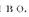
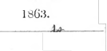

Digitized for Microsoft Corporation by the Internet Archive in 2007.

From University of California Libraries.

May be used for non-commercial, personal, research, or educational purposes, or any fair use.

May not be indexed in a commercial service.

# Introduction

KACHCHAYANA'S GRAMMAR
01 Mil PALI LAMiFAOK;
WITH 
A x i N
fr R o D u c T T o x. AIM* K x n i x, x o T E s, &

liY 


JAMKS irALWIS,
MtMHFP. <>F THK t I YJ.oN I'.KANc II <>I Till-: HoYAI. ASIATIC IOCI1 TY; TIIK AT'inoH UK AN INTK()l>l'(VrU)N TO SIMIAI.I SI <-!>AM.MAtt, TU t sil'AJSANi.: AHA, ( ONTKlin 1 I)NS T< ) OIMI.NiAl. J.l'i h l:A i 1 M-, mi; ATi'A.NAt. u.i VANSA, KTC., KTC.

o 7. o M ii o. 






\\ 1LLIAMS AND NoR(jA PK, 1 -4, 11 L Mil I 1 I A ^ i |{ ! J I . < o\ I N I (j AKOLN AND 21), Sullll I'ULDLUKK 6lTU.Lr. lluiMii K(.ii.

T< Sn: ('iiAin.r.s ,Ti si IN M.\< ('AKIHY, K r. Governor and Commander-in-Chief.

&e., &c., &c.,
SIT?,
THE practice of inscribing a literary work to the Ruler of the land is very ancient, and very general. In the East it has been almost universal ; and in Ceylon, while the Poets and Historians of old sought the patronage of the King, the translators and compilers of recent times have dedicated the result of their labours to the British Governor. 

In inscribing, however, the present work to you, I do not merely follow a time-honored rule, nor seek to do homage to a Power which stands in no need of any evidence of our loyalty and attachment. But, remembering that it was your kind patronage which chiefly enabled me to publish a previous work ; and knowing that to you, who are familiar with many of the questions discussed in the following pages, they will possess an interest which they do not possess to the general reader; I take the liberty of dedicating this work, as a token not only of my gratitude, but also of the high esteem which, in common with my countrymen, I entertain for your abilities as a Governor, and your attainments as a Scholar.

I have the honor to be, SIR,
Your Excellency's Most obedient and humble Servant, JAMES ALWIS.

Hendala.^th August, 18G2.

## 5828

.

i e e
-

T H E

I N T R O D U C T I O N .

sent and the state Univ Calif - Digitized by Microsoft ® 

# I X T K01) I Ct 1 N.

Tm;i:r. is hardly a country on the lace oi' tlie d which presents greater facilities tor acquiring a knowled tlic Pali, than Ccvlon; and. perhaps, no nation po.*- 
greater advantages for its study than the Sinhalese;. Pali., 
like the Sanskrit and the Sinhalese, forms a necessary part of the course of education pursued by the natives.* Our Alphabet is common to these several languages,! and the affinity which the Pali hears to the Sinhalese, both verbally and grammatically, renders its study far more easy to the people of this country than even to the Burmese.

Although the Sinhalese, as a language, has been latterly neglected; the Pali, from its being the dialect in which the Buddhist scriptures are recorded, has always been the principal study of the largest portion of the Ceylonese, who are followers of Buddha. From the period when it became the sacred language of the land, kings and princes have encouraged its study ; nobles and statesmen have vied with each other to excel in its composition ; and in it laymen and priests have produced some of our most elegant works. The names of Batuvantndave, Ilikkaduve, Lankagoda, Dodanpahala, Valana, Bentota, Kahave, and Sumangala, amongst a host of others, are familiar to Pali scholars, as those of the learned who are even ??r/v able to produce compositions^:
by no means inferior to those of a Buddhagosa or a Parak-krama, though, like the modern Sanskrit, certainly more artificial than some of the more ancient writings.

The number of books, too, in the Pali language, i< greater than in the Sinhalese ; and, though those on lleligion tar exceed those upon other subjects, it is, nevertheless, a fact, that the Pali literature of the Sinhalese is not deficient in works upon other branches of Oriental Science. It presents indeed a proud array of extensive volumes on Prosody, Rhetoric, Medicine, and History. On Grammar alone there are no less than forty Pali works;* whilst in the Sinhalese there is but one, the solitary Sidat-Sangarii. From the con-stant study of Pali in the Buddhist monasteries of this island, the books in that language are found to be comparatively free from errors: and it is a well known fact, that the Buddhist priests, unlike the Brahmans, are willing to give Pali scholars, whether Buddhist or Christian, free access to their libraries. 

Advantages like these, combined with others, enabled the Hon'ble George Tumour, late Colonial Secretary of Ceylon, to attract the attention of Orientalists to the high claims of the Pali language as existing in Ceylon. In the prose- cution of his labours with such a praiseworthy object, he drew attention, in his elaborate Introduction to the Mahavanea, to some of the Pali works formerly extant in Ceylon, and, amongst them, to Kachchayana's Grammar, which he then regarded as extinct. This, in the very outset of my Pali studies, after many years' devotion to Sinhalese literature, I ascertained to be a mistake;f having added it to my library, in a purchase of Pali books which I had then (1855) recently made, from the collection of the late lamented F. L)' Levera, District Judge of Colomho. Shortly afterwards I commu-nicated the fact to some of my friends in Europe; and the repeated communications which I have received from them, especially from Dr. Host of Canterbury, urging upon me the necessity for the publication of a Pali Grammar, and expressing a curiosity to examine Kachchayana, have induced me to publish a Chapter from it, as an Introduction to a fuller translation. In laying this before the public, I propose to give a brief account of some of the Pali Grammars known in this country, including a notice of the age and author of the work here presented ; and also an Essay on the relations of the Pali to the Sanskrit.

The terms Pali and MagadM are at the present day indifferently employed in Ceylon, Ava, Siam, and even China, to express the sacred language of the Buddhists; and, being confined to those countries, the term Pali is not met with in any of the Indian writings.

Magadhi is the correct and original name for the Pali. It was not so called in consequence, as some suppose, of the mission of Asoka, the king of Magadha,to introduce Buddhism into Ceylon.* It hadreceived that name before the age of that monarch,f and was so called after the ancient name of Behar.

It was the appellation for the ancient vernacular language of Magadha. It was the designation for the dialect of the Magadhas. Magadhanan Ijhasa Magadlil.\
Pali is comparatively a modern name for the Magadhi. It lias not originated from 'the region called Pallistan the (supposed) land of the Pali, our Palestine.' It does not come i'roin Pulitur in Tyre the so-called 'Pali tower or Fort.'
It has no historical connection with 'the Palatine hills of Koine.'* It was not called after the Pehlve, the dialect of the JSessanian dynasty, nor is it derived from " Palli a village, as w r e should now-a-days distinguish gunavari
' village,' 'boorish,' from Urdu, the language of the Court. ''f Jsor does it indeed mean "root" or "original.'^
Like all the word pali originally signified a 'line,' 'row,'
' range/ and was gradually extended to mean ' suttan/ from its being like a line;|| and to signify edicts,1F or the strings of rules in Buddha's discourses or doctrines, which are taken from the vSuttans.** From thence it became an appellation for the ft .if of the Buddhist Scriptures, as in the following passages; Thercyarharn a suhhe. Palin viya Tamaggahlin:
' All the three preceptors helil this compilation in the same estimation as tlic ft'.cf (oi'the Pitakattaya)."* Them vadchi palehi padchi vyaiijancliicha. 'In the Them df'ariH/w* as in the text (of the Pitakattax a); and in an expression us in a letter.'! From thence again 7V/// has become the name of the Magadhi language in which Buddha delivered his doctrines. The Pali has also received the designation of Taati, 'the string of a lute/* its Sanskrit cognate being tantri. From that signification it seems to have been originally applied by the Brahmans to ttitttru, 'a religious treatise teaching peculiar and mystical formula and rites for the worship of their deities, or the attainment of super-human power/ or, 'that which is comprized of five subjects, the creation and destruction of the world, the worship of the gods, the attainment of all objects, magical rites for the acquirement of six super-human faculties, and four modes of union with the spirit by meditation.'
The Magadhas, before their secession from the Brahman religion, probably used the Magadhi term, tanti in this sense ; but when they embraced the Buddhist faith, they used it to signify the doctrines of Gotama, as in the following passages:
(i) Saimna Sambuddho pi te pitakan Buddha vachanan Tan-tin aropento Magadhi basayeva aropesi 'Buddha who ren- dered his tepitaka words into Tanti (or tantra or doctrines)
did so by means of the Magadhi language' Vibhanga Atuva.

(ii) Tivagga sangahan chatuttinsa suttanta patimanditan chatu satthi bhanavara parimanan tantin sangayetva ayan digha nikayo nama'ti ( Having rehearsed the Tanti (the doctrines)
which contain 64 banavara embracing 34 Sultans composed of 3 classes, (this was) named Dighanikaya' Bodkivansa.

From its application to the Buddhist doctrines, Tanti has become a name for the sacred language itself of the Buddhists viz., the Mugadhi or Pali. Thus in Bucldhagosa's Attha-kathu : ' Why was the first convocation held ? In order that the Jtidanan of the Vinaya pitaka,\\iQ merits of which are con- veyed in the Tanti (Pali) language, might be illustrated.'* Thus also, in the Bulavatara, in a part of the passage which answers to 58 in the Rev. B. Clough's version, where it is left untranslated:
Eva manna pi vinneyya Sanhita tanti ya hita ; Sanhita chita vannanan Sannidha'byava dhanato.

That is to say, e In this wise know the rest of the combinations which are susceptible in the Tanti (language.) San/iita is the combination of letters without a hiatus.' For the elucidation of the grammar of this language there are three schools; or, in other words, all Pali Grammars extant in Ceylon may be divided into three classes, viz., (1)
Saddaniti; (2) Moggallayana; and (3) Kachchayana.

1. There are but few treatises which come under the first. 

2. Under the second head there are several, all which have been written upon the principles laid down by Moggallayana, the writer of Abhidhunapadipika. Owing to the omission of the Introduction and Conclusion of that work in the edition published by the Rev. B. Clough, oriental scholars have express-ed various conjectures as to its date. As a help, however, to those who may be engaged in antiquarian researches, and with a view to fix the date of Moggallayana, the omissions are here supplied.

*
15. A. .!., vol. vi. p. oil. Pa/hama mahil saii^iti nama esa kineha-pi vinaya pitakc T<ntt'\\\ arullia. 'This first trrcat rehearsal \va- moreover rendered into fnn/f, (the original (liseourses or the text) on the Yinava J'ilaka,' S' /////'//</ Vi/iixiiit.

AHHIDII AN ATADITIKA.

1. Tathagato y<> karuna karu karo
'Pay&tamomajja :siikhap padan padau Aka paratthan kali-am bliave bhavo i tan kcvala duk-kimiu kuraii 2. Apujayun yam muni kunjara jai'a
'lliijadiinutta yahimuttare tare 7'liitii tiva^aiubu nidhin unra'nara Tarinsu tan dliamaina' inaglia pahan' [)alian 3. (iatan munindi/ ra>aM
Ainutan nutan SupnfifSakhettan bhuvane'eutan sutan Ganampi pan! kala sanvaran varan Sada guno' ghcna nirantaran taran 4. Nama lingesu kossallam
'Attlia nichchhaya karanam Yato mahabbalan Bucldlia Vachane pu^i vattliinam.

5. Namalingiin' yato Buddha Bhasitassa' ralia n'ahuin Dassayanto pakasis?am Abbidhana' padipikan .

6. Bhiyo rupan tara saha
'Chariyena cha katthaclii Kvacha' hachcha vidhancna A
Teyyan thipun napunsakan.

7. Abhinna linginan yeva Dvando cha linga vachaka Gatha [)adanta majjha^Ma Pubban yantya'pare paran.

8. Pumitthiyan padan dvisu Sabba lingc eha tisviti Abhidhanan tara rambhe iVeyyan t van hi niatluuli clui.

9. Bhiyo payoga magamina Sogate again c kvachi Nighftndu yuttin chtiniya Kama lingan kathiyati, C I adore Tatlmyata, who is a mine of compassion, and having renounced the beatific niblmn within his reach, con-ferred happiness on others, performing all the difficult-to-be- accomplished acts in metempsychosis, the fountain of sin.

C I (adore) the sin-scaring Dhamnia, to which holy sages, devoid of decrepitude and disease, have paid reverence; and by conformance to which the high and the mean, both (amongst)
men and other beings,* have crossed the tri-annularf ocean
(of metempsychosis.)
( And ever (do I adore) the supreme priesthood, (like unto) a merit- (producing) field, who have become the legitimate sonsjof Buddha; and who receive reverence are illustrious in the (three) worlds preserve the sanvara like life itself and ever practise an abundance of virtues.

' Since an intimate acquaintance with nouns* and (their)
genders, is essential to the (ascertainment of) the correct significations (of words), and is a powerful help to those de-sirous of mastering the word of Buddha ;
<I shall publish th Afohidh&rapadlpik^* illn-ir:
I and (their) //-'//
/ rs, according to t'ni'ir ap the lasix'iia-v of (the <i of) I>i:-' masculine, fi'iiiiniii", and neuter .. -
, chiefly, from their different forms ; sometimes from
{lie association of words (context) ; and sometimes by speeirie rule.

| hi this work | dvandx compomnis will consist (of nouns)
'

ud-Ts. Wh-Mi words which denote the occur at the end or the middle of a line in a verse, words) refer to the (names at the) beginning (of thai. li. 

(but where they are placed at) the commencement, (tiit-v refer to) the remaining words (of the same line.)
' Know that the term dvlsu denotes both masculine and feminine ; that Hsu signifies all the genders ; and that words ending in tu, or (preceded by) atha &c., are given to express the commencement of a series of names.

' Nouns and (their) genders are (here) illustrated, according to their application, chiefly in the Buddhist works, and sometimes after the usage adopted in Lexicons.' The above is the Introduction to the Abhidhanapadlpikd, ; and I cannot conceive why it was omitted in the translation of that work by Mr. Tolfrey, and was left out by his publisher, the Revd. B. Clough. At the conclusion of the same book are also nine stanzas, which are likewise left out in the pub-lication above mentioned ; and which, since they enable us to fix the date of the work, are here subjoined : 1 Sagga kand'o cha bhii kanrfo Tatha samaiina kaiu^ikan Kam/att;iy;-mvita esu, Abhidhana padipika.

2 Tidive mahiyan hhujaga vnsathe Sakalattha samavhaya dipurii' \MIII Iha yo kusalo inatima sanuro hot! mahamunino vacliane.

## 1Ntkodi Ctiun.

3 Parakkama bhujo uama Bhupalo ginia bliiis nio Lnnkaya' ni.-isi tej;iss\
.la vi ki-sari vikkamo.

I Yibhinnan cliirau bhikkhu sanghan uikava Tayiismin eha karcsi samma sammng^c Sadehanva nichclia 'daro digha kalau Mahagghehi rakkhesi yo paehcliayehi.

5 Yena Lanka viharehi Gama'rama purihicha Kittiyaviya sambodhi Kata khettehi vapihi.

6 Yassa' sadharanan patva
'Nuggaham sabba kam^dam Ahampi gandha karattam Patto vibudha gocharain. 7 Karite tena passada Gropui-adi vibhusite Sagga kanr/eva tattoya Sayasmin paribimbite 8 Maha Jetavana khyamhi Vihare sadhu sammate Sarogama samuhamhi Vasata santa vuttina. 9 SaddhammaMiti kamena Moggallanena dhimata Therena rachita yesa Abhidhanapadipika.

The Abhidhanapadipika consists of three sections on Heavenly, Earthly, and General subjects.

' It interprets the names of all objects in Heaven, Earth, and the Naga regions. A sensible person who excels in this,
\\ill master the words of the great sa- .

1 There was in Lanka a Monarch named Parakkamabdhu celebrated, successful, endowed with virtues, and valorous as a lion.

M
' Ho in the right. manner (in the legitimate mode) reoonci 1 ( 1 *t 1 1<
- bh'd 7r///'.s and Sovgkaa <>!' the three NUcdyoS ^
and, with unceasing love, l"n<_; extended his protection to 
(them) as to his own bodv. with valuable objects ui
* He established to profusion in Lanka, in the same man-ner that it was filled with his renown, monasteries,^ villa| parks,** cities,ff fieldsjf and tanks.

4 Being the special object of his wish-conferring patron I too, have acquired the privilege of authorship peculiar to the learned.

' Desirous of perpetuating the Saddhamma, the Abhidluinapadipika was composed by the erudite Moggallana thera,
' Of mild deportment, dwelling amongst the SarogdriiaflW
fraternity (who were) received by the virtuous with approba-tion ; and (residing) in the Vohara called the Mahd Jeta- vana ;
' [A monastic Establishment] adorned with the temples, ornamented porches, &c., which were built by him (the afore- said king) as it were a portion of Heaven reflected in his Tank.'
Here we have sufficient data to fix the date of the Abhi-
<l}/diiaj>adq>ikd. It was composed by a thera named Moggal-lana, who had been patronized by king Parakhama. His acts, which are here related, can only be identified with those of " the heroic and invincible royal warrior, gloriously en dowed with might, majesty, and wisdom ; and radient with
;iiant virtues,"*
" the most martial, enterprising and glorious of the Sinhalese Sovereigns,"-)- who, according to hi tory, was Parakkamabahu of Polonnoruva. He astvndedth throne in 1153 A. D. ; and when we notice that. I hat sove
;;, 
/P-
reign, who reigned for thirty-three years, turned his attention to the internal improvements which are here mentioned, in the latter part of his reign, and after he had brought his local and foreign wars to a termination ; we may assign to the Abhidhanapadipika a date art the latter end of the second half of the twelfth century. This, therefore, is posterior to the Amarakosa, which is much after the fashion of the Abhidhanapadipika. To show their correspondence we need only present the three following introductory stanzas from the first named work.

' The masculine, feminine, and neuter (genders) are to be known chiefly by their different forms ; sometimes by the association of words ; and sometimes by specific rule.

' Here, with a view to distinct elucidation (nouns of) dif- ferent unspecified genders are not rendered into dvanda compounds. Neither are they, without order, jumbled together nor indeed expressed by eka sesha.^
' The term trishu (denotes) the three genders ; and dvayoJi the male and female. (Where a certain) gender is expressly negatived, the remaining ones (arc' meant) ; and, where words ending in tu (occur or) atha, &c., they do not refer to the preceding (words)/
Moggallayana'fl Grammar, to winch we may assign the same datt> that was given to the Abhidhanapadipikfi, is written in imitation of Kachchana's style; andcont;iins rules, snpplementary notes or Vttiti ; and examples. The same writer has left lu'hind a large commentary on this work. It has been fur- ther i 1 1 u strated by Totagamuva* in his Pamhikct-pracTtpa, a Sinhalese work, held in high esteem among the learned. Piyadassi, a pupil of Moggalayana has, moreover, written an abridgment of his master's work, called the Pada-Sddana, from which the following is extracted : Satthannm knruna vata gatavata Param param dhimnta There na 'tuma padapanjara gato Yo sadda sattha disu. 

Moggallayana vissute niha suvach
'Chapo vinito yatha So' kasip Piyadassi nama yati 'dam Byattan Sukhappattiya.

' With a view to facilitate (study) this specific (work) has been composed by the ascetic named Piyadassi, who, like a paroquet which was taken into the cage of his (feet) tuition, was trained in the science of grammar &c., by the wise, gener-ous, and eruditef Moggallayana tliera of (world-wide) renown/
There is also a Commentary on the above by Ananda, a pupil of Medankara ; from which we select the following introductory remarks : 
1. Yassa tulan samadhi gamya parappasadan Sampaditam parahitan vipulan mayedam So sangha rakkhita itirita nama dheyyo Bhanuva bhatu suchiraya mahadisami.

2, Saddha dhanassa paripatti parayanassa Sallekhiyena likhita khila kibbisassa Odumbara bhi hita pabbata vasi kassa Medankaravhaya maha yati pungavassa.

3, Siladi se/Jia pa/ipatti paranugena Sisso-rasena saparattlia ratena tena Ananda nama pathi tena tapo dhanena Sankhepato nigadito Padasadhanattho.

1.

' May the Supreme Lord named Sangliarakkhita, by the acquirement of whose unparalleled patriotism* this great benevolent (deed) has been achieved by me, long exist like the sun ! 

2 and 3.

' The Padasadana has been concisely comment-ed upon by the ascetic known by the name of Ananda, (who is) bent upon doing good to himself and others ; (who has)
adhered to the principal (religious) usages of Slla&c. ; (and who is) a pupil*)- of the preeminent chief-priest named Medankara, that dwelt on the Mountain called Odumbara,
(was) rich in faith, (was ) attached to (religious) duties, and
(had) scratched off all sin by Sallekhiya.'l Payogasiddhi by Vanaratana, in the reign of one of the Buvanekabahu's, is also a Pali Grammar upon the basis of Moggalayana, from the Commentary to which Tumour has quoted in his introduction to the>Mahavansa.

3. The next, and, by far the most numerous, class of Pali Grammars are founded on the principles enunciated in the Sandhikappci, usually called after the name of its author Kachch&yana. This, as I have already stated, is extant in Ceylon ; and, from a list of Burman Pali works in my possession, I find that it is also found in that empire. The several other editions or revisions of Kachchayana's Grammar, which, as remarked by Mr. Tumour, " profess, according as its date is more modern, to be more cond ensed, and methodized than the preceding one", are the Rupasiddhi and Balavatara Buddhappiyo commences the Rupasiddhi in these words : " Kachchayananchachariyan namitwa ; nissaya Kachcha-
"Reverentially bowing down to the Arh:ii-;iyo-K;u-lirluii... :uu I guided by the rules laid down by the said KaohehiYyaim, I compose the Rupasiddhi, in a perspicuous form ; judiciously subdivided into sections, for the use of degenerated in- tellects (of the present age, which could not grasp the original.)" Mahdvansa, p. xxvi. The following is in the conclusion of the same work : " Wikkhyatanandatherawhaya waraguriman Tambapan-niddhajanan sisso Dipankarakkhyo Damilawasumati dipalad-dhappakaso B&l&dichch&di wasaddwitayamadhiwasan, sasanan jotayi yo, soyam Buddhappi-yawho yati ; imamujukan Rupasiddhin akasi.

" A certain disciple of Anando, a preceptor who was (a rallying point) unto eminent preceptors like unto a standard, in Tambapanni, named Dipankaro, renowned in the Damila kingdom (of Chola) and the resident-superior of two frater iiities, there, the Baladichcha (and the Chudamanikyo), caused the religon (of Buddho) to shine forth. He was the priest who obtained the appellation of Buddhappiyo (the delight o Buddho,) and compiled this perfect Rupasiddhi." Mahdvansa, p. xxvi. 

Before I notice the principal and the oldest work with which we are concerned, viz., Kachchayana's Grammar, I
shall mention the names of some of the principal Comments thereon to which I shall have occasian to refer in the course of these notes ; viz. 

Nyasa or Mukhamatta Dipana Kachchayana bheda Kachchayana bhede Tika Kachchayana bhede Vannana. Kachchayana Vannana Kachchayana Sara Kachchayana Sara Tika Sandhikappa Atuva Sandhikappa Viggahk.*
All these have been written expressl^ for the purpose of elucidating the text of Kachchayana, which, I need scarcely say, is held in the same high estimation by Buddhists tl Panini is by the Brahmans.

Kachchayana's Grammar is divided into eightbooks.

first treats on
' Combination', the second on
' Declension', 
third on ' Syntax', the fourth on ' Compounds', the fifth on
(Tadhita)
' nominal Derivatives,' the sixth on
' Verbs', the seventh on (Kitaka)
' verbal derivatives,' and the eighth on Unnddi Affixes/
These are found subdivided into Chapters or Sections. But, all the aphorisms do not exceed six hundred and eighty seven.* The following extract embraces the writer's introductory remarks, together with the first Section of his Grammar : Sehan tiloka m ahitan abhivandi yaggan Buddhan cha dhamma' mamalan gana' mutta mancha Satthussa tassa vachanattha varan subuddhun Vakkhami sutta hita* mettha su Sandhikappan.

Seyyan Jinerita nayena buddha labhanti Tancha'pi tassa vachanattha subhodhanena Attan cha akkhara padesu amoha bhava Seyyatthi ko pada'mato vividhan suneyya.

1 Having reverentially bowed down to the supreme chief Buddha adored by the three worlds, and also to the pure dhamma, and the illustrious priesthood ; I now celebratef the (pure) Sandhikappa in accordance with the Sutta, to the end that the deep import of that teacher's words may be easily comprehended.

' The wise attain to supreme (bliss) by conforming
(themselves) to the teachings of Buddha. That (is the resuit of a correct aeijuamtaiiee with the import of his \\oni Tiie souse, too, (is learnt) by a | non-io- n()1 -,. mr( .| kno\\l<- ! characters and words. Wheivt'oiv, ],-t him who aims at tlial highest felicity hear the various verbal ton us.' 
Lib. I. Section 1. 

1. Attho akkhara sauna to. 

The sense is known by letters. , 
"2. Akkhara padavo rka cliattalisan. The letters, a c., are forty one *
3. Tattho danta sara a//ha, Of these the eight ending with o arc vowels.

4. Lahumatta tayo rassa. The three light-measured (arc) short.

5. Aline diglui.

The others, (are) long.

6. Sesa byanjana.

The rest are consonants.

7. Vagga pancha panchaso manta. Each (set of) five to the end of m (constitutes^ a class. 8. An iti niggahltan.

The An\ is a dependent.

9. Para samaiiiia p^yoge.J
Other's names in composition.

10. Pubba' madho'-^hitam' assaran sarena viyojaye. Let the first be separated from its (inherent) vowel, by
(rendering) the preceding^ a consonant. Such is the sententious brevity with which the Rules in Kachchayana's Grammar are expressed. The author adopts three modes of explaining them. First, Vuttiyd or V&rttikas, comments to supply tho deficiencies in the Suttas, and to render them clear ; secondly examples ; and thirdly explanatory notes on some of the principal grammatical terms in the shape of questions and answers. To these again are occasionally added a note to mark the exceptions to the Rule. In the examples mention is made of several of the places and towns which were rendered sacred by the abode of Gotama, such as Savatti, Patdli, Bamnasi <Sb.* There is also much correspondence between the Paninya Sutras and those given in Kacchayana. E. G : 1. Apadane panchami P&nini III. 4, 52. Ap&d&ne pancliami KachcJi&ya na . So likewise : 
2. Bhiivadayo dhatavah. I. 3, 1. 

Bhnv&dai/o dk&tavo.

3. Kaladhvano ratyanta sanyoge. II. 3, 5. 

K<\laddJi,\na mackcJianta sanyoge.

4. Kartari krit. III. 4, 6. 

Kattari kit. 

5. Asmadyuttamah. I. 4, 107. Amhe uttamo. 

Again, the text of Panini is altered to meet the exigen-cies of the Pali Grammar, thus ; 
6. Tinas trmi trini pahama madliyamottamah Dvedvepathoma'majjhimutfamapurissi. [1.4, 101. Tradition represents that, the whole work (including Vutti)
as we now have it, was written by one and the same person. But this is contradicted by another Tradition. On this, I shall offer a few observations hereafter. From its language, the Pali Grammar appears to be a very ancient work. It was probably written at a time when liter- ature was usually carried on in the concise Algebraic form of aphorisms. This is put down by IV. Max Midler :it (>()() JOO II. C., embracing iln- period at which tin- f.-imder >f Buddhism flourished, and which upon the hcst .proof on which a date may he fixed in Asiatic History, was not only p- rior to the MaittuN (which are identified with the WC/</N * the Veda/ngas and Veyyctfcarana, but subsequent to the Mtihu 1'.hunting Rdmdyana; Asvaldyana^ and Vnraxwu ; and upon otlier data, 477 B. C.

T<> the indefatigable labours of the learned translator of the JMahavansa, whom I have so frequently mentioned in the course of these notes, were Europeans first indebted for the information as to the probable date of Kachchayaria's Grain-in ar. In order to render my observations clear, Mr. Tur- nour s authorities on the subject are here extrated.

" In the commentary on the Ruphasiddhi we find the following distinct and important particulars regarding Kachchayana, purporting to be conve}^ed in his own words : - " Kachchdyano signifies the son of Kachcho. The- said Kachcho was the first individual (who assumed that name as a patronymic) in that family. All who are descended from that stock are, by birth Kachchayana,
"
(If I am asked) who is this Kachchayano ? Whence his name Kachchayano ? (I answer), It is he who was selected for the important office (of compiling the first Pali Grammar, by Buddho himself; who said on that occasion) : ' Bhikkhus from amongst my sanctified disciples, who are capable of elucidating in detail, that which is expressed in the abstract, the most eminent is this Mahakachchayano.'
" Bhagawa (Buddho) seated in the midst of the four classes of devotees, of which his congregation was composed (viz.

INTRODUCTION.

priests ind prirsto^cs, male and female asceties :)- opening his sacred mouth, like unto a flower expanding under the genial influence of Surio's rays, and pouring forth a stream of eloquence like unto that of Brahmo said : ' My disciples ! the profoundly wise Sariputto is competent to spread abroad the tidings of the wisdom (contained in my religion) by his having proclaimed of me that,
' To define the bounds of his omniscience by a standard of measure, let the grains of sand in the Ganges be counted ; let the water in the great Ocean . be measured ; let the particles of matter in the great earth be numbered' ; as well as by his various other discourses.

" It has also been admitted that, excepting the saviour of the world, there are no others in existence whose wisdom is equal to one sixteenth part of the profundity of Sariputto.

By the Acharayos also the wisdom of Sariputto has been cele- brated. Moreover, while the other great disciples also, who had overcome the dominion of sin and attained the four gifts of sanctifi cation were yet living ; he (Buddho) allotted, from amongst those who were capable of illustrating the word of Tathagato, this important task to me, in the same manner that a Chakkawatti raja confers on an eldest son, who is capa-ble of sustaining the weight of empire, the office of Parinaya-ko. I must therefore render unto Tathagato a service equi-valent to the honor conferred. Bhagawa has assigned to me a most worthy commission. Let me place implicit faith in whatever Bhagawa has vouchsafed to propound.

" This being achieved, men of various nations and tongues) 
rejecting the dialets which had become confused by its disorderly mixture with the Sanscrit and other languages, will, with facility acquire, by conformity to the rules of grammar propounded by Tathagato, the knowledge of the word of Buddho
' Thus the There Maha Kachchayano, who is here (in this work) called simply Kachchayano, setting forth his qualifica- tion ; pursuant to the declaration of Buddho, that " sense is represented by letters", composed the grammatical work called Niruttipifako'* Maliiivansa p. xxvii. Before I notice some of the objections urged against the above tradition, it may perhaps be convenient to refer to the various other Pali writers who have given it the sanction of their high authority.

Kachchttyana commences his work, as we have already seen, with Atth6 akkkara saunato ; and it has already been shewn from the passage quoted by Tumour, that that Suttan was declared by Buddha himself. This is more clearly stated as follows in the SUTTA NlDDESA.

Attlio akkhara sanndto-ti atli maha; idan suttan kena vuttan ? Bhagavata vuttan. Kada vuttanti Yama Uppala iiamaka dve Brahmana Khaya-vaya kammaMianan gahetva gachchhanta Nadi-tire Khaya-vayanti .K'ammaMia'ne kari-yamane eko udake machchan ganhitun charantan bakan disva, udaka bakoti vicharati. Eko ghate patan disvo, ghafo, pafo ti vicharati, Tada Bhagava obhasan munchitva attlto ak-khara sanrtato-ti vakyan fhapesi. Tesan cha Kamma^h^
nan patifthahi. Tasma Bhagavatd vuttanti vuchchati. Tan natva maha Kachchano Bhagavantan yachitva Himavantan gantva Mano-sila tale dakkhina disa bhagan sisan katva puratthima disabhimukho hutva attho akkfiara sann-dto-ti a dtkan Kachchdyana pakaranan rachi.

' It is said that 'sense is represented by letters' &c. By whom was this suttan declared ? It was laid down by Bhagava. (To the banks of the Nudi, one of them saw a crane proceeding to catch a fish in the water, and began muttering* Udako bako ' water-crane.' The other, seeing a ghate-patan
' a cloth in a pot' began muttering ghata-pato. At this time Bhagavaby means of a light, which he issued, declared the sen" tence, Attho akkhara sannato 'The sense is represented by letters.' Their Kammallhanan was also effectual. Wherefore it is said that this Suttan was declared by Bhagava. When Maha Kachchana learnt this, he proceeded with Bhagava's permis-sion to Himavanta. Reclining in the Mano-sila region with his head towaids the south, and facing the east he composed the Kachchdynna-pnkarana consisting of (the Suttans) attho akkhara sanndto c.' In the atthakathd to the Anguttara Nikdya Maha Kach-chayana is spoken of ;f and the Tika to the same work con-tains further particulars which are quoted in the following ex-tract from THE KACHCHAYANA VANNANA
Achariya pana lakkhana vutti Udaharana sankhatan iman Kachchayana gandha pakaranan Kachchayanattherena eva katanti vadanti. Tena dha eka nipata Anguttara tikayan
' Maha Kachchayanatthero pubba patthana vasena Kachchayna pakaranan, Maha Nirutti pakaranan, Netti pakara-nan, chati pakaranattayan sangha majjhe pakasesi.'
* Teachers say that this Kachchayana gandha pakarana
(Text or composition) which numbers lakkhan'i (Rules), vutti
(supplementary notes), and Udaharana (Examples), was composed by Kachchayana thera himself. Wherefore the Tika to the Anguttara of the Ekanipdta says ;
' the thera Maha Kachchayana, according to his previous aspirations, published in the midst of the priesthood the three composi-tions, viz. Kachchdyana Pakarana, Mnhd Nlrutti
:md Netti Pakarana.'
* Ur ruMier poudering on what he hnj t Vide extract therot'vuiu infra OF tin 1 three books here mentioned the NcMi' l*uki\i,.

;dso extant in tins Island; and it lias been suggested by my Pandit that the style of this work, of which I give a sjvrimen,* would seem to differ from that of the Grammar.

There can be no question of this. The language of a work such as the Pali grammar, in which (to adopt the words <>f Professor Max .Mulli-r in respect ofPanini) the author "docs not write and compose, but squeezes and distils his thoughts, and puts them before us in a form which hardly deserves the name of style,"*!* cannot bear any comparison to the style of a work on religion, where the object was to convince and fasci- nate the reader, and not to cramp the writer's ideas in small sentences with a view to render a facility to those who com-mitted them to memory. Even in other languages works on science and religion written by the same person present the same diversity of style which the subject may demand.

The one may be terse, sententious, and dry ; and the other full, flowing, and elegant as is the case here. The difference of style, therefore, in these two works, does by no means fur- nish any ground for overthrowing the authorship ascribed to this Pdli Grammar. And, I am again reminded by my learned Pandit that the metre of some of the gathas in Kacchayana are different from those in the text-books of Buddhism such as Dhammapada ; and that that difference would favor the belief that this grammar was written long after the Buddhist era. 

I freely admit the force of the learned Pandit's observation, that the difference of metre (if, such were the fact) be-tween confessedly Got -i ma's gathas, and all other Pali writings
(including Kachchana's gramm-ir) would establish a line of de-marcation between two periods of literature. And I also confess that I hive been disappointed in my search after a verse in the Vasantatilaka metre, such as Setthan tiloka mahitan &c.} + in any of the original writings in the Buddhist
* See Appendix.

+ Sanskrit Literature p. 31^.

e ihe inu-yrluutoi-y \\-rsc* ui' Kachcliyaiia -{noted at p. xvi.

works. But, leaving this question for the determm future researches, and of more competent scholars than my-self, I may be permitted to remark that the absence of a ticular metre in Buddha's lectures does not necessarily prove that it was unknown in his time. Different metres suit different compositions. There are some which are peculiarly adapted to the genius of the oldest form of the Pali, before it received the elaborations of poets. Such'are the Anusfribh, the Trisubh, the Anusubh-trisubh, the Jagati, the Tris^ubh-
Jaguti, and the Vaitaliya metres which we frequently meet with in old writings. The Vas mtatilaka is generally unsuit-ed to the Pali, as it is to the Sinhalese, and other so-called Prakrita dialects. Although compositions in that metre are occasionally found in works of both those langunges ; yet they have all the evidence of being farced, and abound with compounds, of which the really old Buddhist writings are comparatively free. This is doubtless the reason why this particular metre (Vasantatilaka) is not to be found in the lec- tures of Gotama, which were expressed, as occasions present-ed themselves, with a view to impart religious instruction, without study, and without any attempts at ornament. The case with the grammarian was, however, different. Except in the Suttans which were designed for instruction, ke seems to have studied ornament. Perhaps too, he was fond of display. He, as we learn from himself, did not despise Sanskrit grammatical terms. He h;>d no reason, therefore, to reject really Sanskrit metres in which he could with elegance depict the virtues of his Teacher. Hence the adoption in this gram- mar of metres which are not met with in original Buddhist writings.

There is not, therefore, I apprehend, sufficient evidence to set aside the popular tradition as to the author of this Gram-mar, which I perceive is supported by various considerations- and inferences which may be drawn from several his toneal facts. That the Mayadhi- \\hieh (he Buddhists de- noinhiate tin* /'<///, was an actually existent t'onn of speech in Bohar at the time Buddhism arose, may be easily believ- ed.* Yet, before this period when the Ma.^adhas had but one common religion, and, perhaps, cultivated the hinging in which that religion was taught with greater zest, it is no! improbable that the treatises to elucidate the vernacular Miijulhl were, as the Sinhalese Grammar are at the pi day, limited. And this is obviously the reason why Kach-chfiyana, as he himself declares, had borrowed technical ti i m-from Sanskrit authors. PARA SAMANNA PAYOGE. (Vutti) ya cha pana sakkata gandhesu samaiifia ghosa' ti va ughosa' ti va ta payoge sati ettha' pi yujjante.

' In composition other's appclations.

[Vutti.] Such (Grammatical) terms as are called gkuwi,
(sonants) or ajhosa (surds) in Sanskrit (gandhas-f) compositions are liere adopted as exigency may require.'
By
' Sanskrit' sources, perhaps, the writer meant the Pi d-krit Grammars by Sanskrit writers, or such Rules of Panini as are indicated in the following extract from the Kavlkanthapdsa by Kedara-bhatta : Panini bhagavan Prakrita Lakshana mapi vakti Sanskrita danyat : Dirghaksharancha kutrachi Dekan matra mupaititi.

That is : 'Panini, the Rishi, speaks also of the lakshana (or Grammatical Rules) of Prakrita, besides the Sanskrit; and
(says) that in some languages a long letter| becomes one syllabic instant.' But, whether this inference be well found-ed or not, it is quite clear that this was one of the earliest Pali Grammars, which borrowed its technical terms, not from Pali but, Sanskrit writers. Its object too, was to fix the Rules of that language ; since at the time Kachchayana wrote Grammar the Magadhl, like other "dialects," had a tendei cy to become ' confused by its disorderly mixture with tl Sanskrit and other languages.' This is a fact. As a ve cular dialect, the Magadhl scarcely maintained its characl in Asia till the age of Asoka. Two hundred years had hare ly elapsed before its development was ' intermediate between the Pali and Sanskrit.' There must therefore, have been a gradual declension in Pali literature during those two centuries. Indeed this could not have been otherwise when we ascertain that the very pupils of Gotama had resorted to other languages for the elucidation of Buddhism. Hence the necessity for a compilation like Kachchayana's a work on Grammar ' for the easy comprehension of the wo rd of Buddha' Sukhb-na Buddha Vachanan ugganhissanti-ti ; and as Kachchayana himself says in the opening of his work, written, not according to the vernacular dialect of the Magadhas, but ' in accordance with the (language) of the Suttans' vakkhdmi sufttt, hita metta su Sandhikappan.

These are not all the circumstances from which it ni:iy be inferred that Kachchay.m Vs Grammar was written nt the first dawn of Buddhism. As was the case with all ancient nations, a sacred literature gave rise in Magadha to philological sciences. Religious doctrines when disseminated through a written medium, naturally led the Buddhists to Grammatical inquiries. The necessity for rescuing the dham-tna from corruption, and for preserving their correct interpretations, as already seen, was a powerful inducement to (jotama's disciples to fix the rules of their Preceptors' words, the Jina vachina, as the Magadhi is called in most ancient works.

It may, however, be asserted that neither was writing known six centuries before Christ, nor, consequently, were Buddhist doctrines recorded at that date. I have discuss.-,! 

this question flsuwhure. and I may here state, as the result of those investigations, that at tin- time when Buddhism first started into existence, writing 1 was known in Ma^;idha as much as painting.* It was />/,/(//*/ in the time ofGotama.-f Buddhist doctrines were conveyed to different coun-tries by its means.J Laws and usages were recorded.

Little children were taught to write. ^ Even women were found able to read and write. || The character used waa the Ndyari** Vermilion was the 'ink', and metal plates, cloth, hydes, and leaves constituted the 'paper' of tintime.-f")- That Buddhist annals therefore, were reduced to writing from the very commencement, is not only reasonable, but is indeed capable of easy and satisfactory proof.

To return to the subject. The literary qualifications of the the'ra Kachchuyana, seem to have been indeed such as to warrant the belief that he devoted his time to the elucidation of the language of Buddhism. He was, as is abundantly proved in the Pali works, a distinguished member of the Buddhist Church. He is also mentioned in the Tibetan Buddhistical Annals, as one of the disciples of Gotama ; and it is expressly stated of him, that ' he recited the Sutra on emancipation in the vulgar dialect.' By
' the vulgar dia-lect' Mons. De Koresi doubtless meant the language to which Colebrooke had previously given that appellation the Mclgadlii. Gotama himself states that of all his pupils Maha Kachchayana was the most competent to elucidate his doctrines. In the very language of the sage, which is here quoted from the Ekanipdta of the AnguttaNikdya : Etanaggan Bhikkhave mama savakanan bhikkhunan sankhittena bhasitassa vittharena atthan vibhajantanan, yadidan Maha Kachchaiio ' Priests, he who is Maha Kachchayana is chief of all the bhikkhus, my pupils, who can minutely eluci- date the sense of what is concisely expressed.' That this supremacy refers to the literary, and not the theological, attain- ments of Kachchayana appears from the following comment which we extract from the atthakatha to the Anguttura Nikaya.

AFine kira Tathagatassa snnkhepa vachanan Attha vasena va puritun sakkonti vyaiijana vasena va; ayan pana thero ubhayena-
}'i sakkoti : tasma aggo-ti vutto.

' Some are able to amplify the concise words of Tathagata either by means of letters, or by [shewing] their sense. But this thera can do so in both ways. He is therefore called chief.' In the Nyasa or the Mukha matta-dipani, which is sup-posed to be the earliest commentary on Kachchayana's Pali Grammar, and, as may be proved, older than the Rupasid-dhi, the author of this Grammar is not only identified with the Kachchayana thera, whose ' intellectual supremacy was extolled by Buddha' ; but his memory is thus respected by an ' Obeisance.'
Kachchayanan cha muni vannita buddhi-'massa Kaohchayanassa mukha m-itta' mahan karrissan Parampara gata viniclichaya nichchhayan cha.

' Also (bowing down to) Kachchayana, whose intellectual at tainments had been complimented by Buddha, I shall com- ment upon the positive conclusions (Rules) which have been handed down by tradition as the very oral (teachings)* of this Kachchayana.'
With reference to the name Kachchayana in the above extract, the following passage occurs in the Nirutti sara Manjusa : wherein also the writer acknowledges the consum- mate scholarship of the Grammarian.

i K:immadiiia. vyaparena ksichch.iti dippatiti Kaclicho, thrr.i pittl tissa apachclr.m put to Kaclirlia y
..im NcrutiuUlniiin pibliav.i bhuto p ibhinna part BHHibhido etadnggB /ham- /luipito khiris,iv.itthero, tan pan-i nut \ a ML
' By reason of the occupation of ploughing &c. [comes]
K-H'Jn'h.ttl 'he shines.' Thence Kackcho, (the name of) the thera's father. His son is Kachchayana a thera, who was an (ii\ikauta, who was placed in the highest position, who had attained the patisambhidd* and who was the first cause (source) of all Neruttika, [Grammarians or] philologers.'
Although it is stated*)* that Kachchdyana was residing at Avanti, the pachchanta or 'the foreign regions'J, it is how-ever expressly stated that this Grammar was written in the Himavant'i ; and from the mention of the principal towns celebrated by the presence and abode of Gotama, and especially that which had risen from a small village to the importance of a populous city in the time of the sage, I mean Patdliputta, it may be inferred that the writer took for his examples such of the names as were then of recent celebrity.

As we hare already seen, the Mugadhi scarcely main-tained its original purity in the MagadJw desa until the second ecumenial convocation ; and the code of the Vajjian heretics, which was made at this time, and which may be clearly identified as the Nepal collection,* was in point of language "intermediate" between the Pali of Kachchayana and the Dhammapada; and the Prakrit of the Pillar-dialect. These are important facts, which prove that the Grammar in question was composed in the golden age of the Pali lite- rature before it became interlarded with the Sanskrit, and before the language was so much neglected, (as at the time of the second convocation), that, except those who maintained the orthodox version of the Scriptures, literary men were unable to pay correct attention to 'the nature of nouns, their genders, and other accidents of Grammar, as well as the vari- ous requirements of style.'-)- Nama lingan parikkharan akappakaranani cha Pakaribhavan vijnhitva, tancha aniian ?ikansute. Thus, when the uniform and popular tradition stated ii the above extracts, which there is no reasonable ground to set aside, is coupled with the many inferences to which I have directed attention ; it is, I apprehend, very clear that Kachchayann, the author of Sandhi-kappa, was one of the eighty eminent disciples of Gotama.. As such, he must have flourished in the latter-half of the sixth century before Christ. 

Against this popular belief I have been referred by several friends to another name of Kachchayana, the author of the Abkidharma Jnana prasth&na, mentioned in the following account of Hiouen-thsagn, the Chinese traveller of 629 645 A. D.

Apres avoir fait environ cinq cent li, au sud-est de la capitale (de Chlnapati), il arriva au couvent appele Ta-mo-soufa-na-seng-kia-lan (Tamasvana-sangha rama), ou le convent In Foret Soinhro. On y comptait environ trois cent reliijui suivaiont les principes de I'e'cohfdes Sarvastivadas. Us avainit un exteYieur grave et imposant, et se distinguai nt par la jmretd de leur vertu et MeVation de leur carac-11s approfondissaient surtout 1'etude du petit Ve'hicule.

inillc Buddhas du kalpa des sages (Bhadrakalpa) doivent j dans ce lieu, rassambler la multitude des Devas et leur expliquer la sublime loi. Dans la trois centieme annee apres le Nirvana de Sakya Tathagata, il y eut un inaitre des Sastras, nomme' Katyayana, qui composa, dans ce couvent, le Fa-tchi-lun (Abhidharma-jnana-prasthana.) Mtfinoires x// / 
les Co nMes Occidentales par Hiouen-thsang, llv. iv. p. 200.

' Having travelled about five hundred li southwest of the capital (of Chinapati) he arrived at the monastery called Tamo-sou-fa-na-seng-kia-lan (Tamasvana Sangharama) or the monastery of the dark-forest. About three hundred Reli- gieux are reckoned in this place, who follow the principles of the Saivdstivadas school. They maintain a grave and imposing exterior, and are remarkable for purity of virtue, and elevation of character. They are engaged in the profound study of the little vehicle. The thousand Buddhas of the Kalpa of the wise men (Bhaddrakalpa) were bound to assemble, in this place, the whole multitude of the Devas, and expound to them the sublime law. In the three hundredth year after the nirvana of Sakya Tathagata, there was a master of the Sastras, named Katyayana, who composed in this monastery, the Fa-tchi-lun (Abhi-dharma-jnana-prasthana.)'
Here there is nothing to establish the identity of persons. The age too, given by the Chinese pilgrim, does not throw any light on the subject. If Katyayana, the author of A ll< i- dkarma-jndna Prasthdna lived 300 A. B., he flourished after As6ka, and, according to the same authority quoted by Cowell, in a
' Monastere fonde par Asoka' ; and at a time when he was sure to have figured very conspicuously in the 13 ud-dhistical annals of Ceylon.

Tin 1 absence, however, of any notice regarding him, proves, as I apprehend, what the Chinese traveller himself indicates, that Katykyana of Tamasvaita Sanghdrdma was one who fol- lowed the principles of the Sabbattivdda*-school, and, there-*
fore, one of the seventeen sects mentioned in the Dipa- vansa
' who distorted the sense and phraseology (of the scriptures) ; omitted a portion of the original (compilation)
and of the gdthds; substituted others (in lieu of them) ; disregarded the nature of nouns, their genders, and other ac-cidents, as well as the various requisites of style ; and corrupted the same by different substitutions.' Now, it is quite clear, from the evidence contained in the above passage, as well as from that furnished by the style of the Nepal scriptures, and also from the statements in the Chinese accounts, that the language used by these sectarians was, as stated by Professor Burnouf, 'one intermediate between the Pali and the Sanskrit' ; that it was called the Fan, or the Brahman language, as that word is unmistakeably used in the following passage Le dieu Fan (Brahman) et le roi du ciel (Indra) etablirent des regies et se conformerent au temps;' and that it was a language with the dual number, and therefore the Sanskrit, as moreover the name A bhidharma jndna prasthdno, the work itself attributed to Katyayana clearly indicates.

It is also stated that the Buddhists had an object in ascribing this Grammar to Kachchayana. Professor Max Muller traces the animus falcendi, to a
' tendency of later Buddhist writers to refer the authorship of their works to names famous in ancient Brahmanic history.' p. 303. There is, I believe, no foundation for this assertion. ' One swallow does not make summer.' Much less does a single instance prove a practice.

One solitary exception is here made the rule, especially in regard to a question of custom * the tendency of a people to do certain acts.' If, therefore, no other names but " Kachcha-
////;w" ean l>o pointed cut in rapport of this allegation, the allegation itself, I apprehend, is dispi -o\ <<]. But, to take a brief excursus into il.e subject, nothing can lie clearer from the history of J'.uddhi.sm, as we find it in the annals of Ceylon, than that tin- J'uddhists, in imitation of their teaeher, have always attempted to draw a distinction between themselves and other sects, especially the Brahmans.

This will be found to be the case, even where there is no sub-stantial diffe n nee between them. Although Buddhism, I am persuaded , arose out of Brahmanism, and although the very doctrines of the former are built upon those of the latter ; 
yet there is scarcely a single subject upon which the doctrines of both are identical. Gotama, it would also seem, never los t an opportunity to draw some distinction between his own doctrines, and those of the Brahmans. Take, for instance, the doctrines of 'the Creation'; of [almanor attha]
' the soul' ; of [Niwdna or nibban]
' eternal bliss' &c. &c. ; 
and none can fail to perceive the attempt that is made by Budd hists to vary the Brahman doctrines. In this endeavour they have got into confusion, as in the case of Nibban, which evenNagasena pronounces to be 'a mystery.'
I may also pllude to the institution of Castes. Gotama varied the Brahrnanical doctrine on the subject. He differed from them as to its origin. He abolished that distinction among the priesthood. Although he never preached against it in a social point of view, and never affirmed it to be sinful, and pernicious to society ; yet to set aside the pretensions of the 'twice born' he declared the universal equality of man-kind in a religious point of view.

Khattiyo settho jane tasmin ye-gotta pa^isarino Vijja charana sampanno so se^ho deva maims.

' Amongst mankind, who are scrupulous in regard to their lineage, the Kkattiya is supreme ; but he who is endowed with Vijjd and Charana is supreme, both amongst devas and men.'
The Vijjd Buddhists : and Charana are also thus defined by the Vipassana-nana manomayiddhi Iddhippabhedo picha dibha sotan Parassa cheto pariyaya nanan Pubbeniva sanu gatancha^iianan.

Dibbancha chakkha sava sankha yocha Etani nanan idhattha vijja Alankarun ya muni dhamma deham Visesa sobha guna majjhu peta.

' Here the eight Vijjd are the (following heads of) knowledge ; abstract devout meditation ; power to assume any corporeal figure whatever at one's will ; the various other at- tributes ofiddhi;* divine hearing; knowledge of that which is produced in another's mind ; knowledge of the state of previous existences ; a divine perception ; and the extinction of (distressful) desire. These, which are peculiar attributes or qualities, embellish the [dk i.mm.i] religious-body of Bud-dha.'
Silan varan indriya san varocha Matta sita ja-gariya'nu-yogo Saddha hirottappa bahussutat-tan Parakkamo cheva sati maticha.

Chattari jhananicha tani' mam Tipancha dhamma charanani jafma Etelii vijjahicha sampayogo Sampanna vijja charano munindo.

' Know that these fifteen constitute the Charana; (viz.) observance of the supreme precepts, subjugation of the pas-sions, eating ordinately,f wakefulness,| faith, shame (for sin), fear (of sin), much hearing (study), prowess, retentive memory (sati), understanding (mail), and the four J;\HMS. * For an explanation of tins, st'u Jhtr.ly on Huddliisni, p. !jQ(j. t Which is explained to bo ' tu ent only to live for religion but not to live to eat only.'
By the association of those with the tor- -^.. in- \ r
't.ij<i the supreme liuddhu was endowed with Vijjd and Charana!

Pradipikdvn.

The anxiety of Buddhists not to identify tlu'ins-lv. - with Brahmans appears also from the meanings which the former attach to the very words borrowed from the latter, e. g. 

Brahmachariyd,,
' the Brahmni in his noviciate' is interpreted to mean 'the whole course of Buddhist religious duties.'* Take again the word Va'abd. Between it and the Sanskrit word /^'d-j/v, there is but the difference of the two dialects; for the interchange, occasionally, of b and v, and the change of the Sanskrit d into I, in the Pali, is well known. Taking this, therefore, to be the Sanskrit word b(.tdtiv& we find that the Buddhists, whilst adopting the Brah-man word for " Aurva, sub-marine fire, called badava or bdi\n >.'<(, and personified as the son of the Saint Urva", assign to it the like meaning of ' a sub-marine fire', but, with a view to differ from the Brahmans, explain it to be not the deva, of the Hindu Pantheon,
' who, consisting of flames but with a mare's head sprung from the thighs of Urva, and was received by the ocean', but as Milton describes it,
' a fiery deluge, fed With ever-burning sulphur unconsum'd.'
" The unquenchable fire of hell, so rigorous that its contact with water only inflames it the more."-)- And the badavd-muhha ' the mare's mouth', wherein the Hindu Urva entered, is also known to the Buddhists as valabdmukha ; but they define it to be ' a pool or hollow in the trough of the Sea, occasioned in stormy weather by the waves rolling to- wards the Meru or the Sakvala-gala.'
To return to the alleged
' tendency of later Buddhists &c.' I have closely searched, but in vain, for a single instance
(Kachchayana excepted) in which the Buddhists of any pe-riod might be charged with such a weakness.

Take, for instance, the l\i<p> slddld or Bdlavatdra, other Pali Grammars which have already been noticed. There is no correspondence between the names of their reputed authors, and the " names famous in ancient Brah-manic history." Take also such names as Mihindu, Buddhagosa, Ananda, Buddh ipiya, Vanaratana, Mogga llayana, and Anomadassi, and we look in vain for their celebrated prototypes
' famous in Brahmanic kistory.' True, some of the Buddhist names are Brahmanical, and for the simplest of all reasons, that Buddhism arose out of Brahmanism, and on Brahmanical soil ; and that some of ' the most famous in Brahmanic history', such as Amara, Purushottama, He-machandra, &c., have embraced the new religion. Moreover, in the East, Brahman appellations were anciently, as they are at present, common names. Amongst the coolies in the Coffee and Cocoanut plantations of Ceylon do we meet with many a Parasi Rama, Chandra, &c., &c. ; yet, with the excep-tion of the Patronymic Kachclidyana, it is difficult to find a single name of a Buddhist writer, which can be ' referred to similar names amongst the Brahmans famous in history.'
The reason too, for the anxiety evinced by Buddhists not to identify themselves with Biahmans, may be easily explained. It was to remove the reproaches of the Brahmans, such as the following, which Kumdrild casts upon the Sakya fraternity.

" These Sakyas, Vaiseshikas, and other heretics, who have been frightened out of their wits by the faithful Mimansakas, prattle away with our own words as if trying to lay hold of a shadow.*
Having thus noticed the arguments for and against the alleged date and authorship of this Pali Grammar, it is indeed a matter of curious inquiry, especially in view of the similarity between it and Panini ;
' what relationship does the Pali Kachcha'yanabear to its Sanskrit prototype? And here I shall first dwell upon the alK-g^l identity between the author of the Vrakrlt Pr<ik<}*t, and Kaclirliavana Professor Co\\\-ll, M.i.\ M .i;. ,
the erudite translator of the Prakrit Prakasa, thus notices tin* subject : " Katyayana has always been the reputed author of the Ynrtikas, or supplemental remarks on the ancient Grammar of Piuiini ; and both names are found in the accounts of the Chinese Buddhist Hiuan-thsang, who travelled in India in the first half of the seventh century of our era. Panini is called Pho-ni-ni, and described as the founder of music, which appears to be the nearest Chinese expression for a Gramma-rian ; the passage relating to Katyayana is as follows.* ' Tchi nn poii ti (erig par les Chinois), limite de I'Inde du NorcL
Au sud-est de la grande ville, a 500 li, mo-nastere de Tha mo sow fa na (foret obscure) ; 1 a ve'cu le doc- teur Kia to yan na, 300 ans apres le Nirva"na-f- Monastere fonde* par Asoka.' The Buddhist traditions in Ceylon all agree in calling the author of the earliest Pali Grammar Kachcha"-
yano ;J and although this is said to have perished, yet when we remember how very closely allied Pali is to Prakrit, and that Kachchayano is simply the Prakrit form of Katyayana, there can be little doubt that the Prakrit grammar of the one and the Pali grammar of the other, are only the Brah-manical and Buddhist versions of the same tradition." p. viii. The learned Professor's argument amounts to the following : ' Katyayana alias Vararuchi was the writer of the Pdninya- Vdrttikas. Kachchayana, between whose name and that of Katyayana there is only the difference of dialects, was the author of a Pali (Prakrit) Grammar.

Vararuchi was, moreover, the writer of the Prdkrit Prakdsa.

Things which are equal to the same thing, are equal to each other. Therefore, Vararuchi was Katyayana ; Katyayana, Kachchayana ; and Kachchayana, Vararuchi. Therefore, the Pali Grammarian and the Prakrit writer were identical ! 

This reasoning is certainly inadmissible. Identity of names does not prove identity of persons.* It is possible to point out from History several Katyayanas, and as many Vararuchi's. They are, like Kdliddsa and R&syapa in India, or, as Smith in England, common names. We have no bet-ter authority than the idle tale of a Vrihat Katha, which abounds with the " marvellous,"f to prove that Katyayana was called Vararuchi ; and. even admitting for the sake of argument, and upon the authority of the Kathd Sarit Sdgara, and Hema-chandra, that such was the fact ; it is remarkable that, when people speak of the author of the Varttikas, they generally name him Katyayana not Vararuchi; and that when they allude to the writer of the Prakrit Prakasz they call him Vararuchi, not Katyayana shewing that they were two different men. There is indeed no tenable evidence of the identity between Panini's Commentator, and the author of the Prakrit Prakdsa; none, iivleed, to shew that the latter was the same individual that wrote the Pali Grammar.

The internal evidence, however, contained in the Pali and Prakrit Grammars, satisfactorily proves that they were writ- ten by two different men, and at comparatively two remote times from each other. 

Kachchayana was a Buddhist, not only upon the authority of the Rupasiddhi, but the testimony which confirms it, viz. the internal evidence of the fact in the Pali Grammar.

Kachchayana opens his work with a salutation to " Buddha of infinite knowledge," whereas Vararuchi, I believe it will be admitted, \v:is of the Brahman faith. This is not all. There i> no correspondence whatever in cither amm^-emi-nt. | ments, or words, between tin- two works. According t> fessorLasscn (lust : (>.) "Kadi (of the ^ix dial-cis, of which the Prakrit Grammarians treat) "descends by *>ne decree of purity In-low the preceding one, so that thela>t is more remote.

tlkan any of the former, from tin- common source." In this view of the case, the M&gadln ; urd plan- in the list of l< scenic dialects." Yet it is a we'll ustabli" . even in the opinion of M..M. Bumoufand La>- n stir le 1'ali p.p. 138 ff.) that "when the Pali ) as a derivative from the Sanskrit, is compared with other di dects, u hich have, the same origin, it is found to approach far more closely than any of those others to that common source. It stain i to speak, on the first step of the ladder of departure from Sanskrit, and is the first of the series of dialects which break' up that rich and fertile language." This discrepancy, there-fore fully proves that Vararuchi treat; of Prdkrit dialects, especially the Magadhi, of an age much later, as the language shews,* than the text-books of Buddhism. His grammatical rules of the principal Prakrit, which Lessen denominates the Dialectus Praecipua', are designed for a modified form of the Pali after it found a retreat in Ceylon, and degene-rated from the form in which we find it in Kachchayana, and Dhammapada, and before it assumed the shape of the present Maharashtri. This I shall endeavour to shew hereafter. Suffice it however to state here that the Prakrit-
Magadhi of Vararuchi is different from the Pali, and from every dialect which is supposed to have risen from it. It would thus appear, that the author of the Prakrit Prakasa, and Kachchayana, were different persons ; and, upon the evidence of religion, it may be inferred, that the latter was also different from the Brahman sage of the Paninya- Varttikas.

In view, however, of the correspondence !> Panini's Sanskrit Grammar, and Kachchayana's Pali work a correspondence which is not limited to one or two stray instances, but found in different chains of Sutras, and which may be detected not merely from the similarity of thoughts, but from the sameness of language it may be inquired which of these works was prior in point of time ? This question may be considered in two different points of view ; 1st, whether Kachchayana availed himself of the same Grammarians to whom Panini himself was indebted? or, Sndly, whether the Sanskrit author, whose grammatical ter- minology the Pali writer chiefly adopted, was Panini ? So far as my researches have extended, and they are indeed very limited, the only circumstance which favors the-first hypothesis is, that some of the technical terms in Kachchayana, e. g., Panchami and Sattam'i, for the ' Benedictive' and ' Potential' moods, which are not found as a fifth and a seventh division of the verb, are different from the names given to the same by Panini. The Balavatara explains
(panchaml sattami tyayan pubb'achariya saniia) that ( Pan-chami and Sattami are the appellations of former teachers' ; and the Mahd Sadda Niti states, that these appellations are in accordance with Sanskrit Grammars, such as the Katan-tra* a comparatively modern Grammar, as stated by Cole-brooke. These statements however are of no value. The expressions
" former teachers" and " the Grammars such as the K&tantra" are too vague and indefinite. Upon their basis no conclusions can be drawn. By
" former teachers" we may fairly infer those who lived before Kachchkyana, or before Panini; and who can say thatthey didnot likewise adopt the same appellations which " such Grammars as the Katantra" use in regard to the Benedictive and Potential moods ? It is indeed probable that Panini, like Kachchayana, adopted certain, and rejected certain other, technical terms, &c., of former Gramma-rians. My acquaintance with the Sanskrit literature is far too limited to draw any further inferences. But all circumstances considered (to some of which I shall hereafter refer), 
I cannot refrain from the conviction that Kachchayana had Panini before him \\hen he composed the Sandhikappa. If such wore the fact, should not the Sanskrit Grammarian bo placed before the Buddhist era ? This question, as indeed every matter relating to Asiatic History and Chronology, is one of considerable difficulty ; and I must most, distinctly disclaim the slightest pretention to give any definite proof on the particular question, especially when I find such eminent Sanskrit scholars, as Wilson, Bohthling, Weber, and Max Muller, have failed to do so. All I desire however, in view of the evidence which the Pali Grammar reveals, and the historical incidents which the Pali Buddhist annals disclose, is to attract public attention to a few infer- ences and deductions which may be drawn from them, and which do not precisely accord with the views expressed by the learned scholars abovenamed.

Experience has proved, that whatever weight might be at- tached to facts stated in Brahmanical works, no reliance could be placed upon their chronological calculations. All that may be depended upon to a certain extent are their popular traditions, when supported by the testimony of other, especially the Buddhist, nations. The popular tra- dition then, as to the age of Pdnini, which is current not only among the Brahmans of India, but among the Bud-dhists of Ceylon, is exactly what is stated by Colebrooke in the following passage.

" Panini, the Father of Sanskrit Grammar, lived in so re- mote an age, that he ranks amongst those ancient sages, whose fabulous history occupies a conspicuous place in the Purdnas or Indian Theogonies. The name is a patronymic indicating his descent from Panin, but according to the Paurdnica legends, he was grandson of Devala, an inspired legislator."*
INTRODUCTION
Against this popular belief, several writers have quoted the passage wherein Panini mentions Yavandni as a name of a lipit or writing,
" the alphabet of the Yavnnas" The in- ference sought to be deduced, viz., that the Yavanas, who were a "head-shaving race"* were lonians, or Bactrian Greeks, who could only have been known in Asia after the invasion of Alexander the Great,^ is indeed unfounded.

Few subjects in the history of the East, are capable of more satisfactory proof than that the Yavanas or Yonas had been known before Gotama Buddha.

The identification of Yavanas with Mohammedans, is also open, in the opinion of Professor Wilson, to the objection that the former are mentioned in works prior to the Mohammedan era.J In one of Asoka's inscriptions, the Girnar, Antwchus is called the Yonct rdja,
' the king of the Yonas.' The Milindappanna speaks of Milinda as a Yona king. Whe-ther he be identical with Meneander, and the Yonaka country with Euthydemia remains to be proved. From the following extracts, however, we glean the facts ; that Milinda was born at Kalnsi in Alasadda, 200 Yojanas from Sagal; and that Sagal was only twelve Yojanas from Cashmir.

Raja, aha bhante Nagasena yo idha kala kato Brahma loke uppajjeyya yocha idha kala kato Kasmire upp.ijjeyya kochira taran ko slga taran'-ti. Samakan Maha raja'ti. Opam-man karohl'ti kuhinpana Mahil raja tava jata nagaranti At thigamo bhante Kalasi gamo nama yatthiihan jato'ti Kiva duro Maha raja ito Kalasi gamo hotiti Dumattani bhante yojana sataniti kiva duran maha raja ito Kasmfran hotiti- Dvedasa bhante yojananiti Ingha tvan maha rajk Kalasig^i-man chintehiti Chintito bhanteti Ingha tvan Maha. raja Kasmiran ohintehiri - ( 'hintitan hhantrt i Ivat unan nukho maha raj A chiivna rhintitan Kataiuan s'^ataranti saniakan bhanteti. Eva mevako niah-i raja yo iil!i;i k;ila kato 15rah inaloki' uppajjeyya yocha idha kala kato Kasmiiv uppajjeyya sainakan ycva UppajjantHi.

" The kino- said. Lord ^a^asrna (suppose) one who dies here (Sagal) is horn in the Brahma, world ; and another who dies here is born in Kashmir : which of thorn is born sooner, and which of them later? Priest Monarch, at the same time? King Give an illustration. Priest Monarch, \vhich is the City of thy birth ? King Lord, I was born in a place which is called Kalasi g&ma. Priest Monarch, how far is Kalusi gdma from hence ? King Lord, about 200 yojanas.

Priest Monarch, how far is Kasinir from hence? King Lord, Twelve yojanas. Priest Monarch, think quickly of Kalnx't. 

yama. King Lord, I have thought. Priest Monarch, think quickly of Kasmir. King Lord, I have. Priest Which of them, Monarch, hast thou taken shorter time to think, and which of them longer ? King - Lord, equal time. Priest So likewise, Monarch, he who dies here, and is born in the Brahma Ibka ; and he who dies here, and is born in Kasmir, are both born at the same (period of) time." 
Again : Thero ahakuhin pana maha raja tava jata bhuiriiti* 'Atthi bhante Alasando naina dipo tatthahan jatoti' 
'kiva dtiro maha raja ito Alasando hotiti' ' dumattani bhante yojana sata niti.' "The Priest asked, Monarch, where is the land of thy birth ? Oh! Lord, there is an island named A fasanda. I was born there. Monarch, how far is Alasanda from hence (Sagala) ? Lord, about two hundred yojanas
" 
In the following passage Tsiodorus mentions Sdgal and Alexandria in the same sentence et Sigal urbs, ubi regia Sacarum, propeque Alexandria urbs ct non procul Alexan-
,!,-' i.polia urbs. From the Mahawansa, moreover, we learn that Alastulda was the Capital of the Yona country. The mention of dlpo in reference to Alusanda, in one of the above extracts, presents no valid objection against its identification with Alexandria ; for Pali writers, and Buddhists in general, like the ancient Greeks, had a very vague notion of theGeo phical position of countries. 

Perhaps the Milindappanna, as well as the Inscriptions not furnish conclusive proofs on the subject ; since they were clearly after the date of Asoka, who is expressly mentioned therein. Nor indeed are the Naiihas of much value, for the same reason. But the same objectior does not apply to Manu, or the Maha Bhdrata, in both which ancient works the Yavanas are mentioned.

Manu states* that the following tribes were originally Kshatriyas, but have gradually sunk to the state of Vrishalas ($udras), from the extinction of sacred rites and from having no communication with Brahmans ; viz. PauncZrakas, Odras, DravicZas, Kambojas, Yavanas, ^Sakas Paradas, Pahlavas, Chinas, Kiratas, Daradas, and Khasas.

" These tribes of Kshatriyas, viz., Sakas, Yavanas, Kambojas, DravicZas, Kalindas, Pulindas, Usinaras, Kolisarp is, and Mahishakas, have become Sudras from seeing no Brahmans."-)-
The facts contained in the above extracts are supported in the Buddhistical annals ; and in quoting therefrom it becomes my privilege to adduce the authority to which Mr. Tumour referred, but which he failed to adduce, to prove that ' Yava- na (y6na) is mentioned anterior to Alexander's invasions in the ancient Pali works 'J Whether the Buddhist Pitakattaya was written after the death of the Sage, or before (and that it was at the period of the Buddhist era is also capable of satisfactory proof), Gotama, whose ge is firmly established, has spoken of the Yavanas ; and in special reference to the distinction of Aryas and ddsyas, which was recognized in the pachchanta (foreign) count n<\s >uch ns Yona ami Kamboja.

In the Majjhima Nikdya, from which I shall ngain quote, Gotama is said to ha\v asked : T:iikin iiiannasi Assalayana? suttnnte ' Yona Kambojesu fulfii'su cha puchchante mesu janapadesu vevanna ayyochova daso cha hoti ayyo liutva dusohoti, <Risohutv& ayyohoti'ti.

'Assalayana, what thinkest them of ////*? Hast tlum lizard, that in Yona and tiamboja, and in other foreign countries, there are various ayyas* (superiors) and e/(/*</* 
(inferiors) ; that superiors become inferiors, and inferiors supe-riors
' ? 

It is said in the commentary that the above was said to illustrate (such a case as) this : Brahmano sabhariyo vanijjan payo jento Yonaka rat- than va Kamboja rattan va gantva kalankaroti, tassa gehe vayappatto daso hoti; Brahmani dasenava kammakare nava saddhin vasankappeti ; etasmin darake jate so puriso dasova hoti ; tassa jata darako para dayajja samiko hoti- matito suddho pitito asuddho so vanijjan payojento majjhi-ma padesan gantva brahmana darikan gahetva ; tassa. puch-chchismin puttan pafilabhati, sopi matitova suddho hoti pi bit o asuddho. Evan Brahmana samayasmin yeva jatisambhedo hoti ti dass:mattan etan vuttan.

' A Brahaman, provided with merchandize, having gone with his wife either to the country of Kamboja, or the country of Yona, dies. There is a grown up dctsa or laborer in his house. The Brahmani lives either with the ddsa or the laborer, and begets a child for him ; 
that person is still a ddsa. The child that is born for him, who is pure as regards the mother, and impure as regards the father, becomes the lord of the inheritance. He (too),
provided with merchandize, goes to the Majjhima region, and takes to him a Brahaman lass. She too gets a son, who is pure only on the mother's side, but impure on that of the father. Thus according to the very observances of Brahamans there is a distinction of tribes.' Whilst the authority above quoted satisfactorily explains the reason why, as in the Hero and the Nymph, Kalidasa has applied the term Yavana to menial females ; it also es- tablishes the fact that the Yavanas were ante Buddhistical.

It has also been stated by Professor Max Muller that since Pdnini refers to the Unnddi-stitras, which mention dina-rah 'the Roman denarius', Jinah ' synonimous with Arhat a Buddhist saint', tiritam ' a golden diadem', stilpah 1 the Buddhist topes' ; the Sanskrit Grammarian was after Buddha.* The learned Professor himself has rendered it very probable that all these words were introduced into the Utmddisutras 'after the general spreading of Buddhism, and the erection of Topes in India.' This was, however, upon the supposition that the Unnddi siltras, which are now extant, were identical with the Sutras of the same name quoted by Panini. But, the proof is indeed wanting to show that such was the fact ; and the non-existence of the many Grammatical works to which Pdnini refers, and the anxiety evinced by the Brahmans to place that sage as Pdninyddyah, may fairly lead to the inference that all those works, including the particular Unnddi s^tras referred to by Panini, had been long ago lost.*f* Since these sheets have gone to the press, and the two first sheets have been printed, I have received from England the invaluable work of Professor Goldstucker on the age of Pani-ni ; and I here avail myself of that consummate scholar's re- marks on the Unnddi Sutras, which directly bear upon the subject
' It is true (-says he) that this grammarian (Panini) speaks twice of Uiiwt'i'ix, but he n< kks f The former UTHI merely implies a list of Unnadi niVix< s, and may imply, according to analogous expressions in Pauini, ;i list of words formed with these affixes ; but it can never imply a work which treats of these affixes and these formations, like the Uimudi Sutras which we are speaking of. Between a list of Unnadis affixes or words and Umiadi-SuliMs, there is all the difference which exists between a lexicographical and a grammatical work. All the conclusions, therefore, which are based on the identity of both, vanish at once p. 159. 

Again, says the same writer :
' Had Panini not written the five Sutras (1, 2, 53-57) in which he explains the method of his grammar, or had he explained all the technical terms used by him, the absence of a definition of such terms in the Unnadi-Sutras would not justify us in arriving at any con-clusion as regards the mutual relation of the two works.

But since we know that Panini does not define all his terms ; 
and, on the other hand, that a treatise like the Unnadi-Sutras uses those terms which are defi ned by him, and exactly in the same sense in which they occur in his work, the only possible conclusion is that this treatise was written later than the Grammar of Panini.' p. 170.

I have examined the Unnadi-Sturas with the assistance of my Pandit ; but have not been able to find any correspon-dence between them and the Unnddi in Kachchayana's grammar a circumstance which favors my belief that the former work was also later than, the Pali grammar. This therefore accounts for the mention of ' the Roman denarius'*
and ' the Buddhist sthdpa and ' Jina, the founder of a Bud-dha sect' &c. ; although the two last, I may remark, had an origin before the age of Gotama, as may be shewn from the sermons of that sage himself.

M. Reinaud in his ' Memoire Geographique, Historique Scientifique Sur 1' Inde &c. (Paris 1849) says.

' Hiouen Thsang attributes to Panini, as he does to many other notable personages of Buddhism, two existences ; the first he refers to an epoch in which the life of man was long-er than at present, and the second about the year 500 after the death of Buddha ; that is, in the time of Vickramaditya, a century after the reign of Kaniska. In his first existence, Panini professed Brahmanism ; but in in his second, he, together with his father, was converted to Buddhism.' p. 88. Founded upon this " Ghost-story", it has also been supposed by Professor Weber that Panini should be placed six centuries after Gotama Buddha, or at 140 A.D.* But the legendary tale which Hiouenthsang relates, and which is quoted below, far from countenancing this conjecture, merely places him,
" at the epoch when the life of man was reduced to a hundred years." This need not necessarily have been, as we again ascertain from the Buddhistical annals, after Go-tama Buddha. It is stated in the Buddhavansa that.

' At the particular period (of the manifestation of the great elect) the term of human existence was one hundred years ; and that it therefore appeared to be the proper age in which his advent should take place/
This subject may therefore be dismissed by simply subjoining the following translation-^ of the passages referred to in Hiouen thsang :
' Having travelled about twenty li north-east of the town, Oa-to-kia han t'cha (Udakhanda ?) he arrived at the city Po-lo-tou-lo (Salatura), the birth place of Rishi Po-ni-ni (Pdnini) author of the treatise Ching-ming lun (Vyakaranam.)
' During the times of a remote antiquity, the words of the language were extremely numerous ; but after the world had oeen destroyed, the universe was found void ;nid \\ Some Gods of an extraordinary longevity descended on the earth to serve as guides to the nations. Such was the ori^i 11 of letters and books. At the conclusion of this epoch their source enlarged itself, and became boundless. Tin- jjod Fan
(Brahman), and the king of heaven (Indra) established rules and conformed to the times. Some heretic Rishis compos,-
ed, each of them, some words. Men used them as models' earned en their work, and rivalled with each other in preserving tradition; but students m:ide vain efforts, and it was dif- ficult for them to comprehend their meaning,
' At the epoch when the life of man was reduced to a hun-dred years, the Rishi Pdnini appeared, who received instruc- tion from his birth, and possessed an immense understanding. Grieved at the ignorance of the age, he longed to abol-ish all vague and false conceptions, to extricate language from superfluous terms, and to establish its laws. As he was travelling for the purpose of research and instruction, he met the God Tseu thsai (Isvara Deva), and set before him the plan of the work he was meditating.

' Very well said the god Tseu-thsai (Isvara Deva) you may reckon on my assistance,
' Having received his instructions the Rishi departed He then gave himself up to profound researches, and employed all the energy of his intellect. He 'collected a multi-tude of expressions, and composed a vocabulary which con- tained a thousand slokas ; each sloka consisted of thirty-two syllables. He sounded to their utmost limits, knowledge both ancient and modern; and having brought together, in. this work, letters and terms, he enclosed it in a sealed envelope, and presented it to the king, who equally prized and admired it. He made a decree, which ordered all his subjects to study and teach it. He added that he, who should be able to recite it from one end to the other, would receive a reward of a thousand pieces of gold. Hence the reason, 
(thanks to the lessons of successive teachers) that this work is still held in g rcat estimation. Hence it is that the Brah-man of t^is city possess substantial knowledge, and talents of a high order, and are always distinguished by the extent of their knowledge, and the rich stores of their memory.

' In the city of Po-lo-tou-lo (read So-lo-tou-lo, Salatura)
there is a Sttipa. It was in this place that a Lo-han (an A rhat) converted a disciple of Ponini. Five huudred years after is Jon-lai (the Tathagata) had left the world, there was a great 'Olohan (Arhat) who, coming from the kingdom of Kia-chi-milo (Cashmire) travelled for the purpose of converting people. When he had arrived in this country, he saw a Fan-tchi (a Brahmacharin) occupied in whipping a little boy, whom he was teaching.

" Why do you ill-treat that child ?" said the A rhat to the Fan-tchi.

' I am making him study,' replied he,
' the treatise of the doctrine of sounds, ( ching-ming Vyakaranam) but he makes no progress.'
' The Arhat seemed amused, and suffered a smile to escape him. The old Fan-tchi said to him,
''- The Cha-men
(sramanas) possess a tender and compassionate heart, and they pity the creatures that are enduring pain. A man full of humanity smiles upon occasion. I should wish to learn the cause.

' It is not difficult to make you acquaint ed with it, replied the Arhat, but I fear I shall produce in you a hesitancy of belief. You have, doubtless, heard of a certain Rish1 named Ponini, who composed the treatise ching-ming-lu.-u, and that he has left it behind for the instr uction of the world. The Po-lo-men said to him The children of this city who are all his disciples, revere his virtue, and the statue, erected to his memony, exists at this day.

' Well said the Arhat, this child, to whom you gave life, is actually that Midii. In his former existence, he used his strong memory in studying profane writings : he did not speak, but of heretical treatises, and did not seek at all tlu- truth. His genius and his science perished ; and he coursed though, without stopping, the cir.-lr uf life, and <>t' death. Thanks to a remnant of virtue. In- h:is l><vn permitted to me ymir dear son. But profane writings, and the eloquence of the age only impose a useless labour. Can they be comp.uv I to the sacred instructions of Jou -lai which, by a mysU'rious influence, affords und^rst a.nding and happiness. ?

' In former times, there was, on the shores of the Southern Ocean, a whithered tree whose hollow trunk afforded an asylum to five hundred bats. One day, some merchants halted at the foot of this tree. As there prevailed at the time an icy cold breeze, these men, who were tor mented with cold and hunger, collected together sticks and thorns, and lighted a fire at the foot of the tree. The flame increased by degrees, and soon set the withered tree on fire .

' At this moment there was one of the merchants who began, at mid night, to read with a loud voice, the collection of *he 0-pi-ta-mo (Abhidharma.) The bats, tormented as they were by the heat of the fire, listened however, with desire to the accents of the Ltw, endured the pain without quitting their retreat, and there terminated their existence. In consequence of this virtuous conduct, they obtained the honor of being born again in the class of human beings. They left their families, gave themselves up to study, and, thanks to the sounds of the law which they had formerly heard, they acquired a rare underst mding, obtained altogether the dignity of Arhat, and cultivated from age to age, the field of happiness.

'During this latter period the king Kia-ni-se-kii (Kanish'ka)
and the Honorable Hie (Arya-Parsvika) assembled five hun-dred sages in the kingdom oi Kia-chi-mi-lo (Cashmire) and composed the Pi-po-cha-lun (the Vibhasha sastra). All these sages were the five hundred bats who had formerly inhabited the cavity of the withered tree. Although I possess a limited intelligence, yet I am one of them. But, men differ from one another, either by the superiority, or mediocrity of their genius. Those essay their flight, while those <req) in O l r scurity. And now, O man full of humanity, you must allow Your dear son to leave his friends. In performing this act, that is, embracing the life of a religieuse, one acquires effable merit.

' Having finished his discourse, the Arhat gave proof of his divine power by his immediate disappearance.

'The Brahman felt himself penetrated by faith and reverence ; and, having loudly expressed his admiration, went and related the event in the neighbourhood. He also per- mitted his son to embrace the life of a Religieuse, and de- vote himself to study. As for himself, he was immediately converted; and showed the greatest esteem for the Three Gems.

The men of his village followed his example, and, even at this day, the inhabitants are confirmed in their faith, day by day.' Professor Bohtlingh, in his introduction to Panini, advances the following arguments founded, as it would seem, on nearly the same authorities as those already quoted.

' As respects the age (he says) in which our Grammarian lived, I will produce some citations which will give some weight to the received opinion, that Pdnini lived in the 4th Century, according to our chronology.

' Amara-Sinha, the most ancient lexicographer whose work .is extant, lived, as universally received, in the middle of the first centry after Christ. In his work, we meet with a multitude of grammatical expressions and affixes, which occur also in P&nini. From this circumstance alone, one should not venture to decide absolutely on the high antiquity of Pdnini; for, as we have early enough remarked, Pdnints grammatical terminology is easily discovered amongst his predecessors. By means of the following passages, however.

I trust, I shall be authorized to draw a conclusion. Amain Kosha (S 363, pi. and S. 378 12 and S 384 25 of Colebrook's edition ) It is said, that the word lldtra at the end of a compound, is masculine except when a numeral precedes; in this case it is a neuter.

din-' to IVuiini (II 4. 20), Jli\f ni at the cnl of a - 
pound is al\va\s masculine; /\"a///;i//-//rt also appears jo maintain the rule unrestricted; compare with II. 4. 29 IS. :!(>:*. Z. 4. (Colebrooke's) (S. 384. 26.) Pathah Sankvyavyayat partih ("patka, on a numerable or an undeclinable word following, is at the end of a compound neuter.)"
Pim in* (II, 4. 30.) allows only Apatha to be a neuter ; A';V- y\\y<i mi, enlarges the rule, in the same manner as Amara Sinha; compare with II. 4. 30. S. 368. Z. 4. (Colebr.

385. 15.) Punayatudinlmyb tivahah parah,"Aha, oupuna-ya and sudina following, (is a neuter.)" With Panini, Aha, at the end of every compound, is a neuter. Both opinions are given by Katyayana (compare with II. 4. 29.) The passage next following is most decidedly only half intelligible, without consulting our grammarian S. 374. Z. 3. (S. 393. 45. C.)
Andghantastetarak t&ghartke. The derivatives in An &c.

in the signification of " coloured thereby" X c. (are all of three genders.) An is the first affix in that division of grammar in which the taddhitas and their significations are treated of; compare IV. 1. 83. The first signification of these affixes, in the formation of adjectives, is Tenaraktan ; compare IV. 2. 1.

' It is indeed, by no means proved hereby that Panini lived three centuries before Amara Sinha. But then this opinion will acquire probability, when it is stated that Amara Sinha is still more recent than Patangali. In this case we shall still have, between Panini and Amara Sinha, four Gramma-rians ; Katyayana, the author of the Paribdshd, the author of the Karika, and Pattniyali.

' Tradition makes Bhartrihari the brother of Viekramadit y, the author of the Karika. Were this point settled, Patangali would be at most a contemporary of Amara fiiiihu's. This tradition is contradicted by another; according to which Patangali is removed to a high antiquity, and con- stituted a mythological being in the shape of a Serpent. We, shall not, however, take our refuge, by proving the worthless- ness of one story by means of another, whilst we have at om command an historical testimony in the annals of Kasliincrc, The passage contains a grammatical difficulty, which may however, be removed by a. small alteration. The verse is expressed in the Calcutta edition as follows (1. 176.)
Chandrachary^dibhirlabdhadesan tasmat uv,u gaman.

Pravartitan sahabhashyan svan cha vyakaranan krit.

' Troyer (in his recent edition of this chronicle, Rajataringini) reads Chandra vytikaranam for svan cha vybkaraiiam, and translates " Tchandratcharya and others after receiving the commands, explained his (the king Abhirnanyu's) Sastra, and composed a large commentary and a grammar bearing the name of Chandra." Seeing, for ought that I know^that nothing is said any where about Abhimanyu's having com-posed a &dstrat the word pravartvtan can have no gramma-tical reference to tadugaman ; for this word is of necessity a masculine. To join tad&gaman as an adjective to labdhadesan* and to render it " to come thither (to Abhiinanyupura) or to him according to the command received by him" would be too forced. We read labdhvddesan ; then can tad&gaman be easily united with Adesan. Professor Herr Lassen, whom I consulted on this passage, proposed to me to read taddgame by which the difficulty would be removed. " The causal from.

pravart has here, assuredly, no other signification than k to set up a thing, to introduce a matter.'
" The full sense of the verses will accordingly be the following : " when the teacher Kandra and others had received the command from him,
(the king Abhimanyu) thither, (or to him) to repair, they produced the Mahabdshya and composed an accurate gram-mar." To corroborate this translation I put down here a quite similar passage from the same work (IV. 487.)
Desantaradfigamayya vyachakshanan kshamapatih.

Pravartayata vichcchinnan mahabashyan svamandale.

k After the king (Cayapida,) had brought in expositors from other lands, he introduced into his land the worn-out (no longer extant in a perfect condition ?) Maliabdsliya again."
M. Troyer renders vichchinnan Mahabhshyan by
"
1 litharge well divided grammar," and remarks in a parenthcsis, that tins is Pantlttfc Grammar. In the first 76186 that learned mail lias translated Mahabh&shya <|uit<> commonly
" a large commentary," as I conjecture, t'nm this ground that it appeared to him improbable that the study of grammar was pursued already in the twelfth century accord- ing to our reckoning. (M. Troyer maintains strongly tlu* chronology of the Cashmirian chronicle.) From this can we cxpliiu only his ivnrirks on every passage: "Tho titles of tlu> books v>/(U->t.i',tiia, and Upadesa, appear amongst tho Muddhists, to be equivalent to those of the "puri\n<i*" and
" tantras" (See the Memoir of Mr. Hodgson in the Transac-tions of the Rl. As. Soc. of Great Britain and Ireland, Vol II.

T. and II.

' Kandra occurs in a memorial verse in union with the following ancient grammarians Indra, Kasakritsna, Apisali, Sdkaliiyana, P-diiini, Amara, and Ginendra. BJtattogl men-tions him and his followers, the Kandras, often.

' The age of the king Abhimanyu, in whose reign Kandra lived, may be fixed in several w<iys, all of which leid to the same result. Under Abhimanyu, there appeared in Cash-mere, the Bodldsatva Nar/drjuna, whose birth the Tibetans place 400 years fter Buddha's death, therefore in the year 1 W
or 1-tt before Christ. His preaching as well as the reign of Atikimanyu may be accordingly fixed for the year 100. We maintain the same number, when we adhere to the chronid^
of Cashmere. Asoha, the forty-eighth king of the second period is, without doubt, the grandson of Kandragupfa.

Asoka is removed from his grandfather forty-nine or sixty-two years ; the beginning of his reign will fall in the year 250 before Christ. Five kings, according to the annals of Cashmere, divide Asoka from Abhimanyu. Let us allow each of them as well as Asoka, to reign on an average twenty-five years ; we then have the wished for number of years for Abhimanyu. "We arrive close to the same result when wo follow the Chinese narrative. This narrative places Kan'i*n-k.i the last of the Turushka princes, and the direct predeces-sor of Abhimanyu 400 years after Buddha's death, that is, in the year 143 144 after Christ. Now, since we have discovered, that Patangnl'is Mahabashya through Kandra in Cashmere, already in the year 100 before Christ, came into general use, we are fully authorized to put back the composition of the great commentary on Panini's Sutras to the year 150. Between Patangali and Pstnini, there are, as we have re- marked above, three Grammarians known to us who furnish us with contributions to Paninis grammar. "We need accordingly to place the interval between merely two or fifty years, to reach the year 350, in which, according to Kaihd-earitsdgara, our Grammarian is to be placed.'*
Professor Max Muller in reviewing the above arguments says Professor Bohtlingk "endeavored to shew that the great commentary of Patanjali, which embraces both the Varttikas of Katyayana, and the sutras of Panini, was known in the middle of the second century B. C. It is said in the history of Kashmir, that Abhimanyu, the king of Kashmir, sent forBrahmans to teach the Mahabhashya in his kingdom.

Abhimanyu, it is true, did not reign, as Professor Bohtlingk supposed, in the second century B, C., but, as has been proved from coins, by Professor Lassen, in the first century A. IX
But even thus this argument is important. In the history of Indian literature, dates are mostly so precarious, that a con-firmation even within a century or two, is not to be despised.

The fact that Patanjalis immense commentary on Pminl and Katyayana had become so famous as to be imported by royal authority into Kashmir in the first half of the first century, A D , shews at least, that we cannot be very far wrong in placing the composition of the original grammar and of the supplementary rules of KMyiiyana on the thres- hold of the third century B. C. At what time the Mahii-
Uhishya was tirst composed it is imp.issihle to say.* r;il.:uij:ili, the author of (he great commentary, [a sm -I imes idem iii.-.l with I'in^ala ; and on this view, as Pin^ala is ealled the younger In-other, or at least the descend ant. <>f I'Mimi, it mi^ht. he supposed that the original composition of the Mah.-ibelonged to the third century. But the identity <.f la ;;nd Patanjali is far from prol.-d>Ie, and it would In- rash to use it as a foundation for other calculations. 'f All these arguments Professor Max Muller characterizes as 
"entirely hypothetical." Indued they are; and the leader can- not fail to perceive that though it is quite correct to fix the date of Faiiiiii at some time before Amarctsinkct, yet brings an immediate profit, their names will have the affix ka."
' Whether or not this interesting bit of history was given by Patanjali ironicall}-, to show that even affixes are the obedient servants of kings, and mv.st vanish before the idols which they sell, because they do not take the money at the same time that the bargain is made as poor people do, I know not. But, at all events, he tells us distinctly by these words that he did not live before the first king of the Maurya dynasty who was Chandragupta, and who lived 315 B. C. And I believe, too, if we are to give a natural interpretation to his words, that he tells us, on the contrary^ that he lived after the last king of this dynasty, or in other words later than 180 be- fore Christ. But he has even been good enough to relieve us from a possibility of this doubt when commenting on another rule of Panini, or rather on a criticism attached to it by Katyayana.' Soldstucker's "Panini" p.*p. 

no valid ground has lnvii shewn to determine that as having IKVH nffi'i- the Cuddliistical era. A fact, however, may be here cited from the Buddhistical nnnals, which apparently countenances the conjecture of Pro-r Max Muller. It is this ; that Devala is mention d as v-mporary of Gotama.

The Attknkathti to the Budclhavansa after alluding to the birth of Siddhatta before he became Got'ima-Buddha says :
1 At that period a certain tdpaso, named KbladUwalo, who was a confidant of the maharaja Suddhodano, and who had acquired the eight samapatti, having taken his meal, for the purpose of enjoying his noonday rest, repaired to the Tiiwutinsd realms. He there found the host of dewuth, in the T&watinsa realms, revelling in joy, and in the exuber- ance of their felicity, waving cloths over their heads, and asked,
' Why is it that ye thus rejoice, in the fulness of the heart's delight ? Tell me the cause thereof ?' The deivat}*,
tli us replied,
' Blessed ! unto the raja a son is born, who seat- ed at the foot of the bo tree, having become Buddho, will est tblish the supremacy of dhammo : and we shall be blessed with the sight of the many attributes of his Buddhohood, and with the hearing of his dhammo. It is from this cause that we rejoice.'
' Thereupon the said Dewala the tapaso, on hearing this announcement of theirs, descending from the supreme Dewa-16k a enchanting with its golden glitter ; and entering the palace of the monarch Suddhodana, seated himself on the pre-eminent throne erected therein. He then thus address- ed the raja who had accorded to him a gracious reception.

' Raja to thee a son is born : him I will see.' The raja caused the infant, richly clad, to be brought, in order that he
.r do homage to the /;i/>'/,sn, Dcvalo. The feet of the great elect, at that instant performing an evolution, planted themselves on the jafo (top-knot of Devalo)
which glittered, from its lioarincss, like unto the fleecy white 1 impregnated with rain. There being no one gi to whom reverence is due than to a Duddho elect, who had atturned tin- la- f existence, instantJy rising in.m the throne on which h" was seated, (l),''lt lt t ) hnwed do\\n vvilli his claspe 1 hao Is raised over his h.-.-i-l, (> ihe ru.Mho nn. I the Raja nlso, on witnessing (liis mira-- wise bowed down to his own son. 

'Tho/n/M.sv) having perceiv. rfoction of tin- im-mortal attribute of the elect, was meditating whether h<- would or would not become the supremo lluddho ; an 1 while thus n;. ;. ho asin-rtaincd ly his power of ]XT
ception into futurity, ho would certainly become smiling s-r'.

1 ,

' This is the wonderful mortal.' He again thus meditated : ' am, I or am I not destined to behold liis ;u-hio\c-ment of Buddhohood ?' and said, 'No, I am rot destined : 
dying in the interval, though a thousand Buddha be henceforth manifested, it will not be vouchsafed to un-to participate in such a b'lessing : I shall be regenerated in realms inhabited by incorporeal spirits : never shall I behold the wonderful mortal : a mighty calamity is impending over me.' II ius divined, ke wept.

' The blunders remarking, 'our ayyo (revered teacher)
j this moment smiled, has now commenced to weep,' in- quired,
' Is there any misfortune impending over the infant of our ruler ?' The tapaso replied, :unto him there is no impending calamity : beyond all doubt he is destined to become Buddho.' ' Why dost thou then weep ?' 'I am not destined to see so wonderful a mortal as this, on his attaining Buddho-hood : most assuredly unto me this is an awful calamity. I
. in the bitterness of my own disappointment/
If the Kaladevala ascetic here mentioned ' who had acquir-ed the eight samapatti,' and Devala ' the inspired legislator' of tli e Hindu Pauranic legends were identical, we might indeed be warranted in placing Panini, as
' the grandson of Devala,'
in the third century B. C., or in the third century A. D. But, this is by no means satisfactorily proved. There is the same difference between their names as between Sakatayana and Katyayana. The Pauranic legend is also contradicted l>y Professor Dothlingk says : " Panini is, according to riiutt gi, a descendant of Pani.na, who is cither n or more remote descendant of Panin." Be this li ever, as it may. Without at all impugning the authentic! or genuineness of the Pali Atthakatha to the Buddhawan it may be stated that the identification of these two persons involves us in this difficulty, viz. that to other well-kn Hindu works and writers, wr hom Gotama unmistakably m tions, we must in that case, assign a post-Buddhistic date. At the time Gotama appeared, the Vedangas had been in existence. At the time the Vedangas were composed,
' the period of inspiration,' according to Brahmans and even Bud-dhists, had long before ceased.* Their authors too, claimed no inspiration for themselves. They merely rendered the study of " the reve-.ded literature," easier. Devala, as an
" inspired legislator'
" must therefore belong to a period before the Vedanya literature, and anterior to the appearance of Gotama Buddha. Hence the non-identity between Dcvala and Kdla devala.

If, again, Panini lived two or three centuries after Buddha, we are sure to have in his sutras, some allusion to the sage or his remarkable doctrines, which, as M. Burnouf says,
' found numerous recruits among those who were frightened by the difficulties of Bratimanic.il science
' There is however no such allusion; and the word ' Stupah,' if it WCTP not, a later introduction, means,
' not a Buddhist tope,' but simply
' a heap of earth,' as it is said to have been used in the Vedas.

To place Panini after the Buddhist era (supposing that I have correctly fixed the age of Kachchayana) is indeed to affirm that the proud Brahamans were indebted for their Gram-matical principles to those who had cecedcd from their Church, and who were availing themselves of the Brahaman literature ; and at a time too, when Buddhism with the language in which it was promulgated,waa fast disappearing in Hindustan.

This is indeed so very improbable, especially in view of the fact expressly stated by Kachcliayana, that IK- had
* Gotama himself sii^ their high buuciity.

Unit long before Lis udvtut the Brahaiuans hud Aillcn ofl" terms given by Sanskrit Grammarians; that it may reasonably be concluded that Panini was IK-I'DIV Kachc'hayana., and therefore before Gotama Buddha.

Professor Goldstucker says :
' Though Yaska be older than Panini, and Panini older than K&tyayana, there still remains the mystery as to the era of Panini. No work of the ancient literature, within my knowledge, gives us the means of penetrating it. But as the remotest date of Hindu antiquity which may be called a real date, is that of Buddha's death, it must be of interest to know whether Pdnini is likely to have lived before or after this event.

' Not only is the name of Sdkyarauni, or Sakya, never adverted to in the Sutras of Pdnini, but there is another fact connected \*ith this name which is still more remarkable.

4 The great schism which divided ancient India into two hostile creeds, centres in the notion which each entertained of the nature of eternal bliss. The Brahmanic Hindus hope that their souls will ultimately become united with the uni-versal spirit ; which, in the language of the Upani shads, is the neuter Brahman ; and, in that of the sects, the supreme deity, who takes the place of this philosophical and impersonal god. And however indefinite this god Brahman may be, it is nevertheless, to the mind of the Brahmanic Hindu, an entity.. The final salvation of a Buddhist is entire non-entity. This difference between the goal of both, created that deep and irreconcileable antagonism which allowed of none of the compromise which was possible be- tween a-11 the shades and degrees of the Brahmanic faith, from the most enlightened to the most degenerate. The various expressions for eternal bliss in the Erahmanic creed, like apavarga, molcsha, mukti, nihsreyam, all mean either
" liberation from this earthly career" or the " absolute good ;" they therefore imply a condition of hope. The absolute end of a Buddhist is without hope ; it is nirvana, or extinction.

This word means literally
" blo-mi out ," but there is this difference, if I am not mistaken, between its use in the Brahmanic and in the Buddhistic literature, that, in the former, it is employed, like other past participles, in any of the three genders, whereas in the latter it occurs only in the neuter gender, and there, too, only in the sense of an abstract noun, in that of extinction, i. e., absolute annihilation of the soul. I have no instance at my command in which nirvana, when used in the classical literature, implies any other sense than the sense
" blown out" or a sense immediately connect- ed with it. Thus Patanjali, when illustrating the use of this past participle, gives the instances : " the fire is blown out by the wind, the lamp is blown out by the wind ;" and Kaiyyata who, on the same occasion, observes that a phrase,
" the wind has ceased to blow," would not be expressed by
" nirvd- no vatah, but by nirvato vatah," corroborates the instances of Patanjali with one of his own : " blowing out (has been effected) by the wind." But Panini, who teaches the formation of this participle in rule VIII. 2, 50, which has indirectly called forth all these instances, says : " (the past participle of vd with prefix nir is) nirvana (if the word means) 'free from wind' (or, 'not blowing, as wind')."
' This is the natural interpretation ofPanini's rule. Kdtyd-yaim, it is true, gives a Varttika, which corrects the word av'dte into avdtdbhidhane "
(if it have) not the sense of wind
(or of blowing) ;" yet it is very remarkable that Patanjali, in commenting on this Varttika, does not interpret its words in his usual manner, but merely adds to them the instances 1 liave just named ; it is remarkable, too, that he introduces them with the observation : " (this Varttika is given in order to show) thrtt (nirvana) is also or is emphatically used in the following instances." Still he has no instance whatever for the sense stated by Pdnini, and his word "<//*</' or "emphatically" does not appear to be justified by the criticism <>1 Katya\yana, which simply corrects the word avdte into
./'/<////// \\ithout an\ additional ivmavk.

' In short, my opinion on this Vartnk:i is jinalo^oii.s to (hat. \\hirli 1 have expressed in previous instances. The sense of nirriutu, "free from wind (or not blowing)," had bec>ni.- obsolete in the time of Kutyayana, who merely knew that sense of it which found its ulterior and special application in the nirvana of the Buddhistic faith. But since there is no logical link between this latter word ami the nirvana,
" windstill," of Panini ; and since it is not probable that he would have passed over in silence that sense of the word which finally became its only sense, I hold that this sense did not yet exist in his time ; in other words, that his silence affords a strong probability of his having preceded the origin of the Buddhistic creed.'* 
Dr. Weber after reviewing the remarks of Professor Goldstucker,-f- concludes by exclaiming
" And this then is all wherewith Goldstucker is able to prop up his opinion of Panini's priority to Buddha a daring undertaking indeed f and at the same time an ignominy of all that speaks to the contrary, which excites surprize" ! The learned Doctor then proceeds to adduce proofs in support of his own opinion that Panini was later than Buddha ; and produces four items, such as the frequent mention of bhikshu, sramana, chivara, munda, &c. &c. ; 2. That the Buddhists themselves consider Panini as having lived after Buddha's time. For (says he)
Burnouf informs us from the Aryamanjusri Mulatantra,
" It is thus that Sakya predicts the future advent of Nagarjuna 400 years after him. He likewise announces that of Panini, of Chandragupta, and of Aryasangha" ; 3. That Panini's vocabulary is proof of the proposition ; and 4. That no mention is made, among other names, of Panini in the Rik or RIk. Sanhita.

Taking the last ground first, it appears to me that (without entering into other questions which arise upon this point),
the inference here sought to be deduced is of no greater weight than the like inference drawn byProfessor Goldstucker the past perf, pass, of the root va]
" out of the wind" or, " when there is no wind,"
from the fact, that no mention is made ofSakya by Pan in i. As to Panini's vocabulary, I fail to perceive anything which lends to a conclusion one way or the other ; and the w-nds given by Dr. Weber as "actually Buddhistic terms" prove, in my humble opinion, nothing. For the Buddhists have scarcely an}
words which they have not taken from the Brahmans ; *
e.

(j. the titles veyyakarana and Upadesa, to which reference is made in one of the above extracts, are for the Abhidhamina2ritaka, and " the hymns of joyous inspiration" of the Bud-dhists. It would also appear from the Buddhist works that the Lokayata or the Jamas')* had an existence before Gotama.

The Jainas had doubtless their bhikkhu, mendicants, their Samana or Sdvaka hearers. They wore chivara robes ; and had, like the Yavanas, their heads bare. It would, therefore, to say the least, be rash to affirm that the other words given by Dr. Weber as
" actually Buddhistic terms" had not been known to other pre-existing Sectarians ; more especially as we find in the text books of Bhuddhism that Brahmans had frequently addressed Buddha with the epithets
" S(r)amana bhavat Go(w)tama."
We are also told that the Buddhists themselves consider that Panini is after Gotama Buddha. This is a mistake.

There is no such belief entertained by the Buddhists in Cey-lon. There is no mention of Panini in any of the Ceylon Buddhist works. The authorities referred to are from the Nepaul works, and they are indeed no authorities at all. The prophecies which are related in them are the interpolations of seceders from the Buddhist Church. The predictions given in some of our own books regarding persons who lived after Gotama, such as Wijaya, Asoka, Nagasena,
&c., are the additions of zealous Buddhists, anxious to uphold the characters of whom they wrote, and to procure for their acts all the authority and weight with which such a prediction on the part of the sage was calculated to invest them. And, I may conclude by remarking, that the works themselves, in which these pretended prophecies* are record-ed, are comparatively modern works ; and therefore not the text-books of Buddhism.

To return to the subject. The proof adduced by Professor Goldstucker is not the only evidence on this matter. It is capable of more satisfactory proof. The best mode in which the dates of authors may be ascertained, in view of the scanty information wh^ich Asiatic biography affords us, is by the references which are made by writers whose dates have been ascertained. Now, few dates have been better ascer- tained than that of Gotama Buddha. If it be not 543 it is assuredly 477 B. C. If, therefore, the personages, who figure most conspicuously in Brahmanic history, are unmistakably mentioned by Gotama, there can be but little doubt of their existence having been ant\-Buddhistic.

By an investigation into the Buddhist Literature, we obtain a result which, to say the least, is satisfactory. According to ShacZgurusishya's Commentary on Katyayana's, Sar krama : (and here I am indebted to Pr.Max Muller for the extract, see his Sanskrit Literature, p. 230, et seq.) Saunahotn a descendant of Bharadvaja of the race of Angiras, who en- tered the family of Bhrigu, took the name of Sauna ka ; the B,3verend Asvalayana was Saunaka's pupil ;
' an* Katyayana studied the works of both Saunaka and layana.' The same authority places Vyasa about the same date, if not a little anterior to Saunaka. And Vyasa, w( learn from other Brahmanical sources, was the son of If then-tore, wo ndjust these names according to their
(laics. AVO obtain. I VarAsara, 2 Vyasa, 3 Saimaka, -1- Asvala-vana, and ."> Katyayana. These facts may perhaps be relied upon : but 1 must object to their bein^ applied to the
" idle stories" of Katha Stirit Sagara of Dr. Somadeva of Kash-mir, or to auv chronological calculations being built upon their ha 1 have already had occasion to refer to this, which is the s ame work in substance as the Vrihatkatha. It is confessedly not a book of any authority. It is a compilation of fables, abounding with the " marvellous." It was composed without reference to History or Chronology. It has not even followed the chronological system of his contemporary Kalliana Pandit-. The author has strung together various stories without order or date ; and, I am persuaded, no one would be more amused than Somadeva himself, if now alive, at the historical importance attached by Europeans to his " ghost stories/
lust iu the unfathomable depths of his " Ocean-of-Bivers-of-Stories." It may indeed be asserted, (says Professor Wilson)
that the Cdlha Sell it Sagarat or rather the Vrihat Cathd, is not a much better guide than the Bhbjaprabanda, and that a collection of idle tales is bad historical evidence : it must be remembered however, that those tales are not of Sbmadeva's invention : lie has only the merit of telling them in his own way, arid of having collected them together from various quarters. Thus we have most of the legends relating to Vikrama, which constitute the Sinhdsana Dvdtrinsatl and Vetala Pancha Vinsati, and we have also a very considerable portion of the Hltopadesa or Panchatantm comprised in this selection.'* 
Be the authenticity of the matters in Somadva's work, how-ever as it may. It cannot for one moment be maintained that it lends any authority to the identity (upon which several writers have based their inferences) between king Nanda in connection with whom Katyayana is mentioned, and the predecessor of Chandragupta :* My pandit has shrewdly in- timated to me the probability, in view of the age of Asvala-yana, as it appears from Buddha's discourses, and the shii to which Somadeva resorts to connect Katyayana's stor with other fables, that the mention of Channakka an< Nanda, had led the writer to identify some previou:
Nanda with the predecessor of the Sudra king. Thii is not unlikely in the same manner that the Nepaul Buddhistical writings, to which M. Burnouf assigns a Cashmi-rian origin, had mistaken Dharmasoka for Kalasoka : and I need hardly add that no inference can be drawn from the mention of Channakka. No arguments are indeed necessary to prove that the scheming, and treacherous Purohita Brahman Channakka, who figures so conspicuously in the Hindu Natakas and in our own Buddhistical annals, was di f- ferent from the venerable sage Saunaka, the preceptor of Asvalayana
" celebrated among the rishis as the glorious, hav-ing seen the second Mandala, and who heard the collection of the Maha Bharata."
Nor has this, I believe, been attempted. But the authority upon which the identity between the writer of the Varttik* and the minister of King Nanda of Patfaliputta is attempted to be established, would have us believe that the former was also the contemporary of Pdnini ' and actually defeated Panini in a grammatical controversy.' ! ! To return from this digression : the dates of Parasara and Asvalayana, however, may be ascertained from the Buddhistical annals. True it is that we cannot fix them exactly ; but if it can be shewn that they had an existence before G6tama Buddha, it is sufficient for our purpose. Now, any one who has the slightest acquaintance with the history of Buddhism, and the disputes which the principal fraternities of Brahmans are said to have had with Gotama, cannot fail to identify the youth mentioned in the following extract, (the first) with one of the descendants of Pa rasa ra, the Hindu sage ; and likewise the manavo in the second extract, with a descendant of the notable Asvaldyana of Hindu legends.

In th- M.ijjlihnn Nikdya, from which I have already quoted, at p. xlv., the following passage occurs : 
1. Evan me sutan : okan samayan Bhagava Kajangalayan vihariti Muklu-hivane. Athakho Uttaro manavo Parasariyanti' vasi u'lia hha^ava Ui nu|>asankami Deseti no Uttara I'arasariyo brahmano Savakanan indriyanan bhavananti ? Deseti bho Gotama Parasariyo brahmano savakanan indriyanan bhavananti.

* Thus have I heard. When, at a time, Bhagava dwelt at Mukheluvana in Kajangala, a youth (named) Uttara, a pupil of the Pardsariya fraternity, went to the place where Bhagava was (Gotama inquired)
Uttara, does the Brahman (your teacher) of the Parasariya fraternity teach Indriya bhdvand to pupils ? Sir, Gotama
(replied Uttara) the Brahman of the Parasariya fraternity does teach Indriya bhavana to pupils.'
In the Assalayana Suttan, where a dialogue is given be-tween Gotama and one of the Assalayana family, a distin- guished member of the Brahman fraternity, as to their alone being 'the highest' race, 'the purest,' 'the projenitors of Maha Brahma/ and who had ' sprung from his mouth ;' the following passage occurs : 
2. Evan me sutan : ekan samayan bhagava Savattiyan viharati Jetavane Tena khopana samayena nana verajjakanan brahmananan panchamattani Brahmana satani Savattiyan padvasanti kenachadevakaraniyenn. Atha kho tesan Brahmananan etadahosi :
' Ayan kho samano Gotamo chatuvannin suddhin paniiapeti ; konukho pahoti samanena Gotamena saddhin asmin vachane patimantetun'ti. Tena kho pana samayena Assalayano nama manavo Savattiyan paftvasati ; dharo vuttasiro salasavassuddesiko jatiya; tinnan vedanan paragu sanighandu ke^ubhaiian sakkhurappabheJanan itihasa panchamanan ; padako veyyakarano lokayata maha purisa lakkhanesu anavayo.

' Thus have I heard : At a time Bhagava dwelt sit Jetavana in Savatti ; and at that time about five hundred Brahmans of different countries,* also resided there for some purpose.

They thus thought : ' this Samana Gotama proclaims the purity of (all) the four classes : who is able to dispute with Samana Gotama on this matter ?' At this time there lived at Savatti a youth named Assalayana. He was young, liead- shaven,+ and about sixteen years of age (from his birth.)
He had mastered the three Vedas, which, with (the supplements) Nighandu, Ketubhd, and the distinction of Akkhara
(letters) &c., have Itihasa for a fifth.j He was a Padaka, ami a Yrvvukarann (grammarian). He was Accomplished iii Lokayata,* and in the science of Pxri^a-ldL-kktuid.^- More direct evidence than tho above, can scarcely be ad- duced of the identity of persons in Asiatic History : and, if, as I apprehend, Assalayana hen- namod, was a descendant of Asvalayana,
' celebrated amongst the Rishis', the claims of Panini to an antiquity remoter than Gotama, are undoubt-ed. It may thence be concluded, that the Buddhist ( Irani nn.- rim availed himself of the Paninya Vyakarana, botwivn which and the Pali aphorisms there is so much conv*~
pondence.

But, there is the same correspondence between the Sanskrit Varttikas, and the Pali Vwtti. Was, therefore, Katyayana anterior to the Buddhist Pali Grammarian ? 

I believe it is not stated that Kutyayana was a pupil of Asvalayana. All that is alleged in respect of the former, is, that ' he, having mastered the thirteen books of Saunaka, and of his pupil, composed several books himself.' \Vlm time, therefore, elapsed between them does not appear ; nor is there any valid reason to admit between them ' only an interval p.s large as that betw een teacher and pupil, or be-tween father and son.'! If, however, such was the fact, Katyayana may, for the reasons already adduced, be placed be-fore Gotama ; for, all the testimony adduced in favor of Panini's antiquity applies equally to Katyayana.

But, supposing for the sake of argument, that Katyayana's Varttika were post-Buddhistical, and after the age of Kachchayana ; and that it is very improbable that the former avail- ed himself of the language of a Buddhistic Pali writer : I to submit that this hypothesis does not shake the testimony
*n regard to Maha Kachchayana's identity with the authoi of Sandhikappa ; for all that may be fairly inferred in ti case, is, that the Vutti in the Pali work, like the Varttika to the Sanskrit Grammar, wore written at a subsequent riod and by a different person. In noticing this question, it must be borne in mind, thj although tradition in one voice ascribes the authoi ship of the Pali Suttans in the Sandhikappa to Maha Kachchayana, yet that writers are divided in their belief as the Vutti having been written by that distinguished hierarcl of the Buddhist Church.* This very difference of opinioi disproves the alleged
" tendency of later Buddhist writers tc refer the authorship of their works to names famous in anci- ent Brahminic history." (Max Muller, p. 303.)
Such are the facts and circumstances connected with th( age and authorship of this Grammar, to which I desire attract public attention. It is indeed possible that future researches may enable me to adduce more satisfactory proofs upon those points, or materially to qualify the inferences and conclusions here drawn. But, so far as my humble research have hitherto extended, I incline to the opinion that this Pali Grammar was written by Maha Kachchdyana in the latter-half of the sixth century before Christ. As already stated this work is intended to illustrate the grammar of the language of Gotama Buddha's discourses. This may lead to the inference that it was, in some degree, different from another dialect which had also received the appellation of Magadhi. Be this however, as it might. The Pali is essentially the language of Buddhism. Nothing is known definitely of the state of its cultivation previous to the establishment of Buddhism by Gotama.

All that may be confidently ndv.meed >f times previous i. the Buddhist era, is that in remote antiquity a tribe ot'p.M.pi,. settled themselves under JJhiirut in the ,!///< "/'*/' or An/(ivarta,ihe region commonly known as Central India, IM-INMM-M two lines of mountains the Himalaya on the North and the \ rin:Uiya on the West.* According to the traditions current in India there were numerous kings from the \v;ir of the Maha Bharat to a comparatively very late period; but all the dynasties, though existing in different parts of the Aryad&sha, were founded by one and tin- race of people, whom we m->y designate the consisting of four classes, the Kskestriyas, or the royal (military) tribe the BrahmCHM, or the sacerdotal class Vai.\t/<(, 
or the commercial and the Svbdra, or the sarvile.f Of the several dynasties, one was th it of Magadhas. It numbers a connected chain of thirty-five kings from Sahadeva, who reigned at the termination of the war of Maha Bharat, to the Buddhistical era in the reign of Ajatasatta.

The religion of the Magadha people was doubtless Brah- manism from a very early period, though at the Buddhistical era, it branched off into different sects.J Yet the undoubted existence at this time of a cultivated dialect, peculiar to the Magadhas, called the Magadhi, proves that, whilst sharing with the Brahmans their religion, the Magadhas had a language of their own, fundamentally the same as the Sanskrit, and exhibiting the nearest relation to the earliest form of the language of the Brahmans.

Although there are now several dialects, including the Pali which receive the name of Prclkrita, it may nevertheless be gathered from a variety of circumstances to which I shall hereafter refer, when I come to speak more particularly of the relation which the Magadhi bears to the Sanskrit, that the language -which had at first received the name oif Prakrita is either now entirely lost, or has been absorbed into other forms of speech, leaving behind but few, if any, traces of the parent stem.

It is also very probable from historical and philological considerations, that the Magadhi and the Sanskrit are two of those forms. Against this view of the question may be urged the absence of a Magadhi literature before the Bud-dhistical period, and the undoubted existence of the Sanskrit. The existence of a Sanskrit literature, before the Buddhisticrd era, was owing to the pre-existence of nrahmanism ; and if Buddhism had existed in Magadha before 628 B. C., we should doubtless have some evidence of the existence of the Magadhi. But, such was not1' the fact. Till Gotama pro- claimed his religion, and sought to disseminate it, far and wide, throughout Asia, the kings of Magadha had no necessity for a display of their language. Till then they had no religious feuds; no sectarian animosities. Till then there had been no contentions with any who held an antagonistic faith. Both the Magadhas and their Arian brethren were the adorers of the same gods. Their sacred books, through which alone the existence of a literature may be ascertained of nations of antiquity, were identical with those of the Brahmans. Although they had a language of their own, the Magadhi ; yet they had little to record in it apart from religon, to the exposition of which the Brahmans had laid ex-clusive claims ; and if they had a literature of their own* which doubtless they had, its destruction through the agency of Brahmans, is sufficiently proved from the political changes which Magadha underwent in the fifth century, and, above all, from the fact that not many centuries after their promulgation, the sacred scriptures of Buddha were re-transferred from Ceylon to India. When, however, the Magadha kings had embraced a new faith, a necessity arose which had not existed before ; and that was the recording of the doctrines of Buddhism in books' Au.l, allh.Hi^h they shared the fate of their si-ientilie works. 

yet by the early tran-fer of the former into different countries
;it a time when the Buddhists had not been subjected to the oppressions of the Bralmmns, \ve have some means of knowing the existence of the Macja< Uii, ;md that it had al- n-adv attained the refinement it now possesses, at the time of Gotama Buddha's advent.*
The absence, again, of a literature is not proof positive of the non-existence of trie language itself, just as the absence of Sanskrit Inscriptions of a data anterior to the Buddhist era, is no evidence of the previous absence of the Sanskrit language. The non-existence moreover, of historical or literary records, testifies nothing further than the imbecility, or the apathy of a people, who had no taste for literary pursuits, or a reg >rd for history, or historical proceedings This, indeed, was the case with the early Brah-mans, as well as the early Magadha princes. At first both had a common interest, jind possessed in common a litera- ture which was inseparably connected with their religion also common to both; and, therefore there was no inducement tj raise monumental erections, which in comparatively later times were the result of a rupture of those ties which had formerly bound them together the consequence of a new faith the work of vain kings, wishing to proclaim tli supremacy of a particular princedom, and to disseminate the tenets of a newly embraced creed. The most important fact, however which demonstrates the existence of a Mdgadhl literature before the Buddhist era is that furnished by the language itself, viz. its high state oj cultivation at the period above mentioned. This proves that it had been in existence for a long time previously. For it could not have attained its perfection in a day. It must have been the work of time, the result of ages, the slow progress of innumerable changes. A considerable period too, must have intervened between the time when it first started into existence, and the period at which it -was so much cele- brated as to induce Pali scholars to designate it the Mula Ihdsa,
' the original language
' 
There are two theories current with regard to the comparative antiquity of the Sanskrit and Pali. Some regard the former as the original, and the latter as a derivative from it ; whilst others affirm the superiority of the Pali over the Sanskrit, and assign to it an origin before the language of the Vedas. But, nearly all Brahman and European wri-ters on the subject, are agreed in considering the several In- dian dialects, which are generally designated the Pr&krita, as inferior in structure to the Sanskrit, and, therefore, as being deduced from it. 

These are questions which are involved in doubt and obscurity ; and upon which there is still great misapprehension.

The uncertainty which prevails on the subject, appears to me to originate in the minds of men, who, without paying suffi- cient attention to a most important consideration the history of Buddhism and of its language, the Pali, suffer their judgment to be swayed by two circumstances, viz., the supe-rior structure of the Sanskrit, and the comparative Antiquity of its records. 

Those who assign to the Sanskrit a superiority over the Pali do so upon the grounds that the former is more
" finished" and " elaborate" than the latter; and that the Pali cannot be traced, through its literature or religion, to a pe-riod before Gotama whereas the Vedas and the Maha Uhiirata* are confessedly of a much anterior date.

I readily accord to the Sanskrit, as to its " wonderful struc- ture" and "refinement," the superiority, which one of its most accomplished and able students, Mr. Colebrooke, assigns, when he declares it to be ' a most polished tongue, which was gradually refined, until it became fixed in the cl;is>i<-
writings of many elegant poets, most of whom are supposed to have flourished in the century preceding th.- Christian era.' I also admit the existence of posit i\v evidence to prove that the Veda s, and therefore the faith it proclaims, had be?n known before Gotama established his religion by means of the Magadhi.

But these admissions, I presume, do not aftect the theory of some of our ablest pandits, viz., that at a very remote period, some one Prdkrita [' mother'] dialect, which can no longer be identified, or may not now be in existence in its original development, was the principal tongue of the Arians ; and that the Pdli {not the dialect spoken at present in Magadh or Behar, nor the Magadhi of the Indian Grammarians),
and the Sanskrit, are both branches of the same unknown original stock. In the investigation of this subject, it may not be unprofitable to notice, to the extent of our limited information and means, (1) the subdivisions of the principal Indian languages ; (2) the number of dialects comprehended in the term Prdkrita ; (3) the acceptation of that term by nations and literary men ; (4) its correct signification ; (5) the conjectures as to its identification ; (6) its relationship to the Sanskrit ; and (7) its high state of cultivation and decline in Asia.

I. As to the classification of Indian languages, we have the following interesting passage in the Dandialankdra, or as it is otherwise called, Ravyadarsltu.

Tade tadvanmayan bhuyas
* 
Sanskritan Prakritan tatha ; 
Apabhransa.scha rni.s-ranche Tyahuraptaschatur vidham.

Sanskritan nama daiviva Ganvakhyata rnaharshibih ; 
Tadbliavan Tatsaman Desl Tyanekah Prakritakramah.

Maharashtrasrayam bhasham Prakrishtam Prakritam viduh ; 
Sagarah sukti ratnanam Setubandhadi yanniayam.

Saurasenlcha Laftcha Gowdicha'nyapi tadrisi ; Yanti Prakrita mityeva Vyavahareshu sannidhim.

'Abhiradi girah kavye Shv'apabhransa itismritah ; astreshu Sanskrita danya D'apabhransa tayoditam Sanskritam sarga bandhadi Prakritam skhanda' kadiyat ; 
Ousharadi-ny'apabhranso Na^aka ditu misrakam.

Kathadi sarvabhashabih Sanskritenacha baddhyate ; Bhuta bhasha mayim prahur Atbhtit artham Vrihatkath^m.

That is to say
' Preceptors declare that the (above) com positions consist of four kinds (of language) ; Sanskri Prakrit, Apabhransa,* and Misra. The speech of the g which is defined by great sages, is named Sanskrit. Th Prakrit is of various orders ; viz. Tadbhava (born of the HH
Sanskrit,) Tatsama (which is equal or similar to the Sanskrit), and Desi (provincial or local). The language cur rent in Maharashtra is known as the principal Prakrita that which is an ocean to gems of beautiful language, and that in which Setubandha,f &c., are composed. The II
languages of Saurasena, Laa, Gowda, and such like,* are usually-)- treated under the very name of Prakrita. Dialects like the AbhiraJ &c., are (alone) reckoned as Apabhransa in poetry ; but in the Sk(lstras all hnguages besides the Sanskrit receive that name. Compositions which are divided into chapters, are in the Sanskrit language ; those which are 
(skandaka) composed in one entire body, are in the Prakrita ; those like the Avukm are in the Apabhransa ; and the Dramas are (misra) in a mixed dialect. Historical writings
&c. are composed in the Sanskrit, as well as in (other)
dialects ; but the Vrihatkatha of marvellous import, is said to be only in the speech of the demons.'
Obs. (a) The division of languages here spoken of, is founded upon the authority of Brahman writers, and their usages. That division is into four ; viz., Sanskrit, Prakrit, Apabhransa, and Misra epithets which have certain meanings, and which are descriptive of the different languages for which they are names. The Sanskrit is
' the language of the gods' that is, the sacred language of the Brahmans, in which historical writings, and the Shastras are composed, having subdivisions. The Prakrit is various, or, in other words, has ' several orders' or
' dialects' ; and is divided into three classes, viz., tadbhava, tatsama, and desi. The first comprehends
"
derivatives," those which have sprung from the Sanskrit which have undergone various mutations in course of time and which may yet be traced to the parent stem. The second includes 'sister-dialects,' those which are tatsama 4 co,-equal' or,
' similar,' or
' bear a resemblance to the Sanskrit ; and which stand in fraternal connection with the Sanskrit not in the relation of descent from it not begotten by it ; but sprung from the same shoot with it. The third is a name for . provincial dialects, or non-Sanskrit languages, those which cannot be traced to a Sanskrit origin, or do not exhibit any evidence of fraternity to it- They are desi, peculiar to a country, or, as the Sinhalese call them, nipan
' born in a country,' and therefore local. Of these various Prakrit dialects, the Maharastri is in the estimation of my authority, the best cultivated dialect. Perhaps, it was, at the time Dandi wrote, which is supposed to have been in the twelfth century of the Christian era
* ' an ocean to gems of beautiful language' a dialect, which, like the ' vast profound' abounded in gems of lofty expressions
(that is ; rich in expression, and copious as a language), as evidenced by works like the Sdtubandha &c. Prakrit compositions, unlike the Sanskrit works, which are subdivided inl chapters, are only in entire books.

Although by Prdk?ita such languages as the above alone indicated ; yet (says Dandi)
' the dialects of Saurasena ; 
Laa, Gowda, and such like (by which the commentator says the Magadhi and Panchdli were meant) are usually treat under the very name of Prdkrita.'
The name of the third division of languages is A lpabhrans( or
' the ungrammatical'
' a jargon ;' such as the Abhiri an< Clianddli dialects used by herdsmen, and by persons of th< lower orders. ;( for compositions in which, Dandi refers th< reader to Oushra.

Mlsra is the name of the last division of languages, thai dialect which contains a Mixture of all the other classes language not a mixture of merely words, but entii passages of different languages interlarded with the Sanskrit as in the dramas.

Another division of languages, as stated by Dandi, an< 
according to the Shdstras of the Brahmans, is into Sanski and Apabkranaa, the latter including all dialects besides the Sanskrit. Historical compositions are written in all tin- languages comprised under these two heads; but I V/// -///<//// a alone (which abound with the 'marvellous') are to be found in the speech of the demons, by whom 1 understand the barbarians, or the aboriginal inhabitants of those provinces which were afterwards peopled by the Arian race. Obs. (b.) The above inferences which are forced upon us by the phraseology adopted by Dandi and by the explanations of his Commentator, authorize five important conclusions, 1st, That although the P-r&k-rita has become manifold, or has assum-ed diverse forms ; yet it may be regarded as tatsaina, or, as having a fraternal relation to the Sanskrit. 2 That the principal Prakrit dialect, which (whether rightly or wrongly vt e shall not here pause to consider) is generally regarded as the Maharagtri is rich in expression, and copious as a language ; 3. That although originally there was but one Pra-krita dialect, many tongues have nevertheless been by the
'usage of Brahmans improperly comprehended under the appellation of Prakrit; -4 That all dialects except the Sanskrit are by them designated Ajxibhransa
' the ungramm >.tical ; *
5. That the Pali (Magadhi) and the language of Punjab (Panchala) m y be regarded as two dialects bearing some parti- cular relation to each other.-f- 
II. The dialects which receive the designation of the Prdkrila are many ; and they are to be generally found in the dramatic writers. The Commentators, Grammarians, and Rhetoricians, who have written on the language $ contained in the Hindu plays variously define them, with reference to the patois of the drama ; and there seems to be much misapprehension, and much more confusion in their classification.

1. Monsieur Adolphus Fredricus Stenzler in his preface to
- the Play entitled the Mritcha Katika, after quoting from a Commentator states : 
Dialecti non Sanskritce, quce in dramates adhibentur, sunt aut Pra.kritce aut apalihransicce. Prakritoe dialecti sunt Sauraseni, Avanti, Prachya, Magadhi. Apabhransicoe dialecti sunt Sakara, Candali, Sabari, Dhakki.'*
2. The same Commentator, to whom Monsieur Stenzli was indebted for the above, also states : 
'Magadhyavantija Prachya Saurasenyardha Magadhi Balika Dakshinatyacha sapta bhashah prakirtitah.'
That is : ' It is declared that there are seven dialects (ii Dramatic works) Magadhi, Avanti, Prachya, Saurasenl, dha- Magadhi, Bahlika, and Dakshinatya.-f-3. There was a tradition current, in the thirteenth century that there were only six Indian dialects which received th< name of bh&sha, ; and hence the appellation of Shad-bhm parameshvara, to one who is a proficient in six languages!

These are enumerated in the Ratna-kosha ; and they are-
'The Sanskrit, Prakrita, Ma^adhi, Sauraseni, Pnsachl, and Apabransa.'
4. In the SelAtikini-Sand&n the philological acquiiv-mentsof Totagamuva, aCeylonese, who lived about 1 4 1 5 A.D.*
aiv said to have been so vast that Brahmans visited him from India to p ly the homage due to a Shadbhdshd-para-
BM8&vafa.*f The six basas with which he was acquainted are enumerated thus 'The Sanskrit, Pali (Magadhi), Prakrit, Sauraseni, Paisachi, and Apabhransa..'
5. Hemachandra, a Grammarian of the Jaina sect, who flourished in the thirteenth century, and wrote a Prdkrit Grammar as an eighth adhydya after the seven adhydyas of his Sanskrit Grammar^ enumerates also six Imuhds ; and they are Prakrit bhdsha (which Mr. Cowell calls 'principal praknt') the Sauraseni, Magadhi, Paisachi, Chulika Paisachi, and the Apabransa bhaslo,.

6. Mr. Colebrooke gives the following translation of a passage in a work on Rhetoric compiled for the use of Mdrii-kya Chandra a king of Tirhat, but the name of the work is not given :
* Sanscrita, Pracrifa, PaimcM and Mdyadhl are in short the four paths of poetry. The gods, &c., speak Sanscrita; benevolent genii, Prdcrita; wicked demons Paiswhi; and men of low tribes and the rest, MdgadM. But sages deem Sanscrit the chief of these four languages. It is used three ways ; in prose, verse, and in a mixture of both.'
' Language again, the virtuous have declared to be four fold, Sanscrita (or the polished dialect) Prdcrita, (or the vulgar dialect) Apabhransa (or jargon^, and Misra (or mixed).

Sanscrita is the speech of the celestials, framed in grammati-cal institutes ; Prdcrita is similar to it, but manifold as a provincial dialect and otherwise, and those languages which are ungrammatical are spoken in their respective districts.'
7. Vararucbi in his Ptukrit Prak&sa gives a principal Prakrita, supposed to have been the Maharastri, and enume-rates three others, the Saurasenl, Mayadtii and Paisrchl, for the elucidation of which he assigns but a very small portion of his work.

Obs. From the above authorities, taken in connection with the foregoing historical notices on the Pali language, several important facts may be deduced. First, that there was originally but one language which re- ceived the name of Prakrit, and that since it became ' mani-fold as a provincial dialect/ its name has been applied to other tongues : and this is attested by another fact, that the farther back we go in point, of time in search of the Prakrit, the fewer are the dialects treated of by authors under that name; and that Vararuchi, the Prakrit Grammarian of the times of Vikramaditya, treats chiefly of one Prakrit dialect, the 'dialectus principal" of Professor Lassen. From the names, too, given to the Shad-bkash* of comparatively an air cient date, it may be inferred that the many varieties given in modern works under the name of Prakrit are merely
" the subtle refinements of a later nge," in order to distinguish the fifty-six* different languages
" spoken in their respective districts," some of them being M'isra or mixed ; and that philological! y speaking languages were originally three-fold, viz , those which have been designated by the epithets Siinskiita, Prakrita, and Apalhransa. These in the language of the Brahman Rhetorician above quoted upon Mr. Colebrooke's authority, were 1st, " the speech of the celestials framed in Grammatical Institutes ;" 2nd, a
" dialect simi'ar to the last ;" and 3rd, a
" language ungammatical."
The first, it would seem, became early fixed, as the dialect of the Vedas the l:i^i waa tin- -poken language of the nido aborigines of the Dekhan jml the second, the speech of different Arinn nations, winch underwent different rn edifications ; such as the Pali of the Sinhalese; the Bactrian-Pali* of the bilingual coins of the Greek kings; the idiom <>f th Zr.nthi cddd ; f th- dialect of tbo Nepal Buddhists, and the Jains ; the speech of the mass of the people with whom the Greeks came in contact after Alexander's invasions ; the language of Asoka's Inscriptions ; and the Prkriia of the plays . 

Although ;he original Frakrit has thus undergone different changes in different countiies; yet it is clear that the dil er- enccs which at first distinguished several Prakrit dialects from each other, were not such as to render any one of them altogether unintelligible to t he great mass of the people.

This was, obviously, the reason why the Magadhi, "the speech of the Brahmans and the Aryas" {
is represented as having been generally intelligible to Gotama's varied congregrations ; why the ancient Translators of several Sinhalese books* into the Pali say, that by such transposition they
''would render a facility to both the inhabitants of this island, and <>f other lands ;'' and why Buddhaghosa, a consum- mate Sanskrit scholar of the 5th century, preferred the Pali to the Sanskrit in translating the Sinhalese Atthakatha.

III. As to the acceptation of the term Prdkrita amongst nations and literary men ; 
1. Mr. Colebrooke, according to a forced etymology, S;iys
' the most common acceptation of this word is outcast, or men of the lowest class ; as applied to a language it signifies vulgar. ( 
2. Cowell, the translator of the Prdkrita Prakdsa, says
" Prakrit is the common name given to the various dialects which sprang up in early times in India fiom the corruption of the Sansknt, and as the word is used by grammarians, it signifies,
' derived, thereby to denote its connect ion with the original Sanskrit." J
3. The authority upon which the above opinions are founded, is taken from Hemachandra, who defines Prakritih Sans-kritam tatra-bhavam tata dgatam vA ptdkritam 'Prakrit has its source in Sanskrit, and is that which springs or comes from it.' 
Obs. Though willing to admit the above to be the accep-tation of this word amongst the Brahmans generally, to distinguish their so-called heaven-derived religion from other dialects ; we cannot, however, receive such opinions without caution, and even distrust ; for we perceive from the writings of the Brahmans themselves, both unwilling and prejudiced witnesses in this respect, that the so-called "common accep-tation" of the term, does not accord with facts, and the particu-lar opinions expressed by the learned. For, if the Prakrit is " equal" (or similar) to the Sanskrit ; and, if moreover the former is " an ocean to gems of lofty express!. ms ;" with what justice or propriety can it be said that tin- Prakrit is anr " out-cast" that it is " a vulgar dialect" or that it is 
(apabhransa), n "jargon" destitute of grammar ? A compa-rison of the Sanskrit w ith the Pali, clearly disproves the assertion of the Shdsttaa ; and the result is not different when even the Prakrit pissages in the dramas are compared with the " speech of the gods."
4. Sir William Jones describes the Prakrit in the plays to be little more than the language of the Brahmans, melted down by a distinct articulation, to the softness of the Italian.*
5. Professor H. H. Wilson from the testimony contained in the Dramas, written by Kalidasa, and in several ' finished modern imitations', treats the Pali under the designation of Prakrit (under which appellation he includes 'three varieties more or less refined',) *md adds : " the words are essentially the same in all, and all are essentially the same with Sanskrit, the difference affecting the pronunciation and spelling, rather than the radical structure, and tending generally to shorten the words, and subtitute a soft for a hard, and a slurred for an emphatic articul tion."-f 6. The Kavya darsha defines the Sanskrit to be ' the speech of the devas,' and the Prakrita to consist of several dialects, of which some are born of the Sanskrit ; and some which stand in equal relationship with it ; and others which are native or vernacular peculiar to certain countries. 06s. I am aware that some writers^ have put a different construction upon this authority : and have interpreted it to mean that the Prakrits ' are composed of a three-fold element.' It is however submitted with much deference, that the differences noticed by Dandi are differences of entire dialects, or, as the commentator says, entirely 'pure dialects i not differences of words in the same dialect, The context sets this at rest ; for the writer enumerates
'several orders', or the 'various' dialects of the I'rakrit, i.nd not the words of which they are composed.

But to return from this digression : 
7. " In reference to the meaning of the word Prakrit," 
says Dr Stevenson,
"
it may be observed that, among the Ma-rathi Brahmans, the term is often taken in its widest sense to signify the natural or vernacular language of any province in India. In a more restricted sense, it means any of the ancient dialects of the different provinces, and which as most of their books used till lately to be written in it, obtains, in the South of India, the appellation Grantha* 8. The Sinhalese also give the name of Gia-Ma to anci- cent languages, and doubtless it is identic 1 with the Indian Prakrita as may be seen from the enumeration of the quali-fications of King Parakkramabahu III., 1267, A.D., in an ex-tract from History given in my Sidath Sangara p. clxix.

9. "There are" says the Rig Veda, "four measured grades of Innguage : with these intelligent Brahmans ^re HC- 
quainted. Three hidden in secret make no sign. The fourth grade of speech is uttered by men.''' Dr. Muir in his Sanskrit Texts p. 163, et seq., after quoting the above, and its comment, which concludes thus : "the Br.ihmans speak two sorts of language ; both that of gods and that of men
"
says,
" three of the ancient schools which are quoted, assert the current language (vyavaharika vak) to be the fourth kind of speech alluded to in the Vedic text, as being spoken by men ;" and, after expressing a conjecture, that this was the Sanskrit (?) he adds : '*It is true that in the Brahmana which the author of the Parisish/a cites, a remark is made (connect-ed with what precedes) that the Brahmans speak two l<r/iguaqts, that of the gods, and that of men ; and this might seem to prove that, as in later times, a distinction was drawn at the time when the Brahmanu was OQinpQft&d, bet -en ,SVi /.-- 
krit, the language of the g-uls, and the Prakrit 1 li Ian- of men." p. 165.

Qbs. From the foregoing facts, deductions, and inferences it may be concluded that an " ancient,"
" cultivated,''
" natural or vernacular dialect,"
" similar to the Sanskrit" has continued to retain the name of Prakrit, along with aevernl provincial dialects, which are usually treated under the same name. IV Like all the above grounds of evidence, the testimo-ny derivable from the primary signification of the word pra-ki'ita is against the BO-C tiled "common acceptation" of that word ; and invests the language, to which it was originally given s a name, with a character for originality and independence equal to, if not higher than, the Sanskrit.

I am glad to find that Professor Lassen agrees with me in believing ih&t prakriti is the "source" from whence Prti- krita is derived ; but I am equally sorry that I am constrain- ed to differ from him as to the meaning which he assigns to that word. In his Institutiones Linguce Prakriticce pp 25, 26, the learned Professor says : '"Notatio vocabuli est a Pro, kriti, i. e. procreatrix, genetrix natura, unde Prdkrita, generatus, derivatus ; derivatur enim hae linguae a Sanskritica aut directo aut una per aliam, quo sensu dicitur prakriti cuj usvis linguae esse ea, a qua deducitur : Prakritih Sanskri-tam, tatia-bhavam tata dgatam vd, Prdkritam. Hemach : Cap. viii. 1.

' Prakriti sive origo in Sanskrita est ; in ea lingua ortum vel ex ea profectum quod est, id pr&krita s . de-rivatum est/ Opponuntur praeterea in aliis juncturis sibi Sanskrita et Prdkrita, ut de hominibus, qui quum justa cul-tioris vitae institutione imbuti sint, Sanskritici, sin minus, Prakritici dicuntur, unde fit, ut prakrita etiam notet homi-nem vulgarem. Pr akriticse igitur linguae etiam sunt vulgares, rusticae, provinciales."
Now, it is clear that if Prdkrit comes from prakriti (procreatrix, genetrix natura)
' nature', the former cannot mean, as stated by the learned Professo-%
" derived," but its very opposite
" the radical, or the root," and, when applied to a language,
" the orignal Ian g uage from which another springs."
That " the several Prakrit dialects are regarded-' [by modern Brahmans*]
" as derivatives of the Sanskrit either directly or mediately" signifies nothing ; and cannot, I apprehend, affect the question any more than the dictum of the Buddhists,
' that the Pali is the [m&la bdsot,] radical language
' 
The only mode by which we may a scertain the correct meaning of Prakrifa is, I submit, as Professor Lassen himself has done, by tracing the word to its ndical, primary, signification, in which sense, we may, considering the usages of the East, reasonably believe it was originally used. By any other mode of determining the sense of this word we shall fail to obtain any information beyond the secondary sense, which, in the arbitrary usage of the modern Brah- mans of the dramatic age, is assigned to this word viz., thit it is a name for " vulgar, rustic, and provincial forms of speech." The modern acce ptation of this word, is indeed inadmissible in an inquiry as to what language it was a b initio& a name ? Words are like men. They grow into various shapes.

They gradually lose their original forms. They undergo in process of time, so many changes both in body and sense, that we cannot often determine their original meaning by their
" common acceptation" at the present day. If, for instai desirous of ascertaining how the old llomans preserved their writings, we referred to the modern acceptation of the term volumen, it would give us an idea merely
* of writing preser- ved on paper folded, or bound like our books (volume) with a number of distinct leaves above one another. But, if we traced the word to its original (prakriti) source, we should find that it mc,atit ' a folding,'
' a roll' and, therefore, that the Romans 'rolled up their writings' as a 'scroll/ or like
' the folds of a snako.' Suppose again, for instance, we were engaged in an inquiry as to whether the Kandians and the maritime Sinhalese were originally of the same stock; and we were in the course of our investigations furnished with two epithets,
' opposed to each ot her,' and by which the mari-time natives were distinguished from the Kandians ; viz
' the hifjh Sinhalese' and ' the low Sinhalese.

1 By the adop-tion of the meanings which either ignorance or prejudice has assigned to them among some people, we must conclude that the first meant ' the Sinhalese strictly so called* and the second,
' the low' ' the inferior,' or (as the Brahmans desig- nate the Pnkrita) 'the vulgar.' But nothing could be more distant from the original signification of these terms as applied to the Sinhalese. The first meant ' those who occupi-ed the high-l&nds of the Kandian country,' and the second 1 those who inhabited the flat levels of the maritime provin-ces.'
In considering, therefore, the question as to the comparative claims of the Prdkrita and the Sanskrita, we should take their primary, not their secondary, sense that which they radically import, not that which has been assigned by usage. In a primary sense also, be it remarked, those words are
" opposed to each other" ; Sanskrita conveying
' adorn-ment* and Prdkrita l the natural' : and this it would seem is also proof of the Prdkrita being the * original' form of language, and therefore, in a secondary sense, (to adopt the contemptuous expressions of the Hindus)
' the uncultivated savage,'
' the rustic/ or
' the vulgar' idiom from which the language of the Brahmans has arisen to the development of the Sanskrit,
' the highly polished', or
' the civilized.' 
I have already shown that the word from whence Pr&kriti is derived, was prakriti. It is thus defined by sever.il writers : 
1. According to the Amarakosha (see pp. 32. 55) prakriti means in the Sanskrit ' nature' 'the natural state
'

2. Bopp defines it also to be * nttura r. kri facere prcef Pra 8. ti Glossarium Sanscritam p. 225.

3. Professor H. H. Wilson gives to it among other significations, the following ; ' Nature, in philosophy, the passive or material cause of the world, as opposed to the active or spiri- tual ; the natural state, or condition of any thing ; a radical form or predicament of being ; cause, origin, a mother, the radical form of a word before the affixes forming cases, &c. 

are subjoined. E. pro, implying
' priority' or
' precedence,'
kri ' to make' aif : ti.

1 4. The same meanings are assigned to its kindred expres-sions (pakati) in the Pali, (see Abhidanapadlpika p. 11.)
and in the Sinhalese (see Clough and the Sidath Sangara).

Obs. Prakriti is therefore, that which is natural, or the na-ture itself of a thing that which is pre-eminent that which is the natural and quiescent state of any thing
' not made.

Hence it is clear that the correct and primary sense of the word Prdkrita, indeed that which was originally assigned to it, despite the so-called 'common acceptation,' was 1 original,'
' root,'
* natural.' By the Prakrit was therefore, at first meant the original Indian language, as distinguishfrom the A.pabr&BM 'the ungmraznaticaV ami tli<- Sanskrit, signifying [fromWHH 'altogether' or 'together,' ami krita ' done'= ' altogether or* completely made, done, or i'.u-Hii'd'l that ' which has been composed or formed by art adorned, embellished, purified, highly cultivated or polished, and regularly inflected as a language.' V. What then was this original Prtikrit language which w.-is " similar to the Sanskrit ?" It would be in vain to look for it in anyJ of the livingO languages O O
of the world ; for it is an established fact in philology that all languages change
* in course of time, even without the introduction of foreign elements. It can only be discovered, I presume, by the examination of the earliest writings of those languages which have ceased to be spoken.

Let us first examine the dramatic dialects with reference to the precepts of the Grammarians and Commentators.

1 . It has been found by Professor Lassen and others who have examined these writings, (says Mr. Stenzler) f that, making great allowances for the errors of ignorant copyists, and the unauthorized alterations of learned transcribers, there is still a difficulty in reconciling the doctrines of the gram-marians with the language of the dramas.

2.

' Much discrepancy' says Mr. Cowell J exists between the Prakrit of the grammarians, and that which we find in the plays/
3. Professor Wilson, who was intimately acquainted with the language of the dramas, from his having translated them, says that the term Prakrit, applied by grammarians
' to a variety of forms, agrees only in name with the spoken dialects.' ' The Magadhi by which name may be considered that dialect which is more ordinarily understood by Prdkrit, is very different from the vernacular language of Magadh or Behar. The Saunixen} is by no means the same with the dialect of Mathura, and Vnndavaii, and the Moharashtri would be of little avail in communicating with the Maharattas, or people of Maharastra. The other species enu-merated, are equally inapplicable for identification with the dialects to which they might be supposed to refer.' *
4.

* Highly finished specimens are to be found in plays which are modern productions. The Vedagdhct Madkura, for instance, consists more than half of high Prakrit, and it was written less than three centuries ago.' ib. 

Obs. This discrepancy may be accounted for by the following conjecture. The dramatic writers, whose age is fixed by Professor Lassen at 4-03 100 B. C , and, who wrote the great bulk of their plays in Sanskrit, were eminent Sans-krit Scholars. They indeed studied the Prakrit languages ; and, even if they did not, from the affinity of the Prakrits to the Sanskrit, they found no difficulty for a display of their learning by improving upon several then existing Indian dialects. In doing so, according to the original aphorism of Bhaiatn, it was necessary
" to employ choice and har-monious terms, nnd an elevated and polished style, em-bellished with the ornan ents of Rhetoric and rytl.ni." It may be then believed that they imitated the* best writers with whom they were acquainted ; that some authors gave preference to some writers as models for imitation, and others to others ; and that some selected old, and others modern authors for their guide ; whilst, perhaps, the same wri-ter in dit't'-rent plays adapted the language of both ancient. and modern books. Hence ' the exceeding richness' of the Prakrit a in some of the plays, and its comparative inferiority in others, and, perhaps, the same differences exhibited in the works of one and the same j>erson. The Grammarians, on t lie other baud 'y Vararuchi, whom we ivgar-1.

accord ing to Hin In traditions, us one of the ' nine gem*' of Vila-am t ditya's Court, and therefore a writer of comparatively after tim.\s ;* were led by different lights. The Prakrit a. passM^-s scattered throughout the Hindu dramas, did not aft'ord them sum' -ient means to obtain an acquaintance with th?? whole extent of those Languages. They found, probably, that one dramatic writ, T made one class of persons speak a particular dialect, when another put that into the mouth of other clas338 thus rendering it difficult even to assign a iv-une to the dialects used. It is also probable that the Grammarians sought in India for, and having found but fe\v traces of, the principal Prakrit, which tradition repre- sented as a langu-igj which " abounded in gems of lofty expressions," and waijh, as stated in the Prakiritadipika,
"
is the most excellent form of speech" took for their guide a then existing dialect of Maharastra.

This was probably a mo Ufication of the Pali. For, from the account of Fa Hiam, it would seem that Buddhism had flourished in Malm from a very early period ; and, consequently, its language, the Pali h id been early introduced into that country. Yet, from its having been amalgamated with other Prakrit dialects, and not become fixed as a dead language, as was the case with Pali in Ceylon, the Maharashtri presents a great many corruptions, of which the Pali is comparatively free. The following comparative Table of the first thirty words in Vararuchi's Prakrit Prakasa, will render this nianifiest. 

| Vararuchi's   |             |              |         |        |    |          |
|---------------|-------------|--------------|---------|--------|----|----------|
| Prakrit       |             |              |         |        |    |          |
| Prakasa,      |             |              |         |        |    |          |
| will          |             |              |         |        |    |          |
| render        |             |              |         |        |    |          |
| this          |             |              |         |        |    |          |
| nianifiest.   |             |              |         |        |    |          |
| samriddhi     |             |              |         |        |    |          |
| samiddhi      | samiddhi    | 'prosperity' |         |        |    |          |
| prakata       | pakata      |              | paarfam |        | *  |          |
| manifest'     |             |              |         |        |    |          |
| abhijati      |             | abhijati     |         | ahijai |    | 'family' |
| manasvini     |             |              |         |        |    |          |
| manassini     |             |              |         |        |    |          |
| manansini     |             |              |         |        |    |          |
| '             |             |              |         |        |    |          |
| wise          |             |              |         |        |    |          |
| woman*        |             |              |         |        |    |          |
| pratipad      | pJUipada    | padivak      |         |        |    |          |
| sadrikksha    |             |              |         |        |    |          |
| sarikkha      | sarichchham |              |         |        |    |          |
| '             |             |              |         |        |    |          |
| like'         |             |              |         |        |    |          |

| ICYI                                                        | INTRODUCTION   |              |               |
|-------------------------------------------------------------|----------------|--------------|---------------|
| prasupta                                                    | pasutta        | ' asleep'    |               |
| pasuttam                                                    |                |              |               |
| prasiddhi                                                   | pasiddhi       | pasiddhi     | ' fame'       |
| asva                                                        | asso-ass       | ' horse'     |               |
| assa                                                        |                |              |               |
| i hat                                                       | isan           | isi          | ' little'     |
| ' cooked'                                                   |                |              |               |
| pakva                                                       | pkka           | pkkam        |               |
| soppa                                                       | ' sleep'       |              |               |
| svapna                                                      | sivina         | ' dream'     |               |
| supina                                                      |                |              |               |
| vetasa                                                      | vetasa         | vediso       | 'ratan'       |
| ' fan'                                                      |                |              |               |
| vyajana                                                     | vijani         | viano        |               |
| mridanga                                                    | mutinga        | muingo       | ' drum'       |
| angara                                                      | angara         | ingalo       | ' charcoal'   |
| aranya                                                      | aranna         | ranham       | ' forest'     |
| sayyà                                                       | se yya         | sella        | ' bed'        |
| saundarya                                                   | sundara        | sunderam     | ' beauty'     |
| trayodasa.                                                  | telasa         | teraho       | ' thirteenth' |
| achchhariya                                                 |                |              |               |
| aschary a                                                   | achche ram     | ' wonderful' |               |
| i achchhera                                                 |                |              |               |
| paryanta                                                    | pariyanta      | perantam     | ' limit'      |
| valli                                                       | valli          | velli        | ' creeper'    |
| badara                                                      | badara         | voram        | ' jujube'     |
| lavana                                                      | lona           | lonam        | ' salt'       |
| navamallika                                                 | navamallika    | n mallia     | ' jasmine'    |
| mayura                                                      | mora           |              |               |
| my were a                                                   | ' peacock'     |              |               |
| mora                                                        | mauro          |              |               |
| moho                                                        |                |              |               |
| mayukha                                                     | myy may be a   | ' ray'       |               |
| mauho                                                       |                |              |               |
| chaturthi                                                   | chatutthi      | chotthi      | ' fourth'     |
| ( chatuddasi                                                | chuddahl       |              |               |
| chaturdasi                                                  | chuddasi       | ' fourtcenth |               |
| chaddahi                                                    |                |              |               |
| choddasi                                                    |                |              |               |
| Having once identified the principal Prakrit, with that     |                |              |               |
| which approached nearest to it, viz. a dialect of the Maha- |                |              |               |

## Aaaaa

rattas, ditlerent from the language \vliich, like the Pali, once greatly admired, and different also from the language now prevailing in that c mutry, the Grammarians had no al- ternative hut to seek for the Magadhi in the speech of men living in Magadha. This too, was different from that which is in use there, and also gre itly at variance with the original IM:tgadhl (the Pali) which was only preserved in Coyl-m.

Hence the discrepancy between the Grammarians and the dramatists and hence also the difference between the Cey-lon and Indian writers in respect of Magadhi the Sinha-lese treating it as the Pali (or the language of the text books of Buddhism) which found an early retreat in Ceylon, and the Brahmans identifying it with a modificatior of the same dialect greatly deflected from its original construction.

It would also seem from the foregoing observations that the dialect, which originally received the name of the Prakrit, has in course of time, undergone a vast change in India, and that the patois of the dramas, does not furnish us with sufficient materials for its identification with any known dialect. Probably the Prakrit of the Plays is a modifica-tion of the Pa'i; and it is very probable that the principal Pra-krit of Vararuchi is a still greater modification of the Prakrit ofthe plays. But of this u e may be sure that both have many traces of corruption, and that both have less claims for originality than the Pali. [See my comparative Tables infra.]
Another language which may demand attention here, is the so-called Gdtha dialect of the Nepal Buddhists. A
solution of the difficulty as to its origin, will be given hereafter. In the meantime it is sufficient to notice what we gather as to its style, from the writings of a learn- ed Hindu gentleman* and of M. Burnouf, viz. ' that the Buddhist literature of Nepal, from which the Sacred Scrip- tures of Tibet, Tartary, and China have been compiled, is in an ugly Sanskrit dialect, destitute of the niceties of the Sanskrit grannn itical forms of declension and conjugation, &c. ; that th authors have sacrificed grammar to the exigencies of metre ; that it is in a mixed style of prose and G&th&s ; that it hears a strong resemblance to the Tantras of the 4th to the 7th Century of the Christian era and that it appears to he the production of men to whom the task of compilation WMS assigned without sufficient materials at their disposal. In view of these peculiarities, Moiis. Burnouf has pronounced the Nepal sacred scriptures to be a 'barbarous Sanskrit, in which the forms of all ages, Sanskrita, Pali, and Prkkrita appear to be confounded.'*
These peculiarities establish its inferiority to the Pali ; and the dialect of the Pillar Inscriptions (which were recorded in the third century of the Christian era,) being decidedly poste-rior to the language of Gotama, I shall, in search of this original Prakrit, next betake myself to the Ceylon Pali, a dead language of antiquity, which came from Magadha, and has bean preserved in Ceylon from the time almost of the Buddhis-tical era. Its identity with the Miifjadhi of remote antiquity, is not only established by the history of Buddhism, and by the promiscuous use of the terms Pali and Magadh in Ceylon ; but also from the extract above given, of the enumeration of the sh id bJidiha, ante p. Ixxxiii. Its great antiquity, and high state of cultivation in Ceylon, are made to appi-ar fmm a variety of circumstances.

It is indeed a remarkable tact that all oriental scholars, who have made Pali the subject of study according to the ditfi'rent, though imperfect, opportunities they have had out of this island, have not failed to perceive something peculiar in thi' Pali, which distinguishes it from every variety of Sanskrit-idioms.

1. Professor Benfey in his Ewh and Gmber's German A'// r
(//r/,,y /,/;,/ p I!)}-, rharactrrisrs the Pali as
' the sacred Iangunge of tli- Duddhist writings found in Oylon and Transgangetic India which is shown both by internal
;ind external indications, to have been the vernacular dialect of contr.il India, and which was diffused filoit;/ >'"'/// the, 
]{nl<lhisf n' r it/ion in tlif countries above-named, where it. soou acquired the same xi')-<'ihi< ! x* i >> flic pyftt of theBndlfiisfa which Sanskrit possessed, and still possesses, for the Trah-inans. This language/ In 1 continues ('though distinct proof cannot yet bo adduced of the assertion,) is one of the very oldest of tha Indian vernaculars, and was already in popular use at the period of the rise of Huddhism.'
2. Dr. Muir after citing the list authority, states. " But it matters little in what particular province we suppose the Pali to have originated, whether in Magadha, or in some country further to the westward : as the fact remains in any case indubitable, that it represents one of the oldest Pr.katic dialects of northern Indi i." Sanskrit Texts p. 70. 

Obs. I may here remark in passing, that if the Pali represents, as it undoubtedly does, the oldest Prakrit ; and, moreover, if the Maharashtri dialect is, as st .ted by the writer of Prukrita-kalpataru,
" the root of the other [ Prakrits] ;"
i. e. those of which the Indians hnd any knowledge, or which have not been lost in India ; the inference is inevitable that the Pali, which had found an early retreat in Ceylon, is the parent of all Prakrits, including the Maharashtri. But to proceed : M. M. Burnouf and Lassen, who had but few Pali works within their reach, have not however, failed to perceive the nearest relationship of the Pali to the Sanskrit. Though I reluctantly, but respectfully, differ from them in the belief that the former is immediately derived from the latter ; yet the facts which those learned writers record, are not without importance or value.

3.

' When the Pali, [say those learned writers in their Essai sur le Pali, p. 138] as a derivative from Sanskrit, is compared with other dialects having the same origin, it is found to approach far more closely than any of those others to that common source. It stands, so to speak, on the Jimt <s/V'/> <\f the ladder of departure fiom Sanskrit, and is the first of the series of dialects which break up that rich and fertile language.'
4-. Dr. Muir, after subjecting the Pali to a comparison with the Sanskrit and Prakrit, concludes by saying, 'from this comparison it will result that the Pali stands nearer to the Sanskrit, and represents a more ancient phase of the vernacular speech of Northern India than is exhibited in the Prakrit ' 
Arid he adds ' It has been demonstrated at length that it 
(the Pali), in its turn, is more ancient in its grammatical forms tli-m the Prakrits are, and departs less widely than they do from the Sanskrit.' p. ] 37.

I may also remark that entire sentences may be given of, and that whole passages may be composed in, the Pali where-in every word, every grammatical form, and every philologi-cal development most closely accords with even the &///*-
Jeritized idiom of the Brahmans. The following extracts, for example, from the Bhatti Kavya, which abounds with speci- mens of the kind, authorize the above statement. Churu samiraiia ramane Harina-kalanka kiranavali savilusd Abaddha Kama mohu Vela mule vibhavari parihink p. 77.

' The evening, radiant with masses of moon-beams, which tilled (bound) Kama with affliction, was spent on the confines of the shore which was rendered delightful by rea- son of the (sweet) gentle breeze/
(iantnm Lank a tiran Baddha mahu salila sancharena sahelan Tanili.-uina giri jalan Viihautu giri Muira, saiiwha gurudehiin p. 88.

* Let the monkeys, able to sustain the weight of mountains, convey the heavy-bodied rocky chain, so that we may in one line, get to the shores of Lanka, on a bridge constructed on the vast profound.'
To the above facts, all which are important in the consi- deration of the general question, as to the relationship of the Pali to Sanskrit, I shall add the testimony of eminent Oriental scholars, who notice the difference of the Pali from every dialect which is supposed to have arisen from the ancient Magadhi ; its difference 1. From the dialect of the rock inscriptions ;* " Now it is curious enough that some of the distinguishing traits of the pillar dialect are just such as are pointed out by the Grammarians of a later day as constituting the differences between Magadhi and Pali." "The [same] language,'
Mr. Prinsep adds in another paper-f- "
differs essentially from every written idiom : it is as it were intermediate between the Sanskrit and Pali."
2. From the Buddhist writings of Nipal ;
* They are' says M. Burnouf,
" intermediate between the regular Sanskrit, and Pali a dialect entirely derived, and manifestly posterior to the Sanskrit. J
3. From the Prakrit dialects ;
' The Prakrits do not represent the derivative form of speech which stands nearest to the Sanskrit ; and we are in a position to' point out a dialect which approaches yet more closely to the latter than the Prakrits do. I mean the Pali, or sacred language of the Buddhists; a language which is extinct in India, but in which numerous canonical books of the Buddha religion, still extant in Burmah and Ceylon are written.'
1. From the Magadhi dialect in which the works of the an- written ;

' On comparing the Mahawanso (says Dr. Stevenson) one of the sacred books of the Ceylonese with the Jain writings, I find considerable dissimilarity between the two dialects ; the Pali approaching much nearer to the standard of the general Prakrit, and having few, if any, of the peculiarities of the Magadhi dialect, while the Jain works exhibit them by no means in a slight degree.' *
r>. From the present language of Magadha or Behar ;
' The Pali' says a writer in the Asiatic Journal, xviii. p.

TG-t, 'being generally known by the name Magadhi, was com-pared with the modern dialect of Magadh or Behar, and the comparison shews that they essentially differ. In those respects in which it differs from the Pali, it approaches the Prakrit or the sacred language of the Jains.'
6. And from the Magadhi of the Indian grammarians : The following comparative view of the Pali, with the rules given by Vararuchi under the head of Magadhi, will render their difference evident.

(i.) The first rule of Vararuchi is SHA son SAH. In the Pali there is no S. It has only the dental sibilant S. The inapplicability of the rule which states that in the peculiar dialect of Prakrit termed Magadhi,
' S is substituted for sh or S,' is therefore, self-evident.

(ii.) Jo VAH. The occasional substitution of y for j is no more a peculiarity of the Pali than of the Sanskrit or Sinhalese ; e. g. ybmirii or jdmini in Sanskrit, y&ma or jdma Sin-halese ' night.' The usual Palim/a is written in the Suttans with a y, as niyan puttan 'own son.' Instances like these ptions, not the rule, in those two languages. But iH'ithrr in the instance given by Vararuchi, nor in the
, rity of Sanskrit words with a j, is it changed into a y in the Pali. The reverse of what is given by Yararuchi may l>e regarded as tin- rule. Thus,
< he is born,' is the sunn- in the Pali, and is not changed into ydyadc. So likewise, /-a/W is rtiju, and not

```
'i'i\i/(t
           ' king' ; gaja is gaja but not gaya
                                                                                ' ele])hant j
                                                                                                    1 /v</'/v/. is 

```

ritjlrtt. but not vayara
' diamond/ It is true that in words like
'/><<i'ytLshana, the Pali form is payyusana, and not pajjan-saiia, as in the common Prakrit. This peculiarity in the Pali, however, does not indicate a change from j to y. It is simply the reduplication of y.

(iii.) The next rule, CHVARGASYASPRISHTATA TATHOCH-CHARANAH : seems to refer to a nicety in the pronunciation of the palatal letters, which we do not perceive in the Pali; and therefore proceed to the next ; 
(iv.) HRIDAYASYA HADAKKAH. This is equally inapplicable to the Pali. Hridaya
' heart' never becomes kadakka, but, hfiilciya, in Pali. So likewise hrisva ' short' is not hadasva, but rassa ; and hri ' shame' is not hida but hiri.

(v.) RYARJAYOR YYAH. The substitution here spoken, of yy for ry and rj may be regarded as the exception (and that of very rare occurrence) rather than the rule in the Pali. Thus karyan
' to be done,' is not kayye but kdriyan ; and durjana
' wicked' is not duyyana, but dujjana, in the Pali. So likewise vlrya
' exertion' becomes viriya ; bharya, bhariya,
' wife' ; aisvarya, issariya
' prosperity' ; and also garjana, becomes gajjana
' noise'.

(vi.) KSHASYA SKAH. This is again different in the Pali. Thus rdkshasah ' demon' does not become laskase but rak-khaso ; nor dakshah ' clever' daske, but dakkho. So likewise, vriksha ' tree' becomes rukkha in the Pali ; kshanid kama ' forgiveness' ; dakshina, riakkhina ' south' ; kshura khura ' razor' ; kshetra, khetta ' field'. This peculiarity will be found explained in another part of our observations, vide infra, x.

(vii.) ASMADAS SAU HAKE HAGE AiiAKE. The Sanskrit alian bhantimi 'I speak', is the same in the Pali ; and not become as stated here hake, hagc, or ahake ban&mi.

civ INTRODUCTION
(viii.) ATA iDETAu LUKCHA. The Sanskrit etad (root)
eshah (nom :) is said to be changed in the Magadhi into esa, and su being added to it =esa-su ; and the latter affix being elided, the a in esd is changed into i, or e. This is not a peculiarity of the Pali, in which eta (root eso nom :) becomes sa raja, (which is esha raja in Sans :)
' this king', and not as in the so-called Magadhi Esi Zaa ; (! !) and similarly esha purushah, Sanskrit, becomes eso puriso in the Pali, but not, as in the Prakrit Magadhi, esa pulise
' this man/
(ix.) KTANTAD USCHA : which is rendered by Dr. Cowell into English as follows : U is substituted when the affix su follows a word ending with the affix kta ; and also (as we infer from the cha of the Sut :) we may optionally use the i or e of the preceding Sut, or even elide the affix ; as hasi- du or hasidi, haside, hasida, for hasitah ' smiling/ It is only sufficient to state here that the Pali knows no such thing, and that the Sanskrit hasitah is in the former simply hasito.

(x.) NASO HO VA DIRGHATWAMCHA : That is to say 'ha is optionally substituted for nas, the affix of the genitive singular, and at the same time the preceding vowel is lengthened, as pulisdha or pulisassa dhane for purushasya dhanam
* the rnan's-wealth/ The Pali foim of this is puiisassa dha-nam wherein the Sanskrit inflexion sya assumes ssa, for the simple reason that the Pali dislikes the union of two con- sonants of different classes. It is further remarkable here that dhane of the Prakrit-Magadhi becomes dhanam (neuter)
both in the Sanskrit and Pali, in which moreover the cerebral n is not used.

(xi.) ADIRGHAS SAMBUDDHAU. It is to be inferred from the examples given under this rule that in the Prakrit Magadhi dialect the vocative inflexion a both in the singular and plural number is long. In the Pali, however, the termi-nation of the vocative singular may be either long or short. (See Clougtis Bdldvatara p. 10,) ; as purisa dyachchha QT pi'.rit-d &gcuJhckk&~-*'Q\ man conic/
(xii.) CHITTIIASYA CHISIITHAH. Jn showing the difference of the Pali from the Prakrit-Magadhi, it is here sufficient simply to exhibit the Pali forms of the given examples.

Pwnuhah tiskthati *
Sanskrit.

Puriso titthati Pali.

Pulise chishthadi Mag : Prakrit.

(xiii.) KRINMRINGAMAM KTASYA DAH. Here again we can- not exhibit the difference of the Pali from the Magadhl Prakrit better, than by placing the given examples in juxtaposition with their Pali forms. Kritah ' done' mritah ' dead' gatah
' gone.' Sans. Kato mato gato. Pali Kade made gade. Mag-Pr&k.

(xiv.) KTVODANIH. The following comparative view of the examples given under this rule, shews the relationship of the Pali to the Sanskrit to be far nearer than that of the Prakrit-Magadhi.

Sodvdgatalrf kritvcbgatali\ San. 

Sahitvd goto katvdgato Pali Sahid&ni gade karid&ni &ade. Prak M.

(xv.) SRIGALASYA SIALASIALESIALAKAH. The difference between the Sanskrit SrigW.a and the Pali sig&la is, simply that occasioned by the absence of the Sanskrit r in the latter language. But Vararuchi gives the three following forms into which that word is changed in Magadhi-Prakrit ; 
viz. sid/d, si&k, sialake. 

Obs. From the above, and many a fact in the history of Buddhism, it may be inferred that there are few traces of the genuine Prakrit in the existing Indian dialects ; that the principal Prakrit, which distantly approaches to the Pali, is a corruption of the latter ; that the patois of the dramas is an exhibition of it ; and that the Grammarians, who subse-
CVl INTRODUCTION
qucntly framed rules for the formation of this corrupt idiom, had not the Pali, which had been banished the Magadha country along with the Buddhist religion. It may also be thence inferred that in very early times the Pali became mixed up with pure Sanskrit, as in the Nepal version ; that it next assumed the form of the pillar dialect, and that at last it was reduced to the Magadhl of the Jains, \\hich distantly resembles the dialect of the grammarians. Bud-dhism, in a very early period of its history, doubtless, brought the Pali language to Ceylon ; where, having soon be- come a dead language, its use was confined to the priesthood; and from the homage the Ceylonese paid to it as the language of the founder of their religion, it remained in the Island unaffected by those changes to which, as a spoken language, it was subjected in its migrations in India. Thus, its philological peculiarities, which will be noticed hereafter its great age in this Island its still higher antiquity in Asia and the absence of any other Indian dialect which bears traces of so close an affinity to the Sanskrit as the Pali, when taken into consideration with the facts, that ' the Brahmans and Aryas' had for their vyavaharika vdk, a dialect similar to the Sanskrit ; and that that dialect is declared by Buddhagosa, himself a Brahman, to be the Pali [Prakrit] ; we may indeed discover a few at least of the grounds upon which the Iradi- tion of the Buddhists is based, viz., that ' the Pali wns the mala I" 
VI. This leads us then to the consideration of the theory with which we have set out that the Pali is "a sister-dialect of the Sanskrit, boing probably derived from one and the same source." 
In considering this subjed we notice that theBrahmane regard the Sanskrit to i>c of <li\ inc. origin, and as a. direct lation from their Creator : r.nd that the Bmldliists claim for the Pnl'i an antiquity so ivmoto that they affirm it to hc a In", iho root of all dialects, which was spulMi by Brahm:is, by in MI l^'foiv the present kappa, by those who h-ul niMther heard nor uttered human accent, and also by supremo Buddhas' Sa Magadhl mula bh;is:i Nara ya ya-li kappika ; 
Brahmanocliassutalapa Sambuddha clia])! basarc. Tlio above is found quoted by Mr. Tumour from the Payo-gasiddhi ; and the following, to the same effect,* occurs in the VIBIIANGA ATTHAKATHA.

Tissad:itta thero kira Bodhi mande suvanna salakan ga-lietva ' at^harasasu bhasasu katara bhasaya katemi iti' pavari'si. Tan pana tena atthato uggahetva pavaiitan ; napatisambhidaya ^hitena ; sohi mahapannataya tan tan bha-san kathapetva ugganlii : Tato uggaheihatva evan pavaresi.

Bhasan nama satta ugganhantiti vatvacha panettha idan kathitan. Matapitarohi dahara kale kuinarake mancheva piiheva nipajajpjtvtt tan tan kathaya mana tani tani kichcliaiii karonti ; daraka tesan tan tan bhasan vavatthapentu
' imiua idan vuttan imina idan vuttan'ti gachchante kale sabbampi bhasan jananti. Mata Damili pita Andhako tesan jato darako sache matu-kathan pa^haman sunati, Damiia bhasan bhasissati, sache pitu kathan paftiaman sunati An-dhaka bhasan bhasissati. Ubhinnampi pana kathan asunanto Magadhikan bhasissati. Yopi agamake maha ran- ue kathento nama natthi sopi attano dhanimataya vachanan samu^ha pento Magadha bhasa meva bhasissati. Niraye tirachchhana Yonian pettivisaye manussa loke deva loke-ti- sabbattha Magadhika bhasa eva ussanna .; tattha sesa O^a Kiratha Andhaka Yonaka DarnUa bhksadika a^harasa bhasa parivattanti. Aya'meva eka yathabhuchcha-Brahmavohara-Ariya-vohara-sankhata Magadhika bhasa eva na-parivattati. Samma Sambuddhopi tepitakan Imddha vachanan tantin aropento Magadha bhasaya eva aropesi ; Kasma evan-hi atthan aharitun sukhan hoti. Magadha bhasayahi tanti oru/hassa buddha vachanassa pafisambhidappattanan . sota- pathagamane-nevayanche sotena sanghaftita matte yeva naya satena naya sahassena attho upafthati ; annaya pana bhasa-ya tanti aru/hakan pothetva uggahetabban hoti.

' Tissadatta thera took up the gold broomstick in the Bo compound, and requested to know in which of the eighteen Ihdsas he should speak ? He so (spake) from (a knowledge of those languages) acquired not through inspiration,*
but, by actual study ; for being a very wise personage he knew those several dialects by learning: wherefore, being one of (such) acquirements he so inquired. This is said here
(to illustrate) that men acquire a bhasa (by study.)
* Parents place their children, when young, either on a cot or a chair, and speak different things and perfom different actions. Their words are thus distinctly fixed by the children
(on their minds, thinking) 'that such was said by him and such by the other' ; and in process of time they learn the entire language. If a child, born of a Damila^ mother, and an Andhaka\ father, should first hear his mother speak, he would speak the Damila language ; but if he should first hear his father speak, he would speak the Andhaka language.

If however he should not hear them both, he would speak the Magadhi. If, again, a person in an uninhabited forest, in which no speech (is heard), should intuitively attempt to ar- ticulate words, he would speak the very Mdgadhl. It pre- dominates in all regions (such as) Hell; the animal kingdom; the Petto, sphere ; the human world ; and the world of the devas. The rest of the eighteen languages Ottd, Kirathcb, Andhaka, Yonaka, Damila, &c., undergo changes; but the lu does not, which alone is unchangeable, and is said to 1> i!i s;> -och of Brahmans and Ariyas. Even Buddha, 1 his tepltakrt words into texts, did so by means of tin* very Ifdjadln ; and why ? Because by doing so it 
(was) easy to acquiiv their (true) significations. Moreover, the sense of the words of Buddha which are rendered into doctrines by moans of the Magadhl language, is conceived in hundreds and thousands of ways by those who have attained the p'lii-samWiidj so soon as they reach the ear, or the in- stant the ear conies in contact with them ; but discourses rendered into other languages are acquired with much difficulty/
Now it is a fact that ' all rude nations are distinguished by a boastful and turgid vanity.' They invent fables to exalt their nationality, and leave records behind them to abuse the credulity of after ages.' They cannot speak of their race, or of their sacred languages without assigning to them an origin the remotest in the world. In ' a spirit of adulation and hyperbole' they exalt them as high as the object of their adoration and worship. This is peculiarly the case with Eastern nations. 

Although such extravagantly high pretensions, are by themselves of no value ; yet when some of these traditions are partially supported by the concurrence of other testi- mony, we may by a judicious exercise of our judgments in separating fact from fable, and reality from fiction, receive them, I apprehend, to the extent to which they are con-firmed. Let us examine this confirmatory proof.

The term Prakrita, as we have already seen, means ' root' or
' original ;' and the Pali is the earliest exhibition of the Prakrit. In this point of view, therefore, the Pali may claim greater originality, if not antiquity, than the Sanskrit,,
which is confessedly a dialect ' made' or
' done.' In other words, if the Pali, may be regarded as the prakriti, or an ex.

liibition of the aboriginal tongue, there is nothing in the signification of the term Sanskrita to entitle the language for which it is a name, to be considered the source from whence the former is derived. The facts, too, which we glean from history or find from natural causes, accord wonderfully with the import of the terms which we have above given, and with the belief that Pali is a Vyavaharika idiom of the Sanskrit. For, whilst both the languages are fundamentally the same, the Pali is simpler in its formation, and is more adapted to the vocal organs of men in a rude state of society, who, like children, avoid the sharpness of a union of heterogeneous consonants by the elision of the first, and the reduplication of the second. These can scarcely be pronounced to be peculiar charac-teristics of a derivative tongue. For, we know that many nations both of the North and Sout h-Indian class, in their attempts to beautify languag e, draw largely from the Sans-krit. The Tamils and the Hindus use a dialect full of Sanskrit words ; and the modern Sinhalese with a view to beautify language, do not assimilate sounds, and shorten expressions, but Sanskritize our ancient simple language.* This was probably the case with the Sanskrit itself, which has no claims to originality.

The simplicity of the grammatical system in the Pali, as is indicated by the non-use of the dual number, the absence of certain elaborations of simple tenses,f the small num-ber of verbal classes,! c.

' look like the spontaneous sub-stitution of practical to theoretic perfection in actual speech'. For, it is a fact consistent with natural events, that the less finished and elaborate system is usually anterior to that which is more so.* The presumption therefore is not that the Sanskrit h;ul an origin anterior to the I'M
krita, by which I here mean the Pali not that it received the name of Sanskrit when in a rude state not that the Pali-
Prakrit, is a derivative of the Sanskrit ; but that the latter is only a more finished exhibition of the Pali, or of some un- known idiom from whence both have sprung. I may, injus-tice to the theory of the Buddhists, add, that many of the laws by which certain derived languages may be distinguished, do not govern the Pali, e. g. The Pali has not reject-ed case-terminations for particles ; and has not adopted auxiliary verbs in conjugation. It is indeed the Sanskrit which may be charged with using auxiliary forms altogether unknown to the Pali.-f For,
" the Sankrit verbs of the tenth class, and all derivative verbs' periphrastically express the reduplicated praeterite by one of the auxiliary verbs, krl ( to make', as and bhu ' to be.' J" The fact, as remarked by M.M. Burnouf and Lassen, that
* no grammatical form is to be found in the Pali, of which the origin [why not say, some traces] may not be discover-ed in the Sanskrit," far from proving the Pali to be a daughter, establishes to my mind that she is, like the Zend, a sister of the Sanskrit. It would also seem that no inferences can be drawn by comparisons between the Pali and the Sanskrit || on the one hand, and, for instance, the Italian and the Latin on the other ; because the Sanskrit itself has undergone a great change, and the various influences which contribute to the corruption of languages are not the same both in Europe and Asia. And the differences must be great indeed between the languages (e. g. Sanskrit and Pali) of tribes who had continued together for several thousand years in the same country, subject to the same influences of literature, religion, and clime,* and who upon separation have changed their religious faith, and have ceased to speak their respective lauguages ;
and of those (e. g. Latin and Italian) of other tribes who have been 'separated for as many thousands of years, living in regions far apart from each other, under different physical conditions, and whose vernacular dialects are subject to the modifying action of different social, political, and religious institutions. T
Yet it is a singular fact that, in some particulars in which the grammatical forms of the Pali differ from the Sanskrit, they agree with the structure cf the Indo-European languages, and of the Prakrit dialects. e. g. There is ' a concurrence of the Prakrit with the old High German and the Latin of the 2d conj. in this point-that it in like manner has contracted the affix aya to e. t Compare Sanskrit md ­
nyami ' I honor', Pali manemi Prakrit manemi, Old-High

| German var-manêm ' I despise', Latin moneo:"S                                 |          |                |                      |         |
|-------------------------------------------------------------------------------|----------|----------------|----------------------|---------|
| Sanskrit.                                                                     | Pali.    | Prakri.        | Old High Ger. Latin. |         |
| man mi                                                                        | manemi   | var-manêm      | moneo                |         |
| mana mana                                                                     |          |                |                      |         |
| manayasi                                                                      | manesi   | manesi         | manes                | mones   |
| manayati                                                                      | maneti   | manedi         | manet                | monet   |
| manayamas                                                                     | manema   | man management | manemes              | monemus |
| manayatha                                                                     | man etha | man eding      | manet                | monetis |
| manayanti                                                                     | manenti  | mannenti       | manênt               | mont    |
| - " In general it appears that in warm regions languages, when they have once |          |                |                      |         |

In regard to these weak verbs, (adds Professor Bopp)
which have suppressed the first vowel of the Sanskrit ayu, and give therefore ya as affix, we will here further recall at- tention to the forms i<j,i (lye), which occasionally occur in Old High German and Anglo Saxon, whose connection with aya is to be traced thus, tlint the semi-vowel y has become hardened to g (comp. 19.) and the preceding a weakened to i/ Hence the Prakrit padhljjai
' is read', gamijjai
' is gone/
If the Pali was immediately derived from the Sanskrit, it is sure to have those forms only which the Sanskrit adopts ; and cannot possibly know any other forms which her Sisters had taken away, at their separation from the Indo-Ariyan speech. The existence however in the Pali of both forms known to the Sanskrit, and forms which her European-Sisters adopt, as in the instances cited under the causal form of the verb,* establishes the belief of Dr. Weber, to which I shall hereafter call attention ;
' the contemporaneous development of both the Sanskrit and the Prakrit dialects from one common source, viz., the Indo-Arian speech/
I may also hare observe that among the more ancient Brahmans, none, notwithstanding their partiality to the Sanskrit, have expressly stated the localityf or the source of the dialect called by way of eminence, the Prakrit. Comparatively later writers do indeed point at Maharashtrl as that principal Prakrit ;J but neither Vararuchi nor Bahama-ha has so stated it. The former who treats of four dialects, says that Paisachi and Magadhi are derived from the Sauraseni ; and the Saurasenl had its source in Sanskrit ; but he is silent as to the origin of the Prakrit, to the elucidation of which he devotes the largest portion of his work.

It is however stated by those who maintain that the Pali or the principal Prakrit is a derivative, that the Sutra (1 at the end of Cap. ix, in which Vararuchi refers the stude to " the Sanskrit" for " the rest" or the remaining gram tical forms,* implies that the principal Prakrit had its origin in the Sanskrit. This, however, is not the only inference. The fact from which that inference is drawn, is also cons tent with the belief of the Buddhists that the Pali or t principal Prakrit is a sister of the Sanskrit. For, if they we like the Sanskrit and the vyava-hdrika vdk of the Brahma two dialects which had a simultaneous origin, and merely differ from each other in some respects like the Attic and the Ionic ; there was no necessity whatever to treat of, twice, the grammatical forms which were identical in both.

Having a full and complete grammar of one (the Sanskrit),
it was surely sufficient to shew the differences only by which the Prakrit grammatical forms were distinguishable from those of the Sanskrit. Hence the simple reference Seshah Sanskritdt to ' the Sanskrit for the rest.' 
I have already alluded to the fact that the Sanskrit had been in a state of transition until it became fixed as the classical language of the Brahmans. ' It shews clearly to be' says a late writer,
' the adaptation of some vernacular dialect to the state in which we find it, in order to form a characteristic language.'
' Its style exhibits all the traces of transi- 
SI- 
tion from the first efforts of expression to the highest refin ments of grace and inflection, and its literature all the gra-d;itions from barbarism to sublimity, 'hud from sublimity refinement.' Some of the older compositions, such as a por-tion of the Vedas, prove (his ; for thicr style, unlike the poetry of K:ilirl;is;i. is rustic and irregular, and 'they urn written in an ancient form of the Sanskrit, so different from that now in
:
to hat none Imt the more learned of tin; IJrahm'ms tln-insi'Uvs ran underst and thorn.* 
That the Pali, if it were not the vyavahttrika vak of th. 

I>r:\hm:ins, hid a eout emporaneous existence with an old form of langin-v, whk-h has been cultivated to the develop-ment of the Smskrit, appears not only from a comparison of the Pali with the oldest available Sanskrit, viz., the Vedas, but also from a careful examination of the oldest Tali alphabet.

To treat of the latter first : The e \rliest records are by Pali-spjakiiigf Buddhists in an old type of the Nagari alphabet ; and, juicing by its internal evidence, 'it bears every impress of indigenous organization and local maturation.':*: Although the age of this character is identical with that of Asoka (235 B . C.) ; yet that the same character had been in use for a considerable time before that date, may be tion of) their heads and quadrangular (in shape), and that the lines were of even tenor ; and he commenced to read it from the beginning.' PapanckavAdanlya, In alluding to the specimens from the Buddhist caves of western India, Mr. Prinsep remarks, "The old alphabet* appears to be the vtry prototype of all the Deva Nagari and Dakshini alphabets ; and nothing in the pure Sanskrit tongue has yet been discovered, preserved in this character ; indeed it would be impossible that it should, because, still more than the Pali, the alphabet is deficient in many letters absolutely necessary to Sanskrit Syntax."!

Col. Sykes, that enthusiastic advocate for the superior claims of the Pali, has drawn all the inferences which may be drawn from the above facts ; and I prefer to set them before the reader in his own expressive language : * It is incredible/ he states, 'to suppose that the modern Sanskrit could have existed without symbols or a character to express its present richness, force, and beauty. How. then, are we to account for the fact of the modern Deva Nagari resolving it- self into the ancient Pali letters, and those letters expressing only, not the Sanskrit language, but, the ancient Pali? I cannot see any other way of solving the question, than in the supposition, that at the period the primitive Deva Nagari was expressing the old Pali language
* * * * the Sanskrit itself, if it existed independently from the old Pali, was in the same rude state with the Pali.'J
I iviiim i.) the language It is ind^-d ,-i fact that many grammatical forms of the Pali, which may be distinguished from those of the modern Sanskrit, are identi- cal with some of the Vcdic peculiarities. Tins may be ren- dered evident by a fc\v examples coni-mod in the following
, taken l>y me in the course of my studies : and I have no doubt that, with a more intimate acquaintance w'<h these, two languages than I possess, the list may be greatly enlarged.

(i.) The Vcdas and 1 shall here take an example from n portion which is not in metre contain exceptions to the general rule in Sanskrit, by which a word ending in e or o when not combining with a following a, should cause its eli_
sion ; as Vasishteadhi ' over Vasishftia.' This is frequently the case in the Pali. Thus, in the Dhamma-Pada, dussih-asamaldto < a reprobate free from meditation.' It is remark-able that owing to this peculiarity Pali Grammarians do not an ake elision imperative in this case.

(ii.; I believe short vowels are rendered long in the Ve-
-d:is. See Wilson's Sanskrit Grammar, p. 453. This is also the case in the Pali. Thus, san rajjati becomes so, vajjati
' greatly attached.' See Bfyavatdra, p. 1 1 ; kkantl para-man ti%)3 (instead of khanti short) 'Forbearance is the highest religious austerity'' Kachchayana. Evan game mum chare. ' Thus, may the muni dwell in the village' Kackchd-ana. A long i is frequently rendered short in the Pali. Thus in the. Attanagaluvansa, Chap. i. 2.

' Yo bodhisatta gunava sin Sanghabodhi.' Again in the well known ' Ye dhamma hetuppabhava' stanza of the Buddhists, v&di is written vtidt ; thus,
' Evan vadi maha Samano' Thus also in Kachcliayani''s Pali Grammar Bho* vadi nama so hoti 'He is named Bho vadi.'f
(iii.) In the Pali as in the Ye; las the cerebral d is very frequently changed into the Vedic I which is tilso found in the Pali. Thus gulha 'concealed'; daZha 'hard'; and the com-rSanakrit iiriuflia becomes am/ha See Balavatara, p. 110.

Aduktshat, the Yedic form of (idhukthat is in consoii.-UK1 .

1 with the Pali, wherein the aspirate dental is changed into the unaspirate ; as idha bhikkkave or ida bhikkkave ' here> O priests
' See Balavatara, 24.

(v.) Anye angc, would te quite correct in the Pali, and so it is in the Vedic ; although in modern Sanskrit the following short vowel should be elided, as angenge 'inem.er, member.*
(vi.) The Pali ayan so aggi, twhich in modern Sanskrit should be written a/yansognih, is found to agree with the Ve-
<) an so agn'th.

(vii.) Even the phrase Han Ilari yah I in the Gitagovin3 more in accordance with the Pali than the modern Sanskrit.

(viii.) As in the Vedic Sanskrit, wherein the person plural bhifi is not unfrequently retained instead of the substitute ais (ail') which is enjoined after nouns in a, the I'ali invariably takes the former ; as devebhi ' with god' Bad-hi
' by Buddlm' ; ruklJtebhl ' with tree.'-)- 
(ix.) 'The Ti-akrit (says I5np]>) has fully followed out the path rinmiu-nml by the Veda dialect, and changed into ; tlie
'!-6/tt-s, yudhmd-bhis, as also, in the locative plural, thar <>f asmd-su, ynxhmdsu ; hence amhe-hi(n), t-mnh^-hl hesu, tmitlifsti. Moreover, in Prakrit, all other a well pronouns as substantives ami adjectives, termi-ntal plural with rhi (n) ; and
(H) 'Hori'ous', (from kuxiiw..) tm WGK t the Veda,
(x ) The substitution of ua.fur , :.'/0 lno M .- n "'
lli<> instniinMit;d ease singular, is to IK- found iu ill'- I'ali as in tlio \Vdus, hut with this difference that the slihsiiluli.m

```
      .tiiiicd in the Pali to feminine nouns ; as dhdnuyd 'by
a co\v
       ?
          
         ; ydgtiyti
                       ' with gruel.'

```

(xi.) In the Rig Veda, p. 60, nan*' is given for the dual Lve. The Pali, which does not recognize the dual, ad<mN this in the plural.

(xii.) / '-'rt'-vanuiet (see Rig Veda, p. 03) whicli in tln modern Sanskrit is changed into mitra varunaii, is in i dance with the Pali.

(xiii.) The gender is found changed in the Vedas midhos triptdh 'satisfied with nectar.' Here madhu is mas-culine ; and similarly it may be either masculine or neuter in the Pali. See Balavatara, p. 51.

(xiv.) The curtailment of the neuter plural of nouns in at by the omission of ni, is as frequent in the Pali as in the Ve-da s. Thus khettd for khettdni ' fields' ; chittd for chittdni
' minds.' See Balavatara, p. 41.

(xv.) In the Vedas mri 'to die', of the sixth conjugation is inflected as if belonging to the same cla^-s, (the first) to which it belongs in the Pali.

(xvi.) One voice is used for another in the Vedas ; as Irahmachdrina michchate (for ti)
' he wishes for the religious student.' As the distinction of dtmane pada and parasmai pada is not strictly observed in the Pali, the above is equally admissible in that language, and the same sentence will serve as an example.

(xvii.) In: the dtmane pada, the initial t& of a termination is rejected in the Vedas, as daJcshina tah saye (sete)
' he sleeps on his right side.' So likewise in the Pali the above sentence may be correctly rendered thus ; dakkliina, to saye
(sayeyya or sayetha.) See Balavatara, p. 104.

(xviii.) In the modern Sanskrit the infinitive is turn ; but the Vedic shows different forms, amongst which we have tavc, which, as well as tarn, is found in the Pali. Thus the Vedic Jidrtave 'to do' becomes kdtave in the Fall. i Bulavatara, p. 121.

(xix.) The Pali past participle pitvana
' having drunk' is nearer the Vedic pttvanan. See Wilson's Sanskrit Gram-mar, p. 477.

(xx.)
" From the researches of M.M. Kuhn* and Benfey,"-f observes Dr. Muir in his Sanskrit Texts, p. 168,,
' it appears that many words, which in modern Sanskrit are only of one, two, or three, &c., syllables, have in the Veda to be read as of two, three, or four, &c. syllables, i. e. as of one syllable longer, in order to make up the full length of the lines required by the metre employed by the Vedic poets.

Thus tvam has to be read tuam ; vyushtan as vlushtan ; 
furyam as t art yam; martydya as martidya ; varenyam as 1'nreniam ; amdtyam as ant&tiam ; svadliraram as suad-rarani ; and svastibhih as siiastibhih. Now as this mode of honing words is common in Prakrit, it would appear that the Prakrit pronunciation agrees in this respect with that of the old Sanskrit, in contradistinction to the more recent.' 
Such are the relations which the oldest Sanskrit now accessible to us, bears to the Pali ; and it must be borne in mind that the former is (1) a modification of two sorts of language, the Vedic or the sacred Sanskrit, and the vyava-harika or the Vernacular ; that (2) the vernacular, or the
' current' language of the Brahma ns was in course of time assimilated to their Vedic Sanskrit ; and (3) that the Vedas themselves have been tampered with, so that whilst they received additions and mutations in point of substance, the luii;;n.i'j> itself has indeed undergone a considerable rhaniH- in point of form. Wehavethus n> truthful evidence of the normal development >f the Vedic Sanskrit. ;nil which, if we liinl. rni.irht. perhaps, exhibit that many other I onus of ili<- Pali, \\liidi arc dist inguishable from their forms in (h.- Sanskrit. wrer - nnidi identical with (he Anti-Vedic, MS several remnants of the Yedic forms are decidedly the same in the Pali. A few words may how-ever be deemed m in support of the above pmp<>-i tions ; and 1. That the firahmati* lia / tiro kind* of laii(jnafic. It is a well known fart in the K-ist vvnerally, that nearly every nation has a hook-dialect and a vernacular speech. Take, for instmce, the Sinhalese. Our vernacular language is generally without, the contrivance of Sandhi and compounds ; whereas the dialect in which our hooks are written cannot be understood without much reflection, and, in some cases, with- out a Commentary. The case w,is doubtless the same with the Sanskrit. Its refinement and development are such that no one can reasonably conclude that it was ever the spoken language (vyavahurikavak) of the Brahmans ; yet from seve-ral passages in the Sanskrit literature, the colloquial use of a modified form of the Sanskrit may be concluded. It would thence seem that their language was two-fold. A passage that we have already quoted (ante p. Ixxxviii.) from the earliest Veda, sets this beyond doubt.

2. The development of the existing Sanskrit, other than the Vedic, indeed proves, that the Vuavahdrika vdk has been so assimilated to their sacred language, that vires acquirit eundo it has received additional refinement in its progress.

" The language of the Vedas (says Pr. Whitney) is an older dialect, varying very considerably, both in its grammatical and lexical character from the classical Sanskrit. Its grammatical peculiarities run through all departments : euphonic rules word-formation and composition, declension, conjugation, syn-tax. Without entering into any specification of them, which would extend this paper beyond its propei limits, it will be enough to say here that they are partly such as characterize an older language, consisting in a greater originality of forms and the like, and partly sueh as character!/'' a language which is still in the bloom and vigor of life, its freedom un- trammelled by other rules than those of common usage, rnd which has not, like the Sanskrit, passed into oblivion as a native spoken dialect, become merely a conventional medi-um of communication among the learned, been forced, as it were, into a mould of regularity by long and exhausting grammatical treatment, and received a development which is in some respects foreign and unnatural."* If it may bo established that the Vedas were altered, it may indeed be concluded that the anti Vedic forms had been greatly differ- ent from the Vedic. This leads to the consideration, 3. Were the Vedas altered by Brahmins f Professor Wilson, in his Review of Professor Max Mullcr's vnlunVe work on Sanskrit Literature, thus notices the subject. " The first and most obvious conclusion to be drawn from the hymns of the Vedas, whatever may be their relative antiquity, whether twenty or twelve Centuries B. C., is that the religion which they inculcate is not that of the Hindus of the present day. The Brahman, who from the time of the code of Munu as we have it, had arrogated to himself the attributes of a god upon earth, is in the Veda only among seven, or even of sixteen priests, acting as a sort of master of the ceremonies, but not invested with any superior rank or authority. Of the distinction of caste, all the indications are fa-nt and uncertain, with one exception that of a r< - markalle hymn in the 10th Maud:. la, the tenor and stvlc of which place it indisputably ina comparatively recent stage, and bring it at least to the Brahmanic period, by which time we know that the Brahmanical system had been organ-ized. There U n<> mention of temples nor of public worship ; the ceremonial i> rntindy dotn, >tic, and so far the formula.

the language of the Suktas, still constitute the liturgy of the domestic rites of the Hindus. It is very doubtful if image:
were known, altlmu :h ni"iit imi <>f p"rsn;d j>.' ::!i;irirn-- the handsome j iWS <>f I mini, might !>< ': by a sculp-tured representation of him. Somct liiiig else mav, however, bo meant; 1ml the giva! f'viture <>f dil't'erenee is the total all-ot' the divinities, l)!>th nomina and nr.mina, who h;ivfor a. and. to a givat d -<>d tin* adoiM-
tion of the Hindus. \Ve have no indications of a Triad, the ive, piv- -rviii.^, and destroying power ; Bralim i d >es imt ity, and Vishnu, although named, lias nothing in common with Hie Vishnu <>f the I Mi-anas; no allusion occurs to his Avataras. His manifestation as Krishna, the favorite divinity of the lower classes, for some centuries at least, does not appear. As a divinity Siva is not named, nor is his type the Linga ever adverted to. Durga and her triumphs, and Kali whom the ' blood of man delights a thousand years/
have no place whatever in the hymns of the Vedas. These differences are palpable, and so far from the Vedas being the basis of the existing system, they completely overturn it. It would be an interesting subject of inquiry to discover when and by what means the vast mass of the modern my-thology of the Hindus sprang into existence and attained a circulation throughout India."*
The Buddhists enlighten us on this subject : and the following extracts show that not only were additions made to the Vedas, but that the Vedas themselves which are said to have been originally composed in accordance with the Bud-dhist doctrines of Kassapa, a so-called predecessor of Gotama, were in after times altered by tha Brahmans.

In the Ambatta Suttan,'*otsinm declares that the manias of the Brahmans (which are identified with the Vedas by the Commentators) were compiled by Attaka (a) Vamaka, Vu-imdeva, (a) Vessamitta, (a) Yamataggi, Anglrasa, (b) Bhara i, (a) Vaseftha, (a) Kassapa (b) and Bhagu. (b) f To kiradihbt.'iia chakkhuna oloketwk pariipaghutan a^at-
\a K;iss,-ipa sainiiia sambuddhassa pavachanena saha sansan- dhetva niaiite ganthcsun. Apara' paran pana Brahmana pa-nati piaadini pakkhi pitva tayo vede bhinditva Buddha va- saddhiu viruddhc akansu. Sumangafa Vihisiui.

Those sages after obtaining* tlio supreme discourses of Buddha, thr, ugh the medium of their divine eyes, compiled the Manta conformably to those discourses, with- out the mention of tormenting (sacrifices.) The Brahman s in course of subsequent times, however, set aside the three Veda-, and nude (a different compilation) by departing from the words of Buddhism, and introducing (an authority for)
life-slaughter &c.' Tisu vedesu'-ti udisu Irubbeda Yajubbeda Sama-veda san-kliatesu tesu vedesu : tayo eva kira veda Attakadilii dliaiu- mikelii isihi lokassa sagga magga bhavan' atthaya katlia ; tenevahi tayoti vuchchanti. Athabbana vedo pana pach-cliha adhammikehi Brahmanchi pana vudhadi atthiya kato, purimesucha tisu vedesu teheva dhanimika yajayo apanct va yaga vadadi dipika adhammika Sakha pakkhitta-ti veditabba-
' Tisu Vedesu i. e. the three Yedas called Irubbedda (Rig.

Veda.)' Yajubbeda (Y:.jur), and Sama Veda. These three Vedas were made by Attaka, and other religious sages for the attjdnment of the path of heaven by mankind: they are therefore called
' three.' The Athabbana (Atharvan) Veda, however, was since madef by invligioiis (wicked) Erahjiians with a vi.-w t ^ introduce life-slaughter (animal sicrih'- 
Moreover, be it kn)\vn, that tln-y themselves introduced into th<- first. m.-nti.n.Ml Vcdas, in a branches which proclaim sacrificial torments &c., after expelling virtuous pro-moter- ul' s:i'-rili-''s. Vinuitd rm-><l>i-i i T
I haw, thus ^Innc'-l \.T th<- pi-culiari ics which distinthe r.ldrst iVoin the modern S.-mskrit the structun^ >f the latter being that which may be regarded as the most repressive aiul harnionious that has ever been attuned to Inn nan utterance." An examination of Pali Grammars establishes beyond nil doubt the affinity which it bears to the Sanskrit
(i.) "from which it differs only in such modifications as are inhibited by those European dialects which are most immediately derived from the unknown idioms of antiquity."*
(ii.) In a review of the Revd. B. dough's Pali Grammar (see Asiatic Journal for 1827, p. 663) the writer bears similar testi- mony to the identity of Sanskrit with the Pali. He says,
" every essential part of it (the Pali) is found in the Sanskrit.

The vocabularies of its nouns and of its verbal roots are nearly the same. The Grammar is also formed on the same model, but is much more simple."
(iii.) Professor Bopp also thinks that " the relation between these two idioms (the Sanskrit and Pali) is nearer than that which subsists between most of the distinct branches of the Indo-European system, and that it may be compared to the degree of affinity which the Latin bears to the Greek."-f-
(iv.) Fausboll in his Introduction to the Dhaitimapada
(p 6.) states the relationship of the Pali or Magadhl to the Sanskrit, thus : " Inter literas buddhisticas sacras hunc librum antiquiorum in numero habendum esso ex scrmone, quo utitur, elucere videtur, qui multis in rebus a sanscritico et quidem antiquissimo prope abest, et multum ab eo dicendi genere differt, quo utuntur Sutta prosaica et scholia Buddhaghosae. Hue pertinent : nom. praes. participii in am, ut yanayam, rodam ;
a. pers. plur. praes.medii in are, ut socare, upapnjjare ; dat. gerund., ut netave poh&tave ; 
prseterea formse. quales sunt : karoto ethubbato (karontassa)
kahiti (karissati) al, arahatam (firahant^nam), salbhi (santehi), vaddha (vuddha), Llesa (Itilesa), cetya (cetiya) etc.

cxxvi INTRODUCTION
The weightiest and most conclusive authority on the subject, however, to which I wish to call attention, is contained in the following o: servations of Dr. Weler, and which I have only seen through the medium of the valuable trans-lations in Dr. Muir's Sanskrit Texts, since these sheets were prepared for the press. Speaking of the way in which he conceives the Prakrits* to have risen, Dr. Weber says : 
(v.) "
1 take this opportunity of declaring myself distinctly against a commonly received error. It has been concluded from the existence (in inscriptions) of Prakrit dialects in the centuries immediately preceding our era, that the Sanskrit language had died out before these dialects were formed ; whereas we must, on the contrary, regard the development of both the Sanskrit and the Prakrit dialects from one common source, viz. the Indo-Arian speech, as entirely contempora-neous For a fuller statement of this view I refer to my
' Vajasaneyi Sanhita? specimen,' ii. 201-6 ; and, in proof of what I have ur^ed there, I ndduce here the fact that the principal laws of Prakrit speech, viz. assimilation, hiatus, and a fondness for cerebrals and aspirates are prominent in the Vedas, of which the following aro examples : kua=k?ita, R. V. i. 46, 4. ; kata^karta, (above, p. 30) ; geha=griha,
(above, p. 40) ; guggulu=gungulu, Katyay., 5, 4, 17 ; viviftyai
=vivishyai, Taitt. Arany. x. 58 ; krikalasa, Vrih. Ar. Ma. i. 3. 22.=krikadasu, Rik. i. 29. 7 ; purodas% puroltisa
(comp. dasru lacryma) ; parfbhih=padbhih ; kshullaka=
kshudruka ; l)hallaksha=bliadrFiksha, Chhandogya, 6. 1. 

(gloss) ; vikirida==vikiridra (above p. 31) ; gabhasti=grabhasti, or garbhasti ; nighantu nigranthu ; ghas=gras ; 
bhanj bhranj=bhuj=bhruj ; bhas=:bras Comparative philology exhibits similar phonetic prakritichifjs within the eireleof the Indo-gormanic la pared the one with the other." The same writer says in his Yajas. anh. sp-eimen ii. '20:}. tV. ; 101 "1 incline to the -pi-nion of those who deny th it the Sanskrit Bhfisha, properly so called, was ever the common spoken language of the whole Arian people, and assign it to the learned alone. Just as nur modern high German, arising out of the ancient dialects of the Germans, reduced what was common to all to universal rules and laws, and by the power of analogy obliterated all recollection of varieties ; and just as, on the other hand these dialects, while they gradually degenerated, often preserved at the same time fuller and more ancient forms ; s also the Vedic dialects, became partly combined in one stream, in which their individual existence was lo-t, and so formed the regular Sanskrit Bhasha, and partly flowed on individually in their own original (Prakrita) irregular force, and continued to be the idioms of different provinces, in the corruption of which they participated. The Sanskrit lan- guage and the Prakrit dialects had, therefore, a common and a simultaneous origin : the latter did not spring out of the former, but rather, being connec'ed by a natural bond with the jancient language, have often a more antique fashion than the Sanskrit, which, being shaped and circumscribed by the rules of grammarians, has sacrificed the truth of analogy for the sake of regularity. The Prakrit tongues are nothing else than ancient Vedic dialects in a state of degeneracy ; while the Sanskrit (or Epic) bhdshd is the sum of the Vedic dialects constructed by the labour and zeal of grammarians, and po lished by the skill of learned men. In this way we obtain an explanation of two facts : 1st, That the very same exceptions which are conceded by grammarians to the Vedic language (chhandas) are often found in the Prakrit dialects, being in fact nothing but original forms ; and 2nd, That in the Vedic writings, forms and words occur which are more irregular than any Sanskrit word could ever be ; for as yet no fixed rules of euphony, orthography, or formation existed, rules which were eventually deducted in part from those very irregularities. All the irregular forms which prevail in the Prakrit tongues are to be found throughout the Ve-das. In the latter, the faculty which creates language is seen exuberant in its early power, while in the former (the Prakrits) it is seen in the degeneracy of full blown license , 
luxuriating wantonness, and at last of senile weakness. Assimilation, the hiatus, and a fondness for cerebrals and aspirates, play an important part in the Vedas, not so much in those portions which are peculiar to the Yjtjur-veda (which, as forming a transition from the Vedic to the Epic period, or rather itself initiating the Epic period, has also a style of language of a more modern cast, and adapted to a grammatical ruL), as in the older forms and words of the Rlg-veda, many of which were difficult to understand in the age of the Aitareya and Satapatha Brahmanas (paroxavrittayah : comp.

Roth. p. li. Nighantavah.) There occur moreover in the Epic poems many words which, however corrupted, have been received into the Sanskrit sometimes with no change, some-times with very little, from the Prakrit languages in use among the greater part of the people."
I have thus laid before the reader, the facts stated by emi-nent philologists, men who enter quite as fully into a comparison of the Grammars, as of the system of words in the two languages, to shew the difference between the Pali and the Sanskrit ; and those statements, it would seem, go the length merely of establishing the theory with which we have set out, viz., that the Pali, like the Sanskrit, is the offspring of an unknown language ; and, whether the cultivation of both commenced at one and the same time or not, that " the former stands in fraternal connection with the latter not in the relation of descent from it."
however dismissing this part of the subjeef , it, may Bot be out of place here to advert to a few circumatancea which point out that thcMAgadh) (Pali) had its origin in the Punjab, or Bactria. Dr. Stevenson remarks that "
it seems highly probable th:;t the ruder dialect iroin which the present Sanskrit has been formed was the spoken tongue of the tribe, who, under Bharat, as they themselves relate, settled in upper India, and afterwards gave the name of their Sovereign to the whole country, which extends from Cape Comorin to the Himalaya mountain.''* The Magadhas, whose language Was the Pali, also trace their origin to Bharat. It is hence pro- bable (for, in questions relating to languages we can only deal with profabilitiert,) that both the Pali and Sanskrit branched oft from the same parent stem, the latter taking a lead in a comparatively civilized country, attaining its present high refinement, so as to tempt men to mix it with their n on-Sanskrit tongues on the South of the Yindhya ; whilst the former was banished from the land from whence it arose, to different Indian countries, where it assumed th e various forms exhibited by the Jaina dialects and the Maharastrij of the Grammarians, and to our own " utmost Indian Isle, Taprobane," where alone it has become a dead language.

Another circumstance is deserving of attention. Tradition, which is after all the best evidence on these matters, says that the M&gadhl w ras the language of Saurasena, on the banks of the Yamuna, close upon Mathura^ The language of Saurascna* is also called Prakrit by the Brah- mans ; and they treat Md'jadhl under the same name, and place it in the same class with Panckala, or the language of Punjab,-)- by which we understand the Zend. It is also clear that the Sanskrit Brahmans had als o come from Bactria, % and that several languages found in that locality, for instance the Persian, the Phelevi, and the Zend, are more nearly re- lated to the Sanskrit than her Indo-European sisters. On this subject, the erudite editor of the Bengal Asiatic Society's Journal (see vii. p. x.) remarks : "The history of India had been traced back to the period before the invasion of Alexander, and had been verified at each step by coins and by inscriptions ; but the language of Bactria and of Persia, at the period of that Conquest, was still insufficiently ascertained. The Bactrian alphabet was already more than half discovered through the comparison of letters upon coins with bilingual superscriptions. Several inscriptions, as obtained from the Topes excavated, or as forwarded by travellers from within the ancient limits of Hactrin, were nearly deciphered, so that very little remained to perfect the discovery also [by Mr. Prinsep], and to establish, that the ancient Pali language* or something very closely resembling it, prevailed over all those countries." IT It would hence seem that the Pali, which approaches closely to the Sansk rit even in some of its oldest forms, had originally Started from tin- s:mi' (Miinirv in which the cradle of the Sanskrit Brahinans is placed,
" in or near Bactria." 
VII. That the Pali was, at least, in the time of Cotama Buddha, 628-513. B. C., a highly cultivated language of Ma,-
g-idha and several adjacent countries, does not admit of reasonable doubt. We find from numerous works extant in Ceylon, that in grammatical structure and precision at least, it is but very little inferior to the Sanskrit. A language too, which is capable of enunciating discourses so varied and ab-struse as the Pitakattaya and the voluminous Commentaries thereon, cannot but be deemed copious. It is rich in expres-sion ; and its force and harmony are but one degree re- moved from the idiom that has been Sanskritized.

Professor Wilson in his Introduction to Vikrama and Urvasi, thus speaks of the Prakrit, regarding it as an exhibition of the Magadhi.

" The richness of the Prakrit in this play, both in structure and in its metrical code, is very remark-able. A very great portion, especially of the fourth act, is in this language, and in that act a considerable variety of metre is introduced. It is clear therefore that this form of Sanskrit must have been highly cultivated long before the play was written."
If such is the case as respects the Prakrit of a period nearly three centuries after the Buddhist era, a higher refinement ought certainly to be accorded to the Pali, the language of the time of Gotama.* The presumption is therefore irresistible, that it had been highly cultivated very long before the age of Gotama.

I have already adverted to the dynasty of the Magadha kings, which commenced from the war of the " Maha Baharata," an event involved in the "Mythological obscurity of the past ; and it is also therefore to be presumed, that their language is of as great an antiquity as their kingdom is cer* tainly older than the written Vedas.

" But in very truth," says Hodgson, "the extant records of Buddhism, whether Sanskrit or Prakrit, exhibit both lanininL'cs in a high state of refinement."* If this be true of the Prakrit, it is undoubtedly so of the Pali,
" a rich, refined, and poetical language of the land in which Buddhism as promulgated by Sakya or Gotama had its origin, at which period it was a highly refined and classical language."-)*
When therefore we consider the h; gh state of refinement, to which the Pali had in very early times attained as a language, its copiousness, elegance, and harmony, combined with its high antiquity, and its comparative simplicity, both verbally and grammatically, its relationship to the oldest language of the Brahmans, from which their present dialect has 1 een Sanskritizfd, its claims to be considered the Vyava-harika vak of the Brahmans to which the Rig Veda refers, its concurrence with some of the Indo-European languages, in some forms which differ from the Sanskrit, its identifica- tion with the only original Prakrita dialect, which was
" similar to the Sanskrit", the absence of any statement in old Brahman writers to the effect that that Prakrita dialect was a derivative of the Sanskrit, the great improbability of a de-rivative being denominated the [prakriti] Prakrita, the palpa-ble inaccuracy of the definition by which in modern times, it is called " the derived, the vulgar, or the ungrammatical" the absence in it of many a peculiarity which distin- guishes derivative tongues, and the probability that it had issued from the same ancient seat (Bactria or Punjab)
from whence the Sanskrit itself had taken an easterly di- rection,! hf.'lieve it may be concluded that the Pali and the Sanskrit are, at least, two dialects of high antiquity, con- temporaneously derived from a source, of which few, if any, traces can be discovered at the present day.

To the above remarks on the relationship of tho. Pali to the Sanskrit, I had originally intended to add a brief sketch of the progress of Buddhism in the East, along with the P;ili language, with which the former is inseparably connected.

But the great difficulties which I have experienced in printing, have compelled me to reserve the subject for a future publication. For the same reason I have given the Text in Sinhalese characters. If, however,.! should be permitted to complete the translation of the remaining seven books of Kachchayana's Grammar, with which I am now engaged, I hope to be able to forward to my publishers in England, a complete edition, including the matter which has been reserved, together with the Text, in Roman characters. Of the work now submitted, with great diffidence, to the European public, I have little to say, beyond expressing a hope that they will not severely judge of this my first at- tempt at translating from the Pali into English, and transferring, what may be termed " algebraic aphorisms" into intelligible phraseology. I am sensible that there are many errors, of omission and commission, in the translation ; but they are such as I could not avoid. For, though living at
" the very fountains of Pali literature," I have, nevertheless, been unable to consult a single friend, either as to the choice of my language or the correctness of my renderings into English.

I have indeed had much assistance from native Pandits, of whom I shall have occasion to speak hereafter, but none of them possess a sufficient knowledge of the English language to be able to rectify an incorrect translation. The numerous Tlkas and Comments, again, to which I have had access, being entirely in Sinhalese, could not afford any greater help than I have derived from the Pandits. The only European Pali Scholar in this Island, I mean the Rev. D. J. GOGERLY
of the Wesleyan Mission, who had " cheerfully" promised to assist me in my labours, and to revise my translation, was, Unfortunately, removed l>j death, at the very period when I desired to avail myself of his invaluable advice. As to the deficiencies of my language, I believe it is unnecessary to offer any apologies, for, I have no doubt, the European reader will make great allowances for the shortcomings of one who cannot claim the English as his native tongue.

The errors of the press are far too numerous to be passed over in silence. I believe few persons in this Island are ig- norant of the difficulties which an Author has to contend with in publishing his works on Oriental literature in Cey-lon. Witness the Mahavansa, whose learned translator was obliged to append no less than thirty-five closely printed quarto pages of corrections. Refeiring to my own work, I may be pcunitted to remark, that the Compositors in Ceylon entertain an aversion to handling a MS. containing Pali or Sanskrit passages written ;TI Roman characters, and especially with diacritical marks. Indeed it was with great difficulty that the men in one of our printing establishments could be induced to undei ,ake tlrs work, or, when undertaken, to continue it. From the universal inattention in Ceylon to the orthography of Oiiental words and names, they sometimes took it upon themselves to set aside my spelling, and to adopt their own : and this, I need hardly re- mark, has entailed much labour in the connection of the press. It will scarcely be credited, that for the correction of these eirors, I have often had to revise six or seven proofs of one and the same sheet. Even with such labour, and with all the vigilance I could bestow, it has been impossible to avoid a great many errors, which have rendered it necessary to add rather a copious list of Errata. My absence too, from Colombo, ;md from my library, during the whole of the period during which this work w.-'s ^<
; ng through the pix\s, has ad-ded not a little tu my difficulties.

These remarks, however, apply to the Introduction.

The Grammar, which is comparatively free from errors, has been printed in the Wesleyan Mission Press, whilst its Translation, and the Appendix, have received the invaluable supervision of Mr. Skeen, the Government Printer, at whose establishment they were printed.

In the Introduction and the Translation, I have adopted the following scheme of orthography, which will be found to approach closely the system adopted by Sir William Jones.

| VOWELS.         |             |       |       |          |      |        |      |    |
|-----------------|-------------|-------|-------|----------|------|--------|------|----|
| R               |             | @     | s     | o        | 0    | e      |      |    |
| s               | il ;        | i     | i ;   | , u      | ù ;  | e      | o    |    |
| CONSONANTS.     |             |       |       |          |      |        |      |    |
| Gutturals— H    | k           | බ kh; | G     | gggg     | gh ; | E      |      |    |
| Palatals - Poch | 2 chh ;     | d     | j Ell | jh ;  पडा |      |        |      |    |
| Linguals -      | t           |       | th ;  |          | d    | dh ;   |      |    |
| Dentals - fi    | t           | d     | th ;  | G        | d a  | dh ; a |      |    |
| Labials         | D           | p     | d     | ph ;     | a    | be and | bh ; | D  |
| a               | h, e        |       |       |          |      |        |      |    |
| G               | y, O r, C O | l,    | v,    |          | l,   |        |      |    |

l a n n m

om Owing however to the absence of some of the accented letters, such as t, d, l, &c., I have been obliged in printing this work to deviate from the above system ; and to adopt italics in their stead. This substitution again, has not been uniformly attended to by the printer; whilst I myself have failed to pay any attention to the difference of n n n and m, all which will be found expressed by an unaccented n.

It only remains for me to acknowledge the assistance which I have received in the course of this publication ; and here I cannot adequately express the sense of my obligations

## Univ Calif - Digitized By Microsoft ®

CXXXvi INTRODUCTION TO KACHCHAYANA'S GRAMMAR.

to my Pandit, BATUVANTCDAVE, who has assisted me during a considerable period of time which has been devoted to the translation of the following sheets, and the extracts in the Introduction. I have, with his permission, given expression to a few opinions of my own, upon which, from religious dif- ferences and the dissimilarity of our education, and other causes, agreement was found impossible. But, whenever we differed, it is but right to state that I did not hastily reject his views without first devoting my best and most serious at- tention to them.

In the collection of materials for this rather lengthy introduction, the reader will perceive from the Notes and Annotations, the extent of assistance which I have received from the published works of Colebrooke, Wilson, Max Muller, Ballentyn, Muir, Burnouf, Lassen, Weber, Spiegel, Goldstucker, Fausboll, &c. ; and I must not omit also to state that I 
have been greatly assisted by several learned Buddhist priests, especially SUMANGALA of Hickkaduwa, to whom my best thanks are due.

It is impossible to pass over, without due acknowledge-ment the useful hints and information I have obtained from Mr. J. E. BLAKE, in the course of frequent conferences on the subject of Oriental literature, and also the still more val- uable translations which he has made for me from several German and French writers.

I cannot conclude more appropriately than with the words of one* in the same field of labour in which I am engaged, and who has less reason than myself to say,
"
et nunc haec folia non sine justo timorc in lucem emitto, quae, si non om-nino displicuerint viris doctis, jam operae pretium factum esse censebo." JAMES ALWIS.

* Professor Spiegel's Kammavacha.

# Kachchayana'S Grammab.

LIB. VI. Ox VERBS.*
Learned sages, by the ship of comprehensive wisdom, cross the ocean of verbs (filled with)
the water of radicals ; (abounding with) the fishes of Vikarana,')- Augment, and Tenses; (having)
the current of Elision, and Anubandhas;|. (foam-ing with) the billows of Ajjatani ; (and bounded by) the shore of Investigation. || Hear ye my comprehensive words on Verbs, which, diffused with beautiful adornments, I,
after saluting the perfect Buddha of infinite knowledge, do declare so that they may be easily mastered.

# M Grammar. Cap: I.

1. Now,* of the terminations the first six are Parassapada.

a. Now of all the terminations, every first six terminations are named Parassapada.f Ex. i\, unti; si, tha; mi, ma.

Q. Wherefore the term Parassapada?

( The Parassapada
[inark]| the Agent,
'

## 2. The Last Are Attanopada.

a. Of all the terminations every last six terminations are named Attanopada ;|| that is to say: Ex. te, ante ; se, vhe ; e, nihe. 

Q. Wherefore the term Attanopada? 1 'The Attanopada (mark) the action and the object.' IF
KACHCHAYANA'S
'3. Each two, the Pa/haina,* Majjhima, ami Uttama.f a. Of all the above terminations, both in the Parassapad:i and Attanopada, each (set of) two is named the third, second, and first person (respectively.) That is to say: Ex. ti, anti Third persons.

si, tha Second persons, mi, ma First persons. In the Attanopada likewise, [thus:]
te, ante Third persons, se, vhe Second persons, e, mhe First persons. So likewise every where.

Q, Wherefore the terms ' third, second, and first persons
' ? 

(To shew that the affixes of) the third person should be used, when a nama^ [whether] expressed (or not), agrees with the verb; (the affixes of) the second persons, when tumha; and
(those of) the first, when amha.

4. In speaking of all by one, the first person.

a. In speaking of all the three persons, viz., the first, Ex. Socha parti ati
' He reads and ' techa padianti
' They read and ' tvancha pafhasi
' Thoureadest and tumhecha padiatha
'Ye read and' ahancha padiami
' also I read.' So pachati te pachanti tvan pachasi tumhe pachatha ahan pachami.

In like manner the highest person should be used in other tenses. 

= Mayan pa/huma.

We read.'
= Mayan pachama,
'We cook.'
5. The third person when a nama, which agrees [with the verb,] is expressed, &.*
a. (A termination proper to) third person is used when the noun (nominative), which exercises government,! is either expressed or not. Ex. So gachchhati, f He goes.' )
_. rp * cm. , UWhen expressed.] Te gachchhanti, 'They go.' j Gachchhati, '(he) goes.'
* c/*t Gachchhanti, (they; go. Q. Wherefore ' the Nominative '? 

_.When not expressed.

[To distinguish it from the agent or the Instrumental in K.U IK HAVANA'- I-AI.I <.u AMMAR. 5 sentence like] Tena hannase tvan iK-vadattena. ' I5y that Devadatta tliou art killed/
(>. The second when tumhu.

<i. (A termination proper to) the second person, is used when the nominative tumha is either expressed or not. Ex. Tvan vasi, < Thou goest.' 1 . , /., 6V , >[When expressed.] luinhe yatha,
' Ye go. j L 
Yasi, <(thou) goest.'
v. , , When not expressed. ^ atha, e (ye) go.' }
Q. Wherefore ' the Nominative'?

(To mark the difference between it and the Instrumental as) Taya pachchate odano. 'By thee is rice cooked.' 
7. The first, when amha.

a. (A termination proper to) the first person is used when the nominative amha is either expressed or not. Ex. Ahan yaiami,
' I worship.' 7r-mri -,
. v
' tw *'. , [[When expressed.] Mayan yajama, 'Vie worship. 3 i ^ ^ ^
ajama, f (we) worship. 3 Yajami, '(I) worship
' 
Q. Wherefore f the Nominative'?

[To mark the difference between it and the Instrumental, as in a sentence like] Maya ijjate Buddho, ' By me Buddha is worshipped.'
8. As to time.

a. Know that this 'time' exercises an authority (adhikara.)*
9. Vattamana (are) the present.

a. The Yattamana affixes are in the present Tense. Ex. Pa/aliputtan gachchhati,
' He goes to Pafaliputta.'
Savatthin pavisati,
' He enters Savatthi.' Viharati Jetavane, 'He dwells in Jetavana.'
10. In commanding and blessing, in unde-fined* time, the Paneli ami. j a. In the sense of both commanding and blessing! without any distinction of time, the terminations are Panchami.

Ex. Karotu kusalan, 'Let him do meritorious acts.' Sukban te hotu, 'Be happiness to thee.' 
1 1 . The Sattami, in the sense of assent and inclination.

a. In the sense of assent and inclination the terminations are Sattami^ where the time is undefined. || Ex. Tvan gachohheyyasi,
{ Thou mayest go.'
Kimahan kareyyami,
( What may I do.' 
12. In the unperceived past, Parokkha.

a. The terminations (which signify) time past/[F unper-ceived (by the narrator) are Parokkha.

Ex. Supine kila** eva maha, '[He,] it is reported, said so in a dream.'
K \. l!< HAY \\ L*fl 1'ALl CKAMMAK. 7 Kvan kila porana aim,
' Thus, it i.- repu ted, the an-
:ts said.' 
13. In the perceived from yesterday, Ili-
) attain.

a. Ill [the sense of] time past from yesterday, whether (the same be) perceived or unpereeived, the terminations, are I Iiy attain. Ex. So maggan agama,
( He went to the road.' Te agamu maggan,
* They went to the road." 
14. In approximate, Ajjatani.

a. In [the sense of] time approximately (or recently) past from this day, whether (the same be) perceived or unpereeived, the terminations are Ajjatani.

* 
Ex. So niaggnn agami,
' lie has gone to the road.' 
Tc maggan agamun,
( They have gone to the road.' 
15. When ma combined, all times, &.

a. Hiyattani and Ajjatani terminations, when combined with ma, are in all the tenses. Ex. Magama or Magaini, 'Let him not go.'
]\!avacha or Miivachi,
* Let him not say.' Note. By the combination of an 'and' [to the Sutta] the Panchami terminations ^are also understood.]
Ex. Mil gachclihahi, 'Go thou not.' 
16. In the future, Bhavissanti.

a. In the future tense the terminations arc Bhavissanti.

Ex. So gachchhissati,
' He will go.'
Sa karissati,
' She will do.' Te gachchhissanti,
( They will go.'
Te karissanti,
' They will do.' 
17. Kalatipatti in an action past going be-yond.

* See note at the end of Chapter First.

8 K.U IK HAVANA'S I-ALI <,I:AMMAI;.

(/. Killaiipatti
* only in an action past going l>eyoml, Ex. So che tan yanan alabhissa agachchhissa, 'It' lie had that vehicle, he would have gone.'
Te che tan yanan alabhissansu agachchhissansu, 'If they had that vehicle they would have gone.

18. The Vattamana ti, anti ; si, tha ; mi, ma; te, ante; se, vhe ; e, mhe.

a. This appellation Vattamana is for these twelve terminations; ti, anti; si, tha; mi, ma; te, ante; se, vhe; e, mhe.

Q. What does Vattamana imply ? 'Vattamana [express]
the present time.' 
19. The Panchami fu> antu ; hi, tha: mi, ma; tan, antan; ssu, vho ; e, amase.

a. This appellation Panchami is for these twelve terminations tu, antu; hi, tha; mi, ma; tan, anta-n ; ssu, vho; e, amase.

Q. What does Panchami signify? 'Panchami [expresses]
command and blessing in undefined time.' f 20. The Sattami eyya, eyyun ; eyyasi, ey-yatha; eyyami, eyyama ; etha, eran ; etho, eyyavho, ; eyyan, eyyamhe.

a. The appellation Sattami is for these twelve termina-tions ; eyya, eyyun ; eyyasi, eyyatha; eyyami, eyyama ; etha, eran; etho, eyyavho; eyyan, eyyamhe.

Q. What does Sattami signify ? The Sattami conveys the sense of assent and inclination.'
21. The Parokkha ; a, u; e, ttha ; a, inha;
-ttha, re ; ttho, vho; i, inhe.

a. The appellation Parokkhii is lor these twelve termina-tions; a, u ; e, ttlia; a, inha ; ttlia,re; ttho, vlio ; i, mhe.

Q. AVhat does Parokkha signify ? Parokkha (implies)
the unpciveived [ 
22. The 11 lyattuni ; a, u ; o, ttha ; a, inha ; ttha, tthiin ; se, vhau ; in, nihase.

a. The appellation Inyattani is i'or these twelve termina-tions a, u; o, ttha; a, inha; tlha, Ithuii; se, vhan; in, nihase. 

Q. What does Hiy.ittani signify ? 'ITiyattani (expresses)
perceived [past] from yesterday.'
23. The Ajjatam ; i, un ; o, ttha; in, niha ; a, u ; se, vhan ; a, mhe.

a. The appellation Ajjatani is for these twelve terminations; i, un ;
> 5 ttha; in, niha ; a, u ; se, vhan; a, mhc.

Q. What does Ajjatani imply 'i k Ajjatani (expresses) approximate* [time.]'
24. The Bhavissanti ; ssati, ssanti ; ssasi,
^satha ; ssami, ssarna ; ssate, ssante ; ssase, ssavhe; ssan, ssarnhe.

a. The appellation Bhavissanti is for these twelve terminations; ssati, ssanti; ssasi, ssatha ; ssarni, ssama; ssate^ 
ivhe ; ssan, ssamhe.

Q. What does Bhavissanti signify? 'Bhavissanti (expres-the future.' 
25. The Kalatipatti; ssa, ssansu ; sse, ssa- tVa ; ssan, ssamha; ssatha, ssinsu ; ssase, ssa\ he; ssan, ssamhase.

tt. The appellation Kalatipatti is for these twelve teriniiiatior. -saij.-u: ba; asan, ssamha ; ssathu. 

su ; >.- ;;i, ssamhase.

Q. What does Kalatipatti imply ? 'Kalatipatti (expresses) an action past, going beyond.'
26. Hiyattani, Sattami, Parchami, (and)
Vattaimma, (are) Sabbadhatuka.*
a. Sabbadhatuka is the appellation for the four, Iliyat-tam, c. Ex. A'gama, **He went.' Gachchheyya,
' He may go.'
Gachchhatu, ' Let him go.'
Gachchhati, f lie goes.'
Q. Wherefore Sabbadhatuka? '[To distinguish them from] the Asabbadhatuka [which take] i as an augment. 't End of the First Chapter on Verbs.

"Whilst in the Prakrit "the only tenses of the active voice which remain, seem to be the present, the second future, and the Imperative'' [Cowell's Prakrit Prakasa, p. xxix] ; IVtli has nearly all the tenses known to the Sanskrit, viz:
1 Vatlamana, 2 Panchami, 3 Sattami, 4 Parokkha, 5 Hiyattani, G Ajjatani, 7 Bhavissanti, and R Kalatipatti. The first 
<TS to the Present Tense; the fourth, fifth, and sixth to ust ; and the seventh to the Future. The second is the Imperative; the third is the Potential ; and the eighth, the Conditional. Thus, the Pali differs from the Sanskrit merely in the absence of those elaborations, by which the Imperative
:;-l:-'d into "commanding
" and "
blessing," and by whioh also the Future is divided into the "dvfmite'' and the
"
indefinite." There is, however, some difficulty in reconciling the Sanskrit IV.eterites with the three past Tenses in the Piili. This arises from the promiscuous use of two, at I. of the three pra'terites, both in the Pali and Sanskrit; and also from the confused definition.'-- of Grammarians.

One of these Tenses, Lit. is defined [see Panini, 111. 2.

11.").] to be, 'what took place before the current day, and unperceived (by the narrator.)' [Dr. Ballcntyn's Laghu Kaumudi, 417.] The introduction of the words, "before the current day," which we do not find in the Pali definition, adds not a little to this confusion. The Parokkha (paroksha, Sans.) as 'the past of any period/ and from its agreement in purport, as well as in its construction by re-duplication, may, however, be identified with the Second Prjeterite of Dr. Wilkins, and Professor Wilson.

Another Prajterite, Lang, which is defined to be "the past before the commencement of the current day" [Panini III.

2. Ill; Laghu Kaumudi, 450] agrees with the First Pnc-terite of Dr. Wilkins and Professor Wilson; and is identical with the Pali Iliyattani [hyastana, Sans.]; although, I must observe, it does not seem to convey, as remarked by several European Grammarians, and amongst them by Pr. Wilson,
"action past, but not perfected." See Wilson's Grammar, p. 112. The remaining Pneterite, Lung, which is the Third in European Sanskrit Grammars, can only refer to the Pali Ajjatani; but its definition in Sanskrit Grammars as 'what is past (indefinitely)' [Panini III. 2, 110; Laghu Kaumudi, 462] does not accord with the Pali definition, nor with the adyatana bhuta kala, given by Dr. Wilkins, as 'the past time of to-day' p. 651.

According to Pali Grammarians, the three past tenses in the Puli, have a clear syntactical distinction, which does not appear 12 KACHCHAYAHA'S J'\M
to exist in the modern Sanskrit. [See Bopp's Comp. Gram-mar, II. p. 729.] Although in the former, all the three tenses express the past; yet they are for three different periods of the past, that is to say; The Ajjatani is 'time past within the current day.' The Hiyattani is for s time recently past before yesterday.' And the Parokkha, or the re-duplicate praeterite, is 'for time past unperceived (by the narrator)' i.e. an action past at a time, of which the senses have no percep-tion ; or, in other words, action indefinitely past. See note IF at p. 6, supra. As the Pali, like the Sanskrit, loves the use of the present tense ; so likewise in using the past the former prefers, what is called { a wave in the ocean of verbs,' the Ajjatani, which has a j9n?se?z-perfect sense. The Balavatara lays down the farthest limit of this past time as follows: Pachchhimo' tita rattiya yamo addham'amussa va Kalo siya tvajjatano Veyyakarana dassinan.

'The Ajjatani tense of the Grammarians is [commences from]
the last Yama [from 3 A.M.] of the previous night, or, its half 
[from 5 A.M.]
' 
Thus the Pali Ajjatani (adyatana, Sans.) which is regarded

```
as
   ' the praeterite of to-day
                             ' or
                                  ' action which has taken place

```

during the current day,' appears to me to be the "
presentperfect," (amavi\ in the Latin; and I have accordingly rendered it into English in my translation : and, in view of the other distinctions to which 1 have adverted, I believe, I am justified in regarding the Hiyattani as "
the definite j and the Purokkhii as "the indefinite pu-t."

# Cap: Ii.

1. At tho end of verbal, and nominal roots, Affixes.

a. The affixes are at the end of these, (viz.) verbal and nominal roots. 

Ex. Karo-ti, 'He docs.' 
Gachchhati, 'He goes.'
[But] kiircti, 'He causes to do' [where] one docs, and an-other bids the doer, do; or. [where one] causes the doer. 

Pabbatayati [as where | 'the Sangha conducts himself-as-a mountain.'
Samuddayati [aa where one]
f acts-himse!f-like-the-ocean.' Likewise Chichchia-yati [as where]
' the Sea (roars) acts- like* -chichchifti.' 
Vasiftho [to express]
f the -son of Yasi^ha.'f In like manner other affixes should be employed.

2. Kh, chh, s, optionally after tija, gupa, kita, mana.J
a. The radicals tija, gupa, kita, mana, optionally take aft^r them the affixes kh chh and s. 

Ex. Titikkhati,
' He endures.' 
Jiguchchhati,
' He reproaches.'
Tikichchhati,
( He cures.' 
Yimansati,
( He investigates.'
Q. Wherefore 'optionally' ? [Because the roots sometimes take other affixes, e. g.] Tejati,
' He sharpens' ; Gopati, He protects'; Maneti, f He offers.

'
3. Also after bhuja oliasa hara snpa, &c.,
in desideratives with tun.*
a. The radicals bhuja, ghasa, hara, supa, &c., optionally take after them, in desideratives with tun, the affixes kh, chh, and s. Ex. Bhottu michchhati = Bubhukkhati.

[In the sense of]
* He-wishes-to eat,' = Bubhukkhati.

Ghasitu michchhati = Jighachchhati.

[In the sense of]
( He-wishes-to-eat,' = Jighachchhati.

Haritu michchhati = Jiginsati.t
[In the sense of]
' He-wishes-to-take,' = Jiginsati.

Supitu michchhati = Sussusati. 

[In the sense of]
' He-wishes-to-sleep,' = Sussueati. Patu michchhati = pivasati.

[In the sense ofj
* He-wishes-to-drink,' = pivasati.

1st Q. Wherefore 'optionally*? [Because the same words are used in an infinitive form, thus] Bhottu'michchhati,
' He wishes to eat.' 
2ndQ. Wherefore 'in desideratives with tun?' [To shew that primitives do not take those affixes, as in] Bhunjati,
' He eats/
4. After a nominal root denoting comparison to the nominative, aya in the sense of treatment.

a. The affix aya (in the sense of) treatment comes after the nominal root, when it denotes a comparison to the Nomi-native. J Ex. Pabbatayati,
' He conducts himself as a mountain.'
Chichchil&yatij
* It roars like chiohchife.' 
Note. In like manner should others be employed.

5. And iya denoting comparison.

14 n. And tlu1 affix fyji (in the sense of) treatment, coined sifter :i nominal root which denotes a comparison.*
/,>. AchhattanchhattamivaAoharati chattiyati, 'He treats that which is not an umbrella, like an umbrella ==chatliyati .' 
Aputtan putta miva acharati=puttiyati, 'He treats a-a son, him who is not a son = puttiyati.'
1st Q. Wherefore ' that which denotes comparison?

' (To mark the difference between exact likeness and mere conformation to a model, in which latter case the rule does not apply; as) Dhammamaclwrati, 'He practises dhamma ' f 2nd Q. Wherefore 'treatment 1 ? (To shew that although the verb may denote an identical likeness; yet if it does not convey a continuance of the action, or usage, the ride does not apply ; as) Chatta miva rakkhati, 'He preserves (it) like an umbrella.' 
In like manner should other (affixes) be used. 

6. After a nominal root implying self-desire.

a. After a nominal root, implying desire for one's self, the affix becomes iya.J
Ex. Attano pattamichchhati ti = pattiyati.

* He desires a vessel for himself = pattiyati.

So likewise ; vatthiyati,
* He desires raiment for himself.' 
Parikkhariyati,
' He desires Parikkhara for himself.' 
Chivariyati, t He desires yellow robes for himself.' 
Dhaniyati,
' He desires wealth for himself.' 
Pafiyati, f He desires clothes for himself.' 
Q. Wherefore the words 'desire for one's self?

' [To shew that where the desire expressed is not for one's self, the rule not apply ; as] Aimassa pattamichchhati,
' He desires a i for another.' 
So likewise should others be used. 

7. In the sense of the Causal Agent Causal (affixes) ne naya nape napaya after the radical.

the a. In the sense of the Causal Agent* all roots take the affixes, ne, naya, nape, napaya ; and they receive the appellation of Karita ' the Causal.' Ex. Kareti, karayati, karapeti, [or] karapayati,
* He causes to do ' [where] one does, and another bids the doer 'do '; or 
[where one] causes the doer. Karenti, karayanti, karapenti, (or) karupayanti, 'They cause to do' [where] some do, and others bid the doers 'do, do.' 
Pacheti, pachayati, pachapeti (or) pachapayati, 'Heca to cook' [where] one cooks, and another bids him 'cook';
or [where one] causes the cook. Pachenti, pachayanti, pachapenti (or) pachapayanti,
' They cause to cook ' [where] some cook, and others bid those who cook, thus ' cook-cook.'
So likewise, Haneti, hanayati, hanapeti, (or) hanapayati, "He causes to kill.' 
Bhaneti,bhanayati,bhanapeti, (or) bhanapayati, 'He causes to utter.' In like manner should also others be used. 

Q. Wherefore ' in the sense of the Causal Agent'? [To exclude primitives, such as] karoti, 'lie does'; pachati,
' He cootNoteHy the insertion of ' the sense,' the affix la may be
(understood; a-0 Jotalati, ' lie tusefl t. glitter.'
KAOHCHAYANA'S FA . <.:;AMMAR. 17 8. After a crude noun with the SCUM- of a verb, naya, &.

a. After a nominal root with the sense of a verb, tho affix is naya; and it is named Karita.*
Ex. atihatthayati = hattinii atikkamati maggan, 'By means-of-the-elephant he-goes-beyond-f the way.

upavmayati = viuaya upagayati, 'He plays music with a lute.' 
dalhayati = dalhan karoti vinayan, 'He excels in vinaya.

visuddhayati = visuddha hoti ratti,
' The evening is bright.' Note. By the addition of the 'and' such affixes as lira, ala are admissible ; as antararati,
' He incurs danger ;' up;ikkamalati,
' He devises a plan.'
9. Yd in the substantive and passive voices.

a. In the substantive and passive voices, the affix ya conies after all the radicals. Ex. riiiyate, '(it is) standing.'
bujjhiyate,
' is known.'
pachchate,
' is cooked.' 
labbhate,
' is acquired.'
kariyate, 'is done.'
ijjate, 1 is sacrificed.' 
uchchate, 'is spoken.'
Q. What is the force of ' the substantive and passive voices' ? [By that expression the active voice is excluded ; as in the following examples] karoti,
' he does' ; pachati,
' he cooks' ; pachati,
' he reads.' 
Note. By the insertion of yo [in the rule] the affix ya is admissible in other than the substantive and passive voices ; as daddallati, 'it illumines intensely. '{ 
10. A substitution of y. v and the letters of the ch. class lor it, and the final letter of the ra- dical.

a. As exigency may require the letters of the ch class, y. (or) v. may be substituted for it i.e. [see preceding rule]
the affix ya, joined to the final letter of the radical. \ Ex. vuchchate, 'is said' ; vuchchante, 'are said.' 
uchchate, 'is said'; uchchante, 'are paid.'
majjate, 'is intoxicated'; majjante, 'are intoxicated.' 
pachchate, 'is cooked'; pachchante, 'are cooked.'
bujjhate, 'is known'; bujjhante, 'are known.'
yujjhate, 'is fought'; yujjhante, 'are fought.'
kujjhate, 'is provoked'; kujjhante, 'are provoked.'
ujjhate, 'is abandoned'; ujjhante, 'are abandoned.'
hannate, 'is killed'; hanfiante, 'are killed.' 
kayyate, 'is done'; kayyante, 'are done.' 
dibbate, 'is played'; dibbante, 'are played.'*
11. Optionally the augment of i class.

a. When the affix ya comes after a radical, the vowels of the i class are optionally augmented.

Ex, kariyyate 'is done,' kariyanti 'are done '; gachchhiyate 4 is gone,' gachchhiyyanti
' are gone.'
Q. Wherefore 'optionally
' ? [To shew that the augment is not inserted in a word like the following] kayyate
' is
. 

12. And assumes the previous letter, a. When the affix y,i co.ncs alter a radical, the same is optionally changed into the letter preceding it. />. viuA/hate, 'is increased';
' plmllate, 'is fructified';
daninwto,
' is suljugated '; hibbliatc,
' is acquired'; sakkate,
'is abled;' dissate ' is seen.' 
Q. Wherefore 'optionally'? [To mark the exception as in] damyate,
' is subjugated.'
]-}. And likewise in the active voice.

a. As (different) substitatkrtia take place [according to t<> tli-' aiiix ya, in the substantive and pa
: so likewi.M' the same substitutions for tho ailix yamay be adopted in the active voice. Ar. bujjhatij 'he knows'; vijjlwti,
' he pierces,' mafifiati 'he thinks,' sibbati 'he stitches/

## 14. A (After) Bhu, &C.*

a. Ill the active voice the affix a comes after the radicals of the bhu, <. class. 

Ex. bhnvati ' is' ; pa^liati 'reads'; pachati s cooks '; yajati
' sac ride 15. After nulh &c , with a niggahita-j-l)'fure, &.

a. In the active voice the affix a comes after the radicals of rudha, &c. class, with a niggahita augment before [the final letter of the root.]
Ex. rundhati 'obstructs'; bhindati ' breaks'; chhindati f cuts.' 
Note. By the insertion of ' and ' [to the rule, other] affixes such as i, i, e, and o, are admissible with a niggahita before the [final letter of the root]; as rundhiti, rundhiti, or rundheti,
' obstructs '; sumbhoti, ' shines.' 

## 16. Ya After Div, &C.

a. In the active voice the affix ya comes after the radi-cals of the diva, &c. class. Ex. dibbati ' sports '; sibbati 'stitches'; yujjhati
* fights';
vijjhati 'pierces'; bujjhati
' knows/
17. And nu, na,J and un^, after su, &c.

a. In the active voice the affixes nu, na, and una come after the radicals, of su, &c. class. Ex. abhisunoti or abhisunati Svell-hears'; sanvunoti or sanvuntiti f obstructs'; avunoti or avunati f strings'; papunoti or papimati e obtains.' 
18. Na after ki, &c.

a. In the active voice, the affix na comes after the radicals, of ki, &c. class. 

Ex. kinati * buys'; jinati
' conquers'; dhunati f shakes';
lunati 'cuts'; punati f purifies.'
19. And ppa and nha, after gah, &c.

a. In the active voice, the affixes ppa and nha come after the radicals of gaha, &c. class.* Ex. gheppati or ganhati
' takes.' 
20. O, and yira after tan, &c.

a. In the active voice, the affixes o and yira come after the radicals of tanu, &c. class. Ex. tanoti' stretches'; tanohi* stretch (thu)'; karoti * does'; 
karohi 'do [thou]'; kayirati 'does'; kayirahi c do [thou].'
21. Ne, nay a after chur, &c.

a. In the active voice, the affixes ne and naya come after the radicals of chura, &c. class. Ex. choreti or chorayati 'steals'; chinteti or chintayati
( thinks' ; manteti or mantayati
' deliberates.' 
22. Attanopada (mark) the action and the object -f a. The attanopada (afiix;-<) arc used to mark the action and the object.}
/,">. uohchate 'is spoken'; lu-hchante * ;nv spoken.'
labbhate 'is acquired'; labbliantc 'are acquired/
majjate
' is intoxicated': majjantc
' are intoxicated." 
yujjhate 'is fought'; yujjhante 'are fought.'
kayyate 'is done'; kayyantc
' are done.' 
23. Also the agent.

a. The attanopada (affixes) also mark the agent [in the active voice.]
Ex. marinate 'he respects' [himself.]
rochate ' it brightens' [of itself. J sochate ' it grieves.'
sobhate ' it illumines.' 
bujjhate 'he understands' [by himself.]
jayate 'he produces' [by his own effort.] 
24. Verbal terminations after radicals and affixes.

a. Verbal terminations come after the radicals ending with affixes [beginning] from kh, &c., and ending with the karita.* Ex. titikkhati 'he endures'; jiguchchhati 'he reproaches';
vimansati 'he investigates.'
Tafakan samudda miva attanam'acharati == samuddayati
'the lake conducts itself like the sea.' 
Puttiyati 'he treats (him) as a son of his own'; pachayati
'he causes to cook.' 
25. Parassapada, the agent.

a. The parassapada mark the agent. f Ex. karoti 'he does,' pachati 'he cooks,' palhati 'he reads,'
gachchhati
' he goes.'
26. Bhu, &c., are radicals.

* See ante 7. t See Cap. 1 1.

# T2 K.\( Ik Havana'S Pali Grammar.

a. Classes of words such as bhii, &c., receive the appellation of radicals. 

Ex. bhavati 'is'; bhavanti ' are.' 
pachati f cooks '; paehanti
' cook.' 
charati ' walks.' 
chintayati 'thinks.' 
gachchhati 'goes.'
End of the Second Chapter, on Verbs.

In the Pali, the roots dhatu) are nearly identical with those in the Sanskrit ; and are distinguished into different conjugations, the same as in the Sanskrit, by anubandhas, or characteristic letters affixed to them.

The Prakrit verb seems to be far less complete than the Pali ; for the former has but one Conjugation, equal to the first in the Sanskrit, though f agments of forms belonging to other Conjugations frequently occur in the Dramatic works.

(Pr. Cowell's Prakrit Prakasa, p. xxix.)
The Pali fonns of verbs and participles, generally, depart less from the Sanskrit than the Prakrit ones do (see Tables in Dr. Muir's Sanskrit Texts, II. p. 97, et seq.) In the San-skrit there are ten Conjugations. To the Pali are unknown three of them, answering to the 2nd, 3rd, and 6th in the Sanskrit True it is that Kachchayana gives (sec 19 supra)
another rla-s, at the head of which he places //'///. But, not only is the existence in the Pali, of this [eighth I class ignored in the Dhatu Manjusa, but the writer of the Malia Saddaniti
. that the utli (by which a 'class' is indicated) in the Sutta above noticed, is a mi.-takc, which is indeed probable: since, except //</// it is difiu-ult to discover any other Tali radical which conns under this class, and > yah itself nnv be conjugated as a verb of the ki class. 

The seven Conjugations known to the Pali, answer to the fir.-t, fourth, fifth, seventh, eighth, ninth, and tenth classes of the Sanskrit verb; thus:

Pali class. Affixes. Place in Sanskrit.

| 1.    |     |     |    |    |    |
|-------|-----|-----|----|----|----|
| l.liu |     | ,   | a  |    |    |
| .     |     | .1  |    |    |    |
| 2.    |     |     |    |    |    |
| rudh  |     |     |    |    |    |
| .a    |     |     |    |    |    |
| .     |     | .7  |    |    |    |
| 3.    |     |     |    |    |    |
| div   | .   | ya  |    | .4 |    |
| 4.    |     |     |    |    |    |
| su    | .   | nu, |    |    |    |
| na,   |     |     |    |    |    |
| una.  |     |     |    |    |    |
| 5     |     |     |    |    |    |
| 5.    |     |     |    |    |    |
| ki    |     | .   | na |    | .9 |
| 6.    |     |     |    |    |    |
| tan   | .   | o,  |    |    |    |
| yira  | .   | 8   |    |    |    |
| 7.    |     |     |    |    |    |
| cluir |     |     |    |    |    |
| .     | ne, |     |    |    |    |
| naya  |     |     |    |    |    |
| .     | 10  |     |    |    |    |

The writer of the Dluitu Manjusa remarks that the second, third, and sixth Conjugations of Sanskrit Grammarians are comprehended in the first of the Pali verbs, which also occupies the same place in the Sanskrit classes. It may indeed be readily believed that the three classes which the Sanskrit possesses over the Pali, are merely the elaborations of Gram-marians. For, although in the Sanskrit, primitive verbs may belong to any one of the first nine classes; yet it is a significant fact that by far the greatest number do not belong to the second and third- and the third is only distinguished from the second by a syllable of reduplication in the special tenses. 

[Bopp's Comp. Gram. p. 107.]
In considering the characteristics of the Sanskrit classes, it is also remarkable that the sixth, like the first, adds a to the root, "the difference between the first class of nearly one thousand roots (almost the half of the entire number), and the sixth class which contains about 130 roots," being, as re- marked by Bopp in his Comp. Gram. p. 104, that " the former raise the vowel of the root by Guna, while the latter retain it pure." "As a has no Guna," adds the same writer, "no discrimination can take place through this vowel between the i.-d 1 and 6; but iieurly all the roots which belong to either, having a as the radical vowel, are reckoned in the first class." 
I may also here observe that in the Vedas some verbs, e.g.

772? z, of the sixth conjugation, are inflected as if belonging to the first a circumstance from which it may be inferred that the Sanskrit roots were not originally divided into ten classes. 

The correspondence between the Pali and Sanskrit affixes in the remaining Conjugations will be readily seen, the differ- ences being indeed very slight. The distinction, however, between the two first Conjugations in the Pali, is, that in the second the root takes an augment of a niggahita before the final consonant [Bopp, p. 108.] In the affixes the Cerebral n is an anubandha, which however is not very frequent in the Pali. The n in the affixes of the seventh class denotes the substitution of vriddhi [see Balavatara, p. 88] for the radical element.

Although the Grammar before us does not distinctly name all the derivative verbs known to the Sanskrit, and has not shewn the peculiarities of the Frequentative form of the verb ; 
(see note at p. 17,) yet the existence of them in the Pali is undoubted. More on this subject hereafter. See notes to the third Chapter infra.

KA< IK IIAVAXA'S r.u.i <;i? AMMAI;.

CAP: III.

1. Sometimes the primary letter of a mono-syllabic radical* is reduplicated.

The primary letter of a monosyllabic radical is soiii"- times reduplicated.

K.r. titikkhati 'fork jiiruehdihati
' reproaches/
tikiehchhati ' en, viraansati * investigates,'
bubhukkhati ' wishes to cat/
pivasati
' wishes to drink.' 
daddallati 'illumines intensely.'
jaluiti
' abandons.'
chankamati ' walks repeatedly.'
Q. Wherefore ( sometimes' ? [To mark the exceptions ; such as] kamati ' walks'; chalati ' sliakes.' 
2. Tlie first abbhasa f a. The first [letter] of a reduplicate root is named abbhusn.

E.v. dadhati 'holds.'
. dadati c gives."
babhuva ' became.'
3. Is short. J
a. The (first) vowel in the abbhasa is short.

/:'.. dadati ' gives '; dadhati f holds '; jahati'aband 4. The second and fourth become first and third.

a. When the abbhasa is either the second or fourth ("letter in a class] they are (respectively) changed into the first, and third [letters of that class.]*
Ex. chichchheda * He (it is reported) cut.' bubhukkhati 'wishes to eat.' babhuva ' became.'
dadhati * holds.' 
o. Ch. class for k class.

a. When the abbhasa is a k [or another of that] class, the same is changed into [its corresponding letter in the] ch class. Ex. chikichchhati, f cures '; jiguchchhati,
' reproaches '; 
jighachchhati,
' wishes to eat'; chankamati,
' walks repeatedly'; jiginsati,
' wishes to take'; jangamati, 'frequently goes. 

6. Optionally v. and t. for mana and kita.

. Optionally the abbhasa of the radicals mana and kita are respectively changed into v. and t. Ex. vimansati 'investigates'; tikichchhati 'cures.' 
Q. Wherefore 'optionally'? [To mark the exception as in the example] chikichchhati 'cures.' 7. J for h.

. The h in the abbhasa is changed into j. Ex. jahati 'abandons'; juvhatif or juhoti 'sacrifices'; ja-hiira '(it is said) he abandoned.'
8. Optionally ij and a for the last.

a. The last of the abbhasa becomes, i; optionally a. Ex. jiguchchhati 'reproaches'; piva-ati 'wishes to drink';
vmiansati' investigates'; jigluiehchhati k wishes to eat '; babhu-va
' became '; dadhati ' holds.' 
Q. Wherefore f optionally'? [To mark the exception, ain the example] bubhiikkhati k wishes to eat.'
J). And a a. Optionally an imminent of ni^ahita (anusvara) after the al)l)lia-a. 

rhankainati k walks repeatedly '; chariehalati ' frequently shakes': janixamati
( frequently ^oes.' Q. Wherefore 'optionally 1 ? [To mark the exceptions as in the instances] pivasati
' wishes to drink'; daddallati
' illumines intensely.'
10. After pa and ma, va and man [before the affix] sa.

a. AMien the roots pa and ma take the affix sa, optionally they receive after the abbhasa, the substitutions va and man respectively.

E.r. pivasati
' wishes to drink'; vimansati ( investigates.'

## 11. Ti^Ha For Riia.

(i. Optionally tiffha is substituted for a root such as ha. Ex. ti/diati ( stands '; tiffhatu ' let him stand '; ti^heyya
* he may stand'; ti^heyyun they may stand.' Q. Wherefore ( optionally
' ? [To mark the exception as in the example] hati ( stands.' 
12. Piba for pa.

a. Optionally piba is substituted for the root pa. Ex. pibati
' drinks '; pibatu
( let him drink '; pibeyya
( he may drink.' Q. Wherefore ' optionally
' ? [To mark the exception as in the example] pati
' he drinks.' 
13. Ja jan and na for fia.

a. Optionally ja jan and na are substituted for the root na. Ex. janati 'knows'; janeyya 'may know'; janiya f may know '; janna
( know thou '; nayati
' he knows.'
Q. Wherefore ' optionally
' ? [To mark the exception]
yinnayati
' is well-known.'
14. Optionally passa, dissa, and dukklia for disa.

a. Optionally passa, dissa and dakkha are substituted for the root (lisa. 

Ex. passati 'sees'; dissati 'sees'; dakkha ti 'sees.' 
Q. Wherefore ( optionally'? [To mark the exception]
addasa* 'he saw.' 
15. Ch for the final consonant, [when fol- lowed by the] atiixes chh,, &/|-
<7. The final consonant of the radical becomes ch, when it (the root) takes the affix chh. Ex. jiguchchhati
' reproaches'; tikichchhati 'cures'; jighach-chhati ' wishes to eat.' 
16. And ka, wh< n k l a.

a. The final consonant of the radical becomes ka, when i takes the affix kha.

Ex. titikkhati ' forbears'; bubhukkhati 'wishes to eat.' 
17. Gin for hara, when sa.

a. Gin is substituted for the entire root hara, when it takes the affix sa. 

Ex. jlginsati
' wishes to take.' 
18. aha and bhuva, for bru and bhu (before)
parokkha.

a. Aha and bhuva are (respectively) substituted for the radicals bru and bhu, before parokkha terminations.^
Ex. aha '(it is reported) he said.' aim '(it is reported) they said.' babhuva '(it is reported) it became.'
babhuvu '(it is reported) th. ;c.' 
28 Q. Wheivfore parokklm? [To murk the cxi-cptioM as in tin' Ajjatani, siv Cap. 1. 14] ahruvun 'they have said.' 
19. Optionally, lx i';ro a!!, rhrh-i. <or the iinnl of ^;mii.

^/. Optionally the final m in itoe root gamit, bfecometf chchh v all the . nd terminati
/;./-. gachchhamano 7< .. n-lihanto i
* 
rrachchhaii 7 i r he 2;<' gaipeti* 3 hchhatu )
J
c let him o-o.' gametu 5 orachchheyya ) , y he may go.' ^ameyya j nirachchha 1 .he went,'
agachchhi ) . .< he has gone.

again i )
{ i )
. , . ,, , v he will go. 

ichchhi^a V . , , , ' , he would have gone, n garni. J 
agachchhiyati )_, . ., ;<he is gone, t agamijati j Q. Wherefore ' of garni
' ? [To shew that the rule i.s limited to the given verb :| and that it does not apply to is] ichchhati 'he wishes.' 
20. Tin- a in vach [becomes] o before Ajj a tan i. 

a. Before Ajjatani terminations, the a in the root vacli becomes o. Ex. avocha ( he has said'; avochun 'they have said.' 
Q. Wherefore 'before Ajjatani'? [Witness the examples in the hiyattani, as] avacha ' he spoke ; avachu s they spoke.'
21. Before hi mi and ma, the a is long.

a. Before the terminations hi, mi, and ma, the a is long.

Ex. gachchhahi
* go thou '; gachchhami
' I go '; gachchha-ma ( we go '; gachchhamhe f we go.' 
Note. By reason of the insertion of c mi'* (in the rule) the a is sometimes short before the termination hi ; as gachchhahi go thou.' 22. Optionally hi is elided.

a. The termination hi is optionally elided. Ex. gachchha for gachchhahi f go thou.' gama for gamehi 'go thou.' gamaya for gamayahi f go thou.' 
Q. Wr herefore 'hi'? [To limit the rule to that particular termination; as] gachchhati, 'he goes'; gamiyati
' he is gone.'
23. And ssa, in bhavissanti; [when] the vowel in hotrf- [becomes] eha, oha, e.

a. Optionally the ssa in bhavissanti terminations is elided, when the vowel in the radical^ hu is changed into eha, oha, c. Ex. hchiti ] hehinti ]
Q. l.-t. Wherefore 1m? To exelude the radical bhu of the same import, to which the rule does not apply: M]
l.havisMiti ' he will be'; bhavissanti ' tliey will hi-.' Q 2nd. Wherefore * in bhaviaeanti '? [To shew that the rule is limited to the future tense, as in] hoti ' he is 1 hunti
' they are.' 
'24. Kaha tor kara including its affix.

a. Before bhavissanti terminations optionally kaha is sub-stituted foi the radical kara including its affix, [when] always the ssa is elided. Ex. kahati, kaliiti 'he will do'; kahasi, kahisi k thou wilt do '; ktihdini ' I will do '; kaluima * we will do.' 
Q. Wherefore ' optionally
: ? [Witness] karissati f he will do ' karissanti ' they will do.' Note that by the force of the words ' including its affix
' 
[the rule may be extended] to other roots before bhavissanti terminations, when the radicals take the substitutions khami, khaina, and chhatni, chhama, e. g. 5 the radical vas, vakkhanii ' I shall relate '; vakklmma ' we shall relate '; the radical vasa vaehchhami 4 1 shall dwell '; vachchhama ' we shall dwell.'
End of the Third Chapter on Verbs.

Although the Grammar before us has not distinctly defined the derivative verbal forms known to the Sanskrit; yet, it will be observed (see examples to the very first rule with which this Chapter commences), that the Pali is not deficient in any of them. It has the Passive, the Causal, the Nominal, the Desiderative, and the Intensive forms. The Pali, like the Sanskrit Passive, receives the syllable ya to the root, Cap. ii. 9. Although y is frequently lost by assimilation, as in pachchate
* is cooked'; bhujjate "is KACIU HAVANA'S TALI GUAM MAR.

known'; it is, nevertheless, retained in words like kanyate
' is done.' The Pali is, in this respect, different from the Prakrit, which, in the formation of the Passive, generally r ijjji ; as, paginal or padhijjai [ Vararuchi vii. 8, 9,] for the Pali pafthnte 'is recited.' In the Prakrit ai, we clearly see the Dravidian termination ei, which runs through the entire body of its principal dialect, the Tamil; e. g. avei
( those '; talei * head '; videi ' to sow '; irukkei (the verbal nouns for) 'being.' In the termination ijja, however, may be dis- covered the representative of the Sanskrit y, viz , g or j, into which the y passes in different forms of the Prakrit and the Indo-European languages. See Bopp's Coinp. Grammar, pp. 17, 110. In the Pali there are four forms of the Causal verb, viz , e, aya, ape, and apaya; [Cap. ii. 7,] whilst, of these, two alone are generally found in the Prakrit, e. g. karecli or ka-ravcdi. The first answers to the Pali kareti, and the second
(in which, as in the Dravidian, the p is changed into v) to karapeti. These again may be regarded as the vernacular forms of k&rayati and karapayati, which are kncwn to the Sanskrit, in which, it is moreover remarkable, the first aya is the prevailing affix, the second pay a being confined to 'those roots which ending in a. or in a diphthong to be changed into a, receive before aya the affix of a p,' as in sthapayami 'I make to >; 
P>opp's. Comp. Gram. p. 1002. The difference between the Piili, Prakrit, and Sanskrit causal affixes may be thus exhibited:
(i.) kareti kuravati k&r&peti k&r&payati.

(ii.) kaiv/i - kariiviY/i
(iii.) karyati- stliapayaii It i.- indeed very remarkable, as st.itcd by Professor Bopp, that the contraetinu of aya into e, as in the Pali and Prakrit mam mi, i.- al-<> to be found in ' the Old-High German, and the Latin of the second eon;.' Cuinp. Gram. p.

1' With regard to the Prakrit form of the Causative, Professor Lasscn has the following observation?.* "From the, Sanskrit form of the Causative roots in a, which insert a servile p between the termination of the root and the addition ay, arises another form of the Prakrit Causative which adds ap to the root, or to the theme of the present active. The Causative inflects this dissyllable in tip (whence ab; Comp.

sec. 37) entirely like that which has just been mentioned.

This form is derived from the Sanskrit discourse of one of the lower orders; for, in the Votalapanchavinsati, and in other Milesian tales we read jivapayati, mochapayati, and others of the kind. Vararuchi observes, vii. 17, that kiirabeyi is also called karabeyi, i.e., if dp be added, the vowel of the Sanskrit Causative is now and then shortened. Examples of this are thabehi Vik. 6, 10; lohabedi Sak. 58, 5 from lubh; tuarabedu Mai. Vik. 44, 10; marisabedha Sak. 55, 9; mo
(ch) iibehi Sak. 163,6; Vik. 13, 14; 14, 3. Fut. moabissam c."
I may here refer to a peculiarity of the Pali Causal verb, which has been noticed by the writer of the Balavatara, viz., that Intransitive verbs with a causal affix, convey a transitive signification; e g., bhikkhu rajradi dusakan maggan bhaveti,
' the priest contemplates the defiling path of the passions 'f Akammakapi hetvatlhnppachchayanla sakammaka Tan yatha bhikkhu bhaveti maggan ragadi dusakan. 

The affinity between, what I conceive to be, the cultivated forms of the Causal affixes and the Passive, is obvious. The same relationship which exists between these forms exists also between them and the affixes of the Nominal verb, which takes aya and lya in several different senses, as in the Sanskrit. [Laghu Kawmudhi 297.] Thus,

| kari   | fya)   | ya-te   |         | Passive.   |
|--------|--------|---------|---------|------------|
| kara   |        |         |         |            |
| (ya)   | ya-ti  |         | Causal. |            |

pabbat ...(aya) aya-ti (i.) Nominal, Cap. ii. 4. chatt (iya) iya-ti (ii.) do. do. 5. chatt (iya) iya-ti (iii.) do. do. 6. 

upaviii ...(aya) aya-ti (iv.) do. do. 8. 

dad-dal...(ya) I (y)a-ti Intensive. 

Of the Intensive and Desiderative forms in the Prakrit, Professor Lassen remarks that "reliques only of these verbs are extant, and, in truth, these kinds of derivative verbs rarely pass over into common conversation. Jugut&a, whence the Prakrit jugutcha. It is extant in M. M. 36, 11, etc." Prak. Inst. p. 367.

The Desiderative and Intensive forms of the verb, are indeed no strangers in the Pali. See Cap. ii. 3; also iii. 1. They are both formed, as in the Sanskrit, by the reduplication of the first syllable of the root. The Intensive form appears, as in the Sanskrit, generally, in verbs signifying
'to shine,' 'to be beautiful,' 'to lament.' Where, however, the primitive verb has a reduplicated form, as in titikkhati, it does not, as we learn from Moggalliiyana, undergo a reduplication in its formation into the Desiderative; as titikkhisati 'he wishes to endure,' jiguchchhisati 'he wishes to reproach.'
In these examples the affix s* is the same as in the Sans-krit. But this is sometimes changed in the Pali into kh, or O * chh. See Cap. ii. 2, 3. The Desiderative verb may iilso be formed into a Causal, e. g., bubukkhapeti. See Moggallayana'd Pali Grammar.

K \< IK HAVANA'S r.vi.i CKAMMAU. 35

# Cap: Iv.

1. Before mi, ma, an for the final of da.

a. IK' Core mi, and iiui, an is substituted for the final letter of the root da. 

Ex. dainmi 1 1 give '; damma ' we give.*' 
2. Before a causal affix, (the radical) when not ending with a compound consonant, is sub-ject to vuddhi.

a. The root, when not ending with a compound consonant, is subject to vuddhi* before a causal affix. Ex. kareti *\ karenti *\ 
karayati l
( he causes karayanti (' they cause karapeti [ to do.' karapenti f to do.' 
karapayati ) kiiril[)ayanti j Q. Wherefore ( when not ending with a compound con- sonant'? [Witness] chintayatif 'he reflects'; mantayati 'he Causes to deliberate.' 
3. Optionally Glmta, &c.J
a. When not ending with a compound consonant the roots ghata, &c., optionally receive vuddhi substitutions before causal affixes. Ex. ghateti

| ghateti     |     |
|-------------|-----|
| ghatayati   |     |
| .           | ViV |
| A           |     |
| ghatapeti   |     |
| ghatapayati |     |

ghatayati

. ViV A

. y he causes to unite,

ghatapeti

ghatapayati

gameti gameti ' he causes to go. gamayati gamayati Q. Wherefore 'ghata, &c.'? [To exclude roots such as kara e. g.] kareti 'he causes to do.' 
4. And others.

a. When not ending with compound consonants all roots receive vuddhi substitutions before other affixes. Ex. jayati 'he conquers'; bhavati or hoti 'is.' Note by the insertion of an 'and' [to the sutta it may be laid down that,] the affix nu also takes the vuddhi substitutions; as abhisunoti 'he hears well'; sanvunoti 'he closes.' 
5. Guha dusa long, a. Before causal affixes, the vowel of the roots guha dusa, becomes long.

Ex. guhayati 'he causes to conceal'; dusayati 'he causes to pollute.'
6. Before ya, u for (v)a in vacha, vasa, vaha, &c.

a. Before the affix ya the (v)a in the roots vacha, vasa, valm, &c., becomes u.

EJ-. uchchate 7 J 'is said.' vuchchati y vussati 'is inhabited.' 
vuyhati 'is borne.' 
1
' . Before y, h is transposed; (and) optionally
(changed into) 1. a. Before the affix ya, the letter h is transposed; and the siHix vu i.- optionally changed into 1. Ex. vuyhati or vulhati 'is borne.' 
8. Before ppa, glie for gaha.

K A( HCII A Y \\\V I'AI.I (.KAMMAK. 37 a. Before the affix ppa, ghe is substituted for the entire root gahzi.

Ex. gheppati 'he tal 1). Before nlia, ha is elided.

a. Before the affix nha, the ha in the root gaha is elided. Ex. ganhati 'he take>." 
10. Before Ajjatani, kasa for kara.

a. Before Ajjatani terminations, the form of kasa is sub-stituted lor the entire root kara. 

Ex. akasi or akari 'he has done.' 
akasun or akarun 'they have done.' 
Note* by the expression atta ' the form,' sa may be augmented in others, e. g., ahosi 'has been'; adasi 'has given.'
11. The mi ma of asa (become) mhi, mha; and the last is elided.

a. The terminations mi and ma, which come after the root asa, are optionally changed into mhi and mha; when the final letter of the root is elided. f Ex. amhi, or asmi ' I am.' amha, or asma ' we are.' 
12. Ttha for tlia.

a. The termination tha of the root asa is changed into ttha, when [as before] the final letter of the root is elided. 

Ex. attha 'you are.' 13. Tthi for ti. 

a. Ti, the termination of the root asa is changed into tthi; when the final letter of the root is also elided. Ex. atthi 'he is.'

## 14. Tthu For Tu.

a. Tu, the termination of the root asa is changed into tthu; when the final letter of the root is also elided. Ex. atthu 'let him be.' 
15. Also [when] si.

a. Also when si is the termination of the root asa, its final letter is elided. 

Ex. ko nu tvam'asi ' who art thou' ? 

16. Ttha tthan, for i im, after labha.

a. When the terminations i and im, come after the root labha, the same are changed into ttha and tthan ; and the final letter of the root is elided. Ex alattha 'he has got '; alattham ' I have got.'
17. Chchhi for i, after kudha.

a. When the termination i comes after the root kudha, the same is changed into chchhi ; and the final letter of the root is elided. 

Ex. akkochchhi 'he has angered.'
* 
18. Optionally clajja for the root da.

a. Dajja is optionally substituted for the entire root da. Ex. dajjaini or dadami ' I give '; dajjeyya or dadeyya 'he may give.'
19. Vajja for vada.

a. Vajja is optionally substituted for the entire root vada.

Ex. vajjami or vadami ' I speak '; vajjeyya or vadeyya
' he may speak.'
20. Ghamma for gamu.

EK. gbammatu 'lot him go'; ghammahi k g<> ihou': ghammami * let me go.'
Q. Wherefore 'optionally'? [To shew the regular forjni gachehhatu
' let him go '; gachchhahi
' go thou '; gacbchhami 1 let me go."
21. Before ya, i for da, dim, ma, Aa, ha, pa, maha, matha, &c.

a. Before the affix ya, the final vowel of da, dha, ma, ha, ha, pa, maha, matha, &c., becomes i. />. diyati 'is given'; dhiyati 'is holden'; miyati Ms measured'; riiiyati 'is stationed'; hiyati 'is reduced '; piyati 'is drunk'; mahiyati 'is adored'; mathiyati 'is churned.'
22. I for the first of yaja.

a. Before the affix ya, i is substituted for the first letter of the root yaja.

Ex. ijjate maya Buddho 'Buddha is worshipped by me.' 
23. Imsu for um of all.

a. The terminationum of all radicals, is changed into im-u.

Ex. upasamkamimsu
' they have approached '; nLsidimsu 4 they have sat down.'
24. Optionally jira (or) jiy)a, and tniyya for jara and mara.

a. Optionally the roots jara, and mara take the substitu-tions jira or jiyya, and miyya.

Ex. jirati or jiyyati
' he becomes decrepid ': jiranti or jiyyanti
' they become decrepid '; miyati or marati ' he dies '; 
miyanti or maranti ' they die.' 
25. And the initial of asa is elided before all.

a. Before all terminations and affixes, the initial [vowel]
of the root asa, is optionally elided. Ex. siya 'it may be'; santi 'they are'; santo 'being'; samano ' being.'
Q. Wherefore { optionally '? [To mark the exception e. g.] asi e thou art.' 
26. For asabbadluiluka, bliii.

a. In asabbadhatuka* terminations, the very root asa, optionally becomes bhu.

Ex. bhavissatl f he will be'; bhavissanli f they will be.' 
Q. Wherefore s optionally '? [To mark the exception e. g.] asum * they have been.' 
27. Optionallyiya,andamiaforeyyaafterna.

a. lya, and aiifia are optionally substituted for the termination eyya after the root na. Ex. janiya 'he may know': jaiina f he may know.'
Q. Wherefore 'optionally'? [Witness] jancyya
' he may know.'
28. Na is rejected [or] changed into ya.

a. The affix na of the root na is sometimes elided, and sometimes changed into ya. Ex. janna
' he may know'; nayati
( he knows.'
Q. Wherefore ' optionally '? [To mark the exception e. g.] janati
( he knows.'
29. A [becomes] e, and is rejected.

a. The affix a [see Cap. ii. 14] is sometimes elided, and sometimes changed into e. Ex. vaijcmi or vndenii I T
v:, .. . 'I speak.'
vajjami or vadami > 
30. O becomes u.

a. Optionally the affix o [see Cap. ii. 20] becomes u.

//./-. k unite or karnti s he <! 

Q. AVlicrctni-c o "r [To shiew the exception as inJ hoti KA( IK I! U .MM ATI. 41 31. Arid also the a of kara.

a. The a of the radical kara optionally becomes u. 

kurute, knroti, kiibbate, kubbati, and kairati 'he does.' 
Q. Wherefore 'kara'? [To exclude other radicals, such as] sarati ' walks'; inarati ' kills.' 
32. Before a vowel o becomes ava. t a. Before a vowel, the final o of a radical optionally be- comes ava.

EJT. chavati 'quits'; bhavati 'is.' 
Q. 1st. AY here fore ' before a vowel '? [To show that the rule does not apply except before a vowel, e. g.] hot! 'is.' Q. 2nd. Wherefore 'o'? [To limit it to the rule, e. g.]
jayati 'conquers.'
33. E becomes aya.

a. Before a vowel, the iinal e of the radical optionally becomes aya. Ex. nayati 'leads'; jayati 'conquers.'
Q. Wherefore 'before a vowel'? [To shew that the rule does not apply except before a vowel, e. g.] neti 'leads.' 
34. Before a causative, they become &va and <iya, a. Before a causative they, viz., o and e, take the substi- tutions ava and aya. Ex. laveti 'he causes to cut'; nayeti 'he causes to lead.' Note. By analyzing the suttan, aya is admissible before other affixes, e. g., gayati 'he sings,'
35. I is augmented before asabbadhatuka.

a. Before asabbadhatuka terminations, i is augmented.

Ex. gamissati 'he will go'; karissati 'he will do'; labhis-snti 'he will acquire'; pachisaati 'he will cook.' Q. Wherefore 'before asabbadhatuka'? [To shew that G
the rule does not apply to sabbadhatuka terminations, e. g.]
gachchbati
' goes'; karoti ' does'; labbati ' acquires'; pachati
'cooks.' 
36. In certain instances, radicals, terminations, and affixes become long, take transform-ations, substitutions, and receive elision and augment, &c.

a. In certain instances, which are not here treated of, under the different voices of the verb, the elongation, transformation, substitution, elision, and augment, which radicals, terminations, and affixes receive [or undergo] should be adopt-ed according to [the models furnished in] the word of Buddha.

Ex. jayati* 'is born.' 
kareyya 'he may do.' 
janiya e he may know,'
siya 'may be.' kare 'he may do.' 
gachchhe 'he may go. v janna 'he may know'; or 'know thou.' vakkhetha 'you speak.'
dakkhetha 'you see.' dichchhati 'he sees.' 
iigachchhun 'they have come.'
ahosi * has been.' 
ahesun 'have been.' 
Note. In this wise should others be used. 

37. The attanopadani [become] the very parassapada.

a. Sometimes the attanopada (terminations) are changed into parassapada.

Ex. vuchchati 'is spoken'; labbhati 'is acquired'; pach-
> is I'ooknl "; kunynti 4 is done'; sijjhati 'is accomplished.'
Q. Wherefore 'sometimes'? [To shew that the change is optional; as] vuchclmtc, labbhate, pachchate, kariyate, sijjhate.

38. A is augmented in the hiyattani, ajja-tani, and kalatipatti.

a. Sometimes when the terminations are the Hiyattani, Ajjatani, [or] KaUitipatti, a is augmented [before the root.]
Ex. agamli 'lie went'; agami 'he has gone'; agamissa 'he would go.'
Q. Wherefore ' sometimes'? [To indicate that the change is optional; as] gamu, garni, gamissi.

39. i after brti, when ti.

a. I is augmented after the root bru, when the termina-tion is ti. Ex. braviti { he speaks.'
40. The final of a root of many vowels is elided.

a. Sometimes the final [vowelj of a root of many vowels is elided. 

Ex. gachchhati 'goes'; pachati 'cooks'; sarati 'remem-bers '; marati ' kills [or dies] '; charati ' walks.'
1st Q. Wherefore ' of many vowels'? [To exclude monosyllabic roots, as] pati
' drinks '; yati
' goes '; dati ' gives ';. bhati ' shines '; vati ' wafts.' 2nd Q. Wherefore ' sometimes '? [To mark the exceptions, such as] mahiyati
' adores '; matiyati 'churns.' 
41. Optionally the finals of isu and yama
[are changed into] ichchha.

a. Optionally the finals of isu and yama are changed into ichchha.

Ex. ichchhati ' wishes '; niyachchhati
' regulates.'
Q. Wherefore ' optionally '? [To mark the exceptions such as] esati ' searches '; niyamati
' determines.'
42. The n of karita is elided.

a The n of karita affixes is elided. 

Ex. kiircti karayati (> 'causes to do. karapeti karapayati For the advancement of religion, the verb has been (thus) briefly illustrated by me : may the learned, according to their own respective attain-ments, reflect, (hereon.)
End of the Fourth Chapter on Verbs.

Some modern writers on Pali Grammar follow, in their illustrations, the principles of Sanskrit Grammar. E. g., the eight conjugations of Pali verbs are classed by Moggallayaua differently from Kachchayana; and the classification by the former seems to be nearly in accordance with that adopted by Sanskrit writers. lie also, like Vararuchi, refers the student in certain parts of his Grammar f to the Sanskrit,' for the explication of ' that which has been omitted.' But it is very remarkable that the older the grammarian, the less he has identified the Pali with the Sanskrit. Kachchayana is, certainly, one of the latter class. Although lie has borrowed a li \v technical terms from Sanskrit Grammarians* (see Introdtrction, p. xxv.), and has even adopted the language of i'anini. a- \\ e have shown in the notes, and in the Introduc-tion (p. xvii.); yet he has referred us for all that has not been treated of, in his work, to the Text-books of Buddhism not, to the Sanskrit. This indicates clearly that he, at least, did not regard the Pali as an emanation of the Sanskrit. It is also clear from the whole tenor of his work that he wished to treat of the Pali as a dialect distinct from the Sanskrit.

Confining my observations to the portion of Grammar which is published, two circumstances may be here adduced in support of tin'-. 

(i.) That where the Sanskrit takes the substitute chha for the finals of these, viz., ish 'to wi.-.h,' gam 'to go,' and yam
'to restrain/ when an affix follows having an indicatory s, as gachchhati 'he goes.' [Laghu Kawmndhi, p. 187]; the Pali
. t only in the verb gam
' to go.' It is clearly to show this difference that Kachchayana gives us the Vutti in Cap.

iii. 19.

(ii.) It, is indeed with the same object that a little farther on he calls attention ( 22) to the existence in the Pali of a verb Substantive unknown to the Sanskrit. This is hit; on which a few remarks may not be out of place here. Vararuchi,in his Prakrit Prakasa (vii. 3) states that ho and huvu are the substituted forms of the verbal root bhu. If this were so, the substitution would indeed be invariably found in all the variations of the root. But such is not the fact. When both Vararuchi cap xii. 12 and Hemachandra 269, speaking of the Saurascm, give bhuvo bhah, a commentator, adds vd with ex. bhodi, hodi; btiiivadi, huvadi; bhauadi, havadi-;
showing clearly the existence of both forms in the Prakrit.

This is the case in several Prakrit languages, e. g., in the Mar&tha, which also possesses the Pali ha, the Sanskrit as is used to s\ipply the deficiences of the paradigm of the root hu. The Pali likewise takes in Ihii to fill up the deficiencies of the uncultivated root hu, and the indiscriminate use of bhu, hu, and <is disproves the alleged substitution. It is also disproved by the fact that in the Conjugation of hu it takes

## Kachchayana'S Pali Grammar.

different modifications which are not found in the forms of bhu; e. g, bhavati is not havati, but hoti; abhava is not ahava, but ahuva. So likewise the other forms of hu, not one of which is identical with the forms of  bhu.

Take, for instance, the principal Ajjatani forms in bhù and hù ; and their difference is manifest:-

ahavun ahu abhavinsu abhavi ahesun abosi abhavattha aosittha abhavo ahosi ahosin ahosimha abhavin abhavamhâ - ahumha ahun
Again, if we regard hu as the substituted form of bhu, how is it that the former, like as, is so irregular? wherefore have wenotas many forms without a b as with it? why is it deprived of Attanopada forms in all Tenses except the Hiyattani? why indeed does it take so many forms as six in the future, when without the alleged substitution of h for bh, it has but one single form, bhavissati ? For the illustration of other differences I subjoin the following COMPARATIVE TABLES

$$\mathrm{IVE}$$

OF BHU, AS, HU.

$\mathbf{a}\cdot\mathbf{a}$
$\neg x$
PRESENT TENSE.

| PRESENT TENSE.   |                 |            |           |       |        |
|------------------|-----------------|------------|-----------|-------|--------|
| Parassa-pada.    |                 |            |           |       |        |
| Singular.        | Plural,         |            |           |       |        |
| 3 bhavati        | atthi           | hoti       | bavanti   | santi | hontil |
| 2 bhavasi        | asi             | hosi       | bhavatha  | attha | hotha  |
| asmi             | I asma          |            |           |       |        |
| I bhavami        | homi            | bhavama    |           |       |        |
| amhi             | homa            |            |           |       |        |
| amha             |                 |            |           |       |        |
| Attanopada.      |                 |            |           |       |        |
| 3 bhavate        | bhavante        |            |           |       |        |
| 2 bhavase        | bhavavhe        |            |           |       |        |
| l bhave          | bhavamhe        |            |           |       |        |
| DEFINITE PAST.   |                 |            |           |       |        |
| Parassapada.     |                 |            |           |       |        |
| 3 abhava         | ahuva           | abhavu     | ahuvu     |       |        |
| 2 abhavo         | ahuvo           | abhavattha | ahuvattha |       |        |
| ahuvan           | abhavamha ..... | auvamba    |           |       |        |
| 1 abhava         | ahuva           |            |           |       |        |

| KACHCHAYANA'S PALI GRAMMAR.                                                         | 47                |                  |             |         |           |
|-------------------------------------------------------------------------------------|-------------------|------------------|-------------|---------|-----------|
| Attanopada.                                                                         |                   |                  |             |         |           |
| Singular,                                                                           | Plural.           |                  |             |         |           |
| 3 abhavattha                                                                        | ahuvattha )       | abhavatthun..... | ahuvatthun  |         |           |
| 2 abhavase                                                                          | ahuvase           | abhavavhan ....  | ahuvayhan   |         |           |
| 1 abhavin                                                                           | ahuvin            | abhavamhase      | ahuvamhase* |         |           |
| PRESENT PERFECT.                                                                    |                   |                  |             |         |           |
| Parassapada,                                                                        | asinsu            |                  |             |         |           |
| 3 abhavi                                                                            | ah                | abhavinsu        | (           | ahavun  |           |
| asi                                                                                 | ahosi             | asun             | ahesun      |         |           |
| 2 obhavo                                                                            | asi               | ahosi            | abhavattha  | dsittha | ahosittha |
| ahosin                                                                              | (                 | abosimha         |             |         |           |
| 1 abhaving                                                                          | asin              | abhavamha        | asimba      |         |           |
| ahun                                                                                | ahumha            |                  |             |         |           |
| Attanopada.                                                                         |                   |                  |             |         |           |
| 3 abhava                                                                            | abhavil           |                  |             |         |           |
| 2 abhavasc                                                                          | abhavayhan        |                  |             |         |           |
| I abhava                                                                            | abhavamhe         |                  |             |         |           |
| I NDEFINITE P AST .                                                                 |                   |                  |             |         |           |
| Parassapada.                                                                        |                   |                  |             |         |           |
| 3 babhûva                                                                           | bbbbg             |                  |             |         |           |
| 2 babhûve                                                                           | bbbuvittha ..     |                  |             |         |           |
| 1 babhûva                                                                           | bbbbg vamba ..... |                  |             |         |           |
| Attanopada.                                                                         |                   |                  |             |         |           |
| 3 babhuvittha ..                                                                    | bb                |                  |             |         |           |
| 2 babhuvittho                                                                       | bb                |                  |             |         |           |
| babhuvi                                                                             | bb                |                  |             |         |           |
| FUTURE TENSE                                                                        |                   |                  |             |         |           |
| Parassapada.                                                                        |                   |                  |             |         |           |
| heti                                                                                | henti             |                  |             |         |           |
| hhiti                                                                               | hhhinti           |                  |             |         |           |
| hohiti                                                                              | hohinti           |                  |             |         |           |
| 3 bhavissati                                                                        | bavissanti        |                  |             |         |           |
| hessati                                                                             | hessanti          |                  |             |         |           |
| hehissati                                                                           | hissanti          |                  |             |         |           |
| hohissati'                                                                          | his santi         |                  |             |         |           |
| hesi                                                                                | hetha             |                  |             |         |           |
| hhisi                                                                               | hhitha            |                  |             |         |           |
| hohisi                                                                              | hohitha           |                  |             |         |           |
| 2 bhavissasi                                                                        | bhavissatha       |                  |             |         |           |
| hessasi                                                                             | hessatha          |                  |             |         |           |
| hehissasi                                                                           | hhissatha         |                  |             |         |           |
| hohissasi                                                                           | hohissatha        |                  |             |         |           |
| - The Attanopada forms of the radical hu, so far as my observation goes, are        |                   |                  |             |         |           |
| confined to this Hiyattani Tense.                                                   |                   |                  |             |         |           |
| t The forms with ho, such as hohissati; hohissasi, hohissami. &c., are given by     |                   |                  |             |         |           |
| the Rev. F. Mason of the Baptist Union, as those of ' the Second Future Tense.' Sec |                   |                  |             |         |           |
| But I can find no authority for this.                                               |                   |                  |             |         |           |
| Am. Or. Journal iv., p. 280.                                                        | For some of the   |                  |             |         |           |
| changes of this verb in the Future Tense, see Rule in cap. iii. § 20,               |                   |                  |             |         |           |
| Univ Calif - Digitized by Microsoft ®                                               |                   |                  |             |         |           |

# Kachchayana'S Pali Grammar.

| hemi                                                 | hema        |           |             |         |          |
|------------------------------------------------------|-------------|-----------|-------------|---------|----------|
| hehami                                               | hehamn      |           |             |         |          |
| hohami                                               | hohama      |           |             |         |          |
| 1 bhavissami                                         | bavissama   |           |             |         |          |
| hessami                                              | hessama     |           |             |         |          |
| hhissami                                             | his sama    |           |             |         |          |
| hohissami                                            | hohissama   |           |             |         |          |
| Attonopada                                           |             |           |             |         |          |
| 3 bhavissate                                         | bhivissante |           |             |         |          |
| 2 bhavissase                                         | bhavissayhe |           |             |         |          |
| 1 bhavissan                                          | bhavissamhe |           |             |         |          |
| THE IMPERATIVE                                       |             |           |             |         |          |
| Parassapada.                                         |             |           |             |         |          |
| 3 bhavatu                                            | atthu       | hotu      | bhavantu    | santur  | hontu    |
| 2 bhavahi                                            | abi         | hohi      | bhavatha    | hotha   |          |
| atha                                                 |             |           |             |         |          |
| 1 bhavami                                            | homi        | bhavama   |             |         |          |
| asmi                                                 | asma        | homa      |             |         |          |
| Attanopada.                                          |             |           |             |         |          |
| 3 bhavatan                                           | bhavantan   |           |             |         |          |
| 2 lih ivassu                                         | bhavavho    |           |             |         |          |
| lobhave                                              | bhavamase   |           |             |         |          |
| THE POTENTIAL.                                       |             |           |             |         |          |
| Parassapada.                                         |             |           |             |         |          |
| 3 bhave                                              | siva        | sivun     |             |         |          |
| heyya                                                | bhaveyvun   | heyyun    |             |         |          |
| bhaveyya                                             | 188.        | l assu    |             |         |          |
| 2 bhaveyyasi                                         | asa         | heyyasi   | bhaveyyatha | assatha | heyyatha |
| 1 bhaveyyami assan                                   | heyyami     | ( heyyama |             |         |          |
| bhyyyyyyyyyyyyyy                                     | asama       | \ heyyan  |             |         |          |
| Attanopada.                                          |             |           |             |         |          |
| 3 bhavetha                                           | bhaveran    |           |             |         |          |
| 2 bhavetho                                           | bhaveyyavho |           |             |         |          |
| 1 bhaveyyam                                          | bhaveyyamhe |           |             |         |          |
| For the forms of hu in the Potential, the Rupasiddhi |             |           |             |         |          |

gives the above; but we have not met with any of them in We have, however, found a the text books of Buddhism.

different form huveyya in Maha Vagga lib i., ' huveyya In accordance with this the other persons should pavuso.'* be formed as follows:—

| huveyya   | huveyyun   |
|-----------|------------|
| huveyyasi | hveyyatha  |
| huveyami  | huvevyama, |

# I Ic -Ii Ay Ana'S I'Ali I; Ham Mai:. 49 The Conditional.

Parassapada.

3 abhavis^a 2 abhavisse 1 abhavissam ahavissa ahavissc ahavissam abhavissansu abhavissatha abhavissamha ahavi.-sansu ahavissaiha ahavisaiulia* 3 abhavissatha 2 tibliavissase 1 auhavissain

Attanopada.

abliavissantc obhavissavhr

abhavissainlie

PARTICIPLES.

Present.

1 santa saniana

```
 n , ( bhavamana
DecL
      jbhavanta
Passive. bhuyaniuna

```

Past, Decl. bhuta, huto, hutavi Indec, hutva or hutvana Future.

From the above differences; and the confused mode in which the Prakrit Grammarians treat of bhavadi havadi, &c.,

| bhavissanta   |
|---------------|
| bhavissamana  |

it may be inferred that they were indebted to little beyond their own observations for the elucidation of the laws of the Prakrit; and that they consequently mistook a distinct radical for the modified form of another.

The Eev. Henry Ballantinc of the American Board in India remarks, with reference to this radical in the Marathaa " The substantive verb, especially, exhibits the most striking dissimilarity between the Sanskrit and the Maratha languages. In Maratha, we have the following forms of the substantive verb.

# 50 Kachchayana'S Tali Grammar.

| Singular.   |     | Plural.   |
|-------------|-----|-----------|
| 1st         |     |           |
| per.        |     |           |
| 2nd         |     |           |
| per.        |     |           |
| 3rd         |     |           |
| per.        |     |           |
| Pr.         |     |           |
| Ind.        | ahe |           |
| ...ahes     |     |           |
| ...ahe      |     |           |
| Sd.         |     |           |
| form        |     |           |
| hoy         |     |           |
| a           |     |           |
| ...hos      |     |           |
| ...hoy      |     |           |
| a.          |     |           |
| H           |     |           |
| ndu         |     |           |
| fin         |     |           |
| hu          |     |           |
| ...hai      |     |           |
| ...hai      |     |           |
| Ini.In.mas  |     |           |
| hoto        |     |           |
| ..          |     |           |
| hotas       |     |           |
| ...hota     |     |           |
| 1st         |     |           |
| per.        |     |           |
| 2nd         |     |           |
| per.        |     |           |
| 3rd         |     |           |
| per.        |     |           |
| aho         |     |           |
| ..          |     |           |
| ali-A       |     | ..        |
| ahet        |     |           |
| hwo         |     |           |
| ...hwa      |     |           |
| .           |     |           |
| .hot        |     |           |

1st per. 2nd per. 3rd per. aho .. ali-A .. ahet hwo ...hwa . .hot hid ...ho ...hai hoto ...liot-1 ...hute " The root of this verb is evidently ho or he, reminding us of the Hebrew havah or hayah.* The Sanskrit root of the sub-stantive verb as, is employed in Maratha to fill up the defi- ciencies of the paradigm of the original root ; being used in the formation of the present habitual tense, and of the pant habitual, and also of the conditional mood, e. g. ; asato ' he is habitually ;' ase
( he was habitually,' asala if he were ;' but these are evidently later introductions, required and employed only when the language had been considerably cultivated." f That hu is a radical distinct from bhu appears not only from the express mention of it, as such (cap, iii 23.) by Kachchayana, and other Pali Grammarians ; but also from its existence both in the Indo- European languages and in the Prakrit.

Although, of the Sanskrit auxiliaries as f tobc' bhu ' to become,' and kri t to do,' all which exist in the Pali, the German idioms alone substitute for the third, a verb signifying f to do' [Bopp's Comp. Gr.,p. 843]; and although some of the other European dialects possess the two first, both separately and conjointly [e. g, es Lat. is Tent., esti Gr., ist Germ,,
is Eng., and be and is Eng. c.,]; it is, nevertheless, remark-able that in the lutt we find another form have, which renders the same assistance to the principal verb that be (bhu) and is 
('as') do. There is, therefore, I conceive, no objection to its 
('have') being regarded as a verb substantive of that language from whence the PrintsandtheirIndo-European sisters have sprung up. . Moreover, the difference between ' have ' and 'be ' is simply that which exists between ' possession ' and 'existence.' Possession itself conveys, as the Murathi honen does, ' the entrance on the state of existence.' Dr. Stevenson's Murathi Grammar, p. 86. The signification of existence is again not far removed from the idea of possession. The power of the one has clearly grown out of the other. The two auxiliary verbs have and be, which play a most important part in English Syntax, are indeed not more different in signification than the as, bhuand kri, which Sanskrit writers employ both in the Reduplicate Preterite, and in composition with nouns (Wilson's San. Gr., p. 350.)*
The auxiliary verb which has h for its radical consonant in the Indo-European languages; e. g. habeo Lat., haban Goth., have Eng., is intimately related to hu (va) Prilk., ho (na) Mura.,t and is therefore clearly traceable to the Pali hu, of which the inflexions, [ve Eng , beo Lat., ban Goth., va Prak., va Sin.,] are found in the preterite.

Neither Vararuchi nor the other Prakrit Grammarians seem to have been struck by coincidences suchas the following; or, they would not, I apprehend, have traced the Prakrit hu to bhu:

| Pali.    | Prak.   | Mur.                        | Lat,                       | Goth.              | Eng.   |
|----------|---------|-----------------------------|----------------------------|--------------------|--------|
| homi     | hoya    | habeo                       | .. haba                    | .. have            |        |
| hosi     | hosi    | hos                         | habes                      | .. habais ... hast |        |
| hoti     | ( hoi   | hoya                        | habet                      | .. habaip ... has  |        |
| homa     | ( huvai | hvo                         | habemus ... habam ... have |                    |        |
| hotha    | hva     | habetes ... habaip ... have |                            |                    |        |
| ( honti  |         |                             |                            |                    |        |
| honti    | hot     | habent                      | .. habant ... have         |                    |        |
| I huvant |         |                             |                            |                    |        |

## Univ Calif - Digitized By Microsoft ®

52 KACHCHAYANA'S PALI GRAMMAR,
On the supposition, however, that " the simpler the form the older is its origin", my Pandit is inclined to believe that the Pali form hu, is even more ancient than its fuller form assumed by the Prakrit in common with some of her Indo-European sisters; and for this belief confirmatory proof may be found in the fact that the simple Pali hu is found in the radical elements of such a different class of languages as the Chinese [(s)hee], the Burmese [(s)hi], and the Tavoy dialect [hi.]* Be this however as it may, the existence of hu in some of the European dialects is manifest; and its absence in some others, as in the Sanskrit, furnishes no valid objection to its being regarded as a radical; for we have satisfactory proof that the Sanskrit has not only lost several roots, which are to be found in the Vedas, [e. g. kan, ink, ubj, sav, ven, sach, myaksh, thsar, dhraj, maud, ves, vaksh, turv, bharv,
&c.,] but that some primitive radicals had also disappeared from the Vedic Sanskrit, f The absence of hu in the Sanskrit is, moreover, not more surprising than that the Greek, Latin, and the old Slavonic which possess the defective as, have not borrowed the fuller bhu.

# Appendix.

Note at page xxxii. 

Scarcely a century* had elapsed from the death of Gotama, when, in the tenth year of Susinaga's successor, Kalasoka, the teachings of Gotama were disregarded in the strong-holds of Buddhism, and usages contrary to his doctrines prevailed even amongst the priesthood. The Sovereign him-self " extended his protection" to those who deviated from the orthodox doctrines.

It is therefore not surprising that many thousands of priests who had been doubtless much inconvenienced by the rigid rules of discipline in the Buddhist Church, openly introduced certain innovations, of which the following is a condensed account. The order by which priests were prevented from keeping salt for more than seven days, was construed not to extend to the case where salt was preserved in a horn. The allotted time for their morning meals, was extended to "two inches of shadow" after the meridian sun. The general prohibition against enjoyments waa restricted to the Viharas. Certain ceremonies, which were permitted only in the Uposatha hall, were extended to the monasteries. Consent, which was made the condition precedent upon which certain religious acts could be performed, was considered dispensable, where the act was confirmed after its completion. The doctrines of Buddhism, for which Gotama exacted implicit obedience, were set at naught upon the example of preceptors, or the authority of the fathers of the Church. Substantial food, which was forbidden after mid day, was thought not to extend to whey,
" a component part of milk." Fermented liquor, the drinking whereof was totally prohibited, did not in their opinion include toddy, resembling water. Costly coverlets, against the use of which Gotama laid his Canon, were consi- dered to comprise only fringed cloth. All precious metals, which they were inhibited from receiving, were construed to mean all metals besides gold and silver.* Such were the in- novations of a body of ten thousand priests which led to the Dutlya Sangiti or second Convocation.

1. Uddhamman ubbinayancha Apagatan Satthu Sasane ; Attban dammancha bhinditva.

Yiloman dipayinsute.

2. Tesan niggaha natthaya Bahubuddhassa savaka; Dva dasa sata sahassani Jina putta samagata.

3. Etasmin sannipatasmin Pamokkha aftha bhikkhavo ; 
Satthu kappa maha naga Dura sada maha gani.

4. Sabbakann cha Salho cha Kevato Kujja Sobhito ; Vasabhagami Sumano Sana vasecha Sambhuto; 5. Yaso Kakanda puttocha Jinan diftha ime isi ; 
r-ipanan nigga hatthaya Vesaliyan samagn t ;i : 
* See Cbulavagga, lib. 4 of the Yinaya.

6. Vasabhagami elm Sumano Anuruddhassanu vattaku; Avascsa anand:: 
Di//ha pubba tathugatau.

7. Susunugassa putto Asoko asi mahipati ; 
Pa/aliputta nagaramhi Ixajjan kiiresi kbattiyo.

8. Tanoha pakkhan lablritvana A/dia tlicra mahidtlhika ; Dasavatthunan ninditva Piipe niminadclayinsute.

9. Niddha inctvti papa bhikklift JMadditva vada piipakan; Saka vada sodhanatthaya Attlm thcra mahiddhika.

10. Arahantanan satta satan Uchchinitvina bhikkhavo ; 
Varan varan gahetvana Akansu dhamma sangahan.

11. Ku&gara salayan AV^aliyan puruttame; A//ha inaselii ni^liasi Dutiyo sangaho ayan.

s They (the sinful priests) made a melange by departing from the sense and phraseology of the dhamma and Vinaya, the doctrines of Buddha.(1)
* With a view (therefore), to degrade them, many priests, disciples of Buddha, (in all) twelve hundred thousand, assembled together.

(2) In this congregation there were eight preeminent principal bhikkhus, who had a large retinue, who were (unapproachable, i. e.) without their equals, and not inferior to Buddha (himself; viz.)
fs) Sabbaktimi, Salha, Revata, Kujjasobhita, Yasabhagiimi, Sumana, Sambhuta of Sana,
(4) and Yasa, son of Kakanda, all who had seen Buddha.

They assembled at Yesali with a view to reproach the sinful priests.*
' Yasabhagami and Sumana were the disciples of Anuruddha, and the rest of Ananda. They had all seen Budda.(6)
f [At this time] Asoka, the son of Susinaga, a Khattiya prince, reigned in Pa/aliputta.

<7>
( The (abovenamed) eight pre-eminent theras, having gained
(this prince) to their side, censured the ten indulgences, and (oppressed) inflicted pains and penalties on the sinful innovators/ Having (thus) overcome the sinful bhikkhus, and suppressed their heresies; these illustrious eight priests, with the object of purifying their own discourses, assem-bled seven hundred arahats pre-eminent bkikklnis; and held a Council of dhamma.(lo) 
'This second Sangiti was brought to a close in eight months, at the Kiitagara Hall, in the renowned city of Vesali. (U>
The account given of this convocation in the Tibetan Annals* does not precisely accord with that in the Maha-vansa. Both the accounts indeed agree as to the number of convocations, as to their having been holden at three dif- ferent places, as to the first having been immediately after the death of Gotama, and as to the second having been 1 10f K AC I It HA1 'ALI GRAMMAR, -u from tho last .dale. Tlio difference brtwern the two. 

however, consists in that the Tibetan writers allege the M'cniul to have taken plare in the reign of tho celebrated Asoka of Pataliputta, and the thinl during the reign of one Kanishka on the North of India, upwards of 400 years A. n. ; whereas the Sinhalese version represents that the second occurred in the reign of Ivalasoka, and the third in the 17th year of the reign of Asoka, which would he 32-3 r>. c. 

Prof. Max Muller in commenting upon this point,
* intimates as his opinion, that the Ceylonese, by a stretch of their imagination, introduced into their history an intermediate Asoka, and an intermediate Council. But there is no solid ground for such a supposition. That a Council was held about the close of the first century of the Buddhist era, is clear enough from all the accounts on the subject; and this could not. have been, as stated in the Tibetan .Annals, during the reign of Asoka the Great, for the best evidence which History furnishes us, proves that that monarch com- menced to reign 325 B. c., or 218 after Buddha. In whose reign, then, was the Second Council held, which sat about a century after Buddha ? The Sinhalese affirm that it was in the reign of one ( Kalasoka, son of Susinaga.' The Vishnu PnruiHt,^ and other Indian traditions, fully support this statement. It is clear indeed, that according to the latter, the king who agrees with the Kalasoka of the Ceylonese is called Kaltacama ; but this difference is not a sufli objection against the correctness of the Ceylonese accounts; since both the names, as is often the case, may stand for the same person: and their identity is, moreover, established by the fact, that both historians agree as to Kuhavarna or Kcilasoka having been the son of Susinaga* It appears, therefore, that the authors of the Tibetan ver-sion of the scriptures, which were recorded after the Ceylonese, and long after the events to which they relate, mistook Asoka the Great for Asoka, surnamed Kalasoka, of whom, perhaps, they had never heard ; and, having once thrown the second Council into the reign of the first men-tioned Monarch, they had no alternative but to fix the third and posterior Convocation as having taken place during the reign of a subsequent celebrated sovereign. There was indeed much reason to name Kanishka. For, next to Asoka Hushka, Jushka and Kanishka f may be regarded as the only
* Asiatic princes who were imbue.] with tho virtue of merit, who foonded Colleges and Chetiyas, and during whose reign the regions in the North of India were greatly under the spiritual control of Buddhist ascetics preeminent for their rigid piety.'* Perhaps too, the Tibetan account is in this respect correct; and there was, in point of fact, a fourth Council held in the territories of KanisMa, of which the Ceylonese knew nothing, and the Tibetans had but a confused notion of the second and third Sangitis, which they jumbled together, taking the date of the one, and the name of the Sovereign who reigned at the other. The above supposition derives great support from the fact noticed by Pr. Muller himself, that ( the Buddhists of Ceylon did not borrow the outlines of their history either from the Brahmans or from the Buddhists of Magadha;' and also from the pecularities of language and style which distinguish the Tibetan from the Pali digests of the Sinhalese.

From a paper entitled ' the Peculiarities of the Gdtha style,,' in the Bengal A. S. Journal, f we gather that the Buddhist literature of Nepal, from which the sacred scriptures of Tibet, Tartary, and China have been compiled, J
is in an ugly Sanskrit dialect, destitute of the niceties of the Sanskrit Gram* matical forms of declension and conjugation, &c. ; that the authors have sacrificed Grammar to the exigencies of metre ; that it is in a mixed style of piose and Gathas ; that it bears a strong resemblance to the Tantras of the 4-7 th centuries of the Christian era, and that it appears to be the production of men to whom the task of compilation was assigned without sufficient materials at their disposal. In view of these peculiarities Mons. Burnouf has pronounced the Nepal sacred scriptures to be a barbarous Sanskrit, in which the forms of ail ages, Sanskrita, Pali, and Prakrita, appear to be confounded.*
Referring to the difference of language of the different parts of the Mah&vaipulya or
' the highly developed sutras,' the same distinguished Orientalist remarks,that it indicates in the clearest manner, that there was another digest besides the compilations of the three great ecumenical convocations of the Buddhists, and that in his opinion the Nepal scriptures comprise a fourth diyest, which he regards as the crude composition of writers to whom the Sanskrit was no longer familiar, and who endea-voured to write in the learned language they ill understood with the freedom which is imparted by the habitual use of a popular but imperfectly determined dialect. This appears to be exceedingly probable; and, assuming the compilation in the reign of Kanishka to be a fact, there seems to be no rea- son to doubt, but many circumstances to confirm, the conjecture of Mons. Burnouf that these sutras were committed to writing out of India in countries on the west of the Indus, or, for example, Cashmir, countries where the learned language of Brahrnanism and Buddhism would be cultivated with
!(.-< success than in Central India, (p. 105.)
Mons. BurnouPs critical observations, and the doubts expressed by Babu Rajendralal, demand a few remarks. In the first place it is necessary to know how the discourses of Buddha were originally written whether altogether in prose or in verse. They are thus described by Buddhagosa:
' The whole of the foregoing, comprising in it the nine divisions, are, the Suttan, Geyyuu, Weyydkarana, Gutha, I \laitd n, Itivuttiikan, Jfatakan, Abbhutadhamma and the //V-- dattan.

* The Siitt/iii, ho it undcrstocid, contains, the two Vihltanyn and (two) Xidt/csti, the KlutnJaka and r<trirf irtr, and in the Suttanipata, the\MnnffaJn snttan ; littttuia Mittan, Xuliihu ifitffan as well as the Tuwntnliti xntttin, and all the other discourses of Tathagata bearing the signification of Shtttcmi 'Be it understood further, that the Gcyj/fin contains every suttun composed in Gatha (metre) together with ( its prose portions.) The whole of the Sanguttaka consists throughout of that description (of composition fem Gatha together with prose.)
' The Weyy^karana, be it understood^ consists of the whole of Abhidkamma Pitaka, the Suttanta not composed in Gat/ia, and the words of Buddha which are not classified under any of the other eight Angani.

'Be it known the Gatha consists of the Dhammapadani Thcrayatha, Thcrigatha, and those unmixed (detached) Gatha not comprehended in any of the above named Suttanta.

' The Udanan, be it known, consists of the eighty two Suttanta, delivered (by Buddha) in the form of hymns of joyous inspiration.

' The Itiwuttakan, be it understood, comprises the one hundred and ten suttanta which commence with the words,
'It was thus said by Bhagava.'
' The Jatakan, be it understood, comprises the five hundred and fifty Jatakas (incarnations of Buddha) commencing with the Appanakajatakan.

' The Albhutadhamma, be it understood, comprises all the Suttanta, containing the miracles and wonders, commencing with such expressions as bhikkhus. These miraculous and wondrous dhammd (powers) are vouchsafed to Ananda.'
6 The Vedattan, be it understood, consists of the Chulavedattan, the Mahawedattan, the Sammadhitthi, the Sakkapanha the Sankharabhajaniya the Mahapunndman} as well as the whole of those Suttanta which have conferred wisdom and joy on those who heard them.'*
The foregoing extract shews that the sacred compilation of the Buddhists, like the compositions of the Brahmanical Sutra period, which is indeed identical with the date of the Buddhist writings, was partly in prose and partly in Gathd or verse; and that some of the suttans are in Gdthd (metre) together with prose. This is a peculiarity in eastern compositions, especially the Pali, to which I wish to invite attention here. Of this the fifth chapter of the Attanagaluwansa pre-sents a complete illustration. Where, indeed, poetry is immediately followed by prose, the latter is intended to express something more than the writer has been enabled to do in verse, owing to the restraints of versification. Again, from the nature of the subjects which are treated of in Gathas, it would also seem that poetry was selected for ( joyous hymns,'
and also with a view to create a better impression of certain matters than of others, or to render their study easier. This alone, therefore, furnishes no argument against the genuine-ness of the Nepal works. But the various other traits to which Mons. Burnouf refers, taken in connection with the following extracts from the Dipavansa, satisfactorily explain away the difficulties raised by Babu Rajendralal, whilst at the same time they conclusively prove the correctness of the conjecture that the Nepal collection owes its origin to another digest of the Buddhist literature besides those of the three Convocations, or in the words Pr. Benfey, 'it consists of merely translations from Buddhist sources, which were originally composed in Pali.'f The Dipavansa says:
K U IK H.U G3 1, Nikkaildhitii papa Miikkhu Theix-hi \'ajji puttaka:
Annan pakkhan labliilvaiui Adhaimnavadi bahu jana ; 2. Dasa sahas^a faniagantva Akan<ii dhamma ^uigalian.

Tasnia) an dhamma sangiti
]\Iaha sanji'ili vuchcliati.

sanjitikii bhikkhu akansu sasanan; r>hiiiditvu inula Baogahan Annan akansu sangahan.

4 Annattha sangahitan sultan A nnatllia akarinsute At than dhammafieha bhinJin.>u Nikayesu cha panchasu.

5. Pariyayadesi tan vtipi Attho nipijariyaya desitan ; 
I* itatthanchcva neyyatthan Ajanitvana bhikkhavo.

6. Annan sandhaya bhanitan Annattha fhapayinsute ; - Vyanjana chhayaya to bhikkhu liahun atthan vinasayun.

7. Chha^/etvii cka dcsanclia Suttan vinaya gambiran ; 
Patirupan sutta vinayan Tantin cha akariiiriiite.

8. Pari varan atthuddhuran Abhidhamman chhappakaranan ; 
Pa/isam()hidancha niddesan Eka desancha Jatakan Etta kan vissajitvuna Annan na akarinsute.

9. Xama liuga parikkharan
'.V kappakarananicha ; P akatibh a v a n v ij a 1 1 i t \ a Taficha aiinan akansutc.

1 0. Pubbangamii bhinnavadii Maha sangiti karaka ; Tesancha anuk arena Bhinna vada bahu aim.

11. Tato apara ktilanihi Tasmin bhedo ajayatha; Gokuliko Ekabbohari / Dvidha bhijjittha bhikkhavo 12. Gokulikanan dveva bheda Apara kalamhi jayatha ; P>ahussutika cha Pa Hat ti Dvidha bhijjittha bhikkhavo.

13. Chetiyacha puna vadi Maha sangiti bhcdaka ; Pancha vada ime sal)bc Maha sangiti miilaka.

14. Atthan dhammancha bhinclinsu Eka desancha sangahan ; Ganthancha eka desanlii Chha^^etvannan akansutc.

1 5 . Namalingan parikkharau
' Aka i >pa lv a ra na ni cha ; Pakatibhiivan vijahitva Tancha annan akansuto.

16. Visuddha tlicra vadamhi Puna bhedo ajayatha; Mahinsasakii Vajjiputta Dvidha bhijjittha bhikkhino.

K.u IK HAVANA'- PALI GfrBAMMAB.

17. Vajjiputtaka v&damhi Chatudhd blu'do a ja vat lia: Dbamimittarika lihadrayani CMiaimagarikarba Sammili.

18. Mahin^i kiKUI dve blu-da A para kalambi jayatha; Sabbatthi vada Dhamniagutta Dvidha bhijjitthft bbikkliavo.

1 9. Sabbat 1 1 1 i v ada, K a ssa pi k a Kassapikenapi Sankantika; Sankantito Suttavadi Anupubbena bhijjatha.

20. Ime eka dasu vada Pabhinna tlicra vadato, Attliandhanimancha bbindinsu Eka dcsancha sangalmn; Ganthan cha eka desainhi C'hbar/r/etAana akansutc.

2 1 . Namalingan parikkbaran
"Akap})akarana nicha;
}
) akatib]iavan vijahetva Tafu'ha annan akansute.*
2'2. Sattarasa bliinnavada Kko vado abhinnako; Sabbe va^ha dasa liontl Bhinnavadena tesaba.

23. Nigrodhova maha rukkho Therovadana muttamo, A n uiiiVn adhikancbeva Kevalan Jina sasanan; Kanlakti viva rukkhamhi Nibbutta vada sesaka. 

24, Palhame vassa sate natthi Dutiye vassa satantare; Bhinna sattarasa vada Uppanna Jina Sasane. 'Many individuals (viz.) ten thousand sinful Yajjian* Ihikkhus who had been expelled by the theras, assembled together; and, having formed another party, held a council of Dhamma. This is thence called Maha Sangiti* 6 The bhikkhus who held the Maha Sangiti reduced the religion into confusion,f set asidej the first compilation, and made another. IF They placed in different places the Suttans which occurred in different other places, and distorted the sense and the words|| of the five nikaya. They did so, igno- rant of (the difference between) the general discourses, and those (delivered) on particular occasions, and also (between)
their natural and implied significations. They expressed** in a different sen?e that which was otherwise declared, and set aside various significations under the unwarranted authority
(shadow of) words, ff They omitted one portion of the Suttan,
* Vfjji a portion of Behar in which the Lichchavi Princes were settled.

It is however not stated where the Council was held. Doubtless it was at a distance from the principal seat of Government and Buddhism, which at this period was at Vesuli or modern Allahabad. f Viloman ahansu 'made to bristle/ 'ruflied,' 'crossed,' 'reversed,'
4 confused.'
J bhinditva 'having broken,' 'split,' 'sot aside.' Sangahan from the context I would render this word 'compilation' and not 'rehearsal.' The acts here rt-lated, taken in connection with the original import of the word, can only refer to a written and not a mental collection.

^[ Akarinsu 'made,' 'done,' 'effected.' The same word is used in the following sentence, wherein 1 have rendered it 'placed.'
and Vinaya of deep import, and substituted* (i\w\r own ) vor-sionf of them and the text.J They left out the Parirnn/n annotations, six books|| of the Abhidhamma, the Pati-sambhida, tlie Niddesa, and a portion of the JatakasH without replacing any thing in their stead. They, moreover, disre- garded** the nature of nouns, their gender, and (other) accidentSjff as well as the (various) requirements of style,}! and corrupted the same by different forms.

* The originators of the Muha Sangiti were the first scce-ders. Many followed their example. Since then, there was a breach in that association and the Priests were divided into two sections the Gokidika and Ekabbohari. Subsequently the Gokulikas branched off into two others, viz., Dahusutika and Pafinati. Subsequently still, there arose a schism
(called) the Chetiya. Then there were altogether five schisms which had sprung up from the Maha Sangiti the same which was the first (being a sixth^).

'These heretics (also) distorted tlie sense and thephra-co-logy (of the scriptures); omitted a portion of the (original)
compilation, and of the ^)///.v, $md substituted others (in lieu of them). They (further) disregarded the nature of nouns, their gender, and other accidents, ae well as the various requisite! of style, and corrupted the same by different substitutions.*
e ln the doctrines of the orthodox priests there was again a breach (which resulted in the establishment) of two sects called the Mahlnsaka and Vajjiputtb. From the latter arose four sects, called Dhammuttarika, Bhadrayani, Chann&garika, and Summiti. Afterwards, two (more) schisms, the Sabbat-thicada and Dhammagutta arose out of the Mahinsaka; and from the Sabbattika gradually sprung up the Kassapikii, and from the latter the Sankantika^ and from it the Sattavadi schism. These eleven emanated from the orthodox party.

'They (likewise) made a compilation by distorting the sense, and the phraseology of the sacred discourses; and by omitting a portion of the text and of the gathas. They too disregarded the forms of nouns, their gender, and other accidents, as well as the various requirements of style, and corrupted the same by different substitutions.

fc The schisms of the seceders were (thus) seventeen, the rada} of those who had not seceded, was one ; and with it there were altogether eighteen sects. 'Like the great Xigrodha (among) trees, the orthodox discourses alone are supreme among doctrines; and they arc moreover the pure (very) word of Buddha, without retrench-ment or addition. The doctrines which have arisen from it are like the thorns of a tree.

s There were no ( heresies ) in tin- first century (anno Buddlne)
but in the second, seventeen sprung up in the religion ot' Buddha,'
Whilst the above passage clearly indicates that there were several codes, different from the orthodox version of the sacred writings, which were authenticated at three different convocations; and that the Nepal version is one of those codes ; it would also seem that the compilation in question was made, not in the Tantra period above referred to not in the age of Kanishkay but in the early part of the second century of the Buddhist era.* The difference of style is, however, to be accounted for; and it is easily done.

The Nepal version is by one century later than the orthodox version; but it is not stated where the unauthorized council of the heretics was held. Those who originated o it beino-o priests, who were * expelled
' and ' degraded,' it may be reasonably inferred that they went out of the Vajjian country, which was a part of the Magadha kingdom subject to the Lichchavi princes, and held their Sangiti in a distant country,
(as it would seem from the writings themselves,!) then subject to the influence of the Brahmans; and M. Burnouf himself, who has examined a portion of the Pali Digha Nikaya and its parallel passage in the Nepal scriptures, thinks, that ( it is quite possible that these two versions may have been nearly contemporaneous in India, and have been current there from the earliest period of Buddhism, before the events occurred which transported them to Ceylon. The Pali version (he adds)
would be popular among the inferior castes and the bulk of the people of Magadha and Oude, while the Sanskrit version was used by the Brahmans.*
The Vajjian code was not, therefore, as it was once supposed by M. Burnouf, 'the work of a period when Buddhism ceased to flourish in Hindustan;' and, from the facts stated in the Dipavansa, it may fairly be concluded that the anomalies in composition were the result of ignorance, and 'the consequence of haste and inattention,' of Sanskrit and Pali speaking men, who had not a sufficient acquaintance with either for the purposes of compilation, and who therefore amplified the Pali gathas with a Sanskrit paraphrase. It may thence also be inferred, that the code which they then compiled was the basis of the subsequent compilation in the reign of Kanishka, which has since travelled into Nepal, and from thence into Tibet and China. This appears very clear to my mind, from the circum-stance that the third Indian compilation of the third century is altogether ignored in the Tibetan writings. For, if it went to Nepal directly after its authentication in the reign of Kalasoka, the Nepalese could not make a mistake as to the name of the Sovereign; and, if it was taken upon the termination of the third Convocation, in the reign of Asoka the Great, they were not likely to commit an error as to date. And again, if the former were the case, the Nepalese were not likely to know any thing of the Cashmirian code, and could not, on the other hand, fail to know of the Convocation in the reign of Asoka. In other words, the facts of the Nepalese, at no great distance from Hindustan, only recognizing the two Sangitis, which were held up to the time of the compilation of tke heretics, M recorded in the Dipawansa; of their A!together omitting that which took place in the reign of the subsequent Asoka in Central Lidid ; and ol their recording a fourth (us the. 

third) which took place in the west of India ; taken in connection with the philological peculiarities already noticed, lead to the inference that the Nepalcse did not receive their version until after it had left Hindustan, between the first and fourth centuries, and had travelled on to Cashmire in the reign of Kanishka, when the orthodox doctrines were partly lost, and partly mutilated in Central India.*
The inferences contained in the preceding notes are not altogether without confirmatory proof. The Chinese traveller Hiouenthsang mentions "eighteen sects;" and it is import- ant to bear in mind that one of them is called Sarviiitivadas, which is clearly the Sabbattavada of the Pali Dipuvansa.

The language of the Buddhists, which is called the Fan, is the Brahmanical language (the Sanskrit) and not the Magadhi, which we call the Pali. For apart from other evidence, such as the existence of a dual number in the language here spoken of, the same word Fan is used to designate Brakma. The god Fan (Brahma) and the king of heaven (Indra) estab- blished rules and conformed to the times. "Le dieu Fan
(Brahma) et le roi du ciel (Indra) etablirent des regies et se conformerent an temps."f Although the Chinese have con- founded Dharmasoka with Kalasoka, yet the time too at which these sectarians flourished, was about the period indicated in the Pali annals, viz., three hundred years after the death of Gotama, when a Katyayana of Sarvastivada sect is said to have composed a work Abhidharma jnana Prastluina.

As an exercise for the student , and in support of the fact? advancedat p. xxvii.,the following extracts are here presented:
1. MAH.Y VA<;<. \. Tena khopana samayena aiifia-taro puriso chorikan katva palayitva bhikkhusu pabbajito hoti. Socha ante pure likhito hoti 'yattha passitabbo tattha hantabbo' ti. Manussa pas-sitva evam'ahansu c ayan so likhitako choro handa nan hana-ma ti. "Ekachche evam'ahansu "mayya evanavachuttha; anunuatan rafma Magadhena saniyena Bimbisarena, 'ye samanesu Sakyaputtiyesu pabbajanti na te labbha kinchi katun; Svakkhato dhammo, charantu brahmachariyan sam- ma dukkhassa anta kiriyiiya'" ti. Manussa ujjhayanti khiyante vipachenti
( Abhayuvara ime samana Sakya-puttika nayime labblni kinchi katun, kathan hi nama likhita choran pabbajessanti' ti. Bhagavato etam' attan arochesun
' \a bhikkhave likhita choro pabbaje tabbo; yo pabbiijeyya apatti dukkatassa.'
'At that time a certain person having committed theft, fled, and became a recluse amongst the priests. It was n-rit- ten* of him at the Royal precincts
' that he shall be punished wherever found.' People who saw him said (to each other)
thus 'This is that (recorded) proclaimed thief, let us therefore kill him.' Some said, "
Sirs, say not so; it has boi-n decreed by the powerful Bimbisara king of Magadha, 'If any person be ordained amongst the priests of the Sakya fraternity, he shall be exempt from all acts (of punishment).

(For) the dhamma has been well defined by ( i otama : (wherefore) let them, with a view to the total extinction of trouble pursue (unmolested) the duties incumbent on Religious stu- dents." People thence began to enlarge (upon the subject ) and speak contemptuously and disparagingly (of the priest
- 
Iiooil. saying)
( Those Priests of the Sakya fraternity are fearless- they are exempt from the infliction (of punishment.)
But, how is it that they admit into the priesthood a (recorded)
proclaimed thief ! This, they (the priests) reported to Bhagava,
(who thereupon decreed:)
f Priests no (likhita) proclaimed thief shall be admitted into the Priesthood: if any should do so, he shall commit duhkata or an offence.

II. 

PAPA x( n A SUDANI.

(vol. iii. ]). 482.) 
Majjhima dese kira Rajagaha nagare Bimbisare rajjan-karente pachchante Takkasila nagare Pukkusati rajjan karesi. Atha Takkasilato bhanefon gahetva vanija Rajagahan agata, panna-kcaran gahetva rajanan addasansu; raja te vanditva thite
' kattha vasino tumhe'ti ptichchhi
' Takkasila vasino deva'ti
' Atha te raja janapadassa khemasubhikkhatadini nagarassa cha pavattin puchchhitva f ko nama tumhakan raja'ti puch-chi' ( Pukkusati nama deva'ti f Dhammiko'ti? ama (leva dhammiko chatuhi sangahavatthuhi janan sanganhati, lokassa mata-pitu^hane diito,, anke nipanna darakan viya janan toseti-ti.

' Katarasmin vaye vattatiti ?

' Athassa vayan achikkhinsu. Bimbisarena saina vayo jato. Atha te raja aha
'tata tumhakan raja dhammikocha vayenacha me samano sakkuneyyatha tumhakan rajanan mama inittan katun'ti;'
f sakkoma deva-ti.

' Raja tesan sunkan vissajjetva gehan dapetva f gachchhatha bhan(/an vikkinitva gamanakale man disva gachchheyyatha'ti aha. Tatha katvii gamanakale rajanan addasansu ; raja "gacbchhatha tumhakan rajanan mama vacha- nena punappuna arogyan puchchhitva
' raja tumhehi saddhin mittabhavan ichchhati'ti vadathati aha. Te sadhuti parisu-nitva gantva bhanr/an pa/isametva l)huttapatariisa rajanau L
upasankamitva vandinsu. Ilaja 'kalian lhane* tuuihc imc divase nadissatba'ti pucholii ; te sabban pavattin arocbesun Raja 'sadhu tata tumhc nissaya maya majjhinia dese raja mitto laddboti attamano ahosi. 

Aparabbage liajagaba vasinopi vanija Takkasilan agamansu.

Te pannakaran gahetva agate Pukkusati raja kuto agatattbati pucbcbhitvaRajagahatoti sutva 'mayban sabayassa nagaratu agata tumbe'ti. ama devati ; ' arogyan me sabayassa'ti ; arog-yan pucbchitva 'ajja pafthaya mayban sahayassa nagarato janghasattbena va sakafa sattbena va vanija agacbchhanti sabbesan mama visayan pavi\#/ha kalato pa^haya vagina ttba- nesu gehani raja ko^hagarato nivapan dentu sunkan vissajjentu kinchi upaddavan ma karontu'ti bberincharapesi. Bimbisaropi attano nagare tatbeva bberincbarapesi. Atba Bimbi^aro Pukkusatissa pannan\ pabini, *Pacbcbanta dese nama mani muttadini ratanani uppajjanti, yan mayban sabayassa rajje dassaniyan va ratanan uppajjati tattba me mamacbcbharayatu'ti, Pukknsatipi f Majjbima cleso nama maha jana pado yan tattba eva rupan ratanan uppajjati tattha me sabayo ma macbcbharayatu'ti pannan pahini.

( Ev'an te gacbcbbante kale anna manfian adisvii dalba mitta abesun. Evan tesan katbikan katva vasantananva palhama taran Pukkusatissa pannakaro uppajji, raja kira a^ba pancba vanne anaggba kambale labbi, so 'atisundara ime kambala sabayassa me pesissami'ti lakbagulama^e a^ba karandake likbapct va tesu te kambale pakkbipitva lakbaya va^apetva^etavattbena vedietva pamuggepakkbi[)itvavattbenavedietvarajamuddikayalancbhctva'rnayhan sabayassa detba'ti amachcbe pesesi. Sasanan-cba adasi, *ayan pannakaro nagaramajjhe amacbcliadi i>arivti- tena da//babbo'ti. Te gantva Bimbisarassa adansu; so inn sutva amacbcbadayosannipatantuti bborincbara|)otva ; 
Tingarainajjhcaiiiachchaclipariviitosctju'hchliatteTiaclliurlyainamMiapallankavaremsinnolanchhan bhinditva vatthanapaiK'tva samuggan vivaritvaanto bhanr/ikaiuimnchiuiilakhagule di>->\ a, 'may ban sahayo Pukkusati una vittako me sahayoti in. niano mafifie inian pannakaran pahini'ti: ekaiigulan hatthcna va/A-lva tulnyanto anto dussa bhaiu/an altliiti Atlia nan paliankapaJe ]>aliari. T.ava leva laklia paripAti; so nakhena karaiu/'jkan vivaritva anto kambala ratanan disva itarepi vivarapusi: sabbcsu kambala ahesun. Atha nc pasaraposi, to vanna sauipanna phassa sanipanna dighato solasa liattlia tiriyan aha hattha alicsun. Mahajano disva anguliyo phorfiesi chelukkliepan akasi 'amhiikan rafifio adittlia saliayo PuklvLKsati acliejvava eva riipan pannakaran pese^i; Yutlan eva rupan mittan katun'ti attamano ahosi. Raja eka mekan kambalan agghapesi, sabbe anaggha ahesun. Tesu chattaro sainina Bambuddhassa [>esitva chattaro attano gbare akasi. Tato chintcsi pachchlm pesentena padiaman pesita pannakarato atirekan pesitun va^ati ; sahaycna cha me anaggho pannakaro pesito, kinnukho pesemiti kinpanaRajagabe tato adhikan rata- nan natthi'ti. No nattbi, maha puniio raja api kho panassa sotupanna kalato pa^baya diapetva tini ratanani ailfian ratanan somanassan janetun samattban nama nattbi. ^o ratanan vicbi- nitun araddbo. Ratanan nama savinnanakan aviniaanakanti duvidhan tattha avinnanakan suvanna rajatadi savinnanakan indriya baddlian. Avinnanakan saviiinanakasseva alankaradi vasena paribhogan hoti, iti imesudvisu ratanesu savinuanakan sc^/han. Saviiinanakampi duvidhan tirachcbhana gata ratanan manussa ratananti, tattba tirachchhana gatan hatthi assadi tampi manussanan upabhogattba meva nibbattati. Iti imesu dvisu manussaratanan se^ban. IManuesa ratanampi duvidhan, itthi ratanan purisa ratananti, tattha chakkava tti ranno uppanna itthi ratanampi purisasseva upabhoggan; iti imesu dvisu purisa ratana meva se^han. Purisa ratanampi duvidhan,, agariya ratanan anagariyaratanancha; tattha agariya ratane apichakkavatti raja ajjapabbajita samaneran panchapatitthitena vandati, iti imesu dvisuanagariyaratanam'evasetthan. Anagariyaratanampidu-vidhan sekha ratananasekha ratanancha, tattha sata sahassainpi sekhanan asekhassa padesan napapunati iti imesu dvisu asekha- ratana ' rneva sefthan. Tampi duvidhan Buddha ratanan savaka ratananti; tattha sata sahassampi savaka ratananan Buddha ratanassa padesan napapunati, iti imesu dvisu Buddha ratana mevasetthan. Buddharatanampi duvidhan, pachcheka buddha ratanan sabbannu buddha ratananti: tattha sata sahassampi pachcheka buddhanan sabbannu buddhassa padesan na papunati, iti imesu dvisu sabbannu buddha ratanan yeva setthan. Sadeva kasmin hi loke buddha ratana saman ratanan iiama natthi, tasma asadisameva ratanan mayhan sahayassapesessa-miti chintetva Takkasila vasino puchchi,
* tata tumhakan janapade buddho dhainmo sangho-ti imani tini ratanani dissanti-ti,'
f ghosopi so maha raja tattha natthi dassanan pana kuto-ti. Sundaran tatati, raja tu^ho chintesi ( Sakka bhaveyya jana sanga-hatthaya mayhan sahayassa vasanatthanan samma sam- buddhan pesetun. Buddha pana pachchantimesu jana padesu na arunan utthapenti, tasma satthara gartun nasakka, Sariputta Moggallanadayo uriaha savake pesetun sakka bhaveyya, maya pana thera pachchante vasantiti sutvapi manusse pesetva te attano samipan anapetva upa/diatu meva yuttan, tasma therehipi nasakka gantun; yena pan'akarena sasanc pesite satthticha maha savakacha gataviya hont: , tena karena sasanan pahinissami'ti cliintetva chaturatan'ayaman vidattlii iimtta puthulan nati tanu nati bahalan suvanna pa^an karapetva tattha ajja akkharani likhissjimiti patova sisan nahuyitva upo.sathangani adhi^/haya bhuttapatara^o apanita gandhumalabliarano suvanna sarakena jati hingulakan* adaya hchato a dv-.rlini ])idahanto pasadnn ;>niylia dis?imukljan sihapanjaian vivaritva akasa talc: nisiditva suvanna ]>a//cakkliaiani likbanto: ^dhaTathagatolokeuppanopimhan8ammaaambad-dho vijja cbarana sampanno sngato loka vidu anuttaro puri.-a
(lamina.sarathisattliadcvainanussaiian buddhobhagava'tk; buddhagune lava oka pado sona liklii. Tato (.-van dasa paiamiyo
])urctvaTiisital)liavanatocliavitvaiiiatukiichch]iisiiiin pa/i-audhimganhi; cvan loka vivaranan aliosi: niatu kuchchhiyan vasainanc idan naina nhosi; a^ara inajjhc vasaniane idan naina; evan inalui bhinikkhamanan nikklianto; evan malia padhanao padalii; evan dukkara karikan katva uialia bodlii inanr/an aruyha aparajita pallanke nisinno sabbaiifiuta itanan pa^ivijjhi; sabbannutan pativijjhantassa evan loka vivaranan ahosi; sadevake loke aunan eva rupan ratanan naina natthi-tl. Yankinchi vittan idliava huranva Saggesu va van ratanan panitan Xano sanian atthi Tathagatena Idampi buddhc ratanan panitan Etena sachchena suvatthi hotu Evan eka desena buddha gune likhitva, dutiyan dhamma ratanan thomento, f svakkhato bhagavata dhainmo sandi^hiko akaliko ehipassiko opanaiko pachchattan veditabbo vinnuhi,'
chattaro satipa^liana chattaro sammappadhana, chattaro iddhi pada panchindriyani panchabalani satta bojjhanga ariyo &t- 
^hangiko maggoti satthara desita dhammo nama evariipocha eva rupochati sattatinsa bodhapakkhiye eka desena likhitva; Yam buddha seftho parivannayi sucliin Samadhima'nan tarikannainahu vSamudliina tena samu navijjati Idanipi dhamme ratanan panitan Etena sachchena suvatthi hotu Evan eka desena dhamraa gune likhi. Tatotatiyansanglia ratanan thomento 'eupadpanno bhagavato savaka sangho ujupa/ipanno bhagavato savaka sangho Hayapa/ipanno bhagavato savaka saiigho samichiparipanno bhagavato savaka sangho yadidan chattari purisa yugani aflha purisa puggala esa bhaga-vato savaka sangho ahuneyyo pahuneyyo dakkhineyyo anjalikaraniyo anuttaran pun&akkhetian lokassa,' kulaputta nama satthu dhamma kathan sutva evan nikkhamitva pabbajanti, kechi setachchhattan pahaya pabbajanti, keclii uparajjan ; keclii senapatitthanadini pahaya pabbajanti, pabbajitva panaimancha pa^ipattinpurentitichulla sila majjhima sila maha siladini eka desena likhitva chbadvara sanvaran satisampajannan chatupachchayasantosan navavidba senasanan nivaranappalirma parikam-majjhanabbinna a//huppattin kamina^hanani yuva asavakkhaya eka desena likhi. - Solasakkhattukananapana sati kamma^hana vitthareneva likhitva satthu savaka sangho nama eva rupehi cha gunehi samannagato; Ye puggala aftha satan* pasattha Chattari etani yugani honti Te dakkhineyya sugatassa savaka Etesu dinnani mahapphalani Idampi sanghe ratanan panitan Etena sachchena suvatthi hotu Eka desena sangha gune likhitva * bhagavato sasanan svakkhatan niyyanikan sache mayhan sahayo sakkoti nik-khamitva pabbajatu'ti likhitva suvanna pa^an sanharitva sukhuma kambalena ve^hetva sara samugge pakkhipitva tan samuggan suvanna samugge suvannamayan rajatamaye rajatamayan manimayef manimayan pavalamayej pavalauiayanlohitankamaye lohitankamayan masaragallamaye|| masara gallamayan phalikamayef phalikainayan dantamaye** danta-inayan sabba ratanamaye sabba ratanamayan kilanjamaye kilanjamayan samuggan sarakaraiu/e diapesi. Puna sarakaram/akan suvanna karaw/ako ti punmanayencva haritva, a ratanainaya karam/akau kilaiijamaye karaxuiake fhapeiS.

Tato kilanjamayan saramavc pei-'ya'ti: puna vuttanayt haritva sabha ratananiayapclan kilanjamayapelava /hapotva balii vatthc nivasotva rajainiidilikaya lanchhctva ninnohclio anapcsi: 'Mama ana paVattitatthane mnjr^an alankarapetlui luag^o a^husabha vittliato hotu, c!iatusa!)ha^!ianan sodhita mattakaincva hotu inajjhc cluitusabhan r;ij.-iniil>havena padya-detbati. Tato mangala liatthin alankarapctva tassa upari palliinkan pafinapetva setaclichhattan u-ssapctva na^ara vlthiyo sitta sammattha ^aiuussitadhaja-patuka-kadali-punnagbata-o-andha-dliupa-piippha-dihi-supari-iiianr/ita karetva, at- tano attano visayappadeso cva rupan pujan karontuti, antara bhogikanan javana diitc pesetva sayan sabbakarcna alankaritva, sabba talavachara-sammissa-balakaya- parivuto pannakaran pesemiti attano visaya pariyantan gantva amachchassa mu-khasasanan adasi; 'tata mayhain sahayo Pukkusati iman pan-nakaran pajfichchbanto orodlui majjhe apadchcbhitva pasadan aruyba pa^ichchhatu'ti. Evan sasanan datva pacbcbanta desan sattha gachchhatiti panchapatitfhitena vanditva nivatti. Antara bhogi teneva niyamena maggan patiyadetva panna-karan nayinsu. Pukkusatipi attano rajjasimato pafthaya teneva niyamena maggan patiadetva nagaran alankarapetva pannakaraesa pachchng'gamanan akasi. Pannakaro Takkasilan papunanto uposatba-divase papuni pannakaran gabetva gata amachchopi ranna vutta sasanan arochesi raja tan sutva pannakarena saddhin agatanan kattabba-kichchan vicharetvh, pannakaran ad aya pasadan aruyba 4 ma idha kochi pavisi'ti dvara-rakkban karetva sihapanjaran vivaritva pannakaran uchchasane Aapetva sayan nichasane riisinno lancbanan chhin-ditva vasan apanetva kilanja pelato pa^baya anupubbena vivaranto saramaya samuggan disva chintesi. ' Maha parilmro nayan anuassa ratanassa bbavi>sati addha majjbima de>e sotabbayuttakajQ ratanan \ippiinnan't.i. Athanan samuggan vivaritva raja lanclihanan bhinditva sukhuma-kambalan ubhato viyuliitva suvanna pa Wan addasa. So tan pasaritva e manapani vata akkharani samasisani samapautini chaturassamti adito pafthaya vachetun arabhi; tassa idha Tathagato loke uppannoti buddhagune vachentassa balava somanassan uppajji, Xava navuti loma kupa sahassani uddhaggalomani ahesun.

Attano ihitabhavan va nisinna bliavan va najanati: athassa kappakori-sata-sahassehipi evan dullabha sasanan sahayan nissaya sotim labbinti bbiyo balavapiti udapadi. So upari vachetun asakkonto yava pitivegapassaddhiya nissiditva parato
'svakkbato bbagavata dhammo'ti dhamma gune arabhi. 

Tatrapissa tatheva ahosi ; so puna yuva pitiveo-apassaddiya nisiditva parato e suparipanno-ti' sangha gune arabhi. Tatrapissa tatbeva ahosi. Atba sabba pariyante anapana satikam-maWhanan vachetva chatukka pancbaka jhanani nibbattesi. So jhana sukbeneva vitinameti anfio kochi daWhun nalabati, ekova cbullupa^bako pavisati evan ar/r/hamasa mattan viti- namesi.

( Whilst Bimbisara was ruling in the city of Rajagha in the Majjhimadesa* Pukkusati was reigning in the city of Takkasila in the foreign regions. At this time some Traders with merchandize from Takkasilaf entered Rajagaha, and, taking along with them presents, saw the king. He inquired of those, who stood rendering obeisance 'of what country are you?' 'We, please your Majesty, (replied they) are residents of Takkasila.

' Thereupon the king, having ques-
> IK HAVANA'S PALI GKAMMAK. 81 1 thun on the ullnirs of (their) city, and the pros].

condition, ami the favorabl >nsor thecounl asked 'what is the name oi ( vour) Sovereign?'
" Sire, ]'nkhustiti (is Ins niainc.' 'Is he virtuous?' demanded the king.

II Majesty,' replied they;
* he is virtuous lie pleases the people with the four Sanghavatthu,* occupies the position of a parentf to the world and, like a suckling on the lap, pii-ases men.' 'What is Ins age?' They then stated his age.

lie was as old as Bimbisara, Thereupon the king addressed them (and said.)
' Sons, your king is virtuous (like me), and in age too, he is equal to me; can you make your king a friend of mine?' ' We can, Sire,' replied they; (when) the king remitted their taxes, gave them a house, and said to them 4 Go, and *cll your merchandize; and at the time of departure you shall see me.' When all this had been accomplished, visited the king at the time of their departure; and the king said to them, 'Go; and, after repeated inquiry as to the health of your king in my nanie^ say to him, 'the king is desirous of your friendship.' They, (the merchants,) expressed their assent, went their way, arranged their goods, took their morning-meal, |] andhavingapproached their king, accosted him.

The king said to them, c Men, where (were you)? You were not seen for these (many) days.' They related all the (foregoing) matters; (to the king), when he, greatly delighted, said; 'Sons, Sadhu! On your account I have obtained a friend (in the person of) the king of the Majjhima dcsaS
Sometime after (some other) traders, who were residents of Eajagaha, went to Takkasila. King Pukkusati, before whom they appeared with offerings, inquired ofthem from whence they had come; and, when he heard they had come from Rajagahtt, he asked them, 'Have you come from the capital of my friend?' 'Yes, your Majesty,' replied the traders. ' Is my friend in health?' demanded the Prince. Having made that inquiry the king caused to be proclaimed, by beat of drums, that 'from this day whenever traders come (hither) from the city of my friend, either with caravans of beasts, or caravans of waggons, they shall all be provided with habitations in their respective localities, and with batta from the Royal Stores from the period of their entrance into my kingdom, that they shall also be exempted from taxes, and that in no wise shall they be oppressed.' Bimbisara also caused a. similar proclamation in his own city. Thereafter Bimbisara sent a leaf* to Pukkusati to the effect, that 'precious articles such as gems, pearls, etc., are produced in the Pachchanta\
regions. Should there be anything valuable or worth seeing in my friend's kingdom ; withhold it not from me.'
Pukkusati, in like manner, forwarded a leaf to the effect, that 'the Majjhimadcsa is a great country. If similar precious things are produced in it, my friend (too) should not with-hold it from me.' Thus these (two) for a length of time were intimate friends without seeing each other. Of these, who had
(thus) entered into terms, Pukkusati first came by a (suitable)
object for a present, that is to say; he received eight inva-luable blankets of five colours; and, thinking 'these blankets are beautiful, I shall send them to my friend' caused eight (round) caskets to be turned, and lackered. Having deposited the blankets therein, (they were) secured round the lid with lacker. They were (then) wrapped in white cloth, and deposited in a chest, which being also covered with HAVANA'S PAM (.1; AM MAR.

cloth, was (stamped) sealed with the king's signet. (This he sent Mini.- ing, '(i:\cthistomyfrieud.' A mis-sive too, was given to the elll'ct, that 'this present is worthy tlic (inspection) acceptance of him who is surrounded hy Ministers in the midst of the city.'
They (the ministers) accordingly went and delivered it to Biiiihisiira, who, having heard (its contents), caused by beat of drum, the ministers, etc., to he assembled. Surrounded by them, and seated on the royal* couch, under the uplifted white state-canopy, in the midst of the capital, he broke the seal, removed the wrapper^ opened the box, and released
(untied ) its contents; and, when he had seen the round lackered
(caskets), he reflected f my friend Pukkusati has sent this present under the impression that his friend was (vvcalthless)
poor.' He then took up a casket; and, feeling its weight with his hand, ascertained that it contained an article of raiment; he struck it on a pedestal of the couch, when the lacker ( with which it had been seamed) dropped down. When he had opened a casket with (his) nail, he saw that it contained a valuable blanket, and caused the others also to be opened. There were blankets in all when spread, they were beautiful in colour, and soft to the touch; and they were sixteen cubits in length, and eight in width.

The multitude, seeing this, snapped their fingers, waived their garments round their heads; and, highly delighted, exclaimed, f Pukkusati, the unseen friend of our king, has sent such a present even without seeing him. Such a personage is indeed worthy of being made a friend/
The king caused every one of the blankets to be appraised; and they were all found invaluable. Of these he sent four to Buddha, and kept for himself J four; and reflected 'One 84 APPENDIX TO
who returns, should send a better gift than the first. An invaluable present has been sent by my friend. What shall I send (him)? What! Is there nothing 1 more valuable in Rajagaha? Yes, there is.* Though the king is fortunate (in pre-cious things,) yet from the time he entered the path of Sot&panna^ no precious thing, save tlie three Ratanas^\ was calculated to produce delight \to him.) He (however) com- menced to find out some precious thing. A Ratana or precious thing, is two-fold Savinnana and Avinnana.^ The latter 
(comprises such things) as gold, silver, etc.; and the former is that which is associated with the senses. The one (avinnana), as an (article of) adornment, contributes to the enjoy-ment of the other, (Savinnana.) Thus from among these two ratanas, Savifmanaka is chief. Savinfianaka are also two-fold, viz., Brutes and Men. Brutes are (such a.^) 
elephants, horses, etc. ; and the same exist for the very en- joyment of man. Of these two, therefore, man is the chief ratana. The estimable man is also two-fold; that is to say, male and female. Here too, the female, though born for a universal monarch, is for the enjoyment of the male. Thus of these two also, the very male is the chief. The estimable male is also two-fold the layman and the recluse. Here again as to the layman, though he be a universal monarch, he makes the five-membered|| obeisance to even a Samanera of a single day's standing. Thus, of these t\vo also, the very Recluse is the chief. The estimable Recluse is also two-fold Seka&nd Aseka (viz., he who has entered the paths, and he who has
. K A( IK I! AVANA S I'AI.I i.KAMMAi:.

reached the end of the paths). Of these a hniulrcil thousand of the first cannot equal the l-ast part of one of the latter. Thus of those, Asrka is supreme, lie is also two-fold Rud-dha and Ruvaka* Of these, a hundred thousand of the Sava-kas cannot, equal the least part (atom) of Buddha. Thus, of these the very Buddha is supreme. The inestimable Buddha in tvro-fold .1'achcheha Buddha, and all-perfect Buddha.

Here too, a hundred thousand Paehcheka Buddhas cannot equal the least part of the all-perfect Buddha. Thus of these two, the all-perfect Buddha is alone supreme. In the world, including (that of) the devas, there is no estimable object
(ratana) equal to Buddha.

Wherefore (the king) resolving, that f he would send to his friend this very incomparable ratana? asked of the inhabitants of Tahkasila,
( Sons, are there to be seen in your country the three most inestimable objects, Buddha, Dh.imma, and Sanghat* They replied 'the very names are not known; f how
(therefore) can they be seen?' Saying,
* very good,'
the king with pleasure thus pondered: 'Is it possible, with a view to the people's propitiation, to send Buddha to the residence of my friend? But, Buddhas never remain till the dawn, in the most distant foreign countries. Gotama cannot, therefore, go. The great disciples, such as Saiiputta, Moggallana, etc., cannot be sent: and, since it is my duty, on hearing that priests resided in a foreign country, to send for them hither, and to pay attentions to them; (other) priests also cannot go. Since, however, a missive senj; (on thedhamma) is the same as if Buddha and his chief disciples proceeded thither, I shall send a letter.' Thus pondering, he caused to be made a plate of gold, four cubits long, and about ajspan wide, and neither very thick, nor very thin. Thinking that he would write the letter that very morning, he went through his bath,|


wade the Uposatha vows;* took his breakfast, and divested himself of all scents, flowers, and ornaments. Then taking real vermilion into a gold dish, he closed all the doors below, and entered his palace; and, moreover, opening the casements facing the cardinal points, he sat upon the upper-most etory,t and wrote} on the gold leaf as follows : " Tathagata has appeared in this world, lie is (Arakan,) a highly sanctified Saint. He is supreme Buddha. He is endowed with fcoth Vijjd and Charana. He is (Sugata) one who has attained beatitude. He is fully acquainted with the worJd. He is the best charioteer (who is able to subjugate) men. He is the teacher of gods and men. He is Buddha, or perfect intelligence. He is worthy of adoration.' These attributes of Buddha were first written on a small portion ; and (he then described how) having perfected the tenpdramitas, or pre-eminent duties, he wa? born in Tosita, and was conceived in his mother's womb ; how that event contributed to the world's emancipation ; || what happened when he was yet unborn ; what took place when he was a householder; how he departed forsaking the world; how he greatly exerted; how, having accomplished difficult acts, and having ascended the region of the Bodhi** and having sat upon his unconquerable seat, he attained to the wisdom of Omniscience; how (such a result)
contributed to the prosperity of the world ; and that such another supreme being was not in all the universe, including the heavens ' Yankinchi, Sfc. " Whatever wealth, or whatever most desirable object there may be in this life, or in that which is to come, or in the heavens the same is not to be compared to Tathagata. This K \< u< HAVANA'- PALI GR VMM vi.'. 

too is a highly distinguishing characteristic <>f Ruddha. 1-y the power of this truth, may there be prosperity!"
Having thus hricily recorded the virtues of Buddha; the inestimable dlnunnni was secondly lauded as follows * The dhamma is well defined hy Bhagava. It is attended with results immediate, and without lapse of time. It is inviting/
It is i'ull of import. It should he acquired individually hy the wise.' This done, a condensed account of the Sattatinsa bodhapakkiya^ delivered hy I>uddha were given to the effect, that they were the four Satipatthuna, the four Sainmapjia-
/, the four iddhipuJa, the five indriya, the five bala, the
\ bojjhanga, siiul tiie eight-bodied supreme inagya.

"Yam buddha, & 
'Is there a pure thing which the supreme Buddha has enlarged upon; (or in other words, is there) any Samailhi, which lias been declared (to be .productive of) immediate reward; with that Sau)udhi\ nothing can be compared. This too, is a distinguishing characteristic of the word. By the power of this truth, may there he prosperity!'
Thus briefly he wrote the character ofdhamma; and then, thirdly, praised the inestimable Sangha as follows: k The a-.-o- ciation of Bbagava'a disciples || are well conducted. They live uprightly, prudently, and peaceably. They are (classed collectively into) four pairs; or eight individuals. 1[ They are fit objects of charity, are deserving of hospitality, and are worthy of being offered unto. They (stand) to men (in the place of) a merit-productive-field.' This done he briefly wrote that respectable people who had heard the discourses of Buddha, departed and embraced ascetism; that soiur so after abandoning thrones;* some after leaving (the high dignity of a) sub-king ; and others (that of) G eneral Commander of the Forces; and that when they had so embraced ascetism, they purused the prescribed duties of chulla-sila, majjkimcL
&ila, and maha-t-ila, etc.f He also gave a briefaccount of the
(religious observances, commencing from )chhadvara $anc<.

sati-sampcyafifta ; the four pachcltaya santusa, the nine kinds of scnasana ; and nlvaranappuhana ; together with the (prescribed) kammatthanani, and tlie results ofparikamma, jhana, and abhinna, until the extinction of distress. Having then amplified on the sixteen-fold ana pana sati karnmatihana .\ he wrote that the Society of Buddha's disciple* were also endowed with virtues like the following: " Ye putyalii, etc."
ire there eight beings who have b<-eu praised by tho holy, they are four couples^ and are the disciples of liu worthy of being ottered unro. Whatever is given uulo them is product i vi of much fruit. This too is a distinguishing eharaeteristie of the clergy. By the power of this, truth may there he prosperity !

' 
Having thus briefly stated the virtues of the Knity/m, au<l written to the that ' the religion of Buddha is well defined it is very pure. If my friend ran, let him ahdieate,
(secular concerns) and embrace ascetism;': he folded the gold plate, wrapped it with a soft blanket, and put it in a wooden casket. It, was again deposited in a gold casket, that in a silver casket, that in a gem-set casket, that in a coral casket, that in a ruby casket, that in an emerald casket, that in a crystal casket, that in a casket made of ivory, that in another made of all sorts of gems, that in another made of mat, and that again in a wooden box. Again, the wooden box was deposited in a gold box, and that [in other boxes]
according to the order above indicated, [until you come to]
a box set with all sorts of gems and that in a mat-box. This box was again deposited in a wooden chest, and the same in others in the order above indicated [until you come to] a chest set with all sorts of gems and that again in a mat-chest. The same being then covered with cloth, and sealed with the signet of the king, he gave [the following]
orders to his Ministers: 'Adorn the path within the limits of my city. Let that path be eight usnbha *
in width ; of which four need only be cleared. But the middle four usabka should be prepared (in a.manner) befitting royalty.'
Thereafter (the king) caused his royal elephant to be adorned, and to place a chair upon him, and to set (over it) the white canopy of state. He also caused the streets in the city to be purified (and cleaned) by being sprinkled
(with wat:'r) and swept; (lined) with flags and banners',
plantain trees, and water vessels;* and (scented) with incense, flowers, &c. He caused running messengers to be sent to the intermediate chvellersf bidding them hold a festival as directed, within the limits of their respective abodes. Being adorned (himself) completely, and escorted by his forces, including the band of musicians, and with a view tothe trans- mission of his gift, the king proceeded to the limits of his city, and addressed his Minister: * Son, let not my friend Pukknsaii, in accepting this gift, receive it in the midst of his wives; but let him do so after entering his (own) palace/
So saying, and making the five-memberedj obeisance, under the reflection that Buddha (himself) proceeded to the foreign regions, the king returned home. The intermediate dwellers prepared the way as they were bidden, and caused the progressive conveyance of the gift.

Pukkusati observing the same formalities (which were above described) prepared the way from the limits of his rule, decorated the city, and went to meet the gift. The same reached Takkasila on the day of Uposatha.^ The minister, who was the bearer of the present, delivered the king's message. When the king had heard it he paid the necessary attentions to those who accompanied the present, ascended the palace with it, and placed a sentry at the door with orders that none should enter the palace. [This done], he opened the casement, placed the present upon a high seat, and he himself sat upon a low one. He [then] broke the seal, removed the cloth [covering], and opening each gradually from the mat chest to the wooden casket, reflected thus:
KAI IK HAVANA'S PALI (IRAM.MAK. 91 c There is nothing remarkable in this. It is (perhaps) the receptacle of a precious thing. Doubtless there has :i in the Majjhima-dcsa a ratana worthy of being heard.' Thereafter IK: opened the casket, broke the royal seal, and, disengaging the soft blanket, saw the gold plate. When he had unfolded it, he (observed) that the characters were indeed pretty, that they were exact in (the formation) of their heads, that they were quadrangular
* and that the lines were all uniform ; and commenced to read it from the beginning. Great was his joy on reading that Tathagata had appeared in the world, and of his character. The ninety-nine thousand hairs of the body stood on end in their sockets. He became unconscious as to whether he stood or sat.f Profound was his joy to reflect that he had on account of his friend, heard of the religion which it was difficult to attain even in a hundred thousand koti of kalpas.J He was (thence) unable to [proceed with the] perusal [of the missive,] and therefore sat down; and, when his excited feelings had subsided, he resumed to read the characteristics of dhamma, [commencing with] svakkh&to bhagarata dhammo etc. Here also the king became [intoxi-cated with joy] as before; arid [therefore] paused (for a while): and when his excitement had again subsided, he returned to the letter, reading the characteristics of the Sangha, commencing from Supatipanna, etc. Again the king became excited as before. At last having read the anapana satikammaithanan at the very end [of the letter] he entered upon the four and five-foldjhanas. || He (the king) was thus spending his entire time in the enjoyment of ihejhana; and no one was able to see him, except it were a young page who entered (his apartment.) In this manner he spent half- a month.

# Iii. Maha Vagga.

Tenakho pana samayena ayasma maha Kachchayano Avan-tisu viharati Kuraraghare papate pabbate. Tena kho pana samayena Sono upasako kurikanno ayasmato maha Kachchayanassa upafthako hoti: atha kho Sono upasako Kutikanno yena-yasma maha Kachchayano tenupasankami, upasanka-mitva ayasmantan maha Kachchayanan abhivadetva ekaman-tan nisicli. Eka mantan nisinno kho Sono upasako Kurikanno ayasmantan maha Kachchayanan etaclavocha: 'Yathayathahan bhante ayyena maha Kachchayanena dhamman desitan ajanami nayidan sukaran agaran ajjhavasata ekantaparipuiinan ekantaparisuddhan sankhalikhitan brahmachariyan charitun. Ichchham'ahan bhante kesamassun oharetvii kasay ani vatthani achchhadetva agarasma anagariyan pabbaji tun : 
pabbajetu man bhante ayyo maha Kachchayano' ti. Dukka-ran kho Sona yavajivan ekaseyyakan ekabhattakan brahmachariyan ingha tvan Sona tattheva agaribhuto buddhtinan pasanan anuyunja kalayuktan ekaseyyan ekabhattan brahmachariyan'ti. Atha kho Sonassa upasakassa Kudkannassa yo ahosi pabbajjabhi sankharo so parippassambhi, dutiyainpi Sono upasako Ku^ikanno [repeated as before from yena i/<tx>nu to padppassambhi.] tatiyampi [repeated as before from vena yasma to bhante ayyo maha Kudu-hay ano-ti. Atha kho ayasma maha Kachchayano Sonan npasakan Kurikannanpabbajesi. Tena kho pana samayeiiii A vanti dakkhina pato appa bhikkhuko hoti, atha kho a yasnia malia Kadihayano tinnan vassanan achchayena kichchhena kasirena tato tato dasa vaggan bhikkhu sangluin saiinipata})ot va ayasmantan Sonan upasampadesi. Atha kho avasmato sonassa vassan vutthassa rahogatassa patifiallioasBa cvan chctaso pari-vitakko udapadi sutoyeva kho me so bhagava cdisodia cdisodiiiti nacha inaya t<aminukha di//])o gachchhcyyaliaii tan bhaga-yantan dassanaya arahantan samma eaxubuddhan sachc main npajjhavo anujanryyati. Allia kho ayasma Sojio -avanha samayan patisallana vu//!iito yriiaya-nia niaha Kachchayano tenupasamkami; upasankamitva ayasmantan malm Kachcha-iian abhivadetva rka nuuitan nisidi. Kka inantan nisinno kho ayasina Sono avasinantan niaha Kachchayanan ctada vocha. Llhu niailuui l)hantc rahogatassa patiBallioassa e^an chetasoparivitakko udapiidi. \)v .gachchheyyahan bl unite l)liagavantan ilassanaya arahnntan sainnia sanil)u;llhan sac-lie man ii])ajjhayo bhantc anujanoyyati Sadhu! Sadhu! Sona, pichclilui tva.ii sunn tanbliairavantandassaiiaya aniluintan sani- ma sambaddhandakkhissasitvan Sona blia^avantan pa^adikau pasadaniyan santindriyan aantamanasan uttamadamatha sainatlian auup[)attan dantaiiguttaiiirantiiidriyanagan; tenahi tvan 8ona mama vachanena bbagavato pade sirasa vanda upajjhayo me bhante ayasina malm Kachchano bhagavato pade sirasa yandati'ti. Evaucha vadehi Avanti dakkhina patho bhante appabbikkhuko tinnan me vassanan achchayena kichchhena kasirenatato tatodasavaggan bhikkhusanghan sannipatiipet- va upasampadan alatthan. Appevanama bhagava Avanti dakkhina pathe appa tarena ganena upasampadan anujanevya ; Avanti dakkhina pathe bhante kantfuttara bhumi khara gokan^akahata appevanama bhagava Avanti dakkhhui pathe ghanan ghanupahanan annjaneyya; Avanti dakkhina pathe bhante nahana garukii mannssa udakasuddhika a[)pevanama bliagava Avanti dakkhina pathe dhuvanahanan anujanevya; Avanti dakkhina pathe bhante chammani attharanani elaka chamman aja chamman miga ehamman seyyatapi bhante majjhimesu janapadesu eragu moragu majjaru jantu. pe .* appeva nama bhagava Avanti dakkhina pathe chammani attharanani anujaneyya elaka-chamman aja-chamman miga-cliamman. * 
Anujanami bliikkave eva rupesu pachchanti mesu jana j adesu vinaya-dhara-panchamena ganena upasampadan.

* 
[Tatrime pachchantima janapada, puratthimaya disaya Kajangalonama nigamo, tassa parcua Maha-Sala, tato paia Pachchantima janapada, orato majjhe. Puratthimadakkhinaya disaya Salalavati nama nadi, tato para Pachchantima janapada, orato majjhe. Dakkhinaya disaya Setakannikan narna nigamo, tato para Pach-chantima janapada, orato majjhe. Pachchhimaya disaya Tkunanndma Brahmanagamo, tato para Pachchantima janapada, orato majjhe. Uttaraya disaya Usiraddhcy<m&m&
pabbato, tato para Pachchantima jauapada, orato majjhe.]*
'At that time the venerable Maha Kachchayana lived in a cliff of the Kuraraghara^ mountain in Avanti; and at the same time Sona-kuiikanna\ a lay observer of the ordinances of Buddha was an attendant of the venerable Maha Kachchayana.1" He went to the place where Maha Kachchayana dwelt, and having bowed to him, took his respectable position ; and addressed him as follows : ' So far as I have heard the dhamma which was propounded by the venerable Maha Kachchayana, it is not easy for a layman to observe brahmachariya\
which is the only perfect, the only purest (state) like a turned conch-shell. I desire (therefore) to leave the laity, to enter ascetism, to divest myself of (my) hair and beard, and to put on tin* yellow vesture. Lt IIM Lordship (lie \ cncriMe Mahu Kachchayana admit me into (the prir.-thood.y (The j replied]
' Sona, tlic observance of brakrnachariya (which confines [\ man) to one seat and one meal is difficult. AVi.

fore, Sona, he as thou art, a householder, Observe the religion of Buddha, and temporarily preserve the brahntctchariya*
(which confines thee to) b, and one meal.' Upon which the intense desire of Sona to embrace ascetism subsided.

[Vet, afterwards,] a second time [did 8ona address JMalui chayana in the same language, and with the same result as In-fore; and] a third time [did he make, his application in precisely the same language;] when JVlahu Kachchayana admitted Sona into the priesthood.

At this time there were but few bhikkhus in Avanti, the southern province. At the expiration of three year.-?, however, Maha Kachchayana, having with trouble and difficulty assembled ten bhikkhus from here and there, conferred on the venerable Sona the ordination of Upasampada. He who held the vassa^ being alone, and solely intent upon [the concerns of religion] J pondered thus: 'I have only heard that Bhagava was so and so. I have not seen him face to face. If my Upajjh&ya^ will permit me I shall go to see the all-perfect Buddha, the Lord worthy of adoration ' So pondering, the venerable Sona rose up in the evening from his contempla-tive meditation, and proceeded to the spot where M ahaKachcha-yana dwelt: and, making his obeisance, took his respectful distance. This done, he addressed the venerable Maha Kachehayana as follows: 'Lord, to me who was alone, and in contemplative meditation a thought has occurred [that I
should fj;<> 'v.ul see Buddha.] If my preceptor will permit, I will go and see the all-perfect Buddha, the lord worthy of adoration.' * Saclhu ! Sadhu !' (exclaimed Kachehayana thou Sona, to see the all-perfect Buddha, the lord worthy of adoration. Sona, thou wilt find Bagava to be pleasing (to the sight) and producing delight (in the beholder) (one moreover,) who has subdued the sense s who is of tranquil mind, who has attained to the highest self-control and tranquillity,who has self-controlled, who is [decently] covered, and who is the highest of those who had subjugated the passions. Wherefore, Sona, bow thou unto the feet of Bhagava with thy head for me,* saying 'My preceptor the supreme Lord, Maha Kachchayana has desired me to bow with my head unto the feet of Bhagava.' Say also, 'Lord there are but few bhikkhus in Avanti, the southern country.

At the expiration of three years, it was with trouble and difficulty that ten bhikkhus were assembled from here and there for my ordination. It will (therefore) be well if Bha-gava will permit ordination in Avanti, the southern country by the introduction of a fewer number (of pri Since, my Lord, the ground of Avanti, the southern country, is overrun withthorns,is rough, and abounds with (/okantaku^
it will be as well to permit the use of thicker shoes in Avanti, the southern country. Since, my Lord, the people of Avanti, the southern country prize bathing highly, and esteem purity with water (above all things), it will be as well to permit more frequent bathing in Avanti, the south- ern country. Since (again), my Lord, in Avanti, the southern country, skins such as sheep-skin, goat-skin and
-kin are used for coverlets, same as eragu, moragu, majjaru and jantuj in the majjhima country: it will be ;is Well to permit the use of skins such as sheep skins, goat skins, and deer skins for coverlets. * * [On the above retjue-^Ls being preferred, Buddha declared] Pr in (all) foreign countries like this ( Avanti) I permit ordinai-mbly of five, one being versed in the Vinaya.

IV.

ATTHAKATHA OF SANYUTTA XIKAYA.

la ninjjhima desato sankha vanijaka tan nagaran gantva bhandikan pafisametvii riijanan pa.-siss-imotipannakara-hattha.

raja kula'dvaran gantva raja uyyanan gatoti sutva uyyanan gantva dvare dtlia paliharassa arochayinsu. Atha ranno niveJite raja pakkosapetva niyadita-pannakare vanditva tithe 'tata kuto ugatattha'ti puchehi e Savatthito deva'ti. 

Kinti tumhakan ra/^han subhikkhan dhammiko raja'ti. 'Ama deva'ti. Atthi pana tumhakan desi kinchi sasanan'ti. *Deva na salcka uchchi^ha mukhehi kathetun'ti. Raja suvanna bhinkarena udakan dapcsi; te mukhan vikkhaletva daraba-iabln mukhan anjalin pagganhitva 'deva amhakan dese Buddha ratanan ntuna uppannan'ti ahansu. Ranno Buddhoti vachane sutamatte sakala sariran pharamanan piti upajji Tato f Buddhoti tata vadeta'ti * Ama Buddho deva' ti. Evan tikkhattun kathapatva Buddhoti varan aparimanan kayan na sakka parimanan katunti tasmin yeva pasanno sahassan datva ( aparan kia sasanan'ti Puchehi ' dhamnia ratanan deva uppannan'ti. Tampi sutva tatheva tikkhattun patinuan gahetva aparampi sahassan datva puna 'aniian kin sasanan'ti puchehi.

' Sangharatanan deva uppannan'ti. Tampi sutva tatheva gahetva aparanti sahassan datv^ dinnabhavan panne likhitv 'tata deviya santikan gachchhatha'ti pesesi.

Tesu gatesu amachche puchchhi;
' tata Buddho loke uppanno tumhe kin parissatha'ti *Deva tumhe kin katukama'ti;
* Ahan pabbajissami'ti; e mayampi pabbajissama'ti. Te sab- O
bepi gharan va kutumban va anopa-loketva-yeva asse aruyha gata; tadaheva nikkha minsu. Vanija Anoja-deviya santikan gantva pannan dassesun. Sa vachetva raiiSa tumhakan bahu katan turahehi kin katan tatati puchchhi.

' At that time certain chank traders went to that city
(Kukkutavati) from Majjlumadesa. Arranging their baggage, and saying 'Let us see the King,' they went with presents in hand to the palace -gate. Hearing, however, that the king (Kappina) had gone to the park, they proceeded thither; and addressed the keeper at the gate. When the king was informed (of their arrival) he caused them to be summoned (before him), and inquired of those, who stood before him saluting with presents
' Sons, whence did you come?' 'Your Majesty, from SavatthiS What is your country fertile; and your king righteous?' 'Yes, your Majesty,' replied the traders. ' What are the tidings of your country?' demanded the king. 'Your Majesty (returned the traders) it is impossible to relats them with impure mouths.' The king (thereupon) caused water to be given
(to them) in a golden vase; and when they washed their mouths, and made their obeisence to the direction of Buddha, they said, 'Please your Majesty, a precious (person)* called Buddha, has appeared in our country.' The moment he heard the word "Buddha" joy pervaded every part of his body. Again, said the king,
' Sons, is he called Buddha?

'Yes, your Majesty,' replied the traders. The king having thus caused them to repeat (the word) three times and, unable to define the supreme unaccountable wight called Buddha, and being (moreover)plcased with the word itself; gave them a thousand (pieces) ; and asked them ' What other news?' ' Please your Majesty (replied the traders) a precious thing called the dhamma has appeared.' When he had heard this also, he got their assurance thrice as before, and gave them another thousand pieces. He again asked them 'What other news?'
They again replied, that *a precious tiling called the Sangha had arisen.' When he had heard this also, he likewise re- ceived (their assurances) and gave them yetathotisand (pieces);
and writing the fact of the gift in a leaf,* sent them saying,
' Sons, go (with this) to the Queen- Consort,' After they had left him, the king said to the Ministers,
' Sons, Buddha has appeared in the world; what will ye do?' 'Please your Maj -ty,' returned the Ministers,
' (we will) whatever it shall please you to do?' 'I shall be a recluse,' rejoined the king.

' We too (shall) enter the priesthood,' added the Ministers.

Thereupon all ofthem, without so much as caring for their homes or families, got upon their horses and went away on that very day. The traders, who went to Queen Anaja, presented the letter to her; and when she had read it, she said to them,
' The king has done much for you ; what have ye done ?

'

## V. Sumaxgala Vllasim.

Pubbe kira Yajji rajano ayan choroti anetva dassiti ganha-tha ran choranti avatva vinichchhaya maha-mattanan denti. Te vinichchhinitva sache achorohoti vissajjanti sache choro hoti attana kinchi akatva voharikanan denti. Tepi vinich-chhinitva achoro che vissajjenti, choro che Suttadara nama honti, tesan denti. Tepi vinichchhanitva achoro clie vissajjenti, choro che Arthakulikanan denti. Tepi tatheva tatva Senapatissa, Senapati uparajassa, Uparaja ranno. Raja vi- nichchhinitva achoro che vissajjeti sache pana choro hoti Paveni Potthokan vachapeti. Tattha yena idan nama katan tassa ayan nama dandoti likhitan. Eaja tassa kiriyan tena samanetva tadonuchchhavikan dandan karoti.

' In aforetimes the Vajjian princes, on a'person being brought and presented
' as a thief,' surrendered him to the Vinichchhaya Mahamatta* without saying 'take this thief (into custody).'
They, upon investigation release him, if innocent; but, if he be (found) a thief, surrender him to the 'Voharika^ without doing anything themselves. They (the Vohariku) too, upon investigation release him, if innocent; but, if otherwise, transfer him to those who are called Suttadara J They like- wise inquire (into the matter) and discharge him, if innocent; but, if otherwise, assign him to the Aiihakulaka.^ They also, going through the same process (surrender him) to the Senapati (or Commander of the forces) the Senapati to the Uparaja (or Sub-king),- -and the Uparaja to the King. The Sovereign, after inquiring into the matter discharges him, if innocent; but, if otherwise causes the Paveni Potthakan, or the book of Precedents 'IF to be consulted. There it is written, such is the punishment to him who has committed such (a crime.) The king upon comparing with that the conduct of the culprit, inflicts a suitable punishment.'

## Vi. Maha Vagga.

Tena kho pana samayena Rajagahe sattarasavaggiya daraka sahayaka honti * * Attha kho Upalissa mata pitunnan etadahosi ( Sache kho Upali lekhan sikkhoyya
* * * c Sache kho upali lekhan sikkhissati angulio dukkha bhavissanti.' 'Sache kho upali gananan sikkheyya'
* ( Sache kho Upali gananan sikkhissati urassa dukkho bliavissanti.' 'Sache kho Upali rupan sikkheyya
*
* * * Sache kho Upali rupan sikkhissati akkliini dukklia bhavissanti/ 'Sache kho Upali samanesu Sakkaputtiyesu pabbajjcyya; cvan kho Upali amhakan aehchaycna sukhan jiveyya, na rha kilamcyya-ti.'
'At that time there were in Kajagaha seventeen children who were companions. Upali was the chief amongst them.

Afterwards, Upali's parents pondered : ' It may be desir- able that Upali should learn writing But, if he learn to write, his fingers may suffer pain. It is desirable that Upali should learn Arithmetic* Should he learn computation, he would suffer in his mind. It may be desirable that Upali should learn drawing Should he learn drawing, his eyes might suffer Should Upali however, become an Ascetic in the Sakya fraternity, he would be enabled to live well after our deaths, and would not be distressed.' 

## Vii. Atthakatha To The Dhammapada.

In the story of Kosambi Se\#hi, who resorted to various attempts to kill his natural son, Ghosika, it is stated:
* Evan sante pana tan setthi ujukan oleketun nasakkoti ; kinti nan mareyyanti chintento mama gamasate ayuttakassa santikau pesetva marapessaniti upayan disva
'ayan me avajataputto,t iman maretva vachchakupe khipatu, evan kate ahan matulassa kattabbayuttakan janissami'ti' tassa pannan likhitva, 'tata Ghosaka amhakan gama-sate ayuttako atthi, iman pannan haritva tassa dehi'ti vatva pan- nan tassa dasante bandhi. So pana akkharasamayan najankti.

Sa (setthi-dita) kin pana nukho etanti tasmin niddayante mata pitunnan annav^hitataya apassantanam otaritva tan pannan mochetva adaya attanogabbhan pavisitva dvaran pidhaya vatapiinan vivaritva akkharasamaya kusalataya pan- nan vachetva, s aho andhabalo attano marana pannan dasante bandhitva charati sache maya nadittha assa natthi jivitan'ti, tan pannan phaletva setfhissa vachanena aparan pannan likhi.

c Such being the case, the Selfhi could not see him full 
(in the face).* Pondering how he might cause his death, and devising a means, viz. 'that he would kill him by sending him to the superintendent of his Hundred Estates' wrote to him a leaf as follows 'This is my unfortunate son. Kill him, and put him into the cess-pool. When that shall have been effected, I shall know how to recompense my Uncle-, 'f and said,
( Son, Ghosika, there is a superintendent in our Hundred Estates; take this letter, and give it to him.' So saying, he tied the letter to the end of his (son's) garments.

He was illiterate. * * [The story then proceeds to narrate that Ghosika, on his way to the Estates, took lodgings at the house of another Seithi; and that his daughter, who heard that the stranger had something tied to his garments],
thinking what it could be, came down whilst Ghosika was asleep, and unperceived by her parents, who were elsewhere engaged. Having untied (the knot), and secured the leaf, she entered her own room; where, after closing the door, and opening the window, she, who was clever in letters, read the epistle. [That done], she exclaimed 'Alas! this blind idiot goes about with his own death warrant^ tied to his garments.

Jf it had not been seen by me, he would (surely) forfeit his life !

' So saying, she destroyed that letter, and substituted
(wrote) another, as if it had come from the Setfhi.'
KACHCHATANA'S PALI CUV.MMAK. 103

## Viii. Samantal'A.Sadik \

'Anujanami bliikkavc salakaya va pa/fikAya va upanibanrlliitvaopunjitva iiddisutun' iti vachanato rukkha stirairiayaya salahayuva viluvili vatalnpannadi-ina yaya patiiltaya va asukass:i naina sal&ka-bhattan'ti evan akkarani upanibandhitvck, paohchhiyan vu chivara bhoge va sabba salakayo opuryitva, punappuna he/rfiup pariya vasena alolapctvii, panchanga samannagatena bhattuddesakena pacho'pi fhilika atthe diiti- kato paWhiiya no cbe attlu terasanato patthaya salaka databba.

'Whereas it is said: "I permit you, priests, to ascertain
(tin's) by writing on a thin slip (ticket) or upon bark, and by mixing (the same);" letters should be formed* either upon a slip made of the woody-part of a tree, or upon a strip of the Bambu-bark, the Talipot-leaf, etcetera, to the effect that '(this is) the Food-Ticket answering to such person's name.' [This done], all the tickets should be collected into a basket, or the fold of a robe; and, having repeatedly shaken them together so that they may be [moved up-side down] mixed, they should be distributed by the Bhattudesaka^ of five qualifications,! commencing according to the standing orders, if any; or, otherwise, with the seat of the eldest priest.'
KACHCHAYANA BIIEDA TIKA.

(Note p. Ixxii.) 
The following extract, which we make from the Kachchayana Bheda Tika, contains the Tradition as to who were the authors of the Supplementary Notes, and examples in Kachchayana's Grammar.

Tena'ha Kachchayana Dipaniyan.

Sandhimhi cka pannasan namamhi dvi satan bhave, Aftha rasadhi kanchena karake pancha talisan; Samase atfha visan'cha dvasafthi Taddhite matan, Atfh'd rasa satakkhyate kite sutta satan bhave; Unnadimlii cha pan&asan neyyan sutta pabheclato; Sabban sampinrfa manantu cha sata sattati dvecha'...ti. 

Imani sutta sankhyani nyase agata sutta sankhyahi nasa- menti; kasmati che? pakkhepa suttan gahetv gananta dasadhika satta sata suttani honti, Imhni suttani Maha Kachchayanena katani; vutti cha Sanghanandi sankhatena IVIahaKachchayanen 'eva kata payogo Brahmadattena kato..

ti. Vuttah ch'etan. " Kachchayana kato yogo vutti cha Sanghanandino, Payogo Brahmadattena fiyaso YimalabuddhiDa"...ti.

'It is said in the Kachchayana EJipani that the distribu- tion of Suttani may be regarded (as follows, viz. that) there are fifty one (Suttani) in the (book which treats on) Combination; two hundred and eighteen on Nouns; forty-five on Syntax; twenty-eight on Compounds; sixty-two on Nominal Deriva-tives; one hundred and eighteen on Verbs; one hundred on Verbal Derivatives; and fifty on Unnadi. The aggregate
(number is) six hundred and seventy-two.

' These numbers of aphorisms do not correspond with the numbers appearing in the Nyasa. To explain wherefore:
By the computation of the interpolated aphorisms there are hini'livd an 1 ten aphorisms. These aphorisms were compos^! by Mttha Kaeheha y:m;i. The Yutti wore msulc by Main} Kachch&yana himself, (who was also) called Sangha-ii:iiuli;--;>nd the illustrations by Brahmadatta. So it is expressly stated that 'The aphorisms wen1 made by Kachchayana The Vutti by Sanghanandi* The illustrations by Brahmadatta And tlie Syiisa by Vimahibuddhi.'

## Xf.Tti Pakakana.

(Xntc p. xxiii.) "When 1 noticed the arguments advanced against the belief, that Maha Kachchayana was the author of the Pali Grammar 14 hich is named after him, I had not seen the Netti Pakarana, which is also stated to have been written by him. I have since procured a copy, and give, as a specimen of its style, the following selection. From an examination of that specimen I fail to perceive anything in its style, from which it may be concluded that the two works were not written by one and the same person. It is, what it professes to be, a very full and complete commentary of the religious matters it treats upon. It combines a commentary with a Dictionary. It quotes passages said to have been expressed by Buddha himself The metres of the gathas quoted are clearly Prakrit. And, from the interpolations of certain notes, which make reference to some of the distinguished members of the Bud-dhist Convocations, and which are also to be found in the Tattha kataino vichayoharo?

* van puchchhitancha vissajjitancha
' adi gatha. Ayan vichayoharo kin vichinati ? Padan vichinati, panhan vichinati, vissajjanan vichinati, pubbaparan vichinati, assadan vichinati, adinavan vichinati, nissaranan vichinati, phalan vichinati, upayan vichinati, anattin vichinati, anugitin vichinati, sabbe nava suttante vichinati. Yata kin bhave? Yata ayasma Ajito Paravane bhagaVantan panhan puchchhati
"Kenassu nivuto loko [ielu-ha vusma Ajito]*
Kenassu nappakasati Kissabhilepanan brusi Kinsutassa mahabbhayan...." ti Imani chattari padani puchchhi tani. Socha kho eko panho, kasma? eka vatthupariggaho. Evanhi aha 'kenassu nivuto loko'-ti lokadhiMianan puchchhati: 'kenassu nappakasati' ti lokassa appakasanan puchchhati : ( kissabhi lepanan brusi
'

ti lokassa abhilepanan puchchhati: ^kinsutassa niahabbhayan'ti tasseva lokassa mahabbhayan puchchhati. Loko tividho, kilesa loko, bhava loko, indriya loko. Tattha vissajjana "
Avijja [ya] nivuto loko [Ajitati bhagava]
Vivichchhaf nappakasati Jappabhi lepanan briimi Dukkhani'assa mahabbhayan..." ti Imani chattari padani imehi chatuhi padehi vissajjitani Pa^haman parfiamena, dutiyan dutiyena, tatiyan tatiyena, chatutthan chatutthena.

' Kenassu nivuto loko'ti panhe 'avijjti nivnto loko'ti jjana. Nivarancnalii nivuto loko, avijjanivaranahi sabbe
{.-atti\ yathaha bhagava,
" Sabba sattanan bhikkhavc eabba panunan sabba bhutanan pariyayato ekainV\a Ql :iraiian vadami, yadidan avijja; avijjanivarana hi sabbe satta, sabba so cha bhikkhavc avijjaya nirodha chaga patiniS8ftgg&, Matthi sattanan nivaranan ti vadaini" tenacha pa&amassa padassa vissajjana yutta.

*Kcnassii nappakasati'ti panhc vivichchha,* na[)pakasati'ti vissajjana; yo pu^alo nivaranchi nivuto so vivichchhati, vi- vichchhanania vuchchati vichikichclilm So vichikicliclilianto nabhi saddahati, anabkisaddahanto viriyaii narabhati all-man dhammanan pahanaya kusalanan dhammiinan sachchhi kiriyaya, so idha pamada'manuyutto viharati; pamatto sukkc dhamme naupadiyati; tassateaiiupadiyainana nappakasanti,--
yatha'ha bhagava
" Dure santo pakasenti Ilimavanto va pabbato; Asantettha na dissanti Ratti khitta yatha sara; Te gunehi pakasenti Kittiya cha yasena clia'\.ti. Tena cha dutiya padassa vissajjana yutta.

'Kiss'abhi lepanan brusi'-ti pauhc 'japp'abhi lepanan bril- mi'. .ti vissajjana; jappanama vuchcha-ti tanha; sa kathau abhilimpati yatha'ha bhagava - "Ratio atthan na ja uati Ratto dhamman na passati ; Andhan taman tada hoti Yan rago sahate naran". .ti Sa'yan tanha asattibahulassa puggalassa evan abhijappati karitva; tattha loko abhilitto nama bhavati tena cha tatiyassa padassa vissajjana yutta.

*Kinsu tassa mahabbhayan'ti ponhe f dukkham'assamahabbhayan'ti vissajjana. Duvidhan dukkhan kayikan cha clictasikan cha, yan kayikan idan dukkhan, van chetasikan idan domanassan, sabbe sattahi dukkhassa ubbijjanti, natthibhayan dukkhena sama saman kuto va pana tassa uttasitaran. Tisso dukkhata dukkha-dhukkhata, vipari nama dukkhata sankhara dukkha-ta ti, tattha loko odhiso kadachi karahachi dukkha dukkhataya muchchati, tatha viparinama dukkhataya; tan kissa hetu honti loke appabadha'pi dighayuka'pi. Sankhara dukkha taya pana loko anupadisesaya nibbanadhahiya muchchati, tasma sankhara dukkhata dukkhan lokassa ti katva
'dukkham'assa mahabbhayan'ti tenacha chatutthas.sa padas-sa vissajjana yutta. Tena'ha bhagava
' avijja nivuto loko...'ti. Of the foregoing what is vichayaharo? [See] the gatha
' Yan puchchhitan cha vissajjitan cha' etc. What does this vichayaharo investigate? It investigates parts of speech j words]. It investigates questions. It investigates answers.

It investigates what precedes and follows [the context]. It investigates happy [results]. It investigates ill-effects. It investigates [their] non-existence. It investigates consequences. It investigates means. It investigates canons. It investigates parallel passages. It investigates all the nine-bodied sultans. What is it? Just as in the question propounded of Bhagav^ by the venerable Ajita in the section [entitled]
Parayana
*
' Say by what has the world been shrouded?

Wherefore is it not manifested?

Whereby is its attachment?

What is its great fear?' 
These four sentences were thus propounded [by Ajita].

They comprise one question. Wherefore? [Because] they take in one matter. He has stated it thus : By [the first sentence]
kcnassu nivuto loko, he investigates the abiding cause of the world [living beings] ; by [the second] kenassu nappakasati he investigates its non -manifestation; by [the third] kissabhi Lpjnan brusi, he investigates its allurements; and h v [the fourth] kinsutatsa mahabbhayant he investigates its very dreadful horror. The [loka] world is threefold, viz., \, of kilesa,* world of [bhava], or existence; and th<; sensible 
[indriya], world. The explanation of the question [is as follows:]
' I say the world is shrouded by Ignorance,
'By doubt is it not manifested;
'By desire is its attachment,
' And its horror [proceeds] from Affliction. 

The four sentences [first quoted] are explained by the four sentences [last quoted], i. e., the first [of the former]
by the first [of the latter], the second by the second, the third by the third, and the fourth by the fourth.

* The world is shrouded by ignorance' is the explanation of the question, 'by what has the world been shrouded?' Yes, it is shrouded by an obstacle; yes, all beings are clothed with the obstacle of Ignorance. So it is declared by bhagava:
' Priests, I declare that all beings, all lives, all existences have inherently a particular obstacle, viz. Ignorance; yes, all beings are beclouded by ignorance. Priests, I declare that by completely destroying, abandoning, (and) forsaking Igno-rance, (existing) beings have no impediment,' Hence the explanation of the first sentence is satisfactory.

'By doubt is it not manifested' is the explanation of the question, 'by what has (the world) been shrouded?' He, who is impeded with an obstacle, doubts. By the (obsolete) term vivichchha (in the text) vichikichchha (doubt) is expressed.

[Thus] a person who doubts, is devoid of pure faith. He who is devoid of pure faith, exerts not to destroy demerit, and to acquire merit. He (thus) lives clothed with procrastination.

He who procrastinates, fails to practise good deeds [religious and abstract meditation.] He who does not practise them, is not manifested.* So it has been declared by Bhagava, that " The righteous are manifested far-and-wide like the Himalaya mountain; (but) the wicked are here unperceived, like darts shot at night. The former are manifested by (their) virtues, fame and renown." Hence the explanation of the second sentence is satisfactory.

'By desire, I say, is its attachment' is the explanation of the question, f whereby is its attachment?' By the (obsolete)
termjappti (in the text) tanha (or) lust is conveyed. Ho\v she forms an attachment is thus stated by Bhagava:
( He who is actuated by lust, knows not causes (of things);
he who is actuated by lust perceives not what is right.

Whenever lust enslaves [lit. bears] a man, then is there a thick darkness.' Thus the aforesaid lust in an inordinately lustful person becomes (as if it were) a glutinous [substance.]
In it the world becomes adhesive. Hence the explanation of the third sentence is satisfactory.

' Afflictionf is its dreadful horror' is the explanation of the question, 'what is its great fear?' Affliction is two-fold; that which appertains to the body, and that which appertains to the mind. That which appertains to the body is pain, and that which appertains to the mind is sorrow. All beings dread affliction. There is no dread equal to that of Affliction (dukkha.) Where indeed is a greater than that? Affliction in the abstract is three-fold inherent misery (dukkhadhukkhata), vicissitudinary misery (viparinama dukkhatii),
and all-pervading misery (sankhura dukkhatii).J' Hence a being, sometimes, in the course (of transmigration) becomes free from inherent misery.* So likewise, from vicissitudinary misery. f From what causes? [From] there being fm from disease, and also from longevity. A bring U!M> becomes free from all-pervading misery by means of birth-less niblxin. Hence, treating the affliction of a being as all-pervading misery, (the reply was),
' Its dreadful horror [proceeds] from Affliction.' Hence the explanation of the fourth sentence is satisfactory. Wherefore Bhagava has declared:
Avtjja nivuto loko, fyc. 'I say, the world is shrouded by Ignorance; by doubt is it not manifested ; by desire is its attachment ; and its dread-ful horror [proceeds] from Affliction.'

## Note To P. I.

Though at the risk of being charged with egotism, I cannot refrain from giving the following as a specimen of modern Pali, which was presented to His Excellency, Sir Charles MacCarthy, by a large and influential, and at the same time, a very learned body of Buddhist priests, headed by the learned Sumangala, whom I have noticed in the Introduction.

1 PanBa-ransippabandha budha-kumuda-vanau bodhayanto asesan Duppanfi'anbhoja-pantin suvipulam'api yo dusayanto samanta; Loken'achinna nana-vidha-kalusa-tamosanhatim dhansayanto CHARLES MAK-KARTHI devo jayati viya sasi sadhu Lank' adhinatho:
2 So vidva Lankikanan viya piya janako vajjayanto anatthan Esanto ch'api atthan idha sachiva-sabhasangame nitikare; Tesan charitta-nitippabhuti-hita-katha y'api chhekan pasattban Mantindan ichchhat'ekan gati-sati-sahitan uchchinitva gahetun.

3 Alan tato tassa samaja-manti-Th&nassa vifiuun suvinita-chhekan; Nidassayam'-ekamana samagga Mayan hi Lankaya niva^i-bhuta.

4 JAMES DE ALWIS abhidhana-natho Ayan vibhavi naya-niti dakkho; Sakaya bhasay'api Sihalaya Susikkhito Magadhikaya ch'api. 

5 Satthesu nekes'vapi Sihalesu Chhando-Nighandu ppabhutisu samnaa; Sevaya chhek'-a chariy'a sabhanan Supa^avan nana-balena yato. 

6 So Lankikanam'api niti-paveni*maggan SamrnaVa ussahati ve tathato kathetun; Lank'tulliipo yadi tarneva samuchchineyya Appevanaaia janataya hitaya cttha. 

Sumangala, and others.

< IJAYANA'S L-AI.I CKAMMAR. 113 Address f<> Sir Charles MnrC<irthy, A7., Covernor of Ceylon y c\v. Ar., hi/ Buddhist priests of Ceylon.

[Translated from the l\di.~\
I. 

"May Sir Charles MucCarthy the moon-like illustrious Governor pf Ceylon, be exalted! He who delights the lily-like-pamlits with the beams of his wisdom; who in every way discourages the vaet lotus-field of ignorance; and who destroys the dark-gloom of wickedness which his subjects may practise.

## Ii.

"This learned (personage), like a generous parent, obviating the ills affecting the Ceylonese, and promoting their good in the Legislative Council of this (Island); is (we are told) desirous of selecting a Councillor, discreet, wise, and re- nowned ; and, moreover, noted for his great tact, and his knowledge of the customs and habits of the Singhalese.

## Iii.

"Wherefore (all) we, the (undersigned) natives of Ceylon, unanimously beg leave to nominate a fit person for the membership of the said Assembly one who is well educated, clever, erudite; viz: 

## Iv.

"James de Alwis. He is an accomplished scholar, highly versed in Law and Polity; and well acquainted with Pali, and most intimately, with his own language the Singhalese.

V.

"He has attained to eminence by his natural talents; and has acquired various sciences of the Singhalese, such as Q
.

"t specific ting the content of programming an and ting and the process of the state of the sta
.

e 1. In 1999.

..

p 2. See also
.

CO
CONSIDER
a in A Con 1. See also Ann
.

1. Instrument ting the content of the content to the content of the CONTROL
.

a 1.

2. See also CONTROL
..

1. See
.

an and the content of th e an and the 1.20 Univ Calif - Digitized by Microsoft ®

# Corrections.

;>. The figures in the first column refer to the page, and those in the second to the line reckoned from the lop.

*** Howard an Italic amount Human character.-, or a II. .man am

Italics, it' a vowel, as a long letter; and, ii'a / or il as a lingual.

| Line.                    |    |    |     |
|--------------------------|----|----|-----|
| i.                       |    | 8  |     |
| for                      |    |    |     |
| 'these                   |    |    |     |
| .w/v/v//'                |    |    |     |
| read                     |    |    |     |
| 'both                    |    |    |     |
| il,                      |    |    |     |
| 9                        |    |    |     |
| dele                     |    |    |     |
| 'both.'                  |    |    |     |
| 20                       |    |    |     |
| tor                      |    |    |     |
| 'its                     |    |    |     |
| composition'             |    |    |     |
| read                     |    |    |     |
| -                        |    |    |     |
| composing                |    |    |     |
| in                       |    |    |     |
| it."                     |    |    |     |
| 23                       |    |    |     |
| lor                      |    |    |     |
| *                        |    |    |     |
| amongst                  |    |    |     |
| a                        |    |    |     |
| host*                    |    |    |     |
| read                     |    |    |     |
| 'icith                   |    |    |     |
| a                        |    |    |     |
| host                     |    |    |     |
| '                        |    |    |     |
| '25                      |    |    |     |
| for                      |    |    |     |
| 'r>/'the                 |    |    |     |
| learned'                 |    |    |     |
| read                     |    |    |     |
| 'among                   |    |    |     |
| the                      |    |    |     |
| learned.'                |    |    |     |
| 80                       |    |    |     |
| for                      |    |    |     |
| 'suvattato'              |    |    |     |
| read                     |    |    |     |
| 'suvuttato.'             |    |    |     |
| ;U                       |    |    |     |
| for                      |    |    |     |
| -gatocha'                |    |    |     |
| read                     |    |    |     |
| 'vatoeha.'               |    |    |     |
| 39                       |    |    |     |
| for                      |    |    |     |
| 'vattacha'               |    |    |     |
| read                     |    |    |     |
| 'yatacha.                |    |    |     |
| 1                        |    |    |     |
| 40                       |    |    |     |
| for                      |    |    |     |
| 'siyanti'                |    |    |     |
| read                     |    |    |     |
| 'slyanti/                |    |    |     |
| v.                       |    | 1  |     |
| for                      |    |    |     |
| 'there'                  |    |    |     |
| read                     |    |    |     |
| 'theri.'                 |    |    |     |
| 2                        |    |    |     |
| for                      |    |    |     |
| 'three'                  |    |    |     |
| read                     |    |    |     |
| 'tin                     |    |    |     |
| 22                       |    |    |     |
| for                      |    |    |     |
| 'pitakan'                |    |    |     |
| read                     |    |    |     |
| 'pifcikan.*              |    |    |     |
| 25                       |    |    |     |
| for                      |    |    |     |
| 'Atuva'                  |    |    |     |
| read                     |    |    |     |
| '                        |    |    |     |
| Aff/tukatha.'            |    |    |     |
| 27                       |    |    |     |
| for                      |    |    |     |
| k                        |    |    |     |
| satthi...-'i!i--Iiyetva' |    |    |     |
| read                     |    |    |     |
| 'su//hi...saiioay        |    |    |     |
| .                        |    |    |     |
| vi.                      |    | 12 |     |
| for                      |    |    |     |
| 'chita'                  |    |    |     |
| read                     |    |    |     |
| 'licha.'                 |    |    |     |
| 1                        |    |    |     |
| read                     |    |    |     |
| 'AbhidhknapadipiklL      |    |    |     |
| vii.                     |    | 1  | for |
| 'Abhidaoapadlpikk        |    |    |     |
| 9                        |    |    |     |
| for                      |    |    |     |
| 'dhamama'                |    |    |     |
| rend                     |    |    |     |
| 'dhanima.'               |    |    |     |
| (-                       |    |    |     |
| Regard                   |    |    |     |
| the                      |    |    |     |
| initial.                 |    |    |     |
| n                        |    |    |     |
| in                       |    |    |     |
| 'Xeyyan'                 |    |    |     |
| as                       |    |    |     |
| fi.                      |    |    |     |
| 7                        |    |    |     |
| for                      |    |    |     |
| 'niirliandu'             |    |    |     |
| read                     |    |    |     |
| 30                       |    |    |     |
| for                      |    |    |     |
| -klesa'                  |    |    |     |
| read                     |    |    |     |
| 'kil                     |    |    |     |
| x.                       |    | 2  |     |
| for                      |    |    |     |
| 'irnna'                  |    |    |     |
| read                     |    |    |     |
| 6                        |    |    |     |
| for                      |    |    |     |
| 'sammagge                |    |    |     |
| 1                        |    |    |     |
| read                     |    |    |     |
| 11                       |    |    |     |
| for                      |    |    |     |
| k                        |    |    |     |
| sanibo(lhi'              |    |    |     |
| read                     |    |    |     |
| 'sanihacllu/             |    |    |     |
| 17                       |    |    |     |
| for                      |    |    |     |
| 'passiida'               |    |    |     |
| read                     |    |    |     |
| 'pasada.'                |    |    |     |
| 27                       |    |    |     |
| dele                     |    |    |     |
| y                        |    |    |     |
| in                       |    |    |     |
| 'yesa/                   |    | 1  |     |
| xii.                     |    | 3  |     |
| for                      |    |    |     |
| 'radient'                |    |    |     |
| read                     |    |    |     |
| 'radiant.'               |    |    |     |
| xi.                      |    | 16 |     |
| for                      |    |    |     |
| 'voliara'                |    |    |     |
| read                     |    |    |     |
| 'vihara.                 |    |    |     |
| xiii.                    | 24 |    |     |
| for                      |    |    |     |
| 'Ananda'                 |    |    |     |
| read                     |    |    |     |
| 'ananda.'                |    |    |     |
| xiv.                     |    | 1  |     |
| for                      |    |    |     |
| 's"iladi'                |    |    |     |
| read                     |    |    |     |
| 's"iladi.'               |    |    |     |
| 3                        |    |    |     |
| for                      |    |    |     |
| 'Ananda'                 |    |    |     |
| read                     |    |    |     |
| 'ananda.'                |    |    |     |
| 16                       |    |    |     |
| for                      |    |    |     |
| 'scraped                 |    |    |     |
| ofF                      |    |    |     |
| read                     |    |    |     |
| 'en                      |    |    |     |
| 34                       |    |    |     |
| for                      |    |    |     |
| 'snkandan'               |    |    |     |
| read                     |    |    |     |
| 'snkanr/an.'             |    |    |     |
| xv.                      | 8  |    |     |
| for                      |    |    |     |
| 'waraji-uninan'          |    |    |     |
| read                     |    |    |     |
| 'warajninman.'           |    |    |     |
| 11                       |    |    |     |
| for                      |    |    |     |
| 'yati'                   |    |    |     |
| read                     |    |    |     |
| 'yati.'                  |    |    |     |
| 24                       |    |    |     |
| for                      |    |    |     |
| 'principal               |    | 1  |     |
| xvi.                     | 16 |    |     |
| for                      |    |    |     |
| 'abhivandiyaggan'        |    |    |     |
| read                     |    |    |     |
| 'abhivandiyaggan.'       |    |    |     |
| 1                        |    |    |     |
| read                     |    |    |     |
| ^leading.                |    |    |     |
| 18                       |    |    |     |
| for                      |    |    |     |
| '.subuddhan'             |    |    |     |
| read                     |    |    |     |
| 'suboddhan.'             |    |    |     |
| 20                       |    |    |     |
| for                      |    |    |     |
| 'buddha'                 |    |    |     |
| read                     |    |    |     |
| 'Imdha.'                 |    |    |     |
| 22                       |    |    |     |
| for                      |    |    |     |
| 'at                      |    |    |     |
| tan'                     |    |    |     |
| read                     |    |    |     |
| 'atthan.'                |    |    |     |
| 32                       |    |    |     |
| for                      |    |    |     |
| 'situttaiia'             |    |    |     |
| read                     |    |    |     |
| 'sUutiara.'              |    |    |     |

selling an and the content of the content.

SECON
.

Univ Calif - Digitized by Microsoft ®
e ting the control of the control and the content of the
. 100 Control and SENTILE
CONSIDER
..

Chapter CONSIDER
.

1 
..

stress that the stress e
.

e and the state
.

s
.

CONTROL
.

CONTROL
.

o.

-

# Corrections.

X.B. The figures in the first column refer to the page, and those in the second to the line reckoned from the top.

*** Regard an Italic amongst Roman ebaraofors, or a Roman am

| Italics,              |      |    |
|-----------------------|------|----|
| if                    |      |    |
| a                     |      |    |
| vowel,                |      |    |
| as                    |      |    |
| a                     |      |    |
| long                  |      |    |
| loiter;               |      |    |
| and,                  |      |    |
| il'a                  |      |    |
| /                     |      |    |
| or                    |      |    |
| il                    |      |    |
| a>                    |      |    |
| a                     |      |    |
| lingual.              |      |    |
| Line.                 |      |    |
| i.                    |      | 8  |
| lor                   |      |    |
| Mbese                 |      |    |
| wrcni/.'              |      |    |
| road                  |      |    |
| *hotii                |      |    |
| tl,                   |      |    |
| 9                     |      |    |
| dole                  |      |    |
| -both.'               |      |    |
| 20                    |      |    |
| for                   |      |    |
| k                     |      |    |
| its                   |      |    |
| ctnnpitsifion'        |      |    |
| road                  |      |    |
| 'composing            |      |    |
| in                    |      |    |
| it."                  |      |    |
| 23                    |      |    |
| for                   |      |    |
| '(iinoiitrxt          |      |    |
| a                     |      |    |
| host*                 |      |    |
| road                  |      |    |
| k                     |      |    |
| ?r////                |      |    |
| a                     |      |    |
| host                  |      |    |
| '                     |      |    |
| for                   |      |    |
| k                     |      |    |
| ^/'the                |      |    |
| learned'              |      |    |
| road                  |      |    |
| '-innnng              |      |    |
| the                   |      |    |
| learned.'             |      |    |
| iv.                   |      | 30 |
| for                   |      |    |
| 'snvattato'           |      |    |
| read                  |      |    |
| 'suvattato.'          |      |    |
| 31                    |      |    |
| for                   |      |    |
| 'gatoclia'            |      |    |
| road                  |      |    |
| 'vatodia.'            |      |    |
| 39                    |      |    |
| for                   |      |    |
| 'yattaeha'            |      |    |
| read                  |      |    |
| 'yataoha.'            |      |    |
| 40                    |      |    |
| for                   |      |    |
| k                     |      |    |
| siyanti'              |      |    |
| road                  |      |    |
| 'slyanti.'            |      |    |
| v.                    |      | 1  |
| for                   |      |    |
| 'there'               |      |    |
| read                  |      |    |
| 'then.1               |      |    |
| 2                     |      |    |
| for                   |      |    |
| 'three                |      |    |
| 1                     |      |    |
| road                  |      |    |
| 'them.'               |      |    |
| 22                    |      |    |
| for                   |      |    |
| 'pitakan'             |      |    |
| road                  |      |    |
| l                     |      |    |
| pi/akan.*             |      |    |
| 25                    |      |    |
| for                   |      |    |
| 'Atuva'               |      |    |
| road                  |      |    |
| '                     |      |    |
| Attkakathd.'          |      |    |
| 27                    |      |    |
| for                   |      |    |
| k                     |      |    |
| saUln...sungjiyftvh'  |      |    |
| read                  |      |    |
| k                     |      |    |
| sa//hi -angav.'       |      |    |
| vi.                   |      | 12 |
| for                   |      |    |
| k                     |      |    |
| cliita'               |      |    |
| road                  |      |    |
| 'tieha.'              |      |    |
| A'ii.                 |      | 1  |
| for                   |      |    |
| k                     |      |    |
| Al)hidana}iad1])ik;i' |      |    |
| road                  |      |    |
| '                     |      |    |
| Abhidlmnapad'ipiku.*  |      |    |
| 9                     |      |    |
| for                   |      |    |
| 'dhamanur             |      |    |
| road                  |      |    |
| 'dliannna.'           |      |    |
| n/T                   |      |    |
| i[Regard              |      |    |
| the                   |      |    |
| in'itial.n            |      |    |
| in                    |      |    |
| 'Xcvyan'              |      |    |
| a-                    |      |    |
| fi                    |      |    |
| 7                     |      |    |
| for                   |      |    |
| 'nighandu'            |      |    |
| road                  |      |    |
| 'nighaiu/n.'          |      |    |
| 30                    |      |    |
| for                   |      |    |
| -klosa'               |      |    |
| rc-ad                 |      |    |
| 'kilesa.'             |      |    |
| 2                     |      |    |
| for                   |      |    |
| k                     |      |    |
| gnna'                 |      |    |
| road                  |      |    |
| k                     |      |    |
| gunji/                |      |    |
| 6                     |      |    |
| for                   |      |    |
| 'sammaege'            |      |    |
| road                  |      |    |
| 'samagge.'            |      |    |
| 11                    |      |    |
| for                   |      |    |
| k                     |      |    |
| saml)odlii'           |      |    |
| road                  |      |    |
| (                     |      |    |
| samba<uiV             |      |    |
| 17                    |      |    |
| for                   |      |    |
| 'passada'             |      |    |
| r(                    |      |    |
| 5                     |      |    |
| ad                    |      |    |
| t                     |      |    |
| ])'asada.'            |      |    |
| 27                    |      |    |
| dolo                  |      |    |
| y                     |      |    |
| in                    |      |    |
| k                     |      |    |
| yosa.'                |      |    |
| xi.                   | 16   |    |
| for                   |      |    |
| 'vohara'              |      |    |
| read                  |      |    |
| 'viliara.'            |      |    |
| xii.                  |      | 3  |
| for                   |      |    |
| 'radient'             |      |    |
| road                  |      |    |
| 'radiant.'            |      |    |
| xiii.                 | 24   |    |
| for                   |      |    |
| 'Ananda'              |      |    |
| read                  |      |    |
| 'ananda.'             |      |    |
| xiv.                  |      | 1  |
| for                   |      |    |
| 'slladi'              |      |    |
| read                  |      |    |
| 'sMadi.'              |      |    |
| 3                     |      |    |
| for                   |      |    |
| 'Ananda'              |      |    |
| read                  |      |    |
| 'ananda.'             |      |    |
| 16                    |      |    |
| for                   |      |    |
| 'scraped              |      |    |
| oil"                  |      |    |
| mid                   |      |    |
| 'erased.'             |      |    |
| 34                    |      |    |
| for                   |      |    |
| 'sukandan'            |      |    |
| road                  |      |    |
| 'sukanr/an.'          |      |    |
| xv.                   | 8    |    |
| for                   |      |    |
| 'waragnrunan          |      |    |
| 1                     | road |    |
| 'waragnrnnan.'        |      |    |
| 11                    |      |    |
| for                   |      |    |
| 'yatV                 |      |    |
| read                  |      |    |
| 'yat.i.'              |      |    |
| 24                    |      |    |
| for                   |      |    |
| 'principal'           |      |    |
| road                  |      |    |
| 'loading.'            |      |    |
| xvi.                  | 16   |    |
| for                   |      |    |
| 'abbivandi            |      |    |
| yaggan'               |      |    |
| road                  |      |    |
| 'abbivandiyaggan.'    |      |    |
| 18                    |      |    |
| for                   |      |    |
| 'subuddban'           |      |    |
| road                  |      |    |
| 'snboddban.'          |      |    |
| 20                    |      |    |
| for                   |      |    |
| 'bnddluf              |      |    |
| read                  |      |    |
| 'budlia.              |      |    |
| 1                     |      |    |
| 22                    |      |    |
| for                   |      |    |
| 'at                   |      |    |
| tan'                  |      |    |
| read                  |      |    |
| 'attban.'             |      |    |
| 32                    |      |    |
| for                   |      |    |
| '                     |      |    |
| situttaiiir           |      |    |
| read                  |      |    |
| 'slituttara,'         |      |    |

| 118                 |         | CORRECTIONS.   |
|---------------------|---------|----------------|
| Page.               |         |                |
| Line,               |         |                |
| xvii.               | 1825    | for            |
| 'panchaso'          |         |                |
| read                |         |                |
| 'panchaso.'         |         |                |
| for                 |         |                |
| 'let                |         |                |
| the                 |         |                |
| first               |         |                |
| be                  |         |                |
| &c.'                |         |                |
| read                |         |                |
| 'Let                |         |                |
| the                 |         |                |
| first               |         |                |
| preceding           |         |                |
| con                     |         |                |
| sonant              |         |                |
| be                  |         |                |
| separated           |         |                |
| from                |         |                |
| [its                |         |                |
| inherent]           |         |                |
| vowel.1             |         |                |
| for                 |         |                |
| 'sententious'       |         |                |
| read                |         |                |
| 'sententious/       |         |                |
| for                 |         |                |
| 'a                  |         |                |
| note'               |         |                |
| read                |         |                |
| 'notes.'            |         |                |
| for                 |         |                |
| 'Savatti,           |         |                |
| Patali,             |         |                |
| BaranasV            |         |                |
| read                |         |                |
| 'Savatthi,          |         |                |
| Pkteli              |         |                |
| Baranasi.'          |         |                |
| for                 |         |                |
| 'paZhania'          |         |                |
| rend                |         |                |
| 'prathama.'         |         |                |
| for                 |         |                |
| 'vohara'            |         |                |
| read                |         |                |
| 'vihara.'           |         |                |
| insert              |         |                |
| a)                  |         |                |
| after               |         |                |
| '                   |         |                |
| Vedas.'             |         |                |
| insert              |         |                |
| J                   |         |                |
| before              |         |                |
| '                   |         |                |
| A                   |         |                |
| s                   |         |                |
| valayana            |         |                |
| '                   |         |                |
| &c.                 |         |                |
| for                 |         |                |
| 'machchan'          |         |                |
| read                |         |                |
| 'machchhan.'        |         |                |
| for                 |         |                |
| 'patan'             |         |                |
| read                |         |                |
| 'paftin.'           |         |                |
| for                 |         |                |
| 'puratthiina'       |         |                |
| read                |         |                |
| 'puratthima.'       |         |                |
| for                 |         |                |
| 'ghate-patan'       |         |                |
| read                |         |                |
| 'ghafe-pafcm.'      |         |                |
| for                 |         |                |
| 'ghata-pato'        |         |                |
| read                |         |                |
| 'ghaa-pafo.'        |         |                |
| for                 |         |                |
| 'Manosila'          |         |                |
| rend                |         |                |
| 'Manosila.'         |         |                |
| for                 |         |                |
| 'Kachchayana        |         |                |
| Vannana'            |         |                |
| read                |         |                |
| '                   |         |                |
| Kachchayana         |         |                |
| vannana/            |         |                |
| for                 |         |                |
| 'Achariya'          |         |                |
| read                |         |                |
| 'aehariya/          |         |                |
| for                 |         |                |
| 'aha'               |         |                |
| read                |         |                |
| 'alia.'             |         |                |
| for                 |         |                |
| 'render             |         |                |
| 1                   | read    |                |
| 'afford.'           |         |                |
| for                 |         |                |
| 'may                |         |                |
| demand'             |         |                |
| read                |         |                |
| 'demands.'          |         |                |
| for                 |         |                |
| 'works              |         |                |
| of                  |         |                |
| read                |         |                |
| 'works              |         |                |
| composed            |         |                |
| in.'                |         |                |
| for                 |         |                |
| 'of                 |         |                |
| which'              |         |                |
| read                |         |                |
| 'from               |         |                |
| which.'             |         |                |
| for                 |         |                |
| 'attempts'          |         |                |
| read                |         |                |
| 'attempt.'          |         |                |
| for                 |         |                |
| 'Grammar'           |         |                |
| read                |         |                |
| 'Grammars.'         |         |                |
| for                 |         |                |
| 'had                |         |                |
| borrowed'           |         |                |
| read                |         |                |
| 'borrowed.'         |         |                |
| for                 |         |                |
| 'samanna'           |         |                |
| read                |         |                |
| 'samanna,.'         |         |                |
| '                   | read    |                |
| 'appellations.'     |         |                |
| for                 |         |                |
| 'metta'             |         |                |
| read                |         |                |
| 'mettha.'           |         |                |
| for                 |         |                |
| '                   |         |                |
| appelations         |         |                |
| for                 |         |                |
| 'sciences'          |         |                |
| read                |         |                |
| 'science.'          |         |                |
| dele                |         |                |
| 'when'              |         |                |
| before              |         |                |
| 'disseminated.'     |         |                |
| for                 |         |                |
| 'Buddhist           |         |                |
| (                   |         |                |
| hurch,'             |         |                |
| here                |         |                |
| as                  |         |                |
| elsewhere,          |         |                |
| read                |         |                |
| 'Buddhist           |         |                |
| religion.'          |         |                |
| for                 |         |                |
| 'Anautta'           |         |                |
| re:"!               |         |                |
| *                   |         |                |
| Aiirriitt.-ii-.-i.' |         |                |
| for                 |         |                |
| 'literary           |         |                |
| and                 |         |                |
| not                 |         |                |
| the'                |         |                |
| read                |         |                |
| literary            |         |                |
| a>                  |         |                |
| well                |         |                |
| as                  |         |                |
| the/                |         |                |
| 1                   | read    |                |
| 'vinirlichhaya.'    |         |                |
| for                 |         |                |
| 'Neruttukaiuui'     |         |                |
| read                |         |                |
| k                   |         |                |
| Xeruttikanan.1      |         |                |
| for                 |         |                |
| 'Pataliputta'       |         |                |
| ivsid               |         |                |
| 'Pa/aliputta.'      |         |                |
| for                 |         |                |
| 'ecumenial'         |         |                |
| read                |         |                |
| 'ecumenical.1       |         |                |
| for                 |         |                |
| 'Pi'ka/'ibhava!!'   |         |                |
| read                |         |                |
| '                   |         |                |
| Pakatibhavau.'      |         |                |
| for                 |         |                |
| '                   |         |                |
| vinielH-haya        |         |                |
| for                 |         |                |
| '                   |         |                |
| IJraiiiinin'        |         |                |
| r                   |         |                |
| '<!                 |         |                |
| '                   |         |                |
| Ural;               |         |                |
| for                 |         |                |
| 'falcendi'          |         |                |
| read                |         |                |
| i                   |         |                |
| for                 |         |                |
| 'tlililia'          |         |                |
| read                |         |                |
| for                 |         |                |
| 'niiPius'           |         |                |
| rcai!               |         |                |
| '                   |         | %              |
| for                 |         |                |
| for                 |         |                |
| "nan                |         |                |
| an                  |         |                |
| itii.at             |         |                |
| ;                   | !i;;    |                |
| '                   | read    |                |
| fianani             |         |                |
| idha//ba.           |         |                |
| '                   |         |                |
| for                 |         |                |
| -Julias'            |         |                |
| re;i'               |         |                |
| !                   | \v-ll.' |                |
| for                 |         |                |
| 'have               |         |                |
| eiulra<             |         |                |
| d!                  |         |                |
| read                |         |                |
| 'einbraeed          |         |                |
| '                   |         |                |
| for                 |         |                |
| '                   |         |                |
| I'arasi'            |         |                |
| read                |         |                |
| 1'a:                |         |                |
| 'jiei.i'            |         |                |
| re.:--              |         |                |
| 1                   |         |                |
| I'm                     | v       |                |
| ii-'                |         |                |
| read                |         |                |
| '                   |         |                |
| lor                 |         |                |
| '                   |         |                |
| LI                  |         |                |
| for                 |         |                |
| 'indeed'            |         |                |
| read                |         |                |
| 'entire]}.'         |         |                |
| l'"r                |         |                |
| -j-Iijii'           |         |                |
| read                |         |                |
| 'iliju.'            |         |                |
| 27                  |         |                |
| xviii.              | 6925    |                |
| 36                  |         |                |
| &                   |         |                |
| 37                  |         |                |
| xix.                | 533     |                |
| xxi.                | 17      |                |
| 1824                |         |                |
| XXll.               | 34      |                |
| 10                  |         |                |
| 1819                |         |                |
| 2113                |         |                |
| 1614                |         |                |
| 16                  |         |                |
| 21                  |         |                |
| 8                   |         |                |
| 10                  |         |                |
| 12                  |         |                |
| 141924              |         |                |
| XXVI.               | 11      |                |
| 1827424             |         |                |
| 2                   |         |                |
| 183                 |         |                |
| 181927              |         |                |
| 314                 |         |                |
| 8                   |         |                |
| 1030                |         |                |
| 12                  |         |                |
| 13173320            |         |                |
| 7                   |         |                |
| 29                  |         |                |
| XXV111.             |         |                |
| xxxiii.             |         |                |
| xxxiv.              |         |                |
| xxxvi.              |         |                |
| xxxix.              |         |                |
| xlii.               |         |                |

| Page.                                      | Line.                                  |                                                     |                      |
|--------------------------------------------|----------------------------------------|-----------------------------------------------------|----------------------|
| xlii.                                      | 30                                     | for ' dredasa ' read ' dvadasa. '                   |                      |
| for 'raja' read 'raja.'                    |                                        |                                                     |                      |
| xliii.                                     | 2                                      | for 'sigataranti' read 'sighataranti.'              |                      |
| 24 & 25                                    | for 'Alasando' read 'Alasanda.'        |                                                     |                      |
| xliv.                                      | 24                                     | for 'adduce' read 'cite.'                           |                      |
| xlv.                                       | 5                                      | for 'suttante' read 'sutante.'                      |                      |
| for 'panchante mesu' read 'panchantimesu.' |                                        |                                                     |                      |
| 6                                          | for 'ratthan' read 'ratthan.'          |                                                     |                      |
| , 15 & 16                                  |                                        |                                                     |                      |
| 20                                         | for 'matito' read 'matito.'            |                                                     |                      |
| 21 & 22                                    | for 'puchchismin' read 'kuchchhismin.' |                                                     |                      |
| 24                                         | for 'dassanattan' read 'dassanatthan.' |                                                     |                      |
| for 'sthupa' read 'stupa.'                 |                                        |                                                     |                      |
| xlvii.                                     | 29                                     |                                                     |                      |
| xlix.                                      | 6                                      | for 'Brahman' read 'Brahma.'                        |                      |
| 9                                          | for 'rivalled' read 'vied.'            |                                                     |                      |
| l.                                         | 8                                      | dele 'is' before 'Jou-lai.'                         |                      |
| 2                                          | insert 'proper' before 'occasion.'     |                                                     |                      |
| li                                         | l                                      | for 'though' read 'through.'                        |                      |
| lii.                                       | 33                                     | insert 'S. 367 p. 1.' after 'p. 1.'                 |                      |
| liv.                                       | 5                                      | for 'Chandrachar'-                                  | -read 'Chandrachar.' |
| for 'bhasyan' read 'bhasyan.'              |                                        |                                                     |                      |
| ,                                          | 6                                      | for ' krit ' read ' kritan. '                       |                      |
| :                                          | 31                                     | for 'vyachakshanan' read 'vyachakshanan.'           |                      |
| "                                          | 32                                     | for 'vichechinnan' read 'vichehhinnan.'             |                      |
|                                            | for 'mahabashyan' read 'mahabashyan.'  |                                                     |                      |
| 12                                         | for ' Bl.' read ' Bengal. '            |                                                     |                      |
| lv.                                        |                                        |                                                     |                      |
| lvii.                                      | .9                                     | insert 'himself' after 'Muller.'                    |                      |
| lix.                                       | 33                                     | for 'A. D.' read 'A. B.' or 'after Buddha.'         |                      |
| 30                                         | for 'ceceded' read 'seceded.'          |                                                     |                      |
| lx.                                        | l                                      | insert 'those about' before 'whom.'                 |                      |
| Ixvi.                                      | 29                                     |                                                     |                      |
| IXIX.                                      | for                                    | 'kenachadevakaraniyena' read 'kenachidevakarani-    |                      |
| yena.'                                     |                                        |                                                     |                      |
| 31                                         | for 'chatuvannin' read 'chatuvannin.'  |                                                     |                      |
| ,                                          | 34                                     | for 'dharo' read 'daharo.'                          |                      |
| ,                                          |                                        |                                                     |                      |
| "                                          | for 'salasa' read 'solasa.'            |                                                     |                      |
| 35                                         | for 'sakkhara' read 'sakkhara.'        |                                                     |                      |
| ''                                         |                                        |                                                     |                      |
| Ixx.                                       | l                                      | for 'padako' read 'padako.'                         |                      |
| for 'veyyakarano' read 'veyyakarano.'      |                                        |                                                     |                      |
| 11                                         |                                        |                                                     |                      |
| lxxii.                                     | for 'in one' read 'with one.'          |                                                     |                      |
| lxxv.                                      | 10                                     | for ' data ' read ' date. '                         |                      |
| lxxvii.                                    | 33                                     | for 'maharshibih' read 'maharshibih.'               |                      |
| lxxvm.                                     | 11                                     | for ' Abhiradi ' read ' abhiradi.'                  |                      |
| for 'sastresu' read 'sastresu.'            |                                        |                                                     |                      |
| "                                          | 13                                     | for 'atbhutartham' read 'atbhutartham.'             |                      |
| 22                                         |                                        |                                                     |                      |
| lxxx.                                      | 22                                     | for 'Alpabhransa' read 'Apabhransa.'                |                      |
| lxxxx.                                     | 15                                     | for 'Balika' read 'Bahlika.                         |                      |
| for 'render' read 'afford.'                |                                        |                                                     |                      |
| lxxvi.                                     | 3                                      |                                                     |                      |
| .                                          | 26                                     | insert 'the language of,' before 'their so-called.' |                      |
| XC.                                        | 21                                     | dele s. in 'initios.'                               |                      |
| IXCV.                                      | 24                                     | for 'of which' read 'from which.'                   |                      |
| 25                                         |                                        |                                                     |                      |
| c.                                         | insert 'a division of' before 'night.' |                                                     |                      |
| cii.                                       | 29                                     |                                                     |                      |
| ciu.                                       | 10                                     | for 'prishtata' read 'pastata.'                     |                      |
| 11                                         | for 'charanah' read 'charanah.'        |                                                     |                      |

Univ Calif - Digitized by Microsoft ®

| 120                  |      | com:      |
|----------------------|------|-----------|
| in                   |      |           |
| TH>\<.               |      |           |
| Line.                |      |           |
| 30                   |      |           |
| V                    |      |           |
| 31                   |      |           |
| 10                   |      |           |
| 1930                 |      |           |
| 17                   |      |           |
| 14                   |      |           |
| 18                   |      |           |
| 21                   |      |           |
| '272                 |      |           |
| 1620                 |      |           |
| 79                   |      |           |
| 1-2                  |      |           |
| 131420               |      |           |
| 2122                 |      |           |
| 3132                 |      |           |
| Page,                |      |           |
| cm.                  |      | for       |
| 'kama'               |      |           |
| read                 |      |           |
| 'khama.'             |      |           |
| for                  |      |           |
| 'k-lmva'             |      |           |
| read                 |      |           |
| 'k.shura.'           |      |           |
| for                  |      |           |
| 'khiira'             |      |           |
| read                 |      |           |
| 'khura.'             |      |           |
| for                  |      |           |
| 'ktaii;              |      | ktantad.' |
| 'saso                |      |           |
| ho                   |      |           |
| va                   |      |           |
| dirgh'-&c.,          |      |           |
| read                 |      |           |
| 'naso                |      |           |
| ho                   |      |           |
| va                   |      |           |
| dirgh-&e.            |      |           |
| idirghas'            |      |           |
| read                 |      |           |
| 'adlrghas.'          |      |           |
| tor                  |      |           |
| 'chitthasya          |      |           |
| chishthah'           |      |           |
| read                 |      |           |
| 'chifthasva          |      |           |
| chishfhah.'          |      |           |
| for                  |      |           |
| 'krinmringamam'      |      |           |
| read                 |      |           |
| 'krinmringamam/      |      |           |
| for                  |      |           |
| 'ktvodanih'          |      |           |
| read                 |      |           |
| 'ktvodanih.'         |      |           |
| for                  |      |           |
| 'sodvagatah'         |      |           |
| read                 |      |           |
| 'sodhvagatah.'       |      |           |
| render               |      |           |
| '                    | i    | .viala    |
| *iiile               |      |           |
| 6'ialakah.'          |      |           |
| for                  |      |           |
| 'many                |      |           |
| a                    |      |           |
| fact'                |      |           |
| read                 |      |           |
| 'from                |      |           |
| many                 |      |           |
| 1'.                  |      |           |
| insert               |      |           |
| 'any                 |      |           |
| knowledge            |      |           |
| of                   |      |           |
| before               |      |           |
| ;                    |      |           |
| the                  |      |           |
| Pali.'               |      |           |
| insert               |      |           |
| 'when'               |      |           |
| before               |      |           |
| 'its.'               |      |           |
| for                  |      |           |
| 'when'               |      |           |
| read                 |      |           |
| 'are.'               |      |           |
| tra                  |      |           |
| ya                   |      |           |
| yi;di'               |      |           |
| read                 |      |           |
| Tiara                |      |           |
| yay'adi.'            |      |           |
| for                  |      |           |
| 'ba.siu'e'           |      |           |
| read                 |      |           |
| 'bli';               |      |           |
| for                  |      |           |
| 'atthakatha'         |      |           |
| read                 |      |           |
| 'attliakatha.'       |      |           |
| for                  |      |           |
| Tnande'              |      |           |
| read                 |      |           |
| Tiutnc/e.'           |      |           |
| for                  |      |           |
| 'katemi'             |      |           |
| read                 |      |           |
| 'khatemi.'           |      |           |
| for                  |      |           |
| 'nipajajpetva        |      |           |
| 1                    |      |           |
| read                 |      |           |
| Tiipajjapetva.'      |      |           |
| for                  |      |           |
| "j)entu'             |      |           |
| read                 |      |           |
| 'pent!.'             |      |           |
| for                  |      |           |
| 'gachchante'         |      |           |
| read                 |      |           |
| 'gachchhante.        |      |           |
| 1                    |      |           |
| for                  |      |           |
| k                    |      |           |
| '()/ra'              |      |           |
| read                 |      |           |
| 'Ottn."              |      |           |
| for                  |      |           |
| 'Kiratha'            |      |           |
| read                 |      |           |
| 'Kirata'             |      |           |
| for                  |      |           |
| 'a#hara*a'           |      |           |
| read                 |      |           |
| 'aWliar              |      |           |
| the                  |      |           |
| word                 |      |           |
| 'broomstick'         |      |           |
| should               |      |           |
| be                   |      |           |
| 'stick'              |      |           |
| or                   |      |           |
| 'ticket.'            |      |           |
| See                  |      |           |
| 'snliika'            |      |           |
| at                   |      |           |
| p.                   |      |           |
| 103.                 |      |           |
| for                  |      |           |
| 'Brahn:              |      |           |
| ibr                  |      |           |
| 'of                  |      |           |
| a                    |      |           |
| union'               |      |           |
| read                 |      |           |
| 'arising             |      |           |
| from                 |      |           |
| a                    |      |           |
| union                |      |           |
| of.'                 |      |           |
| for                  |      |           |
| 'Sankrit'            |      |           |
| read                 |      |           |
| 'Sanskrit.'          |      |           |
| for                  |      |           |
| 'pa.sai'itvii'       |      |           |
| re:id                |      |           |
| 'pasaretva.'         |      |           |
| d"!e                 |      |           |
| ya                   |      |           |
| in                   |      |           |
| 'Papanchasfidanlja,' |      |           |
| for                  |      |           |
| "game'               |      |           |
| read                 |      |           |
| 'g;-!'               |      |           |
| for                  |      |           |
| 'Buddhebi'           |      |           |
| read                 |      |           |
| '                    |      |           |
| Uuddhebhi.'          |      |           |
| for                  |      |           |
| 'kusmehi'            |      |           |
| read                 |      |           |
| kusumehi.'           |      |           |
| for                  |      |           |
| w                    |      |           |
| knsma'               |      |           |
| read                 |      |           |
| knsnma.'             |      |           |
| 1'or                 |      |           |
| 'dhannya'            |      |           |
| read                 |      |           |
| 'dhentiya.'          |      |           |
| for                  |      |           |
| 'turvam'             |      |           |
| read                 |      |           |
| 'turvaui.'           |      |           |
| for                  |      |           |
| 'vires'              |      |           |
| read                 |      |           |
| for                  |      |           |
| 'Ambatta             |      |           |
| 1                    | read |           |
| Anibti^ha.'          |      |           |
| for                  |      |           |
| 'Atlaka'             |      |           |
| read                 |      |           |
| -AiVaka.'            |      |           |
| for                  |      |           |
| 'saha'               |      |           |
| read                 |      |           |
| k                    |      |           |
| saha.'               |      |           |
| for                  |      |           |
| *                    |      |           |
| IJralimanii'         |      |           |
| read                 |      |           |
| IJrahmana.'          |      |           |
| for                  |      |           |
| 'pana!i              |      | riti.'    |
| for                  |      |           |
| 'veclia:             |      | h.incna.' |
| i::d                 |      |           |
| for                  |      |           |
| Aitaka'              |      |           |
| n-ad                 |      |           |
| '                    |      |           |
| Atfaka.'             |      |           |
| 1                    |      |           |
| 'kata.               |      |           |
| evi                  |      |           |
| C'Vlll.              |      |           |
| cix.                 |      |           |
| ex.                  |      |           |
| cxi.                 |      |           |
| cxv.                 |      |           |
| cxvi.                |      |           |
| cxvii.               | 2    |           |
| 121421               |      |           |
| 3                    |      |           |
| 23                   |      |           |
| 2330                 |      |           |
| 31                   |      |           |
| 4                    |      |           |
| 1425                 |      |           |
| 29                   |      |           |
| 31                   |      |           |
| 2                    |      |           |
| 3                    |      |           |
| cxx.                 |      |           |
| cxx.                 |      |           |
| cxxi.                |      |           |
| cxxii.               |      |           |
| 16                   |      |           |
| 1820                 |      |           |
| 2123                 |      |           |
| 3120                 |      |           |
| for                  |      |           |
| v                    |      |           |
| for                  |      |           |
| -Attaka'             |      |           |
| ivad                 |      |           |
| 'A//aka.'            |      |           |
| for                  |      |           |
| -\iinala             |      |           |
| vinodana'            |      |           |
| read                 |      |           |
| -vimafi              |      |           |
| the'                 |      |           |
| before               |      |           |
| 'third               |      |           |
| pr-                  |      |           |

| Lin?.                 |     |         |
|-----------------------|-----|---------|
| 25                    |     |         |
| insert                |     |         |
| 'bv                   |     |         |
| that                  |     |         |
| tens*-'               |     |         |
| befinv                |     |         |
| -into                 |     |         |
| English.'             |     |         |
| 14                    | 27  |         |
| for                   |     |         |
| 'roars'               |     |         |
| read                  |     |         |
| 'liisse*.'            |     |         |
| l.~>                  |     | .'5^4   |
| for                   |     |         |
| ehaitiyati'           |     |         |
| read                  |     |         |
| 'ehlut                |     |         |
| I'M                   |     |         |
| ali.'                 |     |         |
| 14                    |     |         |
| for                   |     |         |
| vhatta'               |     |         |
| read                  |     |         |
| 'ehhatta.'            |     |         |
| 19                    |     |         |
| 8&10                  |     |         |
| for                   |     |         |
| 'bin.'                |     |         |
| read                  |     |         |
| 'him.'                |     |         |
| 30                    |     |         |
| 20                    |     |         |
| for                   |     |         |
| 'iramivati'           |     |         |
| read                  |     |         |
| 'gannyati.'           |     |         |
| 35                    | 17  |         |
| for                   |     |         |
| 'ghata'               |     |         |
| read                  |     |         |
| 'abate;               |     |         |
| 1                     | and |         |
| nlxi-rvo              |     |         |
| iliaf                 |     |         |
| nil                   |     |         |
| oxamplrs              |     |         |
| from                  |     |         |
| that                  |     |         |
| root                  |     |         |
| .slioiil<l            |     |         |
| iikc\v;<c             |     |         |
| he                    |     |         |
| i-xpivssed            |     |         |
| by                    |     |         |
| a                     |     |         |
| lin-                  |     |         |
| gual                  |     |         |
| t,                    |     |         |
| 36                    | 5   |         |
| Like-.                |     |         |
| 39                    | 27  |         |
| for                   |     |         |
| 'nV,                  |     |         |
| mti'                  |     |         |
| read                  |     |         |
| -n";                  |     |         |
| v;mti.'               |     |         |
| 44                    | (5  | l'(.r   |
| '                     |     | ,:tti.' |
| 47                    | 9   |         |
| for                   |     |         |
| 'oll'a\"              |     |         |
| 48                    |     |         |
| last                  |     |         |
| line,                 |     |         |
| insert                |     |         |
| '18568.               |     |         |
| p.                    |     |         |
| 247.'                 |     |         |
| 54                    | 30  |         |
| for                   |     |         |
| 'l.H:anda'            |     |         |
| r                     |     |         |
| 5G                    | 6   |         |
| for                   |     |         |
| 'Dud.                 |     |         |
| la'                   |     |         |
| 18                    |     |         |
| for                   |     |         |
| 'Kuta^ara'            |     |         |
| i                     |     | ^ara.'  |
| 58                    | 9   |         |
| insert                |     |         |
| 'versitur             |     |         |
| aft.                  |     |         |
| T                     |     |         |
| l                     |     |         |
| (                     |     |         |
| 'eylonese.'           |     |         |
| 60                    |     |         |
| 13                    |     |         |
| insert                |     |         |
| 'which'               |     |         |
| before                |     |         |
| M:                    |     |         |
| 61                    | 4   |         |
| for                   |     |         |
| *Tuwataka*            |     |         |
| read                  |     |         |
| 'Tuwafeka.'           |     |         |
| 1                     |     |         |
| 12                    |     |         |
| for                   |     |         |
| Titaka'               |     |         |
| read                  |     |         |
| 'J                    |     |         |
| 9                     |     |         |
| for                   |     |         |
| 4                     |     |         |
| Sangutta'             |     |         |
| read                  |     |         |
| Sahyutta.             |     |         |
| J                     |     |         |
| iAika.'               |     |         |
| 31                    |     |         |
| for                   |     |         |
| 'Vedattan'            |     |         |
| read                  |     |         |
| 'Vedallan.'           |     |         |
| 32                    |     |         |
| for                   |     |         |
| 'dattan'              |     |         |
| read                  |     |         |
| 'dallan.'             |     |         |
| (twice.)              |     |         |
| for                   |     |         |
| (                     |     |         |
| Sammadhitthi1         |     |         |
| read                  |     |         |
| 'SammadiMii.'         |     |         |
| for                   |     |         |
| 'Sankharabhajaniya'   |     |         |
| read                  |     |         |
| 'Sankhllrabhajaniya.' |     |         |
| for                   |     |         |
| 'mahapmmaman'         |     |         |
| rea<l                 |     |         |
| 'niahapuunamayu.'     |     |         |
| 62                    | 27  |         |
| insert                |     |         |
| 'of                   |     |         |
| after                 |     |         |
| 'words.'              |     |         |
| 63                    | 1   |         |
| for                   |     |         |
| 'uikkaddhita'         |     |         |
| Miikkarfrfhita.       |     |         |
| 1                     |     |         |
| 26                    |     |         |
| for                   |     |         |
| 'gambira'             |     |         |
| read                  |     |         |
| 'gambhira.'           |     |         |
| 65                    | 20  |         |
| f^or                  |     |         |
| '                     |     |         |
| a^aPPa^aran^'         |     |         |
| rea(l                 |     |         |
| *akappakarana.'       |     |         |
| 21                    |     |         |
| for                   |     |         |
| 'vijahetva'           |     |         |
| read                  |     |         |
| '                     |     |         |
| A'ijahitva.'          |     |         |
| 66                    | 3   |         |
| for                   |     |         |
| 'ni'bbuttil'          |     |         |
| read                  |     |         |
| 'nibbatta.'           |     |         |
| 72                    |     | 8       |
| for                   |     |         |
| 'evam'ahansu'         |     |         |
| read                  |     |         |
| 'evam'ahansu.'        |     |         |
| 9                     |     |         |
| for                   |     |         |
| 'evanavachuttha'      |     |         |
| read                  |     |         |
| 'evani'avachuttha.'   |     |         |
| 14                    |     |         |
| for                   |     |         |
| 'khiyante'            |     |         |
| read                  |     |         |
| 'khiyanti.'           |     |         |
| for                   |     |         |
| 'Abhayuvara'          |     |         |
| read                  |     |         |
| '                     |     |         |
| Abhayuvara.'          |     |         |
| 16                    |     |         |
| for                   |     |         |
| 'attan'               |     |         |
| read                  |     |         |
| 'atthan.'             |     |         |
| >jr>                  |     | nf\     |
| "\                    |     |         |
| ,..                   |     | fy      |
| >                     |     |         |
| for                   |     |         |
| 'puchchi'             |     |         |
| read                  |     |         |
| 'puchchhi.'           |     |         |
| 75                    | 7   |         |
| for                   |     |         |
| 'paripati'            |     |         |
| read                  |     |         |
| 'paripafi.'           |     |         |
| 80                    | 13  |         |
| for                   |     |         |
| 'pas.saddiya'         |     |         |
| read                  |     |         |
| '                     |     |         |
| passaddhiya.'         |     |         |
| 93                    | 9   |         |
| dele                  |     |         |
| 'bhante.'             |     |         |
| for                   |     |         |
| 'Sadlm'               |     |         |
| read                  |     |         |
| 'Sadhu.'              |     |         |

CORRECTIONS OF THE TEXT.

Cap. II . 2 for ceo <) read ea <^<5 0.

. 15 for (5j6)3 cSs^D read
. 17 for esog^<^o45 read III . 15 for d?C>O^ read
. 19 for ef(>e> read IV . 12 for ^eeeo read
. 36 for tfcfi9 read

# Index.

xxxv.

| Abhidhanapadlpika,   |         |               |         |        |          |         |        |
|----------------------|---------|---------------|---------|--------|----------|---------|--------|
| vii.,                |         |               |         |        |          |         |        |
| i:                   |         |               |         |        |          |         |        |
| Abbhasa              |         |               |         |        |          |         |        |
| defined              |         |               |         |        |          |         |        |
| .                    |         | ,ix.,3u.,xci. |         |        |          |         |        |
| 25                   |         |               |         |        |          |         |        |
| Abbhutadhamma        |         |               |         |        |          |         |        |
| .                    |         | .             |         | 60     |          |         |        |
| Abhinfia             |         |               |         |        |          |         |        |
|                      |         |               |         |        |          |         |        |
| 88                   |         |               |         |        |          |         |        |
| AMiidhanna           |         |               |         |        |          |         |        |
| jnana                |         |               |         |        |          |         |        |
| prasthana            |         |               |         |        |          |         |        |
| xxx.                 |         |               |         |        |          |         |        |
| Abhimanyapura        |         |               |         |        |          |         |        |
| .                    |         | .             |         | .      |          | liv.    |        |
| Ahhimanvu            |         | lv.           |         |        |          |         |        |
| Abhidkammapifeka     |         |               |         |        |          |         |        |
| .                    |         | .             |         | Ixv.   |          |         |        |
| Ablrira              |         |               |         |        |          |         |        |
| .                    |         | .             |         | .      |          | .       | Ixxix. |
| Active               |         |               |         |        |          |         |        |
| voice                |         |               |         |        |          |         |        |
| *                    |         | .             |         | .      |          |         |        |
| 19,                  |         |               |         |        |          |         |        |
| 20                   |         |               |         |        |          |         |        |
| Allixes              |         |               |         |        |          |         |        |
| 13                   |         |               |         |        |          |         |        |
| Aghosa               |         |               |         |        |          |         |        |
| or                   |         |               |         |        |          |         |        |
| Surds                | k       |               | .       | xxv.   |          |         |        |
| Age                  |         |               |         |        |          |         |        |
| of                   |         |               |         |        |          |         |        |
| Buddha               |         |               |         |        |          |         |        |
| .                    |         | .             | Ixvi.   |        |          |         |        |
| Age                  |         |               |         |        |          |         |        |
| of                   |         |               |         |        |          |         |        |
| Dramatic             |         |               |         |        |          |         |        |
| writers              |         |               |         |        |          |         |        |
| .                    | xciv.   |               |         |        |          |         |        |
| Ajatasatta           |         |               |         |        |          |         |        |
| .                    |         | .             |         | xxix., |          |         |        |
| Ixxiii.              |         |               |         |        |          |         |        |
| Aijatam,             |         |               |         |        |          |         |        |
| or                   |         |               |         |        |          |         |        |
| the                  |         |               |         |        |          |         |        |
| present              |         |               |         |        |          |         |        |
| perfect              |         |               |         |        |          |         |        |
| 1,                   |         |               |         |        |          |         |        |
| 7,                   |         |               |         |        |          |         |        |
| 12,                  |         |               |         |        |          |         |        |
| 43                   |         |               |         |        |          |         |        |
| Alasadda             |         |               |         |        |          |         |        |
|                      |         |               |         |        |          |         |        |
| xlii.                |         |               |         |        |          |         |        |
| Alexander            |         |               |         |        |          |         |        |
| the                  |         |               |         |        |          |         |        |
| Great                |         |               |         |        |          |         |        |
| .                    | xlii.,  |               |         |        |          |         |        |
| Ixxxv.               |         |               |         |        |          |         |        |
| Alexandria           | .       |               | .       |        | .        |         | xliii. |
| Almanac,             |         |               |         |        |          |         |        |
| Ceylon,              |         |               |         |        |          |         |        |
| for                  |         |               |         |        |          |         |        |
| 1834,                |         |               |         |        |          |         |        |
| xi.,                 |         |               |         |        |          |         |        |
| xii.                 |         |               |         |        |          |         |        |
| Amara                |         |               |         |        |          |         |        |
| .                    | '       | .             |         | .      |          | .       | xxxvi. |
| Amarasinha,          |         |               |         |        |          |         |        |
| age                  |         |               |         |        |          |         |        |
| of                   |         |               |         |        |          |         |        |
| .                    |         | .             |         | Hi.    |          |         |        |
| Amarakosha           |         |               |         |        |          |         |        |
| .                    |         | .             |         | lii.,  |          |         |        |
| xcii.                |         |               |         |        |          |         |        |
| American             |         |               |         |        |          |         |        |
| Oriental             |         |               |         |        |          |         |        |
| Journal              |         |               |         |        |          |         |        |
| .                    |         | cxii.         |         |        |          |         |        |
| Ananda,              |         |               |         |        |          |         |        |
| a                    |         |               |         |        |          |         |        |
| pupil                |         |               |         |        |          |         |        |
| ofMedankara          |         |               |         |        |          |         |        |
| xiii.,               |         |               |         |        |          |         |        |
| xxxvi.               |         |               |         |        |          |         |        |
| Angirasa             |         |               |         |        |          |         |        |
| a                    |         |               |         |        |          |         |        |
| rishi,               |         |               |         |        |          |         |        |
| xix.;                |         |               |         |        |          |         |        |
| author               |         |               |         |        |          |         |        |
| of                   |         |               |         |        |          |         |        |
| Vedas                |         |               |         |        |          |         |        |
|                      |         |               |         |        |          |         |        |
| cxxiii.              |         |               |         |        |          |         |        |
| AnguttaraXikaya      |         |               |         |        |          |         |        |
| .                    |         | .             |         | xxii.  |          |         |        |
| extract              |         |               |         |        |          |         |        |
| from                 |         |               |         |        |          |         |        |
| .                    |         | .             | xxviii. |        |          |         |        |
| Anomadassi           |         |               |         |        |          |         |        |
| .                    |         | .             |         | .      | xxxvi.   |         |        |
| Anubandhas           |         |               |         |        |          |         |        |
| ...                  |         |               |         |        |          |         |        |
| 1                    |         |               |         |        |          |         |        |
| Anushtubh,           |         |               |         |        |          |         |        |
| a                    |         |               |         |        |          |         |        |
| metre                |         |               |         |        |          |         |        |
| .                    |         | .             |         | xxiv.  |          |         |        |
| Anustubh-tristubh,   |         |               |         |        |          |         |        |
| a                    |         |               |         |        |          |         |        |
| metre                |         |               |         |        |          |         |        |
| xxiv.                |         |               |         |        |          |         |        |
| Anusvara,            |         |               |         |        |          |         |        |
| see                  |         |               |         |        |          |         |        |
| Xiggalnta.           |         |               |         |        |          |         |        |
| Apabhransa           |         |               |         |        |          |         |        |
| .                    |         | .             |         | .      | Ixxviii. |         |        |
| Ariana,              |         |               |         |        |          |         |        |
| Wilson's             |         |               |         |        |          |         |        |
| Pr.                  |         |               |         |        |          |         |        |
| .                    |         | .             |         | xlii.  |          |         |        |
| Ardha-Magadhi,       |         |               |         |        |          |         |        |
| a                    |         |               |         |        |          |         |        |
| dialect              |         |               |         |        |          |         |        |
| .                    | Ixxxii. |               |         |        |          |         |        |
| Aryadesha            | .       |               | .       |        | .        | Ixxiii. |        |
| Aryas                |         |               |         |        |          |         |        |
|                      |         |               |         |        |          |         |        |
| xliv.                |         |               |         |        |          |         |        |
| Asabbadliatuka       |         |               |         |        |          |         |        |
| .                    |         | .             |         | .      | 40,      |         |        |
| 41                   |         |               |         |        |          |         |        |
| Asoka                |         |               |         |        |          |         |        |
| .                    |         | .             |         | .      | xxvi.,   |         |        |
| xxxi.                |         |               |         |        |          |         |        |
| Asvalayana           |         |               |         |        |          |         |        |
| xix.,                |         |               |         |        |          |         |        |
| xlv.,                |         |               |         |        |          |         |        |
| Ixvi.,               |         |               |         |        |          |         |        |
| Ixix.                |         |               |         |        |          |         |        |
| Atha,                |         |               |         |        |          |         |        |
| a                    |         |               |         |        |          |         |        |
| particle             | .       |               | .       |        | ix.      |         |        |
| Atman                |         |               |         |        |          |         |        |
| or                   |         |               |         |        |          |         |        |
| Artlia,              |         |               |         |        |          |         |        |
| the                  |         |               |         |        |          |         |        |
| soul                 |         |               |         |        |          |         |        |
| .                    | xxxiii. |               |         |        |          |         |        |
| Attanagaluvansa      |         |               |         |        |          |         |        |
| k                    |         | .             |         |        |          |         |        |
| Attanopada           |         |               |         |        |          |         |        |
| terminations         |         |               |         |        |          |         |        |
| 2,                   |         |               |         |        |          |         |        |
| Ait                  |         |               |         |        |          |         |        |
| ha,                  |         |               |         |        |          |         |        |
| see                  |         |               |         |        |          |         |        |
| atman.               |         |               |         |        |          |         |        |
| -A                   |         |               |         |        |          |         |        |
| /Yak                 |         |               |         |        |          |         |        |
| a.                   |         |               |         |        |          |         |        |
| a                    |         |               |         |        |          |         |        |
| ri^hi                |         |               |         |        |          |         |        |
| .                    |         |               |         |        |          |         |        |
| author               |         |               |         |        |          |         |        |
| of                   |         |               |         |        |          |         |        |
| Vcdas                |         |               |         |        |          |         |        |
| Augment              |         |               |         |        |          |         |        |
| ..                   |         |               |         |        |          |         |        |
| Aurva,               |         |               |         |        |          |         |        |
| son                  |         |               |         |        |          |         |        |
| of                   |         |               |         |        |          |         |        |
| Urva                 |         |               |         |        |          |         |        |
| Avanfi,              |         |               |         |        |          |         |        |
| a                    |         |               |         |        |          |         |        |
| dialect              |         |               |         |        |          |         |        |
| Aviimaiia            |         |               |         |        |          |         |        |
| dclined              |         |               |         |        |          |         |        |
| Ayyii,               |         |               |         |        |          |         |        |
| Bee                  |         |               |         |        |          |         |        |
| arya.                |         | 20,           |         |        |          |         |        |
| 42.                  |         |               |         |        |          |         |        |
| 1)5                  |         |               |         |        |          |         |        |
| .\i.\.               |         |               |         |        |          |         |        |
| cxxiii               |         |               |         |        |          |         |        |
| Ixxxii.              |         |               |         |        |          |         |        |
| 84                   |         |               |         |        |          |         |        |
| Bactrian             |         |               |         |        |          |         |        |
| -                    |         |               |         |        |          |         |        |
| Greeks               | .       |               | .       |        | xlii.    |         |        |
| Pali                 |         |               |         |        |          |         |        |
|                      |         |               |         |        |          |         |        |
| Ixxxv.               |         |               |         |        |          |         |        |
| Baburajendralal      |         |               |         |        |          |         |        |
| Mitra,               |         |               |         |        |          |         |        |
| Esq.                 |         |               |         |        |          |         |        |
| 59,                  |         |               |         |        |          |         |        |
| 6'^                  |         |               |         |        |          |         |        |
| Barfava              |         |               |         |        |          |         |        |
| or                   |         |               |         |        |          |         |        |
| submarine            |         |               |         |        |          |         |        |
| fire                 |         |               |         |        |          |         |        |
| .                    | xxxv.   |               |         |        |          |         |        |
| Btw/ava              |         |               |         |        |          |         |        |
| mukha,               |         |               |         |        |          |         |        |
| see                  |         |               |         |        |          |         |        |
| Yalabamukha.         |         |               |         |        |          |         |        |
| BahFika,             |         |               |         |        |          |         |        |
| a                    |         |               |         |        |          |         |        |
| dialect              | .       |               | .       |        |          |         |        |
| Ixxxii.              |         |               |         |        |          |         |        |
| Balmsutika           |         |               |         |        |          |         |        |
| heretics             |         |               |         |        |          |         |        |
| .                    |         | .             |         | 67     |          |         |        |
| Bala                 |         |               |         |        |          |         |        |
|                      |         |               |         |        |          |         |        |
| 87                   |         |               |         |        |          |         |        |
| Balavatara           |         |               |         |        |          |         |        |
| .                    |         | .             |         |        |          |         |        |
| -                    |         |               |         |        |          |         |        |
| vi.,                 |         |               |         |        |          |         |        |
| xiv.,                |         |               |         |        |          |         |        |
| xxxvi.               |         |               |         |        |          |         |        |
| quoted               |         |               |         |        |          |         |        |
| .                    |         | .             | xl.,    |        |          |         |        |
| 12,                  |         |               |         |        |          |         |        |
| 33                   |         |               |         |        |          |         |        |
| Baladichcha,         |         |               |         |        |          |         |        |
| a                    |         |               |         |        |          |         |        |
| fraternity           |         |               |         |        |          |         |        |
| of                   |         |               |         |        |          |         |        |
| Buddhist             |         |               |         |        |          |         |        |
| priests              |         |               |         |        |          |         |        |
| .                    |         | .             |         | xv.    |          |         |        |
| Bambu,               |         |               |         |        |          |         |        |
| used                 |         |               |         |        |          |         |        |
| for                  |         |               |         |        |          |         |        |
| writing              |         |               |         |        |          |         |        |
| .                    |         | 103           |         |        |          |         |        |
| Ballontyne's         |         |               |         |        |          |         |        |
| Laghu                |         |               |         |        |          |         |        |
| Kaumudhi             |         |               |         |        |          |         |        |
| 1                    |         |               |         |        |          |         |        |
| 1                    |         |               |         |        |          |         |        |
| Barks                |         |               |         |        |          |         |        |
| used                 |         |               |         |        |          |         |        |
| for                  |         |               |         |        |          |         |        |
| writing              | .       |               | 103     |        |          |         |        |
| Baftivantudave,      |         |               |         |        |          |         |        |
| a                    |         |               |         |        |          |         |        |
| pandit               |         |               |         |        |          |         |        |
| i.,                  |         |               |         |        |          |         |        |
| cxxxvi.              |         |               |         |        |          |         |        |
| Bentota,             |         |               |         |        |          |         |        |
| a                    |         |               |         |        |          |         |        |
| learned              |         |               |         |        |          |         |        |
| priest,              |         |               |         |        |          |         |        |
| .                    |         | i.            |         |        |          |         |        |
| Benedictive          |         |               |         |        |          |         |        |
| mood,                |         |               |         |        |          |         |        |
| see                  |         |               |         |        |          |         |        |
| Panchaiui.           |         |               |         |        |          |         |        |
| Benfey,              |         |               |         |        |          |         |        |
| -                    |         |               |         |        |          |         |        |
| Pr.                  | .       |               | .       |        | .        |         | xlii,  |
| quoted               |         |               |         |        |          |         |        |
| .                    |         | .             |         | .      | xcix.    |         |        |
| Bhaddrakalpa         |         |               |         |        |          |         |        |
| .                    |         | .             |         | .      | xxxi.    |         |        |
| Bhadrayani           |         |               |         |        |          |         |        |
| heretics             |         |               |         |        |          |         |        |
| .                    |         | .             |         | 68     |          |         |        |
| Bhagu,               |         |               |         |        |          |         |        |
| -                    |         |               |         |        |          |         |        |
| a                    |         |               |         |        |          |         |        |
| rishi                |         |               |         |        |          |         |        |
| .                    |         | .             |         | .      |          | xix.    |        |
| author               |         |               |         |        |          |         |        |
| of                   |         |               |         |        |          |         |        |
| Vi-das               |         |               |         |        |          |         |        |
| .                    |         | .             | cxxiii. |        |          |         |        |
| Bharadvaja           |         |               |         |        |          |         |        |
| -                    |         |               |         |        |          |         |        |
| :>                   |         |               |         |        |          |         |        |
| rishi                | .       |               | .       |        | xix.     |         |        |
| nuth.or              |         |               |         |        |          |         |        |
| of                   |         |               |         |        |          |         |        |
| Vedas                |         |               |         |        |          |         |        |
| .                    |         | .             | cxxiii; |        |          |         |        |
| Bhasha,              |         |               |         |        |          |         |        |
| tradition            |         |               |         |        |          |         |        |
| :r<                  |         |               |         |        |          |         |        |
| to                   | .Ixxxii |               |         |        |          |         |        |
| Bhafti-kavya         |         |               |         |        |          |         |        |
| Bharirihciri         | .       |               | .       |        | .        |         | liii.  |
| lv.,                 |         |               |         |        |          |         |        |
| lix.                 |         |               |         |        |          |         |        |
| 7,                   |         |               |         |        |          |         |        |
| 10                   |         |               |         |        |          |         |        |
| 103                  |         |               |         |        |          |         |        |
| Bhavissanti,         |         |               |         |        |          |         |        |
| or                   |         |               |         |        |          |         |        |
| the                  |         |               |         |        |          |         |        |
| Future               |         |               |         |        |          |         |        |
| Bhattudesaka         |         |               |         |        |          |         |        |
| .                    |         | .             |         |        |          |         |        |
| Bimbisara,           |         |               |         |        |          |         |        |
| king                 |         |               |         |        |          |         |        |
| of                   |         |               |         |        |          |         |        |
| Magadha              |         |               |         |        |          |         |        |
| cxv.,                |         |               |         |        |          |         |        |
| 82                   |         |               |         |        |          |         |        |
| Bodlii,              |         |               |         |        |          |         |        |
| a                    |         |               |         |        |          |         |        |
| tree                 |         |               |         |        |          |         |        |
| .                    |         | .             |         | .      |          | 66      |        |

1 xxxv.

Ixxxii. 84

Page. Bohthling, Pr. . . . xli. quoted. . . . Hi. Bojjhanga . . . . 87 Bopp, Pr., quoted . xcii., cxxv.

his Comp. Gram. 12, 23, 32

Brahmachariya, acceptation of

the term amongst Budd-hists . . . xxxv., 95 Brahmanism . . . xxxiii. Brahmadatta . . .104

Buddhao-osa . . . xxxvi. Buddhapiya, author of Rupa-siddhi . . . xiv., xxxyi.

Buddhavans a quoted . . xlviii. Buddhistical era . . Ixvi. Burnouf, Professor . . xxxii. quoted . xxxix. Ix. xcvii, 59 Buvanekabahu king . . xiv. 

Cashmir, lv.; probably the seat of the fourth Code" . . 60

Caste, institution of . . xxxiii.

-:il aflixes . . x., 16. C-vlon Almanac for 1834 xi., xii. M Branch of the 11. A. S. Journal .... xci. Ceylon possesses jnvat advan-tages for the study of

Pali . . U cxxxiii. Chammakkhanda, a sec. of Ma-havair^a . . . xxix. Chandragupta . . lv , Ivii. Chandali .... Ixxx.

Ciiauna'jarika heretics . 68 Channakka . . Ixviii. ('!iarana defined . . xxxiv, 86

Chetiva, herrtics . . 67 Chhadvara sanvaran . Cln; .... xliv.

("nini-sf Scriptures . . 59 Chudamanikyo, a fraternity of Buddhist priests . . xv.

iratiou of radicals . 22, 23

. the IJrv. II. . ix. his Pali Grammar . e\\v. ^ Essays \l\i.. Ixxiii.. burn. Combination, siTtliui of Kacli- chayana's ( !r:i: iiunr . xvi. Comparataye tables of Pali ^ Prakrit, xov.jQfPftli&Prak.MagadhXciii.;

of Pali and Indo-European dia-

Pajre.

lects; cxii., of Pali and Vedic San, cxvii.; of bhii, hu, &c., 46. Compounds, fourth book of Kach. Grammar . . xvi. Conditional Mood, see Kalatipatti.

Corijugational classes . . '2'2 Cowell, Prof. . xxxvi., xciii. his Prakrit Prakasa . 10 

Damila, kingdom of Chola . xv. Danr/ialankara . xxxviii., Ixxvii. Danr/i, age of ... Ixxx. Daradas .... xliv. Dasavatthu ... 53 Dasyas . . . .xliv.

Declension, second book of Kach. Grammar . . xvi. Definition of Pali, . . iii. of Prakrit . . Ixxxvi. Definite Past, see Hiyattani. Denarius .... xlvi. Desi .... Ixxviii. Devala, a rishi . . . Iviii. Dhakki, a dialect . Ixxxii. Dbammapada . xxiii., xxvii. comments on . . 101 Dhatu Manjusa ... 22 Dhammapadani . . . 61 Dhammuttarika, heretics . 68 Dhainmagutta, heretics . 68

"Dialectus principua" Ixxxiv. Difference between Pali and

Sanskrit . . 29

Desiderative forms of Verbs 31. 34

Dipavansa, extract from 5 DlghaNikaya . . . 69

Distortions of the Scriptures xxxii. Dr. Wilkins" ({noted . . 11 Dodanpahala. a learned priest i. Dramatic writers, the di-eiv- ])ancv between, and Gram-marians, accounted for . x-'iv. Dravida^ .... xliv. Drawing .... 101

Dut'iya sanlti . . . ->4 Dv'isii, both masculine and fe- minine . . . . IN. Dvanda Compounds . . i.\. Kkanipata a M-etion of 15ml-dliist Seriphires . xxii., xxvii.

Eli>i..n . . . 1, 42 Kkaboohari. heretic . . 67

II Mir le Pali . . .xcix. Kuth\deniia . . xlii. met- t'nuu BudcQugOSa'fl attha- katha, v.; Asoka's inscrip.iv.: Pa- paQchasudanl, ib.; Vibhanga atuva, v.; Bodhivansa, il>.: Bala-vatsira, vi.; Abhidhanapadlpikk, vii.; Pada>adana, xiii.; its com-mentator, ib.; Rupasiddhi, xiv.; Kachchavana'-; (irammar, xvi.; commentator to Rupasiddhi, \i.\.; Sutta Xiddesa. \.\i.: Kachchayana Vannana, xxii.; Kavikan/hapasa, xxv.: Kkanipata of" the Anguttara Nikaya.xxvii.; commentatorto the saini-.xxviii.; X'vasa or Mukhamat-tadlpam, ib.; Neruttisara Manjusa, il).; Di])avansa, xxx.: Pradlpika,
\x\iv.: Milinda])|)anna, xlii.; Maj-jhiina Xik?i, xlv.; coininriitaror to the same, ib.; Atthakatlui to Buddhavansa, Iviii.; Majjliima Xi-ka, Ixix.; Daiu/ialankara, Ixxvii.; Ilemachandra, Ixxxvi.; Institu-tioiics lingua1 Prak. Ixxxix.; Bha\#i kavya, c.: Payoirasiddlii, cvii.; Vi-bhan;ra Ar;l:akatha, ib.; Papan-chasadanl, cxv.; Ainl>a^a .sultan, cxxiv.; Vimati Vinodanl Tika, ib.; Balavatara, 1'2, .'3M. Lassi-n's lust.

:.J4. I)qavaii>a, 53, 54, 63. A
r isli- nupurana, .57. Sumangalfl Vilasim, 61, 99. MahaVagga, 72, 92, 100. 8anguttaraNikk,97.Atthakathapf Dhammapada, 101. Samantapasa-diku, 10:>. Kachcluiyana Bheda Tlka, ib.; Xettipakarana, 105. Ad-dress to Sir diaries MaeCarthy, 111. Fa-IIiam. a Chinese traveller xcv.

Fa-telii-lun. a name for Abliid- harmajnana prasth&na . xxxi.

;!!. the erudite trans-lator of Dhammapada . cxxv.

.>nl for Brah- ma .... xxxii. meaning of . . 71 Fir>t ])ei-son ... 3 Fourth digest of Buddhists . 60 Frequentative form of Verba 24.34 Future Tense, see Bhavissanti.

(iinha dialect . . xrvii., GO

(ill >\an .... ;< (ihosa 01- ^onaiil- . . \\\ . (Jliosaka .... lo-j ('inendra .... Iv. (Jiniar, inscription at . . xlii. (iokulika, heretics Goldfltucker, Pr. xxxviii., xlvii.,

Ivii., Ixi. (lotaina, age of . . . l\\i. tJ)\v//a .... Ixxix. Grammars Pali, nmnlter of, . ii. Qrantha, ancient dialects Ixxxviii. 

Hiuanlhsang, the Chinese tra- veller . xxxvii., xlviii., 71

Hen-ties, the acN of . . 67

Heterodox doctrines . . 53

ilemachandra . xxvi., Ixxxiii., 45

Ilikkaduve, a leariu d prie-i i., exxxvi., 112

Historic du Buddhisme . xxxv.

1 Piyattani, or the definite Past 7, 12,43

Hodgson . . . . Iv. - quoted . . cxxxii.

Iluslika .... 58

IIu, a radical . . .30, 45 ....xxxv.

[ddhipada .... 87

Indefinite Pa.->t, see Parokkha.

Indriya . . . . 87

Innovations in Buddhism . 53

Institutiones Prakrit . . 33

lonians .... xlii. Itiwuttakan ... 60

Itihasa, designated as Maha

bharata . . . xix., Ixx.

Jagati, a metre . . . xxiv.

Jains, see Lokayata. Jatakan . . . 60

Jetavana vihlira . . . xi.

'J iiana . . . xxxiv., 88

Jinavachana, a name for Pali xxvi. Jones, Sir AVilliam, quoted Ixxxvii. Journal of the R. A. S., Ceylon Branch . . . xi.', Ixx xiv. Jushka .... 58

Page. Kachchayana, the most numerous class of Pali Grammars, xiv.; the original work is extant in Ceylon and Buraiah, ib.; its revisions known as Balavatara, Rupasiddhi,
&c., ib.; is held in high esti- mation, xvi.; is divided into eight books, ib.; its introductory re- marks, ib.; contains 687 suttans, ib.; its first section extracted, xvii.; in its examples mention made of Buddhist cities, xviii.; the correspondence between it andPanini, ib.; its date, xix.; De-rivation of the term, xix., xxix.; a patronymic, ib.; his identification with Maha Kachchayana, ib.; he was the author of Neruttipitaka, xxi.; his identity further confirmed by SuttaNiddesa,xxii.;the locality in which he composed this Grain-mar,ib.; farther confirmatory proof of his identity, from the Kachcha-yana Vannana, ib.; Ekaniputa of the Angut tara Nikaya quoted, ib.; he was the author of s etti Paka-rana,and Nerutti Pakarana,ib.; the foraier extant in Ceylon, xxiii.; extract therefrom, Appendix, 105; the opening stanza ofthe Grammar is in the Vasantatilaka metre, xxiv.; the writer adopts the ter- mi nology ofSanskrit writers, xxv.; the design of this Grammar, xxvi.; circumstantial evidence in sup-port of the tradition, ib.; the jmihnr's celebrity as a philologer and theologian, xxviii.; farther proof as to liis identity with Maha Kachchayana, ib.; a resident of Avanti, xxix.; this work al-o (ailed Sandhikappa, x.\x.; its an ' i;e author ofAbhidharma jnana prasihana, ili.; dill r of 1'r'J, ri( I'IM! '.; ivl.'.tive priority oi' i'an'ni, xl.: evidrnee in support, xli. el S.MJ.; I'anini be- foreGotama I!uddli:i, l.\\ i.; Grsim- mar o^ Kachchayana designed io illustrat" the Grammatical i'm-ms of Hnddhist writing-, Ixxii. Karl;:'ltavana blieda, a C'otn. to Pali Grammar . . . -\v.

Page. Kachchayana bhedaTlka Com.

to Pali Grammar . xv., 103 Kachchayana bheda Vannank xv. Kachchayana's Grammar xiv., xv.

its first section . . xvi. Kachchayana Sara . . xv. Kachchayana Sara Tikk . xv. Kachchayana Vannana . xv. extract from . . xxii. Kachchayanapakarana . xxii. composed at Ilimavanta ib. Kahave, a learned priest . i. Kakavarna ... 58

Kalidasa . . . xxxviii. Kaladevala . . . lix. Kalasi .... xlii. Kalasoka . . . Ixviii., 53

Kalatipatti, or the conditional 7, 10, 43 Kalhana Pandit . . . Ixvii. KammaMianan . . xxi, 88 Kambojas .... xliv. Kandragupta see Chandragii]>ta.

Kanishka . . . . 58

Kassapa, a rishi . . . xix. author of Vedas . . cxxiii. Kassapika heretics . . 68

Kasmir, see Cashmir . . xliii. Karika .... liii. Katantra xl. Katha sin-it sagara xxxviii., Ivi. Kavikanrtiapasa, extract fi'om xxv.

Kavyadarslia, see Danrfialankara. Ketubha . . . . Ixx. Khasas .... xliv. Khattiya or Khsastriya . xxxiii. Kiratas .... xliv. Kitaka or verbal derivatives xvi. Kolisarpas . . . xliv.

I\c.iv*i, Mon. de . . xxvii. Kumarilii quoted . . xxxvi-

Lalita Visi!u*a quoted

La;jlin Kaumudi

Ixv., Ixvi.

. 11, ;U, 4

r

>. of Ixxxiii. Lankkgoda, a learned prie-t i. Lassen, j'r. (piotetl xxxix., liv., Ixxxix. :i;5. La/a ..... Ixxix.

Li-gal Hudlhi.-t Court> . 100

Letter writing ... 85

Likhita, writing 9M

Li-t of I';ili (Jrammars . 114

I M .

I . \ . 127

| Pag,.                |         |          |         |      |       |       |
|----------------------|---------|----------|---------|------|-------|-------|
| Livcm,               |         |          |         |      |       |       |
| F..                  |         |          |         |      |       |       |
| District             |         |          |         |      |       |       |
| Judge                |         |          |         |      |       |       |
| of                   |         |          |         |      |       |       |
| Colombo,             |         |          |         |      |       |       |
| a                    |         |          |         |      |       |       |
| Pali                 |         |          |         |      |       |       |
| scholar              |         |          |         |      |       |       |
| .                    |         | iii.     |         |      |       |       |
| Lokayata.            |         |          |         |      |       |       |
| or                   |         |          |         |      |       |       |
| Jains                |         |          |         |      |       |       |
| .                    |         | Ixv.,    |         |      |       |       |
| l.xxi.               |         |          |         |      |       |       |
| Xagarl               |         |          |         |      |       |       |
| character            |         |          |         |      |       |       |
| .                    |         |          |         |      |       |       |
| alphabet             |         |          |         |      |       |       |
| Xagarjfina           |         |          |         |      |       |       |
| Nagascna             |         |          |         |      |       |       |
| .                    |         | .        |         | .    | x:    |       |
| Xanda,               |         |          |         |      |       |       |
| king                 |         |          |         |      |       |       |
| Xa/akas              |         |          |         |      |       |       |
| .                    |         |          |         |      |       |       |
| scriptures           |         |          |         |      |       |       |
| works                |         |          |         |      |       |       |
| of                   |         |          |         |      |       |       |
| Buddhism             |         |          |         |      |       |       |
| literature           |         |          |         |      |       |       |
| .                    |         |          |         |      |       |       |
| Xettipakarana        |         | XX).,    |         |      |       |       |
| XXII.                |         |          |         |      |       |       |
| extract              |         |          |         |      |       |       |
| from                 |         |          |         |      |       |       |
| Xerutti              |         |          |         |      |       |       |
| sara                 |         |          |         |      |       |       |
| manjusa              |         |          |         |      |       |       |
| .                    |         | \.\\iii. |         |      |       |       |
| Xeruttipi/aka,       |         |          |         |      |       |       |
| not.                 |         |          |         |      |       |       |
| anotlier             |         |          |         |      |       |       |
| name                 |         |          |         |      |       |       |
| of                   |         |          |         |      |       |       |
| Rupasiddhi           | .       |          | xxi.    |      |       |       |
| Xibban,              |         |          |         |      |       |       |
| see                  |         |          |         |      |       |       |
| Xirvana.             |         |          |         |      |       |       |
| Xiggahlta            |         |          |         |      |       |       |
| or                   |         |          |         |      |       |       |
| Anusvara             |         |          |         |      |       |       |
| .                    |         | 19       |         |      |       |       |
| Xighaiu/ii           |         |          |         |      |       |       |
|                      |         |          |         |      |       |       |
| Ixx.                 |         |          |         |      |       |       |
| Nivaranappahana      |         |          |         |      |       |       |
| .                    |         | .        |         | ss   |       |       |
| Nominal              |         |          |         |      |       |       |
| derivatives,         |         |          |         |      |       |       |
| see                  |         |          |         |      |       |       |
| Tadhita,             |         |          |         |      |       |       |
| verb                 |         |          |         |      |       |       |
|                      |         |          |         |      |       |       |
| 33                   |         |          |         |      |       |       |
| N'yasa               |         |          |         |      |       |       |
| or                   |         |          |         |      |       |       |
| Mukha                |         |          |         |      |       |       |
| matthadl-            |         |          |         |      |       |       |
| panl                 |         | xxvii.   |         |      |       |       |
| e                    |         |          |         |      |       |       |
| x                    |         |          |         |      |       |       |
| v                    |         |          |         |      |       |       |
| .                    |         |          |         |      |       |       |
| Magadha.             |         |          |         |      |       |       |
| a                    |         |          |         |      |       |       |
| nation               |         |          |         |      |       |       |
| .                    |         | .        | Ixxiii. |      |       |       |
| Mahinsasaka,         |         |          |         |      |       |       |
| heretio              |         |          |         |      |       |       |
| .                    |         | .        |         | 68   |       |       |
| MacCarthy,           |         |          |         |      |       |       |
| Sir                  |         |          |         |      |       |       |
| Charles.             |         |          |         |      |       |       |
| Pali                 |         |          |         |      |       |       |
| Addre<s              |         |          |         |      |       |       |
| to                   |         |          |         |      |       |       |
| .                    |         | .        |         | .    |       | Ill   |
| Maddhvudoa,          |         |          |         |      |       |       |
| extent               |         |          |         |      |       |       |
| lit'                 |         | .        |         | 80   |       |       |
| Magadln,             |         |          |         |      |       |       |
| Ixxiii.;             |         |          |         |      |       |       |
| See                  |         |          |         |      |       |       |
| Pali.                |         |          |         |      |       |       |
| Magistrates          |         |          |         |      |       |       |
| Buddhist             | .       |          | 100     |      |       |       |
| Mahabashya           |         |          |         |      |       |       |
| .                    |         | .        |         | .    |       | liv.  |
| Maha                 |         |          |         |      |       |       |
| Bharata              |         |          |         |      |       |       |
| .                    |         | .        | xix.,   |      |       |       |
| xliv.                |         |          |         |      |       |       |
| Malta                |         |          |         |      |       |       |
| jetavana             |         |          |         |      |       |       |
| vihara               | .       |          | xi.     |      |       |       |
| Mahaneruttipakarana, |         |          |         |      |       |       |
| see                  |         |          |         |      |       |       |
| Nerutti                      |         |          |         |      |       |       |
| pitaka               |         |          |         |      |       |       |
| Maha                 |         |          |         |      |       |       |
| sadda                |         |          |         |      |       |       |
| Xlti                 | .       |          | .       |      | xl.   |       |
| Maha                 |         |          |         |      |       |       |
| Kachchayana          |         |          |         |      |       |       |
| .                    |         | .        |         | 94   |       |       |
| Maha                 |         |          |         |      |       |       |
| Sanglti              |         |          |         |      |       |       |
| .                    |         | .        |         | .    |       | 67    |
| Maha                 |         |          |         |      |       |       |
| Vauira               |         |          |         |      |       |       |
| .                    |         | xxvii,   |         |      |       |       |
| 48                   |         |          |         |      |       |       |
| extract              |         |          |         |      |       |       |
| from                 |         |          |         |      |       |       |
| .                    | 72,     |          |         |      |       |       |
| 92,                  |         |          |         |      |       |       |
| 100                  |         |          |         |      |       |       |
| Maharastri           | .       |          | .       |      | .     | Ixxx. |
| Mahavansa            |         |          |         |      |       |       |
| .                    |         | .        | xi.,    |      |       |       |
| xii,                 |         |          |         |      |       |       |
| xv.                  |         |          |         |      |       |       |
| MaijhimaNikayu,      |         |          |         |      |       |       |
| extract. fromlxix.   |         |          |         |      |       |       |
| MaYitas,             |         |          |         |      |       |       |
| a                    |         |          |         |      |       |       |
| name                 |         |          |         |      |       |       |
| for                  |         |          |         |      |       |       |
| Vedas                |         |          |         |      |       |       |
| .                    |         | xix.     |         |      |       |       |
| Manikya              |         |          |         |      |       |       |
| Chandra,             |         |          |         |      |       |       |
| a                    |         |          |         |      |       |       |
| king                 |         |          |         |      |       |       |
| Ixxx                 |         |          |         |      |       |       |
| iii.                 |         |          |         |      |       |       |
| Mann"                |         |          |         |      |       |       |
|                      |         |          |         |      |       |       |
| xliv.                |         |          |         |      |       |       |
| Marathl              |         |          |         |      |       |       |
| forms                |         |          |         |      |       |       |
| of                   |         |          |         |      |       |       |
| hii                  |         |          |         |      |       |       |
| .                    |         | .        |         | 45   |       |       |
| Maurayas             |         |          |         |      |       |       |
|                      |         |          |         |      |       |       |
| Ivii.                |         |          |         |      |       |       |
| Mason,               |         |          |         |      |       |       |
| Rev.                 |         |          |         |      |       |       |
| F.                   |         |          |         |      |       |       |
| quoted               |         |          |         |      |       |       |
| ii.,                 |         |          |         |      |       |       |
| cxxxi.,              |         |          |         |      |       |       |
| 47                   |         |          |         |      |       |       |
| Mathematics          |         |          |         |      |       |       |
| .                    |         | .        |         | .101 |       |       |
| Mati,                |         |          |         |      |       |       |
| understanding        |         |          |         |      |       |       |
| .                    |         | .        |         |      |       |       |
| xxxiv.               |         |          |         |      |       |       |
| Max                  |         |          |         |      |       |       |
| Muller,              |         |          |         |      |       |       |
| Professor            |         |          |         |      |       |       |
| xix.,                |         |          |         |      |       |       |
| xxiii.,              |         |          |         |      |       |       |
| xxxii,               |         |          |         |      |       |       |
| xli.,                |         |          |         |      |       |       |
| Ivi.                 |         |          |         |      |       |       |
| 59                   |         |          |         |      |       |       |
| Medankara,           |         |          |         |      |       |       |
| a                    |         |          |         |      |       |       |
| priest               |         |          |         |      |       |       |
| .                    |         | .        |         | xiv. |       |       |
| Meneander            |         |          |         |      |       |       |
| .                    |         | .        |         | .    |       | xlii. |
| Metre,               |         |          |         |      |       |       |
| difference           |         |          |         |      |       |       |
| between              |         |          |         |      |       |       |
| ancient              |         |          |         |      |       |       |
| and                  |         |          |         |      |       |       |
| modern               |         |          |         |      |       |       |
| works                |         |          |         |      |       |       |
| xxiii.               |         |          |         |      |       |       |
| Milton               |         |          |         |      |       |       |
| quoted               |         |          |         |      |       |       |
| .                    |         | .        |         | .    | xxxv. |       |
| Misra,               |         |          |         |      |       |       |
| a                    |         |          |         |      |       |       |
| senic                |         |          |         |      |       |       |
| dialect              |         |          |         |      |       |       |
| .                    |         | .Ixxxiv. |         |      |       |       |
| Milinda              |         |          |         |      |       |       |
|                      |         |          |         |      |       |       |
| xlii.                |         |          |         |      |       |       |
| Milindappanna        | .       |          | .       |      | xlii. |       |
| extract              |         |          |         |      |       |       |
| from                 |         |          |         |      |       |       |
| .                    |         | .        | xliii.  |      |       |       |
| Mihindu              |         |          |         |      |       |       |
|                      |         |          |         |      |       |       |
| xxxvi.               |         |          |         |      |       |       |
| Moggallana,          |         |          |         |      |       |       |
| a                    |         |          |         |      |       |       |
| thera                |         |          |         |      |       |       |
| xi.,                 |         |          |         |      |       |       |
| xiii.,               |         |          |         |      |       |       |
| xxxvi.               |         |          |         |      |       |       |
| -                    |         |          |         |      |       |       |
| his                  |         |          |         |      |       |       |
| Pali                 |         |          |         |      |       |       |
| Grammar              |         |          |         |      |       |       |
| .                    | 34,     |          |         |      |       |       |
| 44                   |         |          |         |      |       |       |
| Mood                 |         |          |         |      |       |       |
|                      |         |          |         |      |       |       |
| 6                    |         |          |         |      |       |       |
| Mritcha              |         |          |         |      |       |       |
| Ka/ika,              |         |          |         |      |       |       |
| a                    |         |          |         |      |       |       |
| Play                 |         |          |         |      |       |       |
| .                    | Ixxxii. |          |         |      |       |       |
| Muir,                |         |          |         |      |       |       |
| Dr.                  |         |          |         |      |       |       |
| quoted               |         |          |         |      |       |       |
| .                    |         | .        |         | c.   |       |       |
| Mukhamatthadlpanl,   |         |          |         |      |       |       |
| a                    |         |          |         |      |       |       |
| name                 |         |          |         |      |       |       |
| for                  |         |          |         |      |       |       |
| Xvasa                |         |          |         |      |       |       |
|                      | xxviii. |          |         |      |       |       |
| Mula                 |         |          |         |      |       |       |
| bhusa,               |         |          |         |      |       |       |
| a                    |         |          |         |      |       |       |
| name                 |         |          |         |      |       |       |
| given                |         |          |         |      |       |       |
| to                   |         |          |         |      |       |       |
| Pali                 |         | .        | Ixxvi.  |      | i.,   |       |
| xlii.                |         |          |         |      |       |       |
| Ixviii.              |         |          |         |      |       |       |
| Odras                |         |          |         |      |       |       |
| Oushra               |         | xliv.    |         |      |       |       |
| Ixxx.                |         |          |         |      |       |       |
| Pali,                |         |          |         |      |       |       |
| iii.;                |         |          |         |      |       |       |
| name                 |         |          |         |      |       |       |
| for                  |         |          |         |      |       |       |
| MAoradln,            |         |          |         |      |       |       |
| ill.;                |         |          |         |      |       |       |
| its                  |         |          |         |      |       |       |
| derivation,          |         |          |         |      |       |       |
| iv.;                 |         |          |         |      |       |       |
| speculations         |         |          |         |      |       |       |
| a                      |         |          |         |      |       |       |
| its                  |         |          |         |      |       |       |
| name,                |         |          |         |      |       |       |
| iv.;                 |         |          |         |      |       |       |
| Tanti                |         |          |         |      |       |       |
| another              |         |          |         |      |       |       |
| of                   |         |          |         |      |       |       |
| its                  |         |          |         |      |       |       |
| names,               |         |          |         |      |       |       |
| ib.;                 |         |          |         |      |       |       |
| included             |         |          |         |      |       |       |
| under                |         |          |         |      |       |       |
| the                  |         |          |         |      |       |       |
| term                 |         |          |         |      |       |       |
| Prakrit,             |         |          |         |      |       |       |
| Ixxx.;               |         |          |         |      |       |       |
| peculiarities        |         |          |         |      |       |       |
| of                   |         |          |         |      |       |       |
| the                  |         |          |         |      |       |       |
| Zend                 |         |          |         |      |       |       |
| also                 |         |          |         |      |       |       |
| found                |         |          |         |      |       |       |
| in                   |         |          |         |      |       |       |
| the                  |         |          |         |      |       |       |
| Pali,                |         |          |         |      |       |       |
| Ixxxv.;              |         |          |         |      |       |       |
| Maharastri           |         |          |         |      |       |       |
| a                    |         |          |         |      |       |       |
| modi                      |         |          |         |      |       |       |
| fication             |         |          |         |      |       |       |
| of                   |         |          |         |      |       |       |
| Pali,                |         |          |         |      |       |       |
| xcv.;                |         |          |         |      |       |       |
| comparative          |         |          |         |      |       |       |
| tables               |         |          |         |      |       |       |
| thereof,             |         |          |         |      |       |       |
| ib.;                 |         |          |         |      |       |       |
| its                  |         |          |         |      |       |       |
| relation             |         |          |         |      |       |       |
| to                   |         |          |         |      |       |       |
| the                  |         |          |         |      |       |       |
| Gatha                |         |          |         |      |       |       |
| dialect,             |         |          |         |      |       |       |
| xcvii.;              |         |          |         |      |       |       |
| Pali                 |         |          |         |      |       |       |
| an                      |         |          |         |      |       |       |
| terior               |         |          |         |      |       |       |
| thereto,             |         |          |         |      |       |       |
| xcviii.;             |         |          |         |      |       |       |
| the                  |         |          |         |      |       |       |
| oldest               |         |          |         |      |       |       |
| of                   |         |          |         |      |       |       |
| the                  |         |          |         |      |       |       |
| Indian               |         |          |         |      |       |       |
| dialects,            |         |          |         |      |       |       |
| xcix.;               |         |          |         |      |       |       |
| autho                      |         |          |         |      |       |       |
| rities               |         |          |         |      |       |       |
| in                   |         |          |         |      |       |       |
| proofthereof,        |         |          |         |      |       |       |
| ib.;                 |         |          |         |      |       |       |
| it                   |         |          |         |      |       |       |
| is                   |         |          |         |      |       |       |
| the                  |         |          |         |      |       |       |
| root                 |         |          |         |      |       |       |
| of                   |         |          |         |      |       |       |
| other                |         |          |         |      |       |       |
| Prakrits,            |         |          |         |      |       |       |
| ib.;                 |         |          |         |      |       |       |
| its                  |         |          |         |      |       |       |
| re                      |         |          |         |      |       |       |
| lation               |         |          |         |      |       |       |
| to                   |         |          |         |      |       |       |
| the                  |         |          |         |      |       |       |
| Sanskrit,            |         |          |         |      |       |       |
| c.;                  |         |          |         |      |       |       |
| Exam                      |         |          |         |      |       |       |
| ples                 |         |          |         |      |       |       |
| exhibiting           |         |          |         |      |       |       |
| the                  |         |          |         |      |       |       |
| identity             |         |          |         |      |       |       |
| be-                  |         |          |         |      |       |       |
| tween                |         |          |         |      |       |       |
| those                |         |          |         |      |       |       |
| two                  |         |          |         |      |       |       |
| idioms,              |         |          |         |      |       |       |
| ib.;                 |         |          |         |      |       |       |
| Pali                 |         |          |         |      |       |       |
| different            |         |          |         |      |       |       |
| from                 |         |          |         |      |       |       |
| the                  |         |          |         |      |       |       |
| dialect              |         |          |         |      |       |       |
| of                   |         |          |         |      |       |       |
| the                  |         |          |         |      |       |       |
| inscriptions,        |         |          |         |      |       |       |
| ci.;                 |         |          |         |      |       |       |
| from                 |         |          |         |      |       |       |
| the                  |         |          |         |      |       |       |
| Bud                      |         |          |         |      |       |       |
| dhist                |         |          |         |      |       |       |
| Scriptures           |         |          |         |      |       |       |
| of                   |         |          |         |      |       |       |
| Nepal,               |         |          |         |      |       |       |
| ib.;                 |         |          |         |      |       |       |
| from                 |         |          |         |      |       |       |
| the                  |         |          |         |      |       |       |
| Prakrit,             |         |          |         |      |       |       |
| ib.;                 |         |          |         |      |       |       |
| from                 |         |          |         |      |       |       |
| the                  |         |          |         |      |       |       |
| Magadhl              |         |          |         |      |       |       |
| of                   |         |          |         |      |       |       |
| the                  |         |          |         |      |       |       |
| Jains,               |         |          |         |      |       |       |
| cii.;                |         |          |         |      |       |       |
| from                 |         |          |         |      |       |       |
| the                  |         |          |         |      |       |       |
| modern               |         |          |         |      |       |       |
| Magadhl,             |         |          |         |      |       |       |
| ib.;                 |         |          |         |      |       |       |
| and                  |         |          |         |      |       |       |
| from                 |         |          |         |      |       |       |
| the                  |         |          |         |      |       |       |
| Ma                      |         |          |         |      |       |       |
| gadhl                |         |          |         |      |       |       |
| ofthe                |         |          |         |      |       |       |
| Grammarians,         |         |          |         |      |       |       |
| ib.;                 |         |          |         |      |       |       |
| the                  |         |          |         |      |       |       |
| Magadhi              |         |          |         |      |       |       |
| of                   |         |          |         |      |       |       |
| Vararuchi            |         |          |         |      |       |       |
| compared             |         |          |         |      |       |       |
| with                 |         |          |         |      |       |       |
| the                  |         |          |         |      |       |       |
| Pali,                |         |          |         |      |       |       |
| cm'.;                |         |          |         |      |       |       |
| the                  |         |          |         |      |       |       |
| Buddhist             |         |          |         |      |       |       |

91

e x v . 

Iv.

xliv. x x x . Ixv.

xv., xxvm.

Page. tradition as to the Pali being the mula bhcisa, cvi.; Pali a sister of the Sanskrit, cvi.; Extract from Vibhanga Atuva, cvii.; extra- vagant notions how rejected, cix.; simplicity of its Gram, forms, ex.; contemporaneous development of Pali and Sanskrit probable, cxiii.; objections thereto, cxiv.; relation ofPalitotheVedic-fc>an.,cxv.; re-lation of their phonetic systems, ib.; ancient Pali Alphabet identi-fied^ ib.; comparative tables of Pali and Yedic Sanskrit, cxvii.;
affinity of the Pali to the Sans-krit, cxxv.; Dr. Weber quoted, cxxvi.; Pali had its origin in the Punjab, cxxix.; reasons for this conjecture, ib.; its high state of cultivation, cxxxi.; conclusion, cxxxii. Pali metres. See respectively Va-santatilaka, Anushtub, Trishtub, Anushtiibtrishtub, Jagati, Trish- tub-Jagati, Vaitaliya. Pali tenses compared with the San. 10; also the coirj. classes 22 Pali Grammars, xi., xiii., xiv.,
Ixxiii., list of . . . 114 Pali, different from Sanskrit 29, 45 modern specimen 112 P&nini, ii.; correspondence between his and Kachch^yana's work, xix.; dwells on the Prakrit, xxv.; de-scribed as the author of Music, xxxvii.; his place in the Hindu Literature, xli.; the name is a pa-tronymic, ib.; he mentions Yava-nani, xiii.; refers to the Tumuli, xlvi.; not sutras but affixes, xlvii.; two existences of Panini, xlviii.; the age assigned lo liim by Dr.

"Weber, ib.; account given oVhini by Iliouenthsang, ib.; he does not allude to Buddha, Ix.; GoldMurk-er's ojiinion as to his age, Ixi.; Dr. Weber's COntra, Ixiii.; other proof in support of the generally re- ceived opinion that 1'anini \\.i- before Gotaina Huddha, Ixvi. et seq. Paninyadyah . . . xlvi.

Pannatti heretics . . 67 Pachchanta, the boundaries of xxix. the foreign regions . 82 Pachchaya Santosa . . 88 Pachcheka Buddha . . 85 Padaka .... Ixx. Padasadana, a Grammatical work .... xiii. Pahlavas .... xliv. Paisachi, a dialect . . cxiii. Panchala .... Ixxix, a language of Punjab . cxxx. Panchami, or the Benedictive xl., 6 Panchikapradipa, a work by Totagamuva . . . xiii. Papanchasudani xxvii., cxvi.. 73 Paradas . . .

"

. x!iv. Parakkamabahu . . x. Parasara . xix., Ixvi., Ixix. Parasu Kama, a name amongst coolies . . . xxxvi. Parassapada terminations 2, 21 Parakamma ... 88 Parinibban Suttan . . xxix. Parokkha, or indefinite past 6, 12 Passive voice . . . 17 Pa/aliputta . . . xxix. Patangali .... liii. Pa/isambhida or the attain- ment ofthe four gifts ofsancti - fication .... xxix. Pafliama, a name for the third person .... 3 Paundrakas . . . xliv. Payogasiddhi, a Pali (Jrammar xiv. quoted . . . cvii. Peyyala .... 93 IMielevi, a dialect . . cxxx.

Pillar dialect . . . xxx.

Pingala .... Ivii. Piyndassi, a pupil of Moggal-lltvana .... xiii. Potthakao l>ook . . 99 Polonnoruva, an ancient city in Ceylon . . . xii. Prachya, a dialect . . Ixxxii. Pradlpika, extract from . xxxiv.

Prakrit, spoken of by lYmini, xxv.;
the ]>rineipal tongue of the Ari-ans, Ixxvii.; detined by Daiu/i, il).; four kinds of, Ixxvii.; has several orders or dialects, Ixxix.; derivu-
Pan.

fives Bister-dialects, provincial dialects, il).; Mahura^htn. lx\x.; Magadln comprehended in. il>.; Apabhransa, ih.; other <li;ilrrts of.

il).; originally one Prakrit lan- guage, i\\\i.; >-vcral dialed.- re- ceivrd that nanii 1 in later times, ib.; the Grammarians define them variously. Ixxxii.; in the 1,'hli cen-tury only six dialect-, il).; autho-rities iu proof thereof, 1\ \xiii.; fifty-six diilerent Asiatic dial-ci>. Ixxxiv.; the later varieties are the subtle refinements of ( marian,s, ih.; language resolved into tluve kinds, ib.; Prakrit one division. Ixxxv.; Pali its chief dia-lect, ib.; the acceptation of the term, Ixxxvi.; authorities quoted.

ib.; the common acceptation founded on prejudice, ib.; reasons for this conclusion, Ixxxvii.; Prak-rit the name of an ancient dialect similar to the Sanskrit, Ixxxix.; La-sen's Pr., definition inconsis- tent with the primarv signifi- cation of the term. xc.;'the mu-test of ascertaining its real mean-ing, ib., xci.; the definition of the term, xcii ; authorities quoted, il).; the term distinguishable from the Sanskrit, xciii.; investigations in search of the original Prakrit, xcii.; the discrepancy between the Grammarians and commentators, ib.; a conjecture as to this iv-ult, xciv.; Alahiirustri, mo>{ excellent form of speech, xcv.; the same a modification of Pali, ib.; com-parative table thereof, ib.; the Gatha dialect, xcvii.; Mon. Bur-nouf's o])inion thereon, xcviii.;
its peculiarities, ib.; Pali anterior thereto, ib.; the oldest of the In-dian dialects, xcix.; authorities in proof thereof, ib.; Pali the root of other Prakrits, il:.; its relation to the Sanskrit, c.; examples shew-ing that there is no difference between the Pali and Sanskrit, ib.; Pali different from the dialect of the Inscriptions, ci.; from the Buddhist \\iilini;- of NYpj.l. ib.; from the Pi akrit. il).; from the Magadln of the, Jains, cii.: from the modern Magadln, il).: and from the Magadln of the ( ; r.immarians, il).; tin 1 Magadln of Yararnchi coin-
]>ared with Pali, ciii.; the tradition of the Buddhists thai the Pali is the Alula bluish, cvi.; it i> a
-i-ler of the San-krit. il).; cxiract from \'ibhanga Attha-katha. cvii.; extravagant notions how rejected, cix.: l'ra!<;-':i (i-ms coj-resjioiid \vilh I ndo-lOuropean, c\:i.; comparative tables of, ib.; contemporaneous developmenl of Pali and Sanskrit jtrobable, cxiii.; objections considered, cxlv.; '-^la- tion of Pali to the \'edic-San.,
cxv.; relation of their phonetic systems, ib.; Pali alphalu I was the ancient X;i g;ir'i, ib.; authority from Papanchasudanl, ib.; Col. Sykes, cxvi.; Prinsej), ib.; con']>a; tables of Pali and Vedic-Sans-krit, cxvii.; Vedas tamjered with.

.; probability i.f :i; !e-A'edir having been the V\ ayahi.rika \iik, cxxi.; yedas altered, cxxii : autho-rities, ib.; aflinitv which the J'ali bears to tlieS.. .\-.; 5 au-thorities. i 1 '.; ] ))-. \\'.-l't r ' ji. cxxvi.; Pali had its origin in the Punjab, cxxix.; n conjecture, ib.: !;- !i
; -''\ s< cultivation, cxxxi; conclusion, cxxxii. Prakrita Kalpataru . . x< iv. Prakrit Prakasa, xxxvi.. xxxix.. ixii., 10., 45 Present Perfect, see Ajjatatn. Present tens;' . . . 5 Pukkusati, king of Pachchanta cxv.. si Pulendar; . . . xl-v. 1'uranas .... xli. Purisa lakkhana . . . Ixxi. Purusliottama

| Radicals   | 1!).   |
|------------|--------|
| _'_'       |        |
| xix.       |        |
| llkmayana  |        |

| 130                  |             | INDEX.   |          |          |         |         |    |
|----------------------|-------------|----------|----------|----------|---------|---------|----|
| Page.                |             |          |          |          |         |         |    |
| Eatana               |             |          |          |          |         |         |    |
|                      |             |          |          |          |         |         |    |
| 84                   |             |          |          |          |         |         |    |
| Katun                |             |          |          |          |         |         |    |
| Kosha                |             |          |          |          |         |         |    |
| .                    |             | .        |          | .        | Ixxxii. |         |    |
| Remand,              |             |          |          |          |         |         |    |
| M.,                  |             |          |          |          |         |         |    |
| quoted               |             |          |          |          |         |         |    |
| .                    |             | .        | xlviii.  |          |         |         |    |
| Host,                |             |          |          |          |         |         |    |
| T)r                  |             | iii.     |          |          |         |         |    |
| Kupasiddhi,          |             |          |          |          |         |         |    |
| extract              |             |          |          |          |         |         |    |
| from                 |             |          |          |          |         |         |    |
| the                  |             |          |          |          |         |         |    |
| com                      |             |          |          |          |         |         |    |
| mentary              |             |          |          |          |         |         |    |
| to,                  |             |          |          |          |         |         |    |
| xix.,                |             |          |          |          |         |         |    |
| xxviii.,             |             |          |          |          |         |         |    |
| xxxvi.               |             |          |          |          |         |         |    |
| 48                   |             | Page.    |          |          |         |         |    |
| Sangharakkhita       |             |          |          |          |         |         |    |
| .                    |             | .        |          | .        |         | xiv.    |    |
| Sanyutta             |             |          |          |          |         |         |    |
| Nikaya               |             |          |          |          |         |         |    |
| xxv.,                |             |          |          |          |         |         |    |
| xxvii.,              |             |          |          |          |         |         |    |
| 97                   |             |          |          |          |         |         |    |
| Sankantika           |             |          |          |          |         |         |    |
| heretics             |             |          |          |          |         |         |    |
| .                    |             | .        |          | 68       |         |         |    |
| Sangahavatthu,       |             |          |          |          |         |         |    |
| four                 |             |          |          |          |         |         |    |
| duties               |             |          |          |          |         |         |    |
| of                   |             |          |          |          |         |         |    |
| kings                | .           |          | .        |          | .       |         | 81 |
| Sankhara             |             |          |          |          |         |         |    |
| .                    |             | .        |          | .        |         | .110    |    |
| Sauuahotra           | .           |          | .'       |          | .       | Ixvi.   |    |
| Saunaka              |             |          |          |          |         |         |    |
|                      |             |          |          |          |         |         |    |
| Ixvi.                |             |          |          |          |         |         |    |
| Saurasena            |             |          |          |          |         |         |    |
| .                    |             | .        |          | .        |         | Ixxix., |    |
| 45                   |             |          |          |          |         |         |    |
| Sariputta,           |             |          |          |          |         |         |    |
| an                   |             |          |          |          |         |         |    |
| eminent              |             |          |          |          |         |         |    |
| disciple             |             |          |          |          |         |         |    |
| ofGotama             |             |          |          |          |         |         |    |
| ...                  |             |          |          |          |         |         |    |
| 65                   |             |          |          |          |         |         |    |
| Sarogama,            |             |          |          |          |         |         |    |
| a                    |             |          |          |          |         |         |    |
| fraternity           |             |          |          |          |         |         |    |
| of                   |             |          |          |          |         |         |    |
| priests              |             |          |          |          |         |         |    |
| xi                   |             |          |          |          |         |         |    |
| .                    |             |          |          |          |         |         |    |
| Sarvastivada,        |             |          |          |          |         |         |    |
| a                    |             |          |          |          |         |         |    |
| feect                |             |          |          |          |         |         |    |
| .                    |             | .        |          | 71       |         |         |    |
| Sati,                |             |          |          |          |         |         |    |
| retentive            |             |          |          |          |         |         |    |
| memory               |             |          |          |          |         |         |    |
| .                    | xxxiv.      |          |          |          |         |         |    |
| SatipaMiana          |             |          |          |          |         |         |    |
| .                    |             | .        |          | .        |         | 87      |    |
| Sati                 |             |          |          |          |         |         |    |
| sampajafina          | .           |          | .        |          | 88      |         |    |
| Sattami,             |             |          |          |          |         |         |    |
| or                   |             |          |          |          |         |         |    |
| the                  |             |          |          |          |         |         |    |
| Potential            | xl.,        |          |          |          |         |         |    |
| 6                    |             |          |          |          |         |         |    |
| Sattavadi            |             |          |          |          |         |         |    |
| heretics             |             |          |          |          |         |         |    |
| .                    |             | .        |          | 68       |         |         |    |
| Sattatinsa           |             |          |          |          |         |         |    |
| bodlupakkiya         |             |          |          |          |         |         |    |
| .                    |             | 87       |          |          |         |         |    |
| Savinnana            |             |          |          |          |         |         |    |
| denned               |             |          |          |          |         |         |    |
| .                    |             | .        |          | 84       |         |         |    |
| Second               |             |          |          |          |         |         |    |
| convocation          |             |          |          |          |         |         |    |
| .                    |             | xxx.,    |          |          |         |         |    |
| 54                   |             |          |          |          |         |         |    |
| Second               |             |          |          |          |         |         |    |
| person               |             |          |          |          |         |         |    |
| ...                  |             |          |          |          |         |         |    |
| 3                    |             |          |          |          |         |         |    |
| Selalihinisandesa    | .           |          | Ixxxiii. |          |         |         |    |
| Senasana             |             |          |          |          |         |         |    |
|                      |             |          |          |          |         |         |    |
| 88                   |             |          |          |          |         |         |    |
| Setubhandha,         |             |          |          |          |         |         |    |
| a                    |             |          |          |          |         |         |    |
| poem                 |             |          |          |          |         |         |    |
| .                    |             | Ixxviii. |          |          |         |         |    |
| Shar/bhasa-chandrika | .           |          | cxiii.   |          |         |         |    |
| Slia//bhasii         |             | .        |          | .        |         | .       |    |
| Ixxxii.              |             |          |          |          |         |         |    |
| Shat?bhasa           |             |          |          |          |         |         |    |
| paramesvara          |             |          |          |          |         |         |    |
| Ixxxiii.             |             |          |          |          |         |         |    |
| Sha//gurusishya's    |             |          |          |          |         |         |    |
| com.                 |             |          |          |          |         |         |    |
| .                    |             | Ixvi.    |          |          |         |         |    |
| Shastras,            |             |          |          |          |         |         |    |
| the                  |             |          |          |          |         |         |    |
| Grammatical          |             |          |          |          |         |         |    |
| works                |             |          |          |          |         |         |    |
| of                   |             |          |          |          |         |         |    |
| Brahmans             |             |          |          |          |         |         |    |
| Ixxix.               |             |          |          |          |         |         |    |
| ,lxxxvii.            |             |          |          |          |         |         |    |
| Sidatsangara         |             |          |          |          |         |         |    |
| .                    |             | .        |          | .        |         | xiii.   |    |
| Kila,                |             |          |          |          |         |         |    |
| kinda                |             |          |          |          |         |         |    |
| of                   |             | .        |          | .        |         | 88      |    |
| Somadeva             |             |          |          |          |         |         |    |
| .                    |             | .        |          | .        |         | Ixvii.  |    |
| Specimen             |             |          |          |          |         |         |    |
| of                   |             |          |          |          |         |         |    |
| modern               |             |          |          |          |         |         |    |
| 1'ali                |             |          |          |          |         |         |    |
| .                    |             | 112      |          |          |         |         |    |
| Stenzler,            |             |          |          |          |         |         |    |
| Dr.                  |             |          |          |          |         |         |    |
| .                    |             | .        |          | .        |         |         |    |
| Ixxxii.              |             |          |          |          |         |         |    |
| quoted               |             |          |          |          |         |         |    |
| .                    |             | .        |          | .        | xciii.  |         |    |
| Stevenson,           |             |          |          |          |         |         |    |
| Dr.                  |             |          |          |          |         |         |    |
| Ixxxviii.,           |             |          |          |          |         |         |    |
| cxxix.               |             |          |          |          |         |         |    |
| Stupa                |             |          |          |          |         |         |    |
| xlvi.                |             |          |          |          |         |         |    |
| Sulistantive         |             |          |          |          |         |         |    |
| voice,               |             |          |          |          |         |         |    |
| the                  | .           |          | 17       |          |         |         |    |
| Sumangala            |             |          |          |          |         |         |    |
| Vilasin\             |             |          |          |          |         |         |    |
| .                    |             | .        | xxvii.   |          |         |         |    |
| quoted               |             |          |          |          |         |         |    |
| .                    |             | .        |          | cxxiv.,  |         |         |    |
| 99                   |             |          |          |          |         |         |    |
| Sutra                |             |          |          |          |         |         |    |
| period               |             |          |          |          |         |         |    |
| .                    |             | .        |          | .xix.    |         |         |    |
| Suttan               |             | <5p      |          |          |         |         |    |
| Sykcs,               |             |          |          |          |         |         |    |
| ('ol.,               |             |          |          |          |         |         |    |
| quoted               |             |          |          |          |         |         |    |
| .                    |             | xcii,    |          |          |         |         |    |
| cxvi.                |             |          |          |          |         |         |    |
| Syntax,              |             |          |          |          |         |         |    |
| third                |             |          |          |          |         |         |    |
| book                 |             |          |          |          |         |         |    |
| of                   |             |          |          |          |         |         |    |
| Kadi.                |             |          |          |          |         |         |    |
| Grammar              |             |          |          |          |         |         |    |
| .                    |             | .        |          | .        |         | xvi.    |    |
| Sanskrit,            |             |          |          |          |         |         |    |
| is                   |             |          |          |          |         |         |    |
| the                  |             |          |          |          |         |         |    |
| speech               |             |          |          |          |         |         |    |
| of                   |             |          |          |          |         |         |    |
| the                  |             |          |          |          |         |         |    |
| gods,                |             |          |          |          |         |         |    |
| 1                    |             |          |          |          |         |         |    |
| xxviii.              |             |          |          |          |         |         |    |
| ;                    | the         |          |          |          |         |         |    |
| polished             |             |          |          |          |         |         |    |
| dialect,             |             |          |          |          |         |         |    |
| Ixxxiii.             |             |          |          |          |         |         |    |
| ;                    |             |          |          |          |         |         |    |
| its                  |             |          |          |          |         |         |    |
| relation             |             |          |          |          |         |         |    |
| to                   |             |          |          |          |         |         |    |
| the                  |             |          |          |          |         |         |    |
| Zend,                |             |          |          |          |         |         |    |
| Ixxxv.               |             |          |          |          |         |         |    |
| ;                    |             |          |          |          |         |         |    |
| its                  |             |          |          |          |         |         |    |
| relation             |             |          |          |          |         |         |    |
| to                   |             |          |          |          |         |         |    |
| the                  |             |          |          |          |         |         |    |
| Prakrit              |             |          |          |          |         |         |    |
| as                   |             |          |          |          |         |         |    |
| stated               |             |          |          |          |         |         |    |
| by                   |             |          |          |          |         |         |    |
| Brahmans,            |             |          |          |          |         |         |    |
| Ixxxvi.              |             |          |          |          |         |         |    |
| ;                    |             |          |          |          |         |         |    |
| the                  |             |          |          |          |         |         |    |
| Vynvaharika          |             |          |          |          |         |         |    |
| Vak                  |             |          |          |          |         |         |    |
| or                   |             |          |          |          |         |         |    |
| the                  |             |          |          |          |         |         |    |
| fourth               |             |          |          |          |         |         |    |
| grade                |             |          |          |          |         |         |    |
| of                   |             |          |          |          |         |         |    |
| speech,              |             |          |          |          |         |         |    |
| Ixxxviii.            |             |          |          |          |         |         |    |
| ;                    |             |          |          |          |         |         |    |
| derivation           |             |          |          |          |         |         |    |
| ofthe                |             |          |          |          |         |         |    |
| term                 |             |          |          |          |         |         |    |
| xciii.;              |             |          |          |          |         |         |    |
| com                      |             |          |          |          |         |         |    |
| parative             |             |          |          |          |         |         |    |
| tables               |             |          |          |          |         |         |    |
| of                   |             |          |          |          |         |         |    |
| Sanskrit,            |             |          |          |          |         |         |    |
| Pali,                |             |          |          |          |         |         |    |
| and                  |             |          |          |          |         |         |    |
| Magadhi,             |             |          |          |          |         |         |    |
| cii.                 |             |          |          |          |         |         |    |
| ;                    | comparative |          |          |          |         |         |    |
| tables               |             |          |          |          |         |         |    |
| ofSanskrit,          |             |          |          |          |         |         |    |
| Prakrit,             |             |          |          |          |         |         |    |
| Maga                      |             |          |          |          |         |         |    |
| dhi                  |             |          |          |          |         |         |    |
| and                  |             |          |          |          |         |         |    |
| Indo-European,       |             |          |          |          |         |         |    |
| cxii.;               |             |          |          |          |         |         |    |
| cha                      |             |          |          |          |         |         |    |
| racteristics         |             |          |          |          |         |         |    |
| of                   |             |          |          |          |         |         |    |
| the                  |             |          |          |          |         |         |    |
| Sanskrit,            |             |          |          |          |         |         |    |
| cxiv.                |             |          |          |          |         |         |    |
| ;                    |             |          |          |          |         |         |    |
| Vedic                |             |          |          |          |         |         |    |
| peculiarities        |             |          |          |          |         |         |    |
| identical            |             |          |          |          |         |         |    |
| with                 |             |          |          |          |         |         |    |
| the                  |             |          |          |          |         |         |    |
| Pali,                |             |          |          |          |         |         |    |
| cxvii.               |             |          |          |          |         |         |    |
| ;                    |             |          |          |          |         |         |    |
| Sanskrit             |             |          |          |          |         |         |    |
| is                   |             |          |          |          |         |         |    |
| the                  |             |          |          |          |         |         |    |
| polished             |             |          |          |          |         |         |    |
| dialect              |             |          |          |          |         |         |    |
| of                   |             |          |          |          |         |         |    |
| a                    |             |          |          |          |         |         |    |
| rude                 |             |          |          |          |         |         |    |
| vernacu-             |             |          |          |          |         |         |    |
| i                    |             |          |          |          |         |         |    |
| Jar                  |             |          |          |          |         |         |    |
| speech,              |             |          |          |          |         |         |    |
| cxxi.;               |             |          |          |          |         |         |    |
| Vedas                |             |          |          |          |         |         |    |
| altered,             |             |          |          |          |         |         |    |
| j                    |             |          |          |          |         |         |    |
| cxxii.;              |             |          |          |          |         |         |    |
| Buddhist             |             |          |          |          |         |         |    |
| account              |             |          |          |          |         |         |    |
| thereof,             |             |          |          |          |         |         |    |
| cxxiii.:             |             |          |          |          |         |         |    |
| the                  |             |          |          |          |         |         |    |
| relation             |             |          |          |          |         |         |    |
| which                |             |          |          |          |         |         |    |
| the                  |             |          |          |          |         |         |    |
| Sanskritbears        |             |          |          |          |         |         |    |
| to                   |             |          |          |          |         |         |    |
| the                  |             |          |          |          |         |         |    |
| Pali,                |             |          |          |          |         |         |    |
| cxxv.                |             |          |          |          |         |         |    |
| ;                    |             |          |          |          |         |         |    |
| cxxxii,              |             |          |          |          |         |         |    |
| Sanskrit             |             |          |          |          |         |         |    |
| Tenses               |             |          |          |          |         |         |    |
| compared             |             |          |          |          |         |         |    |
| with                 |             |          |          |          |         |         |    |
| the                  |             |          |          |          |         |         |    |
| Pali                 |             | .        |          | .        |         | .107    |    |
| also                 |             |          |          |          |         |         |    |
| the                  |             |          |          |          |         |         |    |
| conj.                |             |          |          |          |         |         |    |
| classes              | 22          |          |          |          |         |         |    |
| Sanskrit             |             |          |          |          |         |         |    |
| ditle                |             |          |          |          |         |         |    |
| rent                 |             |          |          |          |         |         |    |
| from                 |             |          |          |          |         |         |    |
| Pali                 | 29          |          |          |          |         |         |    |
| Sabbadhatuka,        |             |          |          |          |         |         |    |
| definition           |             |          |          |          |         |         |    |
| of                   |             |          |          |          |         |         |    |
| .                    |             | 10       |          |          |         |         |    |
| Sabbatti-v&da,       |             |          |          |          |         |         |    |
| the                  |             |          |          |          |         |         |    |
| Pali                 |             |          |          |          |         |         |    |
| form                 |             |          |          |          |         |         |    |
| ot                   |             |          |          |          |         |         |    |
| Sarv;.srivadu        | .           |          | .        | xxxii.   |         |         |    |
| lien-tics            | ...         |          |          |          |         |         |    |
| 68                   |             |          |          |          |         |         |    |
| Sabari,              |             |          |          |          |         |         |    |
| a                    |             |          |          |          |         |         |    |
| diali                |             |          |          |          |         |         |    |
| et                   |             | .        |          | Ixxxiii. |         |         |    |
| Sarvanukrama         |             |          |          |          |         |         |    |
| .                    |             | .        |          | .        |         | Ixvi.   |    |
| Sagal                |             |          |          |          |         |         |    |
| xlii.                |             |          |          |          |         |         |    |
| ara,                 |             |          |          |          |         |         |    |
| nod'                 |             |          |          |          |         |         |    |
| .                    |             | .        |          | .        |         | xlii.   |    |
| Sakara               |             |          |          |          |         |         |    |
| a                    |             |          |          |          |         |         |    |
| dildrct              |             | .        |          | .        | Ixxxii. |         |    |
| xliv.                |             |          |          |          |         |         |    |
| S:ikat:              |             | ...      |          |          |         |         |    |
| Iv.                  |             |          |          |          |         |         |    |
| ;<slivada,           |             |          |          |          |         |         |    |
| a                    |             |          |          |          |         |         |    |
| sect                 |             |          |          |          |         |         |    |
| .                    |             | .        | xxxi.    |          |         |         |    |
| Sammiti              |             |          |          |          |         |         |    |
| heretics             | .           |          | .        |          | 68      |         |    |
| )j.;i<l!iaiia        |             |          |          |          |         |         |    |
| ...                  |             |          |          |          |         |         |    |
| 87                   |             |          |          |          |         |         |    |
| Samadhi              |             |          |          |          |         |         |    |
|                      |             |          |          |          |         |         |    |
| 87                   |             |          |          |          |         |         |    |
| Sandhikappa.         |             |          |          |          |         |         |    |
| B                    |             | Cor      |          |          |         |         |    |
| Kadidiayann's        |             |          |          |          |         |         |    |
| Pali                 |             |          |          |          |         |         |    |
| dram.                |             |          |          |          |         |         |    |
| xiv.                 |             |          |          |          |         |         |    |
| S:ni(lihik;i|)pa     |             |          |          |          |         |         |    |
| Atuvh                |             |          |          |          |         |         |    |
| .                    |             | .        |          | xv.      |         |         |    |
| Stindhikappa         |             |          |          |          |         |         |    |
| Yi                   |             | .        |          | \v.      |         |         |    |
| Sunghunundi          |             | Tadbhava |          |          |         |         |    |
| Ixxviii.             |             |          |          |          |         |         |    |
| Tadhit.'i.           |             |          |          |          |         |         |    |
| <^r                  |             |          |          |          |         |         |    |
| nominal              |             |          |          |          |         |         |    |
| dcriva                      |             |          |          |          |         |         |    |
| lifth                |             |          |          |          |         |         |    |
| book                 |             |          |          |          |         |         |    |
| of                   |             |          |          |          |         |         |    |
| Kudi.                |             |          |          |          |         |         |    |
| (Ji-unmiar           |             | xvi      |          |          |         |         |    |

131

| Takkasila,            |         |           |         |         |        |           |      |    |
|-----------------------|---------|-----------|---------|---------|--------|-----------|------|----|
| a                     |         |           |         |         |        |           |      |    |
| collegiate            |         |           |         |         |        |           |      |    |
| citv                  |         |           |         |         |        |           |      |    |
| .                     |         | so        |         |         |        |           |      |    |
| '                     | s-2,    |           |         |         |        |           |      |    |
| 103                   |         |           |         |         |        |           |      |    |
| Tamasvanasan'rharaina |         |           |         |         |        |           |      |    |
| .                     |         | XXX.      |         |         |        |           |      |    |
| Tambapanni,           |         |           |         |         |        |           |      |    |
| a                     |         |           |         |         |        |           |      |    |
| name                  |         |           |         |         |        |           |      |    |
| for                   |         |           |         |         |        |           |      |    |
| (                     |         |           |         |         |        |           |      |    |
| V\                    |         |           |         |         |        |           |      |    |
| Inn                   |         |           |         |         |        |           |      |    |
| \v.                   |         |           |         |         |        |           |      |    |
| Tamil                 |         |           |         |         |        |           |      |    |
| inflexion*            |         |           |         |         |        |           |      |    |
| in                    |         |           |         |         |        |           |      |    |
| the                   |         |           |         |         |        |           |      |    |
| Prakrit               |         |           |         |         |        |           |      |    |
| 3'J                   |         |           |         |         |        |           |      |    |
| Tanti,                |         |           |         |         |        |           |      |    |
| a                     |         |           |         |         |        |           |      |    |
| name                  |         |           |         |         |        |           |      |    |
| fin-                  |         |           |         |         |        |           |      |    |
| Pali                  | .       |           | v.      |         |        |           |      |    |
| Tantra                |         |           |         |         |        |           |      |    |
| period                |         |           |         |         |        |           |      |    |
| .                     |         | .         |         | .       |        | (!'J      |      |    |
| Tatsamu               |         |           |         |         |        |           |      |    |
| .                     |         | .         |         | .       |        | Ixxviii.  |      |    |
| Tavatinsa,            |         |           |         |         |        |           |      |    |
| name                  |         |           |         |         |        |           |      |    |
| of                    |         |           |         |         |        |           |      |    |
| a                     |         |           |         |         |        |           |      |    |
| heaven                |         |           |         |         |        |           |      |    |
| Iviii.                |         |           |         |         |        |           |      |    |
| Ten                   |         |           |         |         |        |           |      |    |
| innovations,          |         |           |         |         |        |           |      |    |
| the                   |         |           |         |         |        |           |      |    |
| .                     |         | .         |         | 53      |        |           |      |    |
| Them                  |         |           |         |         |        |           |      |    |
| -pallia               | .       |           | .       |         | .      |           | (il  |    |
| Theri-gathu           |         |           |         |         |        |           |      |    |
| .                     |         | .         |         | .       |        | il).      |      |    |
| Third                 |         |           |         |         |        |           |      |    |
| person,               |         |           |         |         |        |           |      |    |
| the                   | .       |           | .       |         | 3      |           |      |    |
| Tibetans              |         |           |         |         |        |           |      |    |
|                       |         |           |         |         |        |           |      |    |
| Iv.                   |         |           |         |         |        |           |      |    |
| Tibetan               |         |           |         |         |        |           |      |    |
| Bud.                  |         |           |         |         |        |           |      |    |
| -annals               | .       | xxvii.    |         |         |        |           |      |    |
| Sinhalese             |         |           |         |         |        |           |      |    |
| annals                |         |           |         |         |        |           |      |    |
| compared              |         |           |         |         |        |           |      |    |
| Talipot               |         |           |         |         |        |           |      |    |
| leaf                  | .       |           | .       |         |        |           |      |    |
| with                  |         |           |         |         |        |           |      |    |
| 57                    |         |           |         |         |        |           |      |    |
| Tiritam               |         |           |         |         |        |           |      |    |
|                       |         |           |         |         |        |           |      |    |
| xlvi.                 |         |           |         |         |        |           |      |    |
| T\su,                 |         |           |         |         |        |           |      |    |
| a                     |         |           |         |         |        |           |      |    |
| term                  |         |           |         |         |        |           |      |    |
| expressing            |         |           |         |         |        |           |      |    |
| all                   |         |           |         |         |        |           |      |    |
| genders               |         | ix.       |         |         |        |           |      |    |
| Tolfrey               |         | ib.       |         |         |        |           |      |    |
| Tosita,               |         |           |         |         |        |           |      |    |
| a                     |         |           |         |         |        |           |      |    |
| heaven                | .       |           | .       |         | 86     |           |      |    |
| Totagamuwe,           |         |           |         |         |        |           |      |    |
| an                    |         |           |         |         |        |           |      |    |
| author                |         |           |         |         |        |           |      |    |
| Ixxxiii.              |         |           |         |         |        |           |      |    |
| Tristubh,             |         |           |         |         |        |           |      |    |
| a                     |         |           |         |         |        |           |      |    |
| metre                 |         |           |         |         |        |           |      |    |
| .                     |         | .         | xxiv.   |         |        |           |      |    |
| Tristubh              |         |           |         |         |        |           |      |    |
| Jagati,               |         |           |         |         |        |           |      |    |
| a                     |         |           |         |         |        |           |      |    |
| metre                 |         |           |         |         |        |           |      |    |
| .                     | xxiv.   |           |         |         |        |           |      |    |
| Trover,               |         |           |         |         |        |           |      |    |
| M.                    |         |           |         |         |        |           |      |    |
| .                     | *       | .         |         | .       |        | Iv.       |      |    |
| Tumour's              |         |           |         |         |        |           |      |    |
| Mahavansa             |         |           |         |         |        |           |      |    |
| ii.,                  |         |           |         |         |        |           |      |    |
| xix.,                 |         |           |         |         |        |           |      |    |
| xliv.                 |         |           |         |         |        |           |      |    |
| Turushka,             |         |           |         |         |        |           |      |    |
| or                    |         |           |         |         |        |           |      |    |
| Tartar                |         |           |         |         |        |           |      |    |
| Princes               |         |           |         |         |        |           |      |    |
| Iv.                   | Yalaba, |           |         |         |        |           |      |    |
| see                   |         |           |         |         |        |           |      |    |
| Ba'/a\                |         |           |         |         |        |           |      |    |
| a                     |         |           |         |         |        |           |      |    |
| Valabamukha           |         |           |         |         |        |           |      |    |
| .                     |         | .         |         | .       | xx\\.  |           |      |    |
| \'al;ine,             |         |           |         |         |        |           |      |    |
| a                     |         |           |         |         |        |           |      |    |
| learned               |         |           |         |         |        |           |      |    |
| pi-it                 |         |           |         |         |        |           |      |    |
| t                     |         | .         |         | i.      |        |           |      |    |
| :i!thor               |         |           |         |         |        |           |      |    |
| of                    |         |           |         |         |        |           |      |    |
| \'e<las               |         |           |         |         |        |           |      |    |
| .                     | cxxiii. |           |         |         |        |           |      |    |
| Vainadeva,            |         |           |         |         |        |           |      |    |
| author                |         |           |         |         |        |           |      |    |
| of                    |         |           |         |         |        |           |      |    |
| \\-das                |         |           |         |         |        |           |      |    |
| cxxiii.               |         |           |         |         |        |           |      |    |
| Yanaratana            | .       |           | .       |         | .      | x\\\i.    |      |    |
| >                     |         |           |         |         |        |           |      |    |
| ali                   |         |           |         |         |        |           |      |    |
| (Jrannnar             | .       |           | .       |         | .      |           | xiv. |    |
| \'as;intati!aka.      |         |           |         |         |        |           |      |    |
| a                     |         |           |         |         |        |           |      |    |
| metro                 |         |           |         |         |        |           |      |    |
| xxiii.,               |         |           |         |         |        |           |      |    |
| xxiv.                 |         |           |         |         |        |           |      |    |
| itana.                |         |           |         |         |        |           |      |    |
| author                |         |           |         |         |        |           |      |    |
| ol'                   |         |           |         |         |        |           |      |    |
| l                     |         |           |         |         |        |           |      |    |
| ;>a,                  |         |           |         |         |        |           |      |    |
| a                     |         |           |         |         |        |           |      |    |
| rislii,               |         |           |         |         |        |           |      |    |
| xix.;                 |         |           |         |         |        |           |      |    |
| author                |         |           |         |         |        |           |      |    |
| of                    |         |           |         |         |        |           |      |    |
| \Yd.i*                | .       |           | .       |         | .      | cxxiii.   |      |    |
| Yattamana,            |         |           |         |         |        |           |      |    |
| or                    |         |           |         |         |        |           |      |    |
| present               |         |           |         |         |        |           |      |    |
| time                  | ~>      |           |         |         |        |           |      |    |
| A'ed.iu'dha           |         |           |         |         |        |           |      |    |
| Madura,               |         |           |         |         |        |           |      |    |
| a                     |         |           |         |         |        |           |      |    |
| ]lav                  |         |           |         |         |        |           |      |    |
| .                     |         | xciv.     |         |         |        |           |      |    |
| ttan                  |         |           |         |         |        |           |      |    |
| ,                     |         | .         |         | .       |        | .         |      | 60 |
| Yedangas              |         |           |         |         |        |           |      |    |
| .                     |         | .         |         | .       |        | xix.,     |      |    |
| Ix.                   |         |           |         |         |        |           |      |    |
| Yedas                 |         |           |         |         |        |           |      |    |
| altered               |         |           |         |         |        |           |      |    |
| .                     |         | .         |         | .       | cxxii. |           |      |    |
| Buddhist              |         |           |         |         |        |           |      |    |
| account               |         |           |         |         |        |           |      |    |
| of                    |         |           |         |         |        |           |      |    |
| such                  |         |           |         |         |        |           |      |    |
| alteration            | .       |           | .       |         | .      | cxxiii.   |      |    |
| Yedas                 |         |           |         |         |        |           |      |    |
| called                |         |           |         |         |        |           |      |    |
| Mantas                |         |           |         |         |        |           |      |    |
| .                     |         | .         |         | xix.    |        |           |      |    |
| Yedic-S;;nskrit       |         |           |         |         |        |           |      |    |
| bears                 |         |           |         |         |        |           |      |    |
| close                 |         |           |         |         |        |           |      |    |
| affinity              |         |           |         |         |        |           |      |    |
| to                    |         |           |         |         |        |           |      |    |
| the                   |         |           |         |         |        |           |      |    |
| Pali,                 |         |           |         |         |        |           |      |    |
| cxvii.                |         |           |         |         |        |           |      |    |
| :                     | one     |           |         |         |        |           |      |    |
| of                    |         |           |         |         |        |           |      |    |
| tlie                  |         |           |         |         |        |           |      |    |
| t\v-.                 |         |           |         |         |        |           |      |    |
| kinds                 |         |           |         |         |        |           |      |    |
| of                    |         |           |         |         |        |           |      |    |
| languages             |         |           |         |         |        |           |      |    |
| used                  |         |           |         |         |        |           |      |    |
| by                    |         |           |         |         |        |           |      |    |
| the                   |         |           |         |         |        |           |      |    |
| Brahmans,             |         |           |         |         |        |           |      |    |
| cxxi.                 |         |           |         |         |        |           |      |    |
| Yeibal                |         |           |         |         |        |           |      |    |
| derivatives,          |         |           |         |         |        |           |      |    |
| see                   |         |           |         |         |        |           |      |    |
| Kitahu.               |         |           |         |         |        |           |      |    |
| Verb                  |         |           |         |         |        |           |      |    |
| forms                 |         |           |         |         |        |           |      |    |
| the                   |         |           |         |         |        |           |      |    |
| seventh               |         |           |         |         |        |           |      |    |
| book                  |         |           |         |         |        |           |      |    |
| of                    |         |           |         |         |        |           |      |    |
| Katch.                |         |           |         |         |        |           |      |    |
| Grammar               |         |           |         |         |        |           |      |    |
| .                     |         | xvi.      |         |         |        |           |      |    |
| Vermilion             |         |           |         |         |        |           |      |    |
| used                  |         |           |         |         |        |           |      |    |
| as                    |         |           |         |         |        |           |      |    |
| ink                   |         |           |         |         |        |           |      |    |
| xxvii..               |         |           |         |         |        |           |      |    |
| MJ.                   |         |           |         |         |        |           |      |    |
| Yc<samitta,           |         |           |         |         |        |           |      |    |
| a                     |         |           |         |         |        |           |      |    |
| rishi                 | .       |           | .       |         | xix.   |           |      |    |
| author                |         |           |         |         |        |           |      |    |
| of                    |         |           |         |         |        |           |      |    |
| Yedas                 |         |           |         |         |        |           |      |    |
| .                     |         | .         | cxxiii. |         |        |           |      |    |
| Veyyakaranaa          |         |           |         |         |        |           |      |    |
| .                     |         | .         | xix..   |         |        |           |      |    |
| Ixv.,                 |         |           |         |         |        |           |      |    |
| (10                   |         |           |         |         |        |           |      |    |
| Vibhanga              |         |           |         |         |        |           |      |    |
| Atthakatha            | .       |           | <-vii.  |         |        |           |      |    |
| V\jja                 |         |           |         |         |        |           |      |    |
| defined               |         |           |         |         |        |           |      |    |
| .                     |         | .         |         | xxxiv., |        |           |      |    |
| Mj                    |         |           |         |         |        |           |      |    |
| Vikarana              |         |           |         |         |        |           |      |    |
| .                     |         | .         |         | .       |        | .         |      | I  |
| Yikramadirva.         |         |           |         |         |        |           |      |    |
| king                  |         |           |         |         |        |           |      |    |
| ,                     |         | .         |         | liii.   |        |           |      |    |
| Vimalabuddhi          |         |           |         |         |        |           |      |    |
| .                     |         | .         |         | .105    |        |           |      |    |
| Vishnnpurana          |         |           |         |         |        |           |      |    |
| quoted                | .       |           | 57      |         |        |           |      |    |
| Vohani-laws           |         |           |         |         |        |           |      |    |
| .                     |         | .         |         | .100    |        |           |      |    |
| Yrihat                |         |           |         |         |        |           |      |    |
| katha                 |         |           |         |         |        |           |      |    |
| .                     |         | xxxviii., |         |         |        |           |      |    |
| Ixvii.                |         |           |         |         |        |           |      |    |
| Vriddhi               |         |           |         |         |        |           |      |    |
|                       |         |           |         |         |        |           |      |    |
| '24                   |         |           |         |         |        |           |      |    |
| Vutti,                |         |           |         |         |        |           |      |    |
| supplementary         |         |           |         |         |        |           |      |    |
| notea                 |         |           |         |         |        |           |      |    |
| .                     |         | xiii.     |         |         |        |           |      |    |
| Vyasa                 |         |           |         |         |        |           |      |    |
|                       |         |           |         |         |        |           |      |    |
| Ixvi.                 |         |           |         |         |        |           |      |    |
| Vyavaharika,          |         |           |         |         |        |           |      |    |
| or                    |         |           |         |         |        |           |      |    |
| vernacular            |         |           |         |         |        |           |      |    |
| speech                |         |           |         |         |        |           |      |    |
| .                     |         | .         |         | .       |        | Ixxxviii. |      |    |
| Udanan                |         |           |         |         |        |           |      |    |
| .                     |         | .         |         | .       |        | .         |      | 60 |
| Unnadi                |         |           |         |         |        |           |      |    |
| aflixes,              |         |           |         |         |        |           |      |    |
| the                   |         |           |         |         |        |           |      |    |
| eighth                |         |           |         |         |        |           |      |    |
| book                  |         |           |         |         |        |           |      |    |
| of                    |         |           |         |         |        |           |      |    |
| Kach.                 |         |           |         |         |        |           |      |    |
| Grammar               |         |           |         |         |        |           |      |    |
| .                     |         | xvi.      |         |         |        |           |      |    |
| ITniiiuli             |         |           |         |         |        |           |      |    |
| Sutras                |         |           |         |         |        |           |      |    |
| .                     |         | .         |         | .       |        | xlvi.     |      |    |
| Vpadesa               |         |           |         |         |        |           |      |    |
|                       |         |           |         |         |        |           |      |    |
| Ixv.                  |         |           |         |         |        |           |      |    |
| Upajjhayo             |         |           |         |         |        |           |      |    |
|                       |         |           |         |         |        |           |      |    |
| 95                    |         |           |         |         |        |           |      |    |
| rpasaka               |         |           |         |         |        |           |      |    |
|                       |         |           |         |         |        |           |      |    |
| 94                    |         |           |         |         |        |           |      |    |
| Uparaja               |         |           |         |         |        |           |      |    |
| .                     |         | .         |         | .       |        | .100      |      |    |
| Upasampada            |         |           |         |         |        |           |      |    |
| ordination            |         |           |         |         |        |           |      |    |
| .                     |         | 96        |         |         |        |           |      |    |
| Upbsatha              |         |           |         |         |        |           |      |    |
|                       |         |           |         |         |        |           |      |    |
| 90                    |         |           |         |         |        |           |      |    |
| Upham's               |         |           |         |         |        |           |      |    |
| works,                |         |           |         |         |        |           |      |    |
| note                  | .       |           | xi.     |         |        |           |      |    |
| Usabha                |         |           |         |         |        |           |      |    |
|                       |         |           |         |         |        |           |      |    |
| 89                    |         |           |         |         |        |           |      |    |
| Usinaras              |         |           |         |         |        |           |      |    |
|                       |         |           |         |         |        |           |      |    |
| xliv.                 |         |           |         |         |        |           |      |    |
| Uttama,               |         |           |         |         |        |           |      |    |
| the                   |         |           |         |         |        |           |      |    |
| first                 |         |           |         |         |        |           |      |    |
| person                |         |           |         |         |        |           |      |    |
| .                     |         | 3         |         |         |        |           |      |    |
| Weber,                |         |           |         |         |        |           |      |    |
| Dr.                   |         |           |         |         |        |           |      |    |
| .                     |         | .         |         | xli.,   |        |           |      |    |
| xlviii.               |         |           |         |         |        |           |      |    |
| quoted                |         |           |         |         |        |           |      |    |
| .                     |         | .         | Ixiii.. |         |        |           |      |    |
| cxxvi.                |         |           |         |         |        |           |      |    |
| Whitney,              |         |           |         |         |        |           |      |    |
| Tr.,                  |         |           |         |         |        |           |      |    |
| quoted                |         |           |         |         |        |           |      |    |
| .                     |         | .         | cxxi.   |         |        |           |      |    |
| AYi                   |         |           |         |         |        |           |      |    |
| jaya,                 |         |           |         |         |        |           |      |    |
| king                  |         |           |         |         |        |           |      |    |
| of                    |         |           |         |         |        |           |      |    |
| Ceylon                |         |           |         |         |        |           |      |    |
| .                     |         | IXT.      |         |         |        |           |      |    |
| Wilson,               |         |           |         |         |        |           |      |    |
| Pr.                   |         |           |         |         |        |           |      |    |
| II.                   |         |           |         |         |        |           |      |    |
| II.,                  |         |           |         |         |        |           |      |    |
| x'li.,                |         |           |         |         |        |           |      |    |
| Ixxxvii-              |         |           |         |         |        |           |      |    |
| x<-ii.,               |         |           |         |         |        |           |      |    |
| xciii.                |         |           |         |         |        |           |      |    |
| Vaitaliya,            |         |           |         |         |        |           |      |    |
| a                     |         |           |         |         |        |           |      |    |
| metre                 |         | xxiv.     |         |         |        |           |      |    |
| 68                    |         |           |         |         |        |           |      |    |
| XXX.69                |         |           |         |         |        |           |      |    |
| 70                    |         |           |         |         |        |           |      |    |
| Vajjiputta            |         |           |         |         |        |           |      |    |
| heretics              |         |           |         |         |        |           |      |    |
| Vajjian               |         |           |         |         |        |           |      |    |
| heretics              |         |           |         |         |        |           |      |    |
| country               |         |           |         |         |        |           |      |    |
| .                     |         | code,     |         |         |        |           |      |    |
| origin                |         |           |         |         |        |           |      |    |
| of                    |         |           |         |         |        |           |      |    |

# 132 Index.

Page. Women, acquainted with writ- ing .... 102 Writing known at the Eudd.

era. .... xxvi. existence of . 72, 99, 101 Writing materials in ancient times . . . xxvii., 72 Yamataggi, a rislii author of Vcdas . Yavanani, a writing Yavana Yonas, see Yavanas.

Pa<;e. xix.

cxxiii.

xiii.

Zend, a dialect . Zendavasta Ixxxv., cxi.

. Ixxxv.

# ආ ຫ ຫ ຫ ຫ V V L ·

## Chapter First.

ආ нюю пла орд орд орд орд ор ධාවුජජලං විනරණుගමසාල මීණం
ලොපාහුබ ඛරය මත ්
ഫഫ වි
ආ distinguity පණමය සුගොචරං යං වදුවො සුහාපි මෙ.

1. අරీ * පුබබානි ච්භහතිනං ඡ පරසසපද়නි.

α λυ να υ d did parrage and did not did not did not did not be a sense of the sense. R, V ; V , V .

පරස්සපදම්වවඉණන නවෙවා ?  ' සහහරිපරස්සපදං.'
2. RAZELABILITIES.

a සබබාಜංචි
අනහෙනා පදසකකුනි හොනතියයයනං යථා  හෙ, regility සෙ, වෙහ ; එ, මෙහ.

අහතනෝ පදම්ච්වඉණන හබතවා ? 'අහතනෝ පදeනිහාවෙව හම්
. 

3. ' An An Annel Manager (1999), pp. 111–111.

a චචෙපද, හි පඨම මජකිම උහතම පුරි සසසස නි ගො නනි ය .

තං ಡථා  ති, අපාති,  ඉති පඨමපුරිසා ;   fi,  එ,  ඉති 검佬බ්මපුරිසා ;
e, a, excit validiction and control and control and control side runner ; eu, and, edit , or ,
caden gar and the පසිම : මජ්‍යබ්
లుతుర్త విరతతాలట్నిసా'; 'రుసిటు, సర్‌మిలు'; 'අసిటు,
valiance.'
4. සමබබසමෙකාහිබාහෙ පරෙපුරිසො.

α ed Research and the search of the search and the search and the search of the search and the sea తికి, తిం ల ఆదిడి, త్వెస్యర ఆదితి,  අහం ల ఆదిత్—— సం ఆదిూస ;
සෝ පවති, නෙ පවනනි, තවං පවසි, භූමෝ පවළී, අහං පවාමි==
මංපචාම: එවංසෙසාපු ච්භහතිසු පරණපුරිසෝ ಹୋජජතබබා.

5.  නාමමහි පයුජජමානෙපි තූලහහිකරණණ පඨමො.

a RESSION AND THE STATES A ජමාහෙපි ගවජති, ගවජනනි.

තලකිකරණෙති කිවතථං ?  ' හහ 6.

n double and double මජක්‍මොපුරිසොහොතිය මාහෙපි යාසි, යාපි.

བུ་མི་མི་མི་རྒྱ་མི་ තිමසිං ? ' තයා පච්චතෙ ඔදනො. '
7. දමෙහ උපපාමො.

a Clded goo could be construction and the stat මාපොපි සජාමි, යජාම.

བུ་མི་མི་མི་མི་མི་ ? ' මයාඉජජ තෙබුබො.'
8, HIVV.

n How Seabar Ambiliary and Seabar Management of the Sea 9.

« පවිචුපපනෙහහාලෙ වහහමාහාවි
පුහහං ගවපති; ' ' සාවහපීංපවිසති; ' විහරතිජෙහවහෙ'.

10. Malalising Spainister RBB.

a  ආ 6 to: 5 i 1. අහුමතිපරිකපපතෙඑස සවාවනි.

« අහුමහා হেඑච පරී හහ হেඑච අහුහහා ලෙ සහහම්චිහ д по " - ' තවංගවෙජයකසි;' ' කිමහංකරෙයකම්.'
12. අපචවත a 
' ' Reading poin ; ' ' Reading the control of ' . '
13. Ancilum and the cont a Recording to the research of the state of හනි වි
14. සජීපෙජජතනන.

a  අජජපහුති අතීතෙකාලෙ පවවයකබවා අජචචයකබවා සම්පෙ
ජතනිච්හත 15.  මායොගෙසබබකාලෙච.

a ' සි
තදාස ව—චසදදහහහහහහ පැවම්ච්භභතිහොති: මාහවජාහි.

16. අහාගපෙ හවියසහහි.

w a recommendation සහි, සාකරිಜಾති ; හෙගවජීසසහහි, හෙකරිසසහහි.

17.  කිරියානිප ණණ තී වෙසාලාතිපහනි.

a er and with the control uld no none of the production of the services of the services of the services of the services. I
18.  ව RONS.

α ම : හෙ, අහෙහ ; සෙ, වෙහ ; එ, මෙහ— ஓචචචතෙසං චාදසනනාං
aaa ච 런어 මාන ඉච්ච ෞ හ ಪಾ へ ව ) ? ' ව හ මා හ ා ප ව් ව ් ප হ හ හ .'
19. පචම් තුඅනතු හිර් මිම හං අනතංසසුවෙහා එඅාමසෙ.

a අ리리ං ; 룩 ු, වෙහා; එ, ආමසෙ—ඉච පවව්‍ඉව්වයයා
20.  සතතම් එයය එයයය එයයය එයයය එයයüüs  එය ï ම එථ එරං එථො එයïවෙහා එයයං එය α එ; එයකමි, එයකම : එඑ, එරං; එලො, එයකවෙහා; එයකං, එයක од - ∞ චචසං චාදසනනං පද, හං.

සහතම්ඉච්වඉණහ  හහහා ?  ' අතුමතිපරිකප්පෙෙෙෙෙ  සහතම්.'
21.  පරෙකබා අ  එ  ත් එ අ මහ ත් එ රෙ  පපාවෙහා  ඉමෙහ.

a readed by a series of the series ര, ভেচী, গেগা; ఖ, මෙහ— ஓඓචනහසං චාදසහහං පሚతාං.

radell 2.  හියහතනි ආ ඌ ඔ ත්‍එ අ මහා ත්‍එ ත්
B
a ib, dipor; ნස, වහං; ඉං, මහෙස–ඉංචචචහසංචාදසන d in did doop because the state of the state 23.  අජභභනි ඊ  උං ඔ ත් ඉං  ﺜﺎ a අජජතනිඉචචසාසඤභොති—ර්, උං ; ඔ, రඑ; ඉං, මකා;
ආ, උግ;  සෙ,  වեං;  අ,  මෙහඅජా හහී ඉච්ච རྩོ හහී ལﺜﺜﺎ ?  'සමිපෙජජ හහී.'
24.  හවිසසනනි සසනනි සසසි සසාථ සසාම සසාම සවො සසහොතා සසහ සසගෙහ සසං සසාමෙහ.

α සාප්; thelon, then, then and the control of the contro d done and the sta and an and and and 25. Holdergalen Historic Mark Historical Mark Historic ad did not a sense a සාථ ; සසං, සසමහා : සසංපු ; සසංපු ; සසංපු ; සසංපු ; සසංපු ; සසං, සසං
මงคน— ფ ้ ้ ้ ้ ้ ้ ้ ้ ้ ้ ้ ้ ้ ้ ้ ้ ้ ้ ้ ้ ้ ้ ้ ้ ้ ้ ้ ้ ้ ้ ้ ้ ้ ้ ้ ้ ้ ้ ้ ้ ้ ้ ้ ้ ้ ้ ้ ้ ้ ้ ้ ้ ้ ้ ้ ้ ้ ้ ้ ้ ้ 
ചാලාතිපත්තිඉච්චඉණ්නකබෙවා ? ' කිරියාතිපතෙව ජ'ලෝ කාලා
. 

26.  Greating Hallow Research Construction and the Con a තිച്ചചായමා, ගවෙජయూ, ගවජභୁ, ගවජභි.

සබබාහွක gap වೊණනකෙෙෙෙ ? 'ge bland y nw බබාහွ h j n .'
ඉති ආකබබබබබබබ 

## Chapter Second.

1.  ධාතූලිහෙගි පරුපපවවයා.

α ment of the content of t евравазарап=' कारेडी';
' HlOAICI ; 
සඹුﭼﺎﭼﺎﻡ ﺕ අහහාහාමාවරති— චචචචායති; චසිඨසස අපචචං— වාසි视ୋ— dn experience of the con 2.  තිජගූපකිතමාහෙහි බඡසා වා.

a int, ىى වාතිකිමත්වං ? ' හෙජති, ගොපති,  මාහෙති.'

a හූජ, జజ, හර, සූප,  శੂචෙචවමාදිකි  ධාବୁ කිහුම්වජනෝසූ పు,
ජ, ස, ඉචචචන පවවයා හො හෝ ……
in; Mundowndon; චජනි=සසසසති; පාහම්චජනි==පිවාසති.

චාතිකිමන්ථං ? ' හෙත්හួම්චජති.'
བྱི་ནའུ་བེ་་චීතිකිමතිං ? ' හූජති.'
4. Russian and the contr
« හාමනොකත්නු පමානා ඉවෙචතසමා ආවාරතෙඩ ආයපපචච
  
P P   B 
5.  ඊ  යූ 
α d=
en Analysis and th s problemation in the problemation of the problemation is a second content of the problemation in the second content of the problemation in the second content of the second c ളളി ര жюති'— එච ව җуҗа қы д д д д д д д д д д д д д д д д д д д д д д д д д д д д д д д д д д д д д д д д д д д .

6.

a අහහහාපහහම්වජතීහි==පහහියහි ; එවං වත්ජියති, පරිහහා රි ւති, චවරීයති, ධతిచతి, පවියහි.

අත්තිචජතෙවනි   කිමත්වං 1  ' අ ঋ ၾ ස පහහමිචජති ' -  එවමණණණ ප cldd d in n .

7. ධාතූහි ෞ  ॐ ය ॐ පෙ ॐ ප යා කාරිතානි
clicided.

n name to the control of the complete and the complete of the complete a de and a series of the series of t ක කූබබහහමකෙකුනරෙකි' ඉචචවම පගියාජෙති=
චකරෙනති නෙතුබබනෙත අඤඥ ' කරෙපනගෙඑ' suppor බ්
  
නතංපයෝජජි=පාවෙති,  පාවයති,  පාවාපෙති,   පාවාපයති;
ıç ıç වහති=පාවෙහති, පාවයනති, පාවාපෙහති, පාවාපයහති;  එවං හ හ හ හ හ හ හ හ ප in, develo, develo : de case essence es a series of the content content content to the content of the content of the content content of the co تاكولا و ي range and the control of the state of the st 8.

«  ອມસા 
0.

උපගායති=උපවිණයති; දළගංකගෙති චිහසං=දළගංකති; චිසු
బు හොති రతావి= විසු ඩයති.

චස්දුගගහ
' අහතරරති' ' උපහහමාලර්..'
9.

n research and the බබබ හාවසාමමස හහ ? හහ හහ , පවති, ප å n හහ ,
entable and services are all the state of th 10.  ອມມ චවගහ  යකාර  වකාරපතං
« ຄພພພ ບපපවචයසස චවහා යනාර වකාරහහං ගොති ධාහා
නෙතන සහයපීසමභවං - වුචචනෙ,  වුචචනෙතන ;  උචචනෙ, උචචනෙත ; මජතෙ, මජතෙත ; පවචනෙ, පචචනෙත ; බුජඝා තෙ, බුජක්‍හෙන;  සූජ‍ක්‍හෙ, සූජ‍ක්‍හෙන; කූජ‍ක්‍හෙ, කූජ‍ක නෙන; උජකබෙන, උජකබෙන; හකුෂ්ගෙන, හකුෂ්ගෙන;  කයා:
ന, කයයනනන, දිබබබබබ, දිබ

a වා
වාතිසිමසිං ! ' කය ¥ හෙ.'

a සබබහි ධාතූ කියපපචවයෝ පුබබර . පමාපඡඡඡභෙවා . . . . .

වූධධීਹੇ, ඵලලහෙ, දමමනෙ, ලඛාහෙ, සහ වාතිකිවකිං ? ' ද ව 냐 හ . '

## 13. Ltd. Bandar P.

a රියපපවයසසා   දෙසොනනන ಜ ,  ,
14. Good for the content a  හූ ฐ වෙවව මා දි තෝ ධා හු හණ ග ා  අ ಆ ච え ෝ හ ෝ ත ි න හ හ 8 سست تحق , تلا , تحق , تحق .

15.  ఈ పాలితో  కియాటిత  క్టుఖల.

a හරිපුබබ తిియటిතාගමොහොති; రෑනඩති, టిక్రివి, ජిక్రివి,
චසඅදහහ ജിന്ലබබඩ; රැණිති, රැණිති, රැණිති, සුමහාති.

## 16. දිවාදිහො යො.

a දжюବି, සබබବି,  සූජකାବି,  ฮିජකାବି,  බුජකାବି.

17. සවාදිපො ණ උණ ව.

« සුමචචචමාදිතො ධාහ පචචයාහෙෙෙෙෙෙෙෙෙෙෙෙෙෙෙෙෙ 
 കെടി, සංවුళഷති; ආවුళഷති; ආවුళഷති; ආපුళഷති; ආපුళഷති.

18. Hinder, 199.

a හතරි - — කිණති, ජೆහාති, ඩිහාති, ලුණති, පුණති.

19. 

α පවවයාහෙෙෙෙෙෙෙෙෙෙෙෙෙෙෙෙෙෙ

« තණුමවවවමාදිහො වාහුගණතො ම, ಹಿණ, ඉචචචහෙ
පවවසාහොපති කහහරි - , තහොති, තහොති, කණෙති,
нован,  нипота,  нипота.

21. Beating the control n පවවයා හොහහ සහහර්
ති, චනතංති ;  මහෙතති, මහහහහි.

## 2.  අතතොපදුනි භාවෙ ච කමමණ්.

« භාවෙනමමමමමමමමමමමමමමමමමමමමමමමමමමමමමමමමමමමමමමමමමමමමමමමමමමමමමමමමමමමමමමමමමමමමමමමමමමමමමමමමමමමමමමමමමමමමමමමමමමමමමමමමමමමමමමමමමමමමමමමමමමමමමමමමමමමමමමමමමමමම ensunneed a series and a s උවවහෙත; ලබිහහෙ, ලබිහහෙත; මජජතෙ, මජජහෙත ; සූජඝා
ด, සුජකානෙත; කායයෙත, කායයෙනන.

## 23. කහතරිව.

« 
შშ, සොවතෙ, සොහතෙ, බුජක්ill, ජයතෙ.

## 24.  ධාතුපපචවයෙගි ච්හහතියො.

a  ධාහ  ತ ිද්දි  ա හ  ප ةاتاونايبو الو අහහාභාවරති—සමුද්ද,යති; පුහනීයති, පාචයති.

25. Hilianaamangar.

« නතතරිපරසසපදංගොනි - – කරෙති, පවති, පඨති, ගවජති.

8. අහහසිවණණකාරෙවා.

n ගුවජනි, පිවාසනි, ච්මංజති, రేణචජනි, බහුව, දධානි.

වාතිකිමතිං ? ' ଗ୍ରି හୃଙ୍ଗାති. '
B
7. හසසපේ.

7 ජ වుති, ජ్ర හොති, ජ හ ర .

6.

« මාහනිහ  ඉචෙචතෙසං  බාතු  හං  අබොසහනාහං  වහාර ත නාරහහං හොතිවා යථාසංඛයං - විමං జති, තිකිචජති.

වාති කිමත්ථං ? ' විකිම්ජති. '
5.

n චකිවජති, ජීගුවජති, ජීజుగජති, චංකමති, ජීගිංසති, ජංහමති.

3. OGHHI,
a  අබ্বাভে  වහහමාහාසස   රฒัฬฬ solin ; 2 Mlin.

4. දුතිය වහුහාහං පසීම හහියා.

n නි - .

2.

n d 1. Hopen Archives of the United States of l ආදිහහාහාං වණණණං  లిකසසරණං   ಏචචභාවොහො
er - පිවාజති, දදදදදදි, ජහාති, වංනමති.

copin has been completed to the state of the

## Chapter Third.

n meet of the service of the service of the service and the service of the service and the service of the serv d down and and down and teen g disconfing selections of the property of the 2.  හූවාදයෝ ධාවො.

9.

α හි, වشاردو ,
චාතිකිවභිං ? 'පිවාසති, දඥඥති.'
10. 

l es and the state o ව ి ం ස ත ी .

11. Si Breen.

ı තිසිහ ;  තිසිහය,  තිසියයය, වාති සිමපඑං ? ' සිති. '
12. පා පිබබා.

α බ හ , 
වාතිකිමනිං ? 'පාති.'
13.  අස්සා ජා  ජන r receivanism to done at the state of the st ddin, dduck, ddn, ddn, ddnin, ddning.

වාතිකිමතඑං ? 'වි කුසු යති.'
14. S E H U R 
α cclclclcnl වාතිසිමභිං ? ' අ '
15. 

u cago in the co 16. Ellepp.

pital biblion to t තිහිකති, බුහួකකති.

17. හරණණංසෙ.

u currence and design 18. 

« ஸ்» ஓலைல் තෙසංඛාහූ නාං ආහ,  ෆූව,  ஓலைல் ආදෙසා
mone and the complete of the complete of the complete and the complete of the rad:msp { Rosh } ' 4 } , p. '.

α බාසූපචචහවි හමෙති; හවජභু, ගමෙහු ; ගචෙජයය, ගමෙයය ; අගසප, අගම :
අගවජී, අගමි ;  ගවජීසාත්, ගමිසසනි ;  අගවජීසසා,  අගමිසසා ;
අගචජීයති, අගමියති.

mn

« 
υκουτο අජතනිම්භිතිකිමහිං ? 'අචචා, අචචු.'
21. අකාරෙදීඝං හිෂිමෙසු.

« අනාරෙදීඝමාපජජතෙ, කි, මි, මි, ඉචචච හාසු චිභාතිಜුරා …
ඟවජාజి, ගවජාම්, හවජාම්, හැජාමේහ— මිනාර හහිමිහි අකාබරාවවදීሎං හාපජජතෙ— ගවරන.

2. Gooler Plant Company Compan a වෙනි ;  හමය,  හමයාහි.

හිතිකිමස්ථං ? 'ගවජති, ගම්‍යති.'

## 2. In The Content Of The

a  ஜ ஓலெற்ற்க்் பூ ஜு ஜு ஜு ,  ஏி,  ஏி,  ஏி හ ,  ஏி හ ,  ஏி ,  ஏி ,  ஏி ,  ஏி ,
සස නනිමිනි චිහතිමිනි, සසසව ලොපොහොතිවාර - C M H
හෙහිහහි; හොහිති, හොහිහහි; හෙහහි; හෙහිසසති, man and the state හ , තිකිමහ ം ? ' හවිස්සති, හවිස්සනති. ' හවිස්සනතිමහිනි කිමන්ථ : '
'ender, colsen.'
2.

ι වා භවිසසනනිවිහ හති, කාකිති ; කාහසි, කාහාමි, කාහාම.

චාති තිමභ්ථං ?  'කරිස්සති, කරිස්සන්ති'— සප්පච්චයග්ගහණෙන ආ ഛഛ සාහොහ්ති. ' ව ચ l ɔ n ,  ව - ඛ l ɔ n ,  ' ව ɔ d ͡ ʃ ,  ' ව ɔ d ͡ ɔ n - ව ̃ n ɔ n , '
g in distribution and construction and

# Chapter Fourth.

1. s u sum seen, 500.

2. අසංයෝ
it was all allowed to the state of the state ති, නාරෙපාති; කාරයති, කාරයහහි; කාරෙපෙති, කාරෙපෙනති ;
කාරපයති, කාරපයනනි.

අඍෞෞෞෞෞෞෞෞෞෞෞෞෞෞෞෞෞෞෞෞෞෞෞ
3. Molenance and the con
« සවාදීනාං ධාන නාං අසංಹොහහහාපාං වුබිහොතිවා කාරි
вы с с ы в о н ,  и в о п ,
ঃවාපයති; ගාමෙති, ගමෙති, හාමයති, ගමයති.

" වාජිහමි තිසිමහිං ? ' හා ඉරති. '
4. Addessa.

a  අо ะ ഓ d design to the st 5.

α  ගුහඳුස శ్
вы сто саллап, screen.

6.

a  වව වස වහ  ඉවෙවවමාදිහං ධාතු හං  වහාරසස  උහාරර
  
7. හවිපරියයෙලොවා.

« හනාරසසවිපරියයොහොති යපපචචයෙපරෙ  යපපචචයසස ව women and the st 8. M A
i AA
9. හලොපොණ්
« 
e a region of the processing the state of th and the state of t

ı d Principle , New York , New York, ති හාව ತಿ ഐ සෙ හ අ ལ་ལ་ལ་ථා පි සා ග මො හ ාති, අ හ ාසි, අ ද , α .

1. අ ස ư ම ම ා හ ං ම හ හ හ හ ග ල ා ප ා ව .

α  අසඹ චචභායධාදුයා  මිම  ඉචචභාසං
sty constrainment of the constrainment of the constrainment of the constrainment.

QUUQ, QUO.

12. 

a STILITIES AND IN THE PROPOSITIES
13.  තිසස තිතතං.

« 
Spining complete and the complete of t 14. ¿ËËËËËÐÐÐï.

a Sparilers and control and the state of the s 15. සිමහිච.

a  අසසසවබා
in - electromer.

16. ලහසමා ඊ ඉනනං තඑං.

« ලහමමවවතායධාහහහ ර claim විහ සාහොහති ධාතබනතසසලොපොව .

17. H I H N I S E N .

a ස ලොපොව 

## 18. Samplications.

a see and the see of the see and the see of the see and the see of the see and දජාම්, දරජායය, දゥම්, දදයය.

19. වදසස වජජං.

u වජජාම්, වජජයය, වද, ම්, වද, ංං.

# En And The State O

37. අහත නොපපපනි පර ස ෘ පද න න ං .

r National Archives in the Congress of the Con ලබානි, පචවති, කරියති, සිජඝබනි.

. Ιචිතිකිමත්ථ ? re services to the 38. අකාරෙහමෝ හිය a construction and the construction of the constructio ßß
<) ' I
3. Baxid ඊ ବି ව හ .

n and services and in with plane.

40. 

l to the content to the content of the content to the ගවජති, පවති,
අනෙකසරස්ෂෙතිකිමක්ං ? 'පාති, යාති, ජනි, හාති, වාති'— කච්ති
කිමතිිි ? ' මහිියති, මරීයති. '
41. ඉසුයමාහමනෙතාචෙජාවා.

r excess services and development of the sta ති, ජիարජ හි.

වාතිසිමහිං ? ' එසති, නියමති.'
42. Honnolder-column n in in a series of the නාරෙති, කාරයති, කාරපපති, කාරපපති.

සుසනන්ට් සමුද්දිනිං 
සසබුඩිවීඉසහෙ චිහ'හසහහ චිවකබබබ.

ва́йлиндни́ в рада́роны́.


.

.