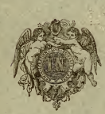

7
-
.

CONTRO

e s p till ting the content

.

1. Re CONTROL


Ronk ••<^3+-
CONSIDER

# Kaccayana

E!' 
LA LITTÉRATURE GRAMMATICALE
DU PÂLI.

I" PARTIî-;. 

GRAMMAIRE PALIE DE KACCÂYAXA,
SUTRAS ET COMMENTAIRE,
PUBLIES AVEC UNE TRADUCTION ET DES NOTES 
PAR M. E. SENART.



PARIS
IMPRINH; PAR AUTORISATION DE M. LE GARDE DES SCEAUX
ATION DE M. 

A L'IMPRIMERIE NATIONALE.

\[ BCCC LXXI.

e 11 .

PORTANT
s for e and a e the i con l l e o 1 1 1 a e
)
e l lis e and e and the CONSIDER
  

t the con a control 1.

an 1 e and the a A
--
e 105 105 105 105 105 d by ting ti ol boo you can A
l T

e a e d by the A
.

l CONSIDER
r
)
e the content of the e an

( 2011 )
CONTROL
ak, an
( )
l
. We h

)
e the n a l one e Self (1)
n CONSIDER
. 11
. 15, 215 a a

# Bibliographische Aiizeigen.

Eranische Alterthumshunde von Fr. Spiegel. Erster Band. Geo-graphie , Ethnographie und dlteste Geschichte. Leipzig , W. Engel- mann 1871, SS. XII, 760. 

Dièses neueste Produkt seines unermlidlichen Fleisses ist von Spiegel ofifen- bar nach dem Muster von Lassen's Indischer Alterthumskunde gearbeitet und daher auch, zum âussern Zeichen dessen, dem verehrten Lehrer zugeeignet worden. Die beiden ersten Biicher des Werkes, den geographischen und ethnographi- scheu Theil enthalteud (bis S. 422), schliessen sich resp. ahnlich, wie das auch bel Lassen geschehen, speciell an Karl Rit te r's Darstellung an, und war dabei Spiegel's Aufgabe wesentlicb nur die , die mannichfachen ,,Eiiizelforscbungen nachzutragen , welche seit dem Erscheinen des Ritter'schen Werkes die Kennt-niss des erauisclien Gebietes erweitert haben". Vieles hiervon ist bereits aus Spiegel's Aufsatzen im "Ausland", speciell aus seiner friiheren Schrift: Eran
(1864) bekannt ; zu bedauern ist , dass auch hier , wie dort , eine Karte fehlt, welche die gewonnenen Eesultate in leichter Uebersicht zur Auschauung brâchte, wie eine dgl. Lassen's Werk in so vortrefflicher Weise, von K i e p e r t ausge-fiihrt , begleitet. Das dritte Buch, die alteste Geschichte (S. 423 737) , beginnt mit der ârischen Période und geht hinab bis zu den letzten Kaianiern und Zarathustra ,
- und hier ist eben natiirlich Spiegel in ganz selbst- stândiger Weise vorgehend. Das. Bild, das er zunâchst seinen bekannten Prin-cipien gemâss von der â ris chen Période eutwirft, ist leider sehr kurz aus-gefallen (S. 423 - 445), fuhrt zwar allerdings die nahen Beziehungen der Inder und Eranier in grossen Ziigen vor, wird aber in der That denselben durchaus nicht irgendwie gerecht. Er beschliesst dasselbe mit dem sehi 'bestimmten Aus-spruche: "nichts kann gewisser sein, als dass die ârische Période lângst zur Ve r ga n ge nh ei t gehorte , ehe das erste Wort eines vedi- schen Hymnus gedichtet war". Von der hierfiir immerhiu etwas vinbequemen Angabe Yâska's , auf welche Réf. schon mehrfach , imd u. A. gerade auch in seinen Besprechungen Spiegel'scher Schriften (s. Indische Streifen 2, 470. 492), hingewiesen hat, dass nâmlich noch zu dessen Zeit die Sprachen der Ârya (der Inder) und der Kâmboja (und damit raeint Yâska wohl eben die Baktrer) sich nur dialektisch unterschieden , ist dabei u. A. gar keine Notiz geuommen, Ebensowenig von den in den Brâhmana so hâufîgen Legenden von dem Zwie-spalt der Âditya und Aiîgiras (vgl. Ind. Studien 1, 292. 293. 174). Und wenn ail dies sich wohl auch aus den spâter noch , iiber die eigentlich ârische Période hinaus , fortdauei-nden direkten Beriihrungen der beiden Vôlker erklâren liesse, - Roth's in dieser Zeitschrift kiirzlich begonnene ,,Beitrâge zur Eir. klârung des Avesta" werden in ihrem Verlauf vermuthlich doch ^uch Spiéget Veranlassung bieten , obigen kiihnen Satz etwas zu modificiren. Der hâchstfolgende Abschnitt (S. 446—485) handelt angeblich "von dem Begihn der eranischen Selbstândigkeit und von den àltesten Beruhrungen mit de'n'Seînitén'^'
Hiilfsmitteln, demselben zuwenden *). Der Vf. der vorliegenden kleinen Schrift hat bereits in seiner Doktor-Dissertation (Halle 1869) mit glucklichem Grifif ein besonders intéressantes Cap. (III) ans Kaccâyana's Sûtra, das iiber den Gebrauch der Casus, publici îuris gemacht, und lâsst nun hier ein anderes (II), das iiber die Bildung der Declinations-Formen selbst, folgen. In der Vorrede berichtet er zunachst , unter Hinweis auf die von ihm zuerst sicher gestellten Beziehungen des Werkes zur Kâtantra-Grammatik , in aller Kiirze iiber die Congruenzen und Differenzen desselben zu Pânini's Darstellung. Es ist dies grade nur genug, um den Appétit , resp. den Wunsch zu erregen , dass es dem Vf. gestattet sein" moge, die handschriftlichen Quellen, welche eine Gesamintdarstellung ermoglichen werden , sich anzueignen , was denn freilich nur durch einen zeitweisen Aufent-halt in England zu erreichen sein wird , da nur dort die vollstandigen Hiilfs- mîttel fiir Kaccayana wie fUr Kâtantra zur Hand sind. Ausser den Bastian'-
schen Handschriften hat der Vf. iibrigens diesmal auch theils die leider sehr inkorrekte Mason'sche Ausgabe , theils durch die Giite von R. Chi^ders eine Abschrift desselben aus einem birmesischen Codex benutzen konnen. Er theilt daraus eine ganze Reihe von Varianten mit, leider in der Vorrede (S. VII —XIV) , nicht je zur Stelle selbst in Notenform , wodurch die Benutzung der- selben erleichtert worden wâre. Der Text ist mit den Scholien versehen, und iibersichtlich, sorgsam und korrekt gedruckt. Es fehlt aber jede weitere Hiilfe zur Verwerthung des Inhalts , und wir konnen nicht umhin , dièse Enthaltsam-keit bei einem Schriftstiick so geringen Umfangs, dessen Inhalt sich so einfach und mit so wenigen Worten darstellen liess, als zu weit getrieben zu bezeich-nen. Ausser fiir den Kenner ist das Schriftchen ganz unbenutzbar , und auch den speciellen Fachgenossen wiirde damit gedient gewesen sein, wenn der Vf.

die kleine Arbeit selbst gethan hâtte , die sie nun erst noch ihrerseits je sich machen miissen. A. W.

Bichell's conspectus rei Syrorum literariae (Nachtrag zu S. 276 fF.) 
liegt mir nun vollstândig vor (112 Seiten). Von S. 59 an behandelt der achte Abschnitt die Liturgie en der Syrer, der neunte die R i tuai b ii cher von S. 73 an und der zehnte die iiber die gottesdienstlichen Verrichtungen von S. 87 an ; auf S. 104 beginnen Berichtigungen und Zusàtze , und von S. 106 an reicht der Index bis zum Ende. Die sehr eingehende Beschreibung, welche der Hr. Vf. diesen Gegenstânden widmet, ist dem, welcher sich iiber die eigenthiim-liche Art syrischer Kirchengebrâuche und Andachten unter den verschiedenen

/
7^3/


/ ^ ^ 3


# Kaccayana

ET 
LA LITTÉRATURE GRAMMATICALE
DU PÂLI.

EXTRAIT N° 1 DE L'ANNEE 1871 DU JOURNAL ASIATIQUE.

ERNEST LEROUX,
LIBRAIRE DU JOURNAL ASIATIQUE,
Rue Bonaparte 28.

# Kacgayana

ET 
LA LITTÉRATURE GRAMMATICALE
DU PÂLI.

I" PARTIE. 

GRAMMAIRR PALIE DE KACCÀYANA,
SÛTRAS ET GOMMEÎVTAIRE,
PUBLIÉS AVEC UNE TRADUCTION ET DES NOTES 
PAR M. E. SENART.


PARIS.

IMPRIMÉ PAR AUTOiUSATION DE M. LE GAHDE DES SCEAUX 
À L'IMPRIMERIE NATIONALE.

M DCCC LXXI.

, K334


1871

( )

AAA

# Kaccayana

ET 
LA LITTÉRATURE GRAMMATICALE

# Du Pali. Avertissement

Les premières données sur la grammaire pâlie de Kaccàyana parvenues en Europe étaient assez décourageantes ; 
Turnour, dans sa préface du Mahâvamsa, ne parlait de cet ouvrage et n'en signalait l'importance que pour en constater du même coup la perte \ Longtemps on put croire cette disparition définitive. Cependant, en i85/i, M. F. Mason^ rectifia celte erreur et affirma l'existence des sûtras, confirmée depuis par M. P. Grimblot^ qui en faisait en même temps espérer la publication par ses soins. Peu Je temps après, un premier fragment de Kaccâyana nous était donné par M.James d'Alwis, qui, dans son livre bien conou, An Introduction to Kachchâyana's Grammar, Colombo, 186 3, ajouta à un grand nombre de fragments divers relatifs à la grammaire et aux grammairiens pâlis, recueillis et discutés par lui, une édition en caractères singhalais du sixième livre du Sandhikappa, accompagnée d'une traduction et de notes. Plus récem-ment, M. E. Kuhn a publié , sous le titre Kaccâyanappakaranœ spécimen (Halis Saxonum, 1869), le troisième chapitre du même ouvrage, en le faisant précéder de remarques sur les sources de cette grammaire, où il eut le mérite d'insister notamment sur les relations existant entre la grammaire Kâtantra et les sûtras de Kaccâyana. Cependant il manquait toujours une édition complète, qui seule pourtant, outre la lumière qu'elle ne manquerait pas de répandre au moins sur certains détails de la langue elle-même, pouvait préparer l'examen des questions d'histoire littéraire et de chronologie qui se groupent naturellement autour de l'œuvre capitale de la littérature grammaticale du pâli. C'est cette lacune que j'ai voulu essayer de combler, en profilant des ressources nouvelles dont s'est enrichie dans les dernières années notre Bibliothèque nationale. 

Les manuscrits qui ont servi de base à cette publication sont les suivants : 
Cd. - Manuscrit n° 80 du fonds Grimblot : lia feuilles; 9 lignes par page, quelquefois 10; caractères singhalais. Cet exemplaire présente une lacune dans la deuxième section
(11, 3, 20 à II, A, 11), où une détérioration du manuscrit rend illisibles environ deux feuilles recto et verso. Il porte à la fin ces mots : « Sakâbdam thutisatyam ; » mais j'ignore quelle date ces mots figurent. 

C. - Manuscrit n° 78 du fonds Grimblot, relié avec le précédent, et contenant seulement les sûtras sans commentaire. 7 feuilles, 9 lignes par page; caractères singhalais.

Une série de manuscrits en caractères pâlis de Siara. Ces manuscrits ne sont point encore catalogués; j'en indiquerai es numéros dès que le catalogue qui se prépare sera achevé. 

La collection dont ils font partie contient tout l'ouvrage avec le commentaire, mais chaque kappa à part en un manuscrit particulier; chacun du reste existe, paraît-il, en plusieurs exemplaires. Le numérotage des feuilles de chacun ne recommençant point avec l'unité, il sera sans doute possible, au moyen de ces chiffres, de reconstituer une ou plusieurs copies complètes dont la division n'est probablement qu'un effet du hasard. Dans cette suite de manuscrits , j'ai pris une copie de chaque kappa que j'ai entièrement coUationnée.

Toutefois, ayant pu aisément conslater, par fexpérience des autres kappas, qu'il ne saurait être question, entre la copie singhalaise et les exemplaires siamois, de différences capitales ni même importantes, j'ai jugé inutile de coljationner des manuscrits siamois pour les deux kappas déjà publiés, et je me suis contenté de comparer avec les éditions mon manuscrit singhalais. En résumé, les manuscrits siamois dont je me suis servi sont les suivants :
S' contenant le Sandbikappa.

S^ contenant les deux premiers kandas \ C'est un manuscrit du Nâmakappa. f unique divisé acciden-
S*^ contenant les kandas 3-5 du i\àma- l tellement en deux parkappa. ' lies. 

S^ contenant le Samâsakappa.

S^ contenant le Taddhilakappa.

S^ contenant le Kitakappa.

S^ contenant l'Unâdikappa. 

Tous sont écrits sur trois lignes par page, et contiennent entre les lignes pâlies une traduction ou des gloses Thai.

J'ai parlé déjà des éditions du sixième et du troisième chapitre données par MM. d'Alwis et E. Kuhn; j'en ai naturel- lement tenu grand compte; j'espère les avoir corrigées en quelques passages; mais nulle part je ne me suis écarté un peu sérieusement de leur texte sans indiquer scrnpuleusement
- 4 —
leur leçon, en les désignant par les lettres A el K ; dans les quelques cas où j'ai jugé uti!e de rappeler une variante du manuscrit de M. Kuhn, abandonnée et changée par lui, j'en ai marqué la provenance par Cd. d. K. La façon dont il devait être fait usage des ressources manuscrites ci-dessus énoncées était tout indiquée d'avance.

J'eusse été entraîné trop loin par la reproduction intégrale de toutes les différences orthographiques, ou des mille divergences légères sans importance pour la pensée; j'ai dû faire un choix. Prenant Cd pour base du texte , j'ai toujours indiqué avec un soin particulier les variantes de ce manuscrit; je n'ai jamais admis une conjecture dans le texte, sans donner les leçons des diverses sources dont je disposais; et quand je me suis éloigné de la leçon de Cd sans indiquer la leçon du manuscrit siamois correspondant, c'est que celle leçon est précisément celle que j'ai adoptée.

En ce qui touche les questions d'orthographe, on sait assez combien il est encore difficile d'élablir pour les textes pâlis des règles absolument fixes; je me suis pourtant, autant que possible, dégagé des inconséquences et des fréquentes variations des manuscrits. Les principes que j'ai suivis se rapprochent, naturellement, beaucoup de ceux qui ont été adoptés dans des publications antérieures, notamment par M. Fausbôll.

J'en noterai seulement quelques-uns ici. 

M. Fausbôll ^ a signalé l'inconséquence avec laquelle les manuscrits singbalais écrivent la brève ou la longue, en dehors de toute espèce de règle; c'est le plus souvent une longue régulière , une longue prescrite par la grammaire et l'analogie, qui se trouve sacrifiée; dans tous les cas de ce genre, je fai rétablie; j'ai, par exemple, toujours écrit la longue aux cas obliques du pluriel des tbèmes en i, u , comme aggîsu , bhikkliùnam, etc. Dans les cas particuliers j'ai adopté une orthographe conséquente, fondée sur l'autorité comparative des luanuscrits ou sur l'étymologie; c'est ainsi que, malgré les manuscrits siamois, j'ai toujours écrit niggahîta, dicjha. Sur d'autres points , j'ai préféré me rapprocher de ces manuscrits qui paraissent plus complètement libres de toute influence savante du sanscrit : partout j'ai écrit bj et non vy, contrairement à l'orthographe habituelle des copies singhalaises ; 
partout j'ai réiabli âkhyata, au lieu de la forme âkkhyâta, générale dans les exemplaires de Ceylan (de même dans le manuscrit de la Rûpasiddhi, l'édition du Bâlâvatâra). J'ai observé, même à l'encontre des manuscrits, la règle qui ne souffre point de voyelle longue devant un groupe de consonnes (excepté pourtant certains cas où l'une des deux consonnes est. une liquide ou une semi-voyelle); je n'ai fait d'exception que pour certaines fictions grammaticales, telles que le génitif pa^sa (I, 5, 2). On sait quelle est la fluctuation et l'incertitude dans l'emploi de ïn cérébral; ne pouvant découvrir la règle de ces inconséquences, je me suis contenté en général de n'employer Va cérébralisé sous l'influence de l'r qu'autant que, faisant partie du corps même du mot, il avait pu prendre en sanscrit une position plus fixe et plus solide. Quant à un emploi plus étendu de YII cérébral qui se montre en quehjues endroits, par exemple dans des mots comme hyanjana (c'est l'orthographe habituelle du manuscrit de la Rûpasiddhi), les traces en sont trop rares et trop indécises pour qu'il soit possible de l'admettre sans autres preuves. J'ai suivi la règle qu'on trouvera 1, 2 , 6 n. et qui prescrit l'allongement de la voyelle brève qui suit un e ou un changés en j ou t;, et dont la singularité re- lève en quelque façon l'autorité. Dans d'autres cas je n'ai pu que m'associer aux variations des manuscrits, comme pour l'orthographe du participe passif en îya que j'ai écrit tour à
- () - • 
lour îya, iyya, îyya, formes d'ailleurs équivalentes, et qui se retrouvent dans îya, iyya, iya et même lyya de la formation du passif. Pour Tanusvàra {nigçjah.îla) j'ai été plus radical : aussi bien devant les voyelles initiales que devant les consonnes, et sans user de la faculté laissée par 1,4,2. 5, j'ai conservé l'anusvâra , la nasale vague et indéterminée , au lieu de le changer en m ou d'y substituer la nasale de même ordre que la consonne suivante. Ce procédé m'a paru préférable, comme plus conforme au vrai caractère de l'anusvâra pâli. Si, en effet, l'on songe qu'il représente non-seulenient l'm final, mais aussi Vn, dans les participes comme gaccham (à côté de gacchanto) , par exemple; que, dans certains cas, il s'ajoute à la fin de désinences verbales comme imsiuh, à côté de imsu, où il ne correspond à aucune nasale sanscrite, sans compter d'autres fonctions analogues dans le détail desquelles ce n'est pas le lieu d'entrer, on est porté à penser qu'en pâfi l'anusvâra doit être loin de cette élasticité d'articulation qui lui permet en Sanscrit de subir des modifications si variées, et qu'il est par conséquent préférable de lui laisser dans l'orthographe même une stabilité plus grande , sinon absolue. Les cas oùj'ai fait usage de la faculté accordée par les sùtras précités, sont les suivants : i° Le cas où anusvâra final se trouve devant un enclitique, comme ca, intimement relié par sa nature même au mot sur lequel il s'appuie; 2° le cas où l'anusvâra termine un préfixe, tel que sam, fondu avec le thème qui le suit; j'ai même étendu ce cas au delà des habitudes des manuscrits qui négligent le changement devant les gutturales, sans doute par des raisons graphiques; 3° le cas enfin où ih finit un mot qui se trouve presque en état de composition avec le suivant, comme : iccevam âdi, kim attham? La traduction que j'ai ajoutée au texte ne s'étend qu'aux sùtras qui forment le corps de l'ouvrage, la partie essentielle attribuée à Kaccâyana. Tout ce qui y dépasse ou explique la significalion littérale et précise des termes mêmes du siilra a été enfermé entre crochets. Dans les circonstances où j'ai cru devoir m'éloigner de l'interprétation du commentaire, j'en ai donné les raisons dans des notes que j'ai faites aussi peu nombreuses et aussi courtes qu'il m'a paru possible ; il n'en est presque pas qui ait d'autre but que l'éclaircissement du texte; dans quelques-unes seulement j'ai relevé certaines particularités caractéristiques pour la nature et la composition de l'ouvrage. 

Les faits de cet ordre, ainsi que des extraits d'autres grammaires, se trouveront groupés et discutés dans un examen densemble, qui formera la seconde partie de ce travail, et qui seul, en replaçant la grammaire de Raccâyana dans son milieu naturel, entre les sources sanscrites et les développements postérieurs de la littérature grammaticale du pâli, pourra en faire ressortir l'intérêt historique et le vrai caractère \
NAMO TASSA BHAGAVATO ARAHATO
SAMMASAMBUDDHASSA.

Settham tilokamahitam abhivandiyaggam Buddhanca dhammam amalaiïi ganaiïi uttamanca Satthussa tassa vacanatlhavaram suboddhum Vakkhâmi sultahitam ettha susandhikappam.

Seyyam jineritanayena budhâ ^ labhanti Tancâpi tassa vacanatthasubodhanena^
Alihanca akkharapadesu amohabhâvâ:
Seyatlhiko padam ato vividham stineyya.

Sabbavacanânam attho akkhareheva sannâyate. Akkharavipattiyam hi atthassa dunnayatâ holi; lasmâ akkharakosallam bahûpakâram sullantesu. 

La pensée s'exprime au moyen des sons [ou lettres].

## Ïï^^^Tttctth Mil

Te ca kho akkharâpi akârâdayo ekacattâlîsam suttantesu sopakârâ honti. 

Tarn yathâ :a,â,i,î,u,ù,e, o,ka, kha , ga , gha , na ca, cha,ja, jha, na, ta, tha, da,dha,na, la,tha, da, dha, na, pa, pha, ba, bha, ma, ya, ra, la, va, sa, ba, la, aih ti akkharâ honli.

^ C et Gd lisent : budhâ; S* lit seul : buddhâ, la forme ordinaire, que le mètre n'admet pas.

^ Cd vacanassa subo °.

Akkhara iccancna^ kvatlho? Altho akkharasannàto. (I, 1,1.) 
Or les lettres a, etc. sont au nombre de quarante et une. 

## H^^Li-Dl Htt W Ii ? Il

Tattha akkharesu akàràdîsu odantâ attha sarà nàma lionti. 

Tarn yathà : a, â, i , î, u, û , e, 0, iti sarâ nâma.

Sara iccanena kvattho ? Sarâ sare lopam. (1,2, 1.) 
Les huit [premières lettres], jusqu'à 0, sont appelées voyelles.

## H^Htii R^Tt ^E^T H ^ Il

Taitlia atlhasu saresu lahumaltà tayo rassà nàma honli. 

Tarn yalhâ : a, i, u iti rassà nâma.

Rassa iccanena kvattho? Rassam. (I, 3, 4-) 
Les trois [voyelles] de mesure légère s'appellent les brèves.

## L^^T^Llmii

Tattha althasu saresu rassehi aiïne panca sarà dîghà nâma honti. 

Dîgha iccanena kvattho? Dîgham. (I, 2, 4)
Les autres s'appellent les longues.

## Hïït Ssr^Ftt Ii Cil

Thapelvà attha sare sesâ akkharà kakàràdayo niggahitantà byaiijanà nàma honti.

^ Cd remplace, clans ce sûtra et les suivants jusqu'à 9, la répé-tition du terme en question suivi de «iccanena» par un simple teiia. S* ofifre les leçons adoptées.

Tarn yathâ : ka , kha, ga, gha, na, ca , cha, ja, jha, na, la , tha , da , dha , na , pa , plia , ba , bha , ma , ya , ra , la , va sa, ha, la, am ili byanjanâ nâma honti. 

Byanjana iccanena kvattho ? Sarâ pakati byanjane. (1,3, i
.) 
Les autres [lettres] s'appellent consonnes.

## , ^Jitt Tt^Q-=C|Ht Wrïï Ii S Ii

Tesam kho byanjanânam kakârâdayo makàranlâ pancapancaso akkharavanto vaggâ nâma bonli. Tam yathâ : ka, kba, ga, gha, na; - ca, cha, ja, jha, na ; - ta , tha , da , dha , na ; - ta , iha , da , dha , na ; - pa, pha, ba, bha, ma - iti vaggâ nâma honti, Vagga iccanena kvatlho ? Vaggantaiîi va vagge. (I, à-, 2.) 
Divisées cinq par cinq, les consonnes jusqu'à m
[donnent cinq séries qu'on appelle] les classes [de consonnes].

## ^5;^F^Îyt^ H Du

Am iti niggahîtam nâma.

Niggahîta iccanena kvatlho? Am byanjane niggahilam.

(1,4,1.)
[La lettre] m s'appelle niggahîta.

## Ttlhît^^T Trtït Ii Cf Ii

Yâ ca pana sakkatagandhesu ' samannâ ghosâti va aghosâti va ta payoge sali elthâpi payunjante ^. 

Tattha ghosavanto nâma : ga, gha , lia, ja, jha, fia, da,
^ S' sakataganthesu.

^ Cd °pi yunjale. S'' ° pi payujjaiite.

- 10 —
dha, lia, da, dlia, na, ba , blia , ma, ya , la, la, va, lia iti gliosà nâma. Aghosâ nâma ^
: ka, kha, ca, cha, ta, tha, ta, tha , pa , plia , sa iti aghosâ nâma.

Gliosâghosa iccanena kvatllio ? Vagge ghosâghosànam taiiyapatliamà. (1,3,7.)
Des termes techniques [usités par] d'autres [grammairiens] sont à l'occasion [employés dans cette grammaire].

M. Weber [Ind. Streifen , II, 325) explique samannâ par : termes techniques (fe/mmi) , ajoutant entre parenthèses cetle rapide explication de la forme : « samannâ (samâjîiâs =
samjnàs) » ; mais l'hypothèse de ce mot samâjnâ = sanjiiâ n'est , que je sache , soutenue par aucun fait , et , en tous cas samaiïnà, au lieu du très -usité saniîâ, serait un dcTral Aeyô^svov cbez les grammairiens pâlis. Cette difficulté pourrait portera considérer samaiïiïa comme=Skr.sâmânya avec une abréviation de l'a initial pour laquelle il existe en pâli quelques analogies (par exemple : thapetvâ,elc. de la rac. sthà) ; 
alors on traduirait, en sous-enlendant saniïâ comme ressortant naturellement de l'énumération des sùtras précédents : «[des termes] habituels chez d'autres [grammairiens], elc. » Toutefois, devant l'autorité du scholiaste, qui évidemment comprend comme M. Weber, et devant l'irré- gularité de celle construction qui fait rapporter un adjectif à un substantif non exprimé même antérieurement, je n'ose donner cette explication que comme une simple hypothèse.

^

## ^^"Tfeî^

^^
H^îT f^^HÏ^ Il \o II 
Tàttha sandhim kattukâmo pubbabyanjanaiîi adhothilani^
' On attendrait plutôt : aghosavanto oâma , qui ferait symétrie avec ghosavanto nâma, et éviterait cette répétition inutile de : aghosâ nâma.

2,-' S'^adholthitam.

assaram katvâ saranca upari katvâ sarena viyojaye. Tatrâyam On sépare de la voyelle [initiale du mot suivant]
la consonne finale, non accompagnée de voyelle, qui la précède.

L'explicalion donnée de celle règle par M. d'Alwis (Intr.

to Kachch. p. XVII. Cf. Correct, p. 118) m'est aussi inintelligible qu'cà M. Weber [Ind. Str. II, 326). Quant à l'inlerprétation indiquée par M. Mason (Gr. introd. p. iv), et qui ne parait point étrangère à la Vutti, il ne me semble pas possible de la tirer sans violence de notre texte, et elle ne conduit d'ailleurs à aucun enseignement utile. On peut, je crois, s'éclairer sur le sens véritable par la comparaison de la grammaire Kâtantra, qui a deux sùtras correspondant à celui-ci et au suivant, bien qu'en ordre inverse. Ils sont ainsi conçus : 
«Vyanjanam asvaram paraiîi varnnam navet», et: ai'inatikramayan viçleshayet ». Ce dernier est commenté par Durgasiiîiba ainsi qu'il suit : Varimâii samcjhaiitân sammilitân anatikramayan viçleshajed vighatayed ityarthah. Valyâkaranaik uccakaiçca asammohârtho 'yam yogali. (Mscr. lvi Beng. du catal. Ham. fol. 3^). Notre règle, formulée en des termes un peu différents, a le même but, qui est de mettre en garde contre une prononciation indistincte et confuse à laquelle pourrait conduire une application trop absolue de la règle suivante; el, pour parler le langage des Prâtiçâkhyas , elle réserve en quelque sorte la nécessité de VAhhmidhâna, vis-àvis des droits du sancihi (Cf. Whitney, Athv. Prât. p. Sg sv). - Le sens de final pour adhothita est confirmé parla Rùpa-sicldhi, qui l'explique par antika , et c'est d'ailleurs le seul dont s'accommode le sùtra suivant.

Assaram kho byanjanam adhothitam ^ parakkharam naye yutle. Talràblîiralim iccheyya. 

Yutte ti kasmâ ? Akkocchi maiîi avadhi mam ajini mam ahâsi me. Ettha pana yuttam na hoti. 

On relie, quand cela est possible, une [consonne finale] à la lettre [initiale] suivante. 

Ex. Tatra abbiratim, tatr âbhiratim, tatrâbhiraliiîi. 

La Rùpasiddhi est plus nette que notre scholiaste relativement à la porlée de ia restriction ya^^e. « liutte thàne ellha yuttaggahanaiîî niggahîtanisedhanatlham. - Yutte, c'est-à-dire quand il y a lieu On a ajouté ce mot pour exclure le niggahita. » C'est-à-dire, je pense, que les voyelles nasales ne s'unissant pas à la voyelle suivante, il n'y a pas lieu de leur appliquer la présente règle : on dit : akkocchi mam avadhi mam , et non : akkocchi mavadhi mam.

ITI SANDHIKAPPE PATHAMO KANDO.

## H^T Fr; Hïïi In Ii

Sarâ kho sabbepi sare pare lopam papponti. Yassindriyâni samatham gatâni; nohetam bhanle: saraetâyasmâ sanghena.

Les voyelles S ébdent devant une voyelle. Exemple:
Yassa indriyâni samatbam gatâni devient : yassindri" S. g. : celui dont les sens sont réduits au calme.

' S* adhotthitam.

# ^T Tt^ ^H^Ttt « "^ Il

Saramhâ asarûpâ paro^ saro lopam pappoti va. Cattâro me bhikkhave dliammâ; kinnumâ vasamaniyo^.

Vâti kasmâ? Pancindriyâni ; tayassu"^ dharamâ jaliitâ bha-vanti. 

Après une voyelle qui ne lui est pas homogène, une voyelle suivante peut aussi s'élider. Ex. Kinnu imâ devient: kinnumâ . . . illine? 

Ce sûtra offre le premier de ces cas où il est impossible d'attribuer à va le sens exact qu'il a dans Pànini où il marque que, dans un même cas donné, la règle qu'il accom- pagne peut à volonté être ou n'être pas appliquée. Ainsi je ne me rappelle pas d'exemple de l'élision pure et simple d'un u final devant un i initial, et je ne crois pas que a kirmimâ »
par exemple, à côté de « kinnumâ», soit permis, ainsi qu'on pourrait le vouloir conclure. « Va » équivaut ici , comme dans beaucoup d'autres règles , à : quelquefois , dans certains cas. 

Sur l'emploi analogue de va dans Vopadeva, cf. la préface de M. Bôhtlingk, p. iv. 

## Ifr^Ïït^ <^^ Il ? Il

Saro kho paro pubbasare lutte kvaci asavannam pappoti.

Sankbyam nopeli veda^û; bandhusseva samâgamo.

Kvacîti kasmâ? Yassindriyâni; tathûpamam dhammam adesayi.

Quelquefois, quand une voyelle est élidée [devant une autre, cette voyelle suivante se change en] une voyelle non homogène [à sa forme primitive]. Ex.

Bandhussa iva :=r bandhusseva samâgamo : comme la rencontre d'mi parent.

## ^H ^ Il

Saro kho paro pubbasare lutte kvaci dîgham pappoti. Saddhîdlia vitlam purisassa settham; anâgârehi cûbhayam.

Kvacîti kasmà ? Pancahupâli angehi samannàgato; nattbannam kinci neltha. 

[Quelquefois, la voyelle qui suit une voyelle ëlidée devient] longue. Ex. Saddhà idha = saddh' îdha vittam purisassa settham : la foi est ici-bas le plus grand bien de l'homme.

## ^N =^ Im N

Pubbo ca saro paralope kate kvaci dîgharâ pappoti. Kiiîi sûdba vittam purisassa settham? sâdhùti patisunitva. 

Kvacîti kasmâ? Itissa rauhuttampi.

[Quelquefois] aussi [la seconde voyelle étant élidée], la voyelle qui [la] précédait [devient longue]. 

Ex. Kim su idha = kim sûdha vittam purisassa settham? Quel est vraiment ici-bas le plus grand bien de l'homme?

## 2T Ïïwfh^ Il 1 Ii

Ekârassa antabhûtassa sare pare kvaci yakâràdeso hoti. 

Adhigato kho myâyam dhammo; tyâham evaiîi vadeyyam ; 
tyassa pabînà honti.

- 15 —
Kvacîti kasiiiâ ? Te nâgatà ili nettha. 

[Devant une voyelle] é? final se change [quelquefois] en y. Ex. Adhigato kho nie ayam = myâyaiîi dhammo : je comprends cette loi. 

Au témoignage de la Rûpasiddhi et aussi du Bâlâvatâra
(p. 3 de l'édition de Colombo, 1869), confirmé du reste par forthograplie unanime ici de nos manuscrits, cette règle doit être complétée par le rapprochement du sûtra ï, 3, 3; la règle extrêmement vague qu'il contient s'appliquerait tout particulièrement à la voyelle qui suit un e final transformé en y. Seulement, tandis que le Bâlâvatâra ne fait application de la règle : «Dîghaiîi» qu'à la voyelle qui suit e transformé en j
(de même Mason, Pâli gr. p. 27), la Rûpasiddhi , dans son explication du sûtra 1,3,3 (fol. 7^ du ms. f*^* Grimblot, n° 87), l'étend à la voyelle qui suit transformé en v, par des exemples comme : svâham = so aham. . 

## ^ ^"T|^=Ïïtï=F H S Ii

Okârukârânam antabhûtânam sare pare kvaci vakârâdeso hoti. Atha khvassa; svassa; hoti bavhâbàdho ^
; vatthveltha vihitarâ; niccam cakkhvâpâtham àgacchanti.

Kvacîti kasmâ ? Cattàro me bhikkhave dhammâ; kinnumâ vasamaniyo^.

[Devant une voyelle] 0, a final se change [quelquefois] en V. Ex. Kho assa : khvassa; so assa : 
svassa.

Cf. la remarque ajoutée au sûtra précédent.

# 17 H^ ^ Ttt A D H

Sabbo ti icceso ^ saddo ^ sare pare kvaci cakàram pappoli. 

Iccetam kusalam; iccassa vacaniyyaiîi; paccultaritvà ; paccâliarali. 

Rvacîti kasinà? Ilissa mulnitlampi,
[Devant une voyelle ,] la syllabe ti tout entière se transforme en c. Ex. Iti etam donne : iccetam.

N'était l'unanimité de toutes les autorités, on serait tenté de lire le sùtra : sabbo ccam ti; car lorsqu'une forme à modifier est accompagnée du déterminatif sahha, la forme modifiée est d'ordinaire donnée toute faite, par le sùtra. Mais le Bâlàvatàra (p. A de l'édition publiée à Colombo) et la Rùpasiddhi (fol. 8^) lisent également cam et en appellent pour le redoublement de c au sùtra I, 3, 6. 

## ^ '^^Tw ^ H Tf Ii

Dba iccetassa sare pare kvaci dakârâdeso boti. Ekam idâham bhikkbave samayam.

Rvacîti kasmà? Idbeva maranam' bhavissati. 

Casaddaggahanena dhakàrassa bakârâdeso hoti : sâbu dassanam ariyànaiîi. —Su^-mbbàgena babudbàpi siyà. To dassa yalbâ : sugato; - to tassa yatbà : dukkatam; - dbo tassa yatbà: gandhabbo; - tro tassa yalhâ : atrajo; - ko gassa yathâ : kulupako; - lo rassa yalhâ : mahàsàlo; - jo yassa yatbâ : gavajo; - bo vassa yathâ: kubbato; - ko yassa yalhâ : sako; - yo jassa yathâ : niyam pultam; - ko tassa yatlià : niko; - co lassa yathà : bhacco; - pho passa yalliâ : nipphatti - iccevamâdayo.

[Quelquefois] aussi dh se change en d [devant une voyelle]. Ex. Ekam idàham (pour: idha aham)
samayam: une fois, sur la terre, je. . . 

Le schoUaste nous offre ici le premier exemple de cet abus , que nous rencontrerons fréquemment par la suite , d'un mot ou d'une particule du sûtra qu'il étend et dénature au point de faire dire à l'auteur une foule de choses, souvent fautives, qui n'étaient nullement dans sa pensée. Du reste, il faut reconnaître que le ca du sûtra, sans justifier les fantaisies du commentateur, arrive ici d'une façon assez étrange et que les liens qui le rattachent aux précédentes règles n'expliquent que d'une façon insuffisante. —Relativement à fexem-ple : idâham, etc. cf. les obss. jointes au s. II, 5, 1 3.

Pubbo ivanno sare pare yakâram pappoti na va. Patisanthâravutyassa; sabbâ vityanubhûyate \
Navâti kasmà ? Pancahangehi samannâgato ^
; muttacâgî anuddhato.

I, î peut à volonté se changer ou ne pas se changer en y
[devant une voyelle]. Ex. Vutty assa 
(pour : vutti assa) : sa vie; mais : pancahangehi
(pour : pancahi a°) : avec les cinq membres.

L'expression « ivanna » comprend fi long aussi bien que le bref, ainsi que le prouve le dernier exemple du schoîiaste, et

## - 19 —

surtout l'indication formelle du Bàlàvatàra qui dit (p. /jj : Vannaggahanarâ sabba1i:ha rassadîghasangahanattham : l'expression « vanna » marque toujours qu'il faut entendre à la fois la brève et la longue. —On trouvera II, 2,7, un exemple de « avannà», au pluriel, pour désigner à la fois a, à et am.

Saramhâ parassa evassa ekâras&a âdissa rikâro hoti pubbo ca saro rasso hoti na va. Yathariva vasudhà talanca sabbam ; 
tathariva gunavâ supùjânîyo.

Navàti kasmà? Yathà eva, talhà eva, 
[Quand il vient après une voyelle,] eva change
[ou ne change pas, à volonté,] sa voyelle initiale en n, et [dans le cas où cette substitution a lieu] la voyelle qui précède devient brève. Ex. Yathariva ou yathâ eva : tout comme .....

Cette règle aurait évidemment besoin d'être spécialisée davantage, et devrait être sans doute restreinte au cas où eva suit Tune des conjonctions yathà et tathâ.

ITI SAINDHIKAPPE DUTIYO KANDO.

## Frt Tt^If^ ^ <^^H Ii \ Il

Sarà kho byanjane pare pakatirûpâ honti. Manopubbangamâ dhammâ; pamàdo maccuno padam; tinno pâragato ahu.

Les voyelles ne subissent aucun changement de*
' Cd sarâppakati ".

vaut une consonne. Ex. Pamâdo maccuno padam : 
la légèreté est la voie de la mort.

Sarâ kho sare pare kvaci pakatirûpâ ^ honti. Ko imam pathavim vijessati. 

Kvacîli kasmâ ? Appassutâyam puriso.

[Ni,] quelquefois, devant une voyelle. Ex. Ko imam pathavim vijessati ? Qui triomphera de cette terre ? ^Il B a Saro kho byanjane pare kvaci dîgham pappoti. Sammâ dhammam vipassato ; evam gâme muni care ; khantî paramam tapo titikkhâ. Kvacîti kasmà ? Idha modati , pecca modati ; palilîyati patihannati. 

[Quelquefois] une voyelle devient longue [devant une consonne]. Ex. Sammâ (et non :sammà) dham-mam vipassato : de celui qui connaît à fond la loi.

Bien qu'il ne puisse être douteux qu'il faille avec le scho- * 
liaste suppléer « byanjane » , il faut remarquer l'irrégularité de ce procédé, l'intercalation du sûtra 2 amenant régulière-ment la nivritti de hyanjane du s. 1
\# lU II Sarâ kho byanjane pare kvaci rassam papponti. Bhovâdi-nàma sohoti; yalhâbhâvigunena so.

' Gel "rûpâni honti °.

Kvacîli kasmâ? Sammâsamàdhi; sa vitti chandaso mukhaiîi; upanîyati jîvitam appamâyum.

[Quelquefois] une voyelle devient brève [devant une consonne]. Exemple : Bhovâdi (pour °vâdî ) nâma so hoti : on l'appelle Bhovâdin (Dhammap.

V. 396).

Sara kho byanjane pare kvaci lopam papponti tatra ca iope kate akârâgamo hoti. Sasîiavâ, sa panfiavà; esa dhammo sanantano ; sa ve kâsàvam arahati; sa mânakâmopi bhaveyya ; 
sa ve muni jâtibhayam adassî. 

Rvacîti kasmâ ? So muni; tena so muni; eso dhammo padissati; na so kâsàvam arahati. 

[Quelquefois] aussi une voyelle s'élide [devant une consonne] et à sa place [on substitue] a. Ex. 

Sa pannavâ (pour : so pa°) : cet homme est 

## Sage. ^W^ Ïït% Il I Ii

Saramhà parassa byanjanassa dvebhâvo holi thàne. Idha ppamodo purisassa; jantuno pabbajjaiîi kitlayissâmi; catuddasi ^
; abhikkantataro panitataro ca. 

Thâneti kasmâ ? Idha modati, pecca mouati. 

[Une consonne] qui suit [une voyelle] se redouble
^ Après « catuddasî » Cd ajoute « pancadasî « que S"* écrit « pancaddasi» ; mais ou l'exemple ne prouve rien pour la règle dont il s'agU, 
ou il faudrait adopter l'orthographe par deux d de S" que ni le sanskrit ni Tusage pâli ne confirment. Je regarde pa/îcada5i comme une addition machinale de quelque copiste, après catiiddasî.

- 21 —
quand iî y a lieu. Ex. îdha ppamodo purisassa : 
ici l'homme se réjouit (pour : idha pa°). 

Pour une application particulière de cette règle, cf. ï, 2 , 8. 

## ^^ Wtïïfsfthtst Rfffr^Tïï^Îtr W 3 Ii

Vagge kho byanjanânam gliosâghosabhûtânam saramhâ paresam ^ yathâsankhyam taliyapalhamakkharâ dvebhâvam gacchanli ihâne. Esova ca jjhânaplialo ; yatra tthilam na ppasaheyya; maccusele yalliâ pabbatamuddhani tthito; caltâri ttbânâni naro pamatto.

Thàne ti kasmâ ? Idha cetaso dalham ganhâti tbâmasâ. 

C'est par la non aspirée sonore et sourde de leur classe que se redoublent les sonores et les sourdes
[aspirées aussi bien que non aspirées]. Ex. Eso va ca jjhânaphalo (pour ca jhâna°) : celui-là seul recueille les fruits de la contemplation ; yatra tthitam (pour yatra Ûïi°) : ubi stantem, . , 
ITI SANDHIKAPPE TATIYO KANDO.

Niggahîtam kho byafijane pare am ili hoti. Evam vutte: iam sâdhûti patisunitvâ.

Devant une consonne, le niggahîta garde la forme m, Ex. Evam viitte : après ces paroles.

## ^Îtfrt ^T

^
m II Vaggabhûte byafijane pare niggahitam kho vaggantam va pappoti. Tan nibbutam, dhamman care sucaritam ; cirappavâsim purisam *; sanlan lassa manamholi; tan kârunikam ^
; 
evan kho bhikkbave sikkbitabbam. 

Vâgabanena^^niggahîtassa khoiakârâdeso boti. Puliingam*.

Vàti kasmâ ? Na lam kammam katam sâdbu. 

Devant [une consonne appartenant à] l'une des
[cinq] classes, le niggahîta peut à volonté se changer en la nasale de cette classe. Ex. Dhamman care (ou : dhammam care) sucaritam : qu'il suive la loi du devoir.

## Ïï| ^ Il ? A

Ekâre hakàre ca ^ pare niggabîtam kbo nakâram pappoti va. 

Paccattannevaparinibbâyissâmi;tannevetlbapalipuccbissâmi; evanbi vo bhikkbave sikkbitabbam; tafibi tassa musà boti. 

Vâti kasmâ? Evam etam abbinfiàya; evam boti subbâsitam.

Devant e , h \e niggahîta [dans certains cas] se change [à volonté] en iifi. Ex. Tannevettha (pour :
~ 23 —
taîîi e"") patipuccliissâmi : j'interrogerai cet homme que voilà ; evanhi vo sikkbitabbam : c'est ainsi qu'il vous faut apprendre.

Ce sûtra n'est point d'une parfaite exactitude. A le prendre sfriclement il faudrait écrira: ev&îinhoti, comme tanneva; néanmoins l'accord complet et dans la règle et dans les exemples, non-seule :mt â.2 Cd et de S^, mais aussi de l'édi- tion du Bàlàvatâra et du mauuscrit de la Rùpasiddhi, ne permet pas de croire que fauteur ait entendu faire écrire evannhoti. Il s'est simplement laissé aller à une inexactitude dont nos sûtras offrent bien d'autres exemples. - Va signifie seulement, ici encore : à volonté dans certains cas (cf. la n. du s. 5). En effet la forme nn du nigg-ihîta ne s'explique que devant evadont la forme parallèle pâlie « yeva » est bien connue et a, par son y initial, déterminé ce changement. - Quant au changement en n devant h, il paraît reposer sur un pen-chant réel de la prononciation comme sembleraient le prou-ver les formes comme panha = skr. praçna; mais il est, dans la pratique des textes, d'un rare emploi, et il est difficile déjuger à quel point l'auteur a prétendu en étendre la faculté.

## Ïï^R ^ Il ^ H

Niggahîtam kho yakâre pare salia yakârena nnakâram^
pappoti va. Sannogo; sannuttam.

Vâli kasmâ ? Samyogo ; samyuttam.

Suivi de j [le niggahîta se change] aussi [à vo- lonté en nn] avec [la semi-voyelle]. Ex. Safifïogo
(samyogo) : réunion.

Niggahitassa^ kho sare pare makâradakârâdesâ honti va. 

Tani aham brùmi bràhmanam ; etad avoca salthâ. 

Vâti kasmâ? Akkocchi mam, avadhi maiîi, ajini mam, ahâsi me. 

Devant une voyelle [le niggahîta se change à volonté en m [et quelquefois en] d. Ex. tam aham brûmi bràhmanam : j'appelle celui-là un brahmane
(pour: tam a°); etad avoca satthâ : le maître a dit ceJa (pour : etam a°).

Nous avons ici un exemple des deux sens que îa particule
« va » prend tour à tour dans cette grammaire , réunis cette fois et confondus dans un va unique; car on ne peut douter que le scholiaste ait raison d'étendre jusqu'à cette règle la valeur du va du sûtra 2. Or, s'il est vrai de dire que le niggahîta peut toujours être à volonté changé en m devant une voyelle , l'auteur n'a évidemment pas voulu accorder la même extension à la transformation en d^ naturellement restreinte à quelques cas où un d primitif a pu persister comme dans etad. Toutefois le changement même de niggaliîla en m ne doit peut-être pas être autorisé sans restriction, et il me paraît fort douteux que le niggahîta final de formes comme gaccham=gacchanto puisse jamais subir cette modification, malgré certains exemples qu'en présentent les manuscrits comme Dhanwiap. v. 3o5 , al.

## Sr^H(I^Hri(Hi ^Iil^( Il In

Sare pare yakâro vakàro makàro dakàro nakâro takàro rakàro lakàro iraà àgamà honii va. Nayimassa vijjà ; yathayidam cittam; migî bbantà vudikkhati ; sittâ te lahum essali;gurum essali ; asso bhadro kasâmiva ; sammadafinâvimutlânam ; manasâd afinâvimuttânam ; attadattham abhinnâya ^
; cirannâyati; itonâyatî; yasmâliba bbikkbave^; tasmâtiba bbikkbave ; 
ajjalagge pânupeto; sabbbireva samâsetba; âraggeriva sâsapo; sâsaporiva àragge; cbalabbinnà; cbalâyatanam.

Vâd kasmâ ? Evam mabiddbiyâ esâ ; akocchi mam avadhi mam ajini mam abâsi me; ajeyyo anugâmiyo^.

Casaddaggahanena iheva makârassa pakâro boti; yatbâ : cirappavâsim * purisaiîi ; —kakârassa ca dakâro boti : sadat- ibapasuto siyâ; - dakârassa ca lakâro boti : sugato.

[Dans certains cas] aussi [devant une voyelle] 
on insère les lettres additionnelles y, v, m, d, n, t, r, I. Ex. Na yimassa (pour ; na ima°) vijjâ : il n'a pas la science ; migî bhantâ vudikkhati ( pour : udi°) : on voit la gazelle qui fuit effrayée; lahum essati (pour : lahu e°) : il ira vite; sarnmadannâvi-muttânam (pour: sammâ) : délivrés par la science parfaite; yasmât iha (pour : yasmâ i°) : parce que ici . . . etc. 

On remarquera que le dernier exemple donné par le scboliaste, de rextension qu'il prête à ce sûtra : la substitution prétendue de if à J dans « sugala » , bgure déjà dans la liste analogue du sùlra J, 2, 9. 

mi^ w ^^^R il s II Byanjane pare kvaci okârâgamo boti. Atippago kbo (àva Sâvattbiyam pindâya caritum parosabassam bbikkbusatam.

' Cd attadamhinnâya.

2 Cd°veva;ta°.

^ S" anuggâmiyo.

* S" cirampavâsim pu".

Kvacîti kasmà? Etha passalhimam lokam; andliabhûto ayam îoko. 

Quelquefois, devant une consonne, on insère un additionnel. Ex. Atippago kho : de très-grand matin.

## P|Iil<^D-=C| Il D Il

Niggahîtanca âgamo hoti sare va byanjane va pare kvaci. Cakkhum udapâdi; avamsiro; yâvancidha bhikkhave; puri-mamjâlim ^
; anumthûlàni sabbaso ; nianopubbangamà dhammâ.

Rvacili kasmà ? Idheva nam pasamsanti ; pecca sagge ca modali; nahi etebi yânebi ^ gaccheyya agatam disam^. Casaddaggahanena vissaddassa ca pakâro boti : pacessati vicessati va*. 

[Quelquefois] aussi [on insère, soit devant une voyelle, soit devant une consonne,] un niggahîta
[additionnel]. Ex. Cakkhum (pour: cakkhu) : l'œil; yâvancidha (pour yâva ci°) : et tant qu'ici-bas Si le commentateur a raison d'étendre à ce sùtra le « sare » 
des sûtras antérieurs à s. 7, ainsi que paraît le prouver le sùtra suivant , il faut remarquer cependant que dans le texte même de la règle rien ne commande cette infraction à l'usage ordinaire, suivant lequel la valeur de sare sérail périmée par la présence de « byafijane » dans le sûtra précédent. Mais cf. I, 
3,3, etc.

Niggabîtam kho sare pare kvaci lopam pappoti. Tâsâbaiîi santike; vidûnaggam iti. 

Rvacîti kasmâ ? Ahafh eva nûnabaîo ; etadatlbam viditvâ. 

Quelquefois le niggahîta s'élide [ devant une voyelle]. Ex. Tâsâham (pour : tâsam aham) santike : en leur présence, je. , . 

## ^R^^ ^ Il \O W

Niggaliîtam kbo byafijane pare kvaci lopam pappoti. Ariyasaccâna dassanam ; etam buddhâna sâsanam.

•Kvacîti kasmâ? Etam mangalam uttamam; vo vadâmi bbaddam vo. 

[Quelquefois] aussi devant une consonne. Ex.

Ariyasaccâna (pour : °saccânam) dassanam : la vue des quatre grandes vérités.

Niggahîtamhâ paro saro lopaiîi pappoti va. Abbinandanli^
subhâsitam uttattam va; yatbâbijamva dbaMam.

Vâti kasmâ ? Abam eva nûnabâio ; etad aliosi. 

Dans certains cas une voyelle qui suit [le niggahîta] selide. Ex. Yathâbîjam va dliannam (pour : 
°jam iva) : comme du blé en germe.

Le sens de « va » ne saurait être douteux ici, où il est question seulement de quelques mots : va à côté de iva, eva; ti à côfé de iti; pi à côté d'api.

## Ssr^Fïtt ^ ^^Î^Ïïft Ii V^ W

Niggahîtamhâ paras mim sare lutte yadibyanjano ' samyogo visannogo hoti. Evam sa te âsavâ; puppham sa uppajji^. 

Lutteti kasmâ ? Evam assa vacaniyo ; vidûnaggam iti. 

Casaddaggahanena tinnam pi byafijanânam antare sarûpâ- nam ^ kvaci lopo hoti. Yathâ : agyâgâraiîi, vutyassa.

Et [si la voyelle ainsi élidée était suivie d'un groupe de consonnes ]
, le groupe est simplifié.

Exemple : Evam sa (pour : evaiîi assa) te âsavâ : 
tels sont ses désirs sensuels.

ITI SANDHIKAPPE CATUTTHO KANDO.

## Ïtt H^ ^St^^Îtïft Mp^ Il \ Il

Putha iccetassa sare pare kvaci gakârâgamo hoti. Puthageva.

Rvacîti kasmâ ? Putha eva. 

Devant une voyelle , patha prend quelquefois un g additionnel. Exemple : Puthag eva (ou : putha e°) : séparément.

## Ctt^ =^^T ^^T Ii "Î^ I!

Pâ iccetassa sare pare kvaci gakârâgamo hoti, anto ca saro rasso hoti. Pageva vutyassa. 

Kvacîti kasmâ? Pâ eva vutyassa.

^ S* byanjano ca.

'^ S^ uppajati.

° Cd byanjanânam sarûpânaih.

11 en est de même de pâ, dont dans ce cas la final devient bref. Ex. Pag eva (ou : pâ eva) : tout d'abord.

Abhi iccelassa sare pare abbho âdeso lioti. Abbhudîrilam ^
; 
abbhug-gacchali.

[Devant une voyelle] abhi se change en ahbh. 

Ex. Abbhuggaccbati (c'est-à-dire abhi + u ") : il s eleve. 

## W^ ^F^ Il & Il

Adbi iccelassa sare pare ajjho âdeso hoti. Ajjhokâso ; ajjha gamâ.

[Devant une voyelle] adhi se change en ajjh.

Ex. Ajjbagamâ: il comprit (c est-à-dire adhi a °). 

## Ïï7{^J ^T Ii M Ii

Te ca kho abhi adhi iccete ivanne pare abbho ajjho iti vuttarûpâ na honti va. Abhicchitaih^; adhîritam^.

Vâti kasmâ ? Abbhîritaih; ajjhinamutto **. 

Devant i, î, le changement n'a pas toujours lieu. 

Ex. Abhicchitam: désiré (c'est-à-dire abhi + i°).

^ Cdabbhûritam. S" abbhudiritam.

2 Cd abhijjhitaih.

^ Cd et S^ adhiritam.

'* Cd S* ajjhina".

- 30 —
Ati iccetassa antabhûtassa lisaddassa ivanne pare sabbo camtîti (I, 2, 8) vultarûpà na honti. Atisigano; alîritam. 

Ivanne kasmâ ? Accantam. 

[Devant i, i] la [syiiabe] finale de ati ne subit non plus aucun changement. Ex. Atisigano (c'està-dire ati + isi") : une troupe de grands rishis(?).

## M^ Ttfe Tt^R^ Il S Ii

Pali iccelassa sare va byanjane va pare kvaci pa[i âdeso hoti. Pataggi dhâtabbo '
; patihannati. 

Kvacîti kasmâ .^ Paccantimesa janapadesu; patiiîyati^; patirùpadesavâso ca. 

Quelquefois paii se change en pati, Ex. Pataggi dhâtabbo : qui doit être exposé au feu. 

## Ttst^ S^T^F^ Il C Ii

Putha iccetassa anto saro byanjane pare ukâro hoti. Puthujjano ; pulhubhùtam.

Antaggahanena aputhassâpi sare pare antassa ukâro hoti. Manunnam.

[La voyelle finale] de putha se change en u devant une consonne. Ex. Puthujjano (c'est-à-dire putha jana) ; un homme ordinaire.

31 Ava iccetassa okârâdeso boti kvaci byanjane pare. Andhakârena onaddhâ.

Kvacîli kasmâ ? Avasussatu me sarîre mamsalohitam.

Ava se ciiange [quelquefois] en o [devant une consonne]. Ex. Andhakârena onaddhâ (pour : 
avana") : enveloppés dans la nuit. 

Régulièrement, kvaci du sûtra 7 ne devrait pas s'étendre à celui-ci ; mais nous avons eu et nous aurons assez d'exemples de ce genre d'inexactitude, pour croire que le scholiaste est entré dans l'intention de l'auteur en rétablissant ici cette restriction indispensable.

## J5

Anupaditthânam upasagganipâtânam sarasandhîhi byanjanasandhîhi vuttasandbihi yatbâyogam yojetabbam. Pâpanafh; parâyanam; upâyanam; upâhanam; nyàyogo; nirupadbi^; duvupasantaiîi; suvupasantam^dvâlayo; svâlayo^; du-

```
ràkhâto *
        ; svâkbâto ^
                    ; udîrilam ; samuddittbam ; viyaggaiîi °
                                                         ; 

```

vijjhaggam; byaggam'; avayâgamanam ; aiiveti; anûpaghâto:
anacchariyà; parisesanâ; paràmâso ; - evam sare ca bonti. Byanjane ca : Pariggabo; paggalio ; pakkamo; parakkamo; nikkamo ; nikkasàvo ; nillayanam ; dullayanam ; dubbbikkhaiîi ;
dubbluitlam '
; sandittham; duggaho; viggabo^; suggaho ^, 
niggatam; - evam byanjane ca honii. Sesà ca sabbe voje- tabbà. 

[Les particules, etc.] qui n'ont point été robjet de règles spéciales [se modifient] suivant les règles données. Ex. Pâpanam (=pa + àpa°) : obtention; nirupadhi (=nis + upa°) : sans individualité; suvupa-santam (=su + upa°) : bien calmé; A^yaggam (=vi +
a°) : occupé; anveti (=anu + e°) : il suit; - parig-gabo (=pan + ga) : propriété; dubbhikkham (=dub
+ bbi°) : disette; niggataiîi (=ni]i+ga°) : sorti.

ITI SANDHIKAPPE P ANCAMO KANDO.

## I^Hc^Xjh^Thî^^ M \ Il

Jinavacanayuttamhi^ iccetam adhikàrattbam vedilabbaiîi. 

[Les règles qui vont suivre sont fondées] sur l'usage des discours du Buddha.

## M^^ Fhm-^D Ir Ii

Yatbàyathà jinavacanayuttamhi ® tathàtatbà iJba linganca iiipaccale. 

Tarn yatbà : E?o no sattnà, brabmà, altà, sakhà, ràjà,
[C'est] aussi [par cet usage que sont connus et]
déterminés les tbèmes.

' S' dubbhùtam. Cd (liibbnttarh.

- Cd niiïgaho.

^ Cd viggalio. 

^ ^ " Cd et S* yuttaiïîbi.

J. As. Extrait n° j. (18-1.1 3 M. E. Kuhn (p. 1 2) a parfaitement reconnu le sens spécial de « lih^a » dans notre grammairien, où il signifie : thème no-minal. En voici du reste l'explication donnée par le Bâlâvatâra (p. 8, 1. 20) : « Dhâluppaccayavibliattivajjitam atthayuttam saddarûpam lingam nâma,» qui n'est qu'une transposition en pâli du sùtra Kâtanlra : «Dhâtuvibhaktivarjam arthaval lingam, » avec l'addition de pratyaya, qui a toute l'apparence d'un emprunt maladroit fait à Pânini, I, 2, l^b.

## Rtctt ^ ^Hm^Rt Ii 3 Ii

Tato jinavacanayuttehi lingehi vibhatliyo honli. 

Et après le thème viennent les désinences.

## M 2Fr 3^ Stt ^T % H 3T Wt F^ H Ït Ft?T ^ Il ^ H

Kâ ca pana la ^ vibbaltiyo ? Si yo iti pathamâ; am yo ili dutiyâ; nâ hi ili tatiyâ; sa nam ili catutthî; smâ hi iti pan-ramî; sa nam iti chatlbî; smim su iti sattamî. Vibhatti iccanena kvattho ? Ambassa mam savibhattissa se. 

(11,2,1.)
[Ces désinences sont :] si [nominatif singulier],
yo [nominatif pluriel], am [accusatif singulier], yo
[accusatif pluriel], nâ [instrumental singulier], hi 
[instrumental pluriel], sa [datif singulier], nam
[datif pluriel], smâ [ablatif singulier], hi [ablatif pluriel], sa [génitif singulier], nam [génitif pluriel],
^mim [locatif singulier], su [locatif pluriel].

- 34 —

# Rf^^Ït^T^Ifr 1 1 M Ii

Yathâvalhà tesam jinavacanânam anuparodhena tathàtatlià dlia linganca nipaccate.

[Dans leur emploi] on se conforme à Fusage des discours du Buddha.

En réduisant, comme le fait notre scholiasle, l'application de ce sûtra aux thèmes nominaux , je ne puis voir quelle nuance le distinguerait du sûtra 2. La Rùpasiddhi en étend un peu la portée; voici son explication (fol. 11^) : « Yathâ-vathà tesam jinavacanânam uparodhena (1. uparodho na)
holi tathàtatlià idha linganca saddenàkhyàtanca nipaccate nipphàdiyatîli attho. Teneva idha ca àkhyâte ca (add. na?)
dvivacanaggahanaiîi sakkatavisadisato (° visàdissa" ?) vibhattipaccayàdividhànanca katanti datthabbam » D'après cela cette règle aurait pour but de marquer que non-seulement la forme du thème , mais aussi l'emploi des cas , l'exclusion du duel, etc. sont fondés sur les discours du Buddha ; mais , après l'adhikâra du sûtra 1 , une pareille explication ne montre pas davantage l'utilité qu'a pu avoir cette remarque dans l'intention de son auteur. J'ai traduit, en faisant porter cette règle principalement sur la précédente, ainsi que sa place semble en tous cas l'exiger.

## Illhmh M 3Th^ Il 1 Ii

Alapanatthe si gasanno hoti. Bhoti ayye; bholi kanne, bhoti gharàdiye \
Alapaneli kimattham? Sa ayyà, Sîti kimatiham ? Bholiyo ayyâyo.

Ga iccanena kvaltho ? Ghalc ca. (II, 1, 63.)
* S*" kharâdiye. 

## 3.

Quand il sert à appeler [quand il fait fonction de vocatif], le nominatif singulier a pour signe technique : ga. Ex. Ainsi on dit « ayye » au vocatif singulier de «ayyâ» en vertu de la règle II, i, 63, qui s'applique au «ga» des féminins en a.

Ivannuvannâ iccete jhalasannâ lionli yathâsankhyam. Isino ; 
dandino; aggino; gahapatino; setuno; bhikkhuno; sayambhuno.

Jhala iccanena kvattho ? Jhalato sassa no va. (II, i, 66.)
Les lettres i,î, a, â [ont pour signes techniques]
jha et la. Ex. On dit : «isino», de «isi», rishi, d'après la règle II, i, 66, qui enseigne que les thèmes en jha font leur génitif singulier en no.

Te ivannuvannâ yadâ ilthikhyâ tadâ pasannâ honti. Rattiyà ; 
itthiyâ; vadhuyâ; dhenuyâ; deviyâ.

Itthikhyàti^ kimatlhaih? Isinâ; bhikkhunâ. 

Pa iccanena kvattho ? Palo yâ. (II, i, 6i.)
Ces lettres [z, i, a, û, finales] de noms féminins
[ont pour signe technique] pa. Ex. On forme de
« rattî» l'instrumental singulier « rattiyâ » en vertu de la règle qui enseigne que les noms terminés en pa font en jales cas obliques du singulier.

# ^ ^ Il If H

Akâro yadâ itthikliyâ * tadâ ghasanno hoti. Sabbâya ; kaû fiâya; vînâya; gangâya; disâya; sâiâya; rriâlâya; tnlâya; dolâya^; pabhâya; sotàya; pannâya; karunâya; nâvâya; kapâlàya.

A ili kimatlham ? Raltiyâ; itthiyâ; deviyâ; dhenuyâ.

Itthikbyâti kimaltham ? Sallhârâ desito ayam dhammo.

Gha iccanena kvattbo ? Glialo nàdînam, (I, i, 60.)
À [final] de noms féminins [a pour signe technique] gha. Ex. De ((kanfiâ», jeune fille, on forme l'instrumentai singulier u kannâya » , en vertu d une règle qui enseigne que les noms terminés en gha font les cas obliques du singulier en âya.

## Hrïtt H U \O Ii

Sakârâgamo hoti se vibhattimlii. Purisassa; aggissa; dandissa; isissa; bhikkhussa ; sayambhussa; abbibbussa. 

Se ti kimaltham? Purisasmim.

Un 5 additionnel s'insère devant [la désinence]
5a [du génitif et datif singulier]. Ex. Purisa , homme; génitif et datif singulier : purisassa.

## Hhih^^I^Hçwini Ii

Samsâsu ekavacanesu vibhaltâdesesu sakârâgamo hoti. 

Elissam; etissâ; imissam; imissà; tissam ; lissa; tassam; lassa; yassam; yassâ; amussam; amussâ.

Samsàsviti kimaltham ? Agginâ; pâninâ.

* Cd itthikkhyà.

' Cd donâya.

li^kavacanesvili kimaltham ? Tàsam; sabbâsam.

Vibhattâdesesviii kimaltliam ? Manasâ; vacasâ; ihâmasà.

[La même addition se fait] aussi devant les désinences safiï, sa, du sin^^ulier. Ex. Etissam : dans celle-là; etissâ : de celle-là.

L'addition du glossateur vibhatlâdesesviti est complètement superflue. La règle qui enseigne les formes comme manasâ, elc. est II, 3, 21 ; or elle ne prescrit pas une dési- nence sa à ajouter au thème mana, mais une désinence â à affixer à ce tlième; et l'insertion de ïs dit additionnel est ensuite spécialement enseignée par II, 3, i[\-
Etâ imâ iccetesarîi anto saro ikâro hoti samsâsu ekavacanesu vibhattâdesesu. Elissafh; etissâ; imissam; imissâ. 

Samsâsviti kimattham? Etâya; imâya.

Ekavacanesviti kimaitham? Elâsam; imàsam.

Devant les désinences sain, sa du singulier [les pronoms féminins] etâ, imâ prennent i [au lieu de leurdlinall. Ex. Etissâ : de celle-là. 

## Rfwt ^T Ii T? M

Tassa itthiyam vattamânâya akârassa ikâro hoti va samsâsu ekavacanesu vibhattâdesesu. Tissam; tissa; tassam; tassa. 

Pour [le pronom féminin] ta, ce changement est facultatrf. Ex. Tassa ou tissa : de celle-ci.

Cd etimâsvi

# Rtïït H^ Wï^ Il N Ii

Tato tâetâimâto sassa vibliattissa^ ssâyâdeso hoti va anto ca saro ikâro hoti. Tissâya; lissa; etissâya; etissâ; imissâya; imîssà. 

[Les pronoms féminins] ta, etâ, imâ [changés en ti, eti, imi,] peuvent à volonté prendre la désinence ssâya au génitif singulier. Ex. Etissâ ou etissâya : de celle-là. 

^ \# iHM H Gho rassam âpajjate samsâsu ekavacanesu vibhattàdesesu. Tassam; tassa; yassam; yassâ; sabbassaih; sabbassà. 

Samsâsviti kimatthani ? Tâya; sabbâya. 

Ekavacanesviti kimattham ? Tâsam; sabbâsaih. 

[Devant ces désinences sara, sa, du singulier,]
a [final de ces pronoms fétninins] devient bref. 

Ex. Tassa : de celle-ci; sabbassà : dans toute. 

## ^T^Ufçrft R-Fr^Ll ^Ill

Dvi iccevam âdito sankhyàto nakârâgamo hoti namhi vibhattimhi^. Dvinnam; tinnam; catunnam; pancannam; chan- nam; sattannani; atthannam; navannam; dasannam.

Dvâditoti kimaltham ? Sahassânam.

Namhîti kimaltham ? Dvîsu; lîsu. 

Casaddaggahanena ssam càgamo hoti. Calassannam illlû- nam; lissannamvedanânam.

^ Cd vibhaktissa.

^ Cd namhi bhaktimhi.

- lli) —
[Les noms de nombre] dvi, etc. prennent un n additionnel devant [la désinence] nanï [du génitif pluriel]. Ex. Dvinnam : de deux; dasannam : de dix.

De ce su Ira je n'ai pas traduit le mol « ca » dont la valeur m'échappe complètement; car nous ne saurions nous arrêter à l'explication du scholiasle. 

## ^Stt Ttrft Ffffttït ^ Il \3 Ii

t^a iccetasmâ smim smâ iccetesam aiïi à àdesâ lionli va 
^athâsankliyam. Matyam; matiyam; matyà; matiyà; ratyam; latiyam; ratyâ; ratiyâ; nikatyam; nikatiyam; nikatyâ; nikatiyâ; vikatyam; vikatiyam; vikatyâ; vikatiyâ; viratyam; viratiyam; viratyâ; viratiyâ; putliabyam; putliaviyain; putliabyâ; puttiaviyà;'pavatyam; pavatliyam; pavatyâ; pavalliyâ ^ 
Les noms [féminins] en i, i, a, « prennent d'ordinaire les désinences am, à an lieu de smiih et smâ
[du locatif et de l'ablatif singulier]. Ex. Matyain ou matiyam : dans la pensée ; dhenuyâ : de ]a vache.

Les désinences smim et smâ étant tout à fait inusitées dans la déclinaison des féminins en i, î, u, ù , ils n'ont pas d'autre forme d'ablatif que le « va «puisse entendre autoriser au même titre que la désinence a, et d'aulre part l'autre formation du locatif de ces noms, la formation en o, n'est usitée qu'en un si pelit nombre de cas déterminés, que ce serait complètement retourner Ja vérité que de traduire dans notre règle « va » par : 
o quelquefois )) ; pour pouvoir le rendre ainsi, il faudrait admettre que ce sûtra s'appliquerait à une période de dévelop-pement du pâli antérieure à celle qui nous est connue, et
- ll\ —
plus voisine flu sanskrit : rien n'est moins vraisemblable. 

Quant à une troisième forme possible du locatif, enyâ, que paraît en effet autoriser le sûtra II, i, 61, et qui, d'ailleurs, n'aurait rien de plus surprenant que la forme âya au même cas des féminins en a (pour les exx. cf. Storck, Cas. in Ling.

Pal. etc. p. 20 ; Five Jât. éd. Fausbôll , p. 1 2 , 1. 28 , p. 1 7 , 1. Zj. —Cf. s. Il, 1, 60), il faut reconnaître pour le moins qu'elle est d'un usage très-rare. (Storck, n'en citant aucun exemple, paraît n'en pas avoir rencontré. - Cf. pourtant p. 26.) - On remarquera, du reste, l'absence dans le commentaire de tout essai d'explication du « va » et aussi d'exemples de noms en u û. La Riipasidclhi qui, de même, ne donne pas d'exemple de la seconde catégorie, fonde précisément cette omission sur son interprétation de «va». La voici (fol. 20''): «Vavatthitavibbâsattho yaiîi vâsaddo; tena uvannantato na honti ; ivannanlalopi yatliàpayogam : la valeur de va ne s'étend qu'à une partie de la règle (Cf. Pan. éd. Bôlit. Incl. s. v, vihhâshâ) : les désinences ani , a ne s'appliquent pas aux noms en u, û, et même dans les noms en i, î, elles ne s'emploient que dans certains cas. » Je ne m'explique pas comment le commentp-teur peut dire que les formes de locatif et d'ablatif en am et â n'appartiennent pas aux féminins en u, û, tandis que les formes comme «dbenuyam. dbenuyâ» sont les seides en usage. Quant à la portée véritable de « va » relativement aux noms en i, î, ce commentaire ne nous éclaire sur ce sujet en aucune façon. Ajoutons enfin que, pour ce qui touche à l'ablatif, la présente règle fait double emploi avec le sûtra 61 de la même section, et, pour le locatif, avec II, 4, 6. 

## , Wft^ ^T ^ U \T Ii

Àdi iccetasmâ smimvacanassa am^ o âdesâ honti va. Adim:
ado.

Vâli kimattham? Adismiiîi, àdimhi nàlham naraassilvà.

' Cd. °ssa à o â".

Casaddaggahanena annasmâpi smimvacanassa â o am âdesâ honti va \ Divâ ca ratto ca haranti ye balim ; Bârànasim ahu râjà. 

Adi peut à volonté faire [en m et] aussi en o [son locatif singulier]. Ex. Adim, âdo ou âdisnnim : au commencement.

## 5Frtît I^J ^I ^ Intf Ii

Jhala iccelesam iya uva iccete âdesâ honti va sare pare. 

Tiyantaih ; pacchiyâgâre ; aggiyâgâre ; bhikkhuvâsane nisîdali ; 
puthuvâsane.

Sareli kimaldiam? Timalam; tiphalam; tikacatukkam ; lidandam; tilokam; tinayanam; tipâsam; tihamsam;libharam; tibandhanâm ; tipitakam ; tivedam ; catuddisam ; puthubhûtam.

Vâli kimattham ? Pancahangehi^; iîhâkârehi; cakkhâyatanam.

Vâti vikappanattham. Ikârassa ayâdeso hoti: valthultayam.

Devant une voyelle i, i, u, d peuvent se changer en iy, uv. Ex. Aggiyâgâre (= aggi + a°) : dans le lieu où se conserve le feu sacré-, bhikkhuvâsane (=bhik-khu + â°) : sur le siège du bhikshu.

## ^^^Ïhj =^ Il 'Ko M

Jhalânam yakâravakârâdesâ honli va ^ sare pare. Agyâgâre ; 
cakkhvâyatanam ; svâgatam te mahâvîra. 

Casaddaggahanam sampindanaltham.

[Ils peuvent] aussi [se changer] en y, v. Ex.

^ S** omet va.

'^ Cd ajoute : samannàgato.

^ Cd omet va.

Agyâgâre = aggiyâgâie; cakkhvâyatanam : le sens de la vue. 

## Mh^^J =^^ M^ Il

Pasannassa ca vibhattàdese sare pare yakâràdeso hoti. Pathabyâ; ratyà; matyâ.

Saretrkimatthani ? Palliaviyani.

Casaddaseahanam anukaddhanaltham ^. 

I,î,u,û des noms féminins [peuvent se changer]
aussi [cny,v devant une voyelle]. Ex. Matyâ : par la pensée (du féminin mati + â). 

Le scholiaste a tort de ne pas répéter ici le a va » du sùtra 19 qui est encore en vigueur; au Jieu de « sareti», il aurait dû écrire « vâli a. La Rûpasiddhi (foi. 20*) relève en effet le «va»; mais elle en abuse, pour lui prêter en même temps la fonction d'éliminer de cette règle la lettre u, û comprise aussi bien que i, î dans le terme «pa ». Si l'interprélation est arbitraire, elle a du moins ceci de fondé, qu'en fait cette règle paraît ne s'appliquer qu'aux féminins en i; mais, pour sauvegarder l'exactitude de l'auteur, elle a recours à une interprétalion tout arlificielle ; et elle ne saurait en tous cas le justifier de n'avoir prévu par aucune règle l'insertion de y dans les féminins en u [dheniiyâ).

## Ttr H Ii "^"^ Il

Go iccetassa akârassa âvàdeso boti se vibhattimhi. Gâvassa. 

[Go fait] gava devant [la désinence] sa [du génitif singulier]. Ex. Gâvassa : de la vache.

' Cd pasanna ca. 

S^ omet cette ligne.

- 43 - • 
Go iccetnssa okârassa âvâdeso holi yo iccelesu paresu '. Gâvo gacchanti; gâvo passanti; gâvî gacchanti; gâvî passanli.

Casaddaggabanam kimattham ? Nâsmâsmimsu vacanesu àvàdeso holi. Gàvena; gâvà; gave; gâvesu.

Et aussi devant les désinences du nominatif et de l'accusatif pluriel. Ex. Gâvo gacchanti : les vaches marchent; gâvo passanti : ils voient les vaches.

## ^^F^^ ^ Il N Ii

Go iccelassa okârassa àva avâdesâ honli amhi vibhattimhi. Gâvam; gavam, Casaddaggahanena sâdisesesii pubbuttaravacanesu ca âvâ- deso^ boti. Gavassa; gavo; gavena; gava; gave; gavesu. 

[Go change son o en âva et] aussi [en] ava devant [la désinence] am [de l'accusatif singulier], 
Ex. Gavam ou gâvam : la vache.

Ava iccelassa gavâdesassa antasarassa iikârâdeso boti va ambi vibhattimhi. Gâvum; gâvam.

Àvasseli kimattham? Gavam.

Ambîti kimattham ? Gâvo titthanti. 

Ava [remplaçant Yo final de go] peut [à laccu-
^ Cd âvâdeso.

satif singulier] prendre u [au lieu de son a final].

Ex. Gâvum ou gâvam : vaccam.

## Rïïît =T ^ Ttfrf^Tct^ =^ Hîtirr Ii "^1 Ii

Tato gosaddato namvacanassa am âdeso hoti go iccetassa okârassa avâdeso * hoti patimhi pare alutte ca samâse. Gavampalissa therassa. 

Alutte ti kimattham? Gopati.

Gasaddaggahanena asamâsepi namvacanassa am âdeso hoti go iccetassa okârassa avâdeso ca hoti. Gavam.

Après ce mot go [changé en gava, la désinence] nam [du génitif phiriel se change en] aiîï, en composition, devant pa^i, à moins qu'on n élimine toute désinence. Ex. Gavampatissa therassa : du sthavira Gavampati (maître des vaches); mais aussi gopati : 
le maître des vaches.

## ^Th^=^ W^S Ii

Go iccetassa okârassa avâdeso ca hoti samâse sare pare. 

Gavassakam; gavelakam; gavâjinam.

Gasaddaggahanena uvanna iccevamantânam lihgânamuvaavaurâdesâ honti smim yo iccetesu paresu kvaci. Bhuvi; pa-savo; guravo; caturo.

Sareti kimaitham? Godhano; govindo.

Et [de go] devant une voyelle [en composition se change en ava]. Ex. Gavassakam (=go + assa") : 
vaches et chevaux.

# Rrf^^Qtt^^Ît^ S^T^^ ^ Il "^L: Il

Tassa avasaddassa yadâ upapade titthamânassa tassa okârassa viparîto ^ holibyanjane pare. Uggate suriye ; uggacchali ; 
uggahetvâ.

Gasaddaggahanena avadlîâranaltbam. Avasâne; avakirane; avakiratim. 

Et, comme mot secondaire [en composition],
devant une consonne [o, représentant de ava,] se modifie [en u\. Ex. Uggacchati : il comprend.

La Rûpasiddhi qui place avec assez de raison ce sûtra après I, 5, 9, en donne du reste la môme explication , mais un peu plus complète, que notre scholiaste (fol. 9*), spécifiant que: « okâraviparîtoti (cod. °rito°) ukârassetam adhivacanam, c est-à-dire : modification de o est une manière de dire : u, « puis notant la nécessité, après ce changement, de redoubler la consonne initiale du second terme de la composition. Quant aux exemples donnés par l'un et l'autre commentaire, il est permis de douter s'ils sont heureusement choisis , et il n'y a guère d'apparence que « Uggate suriye »
par exemple, puisse être autre chose que : Udgate (et non : 
avagate) sûrye.

## Ïftwïtfi^^Ir^Tf Ii

Sabbassa gosaddassa gonâdeso hoti va namhi vibhaltimbi. Gonânam sattannam.

Vâti kimattham? Gonan ce taramânânam^ ujum gacchati pungavo, sabbâ gâvî ujum yanti nette ujum gâte gonam'.

Yogavibhâgena annaltbâpi gonâdeso boti. Gonabhûtànam,
[Go peut] à volonlé [se changer en] qona devant
[la désinence] nam [du génitif pluriel]. Ex. Gonâ-nam sattannam : de sept vaches.

Suhinâ^ iccetesii ca sabbassa gosaddassa gonâdeso "* boti va. Gonesu; gonehi^; gonena.

Vâti kimattham? Gosu; gobi; gobbi; gavena. Casaddaggabanena syâdisesesu pubbutlaravacanesûpi ^ gonagugavayâdesâ bonti. Gono; gonâ; gonam; gone; gonassa; gonamhâ; gonasmâ; gunnam ^
; gavayebi.

Et aussi devant [les désinences] 5a [du locatif pluriel], hi [de l'instruniental pluriel], et nâ [de rinstrumenlal singulier]. Ex. Gonesu: parmi les vaches; gonena : au moyen d'une vac'ie.

## ^^Nft #Ft^ Ynur^ H B^ M

Amvacanassa ca makàrassa ca jbalapa iccetebi niggabîtam boti. Aggim; dandim ; isim ; mabesim; gabapalim; bhikkbum; sayambbum ; abhibbum ; ittbim ; raltim ; vadhum ; pullingam' ; pumbbâvo; puihkokilo.

^ Cd suhiuâsu ca.

2 Cd suhinâ°.

3 Cd S^ gonâdeso \
* S^ ajoute : gonebhi.

* Cd et S** vacanesu pi.

* Cd gainnam.

'^ S^ pumliiigam.

Ammoli kimattham? Agginà; ratliyà; bhikkhurià; itihiyâ; vadhuyâ.

Jhalapehîd kimaltham ? Sukhaiîi; dukkhaiîi. 

Punarârambhag-gahanam vibhâsânivattanattham \ Aggim; vadhum; patum; bandhum; buddhim.

[La désinence] am [de laccusatif singulier] et un m [final se changenten] niggahîta après i, î, a, à de noms de genre quelconque. Ex. Aggim : le feu; dandim : celui qui porte un bâton; vadhum : la femme; pullingam : le genre masculin.

Saralopo hoti amâdesappaccayâdimhi saraiope tu pakati hoti. Purisam; purise; pâpam; pape; pâpiyo; pâpittho.'
Amâdesappaccayâdimhîîi kimattham ? Appamâdo amatapadam.

Saralopeti kimattham? Purisassa; dandinam.

Tusaddaggahanam avadhâranatiliam. Bhikkhunî; gahapatànî. - Pakatiggahanasâmatthena puna sandhibhâvo ca hoti. Seyyo; settho; jeyyo; jettho.

La voyelle [finale] s'élide devant [la désinence]
am [de l'accusatif singulier] , les formes substituées
[par une règle à la forme ordinaire ou typique],
les suffixes, etc.; mais, l'élision opérée, [ces désinences, suffixes, elc. conservent la] forme primitive [sous laquelle ils sont prescrits]. Ex.

Purisa + am : puris'am : l'homme; papa + (la désinence substituée) e : pâp'e : dans ie rntchant. An contraire, purisa + la désinence sa du génitif singulier donne, non piirisasa , mais piirisa-s-sa , avec un s additionnai spécialement prescrit.

## ^^ ^]^ Uohcjxjhirihrm ^ N Bb Ii

Agho rassam àpajjale ekavacana yo iccetesu ca. ÎUhim; ilthiyo'; itthiyâ; vacîlium; vadlmyo; vadhuyà; dandinam; dandina; sayambhum; sayambhuvo ; sayambhunâ.

Aglîoli kimattham? Kannaiîi^; kanîïâyo; kanfiâya.

Ekavacanayosviti kimattham ? Itthîlii; sayambhûhi.

Gasaddaggahanam avadhàranattham. Nadiiîi ; nadiyo; nadiyâ^. —A piggahanenana rassam âpajjate*. Itthi ;bhikkhunî^
Les voyelles [longues, finales de thèmes nominaux , ] autres que la des féminins , deviennent brèves aux cns du singulier et au nominatif et à l'accusatif pluriel. Ex. Ilthim : la femme; itthiyo : les femmes
(de itthî); dandinam : l'homme qui porte un bâton; dandino : les hommes, etc.. . . (de dandî).

Sismim anapumsakâni lingâni na rassam âpajjante. Itthî; dandî ; sayambhû ; vadliû, bliikkhunî\
Sisminti kimattham? Bholi itthi; bho sayambhû; bholi vadhu; bliotidandini. 

Anapumsakânîti kimattham ? Sukhakâri dânam ; sukhakârisîlam^; sîghagâyi cittam. 

Excepté au nominatif singulier des masculins et des féminins. Ex. Bhikkhunî : la religieuse; dandî : 
l'homme qui porte un bâton.

## ^Vrrf^Rfr ?R 5^ H ?^ Ii

Ubha iccevamâdito namvacanassa innam boti. Ubhinnam duvinnam.

Ubhâdito ti kimattham ? Ubhayesam.

[Les mots] ubha, etc. prennent [au génitif pluriel] innam au lieu de [la désinence] nam. Ex.

Ubhinnam : amborum.

Namvacanassa innam innannaih iccete âdesâ honli tîhi* sankhyâhi. Tinnam; tinnannam.

Tîhîti kimattham? Dvinnam.

,— 51 —
Le nom de Dorabre ti prend [au génitif pluriel]
innam, itinannam [au lieu de la désinence nam].

Sabbe sarà yosu katanikâralopesu dîghaiîi àpajjante. Aggî; bhikkhû; ratlî; yâgù; atlhî; atthîni; âyû; âyûni ^
; sabbâni; yâni; lâni; kâni; etâni; amûni; imâni.

Yosvili kimattham ? Aggi; bhikkhu; ratti; sabbo; yo; so ; 
ko ; amuko.

Kalanikâralopesvili kimaltham ? Itthiyo ; vadhuyo ; sayambbuvo. Punaràrambbaggahanam kimattham ? Niccadîpanatiham.

Aggî; bhikkhû; ratlî ^; yâni; fâni; kalamâni. 

Les voyelles [finales des thèmes nominaux] deviennent longues au nominatif et à faccusatif pluriel tant devant la désinence ni, que lorsque toute désinence est supprimée. Ex. Aggî : les feux; atthîni ou atthî : les os. 

## ^=71^=^11 5D Ii

Sunamhi iccetesu ca sabbe sarâ dîgham àpajjante. Aggîsu ; 
aggînam; aggîhi; bhikkbûsu; bliikkhûnaiîi; bhikkhûhi^; purisâsu; purisânam; purisâhi.

Elesvili kimattham ? Agginâ ; pâninâ '\ 
Casaddaggahanam avadhâranattbam. Sukhettesu brahmacârîsLi dhammam akkhâsi bhagavâ; bbikkhùnam datvâ sakehi pânehi^
^ Ici encore, dans la plupart des exemples Cd et S^ écrivent la voyelle brève.

^ Cd et S^'aggi-, bhikkhu; ratti.

^ Cd ajoute ici : rattisu, rattînam; rattîhi.

4 Cd et S^ paninâ
* Cd pânehi.

[Il en est] de même devant [les désinences] su, nain y hi [du locatif, génitif et instrumental pluriel].

Ex. Aggîsu : dans les feux; bhikkhûnam : des religieux.

Pancâdinam sankbyânam anlo attam âpajjate sunamlii iccetesu, Pancasu; paficannam; pancahi; chasu; channam; chahi ; sattasu ; saltahi ; saltannam; atthannam ; althasu; althabi ; navasii ; navannam ; navahi; dasasu; dasannam; dasahi. 

Pancâdînarîi iti kimaitham ? Dvîsu; dvinnam; dvihi. 

Attam ili bhâvaniddeso : ubhayasâgamattattham , anto ukàro attam âpajjatte ^. Gatassannam ittbînam; tissannam vedanânam.

[Devant les désinences du locatif, génitif et instrumental pluriel, les noms de nombre] panca, etc. 

ont a. Ex. Pancasu : dans cinq ... ; channam : 
de six. .. ; dasahi : par dix. . . 

## Mîdf^F^'^ Il %O Ii

Palissanto attam âpajjate inimhi paccaye pare. Gahapatânî ^
xnimhîti kimattbam ? Gabapali.

[De même] pati [change son i final en a] devant
[le suffixe] ini. Ex. Gahapatânî : maîtresse de maison.

^ Cd attham.

'^ S*" omet : anto° jjate.

^ Cd^patâni.

- 52 - . 

Ntuppaccayassanto atlam âpajjate sunamhiyo iccetesu. Gunavantesu; gunavantânam; gunavantelii ; gunavantâ; gunavante.

Ntiisseti kimaltbam? Isînam.

Etesviti kimattham ? Gunavâ.

Gasaddas;gahanena annesu ca vacanesu attam^ hoti. Gunavantasmim; gunavantena. - Antaggahanena ^ altafica hoti yonam ikâro ca. Gunavanti. 

La finale du suffixe ntu [se change de même en a devant les désinences du locatif, génitif et instrumental pluriel , et] aussi devant les désinences du nominatif et de faccusatif pluriel. Ex. Gunavantesu : 
chez les gens vertueux; gunavantânam ; gunavantâ; GTunavante.

Sabbasseva nluppaccayassa attam boli va amsa iccetesu. Salimam bhikkhum satimantani bhikkhiim va; bandbumam râjânam bandhumanlam làjànam va; satimassa bhikkbuno satimato bhikkbuno va; bandhumassa ranno bandhumato rafino vâ'^. Etesviti kimaltbam? Satimâ bbikkhu; bandbumà râjà. 

[Le suffixe ntu] tout entier [peut] à volonté [se changer en a] devant [les désinences] am et sa [de l'accusatif et du génitif singulier]. Ex. Satimam ou satimantam bhikkiium : un bhikshu qui n'est point oublieux.

## M^^^Iub^ Il

Ntuppaccayassantassa^ attafh hoti va simhi vibhaltimhi^,
Himavanto pabbalo^.

Vâti kimattham ? Himavâ pabbato.

[La voyelle fiuale du suffixe nta peut se changer]
à volonté [en a] au nominatif singulier. Ex. Himavanto pabbato : le mont Himavat (Himalaya).

## ^Fï5T%F?R H N Ii

Aggissanlo inî holi va simhi vibhattiiiihi. Purato aggini; pacchimato aggini ; dakkhinato aggini ; vâmalo aggini *.

. Vâti kimattham ? Aggi.

[La voyelle finale] de aggi [peut à volonté se changer en] ini [au nominatif singulier]. Ex. Purato aggini : le feu à l'orient. 

## 2Ft^^Kr;[^ <Ïït Ii %^ Il

Yosu akatarasso jho attam âpajjate. Aggayo; munayo:
isayo ^. 

Yosviti kimattham ? Aggîsii.

1 Cd S'' °nto a°.

^ Cd vibhaktimhi.

Akatarassoti kimaltham ? Dandino.

Jhoti kimalthani ? Rattiyo.

Devant [les désinences] jo [du nominatif et de l'accusatif pluriel], les noms masculins en i, î [le changent en a], excepté les noms en i, qui [dans ce cas] remplacent la longue par la brjève. Ex.

Aggayo : les feux (de : aggi); mais dandino : les porteurs de bâtons (de : dandî).

Vevo iccetesu akatarasso lo attam âpajjate. Bhikkhave; bliikkhavo; hetave; hetavo. 

Akatarassoti kimaltham ? Sayambhuvo^; vessabhuvo; paràbhibhuvo^
Vevosviti kimaltham ? Hetunà ; ketunà ; setunâ. 

Casaddaggahanani attaiîi anukaddhanatthani *. 

De même les noms masculins en ii, « [le changent en a] devant [les désinences] ve, vo [excepté les noms qui ayant un lî final le changent en «]. 

Ex. Bhikkhavo : les religieux; hetavo : les motifs; mais : parâbhibhuvo : les maîtres (de: parâbhibhû).

# Ïtfîrrt^T^ ^Iftrt J^ ' W ^3 H

MàLula iccevamâdînam anlo ânaltam âpajjateîkarappaccaye pare. Mâtulânî; ayyakânî; varunânî^.

Ikâreti kimalthain ? Bliikkhuni, jâlinî; gahapatànî^.

Anattaggahanenanadî iccetassadîsaddassa jjo jjâ jjâ âdesâ " 
honti saha vibhaltiyà^ yonâsa iccelesu. Tam yatbà : najjo sandanti; najjâ kalam tarangam; najjà npranjaràya tire.

[Les Doms] mâtala, etc. prennent an [au lieu de leur voyelle finale] devant le suffixe î. Ex. Mâtulânî : la femme d'un oncie maternel.

## ^Îttf^Fft^ Ï=^Îvn^ ^ Il ^C W

Sabbato smâbismim iccetesam mhâbbimbi iccete âdesâ bonli va yatbâsankbyam. Purisambâ, purisasmâ; purisebhi, purisebi; purisamhi, purisasmim.

Smâbisminnam iti kimattham ? Vannavantam agandhakafh; mabantam cbattam. 

On peut à volonté remplacer par [les désinences]
mliâ, hhi, mhi [les désinences] smâ, hi, smim [de l'ablatif singulier, de finstrumental pluriel et du locatif singulier]. Ex. Purisamhâ ou purisasmâ : de l'homme; purisebhi ou purisehi.

Ta ima iccetehi katâkârehi smâsminnam mhâmhi iccete âdesà na honti, Asmâ; asmim; asmâ; asinim, Ratâkârehîti ^ kimattham ? Tamhâ ; tamhi ; imamhà ; 
imamhi.

Excepté après les pronoms ta, ima, quand ils sont réduits à la forme a. Ex. Asmâ : de celui-ci; mais : tasmâ ou tamhâ.

## ^^Mchl^^^Umo (I

Suhi iccetesu akâro ettam ' âpajjate. Sabbesu; yesu; lesu; kesu; purisesu ; imesu; kusalesu; tumhesu; amhesu; sabbehi; yehi;tehi; kehi; purisehi; imehi; kusalehi, tumhehi; amheln. 

Devant [les désinences] su, hi [du locatif et de l'instrumental pluriel, les thèmes en] a [changent cette voyelle en] e. Ex. Sabbesu : dans tous; sabbehi : par tous. 

## ^^Hihih ^F^ ^ M Ml Ii

Sabbesam sabbanâmânam akâro ettam âpajjate nambi vibbattimhi. Sabbesam; sabbesânam; yesam; yesânam; tesam; tesânam; kesam ; kesànam ; imesam; imesànam; itaresam; itaresânam; katamesam; kalamesânam.

\ 2 Cd k tare".

^ S** suhisvâkâ'^.

* Cd etattham.

Sabbanâmânam iti kimattham ? Buddhànam ; bhagavanlânam.

Akâroti kimattham ? Amûsam , amûsânam ^ Casaddaggahanam eggahanam anukaddhanattham^.

Les pronoms [subissent ce changement] aussi, au génitif pluriel. Ex. Sabbesam ou sabbesânam : de tous; yesam ou yesânam : de qui.

Tasmâ akàrato nâvacanassa enàdeso hoti. Yena ; tena ; kena ; 
anena; purisena ; rûpena.

Atoti kimattham? Muiiinâ; amunâ; bhikkhunâ.

Nâti kimattham ? Tasmâ.

Après [les thèmes en] a, [à la désinence] nâ [de l'instrumentai singulier on substitue la forme] ena. 

Ex. Purisena : par l'homme.

## Ht N M? M

Tasmâ akârato sivacanassa okârâdeso holi. Sabbo ; yo ; so ; 
ko; puriso.

Siti kimattham ? Purisânam.

Atoti kimattham ? Sayambhû ^ 
[Après les thèmes en a, à la désinence] si [du nominatif singulier on substitue la forme] o. Ex. Puriso : l'homme.

^ Cd et S*" amusam ; amûsânam.

"* Cette ligne manque dans S\
^' Cd sayambhu.

- 58 —

# Ht ^T Ii M^ Il

Tasmâ akàrato nâvacanassa so âdeso hoti va. Atthaso ; 
byanjanaso; suttaso; padaso; yasaso ; upâyaso ; sabbaso; thânaso; thâmaso.

Vâti kimattham ? Pàdena va pâdarahena va atirekapâdena va atthena \ *
[Après les thèmes en a, à la désinence nâ de l'instrumental singulier on peut] à volonté [substituer la forme] 50. Ex. Atthaso : par le sens.

## ^*Cri\F% Il Mm Ii

Dîgha ora iccetehi smâvacanassa so âdeso hoti va ^. Dighaso, dîghamhâ; oraso, oramhâ.

Dîghorebîti kimattbam ? Amunâ; saramhâ; vacanamhâ.

Après dîgha, ora [on peut à volonté, à la désinence smâ de l'ablatif singulier substituer la forme so]. Ex. Dîghaso ou dîghamhâ : de loin. 

Ce sûtra, siie scholiaste en exprime bien le sens, est singulièrement placé ici, où rien dans les règles précédentes n'autorise régulièrement à sous-entendre le « smâvacanassa « 
du commentaire. C'est a nâvacanassa » , comme dans le précédent sûtra , qu'on s'ahendrait naturellement à suppléer : 
néanmoins, comme dans celte hypothèse le sûtra 55 ne serait qu'une application tout à fait régulière de la règle générale précédente, et se trouverait d'une inutilité injustifiable, il est vraisemblable que le scholiaste est bien entré dans Vinlention de l'auteur. La Rûpasiddhi (fol. 36*) , il est vrai , renvoit expressément pour le smâ au sûtra l^S ; c'est là un artifice fort peu régulier, mais fréquemment nécessaire. 

## H|2Frt^^T^N Min

Tasij^â akârato sabbesam yonînam à e âdesâ honti va yathâsankhyam. Purisâ; purise ; rûpâ; rûpe. 

Vâti kimattham ? Ag-gayo ; munayo; isayo.

Yonînanti kimattham? Purisassa; rûpassa.

Akârato ti kimattham? Dandino; atthîni; aggi jalanti; muni Garanti \
[Les thèmes en a, masculins ou neutres, peuvent à volonté prendre] d, e pour toute désinence au nominatif et à l'accusatif pluriel. Ex. Purisâ, purise : 
les hommes; rûpâ, rûpe : les formes.

Ici « va » ne peut porter que sur la substitution des formes j e à la désinence «i, et peut-être aussi sur la formée pour l'accusatif des masculins. Car pour la forme du nominatif pluriel masculin en â, elle n'est point facultative, elle est la forme régulière et unique. Quant à l'accusatif, on pourrait, à la rigueur, penser que l'auteur songe à une seconde forme en â
(CL Storck, CasvLumïn L. Pâlicà, etc. p. 9), que, du reste, il n'autorise nulle part expressément. D'un autre côté, la répétition de « va » dans le sûtra suivant donnerait à penser que l'auteur ne fa pas voulu sous-entendre dans cette règle-ci; mais il n'a pu pourtant entendre proscrire des formes comme a rûpâni », beaucoup plus habituelles que les formes en a, e, et que le S. II , 4 , 8 , en contradiction avec la présente règle autorise même exclusivement.

^ Gd aggi muni". S'' aggi tilthati; muni carati.

Tasmâ akâiato sabbesam smà smim iccetesam a e âdesâ honti va yathâsankhyam. Purisâ; purisasmâ; purise; purisascïiim. ^^ 
Atoti kimattham ? Dandina; dandismim; bhikkhunâ; bbikkhusmim, Vâli kimattham? Purisamhâ; purisamhi*.

[Les thèmes en a peuvent] à volonté [prendre a, e] au lieu [des désinences] smâ, smifh [de l'abialif et du locatif singulier]. Ex. Purisâ ou purisasmâ : de ]'homme; purise ou purisasmim : dans l'homme.

## ^^ ^^^F^T^^T^ 5 M Md Ii.

Tasmâakâralocatutthekavacanassa âyâdeso holivâ. Atthâya hitâya sukbâya^ devamanussânam buddho loke^ uppajjati. 

Atoti kimaltham? Isissa. 

Catutthîti kimatlham ? Purisassa sukham.

Ekavacanasseti kimattham ? Purisânam dadâti. 

Vâli kimatlham ? Dâlâ hoti samanassa va brâhmanassa va. 

ïusaddaggahanena atthan ca hoti. Attattham ; hitattham ; 
sukhattham. , 
[Et dans ces thèmes en a] le quatrième cas (datif)
du singulier [peut à volonté prendre la désinence]
' Cd loka u°.

âja. Ex. Atthâya hitâya sukhâya devamanussânam buddho loke uppajjati : c'est dans l'intérêt, pour l'avantage et le bonheur des dieux et des hommes, qu'un Buddha naît dans le monde.

## Rrqt ^ ^ Fï^Stth^ Il M(F Ii

Tehi sabbanâmehi akârantehi smâ smim sa iccetesam eka- vacanânam^ tayo â e âya âdesâ neva honti. Sabbasmâ; sab- basmiih; sabbassa; yasmâ; yasmim; yassa; tasmâ; tasmim; tassa; kasmâ; kasmim; kassa; imasmâ; imasmim; imassa. 

Sabbanâmehîti kimattham ? Pâpâ; pape; pâpâya.

Gasaddaggahanam atogg-ahanam anukaddhanattham ^. 

Et au contraire les pronoms [en a] n'admettent pas ces trois [désinences d, e, âya]. Ex. On dit seu- lement de sabba, tout : sabbasmâ; sabbasmim, sabbassa. 

## Wr ^Itt^ Il Io Ii

Tasmà ghato nâdînam ekavacanânam vibhaltiganânam àyâdeso hoti. Kannâya kaiam kammam ; kanfiâya nissataih vat- tham ; kannâya pariggaho ; kanfiâya patitthitam sîlam. Ghatoti kimattham? Rattiyâ; vadhuyâ.

Nâdînam iti kimattham? Rannam; vijjam; vînam; gah-gam.

Ekavacanânam iti kimattham ? Sabbâsu ; yâsu; tâsu ; kâsu ; imâsu; pabhâsu.

[Les féminins en] â [prennent âya], au heu des désinences nâ, etc. [de l'instrumental, etc. (des oas obliques) du singulier]. Ex. Kannâya katam kam-mam : cet acte a été fait par une jeune fille; dîyate kannâya : on donne à une jeune fille.

## Tprît 2Tt Ml It

Tasmà pato nàdinam ekavacanânam vibhaltig-anânam yàdeso hoti. Rattiyà; itthiyâ; vadhuyâ; dhenuyâ; deviyâ.

Nàdinam iti kimatlham ? Rattî ; rattim; itthi ^
; itlhim. Patoli kimatthani ? Kannâya; vînâya; gangàya; pabhâya.

Ekavacanânam iti kimaltham .^ Rattînam; itthinam.

[Les féminins] en î, û prennent yâ [au lieu des désinences nâ, etc. des cas obliques du singulier].

Ex. Rattiyâ ; par la nuit; dbenuyâ : par la vache.

Malgré l'absence de toute restriction expresse, cette règle ne doit pas être prise dans un sens absolu, puisque, pour le locatif tout au moins, le sûtra II, i, 17, indique la forme en am. 

## Hîptrft Tt^ ^ Il I^ Il

Tasmà sakhâto gassa akâraâkâraikâraikâra ekârâdesâ bont va. Bho sakha ; bho sakbâ ; bho sakhi ; bho sakhî ; bbo sakhe. 

Sakhâ peut à volonté faire le vocatif singulier en a, d, i, î ou e. Ex. Bho sakha ou sakhâ, etc. : 
ô ami ! 

On hésitera peut-être à voir dans ïe du sûtra, outre Va final élidé de « gassa » , toutes les voyelles qu'y trouve le scho-
^ Cd pato ya,
' Cd ratti °itthi'.

liaste; mais comme, à la rigueur, elles y peuveni, entrer, et que, d'ailleurs, toiîtes les formes ainsi autorisées s'expliquent aisément, nous n'avions pas de raison suffisante de nous éloi- gner de cette interprétation, que confirme du reste la répétition de e dans ie sûtra suivant.

## 'Sm- ^ Il I? Il

Tasmâ ghato gassa ekâro hoti. Bhoti ayye; bhoti kanne; bhoti gharâdiye.

Et les féminins en a font leur vocatif singulier en e. Ex. Bhoti ayye : madame! bhoti kaiïne : ô jeune fille!

' Tato ammâdito gassa ra ekârattam hoti. Bhoti ammâ, bhoti annâ ; bhoti ambâ ; bhoti tàtâ. Ammâdito ti kimattham ? Bhoti kanne. 

Excepté les mots ammâ, etc. Ex. Bhoti ammâ : ma mère !

Ces vocatifs avec l'a long sont directement contraires à l'usage sanscrit constaté par Pânini (VII, 3, 107) : « Ambâr-thanadyor hrasvah,» ou, comme s'exprime la grammaire Râtantra : « Hrasvo 'mbârthânâm. » (Fol. xlx-) Cependant les formes données par le scholiaste peuvent être les vraies pour le pâli ; c'est ce que semble prouver le choix même fait pour la présente règle d'une forme nouvelle, s' éloignant des modèles sanscrits. Car il n'existe point d'ailleurs dans notre grammaire de règle complétant celle-ci, et enseignant la substitution d'un à bref à l'a long des mets ambâ, etc. dont le changement en e, au moins, est ici nettement exclu. Toutefois on trouve la brève, p. ex. dans anima {Dkammap.

p. 1 13 , 1. i4, etc.)-. 

## ^•^^5E^T Rrfî Q^Rhptœt ^ % ^ Il Im H

Tasmâ akatarassâ lato yvâlapanassa ve vo âdesâ honti, Bhikkhave; bhikkhavo; hetave; hetavo. 

Akatarassàli kimatlham ? Sayambhuvo.

Latoti kiraattham ? Nâg-iyo; aggayo; dhenayo; yàguyo.

Alapanasseti^ kimattbam ? Te betavo; te bhikkbavo. 

Les noms masculins en u,u font le vocatif pluriel en ve, vo, excepté ceux en û, qui rendent cette voyelle brève. Ex. Bhikkhave ou bhikkhavo : ô bhikshus! mais : Sayambhuvo : ô êtres existants par vous-mêmes!

tiïR^ H^ îTT ^ Il iê II Tasmâ jbalato sassa no boti va. Aggmo ; aggissa; sakbino; sakhissa ; dandino ; dandissa ; bbikkbuno ; bbikkbussa ; sayam- bbuno ; sayambbussa.

Sasseti kimatlbam .^ Isinâ ; bbikkhunà.

Jhalatoti kimattbam? Purisassa. 

Les noms masculins en i, i, ii, û peuvent à volonté prendre no au lieu de ia désinence 5a [du génitif singulier]. Ex. Aggino ou aggissa : du feu; sayambhuno ou sayambbussa : de l'être existant par lui-même.

## W^Rfr ^ M^ Hftt Ii Is Ii

Tebi gbapajhaîa iccetehi yonam îopo boti va. Kannâ ; kafinâyo; rattî; rattiyo; itthî; ittbi^o; vadbù; vadhuyo; yâgù ;
' C. yuvâ".

^ Cd âlapaneti. S^ âlapanassa vevoti.

J. As. Extrait n° 1 . (1871 .; 5 yâguyo; agg^î; aggap; bhikkhû; bhikkhavO", sayambhû ; sa- yamblîuvo ; atthî; atthini; âyû; âyûni'.

Les féminins en a, aussi [bien que les noms masculins et féminins en i, i, a, w], peuvent à volonté supprimer toute désinence des nominatif et accusatif du pluriel. Ex. Kannâ ou kannâyo : les jeunes filles; raltî ou rattiyo : les nuits; bhikkhû ou bhik-khavo : les religieux.

Cette règle se complète par II, i, 87.

Tasmâ lato yotiam vokâro hoti va. Bliikkhavo; bhikkhû sayambhuvo ; sayambbû ^. Kâraggahanam kimattham ? Yonam no ca hoti, Jaiituno. Casaddaggahanam avadhâranattham. Amù purisâ titthanti; àmû purise passalha.

Les masculins en u, û [peuvent] aussi [à volonté faire leur nominatif et leur accusatif pluriel en] vo. 

Ex. Bhikkhavo ou bhikkhû : les bhiksbus.

ITl NÂMAKAPPE PAïHAMO KANDO. 

## ^^^ ^^ -^^^M H In N

Sabbassa amhasaddassa savibhattissa mamam âdeso hoti se vibhattimhi. Mamam dîyate purisena ; mamam pariggaho ^.

[Le thème pronominai] amha, dans son entier et y compris la désinence, devient mamafh au génitif singulier. E^. Mamam dîyate : on me donne.

m 2frfi^ r^s^ n
"^ ii 

## , ,

Sabbasseva amhasaddassa savibhattissa mayam âdeso holi yomhi palhame. Mayam gacchâma; mayam dema.

Amhasseti kimatlliam ? Purisâ titthanti. Yomhîti kimattham ? Aham gacchâmi.

Pathameti kimattham ? Amhâkam passasi tvam. 

[Amha, dans son entier, et y compris la désinence devient] mayam au premier [des deux cas en] yo L^iu nominatif pluriel]. Exemple : Mayam gacchâma:
nous allons. 

## =5^ ^ Il ? Il

Sabbasseva ntuppaccayassa savibhattissa nto âdeso hoti yomhi pathame. Gunavanto titthanti. 

Ntusseti kimaltham ? Sabbe satlâ gacchanti.

Pathameti kimattham ? Gunavante passatha.

[Le suffixe] nta [dans son entier, et y compris la désinence,] devient nto [au nominatif pluriel]. 

Ex. Gunavanto titthanti : les gens vertueux se tiennent fermes

## Tt^ ^ H ^ Iu Ii

Sabbasseva ntuppaccayassa savibhattissa ntassàdeso hoti va se vibhaltimhi. Silavanfassa jhâyino, sîlavato jhâyino.

^ Cd S'' ntussa. Malgré l'accord des deux manuscrits et aussi de 5.

- 67 —
Seti kimattliam ? Silavâ titthati.

[Il peut] à volonté [se changer en] ntassci au génitif singulier. Ex. Sîlavantassa jhâyino : d'un con-templatif persévérant.

## ^Flrfî^Ii M Ii

Sabbasseva ntuppaccayassa savibhattissa â âdeso hoti simin vibhattimhi. Gimavâ; pafifiavâ; sîlavâ; salimâ; matimâ.

Nlusseti kimattham ? Purisâ titlhanti. 

Simbîti kimattham ? Silavanto titthanti.

[Il se change en] d au nominatif singulier. Ex. Guiiavâ : vertueux; satimâ : qui se souvient. 

## ^ 5?^% Il I H

Sabbasseva ntuppaccayassa savibhattissa am hoti simhi vibhattimhi napufhsake vattamânassa lingassa \ Gunavam cittam tilthati ; rucimam puppham rocati. 

Simhîti kimattham? Vannavantam agandhakam^ puppham passasi.

[En] am au neutre. Ex. Gunavam cittam titthati : une âme vertueuse demeure ferme.

la Rûpasiddhi, qui lit de même et dans le sûtra et dans le commentaire , il est évident que c'est « ntassa » qu'il faut lire ; la leçon « ntussa » 
n'est sans doute que le résultat du voisinage de : ntussa nto.

^ S^ °ke gamyamâne. Guna°,
Gd vannavantam agandha agakam pu°.

# ^^^=^7T Ii S Ii

Sabbasseva ntuppaccayassa savibhattissa am a â àdesà honti ge pare. Bho gunavam; bho gunava; bho gunavâ.

Casaddaggahanena amgahanânukaddhanattham ^ 
Et au vocatif singulier en a, â ou am. Ex.

Blio gunava, gunavâ ou gunavam: ô homme vertueux ! 

## Rflfddlg^^Hhi^ Il T; Il

Sabbasseva ntuppaccayassa savibhattissa totitâ âdesâ honli va sasmimnâ iccetesu yathâsankhyam. Gunavato, gunavantassa; gunavali, gunavantasmim ; gunavalâ, gunavantena ;
" 
satimalo, satimantassa; satimati, satimantasmim; satimalà, satimantena.

Etesviti kimatlham ? Gunavâ; satimâ,
[Il peut se changer à volonté en] to, ti, ta, aux génitif, locatif et instrumental du singulier. Ex.

Gunavato ou gunavantassa , gunavati ou gunavantasmim, gunavatâ ou gunavantena.

L'absence de «va» dans cette règle est surprenante; la répétition y en est d'autant plus nécessaire, qu'il est plus ir- régulier de le suppléer en l'empruntant au sûtra li, après trois sûtras intermédiaires où il ne continue point de garder cours. D'ailleurs, s'il était dans la pensée de l'auteur de sousen tendre dans cette règle un va précédemment exprimé, pourquoi le répéter expressément dans le sûtra suivant ? Et pourtant le sùtra 4 enseigne, par exemple, d'une façon positive, des formes comme ; gunavantassa,

# 69 ^•^ ?Î ^ Îl Tf Ii

Sabbasseva ntuppaccayassa savibhattissa tam âdeso hoti va namhi vibhattimhi. Gunavatam; gunavantânam; satimatam; satimantânam.

Namhîti kimallham ? Gunavanto titthanti ; titthanti satimanto. ^
[11 peut] à volonté [se changer en] tam au génitif pluriel. Ex. Gunavatam ou gunavantânam : des hommes vertueux.

## ^.^Rilet ^Hh ^^^ Il ^O 11

Sabbasseva imasaddassa savibhaltissa idam holi va amsisu napumsake vattamânassa iingassa. Idam ciltam tiubati; idam cittam passasi. 

Vâti kimattbam ? Imam cittam titthati \
INapumsakeli kimattbam? Imam purisam passasi; ayam puriso tittbati. 

Ima peut à volonté faire idam à Taccusatif et au nominatif singulier du neutre. Ex. Tdam ou imam cittam : ce tableau.

## ^Qwt| ^ Il \\ Il

Sabbasseva amusaddassa savibbattissa adum hoti amsisu napumsake vattamânassa iingassa. Adum puppham passasi; adum puppbam virocati. Napumsaketi kimattliam? Amum râjânam passasi; amu râjâ titthali.

Ama [fait] adam [au nominatif et à raccusatif singulier du neutre]. Ex. Adum puppham : cette fleur. 

## I^R^Yhh»]H^M:P Ii ^"^ Il

Ittliipumanapumsakasankhyam iccelam adhikârattham veditabbam.

[Les sûtras qui vont suivre concernent les] noms de nombre et [s'appliquent également aux trois genres], féminin, masculin et neutre. 

## ^Frgfl^L^In^N

Dvinnam sankhyanam itthipumanapums'ake vattamânànam savibhattînam dvehoii yoiccetesu. Dveitlhiyo; dvedhammâ; dve rûpâni.

Yosvili kimallham ? Dvisu. 

Casaddaggahanena dvisaddassa duve^ dvaya ' ubha nbliaya duvi ca honti yo nà ani nani iccetesu. Duve samanâ; diive brahmanà; duvejanâ; dvayena ; dvayam; uhhinnam; ubl)aye-
Le nom de nombre clvi fait aussi dve [au nominatif et à faccusatif pluriel des trois genres |. 

Ex. Dve itthiyo : deux femmes; dve rùpâni : deux foriDCs. 

Le pluriel « dvinnani » au lieu du singulier « dvissa » ne
- 71 —
peut guère avoir d'autre but que de marquer qu'il s'agit des trois genres. (Cf. IV, i5.) Quanf au ca, dans celte règle, qui n'est point en coordination avec une autre règle précédente, il faut, pour lui trouvpr un sens, admettre qu'il a une signification /«cw/fa^/ye, et qu'il rappelle, par exemple, la forme
«duve», comme le veut un des sflossateurs.

Ticalunnam sankhyânam itthipumanapumsake valtamànànafh savibliattînam lisso catasso tayo cattâro tîni catiâri iccete âdesâ bonli yalhâsankhyam yo iccetesu. Tisso vedanâ ; catasso disâ; tayo janâ; catlâro purisâ; tini ^ àsanâni ; caltâri ariyasaccâni.

, Yosviti kimattham? Tîsu; catûsu. 

[Les noms de nombre] ti, cata font tisso, catasso 
[pour le féminin], tayo, cattâro [pour le masculin],
tîni, cattâri [pour le neutre, au nominatif et à l'accusatif pluriel]. Ex, Tisso vedanâ : les trois douleurs; cattâro purisâ : les quatre hommes; cattâri ariyasaccâni : les quatre grandes vérités. 

## Tt^^T^ ^Rît^ M V\ Il

Pancâdînam sankliyânam ittbipumanapumsake^ vattamà- nânam savibbattissa anlasarassa akâroboti yo iccetesu. Paiica itthi; panca janâ; panca rûpâ; cba, cha; satta, satla; attha, attha; nava, nava; dasa, dasa^. 

Paiicâdînam iti kimattbam ? Dve; tayo; cattâri.

'* S^ Vûpâ; cha rûpâ, cha', cha rûpâ; satta (3 fois); attha (3 fois);
[Les noms de nombre] panca, etc. [font le nominatif et l'accusatif pluriels des trois genres en] a. 

Ex. Panca itthî : cinq femmes; panca janâ : cinq hommes.

Sabbasseva^ râjasaddassa savibbattissa ranno râjino îccete âdesâ bond se vibhatlimbi. Ranno; râjino. 

Seti kimattbam ? Rannam.

Raja fait au génitif singulier ranno ou râjino.

Ex. Uanno ou râjino : du roi.

Sabbasseva râjasaddassa savibbattissa rannam àdeso boti va nambi vibbattimbi. Rannam ; râjûnaiïi.

[Il peut] à volonté [faire] rannam au génitif pluriel. Ex. Rannam ou râjûnam : des rois. 

## Îttf^^ ^;^T ^T Ii U Ii

Sabbasseva râjasaddassa savibbattissa rannâ âdeso boti va nâmbi vibbattimbi. Tena rannâ katam kammam; râjena^.

Nàmbîti kimattliam ? Ranno santikam.

[Il peut] k volonté faire rannâ à l'instrumental singulier. Ex. Tena raniîâ (ou râjena) katam kam-mam : cette action a été faite par le roi. 

nava (3 fois); dasa (3 fois). - Cd Panca, parica; etc., répétant deux fois chaque nombre.

^ Cd Sabbassa.

'^ Cd n a [)as « râjena ».

Sabbasseva râjasaddassa savibhattissa raniîe râjini iccete âdesâ honti smimhi vibhattimhi , Ranne ; râjini.

[îl fait] au locatif singulier raiine ou râjini.

Ex. Raniïe ou râjini : dans, chez un roi. 

## ^Ï^^ ^Fsr 5Tf2T Ii "^O Ii

Sabbesaiîi tumhaamba^saddânam savibhattînam tayi mavi iccete âdesâ honti yathâsankbyam smimbi vibbaltimbi. Tayi; mayi.

Smimbîti kimattham? Tvaiîi bhavasi; abam bhavâmi.

Tamha, amha font fayi, mayi [au locatif singulier]. 

Ex. Tayi : en toi. 

## ^^Fhfr^=^ Invn

Sabbesam tumbaamhasaddânam savibbatiînam Ivam abam iccete âdesâ bonti yathâsankbyam simbi vibhattimhi. Tvam, abam.

Casaddaggahanena tuvam ca boti. Tuvam sattbâ.

Et tvam, aham au nominatif singulier. Ex. Tvaiîi : 
toi. 

## Rt^ 5T^ H Ir^ H

Sabbesam tumbaamhasaddânam savibbattinam tava mama iccete âdesâ bonti yathâsankbyam se vibhattimhi. Tava ; mama.

Seti kimatiham ? Tayi; mayi.

^ Cd tumhâmha, et de même dans les sùtras suivants.

[Ils font] tava, marna au génitif singulier. Ex.

Tava : de toi. 

## ^S^ T^ ^ Il -^^^ Il

Sabbesam tumhaamhasaddânam savibhattînam tuyham mayham iccete âdesâ honti yathâsankhyam se vibhattimhi. Tuyham; mayham.

Seti kimattham ^ Tayâ ; maya.

Gasaddagahanam seggahanam anukaddhanattham\
Et aussi tuyham, mayham, Ex. Tuyham : à toi.

## Rî ^ ^^ Il N Ii

Sabbesaiîi lumhaamhasaddânam savibhattînam tam mam iccete àdesâ honti yatliâsankhyam amhi vibhattimhi. Tam; mam.

Amhiti kimattham ? Tayà ; maya.

[Ils font] tam, mam à l'accusatif singulier. Ex. Tam : toi. 

## Rt^ Î^Ff ^ Îî ^ Irm Ii

Sabbesam tumhaamhasaddânam savibhattînarîi tavam mamaiîi iccete âdesâ honti na va yalhâsankhvaiîi amhi vibhattimhi. Tavam; mamam.

Navâti kimattham ? Tam mam passasi.

Casaddaggahanam amgahanânukaddhanatlham ^.

[Ils peuvent] aussi [faire] ou non tavam, mamam
[à l'accusatif singulier]. Ex. Tavam : toi.

# =7Tft^ Ct^T ^^ Il '^I Ii

Sabbesam tumbaamhasaddânam savibhattînam tayâ maya iccete âdesâ honti yathâsankhyafh nâmhi vibhatlimhi. Tayâ; maya.

Nâmliîli kimatlham? Tumhehi; amhehi.

[Ils font] tayâ, maya à rinstrumental singulier.

Ex. Tayâ : par toi. 

^ï^^ ^ ^ Wfï^ Il ^9 H
Sabbassa tumbasaddassa savibbaltissa tuvam tvam iccete âdesâ honli ambi vibhattimbi. Kalingarassa tuvam manne ; kattbassa tvaih manne. 

Tumha fait tuvam et tvam à l'accusatif singulier.

Ex. Tuvam (ou tvam) kalingarassa manne : je ne fais aucun fond sur toi. 

On s'attendrait à trouver ce sùtra plus sensiblement ral- taché aux règles il\. et 26, qui enseignent d'autres formes équivalentes dont rien ici ne ferait soupçonner l'existence. 

## T^Ïït |M2N=^Ïïc^Fr§ ^ ^J ^ Ii -^T Ii

Sabbesam tumbaamhasaddânam savibbatlînam yadâ pa- dasmâ paresam vo no âdesâ honli yathâsankhyam dutiyâcalutlhîchatthî iccetesu navâ. Pahâyavo bhikkhave gamissâmi ; ma no ajja vikantîsu^; dhammam vo bhikkhave desissâmi; samvibhajetha no rajjena; lullhosmi vo pakatiyâ; satthâ no bhagavâ anuppatto.

Navâti kimattham ? EjSO amhâkam satthâ. Tumhâmhâkam iti kimattham ? Eté isayo passasi.

* Cd °catutlhichatthisu.

'' Cd vikantimaudha".

Padatoti kimaltham ? Tumhâkam satthâ. 

Etesviti kimattham ? Gacchatha lumhe.

Après un mot, (quand ils ne sont pas en tête de la phrase ou du membre de phrase,) [tumlia et amha font] vo et no aux deuxième, quatrième et sixièuie cas (accusatif, datif et génitif) [du pluriel].

Ex. Pahâya vo, bhikkhave, gamissâmi : je vous quitterai, ô religieux, et j'irai Le scholiaste reprend ici a na va » du sûtra 26 , ce qui est irrégulier; mais il y a d'ailleurs une raison de croire que l'auteur n'a pas voulu donner à celle règle une valeur simplement facultative : ce sont les sûtras 3 1 et 32 qu'il aurait tout naturellement incorporés aux sûtras 28 et 29 , si l'emploi des formes vo, no, le, me était, dans tous les cas, facultatif, au lieu de l'élre seulement quand ces formes ont le sens de l'instrumental . - D'autre part, l'on ne s'explique guère pour- quoi ni le texte du sûtra ni le scholiaste ne spécifient qu'il ne s'agit que du pluriel.

## ^ Hc^Cj^H Ii "^If Ii

Sabbesam lumhaamhasaddânafh savibhattînam yadà padasmâ paresam te me âdesâ honti yathâsaiikhyam catutthî- chatthî iccetesu ekavacanesu. Dadâmi te gàraavarâni panca, dadâln me gâmavaram; idani te rattham; ayam me putto. Padatoti kimattham ? Tava nâti; marna nâti. 

Au singulier ils font [aux mêmes cas] te, me.

Ex. Dadâmi te gâniavarâni panca : je te fais présent de cinq \âllages.

## Ïttf^ Il Bo Ii

Sabbesam tumhaamhasaddânam savibhattînam yadâ paliasmâ paresam te me àdesâ na honti amhi vibhattimhi. Pas-seya ^ tam vassasatam arogam; so mam abravi ^.

Pas [cependant] à l'accusatif. Ex. Passeyam tam vassasatam arogam : puissé-je te voir cent ans en pleine santé ! 

## ^ Rtlnq ^ Il ?\ Il

Sabbesam tumhaamhasaddânam savibhattînam yadâ padasmâ paresam te me âdesâ honti va yatliâsankhyam tatiyeka- vacane pare. Ratam te pâpam , katam tayâ pâpam ; katam me pâpam ; katam maya pâpam.

Padatoti kimattham ? Tayà katam; maya katam. Casaddaggahanam lemeggahanam anukaddhanattham ^ 
[Tumha, amha, après un mot, peuvent] à volonté
[faire] aussi [te, me] au troisième cas (instrumental)
[du singulier]. Ex. Katam te (ou tayâ) pâpam : tu as fait une mauvaise action. 

## ^5^^^^7Ft N^*;^ Il

Sabbesam tumliaamhasaddânam savibhattînam yadâ padasmà paresam vo no âdesâ honti yathâsafikhyam tatiye bahuvacane^ pare. Katam vo kammam; katam no kammam.

Padatoti kimattliaih ? Tumhehi katam; amhehi katam. Bahuvacanaggahanena yomhi pathame vo no âdesâ honti. Gâmam vo gaccheyatha; gâmam no gaccheyâma.

[Et] vo , no au [troisième cas du] pluriel. Ex. Kataiîi vo kammam : vous avez fait cette action.

Je ne m'explique pas le pluriel « bahuvacanesu » , un seul cas étant ici en question , car personne ne voudra s'associer à la glose du scholiaste: bahuvacanaggahanena, etc., malgré l'autorité de la Rûpabiddhi qui s'exprime dans des termes presque identiques (ms. n° 87, fol. 27^*). S'il est vraisemblable qu'il faille lire ici : « bahuvacane » , la correclion «"vacanesu»
n'est guère moins nécessaire au s. 29. Y aurait-il là une vieille faute d'un copiste qui aurait transposé d'une règle à l'autre la »yl\ahe su? 

## ^Ït^R^Tthl^ ' N ?3 Ii

Puina iccevamantassa savibhattissa â âdeso hoti simbi vibbattimbi. Puma tittbati. Simbîti kimattbam ? Puma no tilthanti. Antaggabanena magbavayuva iccevamâcliriam iingânam antassa savibhattissa à âdeso hoti simbi vibhattimbi. Magbavâ; yuvâ.

Puma change au nominatif singulier sa [voyelle]
finale en d. Ex. Puma titthati : l'homme estdehout. 

## ^ ^Hm^Ch^=^ Il B^ Il

Puma iccevamantassa savibhattissa am boti âlapanekava- cane pare. He pumam ^. Alapaneti kimattbam ? Puma titthati. Ekavacaneti kimattbam ? He pumâno ^.

Il ia change en am au vocatif singulier. Ex. He purnam : ô honîme!

## Htth ^ ^Vttht H ?M M

Puma iccevamantassa samâse ca am âdeso hoti vibhâsâ.

Itthî ca puma ca napumsakan ca, itthîpunnapumsakânam samûlio, itthîpumannapumsakasamûlio \
Vibliâsâti kimattham ? Itthî pumanapumsakâni.

Casaddaggahanam amgahanânukaddhanattham'.

[Il change] aussi [son a final en am], à volonté, en composition. Ex. Itthîpumannapumsakasannûho (ou itthîpumana") : les trois genres, féminin, masculin et neutre.

yos c4 Puma iccevamantassa savibhattissa âno âdeso hoti vosu vi- bhattîsu. Pumâno; he pumâno.

Yosvitl kimattham PPumâ^.

[Il change son a final en] âno au nominatif et à l'accusatif du pluriel. Ex. Pumâno : les hommes.

Puma iccevamantassa savibhattissa âne âdeso hoti va smimhi vibhattimhi. Pumâne pume va.

[Il peut] à volonté [changer son a final en] âne
- 80 —
- 81 ~
au locatif singulier. Ex. Pumâne ou pume : dans l'homme.

## %F^Mf^^N ?T}

Puma iccevamantassa hivibliattimhi ca âne âdeso hoti. 

Pumânelii; pumànebhi.

Punavibhattiggahanam kimattham ? Savibhattiggahananivattanattham \
Casaddagg-ahanena magbavayuva iccevamâdînam antassa âna âdeso hoti siyoamyo iccetâsu ^ vibhattîsu pumakammathâmantassa ca ukâro boti sasmâsu vibhattîsu. Yuvâno^;
yuvânam; yiivâne; maghavâno; maghavânam ; maghavàne; pumuno; pumunâ; kammuno; kammunà; thâmuno; tbà- munâ.

[11 change] aussi [son a final en âne] devant la désinence hi (ou blii) [de l'instrumental pluriel].

Ex. Pumânehi : par les hommes.

Remarquez que la glose relative à « ca » donne comme prévues par l'emploi de cette particule plusieurs formes dont s'occupent explicitement les règles suivantes : pumunâ (4o),
kammunâ (4i). 

$${\hat{L}}\ |1\rangle$$
$${\mathrm{son~}}a{\mathrm{~final~}}{\mathrm{en}}]$$

## ^Ff W ^ Il ?(F

Puma iccevamantassa suvibhattimhi â âdeso hoti va. Pu- mâsu pumesu va.

[II peut] a volont& [changeer son $a$ final en] &
' Cd " ggahanam nivattanattham. Pumânehi.

pu°.

^ Cd ajoute : yuvânâ.

J. As. Extrait n° i. (1871.) 6 devant [ia désinence] su [du locatif pluriel]. Ex.

Pumâsu ou pumesu : dans les hommes.

## 3 Ïttfè^ ^ Il %O Ii

Puma iccevainantassa a u ^ âdesâ lionti va nâmhi vibhattinihi. Pumânâ; pumunâ; pumena va.

[îl peut à volonté changer son a final en d] et aussi [en] u devant [la désinence] nâ [de l'instrumental singulier]. Ex. Pumâuâ, pumunâ ou pu- mena : par l'homme.

Kamma iccevamantassa ca a u âdesâ honti va nâmhi vi- bhattimhi. Kammanâ; kammunâ, kammena va. Casaddaggahanena maghavayuva iccevamâdînam antassa â âdeso hoti kvaci nâsu iccetesu. Maghavânâ; maghavâsu; maghavena va; yuvânâ; yuvâsu; yuvena va. 

^amma prend [à volonté u et] aussi a [devant la désinence nâ de l'instrumental singulier]. Ex. Kammanâ, kammunâ ou kammena : par l'action.

Il n'y a évidemment pas lieu de s'arrêter aux subtilités d'explication au moyen desquelles le commentaire prétend tirer de plusieurs des sûtras précédents des règles touchant la déclinaison de yuva, maghava. Toutefois, il est si bizarre de rapporter Va de : maghavânâ, etc. à une règle où il n'est même pas question d'un â long, qu'on pourrait croire à une interpolation purement accidentelle, à une transposition Cd û.

- 83 —
d'un fragment du commentaire du sùtra 89; mais la Rûpasiddhi présente absolument la même singularité.

ITI NÀMAKAPPE DUTIYO KANDO.

## ,

Tehi tumhâmhehi namvacanassa àkain ^ hoti. Tumhâkam amhâkam.

Nam iti kimattham ? Tumhehi; amhehi.

Après [les thèmes] tumha, amlia, le génitif pluriel se fait en âkam. Ex. Tumhâkam : de vous.

Tehi tumhâmhehi yo appathamo âkam hoti va. Tumhâkani passas! ; tumhe passasi va ; amhâkani passasi; amhe passasi va. 

Yoti kimattham ? Tumhehi; amhehi.

Appathamoti kimatthaiîi? Gacchatha tumhe; gacchâma mavam.

Vâti vikappanattham. Yonaiîi am ànam àdesâ honti. Tum-bam; tumhànam; amhaiîi; amhânam.

[Après les thèmes tumha, amJia] l'accusatif plmnei
[peut aussi] à volonté [se faire en âkam]. Ex. Amhâkani passasi : tu nous vois. 

## H^ Il 3 Ii

Tehi tumhâmhehi sassa vibhattissa am âdeso hoti va. Tura- ham diyate; tava diyate; tumham pariggaho; tava parig-
* Cd àka âkam.

6.

* S*^ va yvapa gaho; amham dîyate; mamadîyate; amham pariggaho ; marna pariggaho^ mayham dîyate; marna dîyate; mayham parig-gaho ; mama pariggaho ^. 

Sasseti kimattham ? Tumliesu; amliesu. 

[Après les thèmes tumha, amha] ie génitif singulier [peut à volonté se faire] en am. Ex. Tum-ham dîyate : on te donne; amham pariggaho : mon bien.

Sabbesam sabbanâmânam akârato yo palhamo ettam âpajjate. Sabbe; ye; te; ke; tumhe; amhe; ime. Sabbanâmânam iti kimattham? Devâ; asurâ; nâgà; gaii- dhabbà.

Akâratoti kimattbam? Amù purisâ. Yoti kimattbam ? Sabbo ; yo ; ko ; ayam, Pathamaggabanam iittarasuttattbam. Kataro ca katamo ca katarakatame katarakatamâ va. 

Après les thèmes pronominaux en a le nominatif pluriel se fait en e. Ex. Sabbe : tous. 

## I;^N ^ H M N

Tasmâ sabbanâmânam akârato dvandatlhâ yo patbamo ettam âpajjatevâ. Katarakatame; katarakatamâ. 

Sabbanâmânam iti kimattham ? Devâsiiranâgagandhabbamanussâ.

Dvandatthâti kimattbam ? Te sabbe.

^ Cd n'a pas les contre-exemples par mama.

^ S*^ n'a pas les exemples mayham dîyate, etc.

^ Cd sabbanâma akârato.

Après un thème pronominal, dernier membre d'un composé dvandva, cette règle est facultative. 

Ex. Katarakatame ou katarakatamâ : lesquels?

## 7^ ^ H^^Iïf* Il I Ii

Sabbanâmikavidhânam dvandattlie nanfiam ^ kâriyani lioti. Pubbo caaparo ca^: pubbâparânam; pubbocauttaroca^: pub-bottarânam ; adharo ca uttaro ca : adharottarânam ^. 

[Les thèmes pronominaux en a, quand ils foni partie d'un composé dvandva, ne participent à] au- cune autre des particularités de la déclinaison pronominale. Ex. Pubbâparânam (et non °paresam) : 
des précédents et des suivants.

## ^Ff%^ ^ Il ^ Il

Bahubbihimhi ca samâse sabbanâmikavidhânam nanfiam^
kâriyaiîi ho(i. Piyo pubbo yassa : piyapubbâya , piyapiibbânam, piyapubbe, piyapubbassa.

Ceti kimattham ? Sabbanâmikavidhânan ca hoti. Dakkhinapubbassaih; dakkhinapubbassâ; uttarapubbassam ; uttarapubbassâ.

De même pour [les thèmes pronominaux qui font partie d'un] composé bahuvrîhi. Ex. Piyapubbânam
(et non °pubbesam] , de piyapubbo : qui aime le passé.

^ Cd S*^ nânnam.

^ Cd dvanvatthe nânnam.

^ Cd pubbâca aparâ ca.

* Cd pubbâ ca uttarâ ca.

^ Cd S*^ nânnam.

- 85 —
~ 86 —
Ce passage est assez instructif relativement à la composition tarit des sûtras que des gloses. H est modelé sur un pas- sage correspondant de la grammaire Kâtantra qui donne
(fol. i3) successivement les règles : Jas sarvva i, correspondant à notre s. 4; - Alpâder va (Pân. I, i, 53), qui n'est point représentée ici ; - Dvandvasthâcca , à laquelle corres- pond le s. 5 avec le seul changement de ca en va nécessité par l'omission du sûtra précédent ; - Nânyat sârvvanâmikam
(s. 6); - Tritîyâsamâse ca (Pân. î, i, 3o) que n'a point re- prise notre grammairien , qui s'est contenté de transporter au sûtra suivant : Bahuvrîhau la particule ca : «bahubbîhimhi ca; » et c'est à cette particule que le glossateur veut maintenant attribuer le rôle de suppléer la règle Kâtantra qui vient immédiatement à la suite : Diçâm va (Pân. 1, i, 28)
que l'auteur ne peut cependant avoir omise qu'à bon escient. 

## Ïï^T ^ Hhtst N T W

Sabbato sabbanâmaito namvacanassa sarîi sânaih iccete âdesâbonti. Sabbesam ; sabbesânam ; sabbâsam ; sabbâsânam ; 
yesam; yesânam; yâsam ; yâsânam; tesam; tesânam; tâsam; tâsânam ; kesam ; kesânam ; kâsam ; kâsânam ; imesam ; imesânafh; imâsam; imâsânam; amùsam; amûsânam.

Nanti kimattham ? Sabhassa ; yassa ; tassa. Evam sabbattha. 

Après les thèmes pronominaux, le génitif pluriel se fait en sam, sânaih. Ex. Sabbesam ou sabbesânam : de tous; sabbâsam ou sabbâsânam : de toutes. 

## ^Rïï^ ^5 Ç^^ =^ N If Ii

Sabbassa râjasaddassa râju âdeso hoti su nam hi iccetesu, Rajûsu; râjûnam; râjûlii: râjûbhi.

Sunamhisûti kimattham ? Râjâ.

Casaddaggahanam avadhâranattham ? Râjesu; râjânam; râjelii ; râjebhi.

Râja se change aussi en râju devant [les désinences] sttj nam, hi [du locatif, du génitif et de Tinstrumental pluriel]. Ex. Râjûsu : chez ies rois. 

H est difficile de croire que celte règle soit bien ici à sa vraie place, séparée des aulres règles relatives au thème râja et interrompant une série de règles relatives au pronom.

C'est aussi ce qui explique l'absence d'un mot marquant que l'application en est facultative; le «ca» servait sans doute à relier celte règle à une autre précédente où « va » devait être 

## Exprimé. H|%W ^ Mho

Sabbassa imasaddassa ekâro hoti va sunaiîihi iccetesu. Esu ; 
imesu; esaiîi; imesam; elii; imcbi.

Imasseti kimattham? Etesu; etesaiîi; etehi. 

Le thème ima peut à volonté se changer tout entier en e [devant les mêmes désinences]. Ex. F^su ou imesu : dans ceux-ci.

Imasaddassa sabbasseva ana imi âdesâ honti nâmhi vibbattimbi. Anena dhammadânena sukhitâ honti sa pajâ; iminâ buddhapûjena patvâna amatam padam.

Nàmhili kimattham ? Imesu ; imesam ; imehi. Caggahanam vâgahananivatlanaltham ^ 
Devant la désinence de l'instrumental singulier,
* Cd sabassimase va.

^ S*^ n'a pas cette ligne.

le thème ima se change en ana ou en imi. Ex" Anena [ou iminâ] dhammadânena sukhitâ honti sa pajâ : ces créatures sont comblées de joie par cet enseignement de la îoi.

Imasaddassa sabbasseva anapumsakassa ayam âdeso holi simhi vibhaltimhi. Ayam puriso; ayam itthî. Anapumsakasseti kimallhamp Idafh cillam. Simhîti kimatlham? Imam purisam passasi.

[Ima fait] ayam au nominatif singulier du masculin et du féminin. Ex. Ayam puriso : cet homme.

## ^Gw ^T T W ^ Il

Amusaddassa anapumsakassa makâro sakâram âpajjate va simhi vibhattimhi. Asu râjâ; amnko râjâ; asu itthî; amukâ illhî. 

Anapumsakasseti kimattham? Adum puppham virocati. Amusseti kimattham? Ayam puriso. Simhîti kimattham ? Amum purisam passasi.

Ama change son m en s au nominatif singulier du masculin et du féminin. Ex. Amuko râjâ : ce roi.

Le scholiaste est obligé de corriger ie texte en ajoutant une limitation qui n'est nulle part exprimée.

## ^To Rît Ii N Ii

Etata iccetesam anapumsakânam takâro sakâram âpajjate simhi vibhattimhi. Eso puriso; esâ itthî; so puriso; sa itthî. 

Etesviti kimattham? Itaro puriso; itarâ itthî.

Anapumsakasseti kimallham? Elam cittam; tam cittam : 
etam rûpam; tam rûpam.

Eta, ta [changent] leur i [en s au nominatif singulier du masculin et du féminin]. Ex. Eso puriso : 
cet homme ; sa itthî : cette femme.

## Rt^ ^T Ïttt Hf^ Il ^M Ii

Tassa sabbanâmassa takârassa nattam hoti vâ^ sabbattha liiigesu. Nâya; tâya; nam; tam; ne; te; nesu; tesu; namhi; tamhi ; nâhi ; làlii. 

Ta peut toujours se changer à volonté en na. 

Ex. Nâya ou tâya, etc. 

## Hfttffthht^^ Il \I Ii

Tassa sabbanâmassa takârassa sabbasseva attafh hoti va sa smâ smim sam sa iccetesu sabbattha lingesu. Assa; tassa; asmâ; tasHoâ; asmim; tasmiiîi; assaiîi; tassam; assâ, tassa. 

Takârasseti kimatlham? Amussam; amussâ.

Etesviti kimattham ? Tesu; nesu.

[tl peut se changer] en a devant les désinences 5a, smâ, smim, sam, sa [du génitif, ablatif, locatif masculin et neutre , locatif et génitif féminin du singulier]. Ex. Assa ou tassa: de celui-ci. 

^^^ ^ Il \S II îmasaddassa sabbasseva attam hoti va sasmâsmimsamsâ iccetesu sabbattha lingesu. Assa; imassa; asmâ; imasmâ;
^ Ld n a pas : va,
^ Cd S" imassam, mais cf. Il, 1,12.

Imasaddasseli kimaltham? Etissam; etissâ. 

Casaddaggahanam attam anukaddhaiialtbam ^ ? 

[Aux mêmes cas], ima [se peut] aussi [à volonté changer en a]. Ex. Assa ouimassa, etc.

## Ïïfrft ^ N \T (I

Sabbato sabbanâmato kakârâgamo hoti va. Sabbako; yako; sako ; amuko ; asiiko. 

Vâti kimatlham? Sabbo; yo; so; ko. 

Sabbanâmatoti kimattham? Puriso. 

Punasabbatoggahanena annasmâpi kakârâgamo iioli. Hînako; potako.

Aux thèmes pronominaux [on peut à voionté affixer la syllabe additionnelle] ha, Ex. Sabbako : 
tout; yako : qui.

## Wctrfr Fwhtît Hht Ihtf Ii

Sabbalo sabbanâmato ghapasannâto smim sa^ iccetesam sam sa âdesâ honti va yathâsankhyam. Sabbassam; sabbâyam; sabbassâ; sabbâya; imissam; imâyam; imissâ; imâya; amussam; amuyam; amussâ, amuyâ.

Sabbanâmatoti kimattham? Ittliiyam; itthiyâ. Smimsânam iti kimattham? Amuyo.

Les féminins en â, î, zl [des thèmes pronominaux] peuvent à volonté prendre les désinences sam , sa au locatif et au génitif du singulier. Ex. 

Sabbassam ou sabbâyam : dans toute; imissâ ou imâya : de celle-ci.

^ S*^ n'a pas cette ligne.

^ Sa manque dans Cd.

# %Rnf^ Fft ^T^Srt Iro Ii

Etâhi. sabbanàmâbi ghapasaiinâto smimvacanassa neva âya yâ âdesâ honti. Etissam; etàyam; imissam; imâyaim,- amus-sam; amuyam.

Sminti kimattham? Tâya itthiyà mukham.

Etâhîti kimattham PKannâya; gangâya; vinâya; saddhâya.

Ils ne prennent pas au locatif singulier les désinences âya ni yâ. Ex. Etissam ou etâyam : dans celle-ci, mais non : elâya.

Ce sùtra est destiné à restreindre l'appîication des règles 11, 1 , 60 et 6 1 qui autorisent à tous les cas obliques du singulier des féminins les désinences âya pour les thèmes en a et yCl pour les thèmes en î, û.

Tasmà manoganàdito " smimnâ iccetesam ikâraâkârâdesà honti va yatbàsaiikhyam. Manasi; manasmiiîi; sirasi; siras- mim; manasâ; manena^ vacasà; vacena; sirasà; sirena; ta- pasâ; tapena; vayasà; vayena; yasasâ; yasena; tejasà; tejena; urasâ ; urena ; tamasâ ; tamena. Smimnànam iti kimattham? Mano; siro; tapo; tamo ; 
tejo.

Adiggahanena aniiehipi smimnànam ikâraâkârâdesà honti.

Bilasi; bilasà; padasi; padasà.

Après les thèmes du gana mano-âdi, etc. on substitue i, â aux désinences smim, nâ [du locatif et de l'instrumentai singulier]. Ex. Manasi : dans l'esprit; manasâ : par l'esprit.

Ici, comme souvent, la règle n'est que facultative, malgré son apparence et sa forme absolue. Cf. p. ex. s. i3, s. 26. 

## H^ ^"T Ii "^"^ Il

ïasmâ manoganâdilo sassa ca okâro hoti. Manaso; tapaso.

Et à la désinence 5a [ du génitif singulier ]. 

Ex. Manaso : de l'esprit.

## Ïïïïft ^T Ht^ Il ^? Il

Etesam manoganâdînaiîi anlo ottam âpajjate vibhattilope kate. Manomayam; ayomayam; tejosamena; tapogunena; si- roruho. Adiggahanena afinesam anlo ottam âpajjate. Aposamena; vâyosamena.

Lopeti kimaltham ? Padasâ ; tapasâ ; yasasâ ; vaca&â ; manasâ. Evam afinepi yojetabbâ \
Les thènnes [du gana manoâdi, etc.] prennent
[final] quand ils sont dépourvus de toute désinence.

Ex. Ayomayam : fait de fer. 

## H Ht ^Tîtifr Ii "^^ H

Eteheva manoganâdîlii vibhaltâdese sare pare sakârâgamo boti va. Manasâ ; vacasâ ; manasi ; vacasi.

^ S"" yojjetabbâ.

Vâti kimatthani? Madena; tejena; yasena.

Sareti kimatthani? Mano; tejo; yaso. 

Punâdiggahanena annasmirâ pi sare paccaye sakâraganio hoti. Mânasikani ; vâcasikam.

Ils prennent dans certains cas un 5 additionnel devant la voyelle [initiale d'un suffixe]. Ex. Mana-s-â; mana-s-i.

Le scholiaste s'exprime mal en ajouLant « vibhattàdese » 
et en maintenant cependant le va. En effet, il n'est pas exact de dire que l'insertion prescrite soit facultative devant les voyelles â, /substituées aux désinences ordinaires. Employant
«va» une fois de plus dans le sens de «dans certains cas précis (où alors la règle n'a rien de facultatif) », le sùtra dit simplement que, devant une voyelle initiale de certains suffixes casuels et autres (parmi lesquels «, i substitués à nâ, smirh), les thèmes en question insèrent régulièrement un s. 

Le scholiaste eût donc dû supprimer dans sa paraphrase ou
«vân ou a vibhattàdese )) , ou plutôt il eût dû supprimer vibhattàdese, qui a le tort d'exclure certains suffixes qu'à la fin le commentaire est bien obligé de faire rentrer dans cette règle. 'D* 
RtIH^^ Ht ^ ^ ^ Il ^M II Sabbasseva santasaddassa sakâràdeso hoti bhakâre pare ante ca bakàrâgamo hoti. Sabbhir eva samâsetha; sabbhi kubbetha^ nâsabbhi; sabbhi pavedayanti: sabbhato; sab- bhâvo.

Bheti kimattliaiîi? Santehi pûjito bhagavâ.

Casaddaggahanam kvaci sakàrassara pasiddhattham. Sak- &D
kâro; sakkato. 

Le mot santa devant hh devient sa, et [s'aug-
^ S' kabbetha.

mente] à la fin [d'un] b [additionnel]. Ex. Sabbhir eva samâsetha : ne fréquentez que les gens vertueux.

f^Tf^ TT^^îHT^ ^=ÏÏH^T ^ ^ Il ^i II 
Simhi gacchantâdînam antasaddo^ am âpajjate va. Gac- cham ; gacchanto ; maham ; mahanto ; caram ; caranto ; tittham; titthanto; khâdam; khâdanto.

Gacchantâdînam iti kimattham? Anto; danto; vanto; sanlo. 

Au nominatif singulier, les thèmes gacchanta , etc. 

changent anto en am. Ex. Gaccham : marchant ; maham : grand.

Cette règle encore n'est que facultative , bien que l'auteur ne l'indique pas expressément. (Cf. s. 21, etc.) Nous avons visiblement affaire à une collection d'observations grammaticales bien plus qu'à une grammaire méthodique, où chaque mot serait pesé et les limites naturelles de chaque règle seraient nettement définies. 

## Hïïg^^^ W^S Ii

Gacchantâdînam antasaddo * ntuppaccayova datthabbo sesesu vibhaltipaccayesu.Gacchato; mahato; gacchati; mahati; gacchatâ; mahatâ.

Sesesviti kimattham .^* Gaccham ; maham; khâdam.

A tous les autres cas [ces thèmes sont traités]
comme [les mots terminés par] le suffixe nta, Ex. Gacchato, gén. sing. comme gunavato, etc.

- 95 —

# ^^^Rthî^Tïrti^Ïït ^ W^T Ii -^T M

Brahma atta sakha raja iccevamâdito amvacanassa ânam âdeso hoti va. Brahmânam; brahmam; attânam; atlaih; sa- khânam; sakham; ràjânam; râjam.

Amiti kimattham? Râjâ.

Après les thèmes brahma, atta, sakha, raja, etc. 

l'accusatif singulier se fait en ânarh. Ex. Brahmâ-nam : un brahmane.

La remarque du s. 26 s'applique également à cette règle.

## ^T ^ Il ^If Ii

Brahma atta sakha râja iccevamâdîhi [sivacanassa â hoti. Brahma; attâ; sakhâ; râjâ; àtumâ.

Et le nominatif singulier en â. Ex. Brahma : un brahmane.

Brahma atta sakha râja iccevamâdîhi yonam âno âdeso hoti. Brahmâno; attâno; sakhâno; râjâno ; âtumâno.

Le nominatif et l'accusatif pluriel en âno. Ex. Brahmâno : les brahmanes.

Tasmâ sakhâto ca yonam âyono âdesâ honti. Sakhâyo; sakhino. Yonam iti kimattham? Sakhâ.

Après sakha le nominatif et l'accusatif pluriel se font aussi en âyo et no. Ex. Sakhâyo ou sakhino : 
les amis.

Tasmâ sakhâto smimvacanassa ekâro hoti. Sakhe. 

Après sakha , le locatif singulier se fait en e. Ex. Sakhe : dans un ami.

Tasmâ brahmâto^ gassa ca ekâro hoti. He b^ahme.

Après brahma, on fait aussi le vocatif singulier en e. Ex. He brahme! ô brahmane!

Tassa sakhântàssa ikârâdeso hoii nonânamsa iccetesu. Sakhino ;,sakhinâ; sakhînam; sakhissa.

Elesviti kimaltham? Sakhârehi; sakhehi. 

Sakha change sa voyelle finale en i devant les désinences no, nâ, nam, sa. Ex. Sakhino : de l'ami.

Tassa sakhântàssa âro hoti va himhi vibhattimhi. Sakhârehi; sakhehi.

[Il peut] à volonté [la changer] en âra devant la
* S** brahmato. C. brahmâto.

2 S"" brahmato.

3 S' samkhâ°.

- 97 —
désinence lit [de Tinstrumeotai piuriel]. Ex. Sakhârehi ou sakhehi : par les amis.

Tassa sakhântassa âro hoti va sunamam iccetesu. Sakhâresu ; sakhesu; sakhârânam; sakhînam; sakhâram; sakham.

[Et aussi] à volonté devant les désinences sa, nain, mn [du locatif et du génitif pluriel et de l'accusatif singulier]. Ex. Sakhâresu ou sakhesu : dans les amis.

## ^^Ttrft ^ 5 Ïï^ Fïî Ir?^ Il

Tasmâ biahmâto^ smimvacanassa ni âdeso hoti. Brahmaiii. 

ïusaddaggahanena abrahωto^ pi smimvacanassa ni hoti. Rammani; cammani: muddhani*.

Après bralima le locatif singulier se fait en ni. 

Ex. Brahmani : dans un brahmane.

^
Wïi^ Il ^d II 
Tassa brahmasaddassa anto utlam âpajjate sanâ iccetesu. Brahmuno; brahmunâ.

Sanâsviti kimattham? Brahmâ.

Utfam iti bhâvaniddesena kattliaci abhàvam dasseti\ Brah-massa. 

Brahma change sa voyelle finale en a devant les
^ S'' brahmato. C. brabmâto.

^ et ^ S"^ brahmato.

^ S*^ muddani.

^ S' dassesi.

J. As. E.\iralt u" 1.(1871.) ^
désinences du génitif et de l'instrumental du singulier. Ex. Brahmuno : du brahmane.

Satthupitu iccevamâdînam anto âttaiîi âpajjate sismim silopo ca^. Satthâ; pitâ; mâtâ; bliâlâ; kaltâ. 

Sismim ti kimattham? Satthussa; pitussa ; bhâtussa; kattussa ^ 
Les thèmes sattliu', pitu, etc. prennent d au nominatif singulier et perdent toute désinence. Ex.

Satthâ : le maître.

## ^I^Hlirî Ii %O Ii

Satthupitâdînam anto sivacanato annesu vacanesu ârattam âpajjate. Satthâram; pilaram; mâtaram; bhâtaram; satthâr rehi; pitarelii; mâtarehi; bhâtarehi. 

Annesviti kimattham.^ Satthâ; pità; mâtâ; bliâlâ. 

Arattaggabanena kalthaci niyamam* dasseti. Satthussa; pitussa; mâtussa; bhâtussa. 

Aux autres cas ils changent leur fmale en âra. 

Ex. Satthâram : le maître; pitarehi : par les pères.

## ^^Tfi^^N %\ Il

Satthupitâdînam anto ârattam âpajjate namhi vibhattimhi va. Salthârânam; pitarânam; mâtarânam; bhâtarânam.

Vâli kimattham? Satlhûnam^; pitûnam ; mâtûnam; bhâiùnam.

^ S*^ satthapitâdinam âsismi topo ca. G. comme le texte.'
^ S" sulopo ca.

^ S*^ katussa.

* S° ° ci aniyamam.

- 98 —
- 99 —
Ce changement est facultatif au génitif pluriel. 

Ex. Satthârânam ou satthûnam : des maîtres.

II me parait plus que douteux que ce sûtra ait été ajouté par l'auteur en vue de ces formes o satthûnam , » etc. que le commentateur rapproche ici des formes facultatives « satthârânam,» etc.; car s'il avait eu cette intention, ce n'est pas pour le génitif pluriel seulement qu'il eût enseigné la nonobligation d'un second thème en àra (ara) , mais aussi pour le génitif singulier (en no ou ssa] et les autres cas qui se peuvent encore dériver du thème en ix : satthussa, etc. L'auteur ue le faisant pas, il est clair que l'autre forme de génitif pluriel à laquelle il fait allusion est la forme en ânam autorisée par le sûtra suivant. La suite des règles 4o, Zn, /12 est donc : aux cas autres que le nominatif singulier, satthu, etc. 

forment un nouveau thème en âra [ara), excepté pourtant au génitif pluriel , qui peut aussi faire «satthânam», etc.

Tassa satlhusaddassa âttam hoti va namhi vibhattimhi. 

Satthânam; pitânarâ; mâtânam; bhâtânam; dhitànam; kattânam.

Vâti kimattham.^ Satthârânam; pitûnaih; mâtûnam; dhi- tûnam.

Sattha peut aussi, au génitif pluriel, prendre a devant la désinence nam. Ex. Satthânam : des maîtres.

Le scholiaste prend « satthu » comme représentant tous les thèmes du gana satthupilâdi;mais alors on ne voit pas dans quel but l'auteur du sûtra a répété satthu, répétition qui pa-

## R.Ofc.

raî Irait plutôt destinée à restreindre à ce seu] mot l'application du sûtra. D'autre part la règle suivante semble bien s'appliquer à tous les thèmes du gana, sans qu'elle contienne une spécification nouvelle du gana tout entier, ce qui régulièrement serait nécessaire , si sattimno avait ici un sens restrictif. 

## 3 Hfw Rcîïïtt ^ Il ^ Il

Satthupitu iccevamâdînam antassa utlam hoti va sasraim salopo ca. Satthu, satthussa, satthuno dîyate pariggaho va; pitu , pitussa ; pituno dîyate pariggaho va ; bhâtu , bhâtussa ; 
bhâtuno dîyate parriggaho va. 

[Les thèmes satthu, etc. peuvent à volonté prendre] a au génitif singulier, en éliminant toute désinence. Ex. Satthu dîyate : on donne au maître.

## Hm^^Tfn^^^ ' Lu^ Il

Sakkamandhâtu ^ iccevamâdînam uttam hoti^ sasmim salopo ca. Sakkamandhâtu^ iva assa ràjino vibhavo; evam : 
kattu; ^antu; dhâtu iccevamâdi. 

Les thèmes sakkamandhâtu , etc. [forment le génitif] de même. Ex. Sakkamandhâtu iva assa râjino vibhavo : la puissance de ce roi est égale à celle de Sakkamandhâtri.

## Ftrfr ^Fpt ^ 5 Lum Ii

Tato ârâdesato sabbesarh yonam okârâdeso hoti. Satthâro ; 
pitaro ; mâtaro ; bhâtaro ; kattâro ^
; vattâro.

1, 2, 4 S^ °mandâ°.

^ S*" uttam âpajjate, qui ne se peut construire avec le génitif
" âdînam.

« S" Kattaro.

Tusaddaggahanena annasniâpi yonam okârâdeso hoti. Caturo janilâro'; ubho purisâ.

Mais après cette addition [de ara aux thèmes satthu, pitu, etc.] o [sert de désinence] pour le nominatif et l'accusatif du pluriel. Ex. Satthâro : les maîtres; pitaro : les pères.

## Fîïït ^ I: Il %I Ii

Tato ârâdesato smimvacanassa ikârâdeso hoti. Satthari; pitari, mâtari; bhâtari ; kattari; dhitari; vattari^. 

Punatatogaîianena annasmâpi smimvacanassa ikârâdeso hoti. Bhuvi. 

Après Celte addition [de âra aux thèmes sattha, pita, etc.] i [sert de désinence] pour le locatif singulier. Ex. Satthari : dans le maître; pitari : dans le père.

Je ne vois rien qui explique ni justifie la répétition de
«tato » dans cette règle (étant donnés la suite et l'état actuel dessûtras) ; peut-être n'est-elle que le résultat d'une faute de copiste, ancienne assurément, puisque ie scholiaste essaye une explication telle quelle, et qu'on la retrouve dans ia Rûpasiddhi.

^ ^
lU^ Il Tato ârâdesato nàvacanassa âkârâdeso hoti. Salthârâ; pitarâ; mâtarâ; bhâtarâ; dhitarâ, kattarâ; vattarâ. 

[Et] â pour l'instrumental singulier. Ex. Satthârâ : par ie maître; pitarâ : par le père.

Arâdeso rassam âpajjate ikâre pare. Sallbari; pitari; màlari ; bhàtari ; dhitari.

[L'additionnel] âra est bref devant i [du iocatif singulier]. Ex. Satthari; pitari.

Pilâdînam ârâdeso rassam âpajjate asimiû ca. Pilarâ: mâtarâ, bbâtarâ; dhitarâ; jpitaro; mâtaro; bbâtaro; dhitaro. 

Asimbig-gabanam lombi ikârâdesasannâpanallbam. Mâtito; pitilo; bbâtito; duhilito
[L'additionnel] âra des thèmes pitu, etc. [est bref à tous les cas] excepté au nominatif singulier.

Ex. Pitarâ, etc. 

Asimhi est, pour le moins, inutile, étant donnée la forme sous laquelle est enseigné l'a long du nominatif singulier
(s. 39).

Tayâ tayi iccetesam takâro tvaltam âpajjate va. Tvayâ; tayâ tvayi; tayi. 

Etesanti kimattbam? Tuvam; tvam. 

Le t de tayâ, tayi peut à volonté se changer en tv. 

Ei. Tvayâ ou tayâ : par toi.

ITI NÂMAKAPPE TATIYO KANDO.

S' âsimhi.

# - 102 - — 103 —

Tassa altano anto^ anattam àpajjate hismim vibhaltimhi. 

Altanehi; altanebhi. 

Attantoti kimattham? Gajjehi; gajjebbi. 

Hisminti kimattham? Attanà. 

Anattam iti bhâvaniddesena attasaddassa sakârâdeso boti sabbâsii vibbattîsu. Sako; sakâ; sake. 

L'a final du thème atta se change en ana devant la désinence de l'instrumental pluriel. Ex. Attanehi.

## Rtrftfft 1^ 11"^ Il

Talo attato smimvacanassa ni boti. Attani. 

Tatogg-abanam avadbâranatthaiïi. Sake petavisaye.

Après ce thème atta, la désinence pour le locatif singulier est ni. Ex. Attani : en soi-même.

Tato attato^ sassa vibbatlissa no boti. Attano.

[Et] pour le génitif singulier, no. Ex. Attano : de soi-même.

Tato attasaddato smàvacanassa nâ boti. Attanâ. 

Punatatogabanena* tassa altano takârassa rakâro boti sabbesu vacanesu. Atrajo; atrajam.

^ S" °hismim mânattam.

* S" attano ikârassa anto.

3 S' attano.

* S*" Punaçgabanena.

Pour l'ablatif singulier, nâ. Ex, Attanâ : par soi- même.

Jhala iccetehi smâvacanassa nâ hoti. Agginâ; pâninâ; dandina; bhikkhunâ; sayambhunâ.

Smâti kimattham ? Aggayo ; munayo ; isayo.

[Nâ sert] de même [de désinence à l'ablatif singulier,] après les thèmes masculins en i, î, u, û. 

Ex. Pâninâ : de la main.

Tasmâ ghapato smimvacanassa yaiîi hoti va. Kanfiâyam; kannâya; gangâyaiîi; gangâya; rattiyam; rattiyâ; itthiyam; itthiyâ; vadhuyam; vadhuyâ; yâguyam; yâguyâ.

Yam peut à volonté s'employer comme désinence du locatif singulier, après les thèmes féminins en d,
« i, d. 

Ce sûtra est complètement superflu , au moins en ce qui concerne les thèmes en i, i pour lesquels la forme de locatif en yam (à côté de ya) est expressément enseignée par le sûtra II, 1, 17 combiné avec les sûtras II, 1, 19 et 20.

## Sftït H Ht^Hch^ M S Ii

Sabbesam yonaih ni hoti va napumsakehi lingehi. Atthîni ; 
atthî ; âyûni , âyû. Evam dutiyâyam.

Napuihsakehîti kimattham ? Itthiyo.

Les [thèmes] neutres forment [à volonté] en ni leur nominatif el leur accusatif pluriel. Ex. Atthîni ou atthî : les os. 

## Wr ^R^ Il T W

Akârantehi napumsakalingehi yonam niccam ni hoti. Yâni ; 
yâni; tâiii; tâni; kâni; kâni; bhayâni; bhayâni; rùpâni; m-pâni.

Les thèmes [neutres] en a [les forment] toujours
[ainsi]. Ex. Yâni (et non : yâ): quae; rûpâni (et non : rûpâ) : les formes.

Nous avons ici une contradiction directe avec la règle II,
1, 56. 

## Fh Lllf M

Akârantehi napumsakalingehi sivacanassa aiîi hoti niccam. 

Sabbam ; yam ; kaiîi ; tam ; cittam ; rûpain.

[Les thèmes neutres en a forment] le nominatif singulier en [a]in. Ex. Sabbam: tout; cittam: l'esprit.

Tato nidditthehi sesato gasi iccete lopam âpajjante ^ Bholi itthi; sa itthî; bho dandi; so dandî; bho sattha; so satthâ; bho râja; so râjâ. 

Sesatoti kimattham ? Puriso gacchati.

Gasipîti kimatthaiîi? Itthiyâ; satthussa. 

Après tous les autres thèmes (autres que ceux pour qui il a été donné des règles précédemment),
^ S*^ âpajjate.

le nominatif et le vocatif singulier éliminent toute désinence. Ex. Sa itthî : cette femme; bhoti itthi : 
ô femme!

Je n'ai pas rendu « pi » donl la portée m'échappe. L'explication qu'en donne la Kûpasiddlii (fol. 12^) ne me le rend pas plus clair : « Apiggahanam dutiyatthasampindanattham. »

## Hftïï ^Hthîthïîtfsttttrntrf^ ^ U ^11

Sabbâsam vibhattînam ekavacanânam bahuvacanânam pathamâdutiyâtatiyâcatutthîpancamîchattbîsattamînam lopo hoti âvusoupasagganipâta iccevamâdihi. Tvaiîi panâvuso; tumhe panâvuso; padaso dhammaiîi vâceyya; vihâram sve upagacchissati \ Pa para ni nî u du sam vi ava anu pari adhi abbi pati su a ati api apa upa : paliâro; parâbhavo; nihâro; nîhâro; uhâro; duhâro; samhâro; viliâro; avahâro, anubâro; parihâro; adhihâro; abhibâro; patihâro; suhâro; âhâro; atihâro; apihâro; apahâro; upahâro - evam vîsali upasaggehi ca ; - yathâ tatbâ khalu kho yaira tatra atho atlia lii tu ca va ve ^ ham aham evam ho aho he ahe re are - evamâdîhi nipâtehi ca yojetabbam ^. 

Le mot âvaso, les prépositions, les conjonctions, etc. éliminent aussi toute désinence casuelle. 

Ex. Tvam panâvuso : mais toi, ô ami; pabâro (de pa-hâra) : coup; yathâ : comme.

- 106 --" 

# ^^ Fft^T^ H^N^ Il 'L'^ M

Puma iccelassa ' anto lopaiîi âpajjate iingâdîsu parapadesu samâsesu. Pullingam; pumbhâvo; punkokiio^.

Pumasseti kimatthaiîi ? Itlhîlingam ; napumsakalingam.

Lingâdîsûti kimattham ? Pumitthî. 

Samâsesùti kimattham ? Pumassa lingam.

Puma [perd sa voyelle finale], en composition devant les mots linga, etc. Ex. Pullingam : le genre masculin.

## ^^T^Rft Mh^Iht^ In? Il

Amvacanassa yaiîi hoti va îto pasaMâto. Itthiyam; ilthim. 

Pasaniîàlo ti kimatthaiîi? Dandinam; bhoginam *. Am iti kimattham? Itthîlii, Les thèmes féminins en î font l'accusatif singulier en yafh. Ex. Itthiyam : la femme.

## =T Mï ^D{^\ ' Il N Ii

Tasmâ jhato katarassâ amvacanassa nam hoti. Danclinaiïi ; bhoginam.

Jhatoti kimatthani? Vessabhum.

Katarassâli kimattham ? Kucchim.

Les masculins en î le font en nam en prenant i bref [devant cette désinence]. Ex. Dandinam (accus.

# - 107 —

de dandî) : qui porte un bâton ; mais : kiicchim ( accus, de kiicchi) : ventre.

## ^Pt ?Tt Il M N

Sabbesam yonam jhato katarassâ no ho!i. Dandirio, bhogino; be dandino; he bhogino.

Katarassâti kimattham ? Aggayo ; munayo ; isayo. 

Jhatoti kimattbam ? Sayambbuvo.

Yonanti kimattham? Dandina; bhoginâ.

[Ils font] le nominatif et l'accusatif pluriel en no, 
[en prenant i bref devant cette désinence]. Ex. Dandino : qui portent un bâton ; mais : aggayo (de aggi) : 
les feux. 

## F^F^ Il \I.\\

Tasmâ jhato katarassâ smimvacanassa ni hoti. Dançlini; bhogini.

Katarassâti kimattham ? Byâdhimhi.

[Ils font] le locatif singulier en ni [en prenant i bref devant cette désinence]. Ex. Bhogini : dans le serpent.

## F^^ ^ % =^ Ma Il

Rim iccetassa ko holi vappaccaye pare. Rva gatosi devâ-nampiyatissa ? Casaddaggahanena avappaccaye pare pi ko hoti. Kathaiîi bodhesi tvam dhammam ? Veti kimattham? Kuto âgatosi tvaiïi. 

Kim se ebange en k devant le suffixe va. Ex. Kva gatosi devânampiyatissa : où es-tu allé, Devânampiyatissa?

# ^F|^^ H \T Ii

Kim iccetassaku hoti himham iccetesu. Kuhim gacchasi; kuham gacchasi.

Casaddaggahanena hincanani dâcanam paccayesu ku hoti. Ruhificanam; ku dâcanam \
Et aussi en ka devant les suffixes him, ham. Ex.

Kuhim gacchasi : où vas-tu? 

Malgré le silence du scholiaste, cette règle entend évi- demment autoriser les formes comme kaham (cf. par exemple Dhammap. 212, ib et passim.).

Kim iccetassa ko hoti sesesu vibhattippaccayesu paresu. Ko pakâro , kathaiîi ; kam pakâram , katham, Casaddaggahanam kakârânukaddhanatthaiîi ^. 

Et [en ka] devant tous les autres [suffixes], 
Ex. Kalham : comment.

Régulièrement c'est ka et non ka que nous devrions suppléer dans le sûtra ; malgré les libertés et les irrégularités fréquentes que nous avons eu déjà l'occasion de constater dans la construction et la succession des sûtras, il est difficile de ne pas croire , surtout en comparant la règle suivante , qu'il Y ait ici une iransposition accidentelle des sûtras 18 et 19 dont la simple interversion évite toute difficulté. 

## ^?Ft^^ Iro Il

Kim iccetassa ku hoti trathotha iccetesu. Kutra;kuto; kultha.

^ S*^ ° hanenâti kimattham ? Annatopi ku hoti, Kuhincanani.

- Glose omise par S'^.

a _ 110 —
Gasaddaggahanam kimsaddânukaddhanalthani '. 

Et [en ku] devant les suffixes ira, to, tha. Ex. Kutra : où; kuto : d'où.

Sabbassa etasaddassa akâro hoti va totha iccetesu. Ato, aitha; elto; ettha. 

Eta peut à volonté se substituer a devant les suffixes to , tha. Ex. Ato : de là; ettha : là. 

## ^ F^M W -^-^ N

Sabbassa etasaddassa akâro holi niccam trappaccaye pare.

Atra.

Devant ira [cette substitution a] toujours [lieu]. 

Ex. Atra : ici.

## Xr Rfmg ^ N "^^ Ii

Sabbasseva etasaddassa ekâro hoti va tolha iccetesu. Ello; ato^; ettba; attlia. 

[Eta peut] à volonté [se réduire à] e devant les suffixes to, tha. Exemple : Etto (ou: ato) : de là ; ettha 
(ou : attha) : là.

Sabbasseva imasaddassa ikâro holi tthamdânihatodha iccetesu. Ittham; idâni; iha; ilo; idha.

' Glose omise par S'.

2 Cd akt.0.

- lil —
Casaddaggahanaiïi avadhâranattham.

Et ima se change en i devant les suffixes ttham dâni, ha, to, dlia. Ex. Ittham : ainsi; idâni : maintenant.

Sabbasseva imasaddassa akâro hoti dhiinâ iccetamhi. A-
dhunâ.

Casaddaggahanam avadhàranatthaiîi \
Et en a devant dhunâ. Ex. Adhunâ : maintenant.

Sabbasseva imasaddassa elàdeso hoti rahimhi paccaye pare. Etarahi. 

En eta devant ralii. Ex. Etarahi : maintenant.

Itthiyaih vattamànâya akârato àpaccayo hoti. Sabbà; sa; yà ; kâ ; kafinâ. 

Au féminin, les thèmes en a prennent d long.

Ex. Sabbâ : toute; sa : celle-ci. 

$$\parallel\uparrow\uparrow\downarrow\uparrow\downarrow\uparrow$$

## Ît^Tf^^ ^ ^ Me Ii!

Nadàdito va anadâdito va itthiyam vattamânàya akârato îpaccayo hoti. Nadî; mahî; kumârî; karuoi; vârunî; sakhî ; 
hatthi '
; itthî. 

Les thèmes [en a] du gana nadâdi et autres prennent i long. Ex. Nadî : le fleuve; mahî : la terre; kumârî : la jeune fille. 

Tout en traduisant comme le schoîiaste, je ne suis pas sans avoir des doutée sur l'exactitude de cette interprétation qui suppose, chez l'auteur du sûtra, une façon de s'exprimer bien énigmatique. Le sens littéral serait que : les thèmes du gana nadâdi peuvent à volonté former leur féminin en i; mais dans les thèmes nadî, etc. la forme en i n'est pas seulement facultative, elle est régulière et obligatoire. On pourrait toutefois penser qu'en ajoutant va l'auteur du sûtra a entendu faire allusion à certains cas où cet i deviendrait bref. En effet, sans partager complètement l'opinion de M. Storck
(I, 1 1 ; II, 27) , que les thèmes féminins en f nominativum
« sgl. in i brevem longamve formant et promiscue his termi- « nationibus utuntur, » on doit reconnaître qu'il règne sur ce point dans les manuscrits une grande incertitude; et cette circonstance , jointe au caractère douteux et mobile de plusieurs voyelles finales en pâli, autorise à penser que les thèmes féminins mêmes dont l'i parait le plus stable ont bien pu être considérés comme l'abrégeant quelquefois en i. Cette explication serait assurément plus simple, plus con- forme à la lettre du texte. D'autre part, il faut avouer que le gana nadâdi n épuise pas la catégorie des thèmes qfii font leur féminin en i (cf. Vopadeva, IV, 9), et qu'en fait, au moins , le commentateur a raison. Là où il a tort, c'est quand il donne des exemples comme «itthî, hatthi», le premier n'étant point dérivé d'un thème en a, le second étant nominatif masculin (cf. pourtant Glough, p. 4o) en î. Il a oublié,
- 112 —
- 113 en les donnant, que cette règle enseigne la formation de thèmes féminins, et non des nominatifs singuliers en î, qui sont réglés déjà par le s. lo. 

## Tit^Ft^^^Ïïjt^F^ Il "^(F

Navanikaneyyanantu iccetehi ilthiyam vattamânehi îpaccayo hoti. Mânavî; pandavî^; nâvikî; venateyyî; kunteyyî; gotamî; gunavatî; sâmavatî. 

Les suffixes nava, iiika, neyja, nanta [prennent de même i au féminin]. Ex. Mânavî : une descendante de Manu; kunteyyî : une descendante de Kuntâ.

## Ttfïïfvrmjtlxn<=Hl<Ti^ ' Îfft Ml ^O Ii

Patibhikkhurâjikârantehi " itthiyam vallamânehi ^ inipaccayo^hoti. Galiapalâni; bhikkhunî; râjinî; hatthinî; danclinî; medhâvinî; lapassinî'.

Les thèmes pati, bhikhhu, râja et ceux qui se terminent [au masculin] en î prennent [au féminin le suffixe] inî. Ex. Gahapatânî : la maîtresse de maison; hatthinî : la femelle de l'éléphant.

## ^Pr ?Î (^I; Il $^ Il

Sabbasseva nluppaccayassa to hoti va îkàre pare. Gunavatî
^ Cd mânavî pândavî.

2 Cd S"^ °râjikâra°.

3 Cd °ini.

" Cd S" °râjikâ°. ^ Itthiyam vattamânehi manque dans Cd.

' L'i final de tous les exemples est bref dans Cd.

~~ 114 —
gunavantî; kulavatî; kulavanlî; satimatî; satimanlî; mahatî; mahanlî; gomatî; gomantî \
Le suffixe ntu se change en t devant Vî du féminin. Ex.Gunavatî : vertueuse; kulavatî : une femme noble.

Le va du scholiaste n'étant nulle part dans le texte, je n'ai pas dû le traduire.

## Vr^Rît Ht^T Ii ^-Î^ Il

Sabbasseva bhavantasaddassa bholâdeso holi ikâre itthîkate ^ pare. Bhoti ayye; bhoti kanne; bhoti gharâdiye ^ 
Bhavanta se change en bhot devant i'i du féminin. Ex. Bhoti kaiîne : ô jeune fille! 

## Vfrxt^Ii^^Ii

Sabbasseva bhavantasaddassa bho hoti ge pare. Bho purisa; bho aggi; bho râja; bho sattha; blio dandi ; bho sayambhu.

Geli kimattham? Bhavatâ; bliavam. 

Tusaddaggahanena anfiasmimpi vacane sabbassa bhavantasaddassa bhonta bhonte bhonto bhotâ bhoto iccete âdesâ honti. Bhonla; bhonte; bhonto; bhadde; bhotâ; bhoto gotamassa. 

Et en bho au vocatif [masculin] singulier, Ex. Bho purisa : ô homme ! bho aggi ; ô agni !

# - 115 - Wtt^ Wf^ 2Îtg =|Chl<^ (I 1% Il

Bbavanta iccelassa vakârassa obhâvo holi kvaci yo iccetesu. ImambhonLo nisâmethabbavanto va. 

Quelquefois il change son va en o devant les désinences du nominatif et de l'accusatif pluriel. 

Ex. Imam bhonto (ou : bhavanto) nisâmetha : ô Vénérables! voyez cet homme.

## Vt^^Tt^ Vr^ Vphmi ?Mi

Sabbasseva bhadaiitasaddassa bbaddanla' bhante iccete âdesâ bonti kvaci ge pare yosu ca. He bbaddanta; bbante, bhadantà vâ^. 

Bhadanta [fait quelquefois] hhaddanta, bhante
[au vocatif singuher et au nominatif et à l'accusatif du pluriel]. Ex. He hhaddanta ou bhante : vénérables!

## ^^Nxft^T^Îïït^T ^ Il Li Ii

Akâro ca pitâdinam anto ca âkârattam âpajjate ge pare. Bho purisà; bho pitâ; bbo mata; blio sallbâ. 

[Les thèmes en] a [et ceux du gana] pitâdi [font leur vocatif singulier] en â. Ex. Bho purisâ : ô homme! bho pitâ : ô père!

L'autre forme de vocatif, en a, pour les noms pità, etc.

## 8.

- 116 —
est autorisée , je pense , par le sûtra 38 ; quant aux thèmes en a, ils possèdent certainement la même forme , bien que le seul sûtra dont elle se puisse autoriser (II, 4 , lo) soit très-vague.

## ^Itrntt ^^ Il ?3 Ii

Jhala iccete rassam âpajjante ge pare. Bho dandi; bho sayambhu; bboti itthi ; bhoti vadhu.

[Les thèmes en] i, î,u,û ont la brève [au vocatif singulier]. Ex. Bho sayambhu : ô être qui existes par toi-même! bhoti itthi : ô femme ! 

## ^T^T ^ H \T Ii

Akâro rassam âpajjate va ge pare. Bho râja; bho râjâ; bho atta; bho altâ; bho sakha: bho sakhâ; bho sattha; bho satlhâ.

[Les noms masculins en] â [peuvent] à volonté
[faire de même], Ex. Bho raja ou râjâ : ô roi!

ITl NÂMAKAPPE GATUTTHO KANDO. 

## ^^T^ I%Vrf?Fr"^T2Tt Il \ Ii

To âdi yesam paccayânam te honti tvâdayo. Te paccayà tvâdayo vibhattisannâ va datthabbâ. Sabbato; yato; tato; kulo; ato; ito; sabbadâ; yadâ; tadâ; idha; idâni. - 
Les suffixes to, etc. participent au nom technique de vibhatti (c'est-à-dire : sont considérés comme des désinences casuelles).

Wf^ rft TT"^^^ Il
"î^ H
Kvaci to paccayo hoti pancamyalthe. Sabbato; yato; tafo; kuto ; ato ; ito. 

Kvacîti kimatlbam ? Sabbasmâ.

Le suffixe to s'emploie quelquefois avec le sens de l'ablatif. Ex. Sabbato : de tous côtés; tato : de là. 

## ^ 5R Ertf^Rt Hf^Tthf^ Il ^ Il

Tratha iccete paccayâ honti sattamyattbe sabbanâmelii. 

Sabbatra ; sabbattha : yalra ; yattha ; latra ; tattba. 

Les suiïixes tra, iha s'emploient après les thèmes pronominaux , avec le sens du locatif. Ex. Sabbatra ou sabbattha : partout; tatra ou tattha : là. 

## Hf^ F^ Lu M

Sabba iccetasmâ dhippaccayo hoti kvaci sattaaiyatlhe.Sabbadhi; sabbasmim.

Après sahba on emploie dhi [dans le même sens]. 

Ex. Sabbadhi : partout.

## F^Ott^^ Im Ii

Kim iccetasmâ vappaccayo holi sattamyattbe. Kva gatosi tvam devânampiyatissa.

Après kim on emploie va [dans le même sens]. Ex. Kva gatosi : où es-tu allé?

' S' °vo ca.

Kim iccetasmâ him ham hincanam iccete paccayâ honfci sattamyatthe. Kuhim; kuham; kuhificanam. 

[Et aussi] him, harh , hiiicanam. Ex. Kuhim, ku-bam : oi^? 

## Rfx^T ^ Lo Ii

Tamhâ ca him bam iccete paccayâ honli sattamyatthe.

Tahim ; taham. Casaddaggahanam hificanamgahananivattanaltham \
Après ta aussi [on emploie les mêmes suffixes].

Ex. Tahim : là.

. Le schôliaste a sans doute raison d'éliminer « hincanam » de ce sûtra; mais rien dans le texte n'indique cette restriction. 

## ^Jtftt ^T ^ Lu Ii

Imasmâ hadhâ iccete paccayâ honti sattamyatthe. Iha; idha.

Casaddaggahanam avadhâranatlham ^. 

Et après ima, les suffixes ha et dha. Ex. Iha, idha : 
ici.

## ^Trft F| Llïf Ii

Tasmâ yato himpaccayo hoti sattamyatthe. Yahim.

Après ya [on emploie le suffixe] him [dans le sens du locatif]. Ex. Yahim : où.

\ ^ S" n'a pas cette glose.

# - 118 - ^^ Il R> Il

Kâle iccetam adliikârattham veditabbani. 

[Les formations indiquées par les sûtras suivants ont un] sens temporel.

## F^Hf^^^T^^ ^T^^P^ Il W Ii

Kiiîi sabba anna eka ya ku iccetebi dâ dâcanam iccete paccayâ honli kâle' satlamyatlhe. Kadâ; sabbadâ; annadâ; ekadâ; yadâ; kudâcanam.

Après kim, sabba, anna, eka, ya, ka, [on emploie les sufBxes] dâ, dâcanam [dans le sens temporel du locatif]. Ex. Kadâ : quand? sabbadâ : toujours.

## Rtî^ ?^F^ =^ Il ^"^ Il

Ta iccelasmâ dâni dâ iccete paccayâ honti kâle sattamyattbe. Tadâni; tadâ. 

Casaddaggahanam dâpaccayânukaddhanattham ^.

Après ta on emploie de plus le suffixe dâm, Ex. Tadâni, tadâ : alors. 

## ^Q^Rr ^ W{\ 5T^ ^ Il Tb Ii

Imasmâ rahidbunâdâni iccete paccayâ lionti kâle' satta myatthe. Elaralii; adhunâ; idâni.

^ S"^ kâle kvaci sa°.

^ S*^ n'a pas cette glose.

^ S" kâle kvaci.

Casaddaggahanam dâpaccayânukaddhanattham \
Et après ima les suffixes raJii, dhunâ, dâni. 

Ex. Etarahi, adhunâ : maintenant.

Relativement à la dérivation, de ima, des formes « etarahi adhunâ, idâni », cf. le chapitre précédent ss. 2^, 25 et 26.

Le scholiaste a tort de ne pas ajouter l'exemple « idâ » , forme autorisée par le ca du siitra et qui d'ailleurs s'est conservée au moins dans la locution « idâham » que le commentaire cite à l'appni de 1, 2, 9; si c'est en effet à cette forme que fait ici allusion l'auteur du sûtra, il faut avouer qu'il s'est mis plus haut en contradiction avec la règle présente. Quoi qu'il en puisse être, il est presque superflu de remarquer que la seule analyse permise de idâham est : idâ-f-aham.

## Hf^ Ht ^Fï^ ^T Ii N M

Sabba iccelassa sakârâdeso hoti va dâmhippaccaye pare. 

Sadâ; sabbadâ. 

Sahba peut à volonté se changer en sa devant le suffixe dâ. Ex. Sadâ ou sabbadâ : toujours.

## ^^^"T Qf Hm^^ M V\ Il

Avanno ye paccaye pare lopam âpajjate. Bàhusaccam; pançliccam; vepuUam; kârunnam; kosallam; sâmaiinam; sohajjam.

Casaddaggahanam vâgahananivattanattham ^.

Et a^ [final] s'élimine devant le suffixe ja. Ex. Ve1 S' n'a pas cette glose, Cd °nam rahidhunâdânippaccayam anu°.

Il y a là une méprise évidente du copiste.

2 S" n'a pas cette glose.

- 121 —
pullam : la grandeur (vipula +ya); pandiccam : la science (pandita+ya).

## O

Sabbassa vuddhasaddassa^ jo âdeso hotiiya ittlia iccetesu paccayesu. Sabbe ime vudclbâ. ayam imesam visesena vuddholi jeyyo; sabbe ime vuddhà, ayam elesam visesena vuçldboti jeltho.

Vuddha se change en ja devant les suffixes iya, ittha [du comparatif et du superlatif]. Ex. Jeyyo : 
plus vieux; jettho : le plus vieux.

Sabbassa pasatthasaddassa so âdeso boti jàdeso ca iya ittha iccetesu paccayesu paresu. Sabbe ime pasatthâ, ayaiîi imesam visesena pasattholi seyyo; sabbe ime pasattliâ, ayaiîi imesam visesena pasattholi settho; jeyyo, jettho.

Casaddaggahanam diitiyâdesasampindanattham ^.

Pasattlia [devant ces suffixes , se change en ja et] 
aussi en sa. Ex. Seyyo : meilleur; settho : le meilleur. 

## ^Tî^;^ R^ Il U Ii

Sabbassa antikasaddassa nedâdeso hoti iva ittha iccetesu paresu. Nediyo; nedittlio.

^ Cd vuddhassa jo iyiyetthasu. S*^ vudha "tthesu ca.

^ Cd buddhassa°, et dans le reste du sûtra toujours vuddha.

S' vudba.

^ C Cd pasatthâ" (dans tout le sùtra).

* S" n'a pas cette glose.

Antika se change en neda [devant ces mêmes suffixes]. Ex. Nediyo : plus proche ; nedittho : ie plus proche.

Sabbassa bâlhasaddassa sâdbâdeso lioti iya ittha iccetesu paccayesu paresu. Sâdhiyo; sâdhittho. 

Bâlha en sâdha. Ex. Sâdhiyo : meilleur; sâdhittho : 
le meilleur.

## ^^^ ^W ' Il "^O Ii

Sabbassa appasaddassa kanâdeso hoti iya ittha iccetesu paccayesu paresu. Raniyo; kanittho. 

Appa en hana. Ex. Kaniyo : plus petit; kanittho : 
le plus petit.

## ^^J^R^ N '^\ Il

Sabbassa yuvasaddassa kanâdeso hoti iya ittha iccetesu paccayesu paresu. Raniyo; kanittho. 

Casaddaggahanam kanaggahanânukaddhanatlham ^. 

Yuva de même. Ex. Kaniyo : plus jeune; kanittho : le plus jeune.

La Rûpasiddhi n'essaye pas plus que notre commentateur d'expliquer le pluriel «yuvânam», dont le sens et la rause m'échappent complètement.

# ^Îtîg^"^^ ^Ftt Ii ^"^ U

Vantumanluvînam iccetesam paccayânam lopo hoti iya ittha iccetesu paccayesu paresu. Guniyo; gunittho '
; satiyo ; 
satittho ; medhiyo ; medhittho. 

Les suffixes vanta, manta, vi, s'éliminent devant les suffixes iya, iliha. Ex. Guniyo : plus vertueux; gunittho : le plus vertueux (de : gunavanta).

## M "^^ U

Yavatam talanadakârânam byanjanâni calanajakâralfam^
âppajjante* yatliâsankhyam. Bâhusaccam; pandiccam; vepuilam; nepunnam; sâmannam; sohajjam. 

Yavatam ili kimallham? Tinadalam.

Talanadakârânam ili kimatlbam? Alasyam; ârogyam.

Byanjanânîti kimattham? Maccunâ. Râraggahananli kimallham? Yakârassa sakârabhakâramakârâdesam sannâpaoallbam ^. Purisassa bbâvo, porissam; usabbassa bbâvo, osabbbam; upamassa bbâvo, opammam.

T, l, n, d, suivis de j, se changent avec lui en c, /, n,j. Ex. Pandit+yam, pandiccam : science; vipul-hyam, vepullam : grandeur; suhad + yam, sohajjam : amilié.

* Gd ajoute : ganiyo; ganlttho.

^ Cd "kârânam vya°.

^ Cd calanakâ°. S" calannakâ".

* Cd S*" âpajjate.

^ Cd °desam nâpanattham. S*" "kârasannâ".

- 124 —
J'ai cherché à rendre l'intention de « byanjanâni » du sûtra en écrivant sans a les consonnes auxquelles cette règle s*applique. Le grammairien pâli, ayant l'habitude d'énoncer les consonnes en les faisant suivre de la voyelle a, tient à marquer expressément que cet a est là simplement pour la prononciation (akâro uccâranattho, dit quelquefois la Rûpasiddhi)
et que la règle s'applique uniquement aux éléments consonantiques ; qu'ainsi , dans « maccunâ » , le groupe ce résultant de tj est suivi d'un a. - Quant à la place qu'occupe ici cette règle, elle est assurément surprenante, et c'est ou dans la section relative au sandhi ou dans le chapitre des taddhitas qu'on s'attendrait à la rencontrer. En tout cas, elle ne devrait pas être séparée du sûtra i5, avec lequel elle a une si intime relation.

## , , Il "^S Ii

Amhatumhanlurâjabrahmattasakhasatthupitu iccevamâ - 
dihi smâ nâva datthabbâ. Maya; layâ; gunavalâ; rannâ; brahraunâ; attanâ; sakhinâ; satthàrâ; pitarâ; mâtarâ; bhâtarâ; dhitarâ^
Etehîti kimallham? Purisâ. 

Après amha, tamha, le sufïixe nta, les thèmes raja, brahma , atta, sakha, satthu, pitu, etc., l'ablatif singulier se fait comme rinstrumental. Ex. Maya : par moi ou de moi; gunavatâ : par un homme vertueux ou d'un homme vertueux; rannâ : 
par le roi ou du roi.

ITI NÂMAKAPPE PANCAMO KANDO.

1 Cd dhîtarâ.

# Q^Tt^^Fïï Vr ^Uà^ M Rt^M^R M \ Il

Yasmâ va apeli yasmâ va bhayam jâyate yasmâ va âdatte tam kârakath apâdânasannam hoti. Gâmâ apenti munayo; nagarâ niggalo râjâ; pâpâ cittam nivâraye^; corâ bhayam jâyale; âcariyupajjhâyehi sikkhaiîî^ ganhâti sisso. Apâdânam iccanena kvatlho? Apâdâne pancamî. (III, 25.) 
On appelle apâdâna (ablatio) [la relation syntactique où se trouve] l'objet dont on s'éloigne ou dont on s'effraye. Ex. Gâmâ apenti munayo : les anachorètes s'éloignent du village; corâ bhayam jâyate : on a peur du voleur.

Malgré le scholiaste, suivi par M. Kuhn, je ne crois pas possible de dédoubler l'expression «bhayam âdalte » ; il faudrait dans ce cas un premier va après bhayam. Aussi bien Pânini, dans les règles correspondantes (1,4, 24-25), ne signale que les deux catégories marquées par : apeti et bhayam âdatte. Dans le sûlra Kâtantra correspondant (fol. 29^) : 
«Yato apaiti bhayam âdatte tad apâdânam» (le premier du Samâsapâda, contrairement à l'indication de M. Aufrecht, Catal. Cdd. Sanscr. hihl. Bodl. p. 1 69"; au moins mon manuscrit porte-t-il , avant ce sûtra , le signe habituel des divisions de chapitre, et d'ailleurs les ss. qui précèdent, depuis «avyayîbhâvâd , etc. » , de quelque façon qu'on les considère , ne sauraient rentrer dans le chap. des Rârakas) , il n'y a point de va. Il ne faudrait pourtant pas en vouloir conclure qu'il soit dans notre règle le résultat d'une interpolation ou d'une erreur. Voici en effet l'explication de Durgasimha : « Yasmâd apaiti yasmâd bhayam bhavali yasmâd âdatte va tat kârakam apâdânasam-jnam bhavati. » D'où il semblerait ressortir que l'auteur de notre sûtra a eu devant les yeux non-seulement le texte de la règle Kâtantra, mais même le commentaire précité.

Dbâtunâmâoam payoge ca ^ upasaggayogâdisvapi^ ca tam kârakam apâdâoasannam holi. DhâLûnam payoge tâva; ji icce!assa dbâlossa parâpubbassa payoge yo asayho so apâdâ- nasanno boli; iamyalhâ : buddhasmà parâjenli annaliltbiyâ; —bhû iccetassa dhâlussapapubbassa payoge yatoaccbinnap-pabbavo so apâdânasanno holi; tamyalbâ : h'mavantâ pabha-vanû panca mahâoadiyo; anavalaîlambâ pobbavanli ^ mahâsarâ; aciravatiyâ pabliavanli kunadiyo^. - Nâmappayoge pi iam kârakam apâdânasannam boli; tam yatbâ : urasmà jâto putto; bhûœito niggalo raso; ubbalo sujàlo pulto.

Upasaggayogâdisvapi ca tam kârakam apâdânasannam hoti; tam yalhâ : apa sâlâya âyanli vânijâ; â brabmalokâ saddo abbbuggaccbati; upari pabbalâ devo vassali; bud- dbasmâ pati sâriputlo dhammadesanâya âlapali; temâsam gbatam assa telasmâ pati dadàli ; uppalam assa padumasmâ pati dadâti; kanakam assa birannasmâ pati dadâti. Adiggabanéoa kârakamajjbepi pancami vibhatti hoti; tam yalbâ : pakkbasmâ vijjhati migam; kosâ vijjbati kunjaram; mâsasmâ bhufijat.ibhojaoam.—Apiggahaneoa nipâlappayoge pi panca mî vibhatti hoti duliyâ ca taliyâ ca : rabitâ mâlujâ punfiam katvâ pbalam ^deli, rabilâ mâtujaih rabitâ mâtujena va; rile saddbammâ kuto sukbafh labhati, rite saddhammam rite saddhammena va; te bbikkhii nânâ kulâ pabbajilâ, nânâ kulam nânâ kulena va ^
; vinâ saddbammâ nalthafino koci nàlholoke vijjati , vinâ saddhammam vinâ saddhammena va; vinà buddhasmâ , vinâ buddham vinâ buddhena va. —Casad- dag-gabanena annattbàpi pancamî vibbatti hoti. Yato bam bhagioi ariyâya jâtiyâ jâto^; yato saràmi atlânam yato palto smi vinnulam; yatvâdhikaranam enam ^ abhijjhâdomanassâ pâpakâakusalâ dhamaiâ anvassaveyyum ^.

[L'ablatif, qui sert à exprimer l'apâdâna, est régi]
par des verbes ou des noms [seuls] , et aussi accompagnés de prépositions, etc. Ex. Buddhasmâ parâjenti annatiltbiyâ : les hérétiques succombent devant le Buddha; bhûmito niggato raso : un suc sorti de terre; apa sâlâya âyanti vânijâ : les marchands sortent de la salle. 

La construction de ce sûtra est assez embarrassée, et la variante du maauscritde M. Rulin pourraitfaJre penser qu'i] y a lieu de corriger en ajoutant, par exemple, « payoge» après
"nâmânam. Cependant, si nous comparons Pcàn. I, 4, 2/i svv. nous trouvons dans ces sûlras , dont quelques-uns se retrouvent plus bas dans ceux de Raccàyana, un emploi du géniliflout semblable à celui que nous constatons ici, sans qu'il soit possible de supposer que prajoge ou tout autre mot se soit perdu. Dans ces règles, nous voyons au génitif les mots indiqués comme régissant l'ablatif; l'emploi et la valeur du génitif dhâtunâmânaih sont ici les mêmes. Quant au locatif qui forme la seconde partie du sûtra, il doit, comme le marque d'ailleurs la particule api^ exprimer une condition particulière qui affecte la règle générale. En tra- duisant littéralement, nous aurions donc : [H y a apâdâna]
après des verbes et des noms, aussi quand il y a union avec des prépositions, etc. Il semble donc que l'intention de l'auteur est de marquer que, à vrai dire, c'est toujours l'idée de séparation contenue dans le verbe ou dans le nom qui régit l'ablatif, idée que la présence d'une préposition sert seulement à préciser ou à renforcer. 

## ^J^Tt^Ttr- 5]Nrr Ii ? Il

Rakklianattbânam dhâlûnam payoge yam iccbitam tam kârakam apâdânasannam hoti. Kâke rakkhanti tandulâ; yavâ patisedhenti gâvo.

Après les verbes qui signifient protéger, l'objet que l'on désire [sauvegarder est dans la relation d'apâdâna (se met à l'ablatif)]. Ex. Kâke rakkbanti tandulâ : ils protègent le riz contre les corbeaux
(littér. ils éloignent les corbeaux du riz). 

## ^R- ^^M^ Il ^ Il

Yena va adassanam iccbilaih tam kârakam apâdânasan- nam hoti. Upajjbâyâ antaradbâyati sisso; mâtarâ ca pitarâ ca antaradbâyati putto. 

Vâti kimatlham ? Sattamîvibhattyatlbam. Jetavane antaradbâyati bbagavâ^; jetavane antarabito bbagavâ.

Ou la personne dont on désire ne pas être vu. 

Ex. Upajjbâyâ sisso antaradbâyati : l'élève se cache de son maître.

^FTIJ^^SI ^m^\^t1^ "^ Il m II 
Dûrattbe antikattbe addhakâlanimmâne tvâlope disâyoge
^ K. a un seul exemple : Jetavane antarabito bbagavâ.

- 129 —
vibhatle àrappayoge sucldliallhe pamocanatlhe hetvattlie ^ vivittatthe pamâne pubbayoge bandhane gunavacane panhe 1^- 
thane thoke akattari^ iccelesvatthesu payogesu ca^ tam kâra- kam apâdânasanfiam boli. Dûratlbappayoge lava : kîvacUiro ilo nalakâragâmo; dura lovâgamma; arakâ te moghapurisâimasmâdbammavinayâ.

Diitiyâ ca taliyâ ca : dùram gàmam âgato dùrena gâmena và^; ârakâimamvinayamanena dhammavinayena va; iccevamâdi. - Antikattbe : anlikam gàmâ; àsannam gâmâ; samî-paiîi gâmâ; samîpam saddhamrl)â^ Dutiyâ ca taliyâ ca : an- likam gâmam gâmena va; âsannam gâmam gâmena va; samîpam gâmam gâmena va; samîpam saddharamam sad- dhammena vâ^; iccevamâdi. - Addhakàlanimmâne : ito ma-dhurâya catûsu yojanesu sankassanagaram atthi, tattha babû janâ vasanti; ito bhikkhave ekanavutikappe vipassî nâma sammâsambuddbo loke uppajji'; ilo tinnam mâsât)am acca- yena parinibbâyissâmi ; iccevamâdi. - Tvâlope kammâdhi-karanesu : pâsâdâ sankameyya pâsâdam abbiniybilvâ va, pabbalâ sankameyya pabbatam abhiruyhilvà va ; hatlbik- khandâ sankameyya halthikkhandam abbiruyhilvâ va; âsanâ vutthaheyya âsane nisîdilvâ va; iccevamâdi. - Disâyoge : avîcito upari bbavaggaiîi^ antare; yalo kliemam talo bba>,am; puralthimato, dakkbinato, paccliimato, uttarato; yalo asso- sum bhagavalo® killisaddam; uddbam pâdatalâ; adho kesa-
- 130 —
niatlhakâ^; iccevamâdl. - Vibhatîe : yato panîlataro'^ va visitthataro va notlhi. Chaltbî ca : cliannavutînam pâsan-dânam dhammânam pavaram yad idnm sugnlavinayam; iccevaraâdi. - Aroppayoge : gâmadhammâ vasaladbammâ asaddhammâ âraii virati palivirati; pânâh'pâiâ veromanî; iccevamâdi. - Suddhatlhe : îobhanîyehi dhamtnehi suddho; mâliloca pilito ca siiddho, asamsatlho, anupakuttho, agara-hilo; iccevamâdi. - Pamocaiiaîliie : panmulto dukkha-smâti vadâmi ; muUosmi mârobandlianâ; lato muccanti mac-cunâ^; iccevamâdi. - llelvallhe : kasmà belunâ*; kasmâ tuQihe dabarâ nn mi^'yalba ; kasmâ idbeva maraiiam bbavissati; iccevamâdi. - Vivitlallbe : viviUo pâpakâ dbammâ; vivicceva kâmebi; vivicca akiisolebi dbammebi; iccevamâdi. - PamânatUie : dîgbaso navavide^Ubiyo sugatavidatthiyâ pamânikâ kârelabbâ sugalasangbâti ; majjbimassa purisassa addbateJasabatlhâ^; iccevamâdi. - Pubbayoge : pubbeva me bbikkhave sambodbâ; iccevaraâdi. - Bandbanatlbe : salasmâ bandbo naro. Taliyâ ca : sa Lena va bandbo% icce- vamâdi. - Giinavacane : paimâya siigalim yanli, câgâya vipiilam dbanam ; pafmâya vimiiUamano issatiyâ' janam rakkbali râjâ; iccevamâdi. - Panlie tvâlope kammàdbika-ranesu : abbidbammâ^ pucchanli. Diitiyâ ca taliyâ ca : abbi- dbaramam abbidbammena va. Vinavâ puccbanti, vinayam vinayena va; evam : snllâ gâlbà udânâ idvutlakâ jâlakâ ab- bbuladbammâ vedalJà; iccevamâdi. - Kalhane tvâlope kammâdhikaranesu ; abhidbammâ^ kalbayanti. Duliyà ca taliyâ ca : abhîdhammam abhiclhammena va; vinayâ katliayanti, vinayam vinayena vâ^; evam : sutlâ gâthâ udânâ itivuUakâ jâtakâ abbhuladhammâ vedallâ; iccevamâdi. —
Thokatlbe : thokâ muccati; appamallakâ muccali; kicchâ muccali. Dutiyâ ca taliyâ ca : tbokam thokenavâ; appamat-takam appamatlakena va; kiccbam kicchena và^; iccevamâdi. - Akaliari : kalaltâ upacilaltà ussannaltâ vipulatlâ uppannam cakkhuvinfiânam ^. Casaddaggabanena sesesvapi ye maya nopadittbâ apâdâ-nappayogikâ te payogavicakkhancbi yojetabbâ.

[L'ablatif, qui marque l'apâdâna, s'emploie] encore [dans les cas suivants] : \° Après im mot qui signifie Téloignement. Ex. Kîvadûro ito nalakâra-gâmo : de combien le village du faiseur de nattes eslil éloigné d'ici? - 2° Après un mot qui signifie la proximité. Ex. Antikam, âsannam, samîpam gâmâ : 
près du village. - 3° Pour marquer le point de dé-part d'une mesure de temps ou de chemin. Ex. Tto Madhurâya catùsu yojanesu Sankassanagaram atthi : 
la ville de Sankassa est à quatre yojanas de Madburâ où nous sommés; ito ekanavutikappe Vipassî nâma sammâsambuddho loke uppajji : il y a quatre-vingt-onze kalpas à compter de celui où nous vivons que vint au monde le buddha Vipassin. - à" Pour marquer le lieu de l'action, l'absolutif n'étant pas exprimé. Ex. Pàsâdà safikameyya : il irait du palais... (comme : Pàsâdam abhiruyhitvâ sa° :
étant monté au palais, il irait...). - 5'' Dans une détermination de lieux, pour marquer le point de départ. Ex. Avîcito upari : de l'enfer Avîci. . . —
6° Après un mot exprimant la comparaison.

Ex. Yato panîtataro va visitthataro va natthi : le plus éminent et le plus excellent des hommes (littéral.

Quo nemo excellentior. . .). - y" Dans le mot ârâ, loin de... Ex. Ara imasmâ dhammavinayâ : loin des prescriptions de la religion. - 8° Après les mots qui signifient : pur de... Ex. Lobhanîyehi dbammehi suddho : pur de toute convoitise. —
9** Après les mots qui signifient : délivrer de. . . 

Ex. Parimutto dukkhasmâ : délivré du malheur. —
1 o"* Pour marquer la cause. Ex. Kasmâ hetunâ : 
pour quelle raison? - i i'' Après les mots qui si- gnifient : séparé de. . . Ex. Vivitto pâpakâ dhammâ : 
séparé du mal. - i 2° Pour exprimer une mesure.

Ex. Dîghaso navavidatthiyo : neuf palmes de longueur. - i3° Après le mot pubha. Ex. Pubbeva me sambodhâ : avant que j'eusse atteint la connaissance parfaite. - i li" Après les mots qui signifient lier, etc. Ex. Satasmâ bandho naro : un homme emprisonné pour une dette de cent pièces d'argent. - 1 5° Pour marquer les qualités à l'aide desquelles on fait une chose. Ex. Pannâya sugatim yanti : c'est par la sagesse qu'on arrive au bonheur. - 1 6° Après le mot interroger, pour marquer le lieu (la matière)
de l'action , l'absolutif n'étant pas exprimé. Ex. Abhi-dhammâ pucchanti : ils sont interroges sur l'Abhi-dharma (comme : Abhidhammam sutvâ abhi° : après
,

- 133 —
qu'on leur a enseigné l'Abhidharma , iis. . .). —
I 7° Après le mot raconter, pour marquer l'objet
(le lieu, etc.) de l'action, l'absolutif n'étant pas exprimé. Ex. Abhidhammâ kathayanti : ils racontent
(des récits tirés) de l'Abbidbarma. - 18° Dans le mot thoha et autres de sens analogue. Ex. Thokâ, kiccbâ muccati : il est délivré à grand'peine. —
19° Pour marquer la cause, l'agent n'étant point exprimé (la cause exprimée par un mot abstrait dans une phrase construite passivement). Ex. Vipulattâ uppannam cakkhuvinnânam : c'est en vertu de leur étendue que Tœil perçoit les objets.

Il est un des cas d'emploi de l'ablatif prévus par ce sùlra, de la traduction duquel je dois dire un mot; c'est celui qui, dans la traduction, porte le numéro 7 et est exprimé dans le texte par les mots °ârappayoga°; le scholiaste, bien qu'il ne s'explique pas , montre par ses exemples qu'il n'a pas compris ces mois comme je fais, mais bien comme leBàlàvatâra, qui les interprète par « âratyatlhayoge » (p. 73). Clough (p. i^i)
explique de même, et M. Kubn ne s'éloigne pas essentielle- ment de cette interprétation quand il dit (p. 8) : «In cons- Iructione cum verbo ârà aliisque ejusdem signiticationis. » Il est clair tout d'abord que nous ne saurions voir avec les scholiastes, dans ârappayoge : ârati-payoge , mais seulement ara, ainsi que fait M. Kubn; mais si l'auteur entendait parler du cas régi par ara, il se rend coupable d'une répétilion absolument superflue, le cas étant prévu par « dùralllie»
ainsi que le reconnaît le scboliaste lui-même par l'exemple âraka, qu'il associe aux exemples de dura. Il semble d'ailleurs que l'auteur du sûlra ait eu l'intention, en ajoutant
« payoge », d'indiquer qu'ara ne doit pas être pris comme simplement coordonné aux cas précédents : dùrantika. Je crois donc qu'il a voulu prescrire pour âra ce qu'il indique plus loin pour thoka, que ce mot lui-même s'emploie toujours à l'ablatif (skr. àrâl); quant à l'ablatif qu'il régit, il n'avait plus à s'en occuper, le cas éfant prévu par le premier mot de ia règle. De là ma traduction; notre grammairien ne se modèle point d'ailleurs ici assez exactement sur Pânini, pour que l'analogie qu'on pourrait invoquer de Pânini, II, 3, 29 décide rien contre elle, surtout en présence d'une différence d'expression qui ne peut guère être déterminée que par l'in- tention indiquée ci-dessus. 

## 2?^ Çt^^Îftt ^^^ ^ ' "3^^^ ^ T W^J^ Il Ill

Yassa va dâtuknmo yassa va rocate yassa va dhârayale^ 
tam kârakam saînpadânasannam holi. Samanassa cîvaram dadâti ; samanassa rocate saccam ; devadatlassa suvannachattam dbârayate ^ yanfiadalto.

Sampadânam iccanena kvattho ? Sampadâne catutthî. ( lll 23.)
Vâti vikappanatlham. Dhâlunâmânam payoge va upasaggappayoge va nipâlappayoge va sali'* atthavikappanattham vâsaddam payujjati^
On appelle sampadâna [la relation syntactique où se trouve le mot qui désigne] celui à qui l'on veut donner, à qui une chose plaît, pour qui Ton fait une chose. Ex. Samanassa cîvaram dadâti : il donne un manteau au religieux ; samanassa rocate saccam : 
la vérité plaît au religieux.

^ K. y. va dâtukâmo r. dh. tam sa°.

^ Cd dhârite.

* K. nipâtappayoge va na (Cod. na va) payoge va sali. - Cd na va payoge va iti attha°.

^fH^CFrrP^^g ^ Il ^ Il Silâgha hanu lliâ sapa clhâra piha kudha duha issa iccetesam dhâtrinam payoge usuyyalthânaiï ca payoge râdhikkhappayoge^ paccâsiuiâaoupatiginânam pubbakattari ca ârocatiallhe tadaîthe tnmalthe alamatthe maiinatippayoge anâdare appânini gatyatlliânam kammani âsimsallhe sammuli* bhiyyasaUamyatthesTi ca tâm kârakam saïupadânasannam hoti. 

Silagbappayoge lava : biiddhassa silàsbale; dbainmassa silâgbate; saiigbassa silâgbale; sakaupajjbâyassa^ silâgbale;
(ava .silâgbale; marna silâgbate; iccevamâdi. - Hanup-payoge : bannie inaybaiîi eva; hanute tuyliameva; iccevamâdi. - Thâpayoge : upatitlbeyya sakyaputlânaiîi^ vaddbaki; bbikkbussa bbunjamânassa pâniyena va vîdhàpena va upa-titlbeyya; iccevamâdi. - Sapappayoge : maybam sapate; luybam sapate; iccevamâdi. - Dbârappayoge : suvannam te dbârayate; suvapnam nie dbârayale; iccevamâdi. - Pi- bappayoge : buddbassa annatillbiyà pihayanli; devâ dassana- kâmâ te; yato iccbâmi bbaddam tassa; samiddbânaiîi piba-yantidabddâ ; iccevamâdi. —Rudbadubaissausuyyappayoge : kodbayali devadattassa; tassa kujjba maliâvira; dubayati di- sânam megbo; littbiyâ samanànam issayanti; lillbiyâ 5ama-riânam iisuyyanti ; lâbbagiddbena dujjanâ gunavanlânam usuyyanti ; gunavaddbena kà usiiyyâ vijânatam. - Râdba ikkha iccelesam dhâ»ùnam payoge yassa akallii lassa jDunavipiicchanam ' kaQimavikliyâpanallham^ tam kârakaiîi sampadânasafinam holi dutiyâ ca^ : âiàdho me ranno; ârâdho rae râjânaiîi^; kyâhaiîi ayyânam aparajjhâmi ^; cakkhum janassa dassanâya laiïi viya manne; âyasmalo upâlilherassa upasam- padâpekkho upaiisso âyasmantam va. - Paccâsunaanupali-ginânam pubbakattari ca;sunotissa dhâtussa paccâyoge yassa kammano pabbassa yo kattâ so sampadânasanno holi; tam yathâ : bhagavâ bhikkliû elad avoca. BhikkhûLi akathilakam- mafh, etam li katbitakammam, yassa kammano pubbassa yo katlâ so bhagavâ, yokaroti sa kattâli (III, 1 1 ) suttavacanena; evam yassa kammano pubbassa yo kattâ so sampadânasanno hoti ; taiîi yalhâ : bhagavato paccassosum te bhikkhù ; âsunanti buddhassa bbikkbû. Ginassa dhâtussa anupatiyoge" yassa kammano pubbassa yo kattâ so sampadânasanno hoti ; tam yathâ : bhikkhu janaiîi dhammaiîi sâveti; tassa bhikkhuno jano anuginâti; tassa bhikkhuno patiginâti, Yo vâdeli' sa kattâ, yam vuttam kammanti vuccati; yo patiggâbako tassa sampadânam vijâniyaiîi^ - Arocanatlhe : ârocayâmi vo bhikkhave ; âmantayâmi vo bhikkhave ; pativedayâmi vo bhikkhave; ârocayâmi te maharaja; pativedayâmi te maliârâja. - Tadatthe : ûnassa ^ paripuriyâ *°; buddhassa althâya, dhammassa atthâya, sanghassa atthâya jîvitam pa-riccajâmi. - Tumatthe : lokânukampâya atthâya hilâya sukhâya; bhikkhûnam pbâsuvihârâya; iccevamâdi. - Ala-
- 137 —
matthe^ : alam ili arahali ca patikkbitle ca. Alam me buddho; alani me rajjaiîi; alam bhikkhupattassa; alaiîi me mallo mal-lassa, evaiîi arahati^; alam te rùpani karanîyam; alaiîi me hi- rannasuvannehi , evam patikkhitte.—Mannanâdarappânini ^
: mannalippayoge anàdare appénini : kallhassa luvain manne ; kalingarassa tuvam manne. Anâdareli kimatlham? Suvan- nam lam manne. Appâninîti kimattham? Gadrabham tuvam manne. - Galvaltbakaramani : gâmassa pàdena galo; na-garassa pàdena gato; appo saggâya ^ gacchati saggassa ga- manena va; mùlàya patikasseyya sanglio. Duliyà ca : gàmam pàdena gato; iiagaram pàdena gato; appo saggaiîi ^ gaccbati saggam gamanena va; mùlam patikasseyya sangbo. —Asim-saltbe® : âyasmalo digbàyu boli; bbaddaiîi bbavato botu ; knsalam bbavato botu; anàmayani bbavalo botu; snkbam bbavato botu; svâgatam bbavato botu'; iccevamâdi. - Sam-mutippayoge : aniîatra sangbasamrauliyâ bbikkbussa vip-pavattbum^ na vallati; sâdbu sammuti me tassa bbagavato dassanàya. - Bbiyyappayoge : bbiyyo somattàya^; iccevam-âdi. —Sattarayaltbe : tuybancassa âvikaromi; tassa me sakko pâtur abosi ; iccevamâdi. Attbae;gabanena babùsii akkbarappayogesu dissati; taiîi yatbâ : upamam te karissâmi; dbammam vo bbikkbave de-sissâmi; iccevamâdi. Sàrattbe ca : desetu bbante bbagavà dbammam bbikkbùnam; tassa pbà^u ; tassa pabineyya*"; yatbâ no bhagavâ byâkareyya tathâpi tesam byâkarissâma; kappati samanânam âyogo; amhâkam maninâ attho; kimattlio me buddhena: seyyo me ^ attho; bakûpakârâ bhante mahâpajâ-palî gotami bhagavato ; bahùpakâi a bhikkhave mâtapitaro put-tânam; iccevamâdi. y\kkIiarappayogesu annepi payogâ payo- gavicakkhanehi yojelabbâ.

Casaddaggahanam vikappanattbamvâgabanânukaddhanal-ibam. Ye keci^ sampadânappayogikâ maya nopadiitbâ tesam gabanathbam ili vikappayati; tam yatbâ : bbikkbusangbassa pabhû ayam bbagavâ; desassa pabliû ayam râjâ ; khettassa pabbû ayam gabapali; arannassa pahbù ayam hiddbako; iccevamâdi. Kvaci dutiyâtatiyâcbatthîsattarayatthesu ca^. 

[Le datif qui marque le sampadâna s'emploie dans les cas suivants :] i" Après le verbe silâgh, louer. Ex. Buddhassa siîâgbate : il loue le Buddha. - 2° Après le verbe lianu, se cacber. Ex. Hanute mayham eva : il se cacbe à mes yeux. - 3° Après le verbe ^/id [précédé delà préposition apa]. Ex. Upatittheya sakyaputtânam vaddbaki : que le cbarpentier serve les fils de Sàkya. - lx° Après le verbe sap, Ex. Mayham sapate : il me blâme. - 5° Après le verbe dhâra. Ex. Suvannam te dbârayate : il te doit un suvarna. - 6° Après le verbe pilia. Ex. Bud-dbâya annatittbiyâ pibayanti : les hérétiques portent envie au Boddha. - 7° Après le verbe kluida. Ex.

kodhayati devadattassa : il est en colère contre Devadatta. - S"* Après le verbe dalia. Ex. Duhayati disânam megho : le nuage obscurcit les (littérale-
- 139 —
ment : nuit aux) régions célestes. - 9" Après le verbe issa. Ex. Titthiyâ samanânam issayanti : les Brahmanes portent envie aux Çramanas.—1 0° Après ie verbe usujya. Ex. Dujjanâ gunavantânam iisuyyanti : les méchants portent envie aux bons. —
1 1° Après le verbe râdha et les mots qui signifient désirer, [pour marquer l'objet de l'action exprimée par ces verbes]. Ex. Arâdho me ranno : je fais ma cour au roi; âyasmato upâlitberassa upasampadâpekkho upatisso : Upatissa demande l'ordination au stbavira Upâli. - 1 2° Après les verbes suna précédé des préfixes praii, â, et cjina précédé des préfixes anu, joa/i, pour marquer l'agent d'une action antérieure, [cause déterminante de celle qui est exprimée par ces verbes]. Ex. Bbagavato paccassosuiîi te bhikkhû : (Bhagavat dit telle chose aux religieux, et) les religieux répondirent à Bhagavat; tassa bhikkhunojano anuginâti : (le religieux récite la loi au peuple, et) le peuple répond au religieux (la récite après lui). —1 3" Après les mots qui signifient dire, annoncer. Ex. Arocayàuii vo bhikkhave : je vous déclare, ô religieux. - 1 4° Pour exprimer le sens de : à cause de. Ex. ûnassa paripuriyà : pour suppléer ce qui manque. - 1 5° Pour exprimer le sens de l'infinitif Ex. Lokânukampâya : pour témoigner au monde sa compassion. - 1 6"* Après un mot du sens de : assez, suffisant. Ex. Alaiîi bbikkhupattassa : c'est assez de fécuelle.de religieux. —
17° Après le verbe marina, quand on exprime le mépris par la comparaison de certains objets iiia-
- 140 —
nimés. Ex. Katthassa tuvam manne : flocci te facio. - 18" Pour marquer le but vers lequel on se di- rige, après les verbes qui ont le sens d'aller. Ex. Gâmassa pâdena gato : étant allé à pied au village. —1 9° Après des mots qui expriment un soubait. Ex.

Àyasmato dîgbâyu ho tu : une longue vie au vénérable! - 20° Pour exprimer le consentement, la permission. Ex. Annatrasanghasammutiyâbhikkhussa vippavatthum na vattati : il n'est pas permis au religieux de s'absenter autrement que du consente-ment de la communauté. —2 1° Après le mot hhiyyo. Ex. Bbiyyo somattâya : extrêmement (plus que dans une raisonnable mesure). - 22" Dans le sens du locatif. Ex. Tuyhan cassa âvikaromi : je vous montrerai à toi et à lui Les quatre premiers cas prévus par cette règle semblent empruntés à Pânini, I, /i, S/j. : «Çlâghalmunsthàçapâm jfiîpsyamânali». Mais comme, ni dans le texte de notre règle, ni même dans le commentaire, le mot « jnîpsyaroânah >; ne se trouve reproduit, il est naturel de penser que le sens particulier que son addition force à attribuer aux quatre racines dans le grammairien sanscrit ne doit pas être transporté aux quatre verbes pâlis. C'est ainsi que j'ai traduit «silâghate» 
non : il se vante à quelqu'un, mais : il loue quelqu'un , et « sapale maybam » , non : il me fait le serment de . . . mais : il me blâme, conformément à Vârt. 8 in Pân. 1,3, 21 (çapate upâ-lambhane : devadattâya çapate). - Relativement au cas d'emploi du datif consigné sous le n° 16 de la traduction, je ferai remarquer qu'on ne rendrait qu'imparfaitement la pensée de l'auteur en y voyant seulement la prescription du datif en construction avec alam; l'auteur a voulu dire à la fois plus et moins; plus, en embrassant dans sa règle d'autres mots encore que (dam; moins, en restreignant l'emploi du datif au cas où alarh a le premier des deux sens relevés par le scboliaste. C'est ce qui ressorL du rapprochement de notre règle avec le deuxième vàrtika sur Pàn. II, 3, 16 (ubi corr. 

^ÏÏV^° et cf. III, A, 66) , dont l'auteur a évidemment voulu mettre à profit la rectification. La grammaire Ràtantra se contente de copier ia régie de Pànini ;
<( Namalisvaslisvàhàsvadhàlamvasbadyoge calurlbî» (fol. Si). Quant aux premiers cas dont il est question ci-c!essu3, je ne les y trouve mentionnés qu'occasionnellement, dans le commentaire.

## Qt "^ Ïï Iti^Ih ' Il T Ii

Yo âdbàro tam okàsasannam boti. Svàdbàro catubbidbo; byâpiko opasilesiko^ vesayiko sàmipiko ti. Tattha byàpiko tâva: jalesu'khiram; tiiesu telaiîi; uccbùsu raso. Opasilesiko^ : 
pariyanke ràjà seti; càsane upavittbo sangbo. Vesaviko : bhiimisu manussà; antarikkbe vàyù; àkàse sakunà. Sàmipiko : 
vane battbino ; gangâyam gboso; vaje gàvim dubanti; Scàvatthiyam viharati jctavane, Okâsa iccanena kvattbo ? Okàse sattami. (III. 02.) 
On appelle okàsa (espace, lieu) [la relation syntactique où se trouve] le mot qui exprime la sphère
(le domaine, le lieu) de Tac lion. Ex. Tiiesu telaiîi : 
l'huile se trouve dans les graines de sésame; pariyanke râjâ seti : le roi est assis dans le palanquin.

qTT^^Fr^^ rt ^)^ Il (fil Yena va kayirate"" yena va pissati yena va sunàti lam kâ-
^ Cd âkàsam.

-, ^ K. upasiiesiko.

^ K. karivate.

^ K. karivale. Ccl kavirati.

- 141 —
rakam karanasannam holi. Dattena ^ vîhiih lunâti; vâsiyâ rukkham taccliati; pharasunâ rukkham chindati; kiidclâlena rukkbam khanati ; hatthena kammam karoti ; cakkhunâ rûpam passai! ; sotena sadrlam sunâti. Rarana iccanena kvatt.hoPKarane tatiyâ. (IIÎ, 16.) 
On appelle karana (instrument) [la relation syntactique où se trouve le mot qui exprime] au moyen de quoi l'action est exéculée. Ex. Dattena vîhim lunâti : il coupe le riz avec un couteau; cakkhunâ rûpam passa li : il voit la forme avec l'œil.

Il est difficile de croire que le va du sûlra ait réellement le sens que semble lui attribuer le scholiaste, surtout placé comme il l'est. Il serait plus satisfaisant de le prendre dans le sens de eva ; cet emploi de va n'est pas absolument étranger au sanskrit, et, pour le pâli, la confusion qui s'y est faite entre va, iva, eva (cf. par exemple Ahhidhânapp. n° 1 189) le rendrait bien plus admissible encore; cette interprélation serait singulièrement appuyée par le sûlra de Pànini, I, 
4, 42, qui définit ainsi le knranakAraka : « Sàdbakalamam karanani». Le granmiairien pâli aurait cherché à rendre par la particule va l'intention contenue dans le superlatif du grammairien sanskrit. On peut objecter, il est vrai, que va étant un terme technique de sens et d'emploi déterminés, il est difficile de lui accorder ainsi une signification exceptionnelle. Faut-il alors y voir une interpolation? Ce qui est cerlain, c'est que ni la règle Kâtantra correspondante: « yena kriyate tat karaiiam » (fol. 3o), ni la glose de Durgasimha ne contiennent rien de pareil.

ET ^T^ ^ ^^ Il 10 II Yam va karoti yam va passati yam va sunâti tam kârakam
' \i. dâtena.

kammasannam lioli. Ratham kaioli; cbattam karoli; dhajam karoli; rùpam passali; Saddam sunâli; kanfakam maddati; visam gilati. 

Ranima iccanena kvattho? Kammalthe dutiyà. (III, 27.)
On appelle kamma (action) [la relation syntactique où se trouve le mot qui exprime] ce que fait 
[l'agent]. Ex. Ratham karoti : il fait un char; Sad-dam sunâti : il entend un bruit.

## Sft ^(Tfrt H ^Rm Ii W Ii

Yo karoti so kaltusanno boti. Abinâ dattho naro ; garulena ^ 
hato nàg-o; buddbena jilo màro; iipaguttena bandbo mâro.

Kaltu iccanena kvattbo? Katlail ca. (HT, 18.)
On appelle kaltu (agent) celui qui fait l'action. 

Ex. Ahinâ dattho naro : un homme a été mordu par un serpent (ahinâ est le kattâ).

Yo kattâram kâreti so betusanûo boli kattusaiino ca. So puriso tam purisaiîi kammam kâreti; sopuriso tenapurisena kammam kâreli; so puriso lassa purisassa kammani kâreti";
evaiîi vihâreti, pâleli , pàtbeti, dbâreli; pâceti, nâyeti. Hetu iccanena kvattbo? Dhâiûbi nenayanâpenâpayâ kâ-ritàni betvatthe. (VI, 2, 7.) 
On appelle hetu (cause) celui qui fait faire une action. Ex. So puriso tam purisam kammam kâreti : cet homme fait faire telle action à cet autre homme.

Il est curieux de voir ici le scholiaste commenter un mot qui ne se trouve pas dans le texte, mais bien dans le sùlra Kâtantra correspondant ; a Kârayali yah sa hetuçca » (fol. 3o) ; 
c'est à ce ca que s'applique (kaltusanno ca » de la vritti. 

## ^M ^ Tt%R^ Rt Ht^ Il \% Il

Yassa va pariggaho tamsâmisafinam lioti. Attanomukliam; tassa bhikkliuno pativisam '
; tassa bbikkliuno paltam; tassa bhikkhuno cîvaram. 

Sàmi iccanena kvaltbo? Sâmismim chattbî. (III, 3i.) 
On appelle sâmî( maître) celui qui a la propriété d'une chose. Ex. Tassa bhikkhuno patlam : l'écuelle de ce rohgieux.

Quelle est ici encore la signification de va? Le scboliaste n'essaye même pas de l'expliquer. L'explication proposée pour le sûtra g paraît ici encore la seule possible, encore que nous n'ayons pas cette fois de texte de Pànini qui témoigne positivement de la nécessité de restreindre et de limiter quelque peu l'expression très-générale du texte. Après ce sùtra , M. Rubn en a un autre que je ne retrouve ni dans C ni dans Cd ; il est ainsi conçu : ^^j^ 3î4ircQt%f^ il Tesam apâdànâdînam channam kârakânam ubhayamhi sampatte yaih param lan neva hoti : gâvim dobati; dhanunà vijjbali; kamsapâtiyâ bliufijati. - Celte tègle ne se retrou- vant ni dans mes manuscrits, ni dans le Bâlâvalâra, ni dans la Rûpasiddhi, et de plus, M. d'Alwis (Introd. p. io4) donnant pour les règles de celte section le cbiffre de quarante-cinq que nous obtenons en ne comptant point celle-ci, il faut sans
- 145 —
doute la considérer comme une addition postérieure. li n'y aurait pourtant aucune raison interne de l'éliminer de la sorte ; car elle donne un sens suffisant, et d'ailleurs elle figure à la même place, parmi les pùtras Kàtantra , sous cette forme
(fol. 3o-3i) '. « Teshâm param ubliayapràptau » , que Durgasimlia explique comme il suit : « Teshàm kârakànàm ubhayapràptau satyàiîi yat param tad bliavaii. Gràmâya dattvà tirthaiîi gatah sampradànam eva » et autres exemples. - Cette observation parait avoir sa première origine dans Pànini, II, 
3, 66, que M. Kuhn (p. 12) rappelle avec raison. Quoi qu'il en soit, le grammairien a, par là, entendu spécifier que, dans le cas où deux des relations syn tactiques précédemment énumérées paraîtraient pouvoir convenir également au rôle d'un même mot dans une phrase, c'est celui des deux kàrakas qui apparaît le dernier dans les sùtras précédents qui est le vrai et qu'il faut appliquer. Ainsi dans la phrase : 
il trait une vache, on pourrait se demander si le mot vache ne tombe pas sous fapàdânakàraka (en vertu de a yasmàd apeti» du s. 1) au lien du kamninkaraka; eh bien ! le kamma venant après fapàdàna dans Tordre des explications données, c'est à f accusatif et non à l'ablatif qu'il faut mettre le mot go; et l'on dit : « Gàvirâ dohati ».

Lingatthàbhidhânamatte pathanicà " vibhatti holi. Puriso; purisâ; eko; dve; ca; va; lii; aham; hare; are. 

Le nominatif s'emploie pour exprimer [purement et simplement] fidée contenue dans le thème.

Ex. Puriso : l'homme; purisâ : les hommes.

## Illhmh ^ Il \M Ii

Alapanatihàdhike lingatthàbhidhânamatte ca ^ pathamà'
',"-,* K. patliamâ.

^ Cd n'a pas ca.

J. As. Extrait 11" 1. (187 I.) 10 vibliaUi hoti. Bho purisa; bhavanto purisâ; b'no râja; bliavanto râjâno; be sakha; lie sakhino. 

Casaddag-gahanam pathamaggabanânukaddbanaLtham \
Et aussi pour exprimer le vocatif. Ex. Bho purisa : 
ô iîomme !

Karanakârake tatiyâ vibhattl hoti. Agginà kutim jhâpeti; inanasâ ce padutlhena; manasâ ce pasannena; kâyena kammafh karoli. 

Pour [exprimer la relation syn tactique appelée]
karanakâraka, [on se sert de] rinstrumental. Ex.

Agginâ kutim jhâpeti : il détruit la cabane par le feu. 

## H^F^Stff ^ Il \3 H

Sabâdiyogatthe ca^ taliyâ vibhalti hoti. Sahâpi gaggena
' 
sangho uposatham kareyya; mahatâ bhikkhusangbena saddbim ; sabassena samam mita ^. 

Et aussi en construction avec saha, etc. Ex. Mahatâ sanghena saddhim : avec une nombreuse assemblée de religieux.

^ K. n'a pas cette glose.

2 Cd n'a pas : ca.

^ K. Sahâgatena sa °. 

* K. samappitâ.

# ^Trtf^^H \T Ii

Kaltari ca kàrake ^ latiyâ vibhatti hoti. Raiïnâ halo poso ; 
yakkhena dinno varo; aliinâ claltho naro. 

Et aussi pour [exprimer] le katUikâraka. Ex. Rannâ hato poso : cet homiiie a été tué par le roi. 

## 1^^ ^ Il ^Tf Ii

Hetvatthe ca ^ tatiyà vibhatti lioti. Annena vasali; dhani- mena vasati; vijjàya vasali; sakkârena vasati. 

Et aussi pour exprimer la cause. Ex. Annena vasati : il habite ici à cause de la nourriture; vijjâya vasati : il habite ici pour son instruction.

## Htrt^^ ^ Iro Ii

Sattamyatihe * ca latiyâ vibhalti hoti. Tena kâlena; tena samayena; tena khopana samayena. 

Et aussi dans le sens du locatif. Ex. Tena kâlena : 
en ce temps.

## ^^^•Ftchljj Ii ^T Ii

Yena byâdhimatà^ angena aiigino viLàro lakkhale tatlha tatiyà vibliatti holi. Akkhinà kâno; hatthena kuni; kânam passatu neltena; pâdena khanjo; pitthiyà khujjo.

fOn se sert de l'instramental] pour marquer quel
^ Cd n'a pas : kârake.

^, ^ Cd Sattammyattlie.

^ K. hyâdhimattâ.

- 148 —
membre affecte une infirmité. Ex. Akkhinâ kâno : 
privé d'un œil (littéral, aveugle d'un œil).

Visesanatthe ca latiyâ vibhatti holi. Gollena gotamo nâlho suvannena abhii apo tapasâ uttamo. 

Et par quelle qualité un objet se distingue. 

Ex. Gottena gotamo nâtho suvannena abliirupo tapasâ uttamo : Gotama, roi par sa naissance, beau par sa couleur dorée, invincible par la pénitence.

## W^À;Fï

^^ Il "^^ Il Sampadànakârake caluttliî vibhatli holi. Buddhassa va dhammassa va sangliassa va dânam deti; dâlâ holi samanassa va brâhmanassa va. 

Pour [exprimer] le sampadânakâraka [on emploie] le datif. Ex. Buddhassa dânam deti : il fait un présent au Buddha.

## ^ ^ =^ Il "^^ Il

Namoyogâdisvapi ca calulthî vibhatti hoti. Namo te buddhavîratthu; sotthi pajànam; namo karohi nâgassa ; svâgatam te maharaja.

Casaddaggabanam catulthigahanâmikaddhanaltham \
Et aussi en construction avec namo, etc. Ex.

Namo te buddhavîratthu : honneur à toi , ô Buddhavira.

^ K. n'a pas cette glose.

Apâdânakârake paîïcami vibhatti lioti. Pâpà cittani nivàraye ; abbhâ mutlo va candimâ; bhayâ muccati so naro. 

Pour [exprimer] l'apâdânakâraka [on emploie]
l'ablatif. Ex. Papa cittam nivâraye : qu'il éloigne son esprit du mal.

## ^Htw^ ^ Il '^I W

Ràranatthe ca pancami vibhatti liotî. Ananubodbà appativedhà cattinnain ariyasaccànam yatbâbhiiLamadassanâ \
Casaddaggabanaiîi pancamîgabanànukadçlbanattbam ^. 

Et aussi pour marquer le motif. Ex. Ananubodhâ : par indocilité. 

## ^^7^ Ifrrtt Ii "^S Ii

Kammatthe dutiyâ vibhatti hoti. Katam karoti; ralham karoti; chattam karoti, dhammam sunâti; biiddham pùjeti^;
vâcaiîi bbàsati ^
; tandulam pacati ; coram ghâleti ; gavaiïi hanati '
; vîhayo ^ lunâti. 

Pour [exprimer] le kammakâraka [on emploie]
l'accusatif. Ex. Katam karoti : il fait une natte ^, buddham pûjeti : il honore le Buddha.

# ^Fruït ^^Tch^Ttït Irc Ii

Kâladdliânam accantasamyoge diiliyâ vibhalti holi. MâsaiL
adhîte; yojanam kalaham karonlo gacchati.

Accantasamyogeti kimatthaiîi? Samvacchare bhunjati.

Pour exprimer ]e temps et la dislance avec l'idée de continuité. Ex. Mâsam adhîte : il étudie un mois; yojanam kalaham karonto gacchati : il marche un yojana en se querellant.

## ^Îtrojci^Hlst^ Mrif Ii

Kammappavacanîyayutte ^ dutiyâ vibhatti hoti. Tarn kho pana bhagavantam gotamam evam kalyâno kittisaddo abbhuggato ; pabbajilaiîi anu pabbajiiîisu.

[L'accusatif s'emploie aussi] en construction avec des prépositions. Ex. Tarn kho pana bhagavantam gotamam evam kalyâno kittisaddo abbhuggato : et alors un pur concert de louanges s'est élevé vers Gotama le Bienheureux.

## 3Tffrfl;H,Intïï^L^Lh2Tr$^ ^Thïï ^ Ii ?O Ii

Gatibuddhibhujapatliaharakarasayâdinamdhâtùnam^payoge kârite sati dutiyâ vibhalti hoti vâ^. Puriso purisam gâmam gâmayati, puriso purisena va, puriso purisassa vâ^; evam : 
\ - Cd " varanîye yutte.

^ Gel n'a pas : dhâtùuam.

'^ C(l n'a pas : va.

* Cn n'a j)as : puriso purisassa va.

- 151 —
bodhayali, bhojayati, pâthayati, licàrayali ; kàrayati, sàyayati ^ - evaiîi sabbat l ha kàrile.

Il peut à volonté s employer après le causatif des racines qui signifient aller, connaître, et des verbes bhaj , path, har, har, say, etc. Ex. Puriso purisam gâmam gâmavati: cet homme fait aller cet liomme au village.

Celte règle représente ici deux sùlras de Pânini, I, Zi, 02 et 53 Ils sont ainsi conçus : » Gatibuddhipratyavasànàrtbaçab-dakarmàkarmakànàm anikarlà sa nau [karmasamjnah syât), - Hrikror anyatarasyàiîi ». Il faut convenir que rimitation n'a pas été faite avec tout le soin désirable. Et d'abord le grammairien pâli, en omettant de spécifier le mot qui se met à l'accusatif après les causatifs en question, a enlevé toute précision et toute portée sérieuse à sa règle; il a ainsi autorisé le sclioliaste à dire : evam sabbaitha kârite; en effet, après tous les causatifs , il y a place pour un accusatif; mais alors à quoi bon spécifier dans la règle certaines racines, si elle doit s'étendre également à toutes , et quelle est l'utilité d'une règle assez vague pour embrasser à la fois les cas les plus divers et les plus opposés? - En second lieu, en pre- nant modèle sur le sùtra sanskrit, le grammairien pâli a pure- ment et simplement transporté dans le sien les deux premiers mots, gati et biiddhi, sans faire attention que les changements qu'il opérait dans le reste du texte et notamment la suppres-sion du mot artha, arrachaient ces mots à leur construction logique, et rendaient lout à fait irrégulière et obscure la forme du sùtra. Devant de pareils procédés, il est permis de se demander si l'auteur n'a pas trop légèrement étendu à toutes les racines qu'il cite (sans parler de l'extension illimitée du scholiasle) le caractère facultatif que le grammairien sanskrit n'attribue à la règle que pour les deux racines har et kar. Le commenlaleur sanctionne, il est vrai, par ses exemples, cette exlenhion du va à toutes les racines énumérées
(cf. aussi le comment, du sûtra 12); mais comme ce ne sont là que des exemples d'école qui peuvent parfaitement ne reposer que sur la présente règle, celte autorité ne suffit pas pour lever tous les doutes. 

## Htwft 5Ft N I\ Il

Sâmlsmim cbaltlii vibhatti j)oti. Tassa bhikkhuno pativisaiïi'; tassa i3bikkhimo mukbam; tassa bhikkhuno pattacivaraiîi Pour [marquer] le sâmî (possesseur) [on emploie]
le génitif. Ex. Tassa bhikkhuno pattacîvaram : l'écuelle et le manteau appartiennent à ce religieux.

## M^M Ïïrrt Ii ?^ Ri

Okâsakârake sattami^ vibhatti hoti. Gambhireodakannave"^
pâpasmim ramati mano; bhagavati brahmacariyam vasati kulaputto.

Pour [exprimer] l'okâsakâraka [on emploie] le locatif. Ex. Gambhîre odakannave : dans l'Océan profond

## ^ Il ?? Il

Sàmi issara adhipati dâyâda .vakkhi patibbû pasûta^ kusala
^ Gd pativimsam.

^ Cd saptamî.

iccetehi yoge sati ' chatthî vibhatti hoti sattami ca. Gonànam sâinî; gonesu issaro; goiiânam adliipati; gonesu adhijDati; g-onânam dâyàdo; gonesu dâyâdo; gonânam sakkhi; gonesu sakkbi ; gonânam patibhû ; gonesu patibhû ; gonânam pasûto ; 
gonesu pasûto; gonânam kusalo; gonesu kusalo, Après les mots sâmî, issara adhipati, dâjâda, sakkhi, patibhâ, pasiîfa, kusala [on emploie ie génitif et] aussi [le locatif], Ex. Gonànam ou gonesu sâmî : propriétaire des bœufs; gonânam ou gonesu adhipati : maître des bœuFs, etc. 

## M^T^% ^ Il B^ Il

Niddharane ca cbatthî vibbatti boti sattami ca. Kanbà gâvinaiîi sampannakbîratamâ; kaiibâ gâvisu sampannakbiratamâ; sâmâ nârinam dassanîyatamâ; sâmâ nàrisu dassaniya-tamâ ; manussânam kbattiyo sûratamo ^
; manussesu kbattiyo sûratamo^; patbikânam dbavanto sigbatamo; patbikesu dba-vanto sigbatamo.

Et [on emploie] aiissi [le génitif et le locatif] pour marquer la distinction [qu'on fait d'une partie comparée à l'ensemble]. Ex. Kanhâ gâvînam ou gâvîsu sampannakbîratamâ : la vacbe noire est de toutes la plus riche en lait. 

## ^Ftt^^^N ?M Ii

Anâdare cbatthi vibbatti hoti sattami ca. Rudato dârakassa pabbaji; rudantasmim dârake pabbaji.

CasaddaggabanaincliaUhisattamigahanànukad(llionaltham\
Et aussi pour marquer qu'on ne tient pas compte d'une chose. Ex. Piudato dârakassa oa rudantas-mim dàrake pabbaji : il se fit religieux sans tenir compte de son fils en larmes.

## Mf^ Ifrt^Tt Wt^ ^^ Il ^I Ii

Chatlhinaiîi attlie kvaci dutiyâ vibliatli lioti. Api^^su rnaiîi aggivessàna tisso^ upamâyo patibhamsu.

L'accusatif s'emploie dans certaines fonctions du génitif. Ex. Apissu marb aggivessâna tisso upamâyo patibhamsu : Aggivessâna, ai-je bien compris les trois paraboles ? 

M. Kuhn (p. il\.) traduit ; « Interdum accusativus casus ponitur notione fungens sextorum casuum , i. e. sexti atque septimi, genitivi atque locativi, » et plus bas il ajoute : « Ceterum plane supervacaneum fuit locativi mentionem plurali chatihînaih posito bac régula comprehendi , cum accusativus locativi notione fungens in sequente régula iterum tractelur. » 
Je ne vois pas sur quoi M. Kuhn appuie cette interprétation singulière du pluriel clialthîiiam, que n'indique point le scholiaste, pas plus par exemple que le Bâlàvatâra dont le commentaire m'a suggéré au contraire Texplication que j'ai introduite dans la traduction. Il est ainsi conçu (p. 66): « Evam antarâ anto tiro abhito parito patibbâ iccâdînam yoge; » suivent des exemples. D'après cela je crois qu'il a compris, et avec raison, que le pluriel <( cbatthînam » a pour but d'indiquer qu'il ne s'agit pas seulement d'un cas précis, mais de plu-
- 155 —
sieurs cas de nature diverse où le génitif peut également être remplacé par l'accusatif; kvaci pourrait alors paraître faire double emploi ; mais rien n'est plus simple que de le prendre comme équivalant à peu près h va. A la rigueur le pluriel chaithînaiR pourrait peut-être avoir encore un autre sens et désigner, avec le génitif, le datif, forme ordinairement identique; mais je ne vois pas de fait, je ne vois rien dans les exemples donnés qui autorise à penser que l'auteur ait eu en vue le datif que ne gouvernent ni en sanskrit ni en pâli les prépositions ni le verbe cités. 

## Rtffntthrnttît^^ M 13 Ii

Taliyâsallamînani atlhe kvaci duliyà vibhatti boti, Sace main samano gotamo nâlapissati tvanca mam nàbliibbâsasi, evam lafiyatlbe^; - pubbanbasamavam nivâsetvâ ; ekani sa- mayam bhagavà, evam sattamyalthe.

Et aussi dans le sens de Tinstrumetital et du localif. Ex. Sace mam Samano Gotamo nâlapissati : 
si Gotama le Çramana ne me parle pas; pubbanba-samayam nivâsetvâ : l'ayant fait demeurer pendant la matinée.^ ^ lUC II Taliyàsatlaminam althe kvaci cbaltbî vibliatti lioti. Kalam me kalyânam; kataiîi me pâpaih, evam taliyalthe; - kusalà naccagilassa susikkliilâ caluritlbivo; kusalo tvaiîi ralbassa angapaccangânam, evaiîi saltamyaldie. 

Kvacîti kimattbam? Desilo ànandamavà dliammo; ânando altbesu vicakkbano. 

Le génitif [s'emploie] de même [quelquefois dans le sens de l'instrumental et du locatif]. Ex. Katam
^ C(l tatiyàltlie.

me kalyânam : j'ai fait une bonne action; kusaiâ naccagîtassa susikkhitâ caturitthiyo : des femmes gracieuses et iiabiies, instruites dans la danse et le chant.

On remarquera que, si l'auteur du sûtra a eu vraiment en vue, comme findique le scholiaste, les formes me^ te des pronoms aham, tvam,la règle, en ce qui les concerne, était complètement superflue après II, 2 , 3i, d'après laquelle me, te sont aussi des formes enclitiques de l'instrumental.

Duliyâpancamînam atthe kvaci ^ chatlhî vibbatli holi. 

Tassa bhavanti vattâro; tassa kammassa kaltâro, evam dutiyatthe; —assa vanalâdhammassa^ parihâyanti; kim nu kho aham tassa bhâsayâmi ; sabbe tasanli dandassa ; sabbe bbâ-yanti maccuno; bhîto catunnam âsîvisânam nâgânam; bhâ-yâmi ghoravisassa nâgassa ; evam pancamyatlhe.

[Il s'emploie] aussi dans le sens de faccusatif et de l'ablatif. Ex. Tassa bhavanti vattàro : ils disent cela; assa vanatâdhammassa parihâyanti : ils sont délivrés de fempire de la concupiscence.

Kammakarananimiltatlhesu saltamî vibbalti hoti. Sundaràvuso ime âjîvikâ ^ bbikkbûsu abhivâdenti, evam kammatthe; - halthesu pindâya caranti; pattesu pindâya caranti;
^ Cd n'a pas : kvaci.

' K. âjîvakâ.

pathesu caranti, evam karanalthe; —dîpîcammesu liannate; kunjaro danlesu haniiate, evaiîi nimittatthe. 

Le locatif s'emploie dans le sens du kamma (accusatif), du karana (instrumental) et pour expri- mer la cause. Ex. Sundarà ime âjîvikâ bhikkhûsa abhivâdenti : ces artisans sont polis, ils saluent les religieux; hatthesu pindâya caranti : ils recueillent avec les mains la nourriture qu'ils mendient; dîpî canimesu haniiate : c'est pour sa peau qu'on tue le léopard.

## H^^T^ ^ M %\ Il

Sampadàne ca sallamî vibhatti hoti. Saiiglie dinnam ma-happhalam; saàghe golami dehi; sanghe dinne ahanceva piijito bhavissâmi. 

Et aussi pour [exprimer] ]e sampadânakâraka.

Ex. Saiigbe dinnam mabappbalam : les dons faits à la communauté religieuse assurent de grands mérites. 

## ^^3[^^ =^ Il ^-^ Il

Pancamyatthe ca sattamî vibhatli hoti. Kadalîsu gaje rakkbantr.

[Il s'emploie] aussi dans le sens de l'ablatif. 

Ex. Kadalîsu gaje rakkbanti : ils éloignent les éléphants des bananiers.

Râlabhâvesu ca kattari payujjamâne saltamî vibhatli hoti. Pubbanhasamaye gato, sâyanhasamaye âgato; bbikkhusan-ghesu bbojiyamânesu gato, bhuttesu âgato; gosn duyhamâ-nâsu^ gato, duddhâsu^ âgato.

Et poui' exprimer le temps et l'état. Ex. Pubbanhasamaye gato, sâyanhasamaye âgato : il est parti le matin et revenu le soir; bhikkhusanghesu bhojiyamânesu gato , bhuttesu âgato : il est parti au moment où les religieux étaient à leur repas, et re- venu qu'ils l'avaient terminé.

Upa adlii iccelesam payoge adhikissaravacane satlami vibhatli hoii. Upa khâriyaiîi" dono; upa nikkhe kahâpanam ^
adlîi nacce gofanii; adhi brahmadalte pancàlà ^ adhi devesu buddho.

[Le locatif s'emploie encore] après apa, adhi, pour marquer l'objet indiqué comme inférieur ou supérieur. Ex. Upa khâriyam dono : le drona est inférieur à la khârî; adhi brahmadatte pancâlâ : les Pancâlas sont sous la domination de Brahmadatta ; 
adhi devesu buddho : le Buddha est au-dessus des dieux.

^ Cd et K. "yhamânesu.

^ Cd cludilliesu.

^ Cd upâddhyàdhi" K. upâdhyâdhi" canesu ca.

'' Cd khâriyâ.

'' Cd "liâpanani.

" Cd "dattesii pancalo.

# Îtfijt^G^ Rîmt ^ Ml ^M Ii

Manditussnka ^ iccetesvatthesLi ca tatiya vibhalli lioli sattamî ca. Nânena pasîdito; nânasmim pasidito; lîànena ussuko^: nânasmim iissuko '* tatlicàgagalo va tathàgatagolto va. 

[Le locatif] et aussi riiistrnrnental [s'emploient]
après [les mots qui signifient] content de, avide de. Ex. Nânena ou nânasmim pasîdito : qui trouve le bonheur dans la sagesse; nânasmim ou nânena ussuko : avide de la sagesse.

ITI KÀRAKAKAPPE GHATTHO KA^DO. 

## Hhm Hïïtht ^Ft^Tt Ii \ Il

Tesaiîi nâmânam payujjamânapadatlhànam yo yuttattho
?o samâsasanno lioti. Kathinassa^ dussam, kaihinadussam; àgantukassa bhattam, càgantukabbattam; jîvitan ca taiîi indriyaiï câti, jîvitindriyaiîi; samano ca brcàhmano ca samaiiabrâhmanâ; sàriputto ca moggalLàno ca,sàriputtamoggallânâ, brâhmano ca gabapatiko ca, brâbmanagabapatikâ.

Nâmânam ili kimattliam? Devadatto pacati.

Yiittattboti kimattbam? Bbalo raniïo; putto devadattassa. 

Samâsaiccanena kvatdio^ PRvaci samâsagatânam akâranto.

(IV, 22.)
^ Cd °tussukesu taliyâ. «Ca» manque aussi dans K. ; mais le Bâlâvatâra et la Rûpasiddhi lisent comme nous.

^ Cd ussukka". 

\ " Cd ussukko".

^ Cd kathinassa.

# - 159 —

- 160 —
On appelle samâsa (composé) [le mot résultant de] la réunion de [plusieurs noms réunissant en un corps leurs] significations [respeclives]. Ex. Âgantu-kabhattam : le repas de l'étranger (= âgantukassa bhattam).

ÏÏH mîrRT HmT ^ m II Tesam yuttattliânam samàsânam vibliattiyo lopâ ca honti, Kathinadussam ; âgantukabhattam.

TesamgahaneJia samâsatafldliitâkliyâta^kitakappânam pac- cayapadakkliarâgamânan ca lopo hotl. Vasilthassa apaccam, putto: vâsittho; vinatâya apaccam, putto : venateyyo.

Casaddaggahanam avadliâranatlhaiîi. Pabhnm karotîti pa- bhamkaro; amatam dadâtîti amalamdado; medbam karotîti medbamkaro.

Et les mots ainsi rapprochés perdent leurs désinences casuelles. Ex. Agantukabhattam, au lieu de : âgantukassa bhattam.

## •Ct^F^ ^^ H?Tî^^ M ? Il

Liiltâsu vibhatlîsu assa^^ sarantassa lifigassa pakatirûpâni honti. Cakkbuii ca sotan ca : cakkbusotam; mukhan ca nâsikafi ca : nmkhanâsikam ; rafino putto : râjaputto; ranno puriso : râjapuriso.

Et [cette suppression opérée,] les thèmes vocaiiques reprennent leur forme primitive. Ex. cak-khum H- sotam : cakkhiisotam : ia vue et l'ouïe ramîo puriso : râjapuriso : i homme du roi (garde de police).

## ^^Ô^^Mtrt Mu Ii _5^

Upasagganipàtapubbako samàso abyayîbîiàvasamïo boti. 

Nagarassa saruîpe katliâ vattate^ iti, upanagaram; darathassa abhâvo , niddaratbaiîi ; masakassa abhàvo , nimmasakam ; vuddhânaiîi palipâtiyâ, yathàvuclclhaiîi; ye ye^ bràhmanâ vuddhâ te te nisîdanti yatbâvuddham ; jivassa yattako pariccbedo, yâvajivaiîî ; cittam adbikiccadhammà vattantîti adhicittam; pabbatassa tiro , tiropabbatam ; sotassa pati valtatîti * patisotaiîi ; 
pâsâdassa anto, antopàsàdam.

Abyayîbbâva iccanena kvattbo ^? Am vibhattînam akâran-tâbyayibbâvâ. (IV, 26.)
[On désigne sous le nom d']abyayîbbâva le composé dont le premier membre est une préposition ou une conjonction. Ex. Upanagaram : près de la ville; yatbâvuddham : suivant Yà^e.

## Ht -Fmh^Frt^T Iim Ii

So abyayibhâvasamàso napumsakalingo vadallbabbo. Ku-mârim adhikicca katbâ vattaiiti adbikumàri^ vadliuyâ sa-
^ Cd abbyayibliâvo. S^ abyayibhâvo , et de même toujours avec i bref; le Bâiâvatàra, au moins dans l'édition dont je fais usage, a régulièrement l'i long.

2 Cd vattata- iti°.

^ S® patipâtiyâ ye ye°. Cd "patipâti ya°.

'' Cd S' °ttatîti nâmâ pa°.

^ S^ °ttho? Ityâdisu padcsu imesam abyayibhâvasaddena yam sa/i- gahanam tad eva imâya abyayibbâvasannâya payojanamatthi. - So".

« Cd "mârî.

J. As. Extrait n° 1.(1871.)
mipe vattatiti upavadhu^ gang-âya samipe vattate iti ^ upagangam; manikâya samîpe vattate iti^ upamanikam.

Ce composé est [considéré comme] neutre (il prend la désinence du neutre). Ex. Adhikumâri : 
relativement à une jeune fdie; upavadhu : près d'une femme.

Dignssa samàsassa ekattam hoti napumsakalingatlanca.

Tayo lokâ, tilokam; tayo dandâ, tidançlam; tîni ^ nayanâni, tinayanam; tayo singâ, tisingam; catasso disâ, catuddisam; dasa disâ, dasadisam; panca indriyâni, pancindriyam.

Le composé digu ne s'emploie qu'au singulier
[et au neutre]. Ex. Tilokam : les trois mondes; catuddisam : les quatre points cardinaux.

Il est Irès-vraisemblable que le scholiasle entre bien dans l'intention de Fauteur quand il étend à ce sûtra et aux suivants la prescription du neutre; pour le sanskrit, Pânini
(II, 4, î, 2 suiv. 17) enseigne de même; et nos sûtras pâlis sont ici calqués en partie sur ces règles sanskrltes. Il faut avouer toutefois que, si telle a été vraiment l'intention de l'auteur, il s'est exprimé d'une façon malheureuse, alors qu'il lui était si facile de se conformer plus exactement au modèle qui lui était offert. En effet , à ne prendre que le texte des sûtras et à en peser rigoureusement la construction, il serait impossible de penser que le sûtra 5 ait quelque
- 163 —
lien avec les suivants, l'auteur changeant complètement la construction au s. 6 et négligeant de le rattacher ciu précédent par la commode particule ca. On serait tenté de croire qu'il y a là une intention formelle de se sépa.ei de la règle sanskrite et de repousser nettement la presicrption exclusive du neutre (relativement aux dvigus el pour le sanskrit même cf. Vàrt. in Pàn. II, Ix, 17, et Pàn. IV, 1, 21 et suiv.). Il était si simple de dire, s. 5 : Tassa napumsakattam ? - s. 6 : Digussekattarica. Toutefois, si nous nous reportons auxsùtras Kàtantra, nou8 y trouvons une inexactitude toute semblable. Les règles en question sont les suivantes (fol. ki) : «Sa
[Vavyayîhhâva) napumsakalingam syàt. - Dvandvaikatvaiîi (que Durgasimha explique : Dvandvasyaikatvam napumsakalingatvam syâi). - Talhà dvigoh ». En comparant Pànini, II, 4, 1 suiv. il semble que notre grammairien, tout en se modelant sur ces règles, les ait à dessein modifiées, en se rapprochant de Pànini, de façon à incorporer dans son ou- vrage les deux règles suivantes empruntées à ce dernier, sans augmenter pourtant le nombre de ses sùtras au delà du strict nécessaire.

Tathà dvande pàni^tui iyayoggasenangakhuddajantn.kavividhaviruddhavisabhcàgattha iccevamâdinam ekattaiîi hoti ^ 
napumsakalingatlan ca, Taiîi yathâ : cakkbusolaiîi; mukhanàsikaiîi; chavimamsalohitam, evam pânya^igatthe ; - sankho ca panavo^ ca, sankhapanavam^; gitan ca vâditaiï ca, gilavâditam; daddari ca^ dendiman ca, daddaridençUmam; evam turiyangattbe ; —phâlan ca pâcanan ca, phâlapâcanam; yuganca nangalafi ca , ynganangalam, evam yogangattlie; —
asin ca camman ca , asicammam ; dhanu ca * kalâpaiï ca , dlia- nukalâpam; hatthî ca asso ca ratho ca pattiko ca, hatlhiassa- rathapattikam , evaiîi senangatthe ; —çlamsan ca masakan ca, damsamasakam, kuntban ca kipilikan ca, kunthakipiiikam^;
kîtan ca sirin ca sapan ca , kitasirisapaiïi , evam khuddajantukatthe; - ahi ca nakulo ca, ahinakulam; vilâro ca mûsiko ca, vilàramûsikam ; kâko ca ulûko ca , kâkolùkam; evaiîi vividhaviruddhalthe ; - silaii ca pannâ ca silapannaiîi^; sa- matho ca vipassano ca, samalhavipassaiiam; vijjâ ca caranafi ca, vijjâcaranaiîi'; evam vividhavisabhâgatlhe.

Adiggahanam kimattham ? Dâsidâsam; itthipuinam; patlacîvaraiîi; tikacatukkam ; venarathakâram ^; sâkunikamâgavikam; dîgbamajjhimam iccevamâdi^.

Il en est de même des composés dvanda, quand on met ^n composition : i° des membres d'êtres vivants. Ex. Mukbanâsikam : la bouche et le nez; - 2° des instruments ou des parties d'art musical.

Ex. Sankbapanavam : la conque marine et le tambourin; - 3° des objets d'attelage. Ex. Yuganan-galam : le joug et la charrue; - 4° des parties
- 165 —
d'armée [ou d'armement]. Ex. Halthiassarathapattikam : éléphants, cavaliers, chariots et fantassins; - 5° de petits animaux. Ex. Damsamasakam : mouches et moustiques; - 6° des êtres qui sont naturellement en lui te. Ex. Ahinakulam : serpents et ichneumons; - y° des contraires. Ex. Vijjâcara-nam : la science et la vie pratique.

Rukklialinapasudhanadhaiïiïajc. jpada iccevamàdînam vibhàsà ekattam hoti napumsakaliiigattan ca dvande samâse.

As.sattho cakapittho ca, assatthakapiltham assalthakapitthâ ^ 
va; usîran ca viranan ca, usiravîranam usîraviranà^ va; ajo ca elako ca, ajelakam ajelakàvâ; hirannan ca suvannan ca, hirannasuvannam hirannasuvannà va; sali ca yavo ca, sàliya- vam sâliyavâ* va; kàsi ca kosalo ca, kâsikosalam kàsikosalà ^ 
va.

Adiggahanaiîi kimallliam ? Sàvajjan ca anavaijan ca, sâvajjànavajjaiîi sàvajjànavajjâ va; iiinan ca panitaiï ca^ hinappanitaiîî hinappanità^ va; kanho ca sukko ca, kaiihasukkaiîi kanbasukkâ va. 

Et à volonté, quand on met en composition : 
1° des arbres. Ex. Assatthakapitthaiîi ou °tthà : le figuier sacré et le kapittha; - 2° des plantes. Ex.

Usiravîranam ou ""nâ : les herbes appelées uçîra et vîrana; - 3° des animaux. Ex. Ajelakam ou ''kâ :
- 166 —
]a chèvre et le bélier; - 4° des métaux précieux.

£x. Hiramiasuvannam ou "nnâ : l'or et l'argent; —
5° des céréaJes. Ex. Sâliyavam ou ''va ^ le riz et l'orge; - 6° des noms de pays. Ex. Kâsikosalam ou °lâ : Kâçi et Koçala.

Dve ^ padâni tulyâdhikaranâni yadâ samassante tadâ so sa- màso kaiiimadhârayasanno hoti. Malianlo ca so [)uiiso càli ma-hâpuriso; khattiyâ ca sa kanfiâ câti khattiyakannà.

Rammadhâraya iccanena kvattlio? Kammadbârayasaniïo ca^ (IV, 17.) 
On aj3pclle kammadhàraya la composition de deux mots de même relation grammaticale (dont l'un se rapporte à l'autre et qui seraient par conséquent du même genre ou du même nombre, etc.).

Ex. Mahâpuriso : un grand homme.

Sahkhyâpubbo kaiiimadhârayasamâso digiisaniîo lioli. 

Tayo lokà, tilokam; tini* malâni, timalam; tîni^ phalàrii, iipbalam; tayo dandà, tidandam; catasso disâ , catuddisam; paîica indriyâni, paiïcindriyam ^; satla godliâvarâni, saltagodhàvaram.

Digu iccetena kvaitlio? Digussekaltaiîi'. (IV, 6.)
' Cd dvi pa°.

^ S^ ajoute ici : Ityâdisu padesesu kammadhârayasaddena yam saugahanam tad eva imâya kammadliârayasannâya payojanaiîi atlhi.

^ « Digu » manque dans Cd. ^ 5 Cd tîni.

•^ L'analyse de ces deux exemples manque dans Cd.

' Même addition dans S* qu'au sûtra 9 en changeant «kamma-dhàraya» en « digu».

On appelle digu le composé kaQirnadhâraya dont la première partie est un nom de nombre. Ex. Tilokaiîi : les trois mondes.

## 3H Rtt^^T Ii W Ii

Ubhe digukammadbârayasamâsâ tappunsasaîïnâ lionti. Na brâbniano, abràbmano; avasalo; apancagavam; asattagodbâvaraiîi; adasagavam; apancapûli ^
; apancagâvi.

Tappurisa iccanena kvalllio? Atlam nassa lappurise ^. 

(IV, 18.) 
L'un el; l'autre (le digu et le kammadhâraya)
sont des tappurisa. Ex. Abràbmano : un bomme qui n'est pas brâbmane; apancagavam : moins de cinq vacbes.

## ^H^4T Ïï^Inr^F^ Il V( Il

Ta amâdayo vibbatliyo ^ nâmebi parapadebi yadà samassante* tadâ so samâso lappurisasanîio boli. Bbûmim gato bhûmigato; sabbaraltimsobbano, sabbaialtisobbano; apàyam gato, apâyagato; issarena kâlaiïi, issarakalam; sallena viddbaiïi, sallaviddbam ; kathinassa dussam, Ivalbinadiissam; âganlukassa bbaltam, âgantukabhattam; melbunasmà apeto, nietbunâpeto; ràjato bliayaiîi, râjaUJiayaiîi ; corâ bhayain, corabliayam; raiîno pulto, râjaputto; dbannânam râsi, dhanfiarâsi ; rùpe sannâ, rûpasannà; samsàre dukkbam, samsàradukkljam.

[Sont aussi tappurisa] les composés dont le pre-
' Cd et S" apancapulî.

^ S' a la même addition qu'an sûtra précédent, en cliangeant V digu » en « tappurisa ».

•^ Cd n'a pas : vibliattiyo.

'* Ccl samasyantc.

niier membre serait régi par le second à l'accusatif, etc. (à un cas autre que le nominatif et le vocatif). Ex. Bhûmigato : venu sur la terre (=bhûmim gato); issarakalam : fait par le prince (— issarena katam).

## ^^^Tt^;^ ^5Frf^ Il 1? Il

Annesam nâmânam atthesii nâmâniyadà samassante^ tadâ so samâso bahubbîhisanno hoti. Agatâ samanâ imam safighârâmani, so yam âgatasamano sanghârâmo ; jitâni indriyâni anena samanena, soyaiîi jitindriyo samano; dinno sunko yassa rafino, so yarîi dinnasuiiko râjâ; niggatâ janâ yasmâ ^ gâmâ , 80 yam niggatajano gâmo ; chinnâ hattliâ yassa , so yam cbinnabattho puriso; sampannâni sassâni yasmim janapade so yani sampannasasso janapado; nigrodhassa ^ parimandalo nigrodhaparimançlalo , nigrodhaparimandalo iva parimançlalo yassa râjakumâi assa ^, so yaiîi nigrodhaparimandalo râjakumâro; - cakkhussa bhûto cakkhûbhiito, cakkhûbhûto ^ iva bhûto yassa bhagavato, so yam cakkhûbhûto^ bhagavâ; —su- vannassa vanno , suvannavanno , suvannavanrio iva vanno yassa bhagavato , so yam suvannavanno bhagavâ ; —brahmassa saro brahmassaro , brahmassaro iva saro yassa bhagavato , so yam brahmassaro bhagavâ ; —sayampatitapannapupphaphalavâyu-doyâ'hârâti : pannan ca pupphan ca phalafi ca, pannapuppha-phalâni, sayam eva patitâni sayampatilàni, sayampatilâni ca pannapupphaphaiâni ceti sayampalitapannapupphaphalâni vâyun ra doyan ca vàyndoyâni , sayampatitapannapupphaplia-
- 169 —
lâni ca vàyutloyàni ca savampatitapannapuppliaplialavàyudoyàni, sayampatilapannapupphaphalavàyudoyâni^ eva àhârâni^ yesani te sayampatitapannapiipphaphalavâyudoyâhârâ; ayam pana dvandakamraadhârayagabbho tulyâdhikaranabahubbilii, alha va : sayampatitapannapuppLaphalavàyudoyebi âhârâni yesaiîi te sayanipatitapannapuppbapbalavâyudoyâhârâ : ayam pana bhinnàdhikaranabahabbihi ^
; - nânàdu-mapalitapupphavàsitasânùti ; nànâpakàrà dumâ, nânâdiunà; nânâdp.mehi patitâni, nànàdumapatitàni , nànâdumapatitâni ca tâni pupphàni ceti nânàdumapatitapupphâni, nànâduma-patilapupphehi vàsitâ, nànâdumapatita^uppbavàsilà, nànà-dumapatitapupphavàsità sànû yassa pabbatarâjassa, so yani iiànàdumapatilapupphavàsitasânu pabbataràjà : ayaiîi pana kammadhâraya''tappurisagabbho tulyâdhikaranababubbihi atba va : vâsitâ sânù vâsitasânù ^ sâpekkbatte satipi gamakattâ samâso nànâdumapatilapupphebi vàsila«ânû ^ yassa, so yaiîi nànàdumapatitapupphavàsitasànu : ayaiîi pana bhinnâdbikaranabahubbibi '
; - byàlambambu^dbarabinducum-bitakûtoti : ambu dhâretiti ambudbaro, [ko so? pajjunno] vi- vidho âlambo vassa so byàlambo ^; byàlambo ca so anabudbaro, byàlambambudharo^"; byâlambambudbarassa bindu byâlam-banibudbarabindu, byàlambambudharabindùbi cumbito byâlambambudbarabinducumbito, byàlambambudbarabindu-cumbito kùlo yassa so byàlaû:ibambuc!barabinducijmbitakùto ; ayani pana kammadhàraya''tappurisagabbbo Inlyàdbikara-
- 170 —
nabahubbîhi, atlia va : cumbito kûto cumbitakûlo sâpekkhatte sati pi gamakattâ samâso byâlambambtidharabindûhi cutnbitakûto^ yassa so byâlambambudharabinducumbilakûto : 
ayaiîi pana bhiiinâdhikaranabahubbîhi ^; - amilabalaparak-kamajjulîti : na mita amitâ , balan ca parakkamo ca juli ca balaparakkamajjuliyo, amilâ balaparakkainajjutiyo yassa so yam amitabalaparakkamajjuli : ayam pana tappurisadvandagabbho ^tulyâdhikaranabahubbibi ; —pinorakkhamsabâhû ti : urafi ca akkbafî ca amsan ca bâbû ca * urakkhamsabâhuvo pinâ urakkhamsabâhnvo yassa so yam pinorakkhamsabâbu : 
ayaiîi pana lappurisadvandagabbho ^ tulyâdbikaranababubbîbi; —- pînaganclavadanattbanûrujagbanâti : gandan ca va- danan ca tbanan ca ûrun ca jaghanâ ca gandavadanalthanû-rujagbanâ, pînâ gançlavadanalthanûrujagbanâ yassâ nâriyâ sâyam pinagandavadanatthanûrujaghanâ : ayam pana tappu-risadvandagabbbo tulyâdhikaranababubbîbi ; —pavarasiiràsu-ragarudamaniijabbujangagandbabbamakutakùtacumhitaselasanglialtitacaranâti : snrâ ca asurâ ca garudâ ca raanujâ ca bbujangà ca gandbabbâ ca surâsuragarudamanujabhujangagandhabbâ, pavarâ ca te surâsnragarudamanujabhujangagandbabbâ ceti pavarasurâsuragarudamanujabbujangagandhabbâ ®
; pavarasurâsuragariidamanujabhujangagandbabbânaiîi fMakutâni ' pavarasurâsuragarudamanujabbujangagandhabbamakutâni , pavarasurâsuragarudamanujabbujangagan-dbabbamakulânam kûtâni pavarasurâsuragarLiçlamanujabhu-jangagandhabbamakutakûtâni, pavarasurâsuragarudamanii-jabbujangagandbabbamakutakûlesu cumbitâ^ pavarasurâsu-ragaruçlamanujabbujangagandbabbamakutakûtacumbità , pa-
- 171 —
idamanujabliiîjangagandhabbaraakulakûla -
cumbitâselâ pavarasurâsuragarudamanujabhujang-agandhabbamakutakûtacumbitaselà, pavarasurâsuragarudamanujabhu jangagatidhabbamakutakûtacumbitaselesu sangbattitâ^ pavarasuràsuragarudamanujabhnjangagandbabbamakutakûtacum —
bitaselasangbattitâ , pavarasurâsuragarudamanujabhujangagandhabbamakutakûtacumbitaselasangbattitâ caranâ yassa tatbâgalassa so yam pavarasurâsuragarudamanujabhujangagandliabbamakutakûtacumbitaselasangbattitacarano tathàgato : ayaiîi pana dvandakammadhârayatappurisagabbho tulyâdbikai'anababubbihi, athavà : saiigbattitâ caranà sanghattitacaranâ sâpekkbatte satipi gamakattà samâso', pavarasurâsuragarudanianujabhujaiîgagandbabbamakutakûta —
cumbitaselehi sanghattitacaranâ ^ yassa tathâgatassa so yam pavarasnrâsuragarudamarmjabbujangagandbabbamakutakù —
tacnnibi(aselasangbattitacarano bbagavà : ayaiîi pana bhiniiâdbikaranabahubbibi *; - catasso disâ yassa, so yam catud-diso; - panca cakkbûni yassa, so yam pancacakkbu ; - da-sa balâni yassa, so yaiîi dasabalo bbagavà; - anantanânoti : tassa na anto, anantam, anantam nânam* yassa so yam anan- tanâno tatbâgato; - aiuitagbana''sariroli : na mitam ami- tam, ghanam' evam sarîram gbanasarîram , aniilaghana^sa-rîram yassa so yam amitagbana^sariro bbagavà; - ami-tabalaparakkamappattoti : na mita amità baîaiî ca parak-kamo ca balaparakkamà amilabalaparakkamà paltà yassa so yam amitabalaparakkamappatto ; - maltabhamaraganacumbilavikasitapuppbavâlinâgarukkbopasobbitakandaroti : inaltâ eva bhamarà maltabbamarà , mattabbamarànam gaiio mattabbamaragano, mattabhamaraganehi ciimbitâni mattabbamaraganacumbitâni, vikasitâni leva pupphâni vikasitapuppbâni, mattabhamaraganacumbitâni ca vikasitapupphâni ca œaltabhamarag-anacumbitavikasitapupphâni, vallî
^ 
ca nâgarukkbo ca vallinâgarukkhâ ^, mattabhamarag-anacumbilavikasitapupphâ te vallinâgarukkbâ ^ ceti mattabhamaraganacumbitavikasitapuppbavallinâgarukkbâ; mattabbamaraganacLimbitavikasitapopphavallinâgarukkbehi upasobbitâni maltabbamaraganaciimbitavikasitapuppbavalb'nâgarukkbopasobbitâni, matlabbamaraganacumbitavikasitapuppliavaUinâgarukkbopasobbitâni kandarâni yassa pabbatarâjassa so yam mattabbamaraganacumbitavikasitapupphavallinâgarukkbopasobbitakanclaro pabbatarâjâ : ayaiîi pana kammadbâraya^-
dvandatappurisagabbbo luiyâdbikaranababubbîbi, atba va : 
upasobbitâni kandarâni upasobbitakandaràni sâpekkbatte sati pi gamakattâ samâso , mattabbamaraganacumbitavikasitapupphavallinâgarukkbehi upasobbitakandaràni yassa pabbatarâjassa so yam mattabbamaraganacumbitavikasitapuppbavallinâgarukkbopasobhitakandaro pabbatarâjâ, ayam bbinnâdbikaranababubbibi ^
; - nânârukkhatinapadtapuppbopa^sobhi-takandaro selarâjâti : rukkbo ca linan ca rukkatinâni, nânâpakârâni eva rukkbatinâni nânârukkbatinâni; nânârukkbatinehi palitâni, nânârukkbatinapatitâni , nânârukkbatinapatitâni ca tâni piippbâni ceti nânârukkbatinapatitapuppbâni, nànârukkliatinapatitapupphebi upasobbitâni nânârukkbatinapatitapuppbopa'sobbitâni , nânârukkbatinapatitapuppbopa^sobhitâni kandarâni^ yassa selarâjassa, so yam nânârukkbatinapatitapuppbopa^^'sobbitakandaro selaràjâ, ayam pana dvanclakammadhâraya^Happurisagabbbo tulyâdbikaraiiababubbibi,
- 173 —
atlia va : upasobhitcàni kandaràni upasobliitakandaràni' sàpekkbatte sati pi gamakatlà samàso , nànârukkhatinapalitapupphehi upasobhitakandaràni " yassa sekarâjassa, so yam nânârukkbatinapatitapuppbopa^sobbitakandato selarâjâ : ayam pana bhinnâdhikaranababubbibi; - nânâmusalabalapabba-tataru^kalingarasaradhanugadâsitomarabattbâti : musalo ca halo ca pabbato ca taru ca kaliiig-aro ca saro ca^ dbanu ca gadà ca asi ca tomaro ca musaîahalapabbatatarukalingarasaradhanug-adâsitoinarâ, nânâpakàrà eva musalabalapabbatatarukalino-arasaradhanug'adàsitomarâ gaaasiiomara nânâmusalahalapabbatata- nanamusaianaïap?

rukalingarasaradbanugadàsitomarâ , nânâmusalabalapabbatatarukaling-arasaradhanugadàsitoQiarâ ^ hattbesu yesam te nânâmusalahalapabbatalarukaling'arasaradhanugadàsitoraarahatibâ : ayaiîi pana dvandakammadhâraya'gabbho bhinnâdhikaranababubbibi. 

Bahubbibi iccanena kvattho? Bahubbihimhi ca. (JI, 3 , 7.) 
On appelle bahubbîhile composé qui sert à déter-miner le sens d'un autre mot [avec lequel ii s'accorde en genre, en nombre, etc.]. Ex. Niggatajano gâmo : 
le village est abandonné par les habitants; pavarasurâsuragarudamanujabbujangagandhabbamakutakûtacumbitaselasangbattilacarano : (leBuddha)dontles pieds reposent sur des rochers que vient effleurer le sommet des diadèmes des êtres excellents, les dieux, les asuras, les garudas, les hommes, les serpents et les gandharvas (qui se prosleruent pour lui rendre hommage).

Nâmànam ekavibhattikânam yo samuccayo sa dvandasan- no holi. Candimasuriyâ; samanabrâhmanâ; sâriputtamoggal-lânâ; brâhmanagahapatikâ; yamavariinâ; kuveravàsavâ' Dvanda iccanena kvattho ? Dvandatthà va. (II, 3, 5.) 
On appelle dvanda le composé qui réunit plusieurs noms [simplement coordonnés]. Ex. Candi-masuriyâ : la lune et le soleil.

Tesam aiahantasatldânam mahâ hoti tulyadhikarane pade.

Mahâpuriso; mahâdevi; mahâbalam; mahâpbalam; maliànâgo; mabâyaso; mabâpadumavanam; mahânadi; mabâmani; mabâgabapati; mahâdbanam; mahâpunfio.

Bahuvacanaggabanenakvaci mabanlasaddassa maha adeso^
boti. Mabappbaîam ; mababbalam; mabaddbano; mahab-bbayaiîi.

Mahant fait mahâ [en composition] devant un
^ A partir de ce sûtra notamment, S^ diffère très-fréquemment de Cd dans le détail des exemples que le plus souvent il décompose et analyse. Je ne pouvais songer à reproduire toutes ces variantes d'ailleurs sans importance, et je rappelle ici, une lois pour toutes, que, tant dans cette section que dans les sections suivantes, je n'ai noté ces divergences que lorsqu'elles me paraissaient avoir quelque intérêt, soit en elles-mêmes, soit pour la correction du texte.

^ S^ mahantam°.

' Cd mahâ â°.

- 175 —
mot de môme relation syntactique (avec lequel il s'accorderait, hors de composition). Ex. Mahâpuriso : un grand homme; mahâdevî : la grande déesse; mahâbalam : une grande &)' force.

Le pluriel maliatam est assez étrange [c[. yiivâmsm , II, 
5, 21); et, comme nous ne saurions nous contenter de l'explication du sclioliaste, il en faut clierclier une plus nette. 

L'intention de ce pluriel est, si je ne me trompe, de marquer que la forme mahâ est également valable pour les trois genres. Et peut-être nous rapprochons-nous ainsi, par un détour, de l'interprétation du commentateur : en effel , si la forme mahâ est la seule qui s'applique également aux trois genres (car la forme mahad, ou, avec le sclioliaste, maha, ne s'emploie pas, que je sache, devant des féminins). Fauteur, en spécifiant cette particularité, a dû avoir en vue de rappeler qu'il y a bien une autre forme encore que mahâ, usitée en composition, mais que celle-là ne s'emploie pas indifféremment pour tous les mahant. Toujours est-il que ce pluriel ne se retrouve point dans le s. Kâtantra correspondant : « Akâro mahatah kâryyas tulyâdhikarane pade. «
Itthiyam tulyâdhikarane pade bhâsitapumitthî" ce^ puma va datthabbâ. Dîghà janghâ^yassa sa digbajangho; kalyânâ ^ 
bliariyâ yassa so yam kalyânabhariyo ; pahùtà pannâ yassa so yam pahûtapanfio.

Bhâsitapumeli kimattham? Brahmabandhu ca sa bhariyâ câli brahmabandbubharivâ.

- 176 —
[En composition] devant un [mot de même relation syntactiqiie, au] féminin, un [premier membre de composition] féminin prend la forme du masculin , s'il en a un qui lui corresponde exactement par le sens. Ex. Dîghajangbo : qui a de longues jambes
(comj30sé de : dîgbâ jangbâ); kaîyânabbariyo : dont la femme est belle (composé de : kalyânâ bbariyâ).

Il est clair que les contre-exemples donnés par îe scholiaste dans le but de montrer en quoi la restriction « bhâsitaputnâ)» était nécessaire dans le sûtra, portent tout à fait à faux. Voici les exemples que contient îe manuscrit siamois, assez fautif ici : « Brâhmanassa bandliu brahmabandhu , brah- manabandha ca sa dârikâ ceti brahmabandliudârikâ; brâh- manabandha ca sa kiriyâ ceti brâhmanabanbhakiriyâ; it- tiyâya bandba itîiyabandha, ittiyabandha ca sa kiriyâ ceti, itliyabandliakiriyâ; saddhâ ca sa cbananceti saddhâchanam; pannâ ca sa dbanafi ceti pannâdbanam. » On voit que si les premiers de ces exemples ne sont pas plus lieureux, les deux derniers ont en effet pour premier membre un féminin sans masculin correspondant; mais encore ne tombent-ils pas sous notre règle , le second membre n'étant pas un féminin. Nous attendrions quelques exemples comme celui que citent les pandits , commentateurs de Pânini , au sûtra correspondant, VI , 3, 34» de ce grammairien : Gangâbhâryah. qui a la Gangâ pour femme. Il y a eu quelque erreur peut-être dans la pensée, mais sans doute aussi quelque confusion dans le texte du scholiaste. On remarquera que les exemples dont il s'agit sont essentiellement les mêmes que ceux par lesquels il répond dans le sûtra suivant à la même question, et même que les exemples du manuscrit singhalais au sûtra suivant correspondent plus exactement que ceux du présent sûtra avec les exemples cités plus haut que fournit îe manuscrit siamois; mais à admettre quelque vieille confusion d'un copiste sautant par inadvertance d'une règle à une autre, nous ne gagnerions pas grand'chose, les exemples en question n'étant pas beaucoup mieux appropriés au second sûlra qu'au premier; si, en effet, en tant que karmadhârayas, ils sont mieux à leur place dans la seconde règle, l'exemple pannâratanam a toujours contre lui le motif indiqué plus haut, et quant aux deux premiers, ils n'offrent qu'une application même de, la règle dont le scholiaste veut indiquer qu'ils ne subissent pas les prescriptions. J'ajouterai que la Rûpasiddhi ne partage point ces erreurs et que, au contraire, au sûtra suivant, elle cite fort bien comme centre- exemple : gaùgânadi, etc. (fol. /i3).

Rammadhârayasanne samâseittbiyam tulyâdhikarane pade bhâsitapumittbi^ ce pumà^ va daltbabbâ. Bràhmanadârikâ; kbattiyakaiïnâ ; khattiyakumârikâ.

Bliâsitapumeti kimattham? Rbattiyabandhudârikà; bràhmanabandhudârikà; pannâratanam ^
[Cette règle s'applique] aussi dans les composés kammadhâraya. Ex. Bràhmanadârikâ (au lieu de : 
brâhmanî dârikâ); une jeune fille de ca.ste brahmanique.

## ^Tt =7^ Cttq^ Il \T Ii

Nassa padassa tappurise uttarapade attam boti. Abràb- mano; avasalo; abbikkhu; apaiicavasso.

Dans un composé tappurisa , le mot na se change 1 Cd°ilthi°.

^ S^ °pade sace pubbe bhàsitapumà itlhi idàni itthivâcako so pu".

^ S" donne les mêmes exemples, mais en les analysant.

J. As. Extrait n" i. (1871.) 12 en a. Ex. Abrâhmaiio : qui n'est pas brahmane; apancavasso : qui n'a point cinq ans.

Nassa padassa lappurise uUarapade ^ sabbasseva anâdeso^
holi sare pare. Anasso; anariyo; aniltbo. 

Et en an devant une voyelle. Ex. Anasso : qui n'a pas de cheval.

Ku iccelassa lappurise^ kadam hoti sare pare. Jigucchaiîi annaiîi, kadannam; jig-uccham asanam, kadasanam.

Sareti kimaltham? Kudârâ yesam apuîinakânam fe lionti* kudârà; kuputlâ; kugehâ; kuvatthâ; kudâsâ. 

[Dans un composé tappurisa,] ka se change en liacla [devant une voyelle]. Ex. Kadannam : une mauvaise nourriture.

## ^T^T^ ^ Il •^\ N

Ku iccetassa kâ hoti appatthesu ca. Kâlavanam^; kâpup-pham.

Bahavacanodhâranam kimaltham? Ru ^ iccetassa anappal-thesupi kvaci kâ hoti. Kucchito puriso : kâpuriso, kupuriso.

^ Cd n'a pas : uttarapade.

^ Cd an hoti.

^ Cd n'a pas : tappurise.

" Cd °yesarh te a. h.

'" Cd kàlavanaiîi.

^ S" bahnvacanagçalinnena ku".

Et en kâ quand il a l'un des sens à'appa (petit, méprisable). Ex. Kâlavanam : un petit grain de sel; kâpuriso : un lâche.

L'auteur paraît avoir voulu réunir en un sùlra ce qui dans Pânini en occupe (rois (VI, 3 , iod-io6) , et c'est dans ce but qu'il a d'abord substitué appa à isJiad de Pânini, et puis employé le pluriel, qui reste comme un signe matériel de la fusion. Il est de plus vraisemblable, si insuffisant que puisse être un pareil procédé, que ca j, dans son intention, réservait la faculté de la forme «kupuriso». L'auteur des sùtras Kâtantra est entré, lui au«si,dans cette voie de simplification; il a deux règles (fol. A3) : «Kâ tvishadarthe 'kshe». - « Purusbe tu vibbâshayâ ». 

## Wrm H^Tthrr^Ïïrtt^ ^^T^Tît Ii "^"Î^ Il

Samâsantagatànam nàmànam anto kvaci akàro lioti. Devâ- nam râjâ'^, devarâjo; devânam sakbà, devasakbo'; panca abâni, pancàliam; panca gàvo, pancagavam; cbattaiî ca upâ-lianâ ca, cbattupàbanam; saradassa* samipe valtatîli, upasa- radam; visâlâni^ akkbini yassa so visâlakklio; vikalaiîi mu-kliam yassa "^ so vikalamuklio. Kâraggabanam kimatlliam.^ Akârikâranto ' ca lioti. Pac- cakkbo dbammo yassa so paccakkbadbammâ®; surabbi gan-
- 180 —
dlio yassa so sugandhi ^ asundaro gandlio yassa so duggandlii ^; pûtiyo gandho yassa so pîuigandhi^.

( Nadîanlâ ca kattuantâ kappaccax o lioti samâsante. Bahû * 
nadiyo yassa so bahunadiko; baliuvo kallâro yassa so bahukalluko.)
Quelquefois des noms employés comme derniers membres de composition forment un thème nouveau en a. Ex. Devarâjo : le roi des dieux (pour:
devânam râjâ).

Le paragrapbe fin "il du commentaire a été renfermé entre parenthèses; car évidemment, et de quelque façon qu'on s'en expliqué i'origin , il ne saurait appartenir à l'explication du sûtra 22. Je remar ue tout d'abord que S* l'a essentieîle- ment semblable : « Teneva kâragabanena nadya° »; de même aussi la Rûpasiddhi (fol. U^"") : « Kârassa gahanena bahubbî-hâdimlii samâsanle kvaci kappaccayo ca » , mais sans donner d'exemple; le Bâlâvatâra (p. 82) : « Kâraggahanena a ica —
itlhiyam ivannanîâ tvantelii ca kappaccayo pi. . . bahivkan-tiko , babunadiko samuddo ; ettha yadâdinâ rasso - baliukat- tuko... » Celte unanimité prouve seulement qu'il y a là une faute déjà ancienne. L'addition de ka aux. féminins en i en composition étant traitée dans la règle suivante, à quel titre le sclioliaste l'aurait-il fait rentrer dans celle-ci? On pourrait croire que nous avons affaire ici à une transposition àe copiste, et qu'il suffirait de lire, en transportant ce paragraphe à la fm du sûtra suivant : Caggahanam himattlmm ? Kattuantâ^
etc. Sans être rigoureusement juste, en tant qu'explication du « ca » cette observation rappellerait un fait exact et réta-
- 181 —
blirail l'ensemble du sùtra de Pânini correspondant à noire sûtra 23 (Pan. V, Zj, i53) : « Nadyritaçca», dont )e sùlra 2 3 ne reproduit qu'une moitié. Mais la difficulté porte aussi sur ce sûtra lui-même; en effet, nulle part jusqu'ici il n'a été question du suffixe ka; comment donc l'auteur peut-il s'exprimer de cette façon elliptique : Nadimhâ ca ? Dans Pânini au contraire, le sûtra i53 est précédé de deux autres traitant d'autres cas d'addition du suffixe ka : Urafiprahliritibhyah kap , etc. Il a dû en être de même dans cette grammaire; et l'on pourrait admettre entre nos sûtras 22 et 23 une lacune d'un ou deux sûtras correspondant aux sùtras i5i et i52 de Pânini; la remarque du scholiaste modifiée par la suppression de « nadianlà ca » serait un reste du commentaire de cette ou de ces règles. A moiLs pourtant qu'on ne préfère admettre que le sûtra 2 3 ne f isant point primitivement partie de cet ouvrage, le scliolia* d aurait voulu suppléer îant bien que mal à son absence par le paragraphe : « Nadyantâ. . . » (cf. II, 3, 7 n.), et que, plus tard seulement, cette règle Nadimhâ ca , introduite d'abord à la marge du commentaire, aurait passé dans le texte (cf. lïl, i3 n.). 

## , Ïtf^^T ^ Il ^B Ii

Nadimhâ ^ ca kappaccayo holi samâsante. Baliavo kanliyo yassa so bahukantiko; bahavo nadiyo yassa so bahunadiko; bahavo nâriyo yassa so bahunàriko. 

Et [quelquefois] les féminins en î, [employés comme derniers membres de composition , prennent le suffixe ka]. Ex. Bahunadiko : qui a beaucoup de fleuves.

Cf. la note précédente.

' S* Nadiantâ ca.

Jâyâya iccelâyaiîi tndam jâni iccete âdesâ lionli patimlii pare. Jâyâya pati : iudampati; jâyâya pâli : jânipali.

A jâyâ en composition devant pati on substitue Lj h ju tadam et jâni. Ex. Tudampati ou jânipati : le mari.

## ^^^T ^ Il -^M Ii

Dhanumhà ca âpaccayo ^ lioîi samâsanle. Gandîvo dhanu yassa so gandivadhanvâ^.

Dhanu [comme second membre de composition]
prend aussi â [ou garde sa forme primitive], Ex. 

Gandîvadhanvâ : qui porte l'arc gândîva.

## T Mhrftît ^^T;[Trt ^Ssrqtvrr^^ 11 ^C 11

Tasmâ akârantâ abyayîbhâvasamâsâ parâsam vibhailînam kvaci am hoti. Adhicittam; yatliâvuddham; upakumbham; yâvajîvam; tiiopabbatam; tiropâkâram; tirokuddam; antopâ-sâdam.

Kvacîli kimattbam? Adhicitlassa bbikkbuno.

Dans un composé abyayîbhâva [le dernier mot, s'il est] en a, remplace toute désinence par am. Ex.

Adhicittam : relativement à l'esprit. 

Celte règle correspond à Pân. H, A, 83. 8Zf , où sa pré- sence se justifie par les restriciions dont elle y est accompa- gnée ; mais ici , où ces restrictions ont disparu , on peut se de-
__ 183 —
mander quelle est l'utilité d'une observation qui , au fond , est déjà contenue tout entière dans le sûlra IV, 5. Le seul but possible de cette règle et des deux règles suivantes est de combler une lacune laissée par l'auteur, qui , nulle part, ne donne d'une façon générale la manière de former les neutres (comme fait p. ex. Pân. Vil, 1, ^3, 2/1) el qui, par conséquent, est forcé d'enseigner à former le neutre de ses avyayîbhâvas tout mécaniquement. Les règles Kàtantra correspondantes se rapprochent davantage de Pânini; ce sont (fol. 28) : « Avyayibliâvàd akâràntcàd vdjbaklinàm am apaîicamyàb. - Va triti- yâsaplamyoh ». Notre règle 28 s'y retrouve aussi sous la forme : « Anyasmàl luk » , tandis qu'elle est , dans Pànini , ren- due inutile par VU, 1, 23. La règle 27, enfm : « Svaro brasvo napumsake» se trouve rejelée (fol. 36) à la fm du Kâraka-pàda avec quelques autres traitant de la formation des féminins. - Quant à la remarque kvacîd, etc. du scholiasle, même en admettant, ce qui n'est guère régulier, que kvaci puisse être sous-enlendu dans le sùtra , il faut avouer que son contre-exemple est mal choisi; dans une expression comme
« adhicittassa bhikkhuno», ce n'est plus à un avyayîbliâva mais à un bahuvrîhi que nous avons affaire; c'est quelque contre -exemple comme les contre -exemples que citent les commentateurs de Pànini : « Upakumbluàd âna^a», etc. que le scholiaste eût dû produire.

## H^T ^ Ïtt^Tî Ii "^^3 Ii

Napumsakalinge vattamâne abyayibliâvasamà^assa saro rasso holi. Itthim ^ adhikicca kathâ pavattatiti adhilthi ^ ku- mârim ^ adhikicca kathâ pavattatiti adhikumâri^; upavadhu^
upagangaiîi ; upamanikam.

Au neutre, la voyelle finale [de l'abyayîbhâva]
est brève. Ex. Adhitthi : relativement à la femme; upavadhu : près de la femme.

Les exemples upagangani , upamanikam Tpourrsiienl sembler superflus après la règle précédente ; mais pour s'en expliquer la présence, il suffit cle penser que le scholiaste a regardé
« am » du sûlra précédent comme signifiant non pas am, mais rfi, en se rappelant que, nulle part, notre grammairien n'enseigne positivement que la voyelle qui précède un niggahîta linal soit brève, que, par conséquent, faute d'appliquer le présent sûlra aux thèmes en â, nous devrions strictement former : « upagangâm ».

Annasmâ abyayibliâvasamâsâ anakârantâ parâsaiîi vibliatlînam lopo hoti, Adhitthi; adhikumâri ^
; upavadhu.

Et [le dernier membre] , s'il se termine autrement
[qu'en a] , supprime [purement et simplement] toute désinence. Ex. Adhittbi; upavadhu.

iTi sàmAsakappe sattamo kando.

Nappaccayo ^ hoti va tassapaccam iccelasmim atthe. Vasit- 
Ihassa apaccam, putto : vâsittho vasitthassapaccam putto va.

vâsitthî, vâsittham; evam bharadvâjassa '' apaccam , putto : 
bhâradvâjo bharadvâjassa apaccam putto va , bhâradvâji 1 Cd S' °ttbî—rî.

^ Cd vànapa".

' Cd napa''.

^ Cd bhàradvâ".

bhâradvâjam; gotaœassa apaccam, putto : gotamo golamassa apaccaiîi putto va, gotamî, gotamaiîi; vasudevassa apaccam, putto: vâsudevo vasudevassa apaccam putto va, vâsudevî, vâsudevaiîi; evaiîi bâladevo; vesamitto ; svâlapako ; cettako ; 
pançlavo; vàsavo \
Dans certains cas [on emploie le suffixe] na pour
[expriuier la filiation], la descendance. Ex. Vâsittho : le fils ou le descendant de Vasittha; bhâradvâjo : le fils ou le descendant de Bharadvâja.

## T^Ttfr Ïïrtît ^^Tfèrtt^ Il "^^ Il

Tasmâ vacchâdito gottaganato nâyana nàya ^ j)accayâ honti va " lassâpaccam iccetasmim altlie. Vacchassa apaccam , putto : 
vacchâyano ; vacchassa apaccam, putto : vacchàno; evam : 
sâkatâyano ^\ sâkatâno^; kanhâyano, kanhàno; aggivessâyano agivessàno;kaccâyano, kaccâno; moggallâyano, moggallâno; munjàyano , munjàno.

Après les thèmes vaccha, etc. [on emploie les suffixes] nâyana, nâna. Ex. Vacchâyano ou vacchânô : 
le fils ouïe descendant de Vaccha ( vatsa) ; sâkatâyano ou sâkatâno : le fils ou le descendant de Sakata.

m^ ^rf?(^iï^f^ Il B II Tehi katlikâdîhi neyyappaccayo hoti va tassâpaccaiîi iccetasmiiî! althe : kaltikâya apaccam, putto : kattikeyyo kaltikâya apaccam putlo va; evam : venaleyyo; rohineyyo; gangeyyo; kaddameyyo; nâdeyyo; atleyyo; âlieyyo; kâpeyyo; seveyyo; gâveyyo*; bâîeyyo; moleyyo; koleyyo.

Après les thèmes kattikâ, etc. le suffixe iieyya. 

Ex. K^ttjkeyya : le fils ou ie descendant de Kattikâ; rohineyyo : le fils ou le descendant de Rohinî.

## ^Mr Fti ^T Ii % Il

Tasmâ akâraatalo nippaccayo hoti va tassâpaccam iccetasmiiî! atthe. Dakkhassa apaccam, pulto : dakklii dakkliassa apaccam putto va; evam : doni; vâsavi; sâkyapulti^; nâthapuUi; dâsaputli ^; vâruni ^; kanhi^ bâladexi ^; pâvaki'; jenadatli^ buddhi; dhammi; sanghi; kappi ; ânuruddlii^.

Vâti vikappanatlliena tassâpaccam iccetasmim atthe nikapp^iccayo hoti. Sakyapultassa apaccam, putto : sâkyaputtiko ^^ 
sakyaputtassa apaccam putto va; evam : nâtliaputliko; jenadattiko ^\ 
Après [les thèmes en] a, [on peut] à volonté
[employer le suffixe] ni. Ex. Dakkhi : un fils ou descendant de Dokkha; bâladevi : un fils ou descendant de Baladeva.

Upagu iccevamâdîhi navappaccayo hoii va tassâpaccarîi iccetasmim atlhe. Upagussa apaccam puUo va : opagavo upagussa apaccam putlo va; evam : mânavo; gaggavo; pançlavo; bhaggavo; opakaccâyavo^; opavindavo^.

Après les thèmes upagu, etc. on emploie le suffixe nava. Ex. Opagavo : un fds ou descendant d'Upagu; mânavo : un fds ou descendant de Manu.

On remarquera que, parmi les exemples cités par le scholiaste au sûlra i, les deux derniers devaient stricleraent être rapportés à cette règle; en réalité, ce ne sont, tout naturellement, pas ces deux exemples seuls, mais tous les cas relevant de la présente règle qui devraient être rattachés à la première. Je n'avais pas à effacer cette marque de perspicacité et de connaissances du commentateur. Quant à l'auteur du sûtra lui-même, on a eu et l'on aura encore plus d'une occasion de constater que, malgré sa connaissance de l'organisme véritable du sanskrit et par conséquent du pâli, il ne dédaigne pas certaines formui'es d'un caractère en quelque sorte tout extérieur et mécanique.

Tasmà vidhavâdito nerappaccayo hoti va tas^âpaccam iccetasmim altlie. Vidhavàya apaccam, putto : vedhavero ^ vidhavâya apaccam pulto va; evam bandhakero; sâmanero ', 
nâlikero. 

Après vidliavâ, etc. [on emploie le suffixe] nera. 

Ex. Vedhavero : un fils de veuve ; sâmanero : un novice.

## ^ ^T Hhf Rtïf^ ^Frr ^^Fïï Ftît^T Ii 9 Ii

Yena va samsattham yeiia va tarati yena va carati yena va vahati iccetesvalthesu nikappaccayo hoti va. Tileiia samsattham bhojanam, telikam tilena sanisattliam va; goHkam ^; ghâti-kam ^; nâvâya taratîti, nâviko nâvâya taratîli va: evam : olumpiko*; - sakatena caratîti sâkatiko sakatena caralîti va; evam:
pâdiko; dançliko; dhammiko; - sîsena vahalîti sîsiko sîsena vahatîli va; evam : amsiko; khandhiko; halthiko; aiiguliko. Vâli vikappanatlhena annatthesupi nikappaccayo lioli. Râjagahe vasatiti râjagahiko; râjagalie jâto râjagaliiko; evam mâgadhiko; sâvatthiko; kâpilavatthiko ; pâtaliputtiko.

[On emploie le suffixe] nika après le mot qui exprime : i'' la matière qui entre dans une composition. Ex. Telikam bhojanam : un plat à l'huile; —
2° l'embarcation sur laquelle on navigue. Ex. Nâviko : un matelot (l'homme qui navigue sur un vaisseau); - 3° le moyen de locomotion à l'aide duquel on s'avance [sur la terre ferme]. Ex. Sâkatiko : qui est monté sur un chariot ; —4° le membre au moyen duquel on porte un objet. Ex. Sîsiko : qui porte sur la tête. 

## ^^G Ii T M

Taiîî adhîle tena katâdisvatthesu tamlii sannidhâno tattha niyutto tam assa sippam tam assa bliandam lam assa jîvikam iccetesvatlhesu nikappaccayo lioli va. Vinayam adhîteli venayiko vinayam adhîte va; evaiîi : sollantiko ^; âbhidliammiko^; veyyâkaraniko; - kâyena kalam kammam, kâyikaiîi kâyena kalaiîi kammam va; evaiîi : vâcasikaiîî; mânasikaiîi; —
sarîre sannidliânâ vedanâ, sarîrikà sarîre sannidhânâ vedanâ va ; evaiîi : mànasikâ ; - dvâre niyuUo , dovàriko dvàre niyutto va; evam : bhandâgâriko ; riàgariko; nàvakammiko^ ; - vînâ assa ijippanli veniko vînâ assa sippam va; evam : pànaviko ; modaiigiko; vaiîisiko; - gandho assa bliançlaiîi, gandhiko gandho assa bliandam va; evaiîi teliko; goliko; —urabbliam lianlvâ jîvalîti, orabbliiko urabbliam liantvâ jîvatîti va; evaiïi : mâgaviko; sokariko ^ sâkuniko. Âdiggalianena onnallliesupi yojetabbo. Jâlena liato, jâliko jàlena liato va; suttena baddlio, suitiko .sutlena badclho va; - câpo assa âvudlioti, càpiko càpo assa âvudhovâ; evaiîi : tomariko ; moggariko ^ mosaliko; - vâto lassa âbâdhoti, vâtiko; evaiîi : sandhiko; pittiko; - buddlie pasanto, bud-dliiko buddhe pasanto va ; evaiîi : dhammiko ; sangliiko ; —
buddliassa santikaiîi, buddliikain; evaiîi : dliammikaiîi;" san- -gliikam; - vattliena kîtam bliandam; vatlliikaiîi; evaiîi : kumbhikam; pliàlikam; kiùkinikam^ sovannikam; - kumi Cd sutta°.

2 Cd abhidha^
' Cd navaka".

- 189 —
blio assa parimânam, kumbliiko; - akkhena dibbatili, ak khiko; evam : sâliko; tindiikiko ^ ambaphaliko ; kapitthapha-liko^; nâlikeriko iccevamâdi. 

[On emploie ie suffixe nika] pour exprimer : 
1° qu'on étudie telle ou telle science. Ex. Venayiko : 
qui étudie le Vinaya; - 2*" que l'on s'est servi de tel ou tel instrument, etc. Ex. Kâyikam : corporel, exécuté par le corps; - 3° qu'une chose a son siège en tel lieu. Ex. Sarîrikâ vedanâ : la sensation a son siège dans le corps; - /i° qu'un homme est préposé à telle fonction. Ex. Dovâriko : porlier; - 5" qu'un homme est hahile dans tel art. Ex. Veniko : un joueur de vmâ; - 6° qu'un homme vend telle mar-chandise. Ex. Gandhiko ; qui vend des parfums ; - y** qu'un homme exerce tel métier. Ex. Orab-bhiko : qui gagne sa vie à tuer les moutons.

## Tut ^Ftt Ïï^ Ttî Rt^ ^^^Ç ^ Il Tf Ii

Nappaccayo hoti va râgamiiâ tena rallam iccelasmim atthe lassedam annatthesu ca. Rasâvena rallam valtliam, kâsâvam kasâvena ratlam valtham va; evam: kosumbham^; hâliddaih; paltangam; manjettham; kunkumam ; - sûkarassa idam mamsam sokaram sûkarassa idam mamsam va; mahisassaidam mamsam, mâbisam mahisassa idam mamsam va. - Udum-barassa avidûre vimânam, odumbaram; vidisâya avidnre bhavo , vediso ; madhurâya jâlo , mâdhuro ; katlikâdihi niyulto maso, kaltiko; evam iiiâgasiro; pliusso; mâgho; phagguno;
- 191 —
citto;naviKlclhi niiapilàdopaccaye sanakàrake ^ [pakâro phussa saddassa; siroti sirasaiîi vade^] ; sikUiâîiain samùho, sikklio ^; 
bliikkiiûnam saaiûho , bliikklio; evain : kâpolo; màyûro; kokilo; buddlio assa devatâ, buddlio; evaiîi : bhaddo; mâro ^; mâbindo ^ vessavano ; yâmo ; somo ; nàrâyano ; samvaccbaram avecca adhîle , samvaccbaro ; evajïi : mohutto ; nimittam avecca adliîte, nemitto® ; evam angavijjo; veyyàkarano; chandaso; cando; bbâso; vasâtînam visayo, desovàsâto; evam ku.nto; âtisâro '; udiimbarâ asmiiîi padese santi, oduiiibaro; sagarehi nibballo, sagaro; sakalam assa nivà^^o, sâkalo; madburà assa nivâso, mâdhuro; madburâya issaro, mâdhuro; iccevam- âdayo yojelabbâ.

On emploie le suffixe na : i° après des noms de couleur pour marquer qu'un objet est teint de telle ou telle couleur. Ex. Kâsâvam vattham : un vêtement de couleur jaune (de : kasâva, jaune) ; -— 2° pour s'écrire avec un p initial, - l'autre se référant à la forme mdrga-çîrsha à côté de mârgaçirah (pour « sirasam = çirsham » ; cf. makasa=
maksha, etc. Fausbôli, Five Jdt. p.. 29). - La remarque précé-dente elle-même na vuddlii j etc. qui du reste se retrouve, sous une forme différente, dans le commentaire de Durgasimba (d'après Vârt. 3 in Pan. IV, 2,-2), trabit peut-être aussi , par la place qu'elle occupe, son origine postérieure.

^ Cd sirakkbo.

^ Cd vâsaro.

' Cd S' mabi°.

exprimer le sens de : appartenant à Ex. Mâ-hisam mamsam : de la viande de buffle ; - 3° et dans d'autres sens encore. Ex. Mâdhuro : né à Madhurâ; kattiko maso : le mois du nakshatra Kattikâ , etc.

Jâta iccevamâdînam attlie ima iya paccayâ honti. Pacchâ jâto : pacchimo; evam : antimo; majjhimo; purimo; uparimo ; heltbimo; gopimo^; bodhisattassa jâtiyâ jâto : bodhisattajâtiyo ^
; evam : assajàtiyo; hattbijâiiyo; manussajâtiyo.

Adiggabanena niyuttatthâditopi tadassattbâditopi ima iya ika paccayâ honti. Ante niyutto : antimo; evam: antiyo; antiko ; putto yassa attbi tasmim va vijjatîti puttimo ; evam : puttiyo; puttiko; kappimo; kappiyo ; kappiko'*.

Casaddaggalianena kiyappaccayo hoti. Jâtippabhutiyà niyutto : jâtikiyo ; andhe niyutto : andhakiyo; jâtiyâandho jaccandbo ; jaccandbe niyutto; jaccandhakiyo.

[On emploie] aussi [les suffixes] ima, iya pour exprimer le sens de né, etc. Ex. Pacchimo : puîné; manussajâtiyo : qui appartient à la race humaine.

## H^^^ ^M Ii \\ W

Samûhatthe kan na iccete paccayâ honti. Kâjaputtânam samûho : râjaputtako râjaputto va; manussânam samûho: mânussako mânusso va; mayùrânam samûho : mâyûrako mâyûro va; mahisânam samûho : mâhisako mâhiso va. 

[On emploie les suffixes] kan, na pour exprimer 1 S'jàtyâ".

^ Cd S^ goppimo.

^ Cd "sattajâtiko.

'* Cd n'a pas : kappimo ; kappiyo.

la foule, la réunion. Ex. Ràjapultako ou ^putto : une troupe de Râjaputtas; mânussako ou °sso : une foule d'hommes.

Gâma jana bandhu sahâya iccevamâdîhi ta paccayo hoti samûhatthe. Gâmânam samûho : gâmatâ; janânam samûho : 
janatâ; bandhùnam samûho : bandhutà; sahâyânam samûho : 
sahâyatâ; nâgarânam ^ samûho: nâgaratâ^.

Après les thèmes gdma,jana, handhii, sahâya, etc. 

[on emploie dans le même sens ]e suffixe] ta. Ex.

Bandhutà : la parenté; nâgaratâ : la population de la ville. 

## Rr^F^Etpt^^^Mns Ii

Tadassatthânam iccetasmim attlie îyappaccayo hoti. Madanassa thânam : madaniyam'; bandhanassa thânam : bandhanîyaiîi; mocanassa^ thânam : mocaniyam"; evam : rajanîvam; kamanîyam; dassanassa thânam : dassanîyam; upàdânassa thânam : upâdànîyam.

Casaddaggahanena iyailappaccayâ honti. Ranno idaiîi thâ- nam; ràjiyam; evarîi; ràjilam.

[On emploie le suffixe] iya pour marquer que l'idée exprimée par le thème est à sa place (c'est-àdire convenable ou nécessaire). Ex. Madanîyam : 
- 194 —
enivrant (où l'on ne peut résister à l'enivrement)
dassanîyam : qui mérite d'être vu. 

## ^Tth^Ttfsrrrrt In^ Il

Upamatthe àyitattappaccayo hoti. Dhûino ^ viya tiissati, taci idam dliûmâyitattam ^
; tiiniramviya dissati adum ihànam tad idam timirâyitattam.

[On emploie le suffixe] âyitatta. pour exprimer la comparaison. Ex. Idam dhûmâyitattam : cela ressemble à delà fumée.

## Êfr Ii \^ Il

Tamnissilalllie ladassatthânam ^ icceiasmim atlhe ca lappaccayo hoti. Dutihum nissitam : dutthullam ; vedam nissilam : 
vedallam. 

[On emploie le suffixe] la pour signifier : appliqué à. . . Ex. Dutthullam : appliqué à nuire; vedallam : 
appliqué à l'étude des védas.

$\mathbf{a}\times\mathbf{b}\times\mathbf{c}$
Relalivemenl à «nissita» cf. Dhammap. w. gS, SSg, 3/ii.

Âluppaccayo^ boti labbahulatlhe. Abliijjhâ assa pakati : 
abhijjhâlu abhijjhâbabulo va ^
; evam : sîtâlu ; dhajâlu ; dayâlu.

[On emploie le suffixe] âla pour exprimer la 1, ^^CdSfdhu".

3 Cd tadassaltliam". 

\ ' Cd âlu".

- 195 —
[possession en] grande abondance [de ce qu'indique le thème]. Ex. Abhijjhâiu : plein de convoitise.

## Tftrrrtt Mt ^ 11^3 H

Nya tta ta iccete paccayà bonti bliàvatthe. Alasassa bliâvo : 
âlasyam; arogassa^ bbâvo : ârogyam; pamsiikûbkassa bîiâvo : 
pamsukidikaUam; anodarikassa bbâvo: anodarikattam; sangbanikârâmassa^ bbâvo : sangbanikârâmatà ^
; niddârâaïassa bhâvo : niddârâmatâ. 

Tusaddaggahanena ttanappaccayo boti. Puthajjanassa bhâvo : putbujjanattanaiîi ; vedanassa bbâvo : vedanatlanam. 

Et [les suffixes] nya, tta, tel pour exprimer l'état 
(former des noms abstraits). Ex. Alasyam : paresse ; pamsukûlikattam : état de celui qui porte des vêtements faits de lambeaux.

## W F^Hïïtstt^^ Il U Ii

Nappaccayo boti visamâdîhi lassa bhàvo iccetasmim attbe. 

Visamas^a bbâvo : vesamam; sucissa bbâvo : socam. 

[On emploie le suffixe] m [dans le même sens]
après les thèmes visama, etc. Ex. Vesamam : inégalité.

Ramanîya iccevamâdilo kanpaccayo boti lassa bbâvo icce-
' Cd àrogassa.

~ 196 —
tasmim atthe. Ramaniyassa bhàvo : ràmanîyakam; manunnassa bhâvo : niànunnakam; aggisomassa bhâvo : aggisomakaiîi.

[On emploie le suffixe] kaii [dans le même sens]
après Jes thèmes ramaiiiya, etc. Ex. Ràmanîyakam : charme. ,
Visesatthe lara lama issika iya ittha iccele paccayâ honti. 

Sabbe ime papa, ayam imesam visesena pâpoli pâpataro; evaiîi : pâpatamo; pâpissiko; pâpittlio.

[On emploie les sufïîxes] tara, tama, issika, iya, itthaipour [marquer] la dîfï'érence [entre des objets comparés]. Ex. Pâpataro : plus méchant; pâpa-tamo : le plus méchant, etc.

Le grammairien n'établit pas la distinction, qui nous est familière, enîre le comparatif et le superlatif. Mais je crois que Clough va trop loin lorsqu'il en conclut que : « It does not appear tbat they (ail thèse affîxes) can be distinguished into the two classes of comparative and superlative» (p. ()394). (Cf. aussi Mason, P. Gr. p. 71 sv.). Je crois en effet qu'il ne faut pas supposer ici des intentions trop profondes. Si nous comparons les règles correspondantes de Pânini (V, 3, 55.

56. 57), nous trouvons qu'en s'exprimant ainsi, qu'il fait : Atiçâyane tamabishtlianau (55); dvivacanavibbajyopapadeta-rabîyasunau (57), il a, sinon épuisé sans doute les différences qui existent à nos yeux entre le comparatif et le superlatif, distingué du moins nettement les deux degrés de comparai-son ; mais le trait que Pânini donne comme caractérisant le comparatif, cette présence d'un duel qui en dépend , est perdu
- 197 —
pour le pâli, au moins comme individualité grammaticale; et il semble que le grammairien pâli ait supprimé purement et simplement une façon de parler qui ne pouvait convenir au système grammatical de la langue dont il expose les règles; dès lors les deux sùtras de Pànini se confondaient dans une identité parfaite, et il s'est contenté de les condenser en un seul, sans s'inquiéter autrement de l'inexactitude théorique résultant de cette confusion; une inexactitude de ce genre n'est certes pas incompatible avec le caractère général de l'ouvrage; et cela d'autant moins que, en sanskrit même, la distinction entre le comparatif et le superlatif n'est pas trèsrigoureuse, si bien que, dans plus d'un cas , nous trouvons le premier, alors que nous attendrions le second (cf. par ex. 

l'emploi fréquent de driilaiaraih = au plus vite, etc.).

Tadassatthîti iccetasmim atlbe vî paccayo hoti. Medbâ vas- mim atthi tasmiih va vijjatîti medbàvî; evam : mâyâvî.

Casaddaggahaiiena sopaccayo hoti : sumedhà yassa hoti tasmim va vijiatîti sumedhaso.

Et [le suffixe] vi pour marquer la possession. 

Ex. Medhâvî : doué de sagesse.

## Rnrrf^Rft ^ Ii "^^ Ii

Tapâdito sî paccayo hoti ladassatlhi' iccetasmiiîi atthe.. 

Tapo yassa althi tasmim va vijjaliti tapassî; evam: tejassî; yasassî; manassî. 

Après les thèmes tapa, etc. [on emploie dans le même sens le suffixe] sî. Ex. Tapassi : qui a fait pénitence ( qui possède des trésors de pénitence )
; tejassî : doué d'éclat.

## 5Trtf^^T ^^ ^ Il -^^ M

Dançlâclilo ika î iccete paccayâ honti tadassatthi iccelas- mim attlie. Danclo yassa althi tasmim va vijjatîli dançliko; dandî^; evam : inâliko; mâlî. 

Après les thèmes danda, etc. [on emploie dans le même sens les suffixes] ika, î. Ex. Dandiko ou dandî : muni d'un bâton.

## Tftfz^Rft Tr M H^<^ Il

Madhu iccevamâdito rappaccayo hoti tadassaltlii iccelas- mim attlie. Madlui yassattlii tasmim va vijjatîti madhiiro ; evam: kimjaro; mukharo; susiro; subharo; siiciro. 

Après [les thèmes] madhi, etc. [le suffixe] ra. 

Ex. Madhuro : doux; mukharo : bavard.

Guna iccevamâdito vantuppaccayo hoti tadassatthi icce- 
(asmim attlie. Guno yassa atthi lasraim va vijjatîti giinavâ; evfim : yasavâ; dhanavâ; balavâ; pannavâ.

Après [les thèmes] gana, etc. [le suffixe] vanta. 

Ex. Gunavâ : vertueux; yasavâ : glorieux.

## Hcsrt^Ît=Tî Irc Ii

Sati iccevamâdihi mantuppaccayo hoti tadassatthi iccetasQiim atthe. Sati yassa atthi tasmim va vijjatîli satimâ; evam rjutimâ; sucimâ; thutimâ; matimâ; kittimâ; mutimâ" bhânumâ.

^ Gd "tîti tiandîko ; e".

"^ S*^ difFevo un peu dans les exemples.

~ 199 —
Après [les thèmes] sati , etc. [le suffixe] manta Ex. Satimâ : qui a bonne mémoire; jutimâ : brillant.

## H^Rferft^Tïï Ii "^3 M

Saddhâ iccevamâdito nappaccayo" holi tadassatlhi iccelasmim atthe. Saddhâ yassa atthi tasmim va vijjatîti saddlio; evarn : panno; maccharo ^. 

Après [les thèmes] saddhâ, etc. [le suffixe] na. 

Ex. Saddho : qui est croyant; panno : qui possède la sagesse. 

$$\mathbb{N}[1]$$

## ^^^Ch|(Ht^^^ Il "^C Ii

Ayusaddassa ukârassa asâdeso hoti mantuppaccaye pare. 

Ayu yassa althi tasmim va vijjalili âyasœâ.

[Le thème] âya change devant [le suffixe] mantii son u [final] en as. Ex. Ayasmâ : qui a une longue vie. 

## Rtîxî^F^^^ St^Tt Ii "^Tf Ii

Tappakativacanatthe mayappaccayo hoti. Snvannena pakatam : suvannaraayam, evam : rûpiyamayam; jalumayam; raja lamayam ; ayomayaiîi; mattlkâmayam ; itthakamayam ^; 
kalthamayam; gomayam.

[On emploie le suffixe] maya pour exprimer qu'un objet est fait de telle ou telle matière. Ex. Suvannamayam : fait d'or; itthakamayam : fait de briques.

## H^Smjnt 3Tt Ii ?O Ii

Sankhyâpûranalthe mappaccayo hoti. Pancannam pûrano ; pancamo; evam chaltiiamo ; sattamo; atthamo; navamo;da-samo.

Pour [former] les nombres ordinaux [on emploie le suffixe] ma. Ex. Pancamo : le cinquième; da- samo : le dixième.

## H 1^ ^T Ii $T Ii

Sankhyâpùrane valtamânassa chassa so holi va. Channam pûrano : sattho chaltho va.

[Le nom de nombre] cha , [pour former son ordinal, peut] à volonté [se changer en] sa. Ex. Chattho ou sattho : le sixième.

## Ïï^Iïf^Rfr 2^H^ Il ^"^ Il

Ekâdilo dasassa anto îpaccayo hoti illhiyam' sankhyâpûranalthe. Ekâdasannam pûranî : ekâdasi; pancadasannam pûranî : pancadasî; caluddasannam pûranî : catuddasî. 

Pûraneli kimatlham ? Ekâdasa; pancadasa.

Après f^asa précédé de eka, etc. [on emploie, pour former le féminin du nombre ordinal, le suffixe] î. 

Ex. Ekâdasî : la onzième ; pancadasî : la quinzième.

Il est surprenant que mes deux manuscrits soient d'accord pour omettre «itthiyam», que je n'ai pas hésilé à rétablir d'après le Bâlâvatâra (p. Sg, 1. 28); mais il demeure toujours inexplicable qu'un mot si important manque absolument dans le texte sans qu'il puisse d'ailleurs être emprunté à aucune règle environnante. D'autre part, laposition qu'occupe ici ce sûtra est elle-même singulière, étant donnée l'union étroite qui existe entre les ss. 3i et 33 dont elle rompt l'enchaînement sans aucun motif appréciable.

## ^ Ht ^T^T^ Il ?B Ii

Dase niccam chassa so hoti, Solasa. 

Et devant dasa [cha se change] toujours [en] so. 

Ex. Solasa : seize. 

## ^^ ^Rt^Trt^ M L^ Il

TâsaiÎ! saiikhyânani ante niggahîtàgâmo hoti. Ekâdasim^
pancadasim ; catuddasim. 

A la fin [de certains noms de nombre , on ajoute un] niggahîta. Ex. Timsam : trente. 

Le commentateur paraît mettre, et, en prenant la leçon de S^ met clairement ce sûtra en corrélation avec le sûtra 32; dans cette hypothèse, je ne vois pas qu'il soit possible d'en tirer un sens satisfaisant. De plus la disposition même des règles s'y oppose. C'est au contraire avec le sûtra 35 qu'il convient de relier la présente règle où en conséquence ni ehâdito dasassa, ni i, ni itthiyam, ni j)ârane ne conservent de rôle, et le sens de 34 et 35 me parait être que certains noms de nombre se terminent en am, d'autres en ti; par exemple : vimsaiïi, vimsali; timsam, limsati. Je ne trouve pas dans mon ms. de la Rûpasiddhi d'explication régulière et eœ professa de ce sûtra, mais seulement ï'application suivante
(fol. 59") : « ante niggahilancâti sankliyâthâne sambhùtassa tisaddassa ante niggahîtâgamo ca . . . . , timsati timsam timsa vassâni. » C'est donc sur l'anusvâra de tirh. et non sur celui de saiîi que le commentateur paraît faire porter noire règle; l'union qu'on ne peut méconnaître entre cette règle et la suivante est en faveur de l'explication que j'ai proposée. Il est vrai pourtant que Wah tinal est prévu d'ailleurs par le s. /|6. 

Quoi qu'il en puisse être , il est certain que cette règle et la suivante ne sont pas ici à leur rang naturel ; elles interrompent une série de règles sur les nombres entre dix et vingt, tandis qu'elles ne pouvaient utilement venir qu'après le s. Ii6 ; en revanche le s. 47 serait bien mieux à sa place ici même.

## F^ ^ Il ^M Ii

Tâsam sankhyânam ante tikârâgamo hoti. Vîsati; timsati. 

El aussi ti, Ex. Vîsati : vingt; timsati : trente. 

$\mathfrak{H}_{\Delta}$). 

## Rt^Ltomi^Ill

Dakârarakârânam sankhpnam lakârâdeso holi. Solasam; cattalîsam. 

[Dans certains noms de nombre,] d et r se changent en /. Ex. Solasam : seize; cattalîsam : quarante.

## ^Hfrt^ ^T F^ ^ Il ?^ Il

Vîsati dasa iccetesu dvissa bâ hoti. Bâvîsatindriyâni ; bàrasa manussâ.

1 S^ "dakârânam.

Tusaddaggahanena dvissa du di do àdescà honli. Duratlam ^
; dirattaiîi; digunam; dohalini^. 

Devant vîsati et dasa, dvi se change en bâ. Ex. Bâvîsatindriyâni : vingt-deux sens; bârasa manussâ : 
douze liomrnes.

## U^Hlmi ?;H^H^^H Ii Ipn

Ekâdito dasassa dakârassa rakàro lioli va sankhyâne. Ekàrasa ; bârasa; ekâdasa ; bàdasa; dvâHasa.

Saiikhyâneti kimaltham P Dvàdasâyalanam.

En numération, dasa, précédé de eka, etc. 

change [à volonté] d en r. Ex. Ekârasa : onze; bârasa : douze.

## Ij^Lm ^ Il B(F Ii

Attliâdito dasasaddassa dakârassa rakârâdeso hoù va sa 'i khyâne. Atthârasa; altliàdasa. 

Atthâditoli kimattham ? Paiïcadasa. 

Sankhyàneti kimaltham ? Atthâdasiko. 

Caggahanam kimattham ? Dasaraggahaiiânukaddhannt-ibam^
Et aussi, précédé de attlia , etc. Ex. Atthârasa : 
dix-huit.

' Cd dûrattam.

' S*^ n'a pas celte glose.

^ S'^°ttam tisso sa rattiyo tiratlani , dve gunani dvigunam , sa doha".

Dvi eka attha etesam anto âkârâdeso^ lioli vâ^ sankhyàne.

Dvâdasa; ekâdasa; atthâdasa. 

Sankhyâneti kimallliam ? Dvidanto; ekadanto; ekachatlo; atlhatthambho. 

Dvi, eka, attha prennent à volonté a [final devant dasa]. Ex. Dvâdasa: douze; atthâdasa : dix-huit. 

Ce sûtra est ici singulièrement intercalé : sa place naturelle serait après la règle 33, par exemple, où dasa conserverait tout naturellement sa valeur, tandis qu'il ne peut être suppléé ici que par une liberté très-irrégulière, mais aussi indispensable, malgré le silence du sciioliaste. 

## ^G^^^ ^M Ii 9>\ Il

Catu cha^iccetehi tha tha iccete paccayâ lionti^ sankhyâpùranatthe. Catunnam pûrano : catuttho ; channam pûrano : 
chattho. 

A catu, cha on ajoute [pour former le nombre ordinal] ^/la, tha, Ex. Catutlho : le quatrième; chattho : le sixième.

## F^Rfrf^ M^T Ii %'^ Il

Dvi ti iccetehi tiyappaccayo holi sankhyâpûranatllie. Dvin- nam pûrano : dutiyo; tinnam pûrano : tatiyo. 

\2 Cdakâ°.

^ Cd S^ n'ont pas : va.

^ Cd°cchehi.

' Cd ° cliâ i".

•"' S^ honti va sa°.

x^ dvi, ti, on ajoute tiya. Ex. Diitivo : le deiLxième; tatiyo : le troisième.

Dvi liiccelesam du fa iccete àdesà honli liyappaccaye pare. 

Dutiyo, taliyo. 

Apiggahanena annesvapi du h càdesà Iionli. Durattam*;
liraltam. 

Casaddaggahanena dvi iccetassa dikàro hoti. Digunam sanghâtikam parùpilvâ.

Et [en même temps on change dvi, ti en] da, ta devant [le suffixe] tiya. Ex. Dutiyo; tatiyo.

Tesaiîi catuttbadutiyataliyânani aclçlhùpapadânaiîi addbuddha divaddha diyaddlia acklbatiyàdesâ ^ adclhûpapadena saha nipaccante. Addhena catuttho : addhuçlçlbo; açldbena dutiyo : 
divadclbo; addhena dutiyo : diyaddbo; adclbena tatiyo : addbatiyo.

Ces noms de nombre [catattha, dutiya, tatiya],
accompagnés de addha (demi), forment avec lui les mots : addhaddha ; divaddha ; diyaddlia ; addhatiya. 

Ex. Addhuddho : le troisième et demi; divaddlio diyaddho : le premier et demi; addbatiyo : le deuxième et demi.

1 Cd S^ dûrattam.

Sarûpânam padabyanjanânam ekaseso hcti asakim. Puriso ca puriso ca : purisâ.

Sarûpânam ili kimattham ? Hatlhî ca asso ca ralho ca pattiko ca : hatthiassarathapattikâ. 

Asakinti kimattham ? Puriso. 

Au lieu de [répéter] plusieurs fois une forme identique, on ne laisse qu'un mot, variable [suivant les nombres à exprimer].

« Padabyanjanâmam » du scboliaste n'est peut-être point parfaitement clair; son intention est, je pense, de réserver les changements, principalement vocaliqiies , que subit le thème en passant de la forme primitive à la forme du pluriel comme quand purisa deux fois répété de\ienl purisâ. Le but primitif de cette règle est, en effets d'enseigner l'emploi et la nature du pluriel (et du duel) comme représentant le sin- gulier répété plusieurs fois. Pour s'expliquer de quelle façon celte observation se trouve rejetée ici, il faut considérer comment le sûtra suivant s'y rattache, et lenir compte de rhabilude des grammairiens indiens d'englober dans une définition, dans une observation théorique extrêmement vague et compréhensive, des faits très-divers qu'ils précisent ensuite. Notre grammairien entend ici rattacher comme étant de même ordre des choses assurément fort dissem-blables : d'une part le rôle du pluriel, d'autre part, ce principe de numération qui consiste à réunir dix unités en une unité nouvelle de dizaines, etc., puis à exprimer en un mot unique le nombre, quel qu'il soit, de ces unités, en sorte qu'au lieu de dire : un et im et un , etc., on dit: dix, et au lieu de: dix et dix, etc., on dit : vingt, etc. - Il semble

# - 206 —

que le chant;ement apporté à la règle de Pânini sur laquelle celle-ci est modelée ; « Sarùpanâm ekaçesha ekavibhaklau » 
(I, 2, 64), ail eu pour intention de l'approprier mieux à ce rôle nouveau. Asak'uh qui a remplacé ekavibhaktaa marque, si je le comprends bien, que chacun de ces pluriels d'un genre particulier a sa forme spéciale, non identique avec le thème des singuliers (ou uni (es) qu'il exprime, et variable suivant les nombres qu'il représente. Mais c'est, en revanche, à cause de la destination première du sûtra que l'auteur a dû placer ganane en tête du sûtra suivant, addition inulile si « sarûpânam» ne s'appliquait qu'à des nombres; c'est pour cela aussi qu'il a artificiellement assimilé à des désinences casuelles [yonam, yosu) les formations en îsam , etc.

## Il %I 11

Ganane dasassa dvikatikacalukkapancakacliakkasattakalthakanavakânam sarûpânaiîi katekasesânam yathâsankhyam vi ti cattâra pamïâ sa' satt'asa nava iccete âdesâ honti asakim yosu yonan ca îsam âsam ihî ri ti iti uti iccete âdesâ paccliâ puna nipaccante. Visam; timsam; caltâlisam; pannâsam; sallhî^;
sattari; saltati; asîtl ; navuti. 

Asakinti kimaltham ? Dasa. 

Gananeti kimaltham ? Dasadasako puriso.

En numération, pour exprimer que la dizaine est répétée deux, trois, quatre, cinq, six, sept, huit, neuf fois, on se sert de vî, ti, cattâra, pannâ, dm,
- 207 —
- 208 —
salta, asŒy nava auxquels on affixe les désinences îsam, âsafh, tlii, ri, ti, îti, ati, Ex. Vîsam : vingt; pannâsam : cinquante; chattbî : soixante; sattari, sattati : soixante et dix; asîti : quatre- v^ingts; navuti : 
quatre-vingt-dix.

## =^Tttt2^ ^Qt^ ^^??T5T<^=^W ^ ^ Fer ^ ^ Il %S Ii

Catûpapadassa gananapariyâpannassa tulopohoti ultarapadâdîcassa cakârassa eu co pi honti na va. Catùlii adliikâ dasa : 
cuddasa, coddasa, catuddasa. 

Apig-gahanena anupapadassâpi uttarapadâdissa cassa lopo lioti Da va cassa eu copi bonti ea^. Tâlîsam ; caltâlîsam ; cutiâ- 
]îsam; col!âlîsam^ 
Cala en composition [devant un autre nombre]
peut à volonté perdre la syllabe tu, et ca, qui demeure devant ie second membre, se change alors en eu ou co, Ex. Catuddasa ou cuddasa ou coddasa : 
quatorze.

## Zt^Wmt Fïtotrfïtt Fh^Frï Lud M

Ye saddâ aniddittlialakkhanâ akkharapadabyanjanalo itlhipumanapumsakalingato nâmûpasagganipâtato abyayîbliâvasamâsataddbilâkliyato ^ gananasankhv âkâlakârakappayogasanîîàto sandhipakalivudclhiMopaàgamavikàraviparîtâdesato ^ ca vibhatlivibhajanato ^ ca te nipâtanâ sijjhanti. 

Quand des mots ne sont pas formés [conformé-ment aux règles énoncées], leurs formes sont constatées [par la grammaire] en les enregistrant toutes faites.

Cette règle sert en quelque sorte d'introduction aux sûtras 5o, 52 et de contre-partie an siitra 45.

## ^Rfçïït ^"T ^^Ï^ =^ ' Il ^(F Ii

Dvi iccevamâdilo kappaccayo hoti anekatlhe ca^ 
Après dvi, etc. on emploie le suffixe ka dans un sens de pluralité. Ex. Dvikam : le double; tikam : 
le triple.

## T;^^ Hïï ^^Ïï^Iïî^ Ïïïï H^^^R^ ^Îtf^ Il Mo Ii

Gananapariyâpannassa dasadasakassa sataniholi, satadasakassa ca sahassaiîi hoti yomhi. Satam; sahassaiîi.

1 CdViddhi^
2 Cd °viparîtato ca.

3 Cd °vijanato°.

^ Cd "ko ne°.

^ Cd et S^ °tthe ca nipâtanâ sijjhanti. Satassa dvikam : dvisatam; satassa tikam : tisatam; satassa catukkam : catusatam; satassa panca- kam : pancasatam ; satassa chakkam : chasatam ; satassa sattakam : sattasatam; satassa atthakam : atthasatam; satassa navakam : navasa- tam, satassa dasaksm, dasasatam : sahassaiîi hoti. —Malgré raccord des deux manuscrits, ces lignes me paraissent avoir été transportées ici du sûtra suivant par quelque vieille erreur de copiste.

J. As. Extrait n° i. (1871.) i/i Dvikâdinam tadutlarapadânaiï ca nipaccante yathâsambha- vam '. Satassa dvikam tad idam hoti dvisatam; satassa tikam lad idam hoti tisataQi; evam : catusalaih ; pancasataih; chasa- tam; sattasalam; allliasatam; navasatam; dasasatam sahassam hoti.

Le nombre de dix fois dix s'exprime par satam et cent fois dix par sahassmn, pour le nominatif. Ex. Salam : cent; sahassam : mille.

«Yomhi», en restreignant les formes «satam» et «sahas- sam» au nominatif (et à l'accusatif qui lui est semblable),
marque que ces noms de nombre ne sont pas indéclinables, à la différence des autres nombres depuis visati.

## 2Trrr|Frft ^^Hjtftjtrt^^ H Mt Ii

Yâva lâsam sankhyânam uttarim dasagunitancakâtabbam.

Yalhâ : dasassa^ dasagunitam katvâ satam hoti; satassa dasagunitam katvâ sahassam hoti; sahassassa dasagunitam katvâ dasasahassam hoti; dasasahassassa dasagunitam katvâ satasahassani hoti; satasahassassa dasagunitam katvâ dasasatasahassaiïi hoti; dasasatasahassassa dasagirnitam katvâ koti hoti; kotisatahassânam satam pakoli hoti ; evam sesâni kâtabbâni ^. 

De même, au-dessus de ces nombres [cent et mille] jusqu'au multiple par dix [de ces nombres multipliés l'un par l'autre] (jusqu'à dix fois cent
- 211 —
mille). Ex. Dasasahassam : dix mille; satasahassarîi : 
cent mille ; dasasatasabassam : dix fois cent mille. 

## H^Hinf^Ii M'Î^ Il

Yàsam pana saiikbvànani aniddilthaiiàniadliewànam sakelii sakehi nàmehi nipaccante. Salasahassànam satam : koti; kotisalasahassànam sataiîi : pakoti; pakotisatasaliassànam sataiîi: 
kotippakoti; kotippakotisalasabassànam satam : nahutam; nahutasatasahassànam sataiîi : ninnahutam; ninnalmtasatasahassànam satam : akkliobhini ; tatlià : bindu ; abbudaiîi; Dirabbudaiîi; abahaiîi; ababam: aialam; sogandiiikam; iippalaiîi; kumudam; pundarikam; padumam; katbànam ; mahâkathânam; asahkheyyam '. 

[De même] après les nombres supérieurs qui ont chacun lem^ nom particulier. Ex. Koti : cent fois cent mille; pakoti: cent fois cent mille kotis. etc. 

On voit par la traduction comment je crois que doit s'expliquer l'ablatif « sakanàmehi ». Comme d'ordinaire dans la langue des sûtras grammaticaux , il faut le traduire par : après. . . . ., expression qui se justifie ici en ce cjue l'auteur a en vue la position des divers nombres en composition. Quant au sens général de ce sùtra et du précédent , il est assez clair d'auteur enseigne d'abord que , jusqu'à dix fois cent mille inclusivement, on s'exprime rien qu'au moyen des nombres dasa j, sata et sahassa; mais à partir de là et de cent fois cent mille en cent fois cent mille, cbaque nombre a un nom particulier et les multiples intermédiaires s'expriment au moyen de dasa, sata et sahassa précédés de celte dénomi-nation spéciale, Tesam paccayânam nolopam âpajjate. Golamassa apaccam, piitto : gotamo ; evam : vâsi ttlio ; venateyyo ; âlasyam ; arogyam. 

Les suffixes qui ont un [anubandlia] n l'éliminent. Ex. Vâsittho : fils de Vasittha (= vasittha + le suffixe na).

## F^Vtfr '^ =^ Il M^ Il

Vibhâgatthe dhâpaccayo hoti. Ekena vibhâgena : ekadhà; evam ; dvidhâ; tidhâ; catudhâ; pancadhâ.

Ceti kimaltham? So ca hoti. Sultaso; byanjanaso; padaso\
Dans un sens distributif [on emploie] aussi le suffixe dhâ. Ex. Ekadhâ : en un; dvidhâ : en deux.

J'ai traduit eu littéralement; mais je n'en saurais dire le sens véritable, l'explication qu'en donne le scholiaste n'étant pas, dans l'état présent du texte, plus acceptable que tant d'autres du même genre. Cf. du reste les nn. des ss. 56 et 57.

Sabbanâmehi pakâravacanatthe tu thâpaccayo hoti. So pakâro : tathâ; tain pakâram : tathâ; tena pakârena : tathâ; tassa pakârassa : tatliâ ; tasmim pakâre : tathâ ; evam : sabbathâ ; 
anfiathâ, itarathâ ^
Tusaddaggahanam kimattbam ? ïhattâpaccayo hoti. So viyapakâro : tatlialtâ^ ; yalhattâ; aniîathattâ; itaralliattâ ; asabbathattâ. 

Et pour exprimer la manière [on emploie] après les pronoms [le suffixe] tliâ. Ex. Tathâ : de cette manière; sabbathà : de toute manière.

## F^F^Ïïf^ Sf Ii Mi Ii

Kini iiiia iccetebi thampaccayo hod pakâravacanatihe. Ko pakâro : katbani; kaiîi pakâram : kathaiîi; kena pakârena : kalham; kassa pakârassa : katbam; kasmâ pakârà : katbaiîi; kasmiiî! pakâre : katbam; ayaiîi pakâro : ittbam; imam pakâ- ram : iltbam; iminâ pakârena : ittbam; anena pakârena : ittbam; assa pakârassa : itlbam; asmâ pakârâ : itlbam; asmim pakâre : ittbam. 

Après kiin et ima [on emploie, dans le même sens, le suffixe] tJicnn. Ex. Katham : de quelle manière? ittham : de cette manière.

L'observation jointe à la règle suivante m'oblige à noter ici un point cpji, d'ailleurs, n'est peut-être pas sans importance pour Tbisloire de cette grammaire. On remarquera, en effet, qu'il y a une forte raison, tirée de ces règles elles- mêmes, de considérer comme interpolés ou déplacés, au moins ce sûtra et le précédent : les suffixes ihâ (tbâl) et tham
(tbamu) sont de ceux qui devaient venir au ch. 5 du Nâma-kappa; ils sont, eux aussi, vibhattisanhâyo (Pân. V, 3, 23. i[\. 

2 5). Mais, d'autre part, cette façon de considérer ces suffixes et plusieurs autres, empruntée par notre grammairien
(11, 5, i) à Pànini (V, 3, i svv.), ne se retrouve pas dans la grammaire Kâtantra , qui rejette au contraire tous ces suffixes y compris les deux qui nous occupent, vers lafm du chapitre des laddhitas; et c'est évidemment sons son influence qu'a eu Jieu l'addition ou le déplacement qu'il nous suffit, pour le moment, de constater.

Adisarassa va asamyogantassàdibyanjanassa ^ va sarassa vuddhi^ lioti sanakârappaccaye pare. Abhidhammam^adhîte: âbliidhamniiko ; vinatâya apaccam : venateyyo; evam : vàsittho ; âlasyam.

Asamyogantasseli ^ kimattham? Bliaggavo.

Et devant les suffixes qui ont un [anubandha] ii la première voyelle [du thème], qu'elle soit initiale ou [précédée d'une consonne], reçoit la vuddhi, pourvu qu'elle ne soit pas suivie de plusieurs consonnes. Ex. Abhidhammiko : qui étudie l'Abhi-dbamma (= abhidhamma + niko) ; vâsittho : descendant de Vasittha (= vasittha + no).

Ici encore le « ca » du sûtra ne paraît d'abord présenter aucun sens satisfaisant; mais ii est facile de lui restituer avec une grande vraisemblance sa signification primitive. En effet, en rapprochant cette règle de la règle 53, et en observant comme les règles qui l'en séparent sont ici hors de place, per- sonne ne doutera guère que le présent sûtra n'ait dû primiti-vement faire immédiatement suite au sûtra 55 ; et dès lors la particule qui les devait relier s'explique de la façon la plus naturelle. (Cf. VII, 5, i5, une répétition de ce sûlra sous une autre forme.)

## M ^ ^7\7Rt ^ Il Md N

I u iccetesaiîi âdibhûlânam avuddhi^ holi tesu cavuddhi ^ âgamo holi tliâne. Byâkaranam adliîte : veyyâkarano ; nyâye* niyutto : neyycàyiko*; byâvaccassa ^ apaccam, putto : veyyà-vacco ^; dvâre niyutto : dovâriko'. 

Dans certains cas, i, u [transformés en j, i; devant la voyelle initiale d'un mot auquel ils sont préfixés] ne subissent pas la vuddhi; mais on ajoute
[devant eux, et aussi devant y, v de certains mots, la vuddhi de i, u], Ex. Veyyâkarano : un grammairien (de: byâkarana); dovâriko : un portier (de : 
dvâra).

Si imparfaite que soit la forme de ce sûtra, il ne peut y avoir de doute sur le sens ; ce qui a fait l'embarras de l'au- teur, c'est qu'il a voulu condenser en une seule deux règles de Pânini (VII, 3,3. 4) où la même idée est représentée d'une façon beaucoup plus nette par : « Yvâbhycàm padânlâbbyâm. - Dvârâdînâm ca». Le s. Kâtantra correspondan
(fol. 54) : « Na (vriddhir asti) yvoli padâdyor fC. °dyo) vriddhir âgamidi » , n'est pas du reste beaucoup plus heureux.

# ^Ttf^Ti;^ Il M(F Ii

I u iccelesaiîi âtlan ca hoti rikârâgamo ca ihâne. Arissam; ânyam; âsabham; âjavam^; iccevamâdi. Yûnam ili kimaltham ? Apâyikotyâdi.

Thâneti kiniatlham ? Vemâniko^; opanayiko; opamâyiko; opâyiko *. 

Et [dans cerlains cas, i, use changent en] â suivi 
[quelquefois] de [la syllabe] ri. Ex. Arissam : la condition d'un isi (rishi); ânyam : l'état de ce qui est dû (ina : la dette).

Kvaci âdimajjliaultara iccetesam digharassâlionti paccayesu ca appaccayesii ca. Adidîgho tâva : pàkâro; nîvâro; pâsâdo ; 
pâkalo; pâtimokklio; pâtikaiikho iccevamâdi; - majjhadî-g-ho tâva : angamâgadhiko; orabbliamâgaviko ; iccevamâdi; - uttaradîgho tâva : khantî paramam tapo titikkhâ; afijanâ-giri; kotarâvanam ^
; iccevamâdi. -— Adirasso tâva: pageva; iccevamâdi; - majjharasso tâva : sumedhaso; snvannadha-rehi; iccevamâdi; - uttararasso tâva : yalliâbhâvigunena so; bbovâdinâma so boti, iccevamâdi. Evam yathâjinavaca-nânuparodbena yojetabbâ^.

Quelquefois aussi, devant des sufBxes, une voyelle devient longue ou devient brève au commencement, au milieu ou à la (in des mots. Ex. Pâkâro : mur d'enceinte (de: pa + kar) ; suvannadharo : qui doit un suvarna (de : suvanna + dhârayati); khantî (au
]ieu de : klianti) paraniam tapo titikkhâ : la patience, la résignation, est la première des austérités.

L'addition « appaccayesii ca » du sclioiiaste ne rend pas bien, je pense, l'intention de l'auteur. Après avoir énuméré les suffixes, il enseigne les modiiicalions qu'ils exigent dans les thèmes après lesquels on les emploie; il a parlé d'abord de la vriddhi; il passe mainlenant à d'autres modifications, et s'il répète ici « paccayesu », c'est que, tant qu'il n'a été question que de la vriddhi, « sane » du sûtra 5 7 demeurait en vigueur, tandis que c'est à présent de tous les suffixes en général qu'il est question.

Tesu âdimajjhuttaresu ^ jinavacanânuparodhena kvaci vudçllii^ hoti, kvaci lopo hoti, kvaci âgamo hoti, kvaci vikâro hoti, kvaci viparîto hoti, kvaci âdeso hoti. Adivudclhi tàva : 
âbhidhammiko; venatevyo, iccevamâdi; majjhavudçlhi" tâva : 
sukhasseyam; sukhakâri dânam, iccevamâdi; ultaravuddhi tâva: kâhngo; mâgadho ; paccakkhadhammo, iccevamâdi, - Adilopo tâva : tâlîsam, iccevamâdi; majjhalopo tâva : kattukâmo ; gantukâmo ; dlianiyo ; kumbhakâraputto; vedal- lam, iccevamâdi; uttaraîopo lava : bhikkbû^; bhikkhuni; iccevamâdi. - Adiâgamo tâva : vutlo bhagavatâ, iccevam-âdi; majjhâgamo tâva : sa silavâ sa paiïnavâ, iccevamâdi; ultarâgamo tâva : vedallam, iccevamâdi. - Adivikâro tâva :
ârissam ^
; àsabham ; ânyam, iccevamâdi ; majjhavikâro tâva : 
varârissam ^
; parârissam ^; iccevamâdi ; uttaravikâro lava : 
tâni; sukhâni, iccevamâdi. - Adiviparito tâva: uggate su-riye; uggacchati, iccevamâdi; majjhaviparito iâva : samug-gacchati; samuggate suriye, iccevamâdi; uttaraviparito tâva: digu; digunnam, iccevamâdi. - Àdiâdeso tâva : yûnam iccevamâdi*; majjhâdeso tâva : nyâyogo, iccevamâdi; utta- râdeso tâva : sabbaseyyo; sabbasettho, iccevamâdi. - Evam yatbânuparodhena yojelabbâ.

Quelquefois aussi, devant des suffixes [quelconques] , les thèmes sont sujets au commencement , au milieu ou à la fin : i° à la vuddhi. Ex. Sukhakâri dânam : l'aumône assure la félicité (kâri de la racine kar); - 2** à des apocopes. Ex. Tâlîsam : qua-rante (pour: cattâiîsam); - 3° à des additions de lettres. Ex. Vutto : dit (= skrt. uktah); - A" à des modifications phoniques. Ex. Arissam : la condition d'un Rishi (de : isi); - 5° à des atténuations [vocaliques], Ex. Uggacchati : il descend (pour : o —
gacchati , cf. II, i , 2 8 ) ; - 6° à des substitutions. Ex.

Sabbasettho : le meilleur de tous (settho, superlatif de pasattha, pour la formation duquel le radical 5g remplace le radical passatth. (Cf. 11, 5, ly.)
Parmi les exemples donnés parle scboliaste, plusieurs, comme on le verra, sont assez mal cboisis. C'est ainsi que les cas d'âdivuddbi ne sont pas du ressort de la présente règle puisqu'une règle spéciale leur est consacrée ci-dessus; quant aux exemples d'utlaravuddbi, j'avoue ne pas voir comment ils rentrent dans les cas dont il est question (l'o final est un âdesa—II , i , 53 ) ; je ne vois même pas de correclion au naoyen de laquelle on les y pourrait faire rentrer. - Il n'est peut-être pas très-facile de déterminer exactement la nuance qui dis- tingue deux des termes dont se sert le sùtra : vikâra et vîparîta. A en juger par les exemples du commentaire, il semblerait que le premier désigne particulièrement les changements par et avec addition, i devant âri, a devenant âni, les changements augmentatifs, si je puis ainsi parler; le second au contraire marquerait les changements opposés, lorsque, par exemple, une voyelle longue telle que o s'atténue et devient u, comme dans : digu. Mais il est bien difficile de fonder une distinction solide sur de si faibles données, et cela d'autant plus que la valeur étymologique des termes « vikàra» et to viparîta » est trop vague pour nous guider sûrement.

Aili^ akàro i i ili ivanno u ùiti uvanno; tesaiîi akàraivan- nuvannânam à e o vudclhiyo honli yathàsankhyam a i u avuçldhi ca hoti^. Abhidhammiko ; venaleyyo; olumpiko^;
abhidbammiko ; vinatevvo; ulumpiko^.

Punavuçldhiggahanam kimattbam ? Lttarapadavuddlii-bhâvattham ^ Angamagadhelii ® àgato : angamàgadhiko ; ni- gamo ca janapado ca : nigamajanapadà, nigamajanapadesu jàtâ : negamajànapadà '
; puri ca janapado ca; purijanapadâ, purijanapadesu jàtà : porajànapadà^; salta abàni : sattaham^;
sattalie '" niyutlo : sattàhiko; catasso vijjcà : catuvijjaiîi, catuvijje niyutlo : câtuvejjiko ^'
; iccevamâcli.

^ S^ a â ili". - 2 cj ^ i u Yuddhlni. À°. - \ ^ Cd °iampi°.

'' S^ n'a pas : uttara° vatthaiîi.

•' Cd °mâga°. S^ °magga°.

' Cd nigamajaaa°. S^ ueganiajana".

^ Cd purijana". S^ porijana''. ^ 1» Cd S' "saltâ". " Cd S*^ caluvijiiko.

Vuddhi iccanena kvaltho ? Vuddhâdisarassa vâsamyoganlassa 3ane ca. (V, 67.)
La vuddhi de a, i, î, u, lî est a, e, 0. Ex. Âbhi-dhamraiko : qui étudie l'abhidhamma ; venateyvo : 
descendant de Vinatâ; olupiko : qui traverse sur un radeau.

Les cas que le schoiiaste rattache à ce sûtra par son arbitraire inlerprétalion du mot vuddhi sont ceux où ie second terme d'un composé prend lavriddhi devant tel ou tel suffixe, ou seul ou concurremment avec le premier membre, cas traités par Pânini, Vil, 3, 10 svv. Il faut remarquer du reste qu'aucun des exemples du schoiiaste ne rentre dans les règles du grammairien sanskrit; pour le dernier « câtuvejjiko » 
on peut comparer la Siddhântakaumudî in Pan. VII, 3, 3i
(éd. Cale. 1870, 1, p. 655). Il en est du reste deux autres encore : negamajânapadâ et porajânapadâ, qui , si j'ai eu raison de les lire ainsi, tomberaient à faux, puisque ces deux mois ne sont que des composés dvandva formés chacun de deux membres qui ont reçu la vriddhi antérieurement à la composition; mais ce n'est pas la première ni l'unique méprise du commentateur, et est -il possible d'admettre, pour l'en absoudre, des formes : nigamajânapadâ, purijânapadâ?

ITI NÂMAKAPPE TADDHITAKAPPO AÏTHAMO KANDO.

Àkhyâta^sâgaram alhajjatanîtarangam Dhâlujjalam vikaranâgamakâiamînam
^ Ici comme dans la suite , A. lit avec Cd et toutes mes autres autorités singhalaiscs (Bâlâvatâra, éd. Colombo, Rûpasiddhi, etc.) : 
«âkkliyâta»; malgré l'autorité de tant de témoignages j'ai cru devoir rétablir rorthographe étymologique, nécessaire d'ailleurs en raison Lopànubanclharayam althavibhàgatiram Dliirà tarant! kavino puthubiiddhinàvà; Vieil tasanklwaparikkliitajîi imam Akhyàtasaddam vipulam asesato Panamya^ sambuddham anantagocaram Sugocaraiîi yam vadato suiiàtha me^.

## ^T^ 3 X^N^ Mvraw ^ Tt^Ptn^Rf^ Il \ W

Allia sabbàsaiîi vibhatliDaûi yànivàni pubbàni cba padàni tànitcàni parassapadasaîïnàiii bonti. Tarn yatbà : ti* anti si^ 
tba mi ^ ma.

Parassapadam iccanena' kvatlbo ? Katlari parassapadam.

(VI, 2,25.)
Dans les [énumérations des] désinences [verbales] , les six premières formes sont [toujours celles du] parassapada. Ex. Les désinences ti, anti, si, tha, mi, ma dans l'énumération du sûtra i8.

## Tttrtftrfftqz^ Il ^. Il

Sabbàsani vibhattinani vànivàni^ paràni cba tànilâni attanopadàni lionli. Taiîi yatbà; te ante se vbe e mbe.

Attanopadaiîi iccanena kvatlbo ? Atlanopadàni bbàve ca kammani. (VI, 4. 37.)
Les [six] autres sont [celles de F] attanopada.

^ A, panamya.

- A. sunâtba,
'' Avant atha, Cd a un distique que A. a avec raison rejeté au bas de la page, comme interpolé : 
Adliikàre maûgale ceva nippbanne avadhârane Anantare càpadàne atliasaddo pavattati.

'^, ^ ^ Dans Cd avec î long,
" Ici et dans les sùtras suivants A. iccanena.

^ Cd vàni vàni.

Ex. Les désinences te, ante, etc. de i'énuméralion du sûtra 18.

Tâsam sabbâsam vibhattînam parassapadànam atlanopadânan ca dvedve padâni palhamamajjliimauttamapurisasannâni honti. ïarh yadiâ : li anti iti palliamapurisâ; si tba ili majjlîimapurisâ; mi ma iti uttaniapurisâ ; attanopadânipi te ante ili pathamapurisâ ; se vbe iti majjhimapurisâ; e mbe iti ultamapurisâ; evam sabbattba. 

Pathaœamajjbimuttarapurisa iccanena kvattho ? Nâmamhi payujjamânepi tulyâdbikarane patbamo; tumbe majjhimo; ambe uttamo. (VI, 1, 5, 6, 7.) 
[Ces désinences appartiennent successivement et] par groupes de deux [à] la troisième, [à] la se- conde et [à] la première personne. Ex. ti, anti sont les désinences de la troisième personne; si, tha, de la seconde, etc.

J'ai, dans la traduction, substilué les dénominations des personnes qui nous sont familières à celles, précisément opposées, dont se servent les sûtras. 

## Hfh Ïï^Tm'J^^ Tr^T Gf^Ht Ii % W

Sabbesam tinnam patbamamajjbimuttarapurisânam ekâbhidhâneparo puriso gabetabbo. So ca palhali te ca patbanti tvan ca patbasi tumbe ca pathatba abafi ca palbâmi : mayam pa- tbâma ; so pacali te ca pacanti tvan ca pacasi lumbe ca pacatba abaiî ca pacâmi : mayam pacâma; evam sesâsu vibbattîsu paro puriso yojetabbo.

Pour [les embrasser] toutes [trois] dans une expression unique, [on se sert de] la dernière [dans rénumération ci-dessus] (c'est-à-dire de la première personne). Ex. So ca pathati, te ca pathanti, tvan ca pathasi, tumhe ca pathatba, ahan ca pathâmi (il lit, ils lisent, tu lis, vous lisez, je lis) donnent ensemble : mayam pathâma : nous lisons.

## Îttîtî^ M^M^Hmfït Hr^L(^Ch(I|R Ttïï^ Il M M

Nâmarahi payujjamànepi appayujjamànepi tulyâdhikarane pathamo puriso hoti. So gacchati; te gacchanti. Appayujjamànepi : gacchati ; gacclianti.

Tulyâdhikaraneti kimattham ? Tena haiinase tvaiîi devadattena. 

Avec un nom exprimé [ou sous-entendu], de même relation syntactique (qui lui sert de sujet), [le verbe se met à] la troisième personne. Ex. So gacchati : il marche; gacchanti : ils marchent.

Tnmlie payujjamànepi apayujjamânepitulyâdhikarane majjhimo puriso hoti. Tvaiîi yâsi; tumhe yâtha. Appayujjamànepi : yàsi ; yâtha.

Tulyâdhikaraneti kimattham.^ '^^y^ paccate odano. 

Avec [le pronom] tamha [exprimé ou sous-entendu au nominatif, le verbe se met à] la deuxième personne. Ex. Tvani yâsi : tu vas; yâtlia : vous allez.

« Amhe payujjamânepi appayujjamânepi tulyâdhikarane ut- tamo puriso lioti. Aham yajâmi; mayam yajâma. Appayujja-mânepi : yajâmi ; yajâma.

Tulyâdhikaraneti kimattham ? Maya ijjate buddho.

Avec [le pronom] rtm/ia [exprimé ou sous-entendu, au nominatif, le verbe se met à] la première personne. Ex. Ayam yajâmi : j'oflPre un sacrifice; ya- jâma : nous offrons un sacrifice. 

## ^Iï^ Il L: Il

Râle iccetam adhikârattliam veditabbam. 

[Les sûtras suivants traitent de l'emploi ] des temps.

## ^Ttïïp^T Trnnr^ Il (F N

PaccLippanne kâle vattamânâvibhatti ^ hoti. Pâtaiiputtam gacchati; sâvatthim pavisati; viharati jetavane.

Le [temps dit] vattamânâ marque le présent.

Ex. Pâtaiiputtam gacchati : il va à Pâtaliputta.

## ^Ftt^Ttfïïz^Ïttr^F^ Tts^Îft Ino Ii 6 -5

Anattyatthe ca âsittbatthe ca anuttakâle pancamîvibhatti hoti. Karotu kusalam; subham te hotii.

2 Cd ânatvâ".

La [forme dite] |)ancamî marque l'ordre, le souhait, sans détermination de temps. Ex. Karotu kusalam : qu'il fasse le bien! subham te hotu : puissestu être heureux !

Anumatyatthe ca parikappatthe ca anuttakâle sattamîvibliatti hoti. Tvam gaccheyyâsi; kiiîi aliam kareyyâmi ? 

La [forme dite] sattamî marque l'adhésion , l'hésitation, [sans indication de temps.] Ex. Tvaiîi gaccheyyâsi : tu peux aller; kiiîi aliam kareyyâmi : que pourrais-je faire ?

Apaccakkhe atite kàle parokkbàvibhatli lioti. Supine kila evaiîi ^ âha; evaiîi kila porânâ âhu- 
Le [temps dit] parokkhà marque un passé indéterminé. Ex. Supine kila evam âha : il parla ainsi en songe; evam kila porânâ âhu : ainsi parlèrent les anciens.

## ^|Lmhidm'!«L=M ^Tptt Ii ^? Il

Hîyoppabhuti atite kâle paccakkbe va apaccakkhe va bîyattanivibbatti bôti. So maggam aganiâ ; te agamu ^ maggam.

Le [temps dit] hîyattanî marque un passé déter-
^ Cd °kilam âha.

- A. agamû ma",
J. As. Extrait n° 1.(1871.) lo iDÎné, no remontant pas au deià de la veille. Ex. So inaggam agamâ : ii est allé sur la route. 

## H^T"Wrfîtt Ii Xè Ii

Ajjappabliuti atîte kâle paccakkhe va apaccakkhe va samîpe ajjatanîvibtiatti hoti. So maggam agamî; te maggam agamum.

Le [temps dit] ajjatanî marque un passé tout voisin. Ex. So maggam agami : il est allé (aujourd'hui) sur la route. 

Le commentaire du scholiaste paraît s'inspirer du s. Kâtantra correspondant : « Adyatane'tîte kâle 'dyatanî » (fol. ôy).

## Îtt^Tft Hf ^^ ^ Il N Ii

îlîyattanî ajjatanî iccetâ vibhattiyo yadà mâyoge ' tadâ sabbakâle ca lionti. Ma gamâ; ma vacâ; ma gamî; ma vacî. Casaddaggabanena paiîcamîvibbatti lioti. Ma gaccbâbi.

Et en construction avec ma ii s'emploie sans acception de temps. Ex. Ma gamî : qu'il n'aille pas.

Je ne sais si, en réintroduisant ici la hîyattanî , !e scholiaste répond bien à l'intention de l'auteur; mais cela serait d'autant moins surprenant que des formes d'aoristes, telles que agamâ, sont ici considérées comme des imparfaits, (cf.

s. i3) ; toutefois il est douteux qu'il faille faire remonter jusqu'à l'auteur des sûtras la responsabilité d'une pareille confusion. On sait d'ailleurs que, en sanskrit, ma ne s'emploie avec l'imparfait dans le sens en question qu'accompagné de sma (Pan. IH, 3, 176; Kâtantravr. fol. 59).

## ^^Rm M%^^ Il \I Il

Anâgate kâle bbavissantivibhatti hoti. So gacchissati; so karissati; te gacchissanti ; te karissanti.

A. "rnâyogo tadâ".

Le [temps dit] bhiivissantî marque le futur. Ex. So gacchissati : il ira. 

## F^Î^Tfrm^Ffï^ ^Rttfïïtrm In^ Il

Ririyâtifiannamatte atite kâle kâlâtipattivibhatti hoti. So ce tam yànam alabhissà agacchissâ; te ce taih yànam aîabhissamsu agacchissaiîisu.

Le [temps dit] kàlâtipatti marque le passé où l'action [aurait pu être, mais] n'a pas été exécutée.

Ex. So ce îam yânam alabhissà agaccbissâ : s'il 

  ## 1 Introduction  The _Fractional State_ of the Universe is a fundamental problem in cosmology. The _Fractional State_ of the Universe is a fundamental problem in cosmology.  
avait pris cette voiture, il serait venu.

ïï ^
in?: Il Vattarnânâ ^ iccesà saiinâ hoti ti anti si tha mi ma te anlc se vhe e mhe iccetesam dvâclasannam paclànam.

Vattamânâ^ iccanena kvattlio? Valtamânâ paccuppannc, (VL 1,9.)
Les désinences du présent (vattarnânâ) sont : ti, 

anti; si, tha; mi, ma; te, ante; se, vhe; e, mhe.

^m II ^tf II 
Pancamî iccesâ saniià hoti tu antu hi tha mi ma tam antam SSII vlîo e àmase iccetesaiîî clvâdasannam padânam.

' A. "tipanne".

- Cd "mànaicce".

^ Cfl A. "iiiàna 'f.

Pancamî iccanena kvattho ? AnattyâsitLhenuttakâle pailcamî, (VI, 1, lo.) 
Les désinences de l'impérrtif (pancamî) sont : tu, antu; hi, tha; mi, mha;— lam, antam; ssu, vho; e, âmase.

## Htt^ Ïï^ Ïï^ Ïï^Tf^ Tî^^Tt^ Ïï^^Nf^ Ïï^Ft

Sattamî iccesâ sannâ hoti eyya eyyuiîi eyyâsi eyyâtha eyyâmi eyyâma etlia eram etho eyyavlio eyyam eyyâmhe iccetesam dvâdasannam padânam.

Sattamî iccanena kvattho. Anumatiparikappatthesu saltamî. 

(VI, 1,11.)
Les désinences du potentiel (sattamî) sont : eyya , 
eyyum; eyyâsi, eyyâtha; eyyâmi, eyyâma; etha, eram; etho, evho ; eyyam, eyyâmhe.

Parokkhâ iccesâ sannâ hoti a u e ttha a mha ttha re ttho vho i nihe iccetesam dvâdasannam padânam.

Parokkhâ iccanena kvattho .^^ Apaccakkhe parokkhâtîte.

(VI, J, 12.) 
Les désinences du parfait (parokkhâ) sont : a, u; e, ttha;*a, mha; ttha, re; ttho, vho; i, mhe.

# 5=^^ Il ^•Î^ Il

Hiyattani iccesâ sannâ hoti â ù o ttha a mhâ^ ttha tthum se vliam im mbase iccelesam dvâdasannam padânam, Hiyattani iccanena kvattho ? Hiyoppabhnti paccakkhe hiyattani. (VI, i, i3.) 
Les désinences de l'imparfait (bîyattanîl sont : â, û; o, Itba; a, mbâ; ttha, tthum; se, vham; im mbase.

,

  ## 1 Introduction  The _Fractional State_ of the Universe is a fundamental problem in cosmology. The _Fractional State_ of the Universe is a fundamental problem in cosmology.  
Ajjatani iccesâ saiïnà boti i uni o tlha im mhâ â ù se vham a mhe iccelesaiîi dvâdasannam padânam.

Ajjatani iccanena kvattbo? Samipejjatani. (Vï, i, i4)
Les désinences de l'aoriste (ajjatani) sont : î, mîi; o, ttha; im, mhâ; à, û; se, vham; a, mhe.

vrf%5^^T ^fïï ^e^ ^m m^ ^^rrm ^^ot^ 
^"^ ^erï
^^^ ^ ^5% w ^^ il Bbavissanti iccesâ sannâ boti ssati ssanti ssasi ssatha ssâmi ssâma ssate ssantessase ssavbe ssamssâmbe iccetesam dvâda- sannam padânam.

Bbavissanti iccanena kvattho? Anâgate bbavissanti. (VI,
.,i6.)
", ^, ' Ccl mha.

- 230 —
Les désinences du futur (bhavissantî) sont : ssati, ssanti; ssasi, ssatha-, ssâmi, ssâma; ssate, ssante; ssase, ssavhe; ssaiîi, ssâmhe.

Râlâtipatti iccesà saiïnà hoti ssâ ssamsu sse ssatha ssaih ssamhâ ssatha ssinisu ssase ssavhe ssaiîi ssàmliase iccetesain dvâdasannam padànam.

Râlâtipalli iccanena kvattho? Kiriyàlipannetite kâlâtipatti. 

(VI,>.i7.)
Les désinences du conditionnel (kâiâtipalti) sont : 
ssâ, ssamsu; sse, ssatha; ssam, ssandiâ; ssatha, ssimsu; ssase, ssavhe; ssaiîi, ssàœhase.

^^TrTîfiTrFr^ M -^ Ht^^îTT^ H^^T^^ Il '^i II 
Hiyattanâdayo catasso sabbadhâlukasannâ honti\ Agamâ; gncclieyya; gacchalu; gacchati.

Sabbadhâlaka iccanena kvattho? Ikârâgamo asabbadhâlukamhi. (VI, /j,35.)
Les désinences de l'imparfait, du potentiel, de l'impératif et du présent, sont ce qu'on appelle sabhadhâtuka. Ex. Agama : il allait; gacchatu : qu'il aille; - tous deux sans i de liaison d'après le sûtra Vî, A, 35.

ITl ÀKHYÀTAKAPPE PATHAMO KANDO.

# ^^^\ Mj ^^^J W \ W

Uîiâtu ling-a iccetelii para paccayâhonti, Karoli; gaccljati, yo koci karoti tarîi kuLbantam amïo karolii iccevam bravîti ^
: 
kàreti; athavâ karontam payojayati : kâreti; sangho pabbalaiïi iva atlànam âcarati : pabbatâyali; samuddam iva attâriam âcarafi : samuddâyati"; evam samuddo ciccilam iva altânam âcarati : ciccitâyati; vasittbassa apaccam : vâsiltho; evaiîi anfiepi yojetabbâ.

Les suffixes [s'attachent] à la fin des racines et
(les thèmes nominaux. Ex. Karoti : il fait (kar -fo + ti); pabbatâyati : il ressemble à (il est inébran-lable comme) une montagne (pabbata + âva + ti). 

## M^Fm-F^Rt^T^I^ Î^Ht ^T Il "^ M

Tija g"upa kita tnâna iccetebi dbâtùbi kba cba .sa iccete paccayâhonti va. Titiklvliati ; jiguccliati; tikiccbati; vimamsati.

Vâti kimattbam ? Tejati; gopati ; mâneti. 

Les racines (ij , gup , kit, mâri, prennent dans certains cas [les suffixes] hha, dm, sa. Ex. Titikkhati : il endure; jigucchati : il a en horreur; tikiccbati : il guérit; vîmamsati : il considère.

Nous avons ici un nouvel exemple d'une inexaclitude de langage déjà relevée précédennment et dont nous trouverons plus d'un cas dans cette section ; l'auteur du sûtra n'a sans doute pas méconnu les différences de signification au point de présenter tejati et titikkhati comme s'employanl indiffé- remment l'un pour l'autre, mais seulement comme des formes diverses et de significations différentes , issues d'une racine commune, La Rûpasiddhi le constate explicitement pour le cas présent, comme on le peut voir par la remarque $ de M. d'Alwis, p. i3. Il est curieux pourtant que Durgasimha
(fol. 61) donne le suffixe san comme employé svârthe dans ces cas. —On voit que notre auteur comprend vîmarïis comme
=^ skr. mîmâifis [v pour m par dissimilation) (cf. \'I, 3, 6); M. Fausbôll [Five Jât. p. 37) avait pensé à vi-mriç; mais Vî long- paraît décisif contre cette explication. —Pour un chan- gement phonique tout analogue cf le prâkrit vammalio =
manmathah [Vararuci , éd. Cowell, II, 9). 

## Îjirh^^Gcttçtf^ 5^^^G ^ Il 5 Il

Bliuja ghasa hara su pâ ^ iccetehi dhatûhi tumicchatlhesu khachasaiccetepaccayâ honti, Bhottumicchali : bubhukkhati; ghasituiîi icchati : jighacchati; haritum icchati : jigimsati, sotum icchati^ : sussùsati^; pâtum icchati : pivâsati. 

Vâti kimattham? Bhottum icchaii. 

Tumicchatthesviti kimattham ? Bhunjati.

Et les racines hhaj , cjhas , har, su, pâ, etc. dans le sens désidératif [prennent les suffixes kha, cha, sa], 
Ex. Bubhukkhati : il désire manger; jighacchati :
il désire avaler; jigimsati : il désire prendre; sussûsati : il désire entendre; pivâsati : il désire boire.

W^ RT^T ^^grrqTîTT^^ Il 9> Il Nâmato kaltupâmânâ iccetasmâ âcâratthe âyappaccayo hoti. Pabbatâyati; ciccilâyati; evam afinepi yojetabbâ.

^ A. Cd °supa".

" A. supitiim irchali.

^ Cfl sussûyali.

[On emploie le suffixe] âya après un thème nominal pour [en former un verbe destiné à] expri- mer la manière d'être du sujet en le comparant [à l'objet exprimé par le thème], Ex. Pabbatâyati : il est comme une montagne.

## %Mh[Hi ^ Im Ii

Nâmato upamânà âcàratthe ca îyappaccayo holi. Achaltam chatlam iva âcarati : chatliyati; aputtaiîi puttaiîi iva àcarati : 
puttîyali.

Upamânâti kimattham? Dhammam âcarati. Acàrattheti kimattham? Chattam iva rakkhati. Evaih aniie pi yojelabbâ. - 
Le suffixe iya s'emploie de même, la comparaison ne portant pas sur le sujet. Ex. Puttîyati : il traite comme un fils.

Naturellement, si l'auteur répète upamânâ dans le sùtra, c'estpour éliminer la partie du composé « katlupamânâd » qu'il ne répète pas. De là ia traduction.

Nàmamhà attano icclialthe ^ Iyappaccayo hoti. Attano pattam icchatiti : pattiyad; evaiîi : valthiyati ; parikkhàriyati; civariyati; dlianîyati; patîyali. 

Aiticchatthe ti kimattham ? Aniïassa pattaiîi icchati, Evaiîi annepi yojetabbâ.

[Tl s emploie aussi] après un nom pour marquer 1 Cd "tthe c;i !

que le sujet désire pour soi [l'objet que le nom désigne]. Ex. Pattîyati : il désire (pour lui) une ccuelJe. 

Pourquoi celle répétition de « nâmamhà» après u nàmato»
du siitra l\? l\ en faut sans cloute chercher simplement l'ori- gine dans le texte correspondant de Pânini (III, i , 8) : « Supa âtaianah kyac d , ou plutôt du sûtra Kâtantra (f. 6 1) : « Nâmna at- meccliâyâmyi », oùsupah ou nâmnah s'explique naturellement, le sûtra précédent Iraitant également dans les deux ouvrages de la formation des désidératifs et commençant par le mot dhâtoh; le grammairien pâli a purement et simplement Iransporté ia règle dans son ouvrage, sans tenir compte du chan- gement rendu nécessaire par la différence de Tordre adopté.

## ^Itt^ Wwtwtwïïtstt ^Rrf^Fîtpt %^^ Il ^9 Ii

Sabbehi dhâtûhi ne naya nâpe nâpaya iccete paccayâ lionti kâritasannâ ca hetvatthe. Yo koci karoti taiîi kubbantam anfio karobi iccevam bravîti^ athavâ karontam payojayali : kâreti, kârayati , kâiâpeti , kârâpayati ; ye keci karonti te kubbante anne karotba karolba iccevam bruvanli ^
: kârenti , kârayanti kârâpenti , kârâpayanti ; yo koci pacati tam afino pacâhi pacâhi iccevam bravîti^ alhavâ pacantam payojeti : pâceti, pâcayati, pâcâpeli, pâcâpayati; ye keci pacanti le pacante afifie pacatha pacatba iccevam bruvanti* : pàcenti, pàcayanti , pâcâpenti, pâcâpavanli; evam : baneti, hanayati, banâpeti, lianâpayati; bhaneti , bbanayati, bhanâpeti , bhanâpayati. Tatliariva aiînepi yojetabbâ. 

Hetvatthe tikimaltham? Karoti; pacati.

Attbaggahanena lappaccayo boti. Jolalati. 

Pour exprimer ia cause on ajoute aux racines 1, ' A. bnivîli.

^, '^ Cd bravante.

verbales [les suffixes] ne, naya, nâpe , nâpaya [qu'on appelle suffixes] causatifs. Ex. Pàceti, pàcayati, pâcàpeti, pàcàpayati : il fait cuire (par un autre).

## W(W^ H I Hhi W^ "^ Il T; Il

Tasn)â nàmasmà iiayappaccayo hoti kàritasnânà ca dhàiurùpe. Hattbinà atikkamati mas^am : alihattliavali; vinàva upagàyati : upavinayaii ^; dalliam karotl vinavam: dalhayali; visnddhà lioli rattî : visuddhayali.

Casaddaggahanena àra àla iccete paccayà lionli. x\ntaràrali ^; upakkamàlali.

[Le suffixe] iiaya [s'emploie] aussi après un thème nominal pour en former un thème verbal. 

Ex. Atihatthayati : il traverse sur un éléphant; upavînayati : il accompagne sur la vînâ.

Il n'y a pas lieu de transporter ici u kàritasaiinà » , avec le scholiaste; il interprèle n^al le ca destiné seulement à marquer que le sufFixe naya qui sert à former des causaîifs a encore un autre emploi, à savoir, etc. En eiïet, les dénominatifs formés de la sorte ne subissent pas l'application de la règle VI, à, 2. Il est vrai qu'ils ne !ont pas moins exception à V, 57. 

## Vtt^^Iî^Qt Ii If Ii

Sabbeliidhàtùiii bhàvaka mme.su yappaccayo hoti. Thivale; bnjjhiyate; paccate; labbhate; kariyale; ijjate; uccale. 

Bhàvakammesu kimattham? Kaioli; pacati; patîiali ^\
- 236 ~
Dans le sens neutre-impersonnel et dans le sens passif on emploie le suffixe ya. Ex. Thîyate : on est debout; labbhate : il est pris.

Tassa yappaccayassa cavaggayakâravakâraltam holi dhâ tvantena salia yalhâsambhavam. Vuccate ; vuccante; uccale uccante; majjate; majjanie; paccate; paccante; bujjliale bujjhante; yujjhale; yujjhante; kujjhate; kujjhante; ujjhate ujjhante; hannate; lianfiante ; kayyale; kayyante; dibbale; dibbanle.

[La consonne initiale de] ce suffixe et la finale de la racine deviennent l'une et l'autre palatales ou
[se changent en] y ou v [h). Kx. Vuccate : il est dit (pour : *vucyate); majjate : il est enivré (pour : madyate); kayyate : il est fait (pour : karyate); dibbate :
il joue (pour : dîvyate).

## 5^W3Tîft ^ Il \\ Il

Sabbebi dbâtûbi yamhi paccaye pare ivannâganio boli va. 

Kariyyate; kariyyanti^; gaccbiyyale ^•, gaccbiyyanti. 

Vâti kimattbam? Kayyate.

Ou bien [le suffixe ja peut recevoir un] i additionnel. Ex. Kariyate : il est fait (au lieu de : 
kayyate).

^ Cd karîyyanti. A. karîyanti.

^ Cd gaccliîyyate, A. <j;acclriyate.

Sabbehi dhâtûhi yappaccayo pubbarûpam âpajjate va. 

Vudclhate; phallate ; dammate; labbhate; sakkale; dissate. 

Vâti kimatlham ? Damyale'.

[Le y du suffixe peut] aussi s'assimiler à la con- sonne précédente [, finale de la racine]. Ex. Dammate: il est dompté; dissate : il est vu.

Yalbâ bhâvakammesu yappaccayassâdeso lioti latbà kallari yappaccayassâdeso kattabbo. Bujjhati; vijjhati; mannati; sîbbati.

[Employé] au sens actif, [le sutlixe ja subit] les mêmes modifications. Ex. Bujjhati : il sait; mannati : il pense.

## ^^Tfèrft ^ Il \% Il

Bhû iccevamâdito dhâtuganato appaccayo boti kattari. 

Bhavati; pacati; patbati; yajati. 

Les verbes de la classe bhû prennent [à factif le suffixe] a. Ex. Bhav-a-ti : il est; pac-a-ti : il cuit. 

## ^F^Rft Fîtîtt^Rî^^^ Ihm Ii

Rudba iccevamâdito dhâtuganato appaccayo hoti kattari piibbe niggahitàgamo boti. Rundbati; bbindati; cbindati.

' C(l daniiîivate.

Gasaddaggalianena i i e o iccete paccayâ lionti niggaliitâgamapubbaf) ca. Rundhiti; rundhîti; rundheti; sumbhoti. 

Les racines de la classe mdli prennent en outre une nasale avant [leur consonne finale]. Ex. Rundhati : il arrête; chindati : il coupe.

Divâdito dhâtuganato yappaccayo iioti kattari. Dibbati; sibbati; yujjbati; vijjbati; bujjhati.

Les racines de la classe div prennent le suffixe ya. Ex. Dibbati : il joue; vijjbati : il perce.

## ^Tf^Rît T^^ Wt 3Tîît ^ Il \S Ii

Su iccevamâclito dhâtuganato nu ^ nâ unâ iccete paccayâ honti kattari. Abhisunotî ; abhisunâti ; samvunoti ; samvunàti; âvunoti; âvunâti; pâpunoti; pâpunâti.

Les racines de la classe su prennent les suffixes nu, nâ, unâ. Ex. Abhisunoti : il écoute; samvunàti : il entoure; pâpunâti : il obtient.

## ^^Ttf^Tîtt^ Iiu Ii

Kî iccevamâdito dhâtuganato nâpaccayo* hoti kattari. 

```
Kinâti ^
       ; jinâti ^
                ; dhunâti ; lunâti '
                                  ; punâti \

```

\2 Cd "nû". ^4 A. nâ.

^ Cd kinâti.

' Cd jinâti.

' A, Innàli.

** Cd et A. j)iini"ili.

- 238 —
Les racines de la classe kî prennent le suffixe nâ. 

Ex. Kinâti : il achète; dhunàti : il secoue.

Gaha iccevamâdito cihâtuganato ppa nliâ iccete paccayâ honti kattari. Gheppati; ganbâti.

Et les racines (jcih, etc. prennent ppa, iihâ. 

Ex. Gheppati ou ganhâti : il prend.

Ca marque le passage du général au particulier; le sens est: en général les racines de la classe ki prennent nâ, et gah prend, etc. - en effet gah est tout naturellement consi- déré comme faisant partie de la classe kyàdi (cf. Dhâtumanjusa, p. 19, ap. Clough , Pal. Verbs, où il y a des confusions dans les en-lête) , et non, malgré âdiio, comme tête d'une classe spéciale, qui, conmie le remarque M. d'Alwis (p. 20),
n'existe pas. « Adito » du sûtra n'est peut-être qu'une vieille erreur de texte pour «gahalo», déterminée par la présence de ce mot dans les règles voisines.

## Rt37Tfl;Ïït ^Tf^^ Il \O \\

Tanu iccevamâdito dhàtuganato o yira' iccete paccayâ honti kattari. Tanoti, tanohi ; karoti ; karolii ; kayirati; kayirâlii.

Les racines de la classe tan 'i)rennent les suffixes 0, yira. Ex. Tanoti : il étend; kayirati : il fait. 

## F?Tf5Rfr W^Tt Ii -^^ Il

Cura iccevamâdito dhàtuganato ne naya iccete paccayâ
^ Cd A. "yirà i°.

- 239 —
honti kattari. Coreti ; corayati; cinteti; cintayati; manteti; mantayati.

Les racines de la classe cur prennent les suffixes ne, fiaya. Ex. Coreti : il vole; mantayati : il conseille. 

## ^Rrtt^Rf^ Vn% ^ ^^1^ Mr-Î^ Il

Bhâve ca kamiiiani ca attanopadâni honti. Uccate , uccante ; 
]abbliate; labbhante; majjate; majjante; sujjhate ; sujjhante; kayyale; kayyante.

Au neutre-impersonnel et au passif [on se sert des désinences de] Tattanopada. Ex. Uccate : on dit; labbhante : ils sont pris.

## ^Ttf?;^Mbii

Kattari ca attanopadâni honti. Mafinate, rocate; socate; sobhate; bujjhate ; jâyate.

Et aussi à l'actif. Ex. Mannate : il pense; rocate :
il plaît.

## ^Rq^Rtf^ F%Vrf^3Ft Ii "^^ Il

Dhâtunidditthehi paccayelii khâdikâritantehi vibhattiyo Ijonti. Titîkkhati; jigacchati; vîmamsati; tatâkam samuddam iva attânam âcarati : samuddâyati; puttiyati ; pâcayati.

Les désinences s'ajoutent après les suffixes [prescrits ci -dessus] pour les racines. Ex. Titikkhati : 
ccr nimani ca.

- 241 —'
il supporte (=titik-kha-ti) ; samucldàyali : il ressemble à l'océan (samudda-âya-ti).

## ^Rtî^Mi^Mi H"^.M Ii

Rattari parassapadaiîi lioti. Raroti ; pacati; pathati ; gacchati.

A l'actif on se sert [des désinences] du parassapada. 

Ex. Karoti : il fait; pathaîi : il récite.

Bhù iccevamàdayo ye saddaganà te dhàtusannâ lionti. 

Bhavati; bbavanti; pacati; pacanti; carati; cintayati; gacchati. 

On appelle racines (thèmes verbaux) la série de mots dont la liste commence par bhù.

ITI ÀKHYÀTAKAPPE DUTIYO KANDO. 

## Ïï^^Nr V^T^J H \ Il

Àdibhùtànani vannànam ekassarànaiîi kvaci dvebhàvo boti. 

Titikkbati; jiguccbati; tikiccbati; vîmamsati; bubbiikkbati ; 
pivâsati; daddallati; jabâti; cankamati.

Rvaciti kimattbam ? Ramati ; calati. 

Les racines sont, dans certains cas, soumises [à la réduplication, c'est-à-dire] au redoublement des premières lettres jusques et y compris la première voyelle. Ex. Titikkbati (de ti-j -fkha); jiguccbati
(de gLi-p + cba).

J. As. Extrait n" i. ( 1871.) 16 M. d'Alwis traduit : sometimes the primary letter of a monosyllabic radical is duplicated, - prenant à tort ekassarâ- nam comme dépendant d'âdivannânam, au lieu d'y voir un composé bahuvrilii déterminant ce substantif. 

## Tt^^Tht Ii "^ Il

Dvebhùtassa dhâtussa yo pubbo so abbhâsasanno boti. 

Dadbâti; dadâti; babbûva.

On appelle abbhâsa (syllabe de réduplication) la première [des deux syllabes semblables ainsi obtenues]. Ex. Dadbâti : il place (da est l'abbhâsa).

## T^ Il ? Il

Abbbâse vattamànassa sarassa rasso boti. Dadâti; dadbâti; jabâti.

[La voyelle de la syllabe de réduplication doit être] brève. Ex. Dadâti : il donne (au lieu de : 
dadâti).

## Im^T^^Qr^ Tt^Strîfrtsrt Ii % Il

Abbbàsagatânam dutiyacatuttbânam patbamatatiyâ bonti. 

Ciccheda ; bubbukkbati; babbûva; dadbâti.

[Si la consonne initiale de la lacine est] la seconde ou la quatrième d'une classe, [elle] est remplacée par la première ou la troisième [de sa classe].

Ex. Ciccheda : il a coupé; babbûva : il a été.

# ^^^Jim ^^Îtt Ii M M

Abbhâse vattamânassa kavaggassa cavaggo lioti. Cikicchati; jigucchati; jighacchati; caiikamati; jigiiîisati ; jangamati.

[Si c'est] une gutturale, [elle] est remplacée
[dans la réduplication] par la palatale [correspondante]. Ex. Cikicchati : il guérit (de : kit); jigucchati : il a horreur (de : gup).

## Qr^Rf^Îïïft ^Rrrt ^ Il I\\

Mâna kita iccetesam dhâtùnam abbliàsagatànam vakàratakâraltam hoti va yathâsankhyarîi. Vimamsati; tikicchati. 

Vâti kimattham ? Cikicchati. 

Dans les racines mân, kit, [\'m et le /i initinl peuvent] à volonté [être remplacés dans la réduplication par un] v [et un] ^Ex. Vimamsati: il médite; tikicchati : il guérit.

^
m II v9 II 

$\mathfrak{g}$ [1]. 
Hakârassa abbhàse valtamànassa jo hoti. Jahàti; juvhati; juhoti; jahâra.

H [initial de la racine] est représenté parj [dans la réduplication]. Ex. Jahâti : il rejette (de la rac. 

hâj.

## 6.

Abbbâsassa antassa ivanno hoti akâro ca va. Jig-ucchali ; 
pivâsati; vimamsati; jigliacchati; babliùva^
Vâti kimattbam? Bubhukkbati.

Dans certains cas la voyelle finale de la réduplication est i, i ou a [bien que îa voyelle de la racine ne soit ni i, i ni a, a]. Ex, Jigocchati, pour : 
jugucchati; vîmamsati , pour: vaniamsati.

## ^Îst^-^R N T W

Abbbâsassa ante niggahîtâgamo boti va, Cankamati; cancalati ; jang-amati. 

Vâti kimattbam? Pivâsati; daddallati. 

[Dans certains cas] aussi [la syllabe de rëduplication prend] une nasale. Ex. Cankamati : il se promène.

Talo abbbâsato pâmânam dbâlûnam va mam iccete âdesâ bonti va yatbâsankbyam sappaccaye pare. Pivâsati; vimarîisati.

Devant le suffixe sa les racines pâ, mân, précédées de la réduplication, se cbangeot en va, mam.

Ex. Pivâsati : il désire boire; vîmamsati : il médite.

- 245 —
li faut, pour comprendre le pluriel sesa (de même que chappaccajesu au s. i5), se reporter aux ss, Vf, 2 , 2 el 3; l'auteur y distingue deux affixes sa (et aussi deux affixes cJia)
l'un employé «svârthe» en quelque sorte (cf. la n.), comme dans vîmamsati, l'autre avec la fonction spéciale de former des désidératifs, comme dans pivâsati. Il est seulement sin- gulier que la règle 16 ne continue point de même et n'ait pas a khesu ». 

## , , ^ Mtï Ii \\ H

Tlià iccetassa dhâtussa titthàdeso hoti va. Tittliali ; titthatu tittheyya; tittlieyuiîi. 

Vâti kimattliam ? Thâti. 

La racine thd fait tittha. Ex. Tittliati : il est debout.

## Ttt Mt Ii ^"^ Il

Pâ iccetassa dhâtussa pibâdeso hoti va. Pibati, pibatu ; pibeyya.

Vâti kimattham? Pâti. 

Pâ fait piba. Ex. Pibati' : il boit. 

## ^Tt^ Hhfrt Ii 1B Ii

rsâ iccetassa dhâtus'^a jàjananâdesà honti va. Jànàti;jàneyya;jàniyâ;jannà; nâyati. 

Vâli kimattham ? Vinfiâyati.

Nâ hit jâ, jan, nâ. Ex. Jànàti : il sait; jannâ : 
qu'il sacbe; nâyati : il sait.

Disa iccelassa dhâlussa passa dissa dakkha iccete âdesà lionti va. Passati; dissati; dakkhali. 

Vâti kimattliam? Addasa. 

Dis peut à volonté faire pass , diss , clakkh. Ex.

Passati, dissali, dakkhati : il voit.

Byanjanantassa^ dhâtussa co hoti chappaccaye pare. Jigucchati; tikiccliati; jigliacchati.

Les racines qui se terminent par une consonne la changent en c devant le suffixe cha. Ex. Jigucchati (de : gup + cha).

## ^ Ït =^ Il Li Ii

Byanjanantassa^ dhâtussa ko lioli kiiappaccaye pare. Titikkhati; bubhnkkhati.

El en k devant le suffixe kha. Ex. Titikkliati 
(de : tij + kha); bubhukkhati (de : bhuj + kha).

On remarquera que ces deux dernières règles, et sans doute aussi la suivante, sont ici hors de place, tandis qu'elles viendraient frès-naturellement après le s. 3 du deuxième kanda; c'est du reste ce que confirme la présence de la particule ca, si inexplicable ici, qu'elle n'a point tenté l'imagination même du glossaleur. - Cf. aussi ci-dessus s. lo n.

^ ^, ^ A. (.(I vyafiJHiiàntassa".

Hara iccelassa dhâtussa sabbasseva giiîi âdeso holi sappaccaye pare. Jigimsati.

La racine har fait cjim devant le suffixe sa. Ex.

Jigimsati : il désire prendre.

## 1!^ ^^^G^T Tttl=+^Hl4 Ii \T Ii

Bru bbù iccetesaiîi dhàtùnam àlia bliûva iccete âdesâ honti parokkhàyaiîi vibliatliyam. Alia; àliii ; babliùva; babliùvu. 

Parokkhâyaiîi ili kimatlhani ? Abruviini \
Les racines brû, hhâ se changent au j)arfait en âlia_, bhâvci. Ex. Aha : il dit; babhûvu : ils furent.

## Îtfït^Tît^ ^"T ^ H^Th Ii \\: Il

Gamu iccetassa dhâlussa anto makâro ccho hoti va sabbâsu paccayavibliattisu. Gacchamâno; gacchanto; gacchati; gameti; gaccbatu; garoetu; gaccbeyya; gameyya ; agaccha^;
agamà; agacchi ; agami; gacchissati; gamissati; agacchissà; agamissà; agacchiyati ; agamivati. 

Gamisseti kimaltham? îcchati. 

La racine gam peut à volonté changer son m final en ccli h toutes les formes, Ex. Agaccha ou agamâ : il allait; gacciiissati ou gamissati : il ira.

« Sabbâsu », les exemples clu sclioliaste en font foi, ne doit pas être pris trop à la lettre. C'est ainsi qu'il n'existe pas de forme « gamanto » ; quant au présent, à fimpératif « gametu » 
et «gameti», ils sont empruntés au causatif et non au thème simple. Pour les deux derniers exemples, j'avoue, s'ils sont corrects, ne pas en reconnaître la forme. M. d'Alwis les traduit par : lie is gone, ce qui n'explique rien.

Vaca iccetassa dhâtussa akâro ottam âpajjate ajjatanimhi.

Avoca; avocnm.

Ajjatanimhîti kimaltham? Âvacâ; avacuiîi \
La racine vac , à l'aoriste, change son a en o. 

Ex. Avoca : il dit; avocum : ils dirent.

Akâro dighaiïi âpajjate iii mi ma iccetâsu vibhattisu. Gac-châhi; gaccliâmi; gaccliâma ; gacchâmhe^.

Mikâraggahanena hivibliattimhi ^ akâro kvaci dîgham nâpajjale. Gaccliabi. 

A devient long devant les désinences hi, mi, ma.

Ex. Gacchâini : je vais ; gacchâhi : va.

# F%<^^ M^

Hivibhatli lopam âpajjate va. Gacclia , gacchàlii; gama; gamehi; gainaya,gamayâhi.

Hîti kimaltham? Gacchali, gamiyafi.

La désinence lii peut à volonté être supprimée.

Ex. Gaccha ou gacchâhi : marche.

Hù iccetassa dhàtussa saro eliaoliaettam àpajjale bliavissantimhi vibhaUiiîihi sassa ca lopo hoti va. Hehiti ^
; hehinti; lîohiti '^ , holiinti ; heti , henti ; hehissali , hehissanti ; holiissati liohissanli; hessati, hessanti. 

Hii iti kimatlbam? Bhavissati, bbavissairti. 

Bbavissantimbîti kimatlbam? Hoti, bonti. 

On forme le futur de ia racine hhiî en changeant sa voyelle en elia, oha, e, et en supprimante volonté 55a de la désinence. Ex. Hehiti, hohiti, hoti, hehissati, hohissati, hessati : il sera.

Dans cette règle encore, la construction est irrégulière, et le génitif ssassa assez étrange après le notninatif lu du sûtra précédent. Nous devrions avoir : « ssassa lopo ca ». Malgré cette irrégularité, l'explication du scboliasle me paraît seule admissible, et je ne saurais m'associer aux doutes exprimés par M. Weber [Ind. Str. II, 335-336). Étant don-née l'interprétation qu'il suggère, on ne voit pas pourijuoi
"ssaro et ssassa seraient à des cas différents; on comprendrait moins encore pourquoi l'auteur se serait servi d'une construction si enibrouillf'e et si équivoque pour prescrire ce que, dans la règle suivante, il a su exprimer sous une forme parfaitement simple. 

## ^^^ Hi^^^T^ ^Iï^ Il N W

Kara iccetassa dhâtussa sappaccayassa kâha âdeso holi va bhavissantivibbattimlîi ssassa niccam iopo holi. Râhati , kâbili; kâhasi , kâhisi ; kâbâmi; kâbâma.

Vâti kimatdiam? Rarissati, karissanti. 

Sappaccayaggahanena annebipi ^ bbavissantiyâ vibbattiyâ khâmi kbâma cliâmi cbâma iccâdesâ honti. Vakkbâmi, vak- khâma : vacadbâtu ; vaccbâmi, vaccbâma : vasadbâtu. 

[La racine] kar [peut à volonté faire au futur]
kâha, y compris le suffixe [ssa]. Ex. Kâhati ou kahiti : il fera.

ITI ÂKHYÂTAKAPPE TATlîO KANDO.

## Tiprm T^G Ii \ Il

Dâ iccetassa dhâtussa antassa am boti mi ma iccetesu. Dammi; damma.

Lh racine dâ change son â final en am devant les désinences mi, ma. Ex. Dammi : je donne; damma : 
nous donnons.

' A. aniïesupi °.

Asamyogan tassa dhâtussa kârite vudclhi hoti. Râreli, kârenti; kârayati, kârayanli; kârâpeli, kârâpenli; kârâpayati, kârâpayanti.

Asamyogantasseti kimaltham ? Cinlayali; mantayali.

Une racine qui ne se termine pas par plusieurs consonnes prend la vuddhi devant le suffixe du causatif. Ex. Kâreti, kârâpeli : il fait faire.

Cf. la note du sûtra à'^. el aussi VII, 5, i5. 

## ^^^ ^T 11 B Ii

Gliatâdinam dhâtûiiam asamyogantànam vuddhi hoti va kârile. Ghâteti, ghateli, ghâtayati, ghâtâpeti, ghàtàpayati; gâmeti, gameti, gâmayati, gamayati.

Gliatâdinam iti kimattham? Râreti. 

Pour les racines ghai, etc. cette règle est facultative. Ex. Ghatayati ou gbàtayati : ii réunit; gamayati ou gâmayati : il fait marcher.

## W^^ ^ Lu Ii

Annesu ca paccayesu sahbesani dhâtùnam asamyoganlà- nam vuddhi hoti. Javati; bhavati; holi. Casaddaggahanena nuppaccayassàpi vuddhi hcii. Abhisunoti; samvunoti.

^ A. et Cd °yogàiita°, et de même dans la suite.

- A. et Cd vuddhi, et de même dans la suite.

__ 252 —
[Les racines qui ne se terminent pas par plusieurs consonnes prennent la vuddhi] devant d'autres [suffixes] encore. Ex. Jayati : ii remporte la victoire 
(de : ji); bhavati : il est (de : bhû).

## ^^Bj^ ^^ N M Ii

Guha dusa iccetesam dhâtûnam saro dîgham âpajjato kârite. Gûhayati; dûsayati.

Devant le suffixe du causatif, les racines gah et dus allongent leur voyelle. Ex. Gûbayati : il fait cacher; dûsayati : il souille. 

## ^T^^H^T^ H^^T ^W ^ Il I Ii

Vaca vasa vaha iccevamâdînam dhâtûnam vakârassa ukâro hoti ye paccaye pare. Uccate, vuccate; vussati; vuyhati.

Les racines vac, vas, vah changent va en u devant le suffixe ya. Ex. Uccale ou vuccate : il est dit; vussati : il est habité; vuyhati : ii est transporté.

## ^Fqtrf^Q^ Ht ^ Il 3 Ii

Hakârassa vipariyayo hoti yappaccaye pare yappaccayassa ca lo ^ holi va. Vuyhati; vujhali.

[Devant ce même suffixe ja un] h [final de la racine] se transpose [après j du suffixe, qui peut alors]
à volonté [se changer en] /. Ex. Vuyhati, vulliati :
il est transporté.

## 3T^ ^ T^ Il D Ii

Gaha iccetassa dhàlussa sabbasseva ghekâro hoti ppappaccaye pare, Gheppali.

La racine gah fait ghe devant le suffixe ppa. 

Ex. Glieppati : il prend.

## ^Rtttft Tî^Tfî^ Il If Ii

Gaha iccetassa dbâiussa hakârassa lopo lioti nhâinlii paccaye pare. Ganhâti. 

Devant /î/VHa racine ^a/tperd son h. Ex. Ganhâti : 
il prend.

^^ ^^^^ ^^rrf:7F^ Il ^o \\ Kara iccetassa dhàtussa sabbassa kâsallam hôli va ajjatanîvibbatlimlii. Akâsi \ akàsum"; akari^, akarum.

Altam iti bbâvaniddesena annatthàpi sàgamo hoti. Ahosi; adâsi. 

La racine Aar fait kâsa devant [les désinences de]
l'aoriste. Ex. Akâsi : il fit; akâsum : ils firent. 

^HFTT ftFTFf f^^s^^TTHïïft ' "^ \\\\ Il Asa iccetâya dbàluyà mi ma iccetâsam vibliattînam mliimhâdesâ lionli va dhâtussanto lopo ca. Amhi; amlia; asmi ; 
asma. 

La racine as prend les désinences mhi, mha au lieu de mi, ma, et perd son s final. Ex. Arabi : je suis; amba : nous sommes. 

## St^ ^^ H V( Il

Asa iccelassa dliâtussa thassa vibliattissa tlhallam holi dhâlvantassa lopo ca. Attha.

[Elle prend la désinence] ttha au lieu de tha [et perd son s final]. Ex, Attha : vous êtes. 

## Fïï^ Fètrt Ii \^ Il

Asa iccetâya dhâtuvâ lissa vibhaUissa Ithilfam lioti dliâ-
Ivaiilassi) lopo ca. Althi,
[Elle prend la désinence] tthi au lieu de tl [et perd son 5 final]. Ex. Atthi : il est. 

## ^M ^Rf Ii U Ii

Asa iccetâya dhâtuyâ tussa vibliattissa Itliuttam hoti dliâtvantassa lopo ca. Atlliu. 

[Elle prend la désinence] Ithu au lieu de ta [et perd son s final]. Ex. Atthu : qu'il soit. 

## Fhfï^=^ Il V\ Il

Asasseva dliâtussa simhi vibliatlimlii nntassa lopo ca hoti. 

Ko nu tvaiîi asi.

[La racine as perd] aussi [son s final] devant
[la désinence] si. Ex. Ko nu tvam asi? Qui es-tu donc?

## Fth^Tt 5^ ^ ^ Inc Ii

Labha iccetâya dliâluyâ îinnam vibliallînam ttlia tlliam âdesâ honti dliâlvantassa lopo ca. Àlatllia; alattham. 

[La racine] labli prend les désinences ttha, ttham au lieu de i, im (Supers, sing. de l'ajjatanî et T^ pers.

sing. attanop. de l'hîypttanî), et perd sa consonne finale. Ex. Alattha : il reçut; alattham : je reçus.

## ^'J^Ftt^L' F^ Mhs Ii

Rudlia iccetâya dhâluyà îvibliatlissa cchi lioli dliâLvatiiassa lopo ca. Akkocchi. 

[La racine] kadh prend [la désinence] ccki au lieu de î [et perd sa consonne finale]. Ex. Akkocchi : 
il s'irrita.

Il est permis de douter de l'exactitude de ce sûtra. En effet la forme akkocchi, dont il a pour but de rendre compte, est certainement dans plusieurs cas = skrt. *akraukshit, de la racine kruç (cf. p. ex. Dhammap. v. 3). Si l'on tient compte du voisinage des signiiications de krudli et kruç, on sera, peut-être, plus tenté d'admettre une erreur du grarumairien que de voir avec M. d'Alwis, p. 38 n., dans akkocchi un doublet représentant à la fois l'aoriste de deux racines

$9\hat{5}$ ii. 
différentes, et cela d'autant plus que nulle part nos sùtras ne parlent de la dérivation de kruç, ce qui autorise à penser qu'ils considéraient à tort, dans tous les cas, akkocchi comme dérivé de kudli. La forme « akrautsît » est du reste ajjssi inusitée en sanskrit que la forme « akraukshît».

Dâ iccetassa dhâtussa sabbassa dajjâdeso hoti va, Dajjâmi ; 
dajjeya; dadâmi; dadeyya.

La racine dâ peut à volonté se changer en dajj.

Ex. Dajjâmi ou dadâmi : je donne.

Vada iccetassa dhâtussa sabbassa vajjâdeso lioti va. Vajjàmi; vajjeyya; vadàmi; vadeyya.

[La racine] vad [peut à volonté se changer] en vajj. Ex, Vajjâmi ou vadâmi : je dis. 

## 3Tg^ W^ Il "^.O Ii

Gamu iccetassa dhâtussa sabbassa ghammâdeso hoti va. Ghammatu; ghammâhi; ghammâmi.

Vâti kimaltham ? Gacchatu ; gacchâhi ; gacchâmi.

[La racine] gam [peut à volonté se changer] en
(jhamm, Ex. Ghammatu: qu'il aille; ghammâmi:
que j'aille.

^ Cd n'a pas : va.

Yamhi paccaye pare dà dhà md thâ hâ pà mahu matlia iccevamâdînam dhatûnaiïi anto îkàraiîi àpajjate. Dîyali ; dbiyati; mîyali; thîyali ; hîyali; pîyati ; mahîyati ; mathiyati.

Devant ja, les racines dâ, dhâ, ma, thâ, hâ, pâ, maha, matha prennent î. Ex. Dîyati : il est donné; pîyati : il est bu ; mahîyati : il est glorifié.

L'addilion d'âdi ne nous permet pas de décider si l'auteur a entendu parler ici de cette foule de cas où les manuscrits nous montrent le suffixe « ya » du passif ou précédé d'un i long ou ayant sa consonne initiale doublée après un i bref. Mais cela est invraisemblable, car il eût dû dans ce cas s'exprimer d'une façon tout à fait générale et étendre sa remarque à tous les verbes. Sa règle au contraire repose sur deux sùtras de Pânini, VI, à, 66 et III, i, 27; le premier est relatif au cliangement en î de i'« long des racines citées ci- dessus et de quelques autres devant un ârdliadhàtuka commençant par une consonne; le second à l'emploi du suffixe jaA- (ya) après les tbèmes du gana kandvâdi parmi lesquels figure « mahîii (pûjâyâm) ». Seule la racine «maCli»
n'est pas de la part de Pânini Fobjet d'une règle particulière et forme son passif en sanskrit régulièrement : «mathyate».

## ^Tirçertf^ Il "^"^ Il

Yaja iccelassa dliâtussa âdissa ikâràdeso lioti ye paccaye pare. Ijjate maya buddbo.

La racine ja; change sa syllabe initiale en i [de-
^ Cri °mahâma°.

J. As. Extrait 11° 1. (1871.) 17
- 258 —
vant le suffixe jrt]. Ex. Ijjate maya buddlio : je fais des ofTrandes au Buddha.

## Hfctt 3 Ig Ii ^^ Il

Sabbelii dhâtûhi ufhvibhattissa imsvâdeso hoti. Upasan-kamimsu; nisîdimsu. 

Après toutes les racines la désinence wh (3® pers.

pi. parassap. de Tajjatanî) se remplace [à volonté]
par imsa.

## Sï^^M Mi^Mfèpm ' ^ Il "^^ Il

Jara mara iccetesam dhâtîinamjîra jiyyamiyya iccete âdesâ lionti va. Jîrati ; jîranti ; jiyyati ; jiyyanti ; miyyali ; miyyanti ; 
marati ; maranti. 

[Les racines] jar, mar, peuvent à volonté se changer en jîra, jijya, miyya, Ex. Jîrati ou jiyyati : il vieillit; miyyati : il meurt.

## Iïf^Fhfft ^ Il Îlm Ii

Sabbatdia vibhatlippaccayesu asa iccelassa dhâtussa âdissa lopo lioti va. Siyâ; sanli; santo; samâno.

Vâli kimatthafh ? Asi. 

[La racine] as peut toujours éliminer sa voyelle initiale. Ex. Siyâ : qu'il soit; santi : ils sont.

# =^L^^;J^Miu

Asasseva dhâtussa bhû hoti va nsabbadhâtuke pare. Bhavissati; bhavissanli. 

Vâti kimatthani ? Asum.

Aux temps dont les désinences ne sont pas sabbadhâtuka (c'est-à-dire au parfait, à l'aoriste, au futur, et au conditionnel), [la racine] as se remplace par [les temps correspondants de] bhû. Ex. Bhavissati : il sera. 

Le commentateur introduit ici une limitation qu'il emprunte aux ss, précédents, limitation nécessaire pour lui, qui considère âsuih, non comme un imparfait, mais comme un aoriste (cf. VI, i, i5 n.); mais l'auteur paraît avoir eu sur cette forme des notions plus justes; et la répétition de «va» 
au s. suivant prouve qu'il n'entendait pas le sous-entendre dans celui-ci, pas plus qu'il ne se retrouve dans le s. Ràtandra : « Aster bbùr asàrvvadhàtuke » (fol. 86).

## W^Om ^^Ttïït 55T ^T ^ Il "^3 Ii

Eyyavibhaltissa nà iccelàya dbàtiiyà parassa ivânnàdesà lionti va. Jâniyâ; jannâ.

Vâti kimaltbam? Jànevya.

[La racine] M peut à volonté prendre les dési- nences iyâ, finci au lieu de eyya. Ex. Jâniyâ, janna ou jâneyya : qu'il sache.

Nà iccetâya dbâtuyâ napaccayassa lopo boti va vakârattan ca. Nâyati\
^ A, Cd "Itanca, Janiïà; nâ°. - J'ai supprimé cet exemple, quo
»7-
Vâti kimatlham? Jànâti. 

[La racine nâ peut à volonté] supprimer le [suffixe] nâ et [elle le remplace alors par] ya. Ex. Jânâti ou nâyati : il connaît.

## Htq-^Tt ^^ Il ^If Ii

Akârappaccayo îopam âpajjate etlaiï ca hoti va. Vajjemi; vademi; vajjâmi, vadâmi. 

Le suffixe a [peut à volonté être] éliminé et [remplacé par] e. Ex. Vademi ou vadâmi : je parle.

## Htt ^T^(T Ii Bo Ii

Okârappaccayo iittam âpajjate va. Kurute; karoti. 

Okâroti kimatlham? Hoti. 

Le suffixe o [se change quelquefois en] a. Ex.

Kurute ou karoti : il fait. 

M. d'Aîwis trouve que la remarque du scholiaste « Okâroti, etc. » n'est pas « très-intelligible». Je ferai remarquera ce propos que c'est sur «kâro» que porte surtout l'accent; c'est en effet en raison de ce mot que, suivant le scholiaste la règle ne présente pas d'ambiguïté et ne peut, par exemple, en aucun cas s'appliquer à « hoti »; s'il en est ainsi, dans notre règle, comme quelquefois ailleurs (cf. Bôhthlingk, Pan. II, Ind. des termes grammai. s. v. kâra) , le mot « kâra » 
n'aurait pas seulement cette fonction qu'il remplit souvent après des lettres auxquelles on l'adjoint pour les énoncer, mais le sens spécial (ïajpœe, qui se peut appliquer à Vo de je ne m'explique que par une erreur résultant du voisinage°^du sûtra précédent.

- 261 —
karoli, et ne saurait convenir à Vo radical de hoti. Voilà du moins ce que parait vouloir suggérer le scholiaste (cf. son expression : kiccakârassa, VII, 2, 2); mais il est bien difficile, quand oh conapare l'emploi de kâra dans le sûlra suivant, d'attribuer vraiment cette intention à l'auteur lui-
Kara iccetassa dhâlussa akâro altam âpajjate va. Rurute, karoli ; kubbate , kubbati ; kayirati. 

Karasseti kimattham ? Sarati; marati.

L'a [radical] de [la racine] /far [se change aussi quelquefois en u]. Ex. Kurute ou karoti : il fait.

## ^"T ^^ Ht M B^ Il

Okârassa dhâtvantassa sare pare ava holi va, Gavali ; bliavali.

Sareti kimattham? Hoti. 

Oti kimattham? Jayali.

[L']o [final d'une racine se change en] ava devant une voyelle. Ex. Gavati : il tombe; bhavati : 
il est.

## Ïï ^^ Il ?? Il

Ekârassa dhâtvantassa sare pare ayâdeso hoti va. Nayati ; 
jayati. 

Sareti kimattham? Neti. 

E en aya. - Ex. Nayati : il conduit; jayati : il vainc.

Quant au changement en e, o de la voyelle radicale que cette règle et la précédente supposent préalablement exé-cuté, il n'est prescrit que par le sûtra, extrêmement vague, qui porte le n° l\.

## ^ ^Trftt ^Rf^ Il \% Il

Te o e îccete âva âya âdese pâpunanti kârite. Lâveti; nâyeli.

Yogavibliâgena aiinesiipi âya hoti. Gâyati.

, e se changent en âva y âya devant les suffixes causatifs. Ex. Lâveti : il fait couper; nâyeti : il fait conduire.

## I^Ki'Hhî ' ^H^Fdchr^ Il ^M Il

Sabbamhi asabbadhàlukamhi ikârâgamo hoti. Gamissati; karissati; labhissati; pacissati.

Asabbaddhâtukamhîti kimaltham? Gacchati; karoti ; labhali ; pacati.

Devant les désinences qui ne sont j3as sabbadhâtuka, on insère un i additionnel. Ex. Gamissati : il ira; labhissati : il recevra.

## =^N?Lii

Idha âkhyâte anippannesu sâdhanesu kvaci dhâluvibhattippaccayânam dîgha viparîta âdesalopa âgama iccetâni kâri-
A. Ccl "viparilâ".

yâni jinavacanâniirùpâni^ kâtabbâni. Jâyati; kareyya; jâniyâ; siyâ; kare; gacche; jannâ; vakklietha; dakkhetha; dicchati ; 
âgacchum; ahosi ; ahesum; iccevamâdini annânipi sâdlianâni yojelabbâni.

Quelquefois les racines, suffixes et désinences subissent encore [d'autres] allongements, changements, substitutions, additions. Ex. Jâyati : il naît 
(de : jan); kare : qu'il fasse (au lieu de : kareyya);
dicchati ; il voit, etc.

Attanopadâni kvaci parassapadattam àpajjante. Viiccati; labbhati; paccati; karîyati; sijjhali. 

Rvaciti kimattham? Vuccate; labbhale; paccat(j; karîyale; si jj hâte.

[Quelquefois] les désinences de l'attanopada se remplacent par celles du parassapada. Ex. Vuccati : 
il est dit; sijjhati : il est accompli.

## ^^Trtttîtr ' ^^L^Rlh^Rlhi^Ihirrmrfrç Ii Bc Ii

Kvaci akàràgaino hoti hîyaltanajjatanîkâlâlipatti iccetàsu vibhaltîsn. Agamâ; agami; agamlssà^.

Kvacîti kimatthani? Gamà; garni; gamissà.

[Quelquefois] un a additionnel (l'augment) [se place devant la racine] à l'imparfait, à l'aoriste et
' A. "rûpàni.

au conditionnel. Ex. Agamâ : il allait; agami : il alla; agamissâ : il serait allé. 

## Fctt ^ F?Rf^ M ?Tf Ii

Brù iccetâya dhâtiiyâ ikârâgamo hoti timhi vibhattimhi. 

Bravîti^ 
[La racine] brâ prend un î [additionnel] devant
[la désinence] ti. Ex. Bravîti : il dit.

Dhâtussa anlo kvaci lopo lioti yadânekasarassa. Gacchali; pacati; sarali ; marati; carali. 

Anekasarasseli kimallham .^^ Pâti ; yâli; dâti ; bhâti; vâti, Rvacîli kimallham? Mahîyati; mathîyati.

On élide la [voyelle] finale des racines [qui, sans ce retranchement, seraient] polysyllabiques. Ex. 

Gacchati : il va (de gaccha -f- a h- ti] ; mais : pâti : 
il protège.

## 5Gq3Tt^ ^Tiï W ^ Il ^\ Il

Isu yama iccetesam dhâtùnam anto ccho hoti va. Icchati ; 
niyacchati. 

Vâti kimattham ? Esati ; niyaaiali.

La [consonne] finale des racines is , yam se peut à volonté changer en cclia. Ex. Icchati : il désire ; 
niyacchati : il retient.

^ A. bruvîfi.

Bien que le sens ne puisse être douteux , on remarquera
]a double application du même mot anta dans deux sùtras voisins, alors que isu et yama s'énoncent tout aussi bien avec une voyelle finale que toutes les autres racines gamu, cara, elc.

Kârila iccelesaiîi paccayànain no lopam àpajjale. Ràreti; kârayati; kàràpeti ; kàrâpayati.

On élimine Vn [initial] des suffixes caiisatifs. 

Ex. Kâreti, kàràpeti : il fait faire. 

Rigoureusement celte règle est superflue aussi bien que le deuxième sûtra de ce même chapitre, le cas étant prévu parV, 57 et 58, règles que rien n'indique s'appliquer exclu- sivement aux sufîixes taddbita.

Sâsanatthaiîi samuddittham mayâkhyàlam samàsato. 

Sakabuddbivisesena cintayantu vicakkbanà.

ITI ÀKHYÀTAKAPPE CATUTTHO KANDO.

Buddbaiîi iïânasamuddam sabbannum lokalielukhinnamatim Vanditvà pubbaiîi aliam vakkbàmi susàdbanain kilakam ^
; 
Sâdhanamùlam lii payogani âbû^ payogamûlam atlban ca Attbesu visâradamatyo^ sâsanadbarâva^ jinassa malâ.

Andho desakavikalo ghatamadhutelâni bliâjanena vinâ Nattho natthâni ' yalhâ payogavikalo tathâ allho ; 
Tasmâ samrakkhanatlham munivacanatthassa duUabhassâliaiîi Vakkhâmi sissakahitam kitakappam sâdhanena yuttam.

## "Iwïjtï ^Fïïtf^Fi^ Ïïft H 1 M

Dhâluyâ kammâdimhi nappaccayo hoti. Kammam karoû akârisi karissatîti : kamraakâro; evam kumbhakâro; kattha- kâro; mâlâkâro^ : ralhakâro; rajatakâro; suvannakâro; patta- gâho; tanlavâyo ^; dhannamâyo ; dhammakâmo; dhamaïa-câro; pufinakâro.

On emploie le suffixe 7ia après une racine quand elle est précédée de son régime direct [comme premier membre de la composition]. Ex. Kumbhakâro : un potier (un faiseur de pots); tantavâyo : un tisserand.

« Kaœraâdimhi » est un locatif absolu auquel il faut suppléer sati, ce qui se traduirait littéralement : « étant donné un commencement (du composé) consistant dans le karman.»
Cet emploi du locatif pour désigner Vupapada, le premier membre du mot composé, est constant, surtout dans les règles relatives aux affixes krit; aussi l'addition de « âdi » 
n'était-elle point indispensable (cf. VIII, 3i) , et le sùtra Kâtantra correspondant (fol. 1 3 1 ) se conlenle-t-il de dire : « Kar- many an», de même que Pan. III, 2, i . L'emploi de âdi que nous trouvons ici n'est d'ailleurs pas ordinaire dans nos sû-tras (cf. pourtant VII, 12); en somme. Ton attendait bien plutôt une construction « âdikammani » , comme par exemple Pan. VII, 2, 17.

' Cd nattho natthâni".

'^ Gtl S^ mâlakaro.

•' Cd "tantavâvo".

Sannâyam abhidheyyâyani ' dhâtuyâ kammâdimhi akârappaccayohoti nâraamlii ca nukârâgamo hoti. Arim dametiti ^
: 
arindamo râjâ; vessam taratîli^ : vessantaro râjà; tanham karotîti : tanhankaro * bhag-avâ ; medham karolîti : medhankaro ^ bliagavâ; saranam karotîti : saranankaro ^ bhagavâ; dipaiîi karotili : dîpankaro ' bhagavâ.

Pour [former] un nom propre [on emploie après une racine précédée de son régime direct le suffixe] 
a et [on ajoute] nu [à la fm d» nom qui forme le premier membre]. Ex. Arindamo : Arindama (c'està-dire qui dompte J 'ennemi; ari -+- dam).

Purasadde âdiuihi dadà iccetàya dhàtuyà akârappaccayo hoti purasaddassa akârassa i ca hoti. Pure dànaiîi dadàtiti purindado devarajâ.

[On emploie] de même [le suffixe a\ après dadâ, précédé de para, et [piira prend devant la nasale additionnelle] i [au lieu de a]. Ex. Purindado : 
(Indra) le destructeur de forteresses.

Je n'ai pas besoin de justifier ma traduction de «purin-dada» (skr. puramdara) contre celle du schoiiaste; mais on
^ Cd abhideyyam".

•' Cd S° vessan ta". KW Cd-'mkaro".

* Cd "ca irîi.

s'étonne d'une analyse et d'une interprélalion si fautives chez un grammairien qui paraît donner ailleurs des preuves d'une certaine connaissance du sanskrit. 

## H^Ttî^^T^^ ^Tiu Ii

Sabbato dbâtuto kammâdimbi va akammâdimhi va akâra nvu tu âvî^ iccete paccayâ bond va. Tam karotîti : takkaro; bitam karotîti : bitakaro ; vineti etena tasmim va : vinayo ; 
nissâya tam vasatîti : nissayo; bbavatîti : bbavo^; —nvumbi : ratham karotîti: ratbakârako; annam dadâtîti : annadâyàko; vineti satteti : vinâyako; karotîti : kârako; dadâtîti : dâyako; netîli : nâyako; - tumbi : karotîti kattâ; tassa kattâ : tak- kaltâ; dadâtîti : data; bbojanassa dâlâ : bbojanadâtâ; saratîti : saritâ; - âvimbi : bbayam passa tîti : bbayadassâvî* ; iccevamâdi. 

Toutes les racines peuvent prendre les suffixes a. Ex. hitakaro : qui fait le bien; —nvu. Ex. dâyako : qui donne ; - tu. Ex. kattâ : celui qui fait; —ou âvi. Ex. dassâvî : qui voit.

## F^Hçïïtt^T^Ïït Tïï Ii M Ii

Visa ruja pada iccevamâdîbi dbatûhi nappaccayo boti. Pavisatîli : paveso; rujatîti : rogo; uppajjatîli^ : uppâdo; phussatîti : pbasso*^ ; uccatîti : oko; ayatîli : âyo; sammâ bujjbatîti : 
sambodbo; vibâratîti : vibâro. ^ Cd Ss°tvâvivâ. . 2 Cd °avi°. Ss âvî.

^ Cd bhavissatîti bbagavâ; nvu°.

'^ Cd S^ °ssâvi°.

^ Cd S^ uppajjati : uppâ".

'' Cd S^ °do; pusatîti : passo; u°, La présence de spriç dans les sûtras correspondants cités en note ne laisse pas de doute sur ia correction à introduire.

Les racines vis, raj , pad, etc. prennent le suffixe m. Ex. Paveso : entrée; rogo : maladie ;uppâdo : 
origine.

Pàn. III, 3, 16 : «( Padariijaviçaspriço ghaiî » ; Kât. (fol. 

162 )
: « Padarujaviçaspriçocàm ghaiî. « L'addition de « âdito » 
s'explique assez, ne fût-ce que par la simplification radicale apportée chez notre auteur au système des anubandlias, comme on le pourra constater par la suite; mais la présence de l'exemple okOj dans le commentaire, est intéressante par sa concordance avec la règle Kàtantra, tandis que le sûtra ne contient pas plus que la règle de Pànini la mention expresse de cette racine.

Bhàvatthâbhidheyyasabbadhàtûhi " nappaccayo hoti\ Paccate pacanam va : pàko ; cajjate cajanam va : câgo; bhùyate bhavanaiîi va : bhâvo; evam yâgo ; yo,2;o; bbàgo; paridâbo;
[Le même suffixe /m s emploie] aussi après toutes les racines] pour exprimer l'état. Ex. Pâko : cuisson état de ce qui est cuit; câgo : état de ce qui est repoussé, rejeté.

Sabbehi dbàtûhi^ kvippaccayo boti. Sambhavaliti : sambhù; visesena bbavatiti : vibhù; evam abhibhû; bbujena
' Cd " ve va.

- Cd S^ bhava°.

* Cd nappayoso ho".

* Cd kvaci.

•" Cd Sabhadhâtuhi.

gaccbaliti : bhujaiigo ^; mena gacchatîli : urago ^; samsuUhu samuddapai iyantato bhùmim khanaliti : sankho.

[Toutes les racines prennent] aussi [le suffixe]
kvi, Ex. Sambbû : le maître (de : sain+bhû); bbujango : serpent (de : gara).

Dhara iccevamâdihi dhàlûhi rammappaccayo hoti. Dharati tenâti : dhammo; kariyate tam ti : kammam.

[Les racines] dhar, etc. prennent le suffixe ramma.

Ex. Dbammo : la loi; kammam : l'action.

## Rt^^Ftrnttg Tïïtc^T^ ^ Ml If Ii

Sabbelîi dhâtûhi tassilâdisvatlhesu ni tu àvi^ iccete paccayâ bonli, Piyam pasamsitum sîlam yassa ranfio so hoti râjâ piyapasamsî ^
; brahmacaritnm sîlam yassa puggalassa so hoti puggalo brahmacâri; pasayham pavattitufh sîlam yassa rafino so boti râjâ pasaybapavaltâ ; bhayam passilum sîlam yassa samanassa so boti samano bbayadassâvî; iccevamâdi. 

Pour exprimer le caractère ou la tendance naturelle, etc. on emploie les suffixes nî, ta, âvL
Ex. Piyapasamsî : porté à louer ses amis; pasaybapavattâ : dont le caractère est d'agir avec violence.

# H4Kch^'=(Hvim^^'Ml^T^ G Ii \O Ii

Saddakudhacalamanclaltlielii ca rucàdihi ca dhâlùbi yuppaccayo hoti tassilàdisvalthesu. Gliosanasîlo : ghosano; bhâsanasilo : bhàsano; evam viggabo kâtabbo : kodbano; rosano; calano; kampano; pbandano; mandano; vibbùsano; rocano; jotano; vassano. 

[On emploie dans le même sens le suffixe] yu
(=ana) après les racines qui signifient faire du bruit, s'irriter, se mouvoir, orner, et les racines rac, etc. Ex. Ghosano : retentissant; kampano : 
tremblant; kodhano : irrité; rocano : brillant.

## [T Ç Ii \\ Il

Gamu iccetasmà dbâtumbâ pârasaddâdimbâ ruppaccayo holi tassilâdisvattbesu. Bbavassa pâram : bhavapâram, bhavapàrani gantiim sîlaiîi yassa purisassa so bbavapàragù, Tassiiâdimbiti kimattbam? Pàrangato.

Pâràdigamimbâtikimatlbani? Anugàrai.

[Dans le même sens,] la racine gam, précédée de para, prend le suffixe ra. Ex. Bhavapâragû : 
qui s'efforce de parvenir à fautre rive de fexistence. 

## M^^Miv ^ Il V( Il

Bbikkha iccevamàdihi dbâtùhi ruppaccayo lioli tassilàdisvallhesu. Bhikkbanasîlo : bhikkbu '
; vijànanasîlo : vinnû ^
Et [aussi les racines] hliikkh, etc. Ex. Bliikkhu : 
mendiant.

Hanlyâdinam dbâtûnam nukappaccayo hoti tassîlâdîsvatthesu. Âhananasilo : âghâluko; karanasîlo; kâruko. 

[Dans le même sens les racines] han , etc. 

prennent le suffixe naka. Ex. Kâruko : un artisan.

L'exemple « âghâtuka » et non le simple « ghâtuka » (Scholl.

in Pân. III, 2, i54) est aussi donné par Durgasimha
(fol. i/j8). 

## ^ Th^Il^Ri ^'^ M N Ii

Padante nukârâgamo niggahîtaiîi âpajjale. Arindamo râjâ; vessantaro; pabhaiikaro.

[Le] nu [additionnel prescrit dans certains cas] 
à la fin des mots (s. 2) [se réduit à] la nasale. 

Ex. Arindamo : Arindama.

## H^H^Tsr ^ ^ ^ Inmi

Sampubbahana iccetâya dhâtuyâ annâya va dhâluyâ rappaccayo boti hanassa gbo ca boti. Samaggam kammam sa- mupagaccbalîti : sangbo; ?amanlato nagarassa bâbire kbanatîli : parikbâ; antaiîi karotili; antako. Sam iti kimaltbam? Upabananaiîi : upagbâto.

Vâti kimatlbam? Anlakaro. 

Après [la racine] han, précédée de sain, ou encore après d'autres racines, [on emploie le suffixe]
ra, et [lian se change en] cjha. Ex. Saiigho : rassemblée cIq clergé; parikbâ : fossé de défense.

J'ai traduit en suivant ]e scholiaste, mais pour celte seule raison que je n'ai rien de certain à mettre à la place de son interprétation; en elle-même, je ne la puis trouver salisfai-" 
santé. L'accord, non-seulement de nos deux manuscrits, mais aussi du manuscrit de la Rùpasiddhi écarte riiypothèse d'une corruption du texte. D'autre part, en le prenant tel qu'il est, ce prétendu composé dvandva « saiîihanannàya » est bien étrange ; et ce serait d'ailleurs le seul cas où , dans cette grammaire, anna serait ainsi employé au lieu de l'ordinaire âdi; comment ensuite expliquer le singulier? car, sans vouloir faire remonter jusqu'à l'auteur la responsabilité de l'analyse bizarre de d antako », il y a, en dehors de la racine lian, plusieurs racines encore qui oilrent des formations semblables. Peut-être pourrait-on, en s'inspirant de l'analogie, lointaine, il est vrai, de Pàninilll, 2 , 101 , traduire : la racine han, précédée de sam, ou aussi d'un autre préfixe, prend le suffixe ra et devient gha. C'est ce que semblerait confirmer dans une certaine mesure la forme même du s. Kàtantra : «Samudor ganapraçamsayoh {hanter do ghanir âdeçaçca] 1^ 
(fol. 157) comparé cà Pàn. III, 3, 86, où les deux mots sani- gha et udgha sont donnés comme iiipâtanas.

Rambi paccaye pare sabbo dhâtvanto rakâràdi ca no lopo hoti. Antako; pàragù; sa devake loke sâsatiti : sattbà; dittho; iccevamâdi. 

Devant [un suffixe couimençant par] r, la consonne finale de la racine tombe ainsi que fr initial 
[du suffixe]. Ex. Pàragù (de Ja racine gam avec le suffixe ra - s. 1 i ).

J. As. Extrait n" i . (îSti. 18
- 273 —
Bhâva kamma iccetc-vattliesu tabba anîya iccete paccayâ honti sabbaclhâtùhi. Bhùyate, abhavittba, bhavissate : bhavi- tabbam, bhavanîyam; âsîyate : âsitabbam, àsanîyam^; paj-jilabbam, pajjanîyam; kâtabbam, karanîyam; gantabbam, gamanîyam; ramitabbam, ramanîyam.

Dans le sens neutre-impersonnel et passif, on emploie les suffixes labba, anija. Ex. Bhavitabbam ou bhavanîyam : qui doit être; âsitabbam ou âsa- nîyam : il faut s'asseoir.

Bhâvakammesu sabbadbâtûbi nyappaccayo lioti. Kattabbaaîi, kâriyaiîi ; cetabbaiîi, ceyyam; netabbaiîi, neyyam; iccevamâdi.

Casaddaggahanena teyyappaccayo lioti. Soteyyam; dittheyyam; pateyyaiîi.

Et aussi le suffixe iiya, Ex. Râriyam : qui doit être fait; neyyam : qui doit être conduit.

## ^5^ F^ Il Ttf Ii

Kara iccetamhâ dhâtumbâ riccappaccayo hoti bhâvakammesu. Kattabbam, kiccam. 

[Et aussi le suffixe] rîcca, après [la racine] kar. 

Ex. Kicpam ou kattabbam : qui doit être fait.

Bhû îccetâya dhâtuyâ nyappaccayassa ûkârena saha abbâdeso hoti. Bhavitabbo, bbabbo ^
; bbavitabbam , bhabbam.

[EtJ abba après [la racine] hhiî [y compris Yû final]. Ex. Bhabbo ou bhavitabbo : qui doit être.

## ^T U "^^ M

Vada mada gama yuja garaha^ âkâranta iccevamâdîhi dhâtûhi nyappaccayassa yathâsankhyamjja mma gga yba eyya âde-sâ lionti vâdhâtvantena saba garabassa ca gâro boti bbâvakam-mesu. Vattabbam , vajjaiîi ; madaniyam , majjaiîi ; gamaniyaiîi gammam; yujjaniyam ^, yoggam; garaliitabbaiîi, gâraybaiîi^;
dâtabbam , deyyam ; pâtabbam, peyyam ; bâtabbam , beyyam; rnâtabbam, meyyaiii; nâtabbam, neyyaiîi; iccevamâdi. 

Les racines vad, mad, gam , ynj , garah, les racines terminées en d, etc. peuvent à volonté prendre, dans le même sens, les suffixes j^a, mma y gga, yha, eyya, et [alors garah , en prenant le suffixe ylia, se change en] gara. Ex. Vajjarh : instrument de musique; gammam : où l'on doit aller; yoggam : 
qui doit être réuni; gârayham : qui doit être blâmé; deyyam : qui doit être donné.

# ^ F^T^T M -Î^"^ Il

Ye paccayâ tabbâdayo riccantâ^ te kiccasannâti veditabbâ. 

Kiccasafinâya kimpayojanaiîi? Bhâvakammesii kiccaktakhatthâ^ (vin,2.)
Ces suffixes [depuis tabba, portent le nom tech- nique de] kicca.

Si le scholiaste ne fait pas rentrer [riccantâ] expressément dans cette classe de suffixes ceux énoncés dans les deux derniers sùtras, ce n'est pas qu'il entende les en exclure; mais il les considère comme inclus dans le suffixe nya, dont ils sont simplement les âdeças (substituts).

Anne paccayâ kitaiccevamsafinâ lionti. 

Kitasafinâya kimpayojanam ? Kattari kit. (VIII, i.) 
Les autres [portent le nom de] kit. 

## Î=R^Rçrt^Gm^ Il

Nandâdihi dhâtùlii yuppaccayo boti bhâvakammesu. Nandiyate , nanditabbam : nandanam ^
; gahaniyam : gahanam ; 
varitabbam : varanam; evam sabbattha. 

[Les racines] nand, etc. prennent [le suffixe] ja
[dans le sens neutre-impersonnel et passif]. Ex. Nan-danam : le jardin d'Indra (où l'on goûte toutes sortes de plaisirs).

^ Cd tabbâdîccantâ.

2 Cd "ccattakkhaltâ va. S° °kkhatthâ va.

^ Cd nandate nanditabbâ nanditabbam va na".

Kattukaranappaclesa iccetesvalthesu ca yuppaccayo hoti. 

Kaltari tâva : rajam haralîti : rajoharanam toyam; - karane tâva : karoli etenâli : karanam, - padese tâva : titthanti tas- raim iti; thânam; evaiîi sabbattha. 

[Le suffixe yu s'emploie] aussi pour exprimer l'agent, l'instrument, le lieu. Ex. Kajobaranam : l'eau 
(qui enlève la poussière); karanam : l'instrunienl; thânam : la place.

Il est plus que douteux que le scholiaste ait raison de réintroduire dans le s. précédent bhâvakammesa (du s. 17) ;mais ici, ca paraît en effet supposer ces mots et s'y rattacher; c'est ce que montrent Pân. III, 3, ii5 117, et, bieri que dans une mesure plus restreinte , les ss. Kàlantra ; « [hhâve] 
Yut ca. - Karanâdhikaranoçca )) (fol. 160).

## ?^Tl;Rtt ^ Ttr Ml Ii

Rakârahakârâdyantehi dhâtûhi anâdesassa nassa no hoti, Karoti tenâti : karanam; pûrati tenâti : pûranam; gayhaù tenâli : gahanam; gahanîyam ^ teuâ li : gahanam; evam aniïe pi yojelabbâ.

Après r, h, etc. [de la racine], ïn [de ce suffixe se change en] n. Ex. Kai'anam : l'instrumenl ; gaha-nam : l'action de saisir. 

La seule règle de cette grammaire consacrée au changement de n en n; on voit combien elle est insuffisante.

ITI KIBBIDHÂNAKAPPE PATHAMO KAIVDO.

# Wt^^Tt Rt^Irrrr Ii 1 Ii

Nâdayo paccayâ yuvantâ tekâlikâti veditabbâ. Yathâ : kum-bham karoti, akâsi, karissatîti : kumbhakâro; karoli, akâsi, karissati tenâti : karanam; evam annepi yojetabbâ.

Ces suffixes iia, etc. sont dits tekâlika (cest-<i-dire qu'ils s'emploient également dans le sens du présent, du passé et du futur). Ex. Kumbhakâro : un potier (un homme qui fait, a fait et fera de la poterie).

## H^Ft 5T^Rff 5; Il "^ Il

Sannâyam abhidbeyyâyam dâd^âdhâtiito ippaccayo hoti. 

Adîyalît' ^ : âdi; udakam dadbâtîti : udadhi; mahodakàni dadhâti : mahodadhi; vâlâni dadhâti tasmim iti : vâladhi; Pour foiiiier des appellatifs on emploie, après les racines dâ, dhâ, le suffixe i. Ex. Adi : commen-cement; udadhi : océan.

J'ai traduit ici «sannâyam» par appellatifs. Saniîâ désigne tout mot qui ne porte pas son explication complète dans son analyse étymologique. C'est ainsi qu'il désigne tour à tour des termes techniques conventionnels, des noms propres, et enfin, comme ici, des mots dont la signification propre ne se peut deviner par l'analyse, mais s'apprend seulement par la convention et l'usage. Nous n'avons pas de terme qui, à lui seul, puisse rendre toutes ces nuances, et la traduction est forcée de se régler suivant les cas. (Cf. p. ex. VU, 1,2.)

## F^ F^R^Flrl Ii ? N

Sannâyam abliidbeyyâyani dbâliihi tippaccayo hoti kiccâsittlie. Jino etam bujjhatûti : jinabuddhi; dhanam assa bbavalùti : dbanabbùti ; bbavatûti : bliùto; bbavatûti : bhàvo^;
dbammo etam dadâliiti : dbammadinno; âyunâ vacldljatûti : âyuvaddbamàno" ; evam afmepi yojetabbcà.

[Pour former des appellatifs on emploie] le suffixe ti et les suffixes liit, avec la signification d'un souhait. Ex. Jinabuddhi (c'est-à-dire : que Jina lui donne la sagesse!).

Naturellement « kicca » du sûtra doit être décomposé en « kit ca»; sans vouloir accuser le scholiaste d'une méprise sur ce point, j'estime qu'il eût, pour plus de clarté, mieux fait r" s'exprimer comme fait Ja Rùpasiddbi : « tippa .y^ boti kicpaccayo ca. » Du reste l'emploi de ce kit , dans \^ présente règle, n'est pas bien net. En effet, d'après VIT, 1, 22, tous les suffixes dont il est traité dans cette section , en debors des kicca, sont des kit; s'il en est ainsi, le suffixe ti mentionné tout d'abord, et à part, dans le sùlra est un kit au même titre que tous les autres suffixes qui apparaissent dans les exemples, car il est expressément enseigné dans la règle suivante. Dans la règle correspondante de Pànlni (III, 3 , 17/1)
nous trouvons également le suffixe ti (klic); mais au lieu de krit, c'est le suffixe kta qui y fait suite : «klicktau ca samjnàyâm. » Le sùlra Kàtantra (fol. i63) se rapproche fort de notre règle : «Tikkritau samjnâyâm âçishi » ; le duel "kritata semble prouver que nous n'avons à penser qu'à deux suffixes déterminés; faut-il voir dans «krita» un équivalent de kta, désignant le participe passé du passif, comme kritya en désigne le participe futur? Je ne vois pas d'autre moyen de donner à la règle un sens satisfaisant; mais je manque d'exemples à l'appui d'un pareil emploi de krita. Du reste, si cette explication était la vraie, «kicca», dans notre sûtra, au lieu de « kitaca >», rendrait, en tout cas, fort mal la pensée de son modèle, et ne pourrait reposer que sur une confusion. 

## ^Fm ^Frrq^ ^ Lu Ii

Itthiyam abhidheyyâyam sabbadhâtûhi akâro ti yu iccele paccayâ honli va. .laraliti : jarâ; saralîti : sarâ; mannatîti : 
mati; coratiti : corâ; cetayatiti : cetanâ; vedayatiti : vedanâ; evam anfie pi yojetabbâ.

Pour [former des appellatifsj féminins, on emploie , suivant les cas, les suffixes a, ti, yu. Ex. Jarâ : 
la vieillesse; mati : la pensée; vedanâ : la sensation. 

## ^-^L F^L^ Il M Ii

Karalo itthiyam an itthiyam va abhidheyyâyam ririyappaccayo hoti \ Ratfabbâ kiriyâ ; karanîyâ kiriyâ ^.

Après [la racine /car] on emploie le suffixe ririya.

Ex. Kattabbâ kiriyâ : une action qui doit être faite.

# ^Rfr^ Rtrt^^Rlml Ml I Ii

Alite kâle sabbadhâlùhi ta tavantu tâvî iccete paccayâ honti. Huto ^, hutavâ, hutâvi; vasiti : vusilo, vusitavâ, vusitàvi; bhujilthâti : bhutto, bhultavâ, bhuttâvi. 

Pour marquer le passé, [on emploie les suffixes]
ta, tavantu, tâvî. Ex. Huto, hutavâ ou hutâvî : qui a sacrifié; bhutto, bhuttavâ , bhuttâvî : qui a mangé.

## Vtt^^^ ^ \\ S \\

Bhâvakammesu alîte kâle tappaccayo holi sabbadbâtûhi. 

Bhâve lava : gâyate : gitaiîi ; naccam : nattitam ^
; hasanam : 
hasitam. Kammani tàva : bhâsayitthâti : bhàsitam; desayitthâti ; desitam ; karayitthâli : katam. 

Dans le sens neutre-impersonnel et ddns le sens passif, on emploie le suffixe ta. Ex. Gîtam : chaut; bhàsitam : dit. 

## ^^Ihi<M^ ' ^Frft Ii 1^ Il

Budha g-ama iccevamàdîuam attbe lappaccayo boti kaltari sabbakâle. Yathâ : sabbe sankbalâsankhate dbamme bujjhati, abujjhi, bujjbissatiti : buddho; saranam galo; samathamgato; iccevamàdi.

[Le suffixe ta s'emploie] dans le sens actif après les verbes qui signifient savoir, aller, etc. Ex. Bud-dho : le Buddha (c'est-à-dire celui qui connaît la nature de toutes choses); saranam gato : qui a trouvé un refuge.

## Fltctt ^=T Hf^ Il Tf Ii

Ji iccelàya dhâtuyâ inappaccayo holi sabbakâle kaltari. 

Pâpake akusale dliamme jinâli , ajini, jinissalîli : jino.

[La racine] j'i prend le suffixe ina, sans acception de temj3S. Ex. Jino : le Jina (c'est-à-dire celui qui vainc, a vaincu et vaincra le mal).

## Çttctt ^ Il \O Ii

Supa iccptâya dhâtuyâ inappaccayo hoti kaltari bhâve ca. 

Siipatîti : supino; supiyate ^ ti : siipino; ko altho supinena te? 

Et aussi [la racine] sap. Ex. Supino : sommeil, songe.

## 5?!^' W Ii \\ Il

îsadususaddupapadclii^ dhâtùhi khappaccayo hoti bliàvakanimesu. Isam sayanam, îsassayo^; dutiliu sayanam : dtis-
- 282 —
- 283 —
sayo; sutthu sayanam; siisayo^; bhavatâ îsam kammaiîi karîyatîti : îsakkaraiîî ; dukkaram ; sukaraiîi ".

[Les racines,] après [les déterminatifs] îsa, da, sa, [prennent le suffixe] kha. Ex. Isassayo : facilement couche; dukkaram : difficile à faire. 

Le sûlra ne contenant rien de la restriction exprimée dans la règle correspondante de Pânini (III, 3, 126) et de la g-ramniaire Kàtantra (fol. 162) par les mots : «kricchrâkricchrârtheshu», il est difficile de savoir si cette suppression est intentionnelle et, par conséquent, de déterminer la vraie traduction de isassayo, soit qu'on le doive traduire : 
qui a trouvé aisément oii se coucher, ou bien : qui n'a été couché que peu d'instants.

Icchatthesu samânakattukesu sabbadhàtûhi tave tum iccete paccayâ honti va sabbakàle kaltari. Punnàni kâtum ^ icchali, kâtave *; saddhammaiîi sotum icchati , sotave ^.

Suivies (c'est-à-dire ici : dépendantes) de verbes signifiant désirer, toutes les racines peuvent à volonté prendre les suffixes tam ou iave , quand [l'infinitif ainsi formé a le] même sujet [que le verbe dont il dépend]. Ex. Punnâni kâtum, kâtave icchati:
il désire faire de bonnes actions.

# "^ M 1B H

Arahasâkkâdisvattliesu ca sabbadhâtûhi tumpaccayo lioti. Ko tani ninditum arahali ; sakkâ jetiim dhanena va; evam anfiepi yojetabbâ.

De même après des verbes qui signifient être digne de (ou juger bon de), pouvoir. Ex, Ko tam nindi-tum arahati? Qui oserait le blâmer? Sakkâ jetum dhanena va : on peut vaincre aussi par l'or. 

## Mti^^^ Ilhh^^ ^ Il N Ii

Pattavacane sali alamalthesu ca sabbadhâLûhi tumpaccayo hoti. Alaiîi eva dânâni dâtum; alam pimnâni kâtum.

Et aussi après des mots du sens de alam, pour dire : suffisant Ex. Alam dânâni dâtum : assez pour faire des présents; alam punfiâni kâtum : c'est assez de faire des bonnes œuvres. 

## Trchlhchchtlchh ^Ît^^^Ft?^ ^T Ii \H Ii

Pubbakâle ekakattukânam dhâtûnam tûna Ivâna tvâ iccete paccayâ honti va. Kâtûna kammam gacchati; akâtûna ^ pun- nam kilamissanti; satlâ sutvâna dhammam raodanli; jitvâna vasali; sutvânassa etad abhâsi; ilo sutvâna amutra kathayanli; sulvâ mayam jânissâma; evam sabbattlia yojetabbâ.

Pour marquer une action antérieure [à celle qu'exprime le verbe fini], une racine peut prendre
- 285 —
l'un des suffixes tiina, tvâna ou tvâ, si elle a le même sujet [que le verbe fini]. Ex. Kâtùna kam-mam gaccbati : après avoir exécuté telle action, il s'en va; sattâ sutvâna dhammam modanti : les créatures, après avoir entendu la loi, en éprouvent de la joie; sutvâ mayam jânissâma : après avoir entendu, nous saurons.

Vattamânakàle sabbadhàtiihi màna an ta iccete paccayâ honli. Saralid : saramâno; rudatiti : rodamo^no; gacchatiti : 
gacchanto ; ganhâtiti ^
: ganlianto.

Dans le sens du présent on emploie les suffixes mâna, anta. Ex. Rodamâno : pleurant; ganhanto : 
prenant.

## Hthltrf^ 1^ I! \3 Ii

Sàsâdihi dhàtùhi ratthuppaccayo hoti. Sâsatîti : sattlià , kilesâdayo sâsati himsaliti va ^. 

Les racines sâs, etc. prennent le suffixe ratthu. 

Ex. Satthâ : le maître (c'est-à-dire, suivant la fausse explication du scholiaste : celui qui détruit le mal).

Pà iccevamàdito dhàtuganalo riluppaccayo hoti. Guttam pâlayatiti : pitâ.

^ Cd n'a pas : ganhàtîli.

seli himsatîti : sattlià.

- 280 —
Les racines pâ, etc. prennent le suffixe ritu. Ex. Pitâ : père (c'est-à dire celui qui protège la famille).

Mâna iccevamâdîhl dhâlûhi râtuppaccayo lioli riluppaccayo ca \ Dhammena puttam mânetîli : mata; pubbe bhâsatiti : bhâlà; mâlupilùhi dhâriyatîti dhitâ. 

Les racines mân , etc. prennent le suffixe rata. 

Ex. Mâtâ : mère (c'est-à-dire celle qui honore le fils).

Si les fausses étymologies du scboliasle ne doivent nous surprendre que médiocrement, l'erreur que commet l'auteur lui même, en rapportant au causatif ma7zaj«/z de la racine man l'origine du mot « mâtar » , pourrait paraître plus étonnante cliez un homme qui donne d'ailleurs des preuves de sa connaissance du sanskrit. Mais cette explication se retrouve ailleurs, p. ex. dans les Unâdisâtras (éd. Bôhtlingk, II, 91). - D'autre part, je ne comprends rien à l'addition par le commentateur de « rituppaccayo ca » et de l'exemple dhitâ à l'appui; ce mot, à ses yeux, doit rentrer tout naturellement dans les cas prévus par le sûU'a précédent.

## ^Jtttt 5^ Il ^O N

A iccâdimhâ gamito tukappaccayohoti. Agacchatili : âgantuko bliikkhu. 

La ra('ine (jmn, précédée de â, prend le suffixe taka. Ex. Agantuko : l'arrivant, fhôte.

^ S" "ccavo hoti va.

# Hf 5^ Ir^ Il

Gamu iccetanilià ikappaccayo hoti bliabbe. Gamissaiili : gamiko gautuiïi bhabboli va, gamiko bbikkhu.

[La racine gam prend le suffixe] ika dans le sens du futur. Ex. Gamiko : qui veut ou doit partir.

ITI KIBBIDHÀNAKAPPE DUTIYO KANDO.

Sankbyànâmasamàsatadclbitàkbyâtakitakappambi sappaccayâ \e saddâ anidditlliâ gatâ te sâdbanena parikkhitvâ sakehi sakebi nàmehi nipàlanà sijjbanti yathàsankhyam. Saiikhyâyam lava : ekassa eko boti; dasassa ca dakârassa ro âdeso boti; eko ca dasa ca : ekâdasa ekârasa va; dvissa bà boti, dasassa ca dakârassa ro boti; dve ca dasa ca; bârasam dvàdasa va; dvissa bâ boti; dve ca visati ca ; bàvisam; katbaiîi solasasaddo? cbassa so boti , dasassa ca dakârassa lo boti; cba ca dasa ca ; solasam; àyalaiiamhi cbassa salo boti ^
; cba âyatanàni : salâyatanam ^; evam sesà saiikhyâ kattabbà^. - Nà-mike tâva : ima samâna apara iccelebi jjajjuppaccayâ boriti va imasamânasaddânan ca akârasakâràdesà bonti : imasmim kâle ajja asmimkàle va ; samàne kâle , sajju ; aparasmim kâle, aparajju aparasmim kâle va. - Samàse lava : bhùmigato; apâyagato; issarakatam; sallaviddbu; katbinadussam; cora- bhayam; dhanfiarâsi; samsâradukkbam ; pubbâca aparâ ca :
pubbàparam \ - Taddhite tâva : Vâsittho; bhâradvàjo; bhaggavo; panclavo; koleyyo. - Akhyâte tâva : yathâ : asa bhâveti ^ dhâtuto vattamânesu ekavacanabahuvacanesu eka- vacanassa tissa sso hoti antena saha, bahuvacanassa antissa ssu hoti antena saha : evam assa vacaniyo, evam assu vacaniyâ ^; ânattiyam hissa ssu hoti va : gacchassu, gacchâhi. —
Kitake lava : yathâ : vada hana iccevamâdîhi dhâtûhi kap- paccayo hoti vadassa ca vâdo hanassa ca ghâto : vadatîti : vâ- dako *
; hanalîti : ghàtako ^
; natidhâtuto tappaccayassa cca- ttâdesâ honti antena saha : naccam, nattaiîi; —iccevamàdayo nipâtanâ sijjhanti. 

Les suffixes dont il n'est point question [dans les règles générales] sont expressément énumérés [avec les mots tout formés]. Exemple : Vâdako : celui qui parle (de : vad) ; ghâtako : qui frappe (de : han).

L'utilité de cette règle , qui n'est pas très-apparente par elle- même, ne ressort pas mieux du commentaire du scholiasle. Nous avons rencontré déjà (V, 47) une règle analogue, et j'ai indiqué îe rôle qu'elle me paraissait remplir à cet endroit; la portée de celle-ci nï'apparait moins encore. Le sûtra, qui en lui-même n'enseigne rien du tout, n'inaugure pas davantage nne série de règles contenant desnipâtanas; faut-il croire qu'il fasse allusion à des listes de formes qui auraient existé pour l'enseignement parallèlement à cette gram-maire et en dehors d'elle? (Cf. VIII, i5.) —Le scholiaste, qui a le tort de violenter le texte pour l'étendre arbitrairement k toutes les parties de la grammaire, ne nous éclaire point par
- 289 —
ses exemples ; les uns, comme ceux qui portent sur les noms de nombre, sont l'application de règles données ci-dessus; d'autres, relatifs au verbe, ne sont pas, en effet, fondés sur la même aulorité; d'autres, enfin, comme ceux qui portent sur les composés et les taddhîtas, ne rentrent d'aucune façon dans la catégorie des nipàtanas, et semblent ici tout à fait hors de propos. - Peut-être faut-il ne pas prendre trop strictement le mot nipâtana, et ne voir dans l'expression « ni- pàtanà sijjhanti » que le sens : sont déterminés par l'usage. Alors cette règle ne serait qu'un exemple nouveau de ce pro- cédé sommaire auquel notre grammairien a plusieurs fois recours (cf. p. ex. VI, /j, 36), et que M. VVeber [Ind.Str. II, 
p. 327) qualifie justement de déclaration de faillite.

## Htïïfsïïrtt Rt^ Frn ^ Il "^S Ii ^ O

Sàsa disa iccetehi dhâtùhi tappaccayassa ritthâdeso hoti thâne. Anusittho so maya; desayitthàti dittham, dittham me rûpam.

Casaddaggahanenakiccakârassa ' tuiîipaccayassa" ca rattha ratthum àdesà honli. Dassaniyam : dattliabbaiù; daltbum vi- hâram gaccbanli samanânam.

Après les racines sas, dis, le suffixe ta se change en rittha. Ex. Anusittho so mava : il a été instruit par moi; dittham : vu.

L'explication du commentaire étant évidemment inacceptable, il faut avouer que ca n'otTre guère de sens dans la position qu'occupe ici la règle.

' Cd kiccatakâ".

" Cd S^ tuppacca °.

J. As. Extriiil n*"
Sakâranta puccha blianja hamsa iccevamâdîhi dhâtùhi tappaccayassa sahâdibyanjanena tthâdeso lioli thâne. Tusivale^
tuttho, tusitlhâli^ luttho vâ;damsiyate dattho, ahinâdamsiyilthâli* dattho va ; puccliiyale puttho , pucchiyitthâti^ puttho va ; 
bhanjiyate bliattho , bhanjiyitthâti bhattho vâ;..hamsiyitthâti hattho, pakârena hamsiyillhâli pàhatlho.

Adiggahanena anfiehi dhâtûbi tappaccayassa ca sahâdibyanjanena tthâdeso hoti. Yajiyillhâli vittho; sa ekato saaiavâyilthâti.'^ samsattho ; visesena sannîyatîti visittho'; pavesayiîthâli pavittho; evam sabbattha yojelabbâ.

Après les racines qui se terminent par un 5, après pucch , bhanj , harns , etc. [le suffixe ta se change] en ttha, y compris le t initial [du suffixe]. Ex. Tuttbo : content; puttho : interrogé; bhattho : tombé; hattho : 
joyeux.

La racine hatns (skr. bri&h) élant. comprise dans la catégorie des « santa » , on ne voit pas pourquoi l'auteur la nomme expressément. Quant au prétendu participe de 6)^a/y" :« bhat- tho», il y a là quelque confusion. Bhanj (oubhaj) fait en sans-krit «bhagna»et en pâli « bliagga » (cf. sùtra 7), et il est difficile de croire qu'il y ait jamais pu faire « bhattha » ; bhattha est au contraire l'équivalent pâli du sanscrit bhrashta : 
tombé, delà racine hhmrhç.

# ^Hrtt3F Ml ^11

Vasa iccetamhà dhàtumhà takàrappaccayassa saliâdibyanjanena utthàdeso " lioti ihàne. Vasatili vuttlio ^ 
Après vas [il se change en] uttlia. Ex. Vuttho : 
qui habite.

Vasasseva dhâtussa tappaccaye vakârassa ukârâdeso hoti va. Vasitthàti vusitam brahmacariyaiîi ; vasiyitthàti uttho vuttho va. 

[Et la racine] vas peut à volonté changer va en a. Ex. Vuttho ou uttho : ayant demeuré.

## 'Îir^Vf^F^ 'Îirst ^ M In

Dhadhabliaha iccevamantelii dhàtùhi parassa takàrappaccayassa yathâsankhvam dhadhâdesà honti. Yathà : sabbe sankhatâsankhate dhamme bujjhatiti : buddbo; vadclbatiti : vuddho bbikkbu ; labhiyitthâti laddham pattacivaram ; agginà daddhani vanani. 

Après [des racines se terminant en] dh, dh, hh^
h, [le suffixe ta se change en] dh, dh. Ex. Buddho : 
celui qui sait; vuddho: vieux; laddham: pris; daddhaiîi : briilé.

', \ ^ cd ° tth ^
' Cd vassa va vu. S^ vassa va v;i

# Vnrrttîrtt^M 3 Ii

Bbajato dhàtumliâ takârappaccayassa ggo âdeso holi sahâdibyanjanena. Bhanjiyitthâti bhaggo '
; pakârena bhanjiyitthâti : pabhaggo rukkho. 

Après ]a racine bhaj , [il se change] en ggcL Ex. 

Bhaggo : brisé.

## ^Tîiï^R- Wth Ïtt F^ ^ Il D Ii

Bbuja iccevamâdînam dbâtûnam anto no boti tappaccayassa ca dvibbâvo boti. Abbunjîti^ bbutto, bbuttavâ, bbuttâvî ; cajjatîti catto ^
; rûpâdîsu ârammanesu sajjatîti satto ; 
patati ettbâti * patto; rafijatîti ratto; yujjatîti^ yutto; viviccatîti ^ vivitto.

[Devant le suffixe ta les racines] bliaj , etc. perdent leur consonne finale et [le t du suffixe] se redouble. Ex. Bhutto : qui a mangé; catto : rejeté.

## ^^^T^' Il Tf M

Vaca iccetassa dbâtussa vakârassa ukârâdeso boti anto ca cakâro no boti tappaccayassa ca dvibbâvo boti va. Vuccittbâti vuttam bbagavatâ; uccittbâti uttam va.

^ Cd °na. Bhajiti abbanji bhanjissatîti bhaggo.

^ Cd °vî; chacali acchijjissatîti catto ca cha rû°.

^ Cd yunjatîti. S^ ayunjiti.

[Et alors] vaca peut à volonté changer va en a. 

Ex. Viittam ou ultam : il a été dit. 

## Ym^H^ Il \O Ii

Gupa iccevamâdinam anto ca byanjano no lioti tappaccayassa ca dvibliâvo lioti va. Siitthu gopayitihâti sugutto dharnmo ârakkhatam; cintetîti citto; lippatîti litto; santappatîti santatio ayo^ àbliuso dippatiti âditto ^\ visesena viviccatîli ^
: vivitto; sincatîti silto; - evam anne pi yojetabbâ.

De même les racines gap, etc. [perdent leur consonne finale devant le suffixe ta, qui redouble son t initial]. Ex. Gutto : gardé; âditto : allumé.

Le va qu'ajoute le scholiaste contient une erreur évidente; peut-être même ne faut-il y voir qu'une faute de copiste. Les exemples ne sont pas non plus irréprochables .-l'exemple
« vivitto » se trouve déjà donné à la règle 8. Du reste ce sûtra 8 rendait à la rigueur la présente règle inutile; mais il est vraisemblable que l'auteur a voulu diviser les racines suivant la classe de leur dernière consonne, et qu'alors le sùlra 8 s'applique spécialement aux racines ayant une palatale finale, tandis que celle règle concerne les racines qui se terminentparune labiale. S'il en est ainsi, il faudrait supprimer deux autres encore des exemples du scholiaste.

Tara iccevamâdihi dhâtûhi tassa tappaccayassa innâdeso hoti anto ca no hoti. Tinno ham târeyyam ; uttinno; saui- punno; paripunno; tudatiti : tunno; parijinno; âkinno.

Après les racines tar, etc. [ie suffixe ta se change en] inna, [et la consonne finale de la racine disparaît]. Ex. Tinno : qui a traversé; punno : rempli.

Bliida iccevamâdihi dbâtûhi parassa takârappaccayassa innaannaînâdesâ honti va anto ca no hoti. Bhinno; sambhinno; chinno; ucchinno; dinno; nisinno; channo; suchanno; aochanno; khinno; runno; kliînâjâti. 

Vâti kimattham? Bhijjatîti bhitti. 

Après les racines bhid, etc. il se change en inna, anna, îna, suivant les cas, [et la consonne finale de la racine disparaît]. Ex. Bhinno : séparé; channo : couvert; kliîno : détruit. 

## ^It^-H^Rft ' M^M ^ Il "\^ Ii.

Susa paca saka iccetehi dbâtûhi tappaccayassa likbalckâdesâ honti anto ca byanjano no lioti. Sussatiti : sukkbo kattlio ; paccatîti^: pakkam phalam; sakkomîti : sakkoham.

Et en kka, kkha [suivant les cas], après les racines sas, pac et sak, [la consonne finale de la racine étant supprimée]. Ex. Sukkho : sec; sakko : 
qui peut.

^ Cd "innânnaina". S^ "innaannainâ.

2 Cd "sakâto". S^ °sakâdito°.

* Cd susatî" pacatîti. S^ paca".

# Ït^'Hi^If^^ ^ Il N Ii

Pakkaraa iccevamàdihi dliâtùlii lappaccayassa nta àdeso hoti dhàtvanto ca no hoti. Pakkanto ; vibbhanto, saiikanto; klianto; santo; danto; vanto. 

Casaddaggahanena kimattham ? Teheva dhàtùbi tippaccayassa' nli àdeso hoti anto ca no hoti : kamanaiîi, kanti ; khamanam, khanti ; evam sabbattha. 

Et en nta après la racine ham, précédée de pa et autres, [la consonne finale de ]a racine étant supprimée]. Ex. Pakkanto : qui s'est avancé; santo:
calmé.

On peut se demander pourquoi l'auteur parle de « pakkara » 
(pra-kram) et non du simple « kam ». Le participe de hrani sans préfixe, n'est, il est vrai, que peu ou point employé en pâli, et le grammairien n'aura pris « pa-kam » que comme type de kam précédé d'un quelconque des préfixes avec lesquels il vs'empjoie, a, ana^prati , etc. (Cf. les ex. de jora-kram, scunl. 

Pàn. VII, 2, 36). Ou bien l'on pourrait penser encore qu'il a préfixé pa pour obtenir un redoublement du k et empêcher ainsi toute confusion avec la racine kam; cependant cette racine rentre nécessairement dans le gana dont il est ici question.

## Dhi^H* ^F^Rf^^ Il \^ Il

Jana iccevamàdinam dhàtùnaih antassa byanjanassa àttaiîi hoti tappaccaye limhi ca. Ajanîti : jàto; jananaiîi : jàti. 

Timhiti kimattham? Afiiiasmim paccaye âkâranivattanatthaiîi. Janitùnâti, janitvà; janatiti : janità'; janituiîi; janitabbam; iccevamâdi.

* Cd ^^ tappacca.

Les racines jfm, etc. prennent un d long [devant le suiïixe ta et] aussi devant le suffixe li [en perdant leur consonne finale]. Ex. Jâto : né; jâti : 
race. 

## Jftï^Ït^Ïttçrtt ^Fft Ii \I Ii

Garaa khana hana rania iccevamâdînam dhâtûnam anlo byanjano no lioti va tappaccaye timhi ca, Gaccliatili : gato; sundaram nibbânam gacchatîti : sugato; sundarena pakârena gantabbâti sugati ^; kbaniyaleti : khatam; kbananam, khati^; 
upagantvâ haniyate tanti : upabatam; upaliananam, upabati^;
samagge kamme ramatiti : samaggarali ; abliirato; abhirati; mannalîti : mato ; mali. 

Vâti kimattbam? Rammatîli : rammalo, rainmanam, rammati ; iccevaaiâdi ^. 

Les racines (jum, khan, han, ram perdent leur consonne finale [devant le suffixe ta et le suffixe ii]. 

Ex. Gato : qui est allé; khato : creusé; hato : frappé; rato : plein de volupté.

## ^^T^ ^ Il \S N

Rakâro ca dhâtûnam antabbùto no hoti tappaccaye timhi ca. Pakârena^ kariyate ti : pakalo padattho; pakârena^ karavisati .

^ Cd °to; sundaram nibbânam gacchantîti sugati bhag:avâ; kha°.

^ Cd khanjatîti khati.

^ Cd upahasatîti : upaha°.

* Cd°mato; matî; maratîti mato ramatîti rato rati iccevamâdi. 

Rdkâ", S^°ttham? Bammato : rammatîli rammato, rammati ra".

^, ^ Cd pakârena.

' Gd °na kariyateti pa°.

Un r [final d'une racine s'élimine] aussi [devant les suffixes ta, ti]. Ex. Pakato : fait, exécuté; pakati : 
origine.

Thâ pâ iccetesam dhâtiinam anîassâkârassa ikâraikârâdesâ honti tappaccaye timhi ca. Yatra tliito; atra thito ; tliànaiîi, thiti ^
; yâguiî! pitassa bhikkhuno ; pito ; pîti. 

Les racines thâ, pâ changent leur d final en i et i 
[devant les suffixes ta, ti]. Ex. Thito : qui se tient; pîto : qui a bu; pîti : l'action de boire.

Hakâra iccevamantehi dliâtùhi tappaccayassa ^ hsikârâdeso hoti hassa dhàtvantassa lo hoti va adalianaliânam. x4.ruhaliti : 
ârûjho; agahiti : gâlho va; avudhiti : bâlho^; muyhatiti : 
mùlho.

Adahanahânam iti kimattham .^Dahiyillhâti* : daddlio vanasando; saiîisutthu nahiyitthàti : sannaddho. 

Après les racines qui finissent en h, [le suffixe ta se change en] ha [et V]h [final de la racine] se change à volonté en /; sont exceptées les racines dah, nah. 

Ex. Arûlho : monté; vâlho : ferme. Mais : daddho : 
brûlé; naddho : cousu.

Qu'entend l'auteur par « va » ? Il ne peut pas vouloir rendre toute la règle facultative; car i^ah, par exemple, n'a pas 1 Cd thâne titthati.

^ Cd °yassa ca ha°.

' Cd °h galho va, balialîli hallio muliati'.

^ Cd dahitthàli.

d'autre participe passé passif que riîlha. D'autre part, com- ment entendrait-il indiquer d'une façon si vague que la règle ne s'applique pas également a touies les racines en h, alors que, conlrairement à son habilude, il prend la peine d'en marquer les exceptions avec une précision si grande? Quant à une troisième hypothèse qui ferait porter va seulement sur le changement en l de l'/i final (pour nous exprimer comme notre auteur), elle n'est pas plus vraisemblable, ârûlha, mûlha, etc. ne possédant pas de formes parallèles sans /. La seconde explication serait en définitive la plus plausible, car en dehors de dah et de nah il y a encore plus d'une racine en h qui ne fait pas son participe en Iha, par exemple les racines « duh » et «muh» dont les participes dugdha, mugdha deviennent en pâli daddha^ muddka; mais pour que cette explication fût vraiment satisfaisante, il faudrait pouvoir supprimer « adahanahânam » ; et nous n'avons aucun droit de considérer, sans autre preuve, cette addition comme posté- rieure et étrangère à la règle primitive. Mais alors il faut sans doute prendre ici « naha » comme représentant toute cette classe de racines en h qui font leur participe en ddh. En sanskrit, «a/i est seul dans ce cas (Pân. VIII, 2, 34) ; mais, en pâli l'assimilati'^^T de gdh en ddh a accru cette classe de plusieurs verbes; on s expliquerait assez que, nonobstant cette différence d'origine, l'auteur eût, par une imitation un peu étroite de ses modèles, attribué à la seule racine nah cette fonction de désigner à la fois les autres racines dont les formations, au participe passif, se sont, par des voies détournées, rapprochées de la sienne.

ITl KIBBIDHÂNAKAPPE TAÏIYO KANDO.

## ^Rfî^ L'^R^ Itt Vtr^^G Ii \ Il

Namhî paccaye pare ranja iccetassa dhàtussa antabhûtassa njakârassa^ jo âdeso hoti" bliàvakaranesu. Rafijanam, ràgo; ranjitabbani tenàti : ràgo^. 

Bhâvakaranesviti kimattham ? Ranjati eilhàli : raiig-o^. 

La racine raiij change hj en j devant [les suffixes commençant par] n, pour exprimer l'état et l'instrument. Ex. Râgo : couleur que l'on voit à un objet qui est peint, et couleur, matière qui sert à peindre.

Cette règle a besoin d'être complétée par la règle VII, 5, 17, qui enseigne le cbangement du/ final en g , et qui elle- même se trouve répétée, VIII, 17. - Quant à la traduction donnée pour «nambi)), elle est rendue nécessaire et par les règles suivantes, comme le prouvent les exemples du commentaire «ghàtako » formé par le suffixe nva (Vil, 1, à),
« dâyî» par le suffixe m (VII, 1.9), et par les faits relatifs à ranj dont l'on forme : rajaka, râgî. La simpliûcalion des anubandlias a ici servi notre auteur, qui a pu condenser en une règle ce que la grammaire Rata n Ira exprime en deux
(fol. 122) : « Ranjer bbâvakaranayob [ghani [na] paiicamo lopyah). - Vusbagbininoçca [nvu, ni].»

## ^Tot ^Ffî Ii -^ Il

Hana iccetassa dhàtussa sabbasseva ghâtàdeso hoti nambi paccaye pare. Upabanatiti : upaghàto; gavo banatîti : gogbàtako.

[Devant un suffixe ayant un 11 initial] la racine lian se change en ghât. Ex. Goghàtako : qui tue les vaches.

# ^^ ^T H^^ Il B Ii

Hana iccetassa dhâtussa sabbasseva vadhâdeso hoti va sabbatthânesu. Hanaliti vadho, vadhako; abamsi avadlii abani va. 

[La racine lian peut,] dans tous les cas, [se remplacer] à volonté [par] vadli. Ex. Vadhako : celui qui frappe; avadhi : il a frappé.

## ^^^Ttpt ^Ftt Ii 9> Il

Akârantànam dliàtùnam antasarassa âya âdeso boti nambi paccayepare. Dânam dadâtiti dâyako ; dânam dadâti sîlenâti : 
dânadâyi; majjadàyî; nagarayâyî.

Les racines qui se terminent en a le changent en âya [devant les suffixes commençant par n].

Ex. Dânadâyi : libéral.

## ^11 M Ii

Pura sam upa pari iccetebi upasagganipâlebi parassa karotissa dbâtussa kbakbarâdesâ bonti va tappaccayesu ca nambi ca \ Purato kariyittha soli : purakkbato ; paccayebi safigamma kariyittba soti : sankhato ^
; iipagantvâ kariyittbâti : upakkhalo ; 
parikkbâro; sankbâro ; upaganlvâ karotiii : upakâro va. 

La racine kar, [)récédée de para, sam, upa, pari, fait, non sans exception, kha et khara, suivant les cas (c'est-à-dire : khara) [devant les suffixes commençant par n] et (kha) devant les suffixes commençant par t. Ex. Purakkhato : placé en tête; parikkhâro : ornement.

## ,

Tave tûna iccevamâdisu paccayesu karotissa dliâtnssa kâdeso hoti va. Kâlave ; kàtum, karanam katlum va; karanam kâlûna, karanani kattiina va. 

[La racine kar fait à volonté] kâ devant les suffixes tave, tûnà, etc. Ex. Kâtave : faire; kàtûna : après avoir fait.

Gaina khana liana iccevamâdinam dhâfùnam antassa nakàro hoti va tumtabbâdisu paccayesu. Gamanam, gaiitum; gamanam, gamitum; gamaniyyanti : gantabbam; khanlum, klianifum; khantabbam, khanitabbam ; hantnm, hanitum; hantabbam, hanitabbam; mantum, manituih; mantabbam manitabbaiîi. 

Adiggahanaiîi tûnaggalianattham. Gantùna; khanlûna ; 
liantùna; manlûna.

Les racines gam, khan, etc. [peuvent à volonté avoir] n devant les suffixes twîï, tahba, etc. Ex.

Gantum : aller; khantabbam : qui doit être creusé.

## H^ ^Jnzt^ Sft Ii T Ii

Sabbelii dhâlùhi tùnâdinam paccayânam yakârâdeso hoti va. Abhivandiya, abliivanditvâ ; ohâya; ohitvâ; upanîya,
- 301 —
upanetvâ; passiya, passitvâ; uddissa, uddisitvâ; âdàya, âdiyitvâ.

Toutes les racines peuvent [à volonté] prendre ya au lieu des suffixes tâna, etc. Ex. Abhivandiya : 
après avoir salué; passiya : après avoir vu.

Cakâranakârantehi dhâlùhi lùnâdînam paccayânam raccâdeso hoti va. Vivicca ; âliacca ; upahacca; hantvà. 

Les racines qui se terminent par c et rt [peuvent à volonté prendre] racca [au lieu des suffixes tûna, etc.]. Ex. Vivicca : après avoir séparé; âhacca : 
après avoir frappé.

## F^Ht ' ^T^Wt^M ^ Il \O Ii

Disa iccetàya dliâtuyâ tùnâdmam paccayânam svâna svâ âdesâhonti antalopo ca. Disvâiia; disvâ. 

La racine dis prend svâna, svâ [au lieu des suffixes tûna, etc.], et perd sa consonne finale. Ex. Disvâna, disvâ : après avoir vu. 

## Q^^^^ Î372T^^^ ^ Il \\ Il

Mahadabha^ iccevamantehi dhâtûhi tûnâdînam paccayâ- nam riima yha jja bbha ddhâdesâ honti va antalopo ca. A gamma, âgantvâ; okkamma, okkamitvâ; paggayha, pag--
^ Cd S° disa svâ". 

^ 3 II faut lire, malgré les mss. °dabhadhebi° et "dabbadha i°, 
la forme en dclha correspondant à un dh final, ou bien entendre ddhâ et non ddha, ce qui s'appliquerait à des formes (de racines en b!i ) comme : âraddhâ = Skr. *â]'abdhvà.

gaiiliitvâ; iippajja, iippajjitvà; àrabbha, àrabhitvcà; àraddha, àrcàdhitvcà \
Et ies racines qui finissent en m, h, cl, hh, prennent mma,ylia,jja, bbha, clclha [au lieu de tûna, etc.].

Ex. Agamma : après être arrivé; paggayha : après avoir saisi, etc.

Taddhitasamâsakitaka iccevaiiiantà saddà nâmani va daltbabbâ tavetûnatvânatvâdippaccaye vajjitvâ. Vâsittbo; patto dbatnmo yena so pattadbammo ; kumbbakàro.

Les mots composés, ceux qui se terminent par un suffixe taddbita ou kit, sont des noms, à l'exception de ceux qui se terminent par les suffixes tare, tûna, etc. Ex. Vâsittho; pattadbammo : qui est en possession de la loi; kumbbakàro.

## If^Tt^Çin? Il

Dumbi akkbare yo pubbo so garuko va dattbabbo. Bbitvâ, jitvâ; datvâ. 

[Toute voyelle qui se trouve] devant un groupe de consonnes (longue par position) est dite gara
(lourde). Ex. Bbitvâ : ayant craint (de : bhî); datvâ : 
ayant donné (de : dâ).

## Tr^ ^ M N Ii

Digho ca saro garuko va dattbabbo. Abâro; nadi; vadhû; te; dbammo; opanayiko.

1 Ccl S^âraddhilvà.

Et aussi [toute voyelle] longue [par nature est dite ^(um]. Ex. a dans âhâro; î dans nadî, etc. 

## ^Sf^^^^Ïï Ii \H Ii

Akkharehi akkharatthehi akkharâbhidheyyehi kârappaccayo hoti yoge sati. Akâro; âkâro; yakâro; sakâro; dhakâro; makâro; bhakâro; lakâro. 

Après les lettres [et pour les exprimer, on emploie] kâra. Ex. Akâro : la lettre a; yakâro : la lettre y. 

Akkhara est employé ici dans le sens de lettre, contrairement à l'usage de Pânini , mais conformément à I, 1,2.

Yathâgamam sabbaclhâtûhi sabbappaccayesu ikârâgamo hoti. Tena kammam kâriyaiîi; bhavitabbam; janitabbam; vi- ditam; karilvâ; icchitam; icchitabbam; gamitabbam; vedi- tabbam; bbanitvâ ; pacitvâ; iccevamâdi. 

En tant que [une] voyelle additionnelle (voyelle de liaison) [est nécessaire, on emploie] i [devant les suffixes]. Ex. Râriyam : qu'on doit faire; viditam : 
connu. 

## 5^Wf^ ^T Mf^ M 13 Ii

Dakcâradhakârantâya dbâtiiyâ yathâgamam yakâro ^ hoti
- 305 —
kvacitûnâdisupaccayesu. Buddho loke uppajjitvà^; dhamme' bujjhitvâ. 

Dadhantato ti kimattham? Labhitvâ.

Kvacîti kimattham? Uppâdetvâ.

[Certaines] racines en d, dh prennent quelquefois [comme syllabe additionnelle] ya [devant des suffixes kit]. Ex. Uppajjitvâ : après être venu au monde; dhamme bujjhitvâ : après avoir acquis la connaissance des lois.

Cette règle s'explique et se complète naturellement par lesûtra VI, 2, lO. Elle est remarquable en ce que, contrairement aux habitudes de notre auteur, elle contient non pas l'indication d'un procédé mécanique, mais seulement son explication organique.

ITl KIBBIDHÀNAKAPPE CATUTTHO KANDO.

Samyogâdibhûto nakàro niggahitam âpajjate, Rango; bhango ; sango. 

Toute nasale est niggabîta devant une autre consonne. Ex. Raiigo : attachement.

En d'autres termes, une nasale de n'importe quelle classe change de classe et se règle d'après la consonne qui la suit immédiatement, d'après lesûtra I, 4, 2. De « raiij », lej se changeant en g
, Vn se change eJi ù.

^ Cd uppajjati.

^ Cd dharnmo bu". S° n'a pas cet exemple.

J. As. Exirait 11° 1. (1871.) 20 Ge iccetassa dhâtussa gî âdeso hoti sabbatthâne. Gîtam; gàyati.

[La racine] cje [se comporte] dans tous les cas [comme si elle était] (jî. Exemple : Gîtam : chant; gâyati : il chante.

Ceci n'est qu'un à peu près; en s'en tenant strictement à la règle, il faudrait former « gayati » et non « gâyati ». 

## H^Ht^Ftimi

Sada iccetassa dhâtussa sîdâdeso hoti sabbatthâne. Nisinno; nisîdati.

[Et la racine] sad [comme si elle était] sîda. 

Ex. Nisinno : assis; nisîdati : ii s'assied.

## Q

Yaja iccetassa dhâtussa sarassa ikârâdeso hoti ttlie pare. 

Yittho\
Tthe ti kimattham? Yajanam.

La voyelle de yaj se change en i devant le suffixe tiha. Ex. Yittho : sacrifié.

' Cd °Uho yittba

# ^^5^Ttît ^Ttr ^ T > Mm Ii

Hacatutthânam dhâlvantânam dâdeso hoti dhe pare. Sanddlio , kuddho ; yuddho ; siddlio ; vidclho ; laddho ; âraddlio na L7i OU la sonore aspirée qui termine une racine se change en cl devant 3e suffixe dha. Ex. Sannaddho : réuni; viddho : transpercé; âraddho : entrepris.

## Fï ^^Ti; Il I N

Hacattutthânam dhâtvantânam do âdeso hoti dhakâre pare. 

Daddho; vuddho.

Dhakâreti kimattham? Dâho.

[Et en] d devant clha. Ex. Daddho : brûlé; vud-dho : vieux.

3T^^ ^ % ^T II 3 il Gaha iccetassa gharâdeso hoti va nappaccaye pare. Gha-ram; gharâni.

Vâti kimattham ? Gâho.

Dans certains cas, ia racine gah fait ghar devant le suffixe m. Ex. Gliarani : la maison; mais gâho : 
qui saisit.

1 Cd "dtie ca.

# ^^^ ^ H Ii C Ii

Daha iccetassa dhâtussa dakâro îattam âpajjate va nappaccaye pare. Parilâho \
Vâli kimattham ? Paridâho. 

Le d de la racine dah se change à volonté en / 
[devant le suffixe iia]. Ex. Parilâho ou paridâho : 
action de brider.

## ^?^Tïw Htttt Fw\F^^ Il Tf M

Dhâtvantassa byanjanassa lopo hoti kvimhi paccaye pare. 

Bhujango; urago; turago; sankho. 

Une [consonne] finale [de la racine] s'éhmine devant le suffixe kvi. Ex. Bhujango : serpent (de : 
gam).

## I^T^ ^ Il \O \\

Vida iccetassa dhâtussa ante ùkârâgamo hoti kvimhi paccaye pare. Lokavidû,
[On ajoute] a à la fin de la racine vid [devant le suffixe kvi]. Ex. Lokavidû : qui connaît le monde.

Nakâramakârakakârarakârânam dhâtvantânam na lopo hoti ikârayutte tappaccaye pare. Hanitum; gamito; aiikito; sankito ; ramito ; sarito ; karitvâ. 

ïyuttamhîti kimattham ? Gato; sato; kato; hato.

^ Cd S^ parilâho.

- 309 —
N, m, k, r, à la fin d'une racine [ne s'éliminent]
pas devant [un suffixe commençant par] t, s'il est précédé de [T] i [de liaison]. Ex. Gamito : allé; ankito : marqué.

Les règles dont ce sùtra est destiné à restreindre Tapplicalion sont VII, 3, 16 et 17; comme elles ne s'appliquent qu'aux suffixes ta^ ti^ des exemples comme lianitum, karitvâ^ 
tombent à faux. Relativement aux racines en k, il n'y a pas de règle antérieure à limiter, et l'intention de l'auteur peut tUre seulement de marquer que toutes les racines de cette sorte (peu nombreuses d'ailleurs) forment (à l'exception de la racine sak sur laquelle cf. VII, 3 , i3) leur parlicipe passif au moyen d-e l'âgama i.

## Ït Wt^ ^Îtt T^Tfr ^ Il ^"^^ Il

Cakârajakàrà kakàragakàrattam ^ nàpajjante nvuppaccaye pare. Pàcako; ^'àjako^.

Devant le suffixe iiva, c ,j, à la fin d'une racine , ne se changent pas en k , cj. Ex. Pâcako : qui fait cuire (de : pac).

La règle générale à laquelle celle-ci fait une exception se trouve ci-dessous, sûtra 17. 

## ^F^ ^ Rtrt ^Fft Ii 1B Ii

Kara iccetassa dhàtussa ca anlassa rakàrassa takârattam hoti tuppaccaye pare. Kaltâ; kattâro.

^ Cd nuvusmim. S° niismim.

^ S^ Cakâram ja "rattanam âpa". Cd "jakàraga".

^ Cd yàcako.

Et [l'r final de la racine] kar se change en t devant le suffixe tu. Ex, Rattâ : celui qui fait.

Kara iccetassa dhâtussa antassa rakârassa takârattam hoti va tumtûnaiabbesu paresii. Kattuni , kâtutîi; kaltûna, kâiûna; kattabbam. kâtabbam.

Devant les suffixes tum, tâna, tabba, ce change-ment est facultatif. Ex. Kattum ou kâtum : pour faire; kattabbam ou kâtabbam : qui doit être fait.

Cf. VII, 3, 6 pour les formes avec kâ.

## ^Iïftfî F%2T T|Tt^;;^T Ii \^ Il

Nakârânubandho paccayo kâritam viya datthabbo va. Dâlio; deho ; nâdo ; vâho '
; bodlio ; vâro ; dhâro ; parikkhâro ; dâyako , 
nâyako; lâvako; bhâvako; kârî; ghâtî; dâyî. 

Vâti kimattham? Upakkhâro.

[Les suffixes munis de] fanubandha ii [se comportent] comme les suffixes causatifs. Ex. Dâho : incendie (de : dah); kârî : celui qui fait (de : kar).

Cette règle ne peut vouloir dire qu'une chose, à savoir : 
que les suffixes qui ont fanubandha n exigent, de même que les suffixes causatifs, la vriddhi de la première voyelle de la racine. Mais si c'est là ioute la signification de ce sûtra, il fait clairement double emploi avec V, Sy, qui s'applique d'une façon générale et sans restriction à tous les suffixes de
~ 310 —
- 511 —
ce genre, el qui a sur celui-ci l'avantage de mieux indiquer les conditions de cette modification. Du reste, ce reproche d'inutilité pouvait déjà , à la rigueur, être fait aux deux règles VI, 4, 2. /42 relatives aux causatifs eux-mêmes, q. cf. —
Quant au «va» du scholiaste, j'estime qu'il l'introduit ici à tort. En effet, les seules règles spécialement données pour les causatifs sont les deux citées ci-dessus, qui s'appliquent complètement et non à titre facultatif à tous les autres suffixes précédés de n. Et d'ailleurs l'exemple que donne le glossateur à l'appui de cette restriction n'est nullement topique. La seule règle à laquelle il se puisse rapporter est VII, 4, 5; il signifierait donc que Ton peut former « upakkliâro», non : « upakkhâreti «; mais la règle VII, Z| , 5 s'a[)- 
pliquant aux afFixes munis de l'anubandha n, en générai, et f)ar conséquent aux affixes du causatif , c'est pour ces derniers qu'il eût convenu d'établir l'exception, s'il est vrai qu'elle les atteigne. Peut-être le scholiaste a-t-il entendu marquer par va et l'exemple qui l'accompagne que les restrictions du sùtra VII, 4, 5 sont ici encore applicables, c'est-à-dire applicables également aux suffixes du causatif el aux autres sulfixes ayant l'anubandha n. Mais cela serait évi- demment parler pour ne rien dire.

Yu nvu iccetesam pacca^'ànam ana aka iccete càdesàhonii. 

Nanditabbanti nandanam vanaiîi; bhûyale, bhavanani; gayhate, gahanam; nalamkarotiti : nalakcàrako.

Les suffixes ja, nva se font en ana, aka. Ex. Nan-danam vanam : le jardin Nandana; nalakârako : qui prépare des joncs.

# ^Î3Tt ^Itft Ii \S Ii

Caja iccetesam dhâtvanlâQam kakàragakàràdesà honti nânubandîie paccaye pare. Pâko; yogo. 

C, j, à la fin d'une racine, se changent en /c, g [devant un suffixe ayant l'aniibhanda n]. Pâko : 
cuisson; yogo : union. 

La règle i 2 excepte le suffixe nvu. - Cette règle fait en- core double emploi avec VIII, 17, qui enseigne exactement et exclusivement la même chose. Ce n'est pas le lieu de tirer des conséquences de ce fait ni d'autres analogues. Je remar-querai seulement que le présent sùtra se rattache assez mal aux précédents, sous-entendant « nânubandhe » , alors que ce. mot ne figure, à ce cas, dans aucune des règles ci-dessus. 

m KIBBIDHÀNAKAPPE PAScAMO KANDO.

Kattari atthe kitappaccayo hoti. Râru ; kâruko ; kârako ; pàcako; kattâ; janitâ ; pacità, netâ. 

Les suffixes kit s'emploient dans le sens actif Ex. 

Kâru : celui qui fût; pâcako : celui qui fait cuire, netâ : celui qui conduit.

^^^î37r^ fch^j^Mr^i Mmi Bhâvakammesu iccetesvatthesu kiccattha ktattha khattha
' Ccl Vcaltakkha". S'' ^ccala". Cf. Vil, 1, 22,
- 313 —
iccete paccayà honti. Upasampàdetabbam; sayitabbam; bhavatà kattabbaiîi kammaiîi; bbavatà bbottabbo odano; bbavatâ asitabbani bbojanaiîi; - bbavatà asitaiîi; bbavatà sayi-taiîi^; bbavatà pacitam; bbavatà asitani bhojanaiîi; bbavatà sayitaiîi sayanam; bbavatà pacitam odanaiîi; - bbavatà kin-cissayo; îsassayo ; diissayo; susayo ^ bbavatà. 

Dans le sens neutre-impersonnel et passif, on emploie les suffixes kicca, lia, kha et ceux de même sens. Ex. Sayitabbam : il faut se coucher; bhavatâ asitam bhojanam : la nourriture a été mangée par vous; bbavatà kincissayo : vous avez à peine reposé.

## ^T^Îw Ifrntft Wt Ii 3 Ii

Kammani attbe dutiyàyaiîi vibbattiyaiîi kattari ktappaccayo boti. Dànam diniio devadatto ; silam rakkbito devadatto; bbattaiîi bbutto devadatto; garum upàsito de^^ -datto. 

Accompagné de l'accusatif marquant le kamma
(le régime direct), le suffixe kta [s'emploie dans le sens actif]. Ex. Dânam dinno devadatto : Devadatta a donné un présent.

On sait que la grammaire Kàlantra, pas plus que Pànini n'a de traité spécial sur ies Umidis; il est curieux que, dans cet ouvrage où nous en avons un, quelle que soit d'ailleurs son origine et sa date relative, il ne commence pas du tout par le sutFixe un (cf. du reste VIII, 27) dont le scboliaste a seulement soin de donner un cas en tête de ses exemples, mais par une série de règles qui n'ont aucun titre à figurer dans cette section spéciale, el se reîrouvenl en autre place el dans Pànini (llî, Zi, 67. 70. 71) el parmi les ss. Kâtantra
(fol. 170) « Rartari kritah - Bhâvakarmanoli krityaktakhal-arihâçca - Adikarmani ktah kartarica»; ce dernier y est suivi du sûlra correspondant à notre règle VII ,2,8. - On remarquera d'ailleurs dans les sûtras 2 et 3 l'emploi de kta pour ta du chapitre précédent (de même ci-dessous), tandis que klia a été substitué à khal d'après VII, 2,11. Quant à la forme de la présente règle , elle s'éloigne assez malheureusement du modèle sanskrit; dans son étal actuel, nous sommes forcés d'y suppléer «kattari» au s. i ; mais il peut paraître fort douteux que le texte soit irréprochable, et «du-tiyâyam » a bien l'apparence d'une glose explicative de «kammaiii ». 

## ^N^T^ Îtït Q ^ Rft ^T Lu N

Khî bhî su ru hu va dhû lu lu pi ada iccevamâdîhi dhâtûhi manpaccayo hoti massa ca to hoti va. Khemo; bhîmo ^ somo; romo; homo ; vâmo; dhûmo; hemo; lomo; pemo; attâ, âtumâ.

Après les racines khî, etc. on emploie le sufBxe maa, et [dans certains cas] i'm de ce suffixe peut se changer en t. Ex. Khemo : joie; somo : le soma; attâ, âtumâ : l'âme.

Sama dama dara^ raha du hi si bhi dâ sa yâ^ thâ bhasa iccevamâdîhi dhâtùhi thamâ paccayâ honti. Saniatho; dama-
' Gtl hirrio. S*" bliemo.

^ Cd "rajalia".

^ Yà manque dans Gd.

- 315 —
tlîo ; daratho; ratho; dumo; hiaio ^
; sinio; bhimo ; dàmo, sâmo ; yâmo ^
; thàmo ; bhasmâ.

Après les racines sam , etc. on emploie les suffixes tlia, ma. Ex. Samatho : calme (des sens);
bhasmâ : cendres.

Gaha iccetassa dhàtussa upadhassa ettam hoti va. Geliam, g-aham.

L'rt de gah se change à volonté en e. Ex. Gebam ou gaham : maison.

Masu iccetassa pàtipadikassa sussa ccharaccheràdesà honti. 

Maccharo; œaccbero. 

[Le thème] masa change la syllabe sa en ccliara, cchera. Ex. Maccharo ou macchero : envieux.

Le terme pâtipadika, fréqaeiit dans la vrilti de ce chapitre, ne se reirouve point dans les autres parties de cette grammaire.

Apubbassa cara iccetassa dbâtussa cchariyacciiaraccberà '- 
desâ honti apubbassa ca rasso hoti. Acchariyaiîi , accharam "; 
acchariyam, accheram vâ^
' Cd Maratho; dâmo; bhîmo; sî".

- Yâmo manque dans Cd.

•'' Cd°riyaccheraccberâtlesâ°.

* Cd accheram".

' Cd "riyam accliariyam va. - S'\ après les exemples où il dififère 11 en est de même de cara, précédé du préfixe â. Ex. Accharam, accheram : merveille.

Cchariya ne se trouvant pas dans le sûtra précédent, il est évidemment arbitraire de l'introduire dans celui-ci; on peut voir par les variantes qu'une glose additionnelle, contenue dans S'\ va plus loin encore. Cette remarque n'empêche pas que l'absence de cchariya ne soit étrange, la forme
« acchariya » étant certainement la plus commune. Si notre auteur avait entendu prendre cette forme comme nipâtana, ainsi que fait Pân. VI, i, 1/17 pour le sanscrit âçcarya, il aurait dû forcément s'exprimer ainsi : acchariyassa cchariyassa ca, ou : âpubbassa cchariyassa, - Ou bien faudraitil lire au sûtra 7 : ccharacchariyaccherâ ? 

## =Nhchhehf|^ Frt Ii Ifll

Aia kala sala iccetehi dhâtûhi layappaccayâ honti. Allam; kallam; sallam; alyam; kalyam; salyam.

Après les racines al, kal, sal, on emploie les suffixes la,ya. Ex. Kallam : le matin; salyam : flèche.

## Sfttïfrtmt Ino Ii

Kala sala iccetehi dhâtûhi yânalânappaccayâ honti. Kalyànam; patisalyânam; kallâno; patisallâno.

Après ]ial, sal, on emploie les suffises yâna, lâiia. 

Ex. Kalyâno ou kallâno : pur. 

La non-application à al de cette règle est sans doute fonde Cà par des périphrases explicatives, comme en plusieurs autres endroits, ajoute: Casaddaggahanena masussa sussâpi cchariyâdeso hoti. Macehariyam.

- 316 —
dée en fait; mais il est clair qu'elle ne repose sur rien dans le texte.

Matlii iccetassa dbàtussa thassa làdeso hoti. Mallo; maîlam.

Casaddaggahanena lako càgamo^ hoti. Mailako; mailakam.

La racine math prend le suffixe la et le th [final] 
se change en l. Ex. Mallo : un lutteur. 

Ce sûtra parait supposer des règles précédentes prescrivant le suffixe la pour d'autres thèmes, en sorte que « lappaccayo »
par exemple, doive ou puisse être sous-entendu; alors ca s'explique comme séparant de cette première partie la seconde, relative au changement du ih iinal en /. Si, au contraire, on fait porter ca sur l'ensemble du sûtra, outre qu'il devient absolument superflu , comme l'a senti le commentateur qui ne le reproduit pas, la règle prend un sens faux , puisque la seule forme qu'on en pût faire sortir serait « malo » , au lieu de « mallo ».

Pesâtisaggappattakâla iccetesvatthesu kiccappaccayà honti. 

Kattabbam kammafh bhavatâ; karaniyam kiccam bhavatâ; bhottabbambhojjam bhavatâ, bhojanîyam^ bhojjam bhavatâ; ajjhayitabbam ajjbeyyaiîi bhavatâ; ajjhayanîyam^ ajjhe^yam bhavatâ. 

Les suffixes kicca marquent l'ordre, la permission, l'opportunité. Ex. Kattabbam kammam bha-
^ S'' lakârâgamo". ^^ Cd S'^^niyam.

- 318 —
vatâ : faites ceJa, ou : vous pouvez faire cela, ou : 
c'est le moment de faire cela. 

## ^^^^Îraf^Wh Tïft =^ (I ^ \\

AvassakaadhaminaiccetesvatthesQ nîpaccayo hoti kiccâ ca. 

Rârî si^ me kammam avassaiîi; hâri si^ me bhâram avassam; - adhamino ; dâyi si^ me satam inam ; dhâri si* me sahassam inam; - kiccâ ca : kattabbam me bhavatâ geham; dâta- bbam me bhavatâ satam inam; dbârayitabbaiîi me bhavatâ sahassam inam; karaniyam bhavatâ kiccam ; kâriyam, kayyam bhavatâ vattham.

[Ces suffixes] et aussi le suffixe ni [s'emploient]
pour exprimer la nécessité, la dette. Ex. Kârî si me kammam avassam : il faut bon gré mal gré que tu me fasses cet ouvrage; dâyî si me satam inam : tu me dois cent pièces d'argent; karaniyam bhavatâ kiccam : il faut que vous fassiez votre devoir. 

Malgré l'analogie grammaticale et malgré Pân. III, 3, 170, reproduit par la grammaire Kâlanlra (fol. i63), je n'ai pas osé changer en â ïa initial de « avassaka » que je retrouve de même dans mon manuscrit de la Rûpasiddhi (fol. 96''); cf. du reste I, 1, 9 n.

Arahasakka bhabba iccevamâdîhi yoge sabbadhâtûhi tuiîi 1, 2 CdS'^'ri SI,
•' CdS'^°yisi.

'* Cd S"^ "ri me. .

paccayo hoti. Aralià bhavam vattum ; arahà bhavam kattum; sakko bliavani hantuni; sakko bhavam jetuiîi; sakko bhavam jinitum; sakko bhavam jinelum; sakko bhavam bharitum; sakko bhavam dàtum; sakko bhavam gantum; bhabbo bhavani jinitmîi ; iccevamàdi. 

[Les suffixes kicca et] aussi ta [s'emploient dans le sens dej digne de capable de. .

Je me sépare ici complelement et des mss. et du schohaste quant au texte et à l'interprétation de la règle; en la lisant et en la comprenant comme le commentaire, elle ne serait qu'une répétition pure et simple de VIII, 2,12; ce motif à lui seul serait sans doute insuffisant; mais, en me reportant à la grammaire Kàtantra, j'y trouve, avant ]a règle correspondant à notre s. i3, les deux règles: « x^rhato trie —Çakicakrilyâh»
réglant l'emploi des suffixes trie (dans Kaccàyana tu) et des hrityas dans le sens de : digne de. . ., capable de..., avec ces exemples de Durgasimha : Kanyàyâh khalu bhavàn vodhâ...,
bhavatà khalu kanyà vodhavyà. . . (Cf. Pàn. III, 3 , 169. 172). Notre sùtra, tel que je i'ai restitué, donne précisément l'en- seignement contenu dans ces deux règles, sauf que, pris strictement, il étend l'emploi du suff. ta au sens de capable de..., ce qui n'est certes pas une grosse inexactitude. h\i point de vue paléographique , la corruption du texte s'ex- plique d'ailleurs bien aisément, si l'on songe à la ressem-blance extrême des lettres c et m dans Falphabel singhalais; et personne ne s'étonnera que de taca on ait pu faire tama puis tani, et enfin tiim. H est remarquable que le ms. siamois partage cette erreur, mais ce n'est point le seul indice de nature à faire penser qu'il découle plus ou moins directement d'une source singhaîai>e.

## , . , ^Trrçr^ M4^I(^4T F^Nr^^ W \^ W

Vaja ija aja sada vida saja pada hana isu sada si dluà cara
- 319 —
kara ruja pada rica kita kuca mada labha rada tira aja tija gama ghasa rusa puccha muha vasa kaca katha luda visa pisa mada ' mu?a sata dhu nata tatha^ iccevamâdîhi dhâtûlii upasaggap- paccayâdîhicapabbajjâdayo saddâ^nipaccante. Pabbajjâ; ijjâ; samajjâ; nisajjà; vijjà; visajjâ; pajjâ; vajjhâ; icchâ; aticchâ; sajjhâ; abhijjhâ; seyyâ; saddbâ; cariyâ; kiriyâ; ruccbâ; paj-jhâ*; riccbâ^; cikiccbâ; kucchâ ''; maccbâ; lacchâ ; racchâ; liraccbâ; ajjbâ'; titikkbâ; sâgaccbâ; dogbaccbâ^; dorucchâ; puccbâ; macchâ; vaccbâ; kaccbâ; i^âkacchâ; tacchâ; vicchâ^,
picchillâ^", macco ''; maccu; saccam ; uddhaccam; naccaiïi; uiccani; taccam; iccevamâdi ^^.

Les dérivés pabbajjâ, etc. de vaj , etc. sont donnés tout formés, [comme étant irréguliers]. Ex. 

Pabbajjâ : profession religieuse; ijjâ : sacrifice; samajjâ : assemblée; nisajjâ : marché; vijjâ : science; pajjâ : chemin; icchâ : désir, etc. 

## Fwfîttft^^Iniu

Bhù dhû bhà gamu khanu yamu mana tanu iccevamâdibi
^ Cd "visajimsavudamusa".

2 Cd "dbûnanititatha". S'' °dhunanitatatha°.

^ Cd "yo ca saddâ.

' S»^ pajjâ.

^ Cd pajjhiriccâ".

•^ Cd tikicchâ; tucchâ; ma°.

" Cd n'a pas : ajjhâ.

'^ Cd dogacchâ.

^ Cd kucchâ picclià.

^° Cd picchdyâ. S*" picchillâ.

'^ s"" macchâ.

^^ S'' ajoute : Adiggabanena aune saddà nipaccante. Kukkaca- nam; kukkucchâ; vidhikicclianaiîi; vidhikicchâ; vibhajjanam ; vi- bhacchâ.

- 321 —
dhàtùbi kvilopo ca hoti, puna nipaccante. Vibhù; sambbû; abbibhù; sandbù; uddbù ; vibbà; nibbâ; pabbâ; âbbâ; bhujago; urago, turango; sankbo; viyo; sumo; parito; iccevamâdi.

Kvi disparaît (c'est-à-dire le suffixe kvi esi = k zéro).

Ex. Vibhû : maître; uddhû : qui ébranle; pabbâ : 
éclat; viyo : le ciel, etc.

L'explication du scboliaste faisant des formes vibbù, sambbû, pabbâ, etc. des dérivations irrégulières me paraît inadmissible, et amenée seulement par la nécessité d'expli-quer la présence ici de cette règle et le ca qui semble la relier intimement à la précédente. Nous avons eu déjà une règle concernant le suffixe kvi (VII, 5, 9); cette règle, avec celle-ci, prise simplement dans le sens littéral que donne la traduction, suffit à l'explication et à la justification de toutes les formes ci-dessus; l'explicalion du scboliaste ne peut donc soutenir l'examen. Ce qui l'a trompé, c'est la place qu'occupe ici le présent sùtra, et qui, en effet, ne parait guère justifiable dans le cbapitre sur les unàdis, et bors du voisinage que « ca » suppose et indique. Qu'on transporte ce sûtra après VÏI, 5,9, et il s'explique tout naturellement, sans qu'il soit possible de songer seulement aux détours que prend le commentateur; sans pouvoir, iialurellement, affirmer que ce soit là sa place véritable, celle que lui destinait ou lui avait donnée l'auteur, il ne me parait pas qu'il puisse y avoir de difficulté sur sa signification. Il est l'équivalent, dans cette grammaire, de la règle de Pànini, VI, 1, 67, re- produite par la grammaire Kàtantra (fol. 118).

## H^^Itt^ Wu Mj^^ Il \S Ii

Sacajànam dbâlûnam antànam cajànam kagâdesà bonli yalhâsankbyam nànubandhe paccaye pare. Oko; pâko; seko ; 
J. As. Extrait n° 1. (i'87i.) s i soko; viveko; càgo; yàgo; bliâgo; rogo; râgo; bliango; safigo. - 
C ,j, à la fin d'une racine, se changent en k, g devant un suffixe muni de l'anubandha n. Ex. Oko : maison; câgo : renoncement.

Cf. sûtraVIÎ, 5, 17. 

## ^ Il U Ii

Nuda^ sûda jana su lu hu pu^ bhu nâ asa samu iccevamâdîhi dliâtùhi phanda cita âna^ iccevamâdihi sakâritehi ca yiinvûnam paccayânam ana ânana aka ânakâdesâ ^ honti yathâsankhyam katlari bhâvakaranesu ca^. Panudatîti : panudano^; 
evam : sûdano; janano; savano; lavano'; bavano^; pavano bbavano; nâno^; asano; samano; - bbâve ca : panujjate : panudanam^; sujjate : sûdanam; jâyate : jananam; sûyate : savanam^"; lûyale . lavanam; bûyale : havanaiîi; pùyate : pa- vanam; bbùyate : bhavanam; nâyate; nânam "; assale : asa- nam, sammate : samanam; sanjânîyale : sanjânanam; kûyate; kânanam; - sakâritehi ca ^^
: phandâpayate ; pbandâ-panam; cetâpayate : cetâpanam; ânâpayate : ânâpanam; —
' Cd yûnavû°— nâkânanakâ". S^ "nâkânanakâ".

2 Cdnû°.

* Cd "nasusupu".

'> Cd phanda cî âna.

^ S*' °nam anaânanakâde".

'' Cd bhâve ca.

' Cd savano; lavano. S** lavano.

^ Havano manque dans Cd.

' S^ nâno.

^^ Cd S** suyate : savanarâ.

'i Cd S'^ nànam.

^^ Cd°nani: kârite ca.

# - 323 - 37^

evaiîi karane ca : iiudali anenàti nudanam; evani : panuda- nam ^
; pasùdanaiii; jananam; savanam; lavanam; havanam; pavanani; bhavanam; jànanaiîi; asaimm; samanani^. - Puna kattari : nudalîti nudako ; sùdatîti sùdako ; janetîti janako ; 
sunotiti sâvako; lûnàtiti Làvako ; cluliotiti hàvako; piinàtiti pâvako; bhavatiti bhàvako; jànàiiti jànako; asatiti âsako; upâsatîli upàsako; samalili sàmako; - kàrite tu : ânàpayatîti ànàpako; evam phandàpako; cetàpako; sanjànako; iccevamâdi.

Après les verbes nud, etc. les suiïixes j«, nvu font ana, ânana, aka, ânaka , et aussi après les causatifs [de certains verbes]. Ex. Panudano : qui pousse dehors; kânanam : forêt; janako : qui engendre; phandàpako : qui fait trembler.

I ya ta ma ki esa iccetesam sabbaimaiànaih anto saro dîgham àpajjate kvaci dusa iccetassa dhàlussa ukàro gunam àpajjate do rani dhàtvantassa ca sa kkha i ca ^ àdesà honti yalhàsam-bhavaiîi; ete saddà sakenasakena i)àmena yathànuparodhena buddbasàsanena puna nipaccante. Idiso; yàdiso; tàdiso; mâdiso; kàdiso; ediso; sàdii^o, iriso; tàriso; màriso; kiriso; eriso; sàriso; idikkho; yàdikkho; tàdikkho; màdikkho; kidikkho; edikkho; sàdikkho; îdî; vàdi; làdi;màdî; kidî;edî;

# - 324 - Iiè

Casaddaggahanena lesaiîi eva saddânaiîi i ya iccevamàdinaiîi anto ca saro kvaci dîghatlam âhu. Idikkho; sârikko; làrikkho; mârikklio; kîrikkho, erikkho: sâdiso; sâriso; sadikkho; sarikkbo. 

Les pronoms i, ya, ta, ma, ki, e, sa, accompagnant comme déterminatifs secondaires la racine dis, allongent quelquefois leur voyelle finale; d de dis se change en r, et sa en khha, i. Ex. Idiso : tel; mâriso : tel que moi; kîdî : ressemblant à qui?

On voit que je n'ai pas réglé la traduction sur l'interprétation du scholiaste, dont la pensée, je l'avoue, est pour moi inintelligible. La difficulté du sûtra réside dans les mots
«dusassa gunam». Voici une partie du commentaire delà Rûpasiddlii (fol. 85^) : « Ima ya ta amha kim eta samâna iccetesamsabbanâmânam upamânupapadabbâvena disassa dhâtussa gunabhûtânam anto saro digham âpajjate disa iccetassa dhâtussa anlassa sa kkha î iccete âdesà ca bonti disassa dakâro rakâram âpajjate ti » J'ai suivi cette explication, mais sans en méconnaître les difficultés; et d'abord, pourquoi
« dusassa » et non « disassa » comme d'ordinaire ? L'unanimité des autorités interdit toute correction; mais cette vocalisation de das = driç n'est point du resie sans analogies [tu =
tri, eiku,su=^ kri, 5/7 (VIII, 5o), etc.). C'est, par exemple, une construction surprenante que de faire rapporter le neutre singulier «gunam» au génitif pluriel « iyatamakiesânam. » 
D'autre part, l'emploi du mot (juna, dans ce sens de upapada, n'est rien moins que familier à notre grammairien.

Néanmoins la comparaison de la grammaire Kâtantra me paraît décisive en faveur de cette explication ; le sûtra dit : 
« Karmmanyupamâne tyadâdau driçasb taksakau»; et Durgasimba : Tyadâdâv upamâne upapade driçah, etc. (fol. i4o). —Les deux commentaires paraissent comprendre également la dernière partie « sakkbî ca » comme signifiant que 5 final de
- 325 —
«dis» se change en sa, en khha ou en î; la construction est bien pius nette si Ton prend sa, non comme çtne modificalion, mais comme la forme naturelle de «dis»; et ie parallélisme de la construction «do raiîi » me semble décider en faveur de celte interprétation.

Bhi supa mida iccevamâdibi dbâtûlii matyâdito cabuddhyâdito ca pùjâdito ca ktappaccayo lioti. Bhito; sutto; mitto; sammato; sankappito; sampâdito; avadliârito; bud-dbo; ito; vidito; takkito; pûjito; apacâyito; mànito; apacito; vandito; sakkàrito; nàto. 

Les racines bhi, etc. et celles qui signifient honorer, révérer, prennent le suffixe kta [dans le sens du présent]. Ex. Bhîto : effrayé; sammato : honoré; pûjito : qui reçoit un culte. 

A vrai dire, ce sûtra tel qu'il est ici n'offre aucun sens, puisqu'il ne saurait y être ([uestion de l'usage, d'une façon générale, du suffixe kta, commun à tous les verbes ou du moins à presque tous, mais seulement d'un emploi ou d'un sens particulier de ce suffixe. Pânini nous éclaire sur ce point. Les deux sùtras qui correspondent à la présente règle , III , 2, 187. 188 : « iiitab ktab » et « matibuddhipûjàrtbebhyaçca » 
se complètent par l'adhikâra « vartamâne » de III, 2, i23, qui a le tort de manquer complètement ici; il en est de même du sûtra Kâtantra: « nyanubandliamalibuddhipùjàrlhebhyab klali» (fol. i5o), qui, comme le nôtre, condense en une seule les deux règles de Pânini. On peut s'étonner de ce que le commentateur n'ait pas comblé cette lacune, et cela d'au tant plus que, en introduisant « buddhyâdito » entre « mali » 
el «pûjà», il montre assez qu'il avait sous les yeux quelque source autre que son texte, et, en tous cas, très- voisine des textes cité s.

Vepu si dava vamu ku dâ bliû hû ^ iccevamâdihi dhâtùhi thu ttima nimappaccayâ honti nibbattalthe. Vepanam, vepo; tena nibbatto : vepathu; sayanam, sayo; tena nibbatto : sayathu; davanam, davo; tena nibbatto: davadiu; vamanam, vamo; tena nibbalto : vamathu; kuli^, karanam; tena nib-batto : kiittimam; dâti, dânam; tena nibbatlam : dattimam; bhûli, bbavanam; lena nibbaltam : bhottimam^; avabûti, avahavanam^; tena nibbatlam : ohâvimam.

Après les racines vep, si, dav, vam, ku, dâ, hhû, Jiâ, etc. on emploie les suffixes tha, ttima, nima pour marquer un effet [de la cause exprimée par le thème primaire]. Ex. Vepathu : tremblement (de : vepo, ébranlement, au sens abstrait); kuttimam : artificiel, fictif (de : kuti, action de faire).

## ^Wth Î7^Fî=R Ii ^"^ Il

Akkosa iccetasmim atthe namhi palisedliayiitte ânippaccayo holi sabbadhàlùhi. Agamâni te jammadesam; akarâni te jammakammam.

Namhîti kimattbam ? Vipatti te; vikatti le. 

Akkoseti kimattbam ? Agati te. 

Pour exprimer la malédiction, on e;nploie le
- 327 —
sulïîxe âni après [une racine précédée du préfixe de] négation. Ex. Agamâni te jammadesain : 
puisses-tu ne pas revoir ta patrie!

En sanskrit le suffixe en question est ani et non âni, cf. Pan.

IIJ, 3, 112; cependant, devant l'accord de nos manuscrits, il n'y a sans doute pas lieu de penser à une faute de copiste, mais bien à une différence réelle, voulue par Fauteur du sûtra.

## Ïï^Trjrft ^F^M ^F5^T5 W^^W

Ekadvilicatupancachasattaatlhanavadasâdito ganato sakissa kkhattum âdeso ^ holi. Yalhâ : ekakkhaltum; dvikkbattuiîi, likkhatlum ; satlakkliallum; atthakkhaltum; navakkhallum; tiasakkhaltum - evamâdayo annepi saddâ yojelabbâ.

Après [les noms de nombre] eka , etc. au lieu de saki [=: une fois , et dans le même sens] , on emploie kJîhattum. K^K. Ekakkhattum : une fois; dasakkhat-tum : dix fois.

Suna iccetassa pâlipadikassa unassaona vàna uvâna unaklia una a âna^ âdesâ bonti. Sono; svâno; suvâno^; sunakbo suno; f^â; sâno. 

Le thème suna change una en ona, vâna, avâna unaklia, una , â ou âna. Ex. Sono, svâno, etc. : chien, Tarunassa iccetassa pâtipadikassa susu âdeso hoti. Susu kâlakeso. 

Pour tariina on emploie sasu. Ex. Susu ou taruno : 
jeune.

Ce sûtra ne signifie rien ici, autant que je puis voir; c'est une indication lexicographique , et rien de plus : a-t-il été amené par le voisinage du sûtra suivant, ou enlevé à un contexte où il eût pris une signification grammaticale ? Je ne le saurais dire. En tons cas, ce n'est pas à la Rûpasiddhi qu'il faut demander des éclaircissements : tout ce qu'elle contient de plus que notre commentaire est cette remarque (fol. 97^) : 
« casaddo aniyamattho. »
Yuva iccetassa pâtipadikassa uvassa uva uvâna una ûna âdesâ honti. Yuvâ; yuvâno; yuno ' : yûno.

Yuva change nva en uva, avâna, uvâ, ou ûna. 

Ex. Yuvâ, yuvâno, etc. : jeune;

## ^T^ Clrlhmwlri Tî^T^ Il ^^ H

Kâle vattamânatthe ca atîtatthe ca nuyuttappaccayâ honti. 

Kàru ; vâyu ; bliûtam. 

Les suffixes nu, etc. s'emploient dans le sens du présent et du passé. Ex. Vâyu : le vent (c'est-à-dire celui qui souffle, et a soufflé).

On voit, par la comparaison de Pànlni, III, 3 , i, 2 et du sûlra Kâtantra: «Unàdayo bliûte' pi» (fol. i5i), que nu désigne ici le suffixe un dont l'emploi n'est d'ailleurs que bien insuffisamment enseigné par VIII, 48. - Les ss. 28-32 se retrouvent aussi, et dans le même ordre, parmi les ss. Kâ-tantra, avec des différences dans le détail desquelles ce n'est point le Heu d'entrer.

Bhavissati^kâlatthegama bhaja su tliâ iccevamâdibi dhâtûhi nî gbin paccayâ bonti. Gamitum silaiîi yassa so boti gâmî*;
bbajitum sîlam yassa so boli bbâji; passitum sîlam yassa so botipassâvî; pattbayitum sîlam yassa so boti patlbâyî.

Dans le sens du futur on emploie après les racines gam, etc. les suffixes ni, ghin. Ex. Gâmî : qui ira; bhâjî : qui aura sa part de. . . 

## F^F^Tr Ïï^Rrcï ' Il -Î^If Ii

Kiriyâyam attbe nvu tu iccete paccayâ bonti bbavissati kàle. Karissaiîi vajalîti, kârako vajati; bbunjissaiîi vajalîli, bhottâ vajati. 

Les suffixes nva, tu s'emploient accompagnés d'un verbe, [pour marquer le futur]. Ex. Kârako vajati : il va faire; bhottâ vajati : il va manger.

- 329 —
Pànini et la grammaire Kâtanlra : « Vimtumau (P. liimimvidau) kriyâyâm kriyârlhâyâm ; » ils ont donc pour second suOixe tiim et non Iric. En était-il primitivement de même dan^î notre règle? Ou bien ferait-elle allusion à certains restes du futur premier [îrit] dontil n'est d'ailleurs nulle partqueslion dans cet ouvrage?

Bhâvavâcimhi catultlii vibhatti hoti bhavissali kâle \ Pacissate pacanam, pàko: pâkâya vajati; bhujissate bbojanam, bbogo: bbogâya vajati; nattissate nattanam, nacco: naccâya vajati. 

[On exprime aussi le futur en mettant] au datif un nom exprimant l'état (un nom abstrait). Ex. Pâkâya vajati: il va cuire; bhogâya vajati: il va manger.

## ^^Fw Tin N ?\ Il

Kammani upapade nappaccayo hoti bbavissati kâle. Naga- ram karissatiti nagarakâro vajati; sâlim lavissalîti sâlilâvo vajati; dhannam vapissalili dbannavâpo vajati; bhogam dadissatîti bhogadâyo vajali; sindhum pivissatîti sindhnpâyo vajali. 

Précédé du régime direct [comme premier membre de composition, le suffixe] na [exprime aussi le futur]. Exemple : Dbannavâpo vajati : il va semer des graines.

D'après VII, 2 , 1 le suffixe na exprime également, et en dehors de toute condition spéciale, le passé, le présent et le futur.

^ S^ ici et dans les deux ss. suivants : "ssantikâle.

# Hh^Tihhhtii B^ Il

Sesa iccelasmim atthe ssanlu niàna âna iccete paccayà honti bhavissati kâle kammûpapacle. Kammam karissatîti: kammam karissam, kammam karonto, kammam kurumâno, kammam karâno vajati; bliojanani bhunjissaliti : bhojanam bhunjissaiîi, bhojanam bhunjanto, bhojanam bhiinjamâno, bhojanam bhunjâno ^ vajali; khàdanamkhàdissatiti khàdanam khâdissarîi, khàdanam khâdanto, khàdanam khâdamâno, khàdanam khàdàno vajati; maggam carissaliti : maggaiîi caris-saiîi, maggaiîi caranto, maggam caramàno, maggam caràno vajati ; bhikkhambhikkhissaliti : bhikkhambhikkhissam , bhik- kham bhikkhanto , bhikkhaiîi bhikkhamàno , bhikkham bhik- khâno vajati. 

En dehors de ce cas [les suffixes] ssantii, mâna, âna [servent à exprimer le futur]. Ex. Karissam, karonto, kurumâno, karâno vajati : il va faire. 

On pourrait douter si Fauteur n'a pas voulu désigner le suffixe mâna précédé des lettres ssa formatives du futur; toutefois, l'addition de âna semble donner raison à l'explication du scholiaste, malgré Ja règle sanskrite (Pàn. III, 3, \li- —
Kàt. fol. i5i). En revanche, l'extension à ce sùtra de « kam-mani» du précédent est évidemment interdite par la déter- mination nouvelle contenue dans« sese » ; ce derniermotparait du reste expliqué par le commentateur autrement que je n'ai fait; mais je ne puis voir nettement le sens qu'il y attache.

Chada cita su nî vida^ pada tanu yati adamada vuja vatu micla ma pu kala vara vepii gupa dâ iccevamâdîhi dliâtûhi ta tran iccete paccayâ honti yathâsambhavam. Chattam , chattram, vicittam, vicitram ; suttam , sotram ; nettam , netram ; pavittam, pavitram; pattaiïi, patram; tantam, tantram; yantam, yantrarh ^
; attam , atram ; maltam , matram ; yottam , yotram ; vattam, vatram; mittam, mitram; mettâ, mâtrâ; putto, putro; kalattam, kalatram; varattam, varatraiîi; vettam, vetram; gattam, gâtram; guttam, gutram; gottam, gotram; dattam, dâtram; iccevamâdi. 

Les racines chad, etc. reçoivent les suffixes ta, tran. Ex. Chattam ou chatram : parasol; vicittam, vicitram : varié, brillant, etc.

Vada cara vara iccevamâdihi dhâtûhi nitlappaccayo ^ Jioti ganatthe. Vadittânam gano : vâdiltam; evam cârittam; vârit. 

tam; iccevamâdi. 

Les racines vad, etc. prennent le suffixe nitta pour marquer un grand nombre. Ex. Vâdittam : un orchestre (un assemblage, une foule d'instruments).

## M^F^Frtfïïsft ' Il ?M Ii

Mida pada raja taiiu dhâ iccevamâdihi dhâtûhi tti ti ^ iccete paccayâ honti. Metti; patti; rattî®; tanti; dhâti; iccevamâdi. 

Les racines mid, etc. prennent les suffixes tti, ti. Ex. Mettî : amitié; tanti : corde.

^ Cd yattam yatram.

2 Cd °nitto°.

' Cd°nitta°. \' Cd °tthiti°. *
•^ Cd S"" metti —ratti.

Usii ranja damsa iccetesam dliàtûnam damsassa daçlçlhâdeso lioti dhalthâ^ paccayà ca lionti. Udçlhâ; rattham; daddho.

Les racines «5, ranj , dams prennent les suffixes dha, Uha, et daffis fait dadclha. Ex. Uddhâ : vache ^txjMa^
(skr. Qsrâ); rattham : royaume; dacldho = skr. 

dasra. if<i^^^

## G^Htït Si^Clhih Wf Sfr =^ M ?3 Ii

Su vu asa iccetesam dhâtùnam ûuasànam adâcleso hoti thappaccayo ca. Sattham; vattham; altho. 

Les racines su, vu, as , changent û,u, as en at et prennent le suffixe tha. Ex. Sattham: couteau; vattham : vêtement; attho : cause. 

## ^^^F^ ^^%^T Wf^ Sïz^M ^ Il ?I^ Il

Ranja udi idi cada madi khudi chidi ^ rudi data susa vaca vaja iccevamâdihi dhâtûhi dha da idda ka ira iccete paccayâ hontikvaci jadalopo ca [puna nipaccante]. Randham ; 
samuddo; indo; cando; mando; kliuddo; chiddo; ruddo; daliddo; sukkam; vakkam; vajiraiîi; iccevamàdi.

Les racines ranj , ud, etc. prennent les suffixes dha, da , idda, ka, ira, et le J ou le f/ final est supprimé. Ex. Randham : fissure; samuddo : océan; daliddo : palivre; sukkaiîi : brillant; vajiram : la foudre.

## Ttf^ F^^Llïïî ^Itt^ Il ?Tf Ii

Pati iccetasmâ hissa dhâtussa heran liîran âdesâ honti. 

Pâtihîrani; pâliheram.

Précédée de pati, la racine hi fait heran, hîran. 

Ex. Pâtiheram ou pâtihîram : prodige.

## ^Iïftt^ ^T Ii &O Ii

Randi ghali vadi karandl mandi sandi kuthi bhandi pandi dançli rancii tadi sidi candi gançli ançli landi mendi erandi kaçli ^ iccevamàdihi dhâtûlii kappaccavo hoti saha paccayena ca puna nipaccante yatbâsambhavam. Kando; glianto; vanto; karançlo; mando; sançlo; kullho; bhandam; bliandako; pando ^
; rando ; dando ; vitançlo ; isindo ; cançlo ; gando ; ando ^•, 
lando; mendo ; erando ''; kando; iccevamâdayo amîepi saddâ bhavanti. 

Kand, etc. prennent le suffixe ka. Ex. Kando : 
tige; ghanto : cloche; vanto : partie; karando : boîte; mendo: gardien d'éléphants; sando : grand; bhan-dam : marchandise, etc.

Khàda ama gama iccelesam dhâtûtiam khandhaandhagandhâdesâ honti kappaccayo ca. Rhandho; andho; gandlio; evam : khandhako; andhako; gandhako.

^2, ^, '^ manquent dans Cd.

__ 335 —
Khâd, am, gam font khcinda , andha, cjandha. Ex. Khandho : le corps; andho : aveugle; gandho : 
odeur.

## ^^I^^H° Il ^"^ Il

Pata kala kusa kada bhaganda rneklia ^ vakka takka palla sadda timla biia vida cançli panca va vasa paca maca musa gotthn puthu bahu magi bahu kabi sabi agga^ iccevamâdibi dhâtûhi pâlipadikehi ca uttarapadesu alam paccayo lioti, paccbâ puna nipaccante. Pâte alamiti; patalaiîi; cvam : kalaîam ; kusalaiîi ; kadaîain ; bbagandalani; mekhalam; valdcalam; takkalam; pallalam; saddalam; mulâlam; bilâlam; vidàlam; candàlo; pancâlo; vâlaiîi; vasalo; pacalo; macalo; musalo; gotthulo ; puthulo ; bahulo ; mangalam; bahalam; kambulaiîi; sambalam; aggalam; iccevamâdayo annepi saddà bhavanti.

Pat, etc. prennent le suffixe ala. Ex. Patalam : 
voile; kalalam : embryon; kusaiam : prospérité; kadalam : bananier; mekhalam : ceinture, etc. 

## ^Sr^ T^Ttsrnrt ^ ^ N ^? Ii

Puthu iccetassapâtipadikassa puthu pathâdesà^ honti kvaci amappaccayo hoti. Putha\ i ; pathamo ; putliujjano ; palhavi va.

Piitlia devient quelquefois puthu, patha el prend le suffixe ama. Ex. Puthavî : la terre; pathamo:
premier; puthujjano : un homme ordinaire.

# Hthtctf^^Tç^ Il ^^11

Sâsa dada ada mada iccevamâdîhi dhâtûhi tu du iccete paccayâ honti. Sattu; daddu; addu; maddu.

Les racines sâs , etc. prennent Jes suffixes ta , da. 

Ex. Sattu : ennemi: daddu : dartre. 

## ^Tt^Rf^ Ifïï Ji ^^ 1^

Ci pâ dhâ iccevamâdihi dhâtûhi îvarappaccayo hoti. Cîva- ram; pîvaram ; dhîvaram.

Les racines cî, etc. prennent le suffixe îvara. 

Ex. Cîvaram : vêtement de moine.

## G^Tt^ F^ Il ^I Ii

Muna yati agg-a pada kava^ suça ruca mahàla bhaddâla^ mana iccevamâdihi dhâtûhi pâtipadikehi ca ippaccayo hoti. Muni; yati ; aggi; pati; kavi; suci; ruci; mahàli; bhaddâh; mani.

[Et les racines] mun, etc. prennent le suffixe i. 

Ex. Muni : ascète; yati : un sage; aggi : feu; pati : 
maître, etc.

Vida vala inasa sinda du ku kapu^ maya unda khajja kura I Cd °padakadakava°.

'' Cd Mdâlâ ma".

^ S*" Muda kiika ka°.

iccevaiuâdihi dhàtûhi pàtipadikehicaurappaccayo hoti. Vidûratthàne jâto : vedùro; vallûro ^ masûro; sindûro; dùro; kûro; kappûro ; mayûro; unduro; kliajjùro; kururo.

Vicl, etc. prennent le suffixe ura. Ex. Vedùro : 
lapis-lazuli; vallûro : viande séchée; masiuo : lentille; sindûro : nom d'arbre, etc.

Hana jana bhâ ri klianu ama^ vi dhe dhâsi kl hiiccevamàdihi dhâtûhi nu nu tu iccete paccayâ honti. Hanu; jânu; bhàiiu; renu; khânu ; anu; venu; dlienu^; dhâtu; setu ; ketu; hetu. 

Han, etc. prennent les suffixes /m, nu, ta. Ex. Hanu: joue; dhenu : vache; dhâtu : lacine.

Kula kusa kata iccevamàdîbi dhâtûhi pàtipadikehi ca liiappaccayo hoti. Ruttho ; kottham ; katlham.

Rai, etc. prennent le suffixe tlia. Ex. Kuttho : le costus; kottham : grenier; kattham : pièce de bois. 

## Hhy^H^Wt^ 3^Tçfïïht ' Il Mo Ii

Manu pûra suna ku su ila ala mahi iccevamàdihi dhàtûhi pàtipadikehi ca ussa nusa ^ isa iccete paccayâ honti. Yathâ :
' Cd manivallûro".

2 Cd °ri khânu a". 8'^ °ri khana a°,
' Cd vedhanu". 

\ ' Cd S' °ussanu°.

manusso; mânuso; puriso: poso; sunisâ; karisam; sirîso; iliso ; aliso ^
; mahiso ; sîsam ; kîsam ; - iccevamâdayo saddâ sesâ bahukâ bhavanti.

Mail, pur, saii, etc. prennent les suffixes «55a, iiasa, isa. Ex. Manusso ou mânuso : homme; puriso ou poso : homme; sunisâ : belle-fiUe; karî- sam : fumier, etc.

Malgré Taccord des deux mss. auxquels vient s'adjoindre mon ms. de la Rùpasiddhi, qui lit de même (fol. 100^) , je ne crois pas qu'il puisse y avoir de doute sur la correction de K nusa » en « nusa » ; ce suffixe n'est là que pour la forme mânuso, et n marque qu'il exige la vriddbi de la première voyelle.

ITl KÏBBIDHÀNE UNADIKAPPO CHATTHO KANDO.

Yâni feippâni lokasmim anumtbùlâni vijjare ïâui sabbâni sippâni sayamsijjbâ bbavantu me. 

SANDHIKAPPO NITTHITO^.

^ Cd sunisâ; karîsam; suriyo; siriso; ilisso; alaso. S'' "karisam —
siriso 2 Cd avant le vers « Yâni sippâni , etc. » a les mots « Siddhir astu », et après « nitthito » , il porte la date « Sakâbdam thutisatyam ».

# Table Des Matieres.

1

| Pages.         |            |     |    |
|----------------|------------|-----|----|
| Avertissement  |            | ,   | i  |
| J.             |            |     |    |
| -              |            |     |    |
| Sandliikappa.  |            |     |    |
| i              |            |     |    |
| "              |            |     |    |
| kanda          |            | 8   |    |
| 2®             |            |     |    |
| kanda          |            | l'S |    |
| 3*             |            |     |    |
| kanda          |            | 19  |    |
| 4'             |            |     |    |
| kanda          |            | 22  |    |
| 5®             |            |     |    |
| kanda          |            | 29  |    |
| II.            |            |     |    |
| -              |            |     |    |
| Nâmakappa.     |            |     |    |
| i^'            |            |     |    |
| kanda          |            | 33  |    |
| 2*             |            |     |    |
| kanda          |            | 66  |    |
| 3*             |            |     |    |
| kanda          |            | 83  |    |
| 4'             |            |     |    |
| kanda          |            | 1   |    |
| o3             |            |     |    |
| 5^             |            |     |    |
| kanda          |            | 116 |    |
| m.             |            |     |    |
| -              |            |     |    |
| Kârakakappa    |            |     |    |
| r:             |            |     |    |
| .              |            |     |    |
| T^.T^I^T^^     |            |     |    |
| :              |            |     |    |
| :              |            | 1   |    |
| 25             |            |     |    |
| IV.            |            |     |    |
| -              |            |     |    |
| Samàsakappa.   |            |     |    |
| .^             |            |     |    |
| .              | .Vf^T^i'-. |     |    |
| '^7^.*^'^.     |            | j   |    |
| 69             |            |     |    |
| V.             |            |     |    |
| -              |            |     |    |
| Taddhitakappa. |            |     |    |
| .              |            |     |    |
| .              |            |     |    |
| f^^i^^^y^.-    |            |     |    |
| .              |            |     |    |
| .^'.           |            |     |    |
| f'f:^.         |            | i84 |    |
| VI.            |            |     |    |
| -              |            |     |    |
| Àkhyâtakappa.  |            |     |    |
| i              |            |     |    |
| "              |            |     |    |
| kanda          |            | 220 |    |
| 2*             |            |     |    |
| kanda          |            | 23  |    |
| 3*             |            |     |    |
| kanda          |            | ik\ |    |
| k^             |            |     |    |
| kanda          |            | 260 |    |
| VII.           |            |     |    |
| -              |            |     |    |
| Kitakappa.     |            |     |    |
| 1"             |            |     |    |
| kanda          |            | 266 |    |
| 2*             |            |     |    |
| kanda          |            | 278 |    |
| 3*             |            |     |    |
| kanda          |            | 287 |    |
| k^             |            |     |    |
| kanda          |            | 29  |    |
| 5*             |            |     |    |
| kanda          |            | 3o5 |    |
| VIII.          |            |     |    |
| -              |            |     |    |
| Unâdikappa     |            | 3i2 |    |

CO
to the state of th i le A

e and the content of the le t e and the state EXTUAiT N" 1 DE L'ANNEE 1871 Dr> JOURNAL ASIATIQUE.

ERNEST'LEROUX,
LIBRAIRE DU JOURNAL ASIATIQUE^
Rt;e Bonaparte, 28.

library of congress
0 027 249 396 0