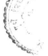

# "T^^Dcj |-Fc3_ T ^L L<.<Al|Z»F=»^L

## [13 V/A N'Apacce. **346**

Nappaccayo hoti va tasBapaccam ice etasmim atthe. Vasitthassa apaceam, putto: vasittho, vasitthass'apaceam putto va, vasitthi, vasittham; evam bharadvajassa apaceam, putto: bharadvajo, bharadvajassa apaccam, putto va, bharadvaji, bharadvajam; gotamassa apaccam, putto: gotamo, gotamassa apaeeam, putto va, gotami, gotamam; vasudevassa apaccam, putto: vasudevo, vasudevassa apaccam, putto va, vasudevi, vasudevam; evam baladevo; vesamitto; s^valapako; cettako; pandavo; vasavD-
(1) The 5uffix na is optionally used in denoting 
'patronymics'. 

The suff ix na is optionally used in the sense of 
'the lineage thereof'- For example: 'male progeny of vasittha: vasittho' or 'vasitthassa apaccam, putto'; 
* female progeny of vasittha; vasitthi'; 'progeny of vasittha: vasittham'; similarly, 'male progeny of bharadvaja: bharadvajo' or 'bharadvajassa apaccam, putto'; bharadvaji, bharadvajam; 'male progeny of gotama: gotamo' or 'gotamassa apaccam, putto'; gotami, gotamam; 'male progeny of vasudeva: vasudevo' or 
'vasudevassa apaccam, putto'; vasudevi, vasudevam; similarly, baladevo; vesanyi^jfeto; svalapako; cettako; pandavo; vasavo-

C23 Nayana—nan a vacchadito - 347 Tasma vacchadito gottaganat o nayana-nanapaccay a honti va lass ' a p a c c am ice etasmim atthe- Vacchas-sa apaccam , putto : vacchayano ; vacchassa apace a m, putto: 
vacchano ; evam sakatayano ; ^akatano ; kanhayano ; 
kanhano ; aggivessayano ; aggivesBano ; kaccayano ; 
kaccano ; moggallayano ; moggallano ; munjayano ; munjano. 

(2) (The suffixes ) nayana and nana are used after the word s vaccha etc . 

T he suffixe s nayana and nana are used in the sense of 'the lineage thereof' after the group of the words beginning with vaccha . For example 'the male offspring of vaccha : vacchayano ; vacchano ' ; similarly , *sakata - 
yano' 'sakatano' "kanhayano' "kanhano' *aqgivessayano' 
'aggivessano' 'kaccayano' 'kaccano' 'moggaliayano' 
'moggallano' "munjayano' "munjano'-
C 3 : Neyyo kattikadihi - 348 Tehi kattikadihi neyyappaccay o hoti va tass'apace am ice etasmim atthe . Kattikaya apaccam, putto: kattikeyyo , kattikaya apaccam , putto va ; evam venateyyo ; rohineyyo ; gangeyyo ; kaddameyyo ; nadeyyo ; 
atteyyo ; aheyyo ; kapeyyo ; seveyyo ; gaveyyojbaleyyo ; 
moleyyo ; koleyyo , 
(3) (The suffix ) neyya is used after the word s kattika etc . 

The suffix neyya is optionally used in the sense of 'the lineage thereof' after the words kattika etc . For exampl e "the male offspring of kattika: kattikeyyo' or kattikaya apaccam putto' ; similarly , 'venateyyo' rohineyyo ' 'gsngeyyo' kaddameyyo' nadeyyo ' atteyyo' 
'aheyyo' kapeyyo ' 'seveyyo' gaveyyo ' baleyyo' 
'moleyyo' "koleyyo'-
C43 Ato ni va- 349 Tasma akarantato nippaccay o hoti va ta&&'apaccam ice etasmim atthe- Dakkha55a apaccam, putto : dakkhi , 
dakkhaBs a apaccam putto va ; evam doni ; vasavi ; Bakyaputti ; nathaputti ; dasaputti ; varuni ; kanhi ; 
baladevi ; pavaki ; jenadatti ; buddhi ; dhammi ; sanghi ; 
kappi ; anuruddhi . Va ti vikappanatthena tass'apaccam ice etasmim atthe nikappaccay o hoti . Sakyaputtassa apaccam , putto : sakyaputtiko ; sakyaputtass a apaccam putto va ; evam nathaputtiko ; jenadattiko -
(4) (The suffix ) ni is optionally used after the words end ing in a. 

The suffi>: ni is optionally used in the sense of 
'the lineage thereof' after the words ending in a. For exampl e the male offspring of dakkha : dakkhi' , or 
'dakkhassa apaccam , putto' ; similarly , "doni' "vasavi' 
"sakyaputti' 'nathaputti' 'dasaputti' 'varuni' "kanhi' 
'baladevi' 'pavaki' "jenadatti' 'buddhi' "dhammi' 'sanghi' 'kappi' 'anuruddhi'- By the force of the word va (optionally) the suffix nika also is used in the sense of 'the lineage thereof' . For exampl e 'the male offspring of sakyaputta : sakyaputtiko' , or "sakyaputtassa apaccam , putto' ; similarly , 'nathaputtiko' 
"jenadattiko' . 

C53Nav'opaQvadihi - 350 Upagu ice evam adihi navappaccay o hoti va tass'apaccam ice etaBtnim atthe . Upagu ssa apace am, putto va: 
opagavD , upaguB^a apaccam, putto va ; evam manavo ; 
gaggavo ; pandavo ; bhaggavo ; opakaccayavo ; opavindavo -
(5) (The suffix ) **nava** is used after the words beginning with upagu . 

T he suffix **nava** is optionally used in the sense of 
'the lineage thereof' after the word s **upagu** etc . For exampl e the male offspring of upagu : opagavo' , or 
' upagu«^sa apaccani, putto' \ similarly , 'manavo' ' g a q q a v o' 
'pandavo' bhaggavo ' 'opakaccayavo' 'opavindavo'. 

C63 Nera vidhavadito **. 351** 
Tasma vidhavadit o nerappaccay o hoti va tass'apaccam ice etasmim atthe . Vidhavaya apaceam , putto: 
vedhavero , vidhavay a apaccam, putto va ; evam bandhakero ; samanero ; nalikero-
(6) (The suffix ) **nera** is used after the words beginning with vidhava . 

T he suffi>; **nera** is optionally used in the sense of 
'the lineage thereof' after the words vidhava etc . For e>: a m p le 'the female offspring of vidhava : vedhavero' , or 'vidhavaya apaccam , putto' ; similarly , 'bhandhakero' 
'samanero' 'nalikero'. 

C73 Yena va samsattham tarati carati vahati niko . 352 Vena va samsattham yena va tarati yena va carati yena va vahati ice etesv atthesu nikappaccay o hoti va . 

Tilena samsattham bhojanam: telikam, tilena samsattham v a ; golikam ; ghatikam ; navaya tarati ti naviko , 
navaya tarati ti va ; evam olumpiko ; sakatena carati ti 
^akatiko , sakatena carati ti va ; evam padiko ; dandiko ; 
dhammiko ; sisena vahati ti sisiko , sisena vahati ti va ; 
evam amsiko ; khandhiko ; hatthiko ; anguiiko . Va ti vikappanatthen a annatthesupi nikappaccay o hoti. 

Rajagah e vasati ti rajagahiko ; rajagahe jato : 
rajagahiko ; evam magadhiko ; savatthiko ; kapiiavatthiko ; 
pataliputtiko -
(7) (The suffix ) **nlka** is used to denote 'that with which something is mixed, that with which one crosses over , that with which one moves , that with which one carrie s something' . 

T he suffix nika is optionally used in the sense of 
'that with which something is mixed, that with which o ne crosse s over , that with which one moves , that with which one carrie s something' . For example 'the food is mixed with sesame : telikam' or 'tilena saipsattham' golikam ' ghatikam' ; 'one who crosse s *ovBr* by means of a boat : naviko'or'navay a tarati' ; similarly 'olumpiko'; 
'one who goes in a cartisakatiko ' or'sakatena carati' ; 
similarly , 'padiko' 'dandiko' 'dhammiko'; one who carrie s the burden on the head: sisiko ' or 'sisena vahati' ; similarly , 'amsiko' 'khandhiko' hatthiko' 
'anguiiko' . By the force of the word va (optionally) 
the suffix nika is used in the sense of other meanings al5o. For e>: ample "one who lives in rajagaha: 
rajagahiko' 'one who was born in rajagaha: rajagahiko'; 
similarly, magadhiko' savatthiko' kapilavatthiko' 
'pataliputtiko'-
C83 Tam adhlte tena katadisannidhananiyoQcisippabhanda - 
j ivikatthesu- 3 53 Tam adhite tena katadisv atthesu tamhi sannidhano tattha niyutto tam assa sippam tam assa bhandam tam assa jivikam ice etesv atthesu nikappaccayo hoti va. 

Vinayam adhite ti venayiko,, vinayam adhite va; evam sottantiko; abhidhammiko; veyyakaraniko; kayena katam kammam; kayikafp, kayena katam kammam va; evam vacasikam: manasikam; sarire sannidhana vedana: saririka, sarire sannidhana vedana va; evam manasika; dvare niyutto; dovariko, dvare niyutto va, evam bhandagariko; nagariko; navakammiko; vina assa sippan ti veniko^ vina assa sippam va; evam panaviko; modangiko; vamsiko; gandho assa bhandam: gandhiko, gandho assa bhandam va; evam teliko; goliko;urabbham hantva jivati ti orabbhiko, urabbham hantva jivati ti va; evam magaviko; sokariko; sakuniko. Adiggahanena annatthesupi yojetabbo. Jalena hato; jaliko, jalena hato va; suttena baddho: suttiko, suttena baddho va; capo assa avudho ti capiko, capo assa avudho va; evam tomariko; moggariko; mosaliko; vato tassa abadho ti vatiko; evam sandhiko; pittiko; buddhe pasanto: buddhiko, buddhe pasanto va; evam dhammiko; sanghiko; buddhassa santikam: buddhikam; evam dhammikam; sanghikam; vatthena kitam bhandam: vatthikam ; evam kumbhikam; phalikam; kinkinikam , sovannikam? kumbho assa pari -
manam; kumbhiko ; akkhena dibbati ti akkhiko ; evam 
&aliko ; tindukiko ; ambaphaliko ; kapitthaphaliko ; 
nalikerik o ice evam adi . 

(S) Also to denote the subject of one's study' 'that by which something is done etc. ' 'near to (connected with ) that' 'that with which one is connected' 'that which is one's art' 'that which is one's utensil ' 'that which is one's livelihood'-
T he suffix nika is optionally used in the sense of the subject of one's study' 'that by which something is done etc. ' near to (connected with ) that' 'that with which one is connected' 'that which is one's art' 
'that whic h is one's utensil ' 'that which is one's livelihood'. For example 'one who studies the vinaya ; 
venayiko ' or 'vinayam adhite' ; similarly , 'sottantiko' 
'abhidhammiko' 'veyyakaranikcj' ..,_ ^ , . . 

; the act performed by the body: kayikam' or 'kayena katam kammam'; similarly, 
'vacasikam' 'manasikam'; 'the sensation connected with the body: saririka ' or sarire sannidhana vedana' ; 
similarly , 'manasika'; 'one who is appointed at a door: 
dovariko ' or 'dvare niyutto' ; similarly , 'bhandagariko' 
'nagariko' 'navakammiko'; *the lute is one's art; veniko ' or 'vina assa sippam'; similarly , 'panaviko' 
'modangiko' vamsiko' ; 'the fragrance is one's commodity : gandhiko ' or 'gandho assa bhandam'; 
similarly "teliko goliko' ; "one who lives by killing a ram: orabbhiko ' or'urabbham hantva jivati';similariy, 
'magaviko' 'sokariko' 'sakuniko'. By the force of **adi** (etc.) the suffi>: **nika** is used in the sense of other meaning s also . For example killed by a net : jaliko' or 'jalena hato' , 'bound with a thread: suttiko' or 
'suttena baddho' ; the bow is one's weapon : capiko' or 
'capo assa avudho' ; similarly , 'tomariko' 'moggariko' 
'mosaliko' ; 'the vata is one's illness : vatiko' ; 
similarly , 'sandhiko' 'pittiko'; 'one w ho has trusted in the Buddha : buddhiko' or'buddhe pasanto' ; similarly, 
* d h a m m i k o ' 'sanghiko' ; 'be longing to the Buddha : 
buddhikam' ; similarly , 'dhammikam' 'sanghikam'; "the utensil exchanged for cloth : vatthikam' ; similarly , 
"kumbhikam' 'phalikam' 'kinkinikam' 'sovannikam'; 'the pot is one's measure : kumbhiko' 'one who plays with a dice : akkhiko' ; similarly , 'saliko' 'tindukiko' 
"ambaphaliko' 'kapitthaphaliko' 'nalikeriko' etc , 
C91 Na raga tena rattam tass'edam annatthesu ca. **354** 
Nappaccay o hoti va ragamha tena rattam ice etasmim atthe tass'edam annatthesu ca . Kasavena rattam vatthams kasavam, kasavena rattam vattham va ; evam kosumbham ; haliddam; pattangam; manjettham ; kunkumam; sukaras^a idam mamsam : sokaram , sukarassa idam mamsam v a ; mahisass a idam mamsam: mahisam , mahisassa idam mamsam va . Udumbarass a avidure vimanam : odumbaram ; 
vidisaya avidur e bhavo : vediso ; madhuraya jato: madhuro ; kattikadihi niyutt o maso : kattiko ; evam magasiro ; phussc ; magho ; phagguno ; citto ; na vuddhi nilapi -
tado paccaye sanaKarake ; Cpakaro phussa saddaBsa; siroti sirasam vadel ; sikkhanam Bamuho : sikkho ; bhikkhunam samuho : bhikkho ; evam kapoto ; mayuro ; kokilo; buddho a55a devata : baddho ; evam bhaddo ; maro ; mahindo ; vessavano ; yamo ; 5omo ; narayano ; samvaccharam avecca adhite : samvaccharo ; evam mohutto ; nimittam avecca adhite : nemitto ; evam angavijjo ; veyyakarano ; 
chandaso ; cando ; bhaso ; vasatinam visayo deso : vasato ; 
evam kunto ; atisaro ; udumbara asmim padese santi : 
odumbaro ; Bagarehi nibbattos sagaro ; sakalam a55a niva5D : sakalo ; madhura as.5a nivaso : madhuro ; madhuraya i5.5arD5 madhuro ; ice evam adayo yojetabba . 

(9) The suffix na is optionally used in the sense of 
'dyed with' and possession' after the word denoting colour as well as other senses . 

After the word denoting colour the 5uffi>; na is optionally used in the sense of "dyed with' 
'possession' as well as other senses . For exampl e 'the cloth is dyed with a reddish yellow dye : kasavam' or 
'kasavena rattam vattham' ; similarly , 'kosumbham' 
'haliddam' 'pattangam' 'manjettham' 'kunkumam'; 'the flesh of a pig: sokaram' or "sukarassa idam mamsam' 
'the flesh of a buffalo : mahisam' or 'mahisassa idam mamsam' ; 'the palace is near a fig—tree : odumbaram' 
'situated near vidisa : vediso ' 'one who is born in the madhura : madhuro' ; 'the month connected with kattika etc : kattiko* ; Bimilarly , "magasiro ' 'phusBo ' magh o 
'phagguno' citto' ; when a suffi>; with the sound n follows , lengthening is not applicabl e to **nila, pita** 
etc. , the sound pa is changed into **pha** (in **phussa)** , 
the word **sira** should be understood in the sense of a constellation ; 'a group of disciplines : sikkho' 'a group of monks : bhikkho' ; similarly , kapoto' mayuro' kokilo' ; the buddha is one's god: buddho' ; similarly 
"bhaddo' "maro' "mahindo' 'vessavano' 'yamo' 'somo' 
*narayano' ; 'having scrutinised one studie s the year : 
samvaccharo' ; similarly , 'mohutto';'having scrutinised o ne studie s an omen : nemitto' ; simi1arly,'angavijio ' 
'veyyakarano' 'chandaso' 'cando' *bhaso*; '(the country ) is the place of herons : vasato' ; similarly, 
"kunto' 'atisaro' ; 'fig-trees grow in this country: 
odumbaro ' 'produced by sagara—s:sagarD ' "sakala city is one's residence : sakalo' madhura is one's residence ; 
madhuro'^on e who is the chief in madhura : madhuro ' etc . 

tlO^Jatadinamim'iyaca . 355 Jata ice evam adinam atthe ima—iya paccaya honti . 

Paccha jato : pacchimo ; evam antimo ; majjhimo ; purimo ; 
uparimo ; hetthimo ; gopimo ; bodhisattassa Jatiya jato; bodhisattajatiyD ; evam assajatiyo ; hatthijatiyo ; 
manussajatiyo . Adiggahanena niyuttatthaditop i tadassatthaditop i ima - iya - ika paccaya honti . Ante niyutto : antimo ; evam antiyo ; antiko ; putto yassa atthi tasmim va vijjati ti puttimo ; evam puttiyo ; 
puttiko ; kappimo ; kappiyo ; kappiko- Casaddaggahanena kiyappaccayo hoti. Jatippabhutiya niyutto: jatikiyo; andhe niyutto: andhakiyo; jatiya andho: jaccandho; jaccandhe niyutto: jaccandhakiyo. 

(iO) And the suffixes **ima** and **iya** belong to * one who is born at' etc. 

The suffixes **ima** and **iya** *are* used in the sense of 
'born in' etc. For e>: ample 'one who is born after: 
pacchimo'; similarly, 'antimo' "majjhimo' "purimo' 
'uparimo' 'hetthimo* 'gopimo'; 'one who is born as bodhisatta by birth: bodhisattajatiyo'; similarly, 
'assajatiyo' 'hatthijatiyo' 'manussajatiyo'- By the force of **adi** (etc.) the suffixes **ima,** iya and **ika** are also used in the sense of 'employed in' etc. and 'that thereof' etc. For example 'one who is kept in the end: 
antimo'5 similarly, 'antiyo' 'antiko'; 'one who has a son or wherein a son exists: puttimo'; similarly, 
'puttiyo' 'puttiko' kappimo' 'kappiyo' 'kappiko'. By the force of ca the suffix kiya is also used. For example 'one who is appointed from birth onwards; jatikiyo' 'one who is appointed in the Andha country: 
andhakiyo' 'one who is blind by birth: jaccandho' 'one who is kept for born-blind: jaccandhakiyo'. 

Cli] Samuhatthe kan-na. 356 Samuhatthe kan-na ice ete paccaya honti. Rajaputtanam samuho: rajaputtako rajaputto vaj manussanam samuho: manussako manusso va; mayuranam samuho: mayurako mayuro va; mahisanam samuho: mahisako mahiso va. 

(11) The suffixe s kan and na *sire* used to denote 
'group'-
T he suffixes kan and na are used in the sense of group . For example 'a group of princes : rajaputtako or rajaputto ' 'a group of people : manussak o or manusso ' 
'a group of peacocks : mayurako or mayuro ' 'a group of buffaloes : mahisako or mahiso'-
C123 Gama-j a n a - b a n d h u - s a h a y a d i h i ta- 3 57 Gama-j ana - b a n d h u - s a h a y a ice evant adihi tapacc - 
a yo hoti samuhatthe . Garnanam samuho : gamata ; 
jananaip samuho : Janata ; bandhunam samuho : bandhuta; sahayanam samuho : sahayata ; nagaranam samuho : nagarata . 

(12) The suffix ta is used after the words gama , jana , 
bandhu , sahaya etc . 

The suffi>; ta is used in the sense of group after the word s gama , Jana , bandhu , sahaya etc . Thus *a group of villages : gamata ' 'a multitud e of persons : Janata' 
'a group of relatives : bandhuta' 'a group of friends : 
sahayata ' 'a group of citizens : nagarata' -
C133 TadasBatthanamiyoca . 358 Tadassatthana m ice etasmim atthe iyappaccay o hoti . 

tiadanassa thanam: madaniyam; bandhanassa thanam: 
bandhaniyam ; mocanassa thanam: mocaniyam ; evam rajaniyam; kamaniyam; dassanassa thanam: dassaniyaip; upada - 
nassa thanam: upadaniyam. Casaddaggahanen a iya—ilappa— 
'\t '\t ccaya honti . Ranno idam thanam: rajiyam; evam rajilam-
(13) And the suffix iya is used to denote 'that is the locality thereof' . 

T he suffix iya is used in the sense of 'that is the locality thereof'- For example the abode of cupid: 
madaniyam' the place of bondage : bandhaniyam' 'the place of freedom: mocaniyam' ; similarly , 'rajaniyam' 
'kamaniyam' the place of seeing : dassaniyam' the place of attachment : upadaniyam' . By the force of ca the suffixe s iya and ila *Are* also used. For example 
'the abode of king: rajiyam'; similarly , 'rajilam'-
E143Upamatthayitattam - 359 Upamatth e ayitattappaccay o hoti . Dhumo viya dissati tad idam dhumayitattam ; timiram viya dissati adum thanam tad idam timirayitattam . 

(14) The suffix ayitatta is used to denote resemblance . 

The suffix ayitatta is used in the sense of resemblance . For e>: a m p le 'this thing appears like a smoke : dhumayitattam ' 'that place appears like a darkness : timirayitattarn'. 

C153 Tamnissitattb e lo- 360 m Tamnissitatth e tadassatthanam ice etasmim atthe ca lappaccayo hoti . Dutthum nissitam : dutthullam ; vedam nissitam : vedaliam . 

(15) The suffix la is used to denote 'based on that' . 

T he suffi>: la is used in the sense of 'based on that' and 'that is the locality thereof' . For e>: a m p le 
'(the action ) is based on a bad thing: dutthullam ' 
'(Buddha's discourse ) based on k n o w l e d g e : vedaliam' -

## C163 Aiu Tabbahule . 361

Aluppaccay o hoti tabbahu1 a 1 1 h e . Abhijjha assa pakatis abhijjhalu abhijjhabahul o va ; evam sitalu; dhajalu ; dayalu . 

(16) The suffix **alu** is used to denote 'full of that'-
T he suffix **alu** is used in the sense of 'full of that' . For example 'whose tendency is to be covetous : 
abhijjhalu or abhijjhabahulo' ; similarly , *sitalu' 
'dhajalu' 'dayalu'-
[173 Nya-tta-ta bhave tu- **362** 
Nya - tta - ta ice ete paccaya honti bhavatthe-
Alasassa bhavo : alasyam ; arogassa bhavo : arogyam; pamsukulikass a bhavo : pamsukulikattam ; anodarikassa bhavo : anodarikattam ; sanghanikaramass a bhavo : sangha -
nikaramata ; niddaramass a bhavo : niddaramata . Tusaddaggahanen a ttanappaccayo hoti . Puthajjanass a bhavo : 
puthujjanattanam ; vedanassa bhavo : vedanattanam-
(17) On the other hand, **nya,** tta and ta *stre* used to denot e the state , 
T he suffix **nya, tta** and ta *sire* used in the sense of the state (of an object) . For example 'the state of a lazy person : alasyam' the state of a hea 1 thy person: 
arogyam' 'the state of one who wears clothes made of rags taken from a dust heap: pamsukulikattam ' 'the state of being not connee ted with (filling of ) the stomach : anodarikattam' 'the state of one who is delighted in an assembly : sanghanikaramata ' 'the state of one who is delighted in sleeping : niddaramata' . By t he force of the word tu the suffix ttana is also used. 

For example the state of an unconverted person: 
puthujjanattanam'^th e state of sensation : vedana - t tan am' -
C183Navi5afnadihi . 363 Nappaccay o hoti visamadihi tassa bhavo ice etasmim atthe- Visamass a bhavo : vesamam; sucissa bhavo : socam-
(IS) The suffix na is used after the word s vieama etc-
The suffix na is used in the sense of 'the state - 

(of an object ) thereof' after the words visama etc . 

Thus : 'the state of an unequal thing: vesamam' 'the state of purity : socam'. 

C191 Ramaniyadit **o kan. 364** 
Ramaniy a ice evam adito kanpaccayo hoti tassa bhavo ice etasmim atthe . Ramaniyassa bhavo : ramaniyakam ; 
manunnass a bhavo : manunnakam ; aggisomass a bhavo: 
aggisomakam . 

(19) The suffix **kan** is used after the word ramaniya etc . 

T he suffix **kan** is used in the sense of 'the state 
(of an object ) thereof' after the words ramaniya etc-
Thus : 'the state of delightfullness : ramaniyakam' 'the state of pleasure ; manunnakam ' 'the state of being belonging to aggi and soma : aggisomakam' . 

C20^ Visese tara—tam'issi k 'iy' ittha - **365** 
Visesatth e tara—tama—issika—iya—ittha ice ete paccaya honti . Sabbe ime papa, ayam imesam visGsena papo ti papataro ; evam papatamo ; papissiko ; papittho. 

(20) The suffixes **tara, tama,** Issika, iya? ittha are used to denote 'speciality'. 

The suffixes tara, tama, issika, iya? ^tt*^^ are used in the sense of 'speciality'. For example 'all these people are sinful, this person is more sinful than any one of them: papataro'; similarly, 'papatamo' 
•papissiko' 'papittho'. 

C213 Tadassatthi ti vi ca- 366 Tadassatthi ice etasmim atthe vipaccayo hoti. 

Medha yasmim atthi tasmim va vijjati ti medhavi; evam mayavi. Casaddaggahanena sopaccayo hoti: sumedha yassa hoti tasmim va vijjati ti sumedhaso. 

(21) And the suffix vi is used to denote 'that which is possessed by it'. 

The suffi>; vi is used in the sense of 'that which is possessed by it'. For example the knowledge is possessed by him or it lies in him; medhavi ' ;simi 1ar1y, 
'mayavi'- By the force of ca the suffi>; so is also used. For example "the good knowledge is possessed by him or it exists in him: sumedhaso'. 

C223 Tapadito si, 367 Tapadito sipaccayo hoti tadassatthi ice etasmim atthe, Tapo yassa atthi tasmim va vijjati ti tapassi; evam tejassi; yasassi; manassi. 

(22 ) The suffix si is used after the words tapa etc. 

The suffi>: si is used in the sense of 'that which is possessed by it' after the words tapa etc. Thus: 
'the asceticism is possessed by him or it e>;ists in him: tapassi'; similarly, 'tejassi' 'yasassx''manassi'. 

£23 3 Dandidito ika^i- 368 Dandadito ika-'i icc ete paccaya honti tadassatthi ICC etasmim atthe. Dando yassa atthi tasmim va vijjati ti dandiko; dandi; evam maliko; mail. 

(23) The suf-fixes ika and i are used after the words danda etc. *m m* The suffixes ika and i are used in the sense of 
'that which is possessed by it' after the words danda etc- Thus: the staff is possessed by him or it lies with hims dandiko, dandi'; similarly, maliko' 'mail'. 

C24 3 Madhvadito ro. 369 Madhu icc eveim adito rappaccayo hoti tadassatthi icc etasmim atthe- Madhu yassatthi tasmiip va vijjati ti madhuro; evam kunjaro; mukharo; susiro; subharo; sue 1rD. 

(24) The suffix ra is used after the words madhu etc. 

The suffix ra is used m the sense of that which is possessed by it' after the words madhu etc. Thus: 
'the honey is possessed by him or it is with him: 
madhuro'; similarly, 'kunjaro' "mukharo' * susiro' 
'subharo' 'suciro'-
C253GunaditDvantu - 370 Guna ICC evam adito vantuppaccayD hoti tadassatthi icc etasmim atthe. Guno yassa atthi tasmim va vijjati *•\r '\j* ti gunava; evam yaeava; dhanava; balava; pannava. 

(25) The suffix vantu is used after the words guna etc. 

T he BuffiM vantu is used in the sense o-f 'that which iB possessed by it' after the word s guna etc . 

Thus : the merit is possessed by him or it lies in him: 
gunava' ; similarly , yasava' dhanava''balava''pannava' -
C263 Satyadihi mantu . 371 Sati ice evam adihi mantuppaccay o hoti tadassatthi ice etasmim atthe- Sati yassa atthi tasmim va vijjati ti satima ; evam jutima ; sucima ; thutima ; matima ; 
kittima ; mutima ; bhanuma . 

(26) The suffix mantu is used after the word s sati etc . 

The suffix mantu is used in the sense of 'that which is posssBSsed by it' after the word s sati etc . 

Thus : 'the mindfulnes s is possessed by him or it lies in him: satima* ; similarly , 'jutima' 'sucima' 'thutima' 
'matima' 'kittima' 'mutima' 'bhanuma'. 

E27 : Saddhadit o na . 372 Saddha ice evam adito nappaccay o hoti tadassatthi ice etasmim atthe- Saddha yassa atthi tasmim va vijjati ti saddho ; evam panno; maccharD-
(27) The suffix na is used after the words saddha etc . 

The suffi>i na is used in the sense of 'that which is possessed by it' after the word s saddha etc . Thus : 
'the faith is possessed by him or it lies in him: 
saddho' ; similarly , 'panno' 'maceharo'. 

C283 Ayuss'ukarasmantumhi . 373 Ayusaddass a ukarassa asadeso hoti mantuppaceay e pare . Ayu yassa atthi tasmim va vijjati ti ayasma , 
(28) The vowel u of the word ayu followed by the suffix mantu is changed into as . 

When tt^e sut-f iv. mant u toll o w e , the vowel u of the word ayu is changed into as . Thus : *the long life is possessed by him or it is with him: ayasma' . 

C29 3 Tappakativacanemayo . 374 lappakativacanatth e mayappaccay o hoti . Suvannena pakatam: suvannamayam ; evam rupiyamayam ; jatumayam; rajatamayam ; ayomayam; mattikamayam ; itthakamayam ; 
katthamayam ; gomayam . 

(29) The suffix **maya** is used to denote 'its nature t h e r eo f ' -
T he suff iy. maya is used in the sense of ' its nature thereof' . For example *(a bowl) is made of gold : suvannamayam' ; sifftilarly, 'rupiyamayam' 
'jatumayam' 'rajatamayam' 'ayomayam' 'mattikamayam' 
' i t t h a k a m a y a m' ' k a t t h a m a y a m' 'gomayam' . 

t303 Sankhy **apuran** e mo . 

3 75 Sankhyapuranatth e mappaccay o hoti. 

Panc a n n am 
'\i purano : pancamo ; evam chatthamo ; sattamo ; atthamo ; 
navamo ; dasamo-
(30) The suffix ma is used to denote 'the completio n of 3 numbe r' . 

The suffi>: ma is used in the sense of 'the completion of a number' . For example 'completing the number five : pancamo' ; similarly , 'chatthamo' 'sattamo' 
'atthamo' 'navamo' 'dasamo'. 

C31DSachassava , 376 Sankhyapuran e vattamanass a chassa so hoti va . 

Channam purano: sattho chattho va. 

( 31) The sound cha is optionally changed into sa. 

The sound cha used in the sense of 'the completion of a number' is optionally changed into sa. Thus: 
'completing the number six: sattho or chattho'. 

E323 Ekadito dasassi. 377 Ekadito dasassa anto ipaccayo hoti itthiyam sankhyapuranatthe - Ekadasannam purani: ekadasi; 
-v _ _ '^ _ _ - 
pancadasannam purani: pancadasi; catuddasannam purani: fv catuddasi. Purane ti kim attham? Ekadasa; pancadasa. 

(32) The suffix i is added to dasa after the words eka etc . 

The suffi>; i is added to the final of dasa after the words eka etc. in the faminine gender (and) in the sense of 'the completion of a number'. Thus; 
'completing the number eleven: ekadasi' 'completing the number fifteen: pancadasi' 'completing the number fourteen: catuddasi'. Why in the sense of a number'?: 
For, in the following examples, this suffix is not 
•v. 

found: 'ekadasa' 'pancadasa'. 

C333Dase5oniccanca . 378 Dase niccam chassa so hoti- Solasa. 

(33) Also the sound cha followed by the word dasa is always changed into so. 

When the word dasa follows, the sound cha is C34 3 A n t e n i g g a h i t a n c a . 379 Tasam sanKhyanam ante niggahitagamo hoti-
Ekadasim; pancadasim; catuddasim. 

(34) And niggahita is added at the end. 

The niggahita is augmented at the end of those numerals- For example 'ekadasim' 'pancadasim' 
'catuddasim'-
C353 Ti ca- 380 Tasam sankhyanam ante tikaragamo hoti. Visati; t imsat i. 

(35) Also ti. 

The suffix ti is augmented at the end of those numerals. For example 'visati' 'timsati'-
C363Lada-ranam - 381 Dakara-rakaranam sankhyanam lakaradeso hoti. 

Solasam; cattalisam. 

(36) The sounds da and ra *s^re* changed into la. 

The sounds da and ra of numerals become la. For example "solasam' 'cattalisam"-
t373 Visati-dasesu ba dvissa tu. 382 Visati-dasa ice etesu dvissa ba hoti. Bavisatindriyani; barasa manussa. Tusaddaggahanena dvissa dudi - doadesa honti, Durattam; dirattam; digunam; doha1i n i. 

(37) However the word dvi followed by the words visati and dasa is changed into ba. 

When the words visati and dasa follow, the word dvi is changed into ba. Thus: 'bavisatindriyani' 'barasa manussa' . By the -force of tu the word dvi is also changed into du , di and do- For example durattam' 
'dirattam' "digunam' 'dohalini'. 

C383 Ekadit o dasa ra sankhyane , 383 Ekadit o dasassa dakarassa rakaro hoti va sankhyane- Ekarasa ; barasa ; *ekAddi^A^* badasa ; dvadasa . 

Sankhyan e ti kim attham? Dvadasayatanam-
(38) In the numeral s the sound da of dasa is changed into ra after the words eka etc-
In numeral s the sound da of **dasa** used after the word s **eka** etc . is optionally changed into ra- Thus : 
*ekarasa''barasa' 'ekadasa' "badasa''dvadasa' . Why'the numerals'? ! For , in the following example this change is not found: 'dvadasayatanam'-
C393 Atthadit o ca . **384** 
Atthadit o dasasaddass a dakarassa rakaradeso hoti va sankhyane . Attharasa ; atthadasa . Atthadit o ti kim attham? Pancadasa . Sankhyane ti kim attham? Attha -
dasiko . Caggahanam kim attham? Dasa - r a g g a h a n ' a n u k a d dhanat tham -
(39) Also after the words attha etc . 

In numeral s the sound da of **dasa** used after **attha** 
etc . is optionally changed into ra. Thus ; 'attharasa' 
'atthadasa'. Why 'after **attha** etc.'? : For , in the following exampl e this change is not found:'pancadasa' . 

Why 'the numerals' ; For , in the following example this change is not found: 'atthadasiko'. Why is ca added? ; 
For , supplying here **dasa-ra** from the preceding rule-
C403 Dv'ek'atthana **m akaro va. 385** 
Dvi-eka-atth a etesam anto akaradeso hoti va sankhyane . Dvadasei? ekadasa ; **atthadas.a. Sankhyane** ti kim attham ? Dvidanto ; ekadanto ; ekachatto ; - 

atthatthambho . 

(40) (The final of) the word s **dvi, eka** and **attha** is optionally changed into a. 

T he final of the words dvi , **eka** and **attha** is optionally changed into a to signify the numerals . 

Thus : dvadasa ' ekadasa ' 'atthadasa'- **Why** the numerals'? : For , in the following example s this change is not found: 'dvidanto' "ekadanto' 'ekachatto' 
'atthatthambho'-
C413 Catuchehi tha-tha. 386 Catu-ch a ice etehi **tha-tha** ice **ete** paccaya honti sankhyapuranatth e - Catunnam purano : catuttho ; channam purano : chattho -
(41) The suffixe s **tha** and **tha are** used after **catu** and - 

c ha . 

The suffixe s **tha** and **tha** *sire* used **after catu** and cha in the sense of 'the completion of a number'-
Thuss "the completio n of fouri eatuttho ' 'the completion of six: chattho' . 

E423 Dvi-tlhi tiyo. 387 Dvi-ti ice etehi tiyappaccayo hoti sankhyapurana -
tthe. Dvinnam purano : dutiyo ; tinnam purano ; tatiyo . 

(42) The 5uf-fi>: tiya is used after the word s dvi and ti . 

The Bu-ffix tiya is used after the word s dvi and ti in the sense of 'the completion of a number' - Thus : 
'completing the number two : dutiyo ' 'completing the number three : tatiyo'-
E43] Tiye du-tapi ca- 388 Dvi—ti ice etesam du-ta ice ete adesa bonti tiyappaccay e pare . Dutiyo ; tatiyo. Apiggahanen a annes -
vapi du - t i a d e sa honti . Durattam; tirattam. 

Casaddaggahanen a dvi ice etassa dikaro hoti- Digunam sanghatika m parupitva . 

<43) And also du and ta when followed by tiya . 

When the suffix tiya follows , the words dvi and ti are changed into du and ta. So : 'dutiyo' 'tatiyo*. By the force of api? du and ti *are* the substitutes elsewher e also . Thus ; 'durattam' 'tirattam'. By the force of ca the word dvi is also changed into di-
Thus ; 'digunam sanghatikam parupitva" . 

C443 Tesam addhupapaden'addhuddha-divaddha -
diyaddh'addhatiya . 389 Tesam catuttha-dutiya-tatiyana m addhupapadanam addhuddha-divaddha-diyaddha-addhatiyades a addhupapadena saha nipaceante . Addhena catuttho : addhuddho ; addhena dutiyo : divaddho ; addhena dutiyo : diyaddho ; addhena tatiyo : addhatiyo . 

(44) Those , compounded with addha are changed into addhuddha **, divaddha** , diyaddh a and **addhatiya** . 

T he word s catuttha , dutiya and tatiya compounded with **addha** constitute anomalously the forms addhuddha , 
divaddha , diyaddha and **addhatiya** . Thus : 'half less to fourth; addhuddho ' half less to second: divaddho' 
'half less to second: diyaddho ' 'half less to third; addhatiyo'-
[45 3 Sarupana m ekasesv **asakim.** 390 Sarupanam padabyanjananam ekaseso hoti asakim-
Puriso ca puriso ca : purisa. Sarupanam iti kirn attham? 

Hatthi ca asso ca ratho ca pattiko ca : 
hatthiassarathapattika . ftsakin ti kim attham7 Puriso-
(45) Of many words identical in form, only one is retained -
T he only one word remains among those of identical forms . For exampl e 'puriso ca puriso ca : purisa'- Why identical in form? : For , to the following example this rule is not applicable : 'hatthi ca asso ca ratho ca pattiko ca : hatthiassarathapattika' . Why many'? : 
For , to the following example this rule is not applicable : 'puriso'. 

£463 Ganane dassa dvi-ti-catu-panca-cha-satta-attha -
'\* »\» 
navakanam vi-ti-cattara-panna-cha-satt'asa-nav a 
'\r yosu yonan c'isam—asam—thi—ri—t'it'uti- 391 Ganane dasassa dvika-tik a - c a t u k ka - p a n c a ka - c h a k k a -
sattaka—atthaka—navakana m sarupanam katekasesanam yathasaiikhyam vi - t i - c a t t a ra - p a n na - sa - s a t t ' a sa —nava ice ete adesa honti asakim yosu yonan ca isam-asam-thi-ri-tiiti-uti  icc ete adesa paccha puna  nipaccante.  Visam; timsam; cattālīsaṃ; pannāsaṃ; saṭṭhī; sattari; sattati; Ganane  ti asiti;  navuti. Asakin ti kim atthaṃ? Dasa.  
kim attham? Dasadasako puriso.

(46)  In counting the word dasa, multiplied two times, three  times, four times, five times, six times,  seven times, eight times and nine times followed by the caseending yo is changed into vi, ti, cattāra, pannā,  cha, satta, asa and nava and the case-ending yo  is afterwards  changed into isam, asam, thi, ri, ti, iti, and uti.

In counting, when one is retained out of the words ssimilar  in  form, if the case-ending yo  follows,  the dddddy word times, five times, six times, seven times, eight  times and nine times is changed into vi, ti, cattara,  panna, s,  satta,  asa and nava respectively  and  the caseending yo is afterwards anomalously changed into  isaṃ, asam, thi, ri, ti, iti  and uti.  Thus:  visam'
'timsam' 'cattālīsaṃ' `pannasaṃ' `saṭṭhī' `sattari'
`sattati´ `asiti´ `navuti´.

Why   `asakim´
is uuunnneeee is not applicable: `dasa´.  Why `in counting´?  For, to the  following  example  this  rule  is not applicable:
`dasadasako puriso'.

£473 Catupapadassa tulopo cuttarapadadicassa cu—CO pi na va- 392 Catupapadas&a gananapariyapannassa tulopo hoti uttarapadadicassa cakarassa cu-co pi honti na va. Catuhi adhika dasa: cuddasa, coddasa, catuddasa. 

Apiggahanena anupapadassapi uttarapadadissa cassa lopo hoti na va cassa cu-copi honti ca- Talisam; cattalisaip; cuttaiisam; cottalisam- (47) The sound tu of catu is elided, and ca followed by latter number, is or is not optionally changed into cu and coif the word catu constitutes the preceding member of a compound word, the sound tu of **catu** is elided and ca is or is not optionally changed into cu and co. For example the ten added by four : cuddasa, coddasa and catuddasa'- By the force of ca even when the word catu does not constitute the preceding member of a compound word, ca is or is not elided and ca is also changed into cu and co. For example 'talisam' 'cattalisam' 
'cuttaiisam' 'cottalisam'-
C483 Yad anuppanna nipatana sijjhanti- 393 
-"Vji Ye sadda anidditthalakkhana akkhara-pada- byanjanato itthi - puma - napumsakaiingato nam'upasagga - nipatato abyayibhavasamasa - taddhit'akhyato ganana-sankhya—kala - 
karakappayogasannato sandhi—pakati-vuddhi—lopa - agama - 
vikara-Viparitadesato ca vibhattivibhajanato, ca te nipatana sijjhanti-
(48) Those which *s,re* not accomplished , are proved by 
"nipatana' device . 

T he words may be indeterminat e in respect of sounds and words and consonants , masculine , feminine , 
and neuter gender , nouns , preposition and indeclinable , abyayibhava compound , taddhita and akhyata , number , 
tense and case , junction , stem, lengthening, elision , 
augment , modification , inversion and substitute , and division of case—endings ; such words are considered as proved by the way of nipatana . 

C493 Dvadito ko'nekatth **e ca- 394** 
Dvi ice evam adito kappaccay o hoti anekatthe ca.. . 

(49) And , after the word s dvi etc.th e suffix ka is used to denot e **aneka** more than one . 

T he suffix ka is used in the sense of 'more than one ' after the words **dvi** etc.. . 

CSOl **Dasadasakam** satam dasakanam satam sahassan ca yomhi- **395** 
Sananapariyapannass a dasadasakassa satam hoti , 
satadasakass a ca sahassam hoti yomhi- Satam, 
"V 
sahassatp. Dvikadinam taduttarapadanan ca nipaccant e yathasambhavam . Satassa dvikam tad idam hoti dvisatam; satassa tikam tad idam hoti tisatam; evam catusatam , 
pancasatam ; chasatam ; sattasatam ; atthasatam; navasatam ; dasasatam sahassaip hoti . 

(50) Ten times ten becomes satam and also a hundred foilows -
In counting , te n time s te n an d a hundre d time s te n foi l o w e d by th e case-endin g y o becom e sata m and Baha55ain (respectively) . Therefore : 'satam ' 
sahassam' . Th e dvik a etc . followe d by thes e word s *are* als o prove d accordingly . Thus ; 'twic e hundred : 
dvisatam ' 'thric e hundred : tisatam' ; similarly , 
catusatam ' 'pancasatam ' 'chasatam ' 'sattasatam ' 
"atthasatam ' 'navasatam ' 'dasasata m sahassa m hoti' . 

[51 3 Yavataduttarii n dasagunita n ca - 39 6 Yav a tasa m sankhyana m uttari m dasagunita n ca katabbam . Yatha : dasass a dasagunita m katv a sata m hoti ; 
satass a dasagunita m katv a sahassa m hoti ; sahassass a dasagunita m katv a dasasahassa m hoti ; dasasahassass a dasagunitai n katv a satasahassa m hoti ; satasahassass a dasagunita m katv a dasasatasahassa m hoti ; dasasata -
sahassass a dasagunita m katv a kot i hoti ; kotisatahassa - n a m sata m pakot i hoti ; eve m sesan i katabbani . 

(51 ) Th e number s *Bire* t o be multiplie d by te n a s fa r a s t h e highe r number s increase . 

T h e number s ar e to be multiplie d by te n a s fa r a s t h e highe r number s increase . Thus : te n time s multiplicatio n of te n become s satam ' 'hundre d time s multiplicatio n of te n become s sahassam ' 'thousan d time s multiplicatio n of te n become s dasasahassam ' 'ten thousan d time s multiplicatio n of te n become s satasahassam ' 'hundre d thousan d time s multiplicatio n of ten becomes dasasatasahaBsam ' 'ten hundred thousand times multiplication of ten becomes koti' 'one hundred times multiplicatio n of a hundred thousand crores becomes pakoti' ; the remaining number also should be accomplished accordingly . 

C52] Sakanamehi **. 397** 
Yasam pana sankhyanam anidditthanamadheyyana m sakehi sakehi namehi nipaccante . Satasahassanam satam: 
koti ; kotisatasahassanam satam: pakoti ; pakotisatasaha -
ssanam satam; kotippakoti ; kotippakotisatasahas&anam satam: nahutam ; nahutasatasahassanam satam: ninnahutam ; 
ninnahutasatasahassana m satams akkhobhini ; tatha ; 
bindu ; abbudam ; nirabbudam ; ahaham ; ababam; atatam; sogandhikam ; uppalam ; kumudam; pundarikam ; padumam; kathanam; mahakathanam ; asankheyyam. 

(52) (The other s are laid down ) by their designations . 

The other numbers , the nouns for which *Are* not accomplished , are laid down by designations . Thus : 'a hundred of one hundred thousand: koti' 'a hundred of o ne hundred thousand koti-s : pakoti' 'a hundred of one hundred thousand pakoti - s: kotippakoti ' 'a hundred of o ne hundred thousand kotippakoti-s : nahutam' *a hundred of one hundred thousand nahuta - s: ninnahutam' *a hundred of one hundred thousand ninnahuta-s : akkhobhini' ; 
similarly , 'bindu' 'abbudam' 'nirabbudam' 'ahaham' 
'ababam' 'atatam' "sogandhikam' "uppalam' 'kumudam' 
'pundarikam' 'padumam' 'kathanam' 'mahakathanam' 'asankheyyam'. 

C533 Tesam no lopam. 398 Tesam paccayanam no lopam apajjate. GotamasBa apaccam, putto: gotamo; evam vasittho; venateyyo; alasyam; arogyam. 

(53) Their n is elided-
The sound n belonging to those suffixes is elided. 

For e>: ample "the male offspring of gotama: gotamo'; 
similarly, 'vasittho' 'venateyyo' 'alasyam' arogayam'. 

C543 Vibhage dhi ca- 399 Vibhagatthe dhapaccayo hoti. Ekena vibhagena: 
'V 
ekadha; evam dvidha; tidha; catudha; pancadha. C'eti kim attham? So ca hoti. Suttaso; byanjanaso; padaso. 

(54) The Buffi>; dha too is used to denote 'division'. 

The suffix dha is used in the sense of "division'. 

For example by single : ekadha'5 similarly, 'dv idha' 
'tidha' 'catudha' 'pancadha'. Why 'ca' (too)?: For, the suffix so is also added. For example "suttaso' 
'byanjanaso' 'padaso'. 

[55 3 Sabbanamehi pakaravacane tu tha. 400 Sabbanamehi pakaravacanatthe tu thapaccayo hoti. 

So pakaro: tatha; tarn pakarain: tatha; tena pakarena: 
tatha; tassa pakarassa: tatha; tasmim pakare: tatha; evam sabbatha; annatha; itaratha- Tusaddaggahanam kim attham? Thattapaccayo hoti. So viya pakaro5 tathatta; *'\r '\r* yathatta; annathatta; itarathatta; asabbathatta. 

(55) The suffix tha, however, is used after the pronouns to denote 'manner*. 

The suffix tha too is used in the sense of 
'manner' after the pronouns . For example that manner : 
tatha' to that manner : tatha' 'by that manner : tatha' 
'for that manner : tatha' 'in that manner : tatha' ; 
similarly , 'sabbatha' annatha' 'itaratha'. Why tu is added? : For , the suffix thatta is also used. For example 'the manner like that : tathatta' 'yathatta' 
'annathatta' 'itathatta' 'asabbathatta'-
C56 3 Kim-imehi thain. 40i kirn— ima ice etehi thampaccayo hoti pakaravaca -
natthe . Ko pakaro : katham; kam pakarams katham; kena pakarena : katham;kassa pakarassa : katham; kasma pakara: 
katham; kasmim pakare ; katham; ayam pakaro : ittham; imam pakaram : ittham; imina pakarena : ittham; anena pakarena : itthaip; assa pakarassa : ittham; asma pakara: 
ittham; asmim pakare ; ittham. 

(56) The suffi>: tham is used after kim and ima. 

T he suffix tham is used in the sense of manner after kim and ima. Thus : 'which manner ; katham' 'to which manner : katham' "by which manner : katham' 'for which manner : katham' 'from which manner : katham' 'in which manner : katham' 'this manner : ittham' 'to this manner : ittham' "by this manner ; ittham' "for this manner : ittham' 'from this manner : ittham' 'in this manner : ittham'. 

[573 Vuddhadisarass a va'samyogantassa sane ca- 402 Adisarass a va asamyogantassadibyanjanass a va 5ara55a vuddhi hoti sanakarappaccay e pare- Abhidhammam adhite : abhidhammiko ; vinataya apaceam: venateyyo ; evam vasittho ; alasyam- Asamyogantas5'et i kim attham? 

Bhaggavo . 

(57) When a suffix having n follows , the intial vowel or vowel belonging to the initial single consonant is also lengthened-
When the 5uffi>; having n follows , the initial vowel or vowel belonging to the initial single consonan t is also lengthened- For e>: a m p le 'one who studies abhidhamma : abhidhammiko ' 'the offspring of vinata : venateyyo' ; similarly , 'vasittho' 'alasyam'-
Why 'not succeeded by a double CDnsonant'7 : For , in the following example this change is not founds 
' bhagg a v o' -
C581 **Ma y~unam agamo thane. 403** 
I—u ice etesam adibhutanam avuddhi hoti tesu ca vuddhi agamo hoti thane . Byakaranam adhite : veyya -
karano ; nyaye niyutto : neyyayiko ; byavaccassa apaccam , 
putto : veyyavacco ; dvare niyutto : dovariko . 

(58) Lengthening of i and u is cancelled ; in their place augment is laid down-
The initial vowels i and u are not lengthened, the augment (of lengthening ) is added in proper places . 

For exampl e 'one who studies grammar : veyyakarano ' 
"one who is concerned with nyaya : neyyayiko ' *a male offspring of byavacca : veyyavacco ' 'one who is appointed at door : dovariko ' 
C593 Attan ca ri- 404 I-u ice etesant attan ca hoti rikaragamo ca thane. 

Arissam ; anyam; aBabham; ajavam; ice evam adi- Y-Linam iti kirn attham? Apayikoty adi . Thane ti kim attham? 

Vemaniko ; opanayiko ; opamayiko ; opayiko . 

(59) (The (initial) vowels i and u) are changed into a, and the augment ri is added. 

T he initial vowel s i and u *sire* also changed into a, the ri is augmented in proper places . For example arissam' anyam' 'asabham' 'ajavam' etc . Why 'the initial vowels i and u' 'P: For , to the following exampl e this rule is not applicable:"apayiko ' etc . Why in proper place'? : For , to the following example s this rule is not applicable : vemaniko ' 'opanayiko' 
'opamayiko' opayiko' . 

C60 3 Kvac'adi-majjh'uttarana m digha-rassa paccayesu c a- 405 Kvaci adi-majjha-uttar a ice etesam digha-rassa honti paccayesu ca appaccayesu ca . Adidigho tava: pakar o; nivaro ; pasado ; pakato ; patimokkho ; patikankho ice evam adi ; majjhadigh o tava: angamagadhiko ; orabbhama - gaviko ; ice evam adi ; uttaradigh o tava: khanti paramam tapo titikkha ; anjanagiri ; kotaravanam ; ice evam adi ; Adirasso tava: pag eva ; ice evam adi ; majjharasso tava: sumedhaso ; suvannadharehi ; ice evam adi ; 
uttararass D tava: yathabhavigunen a so ; bhovadinama so hoti ; ice evam adi- Evam yathajinavacananuparodhen a y oj e t a b b a . 

(60) And the initial , middle and final vowel of a word followed suffixe s *Are* Bometime s lengthened or shortened . 

When a suffix or non-suffix follows , the initial , 
middl e and final vowel s of a word are sometimes lenghtened or shortened. Lengthenin g of the initial: 
'pakaro' nivaro ' pasado' pakato' 'patimokkho' 
'patikankho' etc ; lengthening of the middle : 'angamagadhiko ' 'orabbhamagaviko' etc ; lengthening of the final : 'khanti paramam tapo titikkha' "anjanagiri' 
'kotaravanam' etc ; shortening of the initial : 'pag eva' etc ; shortening of the middle ; 'sumedhaso' 
'suvannadharehi ' etc. ; shortening of the final : 'yathabhavigunena so' 'bhovadinama so hoti' etc . Thus the rules should be applied so as to suit the word s of the Conquerer . 

1161 3 Tes u vuddhi-lop'agam a - v i k a r a - v i p a r i t ' a d e s a ca **- 40** 6 Tesu adi-majjh'uttares u jinavacananuparodhen a kvaci vuddhi hoti , kvaci lopo hoti , kvaci agamo hoti , kvaci vikaro hoti , kvaci viparit o hoti , kvaci adeso hoti . Adivuddh i tavas afahidhammiko; venateyyo ; ice evam adi ; 
majjha v u d d hi tava: sukhasseyam ; sukhakari danaip; ice evam adi ; uttaravuddhi tava: kalingo ; 
magadho ; paccakkhadhammo ; ice evam adi . Adilopo tava: talisam; ice evam adi ; majjhalop o tava: kattukamo ; gantukamo ; dhaniyo ; kumbhakaraputto ; vedallam ; 
icc evam ādi; uttaralopo tāva: bhikkhū; bhikkhunī; icc Adiagamo   tava:   vutto  bhagavata;  icc adi.

evam ādi; majjhāgamo tāva: sa sīlavā sa  pannavā;  icc evam ādi;  uttarāgamo tāva: vedallaṃ; icc evaṃ adi.

evam Adivikaro tava: arissam; asabham; anyam; icc evam adi; majjhavikāro  tāva:   varārissaṃ; parārissaṃ; icc  evaṃ ādi;  uttaravikāro  tāva: tānì;  sukhāni; icc evam ādi.

Adiviparito  tava:   uggate  suriye;  uggacchati;  icc evam adi; majihaviparito tava: samuggacchati; samuggate ssse digunnam;  icc evam adi. Adiadeso tava: y-unam icc evam adi;  majjhādeso tāva: nyāyogo;  icc  evam ādi; uttarādeso tāva: sabbaseyyo; sabbaseṭṭho; icc evam ādi.  Evaṃ yathānuparodhena yojetabbā.

(61) And in them lengthening, elision, augment, change, inversion and substitutes (are laid down).

The initial, middle and final vowels of the words bbbbboooowww    ttteeeeeeeeeeeeeeeeeeeeeeeeeeeeeeeeeeeeeeeeeeeeeeeeeeeeeeeeeee     aaa ssse inverted  or substituted.  Lengthening of vowel at  the bbbbbooo lengthening  of  vowel  at  the  middle  of  a   word:
`sukhasseyyam´ `sukhakāri dānaṃ´ etc;  lengthening  of vowel at the end of a word: `kāliṇgo' `māgadho' `paccakkhadhammo' etc. Elision of syllable at   the bbbooo at the middle of a word: `kattukāmo' `gantukāmo'
`dhaniyo´ `kumbhakāraputto´ `vedallaṃ´ etc; elision of syllabl e at the end of a word: 'bhikkhu' 'bhikkhuni' etc . Augment at the beginning of a word: vutto bhagavata' etc ; augment at the middle of a word: 'sa 
^ilsvA' ' sa *psnnAV€t'* etc ; *sugment* at th e en d of a word ; 'vedallam' etc . Change at the beginning of a word : 'ariBsam' 'asabham' 'anyam' etc ; change at the middle of a word; 'vararissam' 'pararissam' etc ; 
change at the end of a word; 'tani' 'sukhani' etc . 

Inversion of vowel at the beginning of a word: 'uggate suriye ' 'uggacchati ' etc ; inversion of vowel at the middle of a word: "samuggacchati' "samuggate suriye ' 
etc ; inversion of vowel at the final of a word: "digu' 
'digunnam' etc . Substitutio n at the beginning of a word : "y-unam" etc ; substitution at the middle of a word : 'nyayogo' etc ; substitution at the end of a word; 
'sabbaseyyo' 'sabbasettho' etc . Thus the rules should be applied (consistan11y ) according to the word of the Lord Budtj|-,3_ 
-VF 

C621 A—y—uvannana n ca—y— o vuddhi . 407 A iti akaro i - i iti ivanno u - u iti uvanno , 
tesam akara - ivann - u v a n n a n am a - e - o vuddhiy o honti yatha - 
sankhyam , a—i—u avuddhi ca hoti- Abhidhammiko ; 
venateyyo ; olumpiko ; abhidhammiko ; vinateyyo ; ulumpiko . 

Punavuddhiggahana m kim attham ? Uttarapadavuddhibhava - 
ttham. Angamagadheh i agato : angamagadhiko ; nigamo ca janapado ca : nigamajanapada , nigamajanapades u jata: 
negamajanapada , puri ca janapado ca:purijanapada , puri -
janapadesu jata: porajanapada ; satta ahani : 
sattaham ; sattahe niyutto : sattahiko ; catasso vijja : 
catuvijjam , catuvijj e niyutto : catuvejjiko ; ice evam adi- Vuddhi ice anena kv attho? Vuddhadisarass a va'samyogantass a sane ca ( V. 57) , 
Iti namakapp e taddhitakappo atthamo kando . 

(62) And lengthening of a - kara, i ~ vanna and u vanna is a, e and o. 

A - kara (a) , i—vanna (i and i) and u - v a n na (u and uj a re called lengthened , when they are turned into a, e and o respectively ; and a, i, u means non—1engthening . 

For e>; a m p le 'abhidhammiko ' 'venateyyo' 'olumpiko'; 
'abhidhammiko' "vinateyyo' 'ulumpiko'- Why is the word vuddhi (lengthening) repeated ? For , the lengthening in the latter pada is also denoted here. For e>: a m p le 'the person who has come from angamagadha : angamagadhiko * 
'town and the country ; nigamajanapada ' "those who *are* born in town and country : negamajanapada ' 'city and country ; purijanapada' 'those who are born in city and country : porajanapada ' 'seven days : sattaham' 
'connected with seven days : sattahiko ' 'four lores : 
catuvijjam' '(the monk ) connected with four lores: 
catuvejjiko ' etc . What is the use of the term vuddhi? : 
(It is useful ) for, it is used in the rule 'Vuddhadisarassa va ' s a m y o g a n t a s s a sane ca (V- 57) ' . 

The end of the eighth section in the chapter on the taddhita as a part of the Mama - k a p p a-

## Notes V

This chapter on taddhita coves 62 rules. The word taddhita is derived from tam+hita <**tarn** means that; hitam means useful, suitable, beneficial, related), 
ha (of **hita)** is changed into **dha (dhita)** and reduplication is made. The analysis is : tassa atthassa hitam: taddhitam and so the literal meaning would be: "that which is beneficial to that meaning". 

Buddhappiya gives the meaning of taddhita as: "The suffixes added after three genders are beneficial (to the meanings), thus they *sire cslled* taddhita. The word taddhita is the name of the suffixes beginning with na. The suffixes beginning with na significantly are called taddhita"."^ According to **Aggavamsa** 
"Taddhita is the group of suffixes beginning with na indicating the meanings of apacca etc. It is also the name of the process. Thus: **puriso ca puriso cas purisa** 
(a man and a man: **purisa;** here the word **purisa is** 
ca11ed **ekasesapada**) these words even without 1- "tarn hitan ti vattabbe pi hitakarassa dhakaran ca 
'\t ____ 

katva asarupadvebhavan ca katva taddhitan ti vuttam" Sdp 177, 21-22. 

2. "tasma tividhalingato param hutva hitasahita ti taddhita- Nadinampaccayanam' etam' adhivacanam. Tesam va namikanam hita upakara taddhita ti anvatthabhuta •V fV 
suffixes are also called taddhita; not otherwise"- According to him the word taddhita is not always related to the suffixes only- However, the suffixes added in taddhita process generally denote the addition of the meanings. A.P. **Buddhadatta** explains it as: 
"Taddhita or a secondary derivative is formed from a substantive or a primary derivative by adding another 4 suffix (denoting some special meaning), to it". 

Buddhappiya has divided taddhita into three kinds: (1) 
samannavuttitaddhita (general secondary derivation} 
which is divided into four kinds:(l) **apacca**taddhita (2) anekatthataddhita (3}assatthataddhita(4)**sankhya**taddhita 3-"taddhitan ti apaccadiatthesu pavattanam nadipaccayanam namam; parikappavasena n1pphadetabbassa vidhino pi namam, evan hi sati 'puriso ca puriso ca: **purisa'** ti ca 
'dasa ca dasa ca : visati' ca 'catuhi adhika dasa catuddasa' ti ca addhena catuttho: **addhuddho'** ti ca adini paccayarahitapadani pi taddhitapadani ti gahetabbani honti; nannatha" **Sadd** 782, 17-22, see also Sdp 177, 3—7 "tattha tesam namanam hitam apaccadiatthesu pavattanavasena CA lopadesagamekasesaparikappitavasena ca upakaranan ti taddhitam. Nad i pace ay £tnan 
'V 
ca 1opadesadiparikappitavasena nipphannanam padanan ca adhivacanam. Evam hi sati ekasesasankhyataddhitapadani 'V »V 
pi sangahetabbani honti. Nannatha ti". 

4. NPC II p. 138, see also PGP pp. 283-284, **ITP** p. 252, 

$$I4\cdot2_{-}$$

# Iv, **Loii^-I--** 522

C 2) **bhavataddhlta** (gerundiai secondary derivation) (3) 
abyayataddhita (indeclinable derivation)." According to **Suttaniddesapatha** it is divided into three kinds: 
(i) **samannataddhita** which is divided into fifteen kinds: (1) gottataddhita (2) samsatthaditaddhita (3) 
ragaditaddhita (4) jataditaddhita (5) samuhataddhita 
(6) thanataddhita (7) upamataddhita (8) nissi**tataddhita** 
(9) bahulataddhita (10) visitthataddhita (11) tadassatthitaddhita (12) pakatitaddhita (13) puranataddhita 
(14) sankhyataddhita (15) vibhagataddhita; (2) abyayataddhita; (3) bhavataddhlta. Kaccayana does not define the name taddhita, but he arranges the rules 5- "samannavuttibhavattha - byayato taddhitantidha tatradi catudha pacca - nekatthassatthisankhyato" Rup 239, 1-2. 

6- "tarn hi sankhepavasena tividham samannataddhitam abyayataddhitam bhavataddhitan ca ti. Ten aha therapotthake 
"samannabyayabhavakyam tividham taddhitam matam sankhepa puna vitthara anekavidham'iritanti". 

Tattha samannataddhi tam pancadasappabhedaip gottataddhitam samsatthaditaddhitam ragaditaddhitam jataditaddhitam samuhataddhitam thanataddhitam upamataddhitam nissitataddhitam bahulataddhitam visitthataddhitam * m Bi **n *** 

tadassatthitaddhitam pakatitaddhitam puranataddhitam sankhyataddhitam vibhagataddhitan ca ti" **Sdp** 177, 23—26 178-1-5, see also **NPC II** p. 138according to the usages on which **Suttaniddesa** ' s arrangemen t is based. According to **Sdp** the arrangement of these rules is classified as follows: -
(1) The rules 346-351 come under gottataddhita . 

(2) The rules 352 , 353 come under samsatthadita -
ddhita . 

(3) The rule 354 is of the ragaditaddhita . 

(4) The rule 355 is of the jataditaddhita . 

(5) The rules 356 , 357 come under samuhataddhita . (6) The rule 358 is of the thanataddhita . 

(7) The rule 359 is of the upamataddhita . 

(8) The rule **360** is of the nissitataddhita . 

(9) The rule 361 is of the bahu1ataddhita . 

(10) The rule 365 is of the visitthataddhita . 

(11) The rules 366—373 come under tadassatthitaddhita . 

(12) The rule 374 is of the pakatitaddhita. 

(13) The rules 37 5-389 and 391-39 7 come under puranataddhi ta and sankhyataddhita , 
(14) The rule 399 is of the vibhagataddhita . 

(15) The rules 362-36 4 come under bhavataddhita . 

(16) The rules 400 , 401 come under abyayataddhita . 

The rules 388 , 402-40 7 deal with vuddhi (lengthening ) 
and the other change s of the vowels7. See **Sdp** pp . 176—210 , also similar arrangement of the rules Dccuring in PKG pp. 44-45 and another arrangemen t given by Buddhappiy a in Rup pp. 203-239 . 

In this concluding kanda, there are 62 rules. In the rule 349 the word va indicates optional nika according to the vutti which seems to be unusual-
According to the vutti the word va is understood also in the rules 350, 351. However, in the rule 352 the word va is again used by Kaccayana which is significant from the view—point of arrangement. In the rule 353 the word ca stands for the word va according to the vutti. However, according to the arrangement of the rules it may better represent **nika** occuring in the preceding rule. However , **Senart** does not read the word ca in the rule 353, but ail the versions record it. In the rule 354 the word ca is used in the sense of addition of **annatthesu**. However, in the rule 355 the word ca is taken in the vutti to include other suffixes. Of course Kaccayana does not intend to include other suffixes by using the word ca. 

Simiiarly, in the rule 358 the word ca is used in the vutti to include some other suffixes which are not mentioned by Kaccayana. In the rule 362 Kaccayana uses the word tu in order to restrict these suffixes only for **bhavattha.** However, in the vutti the word tu is taken to include the suffix **ttana.** Similarly under the rule 366 the word ca is used in the vutti to include the suffix so. In the rule 378 t^accayana uses the word **niccain** as wei 1 as **ca.** Here the word ca may stand for **chassa** occuring in the rule 376 and the word niccam cancels the word va. Also in the rules 379 and 380 Kaccayana uses the word ca. In the rule 379 the word ca indicates additional grammatical operation, similarly in the rule 380 also. In the rule 382 Kaccayana uses the word tu which is taken in the vutti to indicate some other substitutes. In the rule 384 the word ca stands for ra occuring in the preceding rule- In the rule 388 the word ca is used in the vutti to include another substitute- The rule 393 uses a prose-sentence composed by Kaccayana where we find the verbal form **sijjhanti,** the same verb is understood also in the following rule through the word ca- In the rule 399 the word ca is taken in the vutti to indicate another suffix which is unusual. Similarly in the rule 4O0 the word tu is taken in the vutti to include another suffi>:- In the rule 404 the word ca indicates ikaragamo according to the vutti- However, the word ca may better stand for **thane** occuring in the preceding rule. In the rule 405 the word ca is taken in the vutti to include **appaccayesu.** In the rule 406 the word ca stands for **kvaci** occuring in the preceding rule-
Rule 1: T reads **baladevassa apaccam: baladevo;** 
baladevassa apaccam va;.... baladevi,.... **baladevam** for baladevo, B^ adds baladevi; baladevam; *S^'* baladevi after baladevo. T reads vessamittassa apaceam: vessamitto; vessamittassa apaccam va; . . - vessamitti; - - - -
vessamittam for vesamitto; Bi adds vesamitti; vesamittam after **vesamitto;** S^, S2 also read **vessamitto;** 
however, the reading either **vesamitto or vesamitto** 
- 8 should be read as **vessamitto which** occurs in the citation also. T reads svalapaKassa apaceam: svalapako; svalapakassa apaecam va; ..-• svalapaki svalapakam for **svalapako; cittakassa apaecam: cittako;** 
cittakassa apaecam va;.... cittaki..., ... cittakam for cettako; CS^, S2= cittako]; pandavassa apaecam pandavo; pandavassa apaecam va; --- pandavi...; pandavam for **pandavo;** and **vasavassa apaecam : vasavo;** 
vasavassa apaecam va; ... vasavi...; .... vasavam for vasavo; S^ S2 read panduvasavo for **pandavo; vasavo.** 
"vasittho"! occurs in D **III** 80, 9-11 as quoted under IV-2. "bharadvajo" and "vessamitto": occur in D 
I 239, 7-9 as follows: - "seyyathidam atthako vamako vamadevD vessamitto yantataggi angiraso bharadvajo vasettho kassapo bhagu". "gotamo": occurs in **Vin III** 1, 9-12 as follows:- "samano khalu bho gotamo sakyaputto sakyakula pabbajito veranjayam viharati nare1upucimandamu1e mahata bhikkhusanghena saddhim pancamattehi bhikkhusatehi". "gotami" ; occurs in M 
III 253, 6—7 as follows:- "ekamantam nisinna kho mahapajapati gotami bhagavantam etadavoca". 

"gotamam": occurs in D I 252, 25-27 as follows: - "ete mayaip bhavantam gotamam saranam gacchama dhamman ca bhikkhusanghan ca". "vasudevo" and "baladevo": occur in Ja IV ai, A-8 as follows: - "devagabbhaya jetthaputto vasudevo nama ahosi dutiyo baladevo nama tatiyo candadevo nama catuttho suriyadevo pancamo aggidevD chattho varunadevo sattamo ajjuno atthamo pajjuno navamo ghatapandito dasamo ankuro nama ahosi". 

Rule 2: naya should be corrected to **nana.** B^ adds vacchassa appaccam: vacchayani, vacchani; vacchassa apaccam; vacchayanam; **vacchanam** in the vutti. B^ reads sakatassa apaccam: sakatayano, sakatano; sakatassa apaccam va; sakatayani, sakatayanain, sakatanain, T: 
sakatassa apaccam: sakatayano; ... sakatano; sakatassa apaccam va for **sakatayano; sakatano. B^** reads evam kanhayano; kanhano; kanhassa apaccam va; kanhayani, kanhani, kanhayanam, kanhanam; T: kanhassa apaccam: 
kanhayano; ... kanhano; kanhassa apaccam va for kanhayano; kanhano. B^ reads aggivessayano, aggivessano, aggivessayani, aggivessani, aggivessayanam, aggivessanam; T: aggivessassa apaccam : aggivessayano; ... 

aggivessano, aggivessassa apaccam va for aggivessayano; aggivessano. B;|^ adds gacchayano, gacchano, gaccha - 
yani, gacchani, gacchayanam, gacchanam; kappayano, kappano, kappayani, kappani, kappayanam, kappanam after aggivessanam. T reads kaccassa apaccamskaccayano; 
... kaccano; kaccassa apaccam va, B^s kaccayano, kaccan o, kaccayani, kaccani, kaccayanam, kaccanam for kaccayano; kaccano- B^ reads mogga11ayano, moggallano, moggallayanl, moggallani, moggallayanam, moggallanam, T: moggalllya apaccam; moggallayano; ... mogga11ano; moggalliya apaccam va for moggalIayano, moggallano. B^ reads muncayano, muncano; muncayani, muncani; muncayanam, muncanam, T: munj assa apaccam: 
munjayano, munjano, munjassa apaccam va for mun j ayano, mun j ano. Sj^ S2 'add kunjayano, kun-
Jano; Ts kunjassa apaccam: Kunjayano, ... kunjano, 
•\» __ _ 
kunjassa apaccam va, Bj^ : sanghayano, sanghano; sanghayani, sanghani; sanghayanam, sanghanam;lomayano,lomano; lomayani, lomani; lomayanam, lomanam; sakamayano, sakamano; sakamayani, sakamani; sakamayanam, sakamanam; narayanoy narano; narayani, narani; narayanam, naranam; corayano, corano; corayani, corani; corayanam, coranam; avasalayano, avasalano; avasalayani, avasalani; avasalayanam, avasalanam; dvepayano, dvepano; dvepayani, dvepani; dvepayanam, dvepanam; kuncayano, kuncano; kuncayani, kuncani; kuncayanam, 
•*. 

kuncanam in the vutti. 

"vacchayano" : occurs in M I 175, 19-20 as follows:— "handa kuto nu bhavam vacchayano agacchati diva divassa". "kanhayano": occurs in D I 92 , 11 as follows: - "kanhayano' ham asmi bho gotama ti" . 

"aggivessayano " and "aggiveBBano" : occur in M I 
240 , 29 - 30 as •follows:— "apissu mam aggivessana tisso upama patibhamsu anacchariy a pubbe assutapubba" . It mav be noted here that **Aggavamsa** remarks that word 9 -
aggivessan a is also available . "moggallano " and 
"kaccayano " : occur in Vin IV De 13 , 21-22 as follows: - "kosiyam bharadvajam 'gotamo'si moggailano'si kaccano'si vasittho'si ti bhanati" . "kaccayano" : 
occur s in D I 56 , 11-12 as follows: - "ekam idaham bhante samayam yena pakudho kaccayano ten'upasankamim". 

"kaccano" : occurs in M I 110 , 36-37 as follows: - "ayam kho aya^ma mahakaccan o satthu c'eva samvannito "V »\< 
sambhavit o ca vinnunam Babrahmacarinam" . "kaccani" : 
occur s in Ja **III** 425 , 17-20 as followss -
"odatavattha suci allakesa kaccani kirn kumbhim apassayitva pittha tila dhovasi tandulani Rule 3: **Bj^,** *^2* ^* add gottaganeh i after tehi , T 
after **kattikadihi** . T reads vinataya apaccam: **venateyyo** , 
vinatay a **apaccam va** for venateyyo ; rohiniya **apaccam:** 
9- ". - - . aggivessano , aggivessayano ice adi ettha ca aggivessan a ice api icchitabbam "apissu mam aggivessana tisso upamay o patibhamsu"t i pa1idassanato " **Sadd** 784 , 
12-14 . 

rohineyyo, rohiniya apaccam va; for rohineyyo; gangaya apaccam: gangeyyo, gangaya apaccam va for gangeyyo; kadamaya apaccams kadameyyo, kadamaya apaccam va for kaddameyyo; nadiya apaccam: nadeyyo, nadiya apaccam 
- - - 10 va for nadeyyo; antiya apaccam : anteyyo, antlya apaccam va for atteyyo, B^; aleyyo; ahiya apaccam: aheyyo, ahiya apaccam va for aheyyo; kapiya apaccam: kapeyyo, kapiya apaccam va for kapeyyo; B^ s kameyyo; suciya apaccam: Boceyyo, 5uciya apaccam va, B^: suciya apaccam: soceyyo for seveyyo and adds gilaya apaccam :geleyyDy gilaya apaccam va after suciya apaccam va. T reads gaviya apaccam : gaveyyo, gaviya apaccam va for gaveyyo; B^ : saleyyo; balaya apaccam: 
baleyyo, balaya apaccam va for baleyyo; muliya apaccam: moleyyo, muliya apaccam va for moleyyo, B^: 
maleyyo; and kuliya apaccam: koleyyo, kuliya apaccam va for koleyyo, *^x'* kaleyyo-
"venateyyo": occurs in Ja VI 260, 13-16 as quoted under IV-2. "rohineyyo": occurs in Ja IV 84, 19-21 as follows:— "tasmim kale rohineyyo nama amacco vasudevaranno santikam gantva tena saddhim katham samutthapento pathamam gatham aha". 

"gangeyyo" : occur s in **Ja II** 152 , 1-3 as **followss** -
"sobhanti maccha gangeyya atho sobhanti yamuna catuppad'aya m puriso nigrodhaparimandal o isakayatagiv o ca sabbe va atirocati" . 

Rule 4: T adds **gottaganat** o after akarantato **. B^, T** 
read dunassa (T: donassa} apaccam: doni , dunassa (T: 
donasa **) apaccam va** for doni . T reads vasavassa apaccam vasavi for vasavi ; saky**aputtassa apaccam: sakyaputti** 
for **sakyaputti** which should be corrected to sakyaputti as shown in all the versions ; nataputtassa apaccants nataputt i for nathaputti j Bj^s nataputti ; dasaputtassa apaccam: dasaputti for **dasaputti** and adds dhataratthassa apaccam: dhataratthi , ^i **" dasavi** after dasaputti . 

T reads **varunassa apaccam: varuni** for varuni **, kanhassa** apaccam: kanhi for kanhi **: baladevassa apaccam: baladevi** 
- - - 12 for baladevi ; pavikassa apaccam: paviki for pavaki; jinadattass **a apaccam: jenadatti for Jenadatti** ; 
buddhassa apaccam: buddhi for buddhi **; dhammassa** 
apaccam: dhammi for **dhammi; sanghassa apaccam: sanghi** 
for sanghi **; kappassa apaccam: kappi** for **kappi** and anuruddhass **a apaccam: anuruddhi** for anuruddhi ; *^x** 
anuruddhi . T reads **nataputtassa apaccam: nataputtik** o for **na t h a p u tt i k o**, ^ i. ' nataputtiko , however , the reading **nataputtik** o is closer to the original . " T reads **jinadattassa apaccam: Jenadattik** o for j enadattiko- S2 reads nathaputtassa apaccam < putto) : 
nathaputtiko, nathaputtassa apaccam (putto) va for evam nathaputtiko 5 j enadattiko. 

f - - 14 Rule 5: Bj,, S^, T, Cd, S read - pakvadihi for -
pagvadihi. T adds gottaganehi after ice evam adihi. T, 
14 14 14 B^, S^ read upaku, upakassa and opakavo for upagu, upagu55a and opagavo. T adds upavindhuno apaccam: opavindhavo; upavindhuno apaccam va in the vutti. T, B^ read manuno (Ts manuno) apaccam: manavo 
(T: manavo), manuno (T: manuno) apaccam va for manavo. 

It may be noted here that the reading either manavo or manavo is found in canonical or non—canonica1 literature and both *are* used in the same meaning. T, Bi read bhagguno (Bj^: bhaggussa) apaccam :bhaggavo,bhagguno 1 4. Nyp also reads the same. 

15- "manuno apaccam: manavo, Navo nassa nattam" and 
"manuno apaccam: manavo. Navo. Manavo py'atra. Etasmim atthe pi muddhajanakaro yeva ti eke" Abh - suci s.vvmanava and manava; "atha va vuttappakarassa manuno apaccam: manusso, evam manavo manavo ca, nakarassa hi nakare kate manavo ti rupam sijjhati. Keci panahu: 
dantajanakarasahito manavasaddo sabbasattasadharanavacano, muddhajanakarasahito pana manavasaddo kucchitamuIhapaccavacano ti " Sadd 508, 2-7, see also FED and MW s.vv. manava and manava. 

(B^: bhaggussa) apaceam va for bhaggavo- T, B^ read panduno *iBxi* pandu5&a} apaccaiji: pandavo, panduno (B^i pandussa) apaccam va for pandavo- Bj^ adds bahussa apaceam: bahavo, bahuBsa apaccam va in the vutti- T 
reads upakaccayuno apaccams opakaccayavo, upakaccayuno apaccam va for opakaccayavo. 

"manavo": occurs in D I 38, 3-4 as -follows:- "tena kho pana samayena brahmanassa pokkharasadissa ambhattho manavo antevasi hoti-..". It may be noted here that the reading manavo is found in the variant reading of D I al=-o - " bhaggavo" '. occuV"=. in M II '52, 8-9 as follows:- "handa ko nu kho ayam bhaggavo gato". 

"pandavo": occurs in Ja II 9S, 20-21 as follows:-
"dusito giridantena hayo s^massa pandavo poranam pakatim hitva tass'eva anuvidhiyati". 

Rule 6: T adds gottaganato after vidhavadito and reads vaddhakiya apaccam: vaddhakero, vaddhakiya apaccam va, B^: bandhukiya apaccam: bandhuKero, bandhukiya apaccam va for bandhakero. T, B^ read samanassa apaccam: 
samanero, samanassa apaccam va for samanero and B^ 
adds samaneri; samaneram in the vutti- T reads nalikasBa apaccam s nalikero, nalikassa apaccam va for nalikero, ^i? ^2 ' ^1 read nalikero and B^ adds nalikeri; nalikeram after nalikero16-Rup reads bandhikiya abhisaraniya putto: bandhikero. 

"vedhavero" : occur s in Ja VI 50S , 13-14 as foi l O W 5 S - 
"sukkacchavivedhaver a datva subhagamanin o akamam parikaddhant i ulukam neva vayasa" . 

"samanero" : occur s in **Vin** IV 122 , 4 as followss -
"samanero nama dasasikkhapadiko" . "samaneri" : occur s in Vin IV 122 , 4-5 as foliowss - "samaneri nama dasasikkha -
padika"-
Rule 7: T reads gulena samsattham bhoj anam golikam, gulena samsattham va (the food is mixed with molasses ; 
golikam or gulena samsattham' } for **golikaip; g ha ten a** 
samsattham bhojanam ghatikam, ghatena samsattham va 
(the food is mixed with clarified butter: **ghatikam** or 
'ghatena samsattham' ) for **ghatikam** which **should be** 
corrected to **ghatikam,** because the reading **ghatikam** is n ot keeping with the context of the vutti expected here ; **ulumpena tarati ti olumpiko** (one who crosse s over by mean s of a raft : **olumpiko)** for **olumpiko** and adds kullena tarati ti kulliko (one who crosse s over **by** 
mean s of a **raft** (of a basket-work) : **kulliko** ) after olumpiko **. B^** adds puttiko in the vutti- T reads padena carati ti padiko, padena carati ti va **padiko** (one who goe s on feet or 'padena carati ti; padiko' ) for padiko; dandena carati ti dandiko (one who walks with a staff: 
dandiko ) for **dandiko** and **dhammena carati ti dhammiko** 
(one who acts according to the law: dhammiko) for dhammiko- B^ reads amsena vahati ti amsiko, amsena vahati va (one who carries on the shoulder: amsiko or amsena vahati'), T: amsena vahati ti ainsiko for amsiko. T reads khandhena vahati ti khandhiko (one who carries on his shoulders: khandhiko) for khandhiko; hatthena vahati ti hatthiko (one who carries in hand: 
hatthiko) for hatthiko and anguliya vahati ti anguliko 
(one who carries with the finger : anguliko) for anguliko. The word va should be added after jato, but B^ adds rajagahe vasati va after rajagahe vasati ti rajagahiko and rajagahe jato va after rajagahe jato: 
rajagahiko. T reads magadhe vasati ti magadhiko; magadhe jato va magadho (one who lives in Magadha: 
magadhiko or 'one who is born in , Magadha: magadhiko') 
for magadhiko; savatthiyam vasati ti savatthiko; savatthiyam jato va savatthiko (one who lives in Savatthi s savatthiko or one who is born in Savatthis savatthiko'} for savatthiko; kapi1avatthusmim vasati ti kapilavatthiko; kapilavatthusmim j ato va kapilavatthiko (one who lives in Kapilavatthu s kapilavatthiko or 'one who is born in Kapilavatthu : kapilavatthiko') for kapilavatthiko, kapilavatthiko given by T should be corrected to kapilavatthiko; and pataliputte vasati ti pataliputtiko; pataliputte jato va pataliputtiko (one who lives in Pataliputta s pataliputtiko or 'one who is born in Pataliputta: pataliputtiko') for patal iputtiko. Bj[ adds vesaliko after pataliputtiko- T adds jettuttaranagare vasati ti jettuttaranagariko; jettuttaranagare jato va jettuttaranagariko (one who lives in Jetuttaranagara: 
jetuttaranagariko or 'one who is born in Jetuttaranagara: **jetuttaranagariko')** and **indapatte** vasati ti indapattiko; indapatte jato va indapattiko 
(one who lives in Indapatta : **indapattiko** or 'one who is born in Indapatta s **indapattiko'}** after pataliputti ko. 

"naviko": occurs in Ja V 326, 10-i2 as foliows:-
"adiyitva garum bharam naviko viya ussahe dhamman ca na-ppamajjami jettho c'asmi rathesabha". 

"sakatiko": occurs in S I 57, 21-22 as follows:-
"yatha sakatiko pantham samam hitva mahapatham visamam maggamaruyha akkhacchinno vajhayati". 

"pattiko": occurs in D I 50, 12-14 as foliows:-
"atha kho raja magadho ajatasattu vedehiputto yavatika nagassa bhumi nagena gantva, naga paccorohitva pattiko va yena (nandalamalassa dvaram ten'upasankami". 

"dhammiko": occurs in **Dhp** 84 as quoted under I- 3-5. 

"magadhiko"; occurs in **Vin** I 35, 37-36, 1-2 as follows:- "tepi kho dvadasanahuta magadhika brahmanagahapatika appekacce bhagavantam abhivadetva ekamantam nisidimsu". "vesaliko": occurs in Vin III 23, 1-3 as follows:- "tena kho pana samayena sambahula vesalika vajjiputtaka bhikkhu yavadattham bhunjimsu yavadattham supimsu yavadattham nhayimsu". 

1 9 **Rule 8: B^**, S^, 52 , T adds ca in the rule. S^, S2, T add ca after katadisv atthesu and ice etesv atthesu, but Bi adds it only after ice etsv atthesu. T reads suttantam'dhite ti suttantiko (one who studies the suttanta: suttantiko) for **sottantiko** which should be corrected to **suttantiko** as shown in all the versions; abhidhaininan)' dhite ti abhidhammiko (one who studies abhidhamma: **abhidhammiko)** for **abhidhammiko** and byakaranam'dhite ti veyyakaraniko (one who studies vyakaranas **veyyakaraniko)** for **veyyakaraniko**. T reads vacasa kataip kammain: vacasi kain. . . . (the act performed by the speech: **vacasikam** ) for vacasikam and manasa katam kammain: manasikam. . . (the act **performed** 
by the mind: **manasikam ....}** for **manasikam. Saririka** 
should be corrected to **saririka** as shown in all the versions- T reads **manasi sannidhana vedana: manasika;** 
manasi sannidhana vedana va (the sensation connected with the mind: **manasika** or 'manasi sannidhana vedana'} 
for **manasika. T** reads **bhandagare niyutto: bhanda—** 
gariko..- (one who is appointed for the treasures bhandagariko...} for bhandagariko; nagare niyutto: 
nagariko... (one who is appointed at the city; nagariko. . . ) for nagariko; navakamme niyutto: 
navakammiko... (one who is appointed at making repairs: navakammi ko . - - - ) for navakamtni ko . T reads panavo assa sippan ti panavlko... (a Btnall drum is one's art : panaviko...} for panaviko, the reading panaviko should be corrected to panaviko; mudingo assa sippan ti modingiko... (a small drum is one's art: 
modingiko ) for modangiko which should be read as 19 mutingiko, however, PED reads it as mutinga and 19 records mudinga as variant reading also, but Abh -
- 20 suci records the both as in use; and vamso assa sippan ti vamsiko.... (a bamboo flute is one's art: 
vainsiko. . - } for vamsiko, T *resds^* telam *assa* bhandam : 
teliko --- (the oil is one's commodity: teliko...) for teliko and gulam assa bhandam: goliko.. (the sugar is one's commodity: goliko.--) for goliko- B^, T read magam hantva jivati ti magaviko, magam hantva jivati va (one who lives by killing a deer: magaviko or 
'magam hantva jivati') for magaviko; sukaram hantva jivati ti sukariko... (one who lives by killing a pig:sukariko...) for sokariko, Cd, S^, S2s sukariko and sakunam hantva jivati ti sakuniko... (one who lives by killing a birds sakuniko----) for sakuniko- 52* T read nikappaccayo hoti for yojetabbo; B^ adds nikapaccayo 
- - 21 before yojetabbo. T adds tatha viditady atthe 
(moreover, the suffix nika is used in the sense of 
'generally known' etc. that is? hata, bandha, avudha, abadha) after nikappaccayo hoti. T reads tamaro assa avudho; tomariko... (the spear is one's weapon: tomariko...} for tomariko; muggaro assa avudho: moggariko...(the hammer is one's weapon: moggariko...) 
for moggariko, ^i> ^2 ' ^ 1 ' Cds muggariko and musalo a5sa avudho: mosaliko... (the pestle is one's weapon: 
mosaliko...) for mosaliko. B^, T add vato assa abadho va after vatiko. T reads semho assa abadho: 
semhiko...(the semha (phlegm) is one's illness: 
semhiko..) for sandhiko which should be corrected to 22 semhiko as shown in all the versions. Pasanto should be corrected to pasanno as shown in all the versions. T reads dhamme pasanno: dhammiko (one who has trust in the Dhamma: dhammiko) for dhammiko and sanghe pasanno: sanghiko (one who has trust in the sangha: 
sanghiko) for sanghiko. T reads santako, B^, S^, S2= 
santakam for santikam which should be corrected to 23 2"^ 
either santako or santakam. " B^ adds buddhassa santakam va after buddhikam. T reads buddhiko for buddhikam; dhammassa santako: dhammiko (belonging to the Dhammas dhammiko) for dhammikam and sanghassa santako: sanghiko (belonging to the Sangha : sanghiko) 
for saṅghikam. B₁, S₁ add vatthena kītaṃ  bhaṇḍaṃ  vā after vatthikaṃ. T  reads kumbhena kītaṃ bhaṇḍaṃ:
kumbhikam  (the utensil exchanged for  pot:  kumbhikam)
kumbhikaṃ;  thālena kītaṃ bhaṇḍaṃ;  thālikaṃ  (the for utensil  exchanged for plate: thālikaṃ) for phālikaṃ,24 kinkanena   kitam  bhandam:  kinkanikam  (the   
utensil exchanged for a small bell: kinkanikam) for kinkinikam; PED reads the both 5 and suvannena kitam bhandam:
ssss sovannikam.  T, B1 read  kumbhikam  after parimafor nam  for kumbhiko. Bi, Si add kumbho assa parimanam  va after  kumbhikaṃ  and kumbhassa  rāsi:  kumbhikaṃ  (Si:
kumbhiko), kumbhassa rāsi vā (the heap of  pots; kumbharāsi or 'kumbhassa rāsi'); T, S2; kumbhassa rāsi:
kumbhiko,  Bi,  Si  adds kumbham  arahati  ti  kumbhiko kumbhaṃ  arahati  vā  (the jewel is  worthy  of  kumbha measure  i.e. as much as  a pot: kumbhikaṃ or  'kumbhaṃ arahati'), T, S2: kumbham arahati ti kumbhiko,  but  S2 adds  vā  before kumbhiko in the vutti. B1, S1, S2  add akkhena  dibbati  vā  after akkhiko. T   reads salākāya dibbati ti salakiko (one who plays with a ticket: salako)  for  säliko  which should be corrected  to säläkiko 26  as shown in all the  versions  and  tindukena dibbatī ti tinduko (one who plays with tinduka:
--------------
--------------------
tindukiko) for tindukiko- T adds nalena dibbati ti naliko (one who plays with a reeds naliko) after tindukiko. T reads ambaphalena dibbati ti ambaphaliko 
(one who plays with a fruit of mango tree: ambaphaliko) 
for ambaphaliko and kapitthaphalena dibbati ti kapitthaphaliko (one who plays with the wood-apple: 
kapitthaphaliko) for kapitthaphaliko, PED gives the reading either kapittha or kapittha of the same 27 - — _ 
meaning. T reads nalikerena dibbati ti nalikeriko 
(one who plays with the coconut : nalikeriko) for na78 , so the reading 29 likerikOy Bi? ^X 9 ^2 *^^^^* nalikeriko 
- 29 nalikeriko seems to be Sanskritised form. T adds loke vidito: lokiko (known in the world: lokiko) and lokaya samvattati ti lokiko (the Dhamma leads to the other world: lokiko) after nalikeriko. 

"venayiko": occurs in Vin III 3, 7 as follows:-
"venayiko bhavam gotamo". "suttantiko": occurs in Vin III 159, 10-12 as follows:- "ye te bhikkhu suttantika tesam ekajjham senasanam pannapeti te annamannam suttantam sangayissanti' ti". "abhidhammiko": occurs in Nidd I 238, 5—6 as follows:- "ayam kho ayasma vinayadharo... pe... abhidhammiko". "kayikam" and 
"vacasikam": occur in Vibh 246, 10-11 as quoted under II. 3. 24 , "saririka": occurs in M I 10, 28-30 as to1 lows:- "uppannanam saririkanam vedananam dukkhanam tippanam kharanam katukanaip asatanam amanapanam panaharanam adhivasakajatiko hoti". "dovariko": 
occurs in Ap 302, 1-3 as follows:-
"nagare hamsavatiya asim dovariko aham akkhobham amitabhogain ghare sannicitam mamam". 

"bhandagariko": occurs in Vin I 284, 36 as 
-follows:- " sammato sang hen a i tthannamo bhikkhu bhandagariko". "gandhiko": occurs in Ap 359, 17-18 as foilows:— 
"usukara capakara ca pesakara ca gandhika raja Kara tunnavaya ca agacchanti mamaiTi gharam". 

"teliko": occurs in Ap 359, 19-20 as follows:-
"telika katthahara ca udahara ca pessika supika rudasakka ca agacchanti mamam gharam". 

"orabbhiko" "sukariko" "sakuniko" and "magaviko": occur in M I (v.l.) 343, 22-24 as follows:- "idha bhikkhave ekacco puggalo orabbhiko hoti sukariko sakuniko magaviko luddo macchaghatako coro coraghatako bandhanagariko". "dhammiko": occurs in Dhp 84 as quoted under I. 3.5. "sanghikam": occurs in Vin IV 39, 2 5-28 as follows:— "yo pana bhikkhu sanghikam mancam va pitham va bhisim va koccham va ajjhokase santharitva va santharapetva va tarn pakkamanto n'eva uddhareyya na uddharapeyy a anapuccham va gaccheyya" . 

Rule 9s T reads kuBumbhena rattam vattham: 
kusumbham . . . (the cloth is dyed with a **vermillion** dyes koBumbham. . . ) for **kosufflbhain; haliddena rattam:** 
haliddam... (the cloth is dyed with turmeric : 
haliddam... } for **haliddam;** and pattangena rattam vatthams pattangam... (the cloth is dyed with a black dye **: pattangam. - - )** for **pattangam, B^ read& patangam** and adds **rattangam** after **patangam-** T reads **manjetthena** 
rattam vattham: manjettham . - - (the cloth is dyed with a light (bright) red dye : **manjettham...** ) for manjettham , 
B ^: manjittham and kunkumena rattam vattham: 
kunkumam.. . (the cloth is dyed with the sufforn : 
kunkumam. - - ) for **kunkumam. T** adds **nilena rattam** 
vattham **: nilam^** --- (the cloth is dyed wih a blue dye : 
nilam... ) and **pitena rattam vatthams pitam"** ... (the cloth is dyed with a yellow dye : **pitam...** ) after 3 0 . **PED** gives two forms i.e. **halidda; haliddi** in the feminin e gender ; **Rup** also reads **haliddaya** having the feminine gender . 

3 1- **Rup** also records the same . 

kuAkumam. B^ reads ntahimBain -for mahisain and adds pavattam after avidure and udumbaraBsa avidure pavattam vimanam va after odumbar am. T add<B bt^avaro after 
- — 34 . - 
avidure and gamo after bhavo. B^ reads nivaso for bhavo and adds vidisaya avidure nivaso va after vedisD. B^ adds mathuraya jato va; mathuraya agato mathuro; mathuraya agato va; T: mathuraya agato: mathuro; Sj^ , *^2-* mad hu ray a agato: madhuro in the vutti. Bi, T read kattikaya for kattikadihi; S^, S2! yutto^ for niyutto- T reads magasirena niyutto maso: magasiro (the month connected with magasira: maga&iro) for magasiro; phussena niyutto maso: phusso (the month connected with phussa: phusso) 
for phusso; maghaya niyutto maso: magho (the month connected with magha constellation: magho) for magho, phagguniya niyutto maso: phagguno (the month connected with phagguni : phagguno) for phagguno; ^2' phagguno; and cittaya niyutto maso: citto (the month connected 32, PED gives three variant readings i.e. mahisa, mahisa and mahimsa, 33. Rup reads udumbarassa avidure bhavam odumbharam vimanam. 

34- Rup reads vidisaya avidure bhavo vediso gamo. 

35- Rup also records the same. 

36 - Rup also reads yutto37- PED also reads phagguni. 

with citta: **citto) "for citto.** B^ adds vesakho; jettho; asal ho 5 savano; bhaddo; assayujo"^ after citto- The word **vuddhi** occuring in this chapter should be corrected to **vuddhi** as shown in all the versions. T 
reads **phakaro pussasaddassa** for **pakaro phussa&addassa**. 

According to T and **Senart** it means that the sound **pa** 
39 - 
is changed into pha. ^1? ^1? ^2 **read phakaro** 
phussasaddassa; accordingly the vowel u which is connected with pha in **phussa** is not changed into o i-e40 41 phossa. However, the reading **phussa** is generally found and quoted with the full citation also.**Bhikkhunam** 
should be correcteed to **bhikkhanam** (of alms) as shown in all the versions. T reads **kapotanam samuho: kapoto** 
(a group of pigions: **kapoto)** for **kapoto; mayuranam** 
3 8. **Rup** also records the same. 

39- See, **Abh** 76 and **Abh** - suci s-v. pussa: pussena punnacandayuttena yutto maso: pusso; **PED** remarks that 
"pussa (s.v.) is probably read with v.l. phussa"; 
meaning not quite clear". 

4 0. "phussasaddassa phakaro phakarayutto ukaro ca vuddhi na hoti. ... phussasaddassa phakaro phakarassa nissayo ukaro ca **Ma y—unamagamo thane** (V. 403) ' ti suttena va **Tesu vuddhi** (V.406) ty adisuttena va na hoti" **Sdp** 183, 19-25. 

4 1. See, **PED** s.v. **phussa** and **PGR** p.32samuho s **mayuro** (a group of peacocks: **mayuro)** for **mayu-**
^ _ _ '\, 
ro and adds **koncanam samuho: konco** (a group of herons: 
konco) after **mayuro. T** reads kokllanam samuho : **kokilo** 
(a group of cuckoos: **kokllo)** for **kokilo. T** reads bhaddo assa devata ti bhaddo (the bhadda is one's god: **bhaddo)** 
for **bhaddo; maro assa devata ti maro** (the mara is one's god: **maro)** for **maro; mahindo assa devata ti** 
mahindo (tiahinda is one's god: **mahindo)** for **mahindo;** 
mahindo should be corrected to **mahindo** as shown in all the versions; **vessavanno assa devata ti vessavanno** (the 42 vessavanna is one's god: **vessavanno)** for **vessavano*** 
it may be noted here that the reading **vessavanno** is generally found in **T, yamo assa devata ti yamo** (Yama is one's god: **yamo)** for **yamo; yamo** should be corrected to yamo as shown in all the versions; and adds sivo assa devata ti sevo (Siva is one's god: **sevo**) after **yamo. T** 
reads **somo assa devata ti somo** (Soma is one's god: 
somo) for **somo;** and **narayano assa devata ti** narayf^no 
(Narayana is one's god: **narayano)** for narayano; narayano should be corrected to **narayano** as shown in all the versions. T reads **muhuttam avecca adhite mohutto** 
(one who studies muhutta: **mohutto)** for mohutto; angavijjam avecca adhite angavijjo (one **who** studies the art of prognosticating from marks on the body: 
angavijjo) for angavijjo; byakaranam avecca adhite veyyakarano (one who studies the grammar: **veyyakarano)** 
for **veyyakarano; chandasam avecca adhite chandaso** (one who studies the prosody; **chandaso)** for chandaso; Bl* chando; candobhasam avecca adhite candobhaso (one who studies the light of the moon; candobhaso) for cando; bhaso, B^ : bhasso; S^ , *S^'* **bhasso;** and kuntanain visayo deso: kunto (the place or region of birdss kunto) for kunto; *B^i* **kumbho. B^, S^, S2** add **sakunto** in the vutti. 

T reads **atisaranam visayo deso : atisaro** (the place or region of treesi **atisaro)** for **atisaro** which should be corrected to **atisaro** as shown in all the versions-
Sagarehi should be corrected to **sagarehi. B^** reads saga lam for **sakalam; sagalo** for **sakalo.** S2 adds **va** 
after **issaro**. 

"kasavam"5 occurs in **Dhp** 9 as quoted under 1.3.5. 

"haliddam": occurs in Ja **III** 88, 23-24 as follows:-
"yassa cittam ahaliddam saddha ca aviragini eko sadum na bhunjeyya sa ve kakkarumaharati". 

"manjittham": occurs in M I 127, 30-32 as follows:-
"seyyatha pi bhikkhave puriso agaccheyya lakham va 
'V 
haliddam va nilam va manjittham va adaya, so evam vadeyya". "kunkumam": occurs in Vism 199, 4—7 as follows:— "tacato patthaya parito ti ettake byammatte kalevare sabbakarena pavicinanto na koci kinci muttam va manim va veluriyam va agarum va kunkumam va kappuram va vasacunnadim va anumattam pi sucibhavam passati 
"mahisam": occurs in Mhv 25: 36 as follows:-
"vethayitvā sāṭakena kārayitvā  suvaṃmitaṃ sattaguṇaṃ māhisaṃ cammaṃ bandhetvā cammapiṭṭhiyaṃ".

"vediso": occurs in Sn 1011 as follows:-
"alakassa patitthānaṃ purimaṃ māhissatiṃ tadā ujjenin capi gonaddham vedisam vanasvhayam".

"mädhuro":  occurs in M II 83, 17-19 as  follows:-
"assosi  kho rājā madhuro43 avantiputto:  samaṇo  khalu bb occurs in Sp 720, 18-20 as follows:- "asalhipunnamāsiyā pacchimapaṭipadadivasato paṭṭhāya yāva kattikapunnama ime  cattarc  masa  pariyesakarananivasanadhithānānaṃ   catunnaṃ   pi   khettaṃ".  "māgasiro"  
and oooowww    in    Sp     (v. 1.)    197,    13-18    as
"phusso"    :
follows:=   "sace    pana    nesam     vutthavassanaṃ aparipakindriya veneyyasatta honti tesam indriyaparipaagamenta  magasiramasam  pi   tatth'eva   vasitva k a m phussamassa  pathamadivase  mahabhikkhusanghaparivara nikkhamitvā vuttanayen'eva antimamaṇḍale sattahi māsehi carikam pariyosapenti".  "jettho":  occurs in Sp 70, 20
-21 as follows:- "masatikkamena ca jetthamulamasapunņamāyaṃ   uposathadivase   sannipatitā  sabbe  pi".

"assayujo":   occurs   in   Sd - ṭ   I   228,  10 as follows:- "pubbakattikapavāraṇādivase  ti  assayujaṃāsassa junhapakKhapunnamiyam". "veyyakarano": occurs in D I SS, 6-8 as follows:- "... itihasapancamanam padako veyyakarano lokayatamah^ipurisalakkhanesu anavayo anunnatapatinnato sake acariyake tevij jake pavacane". 

Rule 10: T reads **ante jato: antimo** (one who is born **at** 
the end: **antimo)** for **antimo; maJJhe jatos majjhimo** (one who is born at the middle: **majjhimo)** for **majjhimo; pure** 
jatos purimo (one who is born before: **purimo**) for purimo; upari jato: uparimo (one who is born above: 
uparimo) for **uparimo; hettha jatos hetthimo** (one who is born below: **hetthimo)** for **hetthimo** and goppe jato: 
goppimo (one who is born at the ankle: **goppimo)** for gopimo; however, gopimo or **goppimo** should be corrected 44 - 
to gopphimo as shown in B^, ^Is S2- T reads assajatiya jato: assajatiyo (one who is born as a horse by birth: **a&sajajiyo)** for assajatiyo; hatthijatiya jato: 
hatthijatiyo (one who is born as an elephant by birth: hatthijatiyo) for **hatthijatiyo;** and **manussajatiya jato:** 
manussajatiyo (one who is born as a man by birth; manussajatiyo) for **manussajatiyo. B^, S^, S2» ^** read assa for **yassa**. T reads **kappo assa atthi tasmim va** 
vijjati ti kappimo (one **who** possesses kappa or who exists in a kappa: **kappimo)** for **kappimo.** BJL, **S ^, S2** add niyutatthe (in the sense of tied to; appointed to) 
fter **kiyapaccayo** hoti. B^, S^ read jatiyam^ S25 
- —45 - — 
jatiya for **jatippabhutiya.** 
"pacchimo" "majjhimo" and "purimo" : occur in D I 
239, 25-27 as -follows:- "seyyatha pi vasettha andhaveni paramparasamsatta purimo pi na passati majjhimo pi na passati pacchimo pi na passati". "uparimo" and "hetthimo": occur in **Patis I** 125, 4-5 as follows:-
"uparimakayato aggikkhandho pavattati, hetthimakay**ato** 
udakadhara pavattati". "antimo": occurs in Ap 380, 2324 as follows:-
"vipakam ekadussassa najjhagam katthaci kkhayam ayam me pacchima jati vipaccati idhapi me". 

"kappiyo": occurs in **Nidd I** 336, 24 as follows:— **"na** 
kappiyo nuparato, na patthiyo ti bhagava ti". 

"jaccandho": occurs in D II 328, 3-4 as follows:- "seyyatha pi rajanna jaccandho puriso yo na passeyya kanhasukkani rupani". 

Rule lis S2 adds ca in the rule-f - _ _ 47 Rule 12s B^, T, S read nagarata for **nagarata.** 
"Janata": occurs in Pv 459 as follows:-
"buddhappamuk hassa bhikkhusanghassa pujam akasi Janata ularam 4 5. **Rup** also reads **jatiya.** 
46- Ap I De reads ayam me antima jati4 7. **Rup** also reads nagarata. 

tatr'assa cittass'ahu annathattam vacam abha^l pharusam asabbham"-
f 48 - 
Rule 13: Bi, Cd, S read - iyo for- iyo in the rule and the vutti. T, S^, S2 read muccanassa; muccaniyam; Bi s fnucchana55a ; mucc han iy ain for mocanasBa ; mocaniyam, 49 the Bj^'s reading is closer to the original, T reads rajanassa thanam: rajaniyain (the place of lust: 
rajaniyam) for rajaniyam. Kamaniyam should be corrected to kamaniyam. S^ adds gamaniyam; B^: gamaniyain after kamaniyam. T reads kammanassa thanam : kammaniyam 
(the place of work: kammaniyam) for kamaniyam; it may be noted here that in the foot-note T 
records the reading kamanassa thanam: kamaniyam (the place of going: kamaniyam) also. T reads dussanassa thanam: dussaniyam (the place of hatred: dus&aniyam) 
for dassanassa thanam: dassaniyam; B^ reads the both i.e. dussaniyam; dassaniyam. It may be noted here that according to Senart and S^, S2 the word ca includes the suffixes iya and ila, but T and B^^ omit this paragraph- Nyasapatha and Rupasiddhi remark that by the force of the word ca the suffix iya is used in the sense of the benefit etc. but they do not include the suffix i1 a -50 
"madaniyam" "bandhaniyam" "mucchaniyam" "kamani -
yam" and "rajaniyam" : occur in A **III** 68 , 8-11 as follows: - "naham bhikkhave annam ekarupam pi samanu - pa&Bami evam rajaniyam evam kamaniyam evam madaniyam evam bandhaniyam evam mucchaniyam" . "dussaniyam": 
occur s in Ap 67 , 13-14 as follows: - 
rajjasi rajaniye ca dosanxye ca dussase muyhase mohaniy e ca nikkhamassu vana tuvam". 

"dassaniyam" : occur s in D I 47 , 11 as followss -
"dassaniya vata bho dosinaratti" . 

Rule 14 **: Bj^** reads **vanam,** Ts vatthu for **thanam.** 
"dhumayitattam" "timirayitattam" : occur in S I 
122 , 1-2 as follows: - "tena kho pana samayena dhuma -
yitattam timirayitatta m gacchat eva purimam disam" . Rule 15 : B^ adds dutthu thanam: dutthul**lam;** vedassa 5 0- "caggahanena hitady atthepi iyapaccayo hoti . Tena upadanam hita ty atthe idha caggahanena iyapaccaye kate upadaniy a ty adini sijjhanti " **Nyp** 296 , 29-30 - 29 7, 1 and "casaddena hitadiatthe pi- Upadanam hita; upa -
daniya ice adi " **Rup** 217 , 17-18 . 

5 1 . Ap I De reads dussaniye . 

thanams vedailam, S^, 32? T: dutthussa (S^s dutthanam ) 
thanam 5 dutthullam (the place of wicked deed: 
dutthullam ) and **vedassa thanam: vedallam** (the place of knowledge : vedallam ) in the vutti-
"dutthul1 a m ": occurs in **Vin III** 21 , 1-4 as follows; - "tattha nama tvam moghapurisa yam tvam aBaddhammam gamadhamma m va^a1adhammam dutthullam odakantikam rahassa dvayam dvayasamapatti m samapajjissasi" . "vedallam" = occur s in **Vin III** 8, 6-8 as quoted under III- 5-
Rule 16 : **^±9** ^2' ^1 ' *^ ** ^^ read abhijjha assa bahula 
(T: bahulo) va **: abhijjhalu for abhijj h a b a h u lo va- T** 
reads sitam assa pakati **: sitalu, sitarn assa bahulo va:** 
sitalu (whose natur e is coldness or who is mostly full of coldness : **sitalu)** for sitalu; dhajo assa pakati : 
dhajalu **; dhajo assa bahulo va : dhajalu** (country whos e nature is to have flags or which is full of flags : **dhajalu** ) for **dhajalu** and daya assa pakati : daya lu; daya assa bahulo va: dayalu (whose nature is sympathy or who is full of sympathy:dayalu ) for **dayalu** . 

"abhijjhalu" : occur s in It 91 , 2-3 as follows: -
".-.so ca hoti abhijjhalu kamesu tibbasarago vya -
pannacitt o padutthamanasankappo.-," . "dhajalu" : occur s in Ja II 334 , 5-6 as follows: -
"sahassakandu satabhedo dhajalu haritamayo anaccum tattha gandhabb a cha sahassani sattadha"-
"dayalu" : occur s in Sv I 199 , 26-29 as follows: -
"apicca yatha chinnahatthapade vanamukhehi paggaharitapubbalohitakimikuie nilamakkhikasamparikkinne anathasalayam anathamanusse disva dayaluka puri&a tesam vanapattacoiakani c'eva kapalakadihi ca bhesajjani upannamenti"-
Rule 17: eanganika - should be corrected to sanganika-. 

Puthajjanassa should be corrected to puthuj j ana55a. 

"alasyam": occurs in A V (v.l.) 136, 6 as quoted under II. 5-23- "arogyam" : occurs in Sn 749 as quoted under II. **5-23-** "pamsuku1ikattarn": occurs in A I 38, 12—14 as follows:— "addham idam bhikkhave labhanam yad idam arannakattam pindapatikattam paipsukulik—• 
attam tecivarakattam dhammakathikattam ", 
"anodarikattam": occurs in A **III** 120, 11—13 as follows:-
"idha bhikkhave bhikkhu apattho hoti appakicco subharo susantoso jivitaparikkharesu appaharo hoti anodarikattam anuyutto"- "sanganikaramata" and 
"niddaramata": occur in A **III** 116, 6-7 as follows:-
"kammaramata bhassaramata niddaramata sanganikaramata yathavimuttam cittam na paccavekkhati". 

Rule **18s** T reads bhavatthe for tassa bhavo ice etasfflim atthe and sucimassa bhavo: 50c imam (the state of pure actions: socifltain) for sucis&a bhavo: socam. 

Rule  19:  S2 reads rāmaṇeyyakaṃ  for  rāmaṇīyakaṃ  and
-homa52 - for - soma - which gives better sense;  ["the state of sacrificing to Agni or fire oblation"].

"ramaniyakam": occurs in Dhp 98 as follows:-
"game va yadi varanne ninne va yadi va thale yatth'arahanto viharanti taṃ bhūmiṃ rāmaṇeyyakaṃ".

Rule 20: B1 reads isika; 53 T: iyissaka54  for issika. T
adds ayan ca papo; ayan ca papo  before sabbe ime.  Bi, 51, S2, T add pāpiyo after pāpissiko.  According to the cc is significant.

"pāpataro":  occurs in A II 223, 16  as  follows:-
"katamo ca bhikkhave pāpena pāpataro". "pāpiyo": occurs in Dhp 76 as folows:-
"nadinaṃ va pavattāraṃ yaṃ passe vajjadassinaṃ niggayhavādiṃ medhāviṃ tādisaṃ paṇḍitaṃ bhaje tadisaṃ bhajamānassa seyyo hoti na pāpiyo".

Rule  21: Bi,  Si,  S2  read yassa, T  has   assa and records  the  reading yassa in the  foot-note  also for yasmim.  T  reads  maya  assa atthi  tasmim vā  vijjatī ti māyāvī (the illusion is possessed by him  or it lies in him : māyāvī) for māyāvī.

"medhavi": occurs in Vin I  7, 14-16 as follows:-
---
52. Kvn also reads aggihomakaṃ.

53. Nyp also reads isika. 54. Rup also reads iyissaka.

"ayam kho alaro kalamo pandito vyatto medhavi digharattam apparakkhajatiko". "mayavi": occurs in M I 
9 9, 30 as tolIDWSZ - "kinnu kho'mhi satho mayav i" . 

"sumedhaso": occurs in **Dhp** 29 as foilows:-
"appamatto pamattesu suttesu bahujagaro abalassam va sighasso hitva yati sumedhaso". 

Rule 22 s T reads le j o assa atthi t.a5fnim va vijjat,i ti tejasl (the power is possessed by him or it exists in him: tejasi) for tejaesi, the reading tejasi by T 
should be corrected to tejassi as shown in all the versions, because the sound sa is duplicated here. T 
reads yaso assa atthi tasmim va vijjati ti yasassi (the fame is possessed by him or it exists in him: yasassi) for yasassi; and mano assa atthi tasmim va vijjati ti manassi (the mind power is possessed by him or it exists in him: manassi) for manassi. 

"tapassi": occurs in Vin III 3, 13 as follows:-
"tapassi bhavam gotamo". "yasassi": occurs in D I 48, 9 - 12 as follows:- "ayam deva ajito kesakambalo saiighi 
»\. 

c'eva gani ca ganacariyo ca nato yasas&i titthakaro sadhusammato bahujanassa rattannu cirapabbajito addhagato vayo anuppatto". "tejassi": occurs in Ja II 
296, 14-16 as follows:-
"te tatthasivisD ghoro tejasi tejasa na m tasma khane natikhane atikhatam hi papakam khatena ca dhanam laddham atikhatena nasitam". 

Rule 23: T reads ntala assa atthi tasfniin va vijjati ti maliko; --- mali (the garland is possessed by him or it exists with him: maliko;... mali for maliko; mali- Rule 24r T reads kunjo assa atthi tasmiin va vijjati ti kunjaro (the (elephant's) trumpeting is possessed by him or it is with him: kunjaro) for kunjaro- B^, S2 add muggaro after kunjaro- T reads mukham a&sa atthi tasmim va vijjati ti mukharo (the mouth is pos&essed by him or it is with hims mukharo) for mukharo; &usi assa atthi tasmiffl va vijjati ti &ueiro (the hollow is possessed by it or it is with it:susiro) for susiro; Bj adds sisaro; sukaro; sunkaro; after susiro; subham a&sa atthi tasmim va vijjati ti subharo (the auspiciousness is possessed by him or it is with him: subharo) for subharo; and suci assa atthi tasmim va vijjati ti suciro (the purity is possessed by him or it is with him: sue iro) 
for suciro. B^ adds rueiro after suciro-
"madhuro": occurs in Sn 50 as follows:-
"kama hi citra madhura manorama viruparupena mathenti cittam adinavam kamagunesu disva eko care khaggavisanakappo". 

"muggaro": occurs in Pv-a 4, 6-10 as follows:-
"atha te cora ta&sa hatthe mahantam muggaram datva sandhim chinditva gharam pavisanta tarn sandhimukhe thapetva 'sace idha anno koci agacchati tam imina muggarena paharitva ekappaharen ' eva fnarehi' ti vadimsu". "kunjaro" and *"rucira"i* occur in Vv 31 **as** 
foilows;— 
•\< 
"kunjaro te vararoho nanaratanakappano ruciro thamava javasampanno akasamhi samihati". 

"mukharo": occurs in M I 32, 9 as follows:- "uddhata unnala capala mukhara vikinnavaca". "susiram": occurs in Sn 199 as follows:~ 
"ath'assa susiram sisam matthalungassa puritam subhato nam mannati balo avijjaya purakkhato". 

Rule 25: T reads **yaso assa atthi tasmim va vijjati ti** 
yasava (the fame is possessed by him or it lies in him yasava) for yasava; balam assa atthi tasmim va vijjati ti balava (the strength is possessed by him or it lies in hints balava) for balava and omits dhanava and panna assa atthi tasaiai va vijjati ti pannava < the wisdom is possessed by him or it lies in him : pannava) for 
^^ _ - — - 
pannava. T adds silam asma atthi tasmiip va vijjati ti silava (the morality is possessed by him or it lies in 
"pannava": occure in Dhp S4 as quoted under 1.3.5. 

"balavas occurs in DX I 253> 18-19 as followss-
"seyyatha pi nama balava puriso samminJ ita^ va baham pasareyya". "bhagava"s occurs in Vln III 1, 8-12 as quoted under I. 2.9. Rule 261 T reads Juti assa atthi tasmifi va vijjati ti Jutima (the splendour is possessed by him or it 1ies in him: Jutima) for Jutima; Sj,» 87 ^ci<^ sutima after jutima. T reads suci assa atthi tasmim va vijjati ti sucima (the purity is possessed by him or it lies in him: sucima) for sucima; B^s rucima. B^* T 
add dhitima after thutima which was omitted by T. T 
reads...yuttima for kittima and ... muttima for mutima. 

T, Bi read bhāṇumā for bhānumā.58
"satimā": occurs in M I 56, 3-5 as quoted under II.

2.5. "jutimā" ; occurs in  Sn  508  as  follows:-
"ko sujjhati muccati bajjhati ca ken'attanā gacchati brahmalokaṃ ajänato me muni brühi puţţho bhagavā hi me sakkhi brahm'ajja diṭṭho tvaṃ hi no brahmasamo ti saccaṃ kathaṃ uppapajjati brahmalokaṃ jutimā".

"dhitima" : occurs in 8 I 168, 9-12 as quoted under II.

2.5. "matima":  occurs in Sn 61 as follows:-
"sango eso, parittham ettha sokhyaṃ appassado dukkham ettha bhiyyo galo eso'iti ňatvā mutimā eco care khaggavisanakappo".

"bhanuma":  occurs in 8 I 196, 1-4 as follows:-
"cando yathā vigatavalāhake nabhe virocati vitamalo va bhanuma evam pi angirasa tvam manamuni atirocasi yasasā sabbalokaṃ".

58. "bhāti dippatī ti bhānu. Bhā dittiyaṃ, "subhāhi nū" ti nuppaccayo. Bhāṇu pi, "ricibhāhi ṇū" ti ṇuppaccayo" Abh - suci s.v. bhanu (nu).

--
Rule 27: T reads panna assa atthi tasmim va vijjati  ti panno (the knowledge is possessed by him or it lies  in hh va vijjati ti amacchara (the generosity is possessed by him or it  lies in him: amacchard) for macchard; B1, Cd also read amaccharo.59
"saddho":  occurs in A I 150, 11-12  as  follows:-
"tinnam bhikkhave sammukhIbhāvā saddho kulaputto  bahuṣ punnam pasavati".  "panno"; occurs in Dhp 352 as quoted in Introduction p. 5.

Rule 28: All the versions read assa for yassa.

"ayasma": occurs in A II 51, 22-24  as  follows:-
"ayasma  bhante  visākho  pancāliputto upaṭṭhānasālāyaṣ bhikkhū   dhammiyā   kathāya   sandassesi   samuttøjøsi ssssss Rule 29: Bi, Bi, B2 add kammaa after pakataa. Bi  reads ssss suvannamayan;  T reads the same as  Senart  and Si  and gives the variant  reading  sovannamayan in   the T  reads foot-note also.  However both are correct.60 rupiyena pakatag: rupiyamayag (a bowl is made of silver:   rupiyamayam)   for   rupiyamayam;   81,   82:
rupimayan; jatunā pakataṃ: jatumayaṇ (a bowl is made of lac: jatumayaq) for jatumayaq; tipukena pakataq:
---
tipukaMayaM (a bowl is made of tins **tipukamayaM)** for rajataaayani ayasa pakataai ayontayaf (a bowl is made of iron: **ayoaaya^)** for ayomayafi mattikaya pakata^t aattikamayam < a bowl is made of clays **aattikamayaa)** for aattikamayami darun**a pakatami darumayam** (a bowl is made of wood: **daruaayaa)** for **katthanayaaii Bj^ i darumayam** and gavena pakataai gomayam (made of cow-dung: **gomayam)** 
for **gomayam.** 
"sovannamayam" and "rupiyamayam"s occur in D XI 
I8I5 23—25 as follows:— "dhammo ananda pasado catunnam vannanam phalakehi santhato ahosi, ekam phalakam sovannamayam, ekam rupimayam, ekam veluriyamayam, ekam phalikamayam*'. "rajatamayam": 
occurs in Ap 2, 7-6 as followss-
"nanabahu'nekasata phalaka raj atamaya manimaya rohitanka masaragallamaya tatha". 

"ayomayam": occurs in 8n 669 as quoted under II-
3.23- "mattikamayam"s occurs in Vin III 42 , 13-14 as follows s— "katham hi nama so bhikkhave moghapuriso sabbamattikamayam kutikam karissati". "darumayam"t occurs in Vin II 145, 17—18 as followss— 
"thapayitva sandipallankam darupattan ca padukam sabbam darumayam bhandam anunnasi mahamuni". 

••gomayam" s occurs in D III 41 , 18-19 as followss- "gomayabhakkho va hoti". 

RulB 30i "pancamo"s occurs in A I 10, 9 as followms-
"panihitaacchannavaggo pancamo"- "sattamo": occurs in A I i3, 32 as followss- "viriyarambhadivaggo sattamo". 

"atthamo"s occurs in A I 15, 22 as followss- "kalyananiittadivaggo atthanto". "navamo" s occurs in A I 16, 21 as follows:- "pamadadivaggo navamo". "dasafflo"s occurs in A I 19, 15 as follows:- "adhammadivaggo dasafflo". 

Rule 31i T, B^v Sit 82 *^^^^* chassa (T> chasaddassa) 
sakarad»so hoti **va sankhyapura^atth* (Ti sanfchyan*)** for sankhyapuran* vattamanassa chassa so hoti **va.** 
"chattho": occurs in A I 11, 32 as follows:-
"accharasanghatavaggo chattho". 

Rul* 32I anto should be corrected to **ant*** as shown in all the versions. *3^^* S2» ^1 * ^ add va after hoti and omit **itthiyaM.** This va is to indicate the option that the form **ekadasa»o** also is applicable here from the previous rule. B^ adds **eko ca dasa cai ekadasa <** one and tens **vkadasa)** before **ekadasannayi panca ca dasa** cat 
^ At pancadasa (five and ten : **pancadasa)** before pancadasannaa and **cattaro ca dasa cai catuddasa** (four and ten s **catuddasa**) before **catuddasanna^.** B^, S2 read catuddasi for **catuddasi**. T reads **eko ca daso cat eka-** _ It ^ 
dasa for **ekadasa** and **panca ca dasa cat pancadasa** for pancadasa after purane ti kim attham. 

"pancadasi" and "catuddasi": occur in A I 144, 13 as quoted under I- 3-6. "ekadasa": occurs in Vibh 74, 36-37 as followsx- "ekadasayatana siya atita siya anagata siya paccuppanna** . Rul* 33I T reads cha ca dasa cat sD}asa (six and ten: mo^asa) tor solasa which occurs in Pa^is IX 202, 8-9 as folloMss - "ima solasa pannayo". 

Rule 34s - tagaflio should be corrected to - tagaMO. T 
reads ekadasanna^ puranii ekadasif for ekadasiy. 

"pancadasim" and "catuddasim"s occur in A Z 144, 1-3 as quoted under I. 3.6. 

Rule 3Si "visati"! occurs in H II 69, 6-7 as follows:-
"ahosi tvam visativassuddesiko pi pannavisativassuddesiko pi hatthismioi pi katavi...". 

61 62 ^ 
Rule 36 B T , S2 read la for la. In Rupasiddhi, Buddhappiya remarks that there is no difference between la and la; the word va indicates vavatthitavibhasa, by that we always have solasa. 

By vlbhasa we have 'telasa; terasa; cattalisam;cattarisam". All the versions read da—ranae for da—rana*. 

Solasaa should be corrected to solasa as shown in all 6 1. Rup also reads la. 

6 2. Nyp also reads la. 

63. "la— lanan'aviseso. Vavatthitavibhasattho'yam vasaddo. Tena solasa iti niccam. Telasa terasa cattalisam cattarisam iti vibhasa" Rup 113, 1-2. 

the versions. 

"eolasa": occurs in **Pa^is** II 202, 8-9 as quoted under V.33 above, "cattalisam": occurs in D I 13, 1519 as f ol lows: - "seyyathidani ekam pi jatim dve pi 
__ __ *\r jatiyo tisso pi jatiyo catasso pi Jatiyo **panca** pi jatiyo dasa pi jatiyo visatim pi jatiyo timsam pi 
__ 1. If _ __ __ 
jatiyo cattarisam p± jatiyo pannasampi jatiyo jatisatam pi jatisahassam pi jatisatasahassam pi....". 

Rule 37s T adds sa before dohalini which should be corrected to dohalini. 

"bavisatindriyani"s occurs in Vibh 122, 3-4 as follows:— "bavisatindriyani: cakkhundriyam satindriyam ghanindriyam.---". "dirattam": occurs in Vin IV 16, 28-29 as follows:— "anujanami bhikkhave anupasampannena dvirattatirattaffl sahaseyyam kappetum". "digunam" : occurs in Vin I 289, 1—3 as followss— "anujanami bhikkhave ticivaram digunam sanghatim ekacciyam uttarasangam ekacciyam antaravasakam". "dohalini" : occurs in Ja VI 270, 1-4 as follows:-
"sa dohalini suvimhita vidhurassa hadayam vaniyati tarn tesam dadami issara tena te denti irandatim mamam". 

6 4. Vin IV De reads dirattatirattaia. Rule 385 **dasa** should be corrected to **dassa.** S2 reads dvarasa for bftdasa- All the versions read dvadasayatanani for dvadasayatanaM. 

Rule 39i B^, T, 87 add ca after a^thadito (Bi, S21 af.tha ice evaaiadito}. T reads attha ca dasa cai at^harasa (eight and tens attharasa) for attharasa. S^, 82* B^ adds solasa after pancadasa. T reads atthadasesu niyuttos atthadasiko (one appointed for eighteen: 
atthadasiko) for atthadasiko; B^, S21 atthadasiko. 

"attharasa"s occurs in Vibh 90, 13-14 as follows:- "attharasa dhatuyo: cakkhudhatu rupadhatu cakkhuvinnanadhatu...". "soiasa": occurs in Patis XX 202, 8-9 as quoted under V. 33 above. 

Rule 40i T adds saro after anto. Bj^ reads a^^harasa for atthadasa. 8^, 82* T, B^ **read ekacchanno for ekachatto.** 
"dvadasa": occurs in Vibh 73, 5 as follows:- "dvad a say a tan an i s cakkhayatanam rupayatanafn....pe". "ekadasa"s occurs in Vibh 74, 36—37 as quoted under V. 32 above. "attharasa": occurs in Vibh 90, 13-14 as quoted under V.39 above. Rule 41i catuchehi in the rule should be corrected to catucchehi. 

"catuttho"! occurs in A I 7, 36 as follows:-
"adantavaggo catuttho". 

**chattho''s occurs in A I lly 32 as quoted under V. 

31 above. 

Rule 42s "dutiyo"! occurs in A I 5, 6 as folIOMSS - 
"nivaranapahanavaggo dutiyo". "tatiyo"i occurs in A I 
h, **23 as folIoMSS' "akanmaniyavaggo tatiyo".** 
Rule 43i El reads dvi ice etassa du~adeso hoti. 

DurattarnI B2i du-di-adesa honti. Durattaf| diratta^j Sj^t du-adeso hoti* Durattatirattaei Ti dvisaddassa duadeso hoti. Durattarns tirattay for du-ti-adesa honti. 

Durattaei tiratta^. However, B^'s reading is based on Rupasiddhi^^ which is better. B^ adds dirattae before digunaa. SaAghatikae should be corrected to saAgha^i^. B^, T read parupetva for parupitva which should be corrected to parupitva as *Sx^* **82*** 
"dirattam" s occurs in Vin IV 16, 28-29 as quoted under V. 37. "digunam sanghatim parupetva"t **occurs in** 
Vin I 289, 1-3 as quoted under V- 37. 

Rule 441 All the versions add honti after a^^hatiyadesa. 

"addhuddho"3 occurs in As 298, 1-2 as followss6 5. "apiggahanena annattha pi dvisaddassa du—adeso hoti. Casaddena di ca. Dve rattiyo durattam; duvidham; duvangam; dirattam; digunan; digu" Rup 229, 11-12. 

"sabbant satasahassan i chattlmsa par ifflandalam dasa c'eva sahassani addhuddhani satani ca". 

-diyaddho": occurs in Vin IV 119, 5-8 as folIOMSS - "diyaddho maso seso gimhanan tl vassanassa pathaoio maso ice ete addhateyyamasa unhasanayo parilahaBamayo gilanasamayo kammasaoiayo addhanagamanasamayo vatavutthi - 
samayo". "addhatatiyo"s occurs in Ja I 49, 15-17 as follow& s - "so ayamato tini yojanasatani vittharato addhatiyani parikkhepato navayojanasatani". 

Rul» **46t** B^, Sj^, 82 read thi^^ tor thi. All the versions add honti before **pace** ha. Sa in t.he vutti should be corrected to **cha.** Bj^ reads **dasadamaka purisa** 
for **dasadasako puriso.** 
" visam" " timsam" "cattalisam" and "pannasain" 1 occur in D I 13, 15-19 as quoted under V. 36 above. "satthi" 
"sattati" "asiti" and "navuti" s occur in Ud 92 , 2-5 as follows:— "yesam kho visakhe satam piyani satan tesam dukkhani, yesan navuti piyani navuti tesam dukkhani, yesam asiti piyani asiti tesam dukkhani, yesam sattati piyani sattati tesam dukkhani, yesam satthi piyani satthi tesam dukkhani" . 

Rule 47I T, B^, *B^f* 82 read **lopo tuttarapadadica«sa** 
for **tulopo cuttarapadadicassa** in the rule. Uttarapadadicassa cakarassa in the vutti should be read as uttarapadadicakarassa (Bj^) or uttarapadadissa cakarassa 
"cuddasa": occurs in D I 53, 33-54, 1-2 as fD1lowtts - "cudda&a kho pan' imani yonlpamukha&atasa - 
hassani satthin ca satani cha ca satani". "cattallsam": 
occurs in D I 13, 15—19 as quotsd under V. 3& above. 

Rule 48i -teddhltekhyato should be corrected to 
-taddhitikhyaitatoi^^ but Cd, T, S^ read -taddhitato. 

Si» ^2 * ^1* ^^ read -viparitato for -vlparitadesato. 

Rule 491 *B^f* **Sj^p 82* T, Cd p 8 add ni pa tan a si J Jhanti** 
(8j^« 82* T add te before nipatana). Satassa dvikans dvisataei satassa tika^i tisatayi satassa catukkays catusataei satassa pancakani pancasatayi satassa chafckaei chasatafi satassa sattakaipi sattasata^isatassa a-^^hakayi a^thasatayi satassa navakafii navasataip; satassa dasakaei dasasatayt sahassaf (8x> sahassaka^} 
hoti (T adds ice evae adi after hot!) after anekatthi ca. 

"sahassam": occurs in 0 I 13, 15-19 as quoted under V. 36 above. Rule 5 **0 B T reads satassa catukkay tad idaip hoti** 
catusatam for catusataei satassa pancaka^ tad idaf hoti pancasataM for pancasataiai satassa chakka^ tad idaf hoti chasata^ for chasatay| satassa sattaka^ tad ida* hoti sattasatam for sattasata«| satassa atthakae tad idaf hoti atthasata^ for a^thasatai|i| satassa dasak« 9 ^*d id«9 hotl d*s«sataf for dasasatay . It may be noted here that T split s this rule into two rules as folloMsx - 
(1) Dasadasakaai sataa daaakana s satay aahasaan ca yo»hi . 

Ganane pariyapannass a daeadasakassa sataa hoti, satadasakass a ca sahassan hoti yomhi **. Satam, sahassan.** 
(2) Dvikadina w taduttarapadana n ca . 

Dvikadinant taduttarapadanan ca nippaccant e yathasambhavam . Satassa dvikam tad ida» hoti dvisatam; satassa tikan tad idain hoti tisatam; satassa catukkam tad idam hoti catusatam; satassa pancakam tad idam hoti pancasatam; satassa chakkam tad idan hoti chasatam; satassa sattakam tad idam hoti sattasatam; satassa atthakam tad idam hoti atthasatam; satassa navakam tad idam hoti navasatam; satassa dasakam tad idam hoti dasasatam **, sahassam hoti** . 

"satam " and "sahassam"! occur in D I 13, 15—19 as quoted under V. 36 above . 

Rule Sli *Bi9* T read uttari for uttaria . B^* Cd, S^f 82* T add ganassa after dasassa . T adds ganassa after satassa ) sahassa ; dasasahassa ; satasahass **a and** 
dasasatasahassa . B^ reads kotisatasahassa satagunita m katva pakoti hoti for kotisatahassanay (which should be corrected to -satasahassanan ) satae pakoti hoti **. B^,** 
^1» ^2 *^^^* caggahana a visesanattha a (the word ca is used to indicate distinction **) in the vutti** . 

"satam" "sahassam" and "satasahassam" occur in D I 13, 15-19 as quoted under V. 36 above. "koti": 
occurs in Bv X 64 as follows:-
_ *— '^ —* 
"cattaro te asankheyya koti **yesam** na nayati sattakayo ca akaso cakkavala c'annantaka buddhananam appameyya« na sakka ete vijanitu«". 

"pakoti^s occurs in Mp V 62 , 8-13 as follows:-
"yath'eva hi satam satasahassani koti hoti, evam satam satasahassakotiyo pakoti nama hoti, satam satasahassapakotiyo kotippakoti nama, satam satasahassakotippakotiyo nahutam, satam satasahassanahutani ninnahutam, satam satasahassaninnahutani ekam abbudam, tato visatigunam nirabbudam". 

Rule 32i T adds yani rupani| tani after anitthanamadheyyani. T, B^ , Sj^, 82 read **akkhobhini** for **akkhobhini**. T 
reads **akkhobhinisatasahassanay satafx bindu** (a hundred of one hundred thousand akkhobhini—s3 bindu) for bindu I **bindusatasahassanam satam 1 abbudais** (a hundred of one hundred thousand bindu—ss **abbuday)** for abbudam; abbudasatasahassanam satam1 nirabbudam (a hundred of one hundred thousand abbuda—si **nirabbudafi)** for nirabbudami nirabbudasatasahassana^ sata^i ahahay (a hundred of one hundred thousand nirabbuda-ss **ahaha^)** 
for **ahahams ahahasatasahassanaf satayx ababa^ (a** hundred of one hundred thousand ahaha-si **ababay)** for ababami ababasatasahassanam satami ata^aa (a hundred of one hundred thousand ababa*-5x **ata^am)** for **a'^a^af |** 
atatasatasahassanam satam 1 sogandhikam (a hundred of one hundred thousand atata-s s sogandhikay) for sogandhika^} sogandhikamatasahassanaf satafi uppala^ <a hundred of one hundred thousand sogandhika-s : uppalay) 
for uppalaMS uppalasatasahassana^ vatafi kuaudaw (a hundred of one hundred thousand uppala-ss kuMudafi) for kuAudaaii kuMudasatasahassanaM satay t pun<^arika» (a hundred of one hundred thousand kumuda-s: pundarifca«) 
for pundarikaai pundrikasatasahassana« s«ta«i padumain 
(a hundred of one hundred thousand pundarika—ss paduaaia) for padumaai padumasatasahassanaA sataMi kathana* (a hundred of one hundred thousand paduma-s : 
kathana*} for kathana»| kathanasatasahassana» satami mahakathana» (one hundred of one hundred thousand kathana-si aahakathanae) for aiahakathanaf and utahakathanasatasahassanaai sataMi asafSkheyyay (a hundred of one hundred thousand mahakathana-sx asankheyyaf) for asai^kheyyaMi B^ **i asai^khyeyyae. It may be noted here** 
that Aggavaasa remarks that the order of numbers in 6 8. "akkhobhani ca bindu ca abbudan ca nirabbudam 
•*» •*» 

ahaham ababan c'eva atatan ca sugandhikam 
^f _ 

uppalam kumudan c ' eva padumain pundarikam tat ha kathanam mahakathanam asankhyeyyan ti bhasito kamo Kaccayane eso, paliya so virujjhati, pa 1iyan tu kamo evam veditabbos nirobbuda ababam atatam ahaham kumudan ca sugandhikam Uppalam pundarikan ca padumam ti Jino bravi" Sadd 802, 13-20-
Kaccayana—vyakarana is wrong, not keeping with the Pali i.e. Tipitaka, but Buddhappiya follow* Kaccayana. 

"koti": occurs in Bv I 64 as quoted under V- 51 IP 

above, "pakoti" "kotipakoti" "nahutae" and "ninnahutaw": occur in np V 62, 8-13 as quoted under V- 51-
"akkhobhini"s occurs in Ja V 322, 20-21 as followsi-
"kass'esa nahati sen a pitt:hi to anuvattati akkhobhani apariyanta sagarasseva umiyo". 

"abbudaM" "nirabbudain" "ahaham" "ababam" "ata^aip" 
"eogandhikam" "uppalam" "kumudanx "paduRkae" and "pundarikam" s occur in S I 152, 6—17 as follows*- "na tv'eva eko abbudo nirayo, seyyatha pi bhikfchu visati abbuda niraya evam eko nirabbudanirayo, seyyatha pi bhikkhu visati nirabbuda niraya evam eko ababo nirayo, seyyatha pi bhikkhu visati ababa niraya evam eko atato nirayo, seyyatha pi bhikkhu visati atata niraya evam eko ahaho nirayo, seyyatha pi bhikkhu visati ahaha niraya evam eko kumudo nirayo, seyyatha pi bhikkhu visati kumuda niraya evam eko sogandhiko nirayo, seyyatha pi bhikkhu visati sogandhika niraya evam eko uppalanirayo, seyyatha pi bhikkhu visati uppalaka niraya evam eko pundariko nlrayo, seyyatha pi bhikkhu visati pundarika niraya evam eko padumo nirayo". 

"asankheyyam" s occurs in Ja I 30, 3—4 as followss - "dipankarassa pana bhagavato aparabhage ekam asankheyyam atikkamltva kondanno nama sattha udapadi". 

RUI B 93 **I "gotafflo" : occurs in Vin III 1, 9-12 as** 
quoted under V.i, "vasittho": occurs in D III 80, 9-11 as quoted under IV. 2. "venateyyo" s occurs in Ja VI 260, 13-16 as quoted under IV. 2. "alasyam**: occurs in A V 136, 6 <v.l.) as quoted under II. 5. 23. 

"arogyam"s occurs in 8n 749 as quoted under II.5.23. 

Rule 941 *Bif* S^ add ca after vibhagatthe. T reads dvihi vibhagehii dvidha (by two divisionsi dvidha) for dvidhai tihi vibhagehii tidha (by three divisionss tidha) for tidha and catuhi vibhagehii catudha (by four divisions: catudha) for catudha* B^ **adds chadhai** 
8x1 chadhai saha»sadha| Ti...chadha.*.. sattadhai ... 

^ - ^ ^ ^ 
atthadhai... navadhai... dasadha after pancadha. T 
reads suttena vibhagenas suttaso (by division of suttat suttaso) for suttaso. 

"dvidha" "tidha" "catudha" and "pancadha" : occur in D II 341, 3-5 as folIOMS: **- "aranisahitam dvidha pha—** 
_ _ _ _ ^ » ^ __ 
lesi, tidha phalesi, catudha phalesi, pancadha phalesi, dasadha phalesi". "suttaso"s occurs in A III 237, 1518 as quoted under II. 1.54. "byanjanaso" s occurs in A II 160, 22-23 as followss- "addhamasupasampannena me - — ^ "V 
avuso atthapatisambhida sacchikata adhiso vyanjanaso". 

"padaso": occurs in Vin IV 14, 16-18 as quoted under Rul« 59x B^, S]^ y S2* T add tasina p«karai tath* (by that manner: tatha) and taaaa pakarasvai tatha (of that manner: tatha) after ta«sa pakarasaas tatha. 8^, 
82f Bi add yatha) T x yo pakaroi yatha (in which manner: 
yatha) before sabbatha. T reads sabbo pakarox sabbatha 
(by all means: sabbatha) for sabbatha; anno pakaros annatha (by another manner: annatha) for annatha and itaro pakaros itaratha (by another manner: itaratha) 
for itaratha. Bj^ reads thatthapaccayo for thattapaccyo) but Aggavansa reads tatthapaccayo. "Some teachers prefer the word—analysis beginning with 'so viya pakaro: tatattha'. The suffix tattha is not often used in the words of the Buddha; (but) the suffix of the pair of ta is used such as tathabhavo tathatta^, 
annathattarn etc" : Aggavamsa quotes A I 152, 8-9 and D X 175, 20-21 to support his view. 71 **T reads so** 
70. Rup also reads thattapaccayo. 

71. "keci pana garu 'so viya pakaro tatattha' ti adikam nibbavacanam icchanti, sabbam etam manasikatabbam. 

Tatthapaccayo pavacane appasiddho tayugapaccayo pasiddho, tarn yatha s tathabhavo tathattaf, evam annathattam ice adi; ca "thitassa annathattam pannayati; tathattaya patipajjati ti ca adini nidassanani bhavanti, tattha tathattaya ti tathabhavaya ti attho" Sadd 805, 16-22. 

pakaro s **tathatta^ tam pakara* i tathattai yo pakaro** t yathattai yam pakaram s yathatta; anno pakaroi annathattai annaa pakaraiat annathattai sabbo pakaro i sabbathattai sabbam pakarami aabbathattai itaro pakarot itarathattai itaram pakaraas itarathatta for **so viya** 
pakaro s tathattai yathattay **annathattai itarathattai** 
asabbathatta which should be corrected to **mabbathatta.** 
B^ **I mo pakaroi tathatta. Evan yathattai aabbathattai** 
annathatta; Itarathatta. 

"tatha" and »yatha"s occur in M I 111, 16-17 as followsi- "yatha no bhagava byakareyya tatha nam dhareyyatha". "sabbatha"s occurs in n I 364, 3—4 as follows:— "na tv'eva tava ariyassa vinaye sabbena sabbam sabbatha sabbam voharasamucchedo hoti". 

"annatha": occurs in Vin **IIX** 90 , 23-24 as follows:-
"annatha santam attanam annatha yo pavedaye nikacca kitavasseva bhuttam theyyena tassa tarn", 
"itaratha" s occurs in 8p 266, 8 as follows:- "itaratha hi dukkatam siya". 

Rule 96i **T, B^, S^. * 82** add **kasaa pakaraasai katha^** (of which sort: **katham**} after **kasma pakara1 katham** and add **imasma (Tt assa) pakarassai ittha^** (of this 
(that) kind! **ittham)** after **asma pakara> itthay.** *Bx,* 81 , 
82 read **imassa; imasmai imasmiip** for **assai asmai asmim** 
respectively. 

"katham": occurs in J» VI 13, 13-14 as foUowas -
"devata nu'5i gandhabbo adu sakko purindado ko va tvam kassa va put to katham **janvmu** tain may am" . 

"ittham"! occurs in D I 34, 19-20 as follows*-"itth'eke sato sattassa ucchedam vinasam vibhavam pannapenti". 

Rule 57 s **B^y T, 8^, S2 add aroQyem** after **alasyaf. B^«** 
Si» ^2 add **manteyyoy kunteyyo** after **bhaggavo.** 
"abhidhammiko** 5 occurs in Nidd X 238, 5-6 as quoted under V.8 above. "venateyyo"s occurs in Ja VI 
2&0, 13-16 as quoted under IV. 2, "vasittho": occurs in D 1X1 80, 9-11 as quoted under IV. 2. "ilasyam" s occurs in A V 136, 6 (v.l.) as quoted under IX. 

5.23. ''arogyam": occurs in Sn 749 as quoted under II. 

5.23- "bhaggavo" i occurs in H XI 52 , 8-9 as quoted under V.5 above. Rule 58s 82 reads **e-ovuddhiaga«o Bj^s e-ovuddhage»o** for 
- — - 72 vuddhiagamo. *^±9* &! f 82* ''' read **nyayam'**adhi te (one studies the logic) for **nyaye** niyutto. B^* T read veyyavaccho for **veyyavacco. T** add **y-unam** iti kirn attham... 

gotamo. Thane tl kirn attham? Visaye niyuttoi **vesayikoj** 
sumanassa bhavos **somanassam** (why the word **y-unam** (i and u) is used? For, in the following **examplm,** the lengthening is not founds...**gotamo**. Why the word **thane** 
is used? For, in the following example, the lengthening is not founds "one who is tied to sensual pleasures **vesayiko;** the state of happinesss **soeanassan)** 
after dovariko. 

"veyyakaraniko"s occurs in D I 88 , 6-8 as quoted under V-9- "dovariko"s occurs in Ap 302, 1-3 as quoted under V. 8. 

Rule 991 B^, Sj^, 82* T omit ri in the rule. T, Sj^, 
82» Bi read **isissa** bhavos**arisyay (81, 82< arissam)** (the state of hermit s **arisyan**) for **arissam** which should be 
- 74 - — 
read as **arisyam** as T and B^ **; iinassa bhavoi anyam** 
(the state of debts **anyam)** for **anyaiai usabhassa** bhavoi asabham (the state of manlinesss **asabham)** for **asabham;** 
ujuno bhavoi **ajjavam (Ti ajjavam)** (the state of honest: ajJ **avam)** for **ajavam** which should be read as aJjavam. It may be noted here that **Aggavamsa** remarks that according to the intention of the Buddha the sound a of **aijava** should be elided; for, the sound a is mostly found in the masculine form as the word **garava** 
occurs in 'garavo ca nivato ca'; similarly, in Pali we find 'ajjavo ca maddavo ca'; however, the forms ajjavami garavam} maddavam in neuter are rarely found elswhere-"^^ Therefore the reading AJJavaip should be accepted here. Bj^, T, Sj^, 82 read apiyesu J a tot apayifco (one who was born in the state of miseryi 
•payiko) for apayiko tyadi. T reads viaatiya niyuttoi veaatiko (one who is tied to the doubts vewatiko) for veaaniko which should be corrected to veaatiko as shown in all the versions; upanaye niyuttoi opanayiko 
(enjoined leading to nibbana: opanayiko) for opanayikoi upamaya niyuttos opaaiayiko (on* who belong* to comparision: opamayiko) for opa«ayikD and upaye niyuttoi opayiko (one who belongs to the wayi opayiko) 
for opayiko. 

"asabham** s occurs in 8 II 27, 25-26 as f ol lowss-
"dasabalasamannagato bhikkhave tathagato catuhi ca v«sarajjehi samannagato asabhaa thanam patijanati". 

76. **ujuno bhavo ajjavan ti ca, idan akkharacintakanan rucivasena vuttam, sogatamatavasena pana * ujuno bhavo ajjavo' ti akaro rassattam apajjati so ca saddapullingattam yebhuyyena. "garavo ca nivato ca" ti ettha garavaeaddo viya, tatha hi "ajjavo ca maddavo ca" ti pali dissati, appakavasena pana ajjavaip garava* aaddavan ti yatha katthaci dissati" Sadd 807, 15-21, see also Rup 222, 17—19 "ujuno bhavo ajjavam, muduno bhavo maddavan ice atra attan ca ti namhi ikar'ukaranae 
. . . 

_ __ ^ **» 
attam avibhavo samyoge adirassattan ca". 

"ajjavam": occurs in A I 94 , 24 a& -fol lows: -
"ajjavan ca maddavan ca". "apayiko": occurs in It 11, 10-15 as followss-
"apayiko nerayiko kappallho sanghabhedako vaggaramo adhafflfflattho yogakkhemato dhamsati sangham samaggam bhitvana kappam nirayamhi paccati". 

"vematiko"! occurs in Vin II 51, It as followss-
"ekaya apattiya vematiko**. "opayiko"* s occurs in Vin I 
4 5, 35—37 as follows:- "sahu'ti va lahu'ti va opayikan'ti va patirupan ti va pasadikena sampadehiti va kay»na vinnapeti". Rul« 60s **majjha-** should be read as **majjhe-** as shown in all the versions. T reads aAgaAagadhesu issaros angamagadhiko (one who is chief in Anga and Hagadha: **anga-**
««gadhiko) for **angamagadhlko** and **urabbhaaage** hantva Jivatl ti **orabbhamagaviko** (one who lives by killing ra»s and animals: **orabbhaMagavlko)** for **orabbhaMagaviko.** 
T, Cdy Sj^y S2 add **angul lya}** B^ > **aAguli** after kotaravanaM. B^y 82 add casaddaggahanena apaccayesu ca ti attha« samucceti (by the force of **the** word ca the meanings of non-suffix ones also are covered) after yojetabba. 

"khanti paramam tapo titikkha"; occurs in **Dhp** 148 as quoted under I. 3.3. "anjanagiri": occurs in Ja VI 
264, 27-28 as follows:- "- -. kalapabbatam nana anjanagiriin gantva avassutim carl k i lesavassutim bhattupariyesanam carati". "pag eva"s occurs in Ja III 
111, 19-21 as quoted under I. 5.2. "sumedhaso"i occurs in A IX 70, lO-ll as quotad under V. 21. "bhovadi nama so hot!"s occurs in Dhp 396 as quoted under I.3.4. 

Rule 61i sukhasseyaai should be corrected to sukhaseyyae. B^, S^, 3^ **add sukhakari sila^ after** 
_ _ *7Q* 
danae. T reads kallngiko for kalingo. T, B^ **read** 
_ 7B - 
eagadhiko for eagadho. 3^ reads hantukaeo for gantuka«o. Bhikkhu should be corrected to bhikkhu. *^x** **^2** 
add euttaeo after bhagavata. B^ **adds ajjavaiai Ti** 
ajjavae after asabhae. Bj^, T, 82* Cd read vararisya«| pararisyae for vararissa«| pararissay. B^, 8^, 82* T 
add yen! before tani. T adds uggahetva after uggacchati. B^ reads digunae for digunnaf. B^, T add cittae after sabbasettho. Yathanuparodhena should bt read as yathajinavacananuparodhena. All the versions add sabbattha before yojetabba. 

"kalingo": occurs in Ja IV 232, 23-26 as followsa-
"raja kalingo cakkavatti dhammena pathavim anusasam agaea bodhisanipam 

$$\stackrel{1}{\lambda}\hookrightarrow\stackrel{2}{\lambda}\Phi\acute{e}\acute{y}\,\stackrel{\cdot}{\to}\,$$
'^^ \o:m **• i** 
quoted under V. 7 above. "kattukamo": occurs in Vin IV 58, 16-18 as follows:- "evam vadeyya' ti upasaotpannena sang hen a safnmatam bhikkhunovadakafk avannain kattukamo ayasam kattukamo nankuM kattukamo evam vadetl"- "kumbhakaraputto"t occurs in Vin III 
41, 5—6 as folloMS x - "ayasnap! dhaniyo kumbhakaraputto 
_ *•St* tinakutikam karitva vassam upaganchi". **vutto bhagavata" : occurs in It 1, 16 as follows:— "ayampi attho vutto bhagavata iti me suttan". "vedallam": 
occurs in Vin III 8, 6-8 as quoted under III. 5. 

"digunaffl": occurs in Vin I 289, 1-3 as quoted under V. 

37 above . —r-» 
Rule 62) Bj^ reads a-i-uvuddhi ca for a-i-uavu^^hi ca hot! and omits the examples i.e. abhidhammiko| vinateyyop ujumpiko in the vutti, but 82 «dds a-i-u iti avuddhi after olumpiko. However, Buddhappiya explains the Mord ca in the rule to signify the addition of 79 avuddhi or restriction of it which support 82* T and Senart, but Suttaniddmsapatha intreprets the word ca to signify the addition of lengthening a - i - u which iB originally retained in the Kacc-v as follows:— "a —i—u—vuddhi ca ti and records the *var iAnt* reading * a-i—u-vuddhi' also, but it is not 80 favourable". This reading supports Bj^. B^ reads puriflkajanapadesu jata ti porinajanapada) T, *3^,* S2 s puri ca Janapada cai puriJanapadai purijanapadesu Jatai porijanapada (S^^, 82 > pori J anapada} for puri ca janapado cas purijanapada, purijanapadesu Jatai porajanapada. 8attahaM| sattahe should be read as sattahaiai sattahe. *S^,* 82 read catuvijj iko| B^ **1 catuvijj ika for** 
catuvej i iko. 

8 0. "idha caggahanam a —i—uvuddhiyo saapindeti « Ten aha vuttiyaw 'a- i -u - vuddhi ca' ti. A-i-u-vuddhi tipi patho atthi- So na sundaro" Sdp 209, 23-25-
Akhyatasagarain athajjatanitarangam Dhatujjalain vikaranagamakalafninam Lopanubandharayam atthavibhagatiram Dhlra taranti kavino puthubuddhinava; Vicittasankharaparikkhltarn **Imam** 
Akhyatasaddam vipulam aseeato Panamya sambuddham anantagocaram Sugocaram yam vadato sunatha me. 

By means of wide boat of intelligence the learned well—versed persons cross the ocean of **akhyata** (verb) 
the waves of which are **ajjattanl** (aroist), water is dhatu (root), fishes are *vikmrMf}^^* **\#9dMd** (augment), and kala (tense), currents are **lopa** (elision) and anubandha (indicatory letter) and shores *Br&* the distinctions of meaning - Salutation to the Fully Enlightened One within whose range of knowledge lies the infinity; I am describing the words of akhyata which are unfolded and easily accessible (to all) , 
entirely and widely, please listen to me. 

C13 Atha pubbani vibhattinan cha parasaapadani. **408.** 
Atha sabbasam vibhattinam yaniyani pubbani cha padani tanitani paraseapadasannani honti. Tam yathas ti anti; si tha; mi ma. Para&sapadam ice anena kv attho? Kattari parassapadam (VI- 2-25). 

C13 Then, the first six terminations of the caseendings are called active terminations. 

Then, the first six terminations of all caseendings *3ire* called active terminations - They *ars t* ' ti ' 
*anti' 'si' 'tha' 'mi' 'ma'- What is the use of the term parassapad*?: (It is useful) for, it will be used in the rule 'Kattari parassapadam (VI. 2.25)' . 

C23 Par any attanopadiini . **409** 
Sabbasam vibhattinam yaniyani parani cha tanitani attanopadani honti. Tarn yatha: te ante; se vhe; e mhe. 

Attanopadam ice anena kv attho? Attanopadani bhave ca kammani (VI- 4.37). 

t23 The latter are attanopada—s. 

The latter six terminations in each set of the case—endings are called passive terminations. They are: 
'te' 'ante' 'se' 'vhe' 'e' 'mhe'- What is the use of the term **attanopada?:** (It is useful) for, it will be used in the rule 'Attanopadani bhave ca kammani (VI. 

4-37) - . 

C33 **Ove** dv« pathana-majJ him'uttamapurima. **410** 
Tasam sabbasam vibhattinam parassapadanam attanopadanan ca dvedve padani pathama-majj hima —uttamapurisa - 
'\r •\f _ _ 

sannani honti. Tarn yatha: ti anti iti pathamapurisa; si tha iti majj himapurisa; mi ma iti uttamapurisa; attanopadanipi te ante iti pathamapurisa; se vhe iti maJ Jhimapurisa; e mhe iti uttamapurisa; evam sabbattha. 

Pathama—maJihim'uttamapurisa ice anena kv attho? 

Namamhi payujjamanepi tu1yadhikarane pathamo; Tumhe majjhimo; Amhe uttamo (VI- 1- 5,6,7). 

[33 Two pairs [of] pathama, inajjhiina and **uttaMa** 
purisa—s. 

Among the active and passive terminations out of all case—endings the pairs of each are called the third person, second person and first person - They ares the third person of active terminations: 'ti' and 'anti'j the second person of active terminations s * si' and 
'tha'; the first person of active terminations: 'mi' and ~ma'; the third person of passive terminations: 
'te' and 'ante'; the second person of passive terminations: * se' and *vhe'; the first person of passive terminations: *e' and 'mhe' (respectively); similarly elsewhere. What is the use of the terms pathama najjhinta and uttama?: (They are useful) for, they will be used in the rules 'Namamhi payujjamanepi tulyadhikarane pathamo; Tume majjhimo; Amhe uttamo (VI. 

1-5,6,7)•. 

C4 3 Sabbesam ekabhidhane paro puriso. **411** 
Sabbesam tinnam pathama —majJ him'uttama - pur isanam ekabhidhane paro puriso gahetabbo. So ca pathati te ca pathanti tvan ca pathasi tumhe ca pathatha ahan ca pathami mayam pathama; so pacati te ca pacanti tvan ca pacasi tumhe ca pacatha ahan ca pacami mayam pacama; evam sesasu vibhattisu paro puriso yojetabbo. 

[43 In single reference to all, the last purisa (is to be used) . 

In speaking about all the three (third, second and first) persons in one expression we must use the last person only- For example 'he reads' 'they also read' 
'you also read' * you all also read' 'I also read' * we read' ; 'he cooks' 'they a 1 so cook' *you also cook' 'you all also cook' 'I also cook' 'we cook'; similarly elsewhere. 

C53 Nanamhi payujjamanepi **tulyadhikarane pathafflo.** 412 Namamhi payujjamanepi appayujjamanepi tulyadhikarane pathamo puriso hoti. So gacchati; te gacchanti. Appayujjamanepi: gacchati; gacchanti. Tulyadhikarane ti kim atthain? Tena hannase tva» 
devadattena. 

C 53 Also when a noun agreeing with the verb is used f the third person is used. 

When a noun agreeing with the verb is either used or not, the third person is used. For example 'so gacchati' 'te gacchanti'. When a noun is not useds 
'gacchati' 'gacchanti'. Why 'agreeing with the verb'?5 For the rule is not applicable to the following: 'tena hannase tvam devadattena'. 

C&3 **Turnhe ma**j j himo. 413 Tumhe payujjamanepi appayujj amanepi tulya - 
dhikarane majjhimo puriso hoti- Tvam yasi; tumhe yatha. Appayujjamanepi: yasi; yatha. Tulyadhikarane ti kim attham? Taya paccate odano. 

C&3 In the case of **tumha** the second person is presc ri bed. 

When the word turnha agreeing with the verb is either used or not, the second person is laid down. 

For example 'tvam yasi **' 'tumhe yatha'- When the word** 
tu«ha is not useds 'yasi' 'yatha'- Why 'agreeing with the verb'?5 For , to the following example this rule is not applicable **: 'taya paccate odano'** . 

C73 Afflhe uttamo . 414 Amhe payujjamanep i appayujjamanep **i tu1yadhikaran** e uttam o puriso hoti . Aham yajami ; mayam yajama . 

Appayujjamanepi : yajami ; yajama . Tulyadhikaran **e ti kirn** 
attham ? Maya ijjate buddho-
(7) With relation to amha first person is prescribed. 

When the word amha agreeing with the verb is either used or not, the first person is laid down . For example 'aham yajami ' 'mayam yajama' . When the word afflha is not used: 'yajami' 'yajama'. Why 
'agreeing with the verb'? **: For, to the following** 
e^tample this rule is not applicable : ' may a i j j ate buddho' . 

C83 Kal« **. 415** 
Kale ice etam adhikarattham veditabbam . 

(8) In the sense of time . 

This is the governing rule . 

[ 9] Vattaman a paccuppanne . 416 Paccuppann e kale vattamanavibhatt i hoti **. Patali—** 
puttam gacchati ; savatthim pavisati ; viharati jetavane . 

(9) The present case-ending should be used in the sense of presentpresent case-ending is to be used denote to The present time. For example `pāṭaliputtaṃ gacchati'
'savatthim pavisati' `viharati jetavane'.

417
[10] Anatyasitthe'nuttakale pancami.

Anatty atthe ca asitthatthe ca anuttakale pancamivibhatti hoti.  Karotu kusalaṃ; subhaṃ te hotu.

(10) The imperative should be used to express a command and blessing, when time is not referred to.

imperative  is used to denote a  command The and bl irrespective  of time.  For  example  `karotu kusalaṃ' subhaṃ te hotu'. [11] Anumatiparikappatthesu sattami.

418 anuttakāle Anumaty  atthe  ca parikappatthe  ca ssss kim aham kareyyāmi?

(11)
The  optative  is used  to  express  consent  and dddddddd optative  is used to  denote The consent and dddddeee For  example
`tvaṃ gaccheyyāsi' `kiṃ ahaṃ kareyyāmi'.

419
[12] Apaccakkhe parokkhātīte.

atite  kāle  parokkhāvibhatti  
hoti.

Apaccakkhe aha; evaṃ kila porāṇā āhu.

Supine kila evam
(12)  The past perfect is used to express a past event of indefinite time.

The past perfect is used to denote a past event of aha' indefinite  time.  For example `supine kila evam
'evarn kila porana ahu' . 

t13 3 Hiyoppabhutipaccakkh w hlyattanl **. 420** 
Hiyoppabhuti atite kale paccakkhe va apaccakkhe va hiyattanivibhatt **i hoti . So maggam aganta; te agamu** 
maggain. 

(13) The past imperfect is used in the sense of 
'noticed before yesterday' . 

T he past imperfect is used in the sense of pa»t before yesterday noticed or unnoticed **. For example 'so** 
maggam agama' 'te agamu maggam'. 

ClAjSamipe'jjatani . 421 AJjappabhut i atite kale paccakkhe va apaccakkh e va samipe ajjatanivibhatt i hoti. So maggam agami **; te** 
maggam agamum. 

(14) The aorist is used in the sense of near (past) . 

T he aorist is used to denote a past event which happened before today noticed or unnoticed by the narrator . For example * so maggam agami **' *te maggam** 
ag amum' . 

CIS] Mayog e sabbakale ca . 422 Hiyattan i aijatani ice eta vibhattiy o yada roayoge tada sabbakale ca honti . Ma gama; ma vaca; ma gami **; ma** 
vaci . Casaddaggahanen **a pancamivibhatti hoti. Ma gaccha—** 
hi . 

(15) And with ma in the sense of all times . 

T he past imperfect and the aorist cases connected with indeclinable ma are used to denote all times . For example 'ma gama' 'ma vaca' 'ma garni' 'ma vaci' . By the force of ca the imperative is also understood. For example 'ma gacchahi'. 

C16]Anagatebhavisftanti. 423 Anagate kale bhavissantivibhatti hoti. So gacchissati; so karissati; te gacchissanti; te karissanti. 

(16) The future (is laid down) in the sense of *that which has not yet come'-
The future is used to denote 'an event which has not yet happened'. For example 'so gacchissati' 'so karissati' 'te gacchissanti' *te karissanti'. 

C173 Kiriyatipanne'**tite** kalatipatti. **424** 
Kiriyatipannamatte atite kale kalatipattivibhatti hoti. So ce tarn yanam alabhissa agacchissa; te ce tarn yanam a1abhissamsu agacchissamsu. 

(17) The conditional tense is used to express the incompleteness of an action which occurred in the past. 

The conditional tense is used to denote the incompleteness of an action which occurred in the past. 

For example 'so ce tarn yanam alabhissa agacchissa 'te ce tarn yanam alabhissainsu agacc hissamsu' . 

CIS} Vattamana ti anti si tha mi ma te ante se vhe e mhe. 425 Vattamana ice esa sanna hoti ti, anti; si, tha; m i, ma; te, ante; se, vhe, e, mhe; ice etesam dvadasannam padanam. Vattamana ice anena kv attho? 

Vattamana paccuppanne (VI. 1. 9 ) . 

(18) The vattamana constitutes of s'ti' anti' 'si' 
'tha' 'mi' 'ma' 'te' 'ante' 'se' 'vhe' 'e' 'mhe*. 

'Ti' "anti' 'si' 'tha' 'mi' "ma' 'te' 'ante* 'se' 
'vhe' 'e' 'mhe' these twelve words are called vattamana 
(present tense).What is the uee of the term **vattamana?:** 
(It is useful) for, it is used in the rule 'Vattamana paccuppanne (VI- 1.9)'-
C19] Pancami tu antu hi tha mi ma **tam** antant **ssu** vho e amase. 426 Pancami ice esa sanna hoti tu, antu; hi, tha; mi, ma; tarn, antain; ssu, vho; e, amase; ice etesam dvadasftannam padanam. Pancami ice anena kv attho? 

'V 
Anattyasitthe'nuttakale pancami (VI. 1.10). 

(19) The imperative constitutes of: 'tu' 'antu' 'hi' 
'tha' 'mi' 'ma' 'tam' 'antam' 'ssu' 'vho' 'e' 'amase'. 

*Tu' *antu' 'hi' 'tha' 'mi' 'ma' 'tarn' 'antam' 
'ssu' *vho' 'e' 'amase' these twelve words are called pancami (imperative tense). What is the use of the term pancami?: (It is useful) for, it is used in the rule 'Anattyasi tthe'nuttakale pancami (VI. 1.10)'. 

C20 3 Sattami eyya eyyum eyyasi eyyatha eyyami eyyaina etha erani etho eyyavho **syyam •yyamhe**. 427 Sattami ice esa sanna hoti eyya, eyyum; eyyasi, eyyatha; eyyami, eyyama; etha, eram; etho, eyyavho; eyyam, eyyamhe; ice etesam dvadasannam padanam- Sattami ice anena kv atho? Anumatiparikappatthesu sattami (VI- 1. 11) . 

(20) The optative constitutes of: 'eyya' 'eyyum' 
*eyyasi' 'eyyatha' 'eyyami' 'eyyama' 'etha' *Bram' 
'etho' 'eyyavho' *eyyam' *eyyamhe'. 

'Eyya' 'eyyum' 'eyyasi' 'eyyatha' 'eyyami' 
'eyyama' 'etha' 'eram' * e t h o' * e y y a v h o' 'eyyam' 
'eyyamhe' these twelve words are called sattami 
(optative tense) **. What is the use of the term sattami?** : 
(It is useful ) for, it is used in the rule 
'Anumatiparikappatthesu sattami (VI. 1.11)' . 

C21] Parokkh a a u e ttha a mha ttha re ttho vho i mhe . 428 Parokkh **a ice esa sanna hoti a, u; e, ttha; a, mha;** 
ttha, re; ttho, vho; i, mhe; ice etasam dvadasanna m padanam. Parokkha ice anena kv attho? Apaccakkhe parokkhatit **e (VI. 1-12)** . 

(21) The past perfect constitute s of : 'a' 'u' 'e' 
'ttha' 'a' 'mha' 'ttha' 're' 'ttho' * v h o' 'i' 'mhe' -
*A' 'u' 'e' 'ttha' *a' *mha' 'ttha'*re' 'ttho' 
'vho' 'i' *mhe' these twelve words are called parokkha 
(past perfect) **. What is the use of the term parokkha?** : 
(It is useful) **, for, it is used in the rule * A p a c c a k k he** 
parokkhatit e (VI. 1-12)' -
C223 Hiyattani a u o ttha a mha ttha tthum me vham im mhase **. 429** 
Hiyattani ice esa sanna hoti a, u; o, ttha; a, mha; ttha, tthum; se, vham; im, mhase; ice etesam dvadasannam padanam. Hiyattani ice anena kv attho ? Hi -
yoppabhuti paceakkhe hiyattani (VI- 1-13) . 

(22) The past imperfect constitute **s ofs *a' 'u' 'o'** 
"ttha* 'a' *mha' ttha' 'tthuro' 'se' 'vhain'*im'*mhase'-
'A' 'u' 'o' 'ttha''a' *mha' 'ttha' 'tthum' *se' 
'vham' 'im' 'mhase' these twelve words are called - • 

hiyattani (past imperfect) . Mhat is the use of the term hiyattani? : (It is useful **) for, it is used in the** 
rule *Hiyoppabhuti paccakkhe hiyattani (VI. 1.13)' . 

C23] Ajjatan i i urn o ttha im mha a u se vham a mhe **. 430** 
Ajjatani ice esa sanna hoti i, um; o, ttha; im. 

mha ; u; se, vhain; a, mhe; ice etesam dva - 
dasannam padanam. Ajjatani ice anena kv attho ? Samipe'jjatani (VI. 1.14) . 

(23) The aorist constitute s of: 'i' 'um' 'o' 'ttha' 
'im' *mha' *a' 'u' 'se' 'vham' 'a' 'mhe'-
' I' *um' *o' 'ttha' 'i*?' *mha' 'a' *u' 'se' 'vham' 
'a' 'mhe' these twelve words are called ajjatani 
(aorist) . What is the use of the term ajjatani? **: (It is** 
useful ) for, it is used in the rule *Samipe'jjatani 
(VI. 1.14)' . 

C243 Bhavissant **i ssati ssanti ssasi ssatha ssami ssama** 
ssate SBante ssase ssavhe ssam ssamhe **. 431** 
^ um *1^ *W 

Bhavissanti ice esa sanna hoti ssati , ssanti; ssasi , ssatha; ssami ; ssama; ssate , ssante ; ssase, ssavhe ; ssam ssamhe; ice etesam dvadasannam padanam. Bhavissant i ice anena kv attho? AnaQate bhavissanti 
(VI. 1. 16) -
(24) The future constitute s of: 'ssati* 'ssanti' 
"ssasi' 'ssatha' 'ssami' 'SBama' *Bsate' 'ssante' 
'ssase' 'ssavhe' ' SBant' ' ssamhe ' . 

'Ssati' *S5anti' 'ssasi' 'ssatha' 'esami' 'ssama' 
'ssate' 'ssante' 'ssase' * ssavhe' *ssam' 'ssamhe' these twelve words are called **bhavissanti** (the future). 

What is the use of the term **bhavissanti?**: (It is useful) for, it is used in **the** rule * Anagate bhavissanti (VI - i-16) ' . 

C293 Kaliitlpatti •>« S»A«B U ••• smath* *mmmtf* •••mhi; ssatha ssimsu ssase ssavhe Bsam sftamha»«. 432 m m 
_ "V**/ _ 
Kalatipatti ice esa sanna hoti ssa, ssamsu; sse, ssatha; ssam, ssamha; ssatha, ssimsu; ssase, ssavhe; ssaiit, ssamhase; ice etesam dvadasannam padanam. 

Kalatipatti ice anena kv attho? *Ci riyati panne'tite kalatipatti (VI- 1.17). 

(25) The conditional constitutes of: 'ssa' 'ssamsu' 
'sse' 'ssatha' 'ssam'*ssafflha' 'ssatha' 'ssimsu' 'ssase' 
'ssavhe' 'ssam' 'ssamhase'-
'Ssa' 'ssamsu' 'sse' 'ssatha' ssam' 'ssamha' 
'ssatha' 'ssimsu' 'ssase' 'ssavhe' 'ssam' 'ssamhase' these twelve words are called **kalatipatti** 
(conditional)- What is the use of the term kalatipatti?: (It is useful) for, it is used in the rule 
'Kiriyatipanne'tite kalatipatti (VI. i.l7)'-
C2&3 Hiyattani - sattami - **paneami - vattamana** 
sabbadhatukam. 433 Hiyattanadayo eatasso sabbadhatukasanna honti. 

anena kv attho7 Ikaragamo asabbadhatukamhi (VI. 4.35). 

Iti akhyatakappe pathamo kando. 

(26) The past imperfect, the optative, the imperative and the present are called **sabbadhatuka**. 

The four tenses beginning with the past imperfect are called **sabbadhatuka** (applicable to the entire roots). For example 'agama' 'gaccheyya' 'gacchatu' 
*gacchati'. What is the use of the term 'sabbadhatuka'?: (It is useful) for it is used in the rule 
'Ikaragamo asabbadhatukamhi (VI. 4.35)'. 

Here ends the first section in the chapter on akhyata (verb). 

# Notes Vi.1

This first section of akhyata covers 26 rules. 

The word **akhyata** is derived from a-*-khya + ta (a neans forth, towards, to$ **khya** means to speak, to talk, to tell; the suffix ta indicates the past). 

Buddhappiya gives the meaning of akhyata ass "The pada indicating action is called akhyata because it narrates 2 the action" - - - "the word indicating action having three kala—s, three purisa-s, having three karaka—s and no gender, (and) having two vacana-s, is called akhyata"."^ A.P. **Buddhadatta** explains it as: "Verbs are formed with roots by adding suffixes and prefixes to 4 - 
them". In the first kanda Kaccayana has divided the akhyata—s into two pada-s, namely, (1) **parassapada** 
<rule 408) (2) **attanopada** (rule 409) ; two numbers, namely, singular and plural; three persons, namely, (1) 
pathamapurisa (2) majj**himapurisa** (3) **uttanapurisa** 
(rules 410-414). He enumerates each group of conjugation of verbs in Pali and classifies 1. "apubbo khya pakathane, to" Abh - suci s.v. akhyata. 

2. "kiriyam acikkhati ti akhyatam, kiriyapadam" **Rup** 
240, 4, see also "kiriyam akkhayati ti akhyatam, kiriyapadam" **Sadd** 811, 18. 

3. "yantikalantipurisam kriyavaci tikarakam atilingam dvivacanam tadakhyatan ti vuccati" Rup 240, 9-10. 

4. **NPC** II p- 74, see also **EPG** p. 108. 

them in eight groups as follows;~ (1) vattamana (rule 416) (2) pancami (rule 417) (3) sattami (rule 418) (4) 
parokkha (rule 419) (5) hiyattani (rule 420) (6) 
ajjatani (rule 421) (7) bhavissanti (rule 422) (8) kalatipatti (rule 423)- Further in the rules 424-432 he deals with all the terminations of each group. In the last rule of this kanda he indicates that hiyattani, sattani, pancami and vattanana *are* applicable to all the roots-
In the first kanda there are 26 rules. The opening word at ha indicates that all terminations *etre* laid down before. In the rule 422 the word ca indicates hiyattani and aj jatani occuring in the rules 4 20 and 421. In the rule 4 33 the technical term sabbadhatuka is defined. 

—minam should be corrected to minam. puthubuddhinava should be read as puthubuddhina va. Panamya should be corrected to panamya - B^, Si» ^2 r **T add** 
"Adhikare mangale c'eva nipphanne avadharane Anantare c'apadane athasaddo pavattati" Bj^ reads c'avadharane for avadharane Cthe word at ha is used in six senses, namely, (1) adhikara (governing rule) (2) mangala (benediction) (3) nipphanna 
(completion) (4) avadharana (emphasis) (5) anantara (pause) (6) apadana (seperation)}. After sunatha me, in the foot-note Senart adds this verse as interpolated by Cd and A. 

Rule Is yaniyanij tanitani should be separated as yani $ yani and tanl; tani . T adds iti parassapadasann a - 
ni afler mi , ma. RUI B 2 S parani should be read as parani , *^± r ^1r* ^2 ' 
T add padani after cha and read attanopadasannan **i for** attanopadani . T adds iti attanopadasannan **i after e,** 
mhe **. Kammani shouId be corrected to kammani** . Rule 3s dvedve should be read as dve dve . *B^,* **T read** attanopadanam pi for attanopadani **. T add yojetabbani** 
after sabbattha . 

Rule 10s anatya— shouId be corrected to anatya - and anatty atthe in the vutti shouId be corrected to anaty atthe - T reads asimsatthe , ^1= aeisatthe for asitthatthe . B^, *^Ir* ^2 ' ^ read sukham for subbham. 

Rule 12s B^V T, Cd read supine kilam aha for supine ki1 a evam aha. 

Rule 13s hiyoppabhutipaccakkh e should be separated as hiyoppabhut i paccakkhe . T, *^±9* ^2» ^1 *^'^^^* **agamu for** agamu. 

Rule 14 s T 9 S2 read agami for agami . 

Rule 15 : T reads ma agama; ma avaca; ma agami ; ma avaci for ma gama; ma vaca; ma gami **; ma vaci** . 

- 7 ~ 8 Rule 19s T reads amhase for amase . 

- 9 10 Rule 20 : B;}^ r e a ds eyyavho for eyyavho . 

Rule 211 B^y T read am and xm for a and 1. 

Rule 22s *^x 9 ^* **read ain for a. T, Cd read mha for** 
m ha . 

Rule 23 : B^, T read a« for a.T reads o for u. 

- —12 - 
Rule 25 : *^i 9 ^* **read ssamha for s&amha. B]^ reads** 
13 ^ 14 . 13 , 14 Bsisu for SBi.nsu; smim for ssam. 

Rule 26 8 "gacchati" : occurs in MI X 137, 15-17 as follows: - "so natisighaffi gacchati **, natisanika** m gacchati **, na ca adduvena adduvam sanghat.t.en to** 
gacchati" -
9 . Nyp also reads eyyavho . 

1 0 . Rup also reads eyyavho . 

1 1 **. Nyp and Rup also read a«** . 

1 2 **. Nyp and Rup also read Bsamha** . 

1 3. Nyp also reads the same . 

1 4 . Rup also reads the same . 

## C13 Dhatu-Lingehi Para Paccaya **. 434**

DhatLi - linga ice etehi para paccaya honti- Karoti ; 
gacchati , yo koci karoti tam kubbantam anno karohi ice evam braviti : kareti ; athava karontam payojayati : 
kareti ; sangho pabbatam iva attanam acarati : pabbatayati ; samLtddairt iva attanain acarati : samuddaya t i ; evain Bamuddo ciccitam iva attanam acaratii ciceilayati ; 
vasitthas5 a apaccam: vasittho ; evam annepi yojetabba-
(1) Suffixe s follow roots and genders . 

T he suffixe s *Are* augmented after the roots and genders - For exafuple 'karoti' , 'gacchati'. 'some one doe s an action ; the other per&on say s to him 'Do it' : 
kareti ' or 'one cause s somebody to dos kareti ' 
'sangha acts like a mountains pabbatayati ' 'it acts like an ocean : samuddayati ' in the same way , 'the ocean acts like a hiss : ciccitayati ' 'the offspring of vasittha : vasittho' ; similarly , elsewhere . 

£23 Tija—Qupa—kita—maneh **i kha—cha-sa va- 435** 
Tija - g u p a - k i ta - m a na ice etehi dhatuhi kha - cha - sa ice ete paccaya honti va . Titikkhati ; jigucchati ; 
tikicchati ; vimamsati . Va ti kim attham ? Tejati ; 
gopati ; maneti . 

(2) After the root s tija, gupa **, kita** and **mana the** 
suffixe s **kha, cha** and sa are optionaiiy used . 

T he suffixe s **kha, cha** and sa are optionally augmented after the roots tija, gupa **, kita** and **mana** . 

T hu s: 'titikkhati' 'jigucchati ' 'tikicchati' 
'vimamsati' . Why optionally? ! For , in the following example s these suffixe s are not found: 'tejati''qDpati ' 
'maneti'-
C33 Bhuj a - g h a sa - h a r a - s u - p a d i h i tumicchatthesu ca- 436 Bhuja-ghasa-hara-5U-p a ice etehi dhatuhi tumicchatthes u kha—cha—sa ice ete paccaya honti-
Bhottum icchatis bubhukkhati ; ghasitum icchatis jighacchati ; haritum icchati : jighimsati ; sotum icehati : sussusati ; patum icchati : pivasati . Va ti kim attham ? Bhottum icchati- Tumicchatthesv iti kim at t h a m? Bhunj a t i-
(3) And after the roots beginning with bhuja , ghasa , 
hara , su and pa , in the meaning s of 'desirious of' . 

T he suffixe s kha , cha and sa are used to denote 
'wishing for' after the roots beginning with bhuj a, ghasa , hara , su and pa . For exampl e 'one who wishe s to eat : bubhukkhati ' 'one who desire s to swallow : jigacchati ' 'one who desire s to carry : jigimsati ' 'one w ho desire s to hear : sussusati ' 'one who desire s to drink : pivasati' . Why optionally? : For , in the following exampl e this suffix is not found: 'bhottum icchati'- Why in the sense of 'wishing for'? : For,in the following example this suffix is not found: 
If 
'bhunj a ti' -
C4 3 Aya namat o kattupamanadacare . 437 Namato kattupamana ice etasma acaratthe ayappa— 
•\» •v. 

ccayo hoti . Pabbatayati ; ciccitayati ; evam annepi y oj e t a b b a . 'I 

(4) After a noun denoting the agent of comparison the suffix **aya** is used to express conduct . 

T he suffix aya is used to denot e 'conduct' after a noun denoting the agent of comparison . For example 
'pabbatayati ' 'ciccitayati' ; similarly elswhere . 

C53Iyupamanaca . **438** 
Namat o upamana acaratthe ca iyappaccayo hoti . 

Achattam chattam iva acarati : chattiyati ; aputtam puttarn iva acarati : puttiyati . Upamana ti kirn attham? 

Dhammam acarati . Acaratth e ti kim attham? Chattam iva rakkhati- Evam annepi yojetabba . 

(5) And after a noun denoting comparison the suffix **iya** 
T he suffix **iya** is used to denote 'condue t' after a noun denoting comparison - For exampl e 'he regards as umbrella that which is not an umbrella ; chattiyati ' 'he treats him like a son who is not his son: puttiyati'-
Why comparison? : For , in the following exampl e this suffix is not found: 'dhammam acarati' , Why in the sense of conduct? : For , in the following exampl e this suffix : is not founds'chattam iva rakkhati'- Similarly e1sewhere -

## C63 Namarohatticchatthe- 439

Namamha attano icchatthe iyappaccayo hoti . Attano pat tarn ice hat i ti : pattiyati ; evain vatthiyati ; parikkh -
ariyati ; civariyati ; dhaniyati ; patiyati- Atticchatth e ti kim attham? Annassa pattam icchati . Evaip annepi y oj e t a b b a . 

(6) And after a noun , in the sense of one's own wish . 

After a noun the suffix iya is used to denote one' s own wish . For example 'one wishe s for his own alms-bowi ; pattiyati' ; in the same way: 'vatthiyati' 
'parikkhariyati ' 'civariyati' 'dhaniyati' 'patiyati' . 

Why in the sense of one's own wish? : For , in the following example this suffix is not found: 'annassa pattam icchati' . Similarly elsewhere . 

E73 Dhatuh i ne-naya—nape-napay **a karitani hetv atthe.440** 
Sabbeh i dhatuhi ne-naya—nape—napay a ice ete paceaya honti karitasanna ca hetv atthe . Y D koci karoti tam kubbantam anno karohi ice evam braviti athava karontam payojayati : kareti , karayati , karapeti , 
karapayati ; ye keci karonti te kubbante anne karotha karotha ice evam bruvanti : karenti , karayanti , 
karapenti , karapayanti ; yo koci pacati tarn anno paeahi paeahi ice evam braviti athava paeantam payojeti : paceti , pacayati , paeapeti , pacapayati ; ye keci pacanti te pacante anne pacatha pacatha ice evam bruvanti : 
pacenti , pacayanti , pacapenti , pacapayanti ; evam haneti , hanayati ; hanapeti ; hanapayati ; bhaneti , 
bhanayati , bhanapeti , bhanapayati . Tathariva annepi yojetabba . Hetv atthe ti kim attham ? Karoti ; pacati . 

Atthaggahanen a lappaeeayo hoti- Jotalati . 

(7) After roots the suffixe s ne, naya **, nape** and **napay^** 
a re used and called **karita** in the sense of 'cause'. 

After the roots the suffixe s ne , **naya, nape** and napaya *are* u5ed and called karxtia (causal) 
signifying cause. For example 'one says to the performer, 'Do it'; or one makes the performer to do the action: kareti, karayati, karapeti, karapayati', 
'they tell the performers to do: (or they make them to dos) karenti, karayanti, karapenti, karapayanti' 'some one is cooking, the other person says to him: 'cook's or one causes someone to cook: (or he makes someone to cook:) paceti, pacayati, pacapeti, pacapayati' 'they are cooking; the other persons say to them *cook': 
pacen t i , *pscsy3intx ,* pacapen t i , *pacBp&yAn t±'; in* the same way: 'haneti, hanayati, hanapeti, hanapayati' 
'bhaneti, bhanayati, bhanapeti, bhanapayati'. 

Similarly elsewhere. Why in the sense of cause?: For, in the following example this suffix is not found: 
'karoti' 'pacati'. By the force of **attha** the suffix la also is understood. For example 'jotalati'. 

C83 Dhaturupe namasma nayo ca. **441** 
t-'\j-
Tasma namasma nayappaccayo hoti karitasanna ca dhaturupe- Hatthina atikkamati maggam: atihatthayati; vinaya upagayati: upavinayati; dalham karoti vinayam: dalhayati; visuddha hoti ratti: visuddhayati. 

Casaddaggahanena ara—ala ice ete paccaya honti- Antararati ; upakkamalati. 

(8) And, after a noun in the form of a root, the suffix naya (is laid down). 

After a noun in the form of root the suffix naya is added and it is called **karita** (causal). For example 'one crosses over the way **with** an elephant: 
atihatthayati' 'one sings a song with the Indian lute: 
upavinayati' 'one practices the discipline thoroughly: 
dalhayati' 'the night is fine: visuddhayati'- By the force of ca the suffixes **ara** and **ala** are also implied. 

For example 'antararati' 'upakkamalati'. 

t93 Bhava-kammesu yo• **442** 
Sabbehi dhatuhi bhava-kammesu yappaccayo hoti. 

Thiyate; buj jhiyate; paceate; labbhate; kariyate; ijjate; uccate. Bhava-kammesu kim attham? Karoti; pacati; pathati-
(9) The suffix y« is used in impersona1 and passive senses. 

After the roots the suffix ya is used in impersonal and passive senses. For example 'thiyate' 'bujjhiyate' 
'paccate' 'labbhate' 'kariyate' 'ijjate' 'uccate'. Why in impersonal and passive senses?: For, in the following examples this suffix is not found: 'karoti 
'pacati' 'pathati'. 

C103 Tassa cavagga—yakara—vakarattam sadhatv antassa. **443** 
Tass a yappaccayass a *c avaggA - yakara - vakairBittsm* hot i dhatv antena saha yathasambhavam. Vuccate; vuccante; uccate; uccante; majjate; majjante; paccate; paccante; bujjhate; bujjhante; yujjhate; yujjhante; kujjhate; kujjhante; ujjhate; ujjhante; hannate; hannante; ksiyyate $ kayyante; dibbate; dibbante-
(10) It, together with the final part of the root, is turned into ca—vagga, ya and va-
The suffix ya, together with the final part of the root, is turned into ca - vagga, ya and va. *Far* ex ample 
*vuccate' 'vuccante' 'uccate' 'uccante' *majjate' 
"majjante' *paccate' 'paccante' *bujjhate' 'bujjhante' 
'yujjhate' 'yujjhante' 'kujjhate' 'kujjhante' 'ujjhate' 
'ujjhante' '^hannate' "hannante' 'kayyate' *kayyante' 
'dibbate' 'dibbante'_ 
C 11 3 I vannagamo va. 444 Sabbehi dhatuhi yamhi paccaye pare ivannagamo hoti va- Kariyyate; kariyyanti; gacchiyyate; gacchiyyanti. 

Vati kim attham? Kayyate-
(11) The i-vanna is optionally augmented -
When the suffix ya follows, after the root the ivanna (i and i) is optionally augmented- For example 
'kariyyate' 'kariyyanti' 'gacchiyyate' 'gacchiyyanti'-
Why optionally?: For, in the following example this change is not found: 'kayyate'-
{:i23Pubbarupanca. 445 Sabbehi dhatuhi yappaccayo pubbarupam apajjate va-
Vuddhate; phallate; dammate; labbhate; sakkate; dissate- Va ti kim attham? Damyate. 

(12) And (it takes) the form of the preceding. 

The suffix ya following a root is optionally changed into the form of the last consonant (of the root). 

For example 'vuddhate' phallate' 'dammate' 'labbhate' 
'sakkate' dissate'- Why optionally?: For, in the following example this change is not found: 'damyate'-
C133Yathakattarica _ **446** 
Yatha bhava-kammeBU yappaccayas^'adeso hoti tatha kattari yappaccayass'adeBO kattabbo. Buj j hati; vijjhati; mannati; sibbati. 

(13) And similarly in active sense. 

The change of the suffix ya is to be made in the active sense too, in the same way as in the impersona1 and passive senses. For example 'bujjhati' 'vijjhati' 
^mannati' 'sibbati'. 

C143 Bhuv adito a. **447** 
Bhu ice evam adito dhatuganato appaccayo hoti kattari- Bhavati; pacati; pathati; yajati-
(14) After the roots of the group beginning with **bhu,** 
the suffix a is used. 

The suffix a is used in active voice after the roots beginning with **bhu.** For example 'bhavati' 
'pacati' 'pathati' 'yajati'-
C151 Rudhadito niggahitapubban ca. **448** 
Rudha ice evam adito dhatuganato appaccayo hoti kattari pubbe niggahitagamo hoti. Rundhati; bhindati; chindati, Casaddaggahanena i-i-e-o- ice ete paccaya honti niggahitagamapubban ca. Rundhiti; rundhiti; rundheti; sumbhoti-
(15) And after the roots beginning with rudha, the niggahita is augmented to the initial. 

The suffix a is used in the active voice after the roots beginning with rudha and the niggahita is augmented to the first consonan t of the root- For exampl e 'rundhati' 'bhindati' 'chindati'- By the force of ca the suffixe s i, i, e and o are added and the niggahit a is augmented to the first consonan t of the root . For exampl e 'rundhiti' 'rundhiti' 'rundheti' 
'sumbhoti'-
C163 Divadit D yo- 449 Divadit o dhatuganat o yappaccay o hoti kattari-
Dibbati ; sibbati ; yujjhati ; vijjhati ; bujjhati . 

(16) After the group of the roots beginning with diva the suffiK ya is used . 

T he suffix ya is used in the active voice after the group of the roots beginning with diva . For example 
'dibbati 'sibbati' 'yujjhati' 'vijjfiati' 'bujjhati' . 

C17DSvaditonu-na—unaca - 450 Su ice evam adito dhatuganat o nu-na~una ice ete paceaya honti kattari- Abhisunoti ; abhisunati ; samvunoti ; samvunati ; avunoti ; avunati ; papunoti ; 
papuna t i . 

(17) And after the group of the roots beginning with su the suffixe s nu , na and una are used. 

T he suffixe s nu , na and una are used in the active voice after the group of the roots beginning with su . 

For exampl e 'abhisunoti ' 'abhisunati' 'samvunoti' 
'samvunati' 'avunoti' 'avunati' 'papunoti' 'papunati'-
EIS] Kiyadit o na- 451 ki ice evam adito dhatuganat o napaccayo hoti kattari . Kinati ; jinati ; dhunati ; lunati ; punati . 

(IS) And after the group of the roots beginning with ki the Buffix na is used. 

The suffix ns is used in the active voice after the group of the roots beginning **with ki-** For example 
'kinati' 'jinati' 'dhunati' 'lunati' 'punati'-
C19] Gahaditoppa-nhaca **. 4 52** 
Gaha ice evam adito dhatuganato ppa—nha ice ete paccaya honti kattari. Gheppati; ganhati. 

(19) After the group of the roots beginning with gaha the suffixes **ppa** and **nha** are used. 

The suffixes **ppa** and **nha** are used in the active voice after the group of the roots, beginning with gaha. 

For example 'gheppati' 'ganhati'-
C20] Tanadito o-yira. 453 Tanu ice evam adito dhatuganato o—yira ice ete paccaya honti kattari. Tanoti; tanohi; karoti; karohi; kayirati; kayirahi. 

(203 After the group of the roots beginning with **tanu** 
the suffixes o and yira *&re* used. 

The suffixes o and yira are used in the active voice after the group of the roots beginning with tanu. For e>: ample 'tanoti' 'tanohi' 'karoti' 'karohi' 
'kayirati' kayirahi'. 

C213CuraditDne-naya - **454** 
Cura ice evam adito dhatuganato ne-naya ice ete paccaya honti kattari- Coreti; eorayati; cintetij cintayati; manteti; mantayati. 

(21) After the group of the roots beginning with cura the suffixes ne and naya are used. 

The suffixes ne and **naya** are used in the active voice after the group of the roots beginning with cura. 

For example 'coreti' 'corayati' 'cinteti' 'cintayati' 
'manteti' 'mantayati'-
[22] Attanopadani bhave ca kaminani. 455 Bhave ca kammani *fiei* attanopadani honti- Uccate; uccante; labbhate; labbhante; majjate; majjante; suj j hate; suj jhante; kayyate; kayyante. 

(22) The passive terminations are used in the impersonal as well as in the passive voices. 

The passive terminations are used in the impersonal as well as in the passive voices. For example 'uccate' 'uccante' 'labbhate' 'labbhante' 
'majjate' 'majjante' 'sujjhate' 'sujjhante' 'kayyate' 
'kayyan te' -
[23 3 K a t t a r i c a . 456 Kattari ca attanopadani honti. liannate; rocate; socate; sobhate; bujjhate; jayate. 

(23) And in the active voice-
The passive terminations are also used in the active voice. For example 'mannate' 'rocate' 'socate' 
'sobhate' 'bujjhate' 'jayate'-
C241 Dhatuppaccayehi vibhattiyo. 4 57 Dhatunidditthehi paccayehi khadikaritantehi vibhattiyo honti- Titikkhati; jigucchati; vimamsati; tatakam samuddam iva attanam acarati: samuddayati puttiyati ; pacayati-
(24) After the roots and Buffixes the case—endings are added. 

The case—endings are added after suffixes beginning with kha and ending in **karita** (causal) 
used after roots. For example 'titikkhati' 
'jigucchati' *vimamsati' 'tatakam samuddam iva attanam acarati: samuddayati' 'puttiyati' 'pacayati'-
C251 **Kattari parassapadam. 4 58** 
Kattari parassapadam hoti. Karoti; pacati; pathati; gacchati-
(25) The active terminations are used in the active voice -
The active terminations are used in the active voice- For example 'karoti' 'pacati' 'pathati' 
'gacchati' -
C26 3 Bhuv adayo dhatavo- 459 Bhu ice evam adayo ye saddagana te dhatusanna honti Bhavati; bhavanti; pacati; pacanti; carati; cintayati; gacchati-
Iti akhyatakappe dutiyo kando. 

(26) The groups of words beginning with **bhu** *are* called dhatu-s, The group of words beginning with **bhu** are termed as dhatu - s. For example 'bhavati' 'bhavanti' pacati' 
'pacanti' 'carati' 'cintayati' 'gacchati'. 

Here ends the second section in the chapter on ak hyata (verb) . 

## Note S Vi. 2

Thi5 second section of akhyata covers 26 rules-
In the first rule of second kanda Kaccayana deal s with the suffi>;es fol lowing the roots and gender s (rule 434) . In the rules 435-436 he lays down the suffixe s kha , cha and sa to indicate 'wishing'. These verbal forms *are* called desideratives . In the rules 437-43 9 he give s the suffixe s **aya** and iya which are applied to the noun s to form denominativ e verbs . In the rules 440 - 
441 he deals with causal- In the rules 442-44 5 be lays down the suffix ya used in bhava and kamma senses . Similarly in the rule 446 also we have it in the sense of active voice . In the rule 459 he defines the group s of word s beginning with the root bhu as dha -
tu—s and classifie s them into eight group s together with the respectiv e conjugationa1 signs as follows: -
(1) bhu (rule 447 ) (2) rudha (rule 448 ) (3) diva (rule 449 ) (4) su (rule 450 ) (5) kl (rule 451 ) (6) **gaha** 
(rule 452 ) (7) tana (rule 453 ) (8) jura (rule 4 5 4 ) . In the rule 455 he deals with attanopad a used in bhava and kamma senses ; similarly in the rule 456 also in the active voice. In the rule 457 , he refers to three parts of the ikhyata-s like titikkhati etc , namely , 
root , suffix and termination . In the rule 458 he mtates that parassapad a is used in the active voice on 1 y -
Xn **the** rule 436 the word ca is used by Kaccayana to represent the word va according to the vutti. 

However, in Nyasapatha, Rupasiddhi, B^ the word ca is not found. Suttaniddesapatha remarks: "The word ca is to indicate atumicchatthesupi etc. according to some texts." In the rule 438 the word ca stands for acare occuring in the preceding rule. In the rule 439 the word iya is understood. In the rule 441 the word ca indicates additional grammatical operation- However, according to the vutti some other suffixes are indicated by the word ca. In the rule 445 the word ca indicates the word va according to the vutti- In the rule 446 the word ca occurs to indicate the substitute of the word ya- It is significant that Senart does not read the word ca in the vutti. In the rule 448 the word ca indicates additional grammatical operations-
In the rule 450 Kaccayana uses the word ca, however, in the vutti of all the versions it is not repeated. Thus the word ca may stand for kattari which continues from the rule 446- According to the vutti the word kattari is understood up to the rule 454- In the rule 455 the word ca is used in the general sense of 'and' which is significant- In the following rule the word ca is used in the sense of eamuccaya as far as the arrangement of the rules is concerned. Kaccayana deals with attanopada and parassapada from the rule 455 onwards. 

but  the rule 457 seems to be inserted in  between the of   parassapada   and   attanopada.

treatment The cc Thus  the  arrangement of the concluding  part  of  the present kanda seems to be rather disturbed.

Rule 1: Si, S2, Bi, T add karohi2 after karohi. 

T
B1, talākaṃ (pool) before samuddaṃ iva. Sı, S2, Bı,  T
ad d read  saddo for samuddo; according to the context,  the reading saddo is better here.

"ciccitayati":  occurs  in  Vin I  225,  24-26  as follows:- "atha kho so gulo udake pakkhitto cicciţăyati citicitayati sandhupayati sampadhupayati".  "vasittho":
occurs in D III 80, 9-11 as quoted under IV. 2. Rule  2:  S2 reads gopayati for gopati; T  adds  kiteti after gopati.

"titikkhati"; occurs in Dhp 321 as follows:-
"dantaṃ nayanti samitiṃ dantaṃ rājābhirūhati danto seţţho manussesu yo'tivākyaṃ titikkhati".

"jigucchati": occurs in M I 423, 34-35 as  follows:-
"na ca tena āpo aṭṭīyati vā harāyati vā jigucchati vā".

"tikicchati': occurs in Ja VI 94, 1-2 as follows:-
"yo mātaraṃ pitaraṃ vā macco dhaṃmena posati dev" pi nam tikicchanti matapettibharaṃ janaṃ".

"vimamsati": occurs in A III 346, 24-25 as
---
foilows = - 
"s.ati giva siro panna vimamBa dhammacintan a dhanimakucchi saniatapo viveko tassa valadhi" . 

Rule 3: B^ omit s ca in the rule . T, B^ , Sj , S2 add va af ter **hont**i-
"jighacchati" : occur s in **Dhp** 203 as follDwBs - 
"jighaccha parama roga sankhara parama dukha 
'V _ 
etam natva yathabhutam nlbbanam paramatn sukham" . 

"jigimsati" : occur s in Ja V 7, 16-17 (v.l.) as fo1 lows s - 
" isipugasaiRiRannate evam lokya vidita sati anariyaparisambhas e papakammaip jigimsati" . 

"sussusati" : occur s in D I 231 , 6 as follows: -
•v 
"tassa te savaka sussusanti"- "bhunjati" : occur s in Vin IV 71 , 7 as follows: - "agilano agilanasanni tat'uttari fir avasathapinda m bhunjati" . 

Rule 4s kattupamana in the vutti should be corrected to kattupamana **. Bj^** adds **talakam samuddain iva attanam** 
- — 4 _ 
acarati : sainud dayati ; *S^ ,* S2 ' **samuddayati** after pabbatayati . 

"ciccitayati" : occur s in Vin I 22 5, 24-26 as quoted under VI - 2-1 above-
Rule 5s Bj , S^ , ^2? T add **achattam** before chattam iva . 

3 - **Nyp** and **Rup** also omit ca4. **Rup** also record s the same . 

5. **Nyp** and **Rup** also record achattam . 

Rule 6: icchati ti should be read as icchati as shown in ail the versions. T adds chattiyati after vatthiyati- B^ reads ghatiyati for patiyati. 

Rule 7: B^, S^, S2 J T add karohi after karohi. T adds pathati after pacati. S^ reads nalappaccayo, T, ^1= alappaccayo for lappaccayo. 

'kareti' : occurs in M II 131, 5—6 as foilowss-
"yavata bho ranno pasenadissa kosalassa vijitam yattha ca raja pasenadi kosalo issariyadhipaccayam rajjam kareti". "karapeti": occurs in Vin III 156, 3 5 as followsi— "kareyya'ti karoti va karapeti". "karenti" occurs in M I 37 , B—9 as followsi— "tamenam rajano gahetva vivid ha kammakarana karonti ". "karapenti": 
occurs in Vin III 144, 25-27 as fo11ows:-"tena kho pana 5amayena alavaka bhikkhu samyacikayo kutiyo karapenti assamikayo attuddesikayo appamanikayo". 

"karoti": 
occurs in Nidd I 107, 22-25 as foliows:-
"attam pahaya anupadiyano 
'\f nane pi so nissayam no karoti sa ve viyattesu na vaggasari ditthim pi so na pacceti kinci". 

Rule 8s ^1? ^1 J ^ 2 ' ^ add sati after dhaturupe. *B^* 
adds gitain after upagayati. B^, ^j^, S2 read viriyam for vinayam. Ratti should be read as ratti- B^ reads Bantam karoti santarati (one who makeB the peaces santaratl ) for antararati **, T, Sj^, S2 s santararati** - *B^* 
read5 **upakkamam karoti : upakkama1 at**i (one who performs undertakin g : **upakkamalati** ) for **upakkamalati** . 

g Rule 9s Bj^, S^, 82* T read **bujjhate for bujjhiyate-**9 Bi reads **yujjate** for **ijjate- T, A** add **yogahanena** 
abhava—kammes u pi yappaccay o hoti **. Daddallati** . (by the force of the word yo the suffix ya is found in non -
impersonal and - passive senses also . For exampl e daddallati' ) after pathati . 

Rule iO s yujjhate **; yujjhant** e should be read as yujjate **; yujjant** e as shown in all the versions -
Rule lis Bj^ reads kariyate ; kariyati ; gacchiyate ; 
gacchiyati **; Sj^ , S2» T s kariyyate; kariyati (Ts kari** -
yyati) ; gacchiyyati ; gacchiyat **i (Ts gacchiyyati** ) for kariyyate ; kariyyanti ; gacchiyyate **; gacchiyyanti** . 

"kariyati" : occur s in M I 438 , **15-16** as follows: -
"idam kho avuso bhaddali bhagavato civarakammam kariyati" -
Rule 13s B^ reads **tatha** for **yatha** in the rule- It may be noted here that **yatha is upamajotak** a (indicating comparison) , but **tatha is upameyyajotak** a (indicating 
'that which is to be compared') - In the context , 
wherever there is **yatha** , tatha also should be there . 8. **Nyp** also reads **bujjhate** . 

9- **Nyp** also reads **ijjate** . 

1 0- **Nyp< Rup** and **Sadd** read tatha-
Even in the vutti also **yatha** and **tatha** *are* recorded. 

In other words, when **yatha** is used in the sentence, tatha is understood. Therefore here **yatha** should be read in the place of **tatha. Sj^** , S2 j T read **kattari** 
ca, Bi s kattaripi for **kattari** in the vutti-
"bujjhati": occurs in Ja I 380, 8-11 as follows;— 
"littam paramena tejasa gilam akkham puriso na bujjhati gila re gila papadhuttaka paccha te katukam bhavissati". 

"mannati": occurs in **Dhp** 63 as follows^— 
"yo balo mannati balyam pandito vapi tena so balo ca panditaotani sa ve balo ti vuccati". 

"sibbati": occurs in **Vin** IV 62 , 1 as follows:— 
"sibbeyya'ti sayam sibbeti". 

12 **Rule 14: B^**, *S^,* S2j T read **jayatl** for **yajati.** 
"bhavati": occurs in **Dhp** 375 as quoted under I-
5.10. 

Rule 15s S^, S2 read **rudhi** for **rudha. B^** adds **rundhoti** 
after *rundheti* and **par isumbhoti** after **sumbhoti . Sj^ , S2** 
read **sumbheti** for **rundheti**. 

"rundhati"; occurs in Sn 118 as follows:— 
1 1. "yatha kattari ca. Tipadam idam; yatha ti upamajotaka, kattari ti adhikaranasattami; ca ti anukaddhana" **Sdp** 2 37, 8-9. 

12- **Nyp** also reads jayati. 

"yo hanti parirundhati gamani nigamani ca niggahako Bamannato tarn janna vasalo ill". 

Rule 16: "dibbati": occurs in Sp 6, 2—3 (v.l.) as follows:— "pure adhammo dibbati dhammo patibahiyati". 

"sibbati"; occurs in Vin IV 62 , 1 as quoted under V I , 2.13 above. "bujjhati": occurs in Ja I 380, 8-11 as quoted under VI- 2.13 above-
Rule 17: It may be noted here **that** the example **pa—** 
punoti is not keeping wih the rule here, because it cannot be accomplished by this rule, i.e. pa + apa + 
nu, na or una+ti . Even **Nyasapatha, Rupasiddhi,** 
Saddaniti and **Suttaniddesapatha** do not record it. But D.L. **Barua** reads suffix una or **unu** and gives the examples as ap - apuna or apunu *•*-* **ti = apunati** or apunoti. According to him, if we read **unu** instead of **una,** the reading **papunoti** is accomplished. However, the suffix **unu** is not found in Kaccayana - **vyakarana** and also in the commentaries on it. 

"papunati": occurs in M I 436, 3—4 as follows:— 
"so tatthatthito asavanam khayam papunati". 

- 14 -
Rule 18: *^i9* T add **munati** after **dhunati. T** reads kinati for kinati. 

1 4. **Nyp** also records munati. 

"jinati": occurs in **Dhp** 354 as follows;-
13. **EPS** pp. 138-139. 

"sabbadanafn dhammadanam jinati 5abbam rasam dhammarasD jina1:i sabbam ratim dhammarati jinati tanhakkhayo sabbadukkham jinati"-
Rule 19s All the versions omit ca in the rule. Still Senart's edition has it. 

"ganhati": occurs in Vin III 49, 34-35 as follows:- "theyyacitto bhumito ganhati apatti paraj ikassa"-
Rule 20: "karohi": occurs in Pv 444 as followss-
"karohi kammam idha vedaniyam cittan ca te idha nihitam bhavatu katvana kammam idha vedaniyam evam mamam lacchasi kamakaminim". 

"karoti": occurs in Nidd I 107, 22-25 as quoted under VI - 2.7. 

Rule 21: *^± r* ^1 ' ^ 2 ' ^ add karitasanna ca after kattari. It may be noted here that ne and naya suffixes are not only used in the active voice, but also in causal sense. Therefore the addition is very significant. 

"cinteti": occurs in S I 229, 13-14 as follows:-
"sakko bhikkhave devanamindo sahassampi atthanam muhuttena cinteti, tasma sahassasakkho ti vuccati". 

Rule 22 : B^ adds kujjhate; kujjhante in the vutti. *B^* 
15. Nyp and Rup also omit ca. 

Ih. Nyp also records karitasanna ca. 

reads yujjate ; yujjante **; S^**, S2s T: yujjhate **; yujjhante** for sujjhate **; sujjhante** . Rule 23s "jayate" : occur s in **Dhp** 213 (v.l.) as followss -
"pemato jayate soko pemato **jayate** bhayam pemato vippamuttass a n'atthi soko kuto bhayam". 

Rule 24 : ^1? *^1 f* ^2 *"^^ci kareti; paceti; T-.,.parikkha - 
riyati ; - - - pacayati **, - - - . v i s u d d h a y a ti** for pacayati **. T** 
reads **talakam** for **tatakam,** both *are* correct , PED 
records talakam and refers to Sanskrit **tatakam.** 
"titikkhati"s occur s in **Dhp** 321 as quoted under V I . 2.2 . "jigucchati" : occurs in M I 423 , 34-35 as quoted under VI- 2.2- "vimamsati" : occur s in A **III** 
346 , 24-2 5 as quoted under VI . 2.2 . "kareti" : occurs in M II 135 , 5-6 as quoted under VI- 2.7 . 

Rule 25 : "karoti" : occur s in **Nidd I** 107 , 22-2 5 as quoted under VI . 2.7 . "gacchati" : occur s in M II 137 , 
15-17 as quoted under VI . 1-26. 

Rule 26 : B^, S^, S2 , T add caranti ; cintayanti **; hoti;** 
honti; gacchant i in the vutti . T adds jayati **; jayanti** after **cintayanti** . 

"bhavati" : occur s in **Dhp** 375 as quoted under I-
5.10."bhavanti" : occur s in M II 134 , 17-18 as follows: -
"yehi   samannagatassa  mahapurisassa  dve  va   gatiyo bb as follows:- "puna ca paraṃ bhikkhave kāmahetu  kāmanikamadhikaranam kamanam    eva    hetu k a y e n a danam dddddddeee as follows:- "etarahi vā paccupannaṃ addhānaṃ ajjhattaṃ kathaṃkathī  hoti".   "honti": occurs in M I 10,  21-22 as  quoted under I. 4.12.   "gacchati": occurs in M  II
137,  15-17  as quoted under VI.  1.26.    "gacchanti":
occurs in A III 5, 29-31 as follows:- "ye ca  bhikkhave kāmā,  ye ca majinimā kāmā, ye  ca  paṇītā  kāmā, hina sabbe kama tveva sankham gacchanti".

CI 3 Kvacadivannanam ekasBarana **m dvebhavo- 460** 
Adibhutana m vannanam ekassarana m kvaci dvebhav o hoti- Titikkhati ; jigucchati ; tikicchati ; vimamsati ; 
bubhukkhati ; pivasati ; daddallati ; jahati ; cankamati - Kvdci ti kim attham? Kamatl ; calati-
(1) The initial syllable s of single vowel s are sometime s reduplicated . 

T he initial syllable s of single vowel s sometimes become doubled . For exampl e titikkhati ' *jigucchati' 
'tikicchati ' 'vimamsati' 'bubhukkhati' 'pivasati' 
'ddddallati ' 'jahati' 'camkamati' . Why sometimes? : 
For , in the following example s this change is not found: 'kamati' 'calati'-
C23 Pubbo'bbhaso **. 461** 
Dvebhutass a dhatussa yo pubbo so abbhasasann o hoti- Dadhati ; dadati ; babhuva . 

(2) The preceding one is (called) **abbhasa** . 

The first syllabl e belonging to the reduplicated root is called **abbhasa** . For exampl e 'dadhati' 'dadati' 
'babhuva'- [33 **Rasso- 462** 
Abbhas e vattamanass a sarassa rasso hoti . Dadati ; 
dadhati , jahati . 

(3) (That vowel ) is shortened . 

The vowel which belongs to the duplicated syllable is shortened . For exampl e 'dadati' 'dadhati' 'jahati'. 

C43 Dutiya-catutthanam pathama-tatiya- 463 Abbhasagatanam dutiya-catutthanam pathama-tatiya honti- Ciccheda; bubhukkhati; babhuva; dadhati. 

(4) The second and the fourth consonants *sire* changed into the first and third. 

The second and the fourth consonants (of a vagga) 
in duplicate become the first and the third of the same vagga. For example 'ciccheda' 'bubhukkhati' 'babhuva' 
'dadhati'. 

## C53Tcavaggassacavaggo. 464

Abbhase vattamanassa kavaggassa cavaggo hoti-
Cikicchati; jigucchati; jighacchati; cankamati; jigimsati; jangamati. 

(5) The ka vagga is changed into ca vagga. 

The ka vagga which is reduplicated becomes ca vagga. For example 'cikicchati' 'jigucchati' 
'jighacchati' 'cankamati' 'jigimsati' 'jangamati'. 

C63 Mana —k i tanain va —tattam va . 465 Mana-kita ice etesam dhatunam abbhasagatanam vakara-takarattam hoti va yathasankhyam. Vimamsati; tikicchati- Va ti kirn attham? Cikicchati- m 
(6) The roots mana and kita *Are* optionally changed into va and ta. 

The roots mana and kita which *are* reduplicated sometimes become va and ta respectively. For example 
'vimamsati' 'tikicchati'. Why optionally?: For, in the following example this change is not found : 
'cikicchati'-
E73 Has&a jo- 466 HakirasBa abbhase vattamanassa jo hoti- Jahati; juvhati; juhoti; jahara. 

(7) The sound ha is changed into ja. 

The sound ha which is reduplicated becomes ja. 

For example 'jahati' 'juvhati' 'juhoti' 'jahara'. 

C83 Antass'ivannakaro va- 467 Abbhasassa antassa ivanno hoti akaro ca va. 

Jigucchati; pivasati; vimamsati; jighacchati; babhuva. 

Va ti kirn attham? Bubhukkhati, 
(8) The final vowel is optionally changed into i-vanna and a . 

The final vowel of the reduplicated syllable becomes i-vanna and a optionally* For example 
'jigucchati' 'pivasati' 'vimamsati' 'jigacchati' 
'babhuva'- Why optionally?: For, in the following example this change is not found: bubhukkhati'-
C*7 3 Niggahitan ca. 

468 Abbhasassa ante niggahitagamo hoti va- Cankamati; 
•V - 
cancalati; jangamati- Va ti kirn attham? Pivasati; daddal1ati. 

(9) And the niggahita (is augmented). 

At the end of the reduplicated syllable, the niggahita is optionally augmented- For example cankamati' 'cancalati' jangamati - Why optionally?: 
For, in the following examples this augment is not CIO3 Tato pa-manam va-mam sesu. 469 Tato abbhasat o pa—manam dhatunam va—mam ice ete adesa honti va yathasankhya m sappaccaye pare. 

Pivasati ; vimamsati -
(10) Preceded by that , the roots **pa and mana** change into va and **mam,** when Ba foilows-
After **abbhasa** the roots pa and **mana,** when followed by the suffix sa , optionally become va and **mam** 
respectively . Thus s 'pivasati' *v i m a m s a t i' -
till Tha tittho **. 470** 
Tha ice etassa dhatussa titthades o hoti va , 
Titthati ; titthatu ; tittheyya ; tittheyyum . Va ti kim attham? Thati . 

(11) The root **tha** is changed into tittha-
T he root **tha** become s **tittha-** Thuss 'titthati' 
'titthatu' 'tittheyya' 'tittheyyum'. Why optiona11y? : 
For , in the following exampl e this substitut e is not found: 'thati'. 

C123 Pa pibo- **471** 
Pa ice etassa dhatussa pibadeso hoti va- Pibati ; 
pibatu ; pibeyya . Va ti kim attham? Pati-
(12) The root pa is changed into **piba.** 
T he root pa optionally becomes **piba.** Thus : 
'pibati' 'pibatu' 'pibeyya'. Why optionally? : For , 
in the following exampl e this substitut e is not founds 
'pa ti ' -
C133Nassaja-jana-na . **472** 

$$\mathbf{A}\,7\,2$$

•\r Na ice etassa dhatussa ja—jana—nades a honti va-
Janati;  janeyya;  janiya;  janna; nayati.  Va  ti  kim atthaṃ? Vinñāti.

(13)  The root na is changed into ja, jana and na.

The root na optionally becomes jā, jana   and  nā.

Thus: `jānāti´ `jāneyya´ `jāniyā´ `jānnā´ `nāyati´.

optionally?:  For, in the following  example  this Wh ssse
[14] Disassa passa-dissa-dakkhā vā. 

473 icc etassa dhātussa  passa-dissa-dakkha  icc Disa ādesā honti vā.  Passati; dissati;  dakkhati.

ete Vā ti kim atthaṃ?  Addasa.

(14)  The root disa is optionally changed  into  passa, dissa and dakkha.

The root disa optionally becomes passa, dissa and dakkha.   Thus:  `passati´ `dissati´  `dakkhati´.

w optionally?:
For in the following  example, this sssseeeeeeeeeeeeeeeeeeeeeeeeeeeeeeeeeeeeeeeeeeeeee
[15] Byanjanantassa co chappaccayesu ca.

474 Byanjanantassa dhātussa co  hoti chappaccaye pare.

Jigucchati; tikicchati; jighacchati. (15) And when the suffix cha follows, the final consonant of a root is changed into ca.

The  final consonant of a root, when  followed  by the suffix cha, becomes  ca.  For example `jigucchati`
tikicchati' jighacchati'. [16] Ko khe ca.

475 Byanjanantassa dhātussa ko hoti khappaccaye  pare.

657
[32] Sese ssantu-mān'ānā.

Sesa  icc  etasmim atthe ssantu-mana-ana  icc  ete paccayā  honti  bhavissati  kāle  kammūpapade.

Kammam karissatī  ti kammaṃ karissaṃ, kammaṃ  karonto,  kammaṃ kurumāno, kammaṃ karāno vajati; bhojanaṃ bhunjissatī ti bb bojanam bbbbbbbbbbbbbbb bhunjamano, bhojanam bhunjano  vajati;  khadanam  khadissati ti khādanaṃ  khādissaṃ, khādanaṃ khādanto, khākhadamano, khadanam khadano vajati; danam maggam carissatī  ti maggaṃ carissaṃ, maggaṃ  caranto,  maggaṃ caramāno, maggaṃ carāno vajati; bhikkhaṃ bikkhissatī ti bhikkhaṃ  bhikkhissaṃ,  bhikkhaṃ  bhikkhanto,  bhikkhaṃ bhikkhamāno, bhikkhaṃ bhikkhāno vajati.

(32) The suffixes ssantu, māna  and āna are used in the ssseeeee    iiinnnttteeerrrrooolliiinnnttteeerrrrooolliiiinnntttteeerrrrrrroooollliiiiinnnttttee The  sufixes ssantu, māna and āna are  used  after the roots preceded by a noun as an object to denote the ssense of incompletion of action in future.  For example
'one  who  will do an action: kammaṃ  karissaṃ,  kammaṃ karonto, kammaṃ kurumāno, kammaṃ karāno goes' `one  who will eat food: bojanam bhunjissam, bhojanam  bhunjanto, bhojanaṃ  bhunjaṃāno, bhojanaṃ bhunjāno goes' `one  who will chew the food: khādanaṃ khādissaṃ, khādanaṃ khādanto,  khādanaṃ khādamāno, khādanaṃ  khādāno  goes'
`one  who will follow the way: maggaṃ carissaṃ,  maggaṃ caranto, maggaṃ caramāno, maggaṃ carāno goes' `one  who www bb bhikkham bhikkhamāno, bhikkham bhikkhāno goes'.

agaccha; agama; agacchi; agami; gacchissati; gamissati; agacchissa; agamis^a; agacchiyati; agamiyati- Gamiss' eti kirn attham? Icchati-
(19) When a suffix follows, the final na of the root gamu is changed into ccha. 

The final ma of the root gamu, when followed by a suffix, optionally becomes ccha. Thus: "gacchamano' 
'gacchanto' "gacchati' 'gameti' 'gacchatu' 'gametu' 
'gaccheyya' 'gameyya' "agaccha' 'agama' 'agacchi' 
'agami' 'gacchissati' 'gamissati' 'agacchissa' 
'agamissa' 'agacchiyati' 'agamiyati'- Why the root gamu7: For, in the following example this change is not found: 'icchati'-
[20] Vacass'ajjatanismim akaro o. 479 Vaca ice etassa dhatussa akaro ottam apajjate ajjatanimhi. Avoca; avocum. Ajjatanimhi ti kim attham? Avaca; avacum. 

(20) When the aorist suffix follows, the (first vowel) 
of the root vaca is changed into o-
The vowel a of the root vaca, followed by the aorist suffix, becomes o- Thuss 'avoca' 'avocum'. Why the aorist ?: For in the following example this change is not found: 'avaca' 'avacum'. 

£213 Akaro digham hi—mi—mesu. 480 Akaro digham apajjate hi - mi - ma ice etasu vibha - 
ttisu- Gacchahi; gacchami; gacchama; gacchamhe. Mikaraggahanena hivibhattimhi akaro kvaci digham napajjate. 

Gacc hahi-
(21) When the terminations hi, mi and ma follow, the vowel a is lengthened-
The vowel a, followed by hi, mi and ma terminations, is lengthened- For example 'gacchahi' 
'gacchami' "gacchama' 'gacchamhe'. By the force of mi the vowel a, followed by hi, sometimes is not lengthened- For example gacchahi'-
C22D Hi lopam va. 481 Hivibhatti lopam apajjate va- Gaccha; gacchahi; gama; gamehi; gamaya; gamayahi. Hi ti kim attham? 

Gacchati ; gamiyati-
(22) The termination hi is optionally elided. 

The termination hi optionally is dropped. For example 'gaccha' 'gacchahi' *gama' 'gamehi' 'gamaya' 
'gamayahi'- Why the termination hi? : For this loss of suffix is not applicable to the following; 
'gacchati' 'gamiyati'. 

C233 Hotissar'eh'oh'e bhavissantimhi ssassa ca. 482 Hu ice etassa dhatussa saro eha—oha—ettam apajjate bhavissantimhi vibhattimhi sassa ca lopo hoti va- Hehiti; hehinti; hohiti; hohinti; heti; henti; hehissati; hehissanti; hohissati; hohissanti; hessati; hessanti- Hu iti kim attham? Bhavissati; bhavissanti. 

Bhavissantimhi ti kim attham? Hoti; honti-
(23) When the future terminations follow, the vowel of the root hu becomes eha, oha and e and the ssa of the terminations is elided-
The vowel of the root hu, followed by the future terminations, is changed into eha, oha and e and the B5a of the terminations is optionally elided. Thus: 
'hehiti' 'hehinti' 'hohiti' "hohinti' *heti' 'henti' 
'hehissati' 'hehissanti' 'hohissati' 'hohissanti' 
'hessati' hessanti'- Why the root hu? : For, in the following examples this change is not found: 'bhavissati' 'bhavissanti'. Why the future terminations?: 
For, in the following examples this change is not found: 'hoti' 'honti' , 
[24] Kara&sa sappaccayassa kaho. 483 Kara ice etassa dhatussa sappaccayassa kaha—adeso hoti va bhavissantivibhattimhi ssassa niccam lopo hoti-
Kahati; kahiti; kahasi; kahisi; kahami; kahama. Va ti kirn atthaip? V^arissati; karissanti. Sappacc ay aggahanena 
' W 
annehipi bhavissantiya vibhattiya khami-khama—chamichama ice adesa honti. Vakkhami, vakkhama: vacadhatu; vacchami, vacchama: vasadhatu. 

Iti akhyatakappe tatiyo kando. 

(24) The root kara together with the suffix is changed into kaha-
When the future terminations follow, the root kara together with the suffix optionally becomes kaha and ssa of the terminaions is always elided. Thus: 
'kahati' 'kahiti' 'kahasi' 'kahisi' 'kahami' 'kahama'. 

Why optionally?: For, in the following examples this change is not found: karissati karissanti'- By the force of sappaccaya the future terminations are changed into khami, khama, chami, chama after other roots. For ev. ample the root **vaca:** 'vakkhami' 'vakkbama', the root vasa: 'vacchami' 'vacchama'. 

Here ends the third section in the chapter on the akhyata (verb). 

# Notes Vi-3

This third section of akhyata covers 24 rules. In the rules 460—469 Kaccayana deals with reduplication and changes in the bases of verbs. In the rules 470473, 477, 483 he deals with the substitutions of the verbs. In the rules 474-476, 478-482 he deals with various anomalous verbs and some changes at the end of the roots-
In the rule 468 the word ca represents the word va occurinq in the preceding rule. In the rule 469 the word **tato** indicates after **abbhasa** which is laid down in the rule 461. In the same rule the plural form sesu is used which is not explained in the vutti. 

According to the rule 470 the word va is understood from the rule 467. Similarly in the rules up to 472 also. However, Kaccayana has used the word va in the rule 473; it means it is not understood in the rule 472. In the rule 474 the word ca is understood to cancel the word va according to **Nyasapatha.** 
Similarly, the plural form chappaccayesu includes 
- - 2 tumicchattha according to **Kaccayana—vannana**. In the 
'\. rule 475 the word ca represents byanj**anantassa** occuring in the preceding rule. In the rule 480 the word akaro ccayam sanqanhati' **Kvn** 312, 15-16. 

is used even if it was available from the preceding rule- In the rule A82 the word ca according to the vutti indicates both **lopam** and va from the preceding rule. According to the vutti in the rule 483 the words bhavissantifnhi and sassa are understood in the rule 483 as well as the words va and **lopam.** 
Rule 1i ekassaranam should be corrected to ekasssaranam. B^, S^, S2 J ^ add **dadati"^** after daddallati. B^, 
S2 read **kampati** for **kamati.** 
"dadati": occurs in **Dhp** 249 <v.l.) as follows:-
"dadati ve yathasaddhain yathapasadanam jano tattha yo manku bhavati paresain panabhojane na so diva va rattim va samadhim adhigacchati". 

"jahati"-- occurs in Ud 85, 21-22 as followss-
"dadato punnam pavaddhati samyamato varam na ciyati kusalo ca jahati papakam ragadosantohakkhaya parinibbuto". 

"cankamati": occurs in M **III** 112, 31-32 as follows:-
"tassa ce ananda bhikkhuno imina viharena viharato cankamaya cittam namati, so cankamati". 

Rule 3s "iahati": occurs in Ud 85, 21-22 as quoted under VI. 3.1. 

Rule 5s T reads Jankamati for **jangamati.** 
"jigaccbati": occurs in Dhp 203 as quoted under V I. 2.3, "jigimsati": occurs in Ja V 7, 16-17 as quoted under VI- 2.3. "cankamati": occurs in M III 
112, 31-32 as quoted under VI, 2-3-
Rule 6s "tikicchati": occurs in Ja VI 94, 1-2 as quoted under VI- 2.2. 

Rule 7: "jahati": occurs in Ud 85, 21-22 as quoted under VI . 3.1. Rule 8: B^, S^, 52^ T, Cd add dadhati after babhuva. 

"jigucchati": occurs in M I 423, 34-35 as quoted under VI. 2.2, "jiqacchati": occurs in Dhp 203 as quoted under VI- 2-3. 

Rule 9s "cankamati": occurs in M III 112, 31-32 as quoted under VI-3,1-
Rule 10s pa —manam should be corrected to pa —mananain as shown in all the versions. 

Rule lis "titthati": occurs in M I 108, 27-30 as follows;— "yathavadi kho avuso sadevake loke samarake sabrahmake sassamanabrahmaniya pajaya sadevamanussaya na kenaci loke viggayha titthati", "titthatu": occurs in M I 143, 11-12 as quoted under III- 24-
"tittheyya": occurs in M I 137, 17-19 as follows:- "tam bhikkhave pariggaham parigganheyyatha yvassa pariggahD nicco dhuvo sassato aviparinamadhammo, sa55atimam tath'eva tittheyya". Rule 12= Bi, T read **pivo** for **pi bo- T, Bi** add piveyyuin; 
^1 J ^2 - **pibeyyuin** after **piveyya**. 

"pivati": occurs in M I 34 2, 32-33 as foliows:-
"na maccham na mamsain na Buraip na merayam na thusodakam pibati". In the variant reading of M I the reading pivati also is recorded- "pivatu": occurs in Ud 79, 23 as follows:-"pivatu bhagava paniyam, pivatu sugato paniyan ti"-
Rule 13: ja - jana - na should be corrected to ja - jam 
- na or ja - **ja'nna** as shown in all the versions- "janati"; occurs in M I 99, 35—36 as **follows:— "sace** 
avuso bhikkhu paccavekkhamano evam janati". "janna": occurs in **Dhp** 157 as follows:-
"attanan ce piyam janna rakkheyya nam surakkhitam tinnam annataram yamaip patijaggeyya pandito". 

Rule 14: B^ adds **adakkha, T: addakkha** after **dakkhati.** S2 adds **addakkha** before **addasa**. 

"passati": occurs in **Dhp** 277 as foilows:-
'\r '\f 

"sabbe sankhara anicca ti yada pannaya passati atha nibbindati dukkhe esa maggo visuddhiya". 

"dissati": occurs in Ud 79, 24-26 as follows:-
"mohasambandhano loko bhabbarupo'va dissati upadhibandhano balo tamasa parivarito If sasBar iva khayati passato n'tthi kincanam". 

"dakkhati": occurs in Sn 841 as foliowB;-
"ditthin ca nissaya anupucchamano magandiya ti bhagava samuggahitesu pamoham aga ito ca naddakkhi anum pi sannam tasma tuvam momuhato dahasi". 

"addasa": occurs in M I 142, 22-23 as follows:-
"abhikkhananto sumedho sattham adaya addasa langim". 

Rule 16s "titikkhati": occurs in **Dhp** 321 as quoted under VI. 2.2. 

Rule 17: B^ adds gi for gim , Jigisati for giimsati which occurs in Ja V 7, 16-17 as quoted under VI. 2.3g Rule IBs abruvum should be corrected to **abravum** . 

"aha": occurs in M I 142, 21 as followss-
"brahmano evam aha". "ahu": occurs in It 97 , 7-10 as foilows:— 
"yassa kayena vacaya manasa n*atthi dukkatam tarn ve kalyanasilo ti ahu bhikkhum hirimatam". 

"abravum: occurs in Ja V 112, 30—31 as follows:— 
"siri ca tata lakkhi ca pucchita etad abravum 6. **Nyp** also reads gi. 

7. Rup also reads gim S. See, Sadd **422,** 25. 

utthanaviriye pose ram'aham anusuyyake". 

Rule 19= T, B^, Sj^, S2 read agaccha for agaccha. *B^* 
reads agacchi; agami for agacchl; agami. Agacchiyati; agamiyati should be corrected to gacchiyati; gamiyati-
"gacchamano": occurs in Ja V 165, 22-25 as follows:— 
"vanijja ratthadhipa gacchamano pathe addasaBimhi milacaputte pavattakayam uragant mahantam adaya gacchante pamodamane". 

"gacchanto": occurs in M II 99, 8-10 as foilows:- "yatha coro angulintalo bhagavantam pakatiya gacchantam sabbatthamena gacchanto na sakkoti sampapunitum". 

"gacchati": occurs in M II 137, 15—17 as quoted under V I. 1,26- "gaccheyya": occurs in Vin III 154, 1-2, as follows:- "no ce santam va gaccheyya dutam va pahineyya, apatti dukkatassa". "gamissati": occurs in Vin I 292, 30-31 follows:- "yattha va vasain gantukamo bhavissati tattha vikale upagacchissati kilanto addhanam gamissati". "icchati"; occurs in Dhp 291 as foilDws:— 
"paradukkhupadanena yo attano sukham icchati verasamsaggasamsattho vera so na pamuccati"-
- 9 Rule 20 s Bj^ reads vacass' a J j a tan inthi ntakaro o for vac ass ' a J j atan isfiiim akraro o. T adds vakarassa after dhatussa- T reads avoci for avoca. Both are correct. B^, T, S2 read avacu for avacum. 

"avoca": occurs in M I 13, 34-35 as foliows:-
"idam avoca bhagava idam vatva sugato utthay'asana viharam pavisi". "avocum": occurs in M I 84 , 8-10 as follows:- "ekamantam nisinne kho te bhikkhu te annatitthiya paribbajaka etad avocum". "avaca": occurs in M I 131, 19-20 as follows:- "ma evam avuso arittha avaca". 

Rule 21s "gacchahi": occurs inVi n I 177, 38 as foil owe:- "sadh'avusD pavaretva gacchahi". "gacchami": 
occurs in Ja IV 416, 13-14 as follows:-
"naham rohanta gacchami hadayam me avakaddhati na tam aham jahissami idha hessami jivitam". 

"gacchama": occurs in Ap 25, 24-25 as follows:-
"amatam maya adhigatam sokasallavinodam tuvam pi adhigacchehi gacchama buddhasantikam". 

Rule 22s B^ reads gamahi for gamehi. S^, 829 B^, T 
read gafnayati for gamiyati. 

Rule 23s sassa in the vutti should be corrected to SBassa as shown in all the versions. 

"hessati": occurs in Ap 22, 31-32 as follows:-
"tassa dhammesu dayado oraso dhammanimmato sariputto'ti namena hessati aggasavako"-
"bhavissati": occurs in Vin III S3, 32 as follows:- "sabbassa kutumbassa issara bhavissati". 

"bhavissanti": occurs in M I 43,1 as follows:- "pare makkhi bhavissanti". 

Rule 24= S^ , S2 read vasami ; vasanta for vasadhatu; T 
adds kahanti after kahiti; and reads kahatha in the place of kahisi. 

"kahati": occurs in Ja II 443, 12-13 as follows:-
"idam kho sa na janati asim sattin ca odditam sa candi kahati kodham tam me tapati no "idha". 

"kahiti": occurs in Dhp 350 as follows:-
"vitakkupasame ca yo rato asubhant bhavayati sada sato esa kho vyantikahiti esa - cchecchati marabandhanam". 

"kahasi": occurs in Dhp 154 as follows:-
"gahakarakam dittho'si puna geham na kahasi sabba ete phasuka bhagga gahakutaffl visankhitam visankharagatam cittam tanhanam khayam ajjhaga". 

"kahami": occurs in Ja III 47 , 14-15 as follows:-
"so hi nuna ito gantva yonim laddhana manusim If t vadannu silasampanno kahami kusalam bahum". 

"karissati": occurs in Vin V 56, 30—31 as follows:-
"kin'te ayye eso purisapuggalo karissati avassuto va anavassuto va yato tvam anavassuta". 

"karissanti" : occur s in S II 193 , 1-2 as follows: -
"ime ca manussa kalam karissanti ahan ca parinibbayi - 
ssami" . "vakkhami" : occurs in Vin III 178 , 6-7 as 1/ 
follows: - "aham p'ayasmante na kinci vakkhami kalyanam va papakam va" . "vakkhama" : occurs in li III 207 , 23 as follows: - "ettha dani mayam there bhikkhu kim vakkh -
ama" . "vacchami" : occur s in Vin I 60 , 36 as foilows: -
"ayasmato nissaya vacchami" -
C13 Dantassam mi-mesu- 484 Da ice etassa dhatussa antassa am hoti mi-ma ice eiiesu. Dammi; damma. 

El) When mi and ma -fDliow, the final of the root da is changed into am-
The final of the root da, followed by mi and ma, becomes am. So: 'dammi' 'damma'-
C23 AsamyogantaBsa vuddhi karite- 485 Asamyogantassa dhatus^a karite vuddhi hoti. 

Kareti; karenti; Karayati; karayanti; karapeti; karapenti; karapayati; karapayanti. Asamyogantass'eti kirn attham? Cintayati; mantayati-
(2) When a causal (karita) suffix follows, (the vowel of) the root not ending in conjunct, is lengthened-
The vowel of the root not ending in eonj unct followed by a causal (karita) suffix is lengthened. 

For example 'kareti' 'karenti' 'karayati' 'karayanti' 
'karapeti' 'karapenti' 'karapayati' 'karapayanti'. Why 'asamyogantassa'? For in the following examples this lengthening is not found: cintayati' mantayati'- E33 Ghatadinam va, 486 Ghatadinam dhatunam asamyogan tanam vuddhi hoti va karite- Ghateti, ghateti, ghatayati, ghatapeti, ghatapayati; gameti, gameti, gamayati, gamayati- Ghatadinam iti kim attham? Kareti. 

(3) (The vowel of) the roots beginning with ghata is optionally (lengthened). 

When a causal (karita) suffix follows, the vowel of the roots beginning with ghata not ending in conjunct is optionaliy lengthened. Thus: 'ghateti' 
'ghateti' 'ghatayati' *ghatapeti' * ghatapayati' 
'gameti' *gameti' "gamayati' 'gamayati'- Why the roots beginning with ghata?: For, to the fol lowing e>; ample this option is not applicable: 'kareti', 
CAlAnnesuca . 487 Annesu ca paccayesu sabbesam dhatunam asamyogantanam vuddhi hoti- Jayati; bhavati; hoti. 

Casaddaggahanena nuppaccayassapi vuddhi hoti-
Abhisunoti; samvunoti. 

(4) And when other suffixes follow. 

The vowel of all roots not ending in conjunct, is lengthened, when other suffixes follow. For example 
'jayati' 'bhavati' *hoti', By the force of ca the vowel of the suffi>; nu also is lengthened- For example 
'abhisunoti' 'samvunoti' -
C 5] Guha - dusanam digham. 488 Guha-dusa ice etesam dhatunam saro digham apajjate karite. Guhayati; dusayati. 

(5) The vowel of the roots guha and dusa is lengthened-
The vowel of the roots guha and dusa, followed by the causal (karita) suffix, is lengthened. Thus: 
•guhayati' 'dusayati' . 

C&3 Voica —vasa —vahadinam ukaro vassa ye. 489 Vaca - vasa-vaha ice evam adinam dhatunam vakarassa ukaro hoti ye paccaye pare. Uccate; vuccate; vussati; vuyhati -
(6) When the suffix ya follows , va of the roots beginning with **vaca, vasa** and **vaha** becomes u-
The va of the roots beginning with **vaca, vasa** and vaha, followed by the suffix ya , is changed into u-
Thu55 'uccate* vuccate ' 'vussati' 'vuyhati'-
C73 Havipariyay e lo **va-** 4 90 Hakarass a vipariyay o hoti yappaccay e pare yappaccayass a ca lo hoti va- Vuyhati ; vulhati -
(7) The sound ha is interchanged (and the suffix ya ) is optionally changed into la. 

T he sound ha of the roots , followed by the suffix y a , change s its place with the sound ya and **the** suffix ya optionally become s la- For exampl e vuyhati ' 
'vulhatl' - 
CSlGahassagheppe **. 491** 
Gaha ice etassa dhatussa sabbass'ev a ghekar o hoti ppappaccay e pare . Bheppati -
(8) When the suffi>; **ppa** follows , the entire root **gaha** 
is changed into **ghe** . 

T he entir e root **gaha,** followed by the suffix **ppa,** 
becomes **ghe** . So : 'gheppati'. 

C93 Halop **o nhamhi- 492** 
Gaha ice etassa dhatussa hakarassa lopo hoti nhamhi paccaye pare . Ganhati , 
(9) When the suffix **nha** follows , the ha (of the root gaha ) is elided. 

The ha of the root gaha, followed by the suffix nha, is edided. So: 'ganhati'- E103 Karassa kasattaffi ajjatanimhi. A93 Kara ice etassa dhatussa sabfaassa Rasattam hoti va ajjatanivibhattimhi. Aka^i, akasufn akari, a k arum. 

Attam iti bhavaniddesena annatthapi sagamo hoti. 

Aho5i; adasi. 

(10) When an aorist suffix follows, the root kara is changed into kasa. 

The whole of the root kara, followed by an aorist suffix, optionally becomes Kasa. Therefore! *akasi' 
'akasum' *akari' 'akarum'. By the force of the abstract form (ka5}attafn, in other examples also sa is augmented. For example 'ahosi' 'adasi'-
Cll] Asasma mi-manam mhi-mh'antalopo ca- 494 Asa ice etaya dhatuya mi—ma ice etesam vibhattinam mhi—mhadesa honti va dhatussanto lopo ca- Amhi; amha; asmi; asma. 

<11) The terminations mi and ma used after the root asa are changed into mhi and mha and the final part of the root is elided. 

The terminations mi and ma applied to the root asa optionally become mhi and mha and the final part of the root is elided. Therefore: 'amhi' amha' asmi' 'asma', 
Ci23 Thassa tthattam. 495 Asa ice etassa dhatussa thassa vibhattissa tthattam hoti dhatv antassa lopo ca- Attha. 

(12) (The termination) tha becomes ttha. 

T he termination **tha** used after the root **asa** is changed into **ttha** and the final part of the root is also elided . Therefore : *attha'-
[13] Tissa tthittam. 496 Asa ice etaya dhatuya tissa vibhattiss a tthittam hoti dhatv antassa lopo ca- Atthi-
(13) (The termination ) ti becomes tthi-
T he termination ti used after the root asa is changed into **tthi** and the final part of the root is also elided . Therefore : 'atthi'. 

[143 Tussa tthuttain. 497 Asa ice etaya dhatuya tussa vibhattiss a tthuttam hoti dhatv antassa lopo ca . Atthu . 

(14) (The termination ) tu becomes **tthu**. 

T he termination tu used after the root **asa** is changed into **tthu** and the final part of the root is also elided . Therefore ; 'atthu'. 

[151 Simhi ca. 498 Asass'ev a dhatuss a simhi vibhattimhi antassa lopo ca hoti . Ko nu tvam asi . 

(15) And when the termination si fcllows . 

asi ' . 

T he final part of the root **asa,** followed by the termination siy is also elided . Thus : 'ko nu tvam 
[16 3 Labhasma i—**innam ttha-ttham- 499** 
Labha ice etaya dhatuya i —innain vibhattinam tthattham—adesa honti dhatv antassa lopo ca- Alattha ; 
a 1 a t t h a m. 

(16) The termination s i and im UBed after the root labha are changed into **ttha** and **ttham.** 
T he root **labha,** followed by the termination s i and im, becomes ttha and **ttham** and the final part of t he root is also elided- Therefore : alattha' 
* a l a t t h a m' . 

C171 Kudhasmadi cchi- 500 Kudha ice etaya dhatuya ivibhattissa cchi hoti dhatv antassa Xopo ca- Akkocchi -
(17) The termination i used after the root kudha is changed into cchi-
T he termination i applied to the root kudha becomes cchi and the final part of the root is also elided . Therefore : *akkocchi'• 
tl81 DadhatuBsa dajjam va . 501 Da ice etassa dhatussa sabbassa dajjades o hoti va . 

Dajjami ; dajjeyya ; dadami ; dadeyya . 

(18) The root da is optionally changed into **dajja** . 

T he whole of the root da optionally becomes **dajja*** 
Thus : "dajjami' 'dajjeyya' 'dadami' 'dadeyya'. 

C193Vadas5avajjain . 502 Vada ice etassa dhatussa sabbassa vajjades o hoti v a . Vajjami ; vajjeyya ; vadami ; vadeyya . 

(19) The root vada is changed into vajja . 

T he whole of the root **vada** optionally becomes vajja- Thus : 'vajjami' 'vajjeyya' *vadami' 'vadeyya'. 

## C20]Gamus5Aghamfflam. 503

Gamu ice etassa dhatUBsa sabba^sa ghammadeso hoti va- Ghammatu; ghammahi; ghammami. Va ti kim attham? 

Gacchatu; gacchahi; gacchami. 

(20) The root **gamu** is changed into **ghamma.** 
The whole of the root **gamu** optionally becomes ghamma. Thus: 'ghammatu' 'ghammahi' 'ghammami'. Why optionally?: For, in the following examples this change is not found: 'gacchatu' 'gacchahi' 'gacchami'. 

C213 Yamhi da—dha-ma-tha—ha-pa—maha-mathadinam i- **504** 
Yamhi paceaye pare da-dha-ma-tha-ha—pa-mahu— matha ice evam adinain dhatunam anto ikaram apajjate- Diyati; dhiyati; miyati; thiyati; hiyati; piyati; mahiyati; mathiyati. 

(21) When the suffix ya follows, the final part of the roots beginning with **da, dha, ma, tha, ha, pa, maha** and matha are changed into i. 

The final part of the roots beginning with da, dha, ma, tha, ha, pa, maha and matha, followed by the suffix ya, becomes i. For example 'diyati' 'dhiyati' 
'miyati' 'thiyati' 'hiyati' 'piyati' 'mahiyati' 
* mathiyati' . 

C223Yajass'adiss'i- 50 5 Yaja ice etassa dhatussa adissa ikaradeso hoti ye paccaye pare. Ijjate maya buddbo. 

(22) The initial part of the root **yaJa** is changed into X . 

The initial part of the root yaja, followed by the suffix ya, becomes i- Thus; 'ijjate maya buddho'. 

[23] Sabbato um imsu. 506 Sabbehi dhatuhi umvibhattissa imsv adeso hoti. 

Upasankamimsu; nisidimsu. 

(23) The termination unt used after any root is changed into iiiiBU. 

The termination um applied to any root becomes imsu. For example 'upasankamifnsu' 'nisidimsu' -
C24 3 Jara-maranam jira—jiyya-miyya va- 507 Jara-mara ice etesam dhatunam jira-jiyya-miyya ice ete adesa honti va- Jirati; jiranti; jiyyati; jiyyanti; miyyati; miyyanti; marati; maranti-
(24) The roots jara and mara *are* optionally changed into jira, jiyya and miyya. 

The roots Jara and mara optionally become jira, jiyya and miyya. For e>: ample 'jirati' 'jiranti' 
•jiyyati' 'jiyyanti' 'miyyati' 'miyyanti' 'marati' 
'marant i' . 

C251 Sabbatthasassadilopo ca. 508 Sabbattha vibhattippaccayesu ass ice etassa dhatussa adi&sa lopo hoti va. Siya; santi; santo; samano. 

Va ti kim attham? Asi. 

(25) The initial of the root asa, followed by any suffix, is optionally dropped. 

The initial part of the root asa, followed by the verbal terminations or suffixes, is optionally e1ided . Thus; "siya' 'santi' 'santo' 'samano'. Why optionally?: For, in the following example this loss is not found: *asi'. 

C26 3 Asabbadhatuke bhu. 509 Asass'eva dhatussa bhu hoti va asabbadhatuke pare. 

Bhavissati; bhavissanti. Va ti kirn attham? Asuin. 

(26) When **asabbadhatuka** termination follows, the 
(root asa) becomes **bhu**-
The root asa, followed by asabbadhatuka termination, is optionally changed into **bhu.** For example 'bhavissati' 'bhavissanti'. Why optionally?: 
For, in the foil owing example this substitute is not found : 'asum' . 

C27 3 Eyyassa nato iya-nna va. 510 
•V* 

Eyyavibhattissa na ice etaya dhatuya parassa iyannadesa honti va. Janiya; janna. Va ti kim attham? 

Janeyya -
(27) The termination **eyya** used after the root na is optionally changed into **iya** and **nna.** 
The termination **eyya** preceded by the root na optionally becomes iya and nna. Therefore: 'janiya' 'V •\c 
'janna'. Whv optionally?: For, in the following C2a3 Nassa lopo yakarattam. 511 
•\r Na ice etaya dhatuya napaccayas&a lopo hoti va 
'\r yakarattan ca. Nayati. Va ti kim attham? Janati. 

(28) The suffix na is elided and ya is augmented. 

T he suffiK na used after the root na is elided and ya augmented . Thus : 'nayati'- Why optionally? : 
For , in the following example this loss is not founds 'ianati'-
C291 Lopan cettamakaro **. 512** 
IT 
Akar a p p a c c a y o lopaip apajjate ettan ca hoti va . 

Vajjemi , vademi ; vajjami , vadami . 

(29) The suffix a is elided and changed into e. 

T he suffi>: a is elided and optionally become s e-
For exampl e 'vajjemi' *vademi' 'vajjami' 'vadami'-
£303 Uttam okaro- 513 Dkarappaccay o uttam apajjate va . Kurute ; karoti-
Okaro ti kim attham? Hoti . 

(30) The suffix o is changed into u. 

T he suffix o optionally becomes u- For example 
'kurute' 'karoti' . Why the suffix o ? : For , to the following example this rule is not applicable : 'hoti'. 

C313Kara55akaroca **. 514** 
Kara ice etassa dhatussa akaro attain apajjat e va . 

Kurute ; karoti ; kubbate ; kubbati ; kayirati . 

Karass'eti kim attham? Sarati ; marati . 

(31) The vowel a of the root **kara** is changed into a. 

T he vowel a of the root **kara** optionally become s a. 

For exampl e kurute' 'karoti' kubbate' 'kubbati' 
'kayirati' . Why the root kara? : For , in the foilowing example s this change is not found: sarati ' marati' -
C323 O ava sare **. 515** 
Okarass a dhatv antassa *&sre* pare ava hoti va-
Cavati ; bhavati . Sare ti kirn attham ? Hoti . O ti kim attham ? Jayati . 

(32) When a vowel follows , the final o is changed into ava . 

T he final o of the root , followed by a vowel , 
optionally becomes ava **. For** example 'cavati' bhavati' . Why a vowel? : For , in the following example this change is not found: 'hoti'- Why the final D 71 For , iri the f D I l o w i ng ey. a m p le thi s change is not found: 'jayati'. 

[333 E aya- 516 Ekarass a dhatv antassa sare- pare ayadeso hoti va . 

Nayati ; jayati . Sare ti kim attham? Neti . 

(33) The vowel e is changed into **aya.** 
T he final e of the root , foil owed by a vowel , 
optionall y becomes **aya.** For example nayati ' jayati' . 

Why a vowel? : For , in the following example this change is not found: *neti'. 

C343 Te av'aya karite **. 517** 
Te o - e ice ete ava-aya - a d e se papunanti karite . 

Laveti ; nayeti . Yogavibhagen a annesupi aya hoti-
Gaya ti -
(34) When a causal suffix follows , those are changed into **ava** and **aya.** 
T he vowel o and e, followed by a causal suffix , 
become **ava** and aya . For exampl e 'laveti' 'nayeti'- By yogavibhaga (the separation of this rule into two) aya takes place also elsewhere. For example 'gayati'-
C35 3 Ikaragamo asabbadhatukamhi- 518 Sabbamhi asabbadhatukamhi ikaragamo hoti. 

Samissati; karissati; labhissati; pacissati. Asabbadhatukamhi ti kirn attham? Gacchati; karoti; labhati; pacati. 

(35) When asabbadhatuka termination follows, i is augmen ted. 

When any asabbadhatuka termination to1 lows, the vowel i is augmented. For example 'gamissati' 
'karissati' 'labhissati' 'pacissati'. Why asabbadhatuka termination?: For, in the following examples this augment is not found: gacchati' 'karoti' 'labhati 
'pacati' -
C363 Kvaci dhatu-vibhatti ppaccayanam digha-viparit' ades'agama ca, 519 Idha akhyate anippannesu sadhanesu kvaci dhatuvi bhatti ppaccayanam digha—viparita-adesa—lopa—agama ice etani kariyani jinavacananurupani katabbani. 

Jayati; kareyya; janiya; siya; kare; gacche; janna; vakkhetha; dakkhetha; dicchati; agacehum; ahosi; ahesuRi; ice evam adini annanipi sadhanani yojetabbani-
(36) And sometimes there are operations of lengthening, inversion, substitution, elision and augment of the roots, terminations and suffixes-
In this chapter on verbs in connection with the examples which are not explained, the operations of lengthening, inversion, substitution, elision and augment of the roots, terminations and suffixes sometimes are to be made in consonance with the words of Buddha. For example 'jayati' 'kareyya' *janiya' 
'siya' "kare' 'gacche' 'janna' 'vakkhetha' 'dakkhetha' 
'dicchati' 'agacchum' 'ahosi' 'ahesum'; the other examples should be explained in the same way. 

C37 **3 Attanopadani parassapadattam.** 520 Attanopadani kvaci parassapadattarn apajjante. 

Vuccati; labbhati; paccati; kariyati; siiihati- Kvac i ti kim attham? Vuccate; Xabbhate; paccate; kariyate; sij j hate. 

(37) The **attanopada** forms are changed into **parassapada.** 
The **attanopada** forms sometimes become parassapada ones- For example 'vuccati' 'labbhati' 'paccati' 'kariyati' 'sijjhati'. Why sometimes?: For, in the following examples this change is not found s 'vuccate' 
'labbhate' 'paccate' 'kariyate' 'sijjhate'-
C381 **Akaragamo hiyattan'ajjatani-kalatipattisu.** 521 Kvaci akaragamo hoti hiyattan'ajjatani-kalatipatti ice etasu vibhattisu. Agama; agami; agamissa. Kvaci ti kim attham? Gama; garni; gamissa. 

(38) When the past imperfect, aorist and condi tional terminations follow, a is augmented. 

The past imperfect, aorist and conditional terminations *^re* sometimes preceded by the augment a. 

For example agama' 'agami' 'agamiBsa- Why sometimes? s For, in the following examples this augment is not found: 'gama' 'garni' 'gamissa'-
C39] BrutD I timhi- 522 Bru ice etaya dhatuya ikaragamo hoti timhi vibhattimhi- Braviti-
(39) When the termination ti follows, i is augmented after the root bru-
I is augmented after the root bru if the termination ti follows. Therefores 'braviti'. 

C40 3 Dhatu'ssanto lopo'nekasarassa. 523 Dhatussa anto kvaci lopo hoti yad'anekasarassa. 

Gacchati; pacati; sarati; marati; carati. Anekasarass'eti kirn attham? Rati; yati; dati; bhati; vati. 

Kvaci ti kirn attham? Mahiyati; mathiyati. 

<40) The final of the root having more than one vowel is elided. 

When there are more than one vowels in a root, the last is sometimes elided. For example 'gacchati' 
'pacati' 'sarati' 'marati' 'carati'. Why more than one vowel?; For, in the following example this loss is not founds *pati' 'yati' 'dati' 'bhati' 'vati'- Why sometimes?: For, in the following examples this loss is not found: 'mahiyati' 'mathiyati'-
C413 Isu-yamanam antocchova . 524 Isu - yama ice etesam dhatunain anto echo hoti va. 

Icchati; niyacchati. Va ti kim attham? Esati; n i y ama t i. 

(41) The final of the roots isu and yama is optionally changed into echo. 

The final of the roots isu and yama optionally becomes echo- So; *icchati' 'niyacchati'- Why optionally?: For, in the following examples this substitute is not founds 'esati* 'nimayati'. 

C42]KaritanafnnolDpain. 525 Karita ice etesam paccayanam no lopam apajjate. 

Kareti; Karayati; karapeti; karapayati. 

Sasanattham samuddittham may'akhyatam samasato Sakabuddhivisesena cintayantu vicakkhana. 

Iti akhyatakappe catuttho kando. 

(42) The sound n of the causal (karita) suffixes is elided. 

The n of the causal (karita) suffixes is dropped. For example 'kareti' 'karayati' 'karapeti' 
•k arapayati' -
Let the learned people discuss by means of their own knowledge, the verbs (akhyata) which *Are* laid down 
(by the teacher) and have been briefly explained here by me for the advancement of religion-
Here ends the fourth section in the chapter on the akhyata (verb). 

## Notes Vi, 4

This fourth section of akhyata covers 42 rules. 

In this kanda Kaccayana seems to arrange the rules dealing with various treatments, many of which supplement previous rules e.g. the changes in the bases of verbs, substitution of the verbs, miscellaneous irregularities, including the vuddhi (lengthening) of the roots, augment and the mutations of various irregular verbs etc. 

In the rule 478 the word ca cancels the word va occuring in the preceding rule. However, according to the vutti the word ca includes another case also. In the rule 493 according to the vutti the word va is understood from the rule 490. Moreover, it is not understood in the rules 491 and 492- In the rule 494 the word ca is taken in the sense of additional grammatical operation. However, the vutti understands also the word va. In the rule 498 the word ca stands for lopam occuring in the rule 494. However, S^ does not read the word ca in the vutti. The words lopo ca are understood in the rules 499 and 500 according to the vutti. However, the word va occuring in the rule 501 is not found ^ in Bj^, T, Cd, Sl» S2- Further in the rules 502 and 503 the word va is understood according to the vutti, but it is not understood from the rules 504 to 506 according to the vutti. In the rule 508 the word ca is used by Kaccayana which according to the vutti stands for the word va occuring in the preceding rule- Similarly, it is understood in the rule 509; but in the rule 510 Kaccayana uses the word va; it means it is not understood in the rule 509- It is understood up to the rule 513 according to the vutti and in the rule 514 Kaccayana uses the word ca which according to Nyasapatha stands for utta. However, the word ca in the rule 514 may be taken in the sense of additional grammatical operation regarding the form kurute-
Similarly in the rule 519 the word ca may be taken in the sense of additional grammatical operation to be made kvaci (sometimes). In the rule 525 the word lopam cancels the word va occuring in the preceding rule. 

Rule Is "dammi": occurs in Ja IV 422, 4—5 as followss-
"dammi nikkhasatam ludda thulian ca manikundalam catussadan ca pal lankam ummapupphasirinnibham". 

Rule 2: "kareti": occurs in M II 131, 5-6 as quoted under VI- 2.7. "karenti": occurs in M I 37 , 8-9 as quoted under VI- 2-7- "karapeti": occurs in Vin **III** 
156, 35 as quoted under VI. 2-7- "karapenti": occurs in Vin **III** 144, 25-27 as quoted under VI. 2.7. 

Rule 3s B^, Sj , S25 T add ghatayati after ghatayati; ghatapayati after ghatapeti and ghatapayati after ghatapayati. Bj , Sj^ , S2 add gamapeti; gamapeti; gamapayati; gamapayati after gamayati. 

Rule 6s T, Bj, , Sj^ , S2 read vuccati'*' for vuccate. 

"vuccati": occurs in Dhp 63 as quoted under VI. 

2-13- "vussati": occurs in M I 147, 15-17 as quoted under III, 32. "vuyhati": occurs in Nldd I 4, 6-7 as follows:- "athava kamatanhaya yayati niyyati vuyhati samhariyati". 

Rule 7s havipariyaye should be corrected to havipariyayo. S^, ^2 ' ^ read lo for lo-
"vuyhati": occurs in Nidd I 4, 6-7 as quoted under VI . 4 - 6 -
Rule B: "ganhati": occurs in Vin **III** 49, 34-35 as quoted under VI-2-19. 

Rule 10: attam should be read as kasattant as shown in all the versions, because altam is deficient and not pertinent to the ruie. 

"akasi": occurs in M II 2, 11-12 as follows:-
"cirassam kho bhante bhagava imam pariyayam akasi"-
"akarum": occurs in D II 256, 3-4 as follows:-
"devakaya abhikkanta te vijanatha bhikkhavo te ca atappam akarum sutva buddhassa sasanaip". 

2. Nyp also reads vuccati3- **Rup** reads both i.e. vuccati and vuccate. 

"ahosi": occurs in D II 5, 1-3 as followss-
"kassapassa bhikkhave bhagavato arahato sammasambuddhassa tissabharadvajam nama savakayugam ahosi aggam bhaddayugam". "adasi": occurs in **Vin II** 39, 1820 as follows:- "tassa me sangho ekissa apattiya 
•Vf sancetanikaya sukkavisatthiya appaticchannaya charattam Rule 11; "amha": occurs in M 11 99, 27-28 as follows:-
"pucchami tam samana etam attham: kattham thito tvam aham atthito'mhi?". "asmi": occurs in M I 40, 24 as follows:- "n'etam mama, n'eso'ham asmi". 

Rule 12: ice etassa dhatussa should be read as ice etaya dhatuya which is shown in all the versions and the foil owing vutti. "attha": occurs in M I 161, 2 526 as follows:- "kaya nu'tha bhikkhave etarahi kathaya sannisinna". 

Rule 13s "atthi": occurs in **Vin III** 112, 12-13 as follows:- "atthi c'ettha cetana labbhati". 

Rule 14: "atthu": occurs in D **III** 195, 27-30 as foilDws:— 
"vipassissa nam'atthu cakkhumantassa sirimato sikkhissapi nam'atthu sabbabhutanukampino". 

Rule 15; S^ does not record ca in the vutti. B^, S2 J T 
add **marisa** after **asi** which occurs in S I 103, 21-22 as foilows:— 
*\, *^\, f^* 

"siiam samadhipannan ca maggain bodhaya bhavayam patto'sroi paramam suddhim nihat o tvam asi antaka" . 

Rule 16s "alattha" : occurs in M II 49 , 7-9 as "follows:-
"alattha kho ananda jotipalo manavo kas^apassa bhagavato arahato sammasambuddhassa santike pabbajjam alattha upasampadain". "alathant": occur s in M I 519 , 22 -
23 as follows: - "pindam me aladdhabbain ahosi , ten a n ' alatthaoi" . 

- 4 —5 Rul * 17s ^if ^1 ' read **kuea&ma** for **kudhasma** and 4 5 kusa for **kudha**. S 2 reads icchi for cchi . It may be noted here that the verb akkocchi shold be derived from the root **kusa** (to scold ; swear at ; abuse ; revile ) not kudha (to be angry with ) as stated by **Nyasapatha** , S2 * 
T f **Senart** . RED remarks that Kaccayana has wrongly derived **akkocchi** from the root **kudha** and **Rupa&iddhi** 
give s two forms akkocchi or **akkosi** in the vutti i.e. 

it is derived from the root **kusa** only . However , the verb akkocchi which occur s in Dhp 3 Cas quoted under I. 

g 1.113 signifie s 'abused' only. 

4. **Rup** also reads the same . 

5. Nyp also reads the same . 6. **FED** , 5.v. **akkosati** , see also **CPD** s.v. akkosati , PGR 
p. 160 . 

7. See , **Rup** 269 , 1 , 
8- See , IKP p. 38 fn . 

—9 Rule 18s Bj^ , T, Cd , *S^,* S2 omit va in the rule-
Senart'B edition, however, has It. 

"dadaml": occurs in Ja IV 99, 3—6 as quoted under II, 2-29. "dadeyya": occurs in Vln **III** 155, 11-12 as follows:- "no ce annassa va dadeyya bhinditva puna kareyya" -
Rule 19s "vadami": occurs in M I S, 31—32 as follows:-
"na parimuccati dukkhasma ti vadami"- "vadeyya"s occurs in M I 71, 20-22 as follows:- "yo kho mam sariputta evam janantam evam passantam evam vadeyya". 

Rule 20s *B^ r* S^ read **gamissa** for **gamussa**. 

"gacchahi": occurs in Vin I 177, 38 as quoted under VI. 3- 21, "gacchami": occurs in Vin I 8, 2 5-26 as foilows:— 
"dhammacakkam pavattetum gacchami kasinam puram andhabhuta'smi lokasmim ahanhi amatadudrabhim". 

Rule 21s mahu in the vutti should be corrected to maha as shown in all the versions. 

"diyati": occurs in S I 58, 12-13 as followss-
"devassa kho danam diyati amhakam danam na diyati". 

"miyati" s occurs in Sv-t I SS, 21-21 as follows:-
"visesena va sucaritakammuna miyati nimmiyati ti 1 0. **Nyp** and **Rup** also read gamissa. 

viiDanam RUI B 22 X B^ , ^Iv ^2 add yakarassa after adissa . Rule 23s "upasankamiflt5u": occurs in M I 84 , 4—6 as follows s- "atha kho te bhik khu yen'annatitthiyana m parlbbajakana m aramo ten'upasankamimsu" **. "nisidimsu":** 
occurs in H I 84 **, 6 - 8 as follows s— "upasankamitva tehi** 
annatitthiy **e paribbajakehi saddhim samntodimsu,** sammodaniyam katham saraniyain vitisaretv **a ekamantain** 
nisidimsu" . 

Rule 24 s jara - maranam should be read as Jara - 
naranam . *^x'* **^2 '"^^d jira - jiyya - miyya; 83 * j ira —** 
jiya - Miya for jira - Jiyya - miyya . 

"jlrati" **: occurs in A III 54, 18-19 as follows:-**
"assutavato bhik k h a ve puthuj j a n a s sa j aradhantinam jirati" . "jiranti" **: occurs in Dhp 151 as quoted under** 
II- 3- 25- "jiyyati" : occurs in Ja V 100 , 5-6 (v-1.) 
as fo11ows:— 
" If •». 

"na te putta bhavissanti na hirannam na dhaniyain ratthe vi1umpamanamh i sabbabhogeh i Jiyyasi" . 

"miyyati"s occurs in Sn 804 as follws; -
"appam vata jivitm idain Oram vassasatapi miyyati yo cepi aticca jivati atha kho so jarasa pi miyyati" . 

"miyyanti": occurs in Ja VI 26, 7-8 as follows:-
"dahara pi hi miyanti nara ca atha nariyo tattha ko vissase poso daharo'mhi ti jivite"-
•• ma rati": occurs in **Nidd** I 120, 1 as fol lowss-
"kalalakale pi cavati marati antaradhayati vippalujjati". "maranti": occurs in Vin I 219, 9 as follows:— "tena kho pana santayena ranno assa maranti". 

Rule 25: **Bi,** Sj^, S2 read **sante** for **santo.** 
"siya": occurs in M I 50, 16-17 as follows:-
"sadha'avuso ti kho... apucchums siya pan'avuso santi": occurs in **Dhp** 288 as 
—pe— slya avuso". 

follows:— 
"na santi putta tanaya na pita na pi bandhava 
"i^ __ __ 
antakenadhipannassa n ' atthi natisu tanata*'. 

"sante": occurs in Pv 804 as followss-
"dujjivitam ajivamha ye sante na dadamhase santesu deyyadhammesu dipam nakamha attano". 

"samano": occurs in Ja VI **207,** 5-8 as follows:-
"katham hi lokapacito samano amanunnagandham bahunnam akantam yad eva macca parivajJ ayanti tad appasattham dirasannu bhunje". 

"asi":occurs in S I 103, 21-22 as quoted under VI.4-15. 

Rule 26s "bhavissati": occurs in Vin **III** S3, 32 as quoted under VI - **3-23-** "bhavissanti " s occur s in M I 
4 3 , 1 as quoted under VI - 3.23. 

'*'- _ _ -12 Rule 27s nna should be read as na . B^» T omit va in the rule- "janna" : occur s in **Dhp** 157 as quoted under V I - 3-13- "janeyya" : occur s in Sn 781 as followss -
"sakain hi ditthim katham accayeyya chandanunit o ruciya nivitth o sayam samattani pakubbaman o yatha hi janeyya tatha vadeyya" . '*''*' - 13 Rule 28i Bj^, Sj^, ^2.* ^» *Cd ^* A add **janna** before nayati . 

••\\# •\i-

"janna"i occur s in **Dhp** 157 as quoted under VI-3-13 -
"janati" : occur s in M I 99 , 35-3 6 as quoted under VI , 
3-13-
Rule 29t "vajjemi" : occur s in Sp 382 , 10-11 as follows: - "vuttavadikavatthuttay e vutt o vajjemi ti taya vutt o hutva tava vacanena vadami ti attho" . "vadami"s occur s in M I 8, 31-32 as quoted under VI - 4.19. 

Rule 30 : "kurute" : occur s in It 67 , 21-22-68 , 1-2 as foilOW5: - 
1 2 . **Nyp** also omit s va , but **Rup** retain s it. 1 3 . **Nyp** also records janna . 

"yadisam kurute mittam yadlsam c'upasevati 5a ve tadlsako hoti sahavaso hi tadiso". 

"karoti"2 occurs in **Nidd** I 107, 22-2 5 as quoted und&r VI - 2.7. 

Rule 3l3 **attam** should be corrected to uttam. B^y Sj^, 
14 S2 9 T read **kubbanti for kubbati.** "kurute": occurs in It 67 , 21-22-68, 1-2 as quoted under VI- 4.30. 

"karoti"s occurs in **Nidd I** 107, 22-25 as quoted under VI- 2-7. "kubbanti": occurs in Ja V 102, 25-26 as follows s-
"etadise bhaye tata bhayattha tava manava nillenakani kubbanti vane ahatva kantakani". 

"sarati": occurs in Khp VII 2 as tollows:-
"pahute annapanamhi khajjabhojje upatthite na tesam koci sarati sattanam kammapaccaya". 

"marati": occurs in **Nidd** I 121, 1 as quoted under VI.4.24. 

Rule 32: **ava** should be read as **avadeso** as shown in all the versions- T reads **pavati** for cavati-
"<zAy/at± " : occurs in **Nidd I** 121, 1 as quoted under V I. 4. 24- "bhavati": occurs in **Dhp** 375 as quoted under I. 5.10. "jayati": occurs in Ja IV **494,** 7-10 as foilows:— 
"caturanglniiR sen am Bubhimsarupam jayantl ratthadhlpati pasayha na maccuno jayltum ussahanti tam me mat! hotl caranti dhammam". 

Rule 33s "jayati"s occurs in Ja IV 494, 7-iO as quoted under VI- 4.32-
Rule 34 s **Bj^**, S^, S2 f T read **annasmlm (Ts annattha pi)** 
ekarassa (T adds **dhatv antassa** after **ekarassa) ayadeso** 
hot!. Gayati; gayanti for annesu pi aya hot!. **Gayati**. 

"gayati": occurs in Kv 497, 38 as follows s - "nanu atthi koci naccati gayati vadeti"- "gayanti": occurs in Vin IV 268, 8-10 as follows:- "bhikkhuniya thitokasam va nisinnokasam va nipannokasam va agantva naccanti va gayanti va vadenti va". 

Rule 35s "gamissati": occurs in **Vin** I 292, 30-31 as quoted under VI- 3-19- "karissati": occurs in **Vin** V 
5 6, 30-31 as quoted under VI , 3. 24* "labhati": occurs in **Dhp** 374 as followss-
"yato yato sammasati khandhanam udayavyayam labhati pitipamojjam amatam tarn vijanatain". 

"pacati": occurs in **Vin** IV 35, 14-15 as follows:-
__ *ry^ •\r* 
"bije bijasanni chindati va chedapeti va bhindati va bhedapeti va bhindati va bhedapeti pacati va pacapeti, apatti pacittiyassa". 

Rul* 361 B^, *Si 9* 82f T add **lopa** after -viparit'adesa-
According to the context, the addition is very signif leant, **Anipannesu** should be corrected to anipphannesu as S^, *S^9* T, but B^ reads **anidditthssu**. 

T adds **jayeti** after **jayati^ Agacehum** should be 16 corrected to **agacchum.** T, Sj^ , S2» have agacchi before agacchum for which S2 reads **agacchati.** 
"jayati"s occurs in **Dhp** 72 as follows:-
"yavad eva anatthaya nattam balassa jayati hanti balassa sukkamsam muddham assa vipatayam". 

"kareyya"s occurs in **Nidd II** 423, 28-29 as followss-
" na parivaseyya pamadam pajaheyya vinodeyya byantikareyya anabhavam gameyya"- "siya"s occurs in M 
I 50, 16-17 as quoted under VI, 4-25- "kare": occurs in Ja **III** 105, 21-22 as follows:-
"tasma panditajatiso suneyya itarassa pi ubhinnam vacanam sutva yatha dhammo tatha kare". 

"gacche": occurs in Nidd I 489, 21-24 as followss-
" kodhatimanassa vasaip na gacche mulam pi tesain palikhanna titthe atha ppiyain va pana appiyam va addha bhavanto abhisambhaveyya"-
'\. -"X. 

"janna": occurs in **Dhp** 157 as quoted under VI- 3-13-
"ahosi": occurs in D II 5, 1-3 as quoted under VI-4-10-
"ahesum": occurs in D II 5, 6-7 as followss-
"vipassissa bhikkhave bhagavato arahato sammasambuddhassa tayo savakanant sannipata ahessum" -
RulB 37: "vuccati": occurs in **Dhp** 63 as quoted under VI- 2.13- "labbhati": occurs in Ja **III** 27 , 1-2 as follows s-
"yassa samiRukhac innena mi ttadhammo na labbhati anusuyyatnanakkosam sanikam tamha apakkame" . 

"paccati"s occurs in Th 248 as follows:-
"paccati munino bhattam thokam thokain kule **kule** 
pindikaya carissanti atthi Janghabalam maffla'ti". 

Rule 38: S^, S2 9 T read **agani** for **agami. T** has **agac** - 
chissa before **agamissa. Sj^ , 82* T** read **gani** for **gaini**. 

Rule 40s T reads **thati, hati** for **dati| bhati; vati**. 

"yati": occurs in Ja **III** 131, 13-14 as follows:-
"yena eko ratho yati yati tenaparo ratho poranam nihitam vaddham vaddhatam neva vasava". 

"vati"s occurs in Ja III 189, 14-15 as followss-
"vati gandho timiranam kusamuddo va ghosava dure ito pi suBsondi tamba kama tudanti mam". 

Rule 41s isu—yamanam should be read as **isu—yanunam** 
and **yama** for yamu. 

"icchati": occurs in **Dhp** 291 as quoted under VI. 

3-19- "esati": occurs in Th 896 as followss-
"pindapatapatikkanto eka adutiyo muni esati pamsukulani anuruddho anasavo". 

Rule 42s "kareti": occurs in M II 131, 5-6 as quoted under VI- 2-7- "karapeti": ocurs in Vin III, 156, 35 as quoted under VI- 2-7-
Buddham nanasamuddam sabbannum lokahetukhinnamatim Vanditva pubbam aham vakkhami ^usadhanam kitakam; 
^ ^ ^ ^ 'Y^ 

Sadhanamulam hi payogam ahu payogafflulam atthan C B 
Atthesu visaradamatyo sasanadharaya jinas&a mata. Andho desakavikalo ghatamadhute1ani bhajanena vina Nattho natthani yatha payogavikalo tatha attho; Tasma samrakkhanattham munivacanatthasBa dullabhassaham Vakkhami sissakahi t.ain kitakappain sadhanena yuttam. 

C13 After having saluted to the Buddha - the ocean of know1 edge, the omniscient and sorrow-stricken for the sake of the world— I first shall explain the kitaka the examples of which have been given clearly. The subj ec t is said to be based on the good examples, and the meanings are based on the subject- Those who are wellversed in grasping the meanings are the holders of the law as it is said by the Buddha. Just as a blind man without a guide is lost or clarified butter, honey and oil without a plate are lost, so the meaning without its use is lost- Therefore, in order to preserve the meaning of the words of Lord Buddha-which is difficult to obtain - I shall narrate this sec tion on kita with the process of good examples which is beneficial to the students, C **H Dhatuya kammadimhi no.** 526 Dhatuya kammadimhi nappaccayo hoti- Kammam karoti akariBi karissati ti kammakaro; evam kumbhakaro; katthakaro; malakaro; rathakaro; rajatakaro; suvannai» "vkaro; pattagaho; tantavayo; dhannamayo; dhammakamo; dhammacaro; punnakaro. 

(1) When the object etc. precede, the suffix na is u&ed after a root-
The suffix na is used after a root if object etcare put before it- For example 'one does, has done, will do an action: kammakaro'; similarly, kumbhakaro' 
'katthakaro' 'malakaro' 'rathakaro' 'rajatakaro' 
'V 'V 
* suvannak aro' 'pattagaho' 'tantavayo' 'dhannamayo' 
'dhammakamo' 'dhammacaro' 'punnakaro'. 

## 'V 1R C21 Sannayam A Nu. 527

Sannayam abhidheyyayam dhatuya kammadimhi akarappaccayo hoti namamhi ca nukaragamo hoti- Ariro dameti ti arindamo raja; vessam tarati ti vessantaro raja; tanham karoti ti tanhankaro bhagava; medham karoti ti medhankaro bhagava; saranam karoti ti saranankaro bhagava; dipam karoti ti dipankaro bhagava. 

(2) In denoting a name the suffix a is used and nu is augmented -
When nouns in the accusative case precede, in signifying a name the suffix a is used after the roots and nu is also augmented in it. For example 'the king who subdues (his) enemys arindamo' 'the king who crosses over vessa: vessantaro' 'the Fortunate One who removes the desire: tanhankaro' 'the Fortunate One who makes the knowledges medhaiikaro' 'the Fortunate One who does the refuges saranankaro' 'the Fortunate One who makes the island (lamp): dipaiikaro' - E33 Pure dadi ca i, **528** 
Purasadde adimhi dada ice etaya dhatuya akarappaccayo hoti purasaddassa akarassa i ca hoti. Pure danam dadati ti porindado devaraja. 

(3) When the word **pura** precedes, (the suffix a is used) 
after the root **dada** and (the a of the word **pura** is also changed into) i-
The suffix a is used after the root **dada** when the word **pura** precedes it and the a of the word **pura** also becomes i. Thus: the king of gods, who gives gifts (in front) before: purindado'-
[4 3 Sabbatonvu-tv avi va. 529 Sabbato dhatuto kammadimhi va akammadimhi va akara-nvu-tu-avi ice ete paccaya honti va. Tam karoti ti takkaro; hitam karoti ti hitakaro; vineti etena tasmim va: vinayo; nissaya tam vasati ti nissayo; bhavati ti bhavo; nvumhi: ratham karoti ti rathakaro; annam dadati ti annadayako; vineti satte ti vinayako; karoti ti karako; dadati ti dayako; neti ti nayako; tumhi: karoti ti katta; tassa katta: takkatta; dadati ti data; bhojanassa data: bhoj anadata; sarati ti sarita; avimhi: 
bhayain passati ti bhay adassavi ; ice evam adi. 

(4) After all roots the suffixes a, **nvu,** tu and avi are optionally used-
Whether nouns in the accusative case precede or not, the suffixes a, nvu, tu and avi *are* optionally used after all roots. For example 'one who does it: takkaro' 
'one who does the benefits hitakaro' 'quidinq with it or therein: vinayo' * living depending on that: nissayo' 
'that which exists: bhavo*; for the suffix nvu the examples are as follow:- one who makes the chariot: 
rathakaro' "one who gives food: annadayako' 'one who guides the people: vinayako' 'one who makes: karako' 
'one who gives: dayako' 'one who leads: nayako'; for the suffix tu the examples are as follow:— 'one who does: katta' 'one who does that: takkatta' one who gives: data ' 'one who gives food: bhojanadata' 'one who remembers: sarita'; for the suffix avi the example is as follows:- 'one who sees danger: bhayadassavi' and so on -
[53 Visa-ruja-padadito na- 530 VisaTuja-pada ice evam adihi dhatuhi nappaccayo hoti- Pavisati ti paveso; rujati ti rogo; uppajjati ti uppado; phussati ti phasso; uccati ti oko; ayati ti ayo; samma bujjhati ti sambodho; viharati ti viharo. 

(5) After the roots beginning with visa, ruja and pada the suffix na is used. 

The suffix na is used after the roots visa, rUJa and pada etc. Thus: 'that which makes entered: paveeo' 
'that which causes pain: rogo' that which makes arisen: 
uppado' 'that which causes touch: phasso' 'that which causes speakings oko' 'that which makes gains: ayo' 
'that which awakens perfectly: sambodho' 'that which allows living; viharo'-
C63 Bhave ca. 531 Bhavatthabhidheyyasabbadhatuhi nappaccayo hoti. 

Paccate pacanam va: pako; cajjate cajanaip va: cago; bhuyate bhavanam va: bhavo; evam yago; yago; bhago; paridaho; rago. 

(6) And (the suffix na is used) to denote condition-
The suffix na is used after all the roots in denoting condition. For example ^it is cooked or cooking; pako' 'it is given up or giving up; cago' 'it is becoming or becoming: bhavo'; similarly, yago' * yogo' 
'bhago' 'paridaho' 'rago'. 

C73 Kvaci ca- 532 Sabbehi dhatuhi kvippaccayo hoti. Sambhavati ti sambhu; visesena bhavati ti vibhu; evam abhibhu; bhujena gacchati ti bhujango; urena gacchati ti urago; samsutthu samuddapariyantato bhumim khanati ti sankho. 

(7) And (after all roots) the suffix **kvi** is used. 

The suffix kvi is used after all roots. For example 'it arises: sambhu' 'one exists by speciality: 
vibhu'; similarly, abhibhu', 'one moves with its coils: 
bhujaiigo' 'one moves on its chest: urago' 'one that digs the earth surroundings the ocean well: sankho'. 

C83 Dharadihi rammo. 533 Dhara ice evam adihi dhatuhi rammappaccayo hoti-
Dharati tena ti dhammo; kariyate tam ti kammam-
(8) The 5uffix **ramma** is used after the roots beginning with **dhara**. 

The suffix **ramma** is used after the roots **dhara** 
etc- For example 'that which holds with itself: dhammo' 
'that which is being done: kammam'. 

C93 Tassiladisu ni-tv avi- **534** 
Sabbehi dhatuhi tassiladisv atthesu ni-tu-avi ice ete paccaya honti - Piyam pasaipsitum silam yassa ranno so hoti raja piyapasaffisi; brahmacaritum silaro yassa puggalassa so hoti puggalo brahmacari; pasayham pavattitum silam yassa ranno so hoti raja pasayhapavatta; bhayam passitum &ilam yassa samanassa so hoti samano bhayadassavi; ice evam adi-
<9) The suff ixes ni, tu and **avi** are used to denote 'the habit of the agent' etc. 

After all roots the suffixes **ni, tu** and avi are used to denote 'the habit of the agent' etc. For example 'the king whose habit is to praise the beloved: 
piyapasamsi' the person whose habit is to practise a chaste life: brahmacari' 'the king whose habit is to use force: pasayhapavatta' 'the monk whose habit is to see a danger: bhayadassavi' and so on. 

[103 Sadda-kudha-cala-mandattha-rucadihi yu- **535** 
Sadda-kudha—cala-mandatthehi ca rucadihi dhatuhi yuppaccayo hoti tassiladisv atthesu. Ghosanasilo: 
ghosano; bha&anasi1o: bhasano; evam viggaho katabbo: 
kodhano; rosano; calano; kampano; phandano; mandano; vibhusano; rocano; jotano; vassano. 

(10) After the roots meaning sound, anger, shaking and adornment as well as roots ruea etc. the suffix yu is used . 

The suffix yu is used after the roots meaning sound, anger, shaking and adornment, and the roots **ruca** 
etc- to denote the habit of the agent- For example * one who has the habit of proclaiming: ghosano' 'one who has the habit of talking: bhasano's the analysis should be done in the same way, 'kodhano' 'rosano' 'calano' 
'kampano' phandano' mandano' 'vibhu&ano' 'rocano' 'JDtano' 'vassano'-
Cll] Paradigamimha ru. 536 Gamu ice etasma dhatumha para saddadimha ruppaccayo hoti tassiladisv atthesu- Bhavassa params bhavaparam, bhavaparaip gantum si lam yassa purisassa so bhavaparagu. Tassiladimhi ti kirn attham? Parangato-
Paradigamimha ti kirn attham? Anugami-
(11) The suffix ru is used after the root gamu preceded by **para** etc -
The suffix ru is used to denote habit etc. after the root gamu preceded by the word para etc- For example 'the other side of existence: bhavaparam' 'the person whose nature is to go the other side of existence: bhavaparagu'. Why the sense of habit etc-? s For, in the following example this suffix is not found: 
'parangato'- Why after the root **gamu** preceded by the word **para** etc.?: For,in the following example this ssss
[12] Bhikkhādito ca.

537 Bhikkha  icc  evam ādīhi dhātūhi  ruppaccayo  hoti tassiladisv atthesu. Bhikkhanasilo: bhikkhu; vijananasilo:  vinnu.

(12) And after the root bhikkha etc.

The suffix ru is used after the roots bhikkha etc.

to denote the habit etc.  For example `one who has habit bb of vinne
[13] Hanty adinaṃ nuko.

## 538

adinam dhatunam nukappaccayo hoti  tassila-
Hanty atthesu.   Ananasilo:  Aghātuko;   karaṇasīlo:

disv karuko.

(13) After the roots hana etc. the suffix nuka is used.

The suffix nuka is used after the roots hana  etc.

to denote habit etc.  For example 'one who has habit  of killing: āghātuko' `one who has habit of doing: kāruko'.

[14] Nu niggahitaṃ padante.

539 Padante nukārāgamo niggahītaṃ āpajjate.  
Arindamo raja; vessantaro; pabhankaro.

At  the  end of a pada the  (augment) 
nu bb
{14}
niggahita.

end of a pada the augment nu At the is changed into  niggahīta  (nasal).  For  example   `the  king arindamo', `vessantaro' `pabhankaro'.

[15] Samhanannaya vā ro gho.

540 Sampubba-hana icc etāya dhātuyā annaya vā dhatuya rappaccayo  hoti hanassa gho ca hoti. 

kammam Samaggam ssseeers and the s bb khanatī ti parikhā; antaṃ karotī ti antako. Saṃ iti kim Upahanam;  upaghāto.   Vā  ti  kim attham?

attham?

Antakaro.

(15) The suffix ra is used after the root hana preceded by the prefix saṃ  as well as after other roots and (the root hana) becomes gha.

The suffix ra is used after the root hana preceded the prefix saṃ as well as after other roots and  the by root  hana is changed into gha.  For example  'one  that joins (samupagacchati) harmonious (samaggaṃ) action:
sangho'  `one that is dug around (samantato)  the  city:
parikhā' `one that does the end: antako´.  Why  saṃ  
? :
For, to the following example this rule is not applicable: `upahananam: `upaghāto'. `
Why  optionally?:
For, the following word is also found: `antakaro'.

## [16] Ramhiranto Rādi No. 541

Ramhi paccaye pare sabbo dhātv anto rakārādi ca no hoti.  Antako; pāragū; sa devake  loke  sāsatī lopo ti satthā; dittho; icc evam ādi.

When the suffix ra follows, the final syllable
(16)
of the word and ra etc. are elided.

The final syllable of all roots and the suffixes ra etc - followed by the suffix ra are elided. For example 
'antako' 'paragu' 'one who teaches (sasati) people together with gods: sattha' 'dittho' and so on. 

## [17 3 **Bhava** —Kamniesu **Tabb'Aniya.** 542

Bhava—kamma ice etesv atthesu tabba-aniya ice ete paecaya honti sabbadhatuhi. Bhuyate, abhavittha, bhavissate: bhavitabbam, bhavaniyam; asiyate: asi tabbaiR, 
asaniyam; pajjitabbam., pajjaniyam; katabbam, karaniyam; gantabbam, gamaniyam; ramitabbam, ramaniyam. 

(17) The suffixes **tabba** and **aniya** are used in the bhava and passive senses. 

The suffixes **tabba** and aniya are used after roots to denote the sense of bhava and passive voices. For example 'it should be, it wouId have become, it wou1d be: bhavitabbam, bhavaniyam' 'it would be seated: 
asitabbam, asaniyam* 'pajjitabbam, pajjaniyam' "Ratabbam, *ksraniyam'* 'gantabbam, *gamsniyam' ^ramitabham,* 
ramaniyam'-
C183 Nyo ca- 543 Bhava—kammesu *sabbadhatuhi nyappaccayo* hoti. 

Kattabbam: kariyam; cetabbam: ceyyam; netabbam: neyyam, ice evam adi- Casaddaggahanena teyyappaeeayo hoti Soteyyam; dittheyyam; pateyyam. 

(18) And the suffix nya-
The suffix nya is used after the roots to denote the sense of the bhava and passive voices- For example that should be done: kariyam' 'that shouId be thought of: ceyyam' 'that shouId be carried on: neyyam' and so on. By the force ot the word ca the suffix **teyya** 
i5 also used. For example 'soteyyam' dittheyyam' 
'pateyyam'-
C193 Karamha ricca- **544** 
Kara ice etamha dhatumha riccappaccayo hoti bhavakammesu. Kattabbam, kiccam. 

(19) After the root **kara** the suffix **ricca** is used-
The suffix ricca is used after the root **kara** to denote the sense of the bhava and passive voices. 

Therefore: 'kattabbam, kiccam'-
[203 Bhuto'bba- 545 Bhu ice etaya dhatuya nyappaccayassa ukarena saha abbadeso hoti. Bhavitabbo: bhabbo; bhavitabbam: 
bhabbam. 

< 20) **Abba** is (substituted) after bhu-
The suffix **nya** used after the root **bhu** is changed into **abba** together with u- Therefore: 'he should bes bhabbo' 'it should be: bhabbam'. 

C213 Vada-mada-gama-yuja-garah'akaradihi jja - mmagga ~ yh'eyya garo va- 546 Vada-mada-gama-yuja-garaha-akaranta ice evam adihi dhatuhi nyappaccayassa yathasankhyam jja-mma-gga-yhaeyya—adesa honti va dhatv antena saha garahassa ca garo hoti bhava—kammesu. Vattabbam; vajjam; madaniyam: 
majjam; gamaniyam: gammam: yujjaniyam: yoggam; garahitabbam: garayham;databbams deyyam; patabbam: 
peyyam; hatabbams heyyam; matabbam: meyyam; natabbam: 
If neyyam; ice evam adi-
•\» 
(21) (The suffix **nya)** used after the roots beginning with **vada, mada, gama, yuja, garaha,** and roots ending in a is changed into jja, mma, **gga, yha** and **eyya** and the root **garaha** is optionally changed into **gara.** 
The suffix **nya** used after the roots beginning with vada, mada, gama, yuja, garaha and the roots ending in a is changed into jja, mma, **gga,** yha and eyya respectively and the root **garaha** together **with** its ending is optionally changed into **gara** in the bhava and kamma senses. For example that should be talked: vajjam' 
'that should be intoxicated: majjam' 'that should be gone: gammam' 'that should be practised: yoggam' 'that should be blamed of : garayham' 'that shouId be given: 
deyyam' 'that should be drunk: peyyam' 'that should be given up: heyyam' 'that should be counted: neyyam' 'that should be known: neyyam' and so on. 

E223 Te kicca- 547 kiccasanna ti Ye paccaya tabbadayo riccanta te Bhava-kammesu veditabba. Kiccasannaya kimpayojanam? 

kiccaktakhattha (VIII-2)-
(22) Those suffixes are called kicca. 

The suffixes beginning with tabba and ending in **rlcca** 
are to be known under the name of kicca. What is the use of the technical name kicca?: (It is useful) forj,it will be -found in the rule ' B h a v a - K a m m e su k iccak t a k h a t t ha 
(VI I I - 2) ' . 

E233 Anne kit- 548 Anne paccaya kita ice evamsanna honti . Kitasannaya kimpayojanam ? Kattari kit (VIII-l) . 

(23) The other are called kita. 

The other suffixes are to be known under the name of kita. What is the use of the technical name kita?: 
(It is useful) for, it will be found in the rule 
•Kattari kit (VIII-1)'_ 
[243 Nandadihi yu- 549 Nandadihi dhatuhi yuppaccayo hoti bhava-kammesu-
Nandiyate, nanditabbam: nandanam; gahaniyami gahanam; varitabbam: varanam; evam sabbattha. 

(24) The suffix yu is used after the roots beginning with nanda. 

The suffix yu is used after the roots beginning with nanda in the sense of bhava and kamnta. For example 
'that is rejoiced, that shou Id be rejoiced: nandanain' 
'that should be taken: gahanam' 'that should be chosen: 
varanam'; similarly elsewhere. 

C25 3 Kattu-karana ppadesesu ca. 550 Kattu—karana ppadesa ice etesv atthesu ca yuppaccayo hoti. Kattari tava: raj am harati ti rajoharanam toyam; karane tava: karoti etena ti karanam; padese tavas titthanti tasmim iti thanam; evam sabbattha. 

(25) And to denote the sense of the agent , instrument or ioca1ity-
T he suffix yu is also used to denot e the sense of the aqent , instrument or locality. The agent ; water which carrie s off the **dust:** rajoharanain'; the instrument : 'one make s with it: karanam'; the locality: 
'they stand on that ; thanam'; similarly elswhere . 

C26 3 Rahadit o no na. 551 Rakara - h a k a r a dy antehi dhatuhi anadesassa nassa no hoti- Karoti tena ti karanam ; purati tena ti puranam; gayhati tena ti gahanam ; gahaniyam tena ti gahanam ; evam annepi yojetabba . 

Iti kibbidhanakapp e pathamo kando . 

(26) And sfer the roots ending in ra and ha etc . na is changed into na-
T he na of **ana** substitut e is changed into na after the roots ending in ra , ha etc . For exampl e 'one does with it: karanam' 'one makes full with it; puranam' 'one catche s **with** it: gahanam' that should be caught **with** 
i t: gahanam' ; similarly the other example s should be c i t e d. 

Here end s the first section of the chapter on the k Xbbidhana. 

# Notes Vii. I

This chapter of kitaka covers 99 rules and is divided into five sections - The word kitaka is derived from kira + ta + ka (kira means to scatter, to strew; suffix ta indicates the past, ka is augmented according to the rule II. 3.18. The analysis of the word kitaka i s: **sissanam kankham kirati apaneti ti kitako (kito)** 
which means 'that which removes the doubts of students, thus it is ca1 led kitaka or kita'. Some grammarians analyse it as: **kitapaccayena** kirati ti kitako which means 'that which scatters by kita suffixes, so it is called kitaka'- Therefore literal meaning of kitaka would be: "scattered by kita suffixes". A-F. Buddhadatta explains it as: "Primary derivatives are formed directly from the roots by the adding of certain suffixes. These suffixes are known by the name of kita; hence these derivatives *Bire* called kitaka - s " . 

According to Suttaniddesapatha, the suffixes of kitaka—kappa are divided into three groups as follows:— 
(1) kita suffixes which *are* mostly formed in active senses, so they are called kitakapaccaya-s (2) kicca suffixes which are formed in bhava and kamma senses, so they *are* called kiccapaccaya-s (3) kitakicca suffixes 2 - 
which are formed in the both- According **to Rupasiddhi** 
they are divided into two groups as -foil ows: - (1) kicca suffixes (2) kitaka suffixes- The grammarians do not agree with each other regarding the number of suffixes in kita-kappa; however according to Bijakkhyana kita suffixes are 13 as follows:- **"i? <^Uj nuka, ti, tvantu,** 
tavi, i, anta, tve, turn, tuna, tvana, tva;kicca suffixes are 6 as follows:— **tabba, aniya, naya, ricca, ririya,** kha and kita kicca suffixes *a^re* 15 as foil ows:— **na, y"»** 
2- "imasmim hi pakarane tayo paccaya, kita - kicca -
kitakiccavasena. Tattha ye paccaya yebhuyyena kattari vattanti, te kitapaccaya natna. Ye bhava- kammesu vattan ti, te kiccapaccaya nama. Ye sabbesu vattan ti, te kitakiccapaccaya nama. 

Ten aha. 

tayo ca paccaya neyya kitaka kiccaka tatha kitakiccakanama ca saddasatthe pakasita 
"v- _ 
kitaka kattari neyya bhava-kammesu kiccaka kitakicca tu sabbattha yebhuyyena pavattare ti" Sdp 252, 25-28-253-1-4. 

3- "tattha kicca—kitakavasena duvidha hi paccaya---" **Rup** 311, 4, see also **NPC II p.**174, **Sadd** 848, 10-14, PKG 
p. 56-
- 4 - — 
anna, kara. According to **Suttaniddesapatha sadhana** 
(accoropiishment of an action) is divided into seven kinds as follows:- (1) **kattusadhana** (2) **kammasadhana** (3) 
karanasadhana (4) sampadana&adhana < 5) **apadanasadhana** - 

(6) okasasadhana (sometimes it is called adhikaranasadhana) (7) bhavasadhana - Some grammarians classify the bhavasadhana into 3. 

In this Kanda Kaccayana arranges the rules as in the previous chapter. His treatment of the rules seems to be mi>:ed up and difficult to understand for the beginners. However **Buddhappiya** finds the defeciency in the arrangement of the rules given by Kaccayana, so he 4. "Bijakkhyane pi vuttam ni, ru, nuka, ti, tvantu, tavi, i, anta, tave, turn, tuna, tvana, tva ime terasa paccaya kitapaccaya. Tabba, aniya, naya, ricca, ririya, kha, ime cha paccaya kiccapaccaya. Na, yu, kvi, ramma, a, nvu, tu, avi, ta, ratu, rattu, ritu, inna, anna, kara ime pannarasa kitakiccapaccaya nama. 

kitapaccaya terasa kicca cha honti paccaya kitakiccapaccaya pannarasa catuttimsa samasato ti" as quoted in **Sdp** 254, 5-11. 

5. "sadhanena ti imina kattu - kamma- karana-sampadan'apadan'okasa—bhavasadhanani gahetabbani" **Sdp** 253, 232 4, see also PKG p.56. 

rules as well as suffixes. He does not divide them into five sections and does not consider unadi as a seperate chapter- According to him, unadi is the part of kita—kappa, therefore in Rupasiddhi he has only seven chapters- He classifies all suffixes under seven headings as follows:- (1) kiccappaccayantanayo < 2) kitakappaccayantanayo (3) atitakalikappaccayantanayo (4) 
turn—tunadippaccayantanayo (5) vattamanakalikamanantappaccayantanayo (6) anagatakalikappaccayantanayo (7) 
unadippaccayantanayo. 

In this kanda V:[accayana has composed 26 rules. In the rule 528 he uses the word ca to indicate additional operation and in the rule 531 the word ca stands for the word na occuring in the preceding rule but in the rule 532 the word ca cancels the word **bhave** occuring in the preceding rule. But in the rule 534 the word ca is used by fr'accayana which is not explained in the vutti-
However according to Nyasapatha the word ca is used to g combine the suff ixes. In the rule 537 Kaccayana uses the word ca to represent the word ru occuring in the preceding rule. In the rule 543 the word ca may stand for **bhava—kammesu** occuring in the preceding rule. 

6. "sandhi namam karakan ca samaso taddhitam tatha akhyatam kitakam kanda satt'ime Rupasiddhiyam" Rup 393, 4-57- See, the arrangement of the rules in **Rup** pp. 311-3928. "casaddaggahanam paccaye sampindeti" **Nyp** 388, 1—2. 

However in the vutti it is used to include other suffixes - In the rule 54 7 Kaccayana has used pronoun te to include the suffixe s laid **down** from the rule 542 to 544 . In the rule 550 Kaccayana uses **the word ca** to indicate yu occuring in the preceding rule . 

B^ reads - **khinamatiffl** for -khinnamatim- **All the** 
version s read **kitakappam** for **kitakam. Ahu** should be read as **ahu**. 

Rule Is akarisi should be corrected either **to** 
akasi as in S^, S2 or **to akari** as in T- T reads **malam** 
karoti **, akari, karissati ti malakaro** (one who does , has done , will do a garland : **malakaro** ) for malakaro ; kumbham karoti , akari **, karissati ti kumbhakaro** 
(one who does , has done , will do a pots **kumbhakaro** ) for kumbhakaro ; kattham karoti , akari **, karissati ti** 
katthakar o (one who does , has done , will do a piece of wood s **katthakaro** ) for katthakaro ; ratham karoti **, akari** , 
karissati ti rathakaro (one who does , has done , **will do** 
a chariots **rathakaro** ) for rathakaro **; rajatam karoti,** 
akari **, karissati ti rajatakaro** (one **who** does , has done , 
will do the **silver: rajatakaro** ) for rajatakaro; suvannam karoti , akari **, karissati ti suvannakar** o (one who does , 
h as done , will do the golds **suvnnakaro** ) for suvannakaro ; 
pattam ganhati , aganhi **, ganhissati ti pattaggaho** (one w ho takes , has taken , will take the alms— bowl : pattaggaho ) for pattaggaho; tantarn vayati , avayi, avayissati ti tantavay o (one who weaves,ha s woven , will weave a thread: tantavayo) for tantavayo; dhannam maneti, amani, manlBsati ti dhannamayo (one who measures, has measured, will measure the grains: dhannamayo) for dhannamayo; dhammam kameti , akami, kamissati ti dhammakamo (one who desires, has desired, will desire the law: dhammakamo ) for dhammakamo; dhammam carati, acari, carissati ti dhammacaro (one who practises, has practised, will practise the law: dhammacaro) for dhammacaro and punnam karoti, akari, karissati ti punnakaro (one who does, has done, will do the merit: punnakaro) for punnakaro-
"kammakaro" : occurs in Vxn II 76, 4-5 as follws:-
"atha kho so daliddo kammakaro yena bhagava ten'upasankami". "kumbhakaro": occurs in M II 46, 5—6 as follows:- "atha kho ananda ghatikaro kumbhakaro jotipalam manavam amantesi". "malakaro": occurs in Ap 217, 1—3 as follows:— 
"asito nama namena malakaro aham tada m 

_ A/ "V 
avelam paggahetvana ranno datum vajam'aham". 

"rathakaro": occurs in Ja IV 172, 25-27 as follows:-
"apacineth'eva kamani appicch'assa alolupo samuddamatto puriso na so kamehi tappati rathakaro va cammassa parikantam upahanam". 

"tantavayo": occurs in Vin III 257, 27-28 as follows:-
"so pi kho tantavayo ayasmato upanandassa sakyaputtassa upatthako hoti", "dhammakamo" : occurs in Sn 92 as 
"suvijano bhavam hoti suvijano parabhavo dhammakamo bhavam hoti dhammades&i parabhavo". 

Rule 2s "arindhamo": occurs in Ja V 2 52, 12-i3 as foilDW5:— 
"arindamo ti me namam kasiraja ti mam vidu kacci bhoto sukha seyya idha pattassa sonaka". 

"vessantaro": occurs in Cp I 77 as follows:-
"na mayham mattikam namam na pi pettikasambhavam jat'ettha vessavithiya tasma vessantaro ahu"-
"tanhankaro" "medhankaro" "saranankaro" and "dipankaro" occur in Bv XXVII 1 as quoted under IV- 2-
Rule 3: i should be correc ted to im- **Dada** in the vutti should be read as dada. Bi» *^1* ^2* **""^^d adasi** for **dadft** - 
ti- According to the context, it signifies the past 
- 9 event; the reading adasi (gave) is better, 
"purindado": occurs in S I 229, 7-8 as follows:-
"sakko bhikkhave devanamindo pubbe manussabhuto samano pure pure danamadasi, tasma purindado ti vuccati". 

Rule 4: sabbatonvu - tv avi should be seperated **as** 
sabbato nvu-tv avi- B^ reads vineti ettha, etena ti va; Ts vineti tena tasmiffl va ti for vineti etena tasmim va- ^1r **^2 read abhavi, bhavati, bhavissati ti** for bhavati ti. B^ reads **tam karoti ti takkatta, tassa** 
katta ti va takkatta and bhojanam dadati ti bhoj ana - 
data, bhojanassa data ti va bhojanadata for karoti ti katta; tassa katta: takkatta and **dadati ti data;** 
bhojanassa data: bhojanadata. T, Bj! add karoti ti katta after bhoj anadata. 

"vinayo": occurs in Vin I 3, 29-30 as followss-
"sukha viragata loke kamanani samatikkamo asmimanas^a yo vinayo etam ve paramam 5ukham". 

"nissayo": occurs in A III 271, 15-16 as follows:-
"pancahi bhikkhave dhammehi samannagatena bhikkhuna nissayo databbo". "vinayako": occurs in Vin I 24 , 13-15 as follows;— "tesu uruvelakassapo jatilo pancannam jatilasatanam nayako hoti vinayako e^Qgt^ pamukho pamokkho". "karako": occurs in Ja III 263, 7-8 as foilows:— 
"attana kurute lakkhim alakkhim kurut'attana na hi lakkhim alakkhim va anno annassa karako". 

"dayako": occurs in ft III 39, 6 as follows:— "dayako siha danapati bahuno Janassa piyo hoti manapo". "nayako": occurs in Vin I 24, 13-15 as quoted under VII- 1.4 above, "katta"; occurs in Ja III 136, 4-5 as foilows:-
"na kattassa ca katta ca metti sandhiyate puna hadayam nanujanati gacchan neva rathesabha". 

"sarita": occurs in D III 268, 10-13 as follows:- "puna c'aparam avuso bhikkhu satima hoti paramena satinepakkena samannagato cirakatam pi cirabhasitam pi sarita anusarita". "bhayadassavi": occurs in M I 33, 69 as follows:— "sampannasi1a bhikkhave viharatha sampannapatimokkha patimokkhasamvarasamvuta viharatha acaragocarasampanna anumattesu vajjesu bhayadassavi samadaya sikkhatha sikkhapadesu". 

Rule 5: phussati ti and uccati ti should be read as phusati ti and ucati ti - **T, B**^^ , S^ , S2 add bhavati ti bhavD (that which exists: **bhavo)** after oko. 

"rogo": occurs in **Nidd I** 13, 1 as follows:-
"cakkhurogo sotarogo ghanarogo Jivharogo kayarogo". 

"phasso": occurs in Dhs 1 as fol lows:- "tasmiip samaye phasso hoti". "oko": occurs in S **III** 9, 26-27 as follows:— "rupadhatu kho gahapati vinnanassa oko, rupadhaturagavinibaddhan ca pana vinnanam okasari ti vuccati". "sambodho": occurs in Vin I 10, 14—17 as follows:- "ete kho bhikkhave ubho ante anupagamma fliajjhima patipada tathagatena abhisambuddha cakkhukarani nanakarani upasamaya abhinnaya santbodhaya nibbanaya samvattati". "viharo": occurs in Vin IV 47 , 15 as follows:- "atibharito viharo paripati". 

Rule 6s T reads **yajjate yajanain va yago** (it is offered or offering: **yago)** for **yagos yujjate yujanam va yogo** 
(it is united or uniting: **yogo)** for yogo; bhajjate bhajanaiR va bhago (it is partaken or **partaking: bhago)** for **bhago; paridahayate paridahayanam va paridaho (it is** 
burned or burning: **paridaho)** for **paridaho** and **ranjate** 
1. __ 
ranjanaip va rago (it is delighted or delighting : **rago)** for **rago**- "cago": occurs in A I 92 , 3 as follows:- "amisacago ca dhammacago ca". "yago": occurs in A I 91, 31 as follows:- "amisayago ca dhammayago ca". "yogo": 
o ccurs in A II 93, 2-3 as follows:- "tena bhikkhave puggalena ajjhattam cetosamathe patitthaya adhipannadhammavipassanaya yogo karaniyo"-
Rule 7; T reads sayam bhavati ti sayambhu (one **who** is seIf-dependent; **sayambhu)** for sambhavati ti sambhu; abhibhavitva bhavati ti abhibhu (one who overcomes: abhlbhu) for **abhibhu. Bhuj ango** should be read as bhujago. T adds **turam gacchati ti turago** (one who moves fast: **turago)** after **urago. B^** reads **sam attanam** 
khanati, sam sutthu khanati ti va sankho; Ts sam sutthu pathavim khanati ti sankho for samsutthu samuddapariyantato bhumim khanati ti sankho. 

"bhujago": occurs in **Nidd I** 7, 28-8,1 as foiiowss-
"bhujanto gacchati ti bhujago"-
Rule 8: "kammam": occurs in **Vin** IV 6, 30-31 as follows:-
"kammam nama, dve kammani, hinan ca kammant ukkatthan ca kammam". 

Rule 9s brahmacaritum should be corrected to **brahmam** 
caritum as **in B^, T. Pasayham** should be corrected to pasayha. 

"brahmacari": occurs in A I 211, 32-33 as follows:-
"yavajivam arahanto abrahmacariyam pahaya brahmacari aracari virata methuna gamadhamma". "bhayadassavi": 
occurs in M I 33, 6-9 as quoted under VII. 1.4. Rule 10: T reads **kodhanasilo: kodhano** (one who has the habit of anger: kodhano) for kodhano; rosanasilos rosano 
(one who has the habit of anger: rosano) for rosano; B^ reads dosano; calanasilo: calano (one who has the habit of quaking: calano) for calano; kampanasilo: kampano (one who has the habit of shaking: kampano) for kampano; phandanasilo: phandano (one who has the habit of trembling; phandano) for phandano; mandanasilos mandano (one who has the habit of decorating: mandano) 
for mandano; vibhusanasi1o: vibhusano (one who has the habit of dressing: vibhusano) for vibhusano; rocanasilos rocano (one who has the habit of pleasure: rocano) 
for rocano; jotanasilo: jotano (one who has the habit of brightening: Jotano) for jotano and vaddhanasilo: vaddhano (one who has the habit of growth: vaddhano) 
12 for vassano which should be corrected to vaddhano as shown in all the versions. 

"kodhano": occurs in Sn 116 as follows:-
"kodhano upanahi ca papamakkhi ca yo naro 
'\r '\t vipannaditthi mayavi tarn janna 'vasalo' iti". 

Rule lis ru and ruppaccayo shouId be corrected to ru and rupaccayo. Hoti puriso should be added after so as in Blj *^X** ^2 - Tassiladimhi ti should be corrected to tassiladisv iti. T reads param gacchati ti paragato (one who goes to the other side (of existence): paragato) for parangato and **anugamanasilo ti anugami** (one who has **the** 
habit o-f following: anugami) for **anugami.** 
"parangato": occurs in **Nidd I** 20, 16-17 (v.l.) as follows:— "tinno parangato thale titthati brahmano"-
Rule 12s *^ir* **T"» S^ , S2** add **yacanasilo** after bhikkhanasilo. 

"bhikkhu": occurs in **Vin III** 23, 26-28 as follows:- "yo pana bhikkhave bhikkhu sikkham apaccakkhaya dubbalyam anavikatva methunam dhammam patisevati". 

»\i- - ^ 

"vinnu": occurs in **Dhp** 65 as followsi-
AJ- 1/ 
"muhuttamapi ce vinnu panditam payirupasati khippam dhammam vijanati Jivha suparasam yatha". 

Rule 13: *^x * ^1»* **^2 ^dd ante** after **dhatunam.** "karuko": 
occurs in Sd-t II 400, 19-20 as follows:- "tacchakaayok- "V-
aratantavayarajakanhapitaka panea karavo karuka ti vuccanti"- Rule: 14: "arindamo" : occurs in Ja V 252, 1213 as quoted under VII- 1-2. "vessantaro": occurs in Cp I 77 as quoted under VII- 1.2- "pabhankaro occurs m Sn 991 as quoted under VI. 2. 

Rule 15s Bj^, T read **sampubbaya hana** for **sampubba-hana**. 

Bj^, T read **khannati** for **khanati-**
"sangho": occurs in Vin I 102, 32-33 as follows:— 
"vyattena bhikkhuna patibalena sangho napetabbo". "antako": occurs in **Dhp** 48 as follows:-
"pupphani h'eva pacinantam vyasattamanasam naram atittam yeva kamesu antako kurute vasam". 

Rula l&s ramhiranto should be seperated as ramhi ranto. 

Sa devake should be joined as sadevake. T reads sadevake loke sasati anusasi anusasissati ti sattha for sa devake loke sasati ti sattha and dissayate ti dittho 
(one who is being seen: dittho) for dittho-
"paragu"s occurs in Ud 5, 8-9 as foilowst-
"yada sakesu dhammesu paragu hoti brahmano atha etam pisacan ca bakkulan c'ativattati". 

"sattha": occurs in M I 205, 26-27 as quoted under II.2-28. "dittho"! occurs in Dhp 154 as quoted under V I . 3.2A-
Rule 17: "karaniyam": occurs in Vin III 158, 6-7 as follows: - "n'atthi c'assa kinci uttarim karaniyam katassa va paticayo". "gamaniya™": occurs in M II 71, 17-18 as follows:- "assako hi bho ratthapala loko sabbam pahaya gamaniyam"-
Rule 18s Bj^ reads jetabbamij eyyam (that which is to be 
••\ . 

won: jetabbam) for cetabbam: ceyyam. B^ reads natabbam: 
•*'- 13 '*'-
nateyyaffly da t they yam, patteyyani Sj^, S2 - nateyyain; di ttheyyain, patteyyam for soteyyam; dittheyyam; 
•\i pateyyam, but T reads tayyapaccayo hoti- Natabbams natayyam; datthabbam: datthayyam; pattabbam: pattayyam. 

"neyyam": occurs in Nidd I 207, 2-5 as follows:— 
"na vedagu ditthiya na mutiya sa manam eti na hi tammayo so na kammuna no pi sutena neyyo anupanito 5a nivesanesu". 

"nateyyam" "dattheyyam" and "patteyyam": occur in A **II** 
4 8, 8-10 as follows:- "yattha kho avuso na jayati ..-
na uppajjati n'aham tarn gamanena lokassa antam natayyam datthayyam pattayyan ti vadami". It may be noted here that in the foot-note of A II also the readings nateyyam, dattheyyam, patteyyam are recorded-
Rule 19s "kiccam*': occurs in Ja **III** 108, 16-19 as foilDws:— 
"name namantassa bhaje bhaj antam kiccanukubbassa kareyya kiccam nanatthakamassa kareyya attham asambhajantam pi na sambhajeyya". 

Rule 20s "bhabbo"E occurs in A **III** 9, 2-4 as follows;-
"pannava bhikkhave bhikkhu sagaravo sappatisso bhabbo imasmim dhammavinaye vuddhim virulhim vepuliam apajjitum"-
RUI **B 2is** B^, T read **yojaniyam** for **yujjaniyam.** 
"vajjam"s occurs in **Dhp** 252 as follows:-
"sudassam vajjaip annesam attano pana duddasam paresam hi so vajjani opunati yatha bhusam attano pana chadeti kalim va kitava satho". 

"majjam": occurs in Vin I 205, 2-3 as follows:- "tasmim kho pana telapake majjam pakkhipitabbam hoti". "gammam": 
occurs in Ja V 14, 28-29-15, 1-2 as follows:-
. - 14 "vehaBayam Bankammagamma tittha&x 
'kumbham kinatha' ti yam etam attham ko va tuvam klsea vataya kumbho akkha hi me brahmana etam attham"-
"garayham": occurs in Vin IV 176 11-13 as foliowss— "patidesetabbam tena bhikkhuna garayham avuso dhammam apajjim a&appayam patidesaniyam tarn patidesemi". 

Rule 23: *S^,* S2 read kitam, T: kita for kit - Therefore in the vutti **kita** should be read as kit-
Rule 24: va should be added after **nanditabbain. Gahaniyam** 
should be corrected to **gahaniyam. B^, Sl»** ^2 * ^ read caritabbams caranam (that which is to be behaved: 
caranam) for **varitabbam: varanam.** 
"nandanam": occurs in S I 5, 26-27 as follows:-
"na te sukham pajananti ye na passanti nandanam avaeam naradevanam tidasanaip yasassinam". 

"gahanam": occurs in Vin IV 123, 34-37 as follows:- "ya pana bhikkhuna avassuta avassutassu purisapugga1assa adhakkhakam ubbhajanumandalam amasanam va paramasanam va gahanam va chupanam va patipilanam va adiyeyya". 

caranam occurs in Ja **III** 236, 16-19 as follows:-
"papani kammani karitvana raja bahussuto ce na careyya dhammam 1 4. Ja I De reads **gammamagamma** 
15. **Rup** also reads kita. 16. Nyp also reads kit17. **Nyp** also records the same sahassavedopi na tam paticca t dukkha pamunce caranam apatva". 

Rule 25 : T adds sabbahi dhatuhi before yuppaccayo. 

"rajoharanaip" : occurs in Vin II 291, 35 as follows:- "ta maharaja rajoharanam karissama". "thanam"= occurs in Ja II 326, 15-16 as follows:-
"yam eta upasevanti chandasa va dhanena va jatavedo va santhanam khippam anudahanti nam". 

18 Rule 26s Bi omits no in the rule. It may be noted here that even Suttaniddesapatha records only rahadito 19 - — 
na- Purati should be read as pureti- T reads gahlyatl for gayhati-
"puranam": occurs in D I 47 , S-9 as follows:— 
"ayam deva purano kassapo sanghi ceva gani ca ganacariyo *•\r* ca nato yasassi titthakaro sadhusammato bahujanassa •V »V. 

rattannu cirapabbajito addhagato vayoanuppatto tarn devo puranam kassapam payirupasatu"- "gahanam": occurs in Ja II 385, 7—9 as follows:— "evam n'eva bahivalanjana— 
»\* 

kanaip na anto uyyane valanjanakanam gahanupayo dissati". 

CljNadayotekalika . 552. 

Nadayo paccaya yuvanta tekalika ti veditabba. 

Yatha: kumbham karoti, akasl karissati ti kumbhakaro; karoti, akasi, karissati tena ti karanam; evam annepi yoJ etabba. 

(1) The suffixes beginning with na are used to denote all the three times. 

The suffixes beginning with na and ending in yu are used to signify all the three times - For example one makes, has made, will make a pot: kumbhakaro' 'one makes, has made, will make with that: karanam'; the other examples should be cited in the same way. 

C2] Sannayantda-dhato i. 553 Sannayam abhidheyyayam da-dhadhatuto ippaccayo hoti-
Adiyati ti adi; udakam dadhati ti udadhi; mahodakani dadhati mahodadhi; valani dadhati tasmim iti valadhi; samma dadhati ti sandhi. 

(2) When the name is denoted, the suffix i is used after the roots da and dha. 

If the name is denoted, the suffix i is used after the roots da and dha. Thus: that is grasped: adi' * one which bears the water: udadhi' 'one which bears a lot of water: mahodadhi' 'one bears hair in that: valadhi' 'one which bears perfectly: sandhi'-
C3]Tikiccasitthe - 554 
•\. »\. 

Sannayam abhidheyyayam dhatuhi tippaccayo hoti kiccasitthe. Jino etam bujjhatu ti j inabuddhi; dhanam assa bhavatu ti dhanabhuti; bhavatu ti bhuto; bb ayuna vaddhatu ti ayuvaddhamano; evam annepi yojetabba.

The  suffixes ti and kicca are used to  denote  the
( 3 )
sense of `benediction'.

If the name is denoted, the suffixes ti and kicca are used after roots to  denote the sense of  `benediction'.

example    'may  the   
conquerer   enlighten   
FOR
him:
jinabuddhi'  `may he have wealth:  dhanabhuti'  `may  he bhuto' `may he exist: bhavo' `the  dhamma bb may give to him: dhammadinno' `may he grow in age: ayuvaddhamāno';  the other examples should be cited in the  same way.

[4] Itthiyaṃ a-ti-yavo vā.

## 555

Itthiyaṃ abhidheyyāyaṃ sabbadhātūhi akāro-ti-yu icc paccayā honti vā. Jaratī ti jarā; saratī  ti  sarā; ete mannati  ti  mati; corati ti corã; cetayati  ti  cetanã; vedayatī ti vedanā; evaṃ annepi yojetabbā.

(4)  The  suffixes a, ti and yu are optionally  used  in feminine.

The  suffixes a, ti and yu are optionally used after all  roots to denote the feminine gender.   For  example
`that which decays: jarā' `that which flows: sarā' `that which is thought  of:  mati'  'that  which is robbed of:
corā'  'that  which  is felt:  cetanā'  `that  which  is ssssseeeeeeeeeeeeeeeeeeeeeeeeeeeeeeeeeeeeeeeeeeeeeeeeeeeeeeeeeeeeeeeeeeeeeeeeeeee in the same way.

CSlKaratoririyo **. 556** 
Karato itthiyam anitthiyam va abhidheyyayam riri -
yappaccay o hoti . Kattabba : kiriya ; karaniya : kiriya . 

(5) The suffix **ririya** is used after the root **kara.** 
T he suffix **ririya** is used after the root **kara** to denote the feminine gender or otherwise . Therefore : 
'that should be done = kiriya' , 'that should be made : 
kiriya' . 

C63 Atit **e ta-tavantu-tavl** . 557 Atit e kale sabbadhatuhi ta - tavantu-tavi ice ete paccaya honti- Huto , hutava , hutavi ; vasi ti vusito , 
vusitava , vusitavi ; bhujittha ti bhutto , bhuttava , 
bhuttavi . 

(6) The suffixe s **ta, tavantu** and **tavi** are used in the sense of past tense . 

T he suffixe s **ta, tavantu** and **tavi** *are* used after all roots for the past tense- For example 'huto' 'hutava' 
'hutavi' 'one who has lived: vusito , vusitava , vusitavi ' 
'one who has eaten : bhutto , bhuttava , bhuttavi' . 

C73 Bhava—kammesu tarn. **558** - 

Bhava—kammes u atite kale tappaccayo hoti sabbadhatuhi . 

Bhave tava : gayate : gitam; naccam : nattitam ; hasanam: 
hasitam. Kammani tava: bhasayittha ti bhasitam; desayitth a ti desitam ; karayittha ti katam. 

(7)The suffix ta is used in the sense of bhava and kamma-
T he suffix ta is used after all roots for the past tense in the bhava and kamma . For exampl e "bhava: 
'being sung : gitam' 'dancing: nattitam' 'laughing: 
hasitiam'. Karnma: that has been talked: bhasitam' 'that has been taught: desitam' 'that has been done: katam". 

t83 Budha—gamady atthe kattari- 559 Budha—gama ice evam adinam atthe tappaccayo hoti kattari sabbakale. Yatha: sabbe sankhatasankhate **dhamme** bujjhati, abuj jhi, bujjhissati ti buddho; saranam gato; samatham gato; ice evam adi. 

(8) (The suffix ta is used) in the active voice after the roots denoting the sense of **budha** and **gama** etc-
The suffix ta is used in the active voice in all the tenses after the roots denoting the sense of **budha** 
and **gama** etc. Thus: 'one who knows, has known, will know all the condi tioned and unconditioned things: 
buddho' 'one who has gone (gato) to refuge', 'one who has gone (gato) to peace', and so on. 

C91 Jito ina sabbattha. 560 Ji ice etaya dhatuya inappaccayo hoti sabbakale kattari. *Papake* akusale *dhamme j inati ^* ajini, jinissati ti j ino. 

(9) The suffix **ina** is used after the root ji in all tenses. 

The suffix **ina** is used after the root ji in all tenses in the active voice. Therefore: 'one who conquers, has conquered, will conquer sinful unwholesome things: j ino' -
C103Supatoca . 561 Supa *ice* etaya dhatuya inappaccayo hoti kattari bhave ca. Supati ti Bupino; supiyate ti supino; ko attho supinena te? 

(10) And after the root **supa**. 

The suffix **ina** is used after the root **supa** in the active and bhava senses- For e>:ample 'one dreams of s supino' that is being dreamt of: supino' 'ko attho supinena te?*. 

C113 **Ysa-du-suhi kha. 562** 
Isa-du-5usaddupapadehi dhatuhi khappaccayo hoti bhava—kammesu. Isam sayanam: isassayo; dutthu sayanam: 
dussayo; sutthu sayanam: susayo; bhavata isam kammam kariyati ti isakkaram; dukkaram; sukaram, 
(11) The suffix **kha** is used after (the roots preceded by the prefixes) **isa, du** and su. 

The suffix **kha** is used after the roots preceded by the prefixes **isa, du** and su in bhava and kamma senses. 

For example a little sleeping: issasayo' 'wrong sleeping: dussayo' 'well sleeping: susayo' 'a little action is being done by your honour; isakkaram' 
'dukkaram' 'sukararo'-
C12 3 Icchatthesu samanakattukesu tave-tum va. 563 Icchatthesu samanakattukesu sabbadhatuhi tave—turn ice 
__ "Vf "V 
ete paccaya honti va sabbakale kattari. Punnani katum icchati: katave, saddhammam sotum icchati: sotave-
(12) The suffixes **tave** and **turn** are optionally used after all roots having the sense of desire' and having the sense of 'agent'-
The suffixes **tave** and **turn** are Dptionsliy used after ail roots in the active voice and in all tenses to denote 'desire' when agent agrees with those verbs. For example "one desires to do the merits: katave' 'one desires to hear the true Dhamma: sotave'-
C133 **Araha-sakkadisu** ca. **564** 
Araha—sakkadisv atthesu ca sabbadhatuhi tumpaccayo hoti- Ko tarn ninditum arahati; sakka jetum dhanena va; evam annepi yojetabba-
(13) And to denote the sense of deserving and being able The suffix **turn** is used after all roots to denote the sense of deserving and being able. For example *ko tarn ninditum arahati' 'sakka jetum dhanena va'; the other examples should be cited in the same way. 

Ci43 Pattavacane alamatthesu ca. 565 Pattavacane sati alamatthesu ca sabbadhatuhi tumpaccayo hoti- Alam eva danani datum; alam punnani katum. 

(14) And in the sense of the **word alam** denoting 
'suf fie ient' -
The suffix **turn** is used after all roots in the sense of the word **alam** denoting 'sufficient'. Thus: 'alam eva danani datum* 'alam punnan i katum' -
C15] **Pubbakal'ekakattukanam tuna-tvana-tva** va. **566** 
Pubbakale ekakattukanam dhatunam tuna - tvana - tva ice ete paccaya honti va- Katuna kammam gacchati; akatuna punnam kilamissanti; satta sutvana dhammam modanti; jitvana vasati; sutvan'assa etad abhasi; ito sutvana amutra kathayanti; sutva mayam janissama; evam sabbattha yoj etabba-
(15) The suffixes **tuna, tvana** and **tva** are optionally used after roots in the sense of anterior time having the same agent. 

The suf f i>;es tuna, **tvana** and **tva** are optional 1 y used after roots in the sense of anterior time if the verbs agree with the same agent- For example 'katuna kammam gacchati' akatuna punnam ki1 amissanti' 'satta sutvana dhammam modanti' 'jitvana vasati' 'sutvan'assa etad abhasi' 'ito sutvana amutra kathayanti' "sutva mayam janissama'; the other examples should be cited in the same way . 

C16]Vattamaneman'anta . 567 Vattamanakale sabbadhatuhi mana-anta ice ete paccaya honti- Sarati ti saramano; rudati ti rodamano; gacchati ti gacchanto; ganhati ti ganhanto. 

(16) The suffixes **mana** and **anta** are used in the sense of present. 

The suffixes **mana** and **anta** *are* used after all roots to denote the present time. For example 'one who is remembering: saramano' "one who is crying: rodamano' 
'one who is going: gacchamano' 'one who is taking: 
ganhan to' -
C17 3 Sasadihi **ratthu. 568** 
Sasadihi dhatuhi ratthuppaccayo hoti. Sasati ti sattha, kilesadayo sasati hifpsati ti va. 

(17) The suffix **ratthu** is used after the roots beginning with **sasa.** 
The suffix **ratthu** is used after the roots **sasa** etc. 

Therefore; 'one who teaches or one who destroys def ilementB etc.: sattha'-
[183 Padito ritu- 569 Pa ice evam adito dhatuganato rituppaccayo hoti-
Guttarn palayati ti pita. 

(18) The suffix **ritu** is used after the roots beginning with pa. 

The suffix ritu is used after the group of roots beginning **with pa.** For example 'one who keeps the secret (protects safely): pita', 
C19: Manadihi ratu. 570 Mana ice evam adihi dhatuhi ratuppaccayo hoti rituppaccayo ca. Dhammena puttam maneti ti mata; pubbe bhasati ti bhata; matupituhi dhariyati ti dhita. 

(19) The suffix **ratu** is used after the roots beginning with **mana**. 

The suffix **ratu** as well as **ritu** is used after the roots such as **mana** etc. For example 'one who treats the son by nature: mata' 'one who speaks before: bhata' 'one who is being borne by mother and fathers dhita'-
1:203 Agama tuko. 571 A ice adimha gamito tukappaccayo hoti. Agacchati ti agantuko bhikkhu. 

(20) The suffix **tuka** is used after the root **gama** 
preceded by a. 

After the root **gama** *precedeti* by the prefix a the suffix **tuka** is applied. Therefore: a monk who contes: agantuko' . 

[213 Bhabbe ika- **572** 
Gamu ice etamha ikappaccayo hoti bhabbe. Gamissati ti gamiko, gantum bhabbo ti va, gamiko bhikkhu. 

Iti kibbidhanakappe dutiyo kando. 

(21) The suffix ika is used in the sense of becoming. 

The suffix **ika** is used after the root **gamu** to denote 
'becoming'. Therefore: "a monk who will or is able to go: garni ko' . 

Here ends the second section in the chapter on the k i bbid hana. 

In the second kanda Kaccayana has composed 21 rules-
In the rule 555 he uses the word va which is understood in the following rule also according to the vutti. In the rule 561 the word ca indicates **kattari** and **bhave** 
according to the vutti which goes against genera 1 arrangement of the rules. According to Kaccayana's arrangement, here the word ca stands for the **word ina** 
occuring in the preceding rule- Similarly in the rule 564 the word ca should stand for **turn** occuring in the preceding rule and at the same time it should cancel the word va. Further, in the rule 565 Kaccayana uses **the** 
word ca which again according to **the** vutti stands for only **turn.** In the rule 566 he uses **the word va;** it means it is not understood in the rules 564 and 565. 

Rule Is "kumbhakaro": occurs in M II 46, 5-6 as quoted under VI I - 1.1. 

Rule 2: *^X'* **^1> ^2 ^^^ pathamam** before **adiyati.** S2 adds samma dhiyati dadhati ti va mahodadhi (or that which bears perfectly: **mahodadhi)** after mahodadhi. S^ reads valani, valadhi for valani, valadhi. B^, S2 add **dhiyati** 
before **dadhati** but B^ reads **dhiyati** for **dadhati. T, S^** 
read dve padakatiyo antaram adassetva samma dadhati ti sandhi (that which bears the ends of the pada—s perfectly without showing a space in between: **sandhi)** for samma dadhati ti sandhi. 

"adi": occurs in Vin III 21, 4-5 as followss-
"bahunnam kho tvam moghapurisa akusalanam dhammanam adikatta pubbangamo". "udadhi": occurs in Vv 639 as tollDWS 5 -
"eso hi sangho vipulo mahaggato es'appameyyo udadhiva sagaro ete hi settha naravirasavaka pabhankara dhammam udirayanti". 

"valadhi": occurs in Ud 69, 7-8 as foliowss- "yehi ... 

valadi --- ahamsu: ediso --, samajjana ti". "sandhi": 
occurs in S II 270, 22—23 as follows:- "bhutapubbam bhikkhave bilaro sandhisama1asankatire thito ahosi mudumusim maggayamano". 

Rule 3: kiccasitthe should be read as kit c'asitthe as 
- - 2 in B^ or kic casitthe as in Saddaniti. B^ reads janam 3 - 4 - 
for enam. All the versions read vaddhantano for ayuv - 
addhamano. 

"bhuto": occurs in Ja II 260, 20-21 as followss-
"kalo ghasati bhutani sabban'eva sah'attana yo ca kalaghaso bhuto sa bhutapaccanim paci". 

"dhammadinno": occurs in S V 407, 1—2 as follows:- "V 
"atha kho dhammadinno upasako pancahi upasakasatehi saddhim yena bhagava ten'upasankami". 1_ Nyp also reads the same 2. Nyp also reads janain. 3. Rup also reads enam. 

4. Nyp also reads vaddhamano Rule 4: akaro should be corrected to **akara. Jarati** 
should be read as jirati- S2 reads **corayati ti coro** for coratl ti cora- T reads **saddhim attana sampayutte** 
dhamme arammane cetayatl abhisanthahati ti cetana (that which is felt (or) puts together the dhamma-s associated with itself in sense-obj ects: **cetana)** for cetayati ti cetana and itthanitthamajj hattarammane arammanarasam vedayati anubhavati ti vedana (that which is sensed 
(or) partaken in the taste of sense - objects i.e. 

pleasant, unpleasant and impartial sense - objects: 
vedana) for **vedayati ti vedana.** 
"jara"s occurs in **Dhp** 135 as followss-
"yatha dandena gopalo gavo paceti gocaram evam jara ca maccu ca **ayum** pacenti paninam". 

"roati": occurs in Ja IV 494, 3—6 as **follows**:— 
"na yujjhamana na balena vassita nara na jiranti na c'api miyare sabbam hi tam jatijaray'upaddutarn tam me mati hoti carami dhammam". 

"cetana": occurs in **Dhs** 5 as follows:— "katama tasmim samaye cetana hoti?", "vedana": occurs in **Dhs** 3 as follows:— "katama tasmim samaye vedana hoti?". 

Rule 5s Bj^ reads ririya, T, *^'Z-* **'^i'^iya** for ririyo. B^, 
Cd, Si, S2 add va after hoti. B^, T, S^, S2 read karaniyam: kiriyam for **karaniyas kiriya-**
"kiriya": occurs in **Dhs** 566 as follows:- "yasmim samaye manodhatu uppanna hoti kiriya n'eva kusala nakusala na CB kammavipaka upekhasahagata ruparammana va ... 

pe..-". "kiriyam": occurs in A I 286, 33 as **fol**lows:-
"kammam kiriyam viriyam". 

Rule 6s T, S2 atid va after **honti- Sj^** reads ahosi abhavi ti huto; S22 ahosi ti **huto** (one who has been; **huto), T:** 
ahusi ti huto (one who is worshipped: **huto)** for **huto.** 
- - 6 Both *S.TG* correct. **Nyasapatha** records both of the roots. 

S i, S2 J T read **avasi ti** for vasi **ti-** Si* ^ read abhunji ti, S2s **bhunjittha ti** for **bhujittha ti**-
"huto" : occurs in Oa V 201, 22-25 as follows:-
"bhinnani katthani huto ca aggi tapani pi te samita brahmacari pithan ca fflayham udakan c^ hoti ramasi tuvam brahmabhuto purattha". 

"vusito": occurs in M I 40, 6-7 as follows:- "khina jati, vusitam brahmacariyam, katam karaniyam naparam itthattaya ti abbhannasi". "vusitava": occurs in It 38, 8-il as follows:- "idha bhikkhave bhikkhu araham hoti khinasavo vusitava katakaraniyo ohitabharo anupattasadattho parikkhinabhavasamyojano sammadannavimutto". 

"bhutto": occurs in Ja **III** 509, 20-21 as follows:-
"yena bhuttena yapenti puthubrahmanakhattiya so mam bhutto vyapadi jatam saranato bhayam". 

6. "tattha ca huto ti hu, bhu = sattayam, hu = danadanahabyappadanesu ti dvinnam annatarassa 1addhadhatusannadiss'imina .. Nyp 402, 16-17. 

"bhuttavi": occurs in Vin IV 82 , 4-5 as follows:- "yo pana bhikkhu bhuttavi pavarito khadaniyam va bhojaniyaip va khadeyya va bhunjeyya va, **pacittiyam".** 
Rule 7s tam in the rule should be corrected to ta as - 

shown in all the versions - B^ reads tassa gitam, ^1 -
tassa gayanain : gitam, T: tassa gitam, gayanam: gitam for **gayate: gitam. B^** reads naccam; nattam; *^X »* ^2 -
naccanain: nattam T: gattassa vikkhepanam: naccam (the moving of the body: **naccam); gattassa vinamanam: nattam** 
(bending of the body: **nattam)** for **naccam: nattitam** 
shou Id be corrected to nat|:ain- According to Bi , T 
there are two examples **naccam** and **nattam,** but **Senart** and Si» S2 give only one example i.e. **nattam. Tena** 
shouId be added before **bhasayittha.** 
"gitam" and "naccam": occur in Vin IV 267, 18-19 as follows:- "katham hi nama bhikkhuniyo naccam pi gitam pi vaditam pi dassanaya agacchissanti". "hasitam": occurs in A I 261, 4-5 as follows:- "komarakam idam bhikkhave ariyassa vinaye yad idam ativedam dantavidamsakam hasitam". "bhasitam": occurs in D I 46, 27-28 as quoted under I, 4-11. "desitam": occurs in **Dhp** 285 as follows:-
"ucchinda sineham attano kumudam saradikain va panina, santimaggam eva bruhaya nibbanam sugatena desitam"-
Rule 8s B^, ^1 r **^2 '"ead budha —gamu** ice evam adihi dhatu-
_ g hi tad atthe gamyamane for **budha—gama** ice **evam adinam** 
8- **Nyp** and **Rup** also read the same. 

atthe. T reads saranam gacchati ti saranangato (one who reaches the refuge: saranangato) for saranam gato and samathain gacchati ti samathangato (one who goes to the tranquility: samathangato) for samatham gato. Bx^ 
S^, 52 add amataAgato (S^, S2S amatam gato) after samathangato. B^ adds janati, ajani Janissati ti nato 
'\r _ 
(one who knows, has known^ will know: nato) T: janati ti nato, *S^,* S22 nato in the vutti-
"buddho": occurs in Vin III 1, 12—15 as quoted under I. 2.9. "nato": occurs in D I 47 , 8-9 as quoted under VII. 1.26. 

Rule 9s T adds sabbe before papake. "jino": occurs in Vin I 8, 28-29 as follows:-
"madisa ve jina honti ye patta asavakkhayam jita me papaka dhamma tasmaham upaka Jino". 

Rule 10: supino after supiyate ti should be read as supinam. "supinam": occurs in Nidd I 381, 1-4 as foilows:— _ 
"athabbanam supinam lakkhanam no vidahe atho pi nakkhattam virudhan ca gabbhakaranam tikiccham mamako na seveyya". 

Rule lis suhi in the rule should be read as suhi. B^ 
- — 9 reads isam in the rule and vutti for isa. *^i 9 ^1 ** ^2 read - saddadihi sabbadhatuhi for - saddupapadehi dha-^ 
tuhi. T reads - is^in sayate sayanam va for isam sayanam. 

dutthu sayate sayanam va for **dutthu sayanam** and sutthu sayate sayanain va for **sutthu eayanam. Susayo** should be read as **sussayo.** Semi-coion after susayo should be taken after **bhavata** as shown in **B^,** S^, S2- T reads **isam** 
kariyate katan ti va Isakkaram; dutthu kariyate katan ti va dukkaram and sutthu kariyate katan ti va sukaram for bhavata isam kammam kariyati ti isakkaram; dukkaram; sukaram. B^ adds **bhavata, S^^ , S2: kammam bhavata** after sukaram. "dukkaram" and "sukaram": occur in Ud 61, 1-2 as fol1ows s-
"sukaram sadhuna sadhu sadhu papena dukkaram papam papena sukaram papam ariyebhi dukkaram". 

**» I T _ 
Rule 12: T, %^ read punnani katave and saddhammam soturn icchati for **punnani katum icchati (S^, S2 = icchati ti)** 
katave and saddhammam soturn icchati (S^, S2: icchati ti) 
sotave. According to T, Bj^ the examples **tave (katave)** 
and turn (sotum) are given, but **Senart** and **Sj^,** S2 give only tave (katave and **sotave**)- Thus T, B^ seem to be closer to the original -
"katave": occurs in Ja V 318, 17-19 as follows:-
"tes'aham pubbacariyesu punnam na labhami katave bhavantam ajjhacaram katva sonam yacamu samvaram". 

"50turn": occurs in Vin I 139, 8-9 as foilows:- "icchami danan ca datum dhamman ca sotum bhikkhu ca passitum". 

Rule 13: "ko tarn ninditum arahati": occurs in **Dhp 230** as quoted under I. 4,17- "sakka jetum dhanena va": occurs in S I 102, 24-25 as follows:-
"na tattha hatthinam bhuml na rathanam na pattiya na c'api mantayuddhena sakka jetum dhanena va". 

" W 
Rule 14 s "a lam eva danani datum" and "a lam punnani katum"s occur in A III 34, 8-9 as follows:- "acchariyam bhante abbhutam bhante yavan c'idam bhante alam eva If "VJ- _ _ 

danani datum, alam punnani katum"-
Rule 155 Bi reads tuna for tuna. Semi-colon after kilaoiissanti should be shifted after satta. B^ adds r ipuin before jitvana, but T adds senain after it. Bj^ 
adds dhammam before sutvana. Etad abhasi should be corrected to etad ahosi- "sutvana"; occurs in Vin I 19, 3—4 as follows;— "sutvana nesam etad ahosi". - 

- 12 12 - 
Rule 16: T, B^ read saramano rodati gacchanto ganhati in the place of all examples given by Senart, S^, S2-
Rule 17: sattha should be put again after va. "sattha": 
occurs in M I 205, 26-27 as quoted under II. 2.28. - i 3 - i 4 - Rule IS: B^ reads patito for padito and pa ice 1 1. Nyp and Rup also read tuna. 12- Nyp also gives only two e>:amples. 13. Nyp also reads patito on which Sdp 276, 8-11 remarks: "katthaci potthake patito ti ettha adisaddo atthi. So anicchito uparisuttena dhadhatuto ritupaccayassa sangahitatta, tasma patito ti ty antavasena niddeso patho sundarataro". 

1 4. Rup and Sadd also read padito. 

etaya dhatuya for **pa ice evam adito dhatuganato. Buttam** 
should be corrected to **puttam.** S^, *B^t B^* read **pati** for palayati.T reads **paleti** and adds **dhammena** before **puttam**. 

"pita": occurs in Vin III 26, 4 as follows;- "pita me atthi so maya posetabbo". 

Rule 19: matupituhi and **dhita** should be read as **matapit—** 
uhi and dhita. 

"mata"; occurs in Vin **III** 26, 3 as follows:- "mata me atthi sa maya posetabba". "bhata": occurs in Vin III 
2 6, 5 as follows:- "bhata me atthi so maya posetabbo". 

"dhita": occurs in Vin III 26, S as follows:- "dhita me atthi sa maya posetabba". 

Rule 20s S^, S2 read agantva gacchati ti for agacchati ti, "agantuko": occurs in Vin I 292, 23-25 as follows:-
"puna ca param bhante agantuko bhikkhu na vithikusalo na gocarakusalo kilanto pindaya carati". Rule 2i: "gamiko": occurs in Vin I 292, 28-30 as follows:— "puna ca param bhante gamiko bhikkhu attano bhattam pariyesamano sattha va vihayissati". 

CI] Paccayaniddittha nipatana sijjhanti- 573 Sankhya - nama - samasa-taddhit'akhyata - kitakappamhi sappaccaya ye Badda aniddittha gata te sadhanena parikkhitva sakehi sakehi namehi nipatana sijjhanti yathasankhyam- Sankhyayam tava: ekassa eko hoti; dasassa ca dakarassa ro adeso hoti; eko ca dasa ca: 
ekadasa *ekar^^a* va; dvissa ba hoti, dasaBsa *ca* dakarassa ro hoti; dve ca dasa ca: barasam; dvadasa va; dvissa ba hoti; dve ca visati cas bavisam; katham solasasaddo? Chas5a so hoti, dasassa ca dakarassa I D 
hoti; cha ca dasa ca: solasam; ayatanamhi chassa salo hoti; cha ayatanani; salayatanam; evam sesa sankhya kattabba. Namike tavaiima - samana—apara ice etehi jja-
"V 
jjuppaccaya honti va ifna - samanasaddanan ca akara— saka - 
radesa honti: imasmim kale ajja asmim kale va; satnane kale, sajju; *apar asmim* kale, aparajju aparasmifn kale va. Samase tava: bhumigato; apayagato; issarakatam; sallaviddho; kathinadussam; corabhayam; dhannarasi; samsaradukkham; pubbaca apara ca: pubbaparam. Taddhite tava: vasittho; baradvajo; bhaggavo; pandavo; koleyyo-
Akhyate tava: yathas asa bhaveti dhatuto vattamanesu ekavacana-bahuvacanesu ekavacanassa tissa sso hoti antena 5aha, bahuvacanassa antissa ssu hoti antena saha: evam assa vacaniyo, evam assu vacaniya; anattiyam hissa 5SU hoti va: gacchassu, gacchahi. Kitake tava: 
yatha: vada - hana ice evam adihi dhatuhi kappaccayo hoti vadassa ca vado hanassa ca ghato: vadati ti vadako; hanati ti ghatako; natidhatuto tappaccayassa cca-ttadesa honti antena saha: naccam, nattaro; ice evamadayo nipatana sijjhanti. 

(1) Words, the suffixes which *3ire* not laid down, *are* accomplished by the nipatana's device. 

The words, suffixes of which are of uncertain derivation according to the rules of sankhya, nama, samasa, taddhita, akhyata and kita, are to be proved as per nipatana's divice respectively- Sankhya: ***eka** is changed into eka, da of dasa is changed into ra, such as one and tens ekadasa or ekarasa (11)' "dvi is changed into ba and da of dasa into ra such as two and tens barasam or dvadasa (12)' 'dvi is changed into ba such as two and twentys bavisam (22)' 'how the word solasa is derived?: Cha is changed into sa and da of dasa into la such as six and tens solasam (16), when the word ayatana follows, cha is changed into sala such as six sensesssalayatanam"; the remaining sankhya words should be proved in the same way. **Nama:** *the suffixes Jja and JJu are used after the words ima, **samana** and apara and the words ima and **samana** are optionally changed into a and sa (respectively) such as "at present or during this time: ajja' 'in equal time; sajju' * at another time or during other time: 
aparajju'. Samasa: 'bhumigato' 'apayagato' 
'issarakatam' 'sailaviddho' 'kathinadussam' 'corabhayam' 'dhannarasi' 'samsaradukkbam' 'former and latter: pubbaparam'. Taddhitas 'vasittho' 'bharadvajo' 
'bhaggavo' 'pandavo' 'koleyyo'. Akhyata: when the singular and plural terminations are used after the root asa (bhave): the verbal termination of singular number ti together with the end (of the root) is changed into ssa; the verbal termination of plural number anti together with the end (of the root) is changed into ssu such a& 'evam assa vacaniyo'^evam assu vacaniya'; when the imperative is used, the verbal termination hi is optionally changed into ssu such as 
^gacchassu, gacchahi'- Kita : 'the suffix ka is used after the roots beginning with vada and vaha and vada is changed into vada and hana is changed into ghata such as 'one who speaks: vadako' 'one who kills: ghatako'; the suffix ta used after the root nati, together with the end (of the root) is changed into cca and tta such as 'naccam' 'nattam'; thus such examples are to be proved by the nipatana's device-
C2] Sasa-disato tassa rittho ca. 574 Sasa-disa ice etehi dhatuhi tappaccayassa rithadeso hoti thane, Anusittho so maya; desayittha ti dittham dittham me rupam. Casaddaggahanena kiccakarassa tumpaccayassa ca rattha—ratthum—adesa honti. 

Dassaniyam: datthabbam; datthum viharam gacchanti saman anam. 

(2) And the suffix ta used after the roots sasa and disa is changed into rittha-
The suffix ta used after the roots sasa and disa is changed into rittha at proper place. For example 
'anusittho so mays' that has been seen: dittham, dittham me rupam'. By the force of the word ca the suffixes called kicca and the suffix **turn** are changed into **rattha** and **ratthum** (respec tively)- For example 
'that should be seen : datthabbam' * datthum viharam gacchanti samananam'. 

- •*' - _ 
C33 Sadisanta-puccha-bhanja-hamsadihi ttho_ 575 _ A, " 
Sakaranta - puceha - bhanja - hamsa ice evam adihi dhatuhi tappaccayassa sahadibyanJanena tthadeso hoti thane- Tusiyate tuttho, tusittha ti tuttho va; damsiyate dattho, ahina damsiyittha ti dattho va; pucchiyate puttho, pucchiyittha ti puttho va;bhanjiyate t bhattho, bhanjiyittha ti bhattho va; hamsiyittha ti hattho, pakarena hamsiyittha ti pahattho. Adiggahanena annehi dhatuhi tappaccayassa ca sahadibyanj anena tthadeso hoti- Yajiyittha ti yittho; sa ekato samavayittha Ai- IVr ti samsattho; visesena sanniyati ti visittho; pavesayittha ti pavittho; evam sabbattha yojetabba. 

(3) (The suffix ta) used after the roots ending in sa and the roots **puceha, bhanja** and **hamsa** etc. is changed into **ttha** together with the preceding consonant. 

The suffix ta used after the roots ending in sa and the roots **puccha,** bhanja and **hamsa** etc- is changed into ttha together with the preceding consonant in proper place- For example who is or was satisfied; tuttho' 'who is being bitten or who has been bitten by puttho' 'which is being broken or which has been broken: bhattho' 'who was delighted: hattho, who was delighted in different manner: pahattho'. By the force of **adi** (etc.) the suffix ta used after other roots is changed into **"ttha** together with the preceding consonant. For example 'who has been worshipped: 
yittho' **'that** has been prepared together: samsattho' 
'that which is treated specifically: visittho' 'which has been entered : pavittho'; other examples should be proved in the same way. 

G43 Vasato **uttha- 576** 
Vasa ice etamha dhatumha takarappaccayassa saha— 
•\r _ _ 

dibyanjanena utthadeso hoti thane. Vasati ti vuttho-
(4) (The suffix ta) used after the root vasa is changed into uttha. 

The suffix ta used after the root vasa is changed into **uttha** with the preceding consonant in proper place. Therefore: "one who dwells: vuttho'-
C53 Vasa va vu. 577 Vasass'eva dhatussa tappaccaye vakarassa ukaradeso hoti va. Vasittha ti vusitam brahmacariyam; vasiyittha ti uttho vuttho va-
(5) The va of the root vasa is optionally changed into u . 

When the suffix ta follows, the va of the root vasa is optionally changed into u. Therefore: "the chaste life has been fulfilled: vusitam' "one who has fulfilled; uttho or vuttho'-
C63 Dha-dha-bha-hehi dha-dha ca- 578 Dha-dha-bha-ha ice evam antehi dhatuhi parassa takarappaccayassa yathasankhyam dha - dhadesa honti. 

Yatha: sabbe sankhatasankhate dhamme bujjhati ti buddho: vaddhati ti vuddho bikkhu; 1abhiyitthati laddham pattacivaram; aggina daddham vanam-
(6) And the roots ending in **dha, dha, bha** and ha are changed into **dha** and dha-
When the suffix ta is used, the roots ending in dha, **dha^ bha** and ha are changed into **dha** and ^ba respectively- Thus: 'one who knows all the conditioned and unconditioned things: buddho' "a monk grows in age: vuddho' the material consisting of alms-bowl and robe has been obtained: laddham' 'aggina daddham vanam' C73 Bhajato ggo ca. 579 Bhajato dhatumha takarappaccayassa ggo-adeso hoti sahadibyanjanena. Bhanjiyittha ti bhaggo; pakarena bhanjiyittha ti: pabhaggo rukkho. 

(7) And the root **bhaja** is changed into ggo-
When the suffix ta is used, the root **bhaja** 
together with the preceding consonant is changed into ggo. Therefore: that which has been broken: bhaggo' 
'the tree has been broken in different ways: bhaggo'. 

CS3 Bhuj adinam anto no dvi ca. 580 Bhuja ice evam adinam dhatunam anto no hoti tappaccayassa ca dvibhavo hoti. Abhunji ti bhutto. 

bhuttava, bhuttavi; cajjati ti catto; rupadisu arammane5u sajjati ti satto; patati etthati patto; ranjati ti ratto; yujjati ti yutto; viviccati ti vivitto. 

(8 > The ending ot the roots beginning with bhui a is elided, and (ta) is doubled-
The ending of the roots **bhuj** a etc. is elided and the suffi>; ta is doubled. For example 'who has eatens bhutto, bhuttava, bhuttavi' that is given up: catto' 
'one who clings to the sense—objects like form, etc: 
satto' 'that which has fallen down: patto' 'one who finds delight in: ratto' 'one who joins: yutto' 'one who is detached: vivitto'. 

C93Vacavavu - **581** 
Vaca ice etassa dhatussa vakarassa ukaradeso hoti anto ca cakaro no hoti tappaccayassa ca dvibhavo hoti va. Vuccittha ti vuttam bhagavata;uccittha ti uttam va. 

(9) The va of the root vaca is optionally changed into u . 

The va of the root vaca is changed into u and the ending ca is elided and the suffix ta is optionally doubled. Therefore: 'that has been said by the Fortunate One: vuttam' or 'that has been said: uttam'. 

ClOl Gupadinan ca. 

582 Gupa ice evam adinam anto ca byanjano no hoti tappaccayassa ca dvibhavo hoti va, Sutthu gopayittha ti sugutto dhammo arakkhatam; cinteti ti citto; lippati ti iitto; santappati ti santatto ayo; abhuso dippati ti sitto ; evam annepi yojetabba . 

(10) And (the final consonant ) of the roots beginning wi th gupa . 

T he final consonan t of the roots gupa etc . is elided and the suffix ta is optionally doubled . For example 'the dhantma has been protec ted well : sugutto' 
'one who thinks of protection : citto' 'one which is plastered : litto' 'the iron is heated: santatto ' 'which shines splendidly : aditto' 'one who is specifically detached : vivitto ' 'one that is sprinkled : sitto' ; thus the other e>:a(nples should be cited. 

C113 Taradlhi inno- 583 Tara ice evam adihi dhatuhi tassa tappaccayassa innadeso hoti anto ca no hoti . Tinno'ham tareyyam; uttinno ; sampunno ; paripunno ; tudati ti tunno ; 
parijinno ; akinno . 

(11) After the roots beginning with tara , ^OQ ^ is the substi t u t e . 

T he suffix used after the roots beginning with tara is changed into inna and the ending of the root is elided . Thus : 'tinno'ham tareyyam' uttinno ' 'sampun no ' 'paripunno' 'one who pierces : tunno' 'parijinno' 
* ak i n n o' -
C123 Bhidadit o inn'anna-ina va- 584 Bhida ice evam adihi dhatuhi parassa takarappacca -
yassa inna-anna-inades a honti va anto ca no hoti . Bhinno ; sambhinno ; chinno ; ucchinno ; dinno ; nisinno ; 
channo ; suchanno ; acchanno ; khinno ; runno ; khina jati. 

va ti kim atthaṃ? Bhijjatī ti bhitti.

(12)  After  the roots beginning  with  bhida  optional ssssss The suffix ta used after the roots bhida etc. 

is changed  into inna, anna and Îṇā and the ending of  the roots  optionally elided.  Thus:  `bhinno' `sambhinno'
`chinno'  'ucchinno'  `dinno'  `nisinno'   `channo'
`suchanno' `acchanno' `khinno' `runno' `khina jati'.

optionally?:  For, in the following  example  this www ssss
[13] Susa-paca-sakato kka- kkha ca.

585 Susa-paca-saka icc eteni dhātūhi tappaccayassa kkha-kkādesā  honti anto ca byanjano no hoti.   Sussati ti sukkho kaṭṭho; paccatī ti pakkaṃ phalaṃ; sakkomī  ti sakko´ ham"
(13)  And  after  the roots susa,  paca  and saka the ssssse The suffix ta used after the roots susa, paca and ssssse consonant  is elided.  Therefore: 'the  wood-log  
which bbbbbooowwww
' I am able: sakko'ham'.

[14] Pakkamādīhi nto ca.

586 Pakkama icc evam ādīhi dhātūhi tappaccayassa  ntaadeso hoti dhatv anto ca no hoti. Pakkanto;  vibbhanto; sankanto; khanto; vanto.

santo; danto; kim dhatuhi Casaddaggahanena attham?

Teh'eva tlppaccaya^sa nti—adeso hoti anto ca no hoti: kamanams kanti; khamanam: khanti; evam sabbattha. 

(14) And after the roots beginning with pakkama the substitute is nta. 

The suffix ta used after the roots **pakkatna** etc. is changed into **nta** and the ending of the roots is elided. 

Thus: pakkanto' 'vibbhanto' 'sankanto' *khanto' 
'santo' 'danto' 'vanto'. What is the implication of the word ca?: The suffix ti used after those roots is changed into nti and the ending of the roots is elided, for example 'walking : kanti' 'forgiveness: khanti'; 
thus other expressions also should be explained. 

C153 Janadinam a timhi ca. 587 
__ *fit* Jana ice evam adinam dhatunam antassa byanjanassa attam hoti tappaccaye timhi ca. Ajani ti jatoi jananam: jati. Timhi ti kim attham? Annasmim paceaye akaranivattanattham. Janituna ti janitva; janati ti janita; janitum; janitabbam; ice evam adi. 

(15) And when the suffix ti follows, (the final) of the roots beginning with jana is changed into a. 

The final of the roots beginning with jana followed by the suffixes ta and ti, becomes a. Thus: 
*one who was born: jato' producing: jati'- Why the suffix ti?: For, elswhere this change is not found. 

For example 'having been born: janitva' 'one who causes somebody to be born: janita' 'janitum' 'janitabbam' and so on -
C163 **Gama-khana-hana-ramadinam** anto- 588 Gama- khana- hana- rama ice evam adinam dhatunam anto byanjano no hoti va tappaccaye timhi ca. Gacchati ti gato; sundaram nibbanam gacchati ti sugato; Bundarena pakarena gantabba ti sugati; khaniyate ti khatam; khananam: khati; upagantva haniyate tan ti upahatam; upahananafn : upahati; samagge kamme ramati ti samaggarati; abhirato; abhirati; mannati ti mato; mati. Va ti kim attham? Rammati ti rammato; rammanam: 
rammati; ice evam adi-
(16) The final of the roots beginning with **gama, khana,** 
hana and **rama** (is optionally elided). 

When the suffixes ta and ti follow, the final of the roots beginning with **gama, khana, hana** and **rama** is optionally elided. Thus: * one who goes: gato' 'one who goes to the good nibbana: sugato' 'that should be reached in a good manner: sugati' 'that which is dug: 
khatam' 'digging: khati' 'that is injured after approaching: upahatam' 'injurys upahati' 'one who delights in the harmonious action: samaggarati' 
'abhirato' 'abhirati' 'that is thought over: mato' 
'mati' - Why optionally? : For, in the following example this loss is not founds 'one who delights: 
rammato' 'pleasure: rammati' and so on-

## C173 Rakaro Ca- 589

Rakaro ca dhatunam antabhuto no hoti tappaccaye timhi ca- Pakarena kariyate ti pakato padattho; pakarena karanams paKati ; visesen a sarati ti visato ; 
visesena saranams visati-
(17) And ra (is elided) . 

And when the suffix ta and ti follow , ra being final part of roots is ei ided- For example 
'interpretation of a word is made in a differen t way: 
pakato' 'doing in a (particular) way : pakati' *one who remember s (moves?) specifically : visato ' 'remembering 
(moving or resorting? ) in a specific way : visati' . 

[183 Tha-pana m i-i ca . 590 T ha - pa ice etesam dhatunam antassakarass a ikara -
ikaradesa honti tappaccay e timhi ca- Yatra thito ; atra thito ; thanam: thiti ; yagum pitassa bhikkhuno ; pito; pi ti -
(18} And (final part) of roots **tha** and pa is changed into i and i. 

And **when the** suffixe s ta and ti follow , a being final part of roots **tha** and pa is changed into i and i. 

Therefore ! yatra thito' atra thito' standings thiti ' 'a monk was drinking a rice—milk ' *pito' 'piti'-
C193 Hantehi ho hassa la va adaha-nahanam . **591** 
Hakara ice evam antehi dhatuhi tappaccayassa haKaradesD hoti hassa dhatv antassa lo hoti va adahanahanam . Aruhati ti arulho ; agahi ti galho va ; avudhi ti balho ; muyhati ti mu1 h o. 

Adaha-nahanam iti kirn attham? Dahiyittha ti daddho vanasando; samsutthu nahiyittha ti sannaddho. 

Iti kibbidhanakappe tatiyo kando. 

(19) After roots ending in ha (the substitute is) ha and ha being final part of the roots other than the roots daha and naha optionally becomes la. 

The suffix ta used after the roots ending in ha is changed into ha and ha being final part of the roots other than the roots **daha** and naha optionally becomes la. Thus: "one who ascends: arulho' 'one who (takes) 
or has taken: galho' 'one who has prospered: balho' 
'one who is confused: mulho'. Why other than the roots daha and naha?: For, to the following examples this rule is not applicable: 'the dense jungle has been burned: daddho' 'that has been fastened vjell: sannaddho'-
Here ends the third sec tion in the chapter on the kibbidhana-

# Notes Vi I - 3

In the third kanda Kaccayana has composed 19 rules. In the rule 574 he uses the word ca v*hich may indicate addition to the nipata. However, the vutti understands it to include some other substitutes- In the rule 578 he uses the word ca to cancel the word va, however, it is not explained in the vutti. But in the rule 579 the word ca is understood for **takarapaccayassa** 
as it is also in the preceding rule according to the vutti. On the other hand, Kaccayana uses the word ca in the rule 580 to indicate additional grammatical operation - In the rule 582 the word ca represents the word va occuring in the preceding rule. In the rule 585 the word ca indicates additional operation as also in the rule 586 and 587. In rule 589 the word ca indicates two operations according to the vutti. 

Similarly it is explained in the rule 590 also according to the vutti. 

Rule 1: All the versions read **paccayadanittha** for paccayaniddittha. ^I **J ^1? ^2« T read anitthangata** for aniddittha gata and **eka** after **ekassa** for **eko. Barasam** 
should be read as **barasa. Bj^, ^1»** ^2 add dasassa **ca** 
visam **(B^** adds ca after **visam) hoti** after ba **hoti**; 
visati ca should be corrected to visan ca as shown in all the versions- Solasam should be read as solasa. 

Cha shouId be joined with ayatanamhi as shown in all the versions. S^, S2 read **salayatanani** for salayatanam- B^^ , S2 add **ajju** after **ajja, T** adds it after asfftiip kale va which B^ omits. S2 adds sajja before sajju. Sj^ adds **samanasmim va** after **sajju. B^,** S2 add aparajja before **aparajju. Pubbaca** shouId be seperated as **pubba ca. T** adds **agan tukabhattain** after **ka thinadussam** 
and **rupasanna** after **dhannarasi. S2** adds **gaggavo** before bhaggavo. B^ reads **kaleyyo** for **koleyyo. Vacaniyo** and vacaniya should be read as **vacaniyo** and vacaniya. Anattiyam shou Id be corrected to **anattiyain. Bj^** reads nata-, S^, S2 9 T nata- for **nati--**
"soiasa": occurs in **patis II** 202, 8-9 as quoted under V. 33. "salayatanam": occurs in **Vin I 1,** 11 as quoted under I. 4. 6. "ajja": occurs in **Vin III** 16, 15 as follows:— "katam me ajja bhattakiccam"- "bhumigato": 
occurs in S I 102, 7-9 as quoted under IV- 12. "sallaviddho": occurs in **Nidd I** 3, 22-25 as quoted under IV. 

12- "kathinadussam"s occurs in Vin I 254, 14-15 as quoted under IV.1. "vasittho": occurs in D **III** 80, 9-11 as quoted under IV. 2. "bharadvajo": occurs in D I 239, 7—9 as quoted under V.l. "bhaggavo": occurs in M II 52, 7-9 as quoted under V.5. "pandavo": occurs in Ja II 98, 20—21 as quoted under V.5. "evam assa vacaniyo"; occurs in Vin **III** 172, 33-34 as quoted under I. 4-12. "evam assu vacaniya": occurs in Vin **III** 175, 19—20 as follows: - "te bhikkhu bhikkhuhi evam assa vacaniya". 

"gacchahi": occurs in Vin I 177, 3-4 as quoted under VI-3-21- "ghatako"! occurs in M I 58, 1-3 as followss-
"seyyatha pi bhikkhave dakkho goghatako va goghatakantevasi va gavim vadhitva catummahapathe bilaso pativibhajitva nisinno assa". "naccam": occurs in Vin IV 267, 18-19 as quoted under VII, 2.7-
Rule 2: T adds anusasayittha ti anusittho (one who has been taught: anusittho) after maya. Kiccakarassa should be corrected to kicca - takarassa as shown in ail the versions-
"anusittho so maya": occurs in Vin I 45, 1—2 as follows:- "anusittho so maya, yadi sanghassa pattakallam, itthannamo agaccheyya". "dittham"; occurs in Ja III 186, 3-4 as follows:-
"na me sutam va dittham va bhasantim manusim migim tvan ca bhadde sukhi hohi eso c'api mahamigo". 

"datthabbam": occurs in A III 12, 1-2 as followss-
"kattha ca bhikkhave saddhabalam datthabbam". 

Rule 3s ^1 * T read bhanja for bhanja. T reads tusayittha, S^, 82= tussayittha for tusittha. B^, T 
read ahina dattho naro (T adds damsayittha ti dattho after naro) for damsiyate dattho, ahina damsiyittha ti dattho va. B^, T read maya puttho (T adds **pucchay**ittha ti puttho after puttho) for pucchiyate puttho, 
__ '\» 
pucchiyittha ti puttho va. T adds pakarena bhanjayittha ti pabhattho (that which has been broken in different ways: pabhattho) *^X-* pabhattho in the vutti. Sa should be corrected to sam. S^ reads sajjiyittha for Bamavayittha. S^, S2 read slssiyittha for sanniyati, but T reads visesena samavayittha so'ti vissattho (that which has been prepared specially: vissattho) tor If A* 
visesena sanniyati ti visittho. 

"tuttho": occurs in Vin V 219, 4-5 as follows:-
"tuttho aradhako hoti tuttho hoti qarahiyo atha ko nama so dhammo yena tuttho garahiyo". 

"dattho" : occurs in Vin I 206, 6-7 as follows:-
"tena kho pana samayena annataro bhikkhu ahina dattho hoti". "puttho": occurs in M I 147, 30-32 as foliows:-
"kinnu kho avuso si 1avisuddhattham bhagavati brahmacariyam vusati ti puttho samano: no h'idam avuso ti vadesi". "hattho" and "pahattho": occur in Vin III 14, 30—33 as follows:- "atha kho sudinno kalandakaputto anunnato'mhi kira matapituhi agarasma anagariyam pabbajaya'ti hattho pahattho udaggo panina gattani paripunchanto vutthasi". "yittho": occurs in Dhs 1215 as follows:- "natthi dinnam, natthi yittham, natthi hutam" . 

2 3 Rule 4: T, S^, S2 read uttha for uttha - S^, S2 read avasi ti vuttho, T: vassam vuttho bhagava, vassam vasati avasi vasissati ti vuttho (the Fortunate One has dwelt in the rainy season, he dwels, has dwelt, will dwel in the rainy season: vuttho), ^1 - vassamvuttho for vasati ti vuttho. "vassamvuttho": occurs in Vin I 
2- Nyp also reads uttha3. Rup also reads uttha. 

1455 1~2 35 follows:- "atha kho ayasma mahakassapo rajagahe vassam vuttho yena alavi tena pakkami". 

Rule 5: vasa should be corrected to **vassa. Vasittha** 
should be read as either vasayittha or **yasiyittha-**
"vusitam brahmacariyam": occurs in Vin I 14, 31-32 as follows:- "khina jati, vusitam brahmacariyam, katam karanlyam, naparam itthattaya". "vuttho": occurs in A 
IV 373, 21-22 (v.l.) as follows:- "vuttho me bhante savatthiyam vassavaso"-
Rule 6: T reads **buddho bhagava, sammasambuddho vata so** 
bhagava ti buddho, B^: buddho bhagava for sabbe sankhataeankhate dhamme bujjhati ti buddho and **vuddho** 
bhikkhu, avuddhi ti vuddho B^ = vuddho bhikkhu for vu^dhati ti vuddho bhikkhu. Me should be added before pattacivaram as shown in all the versions- T adds dahayittha ti dattham (that has been burnt: **dattham}** 
af ter **vanam**. 

"buddho": occurs in **Vin III** 1, 8-12 as quoted under I- 2- 9. "vuddho": occurs in M I 82 , 26-27 as follows:— "yato ca kho ayam bhavam puriso jinno hoti vuddho mahallako addhagato vayo anuppatto". "laddham": 
occurs in S IV 117, 25-26 as followss-
"aguttadvarassa bhavanti mogha supine va laddham purisassa vittam"-
"dattham": occurs in Vin **III** 196, 12-14 as followss-
"bhikkhuno civaram katam va hoti nattham va vinattham va daddham va civarasa va upacchinna". 

Rule 7s bhajato should be corrected to **bhanjato** as in 
•\, *It* T, Bi or bhanjato as in S^, S2 - Sl» ^2 **i"ead abhanji** 
bhanjati bhanjissati ti bhaggo (that which is broken, breaks, will breaks **bhaggo)** for bhanjiyittha ti bhaggo. 

T reads **abhanjayittha** tor **bhanjayittha**. "bhaggo"s occurs in **Dhp** 154 as quoted under VI. 3.24. 

Rule 8s abhunj i should be corrected to **abhun**J i . Sj^ , S2 read acaji cajati cajis&ati ti catto, acajittha ti va catto (one who has given up, gives up, will give up: 
catto or that who is given up: **catto)** for **cajjati ti** 
catto. T reads **cajati** for cajjati. S j^ , S2 add **cha** 
before rupadisu. **Cd, Sl»** ^2" ^ read **patanti** for 
«\» 

patati. T reads **rupadisu arammanesu aranji ti ratto** 
(one who has found delight in the sense - objects like form etc.: **ratto)** for ranjati ti ratto. *Cd,* **S^, S2** I f »\f read yunjati for **yujjati,** T reads **ayunji.** S^, S2 read vivecati, T; vivici for viviccati. 

"bhutto": occurs in Ja **III** 509, 20-21 as quoted under VII. 2.6. "bhuttavi": occurs in Vin IV 82, 4-5 as quoted under VII. 2.6. "catto": occurs in **Vin III** 
•v 96, 9—11 as follows;— "pathaman ca janam samapajjim rago ca me catto vanto mutto pahino **pat**inissattho ukkhetito samukkhetito". "satto"s occurs in **Nidd I** 23, 3—6 as follows:— 
"satto guhayam bahunabhichanno tittham naro mohanasmim pagalho dure viveka hi tathavidho so kama hi loke na hi suppahaya". 

"yutto": occurs in Vin II 29, 26-27 as follows:-
"ok"so codanan c'eva sarana sampayojana imeh'atthangehi yo yutto tajjanā n'upasammati".

"vivitto": occurs in Sn 845 as follows:-
"yehi vivitto vicareyya loke na tani uggayha vadeyya nāgo elambujam kantakam vārijam yathā jalena pankena c'anupalittam evam muni santivado agiddho kame ca loke ca anupalitto".

Rule 9: B1, T read vuttaṃ bhagavatā, uttaṃ vā (T  adds vacayitthā ti vuttaṃ after uttaṃ vā)  for  vuccitthā ti bhagavatā;  uccitthā  ti  uttaṃ  va.   "vuttaṃ vuttam bbbagavatā";  occurs in It 1, 4-5 as  follows:-  "vuttaṃ h etaṃ bhagavatā vuttaṃ arahatā ti me sutaṃ".

Rule 10: T, Si, S2, Bi add dhätünam before anto.  Semicolon  after ārakkhataṃ should be shifted after  dhaṃṃo and ārakkhataṃ should be corrected to ārammaṇaṃ (senseobject) which is keeping with the context. Si, S2  read cittam  for citto, 4 B1 reads catto. T reads  lepayitthä for lippati. T reads saṃ suṭṭhu tāpayitthā ti  santatto
(the  iron  has  been  heated  perfectly: santatto) for ssss uccati  ti utto, T: uccayitth ti utto, B1,  Cd:  utto5
---
after aditto. T reads viveceti, S^, S2= vecati for viviccati- T reads sincayittha for sincati. 

"sugutto": occurs in Vin V 133, 5 as followsi-
"attano sllakkhandho sugutto hoti surakkhito". "catto": 
occurs in Vin III 96, 9-il as quoted under VII- 3,8. 

"vicitto": occurs in Sn 845 as quoted under VII. 3.8. 

Rule 11: B^, ^1? ^2 add by an J ano before no- Sj^, S2 add atari tarati tarissati ti tinno (one who has crossed, crosses, will cross: tinno) before tinno' ham tareyyam but T adds tarami ti tinno (I cross: tinno) after it; B^ reads tarati ti tinno for tinnoha m tareyyam. S^, 
^1 ' ^2 read uttarati ti, T : uddhain tarati ti 
(one who crosses up: uttinno) for uttinno- S^, S2j Bj read sampurati ti sampunno, T s sam sutthu pureti ti sampunno (that which fills perfectly: sampunno) for sampunno. S;i^ , S2 read paripurati ti paripunno, T; pari samantato sabbakarena pureti ti paripunno (that which fills everywhere: paripunno) for paripunno. B^ reads turati for tudati. It may be noted here that owing to the word adi the root ending with ra is included, therefore the word tunno should be derived from the root tura (to be in a hurry, to be quick, hasten) which is supported by Rupasiddhi , but T, Sj^, S2 Senart have the root **tuda** which is not keeping with the rule expected here. B^ *^ ^X ** ^2 read **parijirati ti** 
parijinno , T: pari samantat **o sabbakarena jirati ti** parijinno (that which decays everywhere : **parijinno** ) for parijinno . ^if *^1 * ^2 ^^^^* **akirati ti akinno, T:** 
a bhuBo kirati ti akinno (that which schatter s greatly: 
akinno ) for **akinno** . 

"tinno" : occur s in **Nidd I** 20 , 16-17 as **quoted** 
under VII . 1.11. "parij inno"s occur s in Ja V lOO, 7-8 as -foil o ws : - 
"sabbabhogapariJ innam rajanam c'api khattiya natimitt a suhajja ca na nam mannanti khattiyam" . 

"akinno" : occur s in D II 30 , 16-17 as follows: - "na kho me tarn patirupam yo'ham akinno viharami" -
Rule 12 : Bi> ^1 *** ^2»** have **byanjano** before **no- ^i?** 
Si,S 2 read **bhinditabbo ti bhinno** (that which is to be broken: bhinno) **, T: bhindayittha so'ti bhinno** (that which has been broken : **bhinno** ) for **bhinno. T** reads sam sutthu bhindayitth a so'ti **sambhinno** (that which has been broken perfectly : **sambhinno** ) for sambhinno **. Bl»** 
S i , S2 read chindiyat **i ti chinno** (that which is being cuts chinno **) Ts chindayittha so'ti chinno** (that which h as been cuts **chinno** ) for **chinno** and adds **sam sutthu** 
chindayitth **a so'ti sanchinno** (that which has been cut well : **sanchinno** ) after chinno . B^ , Sj^, S2 read ucchind i 7- **Nyp** also reads **tuda** and remarkss "tunno ti tuda = byathan e timassa sampunn o ti ettha vuttavidhanamhi kate rupam. Rassabhav o va viseso " **Nyp** 415 , 7—8. 

-yittha ti ucchinno (that which has been broken up: 
ucchinno) Ts uddhambhage chindayittha so**'ti ucchinno** 
(that which has been broken up on the upper part: 
ucchinno) for **ucchinno- B^, S^, S2** read diyati ti (Ts diyate ti) dinno (that which is being given: **dinno)** for dinno. Bj^, S^ , S2 read **nisidati ti** (T: **nisidi ti** ) 
nisinno (one who sits (has sat) : **nisinno)** for nisinno-
S^, S2 read **chadeti ti channo** (one who covers; channo),T: reads **chadetabbo ti channo** (that which is to be covered: **channo)** for channo. B^ reads sutthu chadiyati ti suchanno (that which is being covered well: 
succhanno) Ts sutthu chadetabbo ti suechanno (that which is to be covered well: succhanno) for suchanno- T 
reads **ativiya chadetabbo ti achanno** (that which is to be covered excessively; **achanno)** for **acchanno.** *B^* reads **khidati ti khinno, T: khidati uttasati ti khinno** 
(one who fears: **khinno)** Sj^, S2S **khedam pa puna ti ti** 
khinno (one who reaches the tiredness: **khinno)** for khinno- Bj , S^, S2 read rodati t± **runno** (one who weeps: 
g runno); T: rundhitabbo ti runno (that which is to be prevented; **runno)** for **runno-** However, according to 9 **Bi, ^1**» ^2 **runno** should be read as runno as in Saddaniti- S^, S2 add **khiyati vayam papunati ti** (that which reaches the loss) before khina, T reads khiyati ti khina for khlna jati and bhxndlyate for bhijjati-
"bhinno": occurs in Ps II 73, 32-33 as followss-
"evam ayam pi raja devadattena bhinno, lasma evam akasi". "dinno": occurs in *Dhp* 338 as follows:-
"yathapi mule anupaddave dalhe chinno pi rukkho punar eva ruhati evam pi tanhanusaye anuhate nibbattati dukkham idam punappunam". 

"ucchinno": occurs in M I 139, 20-22 as follows:- "idha bhikkhave fahikkhuno avijja pahina hoti ucchinnamula ta1avatthukata anabhavakata ayatim anuppadadhamma (I i> dinno": occurs in Vin I 121, 34-35 as follows:-
"dinno hoti chando". "nisinno": occurs in Ja V 4, 13-14 as foilDws:— 
"akkhatan te maya sabbam yasma upavasam aham rammain pati nisinno'smi puthulomayuta puthu"-
"khina *j stt±" :* occurs *in V±n* I 14, 31 -32 as quoted under VII 3.5. "bhitti": occurs in Vin I 48, 8-9 as follows:- "sace gerukaparikammakata bhitti kannakita hoti" . 

Rule 13: T, S read - sakadito for -sakato. Kka - kkha in the rule should be read as kkha - kka. Bj^, T read ice evam adihi for ice etehi. B^ reads sukkham kattham for sukkho kattho- B^ reads sakati samattheti, pujeti Bujampati (suj ampati, who is able(?) or ti va sakko, sakko) Ts samattheti ti sakko; S^, S2 s honoured (?) : 
sakko, sakko'ham for sakkomi ti sakkunati ti sakko ham. 

"sukkbam kattham": occurs in M I 242, 1-3 as follows:- "seyyathapi aggivessana sukkham kattham kolapam araka udaka thale nikkhittam". "pekkam": occurs in Ja II 435, 16-17 as foilows:-
"tassa dohalini bhariya suphassa maccham icchati ranno mahanase pakkam paccaggham rajabhojanam". 

"sakko": occurs in S I 216, 11-12 as follows:- "atha kho bhikkhave sakko devanam indo suviram devaputtam amantesi" -
Rule 14s nta in the vutti should be corrected to nto-
® 1' SlJ S2s T read pakkamati ti pakkanto (one who goes away: pakkanto) for pakkanto- B^, S^, S2 , T read vibbhamati ti vibbhanto (one who goes astray: 
vibbhanto) for vibbhanto. S^, S2 read sankamati ti sankanto, T: sam sutthu kamati ti sankanto (one who steps well: sankanto) for sankanto. T reads khanati ti khanto (one who digs: khanto) for khanto; sameti ti santo (one who is calm: santo) for santo; damet! ti 12- "sakko ti saka = samatthe, saka = pujayam iti kattari tapaccayam dvinnam annatarassa vuttanayena katva ..- " Nyp 416, 24-25. 

13. Sadd also reads sakko'ham. 

danto (one who subdues: **danto)** for **danlo** and **vamati** ti vanto (one who vomits: **vanto)** for **vanto.** All the versions read **tappaccayassa** for **tippacayassa.** T 
reads kantanam for **kamanam.** 
"pakkanto"! occurs in Vin I BO, 19-21 as follows:-
"kim nu kho ananda tathagato oganena bhikkhusanghena dakkhinagirim carikam pakkanto". "vibbhanto": occurs in Ud 37,, 30 - 32 as follows:— "uddhata honti umala capa 1 a mukhara vikinnavaca mutthassatino asampajana vibbhantacitta pakkatindriya". "sankanto": occurs in Vin I 70, 18-19 as follows:- "puna ca param bhikkhave annatitthiya pubbo yassa titthayatana sankanto hoti"-
"santo": occurs in A I 133, 8—11 as followss-
"sankhaya lokasmim paroparani yass'injitam n'atthi kuhinci loke santo vidhumo anigho niraso atari so jatijaran ti brumi". 

"danto": occurs in Vin I 38, 15-16 as follows:-
*'danto dantehi saha puranajatilehi vippamutto vippamuttehi sanginikkhasuvanno rajagaham pavisi bhagava"-
"khanti*': occurs in **Dhs** 1341 as fol lows:— *"ya* khanti khamanatai adhivasanata acandikkam anasuropo attamanata cittassa, ayam vuccati khanti". 

hoti" -
Rule 15s S^^ reads jayati, S2 s janayati, Ts Janeti for j anati. 

"jato": occurs in A I 106, 23-24 as follows:-
"yasmim bhikkhave padese raja khattiyo muddhavasitto jato hoti". "jati": occurs in Vin IV 6, 9 as foilows:-
"jati nama, dve jatiyo, hinan ca jati ukkattha ca jati" . 

Rule 16: ^X * ^2 *^^^^* sundarain nibbanam (S2: thanam) 
gacchati ti sugati , ^l^ sundaram gamanam: sugati (good going : sugati } for sundarena pakarena gantabba ti sugati, T reads the same as Senart but T reads akarena for pakarena. S^ reads khannati S2 ' khani ti for khananam. S^ reads upahannati ti, S2- upahanti ti for upahanam . T, *^19 ^2* bave samaggarato before samaggarati . T reads samagge kamroe ramanams samaggarati 
(delight in the harmonious actions samaggarati) for samaggarati; B^ reads rato and rati for samaggarato; samaggarati; abhirato and abhirati. T reads abhi a bhuso ramati ti abhirato (one who delights very much: 
abhirato) for abhirato and abhi a bhuso ramanams abhirati (delight greatly: abhirati) for abhirati. T 
reads mannanam : mati (knowing: mati) for mati. Si? 

S2v Cd add marati ti mato (one who dies: mato) and cd, S2= ramati ti rato (one who takes delight in: rato) 
(Cd adds rati after rato) after mato. S2: reads ramito for ramato. Rammati ti rammato, rafflmanant: rammati should be read as ramati ti rantato; ramanafn: ramati. 

"sugato": occurs in Vin III 1, 12-15 as quoted under I. 2.9. "sugati": occurs in Vin IV 9, 18 as follows:- "n'atthi tuyham sugati". "khatam" and 
"upahatam": occur in A I 89, 4-6 as follows:- "dvihi bhikkhave dhammehi samannagato balo avyatto asappuriso khatam upahatam attanam pariharati savajjo ca hoti sanuvajjo vinnunam bahun ca apunnam pasavati", "rato": occurs in Ja III 529, 10-14 as follows:-
11 

"tuvan *ca.* eko bhariya ca te piya samuggapakkhittanikinnamantare sa rakkhita kucchigata va te sada vayussa puttena saha tahim rata". 

"rati": occurs in Ja III 396, 5-7 as follows:-
"rajju valambani c'esa ya gehe vasato rati etam pi chetvana vajanti dhira anapekkhino kamasukhain pahaya" . 

"mato": occurs in Dhp - a I 6, 2 as follows:— "tvam mam'eva putto mato ti sallakkhesi". "mati": occurs in Ja IV 494, 3-6 as quoted under VI. 1.4. "ramati": 
occurs in Dhp 116 as quoted under III. 25. 

Rule 17: Bj^ reads pathamam kariyati ti pakati (that is being done first: pakati) 8^, ^2 " pakarena kariyate ti pakati for pakarena karanam: pakati. B^ reads visariyati ti visato (that is being remembered spec ially: 
visato) for visesena sarati ti visato. "pakati": occurs in D I 168, 16-17 as foliows:- "pakati kho esa kassapa lokasmim dukkaram samannam dukkaram brahmmannan ti". 

Rule IS: T adds atthasi ti thito (one who stoods thito) 
after thito- S2 reads pivi, pivati, pivissati ti pito 
(one who has drunk, drinks, will drinks pito) Ts pivati ti pito for pito and pivanam: piti (drinking: 
piti) for piti -
"yatra thito": occurs in Dhp 127 (v.l.) as follows:-
*'na antalikkhe na samuddamajjhe na pabbatanam vivaram pavissa na vijjati so Jagatippadeso 
•v yatratthito munceyya papakamma". 

"thiti"; occurs in Nidd I 117, 6-8 as followss-
"jivitan ti ayu thiti yapana yapana iriyana vattana palana jivitam jivitindriyam"- "pito": occurs in Ps I 
208, 28-29 as follows:- "tatha hi ekapattapuram pi yagum pito muhutten'eva jigacchito hoti". 

Rule 19s 82? ^1? T read lo for io. B^ reads aruhittha, Ts aruhi for aruhati. SI J ^2 read agahi ti galho, gahati ti galho va for agahi ti galho va, T 
reads aganhi for agahi. S^, S2 read bahati vuddhim papunati ti ba1 ho (one who reaches the prosperity: balho) for avuddhi ti balho. T reads avuddhi for avuddhi. T reads acnul hi, S^, ^2= muhati for muy hati - B^ 
reads dayhati for dahiyittha- Bi* S^ read nayhati for nahiyittha- Samsutthu should be seperated as sam sutthu. 

"aruiho": occurs in Ap 366, 15-17 as followss- "arulha gamaniyehi tomaranKuBapanihi sayapato upatthanam agamiSBant'imam naram tehi nagehi parivuto ramis&ati ayam naro". 

"galho": occurs in Nidd I 23, 3-6 as quoted under VII. 3.8. "balho": occurs in M III 2 59, 6-7 as follows:— "na me bhante sariputta khamaniyam na yapaniyam; balha me dukkha vedana abhikkamanti no patikkamanti". "mulho": occurs in It 84 , 25-26 as foilDW S S - 
"mulho attham na janati mulho dhammam na passati andham tamam tada hoti yam moho sahate naram". 

"daddho"; occurs in Nidd I 53, 26-28 as follows:- "yass'esD gedho pahino samucchinno vupasanto patipassaddho abhabbuppattiko nanaggina daddho". "sannaddho": occurs in Dhp 387 as follows:-
"diva tapati adicco rattim abhati candima sannaddho khattiyo tapati jhayi tapati brahmano atha sabbam ahorattim buddho tapati tejasa". 

E13 Namhi ranjassa jo bhava-karanesu **. 592** 
'\t Namhi paccaye pare ranja ice etassa dhatusBa antabhutass a njakarass a jo-adeso hoti bhava—karanesu . 

Ranjanam : rago ; ranjitabbam tena ti rago- Bhava— *•\f* karane^v iti kirn attham? Ranjati ettha ti rango-
(1) When the suffix na follows , (the final part) of the A* 
root ranja is changed into ja to denot e condition and instrumen t-
Nja being the final part of the root **ranja,** 
followed by the suffix ta , become s ja to denote condition and instrument- Therefore : 'delighting: rag o' that with which one should delights rago' . Why 
'condition and instrument?' : For , in the following example this chang e is not found: 'that in which something is dyed : rango' . 

i;23 Han a ss a ghato **. 593** 
Hana ice etassa dhatussa sabbass'eva ghatades o hoti namhi paccaye pare . Upahanati ti upaghato ; gavo hanati ti goghatako , 
(2) The whole of the root **hana** is c h a n g ed into ghata . 

T he whole of the root **hana,** followed by the suffix n a , becomes ghata . Therefore : one destroys : upaghato' o ne who kills the cows ; goghatako' -
C33 Vadh o va sabbattha . 594 Hana ice etassa dhatussa sabbass'eva vadhades o hoti va sabbatthanesu . Hanati ti vadho , vadhako ; 
ahamsi avadhi ahani va . 

(3) Optionally is changed into **vadha** in ail piaces-
The whole of the root **hana** optionally becomes vadha in ail places- Thus: 'one who kills; vadho, vadhako' one has killed: avadhi or ahani'-
C43 Akarantanam ayo- 595 Akarantanam dhatunam antasarassa aya - adeso hoti namhi pace aye pare. Danam dadati ti dayako; danam dadati silena ti danadayij majiadayi; nagarayayi-
(4) For the roots ending in a the substitute is **aya**. 

The final of the roots ending in a, followed by the suffix **na,** becomes **aya-** For example 'one who gives gift: dayako' 'one who gives gift by habit: danadayi' 
'majjadayi' "nagarayayi'-
E53 Pura-sam-up-parihi karotissa kha-khara va tappaccayesu ca. 596 Pura - sam - upa ~ pari ice etehi upasagganipatehi parassa karotissa dhatussa kha-kharadesa honti va tappaccayesu ca namhi ca. Purato kariyittha so'ti purakkhato; paccayehi sangamma kariyittha so'ti sankhato; upagantva kariyittha ti upakkhato; parikkharo; sankharo; upagantva karoti ti upakaro va. 

(5) And when the suffixes ta (and **na)** follow, the root kara used after **pura, sam, upa** and **pari** is optionally changed into kha or khara. 

The root **kara** used after **pura, sam, upa** and **pari,** 
followed by the suffix ta and **na»** becomes kha or khara. 

Thuss 'he who has put in front: purakkhato' 'that has been made after uniting with causes: sankhato' 'that has been done by approaching: upakkhato' 'parikkharo' 
'sankharo' or one does after approaching: upakaro'. 

E6] Tave-tunadisu ka- 597 Tave-tuna ice evam adisu paccayesu karotissa dhatussa kadesD hoti va. Katave; katum karanam kattunt va; karanam katuna, karanam kattuna va-
(6) Mhen the suffixes beginning with **tave** and **tuna** 
follow, the substitute is ka. 

The root kara, followed by the suffixes beginning with **tave** and tuna, optionally becomes ka. Thus: 
'katave'katum', or 'karanam kattum''karanam katuna' or 
'karanam kattuna'- *m w* C73 Gaffla-khanadinam tum-tabbadisu **na. 598** 
Gama - khana - hana ice evam adinam dhatunam antassa - • 

nakaro hoti va turn—tabbadisu paccayesu. Gamanam: 
gantum; gamanam: gamitum; gamaniyyan ti gantabbam; khantum, khanitum; khantabbam, khanitabbam; hantum, hanitum; hantabbaip, hanitabbam; mantum, manitum; mantabbam, manitabbam. Adiggahanam tunaggahanattham. Gantuna; khantuna; hantuna; mantuna. 

(7) When the suffixes **turn** and **tabba** etc. follow, (the final) of the roots beginning with gama, **khana** is changed into na-
The final of the roots beginning with gama, khana and **hana,** followed by the suffixes **turn** and **tabba** etc, is optionally changed into na. Thus: 'going: gantum' 
'going: gafnitum' that should be gones gantabbam' khantum , khanitum' 'khantabbam, khanitabbam' 'hantum, hanitum' hantabbam' hanitabbatn' mantum , manitum' 
"mantabbam, manitabbam'- By the force of adi (etc.) 
the suffix tuna is also used. For example 'gantuna' 
'khantuna' 'hantuna' 'mantuna'-
C83 Sabbehi tunadinam yo , 599 Sabbehi dhatuhi tunadinam paccayanam yakarades o hoti va- Abhivandiya , abhivanditva ; ohaya , ohitva ; 
upaniya , upanetva ; passiya , passitva ; uddissa , 
uddistva ; adaya , adiyitva . 

<8) The suffixe s beginning with tuna used after all roots are changed into ya . 

T he suffixe s beginning with tuna used after all roots optionally become ya- For example *abhivandiya, abhivanditva ' 'ohaya, ohitva ' 'upaniya, upanetva ' 
'passiya, passitva ' 'uddissa, uddisitva ' adaya , 
ad iyi t v a' . 

C93 Ca-nanteh i raccam. 600 Cakara—nakaranteh i dhatuhi tunadinam paccayanam raccades o hoti va . Vivicca ; ahacca ; upahacca ; hantva-
(9) After the roots ending in ca and na , the substitute is racca . 

T he suffixe s beginning with tuna used after the roots ending in ca and na optionally become racca . For exampl e "vivicca' 'ahacca' 'upahacc'a' 'hantva' -
C103 Disa Bvana-svantalopD ca- 601 Disa ice etaya dhatuya tunadinam paccayanam svanasva-adesa honti antalopo ca- Disvana; disva-
(10) After the root **disa** the substitutes are **svana** and sva and the final part of the root is also elided. 

The suffixes beginning with tuna used after the root disa become svana and sva and the final part of the root is also elided. Therefore: 'disvana' 'disva'-
C113 Ma-ha-da-bhehi mma-yha-jja-bbha-ddha ca- **602** 
Ma-ha-da-bha ice evam antehi dhatuhi tunadinam paccayanam mma—yha—jia—bfaha—ddhadesa honti va antalopo ca. Agamma, agantva; okkamma, okkamitva; paggayha, pagganhitva; uppajja, uppajjitva; arabbha, arabhitva; araddha, aradhitva. 

(11) And after the roots ending in ma, ha, da, bha the substitutes are **mma,** yha, **bbha** and **ddha.** 
The suffixes beginning with **tuna** etc. used after the roots ending in ma, ha, da, bha optionally become mma, yha, bbha and ddha and the final part of the root is also elided. For example 'agamma, agantva' 
'okkamma, okkamitva' 'paggayha, pagganhitva' 'uppajja, uppajjitva' "arabbha, arabhitva' 'araddha, aradhitva'. 

C12 3 Taddhita-samasa-kitaka namam vatave—tunadisu ca603 Taddhita-samasa-kitaka ice evam anta sadda namam va datthabba tave-tuna-tvana-tvadippaccaye vajjitva. 

Vasittho; patto dhammo yena 50 pattadhammo; kumbhakaro. 

(12) And the words namely, **taddhita, samasa** and **kitaka** 
except those ending in the suffixes **tave, tuna** etc. are to be regarded as nouns. 

The words **taddhlta, samasa** and **kitaka** e>icept those ending in the suffixes beginning with tave, tuna, tvana, tva are to be regarded as nouns. For e>: ample 
'vasittho'"one by whom dhamma is fulfilled: pattadhammo' "kumbhakaro' . 

C13] Dumhi garu. 604 Dumhi akkhare yo pubbo so garuko va datthabbo. 

Bhitva; jitva; datva. 

(13) When there *sire* two letters, the former is to be regarded as garu. 

The preceding letter is to be regarded as garu when there are two. For example 'bhitva' 'jitva' 
'datva'. 

E143 Digho ca- 605 Digho ca saro garuko va datthabbo- Aharo; nadi; vadhu; te; dhammo; opanayiko. 

(14) And the long vowel. 

The long vowel is to be regarded as garu too. For example aharo' 'nadi' 'vadhu' te' dhammo' 
"opanayiko'. 

C15] Akkharehl karam. 606 Akkharehi akkharatthehi akkharabhidheyyehi karappaccayo hoti yoge sati. Akaro; akaro; yakaro; sakaro; dhakaro; makaro; bhakaro; lakaro-
(15) The 5uffi>: **Kara** is used after a sound-
The suffix **kara** is used after a sound denoting its signification or the object signified by it. For example akaro' 'akaro' yakaro' sakaro' dhakaro' 
'makaro' 'bhakaro' "lakaro'-
t;i6 3 Yathagamam ikaro. 607 Yathagamam sabbadhatuhi sabbappaccayesu ikaragamo hoti- Tena kammam kariyam; bhavitabbam; janitabbam; viditam; karitva; icchitam; icehitabbam; gamitabbam; veditabbam; bhanitva; pacitva; ice evam adi-
(16) I is augmented in accordance with usages. 

When the suff ixes follow, i is augmented to all roots in accordance with usages. For example 'tena kammam kariyam' 'bhavitabbam' 'janitabbam' "viditacp' 
'karitva' 'icchitam' 'icehitabbam' 'gamitabbam' 
'veditabbam' 'bhanitva' ^pacitva' and so on. 

C173 Da-dhantato yo kvaci, 608 Dakara-dhakarantaya dhatuya yathagamam yakaro hoti kvaci tunadisu paccayesu. Buddho ioke uppajjitva; dhamme bujjhitva- Da—dhantato ti kirn attham? Labhitva. 

Kvaci ti kim attham? Uppadetva. 

Iti kibbidhanakappe catuttho kando. 

(17) Ya is sometimes augmented after the roots ending in da or dha. 

When the suffi>;es beginning with tuna follow, ya is sometimes augmented after the roots ending in da or dha in accordance with usages. For example buddho loke uppajjitva' dhsmme bujjhitva'. Why ending in da or dha7: For, in the following example this augment is not -founds ' labhitva' - Why sometimes?: For, in the 
•following e>: ample this augment is not found: "uppadetvi ' . 

Here ends the fouth section in the chapter on the kibbidhana. 

## Notes Vii- 4

In the fourth Randa Kaccsyana has composed 17 rules- In the rule 596 the word ca indicates the collection of tappaccaye and namhi. The word va occuring in the rule 596 is understood up to the rule 600 which is cancelled by the word ca occuring in the rule 601- In the vutti the word ca is not explained. 

In the rule 602 the word ca indicates additional grammatica 1 operation, but in the vutti it also represents the word va. In the rule 603 the word ca extends connotation of nama according to Rupasiddhi. 

In the rule 605 the word ca stands for garu occuring in the rule 604. 

Rule 1: *Bi,* S^, S2j T read ranjassa* ranja and njaka-
'\f •\r '* ' _ 

rassa for ranjassa, ranja and njakarassa. S^ reads ranjitabbam : rago (that which is to be delighted in: 
rago) for ranjanain: rago. T, B^, S^ read ranjati (B^: _ *'\r* _ 

ranjanti) tena ti for ranjitabbam tena ti rago. B^ reads ranjati ti, T : ranjati ti for ranjati ettha ti. 

"rago": occurs in Nidd I 23, 17-18 as follows:-
"rupe kho radha yo chando, yo rago, ya nandi, ya tanha". "rango": occurs in Ap 4, 5-6 as follows 5 -
"ganika lasika c'eva naccantu accharagana nanaranga padissantu pasadassa samantato". 

under VII. *^.i* . 

Rule 3s S^, S2 read ahani ti for ahamsl which should be corrected as in S^, Sj -
"vadho": occurs in Ja VI 155, 22-23 as follows:-
"sabbesu vippamuttesu ye tattha samagata tada asum sabbe ekekaieddukam adamsu esa vadho khandahalassa". 

"vadhako": occurs in Vin III 75, 14 as foliows:-
"vadhako patigganbati", "avadhi" s occurs in **Dhp** 3 as quoted under I- 1.11-
Rule 4: T reads navuppaccaye nanthi ca pare for namhi paccaye pare. Bij ^2 omit danam before dadati, but T 
reads danam dadati ti danadayako. Bj^, ^ l* ^2 * ^ read danam datum si lam yassa ti danadayi (one whose habit is to give gift: danadayi); *maj 3 am* datum silam yassa *ti* majjadayi (one whose bahit is to give intoxicating drink: majjadayi) and nagaram yatum silam yassa ti nagarayayi (one whose habit is to go to the city: 
nagarayayi) for danam dadati silena ti danadayi; majjadayi and nagarayayi. T reads etassa for yassa. 

"dayako": occurs in A III 39, 6 as quoted under VII. 

1 ,4-
Rule 5s B^ reads karodhatussa for dhatussa. B^, S2 read pure kariyati ti for purato kariyittha so'ti_ S2> Cd add samam katan ti sankhato (that has been done well: 
sankhato) before paccayehi. B^ reads samma kariyati ti sankhato (that is being done perfectly: sankhato) for p«cc«y»hl **sangamma** kariyittha so'ti sankhato. T reads pari samantato kariyittha so'ti parikkharo (that has been done thoroughly: parikkharo) B^s parisamantato karoti ti parikkharo, S^, S2s pari samantato kariyati ti parikkharo for **parikkharo. T** reads **sam ekato** 
kariyittha so'ti sankharo (that has **been** done individually: sankharo) B^, S^, S2: sankariyati ti sankharo (that is being done together: **sankharo)** for sankharo. T reads **upagantva kariyittha 50'ti upakaro** 
(that has been done after approaching: upakaro) for upagantva karoti ti upakaro va. 

"purakkhato": occurs in **D I** 50, 17-19 as follows:-
"eso maharaja bhagava majjhimam thambham nissaya puratthabhimukho nisinno purakkhato bhikkhusanghassa"• 
"Bankhato": occurs in **Dhs** 1439 as follows:- "katame dhamma sankhata?". "upakkhato": occurs in D I 127, 10-12 
(v.l.) as follows:— "tena kho pana samayena kutadantassa brahmanassa mahayanno upakkhato hoti". "parikkharo": occurs in **Vin II** 228, 10 as follows:- "sace upajjhayassa parikkharo hoti". "sankharo": occurs in **Yam** 
229, 3-4 as follows;— "tayo sankhara": kayasaiikharo vacisankharo cittasankharo". "upakaro": occurs in D 
III 187, 2 as follows:- "upakaro mitto suhado veditabbo". 

Rule 6s B^ , **Sj^** , ^2 ' ^ omit **karanam** before **kattum,** 
katuna and **kattuna.** 
"katave": occurs in Ja V 318, 17-19 as quoted under VI- 2-12- "katum": occurs in **Vin II** 106, 25-26 as follows:- "tena kho pana samayena bhikkhu pitthiparikammam katum kukkuccayanti"-
Rule 7s gama - khanadinam should be corrected to gamakhana - hanadinam- Gamaniyyam shouId be read as gamanlyatn. *B^f* SjL, S2 add **garni tabbain, Ts gamaniyan ti** 
gamitabbam after gantabbam. T reads **khananiyan ti** 
khantabbam (that which is to be **dug: khantabbam)** and khananiyan ti khanitabbam "for khantabbam and khanitabbam; hananiyan ti hantabbam (that which is to be killed: **hantabbam)** and haniyan ti hanitabbam for hantabbam and **hanitabbam; mananiyan ti mantabbam** (that which is to be thought: **mantabbam** and **mananiyan ti** 
manitabbam for **mantabbam** and manitabbam. 

"gantum": occurs in Vin **III** 120, 2-4 as follows:-
"na hi sakka kuiitthihi kuladhitahi kulakumarihi kulasunhahi kuledarihi aramam va viharam va gantum". 

"hantum": occurs in Ja V 172, 21-24 as follows:-
"na me bhayam anvagatam mahantam teJD na sakka mama tehi hantum 
'V-
satan CA dhammani sukhittitani samuddavela va duraccayani"-
"hantabbam": occurs in D II 173, 8 as foilow s:- "p a n o na hantabbo". Rule 8s "ohaya": occurs in Ja V 340, 24-25 as foliows:-
"kin nu t'ayam dijo hoti mutto baddham upasasi ohaya sakuna yanti kim eko avahiyasi"-
"upaniya": occurs in D I 107, 23-25 as followss-
"atha kho so bhavam gotamo amhehi pi evam upaniyya upanXyya avaca"- "uddissa"s occurs in D I 166 3-4 as follows:- "nabhihatam na uddissa katam na nimantanam sadiyati". "adaya": occurs in Vin I 18, 4-6 as follows:- "atha kho bhagava pubbanhasamayam nivasetva pattacivaram adaya ayasmata yasena pacchasamanena yena setthissa gahapatissa nivesanam ten'upasankami". 

"adiyitva": occurs in D III 130, 33-131, 1 as follows:-
"puna ca param cunda idh'ekscco adinnam adiyitva attanam suKheti pineti". 

Rule 9: B^, Sj^, S 2 s T a d d v a ti kim attham? (why optionally? For, in the following example this change is not found) before hantva, the addition is very significant, because due to the word va, hantva is excluded from this rule. 

"vivicca": occurs in Vin III 4, 6—8 as follows:— 
"so kho aham brahmana vivicc'eva kamehi vivicca akusalehi dhammehi savitakkam savicaram vivekajam pitisukham pathamam jhanam upasampajja vihasim". 

"ahacca": occurs in M III 139, 10-12 as follows:-
"addha bhoto bhumijassa sattha sabbesam yeva puthusamanabrahmananam muddhanam manne ahacca titthati". 

"upahacca"s occurs in Ja V 267, 9-11 as follows:-
"upahacca manam mejjho matangasmim yasassine saparisajjD ucchinno mejjharannam tada ahu". 

"hantva": occurs in Ja V 308, 19-20 as follows:-
' \ i 

"evan ce yacamanaya vacanam me na kahasi idani mam tato hantva khattiyanam padassati". 

Rule lO: "disvana": occurs in Vin III 12, 4-5 as quoted  under I. 4.11. "disva": occurs in Dhs  1347 as follows:-   "idh'ekacco  cakkhunā   rūpaṃ   disvā n a nimittaggāhī hoti na anuvyañjanaggāhī".

Rule 11: B1 reads agamitva for agantva. B1, S1, S2 read ārabhitvā for ārādhitvā.

"agamma": occurs in Vv 616 as follows:-
"dassanam nabhijanami idam pathamadassanam kasmā kāyā nu āgamma nāmena bhāsase mamaṃ".

occurs in Ud 38, 12-14 as follows:-  "atha
"okkamma":
kho  bhagavā maggā okkamma yena  annataraṃ  rukkhamūlaṃ ten'upasańkami,  upasańkamitvā pannatte asane  nisidi".

"paggayha":  occurs in Vin III 172, 31-33 as  follows:-
" yo pana bb bbbbbbbbbbb parakkameyya bhedanasaṃvattanikaṃ vā adhikaraṇaṃ  saṃādaya paggayha tittheyya". "uppajja": occurs in Bv  I
47 as follows:-
"kalo deva mahavira uppajja mātukucchiyaṃ sadevakaṃ tārayanto bujjhassu amataṃ padaṃ".

"arabbha": occurs in Vin V 54, 10-11 as follows:-  "kaṃ arabbhā ti sundarīnandaṃ bhikkhuniṃ ārabbha".

Rule 12:  S1, S2, B1 add icc evamadi after kumbhakaro.

"vasittho":  occurs  in D III 80, 9-11  as  quoted under IV.2. "pattadhammo": occurs in Vin I 12, 19-22 as follows:- "atha kho āyasma annatakoṇḍanno  diṭṭhadhammo pattadhammo  viditadhammo pariyogāļhadhammo  tinnavivikiccho vigatakathaṃkatho vesārajjappatto  aparappaccayo ss occurs in M II 46, 5~6 as quoted under VII. 1.1.

Rule 13: T, B^ add akkharo after pubbo. B^, T read chitva for jitva. T has hitva before datva- Bj^ , S2 add hutva after datva. 

Rule 14 s T reads ojatthamakain rupam aharatl ti aharo 
(that which brings the form called ojatthamakam (oja = 
nutritive essence, atthamakain = eighth): aharo) for aharo; yebhuyyena nadati saddam karoti tl nadi (that which makes the sound mostly; nadi) for nadi; antamaso sunakham pi upagantanasi 1 a ti vadhu sassusas&urehi himsitabba ti va vadhu (one whose habit is to approach even the dog(?); or one who is to be hurt by mother-inlaw and father-in —laws vadhu) for vadhu, sakalakkhanant dharenti ti dhamma (those which bear their own marks: 
dhamma) for te; dhammo, (Bj^, *^t '* ^2 ""ead te dhamma) and upanaye niyutto ti opanayiko for opanayiko. Rule 15: B^, T read kara" for karam. S^, S2 P B ^ read a eva akaro for akaro. B^ reads a eva akaro for akaro and ya eva yakaro for yakaro. T reads vakaro; makaro; thakaro; 1akaro for sakaro; dhakaro; makaro; bhakaro; 1akaro. 

4 Rule 16: Bj^ , 52* T read viditabbam for viditam. S^ , 
S2 read hanitva, T: haritva for bhanitva. T reads pacitabbam for pacitva. 2. Nyp also reads chitva3. Nyp and Rup also read kara. 

4. Nyp also reads viditam. 

"bhavitabbaṃ":  occurs  in Vin V   163,  17-19  as follows:-  "sanghena anumatena  puggalena  anuvijjakena bhavitabbaṃ sanghagarukena no anuvijjitukāmena as puggalagarukena". "karitvā": occurs in  Vv  897 follows:-
"svāhaṃ idha panca sikkhā karitvā patipajjitvā tathāgatassa dhamme dvepatham agamasim cocaramajjhe te maṃ tattha vadhiṃsu bhogahetu".

"icchitam":  occurs in Dhp - a I 198, 3-4 as follows:-
"icchitaṃ patthitaṃ tuyhaṃ sabbaṃ eva saṃijjhatu purentu sabbe sankappa cando pannarasi yatha".

Rule  17:  T, B1, S1, S2, Cd, S9  read  yakaragamo  for yakāro. Bi, Si, S2, T read dhammaṃ for dhaṃme.

"uppajjitvā":  occurs in D II 157, 8-9 as follows:-
"aniccā vata saṅkhārā uppādavayadhammino uppajjitvā nirujjhanti tesaṃ vupasaṃo sukho".

"bujjhitvā": occurs in Ap 28, 23-24 as follows:-
"na h'eva tvaṃ mahāvīra dhaṃmaṃ desesi pāṇinaṃ samaṃ saccāni bujjhitvā kevalaṃ bodhipakkhikaṃ".

"labhitvā"; occurs in Vin I 236, 22-23 as follows:-
bb
"mamam   hi kevalakappaṃ vesāliṃ patākaṃ parihareyyuṃ".

£13 Niggahitam safflyogadi no- 609 Samyogadibhut o nakaro niggahita m apajjate . Rango ; 
bhango ; sango . 

(1) The sound na standing initially in a conj u n ct become s niggahita . 

T he sound na forming the first part of a conjunct consonan t is changed into niggahita . For examle 
'rango' 'bhango' 'sango'. 

C23 Sabbatth a ge gl . 61 0 Ge ice etassa dhatussa gi-adeso hoti sabbatthane . 

Gi tarn; gayati -
(2) The root ge is changed into gi in all places . 

T he root ge become s gi in all places . Therefore : 
'gitam' 'gayati' . 

C33 Sadassa sidatta . 611 Sada ice etassa dhatussa sidadeso hoti sabba -
tthane . Nisinno ; nisidati . 

(3) The root sada is changed into sida . 

T he root sada become s sida in all places . 

Therefore : 'nisinno' "nisidati' . 

E43Yajassasarass'itthe . 612 Yaja ice etassa dhatussa sarassa ikaradeso hoti tthe pare . Yittho . Jthe ti kirn attham ? Yajanam. 

(4) When ttha follows , the vowel of the root yaJ a is changed into i. 

T he vowel of the root yaja , followed by ttha, becomes i. Thus s yittho' . Why ttha?s For , in the following exampl e this chang e is not found: 'yajanam'-
C53 Ha—catutthana m antanam do dhe- 61 3 Ha-catutthana m dhatv antanam dadeso hoti dhe pare. 

Sannaddho ; kuddho ; yuddho ; siddho ; viddho ; iaddho; araddho . 

(5) When **dha** follows , ha and fourth sound of a vagga standing as ending in a root are changed into da . 

Ha and fourth sound of a vagga standing as final in a root , followed by **dha,** become da . For example 
'sannaddho' 'kuddho' 'yuddho' 'siddho' 'viddho' 
' 1 a d d h o ' 'araddho' . 

C61 Do dhakare . **614** 
Ha-catutthana m dhatv antanam do-adeso hoti dhakare pare- Daddho ; vuddho . Dhakare ti kim attham? Daho -
(6) When dha follows , the substitut e is **da.** 
Ha and fourth sound of a vagga standing as final in a root , followed by **dha,** become da . For example 
'daddho' 'vuddho. Why dha? : For , in the following exampl e this change is not founds 'daho'. 

£ 7] Gahassa **ghara** ne va . 61 5 Gaha ice etassa gharades o hoti va nappaccay e pare-
Gharam ; gharani . Va ti kim attham? Gaho . 

<7> When the suffiy. na follows , the root gaha is optionally changed into ghara-
T he root gaha , followed by the suffix na , 
optionally become s **ghara** . Therefore : 'gharam' 'gharani' . Why optionally? : For , in the following example this substitute is not found: 'gaho'-
tSlDahaBsadolam - 616 Daha ice etassa dhatussa dakaro lattam apajjate va nappaccay e pare- Pariiaho . Va ti kirn attham ? Paridaho . 

(8) The sound da of the root daha is changed into la. 

T he da of the root daha , followed by the suffix n a , optionally becomes la- Thus : pariiaho'- Why optionally? : For , in the following example this change is not found: 'paridaho'. 

C?3 Ohatv antassa lopo kvimhi . 617 Dhatv antassa byanjanassa lopo hoti kvimhi paccaye pare . Bhujango ; urago ; turago ; sankho . 

(9) When the suffi>: kvi follows , the final of a root is e 1 ided . 

T he consonan t standing as final of a root followed by the suffix kvi is elided. For example 'bhujango' 
"urago' 'turago' "sankho'. 

CIO] Vidant e u- 618 Vida ice etassa dhatussa ante ukaragamo hoti kvimhi paccaye pare . Lokavidu . 

(10) The sound u is augmented at the end of the root vida . 

At the end of the root vida , u is augmented , when the suffix kvi follows . Thus : "lokavidu'. C113 Na—ma—ka—rana m antanam niyuttatamhi . 619 Nakara - m a k a ra - k a k a r a - r a k a r a n am dhatv antanam na lopo hoti ikarayutt e tappaccaye pare . Hanitum ; gamito ; 
ankito; sankito; ramito; sarito; karitva. lyuttamhi ti kirn attham? Gato; sato; kato; hato, 
(11) When the suffix ta preceded by augment i follows, na, **ma, ka** and ra standing as final of a root are not elided . 

N a, **ma,** ka and ra as final sounds in a root, followed by the suffix ta preceded by augment i, are not elided. For example 'hanitum' 'gamito' ankito' 
'sankito' 'ramito' 'sarito' karitva'. Why preceded by augment i?: For, in the following examples this loss is not found; 'gato' "sato' kato' *hato'-
C123 **Na ka-gattam** ca-ja **nvusmim. 620** 
Cakara—jakara kakara-gakarattam napajjante nvuppaccaye pare. Pacako; yajako-
(12) When the suffix nvu follows, ca and ja are not changed into ka and ga. 

Ca and ga, followed by the suffix nvu, do not become ka and ga- For example "pacako' 'yajako'-
C133 Karassa ca **tattam tusmim. 621** 
Kara ice etassa dhatussa ca antassa rakarassa takarattam hoti tuppaccaye pare- Katta; kattaro. 

(13) And when the suffix tu follows, (ra being the final part of the root **kara)** is changed into **ta.** 
Ra being the final part of the root kara, followed by the suffix tu becomes **ta-** Therefore: "katta' 
'kattaro' -
C141 Tum-tuna-tabbesu va- 622 
¥".Ar A ice etassa dhatussa antaBsa rakarassa taka - 
rattam hoti va tum-tuna-tabbesu pare&u. Kattum, katum; kattuna, katuna; kattabbam, katabbam. 

(14) When the suffixes **turn, tuna** and **tabba** follow, option is laid down. 

Ra being the final part of the root **kara,** foil owed by the suffixes **turn, tuna** and **tabba,** optionally becomes ta. Thusr 'kattum, Katum' 'kattuna, katuna' 
'kattabbam, katabbam'. 

C153 Karitam viya nanubandho. 623 Nakaranubandho paccayo karitam viya datthabbo va. Daho; deho; nado; vaho; bodho; varo; dharo; parikkharo; dayako; nayako; lavako; bhavako; kari; ghati; dayi- Va ti kirn atham? Upakkharo. 

(15) The suffixes having the indicatory suffix na should be treated like causals. 

The suffixes having the indicatory suffix na are optionaliy regarded as causal **(karita)** ones. For example 'daho' 'deho' 'nado' 'vaho' 'bodho' 'varo' 
'dharo' 'parikkharo' 'dayako' 'nayako' 'lavako' 'bhavako' "kari' ghati' 'dayi'- Why optionally?: 
For, in the following example it is not regarded like causal: 'upakkharo'. 

tl63Ana'kayu-nvunam **- 624** 
Yu~nvu ice etesam paccayanam ana—aka ice ete adesa honti. Nanditabban ti nandanam vanam; bhuyate: 
bhavanam; gayhate: gahanam; nalam karoti ti nala k a r a k o . 

(16) The suffixes yu and nvu are changed into **ana** and aka . 

The suffixes yu and nvu become **ana** and **aka.** For example 'the forest should be enjoyed: nandanam' 'that is being born: bhavanam' 'that is being taken: gahanam' one who does the reed: nalakaro'-
C173 Ka-ga ca-janam- 625 Ca-ja ice etesam dhatv antanam kakara-gakaradesa honti nanubandhe paceaye pare. Pako; yogo. 

Iti kibbidhanakappe pancamo kando. 

(17) Ca and ja are changed into ka and ga. 

Ca and ja standing at final position in a root, followed by a suffix having the indicatory suffix na, become ka and ga. For example 'pako' "yogo'-
Here ends the fifth section in the chapter on the kibbidhana. 

# Note S Vii- 5

In the fifth kanda Kaccayana has composed 17 rules . In the rule 621 he uses the word ca which is n ot explained in the vutti , however , we may say that t he word ca cancel s the word va occuring in the preceding rule- Further in the rule 623 according to the vutti the word va is understood from the preceding rule- However , we may note that the following two rules do not understan d the word va according to the vutti a 1 so . 

Rule 1: B^ reads niqgahita , Ts niqgahita for nigga -
hitam. T reads ranjati ti rango for raiigo; bhanjati ti 
•\i bhango for bhango and sanjati ti sango for sango-
"rango": occurs in Ap 4, 5—6 as quoted under VII, 
4.1- "bhango": occurs in **Nidd I** 43, 3-5 as follows:— 
"nibbattanan ca dhammanam bhango nesam purekkhato pa iokadhamma titthanti puranehi amissita" . 

"sango": occurs in **Dhp** 171 as quoted under I. 4.7. 

Rule 2: T adds gayanam before gitam; "gitam": occurs in Vin IV 267, 18-19 as quoted under VII. 2-7. 

Rule 3: sidatta in the rule should be corrected to sidattam as shown in all the versions. T reads nisidati ti nisinno for nisinno. 

n i s m n o occurs in Ja V 4, 13-14 as quoted under V I. 3.12. "nisidati": occurs in Vin IV 17, 20 as follows:— "anupasampanne nipanne bhikkhu nisidati". 

Rule 4: T reads **yajayittha ti yittho** (one who has been worshipped: **yittho)** for yittho and adds **yajiyante ti** 
yittha (one who are being worshipped: **yittha)** after 
_ 2 **yittho, Bi, Si, S2** add **yittha- T** reads **yajiyate:** 
yajanam (it is being worshipped: yajanam). Rule 5: **Cd,** S2 acid ca after **dhe** in the rule. T reads sam sutthu nahiyittha bandhayittha ti sannaddho for sannaddho; kujjhati ti kuddho (one who is angry; kuddho) -for **kuddho; yujjhayittha ti yuddho** (that which has been fought: **yuddho)** for **yuddho; sijjhati ti siddho** 
(one who accomplishes: **siddho)** for **siddho; labhiyittha** 
ti laddho (that which has been got: **laddho)** for **1 addho** 
and **arabhiyittha ti araddho** (that which has been undertaken: **araddho)** for **araddho-** T, B^ omit **viddho** in the vu11i -
"sannaddho"; occurs in **Dhp** 387 as quoted under VII- 3.19. "kuddho": occurs in A IV 96, 22-23 as foilows:— 
"kuddho attham na janati kuddho dhammam na passati andhatamam tada hoti yaip kodho sahate naram". 

"yuddho": occurs in Ja **III** 541, 18-21 as follows:-
"cinna kalinga carita vanijja vettacaro sankupatho pi cinno natehi cinnam saha vakarehi dandehi yuddham pi samajjamajjhe". 

"laddho": occurs in Vin IV 91, 19-20 as follows:- "kuto taya avuso pindo laddho". "araddho": occurs in S V 23, 26-27 as follows:- "yesam kesanci bhikkhave ariyo atthangiko maggo araddho". 

Rule 6: B^, S2 read dayhati ti daddho (that which is being burnt: daddho); S^: adahiyittha ti daddho (that which has been burnt: daddho), T; dahiyittha ti daddho for daddho. B^ reads vaddhati ti vuddho (one who prospers: vuddho) *^x'* ^2 " avaddhi ti vuddho; T: 
avuddhi ti vuddho (one who has prospered: vuddho) for vuddho - T reads dahanains da ho ( burning: da ho) -for da ho -
"daddho": occurs in Nidd I 53, 26-28 as quoted under VII. 3.19. "vuddho": occurs in Vin III 2, 2-5 as follows:- "na samano gotamo brahmane jinne vuddhe mahallake addhagate vayo anuppatte abhivadeti va paccuttheti va asanena va nimantehi". "daho": occurs in M I 244, 26-28 (v.l.) as follows:- "tassa mayham aggivessana mukhato ca nasato ca kannato ca assasapassasesu uparuddhesu adhimatto kayasmim daho hoti". 

Rule 7: Sj^, ^ 2 ' ^1 *Sidd* dhatussa sabbassa T: dhatussa before gharadeso. T reads dabbasambharain ganhati ti gharaip; gharani - - . . (that which possesses the collection of substances: gharam, gharani,-,.) for gharam; gharani and gahanam: gaho (taking: gaho) for gaho . 

"gharam"; occurs in Ja II 247, 9-10 as foliows:-
"balo vatayam sunakho yo varattam na khadati bandhanan ca pamunceyya asito ca gharam vaje". 

"gharani": occurs in Vin IV 81, 24-25 as follows:- "ye pi taya nimantita te pi amhakam gharani a^antva ekacce bhunjimsu" . "gaho" : occurs in As 253 , *&-9* as follows: -
"purisam arammanam dalham ganhati ti gaho" . 

Rule S: T, Bj^ , S2 t^ead la for **la.** T reads **daha** for daha and do for do **. Bl>** S^ read **paridahanam:** 
parilaho Ts paridahanam **: pariiaho** (burning; **parilaho)** 
for parilaho . T reads **paridahanam: paridaho** for paridaho . "parilaho" : occurs in **Dhp** 90 as followsi - 
"gataddhino visokassa vippamuttass a sabbadhi sabbaganthappahinass a parilaho na vijjati" . 

Rule 9: "bhujago" : occur s in **Nidd I** 7, 28-8,1 as quoted under VII . 1-7. "urago" : occur s in **Nidd I** 8,1 as follows: - "urena gacchati ti urago" . "sankho": occur s in **Vin** IV 163 , 20—21 as follows: - "ratanam nama mutta mani veluriy o sankho sila pavalam rajatam jatarupam lohitanko masaragallam" . 

Rule 10 : T reads **lokam viditava ti lokavidu, S^ S2 Bi** s lokam vidati janati ti lokavidu (one who Knows the univers e : **lokavidu)** for **lokavidu** which occur s under I. 2.9-
Rule 11 **: iyuttamhi** in the vutti **should be** corrected to **iyuttatamhi as** shown in all the **versions** -
T reads **gamiyittha ti gamito** (that which **has** 
been gone : **gamito** ) for **gamito; aKiyittha ti akito** (that which has been marked : akito ) for ankito , however, 4 akito should be corrected to ankito . T reads sankiyittha ti sankito (that which has been doubted : 
sankito) for sankito. B^ reads **sakito** for ankito and sankito- T reads ramiyittha ti **ramito** (that which has been enjoyed: **ramito)** for **ramito** and sariyittha so'ti sarito (that which has been rememberd: **sarito)** 
for **sarito. T** reads **gacchati ti gato** (one who goess **gato)** for **gato; sarati ti sato** (one who remembers: **sato)** for **sato; kiriyittha ti kato** (that which has been done: **kato)** for **kato** and **hanayittha** 
so'ti hato (that which has been killed: **hato)** for **hato.** 
"karitva": occurs in Vv S97 as quoted under VII. 

4,16- "gato": occurs in Vv 1041 as follows:-
"na—y - imasmim loke parasmim va pana buddhena settho va samo va vijjati ahuneyyanam paramahutim gato punnatthikanam vipulapphalesinam". 

"sato": occurs in It 41, 6-7 as follows:— "jagaro cassa bhikkhave bhikkhu vihareyya sato sampajano samahito pamudito. - ." -
Rule 12: Bj^, ^1« *^2* ^* read **pacati ti pacako** (one who cooks: pacako) for pacako and yajati ti yajako (one who worships: yajako) for yajako. 

Rule 13: B^, *S^,* S2 read karoti ti katta, T: gamanapacanadikam kiriyam karoti abhinipphati ti katta (one who does the actions like going, cooking etc; **katta)** 
for katta. B j^ , *^1** ^2 read **karonti ti kattaro, T:** 
gamanapacanadikam kiriyam karonti abhinipphanti ti kattaro for **kattaro.** "katti": occurs in Ja **III** 136, 4-5 as quoted under VII- **1.4.** 
Rule 14: T reads **karaniyan ti katabbam** for **katabbam.** 
"kattum": occurs in Vism 248, 34-36 as follows:- "attano visaye dukkham kataip te yadi verina kim tassavisaye dukkham sacitte kattum icchasi". 

"katum": occurs in **Vin II** 106, 25-26 as quoted under VII- 4.6. "kattabfaam": occurs in **Dhp** 53 as **follows**:-
"yathapi puppharasimha kayira malagune bahu evam jatena maccena kattabbam kusalam bahum". 

Rule 15: T reads **upacayanti ettha ti deho** (the things are accumulated in this : **deho) for deho; nadati ti na—** 
do (which resounds: **nado)** for **nado; vahitabbo ti vaho** 
(that which is to be carried: vaho). T^B^, S^, *S^s* **Cd** 
add **baho** after vaho. T reads buj j hanam: bodho 
(knowing: bodho) for bodho, B^ reads **cago** for **bodho. T** 
reads varitabbo ti varo (that which is to be desired: 
varo) for **varo. T, B^ add caro** after **varo. T, B^** omit 
- S - — 
dharo. T reads **pari samantato sabbakarena kariyittha** 
so'ti parikkharo (that which has been done everywhere: 
parikkharo) for **parikkharo; lunati ti lavako** (one who cuts: lavako) for **lavako; bhavati ti bhavako** (one who exists: bhavako) for **bhavako; karanasilo ti kari** (one who has the habit of doing: **kari)** for **kari; ghatanasilo** 
ti ghati (one who has the habit of killing: ghati) for ghati and dayanasilo ti **diyi** (one has the habit of giving: dayi) ior **dayi - T** reads upagantva akiriyittha so'ti upakkharo (that which has been done after approaching: **upakkharo)** for **upakkharo** which shouId be corrected to **upakkharo.** 
' "daho": occurs in M I 244, 26-28 as quoted under VII. 4.6, "vaho": occurs in A V 173, 5 as follows:-
"seyyathapi bhikkhu visatikhariko kosalako tiiavaho". 

"parikkharo"; occurs in *^±n* II 229, 10 as quoted *under* VII, 4-5. "dayako": occurs in A **III** 39, 6 as quoted under VII. 1. 4. "nayako": occurs in Vin I 24, 13—15 as quoted under VII. 1.4. 

Rule 16s nalain should be corrected to **nalam. T** reads nandiyate; bhuyyate; gahaniyam for nanditabbam; bhu— 
- 9 - 
yate; gayhate. B^^ reads **karako** for **nalakarako.** 
"nandanam": occurs in S I 5, 26-27 as quoted under VII. 1.24. "karako": occurs in Ja **III** 263, 7-8 as quoted under VII- 1.4. 

Rule 17: T reads **pacanam paccate va pako** (cooking or it is being cooked: **pako)** for **pako and yujanam yujjate va** 
yogo (uniting or it is being uni ted: **yogo**) for **yogo** 
which occurs in A II 93, 2-3 as quoted under VII- 1.6-
E13 Kattari kit. 626 Kattari atthe kitappaccayo hoti. Karu; karuko; karako; pacako; katta; janita; pacita; neta. 

(i) The kita suffixes *are* used in the active sense. 

The kita suffixes are used in the sense of active voice. For e>:ample 'karu' 'karuko' 'karako' 'pacako' 
'katta' 'janita' 'pacita' 'neta'-

## £23 Bhava—Kammesu Kicca—Kta—Khattha- 627

Bhava-kammesu ice etesv atthesu kiccattha -
ktattha - khattha ice ete paccaya honti. Upasampadetabbam; sayitabbaip; bhavata kattabbaqt kammain; bhavata bhottabbo odano; bhavata asitabbam bhojanam; bhavata a&itam; bhavata sayitam; bhavata pacitain; bhavata asitani bhojanam; bhavata sayitam sayanam; bhavata pacitam odanam; bhavata kincissayo; isassayo; dussayo; susayo bhavata-
(2) The suffixes called kicca, kta and kha are used in the bhava and kamma senses. 

The suffixes called kicca, kta and kha are used in the sense of the bhava and kamma meanings - For example 'upasampadetabbam' 'sayitabbam' 'bhavata kattabbam kammam' 'bhavata bhottabbo odano' 'bhavata asitabbam bhojanam' 'bhavata asitam' bhavata sayitam' 
'bhavata pacitam''bhavata asitam bhojanam' 'bhavata sayitam sayanam' *bhavata pacitam odanam' ***bhavata** 
kincissayo' 'isaBsayo' 'dussayo' 'susayo bhavata'. 

C31 Kammani dutiyayam kto. 628 Kammani atthe dutiyayam vibhattiyam kattari ktappaccayo hoti- Danam dinno devadatto; silam rakkhito devadatto; bhattam bhutto devadatto; garum upasito devadatto. 

(3 > The suf ^ *±y.* **kta** is used after the second case-ending denoting object. 

The suffii; **kta** is used in the active voice after the second case - ending denoting the object. For example 
"danam dinno devadatto' 'silam rakkhito devadatto' 
'bhattam bhutto devadatto' *garum upasito devadatto'. 

C43 Khy adihi man ma ca to va. 629 Khi - bhi - su - ru - hu - va - dhu - hi - lu - pi 
- ada ice evam adihi dhatuhi manapaccayo hoti massa ca to hoti va. Khemo; bhimo; somo; romo; homo; vamo; dhumo; hemo; 1omo; pemo; atta; atuma. 

<4) The suffix **man** is used after the roots beginning with khi and ma of the suffi>: **man** is optionally changed into **t a**. 

The suffix **man** is used after the roots **khi,** bhi, s u, '"u, hu , **va,** dhu, **hi,** lu, pi, ada etc. and ma of the suffix **man** is optionally changed into **ta.** Thus: 
'khemo' 'bhimo' 'somo' 'romo' 'homo' 'vamo' 'dhumo' 
'hemo' 'lomo' 'pemo' 'atta' 'atuma'. 

## C53 Samadihi **Tha-Ma-** 630

Sama - danta - dara - raba -du - hi - si-bhi - da -
5a - ya - tha - bhasa ice evam adlhi dhatuhi tha—ma paccaya honti. Samatho; damatho; daratho; ratho; dumo; himo; &imo 5 bhimo; damo; 5amo; yamo; thamo; bha&ma. 

(5) The suffixes **tha** and ma are used after the roots beginning with **sama.** 
The suffixes **tha** and ma are used after the roots sama, dama, dara, raha, du, hi, si, bhi, da, s^k, ya, tha and **bhasa** etc. Thusi 'samatho' ^damatho' 'daratho' 
*ratho' 'dumo' ^himo' 'simo' 'bhimo' 'damo' 'samo' 
•yamo' 'thamo' 'bhasma'. 

C&3 Gahass'upadhass'e va. 631 Gaha ice etassa dhatussa upadhassa ettam hoti va. 

Geham, gaham. 

(6) The penultimate vowel of the root **gaha** is optionally changed into e. 

The penultimate vowel of the root **gaha** optionally becomes e- Therefore: 'geham, gaham'. 

C71 Masussa sussa cchara-cchera. 632 Masu ice etassa patipadikassa sussa cchara—ccheradesa honti. Maccharo; mace hero. 

(7) The 5u of the root masu is changed into **cchara** and cchera. 

The su of the base masu becomes cchara and cchera. 

Therefore: 'maccharo' 'maeehero'-
i&l Apubba-carass a ca- 633 ApubbasB a cara ice etassa dhatussa cchariya - 
cchara—ccherades a honti apubbaBsa ca rasso hoti . Acchariyam , accharam ; acchariyam, accheram va-
(8) And of the root cara preceded by a. 

T he root cara preceded by a become s cchariya , 
cchara and cchera and the preceding a is also shortened . Therefore : 'acchariyaip' 'accharam' 
'acchariyam, or accheram'. 

C93 Ala-kala-saleh i la-ya. 634 Ala—kala—sal a ice etehi dhatuhi 1a-yappaccaya honti . Allam ; kallam; sallam ; alyam; kalyam; salyam. 

(9) The suffixe s la and ya are used after the roots ala , kala and sala. 

The suffixe s la and ya *are* added to the roots ala , 
kala and sala . Thus : 'allam' 'kallam' 'sallam' 'alyam' 
'kalyam' 'salyam'. 

[10] Yana-lana . 63 5 Kala—sala ice etehi dhatuhi yana—1anappaccay a honti . Kalyanam ; patisalyanam ; kallano ; patisallano . 

(10) (And) the suffixe s yana and lana. 

T he suffixe s yana and lana are used after the roots kala and sala . Thus : 'kalyanam' 'patisalyanam' 
'kallano' patisallano' -
[llj Mathiss a thassa lo ca . 636 Mathi ice etassa dhatussa thassa ladeso hoti . 

Mallo ; mallam . Casaddaggahanen a lako e'agamo hoti . 

Kallako; mallakam. 

(11 ) And **tha** of the root **matha** is changed into la. 

Tha of the root **matha** becomes **la.** Thus: 'mallo' 
'mallam'. By the force of **ca, laka** is also augmented-
Thus: 'mallako' 'mallakam'. - 

C121 Pes'atisagga ppattakalesu kicca. 637 Pes'atisagga ppattakala ice etesv atthesu kiccappaccaya hon ti - Kattabbam kammam bhavata; karaniyant kiceam bhavata; bhottabbaro bhojjam bhavata; bhoj aniyam bhojjam bhavata; ajjhayitabbam ajjheyyam bhavata; ajjhayaniyam ajjheyyam bhavata. 

(12) The kicca suffixes **are** used to denote order, permission and opportunity. 

The **kicca** suffixes are used in the sense of order, permission and opportunity- For example 'kattabbam kammam bhavata' 'karaniyam kiccam bhavata' 'bhottabbam bhojjam bhavata' 'bhojaniyam bhojjam bhavata' 
'ajjhayitabbam ajjheyyam bhavata''ajjhayaniyam ajjheyyam bhavata'. 

C133 Avassak'adhaminesu ni ca. 638 Avassaka - adhamina ice etesv atthesu nipaccayo hoti kicca ca. Kari'si me kammam avassam; hari' si me bharam avassam; adhamino: dayi'si me satam inam; dhari'si me sahassam inam; kicca cas kattabbam me bhavata geham; databbam me bhavata satam inam; dharayitabbam me bhavata sahassam inam; karaniyam bhavata kiccam; kariyam, kayyam bhavata vattham. 

(13) And the suffix ni is used to denote necessity and debt-
The suffixes ni as well as the kicca suffixes are used in the sense of necessity or debt. For example 
'kari'si me kammam avassam' 'hari'si me bharam avassam'- In the sense of debt, it is used as follows:— 'daya'si me satam inam' 'dhari'si me sahassam inam'. The kicca suffi xes *are* used as follows:-
'kattabbam me bhavata qeham' ^databbam me bhavata satam inam' 'dharayitabbam me bhavata sahassam inam' 
'karaniyam bhavata kiceam' * kariyam^ Kayyam bhavata vattham'- - 

C14 3 A r a h a - s a k k a d i h i t u c a - 639 Araha - sakka - bhabba ice evam adihi yoge sabbadha - 
tuhi tum-paccayo hoti- Araha bhavam vattum; araha bhavam kattum; sakko bhavam hantum; sakko bhavam jetum; sakko bhavam jiniturn; sakko bhavam jinetum; sakko bhavam bharitum; sakko bhavam datum; sakko bhavam gantum; bhabbo bhavam jinitum; ice evam adi-
(14) And the suffix turn is used after use of the words like araha and sakka etc. 

The sufix turn is used after all roots preceded by the words araha, sakka and bhabba etc. For example 
'araha bhavam vattum' 'araha bhavam kattum' 'sakko bhavam hantum' 'sakko bhavam jetum' 'sakko bhavam jinitum' 'sakko bhavam jinetum' 'sakko bhavam bharitum' 
'sakko bhavam datum' 'sakko bhavam gantum' 'bhabbo bhavam jinitum' and so on. 

CIS] Vajadlhi pabbajjaday o nipaccante **. 640** 
Vaja-ija-aja-sad a - v i d a - s a j **a - p a da** - h a n a - i s u - s a d a - s i -
dha-cara-kara-ruja—pada-rica-kita—kuca—mada—labha-rada -
tira-aja—tija-gama-ghasa-rusa-puccha-muha-vasa-kaca -
katha - tuda - v i sa - pi&a - m u da - m u sa - s a ta - dhu - n a t a - tatha ice evam adihi dhatuhi upasaggappaccayadih i **ca pabbaj** j a d a yo sadda nipaccante . Pabbajja ; ijja; samajja ; nisajja ; 
vijja ; visajja ; pajja ; vajjha ; iccha; aticcha ; sajjha ; 
abhijjha ; seyya ; saddha ; cariya ; kiriya ; ruccha; pajjha ; riccha ; cikiccha ; kuccha ; inaccha; laccha; raccha ; tiraccha ; ajjha ; titikkha ; sagaccha ; doghaccha ; 
doruccha ; puccha ; muccha ; vaccha ; kaccha ; sakaccha ; 
tuccha ; viccha ; picchilla ; macco ; maccu ; saccam; uddhaccam ; naccam; niccaro; taccam; ice evam adi-
(15) The word s beginning **with pabbajja,** produced **from** 
the roots beginning with vaja etc . are laid **down** as accomp1ished ones . 

T he word s beginning with **pabbajja** are produced from the roots beginning with **vaja, ija, aja, sada,** 
vida **, saja, pada, hana, isu, sada, si* dha, cara, kara,** 
ruja, pada, rica, kita, kuca, mada, iabha, rada, tira, aja, tija, gama, ghasa **, rusa, puccha, muha, vasa, kaca,** katha, tuda, visa, pisa, muda, musa, sata, dhu, nata and **tatha,** joined with prefixe s and suff i x e s . For exampl e 'pabbajja' 'ijja' "samajja' 'nisajja' 'vijja' 
'visajja' 'pajja' 'vajjha' 'iccha' 'aticcha' 'sajjha' 'abhijjha' "seyya' 'saddha' 'cariya' 'kiriya' 'ruccha' 
'pajjha' 'riccha' 'cikiccha' 'kuccha' 'maccha' 'laccha 
'raccha' 'tiraccha' 'ajjha' 'titikkha' 'sagaceha 
'doghaccha' 'doruccha' 'puccha' 'muccha' 'vaccha 
'kaccha' 'sakaccha' 'tuccha' *viccha' 'picchilla 
'macco' 'maccu' 'saccam' 'uddhaccam' 'naccam' 'niccam 
'taccam' and so on. 

C163 Kvilop o ca **. 641** 
Bhu - dhu - bha -gamu - khanu - yamu - mana -tanu ice evam adihi dhatuhi kvilopo ca hoti, puna nipaccante. Vibhu; sambhu; abhibhu; sandhu; uddhu; vibha; nibha; pabha; abha; bhujago; urago; turango; sankho; viyo; sumo; parito; ice evam adi, 
(16) And the suffix kvi is elided. 

And the suffix kvi used after the roots beginning with **bhu dhu,** bha, gamu, khanu, **yamu, mana, tanu** is elided and the words *are* laid down as accomplished. 

For example 'vibhu' 'sambhu' 'abhibhu' 'sandhu' 'uddhu' 
'vibha' 'nibha' 'pabha' 'abha' 'bhujago' 'urago' 
'turango' 'sankho' 'viyo' 'sumo' 'parito' and so on. 

C17 3 Saca-janam ka-ga nanubandhe. **642** 
Saca—janam dhatunam antanam ca—Janam ka—gadesa honti yathasankhyam nanubandhe paccaye pare. Dko; pako; seko; soko; viveko; cago; yago; bhago; rogo; rago; bhango; sango. 

(17) When a suffix with na as indicatory follows, ca and ja being the final part of a root are changed in ka and ga respectively -
Ca and ja being the final parts of a root followed by a suffix with na as indicatory become ka and ga respectively- Thus: 'oko' 'pako' 'seko' * soko' 
'viveko' 'cago' 'yago' 'bhago* 'rogo' *rago' 'bhango' 
* sango' . 

CIS] Nudadihi yu-nvunam an'anan'ak'anaka sakaritehi ca. 643 
'V__ 
Nuda —suda —j ana-su - 1u —hu —pu —bhu —na —asa —samu ice evam adihi dbatuhi phanda - cita - ana ice evam adihl sakaritehi ca yu-nvunam *pBccayansim 3in& - ainBnai - aka - anB~* 
kadesa honti yathasankhyam kattari bhava—karanesu ca. 

Panudati ti panudano; evam: sudano; janano; savano; lavano; havano; pavano; bhavano; nano; asano; samano; bhave ca: panujjate: panudanain; sujjate: sudanam; jayate: jananam; suyate: savanam; luyate: lavanam; huyate: havanam; puyate: pavanam; bhuyate: bhavanam; 
'\» tf 1 / 

nayate: nanam; assate: asanant; sammate: samanaffi; sanj - 
•*» 
aniyate: sanjananam; kuyate: kananam; sakaritehi ca; phandapayate: phandapanam; cetapayate: cetapanam; anapayate: anapanam; evam karane ca: nudati anena ti nudanam; evam: panudanam; pasudanam; jananam; savanam; lavanam; havanam; pavanam; bhavanam; jananam; asanam; samanam. Puna kattari: nudati ti nudako: sudati ti sudako; janeti ti Janako; sunoti ti savako; lunati ti lavako; duhoti ti havako; punati ti pavako; bhavati ti bhavako; janati ti janako; asati ti asako; upasati ti upasako; samati ti samako; karite tu: anapayati ti 
'Vianapako; *evaim* phandapako; cetapako; sanjanako; ice evam adi . 

(18) And the suffixes yu and nvu used after the roots beginning with **nuda** and also used after the roots having **karita** suffix are changed into **ana, anana, aka** 
and anaka. 

The suffixes yu and nvu used after the roots beginning with nuda, suda, jana, su, lu, hu, pu, bhu f na, asa, samu and also used after the roots beginning with **phanda,** cita and **ana** possessing **karita** (causal) 
suffix become **ana, anana, aka** and **anaka** respectively denoting the agent, condition and instrument - For example 'one who removes: panudano'; similarly,'sudano' 
*janano' 'savano' "lavano' 'havano' 'pavano' 'bhavano' 
'nano' 'asano' *samano'; for **bhava:** * that is being removed: panudanam' 'that is being cookeds sudanam' 
'that is being born: jananam' 'that is being heard: 
savanam' 'that is being cuts lavanam' 'that is being invoked: havanam' 'that is being purified: pavanam' 
'who is becoming: bhavanam' 'that is being known: nanam' 'that is being eatens asanam' 'that is being calmed: samanam' 'that is being recognised; sanjananam' 
'that is being resounded: kananam'; for karita 
(causal) suffix: 'that is being caused to make throbs phandanam' 'that is being caused to make thought: cetapanam' 'that is being caused to give a command: anapanam'; similarly, in the sense of **karana:** 
'one who removes with that thing: nudanam'; similarly, 
'panudanam' 'pasudanam' 'jananam' 'savanant' 'lavanam' 
*havanam' 'pavanam' *bhavanam' 'jananam' 'asanam' 
'samanam'- In the sense of agent: 'one who removes: 
nudako' 'one who cooks: sudako' "one who causes to be born: janako' 'one who hears: savako' 'one who cuts: 
lavako' 'one who invokes: havako' 'one who cleans: 
pavako' 'one who is becoming: bhavako' 'one who knows: 
j anako' * one who eats: asako' 'one who sits near: 
upasako' 'one who makes calm: samako'; in karita 
(causal) sense: 'one who causes to make a command: anapako'; similarly, 'phandapako' 'cetapako' 
'sanjanako' and so on. 

[19 3 I-ya—ta—ma—ki—esanaro antassaro digham kvaci dusassa gunam do ram sa—kkh'i ca 644. 

I - ya - ta-ma—ki-esa ice etesam sabbanamanam anto saro digham apajjate kvaci dusa ice etassa dhatussa ukaro gunam apajjate do rain dhatv antassa ca sa—kkha— i ca adesa honti yathasambhavam; ete sadda sakenasakena namena yathanuparodhena buddhasasanena puna nipaccante- Idiso; yadiso; tadiso; madiso; kadiso; ediso; sadiso; iriso; tariso; mariso; kiriso; eriso; sariso; idikkho; yadikkho; tadikkho; madikkho; kidikkho; edikkho; sadikkho; idi; yadi; tadi; madi; kidi; edi; tadi. Casaddaggahanena tesam eva eaddanam iya ice evam adinam anto ca saro kvaci dighattam ahu, Idikkho; sarikkho; tarikkho; marikkho; karikkho; erikkho; sadiso; sariso; sadikkho; sarikkho. 

(19) The final vowel of the pronouns i, ya, ta, ma, ki, and esa is lengthened, u of the root is sometimes gunated and da is changed into ra and (the final part of the root) is changed into sa, **kkha** and i. 

The final part of the pronouns i, ya, ta, ma, ki, and esa is lengthened, u of the root is sometimes gunated and da becomes ra and the final part of the root becomes sa, kkha and i; these words are produced from their original usage in consonance with the words of Buddha- For example 'idiso' ^yadiso' '^tadiso' 
'madiso' 'kadiso' ^ediso' 'sadiso' "iriso' 'tariso' 
'mariso' 'kiriso' 'eriso' 'sariso' 'idikkho' 'yadikkho' 
'tadikkho' 'madikkho' 'kidikkho' *edikkho' 'sadikkho' 
'idi' 'yadi' 'tadi' *madi' 'kidi' *' edi, '* 'tadi'- By the force of the word ca the final vowel of the words beginning with i and ya is sometimes lengthened. For example 'idikkho' 'sarikkho' 'tarikkho' 'marikkho' 
'karikkho' 'erikkho' 'sadiso' 'sariso' 'sadikkho' 
'sarikkho'. 

C203 Bhy adihi mati-puj adihi *C3i* kto- 645 Bhi-supa-mida ice evam adihi dhatuhi maty adito ca buddhy adito ca pujadito ca ktappaccayo hoti-
Bhito; sutto; mitto; sammato; sankappito; sampadito; avadharito; buddho; ito; vidito; takkito; pujito; apac-
*%» 
ayito; manito; apacito; vandito; sakkarito; nato. 

(20) The suffix kta is used after the roots beginning with bhi, mati and puj a. 

The suffix kta is used after the roots beginning with **bhi, supa** and **mida** as well as **mati, buddhl** and puj a etc- For example 'bhito' ^sutto' 'mitto' 
'sammato' 'sankappito' *sampadito' *avadharito' 
'buddho' 'ito' 'vidito' 'takkito' *pujito' 'apacayito' 
_ _ *'\t* 

'manito' 'apacito' 'vandito' 'sakkarito' 'nato'. 

E213 Vepu—5i—dava-vamu—fcu-da-bhu-hv adihl thu—ttima-nima nibbatte. 646. 

Vepu-si—dava-vamu—ku-da~bhu-hu ice evam adihi dhatuhi thu—ttima-nimapaceaya honti nibbattatthe-
Vepanam: vepo; tena nibbatto: vepathu; sayanams &ayo; tena nlbbatto: Bayathu; davanam: davo; tena nibbatto; davathu; vamanam: vamo; tena nibbatto: vamathu; kuti: 
karanam; tena nibbatto: kuttimain; dati: danam; tena nibbattam: dattimam; bhuti: bhavanara; tena nibbattams bhottimam; avahuti: avahavanam; tena nibbattam: 
ohavimam. 

(21) The suffixes **thu, ttima** and **nima** are used after the roots beginning with **vepu**, si, **dava, vamu**, ku, da, bhu and hu to denote the sense of having born. 

The suffixes **thu, ttima** and **nima** are used after the roots beginning with **vepu, si, dava, vamu,** ku, **da, bhu** 
and hu to denote the sense of having born- Thus: 
'trembling: vepo' 'caused by that: vepathu' 'sleeping: 
sayo' 'caused by that: sayathu' 'playing: davo' 'caused by that: davathu' 'vomiting: vamo' 'caused fay that: 
vamathu' 'doing: karanam' 'caused by that: kuttimam' 
'giving: danam' 'caused by that: dattimam' 'becoming: 
bhavanam' 'caused by that: bhottimam' "offering; avahavanam' 'caused by that: ohavimam'. 

C223 Akkose namhani. **647** 
Akkosa ice etasmim atthe namhi patlEedhayutte anippaccayo hoti sabbadhatuhi. Agamani te j ammadesam; akarani te jammakammam. Namhi ti kiro attham? Vipatti te; vikatti te. Akkose ti kim attham? Agati te-
(22) The suffix ani is used after roots preceded by the negative particle na in the sense of censure-
The suffix ani is used after the roots preceded by the negative particle na to denote the sense of censure. For example 'agamani te jammadesam' 'akarani te j ammakammam'- Why preceded by **na?:** For, in the following example this suffix is not found:'vipatti te' 
'vikatti te'. Why in the sense of censure?: For, in the following example this suffix is not found: 'agati te' -
C23] **Ekadito sakissa kkhatturn. 648** 
•V. 

Eka-dvi-ti-catu—panca-cha-satta-attha—nava-dasadito ganato sakissa kkhatturn—adeso hoti- Yatha: ekakkhattum? dvikkhattum; tikkhattum; sattakkhattum; atthakkhattum; navakkhattum; dasakkhattum, evaro adayo annepi sadda yojetabba. 

(23) The word sakim used after eka etc. is changed into **kkhattum.** 
The word **sakim** used after nummerals beginning with eka, dvi, ti, catu, panca, cha, satta, attha, dasa etc. 

becomes **kkhattum.** For example 'ekakkhattum' 
* dv ikkhattum' 'tikkhattum' 'sattakkhattum' 'atthakkha - 
ttum' 'navakkhattum' 'dasakkhattum'; thus the other words should be cited-
C24 3 Suna55'unass'ona-van'uvan'unakh'un'ana. 649 Suna ice etassa patipadikassa unassa ona-vanauvana - unakha-una - a - ana - adesa honti- Sono; svano; suvano; sunakho; suno; sa; sano. 

(24) Una belonging to the word suna is changed into ona, vana, uvana, unakha, una, a and ana. 

Una, the ending part of the word suna becomes ona, vana, uvana, unakha, una, a and ana. Thus: 'sono' 
'svano' 'suvano' 'sunakho' 'suno' "sa' 'sano'-
C25 3 Tarunassa susu ca. 6SO 
Tarunassa ice etassa patipadikassa susu-adeso hoti- Susu kalakesD. 

(25) And taruna is changed into susu. 

The base taruna becomes susu- Thus; *susu ka1akeso'. 

t263 Yuvass'uvass'uv' uvan' un'una. 651 Yuva ice etassa patipadikassa uvassa uva-uvana—una—una—adesa honti. Yuva; yuvano; yuno; yuno. 

(26) Uva belonging to the word yuva is changed into uva, uvana, una and una. 

Uva, the ending part of the word yuva becomes uva, uvana, una and una. Therefore: *yuva' 'yuvano' 'yuno' 
'yuno', 
C271 Kale vattaman'atite nv adayo. 652 Kale vattamanatthe ca atitatthe ca nuyu'ttappaccaya hoti. Karu; vayu; bhutam, 
(27) The suffixes beginning with nu are used in the sense of the present and past tenses. 

The suffixes nu, yu and ta are used to denote the sense of the present and past tenses. For example 
'karu' 'vayu' 'bhutam'-
C28 3 Bhavissati gamadihi ni-ghin. 653 Bhavissati kalatthe gama—bhaja—su—tha ice evam adihi dhatuhi ni—ghin—paccaya honti. Gamitum silam yassa so hoti gami; bhajitum silam yassa so hoti bhaj i; passitum silam yassa so hoti passavi; patthayitum silam yassa so hoti patthayi-
(28) The suffixes ni and ghin are used after the roots beginning with gama in the sense of the future tense-
The suffixes ni and ghin are used after the roots beginning with gama, bhaja, su and tha to denote the sense of the future tense. Thuss 'the person whose habit is of going; gami' 'the person whose habit is to devote: bhaji' 'the person whose habit is of seeing: 
passavi' 'the person whose habit is of establishing: 
patthayi'-
C293 Kiriyayam nvu-tavo- 654 JCiriyayam atthe nvu —tu ice ete paccaya honti bhavissati kale- Karissam vajati ti Rarako vajati; bhunjissam vajati ti bhotta vajati-
(29) The suffixes nvu and tu are used in the sense of ac tion. 

The suffixes nvu and tu are used to denote the sense of action in the future- For example 'he goes to do: *k&rako* vajati' 'he goes to enjoy; bhotta vaJ ati' . 

[303 Bhavavacimhi catutthi. 655 Bhavavacimhi catutthi vibhatti hoti bhavissati kale. Pacissate pacanam, pako: pakaya vaiati; bhujissate bhojanam, bhogo; bhogaya vajati; nattissate nattanam, nacco: naccaya vajati. 

(30) The dative ca5e is used in the sense of bhava. 

The ending of the dative case is used to denote the sense of bhava in the future tense- For example 
'that is being cooked, cooking, pako; pakaya vajati' 
'that is being eaten, eating, bhogo; bhogaya vajati' 
'that is being danced, dancing, naccos naccaya vajati'-
£313 Kammani no. 656 Kammani upapade nappaccayo hoti bhavissati kale-
Nagaram karissati ti nagarakaro vajati; silam lavissati ti salilavo vajati; dhannam vapissati ti dhannavapo vajati; bhogam dadissati ti bhogadayo *vajati*; sindhum pivissati ti sindhupayo vajati. 

(31) The suffix na is used in the sense of object. 

The suffix na is used after the roots preceded by a noun as am object in the sense of future- For *exsmpl&* 
'one who will construct a city: nagarakaro goes' 'one who will harvest rice: salilavo goes' 'one who will sow grains: dhannavapo goes' 'one who will give a property: 
bhogadayo goes' 'one who will drink the ocean: sindhupayo goes'. 

[32] Sese ssantu-mān'ānā.

657 Sesa  icc  etasmiṃ atthe ssantu-māna-āna  icc  et paccayā honti bhavissati kāle kammūpapade.

Kamma karissatī  ti kammaṃ karissaṃ, kammaṃ  karonto,  kamma kurumāno, kammaṃ karāno vajati; bhojanaṃ bhunjissati t bb bb bojanam bhunjamano, bhojanam bhunjano  vajati;  khadanam  khadissatī ti khādanaṃ  khādissaṃ, khādanaṃ khādanto, khā khādamāno, khādanaṃ khādāno vajati; danam magg carissatī  ti maggaṃ carissaṃ, maggaṃ  caranto, magga caramāno, maggaṃ carāno vajati; bhikkhaṃ bikkhissatī i bhikkhaṃ bhikkhissaṃ, bhikkhaṃ bhikkhanto, bhikkha bhikkhamāno, bhikkhaṃ bhikkhāno vajati.

(32) The suffixes ssantu, mana  and ana are used in th ssseeeee    iiinnnttteeeerrrrooolliiiinnnttteeerrrrrooolliiiinnntttteeer The  sufixes ssantu, māna and āna are  used  afte the roots preceded by a noun as an object to denote th ssss 'one  who  will do an action; kammaṃ  karissaṃ,  kamma karonto, kammaṃ kurumāno, kammaṃ karāno goes' `one  wh will eat food: bojanaṃ bhunjissaṃ, bhojanaṃ  
bh bhojanam  bhunjamāno, bhojanaṃ bhunjāno goes' `one  wt will chew the food: khādanaṃ khādissaṃ, khadana khādanto,  khādanaṃ khādaṃāno, khādanaṃ  khādāno  goes
`one  who will follow the way: maggaṃ carissaṃ,  magga caranto, maggaṃ caramāno, maggaṃ carāno goes' `one  wh will  beg: bhikkhaṃ bhikkhissaṃ,  bhikkhaṃ  bhikkhantc bhikkhaṃ bhikkhamāno, bhikkhaṃ bhikkhāno goes'.

t333 Chadadihi ta-tran. 658 Chada - cita - su - nl - vida - pada - tanu - yati 
- ada - mada - yuja - vatu - mida - ma - pu - kala - vara - vepu - gupa - da ice evam adihi dhatuhi ta - 
tran ice ete paccaya honti yathasambhavam. Chattam, chattram; vicittam, vieitram; suttam, sotram; nettam, netram; pavittam, pavitram; pattam, patram; tantam, tantram; yantam, yantram; attam, atram; mattaro, matram; yottam, yotram; vattam, vatram; mittam, mitram; metta, matra; putto, putro; kalattaip!. kalatram; varattam, varatram; vettam, vetram; gattam, gatram; guttam, gutram; gottam, gotram; dattam, datram; ice evam adi-
(33) The suffixes ta and **tran** are used after the roots beginning with chada. 

The suffixes ta and **tran** are used after the roots beginning with chada, cita, su, ni, vida, pada, tanu, yati, ada, mada, yuja, vatu, mida, ma, pu, **kala, vara,** 
vepu, gupa and da as the case may be- For example 
'chattam, chattram' 'vicittam, vicitram' 'suttam, sotram' 'nettam, netram' 'pavittam, pavitram' 'pattern, patram' 'tantam, tantram' 'yantam, yantram' 'attam, atram' 'mattam, matram' 'yottam, yotram' 'vattam, vatram' 'mittam, mitram' 'metta, matra' "putto, putro' 'kalattam, kalatram' 'varattam, varatram' 
'vettam, vetram' 'gattam, gatram' 'guttam, gutram' 
'gottam, gotram' 'dattam, datram' and so on. 

## C34] Vadadihi Nitto **Gane. 659**

Vada - cara - vara ice evam adihi dhatuhi nittappaccayo hoti ganatthe- Vadittanam gano: vadittam; evam carittam; varittam; ice evam adi. 

(34) The suffix **nitta** is used after the roots beginning with vada in the sense of group. 

The suffix nitta is used after the roots beginning with vada, cara and vara to denote the sense of group. 

For example ^a band of musical instruments: vadittam'; 
thus, 'carittam' 'varittam' and so on-
C353 Widadlhi tti-tiyo- 660 Mida —pada - raja - tanu - dha ice evam adihi dhatuhi tti - ti ice ete paccaya honti. Metti; patti; ratti; tanti; dhati; ice evam adi-
(35) The suffixes tti and ti are used after the roots beginning with mida. 

The suffixes tti and ti are used after the roots beginning with mida, pada, raja, tanu and dha. For example 'metti' 'patti' 'ratti' 'tanti' 'dhati' and so on . 

C361 Usu —ranja-dainsanam damsassa **d add** ho dha ' ttha ca, 661 Usu - ranja - damsa ice etesam dhatunam damsassa daddhadesD hoti dha'ttha paccaya ca honti. Uddha; rattham; daddho. 

(36) The suffixes **dha** and tha are used after the roots usu, ranja and damsa and the root damsa is changed into daddha. 

The root **dainsa** becomes **daddha** and the suffixes **dha** 
and **tha** *are* used after the roots usu, **ranja** and **damsa.** 
Therefore: 'uddha' 'rattham' 'daddho'-
t37 3 Su-v'asanam u-v'asanam ato tho ca- **662** 
Su - vu - asa ice etesam dhatunam u - u - asanam adadeso hoti thappaccayo ca- Sattham; vattham; attho-
(37) *U 9* u and **asa** of the roots su, vu and **asa** are changed into at and the suffix tha is used. 

U f u and **asa** of the roots su, vu and **asa** become at and the suffix **tha** is used. Therefore: 'sattham' 
'vattham' 'attho'. 

C38] Ranj'udadihi dha-d'idda-k'ira kvaci ja-dalopo ca. 663 Ranja - udi - idi - cada - madi - khudi - chidi -
rudi - dala - susa - vaca - vaja ice evam adihi dhatuhi dha - da - idda ~ ka -ira ice ete paccaya honti kvaci ja—dalopo ca Cpuna nipaccantej- Randham; samuddo; indo; cando; mando; khuddo; chiddo; ruddo; daliddo; suk kam; vakkam; vajiram; ice evam adi. 

(3S > The suffixes **dha, da, idda,** *ka and* **ira** *are* used after the roots beginning with **ranja, udi** etc, and sometimes ja and da are elided. 

The suffixes **dha, da, idda, ka** and **ira** are used after the roots beginning with ranja, udi, idi, cada, madi, khudi, chidi, rudi, dala, susa, vaca and **yaja** and sometimes the elision of ja and da of the roots is laid down. For example 'randham' ^samuddo' *indo' 'cando' 
'mando' 'khuddo' 'chiddo' 'ruddo' 'daliddo' 'sukkam' 
'vakkam' 'vajiram' and so ont393 Patito hi55a heran hiran- **664** 
Pati ice etasma hissa dhatussa heran-hiran-adesa honti. Patihiram; patiheram. 

(39) The root hi preceded by **pati** is changed into heran and hiran. 

The root hi preceded by the prefix pati becomes heran and hiran. Therefore: 'patihiram' "patiheram', 
E401Kandyadihiko - 665 Kandi - qhati - vadi - karandi - mandi - s^andi - 
kuthi bhandi - pandi - dandi - randi - tadi - sidi -
candi - gandi - andi - landi - mendi - erandi - kadi ice evam adihi dhatuhi kappaccayo hoti saha paccayena ca puna nipaccante yathaBambhavam. Kando; ghanto; vanto; karando; mando; sando; kuttho; bhandam; bhandako; pando; rando; dando; vitando; isindo; cando; gando; ando; lando; mendo; erando; kando; ice evam adayo annepi sadda bhavanti. 

(40) The suffix ka is used after the roots beginning wi th kand i. 

The suffix ka is used after the roots beginning with kandi, ghati^vadi, karandi, mandi, sandi, kuthi, bhandi, pandi, dandi, randi, tadi, sidi, candi, gandi, andi, landi, mendi, erandi and kadi, and the words together with suffixes *Are* laid down as the case may be- For example "kando' '^ghanto' 'vanto' 'karando' 
"mando' 'sando' 'kuttho' 'bhandam' 'bhandako' 'pando' 
*rando' 'dando' 'vitando' 'isindo' 'cando' ^gando' 
'ando' ' lando' 'mendo' 'erando' 'kando' ; thus the other words should be cited. 

C413 Khad'ama-gaflianam khandh'andha—gandha. 666 Khada - anta - gama ice etesam dhatunam khandha—andha-gandhadesa honti kappaccayo ca. Khandho; andho; gandho; evam: khandhako; andhako; gandhako. 

(41) The roots khada, ama and gama *Are* changed into khandha, andha and gandha. 

The suffix ka is used after the roots khada, ama and gama and they *s^re* changed into k hand ha, andha and gandha respectively- For example 'khandho' 'andho' 
'gandho'; thus, 'khandhako' 'andhako' 'gandhako'. 

C423 Patadihy alam. 667 Pata - kala - kusa - kada - bhaganda - mekha -
vakka - takka - palla - sadda -mula —bila -vida - candi 
- panca - va - vasa - paca - macs —musa —gotthu - puthu 
- bahu - magi - bahu - kabi - sabi - agga ice evam adihi dhatuhi patipadikehi ca uttarapadesu alam - 
paccayo hoti paccha puna nipaccante. Pate alam iti patalam; evam: kalalam; kusalam; kadalam; bhagandalain; mekhalam; vakkalam; takkalam; pallalam; saddalam; mulalam; bilalam; vidalam; candalo; pancalo; valam; vasalo; pacalo; macalo; musalo; gotthulo; puthulo; bahulo; mai^galam; bah alam; kambalam; sambalam; aggalam; ice evam adayo annepi sadda bhavanti. 

(42) The suffix alam is used after the root beginning with pata. 

The suffix alam is used after the roots and bases beginning with pata, kala, kusa, kada, bhaganda, mekha, vakka, takka, palla^ sadda, mula, biXa, vida, candi, panca, va, vasa, paca, maca, musa, gotthu, puthu, bahu, fftagi, bahu, kabi, sabi and agga and the accomplished words are laid down. For example "that is enough for the garments patalam'; thus : 'kalalam' 'kusalam' 
'kadalam' 'bhagandalam' 'mekhalam', ^vakkalam' 
"takkalam' 'pallalam' 'saddalam' 'mu1alam' 'bilalam' 'vidalam' 'candalo' 'pancalo' 'valam' 'vasaio'^pacalo' 
* macalo' * musalo' 'gotthulo' * puthulo' 'bahuio' 
'mangalam' 'bahalam' 'kambalam' 'sambalam' "aggaXam'; 
the other words should be cited in the same way. 

C43 3 Puthassa puthu—path'amo va. 668 Puthu ice etassa patipadikassa puthu-pathadesa honti kvaci amappaccayo hoti. Puthavi; pathamo; puthuj jano; pathavi va-
(43) Putha is changed into putha, patha or the suffi x ama is laid down. 

The base puthu becomes putha or patha and sometimes the suffix ama is used. Thus: 'puthavi' 
*pathamo' 'puthujjano' or 'pathavi'. 

1:44 3 Sasadihi tudavo. 669 Sasa - dada - ada ~ mada ice evam adihi dhatuhi tu-du ice ete paecaya honti- Sattu; daddu; addu; maddu. 

<44) The suffixes tu and du are used after the roots beginning with sasa. 

The 5uff ixes tu and du are used after the roots sasa, **dada, ada, mada** etc- For example 'sattu' *daddu' 
'addu' 'maddu'. 

C453CyadIhiIvaro - 670 Ci - pa - dha ice evam adihi dhatuhi ivarappaccayo hoti- Civaram; pivaram; dhivararo-
(45) The suffix **ivara** is used after the roots beginning with ci. 

The suffix ivara is used after the roots beginning with ci, pa and dha. Thus:'civaram''pivaram''dhivaram'-
£463 Hunadibi ci- **671** 
Muna - yati - agga - pada - kava - suca - ruca - 
mahala - bhaddala - mana ice evam adihi dhatuhi patipadikehi *tza^* ippaccaya hoti. Muni; yati; aggi; pati; Kavi; suci; ruci; mahaXi; bhaddali; mani. 

(46) And the suffix i is used after the roots beginning with **muna**. 

The suffix i is used after the roots as wel1 as bases such as muna, yati^ agga, pada, kava, suca, ruca, mahala, bhaddala and **mana.** Thus: 'muni' "yati' 
'aggi' *pati' "kavi' 'sue i' "ruci' 'mahali' 'bhaddali' 
'mani'-
L473Vidadihyuro - 672 Vida - vala - masa - sinda - du - ku - kapu - maya 
- unda - khajja - khura ice evam adihi dhatuhi patipadikehi ca urappaccayo hoti. Viduratthane jator veduro; valluro; masuro; sinduro; duro; kuro; kappuro; mayuro; unduro; khajjuro; kururo. 

(47) The suffix **ura** is used after the roots **beginning** 
with **vida.** 
The suffix **ura** is used after the roots as well as bases such as **vida, vala, masa, sinda, du, ku, kapu,** 
maya, unda, khajja and **khura**. Thus: *one who is born in a distant place: veduro' 'valiuro' * masuro' 'sinduro' 
'duro' *kuro' 'kappuro' 'mayuro' 'unduro' 'kbajjuro' 
'kururo'. 

C483 Hanadihi nu—nu-tavo- 673 Hana - jana - bha - *ri. —* khanu - ama - vi - dhe - 
dha - si - ki - hi ice evam adihi dhatuhi nu - nu - tu ice ete paccaya honti. Hanu; janu; bhanu; renu; khanu; anu; venu; dhenu; dhatu; setu; ketu? hetu. 

(48) The suffixes nu, nu and tu are used after the roots beginning with hana. 

The suffixes **nu,** nu and tu are used after the roots beginning with **hana, jana, bha, ri, khanu, ama**, 
vi, dhe, dha, si, ki and **hi.** Thus: 'hanu' 'janu' *bhanu' 'renu' khanu' 'anu' 'venu' 'dhenu' 'dhatu' setu' 
* ketu' 'hetu' . 

E49] Kutadihi tho. 674 Kuta - kusa - kata ice evam adihi dhatuhi patipadikehi ca thappaccayo hoti. Kuttho; kottham; kattham-
(49) The suffix tha is used after the roots beginning with kuta-
The suffix **tha** is used after the roots and bases such as kuta, kusa and kata. Thus: * kuttho' 'kottham' 
'kattham'. 

t503 Manu-pura-sunadihi ussa-nus'isa. 675 bhavanti -
Manu - pura - 5una - ku - B U - ila - ala - mahi ice evam adihi dhatuhi patipadikehi ca ussa - nusa - isa ice ete paccaya honti- Yatha: manuBso, manuso; puriso; poso; sunisa; kari5.am; siriso; iliso; aliso; mahiso; sisam; kisam; ice evam adayo sadda sesa bahuka Iti kibbidhane unadikappo ehattho kando-
Yani sippani lokasmim anumthu1 ani vijjare Tani sabbani sippani sayamsijjha bhavantu me. 

Sandhikappo nitthito-
(50) The suffixes ussa, nusa and isa are used after the roots beginning with manu, pura and suna. 

The suffixes ussa, nusa and isa are used after the bases such as manu, pura, suna, ku, su, ila, ala and mahi. For example 'manusso' 'manuso' 'puriso' 
'poso' 'sunisa' 'karisam' 'siriso' 'iliso' 'aliso' 
'mahiso' 'sisam' 'kisam'; other so many words are aeeomp 1 2.shed in the same way. 

Here ends the sixth section in the unadi chapter on the kibbidhana. 

Whatever there are arts - little or great - in the wor id, all those may be self-accomplished to m e. 

The end of the sandhi chapter-

# Note **Viii**

This chapter of unadi covers 50 rules- The word unadi—kappa is derived as **un + adi + kappa (un** means suffix un, **adi** means beginning, **kappa** means chapter) of which analysis is as follows:- **unapaccayo adi mariyado** 
yesam paccayanan te unadayo. Te kappiyati ettha ti unadi— kappo (the suffix un is the beginning of these suffixes. These are arranged herein: unadi—kappa). 

Thus unadi—kappa means: "the chapter beginning with the suffix un". It may be noted here that the suffix un is a 1 so clled nu i-e- n + u or u + n = nu as it occurs in 
- 2 Rupasiddhi- However, the mute letter n is always eradicated after vuddhi (lengthening). According to Suttaniddesapatha the suffix un is not found in this chapter, it is considered as the suffix un because the mute letter n is added after the sound u, so the suffix u is meant here. However, the word unadi is used in Pali grammar, because the Pali grammarians 1. **Sdp** 279, 5-7, see also Kvn 396, 18-202. "atha unadayo vuccate" **Rup** 374, 19j "kale vattamanatite nvadayo ... dhatuhi nuppaccayo hoti" ibid., 375,12, see also GPL p. 159. 

3. "imasmim hi kappe unapaccayo natthi. Tasma nanubandho'va ukaradipaccayo unapaccayo nama" **Sdp** 279, 7-8. 

bb non-Pali have In this kanda, Kaccayana grammatical  literature.4  
arranges the rules so that the students may know various kinds of suffixes which  are not found  in the Kita-kappa.  Otherwise the students would lack  the the knowledge  of various other suffixes occuring  in  Pāli literature.  The treatment of Unädi-kappa is similar to that  of the Kita-kappa, the difference between the two is only the particular suffixes.  Therefore Buddhappiya ddde Kita-kappa  and arranges both of them in the same  group as discussed in the previous chapter.

this concluding kanda, Kaccāyana has  composed I I N
rules.  In the rule 629 he has used the word  ca to 50 indicate  additional grammatical operation,  similarly, the rule 633 also.  In the rule 636 Kaccayana  uses in the  word  ca which is taken by the  vutti  to  include anotehr  augment.  In the rule 638 the word  ca  stands for the word  kicca occuring in the preceding rule.  In rule 641 the word ca  indicates  additional the grammatical operation.  Similarly, in the rule 643  the word  ca is taken in the vutti to include  kattari  and bb additional  grammatical operation.  However, the  vutti
-------
--
includes some other cases on the strength of the word ca. In the rule 645 Kaccayana uses the word ca in the sense of 'and'- In the rule 650 Kaccayana has used the word ca which according to **Rupasiddhi** indicates aniyamattho." In the rule 661 Kaccayana uses the **word** ca in the sense of additional grammatical operation, similarly, in the following two rules also. 

Rule 1: T reads **karoti akasi karissati ti karu** for karu; karanasilo ti karuko for **karuko, pacati ti pacako** 
for **pacako; janeti ti Janita** for **janita; pacati ti** 
pacita for **pacita and neti ti neta** for **neta.** 
"karako": occurs in **Ja III** 263, 7-8 as quoted under VII. 1.4. "katta": occurs in **Ja III** 136, 4-5 as quoted under VII, 1.4. "neta": occurs in Ja V 223, 9-12 as foilows *z —* 
"neta pita uggato ratthapalo dhammam sivinam apacayamano so dhammam evanuvicintayanto tasma sake cittavase na vatto". 

Rule 2s kiccattha and **ktattha** should be read as **kicca** 
and **kta.** S^, ^2* ^1 *^^^* **upasampadaniyam bhavata** after upasampadetabbam. ^1* *^1 ** **^2 add bhavata** after sayitabbam. Sj^ , S2 read **pacito odano bhavata for** 
bhavata pacitam. B^ reads pacito odano bhavata for bhavata pacitam odanam. "kattabbam": occurs in **Dhp** 53 as quoted under VII. 5-14. 

Rule 3: "upasito": occurs in Th 179 as followss5- "casaddo aniyamattho" **Rup 382**, 2-3-
"upasita sappurisa 5uta dhamma abhinhaso 5utvana patipajjissam anjasam amatogadham". 

Rule 4s Bi, Si, S2 read khiyanti upaddava ettha ti khemo (that in which troubles come to an end s khemo); 
T: khiyant'ettha upaddavupa&aggadayo ti khemo for khemo. T, B^, S2 read bhayitabbo ti bhemo, T, S^, S2s Bhimo (that which is fearful: bhemo) B^, S2 add bhayanti etasma ti va bhemo (or that of which they are afraid: bhemo) S2 reads ettha for etasma, but S^ reads only bhayanti etasma ti bhimo for bhimo. *^t'* ^1 ' 
S 2 J T read ramsiyo abhissaveti ti (S^, Ts abhisavati ti) sofflo (that which causes the rays to flow: somo) for samo. B^ reads ravati gacchati ti romo Ts ruvati gacchati ruhati ti romo (that which grows: romo) for romo. B^ reads huvati juhvati etena ti homo (that by which sacrifice is consecrated: homo) Ts juhati ti homo 
(that which is offered: homo) for homo. B^ reads patilomavasena vati gacchati ti vamo, 1amakavasena vati gacchati pavattati ti va vamo (that which goes against the hair (contrariwise) or that which occurs by any thing which is low: vamo) T: vati gacchati ti vamo for vamo. B^ reads dhunati kampati ti dhumo, T: uddhambhage dhunati kampeti ti dhumo (that which trembles in the upper parts: dhumo) for dhumo. B^ reads setthabhavena hinoti pavattati cittam etasmin ti hemo (the mind is attracted by its superior qualities: heino), Ts hinoti gacchati etasmin ti hemo for hemo. B^ reads lunitabbo ti lomo, fliafpsacamfnani lunati chindati ti va lomo (that which is to be shaved or that which cuts flesh and skin: lomo) Ts al1acammani lunati chindati ti lomo 
(that which cuts living skins: lomo) for lomo. B^ reads piyanam: pemo, piyayitabbo ti va pemo (loving: pemo or that which is to be loved: pemo) T: piyitabbo ti pemo for pemo. B^^ , T read sukhadukkham adati bhakkhati ti atta, B^ adds jatijaramaranadihi adiyate bhakkhiyate ti va atta (one who eats happiness and unhappiness or one who is eaten by birth, old age, death etc.: atta) for atta. T reads sukhadukkham adati bhakkhati ti atuma for atuma. 

"khemo"s occurs in D III 146, 20-22 as follows:-
"so imam pathavim sagarapariyantam akhilam animittam akantakam iddham phitam khemam sivam nirabbudam adandena asatthena dhammena abhivijiya ajjhavasati". 

"homo": occurs in D I 9, 3-5 as follows:- "seyyathidam angam nimittam uppadam supinam lakkhanam musikacchinnam aggihomam dabbihomam ...". "dhumo": occurs in S 1 42 , 1-2 as follows:-
r\f r\^ ^ ^ ^ _ *t\f t\f* ^ ^ 

"dhajo rathassa pannanam dhumo pannanam aggino 
_ _ '\r 'VP _^ 'W 'W- ^_ _^ 
raja ratthassa pannanam bhatta pannanam itthiya". 

"pemo": occurs in Dhp 213 as follows:-
"pemato jayati soko pemato jayati bhayam pemato vippamuttassa n'atthi soko kuto bhayam". 

"atta": occurs in Vin I 13, 19-20 as follows:- "rupan II II 

ca h'idam bhikkhave atta abhavissa atuflta"; occurs in Sn 782 as follows;-
"yo attano silavantani jantu ananuputtho ca paresa pava anarlyadhamntain kusala tarn ahu yo atumanam sayam eva pava". 

Rule 5: T reads tha for tha- Ma in thevutt i should be corrected to ma. Bhi should be read as bhi. 

T reads paccanikadhamme sameti ti samatho (that which causes the averse dhamma—s to be pacified: samatho)^ 
^ 1 ' ^1 ' ^2 -sameti ti samatho for samatho. B^ reads damati ti damatho, daman a in va damatho, damitabbo ti va damatho (that which controls, controlling or that which is to be controlled: damatho} T: damanam: damatho for damatho. B^ reads darati ti daratho (that which oppresses: daratho) Ts dahanam daratho (oppressions daratho) for daratho. B^ reads Jinnabhavam rahissati ganhissati ti ratho, dabbasambhare rahati ganhati ti va ratho (that which will have the state of being decayed or holds up the col lection of something substantial: 
ratho}, T: dabbasambharam ganhati ti ratho, rahanti ganhanti nemiadayo ettha etena ti va ratho (...or by which or wherein the circumference of a wheel etc - *sr&* 
held up; ratho) for ratho. B^ reads davati gacchati ti dumOy davati vuddhi virulhi gacchati pavattati uddham va ti dumo (that which rises up or grows in upper parts: dumo) . T: thiram duti gacchati ti dumo for dumo.T reads pathavipabbatadisu tam tam thanam hinoti gacchatl ti himo, thanato gacchati ti va himo (that which spreads on different places on the land and mountain etc. or leaves the place: hiroo) Bj^ : pathavi - 
pabbatadisu gacchati patati ti himo for **himo. Bj** reads Kammavacaya bandhati ettha ti sima, bandhitabba ti va sima (that which binds up with the formal words of an g act or that which is to be bound up: sima T: sitabbo bandhitabbo ti simo for simo, *^^r* S2s simo. B^ reads satte avakhandenti nivarenti *etertB* **ti damo. musikadihi** 
khadiyati avakhandiyati ti va damo (by which animals are prevented or that which is eaten by rats etc-:**damo)** 
Ts sattanam gamanam avakhandati etena ti damo for damo. 

T reads rattindiva yati gacchati ti yamo (that which goes night and day: **yamo > B^s yati gacchati ti** 
yamo for **yamo.** B^ reads paresam cittam ganhiturn samattheti ti samo (that which enables to bear others mind: **samo) T; samattheti ti samo for samo. B^, T** read titthanti (Ts titthati) etena ti thamo (by which they 
- - - 9 remain: **thamo) for thamo.** According to Rupasiddhi tha can be changed into tha, therefore thamo is **thamo. T** 
reads bhasmiyate so'ti bhasma kariyati etena ti bhasma 
(that which is turned into ashes or that by *which* ashes are done: bhasma) *^X' ^ha^ati.* **bhasmi kariyati ti bhasma** 
(that which is being turned into ashes s **bhasma)** for bhasma. "samatho": occurs in As 53, 32 as follows:-
S. **Rup** also reads **sima.** 
"paccanlkadhamm e sameti ti samatho"- "ratho" : occur s in Ja **III** 131 , 13-14 as quoted under VI . 4-40- "dumo"s occur s in Ja IV 494 , 26-28 as followsi -
"sabbesam evam hi naranarina m calacalam panabhuno' dha jivitam pat:o va dhuttassa dumo va kujalo , etc - "-
"sima"s occur s in Vin I 109 , 12-13 as follows: - "ya sa sanghena sima sammata samanasamvasa ekuposatha" . 

"bhimo" : occur s in Ja V 165 , 26-29 as follows: -
"BO'ha m samagamma janinda tehi samhatthalom o avacasmi bhito kuhim ayam niyati bhimakayo nagena kirn kahatha bhojaputta"-
"yamo" : occur s in Vin II 236 , 9-10 as follows: -
"nikkhanto pathanio yamo" . "ihamo" : occur s in Bv II 55 as f ol l o ws : -
"kim me ekena tinnena purisena thamadassin a sabbannuta m papunitva santaressam sadevake" . 

Rule 6: B^, S^, S2 add **akarassa after upadhassa- S^*** 
S29 **T, B^** read dabbasambhara m ganhati ti (Ts ganhiyati t i) gehaffl (that which holds the collection of something substantial : **geham** ) for **geham.** "geham"; occur s in Ja IV 
4S2 , 27-3 0 as followss -
" yuva sujato sumuk ho sudassan o samo kusumbhaparikinnamassu hitvana *kAme* patigaccha geham anujana mam pabbajissami deva" . 

Rule 7s T reads maccharayat i ti maccharo ; maccharayanam: macchero, masati maccharati attano santakam pariguyhati ti va maccharo; macchareti attano santakam paresam sadharanabhavam na icchati ti va macchero (one who is envious: maccharo; envy: macchero; or one who conceals one's own property: maccharo; or one who does not desire one's own property equaled by others: macchero) *^i r ^"2* '"^^d maccharati ti maccharo, evam macchero for maccharo; macchero. "macchero": occurs in Dhs 1122 as follows:— "yam evarupam maccharam maccharayana maccharayitattam veviccham kadariyam katakancukata aggahitattam cittassa". 

Rule 8: B^, S^, S2 , T read abhuso (T a bhuso) 
caritabban ti acchariyam (that which is to be practised excessively: acchariyam) for acchariyam; T has accheram...; a bhuso caritabba bhakkhitabba ti va acchera, carati bhakkhati etena ti va accheram; accharam(-.- or one by which one eats: accheram, accharam...} 8^= evam aceharam, accheram; S^, S2S evam accharam, accheram; accharam paharitum yuttan ti pi (S2 omits pi) accharam; acchariyam va (S^ omits accharam) 
(.-- that which is fit to be snapped : accharam or acchariyam) for acchariyam; accharam; acchariyam; accheram va- Duplication of acchariyam (by Senart) seems unwarrented- B^, T, S^, S2 add caggahanena masussa sussapi cchariyadeso hoti. Macchariyam; T 
adds va after hoti and maceharayanam before macchariyam, S2 reads ma acchariyam etassa hoti ti for macchariyaṃ  (he  has no strange(?);  macchariyaṃ)
macchariyaṃ  (by  the force of the word ca, su  of  the root masu is changed into cchariya.  For example macchariyam) after accheram va.

"acchariyam":  occurs in D I 2, 9-12 as  follows:-
"acchariyaṃ  āvuso abbhutaṃ  āvuso  yāvañ  c'idaṃ  tena bhagavatā jānatā passatā arahatā sammāsambuddhena sattānaṃ  nānādhimuttikatā  suppaṭividitā".  "macchariyaṃ":
occurs  in  Dhs 1122 as follows:-  "panca  macchariyāni avasamacchariyam   kusalamacchariyam l abhamacchariyam vannamacchariyam dhammamacchariyam".

Rule 9: B1, S1, S2 read alati samatthetī ti allaṃ (that which enables: allaṃ) T: sajjati etthā ti  allaṃ
(wherein something gets attached: allaṃ) for allaṃ. Bi, ti kallam S1,  S2,  T  read kalitabbaṃ  saṅkhyātabban  
(that  which  is to be counted: kallaṃ) for  kallaṃ.  T reads sattānaṃ sarīre salati gacchati pavisatī ti sallaṃ,   sattānaṃ   jīvitaṃ   salayanti   kampenti viddhaṃsenti  etenā ti vā sallaṃ, sayaṃ eva jīvitaṃ  vā ss into the body of beings: sallaṃ; by which they  destroy the  life of beings: sallaṃ or that which destroys  the life: sallaṃ) B1, S1, S2: salati gacchati  pavisatī  ti sallam for sallam.

"allam":  occurs in M III 95, 30-32  as  follows:-
"seyyath" pi  bhikkhave allaṃ kaṭṭhaṃ  sasnehaṃ,  atha puriso āgaccheyya uttarāraṇiṃ ādāya". "kallaṃ":  occurs Vin  I  14,  9  as  follows:-  "kallaṃ  nu   taṃ in
&amanupei&5ltuiTi etatrt mama", "sallam"; occurs in J a I 
155, 10-12 as follows:-
"dhi—r—atthu kandinam sallam purisam ga1havedhinam dhi-r-atthu tarn janapadam yatth'itthi parinayika te cap! dhikkita satta ye itthinam vasam gata". 

Rule lO: B^, ^1? ^ read kalitabbam sankhyatabban ti kalyanam, ^2 " kallam sukham anatl paleti ti kalyanaffl 
(that which protects the happiness: kalyanam) for kalyanant. T reads pativifflsam kalitabbam sank hyatabban ti patikalyanain (that which is to be counted in 
(different) parts: patika 1 y anam > B^ , Sj^ , S2 read ganato patikkamitva saXanti (32= salati) ettha ti patisalyanam (S2S patisallanam) (where they go after having gone back from the groups: patisalyanain) for patisalyaanam. T reads salanti ettha ti sallano, *B^z* sallano for kallano and ganato patikkamitva salanti gacchanti ettha ti patisallano for patisallano. 

"kalyanam": occurs in D I 62 , 29-31 as follows:-
"so dhantmam deseti adi kalyanam majjhe kalyanam pariyo - 
•\* 
sanakalyanam sattham savyanjanam". "sallano": occurs in Vin III 69, 24-2 5 as follows:- "atha kho bhagava tassa addhamasassa accayena patisallana vutthito ayasmantam anandam amantesi". 

Rule lis Bj^, S^, S2 J T read annamannam mathati vilolati ti (S2S vilolati ti, T: vilotheti ti) mallo: (those who annsfnannaffl fnathanam vilothanams maliam (rolling each other : malXam) for mallain and annamannam mathati vilotheti ti mallako for mallako- "mallam": occurs in Ja VI 277, 17-18 as follows:-
"passa malle sama j j asmim pothenti digunain bhujam nihate nihatamane ca manimhi passa nimmitam". 

Rule 12: Si, 82 , B^, T read bhojanam for bhoJ jam. 

"kattabbam": occurs in Dhp 53 as quoted under VII.5-14, 
" kai^aniy am" : occurs in Vin III 158, 6 - 7 as quoted under VII. 1-17. 

Rule 13s B^, 8^, 82 add avassake tava before kari'si. Adhamino should be corrected to adhamine. B^ reads kariyam me bhavata sayanam for kariyam, kayyam bhavata vattham-
"kattabbam": occurs in Dhp 53 as quoted under VI. 

5-14. "karaniyam": occurs in Vin III 158, 6-7 as quoted under VII. 1.17. 

Rule 14s tu ca in the rule should be corrected to turn as shown in all the versions- Bi reads araho, S2s arahati for araha. B^ reads sakka for sakko. B^, T read janitum for jlnitum. S^, 82 read sakko bhavam netum for sakko bhavam jinetum, T, B^ omit it. S^, 82j T, B^ read 12 - 
bhavitum for bharitum. "sakka": occurs in Vin III 
103, 16-17 as follows:- "n'avuso sakka yena va tena va adhivasetum". 

Rule 15s Si, 82 read inja for ija and anj a for aja-
S1,  S2,  T read pimsa for pisa.  S1, S2,  T  add  niti bbbbbbooooowwww the vutti gives the example niccaṃ which is derived from niti. 13 S1, S2, B1, T read paṭhamaṃ eva  vajitabbā ti  (T:  vajitabbaṃ)  pabbajjā (that  which  is  to  be approached at first instance only: pabbajjā)  for pabbajjā.  Bi,  Si,  S2 read injanaṃ (T: ijanaṃ): ejjā
(shaking:  ejjā) for ejjā. T reads samajanaṃ saṃ  ekato byattigamanaṃ: samajjā(going together: samajjā) Bi, Si, S2:  samajjanaṃ:  samajjā for samajjā. Bi,  Si,  S2,  T
read nisidanaṃ: nisajjā (sitting: nisajjā) for nisajjā.

B1,  S1,  T  read  vijānanaṃ  (S2:  vijjanaṃ):   vijjā
(knowing:  vijjā) for vijjā. Bi, Si, S2 T  read visajjanaṃ: visajjā (answering: visajjā)  for  visajjā.

Si,  S2,  Bi, T read padanam (T  adds  jānanam):  pajjā
(knowing: pajjā) for pajjā. Bi, Si, Bi, T read hananaṃ:
vajjhā  (killing: vajjhā) for vajjhā. T, B1,S1,S2  read esanaṃ  ; icchā (searching: esanaṃ) for icchā.  T,  Bi, S1,  S2 read atiesanaṃ: aticchā (searching  more:  atichä)  for  aticchä. Bi, Si S2, T read  sadanam:  sajjä
(sitting:  sajjā) for sajjhā which should be  corrected to  sajjā.  B1, S1, S2, T   read  abhiesanaṃ:  abhijjhā
(wishing  much:  abhijjhā)  for  abhijjhā,  Bi   reads abhicch .  Bi,  Si, S2, T read sayanti etth  ti  seyyā
(they sleep herein: seyyā) for seyyā. T, Bı, Sı Sı Sı read sammā cittaṃ nidheti (T: nidhenti) etāyā ti saddhā  (by
---------------------
which one bears the mind wells saddha) for saddha . Bj^ , 
^1» ^2 read caritabba : cariya (that which is to be behaved" : cariya ) Ts caranam : cariya (behaving: cariya ) 
-for cariya . T, S^ , S2» Bi read karanaips kiriya (doing: 
kiriya ) tor kiriya . Bj^, S ^ , S2 * T read rujanam: ruccha 
(feeling pain ; ruccha ) for ruccha . T reads byapajJanam : 
pajjha (reaching specially : pajjha ) Bj^ , S^ , *S^'* 
- - - i4 paidanams p a j j ha , B^s pacch a fo r p a j J h a , Sj^ , S2 , B^ •*\# 
read rincanam T: ricanatn: riccha (being spent s rice ha ) 
for riccha . B^ reads tikicchanams tik.iccha (heal i n g: 
tikiccha ) Sj^ , 82= tikicchati ti tikiccha ; T: 
cikicchanam : cikiccha for cikiccha . *^1 ** ^1» ^2 read sankocanams sankucch a (contracting: sankuccha ) T: 
sankocanam : kuccha for kuccha . *^X 9* ^1 ' ^2> ^ read - — - 18 madanam : maccha (intox i c a t i o n: maccha ) for maccha , 
^l > ^2 i"^^^ majja . Bj|^, *^1 f* ^2 ^ read labhanain: laccha 
(obtaining: laccha) for laccha. Bi , ^t * ^2 *read* raditabba ti (52= ratitabba) : raccha , radanam vilekhana m va raceha (that which is to be written or writing : raccha ) T: radanams raccha for raccha . B^ , 
S ^, S2 9 T read adhobhagen a (T: adhobhage ) gacchati 19 ti tiraccha ; tiracchano , 
( T, Si , S2 omit 1 4 , Nyp also reads pajjha . 

1 5 , Nyp also reads cikiccha . 

1 6 , Nyp also reads sankuccha . 1 7 , Rup also reads kuccha . I S . Nyp also reads maccha , 
19 - Nyp also records tiracchancj tiracchano ) (one who goes by the lower part (of body) : 
tiraccha ) for tiraccha . T reads ajanam khepanam: aj j ha 
(throwing: aijha ) Bj^, Sl» ^2 - ajanams ajjha , B^ reads 
- 20 - — 
accha for ajjha . B^ , *^19* S2 read titikkhati ti titikkha (which make s to forbears titikkha ) T: ti - tlkkhanain: titikkha (forbearing: titikkha ) for titikkha ; T adds tikicchanams tikiccha after titikkha . 

Bji^ y ^1 9 ^2 ' read saha agamanami sagaccha (coming together : sagaccha ) Ts samagamanam : sagaccha for sagaccha . ^15 ^1 ' ^2 *^^^^* dutthu bhakkhanam : dobha -
-21 - — 
ccha ^1 - doghacch a (bad difficult eating : dobhaccha ) 
T: dubbhakkhanaff): doghacch a for dogaccha- Sj^, 82? T, B^ 
read dutth u rosanain: doruccha (bad angers doruccha ) B^^: 
duracch a for doraccha . *B^ ^* ^1? ^2 ' ^ read pucehanam: 
puceha (asking: puceha ) for puceha - T, B^ , S^ S2 read muhanam : mueeha (wavering: muccha ) for muecha . T, Bj^ , 
S ^ , S2 read vasanam : vaccha (dwellings vaccha ) for vaccha . T reads kacanam dipanam : kaccha (brightening : 
kaccha ) S^ , S2 5 *^1** kacanam: kaccha for kaccha . Bji , 
^ 1 ' ^2 ' ^ read saha kathanams sakaceha (speaking together : sakaeeha} for sakaceha . T reads tudanam byathanam : tuecha (piercing: tuccha ) B^ , Sj^, S2 = 
tudanam: tuccha for tuccha . T reads pavesanams viccha 
(entering: viecha) , *^±9* Sj^ , S 2 5 visanams viccha for viccha . T, ^iv ^2 read pimsanam , *B^ i* pisanam: picchilia (grinding! **picchilla)** for **picchilla. T, B^, S^, S2** 
read **Bukkhadukkham mudati (T: adati) bhakkhati ti** 
22 **maccho** , S2 reads macco (one who enjoys happines^B and unhappinesss **maccho)** tor macco. Bj^, *^X 9* ^2» ^ read satt^naw pan Am **museti ca cajeti tl (S^: musati cajati ti** 
T: cajati ti) maccu (one who causes beings to relinquish life: **maccu)** for **maccu. T,** Sj , 52? B^ read sstanamz saccam (truth; saccam) for **saccam. B^,** S^, S2 T read uddham (T: uddhambhage) dhunati kapati ti (T: 
kampeti ti) uddhaccam (that which shakes in upper parts; **uddhaccam)** for **uddhaccam. T, B^**, S^, S2 read na^atam, T: natatam s naccam (dancing : **naccam)** for naccam. T, B^, *^1 >* **^2 ^^^<^ nitanam s niccam** (constancy 3 niccam) for niccam. T reads sataccanam, Bj^, ^l* ^2 -
tathanam : taccham (reality : **taccham)** for **taccam** which should be corrected to **taccham. T** adds **adiggahane—** 
na anne sadda nippaccante. Kukkuccanam ; **kukkucca;** 
- —23 vicikicchanam; vicikiccha; **vibhajanam: vibhaccha** (by the force of the word **adi** other words *are* accomplished. 

For example, contracting: **kukkuccha;** doubt **s vicikiccha;** 
dividing : **vibhaccha)** after ice **evamadi.** 
"pabbajja" : occurs in *\/in* **III** 12, 25-26 **as** *'\r '\r* follows:— "anunnato'si pana tvam sudinna matapituhi agarasma anagariyam pabbajjaya". "samajja": occurs in D **III** 182, 24—25 as follows:— "samajjabhicaranam bhog2 2. **Nyp** also reads maccho. 

anam apāyamukhaṃ". "vijjā": occurs in Vin III 5, 15-18 as follows:-"ayaṃ kho me brāhmaṇa rattiyā majjhime yāme dutiyā  vijjā adhigatā avijjā vihatī vijjā uppannā tamo vihato āloko uppanno yathā taṃ appamattassa ātāpino pahitattassa viharato"."vajiha":occurs in Vin IV  226, 29 as follows:- "vajjhā nāma yaṃ katvā vajjhappattā hoti".

"seyya": occurs  in  Vin IV  41,  6-8  as follows:- "te annatarasmim  sanghike  vihāre  seyyaṃ santharitvā  taṃ pakkamantā  n'eva uddhariṃsu na uddharāpesuṃ  anāpucchā pakkamimsu". "saddhā" : occurs in Dhs  25 as  follows:-
"y" tasmim samaye saddh" saddahan" okappan" abhippasado saddhā  saddhindriyaṃ saddhābalaṃ".  "cariyā" :  occurs in Paţis I 79, 4-5 as follows:- "cariyā'ti tisso cariyā yo vinnacariya, annacariya, nanacariya".  "pacchā";
occurs in Ja V 7, 20-21 as follows:-
"tasmā hi pāpakaṃ kaṃmaṃ rakkhass'eva sumajjhiṃe mā taṃ sabbo jano pacchā pakkatthāṣi mayi mate".

"tikicch": occurs in Ja V 215, 1-4 as follows:-
"kanhāhi datthassa karonti he'eke amanussavaddhassa karonti panditä na kamanitassa karoti koci okkantasukkassa hi kā tikicchā".

"tiracchano": occurs  in  D  I  228,  1-3  as  follows:-
"micchādiṭṭhissa kho ahaṃ lohicca dvinnaṃ  gatīnaṃ annataraṃ gatiṃ vadāmi, nirayaṃ vā tiracchānayoniṃ vā".

"titikkh": occurs  in Dhp 148  as quoted under I. 3.3.

"kacchā": occurs in Ja VI 581, 18-19 as follows:-
"kuncam nadati mātango kunjaro saṭṭhihāyano kacchāya baddhamānāya kuncaṃ nadati vāraṇo".

"säkacchä"; occurs in Khp  V 9 as follows:-
"khanti ca sovacassatā samanāṇan ca dassanaṃ kālena dhammasākacchā etaṃ maṅgalaṃ uttamaṃ".

occurs in A V 171, 1-2 as follows:-
"maccho" :
"sv ā ssudaṃ  kadalipattesu seti maccho va  visagilito".

"maccu": occurs in Dhp 287 as follows:-
"taṃ puttapasusaṃṃattaṃ byāsattaṃanasaṃ naraṃ suttaṃ gāmaṃ mahogho va maccu ādāya gacchati".

"saccam":  occurs in Dhp 224 as follows:-
"saccam bhane na kujjheyya dajjā appasmi yācito eteni tihi thānehi gacche devāna santike".

"uddhaccam"; occurs in Dhs 427 as follows:-  "uddhaccam hoti".  "niccam": occurs in S I 53, 32-33 as  follows:-
"niccam  utrastam  idaṃ cittaṃ,  niccaṃ  ubbiggam  idaṃ mano".

Rule  16:  B1,  S1, S2   read   vividhehi  silädigunehi bhavatī ti vibhū, Bı adds visesena vā bhavatī ti  vibhū
(one who has  various qualities beginning with morality or  one  who  has a speciality  :  vibhū)  T:  visesena bhavatī  ti  vibhū for vibhū. Bi, T read  sayaṃ  attanā bb for  sambhū, Si, S2: sayambhū. Bi, T read  abhibhavitvā bb abhibhū. T, Bı read saṃ suṭṭhu dhunāti kaṃpatī ti  (T:
kampeti  ti)  sandhū (T, Si, S2 : sandhu)  (that  which well: sandhŭ) for sandhŭ. T  reads  uddhaṃbhāge shakes dhunati kampeti ti uddhu, *S^,* S2 = uddhu (that which shakes in upper parts: uddhu) for uddhu which Bj omits - T, Bi read visesena bhati dibbati ti (T: dippati ti) vibha (that which shines in particular: vibha) for vibha. B^, T read nissesena (T s nisesena) bhati dibbati ti (Ts dippati ti) nibha (that which shines completely: 
nibha) for nibha. T, B^ *read* pakarena bhati dibbati ti 
(dippati ti) pabha (that which shines in different manner: pabha) for pabha. T, B^ add saha bhasanti ettha ti sabha, T adds further samagata bhasanti ettha 
- —24 ti va sabha (in which they speak together or coming together they speak: sabha) S^, *^2'* sabha after pabha. 

T, B^ read abhuso (Ts a bhuso) bhati dibbati ti (T: 
dippati ti) abha (that which shines excessively: abha) 
for abha. B^, T read bhujena kutilena gacchati ti 25 bhuj ago for bhuj ago; T, B^ omit urago. T, B^ read turitaturitam (B^: turitaturito) gacchati ti turago for turango- T, Bj^ read sam sutthu pathavim (Bx^ pathavim) khanati ti (Ts khannati ti) sankho for sankho. B^ reads visesena yamati uparamati ti viyo (one who is quiet in particular: viyo) T: visesena upasameti ti viyo for viyo. T, Bji read sutthu manati janati ti sumo (one who knows well: sumo) for sumo. T, B^ read pari samantato 
(T adds sabbakarena after samantato) tanoti vitthareti ti parito (that which spreads in the entire manner: 
parito) for parito. 

"sayambhu: occurs in Bv XIV i as follows:-
"sujatassa *aparena* Baya/nbhu lokanayako dura&ado asafnasaino piyadassi mahayaso". 

*'abhibhu": occurs in D III 29, 14-16 as follows:- "aham asmi brahma ntahabrahma abhibhu anabhlbhuto annadatthudaso vasavatti issaro katta nimntata sett ho 
•\f sanjita vasi pita bhutabhavyanam", "pabha"r occurs in D 
I 17, 21-23 as followss- "te tattha honti manomaya pitibhakkha sayampabha antalikkhacara subhatthayino, ciram• ^

 diqha - m •

 addhanam titthanti" - • - "sabha"; occurs in Ja I 302, 3-4 as followss-
"yatha nadi ca pantho *CA panaqaram* sabha papa evam lokitthiyo nama nasam kujjhanti pandita". 

"abha" : occurs in D II 12, 11-13 as followss-
"yattha pi'me candimasuriya evam mahiddhika evam mahanubhava abhaya nanubhonti". "bhujago"s occurs in Nidd I 7, 28-8, 1 as quoted under VII. 1. 7. "sankho": 
occurs in Vin IV 163, 20-21 as quoted under VII. 5-9. 

Rule 17: T reads ucanam: oko (speaking: oko) for oko; pacanam: pako (cooking: pako) for pako; sineanam s seko 
(sprinklings seko) for seko; sucanam soko (mourning s soko) for soko; vivecanam: viveko (detachments viveko) 
for viveko; cajanam s cago (relinquishing : cago) for cago; yuj anam : yogo (association : yogo) for yago which should be read as yogo; bhuj anam sevanam: bhogo, kutilam karoti etena ti va bhogo (serving or by which one is made crooked;  bhogo) for bhāgo which should  be read  as bhogo; rujanam: rogo for rogo; ranjanti  etenā ti rāgo for rāgo and adds bhajatī ti bhāgo, B1, S1, S2:
bhāgo26  after  rāgo. T reads bhañjatī  ti  bhañgo  for bhango  and adds rupadisu arammanesu ranjati ti  rango; 51,  52, Bi: rango26 after bhango. T reads  sanjati  ti sngo for sango.

"soko": occurs in Dhp 213 as quoted under  VII. I.4.

"cago":  occurs in M I 486, 18-20 as  follows:-  "tasma tathāgato sabbamannitanaṃ sabbamathitānaṃ sabbaahiṃkāramamimkaramananusayanaṃ  khayā  virāgā  nirodhā  cāgā paţinissaggă anupădă vimutto  ti  vadămi". "yogo":
occurs in It 101, 14-16 as follows:- "aham asmi bb payatapāni antimadehadhāro anuttaro bhisakko sallakatto".  "rogo":
occurs in Nidd I 13, as quoted under VII. 1.5.  "rāgo":
occurs in  Nidd I 23, 17-18 as quoted under  VII.  4.1.

"bhāgo":  occurs in Vin I 299, 23 as follows:-  "samako ddd as follows:- "sarakuttiṃ pi nikāmayamānassa  saṃādhissa bhango  hoti". "rango"; occurs in Ap 4, 5-6 as qqqted under  VII. 4.1. "sañgo": occurs in Dhp 171  
as quoted under I. 4.7.

Rule  18: - k'ānakā  should be corrected to - k'ānanakā and ānakādesā to ānanakādesā.  Bhu and cita  should  be read   as  bhū and citi. Bi, Si, Sz have  kattari  tāva
---
before panudati ti- T reads sudati ti sudano (that which permeates : sudano) for sudano; janeti ti janano 
(one who causes others to be born: janano} for janano; sunati ti savano (one that hears: &avano) for savano; lunati ti lavano (one who reaps: lavano) for lavano; havati ti havano, juhoti ti va havano (one who offers: 
havano) for havano; punati ti pavano (one who c1eans: 
pavano) for pavano; bhavati ti bhavano (one who exists: 
- — - '*'—. bhavano) for bhavano; janati ti nano (one who knows: 
nano) for nano which should be read as nano; asati ti asano (one who eats: asano) for asano and sameti ti samano (one who becomes calm: samano) for samano. B^, T read panudate for panujjate. S2 reads asayate for assate. T reads kuyyate for kuyate. B^, S^, S2 Cd read Karite ca for sakaritehi ca. T reads panudananti anena ti panudanant (by which something is thrown : panudanam) 
for panudanam and omits sudanam. T reads Jananti anena ti jananam (by which one is born: jananam) for jananam; sunanti anena ti savanam (by which they hear: savanam) 
for savanam; lunanti anena ti lavanam (by which they reap: lavanam) for lavanam; havanti anena ti havanam 
(by which they offer: havanam) for havanam; pavanti anena ti pavanam (by which they clean: pavanam) for pavanam. bhavanti anena ti bhavanam (by which they exist: bhavanaip) for bhavanam; Jananti anena ti jananam (by which they know: jananam) for jananam; asanti anena ti asanam (by which they eat; asanam) for asanam and samenti anena ti samanam (by which they bbbbbbboooowwww    f ti  panudako for nudati ti nudako; duhati ti should be corrected to juhotī ti as B1, S1, S2. Jānako should  be read as jānanako. Bi, Si, S2 read sametī ti samako  for ssss payako.  Evaṃ āṇāpayako; cetāpayako;  sanjānanako  for anapayati   ti  anapako;  evam  phandapako;   cetapako; sanjanako; icc evam adi.

"samano": occurs in Vin I 8, 36-9, i as follows:-
"ayaṃ āvuso saṃaṇo gotaṃo āgacchati bāhulliko  padhānavibbhanto avatto bahullaya". "nanam": occurs in Vin I
1, 2 as follows:- "nanam udapādi". "sāvako": occurs in m   1   46, 21-22 as follows:- "kittāvatā nu   kho  āvuso ariyasāvako sammādiṭṭhi hoti". "pāvako":  occurs in S I
69, 24-26 as follows:-
"laddhā hi so upādānaṃ mahā hutvāna pāvako so asajja dahe balam naram narim ca ekada tasmā taṃ  parivajjeyya rakkhaṃ jīvitaṃ attano".

"upāsako": occurs in A I 88, 22-23 as follows:- "saddho bhikkhave upāsako evaṃ samma ayācamāno āyāceyya". Rule 19: B1, S1, S2 read dakāro rakāram āpajjate for do raṃ and add sassa, T; sakārassa after dhātv antassa. Ca adesa  after i should be corrected to icc ete adesa as S1, S2 or icc adesa as T.  Sakenasakena should be B1, ssseeerrrrreeeerrreeerrreeerrreeerrreeerreerreerreerreerreerreeerr be corrected to buddhasasane as shown in all the versions.

B1,  S1, S2, T read imam iva nam passatī ti Īdiso  (one sees that (man) as he sees this man: Idiso)  for Idiso; yam iva nam passati ti yadiso (one sees that man like whom 2 yadisD) for yadiso and tam iva nam passati ti. 

tad1so (one sees him like that : tadiso} for tadiso; B^, T read mam iva nam passati ti madiso (one sees that man as he sees me: madlso) for madiso; kim iva nam passati ti kidiso (one sees him like whoms kidiso) for kadiso; etam iva nam passati ti ediso (one sees that mart as he sees this man: ediso) for ediso; and *samanam* iva (Ts samanam katva) nam passati ti sadiso (one sees that man as equal rsadlso) for sadiso. B^^ reads imam *iva* nam passati ti iriso (one sees that man as he sees this man: iriso) for iriso and adds yam iva nam passati ti yariso (one sees that man like whom: yariso) 
S^, S2 P T S yariso after iriso; B^ reads tam iva nam passati ti tariso for tariso; mam iva nam passati ti mariso for mariso; kim iva nam passati ti kiriso for kiriso; etam iva nam passati ti eriso for eriso; samanam iva nam passati ti sariso for sariso; imam iva nam passati ti idikkho for idikkho; yam iva *nam* passati ti yadikkho for yadikkho and tam iva nam passati ti tadikkho for tadikkho; tadi after edi should be corrected to sadi as shown in all the versions. Bj^ 
reads idikkho; yadikkho; tadikkho; madikkho; kidikkho; edikkho; sadikkho; idiso; sadiso; sariso; sarikkho for idikkho; sarikkho; tarikkho; marikkho; karikkho; erxkkho; sadiso; sariso; sadikkho; sarikkho; T, 8^, S2 read yarikkho for sarikkho and add sarikkho after erikkho; Bj: reads sadiso tor sadiso; T, S^, S2 read sarisD for sariso. According to **Nyasapatha** seven words refered to above (Bj^) have long vowel by the force of the word ca but the four remaining ones have not long 27 vowel. Therefore B^ is closer to the original. 

"idiso"s occurs in Ja I 60, 30-33 as followss— 
"nibbuta nuna sa mata nibbuto nuna so pita nibbuta nuna sa nari yass'ayain idiso pati" . 

"yidiso" and "tadiso": occur in S II 235, 20-21 as follows:- "tadiso tata bhavahi yadiso citto ca gahapati ha t thako *cai* alavako". "madi so" : occurs in S I 221, 2627 as follows^-
"n'aharo bhaya na dubbalya khamami vepacittino katham hi madiso vinnu balena patisamyuje"-
"ediso": occurs in Ja IV 421, 9-10 as follows:-
"edisa te miga deva edisa dhammika miga matapettibhara deva na te so abhiharayam". 

"mariso": occurs in Vin I 4, 4-5 as followBS- "ayam marisa bhagava rajayatanamu1e viharati pathamabhisambuddho". "tadi": occurs in A II 25, 21-22 as follows:— "iti kho bhikkhave tathagato ditthasutamutar\r J\r ___ ___ 

vinnatabbesu dhammesu tadise yeva tadi". "sadiso"; 
occurs in Vin I 8, 21-22 as followss-
"na me acariyo atthi sadiso me na vijati sadevakasmim lokasmim n'atthi me patipuggalo**. 

Rule 20s mati-pujadihi in the rule should be corrected 2 7 , "tattha c'adimhi satta dighadassanavasena vuttani. 

Itarani cattari tadabhavavasena" **Nyp** 462, 23-24to mati - buddhi - pujadihi as shown in **all** the versions- T, B^ , Sj^ , S2 read **bhayitabbo ti bhito** for bhito. Bi, S^, S2 read **supitabbo ti sutto (who should** 
be slept: sutto) ; T s **supiyate so'ti sutto** (one **who** is made to sleeps **sutto)** for **sutto. B^, S^, S2** read ma j J i tabbo ^^JL* ^2- ntaditabbo) sinehetabbo ti mitto 
(one who is to be loved: mitto) Ts sinehatabbo ti mitto for **mitto.** B^ reads **sammannitabbo ti sammato, sam** 
sutthu manitabbo pujetabbo ti sammato, sammaniyittha ti sammato (who is to be worshipped; (or) one who has been worshipped: **sammato) T:sam sutthu maniyate so'ti sammato** 
for **sammato**- B^ reads sankapiyate ti sankappito; sankappiyittha ti sankappito (that **which** is being planned (or) **that which** has been planned: sankappito) 
T: sam sutthu kappiyate so'ti sankappito for sankappito. B^ reads sampadiyate ti sampadito, sampadiyittha ti **sampadito** (that which is being arrived at 
(or) that which has been arrived at: sampadito) T: sam sutthu padiyate pavattiyate so'ti sampadito for sampadito. Bi reads avadhariyate ti avadharito, avadhariyittha ti avadharito (that which is being fixed **(or)** 
that which has been fixed: **avadharito) T: avadhariyate** pavattiyate so'ti avadharito for **avadharito. T** reads sammasambuddho vata so bhagava ti adhigatagunavisesehi khinasavehi pabujj hitabbo natabbo ti buddho (one who is to be known by the canker - free ones who had obtained special virtues as 'the Fortunate One has obtained the en 1ightenment wel1 : buddho) *B^i* bujjhitabbo natabbo ti buddho for buddho, B^ reads ajj hayitabbo ti ito, etabbo gantabbo ti ito^ (that which is to be studied (or) 
that which is to be reached: ito) Ts idiyate so'ti ito for ito- Bi reads viditabbo natabbo ti vidito (that which is to be known: vidito) Ts vidiyate nayate so'ti vidito for vidito. B^ reads takkiyate ti takkito (that which is being conjectured: takkito) Tz takkiyate so'ti takkito for takkito. B^ reads pujiyate ti pujito, puj - 
ayittha ti puj ito (one who is being worshipped (or) one who has been worshipped: pujito) Ts pujiyate so'ti pujito for pujito. B^ reads apacayitabbo ti apacayito 
(one who is to be respected)s apacayito), Ts apacayito so'ti apacayito for apacayito. B^ reads manitabbo pujetabbo ti manito (one who is to be worshipped: 
manito) Ts maniyate so'ti manito for manito. B^ reads apaciyate ti apacito (one who is being resorted to : 
apacito) Ts apacitabbo ti apacito for apacito. B^ reads vandiyate ti vandito, vandiyittha ti vandito (one who is being saluted (or) one who has been saluted: 
vandito) Ts vandiyate so'ti vandito for vandito. *B^* 
reads sakkariyate ti sakkarito, sakkariyittha ti sakkarito (one who is being honoured (or) one who has been honoured: sakkarito) Tx sakkariyate so'ti sakkarito for sakkarito. T reads nayate so'ti nato (one who i known: nato) for nato which B^ omitB. 

"bhito": occurs in Ja II 8, 19-21 as follows:-
"siho ca sihanadena daddaram abinadayl sutva sihassa nigghosam sigalo daddare vasam 
_ _ «\f bhlto santasamapadi hadayan c'assa apphali". 

"sutto"s occurs in Ja III 404, 19-20 as follows:-
"evam jagaratam sutto evam suttesu jagaro evam etam vijanami evam patibhanami te". 

"mitto": occurs in Ja V 340, 4-5 as foilows:-
"addha eso satam dhammo yo mitto mittamapade na-ccaje jivitassapi hetu dhammam ussaram". 

"sammato": occurs in Ja III 5O0, 4-5 as follows:~ 
"araham silasaropanno suddho carati harito medhavi pandito c'eva ito no sammato bhavam"-
"buddho": occurs in Vin III 1, 8-12 as quoted under I 
2-9. "vidito": occurs in Ja III 154, 6-9 as foliows:-
"udeti apurati veti cando atthain tapetvana paleti suriyo vidita maya sattuka lokadhamma tasma na socam'aham sokakale". - 

"pujito" "manito" and "apacito"; occur in Vin III 
8 9, 32-36 as -followss- "kudassu namaham satena va 5aha55ena va parivuto gamanigamarajadhanisu carikam carissami sakkato garukato manito pujito apacito Qahatthan c'eva pabbajitanan ca labhi civarapindapatasena^anagllanapaccayabhesajjaparikkharanam". 

Rule 21s hu and kuti should be read as hu and kuttl. 

B i, Si, S2 9 T read avahanam tor avahavanam, Rule 22 : B^ adds na gamitabbo before **agamani** and read j amma deso for **jammadesam** which should be seperated as Jamina desam ^x * ^2 *^^^^* na gafflitabban) before agamani. 

^ 1 ' ^1 ' ^2 have na kattabbam before **akarani.** 
Jairnnakaminam should be seperated as J **amma kammam. ^1 »** 
S2» Bi add **j amma** after te (both). B^ has **na gantabba** 
before **agati**. S2 reads avadhi; ahani te for **agati** te-
Rule 23s ganato should be read as **gananato. B^**, S^, S2 read **ekassa padatthassa sakim varam ekakkhattum** (a word-meaning taken onces ekak khatturn) Ts ekassa sakim: 
ekakkhattum for ekakkhattum. B^, ^is ^2 r~ead dvinnam padatthanam sakim **varam: dvlkkhattum** (two wordmeanings taken once : dvikkhattum) T; dvlnnant sakim: 
dvikkhattum for dvikkhattum. Bj^ S^, S2 read tinnam padatthanam sakim varam: tikkhattum (three wordmeanings taken once s tikkhattum) for tikkhattuiji. B^, 
S^, S2 y T have catukkhattum; paneakkhatturn; chakkhattum before sattakkhattum. 

"dvikkhattum": occurs in **Vin III** 223, 3-4 as 
»v follows:- "pancakkhatturn codetva dvikkhattum thatabbam". "tikkhattum": occurs in Ja II 280, 5-6 as foilDW5: - 
"nanu jivitena ramasi yenasi brahmanagato yain mam baha gahetvana tikkhattum anutaiayi" . 

"catukkhattum": occurs in **Vin III** 221, 36-37 as foilDws;- "catukkhattum pancakkhattum chakkhattuparamam tunhibhutena uddlssa thatabbam'*. 

Rule 24s B^ , **T, S^^** add **-nu** after **-uva** in the rule and una"* after **-uvana** in the vutti . B^ reads -
kh'un'ana^ for **—kh'un'ana** in the **rule and una** for 
-una in the vutti. *S^,* ^1» ^ read **samikassa vacanam** 
sunati *ti.* **sono** (who listens to his master's words sono) for **sono; T, Bj^, S^** add **suno after suvano** -
"sono": occurs in **Vism** 161, 3—4 as follows:— 
"sace imassa kayassa anto bahirako siya dandam nuna gahetvana kake sone nivaraye". 

"sunakho"5 occurs in **Vin** I 219, 22-23 as followss-
"j eguccho sunakho patikkulo". 

Rule 25: **tarunassa** in the vutti **and kalakeso** should be corrected to **taruna** and **kalakeso** as shown in all the versions- T reads susu for susu. "susu kalakeso": 
occurs in A **III** 66, 22-24 as follows:-"idha bhikkhave bhikkhu daharo hoti yuva susu ka1 akeso bhadrena yobbanena samannagato pathamena vayasa". 

Rule 26: "yuva": occurs in A **III** 66, 22-24 as quoted under VIII. 25 above-
Rule 27s T, Si read - ktappaccaya"* B^: -tappaccaya for -ttappaccaya. *S^, B^* read akasi karoti ti karu T: karoti akasi ti karu, 82= akasi karoti karissati ti karu for karu. Bj^ , Bi read avayi vayati ti (S^s vati ti ) 
vayu, Ts vayati avayiti vayu (that which blows s blew: 
vayu) B2 s agacchiy qacchati ti vayu; ^2 - agacchi gacchati gacchissati ti vayu for vayu. B^, S^ read abhavi, bhavati ti bhutam, T: bhavati abhavi ti bhutam; S2* abhaviy bhavati, bhavissati ti bhutam for bhutam. 

"vayu"5 occurs in Mil 385, 7-8 as follows:- "yatha maharaja vayu supupphltavanasandantaramabhivayati"-
"bhutam"! occurs in Vin IV 27, 28-29 as follows:-
"musa bhuta ca ovado bhojan'acelakena ca sura sappanaka dhammo rajavaggena te nava". 

^2 - 3"^ 
Rule 28: S2 reads ghinam^ Ts ghina for ghin ". B^, S2> 
T add ayatim 8^: ayati before gamitum; bhoiitum; passiturn (S2- *passavltum ^ B^ s* passavi turn, T: sotum); 
patthayitum (B^^ patthayitum, S^^s patthatum; S2: pathitum). It may be noted here that passitum in the ana lysis given by Senart and S^ does not keep with the 
"to hear, to flow out, to abort (as the foetus in 34 - 
utero)" so the reading passavitum, passavltum or sotuiR may be accepted- The translation of this analysis would be "one whose habit is of flowing out"-^ But Saddaniti reads dassavi which is derived from the root disa (to see) which is closer to passavi as explained by Senart. 

Rule 29s S2 reads karissati ti B^: karissan tis karako vaj ati; bhunj issati ti B^s bhunj issan tis bhotta vaj ati for karissam vajati ti karako vajati; bhunj issam vajati ti botta vajati. 

Rule 30: va should be added after pacanam; bhojanam and naccanam. Bhujissate should be read as bhunJ issate. B^, S^, S2 read naccissate Ts natissate for nattissate; B^ reads naccanam, S^, 32= natanam, Ts natanam for nattanam. Sj^ , S2 j B-^ read naccam for nacco. 

Rule 32s all the versions read ssam—ntu for ssantu. 

It may be noted here that the reading ssantu does not keep with the vutti. It gives four examples i.ekarissam (ssam); karonto (ntu); kurumano (mana} and Nyp 466, 14-16. 

3 5. See Rup 372, 15-16 "su= gatimhi- Karite vuddhi avadesa ca- Ayati passavitum silam assa ti passavi, passavi"-
36. Nyp and Rup also read ssam—ntu. 

karano (ana). If we read ssantu we cannot explain the form karonto. If we **read karissanto** for **karonto^** the reading **ssantu** may be suitable. **Rupasiddhi** reads the both.^^ 
Rule 33s *B^,* S^, T read atapam (Ts chattam) chadeti ti chattam, *chAtratn* (that which obstructs sun-heat; chattam: chatram) for **chattam; chattram** which should be corrected to **chatram. ^i ? S2** r-ead *arammsnsm cinteti* ti cittam; citram, cintenti sampayuttadhamma etena ti va cittam; citraro (that which thinks of sense - obj ects or by which sampayuttadhamma-s thinkscittam, citram) Ts arammanam cinteti ti cittam; cintetabban ti citram 
(that which is to be thought of s **citram)** for **vicittam;** 
vicitram which should be corrected to **cittam; citram.** 
Bji^ reads atthe abhissaveti ti suttaot; sutram at the suceti ti va suttam; sutram (that which expands the meanings or indicates the meanings: **suttam; sutram) T:** 
abhisavati ti suttam: sutram*.. for **suttam; sotram** 
which should be read as **sutram. T** has **sotam...;** 
sotram 38 after **sutram.** However, according to 3 7. " ... athava bhavissati gamadihi ni - g*^in ettha bhavissati ti vacanato ssantu iti eko va paccayo datthahbo. Tato simhi va ti attain. Natasaddo ami ti yogavibhagena amadeso, silopo. Karissam karissanto ..." 
Rup 374, 1~3. 

3 8. "sotam; sotran ti pi patho. Tani su= savane timassa rupam" **Nyp** 469, 22-23. 

Nyasapatha the lengthening (vuddhi) is done here as special case due to the rule VI.4.2- B^ reads **satte** 
neti ti nettam; netram, satte icchitatthanam nenti etena ti va nettam, netram (that which guides the creatures or by which they *a^re* taken to the desired place: **nettam; netram) T: satte neti ti netam; netram** 
for **nettam; netram. B^, S2** read pakarena vidati ti pavittam; pavitram; vividhena akarena mangam (^2: 
agham} paparo punati sodheti ti (82" punati ti) va pavittam, pavitram, &^ adds sucibhavam va papunati ti pavittam; pavitram (that which knows by the 
(defferent) ways; that which purifies the 5in(?) by various ways; or that which reaches the state of purity: pavittam; pavitram) T: sucibhavam gacchati ti pavittam; pavitram... for **pavittam; pavitram. B^** adds padati papunati ti patto; patro (that which reaches: patto; patro) after **pavitram- B^** reads **ahara patanti** 
ettha ti pattam; patram; padati pavattati ti va pattam; patram (in which foods fall; or that which moves on: pattam; patram) T: padati gacchati ti pattam; patram..- for **pattam; patram. B^** reads **tanoti vittha—** reti ti tantam, tantram; tanitabbam vittharetabban ti va tantam; *tantram* (that which *expands^* or that which 15 to be expanded: **tantam; tantram) T: tanotabbam** 
vi ttharetabban ti tantam; tantram. . . for tantain; tantrafli. B^, T read yatati ti yattam; yatram, B^ adds yatatl viriyam karoti etena ti va yattam; yatram} yatanam vas yattam; yatram (that which strives; by 40 which one strives; or is strivings yattam; yatram) 
for yantain; yantram which S^ , S2 read the same- It may be noted here that Rupasiddhi records the both which 41 are derived from different roots- However, the readings yantam and yantram are not keeping with the vutti which refers to yati- According to Rupasiddhi the suffixes ta and tran are used after the roots 42 beginning with chada etc. By the force of the word adi the roots yati and yamu are covered - Kaccayana-vutti records only one root i-e. yati. B^ reads sukhadukkham adati bhakkhati ti atta; atra, T: aditabbam adetabban ti attam, atram... (that which is to be eaten : attam; atram...) for attain; atram, Sj , 
S 2 ! antam; antram. Bj^ reads madati ti mat tarn; ma tram 
(that which intoxicates: mattam; matram) Ts maditabban ti mattam, matram.-. (that which is to be crushed: 
mattam, matram) for mattam; matram *^±9* S2S mantam; mantram. However, the analysis of B^ is closer to the 43 - 
original- B^ reads vatthum yujjanti etena ti yottam; 40 - Nyp also records yattam. 

4 1. "yata = yata- Yattam, yatram.-- yamu=uparane-
Yantam, yantram" Rup 383, 2—342- See ibid-, 382, 9. 

yotram (by which one bind& the things: yottam; yotram) 
Ts satte yojenti etena ti yottam; yotram---for yottamj yotram. B^, T read vattati ti vattam, vatram <that 44 which proceeds 5 vattam vatram) for vattam; vatram. 

B^^ reads mljjati sineham karoti ti mittam; mitram (one who loves: mittam; mitram) Ts sinehitabban ti mittam; mitram... (who is to be loved : **mittam; mitram,.,)** for mittam^ mxtrsm. B^, T *r^ad* mijjati (Ts midati) 
Binehati (Ts suhati) etaya ti metta; metra (by which one loves: metta, metra) for metta. B^, T read pari samantato sabbakarena minanti. (Ts maneti ) etaya ti matta; matra, Bj^ adds mananam va: mattam; matram,Sj^, S2 
: mattam; matram (Sj^s matrant) (one by which they measure completely: matta; matra or measurements mattam, matram) for matra. B^^, S2 read attano kulam punati sodheti ti putto; putro (one who purif ies one's family: put to; putro) Ts sodheti ti put tain; putram. . . 

for putto; putro. B^, T read kalitabbam sankhyatabban ti kalattam; kalatram (that which is to be counted: 
kalattam; kalatram) for kalatta^; kalatram. B^, T read sam sutthu vareti (Ts varenti) etena ti varattam; varatram (Ts samvarattafp, *samvaratrAm)* (by which one prevents wells varattam; varatram) for varattam; varatram. B^ reads vepati kampati ti (Ts kampeti ti ) vettam; vetram (that which shakess vettank; vetram) for vettam; vetram- B^ reads gopitabbam rakkhitabban ti guttam; gutram; gottam; gotram (that which is to be made safe: guttam; gutram; gottam; gotrain) Ts gopetabban ti guttam; gutram- - . for gattam; gatram; guttam; gutram; gottam; gotram. B^,T read dati avakhandati (Ts avakhandanti) etena ti dattam; datram 
(by which one cuts: dattam; datram) for dattam which should be corrected to dattam; datram. 

"chattam": occurs in Ja VI 251, 23-24 as follows:-
"ko panthe chattam adeti paduka ca mudu subha iti sayan ca pato ca ghosayantu pure tava". 

"cittaro": occurs in Nidd I 3, 4-6 as follows:-
"mano yam cittam mano manasam hadayam pandaram mano manayatanam manindriyam vinnanam vinnanakkhandho". 

"suttam": occurs in Sp 19, S-9 as followss-
"atthanam sucanato suvuttato savanato ca sudanato suttanasuttasabhagato ca suttam suttan ti akkhatam". 

"nettam": occurs in Dhs 597 as follows:— "--- khettam - « 
petam vatthum petam nettam petam nayanam petam...". 

"patto": occurs in D I 37, 26-27 as follows:- "ettavati kho bho ayem atta pararoaditthadhammanibbanam patto hoti". "pattam": occurs in Vin III 6 23-27 as quoted under III. 37. "yottam": occurs in Sn 77 as quoted under IV, 7. "mittam": occurs in Ja V 166, 13—16 as fo1 lows;-
"addha hi no bhakkho ayam m^napo bahu ca no uraga bhuttapubba karoma te tarn vacanam alara mittan ca no hohi videhaputta". 

"metta": occurs in A V 299, 21-23 as follows;- "iti uddham adho tiriyam sabbadhi sabbatthataya sabbavantam lokain mettasahagatena cetasa vipalena mahaggatena appamanena averena avyapajjhena pharitva viharati", 
"putto": occurs in Ja I 247, 26-29 as follows:-
"seyyo amitto fhatiya upeto na tv'eva mitto mativippahino makasam vadhissan' ti hi elomugo putto pitu abbhida uttamangam". 

"varattam": occurs in Ja II 247, 9-10 as quoted under VII. 5.7. "guttaro": occurs in Dhp 315 as follows:-
"nagaram yatha paccantam guttam santarabahiram evam gopetha attanam khano ve ma upaccaga khanatita hi socanti nirayamhi samappita". 

"gottam": occurs in Vin IV 6, 22-23 as follows;-
"gottam nama, dve gottani, hinan ca gottam ukkatthan ca gottam"-
Rule 34s T adds vadiyante ti vaditani (those which are played : vaditani) before vadittanam which should be corrected to vaditanam. T reads caritanam gano: 
carittam (a collection of observances; carittam) and varitanam gano: varittam (a collection of abandonments: varittam) for **carittam** and varittam. "carittam" and 
"varittam": occur in Vism 9, 34-35 as follows:- "sabbam eva tava idam silam attano silanalakkhanena ekavidham. 

Carittavarittavasena duvidham". Rule 352 Sj^, S 2 J B ^ , T read ranja for raja. B^ reads mijjati sinehati ti metti (which loves; metti) T: 
midati suhati etaya ti metti for metti. B^, T read padati gacchati ti patti (one which walksCgoes): patti) 
for patti. B^, T read ranjati (T: ranjanti) ettha ti ratti (in which one is delighted: ratti) for ratti. B^, 
T read tanoti vitthareti ti tanti, B^ adds attano kulam tanoti vitthareti ti va tanti for tanti. *^x * ^* read parasam itthinam puttam (T omits puttam) dhareti ti dhati, B^ adds khiram dhareti ti va dhati, attano sabhavam dhareti ti dhati (one who bears sons of other women; one who bears the milk or one who bears her own nature; dhati) for dhati. 

"ratti": occurs in Vin IV 103, 13-14 as follows:-
"rattipariyanta nama, rattiyo pariggahitayo honti ettakasu rattisu pavaremi", "tanti": occurs in Sv I 1, 19-20 as follows:-
"apanetvana tato'ham silahabhasam manoramam bhasam tantinayanucchavikam aropento vigatadosam"-
"dhati": occurs in Ja VI 230, 24-25 as follows;-
"tato dvesattarattassa vedehass'atraja piya raj akanna ruja nama dhatimataram abravi". 

Rule  36: dha'tthä should be read as dha-thä.  Bi reads usiyate  T:  usuyati ti uddho45 (that  which  is  being burned(?): uḍḍho)  for uḍḍhā. B₁, T   read ranjati  (T:
ranjanti)  etthä ti ratthaṃ (in which one is delighted:
raţţhaṃ)  for  raţţhaṃ. Bı, T read daṃsīyate  ti  daḍḍho
(one who is being bitten: daddho) for daddho."rattham":
occurs in Ja III 42, 6-7 as quoted under III. 7.

Rule 37; -va- in the rule should be read as -vu-. Adādeso  should  be corrected  to atādeso. T  reads  satte himsanti  etenä  ti satthaṃ (by which  they  injure the creatures: satthaṃ) Bị: savati hiṃsati etenā ti satthaṃ for  satthaṃ.  T,  B₁ read  hirottappaṃ  saṃvarati  (T:
ssse shame:  vatthaṃ)  for vatthaṃ.  Bi  reads  saddānurūpaṃ asati  bhavatī ti  attho (that which   keeps  with  the sounds: attho) T: bhavati  etenä ti attho (by which one exists: attho) for attho.

"satthaṃ":  occurs  in Vin IV 201, i  as  follows:-
"satthaṃ   nāma   ekatodhāraṃ  ubhatodhāraṃ  paharaṇi".

"vattham": occurs in M I 36, 16-17 as follows:- "seyyathā  pi bhikkhave vatthaṃ  saṅkiliṭṭhaṃ  malaggahītaṃ".

"attho": occurs in A I 59, 1 as follows:- "dunnikhittan ca padavyanianam attho dunnito".

--
45. "uddho ti usu= ddhetimassa iminā  dhapaccayaṃ katvā  kvaci dhātuvibhattipaccayānaṃ..." Nyp  470,  30471,  1;  see also Rup 384, 6-7 "usu  = dahe.  Ranja  =
rage, dha-thapaccaya ...".

Rule 38: cada should be read as cadi. B^, S^, S2 add suca after susa . T, Bj^ read ranjitabban ti randham Bi adds ranjiyittha ti va randham (that which is to be dyed, or that has been dyed: randham) for randham. Bj reads attani sannissitanam macchamakaranam pitisomanassam undati pasavati janeti ti samuddo (that which causes to raise the joy and delight of fish and sea monsters living in itself; samuddo) Ts sam sutthu udanti pasavanti ettha ti samuddo ( in which (rivers) 
flow well: samuddo) for samuddo. B^^ , T read indati paramissariyam karoti ti indo, B^ adds indattam adhipatibhavam karoti ti va indo (one who has the highest supremacy; or one who has the state of being a master: indo) for indo. Bj^, T read candi tabbo (T s caditabbo) icchitabbo ti cando (that which is to be wished for: cando) for cando. B^ reads mandati haseti ti mando, maditabbo basetabbo ti va mando (that which causes laughter; or one who is to be laughed: mando) Ts maditabbo hasetabbo ti mando for mando. B^ reads khudati pipaseti ti k huddo (that which causes hunger: 
khuddo) Ts khuditabbo pipasitabbo ti khuddo (for which one should be thirsty :khuddo) for khuddo- T, B^ read chinditabbo ti chiddo (that which is to be cuts chiddo) 
for chiddo. Bj|^ reads rudati himsati ti ruddo (one who injures: ruddo) T: ruditabbo himsitabbo ti ruddo (one who is to be injured: ruddo) for ruddo. T, Bj^ read duggatabhāvaṃ gacchatī ti daliddo (one who dalati reaches the state of being poor: daliddo) for  daliddo.

Bi,  T  read sussati ti sukkam (that  which  is  dried:
(that sukkaṃ)  for  sukkaṃ. B₁  adds sucatī tí  soko47 which causes sorrow: soko) after sukkam. T reads vacitabbaṃ paribhāsitabban ti vakkaṃ (that which is  to be spoken  of: vakkaṃ) Bi: vacitabban  ti  vakkaṃ  for vakkaṃ.  Bı, T read appaṭihato hutvā vajati (T:  vajati appatihatam) gacchatī ti vajiram (that which goes without any obstacle: vajiraṃ) for vajiraṃ.

"samuddo";  occurs  in Vin I 111, 3  as  follows:-
"sabbo  samuddo  asimo". "indo": occurs in  Sn  310  as follows:-
"tato ca devā pitaro indo asurakkhasā
`adhammo' iti pakkanduṃ, yaṃ satthaṃ nipatī gave".

"cando": occurs in Ja VI 232, 9-10 as follows:-
"kena va vikalam tuyham khippam abhiharantu te mano karassu kuḍḍamukhī api candasamamhi pīti".

"mando": occurs in Ja V 201, 20-21 as follows:-
"na te kaṭṭhāni bhinnāni na te udakaṃ ābhataṃ aggi pi te na hāpito kin nu mando va jhāyasi".

"sukkam":  occurs  in  Vin III  112,  21  as  follows:-
"sukkan ti dasa sukkāni". "soko": occurs in Dhp 213  as quoted under VIII. 4. "vajiram"; occurs in M I 231  30follows:- "tena kho  pana  samayena  vajirapāṇi 32 as ayasam  vajiram  adaya  adittam   sampajjalitam yakkho ss
----------------
---------
-----
47.

thito hoti".

Rule 39: B1, T, S1, S2 read patipakkhe madditvä gacchati  pavattatī  ti  pāṭiheraṃ, pāṭihīraṃ (T: pāṭihiram)  (that  which  goes  defeating  the   opponents:
patiheraṃ; pāṭihīraṃ) for pāṭihīraṃ; pāṭiheraṃ.

Rule  40:  kandy adihi, kandi,  karandi, mandi,  sandi, bhandi, pandi, dandi, randi, sidi, candi, gandi,  andi, landi, mendi, erandi, kadi should be corrected  to kady adihi,  kadi, karadi, madi, sadi, bhadi,  padi,  dadi, radi, isidi, cadi, gadi, ladi, medi, eradi, kadi48 respectively.  Bi,  T  read ghadi48  for  ghati49  and vadi48  for  vadi,  Si, S2: vati.49    Vadi  should  be corrected to vaţi.  Senart gives the example as  vaņto.

reads  kanditabbo chinditabbo ti kando (that  which B
is  to be cut: kaṇḍo) T: kaḍitabbo paricchinditabbo  ti k ando for  kando. Bi reads ghanditabbo ghatetabbo ti
(that which is to be tolled: ghando)
gando T :
ghadiyate ti ghando (that which is being tolled:
ghando)  for ghanto; S1, S2 also read ghanto  which  is closer to the Rūpasiddhi.50  Bi reads vaṇḍanti etthā ti vando51  (that in which is wrapped: vando) T:   vattham āvaṭṭati  dhāretī  ti vaṇḍo5¹  (that  which bb the
-----
48. Nyp also reads the same.

49. Rup also reads ghati and vati. 50. "ghati ghattane. Ghanto ghantā vā" Rūp 368, 3-4.

51. See Nyp 472, 25-28 "vando ti vadi = "vattane;  vadi
≠ vandatthe; vadi = dhāraṇa - bandhana - saṅghātesū  ti tinnam annatarassa rupam".

52 garment: **vando)** for **vanto, Sj^,** Sj also reads **van to** -
BjL *reaid^* karanditabbo **bhajetabbo** ti karando (that which 15 to be divided: **karando) T: karadiyate bhajiyate** 
attho etena ti karando (by which meaning is divided; karando) for **karando. B^** reads mandiyate vibhusiyate etena ti mando (that by which someting is adorned: 
mando) T: madanam: mando (adornment: mando) for mando. B^^ reads **sandanti gumbanti ettha ti sando** (that in which something is collected: **sando) T: sadati** 
gumbatthabhavam gacchati ti sando (that which reaches the state of being a bush: **sando)** for **sando**- B^ reads angamangani kunthati chindati ti kuttham (that which cuts the parts of the body: **kuttham) T: angamangam** 
kutthati chindati ti kuttho for kuttho; T adds bhandanam: bhando (dividing: **bhando)** after **kuttho**. **B^** 
reads **bhanditabban ti bhandam** (that which is to be divided; **bhandam) T; bhaditabbam bhajitabban ti bhandam** 
for **bhandam. B^** reads pandati 1ingaveka11abhavam gacchati ti pandako. (one **who** reaches the state of the defeciency in the male organ; **pandako) T;** 
1ingaveka11abhavam gacchati papunati ti pandako for pando which should be corrected to **pandako** as shown in all the versions - All the versions omit **bhandako. B^,** 
T read dandati (T omits it) **anam karoti etena ti dando** 
(by which command is -follDwed: **dando) for dando, B^, T** 
read **randati (Ts radati) himsati ti rando** (one **who** ft - • ** mm* injures: rando) for rando. B^ reads visesena tandati caleti paresam vinnunam hadayani kampeti ti vitando (one who causes the mind of other learned **people** to shake highly: vitando) T: visesena tadeti caleti etena ti vitando (by which shakes highly; **vitando)** for **vitando.** 
Bi reads **isindati pareeam maddati ti isindo** (one **who** 
presses the others; **isindo) Ts visesena isidati maddati** 
ti isindo for **isindo. B^^, T** read **candati (T** omits it) 
candikkabhavam karoti ti cando (one **who** makes cruelty: 
cando) for **cando. T** reads **lohitam sannicayati ettha ti** 
gando (that in which blood is accumulated: gando) Blgandati sannicayati samuham karoti ettha ti gando for gando. B^ reads **andiyati nibbattiyati ti ando** (that which is created; ando) Ts aditabbo nibbattetabbo ti ando (that which is caused to be borns **ando)** for **ando.** - . . - . - 
T, B^ read **landi tabbo (T: laditabbo) Jigucchitabbo ti** 
lando (that which is to' be disgusted: **lando)** for lando. 

B^, T read **mendati <T** omits it) kutilabhavam gacchati ti mendo (which reaches the state of being crooked: 
mendo) for **mendo. Bj^ , T** read **erandati (T** omits it) 
rogam himsati ti erando (that which oppresses the disease: **erando)** for **erando. B^** reads **khanditabbo** 
chindi tabbo ti khando (that which is to be cut; **k hando)** 
T : paricchinditabbo ti khando for **kando** which should be read as **khan**do; S^ adds khaodo after **khando. T** 
adds **kadanam kaditabbo bhinditabbo ti kando** (breaking; - • * 

that which is to be broken: **kan^o)** after **khando.** It may be noted here that according to **T khando** and **kando** 
_. +^. .5 4 are used xn the Bame meaning. 

"karando": occurs in Sp 362, 22-23 as follows:-
"tatra ce so bhikkhu theyyacittena tarn karandam amasati dukkatam". "kuttham": occurs in **Vin** I 71, 33-34 as follows:— "tena kho pana samayena magadhesu panca abadha ussanna honti kuttham gando kilaso 50so apamaro". 

"bhandani" 1 occurs ir% **Vin III** SO, iO-i2 as follows-,-
"viharattham nama bhandam vihare catuhi thanehi nikkhittam hoti bhummattham thalattham akasattham vehasattham". "pandako": occurs in **Vin** I 85, 27-28 as follows:— "tena kho pana samayena annataro pandako bhikkhusu pabbajito hoti". "dando": occurs in **Vin III** 142, 21-22 as follows:- "saparidandaya yena dando thapito hoti so bhikkhum pahinati". "vitando": occurs in As De 3, 6 as follows;- "vitandavadi panaha". 

"cando": occurs in D I 90- 27-28 as follows:- "canda 
. . ^ . . 

bho gotama sakyajati". "gando": occurs in **Vin** I 71, 33-34 as quoted under VIII. 40 above- "ando": occurs in Vin **III** 3, 31—33 as follows:- "seyyatha pi brahmana kukkutiya andani attha va dasa va dvadasa va tan'assu kukkutiya samma adhisayitani samma pariseditani samma paribhavitani". "khando": occurs in Ja III 334, 21-22 aB foilDW5 : - 
"anutiracari nanguttham Bisam gambhiracarino athayam majjhimD khando dhammatthaBsa bhaviBsati". 

Rule 41: B^ reads jatijaramaranadihl samsaradukkhehi khaditabbo ti khandho (that which is to be eaten by the ills D"f the Round of Existence such as birth, old age, death etc.: khandho) T:Jatijarafnaranadihi khajjati ti khandho for khandho. B^, T read amati (T omits it) 
angamangassa ru J j anabhavant gacchati ti andho, B^ adds cakkhuna amati rujjati ti va andho (one who suffers from injury to the limbs of the body 5 or who has injury to the eyes: andho) for andho. B^, T read tam tam (B^ 
adds thanam vatena) gacchati ti gandho (that which goes to various places (through air) : gandho) for gandho. 

"khandho": occurs in Vibh 1, 5—6 as follows;-
"pancakkhandha: rupakkhandho vedanakkhando sannanakkhandho sankharakkhandho vinnanakkhandho". "andho": 
occurs in Vin I 322, 27 as follows:- "andho bhikkhave, mugo bhikkhave". "gandho": occurs in Dhs 625 as follows:— "yo gandho catunnam mahabhutanam upadaya anidassano sappatigho mulagandho saragandho". 

Rule 42 : T reads bhaganda for bhaganda^ Mula, candi, magi should be read as mula, cadi, manga or mangi. Bahu after magi should be corrected to baha. B^ reads kamba, samba for kabi, sabi. B j^ , T read kale alan ti kalalam 
(that which is enough for the reckoning: kalalam) for kalalam. B^ reads **papake akusale dharome kusati chindati** 
ti kusalam, kusabhute yathasabhavadhamm **e aIan ti va** kusalam, kuse uddisea dane alan ti va kusalam, kuse sancaye dhammasamuday **e alan ti va kusalam** (that which cut s sinful unwholesom e qualities ; that which is suitable to the natural conditions ; that which is fit to giving gift ; or that which is favourable for the constitutio n of dhamma - s : kusalain) Ts papacchedan **e alan** 
ti kusalam (that which is able to cut sin: kusalam ) for kusalam. B^^ reads **kadde madde alan ti kadalam** (that which is capabl e of pressing : kadalam ) Ts kade alan ti kadalam for **kadalam. B^** reads bhagande secane alan ti bhagandam^" bhagande muttakarisaharan **e alan ti va** 
bhagandalam (that which is useful for sprinkling or that which is useful for taking away urine and excrements bhagandalam **) T: secane alan ti bhagandalam** for bhagandalam **. B^,** T read **mekhe (B^** adds **kativicitte** ) alan ti mekhalam (that which is good for decoratin g the waist : **mekhalam** ) for **mekhalain. B^, T** read **vakke** (B^ 
adds rukkhatace **) alan ti vakKalam** (that which is fitting to the bark of a tree ; **vakkalam** ) for **vakkalam.** 
Bif T read takke (B^ adds rukkhasilese ) alan ti takkalam (that which has value of the oil of tree : 
56- **PED** s-v. **bhagandala** remarks as follows: - "Has explanatio n at **Dhtm** 204 'bhaganda secane' hoti (come from sprinkling ) anything to do with our word?" -
takkalam) for takkalam. T, Bi read palle (Bi adds ninnatthane) alan ti pallalam (that which belongs to the low places: pallalam) for pallalam. T, B^ read sadde harite (T adds tine} alan ti saddalam (that which belongs to the green grass: saddalam) for sadda 1 am - B j[^ T 
read mule *{B^* adds patitthane) alan ti mulalam T: mula1am (that which is fit for the base: mulalam) for mulalam. T reads bile sannissaye alan ti bilalam (that which is worthy of protection: bilalam) B^s bile nissaye alan ti bilalam for bilal am. B^, T read vide (Bj^ adds vijjamane) alan ti vidalam (that which is worthy of becoming: vidalam, ^l? ^2» *B^z* vidalam) for vidalam. 

B^, T read cande (T: candikke) alan ti candalo (one who is worthy of being cruel: candalo) for candalo. Bj , T 
read pancannam rajunam alan ti pancalo (that which is proper for five kings: pancalo) for pancalo. Bj^ reads va gati—gandhanesu alan ti valam, va padagamane alan ti va valo (that which is worthy of going and blowing or one who forbids walking with bare feet: valo) Ts vale alan ti valam (that which is worthy of being tied: valain) for valam. B^ reads vase acchadane alan ti vasalo 
(who is fit for concealing: vaealo) Ts papacchadane alan ti vasalo (one who is fit for concealing the sin: 
vasalo) for vasalo. B^, T read pace vitthare alan ti pacalo (that which is proper for expanding: pacalo) for pacalo. B^, T read mace *iB^* adds corakamme) alan ti macalo (one who is fit for the act of stealing: 
macalo ) for macalo . B^ reads muse theyye, muse panacage va a 1 an ti mu&alo (that which is **fit** for stealing or giving up li-fe<?)s **musalo) Ts muse panacage** 
alan ti musalo for musalo **. B^** reads gotte v a ipse singalajatiyam alan ti gotthulo (one who is worthy of **the** 
birth of jackali gotthulo > Ts vantse alan ti gotthulo 58 for **gotthulo** . B^ , T read **puthumhi (T** omits it) vitth -
are alan ti puthulo (that which is worthy of expanding : 
puthulo > for puthu1o **, B^** reads **bahumhi sankhyane alan** 
59 ti bahulo, bahumhi vuddhimhi alan ti bahulo (that which is worthy of counting or is worthy of increasing : bahulo **) T: bahumhi alan ti bahulam** for bahulo **. B^** reads **mangamhi gamane alan ti mangalam** 
(that which is worthy of going : mangalam ) Ts mangale alan ti mangalam (that is worthy of an auspiciousness : **mangalam** ) for **mangalam. B^** reads bahumhi vuddhimhi alan ti bahalam (that which is worthy of increasing : bahalam) Ts vuddhimhi alan ti bahalam for **bahalam.** B^ reads **kambamhi sancalane alan** 
5 8 . **Nyp** reads **gottalo** . 

rupam" **Nyp** 474 , 19-20ti kambalain (that which is suf-ficient while wandering about : **kambalaqt) Ts sainvarane a 1 an ti kambalam** 
(that which is sufficien t for c o v e r i n g : **kambalam)** for kambalam. Si, S2 read the same . But B2 reads kampalam. Bj^, T read **sambamhi (T** omit s it) mandale alan ti mandalaqk (that is fit for a round : **mandalam** ) 
for **mandalam.** *B^ restd^* agge gatikotill **e alan ti** 
aggalam (that which is proper against movement and bents aggalam **) Ts gatikotil** e (which should be corrected to g a t i k o t i l l e **) alan ti aggalam** for **aggalam.** 
"kallam": occur s in Bv II 5i as follows: - 
"kese munc i t v ' a h am tattha vakacivaran ca cammakam kalale pattharitvan a avakujj o nipajj'aham" . 

"bhagandalam" : occur s in **Vin** I 2 1 5 , 3 0 - 31 as follows: - "tena kho pana samayena annatarassa bhikkhuno bhagandalabadh o hoti" . "mekhalam": occur s in Sp 125 , 
8—9 as follows: - "yatha loke mehanassa khassa mata ti vattabb e mekhala ti vuccati" . "vakkalam": occurs in Ja II 14 , 2 1 - 23 as follows: - '* i t i bodhisatt o udake thito va anumodana m katva uttaritva vakkalam nivasetv a te ubho pi gahetva *sBsampsdatni* gantva met tabha v a n a ya vannam kathetva dve pi jane samagge akasi" . "pallalam" occur s in D II 8 9 , 2 6 - 2 8 as follows: -
"ye taranti annavam *B sir am* setum katvana visajja *pal 1 a —* 
1 an i kullam hi jano pabandhati tinnā medhāvino janā".

"candālo":  occurs  in M II 152, 5-9 as  follows:-  "ye tattha  candālakulā nesādakulā  veņakulā  rathakārakulā pukkusakulā  uppannā  sāpānadoṇiyā vā  sūkaradoṇiyā  vā rajakadoniyā  vā elandakaṭṭhassa vā  uttarāraṇiṃ adaya aggim  abhinibbattesu  tejo  pätukarontu". "pancälo":
occurs in Ja VI 396, 25-26 as follows:-
"pancalo sabbasenaya brahmadatto samagato sayam pancaliya sena appameyya mahosadha".

"valo": occurs in Ja V 323, 18~19 as follows:~
"kacci damsa ca makasa ca appam eva sirimsapā vane valamigakinne kacci himsa na vijjati".

"vasalo";  occurs in Sn 116 as quoted under VII.  1.10.

"musalo":  occurs  in  D I 166, 5-6  as  follows:-
" n a kalopimukhā    patiganhāti,   na elakamantaram n a dandamantaraṃ na musalamantaraṃ". "puthulo": occurs  in II  16,  18-19 as follows:-  "ke  ime  puthulasisa Ja sucinanguttha  uddakadeddubha". "bahulo": occurs in  Sn 30 as follows:-
"samvuto patimokkhasmim indriyesu ca pancasu sati kāyagatā ty atthu nibbidābahulo bhava".

"mangalam": occurs in Khp  V 2 as quoted under I. 4.10.

"bahalaṃ": occurs in Ap 5, 17-18 as follows:-
"nādento pabbataṃ selaṃ gajjento bahalaṃ giraṃ sadevalokaṃ hāsento buddho loke bhavāṃ'ahaṃ".

"kambalam";  occurs  in  Vin I  96,  6-7  as  follows:-
"atirekalābho khomaṃ kappāsikaṃ koseyyaṃ kambalaṃ sāṇaṃ bhangam". "sambalam": occurs in Ja V 71, 7-8 as fol1DW5: -
"asito ca gamissami mamsam adaya sambalam kantaram nittharissami patheyyam me bhaviBsati". 

"aggalam": occurs in D I 89, 29-31 as -follows:- "eso ambattha vibaro samvutadvaro tena appasaddo upasankamitva ataramano alindam pavisitva ukkasitva aggalam ako'tehi". 

Rule 43 s puthu in the vutti should be read as putha. B^ 
reads puthu hutva *j atB* ti puthavi, pathame j atoj pathamo, pathavi pathamo va (that which is extensive: 
patbavi, created first: pathamo or pathavi, pathamo) Ts puthu hutva j ata ti puthavi, puthu eva Jato: pathamo for puthavi; pathamo. Bi? T read puthukilese janeti ti puthujjano (one who produces various defilements; puthuj jano) for puthujjano. B^ reads puthu hutva j ata ti pathavi, pathavi va, T: pathavi va for pathavi va-
It may be noted here that Nyasapatha reads - path— in the rule for -patha- and remarks that tha can be changed into tha i.e. pathamo or pathamo, pathavi or pathavi used in the *ssime* meanings. By gives the both-
"pathamo": occurs in Sn 93 as foilowss-
"iti h'etam vijanama pathamo so parabhavo dutiyam bhagava bruhi kirn parabhsvato mukham". 

"puthujjano": occurs in D I 3, 31—33 as quoted under I. 

5-8. "pathavi": occurs in S I 15, 16-18 as follows:-
"yattha apo CA pathavi tejo vayo ua gadhati ato sara nivattanti ettha vattam na vattati ettha naman ca rupan ca asesam uparujjhati". 

Rule 44s sasadihi shouId be read a& sasadihi or sasv adihi. Sasa should be corrected to sasu. B^ reads anne satte Basatl hlinsati ti sattu (one who oppresses other creatures: sattu) T: anne jane sasatl ti sattu for sattu. B^, T read dukkhavedanam (B^s dukkham) dadatl ti daddu (that which gives painful feeling: daddu) for daddu. B^, T read dukkhena (T: dukkhe) adati bhakkhati ettha ti addu, B^ adds dukkham adati anubhavati jano etena ti va addu, dukkham bhojanam adharam bhavati ti 
- 64 va addu (herein one eats with pain; by which one experiences pain; or it is a receptacle of pain: addu) 
for addu. Bi reads madati ummattam karoti ti maddu, madati ntaddabhavam karoti ti va maddu (that which makes mad; or brings about the state of being oppressed: maddu) T; madditabbo ti maddu for maddu. 

"sattu": occurs in Ja V 94, 10-12 as follows:-
"idam kho'ham tadavocam gahita tena sattuna na me idam tatha dukkham yam mam khadeyya rakkhaso yan ca me ayyaputtassa mano hessati annattha". 

6 4. "addu ti ada= bhakkhane timassa rupam; ada= bhajane kamsamaye va timassa rupam" Nyp 475, 21-22. 

"addu"i occurs in Ap 379, 5-6 as follows:-
"kuttham gando kilaso ca apamaro vitacchika daddu kandu ca me n'atthi phalam sammajjaniy'idam". 

Rule 45: ci should be read as ci- B^ reads ciyati ti civaram (that which is being sewn together : civarain} 
T: cayitabban ti civaram (that which is to be sewn together: civaram) for civaram. B^ reads pivati ti pivaro, pitabbam rakkhitabban ti pivaram (one who drinks: pivaro^ or that which is to be protected: 
pivaram) T: patabban ti pivaram for pivaram. B^ reads dhareti dharetva jivitaiji kappeti ti dhivaro, dhivararo 
(one who leads one's life after holding up: dhivaro; dhivaram) T: dhiretabban ti dhivaram (that which is to be borne : dhivarain) for dhivarain. "civaram": occurs in Vin IV 59, 10-11 as follows:- "tena kho pana samayena sanghassa civaram bhajiyyati*'-
Rule 46: yati, mana should be corrected to yata, mana. 

67 68 - 
Bi, S2 read pata for pada. B^ reads atthanattham 
- "^ _ ____ _ 
munati neyyadhammam 1akkhanadivasena va janati ti muni (one who knows the truth and untruth or anything knowable by its characteristics etc- : muni) 
66- "pivaran ti pa= pane, pa^ 
rakkhane ti dvinnam annatarassa rupam" Nyp 475, 2767. Rup also reads pata-
Ts karanam munayati ti muni (one who knows the cause: 
muni) for muni - T,B^ read **yatati viriyam karoti ti yati** 
(one who makes e-ffort; **yati)** for **yati. B^** *reBd^* aggati kutilabhavam gacchati ti aggi (that which becomes curved: **aggi) T: kutilam gacchati ti aggi** for **aggi. B^** 
reads **padati settho hutva purato gacchati ti pati** (one who is excellent (and) goes in front: **pati) Ts purato** 
gacchati ti pati for **pati. B^** reads **kabyam bandhati ti** 
kavi kantam manapavacanam vadati ti va kavi (one who composes a verse or one who speaks *very* pleasant words: 
kavi) Ts kantam vadati ti kavi for **kavi. B^** reads sucati parisuddham bhavati ti suci **Ts sucati ti** suci 
(that which is pure: suci) for suci. B^ reads **rucati** 
dibbati ti ruci Ts rucati ti ruci (that which illuminates: **ruci)** for **ruci. B^^** reads mahantam vibhavam bhogakkhandham lati ti **mahali** (one who brings big heap of wealths **mahali) Ts mahantam lati adadati ti** 
mahali for **mahali. Bj^** reads bhaddam yasam lati ti bhaddali (one who collects the fame: bhaddali) Ts bhaddam lati adadati ti bhaddali for **bhaddali. B^^, T** 
read **manam tattha (B^** adds **ratane) nayati ti mani** (that which brings the mind into that: **mani)** for **mani.** 
"muni": occurs in Sn <v.l.) 211 as follows:— 
"sabbabhibhum sabbavidum sumedham sabbesu dhammesu anupalittam sabbanjaham tanhakkhaye vimuttam tarn vapi dhira muni vedayanti". 

"yati"; occurs in Vism 52, 12-13 as follows:-
"marasenavighataya pamsakuiadharo yati sannaddhakavaco yuddhe khattiyo viya sobhati". 

"aggi": occurs in Dhp 136 as follows;— 
"atha papani kammani karam balo na buj j hati sehi kammehi dummedho aggldaddho va tappati". 

"pati"! occurs in Sn 314 as foilows:— 
"evam dhamme viyapanne vibhinna sudavessika puthu vibhinna khattiya pati bhariya avamannatha". 

"kavi"j occurs in A 11 230, 11-12 as follows:--
"cattaro'me bhikkhave kavi. Katame cattaro? Cintakavi sutskavi stthsksvi patibhanskavi", *"suci": occurs in* Khp VI 5 as follows:-
"yambuddhasettho parivannayi sucim samadbim anantarikannam ahu samadhina tena samo na vijjati idam pi *dhamme* ratanam panitam etena saccena suvatthi hotu". 

"ruci": occurs in Sn 548 as follows:-
"paripunnakayo suruci sujato carudassano suvannavanno'si bhagava susukkadatho'si viriyava". 

"mani": occurs in D I 76, 21-23 as follows:— "seyyatha pi maharaja mani veluriyo subho jatima atthamso suparikammakato accho vippasanno anavilo sabbakarasampanno" -
Rule 47: - uro and urappaccayo should be corrected touro and urappaccayo. **Vala,** sinda, unda should be 69 read as **valla, sida** and udi. However, the root **udi** 
69. **Rup** records the both. 

is required here; not the word **unda. Nya&apatha** refers to the word **unduro** which is derived from the word unda and to the word **undo** which is derived from the root udi. Rupasiddhi derives **unduro** from the root **udi** 
only. B^ has viditum alan *ti viduro* before **vidura—** tthane, T adds **viditum alam'anasannatta ti viduro** (that which is hard to be acquainted with due to the distance viduro) after **veduro* Bj** reads vallati vallabhavena bhavati ti valluro^ vallati annamannam bandhati ti va valluro (that which exists being tied; or that which ties each other: valluro) Ts sadharanam bandhitabbo ti valluro (that which is to be tied commoniys **valluro)** 
for **valluro. B^** reads **amasitabbo ti T: masitabbo ti:** 
masuro (that which is to be touched: **masuro)** for masuro. B^ reads sindati singarabhavaffl gacchati ti sinduro, sindati *virocati* **ti va sinduro** (that which reaches the state of beauty or that which shines forth: 
sinduro) T: singare alan ti sinduro (that which is proper for beautifying: **sinduro)** for sinduro. BI J T 
read gamitum alam anasannatta ti duro (that which is hard to go due to the distance: **duro)** for **duro. Bj^, T** 70- "unduro ti undasaddato urappacayadimhi Rate rupam. 

Tattha undo ti udi= pasavana - kledanesu timassa rupam" Nyp 477, 5-7. 

7 1. "udi= pasavana- kledanesu. Unditum alam samattho ti unduro" Rup **390,** 3. 

read kavati saddam karoti ti kuro (that which makes the sound: kuro) for kuro. B^ reads attano gandhena *annam* gandhani kapatl hanati himsatl ti kappuro, kappati roga-
_ _ _ 72 payane samattheti ti va kappuro (that which des^troys other smell by its smell; or that which is able to remove the disease: kappuro) T: duggandham himsati ti kappuro for kappuro. B^ reads mahiyam yati gacchati ti mayuro (one who goes on the grounds mayuro) Te mahiyam ravati ti mayuro ^ (one who makes noise on the ground: mayuro) for mayuro. B^ reads pamsum undati pasavati ti unduro (one who produces the dust: unduroj Ts uditum alan ti unduro (that which is capable of producing (dust): unduro) for unduro, B^ reads khajjitabbo khaditabbo ti Ts khaditabbo ti khajjuro 
(that which is to be eatens khajjuro) for khajjuro. 

B^, T *re&d* kusati akkosati ti kururo (one who abuses: 
kururo) for kururo-
"viduro": occurs in A II 50, 23 as followss-
"cattar'imani bhikkhave suviduravidurani". "duro": 
occurs in Dhp 304 as quoted under II.1.43. "kappuro": 
occurs in Ja II 416, 2-5 as follows:- "tato patthaya malagandhavilepanakappurakatukapphaladini gahetva sayain mahajana5Ba satthu dhammadesanam sutva *nstgsraLin* pavlBanakale j etavanabhimuk ha gacchati", "mayuro": 
occurs in Ja II 144, 2—3 as follows:— 
1. 

"hamsa kanca mayura ca hatthiyo pasada miga sabbe sibassa bhayanti n'atthi kayasmi tuiyata". 

"unduro": occurs in **Vin** II 2 50, 38-251, 1 as followss-
"undurehi pi vihara okinnavikinna honti". 

Rule 48s Bj^, *^If* ^2 read ve -for **vi-** B^ reads **bhoj an am** 
hsnsti himsati etens ti hsnu, hanu va *(by* which one destroys the fDod(?): hanu or **hanu) T: himsanti etena** 
ti hanu for hanu. B^, T read **gamanam Janeti** ti Janu 
(that which causes walking : **janu)** for **janu. B^j T** read bhati dibbati ti <T: tippati ti ) bhanu (B j^ adds bhanu va) for **bhanu. B^** reads **nivate rayati gacchati ti renu** 
(that is seen moving in still air: renu) Ts gacchati ti renu for **renu**- B^ reads khanitabbo avadaritabbo ti khanu (that which is to be dug : khanu) Ts khanitabbo ti khanu for **khanu. B^** reads angamangassa rujj anabhavam vijjhanabhavam amati gacchati ti anu (that which has the state of destroying the parts of one's body: **anu**) 
T: angamangassa rujanabhavam gacchati ti **anu** for **anu.** 
B^ reads **veti tantasantane bhavati ti venu, bahisare** 
- 74 alan ti va **venu** (that which belongs to the extension of 5tring(?): venu) T: bahisare alan ti venu for venu. B^, T read **dheti (T** omits it) **vaccham payeti ti dhenu** 
(one who causes the calf to drink the milk: dhenu) for dhenu. Bj^, T read **attham dhareti ti dhatu, B^** adds gamanapacanadxkam kiriyam dhareti t± **va dhatu** (that which bears the meaning or that which bears the actions like going, cooking, etc,: **dhatu)** for **dhatu. B^** reads siyati bandhiyati ti setu (that which is tied: setu) T: 
bandhitabbo ti setu (that which is to be tied: **setu**) 
for **setu. B^** reads **uddham gacchati** *pav&ttBti ti* **ketu** 
(that which proceeds above: **ketu) T: uddham gamati ti** 
ketu for **ketu. B^^** reads attano phalam hinoti pavattati ti hetu (which proceeds to its resul1**5 hetu) Ts hinoti** 
phalam pavattati etena ti hetu (by which the result proceeds: **hetu)** for **hetu.** 
"janu": occurs in Vin I 5, 21-24 as foliows:-
"atha k ho brahma sahampati ekamsant uttarasangam karitva 
"V 
dakkhinanjanumandalam pathaviyam nihantva yena bhagava 
»v ten'anjalim panametva bhagavantam etad voca". "bhanu": 
occurs in Ja **III** 62 , 7—8 as follows:-
'* yAm ta.m vasantasamaye kanaveresu bhanusu samam bahaya palesi sa tarn arogyam abruvi". 

"khanu": occurs in A I 35, 7-9 as follows:- "atha kho etad eva bahutaram yad idam ukkulavikulam nadividuggam i> 11 khanukantakadhanam pabbatavisamam anu": occurs in Dhp 2S4 as foilows;-
"yavam hi vanatho na chijjati anumatto pi narassa narisu patibaddhamano va tava so vaccho khirapako va matari". 

"dhenu": occurs in Sp 19, 13 as follows:- "sudati c'etam dhenu viya khiram paggharati ti vuttam hoti". 

"setu": occurs in A I 220, 32-33-221,1 as foiiowss- "so purananam kaotmanam iiapasa vyantibhavam pannapeiii, navanam kammanam akarana setughatam". "hetu"; occurs in Vin III S, 1 as follows:- "ko nu kho bhante hetu". 

Rule 47: B^ reads **angamangam kutati chindati ti kutthain** 
(that which cuts the limbs of the body; **kuttham) Ts** 
kutati angamangam chindati ti kuttho for **kuttho**, ^1y S2- **kuttho. B^** reads **dhannena chadetabbo puretabbo ti** 
kottho (that which is to be filled with grains: kottho) 
T: puretabbo ti kottho for kottham, S^, S2 s **kottho**. Bi, T read **katitabbam (T** omits it) madditabban ti **kattham** 
(that which is to be oppressed: kattham) for kattham. 

"kuttham": occurs in Vin I 71, 33-34 as quoted under VIII. 40. "kottho": occurs in D I 134, 21-24 as follows:— "bhutapubbam brahmana raja mahavijito nama ahosi addho mahaddhano mahabhogo pahutajataruparajato pahutavittupakarano pahutadhanadhanno paripunnakosakotthagaro".   "kottham":  occurs in Ja I 326,  7-8  as follows:-
"saccam kir'avamāhaṃsu narā ekacciyā idha katthavipalāvitaṃ seyyo na tv ev'ekacciyo naro".

Rule 50: nusa and mahi should be read as nusa and maha.

S2, add siri after su.  The addition is very t, important, because the example  siriso is clearly ssshhhooowww Bi adds  puna nipaccante, T: yathäsañkhyaṃ after honti.

B1 reads kusaläkusale dhamme manati jänäti ti  manusso, manuso;   karanakaranam  manati  janati ti  va  manusso manuso;  atthānatthaṃ manati jānātī ti vā manusso mānnnnne dhamma-s, one who knows the cause and uncause; one or knows the profit and unprofit: manusso or ww manuso)
karanakaranam mannati ti manusso; T :
manuso...for manusso; manuso.  Bi, T read matapitunam hadayam pureti puriso  B1  adds attano manorathaṃ  pureti  ti  vā ti puriso  (one who fills the heart of one's  parents;  or one who fulfils one's wish: puriso) for puriso. Bi reads pureti  ti poso T: itthinam manoratham pureti  ti  poso
(one  who fulfils the wish of women: poso) for poso. Bi reads sasurehi sunitabbā hiṃsitabbā ti suṇisā,  dvinnaṃ janānaṃ kulasantānaṃ karotī ti vā suṇisā (one who is to be  ill-treated by father ~ and mother-in-laws; or  one who maintains the continuity of both families: 
ss T: sassusassurehi himsiyati ti sunisa for sunisa. Bi, T
read kucchitabban ti karisam (that which is to be disgusted: karisam). B^ adds .... tamandhakaravidhamanena sattanam bhayam surati himsatl ti suriyo (who destroys the fear of the creatures by removing the darkness (of night): suriyo) T: abbham vimoceti ti suriso (that which causes the dark cloud to remove: 
suriso) and in the foot-note T records the reading suriyo also, S^, S2S suriyo after karisam. The addition is very significant. In the vutti the root su is recorded by Senart, but he does not give example of it, either suriso or suriyo. Bj^, T read rogam himsatl ti sirisD (that which destroys disease: siriso) for 
* 
siriso. B^ reads ilati kampati ti illiso, tanhaya 
- - 78 dubbalo hutvana ilati kampati ti va illiso (one who is shaken or one being weak due to craving, shakes up; illiso) T: ilati kampayati ti iliso for iliso. B^ 
~ - 79 reads papakarane alati samattheti ti alaso (one who 76- "suriyo ti su= himsayam; su= abhissave, su= 
gatimhi, su= savane, su~ panagabbhavimocanesu ti pancannam annatarssa rupam" Nyp 4 78, 10-12. 

77- B^ adds gabbhain vimoceti ti suriso (that which causes the womb to release: suriso) which seems to be based on incorrect reading. 78. "illiso ti ila= kampane, ila= dubbadubbale ti dvinnam annatarassa rupam" Nyp 478, 12—1379. Nyp also reads alaso. 

causes commitment of evil; **alaso**) S^, S2 s **alaso, T** s papacchadane samattheti ti **aII50** (one who X B capable of covering the evil: **aliso)** for **aliso. T, B;^** read mahitabbo (T omits it) **pujetabbo ti mahiso** (one who is to be worshipped: **mahiso}** for **mahiso.** B^ reads **siyati** 
bandhiyati ti **sisam** (that which is tied: **sisam) Ts** bandhanti ettha ti sisam (herein they tie up; sisam) for **sisam. B^, T** read kitabbam (T: kilamitabbam) himsitabban ti kisam (worthy to be tired or injured: 
kisam) for **kisam**. 

"manusso": occurs in **Nidd I** 12, 1 as follows:-
"gahattho va pabbajito va devo va manusso va". 

"manuso"s occurs in Pv 313 as follows:-
"evam datva yajitva *aa^* ankuro digham antaram so hitva manusam deham tavatimsupago ahu". 

"puriso": occurs in **Nidd I** S as foilows:- "yatha puriso jivitukamo amaritukamo sukhakamo dukkhapatikku1o padena sappasiram vajjeyya vivajjeyya parivajjeyya abhinivaj jeyya". "poso": occurs in Ja II 52, 6-7 as foilows 5 -
"yada parabhavo hoti poso jivitasankhaye 
'V "Xf atha jalan ca pasan ca asajja pi na bujjhati". 

"sunisa": occurs in M I 190, 2—4 as follows:— "seyyatha pi avusD sunisa sasuram disva samvajjati samvegam apajjati". "karisam"; occurs in **Khp III** 2, 7—8 as follows:— "--- antam antagunam udariyam karisam...". 

"suriyo": occurs in **Vin** I 2, 23-26 as foilows:-
"yada have patubhavanti dhamma at.aplno jhayato brahman assa vldhupayam titthati (narasenam suriyo'va obhasayam antilikkham". 

"siriso": occurs in D II 4, 10-12 as follows:-
"kakusandho bhikkhave bhagava araham 5.amma5ambuddha 5iri5a5sa mule abhisambuddho". "alasD": occurs in Ja III 105 23-26 as followss-
"alaso gihi kamabhogi na sadhu IV), \osii,-i_ 
asannato pabbajito na sadhu raja na sadhu anisammakari yo pandito kodhano tarn na sadhu". 

"sisam": occurs in M I 336, 35 as followss— "sisam vo bhindi". "kisam": occurs in Vin III 19, 17-20 as follows:— "so ten'eva kukkuccena tena vippatisarena kiso ahosi lukho dubbanno uppanduppandukajato dhammanisanthatagatto antomano linamano dukkhi dummano vippatisari pajjhayi". 