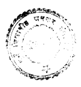
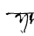
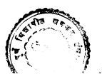

2, G *I'i'''-* ^ 
A Thesis submitted to the UNIVERSITY OF PUNE 
for the degree of DOCTOR OF PHILOSOPHY IN PALI 
by PHRAMAHA THIAB MALAI 
Under the guidance of Dr. J.R. Joshi 

DEPARTMENT OF SANSKRIT AND 
PRAKRIT LANGUAGES 
UNIVERSITY OF PUNE 
PUNE - 411 007 March, 1997 

# The Guide' **S Certificat** E

CERTIFIE D tha t th e wor k incorporate d i **n th** e thesi s "Kaccayana-vyakarana : A Critica **l Study** " 
submitte d by Shri . Phramah a Thia b Mala **i wa** s carrie d ou t by th e candidat e unde r my supervision/guidance . Suc h materia l a s ha s bee n obtaine d fro m othe r source s ha s bee **n dul** y acknowledge d i n th **e thesis** . 

$$-\overline{{{\eta}}}\biguplus\biguplus$$
iS- 1 
Dr. J-R. Joshi 
{Supervisor/Research Guide) 
^'- J- R. JOSH; 

# Declaration

I do herewith declare that this thesis entitled 'Kaccayana-vyakarana s A Critical Study' is an original work prepared by me under the supervision of Dr. J.R. Joshi. I also declare that this was not submitted for the degree of Ph.D. or any other degree in this or any other form. 

Date: 5.3.1997 Phramaha Thiab Malai Supervisor Dr- J. R. JOSH! 

RfADEf?. 

D«Pt. of Skt. & Pk,. L.n«M.«" , 
Uni versity of Poona. 

$$|\;_{\Sigma}\mathbb{A}\mathbb{C}$$

$\square$
6 %' c 

LA 

Head of the Dept. of Sanskrit and Prakrit Languages. 

- w i of the DrrwrtnMW 
of San^"- 'd Prakrii L.U. -.ages University of Pooat fOOlsIA-^llOOf, 

# T*=Iol_E Of^ Cz^Oivn-E:R^Nrs

| pi c k f. o w ]. e d g e f! i e ri   | b i iograph y   |       |
|--------------------------------------|-----------------|-------|
| yjo                                  | 1 Lim ^         | I     |
| I n t r o d u c                      | tio n           | 1-3 1 |
| San d h i - k a p p a                | 82-17 2         |       |
| Mama—kapp a                          | 173-33 a        |       |
| Karak a - k a p p a                  | 339-41 6        |       |
| Samasa-kapp a                        | 417-48 1        |       |
| V/caXt-im ^                          | I               | I     |
| Taddhit a - k a p p a                | 432-583         |       |
| Ak h y a t B - k a p p a             | 584-670         |       |
| Ki taka-kapp a                       | 671-777         |       |
| Unadi-kapp a                         | 778-870         |       |

# Acknowledgement

At the outset I would like to ex press my deepest gratitude to **PHRAUBALIGUNUPAMACAN** (Panya Indapanno), the Abbot of WAT Raikhing Nakornpathorn province, the deputy Ecclesiastical Regional Governor l'^? iTsy Upajjhaya 
(preceptor) who has supported my entire education (H.A., 
Ph.D) in India for the last seven years. 

I would like to express my gratitude to my revered Guru, Dr. J.R. Joshi, Reader in Pali, Department of Sanskrit and Prakrit languages who taught me and guided me in my entire research work. 

I am also grateful to Prof. Dr. Saroja Bhate, Head of the Department of Sanskrit and Prakrit languages who gave- me opportunity to work in the Department. 

I am grateful to Dr. S.K. Lai who sent me xerox copy of Senart's Kaccayanappakaranam on which the present study is based from Paris when he was Visiting Professor there and translated Renou's article into English. 

I am also thankful to my friend, Mr. Philippe Tulkens who translated Senart's Introduction into English. 

My special thanks are due to my friend, Ven. Wan Doo Kim who sent me xerox copies of some books and articles which I could not procure in Pune and Mr. J amr oon *Dhammada* who helped me to check the quotations from the Burmese Tipitaka and Commentaries. 

I must thank all perHon s who have helped me in many ways during my research work , namely , Ac a r i y a Ka r un a Kusalasaya , Dr. Medagama Nandawansa , Dr . Yasodhar a Kar , Phra Gandasarabhivamsa , Mr. Paiboon Srisan , Ven . Jong Sop Shin , P.M. Chainarong Klinnoi , P.M. Vichit Winkhan , Supatr a Indana , Mongkol Khammoon , Dr . J. Ouseparampi1 , Dr . E.G. 

Kahrs , Sawong Sukkamnerd, Udom Canthima , Suchart Sommart . 

I have worked hard for five years whatever me r i t contain s therein , I dedicat e to my late father , **Mr. Sian** 
Malai (1914—1996) who passed away when my work was about to be completed . 

Last but not the least, I am thankful to Dr . R.P , 
Goswami , the Librarian of CASS and Mr . H.A. Kamle , Mr . V.L . 

ManJul , the Librarian of BORI and the Librarian of Jayakar Library who supplied the books when I needed and to the typist , Mr . Prabhu *vtho* took a lot of trouble to type my work for the last four years . 

p. ;'^i, T^-w a.(- .Mo.-J^'c'^^ 
PHRAMAHA THIAB MALAI 
P u n e Date ; 1997 

# Abbreviations And Bibliography

A Anguttara-Nikaya Vol **. I, by Warder** , A.K, , PTS , London , 
2nd edn . 1961 ; Vol . II, by **Morris** , Rev. Richard , 
repr . 1976; Vol . Ill, by **Hardy,** E. , repr. 1976 ; Vol . 

IV, repr , 1958 ; Vol . V, repr. 195Q. 

Abh Abhidhana-ppadipika , by **Subhuti** , fci . , Frank Luker , Acting Governmen t Printer , Ceylon , ColDmbo , 2rid edn . 1383 . 

Abh-Buci Abhidhana-ppadipika-Suci , by Subhuti **, W.,** *ri.C.* 
Cattle , Acting Governmen t Printer , Ceylon , Colombo , 
1893 . 

A I De Anguttara-Nikaya , (Devanagari script) , by Kashyap , J. 

Bhikkhu , Nalanda Pali Series , Nalanda , I960 . 

Ap I De Apadana (Part I) [Khuddanikaya , Vol . VIj (Devanagari script) , by Kashyap, J. Bhikkhu , Nalanda Pali Series , 
Nalanda , 1959. 

Ap Apadana Part I, by **Lilley,** M.E. , PTS , London , 1925 ; Part I I, 1927 . 

Ap-a Visuddhajanavi1asini nama Apadanatthakatha , by Godakumbura , C.E., PTS , London , 1954 . 

APL A Handbook of Pali Literature **, by Hinuber** , O . v . , Uialter d e G r u y t e r, Berlin. New York, 1996. 

As Atthasalini , by **Muller,** E. , PTS , London , 1897 . As De Atthasalini (Devanagari script) , by **Bapat, P.V.,** and Vadekar , R.D., Bhandarkar Oriental Researc h Institute , Poona , 1942 . 

SG On The Aindra School of Sanskrit Grammarians, by Burnell, A.C., Bharat-Bharati, Varana&i, repr. 197&. 

Bv—a Madhuratthavi1asiniya nama khuddakanikayatthakathaya Buddhavamsa-vannana (Thai script), by Visodhakasamiti, 
!ia ha c u 1 a 1 an k a r a n a v i d y a 1 ay a , B an k o k 1 9 9 O . 

Bv-Cp Buddhavamsa and **Cariyapitaka** (New edition), by Jayawickrama, N.A., PTS, London, 1974. 

Corr Corrections of Geiger's Mahavamsa etc., by Buddhadatta Mahathera, A.P ., The Anand Book Company Ambalangoda, Ceylon, 1957. 

CP Collected Papers Vol. **Ill, by Norman,** K.R., PTS, 
London, 1992. 

CPD Epil A Critical Pali Dictionary; Epilegomena to Vol. I, 
by Smith, H., The Royal Danish Academy of Sciences and Letters, Copenhagen, **1943.** 
CPD A Critical Pali Dictionary Vol.1, **fay Andersen, D.,** and Smith, H., The Royal Danish Academy of Sciences And Letters, Copenhegen, 1924-44; Vol. II, 1960-32. 

CPG Compendious Pali Grammar, by Clough, Rev. Benjamin, The Wesleyan Mission Press, CDlombo, 1324. 

D Digha-Nikiiya Vol. **I, by Rhys Davids, T.W.,** and Carpenter, J.E., PTS, London, repr. 1975; Vol. II, 
repr. 1966; Vol. Ill, by **Carpenter,** J.E., repr. 1976. 

Dhatuk Dhatu-kathapakarana And its commentary, by Gooneratne, E.R., PTS, London, 1392. 

hatup-Dhatum The Pali Dhatupath a And The Dhaturoanjusa, by Andersen **, D.,** and **Smith, H.,** KOBENHAVW , Copenhagen , 
192 1 . 

Dhp Dhamntapada , by Hiniiber , O.v . an d Norman **, K.R.** , PTS , 
London , 1994 . 

hp—a Dhammapadatthakath a Vol.1 part I, (New edition) , by Smith , H., PTS , London , 1925 . 

Dhp—a Dhammapadatthakath a Vol . I Part II, by **Norman** , H.C. 

PTS , London , 1909; Vol . Ill, 1912 ; Vol . IV, 1914 . 

D hs Dhammasangani , by Miiller, E. , PTS , London , 13S5 . 

D I De Digha-Nikaya (Devanagari script) , by **Kashyap,** J. 

Bhikkhu , Nalanda Pali Series , Nalanda 1958 . 

DPPN Dictionary of Pali Proper Name s 2 Vols. , by Malalaseker a G.P., PTS , London , repr. I960 . 

DSC A Descriptive catalogu e of Sanskrit , Pali and Sinhales e Literary works of Ceylon Vol.1 **, by D'Alwis** , 
James , William skeen . Governmen t printer , Colombo , 
1S70 . 

EB Encyclopaedia of Buddhism Vol **. IV, by Dhirasekera** , 
Jotiya , and Weeraratne **, W.G.** , The Governmen t of Sri Lanka , Colombo , 1979-89 . 

EPG Element **s of Pali Grammar, by Barua,** D.L., West Bengal Board of Secondary Education , Calcutta , 2nd edn . 1968 . 

ES Eploring the Saddaniti , by **Kahrs,** E.G.. **JPTS** Vol . XVII 
p p. 1-212, PTS , London , 1992 . 

FMG The Finite Verb System in Mu 1 a Kaccayana Grammar (ji. A. 

Thesi s unpublished} , by Frakobsuk , Sapya , Chu1 a 1 o n g k o rn University , B a n k o k, 1977 . 

GE A History of Indian Literatur e Vol . V Fasc . 2 , 
Grammatical Literature , by **Scharfe** , H., Ott o HarrassDwitz , Wiesbaden , 1977 . 

GPL A grammar of the Pali Languag e Vols . I and II , by THA 
Do Oung, The Akyab Orphan Pres s and The Pyigyi Handin e Press , Akyab , 1899. 

Gramm (PGL) Geschichte und Kritik Der Einheimische n Pali -
Grammatik Und-Lexicographie , by **Franke** , R.O. , 
Strassburg , 1902. 

Gv Gandha-varosa, by Minayeff **, J., JPTS** Vol . II 1886 pp. 55 -
8 0 , PTS , London , repr. 1978 . 

HOP Handbook of Pali Literature , by **Jayawardhana** , Somapala , 
Karunaratne and Sons Ltd. , Colomb o 1994 . 

HP Handbook of Pali , by **Frankfurter** , 0-, William s and Norgate , London , 1383 . 

HPL A History of Pali Literatur e Vol . II, by **Law,** B.C. , 
Indological Book House , Delhi , repr. 1983 . 

I kCP An Introduction to Kac he hay ana ' s Grammar of the Pali Language , by **D'Alwis** , J., William s and Norgate , 
London , 18 & 3. 

IP India's Past, by **Macdonell** , A.A., Motilal Banarsidass , 
Delhi , 1956. 

It Iti - vuttaka, by **Windisch** E. , PTS , London , 1889 . 

ITP Introduction to Pali **, by Warder** , *P,. K ,* PTS , London , 2nd edn . 1974 . 

Ja The Jataka together with its Commentary Vols . I and I I , by **FauBbOll** , V., PTS , London , repr . 1962 and 1963 ; 
Vols . Ill, and IV, repr . 1963 , Vols , V and VI , repr . 

1963 and 1964 . 

Ja I De Jataka EPart 13 CKhuddakanikaya Vol . Ill Part **II** 
(Devanagari script) , by **Kashyap,** J. Bhikkhu , Maland a Pali Series , Nalanda , 1959 . 

KG Kaccayana' **s Pali Grammar, by Vidyabhusana** , S.C., The liahabodhi Society, Calcutta , 1901 . 

Khp Khuddaka-path a in **Pj I, by Smith,** H., PTS , London , repr. 

1978 . 

Khp De and Dhp De Khuddakapatha-Dhammapad **a - Udana—** 
Itivuttaka—Suttani**pata** CKhuddakanikaya , Vol . 1] 
(Devanagari script) , by **Kashyap,** J. Bhikkhu , Naland a Pali Series , Nalanda , 1959 . 

KPG Kachehayano ' 5 Pali Grammar, by **Mason** F., Sri Satguru Publications , Delhi , 2nd repr . 1984 . 

Kn I Kaccayana-Nyas o Vol **. I, by Satyapala** , Bhikshu , Buddha Triratna Mission, Delhi 1991 . 

Kt The Katantra, by **Eggeling** , J., Asiatic Society of Bengal , Calcutta , 1874 . 

Kv Katha-vatth u Vol . I, by **Taylor,** A.C. , PTS , London , 1894 ; 
Vol . II , 1897. 

KV De Kacc ay ana-vy a k a r a na , by Tiwary , i_ . W . , and **Sharma** , B. , 
Tara Book Agency, Kammaccha , Varanasi , second revised edn . 1939 . 

Kvn Kaccayana-vannana (EurmeBe script) , by Visodhakasamiti , 
P yi - Gyi - meit - Sv-iay Press , Rangoon , 1906 . 

^f Ma j j hima-Nifcaya Vol, I, fay Trenckner , V. , PTS , London , 
repr . 1979; Vols . II and III , by **Chalmers** , R-, repr . 

1977 . 

Mand Catalogu e of the tiandalay Mss . in the India Offic e Library , by FausbOll **, V., JPTS** Vol . IV 1696 pp. 1-52, PTS , London , repr. 1978-
Manis—t Manisaramanjusa—tik a (Burmese script ) Vol . I, by Ariyavamsadhammasenapatithera , Buddhasasana-samiti , 
Rangoon , 1963. 

Mhv Maha-vamsa **, by Geiger,** *Vl. ,* PTS , London , repr. 1958 . 

M I **, II De Majjhima—Nikaya** (Devanagari script) , by Kashyap , J. Bhikkhu , Nalanda Pali Series , Nalanda , 1958 . 

Mil Mi 1 i n d a - p a n h o, by Trenckner V., PTS , London , repr . 

1962 . 

Mmd The Mukhamattadipani **, by Terunnanse** , Weliwitiy e siri Dhammaratana , H.C. Cottle , Governmen t Printer , 2nd edn. , Colombo , 191O. 

Mogg Moga11ana-vyakarana (Sinhalese script) , by **Devamitta** 
T h e r a, H. , The L a n k a b h i n a v a V i s r u t a Printing Press , 
Colombo , 1390 . 

ix Moggallāna-pancikā (Sinhalese script), by Dharmananda,  Nayaka Sthavīra, Satya Samuccaya Press, Colombo, 1931.

Mogallāna-pancikā-ṭīkā   (Burmese   
Mogg-pt ss by Aggadhammābhivaṃsathera, Zabu Meit Swe Press, Rangoon, 1955.

Moggalāna  Nvādi  Vutti  (Sinhalese Mogg-v ss by DHARMĀNDA 
Nayaka Sthavira Moggallāna, Saccasamuccaya Press, colombo, 1929.

Manoratha-purani  Vol.  V, by Kopp,  H.,
PTS,  London, 1956.

MP
A Sanskrit-English Dictionary, by Monier-Williams, Sir Monier, Motilal Banarsidass, Delhi, repr. 1986.

Namamala,  by Subhuti, W., Mangala  Printers, Colombo, repr. 1965.

MW
Nam Mahāniddesa parts I and II, by De La Vallee Nidd Poussin, L, and Thomas, E.J., PTS, London, repr. 1978.

Cullaniddesa  [Khuddakanikāya Vol.  IV, 
Nidd De Part
(Devanagari  script), by Kashyap, J.  Bhikkhu, Nalanda Pali Series, Nalanda, 1959.

The New Pali Course Part I, by  Buddhadatta,  Thera, The Colombo Apothecaries' Co., Ltd., Colombo, 3rd en.

1949; part II, 5th edn. 1974.

NPC
Note on the Pali Grammarian Kacchayana, by Fryer, G , E ,
Proceedings of the Asiatic Society of Bengal, 1882 P.

17-127, Asiatic Society, Calcutta, 1882.

NPK
Nyp Nyāsa-pāṭha   (Burmese   script),   by Sayayan, The Thudhammawadi Press, Rangoon, 1933.

Catalogue  of the Pāli Manuscripts  in  the India 01denb Office Library, by Oldenberg, H., JPTS Vol. I 1382  pp.

59-128, PTS, London, repr. 1978.

OSP
On Sandhi in Päli, by Childers  R.C., JRAS Vol. XI
p.

9-121, London, 1879.

Pa Pānini's  Grammatik,  by Böhtlingk,  Otto, GER PRO
OI
Verlagsbuchhandlung Hildesheim, Germany, repr. 1964.

Paţis  Paţisambhidāmagga Vols. I and II, by Taylor,  A.C.,
PTS, London, repr. 1979.

Payogasiddhi, by  Nānāloka, Mahāthera,  Kodāgoda, Pay The Cultural Council of Sri Lanka, Colombo, 1974.

Pds - ţ Padasādhana - ţīkā (Burmese script), by Aggadhammābhivamsa, Thanavati Press, Mandalay, 1966.

PED
Pali-English Dictionary, by Rhys Davids, T.W. 

The and Stede,  W., PTS, London, repr. 1986. PG  Pāli  Grammar, Minayeff, J., Bahri Publications, New Delhi,  repr.

by 199.

P P
Practical of the  Pāli a Grammar Language, by Duroiselle, C., The British Burma Press, Rangoon, 1906.

Pāli Grammar [by Geiger, W.], rev. edn., by A
Norman, K.R., PTS, London, 1994.

Pit-sm  Pitakat-samuin,3  by  Yam,  Ūڏ,  Hamsavati Press, Rangoon, 1959.

 Khuddakapāṭha - aṭṭhakathā, Paramattha - jotikā I, by P j I
Smith, H., PTS, London, repr. 1978.

PGR
Pj II Sutta-nipata-atthakatha, Paramattha-jotika II, by Smith, H., PTS, London, 1917. 

PKG The Pali Text of Kachehayano'**s Grammar, by Maeon**, F., 
The Karen Institute Press, Toungoo, 1S70. 

PL A History of Indian Literature, Vol. VII Fasc. 2, **Pali** 
Literature, by Norman, K.R., Otto Harrassowitz, Wiesbaden, 1933. 

PLB The Pali Literature of Burma, by Bode, fi. H. , The Royal Asiatic Society, London, 1909. 

PLC The Pali Literature of Ceylon, by **Ma 1 a 1asekera**, G.P., 
Buddhist Publication Society, Kandy, repr. 1994. 

PLL Pali Literature and Language, by **Geiger,** W., Translated by **Ghosh,** B., Munshiram Manoharlal, f-Jew Delhi, 3rd repr. 197B. 

PLT The Pali Literature of Thailand (unpublished Ph.D. 

Thesis), by **Likhitanonta**, Likhit, Magadh University, Malanda, 1969. **PM Pali Meter, by Warder** A.K., PTS, 
London, 1967. 

Pp Pugga1a-pannatti, by Morris, the Rev. Richard, PTS, 
London, 1SS3. 

Ps Papanca-sudani Part I, by **Woods, J,H.,** and **Kosambi**, D., 
PTS, London, 1922; part II 1928? Part III, by **Horner,** 
I.E., 1933. 

PTC Pali Tipitaka Concordance Vol. Ill, by Warder, A.K., 
Saddhatissa, H., Warder, N.R., and **Fiser** Ivo, PTS, London, 1963 - . 

>; i 1 Pv-a Peta-vatthu-atthakatha **, Paramattha-dipan** i Part **III?** 
by **Hardy,** E. , PTS , LondDn , 1S94 . 

R up Rupasiddhi-pakarana m (Thai script) , by **Petchai** , Siri , 
Departmen t of religious affairs,Bangkok , repr. 1984 . 

Rup—t Padarupasiddhi-tika (Burmese script) , by Visodhakasamiti , Buddhasasana—samiti , Rangoon , 1965 . 

S Samyutta—Nikaya Vol . **I, by Peer,** H. Leon , PTS , London , 
repr . 1973 ; Vol.11 , repr. 1970 ; Vol . Ill, repr. 1975 ; 
Vol . IV, repr. 1973 ; Vol . V, repr. 1976 . 

Sadd Saddanit i 3 parts , by **Smith,** H., Lund , 1928-30 . 

Sadd Be Saddaniti-pakaranam (Suttamala ) (Burmese script) , 
by Visodhakasamiti , Buddhasasana-samiti , Rangoon , 1964 . 

Saddhamma- **B Saddha<nma-5angaha, by Saddhananda** , Nedimale , 
JPTS Vol . IV 1890 pp. 23-90 , PTS , London , repr. 1987 . S as Sasana-vamsa by Bode, M., PTS , London , 1897 . 

Sdp Suttaniddesapatha , (Burmese script) , by Visodhakasamiti , Zabu Meit Swe Press , Rangoon , 1912 . 

Sd - **t Sarattha-dipani-tik** a Vols . I and II (Thai script) , 
by **Bhadantasari p u t t a t t h e r a**, Mahacu i a 1 an k a r a n a r aj av i d y a -
1 a y a, B a n k o k, 1993. 

Sn Sutta—nipat a (New edition) , by **Andersen** , D., and **Smith** , 
H., PTS , London, repr. 1984 . **SNS Minor Pali Grammar** 
texts : The Saddabindu and Its 'New' Subcommentary , by Lottermoser **, P., JPTS** Vol . XI pp. 79-109 , PTS , London , 
1987 . 

Sp Samanta-pasadik a Vol . **I by Takakusu, J.,** and Nagai , M., 
PT3, London, 1924; Vol. II, 1927; Vol. Ill, 1930; Vol-
IV, 1934; Vol. V, 1938; Vol. VI, 1947? Vol. VII, 1947. 

SPG I Studies in the Pali Grammarians I, by Pind, O.H., 
JPTS Vol. XIII pp. 33-81, PTS, London, 1989. 

SPG II.1 Studies in the Pali Grammarians II.1, by Pind, O.H., JPTS Vol. XIV pp. 175-218, PTS, London, 1990. 

SPL A Simplified Grammar of the Pali Language, by Miiller, E ., Trubner and Co., Ludgate Hill, London, 1884. 

SPW Some Pali Words, by Coomaraswamy, A.K., Harvard Journal of Asiatic Studies Vol. 4 no.2 pp. 116-190, Harvard-
Yenching Institute, USA, 1939. 

Sv Sumanga1a-vi1asini Vol. **I, by Rhys Davis, T.W.,** and Carpenter, J.E., PTS, London, 2nd edn. 1968. 

Svd The Sasanavansa Dipo, by Acariya **Vimalasara** Thero, The Buddhist Press, Colombo, 2nd Edn. 1930. 

Sv —**t Sadhuvi1asini nama Si 1akkhandhavagga —abhinavatika** Vol. 

'V 
I (Thai script), by **Nanabhivamsadhamasenapati,** Mahacula 
- 1 a n k a r a n a v i d y a 1 a y a, B a n k o k, 1993 . 

Th-Thi Thera - Theri - Gatha, by Gldenberg, H., and **Pischel** , 
R., PTS, London, 2nd edn. 1966. 

TPL The Pali Language, by Elizarenkova, T.Y., and **Toporov**, 
V.M., Nauka Publishing House, Moscow, 1976. 

Ud Udana, by Steinthai. P., PTS, London, repr. 1932. 

Vibh Vibhanga, by Rhys Davids, C , PTS, London, 1904. 

Vibh-a Vibhangatthakatha, Sammohavinodani, by Buddhadatta Thero, A.P., PTS, London, 1923. 

Vin Vinaya-pitafca Vol . I, fay **Oidenberg** , H., PTS , London , 
repr . 1964 ; Vol . II , 1930 ; Vol . Ill, repr. 1964 ; Vol . 

IV, repr . 1964 ; VI . V, repr. 1964 . 

Vin I De Mahavaggapa1i (Devanagari script) , by **Kashyap,** J. 

Bhikkhu , f-ialanda Pali Series , Nalanda , 1956 . 

Vin III De Paci t t **iyapa** I i (Devanagari script) , by **Kashyap,** 
J. Bhikkhu , f-ialanda Pali Series , Nalanda , 1958 . 

Vin IV De Parajikapali (Devanagari script) , by **Kashyap,** J. 

Bhikkhu , Nalanda Pali Series , Nalanda , 195S . 

Vism Visuddhimagga , by Warren **, H.C.,** and **Kosambi** , D., 
Harvard Oriental Series , Cambridge , Massachusetts , 
19 5 0 . 

Vv—Pv Vimanavatthu and **Petavatth** u (New edition) , by Jayawickrama , N.A., PTS , London , 1977 . 

Yam Yamaka Vol . **I, by Rhys David,** C , PTS , London , 1911 . 

## Artieles

Barua, D.L., "Some Works On Pali Grammar , Rhetoric and Prosody" , **Indian Culture (IC)** Vol . 15 , pp. 194-202 , Calcutta , 1948-49. 

Renou, L., "Kaccayana et le Katantra" , Etudes vedique **s et** 
Panineenne s 3, pp. 127-33 , Paris , 1957 . 

# I Ivi~Rfcoi:>Ljc;~R I Cdini

Pali grammatical literature The Pali expression **Pali—bhasa** means "the language 
(bhasa) of the texts for recitation (Pali)". Those texts belong to the earliest stratum of Buddhist scriptures as they *are* preserved by the Theravada Buddhists. They *are* collectively referred to as the Tipitaka (the Pali Canon) in that tradition, and they are supposed to be **Buddha-vacana** (the word of the Buddha). Therefore Pali is the language of the earliest Buddhist scriptures as preserved in a Buddhist tradition and also has been used as spoken language and a means of communication. According to the tradition Pali also is known as Magadhi (the language of Magadha). Theravada Buddhists have produced a number of Pali grammatical texts for the study of their Canon. The grammatical literature of the Pali starts 
- - 2 -
from Mahakaccayana's **Niruttipitaka, Yamakamahathera'**s 3 - 4 -
Cu11 a m r u t t i **, Bodhisatta —vyakarana** and **Sabbagunakara** - 
1. **P6R** Introd., p. XXIII, see also PL pp. 1-2, cf. **APL** 
pp.5-7. 

2. "Niruttipitake hi pabhinnapatisambhido so ayasma Mahakaccayano "purisassa diyate" ti ayadesarohitani yeva rupani dassesi" **Sadd** 135, 1-3. 

3. "ayam Yamakamahatherena kataya Cu1 aniruttiya agato nayo" ibid., 137, 30. 

4. "Bhadantabodhisattamahathero 'naravaravacanopakarani catta1isakkharani' ti aha" Pds-t 38, 9-11. 

vyakarana. Unfortunately these grammatical texts are now lost, but references to them occurring in the Saddaniti and the **Padasadhana-tika** indicate that they must have been in existence during the time of Aggavamsa, the author of the **Saddaniti,** who belongs to the 12th century A.D. and **Rahula,** the author of the Padasadhana-tika, who belongs to the 15th century A.D. 

Perhaps they might have quoted them from some fragments or from some other sources without acknowledging the sources. It is said that **Buddhaghosa,** the greatest commentator of Pali literature refers to the lost Pali grammatical texts in his works indirectly. K.R. **Norman** 
observes: "The grammatical terminology used by Buddhaghosa and Dhammapala indicates that there was already before their time a fixed grammatical system, although there is not enough evidence to decide whether they were referring to an actual grammar, now lost". 

H. Scharfe says: "It is possible that Buddhaghosa (5th century A.D.) , the Buddhist commentator of Pali texts, refers to a lost Pali grammar when he discusses grammatical questions". The lost Pali grammar mentioned by K.R. **^4o^man** and **H. Scharfe** is the same as 5. "Sabbagunakaramahathero 'siddhakkamadadayo vannakkhara titalisa'ti aha" **ibid.,** 3S, 12—13, see also Sadd Bi Nldanakatha (p. cha); Pay *pre,* **p.2.** 
6. PL p. 163, cf. **PLL p. 37.** 
7. GE p. 194. 

Niruttipitaka, Cul1 anirutti, Bodhisatta-vyakarana and Sabbagunakara—vyakarana or not; whether there is a fullfledged system of Pali grammar before Kaccayana or not, 8 these problems are still disputed, because we don't have enough evidences to arrive at the exact conclusion. 

However the first Pali grammar, we have, is Kaccayanavyakarana which exists and is considered as the oldest Pali grammar. 

Vyakarana is one of the important art among IS 
9 arts and it is also one of the six Vedanga—s (auxiliary Vedic sciences). Among Vedanga-s **Vyakarana** is the most important and beneficial **aiiga** for the study of Veda —s and other sciences. 11 This word is derived as: vi+a+ 
12 kara+yu suffix = **vyakaranam.** It is analysed asi 8. Cf. **SPS** I Introd., p. 34. 9- "attharasa mahasippani: suti suramati vyakaranam chandoviciti nirutti jotisattham sikkha mokkhananam kiriyavidhi dhanubbedo hatthisikkha kamatantam assa1akkhanam puranam itihaso niti takko vejjakam" **Sadd** 
504, 16-19. 

1 0. "kappo vyakaranam jotisattham sikkha nirutti ca chandoviciti c'etani vedangani vadanti cha" **Abh** llO. 

1 1. "vuttan *a a* 'padhanam ca chalangesu byakaranam, padhane ca kato yatano phalava bhavati'ti" Sadd Be Nidanakatha (p. **kha)** see also BE p. 83 fn. 32. 

1 2. "vi-abubbo kara karane yu" **Abh-suci** s.v. vyakarana. 

' yathasarupam sadda vyakariyanti etena ti vyakara13 nam which means "the function of which is to make words explicit or clear according to their forms". The 14 literal meaning would be: "seperation, distinction". 

PED gives three meanings of it as: (1) answer. explanation, exposition (2) grammar (3) prediction 15 Moreover V/ayyakarana belongs to the Navangasatthusasana 
(the master's nine—fold teaching) and it indicates the entire Abidhamma, sutta—s without verses and the other Buddha—vacana-s which are not included in the other 8 17 Anga—s (divisions) It a 1 so means answer, explanation, exposition; one who is an expert in 18 explanation or answer, a grammarian". However, in the canonical literature we find that the term nirutti is used to denote "explanation of words, grammatical analysis, etymological interpretation, pronunciation. 

dialect, way of speaking, expression 19 and it is one of 13. Ibid. 

1 4. GE p. 83 fn. 32. 

15. PED s.v. vyakarana. 

16."suttam geyyam veyyakaranam gatham udanain itivuttakam jatakam abbhutadhammam vedallam" A II 103, 9-10. 

17. "sakalam pi Abhidhammapitakam niggathakasuttarn yan ca c'annam pi atthahi angehi asangahitam Buddha - vacanam tam Veyyakaranan ti veditabbam" Sv I 24, 2-4. 

1 8. PED s.v. veyyakarana. 

19. Ibid., s.v. nirutti, cf. GE p. 83. 

the six Vedanga—s 20 The term nirutti is used in close relation to grammar and its importance is emphasised in Dhammapada as: 
"vitatanho anadano niruttipadakovido akkharanam sannipatam janna pubbaparani ca sa ve antimasariro mahapanno mahapuriso ti vuccati". 

However, the term **Vyakarana** does not occur to refer directly to the grammatical rules of the language used by the Buddha or by his disciples. This does not indicate in any way that the language used by the Buddha or His disciples did not follow any grammar or 22 -
grammatical rules. It seems that the term **Vyakarana** in the canonical literature may refer to some grammatical texts existing during that time. As H.O. **Find** observes: 
"It is not known when and under what circumstances a distinct Buddhist grammatical literature devoted to the description of the language of the Pali canon originated. It is reasonable to assume that, throughout the development of the Buddhist tradition, basic knowledge of the morphology and vocabulary of the canonical language was handed down in some form or another, even though it may never have been based upon any distinct grammatical tradition. The Niddesa, with its strings of glosses and morphological substitute 1. **Dhp** see also HPL II p.631. 

forms may be considered an early instance of the level of sophistication of such basic knowledge". 

Moreover, the references to the grammar of language started from the time of **Buddhaghosa** onwards. 

In several instances, he clearly refers his readers to grammar (**saddasattha**) or grammarians (**sadda1akkhanavidu,** 
saddavidu, akkharacinta) for information about the point 24 of view of grammar. B.C. **Law,** however, observes: "We may venture to suggest that there was no Pali book of Pali grammar in existence till the time of the three great Pali commentators, Buddhadatta Buddhaghosa and 
- 25 Dhammapala". 

Linguistical studies of Pali and Sanskrit may prove to be complimentary to each other. **W. Subhuti** remarks: "Those who know these two languages (Sanskrit and Pali) are aware of the fact, that the study of Sanskrit grammar, to some extent at least, is indispensably necessary before one can acquire a 26 thorough knowledge of Pali grammar". However, the development of Pali grammatical literature has been furthered in many countries like Sri Lanka, Myanmar and Thailand. Grammarians therein have produced many texts. 

Especially Myanmar is well-known in the field of Pali grammar. Most of Pali grammatical texts are available in the Burmese script. R. **Gombrich** observes: ".... for the practical purpose of describing the language, then, the development of Pali is generally considered to end 27 with the Burmese grammarians". 

Generally the Pali grammars *Are* classified under three schools, namely, (1) **Kaccayana—vyakarana** (2) 
Moggga11ana-vyakarana (3) **Saddaniti.** According to Burmese tradition there are four schools by adding the Saddasangaha as the fourth one. However **Saddasangaha** is well—known in Myanmar and hardly known in other countries like Sri Lanka and Thailand as far as the Pali study is concerned. As a proper introduction to the present attempt, let us have, in the following pages, an outline of the schools of Pali *grammsir.* 
Saddasangaha: This text has its own sutta—s, vutti and udaharana—s. It **was** composed during the reign 28 of the king **Min-don-min** (1852-1877 A.D.) by the learned **YD ubholai** of Mandalay in Myanmar. Due to the limited number of scholars who studied it, it is still 29 in manuscript form. 

Saddaniti: This text was composed by the Burmese monk named **Aggavamsa** of Pagan who was a tutor to the 27. **PGR** Introd., p. XXIX. 28. **PLB** p. 92. 

29. **Sadd Be Nidanakatha** (p. **tha),** see also **B^^ Nida —** 
nakatha (p. ki). 30. Sadd 928, 12-13 and 18-19, **Svd** 1238, **Pit-sm** 383-5. 

king  Narapatisithu (1167-1202 A.D.)31  The date of  its composition is still in controversy, because the  author ddde bbbbbbbbbbbbbbbbbbbbbbbbbbbbbbbbbbbbbbbbbbbbbbbbb However, according to Sāsanavaṃsa he wrote his work in 1670  B.E.

(= 1127 A.D.).32 There is a variant reading sattanavas-
(97) recorded in the foot-note.  The editors   of dhike Saddaniti Be have accepted the reading  sattanavutadhike and have quoted the Sāsanālaṅkāra and Sāsanavaṃsappadipikā as  the sources.  If it  is  so,  the  year  of its composition  would  be  1697  B.E.  (=1154 A.D.)  
www bb Era 454-529 = 1092-1167 A.D.).33 M.H. Bode and W. Geiger
---
31. PLB p. 16, PLL p. 55.

32. "Arimaddananagare Jinacakke sattatādhike  (so  read:
sattanavasādhike)  cha sate sahasse ca  sampatte  tiņņaṃ pitakānaṃ  mūlabhūtesu saddanayesu  sotarānaṃ  chekatāya mahāsamudde  viya ānando nāma mahāmaccho  tīsu  piṭakesu s stthakathesu   viloletvā  Aggavaṃso  nāma  thero   Saddanitipakaranam akasi" Sas 73, 34-74, 1-5.

3. "Sāsanālaṅkāre  c'eva  Sāsanavaṃsappadīpikāyan ca ssss atthero  Saddanitippakaraṇaṃ akāsi, Arimaddananagare  
ca Uttarājīvamahātheravarassa Sīhaļadīpagamanato pubbey'eva yathāvuttā tayo therā ahesun ti vuttaṃ, evaṃ sati Saddanitippakaranam idam Alongasithu-ranno (Maramma- 454-529)
kāle racitan ti vinnayati" Sadd  Be Nidānakathā  (p.da).

also give 1154 A.D. as the date of the **Saddaniti's** 
34 composition. . If we accept 1154 A.D. as the date, perhaps the **Saddaniti** might have been composed before the liogga11ana-vyakarana as **W. Geiger** remarks: "The work 3 4. **PLB** p. 16, **PLL** p. 55. It may be noted here that **BodB** gives 1154 A.D. as the date for the **8«ddanlti** 
without referring to the source. If she uses the Sasanavamsa edited by her as the source mentioned in the foot—note 32, it means she accepts the variant reading sattanavasadhike not **sattatadhlke** occurring in the body of the text. **W. Geiger** also does the same. 6.P. 

Malala&ekera (PLC p. 185) H. Scharf (GE p. 194) K.R. Norman (PL p.116) follow either Bode or **Geiger. E.G.** 
Kahrs (ES p. 2 fn. 2) quotes some sources and comments: 
"M.C. Duroiselle (1905: 147, note 1) informs us that Forchhammer gives the year as 1156 but claims that Aggavamsa himself gives the date as 1154. Recently Tin Lwin (1991 ?) has questioned this, claiming that nowhere in the **Saddaniti** is given its dates and that the introductory gathas *are* missing in all manuscripts available to us (p. 124) . He concludes, somewhat confusingly, that the **Saddaniti** should be placed towards the end of the reign of Cansu II (1173-1210) or during the first half of the thirteenth century (p. 

126) . Intriguing though it is, this claim would require a more detailed argumentation to be conclusive". G.E. 

Fryer (NPK p. 124) gives the probable date as 1279 A.D. 

of Moggallana could have been hardly known to him 
(AggavamBa); it was composed probably after the Saddaniti". However, before we accept the statement of Geiger we have to compare **Moggallana** and **Saddaniti** 
throughout. According to **Pitakat- eamuin^, Aggavamsa** 
composed his work during the reign of king Kya—cva of 36 Pagan dynasty (Burmese Era - 596-612= 1234-1250 A.D.) . 

It seems probable, because the king also was a grammarian; he himself composed two Pali grammars, namely, the **Saddabindu** and **Paramatthabindhu**. During this time Pali grammar was a popular subject of study even among women. At the king's court there were grammarians too. The works produced under his patronage were chiefly grammatical. The **Saddaniti,** as pointed out by **M.H. Bode,** was "the first return-gift of Burma to Ceylon". She further says: "A few years after its completion the thera ('elder') Uttarajiva left Pagan and crossed the sea to visit the celebrated Mahavihara taking with him a copy of the Saddaniti, which was received with enthusiastic admiration, and declared superior to any work of the kind written by Sinhalese 3Q scholars". This text is still regarded as a classic 3 5. **PLL** p. 55. 

3 6. **Pit-sm** 383-5. 

37- **PLB** p. 25 and ibid., fn**. 3.** 
38. Ibid., p. 17, see also **PLC** p. 185, cf. **PLL** p. 55 in Myanmar. The work consists of 28 chapters, the first nineteen *Are* called **liahasaddan i t i** and the last nine *are* called **Cu11asaddaniti**. It has three main parts: the **Padamala** (the chapters **1-14),** the **Dhatumala** 
(the chapters 15-19); the **Suttamala** (the chapters 20 -
28) . **Aggavamsa** largely follows Kaccayana and improves upon the latter. From the point of view of contents it is hardly justifiable to separate the **Saddaniti** from the school of Kaccayana. He makes use of the Sanskrit grammars such as those of **Panini,** etc. It is said that it was based on the writing of the teachers as well as 41 canonical material. There is a commentary on it 
__ ^_ ^ ***•*\#__ ^ 
called the **Saddaniti-tika** composed by **Pannasami** of 42 - 43 Mandalay. M.H. Bode gives the **Sasanavamsa** as the source for this, and states: "At the request of 'many of 
'\f'\f _ 
his hearers', he (Pannasami) wrote a Pali commentary on the first Pali work that had brought to Burmese 39. **PLB** p. 16, **HPL II** p. 636. 

4 0. K.R. **Norman (PL** p.164) . According to **M.H. Bode (PLB** 
p. **16)** , it consists of 25 chapters, according to W. 

Geiger, (PLL p. 55) there *are* 27 chapters. 

4 1. **PLL** p. 55, GE pp. 194-5, PL p. 164. 

4 2. Pit-sm 386. 

4 3. "tatha bahuhi sotujanehi yacito so yev aham Saddaniti y a samvannanam Palibhasaya akasim" **Sas** 154, 33—34. 

- 44 scholarship, the Saddaniti"-
Another grammatical work **Mogga11 ana —vyakarana** is also called **Sadda1akkhana**. This grammatical text belongs to a new school of Pali grammar and is considered as the up—to—date treatise on Pali grammar. 

- 4 5 - 
The author was **Moggallana** a disciple of **Mahakassapa** 
of Udumbaragiri, who lived in the **Thuparama Vihara** at Anuradhapura and wrote his work during the reign of Parakkamabahu I (1153-1186 A.D.) . The king had purged the **Sangha** of all heretical bhikkhu-s, the event which took place in 1165 A.D. Therefore it is most probable that he had completed his work at least a few years after 1165 A.D.^^ 
Sadda1akkhana consists of six chapters, namely, 
(1) terminology and euphonic combination (2) declension and syntax (3) compound and feminine terminations (4) 
nominal derivatives (5) verbal derivatives (6) verb or 4 4. **PLB** p. 93 on which E.G. **Kahrs** (ES p. 3 fn . 1 ) 
remarkss "Nowhere else have I seen any reference to such a commentary and, in fact, I doubt whether such a work 
'\r '\t _^_ 

ever existed since Pannasami wrote as late as the latter half of the 19th century. It seems rather unlikely that so late a work should have vanished without trace". 

4 5. Gv 61, 13-14 and 70, 26-27, **Svd** 1251, **Pit-sm** 387-8. 46. **DSC** p. 183, **PLL** p. 53, **PLC** p. 186, GE p. 195, **HOP** 
pp. 94-5. 

4 7. **HOP** p. 95. 

48 conjugation. There are several points of difference between the Hoggallana and Kaccayana; e.g. Moggallana says that there are forty three sounds not forty—one as given in Kaccayana and ten vowels (adding short e and o) not eight as given in Kaccayana etc. It's arrangement and grouping of the rules as **well** as terminology *Are* different from that of Kaccayana. In his work, besides the older Pali grammar, he made use of the Panini, Katantra and especially **Candragomin** and quoted numerous examples from **Tipitaka** to support his 49 ~ _ 
argument. He also wrote the **Pancika** or commentary on his own vutti called the **Mogga11 ana —paneika** or the 
_ •»• _ 5o vutti—**vannana—pancika**. He, therefore, unlike other grammarians, wrote not only the sutta-s (rules) but also the vutti (explanations) and the Pancika 
(comments) to elucidate his system. 

## Moggallana Tradition

There are several commentaries on **Sadda1akkhana**. 

They are:— 
(1) **Padasadhana:** This is the first subsidiary work written on the Moggallana grammar. It forms an abridged version of Moggallana grammar. According to De **Zoysa,** 
the relation between the **Padasadhana** and **Moggallana** is 4 8. DSC pp. 184-185, PLC p. 187, GE p. 195, **HOP** p.95. 

4 9. PLL p. 53, PLC pp. 186-7, **BE p.** 195, **HOP** p. 96. 

5 0. **Ibid.,** p. 53, **ibid., p.** 187. 

I t the same as that of the Bālāvatāra and Kaccāyana.51 wwwwweee century by Piyadassi of Sri Lanka.52  The work  consists eight chapters, namely, (1) Sanna (terminology) 
of
(2)
Sandhi
(euphonic  combination) (3)  Nāma  (nouns) 
( 4 )
Ekattha   (compounds)   (5)   Itthi-paccaya 
(feminine suffixes)  (6) Nādayo or Taddhita (nominal derivatives)
Tabbādaya or Kita (verbal derivatives) (8)  Tyādayo
( 7 )
(verbs).53 There  is  a tikā on   Padasādhana   called  
the Buddhippakasini.  It is also called the Padasadhana-tika Padasādhana-vaṇṇanā which was written  in  1472 or the Vacissara Sangharājā of Sri Lanka.54 However,in A.D. by Sinhalese  his  name is often spelt  as  Totagamuve  Sri Rāhula.55
(2) Payogasiddhi:  This is considered to be one of best and comprehensive Pāli commentary  written  on the Moggallāna grammar.  It has been said that the  relation between the Payogasiddhi and Moggallāna-vyākaraṇa is the that of  the  Rūpasiddhi  and the Kaccāyanass as vyākaraṇa.

It was written ddddddddd the reign
--
51. Guoted in PLL p. 54.

52. Ibid., p. 54, PLC p. 205, HOP pp. 103, 119-20.

53. Ibid., p. 205, ibid., p. 103.

54. PLL p. 54, PLC pp. 205, 252-3, HOP pp. 34-5, 120.

5. HOP P. 121.

of Bhuvanekabahu I (1273-1284 A.D.) by **Medhankara** 
V/anaraiiana of Sri Lanka. Therefore he seems to have lived from about the latter part of the thirteenth century to about the early fourteenth century." The work consists of seven chapters, namely, (1) **Sanna** 
(terminology) and **Sandhi** (euphonic combination) (2) **Nama** 
(nouns) (3) **Karaka** (cases) (4) **Samasa** (compounds) (5) 
Taddhita (nominal derivatives) (6) **Kiriya** (verbs) (7) 
58 **Kitaka** (verbal derivatives). 

(3) **Sambandhacinta**: This also is based on the Mogga11ana-vyakarana. It was composed by **Sangharakkhita** 
of Sri Lanka. This text probably belongs to the twelfth century. It deals with the relation of the Pali verb and its use in syntax and also presents a description of the six karaka—s (**kammakaraka,** 
kattukaraka, karanakaraka, sampadanakaraka, apadanakaraka and **adharakaraka**) used with the verb in a sentence. It may be noted here that according to **W.** 
Geiger, the **Sambandhacinta** belongs to Kaccayana trad X tion. 

56- **PLL** p. 54, **PLC** pp. 230-33, **Pay** pre. p. 5, **HOP** pp. 

92-3, **117.** 
5 7. **HOP p.** 93. 

5 8. **Ibid**., p. 117. 

59. Gv 61, 17-18, **PLC** p. 199, **HOP** pp. 135, 139. 

6 0. **PLB** p. 22 fn. 9. 

6 1. **PLC** p. 199, **HOP** p.136. 

6 2. **PLL** p.50, KV De Introd., p. 69 follows him. 

There are two tika-s on **Sambandhac**inta namely, 3.1 **Sambandhacinta-tika**: This was composed by Vaci55ara of Sri Lanka. " 3.2 **Sambandhacinta—tika**: 
64 This was composed by **Abhaya** of Pagan in Myanmar who belongs to the fourteenth century. " But G.E. **Fryer** 
gives the probable date of **Abhaya** as 1227 A.D. 

(4) **Susaddasiddhi**: This was a subsidiary work on the **Moggal1ana-vyakarana**. It was written by Sangharakkhita of Sri Lanka. This work is not available at present. The Karakapupphamanjari of eighteenth century refers to it. According to G.P. Ma1 a 1asekera, the **Susaddasiddhi** or the Saratthavi1**asini** 
was a tika on the MoggaI 1 ana —**panei**ka. However, it has been said that **Sangharakkhita** wrote three books in Pali grammar belonging to the Moggallana tradition, namely, (1) the **Saratthavi1asini** on the **Moggallana—** 
6 3. Gv 62, 5-8, **PLC** p. 204, **HOP** pp. 170-1, 198 6 4. **NPK** p. 124, **Mand** p. 50, **Pit-sm** 392. 

6 5. **PLB** pp. 22-23. 6 6. NPK p. **124.** 
6 7. **HOP** p. 200. 

6 8. **PLC** p. 200, **DPPN II** pp. 1106, 1265. 

pancikā  (2)  the Susaddasiddhi and (3)  the Sambandhaboth   on the Moggallāna-vyākaraṇa.69   Thus  it cinta, seems  that  the Susaddasiddhi and the Saratthavilasini are not one and the same book.

Moggallāna-vyākaraṇa-ṭīkā:    This 
( 5 )
is a commentary on the Moggallāna-vyākaraṇa.  It was composed Vācissara  of Sri Lanka.  The work  is  assigned to by thirteenth century.70 Moggallāna-pancikā-pradīpaya (or -padīpa)
( 6 )
or pancikā-pradīpaya:   This is a  commentary  on the the Moggallana-pancika.  It was written partly in  Sinhalese and partly in Pāli, and it is one of the most comprehensive works on Pali grammar extant in Sri  Lanka.

It was composed in 1457 A.D. by Totagamuve Sri Rahula.71 consists of six chapters, namely,  (1) 
I t Sanna
(terminology) (2) Nāma (nouns) (3) Samāsa (compound) (4)
(nominal   derivatives)   (5)   Khādi    
Nadi
(verbal derivatives) (6) Tyādi (verb).72
--
"Moggallāna-vyākaraṇassa parivārabhūtā pana  ganthā 69.

bahū honti. Tesu Saṅgharakkhitamahāsāmittherena viracitā Saratthavilasininamika  pancikatika ca,  ten'eva  racita Susaddasiddhi  ca  Sambandhacintã  ca..." Sadd Be Nidãnakathā (p. tha), see also Mogg-v pre. p.1.

70.

HOP  pp. 170-1, 192. But Pit-sm 390 says:  "It  was written  by an unknown author of Sri Lanka who lived  in the Mahavihara monastery at Anuradhapura".

71. PLL p. 54, PLC pp. 251-2, HOP pp. 109-10.

72. HOP P- 110.

(7) **Niruttidipani** : Thi s also is a commentar y on the **Mogga11 a n a - v y a k a r a n a** . It was written by **Ledi Hsy** a - 
d aw of Myanmar . He also wrote a (Burmese) **Nissay** a on h is own work entitled **Niruttidipani—nissaya** . 

(8) Nvadi - m o g g a 11 a n a: 
Mogga11 ana - v y a k a r a na and deal s with gender This is based on the I t wa s writte n by **Sangharakkhit** a of Sri Lanka who lived at the Mahavihar a monastery in Anuradhapura . 

(9) **Moggallana-byanJika** : This also was composed by the same **Sangharakkhita.** 
(10) Dhatupatha : This also belongs to lioggallana's school . It follows the Moggallan a order of the root classes , and is shorter than that of **Kaccayana—manJusa** . 

It was written in prose . It probably was written prior Af to the **Dhatumanjusa** of Kaccayana' s school . Neithe r its 

## Compile R Nor Its Date Is Known .

Place of Kaccayana—vyakaran a Kaccayana—vyakarana belongs to the oldes t school of Pali grammatical tradition . It is so called , 
because it owes its origin to the teacher Kaccayan a or liahakaccayana. It is called variousl y as : Kaccayan **a —** 
vyakarana , Kaccayana-pakarana **, Kaccayana-yoga** , 
Kaccayana-gandha , Susandhi-kappa , Kaccayanamu1appakaran a 7 4 **. Ibid., p.** 106 fn. 5. 

or **Mu1akaccayanappakarana**. Let ui consider the significance of these titles: 
(1) **Kaccayana—pakarana:** The **word Kaccayana** is used here as a mark of honour to its author. The word pakarana means "performance, undertaking, paragraph (of the **law),** occasion, exposition, arrangement, literary 7Q work, composition, book". If it is used as the title, it indicates literary work, composition or book e.g. 

Abhidhamma—pakarana, Kathavatthu—pakarana, Netti79 -
pakarana. Therefore the meaning would be: "Kaccayana's composition" or "the book on Kaccayana". 

(2) **Kaccayana—vyakarana** : The word **Vyakarana** used SO here means grammar. Therefore this title means: 
"Kaccayana's grammar" or "the grammar written by Kaccayana" . *Q 1* 
(3) **Kaccayana—yoga :** The **word Yoga** here means aphor isms 82 Therefore this title means 7 8. **PED** s.v. pakarana. 

79. Ibid. 

8 0. See fn. 15. 8 1. **PLB** p. 21. 

8 2. "Kaccayanena kato yogo vutti ca Sanghanandino payogo Brahmadattena Nyaso Vima1abuddhina" Kaccayanabheda—abhinavatika quoted from Sadd Be Nidanakatha (p. ja) , see also IKP Introd., p. 104, **Nam** pre. p 1 2, **PLC** p. 180 cf. **Saddhamma-5** 63, 3-4 as follows:-
"Kaccayano kato yogo Sanghanandi pavuttika tika Vimalabodhi ca Brahmaputto ca karaka". 

"Kaccayana'5 aphorismB " or "aphorism writte n by Kaccayana" . 

(4) Kaccayana—gandha : The word s **gandha** and **ganth** a are synonym s in Pali . " This is one of the six book s 84 ascribed to Mahakaccayana . It probably refers to the Q 5 Kaccayana-vyakarana . The title **Kaccayana-gandh** a may be translated as : "the Kaccayana' s text" or "the text writte n by Kaccayana". 

(5) **Susandhi - kappa:** Thi s title occur s in the introductory verses of the **Kaccayana-vyakarana** . It is so called because the text starts with the **Sandhi—kapp** a as its first chapter to give much emphasi s on the importanc e of the rules of sandhi . Thus : su + sandhi + 
kappa = Susandhikappa (su means well , nice , **sandhi** mean s joint , accord, agreement , combinatio n etc. ; **kappa** mean s 86 time , part , chapter etc . Here it stand s for chapter) . 

T he meaning would be : "the chapter on sandhi" . If the title **Susandhi—kappa** stands for the chapter on the 8 3 . Cf . **Note I. 1** pp. 96-7 . 

8 4 . "Kaccayana-gandho Mahaniru11i-gandh o Cu11 a n i r u 1 1 i -
gandh o Netti-gandho Petakopadesa—gandh o Vannaniti—gandh o ti ime cha gandha Mahakaccayanen a kata" Gv 59 , 11-14 . 

8 5 . **DPPN I** p. 478 . However **W. Geiger (PLL** p. 37) give s the both titles to the same text , but **Kaccayana** wa s differen t from Mahakaccay ana , a discipl e of Lord Buddha . 

8 6 . **PED** s. vv. su, **sandhi** and **kappa; Kn I** Introd., pp . 

81-82 . 

sandhi only, then it does not convey the purpose of the author, because sandhi is not enough in understanding the meaning of **Buddha-vacana**. Bhikkhu **Satyapala** rightly observes: "Thus, it seems, the term, **Susandhikappa** here does not only refer to the contents of the **Sandhikappa,** 
but it refers to the contents of all the chapters Q7 including those of the **Sandhikappa".** The title is QQ also spelt as **Sandhi—kappa.** 
(6) Kaccayana—mu1appakarana or **Mu1akaccayana—pakarana**: 
The word **mula** means "root, foot, bottom, ground for, reason, cause, condition, origin, source, foundation, beginning, base". 

The word here stands for beginning or base. The book is so called, because it was the beginning or basic text to enter into Pali study. It was a manual, belonging to the compulsory subjects for monks and novices in the ancient times. They had to master it as a basic text. 

Let us now turn to the discussion about the authorship of the present grammar. First, reference may be made to the view that the author was Mahakaccayana , a disciple of Lord Buddha. He was born at Ujjeni in the 8 7. Kn I Introd., p. 82. 

8 8. **IKP** Introd., p. XXX, KG Introd., p. XXVI, **PLC** p. 

ISO, **HPL II** p. 635. 

8 9. **PED** s.v. **mula.** 9 0. See **FMG** pp. 11-13. 

family of the chaplain of king Candappajjota, and was called Kaccayana both because of his golden complexion and because Kaccayana was the name of his gotta. He studied the Veda-s, and on the death of his father, succeeded him as chaplain. With seven others he visited the Buddha, at the request of Candappaj**jota**, to invite him to come to Ujjeni. Kaccayana and his friends listened to the Buddha's sermon, and having attained arantaship, joined the order. He then conveyed the king's invitation to the Buddha, who pointed out that it would now suffice if Kaccayana himself returned to Ujjeni. Kaccayana accordingly set out for Ujjeni with his seven companions. After having made the king devoted (to the Buddha) and having duly established the 
- - 91 Sasana in Avanti, he returned once more to the Buddha. 9 1. "Tato yavajivam kusalam katva ekam buddhantaram devamanussesu samsaritva imasmim buddhuppade Ujjeniyam ranno Candappajjotassa purohitassa gehe nibbatto tassa namaggahanadivase matapitaro: amhakam putto suvannavanno va attano namam gahetva agato ti Kaccayanamanavo tv'eva namam karimsu. So vuddhim anvaya tayo vede ugganhitva pitu accayena purohitatthanam labhi. Gottavasena Kaccano ti pannayittha. Raja Candappajjoto buddhuppadam sutva; *acar iy3i* tvam tattha gantva Sattharam idh'anehi ti pesesi. So att'atthamo Satthu santikam upagato, tassa Sattha dhammam desesi, desanapariyosane so sattahi janehi saddhim sahapatisambhidahi arahatte patitthasi. 

(contd. to the next page) 
According to the **Apadana**, Kaccayana's father was called **Tiritivaccha** (or **Tidivavaccha**) and his mother 
- 92 **Candapaduma**. And he was one of the most eminent disciples of the Buddha. He is considered as the chief among the expounders of the brief sayings of the 93 - 
Buddha. According to the tradition **Kaccayana** not only composed the Pali grammar bearing his name but also the **Netti-pakarana** and the **petakopadesa**. It is probable that these works **were** the compilations of a - - 94 school which traced its descent to Mahakaccayana. 

(Contd. **from** the previous page) 
Atha Sattha : etha bhikkhavo ti hattham pasarehi. Te tavad eva dvangulamattakesamassuka iddhimayapattacivaradhara satthivassikatthera viya ahesum. Evam thero sadattham nipphadetva: bhante, raja pajjoto tumhakam pade vandi. So dhamman ca sotum icchati ti Satthu arocesi. Sattha tvam yeva bhikkhu tattha gaccha, sopi raja pasidissati ti aha. Thero att'atthamo tattha gantva rajanam pasadetva Avantisu sasanam patitthapetva puna Satthu santikam eva gato" **Ap—a** 357, lO—28, see also **ibid.,** 490, 27-30-491, 1-19. 9 2. "Putto Tiritivacchassa nipuno vedaparagu mata ca Candapaduma Kaccano'ham varattaco" Ap 465, 3-4, 9 3. "sankhittena bhasitassa vittharena attham vibhajantanam yad idam Mahakaccayano" A I 23, 27—29. For more details of his life and works, **DPPN II** pp. 468-470. 

9 4. **DPPN II p.** 470. 

According to **Gandhavainsa** , he composed six books, namely, (1) **Kaccayana-gandha** (2) **Mahanirutti-gandha** (3) 
Cul aniriitti-gandha (4) Netti-gandha (5) Petakopadesa 
- <75 _ - 
(6) Vannaniti—gandha. Reference to Mahakaccayana who composed the **Kaccayana—vyakarana** occurs first in the Apadana—atthakatha. Later, the commentators belonging to the Kaccayana tradition e.g. **Vima1abuddhi**, the author 
- - 97 of the **Nyasapatha,** and **Buddhappiya,** the author of the 
_ _ —9Q 
Rupasiddhi-tika have followed that passage. 

Further, interesting stories occur in the **Suttaniddesa** 
and the **Kaccayana—vannana**. In the former we have the following story as followsi- "A certain aged monk having taken kammatthana (subject of meditation) from the 95. See fn. 83. 

96. "attano pubbapatthanavasena Kaccayanappakaranam Mahaniruttippakaranam Nettippakaranan ti pakaranattayam sanghamajjhe byakasi" **Ap-a** 491, 19-21. 

97. "katta nama 'etad aggam bhikkhave mama savakanam bhikkhunam sankhittena bhasitassa vittharena atthain vibhajantanam yad idam Mahakaccayanoti bhagavata etad agge thapito ayasma Mahakaccayano. Tarn vakkhami ti dasseti" **Nyp** 6, 2-5. 

98. "Kaccayanan ca ti bhagavato sankhittena bhasitassa vittharena attham vibhajantanam savakanam etad agge tbapitam roahasavakanam nirutti1akkhanacariyabhutarn 
'\e _ _ 
tiahakaccayanathera n c a namitv a namass i tv a . . . " Ru p - t 3 , 
Blessed One (and) sitting at the root of a **Sala** tree on the bank of the lake **Anotatta** meditated on the kammatthana, repeating the word **udaya - vaya**. Observing a crane **(baka)** moving on the water **(udaka)**, he began to utter the words **udaka—baka.** The Blessed One, sent for the old monk, and uttered the phrase "Attho akkharas— 
•%\# *vannato (the meaning is known by the sound)". They say that the Elder Kaccayana having perceived the Blessed One's intention, placed the phrase "Attho akkharasa— •V -V 
nnato" as the first of his aphorisms, (and later on) 
composed this text. It is also said that the above 99 phrase was composed by the Elder Kaccayana himself". 

Another version of the story goes as follows:— "Two Brahmins, **Yama** and **Uppala,** having learned the kammatthana repeating the words **khaya—vaya** went away (and) 
meditated on (the kammatthana) repeating **khaya—vaya** on the banks of a river. One of them saw a crane 9 9. "eko vuddhapabbajito bhikkhu bhagavato santike kamma 11 hanaip gahetva Anotattatire Sa 1 aruk k hamu 1 e nisinno udaya-vayakammatthanam karoti. So udake carantam bakam disva 'udakam bakan ti" kammatthanam karoti. Bhagava tarn vitathabhavam disva vuddhapabbajitam pakkosapetva 'Attho akkharasannato'ti vakyam aha. 

Kaccayanatherena pi bhagavato adhippayam janitva "Attho 
•Vr X V 

akkharasannato'ti vakyam pubbe thapetva idam pakaranam katan ti". Kaccayanena katasuttan ti pi vadanti" **Sdp** 4, 9-16, see also **Nam** pre. pp. 12-13. 

proceeding to catch a fish in the water, and began muttering **udaka—bako** (water-crane). The other, seeing a cloth in a pot began muttering **ghata—pato.** At this time the Blessed One having issued light declared the phrase 
'V "V 
'Attho akkharasannato". Thus the aphorism was declared by the Blessed One. Having known this, Mahakaceayana with the Blessed One's permission proceeded to the Himalaya-s. Reclining in the **Manosila** region with hi« 
head towards the South, and turning his face to the East he composed the **Kaccayana—pakarana** consisting of 
'*-'*'- lOO 
the phrase "Attho akkharasannato' etc. It is also held that the whole work (sutta—s, vutti and udaharanas) was composed by one and the same person i.e. MahalOO. "Yama-Uppa1anamaka dve brahmana khaya—vayakammatthanam gahetva gacchanta naditire khayavayanti kammatthane kayiramane eko udake maccham ganhitum carantam bakam disva 'udaka-bako'ti virajjhanti. Eko ghate patam disva 
*ghata—pato' ti virajjhati. Tada bhagava obhasam muncitva 'Attho bhikkhave akkharasannato'ti vakyam thapeti. Tesan ca kammatthanam titthati. Tasma bhagavata vuttan ti vuccati. Tarn natva Mahakaccayano bhagavantam yacitva Himavantam gantva Manosilatale dakkhinadisabhagam sisam katva puratthimadisabhimukho hutva 'Attho akkharasannato ty adikam Kaccayanapakaranam racitam (virocayi?)" **Kvn** 7, 25—30—8, 1—3, see also **IKP** Introd., pp. XXI-XXII and DSC p. 46 wherein this passage is ascribed to the Suttaniddesa. 

lOl kacc ayana. 

(2) Let us turn to another **view** about the authorship. According to it, the **Kaccayana—vyakarana** 
was composed by three authors and the commentary by still another. The aphorisms were composed by Kaccayana, the vutti by **Sanghanandi,** the payoga by Brahmadatta and the **Nyasa by Vima1abuddhi**. This information occurs in the Kaccayanabheda—abhinava— 
- - 102 - -
tika. It is also said that Mahakaccayana is identical with **Sanghanandi. "" J. D'Alwis** rejects this view and remarks: "It will be observed, that the writer's statement, that Sanghanandi was identical with Mahakache hayana is not borne out by the authority quoted. From the distinct mention of different names for the authors of different parts, viz., the Grammar, its supplements, its notes, and its principal comment, lOi. **IKP** Introd., p. XXII, **DSC** p. 47 , **Nam** pre. p. 12. 102. See fn. 82. **PLC** p.ISO, **DPPN I** p. 479 and **HOP** p. 68 ascribe the verse to the Kaccayanabheda of Mahayasa. S.C. Vidyabhusana (KB Introd., p. XXVI) remarks : "I am inclined to believe that the entire work was written by Katyayana (Kaccayana) himself. At any rate the sutta etc. were written simultaneously". 

103. "imina suttani Mahakacc ay anenca katani, vutti ca Sanghanandisank hatena Mahakaccayanena kata; payogo Brahmadattena kato" **Kaccayanabheda - tika** quoted from **IKP** 
p. i04, see also **DSC** p. 52, **NPK** p. 126, **PLC** p. ISO. 

the Nyasa; it would seem that Sanghanandi (also called Sankhanandi) was a person different from Mahakachcha104 yana". B.P. **Malalasekera** shares the view with him and remarks: "From distinct mention of different names for the authors of the different parts, it would seem that Sanghanandi was different from Kaccayana. In the tika to his work, written by Mahayasa himself, he tries to justify the tradition that both rules and supplements were written by Kaccayana, on the hypothesis that Kacca105 yana may also have been called Sanghanandi". It is quite possible that Elder Mahakaccayana himself who was the head of a school at Avanti compiled a set of grammatical rules in the language in which the Canon was handed down and later on they were developed apparently in India, probably by members **(Sanghanandi, Brahmadatta,** 
and lastly by **Vima1abuddhi**) of the Avanti school. 

(3) According to the third view about authorship, the **Kaccayana—vyakarana** was not composed by Mahakaccayana, a disciple of Lord Buddha, but it was composed by later Kaccayana who was either Sri Lankan or a South 104. **Ibid.,** p. 105 and **DSC** p. 53. 

105. **PLC** p. 180; He also assumes that **Mahayasa** also composed the **Kaccayanabheda— (abhinava) tika.** However, as the evidences show, he composed only the Kaccayanasara-tika. 

106. **Ibid.,** pp. 181-2. 

107. S.C. **Vidyabhusana (KG** Introd., pp. XXV I I-XXV I I I ) 
(contd. to the next page) 
loa Indian (of Cola region) who had the Bame name. In this regard, following facts are put forth - 
(1) The **Kaccayana-vyakarana** in the rule "Parasaromanna 109 payoge" refers to the technical terms belonging to the Sanskrit grammar. 

(contd. from the previous page) 
assumes that **Katyayana** (belonging to **Katantra)** and Kaccayana are the same person and so he remarks: 
"Katyayana who added the chapter on **Krt** and **Unadi** to the **Katantra** grammar of **Sarvavarman** is, I believe, the same person who compiled the first Pali grammar. It is, however, doubtful whether he is the same **Katyayana who** 
wrote **varttika** on the Sanskrit grammar of Panini". Cf. 

IP p. 145. As J. D'Alwis (IKP Introd., p. XXXVIII) 
remarks: "Identity of names does not prove identity of persons". 

108. "adhunika pana parikkhanasi1 a vicakkhana 'Kacca - 
yanapakaranam idam na etad agga11hanantara 1abhina Mahakaccayanattherena racitam. Atha kho pacchimikena Sihaladipikena Coratthikena va tammahasavakena samananamadheyyena annatarena therena viracitan ti vadanti. 

Karanan ca tattha tattha bahudha papancenti. So ca vado yutto viya dissati" **Sadd Be Nidanakatha** (p. **Ja)** , see also **Mmd** Introd., p. X, PLL p. 37 , **HPL II** p. 633, DPPN 
I pp. 477-478, PL p. 163, ES Introd., p.l. 

109. Kacc I. 1.11. 

n o . **IKP** Introd., p. XXV, KG Introd., p. XXXVIII, see also Notes I.l under the rule 11. 

(2) The' aphorisms and th^ terminology of the Kaccayanavyakarana are similar to those of **Panini** and Katantra. 

J. D'Alwis points out the similarity between **Panini** and Kaccayana-vyakarana as follows:-

'^ ^. 

$${\texttt{K a c c I I I-25}}$$

2.1 Apadane pancami Pa II. 3.28 

Apadane pancami Kacc III. 25 2.2 Bhuvadayo dhat^vah ^ Pa I. 3.1 Bhuvadayo dhat^vo Kacc VI- 2.26 2.3 Kaladhvanor atyantasamyoge Pa II. 3,5 Kaladdhanam acc:an tasamyoge Kacc III. 28 2.4 Kartari krt Pa III. 4.67 Kattari kit Kacc VIII. 1 2.5 Asmady uttamah Pa I. 4. 107 Amhe uttamo Kacc VI. 1.7 2.6 Tinas trini trini prathamamadhyamottamah Pa I .4.lOl Dve dve patham^majjhimuttamapurisa Kacc VI. 1.3.^^^ 
ill. **IKP** Introd., p. XVIII, **DSC** p. 43 and he also 
(ibid., p. XLI) remarks: "I cannot refrain from the conviction that Kachchay^na had Panini before him when he composed the Sandhikappa". But A.C. Burnell (**ASG** p.61) disagrees with him and remarks: "I cannot accept this view. That some details may be borrowed from Panini by a subsequent redactor- of the work, is possible, **but** 
the six sutras which ai-e identical in both grammars appear to me to be rath&r an older source than either 
(contd. ttD the next page) 
Scholars have pointed out the similarit y of terminology and aphorism s also between the Katantr **a and** 
t he **Kaccayana—vyakarana** . Some example s may be given here as follows:— 
similarity in aphorism s 2.1. Namnain samaso yuktartha **h Kt II. 5.1** 
Namanam samaso yuttatth o Kacc IV. 1 2.2 . Tatstha lopya vibhaktaya **h Kt II. 5.2** 
Tesam vibhattiyo lopo ca Kacc IV. 2 2.3. Prakrtis ca svarantasy a Kt II. 5.3 Pakati c'assa sarantassa Kacc IV. 3 similarity in terminology 2.1. **Yato'paiti bhayam adatte va tad apadanant** 
Kt II. 4.a Yasmadapeti bhayamadatt e va tad apadanant Kacc I I I . 1 

$$2\cdot2$$

2.2 **. Yah karoti sa karta Kt II. 4.14** 
Yo karoti sa katta Kacc III. 11 2.3. Te krtyah Kt IV. 2.46 
(contd. from the previou s page) 
Panini or Kaccayana ; they contain nothing that is peculiar to Panini , and generally agree with what has been shown to be the peculiar feature of the Aindr a system . There is nothing in the sutra s to throw doub t on their antiguity, except an anubandha or so , whic h must have been taken from Panini..." . 

Te kicca Kacc VII **1.22^^^** etc. 

(2) The **Mogg«llan«** and the **Saddaniti** rejected some rules of Kaccayana not keeping with the **Buddha—vacana** e.g. 

112. The close connection between Kaccayana's Pali grammar and the **Katantra** was noticed first by J. **D'Alwis** 
and **E Kuhn** 'Kaccayanappakaranae specimen' pp- 19—21 quoted in **ASG** p. 9 fn. 1. CJ- D'Alwis at **IKP** Introd., p. 

XL, regrettably says that he is not able to procure a copy of the **Katantra** for the purpose of comparison, but in **DSC** pp. 61-66 he had translated E. **Kuhn**'s work as mentioned above]. In it E. **Kuhn** not only compared the Kaccayana and the **Katantra** but also **Panini** and **Kacca—** 
yana. A.C. Burnell (ASG pp. 9-10) compares the arrangement of the **Kaccayana** and the **Katantra. He** 
(ibid., p. 16) is of the opinion that both Kaccayana and the author of the **Katantra** have mostly taken their technical terms and many of their sutta—s from the Aindra grammar. M.E. **Senart** also in his work, on which the present attempt is based, gives some comparisons between **Panini, Katantra** and **Kaccayana** occasionally. 

There is a very interesting article by L.Renou entitled 
"Kaccayana et le Katantra" in Etudes vediques et panini^ennes 3, Paris, 1957, pp. 127-33. In it he compared terminology and aphorisms of the **Kaccayana,** the Katantra, Astadhyayi and other grammatical Sanskrit te>sts. For the similar comparison see also **NPK** pp. 120121, **Mmd** Introd., p. X, PLC p. 183, **PLL** p. 37, **HPL II** 
p. 635, IP p. 145, GE p. 194, PL p. 163. 

2.1. According to Kaccayana there *Are* 41 sounds 113 consisting of 33 consonants and 8 vowels. But Moggallana disagrees with him and says that there *eire* 43 sounds consisting of 33 consonants and lO vowels A ^ 11 4 including short e and o e.g. **seyyo** and **sotthi**. 

Moggallana has criticized Kaccayana's view. 

2.2. With reference to Kaccayana's aphorism 'Tayo n'eva ca sabbanamehi' Moggallana states that there substitutions do take place 118 117 and disagrees with Kaccayana With reference to Kaccayana's aphorism "Tad 
- 119 -
ass'atthi ti vi ca" **Saddaniti** says that the word ca 113. Kacc I. 1.2. 

114. "Adayo titalisa vanna" **Mogg 1,1** see also CPD p. 11, EPB p.2, IKP Introd., p. XVII fn. 

115. "Kaccayanena hi 'Akkharapadayo ekacattalisan ti' 
'\* __ 
suttitam. Tan ca na yuttam, tecattalisakkharanam magadhikaya bhasaya sambhavato rassae—okarehi. Dissanti hi te 'seyyo sotthi'ti evamadippayoge. Kaccayanena pana Sakkatanusarena 'e-o dighayeva'ti gahetva tatha suttitan ti veditabbam" **Mogg** - p 6,18-23. 

116. Kacc II. 1.59. 117. "sabbaditopi sma—smim - sanam ta—te - aya hont'eva" Mogg II. 46. 

118. "hont'eva ti imina Kaccayanassa patisedhavacanam nirakaroti" **Mogg-p** 82, 17-18, see also DSC p. 184. 

in the Kaccayana stands for so suffix. This is not keeping with the **Buddha-vacana** to which the suffix, sa is applicable. 

2.4 **Saddaniti** says that Kaccayana 121 gives the order of the numbers not keeping with the Pali (i.e. 

122 **Tipitaka)** laid down by the Lord Buddha. 

(3) Some examples of Kaccayana belong to the modern times e.g. 

3.1 "Kva gato'si tvam Devanampiyatissa": That king of Sri Lanka lived during 247-207 B.C. He was a 120 "Sumedhasaddato ca sapaccayo hoti tad ass'atthi ice etasmim atthe:...Acariya pana sopaccayam katva **sumedhaso** 
ti padanipphattim icchanti, "panca—pancaso" ti etthapi 
"panca panca akkhara etesam atthi ti panca pancaso ti icchanti. Tarn na yuttam, imasmim hi garunain mate 
'sumedhaso ti ekavacanantarn hoti, **panca—pancaso** ti bahuvacanantarn' iti so ti ayam paccayo ekatthabavhatthavacako hoti, ayan cs nayo navange satthakakathe tepitake Buddha~vacane na sutapubbo" **Sadd** 792, 17-26. 

121. **Kacc** V. 52. 

122. "Kamo Kaccayane eso, paliya so virujjhati, paliyan tu kamo evam veditabbo: nirabbuda ababam atatam ahaham kumudan ca sugandhikam uppalam pundarikan ca paduman ti Jino bravi" Sadd S02, 17-20, see also **Note V** under the rule 52. 

123. Kacc II. 5.5. 

contemporary of Dhammāsoka (Asoka) of India.124 3.2 "Upaguttena māro bandho":125  This event  took place during the time of king Asoka.126
"úasmato  Upãlittherassa   upasampadãpekkho 3.3 Upatisso  ayasmantaṃ":127  This example is  not  keeping with Pāli, because Elder Upāli  was not older than Elder Upatissa (Sāriputta).128
(4) The traditionalists  quote  the Apadāna-aṭṭhakathā, Nyāsapāṭha and  Rūpasiddhi-ṭīkā as  the  sources and state that Mahākaccāyana, a disciple of Lord Buddha, the author of Kaccāyana-vyākaraṇa.  But this is  not is traced  out  in  canonical  literature.   Non-canonical literature   as  well as  the commentaries on the Kaccāyana-vyākaraṇa are composed in the later period and  are not enough to support the traditionalists'  views.

4.1. The phrase "Attho akkharasannato", the  first rule  of  Pāli grammar was uttered by  the  Lord  Buddha according  to  the  stories  mentioned   above.

Af having heard the Buddha's utterance  Mahākaccāyana, composed his Kaccāyana-vyākaraṇa.  These incidents occur
--
124. Nām pre. p. 13, DSC p. 57, KPG Introd., p. II.,  KG
Introd., p.XXVIII, DPPN I pp.216-219, Kn I Introd.,p.36.

125. Kacc  III. 11.

126. B1 Nidānakathā (p. Ke), KG Introd., p. XXVIII, Kn I
Introd., p. 36.

127. Kacc VII. 7.

128. B1 Nidānakathā (pp. kū  and ke).

in the **Suttaniddesa** (15th century A.D.) and the **Kacca—** 
yana-vannana (17th century A.D.). However, they *are* not supported by any canonical text. They also do not quote the sources from where they have got this 129 information. 

4.2 **Buddhaghosa,** who belonged to 5th century A.D. ^ was the greatest commentator in Pali literature. He was not acquainted with the **Kaccayana—vy**— 
akarana. If in the **Buddhaghosa**'s time Kaccayana's work was well-known and accepted as the authority on Pali grammar, he certainly would have used Kaccayana's terminology. However, we find differences in terminology used by **Buddhaghosa** and **Kaccayana** as foilows : - 

| Buddhaghosa   | Kaccayana   |
|---------------|-------------|
| Paccattam     | Pathamam    |
| Upayogam      | Dutiya      |
| Karanam       | Tatiya      |
| Sampadana     | Catutthi    |
| Nissaka       | Pancami     |
| Sami          | Chatthi     |
| Bhumma        | Sattami.    |

129. Cf. **KnI** Introd., pp. 38-39. 

130. It is believed that Kaccayana's grammar was brought to Myanmar in 387 A.D. by Buddhaghosa (**KPB** 
Introd., p. V ). 

131. **PGR** Introd., p. XXIV, cf. PL p. 130, **APL** pp. 102-3. 

132. **DSC** pp. 68-69, **PLC** pp. 183-184, **SPG** I Introd., p. 34 cf. **Rup** 164, 3-4, **Sadd** 60, 32-33. 

It is maintained that Kaccayana must be later than Buddhaghosa , since the latter doe s not refer to him. Buddhaghos a was acquainted **with Panini'** s gramma r **and** 
1 33 quoted it as an authority . Thu s according to the third view the **Kaccayana—vyakarana** was composed eithe r by a Sri Lankan or a South Indian author and not by Mahakaccayana . Further , it is also maintained that he composed not only the sutta-s , but also vutti and udaharana-B . 

Subsequently the date of Kaccayana' B compositio n also is disputed. Let us summariz e the differen t opinion s in this regard:— 
(1) J. **D'AIwis** believe s that Kaccayana was one of the eighty eminent disciple s of Lord Buddha . He must have flourished in the latter half of the sixth 134 century before Christ . 

(2) According to G.E. **Fryer** , Kaccayana lived in or 133. **PLL** p. 37 , **HPL** II p. 632 , PL p. 163 , **P6R** Introd. , 
p. XXX; for details cf . **SPS I** and **SPG II. 1.** O.H. **Find** 
has shown clearly **how** did **Buddhaghos** a make use **of** 
Panini's grammar in solving the grammatical points in his works e.g. Visuddhimagga **, Samantapasadik** a and Sumangalavi1asini etc . 

134 . **IKP** Introd., pp. XXX, LXXII . 

about the twelfth century of the Christian *era.* 135 
(3) S.C. **Vidyabhusana** quotes two examples from Kaccayana " as the source **and** states that Kaccayana flourished after 250 B.C. He also refers to Katyayanavavada sutra mentioned in the **Madhyamika vrtti** of Candrakirti. He, therefore, concludes that Kaccayana lived before the 3rd century A.D. He thinks that Madhura was the place of residence of Kaccayana and he quotes " I to madhuraya catusu yojanesu Sankassam nama nagaram atthi, tattha bahu jana vasanti" "" as the source for this. 

(4) According to **Windish,** Kaccayana's work must at 139 all events be later than the 4th century A.D. 

(5) According to A.**A. Macdonell,** Kaccayana's work 140 seems to date between 500 and lOOO A.D. 

(6) G.P. **Malalasekera** refers to the tika—s written during and soon after the reign of **Parakramabahu I** 
135. **NPK** p. 121. If we accept the **liuk hama t tadi pan i** , the oldest and first commentary on the Kaccayana as belonging to 11th century, the date assumed by **Fryer** is certainly unacceptable. Dr. **Hoernle (ibid.,** pp. 125—127) 
disagrees with him. 

136. See fn. 123, 125. 137. KG Introd., p. XXVIII. 138. Kacc III. 5. 139. Quoted from **PLL** p. 37 fn. 6. 

140. IP p. 145. 

(1164 A.D.) and finds that their terminology tallies with that of Kaccayana. Therefore he concludes that the Kaccayana cacne to be put into its present form and recognized in Sri Lanka as an authority on Pali grammar sometime between the century after Buddhaghosa and the eleventh century. 

(7) According to H. Scharfe, the Kaccayana—vyakarana was written between the 5th and the 11th century 
(8) According K.R. **Norman,** Kaccayana might have used the Kasika (7th A.D.) . In that case he is later 143 than the seventh century. But the evidence for this 144 is d isputed. 

(9) According to O.H. Pind, perhaps Kaccayana dates from the 7th —Sth century A.D. since his work is not referred to in any of the atthakathas except Ap - a , 
a fairly late commentary. 

141. PLC p. 184. He elsewhere **(DPPN** I p. 478) says that Kaccayana probably belongs to the fifth or sixth century A.D. 

142. GE p. 194. 143 PL p. 163, he quotes Franke, Gramm, pp. 17—19 as the source for this, cf. PLL p. 37. 

144. H. Scharfe (GE p. 194 fn. 8) says that R.O. 

Franke's attempts to show influence of the Kasika on Kaccayana are not convincing". 

145. SPG I Introd., p. 33 cf. PL pp. 146-7 and APL pp. 147, 149 about Ap-a. 

# \ \' \'I' ^

Thus the authorship and the date of Kaccayanavyakarana are still disputed. It is difficult to solve these problems satisfactorily. However, I incline to share the view that the author of the Kaccayanavyakarana, might be either a Sri Lankan or a South Indian monk whose name was similar to Mahakacc**ayana**, a disciple of Lord Buddha. If we accept **Buddhaghosa** as belonging to 5th century A.D., Kaccayana must be later than him as mentioned above. Sharing the view of Malalasekera and **Scharfe,** it may be said **Kaccayana—** 
vyakarana might have been written between 5th (or 6th) 
and 11th century A.D. In spite of some differences regarding the authorship and the date, most of the Pali scholars accept that Kaccayana's is the oldest Pali grammar which exists so far. It is very useful for one who would like to study Pali language and Theravada Buddhism. As **W. Subhuti** remarks: "Nevertheless, we can affirm without hesitation that the grammar of Kachchayana is the most ancient of Pali grammar; that it was composed by the first rate scholar, and that it is a very useful and valuable work for acquiring a knowledge of the Pali language". 

## Contents Of Kaccayana - Vyakarana

The **Kaccayana—vyakarana** is divided into four broad chapters known as kappa, namely, (1) **Sandhi—kappa** 
having five kanda—s (2) **Nama—kappa** having eight kanda—s 
(including **Karaka, Samasa** *and* Taddhita) (3> Akhyatakappa having four kanda-s (4) **Kitaka-kappa** having six kanda-5 (including **Unadi).** For the convenience of study, it is also divided into eight chapters as foilDW5: - 
(1) **Sandhi-kappa**: the chapter on combination. It contains five sections (kanda-s). The total number of the sutta—s is 51. 

(2) **Nama—kappa:** the chapter on nouns. It contains five sections. The total number of the sutta-s is 221. 

(3) **Karaka-kappa**: the chapter on syntax. The total number of the sutta—s is 45. 

(4) **Samasa-kappa**: the chapter on compounds. The total number of the sutta-s is 2S. 

(5) Taddhita - **kappa:** the chapter on the nominal derivatives. The total number of the sutta-s is 62. 

(6) **Akhyata-kappa**: the chapter on verbs. It contains five sections. The total number of the sutta-s is 118. 

(7) **Kitaka-kappa:** the chapter on the verbal derivatives. It contains five sections. The total number of the sutta—s is lOO. 

(8) **Unadi-kappa:** the chapter on the particles. The total number of the sutta-s is 50. 

Each chapter contains the sutta-s, vutti and udaharana-5. The number of the sutta-s mentioned above is according to Se. They in total are 675. The different numbers of sutta-s according to different versions are as foilows:— 
- According to T the total number of sutta—s is 677. - According to B^ and S^ " " " " " 673, But S2 and KV De have the same number as Se. The Suttaniddesa and **Kaccayana—vannana** CBurmese edition] 
have the same number as B^ and *S^.* But the **Nyasapatha** 
[Burmese edition] contains 708 sutta-s i.e. 35 sutta—s more than Kaccayana —**vyakarana** . There *a.re* 32 additional sutta—s in Karaka—kappa, 2 in **Nama—kappa,** and 1 in Samasa—kappa. In the **Nyasapatha** edition, the additional sutta-s are shown by the device of subdivisions so that the total number is made consistent with that of the original version e.g. in the **Karaka—** 
kappa the sutta 315, is subdivided as follows:-
315 **Ka,** 315 **Kha,** 315 Ga, 315 **Gha**, 315 Na etc. **Ka** 
indicates the original sutta, whereas **Kha** onwards indicate the extra sutta-s so that the total number is keeping with Bj^ and *S^.* Three texts i.e. **Nyasapatha,** 
Suttaniddesa and **Kaccayana—vannana** took the sutta—s from Kaccayana and explained them accordingly unlike the **Rupasiddhi** which has taken sutta-s from Kaccayana and re-arranged them to suit its method. 

Kaccayana tradition There *are* several commentaries on the Kaccayanavyakarana. They are:-
(1) Mukhamattadipani or **Kaccayana—nyasa** referred to as **Nyasa:** This is supposed to be the oldest and best commentary on Kaccayana. According to the Gandhavamsa and others, the author was **Vima1abuddhi** of 147 Pagan but according to some other authorities he 148 - -
belonged to Sri Lanka. He also wrote a tika on his 149 - 
own work. According to the **Saddaniti** and the Pitakat—samuin the author was **Vajirabuddhi** who lived in **Mahavihara** monastery at Anuradhapura of Sri 150 Lanka. This work was probably composed in the eleventh century. It explains the rules of Kaccayana (with some additional rules) with copious examples followed by detailed examination. Its method of treatment is very exhaustive, because every word of each rule is discussed by referring to its context, 1 52 meaning, analysis, question and answer. ^ There are two commentaries on it, namely, 1.1 **Nyasappadipa—tika**: This is the earliest commentary on the **Nyasa** composed during the reign of the king **Narapatisithu (1174** A.D.) by a minister of 147. Gv 60, 23-24 and 70, 6-7, Sas 75, 3-4 has Mahavimalabuddhi to distinguish him from **Navavima1abuddhi**, 
see also **PLB** p.21 fn. 2, **Svd** 1223, 1236, **NPK** p.119, **PLB** 
p. 21, **PLL** p. 38, **PLC** pp. 179-180, **HOP** p. 98. 

148. **PLB** p. 21j **NPK** p. 123. 

149. Gv 63, 14-15 and 72, 34-35. 

150. **Sadd** 210, **3-5, Pit-sro** 374. 

151. **PLL** p. 38, GE p. 194, PL p. **164.** According to **HOP** 
p. 98, it may be assigned to the tenth century. 

152. **HOP** pp. 98-99. 

that king. " Therefore the work must have been 1 54 composed towards the end of the twelfth century . 

T he work is known by a Burmes e title **Thanbyi** n 
(**rajjuggahamacca**) which was a title given to revenu e 1 55 officer s by the king. According to **W. Geiger** , it w as written by **Chappad** a toward s the end of twelft h 156 century . 

153 . **Svd** 1240 , **Pit-sm** 375 , **Mmd** Introd., p. XIII , Sadd Be Nidanakatha (p. cha) **, HOP p. 194, Hand** p. 48 Nyasappadip a is referred to , but the author' s nam e is missing , see **PLB** p. 21 fn. 5. 

154 . **HOP** p. 194 . 155 . **PLB** p. 21 and fn. 6; **Sasanavams** a 75 , 20-21 give s t he Palised Burmese title as Sambyan or **Sam—pyam,** 
otherwis e as Sam—pyan—t ika see **CPD** 5.1,112 . 

156 . **PLL** p. 38 , he does not quot e the source from wher e he had got this information . He , however , seem s to think that the **Nyasapradip** a is the same as the Suttaniddes a and by the same author cf . **ibid.,** p. 50 . 

K.R. **Norman (PL** p. 164) share s the same view with Geiger and refers to Bode **, PLB** pp. **17-18** and **Franke** , Gramm, p. 33 as the sources . He states : "... For it 
(Mukhamattadipani) was itself commented upon by Chapat a at the end of the twelfth century in a work entitled Suttaniddes a or Nyasapradipa" . However , these two texts are composed by differen t author s and in differen t periods . The Nyasappadi pa— tik a is a commentary on the 
(contd. to the next page) 
1.2 Niruttisaramanjusa; This is the most extensive commentary on the **Nyasa** composed by the royal teacher called **Dathanaga or Dathanaga Rajaguru** of Sagiang during the reign of the king **Sirinandadhamma—** 
pavaradhipati (1643 A.D.) . Therefore the work must have been composed in the middle of the seventeenth 158 century, 
(2) **Mukhamatasara**: This is an abridged form of the Mukhamattadipani into verses. It was composed by Sagara or Gunasagara of Pagan. He also composed a commentary on his own work at the request of the Sangharaja (Head of the order) who was a preceptor of 
- 160 the king **Kya-cva** (1234-50 A.D.) . This work may, therefore, be assigned to the middle of the 

## (Contd. From The Previous Page)

Nyasa composed by a minister of king **Narapat**isithu at the end of the twelfth century. But the **Suttaniddesa is** 
the commentary on the **Kaccayana—vyakarana** composed by Chappada in the fifteenth century. 

157. sis 111, 5-6, **Svd** 1241, Pit-sm 376, **PLB** p.55, **PLL** 
p. 38 fn. 3, **HOP** p. 194. According to **Mmd** , Introd., 
p. XII he was from Ava. See also **Sadd Be Nidanakatha** 
( p . **j a** ) . 

158. PLL p. 38 fn. 3 and HOP p. **194.** 159. Gv 63, 16 and 73, **1, Sas** 76, 10, **Pit-sm** 377, **PLB** 
p. 25, **Sadd Be Nidanakatha** (p. **c h )** . 

160. Gv 73, **2-4,** see also **Pit-sm** 378, **PLB** p. 25. 

thirteenth century A.D. However, G.E. **Fryer** gives the probable date as 1298 A.D."^'^^ 
(3) Rupasiddhi or **Padarupasiddhi**: This is a rearrangement of Kaccayana's grammar. The author was Buddhappiya, or **Dipankara** who was a pupil of the eminent preceptor named **Ananda** and a native of the Cola in the Damila region. He also was the head of **Bala—** 
- 162 **dicca—vihara**. The text belongs to the second half of the thirteenth century. It consists of seven chapters, namely **(1) Sandhi—kanda** (the chapter on euphonic combination) (2) **Nama—kanda** (the chapter on nouns) (3) **Karaka—kanda** (the chapter on syntax) (4) 
Samasa—kanda (the chapter on compounds) (5) 
Taddhita—kanda (the chapter on nominal derivatives) (6) 
Akhyata-kanda (the chapter on verbs) (7) **Kibbidhana—** 
kanda (the chapter on verbal derivatives) which also includes **Unadi** (verbal particles). He also wrote a tika on hxs own work. 

(4) Balavatara: This is also a re-arrangement of Kaccayana's aphorisms which has been treated in a more 161. **NPK** p. 124. 

162. **Rup** 393, 10-13, see also Gv 60, 27-29, DSC p. ISO, 
Svd 1239-40, Pit-sm 379, **PLL** pp. 50-1, **PLC** pp. 220-21, HOP p. 123. 

163. **PLL** p. 51, PL p. 104, **HOP** p. 124164. **Ibid.,** p. 51,DSC p. 182, **PLC** p. 221, HOP p. **124.** 
165. **Rup-t** 228, 21-22, see also Gv 70, lO-ll, Pit-sm 380, HOP p. 124. 

systematic and concis e form intended for the beginners . According to **W. Geiger** , the author was Dhammakitti who also composed the **Saddhammasangah** a toward s the end of the fourteenth century . 

Accordin g to G.P. Ma 1 a 1**asekera**, the author was Dhammakitti Devarakkhit **a Jayabahu** , the author of the 
< AS 
Nikayasangraha . According to **W. Pemaratana** , the author was **Dhammakitti Rajaguru** , the author of the 169 Dathavamsa . According to **Gandhavamsa** , the author w a s Vacissara . On this K.R. **Norman** remarks : "If Vacissar a is the author , then the work is databl e to the thirteenth century" . However , it is possibl e that **Dhammakitti** composed only **Mahasannay** a upon the - — - 172 **Balavatara** . The work consist s of seven 166 . **DSC** p. 78 . 

167 . **PLL** p. 51 , see also PL p. 164 . According to **Pit-sm** 
4 6 7 it was composed by **Saddhammakitti** of Pagan . 

168 . **PLC** p. 243 . 169 . Quoted in **HOP** p. 21 . 

170 . Gv 62 , 9 and 71 , 26 , see also Mand p.45 , PLB p**. 22 .** 171. **PL p. 164.** 172 . See **Godakumbura, cat,** p. 69 quoted in PL p.164 fn . 

3 08 in which Somapala Jayawardhan **a (Supplement:** corre -
ction s and comments on **PLC** p. 325 ) share s the same view and states : "This Dhammakitt i was the author of the **Ba—** 
1 **avatarasanne** , a paraphrase in Sinhala of the **Balavata** - 
(contd. to the next page) 
chapters, namely, (1) **Sandhi** (euphonic combination) (2) 
Nama (noun) (3) **Samasa** (compound) **(4) Taddhita** (nominal derivatives) (5) **Akhyata** (verb) (6) Kitaka (verbal derivatives) (7) **Karaka** (syntax)- There are two tika-s on it, namely, 4.1 **Poranatika** called Saratthasangaha composed by **Uttamamanga1 a** of Myanmar. 

174 G.E. **Fryer** gives its probable date as 1279 A-D. 

4.2. **Abhinavatika** called **Subodhika** composed by **H.** 
Sumangala chief Nayaka Thera, principal, Vidyodaya of Colombo in 1892.^^^ 
(5) Kaccayanasuttaniddesa or **Suttaniddesa**: This is a commentary explaining the Sutta—s of the Kaccayana—vyakarana. It was written in the fifteenth century by Chappada or **Chappata** of Pagan. He is also known as **Saddhamajotipa1 a** and wrote it at the 
(contd. from the previous page) 
ra. The actual author of the **Balavatara** is not known and some confusion in the editing of manuscripts has led to the unsupported assumption among several scholars that Dhammakitti was also the author of the Balavatara. See also **HOP** p.20 for the comments upon the views of some scholars as mentioned above, cf. **DSC** pp. 78—9. 

173. **DSC** p. 78, **PLC p.** 243, **HOP** p. 21. 174. **NPK** p. 124. 175. **Sadd Be Nidanakatha** (p. **dha)** , see also Gv 63, 26 and 73, 13, **Pit-sm** 408, **PLB** p- 2 2 , **CPD** 5.1, 51 and 5.1, 52 cf. **PLL** p. 51. 

176. Gv 64, 22-24, Pit-sm 381, **Svd** 1247-8, **Sdp** 290, 2427 - 291, 1-12. 

request of his pupil **Dhaminacari** . It may be noted here that there were two Burmese monks who had the same name and went to Sri Lanka in different periods. There is much confusion therefore in identifying the author of the **Suttaniddesa**. According to **M.H. Bode** and **W.** 
Geiger, the former chappada was the author of the Suttaniddesa which was composed in the twelfth 178 century. However, in this regard Somapala Jayawardhana observes: "There seems to be a confusion between two Burmese monks named Chapata and Chappata or Chappada. The earlier, the pupil of the Elder Uttarajiva, accompanied his teacher to Ceylon in the twelfth century and received ordination from the Ceylon Sangha. 

He returned to Burma with four other bhikkhus, where he established a new ordination lineage. The second chappata was a Burmese monk who came to Ceylon during the reign of king Parakrama-bahu VI (1412-1467), who had his capital at Jayawardhanapura. This latter chappata was also known by the name Saddhammajoti-
- 179 pala". According to him, the latter only was the author of the **Suttaniddesa** as mentioned above. 

177. **Ibid.,** 74, 17-19. 178. **PLB** pp. 17-8, **PLL** pp. 40, 50. They give the Sasanavamsa as the soruce for this. But G.E. Fryer 
(NPK p. 124) gives the probable date as 1279 A.D. 

179. **Supplement:** corrections and comments of **PLC** (p. 

(contd. to the next page) 
( 6 **) Kaccayana—vannana** I Thi s i s a commentar y on t h **e Kaccayana-vyakaran** a compose d by Mahavijitav i o r 1QO 
Vijitavi of Pagan. According to the colophon of his work he had completed it in the year 988 Burmese *erA* 
181. (=1626 A.D.) . Therefore, he seems to have lived at 18'' about the beginning of the seventeenth century. ^ 
It is a grammar intended for the use of beginners in Pali. The important earlier works e.g. the **Nyasa**, the 
(contd. from the previous page) 
185, lines 21-24) **ibidem p.** 323. **A.P. Buddhadatta (Corr** 
pp. 198-209) and D.T. **Devendra (EB IV s.v. Chappa^a)** 
hold the same view; see also **Sadd Be Nidanakatha** (pp. 

ta and **tha) APL** p. 164 fn. 569. It may be suggested here that the former should be spelt as **Chapada** or Chapata, the latter as Chappada (or-da) or **Chappata,** 
which was the name of the village where the author was born . 

leo. **Sas** 90, 6-7, **Svd** 1242, **Pit-sm** 382, **PLB** p. 46, **PLL** 
p. 52, **PLC** p. 180, **HOP** p. 67. 

181. "navasate Sakkaraje atthahisitiya pi ca patte kattikamasassa sukkapakkhatthame dine natisankhepavittharena siddha Kaccayana - vannana" Kvn 429, 7-9. G.E. **Fryer (NPK** p. 124) gives the probable date as 1342 A.D. This assumption is not keeping with the colophon mentioned above. 

182. **PLL** p. 52, **HOP** p. 191. But G.P. **Malalasekera (PLC** 
p. 180) gives **Bode (PLB** p. 46) as the source and states: "He lived at about the sixteenth century". 

Rupasiddhi and the **Saddaniti** *B.re* quoted extensively. 

It elucidates the difficult rules for the benifit of 1Q3 its users. There was an earlier work of the same name, composed by another author, a reference to which is found in the introductory verses of the Rupa1S4 siddhi. He also wrote another grammatical text 185 called the Vacakopadesa. As pointed out by H. 

Oldenberg, "It treats the grammatical categories from a logical point of view". There is a tika on 183. **PLL** p. 53, **HOP** p. 68. 184. "Kaccayanan ca c'acariyam namitva nissaya Kaccayanavannanadim ba1appabodhattham karissam byattam sukandam Padarupasiddhim" Rup 1, 9—12, see also **ibid., p.** 53. 

185. **Sas** 90, 6-8, **PLB** p. 46, **PLL** p. 53 186. **Oldenb p.** 103. 

187 Vacakopadesa composed by **Mahavijitavi** in 1606 A.D. i 8 Q 
There is another **Mahavijitavi.** 
It may be noted here that this author is not the 187. **Ibid., p.** 104. If the year 1606 A.D. as the date of the tika is correct, the **Vacakopadesa** would have been composed before **Kaccayana—vannana**. Therefore its author must have lived at about the sixteenth century as pointed out by **Ma 1 a 1asekera**. The period between the end of the sixteenth century and the beginning of the seventeenth century may be fixed even if the author of the **Vacakopadesa** and the tika is the same person or not. **H. Oldenberg (ibid.,** p. 104) remarks: "... The commentator then gives his own name, which is identical with that of the author". As remarked by him, the authors of the **Vacakopadesa** and the tika seem to be different persons. In this regard M.H. Bode (PLB p. 

46 fn. 4) gives P.TH. p. 71 (= **Pit-sm** 414-5) as the source and states: "The commentary on Vacakopadesa, by another Vijitavi, was written at Sagiang". However, according to **Pit—sm 414-5 Mahavijitavi** not only composed the **Vacakopadesa,** but also the Vacakopadesa—tika at Sagiang in the thirteenth century. As the evidences show, the author of the **Vacakopadesa-tika** 
is a different person belonging to a different period. 

thirteenth century. 

same person as that of the **Kaccayana—vannana** and the Vacakopadesa as remarked above. Thus, there are two authors who bear the same name. 

(7) **Karika:** This was composed on the basis of Kaccayana's grammar. It consists of 568 verses composed during the reign **of Kyansittha** (i064 A.D-) by 189 Dhammasenapati of Pagan 
~- - 190 named **Nanagambhira** 
at the request of the monk and he composed also a tika on 191 his own work. G.E. **Fryer** gives the probable date as 192 - 
1127 A.D. He also composed a text entitled **Etima—** 
samidipika (or **Et imasamidi pani** ) . "" There is a tika on 194 it composed by an unknown author. 

(8) **Saddatthabhedacinta**: This is based partly on Kaccayana's Pali aphorisms and partly on Sanskrit 195 authorities Pagan during the reign of **Narapatisithu** (1174 A.D.) . 

It was written by **Saddhammasiri** of 196 189. Sv 63, 34-36, **Sas** 75, 22-23, **Svd** 1245, **Pit-sm** 393, PLB pp. 15-16, **SNS** Introd., p. 104 fn. 2,3. 

190. Gv 73, 21-22. 

191. **Pit-sm** 394, **PLB** p. 16 **fn** cf. Gv 64, 1 and 73, 25 states that it was composed by another teacher 192. **NPK** p. 124. 

193. Gv 63, 34-36 and 73, **!4, PLB p.** 16. 

194. **Ibid.,** 64, 2-3 and 73, 26-27. 195. **PLB** p. 20. 

196. Gv 63, 1-3 and 72 , 22-23, **Sas** 75, 29-32, **Svd** 1246, Pit-sm 395, PLB p. 20, PLL p.50. 

Therefor e he probably belong s to the twelft h 1 *?7 century . But G.E . **Fryer** give s the probabl e dat e as 1227 A.D . and **Forehharomer** places him in the 199 fourteent h century. There are three commentarie s on it , namely, 3.1 Saddatthabheda-poranat i k a : Thi s wa s composed by **Abhaya Mahather** a of Pagan."^ He probabl y 2 01 belong s to the thirteent h century . G.E . **Fryer** give s 2 02 the probable date as 1227 A.D . But **Forchhamme** r 2 03 place s him in the fourteent h century . 8.2 . 

Saddatthabhedacint a - majjhimat i k a : This was compose d 2 04 - 
by an unknown author . 8.3. **Saddatthabhedacinta** - 
abhinavatika : This was composed by an unknown autho r 197 . **PLB** p. 23 . 198 . **NPK** p. 124 . 

199 . **Jardine Prize Eassay** , p. 36 quoted in **PLB** p. 23 f n . 1 . 

200 . **NPK** p. 124 , **Pit-sm** 396 the author call s it the Saratthasaiigaha-tika; Gv 63 , 18-19 and 73 , 5-6 call s it 
-mahatika **; Mand** p. 50 call s it Saddatthabhedacintadi - pani? cf . **CPD** 5.4.11, **PLB** p. 22 , **PLC** p. 199 . 

201 . Cf . **PLB** p. 23 . 202 . NPK p. **124.** 203 . See fn. **199** above . 

204 . Gv 63 , 24-25 and 73 , 11-12 . 

20 5 of Pagan . 

(9) **Saddasaratthajalini** : Thi s is based on Kacca - 
yana' s grammar . It consist s of 516 verse s compose d by Nagita also known as **Khantakakhip** a under the patronag e of the king **Ki t ti si h a s u ra** (1351 A. D. ) .'^ Thi s work 2 07 w as composed in 1356 A.D . It has nine chapter s namely (1) **Saddasara** (on phonetics ) (2) **Atthasar** a (on differen t shades of meanings ) (3) **Akkhar** a and **Sandh** i 
(letters and euphonic combination ) **(4) Nama** (nouns) (5) 
Karaka (syntax) (6) **Samasa** (compound ) (7) **Taddhit** a 
(nominal derivatives ) (8) **Akhyat** a (verb) (9) **Kitaka** 
(verbal derivatives) . The chapter s 3-9 of it 
- - 20 8 corespond to 1-7 **of Kaccayana—vyakarana** . Ther e 205 . **Ibid.,** 63 , 28-29 and 73 , 14-15 , **Pit-sm** 397 cf . **PLL** 
p. 50 , **HOP** p. 196. Accordin g to **CPD** 5.4.1,1 , 5.4.1,2 , 
5.4.1,3 only three tika-s *Are* recorded . However , 
there is one more tika called the **Saddatthabhedacinta** - 
padakkamayojana composed by **Dhammasenapat** i of Chiangma i in Thailand in the second half of the fifteent h century, see **PLT** pp . 260-1 . 

206 . Gv 74 , 27-28 , **Sas** 89 , 30-33 , **Svd** 1249 , **Pit-sm** 405 , 
P LB p. 27, PLL p. 51 , **SNS Introd., p.** 104 fn. 2, HOP 
p. 126 . 

207 . PLL p. 51 , **HOP p.** 126 . G.E . Fryer (NPK p. **124)** give s the probable date as 1342 A.D . 

20S . **HOP** pp. 126-7 , see also **PLL** p. 51 . 

is a tika on it called the Saramanjusa (**Saddasarattha—** 
jalini - tika) composed by a teacher named Vimalabuddhi who wrote it at Penya at the request of 
- - 209 the king's teacher, **Sangharaja.** According to G.E. 

Fryer, Nagita not only composed the **Saddasara11haja 1ini** 
but also the tika on it. He gives the probable date as 210 1342 **A.D.** 
(10) **Kaccayanasara**: This consists of 72 verses. 

According to **Gandhavamsa**, it was written by **Dhamma—** 
211 **nanda,** while according to others it was written by 
- 212 Mahayasa of Thaton. He is supposed to have lived in 209. Gv 74, 29-30, and 64, 28 name of the author was Vepu11abuddhi, see also **PLB** p. 28. According to **Pit-sm** 
406 name of the author is not known cf. **HOP** p. 127210. **NPK** p. 124. 

211. 6v 74, 1-3, and 64 , lO the author is mentioned as 
'annataro acariyo (certain teacher)'. Cf. Forchhammer, List, pp. xy. and *y.xi.* where the author is called **rasa** of Thatone quoted in **PLB** p. 36 fn. 3, but **Mand** p. 47 and NPK p. 123 read it as **Rassathera.** 
212. **Svd** 1250, **PLB** pp. 36-7, **PLL** pp. 51-2, **HOP** p. 67 , 
according to **Pit-sm** 398 he was of Panya, cf. **SNS** 
Introd., p. 104 fn . 2. 

213 the second half of the fourteenth century. It has 
«\\# **\# ^ 
six chapters, namely, (1) **Samanna (2) Akhyata** (verb) 
(3) **Kitaka** (verbal derivatives) (4) **Karaka** (syntax) (5) **Samasa** (compound) (6) **Taddhita** (nominal 214 - _ 
derivatives). There *are* four tika—s on it, namely, lO.l **Kaccayanasara-tika**: This is composed by **Mahayasa** 
215 - - - - -
himself. 10.2 **Sammohavinasini (Kaccayanasara—pura—** 
natika): This was composed by Siri - **Saddhammavi1asa** 
216 of Pagan. According to G.E. **Fryer,** he is of Ava and 217 **Fryer** gives the probable date as 1426 A.D. 10.3 213. **PLL** p. 52. According to G.P. **Malalasekera (PLC** pp. 

ISO, 199) he wrote his work at about thirteenth century, but (p. 221) he wrote it at about the fourteenth century. **Malalasekera** gives **PLB** p. 37 as the source for this. **Bode (ibid.,** p. 37)also takes it for granted as such. 

214. **HOP** p. 67. 

215. **PLB** p. 36, **PLL** p.52. **Mand** p. 48 refers to Kaccayanasara-t i ka by **Siri-Saddhammavi1asa.** 
216. **Pit-sm** 399, **PLB** p. 37 on which **W. Seiger (PLL** p. 

52) remarks: "Mahayasa is also the author of a Kaccayanasara on which the author himself is said to have written a Tika, This is perhaps the Kaccayanasara— Puranatika, of which, however, Subhuti expressly says that the author and the time of origin are unknown". 

217. **NPK** p. 124. 

Kaccayanasara—abhinavatika: This was composed by an unknown author of Panya.'^ 10.4 Kaccay anasara —**yoj ana** : 
219 This was composed by an unknown author of Panya. 

- - 220 Mahayasa also wrote the **Kaccayanabheda** (also called the **Kaccayanabedadipika**) which deals with the grammatical terminology of Kaccayana consisting of 180 verses. It has seven chapters, namely, (1) **Sandhi** 
(euphonic combination) (2) **Nama** (nouns) (3) **Karaka** (syntax) **(4) Samasa** (compound) **(5) Taddhita** (nominal derivatives) (6) **Akhyata (verb) (7) Kitaka** (verbal 221 - -
derivatives). There are two tika-s on it, namely, 
(1) Saratthavikasini (Kaccayanabheda - poranatika ) : 
This was composed by **Ariyalankara** of Ava at about the year 1608 A.D."^"^"^ (2) **Kaccay anabheda-abhinavat i ka :** 
218. **Pit-sm** 400. According to W. Geiger (PLL p**.52)** the Sammohavinasini was composed by the Burmese monk Saddhammavi1asa of Pagan. 

219. **Pit-sm** 401. 220. **Ibid.,** 401, **HOP** p. 188, see also fn. 211-3. 221. **HOP** p. 188. 222. **Pit-sm** 403, **PLB p.55, PLL p. 52, HOP p.** 188. **But** 
Mand p. 48 gives the title as **Kaccayanabheda—tika by** 
Ariyavamsa, G.E. Fryer (NPK p. 124) does the same and gives the probable date as 1439 A.D. 

This was composed by an unknown author of Panya. *" 
(11) Saddabindu: This is a short subsidiary te>:t based on the **Kaccayana - vyakarana. It** was composed by king Kya—cva (1234-50 A.D.) of Pagan and he also wrote 224 another grammatical text called Paramatt**habindu**. 

According to **W. Geiger,** the work probably belongs to 22 5 the second half of the fifteenth century.'^ However, Subhuti assigns for it the year 2025 after Buddha 
(=1481 A.D.).^^'^ The work consists of 20 verses. It gives a mere glimpse of the traditional subjects in Kaccayana's grammar: euphony (sandhi), nouns 223. **Pit-sm** 404. There is another tika on the Kaccayanabheda entitled **Kaccayanabheda—mahatika** composed by Uttamasikkha of Myanmar mentioned in **PLL** p. 52 and **HOP** 
pp. 188, 201. 

224. Gv 64, 4-5 and 73, 28-9, **Sas** 76, 25-7, **NPK p. 124,** 
Pit-sm 289, **409, PLB p. 25. Saddabindu** and Paramatthabindu are ascribed to **Kya-cva's** preceptor by some on which F. Lottermoser (SNS p. 105 fn. 9) 
remarks: ".... king **Kya-cva's** preceptor is regarded as author by some sources (PGL 55: **Ragaguruthera**). This view is apparently based on a faulty reading in Gv 73, 28 **(Ee** 1886, M: dhammarajassa guruna annataracariyakatam); cf. **Bode (JPTS** 1894-96) p. 79, note 1. 

Sas 76, 11-77, 6 and **Pit-sm** 289 **(s.v. Paramatthabindu)** 
II 

225. **PLL** p. 52. 

226. Quoted in **ibid.,** p. 52, see also **HOP** p. 196. 

(nama) , case (karaka) , compound s (samasa) , noun derivative s (taddhita) , verb s (akhyata) , and radical 2*^7 - — 
suffixe s (kita) . There are two tika —s on it., namely , 11.1 **Saddabindu-tika** s Thi s was compose d by 
- "^28 - 
king **Kya—cva.** 11.2 **Ganthasara** : Thi s was compose d by **Saddhammakitti Mahaphussadeva** , a nativ e of Haripunj a (Lampang in Northern Thailand ) in the late 15 229 - -
century A.D . Ther e is also a tika on Paramatthabind u composed at Pagan by Thera nahakassapa . 

(12) Ba1appabodhana : Thi s was composed by an 227 . **SNS** Introd., p. 79 . 228 . **Pit-sro** 401 . 

229 . **SNS** Introd., **pp.** 79-8 0 and 105-6 fn. 11-13 , see also **PLT** pp. 270-1 , **Mand** p. 50 give s the title as the Saddabind **u - tikapakarana** composed by Sirisaddhamm **a —** 
Mahaphussadev **a cf. CPD 5.4. 5,2.** But M.H **. Bode (PLB** p. 

25 **fn. 4)** gives the title as **Saddabinduvinicchaya** . However , the actual name of the tika is **Ganthasar** a as mentioned in **SNS** p. 82 which reads as : **Saddabindu—abhi** - 
navatik a Ganthasaro nama Saddabinduvinicchayo . **In CPD** 
5.4.5, 1-2 only two tika-s are recorded . However , ther e is one more tika on the **Saddabindu** called the **Linattha** - 
'V 
visodhani or **Linatthasudan** i composed by **Nanavilas** a of Pagan towards the end of the sixteent h centur y mentioned in **PLB** p. 25 fn. 4, **PLL** p. 52 , **HOP** p. 196 . 

231 23 2 unknow n author of Panya . Accordin g to R. SudhammaIankara , the editor of the text , it wa s 2 33 probably written in 1556 A.D . It deal s wit h the syntax , compound, secondar y derivative s and the verb . 

It has been pointed out that this work is later than 
- — 23 4 t he **Kaccayanabheda** and the **Saddatthabhedacinta** . 

- — "^3 5 There is a tika on it composed by an unknown author."^ 
It quote s examples from the Rupasiddhi."^"" 
(13) Cullanirutt i or Abhinava-cu1 **1 a n i r u 1 1 i** : Thi s is a short grammatical work on the formation of Pali word s and deals with the exception s to the rule s of Kaccayana . It wa s composed by (Siri— ) Saddhamma **— - ..-** 237 **Iankara**. 

(14) Mu1akaccayana—yo j ana : Thi s is a commentar y on the 
._ •»* 
Mu1akaccayana—pakarana . It wa s written by **Nanakitt** i of Chiangmai in Norther n Thailand between 1503—150 4 
" " 238 A.D . 

(15) **Mu1akaccayana—ganthi** : Thi s is a commentar y 231 . Sv 63 , 22-23 and 73 , 9-10, **PLL** p. 52 , **HOP** p. 185 . 232 . Pit-sm 431 . 

233 . Quoted in **PLL** p. 52 . 234 . **HOP** p. 185 , see also **PLL** p. 52 . 235 . Gv 65 , 17-18 and 75 , 15-16 , **PLL** p. 52 , **HOP** p. 185 . 236 . **HOP** p. 185 . 

237 **. PLL** p. 52 , **HOP** pp. 185-6 . 

238 . **PLT** p. 269 . 

on the **liu 1 akaccayana —pakarana** . The work is composed in prose. It was composed towards the end of the seventeenth century by **Phramaha Devkavi** of Ayudhya in 239 Thai 1 and. 

(16) KaccayanadhatumanJusa or **Dhatumanjusa**. 

According to its colophon, the author was **Silavantsa of** 
240 **Yakkhaddi1ena** monastery. The roots contained in it dLre arranged on the lines of the Kaccayana, consisting of 150 verses. It contains only the lists of roots. 

The author makes use **of the Panini Dhatupatha** and also 
- - - 241 the **Dhatupatha** belonging to **the** Moggallana school. 

According to **Subhuti,** the work is planned on the lines 242 of the **Vopadeva's Kavika1padruma**. The work was 243 compiled in the fourteenth century. 

(17) Vibhattyattha: This deals mainly with the use of cases and consists of 37 verses. According to Sasanavamsa it was composed by the king **Kya—**cva's 244 - daughter. **Subhuti** gives its date of composition as 245 2025 after Buddha (= 1431 A.D.) . According to other 239. **Ibid., p.** 299. 

240. **Dhatum** 52, 5-10, see also **DSC** p. 83, **PLL** p. 56, PLC p. 237, **HOP** p. 186. 

241. **PLL** p. 56, PLC p. 237, **HOP** p. 186, PL p. 166. 242. Quoted in ibid., p. 56. 243. PL p. 166. 244. Sas 77, 7-8, see also **PLL** p. 57, **PLB** p. 25. 

245. Quoted in **PLL** p. 57. 

sources, the author was **Saddhammanana** who wrote it probably at Pagan in the early part of the fourteenth 246 - -
century. There are two tika—s on it, namely, 17.1 Vibhattyat**thadipani**: This was composed by an unknown 247 - — 248 author of Pagan. 17.2 **Vibhattyattha - tika.** 
(18) Vaccavacaka: This deals with the six cases of syntax and the meanings. It consists of 59 verses composed by **Dhammadassi** of Pagan , when he was a **Samanera** 
249 (novice). The text probably belongs to the end of 24fc. **Mand p. 50, RLE p. 26, SNS** Introd., p. 104 fn. 2. G-E. Fryer (NPK p.123) gives the probable date as 1227 A.D. However, according to **Pit—sm** 422, it was composed by an unknown author of Panya . 

247. **Pit-sm** 423, **Mand p. 50-** 248. CPD 5.4.8, 2 on which W. Geiger (PLL p. 57) 
remarks: "To it belongs a **Vibhattyattha-Tika**, which is perhaps identical with the **Vibhattyatthadipani** 
mentioned by De Zoysa and FousbOll. At least in the introductory verse the tika ascribes to itself the same title. De Zoysa mentions also a Vibhattikathavannana". If **Geiger's** assumption is correct, the Vibhattikatha-vannana would be the second tika in the place of the **Vibhattyattha-tika** mentioned by **CPD.** 
249. **Sas** 75, 28-29, **PLB** p. 22, **PLL** p. 57, **SNS** Introd., 
p. 104 fn. 2, **HOP** p. 201. According to **Pit-sm** 411 the author's name is not mentioned. 

2 50 - - 
t he fourteenth century . Ther e *B.re* three tika —s on i t , namely , 18.1 **Vaccavacaka-tika** : Thi s was compose d by 2 51 **Saddhammanandi** of Myanmar in 1768 A.D. ^ 18.2 Vcca -
vacaka—dipani : This wa s composed by an unknown autho r 2 52 - - - - 
of Ava . 18.3 **Vaccavacaka—tika** I Thi s was compose d 2 53 by an unknown author . 

(19) **Ganthatthi - p a k a r a n a** : Thi s deal s with the Pali particles and consist s of llO items . It wa s written probably in the fourteent h century A.D . by 2 54 **Mangala** of Pagan. 

250 . **PLL** p. 57 , **HOP** p. 202 . 251 . **Pit-sm** 412 , PLB p. 22 fn. 6, PLL p. 57 **, Mand** p. 50 give s the title Vaccavacaka-vannana **, HOP** pp. **197** , 202 . 

252 . **Pit-sm 413** . 253 . **Mand** p. 50 . We may follow the classificatio n of C PD 5.4.9, 1-3. In it the compile r has mentioned thre e tika—s , namely, (1) Vaccavacaka—tik **a (Vaccavacaka** -
vannana ) (2) Vaccavacaka-dipan **i (3) Vaccavacaka-tik** a c f . **PLB** p. 22 fn. 6. However as mentioned in **HOP** p. 

2 02 the **Vaccavacaka—tik** a is also known by its alternativ e name **Vaccavacaka-vannana** . 

254 . **PLB** p. 26 , **PLL** p. 57 , **SNS** Introd., p. 104 fn . 2 . 

Accordin g to **Pit-sm** 425 it was written by an unknow n author of Pagan during the reign of the king Kva—**c ya** 
(1234-50 A.D.) . However , accordin g to **HOP** p. 187 he w as an Indian. There *are* two version s of this text as pointed out by F. Lottermose **r (ibid. Introd., p.** 105 
(contd. to the next page ) 
(20) 6anthabharana also called the **Gandhabharana** 
or **Gandabharana**: This text deals with particles and consists of 97 verses. It was composed at about 1436 
- 255 A.D. by **Ariyavamsa Dhammasenapati** of Pagan. There are four tika-s on it, namely, 20.**1 Ganthabharana—tika**: 
- — '' 5 A - 
This was composed by **Jagaracariya**.^ 20.2. **Gantha—** 
bharana—tika: This was composed by **Suvannaramsi** of 257 Chiangmai in Northern Thailand in 1585 A.D. 20.3 Ganthabharanayoj**ana I** This was composed by an unknown 

## (Contd. From The Previous Page)

fn. 7) "... Then follows Ganthatthipakarana (**CPD** 5.4.11) in two versions, both with the serial number 14 but distinguished as **Cu11aganthatthipakarana** and Mahaganthatthipakarana in the preface (**Icchasayanidanam** 
p. **kha).** The editors state that the larger texts (101 prose items) is actually a subcommentary on the shorter text (36 prose items). Apparently **CPD** 5.4.11 refers to the larger text". 

255. Gv 75, 6-7, **PLB** p. 43, **PLL** p. 57, **SNS** Introd., p. 

104 fn. 2, **HOP** pp. 184-5. According to **Pit-sm** 419 he was of Panya. 

256. **liand** p. 50. According to **Pit** —sm 420 it was written by an unknown author of Ava. 

257. **PLT** pp. 285-6. According to **W. Geiger (PLL** p. 57) 
he was a Burmese monk, see also **HOP** p. 187, the both make use of **Subhuti's Nam** as the source. 

author of Panya. " 20. **4 Banthabharana—sara** : Thi s 2 59 w as composed by an unknown author . It probably is identical with the text entitled the **Banthabharanasan** - 
khepa—tika as **L. Likhitanand** remarks : "There is anothe r small treatise on the **Banthabharan** a known as the Banthabharanasankhepa-tik a whose author and the dat e of compositio n are not known" . He doe s not quot e the source from where he had got this information . 

(21) **Saddavutti** also called the **Saddavuttipak** -
asaka : This deals with the five-fold division of noun s and their different shade s of meaning s relating to gender , number , syntax and case and consist s of 115 verses . According to **Sasanavams** a the author wa s 2 61 **Saddhammaguru** who wrote it at Panya . However , **San—** 
dhavamsa says that **Saddhammaguru** wrot e it at Pagan at the request of a certain monk."^ ^ Accordin g to others , the author was Saddhammap **a 1 a** of Pagan.'^ 
According to **Forchhammer**,th e work probably belong s to the fourteenth century."^ While **W. Beiger** place s it 258 . Pit-sm 421 . 2 5 9 . **CPD** 5.4.lO, 4. 

260 . **PLT** p. 286 . 

261 . **Sas** 90 , 8-10, see also **Mand** p. 47 , **PLL** p. 58 , **SNS** 
Introd., p. 104 fn. 2 , **HOP** p. 197 . 

262 . Sv 64 , 6-7, 67 , 18-25 and 73 , 30-31 . 

263 . **Pit-sm** 416 , **PLB** p. 29 . 

264 . Essay , p. 36 quoted in **PLB** p. 29 . 

'^6 5 in 1656 A. D .'^ But G.E. **Fryer** give s the probabl e date as 1279 A. D. "^ There *Are* four tika-s on it , namely . 

•-> 1.1 **Saddavutti-tika** : This was composed by **Jagara** -
267 *— - —* 
cariya.'^ 21.2 **Saddavut t i - p u r a n a ti ka** : Thi s wa s 
'? 68 composed by **Sariputta** of Pagan."" G.E- **Frye** r give s the probable date for this as 1279 A. D.'^ 21. 3 Saddavutti-(abhi-)navatik a : Thi s was composed by 
- - 2 7 O 
t he teacher of the **Dakkhinaram** a in Myanmar . 21. 4 Saddavutti-vivarana : This was composed by an unknow n 2 71 teacher who wrote it in Sri Lanka . 

(22) **Samvannananayadipani** : This was composed by Jambudhaja (or **Jambudipadhaja** , as the king called him) 
2 72 of Pagan in 1651 A.D. The text has three chapters , namely , (1) **Ullinga** (characteristics) (2) **Pada** (words) 
- 273 
(3) **Nitattha** (primary sense) . He also wrote anothe r 265 . **PLL** p. 58 . 266 . **NPK** p. 124 . 267 . Mand p**.50.** 
268 . Pit-sm 417 , PLB p. 29 , **PLL** p. 58 , **Gv 64** , 8-9 and 7 3 , 32—3 3 gives the title as **Saddavuttipakasaka-tika** . 

269 . **NPK** p. 124 . 

270 . **Pit-sm** 418 . According to Gv 65 , 30-33 it was composed by a learned grammaria n of Sri Lanka . 

271 . Gv 75 , 20-28 . 

272 . **PLB** p. 55 and fn. 8, **PLL** p. 57 , **HOP** p. 198 . 

273 . **HOP** p. 198 . 

two texts entitled **NiruttiBangaha** (grammar) and 
•w_ _ _ _ 274 Sarvajnanyayadipani (grammar and philology). It may be noted here that V. Fausbt>ll mentions **Jambudhaja** as 
_ _ - 27 5 the author of the Rupabhedapakasan i . "^ 
(23) Naya1akkhanavibhavini: This was composed by Vicittara of Myanmar who belonged to the second half 276 of the eighteenth century. It is a short manual and explains naya (method or sense) in 116 ways with 277 examples. 

»v 
(24) **Karakapupphamanjari**: This deals with Pali syntax. It was written during the reign of **Kirtisiri** 
Rajasimha (1747-1780 A.D.) by Attaragama Bandara Rajaguru, a pupil of **Saranankara** .'^ It, therefore, may be assigned to the latter part of the eighteenth 279 century. He also wrote a Sinhalese paraphrase on 280 it and two another grammatical works entitled 274. **PLB** p. 25, see also **PLL** p. 58, **HOP p. 194.** 
275. **Mand** pp. 50-1 on which **M.H. Bode (PLB** pp. 55-6) 
remarks: "Jambudhaja, author of the little grammatical treatise called Rupabhedapakasani, is probably this same Jambudipadhaja". 

276. **PLL** p. 58, **HOP** p. 193. 277. **HOP** p. 193. 

278. **PLL** p. 58, **PLC** p. 283, **HOP** pp. 18, 72. 

279. **HOP** p. 72. 280. **PLC** p. 283. 

Sudhira - mukha - mandana and **Saddama 1 a** .'^ 
We may follow the classification of Kaccayana tradition given by W. Geiger in **PLL**. He gives the nos . 

17-24 for the texts as discussed above. ^ It is, however, not easy to say whether these grammatical texts belong to Kaccayana, Moggallana or they *ATG* 
independent works. But one thing is certain that among the three schools of Pali grammar the Kaccayanavyakarana is the oldest and well-known on which there are many commentaries. Further detailed research would prove the extensive influence of Kaccayana tradition. 

Such a research may fix up to which school a particular text belongs. There are still many grammatical texts recorded in Gv, Sas, Nam, gramm 
(PGL), Pit-sm, PLB, PLC, CPD etc; for examples, Rupamala, Saddamedhani, Akkharavisodhani, Akkharakosa11 a, Sambandhama1 ini, Lingavivarana, Niru11isaramanJusa, Akkharamala, Padacinta, Nirutt**ibheda, Kaccayanarupadi**— 
pani, Niruttiyojana etc. Many of them still lie buried in manuscript form. Some are reported to have been 283 lost. Some of them are published in Burmese script; some in Sinhalese, few in Thai, Roman, Devanagari, and Bengali scripts. 

281. **Ibid.,** p. 283, see also **PLL** p. 58, **HOP** pp. 1256,ISO. 

282. **PLL** p. 127. 

283. There is a rich bibliography on Pali grammar entitled "Some works on Pali grammar, Rhetoric and 
(contd. to the next page) 
Outline of the present attempt In the field of Pali grammatical literature the 
(contd. from the previous page) 
prosody" by D.L. **Barua** in IC 15, pp. 194-202. It may be noted here that the compiler has been misled by some sources- Therefore the readers should refer to it with caution. Otherwise the bibliography is useful. 

Reference may also be made to the "Handbook of Pali Literature (= **HOP)"** by Somapala **Jayawardhana**. He makes use of Subhuti's **Namamala** and the other sources in the Pali grammar's section. However, he mostly follows Subhuti. This work gives more details than **PLL** of Geiger. And it seems to improve and replace **PLL** in some respects. However **Jayawardhana** did not make use of the latest materials. He commited the same mistakes as **Subhuti** whom he quotes as his source cf. 

SNS pp. 79-109 in **JPTS XI,** 1987. Still **HOP** has very useful information regarding the Pali grammar. As far as the grammatical texts of Pali grammar are concerned, the **Namamala** is a very exhaustive treatise on Pali grammar. It is a pioneer work even if it has some defects. It is still considered as the best of grammatical works. It was written in Sinhalese language, but we get some abstracts of it in **PLL** and HOP. Particularly W. **Geiger** wrote his works on grammatical sections based on the **Namamala.** 
In the present study readers will find some discussions with reference to it. 

Kaccayana - vyakarana is considered as the oldest and important text and has become a constant subject of study in the monasteries where the Theravada Buddhists lived. The present attempt is to study and interpret the entire work of Kaccayana. The present researcher desires to explore the precise method of the Kaccayanavyakarana in the light of concerned Pali literature. 

The thesis consists of four parts. they are;— 
(1) **Text: The Kaccayana-vyakarana** has eight chapters. An attempt is being made here to study the entire work of the **Kaccayana—vyakarana**. The text of this thesis is presented in the Roman script. The Kaccayanappakaranam by **M.E. Senart** was published in Journal Asiatique (pp. 193-540) Paris, 1871 which is used for the present study and in the same year it was published separately in the book form (pp. 1—338) also. 

In some cases **Senart** made corrections in the book form. 

The printing mistakes *sre* corrected herein in the present research. **Senart** edited the work long ago and his edition was to be improved upon. It is clear from the different versions of Kaccayana that several readings chosen by **Senart** in his edition are questionable or even erroneous. In his edition the sutta-s *sre* printed in the Devanagari script, whereas the remaining work is printed in Roman script. In the present thesis sutta-s are transliterated in Roman script. It may be noted here that the system of Romanisation adopted by **Senart** is obsolete. The system of Romanisation laid down by **PTS** is followed in the present thesis. In the light of different versions the critical remarks *are* made in the notes. The said versions are:— 
1.1 **Bj^: Kaccayana-vyakarana** (Burmese script) by Visodhakasamiti, Buddhasasanasamiti, Rangoon, 11th repr. 198S. 

B2 nis is quoted in the Bj^'s foot - notes. 

1.2 **Si! Kaccayana Vutti** (Sinhalese script) by the Venerble **Dharmakirti** Sri Dharmarama, Fredrick Perera Abayasinha Appuhamy, Colombo, 1904. 

1.3 S2- **Kaccayana** (Sinhalese script) by Gunaratna Thera, Venerable M., M.U. Subaseris Perera and B.L. 

Perera, Colombo 1913. 

1.4 **T: KaccayanamuI am nama pakaranam** (Thai script) by **Phravisuddhisambodhi**, Mahamakutarajavidyalaya, Bangkok, 1931. 

Se'5 edition is presented as basic one. Variant readings are recorded in the notes. It may be noted here that **A,Cd,K,S** , S , S , S , S^, S versions recorded in the Se's foot-notes also occasionally are used. However, as far as **the** Kaccayana's versions are concerned, B^ is the best text and it is considered as the standard text. Because its editors make use of the concerned grammatical Pali texts **e.g. Nyasa, Rupa—** 
siddhi, Suttaniddesa and **Kaccayana—vannana** etc. 

and trace out all the quotations available in the footnotes. It is clear that new critical edition of **Kacca—** 
yana—vyakarana in the place of Se is needed. **Senart** 
did not have much materials at his disposal. His edition was the first one in Roman script. These limitations must be taken into account while evaluating S e's work. 

The present study improves also on the work entitled **The Pali Text of Kachehayana's Grammar with** 
English Annotations (=PKB) (1870) by F. **Mason.** That editor has brought out the entire text of Kaccayana in Burmese script. Therein he has summarised each kappa and has given some notes and variant readings of some rules. This book is also useful in some cases even if it is not always free from mistakes. In the present work reference is also made to that book when necessary. 

The present researcher has also studied the critical edition in Devanagari script entitled Kaccayana vyakarana (= **KV De)** (1989) by **L.N.Tiwary** and **B. Sharma.** 
The editors make use of Se, Sj;^ , 82? as the basis of their edition. The present researcher has consulted also those versions in their original forms. It is found that the editors have not presented the versions correctly at several places, while giving the variant readings. Even in the enlarged and revised edition the mistakes *Are* not corrected. Let us point out some errors: KV De p. 157 records **dainso** and **makaso** 
belonging to **Senart** in the foot-notes 11 and 12, but in fact Se p. 366 reads **damsam** and masakam, KV De p. 19O 
fn. 5 records: 'Se does not have **sankhyapuran—** 
atthe', but Se p. 402 has it. **KV De** p, 265 fn. 

1 records: 'Se reads **purita'**, but Se p. 479 reads purati. Similar many cases are found in this edition. 

The book consists of an exhaustive Introduction, text, translation and useful notes in Hindi. It is very useful for the Hindi readers. The **Dhatumanjusa** of Silavamsa is added at the end of this edition {pp. 321327) . Other versions of Kaccayana do not record it. 

Having seen the versions in original form, the KV De edition is in a way improved upon in the present study. 

(2) **Translation:** the sutta-s, vutti, and udaharana—B are translated into English. Translation of udaharana-5 is appearing first time in English at several places. The **Kaccayana—vyakarana** was translated first into an European language. M.E. 

Senart brought out a critical edition and translation along with notes in French in 1871. English translation was made by S.C. **Vidyabhusana** under the title Kaccayana's Pali grammar (=KG) (1901). He made use of Se's edition as the basis and translated the entire work into English first time. He, however, translated the sutta-s and vutti mixing together. So it is difficult to distinguish between sutta-s and vutti. And there dire no notes (except few remarks). The examples also are not translated. S.K. Chatterji (**KV De** For . p.I) 
remarks on this edition: "This was not a very successful edition". As Se contains many corrupt readings, KB translation is not always free from mistakes. It was the first attempt to translate **Kacca—** 
yana - **vyakarana** in English. To some extent this **work** was useful for the present translation even if its translation is not always accepted, because it is based on a corrupt text. 

Reference is also made to the book by J. **D'Alwis** 
entitled An Introduction to Kachehayana's Grammar of the Pali Language (=IKP) (1883) J. **D'Alwis** has translated first ten sutta's of the **Sandhi - kappa** (p. 

XVII) only. He has also brought out on edition of the Akhyata-kappa in Sinhalese script (pp- I - XVI at the end of the text) . He translated alon'^ gwith useful notes 
(pp. 1—52). He quotes from some grammatical texts either in Introduction or in appendix. So far as we know, he was the first person who had studied the Kaccayana—vyakarana systematically to write an exhaustive Introduction. He, however, did not give the details about Kaccayana's commentaries, but only referred to the texts occuring in his work. He did his work long ago and much new material appeared later on. 

Reference is made to some shortcomings in his work. 

However, it is the best book written in English so far for one who would like to study Kaccayana system. 

After his work no such work appeared. This work also was used for the present study. 

Apar t fro m the *Eurapeatn tr&n^l st ians there sre* many translations in Burmese, Thai, Sinhalese, Hindi and other languages. As far as the Pali grammatical texts are concerned, the (Burmese) Nissaya is considered as the most useful one. And Burmese Pali grammarians have brought out many versions of **Nissaya.** Unfortunately due to the linguistic limitation these Nissaya—s could not be used in the present work, otherwise it would have been enriched more than its present form. 

(3) **Notes:** The notes consist of four parts: 
3.1 a summery of each kappa. 

3.2 the critical comments on the arrangement of the rules in each kappa. 

3.3 variant readings of different versions along with the critical comments wherever they *3.re* necessary and important. Apart from the said versions reference is also made to Kaccayana's commentaries e.g. 

Nyasa, Rupasiddhi, Suttaniddesa, Kaccayana—vannana etc. 

to support the critical comments. However, reference is made often to the **Nyasa** as the final authority. 

3.4 **Quotations:** among all the versions of Kaccay ana —vy akarana there is only Bj^ having referred to the quotations at the foot-notes. Few of them *are* recorded in T. Some of them *are* not recorded even in B^ also. Se recorded few of them in the notes to support his view occasionally. But S;^ , S2 do not record them at all. The present attempt is to study quotations based upon Bj^ . However, this attempt is different from Bj^ . The present work refers not just to title or a word, but to the entire passage concerned. In this context, following observations may be noted3.4-1 Bj^ does not follow a particular system of reference such as **Vinaya, Sutta** and **Abhidhamma;** 
atthakatha-s tika-s and **anutka** —s etc. **B-i** ' s treatment - • **a * - -L** 
of quotations seems to be rather arbritrary. It does not follow any particular system to present citations. 

3.4.2 Some well known quotations do not appear at all, e.g. **Savitti chandaso mukham, evain mahiddhika esa** 
etc. but they are recorded in T, see **Notes** 1.3 under the rule 4 cf. **Sadd** 619 fn. 8 and **Notes I. 4** under the rule *6t.* 
3.4.3 Occasionally B'j^ quotes wrongly e.g. sa silava, sa pannava etc. B^ refers to **Dhp** 84, where we find only **sa silava;** but **sa pannava** is not recorded, however, we find it occuring in Ja V 148 and refer to it, see **Notes** 1.3 under the rule 5. For cattaro'me bhikkhave dhamma B^ quotes A II 5, lO-ll as follows:-
"cattaro'me bhikkhave puggala santo samvijjamana lokasmim" which is not exact to the passage expected above. But we find the exact passage occurring in A 
II 147, 18-19 see **Notes 1.2.** under the rule 2. 

3.4.4 sometimes B^ quotes the whole prosesentence e.g. **tinno parangato ahu** as an example occuring in **Dhp** 414, but **Dhp** reads **jhayi** for **ahu** and does not have the full prose—sentence referred to by B±. Csee **Notes** 1.3 under the rule 1] In this case, however, **H. Smith (Sadd** 619 fn. 18) considers it as untraced quotation with " c f . **Dhp** 414-, B VI 157, 9". 

And sosnetimes if B^ cannot trace out the prosesentence in the full form, it refers to the concerned word only e.g. **yatha —ri—va vasudhatalan ca sabbain:** as this cannot be traced in the full form, S^ refers to yatha—ri—va only. See **Notes 1.2** under the rule 11. 

Pag'eva vutyassa: here only pag'eva is recorded as full citation could not be traced out. See **Notes 1.5** under the rule 2. It may be noted here that in this case, Saddaniti has changed **vutyassa** into **itara paja** so that pag'**eva itara paja:** can be traced out in the canon, see Sadd 681 fn.ll, **Ja III** 111, 20, V . X. J- , ^ 4 and **A II** 75 36. **Aggavamsa,** while treating Kaccayana's citations, seems to adopt the same method. He might have changed some words in order to suit the canonical references. 

3.4.5 Sometimes B^ quotes the citations having just an apparent verbal similarity e.g. **hanu:** occurs **in** 
Kacc VIII. 48, B^ quotes D II 18, 16 as: "ayam hi deva kumaro sihahanu", **dhatu:** occurs in **Kacc VIII.** 4S, *B^* 
quotes M I 57, 36-37 as: "atthi imasmim kaye pathavidhatu apodhatu tejodhatu". Thus, the words to be proved *sre* not keeping with the examples referred to. 

Similar *sire* the words like **gopphimo, subharo,** jenadatti, ghatiyati etc.; concerned citations *are* left out in the present study. Sometimes Bj^ quotes a citation. But it is not traceable in the literature available today e.g. **tarn sadhu ti patissunitva**: 
occurs in **Kacc** I. 4.1. Such citations *sire* left out. 

is proved, B^ should quote example for the same-
However, it appears that B^ quotes another quotation having the form similar to the proved form and not exactly the same form e.g. **vedhavero,** but quotation gives the form **vedhavera; saririka** for saririkanam; gandhiko for **gandhlka** see **Notes V** under the rules 6, 7 and S etc. The similar cases also are found often in B^ 's quotations. 

3.4.7 Sometimes B^ quotes many sources as examples. In such cases, only one example is studied. But if the same has occurred earlier the repetition is avoided by just mentioning the source. 

Critical study of those citations along with the Burmese traditional literature on **Saddaniti** and Rupasiddhi would be desirable, which, however is a formidable task beyond the scope of present attempt. 

The study of the citations occurring in the present versions of **Kaccayana** as well as in **Saddaniti** and Rupasiddhi is left for future research. **Rupasiddhi** and Saddaniti have mostly borrowed the examples from Kaccayana with slight modifications in some cases. 

(4) Bibliography: The thesis uses not only English sources, but also the editions available in Thai, Sinhalese, Burmese and Devanagari. The bibliography covers detailed description of the sources. 

Thus, the objective of this thesis is to study Kaccayana's treatment of the whole Pali grammar. It is hoped that this study would render inspiration for the study of other schools of Pali grammar e.g. **Moggallana** 
and **Saddaniti** which is still neglected by the scholars. References may be made to a recent publication entitled the Saddabindu and its "New' Subcommentary by F. Lottermoser which appeared in **JPTS** 
vol. XI 1987 pp. 79-109. However we have not a critical edition of the **Mogga11ana-vyakarana** in Roman script, as we have **Kaccayanappakarana by M.E. Senart** 
and **Saddaniti by H. Smith.** 
Roman editions of Pali grammatical commentaries is still a dream! Similar topic for further study would be the comparative approach to the three schools of Pali grammar. 

Reference should be made here to some devices used while presenting the text in a present thesis. As usual, the figures preceding the sutta-s refer to the sections and sutta-s, however, the figures following the sutta-s indicate the serial numbers of sutta - s throughout the Kaccayana—vy**akarana**. 

The system of Kaccayana's quotation is as Chapter/Section/Ru1e'5 number e.g. II. 3.1 indicates Chapter II (**Nama-kappa**)/Section (Kanda) 3/Rule no, 1. 

If a chapter does not contain the sections, the system would be: **Chapter/Rule's** number e.g. III.3 indicate? 

Chapter 3 (Karaka-kappa)/Ru1e no. 3. It may be noted here that the rules quoted include the vutti and udaharana-5 also except where otherwise stated. The system of abbreviations of the titles of Pali texts laid down in the Epilegomena to **CPD I** is followed, on which the other abbreviations also are based. References to Pali texts indicate the **PTS** editions except stated otherwise. 

Namo Ta5sa Bhagavato Arahato Sammasambuddhassa. 

Honour to the Blessed One, the Exalted One, the fully enlightened One. 

Settham *t± loksmahltsiqi* abhi vandi y ' aggam Buddhan ca dhammam amalam ganam uttaman ca SatthuBsa tassa vacanatthavaram suboddhum Vakkhami suttahitam ettha susandhi-kappam. 

Seyyam jineritanayena budha labhanti Tan capi tassa vacanatthasubodhanena Atthan ca akkharapadesu amohabhava: Seyyatthiko padam ato vividham suneyya. 

- Having saluted to the supreme chief Buddha worshipped in the three worlds, and also to the pure Dhamma, and to the highest Sangha; I am going to describe good Sandhikappa in accordance with the sutta—s in order to know well the teacher's excellent words. The learned attain to the supreme bliss by the way of teachings of Buddha. 

Further, (the learned) attain to that by means of easily understanding of the sense of teacher's words. And that sense (is learned) by the knowledge of the sounds and words. Therefore one who aims at that supreme bliss should hear the 
(description of) words classified differently. 

## C13 Attho Akkharasannato. 1

Sabbavacananam attho akkhareh'eva sannayate. 

Akkharavipattiyam hi atthassa dunnayata hoti; tasma akkharakosallam bahupakaram suttantesu. 

## (1) The Meaning Is Known By Sounds.

The meaning of all expressions is known by the sounds only. When there is any mistake in the sounds, the meaning becomes wrong (unintelligible). Therefore skilfulness about the sounds is very useful in the context of sutta - s. 

## C21 Akkharapadayo Ekacatta 1 Isaip . 2

Te ca kho akkharapi akaradayo ekacattalisam suttantesu sopakara honti. Tam yatha: a a i i u u e o, ka kha ga gha na ca cha ja jha na, ta tha, da dha na, ta tha da dha na, pa pha ba bha ma, ya ra la va sa ha la am ti akkhara honti. Akkhara ice anena kv attho? 

'V- 'V 
Attho akkharasannato (I.1.1). 

(2) There *Are* forty-one sounds beginning with a. 

Those forty-one sounds beginning with a *are* useful in the context of sutta - s. Forty - one sounds are: 
a a i i u u e o, ka kha ga gha na, ca cha ja jha na, ta tha da dha na , ta tha da dha na , pa pha ba bha ma , ya ra la va sa ha la am. What is the use of the term **akkhara** ? 

(It is useful ) for, it is used in the rule "Attho akkharasannat o ( I .1.1) ' . 

C 3] Tatth'odanta sara attha . 3 Tattha akkharesu akaradis u odanta attha sara nama honti . Tarn yatha: a a i i u u e o, iti sara nama . Sara ice anena kv attho? Sara sare lopain (1.2.1) . 

(3) [Among those forty-one sounds ] the eight sound s ending with o *are* called vowels . 

Among those forty—on e sounds , the eight sound s beginning with a and ending with o *Bre* vowels . The eight vowels are : a a i i u u e o. What is the use of the term sara? (It is useful ) for , it will be used in the rule 'Sara sare lopam (1.2.1)' . 

C 4] Lahumatta tayo rassa **. 4** 
Tattha atthasu saresu lahumatta tayo rassa nama honti . Tarn yatha: a, i, u iti rassa nama . Rassa ice anena kv attho? Rassam (1.3.4) . 

(4) The three of lesser measur e are short vowels . 

Among those eight short vowels , the three of lesser measure are short vowels . The short vowel s *arei* a i u. What is the use of the term rassa ? (It is useful ) for, it will be used in the rule 'Rassam 
(1.3.4)' . 

[53 Anne digha. 5 Tattha atthasu saresu rassehi anne panca sara digha nama honti- Digha ice anena kv attho ? Dighain 
(1.2.4) . 

(5) The rest *stre* long vowels . 

Among those eight vowels , five vowel s other than the short ones are long. What is the use of the term digha ? (It is useful) for, it will be used in the rule 
•Digham (1.2.4)' . 

[63 Sesa byanjana. 6 Thapetva attha sare sesa akkhara kakaraday o 
'V 
niggahitant a byanjana nama honti . Tam yatha : ka kha ga 
'\» 
g ha na , ca cha ja jha na , ta tha da dha na , pa pha ba 
'\* 
bha ma , ya *ret* la va sa ha la am iti byanjana nama 
'w honti . Byanjana ice anena kv attho ? Sara pakati byanj a ne (1.3.1) . 

(6) The remaining sound s *are* called consonants . 

Other than the eight vowels , the remaining sound s beginning with the sound ka and ending with a nasal are called consonants . Namely , ka kha ga gha na , ca cha ja jha na , ta tha da dha na , pa pha ba bha ma , ya *r si* la va sa ha la am, these *Are* called consonants . What is the u se of the term **byanjana?** (It is useful ) for, it will be used in the rule 'Sara pakati byanjane (1.3.1)' . 

[73 Vagga pancapancaso manta **. 7** 'Vr Tesam kho byanjanana m kakaraday o makarant a pancapancaso akkharavanto vagga nama honti. Tam yatha: 
ka kha ga gha na, ca cha ja jha na, ta tha da dha na, ta tha da dha na, pa pha ba bha ma, iti vagga nama honti. 

Vagga ice anena kv attho? Vaggantam va vagge (1.4.2). 

(7) Five groups of the five soundE each ending with the sound **/na** *are* called vagga - s . 

Of those sounds beginning with ka and ending with ma the five groups are called vagga—s. Namely, ka kha ga gha na; ca cha ja jha na; ta tha da dha na, ta tha da dha na, pa pha ba bha ma; these are called vagga—s. 

What is the use of the term **vagga? (It** is useful) for, it will be used in the rule 'Vaggantam va vagge 
(1.4.2) . 

C83 Am iti niggahitam. 8 Am iti niggahitam nama. Niggahita ice anena kv 
'w attho? Am byanjane niggahitam (1.4.1). 

(8) Sound am is niggahita. 

Sound am is called niggahita. What is the use of the term **niggahita? (It** is useful) for, it will be used in the rule 'Am byanjane niggahitam (1.4.1)'. *\r A* 
C9]Parasamannapayoge - 9 Ya c a pan a sakkatagandhes u samann a ghos a t i 
'\j -

va aghosa ti va ta payoge sati etthapi payunjante. 

Tattha ghosavanto nama: ga gha na, ja jha na, da dha na, da dha na, ba bha ma, ya rs la va ha iti ghosa nama. 

Agho5a nama: ka kha, ca cha, ta tha, ta tha, pa pha, sa iti aghosa nama. Ghosaghosa ice anena kv attho? Vagge ghosaghosanam tatiya - pathama ( I .3.7) . 

(9) The terms from other systems are used, when they sre relevant (in grammatical process). 

The terms from Sanskrit grammar such as ghosa or aghosa *sure* also used here, when the use occurs. The sounds having ghosa are as follows:— ga gha na; ja jha 
••Vr na; da dha na; da dha na; ba bha ma; ya *r A* la va ha; these *are* called ghosa. The sounds which are called aghosa are as follows:— ka kha; ca cha; ta tha; ta tha; pa pha; sa; these *are* called aghosa. What is the use of the terms **ghosa** and **aghosa?** (They *are* useful) for, they will be used in the rule 'Vagge ghosaghosanam tatiyapathama (1.3.7)', 
CIO] Pubbam adhothitam assaram sarena viyojaye. lO 
Tattha sandhim kattukamo pubbabyanjanam adhothitam assaram katva saran ca upari katva sarena viyojaye. Tatrayam adi. 

(lO) For conjunction, first, one should put the preceding consonant below and having made the vowel above, it should be separated from the vowel. 

One who wants to make sandhi, preceding consonant is to be written below without vowel and having put the vowel above it should be separated from vowel. For example 'tatrayam adi'. 

Ell] Naye param yutte. **11** 
Assaram kho byanjanam adhothitam parakkharam naye yutte. Tatrabhiratiip iccheyya. Yutte ti kasma? 

Akkocchi mam avadhi mam ajini mam ahasi me. Ettha pana yuttam na hoti. 

Iti sandhikappe pathamo kando. 

(11) The consonant separated from vowel should be joined to the following consonant. 

The consonant written below should be taken to the following consonant for joining. For example 'tatrabhiratim iccheyya'. Why is the word **yutte** used in the rule? In the following example there *3ire* not conjuncts: "akkocchi mam avadhi main, ajini mam ahasi Here ends the first section in the chapter on the sand hi 

# Notes I.1,

This first section is devoted to sannavidhana and sarasandhi and covers first eleven rules. The word sandhi is derived from sam + dha (sam means near by, together; **dha** means put, place, lay in or on, bestow, 2 hold) ; literal meaning would be: 'putting together' Kaccayana and Moggallana do not give the meaning of sandhi, but **Aggavamsa** gives it: "It is called sandhi due to joining the words and sounds together". A.P. 

Buddhadatta gives it: "When two letters of the same word or of two different words *Ar&* joined together for the sake of euphony the union is called sandhi (combination 4 or fitting together)". It may be noted here that a vowel due to sandhi can be changed into another one, but the words and meanings remain unchanged. 

1. "sam pubbo dha dharane" **Abh—suci,** s.v. **sandhi.** 
2. "union, junction, breach, break, hole, chasm, a window, joint, piece, link, connection, combination, euphonic junction, euphony, agreement" **PED**, s.v. 

sandhi, cf. MW, s.v. **sam— dhi.** 3. "sandhiyanti ettha padani akkharani ca ti sandhi" **Sadd 611,** 20. 4. NPC II p.3, see also **EPG** p.l3, **GPL** p.3, **PGP** p.5. 

AggavaniBa has divided sandhi briefly into two kinds: 
(1) **padasandhi** (the euphonic combination of words) 
which is also called external sandhi or word sandhi e.g. **tatrayam** (2) **vannasandhi** (the euphonic combination of sounds) which is also called internal sandhi e.g. **sahu; khatya."** Sandhi is generally divided into three kinds: (1) **sarasandhi** (combination of vowels) (2) 
vyanjanasandhi (combination of consonants) (3) niggahitasandhi (combination of nasal and a vowel or a consonant). Kaccayana and Moggallana do not 5. "Api c'ettha dvidha ca pi samkhepa sandhi icchito padanam padasandhi ca vannanam vannasandhi ca; tesu "tatrayam" ice adi padasandhi ti dipaye, vannasandhi ti dipeyya" sahu; khatya" ti adikam" Sadd 610, 29-32, see also **EPG** pp. 13-14, PBR p. 60 , SPL p.59, CP III pp.219-224, **OSP** pp. lOl ff. 

6. See **NPC** II, p. 3, but **EPG** p. 14 and **PGP** p. £,: 
(1) **vowel sandhi** (2) **vomissakasandhi** (mixed sandhi) 
(3) **niggahitasandhi**, here **EPG** and **PGP** consider vomissakasandhi as **byanjanasandhi**, and **EPG** p.15 further remarks: " Strictly speaking, there is no consonantal sandhi in Pali, because no word in it, as a rule, ends in a consonant, excepting •?" J see also **SPL** p. 59. 

divide sandhi categorically, but we may remark that it is divided into three kinds as mentioned above. In this context, **Buddhappiya** re—arranges the rules of sandhi in **Kaccayana—vyakarana** according to their functions in order to help students understand them with 
'\r '\r __ 
ease and divides into five kinds: (1) sannavidhana (2) 
sarasandhi (3) nisedhanasandhi (pakatisandhi) (4) 
byanjanasandhi (5) niggahitasandhi. 

But **Aggavamsa** has divided into four kinds: (1) 
sarasandhi (2) byanjanasandhi (3) niggahitasandhi (4) 
sadharanasandhi. lO In fact, he has divided only into three kinds: **(1) sarasandhi (2) byanjanasandhi** (3) 
vomissasandhi. Moreover, he considers niggahitasandhi 7. See Mogg pp- 1-7. 

8. Rup pp. 1-36. 

•\* 'Vr 9. "sannavidhanam sarasandhi sandhi nisedhanam byanjanasandhi sandhi yo niggahitassa ca sandhikappe sunicchayo so hi may'ettha vutto" **Rup** 36, 16-19 1 0. "sarasandhi—niggahita - sara - vyanjanasandhayo sadharano ca sandhi ti catudh'evam pakasito" Sadd 610, 17-18. 

1 1. "tesu gajjadibhedesu ganthesu pubbavinnuhi saravyanjana—vomissavasa sandhi tidha mato" ibid., 610, 13-14. 

- - 12 as vomiBBa— or **sadharanasandhi** . 

In the first rule it is said that the meanin g is known by the sound only . It is traditionall y believed that the first rule in Pali grammar was uttere d by Gotam a or Kaccayana himself . Franci s **Mason** says : "This aphoris m is by some attributed to Gaudama and by other s to kachchayan o himself . Ther e is nothing in the text to indicate that it had not the same author as the other aphorisms . Some of the old commentator s say that it is not an aphorism, **sutta,** but the first "saying " 
1 2. "missibhutanam saravyanjanadinam sandhi vomissasandhi; tatha hi saravyanjananiggahitadesa1opakaranavasena sadhito sandhi vomissasandhi ti vuccati, so eva saravyanjananiggahitadesalopaviparitadivasena anekasangahatta sadharanasandhi ti ca vuccati" **ibid.,** 627, 24-28, even if R.C. Childers (OSP p.lOO) has divided it into three kinds: (1) **vowel sandhi (2) consonant** 
sandhi (3) mixed sandhi, in this case, we may remark that he follows **Aggavamsa's** method, see also **GPL** p. 3, PM p.45. 

1 3. **PKG** p.3. 

Akkhara means "sound, tone, word" 14 "that which 15 does not obtain the state of roughness or harshness 16 "that which is imperishable". 

Kaccayana emphasises skilfulness in akkhara, because one who is not well—versed in it, cannot understand the Tipitaka clearly, otherwise, while reading the Tipitaka, one would be misled. 

Therefore, it is said that "one who, while learning the Tipitaka, does not learn etymological interpretation, he may doubt in every word (of it) just as a blind elephant 
(roams) in the forest". So, first of all, he has laid down this rule. 

After having indicated the importance of sounds, Kaccayana enumerates the sounds numbering forty—one, consisting of thirty three consonants and eight vowels. 

14. See **PED** and **CPD** s.v. **akkhara, MW**, s.v. **akshara.** 15. "atisukhumagambhirasamketesu parivattamana pi kharattam thaddhabhavam na gacchanti ativiya mudu hutva atthavasena na kharanti, tasma akkhara ti vuccanti" **Sadd** 605, 1-4. 

16. *"na* kkharanti ti akkhara" **ibid.,** 605, 4-5, **Nyp** 7,11, Rup 2, 11, see also Abh-suci s.v. akkhara. 

17."Y D niruttim na sikkheyya sikkhanto pitakattayam pade pade vikankheyya vane andhagajo yatha" Mogg-pt 16, 5-6. 

1 Q 
But Moggallana says that the Pali sounds are 43 , . - ^ -•^ . 

including the short e e.g. **ettha** and **o e.g. sotthi ,** 
Buddhappiya does not accept Moggallana's view and says: 
"Kaccayana remarks! as far as Buddha's discourse is concerned, the number of the sounds does not 19 -
exceed 41". In this context, Vacissara supports Moggallana's view and remarks: "some ignorant people quote the verse written in Rupasiddhi ... (as remarked above) , (however) the number of the sounds exceeds 41 due •'^ A 2 0 to e (et) and o (ot) vowels ...". 

In the rules 2—9, Kaccayana deals with the division of sounds and has referred to some grammatical terms from Sanskrit grammar for the sake of convenience in usages. The rules lO and 11 are introductory for the sake of conjunction. **Buddhappiya** classifies the rules 'V 'V 
1—9 under sannavidhana, lO and 11 under sarasandhi. In 19. "adhikakkharavantani ekatalisato ito na Buddhavacanani ti dipet'acariyasabho" Rup 3,13-14. 

2 0. "... Rupasiddhiyam likhitam imam gatham vatva keci 
'w'\* 
avinnuno rassa-ekara - okara ekacattalisato adhika 
. . .vippa1apanti " **Pds-t** 39, 8-10. 

no connection with it, regarded as orthoepy". 

In this kanda, there are 11 rules, in the third rule the word **tattha** is used in the sense of **akkharesu;** the word **tattha** is shorter than **akkharesu.** In the rule 4 the word **sara** is understood from previous rule, similarly, in the following rule also. In the rule 4 the word **tattha** also is understood from preceding rule. 

In the rule 6 the word **akkhara** is understood from the second rule. The rules 7, 8, 9 *are* independent rules. 

In the rules 7 and 8 definitions of the technical terms are given. The rule 9 is connected with general grammatical scheme of Kaccayana. The last two rules *Are* related to the process of sandhi. 

Rule 2: T, S2 read **-cattalisam** for **-cattalisam.** In T 
edition generally the sound 1 is found in the place of 1. In the Mss the spellings 1 and 1 are always 22 confused. We may accept either because both are in use. T, Bj^, Sj^, S2 read **iti** in the place of **ti.** Bj^, S^, 
S25 Cd read **tena** in the place of ice **anena** up to the rule 9 to avoid repetition of the term in question followed by ice anena. 

Rule 5: T, Bj^ , Sj^ , S2 add **tarn yatha** " J 
o iti digha nama (The long vowels are: a, i, u, e, o) ; T 
has **honti** after **nama.** In this context, **Senart** does not 2 1. **PKG** p.5. 

2 2. **PGR** p. 2 fn. 3. 

record them in his edition. According to the context, they are very significant. Therefore, we prefer to add them as shown by all the versions. 

Rule 6: T, *B^, ^i.t* ^2 J add **ta, tha, da, dha, na** after ta, tha, da, dha, na but **Senart** does not record them in his edition. However, according to the vutti they *Are* very significant, otherwise the groups of the consonants will not be complete. The consonants must be 33 , not 2B. Therefore, we have to add them. 

Rule 9: T reads **sak ka tagan t hesu B^, Sj^** , S2 read sakkataganthesu S reads sakkataganthesu for sakkatagandhesu, T generally reads **sakkata** in the place of **sakkata.** Either reading sakkata or **sakkata** 
stands for Sanskrit language. The word gandha or **gantha** means "text, composition, book" but **PED** quotes **gandha** as 23 misspelt by Burmese Mss."""" Dharmananda Kosambi also states: "In the Burmese script, for **tha, dha** is often wirtten, e.g. **gantha** "book" as **gandha** "perfume"; 
gutha as **gudha"** However, **Ariyavamsa** gives the meaning of **gandha** to apply to the text 25 But Moggallana, 2 3. **PED,** s.v. **gantha.** 24. Vism pre. p.X. 2 5. "attham gandheti suceti ti gandho, gandhiyati va attho suciyati etena ettha va ti gandho sakalam pakaranam" Manis - **t I** 69, 10-12. 

the author of **Abh,** uses **gandha** in the sense of perfume or smell as usual usage."^ The word **gantha** is always used in the sense of a text, canonical or non—canonica 1 . 

B^, S^, S2 read yujjante, T, S read **payujjante** for payunjante. The word yujjante or **payujjante** is used in the sense of passive voice according to the context of the vutti. Bj^ reads **ghosa** for **ghosavanto. T, Bi** » Sj^ , **S2** 
have la after ha but **Senart** does not record it in his - 

edition. As a ghosa, la must be there as shown by all the versions. In this context, if we read **ghosavanto** in the place of **ghosa,** also **aghosa** should be read as aghosavanto. 

Rule lO: "tatrayam adi": occurs in **Dhp** 375 as follows:— 
"tatrayam adi bhavati idha pannassa bhikkhuno; indriyagutti santutthi patimokkhe ca samvaro, mitte bhajassu kalyane suddhajive atandite". 

Rule 11: "tatrabhiratim iccheyya" : occurs in Dhp 88 as follows:-
"tatrabhiratim iccheyya hitva kame akincano pariyodapeyya attanam cittaklesehi pandito". 

The hemistich "akkocchi mam avadhi mam ajini mam - • - 

ahasi me": occurs in **Dhp** 3 as follows:-
"akkocchi mam avadhi mam ajini mam ahasi me ye tarn upanayhanti veram tesam na sammati". 

Ih. "gandho thoke ghayaniye ..,." **Abh** 1129, cf. MW s.v. 

gandha. 

## C13 Sara Sare Lopaqi. 12

Sara kho sabbepi sare pare lopasp papponti . 

Yass'lndriyan i samatham gatani ; noh'eta m bhante ; samet'ayasm a sanghena . 

(1) Vowel s *arB* dropped, when followed by another vowel . 

All the vowels , when followed by another vowel , 
a re dropped. For exampl e 'yass'indriyani samatha m gatani ' 'noh'etam bhante' 'samet'ayasm a sanghena' . 

## C 2] Va Paro Asarupa . 13

Saramha asarupa paro saro lopam pappoti va . 

Cattaro'm e bhikkhave dhamma ; kinnu'ma vasamaniyo . Va ti 
'V 
kasma? Panc'indriyani ; tayassu dhamma jahita bhavanti . 

(2) Optionally , the vowel following the dissimila r vowel 
(is lost) . 

The vowel following the dissimila r vowel is optionally dropped. For exampl e cattaro'm e bhikkhav e dhamma ' 'kinnu'ma vasamaniyo' . Why optionally*?: For , in the following examples this loss is not found , for exampl e panc'indriyani ' 'tayassu dhamma jahit a bhavan t i ' . 

C3D Kvac'asavannam lutte. 14 Saro kho paro pubbasare lutte kvaci asavanna m pappoti . Sankhyam nopeti vedagu ; bandhuss'ev a samagamo . 

Kvaci ti kasma? Yass'indriyani ; tath'upamam dhamma m adesay i . 

(3) When the preceding vowel is dropped , the following vowel is sometimes changed into dissimilar vowel . 

T he following vowel is sonsetimes changed into a dissimila r vowel , when the preceding vowel is dropped . 

For exampl e 'sankhyam nopeti vedagu ' 'bandhuss'eva sama - 
game' . Why sometimes? : For , in the following example s this chang e is not found: 'yass'indriyani ' tath'upama m dhammam adesayi' . 

C43 Dighain. 15 Saro kho paro pubbasar e lutte kvaci digham pappoti . Saddh'idha vittam purisassa settham ; 
Kvaci ti kasma? Pancah'upal i anagareh i c'ubhayam. 

anqehi samannagato; natth'anna m kinci n'ettha . 

(4) (The vowel is) lengthened . 

Sometimes , when the preceding vowel is dropped , 
the following vowel is lengthened . For exampl e 
'saddh'idha vittam purisassa settham' "anagarehi c'ubhayam'. Why sometimes ? : For , it is not lengthened in the following example s 'pancah'upali angehi samanna -
gato ' 'natth'annam kinci n'ettha' . 

## [53 Pubb O Ca . 16

Pubbo ca saro paralope kate kvaci digham pappoti . 

Kimsu'dha vittam purisassa settham ? sadhu ti patisunitva . Kvaci ti kasma? Iti'ssa muhuttampi . 

(5) And the former (vowel is lengthened) . 

Sometimes , when the following vowel is dropped , 
the preceding vowel is lengthened . For example kimsu dha vittam purisassa settham' sadhu ti patisunitva' . 

Why sometimes? : For , it is not lengthened in the following example : iti'ssa muhuttampi' . 

## C63 Yam E—Dantass'Adeso. 17

$$\mathbf{\partial}\times\mathbf{\partial}=[\mathbf{\partial}(\mathbf{x})]^{T}\mathbf{\partial}\times\mathbf{\partial}$$

Ekarassa antabhutassa sare pare kvaci yakarades o hoti . Adhigato kho my ayam dhammo ; ty aham evam vadeyyam ; ty ansa pahina honti . Kvaci ti kasma? Te ' 
nagata iti n'ettha. 

(6) Sound e occuring at the end is changed into sound ya . 

The sound e occuring at the end, when vowel follows , is sometimes changed into sound ya . For exampl e adhigat o kho my ayam dhammo ' ' t y aham evam vadeyyam ' 
'ty assa pahina honti' . Why sometimes? ; For , this chang e is not found in the following example : 'te' nagata iti n'ettha'. 

## C 7] Vam Od-Udan Tanain 18

Okarukaranam antabhutanain sare pare kvaci vakar a - 
deso hoti . Atha khv assa ; sv assa ; hoti bavhabadho ; 
vatthv ettha vihitam; niccam cakkhv apatham aqacchanti . 

kvaci ti kasma? Cattaro ' me bhikkhav e dhamma ; kinnu'm a vasamaniyo . 

(7) Final sounds o and u are changed into the sound va . 

The sounds o and u occuring at the final position , 
when followed by vowel *Bre* sometime s changed into the sound va . For example atha khv assa' 'sv assa' 'hoti bavh abadho' vatthv ettha vihitam' "niccam cakkhav apa - tham agacchanti' . 

Why sometimes? : For , this chang e is not found in t he following e>;amplesi 'cattaro'me bhikkhav e dhamma ' 
'kinnu'ma vasamaniyo' . 

C S] Sabbo cam **ti. 19** 
Sabbo ti ice eso saddo sare pare kvaci cakara m pappoti . Ice etaiTi kusalam; ice assa vacaniyyam ; 
paccuttaritva ; paccaharati . Kvaci ti kasma? Iti'ssa muhuttampi . 

(8) The entire expression ti , when followed by anothe r vowel , is sometimes changed into ca . 

T he entire ti is sometime s changed into ca , if a vowel follows . For exampl e ice etam kusalam' ice assa vacaniyyam''paccuttaritva'"paccaharati . Why sometimes? : 
For , this change is not found in the following exampl e 
' **i t i**'ssa muhuttampi ' . 

[ 9] Do dhassa ca . **20** 
Dha ice etassa sare pare kvaci dakarades o hoti . 

Ekam id'aham bhikkhave samayam . Kvaci ti kasma? Idh'eva maranam bhavissati. Casaddaggahanen a dhakarass a haka - 
radeso hoti: sahu dassanam ariyanam . Suttavibhagen a bahudhapi siya. To dassa yatha : sugato ; to tassa yatha : 
dukkatam ; dho tassa yatha : gandhabbo ; tro tassa yatha : 
atrajo ; ko gassa yatha: kulupako ; lo rassa yatha : maha - 
salo ; jo yassa yatha: gavajo ; bo vassa yatha : kubbato ; 
ko yassa yatha: sako; yo jassa yatha : niyam puttasp; ko tassa yatha : niko; eo tassa yatha : bhacco ; pho passa yatha : nipphatti , iccevam adayo . 

r93 **Dha** (followed by a vowel ) is (sometimes) changed into da . 

If a vowel follows , **dha** too is sometime s changed into d. For example 'ekaip id'aham bhxkkhave samayam' . 

Why sometimes? : For , this chang e is not found in the following example: idh'eva maranam bhavissati . The word ca in the rule indicate s that **dha** is changed into h, for example 'sahu dassanam ariyanam' . By sutta - 
vibhag a the following differen t substitute s also may be indicated : d is changed into t as sugato ; t is changed into t as dukkatam; t is changed into dh as gandhabbo ; t is changed into tr as atraio ; g is changed into k as kulupako ; r is changed into 1 as mahasalo ; y is changed into j as gavajo; v is changed into b as kubbato ; y is changed into k as sako ; j is changed into y as niyam puttam ; t is changed into k as niko ; t is changed into c as bhacco ; t is changed into ph as nipphatt i and so on . 

## C103 Ivanno Yam Na Va. 21

Pubbo ivanno sare pare yakaram pappoti na va . 

Patisantharavut y assa; sabba vity anubhuyate . Nava ti kasma? Pancah'angehi samannagato ; muttacag i anuddhato . 

(lO) (When a vowel follows, ) i and i *stre* changed into y or optionally not . 

If a vowel follows , the preceding i and i are optionall y changed into y. For exampl e patisantha -
ravuty assa' 'sabba vity anubhuyate' . Why optionally? : 
For this change is not found in the following examples : 
-•\j -

'pancah'angehi samannagato' 'muttacagi anuddhato' . 

## E113 Evadissa Ri Pubbo Ca Rasbo 22

Saramha parassa evassa ekarassa adissa rikaro hoti 
'v pubbo ca saro rasso hoti na va. Yatha - r - iva vasudhatalan ca sabbam; tatha-r-iva gunava supujaniyo. Nava ti kasma? Yatha eva; tatha eva. 

Iti 5andhikappe dutiyo kando. 

(11) The initial vowel in **eva** following a vowel 1 S 
optionally changed into ri and the preceding vowel xs shortened. 

If **eva** follows a vowel, then e of eva X S 
optionally changed into ri and the preceding vowel is shortened. For example 'yatha-r-iva vasudhatalan ca sabbam', 'tatha-r - iva gunava supujaniyo'. Why optionally?: For, this change is not found in the following examples: yatha eva' tatha eva'. 

Here ends the second section in the chapter on the sand hi. 

# Notes 1.2

This second section is devoted to sarasandhi and covers eleven rules. **Sara** means "sound, voice, intonation, accent". **Aggavamsa** gives the meaning of sara as: "Those are vowels which go to the state of being heard, or which lead the associated consonant to the state of being heard. The etymologist, however, says that vowels are those which shine forth themselves".'" **Buddhappiya** gives ass "Vowels *are* so called as 'they move or go' or as: 'they make the consonant move" and the meaning of sarasandhi as: 
"Joining of vowels'; moreover, "it is accomplished due 4 to changing and elision of vowel". According to A.P. 

1. See **PED,** s.v. **sara,** cf . MW s.v. *^stra,* see also Abh—suci s.v. **sara.** 
2. "saranti suyyamanatam gacchanti ti sara, attasamsat— 
"u thani va vyanjanani sarenti suyyamanatam gamenti ti pi sara; neruttika pana vadanti sayam rajanti ti sa-ra'ti" **Sadd** 605, 13-15. 3. "saranti gacchanti ti sara, byanjane sarenti tipi sara" **Rup** 4, 1-2. 

4. "saranafn saresu va sandhi sarasandhi. Ettha *(ZA* 
saradesalopakaranavasena sadhito sandhi sarasandhi ti Buddhadatta: "(Sarasandhi takes place) when a word ending in a vowel is joined to a word beginning with a vowel, or when two adjacent vowels, of the same word *sir&* 
5 joined together". 

In the second kanda, there are 11 rules. In the rule 13 the word **lopaip** is understood from previous rule. 

In the rule 14 the word **kvaci** cancels the word **va** 
occuring in the preceding rule. In the rule 15 the word lutte and **kvaci** *are* understood from the preceding rule. 

However, the word **saro** also is understood from the rule 12 in which it occurs in plural [sara]. In the rule 16 the words **kvaci** and **digham** are understood from the rules 14 and 15, similarly, the word **saro** in singular is understood from the rule 12 where it occurs in plural. 

In the rule 17 the words **sare** and **kvaci** *sire* understood from the rules 12 and 14, similarly, in the rules 18, 19 and 20. In the rule 20 the word ca stands for **sabbo** according to the Kaccayana's scheme. The rules 19 and 20 are special rules about particular sound change. In the rule 21 the words na and va are used to cancel the word kvaci occuring in the rule 14. According to Nyasapatha, Rupasiddhi and **Suttaniddesapatha**, 
they stand for **kvaci** which means 'sometimes'. If 5, **NPC** II p.3, see also **EPG** p.14, **PGP** p. 5. 

6, "kvacisaddo ca navasaddo ca ime dve samanattha" Nyp 34, 1, "navasaddo kvacisaddena samanattho" **Sdp** 14 1 1, "navasaddo kvacisaddapariyayo" **Rup** 13, 12. 

it is so , Kaccayana would not have repeated it in the rule 21 . The rule 21 is general rule , but the rule 22 is special rule for particular words . In the last rule there are two grammatical operation s joint with the word ca because Kaccayana want s to cover this singl e expressio n in single rule . Also the word s na and va are understood from previous rule ; it mean s the rules 21 and 22 are covered under the expressio n na va . In the rule 22 also the word **saro** is understoo d from the rule 12 where it occurs in the plural . 

Rule 1: "yass'indriyani samatham gatani " 
occur s in Dhp 94 as follows: -
"yass'indriyani samatham gatani assa yatha sarathina sudanta pahinamanassa anasavass a devapi tassa pihayanti tadino" . 

"no h'etam bhante" : occur s in **Vin** I 14 , S-IO as follows: - "yam pan'aniccam dukkham viparinamadhamma m kallam nu tarn samanupassita m etam mama , eso'ham asmi , 
e sD me atta'ti . No h'etam bhante" . "samet'ayasm a sanghena" : occurs in **Vin III** 172 , 34-36 as foliows: -
"mayasma samaggassa sanghass a bhedaya parakkam i bhedanasamvattanikam va adhikaranam samaday a paggayh a atthasi , samet'ayasma sanghena" . T adds **saddhim** after sanghena which is not found in the canonical quotation . 

Rule 2 : "cattaro' me bhikkhav e dhamma" : occur s in A II 
147 , 18—19 as follows: - "cattaro'm e bikkhave dhamm a saddhammass a sammosaya antaradhanay a samvattanti" . **T,** 
Bj^ , S^ , S2 read **kinnu'mava samaniy** o for **kinnu'm** a vasamaniyo . Obviously splittin g into **kinnu'ma** and vasamaniy o is not correct , so , it should be correcte d according to all the versions . Thi s quotatio n occur s in Vin IV 236 , 5 as follows: - "kirn numa'v a samaniy o ya samaniy o sakyadhitaro" . T read s **yass'indriyan** i for panc'indriyani , whatever reading we may accept , here the exceptio n of the rule is proved. "panc'indriyani" : 
occur s in **Dhatuk 1,** 15-16 as follows: - "catass o appamannay o panc'indriyan i panca balani" . "tayassu dhamma jahita bhavanti" : occur s in **Khp** VI lO as foilows: - 
"saha v'assa dassanasampaday a tayassu dhamma jahita bhavanti sakkayaditthi vicikicchita n ca 
"u silabbatam vapi yad atthi kinci catuh'apayehi ca vippamutt o cha cabhithanani abhabb o katum, idampi sanghe ratanam panitam , 
Rule 3: T reads **sara kho para papponti** for **saro** 
kho paro pappoti . 

"sankhyam nopeti vedagu" : occur s in S IV 206 , 3—4 
(v.l.) as follows: -
"so vedana parinnaya ditth e dhamme anasav o kayassa bheda dhammatth o sankham nopeti vedagu" . 

"yaBs'indriyani" : occur s in **Dhp** 94 as quoted unde r 1.2.1. above . 

T, ^1? ^I J ^2 read **dhammavaram** for **dhammain.** The reading **dhammavaram** should be accepted . "tath'upama m dhammavara m adesayi"? occur s in **Khp** VI 12 as follows: - 
"vanappagumbe yatha phussitaqg e gimhana mase pathamasmi m gimhe , 
tath'upamam dhammavara m adesayi nibbanagamim paramamhitaya , 
idam pi buddhe ratanam panitam , 
etena saccena suvatthi hotu" . 

Rule 4: "saddh'idha vittam purisass a settham" : occur s in Sn 182 as follows:— 
"saddh'idha vittam purisass a settham dhammo sucinno sukham avahati saccam have sadutara m rasanam 
'\j ' '\j -

pannajivam jivitam ahu settham" . 

"anagarehi cubhayam" : occur s in **Dhp** 404 as follows: - 
"asamsattham gahatthehi anagarehi c'ubhayam anokasarim apiccham tarn aham brumi brahmanam" , 
"pancah'upali angehi samannagato" : occur s in **Vin** V 
197 , 20-21 as follows:— "pancah'upal i angehi samannagat o bhikkhu ubbahikaya na sammannitabbo" . Bj^ omit s **n'etth** a afte r natth'anna m kinci . 

Rule 5s "kimBLi'dha vittam purisass a sett ham" occur s in Sn lOl as follows:— 
"kim su'dha vittam purisass a settham kifp SLi SLicinnam sukham avahati kim 5u have sadutaram rasanam kathamjivam jivitam ahu settham" . 

"sadhut i patisunitva": occur s in **Vin** IV 301 , IS -
IS as follows:— "thuliananda bhikkhuni sadhu't i patisunitv a n'eva vupasamet i na vupasamay a ussukka m karoti" . The reading **patissunitv** a also is found in som e versions . "iti'ssa muhuttam pi" : occur s in **Vin** IV 149 , 
9—lO as follows; - "yo pana bhikkhu bhikkhuss a sancicc a kukkuccaip upadaheyya iti'ssa muhuttam pi aphas u b h a V i s s a t i t i " . 

Rule 6: "adhigato kho my ayam dhammo" : occur s in **Vin** I 
4,33-3 5 as follows: - "adhigato kho my ayam dhamm o gambhir o duddaso duranubodh o santo panito atakkavacar o nipun o panditavedaniyo" . "ty aham evam vadeyyam" : 
occur s in M I 12 , 31—32 , 1 as follows: - "atha dve bhikkhu agaccheyyuip jigacchadubbalyapareta . Ty aham evam vadeyyam" . 

$$\mathbf{\partial}=\mathbf{\partial}t\mathbf{\partial}$$
$\mathbf{v}=\mathbf{v}_{0}\mathbf{v}_{0}$.  
BjL , S;^ , S2 read **ty assa** for **ty assa.** 7 7. **Nyp** also reads ty assa cf . **Sadd** 620 , 5. 

whateve r reading we may accept , changin g into the semi - vowel y is proved in these e>;pri5sions i.e. **ty ass** a or ty as5a . In the similar contex t K.R. **Norman** remarks : 
"Where the initial a- is followed by a doubl e consonant , 
the short -a - usually remain s after crasis , e.g. 

bahujano + assa> bahujanassa **, D III** 169 , 27* , The long —a - which arises from crasi s is , however , sometime s retained even before a double consonant , e.g. tayassu , 
Sn 231 (v.l.) , ....". He further remarks : "Such form s are probably the result of scribe s showing their S -
knowledg e of Sanskrit sand h i " . "ty assa" : occur s in A **\j* I 15 4, 7—8 as follows: - "sace mam koci kinci aha ty assa rajano va rajamahamatta va pariyodhay a attham bhananti" . 

B ^ has given this exampl e from A I which support s the rule , but B^ does not give the full sentenc e as given by the vutti . However , "ty assa pahina honti " seem s to be a sentence composed by the vutti . 

B^ reads **ne'nagata** for **te'nagata** , whateve r reading we may accept , the exceptio n for the semi - v o w el y is proved in these expressions , but the reading ne ' 
- - 9 nagata seems to be closer to the original . B^ puts comma after **iti** which is not found in some versions . Here the splitting into two example s given by the vutti 8. CP **III** p. 220 , see also **PGR** pp. 6, 63 , 
ITP p.214 , PM p. 47 , **KPG** p. 26 , **OSP** pp. 107-8 . 

9. **Nyp** also reads ne'nagata . 

seems  to be  closer to the original.10  Therefore,  the comma is significant.

Rule 7:  "atha  khv assa":  occurs in M I 185, 34 (v.l.)
as follows:- "atha khy assa no t'ev'ettha hoti".  It may bbbbbbbbbbbbbbbbbbbbbbbbbbbbbbbbbbbbbbbbbbbbbbbbbbbbbbbbbbbbbbbbbbbbbbbbbbbbb     aaaa should be shifted after hoti as in all the versions.  T,
B1,  Sª  read bahvābādho for bavhābādho. We  may  accept either  because  the interchange of sounds v  and  h  is optional.11  Both are in use. "bahvābādho":  occurs in S
I  94, 1-2 as follows:- "so ca hoti  dubbanno  duddasiko akotikamo  bahvābādho".  The  semi-colon  put   after vihitam  should be shifted  after niccam as in  all  the versions.  "cattāro'me bhikkhave dhammā": occurs in A II 147,  18-19 as quoted under I.2.2.  above.   "kinnu'mava ssss above.

Rule 8:  "icc etaṃ kusalaṃ":occurs in Vin III 173,  
2-3 as  follows:-  "yāvatatiyaṃ  ce  samanubhāsiyaṃāno tam patinissajjeyya, icc etam kusalam".

reads vacaniyo, Bi, Si, S2  read vacaniyaṃ  for t vacaniyyaṃ.   The reading vacanīyaṃ should  be  accepted here. "icc assa vacanīyaṃ": occurs in D II 55, 20-21  as follows:-   "jātipaccayā  jarāmaraṇan  ti  icc   assa
---
10.

Nyp has proved this exception and split into two examples as  ne + anāgatā and ne + ettha. 1. See PGR pp.39-40, EPG p. 31.

vacaniyam" . "paccuttaritva : occur s in Ud 34 , 4-6 as follows : - "upasamkamitva kukuttham nadim ajjhoga - hetva nahatva pxvitva ca paccuttaritv a yena ambavana m ten' upasankami" . "paccaharati" : occur s in **Vin III** 140 , 11-12 as follows: - "patiganhat i vimamsat i paccaharati , apatti sanghadisesassa" . "it'issa muhuttampi" : occurs in **Vin IV** 149 , 9-10 as quoted unde r 1.2.5 above . 

Rule 9: "ekam id'aham bhikkhav e samayam" : occur s in M 
I 326 , 5-6 as follows: - "ekam id'aham bhikkhav e samaya m ukkatthaya m viharami subhagavan e salarajamule" . "idh'eva maranam bhavissati": occur s in **Vin III** 13 , 14-17 as follows: - "atha kho sudinn o kalandakaputt o na mam mata - pitaro anujananti agarasma anagariya m pabbajjaya't i tatth'eva anantarahitaya bhumiya nipajji idh'eva me maranam bhavissati pabbajja va'ti" . "sahu dassanam ariyanam": occur s in **Dhp** 206 (v.l.) as foilows: - 
"sahu dassanam ariyanam sannivas o sada sukho adassanena balanam niccam eva sukhi siya" . 

"sugato" : occurs in **Vin III** 1, 12-15 as follows: - "iti pi so bhagava araham sammasambuddh o vijjacaran - 
asampann o sugato lokavidu anuttar o purisadhammasarath i sattha devamanussanam buddho bhagava" . "dukkatam" : occur s in **Vin** V 149, 9-10 as follows: -
" d u k k a t a n t i ya m v u 1 1 a in tarn s u n o h i y a t h a t a t h a fn aparaddha m viraddhari *(za.* khalita m ya n c a dukkatam" . 

"gandhabbo" s occur s in M I 265 , 3 7 a s foliowss - 
"gandhabb o ca na paccupatthit o hoti" . B^ , Sj;^, S^ rea d tro ttassa for **tro -tasBa** , the reading **tro ttassa** is 12 better . "atrajo": occur s in **Vin** I 310 , 7-8 as foilows: - 
"putto salavatikaya abhayass a hi atrajo jivati ti kumarena sankhat o jivako iti" . 

"kulupako" : occurs in **Vin III** 131,28-3 0 as follows: - "tena kho pana samayena ayasma udayi savatthiya m kulu -
pako hoti bahukani kulani upasankamati" . "mahasalo " : occurs in D **II,** 146 , 16-18 as follows: -
"ettha bahu khattiyamahasal a brahmanamahasal a gaha - 
patimahasal a tathagate abhippasanna" . "gavajo"s occur s in Ja VI 277 , 24 as foliows: -
"palasata ca gavaja ca mahisa rohita ruru eneyya ca varaha ca ganin o nimkasukara" . 

BjL reads **bbo vvassa** for **bo vassa** . "kubbato" : 
occur s in Ja **III** 26, 24-25 as followss -
"mama lohitabhakkhassa niccam luddani kubbato dantantaragato santo tam bahum yam hi jivasi" . 

T, Bj^, Sj^ read **sake** for **sako,** whatever reading we may accept , the changing of y into k is proved in both 1 2 . "tro tassa tipi pathanti , tro ttassa ti patho yeva sundaro " **Sdp 14,** 1-2. cf . **Sadd** 622 , 8. 

expressiorsB , bu t th e readin g **Bak** e i s bette r an d close r to th e original , "" an d occur s in J a VI 505 , 16 - 1 7 a s follows: - 
"so'ha m sak e abhisasi m yajaman o sak e pur e sivana m vacanatthen a samh a ratth a nirajjaham" . 

"niya m puttam" : occur s in Kh p IX 7 a s follows: -
"mat a yath a niya m putta m a y u s a e k a p u 1 1 a m a n u r a k k h e evamp i sabbabhutes u manasa m bhavay e aparimanam" . 

T , B^ , ^1? ^ 2 rea d niyak o fo r **niko** , th e readin g **nik** o i s obviousl y incorrect , s o it shoul d b e correcte d t o 14 niyak o a s show n in al l th e versions . B^ read s ce o ttassa for **co tassa. S2** adds **bo passa, yathas nibbatt** i 
(p is changed into b as **nibbatti** ) and **kho kassa, yatha** : 
nikkhamat **i (k** is changed into kh as **nikkhamati)** , *B^* 
adds only kho kassa, yatha **: nikkhamati** . 

Rule 10 : The reading na va or **nava** is split or joint as it is found in some version s as discussed earlier . T reads **patisanthara-** for **patisanthar** a —; in T editio n the reading **patisanthara** - is often found. "patisantharavut y assa" ; occurs in **Dhp** 376 (v.l.) as follows :-
"patisantharavuty assa acarakusal o siya tato pamojjataahulo dukkhass'anta m karissati" . 

T he readings **vity anubhuyat** e and **vity anubhuyat** e Sire found in different versions , both are in use . The similar case is discussed under 1.2.6. above . 

"pancah angehi samannagato" : occur s in **Vin** V 197 , 
2 6-27 as follows:- "imehi kho upali pancah angehi samannagat o bhikkhu ubbahikay a sammannitabbo" . 

Rule 11 : " v a t h a - r - i v a " : occur s in D 1 90 , 14-17 as follows: - "ye ca kho te bho gotama mundaka samanak a ibbha kin ha bandhupadapacc a tehi pi me saddhisTs evam kathasallap o hoti yatha-r-iv a bhota gotamena" . 

T he reading **supujaniyo** should be corrected to supujaniy o as it is in all the versions ; because when the suffix **aniya** is added to the root , the initial a should not be lenqthened. 

CI] Sara pakati byanjane. 23 'V 
Sara kho byanjane pare pakatirupa honti. 

Manopubbangama dhamma; pamado maccuno padam; tinno paragato ahu. 

(1) A vowel followed by a consonant remains unchanged. 

When a word ending in a vowel is followed by a word beginning with a consonant, it will not be changed. 

For example 'manopubbangama dhamma' 'pamado muccuno padam' 'tinno paragato ahu". 

C23 Sare kvaci. 24 Sara kho sare pare kvaci pakatirupa honti. Ko imam pathavim vijessati. Kvaci ti kasma? Appassut'ayam p u r i s o . 

(2) Vowels sometimes remain unchanged, when followed by another vowel. 

A vowel, when another vowel follows, sometimes remains unchanged. For example 'ko imam pathavim vijessati'. Why sometimes?: For, in the following example, this change is found: 'appassut'ayam puriso". 

C31 Digham. 25 n\# 
Saro kho byanjane pare kvaci digham pappoti.Samma dhammam vipassato; evam game muni care; khanti paramam tapo titikkha. Kvaci ti kasma? Idha modati, pecca modati; patiliyati; patihannati. 

(3) [Sometimes vowels] are lengthened. 

Vowels, when followed by a consonant, *are* vipassato' 'evam game muni care' 'khanti paramam tapo titikkha'. Why sometimes?: For, in the following examples, the vowels are not lengthened: "idha modati' 
'pecca modati' 'patiliyati' "patihannati'. 

C43 Rassam. 26 Sara kho byanjane pare kvaci rassam papponti. 

Bhovadinama so hoti; yathabhavigunena so. Kvaci ti kasma? Sammasamadhi; sa vitti chandaso mukham; upaniyati jivitam appamayum. 

(4) CSometimes vowels] are shortened. 

Vowels, when followed by a consonant, are sometimes shortened. For example, 'bhovadinama so hoti' 
'yathabhavigunena so'. Why sometimes?: For, in the following examples, vowels *aire* not shortened: 'sammasamadhi' 'sa vitti chandaso mukham' 'upaniyati jivitam appamayum'. 

*\\# 
C53LDpancatatrakaro . 27 
- *"^* 
Sara kho byanjane pare kvaci lopam papponti tatra ca lope kate akaragamo hoti. Sa silava; sa pannava; esa dhammo sanantano; sa ve kasavam arahati; sa manakamopi bhaveyya; sa ve muni jatibhayam adassi. Kvaci ti kasma? So muni; tena so muni; eso dhammo padissati; na so kasavam arahati. 

(5) CSometimes] (vowels) are dropped and the sound a is inser ted. 

Vowels, when followed by a consonant, *are* sometimes dropped and after that the sound a is inserted. 

For exampl e "5a silava ' 'sa pannava' esa dhamm o sanantano ' 'sa ve kaBavam arahati ' 'sa manakamop i bhaveyya''s a ve muni jatibhaya m adas; hi ' . Why 5ometime57 : For , in the following e>:amples, this chang e is not found: '50 muni ' "tena so muni ' 
e so dhamm o padiBsati ' 'na 50 kasavain arahati' . 

## C 6] Paradvebhav **O Thane.** 28

Saramha parassa byanjanass a dvebhav o hoti thane . 

Idha ppamodo purisassa ; jantun o pabbajjam kittayissami ; 
catuddasi ; abhikkantatar o panitatar o ca . Thane ti kasma ? 

Idha modati , pecca modati . 

(6) A consonant following a vowel is doubled at its p1 a c e . 

The consonant occuring after a vowel is doubled at i ts place . For exampl e 'idha ppamodo purisassa ' 
*jantunD pabbajjam kittayissami ' 'catuddasi ' 
'abhikkantataro panitataro ca' . Why at its place*?: For , 
in the following example , the consonan t is doubled , but it is not according to the present rule : 'idha modati , 
pecca modati' . 

## C7]| Vagge Ghosaghosanam Tatiya-Pa T Ham A . **29**

"V-
Vagge kho byanjananam ghosaghosabhutana m saramh a paresam yathasankhyam tatiya - p a t h a m a k k h a r a dvebhava m gacchant i thane. Eso'va ca jjhanaphalo ; yatra tthitam na ppasaheyya ; maccu&el e yatha pabbatamuddhanitthito ; 
cattaritthanani naro pamatto . Thaneti kasma? Idha cetas o dalham ganhati thamaEa. 

Iti sandhikappe tatiyo kando. 

(7) In a class the ghosa and aghosa sounds are substituted by the third and first sound respectively. 

The ghosa and aghosa consonants preceded by a vowel change into third and first consonants of that class according to sequence and they are doubled at their places. For example, "eso'va ca jjhanaphalo' 
'yatra tthitam na ppasaheyya' 'maccusele yatha pabbatamuddhani tthito' 'cattari tthanani naro - • - • 

pamatto'. Why at their places? For, in the following example, it is not found: 'idha cetaso dalham ganhati thamasa'. 

Here ends the third section in the chapter on the sand hi . 

# Notes I.3

This third section is devoted to byanjanasandhi and covers seven rules. **byanjana** means "sign, mark, 1 ~ 
letter". It is derived from **vi + anja (vi** means clear, distinct, **anja** means cause to appear, make clear, shine, reveal, express); therefore the literal meaning is that 'by which the meaning is made clear"'^. 

Aggavamsa gives four explanations of byanjana as:- "Those which express the meaning after having depended on a vowel as in the case of **dhi, bhu, go** etc.; 
those which express the meaning after having depended on the collection of vanna - s together with vowels, as in the case of **buddho bhagava** etc.; according to the Buddhist etymologists, vyanjana - s *are* those which produce vowels; according to the Vedists vyanjana - s *3ire* those which follow vowels". Further, vyanjanasandhi is 1. See **PED,** 5.v- **byanjana,** cf- MW B.V - **vyanjana,** see also **SPW** s.v. **vyanjana, EPG** p.4 fn. 2. 

2. "byanjiyati etehi attho ti byanjana" **Rup** 5, 13, Nyp 18, 12. 

3. **"dhi bhu go** ti adisu saram nissaya, buddho bhagava ti adisu pana sasaram vannasamudayam nissaya attham vyanjayanti pakatam karonti ti vyanjana; saddha— 
_ '^ 
mmaneruttika pana "saram janenti ti vyanjanani" ti nj vadanti, "sare anugacchanti ti vyanjanani" ti vedavidu" Sadd 6D6, 2-7. 

explained as; "Joining of consonants which is accomplished due to substitution and elision of 4 *"^* 
consonants". A.P. **Buddhadatta** explains vyanjanasandhi a s: "When a word ending in a vowel is joined to a word 5 beginning with a consonant". 

Buddhappiya classifies the rules 1 and 2 under nisedhanasandhi (pakatisandhi). However, if we consider three kinds of sandhi—s as remarked in the chapter I, the rule 1 comes under byanjanasandhi, and 2 under sarasandi. 

In the third kanda, there *are* seven rules. In the rule 24 the words **sara** and **pakati** *sre* understood, but the word **kvaci** puts limit to the general rule 23. In the rule 25 the words **sara** and **byanjane** *sre* understood, therefore the word **sare** is cancelled. This is significant from the view-point of arrangement. The same is true with the rule 26. However, in the both the word **kvaci** is understood. In the rule 27 **two** 
grammatical operations are laid down with the use of the word **ca.** The words **sara, byanjane** and **kvaci** *sire* 4. "vyanjananam vyanjanesu va sandhi vyanjanasandhi; api ca vyanjanadesalopakaranavasena sadhito sandhi vyanjanasandhi ti vuccati" **ibid.,** 619, 27—620, 1-2. 

5. **NPC II** p.3, see also **EPG** p. 14, **PGP** p. 6. 

continued in the rule 27. The word **tatra** is significant because it is not generally used in a rule. It is used in the sense of locative absolute. In the rule 2S the word **thane** is in locative. It is significant because the position of the duplicated sound is indicated in the context of a single word. The last rule also deals with duplicated sound. However, the word **ghosaghosanam** is not defined by Kaccayana. In this context the rule 9 in the first kanda is important. In this last rule, also the word **thane** is understood. 

In the rule 28 the word **saramha** is understood in the context of the word **para.** Here Kaccayana uses the shorter word **para** instead of the word saramha or **sara.** 
Therefore the compound **paradvebhavo** is significant. In the rule 29 the word **akkhara** is understood from the rule 2 in the first kanda. If the word **akkhara** is not taken from that rule, the word **sara** continues from the beginning of the present kanda which, however, is not applicable here. This is rather strange from the view of the arrangement of the rules. 

Rule li *^i_r* ^2 read **pakatirupani** for **pakatirupa.** In this context we may note that nom. and ace. pi- neut. 

forms are found often truncated in the canonical poetry. "manopubbangama dhamma": occurs in **Dhp** 1 as foilOW5: 
" manopLibbangama dhamma monoBettha manomaya manasa ce padutthena bhasati va karoti va tato nam dukkham anveti cakkain va vahato padam". 

"pamado maccuno padam": occurs in **Dhp** 21 as foilowB:-
" appamado amatapadam pamado maccuno padam appamatta na miyant-i ye pamatta yatha mata". 

BjL reads **parangato** for **paragato,** 'tinno paragato ahu": occurs in **Dhp** 414 as follows:— 
"yo imam palipatham duggatn samsaram moham accaga tinno paragato jhayi anejo akathamkathi anupadaya nibbuto tarn aham brumi brahmanam". 

This quotation is given by Bj^ . The word **ahu** is not found in any version of **Dhp.** So, we may remark that in order to give the full sentence in prose as an example, the vutti might have replaced the nominal form jhayi with the verbal one, that is, **ahu.** 
Rule 2: **T, Bj^** read **pathaviin** for **pathaviin.** It may be noted here that according to orthography of Burmese Mss the reading **pathavi** is generally found. **PED** also gives 8 two forms as having the same meaning. "ko imam pathavim vijessati": occurs in **Dhp** 44 as follows:-
7. **PGR** p. 9. 

8. **PED,** s.v. pathavi. 

"ko imant pathavim vijessati yamalokam as imam sadevakam? 

ko dhammapadam sudesitam kusalo puppham iva - ppacessati?" . 

Bj^ reads **vicessati** for **vijessati** which is found in the 9 variant readings of **Dhp** 44 also appassut'ayam pur1so occurs in **Dhp** 152 as follows 
"appassut'ayam puriso balivaddo va jirati mamsani tassa vaddhanti panna tassa na vaddhati". 

Rule 3: T, *^i.r ^1* t ^2 read **sara . . . . papponti** for saro.... pappoti. Here Senart's reading is not keeping with the vutti; it should be in plural as it is shown by all the versions. There *Are* many such occurrences and Senart also reads **sara.... papponti** in the following vutti. Therefore the reading **sara....papponti** 
i s better. 

"samma dhammam vipassato": occurs in **Dhp** 
w^ / O" a s foilDws:— 
'V A* 
"sunnagaram pavitthassa santacittassa bhikkhuno amanusi rati hoti samma dhammam vipassato". 

"evam game muni care": occurs in **Dhp** 49 as foilows:-
9. In a foot-note of **Dhp De** the reading **vicessati** is also recorded. 

"yathapi bhamaro pupphain vannagandham ahethayam paleti rasam adaya evam game muni care", 
"khanti paramam tapo titikkha": occur in **Dhp** 1S4 as fo11ows:— 
"khanti paramam tapo titikkha nibbanam paramam vadanti buddha na hi pabbajito parupaghati samano hoti param vihethayanto" . 

foi l O W E 5 - 
"idha modati" and "pecca modati": occur in **Dhp** 16 as 
"idha modati pecca modati katapunno ubhayattha modati 50 modati 50 pamodati disva kammavisuddhim attano". 

"patiliyati"; occurs in A IV 43, 3—5 as follows:— 
••^r ' ^ 

"maranasannaparicitena bikkhave bhikkhuno cetasa bahulaip viharato jivitanikantiya cittam patiliyati patikutati pativattati na sampasariyati". "patihannati"; 
occurs in **Vin** II 147, 33 as follows:- "tato vatatapo gharo sanjato patihannati". 

The transformation of t into t is found in the Mss. **PED** indicates **pati** as a doublet of **pati.** 
iO- **PED,** s.v. **pati,** see also **PGR** p. 34 Rule 4: "bhovadinama so hotis occurs in **Dhp** 396 as foilows:— 
"na c'aham brahmanam brumi m m m yonijam mattisambhavam bhovadi nama so hoti sa ve hoti sakincano 'V 
akincanam anadanam tam aham brumi brahmanam". 

"samiTtasamadhi"; occurs in **Vin** I 10,21-23 as follows: - 
"sammaditthi sammasamkappo sammavaca sammakammanto sammaajivo sammavayamo sammasati sammasamadhi". 

The splitting into **•a vitti** should be corrected to savitti. Savitti is a name of a Vedic mantra 11 representing the Veda-s. "savitti chandaso mukham" occurs in Sn 563 as follows:-
"aggihuttamukha yanna savitti chandaso mukham raja mukham manussanam. nadinam sagaro mukham". 

This is quoted by T. *^±r ^Ir* ^2 read —**appamayu** 
for **—appamayum.** "upaniyati jivitam appam ayu"j occurs 1 1. "vede sajjhayantehi pathamam ajjhetabbo savitti chandaso mukhan ti vutta" Pj II 456, 21-22, see also **PED**, s.v. savitti. 

in S I 2, 22-25 as follows:-
"upaniyati jivitam appam ayu iarupanitassa na santi tana etam bhayam marane pekkhamano 
'\j ' -"^jpunnani kayiratha sukhavahani " . 

am ending may Senart and T have the forsn —ayum. The be caused by the influence of jivitam. 

Rule 5: "sa silava": occurs in **Dhp** 84 as follow; 
"na attahetu na parassa hetu na puttam icche na dhanam na rattham na iccheyya adhammena samiddhim attano sa silava pannava dhammiko siya". 

foilDwsIs a pannava' occurs in Ja V 148, 22-24 as 
"sa pannava kamagune avekkhati aniccato dukkhato rogato ca evamvipassi pajahati chandam dukkhesu kansesu mahabbhayesu" . 

"esa dhammo sanantano": occurs in **Dhp** 5 as follows:— 
"na hi verena verani samment' idha kudacana averena ca sammanti esa dhammo sanantano". 

"sa ve kasavam arahati": occurs in **Dhp** lO as foilows:-
"yo ca vantakasav'assa silesu susamahito upeto damasaccena sa ve kasavam aharati" 
- o muni": occurs in **Dhp** 26<7 as follows:-
"papani parivajjeti sa muni tena so muni yo munati ubho loke muni tena pavuccati" In this case, we may note that the addition of tena so muni after **so muni** by T, and **Senart** seems to be inappropriate. If the full pada is to be quoted, we have not so twice, but only once. Therefore, the quotation **so muni** is sufficient to prove the exception. The pada quoted by T, and **Senart** has not canonical support. 

"na so kasavam arahati": occurs in **Dhp** 9 as foilows: - 
"anikkasavo kasavaiji yo vattham par idahessa t i apeto damasaccena na so kasavam arahati". 

Rule 6: T B,, S^, S^ read **-ppamado^^** for **-ppamodo,** Senart's reading **—ppamodo** seems to be based on incorrect spelling. The semi—colon after purisassa should be put after **jantuno.** 'pabbajjam kittayissami"s occurs in Sn 405 as follows:— 
"pabbajjaip kittayissami yatha pabbaji cakkhuma yatha vimamsamano so pabbajjam samarocayi". 

Cd adds **pancadasi** has **pancaddasi** after catuddasi. Bj^ reads catuddasim; pancaddasim Sj^ , *^2-*
catuddasi; pancadasi, T: ca^uddasi; pancadda^i. The readings **catuddasi** and **catuddasi** *Are* found in the Mss but **catuddasi** is more often used. **Bi?** T, S give two examples which seem to be closer to the original, "^ but Senart thinks that **pancadasi** given by Cd is interpolated If by some copyist. Therefore he omits **pancadasi** in his edition. However, the words catuddasi or **catuddasim** and pancaddasi or **pancaddasim** occur in A I **144,** 1—3 as foil owB: - »v-
"catuddasi pancadasi yava pakkhassa atthami patihariyapakkhan *csi* atthangasusamagatam uposatham upavaseyya yo p'assa madiso naro". 

we may note that the readings **pancaddasi** and 14 Here pancadasi are found in the canonical texts. 

According to the rule the double d is expected. 

Therefore, in order to keep with the rule, the reading pancaddasiin or **pancaddasi** should be accepted. 

T, Bj^ , read **cando** in the place of **panitataro ca.** 
"idha modati" and "pecca modati" : occur in **Dhp** 16 as quoted above under 1.3.3. 

catuddasi; 13. **Nyp** also gives two examples e-g pancaddasi. 

14. See PTC, s.v. pancadasi. 

Rule 7: BJL j Si » *^2.'* **Cd , S** add **pubbesam, T: ^abbesam** 
after **vagge kho.** There is no paresam after **saramha** in a any version. **Senart** has used Cd and S fiss which also add **pubbesam** after **vagge kho.** He thinks that the reading **pubbesam** is unintelligible to hisn, so he emits it. In this case, he adds **paresain** after saramha. T, Bi j Si read ese va for **eso**'va. The reading maccusele should be split into two words e.g. maccu and sele, therefore the sentence should be corrected to yatra tthitam na-ppasaheyya and **se1e yatha pabbatamuddhani** 
tthito. "yatra tthitam na-ppasaheyya": occurs in **Dhp** 
12a (v.l.) as follows:-
"na antalikkhe na samuddamajjhe na pabbatanam vivaraip pavissa na vijjati so jagatippadeso yatra tthitam na-ppasaheyya maccu". 

"sele yatha pabbatamuddhani tthito": occurs in Vin I 
5, 33-34 as follows:—"sele yatha pabbatamuddhani tthito yathapi passe janatam samantato". **H. Oldenberg's** reading thito " would not support the rule explained in the vutti where the duplication **(tthito)** is expected, but the corresponding quotation found in It 33, 2—3 and D 
I I 3 9, lO—11, where the duplication is found, should be accepted, "cattari tthanani naro pamatto": occurs in Dhp 309 as follows:-
"cattari thanani naro pamatto apajjati paradarupasevi apunnalabhaip na nikamaseyyaiTi nindam tatiyam nirayam catuttham". 

In this case, we may note that the vutti expects the duplication of t, but Roman edition 16 ha5 no dublication of t which is not keeping with the vutti. We may accept the reading which contains the duplication of t as the vutti expects it. T reads ganhahi for **ganhati**. 

16. Even if in **Dhp** De the duplication is not shown. 

C13 Am byanjane niggahitam. 30 Niggahitam kho byanjane pare am iti hoti . 

Evam vutte **; tarn sadhu ti patisunitva** . 

(1) The niggahita , followed by a consonant , become **s am.** 
T he niggahita becomes am when a consonan t follows . For example, 'evam vutte **' 'tarn sadhu ti** 
patisunitva' . 

[ 2] Vaggantam va vagge **. 31** 
Vaggabhute byanjane pare niggahitain kho vagganta m va pappoti . Tan nibbutam ; dhamman care sucaritam ; 
cirappavasi m purisam; santan tassa manam hoti **; tan ka—** 
runikam; evan kho bhikkhav e sikkhitabbam . Vagahanen a niggahitass a kho lakaradeso hoti . Pullingam . Va ti kasma ? Na tarn kammam katam sadhu . 

(2) [The niggahita, when followed by a consonant ! is changed into the last letter of that vagga optionally . 

T he niggahita, followed by a consonant , is optionall y changed into the final letter of that vagga . 

For example , * tan nibbutain' 'dhamman care sucaritam ' 
*cirappavasim purisam' 'santan tassa manam hoti' 'tan karunikam' 'evan kho bhikkhav e sikkhitabbam' . By the word 'optionally' the niggahit a can be changed into the sound 1; for example, 'pullingam'. Why optionally? : 
For, in the following example , this chang e is not found: 
'na tam kammam katam sadhu' . 

C33 E—he nnam. 32 Ekar e hakar e c a par e niggahita m kh o nakarai n pappoti vā.  Paccattan neva  parinibbāyissāmi;  tan nev'ettha   patipucchissāmi;   evaň  hi   vo bb sikkhitabbaṃ; taň hi tassa musā hoti.  Vā ti kasmā? Evaṃ etaṃ abhinnaya; evaṃ hoti subhāsitaṃ.

(3)  [The  niggahīta],  followed by e as well as  h, is changed into nn.

The  niggahita,  when  followed by e  and h, is optionally changed into n. For example, `paccattan neva parinibbayissami' tan nev'ettha paţipucchissami'  'evan hi vo bhikkhave sikkhitabbaṃ'  'tan hi tassa musā hoti'.

wwww change  is not found: `evaṃ etaṃ abhinnaya´  `evaṃ  hoti subhāsitaṃ'.

[4] Sa-ye ca.

33 Niggahitam kho yakäre pare saha yakarena nakaram pappoti  vā. Saññogo; saññuttaṃ. Vā ti  kasmā? 

Samyogo; samyuttam.

[The niggahita], when  followed 
( 4 )
by, becomes assimilated to it and both together may become nn.

The  niggahita, when followed by Y,  may  
together with  the  sound y be optionally changed into n.

FOR
example 'sannogo' 'sannuttam'.  Why optionally? For,  in following examples, this change is not found:
the
'samyogo' 'samyuttam'.

[5] Ma-da sare.

34 Niggahitassa kho sare pare makara -dakaradesa honti vā.  Taṃ ahaṃ brūmi brāhmaṇaṃ;  etad avoca satthā.

Va kasma?  Akkocchi  mam,   avadhi  
mam, ajini ti mam, ahasi me. 

(5) The niggahita before a vowel may become m or d. 

The niggahita, when followed by a vowel, may optionally become ra or d. For example 'tarn ahain brum! 

brahmanam' *etad avoca sattha'. Why optionally?: For, in the following example, this change is not found: 
*akkocchi main, avadhi mam, ajini mam, ahasi me' . 

C63 Ya-v«—ma—**da-na-ta—ra— la c'agama.** 35 Sare pare yakaro vakaro makaro dakaro nakaro takaro rakaro lakaro ima agama honti va. Na-y-imassa vijja; yatha-y-idaro cittam; migi bhanta v'udikkhati; sitta te lahu-m-essati} guru—m-essati; asso **bhadro** 
kasa—m—iva; samma-d—annavimuttanam; manasa—d—annavimu— 
' W 
ttanam; atta-d-attharo abhinnaya; cira—n—nayati; ito—n—ayati; yasma-t-iha bhikkhave; tasma-t—iha bhikkhave; ajja-t—agge panupeto; sabbhi—r-eva samasetha; aragge—riva sasapo; sasapo-r—iva argge; cha-1-abhinna; cha—1—ayatanam. Va ti kasma7 Evam mah'iddhiya esa; akocchi main avadhi mam ajini mam ahasi me; ajeyyo anugamiyo. 

Casaddaggahanena ih'eva makarassa pakaro hoti; yatha: 
cirappavasim purisam; kakarassa ca dakaro hoti: 
sadatthapasuto siya; dakarassa ca takaro hoti: sugato. 

(6) [When a vowel follows] the sounds y, v, m, d, n, t, r, and 1 may be augmented. 

Y, V, m, d, n, t, r and 1 are optionally augmented, when a vowel follows. For example 'na—yimassa vijja' 'yatha—y—idam cittam' 'migi bhanta guru—m—essati' 
' samma—d —annavimuti^anain ' 
v'udikkhati' 'sitta te 1ahu-ro-essati 
' asso bhadro kasa —in—iva' 
'manasa-d—annavimuttanam' 'atta-d—attham abhinnaya' 
'ciran-n-ayati' 'ito-n-ayati' 'yasma-t-iha bhikkhave' 
'tasma-t-iha bhikkhave' 'ajja-t—agge panupeto' 'sabbhir—eva samasetha' 'aragge—r—iva sasapo' 'sasapo—r—iva aragge' 'cha-1-abhinna' 'cha—1-ayatanam'. Why optionally: For, in the following eMamples this change is not found: ' evant mah'iddhiya esa' 'akocchi oiam, avadhi main, ajini main, ahasi me' 'ajeyyo anugamiyo' . By the word 'also' here m may be changed into p such as 
*cirappavasim purisam'. The sound k may be changed into d such as 'sadatthapasuto siya'. The sound d may be changed into t such as 'sugato'. 

C73 Kvaci o byanjane. 36 Byanjane pare kvaci okaragamo hoti. Atippago kho tava Savatthiyam pindaya caritum; parosahassam bhikkhusatam. Kvaci ti kasma7 Etha passath'imam lokam; andhabhuto ayam loko. 

(7) When a consonant follows, sometimes o is augmented. 

When followed by a consonant, o is sometimes inserted. For example 'atippago kho tava Savatthiyam pindaya carituin' 'parosahassam bhikkhusatam' . Why sometimes?: For, in the following example, o augment is not inserted:*etha passath'imam lokam' 'andhabhuto ayam loko'. 

## C 8] Niggahitan Ca. 37

Niggahitan ca agamo hoti Bare va byanjan e va pare kvaci **. Cakkhuin; udapadi avainsiro; yavan c ' idha** 
bhikkhave ; purimam jatim; anumthulan **i sabbaso** ; 
flianopubbangama dhamma. Kvaci ti kasma **? Idh'eva nam** 
pasain5anti; pecca sagge ca modati **; na hi et.ehi yaneh** i gaccheyy a agatam disam. Casaddaggahanen a vissaddass a ca pakaro hoti : pacessati vicessat **i va** . 

(8) Al5o (sometimes) the niggahit **a is augmented** . 

T he niggahita may sometime s be inserted befor e a vowel or a consonant **. For example 'cakkhum 'udapadi** 
«*\# 
avamsiro ' 'yavan c'idha bhikkhave ' 'purimam jatim' 
"anumthulani sabbaso' 'manopubbangama dhamma' **. Why** 
sometimes? : For, in the following examples , this change is not found: 'idh'eva nam pasamsanti ' 'pecca sagge ca modati' 'na hi etehi yanehi gaccheyy a agatam disam' **. By the word 'also' the sound v may be changed** 
into sound p, such as 'paccessati' or 'vicessati' . 

C93 Kvaci lopam. 38 Niggahitam kho sare pare kvaci lopam pappoti . 

Tas'aham santike; vidun'agga m iti . Kvaci ti kasma'? Aham e va nunabalo ; etad attham viditva . 

(9) The niggahita may sometime **s be elided** . 

T he niggahita may sometime s be elided, when a vowel follows . For example 'tas'aham santike ' 'vidun'aggam iti'. Mhy sometimes? **: For, in the following** 
examples **, this change is not found: 'aham eva nunabalo** ' 
'etad attham viditva'. 

CIO] Byanjan **e ca. 39** 
Niggahitam kho byanjane pare kvaci lopam pappoti . 

Ariyasaccan **a dassanam; etam buddhana sasanam. Kvaci t.i** 
kasma **7 Etam mangalam ut.taina<n; vo vadami bhaddam vo** . 

(10) [The niggahita RiayD also [be elidedD before a consonant . 

T he niggahita may sometime s be elided, when a consonan **t follows. For example 'ariyasaccana dassanam** ' 
*etam buddhana sasanam. Why sometimes? : For **, in the** 
following examples this change is not found: ^etain mangalam uttanam' 'vo vadami bhaddam vo' . 

[11] Par o va saro . 40 Niggahitamha paro saro lopam pappoti va . 

Abhinandan ti subhasitam uttattam'va ; yathabijam'v a dhannain. Va ti kasma? Aham eva nunabalo **; etad ahosi .** 
(11) After niggahita, a vowel may optionally be elided . 

T he vowel after the niggahit a may optionall **y be** 
elided . For example 'abhinandan ti subhasita m uttattam'va ' 'yathabijam'va dhannam' . Why optionally? : 
For , in the following example , this change is not found: 
'aham eva nunabalo' 'etad ahosi' . 

[12] Byanjano ca visannogo . 41 
_ _ *** 
Niggahitamha parasmim sare lutte yadi byanjan o A* A* 
samyogo visannogo hoti . Evam' sa te asava; puppham' sa uppajji . Lutte ti kasma? Evam assa vacaniyo **; vidun'agga** m iti . Casaddaggahanen **a tinnam pi byanjanana** m antare sarupanam kvaci lopo hoti . Yatha : agy agaram j vuty a55a. 

Iti sandhikappe catuttho kando 
(12) [The vowel after -the niggahita having been elided] 
if there is a double consonant, it also becomes single. 

When the vowel after the niggahita has been elided, if there is a double consonant, it also becomes single. For example 'evam' sa te asava' 'puppham' sa uppajji'. Why elision?: For, in the following examples, this change is not found as the vowel is not elided: *"evsm* **assa vacaniyo' 'vidun'aggam iti'. By the** 
word 'also', in the case of three consonants being joined together, the middle homogeneous one is sometimes elided, such as 'agy agaram' 'vut yassa'. 

Here ends the fourth section in the chapter on the sandhi. 

# Notes 1.4

This fourth section is mostly devoted to niggahitasandhi and covers twelve rules. **Buddhappiya** gives the meaning of niggahita and the method of its pronunciation as followss— "Spot bindu am after a voviel is called niggahita; having depended on a short vowel or having controlled the articulation **(karana)** it is grasped (pronounced); so it is called niggahita. Having controlled the articulator, it is pronounced with the mouth closed, following a vowel". 

According to Saddaniti "The sound used after vowels (a, i, u) and heard as am, im^ urn is called niggahita; such as a spot used after three short vowels in the following: **"ahain** kevattagamasmim ahum kevattadarako". It should be known as niggahita. But having depended on a short vowel it is grasped (and) pronounced 1. "am iti yam akarato param vuttam bindu, tam niggahitam nama hoti. Rassasaram nissaya gayhati, karanam niggahitva gayhati ti va niggahitam. 

"karanam niggahitvana mukhen'avivatena yam vuccate niggahitan ti vuttam bindu saranugam" Rup 6, 8-11. 

2 in the usages concerning the teaching (of the Buddha)" . 

A.P. **Buddhadatta** explains the niggahitasandhi as follows:- "When a word or a syllable ending in m is joined to a word or a syllable beginning either with a 
- 3 vowel or a consonant (niggahitasandhi takes place)" 
Kaccayana explains it in the present fourth section of the sandhi rules. According to Rupasiddhi, the rule 6 falls under sarasandhi, and 7 under byanJanasandhi, the rest under niggahitasandhi . 

In the fourth kanda, there are 12 rules, in the opening rule subject is **niggahitam,** but it is put at the end. This may be because the fruit of grammatical action is **ain** . In the following rule the word niggahitam is understood up to 33. In the rule 31 the word vagge occurs in the sense of secondary derivative as adjective of **byanjane** and therefore the word **byanjane** also is understood. 

2. "yam saddarupam am im um iti sarato param hutva suyyati , tain niggahitam nama bhavati, seyyathidam: **"aham** 
kevattagamasmim ahum kevattadarako" ti' cc adisu rassattayato parain bindu niggahitam nama ti datthabbant. 

Tarn pana sasanikapayogavasena rassasaram nissaya gayhati uccariyati ti niggahitan ti vuccati" **Sadd** 606, 17—23. 

3. **NPC** II p.3, see also EP6 p. 14, **PGP** p.6. 

T he word va is governin g up to 35 . In rule s 32 and 33 **byanjane** is understood , but **vagg** e is cancelled . 

In the rule 33 we have ca . Thi s ca stand s for ya in the rule 32 . If we compar e the rule s 19 and 20 from second kanda with the rules 32 and 33 in this kanda , we find that ca stands for the word occurin g in the precedin g rul e . 

T he word niggahit a is understoo d from the rule 30 , 
t he word sare cancels the preceding sa—ye . In the rule 35 niggahit a is not understood and the word ca indicate s sare . Here also Kaccayana use s ca for the word occurin g in the preceding rule . If we want to explai n ca differently , we may say that sound s ma and da are als o called agama-s in addition to their being substitute s for niggahita . 

In the rule 36 Kaccayana use s the word kvaci to cancel va from the rule 31 . In this special rule the vowel o is considered as agama . Similarl y in the following rule niggahit a also is considere d as agama , 
b ut in the rule 37 the word ca occur s whic h is grammaticall y significan t accordin g to the schem e of Kaccayana . We may say that ca stand s for byanjan e and n ot for kvaci , also becaus e in the rule 38 the word kvaci occurs again. It mean s in the rule 37 the word kvaci is not implied. Up to the rule 34 the word niggahit a was understood ; in the rule s 35 and 36 it wa s not understood. It again occurs to be understood from the rule 38 onwards. 

The rules 36 and 37 could not be united into single rule because the word kvaci is not understood in the rule 37. In the rule 39 ca stands for **lopam** 
occuring in the preceding rule. The word kvaci is continued in the rule 40- The word va cancels **kvaci.** 
The word **paro** is shorter than **niggahitamha** and therefore Kaccayana has prefered it. In the rule 40 , we have ca; this ca indicates additional grammatical operation. However, it could not be included in the previous rule, because in the rule 41 the word va is not understood. The field of application of va is limited and therefore it is used after kvaci. 

Rule Is "evam vutte"s occurs in **Vin III** 6,3 as follows:- "evam vutte veranjo brahmano bhagavantam etad a V o c a " . 

Rule 2s S2 adds **na nam duccaritan care** after **dhamman ca** sucaritam which occurs in **Dhp** 169 (v.l.) as followss-
"dhamman care sucaritam na nam duccaritam care dhammacari sukham seti asmim loke paramhi ca". 

In this context, S2 adds one more quotation. It 4 may be noted here that some **Dhp** versions do not show 
«\* 
the conjunct **nca,** but according to the rule, we must have nca which is keeping with the vutti. 

T, *^±f* ^2 read c**irampavasim** for ci**rappavasim**. 

"cirappavasim purisam": occurs in **Dhp** 219 as follows:— 
"cirappavasim purisaip durato sotthiro agatam 
*v _ 
natimitta suhajja ca abhinandanti agatam". 

In this context, we may remark as follows:— 
(1) According to the rule, we expect the change of niggahita into m. T and B^ quote **Dhp** 219 where the reading **cirampavasini** is expected, but we 'find pp in place of mp. 

(2) According to Saddaniti, the nasal m can be changed into p i.e. m -<- p > **pp.** 
(3) we may note here that, in oral tradition, - 
sim and -pu also can be Joined by changing niggahita into m; thus - **pavasimpurisam**. 

"santan tassa manam hoti": occurs in **Dhp** 96 as foilows:— 
"santam tassa manam hoti santa vaca ca kamma ca *v *v sammadannavimuttassa upasantassa tadino". 

In this context, we expect the change of niggahita into n as told by the vutti. But Roman edition of **Dhp** 
5. Even in **Dhp** De we find the reading cirappavasim. 

6. "po massa. "Cirappavasim purisam; hatthippabhinnam viya amkusaggaho" Sadd 623, 13-14, see also the vutti of I. 4.6, PM p. 48. 

does not show the change of niggahita into n . Therefore the reading which contains the change of niggahita into n e.g. **santan tassa** should be accepted. 

T adds **natham** after **tan karunikam, T, Bj^** , ^1 » Cd, S^ read **puggalam** for **pullingam.** By the force of **va** 
"option' occuring in this rule, we expect the change of niggahita into **la,** i.e. m -<- 1 > **1 1** e.g. **pum** -<- **lingam >** 
pullingam. In this case, **J.Minayeff** remarks: **"In the** 
words **sam, with; pum** man; the **niggahita** is assimilated to the following 1; ex. (1) **sallapo,** coversation; (2) 
Q 
pulliAgam, the masculine gender". The reading **puggalam** 
found in some versions is not applicable to the rule which the commentator wants to establish. **Saddaniti** 
and **lioggallana-vyakarana** also read **pullingam.** Therefore, the reading **pullingam** seems to be better as it is 
"na tarn kammam katam sadhu" : occurs in **Dhp** 67 as 7. Even in **Dhp** De the change of niggahita into n is not found. 

8. P8 p. 67, see also **PSP** p. 18, **NPC** II p. 22 , PM 
p. 49. 

"na tarn kammam katam sadhu yam katva anutappati yassa assumukho rodam vipakam patisevati". 

Rule 3! T, B^ read e—he **nam** for e—he **nnam.** The double n is not keeping with the vutti. Senart reads nakaram, and not nnakaram. However, the double lO 
n used in the example is applied to another rule. 

11 Buddhappiya also explains similarly 
"paccattan neva parinibbayissami": occurs in M I 
251, 31-252, 1 as follows:- "aparitassam paccattan neva parinibbayati". To correct the example in the vutti, we may replace -ssami by -seati. However, it does not concern the rule directly. "ten nev'ettha patipucchissami"! occurs in D I 60 , 3-5 as follows:- "tena hi maharaja tarn yev'ettha patipucchissami". In this case, we may remark that we expect the change of niggahita 9. "e—he ti ekam padam, nan ti ekam padan ti dvipam idam suttam" **Nyp** 47 , 6—7. 

1 0. "...imina ekara—hakare pare niggahitassa nakaram katva tassa **paradvebhavo thane** (1.3.6) ti dvebhavan ca katva parakkharam netva rupasiddhi veditabba" ibid., 
4 7, 20-22. 

1 1. "ekare hakare ca pare niggahitam kho nakaram pappoti va, ekare nadesassa dvibhavo" **Rup** 32,7—8. 

into n e.g. tam + eva > **tan neva.** Therefore, according 
-w *»» 12 to the rule the reading **tan nev'ettha** should be accepted in the place of **tam yev'ettha** which is not keeping with the rule. "evan hi vo bhikkhave sikkhitabbam" : occurs in M 1 126, *:Z7-'2'9* as followsi-
"dhammam yeva sakkaronto dhammam gurukaronto dhammam apacayamana suvaca bhavissama sovacassatam apajjissama ti evam hi bhikkhave sikkhitabbam". According to the rule, we expect the change of niggahita into n e.g. **evam** 
-*- hi > evan hi which is keeping with the rule to be 13 ~ -
explained in the vutti. "tan hi tassa musa hoti": 
occurs in Sn 757 (v.l.) as follows: - 
"yena yena hi mannanti tato tam hoti annatha tan hi tassa musa hoti mosadhammam hi ittarain' 
•V *** 
"evam etam abhinnaya": occurs in Sn 1115 (v.l.) 
"akincannasambhavam natva 'nandi samyojanam' iti evam etam abhinnaya tato tattha vipassati 
*** _ - -» 
etam nanam tatham tassa brahamanassa vusimato' ti Rule 4s The expression saye should be split as 1 2. In D I De we find the reading **tan nev'ettha** which is keeping with the rule to be explained in the vutti. 

13. In M I De n is not found. 

14 a shown by other versions. T, B^ , **Sj^** , S2» Cd , S read nakaram for **nnakaram.** This has been already discussed under the preceding rule. 

Rule Ss "tarn aham brutni brahmanam" : occurs in **Dhp** 385 as follows:-
"yassa parank aparam va paraparam na vijjati vitaddaram visannuttam tam aham brumi brahmanam". 

"etad avoca sattha": occurs in S I 220, 20-21 as follows:— "idam avoca bhagava. Idam vatvana sugato athaparam etad voca sattha". "akkocchi mam avadhi mam" and "ajini mam ahasi me": occur in **Dhp** 3 as quoted Rule 6s T, S2f read ~la for —la, the reading la is keeping with the example given by the vutti. T, B^, *S±t* S2 read ime in the place of **ima,** according to grammatical rule, the reading **ime** agrees with **agama** 
which is nom. mas. pi-* but **ima** is nom. fem. pl« 
Therefore, the reading **ima** should be corrected to **ime.** 
"na—y—imassa vijja": occurs in Ja II 316, 22—25 as follows: -
"na-y-imassa vijjamayam atthi kinci na bhandhavo no pana te sahayo atha kena vannena tiritavaccho tedandiko bhunjati aggapindain" . 

1 4. "sa iti ekain padam, ye iti ekam padam, ca ti ekam padan ti tipadam'idam suttam" **Nyp** 47 , 29—30. 

"yatha-y-idam cittam"s occurs in A I 5, 8—lO as follows:— "n'ahant bhikkhave annam ekad hammam pi samanupassami yam evain abhavitain akammaniyam hot:i yathay-idam cittam". "migi bhanta v'udikkhati"s occurs in Ja V 215, 12-13 as follows:-
"tada hi brahati sama amuttamanikunda1 a ekaccavasana nari migi bhanta v'udikkhati" . 

It may be noted here that B^ quotes from **Ja** 
V as the example of v augment, however, the commentary comments on **migi bhanta v'udikkhati** as "... sa uttamitthi tasmim khane mam udikkhanti bhayena vanam pavisitva puna nivattitva luddam udikkhanti bhantamigi 
'va mam udikkhati ti vadati" **CJa** V 216, 20-223-
According to it, the v is not augment. The commentator takes V of v'udikkhati as **iva** (just as) e.g. **migi** + 
iva > migi'va to which the rule 1.2.2. may be applied. In the foot-note Bj^ remarkss "udaharanam idam vicaretabbain (this example should be taken into consideration)". 

"sitta te 1 ahu —m —essati"s occurs in **Dhp** 369 as foilows:— 
"sinca bhikkhu imam navam sitta te 1ahu-m-essati 
_ __ »\r A* 
chetva ragan ca dosan ca 
^1» Sl» ^2 add asitta te before **garu—m-essati** . **S2** 
reads **bhaddo** for **bhadro,** both were in use. "asso bhadro kasa-m—iva": occurs in **Dhp** 143 A as followss— 
"hirinisedho puriso koci lokasmi vijjati yo nindam appabodhati asso bhadro kasa—m-iva". 

" samroa-d-annavimuttanain" I occurs in **Dhp** 57 as followss-
"tesain sampannasi 1 anain appamadavi har inain samma—d—anna vimuttanam maro maggam na vindati". 

"atta-d—attham abhinnaya": occurs in **Dhp** 166 as follows 5 - 
"atta—d—attharo paratthena bahunapi na hapaye atta—d—attham abhinnaya sadatthapasuto siya". 

T omits **yasma—t—iha bhikkhave.** 
"tasma-t-iha bhikkhave": occurs in S II 29, 8-10 as follows:— "tasma-t—iha bhikkhave viriyaro arabhatha appattassa pattiya anadhigatassa adhigamaya asacchikatassa sacchikiriyaya". 

The reading **panupeto** should be corrected to panupetam as it is in many versions. "ajja—t—agge panupetam": occurs in D I 85, 14-15 as follows:- "upasakam mam bhagava dharetu ajja—t—agge panupetam saranam gatam". T adds **saranam gato'smi** after ajja—t—agge panupetam. T quotes full sentence as found in D I. 

However, **gato'smi** should be corrected to **gatam.** "sabbhir-eva samasetha": occurs in S I 17, 3-4 as follows:-
"sabbhi-r-eva samāsetha sabbhi kubbetha santhavaṃ sataṃ saddhaṃṃaṃa seyyo hoti na pāpiyo".

"aragge-r-iva sasapo":   occurs in Dhp 401 as follows:-
"vāri pokkharapatte va āragge-r-iva sāsapo yo na lippati kāmesu tam ahaṃ brūmi brāhmaṇaṃ".

"sasapo-r-iva aragga":  occurs in Dhp  407 as follows:-
"yassa rāgo ca doso ca māno makkho ca pātito ssssssse The  reading āragge should be corrected  to āraggā as in the Dhp 407.16  "cha-l-abhinna":  occurs in Bv II 203 as follows:-
"cattāri satasahassāni  cha-ļ-abhinnā mah'iddhikā dipankaram lokavidum parivarenti sabbada".

B1, S1 read sa-l-ayatanam for cha-l-ayatanam.

Whatever reading we may accept, both prove the rule of l augment.  "sa-l-āyatanaṃ":   occurs  in Vin  I  1,11  as follows:- "nāmarūpapaccayā sa-ļ-āyatanaṃ sa-ļ-āyatanapacayā phasso".

mah'iddhiyä":   occurs in Khp  VIII  
"evam 16 as follows:-
"evam mah'atthik" es" yad  idam  punnasampad" tasmā  dhīrā pasaṃsanti paṇḍitā katapunnataṃ",
This is quoted by T. It may be noted here that the reading mah'iddhiyā is found in all the  versions, but Roman
--------------
edition has **mah'itthika** which is based on thi commentary However, we find also the reading mah'iddhiya elsewhere in the Roman edition. We may accept either for, the absence of the augment between the two vowels is proved. 

"akkocchi mam avadhi mam" and "ajini mam ahasi me": occur in **Dhp** 3 as quoted under I.1.11 above. 

B^ reads anugamiko for anugamiyo. The reading anugamiyo found in some versions should be corrected to 
- 18 - 
anugamiko. "ajeyyo anugamiko": occurs in **Khp VII** 8 as foilows:— 
"eso nidhi sunihito ajeyyo anugamiko pahaya gamaniyesu etam adaya gacchati". 

"cirappavasim purisam": occurs in **Dhp** 219 as quoted under 1.4.2 above. "sadatthapasuto siya": occurs in Dhp *l&S* as quoted above. "sugato": occurs in **Vin III** 
1, 12-15 as quoted under 1.2.9. above. 

Rule 7s "atippago kho tava savatthiyam pindaya carituin": occurs in A IV 34, 27-35, 1-3 as follows:-
"atha kho ayasmato sariputtassa etad ahosi 'atippago kho tava savatthiyam pindaya caritum; yan nun aham yena annatitthiyanam paribbajakanam aramo ten'upasankameyyan' 1 7. **Nyp** also reads **mah'iddhiya. In Khp De** 
we find the reading **mah'itthika,** but the reading mah'iddhiya is not recorded in the foot—note. 

1 8. In **Khp** De we find the reading **anugamiko.** 
ti" . 

B^ omits **bhikkhusatain**. " parosahassam" : occurs in S I 192, 30-31 as followss-
" parosahassam bhikkhunain sugatain payirupasati desentam virajain dhammain nibbanam akutobhayam" . 

It may be noted here that the reading **bhlkkhusatam** in some versions seems to be close to the quotation from A 
IV. **Bhikkhusatam** should be corrected to **bhikkhunain.** 
"etha passath'imam lokam": occurs in **Dhp** 171 as fol1ows s - 
"etha passath' imam lokam cittam rajarath'upamam yattha bala visidanti n'tthi sango vijanatam". 

Bj^ reads **andhibhuto** for **andhabhuto.** "andhabhuto ayam loko"s occurs in **Dhp** 174 as follows:— 
"andhabhuto ayam loko tanuk'ettha vipassati sakunto jalamutto va appo saggaya gacchati". 

Rule 8: The semi-colon after **cakkhunt** should be put after **udapadi.** "cakkhum udapadi": occurs in Vin I, 
1 1, 1—3 as followss— "idam dukkham ariyasaccan ti me bhikkhave pubbe ananussutesu dhammesu cakkhum udapadi, nanain udapadi, panna udapadi, vijja udapadi, aloko udapadi". "avamsiro": occurs in Ja IV 103, 6—lO as foilows:— 
"idan ca sutva vacanam adhammo avamsiro patito uddhapado yuddhatthiko ce na labhami yuddhain ettavata hoti hato adhammo". 

T reads yavan c'idha bhikkhave purimaj atim, *^j,'* yavan c'idha bhikkhave purimam jatim sarami , Cd, Sj^ i **yavan** 
c'idha bhikkhave; purimamjati, ^2 **: yavan c'idam** 
bhikkhave; purimam j **ati** . T and **Bj^** give one example only e.g. **yavan** c'idha, they do not consider purimajatioi or purimam jatim as an example expected by the vutti. 

However, Cd, **Sj^** , S2 and **Senart** split the citation into two and give two examples e.g. **yavan c'idha** and 
- 19 purimamjati which seem to be closer to the original. 

The **word purimam** becomes the adjective of **jatim** (ace. 

sing.) . The rule expects the niggahita augment which anum- should be corrected to **anum.—**. "anumthulani sabbaso": occurs in **Dhp** 265 as follows:-
"yo ca sameti papani anumthulani sabbaso samitatta hi papanam samano ti pavuccati". 

"manopubbangama dhamma": occurs in **Dhp** 1 as quoted under 1.3.1 above. "idh'eva nam pasamsanti" and "pecca sagge ca modati": occur in Ja V 331, 9—10 as follows:— 
"taya nam paricariyaya matapitusu pandita idha c ' eva (nain) pasamsanti pecca sagge ca modati". 

"na hi etehi yanehi" and "gaccheyya agatam disaro"; 
occur in **Dhp** 323 as follows:— 
"na hi etehi yanehi gaccheyy a agatain disam yath'attana sudan'tena dant o danliena gacchatii". 

"paccessati ' or 'vicessati" : occur s in **Dhp** 4 4 as quotied under 1.3.2 above . 

Rule 9s "tas'aham santike" : occur s in **Vin** IV 235 , 28-2 9 as follows: - "tas'aham santik e brahmanacariya m carissa - 
mi B^ reads **etam atthain** for **etad a-ttham, T,B]^** read viditvan a for **viditva** , "etam attham viditva" : occur s in V in I 2 , 1-2 as follows: - 'atha kho bhagava etam attha m viditv a tayam velayam imam udanam udanesi" . The reading etad attham or **etam attham** may be accepted . The niggahit a is retained as exceptio n proved by this rule . 

Rule lO: "ariyasaccana dassanam " : occur s in **Khp** V lO 
as foilows: - 
"tapo ca brahmacariyan ca ariyasaccan a dassana m n i b b a n a s a c c h ik ir iya ca etain maiigalam uttamam " . 

"etam buddhana sasanam": occur s in **Dhp** 183 as follows: -
"sabbapapassa akaranam kusalass a upasampad a sacittapariyodapana m etam buddhana sasanam" . 

"etam mangalam uttamam" : occur s in **Khp** V 2 as foilows: - 
"asevana ca balanam panditanan ca sevana puja ca pu j aneyyanain etain mangalam uttamam" . 

T, Bj^ , **S]^**, S2 read **tarn vo vadami** , T reads bhadram vo, B^ s **bhaddan te** for **bhaddam vo,** "tarn vo vadami, bhaddam vo": occurs in Ja **III** 387, 21-22 as follows:— 
"tain vo vadami bhaddam vo yavant'ettha samagata sabbe katannuno hotha ciram saggamhi thassatha". 

The variant reading **bhaddan te** is also recorded. 

Here **Senart** omits **tarn** before **vo vadami,** but **tarn** should be prefixed to vo **vada<ni** , for, according to grammatical rule, the words **te, me,** vo, no are to be preceded by 21 other words. Therefore, the correction should be made as supported by many versions. 

Rule 11: T, Bj^ , Sj^ , S2» Cd read **abhinandun ti** for abhinandan ti, B^ reads **bhasitam** in the place of subhasitam and puts it before **abhinandun ti**, "bhasitam abhinandun ti": occurs in D I 46, 27-28 as follows:-
"idam avoca bhagava, attamana te bhikkhu bhagavato bhasitam abhinandun ti". **Senart's** reading should be corrected by shifting semi-colon of **uttam' va** after subhasitam. Further **abhinandun ti** should be accepted in the place of **abhinandan ti**. However, we find the reading abhinandan ti in some manuscripts 22 Here the reading 2 1. See II. 2. 28 and II. 2. 32. 

2 2. **Nyp** also reads **abhinandan ti.** In D I 46 (v.l.) 
the reading abhinandan ti is found. 

abhinandun ti or **abhinandan ti** proves the rule of the elision of the vowel preceded by the niggahita. But *B^* 
explains the canonical text more closely. 

B^ reads **uttam'va; yathabijam'va) yathadhannam'** 
va, T: uttam'va yatha bijam dhannam na ruhati seems to be a sentence composed by the vutti . Sj^ , Senarti uttam'va; yathabiJ am'va dhannam, S2: uttam' va; yathabi-
Jam'va; dhannam'va. *B^,* S2 give three examples which seem to be closer to the original. 

"etad ahosi": occurs in Vin **III** 12, 4-5 as follows:— "disvan'assa etad ahosi yam nun aham pi dhammam suneyyan ti". 

Rule 12s It may be noted here that keeping with visannogo in the rule, the reading **sannogo** found in T, Sj^ would be accepted for the vutti where Bj^ reads ssannogo. 

"evam'sa te asava": occurs in M I lO, 21-22 as follows:- "patisevato evam'sa te asava vighataparilaha na honti". "puppham'sa uppajji": occurs in Vin III 18, 14-16 as follows:- "atha kho ayasmato sudinnassa puranadutiyika na cirass'eva utuni ahosi, puppham' sa uppaj j i". 

^1' **^1'** ^2 *^^^^* **evam assa** in the place of **evam** 
assa vacaniyo. The reading **vacaniyo** should be corrected to **vacaniyo,** as discussed under I. 2.11. "evam assa" t occurs in **Vin III** 172, 33—34 as follows:— "so bhikkhu bhikkhuhi evam assa vacaniyo". 

T reads **agy agare** for **agy agaraoi** which occurs in Vin IV 109, 2 - 5 as followss— "upasantkami tva agy agaram pavisitva t inasan tharakain pannapetva nisidi pallakam abhujitva ujuin kayam panidhaya parimukham satim upatthapetva". The reading **agy agaram** is closer to the original. 

^1> ^2 *f^^^* **patisantharavuty ass** for **vuty assa.** 
"patisantharavuty assa": occurs in **Dhp** 370 as quoted under I.2.10 above. 

## [ 1] Go ^Are **Put**Ha55'**Agamo Kvaci** 42

P ut ha ice etassa sare pare kvaci gakaragam o hoti . 

Puthag eva . Kvaci ti kasma? putha eva . 

(1) When a vowel follows , the 50und g is sometime s augmented to **putha.** 
T he sound g is sometime s added to **putha,** when a vowel follows . For exampl e ' p u t h a g eva. ' Why sometimes? : For , in the following occurrence , this chang e is not found i 'putha eva' . 

C23 Passa c'anto rasso. 43 Pa ice etassa sare pare kvaci gakaragam o hoti , 
a n t D c a s a r o r a s s o hoti . Pag eva v u t y a s s a. Kvaci t i k a 5ma ? Pa eva v u t y assa . 

(2) The sound g is sometime s augmented (to the final of ) 
pa (when a vowel follows) ; the final vowel in that case is shortened . 

When a vowel follows , the sound g is sometime s added to **pa,** the final vowel (of pa) is shortened . For exampl e "pag eva vu t y assa' . Why sometimes? : For , in the following occurrence , this change is not found: 
'pa eva vuty assa'. 

C33 Abbho abhi. 44 Abhi ice etassa sare pare abbho adeso hoti . 

Abbh'udiritam ; abbhuggacchati . 

(3) **Abhi** , followed by a vowel,i s changed into **abha** . 

When a vowel follows , **abhi** is changed into abha . 

For example **'abbh'**udiritam' 'abbh'uggacchati' . 

## C43 Aijho Adhi. 45

Adhi icc'etassa *s,Are* pare ajjho adeso hoti . 

Ajjh'okaso ; ajjh'agama . 

(4) Adhi , followed by a vowel , is changed into ajjha . 

When a vowel follows , **adhi** is changed into **ajjha** . 

For example 'ajjh'okaso' 'ajjh'agama' . 

L53 Te na va i-vanne. 46 Te ca kho abhi adhi ice ete i—vanne pare abbho ajjho iti vuttarupa na honti va . Abh'icchitam ; adh'i - 
ritam. Va ti kasma? Abbh'iritam ; ajjh'inamutto . 

(5) When i or i follows , the **abhi** and **adhi** may not be changed into **abbha** and ajjha . 

Abhi and **adhi,** when followed by i or i, may not optionall y be changed into **abbha** and **ajjha** . For exampl e abh'icchitam ' 'adh'iritam'. Why optionally? : j- or n the following examples , this chang e is found : 'abbh'i -
ritam' 'ajjh'inamutto'. 

C63 Atissa c'antassa. 47 Ati ice etassa antabhutass a tisaddassa i—vannne pare Sabbo cam ti ti (I. 2. 8) vuttarup a na honti . 

Atisigano ; atiritam. Ivanne kasma? Ace'antarn. 

(6) CWhen i or i follows, ] the final ti of **ati** is not changed into c-
T he final ti of **ati** , when followed by i or i, is n ot changed into c as was laid down in the rule 'Sabbo cam ti (I. 2. 8)' . F or exampl e 'atisigano ' 'atiritam' . Why i or i having followed? : For , this rule is not applicable to the following example: 'acc'antam'. 

C7]KvacipatipatiBsa . 48 Pati ice etassa sare va byanjane va pare kvaci patiadesD hoti. Pat'aggi dhatabbo; patihannati. Kvaci ti k as ill a? PaccantimeBU janapadesu; patiliyati; patiru - 
padGsavasD ca. 

(7) When a vowel or a consonant follows, pati is sometimes changed into pati. 

Pati can sometimes be changed into pati, when a vowel or a consonant follows. For e>;ample 'pat'aggi dha - 
tabbo' patihannati'. Why sometimes?: For in the following examples, this change is not found: 
'paccantimesu janapadesu' 'patiliyati' ' patirupadesavaso CSl PuthasB'u byanjane. 49 Put ha ice etassa anto saro byanjane pare ukaro hoti. F'u t hu-j j ano ; pu t hu-bhu t am . An t aggahanena aputha - 
ssapi *s^are* pare antassa ukaro hoti. Manunnam. 

(8) The final vowel of putha, followed by a consonant, is changed into u. 

When a consonant follows, the final vowel a of putha is changed into u. For example 'puthu - jjano' 
'puthu—bhutarn'. By the word 'final', when a vowel follows, the final of words other than putha may also be changed into u. For example 'manunnam'. 

C93 O avassa. 50 Ava ice etassa okaradeso hoti kvaci byanjane pare. 

Andhakarena onaddha. Kvaci ti kasma? Avasussatu me 5 a r i r e m a m s a 1 o h i i: a m . 

(9) (Sometimes) the prefi>; *Ava,* (followed by a consonant ) is changed into o. 

When a consonant follows , **ava** is sometime s changed into o. For example a n d h a k a r e n a o n a d d h a' . Why sometimes? : For , in the following example , this chang e is not found: 'avasussatu me sarire mamsa1ohitam' . 

CIO] Anupaditthanam vuttayogato **. 51** 
Anupaditthanam upasagganipatana m sarasandhih i byanjanasandhihi vuttasandhih i yathayoga m yojetabbam . 

F'apanam; parayanam; upayanam ; upahanam ; nyayogo j nirupadhi ; duvupasantam ; suvupasantafn; dvalayo ; sva - 
layo; durakhato ; svakhato ; udiritam ; samuddittham ; 
viyaggam ; vijjhaggam; byaggam; avayagamanaip; anveti ; 
anupaghato ^ anacchariya ; parisesana ; paramaso ; evam sare ca honti . Byanjane ca : Pariggaho ; paggaho ; pakkamo j p a r a k k a m o ; n i k k a m o ; n i k k a s a v o ; n i 1 1 a y a n a m ; d u 1 1 a y a n a m 5 dubbhikkham ; du b b h u 1 1 am ; sanditthafp? duqgaho ; viggaho ; 
Buggaho ; niggatam ; eva m byanjan e c a honti . Ses a c a sabb e y D j e t a b b a . 

I ti sandhikapp e pancam o kando . 

( 1O ) Th e afor e - mentione d rule s of v o w e1 - j u n c t i o n an d consonanta l junctio n ar e to be applie d in a suitabl e manne r to th e prefixe s and indeclinable s no t show n above . 

Som e prefixe s an d indeclinable s ar e no t show n above ; th e afor e - mentione d rule s of vowe l - junctio n a n d consonanta l junctio n shDul d b e applie d t o the m in a 5 u i t a b 1 e m a n n e r. Fo r exampl e ' p a p a n a m' ' p a r a y a n a m' 
' u p a y a n a m ' ' u p a h a n a m ' ' n y a y o g o ' ' n i r u p a d h i ' 
' d u V u p a s a n t am ' ' su vu pa sa n t a m ' " d v a 1 a y o ' ' s v a 1 ay o ' ' d u r a - 
khato' 'svakhato' 'udiritam' ' s a m u dd i 11 hain ' 'viyaggaiii' 
'vijjhaggam' 'byaggam' 'avayagaiTianam' 'anveti' 'anupa - 
ghato ' 'anacchariya' ^parisesana' 'paramaso' ; these *are* vowel junctions . 'Pariggaho' "paggaho' pakkasno' 
' p a r a k k a m a ' ' n i k k a m o ' ' n i k k a s a v o ' ' n i 1 1 a y a n a m ' 
' d u 1 1 a y a n a m ' ' d u b b h i k k h a m ' ' d u b b h u 1 1 a m ' ' s a n d i 1 1 h a m ' 
'duggaho' 'viggaho' "suggaho' 'niggatam'; these *are* consonantal junctions . The remaining may also be applied in the same way. 

Here ends the fifth section in the chapter on the s a n d h i . 

# Notes 1.5

Thi s fifth section is devoted to all combination s and cover s ten rules. In this section K a c c a y a n a does n ot classify sandhi in three groups . **Buddhappiy** a classifie s them as follows: - the rules 1-6 undes sarasandhi , 7,8,9 under byanjanasandhi . In the last rule dealing mainly with the inseparabl e prefixe s and indeclinable s etc. , Kaccayana intends to indicate the extended application of his system over and above the Sand h i - k a p pa with referenc e to vowel-junction s as well as consonantal junctions . Here **Buddhappiy** a classifie s the last rule under niggahitasandhi , There a re different methods of classificatio n of sandhi given by the grammarians as vi»ell as modern scholars , but in the entire discussion of Sandhi-kapp a belonging to the present study, we prefer to follow the method of classificatio n given by **Buddhappiya** . Prof . A.K. **Warder** 
remarks : "A detained study of **sandhi** in Pali would not yield any very definite criteria for textual criticism , 
since clearly the usage was very fluid in almost every 
!_ cl i>i=? alternatives existed either of whic h migh t be used at will by the poet"^ . 

In this last kanda , there are ten rules- Thi s kanda begins with the rule about a particula r expression , similarly the ne>;t rule also . In the rule 43 two grammatical operation s are combined with the us e of ca . However , a particula r expressio n only is proved . 

T he rule 44 is more wide , similarl y the rule 4 5 also ; 
both deal with prefixes . The rule 46 deal s wit h an exception . The expression **na va** cancel s **kvaci?** it mean s in the rules 44 and 4 5 **kvaci** was governing . However , in literature we do not find **abhi** and **adhi** withou t chang e when followed by a vowel othe r than i. This indicate s that **kvaci** should be applied only to the rules 4 2 and 43 . 

In the rule 47 the word ca stand s for **na va** . In the rule 48 kvaci cancel s **na va** which is applicabl e to a particular prefix. In the rule 49 the word **byanjan** e cancel s **i—vanne** occurinq in the rule 46 . In the rule 48 according to the vutti both **Bare** and **byanjan** e *ar<B* 
understood . This , however , is not keeping wit h the Kaccayana' s arrangement of the rules . Similarl y in the rule 49 **kvaci** seems to be continued , because it is no t cancelled even in the rule 50 which also is applicabl e to a particular prefi>;. The rule 51 close s thi s S a n d h i-k a p p a and therefore , it cover s all c o n j u n c t s whic h are not accomplished in the first kappa . 

Regarding the arrangemen t of the rules F. **Maso** n point s out ; "Kachchayano' s treatis e on Permutatio n is mor e unsatisfactory than any other part of his grea t work , because no rule is absolute . Nearly every rule h as an opposite one to counterac t it . Like the centripetal and centrifugal forces , they balanc e eac h other and the student is left in **statu quo** . On e aphorism says : "When a vowel procede s a consonant , it remain s unchanged sometimes; " another : "It is lengthened sometimes; " a third: "It is shortened sometimes; " and a fourth : "It is elided sometimes" . Even if the arrangemen t of some rules composed by Kaccayan a is defectiv e as pointed out by **Mason** , in the field of Pali grammar Kaccayana - **v y a k a r a na** is considere d as the oldes t o ne and very significant for one who want s to learn the Tipitaka in order to understan d it perfectly . 

Rule 2 : T, S2 read **c'anto** for **c'anto** . 

"pageva" : occurs in Ja **III** 111 , 19-21 as follows: - 
" e V a m e v a m a n u s s e s u y o h o t i 5 e 11 h a 5 a m m a t o BD ce adhammam carati pag eva itara paja 5 a b b a (T! r a 11 h a m d u k k h a m 5 e t i raja c e h o t i d h a m m i k o " . 

"pi eva" : occurs in **Vin** II 281 , 17-18 as follows: -
" a 1 i m band hey y a pa eva puna sadd h a m m a s an t h i t i u p a 5 a m p a d e t u m a y y a y a t h a v u d d h a b h i v a d a n a " . 

It may be noted here that Bj^ has given the quotation s from **Jataka,** and **Vinaya** ; they suppor t the rule about **pag eva** and **pa eva** only . **Fag eva vuty assa** 
or **pa eva vuty assa**, seem s to be a sentenc e composed by t he vutti in order to give an exampl e for this rtile. 

Rule 3: " a b b h ' u g g a c c h a t i " ; occur s in M I 126 , lO-ll as follows: - " a t h a k h o b h i k k h a v e v e d e h i k a y a g a h a p a t a n i y a a p a r e n a s a m a y e n a e v a in p a p a k o k i 1 1 i s a d d o a b b h ' u g g a n c h i " . 

Rule 4: B^^ read **ajjh'okas** e for ajjh'okaso , T read s ajjh'aggam **a Bj^ lajjh'agama** for **ajjh'agama** . The changin g of **abhi** into **ajjha** has been proved , but the reading s ajjh'okas e and **ajjh'agama** seem to be closer to the 4 -
original . "ajjh'okase": occur s in **Vin** IV 39 , 14-17 as follows: - "tena kho pana samayena bhikkhu heman t i ke kale a r o c i t e t a m p a k k a m a n t a n ' e v a u d d h a r i ip 5 u n a u d d h a r a p e 5 u JTI a n a p u c c h a p a k k a m i m 5 u " . 

Rul » 5l Cd , 3j^ , 82 * rea d **nbh'iijhitsffi** *iot'* sb h ' ie e hi **t afl»**, 
bot h migh t be in use . Ba t th e readin g **abh'icchita** m 1 s 5 bette r m d seem s to b e close r t o th e original . 

Her e P E D an d CP D giv e **abh'ijjhita** m a s varian t reading . 

Rul e 6: T , S 2 rea d c'antaBs a fo r c'antassa . 

"accantam" : occur s in S p 1, 16—1 7 a s follows: - 
"ic e e V a m a c c a n t a n a m a s s a n e y y a m namassaman o ratanattaya m yam" . 

Rul e 7 : T , B ^ , Sj^ , S 2 5 Cd , S rea d **databb** o fo r dhatabbo , therefore , **dhatabb** o shoul d b e correcte d t o databbo . "pat'agg i databbo" : occur s in Vi n II 138 , 222 3 a s follows: - "anujanam i bhikkhav e davadah e dayhaman e pat'aggi m datu m paritta m katu n ti" . In th e quotatio n w e hav e pat'aggi **m datu** m fo r whic h in th e v u 1 1 i w e hav e pat'agg **i databbo** . Thu s th e quotatio n canno t b e trace d in th e forjr; a s expecte d by th e vutti . Bu t th e changin g of **pat** i int o **pat** i ha s bee n prove d by thi s rule . 

"patihannati" : occur s in Vi n II 147 , 3 3 a s quote d unde r 1.3.3 above . 

"pac e an t i m e janapadesu" : occur s in Vi n I 1*?7, SC -
S I a s follows: - "an u j an a m i bh i k k ha v e e v a r u p e s u paccantimes u janapades u vinayadharapancamen a ganen a upas-ampadaiTi". "patiliyati" : occur s in A IV 48 , 3 - 5 a s quote d unde r 1.3.3 above . "patirupadesavas o ca " : 
occur s in Kh p V 3 a s follows: - 
"patirupadesavas o c a pubb e c a katapunnat a attasammapanidh i c a etain mangala m uttamam" . 

Rul e 8 : "puthu-jjano" : occur s in D I 3 , 31—3 3 a s follows: - "a p p a m a 1 1 a k a m k h o p a n ' e t a m b h i k k h a v e oramattaka m silamattaka m yen a puth u - j j a n o tath a - 
gatass a vanna m vadaman o vadeyya" . "puthu—bhutam" : occur s in D II 106 , 8-1 0 a s follows: - "n a tav'aha m papim a 
'\j ' 

parinibbayissami yava me idam brahmacariya m na iddhan 
'Vic'ev a bhavissat i phita n ca vittharika m bahujana m puthu - 
bhutarn", "manunnam" : occur s in V v 124 2 a s follows: - 
"adhiccaladdha m parinamajant e saya m kata m udah u deveh i dinna m pucchant i tarn vanij a satthavah a katha m tay a laddham'ida m manunna n ti" . 

Rul **e 9:** "andhakaren a onaddha " : occur s in Dh p 14 6 a s foilows: - 
" k D n u h a 5 D k i m a n a n d o n i c c a m p a j j a 1 i t e s a t i andhakaren a onaddh a padipa m n a gavessatha" . 

"avasussat u m e sarir e mamsalohitam" : occur s in M I 481 , 
1-3 35 follows: - "kamam taco ca naharu ca atthi ca avaBissat u 5arire upasuseatu mamBalohitam" . Even if in avasussat u the exception of the rule is proved , still the canonical expression to be proved is **avasissat** u as the quotation shows . However , both *are* applicabl e to the exception told by the vu 11 i . 

Rule iO: "papanam": occur s in **Vibh-a** 435 , 12 as follows: - "papana ti adayakattass a avannass a va pap a n a ff! " . 

B^ reads **parayanam** for **parayanam** . Here **PED** give s two forms , but the reading **parayanam** is often found and Q 
therefor e ma y be close r to th e original . "parayanafri": 
occur s in Sn 37 7 as follows: -
" t u V a m hi 1 ok a 5 s a sadeva k ass a gati m pajanas i parayana n c a na t'atth i tuly o nipunatthadass i tuVa m hi bud d h a m pa va r am v a d a n t i " . 

- 9 T h e readin g **parayana** m seem s t o b e Sanskritise d form . 

"upahanam" : occur s in Vi n I 185 , 14 a s follows: - "anuja - 
n a m i t e s o n a e k a p a 1 a s i k a m upahanam" . 

"nirupadhi" : occur s in U d 59 , 33-3 4 a s follows: -
-"^j- _ _ 

"d i s v a a d i n a v a m 1o k e n a t v a d h a m m a m nirupadh i ariy o na ramat i pap e pap e n a ramat i suci" . 

T , Bj^ , S j^ , S 2 J Cd , S ad d **anubodh** o afte r nirupadhi . However , th e readin g **anubodh** o i s ver y significan t and close r t o th e original , 
f o r , it occur s in A s 254 , 5—6 (v.l. ) a s foliowss -
" a n u r u p a t o d h a m m e b u j j h a t i t i anubodho" . 

durakkhatam , ^2 : durakkhata m S , T read durakhyato , *B^:* durakhyatam , S *j^ i* or **durakhato** . They all sre applicable to the vowel—junction . Here the splitting dura + ak hy a to , C ak hy a t am , akkhatain or akhatol 1 1 closer to the original . may be accepted, but the reading 11 durakhyata m is T, Bi J read **svakhyato, Sj^** , ^2 5 Cd ; **svakkhato** , 
bu 
- - 12 the reading **svakhyato** is closer to the original . 

"udlritam": occurs in Ud 45 , 28-31 as follows: -
"tudanti vacaya jana asannat a p a r e h i s a n g a m £< g a t a m v a k u n j a r a m 5u t V a n a v a k y am ph a r u s a m udlrita m eti" : occurs in **Dhp** 1 as quoted undi 1.3.1 above . 

1 0 . **Nyp** also has **anubodho** . 1 1 . **Nyp** also reads **durakhyata** m 1 2 . **Nyp** also reads svakhyato . 

anupaghato " : occur s in Dh p IS 5 a s foliowss -
"a n u p a V a d o anupaghat o p a t i m o k k h e c a s a m v a r o iTi a 1 1 a n n u t a c a b h a 1 1 a 5 sn i m p a n t a n c a 5 a y a n a s a n a m adhicitte ca ayogo etam buddhana 5aBanam". 

B^ reads anacchariyam , Sj^, S2 ianacchariyo . The reading anacchariya is closer to the original . ^^ B^ 
quote s anacchriyam oecuring in Vin II 17 , 31-3 3 as follows: - "anacchariyam k h o p a n'e t a m b h a n t e yam a y y o 5 u d d h a m iTi o p u n a d e v a m a c c h i k a s a n d a m p a c c a g a c c h e y y a " . 

T he reading parisesan a should be corrected to pariyesana . "pariyesana" : occur s in A II 247 , 18 as follows: - "catasso ima bhikkhav e anariyapariyesana" . 

"paramaso " : occurs in **Dhs** 381 as follows: - " gaho patiggaho abhinives o paramas o kummaggo micch - 
apatho iTiicchattam t i 11 hay a t anam v i pa r i y e s ag a ho " . 

"pariggaho" : occurs in D II 58 , 33-3 5 as follows: - "vinicchayam paticca chandaraqo , chandaragam paticca ajjhosanam , ajjhosanam paticca pariggaho , pariggaha m paticca macc hariy am" . " p a g g a h o " : occur s in Pa t i B **II** 
101 , 13 as follows: - "paggaho upajjati" . "parakkamo " 
and "nikkamo": occur in **Dhs** 376 as follows: - "yo t a 5 m i m s a m a y e c e t a s i k o v i r i y a r a m b h o nikkam o parakkam o u y y a m o v a y a m o. . . . " . "d u b b h i k k h a m" : 
occur s in Vin **III** 7, 6-8 as follows: - "etarahi bhante V e r an j a du b bh i k k ha d v i h i t i k a B e t a 1 1 h i k a sa 1 a k a v u 1 1 a n a 5 LI k a r a u n c h e n a p a g g a h e n a y a p e t u m " -
Bj^, Sj^ , S2 J Cd rea d dubbutt.am S : dubbhutam , T ha s t w o words , namely , dubbhuta m an d dubbuttain **. Th** e readin g dubbutta m is bette r and seem s to be close r t o th e original . 

"sandittham" : occur s in Vi **n III** 87 , 3- 5 a s follows; - "t e n a k h o pan e s a m a y e n a s a m b a h u1 a s a n d i 1 1 h a sambhatt a bhikkh u vaggumuday a nadiy a tir e vassa m u p a g a c c h i m s u " . 

S j^ , S 2 add **niggah** o afte r duggaho **, Cd** read s **niggah** o in th e plac e of viggah o an d viggah o fo r suggaho **. Bl** » 
S^f S 2 omi t **suggaho** , BJL read s niggat o fo r niggatam , B ^ j S ^ , S 2 ad d thre e examples , namely , abhikkamo **, patikkam** o a nd **atikkam** o in th e vutti . T add s niggah o afte r niggatam . The y all eMemplif y th e consonantal—junction . 

"viggaho " s occur s in D I 236 , 34—3 6 a s follows: -
"e 1 1 h a b h o g o t a m a a 1 1 h ' e v a viggaho , a 1 1 h i v i v a d o , a 1 1 h i nanaVad o ti" . "niggato" : occur s in P j II 489 , 1 7 a s follows: - "niggam a ti niggato" . "abhikkamo " an d 
"patikkamo" : occu r in M **III** 259 , 4-5 a s follows: -
" p a t i k k a m o ' 5 a n a m pan n ay a t i n o abhikkamo" . "atikkamo" : 
occur s in Ja VI 60 , 2—4 a s follows: -
" k o n u t e b h a g a v a s a 1 1 h a k a s s ' e t a m v a c a n a m s u c i m n a hi k a p p a m v a vi j j aITI V a pac ak k h a y a r a t h e s a b h a 5 a m a n a m a h u v a 11 a n t a m y a t h a d u k k h a s s ' a t i k k a m o " , 

# Im^Fn^H - L< ^A^ Fz» |=>^

C I] Jinavacanayuttamhi . 52 Jinavacanayuttamh i ice etam adhikarattha m vedi - 
tabbam . 

(1) (The rules are applicabl e to the usages ) in the discours e of Lord Buddha . 

T he rules of Pali gramma r are applicabl e to the discours e of Lord Buddha- It should be known that all of t he preceding and following rules are applicabl e to the discours e of Lord Buddha . 

C23 Lingan ca nipaccate . 53 Yathayatha jinavacanayuttamh i tathatath a idha lingan ca nipaccate . Tarn yatha : Eso no sattha , brahma , 
atta , sakha , raja. 

(2) The gender is fixed. 

T he gender is determined here just as it is applicabl e to the discours e of Lord Buddha . For exampl e 
'eso no sattha' 'brahma' 'atta' 'sakha' 'raja'. 

C 3] Tato ca vibhattiyo . 54 Tato jinavacanayuttehi lingehi vibhattiy o honti . 

(3) Case-ending s are added after the genders . 

  **Y0, na hi, sa na,** **isma**
Case—ending s are added after the gender s whic h are applicabl e to the discours e of Lord Buddha . 

smim su . 55 

[ 4] Si yo , am yo , na hi , sa nam , sma hi , sa nam 
$\mathbf{a}\,\overline{\mathbf{a}}\qquad\mathbf{b}$
$${\mathfrak{h i}}\ ,\qquad{\mathfrak{s a}}$$
$$\mathbf{n}\,\mathbf{a}\,\mathbf{m}\,,$$
Ka ca pana ta vibhattiyo ? Si yo iti pathama ; am yo iti dutiya; na hi iti tatiya; 5a nam iti catutthi; 5ma hi iti pancami; sa nam iti chatthi; smim su iti sattami. Vibhatti ice anena kv attho? Amhassa mam savibhattissa se (II-2.1). 

(4) Si yo, am yo, na hi, sa nam, sma hi, sa nam, smim su these are case—endings. 

What *are* the case—endings? The case—endings are: 
nominative singular - si and plural - yo, accusative singular - am and plural - yo,instrumental singular - na and plural - hi, dative singular - sa and plural - nam, ablative singular - sma and plural - hi, genitive singular - sa and plural - nam, locative singular - 
smim and plural - su. What is the use of the term caseending? (It is useful) for, it will be used in the rule 
'Amhassa mam savibhattissa se (II.2.1)'. 

C53 Tadanuparodhena. **56** 
Yathayatha tesam jinavacananam anuparodhena tatha— 
'V 
tatha dha lingan ca nipaccate. 

(5) (The gender is fixed) according to the discourse of Lord Buddha. 

The gender is determined here just as it is applicable to the discourse of Lord Buddha. 

## C63 Alapane Si **Gasanno.** 57

Alapanatthe si gasanno hoti. Bhoti ayye; bhoti kanne; bhoti gharadiye. Alapane ti kim attham? Sa ayya. 

Si ti kim attham? Bhotiyo ayyayo. Ga ice anena kv attho? 

Ghate ca ( I I .1.63) . 

(6) In the vocative cas e the (suffix) si is called ga . 

In the vocative case si is denominate d as ga . For exampl e 'bhoti ayye' "bhoti kanne ' *bhoti gharadiye' . 

Why vocativ e case? For , in the following usage , thi s is n ot applicable : *sa ayya' . Why si case—ending ? For , in t he following usage , this is not applicable : 'bhotiyo ayyayo' . What is the use of the term ga ? (It is useful ) for, it will be used in the rule 'Shate ca 
( I I . 1 . 6 3) ' . 

C73 I —vann-u-vanna jha-la **. 58** 
I-vann—u-vanna ice ete jha-lasann a honti yatha -
sankhyam . Isino; dandino ; aggino ; gahapatino ; setuno ; 
bhikkhuno ; sayambhuno . Jha—la ice anena kv attho ? Jha - 
lato sassa no va ( I I . 1 . 6 6) . 

(7) The i-vanna (i and i) and u—vanna (u and u ) are called **jha** and la. 

T he i-vanna (i and i) and u—vanna (u and u ) 
(occuring at the end of masculin e stems ) are technicall y called **jha** and la respectively . For exampl e 
"isino' "dandino' "aggino' "gahapatino' "setuno' "bhikkhuno' "sayambhuno', What is the use of the terms jha and la? (They *Are* useful) , for , they will be used in t he rule "Jha-lato sassa no va (II.1.66)' . 

C83 Te **itthikhya** po. 59 
' W 
Te i-vann-u-vanna yada itthikhya tada pasanna honti . Rattiya ; itthiya ; vadhuya ; dhenuya ; deviya . 

Pa ice Itthikhya ti kim attha«n? Isina; bhikkhuna . 

(8) These (two, the i—vanna and u—vanna) occuring at the end of feminine stems, *are* called pa. 

These two, i-vanna and u—vanna when used as finals in the feminine gender are called pa. For example 
"rattiya' 'itthiya' "vadhuya' "dhenuya' 'deviya' . Why in the feminine gender?: For, in the following usages, this is not applicable: 'isina' 'bhikkhuna'. What is the use of the term pa? (It is useful) for, it will be used in the rule Pato ya (II.1.61)'. 

## C93 A **Gho.** 60

Akaro yada itthikhya tada ghasanno hoti. Sabbaya; 
'\f'\* _ ^ _ 

kannaya; vinaya; gangaya; disaya; ealaya; malaya; 
_ ..^ 'V 'V 
tulaya; dolaya; pabhaya; sotaya; pannaya; karunaya; navaya; kapalaya. A iti kirn attham? Rattiya; itthiya; deviya; dhenuya. Itthikhya ti kim attham? Satthara desito ayam dhammo. Gha ice anena kv attho? Ghato nadinam (I.1.60). 

(9) The sound a (at the end of feminine stems) is called gha . 

The sound a in the feminine gender is technically called **gha.** For example 'sabbaya' 'kannaya' 'vinaya' 
'gangaya' 'disaya' 'salaya' 'malaya' 'tulaya' 'dolaya' 
'pabhaya' 'sotaya' 'pannaya' 'karunaya' 'navaya' 'kapalaya' . Why a? For, in the following usages, this is not applicable: 'rattiya' 'itthiya' 'deviya' 'dhenuya'. Why in the feminine gender?: For, in the following usage, this is not applicable: 'satthara desito ayam dhammo' . 

What is the use of the term gha? (It is useful) for, it will be used in the rule 'Ghato nadinam (I.1.60)'. 

[lO] Sagamo se. 

Pur isassa; Sakaragamo hoti se vibhattirohi. 

sayambhussa; aggissa; dandissa; isissa; bhikkhussa; abhibhussa- Se ti kirn attham? Purisasmim. 

(lO) The sound sa is inserted, when the case—ending **sa** 
foilows. 

When the case—ending sa follows, the sound sa is augmented. For example 'purisassa' 'aggissa' 'dandissa' 
'isissa' 'bhikk hussa' 'sayambhussa' 'abhibhussa'. Why when the case-ending sa follows? For, in the following example, this change is not found: 'purisasmim'. 

Sam - sasu ekavacanesu vibhattadesesu sakaragamo hoti. Etissam; etissa; imissam; imissa; tissam; tissa; tassam; tassa; yassam; yassa; amussam; amussa. Sam—sasv iti kim attham? Aggina; panina. Ekavacanesv iti kim attham? Tasam; sabbasam. Vibhattadesesv iti kim *m m ' m* attham? Manasa; vacasa; thamasa. 

(11) Also the sound sa is inserted, when sam or sa follows as a singular case-ending. 

singu1ar The letter sa is augmented, when the etissam' case-ending **sam** or sa follows. For example 
'tassam' 
'etissa' 'imissam' 'imissa' 'tissam' 'tissa' C113 Sam—sasv ekavacanesu ca 62 
"tassa' 'yassam' 'yassa' "amussam' 'amusBa'. Why sain and sa?s For, in the following examples this change is not found: 'aggina''panina'. Why the singular caseending?: For, in the following examples this change is not found: "tasam' 'sabbasarn'. Why case —ending?: For, in the following examples this change is not found:'manasa' 
"vacasa 'thamasa'. 

[12] Et'imasam i. 63 

$$\mathbf{6}\mathbf{3}$$

Eta—ima ice etesam anto saro ikaro hoti sam— sasu ekavacanesu vibhattadesesu. Etissam; etissa; imissam; imissa. Sam—sasv iti kim attham? Etaya; imaya. 

Ekavacanesv iti kim attham? Etasam; imasam. 

(12) The final vowel of eta and ima is changed into i, 
(When sam and sa are singular case-endings). 

The final vowel of eta and ima is changed into i, when the singular case—ending substitutes sain and sa follow. For example, 'etissam' 'etissa' 'imissam' 
'imissa'. Why sam and sa?: For, in the following examples this change is not found: 'etaya' 'imaya'. Why singular?: For, in the following examples this change is not found: 'etasam' 'imasam' . 

## [13] Tassa Va. 64

Tassa itthiyam vattamanaya akarassa ikaro hoti va sam-sasu ekavacanesu vibhattadesesu. Tissam; tissa; tassam; tassa. 

(13) The vowel a of the pronoun ta in the feminine gender is optionally changed into i, (When sain and **sa** 
are singular case-endings). 

The vowel a of the pronoun ta in the feminine gender is optionally changed into i, when the singular case—ending substitutes **sam** and sa follow. For example 
'tissam' 'tissa' "tassam' 'tassa'. 

C141 Tato sassa ssaya. 65 Tato ta-eta-imato sassa vibhattissa ssayadeso hoti va anto ca saro ikaro hoti. Tissaya; tissa; etissaya; etissa; imissaya; imissa. 

(14) The sa case-ending added to **ta, eta** and **ima** 
is (optionally) changed into **ssaya.** 
The case —ending sa used after pronouns ta, eta and **ima** is optionally changed into **ssaya** and the final vowel of the pronouns becomes i. For example 
'tissaya' 'tissa' 'etissaya' 'etissa' 'imissaya' imissa'. 

## Cis] Gho Rassam. 66

Gho rassam apajjate sam—sasu ekavacanesu vibhattadesesu. Tassam; tassa; yassam; yassa; sabbassam; sabbassa. Sam-sasv iti kim attham? Taya; sabbaya. 

Ekavacanesv iti kim attham? Tasam; sabbasam. 

(15) The vowel a called **gha** is shortened, when **sam** and sa are singular case-endings. 

When the singular case-ending substitutes **sam** and 5a follow, the final a called **gha** is shortened. For example 'tassam' ' tassa ' 'yassam' ' yassa ' 'sabbassain' 
'sabbassa'. Why **sam** and **sa?**: For, in the following examples this change is not founds "taya' 'sabbaya'. Why singular?! For, in the following examples this changes is not found: 'tasam' 'sabbasam'. 

## C163 No Ca Dvadito Namhi 67

Dvi ice evam adito sankhyato nakaragamo hoti namhi vibhattimhi. Dvinnam; tinnam; catunnam; pancannain; channam; sattannam; atthannam; navannain; dasannam. Dvadito ti kim attham? Sahassanam.Namhi ti kirn attham? 

Dvisu; tisu. Casaddaggahanena ssam cagamo hoti. 

Catassannam itthinam; tissannam vedananam. 

(16) The sound na is added to numerals beginning with dvi, when the case—ending **nam** follows. 

When the case—ending **nam** follows, the numerals beginning with dvi are augmented with **na.** For example 
'dvinnam' 'tinnam' 'catunnam' 'pancannam' 'channam' 'sattannam' 'atthannam' 'navannam' 'dasannam'. Why beginning with dvi?: For, in the following example, this change is not found:'sahassanam'. Why before nam?: 
For, in the following examples this change is not found: 
'dvisu' 'tisu'. By the word ca (too) ssa may also be augmented. For example 'catassannam itthinam' 
'tissannam vedananam' . 

C17] Am-a pato smim-smanam va. **68** 
Pa ice etasma smim-sma ice etesam am-a-adesa honti va yathasankhyam. liatyam; matiyam; matya; matiya; ratyam; ratiyam; ratya; ratiya; nikatyam; nikatiyam; nikatya; nikatiya; vikatyam; vikatiyam; vikatya; vikatiya; viratyam; viratiyam; viratya; viratiya; puthabyam; puthaviyam; puthabya; puthaviya; pavatyam; pavattiyam; pavatya; pavattiya. 

(17) The smim and sma case—endings added to the nouns called pa are optionally changed into am and a. 

The case-endings smiin and sma after the nouns called pa are optionally changed into am and a respectively. For example 'matyam' 'matiyam' 'matya' 
'matiya' 'ratyam' 'ratiyain' ' r a ty a ' ' r a t iy a ' 'nikatyam' 
'nikatiyam' 'nikatya' 'nikatiya' 'vikatyain' 'vikatiyam' 
'vikatya' 'vikatiya' 'viratyam' 'viratiyam' 'viratya' 
'viratiya' 'puthabyam' 'puthaviyam' 'puthabya' 'puthaviya' 'pavatyam' 'pavattiyam' 'pavatya' 
'pavattiya'. 

CIS] Adito o ca. 69 Adi ice etasma smim—vacanassa am—o—adesa honti va. 

Adim; ado. Va ti kim attham? Adismim, adimhi natham namassitva. Casaddaggahanena annasmapi smim - vacanassa a—o—am—adesa honti va. Diva ca ratto ca haranti ye balim; Baranasim ahu raja. 

(18) The smim case-ending after adi is changed into am or o. 

The case-ending smim used after adi is also optionally changed into am or o. For example 'adim' 
'ado'. Why optionally?: For, in the following usage, this change is not found: 'adismim, adimhi natham namassitva'. By the word also (ca) **smim** case—ending after other words is optionally changed into a, o or **am.** 
For example, 'diva ca ratto ca haranti ye balim' 
'Baranasim ahu raja'. 

C193 Jha-lanam iy-uva sare va. 70 Jha-la ice etesam iya—uva ice ete adesa honti va sare pare. Tiyantam; pacchiy agare; aggiy agare; bhikkhuv asane nisidati; puthuv asane. Sare ti kirn attham? Timalam; tiphalam; tikacatukkam; tidandam; tilokam; tinayanam; tipasam; tihamsaip; tibharam; tibandhanam; tipitakam; tivedam; catuddisam; puthubhutaip. Va ti kim attham? Pancah'angehi, tih'akarehi; cakkh'ayatanam. Va ti vikappanattham. Ikarassa ayadeso hoti: vatthuttayam. 

(19) When a vowel follows, jha and la *are* optionally changed into **iya** and **uva.** 
The i-vanna (J ha) and u-vanna (la), when followed by a vowel, are optionally changed into **iya** and **uva.** 
For example 'tiyantam" 'pacchiy agare* 'aggiy agare' 
'bhikkhuv asane nisidati' 'puthuv asane'. Why when a vowel follows?: For, in the following examples this change is not found: 'timalam' 'tiphalam' "tikacatukkam' 
'tidandam' 'tilokam' 'tinayanam' 'tipasam' 'tihamsam' 'tibharam' 'tibandhanam' 'tipitakam' 'tivedam' 
'catuddisam' 'puthubhutarn'. Why optionally? For, in the following examples this change is not found: 
•pancah'ngehi' 'tih' akarehi' "cakkh'ayatanam'. The word 'optionally' is to signify alternative course; thus the sound i is changed into **aya,** for example 'vatthuttayam'. 

C203 **Ya-vakara** ca- 71 Jha—lanam yakara—vakaradesa honti va sare pare. 

Agy agare; cakkhv ayatanam; sv agatam te mahavira. 

Casaddaggahanam sampindanattham. 

(20) (When a vowel follows, **jha** and la) are changed into ya and va. 

The i-vanna **(jha)** and u—vanna (la), when followed by a vowel, are optionally changed into ya and va respectively. For example *agy agare' 'cakkhv ayatanam' 
*sv agatam te mahavira'. The word ca (also) is to signify alternation. 

## C21] Pasannassa Ca. 72

$\mathbf{a}\circ\mathbf{a}$
$$72$$
Pasannassa ca vibhattadese sare pare yakaradeso hoti. Pathabya; ratya; matya. Sare ti kim attham? 

Pathaviyam. Casaddaggahanam anukaddhanattham. 

(21) The pa nouns *are* changed into ya. 

When a vowel of the case-ending follows, the ivanna and u-vanna (pa) are also changed into ya. For example 'pathabya' 'ratya' 'matya'. Why before a vowel'?: For, in the following example, this change is not found: 'pathaviyam'- The word ca (also) indicates the continuity of previous rule. 

C223 **Gava** se. 73 Go ice eta55a akarassa avadeso hoti se vibhattimhi. Gavassa. 

(22) The word **go,** followed by the case-ending **sa** X S 
changed into **gava.** 
The vowel o is changed into **ava,** when the caseending sa follows. Thuss 'gavassa' . 

C23] Yosu ca. 74 Go ice etassa okarassa avadeso hoti yo ice etesu paresu. Gavo gacchanti; gavo passanti; gavi gacchanti; gavi passanti. Casaddaggahanain kim attham? Na —sma - 
smimsu vacanesu avadeso hoti. Gavena; gava; gave; gavesu. 

(23) CThe word go] , followed by the case-ending yo (in nominative and accusative plural) is also changed into ava . 

When the case-ending yo (in nominative and accusative plural) follows, the vowel o is also changed into **ava.** Thus: *gavo gacchanti' 'gavo passanti' 'gavi gacchanti' 'gavi passanti'. Why ca (also)?: For, when na, sma and **smiin** case-endings follow, the vowel o (of go) is also changed into **ava.** For example 'gavena' 
'gava' 'gave' 'gavesu'. 

C24] Avamhi ca. 75 Go ice etassa okarassa ava—avadesa honti amhi vibhattimhi. Gavam; gavam. Casaddaggahanena sadisesesu pubb'uttaravacanesu ca avadeso hoti. Gavassa; gavo; gavena; gava; gave; gavesu. 

(24) When the case-ending **ain** follows, [the vowel o (of go)3 is changed into Cava! and ava . 

The vowel o of **go,** when followed by the caseending a<n, is changed into **ava** and ava. Thus: 'gavaro' 
'gavam'. By the word ca (also) the vowel o of go is also changed into **ava,** when the case—endings na, sma smim and su follow. For example, 'gavassa' 'gavo' 
'gavena' 'gava' 'gave' 'gavesu'. 

C25] Avass'u va. 76 Ava ice etassa gavadesasea antasarassa ukaradeso hoti va amhi vibhattimhi. Gavum; gavam. Avass'eti kim atthaip? Gavam. Amhi ti kim attham? Gavo titthanti. 

(25) When the case-ending am follows, the final vowel of ava is optionally changed into u. 

The final vowel of **ava** (of **gava)** which takes place of the vowel o of **go,** when followed by the case—ending am, is optionally changed into u. Thus: 'gavum' 
'gavam'. Why ava?: For, in the following example, this change is not found: 'gavam' . Why the case —ending **aip7**: 
For, in the following example, this change is not found: 
'gavo titthanti'. 

## C2&] Tato Nam Am Patimh'**A1Utte Ca Samase. 77**

Tato gosaddato nam-vacanassa am-adeso hoti go ice etassa okarassa avadeso hoti patimhi pare alutte ca Bamase. GavampatisBa therassa. Alutte ti kim attham? 

Gopati. Casaddaggahanena asamaBepi nam—vacanassa am—adeso hoti, go ice etassa okarassa avadeso aa hoti. 

Gavam. 

(26) The case-ending **nam** after the word go is also changed into am and the o of go is changed into **ava,** if the word **pati** follows and if a 1u11a-samasa is formed. 

When the word **pati** follows and an a 1u11a —samasa is formed, the case—ending **nam** after the word go is also changed into am and the vowel o of go is changed into ava. Thus: *gavampatissa therassa' . Why a 1utta —samasa? For, in the following example, this change is not found: 
•gopati' . By the word ca (also) even when there is no samasa, nam is also changed into am and the vowel o of go is changed into **ava.** Thus: ^gavam'. 

C273 **O sare ca. 78** 
Go ice etassa okarassa avadeso ca hoti samase sare pare. Gavassakain; gavelakam; gavajinam. Casaddaggaha - 
nena u-vanna ice evam antanam linganam uva - ava - uradesa *m mm* - -^ a honti smim-yo ice etesu paresu kvaci. Bhuvi; pasavo; guravo; caturo. Sare ti kim attham? Godhano; govindo. 

(27) When a vowel follows, the vowel (of go is changed into a v a ) . 

When a vowel belonging to a component part follows, the vowel o of go is also changed to **ava.** For example, 'gavassakam' 'gavelakam' "gavajinam'. By the word ca (also) when smim or yo follow, u or u, the final vowels of bases, are sometimes changed into **uva, ava** and ura. For example 'bhuvi' "pasavo' 'guravo' 'caturo'. 

Why the vowel follows?: For, in the following examples, this change is not found: 'godhano' 'govindo'. 

## [28] Tab Bi**Parit'Upapade** Byanjane Ca. 79

Tassa avasaddassa yada upapade titthamanassa tassa okarassa viparito hoti byanjane pare. Uggate suriye; uggacchati; uggahetva. Casaddaggahanena avadharanattham. Avasane; avakirane; avakiratim. 

(28) When a consonant follows, (ava) standing as an upapada, also changed (into u ) . 

When ava stands as an upapada, the original vowel D is also changed into u, if a consonant follows. For example 'uggate suriye' 'uggacchati' 'uggahetva'. By the word ca (also) **ava** cannot be changed into u. For example 'avasane' 'avakirane' 'avakiratim'. 

## C29] **Gona Namhi Va. So**

Sabbassa gosaddassa gonadeso hoti va namhi vibhattimhi- Gonanam sattannam. Va ti kim attham? Gonan ce taramananam ujum gacchati pungavo, sabba gavi ujum yanti nette ujum gate gonam. Yogavibhagena annatthapi gonadeso hoti. Gonabhutanam. 

(29) The entire word go, followed by the case-ending nam, is optionally changed into gona. 

When the case—ending **nam** follows, the entire word go is optionally changed into gona. Thus: 'gonanam sattannam'. Why optionally?: For, (we have gonam) 
for example 'gonan ce taramananam ujuip gacchati pungavo, Babba gavi ujuip yanti nette ujum gate gonam' . Also elsewhere, by yogavibhaga, go can be changed into **gona** For example 'gonabhutanam'. 

## C303 Su-Hi-Nasu Ca. 81

Su—hi—na ice etesu ca sabbassa gosaddassa gonadeso hoti va. Gonesu; gonehi; gonena. Va ti kim attham? Gosu; gohi; gobhi; gavena. Casaddaggahanena syadisesesu pubb'uttaravacanesupi gona—gu—gavayadesa honti. Gono; gona; gonam; gone; gonassa; gonamha; gonasma; gunnam; gavayehi. 

(30) The entire word **go,** followed by the case—endings su, hi and **na,** is also optionally changed into **gona.** 
When the case-endings su, hi and na follow, the entire word go is also optionally changed into **gona.** 
For example 'gonesu' 'gonehi' 'gonena'. Why optionally?: For, in the following examples, this change is not found: 'gosu' 'gohi' 'gobhi' 'gavena'. By the word ca (also) when the other case-endings beginning with si follow, go is changed into gona, QU, or **gavaya.** 
For example 'gono' 'gona' 'gonam' 'gono' 'gonassa' 
'gonamha' 'gonasma' 'gunnam' 'gavayehi' . 

C313 Am-mo niggahitaip jha-la —pehi. 82 Am—vacanassa ca makarassa ca jha-la—pa ice etehi niggahitam hoti. Aggim; dandiin; isim; mahesim; gahapatim; bhikkhum; sayambhum; abhibhum; itthim; rattim; vadhum; pullingam; pumbhavo; puinkokilo. Am —mo ti kirn attham? Aggina ; rattiya ; bhikkhuna ; itthiya ; 
vadhuya . Jha-la-pehi ti kirn attham ? Sukhain; dukkham . 

Punararambhaggahana m vibhasanivattanattham . Aggim ; 
vadhum ; patum; bandhuip; buddhim . 

(31) Case-ending am and the sound ma after the base s ending in i—vanna and u—vanna are changed into nigga - 
hi ta . 

T he case-ending am and the sound ma *are* change d into niggahita , when the bases technicall y called jh a, la or pa precede . For exampl e "aggim' 'dandim' 'isim' 
'mahesim' 'gahapatim' 'bhikkhum' 'sayambhum' 'abhibhum' 'itthim' 'rattim' "vadhum' "pullingam' "pumbhavo" 
'pumkokilo' . Why am and ma? : For , in the followin g examples , this change is not found: 'aggina' 'rattiya' 
'bhikkhuna' 'itthiya' 'vadhuya'. Why jha , la or pa? : 
For,in the following examples , this change is not found : 
'sukham' 'dukkham'. In this rule **niggahit** a is repeated for the prevention of optionality . For exampl e 
'aggim' 'vadhum' 'patum' 'bandhum' 'buddhim'. 

C32] Saralopo am'adesappaccayadimh i saralop e tu pakati . **83** 
Baralop o hoti am'adesappaccayadimh i saralop e tu pakati hoti . Purisam; purise ; papam; pape ; papiyo ; 
papittho . Am'adesappaccayadimh i ti kim attham ? Appa - 
mado amatapadam . Saralop e ti kim attham ? Purisassa ; 
dandinam.Tusaddaggahana m avadharanattham . Bhikkhuni ; 
gahapatani . Pakatiggahanasamatthen a puna sandhibhav o ca hoti. Seyyo; settho; jeyyo; jettho. 

(32) The final vowel is elided, when the case-ending **a<n**, 
substitutes and suffixes follow; when the vowel is elided, the word remains in its base form. 

The final vowel is elided before case —ending ant, substitutes and suffixes; after the elision of the vowel, the word becomes the basic vocable. For example 
'purisam' 'purise' 'papam' 'pape' 'papiyo' 'papittho'. 

Why **ain** case —ending, substitutes and suffixes7: For, in the following example this change is not found:'appamado amatapadam'. Why after elision of the vowel?: For, in the following examples this change is not applicable: 
"purisassa' 'dandinam'. The word tu denotes the restriction of the rule to certain instances to the exclusion of others. For example "bhikkhuni' 'gahapatani'. By the force of the expression **pakati** sandhi can also take place. For example "seyyo' 'settho' 
"jeyyo' 'jettho'. 

C33] **Agho rassam ekavacana—**yosv **api** ca. **84** 
Agho rassam apajjate ekavacana—yo ice etesu ca. 

Itthim; itthiyo; itthiya; vadhum; vadhuyo; vadhuya; dandinam; dandina; sayambhum; sayambhuvo; sayambhuna. Agho ti kim attham? Kannam; kannayo; kannaya. 

Ekavacana—yosv iti kim attham? Itthihi; sayambhuhi. 

Casaddaggahanam avadharanattham. Nadim; nadiyo; nadiya. 

Apiggahanena na rassam apajjate. Itthi; bhikkhuni. 

(33) When the singular number (suffix) and the caseending yo follow, the final long vowels (a, i and u) 
other than **gha** become short. 

The final long vowels (a, i and u) (of feminine stems) other than gha, when followed by the case—ending yo and in (all) singular numbers (suffixes) also become short- For example 'itthim' 'itthiyo' 'itthiya' 
'vadhum' 'vadhuyo' 'vadhuya' 'dandinam' ^dandina' 
'sayambhum' "sayambhuvo' "sayambhuna'. Why other than gha?: For, in the following examples this change is not found:'kannam' 'kannayo' 'kannaya'. Why in the singular number (suffix) and the case-ending yo?: For, in the following examples this change is not found: 'itthihi' 
'sayambhuhi'. The expression ca (also) is added to signify the restriction of the rule to certain instances to the exclusion of others. For example 'nadim' 
"nadiyo' 'nadiya'. The force of api (as well) is that the final long vowel does not become short in some cases. For example 'itthi' "bhikkhuni'. 

C34] Na sismim **anapumsakani**. **85** 
Sismim anapumsakani lingani na rassam apajjante. 

Itthi; dandi; sayambhu; vadhu; bhikkhuni. Sismin ti kim attham? Bhoti itthi; bho sayambhu; bhoti vadhu; bhoti dandini. Anapumsakani ti kim attham? Sukhakari danam; sukhakari silam; sighagayi cittam. 

(34) When the case-ending si follows, (the final vowel of) a non-neuter word does not become short. 

The final vowel of non—neuter words (masculine and feminine genders), when followed by si, case—ending does not become short. For example 'itthi* "dandi' * say - 
ambhu' 'vadhu' 'bhikkhuni'. Why si case-ending?: For, in the following examples this change is not found: 
'bhoti itthi' ' bho sayambhu' 'bhoti vadhu' "bhoti dandini'. Why non-neuter?: For, in the following examples this change is not found: "sukhakari danain' 
'sukhakari silam' 'sighagayi cittam'. 

C35] Ubhadito nam innam. 86 Ubha ice evam adito nam—vacanassa innam hoti. 

Ubhinnam; duvinnam. Ubhadito ti kim attham? Ubhayesam. 

(35) The case-ending **nam** used after **ubha** etc. is changed in to **innam**. 

The **ubha** etc. followed by **nam** case-ending should be changed into **innam.** For example "ubhinnam' 
'duvinnam'. Why after **ubha** etc.?: For, in the following example, this change is not found: 'ubhayesam'. 

C363 **Innam innannam tihi sankhyahi. 87** 
Nam—vacanassa innam—innannam ice ete adesa honti tihi sankhyahi. Tinnam; tinnannam. Tihi ti kim attham? 

' ...... . . 

Dv innam. 

(36) The case—ending **nam** used after the numeral ti is changed into innam and **innannam.** 
The case—ending **nam** is changed into **innam** and innannain after the numeral ti . For example 'tinnam' 
'tinnannam'. Why after the numeral ti?: For, in the following example, this change is not found: 'dvinnam'. 

C37] **Yosu katani kara 1 opesu dighain. 88** 
Aggi ; bhikkhu ; ratti; yagu ; atthi ; atthini ; ayu ; ayuni ; 
Habbani ; yani ; tani; kani ; etani ; amuni ; imani . Yosv iti kim attham ? Aggi ; bhikkhu ; ratti ; sabbo ; yo ; so ; ko ; 
amuko . Katanikara1opesv iti kim attham ? Itthiyo ; 
vadhuyo ; sayambhuvo. Punararambhaggahana m kim attham ? 

Niceadipanattham . Aggi ; bhikkhu ; ratti ; yani ; tani ; 
katamani . 

(37) The case-endings yo have been dropped or the ni letter have been substituted for them, the final vowel s of stem s become long. 

All final vowel s become long, when the case -
ending s yo (nominative and accusativ e plural ) have been elided or ni letter has been substituted for them. For exampl e 'aggi' 'bhikkhu' 'ratti' 'yagu' 'atthi' 'atthini' 'ayu' 'ayuni' 'sabbani' 'yani' 'tani' 'kani' 
'etani' 'amuni' 'imani'. Why yo case—endings? : For , in the following example s this chang e is not found: 'aggi' 
'bhikkhu' 'ratti' 'sabbo' 'yo' 'so' 'ko' 'amuko' . Why ni letter having been substituted for yo case—ending? : 
For , in the following example s this change is not found : 
'itthiyo' 'vadhuyo' 'sayambhuvo' . Why is the repetitio n of yo made? : To show the invariability of the rule . For exampl e 'aggi' 'bhikkhu' 'ratti' 'yani' 'tani' 'kata -
mani ' . 

C38] Su-nam-his u ca. 89 Su—nam-hi ice etesu ca sabbe sara digham apajjante . 

Aggisu ; agginam; aggihi ; bhikkhusu ; bhikkhunam ; bhikkhuhi ; purisasu; purisanam ; purisahi . Etesv iti kim attham ? Aggina ; panina . Casaddaggahana m avadharana -
ttham. Sukhettesu brahmacaris u dhamma m akkhasi bhagava ; bhikkhuna m datva sakehi panehi . 

(38) When the case-ending s su , nam and hi *ATG* 
added , the final vowel of stems , also become s 1 ong . 

The final vowel of stems , when followed by su , nain and hi , also becomes long. For exampl e 'aggisu' 'aggi - 
nam' 'aggihi' 'bhikkhusu' 'bhikkhunam' 'bhikkhuhi ' 
'purisasu''purisanam''puirisahi'. Why these case -
endings? : For , in the following example s this chang e is n ot found: 'aggina''panina' The word ca (also) is added to denot e the restriction of the rule to certai n instances . For example 'sukhettesu brahmacaris u dhammain akkhasi bhagava' 'bhikkhunam datva sakehi panehi' . 

•V 
C393 Pancadinam attaqt. 90 Pancadinam sankhyanam anto attam apajjat e su—nam—h i ice etesu . Pancasu; pancannam ; pancahi ; chasu ; channam ; 
chahi ; sattasu ; sattahi ; sattannam ; atthannam ; atthasu ; 
atthahi ; navasu; navannam ; navahi ; dasasu ; dasannam ; 'V* 

dasahi . Pancadinam iti kim attham ? Dvisu ; dvinnam ; 
dvihi . Attam iti bhavaniddeso : ubhayasagamattattham , 
anto ukaro attam apajjatte . Catassanna m itthinaip; tissannam vedananam. - at 

(39) (When the case-ending s su , nam and hi follow , the final vowel ) of numerals , beginning with panca , is The final vowel of numerals beginning with panca etc. when followed by case—endings su, nam and hi attains to the condition of the vowel a. For example 
'pancasu' 'pancannam' 'pancahi' "chasu' 'channam' 
'chahi' 'sattasu' "sattahi' 'sattannam' 'atthannam' 
'atthasu' 'atthahi' 'navasu' 'navannam' 'navahi' 
'dasasu' 'dasannam' 'dasahi'. Why the numerals beginning with panca?: For, in the following examples, this change is not found: 'dvisu' 'dvinnam' 'dvihi'- The abstract form is used to signify that the rule is applicable even in the case of two s sounds occuring as augments and that the final vowel u becomes a. For e>«ample5 'catassannam itthinam' 'tissannam vedananam' . 

[40] PatisB'inimhi. 91 Patiss'anto attain apajjate inimhi paccaye pare. 

Gahapatani, Inimhi ti kim atthain? Gahapati. 

(40) When the suffix ini follows, the final vowel of pati becomes a. 

The final vowel of pati, when followed by suffix ini, becomes the vowel a. For example 'gahapatani'. Why suffix ini?: For, in the following example, this change is not found: 'gahapati'. 

## C41] Ntubs'Anto Yosu Ca. 92

Ntuppaccayass'anto attam apajjate su—nam—hi—yo ice etesu. Gunavantesu; gunavantanam; gunavantehi; gunavanta; gunavante. Ntuss'eti kim attham? Isinam. 

Etesv iti kim attham? Gunava. Casaddaggahanena annesu ca vacanesu attam hoti. Bunavantasmim; qunavantena. 

Antaggahanena attan ca hoti yonam ikaro ca. Gunavanti. 

(41) The final vowel of the suffix ntu, followed by the case —endings su, nain, hi and yo, is also changed into a. 

When the case-endings, su, nam, hi and yo follow, the final vowel of suffix ntu, becomes a. For example 
*gunavantesu' "gunavantanam' "gunavantehi' 'gunavanta' 
'gunavante'. Why the suffix ntu?: For, in the following example, this change is not found: *isinam'. Why these case—endings?: For, in the following example, this change is not found: "gunava'. By the force of ca (also) 
the final vowel of suffix ntu is changed into a even if other case-endings follow. For example 'gunavantasmim' 
'gunavantena'. By the force of **anta** the final vowel of ntu is changed into a and case-ending yo is also changed into i. For example 'gunavanti'. 

ZA21 **Sabbassa** va am—**sesu**. 93 Sabbass'eva ntuppaccayassa attam hoti va am - sa ice etesu. Satimam bhikkhum satimantam bhikkhum va; bandhumain rajanam bandhumantam rajanam va; satimassa bhikkhuno satimato bhikkhuno va; bandhumassa ranno bandhumato ranno va. Etesv iti kim attham? Satima bhikkhu; bandhuma raja. 

(42) The entire suffix ntu, when followed by the caseendings am and sa, is optionally changed into the vowel a . 

When the case-endings am and sa follow, the entire suffix ntu is optionally changed into vowel a. For 

$${\mathfrak{g}}{\mathfrak{A}}$$

example ' satimam bhikkhum 5at.iinantam bhikkhuip va ' 
'bandhumam rajanam bandhumantam rajanam va' ^satimassa bhikkhuno satimato bhikkhuno va' *bandhuma55a ranno bandhumato ranno va'. Why these case-endings?: For, in the following examples this change is not found z'satima bhikkhu' "bandhuma raja'. 

C433 Simhi va. **94** 
Ntuppaccayass'antassa attam hoti va simhi vibhattimhi. Himavanto pabbato. Va ti kim attham? Himava pabbato. 

(43) (The final vowel of suffix **ntu)** , when followed by the case—ending **si,** is optionally (changed into vowel a) . 

When the case-ending si follows, the final vowel of suffix **ntu** is optionally changed into vowel a. For example 'himavanto pabbato' . Why opt iona 1 1 y *? i For, in the following example, this change is not found: 'himava pabbato'. 

[443 Aggiss'ini. 95 Aggiss'anto ini hoti va simhi vibhattimhi. Purato aggini; pacchimato aggini; dakkhinato aggini; vamato aggini. Va ti kim attham? Aggi. 

(44) The final vowel of **aggi,** (when followed by the case-ending si, is optionally) changed into **ini.** 
When the case—ending si follows, the final vowel of **aggi** is optionally changed into **ini.** For example 
"purato aggini' 'pacchimato aggini" 'dakkhinato aggini' 
'vamato aggini' . Why optionally?: For, in the following example, this change is not found: 'aggi'. 

C453 Yosv akatarasBO jho. 96 Yosu akataraeso jho attam apajjate. Aggayo; munayo; isayo. Yo5v iti kim attham? Aggisu. Akatarasso ti kim attham7 Dandino- Jho ti kim attham? Rattiyo. 

(45) Before the case-endings yo, jha, if not shortened, is changed into a. 

Jha (i or i) which has not been shortened, when followed by yo case—ending, is changed into a. For example "aggayo' "munayo' 'isayo'. Why the case-endings yo?: For, in the following example, this change is not founds 'aggisu'. Why which has not been shortened?: 
For, in the following example, this change is not found: 
'dandino'. Why jha?: For, in the following example, this change is not found: 'rattiyo'. 

C463 Ve-vosu lo ca. 97 Ve—vo ice etesu akatarasso lo attam apajjate. 

Bhikkhave; bhikkhavo; hetave; hetavo. Akatarasso ti kim attham? Sayambhuvo; vessabhuvo; parabhibhuvo. Ve—vosv iti kim attham? Hetuna; ketuna; setuna- Casaddaggahanam attain anukaddhanattham. 

(46) Before ve and vo, la, if not shortened, is changed into a. 

La (u or u) which has not been shortened, when followed by ve and vo, is changed into a. For example 
'bhikkhave' 'bhikkhavo' 'hetave' 'hetavo'. Why which has not been shortened?! For, in the following examples this change is not found: 'sayambhuvo''vessabhuvo' 'parabhibhuvo'. Why ve and vo?s For, in the following examples this change is not found: 'hetuna' 'ketuna' 
'setuna . The force of ca (also) is that this rule is continued from the preceding rule; that is? the reference to the vowel a in this rule is arrived at from that mentioned in the preceding rule. 

C47] Matuladinain anattam ikare. 98 Matula ice evam adinam anto anattam apajjat e ikarappaccay e pare. Matulani ; ayyakani ; varunani . Ikare ti kim attham? Bhikkhuni ; jalini ; gahapatani . Anattagg - 
ahanena nadi ice etassa disaddass a JJo—jja - jja—ades a honti saha vibhattiya yo—na—s a ice etesu . Tarn yatha : 
najj o sandanti ; najja katam tarangam ; najja neranjaray a t i re . 

(47) The final vowel of the word s beginning with matul a etc. , when followed by i suffix , is changed into ana . 

When the i suffix follows , the final vowel of the word s beginning with matula etc . is also changed into ana . For example 'matulani' 'ayyakani' 'varunani' . Why i suffix? : For , in the following example s this chang e is not found: 'bhikkhuni ' 'jalini' 'gahapatani' . 

By the force of anatta if yo , na and sa follow , the di 
(of nadi ) together with the case—endings , is respectively changed into jjo and jja , jja . For exampl e 
*najjo sandanti' 'najja katain tarangam' 'najja neran - 
jaraya tire'. 

C48] Sma-hi-sminnam mha—bhi—mhi va. 99 Sabbato 5ma—hi-smim ice etesam mha—bhi—mhi ice ete ade5a honti va yathasankhyam. Purisamha; purisasma; purisebhi; purisehi; purisamhi; purisasmim. Sma-hisminnam iti fcim attham? vannavantam agandhakam; mahantam c hattarn. 

(48} Sma, hi and smint are opiiionally changed into **mha,** 
bhi and mhi respectively. 

Sma, hi and smim after all genders (masculine and feminine) are optionally changed into **mha, bhi** and mhi respectively. For example 'purisamha' 'purisasma' 
'purisebhi''purisehi' 'purisamhi' 'purisasmim'. Why sma, hi and smim case—endings?: For, in the following examples this change is not founds 'vannavantam agandhakam' 'mahantam chattam'. 

C49] Na t'imehi katakarehi. lOO 
Ta-ima ice etehi katakarehi sma—sminnam mha—mhi ice ete adesa na honti. Asma; asmim; asma; asmim. katakarehi ti kim attham? Tamha; tamhi; imamha; imamhi. 

(49) The case —endings **sma** and smiin do not become **mha** and mhi respectively, after a which is the substituted form of ta and ima. 

The case-endings sma and smiin after ta and **ima** 
(which have become a) are not changed into mha and **mhi** 
respectively. For example 'asma' 'asmim' 'asma' 
'asmim'. Why after a, the substituted form?: For, in the following examples this change is not found: 'tamha' 
'tamhi' 'imamha' ' imamhi' . 

C503 Su-hisv'akaro e. lOl Su-hi ice etesu akaro ettam apajjate. Sabbesu; yesu; tesu; kesu; purisesu; imesu; kusalesu; tumhesu; amhesu; sabbehi; yehi; tehi; kehi; purisehi; imehi; kusalehi; tumhehi; amhehi. 

(50) When the case-endings hi and su are added, the vowel a at the end of stems becomes e. 

The vowel a at the end of stems, followed by hi and su case—endings, becomes e. For example 'sabbesu' 
'yesu' 'tesu' 'kesu' 'purisesu' 'imesu' 'kusalesu' 
'tumhesu' 'amhesu' 'sabbehi ' 'yehi' 'tehi' 'kehi' 
'purisehi' 'imehi' "kusalehi' 'tumhehi' 'amhehi'. 

C513 Sabbanamanam namhi ca. 102 Sabbesam sabbanamanam akaro ettam apajjate namhi vibhattimhi. Sabbesam; sabbesanam; yesam; yesanam; tesam; tesanam; kesam; kesanam; imesam; imesanam; itaresam; itaresanam; katamesam; katamesanam. Sabbanamanam iti kim attham"? Buddhanam; bhagavan t anam. Akar ti kim attham? Amusam; amusanaip. Casaddaggahanain eggahanam anukaddhanattham. 

(51) Before the case-ending nam. the final a of pronominal stems also becomes e. 

The final a of all pronouns becomes e, when nam case-ending follows. For example 'sabbesam' 'sabbesanam' 'yesam' 'yesanam' 'tesam' 'tesanam' 'kesain' 'kesa - 
nam' 'imesam' 'imesanam' "itaresam' 'itaresanam' 
'katamesam' ' katamesanam' . Why pronouns?: For, in the following examples this change is not founds 'buddhanam' 
'bhagavantanam'. Why a? : For, in the following examples this change is not founds ' amusam ' 'amusanain' . 

The force of ca <also) is to supply e from the preceding rule. 

[523 Ato n'ena. 103 Tasma akarato na—vacanassa enadeso hoti. Yena; tena; kena; anena; purisena; rupena. Ato ti kirn attham? 

Munina; amuna; bhikkhuna. Na ti kim attham? Tasma, 
(52) After stems ending in a, the case - ending **na** 
becomes **ena.** 
The case-ending na after stems ending in a is also changed into **ena.** For example 'yena' 'tena' 'kena' 
'anena' 'purisena' 'rupena'. Why ending in a?5 For, in the following examples this change is not found:'munina' 
'amuna' 'bhikkhuna.' Why na case—ending?: For, in the following example, this change is not found: 'tasma' . 

C53] So. **104** 
Tasma akarato si—vacanassa okaradeso hoti. Sabbo; yo; so; ko; puriso. Si ti kim attham? Purisanam. Ato ti kim attham? Sayambhu. 

(53) (After stems ending in a,) the case-ending si becomes o. 

The case-ending si after stems ending in a is also changed into o. For example 'sabbo' "yo' 'so' 'ko' 
'puriso'. Why si case-ending?s For, in the following example, this change is not found: 'purisanam'. Why after stems ending in a?: For, in the following example this change is not found: 'sayambhu'. 

[54] So **vi. 105** 
Tasma akarato na —vacanassa so —adeso hoti va . 

Atthaso; byanjanaso; suttaso; padaso; yasaso; upayaso; sabbaso; thanaso; thamaso- Va ti kim attham? Padena va padarahena va atirekapadena va atthena. 

(54) (After stems ending in a, the case—ending na) 
optionally becomes **so.** 
The case-ending na after stems ending in a optionally becomes **so.** For example 'atthaso' 
'byanjanaso' 'suttaso' 'padaso' 'yasaso' 'upayaso' 
'sabbaso' "thanaso' 'thamaso'. Why optionally?: For, in the following example, this change is not found: 
'padena va padarahena va atirekapadena va atthena'. 

C55] Digh'orehi. 106 Digha —ora ice etehi sma —vacanassa so —adeso hoti va-
Dighaso, dighamha; oraso, oramha. Digh'orehi ti kim attham? Amuna; saramha; vacanamha. 

(55) After **digha** and **ora** (the case—ending **sma** 
optionally becomes s o ) . 

The case-ending **sma** used after **digha** and **ora** is optionally changed into **so.** For example 'dighaso, dighamha' 'oraso, oramha'. Why after **digha** and **ora?:** 
For, in the following examples this change is not found: 
'amuna' 'saramha' 'vacanamha'. 

C561 Sabbayoninam a—e. **107** 
Ta^ma akarato sabbesam yoninam a-e-adesa honti va yathasankhyam. Purisa; purise; rupa; rupe. Va ti kim attham? Aggayo; munayo; isayo. Yoninan ti kim attham? 

PurisasBa; rupassa. Akarato ti kim attham? Dandino; atthini; aggi jalanti; muni caranti. 

(56) The case-endings yo or their substitutes ni, coming after stems ending in a, optionally become a, and e respectively. 

After stems ending in a, the case—endings yo or their substitutes ni optionally become a and e (in the nominative and accusative cases) respectively. For example 'purisa' 'purise' 'rupa' 'rupe'. Why optionally?: For, in the following examples this change is not found: 'aggayo' 'munayo' 'isayo'. Why the caseendings yo or their substitutes ni?: For, in the following examples this change is not found: 'purisassa' 
'rupassa'. Why after stems ending in a?: For, in the following examples this change is not found: 'dandino' 
'atthini' 'aggi jalanti' 'muni caranti'. 

C573 Sma-sminnam va. 108 Tasma akarato sabbesam sma—smim ice etesam a—e—adesa honti va yathasankhyam. Purisa; purisasma; purise; purisasmim. Ato ti kim attham? Dandina; dandismim; bhikkhuna; bhikkhusmim. Va ti kim attham? Purisamha; purisamhi. 

(57) (After stems ending in a) the case-endings **sma** and smim, in all instances optionally (become a and e respectively). 

The case—endings sma and smim in all instances are optionally changed into a and e respectively after stems ending in a. For example 'purisa' "purisasma' 'purise' 
'purisasmim'. Why after stems ending in a?s For, in the following examples this change is not found: 
"dandina' 'dandismim' 'bhikkhuna' 'bhikkhusmim'. Why optionally?: For, in the following examples this change is not found: 'purisamha' 'purisamhi'. 

## C583 Aya Catutth'Ekavacanassa Tu. 109

Tasma akarato catutth'ekavacanassa ayadeso hoti va. 

Atthaya hitaya sukhaya devamanussanam buddho loke uppajjati. Ato ti kim attham? Isissa. Catutthi ti kim attham? Purisassa sukham. Ekavacanass'eti kim attham? 

Purisanam dadati. Va ti kim attham? Data hoti samanassa m - • 
'W 
va brahmanassa va. Tusaddaggahanena atthan ca hoti. 

(58) (After stems ending in a) , the fourth case—ending in the singular number is optionally changed into aya. 

The singular case-ending (sa) optionally becomes aya after stems ending in a. For example "atthaya hitaya sukhaya devamanussanam buddho loke uppajjati' . 

Why after stems ending a?: For, in the following example this change is not found: 'isissa'. Why the fourth case-ending?: For, in the following example this change is not found: "purisassa sukham'. Why singular? 

For, in the following example this change is not found: 
'purisanafp dadati' . Why optionally?: For, in the following example, this change is not found:'data hoti 5amana55a va brahmanassa va' . By the force of * too' 
(tu) the fourth case—ending can be changed into attham. 

For example 'attattham' 'hitattham' '5ukhattham'. 

[591 Tayo n'eva ca sabbanamehi. 110 Tehi sabbanamehi akarantehi sma—smim—sa ice etesam ekavacananam tayo a—e—aya—adesa n'eva honti. Sabbasma; sabbasmim; sabbassa; yasma; yasmim; yassa; tasma; tasmim; tassa; kasma; kasmim; kassa; imasma; imasmim; imassa. Sabbanamehi ti kim attham? Papa; pape; papaya. 

Casaddaggahanam atoggahanam anukaddhanattham. 

(59) After (pronominal stems ending in a) the three 
( sma, smiin and sa ) are not changed (into a, e and aya ) . 

The three singular case—endings sma, smim and sa do not become a, e and aya after all pronouns ending in a. For example 'sabbasma' 'sabbasmim' 'sabbassa' 
'yasma' 'yasmim' 'yassa' 'tasma' 'tasmim' 'tassa' 
'kasma' 'kasmim' 'kassa' 'imasma' 'imasmim' 'imassa'. 

Why after pronouns?: For, in the following examples this change is not found: 'papa''pape' 'papaya'. The force of too (ca) is to supply a from the preceding rule, thus the pronouns mentioned in the present rule signify those end ing in a. 

## C£Io] Ghato Nadinam. Ill

Tasma ghato nadinam ekavacananam vibhattigananam ayadeso hoti. Kannaya katam kammam; kannaya nissatam vatt-ham; kannaya pariggaho; kannaya patitthitam silant. Bhato ti kim attham? Rattiya; vadhuya. Nadinam iti kirn attham? Kannam; vijjam; vinam; gangam. Ekavacananam iti kim attham? Sabbasu; yasu; tasu; kasu; imasu; pabhasu. 

(60) After feminine stems ending in a the case-endings na etc. (in the singular number become **aya** ) . 

The singular case-endings na etc. (na, sa, **sma**, **sa** 
and **smifli)** become **aya** after **gha** (feminine stems ending in a) . For example "kannaya katain kammam' 'kannaya nissatam vattham' 'kannaya pariggaho' 'kannaya patitthitam silam'. Why after gha?: For, in the following examples this change is not found: 'rattiya' 
"vadhuya'. Why the case—endings na etc.?: For, in the following examples this change is not found: 'kannam' 
'vijjam' 'vinam' 'gangam'. Why singular?: For, in the following examples this change is not found: 'sabbasu' 
'yasu' 'tasu' *kasu' 'imasu' 'pabhasu'. 

C613 Pato ya. 112 Tasma pato nadinam ekavacananam vibhattigananam yadeso hoti. Rattiya; itthiya; vadhuya; dhenuya; deviya. Nadinam iti kim attham? Ratti; rattim; itthi; itthim. 

'\i- "V 
Pato ti kim attham? Kannaya; vinaya; gangaya; pabhaya. 

Ekavacananam iti kim attham? Rattinam; itthinam. 

(61) After pa (after stems ending in i, i, u, «-» ) , the case—endings na etc. (na, sa, **sma**, sa and **smim)** in the singular number become ya. 

The  singular case-endings beginning with na  (na, smā, sa and smiṃ) are changed into yā,  after  that s, which  is  technically called pa (after  feminine  stems ending  in  i,  Ï,  u and  ũ).   For  example  `rattiyā'
`itthiyā' `vadhuyā' `dhenuyā' `deviyā'.  Why the  caseendings nā etc.?:  For, in the following  examples  this change is not found: `rattī´ `rattiṃ´ `itthī´ `itthiṃ´.

Why  after  pa?:   For, in the  following  examples this change   is  not  found: `kkk_
`pabhāya'.  Why  singular?:  For,  in  the following examples this change is not found: `rattīnaṃ´`itthīnaṃ´.

[62] Sakhāto gass'e vā.

13 Tasmā sakhāto gassa akāra-ākāra-ikāraekarades  honti vā.  Bho sakha; bho sakhā;  bho  sakhi; bb
(62) After sakha the ga (vocative case-ending si)
is optionally changed into a, ā, i, ī and e.

The vocative case-ending si (named ga) after sakha optionally becomes a, ā, i, ī and e respectively.  Thus:
`bho  sakha'  `bho sakhā´ `bho sakhi´ `bho  sakhī´  `bho sakhe'. [63] Ghate 114 ca.

Tasmā  ghato gassa ekāro hoti.  Bhoti  ayye; bbbbbbbbbbbbbbbb kanne; bhoti gharādiye.

Affer stems ending in gha  (feminine 
( 6 )
ss ending  in  ā) [the gha (vocative  singular  case-ending si)]  is also changed into e.

The vocative singular case—ending si named ga also becomes e after **gha** (feminine stems ending in a) . For example 'bhoti ayye' 'bhoti kanne' 'bhoti gharadiye' . 

C&43 Na **ammadito. 115** 
Tato ammadito gassa na ekarattam hoti. Bhoti amma; bhoti anna; bhoti amba; bhoti tata. Ammadito ti kirn attham? Bhoti kanne. 

(64) After **amma** etc. the ga (vocative singular caseending si) is not changed (into e ) . 

The vocative singular case—ending si named ga does not become e after **amma** etc. For example 'bhoti amma' 
'bhoti anna''bhoti amba' 'bhoti tata'. Why after **amma** 
etc.? For, in the following example this is not applicable: 'bhoti kanne' . 

C653 Akatarassa lato yv'a 1apanassa ve-vo. 116 Tasma akatarassa lato yv'alapanassa ve - vo - adesa honti. Bhikkhave; bhikkhavo; hetave; hetavo. Akatarassa ti kim attham? Sayambhuvo. Lato ti kim attham? Nagiyo; aggayo; dhenuyo; yaguyo. A1apanass'eti kim attham? Te hetavo; te bhikkhavo. 

(65) After the stems ending in la (u, u) which has not been shortened, the vocative case—ending yo is changed into ve and vo. 

The vocative case-ending yo becomes ve and **vo** 
after la (u, u endings) which has not been shortened. 

For example "bhikkhave' 'bhikkhavo' 'hetave' "hetavo'. 

Why which has not been shortened?: For, in the following example this change is not founds 'sayambhuvo'. Why after la? For, in the following examples this change is not founds 'nagiyo' 'aggayo' "dhenuyo'*yaguyo'. Why the vocative case—ending? For, in the following examples this change is not found: 'te hetavo' "te bhikkhavo'. 

C663 Jha-lato sassa no va. **117** 
Tasma jha-lato sassa no hoti va. Aggino; aggissa; sakhino; sakhissa; dandino; dandissa; bhikkhuno; bhikkhussa; sayambhuno; sayambhussa. Sass'eti kim attham? Isina; bhikkhuna. jha-lato ti kim attham? 

Purisassa. 

(66) After jha and la, the case—ending sa optionally becomes no. 

The case-ending sa is optionally changed into no after (What are technically called) jha (i—vanna ending) 
and ta (u-vanna ending). For example ^aggino' 'aggissa' 
'sakhino' 'sakhissa' 'dandino' 'dandissa' 'bhikkhuno' 
'bhikkhussa' 'sayambhuno' 'sayambhussa'. Why the caseending sa?: For, in the following examples this change is not founds 'isina' 'bhikkhuna'. Why after j ha and la?: For, in the following example this change is not found: 'purissa'. 

C673 Gha-pato ca yonam lopo. 118 Tehi gha-pa - jha—la ice etehi yonam lopo hoti va. 

Kanna; kannayo; ratti; rattiyo; itthi; itthiyo; vadhu; vadhuyo; yagu; yaguyo; aggi; aggayo; bhikkhu; bhikkhavo; sayambhu; sayambhuvo; atthi; atthini; ayu; ayuni. 

(67) After the stems ending in **gha,** pa, jha and la, the case—ending yo is also optionally dropped. 

The case—ending yo is optionally elided after the bases which are technically called **gha,** pSf jha and la. 

For example "kanna" "kannayo' "ratti' 'rattiyo' 
'itthi' 'itthiyo' 'vadhu' "vadhuyo' "yagu' 'yaguyo' 
'aggi' 'aggayo' 'bhikkhu' 'bhikkhavo' 'sayambhu' 
'sayambhuvo' 'atthi' 'atthini 'ayu' 'ayuni'. 

C683 Lato vokaro ca. 119 Tasma lato yonam vokaro hoti va. Bhikkhavo; bhikkhu; sayambhuvo; sayambhu. Karaggahanam kim attham'? 

Yonam no ca hoti. Jantuno. Casaddaggahanain avadha - 
ranattham- Amu purisa titthanti; amu purise passatha. 

Iti namakappe pathamo kando. 

(6S) After the la (bases) the case—ending yo optionally becomes also vo. 

The case-ending yo is optionally changed into vo, after the bases which are technically called la. For example 'bhikkhavo' 'bhikkhu' 'sayambhuvo' 'sayambhu'. Why **kara** is added?: For, yo is changed into no too-
For example 'jantuno'. The word ca (also) is added to signify the restriction of the present rule to certain instances to the exclusion of others. For example 'amu purisa titthanti' 'amu purise passatha'. 

The end of the first section in the chapter on the nama (declension). 

## Notes Ii.L.

This first section of nama (noun) covers 68 rules. 

Aggavamsa gives the meaning of the noun as: "The wise men say: "which way (pada) makes the others to **bring the** 
meanings in itself or it tends towards the meaning by itself, thus it is called nama". **Buddhappiya** says : 
"It is called nama due to tending towards the meaning and bringing the meaning in itself, i.e. the designation 2 of matter". Noun has been divided into five kinds as follows:- (1) Buddhanama or **namanama** (simple nouns or substantives and proper nouns) (2) **sabbanama** (pronouns) 
(3) **samasanama** (compound nouns) **(4) taddhitanama** 
(derivatives from nouns or substantives) (5) **kitanama** 
3 -
(verbal derivatives). According to **Rupasiddhi,** noun is twofold: (1) **anvatthanama** (noun according to the sense or fact) (2) **rulhinama** (noun grown by tradition or general acceptance); it is threefold: (1) **masculine (2)** 
feminine (3) neuter e.g. rukkho (tree) **mala** (garland) 
and **dhana** (wealth); it is fourfold: (1) **samannanama** 
(common noun) 
1. "yad'atthe' ttani nameti param, atthesu va sayam namati ti tad ahamsu 'naman' iti vibhavino" Sadd 59, 31-32. 

2. "atthabhimukham namanato attani c'atthassa namanato namam; dabbabhidhanam" **Rup** 37, 3—4. 

3. GPL p. 21, **NPC** I p. 48. 

(2) **gunanama** (adjective noun> (3) **kiriyanama** (the noun of the action) **(4) yadicchanama** (the noun used according to one's own wish) e.g. **rukkho** (tree), **nilo** (blue), pacako (a cook) , and **sirivaddho** (proper noun) etc. It is eightfold: **avannantapakatinama** (noun ending in a or **a )** , 
ivannantapakatinama (noun ending in i or i) **, uvanna—** 
ntapakatinama (noun ending in u or u) , okarantapakatinama (noun ending in o) and **niggahitantapakatinama** (noun ending in a m ) . 

In the beginning Kaccayana states that the rules of Pali grammar *stre* keeping with the discourses of Lord Buddha. Genders, case—endings and numbers are related to each other. In Pali grammar there are three genders 
(masculine, feminine, neuter) or two kinds of geders, namely: (1) **atthalinga** (the gender with respect to the 5 sex) (2) **saddatthalinga** (the grammatical gender); two numbers (singular and plural) and eight case—endings 
(the nominative, the accusative, the instrumental, the 4. "tarn pana duvidam anvattharulhivasena; tividham pumitthinapumsaka1ingavasena; yatha: rukkho, mala, 
'V A^ 
dhanam. Catubbidham samannagunakiriyayadicchavasena; yatha: rukkho, nilo, pacako, sirivaddho ti adi. 

Atthavidham avann'ivann'uvann'okara—niggahitantapakati - 
bhedena" Rup 37, 5-9. 

5. GPL p.22. 

dative, the ablative, the genitive, the locative and the vocative). Kaccayana divides only seven cases and does not consider the vocative which he calls alapana as an independent case but as included in the nominative. In the rule 55 he begins the declensions by giving the lists of case-endigs for each number and every case. He gives one set of terminations, so according to his grammar, Pali has only one declension. 

In the rules 57, 113, 115 he has laid down the technical term ga which stands for si case-ending of vocative. In the rules 58, 70 , 71 , 82 , 96, 97 , 116, 117, 119 he deals with the techinical terms jha- la which stand for i or u (short or long). In the rules 5 9, 68 , 72 , 82, 112, 118 he has laid down the technical term pa (of feminine) which stands for i or u (short or long). In the rules 60, 66, 111, 114,118 he had laid down the technical term **gha** (of feminine) which sti?nds for a. In the rules 61-65, 83-85, 88 , 89, 99, 100-104, 107—llO he deals with the declensions of nouns and pronouns in different endings. In the rules 67 , 
8 6, 87 , 90 he deals with numeral adjectives. In the rules 73-81 he deals with the word go which has an irregular declension. In the rule 69 he adds the vowel o to signify the locative after the word adi of an irregular form- In the rule 91 he adds the Buffix **ini** as a mark of feminine gender. In the rules 92—94 he deals with the possessive adjectives which have irregular declension. In the rule 95 he adds the word **ini** after **aggi** to indicate the nominative case. In the rule 98 he has laid down the suffix i which is changed into **ani** after a particular word. In the rule 105 he deals with the forms of the instrumental case as an exception. In the rule 106 he deals with the ablative case after a particular word. 

In the first kanda , there are 68 rules. The first rule is governing rule which is made of two words where hi is nipata. **Jinavacanayuttam** seems to be adjective of akkharapadam and nipata hi seems to be connected with the kappa, according to **Nyasapatha. We** may compare this with opening rule in Akhyata-kappa which begins with the word **atha** because the words hi and **atha** have no direct connection with the grammatical operation. In second rule we have the word **ca.** According to Rupasiddhi the word ca indicates addition of dhatu. According to the arrangement of Kaccayana the word ca may stand for **jinavacanayuttam** occuring in the opening rule. 

In the third one again we have the word **ca.** 
Nyasapatha and **Rupasiddhi** have different interpretations of ca . 8 In the rule 56 the words **lingam** and **nipaccate** are understood and the word **tam** stands for **jinavacanam**. Thus the rules 52-3-4 and 56 are the general rules regarding the nominal declension according to Kaccayana. The rule 57 lays down a technical term; similarly the following rules up to 60 are concerned with technical terms. 

These general grammatical terms are included in this particular kappa because these are concerned with nominal formations. In the rule 62 the word **ca** 
stands for **sagamo** in the preceding rule. In the rule 65 the word **tato** stands for ta, **eta, ima** occuring in the rules 63—64. In the rule 67 the word ca occurs. 

According to Kaccayana's arrangement the word ca stands for the word **agama** occuring in the rule 61. In the rule 68 the word va is used again because the word va in the rule 64 is discontinued in the rule 66. 

In the rule 69 the word ca stands for am in the rule 6 8. However, the word a also should continue from the rule 68. In the rule 69 the word **va** 
also is understood from the rule 68. But in the 8. "casaddo atthavisesam dipeti; ayanh'etth'a11ho , tato ca vibhattiyo honti; ta ca pana caggahanena ekavacana— 
"V 
bahuvacana-pathama-dutiya—tatiya-catutthi—pancami—chatthi 
-sattamisannam labhanti ti" **Nyp** 71, 1—3, "casaddarule 70 again the word va occurs; it means va should not be understood in the rule 69. In the rule 71 the words va and **sare** are understood from the rule 70. However, in Sis B^, Cd, T the word va is not understood. In the rule 70 there is the word va. In the rule 71 we have the word ca; it means that the word ca stands for **sare** 
and therefore the word va is not understood. But in the rule 72 we have the word ca again,this means the word ca may not be understood in the rule 71, and therefore in the **Srilankan** Mss of vutti the word ca is absent-
According to the rule 72 only the y substitute is understood from the rule 71. 

Thus the rules 71 and 72 become important from the point of view of the arrangement of the rules. In the rule 75 the word ca stands for addition to **ava** 
occuring in the rule 73. In the rule 78 the word ca stands for **ava** occuring in the rule 75. In the rule 79 the word ca occurs for the word o in the rule 78. In the rule 80 the word va occurs in the place of the word ca. However, the word go is understood from the rule 73 onwards. In the rule 81 the word ca stands for **gona** 
occuring in the rule 80 . From the rule 82 the word **go** 
discontinues. In the rule 83 the word tu is used to indicate additional information, that is **pakatibhava.** 
In the rule 84 we have both the words **api** and ca. 

According to the vutti the word ca is for **avadharana** and the word api is for option. In the rule 85 it is used for exception. In the rule 88 the grammatical operation is **digham** which cancels the word **rassam** occuring in the rule 84 ; the word **sara** is understood . In the rule 89 the word ca stands for **digham.** In the rule 92 we have the word ca which stands for **attam** in the rule 90 , 
but this is also understood in the rule 91 in which the word ca is absent. This is not keeping with the usual style of Kaccayana. Similarly, in the rule 94 the word va is used which should have been continued from the rule 93. In the rule 95 also the word va is understood, but in the rule 96 it is discontinued. 

In the rule 97 the word ca stands for **attain** from the rule 90. The rule lOO is exception for the rule 9 9. In the rule 102 the word ca occurs for e in the preceding rule. In **the** rule 105 the word **na vacanassa** 
is understood which does not occur in the preceding rule. In the rules 106 and 107 the word va seems to be understood. However in the rule 108 again the word **va** 
is used. This seems to be not keeping with the general arrangement of the rules. In the rule i09 the word tu is used which seems to be for recording exception. It probably indicates that the word **aya** is used in a particular meaning. In the rule liO the word ca stands for **ato** occuring in the rule 103. In the rule 114 the word ca stands for e and the word va is cancelled. It is significant that in the rule 118 the word ca stands for jha—lato occuring in the preceding rule. In the rule 119 the word ca stands for **yonain** occuring in the preceding rule. 

Rule 2: yathayatha and **tathatatha** in the entire discussion should be split in **yatha yatha** and **tatha** 
tatha as shown in all the versions. T, Bj[ , *^Ir* ^2 =*dcl lingam after J**inavacanayuttamhi**. 

Rule 4: T, Bj^ , S read **tayo** for **ta,** both are in use, 
- 9 - 
but the form tayo is **rarely found. T** adds syadayo dvisattam vibhattiyo nama honti (There are 14 caseendings beginning with **si)** after **ta vibhattiyo.** 
Rule 5: *^±f* ^1 **' ^2 >"^^<^ anuparodho** for **anuparodhena,** 
but **Nyasapatha** states that the reading **anuparodho** in the vutti is the original. Thereofore B^ , Sj^ , S2 record Rule 6: Bj^ , S^ , S , T read **kharadiye for gharadiye.** 
"ayye": occurs in **Vin** IV 216, 14-15 as follows:-
"kya ham ayye attano avannam attano akittim attano ayasain attano alabham paresam arocessami". "kharadiye": 
occurs in Ja I 160, 3-4 as follows:— 
9. PGR p. 99, PG p. 98 , CPG p. 56, **SPL** p. 88 , **NPC** I p 5 2, **TPL** p. 91, HP p. 43, **EPG** p. SO, GPL p.95, **PGP** p. 121 1 0. "vuttan ca vuttiyam "yatha yatha tesam jinavacananam anuparodho, tatha tatha idha lingan ca nipaccate ti" **Nyp** 
7 2 , 30-73, 1-2, see also "yatha yatha tesam jinavacananam uparodho na hoti, tatha tatha idha lingam, casadden'akhyatan ca nipaccate" **Rup** 39, 7-8. 

"atthakhuram kharadiye migam vamkativamkinam sattahi kalah'atikkantam na nam avadit' ussahe". 

"ayya": occurs in **Vin** IV 238, 17—18 as follows:— 
"ayya kho chanda pi gaccheyya dosa pi gaccheyya moha pi gaccheyya bhaya pi gaccheyya". "ayyayo": occurs in **Vin** 
IV 223, 1-2 as follows:- "ime kho pan'ayyayo sattarasa sanghadisesa dhamma uddesam agacchanti". 

Rule: 7s T, Bj^ , S^ add **ketuno** after **setuno.** Bj^ adds abhibhuno after **syambhuno.** 
Rule 9: B^, S2 read **itthikhyo** for **itthikhya** as being an adjective of **akaro,** the reading **itthikhyo** is better. 

- 12 - - 
Bj^ , T, Sj^ read **saddhaya** for **sabbaya.** B^ reads **sobhaya** 
for **sotaya** and **kapalikaya** for **kapalaya.** The readings sotaya and **kapalaya** are not keeping with the rule. 

According to the rule, the ending a (feminine gender) is required, but **sotaya** and **kapalaya** have masculine and neuter genders. " Therefore, Bj^ reads **sobhaya** and kapalikaya which have a endings of feminine gender as expected by this rule. 

Rule 11: Sj^ adds **dandina** after **panina.** 
Rule 13s akarassa should be corrected to **akarassa** as shown in all the versions. 

1 1. **Nyp** also reads **itthikhyo.** 
12. **Nyp** also reads **saddhaya.** 
13. See **PED,** s.vv. **kapala** and sota. 

Rul e 1 7 SjL , S 2 J Cd , S read **pavatiyain, pavatiya** for pava t tiyai **n , pavattiy** a 14 i S 
However, the double **ta** 
generally found."" "matya": occurs in Ja V 214, 4-7 a 5 foilOW 5 *i —* 
"aham hi Janami jininda etam matya ca petya ca atho pi a55a tath'eva so puriso bhumipala rattimdivam appamatto tav'atthe". 

"nikatya": occurs in Ja I 223, 26-27 as follows:-
"naccantam nikkatippanno nikatya sukham edhati aradhe nikatippanno bako kakkataka-m-iva". 

"nikatiya": occurs in **Pv-a** 211, 20-22 as follows:-
"nikativancanaya ca'ti nikatiya vancanaya ca, patirupadassanena paresam vikarena vancanaya ca". "ratya": 
occurs in Ja VI 492, 7-8 as follows:-
"asma ratya vivasane suriyass'uggamanam pati samagga sivayo hutva rattha pabbajayanti tarn". 

Rule **18i** T adds **brahmadatto** after **raja,** "diva ca ratto ca haranti ye balim": occurs in **Khp** VI 2 as follows:— 
"tasma hi bhuta nisametha sabbe mettam karotha manusiya pajaya diva ca ratto ca haranti ye balim tasma hi ne rakkhatha appamatta". 

"Baranasim ahu raja": occurs in Ja V 68, 
!8-29 as foilDws:— 
"Baranassam ahu raja kasinam ratthavaddhano m m *" •* - *mm* mittamiccaparibbulho agamasi migaciram". 

It may be noted here that the reading Baranassam or Baranasyain (v.l.) is quoted by Ja V, but the vutti expects the reading Baranasim. However, the both *Are* 15 keeping with the rule. 

Rule 19: Bj^ T add nisidati after puthuv asane. B^ , Sj^ 
read ticatukkam for t i kaca tuk kain. S2 reads tibhasam for tihaqtsam. Sj^ , 82? B^ , T read tibhavain for tibharam. T, 
Bj^ add tikkhandham or tikhandham in the vutti. Sj^ reads tibandham for tibandhanam. T, Bi read tivedanam in the place of tivedam. But Sj^ , S2 record both in the vutti. 

Sj^ , S2 J Cd , T add samannagato after pane ' angehi . 

"panc'angehi": occurs in Vin V 197, 26—27 as quoted under 1.2.10. "tih'akarehi"s occurs in Vin IV 
2, 28-29 as followss- "tih'akarehi adittham dittham me'ti sampajanamusa bhanantassa apatti paci11iyassa" . 

"cakkh'ayatanam": occurs in Dhatuk 5,1-2 as follows:— 
"cakkh'ayatanam katihi khandhehi katiha - yatanehi katihi dhatuhi sangahitam?" . 

Rule 20s T, Cd , Sj^ , B^ do not have va after honti. B^ 
reads cakkh'ayatanam for cakkhav ayatanam, however, the reading cakkhv ayatanam is keeping with the rule in this context, "agy agaram"s occurs in **Vin** IV 109, 2—5 as quoted under 1.4.12. "sv agatam": occurs in Ja IV 356, 21—23 as follows:— 
"tarn deva patinandimsu disva rajanam agatam sv agatan te maharaja atho te aduragatam nisida dani rajisi devarajassa santike". 

Rule 21: B^ adds **i—vannassa** after **pasannassa ca. Sj^** , **S2** 
omit ca after **pasannassa** in the vutti. 

"ratya": occurs in Ja VI 492, 7-8 as quoted under II.1.17 above. "matya": occurs in Ja V **214,** 4-7 as quoted under II. 1.17 above. 

Rule 22: akarassa should be corrected to **okarassa** as shown in all the versions and the following vutti. 

Rule 25: gavadesassa should be corrected to gavadesassa. 

Rule 26: Bj^ reads **gavampati** for **gavampa t issa therassa.** 
"gavampati": occurs in S V 436, 27—28 as follows:— "evam vutte ayasma gavampati there bhikkhu etad avoca". 

Rule 27: "caturo": occurs in Sn 84 as follows:-
"caturo samana na pancamo'tthi, cunda ti bhagava te te avikaromi sakkhiputtho maggajino maggadesako ca magge jivati yo ca maggadusi". 

"govindo": occurs in D II 230, 23-24 as follows:-
"disampatissa ranno govindo nama brahmano purohito ahosi". 

Rule 28: S2 reads **u- viparito** for viparito. T, *S^,* S2»Bi read avakirati for avakiratiin. Avakirane should be corrected to avakirane. 

Rule 29 s T and S2 add gonain after va ti kim attham, but T does not record gonan ca taramanam —pe— gate satl, *S^* 
does it. S2 reads gavan ce for gonan ca, however, the reading gavan ca is closer to the citation. The reading gonain after gate should be corrected to sati as shown in all the versions and quotation, "gonan ca tar amananant 
-pe- gate sati" : occurs in Ja V 222, 26—27 as follows:-
"gavan ce taramananam ujum gacchati pungavo sabba ta ujum gacchanti nette ujugate sati". 

Rule 30 s T, BjL , S add gonebhi after gonehi . T, S2 read gavena for gavena, whatever reading we may accept, both *are* in use and found in the instrumental of go. 

1 Q 
T, Bji^ read gonamhi for gonasma. Sj^ reads gonamhi for gonamha and omits gonasma. Bj^ adds gavayebhi after gavayehi. Rule 31s T reads vessabhuin for abhibhuin. Bj adds patunt after bhikkhuin. S^^ , B^ add panina after aggina. S^ , B^ , 19 T omit bandhuRi after patum. 

Rule 32: "appamado amatapadam": occurs in Dhp 21 as quoted under 1.3.1. "seyyo"; occurs in Dhp 106 as foilows;— 
1 7. See kacc-v of II. 1. 23-24, KPG p.42, PG p. 81 , 
CPG p. 35, PGP p. 62 , EPG p. 64 , NPC II p.34, SPL 
p.74. 

1 8. Nyp also reads gonamhi and omits gonasma. 19. Nyp also does not record bandhum. 

"mase mase sahassena yo yajeth a satamBama m 
'\» ." ^ 
ekan ca bhavi ta t t a n am muhul: t a m a pi puj a ye sa yeva pujana seyy o yan ce vassasata m hutam" . 

"settho" ! occurs in **Vin III** 4, 2—3 as follows: - "sv aham brahmana jettho setth o lokassa" . "jettho" : 
occur s in D II 15, lO—12 as follows: - "aggo'ham asmi lokassa , jettho'ham asmi lokassa , settho'ha m asmi lokassa , ayam antima jati , n'atthi ' dani punabbhavo" . 20 Rule 33 s T, Sj^ , S2 **, B^** add **dandin** o after dandinam **. B^** 
21 reads **dandim** for dandinam . T adds **syambhun** o after syambhuvo . According to the rule II . 1.68 case—endin g yo after the word la (u,u) can be changed into no also . 

22 So the word **syambhuno** can be accepted here . S2 add s 
* w •*\#*%\# l- 23 kanna after **kannam. T** and S omit **nadiin.** 
T add s nadiyam after **nadiyo.** 
Rule 34 **! Sj^ , ^2» ^1** *f^sid* **bho dandi** for **bhoti dandini** , 
but T has the both. **Sighagay** i should be correcte d to 
- - 24 **sighayay** i as shown in many versions . 

Rule 37 : *^1% ^2* **^^Jd katamani** after kani **. T, Bj^ , S2** 
- 25 - 
add **yagu** after **ratti** , but **Sj^** reads **itthi** for yagu **. T** 
2 0 . 

21 . 

N yp also reads **dandinam** . 

C f . note on II. 4.15. 

2 2 . 

N yp also reads only nadiyo ; nadiya . 

2 3 . 

25 . 

N yp also records dandino . N yp also reads **sighayayi** , see also **Sadd** 646 , 24 2 4 . 

N yp also records yagu . 

reads **atthi** for ratti-
Rule 38: **T, Bj^** , Sj^ , S2» ^** *Bidd* **rattisu, rattinam;** 
rattihi in the vutti. S^, S2 , B^ read **purisanam** for purisasu; purisanam; purisahi. It may be noted here that the forms **purisahi** and **purisasu** given by **Senart** 
and T *Ar-e* irregular forms found in the declension of a masculine ending and not found anywhere else in use. 

Regular form should be **purisehi** and **purisesu** according to the rule I I .1.50. However, **KPG** gives two forms of the instrumental and locative case in the plural 
_ 26 i.e. **purisahi; purisehi** and **purisasu; purisesu.** But 27 the forms **purisehi; purisesu** are generally found. 

Sj^ , S2 **J Bj^** add **dandina** after **panina. Sj^,** S2 have danam before **datva. B^** reads panibhi, T, ^15 ^2 * 
panihi for **panehi** which is incorrect according to the vutti. **Brahmacarisu; bhikkhunam** and **panehi** should be corrected **to brahmacarisu; bhikkhunam; panihi** or panibhi respectively as shown by some versions; because they *Sire* an exception to this rule by the force of **ca.** 
2 7. See SPL p. 66, HP p- 29, **PGP** p.39, **NPC** I p.5, **TPL** 
p.87, **GPL** p. 60, EPG p.60, CPL p. 19, P6R p. 70, **PG** 
pp. 71-72, **Sadd** 87, 29-32. 

So the lengthening is dropped here. According **Nyasa—** 
- 28 **patha,** the short i and u *are* retained, "sukhettesu brahmacarisu": occurs in A II 44 , 4—5 as follows:— 
"yanne va yadi va saddhe bhavyam katva yatharaham pasannacitto yajati sukhette brahmacarisu". 

"panihi": occurs in Vv 622 as follows:— 
"atth'eva pindapatani yam danam adadatn pure dakkhineyyassa sanghassa pasanna sehi panihi". 

Rule 42s B^ adds **sunkam** after **bandhumassa ranno. Sj^** , *^2'* 
B^ add **sunkam deti** after **bandhumato ranno va.** 
"bandhumam rajanam": occurs in D II 1^? 7—8 as follows:— "disva bandhumam rajanam etad avoca". 

"bandhumassa ranno": occurs in D II 7, 1-2 as follows:-
"bandhumassa ranno bandhumati nama nagaram rajadhani ahosi". "bandhumato ranno": occurs in D II 16, 2 as follows:- "bandhumato ranno pativedesum". "bandhuma raja": occurs in D II 6, 30—31 as follows:— "vipassissa bhikkhave bhagavato arahato sammasambuddhassa bandhuma nama raja pita ahosi". 

29 **Rule 43s** SI J ^2 ^cld va after himavanto which seems to be closer to the citation, "himavanto pabbato": 
2 8. "tani pana brahmacari—bhikkhu—panisaddehi patipatiya su-nam-hivibhattiyo katva idha caggahanena dhighamasmim'akate rupam" **Nyp** 112, 14-15, see also **Sadd** 647, 4-5. 

2 9. See also **Sadd** 648, 5. 

occurs in **Dhp** 304 as follows:— 
"dure santo pakasenti himavanto va pabbato asant'ettha na dissanti rattikhitta yatha sara". 

Sj^ , ^2 > ^^ add **himo yassa atthi liasmiin va vijja'ti t.i** 
hifliavanto. This is the analysis of the word **himavanto** 
which has been interpolated into the text by a mistake. 

"himava pabbato": occurs in As 298, 21—23 as follows:— 
' \ j 

"yojananam satan'ucco himava panca pabbato yojananam sahassani tini ayatavitthato caturasiti sahassehi kutehi patimandito". 

Rule 44 s **Bj^ , Sj^ , S2** read **pacchato** for **pacchimato.** 
"aggini": occurs in Ja **III** 320, 16—19 as follows:— 
"odatamulam sueivarisambhavam jatam yatha pokkharanisu ambuj ain padumaip yatha agg in i kasi pha 1 imam na kadamo na rajo na vari limpati". 

Rule 45: B j^ , T, Sj^ , S2 add **gahapatayo** after **isayo** 
"munayo": occurs in **Dhp** 225 as follows:-
"ahimsaka ye munayo niccam kayena samvuta te yanti accutam thanam yattha gantva na socare". 

"isayo": occurs in Vv 991 as follows:— 
"isayo ca pi ye santa sannatatta tapassino sariram te pi kalena vijahanti tapassino". 

"gahapatayo": occurs in Ja VI 135, 5-7 as follows:-
"gahapatayo pi vedetha punnamukham bhaddiyam singalan ca vaddhan capi gahapatim pasura kira hotha yann'atthaya". 

Rule 47s *^i.9* S2 add **rajini** after **bhikkhuni. T** adds madhupayasant bhunjati bhodhisatto after ti re . "matu 1 ani " i occurs in It 36, 8-9 as follows:— "na-yi—dha pannayetha mata ti va matuccha ti va matulani ti va acariyabhariya ti va garunam dara ti va". "jalini": 
occurs in **Dhs** 1059 as follows:— "eja maya janika sanjanani sibbini jalini sarita visattika". "gahapatani": 
occurs in **Vin III** 212, 36—37 as follows:— "gahapatani nama ya kaci agarain ajjhavasati". "najjo sandanti": 
occurs in S **III** 217, 18-20 as follows:- "na vata vayanti na najjo sandanti na gabbhiniyo vijayanti na candimasuriya udenti va apenti va esikatthayitthika". 

"najja neranjaraya tire": occurs in **Vin** I 1,4—6 as follows:- "tena samayena buddho bhagava uruvelayam viharati najja neranjaraya tire bodhirukkhamu1e pathamabhisambuddho". 

Rule 48: *^±9* ^2 add veru1hapuppham passasi, *^1-*
veru 1 hapuppham after agandhakam. *Bj^* reads mahantam chattam mahachattam; mahantam dhajam mahadhajam for mahantam chattam. "vannavantam": occurs in **Dhp** 51 as fo11ows:— 
"yatha pi ruciram puppham vannavantam agandhakam evam subhasita vaca aphala hoti akubbato". 

Rule 49 s Bj^ , S2 add **thana bhayam uppajjati** after **asma** and thane bhayam titthati after asmim. 

Rule 50s su—hisv'**akaro** should be corrected to 5u—hisv'akaro. 

Rule 51: Bj^ adds ac **innasamac inno after bhagavan tanam** . 

"buddhanam bhagavantanam acinnasamacinno": occurs in Vin III 88 , 30-32 as follows:— "acinnam kho pan'etam buddhanam bhagavantanam agantukehi bhikkhuhi saddhim patisammodi turn" . **Sj^** , 82* **Bj^** add Namhi ti kim attham? 

Sabbe ime (Why **nam** case—ending? For, in the following examples this change is not found: 'sabbe' 'ime') after amusanam. 

Rule 52: Sj^ , 82* *^Ir* T add **sabbena** before **yena. T** adds isina after **munina. 82** adds **nasma** before tasma. 

Rule 53: ^l» *^If* ^2 add **amuko** after **ko.** 
Rule 54: B^^ has **dhammam Janati** after **atthaso, attham** 
janati after byanjanaso and **akkharaso** before **suttaso. T** 
adds **manaso** after **sabbaso.** "suttaso": occurs in A **III** 
237, 15-18 as follows:— "evam eva kho bho yato yato tassa bhoto gotamassa dhammam sunati yadi suttaso yadi geyyaso yadi veyyakaranaso yadi abbhutadhammaso". 

"padaso": occurs in Vin IV 14, 16-18 as follows;- "tena kho pana samayena chabbaggiya bhikkhu upasake padaso dhammam vacenti". "sabbaso" occurs in A I 41 , 3—5 as follows:- "sabbaso rupasannanam samatikkamma patighasannanam atthagama nanatthasannanam amanasikara ananto akaso ti akasanancayatanam upasampajja viharati". 

Padarahena should be corrected to **padarahena. Cd**, 8^, 82 read padena va padarahena va theyyacit**tena. T: padena va** padarahena va atirekapadena va yo bhikkhu theyyacittena parassa bhandaip avaharati . *B^i* padena va padarahena va atirekapadena va yo bhikkhu t**heyyacittena parassa** 
bhandam aanhati, so bhikkhu parajiko hoti asamvaso for padena va padarahena va atirekapadena va atthena. 

Rule 55: T and B^ omit **amuna,** in this case, it may be noted that **amuna** is not related to the exception to this rule. Therefore **amuna** should be dropped here-
"dighaso": occurs in **Vin** IV 173, 28-29 as follows:-
"sugatacivaram nama dhighaso nava vidatthiyo sugatavidatthiya, tiriyam cha vidatthiyo". 

Rule 57: Sj^ , S2» Cd read **purisasmim** for **purisamhi. Bl** » 
T, S omit **va ti kim attham? Purisamha; purisamhi** and T, 
S add **puna vaggahanena sma —smimnain am —oadeso honti.** 
Sainsaram tareti bhagava; assamo titthati vessantaro raja 
(by the force of va the case-endings **sma** and **smim** *eire* changed into am and o e.g. **samsaram tareti bhagava** - 
the Elightened One causes the people to cross the existence, **assamo titthati vessantaro raja** - the king Vessantara stays in the hermitage). 

Rule 58 s *^i.t ^If* ^2 read **mukham** for **sukham,** but the reading **mukham** is closer to the original. S2 adds danam after **purisanam. Attham** should be corrected to ttham as shown in all the versions. "atthaya hitaya sukkhaya devamanussanam buddho loke uppajjati": occurs in A I 22, 2-5 as follows:— "ekapuggalo bhikkhave loke uppajjamano uppajjati bahujanahitaya bahujanasukhaya 1okanukampaya atthaya hitaya sukhaya devamanussanam. 

Katamo ekapuggalo? Tathagato araham sammasambuddho" . 

Rule 60: B^ , T, *^it ^2.* add **kannaya diyate** after **kat.am** 
kammain but T adds **dhanam after diyate. T, Sj^ , S2** add dhenuya, deviya after **vadhuya** and T adds **itthiyo** after rattiya. Bj^ adds **itthiya; denuya** after **rattiya.** The reading **itthiyo** given by T is not keeping with the exception of this rule, so it should be corrected to itthiya as Bj^ . 

Rule 61: B^ adds **yaguya** after **dhenuya** and **sobhaya** after pabhaya. 

Rule 62: Bj^ , S2 add **caggahanam avadharana 11 ham,** 
sannitthanam (the word ca is added to denote the restriction of the rule to certain instances, that is the f ixation) . 

Rule 66: S2 adds **vina, vinayo** after **kannayo. Bj^** adds caggahanam'anukaddhanattham (The word ca is to supply 
(jha—la) from the preceding rule) after ayuni. 

C13 Anthassa mamam savi bhattissa se. **120** 
Sabbassa amhasaddasBa savibhattiBsa mamam—adeso hoti 5e vibhattimhi. Mamam diyate purisena; mamam pariggaho. 

(1) The stem **amha**, followed by the case —ending sa, is changed into **mamam** together with the case—ending-
When the case—ending sa (dative or genitive singular) follows, the entire **amha** together with the case —ending becomes **mamaqt**. For example 'mamam diyate purisena' 'mamam pariggaho'. 

[23 Mayam yomhi **pathame. 121** 
Sabbass'eva amhasaddassa savibhattissa mayam - adeso hoti yomhi pathame. Mayam gacchama; mayam dema. Amhass'eti kim attham? Purisa titthanti. Yomhi ti kim attham? Aham gacchami. Pathame ti kim attham? Amhakam passasi tvam. 

(2) The stem **amha,** followed by the first case-ending yo, is changed into **mayam** together with the case-ending. 

When the first case-ending yo follows, the entire amha together with the case-ending becomes **mayam.** Thus: 
'mayam gacchama' 'mayam dema'. Why amha?: For, in the following example, this change is not found: 'purisa titthanti'. Why the case-ending yo?: For, in the following example, this change is not found: 'aham gacchami". Why the first case-ending?: For, in the following example, this change is not found: *' Bimhsksun* passasi tvam'. 

C33 Ntussa nto. 122 SabbasB'eva ntuppaccayassa 5avibhattissa nto - 
adeBD hoti yomhi pathame. Gunavanto titthanti. Ntuss'eti kim attham? Sabbe satta gacchanti. Pathame ti kim attham? Gunavante passatha. 

(3) When the suffix **ntu** is followed by the first caseending yo, it is changed into **nto** together with the case —ending . 

When the first case-ending yo follows, the entire ntu together with the case—ending becomes **nto.** For example 'gunavanto titthanti'. Why **ntu** suffix?! For, in the following example, this change is not found: 
'sabbe satta gacchanti'. Why the first case—ending?: 
For, in the following example, this change is not found; 
"gunavante passatha'. 

C4] Ntassa se va. 123 Sabbass'eva ntuppaccayassa savibhattissa ntassadeso hoti va se vibhattimhi. Silavantassa jhayino, silavato jhayino. Se ti kim attham? Silava titthati. 

(4) When suffix **ntu** is followed by the case —ending sa , 
it is optionally changed into **ntassa** together with the case-ending. 

When the case-ending sa follows, the entire suffix ntu together with the case—ending optionally becomes ntassa. Thus: 'silavantassa jhayino, silavato jhayino'. 

Why sa case-ending?: For, in the following example this change is not found: 'silava titthati'. 

## [5]

à simhi.

124 Sabbass'eva ntuppaccayassa savibhattissa a-adeso hoti simhi vibhattimhi. Guṇavā; pannavā; sīlavā; satimā; matimā.

Ntuss'eti kim atthaṃ? Purisā titthanti.  Simhī ti kim attham? Silavanto titthanti.

When the (suffix ntu) is followed by the case-ending it is changed into ā (together with  the case-
(5)
sssss ending}.

Whhhhhhhhoooowwww    the foollowwwwww     thee foollowwwwwwww entire  ntu together  with the case-ending becomes a.   For  example
'guṇavā' 'pannavā' 'sīlavā' 'satimā'. Why the ssss is not found: `puris` tiṭṭhanti`.  Why the  case-ending ssss found: `sïlavanto titthanti'.

[6] Am napumsake.

125 Sabbass'eva  ntuppaccayassa savibhattissa  am hoti ssssssse Gunavam cittam titthati; rucimam  puppham rocati.  Simhi ti kim atthaṃ? Vaṇṇavantaṃ agandhakaṃ pupphaṃ passasi.

(6) (When the suffix ntu is followed by the  case-ending in neuter gender, it is changed into  aṃ  (together ss with the case-ending).

When the case-ending si in a neuter gender follows, the entire ntu together with the case-ending becomes aṃ.

For example  'guṇavaṃ cittaṃ tiṭṭhati' `rucimaṃ  pupphaṃ Why the case-ending si?: For, in the following rocati´.

this  change  is  not   found:   'vannavantam example agandhakam puppham passasi'. 

C7] Avanna ca ge. 126 SabbasB'eva ntuppaccayassa savibhattissa am—a—aade5a honti ge pare. Bho gunavam; bho gunava; bho gunava. Casaddaggahanena am—gahananukaddhanattham. 

(7) When the suffix **ntu** is followed by the case—ending ga, it is changed into **am,** a and a together with the case—ending. 

When the case-ending ga follows, the entire **ntu** 
together with the case—ending becomes **am, a** and a. For example 'bho gunavam' 'bho gunava' 'bho gunava'. The force of ca (also) consists in supplying am to this rule from the preceding one. 

C83 To-ti-ta sa- smim-nasu. 127 Sabbass'eva ntuppaccayassa savibhattissa to-ti-taadesa honti va sa-smim—na ice etesu yathasankhyam. 

Gunavato, gunavantassa; gunavati, gunavantasmim; gunavata, gunavantena; satimato, satimantassa; satimati, satimantasmim; satimata, satimantena. Etesv iti kim attham? Gunava; satima. 

(S) When the suffix **ntu** is followed by the case—endings sa, smim and **na,** it is optionally changed into to, **ti** 
and ta together with the case—ending respectively. 

When the case-endings sa, **smim** and na follow, the entire suffix **ntu** together with the case-ending optionally becomes **to, ti** and ta respectively. For example 'gunavato, gunavantassa' 'gunavati. 

gunavantasmim' 'gunavata, gunavantena' 'satimato, satimantassa' 'satimati, satimantasmim' 'satimata, satimantena'. Why these case—endings?: For, in the following examples this change is not found: 'gunava' 
'satima' -
C93 Namhi tarn va. 128 Sabbass'eva ntuppaccayassa savibhattissa tam—adeso hoti va namhi vibhattimhi. Gunavatam, gunavantanam; satimatam, satimantanam. Namhi ti kirn attham? Gunavanto titthanti; titthanti satimanto. 

(9) (When the suffix **ntu)** is followed by the case—ending nam, it is optionally changed into **tam** (together with the case—ending)-
When the case-ending **nam** follows, the entire **ntu** 
with the case-ending optionally becomes **tam.** For example 'gunavatam, gunavantanam' 'satimatam, satimantanam'. Why the case-ending **nam?:** For, in the following examples this change is not found: 'gunavanto titthanti' 'titthanti satimanto'. *mm mm* ClOl Imass'idam am-sisu napuipsake. 129 Sabbass'eva imasaddassa savibhattissa idam hoti va am—sisu napumsake vattamanassa lingassa. Idam cittam titthati: idam cittam passasi. Va ti kim attham? Imam cittam titthati. Napumsake ti kim attham? Imam purisam passasi; ayam puriso titthati. 

(10) When the word **ima** is followed by the case—endings am and si, it ie optionally changed into **idam** together with the case-ending in the neuter gender. 

When the case-endings *ant* and si follow, the entire word **ima** together with the case—ending becomes optionally **idam** in the neuter gender. For example 'idam cittam titthati' 'idam cittam passasi'. Why optionally?: For, in the following e>:ample this change is not found; 'imam cittam titthati'- Why in the neuter gender?: For, in the following examples this change is not found: "imam purisam passasi' 'yam puriso titthati' . 

Cll] Amuss'adum. 130 Sabbass'eva amusaddassa savibhattissa adum hoti amsisu napumsake vattamanassa lingassa. Adum puppham passasi; adum puppham virocati. Napumsake ti kim attham? Amuip rajanam passasi; amu raja titthati. 

(11) When the word **amu** is followed by the case-endings am and si, it is changed into adum (in the neuter gender together with the case —ending) . 

When the case-endings am and si follow, the entire word amu together with the case - ending becomes adum in the neuter gender. For example 'adum puppham passasi' 
'adum puppham virocati'. Why in the neuter gender?: For in the following examples this change is not found: 
amurn rajanam passasi' 'amu raja titthati'. 

C123 Itthi-puma-napumsakasankhyam. 131 Itthi-puma-napumsakasankhyam ice etam adhikarattham veditabbam. 

(12) According to the numerals having feminine, masculine and neuter genders. 

The rules about the numerals *are* to be applied according to the feminine, masculine and neuter genders. 

C133 Yo5u dvinnam dve ca. 132 Dvinnam sankhyanam itthi—puma—napumsake vattamananam savibhattinam dve hoti yo ice etesu. Dve itthiyo; dve dhamma; dve rupani. Yosv iti kirn attham? 

Dvisu. Casaddaggahanena dvisaddassa duve dvaya ubha ubhaya duvi ca honti yo—na—am— nam ice etesu. Duve samana; duve brahmana; duve jana; dvayena; dvayam; ubhinnam; ubhayesam; duvinnam. 

(13) The numeral dvi followed by the case-ending yo is also changed into dve in the three genders (feminine, masculine and neuter) together with the case-ending. 

When the case-ending yo follows, the numeral dvi together with the case—ending becomes dve in the feminine dve masculine and neuter genders. Thus: 'dve itthiyo' *dve dhamma' 'dve rupani'. Why the case-ending yo?: For, in the following ey.ample this change is not found: dvisu' . 

By the force of the word ca (also) the word dvi also is changed into duve, dvaya, ubha, ubhaya and duvi, if the case-endings yo, na, am and nam follow. For example 
'duve samana' 'duve brahmana' 'duve jana' 'dvayena' dvayam' 'ubhinnam' 'ubhayesam' 'duvinnam'. 

C143 Ti-catunnam tisso catasso tayo cattaro tini cattari. 133 Ti-catunnam sankhyanam i 11 hi-puma-napu/nsak e vattamananam savibhattinam tisso—catasso—tayo—cattaro—tinicattari ice ete adesa honti yathasankhyam yo ice etesu. 

Tisso vedana; catasso disa; tayo jana; cattaro purisa; tini asanani; cattari ariyasaccani- YOB V iti kirn attham? Tisu; catusu. 

(14) (The numerals) ti and catu (followed by the caseending yo) (together with the case-ending) are changed into tisso, catasso, tayo, cattaro, tini, cattari (in the three genders respectively). 

When the case-ending yo follows, the numerals ti and catu together with the case—ending become tisso, catasso, tayo, cattaro, tini, cattari in the feminine, masculine and neuter genders respectively. For example 
'tisso vedana' 'catasso disa' 'tayo jana' 'cattaro purisa' 'tini asanani' 'cattari ariyasaccani'. Why the case—ending yo?: For, in the following examples this change is not found: 'tisu' 'catusu'. 

n\# _ __ 
C153 Pancadinam akaro. 134 •V 
Pancadinam sankhyanam itthi—puma—napumsake vattaroananam savibha11issa antasarassa akaro hoti yo ice etesu . 

Panca itthi; panca jana; panca rupa; cha, cha; satta, 'V _ 
satta; attha, attha; nava, nava; dasa, dasa. Pancadinam iti kim attham? Dve; tayo; cattari. 

(15) (The final vowel) of numeral beginning with panca, 
(followed by the case-ending yo, together with the ease-ending) is changed into a (in the three genders) . 

When the case—ending yo follows, the final vowel of ending becomes a in the feminine , masculin e and neute r genders . For example 'panca itthi ' 'panca jana ' *panca rupa' 'cha, cha' 'satta, satta ' 'attha , attha ' 'nava , 
nava ' 'dasa, dasa' . Why beginning wit h panca? : For , in t he following examples this chang e is not found: 'dve' 
'tayo' 'cattari'. 

C163 Rajassa ranno rajino se . **135** 
Sabbass'eva rajasaddassa savibhattiss a rann o rajin o ice ete adesa honti se vibhattimhi . Ranno ; rajino . Se ti kirn attham? Rannam. 

(16) The word **raja,** followed by the cas e - e n d i ng sa , is changed into **ranno, rajino** (together with the case -
end ing ) . 

When the case—ending sa follows , the entir e word raja is changed into ranno **, rajino** togethe r wit h the case-ending . Thus : 'ranno' 'rajino' . Why the case - ending sa? : For , in the following exampl e this chang e is not found: "rannam'. 

[17] Rannam namhi va. 136 Sabbass'eva rajasaddassa 5avibhatti55 a rannam - a d e & o hoti va namhi vibhattimhi . Rannam , rajunam . 

(17) (The word **raja)** , followed by the cas e - e n d i ng **nain,** 
is optionally changed into **rannam** (together wit h the case—ending) . 

When the case—ending **nam** follows , the entir e word raja with the case-ending optionall y become s **rannam** . 

Thus : rannam, rajunam 
[183 Namhi ranna va . **137** 
Sabbas-B'eva raiasaddassa sav i b h at t i s sa ranna - 
adeso hoti va namhi vibhattimhi . Tena ranna katain kammaip; rajena. Namhi ti kim attham ? Rann o santikain. 

(18) (The word **raja)** , followed by the case-endin g na , is 
*v •v __ 
optionall y changed into **ranna** (together with the case -
end ing ) . 

When the case—ending na follows , the entir e word raja with the case-ending optionall y become s **ranna** . For exampl e 'tena ranna katain kammam , rajena ' . Why the cas e - e n d i ng na?s For , in the following exampl e thi s chang e is not found: 'ranno santikam' . 

[19] Smimhi ranne rajini **. 138** 
SabbasB'eva rajasaddassa BavibhattiBs a ranne - 
rajini ice ete adesa honti smimhi vibhattimhi . Ranne ; 
raj in i . 

(19) (The word raja) , followed by the case - e n d i ng **smiin,** 
is changed into **ranne, rajini** (together with the case -
end ing ) . 

When the case—ending **smiin** follows , the entir e word raja with the case-ending become s ranne **, rajini** . Thus : 
ranne' 'rajini 
[203 Tumh'**amhakam** tayi mayi **. 139** 
Sabbesam tumha-amhasaddana m savibhattina m tayi-may i ice ete adesa honti yathasankhya m smimhi vibhattimh i Tayi ; mayi . Smimhi ti kim attham ? Tvam bhavasi ; ahain bhavami . 

(20) The words **tumha** and **amha** , (followed by the case - 
ending sntim}, are changed into tayi, mayi respectively 
(together with the case—ending). 

When the case —ending smiqi follows, the entire words tumha and amha with the case—ending become tayi, mayi respectively. Thus: 'tayi' 'mayi'. Why the caseending smim?: For, in the following examples this change is not found: 'tvam bhavasi' 'aham bhavami'. 

C21] Tvam aham simhi ca. 140 Sabbesam tumha-amhasaddanam savibhattinam tvam—aham ice ete adesa honti yathasankhyam simhi vibhattimhi. 

Tvam;aham. Casaddagqahanena tuvam cs hoti. Tuvam sattha. 

(21) (The words tumha and amha) , followed by the caseending si, are changed into tvain, aham respectively 
(together with the case—ending) too. 

When the case-ending si follows, the entire words tumha and amha with the case —ending become tvain and aham respectively. Thus; 'tvam' 'aham'. By the force of the word ca (too) tumha also becomes tuvam. For example 
'tuvam sattha'. 

[22] Tava mama se. 141 Sabbesam tumha-amhasaddanam savibhattinam tava—mama ice ete adesa honti yathasankhyam se vibhattimhi. Tava; mama. Se ti kim attham? Tayi; mayi. 

(22) (The words tumha and amha) , followed by the caseending sa, is changed into tava and mama respectively 
(together with the case —ending ) . 

When the case—ending sa follows, the entire words tumha and amha with the case-endings become tava and mama respectively. Thus: 'tava' 'mama'. Why the caseending sa?: For, in the following examples this change is not found: 'tayi' 'mayi'. 

C233 Tuyham mayham ca. 142 Sabbesam tumha-amhasaddanam savibhattinam tuyhammayham ice ete adesa honti yathasankhyam se vibhattimhi. 

Tuyhaip; mayham. Se ti kim attham? Taya; maya. 

Casaddaggahanam se-ggahanam anukaddhanattham. 

(23) (The words turoha and amha, followed by the caseending sa ) are changed into tuyham and mayham respectively (together with the case-ending) too. 

When the case-ending sa follows, the entire words tumha and amha with the case—ending become tuyham and mayham respectively. Thusi 'tuyham' 'mayham'. Why the case—ending sa?: For, in the following examples, this change is not found: 'taya' 'maya'. The word ca (too) is added to signify that the case-ending sa is to be supplied here from the preceding rule. 

C241 Tarn mam ainhi . 143 Sabbesam tumha - amhasaddanam savibhattinam tarn - mam ice ete adesa honti yathasankhyam amhi vibhattimhi. Tarn; mam. Amhi ti kim attham? Taya; maya. 

(24) (The words tumha and amha) , followed by the caseending am, *a.re* changed into tarn and mam respectively 
(together with the case-ending). 

When the case-ending am follows, the entire words tumha and amha with the case-ending become tarn and mam respectively. Thus: 'tam' 'mam'. Why the case—ending am?s For, in the following examples, this change is not found: 'taya' 'maya'. 

C253 Tavam mamain ca na va - 144 Sabbesam tumha-amhasaddanam savibhattinam tavammamam ice ete adesa honti na va yathasankhyam amhi vibhattimhi. Tavam; mamam. Nava ti kirn attham? Tam, mam passasi. Casaddaggahanam am-gahananukaddhanattham. 

(25) (The words tumha and amha, followed by the caseending am) *Are* not optionally changed into tavam and mamam respectively. 

When the case-ending ain follows, the entire words tumha and amha with the case-ending optionally do not become tavam and mamam respectively. Thus: 'tavam' mamam'. Why may not?: For, in the following examples this change is not found: 'tam, mam passasi', By the force of the word ca (too) am is to be supplied here from the preceding rule. 

## C263 Namhi Taya Maya. 145

Sabbesam tumha-amhasaddanam savibhattinam taya - maya ice ete adesa honti yathasankhyam namhi vibhattimhi. 

Taya; maya. Namhi ti kim attham? Tumhehi; amhehi. 

(26) (The words tumha and amha) , followed by the caseending na, *are* changed into taya and maya respectively 
(together with the case-ending). 

When the case-ending na follows , the entir e word s tumha and amha with the case-endin g becom e taya and may a respectively . Thus : 'taya' 'maya'. Why the case—endin g na? : For , in the following examples , this chang e is n ot found: 'tumhehi' 'amhehi' . 

C273 Tumhassa tuvam tvam amhi . 146 Sabbassa tumhasaddassa savibhattiss a tuvam— tvam ice ete adesa honti amhi vibhattimhi . Kalingarass a tuvam manne ; katthassa tvam manne . 

(27) The word tumha, followed by the case—endin g am , is changed into tuvam and tvam (together with the case -
end ing ) . 

When the case-ending am follows , the entir e word tumha with the case-ending become s tuvam and tvam. For exampl e 'kalingarassa tuvam manne ' 'katthassa tvam mann e E28] Padat o dutiya-catutthi-chatthis u vo-no . 147 Sabbesam tumha - a m h a s a d d a n a m savibhattina m yad a padasma paresam vo—no—adesa honti yathasankhya m dutiya - 
catutthi—chatth i ice etesu na va . Pahaya vo bhikkhav e gamissami ; ma no ajja vikantisu ; dhammam vo bhikkhav e desissami ; samvibhajetha no rajjena ; tuttho'sm i vo pakatiya ; sattha no bhagava anuppatto . Nava ti kirn attham ? Eso amhakam sattha . Tumh'amhaka m iti kim attham ? Ete ieayo passasi . Padat o ti kim atthaip? 

Tumhakam sattha. Etesv iti kim attham ? Gacchath a tumhe . 

(28) (The words tumha and amha) , followed by the 2nd , 
4th and 6th case - endings, may or may not become vo and no (respectively) (together with the case—ending) after a pada. 

When the 2nd, 4th and 6th case-endings follow, the entire words **tumha** and **amha** together with the caseending, used after a pada, may or may not become vo and no respectively. For example 'pahaya vo bhikkhave gamissami' 'ma no ajja vikantisu' 'dhammam vo bhikkhave desissami' 'samvibhajetha no rajjena' 'tuttho'smi vo pakatiya' 'sattha no bhagava anuppatto'. Why may not become?: For, in the following example, this change is not found: 'eso amhakam sattha'. Why the words **tumha** and amha?: For, in the following example, this change is not found: 'ete isayo passasi'. Why after a pada?: For, in the following example,this change is not found: 
'tumhakam sattha'. Why in these cases?: For, in the following example, this change is not found: 'gacchatha tumhe'. 

[29] Te m'ekavacane. **148** 
Sabbesam tumha - amhasaddanam savibhattinam yada padasma paresam te-me—adesa honti yathasankhyam catutthi 
-chatthi ice etesu ekavacanesu. Dadami te gamavarani 
•\* 
panca; dadahi me gamavaram; idaip te rattham; ayam roe putto. Padato ti kim attham? Tava nati; mama nati. 

(29) (The words **tumha** and **amha),** followed by 4th and 6th case - endings in singular number, *are* changed into pads) . 

When the 4th and 6th case-endings in singular number follow, the entire words **tumha** and **amha** with the case-ending, used after a pada become te and **me** 
'w respectively. For example 'dadami te gamavarani panca' 
'dadahi me gamavaram' 'idam te rattham' 'ayam me putto"'. -* *m m* an a ' **• *^** 

Why after a pada?: For, in the following examples, this 

## C30D Namhi. 149

Sabbesam tumha - amhasaddanam savibhattinam yada padasma paresam te—me—adesa na honti amhi vibhattimhi. 

Passeya tarn vassasatam arogam; so mam abruvi. 

(30 ) (The words **tumha** and **amha),** followed by the caseending **am,** *Bre* not changed into (te and me together with the case—ending after a pada) . 

When the case —ending **ain** follows, the entire words tumha and **amha** with the case—ending, used after a pada, do not become te and **me.** For example 'passeya tarn vassasatain arogam' 'so mam abruvi' . 

## C313 Va Tatiye Ca. 150

Sabbesam tumha - amhasaddanam savibhattinam yada padasma paresam te—me—adesa honti va yathasankhyam tatiy'ekavacane pare- Katam te papam, katam taya papam; katam me papam, katam maya papam. Padato ti kim attham'? 

Taya katam; maya katam. Casaddaggahanam te—me—ggahanam anukaddhanattham. 

(31) (The words **tumha** and **amha** ) , followed by the third case-ending in singular number optionally *{are* changed into te and me respectively). 

When the third case-ending in singular number follows, the entire words **tumha** and **amha** together with the case—ending used after pada—s optionally become **te** 
and **roe** respectively. For example 'katam te papam, katam taya papam' 'katam me papam, katam maya papam'. Why after a pada?: For, in the following examples this change is not founds 'taya katam' 'maya katam'. By the force of the word ca (also) the words te and me are continued from the preceding rule. 

C323 **Bahuvacanesu vo-no. 151** 
Sabbesam tumha - amhasaddanam savibhattinam yada padasma paresam vo-no—adesa honti yathasankhyam tatiye bahuvacane pare- Katam vo kammam; katam no kammam. 

Padato ti kim attham? Tumhehi katam; amhehi katam. 

Bahuvacanaggahanena yomhi pathame vo-no—adesa honti. 

Gamam vo gaccheyatha; gamam no gaccheyama. 

(32) (The words **tumha** and **amha,** followed by the third case-ending) in plural number, are changed into vo and no (respectively). 

When the third case - ending in plural number follows, the entire words **tumha** and **amha** together with the case-ending become vo and no respectively, when they *are* used after a pada. For example 'katam vo kammam' 'katam no kammam'. Why after a pada?; For, in the following examples this change is not found: 
'tumhehi katam' 'amhehi katam'. By the force of the word **bahuvacana** the words **tuhma** and **amha**, followed by the case-ending yo, are also changed into vo and no. 

For example gamam vo gaccheyatha''gamam no gaccheyama'. 

[33] PuRiantass'a sirohi . 152 Puma ice evam antassa savibhattissa a—adeso hoti Bimhi vibhattimhi. Puma titthati. Simhi ti kim attham? 

Pumano titthanti. Antaggahanena maghava-yuva ice evam adinam linganam antassa savibhattissa a-adeso hoti simhi vibhattimhi. Maghava; yuva. 

(33) The final vowel of **puma,** followed by the caseending si, is changed into a. 

When the case-ending si follows, the final vowel of puma together with the case—ending becomes a. Thus: 
'puma titthati'. Why the case—ending si ?; For, in the following example this change is not found: 'pumano titthanti'. By the force of the word **anta,** the final of the stems **maghava** and **yuva** etc. is also changed into a together with the case-ending. For example 'maghava' 
'yuva'. 

C34] Am a1apanekavacane. 153 Puma ice evam antassa savibhattissa am hoti alapanekavacane pare. He pumam. Alapane ti kim atthain? 

Puma titthati. Ekavacane ti kim atthaip? He pumano. 

(34) (The final vowel of the word **puma)**, followed by the vocative in singular number, is changed into **am.** 
When the vocative in singular number follows, the final vowel of the word **puma** becomes am. Thus: 'he pumam'. Why the vocative?: For, in the following e>: ample, this change is not found: 'puma titthati'. Why singular number?: For, in the following example, this change is not found: 'he pumano'. 

C35] Samase ca vibhasa. 154 Puma ice evam antassa samase ca am - adeso hoti 
*\^ 
vibhasa. Itthi *csi* puma ca napumsakan ca, itthi - 
pumannapumsakanam samuho, itthipumannapumsakasamuho. 

Vibhasa ti kim attham? Itthi pumanapumsakani . 

Casaddaggahanam am - gahananukaddhanattham. 

(35) In samasa (compound) (the final vowel of the word **puma)** is optionally changed (into a m ) . 

The final vowel of the word **puma,** when samasa has been done, optionally becomes **am.** For example 'itthi ca 'V 
puma ca napumsakan ca, itthipumannapumsakanam samuho, itthipumannapumsakasamuho'. Why optionally?: For, in the following example, this change is not found: 'itthi pumanapumsakani'. By the force of ca (also) am here is supplied from the preceding rule. 

[36] Yosv ano. 155 Puma ice evam antassa savibhattissa ano—adeso hoti yosu vibhattisu. Pumano; he pumano. Yosv iti kim attham? Puma. 

(36) (The final vowel of the word **puma),** followed by the case-ending yo, is changed into **ano.** 
When the case-ending yo follows, the final vowel becomes ano. Thus: 'pumano' 'he pumano'. Why the caseending yo7s For, in the following example this change is not found: 'puma'. 

C373 Ane smimhi va. 156 Puma ice evam antassa savibhattissa ane— adeso hoti va smimhi vibhattimhi. Pumane pume va. 

(37) (The final vowel of the word puma) , followed by the case—ending smim, is optionally changed into ane. 

When the case-ending smiin follows, the final vowel of the word puma together with the case—ending becomes optionally ane. Thus: 'pumane' or 'pume'. 

C383 Hivibhattimhi ca. 157 Puma ice evam antassa hivibhattimhi ca ane - adeso hoti. Pumanehi; pumanebhi. Punavibhattiggahanam kim attham? Savibhattiggahananivattanattham.Casaddaggahanena maghava - yuva ice evam adinaip antassa ana - adeso hoti si - 
yo - am - yo ice etasu vibhattisu puma - kamma - thamantassa ca ukaro hoti sa - smasu vibhattisu. Yuvano; yuvanam; yuvane; maghavano; maghavanam; maghavane; pumuno; pumuna; kammuno; kammuna; thamuno; thamuna. 

(38) Also (the final vowel of the word puma) followed by the ease—ending hi. 

When the case-ending hi follows, the final vowel of the word puma becomes ane. Thus: 'pumanehi' 'pumanebhi'. Why does the word vibhatti (case-ending) occur again? So that ' non-inc1usion of case —ending' may be prevented. By the force of the word ca (also), the final vowel of the words **maghava** and **yuva** etc. followed by the case—endings si, yo, am and yo, is changed into **ana;** and when the case-endings sa and **sma** follow, the final vowel of the words **puma, kamma** and **thama** is also changed into u. For example 'yuvano' 'yuvanam' 'yuvane' 'maghavano' 
'maghavanam' 'maghavane' 'pumuno' 'pumuna' 'kammuno 
'kammuna' 'thamuno' 'thamuna'. 

C39] SuBmim a va. 158 Puma ice evam antassa suvibhattimhi a—adeso hoti va. 

Pumasu pumesu va. 

<39 ) (The final vowel of the word **puma),** followed by the case—ending su, is optionally changed into a. 

When the case—ending su follows, the final vowel of the word **puma** optionally becomes a. Thus: 'pumasu' or 
'pumesu'. 

C403 U namhi ca. 159 Puma ice evam antassa a - u - adesa honti va namhi vibhattimhi. Pumana; pumuna; pumena va. 

(40) (The final vowel of the word **puma),** followed by the case-ending **na,** is also changed into u. 

When the case—ending na follows, the final vowel of the word **puma** optionally becomes a and u. Thus:'pumana' 
'pumuna' or 'pumena'. 

C413 A kammantasea ca. 160 Kamma ice evam antassa ca a—u—adesa honti va namhi vibhattimhi- Kammana; kammuna; kammena va. 

Casaddaggahanena maghava - yuva ice evam adinaip antassa a-adesD hoti kvaci na-5u ice etesu. Maghavana; maghavasu; maghavena va; yuvana; yuvasu; yuvena va. 

Iti namakappe dutiyo kando. 

4 1. The final vowel of the word **kamma** is changed also into a. 

When the case-ending na follows, the final vowel of the word **kamma** optionally becomes a and u. Thus: 
'kammana' 'kammuna' or 'kammena'. By the force of the word ca (also) the final vowel of the words maghava, yuva etc., followed by the case—ending na and su, is sometimes changed into a. Thus; 'maghavana' 'maghavasu' or 'maghavena' ; 'yuvana' 'yuvasu' or 'yuvena' . 

The end of the second section in the chapter on the nama. 

# Notes Ii.2

This second section of nama (noun) covers 41 rules. In the rules 120, 121, 129, 130, 139, 140-151 the grammarian deals with the declensions of pronouns in different forms. In the rules 122-128 he has laid down the suffix **ntu** to form the possessive adjective. 

In the rules 131—134 he deals with the numeral adjectives. In the rules 135-138, 152-159 he deals with irregular nouns of different forms. In the rule 160 he deals with the word **kamma** which has irregular forms with u and a in the instrumental case singular. 

In this second kanda, there *are* 41 rules. In the opening rule the word **sabbassa** is understood which we may take from the rule 107 from the preceding kanda. 

This **sabbassa** is continued up to 130. The word **ntussa** 
is continued from the rule 122 up to 128. In the rule 126 the word ca stands for am occuring in the preceding rule. In the rule 129 the word va is understood from the preceding rule. The word **napumsake** is discontinued from the rule 126 up to 128 and therefore it is again introduced in the rule 129 which is continued in the rule 130 also. The rule 131 is governing rule because up to the rule 134 the numerals *are* treated. In the rule 132 Kaccayana uses the word ca. This ca is interpreted in the vutti in order to suit other expressions. In the rule 134 the word **antasarassa** is understood by implication of the expression **akaro.** 
From the rule 135 Kaccayana treats the forms of a particular noun. In the rule 137 the word va is used by Kaccayana even if it was available in the preceding rule. This is not keeping with the general arrangement of Kaccayana's rules. However, we may say that this indicates that option is not applicable to the rule 13S. 

In the rule 140 Kaccayana uses the word ca which according to the vutti indicates **tuvant**. However, according to Kaccayana's arrangement, the word ca stands for **tumh'amhakaip** occuring in the preceding rule, but the word **tumh' amhakant** is understood up to 145. 

Therefore the word ca is not necessary in the rule 140. 

In the rule 142 the word ca stands for se in the preceding rule. In the rule 144 the word ca stands for amhi occuring in the preceding rule. The word padato occuring in the rule 147 is understood up to 151. In rule 148 the word va given by B^ stands for catutthichatthi from the rule 147. In the rule 150 the word ca stands for te, me occuring in the rule 148. In the rule 150 the word ca cancels na in the preceding rule. From the rule 152 up to 159 Kaccayana deals with a particular noun and the last rule of the kanda accomplishes the forms of the word kamma. In the rule 160 the word ca stands for u occuring in previous rule, whereas the word ca in the rule 159 stands for a in the preceding rule, therefore, Kaccayana uses the word ca in both 159 and 160. 

Rule is T, S add **amhasse ti kirn attham? Purisassa** 
diya'te. Se ti kim attham? Aham gacchami, ntayain gacchama 
(why the word **amhassa?**: For, in the following example this change is not found: 'purisassa diyate'. Why the case—ending **sa?:** For, in the following examples this change is not founds 'aham gacchami; mayam gacchama) 
after pariggaho. 

Rule 3: T reads **passasi Sj^** » *^2'* passanti Bj^ : passanti jana for passatha, whatever reading we may accept, the reading **passanti** seems to be closer to the original. 

Rule 4: B^, T add va after **silavato jhayino** which seems to be significant, that is? **either silavantassa or** 
silavato is found. "si 1avantassa" : occurs in **Dhp** 110 as foilows:— 
"yo ca vassasatam jive dussilo asamahito ekahain jivitam seyyo silavantassa jhayino". 

Rule 5: *^i.r ^2r* **^1 » ^** add **balava** and **Bj^** adds dhanava . 

d hi t imf in the vutti. *Sj^,* S2, T read **puriso** 
The reading puriso 2 titthati for **purisa titthanti.** - • *' mm* titthati is closer to the original.*" "satima": 
occurs in M I 56, 3-5 as follows:- "idha bhikkhave bhikkhu kaye kayanupassi viharati atapi sampajano satima vineyya loke abhijjhadomanassa". "dhitima": occurs in S I 168, 9-12 as follows:-
"ma jatim puccha caranan ca puccha kaṭṭhā have jāyati jātavedo nicakulino pi muni dhitima ajaniyo hoti hirinisedho".

Rule 8:  "satimā": occurs in M I 56, 3-5 as quoted under I. 2.5 above.

Rule 10:
S1,  S2, B1 read  imam  cittaṃ  passasi imam cittaṃ  tiṭṭhati vā but B₁ omits vā after tiṭṭhati  
for va ti  kim atthaṃ? Imaṃ cittaṃ tiṭṭhati.  T reads  it  as Senart, but T adds imaṃ cittaṃ passasi.

Rule  11:  amu should be corrected to asu' as  shown  in all the versions. "adum":  occurs in Ja I 500, 18-19  as follows:-
"na idaṃ dukkhaṃ aduṃ dukkhaṃ yaṃ maṃ tudati vāyaso yaṃ saṃa puppharattena kattikaṃ nānubhossati".

"amum":  occurs in M I 155, 16-18 as follows:- "te am nnnt of the companion and the companion of the companion of the companion and the companion of the com samanta ss 6-7  as  follows:-  'asu  amutra  uppanno,  asu   amutra uppanno" - Rule 13:  T  reads rājāno for janā  and adds  samaṇena, samanam, samanam after dvayena, dvayam, ubhinnam, ubhayesaṃ,  duvinnaṃ. "duve": occurs in Sv I 59, 7-8  as follows:-
---
"duve puthujjana vutta buddhen'adiceabandhun a andh o puthujjano eko kalyan'ek o puthujjano" . 

"dvayam": occurs in **Vin III** 21 , 1—4 as follows: - "tattha nama tvam moghapurisa yam tvam asaddhamma m gamadhamfnain vasadhammaip dutthuilam odakantika m rahassa dvaya m dvayasamapatti m samapajjissasi" . "ubhinnafp":occurs in Ja I **353** , 13—14 as follows! - "ubho khanja ubho kuni ubho visamacakkhuk a ubhinna m pilaka jata n'aham passami illisam". 

Rule 14 **: T, Sj^ , S2» B^ read ayatanani** for **asavani** 
"tisso vedana" : occurs in D **III** 216 , 20-21 as followsi -
"tisso vedana . Sukha vedana , dukkha vedana , adukkha—ma s u k h a vedana" . "tayo jana"s occur s in Ja **III** 528 , 1518 as fo11owsI - 
"kuto nu agacchatha bho tayo jana sv agatam ettha nisidatth'asan e kacci'ttha bhonto kusalam anamayam cirassam abbhagamana m hi vo idha" . 

"cattari ariyasaccani" : occur s in **Khp IV** 2 , 16 as follows; - "cattari nama kirn. Cattari ariysaccani" . 

Rule 16: T adds **idain rattham** after ra j **ino** and omit s se ti kim attham? Rannam. B_^ reads **ranna** for **rannain.** 
"rajino" : occurs in Sn 299 as follows: -
"tesam asi vipallaso disvana anuto anum rajino ca viy'akaram nariyo ca samalamkata" . 

Rule 17s B^ adds **idam ratthant** after **rajunam** whic h occur s in Ud 11 , 2-4 as follows: - "ko nu kho avus o imesam dvinnam rajunam mahaddhanatar o va mahabhogatar o va..." . 

Rule IS: Bj^ T add va katain, Sj^ , ^2 ' *"^^* **katam kammain** 
after rajena. Bj^ , Sj^ , *^2'* ^ read **santakam** for santi k a m. 

Rule 21 **: Bj^ , Sj^ , S2** add simhi ti kim attham ? Tayi **, may** ! 

(why the case-ending si? : For , in the followin g example s this change is not found : 'tayi' 'mayi') after tvam, aham."tuvam sattha" : occur s in Sn 571 as follows: - 
"tuvam buddho tuvam sattha tuvam marabhibhu muni tuvam anusaye chetva tinno tares'imam pajam" . 

Rule 28 : All the version s record **yada** (the rules 29-3 2 also ) before **padasma.** In this case , we may remark that the reading **yada** is not keeping with the contex t of the vutti , because the words ya and ta *Are* alway s related to each other in a sentence . However , in this contex t even 
_ _ 4 _ 4 - 4 Nyasapatha **, Rupasiddhi** and **Saddaniti** 
omi t it . 

Therefore , the reading **yada** should be cancelled . If we retain the reading **yada** in the vutti , **tada** should be added before **vo-no-adesa honti** as suggested by S u t taniddesapa t h a . " *S^^ S^r* T omit **bhikkhav** e after pahaya vo, even the citation omits it. "pahaya vo bhikkhave gamissami": occurs in Ap 584, 19 - 20 as foilDws:— 
"paripakko vayo mayham parittam atha jivitam pahaya vo gamissami katam me saranam attano". 

vikantisu should be corrected to **vikantimsu** as shown in all the versions, "ma no ajja vikantimsu": occurs in Ja V 368, 15—16 as followsz— 
"ma no ajja vikantimsu ranno suda mahanase tatha hi vanno pattanam phalam velum va tam vadhi". 

B^ , T add **ranno suda mahanase** after **vikantiinsu.** In this case, we may remark that the additional reading given by BjL , T is not concerned with the e>:ample expected by the vutti, but ^l? T give it in order to make the meaning complete as shown in the citation. Bj^ adds **evam** dutiy'atthe (thus, it is used in the sense of the accusative case). "dhammam vo bhikkhave desissami"i occurs in M **III** 280, 18-20 as follows:- "dhammam vo bhikkhave desissami adikalyanam majjhe kalyanam pariyo— 
. •'\jsanakalyanam sattham sabyanjanam keva1aparipunnam parisuddham brahmacariyam pakasissami". "samvibhajetha no rajjena": occurs in D II 233, 13-14 as followsi-
"sace bhavam renu rajjam labhetha, samvibhajetha no rajjena". B^ adds **evain c a tut thy** ' at **the** (thus, it is used in the sense of the dative case) . "tuttho'smi vo pakatiya": occurs in Ja V 351, 27-28 as followss-
" tuttho'smi vo pakatiya vakayena madhurena ca esD ca pi mama chando ciram passeyya vo ubho". 

"sattha no bhagava anuppatto": occurs in M I 205, 26-27 as follows:— "mavuso dayapala bhagavantam varesi, sattha no bhagava anuppatto". Bj^ adds evant chatthy'atthe (thus, it is used in the sense of the genitive case). 

Rule 29 I T and B^ read te —m'ek**avacanesu** for te —**ro'ek** - 
avacane but *Bj^* adds ca after it in the rule which Sut**taniddesapatha** intrepretes as "supplying the word catutthi—chatthi from the preceding rule". "dadami te 
_ 'V 
gamavarani panca": occurs in Ja IV 99, 3—6 as follows:-
"dadami te gamavarani panca dasisatam satta gavam satani parosahassan ca suvannanikkhe bhariya ca te sadisi dve dadami". 

"dadahi me gamavaram"! occurs in Ja IV 97 , 25—28 as foilows:— 
"dadahi me gamavarani panca dasisatam satta gavatn satani paroBahassan ca suvannanikkhe bhariya ca me sadlBi dve dadahi". 

"idam te rattham": occurs in Ja V 289, 19-22 as foilows:— 
"idan te rattham sadhanatn sayoggam sakayuram eabbakamupapannam idan te rajjam anusasa amma gaccham'aham yattha piya pabhavati". 

Rule 30s **passeya** should be corrected to **passeyya** as shown in many versions. "passeyya tam vassasatam arogyam": occurs in Ja V 495, 27—30 as follows:-
"ariyaesa ariyena sameti sakkhi pannassa pannanavata sameti passeyya tarn vassasatam arogam etam varanam pathamam varami". 

The reading **abruvi** should be corrected to **braviti** 
as shown in B;^ , T. We need to construct this example in the past tense as suggested by **Senart.** We find the form **abravi** Cnot **abruvi]** in the **Saddaniti (dhatumala).** 
In this case, B2 has constructed the example in the past tense i.e. **so mam'abravi.** We may correct **abruvi** 
into abravi as **B2- Rule** 32: T reads **papam** for **kammam.** 
The readings **gaccheyatha** and **gaccheyama** should be corrected to 7. Sadd 422, 25. 

gaccheyyath a and **gaccheyyama** respectively as shown in all the versions . 

Rule 35s The **reading itthipumannapumsakan** i should be added after **napumsakam** as shown in some versions . The reading **itthipuma-** should be shortened as **itthipuma** , 
because in the compound the long i is shortened excep t 8 m . c . 

Rule 38s Bi» ^1» ^2» ^^ add **pumanehi Ts pumanebhi** after 
- —9 - n i vat tana tthain. Sj^ , *^2'* **^» ^1 »** ^^ add **yuvan** a after yuvano **. S j^ , S2» T, Bj^** add **maghavan** a after **magha** -
vano . Rule 40s Si> ^2 add casaddaggahana m aya—ggahana - 
nuKaddhanatthain (the word ca is to supply the word a from the preceding rule) . B^ adds **caggahanam** ' 
anukaddhanattha m after **pumena va.** 
Rule 41s "kammuna": occur s in Sn (v.l.) 136 as foilOW5: - 
"na jacca vasalo hoti na jacca hoti brahmano kammuna vasalo hoti kammuna hoti brahmano" . 

"kammana" : occurs in Sn 596 as followss -
"tesan no jativadasmim vivad o atthi gotama : 
'jatiya brahmano hoti ' bharadvaj o iti bhasati r^r ahan ca kammana brumi evam janahi cakkhuma" . 

Bj^ add s **maghavesu, yuvesu** after **maghavas** u and **yuvas** u CI3 Tumh'amhehi nam akam. 161 Tehi tumh'amhehi nam-vacanassa akam hoti. Tumhakam; amhakam. Nam iti kim attham? Tumhehi; amhehi. 

(1) The words **tumha** and **amha**, followed by the caseending **nam,** are changed into **akain.** 
The case—ending **nam** following the words **tumha** and amha becomes **akam.** Thus: 'tumhakam' 'amhakam'. Why the case—ending nam?: For, in the following examples this change is not found: 'tumhehi' 'amhehi' -

## C23 Va Yvappathamo. 1£>2

Tehi tumh'amhehi yo appathamo akam hoti va. Tumhakam passasi; tumhe passasi va; amhakam passasi; amhe passasi va. Yo ti kim attham? Tumhehi; amhehi. 

Appathamo ti kim attham? Gacchatha tumhe; gacchama mayam. Va ti vikappanattham. Yonam am—anam-adesa honti. Tumham; tumhanam; amham; amhanam. 

(2) (The case-ending) yo, other than the nominative, optionally (changes into **akam).** 
The ending yo of the second case following the words **tumha** and **amha** optionally becomes **akam.** Thus: 
'tumhakam passasi' or 'tumhe passasi' 'amhakam passasi' or "amhe passasi'. Why the case-ending yo?: For, in the following examples this change is not found: 
'tumhehi' 'amhehi'. Why the 2nd case-ending?: For, in the following examples this change is not found: 
'gacchatha tumhe' 'gacchama mayam'. The word **va** 
(optionally) is used to signify an alternative course. 

The case —ending yo is also changed into ain and anant. 

For example 'tumham' 'tumhanam' 'amham' 'amhanam'. 

C33 Sassa'm. 163 Tehi tumh'amhehi sassa vibhattissa am —adeso hoti va . 

Tumham diyate; tava diyate; tumham pariggaho; tava pariggaho; amham diyate; mama diyate; amham pariggaho; mama pariggaho; mayham diyate; mama diyate; mayham pariggaho; mama pariggaho. Sass'eti kim attham? 

Tumhesu; amhesu. 

(3) The case-ending sa is changed into am. 

The case—ending sa following the words tumha and amha optionally becomes am. Thus: "tumham diyate' 'tava diyate' *tumham pariggaho' 'tava pariggaho' 'amham diyate' 'mama diyate' 'amham pariggaho' 'mama pariggaho' 
'mayham diyate' "mama diyate''mayham pariggaho' 'mama pariggaho'. Why the case-ending sa? ; For, in the following examples this change is not found: 'tumhesu' 
'amhesu'. 

## C4] Sabbanam'Akarate Pathamo. 164

Sabbesam sabbanamanam akarato yo pathamo ettam apajjate. Sabbe; ye; te; ke; tumhe; amhe; ime. Sabbanamanam iti kim atthaip? Deva; asura; naga; gandhabba. 

Akarato ti kim attham? Amu purisa. Yo ti kim attham? 

Sabbo; yo; ko; ayam. Pathamaggahanam uttarasuttattham. 

K'ataro ca katamo ca katarakatame katarakatama va. 

(4) After pronouns ending in a, the first case-ending yo is changed into e. 

The first case - ending yo used after a of all pronouns becomes e. For example 'sabbe' 'ye' 'te' *ke' 
'tumhe' *arohe' *ime'. Why the pronouns? For, in the following examples this change is not found: 'deva' 
'asura' 'naga' 'gandhabba'. Why used after a?: For, in the following example this change is not found: 'amu purisa'. Why the case-ending yo?: For, in the following examples this change is not found:'sabbo' yo' 
'ko' 'ayam'. The word **pathamo** is used in view of the following rule. Thus: 'kataro ca katamo ca: 
katarakatame or katarakatama'. 

C53 Dvandattha va. 165 Tasma sabbanamanam akarato dvandattha yo pathamo ettam apajjate va. Katarakatame; katarakatama. Sabbanamanain iti kirn attham? Devasuranagagand habbamanussa . 

Dvandattha ti kim attham? Te sabbe. 

(5) After pronouns in copulative compound (the first case-ending yo) optionally (changes into e ) . 

The first case-ending yo used after a of pronouns in copulative compound optionally becomes e. For example "katarakatame' 'katarakatama'. Why the pronouns? For, in the following example this change is not found: 'devasuranagagandhabbamanussa'. Why in copulative compound?: For, in the following example this change is not found: 'te sabbe'. 

C63 **Nannam** sabbanamikam. **166** 
Sabbanamikavidhanam dvandatthe nannam kariyam hoti. 

Pubbo ca aparo ca: pubbaparanam; pubbo ca uttaro ca: 
pubbottaranam; adharo ca uttaro cas adharottaranam. 

(6) The other rules relating to pronouns do not hold good . 

The rules of case—endings relating to pronouns should not be applied to copulative compounds. Thus: 
'pubbo ca aparo ca: pubbaparanam'^pubbo ca uttaro *csi i* pubbottaranam' 'adharo ca uttaro ca: adharottaranam'. 

## C73 Bahubbihimhi Ca. 167

•'\*' •'\j -

Bahubbihimhi ca samase sabbanami k avidhanain nannam kariyam hoti. Piyo pubbo yassa: piyapubbaya, piyapubbanain, piyapubbe, piyapubbasa. C'eti kim attham? 

Sabbanami kavidhanan ca hoti. Dakkhinapubbassain; dakkhi - 
napubbassa; uttarapubbassam; uttarapubbassa. 

## (7) In The Relative Compounds Too.

The rules of case—ending relating to pronouns should not be applied also to the relative compounds. 

For example 'piyo pubbo yassa: piyapubbaya, piyapubbanam, piyapubbe, piyapubbassa'. Why too (ca) ?: 
(Sometimes) the rules of case—ending relating to pronouns *are* also applied. For example 
'dakkhinapubbassam' 'dakkhinapubbassa' 'uttarapubbassam' 'uttarabubbassa'. 

## C8] Sabbato Nam Sam-Sanam. 168

Sabbato sabbanamato nam—vacanassa sam-sanam ice ete adesa honti. Sabbesam; sabbesanam; sabbasam; sabbas— - - - - - -
anam; yesam; yesana»n; yasam; yasanam; tesam; tesanam; tasam; tasanam; kesam; kesanam; ka5am; ka^anant; imeBam; ifne5anafln: ImaBam; imasanam; aniusa/n; amusana/n. Nan tl kim attham? Sabbassa; yassa; tassa. Evam sabbattha. 

(8) After all (pronouns) the (case-ending) nam is changed into sam and sanam. 

The case—ending nam used after all pronouns becomes sam and sanam. For example 'sabbesam' 'sabbesanam' 
'sabbasam' 'sabbasanam' *yesam' "yesanaro' 'yasam' 
'yasanam' 'tesam' 'tesanam' "tasam' 'tasanam' 'kesam' 
'kesanam' 'kasam' 'kasanam' 'imesam' 'imesanam' 
'imasam' 'imasanam' 'amusam' 'amusanam'. Why nam?: 
For, in the following examples this change is not found i 
'sabbassa' 'yassa' 'tassa'. It should be done in all words in the same way. 

C*?3 Rajassa raju su-naro-hisu ca. 169 Sabbassa rajasaddassa raju—adeso hoti su-nam—hi ice etesu. Rajusu; rajunam; rajuhi; rajubhi. Su—namhisu ti kim attham? Raja. Casaddaggahanam avadharanattham? Rajesu; rajanam; rajehi; rajebhi. 

(9) The word raja, followed by su, nam and hi, is also changed into raju. 

When the case-endings su, nam and hi follow, the entire word raja becomes raju. Thus: 'rajusu' 'rajunam' rajuhi' 'rajubhi'. Why su, nam and hi?: For, in the following examples this change is not founds 'raja'. 

The word too (ca) is added to signify the restriction of the rule to certain instances to the exclusion of others. For example 'rajesu' 'rajanam' 'rajehi' 
' raj e b h i ' . 

CIO ] Sabbass'ima55' e va . 170 Sabbassa imasaddaBsa ekar o hoti va su - n a m - hi ice etesu . EBU , i m e B u; esant, imesafn; ehi , imehi . Imass'et i kim attham ? Etesu ; etesain; etehi . 

(10) The word **ima** is optionall y changed into e. 

When the case—endings su , **nam** and hi follow , the entir e word ima optionally become s e- Thus : "esu, imesu' "esam, imesam' 'ehi, imehi' . Why ima7 : For , in the following examples this chang e is not found: 'etesu' 
'etesam' 'etehi'. 

(11) An'imi namhi ca. 171 Imasaddassa sabbass'eva ana—imi—ades a honti namh i vibhattimhi . Anena dhammadanen a sukhita honti sa paja ; 
imina buddhapujena patvana amatam padam. Namhi ti kim attham ? Imesu; imesam; imehi . Caggahana m vagahananivattanattham . 

(11) (The word ima) followed by the case—ending na is changed into ana and imi . 

When the case—ending na follows , the entir e word ima becomes **ana** or imi . Thus : 'anena dhammadanen a sukhita honti sa paja' 'imina buddhapujena patvan a amatatp padam' . Why na ?: For , in the following example s this change is not found: 'imesu' 'imesam' 'imehi' . The word ca (too) is added in order that va (optionally ) may n ot follow here from the preceding rule . 

C123 Anapumsakass'aya m simhi . 172 Imasaddassa sabbass'eva anapumsakass a ayam—ades o hoti simhi vibhattimhi . Ayam puriso ; ayam itthi . 

Anapuipsakass'eti kim attham? Idam cittam. Simhi ti kim attham? Imam purisam passasi. 

(12) (The word ima) in the non—neuter gender, followed by the case—ending si, is changed into **ayam.** 
When the case-ending si follows, the entire word ima in the non-neuter gender becomes **ayam.** Thus; *ayam puriso' 'ayam itthi'. Why the non—neuter gender?: For, in the following examples this change is not founds 
'idam cittam'. Why si?: For, in the following example this change is not found: 'imam purisam passasi'. 

C131 Amussa mo sam. 173 Amusaddassa anapumsak assa makaro *^Akarsim* apajjate va simhi vibhattimhi. Asu raja; amuko raja; asu itthi; amuka itthi. Anapumsakass'eti kim attham? Adum puppham virocati. Amuss'eti kim attham? Ayam puriso. Simhi ti kim attham? Amum purisam passasi. 

(13) The sound m of the word **amu** is changed into s. 

When the case-ending si follows, the sound m of the word **amu** in the non-neuter gender optionally becomes s. Thus: 'asu *rajs'* 'amuko raja' 'asu itthi' 'amuka itthi'. Why the non—neuter gender? For, in the following examples this change is not found: 'adum puppham virocati'. Why **amu** ?: For, in the following example, this change is not found: 'ayam puriso'. Why si?: For, in the following example this change is not found: 'amum purisam passasi', 
[143 Eta-tesam to. 174 Eta - ta ice etesam anapumsakanam takaro sakaram apajjate simhi vibhattimhi. EB O puriso; esa itthi; so puriso; sa itthi. Etesv iti kirn attham? Itaro puriso; itara itthi. Anapuipsak ass ' e t i kirn attham? Etam cittam; tarn cittam; etam rupam; tarn rupam. 

(14) The sound ta of the words **eta** and ta (is changed into **s a** ) . 

When the case-ending si follows, the sound ta of the words **eta** and ta in the non—neuter gender becomes sa. Thusi 'eso puriso' 'esa itthi' 'so puriso' 'sa itthi'. Why **eta** and **ta?**: For, in the following examples this change is not found: 'itaro puriso' "itara itthi' . 

Why the non—neuter gender ?: For, in the following examples, this change is not found: 'etam cittam' 'tarn cittam' 'etam rupam' 'tarn rupam'. 

(15) Tassa va nattam sabbattha. 175 Tassa sabbanamassa takarassa nattam hoti va sabbattha lingesu. Naya, taya; nam, tarn; ne, te; nesu, tesu; namhi, tamhi; nahi, tahi. 

(15) The t in all genders is optionally changed into n. 

In all genders, the t of the pronouns optionally becomes n. For example 'naya, taya' 'nam, tam' "ne, te' 
'nesu, tesu' 'namhi, tamhi' 'nahi, tahi'. 

## [163 Sa-Sma-Smim-Sam-Sasv Attain. 176

Tassa sabbanamassa takarassa sabbass'eva attam hoti va sa—sma-smim-sam-sa ice etesu sabbattha lingesu. 

Assa, tassa; asma, tasma; asmim, tasmim; assam, tassam; assa, tassa. Takarass' eti kim attham? Amussam; amussa Etesv iti kim attham? Tesu; nesu. 

(16) (The t) followed by sa, Bina , smim, 5am and sa is changed into a. 

When the case-endings sa, sma, smim, sam and sa in all genders follow, the entire ta of the pronoun optionally becomes a. Thus: ' assa , tassa ' ' asnta , tasma ' 
'asmim, tasmim' "assam, tassam' 'assa, tassa'. Why ta?: For, in the following examples this change is not found: 'amussam' 'amussa'. Why these case—endings?: 
For, in the following examples this change is not found: 
'tesu' 'nesu'. 

[17] Imasaddassa ca. 177 Imasaddassa sabbass'eva attam hoti va sa—sma—smimsam—sa ice etesu sabbattha lingssu. Assa, imassa; asma, imasma; asmim, imasmim; assam, imissam; assa, imissa. 

Imasaddass' eti kim attham? Etissam; etissa. 

Casaddaggahanam attam anukaddhanattham. 

(17) Also the word ima (is changed into a ) . 

When the case-endings sa, sma, smiin, sam and sa in all genders follow, the entire word ima optionally becomes a. Thus: 'assa, imassa' 'asma, imasma' 'asmim, imasmim' 'assam, imissam' 'assa, imissa'. Why the word ima?: For, in the following examples, this change is not found: 'etissam' 'etissa'. The word ca (too) is to supply a here from the preceding rule. 

## Cis] Sabbato Ko. 178

Sabbato sabbanamato kakaragamo hoti va. Sabbako; yako; sako; amuko; asuko. Va ti kim attham? Sabbo; yo; so; ko. Sabbanamato ti kirn attham? Puriso. 

Punasabbatoggahanena annasmapi kakaragamo hoti. 

Hinako; potako. 

(IS) Ka is added to the pronouns. 

After pronouns, ka is optionally augmented. For example "sabbako' 'yako' *sako' 'amuko' *asuko'. Why optionally?: For, in the following examples this change is not found: 'sabbo 'yo' 'so' 'ko'. Why pronouns?: For, in the following example, this change is not found: 
'puriso'. By the force of the repetition of the word sabbato, ka is augmented to other words as well. For example 'hinako' 'potako' . 

E193 Gha-pato smim-sanam sain—sa. 179 Sabbato sabbanamato gha—pasannato smim—sa ice etesam sam—sa—adesa honti va yathasankhyam. Sabbassam, sabbayam; sabbassa, sabbaya; imissam, imayam; imissa, imaya; amussaip, amuyam; amussa , amuya. Sabbanamato ti kim attham? Itthiyam; itthiya. Smim - sanam iti kim attham? Amuyo. 

(19) After (the pronouns of) gha-type and pa-type the case—endings **smim** and sa are changed into sam and sa, The case-endings **smiin** and sa after the pronouns of gha and pa types optionally become **sam** and **sa** 
respectively. For example 'sabbassam, sabbayam' 
'sabbassa, sabbaya' 'immissam, imayam' 'imissa, imaya' 
'amussam, amuyam' 'amussa, amuya'. Why after pronouns?: 
For, in the following examples this change is not found: 
'itthiyam' 'itthiya'. Why the case-endings **smim** and 5 a For, in the following example, this change is not founds 'amuyo'-
C203 Netahi smim aya-ya. ISO 
Etahi sabbanamahi gha-pasannato Bmim-vacanassa n ' eva ay a-y a-adesa honti. EtiBsain, etayaip; ifnissaip, imayam; amussam, amuyam. Smin ti kim attham? Taya itthiya mukham. Etahi ti kim attham? Kannaya; gangaya; vinaya; saddhaya. 

(20) After these the case-ending **smim** is not changed into **aya** and ya. 

The case—ending **smim** after the **gha** and pa pronouns does not become **aya** and ya. For example 'etissam, etayam' 'imissam, imayam' 'amussam, amuyam'. Why the case-ending **smim?:** For, in the following examples those substitutes *are* found: 'taya itthiya mukham'. Why after pronouns?: For, in the following examples the said substitutes *Are* found : 'kannaya' 'gangaya' 'vinaya' 
'saddhaya'. 

C211 tianoganadi to smim-nanam i-a. 181 Tasma manoganadito smim—na ice etesam ikaraakaradesa honti va yathasankhyam. Manasi, manasmim; sirasi, sirasmim; manasa, manena; vacasa, vacena; sirasa, sirena; tapasa, tapena; vayasa, vayena; yasasa, yasena; tejasa, tejena; urasa, urena; tamasa, tamena. 

Smim-nanam iti kim attham? Mano; siro; tapo; tamo; tAj - ____ ^ 
tejo. Adiggahanena annehipi smim-nanam ikara—akaradesa honti. Bilasi; bilasa; padasi; padasa. 

(21) After the words of the **mano** group etc. The caseendings sntim and na are changed into i and a. 

The case—endings smim and na used after the words of the mano group etc- optionally become i and a respectively. For example "manasi, manasmim' S I r a s JL , 
sirasmim' 'manasa, manena' 'vacasa, vacena' si rasa, sirena' "tapasa, tapena' 'vayasa, vayena' 
'yasasa, yasena' 'tejasa, tejena' 'urasa, urena' tamasa, tamena' . Why the case —endings smiiii and na ?: 
For, in the following examples this change is not founds "mano' 
*siro' 'tapo' 'tamo' 'tejo'. By the force of adi, the case-endings smim and na become i and a, after other words also. For example 'bilasi' 'bilasa' 'padasi' 
'padasa'. 

C223 Sassa c'o 182 Tasma manoganadito sassa ca okaro hoti. Manaso; tapaso. 

(22) The case-ending sa is changed into o. 

The case-ending sa used after the word of mano group etc. becomes o. For example *manaso' 'tapaso'. 

C233 Etesaip o lope. 183 Etesam manoganadinam anto ottam apajjate vibhattilope kate- Manomayam; ayomayam; tejosamena; tapogunena; siroruho. Adiggahanena annesain anto ottam apajjate. Aposamena; vayosamena. Lope ti kim attham? 

^ '\r n--
Padasa; tapasa; yasasa; vacasa; manasa. Evam annepi yojetabba. 

(23) When the case-endings *are* elided, (the final vowel) of these words is changed into o. 

The final vowel of the words belonging to the tnano group etc- if the case—endings have been elided, becomes o. For example 'manomayam' 'ayomayam' 'tejosamena' 
'tapogunena' 'siroruho'. By the force of adi the final vowel of other words also is changed into o. For example 'aposamena' "vayosamena'. Why after elision?: 
For in the following examples this change is not found: 
'padasa' *tapasa' 'yasasa' 'vacasa' 'manasa'- Other examples may be given in the same way. 

C24] Sa sare vagamo. 184 Eteh'eva manoganadihi vibhattadese sare pare sakaragamo hoti va. Manasa; vacasa; manasi; vacasi. 

Va ti kim attham? Madena; tejena; yasena. Sare ti kim attham? Mano; tejo; yaso. Pun'adiggahanena annasmim pi sare paccaye sakaragamo hoti. Manasikam; vacasikam. 

(24) When a vowel of the case—ending substitute follows, s is optionally augmented. 

S is optionally added to the words of the mano group etc. if a vowel of the case—ending substitute follows. For example 'manasa' 'vacasa' 'manasi' 
'vacasi'. Why optionally?: For, in the following examples this change is not found: "madena' 'tejena' 
'yasena' . Why before a vowel?: For, in the following examples this change is not found: 'mano' 'tejo' 'yaso'. 

By the force of adi, again s is augmented even if vowels of other suffixes follow. For example 
'manasikam' 'vacasikam'. 

C25] SantasaddasB a so bhe bo c'ante **. 185** 
Sabbas5'ev a santasaddass a sakarades o hoti bhakar e pare ante ca bakaragamo hoti . Subbhi r eva samasetha ; 
sabbhi kubbetha nasabbhi ; sabbhi pavedayanti ; sabbhato ; 
sabbhavo . Bhe ti kim attham ? Santehi pujito bhagava . 

Casaddaggabanaro kvaci *s^ak Br a55sr a* pasi d d ha 11 ham . 

Sakkaro ; sakkato . 

(25) The word santa , followed by bh, is changed into 5 a , and ba is also augmented at the end of i t. 

When bh follows , the e n t i r e word **santa** become s sa , 
and at the end of it b is added . For e x a m p l e "sabbhir e va samasetha' 'sabbhi kubbetha nasabbhi ' 'sabbhi pavedayanti ' 'sabbhato' 'sabbhavo' . Why b h ? : For , in t he following examples this chang e is n ot found:'santeh i pujito bhagava' . By the force of the word ca (also) **sa** 
is sometime s substituted (in a compound) . For exampl e 
'sakkaro' 'sakkato'. 

C263 Simhi gacc han tadinaqt antasadd **o am. 186** 
Simhi gaccbantadinam antasadd o am apajjat e va . 

Gaccham , gacchanto ; maham , mahanto ; caram , caranto ; 
tittham , titthanto; khadam , khadanto . Gacchantadina m iti kim attham ? Anto ; danto ; vanto ; santo . 

(26) The word **anta** belonging to the w o r d s **gacchant** a e t c . 

followed by the c a s e - e n d i ng si is optionall y changed into aro-
When the case—ending si follows , the word **anta** 
belonging to gacchanta etc . o p t i o n a l l y becomes am. For example 'gaccham, gacchanto' 'maham, mahanto' 'caram, caranto' 'titthaip, titthanto' 'khadam, khadanto' . Why belonging to **gacchanta?:** For, in the following examples this change is not found: 'anto' 'danto''vanto' 'santo'. 

C273 Sesesu ntu va. **187** 
Gacchantadinam antasaddo ntuppaccayo va datthabbo sesesu vibhattipaccayesu. Gacchato; mahato; gacchati; mahati; gacchata; mahata. Sesesv iti kim attham? 

Gacchajpsi maham; khadam. 

(27) The word anta of **gacchanta** etc., followed by the other (suffixes), is to be treated as **ntu.** 
When the other case-endings and suffixes follow, the word anta belonging to **gacchanta** etc. is to be treated as a word ending in the suffix **ntu.** For example 
'gacchato' 'mahato' 'gacchati' 'mahati' 'gacchata' 
'mahata'. Why the other case—endings and suffixes?: 
For, in the following examples this change is not found: 
'oaccham' 'maham' 'khadam'. -' - * - 

## C28] Brahma —Atta —Sakha —Raj Adito Am Anam. 188

Brahma - atta-sakha-raja ice evam adito am - vacanassa anam - adeso hoti va. Brahmanam, brahmam; attanam, attam; sakhanam, sakham; rajanam, rajam. Am iti kim attham? Raja. 

(28) The case-ending am used after **brahma, atta, sakha** 
and **raja** etc. is changed into **anam.** 
The case-ending am optionally becomes **anam** after brahma, atta, sakha and **raja** etc. For example 'brahmanam, brahmam' "attanam, attam' 'sakhanam, sakham' 'rajanam, rajam'. Why the case—ending am?: For, in the following example, this change is not found: 'raja'. 

## C293 Sy I Ca. 189

Brahma-atta-sakha-raja ice evam adihi si-vacanassa a hoti. Brahma; atta; sakha; raja; atuma. 

(29) The case-ending si is changed into a. 

The case—ending si becomes a after brahma, atta, sakha and **raja** etc. For example 'brahma' 'atta' 'sakha' 
'raja' 'atuma'. 

## C303 Yonam Ano. 190

Brahma-atta-sakha-raja ice evam adihi yonam anoadeso hoti. Brahmano; attano; sakhano; rajano; atumano. 

(30) The case—ending yo is changed into ano. 

The case-ending yo becomes **ano** after **brahma, atta,** 
sakha and **raja** etc. For example 'brahmano' 'attano' 
'sakhano' 'rajano' 'atumano'. 

## C313 Sakhato C'**Ayo No. 191**

$$\mathbf{1}\,\mathbf{7}\,\mathbf{1}$$

Tasma sakhato ca yonam ayo - no - adesa honti. 

Sakhayo; sakhino. Yonam iti kim attham? Sakha. 

(31) And used after **sakha** it is changed into **ayo** and **no.** 
The case-ending yo becomes **ayo** and no after **sakha.** 
Thus: 'sakhayo' 'sakhino' . Why the case —ending **yo?**: 
For, in the following example, this change is not found: 
'sak ha' . 

C323 Sroim e. 192 Tasma sakhato smim—vacanassa ekaro hoti. Sakhe. 

(32) (The case-ending) **smim** is changed into e. 

The case —ending **sniim** becomes e after **sakha.** Thus 
'sak he' -
C333 **Brahmato gassa ca.** 
193 Tasma brahmato gassa ca ekaro hoti He brahme. 

(33) The ga (vocative case—ending si) 
too used after brahma. 

The ga (vocative case—ending si) 
too becomes e after **brahma.** Thus: 'he brahme'-
C34] Sakhantass'i no-na—nam—sesu. **194** 
Tassa sakhantassa ikaradeso hoti no - na-nam-sa ice etesu. Sakhino; sakhina; sakhinam; sakhissa. Etesv iti kim attham? Sakharehi; sakhehi. 

(34) The final vowel of the word **sakha,** followed by the case-endings no, na, **nam** and sa is changed into i. 

When the case-endings **no, na, nain** and sa follow, the final vowel of **sakha** becomes i. Thus; 'sakhino' 
'sakhina' 'sakhinam' 'sakhissa'. Why these caseendings? : For, in the following example, this change is not found: 'sakharehi' 'sakhehi'. 

## C353 Aro Himhi Va.

195 vibhattimhi. 

Tassa sakhantassa aro hoti va himhi Sakharehi, sakhehi. 

foil owed by 
(35) (The final vowel of the word sakha). 

the case-ending hi, is optionally changed into **ara.** 
When the case-ending hi follows, the final vowel of the word **sakha** optionally becomes **ara.** Thus: 'sakharehi, sakhehi' . 

[36] Su—nam-amsu va. **196** 
Tassa sakhantassa aro hoti va su—nam—am ice etesu. 

Sakharesu, sakhesu; sakharanam, sakhinam; sakharam, s a k h a m . 

(36) (The final vowel of the word **sakha),** followed by the case-endings su, **nam** and am, is optionally 
(changed into ara) . 

When the case-endings su, **nam** and am follow, the final vowel of the word **sakha** becomes **ara** optionally. Thus; 'sakharesu, sakhesu' 'sakharanam, sakhinam' 
'sakharam, sakham'. 

## C373 Brahmato Tu Smiin Ni. 197

Tasma brahmato smim-vacanassa ni—adeso hoti. 

Brahmani. Tusaddaggahanena abrahmato pi smim - vacanassa ni hoti. Kammani; cammani; muddhani. 

(37) The case—ending **smim,** however, used after **brahma** is changed into ni. 

The case-ending **smim** becomes ni after **brahma.** 
Thus: 'brahmani'. By the force of tu the case—ending smiin is changed into ni, even after words other than brahma. For example 'kammani' 'cammani' 'muddhani'. 

[38] Uttam sa-nasu. 198 Tassa brahmasaddassa anto uttam apajjate sa—na ice etesu. Brahmuno; brahmuna. Sa—nasv iti kirn attham? 

Brahma. LJttam iti bhavaniddesena katthaci afahavam dasseti. Brahmassa. 

(38) (The final vowel of the word **brahma)**, followed by the case - endings sa and na, is changed into u. 

When the case-endings sa and na follow, the final vowel of the word **brahma** becomes u. Thus: 'brahmuno' 
'brahmuna'. Why the case-endings 5a and na7: For,in the following examples this change is not found: 'brahma'. 

By the force of the abstraction of u, sometimes the said substitute does not take place. For example 
'brahmassa'. 

## C39] Satthu-Pit'Adinam A Sismim Silopo Ca. 199

Satthu-pitu ice evam adinam anto attam apajjate sismim silopo ca. Sattha; pita; mata; bhata; katta. 

Sismim ti kim attham? Batthussa; pitussa; bhatussa; kattussa. 

(39) (The final vowel of) the words **satthu** and **pitu** 
etc., followed by the case—ending si, is changed into a and the case-ending si is elided. 

When the case—ending si follows, the final vowel of the words **satthu** and **pitu** etc. becomes a and also the case - ending si is elided. For example 'sattha' 'pita' 
'mata' 'bhata' 'katta'. Why the case-ending si?: For, in the following examples this change is not found: 
'satthussa' 'pitussa' 'bhatussa' 'kattussa'. 

E403 Annesv arattam. 200 Satthu-pit'adinam anto 5i-vacanato annesu vacanesu arattam apajjate. Sattharam; pitaram; mataram; bhataram; 
'V- 'V 
sattharehi; pitarehi; matarehi; bhatarehi. Annesv iti kim attham? Sattha; pita; mata; bhata. Arattaggahanena katthaci niyamam dasseti. Satthussa; pituBsa; matussa; bhatusBa. 

(40) (The final vowel of the words satthu and pitu etc.) , followed by the case—endings other than si, is changed into ara. 

When the case—endings other than si follow, the final vowel of the words satthu and pitu etc. becomes ara. For example 'sattharam' 'pitaram' 'mataram' 'bhataram' 'sattharehi' 'pitarehi' 'matarehi' 'bhatarehi'. 

Why the case-endings other than si?: For, in the following examples this change is not found: 'sattha' 
'pita' 'mata' 'bhata'. By the force of the abstraction of ara the rule holds good in some cases only. For example 'satthussa' 'pitussa' 'matussa' 'bhatussa'. 

E413 Va namhi. 201 Satthupit'adinam anto arattam apajjate namhi vibhattimhi va. Sattharanam; pitaranam; mataranam; bhataranam. Va ti kim atthajp? Satthunam; pitunam; matunam; bhatunam. 

(41) (The final vowel of the words satthu and pitu etc.) , followed by the case-ending nain, is optionally c hanged . 

When the case—ending nam follows, the final vowel of the word satthu and pitu etc. optionally becomes ara. 

For e;; ample 'sattharanam' 'pitaranam' 'mataranam' 'bha - 
taranam'. Why optionally?: For, in the following ey.ampleE- this change is not found: 'satthunam' 'pitunaip' 
'matunatp' bhatunam' . 

E42] Satthun'attan ca. 202 Tas5a satthusaddassa attam hoti va namhi vibhattimhi. Satthanam; pitanam; matanam; bhatanam; dhitanam; kattanam. Va ti kim attham? Sattharanam; pitunam; matunam; dhitunam. 

(42) The word satthu, followed by the case—ending nam, is optionally changed into a. 

When the case—ending nam follows, the (final of the) 
word satthu optionally becomes a. For example 'satthanam' 'pitanam' 'matanam' 'bhatanam' 'dhitanam' 'kattanam' . Why optionally?: For, in the following examples this change is not found: 'sattharanam' 'pitunam' 
'matunam' 'dhitunam' . 

[43] U sasmim salopo ca. 203 Satthu-pitu ice evam adinam antassa uttam hoti va sasmim salopo ca. Satthu, satthussa, satthuno diyate pariggaho va; pitu, pitussa, pituno diyate pariggaho va ; 
bhatu, bhatussa, bhatuno diyate pariggaho va. 

(43) (The final vowel of the words satthu and pitu etc.) , followed by the case-ending sa, which is elided, is optionally changed into u. 

When the case—ending sa follows, the final vowel of the words satthu and pitu etc. optionally becomes u and also the case-ending sa is elided.  For example `satthu, ss pituno dīyate pariggaho vā' `bhātu, bhātussa, bhātuno diyate pariggaho vā'.

[44] Sakkamandhät'ädinaň ca. 

204 Sakkamandhātu  icc  evam ādīnaṃ uttaṃ  hoti  sasmiṃ ss kattu; gantu; dhātu icc evaṃ ādi.

(44) And of the words sakkamandhatu etc.

When the case-ending sa follows, the final vowel of the words  sakkamandhätu etc. becomes u  and  also  the case-ending sa is elided.  Thus: `sakkamandhätu iva assa rājino vibhavo'; thus: `kattu' `gantu' `dhātu' etc.

205
[45] Tato yonaṃ o tu.

__
Tato hoti.

m-taro; bhātaro;  kattāro;  vattāro.

Satthāro;  pitaro;  
Tusaddaggahanena annasmapi yonam okārādeso hoti.  Caturo janitāro; ubho purisā.

(45)  The  case-ending yo, however, is  changed  into o after that.

case-ending   yo, after  the  substitute ara, The bbbbooowwww 
`bhātaro' `kattāro' `vattāro'.  By the force of the word tu  the  case-ending  yo  is changed  into  o  in  other instances as well.  For example `caturo janitāro' 
`ubho purisa'.

[46] Tato smim i.

206 aradesato smim-vacanassa ikaradeso Tato hoti.

Satthari; pitari; matari; bhatari; kattari; dhitari; vattari. Punatatogahanena annasmapi smim - vacanassa ikara 
—deso hoti. Bhuvi. 

(46) The case-ending smiin is changed into i after that. 

The case-ending smim after the substitute ara becomes i. For e>: ample 'satthari' *pitari' 'matari' 
'bhatari' "kattari' 'dhitari' 'vattari'. By the force of the repeated word tato in this rule, the case—ending smim becomes i in other instances as well. For example 
'bhuvi'. 

C473 Na a. 207 Tato aradesato na-vacanassa akaradeso hoti.Satthara; pitara; matara; bhatara; dhitara; kattara; vattara. 

(47) The case—ending na is changed into a after that. 

The case-ending na after the substitute *ara* becomes a. For example 'satthara' 'pitara' 'matara' 'bhatara' 
'dhitara' 'kattara' 'vattara'. 

[48] Aro rassain ikare. 208 Aradeso rassam apajjate ikare pare, Sa11hari ; 
pitari; matari; bhatari; dhitari. 

(48) The substitute ara, followed by i, is hor tened When i follows, the substitute ara becomes shortened. For example 'satthari' 'pitari' 'matari' 
'bhatari' 'dhitari'. 

C49] Pit'adinam asimhi. 209 Pit'adinam aradeso rassam apajjate asimhi ca. 

Pitara; matara; bhatara; dhitara; pitaro; mataro; bhataro; dhitaro. Asimhiggahanam tomhi ikaradesa— 
»\r »\isannapanattham. Matito; pitito; bhatito; duhitito. 

(49) (The substitute ara) of **pitu** etc. (is shortened) 
before case—endings other than the case—ending si. 

When the case—endings other than the case—ending si follow, the substitute ara of **pitu** etc. becomes short. 

For example 'pitara' "matara' 'bhatara' 'dhitara' 
•pitaro' 'mataro' 'bhataro' 'dhitaro'. By the force of the phrase other than the case-ending si (the final vowel of **pitu** etc.) becomes i, when the suffix **to** 
follows. For example 'matito' 'pitito' 'bhatito' 
'duhitito'. 

C503 Taya—tayinam takaro tvattaro va. 210 Taya-tayi ice etesam takaro tvattam apajjate va. 

Tvaya, taya; tvayi, tayi. Etesan ti kim attham? Tuvam; tvam . 

Iti namakappe tatiyo kando. 

(50) The sound ta of **taya** and **tayi** is optionally changed in to **tva**. 

The sound ta of **taya** and **tayi** optionally becomes tva. For example 'tvaya, taya' 'tvayi, tayi'. Why **taya** and **tayi?:** For, in the following examples this change is not found: 'tuvam' tvam'. 

The end of the third section in the chapter on the nama. 

# Notes Ii.3

This third section of nama (noun) covers 50 rules. 

In the rules 161-164, 168, 170-180, 210 the grammarian deals with the pronouns of different forms. In the rules 165-167 he has treated the particular compounds. 

In the rules 169, 188-198 he deals with the declensions of irregular nouns. In the rules 181-184 he deals with the declensions of nouns (the group of **mana** etc.) by adding sa augment. In the rule 185 he deals with a particular word **santa.** In the rules 186—187 he deals with the declensions of present participles. In the rules 199—209 he deals with the declensions of nouns by adding ra. 

In this third kanda, there are 50 rules. The kanda begins with pronominal derivation. In the rule 164 the word **sabbanama** is used which is governing up to 168. 

The rule 166 is a general rule laid down for prohibition of certain grammatical process which is applicable to the rule 167 also. The word ca occuring in the rule 167 is significant according to the arrangement of the rules. The word ca here is e>;pected to indicate the prohibition of certain grammatical process. However, there is not a particular single word which may be substituted by the word ca and therefore the vutti takes this ca to indicate the word va, but it is not keeping with the literary style of Pali grammatical sutta - s. 

In the rule 168 the word **sabbato** seems to be adjective of the word **sabbanamato** which may be taken from the rule 164. However, in the rule 164 also the word **sabbato** is implied and therefore the word **sabbato** 
occuring again in the rule 168 becomes significant. In the rule 169 single noun is treated. This rule also has the word ca which stands for **sabbassa** from the word sabbato in the preceding rule. From the rule 170 up to 172 the pronoun **ima** is treated. In the rule 170 the word **sabbassa** is used. It means it was not available in the preceding rule and therefore, the word ca in the rule 169 may not be taken for **sabbassa**. And therefore in the vutti under the rule 169 the word ca is taken for **avadharana.** Similarly, the vutti under the rule 171 takes the word ca for **va—ggahananivattana**. 

According to the style of Kaccayana the word ca in the rule 171 may stand for **imassa** in the preceding rule. 

It also at the same time cancels the word va in the preceding rule. 

In the rule 175 the word **sabbattha** indicates all the genders as against the word **anapumsakassa** occuring in the rule 172. However, the word **sabbattha** may better be taken in the sense of all cases, because in the rule 176 particular cases only are referred to as against the word **sabbattha.** From the rule 181 a particular word gona is treated up to 184. In the rule 182 the word ca is used which indicates according to the vutti inclusion of some other cases. However, according to general arrangement of the rules the word ca may represent the word **manoganadito** occuring in the preceding rule. In the rule 185 the word ca indicates additional grammatical operation. In this rule, the word **sadda** is used in the sense of the word **sabbassa** which is significant. Kaccayana here refers to the word **saddassa** 
because in the preceding rule the word **sabbassa** is not understood. The following two rules *str-e* composed to treat other gana-s. In the rule 186 again the word sadda is used to indicate particular portion of a word. 

The use of the word **sadda** is significant. 

In the rule 1S8 up to 198 another group of words is treated. In the rule 1S9 the word ca stands for brahmaatta-sakha-rajadito occuring in the preceding rule. The vutti does not explain this **ca. Nyasapatha** indicates the stylistic sense and cancels the word va from the previous rule. Again in the rule 191 the word ca is used to indicate the word **yonam** occuring in the preceding rule. In the rule 193 the word ca stands for e in the preceding rule. In the treatment of the word sakha, the treatment of the word **brahma** seems to be mixed up. This is due to the arrangement of the rules based on brevity. In the rule 195 we have the word va which is repeated in the ne>:t rule which is significant according to the general arrangement of the rules. The word va was not necessary in the rule 196. Even the rules 195 and 196 could have been merged into a single rule. 

In the rule 197 the word tu is used which cancels the word va in the preceding rule. In the rule 198 the word **anta55a** is understood from the rule 194. From the rules 199 to 203 another group of nouns is treated- In the rule 199 the word ca indicates additional grammatical operation. The word **anto** is continued from the previous treatment. In the rule 202 the word ca stands for **namhi** in the preceding rule. In the rule 203 the word ca indicates additional grammatical operation. 

In the rule 204 another group of nouns is treated where the word ca stands for both the grammatical operations told in the previous rule. In the rule 20 5 the word tato means after the substitute a told in the rule 195 which is also understood up to 207. This reference to a is made after the group **sakamandhatu** etc. Therefore, the word tu is used to cancel the word ca in the previous rule. But it is difficult to explain why the word **tato** is repeated in the rule 206. The rule 210 seems to be added after the main arrangement of the third kanda because it deals with a particular form of a pronoun. 

Rule 4: T reads **nara** for **naga. B^** adds **manussa** after gandhabba. Bj^ , T add **titthanti** after **purisa.** Sj^ , S2» 
2 Bj^ , T add 50 after yo. 

Rule 5: S^ adds **kataro ca katamo ca** before **katarakatamo** 
Va should be added after **katarakatama** as shown in all the versions. T reads **devasuranaragarudanagagandhabba** 
for **devasuranagagandhabbamanussa.** 
Rule 6: nannam (in the vutti of the following rule also) should be corrected to **nannam** as shown in all the versions. Si » ^2» Cd read **pubba ca apara ca"^** 
and **pubba ca uttara ca** for **pubbo ca aparo ca and pubbo** 
ca uttaro ca. ^i j *^1* ^"2** ^ read **pubbu t taranam** for pubbot taranam. Bj^ , **Sj^** , S2 read **adharut taranam** for adharottaranam. 

Rule 7: Sj^ , S2 read **yassa sa** for **yassa,** whatever reading we may accept, however, after **yassa** the reading so, sa or **tarn** should be added as the usual analysis of Bahubbihi compound. Hence the pronoun can be declined in three genders as an adjective according to the gender of the dominating noun. Rule 8: All the versions add **kassa** in the vutti. 

Rule 10: B^ adds ebhi, **imebhi, etebhi** after ehi, **imehi**, 
etehi respectively. 

Rule 11: The reading **honti** should be corrected to **hotu** 
as shown in all the versions, because the subject 
(**sa paja)** is a singular, so the verb should agree with the subject. T reads **buddhatejena** for buddhapu j ena. **Bj^** 
adds **imebhi** after **imehi.** 
Rule 12s T adds **ayam raja** after puriso. T, Bj^ , **Sj^** , **S2** 
4 add **titthati** after cittam. 

Rule 13: "asu": occurs in D II 200, 6-7 as quoted under II. 2. 11. "adum": occurs in Ja I 500, 18-19 as quoted under II.2.11. "amuip": occurs in M I 155, 16—18 as quoted under II.2.11. 

Rule 14: etesv iti should be corrected to **eta—tesam'** iti as shown in all the versions. Anapumsakass'eti should be corrected to anapuinsakanaiii' **i t** i as shown in the vutti itself and other versions. 

Rule 15: Sj^ , S2, T, B^ add **nabhi"^** after **tabhi** in the vutti. "nam": occurs in Sn 199 as follows:-
"ath'assa susiram sisam ma11ha 1ungassa puritam subhato nam mannati balo avijjaya purakkhato". 

"ne": occurs in **Vin** IV 44, 9 as follows:— 'handa ne vutthapessama". 

Rule 18: *^Ir ^2* **^clrf simhi vibhattirohi** (when the S I 
case—ending follows) after **hoti va**. "asuko": occurs m A I 73, 3-74, 1 as follows:- "asuko bhikkhu ubhatobha 
'\j' 'V 

gavimutto asuko pannavimutto asuko kayasakkhi. . . " . 

Rule 19: "imiBBa": occurs in **vibh** 245, 27-28 as follows:— "idha ti: imissa ditthiya imissa khantiya imissa ruciya imasmim adaye...". "amussa": occurs in M 
II 224, 4-6 as follows:-
"aham kho amussa itthiya saratto patibaddhacitto tibbacchando tibbapekkho"-
Rule 21: S j^ , ^2 j Bi add **sarasa, sarena** after **sirena.** 
"manasi": occurs in D I 13, 11—14 as follows:— "idha bhikkhave ekacco saroano va brahmano va atappam anvaya padhanam anvaya an uy ogam anvaya appamadant anvaya samma - 
manasikaram anvaya tatharupam cetosamadhim phusati". 

sirasmim occurs in M II 75, 4-5 as follows:— "vada me samma kappaka passeyyasi sirasmim phalitani jatani atha me aroceyyasi". "manasa": occurs in **Dhp** 1 as quoted under I. 3. 1. "vacasa": occurs in A II 185, 5—7 as follows:— "sotanugatanam bhikkhave dhammanam vacasa paricitanam manasanupekkhitanam ditthiya suppatividdhanam cattaro anisamsa patikankha". "sirasa": occurs in M 
II 195, 18 as follows:- "so bhagavato pade sirasa vadanti". "tapasa": occurs in Pv 8 as follows:— 
"samano aham papo'tidutthavaco tapassirupo mukhasa asannato laddha ca me tapasa vannadhatu mukhan ca me pesuniyena puti". 

"vayasa": occurs in D II 151 follows:-
"ekunatimso vayasa subhadda yam pabbajim kimkusalanuesi yassani pannasasamadhikani yato ahaip pabbajito subhadda nayassa dhanimassa padesavatti ito bahiddha Bamano pi n'atthi". 

yasasa": occurs: in Vv 852 as follows:— 
"ko Bie vadanti padani iddhiya yasasa jalam abhikkantena vannena sabba obhasayam disa' tejasa": occurs in Pv 71 as follows:— 
"tassa ayomaya bhumi jalita tejasa yutta samanta yojanasatam pharitva titthati sabbada" u r a s a occurs in Sn 609 as follows 
"na givaya na amsehi na udarena na pitthiya na soniya na urasa na sambadhe na methune". 

"thamasa": occurs in M I 257, 2—5 as follows:— "evam pi kho sati bhikkhu kevattaputto tehi bhikkhuhi samanu-
'V 
yunjiyamano samanugahiyamano samanubhasiyamano tad eva papakam ditthigatam thamasa paramassa abhinivissa voharati "-
Rule 22s S2 J Bj^ add **thamaso** in the vutti. S^ adds casaddaggahanena 'abyaggamanaso naro'ti adisu manasaddato siss'okaradeso hoti; evam yamhi yamhi kate yain yam sijjhati, tarn tain idha casaddena katabbam. Abyaggam manain yassa so abyaggamanaso. But S2 reads sisso for siss' **okar adeso** and adds manasa pakatain manomayam; sesakaradeso hoti after **abyaggamanaso**. It may be noted here that by the force of the word **ca,** si case-ending used after the word **mana** can be changed into o e.g. **abyaggamanaso naro** (the man whose mind is not confused), that is, the nominative case singular of mana is sometimeB made **manaso (mana + si > manaso, s** augment has been added according to the rule II. 3- 24) . This proves the exception of this rule. The additional vutti is according to **Nyasapatha** which has been followed by S2- "manaso": occurs in Vv i07 as follows:— 
"tena m'etadiso vanno tena me idha—m—ijjhati uppajjanti ca me bhoga ye keci manaso piya". 

Rule 23: **Bj^** , S2 read **siroruhena** for **siroruho,** *S^* 
adds **keso** after **siroruho.** The reading **siroruhena** is closer to the original. "manomayam": occurs in D I 77 , 6—9 as follows:- "so evam samahite citte parisuddhe pariyodate anangane vigat'upakki1ese mudubhute kammaniye thite anejjappatte manomayam kayam abhinimminaya cittam abhiniharati abhininnameti". "ayomayam": occurs in Sn 669 as follows:-
"jalena ca onahiyana tattha hananti ayomayakutehi andham va timisam ayanti tarn vitatam hi yatha mahikayo". 

"tapasa": occurs in Pv 8 as quoted under II. 3. 21. 

"yasasa": occurs in Vv 852 as quoted under II. 3. 21 above, "vacasa": occurs in A II 185, 5-7 as quoted under 6. See **Sadd** 163, 22, **Sdp** 71, lO-ll 7- See **Nyp** 160, 10-13. 8. **Nyp** also reads siroruhena. 

II. 3. 21 above, "manasa": occurs in Dhp 1 as quoted under 1.3.1. Rule 24: ntadena should be corrected to manena as shown in all the versions. Sj^ , S2 prefix manasa pakatam kammain before manasikam and vacasa pakatam kammam before vacasikam which occurs in Vibh 246, lO-ll as follows:— 
"kayiko avitikkamo vacasiko avitikkamo kayikavacasiko avitikkamo". 

Rule 25: nasabbhi should be corrected to santhavam as shown clearly in some versions and in the citation. ^i» 
S^, S2 add 
'\x ^V 
"satam saddhamm'annaya seyyo hoti na papiyo" in order to quote the full form occuring in S I 17, 3—4 as quoted under I, 4.6. Sj^, *^2.' ^1* have 
"jiranti ve rajaratha sucitta atho sarirampi jaram upeti satan ca dhammo na jaram upeti santo have... before sabbhi pavedayanti in order to quote the full form occuring in Dhp 151 as foilows:— 
"jiranti ve rajaratha sucitta atho Sarirampi jaram upeti satan ca dhammo na jaram upeti santo have sabbhi pavedayanti". 

9 Sabbhato should be corrected to sabbhuto. *^i.r ^2* have satain bhuto and satam **bhavo** before **sabbhuto** and **sabbhavo** 
respectively. **Si?** S2 have **satam karo** and **satam** 
kato before sakkaro and **sakkato** respectively, Sakarassara should be corrected to sakarass'eva. 

Rule 26: The reading **antasaddo** (of the following vutti also) should be corrected to **ntasaddo** as shown in ail the versions. 

Rule 27: S j^ , S2 j B^ add **caram** after maham. 

Rule 31: sakhato should be corrected to sakhato i.e. 

the lengthening should be shortened in the entire discussion. *^It* ^2 add **casaddaggahanam yo-ggahanam**' 
anukaddhanattam (the force of the word ca is to supply yo from the preceding rule) in the vutti. 

Rule 33: brahmato should be corrected to brahmato. *^IT* 
S2 add **casaddaggahanam ekaram'anukaddhanattham** (the force of the word ca is to supply **ekara** from the preceding rule) in the vuti. 

Rule 39: Sj^ , *^2f* **^» ^1 =>c{d matussa** after **pitussa.** Sj^ , S2 add **casaddaggahanain dutiyattha-sampindanattham** ( the force of the word ca is for including the aditional meaning of **silopo)** after kattussa. Rule 40: B^ adds **kattaram, kattarehi** after **bhataram,** 
bhatarehi respectively and **katta** after **bhata. Niyamam** should be corrected to aniyamam (uncertainty) as shown iO in T , ^1 » ^2 " It may be noted here that this expression should be translated as uncertainty, because the word **aratta** is to indicate uncertainty of the changing of the word **ara** in some case—endings e.g. 

satthussa, pitussa etc. That is, the changing of the word **ara** does not take place in the examples as stated above. T adds **kattussa** after bhatussa. 

Rule 41: ^i_ t **T, S** read **satthanam** for **satthunam.** The reading **satthanam** is closer to the original. However, acording to some modern Pali grammarians' works, the two forms [either satthanani or **satthunml** of dat. gen. pl12 - - -
are found. T adds **kattaranam** after **bhataranam** and kattunam after bhatunam. 

Rule 42: S j^ , *S^r ^i.* read **pitaranam** for pitunam, mataranam for **matunam, dhitaranam** for **dhitunam** and add bhataranam after **mataranam. ^1» ^1» ^2** add casaddaggahanain annesampi sangahanat t ham (the word **ca** 
is used to indicate other words e.g. **pitu, matu** etc. ) 
and **Sj^ , S2** add **sa tthusadda to annesain pi t ' ad isaddanam** 
saiigahanattham casaddaggahanam katam (the word ca should be used in order to take other words beginning with **pitu** 
Rule 43: T adds **dhitu, dhitussa, dhituno diyate** 
11. Nyp also reads **satthanain,** see also **Sadd** 137, **27.** 
12. PGR p. 82, HP p. 34, CPG p. 32, SPL p. 92, KPG p. 41, PGP p.71, PG p. 82, GPL p. 74. 

pariggaho va; kattu, kattussa, kattuno diyate pariggaho va in the vutti. *^±T* **S2 » B^^** add **casaddaggahanam** 
dutiyattha—sampindanattham (the word ca is for including the additional meaning of **salopo). Bj^** reads - **dutiya —** for - dutiyattha—-
Rule 44: T, B^ reads **saka-** for sakka-. *^1-* **Sj^** , ^2 9 ^» 
S read **apajjate** for hoti. T, B^, Sj **, S2** read **datu** for dhatu. However, **Rupasiddhi** retains both forms **(datu,** 
dhatu), and declines them as **kattu. " Sj^ , S2 j B^** add punararambaggahanam klm attham'? Nice ad i pana 11 ham . 

Sakkamandhatu. Casaddaggahanam dutiyattha—1opasampindanattham (why this sutta is specially laid down?: For, it indicates the **nicca** operation; that is, the forms sakkamandhatuno and **sakkamandhatussa** *Bre* not found; the form **sakkamandhatu** only is found. The word ca is for including the additional meaning of the elision of **sa** 
from the preceding rule) , B^ reads **dutiya —** for dutiyattha-lopa-. 

Rule 45: T adds **dhitaro** after **bhataro.** When **Senart** was deciphering the manuscripts, the words **Jana** and **janitaro** 
were possibly joined togehter; perhaps he could not distinguish it, therefore, he has read two words into single one. The reading **janitaro** should be corrected to **jana; gavo** as supported by the following versi ons. 

- 14 -
Bj[^ , T add **gavo** after **Jana,** bat **Sj^** , S2 add najjo, gavo after **ubho purisa.** "caturo jana": occurs in Ap 207, 6-7 as follows:-
"sattaviBe ito kappe ahesum caturo jana samantavaruna nama cakkavatti mahabbala". 

Rule 46s dhitari should be corrected to **dhitari** i.e. i of **dhi** - should be always lengthened in the entire discussion- S2 adds **bhattari** after vattari. 

Rule 47: Bj^ , ^1 5 ^2 read **kattara, vattara** for kattara, vattara. According to some modern Pali grammarians' 1 5 works, the words **kattu, vattu** *are* declined as **satthu** 
which has three forms i.e. **satthara, satthara, satthuna** 
in the instr. But according to **Saddaniti** only the form satthara in the instr. is found. 

Rule 48: Sj^ , S2, Bj^ add **vattari, kattari** after dhitari . Rule 49s "matito" and "pitito": occur in D I 113, 25-27 as follows:- "bhavam hi sonadando ubhato ujato matito ca pitito ca saipsuddhagahani ko yava sattama pitimohayuga akkhitto anupakkuttho jativadena". 

Rule 50: **tayinam** should be corrected to - **tayinam. Tvam** 
should be corrected to **tavam** as shown in all the versions, because it proves the exception to this rule. 

Therefore, the reading **tavam** is correct. 

1 4. **Nyp** also records **gavo.** 
15. PGR p. 82, HP p. 34, SPL p. 82, PGP p.71. 

16. Sadd 137, 25-26, see also **Rup** 70, 19. 

## Ci] Attanto Hibiniin Anattam. 211

Tassa attano anto anattam apajjate hismim vibhattimhi. Attanehi; attanebhi. Attanto ti kim attham? Gajjehi; gajjebhi. Hismin ti kim attham? 

Attana. Anattam iti bhavaniddesena attaBadda^sa sakaradesD hoti sabbasu vibhattisu. Sako; Baka; sake. 

(1) The final vowel of the word **atta**, followed by the case—ending hi, is changed into **ana.** 
When the case-ending hi follows, the final vowel of the word **atta** becomes **ana.** Thus: 'attanehi' 'attanebhi'. 

Why the word **atta?:** For, in the following examples this change is not found: 'gajjehi' 'gajjebhi'. Why the caseending hi?: For, in the following example this change is not found: 'attana'. By the force of the abstract form **anatta,** the word **atta** is changed into sa before all case - endings. For example 'sako' 'saka' 'sake'-
£23 Tato smim ni- 212 Tato attato smim-vacanassa ni hoti. Attani. 

Tatoggahanam avadharanattham. Sake petavisaye. 

(2) The case-ending **smim** following that, is changed into n i . 

The case-ending **smim** becomes ni after the word atta. Thus: 'attani'. The force of the word **tato** consists in signifying the restriction of the rule to certain instances only. So, 'sake petavisaye'. 

C33 Sassa no. **213** 
Tato attato sassa vibhattissa no hoti. Attano. 

(3) Sa is changed into no. 

The case-ending sa becomes no after the word **atta.** 
Thus:'attano'. 

C4D Sma na. **214** 
Tato attasaddato sma-vacanassa na hoti. Attana. 

Punatatogahanena tassa attano takarassa rakaro hoti sabbesu vacanesu. Atrajo; atrajam. 

(4) Sma is changed into na. 

The case—ending **sma** becomes na after the word atta. 

For example 'attana' . By the force of the repetition of the word **tato,** the t of **atta** is changed into r before all case - endings. For example 'atrajo' 'atrajam'. 

C53 **Jha-lato** ca. **215** 
Jha-la ice etehi sma-vacanassa na hoti. Aggina; panina; dandina; bhikkhuna; sayambhuna. Sma ti kirn attham? Aggayo; munayo; isayo. 

(5) Also after jha and la. 

The case-ending **sma** becomes na after jha and la bases. For example 'aggina' 'panina' dandina' 
'bhikkhuna' 'sayambhuna' . Why the case —ending sma*?: 
For, in the following examples this change is not found: 'aggayo' 'munayo' 'isayo'. 

C6D Gha-pato smim yam va, 216 Tasma gha-pato smim - vacanassa yam hoti va. Kanna - 
»\f ' V _ 

yam, kannaya; gangayam, gangaya; rattiyam, rattiya; itthiyam, itthiya; vadhuyam, vadhuya; yaguyam, yaguya. 

(6) After **gha** and pa, **smiin** is sometimes changed into yam-
T h e case-endin g smiin become s yam afte r gh a an d pa . 

j\, *r\j ^* ^ j\, j\f ^ ^ ^ ^ ____ 

For example "kannayam, kannaya' 'gangayam, gangaya' 
'rattiyam, rattiya' 'itthiyam, itthiya' 'vadhuyam, vadhuya' "yaguyam, yaguya'. 

C73 Yonam ni napumsakehi. 

217 napumsakehi lingehi. 

Sabbesam yonam ni hoti va E V a m d u t i y a y a m . 

Atthini, atthi; ayuni, ayu Napumsakehi ti kim attham? Itthiyo. 

(7> After the neuter gender, the case—ending yo is changed into ni. 

The case—ending yo optionally becomes ni after the neuter gender. For example "atthini, atthi' 'ayuni, ayu'. Similar forms *are* founds in the accusative case Why the neuter gender?: For, in the following example, this change is not found: "itthiyo'. 

[83 Ato niccain. 218 Akarantehi napumsaka1ingehi yonam niccam ni hoti. 

Yani; yani; tani; tani; kani; kani; bhayani; bhayani; rupani; rupani. 

(8) After the neuter gender ending in a, (it is) 
universal. 

The case - ending yo used after the neuter gender ending in a, yo universally becomes ni. For example 
"yani' 'yani' 'tani' 'tani' 'kani' 'kani' 'bhayani' 'bhayani' 'rupani' 'rupani'. 

C9] Sim. **219** 
Akarantehi napumsakalingehi si—vacanassa am hoti niccam. Sabbam; yam; kam; tarn; cittam; rupam. 

(9) The case-ending si is changed into **am.** 
The case-ending si used after the neuter gender ending in a, always becomes **am.** For example sabbam' 
'yam' 'kam 'tarn' "cittam' 'rupam'. 

CIO] Sesato lopam ga—sipi. 220 Tato niditthehi sesato ga-si ice ete lopam apajjante. Bhoti itthi, sa itthi; bho dandi, so dandi; bho sattha, so sattha; bho raja, so raja. Sesato ti kim attham? Puriso gacchati. Ga—sipi ti kim attham? Itthiya; satthussa. 

(10) After the remaining bases the nominative and vocative case-ending si is elided. 

The nominative and vocative case-ending si used after the remaining bases is elided. For example 'bhoti itthi, sa itthi' 'bho dandi, so dandi' 'bho sattha, so sattha' 'bho raja, so raja'. Why the remaining bases'? 

For, in the following example, this change is not found: 
'puriso gacchati'. Why the nominative and vocative case - ending si?: For, in the following examples this change is not found: 'itthiya' 'satthussa'. 

## C113 Sabbasam Avuso-Upasagga-Nipat'**Adihi Ca. 221**

Sabbasam vibhattinam ekavacananam bahuvacananam 
_ ^ *'\j* pathama - dutiya-tatiya - catutthi—pancami—chatthi—sattaminam lopo hoti avuso—upasagga—nipata ice evam adihi. 

Tvam pan'avuso; tumhe pan'avuso; padaso dhammam vaceyya; viharam sve upagacchissati. Pa para ni ni u du sam vi Av St anu pari adhi abhi pati su a ati api apa upa: 
paharo; parabhavo; niharo; niharo; uharo; duharo; Bamharo; viharo; avaharo; anuharo; pariharo; adhiharo; abhiharo; patiharo; suharo; aharo; atiharo; apiharo; apaharo; upaharo - evam visati upasaggehi ca; yatha tatha khalu kho yatra tatra atho atha hi tu ca va ve ham ahaip evam ho aho he ahe re are - evam adihi nipatehi ca yoj etabbam. 

(11) And after **avuso**, prepositions and conjunctions etc., all case—endings *sre* elided. 

All case—endings of the first, second, third, fourth, fifth, sixth, and seventh cases of the singular and plural numbers used after avuso, prepositions and conjunctions etc., are elided- For example 'tvam pan'avuso' 'tumhe pan'avuso' 'padaso dhammam vaceyya' 'viharam sve upagacchissati'. The twenty prepositions ares 'pa' 'para' 'ni' 'ni' 'u' 'du' 
"sam' 'vi' 'ava''anu' 'pari' 'adhi' 'abhi' 'pati' 'su' 'a' 'ati' 'api' 'apa' 'upa' for example, 'paharo' 'parabhavo' 'niharo' 'niharo' 'uharo' 'duharo' 'samharo' 
'viharo' 'avaharo' 'anuharo' 'pariharo' 'adhiharo' 
'abhiharo' 'patiharo' 'suharo' 'aharo' 'atiharo' 
'apiharo' 'apaharo' 'upaharo'. The conjunctions are: 
'yatha' 'tatha' 'khalu' 'kho' 'yatra' 'tatra' 'atho' 
'atha' 'hi' 'tu' 'ca' 'va' 've' 'ham' 'aham' 'evam' 'ho' 
'aho' 'he' 'ahe' 're' *'sre'.* 
[12] Pumassa ling'adisu samasesu. 222 Puma ice etassa anto lopam apajjate ling'adisu parapadesu samasesu. Pullingam; pumbhavo; punkokilo. 

Pumass'et i kim attham? Itthilingam ; napuntsakalingam. 

LingadiB u ti kim attham ? Pumitthi . Samases u ti kim atthaip? PumasBa lingam. 

(12) The final vowel of the word puma , followed in the compound s by the words linga etc. , is elided . 

When the word puma is combined with the word s linga etc . to form a compound , the final vowel of the word puma is elided. For exampl e 'pullingam' 'pumbhavo ' 
'punkokilo' . Why the word puma7 : For , in the followin g example s this change is not found: 'itthilingam ' 
'napumsakaiingam'. Why the word s linga etc.? : For , in the following example , this chang e is not found : 
'pumitthi' . Why in compounds? : For , in the followin g example , this change is not found : 'pumassa lingam'. 

C13] Ain yam ito pasannato . 223 Am-vacanass a yam hoti va ito pasannato . Itthiyam , 
'W 'Vr itthim. Pasannato ti kim attham ? Dandinam ; bhoginam . 

Am iti kim attham? Itthihi . 

(13) After the i-ending pa words , am becomes yam . 

T he case—ending am, used after the word s ending in i which *Bi.re* technically called pa , becomes yam. For exampl e 'itthiyam, itthim'. Why pa ?: For , in the following examples this chang e is not found: 'dandinam' 
'bhoginam'. Why the case - e n d i ng am? : For , in the following example , this chang e is not found: 'itthihi' . 

## C143 Nam Jhato Katarassa. 224

Tasma jhato katarassa am-vacanassa nam hoti . 

Dandinam; bhoginaip. Jhato ti kirn atthaip? Ve55abhum. 

Katarassa ti kim attham? Kucchim. 

(14) After shortened **jha** words, it becomes **nam.** 
The case - ending **am,** used after **jha** words which have been shortened, becomes **nam.** For example 'dandinam' 
'bhoginam'. Why **jha** ?: For, in the following example, this change is not found: 'vessabhuip' . Why shortened ?: 
For, in the following example, this change is not founds 
'kucchim' . 

## [153 Yonaro No. 225

Sabbesam yonam jhato katarassa no hoti. Dandino; bhogino; he dandino; he bhogino. Katarassa ti kim attham? Aggayo; munayo; isayo- Jhato ti kim attham*? 

Sayambhuvo. Yonan ti kim attham? Dandina; bhogina. 

(15) The case-ending yo is changed into **no.** 
The case-ending yo, used after **jha** words which have been shortened, becomes **no.** For example 'dandino' 
'bhogino' 'he dandino' he bhogino'. Why shortened?: 
For, in the following examples this change is not found: 
aggayo' 'munayo' 'isayo'. Why jha?: For, in the following example this change is not found:'sayambhuvo'. 

Why the case—ending yo?: For, in the following examples this change is not found: 'dandina' 'bhogina'. 

C161 Smim ni. 226 Tasma jhato katarassa smim - vacanassa ni hoti. 

Dandini; bhogini. Katarassa ti kirn attham? Byadhimhi. 

(16) The case-ending smint is changed into ni. 

The case-ending smiin, used after j ha words which have been shortened, becomes ni. For e>:ample "dandini' 
'bhogini'. Why shortened?: For, in the following example, this change is not founds 'byadhimhi'. 

(17) Kissa ka ve ca. 227 Kim ice etassa ko hoti vappaccaye pare. Kva gato'si devanampiyatissa? Casaddaggahanena avappaccaye pare pi ko hoti. Katham bodhesi tvam dhammam? Ve ti kim attham7 Kuto agato'si tvam. 

(17) And the word kim, followed by va, is changed into ka. 

When the suffix va follows, the word kim becomes ka. Thus: 'kva gato'si devanampiyatissa?'. By the force of ca, even before suffixes other than va the word kim is changed into ka. For example 'katham bodhesi tvam dhammam?'. Why the suffix va?: For, in the following example, this change is not found: 'kuto agato'si tvam'. 

CIS] Ku him-hamsu ca. 228 Kim ice etassa ku hoti hiip - ham ice etesu. Kuhim gacchasi; kuhaip gacchasi. Casaddaggahanena hincanam - 
'v dacanam - paccayesu ku hoti. Kuhincanam; kudacanam. 

(IS) And (the word kiin), followed by him and hain, is When him and ham follow, the word kim becomes ku, Thus: 'kuhim gacchasi' 'kuham gacchasi'. By the force of ca the word kim, even followed by hincanam and dacanam, is changed into ku. Thus: "kuhincanam' 
'kudacanam'. 

Ci93 Sesesu ca. 229 Kim ice etassa ko hoti sesesu vibhattippaccayesu paresu. Ko pakaro, katham; kam pakaram, katham. 

Casaddaqgahanam kakar'anukaddhanattam. 

(19) And kim followed by the remaining suffixes. 

When the remaining case-endings and suffixes follow, the word kim becomes ka. For example 'ko pakaro, katham' 'kim pakaram, katham'. The word ca is added to supply ka here from the preceding rule. 

C20] Tra-to-thesu ca. 230 Kim ice etassa ku hoti tra-tho-tha ice etesu. 

Kutra; kuto; kuttha. Casaddaggahanam kimsadd'anukaddhanattham. 

(20) (And the word kim) followed by tra, to and tha. 

When the suffixes tra, to and tha follow, the word kim becomes ku . Thus: 'kutra' 'kuto' 'kuttha'. The word ca is added to supply kim here from the preceding rule. 

C213 sabbass'etass'akaro va. 231 Sabbassa etasaddassa akaro hoti va to-tha ice etesu. Ato, attha; etto, ettha. 

(21) The entire word eta is optionally changed into a. 

When the suffixes to and tha follow, the entire word eta optionally becomes a. Thus: 'ato, attha' 
"etto, ettha'. 

## C22] Tre Niccain. 232

Sabba55a etasaddaHsa akaro hoti nicca«p trappaccaye pare. Atra. 

(22) (The word eta)^ followed by tra suffix, is always 
(changed into a ) . 

When the 5uffi>; tra follows, the entire word eta always becomes a. Thus: atra' . 

C233 E to-thesu va. 233 S^bbass'eva etasaddassa ekaro hoti va to-tha ice etesu. Etto, ato; ettha, attha. 

(23) (The word eta) , followed by to and tha, is optionally changed into e. 

When the suffixes to and tha follow, the entire word eta optionally becomes e. Thus: 'etto, ato' 
'ettha, attha'. 

## C24] Imass'I Ttham-Dani-Ha-To—Dhesu Ca- 234

Sabbass'eva imasaddassa ikaro hoti ttham—dani—hato—dha ice etesu. Ittham; idani; iha; ito; idha. 

Casaddaggahanam avadharanattham. 

(24) And the word ima followed by ttham, dani, ha, to and dha, is changed into i. 

When the suffixes ttham, dani, ha, to and dha follow, the entire word ima becomes i. So, 'ittham' 
'idani' 'iha' 'ito' 'idha'. The word ca is to signify the restriction of the rule to certain instances to the exclusio n of others . 

C253 A dhunamhi ca . 23 5 SabbasB'ev a imasaddassa akaro hoti dhuna ice etamhi . Adhuna . Casaddaggahanant avadharanattham . 

(25) And (the word ima) , followed by dhuna , is change d into a. 

When the suffix dhuma follows , the entir e word ima become s a. Thus : 'adhuna'. The word ca is to signif y the restriction of the rule to certain instance s to the exclusio n of others . 

E26] Eta rahimhi . 236 Sabbass'ev a imasaddassa etades o hoti rahimh i paccaye pare. Etarahi . 

(26) (The word ima) , followed by rahi , is changed into e ta . 

When the suffix rahi follows , the entire word ima becomes eta . So , 'etarahi' . 

[27] Itthiyam ato apaccayo . 23 7 Itthiyam vattamanaya akarat o apaccay o hoti . Sabba ; 
'VJ- '\j ' 

s a; ya ; ka; kanna. 

(27) After words ending in a, the suffix a is used in the feminine gender. 

The suffix a is applied to the feminine gende r after word s ending in a. For exampl e 'sabba' 'sa' "ya' 
'k a' 'kanna'. 

C283 Nadadito va i. 238 

$$\overline{{\mathbf{i}}}\ \bullet$$

Nadadit o va anadadito va itthiyam vattamanay a akarato ipaccayo hoti. Nadi; mahi; kumari; karuni; varuni; sakhi; hatthi; itthi. 

(28) After the words of **nada** group or others, the suffix i is app1ied. 

The 5uffi>; i is applied in the feminine gender after the words ending in a of the **nada** group or other than the **nada** group. For example 'nadi' 'mahi' 'kumari' 
'karuni' 'varuni' "sakhi' 'hatthi' 'itthi'. 

## [29] Nava-Nika-Neyya-Na-Ntuhi. 239

Nava—nika-neyya - na - ntu ice etehi itthiyam vattama - 
nehi ipaccayo hoti. Manavi; pandavi ; naviki; venateyyi; kunteyyi; gotami; gunavati; samavati. 

(29) After the (words) ending in the suffixes **nava,** 
nika, neyya, na and **ntu.** 
The suffix i is applied in the feminine gender after the words ending in the suffixes nava, nika, neyya, na, and **ntu.** For example 'manavi' 'pandavi' 
'naviki' 'venateyyi' 'kunteyyi' 'gotami' gunavati' 
'samavat i' . 

C30] Pati-bhikkhu-raj'ikarantehi ini. 240 Pati—bhikkhu - raj'ikarantehi itthiyam vattamanehi inipaccayo hoti. Gahapatani; bhikkhuni; rajini; hatthini; dandini; medhavini; tapassini. 

(30) After (the words) ending in **pati, bhikkhu, raja,** 
and i, the suffix ini is used. 

The suffix **ini** is applied in the feminine gender after the words ending in **pati, bhikkhu, raja** and i. 

For exampl e 'gahapatani' "bhikkhuni ' 'rajini' 'hatthini ' 
'dandini' "medhavini' 'tapassini' . 

C3i3 Ntussa tarn Ikare. 241 SabbasB'eva ntuppaccayass a to hoti va ikare pare . 

Gunavati ; gunavanti ; kulavati ; kulavanti ; satimati ; 
satimanti ; mahati ; mahanti ; gomati ; gomanti . 

(31) The Buffi>: **ntu,** followed by i, is changed into **ta.** 
When the suffix i follows , the entir e **ntu** 
optionall y becomes ta. For exampl e "gunavati' 'gunavanti ' "kulavati' 'kulavanti ' 'satimati' 'satimanti ' 
'mahati' mahanti ' 'gomati' 'gomanti' . 

## C323 **Bhavato Bhoto. 242**

Sabbass'eva bhavantasaddass a bhotades o hoti ikare itthikate pare. Bhoti ayye ; bhoti kanne ; bhoti ghara - 
d iye . 

(32) The word **bhavanta** changed into **bhota**. 

When the feminine suffix i follows , the entir e word bhavanta becomes **bhota.** Thus : 'bhoti ayye ' 'bhoti kanne' 'bhoti gharadiye' . 

C333 Bho ge tu. **243** 
Sabbass'eva bhavantasaddass a bho hoti ge pare . Bho purisa ; bho aggi ; bho raja ; bho sattha ; bho dandi ; bho sayambhu . Ge ti kim attham ? Bhavata ; bhavam . 

Tusaddaggahanen a annasmimp i vacane sabbass a bhavantasaddass a bhonta-bhonte—bhonto—bhota—bhot o ice e te adesa honti. Bhonta ; bhonte ; bhonto ; bhadde ; bhota ; bhoto gotamassa . 

(33) But (the word bhavanta) , followed by ga , is changed into **bho.** 
When the ga: vocative case—ending si follows, the entire word **bhavanta** becomes **bho.** Thus: 'bho purisa' 
'bho aggi' 'bho raja' 'bho sattha' 'bho dandi' 'bho sayambhu'. Why ga (vocative case-ending si)?: For, in the following example this change is not found: 'bhavata' 
"bhavam'. By the force of **tu, bhavanta** even followed by other case-endings is changed into bhonta, bhonte, bhonto, bhota and **bhoto.** For example 'bhonta''bhonte' 
'bhonto' 'bhadde' 'bhota' 'bhoto gotamassa'. 

C341 Obhavo kvaci yosu vakarassa. 244 Bhavanta ice etassa vakarassa obhavo hoti kvaci yo ice etesu. Imam bhonto nisametha, bhavanto va. 

(34) The letter **va,** followed by the case-ending yo , 
i B 
sometimes changed into o. 

When the case—ending yo follows, va of **bhavanta** 
sometimes becomes o. Thus: 'imam bhonto nisametha' or bhavan to' . 

C353 Bhadantassa bhaddanta—bhante. **245** 
Sabbass'eva bhadantasaddassa bhaddanta - bhante ice ete adesa honti kvaci ge pare yosu ca. He bhaddanta; bhante, bhadanta va. 

bhante. 

(35) The word **bhadanta** is changed into **bhaddanta** and When ga (vocative case-ending si) and yo caseendings follow, the entire word **bhadanta** sometimes becomes **bhaddanta** and **bhante.** So "he bhaddanta' or 
'bhante, bhadanta". 

## C36] Ak Ara —Pi T' Ady An'Tanam A. **246**

Akaro ca pit'adinam anto ca akarattam apajjate ge pare. Bho purisa; bho pita; bho mata; bho sattha. 

(36) The vowel a and the final vowel of **pitu** etc. are changed into a. 

When ga (vocative case-ending **si)** follows, the vowel a and the final vowel of **pitu** etc. become a. For example 'bho purisa' 'bho pita' 'bho mata' 'bho sattha'. 

C373 Jha-la-pa rassam. 247 Jha—la ice ete rassam apajjante ge pare. Bho dandi; bho sayambhu; bhoti itthi; bhoti vadhu. 

(37) The bases **Jha, la** and pa are shortened. 

When ga (vocative case-ending si) follows, the bases **jha,** la and pa become short. For example 'bho dandi' 'bho sayambhu' 'bhoti itthi' 'bhoti vadhu'. 

Akaro rassam apajjate va ge pare. Bho raja, bho raja; bho atta, bho atta; bho sakha, bho sakha; bho sattha, bho sattha. 

Iti namakappe catuttho kando. 

(38) The vowel a is optionally (shortened). 

When ga (vocative case - ending si) follows, the vowel a optionally becomes short. For example 'bho raja, bho raja' 'bho atta, bho atta' 'bho sakha, bho sakha 'bho sattha, bho sattha'. 

The end of the fourth section in the chapter on the nama. 

C38] Akaro va. **248** 

# Notes Ii.4

This fourth section of nama (noun) covers 38 rules. 

In the rules 211—214 he deals with an irregular noun regarding the declensions of different forms. In the rules :15, 216, Ih. 245 he has laid down the technical terms Qha? P^, **jha,** la again to indicate different forms of the declensions. In the rules 217219 he deals with the neuter gender. Number 220 is a particular rule. In the rule 221 the grammarian deals with the prefixes and indec1inab1es. In the rule 222 he deals with an irregular noun used in the compound. In the rules 227—236 he deals with the pronouns in the context of adding the suffixes to them. In the rules 237-239 Kaccayana has laid down the suffixes a and i which stand for feminine gender, as also in the 240 the suffix **ini.** In the rule 241 he deals with possessive adjectives in the feminine forms. In the rules 242—244 he deals with the word **bhavanta,** as also in 245 the word bhaddanta. In the rules 243, 246-248 he has referred to the technical term ga again in the context of nominal declensions. 

There *are* 38 rules in this kanda. The rules 211 up to 214 deal with the noun **atta.** The rules 215 and 216 have wider scope. In the rule 215 the word ca stands for na in the preceding rule. In the rule 216 the word va cancels ca in the preceding rule- In the rule 218 the word niccam cancels va which must be understood in the preceding rule. In the rule 220 the word **sesato** 
cancels **napumsakehi** occuring in the rule 217. According to **Rupasiddhi** the word **api** stands for **dutiy'attha—** 
sampindanam . 

In the rule 221 the word ca stands for **lopam** in the preceding rule. In this rule upasagga and nipata also sre treated. In the rule 223 a particular noun is treated as a part of compound. In the rule 227 the word ca occurs which is considered in the vutti so as to include some other suffixes. Under the rule 228 the word ca is similarly treated in the vutti; however, in the rule 228 the word ca may stand for kissa occuring in the preceding rule. In the rule 229 the word ca is taken for the word ka occuring in the rule 227; however, in the rule 230 the word ca is taken to represent u from the rule 228. This arrangement of the rule is not keeping with the usual arrangement of the rules composed by Kaccayana. In the rule 232 the word niccam cancels va in the preceding rule. In the rule 223 the word va cancels the word niccam occuring in the preceding rule. If the word va in the rule 233 is replaced by the word ca as shown in Bj^, T, the forms ato and attho would be ungrammatica 1 . Further in the rule 234 also the word ca is used; this ca can cancel the previous word va or it may stand for va. According to the vutti this ca is for **avadharana,** it means the word va is cancelled. Similarly in the rule 235 the word ca is taken for **avadharana.** However, according to the general scheme of Kaccayana the word ca may stand for **kimassa** occuring in the preceding rule- From the rule 231 the word **sabbasea** is understood up to 236. The rule 237 is a general rule for feminine nominal forms. 

Similar is the ne>:t rule also which refers to a particular group of feminine words. In the rule 24O a particular group of words is treated. In the rule 243 the word tu is significant, according to the vutti, the word tu indicates other cases also; however the rule 243 seems to be an exception to the wider rule (242). 

Moreover, the word tu also indicates the gender other than feminine which is understood in the rule 242. In the rule 245 according to the vutti the word **kvaci** is understood- The word ge is understood onwards. In the rule 246 Kaccayana uses the word va in the sense of optional operation. 

Rule li S j^ , ^2» ^1 '"^scJ rajehi **, rajebhi** for gajjehi , 
gajjebhi T: gajehi, gajebhi . The reading **rajehi,**"^ 
rajebhi should be accepted here. B^ reads **attano""** for attana **. T, Sj^ , ^2»** B^ add **sakain** after **saka** . 

4 **Rule** 2 : S2 reads pettivisaye *S^z* **pettike visay** e for petavisaye , the reading given by S^ is closer to the contex t of the vutti. Rule 5i Sj^,S2 add caBaddaggahanain sma —na - g g a h an '— 
anukaddhanattha m (the word ca is to supply **sma** , na from the preceding rule) , S2 omit s **sma** before na—ggahana— . 

Rule 8: *^i.f ^2.* add **sabbani** before yani **. T, Bj^** 
repeat yani , tani, kani , bhayani **, rupani** two times in the vutti . 

Rule 11 **: Bj^** reads **upagaccheyy** a for **upagacc h i s sa t i . Sj^ ,** 
S2 add casaddaggahanam ' a v a d h a r a n **a t thain** (the word ca is added for denoting the restriction of the rule to certain instances) , but B^ adds it after yojetabban i in which SJ^,S2 J T , S read **yojetabb** a for **yojettabbam** . However yojetabba or **yojetabbani** is better reading according to the context of the vutti . Si » ^2» **Bj^** add evam before **khalu,** but T reads **eva** for **evam.** All of the version s read vo for ve **. Sj^** , S2» B^ add **alam** after aham. Si » S2 » **Bj^** read **eva** for **evam. Sj^** , S2 read **bho** 
for **ho. T,** Sj[ , S2 add **hare** in the vutti . "tvam pan ' a - 
vuso"s occurs in **Vin** IV 1, 20-21 as follows : - "saccam kira tvam avuso hatthaka titthiyehi saddhim sallapent o avajanitv a patijanasi" . "tumhe pan'avuso" : occur s in **Vin** IV 123, 2-3 as follows:- "bhikkhu evam ahainsu kissa tumhe avuso rodatha'ti". "padaso dhammam vaceyya"! occurs in **Vin** IV 14, 30 - 31 as follows:— "yo pana bhikkhu anupasampannam padaso dhammam vaceyya, pacittiyam". 

Rule 15: B^ , **Sj^** read **syambhuno** for **syambhuvo.** Both *sure* correct and can be accepted, because they prove the exception of this rule. It may be noted here that according to II. 1.6S yo case-ending used after the word la (u, u) can be **changed** into either vo or no i.e. 

syambhu + yo > symbhuvo or **syambhuno.** Also **Nyasapatha** 
5 - 6 supports it. However, **Saddaniti** gives only **syambhuvo.** 
Rule 17s Sj^ , S2» T, B|^ add **ko ninditum aharati** which occurs in **Dhp** 230 as follows:-
"nekkham jambonadassa ko tarn nanditum arahati deva pi nam pasamsanti brahmuna pi pasamsito". 

Rule 20: —**tho—** in the vutti should be corrected to —to—. 

5. "syambhuno'ti pi kim'udaharanam. Tassa pana symbhusaddato yo-vacanam katva vuttanayena lasannam katva agho rassam'ekavacanayosv api ce **(II.1.3)** ti rassam katva satipi katarassa lato yo—vacane ghass'abhava imina desam akatva **lato vokaro ce (II. 1.68)** ti ettha caggahanena yo - vacanassa no-adese kate rupam" Nyp 178, 15-19, see also KPG p. 36 which gives two forms i.e. **syambhuvo, syambhuno** cf. HP p. 32. 

6. See the declension of syambhu in **Sadd** 191, 8-14. 

7. **Nyp** also records ko. 

Rule 23: B^, T read ca for va in the vutti to cancel **va** 
from the previous rule. **Suttaniddesapatha** interprets g ca as **avadharana** which supports *B^,* T. According to Nyasapatha, this rule is unnecessary and may not be the original one composed by Kaccayana, because the example i.e. **etto, ettha** can be applied to or accomplished by 9 - 
the rule II. 1.32. But **Rupasiddhi** remarks that it is the original, because the examples i.e. **etto, ettha** can be applied to or accomplished by this rule only. lO not fay the rule II. 1.32 as stated in **Nyp.** However, Kaccayana—vannana records both the views-
Rule 24: ttham should be corrected to **thain** as shown in all the versions. 

Rule 27: Sj^, S2 add **ta, T,** B^ add **katara** in the vutti. 

Rule 28: karuni should be corrected to **taruni** as shown in all the versions. The reading **hatthi** given by Senart, S^, S^ and T has musculine gender. It may be a. See **Sdp** 80, 11, 9. "etto ty adini udaharanam. Tani hetthavuttan'eva. 

Hetthavuttanayena sijjhanato niratthakam'evidam. Na *mm m* c'eso purimapatho" **Nyp** 183, 26-28. 

1 0. See **Rup,** rule 264. 

11. "idam suttam hi **saralopo pakati (II.** 1.32) ti suttena sijjhanato Nyase patikkhittam. Rupasiddhiyam pana mu1apathavasena agato" **Kvn** 179, lO—12. 

noted here that B. **Clough** declines hatthi as **nadi** and remarks "hatthi, when it signifies, a female 12 - 
elephant", but **PED** gives the form **hatthini** to signify a she—e1ephant. " However, the form **hatthi** is not keeping with the rule here and should be cancelled. So B j[ omi ts it. 

Rule 29: —ntuhi should be corrected to **ntuhi. Venateyyi** 
should be corrected to **venateyyi. PED** also reads - **14 venateyya** which is derived from **vinata. ^1** » ^2 » ''"» 
read **somavati** for samavati. 

Rule 31: ^1 ; ^2 >"^^<^ gottami , gottamanti, T: gotami , 
gotamati for gomatl, gomantl. 

Rule 32: "ayye": occurs in **Vin** IV 216, 14-15 as quoted under II. 1.6. "kharadiye": occurs in Ja I 160, 3-4 as quoted under II. 1.6, Rule 33: bhonte should be corrected to **bhante** as shown in all the versions. **Bhadde** should be added after bhonto in the vutti as shown in all the versions and also in the citations. 

Rule 36: **Bj^** adds **bho raja** in the vutti. 

Rule 37: pa should be added after j**ha— la** in the vutti as shown in all the versions. 

12. See, **CPG** p. 40, also **GPL** p. 26. 

## C I] Tv Adayo Vibhattisannayo- **249**

To adi yesam paccayana m te honti tv adayo . Te paccaya tv adayo vibhattisann a va datthabba . Sabbato ; 
yato ; tato ; kuto; ato ; ito; sabbada ; yada ; tada ; idha ; 
i d an i . 

(1) The suffixes to etc . are considere d as the case -
end i n gs . 

T he suffixes to etc . *are* included under **the** 
designatio n **vibhatti** . For exampl e ^sabbato' 'yato' 
'tato' 'kuto' 'ato' 'ito' 'sabbada' 'yada' 'tada' 'idha' 
' idan i' . 

C23 Kvaci to pancamy ' **atthe** . 250 Kvaci to paccayo hoti paneamy'atthe . Sabbato ; yato ; 
tato ; kuto ; ato; ito. Kvaci ti kim atham ? Sabbasma . 

(2) The suffix to is sometime s used in the sens e of the fifth c a s e . 

T he suffix to is sometime s applied as the endin g of the fifth case. For exampl e 'sabbato' 'yato' 'tato' 
'kuto' "ato' 'ito'. Why sometimes? : For , in the following example this is not found : ' s a b b a s m a '. 

C33 Tra tha sattamiya sabbanamehi . **251** 
Tra-tha ice ete paccaya honti sattamy'atth e sabbana -
mehi . Sabbatra ; sabbattha ; yatra ; yattha ; tatra ; 
tattha . 

(3) After the pronouns , **tra** and **tha** are used in the sense of the locative case . 

T he suffixes **tra** and **tha** used after the pronoun s Are in the sense of the locative case . For exampl e 
'sabbatra' sabbattha yatra ' 'yattha ta t ra 
•tattha' . 

C43 Sabbat o dhi **. 252** 
Sabba ice etasma dhippaccay o hoti k vac i sa 11 amy ' a 11 he . Sabbadhi ; sabbasmiip. 

(4) After the word **Babba,** the suffix **dhi** is applied . 

Sometime s the suffix **dhi** is used after the word sabba in the sense of the locative case . Thus : 
'sabbadhi ' "sabbasmim'. 

E53 Kisma vo **. 253** 
Kim ice etasma vappaccay o hoti sattamy'atthe . Kva gato'si tvam devanampiyatissa . 

(5) After the word **kim** the suffix va is used . 

T he suffix va is used after the word **kiin** in the sense of the locative case . Thus : 'kva gato's i tvam devanampiyatissa' . 

## C63 Him Ham Hincanam. 254

Kim ice etasma him-ham—hincana m ice ete paccay a honti sattamy'atthe . Kuhim; kuham; kuhincanam . 

(6) (After the word kim) the suffixe s **him, ham** and hincanain *sre* applied. 

T he suffixes **him, ham** and **hincanam** are used afte r the word **kim** in the sense of the locative ease . Thus : 
'kuhim' 'kuham' 'kuhincanam'. 

[73 Tamha ca. 

## 2 55

him—ham ice ete paccaya honti Tamha t 
•'V 

Tahim; taham. Casaddaggahana m hincanam - 
sattamy'atth e gahananivattanattham . 

(7) Also after the word ta. 

T he suffixes **him** and **ham** used after the word ta are applied in the sense of the locative case . So , 'tahiro' 
'taham'. The word ca is added in order to exclud e the suffix **hincanam.** 
C 8] Imasma ha—dha ca. 256 Imasma ha-dha ice ete paccaya honti sattamy'atthe . 

I h a ; idha . Casaddaggahana m avadharana11ham . 

(8) And after the v*ord **ima** the suffixe s ha and **dha** *sire* applied . 

T he suffixes ha and **dha** after the word **ima** are applied in the sense of the locative case . Thus : 'iha' 
'idha'. The word ca is added to signify the restrictio n of the rule to certain instance s to the exclusio n of others . 

C 9] Yato him- 257 Tasma yato himpaccayo hoti sattamy'atthe . Yahim . 

(9) After the word ya , the suffix **him** is applied . 

T he suffix **him** after the word ya is applied in the sense of the locative case . Thuss 'yahim'. 

C103 Kale . 2 **58** 
Kale ice etam adhikarattha m veditabba m 
(lO) In the sense of time . 

Kale is the governing rule . 

[11] Kim-sabb'ann'eka-ya-kuhi dā-dācanaṃ 259 kim-sabba-anna-eka-ya-ku  icc etehi dā-dācanaṃ  icc paccayā  honti kāle sattamy'atthe.  Kadā;  sabbadā; ete annada; ekada; yada; kudacanam.

After the words kiṃ, sabba, anna, eka, ya and  ku
(11)
the suffixes  dā  and dācanaṃ are applied.

The  suffixes dā and dācanaṃ used after the  
words kim, sabba, anna, eka ya and ku are applied in the sense of the locative case and  time.  Thus: `kadā´  `sabbadā´
annada' `ekada' `yada' `kudacanam'.

[12] Tamhā dāni ca.

260 icc etasmā dāni-dā icc ete  paccayā honti  kāle Ta sattamy'atthe. Tadāni;  tadā. Casaddaggahaṇaṃ  dāpaccay' anukaddhanattham.

(12) After the word ta also the suffix dani is used.

The suffixes dāni and dā used after the word ta are applied  in  the  sense  of the locative case and  time.

Thus: `tadāni´ `tadā´. The word ca is added to supply dā here from the preceding rule.

[13] Imasmā rahi dhunā dāni ca.

261 Imasmā  rahi-dhunā-dāni icc ete paccayā honti  kāle sattamy'atthe.  Etarahi; adhunā; idāni.  
Casaddaggahanam dapaccay' anukaddhanattham.

(13)
And after the word ima, the suffixes  rahi, dhuna and dhāni are used.

The suffixes rahi, **dhuna** and **dhani** used after the word ima are applied in the sense of the locative case and time. Thus: 'etarahi' 'adhuna' 'idani'. The word ca is added to supply the suf f i>; da here from the preceding rule. 

C14] Sabbassa so damhi va. 262 Sabba ice etassa sakaradeso hoti va damhippaccaye pare. Sada, sabbada. 

(14) The word sabba, followed by the suffix **da,** is optionally changed into sa. 

When the suffix da follov^s, the word sabba optionally becomes sa . Thusi 'sada, sabbada' . 

[15] A—vanno ye lopan ca. 263 A-vanno ye paccaye pare lopam apajjate. Bahusaccam; pandiccam; vepullam; karunnam; kosallam; samannam; sohajjam. Casaddaggahanam va - gahananivattanattham. 

(15) And the a-vanna (a or a) , followed by the suffix ya, is elided-
When the suffix ya follows, the a—vanna is elided. For example 'bahusaccam' 'pandiccam' 'vepullam' 
'karunnam' 'kosallam' 'samannam' 'sohajjam'. The force of ca consists in preventing the supply of va here 
(optionally) from the preceding rule. 

## C163 Vuddhassa Jo Iy'Itthesu. 264

Sabbassa vuddhasaddassa jo—adeso hoti iya—ittha ice etesu paccayesu. Sabbe ime vuddha, ayain imesam visesena vuddho ti jeyyo; sabbe ime vuddha, ayam etesam visesena vuddo ti jettho. 

(16) The word **vuddha,** followed by **iya** and **ittha,** is changed into ja. 

When the suffixes **iya** and **ittha** follow, the entire word **vuddha** becomes ja- Thus: 'sabbe ime vuddha, ayam imesam visesena vuddho ti jeyyo' 'sabbe ime vuddha, ayam etesam visesena vuddho ti jettho'. 

[173 Pasatthassa so ca. 265 Sabbassa pasatthasaddassa so—adeso hoti jadeso ca iya—ittha ice etesu paccayesu paresu. Sabbe ime pasattha, ayam imesam visesena pasattho ti seyyo; sabbe ime pasattha, ayam imesam visesena pasattho ti settho; jeyyo, jettho. Casaddaggahanam dutiy'adesasampindanattham. 

(17) And the word **pasattha** is changed into sa. 

When the suffixes **iya** and **ittha** follow, the entire word **pasattha** becomes sa and ja. Thus: 'sabbe ime pasattha, ayam imesam visesena pasattho ti seyyo' 'sabbe ime pasattha, ayam imesam visesena pasattho ti settho, jeyyo, jettho'. The word ca is added in order to supply here ja from the preceding rule. 

[18] Antikassa nedo. 266 Sabbassa antikasaddassa nedadeso hoti iya—ittha ice etesu paresu. IMediyo; nedittho. 

(18) The word **antika** is changed into **neda.** 
When the suffixes **iya** and **ittha** follow, the entire word **antika** becomes **neda.** So: 'nediyo' 'nedittho'. 

C19] Balhassa S^gHS* *^§7* SabbaE-sa balhasaddasBa sadhadeso hoti iya-ittha ice etesu paccayesu paresu- Sadhiyo; sadhittho. 

(19) The word **balha is** changed **into 5adha.** 
When the suffixes **iya** and **ittha** follow, the entire vjord **balha** becomes **sadha.** Thus: "sadhiyo' 'sadhittho' . 

C203 Appassa kanant, 268 Sabbassa appasaddassa kanadeso hoti iya-ittha ice etesu paccayesu paresu. Kaniyo; kanittho. 

(20) The word **appa** is changed into **kana.** 
When the suffixes **iya** and **ittha** follow, the entire word **appa** becomes **kana.** Thus: 'kaniyo' 'kanittho'-
C2il Yuvanan ca- 269 Sabbassa yuvasaddassa kanadeso hoti iya-ittha ice etesu paccayesu paresu. Kaniyo; kanittho. Casaddaggahanam kana - ggahananukaddhanattham. 

(21 ) An d of t h e w o r d **yuva** . 

Whe n th e s u f f i x e s iy a a n d **i t t h** a follow , th e entir e wor d **yuv** a become s **kana** . Thus i 'kaniyo ' 'kanittho' . Th e wor d c a i s adde d to suppl y **kan** a her e fro m th e precedin g ru 1 e . 

*** 
C22 ] Vantu-mantu-vina n c **a lopo** . 27 0 Vantu—mantu—vina m ic e e t e s a m paccayana m lop o hot i iya-itth a ice e t e s u paccayes u paresu . Guniyo ; gunittho ; 
satiyo ; satittho ; medhiyo ; medhittho . 

(22) The suffixes **vantu, mantu** and vi are elided. 

When the suffixes **iya** and **ittha** follow, the suffi>:e5 vantu, mantu amd vi are elided. For example 
'guniyo' "gunittho' 'satiyo' 'satittho' 'medhiyo' 'medhittho'. 

C23] Yavatam ta-1 a—na —dakaranam byanjanani ca—1 a—na-jakarattam. 271 Yavatam ta—1a-na—dakaranam byanjanani ca—la-najakarattam appajjante yathasankhyam. Bahusaccam; pandiccam; vepullam; nepunnam; samannam; sohajjam. 

Yavatam iti kim attham? Tinadalam. Ta-la-na-dakaranam m - a - a 

^H* 

iti kim attham? Alasyam; arogyam. Byanjanani ti kim attham? Maceuna. Kara-ggahanan ti kim attham? Yakarassa sakara - bhakara - makaradesam sannapanattham. Purisassa bhavo: porissam; usabhaBsa bhavo: osabbham: upamassa bhavo; opammam. 

(23) The consonants ta, la, na and da before **ya?** *are* changed into ca, la, na and ja. 

The consonants ta, la» na and da followed by ya become ca, la» na and ja respectively. For example "bahusaccam' 'pandiccam' 'vepullam' 'nepunnam' 
'samannam' 'sohajjam'. Why before ya?: For, in the following example, this change is not found:'tinadalam'. 

Why ta, la, na and da?: For, in the following examples this change is not found: 'alasyam' 'arogyam'. Why the consonants?: For, in the following example, this change is not found: 'maccuna'. Why is the word Kara used?: 
The ya is also changed into sa, **bha** and ma. For example 
'purisassa bhavo: porissam' 'usabhassa bhavo: osabbham' C24 3 Amha—tumha-ntu-raja-brahm'atta-sakha-satthupit'adihi sma *nava.* 272 Amha-t umha-ntu-raja-bra hm'atta-sakha-Batthu-pit Li ice evam adihi *'Bmst* nava datthabba. Maya; taya; gunavata; 
'XJ-' V 

ranna; brahmuna; attana; sakhina; satthara; pitara; msitatrs i bhatara; dhitara. Etehi ti kim attham? Purisa. 

## Iti Namakappe Pancamo Kando.

(24) After the words **amha, tumha, ntu, raja, brahma,** 
atta, 5akha, satthu and **pitu** etc. the case-ending **sma** is to be known as **na.** 
The case-ending *smai* used after the words amha, tumha, ntu, raja, brahma, atta, sakha, satthu and **pitu** 
etc. is to be known as *na.* For example *"msyBi'* "taya' 
'gunavata' 'ranna' 'brahmuna 'attana' 'sakhina' satthara' 'pitara' 'matara' 'bhatara' 'dhitara'. Why after these?: For, in the following example, this change is not found: 'purisa'. 

The end of the fifth section in the chapter on the nama . 

# Notes I I.5

This fifth section of nama (noun) covers 24 rules. 

In the rules 249-262 the grammarian deals with the pronouns by adding the various Cease-] suffi>ses to them in order to indicate different meanings according to the context. In the rules 263-271 he deals with the suffixes of taddhita to indicate an abstract noun and the degree of comparision. In the rule 272, he deals with the suffix **sma** in the context of particular words. 

In the calophon of **Rupasiddhi's** Nama—kanda, Buddhappiya classifies the formation of the noun as fivefold: (1) **pullinga** (masculine) (2) **itthilinga** 
(feminine) (3) **napumsaka 1 iiiga** (neuter) **(4) tilinga** 
(having three genders) (5) **alinga** (non-gender). In this context he re—arranges Kaccayana's rules according to the classification of the usages so that a student 2 -
can understand it viith ease. But Kaccayana does not follow such method; he mixes the declensions of the nouns, pronouns, irregular nouns etc. of different genders. 

In this kanda, there *are* 24 rules. At the beginn1. "pullingam itthilingan ca napumsakam athaparam tilingan ca alingan ca namikam pancadha thitam" Rup 128, 13-19. 

ing the technical term **vibhatti** is applied to to etc. 

In the rules where the word ca as shown in S and Sj^ , 
it is taken to indicate **kvaci** occuring in the rule 250; however, this reading ca for **kvaci** does not suit the Kaccayana's general arrangement of the rules; therefore other versions omit it. The word **sattamiya** is understood up to 257. In the rule 255 the word ca stands for **him** and **ham** from the precedinq rule, m m » _ -
according to the vutti; however, the word ca indicates generally a particular grammatical operation and not exclusion as in the vutti. In this case the vutti says that the word ca indicates the exclusion of **hincana.** 
In the rule 256 the word ca is taken in the sense of **avadharana.** From the rule 258 the word **kale** is governing. In the rule 260 the word ca, according to the vutti, stands for da from the previous rule. 

Similarly, in the rule 261 the word ca indicates **da.** 
However, this ca is explained differently in the different manuscripts. Therefore the word ca in the rule 261 may be taken in the sense of **sattamiya** (251) or kale (258). In this case, we may note that all the versions read the rule 261 as imasma rahi—**dhuna—dani** ca. 

In this rule, the word ca is not necessary, because the viord **dani** occurs in the rule. Therefore the original rule should be **imasma rahi - dhuna ca** as supported by Rupasiddhi-tika.^ In the rule 263 the word ca cancels the word vā in the preceding rule.  In the rule 265 the cc word word iy'itthesu continues up to 270. In the The rule 269 the word ca stands for  kanam.  In the rule 272 particular  words  are enlisted as  exception  for  sma.

Generally  such  type  of list occurs at the  end  of  a kanda.

Rule 1:  S1, S2, T, B1 add kad¯4 after tad¯.

Rule 2: B1, S2 add imasm¯ in the vutti.

5: S°, S2 add ca which stands for kvaci  from  the Rule preceding  rule after vo in the rule.  S2, T  add  kvaci
(sometimes) in the vutti and T puts kasmiṃ gato'si after devanampiyatissa,  but  S2  adds kvaci  ti  kim  atthaṃ?

Kasmim  gato'si   (why sometimes?:  For,  the  following example  is found: `kasmim gato´si´)— which seems to  be necessary  to  make the vutti completed.  T and  S2  add kvaci in the vutti to indicate that the form kasmiṃ can used  or substituted i.e. it is used  in  the s be sense of kva (the locative case).

Rule 8: dhā in the vutti should be corrected to dha as shown in all the versions.

Rule 13: S1  reads  dānipaccayaṃ'anukaḍḍhanatthaṃ for ddpaccay' anukaddhanattham, S2  and B1 read the same but omit either dani- or da-.  T omits this sentence.  If we read dāni- as suggested by Si, it would be repeated  and cccl
---
Even **Suttaniddeeapatha** supports S^ but still records dani in the rule." 
Rule 15: "bahusaccam" : occurs in **Khp** V 4 as followsi - 
"bahusaccan ca sippan *csi* vinayo ca susikkhito subhasita ca ya vaca etam mangalam uttamam". 

"pandiccann, kosallam, nepunnaip": occurs in Pp 25 , 2324 as follows:- "upalakkhana puccupalakkhana pandiccam kosallam nepunnam vebhavya". "vepullam": occurs in **Vibh** 
213, 21 as follows:— "yo bhiyyobhavo tam vepullam". 

"karunnam": occurs in Ja VI 82 , 27—28 as follows:-
"sa raja parideyesi bahum karunnasamhitam 
'w ajaramaro'ha m asi m ajj'etaf p nam i n o pure" . 

"samannam" : occur s i n S V 25 , 3—4 a s follows: - 
"samannan ca vo bhikkhave desissami samannaphalani ca tam sunatha". 

Rule 17: B^ , *^i.f* ^2» ^ read **pasatthassa** for **passatthassa,** whatever reading we may accept, even **PED** gives two forms. "seyyo": occurs in **Dhp** 106 as quoted under II. 1. 32. "settho": occurs in **Vin III** 4, 2-3 as quoted under II. 1. 32. "jettho": occurs in D II 15, 10-12 as quoted under II. 1. 32. 

Rule 19: T, S^ read **sado** for **sadho.** 
5. "tipadam'idam. Imasma ti avadhi. Rahi- dhuna - dani ti visayi. Ca ti anukaddhana. Sanna pe— vidhisuttan ti datthabbam. Anuvattamanadapaceayam nivattetum idha anuvattamane siddhe pi danipaccayo gahito. Caggahanam kale sattamay'atthe saddanam anukaddhanattham" **Sdp 84,** 8-12. 

6. **PED,** s.v. pasattha. 

Rule 20: B^ reads **kan** for kanain. 

Rule 22: S2» Cd add **ganiyo, ganittho** after gunittho. 

S2 add casaddaggahanam iya - ittha—ggahanam'anukaddhanattham (the word ca is to supply the suffixes iya and **ittha** from previous rule) S^ reads the same but omits iya - **ittha—ggahanam.** 
Rule 23: Si » ^2 **^^id karunnaip, B^** adds **karunnain, kosallain** 
in the vutti, - **desam sannapana 11 hain** should be joined as 
- **desasannapana t thain** which seems to be better sentence, 
"bahusaccam": occurs in **Khp** V 4 as quoted under II. 

5- 15. "pandiccam, kosallam, nepunnam": occurs in Pp 2 5, 23-24 as quoted under II. 5.15. "vepullam": occurs in **Vibh** 213, 21 as quoted under **II.** 5.15. "karunnam": 
occurs in Ja VI 82, 27-28 as quoted under II. 5.15. "samannam": occurs in S V 25, 3—4 as quoted under II. 5. 

15. "alasyam": occurs in A V 136, 6 (v.l.) as follows: - 
"alasyam anuttanam bhoganam paripantho". "arogyam": 
occurs in Sn 749 as follows:— 
'V- A.-
"arogyam samma - d - annaya asavanam parikkhaya samkhaya sevi dhammattho samkham na upeti". 

Upamassa should be corrected to **upamaya** as shown in Sj^, 
g S2» because **upama** has feminine gender; the genitive form should be **upamaya.** "opammam": occurs in M I 378, 27—2S as follows:- "purimen' evaham bhante opammena bhagavato attano abhiraddho". 

Rule 24: Bj^ adds **kattara, vattara** in the vutti. 

7. **Nyp** also reads **kan.** 

## Kāraka-Kappa

[1] Yasmādapeti bhayaṃ ādatte vā tad apādānaṃ.

273 Yasmā  vā  apeti  yasmā  vā  bhayaṃ jāyate yasmā vā adatte  taṃ  kārakaṃ  apādānasannaṃ hoti.  Gāmā  apenti munayo;  nagarā  niggato rājā; pāpā   cittaṃ  nivāraye; corā  bhayaṃ jāyate; ācariyupajjhāyehi sikkhaṃ  gaṇhāti Apādānaṃ icc anena kv attho?  Apādāne  pancami ss
(111. 25).

(1)   That  from  which one goes out,  fear arises, o ssse That  case-relation  is called apādāna  from  which gces  out, fear arises, or something is  received.

FOF
example  `gāmā  apenti  munayo'  `nagarā  niggato  rājā'
`pāpā    cittaṃ   nivāraye'  `corā    bhayaṃ    jāyate'
`ācariyupajjhāyehi sikkhaṃ gaṇhāti sisso'.  What is  the use  of  the term apādāna  (ablative)?: (It  is  useful)
for, it will be used in the rule `Apādāne pancamī  (III.

25).

[2] Dhatunamam upasaggayogadisv api ca.

274 Dhatunamam  payoge ca upasaggayogādīsv api ca taṃ kārakaṃ  apadanasannaṃ hoti.  Dhātūnaṃ payoge  tāva;  ji etassa   dhātussa   parāpubbassa  payoge yo asayho   so icc apadanasanno  hoti;  taṃ  yathā:  buddhasmā   parājenti annatitthiyā; bhū icc etassa dhātussa papubbassa  payoge yato  acchinnappabhavo so apadanasanno hoti; taṃ  yathā:
himavant a pabhavanti panca mahānadiyo; anavatattamhā pabhavanti  mahāsarā; aciravatiyā  pabhavanti  kunadiyo.

Namappayoge pi taṃ kārakaṃ apādanasannaṃ hoti; taṃ yathā:  urasmā jāto putto; bhūmito niggato raso;  ubhato sujāto putto.  Upasaggayogādīsv api ca taṃ kārakaṃ apādanasannam  hoti;  tam yathā: apa sālāya  āyanti  vāṇijā; a brahmalokā  saddo abbh'uggacchati; upari  pabbatā devo vassati;   buddhasmā   pati   sāriputto   dhammadesanāya ālapati; temāsaṃ ghaṭaṃ assa telasmā pati dadāti; uppalaṃ assa padumasmā pati dadāti; kanakaṃ assa hirannasmā pati dadati.

Adiggahanena karakamajjhepi  pancami  vibhatti hoti; taṃ yathā; pakkhasmā vijjhati migaṃ; kosā vijjhati kunjaram; māsasmā bhunjati bhojanaṃ.  Apiggahaṇena nipātappayogepi  pancamī vibhatti hoti dutiyā ca tatiyā  ca:
rahitā mātujā punnaṃ katvā phalaṃ deti, rahitā  mātujaṃ, rahitã mātujena vā; rite saddhaṃmā kuto sukhaṃ  labhati, saddhammaṃ, rite saddhammena vā; te  bhikkhū  nānā rite pabbajitā,  nānā  kulaṃ, nānā  kulena  vā;   vinā kula saddhammā  natth'anno   koci nātho  loke  vijjati,  vinā saddhammaṃ,  vinā saddhammena vā; vinā  buddhasmā,  vinā buddhaṃ, vinā  buddhena vā. Casaddaggahaṇena  annatthāpi pancami vibhatti hoti.  Yato'haṃ bhagini ariyāya  jātiyā jāto;  yato  sarāmi attānaṃ,  yato  patto'smi  vinnutaṃ; yatvādhikaraṇaṃ  enaṃ abhijjhādomanassā  pāpakā  akusalā dhamma anvassaveyyum.

(2) And in connection with the roots, nouns and prepositions etc. also.

The  case-relation is called apādāna also  in cc In connection with the use of  roots  as  follows:-  The root  ji being used with the prefix parā, the  
subduer is called **apadana.** For example 'buddhasma parajenti annatitthiya'. The root **bhu** being used with the prefix pa 5 that from which something continues becomes apadana. For example 'himavanta pabhavanti panca mahanadiyo' 'anavatattamha pabhavanti mahasara''aciravatiya pabhavanti kunadiyo'. The case-relation is called apadana in connection with the nouns. For example 'urasma jato putto' *bhumito niggato raso' 'ubhato sujato putto'. The case-relation is termed **apadana** also in connection with prepositions, etc. For example 'apa salaya ayanti vanija' 'a brahmaloka saddo abbh'uggacchati' 'upari pabbata devo vassati'. 

'buddhasma pati sariputto dhammadesanaya alapati' 'ternasam ghatam assa telasma pati dadati' 'uppalam assa padumasma pati dadati' 'kanakam assa hirannasma pati dadati'. By the force of **adi** the ablative case is used even in the case of other case-relations. For example 
'pakkhasma vijjhati migain' 'kosa vijjhati kunjaraip' 
'Vr 

'masasma bhunjati bhojanam'. By the force of **api** even in connection with the indec1inab1es, the ablative case is used as well as accusative and instrumental. For example 'rahita matuja punnam katva phalam deti, rahita matujam, rahita matujena va''rite saddhamma kuto sukham labhati, rite saddhammam, rite saddhammena va ' 
•te bhikkhu nana kula pabbajita, nana kulam, nana 'Vi- '\j -

kulena va' 'vina saddhamma natth'anno koci natho loke buddhasma , vina buddham , vina buddhena va' . By the force of ca the ablative case is used also elsewhere . 

For e>:ample 'yato'ham bhagini ariyaya jatiya jato ' 
'yato sarami attanam, yato patto'sm i vinnutam ' 'yatvadhikarana m enam abhijjhadomanass a papaka akusala dhamm a anvassaveyyum' . 

C31 Rakkhanatthana **m icchitain.** 27 5 Rakkhanatthanam dhatunam payoge yam icchita«p tam karakam apadanasannam hoti . Kake rakkhanti tandula , 
yava patisedhenti gavo-
(3) The desired object in connectio n with the root s meaning protection. 

In connection with the roots denoting protectio n the object desired becomes **apadana karaka.** For exampl e 
'kake rakkhanti tandula' 'yava patisedhenti gavo' . 

C 4] Yena va'dassanam. **276** 
Yena va adassanam icchitam tam karakam apada - 
1* 'V^ 
nasannam hoti. Upajjhaya antaradhayat i sisso ; matar a ca pitara ca antaradhayati putto . Va ti kirn attham ? SattamiVibhattyattham . Jetavan e antaradhayat i bhagava ; 
(4) Or , one from whom disappearanc e (is desired) . 

That from whom disappearanc e is intended become s apadana karaka optionally . For e>:ample 'upajjhaya antaradhayati sisso' 'matara ca pitara ca antara -
dhayati putto' . Why optionally? : The locative cas e is alBO used. For example 'jetavane antaradhayati bhagava' 'jetavane antarahito bhagava'. 

[53 Dur'antik'addhakalanimmana—tvalopa—disayogavibhatt ' arappayoga-5uddha'ppamocana-hetu-vivitta'ppamana—pubbayoga—bandhana—gunavacana—panha—kathana—thok' akattuBU ca. 277 Duratthe antik atthe addhakalanicnmane tvalope disa - 
yoge vibhatte arappayoge suddhatthe pamocanatthe hetvatthe vivittatthe pamane pubbayoge bandhane gunavacane panhe kathane thoke akattari ice etesv atthesLi payogesu ca tam karakain apadanaBannam hoti-
Duratthappayoge tava: kivaduro ito nalakaragamo; durato vagamma; *straka* te moghapurisa imaBma d hamma V inay a . Dutiya ca tatiya ca: duram gamain agato durena gamena va, araka imam vinayam anena dhammavinayena va; ice evam adi. Antikatthei antikaip gama; asannam gama; Bamipam gama; Bamipam Baddhamma. Dutiya ca tatiya ca; antikam gamam gamena va; asannam gamam gamena va; Bamipam gamam gamena va; Bamipam Baddhammam Baddhammena va; ice evam adi. 

Addhakalanimmane: ito madhuraya catuBU yojanesu BankasBanagaram atthi, tattha bahu jana vaBanti; ito bhikkhave ekanavutikappe vipasBi nama Bammasambuddho loke uppajji; ito tinnam masanam accayena parinibbayiBBami, ice evam adi. Tvalope kammadhikaraneBu: pasada Bankameyya pasadaip abhiruyhitva va , pabbata Bankam - 
eyya pabbatam abhiruyhitva va; hatthikkhanda Bankameyya hatthikkhandam abhiruyhitva va; aBana vutthaheyya aBane nisiditv a va; ice evam adi . 

Disayoge: avicito upari bhavaggam antare; yato khentam tato bhayam; pura 11 hima to, dakkhinato, pacchimato, uttarato; yato asBosuip bhagavato kittisaddam; uddham padatala; adho kesamatthaka; ice evam adi. Vibhattei yato panitataro va visitthataro va natthi. Chatthi ca: c hannavu t inam paBandanain dhainmanam pavaram yad idam sugatavinayam; ice evam adi. Arappayoge: gamadhamma vasaladhamma asaddhamma arati virati pativirati, panatipata veramani; ice evam adi. 

Suddhatthe: lobhaniyehi dhammehi suddho; matito ca pitito ca suddho, asamsattho, anupakuttho, agarahito; ice evam adi. Pamocanatther parimutto dukkhasma ti vadami; mutto'smi marabandhana; tato muccanti maceuna; ice evam adi- Hetvatthe: kaBma hetuna; ka^ma tumhe dahara na miyyatha; kasma idh'eva maranam bhavissati; ice evam adi. Vivittatthe: vivitto papaka dhamma; vivicc'eva kamehi; vivieca akusalehi dhammehi; ice evam adi. Pamanatthe: dighaso navavidatthiyo Bugatavidatthiya pamanika karetabba sugatasanghati; majjhimassa purisasBa addhatelasahattha; ice evam adi. Pubbayoge: pubb'eva me bhikkhave sambodha, ice evam adi. 

Bandhanatthe: Batasma bandho naro. Tatiya ca: satena va bandho; ice evam adi. Gunavacanes pannaya sugatim yanti; cagaya vipulam dhanam; pannaya vimuttamano iBBariya janam rakkhati raja; ice *ev am* adi. Panhe tvalope kammadhikaraneBU; abhidhamma pucehanti. Dutiya ca tatiya ca: abhidhammam abhidhammena va; Vinaya pucchanti, vinayam vinayena va; evam: sutta gatha udana itivuttaka jataka abbhutadhamma vedalla; ice evam adi. Kathane tvalope kammadhikaranesu: abhidhamma kathayanti. Dutiya ca tatiya cai abhidhammam abhidhammena va; vinaya kathayanti, vinayam vinayena va; evam: sutta gatha udana itivuttaka jataka abbhutadhamma vedalla, ice evam adi. Thokatthe: thoka muccati; appamattaka muccati, kiccha muccati. Dutiya ca tatiya ca: thokam thokena va; appama 11 akain appamattakena va; kiccham kicchena va; ice evam adi. Akattari: katatta upacitatta ussannatta vipulatta 
'\f '\e uppannam cakkhuvinnanam. Casaddaggahanena sesesvapi ye maya nopadittha apadanappayogika te payogavicakkhanehi yoj etabba. 

(5) And in the following context: distance, proximity, a limit in space and time, the suffix tva being elided, in connection with direction, classification, connection with abstinence, purity, freedom, reason, separation, measure, connection with the word denoting 
'before', binding, qualities, question, telling, littleness, not signifying the agent. 

An in the following context the case —re 1 ation is called **apadana,** distance, vicinity, a limit in space and time, the suffix tva being elided, denoting direction, classification, abstinence, purity, freedom, reason, seperation, measure, denoting 'before', 
binding, qualities, question, telling, littleness, not signifyin g th e agent . Distance: - 'kivadur o it o nalaka -
ragamo ' 'durat o vagamma ' "arak a t e moghapuris a imasm a dhammavinaya' . (In th e sens e of distance ) th e accusativ e and instrumenta l case s ar e als o used , fo r exampl e 'dura m gama m agat o duren a gamen a va ' 'arak a ima m vinaya m anen a dhammavinayen a va' , an d s o on in th e sam e manner . Vicinityi - 'antika m gama ' 'asanna m gama ' 
'samipa m gama ' 'samipa m saddhamma' . (In th e sens e of vicinity ) th e accusativ e an d instrumenta l case s *are* als o used , fo r exampl e 'antika m gama m gamen a va ' 
'asanna m gama m gamen a va ' 'samipa m gamaip gamen a v a ' 
'samipa m saddhamma m saddhammen a va' , an d s o on in th e sam e manner . Limi t in spac e an d times - 'it o madhuray a catus u yojanes u sankassanagara m atthi , tatth a bah u jan a vasanti ' 'ito bhikkhav e ekanavutikapp e vipass i nam a sammasambuddh o lok e uppajji ' 'it o tinna m masana m accayen a parinibbayissami' , an d s o on in th e sam e manner . In th e sens e of th e accusativ e an d th e locativ e cases , if th e suffi x tv a i s elidedi - 'pasad a sankameyy a pasada m abhiruyhitv a va ' 'pabbat a sankameyy a pabbata m abhiruyhitv a va ' 'hatthikkhand a sankameyy a hatthikkhanda m abhiruyhitv a va ' 'asan a vutthaheyy a asan e nisiditv a va ' an d s o on in th e sam e manner . In t h e sens e of direction: - 'avicit o upar i bhavagga m antare ' 'yat o khema m tat o bhayam ' 'puratthimato , 
dakkhinato , pacchimato , uttarato ' 'yat o assosu m bhagavat o kittisaddam ' 'uddha m padatala ' 'adh o kesamatthaka' , and s o on in th e sam e manner . In th e sense of classifications- 'yato panitataro va visatthataro va natthi'. (In the sense of classification) the dative case is also used, for example "channavutinam paeandanam dhammanam pavaram yad idam sugatavinayam', 
and so on in the same manner. In the sense of abstinence:- 'gamadhamma vasaladhamma asaddhamma arati virati pativirati' 'panatipata veramani', and so on in the same manner. In the sense of purity:- 'lobhaniyehi dhammehi suddho' 'matito ca pitito ca suddho, asamsattho, anupakuttho, agarahito', and so on in the same manner. In the sense of freedom: *parimutto dukkhasma ti vadami' 'mutto'smi marabandhana' 'tato muccanti maccuna', and so on in the same manner. In the sense of reason:— 'kasma hetuna' 'kasma tumhe dahara na miyyatha' 'kasma idh'eva maranam bhavissati', and so on in the same manner. In the sense of seperation:-
'vivitto papaka dhamma' vivicc'eva kamehi' 'vivicca akusalehi dhammehi', and so on in the same manner. In the sense of measure:— 'dighaso navavidatthiyo sugataVidatthiya pamanika karetabba sugatasanghati' 
'majjhimassa purisassa addhatelasahattha', and so on in the same manner. 

In the sense of 'before':— 'pubb'eva me bhikkhave sambodha', and so on in the same manner. In the sense of binding:— 'satasma bandho naro'. (In the sense of binding) the instrumental case is also used, for example 'satena va bandho', and so on in the same manner. In the sense of qua 1ity:-'pannaya sugatim yanti' 'cagaya vipulam dhanam' 'pannaya vimuttamano issariya janam rakkhati raja', and so on in the same manner. In the sense of question, when the suffix **tva** 
is elided, the accusative and locative cases are used in the sense of the ablative case, for example 
'abhidhamma pucchanti'. The accusative and instrumental cases are also used, for example 'abhidhammam abhidhammena va' 'vinaya pucchanti, vinayam vinayena va'; similarly: "sutta gatha udana itivuttaka jataka abbhutadhamma vedalla', and so on in the same manner. 

In the sense of "telling' when the suffix **tva** is elided, the accusative and instrumental cases are used in the sense of the ablative case, for example 
'abhidhamma kathayanti'. The accusative and instrumental cases are also used, for example 
'abhidhammam abhidhammena va' 'vinaya kathayanti, vinayam vinayena va'; similarly: 'sutta gatha udana itivuttaka jataka abbhutadhamma vedalla', and so on in the same manner. In the sense of littleness:— "thoka mucizati' 'appamattaka *mucicsti'* 'kiccha muccati'. (In the sense of littleness), the accusative and instrumental cases *sire* also used, for example 'thokam thokena va' 'appamattakam appamattakena va' 'kiccham kicchena va', and so on in the same manner. In the sense of 'not signifying the agent,' for example: 
'katatta upacitatta ussannatta vipulatta uppannam 
^V 'V 
cakkhuVinnanam'. By the force of ca the ablative case is used elsewhere also which is to be fi>sed by scholars in the subjected] Yassa datukamo rocate va dharayate va tam sampadanam. **278** 
Yassa va datukamo yassa va rocate yassa va 
'\r '\r dharayate tam karakam sampadanasannam hoti. 

Samanassa civaram dadati; samanassa rocate saccam; devadattassa suvannachattam dharayate yannadatto. 

Sampadanam ice anena kv attho? Sampadane catutthi 
(III. 23) . Va ti vikappanattham. Dhatunamanam payoge va upasaggappayoge va nipatappayoge va sati atthavikappanattham vasaddam payujjati. 

(6) One to whom something is desired to be given, or one who entertains for something or one from whom something is borne, is called **sampadana.** 
That to whom something is desired to be given, or who entertains for something or from whom something is borne becomes designated by the term **sampadana.** For e>; ample "samanassa civaram dadati' 'samanassa rocate saccam' 'devadattassa suvannachattam dharayate yannadatto'. What is the use of the term **sampadana?** 
(It is useful) for, it will be used in the next rule 
"Sampadane catutthi (III. 23) . The word va is used to signify optionality. Thus in connection with roots, nouns, prepositions or indec1inab1es, the word va 
(optionality) is used. 

171 Silagha-hanu' ttha-sapa-dhara-piha-kudha-duh'-
isB'asuyya-radh'ikkha'ppacc'a-Buna-anu—pati-gina—pubbakatt'arocanattha-tadattha—tumatth'alamattha-mann'anadar'appanini gatytthakammani asimsattha—samroutibhiyya-sattamyatthesu ca. 279 Silagha - hanu - tha - sapa - dhara - piha - kudha 
- duha - i5Ba ice etesam dhatunam payoqe UBuyyatthanan ca payoge radh'ikkhap payoge pace'a - 5una - anu - 
pati - ginanam pubba - kattari ca arocanatthe tadatthe tumatthe alamatthe mannatippayoge anadare appanini gatyatthanam kammani aBimsatthe sammuti bhiyya5a t tamy a tt hesu ca tam karakaqi sampadanaBannam hoti. 

Si 1aghappayoge tava: buddhaBBa Bilaghate; dhammasBa Bilaghate; Banghassa Bilaghate; BakaupajjhayasBa silaghate; tava Bilaghate; mama Bilaghate; ice evam adi. 

Hanuppayoge: hanute mayham eva; hanute tuyham eva; ice evam adi. Thapayoge: upatittheyya Bakyaputtanam 
•\r vaddhaki; bhikkhussa bhunjamanaBsa paniyena va vidhupena va upatittheyya; ice evam adi. Sapappayoge; mayham sapate; tuyham Bapate; ice evam adi. Dharappayoge: Buvannam te dharayate; Buvannam me dharayate; ice evam adi. Pihappayoge: buddhassa annatitthiya pihayanti; deva daBBanakama te; yato icchami bhaddam tassa; Bamiddhanam pihayanti dalidda; ice evam adi. 

kudha—duha—iBsa—UBuyyappayogeI kodhayati devadattasBa; tasBa kujjha mahavira; duhayati diBanam megho; titthiya Bamananam issayanti; titthiya Bamananam usuyyanti; labhagiddhena dujjana gunavantanam usuyyanti; gunavaddhena ka UBuyya vijanataip. Radha - ikkha ice etesam dhatunam payoge yassa akathitassa punavipucehanam kammavikhyapanattham tarn karakam Bampadanasannam hoti dutiya ca: aradho me ranno; aradho me *r^jsnsfRi ky* aham *syysnsm spatrsjjhenni; cskkhum* janassa dassanaya tarn viya manne; ayasmato upaiitheraBsa upasampadapekkho upatisBO ayasmantam va. 

Pace'a- 5una - anu - pati - ginanam pubba - kattari ca; sunotiBBa dhatusBa paccayoge yassa kammano pubbassa yo katta so sampadanasanno hoti; tam yatha: bhagava bhikkhu etad avoca. Bhikkhu ti akathitakammam, etam ti kathitakammaip, yassa kammano pubbassa yo katta so bhagava, Yo karoti sa katta ti (III.11) su11avacanena; evam yassa kammano pubbassa yo katta B O sampadanasanno hoti; tam yathai bhagavato paccasBosum te bhikkhu; asunanti buddhassa bhikkhu. Ginassa dhatussa anu - 
patiyoge yassa kammano pubbassa yo katta so sampadanasanno hoti; tam yatha: bhikkhu janam dhammam saveti; tassa bhikkhuno jano anuginati; tassa bhikkhuno patiginati. Yo vadeti sa katta, yam vuttam kamman ti vuccati; yo patiggahako tassa sampadanam vijaniyam. 

Arocanatthe: arocayami vo bhikkhave; amantayami vo bhikkhave; pativedayami vo bhikkhave; arocayami te maharaja; pativedayami te maharaja. Tadatthe: unassa paripuriya, *buddhss^at stthsys,* dhammassa atthaya, sanghassa atthaya jivitam pariccajami. Tumatthe: lokanukampaya atthaya hitaya sukhaya; bhikkhunam phasuviharaya ; ice evam adi . Alamatthe : alaip iti arahati ca patikkhitt e ca. Alam me buddho ; alam me rajjam; alam bhi k k h u pa t tassa ; alatn me mallo malla55a , evam arahati ; 
alam te rupam karaniyam; alam me hirannasuvannehi , evam patikkhitte . 

Mann'anadar'appanini ; mannatippayog e anadar e appanini ; katthassa tuvam manne ; kalingarass a tuvam manne . Anadare ti kim attham ? Suvannam tarn manne . Appanin i ti kim attham ? Gadrabham tuvam manne . 

Gatyatthakammani : gama^Ba padena gato ; nagarass a padena gato ; appo saggaya gacchati sagga55a gamanen a va ; rnulaya patikasseyya sangho . Dutiya ca: gamam padena gato ; nagaram padena gato ; appo saggam gacchati Baggam gamanen a va ; mulam patikasseyya sangho . Asimsatthe : 
ayasmat o dighayu hoti ; bhaddam fahavato hotu ; kusalam bhavato hotu; anamayaip bhavato hotu; sukham bhavat o hotu sv agatam bhavato hotu ; ice evam ad i Sammutippayoge : annatra sanghasammutiy a bhikkhussa vippavatthu m na vattati ; sadhu sammuti me tassa bhagavat o dassanaya. Bhiyyappayoge : bhiyyo somattaya ; 
A, 
ice evam adi. Sattamyatthe: tuyhancassa avikaromi; tassa me sakko patur ahosi;icc evam adi. Atthaggahanena bahusu akkharappayogesu dissati; tarn yathas upamam te karissami; dhammam vo bhikkhave desissami;icc evam adi. 

Saratthe ca: desetu bhante bhagava dhammam bhikkhunam; tassa phasu; tassa pahineyya; yatha no bhagava byakareyya tathapi tesam byakarissama; kappati samanana«p ayogo; amhakam manina attho; kim attho me buddhena; seyyo me attho; bahupakara bhante mahapajapati gotami bhagavato; bahupakara bhikkhave matapitaro puttanam; ice evam adi. Akkharappayogesu annepi payoga payogavicakkhanehi yojetabba. CaBaddaggahanam Vikappanattham va—gahananukaddhanattham. Ye keci Bampadanappayogika maya nopadittha tesam gahanattham iti vikappayati; tarn yathai bhikkhusanghassa pabhu ayam bhagava; desassa pabhu ayam raja; khettassa pabhu ayam gahapati; aranna55a pabhu ayam luddhako; ice evam adi. Kvaci dutiya-tatiya-chatthi-sattamyatthesu ca. 

(7) (Sampadana is laid down) also in the following contexts, connection with the roots **silagha** (to praise, to boast of) **hanu** (to hide from), **tha** (to stand), **sapa** (to curse, to swear; to make an oath),dhara (to owe) **piha** (to yearn for; desire; envy) , 
kudha (to be angry **with), duha** (to injure), **issa** (to envy; not tolerate), **ussuyya** (to find fault with; to feel resentment), **radha** (to satisfy) and **ikkha** (to see) 
denoting 'that which was previously the subject' (but has been used as the object) of the roots **suna** (to hear) with the prefix pati or **a, gina** (to sing) with the prefix anu or **pati,** the sense of an announcing, the sense of for the purpose of it, the sense of **turn** 
(the infinitive suffix), the sense of **alain** (enough), 
connection with the root **mana** (to think; to consider), 
if it denotes disrespect, and if its object be inanimate, denoting 'the object (of action denoted by a verb) with the sense of movement', the sense of benediction, connection with the words **sammuti** 
(approval; consent), and **bhiyya** (more; abundant) and the sense of the locative case. 

The case-relation is called sampadana also in the context of the following conditions:— connection with the roots, **silagha** (to praise; to boast of) , **hanu** (to hide from), **tha** (to stand), **sapa** (to curse; to swear; to make an oath) , dhara (to owe) **, piha** (to yean for; desire; envy), **kudha** (to be angry with) , **duha** (to injure), **issa** (to envy; not tolerate), **ussuyya,** (to find fault with; to feel resentment), **radha** (to 5atisfy)and **ikkha** (to see) , denoting 'that which was previously the subject' (but has been used as the object) of the roots **suna** (to hear) , with the prefix pati or **a, gina** (to sing) with the prefix anu or **pati** , 
the sense of announcing, the sense of for the purpose of it, the sense of **turn** (the infinitive suffix) the sense of **alam** (enough), connection with the verb mannati (thinks; considers), and if it denotes disrespect, if its object be inanimate, denoting 'the object of a verb which signifies motion', the sense of benediction, connection with the words **sammuti** 
(approval; consent), and **bhiyya** (more; abundant) and the sense of the locative case. In connection with the root **silagha** (to boast of, to praise):- 'buddhassa silaghate' 'dhammassa silaghate' 'sanghassa silaghate' 
"sakaupajjhayassa silaghate' 'tava silaghate' 'mama silaghate'; and so on in the same manner. In connection with the root **hanu** (to hide from):— "hanute mayham eva' 
'hanute tuyham eva'; and so on in the same manner. In connection with the root **tha** (to stand):- 'upatittheyya 
'V 
sskysiputtsnsm vaddhstki' 'bhikkhussa bhun j amanassa paniyena va vidhupena va upatittheyya'; and so on in the same manner. In connection **with** the root **sapa** (to curse; to swear; to make an oath): - "mayham sapate' 
'tuyham sapate'; and so on in the same manner. In connection with the root **dhara** (to owe): - 'suvannam te dharayate' 'suvannam me dharayate'; and so on in the same manner. In connection with the root **piha** (to long for; to desire):— 'buddhassa annatitthiya pihayanti' 
'deva dassanakama te' 'yato icchami bhaddam tassa' 
'samiddhanam pihayanti dalidda'; and so on in the same manner. In connection with the roots **kudha** (to be angry with) , **duha** (to injure), **issa** (to envy; not tolerate) and ussuyya (to find fault with, to feel resentment):- 'kodhayati devadattassa' 'tassa kujjha mahavira' 'duhayati disanam megho' 'titthiya samananam issayanti' 'titthiya samananam usuyyanti' 'labhagiddhena dujjana gunavantanam usuyyanti' 'gunavaddhena ka usuyya vijanatam'. In connection with the roots radha (to be pleased) and **ikkha** (to see) , that of whom some queries *sre* made with a view to *celehrste* his actions, is called sampadana and also the accusative case is used; for example 'aradho me ranno' 'aradho me rajanaip' ' ^^Y aham ayyanam aparajjhami' 'cakkhum janassa daBsanaya tarn viya manne' 'ayasmato upaiitherassa upasampadapekkho upati&50 ayasmantam va'. 

In denoting 'that which was previously the subject' but has been used as the object of the verb from the root suna (to hear) with the prefix **pati** or a, or of the verb from the root **gina** (to sing) with the prefix **anu** or **pati;** in connection with the root **suna,** with the prefix **pati** or a that which was previously the subject of action is called the sampadana karaka; for example 
"bhagava bhikkhu etad avoca'. The word **bhikkhu** is indirect object; **etain** is direct object; the agent of earlier action is **bhagava,** according to the rule 'one who performs is agent (III. 11)' ; thus that which was previously an agent is called sampadana; as:— 
'bhagavato paccassosum te bhikkhu' 'asunanti buddhassa bhikkhu'. In connection with the root **gina** with the prefix anu or **pati** that which was previously an agent of action becomes sampadana; for example 'bhikkhu janam dhammam saveti' 'tassa bhikkhuno jano anuginati' 
'tassa bhikkhuno patiginati'. He who speaks is called katta that which is spoken is called the object; one who is receiver should be known as sampadana. In the sense of announcing;— 'arocayami vo bhikkhave' 
'amantayami vo bhikkhave' 'pativedayami vo bhikkhave' 
'arocayami te maharaja' 'pativedayami te maharaja' . 

In the sense of for the purpose of it: - 'unassa paripuriya' 'buddhasBa atthaya, dhammassa atthaya, sanghassa atthaya jivitam pariccajami'. In the sense of the infinitive:— 'lokanukampaya atthaya hitaya Bukhaya' 'bhikkhunam phasuviharaya'; and so on in the same manner. In the sense of **alam** (enough); the word alam is used in the sense of **araha** 'capable of; worthy of; fit for' and patikkhitta 'rejected; enough of". For ey. ample 'alam me buddho', 'alain me rajjam' 
'alam bhikkhupattassa' 'alam me ma 11o mallassa' ; thus it is used in the sense of **araha,** 'alam te rupam karaniyam' 'alain me hirannasuvannehi'; thus it is used in the sense of **patikkhitta.** If the object of the verb from manna is not an animate being and denotes disrespect!- 'katthassa tuvam manne' 'kalingarassa tuvam manne'. Why disrespect? : For, in the following example, sampadana is not found 'suvannam tarn manne'. 

Why 'not an animate being'?: For, in the following example, sampadana is not found: 'gadrabham tuvam manne'. In connection with the object of (action denoted by a verb) with the sense of movement:— 
gamassa padena gato' 'nagarassa padena gato' 'appo saggaya gacchati saggassa gamanena va' 'mulaya patikasseyya sangho'. Also the accusative case is used:— 'gamam padena gato' 'nagaram padena gato' 'appo saggam gacchati saggam gamanena va' "mulam patikasseyya sangho'. In the sense of benediction:-'ayasmato dighayu hoti' 'bhaddam bhavato hotu' 'kusalam bhavato hotu' 
"anamayaip bhavato hotu ' 'sukham bhavato hotu ' * sva - 
gatam bhavato hotu';and B D on in the same manner. In connection with the word **sammuti** (consent, approval):-
•annatra sanghasammutiya bhikkhussa vippavatthum na vattati' 'sadhu sammuti me tassa bhagavato dassanaya' . 

In connection with the word **bhiyya** (more, abundant) :-
"bhiyyo somattaya'; and so on in the same manner. 

In the sense of the locative case:— 'tuyhan cassa avikaromi' 'tassa me sakko patur ahosi'; and so on in the same manner. By the force of the word **attha** 
sampadana is used in many other usages also; thuss 
'upamam te karissami' 'dhammam vo bhikkhave desissami' . 

In the sense of **sara** (most excellent bit); -
'desetu bhante bhagava dhammam bhikkhunam' 'tassa phasu' 'tassa pahineyya' 'yatha no bhagava byakareyya tathapi tesam byakarissama' 'kappati samananam ayogo' 
'amhakam manina attho' 'kim attho me buddhena' 'seyyo me attho' 'bahupakara bhante mahapajapati gotami bhagavato' 'bahupakara bhikkhave matapitaro puttanam'; 
and so on in the same manner. The experts should find out sampadana in many other usages. The force of the word ca (too) indicates here the word va (optiona1ity) 
from the preceding rule. Those examples of the dative case which I have not mentioned here *are* indicated by the term va; for example 'bhikkhusanghassa pabhu ayam bhagava' 'desassa pabhu ayam raja' 'khettassa pabhu ayam gahapati' arannassa pabhu ayam luddhako'; and so on in the same manner. Sometimes sampadana is used in the sense of the accusative, instrumental, genitive, and locative cases too. 

(8) Yo dharo tarn okasam. 280 Y D adharo tam okasasannam hoti- Svadharo catubbidho; byapiko opasilesiko vesayiko samipiko ti. 

Tattha byapiko tava: jalesu khiram; tilesu telam: 
ucchusu raso. Opasilesiko: pariyanke raja seti; asane upavittho sangho. Vesayiko: bhumisu manussa; antarikkhe vayu; akase sakuna. Samipiko: vane hatthino; gangayam ghoso; vaje gaviip duhanti; savatthiyam viharati jetavane. Okasa ice anena kv attho? Okase sattami (III. 3 2 ) . 

(Q) That which is the site is called okasa. 

The site is called okasa (location). The site is of four kinds as follows:- (1) **byapika** (pervading; in absolute contact) (2) **opasilesika** (caused by (close) 
contact) (3) **vesayika** (belonging to a (particular) 
domain) **(4) samipika** (caused by nearness). Among them, **byapika** should be known as follows:- "jalesu khiram' 'tilesu telam' 'ucchusu raso'. Opasi1**esika**:-
'pariyanke raja seti' 'asane upavittho sangho'. 

Vesayika:- 'bhumisu manussa' 'antarikkhe vayu' 'akase sakuna'. **Samipika:—** 'vane hatthino' 'gangayam ghoso' 
'vaje gavim duhanti' 'savatthiyam viharati jetavane'. 

What is the use of the term **okasa** (location)? (It is useful) for, it will be used in the rule 'Okase sattami 
(III. 32 ) . 

## C*73 Vena Va **Kayirate Tam Karanam.** 281

Vena va kayirate yena va passati yena va sunati tam karakam karanasannam hoti. Dattena vihim lunati; vasiya rukkham tacchati; pharasuna rukkham chindati; kuddalena rukkham khanati; hatthena kammam karoti; cakkhuna rupam passati; sotena 5addam sunati. Karana ice anena kv attho? Karane tatiya (III. 1 6 ) . 

(9) That by means of which an action has been done is called an instrument. 

That by means of which an action has been done, seen or heard is called instrument. For example 
'dattena vihim lunati' 'vasiya rukkham tacchati' 
'pharasuna rukkham chindati' 'kuddalena rukkham khanati' 'hatthena kammam karoti' 'cakkhuna rupam passati' ' sotena saddaip sunati' . What is the use of the term **karana?** : (It is useful) for, it will be used in the rule 'Karane tatiya (III. 1 6 ) ' . 

CIO] Yam karoti tam kammain. 282 Yam va karoti yam va passati yam va sunati tam karakam kammasannam hoti. Ratham karoti; chattam karoti; dhajam karoti; rupam passati; saddam sunati; kantakam maddati; visam gilati. Kamma ice anena kv attho? Kammatthe dutiya (III. 2 7 ) . 

(10) That which (the agent) does is called an object. 

That, which one does, sees or hears, is called an object. For example 'ratham karoti' 'chattam karoti' dhajam karoti' 'rupam passati' 'saddam sunati' 
'kantakam maddati' 'visam gilati'. What is the use of the term **kamma7** : (It is useful) for, it will be used in the rule 'Kammatthe dutiya **(III.** 2 7 ) ' . 

til] Yo karoti sa katta. 283 Yo karoti B O kattusanno hoti. Ahina dattho naro; garulena hato nago; buddhena jito maro; upaguttena bandho maro. Kattu ice anena kv atho? Kat'tari ca 
(III. 18) . (11) He who does is called **katta.** 
One who does an action is called an agent. For example 'ahina dattho naro' 'garulena hato nago' 
'buddhena jito maro' 'upaguttena bandho maro'. What is the use of the term **kattu?:** (It is useful) for, it will be used in the rule 'Kattari ca (III. 1 8 ) ' . 

C12] Yo kareti sa hetu. **284** 
Yo kattaram kareti so hetusanno hoti kattusanno ca. So puriso tarn purisam kammam kareti; so puriso tena purisena kammam kareti; so puriso tassa purisassa kammam kareti; evam vihareti, paleti, patheti, dhareti, paceti, nayeti. Hetu ice anena kv attho'? 

Dhatuhi ne-naya-nape-napaya karitani hetv atthe (VI. 

2.7) . 

(12) One who makes the agent do is called **hetu.** 
One who makes the agent do an action is called hetu as well as **kattu.** For example 'so puriso tam purisam kammam kareti' 'so puriso tena purisena kammam kareti' 'so puriso tassa purisassa kammam kareti' (and) 
these examples *Are* also used in the same way:- 'vihareti' 'paleti' 'patheti' 'dhareti' 'paceti' 'nayeti'. 

What is the use of the term hetu (a cause)?: (It is useful), for, it will be used in the rule 'Dhatuhi ne - naya - nape - napaya karitani hetav atthe (VI. 2.7)' . 

[13] Yassa va pariggaho tarn sami. 285 Yassa va pariggaho ta»p samisannam hoti. Attano mukham; tassa bhikkhuno pativisam; tassa bhikkhuno pattam; tassa bhikkhuno civaram. Sami ice anena kv attho? Samismim chatthi (III. 3 1 ) . 

(13) One to whom something belongs, is called sami. 

One to whom some property belongs, is called sami 
(owner). For example 'attano mukham' 'tassa bhikkhuno pativisam' 'tassa bhikkhuno pattam' 'tassa bhikkhuno civaram'. What is the use of the term sami (an owner)?: (It is useful) for, it will be used in the rule 'Samismim chatthi (III. 3 1 ) ' . 

C141 Lingatthe pathama. 286 Lingatthabhidhanamatte pathama vibhatti hoti. 

Puriso; purisa; eko; dve; ca; va; hi; aham; hare; are. 

(14) The nominative case is used in the sense of the gender. 

When just the gender is to be indicated, the nominative case is used. For example 'puriso' 'purisa' 
'eko' 'dve' 'ca' 'va' 'hi' 'aham' 'hare' 'are'. 

[15] Alapane ca. 287 fkl spsnsttthsdhike 1 ingstthsbhidhsnsmattte as psthsms vibhatti hoti. Bho purisa; bhavanto purisa; bho raja;bhavanto rajano; he sakha; he sakhino. 

Casaddaggahanam pathamaggahan'anukaddhanattham. 

(15) Also in addressing. 

The nominative case is used just a gender as well as to express additional sense of address. For example 'bho purisa' 'bhavanto purisa' 'bho raja' 
'bhavanto rajano' 'he sakha' 'he sakhino'. The word ca (also) indicates here the word **pathama** (the nominative case) from the preceding rule. 

C16D Karane tatiya. 288 Karanakarake tatiya vibhatti hoti. Aggina kutim jhapeti; manasa ce padutthena; manasa ce pasannena; kayena kammam karoti. 

(16) The third case-ending is used in the karana casere 1 ation. 

The instrumental case is laid down for **karana** case 
- relation. For example 'aggina kutim jhapeti' 'manasa ce padutthena' 'manasa ce pasannena' 'kayena kammam karoti'. 

C173 Sahadiyoge ca. 289 Sahadiyogatthe ca tatiya vibhatti hoti. Sahapi gaggena sangho uposatham kareyya; mahata bhikkhusanghena saddhim; sahassena samam mita. 

(17) Also when the words **saha** etc. are used. 

In connection with the words saha etc. the third case-ending is also used. For example 'sahapi gaggena sangho uposatham kareyya' 'mahata bhikkhusanghena saddhim' 'sahassena samam mita'. 

## [18] Kattari Ca.

Kattari ca kārake tatiyā vibhatti hoti. Ranna hato poso; yakkhena dinno varo; ahinā daṭṭho naro.

(18) Also in denoting the agent.

third case-ending is also used in the The caseooowwww hato relation pppp
`yakkhena dinno varo´ `ahinā daṭṭho naro´.

[19] Hetv atthe ca.

291 Hetv atthe ca tatiyā vibhatti hoti. Annena vasati; dhammena vasati; vijjāya vasati; sakkārena vasati.

(19) Also in the sense of a cause.

The third case-ending is also used in denoting a cause or purpose. For example `annena vasati´ `dhammena vasati' `vijjāya vasati' `sakkārena vasati'.

[20] Sattamy atthe ca.

292 Sattamy atthe ca tatiyā vibhatti  hoti.  Tena k ā lena; tena samayena; tena kho pana samayena. (20) Also in the sense of the locative case.

In the sense of the locative case the third caseending  is also used.  For example `tena kālena´  `tena samayena' `tena kho pana samayena'. 

[21]  Yen'angavikaro.

293 Yena byādhimatā angena angino vikāro lakkhate tattha  tatiyā  vibhatti hoti.  Akkhinā  kāṇo; hatthena kanam passatu nettena; pādena  khanjo; pitthiya kuni; khujjo.

dddddddddy disease of
(21)
I n which changes the bodily appearance.

The third case-ending is used after the word denoting that diseased limb of the body by which a change of appearance is taken place. For example 
'akkhina kano' 'hatthena kuni' 'kanam passatu nettena' 
' p a cfe na khanjo' 'pitthiya khujjo'. 

C223 Visesane ca. 294 Visesanatthe CA tatiya vibhatti hoti. Gottena gotamo natho; suvannena abhirupo; tapasa uttamo. 

(22) Also in denoting a distinguishing attribute. 

The third case is also used in the sense of an adjective. For example 'gottena gotamo natho' 
'suvannena abhirupo' 'tapasa uttamo'. 

C23] Sampadane catutthi. 295 Sampadanakarake catutthi vibhatti hoti. 

Buddhassa va dhammassa va sanghassa va danaip deti; data hoti samanassa va brahmanassa va. 

(23) The fourth case—ending is used in the sampadana case—relation. 

The fourth case - ending is used after a word denoting the recipient. For example "buddhassa va dhammassa va sanghassa va danaip deti' 'data hoti samanassa va brahmanassa va'. 

C24] Namoyogadisv api ca. 296 Namoyogadisv api ca catutthi vibhatti hoti. Namo te buddhaviratthu; sotthi pajanam; namo karohi nagassa; sv agatain te maharaja. Casaddaggahanam catutthigahan'a - 
nukaddhanattham. 

(24) Also when the words namo etc. are used.

In connection with the words namo etc. the  fourth cc viratthu` `sotthi pajanam` `namo `karohi `nagassa'
`sv agataṃ  te mahārāja'.  The word ca (also) indicates here  the word  catutthǐ (the fourth case-ending)  from the preceding rule.

## [25] Apādāne Pancamī.

297 Apādānakārake pancamī vibhatti hoti.  Pāpā  cittaṃ nivāraye;  abbhā  mutto va candimā;  bhayā  muccati  so naro.

(25) The fifth case-ending is used in the apādāna caserelation.

case is laid down in ddddddddddddddddddd Abbbbbbbb example  `pāpā cittaṃ nivāraye´  `abbhā  mutto  va For candimā' `bhayā muccati so naro'.

[26] Kāraṇatthe ca.

29 Karanatthe  ca pancami vibhatti hoti.   
Ananubodhā appativedhā catunnaṃ ariyasaccānaṃ yathābhūtamadassanā.

Casaddaggahanam pancamigahan anukaddhanattham.

(26) Also in the sense of being a cause.

The fifth  case-ending is used  in  denoting  the state  of a cause.  For example `ananubodhā appativedhā catunnaṃ ariyasaccānaṃ yathābhūtamadassanā'.  The word
(also) indicates here the word  pancami (the  fifth ca case-ending) from the preceding rule.

## C273 Kammatthe Dutiya. 299

Kammatthe dutiya vibhatti hoti. Katam karoti; ratham karoti; chattam karoti; dhammam sunati; buddham pujeti; vacaip bhasati; tandulam pacati; coram ghateti; gavam hanati; vihayo lunati. 

(27) The second case-ending is used in the sense of being object. 

The second case-ending is used in denoting the state of the object. For example "katam karoti' 
'ratham karoti' 'chattam karoti' 'dhammam sunati' 
'buddham pujeti' 'vacam bhasati' 'tandulam pacati' 
'coram ghateti' 'gavam hanati' 'vihayo lunati'. 

## C283 Kaladdhanam Accantasamyoge. 300

Kaladdhanam accantasamyoge dutiya vibhatti hoti. 

Masam adhite; yojanam kalaham karonto gacchati. Accantasamyoge ti kim attham? Samvacchare bhunjati. 

(28) Also in close proximity of time or space. 

The second case-ending is used after the word denoting immediate proximity of time or space. For example 'masam adhite' 'yojanam *kalahAm* karonto gacchati'. Why 'immediate proximity'?: For, to the following example this rule is not applicable: 
'samvacchare bhunjati'. 

C29] Kammappavacaniyayutte. 301 Kammappavacaniyayutte dutiya vibhatti hoti- Tarn kho pana bhagavantam gotamam evam kalyano kittisaddo abbh'uggato; pabbajitam anupabbajimsu. 

(29) Also when kamma—ppavacaniya—s are employed. 

The second case-ending is used in connection with the words employed for the definition of an action 
(that is, in connection with certain prepositions and indeclinables). For example 'tarn kho pana bhagavantam gotamaip evam kalyano kittisaddo abbh'uggato' 
'pabbajitam anupabbajimsu' . 

C30] Gati-buddhi-bhuja—patha—hara—kara—sayadinam karite va. 302 Gati —buddhi —bhuj a —patha —hara —kara —sayadinam dha - 
tunam payoge karite sati dutiya vibhatti hoti va. 

Puriso purisam gamam gamayati, puriso purisena va, purisD purisassa va; evam: bodhayati; bhojayati; pathayati; harayati; karayati; sayayati; evam sabbattha karite. 

(30) The second case-ending is optionally used in the causal sense in connection with verbs implying **gati** 
(motion) and **buddhi** (knowing) and with the roots **bhuja** 
(to eat) , **patha** (to read), **hara** (to take) , **kara** (to do) , and si (to lie down) etc. 

In the sense of causal the second case-ending is optionally used in connection with the verbs implying gati (motion) and **buddhi** (knowing) and with the roots bhuja (to eat) , **patha** (to read), **hara** (to take) , **kara** 
(to do) and si (to lie down) etc. For example 
•puriso purisam gamam gamayati, puriso purisena va, puriso purisassa va', the other usages *a^re* indicated xn the same way such as 'bhodhayati', 'bhojayati 
'pathayati' 'harayati' 'karayati' "sayayati'. In all instances (the third case—ending) is inserted in the causal sense as stated before. 

C313 Samismim chatthi. 303 Samismim chatthi vibhatti hoti. Tassa bhikkhuno pativisam; tassa bhikkhuno (nukhatn; tassa bhikkhuno pattacivarain. 

(31) The sixth case—ending is used in the sense of an owner . 

The sixth case - ending is used in denoting an owner. For example 'tassa bhikkhuno pativisam' 'tassa bhikkhuno mukham' 'tassa bhikkhuno pattacivaram' . 

C32] Okase sattami. **304** 
Okasakarake sattami vibhatti hoti. Gambhire odakannave; papasmim ramati mano; bhagavati brahmacariyam vasati kulaputto. 

(32) The seventh case - ending is used in the sense of okasa. 

denoting The seventh case—ending is used in 
'gambhi re location or occasion. For example mano' 'bhagavati odakannave' 'papasmim ramati brahmacariyam vasati kulaputto'. 

C333 Sam'issar'**adhipati-dayada-sakkhi ppatibhu—pasuta—** 
kusalehi ca. 305 Sami-issara - adhipati - dayada - sakkhi - 
patibhu - pasuta - kusala ice etehi yoge sati chatthi vibhatti hoti sattami ca. Gonanam sami; gonesu issaro; gonanam adhipati; gonesu adhipati; gonanam dayado; QonesLi dayado; gonanam sakkhi; gonesu sakkhi; gonanam patibhu; gonesu patibhu; gonanam pasuto; gonesu paButo; gonanam kusalo; gonesu kusalo-
(33) Also in connection with the words **sami** (owner), 
issara (chief), **adhipati** (ruler), **dayada** (heir), 
sakkhi (witness), **patibhu** (master), **pasuta** (produced; having born) and **kusala** (expert). 

The sixth as well as seventh case—ending is used in connection with the words **sami** (owner), **issara** 
(chief), **adhipati** (ruler), **dayada** (heir), **sakkhi** (witness), **patibhu** (master), **pasuta** (produced; having born) and **kusala** (expert). For example 'gonanam sami' 
'gonesu issaro' 'gonanam adhipati' 'gonesu adhipati' 'gonanam dayado' 'gonesu dayado' 'gonanam sakkhi' 
'gonesu sakkhi' 'gonanam patibhu' 'gonesu patibhu' 'gonanam pasuto' 'gonesu pasuto' 'gonanam kusalo' 'gonesu kusalo'. 

(34) Niddharane ca. 306 Niddharane ca chatthi vibhatti hoti sattami ca. 

Kanha gavinam sampannakhiratama; kanha gavisu sampannakhiratama; sama narinam dassaniyatama; sama narisu dassaniyatama; manussanam khattiyo suratamo; manussesu khattiyo suratamo; pathikanam dhavanto sighatamo; pathikesu dhavanto sighatamo. 

(34) Also in denoting specification. 

The sixth case—ending as well as the seventh caseending is also used in denoting specification. For example 'kanha gavinam sampannakhiratama' *kanha gavisu sampannakhiratama' 'sama narinam dassaniyatama' 'sama narisu dassaniyatama' 'manussanam khattiyo suratamo' 
'manussesu khattiyo suratamo' 'pathikanam dhavanto sighatamo' 'pathikesu dhavanto sighatamo' . 

[35] Anidare ca. 307 Anadare chatthi vibhatti hoti sattami ca. Rudato darakassa pabbaji; rudantasmim darake pabbaji. 

Casaddaggahanam chatthi-sattamigahan'anukaddhanattham. 

(35) Also in denoting desregard. 

The sixth case - ending as well as the seventh caseending is used in denoting disregard. For example 
'rudato darakassa pabbaji' 'rudantasmim darake pabbaji'. The word ca (also) indicates here the words chatthi (the sixth case—ending) and sattami (the seventh case—ending) from the preceding rules. 

C36] Kvaci dutiya chatthinam atthe. 308 ' *mm m* Chatthinam atthe kvaci dutiya vibhatti hoti. 

Apissu mam aggivessana tisso upamayo patibhamsu. 

(36) Sometimes the second case-ending is used in the sense of the sixth case-ending. 

The second case—ending is sometimes used in denoting the sense of the sixth case-ending. For example 'apissu mam aggivessana tisso upamayo patibhamsu'. 

£37] Tatiya-sattaminan ca. 309 Tatiya-sattaminam atthe kvaci dutiya vibhatti hoti. Sace mam samano gotamo n' a 1apissati; tvan ca mam n'abhibhasasi; evam tatiyatthe; pubbanhasamayam nivasetva; ekam samayam bhagava, evam sattamy atthe. 

(37) Also in (the sense of) the third and seventh cases. 

The second case - ending is used in denoting the sense of the third and seventh cases. For example 
"sace mam samano gotamo n'a 1apissati' 'tvan ca mam n'abhibhasasi' here second case-ending is used in the sense of the third case—ending; 'pubbanhasamayam nivasetva' 'ekam samayam bhagava'; here second case - ending is used in the sense of the seventh case—ending. 

C383 Chatthi ca. 310 Tatiya-sattaminam atthe kvaci chatthi vibhatti hoti. Katam me kalyanam; katam me papam, evam tatiyatthe. Kusala naccagitassa susikkhita caturitthiyo; kusalo tvam rathassa angapaccanganam, evam sattamy atthe. Kvaci ti kim attham? Desito ananda maya dhammo; anando atthesu vicakkhano. 

(38) Also the sixth case-ending-
The sixth case—ending is sometimes used in denoting the sense of the third and seventh cases. For example 'katam me ka1yanam''katarn me papam'; here sixth case-ending is used in the sense of the third caseending. 'Kusala naccagitassa susikkhita caturitthiyo' 
'kusalo tvam rathassa angapaccanganam'; here sixth case-ending is used in the sense of the seventh caseending.  Why sometimes?: For, to the following example, this is not applicable: `desito  ānanda  mayā  dhammo'
`ānando atthesu vicakkhaṇo´. [39] Dutiyā-pancaminan ca.

311 Dutiyā-pancamīnaṃ atthe kvaci chaṭṭhī vibhatti hoti.  Tassa bhavanti vattāro; tassa  kammassa kattāro, evaṃ  dutiyatthe; assa vanatadhammassa parihāyanti; kiṃ kho ahaṃ tassa bhāsayāmi; sabbe  tasanti  daṇḍassa; n u ss naganam;    bhāyāmi    ghoravisassa   nāgassa; evam pancamy atthe.

(39)  Also in the sense of the second and fifth cases.

The sixth case-ending is sometimes used in dddddeeers and explained to the second and fifth cases.

FOR
example `tassa bhavanti vattāro' `tassa kammassa  kattaro';
here the sixth case-ending is used in the  sense of the second case-ending; `assa vanatadhammassa parihayanti' `kim nu kho aham tassa bhāsayāmi' `sabbe dandassa'  'sabbe  bhāyanti  maccuno' 
`bhito tasanti asi-visanam naganam, `bhāyāmi ghoravisassa catunnam nagassa';  here sixth case-ending is used in the  sense of the fifth case-ending. [40] Kamma-karana-nimittatthesu sattami.

312 Kamma-karana-nimittatthesu sattami vibhatti  hoti.

Sundar'āvuso  ime ājīvikā  bhikkhūsu  abhivādenti, evāṃ kammatthe;  hatthesu pindāya caranti;  pattesu  pindāya caranti; pathesu caranti, evaṃ karaṇatthe; dīpī cammesu hannate; kunjaro dantesu hannate; evaṃ nimittatthe.

(40) The seventh case-ending is used in the sense of kamma, karana as **well** as in denoting a motive. 

The seventh case-ending is used in denoting the sense of the object, instrument as well as in signifying a motive. For example 'sundar'avuso ime ajivika bhikkhusu abhivadenti'; here seventh case—ending is used in the sense of the accusative case; 'hatthesu pindaya caranti' 'pattesu pindaya caranti' 'pathesu caranti' ; here seventh case-ending is used in the sense of the instrumental case; 'dipi cammesu hannate' 
'kunjaro dantesu hannate'; here seventh case - ending is used in the sense of denoting a motive. 

C413 Sampadane ca. 313 Sampadane ca sattami vibhatti hoti. Sanghe dinnam mahapphalam; sanghe gotami dehi; sanghe dinne ahanc'eva pujito bhavissami. 

(41) Also in the sense of sampadana. 

The seventh case—ending is used in denoting the sampadana. For example 'sanghe dinnam mahapphalam' 
"sanghe gotami dehi' 'sanghe dinne ahanc'eva pujito bhavissami'. 

C423 Pancamy atthe ca. 314 
^\.-
Pancamy atthe ca sattami vibhatti hoti. Kadalisu gaje rakkhanti. 

(42) Also in the sense of the ablative case. 

The seventh case-ending is used in denoting the rakkhanti'. 

C433 Kala-bhavesu ca. 315 Kala-bhavesu ca kattari payujjamane sattami vibhatti hoti. Pubbanhasamaye gato, sayanhasamaye agato; bhikkhusanghesu bhojiyamanesu gato, bhuttesu agato; go5u duyhamanasu gato, duddhasu agato. 

(43) Also in denoting a certain point of time and the absolute sense. 

The seventh case—ending is used in denoting a certain point of time and the absolute sense, when the agent has been used. For e>:ample 'pubbanhasamaye gato, sayanhasamaye agato' 'bhikkhusanghesu bhojiyamanesu gato, bhuttesu agato' 'gosu duyhamanasu gato, duddhasu aga to' . 

C443 LJp'adhy adhik'issaravacane. 316 Upa - adhi ice etesam payoge adhik'issaravacane sattami vibhatti hoti. Upa khariyam dono; upa nikkhe 
_ _ '\j -

kahapanam; adhi nacce gotami; adhi brahmadatte pancala; adhi devesu buddho. 

(44) In denoting **adhika** and **issaravacana** as expressed by the prefixes **upa** and **adhi.** 
The seventh case—ending is used in connection with the prefixes **upa** and **adhi** (respectively) to denote excess and superiority. For example 'upa khariyam dono' 'upa nikkhe kahapanam' 'adhi nacce gotami' 'adhi 'v^ _^ 
brahmadatt e *pstncal B '* 'dh i deves u buddho ' . 

## [45] Mandit'Ussukesu Tatiya Ca. 317

Mandit'U5suka ice etesv atthesu ca tatiya vibhatti hoti 5attami ca. Nanena pasidito; nanasmim pasidito; nanena ussuko; nanaBmint ussuko tathagagato va tathagatagotto va . 

(45) Also the third case-ending is used in the sense of mandita and **ussuka.** 
The third case-ending as well as the seventh caseending is used in denoting **mandita** (adorned) and ussuka 
'u *'\f* 
(eager; active). For example 'nanena pasidito' *nanasmim pasidito' 'nanena ussuko' 'nanasmim ussuko tathagagato va tathagatagotto va'. 

The end of the sixth section in the chapter on the 

## Notes Iii

This chapter of karaka covers 45 rules. **Aggavantsa** 
gives the meaning of karaka as follows: "A karaka is the cause of action. That which something is the cause of the accomplishment of the action by force of its being primary or secondary one due to the real nature of accomplishment, that is called karaka. It does the action by force of being primary or secondary one, this is called karaka". **Buddhappiya** explains it as: "That which does; changes or attains the meaning with the action, is called karaka; (this is) the cause of the actions beginning with coming forth"."^ B. **Clough** 
explains it as: "The karaka, is so called, from its being used in pointing out the means by which an act is performed".'^ C. **Duroiselle** explains it as follows:— "The term 'karaka' expresses the relation between the noun 1. "kiriyanimittam karakam. Yam sadhanasabhavattamukhyavasena va upacaravasena va kiriyabhinipphattiya nimittam, tarn vatthu karakam nama bhavati; mukhyopacaravasena hi kiriyam karoti ti karakam" Sadd 691, 1-4, cf.ES p.28. 2. "yam va attham karoti nibbatteti; vikaroti vikaram apadiyati; yam va kriyaya papunati, tarn karakam nibbattanadikriyanimittam" **Rup-t** 92 , 22-24. 

3. **CPG** p. 123. 

and the verb; BD that any relation existing between word5 not connected with a verb cannot be called a 
- 4 -
karBikBi". According to **Su ttan iddesapa t ha** the meaning is twofold:- (1) **karaka** (2) **akaraka."** The Pali grammarians do not consider the Genitive as karaka, for it has no relation with the verb; it is generally concerned with the relationship between substantives. 

They also do not consider the Vocative as a separate case for the same reason. Therefore, they are called BkarAkEi ( non-karaka ) . **Buddhappiya** and **AggavainBa** have divided the karaka into six kinds:— (i) **kattu (2) kamma** 
4. **PGP** p. 300. 

5. "tattha attho nam'esa duvidho karako, akarako ti" **Sdp** 
87, 5-6. 6. "tattha akarako nama alapanasamy atthadi" ibid., 87, 6 - 7. " . . . . amantanasamaye kiriyayogabhavato idam karakavoharam na labhati" **Rup** 130, 20, "kiriyabhisambandhabhava na karakata sambhavati" **ibid.,** 154, 
'V 'V 
17, "yatha amantanasamkhato attho karakasanno na hoti, tatha chatthiya vihito attho karakasanno na hoti" **Sadd** 
711, 24-26, "kiriyabhisambandhabhava n'esa karakata sambhavati" **ibid.,** 712, 7—S, "... amantanasamaye kiriyayogabhavato n'etam karakavoharam labhati" **ibid.,** 713, 17-18. 

(3) karana (4) sampadana (5) apadana (6) **okasa.** 
However, Kaccayana gives the order of the karaka—s as foilOW5:— 
(1) apadana (2) sampadana (3) okasa (4) karana (5) kamma 
(6) kattu, plus the **hetu** or causal agent as a subdivision of kattu. He has taken the apadana as the first because it is the most extensive. F. **Mason** 
7. "tam pana karakam chabb'idham kammam katta karanam sampadanam' apadanam' okaso ca ti" **Rup** 131, 15-16, "tam chabb' idham kattu-kamma - karana - sampadan'apadana-okasavasena" **Sadd** 691, 4-5, see also "karako pana chabb'idho kattukarako kammakarako karanakarako sampadanakarako apadanakarako okasakarako ti. Vuttan ca 
*v kattu—kamman ca karanam sampadanam ath'aparam apadanan ca okasam chabb'idham karakam matan ti" Sdp 87 , 7-11. 

S. See "karakesu ca bahuvisayatta pathamamapadanam '\j - '\j ' 

vuttam" **Kvn** 192, 10-11, "nanu ca apadanadayo visesasanna nama. Tarakasanna pana sabbasadharanatta samannasanna nama. Tasma **namanam samaso yutattho** (IV. 1) ti viya pathamam samannasanna na vihita ti ce?. Parasaoianna payoge (1.1.9) ti suttena sijjhanato, anvatthavasena pakatatta *CA.* Evam hotu, vibhattikkamena va 'kattu— 'V 
kamman ca karanan ti adina vuttanam karakanam kamena va kattusanna pathamam vattabba ti ce?. Mahavisayatta remarkss "The first case taken up by Kachchayan o is the ablative , becasuse , say s the commentator , it is the most extensive ; but it is not pursued at once to a 9 conclusion" . In the chapter on the declensions , the karaka- 5 have been shown by their vibhatti- s of whic h the Nominativ e or Vocativ e ending , in many instances , 
a re alike and the differen t case - e n d i n g s mark the differen t cases . However , in this chapter the case s are designate d by appropriat e name s and they *a^re* referred to numericall y according to the number of the case-ending s connected with it as stated below:— 
(1) **kattu** - pathamavibhatti (Nominative case ) whic h occur s in the rules 283 , 284 , 286 . 

(2) **kamma** - dutiyavibhatt i (Accusative case ) whic h occur s in the rules 282 , 299-302 , 308 , 309 . 

(3) **karana** - tatiyavibhatti (Instrumental case ) whic h occur s in the rules 281 , 288-294 , 317 . 

(4) sampadana - catutthivibhatt i (Dative case ) whic h occur s in the rules 278 , 279 , 295 , 296 . 

( 5 ) **apadan** a - paneamivibhatt i (Ablativ e case ) whic h occur s in th e rule s 273-277 , 297 , 298 . 

(fc) **sam** i - chatthivibhatt i (Genitiv e case ) whic h occur s in th e rule s 295 , 303 , 3 0 5 - 7 , 310 , 311 . 

( 7 ) **okas** a - sattamivibhatt i (Locativ e case ) whic h occur s in the rules 2SO, S04-7, 312-7. 

(S> **alapana** - Vocative case which occurs in the rule 287 . 

First of all, Kaccayana gives definition of each karaka and then the usages of each vibhatti-s according to their functions. He treats the karaka—s as a part of vibhatti-5, therefore he combines the karaka—s and vibhatti-s together in this chapter. However, not all vibhatti-s are karaka—s; but all karaka-s *sre* vibhatti-s . 

There *are* 45 rules in the sixth kanda. First definition of **apadana** is provided and the word apadanam is indicated by the word ca in the next rule. The word **api** extends the technical term **apadana** in the context of a particular word. In the rule 276 the word va makes the **apadana** optional for **adhikarana,** it means that in the rule 275 **apadana** is obligatory. In the rule 277 the word ca cancels the word va in the preceding rule. In the rule 278 the word va indicates atthavikappana. However, according to the construction of this rule Kaccayana wants to indicate different meaning in which **sampadana** can be applied. 

In the rule 279 the word ca stands for **sampadana** 
occuring in the rule 278. In the rule 281 the word va stands for **passati; sunati** according to the vutti. 

Similarly, in the rule 284 the word va is understood. 

In the rule 285 the word va occurs, it means it is not understood in the rules 283 and 284. In the rule 287 the word ca stands for **pathama** occuring in the preceding rule. In the rule 289 the word ca stands for tatiya occuring in the preceding rule. Similarly, in the rules 290, 291 and 292 also, the word ca occurs for pathama. But in **S^^, Cd** liss the word ca is not found in the vutti under the rule 289. Again in the rule 293 the word ca is not found, but it is found in the rule 294. According to **Kaccayana—vannana** the word ca stands for samuccayattha. In the rule 296 the word ca stands for catutthi which occurs in the preceding rule. In the rule 296 the word api occurs which is significant. In the rule 298 the word ca stands for **pancami** occuring in the preceding rule. In the rule 300 the word **dutiya** is understood, but Kaccayana does not use the word ca or api as he has used in the rule 296. 

Therefore, it is significant that in the rule 301 S2 reads the word **ca.** In the rule 305 the word **ca** 
1 0. "caggahanassa samuccayatthatta dabba- gotta—nama -
jati - sippa - vaya - gunabhavena visesanam va pakati yebhuyyena donadikam va sabbam ganhati" **Kvn** 212, 1719, see also "ca ti anukaddhana; samuccayaniddeso va" Sdp 130, 7. 

stands for **sattami** occuring in the preceding rule. 

Similarly, in the rules 306 and 307 the word ca is used. 

However, S^ does not read the word ca in the vutti under the rule 306 and Bi » T, Sj^ , **Senart** under the rule 307. In the rule 309 the word ca stands for **dutiya** 
occuring in the preceding rule. However, in the rule 3iO the word ca stands for **tatiya—sattaminam** occuring in the rule 309. In **Senart, T, Sj^** Mss the word ca is not found in the vutti under the rule 310, similarly, under the rule 311 also. In the rule 313 the word ca stands for **sattami** in the preceding rule. Similarly, in the following two rules also the word ca stands for sattami occuring in the rule 312. However, in the rule 316 the word ca is not used by Kaccayana. Again in the last rule in this kanda the word ca is used for **sattami** 
occuring in the rule 312. 

Rule 2: himavanta should be corrected to **himavata** as shown in all the versions. T, K add **satta** before maha5ara. Kunadiyo should be corrected to **kunnadiyo.** *B^* 
S^ add **matito ca pitito ca** after sujato putto. *Bj^* reads 12 -
pari for upari . ^ i. f *^Ir ^2* f "^ add **bhikkhu** after dhammadesanaya. The semi-colon after **alapati** should be shifted to **temasam. Ghatam** (bowl) should be corrected to **ghatam** (ghee) which is keeping with the contex t of the sentence . Bj^ , S2 add **ito** befor e pakkhasma **. Bj^ , Sj^ , S2** add **luddako** after **migam. S** 2 add s ito before kosa. *B^,* S^ read **danam** for **phalain.** S2 reads bhavati for labhati. Bj^ , *^Ir* ^2» ^^ omit nana kulain, nana kulena va after pabbajita **. T,** K add **n'abhiJanam** i sancicca panam jivita voropet a after jatiya jato . Bi5 K, T add **cak k hundr iy am asamvutant viharanta** m after **yatv** - 
adhikaranam enam. Anvassaveyyu m should be correcte d to **anvassaveyyum.** "himavata pabhavanti panca maha -
nadiyo" : occurs in P B **III** 37 , 12-13 as followsi - "evam etam panca mahanadiyo himavantat o pabhavanti" . "ubhato sujato putto matito ca pitito ca" : occur s in D I 113 , 
25—2 6 as quoted under 1.3.49. "a brahmaloka sadd o abbh'uggacchati" : occur s in **Vin III** 1*?, 4 - 5 as follows: - "iti' ha tena khanena tena muhutten a yava brahmaloka saddo abbh'ugganchi" . It may be noted here that B^ quotes Vin **III** 19 where we have the word **yava** 
in the place of a. According to the vutti we need upasagg a (a) as the exampl e of governing apadana , but B^ quote s nipata **(yava)** which is not keeping with the vutti expected here. However , **Rupasiddh** i and **Saddaniti** 
have two examples i.e. **a brahmaloka saddo** 
abbh'uggacchati which has been taken over from Kacc—v and yava **brahmaloka saddo abbh'uggacchat** i 
(abbh'ugganchi} composed by them which is not availabl e in **Kacc—**V to indicate the examples of upasagga (a) and nipata **(yava).** Therefore, Bj^ ' s quotation is keeping with **yava** composed by **Rup** and **Sadd**. "te bhikkhu nana kula pabbajita": occurs in **Vin III** 8, 9-12 as follows:— 
"tesam buddhanam bhagavantanam antaradhanena buddhanubuddhanam savakanam antaradhanena ye te pacchima savaka nananama nanagotta nanajacca nanakula pabbajita". It may be noted here that according to the quotation given by Bj^ the word **nana** used in the sense of an adjective here means "various, of all kinds". ^ 
Therefore **nanakula** here would be rendered as; "various families;all kinds of family" which is not keeping with the vutti expected by the grammarian, because he wants to indicate the word **nana** used in the sense of an adverb which means "without; except; different from" to 14 _ _ _ 
which the word **vina** is equal. Therefore **nana kula** 
would be rendered as 'without; except; different from 13. **PED** s.v. **nana.** 14. "te bhikkhu nana kula ti ettha vivajjanatthavacakena nana ti nipatena yogatta te bhikkhu kulam vajjetva pabbajita ty attho" **Kvn** 196, 3-4, "kula ti nananipatayogasaddatth'apadanam. Nana ti nana hutva ti attho. Kula ti va kammappavacaniyayogadutiyapasanke nipatayogasadd'apadanam. Kulam nana vajjetva ti attho" Sdp 96, 25-28, see also, ES pp. 143-144. 

the family which the grammarian expects here, 
"yato'ham bhagini ariyaya jatiya jato": occurs in M II 
103, 19—20 as follows:- "yato aham bhagini ariyaya 
-fv jatiya jato n'abhijanami sancicca panam jivita voropeta; tena saccena sotthi te hotu sotthi gabbhassa"- "yato sarami attanam" and "yato patto'smi vinnutam": occur in Ja VI 79, 3—4 as follows:— 
"yato sarami attanam yato patto'smi vinnutam A* 'V 
na mam miga uttasanti aranne sapadanipi". 

"yatvadhikaranam enam cakkhundriyam asamvutam viharantam abhijjhadomanassa papaka akusala dhamma anvassaveyyum": occurs in D I 70, S—12 as follows:— "idha maharaja bhikkhu cakkhuna rupam disva na nimittaggahi __ 'V 
hoti nanuvyanjanaggahi. Yatvadhikaranam enam cakkhundriyam asamvutam viharantam abhijjhadosamanassa papaka akusala dhamma anvassaveyyurn" . 

Rule 4: B^ reads **jetavane antaradhayati bhagava, T:** 
jetavane antarahito; veluvane antarahito, S^: jetavane antaradhayati; veluvane antaradhayati bhagava, ^2 * 
jetavane antarahito; veluvane antarahito bhagava, however, **Nyasapatha** and **Rupasiddhi** record only **jetavane** 
antarahito. Rule 5: - ppamana— of the following vutti also should be corrected to - **ppamana—, - panha—** of the following T, K add **agato** after **gamena va. Vinayam** should be corrected to dhammavinayam. **T, K** read antika gama; asanna gama; samipa gama; samipa saddhamma for antikam gama; asannam gama; 5amipam gama; samipam saddhamma. 

T, K read **antikam gamam antikena gamena va; asannam ga—** 
mam **asannena gamena va; samipam gamam samlpena gamena** 
va; samipam saddhammam samipena saddhammena va; Bj^ , ^ 2* antikam gamain, antikam gamena va; asannam gamam, asannam gamena va; samipam gamam samipam gamena va; samipain saddhammam, samipain saddhammena va for antikam gamam gamena va; asannam gamaip gamena va; samipain gamam gamena va; samipam saddhammam saddhammena va. T adds **vo** 
S^ , ^21 **kho** before **ito.** T, Sj^ , *^2 r* ^1 read **bhagava** for sammasambuddho. T, *^±f* **^2» ^1»** ^ read **udapadi** for upajji. "ito bhikkhave ekanavutikappe vipassi nama bhagava loke udapadi": occurs in D II 2, 15-16 as followsi— "ito so bhikkhave ekanavuto kappo yam vipassi bhagava araham sammasambuddho loke udapadi". It may be noted here that we find the variant reading ekanavutikappe in **D II** 2 also. B^ reads **parinibba—** 
yissati for **parinibbayissami** which is closer to the citation- "ito tinnam masanam accayena par inibbayissati": occurs in D II 106, IS —20 as follows:— "appossukko tvam papima hoti, na ciram tathagatassa parinibbanam bhavissati, ito tinnam masanam accayena tathagato parinibbayissati". Hatthikkhanda or **- kkhandam** should be corrected to **hatthikkhandh** a or 
- kkhandham. "pasada sankameyya " and "hatthikkhandh a Bankameyya" : occur in S I 95 , 28—3 2 as followsi - 
"seyyathapi maharaja puriso pallanka va pallankanri sankameyya , assapitthiya va assapitthi m sankameyya , hatthikkhandh a va hatthikkhandha m sankameyya , pasada va pasadam sankameyya , tath'upam'aha m maharaja imam puggalam vadami" . S2 J B ^ add **yava** after **avicito** . Sj^, 
S2» **Bj^** add **bahu sattanikaya vasanti** after **antare** , but S^ , S2 join it together as bahusa t tani kay a . **Bj^** add s aggi pajjalanti **, S21 aiQgi pajjalati** after uttarato **. T,** 
Bj^ , Sj^ , **S2 J Cd** read **bhagavantam** " for **bhagavat** o kittisaddam. "yato khemam tato bhayam": occur s in Ja III 513 , 20-21 as followss -
"sunantu me janapada negama *c:ei* samagata yat'odakam tadadittam yato khemam tato bhayam" . 

T adds tacapariyantam purannanappakarass **a asucin** o paccavekkhati after **kesamatthaka** . "uddham padatala ; atho kesamatthaka " : occurs in D II 293 , 
10-12 as follows: - "puna ca param bhikkhav e bhikkh u imam eva kayam uddham padatala adho kesamatthak a tacapariyantam puram nanappakarass a asucino paccavekk -
hati" . B^ reads **sugatavinay** o for **sugatavinayam** . 

1 5. Sadd also reads bhagavantam . 

1 6. Rup and **Sadd** read **sugatavinayo** . 

1 7 . **Nyp** also *resids-* suga tavinayam. 

"gamadhamma vasa1 adhamma asaddhamma arati virati pativirati": occurs in **Nidd De** 45, 1-3 as follows;— 
" br ahmac ar iy am vuccati asaddhammasamapat. t iy a arati virati pativirati veramani akiriya akaranam anajjhapatti velaanatikkamo". In this context, it may be noted here that **gamadhamma, vasaladhamma** and **asaddhamma** 
are not found in the quotation expected by the vutti, but we find **asaddhammasamapattiya** only. However, it can be used in the sense of apadana with the word **ara** 
expected by the vutti. "panatipata veramani": occurs in Vin I 83, 31—33 as follows:— "anujanami bhikkhave samaneranam dasa sikkhapadani, tesu ca samanerehi sikkbiturn: panatipata veramani adinnadana...". **Si?** ^2 ' 
18 - 
T, BlJ add **asamsattho** after **suddho.** "lobhaniyehi dhammehi suddho asamsattho": occurs in M II 172, 2—4 as follows:- "atthi nu kho imassa ayasmato tatharupa lobhaniya dhamma yatharupehi lobhaniyehi dhammehi pariyadinnacitto ajanam va vadeyya janami". In this context , we may remark that B^ quotes M II 172 as an example which is not keeping with the context expected by the vutti, because the vutti wants to explain the word **suddha** 'pure' used with apadana. But we find pariyadinnacitto (having exhausted mind) instead. 

Therefor e the quotation given by B^ is wrongly quoted here."matit D ca pitito ca suddh o asaipsattho anupakutth o agarahito" : occurs in D I 113 , 25-2 7 as quoted unde r 1.3.49. S^, S2 , B^, T read **na te** 
19 for tato par i as follows: - "yo ca kho bhikkhav e rupam n'abhinandat i dukkham so n'abhinandati parimutt o so dukkhasm a ti vadami" . K reads **hetu** for hetuna **. Bj^ , S2** add **kena** 
hetuna" : occurs in M I 1, 17—18 as follows: - "pathavi m 
- - - - 20 hetuna **, kissa hetuna** after **kasma hetuna.** 
"kissa me ti mannati , pathavim abhinandati ; tarn kissa hetu?" . 

21 22 T, Si » ^2» ^1 *^^^* **r»"** before tumhe **. B^** reads **tumhaip'^'^ - 23** for tumhe. S j^ , ^2» ®1 *^^^^* **roiyare** for **miyyatha** . 

"kasma tumham dahara na miyare" : occur s in Ja IV 52 , 
28-31 as follows: -
"kiip te vatam kim pana br a h m ac a r iy am kissa sucinnassa ayam vipak o akkhahi me brahmana etam attham kasma hi tuyham dahara na miyare" . 

1 9 . **Rup** and **Sadd** also record **na te**. 

2 0 . **Rup** and **Sadd** record only **kasma hetuna** 2 1 . **Rup** and **Sadd** also record nu. 

2 2 . **Rup** and **Sadd** also read **tumham.** 
2 3 **. Rup** and **Sadd** also read miyare . 

In this case , we may remark that B^ is closer to the citation . "vivecc'eva kamehi vivicca akusaleh i dhammehi" : occurs in **Vin III** 4, 6-8 as follows: -
"so kho aham brahmana vivicc'ev a kamehi vivicc a akusalehi dhammehi savitakkam savicaram vivekaja m pitisukham pathamam janam upasampajj a vihasim" . =^1 J 
- -24 - -
S]^, ^2 J T, Cd omit **suga t a s a n g ha t i** after **karetabba** . 

"dhighaso navavidatthiy o sugatavidatthiy a pamanik a karetabba" : occurs in **Vin IV** 173 , 23-26 as follows: -
"tatr'idam sugatassa sugatacivarappamanam : dighas o nava vidatthiy o sugatavidatthiya , tiriyam cha vidatthiyo , 
idam sugatassa suga tac i v a r a p p a m a n a m " . Sj^ , S2 , Bj^ read 2 5 - **telasa -** for - telasa - **-T, B^** omit **me bhikkhav** e before **pubb'eva.** "pubb'eva sambodha" : occur s in M I 
163 , 9-11 as follows: - "aham pi sudam bhikkhav e pubb'eva sambodha anabhisambuddh o bodhisatt o va saman o attana jatidhammo samano jatidhammann eva pariyesami" . 

«v *»* __ 
S^, S2 read **baddho** for bandho **. S2** add s **ranna inatthen** a after satasma bandho naro . T adds naro , S^ , Bj_ : naro ranna inatthena, S2i **naro ranna** after **satena va** 
bandho **. In** this context **Saddanit** i reads as 
*4. **Rup** and **Sadd** also omit **sugatasanghat** i 
!5. Rup and **Sadd** record me bhikkhave . 

n* 'v satasma baddho naro ranna;tatiy a ca **: satena baddho nar** o n\# A* '^ A 
ranna. ^ However, according to the context, the T-r *%\# -xr __ 
reading **baddho** is better.'^ ^1 » ^1 » ^2 read **punnaya** 
fSr '\, 
before **5ugatiin yanti** for **pannaya** . According to the 
*\r *V _ 
context of the s e n t e n c e , the r e a d i ng **punnaya** is 
!S B. reads vlmuttimano . 29 **Si , S2** 
bet *ter*. 

mano for v i mu t t a m a n o . **Bj^** reads **issariyay** a mu t to for iBBariya."" S j^ , ^2» ®i *^^^* **a b h i d h a m m am sutva va,** 
abhidhamm e thatva va; vinaya pucchanti **, vinayain sutva** , 
vinay **e thatva va** a f t er **abhidhamma pucchanti** and omit vinaya pucchanti after **abhidhammena va . Sj^ , ^2» B^** add geyya" after **sutta; gatha** should be c o r r e c t ed to g athaya **. S j^ , S2» Bj^** add **veyyakaran** a after **gathaya** . 

However , the addition is very significant , because it is called **navanga - s a t t h u s a s a n** a (the nine division s of 2 6 . **Sadd** 707 , 26-27 , see also **Rup** 153 , 9-10. 

2 7 . **FED** s.v. **baddho.** 
'Vr A/ 
2 S . "punnaya suqatim yanti ; cagaya vipulam dhanam ; 
pannaya vimuttimano; issariyay a janam rakkhati raja ti gunavacanayoge " **Kvn** 20O , 4-5. 

2 9 . **Sadd** also reads vimuttimano . 

3 0 **. Sadd** also reads **issariya Cya3.** 
3 1 **. Sadd** also records **geyya** and veyyakarana . 

canonical BCripture)."^"sutta geyya gathaya veyyakarana udana itivuttaka jataka abbhutadhamma vedallam": occurs in **Vin III** 8, 6-8 as follows:- ".... apakan ca nesam ahosi Buttam geyyaip veyyakaranam gatha udanam itivuttakam jatakam abhutadhammam vedallam". It may be noted here that according to the vutti, the apadana is required here, but we find the nominative forms i.e. 

suttam geyyain etc- quoted from Vin **III** 8 E by Bj^ 3 which is not keeping with the vutti expected here. Bjj^ adds abhidhammam sutva, abhidhamme thatva va. Vinaya kathnyiknti, vlnaysm sutvii vln«y» thittv* v« after abhidhamma kathayanti and omits **vinaya kathayanti** after abhid hamntena va. B^ reads abhidhammam kathetva abhidhamme thatva va vinaya kathayanti vinayam akaddhitva vinaye thatva va, ^2 **: abhidhammain abhidhammenava;** 
vinayam akaddhitva vinaya kathayanti, vinayam vinayena va for **dutiya ca tatiya ca: abhidhammam abhidhammena** va; vinaya kathayanti, vinayain vinayena va for dutiya ca tatiya ca: abhidhammam abhidhammena va; vinaya kathayanti, vinayam vinayena va. Bj^ reads **muccanti** for muccati. T reads **kiccena** for **kicchena.** Ail the versions omit dutiya ca, thokam, appamattakam; kiccham which is not keeping with the contex t of the vutt i here . The vutti expect s the sense of littlenes s to indicat e apadana and by the force of ca the Instrumental case is used in the sense of Ablativ e case . The fifth or third case suffix only is applicabl e to the sense of littlenes s here . n ot Accusativ e case as stated by **Senart** . S^, *^2'* ®1 add 
"T «= 1/ 'V 
kammassa"" before katatta **. Bj^** reads cak k h u v i n n a n a m uppannani hoti for **uppannam cak k huvinnanain** whic h **\e '\r* should be corrected to - **vinnanam** . "kammass a 'V- '\r katatta upacitatta ussannatt a vipullatt a cakkhuvinnana m upannam hoti" : occurs in **Dhs** 431 as follows: - "yasmim samaye kamavacarassa kusalassa kammassa katatt a upacitatt a vipakam cakkhuvinnana m uppanna m hoti upekk -
hasahagatam ruparammanam". 

Rule 6i Sj_ , ^2 **J Bj^** omit va after **rocate** in the rule , 
but T reads it as yassa va datukam o rocate dhariyat e casaddaggahanen a tatiya" **Kvn** 200 , 20-21 . 

suvannacc ha ttain. T adds **na va payoge, K, Si- nappayoge** va, S2s **navayoge va** after **nipatappayoge va. S2** reads va saddo. Si > *^1-* **va ti padain** for **vasaddam.** However, the reading **va ti padam** is better and closer to the original. 

Rule 7: - duh'issa should be corrected to - **duh'isso** —. 

Bj^ , **Sj^** , S2 read - **suya -, T - suya —,** for **- suyya -,** 
- mannanadara - should be corrected to - **mannanadara-**.T 
reads - **mannat'anadara -. - kammani** should be corrected to - **kammani—. S^, S2** *sdd* **labham** after **tuyham'eva.** 
'v 
"bhikkhuss a bhunjantass a paniyen a v a vidhupanen a v a upatittheyya" : occur s i n Vi n I V 263 , 25—2 6 a s follows: -
'V 
"ya pana bhikkhuni bhikkhussa bhunjantassa paniyena va vidhupanena va uptittheyya, pacittiyam". B^ reads bhunjantassa for **bhunjamanassa** which is closer to the citation. **Vidhupena** should be corrected to vidhupanena. T adds **tavatimsa sah'indaka** after te to make the sentence complete. **Bhaddam tassa** should be joined as **bhaddantassa.** "deva dassanakama te": occurs in Ja 36. "dhatunamanam - pe - sati atthavikappanattham sampadanatthavikappanatthaya va ti padam payujjati, vasaddam payujjati ti pathanti, tan na sundaram" **Sdp** 104, 12-14. 

VI 104 , 4-6 as follows: -
" e h' imam ratham aruyha rajasetth a disampati deva dassanakama te tavatimsa saindaka saramana hi te deva sudhammaya m samacchare" . 

S2 adds ma before kujjha **. T, Bj_** add ma ratthain vinassa idam, T reads **vinasa** for **vinassa** after maha - vira . "tassa kujjha mahavira , ma rattham vinas a idam": occurs in Ja **III** 42 , 6—7 as follows: -
"yo te hatthe ca pade ca kannanasan ca cheday i tassa kujjha mahavir a ma rattham vinasa idam". 

It may be noted here that we find the varian t reading vinassa in Ja **III** 42 also . B^ reads titthiya samananain issayanti gunag i d d h e na , Sj^ , *S-^-* titthiya issayant i samananam gunagiddhena for **titthiya samanana** m issayanti . The semi—colon after **usuyyanti** should be shifted to 1 a b h a g i d d h e n a , **Bj^** reads issayanti , S^ *^2-*
usuyanti for **usuyyanti** . The semi—colon after **usuyyant** i should be shifted to **gunavaddhena** , for which Bj^ , Sj^ , S 2 read gunagiddhene. Bj^ , **Sj^** , S2 read **usuyant** i for usuyyanti . "ka usuyya vijanatam" ; occur s in **Vin** I 43 , 
27-29 as follows: -
"nayanti ve mahavira saddhammen a tathagata dhammena nayamananam ka usuyya vijanatam" . 

- - ^^ _ _ - — 37 B ^ read s aradho'ha m ranno ; aradho'ha **m rajana** m 
'\f '\F 

for aradho me ranno; aradho me rajanam. Bj^ , *^Ir* ^2 j Cd 3 7 **. Sadd** also reads the same . 

add **ky aham ayye apar a j j hami** "^ after **ky aham ayyanam** 
aparajjhami which occurs in **Vin III** 162, lO—l: *AS,* 
follows:— "tatiyam pi kho mettiyabhummajaka bhikkhu n'alapimsu. Ky ahaip ayyanam aparajjhami, kissa mam ayya n'alapanti". **Kammano** should be corrected to **kammuno.** 
All the versions record **yassa** before **kammuno.** The 39 reading **yassa** here seems to be unnecessary, because wherever the word ya occurs, also the word ta should be there. Therefore, in the foot - note S^ remarks: "yassa ti padam adhikan ti manne, anantaravakye tassambandhatasaddassa abhava, tadassa ca idha an ice hi tat ta . Padarupasidd hiy am tarn natthi". Sj^ , ^2 •• 
B^ add ti (iti) after **bhagava.** B^ adds **kattusanno** 
after **suttavacanena**. "te bhikkhu bhagavato pacassDsum": occurs in D II 11, 9-10 as follows:-
"evam bhante ti kho te bhikkhu bhagavato paceassosum". 

40 -
^1 » ^1 » ^2 ="^'^ **jano** before patiginati. T, S^ , *^2r* ^1 » 
Cd read **vadeti** for **vadeti.** All the versions add **ti** 
- -41 (iti) after **katta.** All the versions read **vijaniya** 
for vijaniyam. S j^ , S2» T, B^^ add amantayami te maha-
_ 42 - - - -
raja after arocayanti te *maharaj a*. 

"arocayami vo bhikkhave" and "pativedayami vo bhikkhave": occur in M I 271, 27-29 as followss-
"arocayami vo bhikkhave pativedayami vo bhikkhave, ma VO samannatthikanam satam samannattho parihayi sati uttarim karaniye". *"amantsyami* vo bhikkhave": occurs in D II 156, 1—2 as follows:— "handa dani bhikkhave amantayami vo: vayadhamma samkhara, appamadena sampadetha". "arocayami te maharaja" and "pativedayami te maharaja": occur in S I 101, 20-21 as follows:— 
"arocemi kho te maharaja pativedayami kho te *maharaja,* 
adhivattati kho tarn maharaja jaramaranam". **Paripuriya** 
should be corrected to **paripuriya.** B^ adds **tarn civaram** 
nikkhipitabbam, S2s **vattham nikkhipitabbam** after paripuriya to make the sentence complete- "unassa paripuriya tam civaram nikkhipitabbam": occurs in **Vin III** 
203, 35—37 as follows:—"no c'assa puripuri masaparamantena bhikkhuna tarn civaram nikkhipitabbam unassa paripuriya satiya paccasaya". Bj^ adds **devamanussanaro** 
buddho loke uppajjati after **sukhaya.** "1okanukampaya atthaya hitaya sukhaya devamanussanam buddho": occurs in D II 222, 13-16 as follows:- "yava c'assa so bhagava bahujanahitaya patipanno bahujanasukhaya 1 okanukampaya 
"bhikkhunam phasuviharaya" : occur s in **Vin III** 21 , 15—2 2 as follows: - "tena hi bhikkhav e bhikkhunam sikkhapada m 
'V 'W 
pannapessami dasa atthavas e paticca : sanghasutthutay a sanghaphasutay a dummankunant puggalana m niggahay a pesa - 
lanaip bhikkhunam phasuviharaya ditthadhammikana m asa - 
vanam samvaraya samparayikana m asavanam patighatay a appasamana m pasadaya pasannanam bhiyyobhavay a sadd h a m ma t thi t iy a vinay a n u g g a h ay a " . **Bhi kk hupa't^assa** should be split as bhikkhu pattassa **. Bj^ , Sj^** add arahat i 43 mallo mallassa after **mallassa** . "alam me buddho " : 
occur s in **Vin III** 27 , 10—12 as followss - "athava pana ukkanthit o anabhirato asakyaputtiyabhava m patthayaman o alam me buddhena ti vadati vinnapeti" . 

"alam me rajjam": occur s in Ja VI 15 , 21-2 2 as foilows: - 
"alam me tena rajjena natakehi dhanen a va y am me adhammacariyaya rajjam labhetha sarathi" . 

In this context , we may remark that according to the quotation , **alam** is used in the sense of **patikkhep** a 
'rejection of; enough' , but here it is used in the 44 sense of **araha** 'capable of ; worthy of ; fit for' . 

Therefore , Bj^ q u o t es **Vin III** and Ja VI which are not keeping with the context expected by the vutti. All the versions read **hi rannasuvannena** '"" for **hirannasuva** - 
nnehi. B^ reads suvannam viya tarn manne, *^±f* ^2suvannain tvam manne for **suvannam tarn manne.** "appo saggaya gacchati": occurs in **Dhp** 174 as quoted under I. 4.7. "saggassa gamanena va": occurs in **Dhp** 178 as foilDws : - 
"pathavya ekarajjena saggassa gamanena va sabba1okadhipaccena sotapa11ipha1 am varam". 

"mulaya patikasseyya sangho": occurs in **Vin** I 320, 3233 as follows:— "parivasikacatuttho ce bhikkhave parivasam dadeyya mulaya patikasseyya manattam 
- - 47 - - 48 dadeyya". B2» T read **dighayuko** for **dighayu. Hoti** 
should be corrected to **hotu** as shown in all the versions. T, *B^, ^Ir* S2 **add attham bhavato hotu; hitam** 
49 -
bhavato hotu after **sv agatam bhavato hotu, Bj^** reads attho for **atthain. T, K** read **vippavuttham** for vippavatthum. 

Bj^ , T read **bhiyyoso mattaya, K: bhiyyo so mattaya** 
for **bhiyyo somattaya.** In this case, we may remark that 45. **Rup** and **Sadd** also read hirannasuvannena 4 6 **. Rup** and **Sadd** also read the same . 4 7 - **Rup** also reads dighayuko . 

4 8 **. Sadd** also reads **dighayu** . 

4'?. **Rup** records the same . 

according to the vutti, the word **bhiyya** governs the dative case as stated by B. **Clough:** "bhiyo, much, governs a noun in the fourth case; as, bhiyoso mattaya, in great measure". However, we find the readings bhiyyoso mattaya; bhiyyo so mattaya; bhiyyo somattaya, but **somattaya** should be split as **so mattaya.** 
Saddaniti takes **bhiyyoso** as synonymous with the word bhiyyo." But **Kaccayana—vannana** splits it into two words **bhiyyo** and so and takes **bhiyyo** as an adjective 52 synonymous with the word **atirekataro.** However, Suttaniddesapatha takes both the views,"" but **Aggavamsa** 
does not agree with the view of splitting it as 
'so puggalo mattaya madanataya bhiyyo" and 5 0. **CPG** p. 137. 

5 1. "tattha bhiyyo—so ti idam bhiyyosaddena atirekatthavacakena nipatena samanattham nipatapadam" Sadd 697, 20-22. 

5 2. "bhiyyo so mattaya ti bhiyyoppayogo; so ti kukkuro; mattaya ti pamanato; bhiyyo ti atirekataro; cando ti attho" **Kvn** 204, 14-16. 

53. "so kukkuro mattaya pamanato atirekato candikko ti attho ... bhiyyoso ti va atirekatthavacako nipato" **Sdp** 
ill, 9-13. 

54 -
criticises it. "bhiyyoso mattaya": occurs in **Vin** II 
1S8, 4—5 as followss— "evam hi so bhikkhave kukkuro bhiyyosomattaya candataro assa". It may be noted here that generally we find the reading **bhiyyosomattaya"""** 
which is *joined* together, however, in order to keep with the vutti the splitting **bhiyyoso** 
mattaya is required here, "upamaip te karissami": occurs in D II 324, 3 as follows:- "tens hi rajanna upaman te karissami". "dhammam vo bhikkhave desissami"; occurs in M **III** 2SO, 18-20 as quoted under II. 2.28. "desetu bhante bhagava dhammam bhikkhunam"s occurs in **Vin** I 5, 23-26 as follows:— " ten'anjalim panametva bhagavantam etad voca "desetu bhante bhagava dhammain, desetu sugato dhammam, santi satta apparajakkh5 4. "keci pana bhiyyoso mattaya'ti ettha 'so pugqalo mattaya madanataya bhiyyo'ti attham vadanti. Tarn sasane paharadanasadisam ativiya na yujjati" **Sadd** 698, 14-17, see also ES pp. 107-1095 5. See, PED, **PTC** s.v. bhiyyoso. 

bhavisBanti dhammassa annataro" . It may be noted here that according to the vutti , the dativ e cas e i.e. 

bhikkhunam is required here , but the quotatio n doe s not have it. Therefore , it is not keeping with the contex t B>;pected by the vutti . 

S^f ^2 **5 Bj^** add **hoti** after **phasu** . B^ adds **viha** -
raya after **phasu.** Sj[ , ^2 f *^1 ^^^"^* **etassa** " for **tassa** . 

"amhakam manina attho" : occur s in **Vin III** 146 , 18—19 as follows: - "tena hi tvam bho tam nagam manim yaca , 
'manim me bho dehi , manina me attho ' ti" , "bhahupakar a mm - • **^* 

bhante mahapajapati gotami bhagavato" : occur s in M **III** 
253 , 19-21 as fo11ows:-"bahupakar a bhante mahapajapat i gotami bhagavato matuccha apadika posika khirassa da - yika fahagavantam janettiya kalakataya thannam payesi" . 

"bahupakara bhikkhave matapitar o puttanam": occur s in A I 132 , lO-ll as follows: - "tarn kissa hetu? Bahupakar a bhikkhav e matapitaro puttanam apadaka posaka immassa lokassa dassetaro ti" . **T, Bj^, K** add **sadda** after **ye** 
keci. Bj^ reads **idha vikappiyati vasaddo** in the place of iti vikappayati. B^ adds **pancami** after dutiya - tatiya. 

Rule 8: yo dharo in the rule should be corrected to yo'dharo as shown in all the versions. T, Sj^ , **S2 y Bj^** 
add **caranti"** after **manussa. Antarikkhe** should be corrected to **antalikkhe. T** reads vayu vayati, Bj^ , *^It* S21 vayu vayanti for **vayu. T** adds yanti. Sij *^2' ^1'* 
pakkhandanti after **sakuna. S^, ^2» ^1** add caranti after hatthino. S^ , 82? Bj^ add **titthati** after **ghoso.** 
Sj^ , S2» **Bj^** read **gavo, T: gavi for gavim.** "savatthiyam viharati jetavane": occurs in A I 1, 5—6 as follows:— 
"ekam samayain bhagava savatthiyam viharati jetavane anathapindikassa arame". 

58 **Rule 9: Si 5** S2» **T, K** read **kariyate** for **kayirate.** 
Dattena should be corrected to **dattena. 59 Si J S2** B 
add **vahim** after **dattena.** B^ reads **katthain** after vasiya for **rukkham- Si, S2** read avatam, Bis **pathavim** 
after **kuddalena** for **rukkhain.** B^ reads **satthena** for 5 7. **Rup** also records **caranti.** 
hatthena . "cakkhuna rupam passa-ti" and "soiiena saddain sLinati": occurs in D II 338 , 17-20 as followsi - "tada abhikkamat i pi patikkamati pi titthati pi nisidat i pi seyyam pi kappeti, cakkhun a pi rupam passati , sotena pi saddaip sunati , ghanena pi gandham ghayati" . 

Rule iOs Sj^ , S2 add **katam karoti** in the vutti , "rupam passati " and "saddam sunati" : occur in D II 33S , 17 - 
20 35 quoted above. 

Rule 11 : Sj^ , ^2» B2 read baddho '^ **for bandho** . Rule 12 **: T, Sj^ , S2 5 Bj^** read katta for kattusanno **. Sj^** , 
S 2 J ^9 Bl read hareti -for vihareti j paleti **. " All** the C J O 
version s omit nayeti. Ne - **naya** should be correcte d to ne - **naya**. 

Rule 13 : T reads **tassa attano sukham** for attano mukham . 

T, Bj^ read **patto** for **pattam;** We may accept eithe r because it can be used in the form of either masculin e 64 Bj^ reads **pativiso** , Sj^ , ^2 - 
65 gender or neuter gender pativims o for **pativisam T: pativimsam.** 
Rule 14 **: T, K** have the e>:tra rule after the rule n o . 13 as followsi6 1 . **Sadd** also reads **hatthena** . 

6 2 **. Sadd** also reads **baddho** . 

6 3 . **Nyp** does not record them. 

•-J 
6 4 . See , **PED s.v. patta.^** 
6 5 . See , **Abh** 485 'pativimso ca kotthaso...." , **PED** s.v. 

pativimsa . 

## Tesam Param Ubhayappatimhi.

Tesam apadanadinam channam karakanam ubhayamhi sampatte yam param tan neva hotis gavim dohati; dhanuna 
'u vijjhati; kamsapatiya bhunjati. 

Out of the two Capplicable ones] the latter Cshould be used] . 

Of these six cases, beginning with the ablative, in selecting out of two, whichever is the latter, that is used. For examples "he kills a cow; he shoots with a bow; he eats from a drinking cup". It may be noted here that Bj^, S^, S2 do not record this rule in their editions, but **Nyasapatha** records it and remarks that this rule is not the original composed by Kaccayana, it is interpaloted later on. 66 67 Senart records it A 7 in the foot-note Rule 14: S2 reads **aha; he; re; hare; are, Bjj^ : he; ahe;** 
r e ; ar e fo r hi ; ahaip ; hare ; are . 6Q **Rule 15i** S^ , S2, **Bj^** read **sakhe** for sakha. 

Rule 16: "manasa ce padutthena": occurs in **Dhp** 1 as quoted under I. 3.1- "manasa ce pasannena"; occurs in Dhp 2 as follows:— 
"manopubbangama dhamma manosettha manomaya manasa ce pasannena bhasati va karoti va 66. See, **Nyp** 224, 23-225, 18. 

6 7. See, Senart's edition p. 336. 

6 8. **Nyp** also reads sakhe. 

tato nam sukham anveti chaya va anapayini" . 

"kayena kammam karoti" : occur s in li I 414 31-3 3 as follows: - "purimena pi kayena kamniain karoti , pacchimen a pi kayena kammam karoti , sisena pi kammam karoti" . 

Rule i7s B^ , *^i.r* ^2 add vinapi gaggena **. S21 vina** for vinapi after **kareyya.** "sahapi gaggen a sangho uposatha m kareyya " and "vinapi gaggeyya" : occur in **Vin** I 123 , 2 325 as follows: - "agaccheyya va sanghakamma m na va agaccheyya , sangho saha va gaggena vina va gaggen a uposatha m kareyya, sanghakamma m kareyya" . "mahata bhikkhusanghen a saddhim": occur s in **Vin** I 35 , 15-1 7 as follows: - "atha kho bhagava gayasis e yathabhiranta m viharitv a yena rajagaham tena carikam pakkami mahat a bhikkhusanghena saddhim bhikkhusahassen a sabbeh'ev a puranajatilehi" . "sahassena samam mita" : occur s in S I 1 8 , 27-2 8 as follows: -
"appasm eke pavecchanti bahunek e na dicchar e apasma dakkhina dinna sahassena samam mita" . 

Rule 18 : Sj^ , S2 read **sakkena** for **yakkhena** . 

Rule 19: T adds **hetuppayoge** before **hetav atthe** and kena hetuna vasati before annena . 

Rule 20 : **Bj^** adds **(yena kalena; yena samayena** ) after tena samayena. "tena kalena" : occur s in Ap 38 , 1—2 as foilows: - 
tena kalena parisa samanta yojanam tada" . 

"tena samayena" : occurs in **Vin III** 1, 6-8 as followss - "tena samayena buddho bhagava veranjaya m viharati nalerupucimandamul e mahata bhikkhusanghen a saddhi m pancamattehi bhikkhusatehi" . "tena kho pana samayena" : 
ocat-trs ±n *Vin* **III** 6, 1S-2 0 as follows: - *"tens kho* pana 
'\x samayena veranja dubbhikkh a hoti dvihitik a setatthik a salakavutt a na sukara unchena paggahen a yapetum" . 

Rul e 21i Sj^, S2 , **Bj^** rea d lakkhiyate . T : lakkhiyat e fo r - 7'"> lakkhate **. Sj^** , ^2 **? B^** read **kuni** for **kuni** . However , 
P ED also gives the form kuni **. Passatu** should be corrected to **passati**. 

Rule 22 : "gottena": occur s in Ap 22 , 29-3 0 as follows: -
"aparimeyye ito kappe okakakulasambhav o gotamo nama gottena sattha loke bhavissati" . 

S ^, S2 add casaddaggahana m tatiyaggahan'anukaddhana -
ttham (the word ca is to supply the third case from previou s rule) after **uttamo** . 

Rule 23 : "data hoti samanassa va brahmanassa va" : 
occur s in A II 203 , 28-29 as follows: - "sa data hoti samanassa va brahmanassa va annam.. . seyyavasathapadi -
peyyam". 

Rule 24 : "namo te buddhavir atthu" : occur s in S I 50 , 
20-21 as follows: -
7 0 . **Rup** and **Sadd** also read **kuni** . 

7 1 . *PED* s.V. kuni. 

"namo te buddha vir atthu vippamutto's i sabbadhi sambadhapatipanno'sm i tassa me saranam bhava" . 

"namo karohi nagassa" : occur s in M I 143 , 11—12 as follows: - "brahmano evam aha : Titthatu nago , ma nagam ghattesi , namo karohi nagassa ti" . "sv agatam te maha - 
raja" : occurs in Ja IV 356 , 21-2 3 as quoted *unde^r* I I . 1 . 2 0 . 

Rule 25 : "papa cittam nivaraye" : occur s in **Dhp** 116 as foilDws: - 
"abhittharetha kalyane papa cittam nivaray e dandham hi karoto punnam papasmim ramati mano" . 

"abbha mutto va candima" : occur s in **Dhp** 172 as follows:-
"yo ca pubbe pamajjitva paccha so na - p p a m a j j a ti so'mam lokam pabhaseti abbha mutto va candima" . 

Rule 26 : "ananubodha appativedha" : occur s in D II 90 9— II as follows: - "catunnam bhikkhav e ariyasaccana m ananubodh a appativedha evam idam digham addhanam sandhavita m samsaritam maman c'eva tumhakan ca" . 

"catunnam ariyasaccanam yathabhuta m adassana" : occur s in D II 91 , 1-2 as follows: -
"catunnam ariyasaccanam yathabhuta m adassana samsitam dighamaddhana m tasu tas'eva jatisu" . 

Rule 27 : **Bj^** reads satthain karoti **; ghatam karoti** in the place of katam karoti; chattam karoti . T reads **sakatain** 
for **chattam. T, Bj^** read **gavam** for **gavam.** "dhammam sunati" : occurs *in D* I 62 , 33—34 as follows: - "tam dhammam sunati gahapati va gahapatiputt o va annata -
rasmim va kule paccajato" . "vacam bhasati" : occur s in D II 15 , 9—lO as follows: - "setamhi chatt e anuharaman e sabba ca disa viloketi asabhin ca vacam bhasati" . 

Rule 28 **: Bj^** reads masaip mamsodana m bhunjati ; saradam ramaniya nadi; masam sajjhayati ; yojanain vanaraji ; 
yojanam digho pabbato; kosam sajjhayat i . 72 for **masam** 
adhite **; yojanam kalahain karonto gacchati** . B^ add s bhojanain after samvacc h a re . 

Rule 29 : S2 adds ca after - **yutte** in the rule . S^ , B^ , 
T read **bhavantam '"** for **bhagavan tarn**. "tam kho pana bha - gavantam gotamam evam kalyano kittisadd o abbhuggato" : 
occur s in **Vin III** 1, 12-16 as follows: - "tarn kho pana bhagavantam gotamam evam kalyano kittisadd o abbhuggato : iti pi so bhagava araham sammasambuddh o vijjacaranasampann o sugato lokavidu anuttar o purisadhammasarathi sattha devamanussana m buddh o bhagava" . "pabbajitam anupabbajimsu" : occur s in D **II** 
3 0 , 8—11 as follows: - "atha kho so bhikkhave mahajanak - a yo caturasitipanasahassan i kesamassum oharetva kasa -
yani vatthani acchadetva vipassim bodhisattam agarasm a anagariyam pabbajitam anupabbajimsu" . 7 2 . **Nyp** and **Rup** record the same and omit masam adhite ; 
yojanam kalaham karonto gacchanti , but **Sadd** record s all the examples . 

7 3 . **Nyp** also reads bhavantam. 

Rule 30; Bj^ , **Sj^** S2 read **sayapayati** for eayayati. 

- 74 Gamayati should be corrected to gamayati . 

Rule 31: B^ reads **pativiso Sj^ , ^2 - pativimBO** 
for pativisam T: pat i viipsam. **Bj^** reads **tassa bhikkhuno** 
patto; tassa bhikkhuno civaram; attano mukham, T: tassa bhikkhuno sukhain; tassa bhikkhuno pa t tac i varaqt for tassa bhikkhuno mukham; tassa bhikkhuno pattacivaram. The discussion under III. 13 may be recalled in this context. 

Rule 32: Bj^ , Sj^ , **82?** K read **odakantike** for **odakannave** 
T: udakantike. However, the reading **odakantike** is closer to the citation, "gambhire odakantike": occurs in **Khp VIII** 1 as follows:-
"nidhim nidheti puriso gambhire odakantike atthe kicce samuppanne atthaya me bhavissati". 

"papasmim ramati mano": occurs in **Dhp** 116 as quoted under III. 25. B^, S2 read **vussati** for **vasati** which is close to the citation, "bhagavati brahmacariyam vussati kulaputto": occurs in M I 147, 15-17 as follows:-
"ekamantam nisinno kho ayasma sariputto ayasmantam punnam mantaniputtarn etad voca 'bhagavati no avuso brahmacariyam vussati'ti". 

Rule 33: Bj_ , T, S^ , S2 add **gonesu sami ; gonanain issaro** 
7 4. "karite gameti gamayati gacchapeti ti adini bhavanti" **Sadd** 413, 16-17. 

after gonanain sami . **Bj^** , T read **pasuto "** for **pasuto.** 
However, according to the context, the reading **pasuto** 
gives better sense. 

Rule 34: Sj^ omits ca after **niddharanat t he** in the vutti. 

Dhavanto should be corrected to dhavanto. 

Rule 35: T, B^ , S^ , **Senart** amit cs stiter *stnsdare* in the vutti . 

Rule 36: Aggivessana should be corrected to aggivessana, B^ reads **upama** for **upamayo,** both *are* correct, but **upama** 
is closer to the citation. "apissu mam aggivessana tissD upama patibhamsu": occurs in M I 24O, 29-3O as follows:- "apissu mam aggivessana tisso upama patibhamsu anacchariya pubbe assutapubba". 

Rule 37: **Bj^** reads **alapissati** for **n'alapissati,** but alapisBati is closer to the citation, "sace mam samano gotamo alapissati": occurs in S I 177, 26—28 as follows:- "yam nun'aham yena samano gotamo ten'upasamkameyyam, sace mam samano gotamo alapissati aham pi tam 
^\r alapissami". "tvan ca mam nabhibhasasi": occurs in Ja VI 561, 19-20 as follows:-
"idam pi dutiyam sallam kampeti hadayam mama ty ajja putte na passami tvan ca mam nabhibhasasi". 

"pubbanhasamayam nivasetva": occurs in **Vin III** 6, 23-27 75. **Nyp** and **Sadd** also read **pasuto,** but **Rup: pasuto,** see also **PED** *5.VV.* pasuto; pasuto. 

as follows:-"bhikkh" pubbanhasamayam nivasetva pattacivaram adaya veranjam pindaya pavisitva pindam alabhamana assamaṇḍalikāsu   piṇḍāya   caritvā  patthapatthamulakam  aramam aharitva  udukkhale  kottetvä  kottetvä paribhunjanti".  "ekam samayam bhagavā": occurs in D  I
1, 4-7 as follows:- "ekam samayam bhagavā antarā ca rājagahaṃ antarā ca nāļandaṃ addhānaṃaggapaţipanno  
hoti bb mahatā bb ssssss Rule 38: Senart, T, S1 omit ca after tatiyā -  sattamīnmm  in the vutti. B1, S1, S2 read kato me kalyāṇo;  T:
katā me kalyāṇe for kataṃ me kalyāṇaṃ. Bı, Sı, S2  read sikkhitä  for  susikkhitä   which  is  closer  to  the citation. "kusal ̃ naccagitassa sikkhit ̃ caturitthiyo":
occurs in Ja VI 25, 19-20 as follows:-
"kusalā naccagītassa sikkhitā caturitthiyo kame tam ramayissanti kim aranne karissasi".

"kusalo  tvaṃ rathassa aṅgapaccaṅgānaṃ": occurs in M  I
395,  31-33 as follows:- "tam kim  mannasi  rajakumara, kusalo tvaṃ rathassa añgapaccañgānaṃ". Bi reads yo vo mayā dhammo ca vinayo ca desito pannatto    for ananda ānanda mayā dhammo, S2 adds ca vinayo ca desito pannatto  after  dhammo.  However, Bi's   reading has canonical  support  which occurs in D II  154,  5-8  as follows:- "na kho pan'etaṃ ānanda evaṃ daṭṭhabbaṃ yo vo ānanda mayā dhammo ca vinayo ca desito pannatto, so  vo mam'accayena sattha". 

Rule 39: Senart, T, S-j^ omit ca after dutiya - **pancami** - 
nam in the vutti. B^, Sj^, 82? T have **sahasa** before kammassa. Assa vanatadhammaBBa should be corrected to assavanata dhammaBsa. B^, S^, S2, T add **sukhaBBa** after tassa and **bhaBayami** should be corrected to bhayami. Bi? 

S^ , T read **g hor avi Banani** for **naganam.** " tassa bhavanti as foilDws:— 
sang he vattaro": occurs in M I 469, 10-12 
"sace avuso arannako bhikkhu sanghagato viharanto sabrahmacarisu agaravo hoti appatisso tassa bhavanti vattaro". "assavanata dhantmassa parihayanti": occurs in **Vin** I 5, 25—26 as follows:— 
"santi satta apparajakkhajatika assavanata dhammassa parihayanti". "kiip nu kho aham tassa sukhassa bhayami": 
occurs in M I 246, 37-247, 1 i5 follows:- "kinnu kho aham tassa sukhassa bhayami yan tarn sukham annatr'eva kamehi annatra akusalehi dhammehi". "sabbe tasanti dandassa" and "sabbe bhayanti maceuno": occur in **Dhp** 
129 as follows:— 
"sabbe tasanti dandassa sabbe bhayanti muccuno attanam upamam katva na haneyya na ghataye". 

"bhito catunnam asivisanam ghoravisanam":occur5 in S IV 
173, S—10 as follows:- "atha kho so bhikkhave puriso bhito catunnam asivisanam uggatejanam ghoravisanam yena va tena va palayetha" . 

Rule 40 **: B j^** , ^2» ^' ^' '"^^'^ **ajivaka** for ajivika . *B^,* **T,** 
S ^, S2 read **pathesu gacchant** i for **pathesu caranti** . 

"Bundar'avuso ime ajivika bhikkhusu abhivadenti" : 
occur s in **Vin III** 212 , 6-7 as followBi - "bhikkhu evam ahamsu 'sundara kho ime avuso ajivika ye ime bhikkhu abhivadenti'ti" . "hatthesu pindaya caranti" : occur s in Vin I 90 , 19-21 as foliowsi - "tena kho pana samayen a bhikkhu apattacivarakam upasampadenti . Nagga hatthes u pindaya caranti" . "dipi cammesu hannate " and "kunjar o dantes u hannate" : occur in Ja VI 61 , 3-5 as follows: -
"ajinamhi hannate dipi nago dantehi hannati dhanamhi dhanino hanti aniketam asanthavam phali ambo aphalo ca te satthar o ubho mama" . 

It may be noted here that we expect the form **bhikkhus** u 
(locative case) used in the sense of the accusativ e case according to the rule , but we find the form bhikkhu which is not keeping with the requiremen t of the rule here. Again we find the form **dantehi** (instr. 

pi.) which is not keeping with the rule because the rule requires the form **dantesu** (locative case ) whic h is used in the sense of denoting a motive . Therefore , 
the forms **bhikkhu** and **dantehi** should be corrected to bhikkhusu and **dantesu** so that the example s would be applicabl e to the rule expected . 

7 7 . **Rup** and **Sadd** also read pathesu gacchanti . 

7 8 Rule 41i B^ adds te before **dinne** . "sanghe dinna m mahappha1 am"5 occurs in Vv 630 as follows : - 
"idan'vaham janami sanghe dinnam mahapphala m saham gantva manussatta m vaddann u vitamacchar a sanghe danani dassanii appamatt a punappunam" . 

"sanghe gotami dehi" : and "sanghe te dinne ahan c'eva pujito bhavissami" ; occur in M **III** 253 , lO—13 as follows: - "evam vutte bhagava mahapajapati m gotami m etad avoca : sanghe gotami dehi , sanghe te dinn e ahan c'eva pujito bhavissami sangho *<ZBI* t i " . 

Rule 42 : K adds **ucchusu nivarayanti gavo** after rakkhanti . 

- - 79 Rule 44 : S^ , *^2 ^ ^^* read **khariya** for **khariyam. ^j^** , 
S^f S2 read **naccesu** 
8 0 for nacce . 

Rule 45 **: - ussukesu** should be corrected to - **ussukke&u** . 

81 -
B^, T, Cd omit ca in the rule . T, **Bij** S2 add va after nanasmim; tathagagato should be corrected to **tatha—** 
gato **. Sj^ , S2** add **ta t haga t a s a v a ko va** after **tathagat** a - 
gotto va7 8 . **Rup** also records te. 7 9 . **Rup** and **Sadd** comment : "upa khariyam dono khariya dono adhiko ti attho" . 8 0 . **Nyp** also reads **naccesu** . 8 1 . **Rup** and **Sadd** also record ca on which **Sdp** 142 , 3—4 remarks : "Rupasiddhi - S a d d a n i t i a d i s u casadd o atthi ; so 

# Is'Slftt^L^^L **K ^ F3 |Z» .^T _**

## C13 Namanam Samaso Yuttattho. 318

Tesam namanam payujjamanapadatthanam yo yuttattho 50 samasasanno hoti. Kathinassa du55am: kathinadu55am; 
'\r agantukasBa bhattam: agantukabhattam; jivitan ca tarn indriyan ca ti jivitindriyam; samano ca brahmano c a: 
samanabrahmana; sariputto ca moggallano cai sariputtamoggallana; brahmano ca gahapatiko ca: brahmanagahapatika. Namanam iti kim attham? Devadatto pacati. 

Yuttattho ti kim attham? Bhato ranno; putto devadatta55a. Samara ice anena kv attho? Kvaci sama— Bagatanam akaranto (IV. 2 2 ) . 

(1) The combined sense of nouns is samasa. 

The combined sense of the aggregation of the meanings of nouns is called samasa (compound). For example 'cloth for the kathina robe (the annual robepresentation ceremony in the month following the end of the rains Retreat) = kathinadussam' 'meals for t he guest: agantukabhattam' 'life and the sense-faculties: 
jivitindriyam' 'monk and brahmin: samanabrahmana' 
'sariputta and moggallana : sariputta —mogga11 ana' 
"brahmin and householder : brahmanagahapatika'. Why denoting nouns?: For, the following words are n ot called samasa: 'devadatto pacati'. Why the combined sense of nouns?: For, in the following example, t he combined meaning is not found: "bhato ranno' 'putto devadattassa'. 

What i5 the use of the term of Bain*6a7i (It is useful) for, it will be used in the rule *Kvaci samasagatanam akaranto (IV. 2 2 ) ' . 

C23 Tesani vibhattiyo lopa ca. 319 Tesam yuttatthanam samasanam vibhattiyo lopa ca honti. Kathinadussaro; aqantukabhattam. Tesam-qahanena samasa - taddhit'akhyata - kitakappanam paccayapadakkha - 
rsiqamainan ca lopo hoti. Vasitthassa apaccam, putto: 
vasittho; vinataya apaccam, putto: venateyyo. 

Casaddaggahanam avadharanattham. Pabham karoti ti pabhankaro; amatain dadati ti amatandado; medham karoti ti medhankaro. 

(2) And the case—endings of those *are* dropped. 

The case-endings of those words which *B.rG* united in a compound *are* elided. For example 'kathinadussam' 
'agantukabhattam'. By the word tesaqt, (those), paccaya 
(suffixes), pada (words), akkhara (sounds) and agama 
(augments) occuring in the compounds, taddhita, akhyata and kita *Ar-e* also elided. For example 'offspring of vasittha: vasittho' 'offspring of vinata: 
venateyyo'. The word ca indicates restriction of the rule to certain examples to the exclusion of others. 

For example 'one who makes light: pabhankaro' "one who gives the deathless state: amatandado' 'one who makes wisdom: medhankaro'. 

C3] Pakati cassa sarantassa. 320 Luttasu vibhattisu assa sarantassa lingassa 

pakatirupani honti. Cakkhun ca sotan ca: cakkhusotam; mukhan ca nasikan ca: mukhanaBikam; ranno putto; rajaputto; ranno puriso: rajapuriso. 

(3) The words ending in vowels assume the primitive forms. 

When the case-endings have been elided, the words ending in vowels assume their basic forms. For example 
"eye and eari cakkhusotam' 'mouth and nose: mukhanasikam' 'the king's son: rajaputto' 'the king's man: 
raj apuri so' . 

C4] Upasagganipatapubbako abyayibhavo. 321 Upasagga-nipata—pubbako samaso abyayibhavasanno hoti. Nagarassa samipe katha vattate iti upanagaram; darathassa abhavo: niddaratham; masakassa abhavo: 
nimmasakam; vuddhanam patipatiya: yathavuddham; ye ye brahmana vuddha te te nisidanti yathavuddham; jivassa yattako paricchedo: yavajivam; cittam adhikicca dhamma vattanti ti adhicittam; pabbatassa tiro: tiropabbatarn; sotassa pati vattati ti patisotam; pasadassa anto; antopasadam. Abyayibhava ice anena kv attho? Am vibhattinam akarantabyayibhava (IV. 26) . 

(4) Abyayibhava has upasagga or nipata as a first member. 

The combination of words with upasagga or nipata as a first member is called abyayibhava. For example 
'near the town (the story continues): upanagaram' 
'without axiety: niddaratham' 'without mosquitoes: 
nimmasakam' 'according to seniority : yathavuddham' 
'brahmin-s 5it according to seniority : yathavuddham''a s long as life lasts s yavajivam ' 'having concerne d wit h mind Cthe dhamma-s activate] : adhicittam' 'beyond (on the other side of) the mountai n : tiropabbatarn' '(boat moves ) against the stream : patisotam' 'within the palace : antopasadam' . What is the use of the term abyayibhava? : (It is useful ) for , it will be used in the rule 'Am vibhattinam akarantabyayibhav a (IV. 

2 6 ) ' . 

C 5] So napumsakalingo . 32 2 So abyayibhavasamas o napumsaka1ing o va datthabbo . 

Kumarim adhikicca katha vattati ti adhikumari ; vadhuy a samip e vattati ti upavadhu ; gangaya samipe vattat e iti upagangam ; manikaya samipe vattat e iti upamanikam . 

(5) It has neuter gender . 

T he indeclinable compound is to be regarded as neuter only. For exampl e 'having concerned with the young girl (the story continues) : adhikumar i 
'near the lady: upavadhu' 'near the ganga : upagangam' near the gem: upamanikam'. 

C63 Diguss'ekattam . 

$${\mathfrak{s l}}{\mathfrak{l}}{\mathfrak{o}}{\mathfrak{s}}$$

Digussa samasassa ekattam hoti napumsaka1ingatta n c a . Tayo loka: tilokam; tayo danda : tidandam; tini nayanani : tinayanam; tayo singa : tisingam; catass o disa : catuddisam; dasa disa : dasadisam ; panca indri - 
yani : paneindriyam . 

(6) Singularity of **Digu** (it is laid). 

The numerical compound is singular and neuter. 

For example 'the three worlds: tilokam' 'the three sticks : tidandam' "the three eyes : tinayanam' 'the three horns : tisingam' 'the four directions s catuddisam' 'the ten directions : dasadisam' 'the five sense —facu1 ties s paneindriyam' . 

C73 Tatha dvande pani—turiya—yogga—senanga—khuddajantuka-vividhaviruddha—visabhagatthadinan ca. 324 Tatha dvande pani—turiya—yogga—senanga—khuddajantuka 
- vividhaviruddha - visabhagattha ice evam adinam ekattaro hoti napumsaka 1 iiigattan ca. Tarn yatha: cakkhusotam; muk hanasi k am ; c havimamsa 1 ohi tain ; evam pany anga 11 he ; 
sankho ca panavo ca: sankhapanavam; gitan ca vaditan ca: gitavaditam; daddari ca dendiman ca: 
daddaridendimam; evam turiyangatthe; phalan ca pacanan 
'V 1r ca: phalapacanam; yugan ca nangalan ca: yugctnangalam; evam yogangatthe; asin ca camman ca: asicammam; dhanu ca kalapan ca: dhanukalapam; hatthi ca asso ca ratho ca pattiko ca: hatthiassarathapattikam; evam senangatthe; damsan ca masakan ca: damsamasakam, kunthan ca kipilikan ca:kunthakipilikam; kitan ca sirin ca sapan ca: kitasirisapam; evam khuddajantukatthe; ahi ca nakulo ca: ahinakulam; vilaro ca musiko ca: vilaramusikam; kako ca uluko ca: kakolukam; evam vividhaViruddhatthe; silan ca panna ca: silapannam; samatho ca vipassano ca: saroathavipassanam; vijja ca caranan ca: vijjacaranam: evam vividhavisabhagatthe. 

Adigqahanam kim attham? DasidaBatn; itthipumam; Dattacivaram; tikacatukkam; venarathakaram; sakunikamagavikam; dighamajjhimaro ice evam adi. 

(7) Even so in the dvanda compound (singularity) of words of the following meanings (it laid down) : limbs of living beings, instruments of music, objects belonging to a yoke, objects relating to an army, little creatures, objects which indicate various degrees of difference and contrary qualities etc. 

So in the dvanda (aggregative) compound 
(singularity) of words beginning with limbs of living beings, instruments of music, objects belonging to a yoke, component part of an army, little creatures, objects which *Eire* mutually disagreeing, contrary qualities, have the singular number and neuter gender. For example 'cakkhusotarn' 'mukhanasikam' 
'chavimamsa1ohitarn' these are used in the sense of limbs of living beings; 'conch and drum: sankhapanavam' 
'singing and instrumental music : gitavaditam' 'drum and kettle-drum : daddaridendimam' these are used in the sense of instruments of music; 'ploughshare and goad : phalapacanam' 'yoke and plough : yuganangalam' these are used in the sense of objects belonging to a yoke; 'sword and sheath : asicammam' 'arrow and bow : 
dhanuka1apam' 'elephant, horse, chariot and soldier on foot: hatthiassarathapattikaro' these are used in the sense of component part of an army; 'gadfly and moBQuito: damBamasakam' 'black ant and red a nt : 
kunthakipilikam' graBshopper and snake : kitaBirisapam' these *Are* used in the sense of littl *e aresture^i* 
'snake and ichneumon s ahinakulam' 'cat and mouse : 
Vi1aramusikam' 'crow and owl : kakolukam' these a re used in the sense of objects which are mutually disagreeing; 'morality and wisdom : silapannam' 
"calmness and insight : samathavipassanam' 'knowledge and conduct; vijjacaranam' these are used in t he sense of different aspects. Why is **adi** (etc.) added?: T he rule is applicable also to the following examples 
'dasidasam' 'itthipumam' 'pattacivaram' ' tikacatukkam' 
' venSiraithsk3irBim' " sskun ikamagsv iksim ' ' dighama j j himam ' 
etc . 

C8] Vibhasa rukkha-tina—pasu-dhana-dhanna-janapadadinan ca. 325 Rukkha - tina - pasu - dhana - dhanna - janapada ice evam adinam vibhasa ekattam hoti naputnsak a 1 inga t tan ca dvande samase. Assattho ca kapittho cai assatthakapittham assatthakapittha va; usiran ca viranan ca: usiraviranam usiravirana va; ajo ca elako ca: ajelakam ajeiaka va; hirannan ca suvannan ca : hirannasuvannam hirannasuvsnnB va; sali ca yavo car *sallyavam saliya—* 
va va; kasi ca kosalo ca: kasikosalam kasikosala va- Adiggahanam kirn attham? Savajjan ca anavajjan ca: savajjanavajjam savajjanavajja va; hinan ca panitan ca: hinappanitam hinappanita va; kanho ca sukko c a: 
kanhasukkam kanhasukka va. 

(8) Also for the (compounds) of words meaning trees, grass, animals, valuable things, grains and inhabitants of a country etc. option is laid down. 

A Dvanda compound of words denoting trees, grass, animals, valuable things, grains and people etc. also optionally becomes the singular and neuter. For example "the holy fig - tree and wood apple - trees assatthakapittham or assatthakapittha' 'grass and fragrant grass: usiraviranam or usiravirana' 'goat and sheep: ajelakaip or ajelaka' 'money and gold: hiranna-
Buvannam or hirannasuvanna' 'rice and barley: saliyavam or saliyava' 'kasi **town** and kosala town: kasikosalam or kasikosala'. Why is **adi** (etc.) added?: For, the rule is applicable also to the following examples 'fault and fau1t1essness : savajjanavajjam or savajjanavajja' 
'inferior and excellent : hinappanitam or hinappanita' 'black and white: kanhasukkam or kanhasukka'. 

C91 Dvipade tu1yadhikarane kammadharayo. 326 Dve padani tulyadhikaranani yada samassante tada so samaso kammadharayasanno hoti. Mahanto ca so puriso ca ti mahapuriso; khattiya ca sa kanna ca ti 
'W 'W 
khattiyakanna. Kammadharaya ice anena kv attho? 

Kammadharayasanno ca (IV. 1 7 ) . 

(9) In the context of two words having the same case, kammadharaya (is laid down) . 

When two words used in similar case - endings *are* combined, the combination is called kammadharaya 
(descriptive compound).  For  example ` the  great  man:
mahāpuriso' `girl belonging to the warrior class:
khattiyakanna'. What  is  the  use of   the   term kammadhāraya?   (It is useful) for, it will be used  in the rule `Kammadhārayasanno ca (IV. 17)´.

[10]  Sankhyāpubbo digu. 

327 Sankhyapubbo  kammadharayasamaso  digusanno  
hoti.

Tayo  lokã:   tilokãṃ;  tiṇi  malāni:  timalaṃ;   tīṇi phalāni: tiphalaṃ; tayo daṇḍā:  tidaṇḍaṃ; catasso disā:
catuddisaṃ; panca indriyāni: pancindriyaṃ; satta godhāvarāni:  sattagodhāvaraṃ.  Digu icc  etena  kv  attho?

Diguss ekattam (IV. 6).

(10)  (Compound)  having  numeral as  first member  is called digu.

If the first member of a descriptive compound is a numeral, the combination  is called digu compound.  
For example   `the  three  worlds:  tilokaṃ'   `the  
three impurities: timalaṃ' `the three fruits: tiphalaṃ' `the three   sticks:   tidandam'   'the   four directions:
cc
'the  seven  godhāvarī  streams(?):   sattagodhāvaraṃ'.

What is the use of the term digu?: (It is useful), for, it will be used in the rule `Diguss´ekattaṃ (IV.6)´.

[11] Ubhe tappurisa.

## 328

Ubhe digu-kammadhārayasamāsā tappurisasanna honti.

Na brāhmaṇo:  abrāhmaṇo; avasalo; apancagavaṃ; asattagodhavaram ; adasagavam ; apancapuli ; apancagavi . 

Tappuris a ice anena kv attho ? Attam nassa tappuris e 
( IV . 1S ) . 

(11) The both are called **tappurisa.** 
Both numeral compounds and descriptive compounds are called tappurisa (determinative) compounds. For example 'not a priest : abrahmano' 'avasalo' 
'apancagavam' 'asattagodhavaram' 'adasagavam' 'apancapuli' 'apancagavi'. What is the use of the term tappurisa?: (It is useful) for, it will be used in the rule "Attam nassa tappurise (IV. 1 8 ) '. 

C12] Amadayo parapadehi. 329 Ta *smadayo vlbhattiyo nstntehx petrdtpsdehi ysds* samassante tada so samaso tappurisasanno hoti. Bhumim gato: bhumigato; sabbarattim sobhano: sabbarattisobhano; apayam gato: apayagato; issarena katam: 
issarakatam; sallena viddham: sa11aviddham; kathinassa dussam: kathinadussam; agantukassa bhattam: agantukabhattam; methunasma apeto: methunapeto; rajato bhayam: 
rajabhayam; cora bhayam: corabhayam; ranno putto: 
rajaputto; dhannanam rasi: dhannarasi; rupe sanna: rupasanna; samsare dukkham: samsaradukkham. 

(12) When (the case-endings) *am etc. (sre* combined) 
with the succeeding words. 

The compound in which the first word having one of the case—endings am etc. is combined with the next word is called tappurisa. For example 'belonging to the earth: bhumigato''shining all nights: sabbarattisobhano' 'gone to the hell : apayagato' 'done by the lord : issarakatam' 'hit by an arrow: sa11aviddham' 
'cloth for the kathina robe: kathinadussam' 'meals for the guest : agantukabhattarn' "free from sexual intercourse : methunapeto' 'fear from king : rajabhayam' 'fear from thief : corabhayam' 'king's son : 
rajaputto' 'heap of grains : dhannarasi' 'perception of form : rupasanna' 'suffering in the Round of Rebirth : 
samsaradukkham'. 

C13] Annapadatthesu bahubbihi. 330 
'V li-
Annesam namanain atthesu namani yada samassante tada so samaso bahubbi hisanno hoti. Agata samana imain sangharamam, so'yam agatasamano sangharamo; jitani indriyani anena samanena, so'yam jitindriyo samano; dinno sunko yassa ranno, so'yam dinnasunko raja; niggata jana yasma gama, so'yam niggatajano gamo; chinna hattha yassa, so'yam chinnahattho puriso; sampannani sassani yasmim janapade, so'yam sampannasasso janapado; nigrodhassa parimandalo nigrodhaparimanda1D, nigrodhaparimanda1o iva parimandalo yassa rajakumarassa, so'yam nigrodhaparimandalo rajakumaro; cakkhussa bhuto i cakkhubhuto, cakkhubhuto iva bhuto yassa bhagavato, so'yam cakkhubhuto bhagava; suvannassa vanno: suvannavanno, suvannavanno iva vanno yassa bhagavato, so'yam suvannavanno bhagava; brahmassa saro: brahmassaro, brahmassaro iva saro yassa bhagavato, so'yaip brahmassaro bhagava; sayampatitapannapupphaphalavayudoyaharati:  pannan  ca   pupphan c phalan ca: pannapupphalani, sayam eva  patitani:
pannapupphaphalāni ssseeeers and experiences of the content to the content of the content to the conten c'eti sayaṃpatitapaṇṇapupphaphalāni, vāyun ca doyañ ca: vayudoyani, sayampatitapannapupphaphalani  ca   vayudoyani ca  :   sayaṃpatitapaṇṇapupphaphalavāyudoyāni, sayampatitapannapupphaphalavāyudoyāni eva āhārāni yesaṃ te: sayaṃpatitapaṇṇapupphaphalavāyudoyāhārā: ayaṃ  pana dvandakammadhārayagabbho tulyādhikaraṇabahubbīhi;  atha va: sayampatitapannapupphaphalavayudoyehi aharani yesam te: sayaṃpatitapaṇṇapupphaphalavāyudoyāhārā: ayaṃ  pana bhinnādhikaraṇabahubbīhi; nānādumapatitapupphavāsitasānū ti:  nānāpakārā  dumā: nānādumā;  nānādumehi  patitāni: nanadumapatitani, nanadumapatitani ca tani pupphani c'eti  nānādumapatitapupphāni,  nānādumapatitapupphehi vasita:   nanadumapatitapupphavasita,   nanadumapatitapupphavāsitā sānu yassa pabbatarājassa, so´yaṃ nānāduṃapatitapupphavasitasanu pabbataraja: ayaṃ pana kaṃmadharayatappurisagabbho  tuly ā dhikaraṇabahubbīhi; atha vā:
vasitã  sãnü:vãsitasãnü, sãpekkhatte  satipi  gamakattã ss nanadumapatitapupphavasitasanu: ayaṃ pana bhinnadhikaraṇabahubbīhi;   byālaṃbaṃbudharabinducumbitakūṭo   ti:
ambu  dhāretī  ti  ambudharo, [ko so? pajjunno] vividho alambo  yassa  so  byalambo, byalambo ca so ambudharo :
byālaṃbaṃbudharo, byālaṃbaṃbudharassa bindu : byālaṃbambudharabindu, byālaṃbaṃbudharabindūhi cuṃbito:  byālambambudharabinducumbito, byalambambudharabinducumbito kuto yassa so bya 1ambambudharabinducumbitakutoi ayam pana kammadharayatappurisagabbho tu1yadhikaranabahubbi hi; atha vaicumbito kuto:cumbitakuto,sapekkhatte satipi gamakatta Bamako, bya 1ambambudharabinduhi cumbitakuto yassa so bya 1ambambudharabinducumbitakuto: ayam pana bhinnadhikaranabahubbihi; amitaba1aparakkamajJuti ti: 
'\j ' 

na mita: amita, balan ca parakkamo ca juti ca: 
balaparakkamajjutiyo, amita balaparakkamajjutiyo yassa so'yam amitaba1aparakkamajjuti: ayam pana tappurisadvandagabbho tu1yadhikaranabahubbihi; pinorakkhamsabahu ti: uran ca akkhan ca amsan ca bahu ca:urakkhamsabahuv o, pina urakkhamsabahuvo yassa so'yam pinorakkhamsabahu: ayam pana tappurisadvandagabbho tulyadhikaranabahubbihi; pinagandavadanatthanurujaghana ti: 
gandan ca vadanan ca thanan ca urun ca jaghana ca: 
gandavadanatthanurujaghana, pina gandavadanatthanurujaghana yassa nariya sa'yam pinagandavadanatthanurujaghana: ayam pana tappurisadvandagabbho tulyadhikaranabahubbihi; pavarasurasuragarudamanuj abhuj angaga ndhabbamakutakutacumbitase1asanghattitacarana ti : 
sura ca asura ca garuda ca manuja ca bhujanga ca gandhabba ca : surasuragarudamanujabhujangagandhabba, paveira ca te surasuragarudamanuj abhuj angagand habba c'eti pavarasurasuragarudamanujabhujangagandhabba;pavarasurasuragarudamanujabhujangagandhabbanam makutani : 
pavarasurasuragarudamanujabhujangagandhabbamakutani, pavarasurasuragarudamanujabhujangagandhabbamakutanam kutani i pavarasurasuragarudamanujabhujangagandhabbamakutakutani, pavarasurasuragarudamanujabhujangagandhabbamakutakutesu cumbita :pavarasurasuragarudamanujabhujangagandhabbaroakutakutacumbita, pavarasurasuragarudamanujabhujangagandhabbamakutakutacumbita sela: pavarasura5uragarudamanujabhujangagandhabbamakutakutacumbitasela, pavarasuraBuragarudamanujabhujangagandhabbamakutakutacumbitase1esu sanghattitas pavarasurasuragarudamanuj abhuj angagandhabbamakutakutacumbitaselasanghatti - 
ta,pavarasuraBuragarudamanujabhujangagandhabbamakutakutacumbi tase 1 asaiighatti t a carana ya&sa tathagatassa BO'yam pavarasuraBuragarudamanuj abhuj angagandhabbamaku - takutacumbitase1asanghattitacarano tathagato: ayam pana dvandakammadharayatappuriBagabbho tu1yadhikaranabahubbihi; atha va i sanghattita carana s sanghattitacarana, sapekkhatte satipi gamakatta samaBO, pavarasuraBuragarudamanujabhujangagandhabbamakutakutacumbita-
Belehi sanghattitacarana yaBsa tathagataBsa so'yam pavarasurasuragarudamanujabhujangagandhabbamakutakutacumbi taBe 1 asanghatt i tacarano bhagava: ayam pana bhinnadhikaranabahubbihi; cataBBO disa yassa so'yam catuddiso; panca cakkhuni yaBsa so'yam pancacakkhu; dasa balani yassa so'yam dasabalo bhagava; anantanano ti; tassa na anto: anantam, anantam nanam yassa so'yam 
'V 
anantanano tathagato; amitaghanasariro tii na mitami amitaṃ,  ghaṇaṃ  evaṃ  sarīraṃ:  ghaṇasarīraṃ,  amitaghanasarīraṃ  yassa  so'yaṃ  amitaghanasarīro  bhagavā; amitabalaparakkamappatto ti: na mitã: amitã,  balan  ca parakkamo ca:  balaparakkamā, amitabalaparakkamā pattā yassa so´yaṃ amitabalaparakkamappatto; mattabhaṃaraganacumbitavikasitapupphavallināgarukkhopasobhitakandaro ti:  mattā eva bhamarā:  mattabhamarā,  mattabhamarānaṃ gano:  mattabhamaragano, mattabhamaraganehi  cumbitāni: mattabhamaragaṇacumbitāni,  vikasitāni   eva  pupphāni: vikasitapupphāni, mattabhamaragaṇacumbitāni ca  vikasitapupphāni ca: mattabhamaragaṇacumbitavikasitapupphāni, valli ca nāgarukkho ca:  vallināgarukkhā, mattabhamaragaṇacuṃbitavikasitapupphā  te  vallināgarukkhā   c'eti mattabhamaragaṇacumbitavikasitapupphavallināgarukkhā; mattabhamaraganacumbitavikasitapupphavallināgarukkhehi upasobhitāni:  mattabhamaragaṇacumbitavikasitapupphavallināgarukkhopasobhitāni, mattabhamaragaṇacumbitavikasitapupphavallināgarukkhopasobhitāni  kandarāni   yassa pabbatarājassa so'yaṃ mattabhamaragaṇacumbitavikasitapupphavallināgarukkhopasobhitakandaro pabbatarājā: ayaṃ pana kammadhārayadvandatappurisagabbho  tulyādhikaraṇabahubbihi; atha vā: upasobhitāni kandarāni: upasobhitakandarāni,  sāpekkhatte  satipi  gamakattā   samāso, mattabhamaraganacumbitavikasitapupphavallinagarukkhehi upasobhitakandarāni    yassa   pabbatarājassa    so'yaṃ mattabhamaraganacumbitavikasitapupphavallinagarukkhopasobhitakandaro   pabbatarājā:   ayaṃ   
bhinnādhikaraṇabahubhihi; nanarukkhatinapatitapupphopasobhitakandaro selaraja ti rukkho ca tinan ca : rukkhatinani, nanapakarani eva rukkhatinanii nanarukkhatinani; nanarukkhatinehi patitani: nanarukkhatinapatitani, nanarukkhatinapatitani ca tani pupphani c'eti nanarukkhatinapatitapupphani nanarukkhatinapatitapupphehi upasobhitanis nanarukkhatinapatitapupphopasobhitani, nanarukkhatinapa t i tapupphopasobhi tan i kandarani yassa selarajassa so'yam nanarukkhatinapatitapupphopasobhitakandaro selaraja; ayam pana dvandakammadharayatappurisagabbho tulyadhikaranabahubbihi; atha vas upasobhitani kandarani : 
upasobhitakandarani, sapekkhatte satipi gamakatta sama5 0, nanarukkhatinapatitapupphehi upasobhitakandarani yassa selarajassa so'yam nanarukkhatinapatitapupphopasobhitakandaro selaraja ; ayam pana bhinnadhikaranabahubbihi; nanamusalahalapabbatatarukalingarasaradhanugadasitomarahattha ti: musalo ca halo ca pabbato ca taru ca kalingaro ca saro ca dhanu ca gada ca asi ca tomaro ca: musa1 aha 1 apabbatataruka1ingarasaradhanugada - 
sitomara, nanapakara eva musa1 aha 1apabbatataruka1ingarasaradhanugadasitomara: nanamusalahalapabbatatarukalingarasaradhanugadasitomara, nanamusalahalapabbatatarukal ingar asar adhanugadasi tomara hatthesu yesam te: 
nanamusa1 aha 1apabbatatarukalingarasaradhanugadasitomarahattha: ayam pana dvandakammadharayagabbho bhinnadhikaranabahubbihi. Bahubbihi ice anena kv attho? Bahubbihimhi ca (11.3.7). 

(13) Bahubbihi is laid down (when the words sire combined) in the meanings of different ones. 

When the nouns *sire* combined together to denote a different object, the combination is called Bahubbihi compound- For example "the monks came to this monastery: so it is agatasamano' 'the sense —facu1 ties have been conquered by this monks so he is jitindriyo' 
'tax is given to the king: so he is dinnasunko' 'the people have departed from that village: so it is niggatajano' 'the man whose hands are cut off: so he is hatthachinno' "a district in which the crops are abundant: so it is sampannasasso'; "fig-tree's enclosure: nigrodhaparimanda1o, the prince whose retinue is like a fig—tree's enclosure: so he is nigrodhaparimanda1o";'happening to the eyes: cakkhubhuto, the Fortunate One whose vision of the past is like happening to the eyes: so he is cakkhubhuto'; 'colour of gold: suvannavanno'; 'the Fortunate One whose colour is -* *mm m m ^* 
like the colour of gold: so he is suvannavanno'5 'voice of brahma : brahmassaro, the Fortunate One whose voice is like the voice of brahma: so he is brahmassaro'; in the compound 'sayampatitapannapupphapha1avayudoyahara' the analysis should be done as follows:- leaves, flowers and fruits: pannapupphapha1 a - 
n i, they have fallen down: sayampatitani, leaves, flowers and fruits which have fallen down: 
sayampatitapannapupphapha1ani', 'wind and water: vayudoyani', 'leaves, flowers and fruits which have fallen down and wind and water : sayampatitapannapupphapha1avayudoyani' "those ascetics whose food is leaves, flowers and fruits which have fallen down and wind and water: sayampatitapannapupphapha1avayudoyahara', this compound has dvanda and kammadharaya inside, and is called tu1yadhikaranabahubbihi; or, 
'those ascetics whose food is (consists of) leaves, flowers and fruits which have fallen down and wind and water: sayaippatitapannapupphaphalavayudoyahara' ,thi5 is called bhinnadhikaranabahubbihi; in the compound nanadumapatitapupphavasitasanu' the analysis should be done as follows:- 'various trees: nanaduma' '(the flowers) 
fallen down from the various trees: nanadumapatitani ' 
'the flowers fallen down from the various trees: nanadumapa ti tapupphan i ' '(the peak) scented with the flowers fallen down from the various trees : nanadumapa ti tapupphavasi ta ' 'the king of mountains whose peak is scented with the flowers fallen down from the various trees: so he is nanadumapatitapupphavasitasanu', this compound has kammadharaya and tappurisa inside and is called tu1yadhikaranabahubbihi; or, 'the peak scented: vasitasanu' even if it expects another word, that word is understood; so compound is allowed, 
'the king of mountain whose peak is scented with the flowers fallen down from the various trees: so he is nanadumapatitapupphavasitasanu' this is called bhinnadhikaranabahubbihi; of the compound 'bya 1ambambu - 
dharabinducumbitakuto' the analysis should be done as follows:— 'one who bears the water: ambudharo' (who is he? He is pajjunna), the cloud whose form(?> is varied : byalambo' "that cloud having varied form(?) : 
bya 1ambambudharo' *a drop of cloud having varied form(?): bya 1ambambudharabindu' 'having touched the drops of cloud having varied form(?): bya1ambambudharabinducumbito' 'the king of mountains whose peak has touched the drops of cloud having varied forfn(?) : bya - 
1ambambudharabinducumbitakuto' this compound having kammadharaya and tappurisa inside is called tulyadhikaranabahubbihi; or, 'the peak having touched: cumbitakuto', though it is dependent on external word, that word is understood; so compound is allowed; 'the king of mountains whose peak has touched the drops of cloud having varied form(?): bya 1ambambudharabinducumbita - 
kuto' this is called bhinnadhikaranabahubbihi: of the compound 'amitabaiaparakkamajjuti' the analysis should be done as follows:- 'not measured: amita' 'strength, valour and brightness: ba1aparakkamajjutiyo''the Buddha whose strength, valour and brightness is not measured: 
amitaba1aparakkamajjuti', this compound having tappurisa and dvanda inside is called tulyadhikaranabahubbihi; of the compound 'pinorakkhamsabahu' the analysis should be done as follows:- 'chest, collarbone, shoulders and hands: urakkhamsabahuvo''the Buddha whose chest, collar-bone, shoulders and hands *eire* massive: pinorakkhamsabahu', this compound having tappurisa and dvanda inside is called tulyadhikaranabahubbihi; of the compound 'pinagandavadanatthanurujaghana' the analysis should be done as follows:— 'cheeks, face, breasts, thighs and hips: 
gandavadanatthanurujaghana' 'the lady whose cheeks, face, breasts, thighs and hips are massive: pinstgsndavsdstnBttthsinurujsqhanst', thi s *compound having* tappurisa and dvanda inside is called tu1yadhikaranabahubbihi; of the compound *pavarasurasuragarudamanujabhujangagandhabbamakutakutacumbitaselasanghattitacarana' the analysis should be done as follows:— 'gods, demons, garuda—s, human beings, serpents and heavenly musicians: surasuragarudamanujabhujangagandhabba' 'the high ranking gods,demons,garuda—s,human beings,serpents and heavenly musicians: pavarasurasuragarudamanujabhujangagandhabba' 'the crests of high-ranking gods, demons, garuda-s, human beings, serpents and heveanly musicians: pavarasurasuragarudamanujabhujangagandhabbamakutani' 'the peaks of the crests of high—ranking gods, demons, garuda—s, human beings, serpents and heavenly musicians: pavarasurasuragarudamanujabhujangagandhabbamakutakutani' '(the mountains) touched by the peaks of the crests of high-ranking gods, demons, garuda-s, human beings, serpents and heavenly musicians: pavarasurasuragarudamanuj abhuj angagandhabba - 
makutakutacumbita' 'the mountains touched by the peaks of the crests of high-ranking gods, demons, garuda-s. 

human beings; serpents and heavenly musicians: 
pavarasurasuragarudamanuj abhuj angagandhabbamakutakuta - 
cumbitase1 a' ' (the feet) contacted by the mountains touched by the peaks of the crests of high—ranking gods, demons, garuda-s, human beings, serpents and heavenly musicians: pavarasurasuragarudamanujabhujangagandhabbamakutakutacumbitase1asanghattita' "the tathagata whose feet *are* contacted by the mountains touched by the peaks of the crests of high-ranking gods, demons, garuda-s, human beings, serpents and heavenly musicians: 
pavarasurasuragarudamanuj abhuj angagandhabbamakutakuta - 
cumbitaselasanghattitacarano', this compound having dvanda, kammadharaya and tappurisa inside is called tu1yadhikaranabahubbihi; or, 'the feet contacted : 
sanghattitacarana', as the external word is understood, the samasa takes place; "the tathagata whose feet *&re* contacted by the mountains touched by the peaks of the crests of high-ranking gods, demons, garuda—s, human beings, serpents and heavenly musicians: pavarasurasuragarudamanuj abhuj angagandhabbamakutakutacumbi tase1asanghattitacarano', this is called bhinnadhikaranabahubbihi; "that, having four directions: 
catuddiso' "one who has five eyes: pancacakkhu' '(the Fortunate One) whose powers *Are* ten: dasabalo'; of the compound 'anantanano', the analysis should be done as follows:- "not having end: anantam' '(the tathagata) 
whose knowledge is endless: anantanano'; of the compound 'amitaghanasariro' the analysis should be done as follows:— 'not measured: amitam ' 'the body is massive: ghanasariram' 'the Fortunate One whose body is measureless and massive :amitaghanasariro'; of the compound 'amitaba 1 aparakkamappatto' the analysis should be done as follows:— 'not having measure: amita' 
'strength and valour: ba1aparakkama' '(the tathagata) 
by whom measureless strength and valour *are* obtained: 
amitaba1aparakkamappatto', of the compound 'mattabhamaraganacumbitavikasitapupphaval1inagarukkhopasobhitakandaro' the analysis should be done as follows:— 
'bees which *are* intoxicated: mattabhamara' 'the groups of intoxicated bees: mattabhamaragano' '(the flowers) which are kissed by the groups of intoxicated bees: mattabhamaraganacumbitani' 'the flowers which are blossomed: vikasitapupphani' 'the blossomed flowers kissed by the groups of the intoxicated bees: 
mattabhamaraganacumbitavikasitapupphani' 'creepers and iron-wood trees: va11inagarukkha' 'those creepers and iron—wood trees having blossomed flowers kissed by the groups of the intoxicated bees: mattabhamaraganacumbitavikasitapupphava11inagarukkha' '(the glens) 
beautified with creepers and iron—wood trees having blossomed flowers kissed by the groups of the intoxicated bees: mattabhamaraganacumbitavikasitapupphava 1 1 inagaruk k hopasobhi tan i ' 'the king of mountains whose glens *are* beautified with creepers and iron-wood trees having blossomed flowers kissed by the groups of the intoMicated bees: mattabhamaraganacumbitavikasitapupphava11inagarukkhopasobhitakandaro', this compound having kammadharaya, dvanda and tappurisa inside is called tu1yadhikaranabahubbihi; or 'the glens which are beautified: upasobhitakandarani'; samasa takes place on account of clear understanding of the external word, 
'the king of mountains whose glens are beautified with creepers and iron—wood trees having blossomed flowers kissed by the groups of the intoxicated bees: 
mattabhamaraganacumbitavikasitapupphaval1inagarukkhopasobhitakandaro', this is called bhinnadhikarnabahubbihi; of the compound 'nanarukkhatinapatitapupphopasobhitakandaro selaraja' the analysis should be done as follows:—'trees and grassirukkhatinani''trees and grass 
(are) various: nanarukkhatinani' '(the flowers) fallen down from the various trees and grass:nanarukkhatinapatitani' 'those flowers fallen down from the various trees and grass: nanarukkhatinapatitapupphani' '(the glens) beautified with flowers fallen down from the various trees and grass:nanarukkhatinapatitapupphopasobhitani' 'the king of mountains whose glens *3ir&* 
beautified with flowers fallen down from the various trees and grass: nanarukkhatinapatitapupphopasobhitakandaro', this compound having dvanda, kammadharaya and tappurisa inside is called tulyadhikaranabahubbihi; or 
'the glens which *are* beautified: upasobhitakandarani', 
samasa takes place on account of clear understanding of the external word, 'the king of mountains whose glens are beautified with flowers fallen down from the various trees and grass: nanarukkhatinapatitapupphopasobhitakandaro', this is called bhinnadhikaranabahubbihi; of the compound 'nanamusa1 aha 1apabbatataruka - 
1ingarasaradhanugadasitomarahattha' the analysis should be done as follows:- "pestle, mortar, rock, tree, iog? arrow, bow, baton, sword, and spear: 
musalahalapabbatatarukalingarasaradhanugadasitomara' 
"various pestles, mortars, rocks, trees, logs, arrows, bows, batons, swords and spears: nanamusa1 aha 1apabba - 
tataruka 1 ingarasaradhanugadasitomara' " (those) in whose hands there are various pestles, mortars, rocks, trees, logs, arrows, bows, batons, swords and spears: 
nanamusalahalapabbatatarukalingarasaradhanugadasitomara hattha', this compound having dvanda and kammadharaya inside is called bhinnadhikaranabahubbihi; what is the use of the term bahubbihi?: (It is useful) for, it will be used in the rule "Bahubbihimhi ca (II. 3 . 7 ) . 

CIA] Namanam samuccayo dvando. 331 Namanam ekavibhattikanam yo samuccayo sa dvandasanno hoti. Candimasuriya; samanabrahmana; sariputtamogga11 ana; brahmanagahapatika; yamavaruna; kuveravasava. Dvanda ice anena kv attho? Dvandattha va 
(II. 3.5) . 

(14) The combination of nouns is called **dvanda.** 
The combination of nouns having the same case is called dvanda (aggregative). For example 
`candimasuriyā´ `samaṇabrāhmaṇā´ `sāriputtamoggallānā´
`brāhmaṇagahapatikā´ `yaṁavaruṇā´ `kuveravāsavā´.  What is the use of the term dvanda?: (It is useful) for,  it will be used in the rule `Dvandatthā vā (II.3.5)'.

[15] Mahataṃ mahā tulyādhikaraṇe pade.

32 Tesaṃ mahantasaddānaṃ mahā hoti tulyādhikaraṇe pade.   Mahāpuriso;  mahādevī;  mahābalaṃ;  mahāphalaṃ; mahānāgo;  mahāyaso; mahāpadumavanaṃ;  mahānadī;  mahāmahapati; mahādhanaṃ; mahapunno.

mani; Bahuvacanaggahanena kvaci mahantasaddassa maha-adeso hoti.

Mahapphalaṃ; mahabbalaṃ; mahaddhano; mahabbhayaṃ.

(15) When the word in the same case-ending follows, the forms of mahanta are changed into mahā.

The forms of the word mahanta are changed into mahā, when  a word having the same case follows. For  example
`mahāpuriso' `mahādevī' `mahābalaṃ' `mahāphalaṃ' `mahānago'  `mahayaso' `mahapadumavanam'  `mahanadi'  `maha-
`mahāgahapati'  `mahādhanaṃ'  ´mahāpunno'.   The mani plural form  of mahantaṃ indicates that  sometimes  the word  mahanta    changes   into  maha.

For   example
`mahapphalaṃ´ `mahabbalaṃ´ `mahaddhano´ `mahabbhayaṃ´.

[16] Itthiyaṃ bhāsitapumitthī pumā va ce.   
33 Itthiyaṃ  tulyādhikaraṇe pade  bhāsitapumitthī  ce pumā  va daṭṭhabbā. Dīghā jaṅghā yassa sa  dīghajaṅgho; kalyāṇā  bhariyā  yassa  so'yaṃ  kalyāṇabhariyo; pahūtā panna   yassa   so'yaṃ pahutapanno. Bhasitapuṃ'eti kim Brahmabandhu   ca    sā   bhariyā   cā  
ti attham?

brahmabandhubhariyā.

(16) If a feminine word follows, a masculine word retains its gender, if it is used in masculine in language. 

When a femine word in the same case follows, a feminine word becomes masculine, if it is masculine in spoken language. For e>:ample ' (person) whose lower legs are long: dighajangho' *(person) whose wife is good: ka 1yanabhariyo' ' (the tathagata) whose wisdom is abundant: pahutapanno', why 'bhasita—puma'?: For, the rule is not applicable to the following: 'wife of an unworthy brahmana: brahmabandhubhariya'. 

C173 Kammadharayasanne ca. 334 Kammadharayasanne samase itthiyam tulyadhikarane pade bhasitapumitthi ce puma va datthabba. Brahmanadarika; khattiyakanna; khattiyakumarika. Bhasitapum'e ti kirn attham? Khattiyabandhudarika; brahroanabandhudarika; pannaratanam. 

(17) Also in the kammadharaya. 

When the kammadharaya is formed, if the feminine word in the same case is combined, the preceding word having masculine gender in language retains its masculine gender. For example 'brahmanadarika' 
'V n/ 
"khattiyakanna' "khattiyakumarika'. Why 'bhasitapuma'?: For, the rule is not applicable to the following kammadharaya—s: "khattiyabandhudarika' 'brahmanabandhudarika' 'pannaratanam'. 

CIS] Attam nassa tappurise. 335 Nassa pada5&a tappurise uttarapade attam hoti. 

Abrahmano; avasalo; abhikkhu; apancavasso. 

(18) Change of na into a (is laid down) , when it precedes in tappurisa. 

When a member in a tappurisa compound follows, the sound na becomes a. For example 'abrahmano' 'avasalo' 
'abhikkhu' 'apancavasso'. 

C193 Sare an. 336 Nassa padassa tappurise uttarapade sabbass'eva anadeso hoti sare pare. Anasso; anariyo; anittho. 

(19) (The change into) ana (is laid down) , when a vowel follows. 

In tappurisa compound the entire sound na becomes ana, if a vowel follows. For example 'anasso' 
'anariyo' 'anittho'. 

C20] Kadam kussa. 337 Ku ice etassa tappurise kadam hoti sare pare. 

Jiquccham annam : kadannams jiguccham asanam: 
____ _ r^r •'\jkadasanam. Sare ti kim attham? Kudara yesam apunnakanam te honti kudara; kuputta; kugeha; kuvattha; kudasa . 

(20) Ku changes into kada. 

In tappurisa compound ku is changed into kada, if a vowel follows. For example 'bad food : kadannam' 
'disliked eating: kadasanam'. Why 'if a vowel follows'?: For, in the following examples, this change is not found: 'due to bad luck who have bad wives: kudara' 'kuputta' 'kugeha' 'kuvattha' 'kudasa'. 

## C213 **Kappatthesu** Ca. 338

Ku ice etassa ka hoti appatthesu ca. Kalavanam; kapuppham. Bahuvacanodharanam kirn attham? Ku ice etassa anappatthesupi kvaci ka hoti. Kucchito puriso: 
kapuriso, kupuriso. 

(21) Also changes into ka in diminutives. 

The word ku becomes ka in diminutives. For example "kalavanam' 'kapuppham'. Why plural **appatthesu** 
is used?: For, the word ku is sometimes changed into ka even in other than diminutives. For example 'bad person: kapuriso, kupuriso'. 

C223 Kvaci samasantagatanam akaranto. 339 Samasantagatanam namanam anto kvaci akaro hoti. 

'Vr Devanam raja: devarajo; devanam sakha: devasakho; panca ahani: pancaham; panca gavo: pancagavam; chattan ca upahana ca: chattupahanam; saradassa samipe vattati ti upasaradam; visalani akkhini yassa so visalakkho; vikalam mukham yassa so vikalamukho. Karaggahanam kim attham? Akarikaranto ca hoti. Paccakkho dhammo yassa so paceakkhadhamma; surabhi gandho yassa so sugandhi; asundaro gandho yassa so duggandhi; putiyo gandho yassa so putigandhi. (Nadianta ca kattuanta kappaccayo hoti samasante. Bahu nadiyo yassa so bahunadiko; bahuvo kattaro yassa so bahukattuko). 

(22) The final vowels of the last members in compounds sometimes change into a. 

The final vowels of the final members in compounds sometimes become a. For example 'the king of gods : 
devarajo' 'friend of gods: devasakho' 'five days: 
pancaham' 'five cows: pancagavam' 'umbrella and shoes: 
chattupahanam' 'near autumn : upasaradam' '(the person) whose eyes are large: visalakkho' '(the person) whose face is pale: vikalamukho'. Why the word kara is used?: For, the final vowel is also changed into a and i. For example '(the person) who has experienced dhamma: *psiCCBtkkhBtdhamma'* 'possessing fragrance: sugandhi' 'having bad smell : duggandhi' 
'which has foul smell: putigandhi'. CThe suffix ka is added as the final of compound after the words nadi and **kattu.** For example '(the country) having abundant rivers: bahunadiko' '(the king) having many officers: bahukattuko' 1 -
C23] **Nadiroha ca. 340** 
Nadimha ca kappaccayo hoti samasante. 

Bahavo kantiyo yassa so bahukantiko; bahavo nadiyo yassa so bahunadiko; bahavo nariyo yassa so bahunariko. 

(23) Also after **nadi.** 
In the final of a compound the suffix ka is added after the word **nadi.** For example '(the person) whose pleasures are abundant: bahukantiko' '(the country) 
having abundant rivers: bahunadiko' '(the country) 
having many women : bahunariko'. 

C243 Jayaya tudam Jani patimhi. **341** 
Jayaya ice etayam tudam jani ice ete adesa honti patimhi pare. Jayaya pati : tudampati ; jayaya pati : 
j an i p a t i . 

(24) The word **jaya** followed by **pati** is changed into tudam and **jani.** 
If pati follows , the word **jaya** becomes **tudam** and Jani . Thus ; 'wife's husbands tudampati ' 'wife's husband Ehusband for wife? ] : janipati' . 

C253 **Dhanumha** ca . 34 2 Dhanumha ca apaccay o hoti samasante . Gandiv o dhanu yassa so gandivadhanva . 

(25) And a after **dhanu** (is laid down) . 

In the final of a compound the suffix a is added after the word **dhanu.** Thus : '(the person ) whos e bow is called Gandiva ; gandivadhanva' . 

C263 Am **vibhattinam akaranta abyayibhava** . 343 Tasma akaranta abyayibhavasamas a parasam vibha -
ttinam kvaci am hoti . Adhicittam ; yathavuddham ; 
upakumbham ; yavajivarn; tiropabbatam ; tiropakaram ; 
tirokuddam ; antopasadam . Kvaci ti kim attham 7 Adhicittass a bhikkhuno. 

(26) The case - e n d i n gs chang e into **ain** after a - endin g abyayibhava . 

After the final a of abyayibhav a the case—ending s sometime s become **am.** For exampl e 'adhicittam' 'yathavuddham ' 'upakumbham' 'yavajivam' 'tiropabbatam' 'tiropakaram' 'tirokuddam' 'antopasadam' . Why sometimes? : 
For , in the following example this chang e is not found : 
'adhicittassa bhikkhuno' . 

## C27] Saro Rasso Napumsake. 344

Napumsaka1inge vattamane abyayibhavasamasassa saro rassD hoti. Itthim adhikicca katha pavattati ti adhitthi; kumarim adhikicca katha pavattati ti adhikumari; upavadhu; upagangam; upamani k ain. 

(27) The short vowel is (laid down) in neuter gender. 

The final vowel of abyayibhava in the neuter gender becomes short. For example 'the talk having concerned with lady goes on: adhitthi' 'the talk having concerned with girl goes on: adhikumari' 
'upavadhu' 'upagangam' 'upamanikam'. 

C283 Annasma lopo ca. 345 Annasma abyay i bhavasamasa anakaranta parasain vibhattinam lopo hoti. Adhitthi; adhikumari; upavadhu. 

Iti samasakappe sattamo kando. 

(28) And the loss (of case—endings) is (laid down) 
after other (compounds). 

The case-endings after other indec1inable compounds not ending in a *sre* elided, For e>: ample 
'adhitthi' 'adhikumari' 'upavadhu'. 

The end of the seventh section in the chapter on the samasa (compound). 

# Notes Iv

This chpater of samasa covers 28 rules. The word samasa is derived from sain+ asa (sam means nearly, together; asa means throw, direct, cast, shoot at, drive away); literal meaning would be : "throwing together'. Buddhappiya gives the meaning of samasa as Kaccayana does and analyses it as: "The meaning is combined, thus it is called samasa, i.e. it is 2 abbreviated". Aggavantsa explains it as: "The meaning of samasa is as follows:- the compounding (is called) 
samasa (i.e.) the abbreviation of words, or the words are combined i.e. having made or not made the elision of case—endings, abbreviated into a single word through the point of view of the words or the 1. "sam pubbo asa sankhipane, Jijo" Abh —suci s.vsamasa, see also PED and liW s.v. samasa, Abh 116, PKG 
p. 41 , Dhatup 453, Sadd 490, 1. 

2. "tesam namanam payujjamanapadatthanam yo yuttattho, so samasasanno hoti....samassate ti samaso, sankhipiyati ti attho" Rup 166, 4-7, see also "so hi yuttattho samasiyati ti samaso ti vuccati" Nyp 253, 27-28. 

meaning, thus it is called samasa i.e. the words being o combined"." A.P. **Buddhadatta** explains it as; "When two or more nouns *are* combined together to form a 
- 4 grammatical unit it is called a Samasa (compound)". Aggavantsa has divided samasa by its function into two kinds: (1) **luttasamasa** (a compound in which the caseendings are dropped) (2) **aluttasamasa** (a compound in 5 which the case-endings are not dropped); by its formation into two kinds: <1) niccasamasa (the compound cannot be explained by the dissolution 
(viggaha) (2) **aniccasamasa** (the compound can be explained by the dissolution); and through the point of view of nomenclature into six kinds: (1) **Abyayibhava** 
(Adverbial) (2) **Kammadharaya (Adj**iectiva**1) (3) Digu** 
(Numerical) **(4) Tappurisa** (Determinative) (5) **Bahubbihi** (Relative) (6) **Dvanda** (Copulative). 

3. "tattha samaso ti samasanam samaso padasankhepo, atha va samasiyati saddavasena va atthavasena va vibhattilopam katva va akatva va ekapadattakaranena sankhipiyati ti samaso samassitapadam" **Sadd** 74 5, 3-6. 4. NPC II p. 39, see also **ITP** p. 77 , **PGP** p. 244, EP6 p. 216, HP pp. 74-75, **GPL** p. 109. 

5. "so ca samaso kiccavasena luttasamaso aluttasamaso ti duvidho, tatha sabhavato niccasamaso aniccasamaso ti duvidho, sannavasena avyayibhavo kammadharayo digu The modern Pali grammarians have a different arrangement. In this chapter, Kaccayana takes Abyayibhava first and does not arrange the 28 rules into the si>: classes as stated above. **Buddhappiya** re-arranges them so that students can understand each of them easily as followsi-
(1) The rules 318-322, 343-345 fall under Abyayibhava. 

(2) The rules 326, 328, 332, 334-338 fall under (3) The rules 323, 327, 339 fall under Digu. 

(4) The rule 329 falls under Tappurisa. (5) The rules 330, 333, 340, 342 fall under Bahubbi hi. 

(6) The rules 324, 325, 331, 341 fall under Dvanda. 

(contd. from the previous page) 
tappurisD bahubbihi dvando ca ti chabbidho" **Sadd** 745, 
'V 'V 
9—12, see also "so ca sannavasena chabbidho abyayibhavo kammadharayo digu tappuriso bahubbihi dvando ca" ti **Rup** 
165, 5—6, "so ca samaso sannavasena chabbidho abyayibhavo kammadharayo digu tappuriso bahubbihi dvando ca ti Niccaniccavasena va luttaluttavasena va duvidho ca hoti" **Sdp** 145, 9-12. 6. See, **NPC** II p. 39, **PGP** pp. 244-245, GPL p. 109, EPG 
p. 217, PG p. 156. 

7. See, **Rup** pp. 165-201. 

Kammadharaya. 

There are 28 rules in this kanda.  In the rule 319 word  ca  is to indicate  additional   grammatical the operation.  In  the  rule 320 the  word  ca  does  not indicate  additional grammatical operation.  
Ac to Rupasiddhi it refers to the grammatical process of a ending in niggahita.8  First three rules in  this word kanda  are common for all compounds.  In the  rule  322 the word so refers to abyayībhāvo occuring in the  precc napumsakalingo  and ekattam occuring in the  rules  322 and  323.

In the same rule the word ca  occurs  which according to the vutti indicates collection for ekattaṃ and napumsakalingo.  Similarly, in the rule  325  also word ca indicates both ekattaṃ and napuṃsakaliṅgo.

the I n the  rule  333  the  word ce is  significant;  it occurs rarely in Kaccāyana's work.  In the rule 334 the word  ca indicates pumā as well as bhāsitapuṁitthī  and the  rule 338 the word ca  stands  for  kussa ce.

In occuring  in the preceding rule, in the rule  338  also plural  form is significant.  In the rule 340 the the word  ca stands for ka according to the vutti.  
WE
may ssse preceding rule.  In the rule 342 the word ca  stands
--
for **samaBanta** occuring in the rule 339 which, however, does not suit the usual arrangement of Kaccayana's rules. Again in the rule 343 in the vutti the word kvaci is understood from the rule 339 which also seems to be unusual. In the final rule in this kanda the word ca is used which may indicate additional grammatical operation. 

Rule Is T adds **sariya puttos sariputto** (son of saris sariputto) after samanabrahmana. **S j^** , S2 read **samana,** 
brahmana for **samano, brahmano** and **brahmana, gahapatika** for **brahmano, gahapatiko. Bj^** adds **yannadatto pacati** after **devadatto pacati.** The semi—colon after **ranno** 
should be removed. **Samasagatanam** should be corrected to **samasantagatanam** (see the rule 22 of this chapter), 
B^ generally reads **kathina-** for **kathina-** in the entire d i scussion. 

"kathinadussam"5 occurs in **Vin** I 254, 14-15 as follows:- "idam sanghassa kathinadussam uppannam". 

"agantukabhattarn": occurs in **Vin** I 292, 9-10 as follows:- "iccham'aham bhante sanghassa yavajivam vassikasatikam datum, agantukabhattam datum", "jivitindriyam": occurs in **Dhs** 19 as follows:— "katamam tasmim samaye jivitindriyam hoti?". "samanabrahmana": occurs in D I 5, 28-30 as follows:— "yatha va pan'eke bhonto samanabrahmana saddhadeyyani bhojanani bhunjitva te evarupam bijagamabhutagamasamarambham anuyutta viharanti". "saripu11amogga11 ana" : occurs in **Vin** I 39, 25-27 as follows:- "tena kho pana samayena sariputtamogga11 ana sanjaye paribajake brahmacariyam caranti". "brahmanagahapatika": occurs in A II 74 , 3032 as follows:— "rajaputtesu adhamroikesu brahmanagahapatikapi tasmim samaye adhammika honti". 

Rule 2: T, Sj_ , 52? BJL add **vibhatti** before paccaya—, 
according to the vutti the addition of **vibhatti** (caseending) is very significant. S^, ^2» ^ add dipam karoti ti dipankaro (one who makes a lamp: (or an island): dipankaro), **Bj^i dipankaro** in the vutti, T adds bhagava after **pabhankaro, amatandado, medhankaro,** 
di pankaro. 

"kathinadussam": occurs in Vin I 254, 14-15 as quoted under IV.1 above. "agantukabhattarn" : occurs in Vin I 292, 9-10 as quoted under IV.1 above, "vasittho": occurs in D **III** 80, 9—11 as follows: - "addasa kho vasettho bhagavantam sayanhasamayam patisallana vuttitam pasada orohitva pasadapacchayayam abbhokase cankamanti". "venateyyo": occurs in Ja VI 26O, 13—16 foilows:— 
"katham have bhasati nagaraja katham pana garulo venateyyo gandhabbaraja pana kirn vadeti katham kurunam pana rajasettho". 

"pabhankaro": occurs in Sn 991 as follows:-
"pura kapi1avatthumha nikkhanto lokanayako apacco okkakarajassa sakyaputto pabhankaro". 

"amatandado": occurs in S I 32, 13-14 as follows:-
" B D ca sabbadado hoti yo dadati upassayaiji amatam dado ca so hoti yo dhammam anusasati", 
"medhankaro" and "dipankaro": occur in **Bv XXVII** 1 as foilOW5:— 
" aparimeyy e ito kappe caturo asuip vinayaka tanhankaro medhankaro athopi saranankaro dipankaro ca sambuddho ekakappamhi te jina". 

- -9 -
Rule 3s S^, S2J T read **nasika** for **nasikam,** however, the reading **nasika** which is in feminine gender should be accepted here; **Abh** records it in the feminine gender. 

"cakkhusotam" I occurs in It 23, 9-12 as follows: - 
"cakkhusotan ca ghanan ca jivha kayo tatha mano etani yassa dvarani aguttani-dha bhikkhuno". 

"rajaputto": occurs in Ap 185, 1-3 as follows:-
"tivarayam pure ramme rajaputto aham tada pannakaram labhitvana upasantass'adas'aham". 

"rajapuriso": occurs in A I 170, 5-6 as follows:— "ka nu jja brahmana rajantepure rajaparisayam 9. **Nyp** also reads nasika. 

10. See, **Abh** 150. 1 1. A I D B reads **rajapurisanam** which is close to the citation expected by the vutti. 

sannisinnanam sannipatitanam antara katha udapadi". 

- - 12 Rule 4: T, Sj[ read nagarassa samipe vattati ti ^1 -
nagarassa samipe pavat.tati katha iti, Sj^ : nagarassa samipe katha vattati ti for nagarassa samipe katha vattate iti. Bl» *^ i. T* ^2 read darathanam "" for 
- - 14 darathassa. B j^ , ^1 > ^2 *^'^^^* makasanam, B2: masakanant for masakasBa, T reads makasassa. It may be noted here that we generally find the form ntakasa " in the Pali literature, however, the form masaka found in 5ome versions seems to be the sanskritised form occuring in Pali language. B^ reads vuddhanam patipati yathavuddhanain; ye ye vuddha va yathavuddhain. S^ , S2 -
buddhanam patipati yathabuddhanain, ye ye brahmana buddha te te brahmana nisidanti yathabuddhanam, T: 
vuddhanam patipatiya ye ye vuddha brahmana nisidanti yathavuddhain for vuddhanain patipatiya: y athavuddhanam; ye ye brahmana vuddha te te nisidanti yathavuddham. Bi IS 
reads cittaro'dhikicea pavattanti dhamma ti, Ti cittam'dhikicca pavattanti ti dhamma for cittam adhikicca 12. **Nyp** also reads the same. 

13. Nyp also reads darathanam. 

14. Nyp also reads masakanam. 

15. **See,** PED and PTC s.v. makasa, Abh **646.** 16. **See,** MW, s.v. masaka, PGR pp. 33-39. 

1 7. Nyp also reads the same. 

dhamma vattanti ti . **Bj^** reads sotassa pati pavattati nava iti, *^±T S^'* sotassa pativattati ti nava, Ts sotassa pati vattati ti nava for sotassa pati vattati ti - 19 
"yathavuddham": occurs in **Vin** II 162, 19-21 as follows:— "anujanami bhikkhave yathavuddham abhivadanam paccutthanam anjalikammam samicikammam aqgasanam agqotakam aggapindam". "yavajivam": occurs in Vin III 23, 12-14 as follows;- "ye mayam evam svakkhate dhammavinaye pabbajitva nasakkhitnha yavajivam paripunnam parisuddham brahmacariyam caritu«p". 

"adhieittam"s occurs in **Vin** I 190, 5—6 as followsi-
"rincati uddesam paripuccham adhisilam adhicittam adhipannam". "tiropabbatam": occurs in D I 78, 2-4 as follows:- "avibhavam tirobhavam tirokuddam tiropakaram tiropabbatam asajjamano gacchati seyyathapi akase". 

Rule 5: B^ reads **kumarisu adhikicca pavattati katha** 
iti, *S-2-* t^umarisu adhikicca katha vattati ti, T: kumariyam'dhikicca vattati ti katha for **kumarim adhikicca** 
katha vattati ti. BJL reads **vadhuya samipe pavattati** 
katha iti, T: vadhuya samipe vattati ti katha for vadhuya samipe vattati ti !0 Bj^ reads **gangaya samipe** 
pavattati  kathā  iti, Sı, Sı:  gañgāya samīpe  vattatī ti,20   T: gangāya samīpe vattatī ti kathā for  gangāya ssmipe vattate iti.  Bi reads manikāya samīpe  pavattati kathā  iti, Sı, S2 : maṇikāya samīpe vattatī  ti,20  t:
manikāya  samīpe vattatī ti kathā for  manikāya  samīpe vattate iti. T adds itthiyam'dhikicca  vattatī ti kathā adhitthi  (the story concerned with a woman  continues:
adhitthi) in the vutti.

Rule  6:   T  reads tayo  lingã:  tilingam  (the  three genders: tilingam) for tayo singã: tisingam.

"catuddisam":  occurs  in  D  I  251,  17-18 as follows:-  "seyyathāpi  vāseṭṭha  balavā   saṅkhadhaṃmo appakasiren eva catuddis" virk_
occurs in A II 149, 33, 150, 1 as follows:- "tass'imāni pancindriyāni   adhimattāni    pātubhavanti  saddhindriyam ..... pannindriyam". Rule 7: B1, S1, S2, T  read chavi ca mamsan ca  lohitan chavimaṃsalohitaṃ (the skin, flesh and blood:
ca:
chavimaṃsalohitaṃ)  for chavimaṃsalohitaṃ, B1    reads daddari  ca dindimo ca: daddaridindimam for daddari  ca dendiman ca: daddaridendimam. PED gives two forms  i.e.

Either dendima and dindima of the same meaning.21 
---
PED, 5.VV. dendima and dindima, Rup reads 21.

- dendimam, Sadd:- dindimam and gives variant reading
- dendimam also, see also PGR p. 33, Abh 143.

dindima or dindima seems to be Sanskritised form. " Bj^ 
reads phalo ca for phalan ca. Asin ca should be corrected to asi ca to which masculine gender belongs. " *^ i. ** ^1 » ^2 » ^ read kalapo ca for kalapan ca. 

Bj^ reads hatthi ca asso car ha 11 hiassain; ratho ca 24 - -
pattiko cas rathapattikam, S^, ^2 - hatthi ca assa ca ratha ca pattika cas hatthassarathapattikam, S^ reads hatthino for hatthi in hatthi ca asso ca ratho ca pattiko cai hatthiassarathapattikaro. B^, S^, S2j T read damsa ca makasa ca: damsamakasain for daip^an ca masakan ca: damBamasakain. Si 5 S2 read kuntha ca kipillika ca: 
kunthakipi 11ikam, B^, T: kuntho ca kipilliko ca: 
kunthakipi 11ikam for kunthan ca kipilikan ca: 
kun thak ipi 1 ikam. Bj^ reads kito ca sarisapo ca: kitasarisapam, ^^, ^2 : kita ca sirimsapa ca: kitasirimsapam, T: kitan ca sirimsapan ca: kitasirimsapain for kitan ca sirin ca sapan ca: k i tasi r imsapain. 

However, sirin ca sapan ca should be joined a? 

25 -
Birimsapa. The reading sarisapo seems to be 26 Sanskritised form, and we find the variant reading 2 2. See, MW s.v. dindima. 

2 4. Rup reads hatthino ca assa ca: hatthiassam, ratha ca pattika ca: rathapattikam. 

2 5. See, PED s.v. sirimsapa. 26. See, MW s.v. sarisrpa, see also PGR p. 12. 

5arisap a in the canonical text also ®1» ^1 read 
&ilan ca pannanan ca: si 1 apannanain, **(^i** reads **pannanan** 
ca for **pannanam)** for silan ca panna ca : si 1 a p a n n a m . B ^ , 
S i , T read **vipassana** for **vipassan** o the reading **vipassan** a 28 h as feminin e gender and it should be accepted here . 

B ^ , T read dasi ca daso ca **: dasidasain, T: dasidasa** m 
(maid—servant and roan—servant; dasidasam ) for dasida -
sam. B^ , T read itthi ca puma cai itthipumam, T: itthi - 
pumain (woman and man: itthipumam ) for **itthipumam. Bj^ , T** 
read patto ca civaran cas pattacivara **m (bowl** and robe : 
pattacivaram ) for **pattacivaram** . B^ adds **chattan ca upa** -
hana ca **: chattupahanam** (sunshade and shoes : chattupa -
hanam ) in the vutti . **Bj^, T** read tikan ca catukkan ca : 
tikacatukkam (triad and tetrad: tikacatukkam ) for t i kacatukkain. B^ reads veno ca rathakar o ca : 
venarathakara m (worker in bamboo and chariot—maker : venarathakaro ) T: velukar o ca rathakaro ca **: veluka** - 
rarathakaram for **venarathakaram** . The reading **veno** 
29 given by Bj^ should be corrected to veno . *B^,* T read sakuniko ca magaviko ca : sakunikamagav **i kaip** (fowler and huntsman : sakun i k a m a g av i k aip } for **sakuni k a m a g a vi kam . Bj^ ,** 
T read digho ca majjhimo ca **: dighamajjhima** m (long and middle : d ig hama j j himaip ) for **d i g h a ma j j h i m am .** 
Senart declines these words i.e. dendima **, phala,** 
kalapa, dainsa, makasa, kuntha, kipillika, kita, 2 7 . See , **PED s.v. sirisapa** . 2 8 . See , PED s.v. vipassana **, Abh** 153 . 

sirimsapa in neuter gender, eventhough some words can have either masculine or neuter gender e.g. **phala** can 30 be used in either masculine or neuter gender. They, however, are generally found in masculine gender as shown in almost all versions. **Abh** gives most of them in masculine gender. 

" cak k husotam" : occurs in It. 23, 9-12 as quoted under IV.3. "sankhapanavam": occurs in D I 79, 12—14 as follows:- "seyyatha pi maharaja puriso addhanamaggapatipanno so suneyya bherisaddam pi mutingasaddam pi sankhapanavadendimasaddam pi". "gitavaditarn" : occurs in D I 5, 6-7 as fo11ows:-"naccagitavaditavisukadassana pativirato samano gotamo". "pha1apacanam" and 
"yugananga1 am" : occur in Sn 77 as follows: - 
"saddha bijain tapo vutthi panna me yuganangalam hiri isa mano yottam sati me pha1apacanam". 

"asicammam" and " dhanuk a 1 apam" : occur in li I 86, 27 - 30 as follows:- "puna ca param bhikkhave kamahetu kamanidanam kamadhikaranam kamanam eva hetu asicammam B B **S »** 

gahetva dhanukalapam sannayhitva ubhatoviyulham sangamam pakkhandanti". "damsamakasam" : occurs in M I lO, 
6—7 as follows:- "yavad eva sitassa patighataya unhassa patighataya damsamakasavatatapasirimsapasamphassanam patighataya". "kunthakipillikam": occurs in **Vin I** 97 , 
31. Abh 143, 448, 389, 645, 646, 623, 653. 

1—3 as followsi— " u p a s a m p a n n e na bhikkhuna sancicc a pano jivita no voropetabbo antamas o kunthakipillika m upadaya" . "ahinakulam" and "kakolukam" : occur in Dhp— a I 
(v.l.) 42 , 1-2 as follows: - "ahinakuianam viya vera m kakolukanam viya ca kappatthitika m vo veram abhavisBa" . - ' ••• « *m m* 

"silapannanam" occur s i n A **III** 31 , - r? "=: o. as followsi - "tarn kissa hetu? Tatha hi bhante bhag -
avato silapannanan ti. " "samathavipassanam" : occur s in **Patis II** 97 , 11 as follows: - "katham samathavip -
assanam yuganaddham bhaveti" . "vijjacaranam" : occur s in **Vin III** 1, 12-15 as quoted under I. 2.9."dasidasam" : 
occur s in M II 160 , 15—17 as follows: - "idha brahmana ekacca parisa sarattaratt a manikunda1es u putta - bhariyam pariyesati , dasidasa m pariyesati" . "pattaci -
varam" : occurs in **Vin III** 6, 23-27 as quoted under III . 3 7 . "chattupahanam" : occur s in **Vin IV** 337 , 18-20 as follows: - "tena kho pana samayena chabbaggiy a bhikkhuniy o chattupahana m dharenti" . 

Rule 8: B^ reads kapitano, **" - kapitanam, - kapi** -
tana, Sj^ , *^2.'* ^^api't't^ano , - kapi t t h a n am , - kapitt -
- 32 -
hana, Ts kapittho, - kapittham, - kapittha for kapittho **, - kapittham, - kapittha** . However , the reading kapitthano , - **kapitthanam**, - **kapitthana** is closer to the original So adds **ku5ala ca akusala ca: kusala—** 
- - -34 -
kusalant, kusa 1 akusa 1 an i va (good and bad: kusala -
kusalaip or kusalakuBaiani ) after hinappanit **a va** . 

"ajelaka" : occurs in A II 42 , 16-18 as followBi -
"yatharupe ca kho brahmana yann e gavo hannanti ajelak a hannanti kuk ku t asuk ara hannanti vividh a pana sanghataip apajjanti" . "ajelakam": occur s in M I 162 , 4—6 as follows: - "puttabhariyam bhikkhave jatidhamma m dasida - 
sam jatidhammam ajelakam jatidhammam" . "hirannasuvann - 
aip": occur s in D I 115 , 13 - 15 as follows: - "samano khalu bho gotamo pahutam hirannasuvannam ohaya '\f *\f pabbajit o bhumigatan ca vehasattha n ca" . "savajjana - 
vajjam" and "hinappanitam": occur in A I 129 , 10-14 as follows: - "tatharupam pi'ssa cakkhu na hoti yatharupen a cakkhun a kusalakusale dhamme janeyya savajjanavajj e dhamm e janeyya hinappanite dhamm e kanhasukkasappatibh -
3 3 . **Nyp** also reads kapitthano **, - kapitthanam —** 
kapitthana ; Rup: assatthakapittham , assatthakapitth a v a; Sadd: assatthakapitthanam, assatthakapitthan **a va;** 
s ee also **Abh** 551. 3 4 . **Rup** reads kusalan ca akusalan ca **: kusa1akusa1 am,** kusalakusala va. 

2 2 - 2 3 a s follows: - "atth i bhikkhav e kantmairi karihasukka m kanhasukkavipakam" . 

Rul e 9 i *^X'* ^1 ' ^2 » ^ ad d kanh o c a s o sapp o c a t i o 3 kanhasappo' 
(the black serpent : kanhasappo) , **nilan ca** 
35 uppalan ca ti niluppalam (the blue lotus : 
tarn ni1uppa1 a m) , lohitan ca tarn candanan ca ti 1 ohi tacandanam"^ (the red sanda 1 wood : 1 ohi tac a n d a n am ) , T 
adds lohitam eva candanam : 1ohitacandanam **, brahmani** 
ca sa darika ca ti br a h m a n a d ar i ka"" " (girl belong s to brahmin class : brahmanadarika ) in the vutti . **Kammadha—** 
rayasann o should be corrected to **kammadharayasanne** . 

"mahapuriso" : occur s in **Dhp** 352 as quoted in Introduction p. 5. "kanhasappo" : occur s in **Vin III** 20 , 
29-31 as follows: - "varan'te moghapuris a kanhasappass a mukhe angajatam pakkhittam na tv'eva matugamass a angajat e angajatam pakkhittam" . "khattiyakanna" : occur s in M I 88 , 6-9 as follows: - "seyyatha pi bhikkhav e khattiyakann a va brahmanakann a va gahapatikann a va pannarasavassuddesik a va so1asavassuddesik a va natidigha natirassa natikisa natithul a natikali na accodata" . 

Rule lO: T adds tini nayananis tinayanam (the three eyes: tinayanam), tayo hamsa: tihamsam (the three Bwans: tihamsam), tayo linga: tilingain (the three genders: tilingam) in the vutti. B^ , Sj^ read goda - 
variyo, S2- godavarani, T: godhavariyo for godhavarani. 

"catuddisam": occurs in D I 251, 17—18 as quoted under IV. 6- "pancindriyam": occurs in A II 149, 33150, 1 as quoted under IV. 6. 

Rule 11: Bj^ , Sj^ , *^2' ^* read na vasalo: avasalo (not a low person: avasalo) for avasalo. B^ adds na bhikkhu: 
abhikkhu (not a monk: abhikkhu), Ti panca bhikkhavos pancabhikkhu (five monks: pancabhikkhu), na pancabhikkhu: apancabhikkhu (not belonging to five monks: 
apanc abhi k k hu ) , Bj^ , ^1 » ^2 add na pancavassain: 
apancavassam (not five retreats: apancavassam}, T: 
panca vassani: pancavassain, na pancavassain: 
apancavassam in the vutti. Bj^ , S^ , S2 read na pancagavam: apancagavam (not belonging to five cows s apancagavam) , T: panca gavos pancagavam, na pancagavant: 
apancagavam for apancagavam. T adds panca bhava: paneabhavam (five existences: pancabhavam), na pancabhavam: apancabhavam (not five existences: apancabhavam), dasa bhava: dasabhavam (ten ev, isences: dasabhavam), na dasa - 
bhavam: adasabhavam (not ten existences: adasabhavam) 
in the vutti. Bj^, Sj^, S2 read na sattagodavaram:a5att - 
agodavaram (not seven godavari 5treams(?): asattagodavaram) T reads satta godhavariyo: sattagodhavaram, na sattagodhavaraqi : asattagodhavaram for **asattagodhavaram**. 

Bl » Si , S2 read **na dasagavam: adasagavain** (not belonging to ten COW5: adaBagavam) for adasagavain. Bj^ , *^±9* ^2 read **na pancapuli: apancapuli** (not belonging to five sandy banks (cakes?) : apancapuli) T: panca puliyo: 
pancapuli, na pancapuli: apancapuli for **apancapuli. S]^** , 
•w «%\# 
S2 read **na pancagavi: apancagavi** (not belonging to five female cows: apancagavi), Ts **panca gaviyo: panca—** 
gavi , **na pancagavi: apancagavi** for **apancagavi.** 
"abrahmano": occurs in D **III** SI, 12-13 as follows:— "brahmana va sujjhanti no abrahmana". 

Rule 12: Bj^ , Sj^ , ^251 T read **viddho"** for viddhant, sa 1 1 aviddho'"" for sa 1 1 aviddhain . **Bj^** , T read **methuna** for 
- 37 '».^_ _ 
methunasma. T reads **ranna** for **rajato. Sj^** , S2 read corasma for cora."" T adds **ranno puriso: rajapuriso** 
after **rajaputto.** 
"bhumigato": occurs in S I 102, 7-9 as follows:-
"samvijjati kho pana bhante imasmim rajakule pahutam suvannam bhumigatan c'eva vehasatthan ca yena mayam pahoma agate paccatthike dhanena upalapetum". 

"sal 1aviddho": occurs in **Nidd I** 3, 22-25 as foil OWE:-
"tassa ce kamayanassa chandajatassa jantuno te kama parihayanti sailaviddho va ruppati". 

"kathinaduBBam": occurs in Vin I 2 54, 14-15 as quoted under IV.1. "agantukabhattam"s occurs in **Vin** I 292, 9—lO as quoted under IV.1. "rajaputto": occurs in Ap 1S5, 1—3 as quoted under IV. 3. "rupasanna"s occurs in A IV 412, 18 as follows:- "yattha rupasanna nirujjhanti". 

Rule 13: Bj^ , **Sj^** , *S-^,* T read **padanam** for **namanain.** *B^* 
reads **dve namani bahuni namani** for **namani. Sj^** , S2 read yam and **yena** for **imam** and anena. B^, **T, Cd**, S read asma for **yasma. Purisassa** should be added after **yassa**. 

^1 » ^1 » ®2 *t~^^'^* **yo rajakumaro** for **yassa kumarassa** and add **atha va nigrodhaparimanda1o iva parimandalo yassa** 
rajakumarassa so'yam nigrodhaparimanda1o rajakumaro in the vutti. **Cakkhubhuto** should be corrected to **cakkhu—** 
bhuto. Bji^ , S j^ , S2 read **yo bhagava** for **yassa bhagavato.** 
T adds karavikassa 5aro: karavikasaro, karavikasaro iva saro yassa bhagavato so'yam karavikasaro bhagava 
(voice of a cuckoo: karavikasaro, the Fortunate One whose voice is like the voice of a cuckoo is karavikasaro) after **brahmassaro bhagava.— doya** (of this vutti) should be corrected to - **toya** (water). **Tani"** 
should be added after **sayampatitani ca. Vayun ca** should 
- - - -40 be corrected to **vayu ca. Bj^** , T read **ahara** for aharani . Both are correc t and have either masculin e or 41 42 feminin e gender. ^1 » ®1 » ^2 =»dd **isayo** after - 
vayutoyahara . T adds **yaro'ettha vattabbam, tarn hettha** 
43 vuttam'ev a (that whic h should be said here , has been said before) after - vayutoyahara . T reads nanadumapatitan i eva pupphani **: nanadumapatitapupphan** i for nanadumapatitan i ca tani pupphani c'eti nanadumapati t a p u p p h a ni . Ambu should be corrected to ambunt. 

T read s vi alambo: byalambo . Si 5 S2 i vividh o alambo : 
byalombo , ^ B^ **: vividha alambo : byalambo** for vividh **o alambo yassa so byalambo** . Accordin g to the contex t of the complex compound , **byalambo** should be Kammadharay a as shown by all the varsions ; not Bahubbi -
hi as stated by **Senart.** Ca ti should be added after so ambudharo . So should be corrected to **so'yam.** Bj[ , Sj , 
43 read **kammadharayadvandagabbh** o for 43 tappurisadvandagabbho . Bi» *^Ir* S2 read **uro ca** for uran ca and **amso " ca** for amsan ca **. - bahuvo** should be corrected to **bahavo** . Sj[^ , S2 5 B^ , T read dvandagabbh o for tappurisadvandagabbho . B^ , *^It* S2 43 '*' 43 *"^* 
read **gando ca** for **gandan ca, thano ca** for thanan 
- 43 - ~ 
ca and **uru ca** for **urun ca, T** reads uru ca . B^ , *S^,* 
4^ - - - 
S'2 read **Jaghanain** for **jaghana, T: janghana. Senart** 
declines these forms (i.e. ura, amsa , **ganda,** and **'thana)** 
in neuter gender, however, we generally find them in masculine gender; **Abh** records them in masculine 44 but **PED** and **CPD** have the word **ura** in both 45 gender, masculine and neuter genders- **carana** should be corrected to - **carano. T** reads - **garula -** for **-garuda—**. 

- - 46 -
^i» ^1» ^2 read **ca te sela ca (ce) ti** for **sela** after - cumbita. - **selesu** should be corrected to -
selehi. - nano should be corrected to —**nano.** 
- **ghana** - should be corrected to - **ghana —** 
Amitaghanasariram should be split as amitam ghanasariram. Bi» ^1» ^2' ^ add **amita eva ba1aparakkama:** 
amitabaIaparakkama (measureless strength and valours amitaba1aparakkama} after **parakkamo ca ba1aparakkama**. 

Yassa after **patta** should be corrected to **yena** as shown in all the versions. **Bj^** , S^ , S2 add ayam pana dvandakammadharayatappurisagabbho tulyadhikaranabahubbihi after **amitabaIaparakkamapatto. - gano** should be correc ted to —**gana T, Bi,** read mattabhamaraganacumbitani vikasitapupphani yesam te mattabhamaraganacumbitavikasitapuppha, B^ reads **te ti** 
for te, S2! - **pupphani** for **- puppha** (the creepers and 43. **Nyp** also reads the same 44. **Abh** 270, 264, 262. 45. **PED** and **CPD** s.v. **ura.** 46. **Nyp** also reads the same iron—wood trees whose flowers *Eire* bioBSomed (and) 
kissed by the groups of intoxicated bees : 
mattabhamaraganacumbitavikasitapuppha) for mattabhamaraganacumbitani ca vikasitapupphani ca: mattabhamaraganacumbitavikasitapupphani. Ca should be added 
- 47 before te. B j^ , Sj;^ , read **-phala -** for **- hala** -. 

"jitindriyo" : occurs in Vv 1035 as followss— 
"jitindriyam buddham anomanikkamafp naruttamam kassapam aggapuggalant avapurantam amatassa dvaram 
'V 'V 
devatidevam satapunna1akkhanam". 

"nigrodhaparimanda1o": occurs in D II 18, 1 as follows:- "ayatn hi deva kumaro nigrodhaparimandalo". 

"cakkhubhuto": occurs in M I 111, 11-13 as follows: - "so h'avuso bhagava janam janati passam passati, 
'^ _» ^ _ - 
cakkhubhuto nanabhuto dhammabhuto brahmabhuto". 

"suvannavanno" : occurs in D II 17, 31—32 as follows: - "ayam hi deva kumaro suvannavanno kancanasannibhattaco 
... pe"- "brahmassaro": occurs in D II 18, 22 as follows:— "ayam hi deva kumaro brahmassaro karavikabhani". "catuddiso" : occurs in A **III** 135, 2—3 as follows:- "pancahi bhikkhave dhammehi samannagato bhikkhu catuddiso hoti". "dasabalo": occurs in Ap 319, 9-10 as follows:-
"mahatadhammo dasabalo ba1 atiba1aparago dharanupamo mahaviro so me buddho nimantito' 
"anantanano": occurs in Ap 319, 15—16 as follows:— 
"anantanano asamasamo atulo aggaiiam gato gaganupamo mahaviro so me buddho nimantito". 

Rule 14i Bji^ , T read candima ca suriyo *cat* candlmasurlya Ts candimo, *^l-* **suriyo** (moon and sun: candimasuriya ) 
for candimasur iy a. **B j^** , T read yamo ca varuno cas yamavaruna (yama and varuna: yamavaruna) for **yaina —** 
varuna. Bj^ , T read **kuvero ca vasavo cas kuveravasava** 
(kuvera and vasava: kuveravasava) for **kuveravasava.** 
"candimasuriya": occurs in D I 240, 6—9 as follows:— "yato ca candimasuriya uggacchanti yattha ca 
'^ ^ 
ogacchanti ayacanti thomayanti pancalika namassamana anuparivattanti". "samanabrahmana": occurs in D I 5, 28-30 as quoted under IV. 1. "sari puttamogga11 ana" : 
occurs in **Vin** I 39, 25-27 as quoted under IV. 1. "brahmanagahapatika": occurs in A II 74, 30—32 as quoted under I V . 1. 

Rule 15: ^i» ^1» *^2* ^* read **maha—adeso** for **maha.** *B^* 
reads mahanto ca so puriso ca ti mahapuriso, T: mahanto eva puriso: mahapuriso (a great man: mahapuriso) for mahapuriso. B^ reads mahanti ca sa devi ca ti mahadevi, Ts mahanti eva devi: mahadevi (a great goddess: mahadevi) for **mahadevi. B^** reads **mahantan ca tarn balan ca** 
ti fliahabalam, T: mahantam eva balams mahabalam (great Bt reng t h s mahaba 1 am ) for **mahabalain. T** reads mahantam eva phalain: mahaphalam (great reward: mahaphalam) for mahaphalam which B^ omits. B^ reads **mahanto ca so nago** 
ca ti mahanago, T: mahanto eva nago: mahanago (a great elephant: mahanago) for **mahanago. T** adds **mahanti eva** 
kanna: mahakanna (a great girl: mahakanna) after mahanago. Bj^ reads mahanto ca so yaso ca ti mahayaso, T: mahanto eva yaso: mahayaso (great fame: mabayaso) for mahayaso. B^ reads mahantan ca tarn padumavanan ca ti mahapadumavanam (a great lotus garden : mahapadumavanam) , **T mahantain eva padumam; mahapadumam** (a big 1otus:mahapadumam), **mahantam eva vanam; mahavanam(a** 
great forest: mahavanam) for **mahapadumavanam.** B^ reads mahanti ca sa nadi ca ti mahanadi, T: mahanti eva nadi: 
mahanadi (a large river: mahanadi) for **mahanadi.** Bj[ 
reads **mahanto ca so mani ca ti mahamani** (great jewel: 
mahamani) **T: mahanto eva muni: mahamuni** (a great sage: 
mahamuni) for **mahamani. B^** reads mahanto ca so gahapatiko ca ti mahagahapatiko, T: mahanto eva gahapatiko: mahagahapatiko (a great house - holder: 
mahagahapatiko) for **mahagahapati.** B^ reads mahantan ca tarn dhanan ca ti mahadhanain, T: mahantain eva dhanam: 
mahadhanam (great wealth: mahadhanam) for **mahadhanam.** 
B^ reads **mahanto ca so punno ca ti mahapunno.** (great merit : mahapunno). It may be noted here that the reading 'mahantan ca tarn punnan ti mahapunnam' is better, because the word punna has neuter gender-
Therefore the form should be punnam as usual declension of neuter gender. T reads mahanti eva panna: mahapanna (great wisdom : mahapanna) for mahapunno, Sj^ , S2 s mahapanno. S2 adds mahannavain before mahappha I am. Bj^^ reads mahantan ca tarn phalan ca ti mahapphalam, T: mahantam eva phalam: mahapphalaqt for mahapphalam. T reads mahantam eva dhanam: mahaddhanam for mahaddhano, ^i7 ^l read mahaddhanam, ^2 -
mahaddhanam: mahaddhano. T reads mahantam eva balam: 
mahabbalam for mahabbalam. T reads mahantam eva bhayam: 
mahabbhayain (great danger: mahabbhayam) for mahabbhayam. 

"mahapuriso" : occurs in Dhp 352 as quoted in Introduction p. 5. "mahadevi" : occurs in Ja I 
457 , 
21-24 as follows:- "raja 'pakatiya pi sa may a tass'ev'atthaya puttha, payase chanditasappim V iy a jatan'ti sampaticchitva aparabhage bhagineyyassa raj jam datva dhitaram mahadevim karesi". "mahabalam" : occurs in Ap 50, 25-26 as follows:-
"karayissati issaraip mahiya catusatthiya padumo nama namena cakkavatti mahabalo". 

"mahanago" : occurs in D II 25^, 19-20 as follows:-
"yamuna dhatarattha ca agu naga yasassino eravano mahanago sop'aga samitim vanam". 

"mahanadi" : occurs in Bv-a 177, 1-2 as follows:-
"na ganga yamuna ca pi sarabhu va sarasvati ninnaga va'ciravati mahi va pi mahanadi". 

"mahadhanam" : occurs in **Dhp—a** I 236, 24—237,1 as follows:— "kimkarana mahadhanam vancetva khadasi ti". 

"mahapunno" : occurs in **Vin III** 45, 24-25 as follows:- "bhikkhu evamahamsu 'mahapanna'attha tumbe avuso, bahum tumhakam civaram uppannan'ti". "mahapphalam" : 
occurs in A I 161, 4—5 as follows; - "mayham eva savakanam dinnaip mahapphalam na annesam savakanam dinnam mahapphalam". "mahaddhanam : occurs in Ap 45, 8-9 as followsi-
"ito dutiyake kappe ajaso nama khattiyo anantatejo amitayaso bhumipalo mahaddhano". 

"mahabbalam" s occurs in Ap 216, 11—12 as foi l O W 5 S - 
"sattavise ito kappe eko asi janadhipo mahapatapo namena cakkavatti mahabbalo". 

"mahabbhayam" : occurs in Sn 753 as followsi— 
"etamadinavain natva 'nissayesu mahabbhayam' anissito anupadano sato bhikkhu paribbaje". 

Rule 16i T reads **bahuta** for **pahuta.** B^^ T read brahmanabandhu for **brahmabandhu**. However, according 4 9. **Vin III** De reads **mahapunna**'attha. 

5 0. **Nyp** also reads brahmanabandhu. 

to  the  context the reading brahmabandhu seems  to  
be better.  T  adds  khattiyäya  bandhu:   khattiyabandhu
(relative  of  a warrior (woman):  khattiyabandhu),
khattiyabandhu ca sā bhariyā c'eti  khattiyabandhubhariyā (wife of the worrior's relative(?): khattiyabandhubhariyā) after brāhmaṇabandhubhariyā. S2  adds  saddhādhanaṃ; pannāratanaṃ T: saddhā eva dhanaṃ: saddhādhanaṃ
(wealth in the form of faith: saddhādhanaṃ); pannā  eva dhanam: pannadhanam (wealth of knowledge:  pannadhanam)
in the vutti.

kammadhārayasanne Rule  17: Bi, Si, S2, T add ca after in  the  vutti. T reads sace   pubbe  bhāsitapumā  idāni itthīvācako,  so pumā va daṭṭhabbo51 (if  the  preceding word  is  used  in masculine in the  language,  now  it indicating  feminine  gender should be  known as having masculine gender) for bhāsitapumitthī ce pumā  va daţţhabbā. T reads brāhmaṇī ca sā dārikā cā ti brāhmaṇadārikā  (that girl (is) a brāhmin:  brāhmaṇadārika)  for brāhmaṇadārikā, T reads khattiyā eva  kanna:
khattiyakanna  (girl who belongs to the  warrior class:
khattiyakanna) for khattiyakanna. T reads khattiyā  eva kumārikā : khattiyakumārikā ( young girl who belongs to warrior class : khattiyakumārikā) for  
the khattiya-

kumārikā.   T reads  khattiyāya bandhu:  khattiyabandhu
(the  relative of  the  warrior   :  khattiyabandhu),
khattiyabandhu ca sã dārikā c'eti  khattiyabandhudārikā
------------------------------
(that girl (is) a warrior's relative ;  khattiyabandhuddrikd)  for khattiyabandhuddrikd. T reads  brähmanassa bandhu  : brāhmaṇabandhu (the relative of a  brāhmin  :
brāhmaṇabandhu), brāhmaṇabandhu ca sā dārikā c'eti brāhmanabandhudārikā (that girl (is) a brāhmin's relative:
brāhmaṇabandhudārikā)  for  brāhmaṇabandhudārikā.  T
reads panna eva ratanaṃ : pannaratanaṃ (jewel of wwww kanna" : occurs in M I 88, 6-9 as quoted under IV. 9.

Rule  18: T reads panca bhikkhavo:  pancabhikkhu  (five monks:  pancabhikkhu), na pancabhikkhu  :  apancabhikkhu
(not belonging to five monks: apancabhikkhu)  for abhikkhu,  T  reads panca vassani :  pancavassaṃ  (five retreats:  pancavassaṃ), na  pancavassaṃ:  apancavassaṃ
(not  belonging  to five  retreats:  apancavassaṃ)  for apancavasso    B1:  apancavassam.  B1,  S1,  S2 ad d apancagavaṃ in the vutti. "abrāhmaṇo" : occurs in D III
81, 12-13 as quoted under IV. 11.

Rule  19:  B1, T read na asso : anasso (not a  horse anasso) for anasso. T adds na issaro : anissaro (not  a chief: anissaro), B1, S1, S2 : anissaro after anasso. T reads na ariyo : anariyo (not noble (ignoble): anariyo)
anariyo.  T    reads na  ittho  :  anittho    (not for agreeable  : anittho) for anittho and adds na  asavo  :
anasavo  (not (having) mental defilements: anāsavo) and nnntttt :  anitthi (not a woman  :  anitthi)   after anittho.

"aniBsaro" r occurs in Vin I 178, 3-4 as follows:-
"anissaro kho me tvam avuso pavaranaya". "anariyo" : 
occurs in **Vin** I lO, 12-13 as follows:- "yo c'ayam kamesu kamasukha 11ikanuyogo hino gammo pothujjaniko anariyo anatthasamhito". 

52 **Rule** 20: **Bj^** reads **kad T: kada** for **kadam. Bj:** , Si » S2 read **kucchitam** for jigucchain. B^ , *^If ^2* •"^^'d kucchita dara yesam apunnakaranain te honti (Bj^: honti ti ) kuda - 
ra, T: ku dara yesain apunnakanain te honti kudara apunnaka jana for kudara yesam apunnakanam te honti kudara. Bj^ , Sj^ , S2 add kujana after **kudara. T** reads ku putta yesam apunnakanam te honti kuputta apunnaka jana 
(the people who do not possess merit due to which they have bad sons: kuputta) for **kuputta. T** reads **ku geha** 
yesain apunnakanain te honti kugeha apunnaka jana (the people who do not possess merit due to which they have bad houses: kugeha) for **kugeha,** S^, S2 read **kubhoga** 
for **kugeha. T** reads ku vattha yesain apunnakanam te honti kuvattha apunnaka jana (the people who do not possess merit due to which they have bad clothes: 
kuvattha ) for **kuvattha. T** reads **ku dasa yesam** 
apunnakanam te honti kudasa apunnaka jana (the people who do not possess merit due to which they have bad servants : kudasa) for **kudasa. T** adds **ku dasi yesam** 
apunnakanam te honti kudasi apunnaka jana (the people do not possess merit due to which they have bad female-servants: kudasi) after **kudasa.** 
Rule 21i T reads **appakam lavanam: kalavanam** (little salt: kalavanam) for **kalavanam,** however, the reading - 
lavanam should be corrected to **-lavanam."" T** reads appakam pupphain yassa tad idam kapuppham (little flower: kapuppham) for **kapuppham. T** adds appakam dhanam: appadhanam (little wealth: appadhanam) after kapuppham. B^ reads **bahuvacanaggahanam, ^1T ^2** * 
bahuvacanuccaranam T: bahuvacanoccaranam for bahuvacanodharanam. T reads kucchito puriso s kapuriso, kucchito puriso: kupuriso, *B±-* **kapurisa** for **kucchito** 
puriso I kapuriso; kupuriso. 

"kapurisa": occurs in Pv 287 as follows:-
"dhammena te kapurisa mukhan ca kundalikatam akkhini ca paggharanti yam tvam parassa danassa akasi kundalimukham". 

Rule 22: Bj^ , Sj^ , ^2 f T add **devaraja** after **devarajo. Bj^ ,** 
Sj^ , ^2 5 T, Cd add **devasakha** after **devasakho. Bj^ , S2** add 
- ^ _ 54 sattaham after **pancaham. S^**, S2 read **vimukham,** 
vimukho for vikalam, vikalamukho. Bj^ , T read paccakkha dhamnta " for **paccakkho dhammo.** B^ reads **surabhino** 
gandho: surabhigandhi ; sundaro gandho : sugandhi; Sj^ : 
surabhi gandho (yassa so) surabhigandhi, S2 - **surabhino** 
gandho: surabhigandho; Ts Burabhino gandho: 
surabhiggandho; surabhiggandhi for **surabhi gandho** 
ya5sa so sugandhi. B^ reads putino gandho: putigandhi, kucchito gandho : kugandhi; dut.t.hu gandho yassa so'yan ti dugandhi; puti eva gandho s putigandhi, Ti kucchilio gandho: duggandhi; sundaro gandho yassa rukkhassa so'yain sundaragandhi rukkho; dut.^huno gandho: 
dutthuggandhi$ du eva gandho: duggandhi: puti eva gandho: putigandhi; puti gandho yassa so'yam putigandhi rukkho, Sj[ : sundaro gandho (yassa so) sugandhi; kucchito gandho (yassa so) duggandhi; S2: sundaro gandho: sugandhi; S^: puti gandho (yassa so) 
putigandhi; S2s **putino gandho: putigandhi** for asundaro gandho yassa so duggandhi; putiyo gandho yassa so putigandhi. Yassa so after **nadiyo** should be corrected to **yasmim (janapade) so'yaip** as shown in all the versions. **Bahuvo** should be corrected to **bahavo.** 
"devaraja": occurs in S I 234, 32-33 as follows:— 
"idam vatvana maghava devaraja sujampati puthuddisa namassitva pamukho ratham aruhi". 

"pancaham": occurs in **Vin** II 43, 11-13 as follows:-
"tena kho pana samayena ayasma udayi ekam apattim apanno hoti saipcetanikam sukhavisattham dvihapaticchannam - la - pancahapaticehannam". "sattaham": occurs in M II 52, 23-24 as follows:- "atha kho maharaja ghatikaram kumbhakaram addhamasafn pitisukkham na vijahi sattaham matapitunnam". "visalakkho"; 
occurs in Ja VI 218, 11-12 as follows:-
"kassa etani akkhini ayatani puthuni *ca* ko sobhati visalakkho kass'etam unnajam mukham". 

Rule 241 T, Bl j Se read **tudain** in the rule and tudampati" (Bj^i - pati) in the vutti. Si » *^2.* read **tu** 
dam in the rule and dampati (Sj^i - **pati)** in the vutti on which the author of the **Virita** - Sanne comments asj 
"In the Kaccayana-vutti and other works 
"Tudampati" is cited as an example of a compound noun Such a compound noun is not found either in the Pali Canon or in the Nirutti Pitaka. Therefore, the word has not been taken as an example here. The author of the K'acc ay ana-vu tt i without paying any consideration to the particle "tu" which signifies "an excess" 
(implied) in the sutra, "jayaya tu dam - jani patimhi" 
(2.7.94), has erred and combined it with the term "dam" and made a compound "tudampati". Later on it was 57 accepted as authoritative by others also". And Ven . 

K- Kodagoda Siri **Nanaloka,** the editor of the Payogasiddhi, further remarks: "Here the word "others" refers to the author of Rupasiddhi and others. In like manner the author of the Saddaniti in framing the sutra 
"Jayaya kvaci tudam-jani patimhi" (93) has blindly followed the same path and has cited the word 58 "tudampati" as an example". Therefore, we may accept S^t ^2's readings which seem to be closer to the original. However, **PED** records either **tudampati** or S9 - — 
dampati . ^1 » "^ read **Jaya ca pati cai** (wife and husband) as a Dvanda compound for Jayaya pati. 

Rule 25s Bj^ , **Sj^** , S2 read **gandivo, Ti gandivo** for gandivo. However, MW gives two forms i.e., **gandiva;** 
- - 60 gandiva which means 'Arjuna's bow'. **Nyp** reads kandivo; Sadd: gandivo (the variant reading **kandivo** 
also) ; **Rup: gandiva—,** but **PED** does not record any of them. I prefer the reading **gandivo** given by Bj;^ which seems to be closer to the original -
Rule 26: T reads kumbhassa samipe katha vattati ti upakumbham for **upakumbham. T** reads **pakarassa tiro:** 
tiropakaram (beyond or over (on the other side of) a fence: tiropakaram) for **tiropakaram. T** reads kuddassa tiro: tirokuddam (outside or over the wall : 
tirokuddam) for **tirokuddam, B<** reads **tirokuttaro.** T 
reads **pasadassa anto: antopasadain** (inside the palace: 
an topasadaip ) for **an topasadain** . 

"adhicittam" : occurs in **Vin** I 190, 5—6 as quoted under IV. 4. 

5 8. **Ibid.,** pp. **3-4.** 
59. PED s.vv. cf. MW s.v. dampati. 

6 0. MW, s.vv. **gandiva; gandiva** and see also s.v. 

gandivadhanvan 'having Gandiva for his bow, Arjuna' 
"yathavuddham": occurs in **Vin** II 162, 19-21 as quoted under IV. 4. "yavajivam": occurs in **Vin III** 23, 12-14 as quoted under IV.4. "tiropabbatarn" "tiropakaram" and "tirokuddam" ; occur in D I 78, 2—4 as quoted under IV.4. Rule 28: T reads **itthiyam'adhikicca katha vattati ti** 
adhitthi for **adhitthi.** "adhitthi"; occurs in **Vism** 292, 18-20 as follows;- "tayidaip yatha loke itthisu katha adhitthi ti vuccati, evam attani pavattatta ajjhattam, attanam paticca paccattan ti vuccati". 