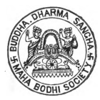
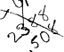
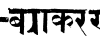
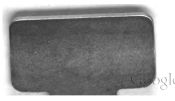

# Cayana'S Pali Grammar

(EDITED IN DEVANAGARI CHARACTER AND
TRANSLATED INTO ENGLISH)

$\mathbf{\hat{r}}_{\perp}\mathbf{\hat{r}}_{\perp}$

## By

SATIS CHANDRA ACHARYYA, VIDYABHUSANA, MAI
TROFESSOR, SANSKRIT COLLEGE, CALCUTTA; AND MEMBER OF THE
ROYAL ASIATIC HOCIETY, LONDON,
PUBLISHED BY THE MAHAB

PRINTED BY HARI CHARAN MANNA,
AT TIIE NEW BRITANNIA PRESS, 78, AMHERST STREET, CALCUTTA.

1901.

.

Price 3 rupees.

Dipitizes a control and the COLOGICAL
COLOGICAL
.

time the content of the
..

.

CONSIDER
.

an and the content of Y INTERIVIMU

R.MOTIONING 
C.

CONSIDER
..

Digitzed by GOO

# प- व्वि- व्विकर ्यम् ।

ममर्तर्र्र्र्र्र्र्र्र्र्र्र्र्र्र्र्र् 
eneldi गवर्षमेच संकत करेजाप्यापवीन, वव्वन रवाज्
  
ए, ए K
ष्त्री सतीम-चन्द्र-विद्याभूषणेन ससादितं  भागाग्तररितस्न ।
ee

me the control and the c
  
CONSIDER
. 

.

.

.

CONSIDER
C.

C. Construction CONSIDER
CONSIDER
CONSIDERATION
CONTROL
CONTROL
CONSIDER AND CONSTRUCTION
CONSIDER
CONSIDER AND RESEARCH
.

.

..

CONSIDER
.

.

..

D Digitzed by Google

# Contents.

| 1.                    | Specimens of Siamese, Burmese,   | Ceylonese   | and       | PAGE,   |
|-----------------------|----------------------------------|-------------|-----------|---------|
| Devanagari characters | i                                |             |           |         |
| :                     | :                                | :           |           |         |
| II.                   | Proem                            | ix          |           |         |
| :                     | :                                |             |           |         |
| II.                   | Introduction                     | XY          |           |         |
| :                     | :                                |             |           |         |
| Sanskrit grammars     |                                  |             |           |         |
| i.                    |                                  |             |           |         |
| ii.                   | Pali grammars                    |             |           |         |
| ii.                   | Pali language                    |             |           |         |
| iv.                   | The art of writing               |             |           |         |
| IV.                   | The text of Kaccayana            | :           |           |         |
| Sandhikappa— Book Is  |                                  |             |           |         |
| (a)                   | Chap.                            | i           |           |         |
| :n                    | 8                                |             |           |         |
| Chap.                 |                                  |             |           |         |
| Chap.                 | ii                               | 15          |           |         |
| Chap.                 | iv                               | 2           |           |         |
| Chap.                 | v                                | :           | 30        |         |
| ()                    | Namkappa - Book II               |             |           |         |
| Chap.                 | i                                | 3           |           |         |
| Chap.                 | i                                |             |           |         |
| Chap.                 | ii                               | IOT         |           |         |
| Chap                  | iv                               | 126         |           |         |
| Chap.                 | 14.3                             |             |           |         |
| Chap.                 | VI                               | (Karaka`-   | -Book III | 183     |
| Chap.                 | vii                              | (Samaa)     | Book IV   |         |
| Chap. viii            | (Taddhita)—Book V                | 210         |           |         |
| (c)                   | Akhyata—Book VI                  |             |           |         |
| Chap.                 | 249                              |             |           |         |
| Chap.                 | 263                              |             |           |         |
| Chap.                 | ii                               | 278         |           |         |
| Chap.                 | iv                               | :           | 289       |         |
| (6)                   | Kita-kapppa-                     | Book VII    |           |         |
| Chap.                 | 30                               |             |           |         |
| Chap.                 | 321                              |             |           |         |
| Chape                 | 30                               |             |           |         |
| Chap.                 | 342                              |             |           |         |
| Chap.                 | 349                              |             |           |         |
| VI                    | (Unädi))— Book VIII              | 356         |           |         |

SEP 2013062068

COLOGICAL
s production of the production of the production of the production of the production of the production.

the content of the conte
..

ERRATA, AND A
CONSIDER
P. 3. L. 20-five for three, 2011. " "
P. 36. L. 13-- H + H for H + H
P. 154. L.  2—after ski add tregger talww his sk
  
.

पप सम्वो शोति ;  तं  वचा,——————————
CONSIDER
P. 254  L. 17-18— षाम्झ for ष्म्झ । 
I. 258. L. 5- षाम्ञ for षष्ञ !     .

CONSIDER
SIAMESE CHARACTERS.

.

$${\mathfrak{H}}\cdot{\mathfrak{H}}$$

Vowels.

$\mathbf{M}$
Siamese

$\tau$
 # Initial. $$\cdot$$ . 
$\square$
$$\mathbf{\hat{D}}^{*}\mathbf{\hat{\ell}}$$
$$\mathbf{\mu}$$

English— .

i

a

$\mathbf{M}$
$\downarrow$ . 

$\mathrm{t}$ 3. 
 $\blacksquare$
i

$\mathbf{M}$

u

e o

$$\mathrm{{Sanskrit}}-$$
$\frac{1}{2}$ 2. 
$\mathbf{a}$

* [16] M. C.  
$${\mathfrak{s}}\quad{\mathfrak{s l}}$$

final. $\uparrow$
$$\begin{array}{r l}{{\overline{{\nabla}}}}&{{}{\overline{{\nabla}}}}\end{array}$$

:
.

g Medial & final,

$\mathbf{a}\cdot\mathbf{a}+\mathbf{b}\cdot\mathbf{c}$
$\uparrow$
1 u

$${\mathcal{I}}\quad\quad\Phi\sim$$
$$\mathbf{r}\,\mathbf{\ddot{\partial}}$$

Place.

* [10] A. K.  

after over

$\blacksquare$

under:

Consonants.

$\frac{\pi}{4}$  . 
Siamese-

$\square$
$${\hat{\mathbf{r}}}^{i}\mathbf{\partial}_{i}$$

li English —

$\frac{1}{2}$  . 
$\frac{1}{2}$  4. 
k kh

$\downarrow$ . 
 g

$\mathbf{M}$
$$\mathbf{v}_{\mathrm{d}}$$
$$\mathbf{fl}$$
$=\;\pm\frac{1}{2}$  . 
 $\blacksquare$
 $\blacksquare$

h Sanskriti

$\downarrow$ . 

## Digitzed By Lu

$\tau\;\stackrel{\text{-}}{\text{.}}\;\mathbf{o}$
$\square$
cnsonants.

before

T

| Siamese   | jh   |    |     |    |    |    |
|-----------|------|----|-----|----|----|----|
| English-  | c    | ch | i   | n  |    |    |
|           |      |    |     |    |    |    |
| प         | e    | ज  | म   | ज  |    |    |
| Sanskrit- | S    | e  |     |    |    |    |
| Siamese-  | i    |    |     |    |    |    |
| t         | th   | d  | dh  |    |    |    |
| English-  | t    |    |     |    |    |    |
|           |      |    |     |    |    |    |
| s         | c    | ड  | e   |    |    |    |
| Sanskrit- | .    |    |     |    |    |    |
| n         | tl   |    |     |    |    |    |
| Siamese-  | W    | n  | f   |    |    |    |
| ,         |      |    |     |    |    |    |
| English - | t    | th | d   | dh | n  |    |
| य         | य    | न  |     |    |    |    |
| Sanskrit- | त.   |    |     |    |    |    |
| Siamese   | l    | W  | . 1 | h  | .  |    |
| English   | p    | ph | b   | bh | m  | .  |
| प         | म    | .  |     |    |    |    |
| Sanskrit  | प    | v  |     |    |    |    |

i Siamese el i

| f   | s   |
|-----|-----|

n English-

| .   | ..   |
|-----|------|
| .   | v .  |

h l m Sanskrit —
य

| A   |
|-----|

स Siamese-

| r   |
|-----|

o A A

e a e s y o
( 9 2
.

English— I 
3 Sanskrit-

| 4   | 5   | 6   |
|-----|-----|-----|

| 7   |
|-----|

| 8   |
|-----|

9 IO
.

y y 9
.

## Digitzed By Goog

iv

# Burmese Characters. .

Vowels.

-
c c
.

t Burmese —
a
.

3
  
Englishaaa a
- 
' 
e o Sanskrit-

| Sanskrit-   |      |    |             |
|-------------|------|----|-------------|
| स           | सा    | h  | Consonants. |

b Burmese-
  
o c B
Englishk
.

kh g gh ti

| Sanskrit-   |      | ख   | ग   |      |
|-------------|------|-----|-----|------|
| Burmese—    | 8    | &   | e   |      |
| o           | jh   |     |     |      |
| English -   | C    | ch  | j   | ñ    |
| Sanskrit-   | म    |     |     |      |
| ,           | e    | D   | D   |      |
| Burmese-    | a    | g   |     |      |
| e           |      |     |     |      |
| English -   | dh   |     |     |      |
| - f h       | d    | n   |     |      |
| Sanskrit -  | 19   | .   |     |      |

| Burmese-   | 8   | 8    | 3   | G   |    |    |    |
|------------|-----|------|-----|-----|----|----|----|
| English-   | t   | th   | d   | dh  | n  |    |    |
| Sanskrit-  | त   | ष    | ध   | न   |    |    |    |
| Burmese -  | c   | G    | o   | 8   | o  |    |    |
| English-   | p   | ph · | b   | bh  | m  |    |    |
| Sanskrit-  | प   | फ    | भ   |     |    |    |    |
| म          |     |      |     |     |    |    |    |
| .          |     |      |     |     |    |    |    |
| Burmese-   |     |      |     |     |    |    |    |
| 3          | S   | 8    |     |     |    |    |    |
| G          | o   | a    |     |     |    |    |    |
| English-   | l   | s    | h   | l   | m  |    |    |
| y          | r   | v    |     |     |    |    |    |
| Sanskrit-  |     |      |     |     |    |    |    |
| य          | a   | व    | स   |     |    |    |    |
| Burmese    | e   |      |     |     |    |    |    |
| c          | J   | G    | 9   | 2   | o  | e  | 0  |
| English-   | 3   |      |     |     |    |    |    |
| I          | 2   | 4    | 5   | 6   | 8  | 10 |    |
| 7          | 9   |      |     |     |    |    |    |
| Sanskrit-  | a   |      |     |     |    |    |    |

e CEYLONESE CHARACTERS.

Vowels.

Ceylonese - and a single 6 a n o s c o English —
s a i a o e and the CONSIDER
u o t or e s t c c s Sanskrit -
P
i - -
स्मा
I
Consonants.

c
.

Ceylonesea
-
a
  
B
,
a English -
kh gh k g Sanskrit —
a क ग Digitzed by Col
- 

.

,
r n
-
.

e

| vii        |    |          |    |    |    |
|------------|----|----------|----|----|----|
| Ceylonesed | ,, |          |    |    |    |
| e          | a  |          | k  | a  |    |
| .          |    |          |    |    |    |
| English -  | .  |          |    |    |    |
| c          | ch | j        | jh | n  |    |
| t          | .  |          |    |    |    |
| CONSIDER   | :  |          |    |    |    |
| Sanskrit-  | -  | CONSIDER |    |    |    |
| .          |    | lo       | म  |    |    |
| Ceylonese- | o  | e        | e  | d  |    |
| .          |    |          |    |    |    |
| English—   | .  | t h      | d. | d. | n  |
| Sanskrit - | s  | ठ        | M  | g  | य  |
| s          | .  |          |    |    |    |
| Ceylonese- | a  | e        | a  |    |    |
| &          | s  |          |    |    |    |
| English—   | th | d        | dh |    |    |
| t          | n  |          |    |    |    |
| Sanskrit-  | त  | य        | द  |    |    |

## D D

Ceylonese-

English—

| 1 - 1   |
|---------|

p Sanskritपं
मा
h भ से
Ceylonesea o o a B
o English—
.

.

l y r s v h
.

m Sanskritय व र स स a

.

('
•

.

-
',
l
,
ph

| .   |
|-----|
| ph  |

..

b bh

| --   |
|------|

.

m
.

| a   |
|-----|

vin
,

## Digitized By Vi

: 7

# Proem.

Namo tassa Bhagavato Arahato Samma¬
Sambuddhassa.

Tiie object in launching this experimental work in the expansive sea of Oriental learning is to exhibit the characteristic features of a language which had once been the mother of all the  Aryan dialects  spoken by the races inhabiting the  Gangetic Valley at the present day.

Pali as spoken by the Tathagata and used by him as the medium for the "promulgation of his Dharma and Sanskrit as it is used by the scholars of India, both are extremely rich and contain a wealth of literature of unrivalled beauty  wherein are to  be found precious treasures.

Historically the rock inscriptions of Asoka, and the Pipprawa inscription recently deciphered by archeological scholars contain important testimony as to  the  antiquity  of Pali language. The oldest inscriptions in
India are in Pali. The MSS. found in the Horiui Monastery in Japan, the Bower MSS,
found in the Pamir Valley are the oldest Sanskrit  MSS., and they are Buddhistic.   This is a valuable indication showing the sympathy that existed  between  the  followers  of Pali and sanskrit schools of learning.

Learned Bhikkhus in the past invariably had shown great proficieney in Vedic learn-
The chief disciples of the Tathagata ing.

Sariputta,  MahaMoggallana, MahavlZ.,
Kasyapa, Katyayana, Kaundanya, Bharadvaja, Vasishta, before they became disciples of the Buddha, had been followers of Vedas.

The language containing the Dhamma that Buddha preached is euphoniously called Pali,  but  philologically  the language is known as the Suddha Magadhi Bhasha. Between the Vedic Sanskrit and the postBuddhist Sanskrit the pure Magadhi language takes a middle ground, and Pali as found in the Tripitakas and the Attha-kathas contains all that is purest in the sociological evolution that India witnessed between 600 B.C, and 700 A.C.

The Islam invasion of India changed the purity of Indian national ideas and the time that followed accentuated in  advancing  the Aryan decline. The absence of any old Vedic commentary is greatly to be deplored.

The Sanskrit literature that is to be found to-day is post-Buddhistic and the Vedantic interpretations of Sankara are, according to the writers of the Padma Purana, influenced by Buddhism. To them what Sankara enunciated was Buddha's religion in disguise. The present religious sects current in different parts of India are  all,  with  the exception of Sankara's Advaitism, post-Islamic. How  much  the materialistic ideas of Semitic monotheism have had to do in influencing the religio-philosophic adumbrations of later day reformers it is  difficult  to sy.  But the time has come for an  analytical investigation of all existing religions by applying the higher criticism of absolute Truth to discover the interdependent nature of these different religions on the  pure  Aryan Dharma found in the Pali texts. Buddha rejecting the interpretations of books, traditions,  authorities,  miraculous 'performances, etc. based Religion or absolute (Dharma)
Truth ; and as it was a  Religion founded on science and philosophy a proper signification of the language which he used in teaching the doctrine is necessary.

The Pali language has three principal grammars called Kachchayana, Moggallayana and Saddaniti. As helps to the grammar of Kachchayana, there are Rupasiddhi, Balavatara, Mahanirutti, Chula nirutti,  Niruttipitaka, whilst there are to the grammar of Moggallana, the works called Payogasiddhi, Moggallayanavutti, Susaddasiddhi, Padasadhani, and to the Grammar called Saddaniti there is only one work called Culasaddaniti. Of the three Pali grammars Kachchayana is the oldest. Other treatises on Pali grammar are Sambandha chinta, Sadda saratha jalini, Kachchayana  bheda, Saddattha bheda chinta, Karika, Karika vutti, Vibhattyattha, Gandhatthi, Vachakopadesa, Nayalakkhana vibha vani, Niruttisangaha, Kachchayanasara, Vibhattyattha dipani, Sanvanna nayadipani, Vachchavachaka, Saddavutti, Balappabodhana, Karakapuppha Manjari, Kachchayana ,
dipani, Gulhattha dipani, Mukhamatta sara, Saddabindu, Sadda kalika, Saddavinichchaya, Bijanga etc. with their paraphrases, commentaries and supplementary commentaries.

Veteran Pali scholars in Ceylon have published for use of the Sinhalese students learning  Pali editions of Kachchayana,  Rupa Siddhi, Balavatara etc., and in Burma, Siam and Cambodia where Pali is studied learned scholars are, ever active in enriching the language.

The Maha Bodhi Society, which was founded in May 1891 under the presidency of of the illustrious scholar the Pradhana Nayaka Sumangala Maha Sthavira, has been quietly pursuing its work in gaining the sympathy of the educated class in India. Its fundamental principles are archaeological and philological and its  object  is to  revive the  philosophical  study  of the Pali religion in its native soil. A religion that once prevailed all over India and beyond the confines of Western Punjub as  far as   Gandhar, Afghanistan, Central Turkestan, and the Pamir Valley, that it should have  ceased  to exist in its birth place is one of the saddest episodes of the history of religious evolution confirming ' the truth of the doctrine of change. For nearly 700 years there has been not even the slighest whisper of a follower of Buddha heard in  the  shrines  at Sravasti, Patna, Benares, Gaya, Nalanda, Puri, Kanchipura, Mithila, Kosambi, Ujjeni,  where thousands of monks daily chanted the mellifluent suttas of the Pali Pitakas.

Kapilavastu where the Bodhisat Prince Siddhartha was born, is now a forest in Nepal, Isipatana in  Benares  is  now  occupied  by ryots, Gaya and Buddha Gaya have gone into oblivion, Nalanda, where stood the famous Buddhist University with its 10,000 students, is now in ruins, as well as  Sravasti which is in the territory of theMaharajah of Balrampur.

Five hundred years is only a day to  the Tayatimsa gods, and as Buddhas have appeared in the past so will Buddhas appear in the future. The wheel of change goes on a rolling and Buddha's Law appears and disappears.

A historic work the Maha Bodhi Society has undertaken in India, and the accomplishment of its labours will be possible when scholars and wealthy laymen will come forward to carry out its programme.

In' India's glorious and triumphant days the Buddha's name was sung by millions upon millions of  her   chilren,  and   Emperors   like Asoka and Siladitya reigned and  helped  the dissemination of the Religion   of  Compassion and Truth. On the resuscitation of the Wisdom-Religion of  the  Tathagata  depends the revival of India's glory. May it soon come is the daily prayer of the writer.

MAHA-BODHI SOCIETY
2, Creek Row, Calcutta, October 1901.

H. DHARMAPALA.

## Digitzed By La Oog

# Introduction:

1. History of grammatical literature in India.

i. Treatises on sanskrit grammar, In India Vyakatana (grammar) is recognised as a Vedanga (limb of the Veda). In Paniniyasiksa quoted by Sayanacaryya in the exordium to his commentary on the first hymn of the Rigveda we find that the Veda possesses six limbs which are thus enumerated :-
e'; पादौ त नेदस ख्वोतिषाणवने चप्प निवसं प्रोममुच्यति III
म्षा प्रार्थ त नेदक्ष तथं म्याकरचं स्मतं ।
and in the state which the state of the stat
"Chandah (the science of metres) constitutes the two legs of the Veda, Kalpa (the science of ceremonials) forms the two arms of it, Jyotisa (astrony) is the eye, Nirukta (the science of etymo•
logy) is stated to be the ear, S'iksa (the treatise on phonetics) is the nose, and Vyakarana (grammar) is to be remembered as the mouth of it.

Therefore it is only he who studies the Veda with the Angas (the six auxiliary sciences) that rises to a high position in the world of Brahma".

Vopadeva the celebrated author of the Mugdhabodha grammar, who is said to have lived at Devagiri in the Deccan in the 12th century A.D., makes mention of eight different adisabdikas (grammarians and philologists of the early days) whose works he  consulted  in  compiling his Dhatupatha. Vopadeva says :—
tware:  वायबस्नापियर्थि;  यावटायम;  ।
 पाथिम्बमरजैनेन्द्रा  जयम्बहादियाविद्या;  \#
षामा तेपाषाखोक्ष चवंचाधारष; स्कट; ।
ष्रात्वपाठ; सदाव्यन्मपादनारिप्रकाण; }
eer the state of the state the state of the भातष; पठिता; पाठस्रमबोकागर्यस्तता; ॥ (धात्वपाठ;) ॥
"Indra,  Candra,  Kasakrtsna, A'pisali, Sakatayana, Panini, Amara, and  Jainendra—may  glory attend to these eight adi-sabdikas ! By examinng their views, I compile in verse, this Dhatupatha (Recital of Roots) named Kavikalpadruma
(The Wish-yielding Tree of Poets), approved of by all and clearly exposed, in which the roots found in the previously classified lists and those occurring in the Sutras, popular usages and Vedas, have been arranged in the order beginning with those having a as their initial or final letter ' .

It is necessary to add here a short account of the eight schools of Sanskrit grammar mentioned by Vopadeva.

1. Aindra—No manuscript of the Aindra grammar has yet been recovered. But frequent references to the grammar of  Indra are met  with in the writings of Indian and Tibetan authors. Somadeva the author of the Kathasarit-sagara in the 12th century A.D. says that the Aindra grammar was rendered useless by the system propounded by Panini. In the commentary on the Sarasvata-vyakarana  mention has been  made  of the grammarian Indra in the following terms :—
  
प्रत्रियो  तक्ष  मतुक्ष स  चमो  यक्ष'  मर';  कषमू ॥
"Even Indra and others did not reach the other shore of the ocean of words ; how is man able to explain the etymological formation of words exhaustively ?"
In the Buddhist sanskrit work called Avadana-sataka, translated into Chinese A.D.

222-280, it is stated that Sdriputra in his boyhood learned the grammar of Indra. In Lama Tdranatha's 'history  of  Indian Buddhism and in the work of the Tibetan writer Buston we find that the first sanskrit grammar was written by Sarvajilana (S'iva) but this never came to Jambudvipa. Then Indra compiled the Aindra grammar which Vfhaspati studied. This was current in Jambudvipa, but was surpassed by Panini's work. In my opinion Vopadeva meant by Aindra the Katantra grammar. Dr. Burnell says that by Aindra grammar one must understand a school of grammar not a specific grammar by an individual. Thus Katyayana in the Kathasarit-sagara is made to talk of "my Aindra grammar." Indra was fabled to have originated the science of grammar but the Aindra grammar  was the primitive grammatical science as handed down by various teachers.

2. Candra-Candra grammar is based on the system of Panini. The author Candra-gomin is generally believed to have lived in a place called Candra-dvipa in Kashmere about 400 A.D. So far as I remember Dr. G. Buhler holds the same opinion. But in a correspondence (of Mr.  A.B.  Keith  with  Prof.  Rhys Davids on the date of  Kumāra-dāsa   published  in  the  Journal T
of the Royal Asiatic Socicty, July 1901 ) we find that Liebich (Vienna Oriental Journal XIII,
313-5) has shown from the example " Ajayad Gupto Hunam'' that Candra-gomin the author of Candra-vyakarana lived circa A.D. 480. Kielhorn (Indian Antiquary XV, 183-5) shows that Candra was used by the Kasika-vriti. As regards Candra-dvipa, Rai Sarat Chandra Das Bahadur  C.I.E.  tells  me  that  it  is   the same as Väklä-Candradvipa which forms a part of the district of Backergunge in Lower Bengal.

Candragomin was undoubtedly a follower of Buddhism. In the opening lines of his grammar he pays obeisance to Buddha as follows :—
ष्विचं प्रचम्व सम्बंसं, सम्बीयं जगतो प्रुवर' ।
स विश्वस्त सम्मूर्वस्त्री ग्रद्वस्त्रम् I
.

"After bowing down to the accomplished, omniscient and merciful Teacher of the universe, I proceed to explain the nature of words in a manner which is brief, reliable and perfect. '
3. Kasakrtsna-a grammarian or philologist probably posterior to Panini.

4. Apisali—a grammarian  quoted by Panini
.

in the sutra 6-1-92. He is also quoted by Ujjvaladatta 11th century A.D.) in the Unadisutra vrtti 1-18, and 4-174 ; and by Sayandcdryya (14thcntury A.D.) in the Dhaturtti and Padacandrika.

5. S'akatayana—quoted by Panini in the siitra 8-3-18. He has also been cited as an authority in linguistic matters in the Yajurvedapratisakhya,   Atharvavedapratisakhya : and   Nirukta of Yaska. Dr. Burnell says that " the actual grammatical text book of the Jains, which passes uder the name of S'akafayana, quotes the opinion of an Indra ; the commentary (by Yaksavarman)
explains this name by " Indra Acaryya." Dr.

Burnell  further says : " of S'akatayana  there  are fragments in  the same collection (Leyden Mss. at Madras), and a  complete  copy of  the  text  and undi-satra (in the Malayalam characters) among the manuscripts I presented to the India Office Library in 1870. 1 have since procured other complete manuscripts of the text, commentary etc. All these are Jain manuscripts from the Canarese country."
By an examination of the contents of the manuscripts scholars have ascertained that the S'dkafayana grammar, as we have it, is not in its original form, and it is a comparatively modern redaction of an  old  treatise  effected  under  Jain influences in Central India not much earlier than the 12th century A. D.

6. Pdnint-the most eminent sanskrit grammarian is generally believed to have flourished in the 4th century B.C. His grandfather was Devala and his mother's name Daksi. He was born at S alatura in Gandhara (in the Punjab province).

Katyayana about the 3rd century B.C. wrote V artika on the sutra of Panini, and Patanjali about 150 B.C. wrote Bhasya on it. Jaydditya (who died in 661 A.D.) and Vamana jointly wrote Kasika vriti on the grammar of Panini and finendrabuddhi in the 8th century A.D. wrote Nyasa on it.

The Unddi-sutras found in the grammar of Panini are not his own production. These siitras were attributed by Nagoji to S'akajayana. But this is improbable. Prof. Maxmuller pointed out four words in the Unadi-sutras which could hardly be known in · Panini's time : · 1. Jina (3-2), 2. stupa ·
(3-25), 3. dinara (3-140) and 4. tirita (4-184).

Panini alludes to Yavana and Yavanani in the sutta 4-1-49 :----
eee- पर पर- पर- व द - व द - व द - व द व द व - 
षष
"When the feminine suffix als is added to these words, the particle anuk is angmented to them.

The rule applies to the word yavana for signifying lipi or writing ; thus, yavandni means the writing of the Yavanas."
It is however not clear whether the word, yavana refers here to the Greeks or Persians. Dr.

Benfey understands by yavanani "Greek writing,"
but he places the completion of Panini's work as early as B.C. 320. In that case he thinks Panini
"had already had the opportunity during six years of becoming acquainted with Greek writing in his own immediate neighbourhood without interruption, Alexander having, as is wellknown, established satrapies in India itself and in the parts adjoining"—in the vicinity of the Indus, namely, near which Panini's birth-place was. Dr. Weber is of opinion that the name Yavana first became popularized in India through Alexander, and the word therefore signifies the Greeks (Ions.)
The Chinese pilgrim Hiuen-thsang visited Salatura the birth-place of Panini who is known, B
by the name of S'alatunya ( Panini 4-3-94.) Cunningham identifies' it with 'the village of Lahor which is 4 miles north-west of Ohind.

7. Amara-the celebrated lexicographer known to have been one of the nine gems of the court of Vikramäditya of Oojein in 56 B.C. But now he is generally believed to have lived in the 5th cntury A.D. In the Amara-kosa the term dinara occurs. Dinara is a Greek coin, and Amara's use of it makes him hardly earlier than 400 A.D. Mr. E. J. Rapson (in the Journal of the Royal. Asiatic Society, April 1901) says :—"It is certainly most curious to find the dinara, represented by the gold coins of about the weight of our sovereign under the Gupta dynasty in the 4th century A.D., and on the other hand, in Kashmere some eleven centuries later, under the form dinnara, degraded to a money of account so infinitesimal that some 3500 went to make up one rupec."
8. Jainendra—manuscripts of the Jinendra¬
Vvakarana are to be found at Madras. I
think this Jinendra is the same as the Buddhist grammarian Jinendra-buddhi who wrote the wellknown  Nyasa  on  the  grammar of  Panini in the 8th century A.D. Mr. Colebroke however says that Kavya-kama-dhenu by Vopadeva  refers  to  a Jinendra and a Jinendra-buddhi.

Besides the eight scheols mentioned by Vopadeva in the 12th century A.D. there are many L
treatises  on  Sanskrit  grammar   which cannot be brought under any of the schools.

Perhaps the most ancient system  of  grammar is the Prâtisâkhya attached to and forming an anga Of cach of the Vedas. Referring to the Rigvedapratisakhya Dr. Burnell says " of  all the grammatical treatises in sanskrit that we  possess  this  remarkable work bears every sign of being a primitive treatise." Professor Goldstucker however took a different vlew, and held that this Pratisakhya is posterior to Pānini."
(a)  The Rigveda-Pratifakkya is attributed to S'aunaka.

(6) There are the Taittiriya Pratisakkya of the Black Yajurveda and the  Vajasaneyi  Pratisakya of the White Yajurveda.

(c) We also find S'axnakīya Cāturadhyāyikā of the Atharvaveda.

The Pratisakhya grammars show that the advance made by linguistic research during the Vedic period was very considerable. It was for fixing the text of the prayers as well as for a proper pronunciation and recitation  of words  that certain rules were laid down which gave rise to the Vedic grammar called Pratisakhya.

We  may  also  notice the grammars called the Phit sulra by S'antanava and Jatapatala by Vyddi.

Katantra or Kalapa-Vyakarana ranks  next to
. Pdnini in importance. It was probably written in the 3rd century B.C. The author's name is Sarvavarman. There is a Vrttr (on the Kalapa Sutra) by Durgasimha. He also wrote a Tikd on his own Vrtti. The Katantra-Vrtti panjika by Trilocana Dasa is also well-known. Durgasimha who was a Buddhist pays obeisance to Buddha in the opening lines of his Vrtti thus :—
हेवहेरं प्रणम्बादौ सब्वंप्रं सब्वदर्मिनम् ।
eindum production and the state of the state
"After having first bowed down ' to the omniscient and all-seeing Lord of Lords, I shall set forth the explanation of the Katantra of S'arvavarma. The state of the pro In the beginning of his Vrtti-fikd too, Durgasimha presents salutation to Buddha as follows :—
ष्वितमेकनजं a चण्न्याम्यः तं  स्तयम्पु वम्  ।
, … . 

- "After presenting salutation to Buddha the blessed; incomparable, unborn, foremost of the venerable and self-existent, Durga proceeds to compile this Kätanta-vrtti-tikä." 
Most of the writers of commentary on the Kaiantra grammar were Buddhists but it is not known to what religion did S'arva-varma the author of the original siitras belong. Katantra grammar is however greatly respected by all Buddhist people and has been carefully preserved in Tibet. It is widely read in East Bengal where Buddhism lingered latest.

The Unadi and Krt sutras belonging to the Katantra grammar were added by Katyayana.

Thus in the beginning of the chapter on Krt we find :-

## Ee Elissing The State The Management Was T

" These Krt suffixes (including the unadi) have grown in the manner of trees etc.; they have nt been created by the doer (God or Sarvavarma) ;  for the enlightenment of ignorant  people Katyayana has made them."
Mugdhabodha   vydkarana-by   Vopadeva    was written in the 12th century A. D.

Sarasvata-vyakarana was  probably  written  in the 13th century A. D.

Sanksipta-sara by Kramadis'vara belongs probably to the 15th century. A. D.

Supadma by Padmanabhadatia probably belongs to the 16th century.

Panini has mentioned the names of several grammarians who flourished before him ; such as Apisali, Gargya, Galava, Cakravarmana, Pauskarasādi, S'ākaṭāyana, S'ākalya, S'aunaka, and Sphotarana, 2. Pali grammars— Kaccdyana (Katyayana) is reputed to be the anthor of the first Pali grammar called Susandhikappa. Kaccayana grammar, as we have it is traditionally known to be the production of different hands. In the Kaccayana bheda fika we find :
a control er strategic in the complete of the strength is
. 

" The Yoga (Sutra) was  written by Kaciayana, the  commentary  by  Sanghanandi, the examples were added by Brahmadatta and the gloss by Vimalabuddhi."
From the manner in which the sutta, vutti, payoga and  nyäsa'aré  intimately  connected with one another, I am inclined to believe that the entire work was written by Katyayana himself. At any rate the sutta etc. were written simultaneously.

Mr. D'Alwis considers that Panini's sanskrit grammar was the source of Kaccayana's book.

There are however several suttas in Kaccayana which are almost identical with those of the Katantra. Dr. ' Burnell is of opinion that both Kaccayana and the Katantra  have  borrowed most of their technical terms and many of their suttas from the Aindra grammar.

Nothing is known to us about the life of Kaccayana. We are quite in the dark about the age in which he flourished and the country in which he lived.

The difficulty, that Gautama's hearers found in understanding the language in which he preached, is represented as the occasion of the formation of the first Pali grammar. When people complained of not understanding the signification of G uitam i's discourses, Kaccdyana, one of his favourite disciples after meditating on the subject came before his associates with the proposition that subsequently became the first aphorison of liis grammar. If we accept the view mentioned here, Kactayana the author of the first Pali grammar must have lived in the 6th century before the Christian era. Kaccayana's grammar was, it is said, preserved by oral tradition for 450 years after the death of Gautama when with the sacred books, it was committed to writing in Cevion in the  first century B. C. The book is said to have been carried to Burmah by  Buddhaghosa  early  in  the 5th century A. D., and the Burmese translation and commentary are ascribed to him.

Some scholars have on the authority of the Kathasaritsagara identified Kaccayana | Kalya yana) with Vararuci who was one of the nine gems of the´ court  of  Vikramaditya  in  the  first cntury B. C.

Katyayana who added the chapter on kft and unddi to the Kalantra  grammar  of  S'arvavaima is, I believe, the same person who compiled the first Pali grammar. It is however doubtful whether he is the same Katyayana  who  wrote varttika on the sanskrit grammar of Pāṇini.

The sutra 1-1-9 of the Pali grammar of Kaccayana presupposes   the   existence of sansktit   grammars from which the author borrowed some technical terms. Kaccayana directly mentions  Upagupta and Devanampiya Tissa in the examples of the 1th siitra of the chapter on Karaka and in the 5th sutra of the 5th kand.: of the namakappa respectively :—
(!) चपगुसेन वश्वो नारो ।   (5) क गतोखि खं  देषानष्पिक
  
Now Upagupta and Devanampiya  Tissa  were both contemporaries of Asoka about 250 B.C.

From these examples we can fairly conclude that Kaccayana flourished after 250 B. C. The Katyayanāvada sūtra mentioned in the  Mādhyamika Vrtti of Candrakirtti warrants us to conclude that Kaccayana lived before the 3rd century A.D.

I think Mathura was the birth place and residence of Kaccayana. Among the examples of the 5th sūtra of the chapter on Kāraka we find :
ad)  मधराय   षत्रस्त   योवनेश   सङ्कस्तगरर   षतृषि,    ततृष प हजना  पर्वम्त ॥
"From this place viz., Mat!turd, at a distance .

of four yojanas (about 15 miles) there is a town called Sankasya 1 many people live there." 1 . . . .

We know from. Divyavadana that Upagupta mentioned: by Kaccdyana was also a native of e and the content of the content of the content.

Mathurd.

Resides Kaccayann's grammar there are several grammatical treatises in Pali ; such as, 1. Saddamiti, 2. Rupasiddhi, 3. Culaniti, 4. Payogasiddhi, 5. Balavatara, 6. Akhyatapada, 7. Dhatumanjusa 8. Moggallana-vyakarana (1153 1186 A. D.) etc.

p. 1000 CONTROL CONTROL
the content of the conte
, Ill. Pali Language. 

CONSIDER
The word Pali has often been used as being synonymous with Magadhi. In the 6th century B. C.  when Buddha  first assumed the character of of a religious preacher, there was no difference
'between Pali and Magadhi' With the rise of Buddhistic literature a considerable distinction arose between the two terms. The word Pali began to signify the language in  which the sacred books of  the  Buddhists' were  written,  while  the name. Magadhi was given to the language in
, which the ' people of Magadha spoke. In the age of Buddhistic supremacy Magadha was the capital city of India, and  Magadhi was the language of the people of  the  country. . In course of  time :this Magadhi-the spoken Janguage of, the coun¬
Ary-underwent immense changes, and gave ribe to the modern vernaculars such as Bengali, Marhatti, Hindi, Uriya etc. But the literary language  which was called Pali remained unchanged, and got its grammars and lexicons.

In the following verse occurring in Payogasiddhi and perhaps in Moggullana or in a still older work, Pali (Magadhi) is 'asserted to .be the original language of India :—
षा नागधी मुखभावा नरा या वादिकप्पिका ।
मास्मषा चस्मतासापा सम्ववा चापि भासरे ॥
" The Magadhi is the original language, in which men of  former  ages,  Brahmans  and  those who have never heard speech, and supreme Buddhas speak."
With regard to the identity of Pali and Magadhi, the following observation is extracted from Vibhanga  Atuva :—
" If a child,  born of a  Dravida  mother and an Andhaka   father,  should  first  hear  his   mother speak he would speak the Dravida language, but if he should  hear his  father  first, he would speak the Andhaka. If, however, he should not hear any of them, he would speak the Magadhi. If, again, a person  in an uninhabited  forest, in which no speech is heard, should intuitively attempt to
. Articulate, he would speak the very Magadhi. All other  languages  change,  but not Pali (Magadhi),
which is spoken by Brahmans and Aryyas."
As the last Buddha was a native of Magadha, Pali and Magadhi are usully regarded as the same language which is often called Pali-Magadhi ; but some of the books make a very marked distinction,  representing Pali as the original language of the gods and Buddhas, and Magadhi as the original language of men. In one book, mentioned by Dr. Mason, Gautama goes back to the origin of the universe before the first Buddha appeared, and he represents the creator as a female, who, after she had created animals and appointed them their several abodes, gave them names. * Nine of those names are given, which are all Pali, and it is added that the language, without giving it any name, was the first language spoken, and when Buddhas subsequently appeared, they every one in succession preached in that language. After animals were created, this divine personage or goddess created three human beings - a male, a female and a neuter. The neuter was neglected; and it killed its brother, 'the male, through envy ; but three children were left behind by the male and to these three were born seven sons and six daughters.

The parents brought different animals to their chlldren to play with, and the several words that the children. uttered  on  beholding  them became the names of those animals, and they are, Gautama says, in the present •Magadhi language the words - in common  use to  designate these animals.   The following are specimens :—

| Sanskrit                                    |        |                           |
|---------------------------------------------|--------|---------------------------|
| S' S' S' S' S' Sasanne Monocco A hare. So i |        |                           |
| Suplaya Supaya Sandariani A monkey.         |        |                           |
| Kukkuta Kukkuto Rome A fowl. A fowl.        |        |                           |
| As ' value ' Assad Sangal ' s ' A horse. S  |        |                           |
| .                                           | S 'van | Sunaka Sacher with A dog. |
| Vyaggho Yi (1999) A tiger.                  |        |                           |
| Vyaghra                                     |        |                           |

The derivation and signification of the word Pali has been a matter of no little controversy, since it was first taken to Europe by Laloubre, who was Envoy to Siam for Louis XIV in 1687.

and 1688. A class of writers, following the sound, have referred the word to Palasa, an ancient Sanskrit name of Behar or Magadha. Some have referred it to Palli a village, or to Pali a tower, or to Palestine or  to the  Paiatine  hills or to Pehlve. George Turnour says, that Pali originally signified the text or  scripture,   Dr. Alwis  affirms that Pali means a row or range while Mr. Judson explains Pali as signifying a lesson. Some maintain that when Mahendra, son of King As'oka, introduced Buddhism into Ceylon, and translated the Buddhist scriptures into the Ceylonese language in the 3rd century B. C., the language in which ;
the scriptures had originally been written became t styled as Pali (or language of the text in contra .

distinction to Ceylonese in which the translations were made).

At present Pali is a  dead language found only in Buddhist books in Ceylon, further India, China, ett, but inscriptfons in  the dialects of Pali dating back to the third century before the Christian era, have been found in Orissa, Behar, Allahabad, Delhi, the Punjab, Guzerat and Afghanistan ; and the kings of  Bactria  used: it  on one side of  their coins, while they  inscribed  Greek  on  the  others The coins of Karananda (of the Nanda dynasty),
who reigned in Pataliputra (Putna), when Alexandar came: to India, are found in great numbers with Indian Pali on one side and Shemitic Pali on the other, in a character nearly allied to the Phœnician  found on  bricks from Nineveh.   Thus it is ccrtain that some two thousand years ago, Pali was used from Calcutta to Cabul, written side by side now with Greek and anon with Phcenician.

All the ancient alphabets in the west of the Indus were derived from the  Phœnicians,  while those in the east of the Indus were derived from Pali.

The Pan characters were formed by a peculiar combination of straight  lines, triangles, rectangles, circles and dots. They bear some resemblance with the Cuneiform characters on one side and Assyrian letters on the other. It is however taanifest that the Pali letters were formed with red

# Xxxx

gard to the organs that educialed them. Ancient: inscriptions afford us with different specimensi of Pali characters, Scholars are almost unani ;
mous in asserting that  the Pali characters existed in India at the time of  Buddha in the Oth century i B. C. 

tara to have learnt sixty four kinds of writing, including Magadhl-lipt or Pali characters, and Asura-lipl or Assyrian characters. The teachings of Buddha are contained in  the Pali language. Most of the sacred Pali books were written during the life-time of Buddha.  Some were written by his disciples immediately after his death. It is a well-known fact: that three principal Huddhist convocations were held by  the Buddhist priests for settling the texts of the  Pali scriptures.  The first Buddhist  Council  was  held an Ralgriba (modern Rafgir) in 543 H. C., under the auspices of King Ajatas'attu, The second Buddhist Council was held in Vaisali (modern Besarh) in 443 B. C., under the patronage of King Kalasoka.   The third Huddhist Council was lield about 252 B.C., in Pataliputra (modern Patna)
An the reign of Asoka. The books, written and discussed by the priests assembled on these occasions, formed the collection generally, known under the name of Tripifaka or or Three Baskets.  The
*Tripijaka consists of (t) Slitta-pijaka' or sermon basket (2) Vinayapitika or discipline basket, and (3) Abhidharma-pitaka, or, metaphysical basket.

The works of the Vinayapifaka are the follow-
.ing :
i 1. Parajika vibhaaga. Paraji 1. 2. 2. 2. 2. 2. 2.

e 3. Makavagga: A Series of Makag i. 4. Culla-vagga, and a second construction 5. 5. Parivara-pathas in the control of the p
. The works which belong to the Sutra pitaka aresin in silver and silver the content ner, and the manufacture of the first terms.

2. Majjkima-nikaya. This is the strength of in "give Samyulta nikaya." The collect wall be
. 4. Anguttara-nikaya, complement of the 5. Khuddaka-nikaya consisting of (a) Khuddaka-patha, (7)  Dhamapada, (c)  Udana, (d) Itfivut taka, (e) Sutta nipata, (f) Vimanavatthu, (g) Petavatthu, (k) Thera-gatha, (j) Theri-gatha, (j) Jataka,
(k) Niddesa, (f) Patisambhida-magga, (m) Apadana, (n) Buddha vamsa, and (o) Cariya-pitaka.

The Abhidharma pitaka is composed of the following works from works of them know
--
ys 2.e..Vidhakga.m other decision of the film of olis 300 Katkavatka, miles and distribution in the 19 village Puggalapaññatti, referring to the re ger for Dhatu- katha. See in the Charter Charter Charter 6. 6. Yamaka, and 11. See al
..

7. Patthana.

- Each of the above-mentioned works is made up of several volumes. These books are held specially sacred, as they are believed to be the words of Buddha himself.

The Vinaya-pitaka gives the various rules and ordinances to be  observed by the  Buddhist order.

The Sutra-pitaka consists of a great number cf sermons and discourses in prose and verse, delivered by Buddha or some ones of his disciples.

The Abhidharma-pitaka contains the exposition of the metaphysical doctrines.

With regard to the usefulness of the study of Pali literature, I cannot do better than quote, the following extracts from Prof. Rhys Davids' report of the London Pali Text sociey for 1884 :-
"The historical importance of these Texts can scarcely be exaggerated, either in respect of their value for the history of folk-lore or of religion, or of language. It is already certain that they were all put into their present form within a very limited period, probably extend t ing to less than a century and a half (about B. C. 460-250). For that period they have preserved for us a  record,  quite  uncontaminated:  by filtration through any European mind of the everyday beliefs and customs of a  people  nearly related to ourselves, just as they were passing through the first stages of civilization. They are our  best  authorities for  the  early   history   of that interesting system of religion, so nearly allied to some of the latest speculations among ourselves, and which has influenced so powerfully, and for so long a time, so great a portion ob the human race, the system  of  religion  which  wo now call Buddhism. The sacred books of the early Buddhists have preserved to us the sole record of the only religious mavement in the world's history which bears any close resemblance to early Christianity. In the history of speech, they contain unimpeachable evidence: of  a  stage in language midivay between the  Vedic  Sanskrit and the various modern forms of speech in India.

In the history of Indian literature, there is nothing older than these works, excepting only the Vedic writings ; and all the later classical Sanskrit literature has been profoundly influenced by the intellectual struggle of which they afford the only direct evidence. It is not, therefore, too much to say, that the publication of this unique literature  will be  no less  important for the study of history - whether anthropological, philological, literary, or  religious—than the  publication of the Vedas has already been."
an of the second of the the end of the control of

# Xx

III. The art of writing in India. 

With regard to: the Indian art of writing Dr.

Burnell observes :—
" That the art of  writing  was   imported   into India is now allowed by most orientalists who can claim to be heard, but how and when this oc a curred is by no means clear. The earliest written documents that have been discovered in India are the proclamations of the Buddhist King Piyadasi or Asoka which are written in two different characters, and the silly denunciations of writing in which the Brahmans have always indulged, render it excessively improbable that they had any thing to  do  with  the introduction of the art. The inscriptions of Asoka are of about 250 B.C. ; but it seems  probable  that writing was practised to a certain extent in Northern India nearly half a century before that period."
Regarding the observation quoted here, I' venture to say that many of us essentially agree with Dr. Burnell in maintainig.that the Indian alphabet was derived from foreign sources, but at the same time differ from him in the point that the art of writing became for the first time known in India about 300 B.C. Inter-communications among the Indians, Egyptians, Babylonians, Phcenicians, Persians, and Greeks existed, in very early times, At the epoch when the various peoples of the world met with one another advancing one another's civilization, it  is very difficult to say  who for the first time invented the art of writing. Writing was of course not extensively used in India when the hymns of the Vedas were first composed. Hindu writers of socio-religious institutes have spoken very disparagingly of those who lived upon the profession of writing ( Highpig ) called inkprofession.

The Veda ( called S'ruti) was for several centuries preserved by oral tradition and was not committed to writing until at a very late date.

But at the same time we must say that the wonderful progress made by Indian literature in in the 5th, 6th, and 7th centuries before Christ presupposes  the  existence  of the art of writing in the country. In my humble opinion the art of writing was known in India in the 8th century before Christ.

The credit of introducing for the first time:
the art of writing into India has almost unanimously been ascribed to the Pi:cenicians who were versed in the art as early as in 1900 B. C. The ordinary word for signifying a merchant in Sanskrit j is Vanij the older form of which is Panij which is perhaps traceable to Phonis, or Phœnic. In the chapter on Unddi suffixes in Panini's grammar we find the word Vanij as derived from the roof Pap thus :
पषेरिव्वाहेत्त : ।   पषिक् !

" " The ' suffix ij is used after the root pan, and the initial $ of the  root  is  changed  into v :  Pan
+ij = Vanij." 
In the Rigveda, Mandala VI, Sukta 53, the word Pani occurs in the following hymns :— ''
in a servation techniques in production to the services.

षयेमसाम्वं रंघव ॥ ॥
:
ष प्रपप्रारया व्वर पर्वराक हहहहहहहहहहहहहहहहहहहहहहहहहहहहहहहहहहहहहहहहहहहहहहहहहहहहहहहह hh e with and tend display with the state of th षष Sayanacaryya interprets these hymns respectlvely as follows :—
e कवे प'झ पूषम पचोना वविजां सुक्वाना छटटा  छटटानि
कठिमानि  षारया  स्रष्मबोष्ट¹पो  रण्ड:   मलोष्ट
''
ष प्रष्मच षमलरम पेंमेनान पखीम चसभ्यं रंघय वथीकक ॥ 41 ष्ठे पूषतृ स्वारया प्रतोहेन पशेषंचितो हृदयं ११ त्वर  विविध ।
तस्स पषे ' g ' दि ' g दये प्रियम् च सभ्यम् ष तुब्रू ष नम् र ' प '
हातव्यभितोष्का जनय । रंघव षषीकुष !!!

e we had to be the ष्पासिख । 
प Prof. Peterson translates the hymns as follows :— 
Rierce the hearts of the chur)s with thy weapon, O wise one i Subdue them to us,(5), and the Strike them with thy weapon, O Pushan, seek ot for us that Which is dear to the heart of the churl :
Subdue them to us (6).

Pierce and tear the hearts of the churls, 0 wise one s Subdue them to us (7).

Sayana's interpretation of Pani 'by   Vanij  (a merchant) seems better than Mr. Peterson's translation by "a churl". One may be tempted to think that the word Vanij as applied to the merchant class in India was derived from the Phcenicians, Referring to the word fre (rikha) Mr. Peterson observes :—
.. "This word, which occurs only here, is mercly an older form of the common root fee ( likh )."
Though the word rikha or likha Imcaning scratching, piercing or writing) used in the Rigyed leads us to no conclusion, we may however suppose that writing was in ancient days carried on by means of scratching on soft substances as barks of trees etc., and that ink was not used until at a later stage. As soon as ink came into use writing became  styled  as  lipi  (plastering) as found in the Lalitavistara and Raghuvams'a. In the 10th chapter of the Lalitavistara we find that Buddha learnt 64 kinds of iipi ( writing ) and that his writing-tablet (lipi-phalaka) was made up of sandal wond. Kalidasa in the 3rd canto of the Raghuvams'a says that Raghu learnt alphabets (lipt) as a means of mastering the different branches of the science of words. We find in the drama of Sakuntal* that Kalidasa puts the lotus-leaf " as smooth as a parrot's breast "
into the hands of S'akuntals to write her loveletter, and again the  birch-leaf  is  referred  to   in his drama of Vikramorvas'i where Urvas'i writes to the content of the her epistle thereon.

.

i A grand description of lipi-sala (writing school) found in the  Lalitavistara (translated Into Chinese in the ist century A. D.) presupposes a great development of the system of willing in India some centuries earlier.

In the ' Pali work called Jataka edited by Dr.

Fausboll and supposed to have been written iff 543 B. C. we find that writing was made on plates of gold etc. In the Mora Jataka occurs :
..

खख
'Mr. Rouse translates the line thus :-" He caused an inscription to be made upon a golden plate to this effect :
ever young and immortal." The filler rise is a
. The authority of the Jataka shows that the art of writing was known in: India, in the oth entury. B. C. Cinema (College Charles College), Sup The · Indian · eivilisation · can · be · traced back to 2500 B. C. The important cities like Girlvraja, Täksas'llä etc. were founded in about 2200 B. C. The Great Wat of Kuruksetra took place in Northern India in about  1500  B. C.

The hymns of the Vedas were composed between 2503 B.C. and 1500 B C. It seems strange that the people who  could  compose  the  Vedic  hymns in so early an age should have been fgnorant of the  aft  of  writing  until  they learnt it from some foreign race.. However in the absence of better evidence we must be satisfied with the conclusions arrived at by competent scholars to whose critic ­
al researches in the Indian literature  we  owe  the present revival of Sanskrit and Pali learning.

In conclusion f  present  my grateful thanks to Anagarika H. Dharmapala at whose suggestion h engaged myself in bringing out the present edition of the Pali grammar. Mr. Dharmapala encouraged me in various ways in the pursuit of my Pall studics and helped me  materially by  tecommend.

ing the Calcutta Maha Hodhi  Society of which he is the founder to bear the expenses of printing the work. My best thanks are also due to Prof.

E. Senart of Paris whose excellent edition of 1. Kaccayand I have frequently used, SANSKRIT COLLEGE, [SATIS CHANDRA ACHARYYA,
Calcutta :
[ VIDYABHUSANA.

October 1901.

n dep them were to the state i er and the state of the state of the t construction to the contract the contract of the contract the contract the contract of the con चत्रपव्व  तक्त  तक्तनतृषवरं  सुपोदुपु hestin that was datiment l ee depart  department  and  a  management  and  a  management  and   a   management   and   a   management   a
  
सस
"Salutation to the  Blessed,  Passionless and Fully Enlightened One, After having first adored the illustrious Buddha honoured of the three worlds, the stainless Dharma and the excellent Assembly, I expound here the Susandhikappa grammar auxiliary to the suttas with the object that people may clearly understand the meaning of the precious words of the Lord.

The wise people gain bliss by following the moral code taught by the Jina , the code can be followed only by the perfect understanding of His valuable words; the words too can be grasped by a perfect knowledge of the collection of letters , thefore one desirous of felicity  ought to understand the various combinations of letters."

प वि- व ग ा क र ग

BOK I, CHAPTER I. I

## स्पस्यो  स्प्कखर-सज्ञातो  117  11

सब्वववनान चतुषी षकखरेहेष सञ्नायते ।  षकखर-विपसियं
चतृथसंस स्वत्तन्नेच्व ।
ष्पर्यः  प्पन्नर-संज्ञातः ॥ ॥
1. The meaning (is derived) through the knowledge of letters.

The sense becomes unintelligible, if there occurs any mistake in the arrangement of letters.

So, for one who is to prosecute the studies of the Süträntas, a minute knowledge of letters is  of immense use.

# [ 2 ] स्स् क्खरापाद्यो एकचतालीसं ॥ * N

ते च खो ष्पक्खरापि षक्रारादयो एकबसाखोसं स्वत्तलेख ससप सस सस सस सस सस सस सस सस सस सस सस सस सस सस सस सस सस सस सस सस सस सस सस सस सस सस सस सस सस सस सस सस सस सस सस सस सस सस सस सस सस सस सस सस सस सस सस सस सस सस सस सस सस ann unn unn ञ, षा, र, र, र, र, ज, ए, षाे ।  क, ख, ग, ष, र्क, च, ख,  ज,
¥.  ञ,  ट,  ठ,  ड, ढ, य  म, य, द, ध, न, प, फ, व, भ, म, य, र, ल, व, स, ष्ट, व, ' ।  प्रति ष्टक्ररा प्रोनि ।   चक्छर प्रद्वनेन न्मन्यो १ s a click the stat 2. The letters are fortyone beginning with a.

Fortyone letters are :—
ष, षा, ¥, रै, व, ज, ए षो ।  क, ख, ग, व, क, ष, ब, ज,
,,
a, ii, ii, ii, ii, ii, ii What is the meaning of this, viz. a letter ? The meaning comes from the knowledge of letters i
(I-I-I).

## तIshgen Has Specially And

 तत्व  वक्खरेस  वक्वरादीध्व  वोदन्ना  वट्ठ  सरा  नाष  वोन्ना  .

o in  in  in  in  in  in  in  in  in  in  in  in  in  in  in  in  in  in  in  in  in  in  in  in  in  in  in  in  in  in  in  in   in   in   in   in   in    in               
ष, षा, ष, ष, ष, ष, ष, ष्पो ।   प्रति सरा नाम । 
सस स्झनेत कत्सो ?   सरा सरे खोप (११२११) 1 मम बोदन्नाः खरा 
3. There the vowels are eight ending with o.

## D Stress To Google

The cight vowels are :— ष, चा, प्र, प्रे, भ, प, प्रो ।
What is the meaning of this, viz., a vowel f A vowel followed by a vowel is elided (1-2-1).

## लहमना तयो रसा Ii?!!

 मंस i ष, a, a । 
(1118) I
लप मात्राः त्रयो प्रसाः 11811 4. The three of soft measure are short vowels. The short vowels are :— a s H, T, I
What is the meaning of this, viz, short ? 1-3-4.

सस was an an ममम चट्ठस्व सरेव रख्ये ि  चड्ळे  पस्व  चरा  दीषा नाम elem I
षम्ये दीवी: II,II 5. The others are long vowels. Of the vowels, which are eight in number, five are short and the remaining ones long.

The long vowels are :—
षा, f, ज, ए, पो ।
What is the meaning of this, viz., long ? 1-2-4.

# [ 4 ] सस व्य स्मना ॥॥

ठपेत्वा चट्ट सर् सेसा षक्खरा ककारादयो  निग्गहीलला
व्वस्मना नाम होन्ति ।
w क,  ख,  ग,  ष,  ङ,  च,  ख,  ज, भ,  ञ,  ठ,  ड,  ढ,  খ, त, घ, द, ध, न, प, फ, व, भ, य, र, ख, व,  स,  प्र,  ख,  i!

tim is something the complete and the state issive (1918) 1 ihhi is sublim in en 6. The remaining letters are consonants.

The consonants are :—
क,  ख,  ग,  घ,  ङ,  च,  ज,  ज,  ट,  ठ,  ड,  ष,  ष,  म, k, द, ध, न, प, फ, ब, भ, य, र, ख, व, स, श, ख, ' !

/Vhat is the meaning of this, viz, a consonant ?

I-3-I.

## वगगा पञ्चपञ्चसो मन्ता Iiआ

तेसं खो व्यझ्मानं ककारादयो मकारन्ना पश्वपश्वपो पाकवरष नो षम्मा माम होलि ।
म यया :--
क, ख, ग, व, र्क I
च, स, स, स . .

ट, ठ, ढ, ढ, ष । म, घ, द, ध, न !

प, फ, ब, भ, म ! 

षमा प्रज्वनेन कत्वो ?   यम्मत्तं वा षम्मे (११८१२) । hilli trengil  hilli 7. The vaggas or divisions are considered each to consist of five (consonants).

1st division— क, ख, ग, घ, क ।
2nd

* [14] M. C.  
- ष, ष, ज, भ, ज ।
3rd
- 
一ट, ठ, ड, ढ, ष ।
4th
,
- म, च, द, ष, म ।
5th
----, फ, म, म I
,
What is the meaning of this, viz., a vagga or division ? I-4-2.

## स्रं रति निगगहीतं Iii

ष द्रति निम्महोतं नाय !  निम्महोत द्रज्वनेन कत्यो ?  च I ' s s i 
' an निस्टफीतम IICII
8. The * (m) is niggahita (an arrested Tetter).

What is the signification of this, viz., a niggahita or arrested letter ? 1·4·1.

# [ 6 ] प परसमञ ञा  पयोगे ॥

या च पन सक्कनगम्वे'व » समञजा वोसाति  वा   चषोसाति  वा
ता पयोगे सति एखापि पयुष्मते ।
तत्य घोसवन्तो नाम :—
ग, ष, ङ, ज, भा, अ, ङ, ड, ध, न, व, भ, च, य, र, a, a. T I 
षोसा नाम :—
e, ख, च, ख, ट, ठ, त, च, प, फ, सं। द्रति  चवोसा  नाम  I
षोसाषोस 
(11319) I
प र सं त्रा :  प्रवोगे  ॥ E॥
9. The technical terms used elsewhere may be adopted.

In Sanskrit books the letters are classified into ghosavat (sonants), and aghosa (surds). The same classification may be adopted in the works on Pali grammar. The ghosavat (sonants) are :--
म, ष, ङ, ज, भ, ज, ङ,  ढ,  य,  द,  ध,  न,  व,  भ,  च ।   The aghosa (surds)  are :— क, ख,  ष,  ख,   ट, ठ, त, ष, प,  फ, and a l to the content of the co

# [         ] पुब्बं स्प्रधोठितं स्पस्सरं संरेन वियोजये ॥१ ⁰

is सर्ववं कतर्कामो पुम्बय्झने चकोठितं  चक्वर्र कत्वा चरस्व षपरि कला सरेन वियोजये ।  तत्नायं चादि ।
पूर्व ष्प्र', स्विर्म ष्प्र' स्नरेष वियोजवेत् ॥१०॥
10. Separate the vowel (initial) from the precding final consonant.

In walship the initial vowel an of alley is to be separated from the preceding final consonat * (m),
thus :

## नये परं युत्ते ॥११በ

ष्पस्मरं खो व्वझनं प्रधोठितं परक्छरं नयें  बुसे ।  तलाभिरतिं
t खेय्य ।   युत्ते ति कस्मा 
ष्पहासि मे ।   एख पन युत्तं न होति ॥
rom research trul essed in नयेत परं युक्त !!!!!!

1. In junction (the preceding final consonant)
takes (i. e. is joined with) the next letter (i. e. the initial letter of the next syllable).

In conjoining waiman with relas, the ' (m)
is joined with x of the next syllable, thus :  amiभिरतिमिच्छे य ।
The kanda I of sandhikalpa (i. e. the first chapter on junction) is finished,

## D 2015 By Google सरा सरे लोपं Nyn

सरा खो सम्बेपि सरे परे खोपं पप्पोन्न ।  यस्मिन्द्रियानि
समर्ष गतानि ; नोश्वेत भगते ; सनेतायक्सा सङ्केन ।
सरा; सरे खोपस् ॥ १॥
1. A vowel followed by a vowel is elided :-
यया + पन्द्रियानि = यस्सिन्द्रियानि । नोशि + एमं = नोशेत
  

## वा परो स्त्रसरूपा ॥२॥

सरम्हा व्वस्इपा परो चरो खोपं वप्पोति  वा ।   चत्तारो  ने
भि स्लवे धम्मा : किस्मा वसमंखियो । वाति कस्मा 9 पस्विन्द्रियामि ;
ससस धम्म जहिता भवन्न ।
वा परोऽस'ढुपात् ॥२॥
2. A vowel after a dissimilar vowel is option .

ally elided : —
चतारो + रच = चतारो मे ।
कक | ददा = किलमा | Why optionally ?

प पप +
nt to + w H + and  I

# 9 ] क्नचासवसं लुस्त ॥ ॥

से खो परो पुब्वसे लुत्ते कपि षसवस् पप्पोति !   सड्य्
नोपेसि वेदग्र ;  वन्द्रस्से व समागमो ।
क्कवोति कस्मा ?   यख्यान्द्रियानि ;  तब्रूपर्म  धपप'   पर्रेसयि ;
ददित् पदवव्य स्वप्न !!!!

3. If the preceding vowel is elided, the suc ­
ceeding vowel is sometimes changed into a dissimilar vowel :—
म + चपैंमि = मोपैंमि ।
h has has a single and the single of the single and th Why sometimes ?

यस्म + restation → यस्मिन्द्रियानि ।
तया + चपमं = मघपमं  1

## दौघं ॥ ग

से खो परो प्रब्बसरे खुत्ते  काच  हीर्वं  पप्पोलि ।    सह्नीष वित्तं उरिवव्म सेह् ; चनागारेश्व चनयं ।
कोति कस्मा ?   पव्वछपाखि पक्रेशि समचागतो ;  मस्वजं
किस्स मेस ।
दीषंम् ॥ 811 4. If the preceding vowel is clided, the succeeding vowel is sometimes lengthened :—
सस + प्रt = सस ष ↑ चभयं = चभयं ।
Why the word sometimes?

प प नत्ति + षज्ञञं = नत्यज्ञञं ।
प प  प  प  प  प   प   प   प    प प्वव्वो च सरो परखोपे कते कचि  दोषं   पपोति ।   किं  स्रध वित्त' प्ररिचक्स  सेह'? 

t to new new I
प पूर्व च II
5. If the succeeding vowel is elided the precding vowel is also sometimes lengthened :—
प + 114 = 110 11 aly + annonout to an Why the word sometimes ?

tion + Hist - Amen I

## य एएम्तसादेसो ॥ ६॥

एफारस्स ष्पविगतो खो स्वायं   घक्षो ;
d by the state of य एएमस षाट्रेयः ॥ ॥ 6. The final e followed by another vowel is sometimes changed into y :—
मे + चयं = स्यायं ।
[ I I ]
V + H * = B L E * I
त + प स → म स । 
Why the word sometimes 9 •
मे + षागता = नागता ।

## वं स्मादुदन्तानं Iiii .

षोकाइकारामं आनभूतानं सरी  परी क्कचि वकाराहेसी  White षय खुख्य ;  खप्य ;  शोति वव्कावाधो ;  वतृष्मेतृथ विश्वितं ;  निक्व चक्खुापायं  प्रागच्खन्ति।   कषीति कस्सा ?    प्तारो ने भिक्खुवे
धम्मा ;  किस्तमा वसमंशियो ।
ष्  योडुदनानाम ॥७॥ The final o and u are somettmes changed into 7 if another vowel follows: —
खो + पस्स = सस । सस ष्क + पायाघो = बह्नावाधो  । वत्ष + एव्ध = वत्ष्बेत्ष  ।
षक्ख + षामायं = चक्खापायं  ।
Why the word sometimes ?

षत्तारो + हमे = वततरो मे ।
किस्त + हमा = किस्तमा ।
सब्बा चं ति ॥ ८ 1 सब्वो  ति  प्रचेसो  सदुदो  सरे  परे  कवि  चकार'  पपपोति !

# [

taby कपीति कस्मा १ स :  च  मि :
. All ft is sometimes changed into c, if a vowel follows :—
t मि + एम = प च र ' ।
givi + Hist == Thu I
पप + FU रिषा → पस्वसरिषा । tin + slidain = पश्चात्वरमि ।
Why the restriction, viz., sometimes ?

tive + Hug = Hugh I

## दी धस्म ष ॥ ااعاا

t the business of the generally when I were agreed to the state of the भिक्तवे समयं ।   क्कवोति कसा ?

 चसेद्वग्गद्वणन   धकारखा
gessive धधा,— सुगतो । गम्वम्वो । ष्को रस्स वया - महासाखो ।   वो यस्स यथा - गवजो !   वो वस्स kl निथंपुर्त ।    को   तस्स   यघा—निको ।     चो   तस्स   यघा—भक्षा ।
फ फो पस्स यया - निप्फत्ति ! 

# I 3     ]

षष If a vowel follows, dh too is sometimes changed into d.

## Ty + Hy = Kelle ' I

Why the word sometimes ?

tt + I a = t h a  1 By the addition of the word too ( ), we are to understand that :—
dh is changed into h ; as, साछ दस्सन ।
N. B.—(In some suttas dk also often occurs ; as, सस d is changed into t ; as, स्वगमो ।

| t               | ""                    | " .         | t ; as, Geer I   |
|-----------------|-----------------------|-------------|------------------|
| z               | dk ; as, गम्वब्वो ।      |             |                  |
| "               | n                     |             |                  |
| t               | tr ; as, ष्रतजो ।       |             |                  |
| n               | n                     |             |                  |
| g               | k ; कुल्पको I            |             |                  |
| "               | n                     |             |                  |
| r               | l ; as, महासाखो I        |             |                  |
| "               | "                     |             |                  |
| y               | j ; as, गवजो ।         |             |                  |
| n               | "                     |             |                  |
| v               | b ; as, म्ममतो । .      |             |                  |
| "               | "                     |             |                  |
| y               | »                     | "           | k ; as, सको ।     |
| y ; as, नियंपुत्तं । |                       |             |                  |
| »               | ,                     | k, as, निकी I |                  |
| - 11            | "                     |             |                  |
| l               | c ; as, y ज्ञी ! - .. . |             |                  |
| ,               | "                     |             |                  |
| 2               |                       |             |                  |

p is changed into ph ; as, futers i So on.

## द्वसी यं न वा ॥ १ •॥

प प h बुखखख :    सब्बा   विल्लुम्यते !    नवाति   कस्मा     पश्चचङ्गेश्व सागतो ; हसचागी ष्रतुबमी ।
ददरर्ण: यं न षा ॥ १0॥
If a vowel follows, the preceding i and i may or may not be changed into y.

बुत्ति + षस्म - बुन्मस्म  ।
 वित्ति + ष्नुभूयते - वित्यनुभूयते ।
Why may or may not ?

 पस्ववि + पस्के हि = पस्ववस्मे हि  ।
ससस

## एवादिय्स रि पुब्बो ष रस्सो ॥११॥

ससस  परस्स   एबस्स   पारस्स   पारिस्स   रिकारो    पीलि
पुष्पो च सरो रसो होति न  वा ।   वषरिव  वस्तधानवस्त्व  सव्वं  ;
ममरिव गुणवा स्वपूजनोयो । नवाति कस्मा ? यथा एव, तघा एव ।
rivin सम्विकपपे दर्दinal engineers.

प प : 
If eva follows a voirel, then the e of eva may
•
be changed into ri and the preceding vowel short ­
ened :—
या + एव - ययरिव ।
 तचा + एव = तचरिष  ।
Why may ?

या + एव = यया  एव  ।
  
The second chapter on junction is finished.

BOOK I, CHAPTER III.

__
सरा पकति व्यञ्चने ॥१॥
सरा खो व्वव्नने परे परकतिह्वपा When I  मनोपुष्बोक्नमा
घम्मा ; पमादो मबुनो पर्द ; तिखो पारगतो प्रस्त ।
सरा; मजतयो व्यश्मने ।। १ !!

A vowel followed by a consonant remains unchanged :—
पुम्वक्रमा + धमा - पुम्वक्रमा  धमा  ।
पमादो + मझ नो - प्रमादो मझ नो ।
 तिखो ÷ पारगमे - मिखो पारगमे ।

# सस क्वर प र L

सरा खो सरे परे कश्चि पकतिर्दपा होन्लि ।   को प्रमं  पठवि
विजेस्सति ।   कचीति कस्सा ?  षप्पपपप तायं पुरिसो ।
सरे कचित् ॥ १11 A vowel followed by a vowel may sometimes remain  unchanged :—
को + रर्म = को  ररम  ।
Why sometimes ?

षप

## दीघं ॥ ॥

सरो खो व्यश्रने परे कप्प दोषं पपपोति ।  सम्मा धम्मं
विपस्सलो ;  रवं  ग़ामे सनो चरे ;   खन्ती परमं  तपो ।   कचीनि
कस्सा ? 

दीषं ॥ ॥
A vowel followed by a consonant is smetimes lengthened :—
सस मनन + चरे = मुनो चरे ।
खन्ति + परमं = बली परमं ।
Why this, viz , sometimes ?

a + मोदमि = रघ मोदमि  1 प मे मे द स = प मे द स ।
पतिखीयति + पति इञ्यति - पतिखीयति पतिह्म्ञति ।

## रसं ॥ 8॥

सरा स्रो व्यश्नने  परे  कन्वि  रस्सं  पपपोन्ति ।    भोवादिनाम ची शोल ; यथभाविगुषेन सो : कचीति कस्सा ? सम्मा समाधि : सस विस्स बम्दगे सुर्खं ; डपनीयति जीवितं चपपमायं ।
ससस A vowel followed by a consonant is sometimes shortened :—
भोवादी + नाम = भोवादि नाम ।
या ✦ भावि = यघभावि ।
Why this, viz., sometimes ?

सा + समाधि - समाधि ।
सस

## लल ल प

.

सस खो व्यस्कने परे कfच खोपं पप्रोन्ति, तम्न च खोपे  कने
षकारागमो होति ।  स सोखवा, पञ्ञवा ;  एस धम्मो  सनस्तनो ;
ससस   कासाय जातिभये च्रदस्सि !   कचीति कस्सा ?   सो  सुनि ;  तिन सो
पन ;  एसे घम्मो पदिख्कति ;  न से कासंवर्ष  षरहति ।
लोप स्व  तत्त  स्त्रकार',  IIIIII
A vowel followed by a consonant is sometimes elided, and a is augmented in the place of elision :-
सी + सीखवा = स सीखवा  ।
सस + पन्न्नना = स पन्नना ।
ए + धम्मो = एस धम्मो  1 i सस + मानकामोपि = स  मानकामोपि  1 Why this, viz, sometimes ?

ससस + सुनि = सस सुनि । ए + धम्मो = एसे  धम्मो ! सस + कास ! ष = सो  कासाव   ।

## प र ह े भ व े ठ न े ॥ ६॥

सस्का परस् व्यस्मनस् देभावी whति ठाने ।   रधप्गमोदी
पुरिचस्स ;  चन्नइसो ;  ष्रभिक्कन्ततरो पनोततरो च । 
कसा ? * रध बोदमि, पेन्व मोदमि ।
प परस द्विर्भाव', स्थाने !

A consonant after a vowel is in some instances doubled :- —
रघ + पमोदी = प्रधप्ममोदी ।
प + षर्व्जं = पबजं ।
च + दसी = चत्तदसी  ।
षभि + कन्ततरो = षभिक्ततरो ।
Why this, viz., in some instances ?

tt + मोदति - रघ मोदति ।
प प + मोदमि - प ज्व मोदमि ।

## वग्गे घोसाघोसानं ततियपठमा ॥ ८॥

वम्गे खो व्वस्मनानं षोसावोसभूतानं सरमुष्ता  परेसं   यचासंख्यं
मम यत्त हितं न प्पसहेयय ; मज्सेले यया पब्वतमुचनि हितो ;  चत्तारि
s ठानानि नरो पमन्तो ।   ठाने ति  कस्सा ९   प्रध  चेतसो  दलक्वं
गण हामि  यामसा  ।
an सम्विकप्पे तर्तियो कख्डो ।
ष्रगें घोषाषोषायां ततीयप्रषमे ।।७।
The sonant and surd consonants of a vagga after a vowel, are in some instances doubled by taking before them respectively the 3rd and Ist letter of the vagga :—
यंसो  य  च + भानफले! = यसोव  च  जभानफलो  ।
यत्त  F ठितं = यत्त ट ठितं  I
म + धनि = सद्धनि ।
Why this, viz., in some instances ?

गय हाति | Illusi = गय हाति Illusi | The third chapter on junction is finished.

# Book I, Chapter Iv.

## शं व्य च्ने  निग्गहीतं ॥ १॥

निग्गहोतं खो व्यश्नने परे खं हति शोति।  एवं  इस्ते ;   मं
साधुति पटिस्रुषित्वा ।
ष व्यझने निग्टसीतम !

The niggahita followed by a consonant becomes * or m : —
एपम् + बुत्ते - एपं बुत्ते ।
म् + साधूति - मं  साधूति  ।

## वग्गन्तं वा वग्गे ॥२॥

ष्ममूते व्यझने परे निग्गझोलं खो वग्ग वा पप्पोशि ।
d most ;  धम्मश्वरे स्वचरितं ;  चिरप्पवासिम् पुरिसं ;  सन्तन्तस्त iन ' होर्ति ;  तङ्  कार्वणिकं ;  एवङ्  खो भिक्कवे सिक्वितष्व ' । षा गहयेन निम्महीतस्स खो खकारादेशो कोलि !  पुस्किद्र' !

षा ति कस्सा १ न तं कम्मे कतं साप ।
षगोन्त' वा वर्गें ॥ २॥
The niggahita followed by a consonant of a vagga is optionally changed into the final letter of the vagga :—
म + निष्वमं - तविम्नमं ।
[ 21 ]
  
चरप्पव सिं  F पुरिसं = चिरप्पव'सिम  पुरिसं  I
ससस + तसस = स तन्तसस ।
त + काहपिक + तड काहपिक  ।
ए + खो - एबङ खो  !

By the force of at or oftionally it is to be under ­
stood that the niggahita may be changed into /:—

प + लिक्र * = पुस्किर्् * 
Why this, viz, optionally ?

त + कम्म = तं  कम्मं । कमम + कमं - कम्मं कतं ।

.$\overline{\heartsuit}\,\,\overline{\heartsuit}\,\,\overline{\heartsuit}\,\,\overline{\heartsuit}^*\,\,\|\overline{\heartsuit}\|^2$  . 
एकारे इकारे च परे  निग्मझीतं  खो   ञकारं   पप्पोति   दा  ।
पञ्चसन्नेष परिनिथ्वाथिस्स'मि ;  मष्न्मेष्नय पटिपुष्खिस्सामि ;
एष्म स्रि al भिक्खने सिक्खितब्बं ;  तब् स्रि तस्स मसा  dyn i षाति कस्मा ?   एषं एतं षषभिज्ञाय ; एषं क्रीति स्वभासितं ।
. एष्‍
The niggahita followed by e or k is optionally changed into ft :—

$\frac{1}{\sqrt{4}\sqrt{3}}+\frac{1}{\sqrt{4}}=\frac{1}{\sqrt{4}\sqrt{3}}\frac{\sqrt{3}}{\sqrt{3}}\frac{\sqrt{3}}{\sqrt{3}}$  $\frac{1}{\sqrt{4}}+\frac{1}{\sqrt{4}}-\frac{1}{\sqrt{4}\sqrt{3}}\frac{\sqrt{3}}{\sqrt{3}}\frac{\sqrt{3}}{\sqrt{3}}$ I think this is wrong. 
$\mathbf{a}$
$\mathsf{T}=\mathsf{T}$
$$\Psi=\Re\Upsilon$$
त + हि = तब्म्  हि ।

$${\bf{\vec{r}}}^{*}+{\bf{\vec{r}}}{\bf{\vec{v}}}$$
$$\mathbf{T}=\mathbf{q}\mathbf{v}$$

  

$\mathbf{a}$
$\quad\bullet\quad\blacksquare$
Why this, viz., optionally 9 ए + एत = एष  एत  ।
ए + होति - एय  होति ।
ए + ष्पभिझ् ञाथ = एतं  ष्पभिझ्झाय  ।

## से च 11811

निम्ग हीतं खो यकारे  परे  सह   यकारेन   ष्ञकारं   पप्पोलि
वा ।   सव् ओगो ;  सव्वत्तं ।   वाति कस्मा ?   संवोगो, संवुत्तं ।
u The niggahita followed by y may together with the latter be optionally changed into fin :—
स + योगो = सम्योगो ।
रं | युत्तं = संम्मसं | Why this, viz., optionally ?

स + योगो = संयोगो  ।
स + युसस - संयुसस 1

## मदा सरे ॥ ॥

निम्ग हीत म्म खो सरे परे मकारदकाराहेखो होम्ति  या ।    मम्
ष्प्रहं मूनि माण्मयं ;  एतद्दु चनोच सतृथा ।    वाति  कस्सा ?

ष्पह्वोक्कि मं, ष्पवधि मं, ष्पजनि मं, ष्पह्वामि मे ।
मदी सरे INJI
The niggahita followed by a vowel is option ­
ally changed into m or d : -
म + स्प्रर्स् = तम्  सस्

# [ 23 ]

  
Why this, viz., optionally ?

म + पपधि = मं  पपधि  ।
मं + प्रशिनि - मं ष्पशिनि ।
म + पप्रासि - मं  पप्रासि ।

## यवमद्नतरला  षागमा ॥६॥

से परे यकारो वकारो वकारो दकारो नकारो तकारो रकारो
षकारो पमा चागमा होन्ति  वा।    नथिनस्त  पिज्ञा ;  यथ चतं ; मिगि भन्ता वुदिक्खति ।  सित्ता ते लड्डम एस्सति ; गुर्वम्
ए प्रस्ति : चस्सो भद्रो कसासिय ; सम्म ह ् य , विष्टसानं ;  मनसाद्र ष्प् जाविवसानं ;   ष्प्तदतृषं   षभिष्प्साय ;    चिरवायति ;
addrian ;  यस्मातिह  भिक्खवे ;
भरेत समासेय ;  षारग्गेरिष  सासपो ;   सासपोरिष  षारग्गे ;
ष लभिष्प्या ; ववायतन ।
 alon कस्सा ? 

ष्पजिनि मं च्रहाचि मे ; च्रवेखो च्रवुगाचियो ।
चसवम्गह येन वरप्पवार्सं पुरिसं ।  ककारस्स च दकारो  छोति— सदत्थपवले
सस यमदनमरबाष ष्पागमा: IIEII
When a vowel follows, y, v, m, d, n, t, r, and I
may also be optionally augmented :—
म 
[ 24 ]
या + प्रदं = मध यिदं  ।
भन्ता + चदिक्खति = भन्ताबुदिक्खति 
ब्ब + एस्स ि = बड्ड मेस्स ि  ।
गुर् + एस्सति = गुर्सम्  एस्सति  । कसा + रूष = कसाम रूष ।
सम ममा + ष्प्पञ्मा = मनसाहु  ष्पष्पा ।
षत्त + षत्यं - षत्त दतृषं  ।
 चिरं + ष्पायति = चिरंनायति or चिरंनायति !

able and the state यसा + 1 ह = यसातिह्ह ।
ष्पज्ज + ष्पग्गे == ष्पज्जतग्गे ।
सम्भि + एव = सब्भिरेव  I
ष्पारम्गे + हय → षारमेरिव ।
चपो + इव = सासपोरिष  । e + ष्पभिष्पष्पा = कलभिष्पा ।
e → प्रायतनं ~ ealयतनं  ।
Why this, viz., optionally ?

महिद्दु धिया + एसा - महि दुधिया  एसा  ।
म → चषधि = मं  चषधि । म + षमिनि = सं  षमिनि । प + ष्पनेयो + ष्पन्धमामियो = ष्पनेयो  ष्पन्धमामियो ।

# [ 25 ]

By the force of also it is to be understood that :
(t) m may be changed into p ; such as, चिरम + पवासिं = चिरप्यवासिं ।
(2)   k into d ; such as, सक + ष्पत्य = सद्वुध ।
(3)   d into t ; such as, स्वगद + षो = स्वगतो ।

## कषि स्मो व्यस्मने ॥ ॥

व्वस्ने परे काच चोकारागमो   छोति ।   षतिप्यगो  खो  ताव सावतुथियं  पिश्काय  चरित्ं  परोसहस्सं  भिक्खुसतं ।    कचोति
esil ?

क्कचित ची व्यझ्मने !!!!

7. O is sometimes augmented when a consont follows : —
ष्पतिप्प + खी = संतिप्पगौ खी  1 पर + स ह सं - परोष ह सं  ।
Why this, viz, sometimes ?

  
ष म्व + मूली - षम्वमूली ।

## निग्ग हीतब्व ॥ ⁰

निम्मस्तीतस्स षागमो सोति सरी वा व्वस्मने वा  कथि ।   षक्षु
EE
प ने यूखानि सब्वसो ;  पनोप्वस्यंगवा घम्मा ।
3 rh + हव = reth + i प + समे - प श्वसमे  1 ससस + 
e + बोइति = च बोइति ।
ग + f ♥ = न ♥ ♥  ।
f an and the state o म केय  पमतं - गण्के वा  प्रगतं  ।
Whhhhooolly and th षष् + Ketter = Ketter Ketter I
ष + पिरो - षरं  विरो  ।
sile + चिध = यावव्विध । 
प्वरिष + वातिं = प्वरिष जानिं । पपु + यूवानि = षनुं यूवानि । .

प प s. The niggahita is also sometimes augmented when a vowel or a consonant follows : —
निम्ट हीतस्त ॥ 
: 
un when slave the state that the state of the state that the state that the state the state that the state the state the state that th चचुद्मा ह येन the content निचेख्वति  वा  ।

# [ 26 ] [ 27 ]

By the force of also, it is to be understood that vi may be changed into pa ;
प पेस् in or विचेस् in 1 कचि 
निम्गहोतं बो चरे परे कषि खोपँ पप्पोति ।  ताखारं चन्तिके ;
विद्ववम्मं द्रin ।   कपीति कस्ता ?    षषं  एष नूनववो ;  यतदत्थं षिदित्या ।
कप्राप सार , 100 9. The niggahita may sometimes be elided before a vowel :—
ding the state of विद्वनं + षमां - विद्वनग्ग' ।
Why this, viz , sometimes ?

षष ए + स + स + = ए म इ त ष * 
व्यस्तने च ॥ १०
  
रसानं कतं वदुषान सासनं । 
कषोति कस्सा ?    यतं नक्रषं चतमं ;  नो वदामि मदुहं रो !

म्यस्तने च ॥ (M
10. The niggahita is sometimes elided before a consonant :—
 परियस्कानं + दस्तमं = परिवरकानदस्तमं  ।
a पानं + वासनं = व दान  सावनं  ।
Why this, viz., sometimes 7 ए + Heek = एतं  Heek  I
भदुदं + वो - भदुदं  वो  ।

## प परी वा सरी ॥११॥

निम्गहोतमुहा परो  बरो  बोपं  पप्पोति  वा ।   षषभिनन्दति
स्वमासितं वस्ततं व ; यया वोजं व षव्व्जं ।
hh प परी वा सस्ता : !! !!!

1. The vowel after a niggahita is optionally elided :—
षभिनम्ह' + हति - वभिनम्हन्नि । 
e EUU + 14 - EUU + 1 ययावीजं + प्रष - ययावीजं व  ।  
Why this, viz., sometimes ? •
प + पप = पप *  एव  I ए + Hight = International

## व्यम्बनो ष विसज्जोगो ॥१२॥

निम्महीतमुष्पा परस्मिं सरे हत्ते यदि व्वस्मो संबोगो
विस्वज्ञोगो  शोति ।   एनं च ति चासवा ;   पुप्फं   चा चप्पख्म । स्वसोति कख्सा ?   एवम् चस्स  पचनियो ;  पिदूनम्यस्  दति ।   प

# [ 29 ]

 सहमाह वेत  ति वस् ,  पि   वस्मनार्व    चन्वरे    वस्मपानं    कपि 
eby and the second the second the second the second the second the second the second the second the second the second the tim amment hi व्यस्तनन्व निरंयोमः ॥ २॥
12. The vowel after a niggahita having been elided, if there be a double consonant it also becomes single :—

 $\frac{\pi\pi^2}{4}+\frac{\pi\pi\pi}{4}=\frac{\pi\pi^2}{4}\neq\frac{\pi}{4}$  $\frac{\pi\pi^2}{4}+\frac{\pi\pi\pi}{4}=\frac{\pi\pi\pi}{4}\neq\frac{\pi}{4}$
$$\mathbf{a}\mathbf{b}$$  2. 
$$\mathrm{Why}$$
Why this, viz., having elided ?

is, viz., _having elided ?_  $\frac{\text{W}^{\text{*}}}{\text{W}^{\text{*}}}+\frac{\text{W}\text{W}}{\text{W}}=\frac{\text{W}^{\text{*}}}{\text{W}^{\text{*}}}\text{W}\text{W}^{\text{*}}$  $\frac{\text{W}^{\text{*}}}{\text{W}^{\text{*}}\text{W}^{\text{*}}}+\frac{\text{W}\text{W}\text{W}}{\text{W}\text{W}}^{\text{*}}=\frac{\text{W}^{\text{*}}\text{W}\text{W}}{\text{W}^{\text{*}}\text{W}^{\text{*}}}^{\text{*}}$ 1. 
By the force of also, it is to be understood that in the case of three consonants being joined together the middle homogeneous one is some¬
.times clided :—

$$\mathbb{T}^{m\times\vec{c}}=v$$

ष्पन्मि + क्षामारं = षग्यागारं ।
  
The fourth chapter on junction is finished.

BOOK I, CHAPTER V.   1

## गो सरे पुथस्सागमो कृष्पि ॥ ९ ॥

प प गे व  ।
पुष क्कचीति कस्मा १   पुष एव ।
ग: सरे पुषसागम: मन्वित् ॥ ९॥
1. G is sometimes augmented (or added ) to putha when a vowel follows :—
पुथ + एष = पुथगेष  ।
Why this, viz., sometimes ?

पप + एष = पुषयय ।

## प प चन्तो रस्से ॥ 7 ॥

पा research can better and the control of the control रम्मो होति ।   पगेष बुत्यक्स ।   कचीति कस्सा ?  पास्'ष बुत्यक्स ।
प पास चान्नो प्रस: II st 2. A vowel having followed, g is sometimes augmented (or added ) to pa and  the  final  vowel of pa is shortened :—
प + एप = पगेप  1 Why this, viz., sometimes ?

प + 
त च खो ष्यभि चंधि प्रवंखो परे  षर्भो  चष्भो दलि
gungati a dyna all statement ; student in testing षोरित ; ष्पजूभिषमुस्तो।

## ते न वां दूवसे ॥ प॥

षष ष प → ष्मोकासो = ष्मजभोकासो ।
into ajjh : -
4. A vowel having followed, adhi is changed ष ज न 
' ष ज भ ा ग म ा  ।
षधि प्रझेतख्म सरे परे व्वज्माे व्वाहेसो होति !  व्वजभोकासौ :

## स्पजमो स्पधि ॥ ॥

षभिष चहीरितं - षमभदीरितं ।
षि + न्वग्ग च्छि - न्वग्गच्छिति ।
abbli :—
3. Abhi followed by a vowel is changed into षमममममममममम षष षभि द्ववेतस्म सरे परे पप्भो चाहेयो पोति ।  चव भहीरित'  ;

## त्पवभा स्मभि ॥ ॥

# [ 31 ]

ती न षा दववें 141 5. When i varna (i or i ) follows, the ahhi and adhi may not optionally be changed in abh and ajjk :—
षभि + प्रस्कितं = प्रभिच्छितं ।
षष + fant = Highant ।
l Why this, viz , optionally ?

ष + fant - चवभीरितं ।
ष + पप्ततो - प्तज्मियमुसौ ।

## सस  प्रतिस्स

i षति द्रवेतव्व चन्नष्मस्र निसदुदस् द्रवस्वे परे सब्वो चं  तीति
(11515) concert w glyst in standard ;  hddard ;  and ममा 9 षते;  बन्तस ॥ ॥ 6. The i-varna having followed, ti the final of ati is not, in contrariety to rule t-2-8 ( सम्मो चं ति ),
changed into c.

w win the state of ean + Cand' - Edition ' .

Why i-vama having followed ?

पत

# [ 33 ] . कषि पटि पतिस्स ॥ ७॥

पति research at the state the term the state which when the state the state of the state the state the state the state of the state the state of the state of the state of the पप्प ञनपहेच ;  पतिखीर्यात ;  पतिছपहेचवासो च ।
कचित पटि; पते: 1191 7. A vowel or a consonant having followed pati is sometimes changed into pati :—
पति + प्रष्ठाति - पटिष्टच्यसि ।
Why this, viz., sometimes ?

प प tin + खीवति - पतिखीवति । 
पप + सपदेसवासो = पमिछपदेसवासो ।
.

## पपप

प : प्रवेतक्स चम्तो चरो म्वव्ने परे वकारो होति । पुयव्जनो :
प प प ed for the state o प 8. A consonant having followed, the final vowel of putha is changed into x.

प्तय + समो = पुष जनो  ।
प्ठष + मूतं - पुषुष्पूतं
By the force of the word final it is to be understood that when a vowel follows, the final of words other than gutha may also be changed into x : -
नो + ष्रख्यं = मन्नष्मं ।

## स्मो स्पवसस Iien

ष taking helalogical and the sense of the se चोनदुधा ।   कपीति कस्सा १  पप्वस्सत्व मे वरीरे  मंस्लोहित  ।
9. A consonant having followed, ava is sometimes changed  into o :—
षव + नदृधा = षोनदृधा ।
Why this, viz., sometimes ?

  

## सनुपदिट् उानं वुत्तयोगतो ॥१ ०॥

ष्प तुपदिट्ठानं 
इस सश्वोहि यषायोगं  योजेतप्बं    पापनं ;   परायनं ; 
सपाहर्ने ;  व्वावोगो ;  निसपधि ;  डुवुपसन्सं ;  वाखवो ;   साखवो  :
दुराखातो ;  साखातो ;   चदीरितं ;   ससदुरिट्ठं ;    विवम्गं ;
विअक्षमं ; व्वमं ; चतवागववं ; चत्र्वोत ; चत्रूपवाती ; चत्रक्षfabl ; परिसेसमा ; परिसेसमा ;— एनं  सरे  प  होलि । 
च : - परिमाहो ; पमाहो ; परक्को ; निवाणो ; निवासing :
नित्ववनं ; डुव्ववनं ; डुव्भुत्तं ;  वन्दिट्ठं ; डुव्वहो ;

# [ 35 ]

towed : सुग्गहो ;  निग्गतं - एपं  मझने  च  होन्नि । 
ष सम्मे योसेतमा ।
tin riness testing testing प वपदिषानाम्
10. The afore-mentioned rules of vowel-junction and consonantal junction are to be applied in a suitable manner to the prefixes and indeclinables nt enjoined in the above.

In vowel junction :—
प प + चययं = परावनं ।
R + HHH = RELEA ' .

eee - will be announced to the न + पायोगी = प्वापोगो ।
न + बपषि = मिद्दयधि ।
3 + RHEVI = GOTKW  1 ष + चपस्ततं = चपस्ततं  1 g + प्रावयो = हासबो ।
स + पाययो = साखबो ।
g + mikilil = galkililili .

ष + प्ययात्रे - साखातो  ।
e + and * = Repans* । n + sang   = sang 

## Digitzed By Coop

[ 36 ]
ष + चम = वियमा ।
वि + प्रधि + प्रम्ग  = विज्‍
वि + ष्पग्म  = व्यम  ।
ष + ष्पागमनं = ष्पवयागमनं  । ष्पनु + एति = ष्पने ति । ष्पन्ध + छपषात्री = षमूपघात्री ।
ष ← Messanil = Islamic I
प + Recent = परिसेसना ।
प + षामासो = परामासो । 
In consonantal junction :—
परि + गहो = परिमाही ।
प + गड्डो = पम्ग होो  ।
.

प प + कमो = परक्कमो ।    
fin + कमो = निकमो ! 

न + कसायो = निकसायो  ।
न + छयनं = निक्वयनं ।
द + खयनं = दुम्तयनं ।
g + mess = ces mess i g + v त ं = डुष अ त ं ।
च + दिट् ठं  = सम्विट् ठं  ।
g + गहो = दुग्गहो  ।
ष + गह्री = विग्गह्री  |
[ 37 ]
स + ग हो = स ग ग हो  ।
न + गत  =  निग गत   ।
Others may also be exemplified in the same way.

The fifth chapter on junction is finished.

BOOK II, CHAPTER I.

## जिनवप्‍नयुत्तमहि Nyn

 जिमवे चन वु तबृहि  cashi जिनयचनबुक्त ॥ १ ॥
1. (The rules of Pali grammar are) applicable to the discourses of Buddha.

## ल ड्रम्ब निपचते ॥ २॥

ish in the sense of the sense the sense of t षे वधा— एषो नो सत्ववा, मच्छा, सखा, राजा ।
बिङ्नस्व निपव्यते ♦
2. The crude forms ( or stems ) of words are determined here just as they are found in the discourses of Buddha.

The crude forms or stems, such as, Ridin, buttl, षत्ता, संखा, राबा ।

## 4 D Control

# [ 38 ] ती च विभस्तियो ॥ ॥

ad) Musical and the archive of the control and the con तत्तत्व  विभक्तय: 131 3. Case-endings are added to the crude words or stems.

## स यो त्रं यो ना हि स नं सा न सिं सु ॥ 8॥

क च पन  ना  विभसियो ?   सि, यो दति पठबा ;  चं, यो
ave common ;  ना. Fe avo ततिबा ;  स, नं  प्रति चतत्तपी ;  स्मा,
e an पह्वमो ; स, नं an कर्ठो ;  स्मं, स्व an audibl even assum band ? I mugest har attempted of (21211) I
स, यो ;  चं, यो ;  ना,  चि ;   स, नं ;  सा,  ि ;   च, नं ;
स ,  ,
4. The case-endings are :--nominative singular-fa, and plural-af ; accusative singular-ar, and plural— al ; instrumental singular— and plural fg ; dative singular-a, and plural-a ;
ablative singular— and plural fa ; genitive singular— and plural— if ; locative singularfur, and plural— a l What purpose is served by this, viz., a  vibhakti or case-ending ? 2-2-1.

# [ 39 ] नदनुपरोधेन ॥ Y॥

या या तेरं अनवचनानं चलुपरोषेन तया तया घ  लिक्रम्स निप झते ।
मदनुपरोधेन INN
5. These are employed here in conformity to the usage made in the discourses of Buddha.

## सालपने सि गसज्जो ॥ ६॥

ष्पालपनत्वे सि गसष्य्यो शोति ;  भोति षययें;  भोति
क्ष्म्मे : ओति घरादिबे ।  ष्पाखपनेति किमत्यंंं ?  सा चया ।
सीति  किमत्यं    भोतियो  षखायो    ग   रचनेन  कत्यो  ? ष्रमे च (२११११) I
प पाखपने सि: गसंच: NEA
6. In the vocative case the si is technically denominated as ga :— भोति चये ;  भोति कष्म्षे ;
भोति
For  what  purpose  is this, viz., in the vocative case ?

What purpose is served by this, viz., ga 9 By the rule 2-1-63 a is changed into e.

## दुवस्वसा भला Ixm

a in a bit  teed  manism   dynn   interest दश्‍
स्थनो ;  भल  रज्ववेन क ग्वो ? 

## Aaahaaa Real

7. These two, viz., i-varna and n-varna (i, 7, and u, ii) are respectively technically called jha and la :
भिक्खनो :   सयम्भनो I
What purpose is served by this, viz., jha-la ?

By the rule 2-1-66 the sa after jha-la is optionally changed into no.

## त दून्यिख्या पो Ism

न स्पस्स्वा वदा रतुंविख्वा तदा पस्म्ञा होन्ति। रत्तिया;
ad kill ; hual ;  hual ;   genel ;   adjunction   endak  ?

tinal ;  Messal I 

## D

8. Those two, viz., i·varna and n-varna ( i. i, n, it ) when used as finals in the feminine gender are termed pa :— रत्तिया ;  adinया ;  aticsl ;   theatric रेविया I
For what purpose is this, viz., in the feminine gender ?

What purpose is served by this, viz., pa ? By the rule 2-1-61, in the singular number of the cases beginning with the instrumental, the case ­
endings after pa are changed into ya.

# स ' Lil

  
ehools ;
dinis ;   दोसाय ;   पभाय ;   सोताय ;    पञ्ञाय ;    कस्वाय ;
नननन जावाय ;  कपाखाय ; ested to the content of च्पर्यं धम्मो ।  ष रत्वनेन कत्यो ?   षत्रो नादीवं (२۱۱ह۰) ।

## 

9. The final a in the feminine gender is technically termed gha :---------------------- ;
गर्काय ;  दिसाय ;  साखाय ;   माखाय ;   तुखाय ;   दोखाय ;
पभाय ; सोताय ; पष्ञाय ; कर्षाय ; नावाय ; कपालाय ।
For . what purpose is this, viz., a ? appell ;
tivismsl ; gener ; their l For what puroose is this, viz, in the feminine gender 9  सत्ववारा  देसितो षयं घम्मो 1 What purpose is served by this, viz., gka 9 By the rule 2-1·60 the singular case-endings beginng with na ( instrumental) are changed into aya.

## सागमो से ॥१ ग

सकाराग दश्‍
en the state of th
•

## सागम; से [

10. S is augmented when the case-ending sa follows :—
 पुरिसस ;   पन्निस्स ;   पश्कस ;    पश्कस ; 
सस For what purpose is this, viz., when the caseending sa follows 9 

## स सास्वे कवचनेस् ष ॥११॥

सससससससससससससससससससससससससससससससससससससससससससससससससससससससससससससससससससससससससससससससससससससससससससससससससससससससससससससससससससससससससससससससससn K King ; King ; King ;
यस्सं ;  यस्सा ;  षस्सं ;  षस्सा ।     चंचास्सिति  किमतुयं ?

ष्पग्गना ;   पाखना ।      एकवचनेस्सिति  किमतृष ?

स्ववासे ।    विभस्तादेेेस्वितिकिमतुर्थं ? 

सससस ससस ससस सस सस सस सस सस सस सस सस सस स सस सस स सस सस सस सस सस सस सस सस सस सस सस सस सस सस सस सस सस सस सस सस सस सस सस सस सस सस सस सस सस सस सस सस सस सस सस सस सस सस सस  सस  सस 1. S is augmented when the singular caseending substitutes sam and sa follow :--
  
नस्त्रं ; मस्सा ; यस्त्रं ; यस्ता ; षम For what purpose is this, viz., sam and sa ?

ष्पम्गिना ; पाखिना ।
For what purpose is this, viz , singular ? die ,
सम्मासं ।
For what purpose is this, viz, case ending
- substitutes ? 

# [ 43 ] · Jjjhhh

एमा रमा रबोतेसं चक्तो चकारी होति संसास्व एकवचनेस्व विभत्त ाहेबेस्व । 
सससििि क्कतुर्यं ?   यमाय ;  प्रमाय :    यववचनेस्सििि किमतुर्यं ?

पप ;

## प : I

12. The final vowel of eta and ima is changed into i, if the singular case-ending substitutes sam and sã follow :—
  
For  what purpose is this,  viz.,  sam  and  sa ?

ginis ;  ault I
For what purpose is this, viz., singular 9 statur ;
t t म ।  स

## तस्सा  वा ॥१ श॥

vessl reference and the state of the state o एकव चनेस्त  विभत्तादेस्त
. 13. The singular case-ending substitutes sam and sa having followed, a of the pronoun ta in the feminine gender is optionally changed into i :-
i , 

## Digiszed By Google

# [ 44 ] नी सम्साय ॥१৪॥

ady ष तो व वरो द्रकारो शोति ।   तिस्साय : तिस्सा ; एतिस्साय ;
एमिस्सा ;  Amnunis ;  Amnuni I
v: सस स्साय; ॥१६॥
The case-ending sa used after the pronouns ta, eta and ima is optionally changed into ssaya, and the final vowel of the pronouns becomes i :—
तिस्साय ;  तिस्सा ; 
  

## घो रससं ॥ १५॥

षष प ;  यस्ता ;  सम्म ;  सम्मा ;    सम्मा ;    सम्मासिति   किमतुथं 9 ताम ; सम्वाय ;  एकवचनेस्सिति किमतुषं ?   तासं ; सम्वासं ;
षषे हुसम् \#१४\#
15. When the singular case-ending substitutes sam and sa follow, the final feminine a is shortened :—
vess'; vessl ; ses'; sessl ; tests'; testsl ;
For what purpose is this, viz, sam and sa 9 ससस ;  सब्बाम  ;
For what purpose is this, viz., singular ? ' ' ' ' ' '
  

# [ 45 ]

## नL

दि  रच्चे वम  पादितो  सङ्ख्यातो  नकारागमो   पोति नमुष्प विभत्तिमहि ।   द्विबं ; तिबं ;  पश्वचं ;  वचं   ससस' ;
ष्षट्ठ त्र';  नयप्न';  दय त्र' नम्हीति  किमत्यं ?

चागमो शोति ।   चमक्सवं द्रत्योनं ,  ति सचं वेदनानं ।
नष द्वादितो नमि ॥?६॥
16. When the case-ending nam follows, n too is augmented' ( or added ) to numerals beginning with dvi :—
द्विष'; ति बं ; चत्तव'; पश्वव'; खव'; यता बं ; षट्ठच';
नव न ' ;    द य व '  ।
For what purpose is this, viz., beginning with dvi?

By the force of a (too) it is to be understood that ssa may also sometimes be augmented :—
''

## स्पमा पतो सिं स्मानं वा ॥१ Sh

प यासह्व ' ।  मत्यँ ; मतियं ; मत्या ;  मतिया ;  रत्यं ;  रत्तथं ;
रत्वा ; रतिया ;  निकत्वं ;  निकतियं ;  निकत्वा ;  निकतिया ;
विकत्यं ; षिकतियं ; विरत्यं ; विरतियं , विरत्या ;  विरतिया ;

# [ 46 ]

प प षमा पत: स्सं सयो रा ॥ 
17. The ending smim and sma used after pa are respectively optionally changed into ani and d :-
मसं ; मतियं ; मत्वा ; मतिया ; etc.

## सादितो स्मो ष ॥१८॥

ष्पादि tod तसा सिं वचनस्म ष्प ष्पो  ष्पादेसा   होलि  षा  ।
चार्दि ;  खारो ।   वाति किमनुषं ?   खारिस्सं, खारिस्संहि  नायं
नसस्साला ।  चसह्मनहणेन  षषष्मज्ञापि  स्सावचनस्स  चा  षो
ष्यं चादेसा होन्ति षा ।  दिवा  च  रत्तो  च ष्यराषसिं ष्प्रस्त राजा ।

## षादितच ॥ [1]

18. The case-ending smim after adi is also optionally changed into m or o :—
षादिं ; षादो ।
For what purpose is this, viz., optionally ?

षादिसिं, षादिमहि ।
By the force of also ( ) it is to be understood that smim after other crude words ( or stems )  too is optionally changed into a, or m :— दिषा ; रत्तो ;
वारा व स ' ।

# [ 47 ] मजान' द्रयवा सरे वा ॥१£॥

भव radidat as an and mineral distribution and the state of the state o नियन्त'; पश्कियागारे; भिकखवासने निसीदृति ; पुथवासने।
छरे ति  किमतck ?   तिमer ;   तिमer ;   तिमerवत्त्वरं ;   तिमकr ;
ललोकं ;  तिनयनं ;  तिपासं ;  तिफसं ;  तिभरं ;  तिमस्वनं ;
निपिडिक ;  तिवेदं ;  चत्तविर्स ;  पुषभूतं ;    बासि  किमतुष ?

प RELAND
many and the management of the management of the management in the 19. A vowel having followed, jha and la are respectively optionally changed into iy and uv :-
तियन्त'; पव्खियागारी ; भिकश्ववासने ;  पुष्पुषासने ।
For what purpose is this, viz., a vowel having followed ?

For what purpose is this, viz., optionally ?

प पप् 
The word optionally is to signify alternative course;  is changed into ay :- adjust i .

## यकारा ष ॥ २०॥

भखानं यकारवकारादेसा श्रोन्ति ना सरे  परे ।   षम्बागारि ;
''
यकारो च ॥२०॥
20. A vowel having followed, jha and In are also optionally changed into y and v :—
ष्मागारे ; चक्स्तायतनं ; सागतं ।
The force of " (also) is alternation, that is, to show that this rule is applicable as well as rule 2-1-19.

## प प जजस ष ॥ २१॥

पप्  प   च प ग प प  प  प  न ु क उ  ढ न त ष   ।

## प 11 1

21. A vowel of casc-ending substitutes having followed, that which is technically termed pa is also changed into y :— पचच्या ;  रत्मा ;  पत्या ।
For what purpose is this, viz., a vowel having followed ?

The force of also is that this rule follows rule 2-I--20.

## गाव से ॥२२॥

गो प्रश्ते तस्स पोकारस्स पानादेंंंंंंंंंंंंंंंंंंंंंंंंंंंंंं 
णण

## गी: से 11441

2. The casc-ending sa having followed, o of go  is changed into ava :— ग: गस्त ।

## यसस ष ॥२३॥

 गो रत्वे तम्स पोकारस्त चागदेशो होति यो  रत्वे तेम्स  परेम्स !

गामे गर्व्वन्त : गामे पस्सन्ति ; गामे गर्व्वन्ति ; गामी पस्सन्ति ;
चसहम्म हयं किमतचं ?   नासासिंच  बचनेस्व चावादेस्वे शोश ।
गावेन ; गावा ; गावे ; मावेस्व !

## योो 1291

23. The case-ending yo ( nominative and accusative plural ) having followed, o of go is also changed into ava :— गागी ;  गागी ।
For what purpose is a (also) added ? The casc-endings na, sma, smini and su having followed, āva takes the place of o :— गावेन ;  माषा ;   गावे ;
या वेस्व  1

## स्पवमाहि च Iir81

गो  रते तस्त   चोकारस्त   षाव   षवादेसा   चोन्ति   षमहि
निपसिम्दि ।  गावं ; गवं ।  चसदुदम्मद्ववन सादिसेस्व पुम्बसररचनेद्व च चवादेयो लोति !  गणस्त्र ;  गबो ;  गबेन ;  गबा ;
प 5 षर्वर्म च ॥२८॥
1.24. The case-ending am having  followed, o of go is also changed into ava and ava :— गावं ; सर्ष ।
By the force of a (also) it is to be understood that o of go is changed into ava too, when the case-endings sa etc. ( that is, the endings of the 4th case or those of the preceding or succeeding cases) follow :— गषसस ;  गबो ;   गबेन ;   गबा ;   गबे ;
मम

## स्पावससस वा ॥ २५॥

  
षम्हि विभत्तिम्हि ।  गार्यं ;  गार्यं ।   ष्वावस्तेल् किमतृष ?

गर्य ।   षमहीति किमतुष १  गावो तिट्डन्ति ॥

## 

25. The case-ending am having followed, the final  vowel of ava which takes the place of the o of go is optionally changed into u :---------------------
For what purpose is this, viz., of ava ? T is I
For what purpose is this, viz., the case ending am having followed ?    गावो सिट्ठन्सि ।

$$\mathbb{T}[{\bar{\alpha}}\mathbb{R}]$$

तो न' स्रं पतिम्हा लुत्ते ष समासे \#२६ id)  गोसदुद्यो  नंवचनक्स  यं  चाहेयो होति,  गो  प्रस्तेमक्स ष्रोवारस्स चनादेसो  Whin,  पतिम्‍ति  परे, ष्रस्स च  समाधे !

# [ 51 ]

गषमपतिक्व चेरस्त ।   षषमपति  किषतुषं ?   गोपति ।   षषह्रद मांছणेन  कसमासेपि  नंवचनस्स  वं 
sletati stelection in the stelection of the stelection of the stel तो नम षम पतौ चखप्ते च समासे ॥ २৫॥
26. The case-ending nam after the word go is also  changed into am, and o of go is changed into ava, if the word pati follows and if samasa ( sign of composition ) is not elided :— गवम पलिस्स ।
Why this, viz., if samasa is not elided ? 

By the force of a 'also) it is to be understood that even when there is no samasa, nam is changed into am, and o of go is changed into ava :— गर्ष ।
MON AND

## त्यो सरे च Iirm

गो द्रज्वेतस्त  षोकारस्त  षाहेसो ष  वोति समासे  सरे  परे  i गवस्तकं : गवेछत्रं : गवाजिनं : चसददम्मदचेन डषस रत्वेषम्तानं
BOOLIC REKAAAAA AAAA SUCH IN A SUCH 
भवि ; पखवो ; ग्वरनो ; पव्नरो ।  सरे ति किमतुर्थ ?   गोधनो ;
गोविन्दो ।
षो सरे ष ॥ २७॥
The o of go is also changed into ava when a vowel in a samasa follows:— गवस्तकं ; गवेखकं ;
गवाविन' ।
27. By the force of also ( ) it is to be understood that smim or ro having followed the u-varna final in a crude word is sometimes changed into uva, ava and ura :— सुषि ;  पस्वो ;  गुरगो ;  चत्वरो ।
Why this, viz , when a vowel follows ? 3 1 गोविम्दो ।

## तब्विपरीबुपपदे व्यच्छने च #२ट#

d eban चददददम हयं
करतिं ।
  
28. When ava stands as an upapada I that is, a secondary first member in a compound ), o which takes the place of ava is also changed into v, if  a consonant follows :— away ; The force of a (also) is  to signify restriction of the rule to certain instances to the exclusion of others :— जवसाने etc.

## गोष नमहि वा ॥२६॥

ससससससससससससससससससससससससससससससससससससससससससससससससससससससससससससससससससससससससससससससससससससससससससससससससससससससससससससससससससससससससससससससससससससससससससस मोषानं सत्त व ं । 
गच्छति पुक्रवो, सम्बा गावी चमुं यन्न नेते चमुं गते गोच' ।  बोगदिभागेन चन्जबापि गोषाहेछो होति ।   गोषषूतार्वं 🙂

# [ 53 ]

## गोषो मंपि षा ॥ Չչ॥

29. The case-ending nam having followed, the word go is in all cases optionally changed into gona : - गोषाने 1 For what purpose is this, viz, optionally ? ' illii In the case of a compound also, go may be changed
.

into gona :+ गोधमूतान ।

## सहिनासु ष ॥ २०॥

सहिना रत्वे तेस्व च सम्वस्र गोसप्रुदक्स गोषादेवी  होति  वा ।
मीषेस्त ;  गोषेस्त ;  गोषेन ; 
णोभि ;   गवेज !   चसक्टरग्गहचेन  सादिसेचेसक्  पुच्य सरवचमेस्कपि
गोखगुगवयादेखा शोन्ति ।   गोखो ;   गोखा ;   गोखं ;   गोखे ;
गोचस्स ; गोषम्फा ; गोषस्सा ; गुचं ; गववेहि ।

## स्राधनास्त प ॥

30. The case-endings su, hi and na having followed, the word go in all cases is also optionally changed into gona :—गोबेस्व ; गोबेस्व ; गोबेन ; गोबेन ;
For what purpose is this, viz., optionally ?

मोच ; गोशि ; गोशि ; गवेम ।
By the force of also ( ) it is to to be understood that other case-endings also (beginning with si)
having followed, go is changed into gona, gu or gavaya :—गोखो ; गोखा ; गोखा ; गोखा ; गोखास ; गोखामहा ;
मोषसा ; गुण् ; गवयेहि ।

# [ 54 ] स्पम्मो निग्गहीतं मलपेहि ॥ 49 N

ष्पं वचनस च मकारस्त च मातप रचे तेषि  निम्महीतं  होति।
ष्यम्गं ; दशिक ; प्रसिं ; पप्रसिं ; भिक्स्ं ;  सयम्गं ;
षभिभुं ; पत्थिं ; रत्तिं ; पप्थिङ्र्र्र्र्र्र्र्र् ; पप्थागो ; पप्थीकिलो ;
वम्मोति किनत्यं ९ चर्च ; Gesc' :
निषत्तनत्यं ।  ष्पम्मिं ; वधुं ; पटुं ; वम्सुं ; बुष् ॥ 1 षम्मो निम्टहीतं मकपे; NY P
31. The case-ending am and m after that which is technically called jha, la or pa, is changed into a niggahīta :— चम्मं, पुं कोकिको etc.

lVhy is this, viz, am and m ? 

For what purpose is this, viz., after that  which is technically called jha, la or pa ? 

This sutra with regard to niggahita is repeated here for the prevention of optionality :— similietc.

## सलोपो ललल With The State Of The State And The State Of The State And

सस ছছ षमादेसप्मयादिम्हीति किमत्थं ९  षप्मादी  षमतपर् ।   सरebyy employer and statement and statement with

# [ 55* ]

धारष ष्ठनसन्विभावो प होति ।
सरखोप; पबादेयप्रस्तथादिभि: स्तरखोपैव्र प्रस्ति; ॥१२॥
32. The final vowel is elided before am, case-ending  substitutes and suffixes ; and the real type of the word becomes what remains after the elision of the vowel :— Hank' ;  Hand ;  Hltnsb etc.

For what purpose is this, viz, am, case ending substitutes and suffices ?

For wbat purpose is this, viz, after the elision of the vower ?   पुरिषस्स ; दश्कुनं ।
The tu denotes restriction of the rule to certain instances to the exclusion of others :— from y etc.

By the force of the expression viz., the real type of the word, it is to be understood that sandhi
(junction) can also again take place :-------------------------

## स्प्रधो रस्स' एकवचनयोस्वपि ष ॥ २३॥

षष áत्थियो ; áत्थिया ; वर्षु ; वपुयो ; दरिद्वना ; सयम्प् ;
सस चवोति   किमतुषं      कष्ठं     कष्ठायो      व ष्ञाय शकववववववववववववं ? 

# [

ग्ग हखं चवधार ं थ ं 
णहयेम न रप्त ' चापज्ञति ।   द्रत्वी ;  भिश्चवी ॥
षो ह्वसं  एकषनयपेरपि च ॥११॥
3. In the singular number and also when yo follows, the final long vowel other than glu becomes short as well : - 
For what purpose is this, viz., other than gha ?

क्कम्मं :  कम्मवायो etc.   The technical term  gha  has been interpreted in 2-1-9.

Why this, viz, in the singular number and nlso when yo follows ?

The expression also ( ) is added for signifying restriction of the rule to certain instances to the exclusion of others :-
The force of as well ( aft) is that the final long vowel does not in some cases become short :—
t t t h etc.

## न सि सिं श्रनपंसकानि॥ 481

सस ger ;  सयम्भ ;  प्रधू ;  भिव्खुमी ;
सिक्सित्स किमत्सं १  भोति प्रत्यि ;  भो सयन्ध :  भोति
ष ; मोति दर्यिकनि !   .

ष्ववुपे'सकानीति विमतुय'?

ROK ; 

# [ 57 ]

## म सौ पमपंचकानि 1981

34. The case-ending si having followed, (the final vowel of) a non-neuter word does not become short :— प्रत्यी, दब्धी ; सयम्म, वमू, etc.

For what purpose is this, viz., si having followed ?

casc ).

Why this, viz., non-neuter ? U U i e l a r

$$\mathbf{\nabla}\mathbf{P}$$

## उभादितो न' दून्नं #३५

ष ' r हवव व व वभादिनो ति किमतुष'? 

EMITTED IN THE PROCESS
3. The case-endidg nam used after ubha  etc.

is changed into 1111am :
What for is this, viz, after ubha etc. ? KYaau I
It should be noted here that ubhaya and ubha are quite different words.

## दसं दसन्नं तीहि सङ्ख्याहि ॥ 44

  
मसं;  तिस्वचं  ।

## D 2015 By Coople

application of the contr as ' analy in the 36. The case-ending nam is changed into innam and innannam after the numeral ti :— from तिस्तच' ।
Why this, viz., after the numeral ti ? Want's

## योस्  कतनिकारलोपेस्  दीघं॥ ३७॥

 सब्वे  सरा  योस्व  कतनिकारलोपेस्व  दीवं   चापज्जन्ने     चग्गी  ;
भिक्खू ; रत्ती ; यागू ; चट्ठी ; चट्ठीनि ; चायू ;  चायूनि ;
सस योस्सिति किमत्य' ?

यो ;  सो ;  को ;  षमुको ।
कननकारखोपेस्निति  किमतुचं ? 

सस ष्पग्गी ; भिक्खू ; यानि ; मानि ; कतमानि !

यो; क्रमनिकारखोपयो; दीर्वंम ॥१७॥
37. The case-ending yo ( nominative and accusative plural ) having been elided or ni having been substituted for it, all final vowels become  long : —
ष्पम्गो ; ष्पट ठीनि ; etc.

Why this, viz., the case ending yo  having  been elided ?

# [ 59 ]

. Why this, viz, ni having been substituted for yo ? Kainih ctc.

For what purpose is repetition used ?  To show the invariability of the rule :— षम्मी ;  यानि ;  etc.

## सम

प्वनंस् प्रद्व लेख च सम्बे सरा  रीवं  चापज्जने ।   चम्गीप ;
ember; HFARILY ; HFARILY I
एतेस्तिति किमत्य'?   ष्पग्गिना :  पाखिना :
चददम्गदयं चचद्वारयत्वं ।  सखेतेस  बक्वचारीस  षमम ष्पक्खासि भगवा ; भिक्खूनं दया सकेदि पाखेदि ।  

## सं हिष्ट प Iii

38. These case-endings, viz., su, nam and hi, having followed, all final vowels too become long :— बमोस्त, चम्गोनं, चम्गोशि, etc.

For that purpose is this, viz., these case-endings having followed ? 

The word a (too) is added for denoting restriction of the rule to certain instances :- readde, प listen etc.

## प पप्वादीन'  स्पतं॥२८॥

पस्वादीनं सङ्ख्यानं चलो पशं  चापव्जति  चरमंदि रचोतिस !

पप ;  पप्वस';  पप्वसि ;  पप्व ;  ववव';  ववि ;   वन्तास्व ;

## ..

ससस ;  सत ब' ;  षठ्ठब' ;  षठ्ठब ;  षठ्ठब्ढ ;   गवस् ;
नवज'; नवशि ; दसब ; दसब'; दसबि ;
पस्वादीनं प्रति किमत्य'?   हीप :  दिचं ;  दीर्दि :
ष्पर्त ष्पतं  वापव्जते । 
प प 39. The case-endings su, nam and hi having followed, the final of numerals, beginning with pañca, attains to the condition of a :— पश्वच, पश्वच*,
प the etc.

For what purpose is this, viz, the numerals beginning with pañca ?

The abstract form, viz., the condition of a, is used to signify that the rule is applicable even in the case of augments, and that the final u of  an augment too is changed into a :— चमस्तचं ;  तिस्तचं ।
CONSIDER

## प परिस्सनिम्हि ॥ 80 N

पतिस्सन्ती चत्तं चापव्जते द्रनिमहि पव्ववे परी ।  गष्टपतानी !

.

''
प पप र र n a n 40. The final vowel of pati becomes a, if the suffix ini follows :— गष्वपतानी ।
Why this, viz., if the suffix ini follows ?  गणपति :

# [ 61 ] न्तम्सन्तो योसु ष N3९N

न्नप्प वय स लो
वले च ;   गुषवलानं ;   गुषवत्ते दि ;   गुषवत्ता ;    गुषवत्ते  !

न्नस्सेति किमत्यं ? 

एतेस््िति किमत्यं ?   गुषषा I
चप्रद्रर्ग गढ़खेन वव्यजेव च वचनेव ववतं होति ! 

वम्तस्संंंं ; गुपवन्तेन : चन्तमंंचणेन चतस्व होति  योनं  reliab च 

## Wwwwwwww

41. These case-endings, viz., su, nam, hi and yo, having followed, the final of the suffix ntu too is changed into a :— गुण्यलेस्त etc.

For what purpose is this, viz., of the suffix ntu ?

  
. Why this, viz., these case-endings having folloved ? 

By the force of a (too) it is to be understood that the final of the suffix ntu is changed into a, even if other case-endings follow : - गु ण व लस्सं,
etc.

By the force of the word final it is to be understood that the case-ending yo is even changed into i ; such as in gaand i 6

# [ 62 ] सबबस वा श्रंसेसु ॥ 8 श॥

सस भिक्खं  सतिमन्त  भिक्खं वा ;  वन्दमं राजानं वन्दमत्त  राजानं
गा ; सतिमस्त भिक्खनो सतिमतो भिक्खनो वा ; वम्वमस्त र ज्ञो
बस्वस्तो रष्जो वा । 
ष्रम्दमा राजा ।
सम्र्वेस  या  ष ं सयोः  1820 4. These case-endings viz., ani and sa, having followed, the entire ntu suffix is optionally changed into a :--------------- or सतिमन्त* ;  सतिमन्स or सतिमतो ;  etc.

For what purpose is this, viz., these case-endings having followed ?   सतिमा, etc.

## सिम्हि वा 11341

न्तप्रयस्तत्स चत्तं होति वा सिमृहि विभक्तिमृहि ।  श्विम ष्लो पब्बतो ।   वाति किमतथं ?   इिमवा पब्बतो ।
- 
4.3. If the case-ending si follows, the final of the suffix ntu is optionally changed into a :--
  
Why is this, viz., optionally ? Freed I

## स्पग्गिसिनि 11881

rmmed am which he configured the state of th

# [ 63 ]

ष्पग्मिनि ; पखिनतो षाग्मिनि ; रक्छ षम्ममि ।
  
ष्पनेरिनि; 1881 4. If the case-ending si follows, the final of aggi is optionally changed into ini :— चम्मिनि ।
Why this, viz. optionally ? चम्म I

## येस्वकतरस्सो  मो  113 प्र 113 प

योप्व चकतरप्सो भो  चक्तं  चापव्जते :   चक्तयो ;  मुनयो ;
g guid 1 योस्ति किमतचं १   ष्मग्मस् ।
षक्षरस्रोति किमत्थं १  दश्रिनो ।
कोति किमत्यं ?   रत्तियो I
यवोरबतह्वसो भ: 1841 4. The case-ending yo having followed, jha
( z or z ) which has not been shortened is  changed into a :— षम्गयो ; सुनयो ; प्रसयो I
For what purpose is this, viz., the case-ending yo having followed ?

For  what  purpose  is  this, viz., which has not been shortened ?

of  द ख ी  has  been  shortened ;   so  the 'rule is not applicable here. If the case-ending yo follows the final i and f are invariably changed into a, but not that final i which is the result of shortening the long vowel a For what purpose is this, viz., jha 9 annel I
/ and 7 ending in feminine words are not
- called jha, so the rule is not applicable in the case of  रत्तियो !

## वेवोस लो च 1951

ed and devoted to the state of the processing the state of the state o भकखनो ;  हेतवे ;  हेतवो ।
ष्पक्तरक्सोति  किमत्यं   सयम्भवी ;   वेस्तभवो ;   पराषि-
भवो ।
वेवोस्सिति किमत्धं ?

प प ihed; ik 18f1 46. Ve or vo having followed, la ( n or n )
which has not been shortened is also changed into a :--भकक्वे ; भकक्वो, etc.

For what parpose is this, viz., which has not been shortened 9 For  what  purpose is this, viz., ve or vo having followed ?

The force of also ( ) is that this rule follows

# [ 65 ]

the preceding rule ; that is, the a in this rule is arrived at from that mentioned in the preceding rulc.

## मावुलादीनं स्रानत्तं  द्वकारे Iibsii

मात्वल  as emigrat परे ; 
feran tender 9 ष्पान तग्ग ह खेन   नदी   प्रशे तख्म   दीसद्दद्वा     जो 
षाहेरा होन्ति सह विभस्तिया बोनास हहेरेस ।  तं  बघा— नज्जो सन्दनि ;  नब्जा कतं तरक्क' ;  नब्जा नेरक्मराय तीरे ।
प पान्वखादीनाम पानलम रेकारे \#820 47. The suffix i having followed, the final of matula etc. is changed into ana :— मालुलानो etc.

For what purpose is this, viz., the suffix i having followed ?

place.

By the force of dna it is to be understood that if yo, nd and sa tollow, the di ( of nadi) together with the case-endings is respectively changed into jjo, jjä, and jjä :— नख्मो ;  नख्मा ;  नख्मा ।
सा हि ससन म्हाभिमृहि वा ॥ BCN
eming the state of the process of the process of the process the state
'' प्रसिदि ; प्रदर्शस्दि, प्रदर्शस्मिं ।
स्ताहिस्सिच' द्रin किमतुर्थ ? 

हसं ॥
सा रि स्मिमां महाभिमहि या IICM
48. In all instances s;na, hi and smini are respectively optionally changed into mha, bhi and mini :— पुरिसमुक्वा, पुरिससा ;  पुरिसीभि, पुरिसीभि ; पुरिसमुक्वा,
t Why this, viz., sma, hi and smim ? auture etc.

## न तिमेहि कताकारेहि ॥ 3511

v-ca-caling enlelating through the manual and the state of the state o ष्पादेशा न कोन्नि । 
ee ann तेमाभ्यां कताकाराभ्याम् [85]
49. The case-endings sma and smim do not become mha and mhi respectively, after a the substituted form of ta and imd :— चंसां ; चंसां ; ष्पस्ता ;  ष्पस्ता :
Why this, viz., after a the substituted form ?

मुद्वा ;  तम्वि ;  इममहा ;  इममहि ।

## Digit Zed By Google

# [ 67 ] सस

सस   रब तेसु
तस ; बेस ; Ranna ;  aमेस ;  कुसवेस ;  पम्हेस ;  तम्हेस ;
ससस ;  बेशि ;  तेशि ;  प्ररिसेशि ;  प्रमेशि ;  क्वस्रवेशि ;
augge ; 
स्रह्मोरकार प II on 50. The final a becomes e before su and hi : —
स ;  as 

## सब्बनामानं नम्हि च ॥ प १॥

सस सब्वे र्स ;   सब्वे सान ;   वेसान ;   तेस' ;   तेसान :   केस' ;
कसान ;  प्रमेर्व ;  प्रमेरान ;  प्रतरेस ;  प्रतरेसान ;  कतमेर्व ;
कतमेसान ।
ससनामान द्रin किमतुष ?   ब चान ;  मगवत्तान ।
ष्वकारोति किमत्यं ?   चमूसं, चमूसानं ।
  
प प न ा म ा म ा  न ा  न 5t. The final a of all pronouns ( sabbandiila )
too becomes e, before the case-ending nami ष्रच्ये सं ; सम्बेसानं, etc.

For what purpose is this, viz , of pronouns ?

षष Why this, viz., the a ? 

The force of too ( w ) is to supply e from the preceding rule.

## स्सतो नेन ॥ २॥

तस्मा  चकारती  नावचनखी  एनाऐसी  दीति ।      तेन  ;   तेन  ;
कन ;  ष्पनेन ;  पुरिसेन ;  इपेन ।
ष्पतोति किमत्व'?  सुनिना ; ष्पस्तना ; भिक्खना ।
नामि किमतुच'? 

षो नेनः ॥ २॥
52. The case-ending na becomes ena after stems ending in a :- बेन, etc.

For what purpose is this, viz., ending th a ?

  
Why this, viz, the case-ending nd ? AUI I

## 

तेस्मा चकारतो  feeचनस्त  योकाराहेस्मा   होति ।    शम्मी ;
मो ;  मो ;  को ;  प्ररिमो ।
सस प परी मि

## सस 1111

5. The case-ending si becomes o after stems ending in a :— सम्मो पुरियो etc.

Why this, viz., the casc-ending si ? Hanning I
For what purpose is this, viz., after stems. ending in a ?   सयमू ॥

## स वा ॥ प .

d desire and desire and desire the state of व्वझनसो ;  सत्तसो ;  पदसो ;  यससो ;  षपायसो ;   सब्वसो ;
ठानसो ; यामसो । 
षानि किमतुष' ?  पाहेन वा पादरहेन वा ष्यतिरेकपाहेन वा
षष 54. The case-ending nd optionally becomes so after stems ending in a :- 
Why this, viz., optionally ?   पादेन etc.

## दीघोरेहि ॥ प्रप

दीषषोर दीववो, दीवम्हा ;  चोरसो,  चोरम्हा I
दोषोरै Phin किनत्य' ? 

दीषौराभ्याम् INLI
5. The case-ending sma optionally becomes

# [ 70 ]

ssssse प For what purpose is this, viz., after digha and ora ? 

## सब्वयोनीन' स्मा ए ॥ Y Fl

तस्मा चकारतो सब्वेसं चा ए चाहेवा 'होन्नि वा ययासङ्ख्य' ।
पप ;
षाति किमत्यं ?  चम्गयो ; सुनदो ; प्रसदो I
योनोनन किमत्यं ?   पुरिसब्म :  र््इण्‍
  
जन्ति ; मुनो चरन्ति ।
स वव्वंगो रोम्वो रा ए NYEN
56. The case-ending yo or its substitute ni becomes optionally in all instances a  and  e  in  the nominative and accusative case respectively, after stems ending in a :-
Why this, viz., optionally ?   ष्यगंगयो etc.

For  what  purpose  is  this, viz., the case-endiug yo or its substitute ni ? 

IVhy this, viz,, after stems ending in a ?  दश्‍
etc.

## D 2008 By Coogle

# [ 71 ] सा

ven wellays of the
''
षतोति  किमतुष'?   दश्ववना ;  दश्वव्सिं ;  भिक्सना ;
भिक समिमं ।
वानि किमत्य'?  पुरिसम्हा ; पुरिसम्हा ;
साससनो वर्ष ॥ ७॥
57. The case-endings sma and smini in all instances optionally become a and c respectively, after stems ending in a :-
प For what purpose is this, viz , after stems ending in a :- दश्डमा ;  दश्डम्मं etc.

Why this, viz., optionally ? Handing Handing I

## स्माय चतुत्येकवंचनस्स

vernment and the program with the program of the program with the second the second between the second between the second and the eding and the state of the state of the control of the चती ति किमतुप'?   दसिस । चत्रत्वीति किमतृष ?   पुरिसस हुखं ।
  
वाति किमतुर्थं ?   दाता श्रीति समयस्त वा वास्सपक्क वा ।   
ह सहुइम्गद्व पोन स सुखन्य ' .

षष 58. The singular case-cnding isa) too optionally becomes aya. after stems ending in a :--,
षष Why this, viz., after stems ending in a :— ransi I
Why this, viz., the fourth case-ending ?  Hankss I
Why this, viz., singular ?

Why this, viz., optionally ?

By the force of a (too) it is to be understood that attham also takes the place of the 4th case ­
ending :- ष्पतत्य'; शिमत्य'; सुखत्य' :

## तयो नेव ष सब्बनामेहि ॥ Yü

 तेशि सब्वनामेशि षकारलेशि सम। समं स प्रज्वतेशं एकवचनानं
ng the state of th hस्ता ; यास्मं ; यस्मा : तस्मा ; तस्मा ; कस्मा ; कस्मा ;
क ;  रमस्ता ;  रमस्ता ;  रमस्ता ;
सम्मनामेहीति किमतच'?  पापा ; पापी ; पापीब I
प पप ग ग ह य ं
मयो नैष न्व सर्वनामम्द: W.Ell 59. The three singular case-endings sma, smim and sa too do not become a, e and aya respectively, after pronouns ending in a :-- सन्नेसा ; सन्नेसा ;
सममसस etc.

For what purpose is this, vit., after pronouns ?

पा ;  पापे ;  पापाय  ;
The force of too (a) is to supply a from the preceding rule ; thus the pronouns mentioned in the present rule signify those ending in a.

## घतो  नादौनं ॥ ६०॥

d but and allow th ed the पप घतोति किमतषं १   रत्तिया ;  वधया ।
नादीन प्रति किमत्र्थं ?  कष्प्र' ; पिव्ज' ;  वीय' ;  गर्क' ।
  
t मास्व ;  पभाच्व I
ष्रमो  नादीनाम्  १६ : १ 60. The singular case-endings na etc. (na, sa, sma, sa and smim) become ava after gha ( feminine stems ending in a) :— e'>>>> etc.

Why this, viz, after gha (feminine stems ending in a ) ? 

7

# [ 74 ]

For what purpose is this, viz., the case-endings n etc. ?

Why this, viz. singular? assig etc.

## प पतो  या

an to the proper o रत्तिया ; प्रतृषिया ; पप्रवा ; चेन्नुया ; देविया ;
aled and the state of th पतो ति किमत्वं १   रत्तोनं ;  इतुषोनं ॥
.. '
61. The singular case-endings beginning with n ( that is, na, sa, sma, sa and smim) become changed into ya, after that which is technically called pa ( that is, after feminine stems ending in i, I, u, ñ ) :— रत्तिया ; षध्या etc.

For what purpose is this, viz., the case-endings beginning with nd ? 

Why is this, viz., after that which is technicaily called pa ?   कष्जाब ;
Why is this, viz., singular ? auly etc.

## सातो गस्से वा ॥ 4 ⁄ 4 ⁄ 4

dul al I   भो सख ;  भो सखा ;  भो सखि ;  भो सखी ;  भो सखे ॥

# [ 75 ]

## R ' मवातो गस ए वा 1628

62. The ga (vocative case-ending si) is optionally changed into a, a, i, i and e, after sakhā :— संख ; संखा ; वधि ; वधि ॥
1.

## ষতে ষ ॥ ६॥

d his and management and his control and the same to the same that he WW
ष ष प 1431 63. The ga ( vocative singular case-ending, si ) :
is changed into e, after gha (feminine stems ending i in ā ) :— षये ; यष्ये ctc.       :

## न स्पम्मादितो ॥ 481 .

तो
योति चचा ; शोति चम्मा ; शोति ताता ।
षमाहिलो ति किनतृषं १  भोवि कष्म्जे ।
न  histories:  III
64. The ga ( vocative singular case-ending si ) is not changed into e, after amma etc. :— षम्मा ;
प For what purpose is this, viz, after amma etc. ?

कमे ।

# [ 76 ] Sedand And Silarness As A Strength Control

duble in the state भिक्खुबे ; भिक्खुबो ; हेतवे ; हेतवो I
sedation them is an anticipation of the second them in the second them is an anticipation in the second them i खतो ति किवतुर्यं ९  नागियो : षम्गयो ; षेम्गयो ; यागुवो ।
ष्पाखपनस्रोति किमतर्य ?   ते हेतवो ;  ते भिक्खवो ।
ष्पक्ष्पक्सात् स्वम: व्वाष्पनस्य वे वो negu 65. The vocative case-ending yo becomes ve and vo, after la ( u, n ) which has not been shortened :— मिक्खवे ;  भिक्खवो ctc.

For what purpose is this, viz, which has not been shortened ? Here u is the result of ii being shortened.

For what purpose is this, viz., after la ? with ;
षेन्नयो ; etc. The u and n in the feminine gender is not termed la ; so the rule is not applicable here.

Why is this, viz., the  vocative  case-ending ?   A
हेतवो ।

## मलतो सस  नो  वा ॥ ६६॥

aul made and which were all the same to the चनो ; पश्विष्प ; दश्विनो ; दश्विस्त ; भिकखुनो ; भिकस्त ;
सममो ; सयमस्स ।

## Digit Zed By Google

# [ 77 ]

kud in the state o भन्नतोति  किमतुषं    प्ररिस्स्स !

भभ 6. The case-ending sa optionally becomes no, after what are technically called jka and la :--
पमिनो ; षम्मिस्त etc.

For what purpose is this, viz., the case-ending sa ?

For what purpose is this, viz, after jita and In ?

HANUU I ( For jha-la see 2-1-7).

## घपतो ष योन' लोपो ¶¶¶

तेहि घ-प-फ-ख द्रज्वेतेहि योनं लोपो
क्ष्मआथो ; रत्तो ; रत्तिशे ; adjinil ; http: http:/
यागू ; यागुयो ; चग्गी ; चग्गयो ; भिक्खू ; भिक्खूनो ; सयन्म ;
सम्मनो ; षट्ठी ; षट्ठीनि ; षायू ; षायूनि ॥
.

षपमच  यवीर्रोप: ॥ W 67. The case-ending 70 is optionally elided after what are technically called gka, pa, jha, and da :— ऋष्ञा ;  कमषावो etc.

The technical terms gha, pa, jha and la have been explained in 2-1-7, 2-1-8 and 2-1-9.

# 78   ] लो वोकारो ष ॥ ड्॥

श्रस्ता खतो योनं योवारो शोति  वा ।   भिक्खवो ;  भिक्खु ;
सस्प को ;  सयमम  ;
कारम्मह्यं किमतचं ?    बोनं नो च छोति ।    जन्तनो ।
चसदूदग्गहर्णं  ष्रवधारखतुर्यं 
षमू पुरिसे पस्तथ ॥
tin नामकप्पे पठमो कण्डो ॥
लल 68. The case-ending yo optionally becomes also vo itself, after what is technically calied la :- भिक्खवो ;  मिक्ख etc.

For what purpose is kara ( itself ) added 7 Yo may become no too :— जन्मुनो । •
The word also ( ) is added to signify the restriction of the present rule to certain instances to the exclusion of others:— पुरिषा ;  पुरिसे ।
The first chapter on declension is finished.

## Ding On The

AAAA
BOK II, CHAPTER II.

## शम्हस्स मम सविभत्तिस्स से ॥१॥

सववस्स विभत्तिमुहि ।   मम दीयते पुरिसेन ;  मम परिग्मची ॥
1. If the case-ending sa I dative or genitive singular ) follows, the entire amha together with the case-ending becomes changed into mamam :—
मं दोयते ; मम परिग्गहो ।

## मयं योमृहि पठमे ॥ २॥

सब्वस्सेव व्वमुहसब्वस्स सविभत्तिख्स नयं व्वादेशो होति ओम्वि
प षमु ह स्सेति  किमतुष  ?   पुरिसा  तिट् ठन्ति  ।
khoghn envili ? 

पठमेति किमत्य'?   षम्झाकं पब्मसि ल'¶
2. If the first case-ending yo follows, the entire amha together with the case-ending becomes changed into mayam :— मयं गण्जामं ।
Why this, viz, the amha ? Hanki I

## Diaiszed By Google [

Why this, viz, zf the case-ending yo follows ?

h s a ' .

Why this, viz., the first case ending 9 

## न्तस्स न्तो ॥ ॥

ष न्वस्सेव न्तप्पश्चयस्त सविभत्तिस्त न्तो षादेसो शोति  येेमुचि
प P 
न्तस्समि किमत्य'?  सव्वे सत्ता गष्ळन्नि !

प 3. The first case-ending yo having followed, the entire ntu suffix with the case-ending becomes changed into nto :— गुण गन्ती ।
Why this, viz., the ntu suffix ? UUI I
Why this, viz., the first case-ending ? 3 

## न्तस्स से वा ॥ ॥

सस विभत्तिमृहि ।   सोखषन्तस्त भाथिनो ;  सोखषतो भाथिनो ।
ससस किमतch' ? ' चोलवा सिट्टर्टति . .

4. If the case-ending sa follows, the entire ntu suffix with with the case-ending becomes optionally changed into ntassa :----------------------------
स स Why this, viz., if the  case-ending  sa  follows ?

सीखषा ।

## त्मा सिमृहि Inn

स न्मस्तेव न्मप्पत्तयक्स सविभत्तिस्स षा चादेसो हीति सिम्पत्ति ।
युषाया :  पष्मञषा ;  सोलषा ;  सतिषा ;  मतिषा ।
न्छ सेति किमत्य' ?

anमु हीति किमतुच' ?   सीखवन्तो तिट् ठन्ति ॥
5. If the case-ending si follows, the entire ntu suffix with the case-ending is changed into d :— Heal etc.

For what purpose is this, viz., the ntu suffix ?

पुरिसा  तिट ठन्नि ।
For what purpose is this, viz., if the case-ending si follows ?    सीबवन्तो ! 

## स नपंसके ॥६॥

सव स्रोष  न्तप्पञ्चयस्त  सविभत्तिख्म  षं   शोति   सिमृति  विभ त्तिमृष्हि नप्रसके वत्तवानस्त खिक्रस्स !   गुषष्य  चित्तं  faction ;
इचिमं पुप्फं रोचमि।
चिमुद्रीति किमतुष'?   वस्ववन्त षगम्वकं पुप्फं पस्तांच ॥
6. If the case-ending st follows, the entire ntu suffix with the case-ending is changed into am in the neuter gender:— गुषवं ;  रचिमं ।
' Why is this, viz., if the case-ending si  follows ?

and the state of t

## स्पवसा ष गे ॥ 211

n in multimedia in गे परे ।   भो गुषवं ; भो गुषवं ; भो गुषवा । 
चसदुदम्म ह येन  यं गचचामुक्ष्  ठनत्यं   ॥
7. If the case-ending ga follows, the entire ntu with the case-ending is also changed into am, a and a :— भो गुणवं, गुणवं, गुणवा ।
The technical ga has been interpreted in 2-1-6.

The force of also ( ) consists in supplying am to this rule from the preceding one. '
Pages of 197

## तो ति ता ससिंनासु ॥ 맥

स न्मस्तेव न्मप्पन्वयस्त सविभसिस्त तोतिता चादेसा शोन्ति  वा
सससससससससससससससससससससससससससससससससससससससससससससससससससससससससससससससससससससससससससससससससससससससससससससससससससससससससससससससससससससससससससससससससससससससससससससससससससससससससससससससससससससससससnnnnn ग्र र लसिं ;    गुषवता,   गुषवत्तेन : सिममि ; सतिममस्सिं ; सतिमता, सतिमन्ने न ।
रतेस्सिति किषत्यं ? 

8. These case-endings, viz., sa, smini and na having followed, the entire ntu suffix with the case-endings optionally becomes respectively to, ti and ta :— गुष्वतो, वुष्वत्तस्त ;  गुष्वत्ति,  गुष्वत्तस्तं ;
g is will, be had be etc. •
For what purpose is this, viz, these case-endings
(sa, smim and nā ) ?

## नमृहि तं वा ॥

सब्वस्सेव न्मुप्पञ्चयस्त सविभष्तिस्स तं चादेसो होति वा नमुप्प ant of the state o नम्हीति   किमतुष ?    गुषषक्ती   तिट्ठन्ति ;
  
9. If the case-ending nam follows, the entire ntu suffix with the case-ending is optionally changed into tam :— गुथवतं, गुथवत्तानं etc.

For what purpose is this, viz., if the case-ending nm follows ?

## 

$$\mathbb{Y}^{\bullet}$$

CONSIDER
सस पपपपपपपपप TUNITY
e also enhanced in the c
  
  

# [ 84 ]

10: If the case-endings am and: si follow, the entire word ima together with the case-endings becomes optionally idam in the neuter gender :— a For what purpose is this, viz., optionally ? with For what purpose is this, viz., in the neuter gender? 

## सस

सब्वस्सेव षमुसदस्स षमु रोति षमुसद नपंसक  वसमानस्
लल नपंसकेति  किमतच' ?

तिट ठति ॥
1. If the case-endings am and si follow, the entire word amu with the case-endings is changed into adum in the neuter gender :--------------
For what purpose is this, viz., in the neuter gender ?

## A Distribution Of The State And The State Of The State And The

ranguan neural ' and ' s ' the larger agreement of the state of the st 12. The sutras coming hereafter are to be applied in the feminine, masculine and neuter genders.

# यासु  इिन्नं  च ॥१३

द्वित सङ्खानं 
होति यो रइेतेष्ठ ।   इे इत्राषयो ; इे षम्मा ; इे इपानि ।
योसिमि किमत्य' ?

चचद्रदम्महप्रेन द्विसद्रदस्म दुने हय चभ चभय दुवि  च   होन्नि
यो ना ष्यं नं प्रच्वेतिच्व ।   दुवे समया ; दुवे वाइमणा ; दुवे जना ; ''
13. If the case-ending yo follows, the numeral dvi with the case ending becomes dve too in the feminine, masculine and neuter genders :--------
Why is this, viz., if the case-ending yo follozos ?

e By the force of the word too ( a ) it is to be understood that the word dvi is also changed  into duve, dvaya, ubha, ubhaya and duvi, if the caseendings yo, nd, am and nam follow :— ga ; gaw etc.

## तिचवुन्न' तिस्सो चतस्सो तयो  षत्तारो . तीयि चत्तारि # १९ , . . . . . .

मि चन्दष' सङ्ख्वानं द्रतृषिपुमनपंसके वत्तमानं सविभत्तीनं
ment with and an and the program of the program with the state of the सस ''
8 योस्सििि किमतुष ?   मीस्त ;  चतूष !

14. If the case-ending yo follows, the numerals ti and catu with the case-ending become respectively tisso, catasso, tuyo, cattaro, tini cattari, in the feminine, masculine and neuter genders :— निस्सो, चनस्सो etc.

For what purpose is this, viz., if the case-ending zo follows 9

## प प व

पesslghy ष्रन्तसरस्त ष्रकारो होति यो प्रन्वेतिक ।  पस्व द्रत्यी ;  पस्व जना ;
पस्त स्कपा ; ख ; ख ; सत्त ; ख ट ठ ; ख ठ ; नष ; नष ;
द र : द स ।
पश्वादोन प्रति किमतथं ?   हे ; तथी ;  चसारि I
15. If the case-ending yo follows, the final vowel of the numerals beginning with panca with the case-ending is changed into a in the feminine, masculine and neuter genders : - use etc.

For what purpose is this, viz., of the numerals beginning with panca ?

## राजम्म रज़जो राजिनो से ॥१६॥

सेव  रामसदुद्धा  सविभत्तिक््  रज्ञो  राजिमो द्ववे ते
ष legitis shom in the state of the control of the cont से ि  किमत्सं ?    रम्षं
16. If the case-ending si follows, the entire word raja with the case-ending becomes ranno or rājino :—रष्‍मो ; राजिनो I
For what purpose is this, viz., if the case-ending si follows ?   रमष्यं ।

## रञ्ञं  नमृहि वा ॥१ ཀ

सससससससससससससससससससससससससससससससससससससससससससससससससससससससससससससससससससससससससससससससससससससससससससससससससससससससससससससससससससससससससससससससससससससससससससससससससस                            
नम्सि विभत्तिम्सि i रज्मं ; राज्मं \# 1 1 1 1 17. If the case-ending nam follows, the entire word raja with the case-ending becomes optionally raññani ;-aष्‍siं ; राजूनं I

## नामृहि रञ्जा वा ॥१º¶

ससससससससससससससससससससससससससससससससससससससससससससससससससससससससससससससससससससससससससससससससससससससससससससससससससससससससससससससससससससससससससससससससससससससससससससससससससससससससnnnnnnnnnnnnnnnnnnnnnn नामृहि विभत्तिमृहि ।   तेन रष्मजा कतं  कममं ;  राजेन ।
नामुद्वीति किमत्यं ?  रष्‍ओ सन्तिकं ¤
18. If the case-ending na follows, the entire word raja with the casc-ending becomes optionally changed into raiiia :—and ;  alwa i For what purpose is this, viz., if the case-ending nā follows ? - रष्य्य्य्य्य्य

# . [ 88 ] सिम्हि रज्ञे राजिनि॥१७॥

स स्रान राजसदुदम् स विभक्तिक्स रम्मे राजिमि प्रबेते  याहेस्म edim स्सिम्‌
19. If the case-ending smini follows, the entire word raja with the case-ending becomes changed into raine and rajini :—assy ;  alsom I

## व्वम्हाम्हाकं तयि  मयि ॥२०॥

सससस  तुम्  ह  ष्पम्    सदुदान   सविभतोनं   तथि    पवि
ष्पादेसा होन्ति यघासङ्खं  विमस्तिम्हि ।  तथि ;  मथि ।
सम्होति विमतृथं ? 

20. If the case-ending smin follows, the words tumha and amha with the case-ending become respectively changed into tayi and mayi :— ম য ;  म য ি ।
For what purpose is this, viz., if the case-ending smim follows ?

## त्वं त्रहं सिम्हि ष ॥२१॥

सस्वेसं  तम्त   षम्त   सहानं   सविभतोनं    य    षष्त     रव  ते
ष्पादेशा स्वोन्वि  ययास्क्ख्यं सिमृत्वि विभात्तमृहि ।   लं ;  षष्प् ;
''

# [ 89 ]

21. If the case-ending si follows, the words
- tumha and amha with the case-ending become respectively changed into tvam and  aham  too :—
. 

By the force of the word too (a) it is to be understond that tumka is also changed into tuvam :— BH I

## तव मम से #२२#

सन्वेसं तम्वषम्ववद्दानं सविभसीनं तव मम प्रत्वेते प्राहेछा
  
सेमि किममुचं १   तथि ; मथि ॥ 2. If the case-ending sa follows, the words tumha and amha with the case-ending become respectively changed into tava and mama :-- तष ; सम I
For what purpose is this, viz, if the case-ending sa follows ?

## Ase मय ह ' ष ॥ २३॥

स बेसं   Diversity ष्प्रादेसा पोन्ति ववासड्प्रं से विभसिम्छि ।   वव्धं ;  कव्धं ।
ससेति किमतुषं १   मया ;  मघा ।
प प ह र ग्ग ह प 23. If the case-ending sa follows, the words

# [ :90 ] :

tumha and amha with the case-ending are respectively changed into tuyham and mayham too :--.

त्रय ह ;  मयूर्र  ;
For what purpose is this, viz. if the case ending sa follows ?

The word too (a) is added to signify that the case-ending sa is to be supplied here from the preceding rule.

## त मं  स्त्रम्हि ॥२८॥

स व्वेसं  तमुह  षमुहसदुदानं  सविभक्तीर्न  र्म ed in the state of ष्पमुद्वीति किमतुषं ? 

2.4. If the case-ending am follows, the words tumha and amha with the casc-ending are respectively changed into tam and mam :— तै ; मै ।
For what pbrpose is this, viz., if the case ending an follows? 

## तवं ममं च न वा ॥ २५ ॥

स बेसं  लमुहे षमु हससुदान  सविभसोनं  तवं  मम  द्रब्वे ती  षादेसंा
ely a construction of the state and the stat नवाति किमत्वं ?   मं मं पस्सचि ।
न्वसददग्महयं  शंगदचानुकन्द ढनतृथं ॥

# [ 91 ]

25. If the case-ending am follows, the words i tumha and amha with the case-ending may or may. . nt be changed into tavam and mamam too :—
तर्ष ; मर्ष ।
Why is this, viz , may not be ?   त ं ; म ं ।
By the force of the word  too  ( w ),  am  is to be supplied here from the preceding rule.

## नामृहि तया मया ॥ २६॥

सससससस and with the complete and the fill and the complete of the comple ष्पादेंचा होिन यथासङ्खं नामुद्धि विभन्तिमुद्धि ।  मया :  मया :
न मुन्नोति किमतुर्य ? तमुन्नेदि ; चमुन्नेदि ॥
26. If the case-ending na follows, the words tumha and amha with the case-ending are respectively changed into taya and maya :-- an ;  u i For what purpose is this, viz., if the case-suding n follows :— a n i ,

## तुमृहस्स तुवे त्वं त्रमृहि ॥२७॥

सब्स dy a sing and service in the service date of the contr स  म 27. If the case-ending am follows, the word

# [ 92 ]

tumha with the case-ending becomes changed into fuvani and tvam :— तथं,  तथं  :

## पदतो

  
.

सस पी नी चादेसा '') न्ति वयासङ ख ' दुतिवाचतुत्यी बट ठी ' दद्द तेस न वा ।  पच्चाय वो भिक्खवे गमिस्सामि ; मा नो ष्रख्ज विकन्तीस्व ;
धम्मं गो भिकक्वे देशिस्साधि ; संविभजेय गो रज्जेन ; त्वट् ठोस्मि
षी पकसिया ; सतथा नो भगवा षन्तप्मत्तो । .

नवाति किमतुर्यं ९  एसो ष्रमुहाकं सतुर्या ।
त्तमतासवाक द्रशि किमतचं ? 

  
एतेस्सिति किमतृष' ?   गच्छप व्वम्छे ॥
28. The word tumha and amha ( with caseendings ) used after padas ( complete words ) may or may not become respectively changed into vo and no in the 2nd, 4th and 6th cases (in the plural number) :— षो ;  षो ।
Why this, viz., may not become P
Why this, viz., used after padas ?

""
ng of a sentence or in that of a line in poetry.

Why this, viz., in these cases ? Beng I

## तेमेकवचने ॥२६॥

सस d of higher which her aa ते रट ठं ; षयं मे पुत्तो !

पदतीति किमतच' ?   मष आति : मष आति ॥
29. The words tumha and amha ( with caseedings I used after fadas (complete words.) are respectively changed into te and me in the 4th and 6th cases in the singular number :— वर्य मे  पुसो
etc.

For what purpose is this, viz, after padas
( complete words ) ?

used in the  beginning  of  a  sentence or in that  of a line in poetry.

## नामृहि ॥३०॥

स सन्नेसं तुम्e वन्हसस्नुदानं सविभतीनं पदसा  परैसं  ते मे
षादेसा न कोन्ता चमक्षि विभसिननि ।  पस्सेय मं sented परोगे ; सो मं षम वि ॥
30. If the case-ending am follows, the words tumha and amha ( with the case-ending ) used after padas ( complete words ) are not changed into te and me :- त , म , म ,

## ..

सस चादेसा होोनि वा ययासङ्ख्यं ततिवेकवचने परे ।  कतं ते
पं, कतं तया पापं ; कतं मे पापं ; कतं मया पापं ।
पदलीin किमतुच' 9 kng good at the state th 31. If the ending of the third case singular follows, the words tu:rrha and amha (with the caseending ) used after padas ( complete words ) are respectively optionally changed into te and me too :— ते. तया ;  मे, मया ।
For what purpose is this, viz, used after padas ? 

The force of too ( ) is to supply te and me here from the preceding rule.

## बहुवचनेसु वो नो ॥ ३२॥

स स्वेसं  तम्ह  षष्ह सडुदानं  सविभ सीनं  पदसा  परैसं  तो     नो
ष्पादेसा
कमं ;  कतं  नो  कम्मं  ।
प प 

# [ 95 ]

ष्कव वनम्मष्कचन योपदि पठमे यो नो षादेश्व। पीन्ति I
गामं वो गच्छेयच ; गामं नो गच्छेयाम \#
32. If the plural ending of the third case follows, the words tumha and amha (with the case ending ) used after padas ( complete words )
are respectively changed into vo and no :— al ;  al I
For what purpose is this, viz., used after padas ? D D H I N 
in the beginning of a sentence or in that of a line in poetry.

By the force of the word plural it is to be understood that if the ending yo of the first case follows, tumha and amha are also changed into vo and no :— गो ;  गो ।

## पम

पम  द्रज्व ववनक्स  रविभत्तिस्स  षा  षादेसो   White   चिम्ति
षिभक्तिमर्दि ।   पुमा  तिढ ठति  ।
सम ह ी त  क म त ् ? 

ष्पन्तग्गहचेन सविर्भात्त स्त ष्पा चादेसो होति  सिमदि  विभत्तिमदि ।   मषवा ;
  
3. If the case-ending si follows, the final of puma with the case ending is changed into a :-
t t H I I

# [ 96 ]

For what purpose is this, viz., if the case-ending si follows ?

By the force of the word final it is to be under ­
stood that the final of the stems mughava and yuva too with the case-ending sé is changed into n :—मववा ;  युषा ।

## द्यं स्मालपनेकवचने ॥२६॥

प A 
ष्पाखयनेति किमतुष'?  पुमा मिड ठति ।
एकवचनेति किमत्ष'?   '''''''''''''
34. If the singular ending of the vocative case follows, the final of the word puma with the case-ending is changed into am :— N HH I
For what purpose is this, viz,, of the vocative case ?

For  what  purpose  is  this, viz., singulnr ?

प 

## स ष विभासा ॥३५॥

पम द्ववन्तस्त समासे प च चादेची होति विभासा । हतची
च पुषा च नपुंसकझ, प्रत्यो उमनपुंसकानं समूची,  प्रत्यी पुंमचपुंसकप 

## D 2008 By Coople

# [ 97 ]

antiality entities and the pro
  
3. In samasa ( compound composition )  the final of the word puma too is optionally changed into am :- " तपोपुष वर्प ं समूहो !

For what* purpose is this, viz., optionally ?

langement and the state of the state.

The force of too ( ♥ is to supply ani here from the preceding rule.

## 

प्पमस्चे वमन्तस्वी  सविभचिस्ती   चानो   चानो   चानो 
पपत्ततेष बोस्सिति किमतch ? 

36. If the case-ending yo follows, the final of the word puma with the case-ending is changed into dno :— पपानी I
For what purpose is this, viz., if the case-ending yo fallows ?

## पाने सिमृहि वा 11701

  
announ in the proper of the state of the sta 9

# [ G& ]

37. If the kase ending smini follows, the final of the word puma with the case-ending is optionally changed into ane :— yelly, gol i

## ह विभत्तिमृहि ष ॥३대

पुमर्चे ववन्तस्त प्रमानेशि ; पुमानेशि ।
time the state of चसदुदन्गष्पचेन       मषवयुवरत्वे ववादीनं
ष्वादेसो  eldn  सि-यो-षं-यो  प्रज्व  तास्व
''
aelने ;  मववानो ;  बववाने ;  मववाने ;  पुष्ठनो ;  पुस्तना ;
कमनो ; कम्मना ;  यासुनो ;  यासुना ॥   :
38. If the case-ending hi too follows, the final of the word puma is changed into ane :--------------------
पमानेभि ।
Why is the word vibhatti ( case-ending ) repeated in the rule 9 For the prevention of taking the  own  vibhatti
(case-ending) of hi for a separate case-ending substitute, Thus for instance if the rule had run as few .

n, some people might have misinterpreted it by sying that dne takes place, if  hi  and  mhi follow,

# [ 99 ]

In reality aire does not take place if mhi fullows.

So for the prevention of taking mki for a separate case-ending substitute, the word vibhatti itself is used in the rule.

By the force of the word too ( ) it is to be understood that if the case-endings si, yo, arii and yo follow, the final of the words maghava, yuva etc.

is changed into ana ; and the case-ending sa and sma having followed, the final of puma, kamma and thama is changed into n :— agilal ; 
बुवाने etc.; पुस्तमो ; पुस्तमा etc.

The example of ana taking place before the ending si ( of  the vocative case ) is all actual

  **Acknowledgments**  I would like to thank my supervisor, for his kind of support. I would like to thank my supervisor, for his kind of support.  
$\mathbf{a}$
gnn stil all had प प प पमास्क  पुमेच्  वा  ।
39. If the case-ending su follows, the final of the word puma is optionally changed into a :—
प 

## उ नामीह ष !!301

BH
i the state of the

## Digit Zed By Google

40. If the case-ending nd follows, the final of the word puma is optionally changed into a and .

u:— पुनाना ;  पुष्ठना ;  पुमेन ।

## त्म  कम्मन्तस्म ष ॥ 84॥

ack ammed in a series in control of the process of the process.

विभत्तिमृहि ।  कम्मना ; कम्मना ; कम्मेन वा ।
चढ़ु दम्ग ह येन  नवववव edin with an and t युषाना ;  युवाच् ;  युगेन  वा  !

र्रमि नावकप्पे द्रतियो कवडो ॥
41. If the case-ending nd follows, the final of the word kamma too is optionally changed into a and u :— कम्मना ;  कम्मना ;  कम्मेन I
By the force of too ( ) it  is  to  be  understood thatIthe final of the words maghava and yuva is sometimes changed into a before the case endings nd and su :— नषषाना ;  नधवास ;  नषषेन etc.

The second chapter on declension is finished.

## Digitial

BOOK II, CHAPTER III. 

--

## तम्हाम्हेहि नं स्पाक Nyn

ding du ground with the data and design and design to the second the second design to the second design to the second design the sec पपपप मं प्रति किमत्यं ?   वम्ऐदि ;  षम्ऐदि !

i. The case-ending nam used after tumha and amha is changed into aka m :— a मु हाकं ; षम् हाकं ।
For what purpose is this, viz, the case-ending nn ?

## वायूप्पठमो ॥

der augene हाकं पस्तांचि ;  वमुष्ते पस्तांचि वा ;  षम्तांकं पस्तांचि ;  षम्ते
TURE IN THE
  
षप्पठमोति किमतुषं ?  गच्चय वम्हें ; गच्छाम मयं ।
षाति विकप्पनतथं । 
वप्रद्व ; वम्हानं ; षाम्रं ;  षाम्हान ॥
2. The ending yo of the 2nd case used after tumlia and amha is optionally changed into ākam :— तम्हाकं ;  तम्वे ;  षम्हाकं ;  षम्हे !

For what purpose is this, viz., the ending yo ?

त्रम हे  ;  मर्य  ;
The word optionally is used to signify an alterntive course: yo is also changed into am and ānam :— तम्हं ;  तम्हानं ;  षम्हं ;  षम्हानं ।

## स ॥ ॥

तेहि व्वमुहाम्वेहि  सस  विभत्तिस्स  च्  वाहेसो
ää षमर्च दीयते ; मम दीयते ; षमर्च परिम्महो ;  मम  परिम्महो ;
नयहह  दीयते ; मम दीतते ; मयहह परिमात्री ; षम परिमात्री k स्सेति किनतुर्यं ?  वम्रेच्च ;  षम्हेच्च !

3. The case-ending sa is optionally changed into am, after tumka and amha :— त्वमृष् ; तव ; षमृष् ;
म ;  मयह  ।
For what purpose is this, viz, the case-ending sa ?

## सब्बनामाकारते पटमो #211

सब्वेसं सब्वनानान चकारतो यो पठबो एस चापज्ञते i ष्मे ; के ;  ते ;  के ;  वन्के ;

# [ 103 ]

 सम्नानान ग्रम्खम्मा ।
ष्प कारतोति किमत्यं ?  षमू प्वरिका ।
योति किमत्र्यं ?  सम्बो ;  यो ;  की ;  चय ' !

प ठ मम ह य कतरकतमा वा I)
4. The ending yo of the first case used after a of pronouns is changed into e :— सब्वे ;  ये etc.

For what purpose is this, viz., of pronouns ?

gat ctc.

For what purpose is this, viz, used after a ?

ष प प प प Why is this; viz., the ending yo ? a c e b e t c .

The expression viz., of the first case, is used to signify the influence of this rule on the succeeding rule:—वामर्कतमे ;  क्रम्कतमा I

## इन्दट्ठा वा Inii

d dept accessible to the second the second the second the second the second second the second second entreprenent.

षष सससनामान प्रति किमतसं ?   देवाचरनागगगगवव्ममतु सी । 
द्दन्द्र ठाति  किमतुषं    ते  सब्वे ॥ 
5. The ending yo of the first case is optionally changed into e, after a Of  pronouns  in'  copulative compounds (dvanda) :— कतरकतमे ;  कतरकतमा ।
For what purpose is this, viz., of pronouns ?

देषा प्वरनाग For what purpose is this, viz., in cofulative comprunds ? 

## नज्ञं सब्वनामिकं ॥ ﴾॥

सब्वनासिकविधानं हम्र्ट्ठे नष्म्षं कारियं ह्रीति।  प्रष्मो च षपरो
परी ष भसरो ष - षधरोत्तरानं ॥
6. The rules of case-ending relating to pronnt ( sabbanama) do not hold good in copulative compounds ( dvanda ) :— Besitaler ( and  not   पक्षा-
परायं ) ; etc.

## बहुब्बीद्विम्दि ष ॥ ⁰

ae is progress a result result meant of the ed to the temperature of the state of the st पपपप चेति  कपतुर्ष ९ प्रव्यस्सं ;   दक्विय पु व्वस्सा ;
7. In the relative compounds (bahubbihi)
a shot almogenic also राजूच्च ;  राजूनं ;  राजूभि ; 
सन चदुदम्यद्वचं चवघारषतृष' ?  राजेश्व ;  राजान' ;  राजेश्व ;
राजं शि ॥
..

..

## राजक्स राजु सुनंदिसु ष Kh Is

nam ? 

सस सस्स्स्स् ;  सब्वेसानं ;  सब्वासानं ;   येसानं ;
यासं ;
eaud ;  elec ;  elecial ;  audi ;  audi ;  audi ;  audiou ;
षमूसं ;  पमूसान ।
..

न्ति किषतृषं ?   सम्बस्त ; यष्प ;  तस्त !   एनं सम्बस्त !

..

8. The case-ending nam is changed into sam and sanam after all pronouns : - a shar ; 
etc.

..

For what purpose is this, viz., the case-ending

## सस

What is the force of too ( a ) ? The prenominal rules are also applied :— दक्खिय उम्ना etc.

ton, the pronominal  rules  do  not  hold  good : —
प पपप ,  पपप 9. The case endings su, nam and hi having followed, the word raja is changed into raju too :— राजस ctc.

For what purpose is this, viz., the case-endings su, nam and hi having followed ?    राजा ।
The word too ( ) is added to signify restriction of the rule to certain instances to the exclusion of others :— राजेस etc.

## ससससससससससससससससससससससससससससससससससससससससससससससससससससससससससससससससससससससससससससससससससससससससससससससससससससससससससससससससससससससससससससससससससससससससससससससससससससससससससस

ंसन्मच्य प्रवसदुदम्स एकारो होति या स्वर्ननि रतो तेख !   एस ;
प्पमेह्व ; एसं ; प्पमेसं ; एहि ; प्पमेहि ।
aussyn emilisis ? I dail ; I dail ; I dail I daily in 10. Ths word ima is optionally changed  into e, before the case-endings su, nam and hi :- T H ;
abu etc.

For what purpose is this, viz., the word ima ?

  

## सननिमि नामृहि च ॥१९॥

aa विभत्ति मृहि । gement and the sta नाम्eld विनत्यं ? 

चमचमचमचमचमचं ॥

# [ 107 ]

t'. The word ima is changed into ana and timi too, before the case-ending na :- चनेन ;  स्राणिना ।
For what purpose is this, viz., before the caseendug na ? A H E etc.

The word too ( a ) is added in order that m
(optionally) may not follow here from the preceding rule.

## सनपसकसायं सिमहि ॥१२॥

ang and a substance of an and domestic and d विभत्ति म्हि ।
षनपंसकस्रेति किमत्य' ?  रद ' शित्त' ।
सससस a 12. The word ima in the non-neuter gender is changed into ayam, before the case-ending Si :- H H I ,
For what purpose is this, viz, in the non-neuter gender ?

For what purpose is this, viz, before the caseending si ? 

e states to the st षमुसेदुु ? स षमप्रपकस् वकारो सकार' जापच्जति वा ' सिमुसि
nnnnsee in stated almost the state of the st tally i

# [ 108 ]

ष्प्रद्ययं सकस्रोति किवतृषं ?  षडु'  पप्क निरोचवि ।
ष प्रस्तेति किमतुष'?  चर्म परिबो ।
ससससससससससससससससससससससससससससससससससससससससससससससससससससससससससससससससससससससससससससससससससससससससससससससससससससससससससससससससससससससससससससससससससससससससससससससससससससससससnnnnnnnnnnnnnnnnnnnnnn 13. The m of the word anii in the nonneuter gender is optionally changed into s, before the case-ending si :- चचच ;  चसुकी I
For what purpose is this, viz , in the non-neuter gender ?

For what purpose is this, viz., of the word amu ? 

For what purpose is this, viz., before the caseending st ? 

## I

  
विमसानुदि । 
sent to the content of the content to the content of t I In the state of 
्षात्रपंधव स्रेति   कमत्व'?    यत 
.

eee ; 
14. The t of eta and ta in the non-neuter gender is changed into s, before the case-ending st :
For what purpose is this, viz., of eta and ta q gang etc.

Why is this, viz., in the non-neuter gender ?

प ;  ;  ; 

## तक्स वा नत्तं सब्बत'D ॥१५॥

dess of the most delayed by the state of the षष witter ;
15. The t of the pronoun ta is optionally changed into n in all genders :— गाय ;  गाय etc.

## ससा

an an annual and and an and and an an anticipation of the same and the सिं रt सा प्रचोतेच सव्वतृष  खिल्लेख tion ;  http://doi. ;  http://doi. ;  http://doi.  http://
delaustin entities ;
प्रतेस्तिति किमत्य' ? तेच ; नेच !!

16. The t of the pronoun ta is optionally changed into a, before the case-endings (or case .

ending substitutes) sa, sma, smim, sam, and sa, in all genders :— ष्रसी, तस्ती etc.

For what purpose is this, viz, the t ?

etc.

For what purpose is this, viz., before the case ­
IO

# [ Iio ]

endings ( or case-ending substitutes ) sa, smd, smim, sam and så ?    तेच ;   नेच ;

## Conger A File And So

tunecess associates with control and the control and the control and the control and the control and the control o सब्वतृष विर्फे च ।
tant ;  पसं ;  then ;  then ;  then ;
ance and the state प पपपपपपपप 17, The word ima too is optionally changed into a, before the case-endings ( or case-ending substitutes ) sa, sma, smim, sam and sa, in all genders :— HED ;  THED etc.

For what purpose is this, viz., the word ima ?

IVINUIT ; 
The force of too ( i ) is to supply a here from the preceding rule. 

## सबबतो को ॥ १ प

सस यो ;  सको ;  षमको ;  षमको ।
षाति किमत्र्यं ?  सच्यों ; यो ; यो ; यो ; यो ।
सम्मनामतोति किमतुर्यं ?  पुरियो ।
.

प्प संस्कतोलस् स्लेन igner of the proper

# [        ]

18. Ka is optionally augmented to pronouns in all instances :— चम्बको ; यको etc. .

For what purpose is this, viz., optionally ?

पप By the force of repetition of the phrase in all instances ( सब्वतो), it is to be understood  that  ka  is augmented to other words as well :— ' gluell ;
  

## घपतो सि'सानं संसा Nyen

सस षाहेरा होन्ति वा ववावह्र्य' : ववासं ;  सम्ववायं ;  सम्ववायं ;
स ; 
ष्पम्तयं ; ष्पम्तया ; ष्पम्तया 1 स जनामत्नेति  किमत्वंंंं
संसानं द्रमि किमतुर्यं   षमुयो ॥
19. The case-endings smim and sa are respectively optionally changed into sam and sa, after pronouns ending in what are technically called gha and pa :— सम्वस्स ; सम्वस्सा ; सम्वस्सा ; सम्वस्साय etc.

For what purpose is this, viz., after pronouns ?

aaaaaaa ; 
For what purpose is this; viz., the -case-endings smim and sa ? 

CONSIDER
The technical terms gha and pa have been interpreted in 2-1·8 and 2-1-9.

## नेताहि सिं स्मायया ॥२०॥

एआस्वि   सब्वनापाहि   षपसब्वजातो   स्सिंवचनस्त   नेव   पाय या व्वाहेखा कोन्ति ।
ष मुसं ;  षमुषं ।
सिमि किमतुषं १   माव radical right I
एमाहीति  किमतुर्थं   कष्ञाय ;   गङ्काय ;   वीषाय ;
स स स स 20. The case-ending smim does not become aya and ya, after pronouns ending in what are technically called gha and pa :-
For what purpose is this, viz., the case-ending smim ?

For what purpose is this, viz., after pronouns ?

क स आय etc.

## मनोगषादितो स्सि' नानं दू त्या ॥ २१॥

d Held edym at similar in an and the मसा ; ननेन ; वषसा ; सिरसा ; सिरेन ; तपसा ; तपेन ;
asul ;
षरेन ;  तमसा ;  तमेन ।
  
तेजो ।
ष्पादिम्गद्ववेन रोोन्व ।   विवसि ;  विवसा ;  पदसि ;  पदसा ॥
21. The case-endings smim and na become respectively optionally i and a, after words of  the mano group etc. :— मनसि, मनसिं ;  मनसा, मनेन  etc.

For what purpose is this, viz, the case-endings smim and nd ? 

By the force of etc. ( ( ' str stood that smini and nd are changed into i and a, after other words also :— विबसि, fabril etc.

## स चो ॥२२॥

तस्मा  मनोगखादिलो  चस्त  चोकारो  हीति !    पनसो ;
ससस 1 2. The case-ending sa is also changed into o after words of the mano group etc. : - मवसो :

## एस' स्मो लोपे ¶२¾

ting to the state णनोमये ;  ष्पयोमयं ;  तिजीसमेन ;  तपोगुणेन ;  विरोरहहो ;
ष्पादिग्गत्वपेन चष्पञ्मेसं खन्नो ष्पे.सं ष्पापञ्मते ।  ष्पोसमेन ;
  
खोपेत्रि  किमत्र्यं   पद्ध्या ;   तपसा ;    यससा ;    वच्या ;
मसा ।   एष ष्प्रववेपि योजेतब्बा \#
23. The final of words of the mano group etc. is changed into o, if the case-endings are elided : - मनोमयं ;  तेजोसमेन etc.

By the force of etc. it is to be understood that the final of other words also is changed into o :--
ष्पापोसमेन etc.

For what purpose is this, viz., if the case endings arc elided ?

Other examples may in the same way be given.

## स सरे वागमो ॥२८॥

एतेष्टेव मनोगचादीष्ट विभत्ताहेेे सरे परे सकारागमी  Wan वा ।   ममसा ;  वचसा ;  वनसा ;  वचसि ;
बाति किमत्यं ?

पुनादिम्गष्टचेन षष्म्बस्सिं पि सरी पश्चवे सवारागष्टो  Whit I
मानसिक्् ; वाच्चसिक् ॥
24. S is optionally augmented to words of the mano group etc., if a vowel of  a  case-ending  substitute follows :— मनसा etc.

For what purpose is this, viz., optionally ?

etc.

## D 2015 By Google

# [ 115 ]

Why is this, viz , if a vowel follows ? Hell etc.

By the force of etc. it is understood that s is augmented even if vowels of other suffixes follow :— Himmer etc.

## सस से वो चन्ते ॥  .

सब्व सेव  स नसदुदस्स  सकारादेशो   होति   भकारे   परे
ष  बकारागमो 
मासब्भि ; सब्भि पवेदवन्ति ; सब्भती ; सब्भावो I
भेति किमत्यं ९ चसद्दद्गगृष्प्रधं 
  
CONSIDER
25. If bk follows, the word santa is changed into sa, and b is also augmented at the end of it :—सबभि ; सबभाषो etc.

For what purpose is this, viz., if bh follows ?

  
By the force of the word also ( ) it is to be understood that sa ends in a vowel :- a + elab
= सककारी etc. (see 1-3-6).

## सिमृहि गळ्ळस्ताहीनं स्रन्तसहो थ्यं ॥२६॥

knope  गण्जन्तादीनं  चन्नपदी  चन्नचापज्जते  वा    गण्जं  ;

## Digitized By Google

.

गण्रलो ;  महं ; पहलो ; चरलो ; तिट्ठं ; तिट्ठलो ;
खाद ;  खादलो ।
गच्छन्नादीनं  प्रति  किमत्यं    षन्तो ;    दम्तो ;
  
26. If the case-ending si follows, anta of gacchania etc. is optionally changed into am :—
गच्छं ; गच्छन्नी ; and others.

For what purpose is this, viz , of gacchanta etc. ?

ष्पन्ती, and others.

## ससस न्तु व ॥२७॥

गच्चन्तादीन ष्रन्तसद्ददी न्तप्पञ्चयोष देट ठम्रो  सेसेस  विभक्ति-
पचेस्व ।     गष्खतो ; 
HEAL
सससि किपतृष ?  गष्टं ; महं ; खादं ॥
27. The other case-endings and suffixes having followed, the  anta  of  gacchanta  etc.  is to be treated as words ending in the suffix ntu :--
गच्छती etc.

For what purpose is this, vit., the other caseendings and suffixes having followed ?   गच्छे etc.

## प-संत-संख-राजादिती न्यं त्यानं॥२८ा

अ - म- ज स- स ख - राज 

# [ 117 ]

edd सं ; राजामं ; राजं ।
षं ह्रमि किमतृषं ?  राजा II
28. The case-ending am used after brahma, atta, sakha, raja  etc.  is  optionally  changed  into dnam : - महपानं ;  महपं etc.

For what purpose is this, viz., the case-ending am ?

ससस bere and the control of the process of the control of मप्प ;  पस्ता ;  संखा ;  साम्रपा ;  साम्रपा )
29. The case-ending si used after brahma, atta, sakha, rāja etc. is changed into ā :— वध्या etc.

$\mathbf{a}\otimes\mathbf{a}$
$\mathbf{a}$ is the $\mathbf{a}$-vector. 
योन' still \#9 मम चत वव राज addynlayed by high high right मस्सानो ; पप्तानो ; सखानो ; राजानो ; प्वाश्वमानो ॥
30. The case-ending yo used after brahma, sakha, raja etc. is changed into ana :— मध्मानो etc.

## स्रखातो चायो नो ॥ ३१॥

vell reald) is the state of the process of the context
  

## योनं द्रति किमतुष' 9 सखा ॥  .

31. The case-ending yo used 'after sakha too is changed into ayo and no :— सखायो ;  सखिनो ।
For what purpose is this, viz., the case-ending yo ?

## सं  प ॥ २२॥

d design to the second with the second the second the second the second between the second second and the second second second between the second second second second second 32. The case-ending smim used after sakha is changed into e :— ee .

## Pending To The Sta

मसा मसातो गस्त च एकारो होति । 
3. The ga ( vocative casc-ending si ) too used ater brahma is changed into e :— मध्ये ।

## सखान्तक्सि नोनानंसेसु ॥ २८॥

मस्त ससनो ; सखिना ; सखीनं ; सखिम्स 1 एतेस्सिति किमतृषं ? 

34. The case-endings (or case-ending substitutes) no, na, nam and sa having followed, the final of sakha is changed into i : - region ; region etc.

## Digitzed By Google - 1

# [ 119 ]

For what purpose is this, viz, the case-endings
( or case-ending substitutes )  no, nd, nam, and  sa having followed ? 

## सारो हिमहि  वा ॥ २५॥

ves umann ; 
35. The case-ending hi having followed, the final of sakha is optionally changed into ara :—
सस

## सुनमंसु  वा ॥ ३६॥

  
षेम्न ; वखारामं ; सखोनं ; वखारं ॥
36. The case-endings, su, nam and am having followed, the final of sakha is optionally changed into āra :— ससारेच ;  सखेच etc.

## मस्मातो वु सिंनि ॥ २७॥

तस्सा मस्सातो स्सिंपचनस्स नि चादेसो होति ।   मस्सनि ।
tangement and the कमनन ; पम्मनि ; सुद्धधनि ॥
37. The case-ending smim is changed into ni, after brahma too :— मक्स नि ।
By the force of too (a), the case-ending smim is changed into ni, even after words other than brahma :— कम्मनि etc.

## उंतं सनासु ॥ 3대

  
मम सनास्तिनि क्रिमतुष'?   मध्या ।
ed the managed to the state and the state of 38. The case-endings sa and nd having followed, the final of the word brahma is changed into the condition of u :- मध्य नो ;  मध्य ना ।
For what purpose is this, viz., the case-endings sa and nâ having followed?   मध्या I 
By the force of the expression, viz., the condition of u, it is to be understood that sometimes u does not take place :- मझस्म ।

## सत्यपितादौनं त्मा N Hell

ससपीत   रस खिलोपो च ।
सस प 

# [ I I I

39. The case-ending se having followed, the final of the words satthu, pitu etc. is changed  into a, and also the case-ending si is elided :
पिता etc.

For what purpose is this, viz., the case-ending si having followed ?

## स्पजुजेसारत्त

the content of the content to सत्यपितादोनं चम्तो सिपचनतो वम्षेस् पचनेस् चारपा
षष पितरेषि ; मातरेषि ; भातरेषि ।
षष्पञेखिति किमतुषं ?

षारत्तम्वचेन कत्थश्वि नियमं दस्तेति । सत्यस्ते ; पिवस्ते ;
नlined ;  भावस्म ॥
40. The case-endings other than si having followed, the final of the words satthu, pitu etc. is changed into the condition of ara :— adjila etc.

For what purpose is this, vie, the case-endings other than si ?  सत्वषा etc.

By the force of the expression, viz., the condition of ara, it is to be understood that the rule holds good in some cases only :— adjust etc.

## I I

# 

स्रत्यपितादीनं चन्तो षारतं वापज्जते  नमुहि  विभक्तिमृद्धि
षष ; सतथारानं ; पितरानं ; सातरानं ; भातरानं ।
वानि किमत्य'?  सत्यून'; पिक्वन'; मात्रून'; भाक्वन'!

41. The case-ending nam having followed, the final of satthu, pitu etc. is optionally changed into the condition of ara :--adalar etc.

For what purpose is this, viz., optionally ?

स्रत्यूनं etc.

## सस

vel सत्रत्यानं ; पितानं ; मातानं ; धितानं ; कत्तानं ।
षासि किमतुषष ?  सत्यारानं ; पितूनं ; मातूनं ; घितूनं ॥
42. The case-ending nam having followed.

the final of the word satthu is optionally changed into the condition of a :— adding etc.

:
For what purpose is this, viz., optionally ?

सपारान etc.

## C सससससस 11890

सत्रवपित्र रत्रे क्मादीनं चलसस चर्त्त होति वा रस्मिं  खोपो
ष ।  सतृष, स्तृष्या, सतृष्याे दीयते परिम्महो वा ;  पित्र, पित्रस्त,

# [ 123 ]

फिव्रमो   दीयती   वरिम्मतो
प परिमाही षा प 4. The case-ending sa having followed, the final of satthu, pitu etc. is optionally  changed into the condition of u, and the case-ending sa  is  also elided :— वतृष; चतृष्म, चतृष्मो ।

## सस

ससम्वात्त सस र र े व म ा द ि ॥
ting the control of the 4. 44. I The case-ending sa having  followed,  the final  of  sakkamandhatu  etc.  is changed into the condition of u, and also the case-ending sa is elided :— चक्कमन्वात्व ; कत्त ; गन्त ; ' घात्व etc.

## Dy And The State O

d stares her show thagh ;  मातरी ;  भातरी ;  कत्तारी ;   कत्तारी !

त्वसहदम्म हषेन षष्म स्मापि थोनं . बोकाराहेबो
चन्वरो बनिमारी , चभो पुरिसा II
45. The case-ending yo is changed into o too.

after the final-substitute āra :— सतृचारी etc.

124 1 By the force of the word too ( a ) it is to be f understood that yo is changed into o in other instances as well :— चव्वरी, जनिमारी, छभी ।

## तो सिं 4 Nbeh

तो पारादेवतो स्संवचनस्र प्रकारादेवतो   चन्वरि ;
पितरि ; मातरि ; भातरि ; कत्तरि ; धितरि ; वत्तरि ;
प्प प्रततोग ह खेन षष्ज स्कापि स्कां वचनस्म  प्रकाराहेखो  होति ।
M M I I
4. The case-ending smim is changed into i, after that final-substitute ara :— सतर्वfर etc.

The force of the word that being repeated in this rule is that smini becomes i in other instances as well :— भ षि !

e will allow the s तो चाकारादेसतो नावचनस्त चाकारादेसतो होति । सतुवारा ;
पितरा ; मातरा ; भातरा ; धितरा ; कत्तरा ; षत्तरा ॥
47. The case-ending' na'is changed into a, after the final-substitute ara :— add the etc.

## Poral And Cell And Products.

षारादेखो रस्मं च्वापञ्जते परे ।   संतुषरि ;   मातरि ;
भातरि ;  धितरि !

# [ 125 ]

48. The final-substitute ara becomes shortened ( ara ), if i follows :— adjata  etc.

## . पितादौनं प्रसिम्हि 1821

पितादीनं चाराहेशी रस्सुं चापज्जते पविमुषि च ।   पितरा ;
षातरा ; भातरा ; धितरा ; षितरो ; भातरो ; भातरो ; धितरो ।
षसम्हिम्महचं तोम्हि द्वाराहेससष्प्नापनत्य' ।  मतिती ;
पितार्थ ; भातिलो ; डुडि तिलो I
49. The case-ending substitute ara of pitu efc. becomes short even  before case-endings other than st' :
The force of the phrase, viz, other than si, is that the final of pitu etc. becomes t before the suffix to :—मातिलो ctc.

## D Did Not A Sense

तवा  तथि  रच्येतिर्थं  तकारो  तथ्सं  चापष्कति  वा    त्वया  ;
uni ; 
रतेरन्नि किमत्य ?   ववव ; 
tion नासकप्पे सर्तियो कर्ष्डो n 50. The t of taya and tayi is optionally changed into tv :- खबा ;  त्वयि ;  त्वयि ;
For what purpose is this, viz., taya  and  tayi P
ar ; a  I
The third chapter on declension is finished,
.

BOOK II, CHAPTER IV. .

## स्पतन्तो हिसि' त्यनत' ॥ १ M

itud http://ww.therman.com/sta षत्तने
ष्पततोति किमम्च'?  गळ्जेश्रि ; गळ्जेशि ।
  
ष्पनत्तं   द्रति   भावनिष्पे
संब्वास्थ पिभस्तीस्थ ।  सको ;  सका ;  सको ॥
i. The final of the word atta is changed into the condition of ana before the case-ending hi :--
ष्पतनेहि ; ष्पतनेभि ।
For what purpose is this, viz, of the word atta ?  मज्जेष्टि ;  गज्जेभि ।
For what purpose is this, viz., before the caseending hi ?  प्रसना I
By the force of the abstract form, viz., the condition  of  ana,  it is to be understood that atta is changed into sa before all case-endings :— सबो
etc.

## तो सि' नि ॥ ૨॥

तत्त्तत्तत्त्तत्त्तत् स्सिंंचचनस्त्त्त्त् 
मो

## Digitial

2. The case-ending smim used after  the  atta is changed into ni :— स्तनि I
The force of the ( ad) consists in signifying .

restriction of the rule to certain instances only :—
प 

## स नी ॥ ॥

मी चततो वम्स विभत्तिक्व मो होति ।   षषषे प The case-ending sa used after  the  atta  is 3.

changed into 110 :-- षत्तनो

## सा ना ॥ ॥

dd पुन ततोगभयेन तस्स ष्पत्तनो तवारस्स रकारो  Abd  सब्वेस्
प पनेस ।
4. The case-ending sma used after the atid is changed into na :— Haul I
By the force of repetition of the word the ( while it is to be understood that the ( second ) t of  atta is changed into \# before all case-endings :— चल्लो :
षमज ।

## भवती ष Inn

मल assed in the proper of the proper of the proper of the proper ARING AND AND AND AND AND AND AND AN

# 128 1

 स्माति किमम्च' 9   षम्गयो ;  सुमयो ;  प्रसयो II
5. The case-ending sma used after what are technically called jha and la ( 2-1-7 ) is changed into nå : - षम्गिना etc.

For what purpose is this, viz, the case-ending smā ?   ष्पम्गयो etc.

## घपतो स्सि' ये वा ॥ ६॥

तस्ता षपतो स्संवचनस् यं होति शा :  कष्जायं ;
फ़ष्ञाय ; गङ्गायं ;  गङ्गाय ;  रत्तियं ;  रत्तिया ;  रत्वियं ; ranking ; 
6. The case-ending smim used after what are technically called gha and pa ( 2-1-8, 2-1-9 ) is optionally  changed  into yam :— कज्ञायं ;  कज्ञाय etc.

## योने नि नप्सकेहि Iiii

सब्रें रं  योनं  नि 
प्पद्ठी ; चाबूनि ; चाबू ।   एष दुतियाय :
नप संके ही ि  क्कम ् ?

7. In the neuter gender the case-ending yo is optionally changed into ni':— H&Phm ;  H&P etc.

The same forms in the accusative plural.

For what purpose is this, viz, in the neuter gender ?

## O A Stab निचं ॥ ¶

seland with the st यानि ; तानि ;  तानि ;  कानि ;  भयानि ;  भयानि ;
etim ;
8. The case-ending yo is in all instances changed into ni after neuter words ending in a : —
in the state of the state of the state.

## ससस Entrepreneuric And Control And Control And Control And Control And Control And Control And Control And Control And

  
स ;  यं ;  यं ;  यं ;  चित्तं  ;  छपं ॥
9. The case-ending si is in all instances changed into am after neuter words ending in a :—
सम्बं ctc.

.

## सस

ममी  निविट्ठेहि  सेसनो  गस  प्रबोते   खोपं  षापख्जनो  ।
M M 
i) in the content of the सस
..

मसिपीति किनल्य' ? 

## Digitzed By Google -

# [ I30  ]

io. The nominative and vocative case-ending si is elided in instances not affected by other rules :— तृषि ; तृषी ; दश्‍छ ; दश्‍छी etc.

For what purpose is this, viz., not affected by other rules ?  Howell I
For what purpose is this, viz., the nominative and vocative case-ending si ?  " domail ; 
The technical term ga has been interpreted in 2-I-6.

## सब्बासं ष ॥ १ ॥

 सब्वार्थ aaann- Haas- Paul State समानिपात प्रच पमादीवि ।  स्वर पनाबुसो ; त्वमुष्' पनाबुसो ; पदसो
धम्मं राषेख ;  विहारं स्रे  उपगच्छिस्सति
द्द सं वि चय चयनु परि चयनि पति  स्व  चयनि  चयनु  चयन चप ।    पपारो ;   पराभवो ;   निष्टारो ;   कीष्टारो ;   चपारो ;
ड़चारो ;   चंशरो ;   विष्टारो ;   षववारो ;   षववारो ;  परि-
eand ;
षाहारी ;  षमिहारी ;  षमिहारी ;  षमिहारी ;   षमिहारी ;
 र व  व ी र ा त  र प र ग े
दि त  प  वा  वे हम् पदं एवं हो षहो छे षहे रे षरे,  एववा-
gher निपातेशि च योमेशब्यं॥

# [ 131 ]

1. All endings ( of the first, seccnd, third, fourth, fifth, sixth and seventh cases, and of the singular and plural number ) used after avuso, prepositions and conjunctions too are elided :-
ल ' 
The prepositions are : - प,  परा,  नि, नी,  ष, ड, सं,
वि, ष्पव, ष्प्तु, परि, ष्प्ति, पति, सु, ष्पा, ष्पि, ष्पि,
षप, सप I
The conjunctions are :— यया,  मया,  यख,  खो, यन, त्त्त, ष्पवो, ष्पव, वि, त्त, च, वा, वे, तं,  ष्पवं,  एपं,  तो,  षहो,
g, पहे, रे, परे etc.

## प पम  लिक्नादीसु  समासेसु॥१२॥

पम सस ।
प प ससससससससससससससससससससससससससससससससससससससससससससससससससससससससससससससससससससससससससससससससससससससससससससससससससससससससससससससससससससससससससससससससससससससससससससससससससससससnnnnnnnnnnnnnnnnnnnnnnnn 12. If the word puma combined with the words lifiga etc. forms a compound composition
(samasa), the final of puma is elided :-
Why is this, viz., the word puma ? adjipane .

etc.

For what purpose is this, viz., combined with the words linga etc. ? Hundah
. For what purpose is this, viz, forms a compound composition ( samāsa ) ?  पुषस्स बिङ्न' ! 

# [ 132 ] स यं र र त ो प स ज ा त ो ॥ १ र ॥ १ र ॥ १ र ॥

षंगचनस्त यं ''ोति वा रैतो प्रवध्मजातो ।  '
पप जामी ति किचत्च'?   दयिकमं ; भोगिमं I
a gon to the state
.

13. The case-ending am optionally becomes yam after words ending in that i which is technically called pa :— rating ;  ratin' I
For what purpose is this, viz, after words ending in that i which is technically called pa ?

दविछन ; भोगिम ।
For what purpose is this, viz, the case-ending ax ?

' - - - -'
नं कतो कतरसा ॥१81 den for the state of the state of the control of the c भोगिनं ।
भतोर्ति किमत्य'?  वेखभं !

 कतरस्ताति किमत्य'
°.14. The case cnding ani is changed into nam after jha which has been shortened :— akeau ;
भोगिनं ।
For what purpose is this, viz., after jka ?  activity
.For what purpose is this, viz., which has been shortened ? Here I ...

# [ 133 ]

Note.—In gfgear, is the result of shortening the long i. The technical term jlia has been defined in 2-1•7.

## योनं तो ॥१५॥

सब्वेसं योनं भतो कतरस्मा नो पोति ।  दर्विनो, ; भोगिनो ;
ष्टे दश्विनो ;  ऐ ओगिनो ।
क्करम्साति किमतुषं ?  चम्गयी ; म्रनयो ; द्रसयो I भतोति किमतुर्यं १ योनन्ति किमतुर्यं ?  दश्ववना ;  ओगिना \# 
15. The case-ending yo is changed into no after jha which has been shortened :— र्दिश्डनो etc.

For what purpose is this, viz, which has been shortened ? 

Why is this, viz., after jha (2-1-7) ? सवस्म वो !

For what purpose is this, viz., the case-ending yo ?   दष्डिना ;  ओगिना I

## सं नि ॥१६॥

तस्सा  म्रतो  कतरस्सा  स्सांवचनस्स  नि  नोति ।   दख्ड़नि ;
भोगिनि ।
evassion them is silt to resist the silt of the silt and the silt of the silt and the silt of the silt 16. The case-ending smim is changed into I 2 n after jha which has  been  shortencd :— दश्कुनि ;
मोगिनि I •
For  what  purpose  is this, viz, which has been shortened ? 

## किस्स क वे च ॥१७॥

किं 
tan interaction चट्टटट्र्माह यन च्ट्रवध्मश्वये परे पि  को 
त * * * * *
1. In 1999.

बेसि किनतुर्यं ?   क्कतो च्रागतोसि लं ॥
(
17. Kim is changed into ka, if the suffix va too follows :— क I
By the force of too ( a ) it is to be understood that kim is changed into ka, even before suffixes other than  va :— कथं !

For what purpose is this, viz., if the suffix va foliows ?

## क हिंहंस ष ॥१ Iii

er and a control and the HY THEN I
षदुदग्गद्वषेन द्विस्वनं दाचनं पद्वयेस्त क पोति ।  क्वरिस्वनं ;
  

# 1 135 1

18. Him and ham too having followed, kim is changed into ku :— कार्थिं ; कार्थें I
By the force of too (w) it  is  to  be  understood that kim is changed into kk even before  hincanam and dācanaṃ :— क्कि द्वर्म ;  क्कदाचनं ।

## सससस In The Content Of The Content To The Content Of T

किं  regard पपारो, कयं ; कं पकारं, कयं । 
  
19. Kim is changed into ka, other case endings and suffixes too having followed.: - को :  कर्ष :  क :
The word too ( n ) is added to supply ka here from the preceding rule.

च तोथेस ष !! २० !!

स्वेगस्स  क्ल   White 
, 
झतप ।
sense of the product षदुदम्मदयं किंसदुदाबकड्डनत्यं 1 . . . . :
1.1.1.1.

20. The suffixes tra, to and tha too having followed, kim is changed into ku :- Ma ;  eee
- Series and the control
. The word too ( ) is added to supply kim here from the preceding rule. .

# 136 1 ससससससससससससससससससससससससससससससससससससससससससससससससससससससससससससससससससससससससससससससससससससससससससससससससससससससससससससससससससससससससससससससससससससससससससससससससससससससNnnnnnnnnnnnnnnnnnnnnnnn

सव्वस्स ष्पतो ; प्पत्प ; एसो ; स्तृष !

21. The word eta is optionally changed into a, if the suffixes to and tka follow :— hdl ;  hde ; यत्तती ;  एत्य I

## चे  निच्चं ॥२२॥

सब्वस्स  एतसदुदस्स  षकारो   ''' 
ष प 2. The word eta is invariably changed into a, if the suffix tra  follows :— षम ।

## ए तोयेसु वा Nam

सससस एमसद समसद समसद समसद समसद समसद समसद समसद समसद समसद समसद समसद समसद समसद समसद समसद समसद समसद समसद समसद समसद समसद समसद समसद समसद समसद समसद समसद is that the simple in the sim ष्पती ;  एवृष ;  ष्पत्प R
23. The word eta is optionally changed into e, if the suffixes to and  tha  follow :— হনুমী ;  षमी ; idis ;

## Constrained In

सस पत्पं ; 

# [ 137 ]

## प

24. The word ima is changed into i, if the suffixes ttham, dani, kai, to, and dka  too  follow :—
tar etc.

The force of the word too ( T ) is to signify restriction of the rule to certain  instances  to  the exclusion of others.

## धनामृहि च परपा

ससससससससससससससससससससससससससससससससससससससससससससससससससससससससससससससससससससससससससससससससससससससससससससससससससससससससससससससससससससससससससससससससससससससससससससस प प 25. The word ima is changed into a, if the suffix dhund too follows:— ष The force of too ( ) consists in signifying restriction of the rule to certain instances to the exclusion of others.

## ए राहम्राह ॥२६0

सस
  
26. The word ima is changed into eta, if the suffix raki follows :— ਹੁੁੁੁੁੁੁੁੁੁੁੁੁੁੁੁੁੁੁੁੁੁੁੁੁੁ

## Dision Of Coog

# [ 138 ]

ading annual and production with the production of the state of the st वा ; वा ; का ; कम्जा ।
27. The suffix d is used in the feminine gender after words ending in a :-- Rest etc.

## नदादितो वा ई ॥ २पL

मदादिलो वा चनदादिलो  वा  adjinit  वसमानाव  चकारतो
रेपत्ववो होति ।   नदी ;  पही ;  कुमारीं ;  कर्रपीं ;  वॉस्षी ;
रसी ;  इवृषी ;  इत्षी I
28. The suffix z is used in the feminine gender after words ending in a of the nada group or nn-nada group :— मही etc.

## Ment Of The State

खबधिक्षेयणन्त   रब् तेदि
''
गोतमी ; गुखवती ; सामवती !! 

29. The sufiix is used in the feminine gender after words ending in the suffixes nava, nika, nyya, na and ntu :

# [ 139 ] प तिभिक्खुराजीकारम्वेहि हनी #३०

  
होति ;   गहपतावो ;   भिक्खनी ;   राखिनी ;   प्रत्थिनी ;
atemply in the statement of the statement of the statement of the statement is the statement of the statement to 30. The suffix int is used in the feminine gender after words ending in pati, bhikkhu, raja, and i :—गुस्तपतानी etc. 

## न्तस्स तं ददकारे ॥ २०० ...

सस ical and the search of the search and the search of प , 
31. The suffix i having followed, the suffix ntu is optionally changed  into  td :— गुणवती ;   गुणष्ती etc.

..

## भवतो भोतो ॥ २ ॥

 च ब्व कोष   भवन्नचदुदस्त   भोताहेसो
परे ।   भोति चये ; भोति क्क्रम्मे ; भोति षरादिये 🙂
32. The word bhavanta is changed into bhota, if the feminine suffix i follows :— मोल ष पये etc.

CONSIDERATION

# [ 140 ]

. 

सससससससससससससससससससससससससससससससससससससससससससससससससससससससससससससससससससससससससससससससससससससससससससससससससससससससससससससससससससससससससससससससससससससससससससससससससससससससससससnnnnnnnnnnnnnnnnnnn
''
गेति किमत्य' ?   भवता ;  भवं !

  
भोन्त भोन्ते भोन्तो भोता भोतो  प्रज्वेती  ष्वादेशा   शोन्ति ।    शोन्त ;
भीन्ते ; शोन्तो ; मडुड्डे ; शोता ; शोतो गोतमस्म ॥
3. The gu ( vocative case-ending si) too having followed, the word bhavanta is changed
' into bho :— मी I
For what purpose is this, viz., the ga having followed ?

By the force of too ( ) it is to be understood that even other case-endings having followed, bhavanta is changed into bkonta, bkonte, bkonto, bkotā and boo :-

## श्रोभावो कृषि योसु वकारस्स ॥२४॥

भवन्त प्रस्त मस पकारस्म चोभावी चोशि कन्वि  यो पस तेच ।
the for the formation of the state of the st 34. The case-ending yo having followed, the the va` of bhavanta is sometimes changed into the condition of o :------------------- or भवन्तो ।

## भदन्तस्स भहन्त भन्ते ॥३५॥

सस क्कचि गे परे योस्त च ।   ऐ मडुदला ;  भलो ;  मदना वा ॥
35. The ga ( vocative case-ending si), and also yo having followed, the word bhadanta is sometimes changed into bhaddanta and  bhante :—
भद्दम्त ; भलो ; भदन्वा ।

## सस

षकारो च पितादीन चन्तो च चाकारत्तं चापव्जते  गे  परे ।
शे प्वरिचा ; भो प्रिता ; भो माता ; भो सत्या !!

36 The ga ( vocative case-ending si) having followed, the a and also the final of pita are changed into the condition of a :-Hanni ; their etc.

## मलपा  रसं ॥ २७॥

भभ सस् ; मोति प्रम्यि ; भोति वधु ॥

# 142 ]

37. The vocative case-ending si having followed, those which are technically called jha, la and pa become short :— Yo दश्वि etc.

The terms jha, la and pa have been defined in 2-1-7 and 2-1-8.

## साकारो वा ॥ 3 대

  
भो षत्त ;  भो षत्ता ;  भो सख ;  भो सखा ;  भो  संत्य ;  भो
सस 38. The ga ( vocative case-ending se) having followed, a is  optionally  shortened :— भो राक ;   भो
  
The fourth chapter on declension in finished.

.

-

## Digitzed By Googl

..

BOOK II, CHAPTER V.

--

## त्वादयो  विभत्तिसञ् ञायो ॥१॥

ललल the state that the state the state of the state that the state the state the विभन्तिस्खखा न दट ठप्या । स प्रतो ;  यतो ;  ततो ;  क्रतो ;
add ;  सब्बदा ;  यदा ;  तदा ;  तदानि ॥
1. The suffixes to etc. are reckoned as if they were case-endings :— सब्वतो ( = सब्वत्मा, from all ) etc.

## क्कषि तो  पव्वस्वत्ये ॥ २॥

कचि तो पवयो होति प स्वस्यतथे : सखलो ; यतो ; ततो ;
कलो ; चमो ; चमो !  मपीति किमत्य' ?   वव्यसा !! 

2. The suffix to is used sometimes for the ending of the fifth case :— assib etc.

Why is this, viz., sometimes ?

## न्नद सत्तमिया सब्बनामेहि ॥ ॥

es active and the state of the process of th amagnet and the st 3. The suffixes tra and tha are used after pronouns in the sense of the locative case :—
सस ; सम्मतय etc.

## सस

ससस राso to the self of the and the control of the con ससससस 4. The suffix dhi is sometimes used after the word sabba in the sense of the locative case :—
सस

## कसा  बो  ॥ ॥

क ggggeer for the formation of 5. The suffix va is used after the word kim in the sense of the locative case :— क I

## ''

किं  addesing of enemy addesing the processing the state of the state MN ;
6. The suffixes him, ham and hificanam are used after the word kim in the sense of the locative case :— कार्विं ;  कार्विं ;  कार्विं च्वरं  ।
तमृहा ष भग iiiiii H I
चसहुदम्मद्यं
7. The suffixes him and ham are used after the word ta too, in the sense of the locative case :—
H 
The word too ( ) is added in order to prevent the inclusion of the suffix hincanam.

## Goon Will Will Be And The State Of The State

रमसा हधा रत्वेते पश्वया होन्ति सतस्वत्ये ।   रत्व ;  रघ ।
 चसद्द्ग हचं  
The suffixes ha and dha too are  used after 8.

ima, in the sense of the locative case :— TV ;  TV I
The word too (a) is added to signify restriction of the rule to certain instances to the exclusion of others.

## Id)

dubl and with which automatical and the stat The suffix him is used after the word ya, 9 in the sense of the locative case :-- after i

## I 3

Digitzed by Goog

## काले ॥ १ ⁰

er the say of the manager the first the same the 10. The suffixes hereinafter mentioned are to be understood as being used to signify time.

## किं सब्बजजेक्यक्कहिद1द1चनं ॥११॥

किं सब्व षष्ञ एक य कु रचे तेदि दा  दाचनं  रचेते  पववा
edym elec सतस्वतुथे ।   कदा ;  सम्वदा ;  षज्ञदा ;  एकदा ;
षदा ; कुदाचनं ॥
1. The suffixes da and dacanam are used after the words kim, sabba, anna, eka, ya and ku, in the sense of the locative case and in order to denote time :— कदा etc.

## तमुद्दा दानि ष ॥१२॥

a research control and the product to the control of t सदानि ; मदा I
चदुदमाहयं दापश्वयानुकड ढनत्वं ॥
12. The suffixes dani and da too are used after the word to, in the sense of the locative case and in order to signify time :— तदानि ; मदा ।
The force of the word too ( ) is to supply da here from the preceding rule.

## Digitzed By Coop

# [ 147 ] दमसा रहि ध्वना दानि ष !! ?!!

ament all the team takes when the entiment o यर्तर ;  प्रषुना ;  Tella I
चच 13. The suffixes rahi, dhund and dani too are  used  after the word ima, in the locative  case and in order to signify time :— gave ;  http:/
talian I
The word too ( ) is added to supply  the suffix d here from the preceding rule.  

## सबबस सो दामृहि वा ॥१८॥

सम रत्तेतस्त सकाराहेरी होति वा राम्मिह प्रत्ववे परी । सदा ;
  
14. The suffix da having followed, the word  sabbe  is optionally changed into sa :-- Bel ;
सम

## स्पवसो' ये  लोपम्ब ॥१५॥

चसी a पववे परे खीपं वापव्यते ।
रेप्रवं ;  काइम्मं ;  कोसब्वं ;  सामष्मं ;  शोपव्जं ;
चदुदम्गत्ववं वागत्वविवसनत्ववं ।
15. The suffix ya having followed, the final a-varna (a or a) is elided too :— alreass' ; etc.

The force of too (a) consists in preventing the supply here of at ioptionally) from the preceding rule.

..

## वड्ढ स्स जो द्रयिट्टेस् ॥१६॥

स पञ्वयेस्व । 
ससस सस सुन्न रा ,  षय रतेचं 
16. The suffixes iya and ittha having followed, the word vuddha is changed into ja :— will
(older or elder) ; every (oldest or eldest).

## .  पसट्ठक्स सो ष ॥१७॥

सम्बस्स  पसट्ठशद्रस्स  सो  बाहेरो  What  वाहेरो  च  रव as ठ  प्रवेतिष्  प्रवेश्व  परैश्व   सब्वे  प्रमे पसट्ठा ;  चयं ' प्रमेशं
विसिन पचट्ठोति सैयो ; सब्बे प्रमे पचट्ठा, चर्यं प्रमेसं विसिन पस्ट ठोति सैट ठो ;  जेयो, जेट ठो ।
चचुद्ग 17. The suffixes iya and iffla having followed, the  word  pasaltha  too  is changed into sa as well as ja :- सैयो ;  नेयो (more  excellent) ;  सेट ठो,
जेट ठी (most excellent).    ..

The word too ( ) is added in order to supply here the second change, viz, ja, from the preceding rule.

## सम्तम्तम्त नेदो ॥१८॥

स  चम्निकस्कुदस्स  नेहारेशो   नोति   रव   रव्  ठ  प्रवे तेख परेच I
18. The suffixes iya and ittha having followed, the word antika is changed into neda :--------------
षेदिं ठी ।

## बालहस्स साधो ॥१£॥

  
परेच्च ।
19. The suffixes iya and ittha having followed, the word bajha is changed into sadha :—
altend ;

## सपपपप

सव्मसा   षप्पसदुरसस   कषाहेसो 
प परेष्ठ परेष्ठ ।   कथियो ;  कथिट ठो ॥
20. The suffixes tya and ittha having followed, the word appa is changed into  kana :-- कशिबो ;
T 

## यवानष्व ॥२१॥

सस युवसदुदस् कपारेखो शोल रट्ठ रच् तेछ पशयेद्व परेस्व I    कथियो ;  कथिट् ठो ।
 पस्त ुदम्म ह यं
21. The suffixes iya and ittha having followed, the word yuva too is changed into kana :—
ee The word too ( ) is added to supply kana here from the preceding rule. 

## वन्तमन्तुवीनब्व लेेपो ॥२श॥

ष्ठमन्तवोनं प्रश्वेतेरं  पश्ववानं खोपो श्वोति प्रय प्रट् ठ प्रश्वेतेरं
प्चयेस् परेस् ।   गुष्पियो ;  गुष्पिट्ठो ;   सतियो ;   सतिट्ठो ;
मेघियो ; मेघिट ठो ॥
2. The suffixes iya and iffia having followed, the suffixes vantu, mantu, and vi are clided :--
ग्रुष्टियी ( ग्रुष्ट + प्रथ ) etc.

यतं   तलनदकारानं   व्यश्लनानि
ne with the services of the services.

  
बतं 
[ 151 ] .

ष्यासङ्खं
  
बतं हति विमतचं 9
  
  
 कारण्यव्यन्त विमतृषं ?   यकारक्स   यकारणकारण्यव्यव्य स्वव्वापनतृष' : 
षोस्वव् भं ;  चपनस्त भावो  षोपम्मं ।
23. The consonantal parts of ta, la, na, and da themselves of the words to which the suffix ya is added, are respectively changed into the condition of c, l,  A  and  j :-
etc.

For what purpose is this, viz., to which the sufix ya is added ?  मिषदर्ष  ।
For what purpose is this, viz., t, t, n, and d, themselves ?  प्राख क्ष ;  पारोम्य  ;
For what purpose is this, viz., the consonantal parts ?   मझना ।
For what purpose is this, viz., themselves 'eld') ?

The ra is also changed into sa, bha and ma :—
पोरिसं ( = पुरिस + ब ); पोखवभं ( = धसण + ब );  पोपपो
( = इपम + य ) I

# - [ 152 ] पम् र तुम् हन्तुराज व स्प तस खसत घ पि ता- दौश्व सा नाव ॥२८॥

षम्तत्रम्तत्वराजमध्वसंखचत्वपित     रब्ने ववादीहि     सा
माव दड्ठव्या ।   मबा ;  गुखवती ;  रष्ममा ;   महसुना ;
षतना ;  संखिना ;  सतुबारा ;  पितरा ;  पातरा ;   भातरा ;
घ्वितरा ।
प an नामपप्पे पह्वमो कख्वी ॥
24. The suffix sma is to be known as na, after these, viz., amha, tumha, the suffix ntu, raja, brahma, atta, sakha, satthu, pitu  etc :— घया ;  तबा
etc.

For what purpose is this, viz., after these ?

  
The fifth chapter on declension is finished.

## Digitzed By Goos

,
ROOK III, CHAPTER I.

__
यसादपेति  भयं  स्रादत्ते  वा   तदपा-

# दानं ॥ ॥

 यसा  या  पपेति   बसा   या
करकं  चपादानसष्प्यं  Wan I   गामा चपैनि  सनयो ;   नमरा
निम्तती राजा ; पापा चिसं निमारवे; पोरा अयं जावते ;
चाचरियुपमभावेश्वि सिकार गस्र' हाति सिकार i have a sense of 1. The ablative case (apadana karaka) signifies that from which some one goes out, fear arises, or some thing is received :— गापा ' चपैशि
ष्ठनयो ( - from the village sages go out )  etc.   Here gama is in the ablative case. 

What is the meaning, of, this, viz, ablative ?

3-1-25. See also List of the C
धातुनामानं उपसग्गयोगादीस्वपि च " " " " "
..

..

षात्रमाधानं पथोगे च श्वव्यनबोगादीखपि च तं कोरबं  चपा-
रानरष्यं  होति ।   घाततनं  पबोगे तान ;   वि रस्ये तस्त पात्रस्प परापुश्वस्स पवोगे यो  प्रसयशो  सो   चपादानसष्मको   शोति :    तं
या,— हिमवन्ता    पभषन्ता  पश्वमपानदियो ;
पपपपपपप पि तं कारकं चपादानसष्यं चीति ;  तं  यथा,—चरस्मा  वातो gd) ;  Komd mush and ;  Kyd)  Kalab  Hub I
  
या, - पप ष्पर्श्वम्मच्छति ;        परि 
सारिपुसी  वम्म हेसनाव  चासपति ;   तमार्चं   वडे   चस्त   गेवसा
पति ददाति ;  चप्मर्त चस्त पडुवस्ता  पति  ददाति ;  कमकं  पस्व हिरण्यजका पति हदाति । 
ष्पादिम्म ह चेन   कारकमल्येक्षि   पंचची 
ववा, - पक्खसा 
ministic field by the state of the process of the process of the state विर्णस  Alian  Godal  H  Amal ed the way to the सस भिकृष् मामामुखा पम्मजिता, मामामुखं  मामा  कुचेम  मा  ;  पिमा aguan and the state of the state and the state of the state of the state of the विना सहुधम्मेन ना ;  विना सहुधसा, विना सहुधं  विना सहुधेम er and and the services of the services when the services of the services.

e ad tub to them and ;  entities and  external construction  and  entities  and  entit षष

# [ 155 ]

2. The ablative case is also used in connection with particular roots (verbs), nouns and prepositions etc. too. For examples of roots it may be said that in the event of the root ji being used with the prefix para, the subduer is put in the ablatitive  .case :— व दुध्वस्मा   पराबेम्ल   चच्यअतितृषिया ।
The root bhii being used with the prefix pa, that from which something proceeds is put in the ablative case : - हिवला  पभवश्ल  पश्व मश्वानदियो etc.

The ablative is also used in connection with particular nama ( nouns or words ) :— RAMI MID
y y d d  c t c .

The ablative case is also used in connection with prepositions :— खप सान्वाय सान्वायन्ति 
etc.

By the force of etc. ( strrrl it is to be understood that the ending of the 5th case is used even after words denoting objects lying between two forces :— त्रोसा विजनानि क्रस्तरं etc. Here the distance of a kosa lies between two forces, viz., the agent who is here and the object elephant who is there.

By the force of too ( ' I ' I  it is understood that even in connection with the indeclinables, the endings of the fifth case are used as well as those of the second and third cases :— रfted नात्वजा  पुष्पं
ee By the force of too ( ) it is understood that the endings of the 5th case are used in other

## Digitzed By Google.

instances as well : - बतो  इं  भगिनि  षरिबाब  जातिया
सस

## रक्खनत्धानं दृव्हिनं ॥ ⁰

रक्खनत्यान घातून पयोगे यं प्रष्किर्म  मं  फारकं   षपादामस्र्स्
3. In connection with the verbs denoting protection, the object desired is put in the ablative Case :— काषे रक्खन्नि तयुड्डसा etc.

## यन वादसनं ॥३॥

येन  वा  षदस्मनं  द्रव्वित  मं  कारकं  चपादानसष्म्
EEM In Interaction of the processing the processing the state of the s धायसि पुत्तो ।
  
षा ; जेतपमे पम्सरहिती भगषा प 4. That from which disappearance is desired is optionally put in the ablative case :— EUMMII
ष्पनारघायति विस्ती etc.

For what purpose is this, viz., optionanlly ?

The endings of the seventh case are also used :-
  
रन्तिकद्वकालनिम्मानत्वालोपदिसा-
rent to the state 

# पपमान पब्बयोगबन्धनगु शव चनप शु ह कथन-

## .

cc प्मशोगे स्वदुधतुषे पमोचनतुषे  विविस्ततृषे  पमाने पुव्ययोगे
rish general the state of the state and the च मं कारबं चपादामसष्क्षं शोति ।
दूरत्षप्पवोगे  ताव,—कीषदूरो  त्रलो   मसकारगानो ;    डूरलो
बागभ्म ;
च  मतिया  च. - दूरं  गाणं  षागतो  दूरेन  गामेन वा ;  षारका
th धम्मपिनयं चमेन धम्मविनयेन वा ;  रस्वेषणादि ।
ष्पनित्र तुष्प,— पन्तिक  गाषा  ;  षासंसं  गाषा  ;  समीपं  गाषा  ;
सीर्व सद्रुधम्मा । दुतिया च  मतिया  च,— चन्तिकं  गार्ष  गामेन षष rangement ष्पद्र पकाखनिम्माने,— शतो पधराम चतत्रस  शोजनेश्व सश्कस्तमगरं
ष्पत्र्यि, ततृष वङ्जना वसन्नि ; पत्र्ये भिकक्खने एकमदुतिकप्ने विपस्त्री
षष परिनिम्वाविस्सामि ;  रसेपवादि I
islibly eginni al, testil agount testing in th क्वर्त्र  सङ्कमेथ्
gs c g I 4 दिसायोगे, 
तो  भयं ;  प्वरतृथिमतो, दक्वियतो, पश्किमतो, चसरतो ;   यतो
ष्प सोसुं भगवतो कित्तिचहुदं ; चहुभं पादतत्ता, ; चयो केसममयका ;  रचेवमादि ।
विभत्ते,—यतो पप्यीततरों वा विसिट्ठतरों वा नतृष्यि ।
es ठो  च,— ख़बतीनं  पासग्डानं, धम्मानं  पवरं  यद्  रदे
स्वगमविनयं ; प्रखेकमादि ।
ष्पारप्पयोगे,—गामधम्मा   ष्पारति
पपपपप स्वहुधतुषे,— लोभनीबेश्हि
पिसितो च सहुषो, च संसट्ठो, च स्वेमक्ठ ठो, च गर क्षमो ;
a and the state of पमोषनल्ये,—परिस्तार् डुक्खसार्थि वदावि् ; 
वववा ;  ततो  मुझन्ति  मझना ;  द्रचेवमारि ।
edsedsk, - वसा, चेत्वना ;  कस्मा  तम्हे, दरोरा न भियय ;
क्ष्मा athe mast extensive ; archestration ;
  
विश्वव पक्कवेहि , पम े ि ,
पप, सस्वे,— द्रोवसी  नव करेतम्वा स्वगतसस् हाटी ; मज्भितस् उदियास, चस् ठतेषकेशत्वा, ;
  
पुव्वयोते,— अम्बेष मे भिक्स्ये रम्बोधा ;  प्रखेममादि ।
बन्वनत्वे,
ममो ; 

# [ 159 ]

''
पप् आय विस्तent to the area in all ;  to keep ;
प पहे  त्याखोपे  कम्माधिकरणेस्व,— षभिषममा पुख्रन्नि ।   इनिया
च रातिया च,— षभिधम्मं  षभिधम्मेन  वा ।    विनया   पुखन्ति,
खिनेयं faakन वा ;   एषं स्वस्ता गाषा छदाना प्रतिद्वसका जातका
षष
  
सस ति । 
ष्पप्पपप्तवेन वा ;  किष्कं किष्केन वा ;  रचेयमादि ।
चक्रसरि,—कतता  वपषिमता  वस्मचता  विपुषता  वपष षक स विष्यानं ।
''
गिका ते पयोगविचकखपदि योजेतव्मा॥
5. The ablative case is used in connection with words of the following character too : 
(a) denoting distance :— कीमहूरो  है
etc.

In denoting distance, the endings of the  2nd and 3rd cases are also used :— are  मार्ष  षागतो  दूरेन गामेन  षा  ctc.

(b) denoting vicinity :— चन्निक गाना etc.

In denoting vicinity the endings of the 2nd and 3rd cases are also used :— षम्तिकं गाणं गामेन a etc.

# [ 160 ]

(c) denoting space  or  time :— adj   utals योजनेस्व सह्रच्यनगर' चतथि ;  द्रतो  तिस्य' बाखानं  चचयेन परि
न व्वायिस्सा मि etc.

(d) the word containing the suffix tvd having elided, the accusative or locative case undergoes  the endings of the ablative case :— पासादा सह्मेय्य  पासादं
षभिद्वयशिला  या etc.   Thus पाखादा पस्सति—पाखादं चभिष्य श्विला पस्सति ।
Here the word wines will containing the suffix tva having elided, the accusative case पार्वार्दं undergoes the ending of the 5th case, as पाखाहा ।
(e) denoting directions :— चह्द्धं पादतबा etc.

(f) denoting comparison :— id tishiday etc.

In denoting comparison the endings of the sixth case are also used :— घम्मानं पवरं etc.

(g) denoting cessation : - चचदृधम्मा चारति ;  पाखा-
मिपाता वेरमषी etc.

(k) denoting purification :— Hindy ' K ' Hindy ' K
सदुधो, पर्यंसट्ठो, पर्वपर्वड्ठो, प्रगरशितो etc. 

(?) denoting the act of liberating or setting free :—परिष्ठत्तो डुक्खस्माति वदाषि etc.

(j) denoting reason (or cause):— कसा
etc.

(k) denoting separation : - विषित्तो पापका घण्पा etc.

(/) denoting measure (or authority):— হীৰঘો
नवविदतृथियो 
  
(m) using the word pubba (before):— पुष्वेष मे
mered away ctc.

(n) denoting the act of binding or tying :-
सा ममो etc.

The endings of the 3rd case are also used :—
ष्तेन या मम्बो etc.

(o) denoting attributes or qualities : - पब्रवाब स्वगर्मिं  वम्ल etc.

(f) in denoting interrogation and the suffix tva having elided, the accusative and locative cases undergo the endings of the ablative  case :—
षभिक्स्मा पुख्खन्ति ( → षभिषममम सत्वा पुख्खन्ति ) ।  The endings of the 2nd and 3rd cases are also used :-
षभिधम्म' पभिधम्मेन या etc.

(9) in denoting an act of telling or narration and the suffix tvd having elided, the accusative and locative cases undergo the endings of the ablative case :— वभिघम्सा कषयन्ति ।
The endings of the 2nd and 3rd cases are also used :-- षभिश्रम्मं षभिधकोन वा etc.

()) denoting littleness (or slowness):— Well मम The endings of the 2nd and 3rd cases are also used :— चोकं चोकेन भा etc.

(s) not    signifying    agent :— कमसा
''

# [ 162 ]

The force of too ( a ) consists in signifying that the endings of the fifth case used elsewhere are to be determined by experts on the subject.

## यस्स दानुकामो रोचते वा  धारयते वा तं सम्पदानं ॥६॥

यस्म वा दात्तकानो यस्म रोचते  यस्म  वा  धारयते  त  कारक सस रोचते सचं ; देवदत्त स स्वष्यव्ततं धारवते वष्यवदत्तो ।
सम्पदानं दर्वनेन कत्षी ?   सम्पदाने चवत्षी (१-१-२३) 1 ality विकप्पनतृथं । 
निपातप्पयोगे वा सति ष्पतथविकप्पनतथं वा सदूदं पयवज्जति 🌸
6. One to whom some thing is desired to be given, or one who entertains a liking for something, or one from whom' something is taken as a debt, is put in the dative case : - समणक्स चोवरं
  
What is the meaning of this, viz., a dative case ? 3-1-23.

The word or (at) is used to signify optionality.

Thus in connection with particular roots (verbs)
or names (nouns or words) or prepositions or indeclinables etc., the dative case is used.

# [ 163 ]

 सिलाघ इनुट् डासपधारपि इक्कध दु हि-
सा मुश्यराधिक्खप् पचासुण पुब्बकत्तारो चनत्थमदत्थवुमत्थालमत्थमज्-
जनादर  प पाखिनि   गस्यत्धकम्म  श्मा-
ससस सस सस धात्रनं पयोगे पचासुणञ्नुपनिगिचानं  पुष्वक्तरि च षारोचनत्ये
मदत्ववे 
ग्रस्त्यानं  कम्मशि  चासिंसत्ये  सम्मतिभिय्यस्तस्यत्येस्  च  म कारकं सम्मदानसष्मं होति ।
सससावप्ययोगे ताव,— व दुधश् शिलावते ; धम्मस्स  चिवावते ;
सस म सिन्नावते ; रचेवमादि ।
च नुप्पयोगे,— इन्ते मय्स् एक ;
मादि ।
ठापयोगे,— वपतिट ठेयय   सक्पपुत्तानं 
म्ममानस्म पानियेन वा विध्रपेन वा डपतिट ठेय्य ; रचेवमादि ।
सप्पप्योगे,—मय्हं सपते ; वव्ष् सपते ; प्लेनमादि ;
धारप्पयोगे,— द्ववस्वं ते धारयते ; 
rany state of the पि हज्यवेगे, - मु हुध क्ष्  षष् अतित्विया   पि हवन्ति  ;      हेवा
. 

  
दविवा ;  रचे ममादि ।
  
weleba ;  Geeeaan  faulty  Heb ; indickil Euslav Relation ;
asisten ;  गुषवड्डेन का उस्तव्या विजानतं । 
राध   रक्ख विपुष्कनं कमममस्वापनत्य' तं कारकं सम्मदानसभ्यं ' होति
ginal K,— बाराधी मे रष्य्यो ; षाराधी मे  राजानं ;  क्याइं ष्प्यान षपरज्भाषि ; चक्खं जनस्त दस्तनाय  तै  विय  मञ्षे ;
 श्रायसती   चपाविवेरस्
a an पच्व ( सुपष्वुपतिगिषानं पुष्यकसरि  प ;  सुपोतिस्री  धात्वस्र पच्चायोगे वस्त कम्मपो पुब्बस्त  यो कसा सी सम्मदानसम्झो  होति ;
मं   यया,—भगवा   भिक्ख् क्कमं, एत ति कथितकमं, यस्त कमंशो पुच्चस्त बो .कस्ता सो
भगवा, यो करोति सी वात्ताति (१-११)  सुसवचनेन ;   एष यस्त कम्मेषो  पुष्यया  यो  कत्ता  यो सम्मेदानसभ्यो  शोति ;  मं  यषा,
- भगवती पचसीस ं त भिख्खू ;  षास्वपन्ति  ब ् वस्त भिक्खू ।
 गिष क्व  घात्वस्त  क्ष नुपतियोगे  बस्त  कम्म गो  उष्वस्त   यो   कत्ता
सो सम्पदानसष् ओ शोति ; त  यथा,—भिक्ख जन धम्मे सावेति ;
ved भिक्खनो जनो चत्तगिषाति ; तथ्व भिक्खनो पतिगिषाति ।
 मो वादेति स कत्ता, य' वुर्ता  कम्मन्नि  वुच्वति ;  यो  पडिम्माइको
तश्व सम्नदानं  विजानिय' । 

# [ 165 ]

षारोषनतृषे - षारो चयाषि गो भिऋखने :  षाणम्तयाषि  गो
mercies ; पडिवेदयान गो भिक्खवे ; पारो बबानि ते  ववाराज ;
पटिवेद्यामि ते महाराज ।
 तदतृषे,— जनस्त  परिपुरेवा ;   मुपस्त  चत्वाव,   घम्मक ष्पतृषाय, स्क्रस् चत्पाय जोवितं परिष्पाण ।
dww, - सोवातुकम्मात पावविकाराव ;  रचेगमावि ।
mandy was an and and an antigue in the same state of the same stat मे मुषो ;  परं मे रष्णं ;  परं भिक्सुपतक्त ;  परं  महो   प्रवक्त, एनं चरइति ; चवं ते कपं करचीवं ; चवं मे श्वरम्वप्वे रि, t ए प as superson the superson of the superson and the superson of the superson and the superson of the superson and
—कड्ठसा  तरं  मण्ण ;   कविक्रस्त तरं  मण्णे ।    पनादरीति
विनतृष' ?  छनखं तं वम्पे ।   चप्पाचनीति विनतृष' ?    गठ्रचं
ममे ।
गम्ततृषकम्तषि,—माषस्त पारेन गतो ; ममरस्त पारेन मतो ;
षणो समाय गण्जति  समाध्य  गमनेम  या ;   सूखाय  पढिकसेय
  
षार्चिं
क्वसं भकतो कोत्त ;  पनाषयं भकतो होd ;  खागतं  ववतो  ;
ष्वोव ;  technical सम्रतिप्पवोगे,— षष्यम चक्रसम्रतिया भिककस्त   निप्पवत्धुं
न वहुति ; साधु यम्मति मे तस्स भगषतो दस्तनाय ।
भियप्पयोगे, 
सस प ष्पतथम्गत्ववन बह्रस ष्पक्वरप्पयोगेस  दिस्सin ;   तं   यथो, —
खपमं री कशिस्साधि ; घम्मं वो भिक्खने हेसिस्साधि ; राकेवनादि ।
सरतुष् च,- देसेद्व भंके भगका  धर्म  भिक्स्मं ;  मका  फाप्व ;
सस परियेस ;  बघा को नेगना व्याकरेख  तथापि  तेसं  ध्वाकरि-
साम ; कप्पति समयानं च्वायोगो ; षमंहाकं चचिना चतृषो ;
किमतुयो मे र चोन ; ' सेयो मे ' चत्रणो ; ' वह्यपकारा ' ममे ' चत्रा-
प्जापसी  बोतषी
CATHY , ARGUITED IN THE PROCESSION , IN THE PROCESSION
विचक्खेष्हि  योजेतष्या ।
 परस्वर्माईयं पिकप्पणतृष  या गष्ट पानुकार् ठमतृष      ये केचि
सस्पदार्णप्रयोगिक्ला संया मोपदिट्ठा सैसं गह खत्य an ;  तं  यया, -  भिक्खरेख्व सत  पमू  पर्व  पर्व  पर्व  ;  देवस्स  पमू
राजा ;  खेत्तस्  पभू  षयं   गहपति ;   षरष्ञस्स  पभू  षयं
स्वद्र'पको ;
ष -
7. The dative case is also used under the following circumstances :--
i. in connection with the roots (verbs) :
(a)    silägha ( to flatter or boast of ), - व च क्र  चिका-
hh had been and the seat of th
(b)   hanu (to hide from,,— इन्वते मय्रं "व etc.

# [ 167 ]

(c), tha (to worship, or wait on),— Hing Chi assages in the complete of the complete complete and the complete complete complete complete complete complete complete complete complete complete complete complete and the c
(d) sapa (to blame, to curse ),…
ctc.

'e)  dhara (to owe to any person),— संबखं 'ती
  
(f)  pill (to long for); - a c H i t t r ig)  kudha,(to be angry with),— तस्स कुष्क महाषीर etc.

(lt)   dnha (to meditate mischief),— Census   दिसान मेवी ।
(i)   issa (to envy), - fodakil समयानं (j) usuyya (to grumble at),— indinning that in R R I 
i. in connection with the roots radha and ikkha, that of whom some queries are  made  with a vieıv to celebrate his actions, is put in  the dative or accusative case, manufab on among the manufacture रानान ; 
ष्पायसन्त' या etc.

ii. (a) in,connection,with,the,root,syng (with the prefix pati or a), that which was previously in the nominative case is put in the dative case, -
भगवा (nominative) भिकख एतट् षषोच ।   भगवतो (dative)
प the state that the same way study in the state of the same way.

(dative) भिक्खू ।

# [ 168 ]

(6) in connection with the root gina (with the prefix anu or pati), that which was previously in the nominative case is put in the dative case,—
भिक्ख (nominative) जनं घम्मं चावेति ।  तस्स  भिक्खनो
(dative) जनो प्रस्तुगिचामि I etc.

iv. in connection with words signifying announcement,— प्रारोचयावि वो  भिक्खने ;   षाण्तयावि  वो
भिक्खणे etc.

v. in denoting a particular object or aim,—
जनस्स परिप्वरिया ;  प्र हुधब्म चतृषाय etc.

vi. in  signifying the meaning of the suffix tum
(infinitive), बोकात्वकम्माय etc.

vii. in signifying the sense of alam ; the word alam is used to denote 'sufficient for' or 'to turn away',— जसं मे व दुधो etc.

viii.  if the object of mafifia be not  an   animate being and denotes disrespect, it is put in the dative case,— कठ्ठस्स त्वरं मष्म्षे etc.

For what purpose is this, viz., if the object denotes disrespect ?

For  what  purpose  is  this, viz., if the object be not an animate being ?   गड्रभं त्वपं पप्प्पे ।
ix.  the object of  verbs denoting 'to go', is  put in the dative case,— गाणक्स पादेन गती etc.

The object of these verbs is also put in the accusative case,— गामं पादेम गमो ।

# [ 169 ]

x. in denoting good wish, - weer  www what etc.

xi. in connection with the word sammuti (consent),— राष्ट्रे सम्मति मे तख्म भगवली रस्तनाय etc.

xli. in connection with the word bhiyya (more abundant), - वियो सीमत्तान etc.

xiii.  in the sense of the locative  case,— digness प पाविकरोमि etc.

The force of the word attha ( object or aim )
is that the dative case is used not merely in connection with a particular word of a particular signification but in connection with all words of that signification :— चपमे ते करिख्वाणि ;  घम्मे गो भिकक्ववे gn time etc.

In signifying the same meaning too, - gene  भले
भगगग घममं भिक खनं etc.

Other usages may also be cited and accounted for by experts.

The force of the word too ( a ) consists in supplying here the word va ( signifying optionality )
from the preceding rule. Those usages of the dative case which I have not cited here are to be taken into consideration in  virtue  of  va :—
भिकखसङ्कस्म पपू ष्पर्षं भगवा etc.

The dative case is in some instances used in the sense of the accusative, instrumental, genitive, and locative cases too.

## I S

# [ 170 ]

i)
ब्विधो ; व्वापिको, पोपसिकेशिको, वेस्रविको, वामीपिको  मि ।
  
रचो ।    चोपसिबेसिको—परियह्रे राजा सेति ; चासने चपषिट्ठो
स्को .

षष षे गाषिं दुद्दन्ति ; सायतृषियं विष्परति जेतयने ।
षोकास रबनेन कतुषो ? 

8. The site of an action is called okasa (location ) ( and is in the locative case ).

The site is of four kinds :—
 I.  co-extensive ( 
2. contiguous ( प्रोपसिवेसिको ),— परियहो  राजा सैनि
etc.

3. objective or relating to aim ( acisml),—
ममीस्त मनुस्ता etc.

4. poximate or adjacent ( सानीपिको ),— गङ्गाय ं
  
For what purpose is this, viz., okasa ? 3-1-32.

## येन वा कयिरते नं करष्यं ॥ ∑ ॥

बेन  वा  कविरते  बेन  वा  पस्सति बेन  वा  व्वषाति  वं  वारष्

# [ 171 ]

करबमम होति !

der with the state eding the entrence
  
eas result ?

9. That by means of which an act of doing, secing or hearing is accomplished is called an instrument (and is put in the instrumental case) :—
दत्तेन शोष्टिं बुनाति etc.

For what purpose is this, viz, a karana or instrumental case ? 3-1-16.

यं करोति त' कम्म' !!

at all trading and ashi est पस्तति ; ववुदं स्वचाति ; कप्टवं महुदति ; विसं गिखति ।
कम रबनेन कत्वो ?   कम्मतृषे डुतिया (१-१-२७) II
10. That, which one does, sees or hears, is called an object (and is put in the accusative case) :---रषं  बरोति etc.

What purpose is served by this, viz., the accusative case ? 3-1-27.

यो करोलि स कत्ता n १ / 1 / 1 /
al management of t गरुष्ठेन हतो मागो ; प्यूपेन जिलो मागो ; वपगुस्तेन यन्दो
HOLOGICAL
क 1. One who does an action is called an agent
(and is put in the nominative case) : - षषिमा दटठो
नरो .etc.

What purpose is served by this, viz, an agent?

3-1-18.

## यय कारेति स हेवु ॥१२॥

बो  कत्तारं  कारेति  सो  हेत्वस्म्जो  शोति कत्तस्म्जो च ।
सी Earnish Harry House Harry House Harry H
कमम कारेति :  सो पुरिसो तस्स  पुरिस्सा  कम्मं  कारेति ;   यनं
ष्टारेति, पाखेति, पाठेति, पाचेति, नावेति ।
ZA Advy  कत्पो ?

ging (1:4:9) I
12. One who makes the agent do an action is called a cause  as  well  as   agent :— ig   Bankl   w परिसं कममं कारेमि etc.

What purpose is served by this, viz., a cause ?

6-2-7.

## यस वा परिम्गस्हो तं सामी #१३#

ष्यस्त गा परिम्महो  तं  सानिसध्यजं  होति ।   प्रतमो हखं ;
तस्स भिकखनो पडिविसं ; तस्स भिकखनो पत्तं ; तस्स भिकखनो
चचचर' ।
ससससससससससससससससससससससससससससससससससससससससससससससससससससससससससससससससससससससससससससससससससससससससससससससससससससससससससससससससससससससससससससससससससससससससससससससससससससससससससससससससससnnnnnnnnnnnn 13. Or one to whom some property belongs is called an owner tand is put in the possessive or genitive case) : - चसनो मुसं etc.

What purpose is served by this, viz, an ouner ?

3-I-3I.

## 

सससससससससससससससससससससससससससससससससससससससससससससससससससससससससससससससससससससससससससससससससससससससससससससससससससससससससससससससससससससससससससससससससससn डरिसा ;  एको ;  इे ;  च ;  ना ; 
14. The ' endings of the first case are used, when only the sense of the crude form (stem or nominal base) is spoken of :-gated ;  h ;  HV etc.

## स्पालपने च ॥१५॥

ष्पाखपनतुयाधिके लिक्रतुषाभिधानमते च पठना विभक्ति
हौति !    मो  पुरिष ;  भषत्तो पुरिषा ;  भो   राज ;   भषतो
राबानो ; हे सख ; हे सर्वखनो ।
चरद्दग्गच्चं   पढमगच्चानुकड्ढनतृथं   1 15. The endings of the first case are also

# 174 ]

used to express the sense of addressing as well as to signify the sense of the crude form  alone :— भो पुरिच etc.

The force of also ( ) consists in supplying here the word पठमा ( the first case ) from  the  precding rule.

## करणे  ततिया ॥१६॥

करणकारक्षे ततिया विभस्ति होति । 
mm 16. The endings of the third case are used in denoting instrumentality :— ष्रग्मिना कुर्डि' आपेलि
etc.

## सस

स हादियोगतचे च र्मातया विभत्ति  होति ।    सहापि  मगोन स को  डपोसर्थ  करेख ;  महता   भिक्ससङ्केन   सहुधि';    सहुझेन स मम  मिता
17. The endings of the third case are also used in connection with the words saha etc., or in denoting the meanings thereof :— H e a t सस्क्रन सद्रुधि  etc.

## Digit Zed By Google कत्तरि च ॥१ ⁰

क्ष्मारि च  कारके  ततिषा  विभास्त  पोति ।   रष्मा   हमी
पोरो ;  बक्सेन दिपो षरी ;  पप्रिना इट्ठी नरी ॥
18. The endings of the third case are used in denoting the agent too :— रब्ब्जा हतो पोसी etc.

## हेवत्ये ष ॥१५॥

हेलवृथे च ततिया विभप्ति होति ।
an ;  then autor ;  autor  autor  ;
19. In denoting cause too, the endings of the third case are used :— खबेन वसंति etc.

## सससस

सस्तम्वतुषे च  ततिया  विभस्ति   तोति ।    तेन  काबेन ;   तेन ससेन ; तेन खो समयेन ॥
20. In the sense of the locative case too, the endings of the third case are used :

## यनाङ्गविकारो ॥२१॥

यन व्याधिमता प्रक्षेन चक्रिनो विवादो खक्खति ततृष  ततिषा
विभत्ति होति ।   षकिखना काखो ;  इतृषैन  कुषि ;  काख प पप्प नेसन ; पादेन खब्बो ; पिट्डिया बज्जो II

# [ 176 ]

2t. The endings of the third case are used after a word denoting that member of the body by the disease of which change of bodily appearance takes place :— षक्खिना का षो etc.

## विसेसने ष ॥२ श॥

विसनतुथे ष तत्तिधा विभत्ति होति ।   गोत्तेम गोतमो माधो
ness with a strength and the strength of the strength and the strength a 29. The endings of the third case are also used in denoting a distinguishing attribute :-
गोसेन गोतमो etc.

## सम्पदाने चव्तत्यी ॥२३॥

सम्पदानकारके चतत्षी विभप्ति 
' पम्मस्स  वी  सङ्क  स  वी  दानं   देति  ;   दाता 
मास्सष्प्र षा ॥
23. The endings of the fourth case are used after a word denoting the recipient (i.e one to whom something is  given ) :— ब दुवस्ता  या   षममस्त  गा
Re research and the content of the content to the content of the content to the cont

## At T 11481

ममोयोगादीखपि च चतत्र्यी विभत्ति होति !  ननी तै

## D 2015 By Coogle

a country of the country ते महाराज ! . 

चच 24. The endings of the fourth case are also used in  connection  with  namo  etc. ( the forms of reverential address) :
The force of also ( ) consists in supplying here the word adjjjjj ( the endings of the fourth case ) from the preceding rule.

## त्पपादाने पष्पमौ ॥२५॥

constrained and षपादानकारके पश्चषी विभत्ति होति । पावा म्वितं निषारबे ;
ष्षा सुत्तो व चम्दिना ; भया मुझति सो नरो ॥
25. The endings' of the fifth case are used in denoting the ablative :

## Erance And The Sta

कारचतृषे च प श्ववी विभत्त श्ववीति ।   चनतुमोघा चप्पटिवेधा
चत्रचें परिषस्त्वाने वयाप्रतमदस्तना ।
  
26. The endings of the fifth case are also used in denoting cause :— चनतुगोधा चप्पदिनेचा etc.

## Diaiszed By Google

The The force of also ( t ) consists in  supplying  the word पश्ववी ( the endings of the fifth case )  here from the preceding rule. .

## कम्मत्ये  दृतिया ॥२७॥

कम्मत्ववं द्वतिया विभसि ''' ( ) ति !

ald ;  क्तं  बरोमि ;
भासति ; तथुड़र्व पचति ; चोरं वातिति ; मरं श्वमति ;  वीषषषे
सना ना ना ना ना ना ना ना ना ना ना ना ना ना ना ना ना ना ना ना ना ना ना ना ना ना ना ना न 27. The endings of the second case are used in denoting the object ( i. e. in the accusative case ) : - कड ' करोति etc.

## El Again And The S

कालद्द्धानं चत्र तसंयोगे दुतिया विभसि होति ।
ष्ष्योते ;  योजनं कखनं करोक्तो गण्हमि ।  
ष्पन्नर्संबोगेति क्कम्पन्षं ? 

98. The endings of the second case are used after words denoting immediate  proximity  ( continuity ) of time or space :— नासं षाधीते etc.

For what purpose is this, viz., immediate proximity ?

# [ 179 ] क म्मपपवचजीययुत्ते  #२६॥

aeussaabaaaa cannon another by the both the भगवल' गोतमं एवं वस्माधो प्रिसिववुद्यो चमभगले ; पप्यजितं
ष नुपम्मिं सु  1 29. The endings of the second case are used iii connection with words employed for the definition of an action ( that is, in connection with certain prepositions, particles or adverbs ) : —
मं ष्वव् भुम्गतो ; प व्व जितं ष्वनु ।

## गतिबुद्विभुजपठहरकरसयादौनं कारिते वा ॥ २ ⁰

गति-ब दुधि-भुज-पठ-शर-कर-सबादीनं   घातूनं   पबोगे   कारिते
सस दुतियस विभस्ति हौति बा ।   प्ररिशो  प्ररिशं  गामं  गामयसि,
Band Bandy H, Bandy Bandy H ;  Ret,— भोजयति,  पाठयति,  Vlasiv, कारयति, साययति— एषं सब्वतुष कारिते ॥
3. In the sense of causation, the endings of the second case are optionally used in connection with the roots denoting gali (motion) or buddhi (knowing) and with the roots bhuja, patha, hara, kara, saya  etc.:— पुरिषो  पुरिसं   गामं   गामयति,  पुरिषो
gand in Hand Handsb in, etc.  T

# [ 180 ] सामिसिं  छट्ठौ ॥ १॥

सामिसिं बट ठी विभप्ति हीति ।   तस्त भिक्सनो पडिविर्सं ;
तस्स भिकसुनो सुचं ; तस्स भिकसुनो पप्तचीवर' ॥
31. The endings of the sixth case are used for denoting ownership : - not mead transi etc.

## स्पो कासे सत्तमौ ॥ ३२॥

षोकासकारके सतमो विभस्ति हरोत ।   गम्भीरे  शोदकख्ववे ;
प्रापस्सं रमति पनो ; भगवति म्राझचरियं वस्ति क्कवप्पतो ॥
32, The endings of the seventh case are used in denoting location (that is, in the locative case ) :—गम्भीरी ष्मोदकस्ववे etc.

## सस प The Control Of The Con

सस योगे संति ब्ड ठी विर्भास होति सत्तषी प ।    गोप ानं  साषी ; बोषेह्व साकी ;  बोषानं  प्रख षधिपति ;  गोचेद्व  प्रधिपति ;  गोपाने  श्ववादी ;   गोचेद्व दायादी ; गोषानं सक ख ; गोयेस सक ख ;  गोषानं  पतिभू ;
गोषेस्व  पतिभू ;  गोषानं  पस्तो ;  गोयस्व  पस्तो ;  गोषानं
क्कसबो ;  गोषे सु कुसबो ॥

# [ 181 ]

3. The endings of the sixth case as well as those of the seventh are used in connection with the words sami, issara, adhipati, dayada, sakkhi, patibhü, pasüta, and  kusala :— गोखानं  साषो ;   गोषेस चो ; etc.

## निद्वारगो च ॥ २८॥

निद्वारये ष खटठी विभत्ति हीति सत्तमी चं ।  कष्पा
मावोनं सम्म प्रखोरतमा ; साना नारीस्त दक्सनीयतमा ;  मनुष्मानं '
खत्तियो स्त्रममो ; मनुस्तेस्व खत्तियो स्त्रममो ;  पविकानं धवनो
सस 34. The endings of the sixth case as well as those of the seventh are also used in denoting specification  ( particularization ) : - मनुस्सानं   खसियो
स्परतमो ; मद्वस्स खप्तियो स्परतमो ; etc.

## स्पनादरे  ष ॥३५॥

ष्षनाद्रे खट़ठी विभस्ति होलि सत्तमी च ।   इइलो   दारकध्व पerm ;  agent  दारवे पerm  ;
चढ़द्दम्पष्ट्यं बट्ठी ससमीगष्पात्वकड्ढनतुषं ॥
3. The endings of the sixth case as well as those of the seventh are also used in denoting contempt :— agil
  

## 16

The force of also ( )) consists in supplying here the words chatthz and sattamz ( the endings of the sixth and seventh cases ) from  the  preceding yule.

## क्ववि दुतिया ब्रट्डीनं स्पत्ये ॥ 448

बट ठोनं च्यत्रचे कन्वि  हतिया  विभस्ति  होति ।
  
36. The endings of the second case are sometimes used in denoting the  sense  of those  of the sixth case :— षपिस्त  मं  चम्गिकेस्तान   तिस्तो 
प प टिरं स

## ततिया सत्तमौनष्व ॥ ३ ज

  
र्म   समणो   ग्रोतमो   नाखपिक्सति   लस्झ   मँ    नाभिभाररसि,   यर्ष anadak ,
रत म्यतचे  11 37. The endings of the second case are also sometimes used in denoting the sense of those of the third and seventh cases :— R चे म (second case)
सपी गीतमों माखपिस्तति etc. ;  एकं समयँ  (sccond  ease)
मगमा ctc.

# 

dd मे कख्वाप'; Lat's पाat', Ja'd Dankagh I - 
ससिक्सिता चवरितृषियो ; क्कस्तो ल' रघका चक्रपत्रकानं, र रर सम्यत्वव ।
कपीति क्वितुर्यं ?

 प्प ( )
38. The endings of the sixth case are also sometimes used in denoting the sense of those of the third and seventh cases :
HE HELL PROPORTING OF THE PROPORTING
For what purnose is this, viz., sometimes'?

हेसिमी ष्पामम्द मया धम्मो  etc.

## Gnh Testiment And

दुतियापस्वमीनं चातुपै  कन्नि. खड ठी  विभक्ति  कोलि ।     तख्व ven Indial ;  Indian Indian ,  Indian ,  I
keding and the state of the process the stat स ष्पासोविसान नायानं ;  मायाfव  घोरविस्सस  मागस्स ;   यरं
प प 30. The endings of the sixth case are also sometimes used in denoting the sense of those of the second and fifth cases :— तस्त  कम्मस्त  कतारो
etc. ;  सम्वे  तसन्नि  दयन्तस्म etc.

## कम्मकरणनिमित्तत्थेसु   सत्त मौ ॥ 8 •॥

कम www women women with the state of the state पिख्वाय चरन्ति ; पत्तेश्व पिख्वाय चरन्ति ;  पबेश्व 'चरन्ति, एरं
करखत्वे ।    दोपो तम्मेच ए ' 
40. The endings of the seventh case are used in denoting the sense of those of the accusative and instrumental cases as well as in signifying a motive :— पाजीविका   भिक्ख्सु   षभिवाहेन्नि   etc. ;    पषेप्र rans raised to the

## सस सम्पदाने च ॥ १९॥

सम्मदाने च सत्तमी विभत्ति होति ।
सद्वे गोतमि हेशि ; सह्र्के दिये षष्ववे व पूजितो अविस्सामि II
41. The endings of the seventh case are also used in denoting the recipient ( that is, in denoting the sense of the dative case):- 
म ह पपप ctc.

# [ 185 ] प प

प प्वस्वतुषे च संतवी विभक्त होति । कर्कीस्व मने रक्षन्नि !

4. The endings of the seventh case are also used in the sense of those of the fifth case :-
Kahn His Amilian I

## ककक

काखभावेद्व
''
भोजियमानेस् गषी, भसेद्य, चागती ;  मोस्  ड्वव्वचागाच्व  गती,
दुग्धाच्च चामतो ।
4. The endings of the seventh case are also used instead of those of the nominative case, if the verb connected the agent is to express a certain point of time : - fies a re what i what i wh etc.

Here filliiiiiiiiiiiiiiiiiiiiiiiiiiiiiiiiiiiiiiiiiiiiiiiiiiiiiiiiiiiiiiiiiiiiiiiiiiiiiiiiiiiiiiiiiiiiiiiiiiiiiiiiiiiiiiiiiiiiiiiiiiiiiiiiiiiiiiiiiiiiiiiiiiiirrrrrrrrrrrrrrrrr used for the nominative for denoting a certain point of time.

## उपाध्यधिकिस्सरवचने ॥ 38 ॥

चप पर्वव पर्व तेसं पयोगे  पर्व किस्सेर पचने  सत्त ी  विभभि
''
ष मे मोतमी ;  षभि मस्तदत्ते पश्वाखा ;  षधि रेमेष्ठ म हुधो ॥

# [ 186 ]

4. The endings of the seventh case are used in connection with adhi and upa to denote superiority or inferiority :— FR खारियं दोषो etc.

## मण्डिवुस्स केसु  ततिया  ष ॥३५በ

मध्वितस्मक रचेतेखत्थेस् च ततिया  विभस्ति  चीति  सत्तवी
प ञानसिं डस्तको तयागतो वा तयागतगोसो वा ॥
row alamed bec in 45. The endings of the third case as well as those of the seventh are used in connection with the words denoting "adorned" or "fond of" : —
ञानेन पसोदितो ; ञानस्सं पसोदितो ; etc.

The sixth chapter on cases is finished.

N. B. Kaccayana considers karaka-kappa as a part of nama-kappa ; so he designates this chapter as being the sixth. But I make kuraka·
kappa a separate book comp!ete in itself.

# Bok Iv, Compound Words.

## मामानं समासो युत्तत्यो ॥१॥

तेर्र  नाचान  पबुख्जमामपदत्यानं  बो  बुत्तत्यो  बो सबादवव्य्सो
ed to the state of Yत्त ; जीवितं च तं इन्द्रिवं चाति, जीवितिन्द्रिवं ;  समषो च मास्मणो च, समणमास्मणा ; सारिपुत्तो च बोग्गम्बानो च, सारि-
प्पपोम्गस्काना ;  माध्वपो च गसपतिकी च, माध्वपमस्पतिका ।
मावानं रर्ति किमत्यं ?   ऐवदसो पचति ।
यु सत्वोति किमत्यं ?   भटो रष्‍ओ ; प्ततो हेष्दत्त स्व ।
समास
(xxx)
i. A samasa (compound) is the aggregation of the meanings of words used to denote names : -
कठिनष्क डुस्सं - कठिनडुस्सं ;  etc.

For what purpose is this, viz, svords used to denote names ?

Why is this, viz., the aggregation of the meanings ?   भटो रष्ञो ;  etc.

What is the meaning of this, viz , a samasa ?

4-22.

# [ 188 ] तेसं विभस्तियो सोपा ष ॥ श

तर्र षठिनडुर्स्त ;  षागम्तकभर्म ।
ddd गग विनेताव  षपचै  पुसी = वेमतिखी  ।
''
 पमत ददातीति चमतंदरी ; मेष करोतीति मैष'करी !!

2. The case-endings used after those words which are united in a compound are also elided :—
\# ठिमदुस्स etc.

The force of those is that suffixes ( paccaya ),
inflected words ( pada ), letters ( akkhara ), and augments ( agama)—occurring in compounds
( samasa ), taddhita, akhyata, and  kita-are  also elided :— बसिट ठसा  षपञ्च उसी - घासिट ठी  ;  etc.

The words also ( ) is added to signify restric .

tion of the rule to certain instances to the ex ­
clusion of others :— पभं करोशीति पर्भंकरो ; etc.

## प Tem The Table Lan

ee पी
मुखनासिकं ;    रष्म्मो   पत्तो - रामप्ततो ;    रष्म्मो    प्तरिसे –
राजपुरिसो 
3. The case-endings having elided, the words
(stems) ending in vowels assume the primitive forms :— चक्खं + सोतं - चक्ख  सोतं ;  etc.

SECONS

## उपसग्गनिपातपुम्बको सन्ययौभावो #90

ee नगरस्स : खपोपे  कवा  वत्तते  हति  चपनमरं  :    हरचस्स षभागे
निदुहरर्थं ;  परकस् प्रभापो   गिम्मसकं ;
ययावुष् ठ ;   वे वे माझ वा मुद ठा ते  ते  निशोदन्नि  ययावुष् ठ ;
वीयस यत्तको परिच्रेदो याप्जोरं ; चितं चधिक्षिच धम्मा
and by the state o पडि वस्ततीति पडिसोतं ; पाखादस्क चम्तो चम्तोपाखाद ;
षवववीभाव रचनेन कत्षो ?   षं  विभत्तोनं  षकारनावववी-
भावा (४-२६) A
4. The combination of words with upasagga
(prepositions) or nipata ( adverbs, conjunctions  or intcrjections ) is  called   ahyayihhava  (indeclinable compound ) :— नगरप्त  सनोपे =  चपनगरं  etc.

What is the meaning of this, viz., an indeclinable compound ? 4-26.

# [ 190 ]

## ससस नपंसकलिङ्नन Inn

सससस चधिकिस्व ववा  वसमोति  वधिकुमारि ; वधया समोति  वसमोति
चध ;  गहाय समोपे  वसते  वसते  वसते  वसते  ;   वसिकाय समोपे
प प 5. The indeclinable compound is to be regard to ed as neuter: - कुषारो चशिकिष्व - चशिक्ववापि ;   etc.

## दिगुसेकन ' Neh

दिगुस्त खोका निखोका ;  तयो दख्का तिदग्रहं ;  ती क मयमानि तिववनं ;
मम दिर्सं ; पश्व प्रन्द्रियानि पश्विम्द्रियं I
6. The numeral compound I digu) becomes singular and neuter :— तयी खोका - तिखोकं ; etc.

## तIl   इन्दे ज तु मविविधविसभागतृथादौनष्व ॥ 2॥

d dil dill the para-shin-dill-dill-dill-dill-dillarie-dillariesविसभागतृष या, - पक मसोतं ;  सुखनासिकं ; 
क्ष्ये ।

# [ 191 ]

शश प थोगक्रतुंचे । 
ष्पत्तत्वापं ;  पत्त्वापं च चस्ती च रणो  च  पत्तवो  च   Vicketरषपशिकं, रर्ष  सेनक्रतुषे 
किपिंखकस्त कुम्पकिपिंखक ; कीटस्त विरिस्त सपस्त कीटसिरिसपं,
ए सं खुदजन्तकत्वे । 
ष सूसिको च विखारबूसिक्रं ;  कायो च  चबुको च  कायोबूसं ;
ए विविधविद्ववतवै ।   सोलस्स  पष्नञा  च  सोलपष्नञं ;  रमथो
च विपस्तनो च समष्नविपस्तनं ; विज्जा च चरणश्व विज्जा चरण';
एए विषिधविसभागतृष्न ।
षष षरं ;   मिर्रचत्रबं ;  वेणरथकारं ;
th month and the month of the month.

7. So a dvanda (aggregative) compound consisting of words of the following descriptiption etc.

is also put in the singufar number and neuter gender :—
(a) signifying members of living beings,—
 यक स्योतं  ;  etc.

(6) signifying members of players (singers or dancers),— रक्ष्मे च पयवी च - सक्वपयव ;  etc.

(c) signifying objects belonging to a yoke,—
WING
(d) signifying component parts of an army,—
प प 
(e) signifying little creatures (worms, insects, etc.),— r ' a ' a ' a ' a ' a ' a ' a ' ;  etc. 

(f) denoting objects which are mutually disagrecing,— पश्च नक्वलो पश्च हिनक्वलं ; etc.

(g) denoting contrary qualities,— सीखच प्रष्जा
च - सोसपम्मं ; etc.

Why is etc. (adi) added ? 

## विभासा प पदादीनष्च ॥

e and in the service of the service and the service of the service.

'''') in ष्व ERRARK RESOARDATIL II ; ष्प्रजेखका वा ; साखि च यवो च साखियर्ष  साखियरा वा ;  कावि च कोससो ष कासिकोससें कासिकोससा वा 1 ष्पादिम्मष्पष्पष्प किमतुर्यं ?  सावव्जन्व  प्रनपञ्मष्प  सावव्जामaash  सावज्जानपज्जा  शा ; 
ष्पवीता वा ; कण्को च चको च कण्हस्तक कण्हस्तका वा ॥
8. An aggregative compound of words of

# [ 193 ]

the following character etc. is also optionally put in the singular number and neuter gender : —
(n) denoting trees,— kunded a retries, a - kundsk-
.

कपत्यं, षम्सत्यकपित्या पा ; etc.

(f) denoting grass,— Kabar  apark - Kubarhask enhamban and the state of the state.

(c) denoting  animals,— ष्यमो च एबको च - ष्यमे शकं
ष मेसका  वा  :   etc.

(d) signifying valuable things,— Wawsk Reging f िरण्ञपप्च दिरण्ञपप्चा वा ; etc.

(e) denoting grains,— सांधि च ययो षय सांधिययं
सार्षियवा या ; etc.

(f) denoting a people (the inhabitants of a country),— कासि च कोसखो च कासिकीसखं कासिकीसखा वा ।
For what purpose is this, viz., etc. (adi)?

सावज्जस्व षनवज्जस्व सावज्जानवज्ज सावज्जानवज्जा षा ;  etc.

## द्दिपदे तुख्याधिकरगो कम्मधारयो ॥

e प्रदानि desilteration in the del  to the s क्रमधारवसव्म्पो शोति ।   महन्तो ष पुरिसो चाति महापुरिसो ;
खस्तिया च सा कष्म्ञा चामि खस्तियकष्मञा i कमधारय रत्वनेन कत्षो ?   कम्मधारयसष्यो च (8-12) !!

9. When two words possessing similar caseendings are combined together, the combination

## I 7

# [ 194 ]

is called kamma-dharaya (descriptive compound),—
मन्नो च पुरिषो चाति मन्नापुरिषो ; etc.

 What purpose is served by this, viz., a descriptive compound ? 4-17.

## सस

सस खोका तिसोर्क ; तीष्क मन्तानि तिमर्ख ;  तीष्क  पखानि तिमर्ख ;
तयो दर्ज्ञा तिदर्ज्ञं : चतखो दिसा चत्तविर्ष ;  पच  प्रस्ट्रियानि
पप्चिन्द्रियं :  संत गोध।वरानि संत गोधावर्र ।
र्दियु प्रज्वनेन कत्ववो ? 

10. A descriptive compound kammadharaya),
the first member of which is a numeral, is called a.

nmeral compound (digu) :— मबे खोका - तिबोकं ; etc.

What purpose is served by this, viz., a numeral compound ? 4.6.

## उमे  तप्परिसा ॥११ H

  
माक्ववो वत्रान्ववो ;  पवसवो ;   षपच्वगर्ष ;   कवसमोधावरं ;
षदसंगर्ष ;  
ission research and state and the state of t 1. Numeral compounds and descriptive compounds are both called determinative compounds
( tappurisa ):— मास्कचो - षमास्कचो ; etc.

What purpose is served by this, viz., a determ imative compound ? 4-18.

## समादयो परपदेषि ॥१२॥

  
सससससससससससससससससससससससससससससससससससससससससससससससससससससससससससससससससससससससससससससससससससससससससससससससससससससससससससससससससससससससससससससससससससससससससससससससससससससससससससnnnnnnnnnnnnnnnnnnn सस acian had accountable and management ; डस्सं कठिनदुस्सं :  चागमुकस्स भत्तं  चागमुकभत्तं :  मेयवस्सः
चपेत्रो मैचनापेत्रो ; राकत्रो भयं राकभयं ;  पोरा भयं पोरभयं :
रब्मो पत्तो राजपत्तो ;  घण्वानं  राखि  धण्वराखि ;   इपे
स्प्स्
12. When the case-endings am etc. are combined with the succeeding words, the combination is called tappurisa ( a determinative compound ) :—
भूमिं  मतो = भूमिगतो  ;  etc.

## प्पस्जपदत्येसु बहुब्बीहि ॥१२॥

षण्षेरं  नामानं  पत्वेच्व  मामानि  वरा  समझने  तदा  सो
ental appropriate and state and the state of alat सस ed the resistance of the compl जनो  गापो ;   खित्रा  छतुषा  यसा  सोयं   खित्रफतुषो  पुरियो ;
सस नियोधस्स परिमयुडबो नियोधपरिष््वसो,  भियोपरिमयुडबो  र््रव परिमण्छलो यस्त राजक्वपारस्त चोयं नियोधपरिमण्छलो राजकमारो ;  पक्खुस्त भूतो पक्खू भूतो, चक्खूभूतो  रष भूतो यस्त भगवतो  सोयं  चक्खूम्ममो  भगवा ;  स्ववखस्स  पखो   पपखणखो,
सम्सवखो  14  वखो  यस्त  भगवतो  सोयं   स्ववख्वखो  भगवा ;
 नस्त्रास्त  सरो  मन्नस्तरो,  मन्नस्तरो प्रत सरो  यस्त  भगवतो   सोयं
मम सससससससससससससससससससससससससससससससससससससससससससससससससससससससससससससससससससससससससससससससससससससससससससससससससससससससससससससससससससससससससससससससससससससससससससससससससससससससससससससससससससससससससससससn फ सस फ़न्नान,   वायुष्प   दोषश्व   वायुदोयान,   सयंपतितपस्वप्फफसानि
च  वायुदोयानि   च   सयंपतितपश्चपुप् 
पस्पप् कफ्छवायुदीयानि एष पपप 
  
प 
  
  
दुष-पतितानि 'च तानि  पुष्फानि  चेति  नाना-डुष्पतित-शुप्फानि, नाना-डुम-पतित-बुप्फेहि   वासिता 
  
,

# [ 197 ]

नन Klas-designers and the state of the properties of the properties of th षान् पार्षित-चान्, रापैक्खस्ते वतिपि ममकसा कनावी ; माणा-दुषपप ष्पारित-चास्तु ;  पय' पम भिनाश्विकरचमहम्मीति ।
islimitis and provides of the provides of the provides of the state of घरो, पिविधो चासमो वस्त मो , माखमो च  सो चम्बघरी वासम्वधरी, वासम्वधरस्त विस्त वासम्वधरविस्त, वासम्ववरविस्टरि स्ववितो  मासम्ववरविस्टरुम्वितो,   म्वाङ मम षष aimmum with a secondary and the secondary and the seco वासमधरविस्तहि चम्पितक्रो यस्त सो वासमधरविस्
'' ष मितवसपरकमव्जतीति :—न चिता चचिता, वसच्व  परकमो
च ननि न नन्तपरक्षणजनिबो,  प्रभिता   वन्तपरक्षणजनिबो   वम्त सस aa पीनोरक्स्व ं ववाहति :— Rack RANCIAL 
रक्खं सबास् ; 
ae पीनगव्जवदनतृषमूहजघनाति :—गव्जव्व जधन्व जधना च गयक्वदनतृथमूद्जधना,  पीना  गयक्वपदनतृथमूदं
 अपना वस्ता  मारिया  वाय   पीनमरक्षह्मत्यप्रवणपना ;   षष पन  तप्पुरिस-displas to  disclineased by  a प चरणाति :— द्वरा च अध्वरा च गबड़ा च न्त्रजा  च  भजक्रा  च गन्वव्वा प
  
 भक्रगम्वन्ना,   पवरसुरासुरगम्वन्नुम्धनक्रगम्व पवरसुरासुरग नन गन्वम्वमकुटक्र्टानि, पषरसुरासुरगहहबतुजभजजन्वमकुटक्र्टस चुम्बिता पप प सुरासुर गड्ड गरहङ्डम तुज शुज ङ्गम्व व्वणकुट कूट चुम्वितसेचे सु  सङ्वड्डिता   पवरसुरा- सस सुरासुरमरुङ्डमलुणमुजक्रगम्वव्मबकुटक्रूटपुम्वितसेखसङ्डमहिता चरचा
iction क्राटचुम्बितसेलसक्व द्वितस्वरणो   त्यागतो, चाय' पन   द्वन्द कमाधारषतप्रधरिसगव्मो 
प्वरण: वक्क्स्टिनज्वरण:, सापेक्रल्ते सतिपि गमकत्ता समासो ;
प पर सुरा सुर ग र सुर ग र सुर ग ् न श चरणा यस्त तघागतस्त सोथ पवरस्तरास्तरगत डमम्नजम्नजम्न
  
 भनाधिकर यमस ची हि  ।

# [ 198 ]

 पमबी रिd यस सोष' पहविले । - पमबी  पस षीय' पचक्ख् ।   दक मकागि वस् गोय' रसमयो भगपा !

चन an also and the same to the same that the same t षष चितवचं ;
भगगगग
  
 प प पर ह प रोति :—मता र'ष भभरा वतभभरा : वतभभरानं गषो वतभभरगधो ;  मसभमरगपेष्हि 
वववसतामि
 सुम्वितानि न्न विकसितपुपपानि चेति मराभगरगणन्नुम्वितविकसितष्ठपक्षानि ; पक्षो च नागवक्खो च वक्षनागवक्खो ; पशभमरगखसुम्विमशिकसितपुप् का ते वश्विमागववखा चेति वराभमरग विकसितपुप्फबश्तिनागवकखा ; 
प प प प 
  
सस क्करो   पव्मतराजा  ;
d control and the contro

# [ 199 ]

ससससस च प च प च प च प च प च प च प च प च र ी च घ च प च च गदा च चसि न्व तोषरो च  स गराषितोमरा, नानापकारा स्व सुधव ध तुगदाधितोषरा
ed Market to the control of the manuscription and the h h a er and and the area of t श्वप्पप्पप्पप्पप्पप्प्प्प्प्प्पप्पप्पप्पप्पप्पप्प षर पमहम्बीनि  ।
मानाष्क्वनिषषषितपुप्कोपवीवितकम्हरो
ष्पस्खो च  निष्पस्व वक्रख्रतिषानि ;  नानापकारानि  यम वक्सतिषानि  मानावक्सतिषानि ;   मानावक्सतिषेहि   पतितानि
 मानासक खतिषपतितानि ;   मानासक खतिषपतितानि   प HH
e end is the end of dim ; 
सससससससससससससससससससससससससससससससससससससससससससससससससससससससससससससससससससससससससससससससससससससससससससससससससससससससससससससससससससससससससससससससससससससससससससससससससससससससससससससससससससससससससnnnnn ersee spee ;
eees रामि,  सापैक खस्ते  सति  पि  गणकता  सनास्ते  ;  नामासक सन तिचपतितव्वप नामा व क्स तिषप तित ुप्पोप चोभितकन्हरो  सेखराना  ; 
mum music show i नामासु

# [ 200 ]

dhal, ह त ् य स ललल aship i ae oblight they washed to the state of the s 13. When words signifying the names of objects  are combined together to  signify  the  name of a different object, the compound is called bahubbīhi (attributive compound) :— विचा इतृषा  यस्त ससस It is of two kinds :
1. Tulyadhikarana—When the words which are combined together have got the endings of the same case attached to them, the smasa is called tulyadhikarana bahubbihi (an attributive compound of words agreeing together in the same case )— चतस्सो दिसा यस्स चोय'— चत्तविचो ; etc.

2. Bhinnadhikarana— When the words which are combined together have got endings of different cases attached to them, the samasa is called bkinnadhikarana bahubbihi ( an attributive compound of words existing in different case-relations)
—प्रप्पपेश्व भवो यस्स खोय*— पुपफभवो etc.

Sometimes samasa takes place ( if  the  meaning is clear ) even between words one of which has

# [ 202 ]

get a closer relationship with another word in  the sentence :
बस्त सोव' पुप मवासितसान्नु ।
Here Himmm has got a closer relationship with age from than with any, though samasa takes place between alimal and alwa This sort of samasa is called सापेक्सतेपि गनकसा समासी ( even in the event of dependence, samasa takes place on  account  of clear comprehension).

What is the meaning of this, viz, a bahu·
bihi ? 2-3,7.

## नामानं समुचयो इन्दो ॥१८॥

माणानं एकविभस्तिकानं बो सहचबो  स  इम्दरष्म्लो   होवि ।
चन्दिनद्वरिया ; समधनास्त्वा ;  वारिपुसनोम्नक्वाना ;    माक्वरमहपतिका ; यमववववा ;  मुदेरवासवा ।
वस्र रचनेन कत्षो ?   इन्एट्ठा वा (२ १,۱۱) I
14. When several words (denoting names)
in the same case  are  joined together, the  samasa is  called   dvanda   ( aggregative )   compound : —
पप What is the meaning of this, viz., an aggregative compound ? 2:3,5.

# 1 203 1 महतं महा वुस्माधिकरबे पटे Nyyn

तेरं  मन्तमलदार्म  मन्ता  Vida  बक्माधिकाचे  परे
र्र्जेर्सो ;
यसी ;  महापप्रवयन ;  महानदी ;  महानदीधि ;  महानदपति ; ममाधमं ; ममापुष्ममो ।
ae e'human have been an archive been the complete of the same team to the same team to the same team to the same team to t he to the control of the 15. The words maliantas are changed into maka when a word  in  the   same   case   follows :— मापुरिसो ; ctc.

The force of the plural suffix consists in signi¬
-
fying that sometimes the word mahanta is changed into maha :— HALHA ; etc.

द्रत्धियं    भासितप्रमित्षौ    पुमा    व

## चे 119 Fill

  
as cessitis and the control of the control and the control of the control and ससससससससससससससससससससससससससससससससससससससससससससससससससससससससससससससससससससससससससससससससससससससससससससससससससससससससससससससससससससससससससससससससससससससससससससससससससससससससससससससnnnnnnnnnnnnnnnn मासितपुमेति 
anna management 16. In speaking of what is masculine, the feminine  word  becomes like the  masculine,-when a feminine word in the same case follows :—
दीषा जङ्का यस्त च रीषजङ्काने : etc.

For what purpose is this, viz., in speaking of what is masculine ? 

प पम्व भरिया ।

## कम्मधारयसञ्जे ॥१७॥

कसपारयसष्षे सवासे प्रत्विय' त्वस्याधिकरषे  पहे  भासितपुमित्यो चे पुमा व दट्ठव्या ।  मान्मपदारिका ;  खप्तियकष्मा ;
खन्तियकुमारिका ।
भासितपुमेति   किमतुर्थ बन्व दारिका ; पष्वारतनं I
i7. In the kammadharaya (descriptive compound ) teo, in speaking of .what is masculine, the feminine word becomes like the masculine when a feminine word in the same case follows:—
मास्तपदारिका ; etc.

For what purpose is this, viz., in speaking of what is masculine ? 

## सस नसस तपपरिसे ॥ {

नस्स पदस्त तप्मरिसे चसरपदे षप्तं होति ।  चमाक्षयो ;
षषो ; षभिष्पु ; षपस्ववसो !

# [ 205 ]

18. 

the sweed no is ehanged into a if another word follows :— न + माध्वचो - चमाध्वचो ;  etc.

## स पर प प प प प प प प प प प प प प प प प प प प प प प प प प प प प प प प प प प प प प प प प प प प प प प प प प प प प प प प प प प प प प प प प प प प प प प प प प प प प प प प प

 नस्त पदस तप्परिसे व्तरपदे सव्वसेद  चनाहेयो  होति वरे
पे ;
19. In the determinative (tappurisa) compound the entire word na is changed into an, if a  vowel follows!— †† षस्ती = षनस्ती ; etc.

$${\mathfrak{g l}}_{1}^{+2}\oplus{\mathfrak{g l}}\ \|{\mathfrak{R}}^{\circ}\|$$

..

e a hydrogene for which had to be more that w I HERE ; PHONEL HERE AND HERE I
सेति किषतृषं')
Bellal ;  क्वव्व्व्व्व्व्व्व्व्व्व्व्व्व्व्व्व्व्व्व्व्व्व्व्व्व्व्व्व्व्व्व्व्व्व्व्व्व्व्व्व्व्व्व्व्व्व्व्व्व्व्व्व्व्व्वव्व्व्वव्व्व्वव्व्वव्व्वव्व्वव्व्वव्व्वव्व्वव्वव्व 20. In the tappurisa I determinative compound ) the word ku is changed into kad, if a vowel follows :— \# + षसं - कदसं :  etc.

For what purpose is this. viz, if :a vowel follows ?

## काग्गत्येसु ष ॥ २१॥

क रत्त लखा का ' श्वेति पमापुषेस्त ' च ।    कासवर्थं ;  कापुषर्फ ' ।
18

# [ 206 ]

न्छनचमोधारपं  क्रित्तor  १ er and the state o 21. Ku is changed into kd in signifying the mcanings little etc. too :— क + कपचं - काखपचं ;  etc.

For what purpose is the plural form, viz., the manıngs little etc., is used ? Ku is sometimes changed into ka even if  Httle  is  not  signified :—
e + पुरियो = कापुरियो,  कपुरियो  ।
p. 1000

## 

समासनगतानं नामानं चक्तो कन्वि चकादो, होति ।   देवानं
राजा रेवराजो ;  रेवानं चखा रेवववो ;  पच  चचान  पचानं ; पच्च मामो वचनन ;  वस स  वपा   वा
ससीप वव करमस्ववं किनतुर्यं १   चाकारिकारलो च शीति ।  पत्रकखो
धम्मो वस्त लो पवक्खथम्मा ; वरभि  गम्बो   बस्त   सो   सुगन्वि ;
पपपपपप प प मदीषमा प कसचना कप्मझबो पोति खबासमो । वह्र नदियो  यखा  यो  महनदिको ;  महनदी  महनदी  मस्स यो  महन षष 2. The final of the last member of a com¬

# .[ 207 ]

pound  word is sometimes changed into a itsell :—
हेषामं राजा = हेवराजो ; etc.

For what purpose is hara (itself) added ? The final is also changed into a and t :-
स्रगम्बि ; etc.

The suffix ka, is added as the final of a compound ivord the last member of which is  nadī  or kattu :— HELLERELLENT : 

## E Were And The Sta

नदिमृष्ण प कप्पचयो शोल समाचनो ! 

issi i)  Hermel ;  Help  Hend  Hend  Kl  Hermel ;
ant of the control and t 23. The suffix ka is added as the final in a compound word the last member of which is technically called nadi :- eee will : 
प पहमारिको !

N. B. Nadi signifies feminine stems ending in i or ii. . . .

## Llisis Car Livi Tanhough I 280

  
परे । 
24. If pati follows jaya is changed into tudam and jdni :

# [ 208 ] यमुम्चा च ॥ ९५0

धनुम्का च पार्पक्ष्मी द्वीति  सवासने ।
ससस गस्तीवघन्ना ॥
25. The suffix a is added as the final of a compound  word  the  last  member  of  which  is dhanu :---गब्ढीपधन्वा ।

$\mathbf{a}\cdot\mathbf{b}=\mathbf{a}\cdot\mathbf{b}$. 
$$\mathbf{\hat{n}}\pi\mathbf{\hat{n}}$$
विभत्तीनं 
भाया INFER
d deply and mentioned the state of the state ष्रं होति । 
तोरोपव्यतं ; तिरोपावारं ; तिरोकक '; चलोपावारं ।
 मपीति किवत्र्व    पविचितक्स पिम्खुनो !

25. The case-endings are sometimes changed into ani after abyayibhava samasa (indeclinable compounds) :— षधिचित्तं ; etc.

Fer what purpose is this, viz., sometimes ?

षषिप्तस्त ।

## से रस्से नपु'संके ॥२७!

नप्सकसिक्र  यसवाने  चकवीणाक्ववावव यरो  रकly  मोलि  I  :

# [ 209 ]

aaa retained and tanda tandan ;  Senah retained षष 27. The final vowel of an indeclinable compound in the neuter gender is shortened :-
पपपप ;  ctc.

## सस

वम्नका चक्तरीपाववक्का 
बोणे होर्ति ;  प्रधितृषि ;  प्रधितृषि ;  पपप !!

tion enlight enging them in 28. The case-endings of other indeclinable compounds not ending in a are also elided :— प पप्रधितप ;  पप्रधितपरि ;  etc.

The chapter on compound words is finished.

N. B. Kaccâyana regards samâsa as a part of ndma-kappa.

::
e and the content of the process of the process of the process of the process.

## E And The State Of

यप्पस्तवो होति  वा  तख्वपचं 
खपचं  उत्तो = वासिट वासिट्ठ ं । 
सप पुस्तो = गोतमे, नोतमस् कप्य': 'इतो  वा ; ' नोतमी';  नोतमं ।
en seen seen the seen and the seen that and the seem to the see वास्वहेनी ;  वास्वहेन ;  यवं  वाखहेनी ;  वेखभित्ती ;  साखपको ;
चेसको ; पखखो '; माखगो !!

. . . . . .

1. The suffix na is optionally used in the sense  of   "the   offspring   thereof" :- षषिट्ठ ɨ च =
alities (masculine) ; 
i . . . . . . . . .

(neuter) etc.

## षष

 तस्सा  व कादितो  गोसगंपतो
वा तस्तापचं राचेतस्सं चत्वे । er and a series of the series of t ष्पम्गवेस्वावनो, वम्गवेस्वानो ; कचायनो, कचानो ; मोमममावनो,
मोगबानो ;  सझायनो, सझानो I
, 
ally added to vaccha etc., in order, to  signify "the descendants  thereof" :— वच्च + वायम = वच्चायन ;    नच्च
+ ******** ;  etc.

..

..

## 

  
ष्षत्थे ।   कत्तिकाय  षपच   पत्ती - कत्तिकायो,  कत्तिकाय   षपच उत्तो वा ।   पर  वेन्तेयो    रोहियेय्ये ;  ,  गक्र ययो ;   कस्रेमो ;
नादेखो ;  षत्तेखो ;   षाहेखो ;   कापेखो ;   सेवेखो ;   ममिको ;
ang and the state CONSIDER CONSIDER
3. The suffix neyya is optionally used after kattike cito. In a oftici  to  signify ""offspring," thereof " : - How + Kee कशिकेस, कशिकाम  कप्रवं : All   कप SO A
..

## सससससससससससससससससससससससससससससससससससससससससससससससससससससससससससससससससससससससससससससससससससससससससससससससससससससससससससससससससससससससससससससससससससससससससससससससस

  
..

ष्पत्पे ।  , दक्कर्ष्प  ष्प्चं   अंतो - दक्कर्ष्प गा ।
ese ; 
ression providing tendent control and tendent of the providing the control

# [ 212 ]

पीति ।
चच पत्तो पा । 
4. The suffix pi is optionally used after words ending in a, in  order  to  signify  "offspring thereof' :— 
So allea etc.

By the force of the word optionally it is to be understood that the sufflx mika also is used in order  to  signify  "offspring  thereof':— ' :— ' Listin
+ चिक  -  स : ममपुस्तिक,
  

## षवोपम्बादौषि Mn

eeee and and the state of the state and the चतुषे । 
षष प पी प विमान ग े ॥
5. The suffix pava is optionally used after upagu etc. in order to signify "offspring thereooo := Add Haa - Homel,  Attices प etc.

## Illa विधवादितो Iii

m 

# [ 213 ]

with I
य : 
6. The suffix sera is optionally used after vidhava etc. in order to signify "offspring  thereof" :=
akaa etc.

  
  
वेम मा संचह्ठं लेम वा तहति बेम पा चरपि  लेम  आ  तहति
al design to the manual and with the design 
- तेविकं, गिफेम रेक्ष्ट् डे  वी ।     गोसिकं  ;  :वाविकं ।    मेप्पान dynhim सस पारिकी ; 
सस e and the content of the
  
, राजमहे  लक्सरेवि  राजगशिक्के ;  राजमहे  जामे  राजमहिक्के ;
एएए , मासद्विपी ; 
7. The suffix nika is optionally used in the sense of "that with  which  something  Is  mixed,"
 "that by which one passes over," "that with 'frhich one acts," and "that by which isne carries something'' :— तिस + शिक - तेशिक, तिसेक, संसद ठं वा ; साविक ;
घम्मिक ; वम्सिक ; etc.

By the force of the word optionally it 'is to be understood that the suffix nika is used  in  signifying other meanings also :- राजनाशिक etc.

ve in stillar development in the state of th सप प र्त  चधीते  तेम  कतादीसतृष्प्रस   ममृष्प्रस   वधिभानी   ममृष्प पियुसो त पस रिat त पस पख् त पस्क मोपियं  agantiवेस्त विक्सब्दपो चोति या । ष्वीते पा ।   एरं  सोपन्नित्रो ;  पभिध्रान्नित्रो ;  रेकाकरचिको । बाबेन कतं कन्मं पायिकं, बाबेन कतं वर्मा वा ।  ऐरं गाचविकं ;
कपंचं । 
il i ष्वस्त  विप्यमि  नेविको, नीचा चस्त विप्यं या ।   एनं वापविको,
चेरक्षिको ;   पंचिकी ।   ममो चक्षिक रह   गम्विको,   गमो   चक्ष गस्क' पा I
योरम भिती, व र ' म ' म ' म ' म ' म ' म चचचरिको ; चाक्वरिको ।
चारिम्
पारियो, पारिय पतो गा ; सुप्तेन मपो स्वसिको, स्वसेन मधे गा ;

# [ 215 ]

ership and also constructions of the control of the co लेषरिवी ;   पोषरिवी ;  पीरवविकी ;   पाली  चक्त  पाशवीति
षातिको ।
a rece temper in the state of the construction temper ष दूधिकं !

स्तृषिकं ।
ed with tanification ;  heself एरं 
re entities and 8. The suffix nika is also optionally used to signify  the following etc. ;—
(a)  studying   that :— विमय + चिक = वेमबिको,   विमयं
पपीत
(6) done by that, etc. :- els + ' ' ' elser, er election and the state of the state.

(c)  near to (connected with)  that :— चरीर + षिक
- वरीरिषा, वरीरे संप्रिधाना ना ।
(d) employed in that :—ara + the=ahitaeb, दारे निमुत्ती वा ।
(e) that which is one's art (profession) :— anal
+ चिक - रेचिको, चीका पाक्स सिफ्रं या 1
(f) That which is one's utensil :— गब्ब + fee
- गम्विको, गम्मो चक्त पक्छ' शा ।
(g) that which is one's livelihood : - Fra न + विक
- चोरण भिषो, इरव्षं चक्षा जीषतीति at I product to the p

# [ 216 ]

By the force of anc. (add.) It is to be  understood that the suffix mika is qued to signify other  copanings also.

CONSIDER .

Thus it is used in signifying :
(k) killed  by  that,— Hin + Kin - Hined,  Mike षष
() tied by that,— सुस + चिक - सुत्तिको, सुत्तेन बचौ वा ।
(j') that which is one's weapon,— चाप + चिक
- वापिकी, चापी चस्त चाबुधी वा ।
(k) that  which  is  one's disease,— वाम +  शिक —
al the state of th
()  full  of  faith   in,— मु हुध + चिक - मु हुधिको,   मु हुधे
प प 
(m) in the neighbourhood of,— ag t: ' . ' . ' . ' . ' . ' . ' . ' . ' . ' . ' . ' . ' . ' . ' . ' . ' . ' . ' . ' . ' . ' . ' . ' . ' . ' . ' . ' . ' . ' . . ' . . . . . . . 

a conter, a constructure and
(n) purchased by that,— H i known was not a मपेस कीवं बा ।
(o) that which is its inceedre, will the
- त्राव्यक्रे, जक्रो, चस्त चस्त परिणामं वा ।
ष मखु † शिक - षक्खुको, षक्खे न  दिम्बतीति ।  So on.

.

णणा  तेन  रत्तं  तम्मेदं  मञजनयेस ष प प प प
.

. चप्रहवो 
तस्तेदं षष्ममममम प ।  ककावेम  रसं  पत्र्य   मासापं,   ककावेम

# [ 217 ]

रस नतयं षा ।   एरं कोसमौ ;
फफ ments ag  मंस  माश्विसं,  मश्विस्स षविद्वरे विमानं  बोडुम्परं ;  विदिसाय  षविद्वरे  भवो  वेदिसो ; मषुराय जातो माधुरो ; कत्तिकादीवि नियुत्तो बासो कत्तिको ; एवं
ममसिरो ;   फस्तो ;   ममसिरो ;   पिसो ;   पिसो ;   म  बुड् ढि नीखपीतादो पचने संखकारको । 
भिक्खूनं रमूनो भिक्खो ।   एगं कापोतो ;  माबूरो ;   कोकिलो ;
ष चो  प्रास्त  रेषता  यपो ! 

नेसवणो ; यामो ; रोमो ; नारायणो ; संपच्चरं पवेस  षधीते संवच्छरो ।   एवं  मोडसो ;   विमिर्ता   यवेश्व   षध्वीते   नेमितो ।
  
निसयो देशो वासातो ।   एष ' कुम्यो ; ' चातीसारो ; चदम्वरा चस्मिं
पहेसे सम्ल  षोइम्बरो ;  सगरेश्व  निब्बत्तो  सागरो ;    सकल ष्वस्स  निवासो  साकसो ; मधुरा ष्वस्स निवासो माधुरो ;  मधुराय tent may be allowed to the state of the stat 9. The suffix na is optionally used in the following senses as well as in others too:—
(a) dyed  with,— कसाय + षा =  काचाय',  कसायेन रत्त' tutit 
(6) the flesh  of  that,— 
प 
(c) near to, - चटुम्वर + य = षोदुम्वर, छटुम्वरम्म   चषिदूरे
..

CONSIDER AND ARTICLES

## 19

(d) born in,— wat the myth, weals with the
(e) fastened to (associated with),— endel + si
- कत्तिको, कत्तिकादीवि नियुत्ती वा know N. B. Suffixes containing na having followed, the lengthening of vowel does not take place in the words nila, pita, etc. I
(f) collection,— सिक्व + य = चिक्छो, ' चिक्छानं ' समूपो
time to the
(g) deity  thereof,— i , ag + i = i , i ,  ag h  m i ,
देषता  या  ।
() studying for a period,— संमधर + ष = संवच्चरो,
स ्र ् प ्
(;) locality,— वसाति + ष = वासातो,  षसातीनं   विसयो
षष
(j) lord  thereof,— मपुरा + ख =  बाधरो,  मधराव tuual in So on.

## जातादौनं इमिया ष ॥१°॥

जाम रस्वेवमादीमं चत्थै  रस  रस्व  पञ्वया
जातो = पच्खिमो ;   एष रमो ;  हेट् ठिनो ;   गोपिनो ;   गोधिवत्तस्स   बातिवा   जागो =   ;
मोविसत्तजातियो ;  एष' 
  
षादिन्मचषेन नियुसतुषादिनोपि  तद्ध्यत्वादिनोपि  रम  रम ge to an all the s

# [ 219 I

ष्पनिको ; पप्तो वध्य चत्वव तर्क वा विख्जलोत्ति युप्तिमो ; इप' पुत्तिको ; कप्पिको ; कप्पिको ; कप्पिको ।
 चसहग्गद्ववेन कियप्पस्नयो होति ।  जातिप्पस्ततिया नियुस्तो –
जातिकियो ; पम्वे नियुत्तो = पम्वोकयो ; जातिया षम्वो जजन्व ो ;
जज्वम्से   failure and 10. The suffixes ima and iya too are  used  in the sense of "born in", etc. :— पच्चा + हम - पच्चिम  ;
बोधिस्तजाति + हय == बोधिस्तजातिय'; etc.

By the force of etc. (adi) it is to be  understood that the suffixes ima, iya and ika are used also  in the sense of "employed in", etc., and "that thereof",
etc. : - पस + प्रम - पश्तिम ;    पश्त + प्रक   -  पश्तिक ;     पश्त
+ g i = e By the force of too ( n ) it is to be understood that the suffix kiya is also used :- जार्मि + ऋष
= जातिकिष ; ctc.

## स हत्ये  कसा  !!  ? !!

समूहत्ये वच् ष  रज्वते पववा होन्ति !   राषप्वसानं  समूहो
= राजप्तत्तको  राजप्तत्त्त्त्त्त्त् 
नाबुस्तो वा : नयूरानं सबूस्तो - नायूरको वा ;  पश्चिसानं
सस I. The suffixes kan, and na are used in the sense of "collection" :— राजपु'स + कथ - राजपु'सक ।
राजप्तत + ष = राजप्तत  ।

# [ 220 ] गामजमबन्धुसहायादीहि ता Nyym

 गाम-जन-बन्ब-चहाय रखेवववादीशि ता पब्बबो होति समूहत्ये ।
गामानं  समूहो = गामता  ;    जमानं    समूहो = जनता  ;
स्रमूहो - वम्वता ;
सससस - नागरता 1 12. The suffix ta is used in the sense of "collection ' after the words gama, jana, bandhu, sahaya, etc. :— गाम + ता - गामसा ;  etc.

## तद स्सट ठानं दूयो  च ॥१ श

vents claim and the cont ठानं = मदनीयं  ;
मोचनीयं ;  एप'  रजनीयं ;   कमयीयं ;   दस्तवस्म   ठानं -  दस्त:
नोयं  ; 
 चसहम्मच्रचेन 
= राजियं ;  एष'  राजियं ।
13. The suffix iya too is used in the sense of
"that is the locality thereof" :— मदम + रेष - मदमीय ;
etc.

CONSIDER
By the force of too ( ) it is to be understood that the suffixes iya and ila are also used :—
राज + हय = राजिय ।
राज + SC = Climb I   etc.

# [ 221  ] उपमत्यायितत्तं ॥१८॥

छपनतृषे चावितसव्मच गो होति ।  भूमो विय दिस्सनि,
त्रहु प्रहं फूमावितसं ; तिमिरं fast anस्ति पदुं  ठानं  तहु  रदं
मिरायितत्त ॥
14. The suffix dyitatta is used in denoting resemblance :—
धण + पायितत्त = धुवावितत्त ।    eto.

त निस्सितत्ये लो ॥१५॥
ol proper होति ।
15. The suffix Ia is used in signifying "dependent on that", and "that is the locality thereof" too :-
cccc P + a = ccc P P
स्पाल ष्पालप्पज्ञयो   होति   तव्यक्कबतृये      षभिज्भा    षस्त पकनि
==
  
16. The suffix alu is used to signify "full of that" :-
ष्प भिज्

# [ 222 ] Issudi File A Life And Services And The Services

uu ss
- ग्रंहुक्रूखिकतं ; 
निकारामस्त निहारामता ।
त्तसदूदग्मह्यन स्तनप्यज्वबो श्रोति ।
पुधज्जनसनं  ; 
17. The suffixes nya, tta and ta too are used to signify the nature (of an object) : —
षष पंच झुषिक + स - पंच झुषिक स ।
सस निवाराष + ता == सङ्ग निवारामता  ।
By the force of the word too ( it is to be understood that the suffix ttana is also used बेट्न + सन = बेट्नस्तन ।  etc.

## M

खप्पचयो होति  विसपादीष्टि  तस्त  भाषो  त्रवेतस्सिं  तृषे ।
विसमस्त भावो = वेसमं  ; 
18. The suffix na is used after the words visama etc. to signify "the nature thereof" :—
विसम + य = वेसम  ।   ctc.

# [ 223 ] रमणैयादितो कष् ¤१£¤

रणयोय they law of the state which the film the tradition of the state ष्पत्पे 
- पानुव्यव्यकं ;  षम्मिसोपस्  भायो = षम्मिसोपकं  ॥
19. The suffix kan is used after the words ramaniya etc. to signify "the nature thereof" :—
रमणोष {- कप = रामणीयकं }  etc.

## विसे तरतमिस्सिकियिट्ठा ॥२०॥

विसेसत्ये  तर-तम-reste-ras'ठ ससस रमे पापा, ववयं प्रमेर्च विसेसन पापोति पापतरो ;  एवं  पापd ; 
20. The suffixes tara, tama, issika, iya, and ittha are used to denote speciality (that is, a distinguishing   quality) :—पाप + तर = पापतर ;    पाप + तम
- पापतम  ;  etc.

## मम

vessiological and the state of the place of tस्सं च्यतुषि तस्सं वा विख्नतीति मेधावी ;  यर्व  मायावी ।
चमध्यन सोपचयो  सुमेधा मस्त  ममका
गा विक्सतीमि सुमेषवो ॥
The suffix vi too is used  to  signify  that 21.

which is possessed by one :— मेघा + षो = मेघाषी ; etc.

By the force of the word too ( n ) it is to be understood that the suffix so is  also  used :— सुमेघ
+ रो - समेधरी ।

## तपादितो सौ ॥२२॥

ation of the processing the processing the processing and the processing the process aly in the state o यस्सी ;  मनस्सी ॥
2. The suffix st is used after tapa etc. to signify the sense  of  possession : - तपस्ती ;   तप + शी
= तपस्ती ; etc.

## दण्डादितो दूक दू ॥२॥

दय्वादितो राक t ष्पत्चे ।   दष्को यस्म चत्थि तस्सिं  वा  विव्मतीति  दष्कको ;
दब्खी ; एयं माखको ; माखी ॥
23. The suffix ika, and 7 are used after danda etc. to signify possession : —
aaa + aa = range  I
ger + f = ger |   etc.

# [ 225 ] मध्वादितो रो ॥ २४॥

नप मध यस्तत्वि तस्सिं वा विव्यतीति मधुरो ; रणं कुझरो ; मुखरो ;
सस 24. The suffix ra is used after madhu etc. in the sense of possession :-

## ग्रषादितो वन्तु ॥ रप॥

गुण स्र्मन्चे ।   गुषो यख्र चतवि तस्सिं वा  विख्वतत्रित  गुषषषा ;   यवं
inet ;  धनवा ;  बलगा ;  पष्पञ्या ॥
25. The suffix vantu is used after guna etc.

in the sense of possession :- gg + avd - gg th ; etc.

## साहौहि मन्तु #84#

सि, technological and programmers with technological and programmers ष्प्रत्ये ।    सति यस्व चतुषि  मर्फ  वा  विख्यलीति   सतिमा ;    एवं
जिमा ; सुप्पिमा ;  पतिवा ;  किस्तावा ;  हतिवा ;
भानुमा ॥
26, The suffix mantu is used after sati etc.

in the sense of possession :— चति + मन्तु - चतिमा ; etc.

3. The suffix maya is used to signify " of the nture of " (i. e. " made of ") :— सुवेख + मव = सुवेखणय ;
etc.

तप्पक तिषचम हुषे
- सपखनयं ।
uments ; as cents ; es chat ; गोमयं ॥

## तपपकतिवचमे मयो ॥ २६॥

28. The suffix mantu having followed, the u of the word ayu is changed into  as :-  षायु + मनु
= पायचा  N
ष्पायुसद्दप्स  चकारस्स चसाहैसो होति मम्तुप्पञ्चये परे ।    ष्पायु
यस्त चतृषि तर्मिं वा पिज्ञतीति चायस्ता ॥

## Stistic Support Iii

27. The suffix na is used after saddha etc.

in the sense of possession :— सद्रुध्वा + य - सद्रुध्व ; etc.

सां 
ष्पत्ये ।   सपा यस्प षतुवि तस्सिं वा पिख्जतीति  मा  सपा ;   एवं
प प 

# सद्वादितो   ॥२७॥

CONSIDER AND

# [ 227 ] सस

स्तापुरचतये   पपपपपो
एष छट्ठमो ; ससमो ; षट्ठमो ; मममो ; दसमो ॥ .

30. The suffix ma is used to signify the completion of a number :-

## सस E

सस्क्रापुरणे  मतमामक्स  बस्म   गो    गोति   वा
= सट ठो, स्वट ठो वा ॥
31. The word cha used to signify the completion of a number is optionally changed into sa :— सट्ठो,  बट्ठो ।

## ए ए ा दि त े

एफादितो दसस चन्तो   रैप्पवयो
ष्वतथे ।
पपपपप ; 
पप 32. In the feminine gender and in order to signify the completion of a number, the suffix i is used after words signifving the number eleven and upwards :— Relea + 1 = Releant ; etc.

Why is this, viz., in order to signify the completion of a number ?   यकादस ; etc.

# [ 228  ] दसे सो निच्चच ॥ २२

an military and allowed to the state of the 3. The numeral cha followed by dasa is also invariably changed into so :— ≈ + दस = सोकस ।

## स्पन्ते निग्ग हीतच्च ॥ #811

तासं  सह्व प्रानं  चनो  निमाहीता
प पप्वदकि ; 
34 The niggahita too is augmented at the end of the numerals :-

## ति च ॥३५॥

dlar agalar has detained about the finance o 35. Ti too is augmented at the end of the numerals :------------- ; etc.

## ल दराष पर्क Ii

gela-aelala ष प्रसलीसं ॥
36. The dn and rn of numerals are changed Into la :- सौकसं ; ' पत्तवोसं ।

# [ 229 ] वीसतिद

ahan an and the way to which were to controlled the sa 1.

प परस ममुसा ।
DEGEED RESEARCH IN THE PROCESSING CONTROL
दिरत्तं ; दिग्ववं ; दोप्रविती !

37. The numeral dvi is changed into ba too when joined to visati and dasa :—
हि + गोसमि = गागीवति  ।
वि + दुस == गारस, ।
By the force of too ( ) it  is  to  be  understood that dvi is also changed into du, di, and do :--
दि + रत्तं = इरतं ;  दिरतं ।  etc.

एकादितो दस र सह्वग्राने ॥ २८1 एकादितो दसस दकारस्व रकारो होति मा चक्रपाने।
ee सामेनि किमत्यं ? 38. The d of dasa used after eka etc. is option.

ally changed into r, to signify number only :-
.  .

वि + दस = वारस ;  शाद्वव ;  द्वादस ;
For what purpose is this, viz., to signify number only ?

# [ 230 ] Sesses Base

 सस् , 
, with complement of the c a a proving the st
' चमान्ययं  पिमतुषं ? 

39. The d of dasa used after affha etc. too is optionally changed into r, to signify number only :— षट्ठ + दच = षढ्ठ ठारंच ;  षट्ठादक ।
For what purpose is this, viz., used  after  aftha etc. ?

For what purpose is this, viz., to signify number only ?

For what purpose is too ( a ) added ? For supplying here r of dasa from the preceding rule.

## Gers Club Stillars In 1991.

f the hespecial with the state of the state i dddd  ; 
स्रवव्तानेंति  किमतck ? 

ष्पट ठतयमाते 1 40. To signify number only, the final  of  dvi, ea and atten is optionally changed info a :—
रि + दच = द्वादच ।     etc.

For what purpose is this, yiz, to, signify number only ?    fig + g a l = 

## Had A Sense Of The

ष्व चत्रचो - पवत्यो ;  वचं प्रचो - वट्ठो ॥
41. For the completion of the number (i.e.

for the formation of the ordinal form), the suffixes tha and tha are used after, catu and  cha respectively := पप + य + पप !

## . .

re in recent management in the properties of पूरको - डुलिबो  ;   तिस्वं  पूरको - ततिसो  ॥
to the state of the 42. For the formation of the ordinal form, the suffix tivd is used after dvi and ti : - fi + ma
- दुर्तिक ;  मि + सिथ - ततिक ;
to the state of the state of the

## तिये द्रमापि ष ॥३२॥

.

a  an  trader  a  assem cined to the control of the control
  
तिरततं ।
चसदुरम्गष्पचेन सस 4. The suffix tiya having followed, the dvi and ti are also respectively changed into du and ta  too  := 
By the force of also ( " th ) it is to be understood that du and ti take place in other instances also :— हि + र त = हरत ।
By the force of too ( ) it is ' to  be  understood that dvi is also changed into di :- FR + HH = r HH I

$$\mathbb{M}^{3881}$$

तेसं

$$\mathbb{F}_{<}^{\mathbb{G M}}$$

c continued to the continued to the

e and the properties of the pr d his region and the content to the content of the con दियड्ठ प्रथ्ठतिबाहेवा चढ्ढूपपहेम सह निपचने ।    चढ्ढेन
''
al ;
..

4. The words catuttha, dutiya and tatiya compounded with anddba (signifying diminution by a half) respectively constitute anomalously

# [

the forms adducedho ; divaddko, divaddha and addhatiyo :—
षष् वुष् डो = Three and-a-half. (i. e.) four diminished by a half :
दिग्ड ढो, 
diminished by a half.

षड्ड ठ तियो = Two and-a-half ( i. e. three diminished by a half).

## सस

सस्पानं पदव्यस्तनानं एकसियो Village in Banch  H
परिसो च - पुरिसा ।  
सप hh sent temperature and th
. . . . . . . . .

46. Of many words identical in form, one only is retained : - Hand + Hand = Hand I
Why is this, viz, identical in form ?

हह For what purpose is this, viz , many ? Hankl I

गणने दसस
:
स्सट ठ -नवकानं

# [ सनवा   योसु   योनष्वौसं   मास'   ठीरिमी- W With A Sense Of

गणने   दसस ससससससससससससससससससससससससससससससससससससससससससससससससससससससससससससससससससससससससससससससससससससससससससससससससससससससससससससससससससससससससससससससससससससससससससससससससससससससससससससससससnnnnnnnnnnnnnn नव  रचेते  षाहेरा  होन्ति  पसकिं  योस्त  योनच्व दैरं  षासं ठी
रि ति पैति चति प्रचेते  षाहेवा पच्छा  पुम  निपञ्नने । 
तिंसं ; 
षोति ; नबुति ।
षर्षरविन्ति किमतुषं ?   दब ।
गचनेति किमतचं ?   दसदसको पुरिखो ॥
46. In enumeration and signifying a number repeated several times, when there is only one retained of the words always similar in  form,  the suffix yo having followed, the word dasa, multiplied by two, three, four, five, six, seven, eight, and  nine is respectively changed into vi, ti, cattara, panna, clut, satta, asa, and nava ; and the suffix yo is afterwards anomalously changed into isam, asam, thi; ri, ti, iti  or uti :—Twice  ten - aller ;  thrice ten
- तिंसं ;  four times ten = चताबोर्चं ;   five  times   ten - प्रष्यभार्सं ; six times ten = सड ठी ; seven times  ten ==
times ten = मदुहत ।
For what purpose is this, vix, a sumber repeated several times ? 

For what purpose is this, viz., in enumeration ?

दसदो ।
च प्रूपपद क्स 

## चु पो पि न वा ॥ Sch

चत्रपदक्स   गच नपरियाप वस्त   ववोपो 
च चकारस्स चु पि फोन्ति न  वा   चकारस्स षधिका दस
= बुदुष, पोढुदुष, प्रवहुदुष ।
षप्पपपपपपपपपपपपपपप होति न या चक्प सु चोपि शोति च । 
साबीचं ; चोत्ताबीचं ॥
47. If catu forms the preceding member of a compound word, the tu of the catu is elided, and ca is (or is not) optionally changed into cu or co too :—चन्न + दष - सुदुदच, चोहुदच, चन्नहुदच ।
By the force of too it is to be understood that even when catu does not form the preceding member of a compound word, the ca is or is not  elided and ca also is changed into cu or co :
पपावोर्य ;

# 236 ] यद नुपपन्मा निषातना सिज्‍मन्ति ॥५८॥

  
नप क खिरूतो   न ! सूपसम्गतिपाततो
ग चन सह्रा कास का र कप्पयो गसष् आनो   सन्विपकतिबुड  ढिखोपष्यागदविकारविपरोताहेखतो  च  विभस्तिषिधजनतो  च  से   निपासना
. सिज भ न 48. Words of indeterminate character are formed anomalously ; they may be  indeterminate in respect of :--
(a) letters, and nominal and verbal suffixes;
(b) masculine, feminine or neuter gender ;
(c) substantive, preposition or indeclinables ;
(d) abyayıbhâva compound, samâsa, taddhita or akhyata ;
(e) number, tense, and case ;
(f) junction, stem, lengthening, elision, augment, modification, inversion or substitute ;
and (g) division of case-endings ; etc.

## दादितो को नेकत्ये च ॥ 85 1

दि and मादितो कप्पच यो होति पानेकत्वे च !! . . . . .

49. The suffix ka is added after dvi etc. to signify  so  many :— from - from  (doitble) ;  : for + w
==
दसदंसकं सनं दसकानं सत'सहस्मष्व

## योमृषि  .

गस्वनपरियापचक्स दचदचक्स चनं  Whit,  सतदचक्स  प र्षष्य प्रोति वीमचि । 
  
द्विक तहु रह ' होति विसर्त ; सतक्रा तिर्क तहु रह् होति तिसर्त ;
एमं चत्तसतं ; पच्वसतं ; वसतं ; वसतं ; वस्ठबतं ; ववसतं ;
दससं सरसं होति ॥
resent of the control of 50. In enumeration if the suffix yo follows, ten times ten becomes satam, and also a hundred times ten becomes sahassam :— चत , चतस्तं ।
'The dvika etc. followed by other words are also as far as possible anomatously formed : - सतया विकं
- द्विवनं ;  सवस्त निकं - विवनं ; :50 0.0.000 ; : 10
..

## यवत दु सरि द सरु य य ा स र N

याव तारं सर्ववातं  Eत रि
 दचस्त दचयुचितं कत्रा सतं होति ; सतम्त दचयुचितं कत्रा वशसं
ed in ; results are can the careed which ; results 
  

## Digiszed By Google

the authors of the e the election on operation of the state 52. Other numbers are to be known by their own names services of th बार्च पन   सह्वानं    चनिद्ददिट्ठनानषेखानं    सबेचि    सबेचि
ममेहि 
ausilनं शतं - पकोडि : पकोडिचतथ चस्तानं शतं - कोटिप्पकोडि ;
elfressed freeding and a week ; 
- मिस्स्मर्मं : = विष्क ;  वम्मुरं ;  विरणरं ;  
गोगविक्रं ; 
uu and the same time.

## सस

  
x io - दसच v ei ; 
x 10 —
h hundred times hundred thousand where - पकोटि I - – - 
51. Numbers are to be multiplicat; by ten in order to arrive at higher numbers.

ee ed in ; 
ee

# [

मीडिप्यकोटि = 1 with 21 cipHers, vent = 1 with :28 ciphers.

ननननन = 1 with 35 ciphers.

ष्पक्खोभिषो = 1 with 42 ciphers.

aw = 1 with 49 ciphers.

ष म्बद = 1 with 56 ciphers.

नरम्मद = 1 with 63 ciphers. 

rrrrr = 1  with 70 ciphers.

षष = 1 with 77 ciphers.

षटट = 1 with 84 ciphers.

Illime = 1 with 91 ciphers.

EEHH = 1 with 98 ciphers.

d rie = 1 with 105 ciphers.

ggger = 1 with 112 ciphers.

प = 1 with 119 ciphers. कथान = 1 with 126 ciphers.

प महाववान ≥ I with 133 ciphers.

धसहोय = 1 with 140 ciphers.

## तेस' Style Allowed

तेसं पश्ववानं पी शोवं चापख्जते ।   गोतवस्त  चपचं  उत्तो
r गोलपो ;  यर्र वाखिट्ठो ;  वैनतेयो ;  वाखस्मं ;  वारोग्यं ॥    ;
5. The na of the suffixes is elided :-
गोतष + व = मोतषो ।
ans ठ + च = वासिट् ठो ।  So on.

CONSIDER

## Efilight And In 1981

विभागतुचे   धापचयो
यं दिधा ; पव्वधा ; पव्वधा I
चेति  किषतुषं १ पपप 54. The suffix dha too is used to signify division ( distribution ) :— यक + षा - एकधा ;   दि + धा =
द्विधा ;  ति + धा = तिधा ;  so on.

For what purpose is this, viz., too ( x ) ? The suffix so is also used :— सुप्त + सो - सुप्तसो ;  म्यस्न + सो
==

## सब्बनामेच्  पकारवचने  तु  षा  ॥ पपप

स मममि पकारबस्वनत्वे त्व यापस्ववे शोति ।   सो  पकारो
= तषा  ;  तं  पकारं = तषा  ;  तेम  पकार्टिन = तषा  ;   तस्त  पकारसा
= तपा ;    तस्सं   पकारी = तपा ;
  
icegoists employer is interesting that is the animal control पकारो - तयता ;  ययसा ;  प्रम्सवत्ता ;  द्रमर्थसा ;  प्रसवग्ता  !

# [ 241 ]

5. The suffix tha too is used after pronouns to signify  manner :— संबा + षा - संबाधा ।    etc.

For what purpose is too (a) added ? The suffix thattā is also used :— षष्ञञ † यश्ता - षष्ञषत्ता ।
etc.

## क्रिमेहि  यं  Inen

कि  रन पकारो = कघं ;  कं  पकारं = कघं ;   कोन  पकारेण = कघं ;    कस्त प 
= कथं ; 
पकारेष = स्त्यं ;    षनेन  पकारेष - स्त्यं ;   षस्त्  पकारक्ष –
aaa ; 
56. The suffix tham is used after kim and ima in order to signify manner :—
क + 
g + I = I H I I

## वड ढादिसरस्स  वा  संयोगम्तस्स   सगो ष Lite The Content Of The Content To The Content Of Th

षादिसरस्त वा पसंबोगम्लस्तादिव्यश्रनस्त  वा  सरस्त  वुड  वि
ed in a similar to fewall ष्प कोगन्तस्त्रेनि विषमुष ? . अम्बवो ! . . . . .

2 I
: 57. Also a suffix containing na having followed, the initial wowel or .vowel of the initial consonant not succeeded by a double consonant is lengthened :—
षम वसिट्ठ + ण = वासिट्ठ ।    So on.

For what purpose is this, viz., not succeded by a double consonant ?

## म यूनं त्यागमो  ठाने #Ych

a a tradition of the processing the processing of the processing the s खागमो नियुत्तो = नेयायिको  ;   व्याम्बस्स चपझं   पुत्तो = नेयावझो  ;    हारे
न नियुत्तो - दोवारिको ॥
58. If the initial vowel of a word be i or n, the vowel a is augmented in some instances and the initial vowel is lengthened :—
बाकर's + य = वेयाकरण ।
म्माय → पिक → मेंया पिक ।     etc. 

## .

a a country and the coun WING ;  HINY ;  HINY ;  Historic ;
यूनं द्रin किमतुष'? 

डानेति किमत्व' ? वेमाविश्वो ; ' पोपमथिश्वो ;  पोपमथिश्वो ;
षोपायिको ॥
59 The i and u are in some instances changed into a too, and ri is also augmented :--
र्र्मि + य = षारिम्स ।
र प I 
ष + ष = षाजष ।   So on.

For what purpose is this, viz., the i and u ?

s state that the s Why is this, viz., in some instances ?

विमान + खिक → बेमानिक ।    etc.

## 

ष time the content of the मापि  चादि-मज़भ-चत्तर  रचेतेसं  दीवरस्ता 
षप्रपवेस्त प ।
पाकतो ;   पालिमोक्खो ;  पालिकक्वो  रक्मवमाहि (, ) मज्कदीवो
vit - অজ্মমাগধিকা ;  षोरब भमागविको ;
 दीवो ताप · खम्ती परमं तमो सितिक्का ; षम्झर्मांगरि ; कीटरा-
वनं ; 
 मज़स्ससी ताव— सुमेषषो ; सम्वधरेहि ; रचे गमादि ।
Digit zoo by Google तात - ववाभाविगुखेन स्री ; भोवादि नान स्री शोति ; प्रस्वेववादि ।
ए* ययाजि
6. Whether a suffix follows or not, the initial, middle and final vowels of a word are in some instances lengthened or shortened :—
(a) Lengthening of the initial :  पाकारो ;  मीमारो ;
पासादो ; etc.

(6) Lengthening of the middle : 
षोरष्भमागविको ; etc.

(c) Lengthening of the final :
गिरि ; कोटरावनं ; etc.

(d) Shortening of the initial : 
etc.

(e) Shortening of the middle: समेधवो (from समेघा) ; etc.

(f) Shortening of the final : Whitening ; etc.

Thus examples may be cited in consonance with the words of Jina (Buddha).

## तेसु देसा च # 8 #

तेख 
''
होनि, क्कचि चाहेयो होति ।   चाहिइइ डिताव—चाथियम्सिको ;

# [ 245 ']

मेनरेखो ; 
कारि  दान ; 
णण पादि :
कककारपक्सो ;
भिक्खू ;  भिक्खनो ;  प्रखे वमादि !

पसो भगवता ;  रचेवमादि ;  मज्जागणी  ताष—च  वीखवा  स प्प्सपा ;  Regard षादिषिकारो ताव— षारिसं ;  षाव्यं ;  पचेवमादि ;
ies mineard euanelab विपरीतो ताप— चमते स्वरिवे ;  सम्खति ;  रश्वेषमादि ।  सम्भ विपरीलो K 
षाहेसो ताव - यूनं  प्रचेयमाfद ।    मज्
ran and the state th country of the countr 61. In consonance with the words of Buddha, there take place, in some instances, the following modifications :—
(a) Lengthening of vowel at the beginning of a word— चाभिघ्मिको ; etc.

(b) Lengthening of vowel at the middle of a word - प्वख झेवं ;  प्वखनारि ;  ctc.

(c) Lengthening of vowel at the end of a word
- पवकुधस्मो  ;  etc.

(d) Elision of syllable at the beginning, of a word— माबीचं ; etc.

(e) Elision of syllable at the middle of  a   word
- कत्त कामो  ;   etc.

(f) Elision of syllable at the end of a word
- भिक्खू ; etc.

(g) Augment at the beginning of a word —
बुस्तो ; etc.

(i) Augment at the middle of a  word - ibual ;
etc.

.

(i) Augment at the end .of a word - icess' ;
etc.

(j) Change at the beginning of a wordषारिसं ; etc.

(k) Change at the middle of a  word— anout ;
etc.

(/) Change at the end of a word— Beilin ; etc.

(m) Inversion of vowel at the beginning of a word— ਬਾਾਹੇ ; etc.

(n) Inversion of vowel at the middle of a word— 
(o) Inversion of vowel at the end of a wordदिग्त ; etc.

(f) Substitution at the beginning  of a  wordiov ; etc.

(g) Substitution at the middle of 'a wordम्षा मोगो ; etc.

()) Substitution at the end of a word— सम्मसेबो ;
etc.

Other examples may in the same way be cited in consonance with the words of Buddha.

## स्प्युवस्मानम्वायो वुड्ढि ॥६२॥

ष प्रति चकारो, प रे प्रति प्रवखो, च ज प्रति  चक्सी ;  तेसं
षकारददवस्वानं षा ए षो यड्ढियो होन्लि ववासद्व' ष र च ष्प्र द्व ं ठ च होति ।   चाभिधस्मिको ;  वेनतेखो ;   चोशुम्मिको ; षभिधम्मिकी ;  विनतेयो ;  वव्म्मिकी ।
प ष्प्रक्षगधेहि ष्पागते = ष्प्रक्षगधिकी ;  निगमो   प्त   षनपदो   च
= निगमजनपदा ;   निगमजनपदेस्व प जनपदो प्व = पुरिजनपदा ; पुरिजनपदेसु जाता = पोरजानपदा ; स गिज्जा = पर्तर्वष्णं ;
रते ममादि ।
ष्ठ्ढ ससस (K-KO) I
an नामरप्पे तवितकप्पो पट ठमो वख्ले !!

# [ 248 ]

62. A-kara ( that is, a ), i vanna ( that is, i, i ), and u-vanna ( that is, u, ii )  become  lengthened when they are respectively turned into a, e and o ; and they become avuddhi ( shortened )
when they are respectively turned into a, i, and u :-
Why is the word vuddht ( lengthening ) repeated ? For signifying that the lengthening of the final also takes place :— नेगषजानपद (from निगमजनपद् ) ; etc.

What is the meaning of this, viz, vuddhi
(lengthening)? 5—57.

The Chapter on Taddhita is finished.

## Digit Zed By Google

# Book  Vi.— का ख्मात  I

CHAPTER I.

  
घात्वव्मन् दिकरचागमकासमीयं ।
खोपाववभ्वर्यं  जतुषविभागतीरं

षीरा मरम्ति कविमो प्वच्व चिमाष। ॥ विच्चत व नारपरिक्खतं षाखातसह' पिपुखं पसेरलो ।
प प  सम्ववं 
स्रगोचरं यं पदती सुषाष मे ॥
The learned and skilful people by means of the strong-built boat of intelligence cross the ocean  of verbs—the ocean whose waves are the aorist forms (ajjatani), whose water is the collection of roots, whose fishes are the moods, augments, and tenses, whose currents are the elision and indicatory letters, and whose shores are the distinctions of signification.

Bowing down to  the  Fully  Enlightened  One within whose range of knowledge lies the infinity, I proceed to unfold the entire and wide  region of verbal words examined (by me of wonderful intellect ) and easily accessible ( to  all ) : ye listen to me.

# [ 250 ] स्प्प    पुन्वानि   विभस्तीनं      परस सप पानि ॥ १ 1

षष तानि  परस्सपदस्स्जानि  होन्वि 
ममममम प परस्सपदं
..

1. The first six of the verbal terminations are called active terminations ( parassa-pada ) :
they are -ti, anti, si, tha, mi, and ma.

What is the meaning of this, viz., a parassapada ? 6-2-25.

.

## प प

सब्बासं विभस्तीनं यानि यानि पराणि छ मानि मानि  ष्पसनो-
पदानि dymn in an and have been and the state ष्पत्तनोपदं दब्ववेन कतृषो ?   ष्पतनोपदानि भावे च  कम्मषि
(e-8-32, 11 2. The last of the verbal terminations are called passive terminations { attano-fada ) : they arc : - te, ante, se, vhe, e, and mhe.

What is the meaning of this, viz., an attano pada ? 6-4-37.

# [ 251 ] दे  दे  पठममज्भिमुत्तमपुरिसा ॥ 20

मारं सब्बासं विभसोनं परस्तपदानं प्रसनोपदानच हे हे पदानि
प Suu Mu-Kai पुरिससस्जार्मन होन्ति I tion to the control ; 
eurgani ; 
ससस मलन सन्ना ( ) 
  
t कम-मज भाम-वस्तन पवजमानेपि व्वखाधि वरषे पठमो ;  वमुष्षे  मज्मिमो ;  पमुष्षे
ee 3. Among the verbal terminations ( active  or passive ), there are groups of two used respectively iii the third ( pafhama ), second ( majjhima ) and first ( uttama ) persons :
Third-person active-terminations are-ti and ati Second-person active-terminations are— si and tha.

First-person active-terminations are-mi and ­
m Third-person passive-terminations-te and ante.

Second person passive terminations - se and vhe.

First-person passive terminations—e and mhe.

This process is to be followed everywhere. What is the meaning of this, viz, third, second and firstpersons ? 6-1-5, 6, 7.

## सब्बेस' एकाभिधाने परो पुरिसो ॥ 8॥

सबेरर तिस्र पठपपज् भि ह सममुरिसानं रकाभिधाने पपी पुरिषो
गहेतखो ।
पठष, ष्पप्तस्त पठावि = मयं पठाव ;  यो  पत्ववि,  ते  च पचन्ति,
त्यस्व  पचसि,   Rमुरे   प  पचप, एएए सेवास्र विभसीस्र परो प्ररिस्रो बोनेतव्मो \# 1 - 1 - 1 - 1 - 1 - 1 4. In speaking of the third, second and first persons in one expression, we must use the last person only : -
He reads, they read, thou readst, you read, l read - We read.

In the same way in instances of other verbal terminations the last person is to be used.

## नामम्हि  पयुज जमानेपि  वुख्याधिकरणे

ना
BARING PROVIDE
ग्रान्हर्मि ; ग्रान्हर्मि ।
dessition the state of the processing the st

# [ 253 ]

5. If a vorb agroes with a general name expressed or understood, it is put in the third person :—
He goes ; they go-( the agent expressed ).

(Goes ; go-( the agent understood. ).

For what purpose is this, viz., if a ' verb agains.

zoith a general nams ?

## Aough To The Control Of

äüü प्रice the statement desires in the statement of the statement of the statement.

atable by the state of the state that the state of the state of the state of the stitute ; 
d dissiling the st 6. If a verb agrees with tumha expressed or uderstood, it is put in the second person :—
त्व' यासि ; 'त्वमुष्' याय —( the agent expressed ).

int ;  ill ill -( the agent understood:). - 
For what purpose is this, viz., if a  verb  agrees ivith tumha ?  तषा पन्वते चोदनी I

## समृहे  उत्तमो ॥ ७॥

षमृष्ण पषुख्यमानेपि  षप्पयुख्यमानेपि  त्वख्याधिकरणे   असमो
प्पसिको चोति ।
यजामि ;  मजाम ।
..

## 22

# [ 254 ]

iesslikescha media ?

o 7. If a verb agrees with amha expressed understood, it is put in the first person :--
ष ष्ववाणि ; मवं ववाण—( the agent expressed ).

: ' ' ' ' ' ' ' ' ' ' -( the agent understood ).

For what purpose is this, viz, if a verb agrees •
with amha ?  मया द्रव्यते मचो !

ee षावे रचेतं पपिकारतुषं गेदितमं I
8. All rules to be  laid  down  heretofore  will refer to time.

## कमामा पचपपमा #Lh

पपपपप सावर्ताषं पप्रिकति ; विद्वरति लेतपने !   
9. The present termination ( vattamana ) is used to signify the present time :— गण्वति ।    etc.

## Sl जज्तग्रासिट्ठेनुत्तकाले पष्पमी ॥१ ग

s suppressions and a servision that the stat edin I
to. The imperative ( pancami ) is used in signifying commands and benediction, irrespective of time :— करोद्व ;  भगद्व !

## समुमिपरिकप्पत्यैसु चप्तमो ॥१९॥  .

 पर्वन्म मेन्न च  परिक्रम्र्ये च  पर्वन्म than I
1. The optative ( sattami ) is used: to  signify permission and decision ( desirability ) :-----------------
प परेवापि ।
सपपप् 
ktage add elec raberal from dyn in the वव परे पाह ; रप पोरावा पाह !! -
12. The past perfect ( parokkhd ) is used to signify past events unperceived by the narrator :—
  
. I योपपभुतिपचक्खे
ghabham with the the area and distribution o वियत्त पोति । 
13. The past-imperfect ( Alyattant ) is used to express a past action which happened before yesterday, perceived or unperceived by the ' narrator :— चगना ;  चगना (
सस and the state o i i . 

ष्पव्यभ्ति  चतीते  वाखे  पचक्खे  वा  चपचक्खे वा समीप ष्प्रंजनने ' पिर्मfस' स्रोम '  चो पर्मे चगचि ';  री यन्प ' चगचन ' .

14. The aorist ( ajjatani ) is used to express the state of the past events which happened before to day, perceiv ­
ed or unpercoived by the parrator :+ Mark ; 
xx

## मायोगे सब्बकाले  स ॥ ध्य॥

ष्टीयसनी चख्जतनी राज्वेता विभक्तिबो वदा चावोने तदा
ससस काले च ' हीलि । 
चच 15. The past-imperfect and the aorist terminations united with ma are also used for all times :— H  H 
By the force of also ( q ) it is to be  understood
'that the imperative is also used : - मा गच्चार्थि ।

$$\frac{1}{4(1)(1)}\sqrt{15}\sqrt{15}\sqrt{15}\sqrt{15}\sqrt{15}\sqrt{15}$$

चमानते कावे अविस्तन्ते विभत्ति होति । 
i) करिस्मनि ; at गण्विस्मन्नि ;  ते करिस्मन्नि ॥
16. The future ( bhavissanti )  expresses  time which has not yet come :— गण्वस्मि : etc.

## किरियातिपन्मेतौते कालातिपन्ति ॥१ 왜

करिबातिषस्ते पतीरी कासे कासास्पत्ति विभस्ति होति ।
ससस चे तं वानं ववविक्ता ववविक्ता ; ते चे तं वानं ववविक्तंस h ग किसं च  1 17. The conditional termination ( kdldtipatti )
is used to signify the non-completion of an  action that occurred in the past :— if  चे  र्त षग्राण्या ; etc.

वत्तमाना  ति  स्मन्ति  सि  ध  मि  म  ते
स्सन्ते से व ् हे ए मृष् ॥ १ ¶
euulai alishol and the state of the control of the con d, hed , and and and an and and an and and an and an and an and an and an an वत्तमाना द्रचनेन कत्यो ?   वत्तमाना पञ्चपे (§-१-£) II
18. The present terminations ( vattamana )
are :-ti, anti, si, tha, mi, ma, te, ante, se, vhe, e, and mhe.

What is the meaning of this, viz., present termintions ( vattamānā ) ? 6-1-9,

## Digitzed By Google •

[ 258.]

# प चमौ तु स्पन्तु हि य मि म  नं  स्पन्तं

स वहो ए स्पामसे ॥१६॥
.

 पच्ववी  पच्वेवा  सष्या  शोति  त्व, ष्याम, शि, य, वि, न, तं,
चनां, बां, र्ष्टो, ए, चानसे रचोतेसं हाइसचं  पहामं ।
पच्चवी
(-)-10) I
19. The imperative terminations ( pancami )
are :—tu, antu, hi, tha, mi, ma, tam, antam, ssu, vho, e, and amase.

What is the meaning of this, viz., imperative terminations ( pancami ) ? 6-1-10.

समौ  एय   एय्य    एय्यासि    एय्याध
  
एय ' एयाम्' " " " " "
ससी प्रस्केश स्म्जा हीति एख, एखुं, एखासि, एखाघ, •
esily, एयाम, प्रथ, एरं, एयो, एयव्'d, एयं, एयामु's रचेतेरं
द्वादसन' पदानं ।
समी 
( ~ 1 - 1 1 20. The optative terminations ( sattami )

$$\widehat{\mathbb{T}}$$

arc :—eyya, eyyum, eyydsi, eyydtha, eyydmi, eyydma, etha, eram, etho, eyyavho, eyyam and  eyyamhe.

What is the meaning of this, viz., optative terminations ( sattami ) 9 6-1-11.

पराक्खा स्म उ ए त्य स्म मृष् त्य  रे
 त्यो व्हो द म्हे 
परोक्खा  प्रबेशा  सष्प्रा   Phin  ष,  ष,  तृष,  ष,  म्ह,  
त्य, रे, त्यो, व्हो, a, मृष् aचेतेसं हादसन ं पदानं ।
. परोक्खा र चनेन ब ा यो ?  षपञ्चकखे परोक्खानीते (g-t-12) II
21. The past-perfect ( parokkhd ) terminations are :—a, u, e, ttha, a, mha, ttha, re, ttho, vho, i, and mhe.

What is the meaning of this, viz., the past perfect ( parokkhä ) terminations 9  6-1 12.

$\square$
हीयत्तनौ त्मा ज त्मो तृथ त्म मृहा  तृथ त्यं से व ् ह ं दू ' म ह से ॥ २२॥ 
हीबत्तमी प्रसेवा वष्जा होति चा, ज, चो, तृष, ष्व, म्पा,
तृष्म, तृष्मं, से, प्र', मृष्मे प्रचेतेरं द्वाद्वसं  पदानं ।
epsuup anawa was t
(f-l-ta) n 2. The past-imperfect terminations ( hiyatani ) are : -a, n o, ttha, a, mha, ttha, tthum, se, vham, im, and mhase.

What is the meaning of this, viz, the past-imperfect terminations ( kiyattani )? 6·1·13·
स्प्रख्ततौ  रू
ज से व्हं स मूहे ॥२३॥
ष्पव्जतमी रचेशा सब्व्या होति दै, च', चो, तृष, र',  म्पा,
षा, ज, से, र्षं ष मुषे रचेतेसं बादसन' पदानं ।
ष्प्रख्यतमी प्रख्यतम मात्यो ? 

23. The aorist terminations (ajjatani) are : —
ī, um, o, ttha, im, mhā, ā, ñ, se, vham, a and mhe.

What is the meaning of this, viz , the aorist ter ­
minations (ajjatanī) ? 6-1-14.

 भविस्सन्तौः  स्सति  स्सन्ति  स्ससि   स्सध सामि स्साम स्सते स्सन्ते स्ससे  स्सव स साम्ह ॥२८॥
venis an area. Among the complete of the complete and the complete of th सागि, साग्ण, साते, खम्णे , खावे, खम्णे, खां,  खा मुणे, शब्वेतेसं
हादु
  
24. The future terminations (bhavissanti I
are :-ssati, ssanti, ssasi, ssatha, ssami, ssama, ss What is the meaning of this, viz., the future terminations (bhavissands)?  6-1-16.

elalinten  सा  सा  स  स  स  स  स  स  स  स  स  स  स  स  स  स  स  स  स  स  स  स  स  स  स  स  स  स  स  स  स  स   स समृहा  स्सय  ' स्सिं सु   स्सय   सव्ह स्साम्हसे \#२५\#
- 
सं, खम्हा,  ख़ष, ख़िंसः ख़वे, ख़ाग्रं, ख़ाग्रं, ख़ाग्रं, ख़वेतरं
''
काखातिपप पपप (e-1-19) 1 25. The conditional-terminations (kalatipatti)
are :—ssã, ssaṁsu, sse, ssatha, ssaṁ, ssaṁkā, ssatha, simsu, ssase, ssavhe, ssam, and ssamhase.

What is the meaning of this, viz., the conditional terminations (kalatipatti) ? 6 1·17.

# [ 262 ] हीय तनी-मतमी-पश्वमी-वसमामा  र ब्व-

धात्वकं 1741 epennant result and the properties of the st ut design and the processing of the services.

सस्ववात्रक
(-8-11) 1 rin alsolvemb had beed to 26. The past-imperfect terminations i hiyattani), the optative terminations (sattami', the imperative terminations (pancami) and the prosent terminations ( valtamana ), these four are called sabba-dhatuka ("applicable to "the whole of a radical term" ) :—
षण (Wyattattani); मचेच (sattami); मचत्र
(pañcami ) ; and मण्दति ( vattamānā ).

What purpose is scrved by this, viz., a sabbadhatuka ? 6-4:35.

The first chapter on verbs is finished.

BOOK VI, CHAPTER II.

## धावलिक्लेश्रि परा पचया ॥ १ N

धात विक्र प्रवे तेषि परा मश्‍ववा कोन्नि ।  करोति ;  गच्छति ।
il
- कारेति ;  चचवा  करोन्त'  पबोजवति = कारेति ;   वक्रो
पप जाचरति - सहहावति ।
चरति == चिविटाबति ।    गविटठक्क चपवं = वाविटठो ।
यं पम्जेपि बोजेतब्बा 🙂
r. The suffixes ( vibhatti ) are used after roots and substantive stems:— करोति ;  गष्कति ;   करोति==
does ;  कारैति - tells  or  causes   to   do.    पप्पतावति –
resembles a  mountain. So on.

## तिजगुपकितमानेहि खक्तसा वा Wrw

तिष, श्वप, शशश, शशश शश शश मबबा
. नीमंचति ।
षानि किषतुषं ?  तेजति ;  गोपति ;  नानेति ॥
2. The suffixes kha, cha and sa are respect•

## Digit Zoo By Google

# [ 264 ]

ively optionally used after tija, gupa, kita and mana :--
মিজ + ख + মি = মিমিক্ক্কমি ।
ग्रप + स + सि = जिग्रच्छति ।
ee मान + स + मि = पीमंसति ।
For what purpose is this, viz., optionally ? 1 तेष्‍ति ; गोपसि ; चानेसि I
  
a मज, वस, हर, छ, पा, रब्रे तेडि घोत्रहि तमिखतचेत्व  खखस tak ते   पश्ववा a चक्रति - जिवच्छति ;  छरितृं  प्रच्छति  -  जिगिर्सात ;    सोत्
aa cin = स्वस्मुरति ;  पात्  रच्वति - पिवासमि ।
षा ति किमत्वं ?  भोत्तं रच्छमि ।
d done design to t 3. The suffixes kha, cha and sa too are optionally used after the roots bhuja, ghasa, hara, su and pa in the sense of wishing for the acts im ­
plied :—
भन + 4 + ति = 4 भक्त्रि ।
षष + सि = सिषष्क्ति  ।
[ 265 ]
g t + i + i = m i n i n  1 स +  +
षष For what purpose is this, viz., optionally ? Mu'
  
For what purpose is this, viz., in the sense of wishing for the acts implied ?   भझति !

## स्पाय नामतो कत्तपमानादाचारे ॥ 8॥

नामतो कस्पमाना प्रखेतस्मा वान्वारतृषे वायप्पश्वयो होति ।
ष्वव्वतायति ; चिझ्वढायति ; एर्व ष्रष्य्येपि योजेतब्या ।
The suffix aya is used after a  word  denot4.

ing the agent of comparison, in the sense of treatment :—
प व्वस + पाय + रि = पब्वसाय रि ।
चिट + षाम + मि = चिटायति ।
In the same way other examples may be cited.

## S S H U L A N A

mm 23 eee    रव 
  
वपमानामि किनतुर्यं ?  धम्मं षाप्वरति ।
  
योजेतम्वा ॥
5. The suffix iya too is used after a word denoting comparison in the sense of treatment : —
ee पप + र ष + मि = पुसोयमि ।   
For what purpose is this, viz., denoting comparison ? 

For what purpose is this, viz, in the sense of treatment ? 

Thus other examples may be cited.

CONSIDER

## नाममहात्तिच्छत्ये ॥६॥

ना
aeeddd = पत्तीयति ;   ययं   वतघीयति ;   परिक्खारीयति ;
''
ष्पसिच्छत्येति किनत्यं ?  पब्ञस्त पसं रुष्कति ?  यरं
षष्मष्मेपि योजेतव्वा ॥ .

6. The suffix iya is used after words to signify one's own wish :—
प + t i + i = t u l i वतुष + देय + ति = वतुषीयसि ।  etc.

For what purpose is this, viz, to signify one's oun wish ?   षममम पतं रच्चमि ?

Thus other examples may be cited.

## धात्रहि  योगययापेषापया   कारितानि

समेशि घातत्रहि खे, खय, खापय द्रचेते  पचया  होन्नि
करितसष्यञा प हेलत्ये।  यो कोषि करोति  तं कुम्बनं  षष्यञो
ealin adat paper management of the state of कारयति, कारापेति, कारापबति ;  वे  बेचि  करोन्नि  ते  कन्मले
ष्पष्मे करोष करोष रचेषं त्र पन्ता - कारेन्ता, कारबन्ता, कारा-
पेम्स, कारापयन्ति ;  यो कोचि पचनि तं  चम्बो पचाहि पचाहि ;
रचेनं 
माषापेति, पाचापबति ;  वे वेश्वि पाचन्ति ते पाचन्ते  चष्प्ने  पषष प प पप्प ;  एर्  प्पनेति,  इनवति,  इनापेति,   इनापयति ;   भयेति,
valian, valian, valian in diana massytt shows the state of the state o हेत्वतुषे ति किमतुषं ?  करोति ; पचति ।
re statement and the statement of the statement of the statement of the statement is the statement in the statement is the statement in the statement is the statement to the 

# [ 268 ]

7. The suffixes ne, 'naya, nape and napaya are used after all roots to signify the sense of cause, and are called karita (causative) too :—
कर + ये + ति = कारेति  ।

$\mathbf{a}$
to कर + खय + मि = कारर्यात ।
~ causes do.

कर + पापे + मि = कारापेमि ।
कर + खापय + ि = कारापयसि ।
So examples of other verbs may be cited.

For what purpose is this, viz, to signify the sense of cause ?   करोति ;  पचति ।
The word "sense" (attha) is added to signify that the suffix la is also used :— जोमलति । .

## الحال لا الا الا الا الحال

तस्मा नामस्मा चयप्पचयो होति कारितबष्जा च  घातव्दप ।
eding and the stat
- उपवीषयति  ;   दखई   करोसि   विमयं = दख्कयति  ;    विस्तवा
ghon रतd - विस्त rain ।
kugoggy states that the state when the state
''''''''''''''''
8. The suffix naya too is added to substantiye stems ; and the resultant words are termed causatives (karita) and are treated as verbs :--
  
दुष्क + पय + मि = दुष्क यमि ।  etc.

By the force of too ( a ) it is to be understood that the suffixes ara and ala are also used :—
ष्पनर + पार + मि = ष्पन्तरारमि ।
छपक्कम + प्वाख + ति = छपक्कमान्तति ।

## भावक्मेस् यो 1111

सस्रोषि धात्रूहि भावकस्मेह् यप्पचयो चोति ।    ठीयते ;
ष व भियते ; पच्चते ; खवभते ; करीयते ; वव्जते ; वव्वते ।
भागकम्मेह् विप्रतृर्ध ?  करोति ; पप्रति ; पठति ॥
9. The suffix ya is used after all roots in the reflective and passive voices :—
ठा + य + ते = ठोयते ।
षष प + य + वे = पचते ।  etc.

For what purpose is this, viz., in the reflective and passive voices ?   करोति ; पचसि ;  पठसि ;
d in height to height the state of the state

## न्तस्स ॥ .

d done of the stat यासम्मवं ।
मज्मन्ते ;  पचते ;  मुज्मते ;  मुज्मन्ते ;  मुज्मते ;
युज्भन्ते ; क्वज्भते ; वज्भते ; चज्भन्ते ; वव्वते ;
ष्वमअने ; कयते ; कय्वन्ते ; दिव्वते ; दिव्वन्ते ॥
10. The suffix ya in connection with the last part of the root is, as far as possible, turned into
- ca-vagga (a consonant of the group beginning with ca), ya, and va (ba) : —
षष इम + य + मे = इ स ज मे  !

दष + य + मे = दिक्वमे ।  etc.

## दुवसागमो  वा ॥११॥

सन्वेशि  घातत्वि  यम्हि  पश्ववे  परे  द्वस्वागमो  हीति  दा  1 करियते ; करियन्ति ; गच्छियते ; गच्छियन्ति ;
वाति किमतुषं ?   कव्वते ॥
1. The suffix ya having followed, i-vanna
(i, is optionally augmented after all roots :—
कर + य + ते = करिक्वने ।  etc.

# [ 271 ]

For what purpose is the word optionally added?

मम

## पप प

सम्रेदि घातूषि यप्पद्वयो पुम्म कपं चापव्जते  वा । 
फफफफ ; दम्मते ; खव भते ; खवाते ; दिस्सले।
षाति  किनत्र्यं   दम्वते ॥
12. The suffix ya used after roots optionally assumes the form of the last consonant of the roots :—
व्वष्त + ष + षे = बुष्त ठते  ।
फ + य + त = फ़ब्बते  ।
दम + य + त = दम्मते  ।
बभ + य + ते = सब भते  ।  etc.

For what purpose is this, viz., optionally ?

दम्यते i

## या कत्तरि ष ॥१३॥

या भावकम्मेस यप्पचयस्ताहेरो चोति तथा कसर  यप्पचयख्सादेसो    कस खो । 
सम 13. The suffix ya is to be used in the active voice too, in the same way as in the reflective and passive voices :—
a मम + य + मि = मष्मञमि ।  so on.

## भवादितो स्म ॥१८॥

Y reserved them them to the प ,  ,  ,  ,  ,  ,  ,  ,  ,  ,  ,  ,  ,  ,  ,  ,  ,  ,   ,   ,   ,   ,   ,   ,   ,   ,    ,    ,    ,    ,     ,     ,      ,        ,
14. The suffix a is used in the active voice after the group of verbs beginning with bhii :—
Y + ष्य + ति = भवति ।
प + 

## र्रधादितो निग्गहीतपबबबब ॥१५॥

र्वप्र प्रस्वेग्मादिलो घात्रगचतो  षण्पचयो  शोनि  कत्तरि  पुब्बे
निग्गचीतागमी चीति । 
''
पुध्व ;  वश्वति ; वश्वोति ; वश्वेति ; वन्भोति ॥
15. The suffix a is added in the active voice to verbs of the group beginning with rudha, and the niggahita too is augmented before it :—
izu + ति = a + * + a + an = axian ।  So on.

By the force of the word too ( ) it is to be षभि + सु + मि = षभि + सु + षा + मि = षभिस्वयोति ।
or = षभि + स्व + षा + मि = षभिस्वयाति ।
प + जाप + सि = प + जाप + चषा + सि = पापुखा सि ।   ctc.

17. The suffixes pu, pu, and und too are added in the active voice to veros of the group beginning with su :—
स edem  कसरि ।    षभिस्रilin ;   षभिस्रilin ;   संंंगुधोनि ;
संबुखामि ; च्राबुखोमि ; च्राबुखामि ; पापुखोमि ; पापुखामि ॥

## स्वादितो ष् या डणा ष ॥ १ ज

16. The suffix ya is added in the active voice to verbs of the group beginning with diva : —
दिष + ति = fदष + य + ति = दिब्बति ।    So on.

दिवादितो घात्रग्यतो यप्पचयो  होति  कत्तरि ।   दिव्वमि ;
सिब्सति ; युज्

## दिवादितो यो ॥ ६॥

स + मि = स + + * + मि = सम्वोति ।
oo understood that the suffixes i, i, e and · o  are  also added and ths niggalita is also augmented before them :—

# [ 274 ] कियादितो  ना ॥१5॥

को
कि ;  जिनामि ;  बुनाति ;  पुनाति ;  पुनाति ॥
18. The suffix na is added in the active  voice to verbs of the group beginning with ki :—
की + ति = की + खा + ति = किचाति ।  So on.

## गहादितो प्पण्हा ष ॥१६

गष्ट  ackaulted) घात्तमषतो प्म, ष्ट्टा, ack ते पत्वया होम्त eeean ; 
19. The suffixes ppa and mka too are added in the active voice to verbs of the group begginning with gaha : —
गत + मि = गत + पप + मि = षेप्पति  ।
or = गष्ट + ष्प + ति - गष् ष्प ति ।

## तनादितो स्पोथिरो ॥२०॥

मनु  tek वमादितो धात्वगषतो षो, थिर. tek े प ्र व ा  ई ! लि
eeean ; 
ethaling II
20. The suffixes o and yira are added in the

# [ 275 ]

active voice to verbs of the group  beginning  with tanu :—
  

## चुरादितो  योषया ॥२१॥

सुर रस्चे वमादितो  घाववगचलो घे, घय रखोते  पचया  शोलि
eeean ;  चोरैति ;  चोरवति ;  चिन्तेति ;  चिन्तबति ;  मम्ते ति ;
ममयति 
21. The suffixes ne and neya are used in the active voice after verbs of the group beginning with cura :—
षुर + खे + ति = चोरेनि !

सुर + चय + मि = चोरयमि ।   So on.

## स्पतनोपदानि भावे च कम्मनि ॥२२॥

भभभ च कम्मनि च षसनोपदानि श्रीनि । 
खम्भते ; खम्भलो ; मख्जते ; सुज्भते ; सुज्भते ;
 कथते ;  कथ्यन्ते ॥
2. The attanopada terminations ("suffixes of words for one's self') are used in the reflective as well as in the passive voices :--
eee - ववव + ते = वववते !    So on.

Digit zed by Google

## कत्तरि ष ॥ २३॥

कतरि  च रोचते ;  सोचते ;  सोभते ;  म ज्भते ;  वायते ॥
2. The attanopada terminations are used in the active voice too : - मम्जते ;  रोपते ;  etc.

## धातुप पचयेहि  विभत्तियो ॥२४॥

धात्तनिब्दिट् ठेर्टि   पचवेष्टि   खादिकारितम्ते हि    विभासयो
चोन्ति ।      तितिक्वसि ;    जिगुष् छमि ; 
सस्ट प प 24. The (verbal) terminations are used after the suffixes (beginning with kha and ending in karita) added to roots : —
মি + মিজ + ख + মি → মিমিক্যয়মি ।
प 
- The suffixes beginning with kha and ending in karita ( खादिकारितन्ते हि ) refer to the suffixes mentioned in rules 2-7 of the second chapter of the book on akhyata.

## कत्तरि परस्सपढं ॥२५॥

क्तरि परख्वपरं
गप स

# [ 277 ]

25. The parassa-pada terminations ( "terminations of the words for another") are used in the active voice :— कर + मि - करोमि ;  etc.

## भवादयो धातवो ॥२६॥

स्ट्र ट्वेवमाद्यो वे सह्गया ते धात्ववष्प्या  होन्त ।   भवति ;
vain ;  पचन्ति ;  पचन्ति ;  चिन्नबति ;  गच्छति ॥
tion michiness consists fo 26. The groups of words beginning with bhii are termed roots (dhatu):- w + w = ww.

So on.

The second chapter on verbs is finished.

## Digitzed By Goog

BOOK VI, CHAPTER III.

## क्कचादिवसानं एकस्सराण' हेभावो ॥१॥

ष्पादिमूतानं   वखानं   एकक्सरायं    कप्वि    दे भाषो
तिमिकव्वति ;  मिगुच्छति ;  मिकिच्छति ;  वीमंसति ;  मशुक्ववति ;
fhवासंति ; दब्ब्लमि ; जच्चामि ; चब्बममि ;
कस्वीति किमतर्ष ?   कमति, च्वलति ॥
1. In some instances the first syllable of words is reduplicated :---
स + सिज + ख + सि = सितिक्वर्ति ।
For what purpose is this, viz , in some instances ?

. 

## प वो व भ ा स ो ॥  ॥

द्दे भूतस्स   धातस्स   यो   पुब्बो    सो    ष्प् भासस्स्ओ दधानि ; ददानि ; बभूष !!

2. When a root is reduplicated the first part is called reduplicate  ( abbltasa ) :— घा + धा + ति
= g l 

## रस्सो ॥ ॥

खब्भासे वस्तमानस् सरस् रस्तो होोन ।  दराति :  दधाति ;
ज स 3. The vowel of the reduplicate is shortened  :— दा + दा + ति = द + दा + ति = ददाति  :

## दृतियचत्रत्यानं पठमततिया ॥ 8॥

षष न्विख्रेद ;  मुभुक्खति ;  मभूष ;  दधाति ॥
4. The second and fourth consonants of a vagga in the reduplicate are respectively changed into the first and third consonants of the same vviii in the state खि + खिद + प्र = प्र + खिद + प्र = प्र खेद ।  So on.

## कक्वग्गस्स चवग्गो ॥ ﻼ॥

षष निगुच्छिति ; ' चक्रममि ;  जिगिंचति ;  जक्रममि॥
5. The ka-vagga of the reduplicate is changed into ca-vagga :—
क + कित + ख + ति = चि + कित + ख + ति  =  चिकिछ्छति ।
So on.

## मानकितानं वतत्तं वा ॥६॥

hin WWW WWWWWWWWWWWWWWWWWWW
alin emigration in the service of the service and the service of the service a

# [ 280 ]

6.

In the roots mana and kita the reduplicate may become respectively v and t :—
मान + स + ति = वोमंसति  1 क्कित + @ + ति = तिकिष्क्ति ।
For what purpose is this, viz., may 9

कत + व + मि = चिकिकति ।

## Gess And Health

eerass  षष्भासे  वसनानस्त   जोति ।
जव्हमि ; जपोति ; जपार I
7. The h of the reduplicate is changed into 1 :-
..

## सससससससससससससससससससससससससससससससससससससससससससससससससससससससससससससससससससससससससससससससससससससससससससससससससससससससससससससससससससससससससससससससससससससससN

षष पिवासति ; वीवंसति ; जिवच्छति ; ममूव ।
षाति किनत्यं ?   य भकक्ति ॥
8. The final vowel of the reduplicate may become i-vanna and a too :--
सुप + स + सि - सियुप क सि  1 x+ y +

$\downarrow$ 4. 
281 1 For what purpose is this, viz., may ?

भ + भज + ख + ति = व भकक्वमि । 

## नग्गहौतब्व ॥

चच भासप्ता  षान्ते   निम्मच्तीतागमो 
चच वामि किमतुषं ?   पिवासति ; ददुदक्काम ॥
9. The niggahita (nasal *) too may be augu mented at the end of the reduplicate :—
क + कम + ति = चंकममि ।    So on.

For what purpose is this, viz., may ?

पप + स + मि = पिषासति ।    So on.

## तो पामानं वामं सेसु ॥१ •॥

मो  चव भा तमो  पामानं  घा तूनं या मं  a ्वेते  षाहेसा  हो न्नि
षष 10. The suffix sa having followed, the reduplicate of the roots pa and mana may become respectively changed into va and mam :—
षष षष + मान + सि - वीमंस्थि ! 

# ठठ  तिट्ठो ॥११॥

ठा  पचेतम्म  घावव्य  तिट्ठादेशो   पोति  वा ।    तिट्ठति  ;
মিট ठेन्न ;  মিট ठेख ;  মিট ठेषं ।
बामि किमतृषं १   ठाति ॥
1. Tittha may be optionally substituted for ṭhā :— ठा + मि ¶ मिट ठ मि ।
For what purpose is this, viz., optionally ?

ठा + मि = ठा मि ।

## प पप पप पप पप पप पप पप पप प पप प पप प पप प पप प पप प पप प पप प पप प पप प पप पप प पप पप पप पप पप पप पप पप पप पप पप पप पप पप पप पप पप पप पप पप पप पप पप पप पप पप पप पप पप पप प प

प पिवेय ।
ality of the state 12. Piba may optionally be substituted for the root pa : ------- to = पिष + ति = पिषति ।
For what purpose is this, viz, optionally ?

प + 

## 

ञा रचेमब्स  धावव्स  जाजननाहेसा  दोन्नि वा ।   जाम।मि ;
जानेय्य ; जानिया ; जष्पञा ; नायति ।
गामि किमत्यं ?

13. Ja, jana and na may optionally be substituted for the root fia :—
st +  ति = जा +  ति = जानाति  ।
षष खा + सि = ना + सि = नायसि !

For what pnrpose is this, viz., optionally ?

वि + खा + सि = विअज्ञायति ।

## दिसस पस्सदिसदिक्खा वा ॥ ९८॥

दिस they had the temperature they had been to be a series of the series and the series and the series and the series of the series and the series of the series of the series षष षामि किमतुषं १  षदुदच ॥
14. Passa, dissa and dakkha may optionally be substituted for disa :—
द्ध + ति = पस्स + ति = पस्सति ।     So on.

For what purpose is this, viz., optionally ?

ष इद्द्स ।

## व्यच्मन्तस्स चो कपपचयेसु च ॥१५॥

व्वस्नन्तम्व धावस्व चो चोति वप्पचये परे ।   जियुष्कति ,
feered ;  Meered fl 15. The suffix cha having followed, the last syllable of a root ending in a consonant is changed into c :-
गु + गुप + ख + ति → जिगु ष्क्रि ।    So on.

## Ed To The State Of

व्यञ्मननम्स षावस्स को clin  खप्पञ्मवे  परे !

ष भक्खुति ॥
16. The suffix kha too having followed, the last syllable of a root ending in a consonant is changed into k :—
ति + सिज + ख + सि = सितिकब्रमि ।    So on.

## हरस्त  गिं  से ॥ २

ga ackves प 17. The suffix sa having followed, gim is substituted for the whole of the root hara :-
  

## ब्रभूनं त्राहभूवा परोकखायं ॥१ प

म्  म  र बेतेचं  घात्रनं  षाह  भूग  प्रबेते  षाहेरा  शोन्ति
परोऋऋयं विभस्तिर्वं । षाह ; षाह्र ; मभूव ; बभूव् ।
प रोक्खायं प्रसि किमतृषं ?   षम बु ' !!

18. The past perfect terminations having followed, aha and bhuva are respectively substituted for the roots bru and bhu :—
म + H = H 
y + w = atte I So on.

For what purpose is this, viz., the past perfect terminations having followed ?

गमिस्सन्तो च्छो वा सब्बासु॥१६॥
गम्ठ research heart of the proper of the proper of the proper र्वयविसतीस् ।    गच्छवानो ;   गच्छवो ;   गच्छवि ;   गसेति ;
गच्छत्त ; गमेत्र ; गच्छेयय ; षगच्छ ; षगया ; षगच्छि ;
ष्पगमि ;  गष्किस्सति ;  गष्किस्सति ;  ष्पगष्किस्सा ;  ष्पगणिस्सा ;
षमच्चोर्यति ; षमचीयति ( ) 
गमिस्रेति किमत्यं १  रच्छति ॥
19. The final m of the root gamu is optionally changed into cch, if any suffix or verbal termination follows :—
ग्रमु + ति = गष्कति or गमेति ।
. For what purpose is this, viz., of the root gamu ?

वष्पम्मव्मतनिसिं पकारो त्यो ॥२°॥
 पच रचेतक्स वात्रक्स चकारो पोतं चायज्मते चक्ततिमृष्हि ।
षोच ;  पवोच  ;
ष्पव्जमनिमृहीति किमतुर्थं ?  चवचा ;  चवचा ;
20. The a of the root vaca is changed into o in the aorist tense :— षगोच ; etc.

For what pnrpose is this, viz, in the aorist tense ? 

tense ),

## Selab दौघं हिमिमेसु ॥ २९ ॥

षकारो  दीष  चापव्जते
गच्खाहि ; गच्खावि ; गच्खाव ; गच्खामुष्ते ।
'melance' of antipload stered for dat utematic in the state is 21. The terminations hi, mi and ma having followed, a is lengthened :—
गप +
By the force of mi, it is to be understood that the termination hi having followed, a is not in some instances lengthened :—
ग्रम + हि - गप्ल + हि - गप्ल * *

## सस List Of A Single And The

ष विभसि बोर्यं चाषज्जते ना ।   मष्च,  गष्काषि ;   गष्
गमेशि ; गमय, गमयाशि !

ed for the state o 2. The termination hi may also be optionally elided :—
. 

गसु + ि = गच्छ, गच्छाति, गम, गमेदि ।
For what purpose is this, viz., the termination hi ?

## होतिस्सरेहोहे   भविस्सन्तिमृहि   सस

ष ॥ རར씨 ·
श  रचेतस्स  धात्वव्म  चरो ए इ-बोष्ट-एतं  षापव्मते भविस्सनिर्मुद्ध विभत्तिमुद्ध सासा च खोपो Vlym वा !   ऐदिति ; ent ; हेरिस्सन्नि ;  election ;  election ;  estation ;   ection ;
ह द्रin किमतथं ?   भविस्सुति ;  भविस्सन्नि ।
xit the suppression the state of the state o 2. The future terminations having followed, the vowel of the root hii becomes eha, oha and e, and the ssa of the terminations is optionally elided :-
w + स्तति = हेहित्त, होहित्त, हेत्त, हेहिस्तति, हेस्तति ।
For what purpose is this, viz., hii ? Manuan I
For what purpose is this, viz., the future terminations haz'ing followed ?

# [ 288 ] करस्स सपपचयस्स काहो ॥२८॥

कर   the desi xercus properties and main is both is devision in the state of the sta फफफ ;  काइचि ;
वाति किमत्र्यं ?   करिस्सति ;  करिस्सन्नि ।
सप्पपपपपपपपपपप खाम खाम रज्वादेसा 
षात्र ) ; वच्छामि, वच्छाम—( वस षात्र ) ॥
an historical and histor 24. The future terminations having followed, the root kara ( with suffix ) is optionally 'changed into kaha, and ssa of the terminations is invariably elided :—
कर + म्स्ति = का ह ति ।
For what purpose is this, viz., optionally ?

  
By the force of with suffix it to be understood that after some roots the future terminations become khami, khama or chami, chama :—
षष गस + स्तामि = वव्हामि ।
The third chapter on verbs is finished.

# Bok Vi, Chapter Iv.

## दान्तस्सं मिमेसु ॥१॥

दा  रचेतस्स  घावस्स  षन्मष्स  ष्  शोति  षि, म, रचेतस्स ।
रम्मि  ;  दम्म  1 1. The final of the root da is changed into am, if mi and ma follow :—
  

## संयोगम्तम्म वुड्ढि कारिते ॥ २

ष्वरंयोगन्तस्त   धावस्त   कारिते   ह फारेन्ति ;  कारयति, कारयन्ति ;  कारापेति, कारापेन्ति ;   कारा-
प  ,
चर्चयोगन्वस्रोति किमतचं ?   चिन्नयति ; मन्नषति ॥ . 2. The vowel of roots not followed by a double consonant is lengthened, if causative ( karita ) suffixes follow :—
ec + H + H = H A H  1 मर → खव → ति - कारसंति  1 क + ख / प + मि = कारापेति  ।
कर → पपप + मि → कारापवति ।
25 For what purpose is this viz., not followed by a double consonant ? 

## , घटादौनं वा ॥ ⁰ ⁰

षटादीनं  घाततनं  षसंयोगम्तानं  बुड्  ढि 
.

ष्षाटेति, षटेति, घाटवति, षाटापेति, षाटापयति ;  गामेति,
गमेति, गामयति, गमयति ।
षटादोनं द्रमि किमतथं ?  कारेति I
3. The causative ( karita ) suffixes having followed, vowel of the roots beginning with ghata nt followed by a double consonant is optionally lengthened :—
वट + षे + ति = षाटेति, घटेति ।
षट + चय + ति = षाटयति  ।
ष + खापे + ति = बाढापेमि  ।
ष्ष्ट + चापय + मि = घाटापयनि ।    So  on .

For what purpose is this, viz., the roots beginnng with ghata ?

ea + षे + षि = कारेति ।

## स्प्रजुजस् ष 1180

ष्वम्वेस् प पश्ववेस् सब्वेस्  घाततन  ष्पसंयोगन्तानं  बुन्द  ि
ghin I

## Digit Zed By Google

''
स बुषो ति ॥
4. Other suffixes too having followed, the vowel of all roots not followed by a double consonant is lengthened :—
ज + ष = मि = जयति ।   So on.

By the force of too ( ) it is to be understood that the vowel of the suffix nu too is lengthened : —
षभि + सु + ष + ति - षभिसुषोति ।    So on.

## गुहदुसानं दौघं ॥ प॥

गुष्ट,  दुस,  रच्चेतेरं  घातूनं  चरो  दीषं  चापञ्जते कारिते।
गूचयति ; द्रसयति ॥
5. The causative ( karita ) suffixes having followed, the 'vowel of the roots guka and dusa is lengthened :--
गु ह + षय + ति = गु ह य ति  ।

## वषवसवहादीनं उकारो वस्स ये ॥६॥

वस्व, वस, वस प्रसेषमादीनं  घातूर्वं  वकारख्य  वकारो   मोति
a the train the st 6. The suffix ja having followed, the va of the roots vaca, vasa vaha etc. becomes u : —
षष

# 292 ] ल व

velaces WWWWWWWWWWWW
7. The suffix xa having followed, the ha of the roots changes place with the ya, and y may optionally become / :—
e + i + in = eseem or geeem .

## ग ह स

ग्रह  रखेतस्स  वात्रव्य  चव्वस्सेष   वेवारो   वोति  प्रप्पश्चवे परे  .

  
8.

The suffix ppa having followed, the 'whole •
of the root gaka is changed into ghe :—
ग्रह + प + मि = घेप्पति 
ग्र परे ।   गष्हाति ॥
9. The ha of the root gaha is elided before the suffix nhd :—
गप + पप + मि = म

## Dision Of The

# [ 293 ]' करस्स  कास्स  स्मष्जतनिमृहि ॥१ 01

कर विभसिमुष्ट ।  चकारि ; चकासुं ; चकरि ;  चकवं ।
चत्तं  द्रति  भावनिहहेसेन   षष्मजनबापि   सागमो
षहोसि ; षदासि ॥
10. In the aorist tense the whole of the root kara is optionally changed into the condition of kasa :-
कर + t= melto or mean l By the force of the abstract form, viz, the condition, it is to be understood that sa is augmented in other instances also :—
g + i - m g i n श्रससा  मिमानं  मृहि  मृहन्त  लोपो
ष ॥ ९ ९॥
ष्पर रखेताय घात्ववा मि म रखेतारं विभसीनं  मृहि  मृहा•
रेगो  शोन्ति  श ष्पस्स ; पस्स ॥
1. The terminations mi and ma used after the root asa are optionally changed into mhi and mha  respectively  and  the  final  part of  the root is also elided :—
षष ष + 1 = 1 + 5 7 = 1 5 7  0  1 

## ष्यस्त ' 11 '

ष रत्वेतस्र घावस्र यस विभसिस्र त्वर्तं होति धालमास्
खोपो च ।
12. The termination tha used after the root asa becomes ttha', and the final part of the root is also elided : —
षष

## तिम्म  त्यित्तं ॥१ श

ष पर  प्रचेताय  घाववा  तिस्स  विभसिक्स तृषितं  दोति  घाववावा  
खोपो च ।
13. The termination ti used after the root asa becomes ttka and the final part of the root is also elided : —
षष व्वस्म तृष्मत्त ॥१८॥
षर द्रबेताव धात्ववा त्वस्त निभसिस्त तृषरं शोति. धात्ववाच ahy 

# [ 295 ]

14. The termination tu used after the root asa becomes tthu and the final part of the root .

is also elided :—
षष + प = च तृष  ।

## I

ष प सेन   धात्वव्य   चिमृषि   पिभसिमृषि    चिमृषि    चोपी
ghan I
15. The termination si having followed, the final part of the root asa is also elided »
- षस + षि - षसि । .

## लभसा र्दे रून्मं त्य त्यं ॥ ९ €	1

लम रचेताय घात्ववा रे दर्घं पिभत्तीनं तृष तृषं चाहेया पोलि
धायम्तस्स खोपो च ।   षम्वतृष ;  षम्वतृषं ॥
16. The terminations I and im used after the root  labha  are changed into ttha and  ttham,  and the final part of the root is also elided :—
स + * = ****  ****  

## कुधसादी  चिछ ॥१ ज

क्वभ   प्रचेताव   घाववा 
  
17. The termination i used after the root Diniszed by Google kudha  becomes  cchi and the final part of the root is also elided :—
कध + * =
.

## दाधातुस्स दब्मं वा ॥१ Iii

रा transition accountability and the complete of the complete and the co दव्जेय ; ददाम ; ददेख ॥
18. The whole of the root da is optionally changed into dajja :—
दा + षि = दब्जानि ;  ददानि ।  So  on.

## वदम्म वव्मं #१ Lh

वद region filter research region in the program of the tissis ;  वदामि ;  वदेख !!

The whole of the root vada is optionally 19.

changed into vajja :—
eee + m = eesslen ;  eelen ;  So on.   ;

## गमुस्स घम्मं ॥२°॥

गद्व प्रचेतथ्म घातृष्म चन्वस्त षम्मादेशो होति वा ।   षम्मत ;
षमाहि ; षम्मानि ।
.

षष

# [ 297 ]

20. The whole of the root gamu is  optionally changed into ghamma :—
ग्र + त = षम्म त For what purpose is this, viz., optionally ?

गसु + व = गच् ब न ् !

## 

ई ॥२१॥
बमुष्ट पववे परे दा, घा, चा, ठा, चा, पा, मछ, मय  रचेम मादीनं घातूनं चम्तो  रैकारं  चापज्जते ।   दीवfत ;   घोयति ;
मीयति ; ठीयति ; पीयति ; महीयति ; मयीयति ; मयीयति ॥
21. The suffix ya having followed, the final part  of  the  roots  dā,  dhā,  mā,  thā, hā,  pā,  mahu and matha is changed into i :—
दा + य + मि = दीयमि ।    So on.

## यज्ञ्मादिस्स ॥२२॥

im them King Kings and What I had been the s परे । 
2. The suffix ya having followed, the first part of the root yaja is changed into i :—
. यज + ष + त -  रज्जते  !

# N Team To The Control Of

सब्वेश्व  घात्रवि 
ment of the property 23. The termination um used after all roots is changed into imsu : —
  

## जरमराषं जीरजिय्यमिय्या  वा ॥ २८॥

and the context of the context.

 जर, मर, aच्यतेसं घातूनं जीर, जिय, गिय रच्यते  षाहेसा
ely and the proper of the proper of the proper of the proper मियनि ; मियन्ति ; मरन्नि ; मरन्नि ॥
and and management 24. Jira, jiyya and miyya are optionally substituted for jara and mara :—
  
मर + मि = मिय्यमि ;  मर মি ।

## सस

सससससससससससससससससससससससससससससससससससससससससससससससससससससससससससससससससससससससससससससससससससससससससससससससससससससससससससससससससससससससससससससससससससससससससससससससससससससस                        
edin at I , 
षा ति  क्रमतुर्य 25. The first part of the root asa is optionally elided before all suffixes and verbal terminations :—
ष + पय + सिया ।    So on.

For what purpose is this, viz., optionally ?

षष

## स्पसब्बधात्रके भू ॥२६॥

ष्पस्तेव धात्वव्य मू होति वा प्रसब्बधात्वके परे ।  भविस्तति ;
  
वानि किमतुसं ?

26. The root asa optionally becomes blii before asabbadhätuka terminations :—
ष + स्सि = म ि स ि
For what purpose is' this, viz., optionally ?

षष

## एयस्स जातो द या ज्ञा वा ॥ ७॥

एय eller with the sta वामि किमत्यं ?   जानेय N
27. The termination eyya used after the root ñ is optionally changed into iya and ina : —
ञा † एख = जानिया ;  जष्ञा । 

# [ 300 ]

. For what purpose is this, viz., optionally ?

षा + एय = जानेय  ।

## नास्स लोपो यकारत्त' ॥

न्ना रच्येताय धात्ववा नापचयस्त  बोगो  बोगोत  वा  यकारत्तस्व ।
षामि किमत्यं ?

23. The suffix na used after the root na is optionally elided and ya is also augmented :—
सा + मि = मायति ।
For what purpose is this, viz., optionally ?

जानाति ।

## लोपखेत्त' स्प्रकारो ॥२६॥

षकारप्पचयो खोपं वापब्जते र ् तच्व   होति  वा ।   वष्जेषि ;
षेमि ;  वव्जाषि ;  वदामि ॥
29. The suffix a is optionally elided and e substituted for it :—
a + m + m = assoun ;  agree i or = गड्जामि ;

## उत्त' स्पाकारा No On

ष्प्रोकारप्मचयो चसं चापख्यते वा ।   क्ववते ;  करोति ।
पोकारोमि किमतृष'? 

## Dinitized By Goop

# [ 301 ]

30. The suffix o optionally becomes u : —
कर + षो + त = क्कवत । कर + प्रो + मि = करोति  ।

## करमकारी ष ॥ ३९॥

कर acknol ed of the state of करस्तेति किमतृष'?  चरमि ; मरमि॥
31. The a of the root kara optionally becomes u :—
कर + ष + त = क्व त े ।
कर + नि = करोनि ।    So on.   .

For what purpose is this, viz., of the root kara 7 सस + सि = सरमि ।

## त्यो त्यव सरे ॥ ३२॥

षोकारस्स घासन्वस्स सरै परे षष शोति वा ।  ' ववि ;
भषति ।
से ि किमत ं ? ष्मोति किमत्यं ?   जयति ॥ 
32. If a vowel follows, the final of a root is optionally changed into ava :—
w + H + 
26 For what purpose is this, viz if a vowel follows ?  What I
For what purpose is this, viz, the final o ?

-
जज

## ए स्तय ॥ २३॥

एकारस्स धाखनस्स सरे परे ककाहेणे होति  बा ।   नवति ;
,,
सरे ि  क्रिनत्यं ?

3. If a vowel follows, the final e of a root is optionally changed into aya : —
नी + ष + ति = मे + ष + ति = न ष ति ।     So on.

' For what purpose is this, viz, if a vowel follows ?

## ते स्पावाया कारिते ###

त ष्पो, र,  रचेते  षाप,  षामेसे  पामनन्नि  वारिते ।
सावेति ;  नायेति ।
योगविभागेन चच्नेसुपि चाय होति ।   माबति ।
34. The cansative suffixes having followed, ava and aya are substituted for o and e : -
ष्रु + ए + मि = कानेशि ।     So  ση.

By the separation of this rule into two, (it may be laid down) that dya takes place in other in ­
stances also :—
गा + ए + ति = गायति ।

## Celarity Stepation Llaym

ससससससससससससससससससससससससससससससससससससससससससससससससससससससससससससससससससससससससससससससससससससससससससससससससससससससससससससससससससससससससससससससससससससससससससससससससससससससnnnnnnnnnnnnnnnnnnnnnnnn eanced ;
.

.

षष hand the state of gone and the p 35. I is augmented before all asabba-dhatuka terminations ;
गमु + स्मति - गमिस्क्रि ।    So on.

For what purpose is this, viz., before the asabbadhatuka terminations ? In the गग कषि धातुविभत्तिप्पचयानं दौघ विप-

## रीतादेसागमा ष ॥ २६॥

at दीव, विपरीत, चाहेस, खोप, चागब,  रत्वेतानि कारियानि  जिनarkulacetim  eldestim ससससससससससससससससससससससससससससससससससससससससससससससससससससससससससससससससससससससससससससससससससससससससससससससससससससससससससससससससससससससससससससससससससससससससससससससससससससससससससससnnnnnnnnnnnnnnnnnn

## Digiszed By Google

[ 304 ]
ष्यागच्छूं ;  षष्वीसि ;  षष्वेसुं ; 
साधनानि योजेतब्बानि॥
36. In this book on verbs with regard to the instances not explained here, the operations of lengthening, inversion, substitution, elision, augment etc. are to be made in  consonance  with  the words of Buddha :—
जन + मि = जायति ।   So on.

Other instances may in the same way be cited.

सस ष्वत्तनो पदानि कप्प परसपदतं चापज्जने ।  ववववि ;
लव्भति ; पव्वति ; करीवति ;  विज्ममि ।
क्कवीति  किमतck ? 

स सिज भा र ा
37. The attanopada (passive) words sometimes become parassapada (active) :—
वच + मि - बुझ्वमि ।    So on..

For what purpose is this, viz., sometimes ?

प + त = म च त  ।

## Digiszog Dy Google

# [ 305 ]

steration पपप कचि च्वकारागमो होति हीयसनड्जममोकालातिपत्ति रस्वेतास्व विभस्तोस्त ।
न चीति किमतुर्थं   गवा :  गवी ;  गविस्सा ॥
3. In some instances a is augmented, if the past-imperfect, aorist or conditional terminations follow :—
म + षा - षगवा ।   So on.

For what purpose is this, viz., in some instances P
गम + ष्पा = गमा  ।    So on.

ब्तो ई तिमृहि ॥ २८॥
म् रसताय घात्ववा वेकाराममो शोति तिम्हि विभस्तिम्हि ।
मम 39. If the termination ti follows, i is augmented after the root bru :—
म् + ति = मवी ति  ।
धातुस्सन्वो लोपो  नेकसरस ॥ 8°॥
धात्वस्म चन्तो कप्प बोपो होति यदानेकसरस्म ।    गच्छमि ;
प प चनेकसरस्तेति किमत्पं ?  पर्रात ;  याति ;  दाति ;   भाति ;
aa क्कपीति विमत्यंं ?  महीयति ; ववीवति ;
40. The last part of a root of 'more than one syllable is in some instances elided :--
गमु + मि = गम्ख्रमि ।    SO on.

For what purpose is this, viz, of more than ' one syllable ?

प + मि = पा ति ।     So on.

For what purpose is this, viz., in some instances 9 म - ति = ममीयसि । So on.

## द्रस्तयमानं त्यन्तो च्छो वा ॥ 84 F

an, यम, aचेतेसं धातवनं षन्तो ळळो  द्वीति  षा
न वच्छति ।
वाति किमतck ? 

41. The final part of the roots isu and yama optionally becomes ccho :—
रसु + ति = रच्चति ।    So on.

For what purpose is this, viz., optionally ?

x + मि = एवति ।    So on.

# 307 Elandly Is Both Many

कारित कार्यति ; कारापेति ; काराययति \#
ससनतुषं स सस an 42. The n of the causative (kdrita) suffixes is elided :—
स + 
The rules laid down (by the Teacher) have here been briefly explained by me: let the farsighted people discuss them by means of their own intelligence.

The 4th chaptar on verbs is finished.

## Dision Dy Cool

# Book Vii—Kita·Kappa (Derived Noun.)

CHAPTER I.

t a ' 
her desired and th वाघनमुषं हि पयोगं चाह पयोगमुषं चतचच । mm ष्पन्वो हेसकविकखो वतमधतेखानि भाजनेन विना ।
मट-ठो नट-ठानि यचा पयोगविकखो तचा चतृषो ॥
dul  Kaelian षक्खामि सिस्सकन्विमं कितकप्पं साघमेन युत्तं ॥
After having first adored Buddha—the ocean of knowledge, the omniscient and sorrow-stricken for the sake of the world— I shall explain the com ­
plete process of deriving kitaka nouns. Application is said to be based on the (correct knowledge of the process of) derivation, and the meanings are based on application ; and it is only those who are skilful in grasping the meanings that are the holders of the Law (Religion) as desired by the Jina. Just as a blind man without a guide, or clarified  butter, honey or  oil  without  a  vessel  is lost, so the meaning defective in its application is lost. In order therefore to preserve the precious meanings of the words of the Sage I shall explain the section on kita with the process  of  derivation which is beneficial to the orders.

## धात्वया कम्मादिमृष्हि यो ॥१॥

  
' कट्ठकारो ; माखाकारो ; रवकारो ; रवकारो ; स्ववखकारो ;
पत्तगाहो ;  तन्तवावो ;  धम्जवावो ;  धम्जवावो ;   धम्जवावो ;
प पुष्स जकारो 
to the state of th 1. The suffix na is used after roots if nouns in the accusative case precede them :—
कम
.

कम CONSIDER

## स्सायं स्प नु॥

सम्जव्यायं चमिधेखायं षात्वया कसादिम्चि चकारप्पचमो ष्परिम्वमो   राषा ; 
करोतीति=
भगवा ;  दीपं  करोतीति=दीपकरो  भगवा   \#
2. In signifying a name the suffix a is used after roots (preceded by nouns in the accusative case) and xu is also augmented to the preceding nouns :—
षरि + इम + ष्प = परिम्बम ।    So on.

## प रे ददा च इ !

BARGG 
iancess helass a प elim . 

  
3. The suffix a is used after the root dada if the word pura precedes it, and the a of pura is also changed into i :--------
ga + 44 + 11 = Banggh I (1999), p. 11
,

## सब्रा खंत्वावी वा Iibi

सम्मतो घाततो कम्मादिमुद्धि या चकम्मादिमुद्धि या चकार रव ह्रं चागे प्रचेते पववा होन्ति चा ।   मं करोलीवि - मकरो ;  हिर्म करोतोति - हि तकरो ;
.  निस्ताव  तं  वसमीति =  विस्तयो  ;  भवतीति = भवो  ।   समृषि - रषं
करोतीति - रषकारको ;   चसं  ददातीति -  षषदायको ;   पिमेति
सेति - विनायको ;  करोलोति - कारको ;  दरासीति - हायको ;
नेशीत - नायको ।     तमुंहि - करोशीत - कसा  ;   तस्त  कसा —
मसा ;    ददादीति  =  शोवनस्त दाता  =  शोवनस्त  =  शोवनस्त  =  शोवनस्त  =
सतीति - सरिता । 
प प 

# [ 311 ]

4. The suffixes a, nvu tu and dpi are optionally used after all roots preceded or not preceded by nouns in the accusative case : —
a-find+ec+ e-ended ; g+e=ng ; sull - an + en - enerable , en - elable ,
til - ii + ii + ii = ii ii ;   ei + i = ii i  i   i   i   i   i   i   i   i   i   i   i   i   i   i   i   i   i    i dvi - भय + दिस + षावी - भयदस्ताषी ।    So  on.

## विसरजपदादितो  च  औ

ष्रिपदनपद पचेवमादीरि घातूषि चप्मचषी होति ।  पविसमीति - पबेसो  ; 
फस्ततीति - फस्तो  ; 
सम्मा  र जजजोतत = सम्मोधो  ;   पिह्वरतोति = विष्टारो ॥ .

5. The suffix na is used after the roots visa, ruja, pada etc. :—
ष + विस + षष = ममेसो ।    So on.

## 

  
षा = पाको ;   चज्जते   चजन   श = चागो ;    प्रयते   भवनं   शा = भावो ; एष यागो ; मोगो ; मरदाष्टी ; रागो !

6. The suffix na is used after all roots in signifying condition too :—
re the text to the text of the state to the state the 

## -

सब्रेष्ट विसेसेन ष्वक्नो ; 
भूमिं खनतीति
7. The suffix kvi is used after all roots :—
स + Y + Y = REST I
भ ज + गमु + कि = सुजक्री । 
स + बबु + कि = सड्वी ।

## Tal The State Of T

धर तमाति - धम्मो ;  करीयते मं  ति - कम्मं ॥
8. The suffix ramma is used after the roots dhara etc :—
धर + रमम = धम्मो ।    So on.

## तस्सीलादीसु गीत्वावी ष ॥॥

सब्वेश्रि घात्रहि तस्सीखादीसत्थैद्व ची, व, चानी दर्वेते
पप राजा पियपसंसी ;  मध्वचरित्रं सीखं  यम्प  पुम्गबस्त  सो   शोलि
प्वमाखो वस्मचारी ; पसय्ह' पवस्ततुं चीसं मधा रष्म्बो ची

# [ 313 ]

ed for almospher and the state of the state यो होति समखो भयदस्सावी ;  रच्चेवमादि →
9. The suffixes ni, tu and avi too are used after all roots to signify the habit of the agent :-
n - पिय + प + संस + षो - पियपसंसी । tu—पस्च + प + वत + तु = पस्चपसा  I âvî— भय + दिस + षागी == भयदस्मागी ।    So on.

## सहक्कध पलमण्डत्थसचादौष्हि  यु ॥१ ግ

सस ehin  तस्सीखादीसत्येस्त ससस चनो ;  कम्पनो ;  फन्एनो ;  मख्इनो ;  दिभूचनो ;  रोचनो ;
योतनो ;  वस्मनो ॥
1c. The suffiix yu too (used to signify habit etc.) is added to roots ruca etc. (meaning sound, anger, shaking, adornment etc.) :--
ष + यु = पोखनो ।   भाख + यु = भाखनो ।  So on.

## पारादिगमिम्हा  र ॥११॥

गस्त तस्सीशादीस्तृषेस् । 
सीलं वस्स पुरिसस को भतपारगू ।
[ 314 ]
मस्तीलादिमृष्तीति विमत्यं ?   पारक्ष्ती ।
प 1. In signifying the sense of habit etc. the suffix ru is used after the root gamu preceded by the word para :—
  
For what purpose is this, viz, in signifying the sense of  habit etc. ?  पारर  गमो  ?

For what purpose is this, viz., after the root gamu preceded by the word pāra ?  ष्मनुगामी ।

## भिक्खादितो च ॥१२॥

 भिक्ख येस् ।     भिक्खनसोखो - भिक्खू ;   विजानसोखो - विष्ण् ॥
12. The suffix ru is used after the roots bhikkha etc. too to signify the sense of habit etc. :—
भिक्ख + व + भिक्ख ।
ष + जा + द = विस्स् ।

## 

  
er wang - his belones ; 

# [ 315 ]

13. The suffix nuka is used after the roots hana etc. to signify the sense of habit etc. :--
षष

## न निग्गहौतं पदन्ते ॥१८॥

पदन्ने  मुकारागमो निम्ममीतं चापव्जते ।   षरिम्इमो राजा ;
वेस्ससे ;  पभूरी ॥
14. The augment nu added to a word is changed into niggahita (nasal ') :—
परि + दम + ष्प = ष्परिम्हबो ।    So on.

## संहनञ्जाय वा रो घो #१५

संपुक्
ed to the content of the स ; 
करोतीति = पन्तको ।
स षाति किमतुषं ?  ष्यन्तकरो !! 15. The suffix ra is optionally used after the root  hana  (preceded  by  the prefix sam) or other roots, and hana is changed into gha too :-
स + 
परि + सम + र = परिखा ।
ष्पम्त + कर + र = षम्तको !

For what purpose is this, viz., sam ? 

For what purpose is this, viz., optionally 9 षन्तकरो ।

## रमृहिरन्तो रादि नो ॥१६॥

 रमृष्क  पञये  परे  सम्लो  धालनो  रकारादि  च  नो  खोपो
ed in 1959 ;  trans ;  trans  trans  trans  trans  trans  trans  trans  trans  trans  transformation  transfor fes ठो  ;  रचेवमादि I
16. The suffix ra having followed, the final syllable of all roots and ra ctc. are elided :-
षन्न + कर + र = षन्तको ।
प + ग प + द = पारगू ।
सस + रतुष = सतुषा ।  
दिष + रित्ष - दिष्ठो ।

## भावकम्मेस तब्बानीया ॥१७॥

भाषकम्म  रचेतसतयेस्व  तव्व  चनीय  रचेते  पञया   मोन्लि
सस चीयते - चासितव्वं,     चासनीयं ;      पस्जितव्वं,     पख्जनीयं ;
कातब्बं ;  वरषीयं ;  गनववं ;  गनवीयं ;  रमितब्बं, रमषीयं ॥

# [ 317 ]

17. The suffix tabba and aniya are used after all roots in the sense of the reflective or passive voice :—
y + तब्व = भवितव्वं ।
भू + खनोय = भवनीयं ।    So on.

## सी  ष

षष फारियं ;  चेतम्मं,  चेखं ;  नेतम्वं, नेखं ;  रखेषमादि ।
चच प 18. The suffix pya too is used after all roots in the reflective and passive voices :—
फ + IS -
By the force of the word too it is to be understood that the suffix teyya is also used :—
स + तेय - सोतेयय' ।    So on,

## करमुहा रिच ॥ १ 儿

कर वत्तम्वं, किचं ॥
19. The suffix ricca is used after the root kara in the reflective and passive voices :-
कर + रिष = किसं ।

# ·

भ ed in 20. The suffix nya (used after the root bhii)
together with the n of the root is changed into abba :—
भू + खख = भब्दो, भब्मं ॥
वद्मद्गमयुजगरहाकारादीहि 

## ग्गय हेय्या गारो व1 ॥२१॥

वद, मद, गम, युज, गरष्ठ, चाकारम्त प्रस्वेवमादीष्ठि  धातृष्ठि
स्यप्पञ्चयक्स यथासह्य' ख्म, म्म, म्म,  य्ष्प,  एख्,  खाहेसा  शोन्ति
षष वज्जं ;  सदनोयं, मज्जं ;  गमनोयं, गम्म';  युख्जनोयं, योम्म'; गरस्विमव्वं, गारव्हं ; दातव्वं, देयं ; पातव्वं, पेयं ; पातव्वं,
ष्टेय*; मामब्ब*, मेय*; आमब्ब*, वोख*; रत्वेषमादि॥
21. The suffix nya used after the roots vada, mada, gama, yuja, garaha, and roots ending in a is respectively changed into jja, mma;gga,yha and eyya, in the reflective and passive voices ;
and garaha is also changed into gara :—
  
मद + ख्य = मज्जं !    So on.

# त किचा ॥२२॥

य पच्चया मम्बादथो familing किस्सस्जाति वेदिसव्या I
क्वसमञाय  किं  पयोजनं ?     भाषकस्से स  कक्वसमञाया
(5:2) II
2. The suffixes beginning with tabba and ending in ricca (7— 17, 18, 19) are to be technically known under the name of kicca. What purpose is  served  by  the technical  name  kicca ?

8-2.

## स्पन्न जे कित् ॥ २३॥

ष्ष्ष्ञे पश्वया कित रचेवंसव्मञा होन्नि ।
कितस्सससस for पयोजन' ?   कत्तरि कित् (E-1) II
23. The other suffixes are known under the name of kita. What purpose is served by the name kita ? 8-1.

## न्दादौनि यु #२8	|

नम्झादीहि धातवि शुप्मझयो शोल  भावकसो स्व ।   नम्झियते,
म्रन्दिनब्ब' == नन्हरं ;   गफनोयं  ==  गह्वषं ;    वरितब्ब' =  वरर्ष ;
यं सम्जतष ॥

# [ 320 ]

24. The suffix yu is used after the roots nanda etc. in the reflective and passive voices :—
म्र + स्त = नम्र्नं ।    So on.

e

## कस्तकरणपपदेसेसु च ॥२५॥

 कत्रकरर्थप्पहेस सस -
शतेनाति - करषं ।    पहेसे  ताव    तिट्ठन्नि   तस्सिं   रति - ठानं ।
र र ' 
25. The suffix yu is also used in denoting the sense of the agent, instrument or locality :—
the agent— 19 + 19 + 19 = 19 + 19 the instrument— कर + यु - कर षु ।
the locality— ठा + यु → ठानं ।    So on.

## रहादितो नो ष ॥ २६॥

telatelalism फरोति तिनाति = करषं ;  पूरति तिनाति = पूरषं , गय'इति
तनाति=गद्वर्ष ;  गद्वरीयं तेनाति = गद्वर्ष ;  ययं चष्प्वेपि
मोजेतम्वा 1 tin किम्मिधानकप्मे पढमो कव्डो I

# [ 321 ]

26. The na of the suffix-substitute ana is changed into na after roots ending in ra, ha etc. :—
कर + सु = कर + षन = करखं  । 
गष्ट + यु = गष्ट + षन = गष्टचं ।    So on.

Thus other instances may be cited.

The first chapter on kita is finished.

BOOK VII, CHAPTER II.

.

## षादयो   तेकालिका ॥१॥

खादबो पत्रया युवन्ता तेकाखिकाति वेदितब्बा ।  युवा-
ङ्गमं  करोति,  षकाचि,  करिस्समीति  -  कम्भकारो ;   करोति,
चकासि, करिस्सति तेनाति - करचं ;  एरं
The suffixes beginning from na, and end-
I.

ing in yu (that is, those contained in the first chapter  of  the  kita-kappa)  are used to denote all the three times -past, present and future :-aw
+ कर + य = ङ्गम्भकारो (one who makes, made  or   will make a pot.)
Other examples may in the same way be cited.

# [ 322 ]

## स्ज्जायं दाधातो द ॥ २॥

स्रायं
षादोयतीति=" पादि ;   चदकं  दधातीति = चदपि ;   महोदकानि
दधाति=ममोदधि;  वाखानि  दधाति  मस्सं  हति =  वाखधि ;
रम्मा  दघ।मीमि = सम्वि ॥
2. The suffix i is used after the roots da and dha il name is signified :—
षष चदक + भा + ï = बद्दधि ! So on.

## ति  किचासिट्ठे ॥ ॥

स्रायं  पभिषेखायं  घातृष्टि  निप्मच यो
जिनो  एतं   य व्भतत्ति = खिनत्र  च  ;   धनं   चस्त   भवतत्ति = धनभूति ;  भवत्त्ति = भूतो  ;  भवत्तति = भानो  ;   धम्मो  रूतं 
= घम्मदिषो ;   चायुना   यड  डत्रति  =  चायुषष्ड  डमानो ;   एरं
षममेपि योजेतम्मा ॥
3. In forming a name and denoting the  sense of  benediction,  the  suffix  ti and  kit too are used after roots :--
जिन + व ध + ति = जिनम चि ।
षन + पू + मि = धमपूति ।    So on.

# [ 323 ]

aginal strokes and the strokes who had to be an and the strokes of the strokes a ghem ना । 
==
वेदना ; एरं ष्म्म्मेपि योनेतम्मा !!

4. The suffixes a, ti and yu are optionally used after all roots in signifying the feminine gnder :—
जर + ष्प = जरा ।    मन + ति = पति । 

## करोतो रिरियो ॥ પ॥

eabb adjunct ghin I
5. The suffix ritiya is used after the root
,kara in denoting the feminine or other genders :—
कर + रिरिय - किरिया । 

## स्प्रतौते ततवन्तुतावी ॥६॥

षतीते  कावे  संभाववि  म,  तवन्त,  तावी  रचेते  पशवा
''
हसितावी ;  भजित्याति = भक्तो, भक्तवा,  भक्तावी ॥

# [

6. The suffixes ta, tavantu and tavi are used after all roots in the past tense :—
e + v = 2 v  '
g t allel = gallel l

## भावकम्मेसु तं ॥ ॥

  
भावे   ताष —गावती = गीतँ     मधं = नद्वितं  ;    इसनं = इसितं  ।
कमानि  ताव—भासवितथानि = भासितं  ; 
करबित्तवाति = करं 
7. The suffix ta is used after all roots in the past tense in the reflective and passive voices :—
Reflective voice - गा + त + = गीतं । So on.

Passive voice— भास + म = भासिते ।    So on.

## बधगमाबतये कत्तरि ॥ ا

a ध, गम, प्रचेवमादीन षात्वे तप्पच्चयो  शोति  कत्तरि  सव्वषष ष्ण 8. The suffix ta is used in the active voice in all tenses after roots involving the meaning of ludha (knowing), gama (going) etc. :—
ष घ + म = म चो ।    So on.

# [ 325 ] जितो दून सब्बत्य ॥

जि
पके षक्कचले धम्से जिनामि, प्रजिनि, जिनिख्कतीति - जिनो ॥
9. The suffix ina is used after the root ji in the active voice and in all tenses : - जि + डून - जिनो
(Conqueror, victor).

## सप

सप सपतीति - स्वपिनो ;  स्वपियते  ति - स्वपिनो ;   को  ष्यत्तषो  स्वपिनेन ते ?

10. The suffix ina is used after the root  supa in the active and also in the passive voice :—
सप + इन = सपिनो ।

## ददसहहि ख ॥११॥

रेष्डसुसद्दुदपपदेशि धातशि खप्पचयो शोति भावकम्मेस्न I
रैसं सयनं, रैरस्तयो ;  डट्ठ सयनं - डुब्सयो ;  सट्ठ  सयनं
= स्वसयो ;    भवता   देवं   कम्मं   करीयतीति = रैसकरं ;    डुकरं  ;
सस 1. The suffix kha is used after roots pre28 Digital by Google cded by the particle isa, du or su, in the reflective and passive voices :-
र्रेस + सी + ख = flussish aeeding 

$$\widehat{\mathfrak{M}}\mathfrak{S}$$
$$\mathbb{H}[\overline{{{\mathbb{H}}}}\,\overline{{{\mathbb{H}}}}\,\overline{{{\mathbb{H}}}}]$$

$\blacksquare$
$\square$
.

## वा ॥१२॥

arsediction and the process of the processing the state of the state o ghypn at सब्वकाले कत्तरि ।   पुञ्मानि कालुं   रच्छति,  कालवे ;
स मा' सोमं मच्कति, सोतवे p 12. The suffixes tave and tum are optionally used after all reots in the  active  voice  and in all tenses to signify desire, and the verb so formed bears the relation of co-ordination with another verb which agrees with the same agent (nomintive) :—
कर + तबे == कातबे ।    कर + तं = कातं ।     So on.

## सस हसक्कादीस च ॥१ र॥

ष्परह्नसक्वादीस्त्येह्  प   सब्वधात्रह्वि   तृ   पञ्ववो   होति  ।
को त निन्दिमु चरइति ;  चक्वा जेतं  धनेन  वा ;   एवं  दष्म्येपि योजेतम्मा 
13. The suffix tum is used after all roots in the sense of "deserving and being able" :--
निम्द + त == निम्दितं ।    So  on.

## Digiszog By Goog

# [ 327 ] प प व च ने  स् ल म त ् य े स  ष ॥ ९ 8 1

पपपपपने सति पप्रसतृथैस्त च सब्वधातृष्हि तं  पचयो
ष्पलं एष दानानि दातं ; षलं पुष्ञान कातं ॥
14. A sentence having been finished the suffix turn is used after all roots in the sense of ''sufficient'' :--
दा + मु = दामु ! So on.

प प व पुब्वकाले एकक्त कान धातूनं, तून, खान,  खा  प्रचेते  पञ्वया
ghem at the state सस ससस सस सस सस सस सस सस सस सस सस सस सस सस सस सस सस सस सस सस सस सस सस सस सस सस सस सस सस सस सस सस सस सस सस सस सस सस सस सस सस सस सस सस सस सस सस सस सस सस सस सस  सस  सस  सस  सस  
चभारि ; and स्वल्यान प्रमुत्र  कथयशि ;  स्वल्या मयं जानिस्माम ;
ए'''' सब्बत्व योजेतब्बा !!

15. When two roots (verbs) agree with the same agent (nominative), the suffixes  tuna,  tvana and tvd are optionally used after those roots which signify anterior time :—
कर + तून = कातून च + स्पा = स्वत्पा ।    So on.

## वत्तमाने मानन्ता ॥१६॥

eed Himelic   सम्बधातृहि   मान   षन्त   र इंते  पञ्वय।   होन्ति I
सरतोति = सरमानो ;  सदमोति = रोदबानो ;   गच्छतीति =
गच्छन्तो  ;  गय्हातीति = गय्हन्तो  )
16. The suffixes mana and anta are used after all roots in the present tense :--
स + मान - सरमानो  1 गमु + ष्पन्न = गच्छन्तो ।   So on.

## सासादौहि रत्यु ॥ १ ज

सस कलेसाद्यो सास्ति हिंसतीति वा ॥
17. The suffix ratthu is used after the roots sssu etc. :-
ससस + रत्य = सत्या  ।

## पप The Control And The C

प प्रखेवमादितो घात्वंगपतो रित्वप्पत्ववो होति ।   पुसं  पाखययीति = पिता ॥
18. The suffix ritu is used after the group of roots beginning with pa :—
प + रिव्व = पिता ।

## मानादौहि राबु ॥१६॥

 मान

# [ 329 ]

च ।     घम्मे न  पुत्तं 
मात्वपित्वहि  घारियतीति - धिता ॥
19. The suffix ratu as well as ritu are used after roots such as māna etç. :——
मान | रात्र = माना     भास | रात्र = भासा  | घर + रित्व = घिता  ।

## स्पागमा तुको ॥२०॥

षा
= स्पागन्तुको  भिक्ख ॥
20. The suffix tuka is used after gamu preceded by the prefix a --
षष

## भव्वं  दूक  ॥२१॥

गमु 
गभिको गन्तु' भ जोर्ति षा, गबिको  भिक्ख ॥
 rivn  किन्विधानकप्ने दुसियो कय्डी N
21. The suffix ika is used after the root gamu in the sense of becoming (being about to be ) :—
गमु + दूक = गमिको ।
The second chapter on kita is finished. 1

## D Control

BOOK VII. CHAPTER III.

# पच्चयानिहिट्ठा निपातना सिज्मन्ति ॥११

सस ssengs निपातना सिज्
elyw ;  दससस च  दकारम्स  रो  षाहेसो  वोलि ;  एको च दस च - एकादस एकारस वा ; द्विस्स वा चोति, दसस्स च  दकारस्स रो  होति ;  हे  च  दस च बारसं हादस वा ;  दिख्स वा  होति ; द्वे च वोसति च - बावीसं ; कथं सोखस सदो ?   बस्स  सो  नोति, ट्सक्म च दकारस्त लो चोति ; ब च दस च - सोलसं ; ष्ययतनम्हि
बस्स  सलो   होति ;
सस्क्ला कत्तव्या ।  नामिजे ताव— प्रम समान षपर  trचेतेशि
ञ्जज प्पचथो होन्नि  वा  conflicered   च   ष्रकारसकारादेसा
''
खपरस्मं कासे चपरञ्ज चपरस्मं कासे वा ।  समासे ताव —
मम न्वोरभयं ;  धष्ञराषि ; संसारदुक्व ; पुब्बा च षपरा च =
प ज्वापरं । 
पर्ववो ;  कोशेयो ।
वत्तम।ने स  ए कपचन बुक्वचने स   एकवचने स sed a new processing the

# [ 331 ]

ष्पम्स वचनियो, र न षस् वचनिया ;   चानत्तियं श्विष्य स होति
वा - गळस्स,  गळाहि ।    कितके  ताव - यया,  वदष्टन  दचेव' HOON HOOK ON THE OF THE 
षातो—वद्योति  =  षादको ;
तप्पचयसस मादयो निपातना सिज्ञभन्नि ॥
1. The words ( with suffixes added to them )
which are of uncertain derivation ( or the derivation of which has not been given in this book) are to be examined and anomalously derived respectively by the rules of safikhya, nama, samasa, taddhita, ākhyāta and kita :—
Sankhya— एक + दस = एकादस or एकारस I    So on.

$$\nabla\Phi+\Phi$$

an + काल = षज्ज, षम्सं  काले  या  !

Nama- सान + काल - सज्ज , सम।ने काले  षा  । षपर - काल - षपरञ्ज , षपरसिं काले वा I  भूमिं  गतो = भूमिगतो  । SA MASA-  पूब्वा ष  षपरा  च - पुब्वापरं ।  Taddhitn— a n  Akhyata— { गस्त + हि - गच्छस्त, गच्छाति वा । / बद + एब = वादको । Kita- l नत + त = नच्चं, नट्ट * ! So on.

## Digit Zed By Google

# [ 332 ]

Thus other examples of anomalous derivation can be cited.

## सस

सस दिस रच्येतेहि  षात्वहि  मप्पचयस्स  रिट्ठाहेसो  शोति
ठाने ।   ष्वनुसिट ठो सो  मया ;   देसयित्याति  दिट ठ ं ,  दिट ठ ं
मे हपं ।
''
षाहेसा
गच्छन्ति  समयान'  N
2. In some instances the suffix ta used after the roots sasa and disa is changed into rittha too' : —
ष्पनु + सास + त = ष्पनुसिट  ठो  ।    दिस + त = दिट  ठ   । By the force of the word too it is to be understood that the suffixes called kicca (7-1-22) and the suffix tum too are respectively changed into rattha and ratthum : —
दिस + तब्ब = दट्ठध्य*    दिस + त्वं = दट्ठूं । 
साद   सन्त   एच्छ    भच्न    हंसाहीहि

## 

सकारन्त पुच्छ भझ्म  हंस  रचेवमादीशि  धात्राहि  तप्पचयस्त सस

# [ 333 ]

र्षात . व्वट ठो  वा  ;  दंसियते  दट ठो,  षश्विना  दंसियतेघानि दद ठो वा ; पुष्क्रियते पुट ठो, पुष्क्रियितचाति पुट ठो वा ; भक्सियते
vs ठो, भक्षियित्याति भट्ठो वा ;  इंचियित्याति   इट्ठो,
प कारेन  इंसि  य त य ा त  प  प  ठ ो  ।
hh region and his state and the state will be a state of the state of व्वस्नेन ट ठादेसो होति ।  यजिथित्थाति थिट ठो ;  स  एकतो सममाथित्याति संवट्ठो ;  विसेसन  सन्ञोयतोति  विसिट्ठो ;
प प वित व ा त  प व ि
3. The suffix ta (used after roots ending in sa and roots puccha, bhanja, hamsa etc ) is (with the preceding consonant or consonants) in some instances changed into ttha : —
त्वस + म = म्वट  ठो  ।    दं स + म = दं  ठो  ।
By the force of etc. ( adi ) it is to be understood that the suffix ta used after other roots too is (with the preceding consonant or consonants)
changed into ttha :—
यन + म = यिट ठो ।    So on.

Other examples may in the same way be cited.

## वसतो   उट्ठ Ii811

वस
''

# [ 334 ]

4. The suffix ta used after the root vasa is with the preceding consonant in some instances changed into uttha : - वस + त - वट ठो ।

## वस  वा   वु ॥॥

ent to the process of th and in the state o 5. The suffix ta having followed, the va of the root vasa is optionally changed into u :—
षस → त = बुसितं  ;

## धहभहेहि धढा ष ॥ ६॥

घठभर प्रचेषम रोश्व घात्रहि परस्स तकारप्पचयप्त  सवासह्य घढादेसा होन्ति ।   यया - स वे  सङ्क तासङ्कति   धम्मे   ब ज़भ़तीति
==
पपप 6. The suffix ta used after roots ending in dha, dha, bha and ha is respectively  changed  into diia and dia :—
ष ध + म = ष दुधो ।
द ह + त = द ङ ् ढ ' ।    So on.

## भजतो ग्गो ष ॥ ॥

भभ
[ 335 ]
व्यक्मनेन । 
पममो
7. The suffix ta used after the root bhaja or bhañja is with the preceding consonant changed into ggo :—
भभ्ज + म = भमो ।

## भ्जादीनं स्रम्तो नो  दि  च ॥८॥

स्रज द्विभावी प्रोति ।   ष्रश्र्मीति श्रत्तो, श्रत्तवा, श्रत्तावी ;  चव्जतीति
चत्तो ;  इपादीस्त षारम्मनेस्त सज्जतीति सत्तो ;  पर्माम हत्ववाति
पत्तो ;  रस्कतीति रत्तो ;  युव्जतीति  युत्तो ;   विविधतीति
विवित्तो ॥
8. The final part of the roots bluja etc. is elided, and the suffix ta too is doubled :— 
शन + त = भ त ो ।

## व व व ॥ 토 ा

षच a बेतस्स चकारो नो होति तप्पचयख्स च द्विभावो होति वा ।
व्वसं भगषता ; वस्वितयामि बसं षा ॥     .

9. The va of the root vaca is optionally changed into u, and the final ca too is elided, and the suffix ta too is doubled :—
मम + म = मुसं, चत्तं ।

## गपादीनज्व ॥१ - 11

गुप दिभाने छोति या ।  च्वट ठु गोपवित्रधाति सुगुत्तो धम्मो चारकखतं ;  चिनेशीति चिन्तो ;  बिप्मशीति  खित्तो ;   चन्तप्मशीति
सन्ततो चयो ; वाभुसो दिप्पशीति चादित्तो ;  विसेसन विविज्वapha - विविस्तो ; योजेतव्वा n 10. The final consonant of the roots gupa etc. may be clided, and the suffix ta too may be doubled :—
स + गुप + म = च गुप्तो ।   So on.

So other examples may be cited.

## तरादीहि दूखो ॥११ H

  
ष्पन्तो प नो होति ।   तिखो ष्ट तारेवं ;   चम्तिखो ;   वम्पखो ;
परिप्वखी :  वदनीति - वस्वो ;  परिजिखो ;  पाकिस्वो ॥
1. The suffix ta used after the roots tara etc.

# [ 337 ]

is changed into inna, and the final part of the root is elided :—
n + v = v = v = v + v = t + v = t + v = t + v = t + v = t + v = t + v = t + v = t + v = t + v = t + v = t + v = t + v = t + v = t + v = t + v = t + v + v + v + v + v + v + v iar + v= a s b I So on.

## भिदादितो दूम्वस्न दूया वा ॥१२॥ ·

भिद  the health रेषाहेसा होन्ति वा षान्तो च नो  होति ।   भिषो ;  सम्भिषो ;
Feerb ;   दिलो ;   निसिलो ; खणो ; रुपो ; खोषा जाति ।
वासि किमतुर्य ?  भिव्जतीति भिव्ति \#
12. The suffix ta used after the roots bhida etc. may be changed into inna, anna and ina, and the final part of the root is elided :-
भिद + म = भिद्वो ।
दा + त = दिच्नी I So on.

For what purpose is this, viz. may ?

भिद + मि = भिद्त ।

## सप पमकतो  क्क्खा  ष ॥ १ ॥

स, पप, सक प्रचेतेश्र धात्ववि तप्रचयस्त कक्खाहेया शोन्ति
ष्म्तो  च  व्वस्मनो  नोति । 
प 

## 29

# [ 338 ]

13. The suffix ta used after the roots susa, paca, and saka is changed into kka  or  kkha,  and the final consonant is elided too :—
सस + त = तक्खो     पच + त = तक्  ।
स + + = सबो   1

## पक्कमादीदि न्तो च ॥ १८॥

पer धालम्तो च नो होति । पकलो ; विष्णन्तो ;  सक्कम्तो ;   चनो ;
स्रन्तो ;  दन्नो ;  पन्नो 1
' वसहग्गहचेन किमतुषं ?

ष्पादेसो होति चनो 'च नो होति ।  कमनं, कन्नि ;  खपनं, kinn ;  परं 
14. The suffix ta used after the roots kama
(with prefix pa) etc. is changed into nta, and the final part of the roots is elided too :—
प + पप + पप = पप मी  ।
वि + भपु + त = विद भपती ।     So on, What purpose is served by the word too ? The suffix ti used after those roots is changed into nti, and the final part of the roots is elided too:—
कस + ति = कन्ति । 

# [ 339 ] जनादीनं सा तिमृहि च ॥१५॥

जन तप्पववे तिमृति च ।
तिम्धीति क्रिमत्यं ?  चष्यस्स्ं पचये वाकारनिवसनतयं ।
जनित्रमाति जरित्रा ; जनरीति - जनिता ; जनितां ; जनिताब्वं ;
  
15. The suffix ta and ti too having followed, the final consonant of the roots jana etc. is changed into a :—
जम + त = बालो 
For what purpose is this, viz., ti too ? Other suffixes  having  followed,  the  change into a does not occur :—
जन + ला = जनिषा । 

## गसखनहनरमादौनं त्यन्तो ॥१६॥

गम, खन, पन, रप प्रझेप्याशीमं घातत्रमं पन्नो ववस्मनो नो
  
निम्बानँ गण्जतीति = सुगती ;  सुग्ररेन  पकारेन  गन्नब्बाति
स्वगति ;  खननयतिति - खतं ;  खननं,   खति ;    चपगत्जा   पनियति
मन्ति= = सममरति ;
मति ।
वाति
resent 16. The suffix ta and ti too having followed, the final consonant of the roots gama, khana, hana, and rama etc. may be elided :—
गष → ष = गतो     गष → स = गति  ।
vv + vv = g vv   So on.

For what purpose is this, viz., may ?

रष + त = रम्मतो ।    So on.

## रकारो च ॥१७॥

रकारो च धात्वनं ष्
पकारेन  करियते  ति = पकारो  पदत्यो  ;  पकारेन   करर्य = पकारेन  ; विसेसेन  सरतीति = विसती ;  विसेसेन  सर्वं = विसति ॥
17. The suffix ta and ti too having followed, ra the final part of roots is also elided :—
प + कर + त = पकतो ।    प + कर + ति = पकति । 
ष + K + H = 
ठाषानं दू दू ष ॥ ९ ¶ .

ठा, पा  रचेतेचं  घात्रमं  षममाकारस्म  रकार   रेकाराहेसा
ष्ट्रोन्ति तप्पचवे तिमृति च ।   यव  ठिलो ;  चक्र  ठिलो ;   ठानं,
ठिसि ; याग पीतस्स भिक्खनो ; पीतो ; पीति ॥
18. The suffix ta and ti too having followed,

# [ 341 ]

a the final part of roots tha and pa is also changed into i and i :—
ठा + त = ढितो ।   पा + त = षीतो ।

$$\sqrt[3]{16}\sqrt[3]{7}\sqrt[3]{34}\sqrt[3]{7}\sqrt[3]{11}\sqrt[3]{12}\sqrt[3]{7}$$

## हानं 119

gela and how the complement well and the complement of the complem ष्टस्म
. षाकलहो ;   षागहीति - गाखुहो षा ;   षावुधीति  =  बालहो ;
मय ह मी ति = मू ब् ह ो  ।
ष्प्रद्द नच्चानं  प्रति 
ष्नमण्को  ;  संस्वट्ठ्ठ  नश्वियित्याति - सचचो ॥
tive emphasis video engineers and 19. The suffix ta used after roots ending in ha may be changed into ka, and ka the final part of the roots may become la (except in the case of roots daha and naha) :—
षष गाह + त = गाख्तो ।
For what purpose is this, viz., except in the  case of roots daha and naha ?

र * + त = दड  डो  । 
· The third chapter on kita is finished.

BOOK VII, CHAPTER IV.

------------------------

## शमृहि रञ्मयस्स जो  भावकरणेसु ॥ ९॥

णमृहि पचवे परे रझ द्वेतस्स  घ तुस्स  षन्तभूतस्स  झकारस्स जो  कादेशो   होति   मावकरणेत्व      रक्वनं,   रागो  ;   रक्षिम?'
तेना ि = रागो ।
1. The suffix na having followed, fija the final part of the root ranja is changed into ja in signifying condition or instrument :--
रस्म + ष्य = रागो  ।
For what purpose is this, viz., in signifying condition or instrument ?    रझ + ष = रझ्ने ।

## Guu

हन पच्चये परे ।
THE AND AR
2. The suffix na having followed, the whole of the root hana is changed into ghata :—
डप → इन + ष = चपदातो ।

## वो वा सब्बत्य ॥ ⁰ ॥

e are transformation to the program ठानेस्त ।    इनतीति वधो, वधको ;  प्रहंसि षवधि षवधि वा ॥
3. In all places the whole of the root hana may be changed into vadha :—
षम + षष = षषो ।   So on.

## स्राकारन्तानं स्मायो ॥ 8 ॥

षाकारन्नानं  धातूनं  षन्तसरसा  षाय   षायेसो   होति  
षमहि पचये परे ।  दानं ददातीति दायको ;  दानं ददाति ससस नासि - दानदायी ; मज्जदायी ; नगरयायी ॥
4. The suffix na having followed, the final a of roots (ending in a) is changed into aya :—
दा + ख = दायको ।
दान + दा + खो → दानदायी ।    So  on.

परसंउपपरिहि करोतिस्स  खखरा  वा
तपपचयेसु च !

पप, सं, चप, परि पचेतेष्ठि चपसम्गनिपातेष्ठि परस्स करोलिस धावक्क खखरादेवा होन्ति ना तप्पञ्चयेद्व च  यम्दि  च ।   पुरतो
करियित्य   चोर्ति  =   प्रक्खतो     पचयेदि    सङ्गमम   करियित्य ससस - सङ्गमो
क्खारो ;  सङ्गारो ;  चपगन्

# [ 344

5. The suffix ta and na too having followed, kha or khara may be substituted for the root  kara used after the prefixes  and  indeclinables  such as pura, sam, upa and pari :—
प्र + कर + म = प्रकखली  ।
स + कर + त = स क्  तो  !

## तवत्रनादीसु का ॥६॥

ie Vlan at a elate ;  elation ela फ फरषं कत्तन वा ॥
6. The suffixes tave, tuna etc. having followed, kd is optionally substituted for the root karn :—
कर + तवे = कातवे ।    कर + तं = कातं ।
कर + à = कत्त' ।   कर + à न = काà न, कसन वा ।

## गमखनादौनं वुं तब्बादौसु न ॥ ॥

गम, खन, ve ' resident taking the state of the state नियनि = गन्तम्य' ;
सस्तत्रे = ममबबब, पनितव्वं ।
षष प 

# [ 345 ]

7. The suffixes tum, tabba etc. having followed, the final part of the root gama, khana, hana etc. may be changed into n :—
गम + हु' = गन्तु' ।    गम + तब्ब' = गन्तब्ब' ।    So on.

By the force of etc. ( ' sliffi it is to be understood that tuna is also to be taken in :—
गम † तून = गम्तू न ।    So on.

## सब्बेहि तूनादौनं यो ॥ 맥

स न्नेश्रि धात्रहि त्रनाहीमं  पचयानं  यकाराहेरी  चोति  या ।
षभिगग्दिय, ष्पभिवग्दित्वा ; षोपाय, षोप्वित्वा ;   वपनीय, मेत्वा ;   पस्सिय,  पस्सित्वा ;   डरिस्स,   डरिस्सित्वा ; 
षादियित्वा I
8. Yu is optionally substituted for the suffixes tinaretc. used after all roots :—
षभि + वन्द + त्वा = चभिषम्झित्वा, ष्पभिषम्झिय ।  So on.

चनन्तेहि रचं ॥
  
ed to the state of 9. Racca is optionally substituted for the suffixes tina etc. used after roots ending in ea or na : —
fic + to + isl = to the ! 

e were were all the services of the services.

# [ 346 ] दिसा स्वान्वलोपो च ॥ ९०

दिव  प्रच्नेताय  घात्ववा  त्रनादीनं  पत्रवानं  सान  सा  चादेसा
होनि षम्मबोपो च ।   दिसान ;  दिसा ॥
10. The suffixes tuna etc. used after the  root disa are changed into svana and sva, and the final part of the root is also elided :—
दिच + त्वा = दिस्सान, दिस्सा ।

## महदमेचि म्मय्इष्मब्भद्वा ष ॥ ९॥

uu ख्य, व्भ, चादेवा होन्ति वा चम्तखोपो च ।   चागम्म, चागम्सा ;
षोकम्म, पोकमित्वा ;  पमयुह, पमयुहित्वा ;  चप्पव्ज,  चप्पe is an and the st 1. The suffixes tuna etc. used after roots ending in ma, ha, da, bha etc. are optionally changed into mma, yha, jja. bbha, and ddha, and the final part of the roots is elided too :—
ष्पाग्म + ल्वा = चागम्म, ष्पाग्मा।    So on.

तत्रूनादौसु च ॥१२॥
ddee-sav-anded and health and him health century.

dy down and the st बेन 12. Words ending in taddhita, samasa and kita too (except those ending in the  suffixes  tave, I
tiina, tvdna, tvd etc.) are to be regarded as nouns :—
T K T मम + कर + ष = कममकारो ।    So on.

## . मृष्ठ गय ॥ १ श

इमुहि चक्खरे यो प्रम्मो यो गवको  ष  हड् ठम्मो ।   भिला ;
f जल्वा ;  दल्वा ॥
13. The vowel preceding two consonants is to be regarded as long :— th + isl = frail I = il + isl
= रत्वा । 
is to be regarded as long i ).

## This Will Be All

दीषो च सरो गदको ष दट्ठब्मो ।
त ;  धम्मो ;   पोपनयिको ॥
14. The long vowel too is to be considered as long :— शाहारो ;  नदी ;  etc.  ( Here a, i  etc.

are long vowels).

# [ 348 ]

## *

ष्पक्खरेद्धि
ed the state of th धकारो ; षकारो ; षकारो ; खकारो ॥
15. The suffix kara is used after a letter, if that particular letter, or its signification or the object signified by it is to be expressed :—
ष + का = चकारो ।    So on.

## I ययागमं इकारो ॥१६॥

यागमं सब्वधात्रहि सब्वध्ययेह् "कारागमी  हीति ।   त्रिन कमम कारियं ;  भवितष्यं ;  जनितष्यं ;  विदितं ;  करित्वा ;
tessov ; testing ; timake ; agrable; findsol; testing t the 16. Suffixes having followed, is augmented to all roots in accordance with usages :— कारियं ;
भवितष्य ' ; जनिमम्म ' ; so on.

## दधन्ततो यो क्कचि ॥ ९ ज

रकारधन्नाय धाववा बचागर्य यकारो होति कन्वि
aard the term of the search and the search and the search of the search and the sear

# L 39 ]

gemy) in them is a similar to the similar them in the क्षीति क्षिमत्वं ?

rin किष्
17. The suffixes tiina etc. having followed, ya is in some instances added, according to usages, to roots ending in da or dha :—
ष घ + सा = ब ज्‍
For  what  purrpose  is  this,  viz, ending in da or dha ?

For what purpose is this, viz., in some instances ? 

BOOK VII.  CHAPTER V.

## निग्गहीतं संयोगादि नो ॥१॥

संयोगादिभूतो नकारो निग्गष्टीतं ष्यपख्यते ।  रक्षो ;  भक्षी ;
  
The na forming the first part of a con.

I.

junct consonant is changed into niggahita :—
रंगो or रङ्गो ।   So on,

## 30

# [ 350 ] सब्बत्य गे गे ॥ २॥

गे regues घातस्म गी चादेसो शोश सव्वट्ठाने ।   गीत' ;
गायति ॥
In all instances gi is substituted for the 2.

root ge :—
गे + ↑ = गीत ↑

## सदस्स सौदत्त ॥॥

सद tचेतस् घात्य चीदादेगो चीति स ऋ ठाने ।  निचियो ;
निसीदति ॥
In all instances sida is substituted  for  the 3.

root sada : —
fन + सद + त = निचिच्नी !    नि + सद +  ति = निचींदशि ।

## यजस्स सरस्स टठे ॥ 8॥

यज  research
  
ट्ट ति किमतुषं ?  यजन !!

The vowel of the root yaja is changed into 4.

i if ttha follows :—
मम + म = यिड ढो ।
For what purpose is this, viz, if ttha follows ?

यजन ।

## हष्वत्तत्यानं स्रन्तानं दो धे ॥५॥

e चम्वन्वयान   धालन्तानं  दाहेचो
क्करो ;  बुद्दुघो ;  सिद्दुघो ;  बदुघो ;  षारदुधो ॥
5. Ha and the fourth letter of vaggas forming the final part of roots are changed into da, if dha follows :—
स + न ' v = स ' t ' t ' v = ' t ' v = ' t ' v 

## डो ढकारे ¤ 典 L

e चत्रतुषानं   धाख तानं 
दष्ड ढो ;  बुड ढो  ।
ढकारेति किमत्यं ?  दाहो !!

6. Ha and fourth letter of vaggas forming the final part of roots are  changed  into  da if dha follows : —
द द + म = द ड , ढ ी  ।
For what purpose is this, viz., if dha follows ?

  

# [ 352 ] गहस्स घर ये वा ॥ ७॥

गष्ट F 
वामि किमतुषं १   गाही ॥
7. Ghara is Optionally substituted for gaha if the suffix na follows :—
ग द For what purpose is this, viz., optionally ?

गष्ट + य = गाहो  ।

## दृहस्स दो  लं॥ -॥

 र प षषि किमतृषं ?  परिदातो !

8. The da of the root daha is optionally changed into la, if the suffix na follows : —
परि + द ♥ + ष = परि ् ा ह ी  ।
For what purpose is this, viz., optionally ?

परि + दह + ष = परिदाहो !

धात्वन्तस्स लोपो  क्विमृहि ॥॥
धायन्तस् व्वस्मनस् बोपो Alian क्कम्हि पक्रये परे ।
थजन्मो ;  षरगो ;  वरगो ;  यह्वो !!

# [ 353 ]

9. The consonant forming the final part of a root is elided if the suffix kvi follows :—
सस + गस + कि = श्वजक्नो ।
R + गम + क्कि = चरगो ।    So on.

## विदन्ते  ज ॥१°॥

विद पचये परे ।
  
10. U is augmented at the end of the root vida, if the suffix kvi follows :—
aller + 194 + 194 - Bleener 1

## नमकरानं स्रन्तानं नियुत्तमृहि ॥११॥

नकार, वकार, वक्षार, aकाराने  धायन्तावं  न  खोपो   होति
teration instead to the state of the state o रमितो ;  चरितो :  करित्वा ।
ascent of the stat 1. If the suffix ta preceded by i follows, then na, ma, ka, or ra  forming  the  final  part  of roots is not elided :---
पन + तुं = पनिसं ।    गम + त = गमित्री ।     So on,

# [ 354 ]

For what purpose is this, viz., preceded by i ?

गम + त = गती ।    So on.

## न कगतं चजा ख़ सिं ॥ २॥

चकारजकारा  ककारगकारतां  नापजने  चकप्पचये  परे !

पाचकी ; याजकी ॥
12 The suffix nvx having followed, ta and ja are not changed into ka and ga : —
प 

## करस्स च तत्त तुससं ॥१ श

कर त्वप्पञ्वये परे ।   कत्ता ;  कत्तारो ॥
13. The suffix tu having followed, m the final part of the root kara too is changed into ta :-
कर + त्त = कत्ता  ।

## त तून तब्ब सु वा ॥१८॥

ea v- तू- त ् बेस्  परेस्    कस्,   कास्,   कस्,   कास्,   कास्,
elling the state o 14. The suffixes tum, tima and tabba having

## Digitzed By Googl

# [ 355. ]

followed, ra the final part of the root kara is optionally changed into ta :—
कर + मु = कत्तुं, कामुं बा ।    So on.

## कारित' विय षानुबन्धो ॥१५॥

ielalनुषम्वो पञ्चयो कारितं  विय  दट्ठब्वो  वा ।   दाषो ;
हेहो   नादो ;  वाछो ;   गोधो ;   धारो ;   परिक्वारो ;
दायकी ; नायकी ; खाषकी ; भाषकी ; कारी ; घाती ; दायी ।
याति किमत्वधं ? 

15. The suffixes having the indicatory letter na may be regarded as causative (karita) ones : —
द + ष = दाहो ।   So on.

For what purpose is this, viz., may ?

उप + कर + ष = भपक्खारो ।

## स्पनका युख्नं॥१६॥

 यु  रव  रचेतेसं  पञ्वयानं  षन  षन  पञ्वेते ष्रादेसा  शोन्ति  .

न्हितब्यन्ति  नन्दनं  पनं  ;  भूयते भवनं  ;  गयहते  गष्पर्यं  ;   नलं
करोमीति = नबकारो ॥
16. Ana and aka are substituted (respectively)
for the suffixes yu and nvu :--
नन्द + यु = नन्दनं ।    नन + कर = यक  - नलकारको ।  So on.

# [ 356. ] Etil

च प gin the service of the service and the service of the service and the service 17. If any suffix having the indicatory letter na follows, ca and ja forming the final part of roots are respectively changed inio ka and ga :--
प The fifth chapter on kita is finished.

BOOK VIII.—UNADI.

## क तरि  कित्  ॥१ ॥

क्तरि   क्तर्थे   कितप्पच्चयो 
फारको ; पाचको ; कत्ता ; जनिता ; पश्विता ; नेता ॥
1. The kita suffixes are used in the active voice :-
क + य क = का व को ।   कर + ख = कारको ।  So on.

# 357 ] भावकम्मेप्त किचक्रखत्था ॥ ॥

भावकम्मेह् रचेतेस्तथेस्त किचतथ खतथ  रचेते  पचया
ed by the state of भवता भोत्तव्वो षोदनो ; भवता प्रसितव्वं भोजनं ।  भवता
चसितं ;  भवता  सवितं ;  भवता  पन्वितं ;   भवता  ष्वसितं
ओजनं ; भवता संयितं सवनं : भवता पचितं खोदनं :  भवता
कि द्वसयो ; रेरस्सयो ; इस्सयो ; स्वसयो भवता ॥
2. The suffixes called kicca, kta and kha (or the suffixes bearing the meanings of them) are used in the reflective and passive voices :—
डप + सं + पद + खे + तब्ब = खपसब्पादेतब्ब * ।
च + ऋ = ष सितं ।  सु + सो + ख = हुसयो ।  So on.

## कम्मषि दुतियाय' क्नो ॥ ॥

कम्माथि ष्पत्थे दुतियायं विभत्तियं  कत्तरि  क्रप्मचयो   होति ।
दानं दिचो देवदत्तो ;  सीलं रक्खितो देवदत्तो ;  भत्तं  शुत्तो
देषदत्तो , गस्' iपासितो देवदत्तो !!

3. The suffix kta is used in the active voice in connection with an obj ct having the endings of the second case :—
दा + ऋ = दिस्तो ।   भुज + त = भस्तो ।    So on.

 Digitzed by Google

# [ 358 ] खादौहि मन् म च तो वा N8N

खो, भो, स्व, व, क, वा, पू, रि, लू, पि,  वद  aसेवमादीशि
धात्रहि मन्पचयो होति मध्य च तो होति वा ।   खेमो :  भीमो ; सोमो ;  रोमो :  होमो ;  वामो ;  धूमो ;  हेमो ;  खोमो ;  पैमो ;
ष्पत्ता ;  ष्पात्रमा ॥
4. The suffix man is used after the roots khi, bhī, su, ru, hu, vā, dhī, hi, lī, pi, ada etc., and m of the suffix man may be changed into ta :-
खो + मन् ∞ खेमो 
षद + मन् - षद + मन् - षद्ता  or  षात्वमा  ।

## सादीन्हि धमा Iiii

स, दम, दर, रक  डु, हि, खो, भी, दा, खा,  ठा,  भस, a वे रमा दोश्वि  घात्रहि   घमा  पञ्वया    छोन्ति ।     सवयो ;   दमयो  ;
दर्यो ; रचो ; इनो ; from ; चीमो ; भोमो ; दामो ; सामो ;
ठामो ; भप्पा ॥
5. The suffixes tha and ma are used after the roots sama, dama, dara, raha, du, hi, si, blti, d, sä, yä, ṭhā, bhasa, etc. :—
स | 

# [ 359 ] गहस्म पधसं वा ॥६॥

गप प्रचोतख्य धात्वस्त चपघस्त पोति वा ।   गेफं, गफं II
The penultimate vowel of the root gaha 6.

is optionally changed into e :—
ग + ष = गेप or ग प ं ।

## मसुस सुस च्छरच्छरा ॥ 211

मस ममरो ; मब्बरो ॥
7. Cchara and cchera are substituted for su of the crude word masu :—
मम

## स पपप

षापुष्यस्त षर द्रच्वेतस्त घातस्त  खरियक्करळ्वेरादेसा  होन्ति
षष ष प्प केरं  वा  ।
8. Cchariya, cchara, and cchera are substituted for the root cara preceded by a, and the preceding a is also shortened : —
षष

# [ 360 ] सल

ष, कन, खव रचेतेशि  घातृहि  खयप्मचया  होन्ति   
ष्पन्न'; फन्न'; पन्न'; पन्न'; फन्न'; पन्न'.

9. The suffixes la and pa are used after the roots ala, kala, sala etc. :-
ष्पन् + स = षम्झ ' ।    षम + य = षम्झ ' ।    So on.

## य ायलाणा ॥१ ⁰

e, an regard to the state and the state of t पटिसल्यायं ; कक्काणो ; पटिसल्सायो ॥
10. The yana and lana are used after the roots kala and sala :—
कल + बाण = कख्यायं ।    कल + बाण = कक्मायो ।  So on.

## मथिम्स धस्म लो च ॥११॥

मयि  रच्चे तस्स   घात्वस्स मम
''
1. La too is substituted for tha of the root mathi ( or  matha ) :— षय + षय = मक्को ।

# [ 361 ]

By the force of too ( a ) it is 'to be understood that laka is also substituted :—
मम

## पेसातिसग्गपपत्तकालेसु किचा ॥१-॥

  
फत्तव्यं कम्मं अवता ;  करखोयं  किर्खं  भवता ;  भोत्तव्यं भोज्जं
YHIL ;
भभ 12. The Kicca suffixes are used in the sense of order, permission or opportunity :—
क 

## सस

षष्पव्मक ध्यवमिय रचेतेस्वत्थेस्व यीप्मधवो होति किच्वा  प ।
कारी रि मे कम्मं षवस्सं  शारी रि मे  भारं  षवस्सं :
ष्वधनिषो - दायो सि मे सतं र खं ; धारी सि  मे  सइसं रर्ष ।
 किन्ना च - कसब्वं मे भवता गेहं ; दातव्वं मे  भवता सतं  दर्यं  ;
धारयितव्यं मे भवता सदस्सं दृषं ; करपोयं भवता किचं ;
erance, ess' feed had a 13. The suffix ni as well as the kicca suffixes are used to signify necessity or debt :— 
कर + षी = कारी ।
ee 31

# [ 362 ] ससससससससससससससससससससससससससससससससससससससससससससससससससससससससससससससससससससससससससससससससससससससससससससससससससससससससससससससससससससससससससससससससससससससससससससससससससससससससससससस

षरण  सक  भव्व  प्रसेवमादीहि  योगे सक्मधातक्षि तर' पत्रयी
edan in had may been the state of the state ष्ठन्ठ'; सक्को भव' जेत्व'; सक्को भव' अनित्व'; सक्को भव' जिनेत्व'; सक्को भष' भरित्व'; सक्को भष' दात्व'; सक्को भष' गन्त';
xes) भयं मिनित्रं ; recentra 14. The suffix tum too is used after all roots in connection with the words araha (worthy).

sakka (capable), bhabba  (fit)  etc. :— Hagi   मयं  कस्,
(you are worthy of doing it) ; so on.

## वजादौष्हि पव्वज्मादयो निपचन्ते ॥१५॥

वज,  रज,  षज,  षद,  षद,  सज, षद,  चन,  रप्त, षद, सि,
धा, चर, कर, इज, पद, रिच, कित, कुच,  मद, खभ, रद, तिर, ष्वज, तिज, गम, घस, हस, पुष्क, मुष्क, कच, कथ, त्वद,  विस, पिस, सुद, सुस, सत, धु, नत, तध, रस्वेवनादीशि घातत्रहि
rr पव्वज्ञा ;  रब्जा ;   समञ्जा ;   निसज्जा ;   विसज्जा ;   विसज्जा ;
पज्जा ;  पज्जा ;  रच्छा ;  प्रतिख्वा ;  सज्भा ;   पभिजभा ;
सेया ;  सना ;  चरिया ;  करिया ;  रुख्खा ;  पजुभा ;  रिख्खा ;
चिकिष्का ;
ष्पजभा ;  तितिक्खा ;  सागप्का ;   दोवच्का ;   पुप्का ;
सच्चा ; वच्छा ; वच्छा ; साकष्छा ; त्वच्छा ; पिच्छा ; पिच्छा ;
मचो ; गच ; गचं ; वरचं ; गम्वं ; निचं ; तस्वं ; प्रखेतमादि II

# [ 363 ]

15. The words pabbajja etc. are anomalously derived from the roots vaja etc. joined with prefixes and suffixes :—
प + यज + यज - प मज्जा      रज + यय = रज्जा  ।
स + य = व झ ' ।    So on.

## किलोपो च ॥१६॥

प्,, धू. भा, गर्थ, खत्त, वस, मन्त,  प्रचे नमादीशि  धात्रशि
ककोपो च स ; 
हरक्षो ;  सह्वो ;  पिबो ;  सह्वो ;  परितो ;  प्रश्ववणादि !!

16. The suffix kvi used after the roots bhii, dhii, bha, gamu, khanu, yamu, mana, tanu, etc. is elided, and words are anomalously formed with the suffix :—
वि + भू + कि = विभू ।    सं + खन + कि = सहारे ।     So on.

## ससजानं कगा  नानुबन्धे ॥१७॥

स चमानं घातत्रनं षम्तानं चमानं कगादेश शोन्ति  यचासस् 
यान्तवम्वे पत्रवे परे ।   षोको ;  पाको ;  सैको ;  सोको ;  विवेको ;
चागो ; यागो ; भागो ; रोगो ; रागो ; भङ्गो ; चङ्गो ॥
17. If a suffix having the indicatory letter

# [ 364 ]

n follows, ca or ja forming the final part of  roots is respectively changed into ka or ga :—
च + य = षोको  ।    पच + य = पाको  ।
ससस + ष = सेकी ।

## नुदादौहि यु खूनं स्पनानाकानका ससस स ... Iii

त्वर,  स्तर्,  जन,  स्त्,   बू,   इ,   इ,   इ, बादीहि घात्रहि,  फन्द,  चित,  चाय  प्रचेवबादीहि  सकारितेशि च युख्यू मं पच्चयानं चन, चानन, चक, चानकाहेसा होन्ति यासह्व्य' entra भावकरणेपु 'च !     पनुदतोति = पनुदनो ; एए  स्रहनो ;  जननो ;  सपपो ;  सपपो ;  सपनो ;   पवनो ;
मनो ; 
प बुर्ने  ; 
ललल - सपर्य ; 
जायते = जानं ;  प्रसते = प्रसनं ;   सम्मते = सम्मयं ;   सम्मानीयते
स्माननं ;  कूयते = काननं ।   सकारितेश्व च—फन्दापवतेश्व फफफफफ :  चेतापवते - चेतापनं ;  षाखापयते - षाखापनं ।    यय करणे  ष  त्वदति  षनेनाति  त्वदनं ।
जननं ;  सवयं ;  सवयं ;  पवनं ;  भवनं ;   जाननं ; चसनं ;  समयं ।   पुन  कसरि— वुद्तीति  वुद्तीति
सरको ;  जनेतीति  जनको ;  सपोतोति  सातको ;   बुनाशीति
खायको ; 

# [ 365 ]

  
ethell ,
षाखापको । 
t section to the section of the section of the section of the section of the section of the section of the section of the section of the section of the section the section th 18. In signifying the agent, condition or instrument, ana or dnana and aka or dnaka are respectively substituted for the suffixes yu and nvu used after the roots nuda, suda, jana, su, lu, hu, pu, bhu, na, asa, samu etc., and also  used  after the roots phanda, c ita, ana etc. in their causative forms :--
Agent— स्रद + यु = स्रदनो ।  प  +  नुद + चब = पन्नुदको ।
So on, Condition- प + बुद + बु = प बुद न ं । So on.

Instrument— नुद + यु = नुदनं । So on.

Causative  forms - फन्द + षापय + बु = फन्दापनं  ।
फन्द + खापय + खव  → फन्दापको ।    So on.

  
दुसस गुणं दो  रं सक्खी ष ॥१६॥
a, i, त, न, कि, एस ट्रचेतेचं  सब्वनामानं  षन्तो  सरो दोवं
ष्षापञ्जते ; काच दुस दुस्त थात्वस्म चकारो  गुषं  षापञ्जते,
दो र', धात्वनख्य च  र', क्व्र,  र' च  षाहेरा होन्ति  यथासम्मव' ;
र्रते  सदा  सकेन  सकेन  नामेन  ययानुपरोषेन  ब चसासनेन  पुन निपच्चन्ते ।  रंदिमी ; वादिमी ; मादिमी ; वादिसी ; कादिमी ; रियो ;
शशशश ;
 मादिक्खो ; कोदिक्खो ; रदिक्खो ; सादिक्खो ; रददी ;  यादी ;
तादी ; मादी ; कीदी ; एदी ; मादी I
 वसदम्गद्वयेन तेसं एव सहानं ह. य  प्रचेवमादीनं  ष्यन्तो  च सो र्काच दोवत्तं षाङ्ड ।   रदिक्खो ; सारिक्खो ;  मारिक्खो ; परिक्खो ;   कीरिक्खो ;    एरिक्खो ;    सादिसो ;    सारिसो ; षदिक्खो ; चरिक्खो ॥
19. The final vowel of the pronouns i, ya, ta, md, ki and esa is lengthened ; in some instances n of the root dusa is gunated ; and da is changed into 1a, and the final part of the root too is changed into sa, kkha, and i ; these words (given in the vuiti) are anomalously derived from their crude forms in consonance with the words of Buddha :—
रम + दुष + कि = रैदियो  ;  रैदिक्खो  ;  रैदिक्खो  ;  रैदी । य + दुस + fe = यादिसो ;  यादिक्खो ;  यादी ।    So on.

By the force of the word too it is to be understood that the final vowel of the words i, ya etc. is in some instances lengthened :-
Here the vowel of sa has not been lengthened.

## श्यादीहि मतिपूजादीहि च क्तो ॥२०॥

भो. स्रुप, मिद, द्रचेतमादीवि धात्रहि मत्यांदितो  च  व दुधा-

दिंतो  च  पूजादिंतो  च  ऋप्पचयो    भोतो  ;    सुस्ती ;
मित्तो ;
ष्ट दुधो ; पत्तो ;  विदितो ;  प्रक्कितो ;  पूजितो ;  ष्टपचायितो ;
मानितो ; ष्पपंचितो ; वन्दितो ; सक्कारितो ;  ञातो ॥
20. The suffix kta is used after the roots bhi, supa, mida, etc. in the sense of knowing, understanding and revering too :--
भो + क्ष = भोतो 
प = 

## वे पसौदववसुक्कदाभूच्वादौहि मशिमा निव्वत्ते ॥२१॥

वेपु, सो, दष, वस्ठ, क्ल, दा, मू,  ह  रचेषमादोश्वि  धात्रहि  प्र त्तिम रिषममस्वया होन्ति निब्वत्तत्वे।  वेपनं, वेपो ; तेन निब्वत्तो =
वेपथ ; सवनं, सयो ;  तेन निब्बस्तो = सयभ्व ;  दवनं,  दषो ;   तेन नि व्वत्तो - दवय ;  वमनं, वमो ;   तेन   निम्वत्तो - वमध्व ;    क्राति,
करर्ष ;  तेन निब्वत्तो - क्कात्तनं ;  दाति, दानं ;   तेन   निब्वत्तं –
दत्तिमं ;  भूति, भवनं ;  तेन निब्बत्तं = भोत्तिमं ;  षष्पङ्हति षववनं ; तेन निव्वतं = शोषाविसं ॥
21. In order to signify consequence (effect)
the suffixes thu, ttima and nima are used after the roots vepu, si, dava, vamu, ku, da, bhu, hu, etc. :—
वेप + घ = वेप घ ।     ची + घ = संग्रध ।
दा + सिम - दक्तिमं ।  षषष ह + खिम - ष्रोहाविमं ।
So on.

## स्पक्कोसे नम्हानि ॥२२॥

ष्प्रक्षोस elling the state of the त नमुद्वीति किमत्यं ?  विपसि ते ; विकस्ति ते ।
ष्पन्नोसेनि किमतथं ?  ष्पन्नि ते !

2. In Order to signify censure the suffix ani is used after all roots preceded by the negative particle no :--
न + गस + ष्पानि = ष्पगमानि ।    So on.

For what purpose is this, viz., preceded by na ?

ष + पद + मि = विपद्ति ।    So On.

For what purpose is this, viz., in order to signify censure? 

## ए ए ादितो सकिस्म क्खत्त ॥२३॥

  
गणतो
दिक्खत्त';   तिक्खत्त'; 
क्खत';  दसक्खत्त'।    एवमादयो षष््ेपि सद्दा योजेतष््ा ॥
23. The word sakini (meaning one time) used after eka, dvi, ti, catu, pañca, cha, satta, attha, nava, dasa and other numerals is changed into kkhattuni :—
यक + सक् - एकक्खत्त    So  on.

## स नसस नसस नसस नसस नसस ...

सन FFUR, 
स्वषानो ; सुनखो ; चचो ; चानो I
24. Una of the crude word suna is changed into ona, vāna, uvāna, unakha, uṇa, ā and āṇa :—
सससस ; स्वानस ; स्वानखो ; स्वानखो ; सा ; सानो I

## तर्वणस्स सुसु च ॥२५॥

iee academic them का
25. Susu is substituted for the crude word tarnna :— सुष्न ।

## युवस्मु वस्मु ववानुन्ना ॥२६॥

 युव  रस्वेगस्म  पाडिपदिकस्म षाहेसा श्वोन्ति । 
26. Uva of the crude word yuva is changed into uva, uvāna, una, and ūna :— युवा ; युवानो ; युनो ;
यूनो ।

## El ले  वत्तमानाती ते  खादयो ॥ २७॥

कासे
काह ;  बाषु  ;  मूर्तं  ॥
27. The suffixes nu, yu and ta are used in the present and past tenses :—
कर + षु = कास् ।    षा + षु = षायु ।    भू + त = भूतं ।

## भविक्सति गमादौन्हि यौ विष् ॥२८॥

  
यो, विष् पश्वया पोन्नि ।  गमित्व' सीर्ष यस्स यो होति  गामी ;
भजित्व' बोख' यस्त  बो  What भावी ; पस्वित्र' बोख' बस्त  बो
eban tooled ; पट ठयित्वं सोलं यक्स सो शोति पट ठायी ॥
28. The suffixes ni and ghin are used after the roots gama, bhaja, su, thd etc. in the future tense : —
गम + खो = गामी
किरियायं ख़तवो ॥२६॥
र्किरयायं  चत्पे  स्र्,  त्र  प्रवे ते  पचथा   होन्सि भविक्स्ति

$${\mathfrak{L}}{\mathfrak{M}}$$

# [ 371 ] .

ष्पाने ; करिस्सं  वजमीति, कारक्री  वजति ;  भुझ्विर्स्सं  वजमीति,
भोत्ता वजसि \#
29. In the future tense the suffixes nvu and tu are used in signifying the sense of the verb :—
क + चब  = कारको 

## भाववाषिमृहि षत्रुत्यौ ¶३०¶

भाषवाचिमृष्हि चववववी विभत्ति होति भविस्रांत, काखे ।
पपपपपते पपनं. पाको ;  पाकाय वजति ;  शुजिस्वते  भोजतं,
भोगो ; भोगाय  वजर्म ;  नट्टिस्तते  नट्टर्र्र्र्र्र्र्र्र्र्र्र्र्र्र्र्र्र्र्र्र्र्र््र्र््र्र्
षममममम CONSIDER
..

30. The ending of the fourth case is used in the future time in order to signify purpose :— पप प
. 

## E कम्म शि  शो ॥ ३१॥

कमणि चपपद् खप्मचयो द्वीति भविष्पति कासे ।  नगरं
eand in amin ;  धब्मव्मं  वपिस्ससीति  धब्मव्ययापी   वजति ;    ओगं
ददिक्सलोति भोगदायो वजति ;  सिन्सुं  पिविस्सलीति  सिन्वपायो
  
31. In the future tense the suffix na is used after roots preceded by a  noun  in  the  objective case :-
नगर + कर + य = नगरकारी !    So on.

# [ 372 ] ससससससससससससससससससससससससससससससससससससससससससससससससससससससससससससससससससससससससससससससससससससससससससससससससससससससससससससससससससससस

सस MANNER
कम्म करोन्तो ; कम्मं क्वरमानो, कम्मं करानो  वजति ;  भोजनं
ससससतीति - भोजनं भुस्झिसं, भोजनं श्रस्त्वी, भोजनं भझनानी,
भोजनं भझानो वजसि ; खादनं खादिस्ततीति= खादनं  खादिस्तं,
खादनं खादन्तो, खादनं खादबानो, खादनं खादानो वजति ; मम चरिस्समीति - ममं चरिस्सं, ममं चरम्ती,  ममं  चरमानो,
ष्मं    चरानो 
भिक्खस्रां, भिक्ख भिक्खानो मजति ॥
32. In the future tense the suffixes ssa, antu, mana, and ana are used after  roots  (preceded  by a noun in the objective case) in order to signify completion of the action :—
कर + खा = करससंंंंं |    कर + षम्त = करोन्ती ।
कर + मान == कुद्वमानो ।  कर + खान == करामो ।  So on.

## छदादीच्च तन्नय् ॥ ३३॥

खद, चित, स्व, नी, षिद, पद, तन्व, यति, ष्यद, मद, युज, वत्त, मद, मा, पु. कल, वर, वेपु, रुप, दा, द्ववेषमादीषि धात्ववि म लय add that home is the con शश्विल'; हपां, सोल'; नेप्तां, नेल', पविसं, पविसं, पविसं, पसं,

# [ 373  }

प' ;  तत्त',  तत्त',  यका' ;  चका',  चका' ;  नत्त',   वल' ;
बोर्तं, बोलं ; गर्तं, बलं ; गिर्तं, गिर्तं, मेस्ता, पामा ;  उसो, 1 प्पवो ; कससं, कवसं ; परत्तं, वरम' ; वेप्तं, वेमं ; गत्तं, गात्वं ;
यसं, म्वल' ; गोप्तं, गोप्तं ; दतं, राल' ; रचेवनादि !

3. The suffixes ta and tran are as far as possible used after the roots chada, cita, su, ni, vida, pada, tanu, yati, ada, mada, yuja, vatu,  mida,  m â, pu, kala, vara, vepu, gupa, dà, etc. :—
बद + त - हत्तं
षष

## वदादीष्हि षित्तो गये ##8#

a, Ill, Ill, and The Hom भयातुष्य ।  पदिसार्म मचो - पादिसं ;  एनं  पारिसं ;   वारिसं ;
र खे म ा दि ॥
34. In order to signify multitude the suffix nitta is used after the roots vada, cara, vam etc.:—
वद + वित्त = वाहित्तं ।   So on.

## मिदादीन्नि त्तितियो ॥ ३५॥

me-tr-am-de-ku पचया
  

## 32

# [ 374 ]

35. The suffixes tti and ti are used after the roots mida, pada, raja, tanu, dha etc. :-
me + त्ति = मेत्ती ।   पद + ति = पत्ति ।    So on。

उस्रर्जदंसानं  दंसस  दड्ढो   ढट्ठा
ष lleft च्सु, रस्म, दंच, रचेतेरं  घातूनं  दंचस्  दड्डाहेसो   होति
ढट्ठा मञ्वया च होन्ति ।   चड्ढा ;  रट्ठं ;  दड्ढो ॥
36. The suffixes dha and tha are used after the roots usu, ranja and damsa, and daddha is substituted for damsa :—
EE + C = EE S C 

## सससससससससससससससससससससससससससससससससससससससससससससससससससससससससससससससससससससससससससससससससससससससससससससससससससससससससससससससससससससससससससससससससससस

ष्पू-रु षय   रच्वतेर्थं   घातूनं    ज-च-च्वसानं    च्वताहेयो
धप्पचयो न्य ।  सत्यं ; वतृषं ; ष्षतृषो ॥
37. The suffix tha is used after the roots sii, vu and asa, and at is substituted for u, u, and  asa of the roots :-
स + 
Digitzed by Goog

# [ 375 ] र स्नदादी हि   धदिहकिरा   कष्पि   जदलोपो ष ##टा .

रस्म- डडि- डडि- चट- मदि- खडि- डडि- डडि- डडि- डडि- चट- चट- चट- चट- चटulghen जर्जर्जोपो च पुन निपच्चने ।  रन्व' ;  समुद्यो ;  प्रन्दो :   षम्दो ;
,मन्रो ; खुहुरो ; विदुरो ;  दखिदुरो ;  चचं ;  वक्क ;
षजिरं ;  रचेषमादि ॥
38. The suffixes dha, da, idda, ka, and ira are used after the roots rañja, udi, idi, cada, madi, khudi, chidi, rudi, dala, susa, vaca,  vaja  etc.,  and in some instances ja and da of the roots are elided :—
रस्म + घ = रस्म ।    सं + घ दि + द = समुदुदो ।     So on.

पटितो हिस्स हेरण् हीरण्॥ ३८॥
पटि resins from Living Archaes पाटिकीरं ; पाटिक्वेरं ।
39. Heran and hiran are substituted for the root hi preceded by pati : —
मि + f ह + ष = पा टि हेरं ;   पा ढि हीरं  ।

# [ 376 ] E

e- to c- tr- tr- tr- to ca to c- d c - k c - d reganing through experies and the program of the program of the program.

यसम्भवं । कख्वो ; षष्टो ; करख्वो ; मण्नो ; षष्टो ;
क्कट्ठो ; भय्क्र' ; भय्क्रो ; पय्क्रो ; रण्डो ; दय्क्रो ; वितय्क्रो ;
द्दविग्डो ;  चख्वो ;  गंग्डो ;  चग्डो ;  बग्डो ;  मेख्वो ;
gaged ;  eged ;  and enlusion 
.. 40. The suffix ka is used after the roots kandi etc. ; and the words kanda etc. are anomalously formed from those roots :—
ee

## खादामगमानं खन्धन्धगन्धा ॥ 8१ Ii

फ्माद-षम-गम कपी 
षम्वको ; गम्वको ॥
-
41. The suffix ka is used after the roots khada, ama, and  gama,  and   khandha, andha  and gandha are respectively substituted for the roots. :--
खाद + क= क्ष्रो । 

# [ 377 ] प पटादौच्चलं ॥ ४२॥

पष्व श्ल-पञ्च-वा-वस-पञ्च-मुस-गोत्थ-पञ्च  बष्ठ-मगि-बष्ठ-कवि-सवि-
ष्य प चयो होति, पच्छा पुन निपच्छाते । पटे खखं प्रति - पटलं ।  एय कलं ; क्कचलं ; कदलं ; मेखलं ; वक्कचं ; तक्वलं ; पक्कचं ;
सदरलं ; म्वखालं ;  विदालं ;  चयडालो ;  पचालो ; पार्सं ; पर्वजो ; पचलो ; मचलो ; मुसलो ; गोतृष्वजो ; पुध्वजो ;
बझखो ; मङ्गसं ; बहखो ; कम्बलं ; सम्बलं ;  ष्यमालं ;  रच्चे वurgic support and 42. The suffix alam is used after the roots  or crude words pata, kala, kusa, kada, bhaganda, mekha, vakka, takka, palla, sadda, mula, bila,  vida, candi, pañca, vã,  vasa,  paca,  maca,  musa,  goithu, puthu, bahu, magi, bahu, kabi, sabi, agga etc. ;
and the words patala etc., are thus anomalously formed :—
पट + र्षस - पटन्न *   कल + षब - कलल * ।     So on.

## प पप्स  प य प य ा   18 An

पुष च्प्रसप्पचयो होति ।   पुथवो ;  पुथव्जनो ;  पठवी वा n   ;
.43. The crude word puthu is changed into

# [ 378 ]

putha and patha, and in some instances the  suffix ama is used. :— पुषषी ;  पथनी ;  etc.

## सासादीष्च बुद्दवो ॥ 88॥

ससस-सद-सद Plim I
4. The suffixes tu and du are used  after  the roots sasa, dada, mada etc. :--
 सास + त्र = वत्तृ !    दद + d = दददद ! 

## च्यादीष्च द्वरो ॥ 99 ॥

ची-पा-घा
चीवरं ;  पीवरं ;  धीवरं ॥
45. The suffix ivara is used after the roots c, pd, dhd, etc. :——————————
ची + रेषर = पीवर्र    पा + रेषर = पीवर   ।
घा + tea - धीषरं ।   So  on.

## मनादीवि  चि ॥ 84॥

स-यम-पर-कर-सप-वप-पप-पददाल-मण    रस दीशि धात्वहि पाटिपदिकेशि च रप्यज्वयो होति ! 

ष्पण्मि ; पति ; कनि ; स्वप्पि ; महाखि ; महुदाखि ; मष्पि ॥

# [ 379 ]

46. The suffix is used after the roots or crude words muna, yata, agga, pada, kava, suca, ruca, mahāla, bhaddāla, maṇa, etc. :—
सन + g = सनन

## विदादीच्चरो ॥ 8 ⁄ 1 - 1 - 1 ⁄ 1 ⁄ 1 ⁄ 1 ⁄ 1 ⁄ 1 ⁄ 1 ⁄ 1 ⁄ 1 ⁄ 1 ⁄ 1 ⁄ 1 ⁄ 1 ⁄ 1 1 ⁄ 1 1 ⁄ 1 1 ⁄

विद, षख, भच, सिन्द, डु, कु, भय,  धन्द,  खज्ज,  कुर, प्रबेवमादोरि
ष्ट्रूरट्ठाने जातो - वेद्रूरो ; पमूरो ; चिन्नरो ; डूरो ;
करो ; कप्पूरो ; मयूरो ; 
47. The suffix ura is used after the roots or crude words vida, vala, masa, sinda, du, ku, kapu, maya, unda, khajja, kura etc. .—
विद + चर - देदूरो । 

## Wwwwwwwwwww

''
षात्रहि ष्य तःत पचेते पचेवा शोन्ति ।   वष्य ;  जाष्य ;   भाष्य ;
रेषु ; खाष् ; ष्यषु ; वेषु ; धात्व ; चेत्व ; केत ॥
48. The suffix nu, nu and tu are used after the roots hana, jana, bha, ri, khanu, ama, vi, dhe, dha, si, ki, hi etc. :—
.

हन + प्रु = र प्रु !

w + 

# [ 380 ] Ee

कट-क्कस-कट-ट्ट्बे वमादीहि 
ed in 1999 ; Her Press , 1999), pp. 1999.

49. The suffix tha is used after the roots or the crude words kuta, kusa, kata, etc. :—
कट + ढ = कुट् ठो । So on, 

## मनुपूरस्तषादौहि  उस्सृष्सिसा ॥ प ०॥

मनु-पूर स्वय कु-स्व- प्रस- चल पाटिपदिकेदि 'च वस्स पुस-t स रच्च े त  प झ या
ष्पन्वप्यो ;   मानुसो ;   पुरसो ;   पोसो ;    स्वपिसा ;     करिसं ;
चरोशो ; 
प वमादयो सहदा सेचा बस्तका भवन्ति \#
an किव्विधानकप्पो छटठो कय्लो I
50. The suffixes ussa, pusa and  isa' are  used after the roots or crude words manu, piira, suna, ku, ila, ala, mahi, etc. : -
भनु + भूस्क = मनु प्सो ।
These and other words are anomalously formed.

The chapter on unddi is finished. .

# [ 381 ]

al and the state o মানি सप्यानि सप्यानि सयंसिज्
चम्विकप्पी मिट ठितो ॥
Whatever arts—little or great—there are in the world, ' may these all be self-accomplished to me.

The Sandhi-kappa grammar is finished.

# सस

पप्प व सरयूतीरे न्यपसन् संधिमप्रता: ।
सम्संनिरमा विप्रा वेदवेदाक्नपारगा: ॥
तेषां वे प्रस्तयं ययाक्काय्येन मूश्रजा ।
ष्पाहह्रमा; सरयूतीरादागता गौड़बग्डलम् ॥
य इदानाम्वयादाय संपूज्य संपूज्य संपूज्य : गौड़देयेऽल ते षिप्रा यवहविप्रा चदाहहता: ॥ तेषां समागमाष्व मौहल्यषं घसम्भ व: । षासोहु य: हतिनां न्रेष्: स्वगमानानकोद्विज: ॥
मस्स वंमात् सम्नत्पचः पूमात्मा कमस्ताकरः ।
सव धाख्येष् कुमलो ज्वोति: याख्ये  महाजती ।
मम ष्नभूषो सुविख्यातो नास्ना पीताम्बरो द्विज: ॥
चचारस्तनयास्तस्त वयं जामा मनोषियं ।
षारभ्य मैग्ममात् संबैं माखंपु विश्वितस्तमां; ॥
जाक्षव्या; पचिमे तीरे नवहीपेति विस्वते ।
स्याने कमनिवासाच सुधीभि: समलङ्कते ॥
ष्पन्तु raphical playsis references i सीयचन्द्र प्राचार्यो विद्याभूषणसंत्तकः ॥
सम्पादयामि प्रीत्वेदं कात्यायनक्ततं परम् ।
पाखिव्याकरण ं बलात् खालायं। हितकास्यया II
ममम व विद्विता चास म्माख्या राजगिराफ्वसौ ।
स पोधयन्त सुधियो यद्यस्रा सहलनं क्रतम् ॥
नेलपचाष्टविपुमे चाब्देऽस्सिम् मकभूपतें ।
नगव्वंंं कलिकातायंंं पन्योऽयंं मुद्रितस्लिप ॥
 बौधर्म्म प्रचारार्थ बादाय  ब्रमशुत्तमम् ।
षन।गारित्ववासाद्य योऽसो चंक्रम्यते सुषि ॥
तेनात्र धर्म्मपावेन सिं इलद्वीपजन्मना ।
व्यधायि विस्तसास्व ं पन्यसास्व  प्रकाशने ॥
जनननचमसा तस्सादु धम्सपालस्र धीमम: I क्रियन्ते साधुवादाच मया तस्सैव मूरिय: II
द्रमि  प्रुभ मस्त  ।.

## Digitzed By Google.

CONSIDER
and the content of the content to the content of the c

CONSIDER

the content of the conte
..

1.

C.

.

COLOGICAL
.

CONSIDER
the content of the content to the content of the conte CONSIDER
..

. 

C. Construction
.

,
nn
.

.

CONSIDER
.

.

CONSIDER
CONSIDER
.

.

.

.

.

Digiszed by Google CONSIDER AND CONSTRUCTION
and the state

.

.

.

.

e and the state

  
ti