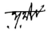

# Declaration

I do herewith declare that this thesis entifled 'RUPASIDDHI: 
A study of some aspects.' is an original work prepared by me under the supervision of Dr. J. R. Joshi. I also declare that this was not submitted for the degree of Ph.D. or any other degree in this or any other form. 

Date -17^4-M i T p^5 . *J^/^C HIN^N ^^* 
* [10] A. A. K. K.  
(Phramaha Sripom Rachiwong) 

  **Acknowledgement**  I would like to thank my supervisor, for his help and guidance. I would like to thank my supervisor, for his help and guidance.  
Head of the Dept. of Supervisor 
POONA-411007. 

Sanskrit and Prakrit Languages. °'" ^- "• JOSHi 
° ° READER. 

^<ipl. **Of Skt. & Pk, , "** 
HcadoftheDepartmcm '^"'^'''^ity of Poona.' "°**' 
of S:i!r.''.rii isnd 