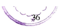
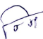

# रूपसिद्धियं नामकण्डो ।

अथ नामिकविभत्यवतारो वुच्चते ।
अत्थाभिमुखं नमनतो अत्तनि चत्थस्स नामनतो नामं; दब्बाभिधानं । तं पन दुविधं अन्वत्थरूव्व्हिवसेन, तिविधं
पुमित्थीनपुंसकलिङ्गवसेन; यथा - रुक्खो, माला, धनं ।
चतुब्बिधं सामञ्ञगुणकिरियायदिच्छावसेन; यथा - रुक्खो, नीलो, पाचको सिरिवड्ढोति आदि।
अट्ठविधं अवण्णिवण्णुवण्णोकारनिग्गहितन्तपकतिभेदेन । तत्थ पठमं अकारन्तम्हा पुल्लिङ्गा जातिनिमित्ता
पुरिससद्दा स्यादिविभत्तियो परा योजियन्ते ।
( ६०) जिनवचनयुत्तं हि ।
अधिकारोयं; तत्थ पञ्चमारे जित्वाति जिनो; बुद्धो । जिनस्स वचनं जिनवचनं । तस्स जिनवचनस्स युत्तं
जिनवचनयुत्तं; तेपिटकस्स बुद्धवचनस्स मागधिकाय सभावनिरुत्तिया युत्तं अनुरूपमेवाति इदं अधिकारत्तं वेदितब्बं ।
सा मागधी मूलभासा;
नरा यायादिकप्पिका,
ब्रह्मानो, चस्सुतालापा,
सम्बुद्धा चापि भासरे ।
अधिकारो पन तिविधो सीहगतिकमण्डूकगतिक यथानुपुब्बिकवसेन । अयम्पन सीहगतिको पुब्बापरलोकनतो,
यथानुपुब्बिकोयेव वा । सक्कतविसदिसं कत्वा जिनवचनानुरूपतो पकतिट्ठपनत्थं परिभासमाह ।

## (६१) लिङ्गञ्च निपच्चते ।'

लिङ्गं पाटिपदिकं; यथा यथा जिनवचनय्तं हि लिङ्गं, तथा तथा इध लिङ्गञ् निपच्चते ठपीयति । चसद्देन धातवो चाति, जिनवचनानुरूपतो पुरिस इति लिङ्गे' ठपिते; ततो तस्स धातुप्पच्चयविभत्तिवजितस्स अत्थवतो सदृस्स परसमञ्ञा पयोगेति परिभासतो लिङ्गसञ्ञायं ।
इतो परं विभत्तिप्पच्वयादिविधाने सब्बत्थ लिङ्गग्गहणमनुवत्तते ।
(६२) ततो च विभत्तियो ।
तो जिनवचनयुत्तेहि लिङ्गेहि परा विभत्तियो होन्ति । चसद्दग्गहणेन तवेतूनादिपच्चयन्तनिपाततोपि ।
कम्मादिवसेन च एकत्तादिवसेन च लिङ्गत्थं विभजन्तीति विभत्तियो । का च पन ता विभत्तियो ?। विभत्तियोति
अधिकारो ।
१. निपज्जते-म     २. पोराणपोत्थके प्रिसइत्थीलिङ्गे इति दिस्सति ।

## (६३) सियो अंयो नाहि सनं स्माहि सनं स्मिंसु ।

स्यादयो द्विसत्त विभतियो नाम होन्ति तत्थ: सि यो इति पठमा, अंयो इति दुतिया, ना हि इति ततिया, स नं इति
चतुत्थी, स्मा हि इति पञ्चमी, स नं इति छट्टी, स्मिं सु इति सत्तमी।
इदम्पन सञ्ञाधिकारपरिभासाविधिसुत्तेसु सञ्ञासुत्तन्ति दट्ठब्बं. वुत्त हि वुत्तियं विभत्ति इच्वनेन कत्थो ?

अम्हस्स ममं सविभत्तिस्स सेति । इतरथा पुरिमसुत्तेन एकयोगो कातब्बोति; एत्थ च पठमादिवोहारो एकवचनादिवोहारो
च अन्वत्थवसेन परसमञ्ञावसेन वा सिद्धोति वेदितब्बो ।
एकस्स वचनं एकवचनं, बहन्नं वचनं बहुवचनं, द्विनं पूरणी दुतियाति आदि। इतरथा पुरिमसुत्ते चसद्देन सञ्ञाकरणे अप्पकतनिरत्थकविधिप्पसङ्गो सिया । जिनवचनयुत्तं हि, लिङ्गञ् निपच्चतेति च वत्तते । इध पन पदनिप्फादनम्पि जिनवचनस्साविरोधेनाति ञापेतुंपरिभासन्तरमाह।

## (६४) तदनुपरोधेन ।

 यथा यथा तेसं जिन वचनानं उपरोधो न होति, तथा तथा इध लिङ्गं चसद्देनाख्यातञ्च निपच्वते निप्फादियतीति
अत्थो । तेनेव इध च आख्याते च द्विवचनाग्गहणं सक्कतविसदिसतो विभत्तिप्पच्चयादिविधानञ् कतन्ति दट्ठब्बं ।
त्थ अविसेसेन सब्बस्यादिविभत्तिप्पसङ्गे सति वत्तिच्छानुपुब्बिका सद्दप्पवत्तीति वत्तिच्छावसा ।
(६५) लिङ्गत्थे पठमा ।
लिङ्गत्थाभिधानमत्ते पठमाविभत्ति होतीति पठमा । तत्थापि अनियमेनेकवचनबहुवचनप्पसङ्गे एकम्हि वत्तब्बे
एकवचनन्ति परिभासतो लिङ्गत्थस्सेकत्तवचनिच्छायं पठमेकवचनं - सि । अतो नेनाति इतो अतोति वत्तते,
लिङगग्गहणञ्च ।

## (45)

स ओ इति द्विपदमिदं । लिङ्गस्स अकारतो परस्स सिवचनस्स ओकारो होति ।
स्तेस्त हि पठमानिद्दिट्ठस्स कारियिनो छट्ठिविपरिणामेन विवरणं आदेसापेक्खन्ति दट्ठब्बं ।
एत्थ च: सीति विभत्ति गय्हते विभत्तिविधिप्पकरणतो, ततो च विभत्तियोति इतो विभत्तिग्गहणानुवत्तनतो वा; एवं
सब्बत्थ स्यादीनं कारियविधाने विभत्तिनमेवाति' दट्ठब्बं ।
'वा परो असरूपा'ति परलोपे सम्पत्ते तदपवादेन पुब्बलोपमाह।
(६७) सरलोपो अमादेसप्पच्चयादिम्हि सरलोपे तु पकति ।
पुब्बसरस्स लोपो होति अंवचने आदेसप्पच्चयादिभूते च सरे परे, सरलोपे कते तु परसरस्स पकतिभावो होति ।
 एत्थं च: सरलोपेति पनग्गहणं इमिनाव कतसरलोपनिमित्तेयेव परसरविकारे सम्पत्ते पकतिभावत्यं । परसरस्स पकतिभावविधानसामत्थियतो अमादेसप्पच्वयादिभूते सरे परेति सिद्धं ।

| त्यादिविभत्तियो चेत्थ   | पच्चयत्तेन गय्हो   |
|----------------|---------------|
| आदिग्गहणमाख्यात     | कितादीस्वागमत्थिदं    |
| चादेसो पकतीपरो      |               |
| पच्वयसाहचरिया      |               |
| पदन्तसरलोपो न     | तेनबभाहादिके परे ।  |

तुग्गहणं भिक्खुनिआदीसु सरलोपनिवत्तनत्थं । 'नये परं युत्ते'ति परं नेतब्बं । पुरिसो तिइति ।
पुरिसो च पुरिसो चाति पुरिसा । पुरिसाति वत्तब्बे-
(६८) सरूपानमेकसेस्वसकिं ।
सरूपानं समानरूपानं पदब्यञ्नननं मज्झे एकोवसिस्सते, अञ्ञे लोपमापज्जन्ते । असकिन्ति एकसेसो । एत्थ च:
प्नासकिग्गहणं एकविभत्तिविसयानमेवासकिम्पयोगे एवायन्ति दस्सनत्थं । न च विच्छापयोगेतिप्पसङ्गो । 'वग्गा पञ्चपञ्चसो मन्ता'ति एत्थ पञ्चपञ्चसोति निद्देसेनेव विच्छाप्पयोगे सिद्धिया ञापितत्ता, अथवा
सहवचनिच्छायमयमेकसेसो ।
योगविभागतो चेत्थ
  
वा पितूनन्ति आदिस् ।
विरूपेकसेसो होति
तथेव' लिङ्गत्थस्स बहुत्तवचनिच्छायं बहुम्हि वत्तब्बे बहुवचनन्ति पठमाबहुवचनं - यो । पुरिस - यो इतीध । अतो
चाति पवत्तते।

## (६९) सब्बयोनीनमाए ।

अकारन्ततो लिइगम्हा परेस सब्बेस पठमायोनीन दुतियायोनिनञ्च यथाक्कमं आकारेकारादेसा होन्ति वाति आकारो ।
सब्बग्गहणं सब्बादेसत्थं । सरलोपादि पुरिमसदिसमेव । पुरिसा तिड्ठन्ति ।
 वा इच्वेव । रूपा रूपानि, अग्गयो मुनयो । वासद्दोयं ववत्थितविभासत्थो: तेन चेत्थ निच्चमेव च पुल्लिङ्गे,
अनिच्च्च नपंसके
विधिं दीपेति वासुति ।
असन्तज्झेकतते तु
तथेवालपनवचनिच्छायं लिङ्गत्थे पठमाति पवत्तते ।
(७०) आलपने च ।
अभिमुखं कत्वा लपनं आलपनं; सम्बोधनं, तस्मिं आलपनत्थाधिके लिइगत्थाभिधानमत्ते च पठमाविभत्ति होति।
पुरे विय एकवचनादि। पुरिस - सि इच्चत्र -
(७१)आलपने सि गसञ्ञो ।
आलपनत्थे विहितो सि गसञ्ञो होतीति गसञ्ञायं । भो गे तूति इतो गेति वत्तते ।
(७२) अकारपिताद्यन्तानमा ।
लिङ्गस्स सम्बन्धी अकारो च पित्सत्थ् इच्चेवमादीनमन्तो च आकारत्तमापज्ञते गे परे ।
गे रस्समीति पवत्तते ।
(७३) आकारो वा ।
लिइगस्स सम्बन्धी आकारो रस्समापज्जते गे परे विकप्पेन । अद्ररडस्सालपनेवायं ।
(७४) सेसतो लोपं गसिपि ।
सस इच्वेते लोपमापज्ञन्ते । अपिग्गहणं दुतियत्थसम्पिण्डनत्थं । एत्थ च: सतिपि सिग्गहणे ग इति वचनमेव ञपकमञ्ञत्थापि सिग्गहणे आलपनाग्गहणस्स । केचि आलपनाभिब्यत्तिया भवन्तसद्दं वा हेसद्दं वा प्युज्जन्ते । भो
पुरिस तिड्ड, भो पुरिसा वा । बहुवचने न विसेसो: भवन्तो पुरिसा तिड्डथ । तथेव कम्मत्थवचनिच्छायं वाति वत्तते ।
(७५) यं करोति तं कम्मं ।
यं वा करोति, यं वा विकरोति, यं वा पापुणाति; तं कारकं किरियानिमित्तं कम्मसञ्ञं होति।
(७६) कम्मत्थे दृतिया ।
कम्मत्थे दुतियाविभत्ति होति। पुरे विय दुतियेकवचनं - अं । सरलोपोति आदिना सरे लुत्ते दीघन्ति दीघे सम्पत्ते
पकतिभावो च । पुरिसं पस्स । बहुवचने सब्बयोनीनमाएति योवचनस्सेकारो । पुरिसे पस्स । तथेव कत्तुवचनिच्छायं-
(७७) यो करोति स कत्ता ।
यो अत्तप्पधानो किरियं करोति, सो कत्तुसञ्ञो होति । ततियाति वत्तते ।
(७८) कत्तरि च ।
कत्तरि च ततियाविभत्ति होतीति। ततियेकवचनं - ना ।
(७९) अतो नेन ।
 एनाति अविभत्तिकनिद्देसो, अकारन्ततो लिङ्गम्हा परस्स नावचनस्स एनादेसो होति । सरलोपादि । पुरिसेन कतं ।
बहुवचनम्हि-
(८०) सुहिस्वाकारो ए I
स हि इच्वेतेस विभत्तिरूपेस परेस लिइगस्स सम्बन्धी अकारो एत्तमापज्जते ।
(८१) स्माहिस्मिंनं म्हाभिम्हि वा ।
 सब्बतो लिङ्गम्हा स्माहिस्मिं इच्वेतेसं यथाक्कमं म्हाभिम्हि इच्वेते आदेसा होन्ति वा ।पुरिसेभि, पुरिसेहि कतं।
तथेव करणवचनिच्छायं-
(८२) येन वा करियते तं करणं ।
ये वा करियते, येन वा पस्सति, येन वा सुणाति; तं कारकं करणसञ्ञं होति।
(८३) करणे ततिया ।
करणकारके ततियाविभत्ति होति । सेसं कत्तुसमं । आविडेन पुरिसेन सो पुञ्ञं करोति । पुरिसेभि पुरिसेहि ।  .

तथेव सम्पदानवचनिच्छायं-
(८४) यस्स दातुकामो रोचते धारयते वा तं सम्पदानं ।
यस्स वा दातुकामो, यस्स वा रोचते, यस्स वा धारयते; तं कारकं सम्पदानञ्ञं होति ।
(८५) सम्पदाने चतुत्थी ।

## ( ८६) सागमो से ।

सब्बतो लिइगम्हा सकारागमो होति से विभत्तिम्हि परे । पुरिससस धनं ददाति । बहुवचनम्हि - दीघन्ति वत्तते।
( ८७) सुनंहिसु च ।
स नं हि इच्वेतेसु परेसु लिङ्गस्स अन्तभूता सब्वे रस्ससरा दीघमापजन्ते, चग्गहणमिकारुकारानं क्वचि निवत्ततनत्थं ।
पुरिसानं । तथेवापादानवचनिच्छायं  -
(८८) यस्मादपेति भयमादत्ते वा तदपादानं ।
यस्मा वा अवधिभूता अपेति, यस्मा वा भयं, यस्मा वा आदत्ते; तं कारकं अपादानसञ्ञं होति ।
(८९) अपादाने पञ्चमी।
अपादानकारके पञ्चमीविभत्ति होति । पञ्चमिया एकवचनं - स्मा । अतो सब्बेसं आएति पवत्तते ।
(९०) स्मास्मिंनं वा ।
अकारन्ततो लिङ्गम्हा सब्बेसं समास्मिं इच्चेतेसं यथाक्कमं आकारेकारादेसा होन्ति वा, अञ्ञत्थ म्हादेसो । पुरिसा
अपेति, पुरिसम्हा पुरिसम्मा । बहुवचने सब्बत्थ ततियासमं, हिस्स भिआदेसो होति । पुरिसेभि पुरिसेहि अपेति । तथेव सामिवचनच्छायं -
(११) यस्स वा परिग्गहो तं सामि ।
यस्स वा परिग्गहो तं सामिसञ्ञं होति ।
(९२) सामिस्मिं छट्ठी ।
सामिस्मिं छड्डीविभत्ति होति । ठपेत्वा आयादेसं सब्बत्थ चतुत्थीछड्डीनं समानं रूपं । पुरिसस एतं धनं, पुरिसानं।
तथेव ओकासवचनिच्छायं -
(९३) योधारो तमोकासं ।
यो कत्तकम्मानं किरियाय आधारो, तं कारकं ओकाससञ्ञं होति।
(९४) ओकासे सत्तमी ।
ओकासकारके सत्तमीविभत्ति होति । सत्तमिया एकवचनं - स्मिं । तस्स स्मास्मिनं वाति एकारो, म्हिकारादेसो च ।
पुरिसे पतिडितं, पुरिसम्हि पुरिसस्मिं । बहुवचने सुहिस्वाकारो एति एकारो । पुरिसेसु ।
पुरिसो, पुरिसा; भो पुरिस भो पुरिसा वा, भवन्तो पुरिसा; पुरिसं, पुरिसे; पुरिसेन, पुरिसेभि पुरिसेहि; पुरिसस्स, पुरिसानं; पुरिसा पुरिसम्हा पुरिसस्मा, पुरिसेभि पुरिसेहि; पुरिसस्स, पुरिसानं, पुरिसे पुरिसम्हि पुरिसस्मिं, पुरिसेसु ।
तथा सुगतो, सुगता; भो सुगत भो सुगता वा, भवन्तो सुगता; सगुतं, सुगते; सुगतेन, सुगतेभि सुगतेहि; सुगतस्स, सगतानं; सुगता सुगतम्हा सुगतस्मा, सुगतेभि सुगतेहि; सुगतस्स सुगतानं; सुगते सुगतम्हि सुगतस्मिं, सुगतेसु।
एवं - सुरासुरनरोरगनागयक्खा,
गन्धब्बकिन्नरमनुस्सपिसाचपेता,
आलोक लोक निलयानिल चागयोगा, वायामगामनिगमागमधम्मकामा,
संघोघघोसपटिघासवकोधलोभा,
सारम्भधम्भमदमानपमादमकखा,
पुन्नागपूगपनसासनचम्पकम्बा,
 हिन्तालतालबकुलज्जुनकिंसुका च, मन्दारकुन्दपुचिमन्दकरञ्जरुक्खा,
ञेय्या मयूरसकुणणडजकिञ्चहंसा
इच्वादयोपि। 'मनोगणादिस्स तु ना स स्मा स्मिंसु विसेसो। अञ्ञत्थ पुरिससमं ।
मनो, मना; हे मन हे मना वा, भवन्तो मना; मनं, मने। वाति वत्तते।
(९५) मनोगणादितो स्मिंनानमिआ।
मनोप्पभुतिगणो मनोगणो: मनोगणादितो स्मिंना इच्वेतेसं यथाक्कमं इकाराकारादेसा होन्ति वा । आदिग्गहणेन बिलपदादितोपि । मनागणदितोति वत्तते ।

## (९६) स सरे वागमो ।

एतेहेव मनोगणादीहि सरे परे सागमो होति वा । मनसा मनेन । ववत्थितविभासत्थोयं वासद्दो । तेन मनो मना मनं
मने मनआयतनन्ति आदीसु न होति। मानसिकं चेतसिकन्ति आदीसु निच्वं। मनेभि मनेहि। वाति' वत्तते ।
(९७) ससस चो ।
मनोगणादितो परस्स सस्स विभत्तिस्स ओकारो होति वा, सागमो । मनसो मनस्स, मनानं; मना मनम्हा मनस्मा,
मनेभि मनेहि, मनसो मनस्स, मनानं, मनसि मने मनम्हि मनस्मिं, मनेसु ।
एवं वचो वयो तेजो, 
तपो चेतो तमो यसो,
अयो पयो सिरो छन्दो,             सरो रहो अहोइच्वादि मनोगणो ।
गुणवन्तुसद्दस्स भेदो गुणवन्तु - सि इतीध । सविभत्तिस्स न्तुस्सन्तो, सब्बस्सेव न्तुस्साति च अधिकारो ।
(९८) आ सिम्हि।
सब्बस्सेव न्तुपच्चयस्स सविभत्तिस्स आआदेसो होति सिम्हि विभत्तिम्हि। गुणवा ।
ं योम्हि पठमे सीहगतिया वाति पवत्तते ।
(९९) न्तुस्सन्तो ।
सब्बस्सेव न्तपच्वयस्स सविभत्तिस्स न्तोआदेसो होति वा योम्हि पठमे । ग्णवन्तो तिड्डन्ति । सनंहिसुति अत्तन्ति पवत्तते ।
(१००) न्तुस्सन्तो योसु च ।

न्तुपच्चयस्स अन्तो उकारो अत्तमापज्जते सुनंहियो इच्वेतेसु । चग्गहणेन अञ्ञेसु अं ना स्मा स्मिंसु च गुणवन्ता,
छड्डिया सिद्धेपि अन्तादेसे पुन अन्तग्गहणकरणतो योनं इकारो च कचि गुणवन्ति । अमीति वत्तते ।
(१०१) अवण्णा च गे ।
सब्बस्सेव न्तुपच्चयस्स सविभत्तिस्स अं अ आ आदेसा होन्ति गे परे । भो गुणवं भो गुणवा, भवन्तो
गुणवन्तो गुणवन्ता, गुणवन्तं, गुणवन्ते । वाति वत्तते ।

## (१०२) तोतिता सस्मिंनासु ।

सब्बस्सेव न्तुपच्चयस्स सविभत्तिस्स तोतिता आदेसा होन्ति वा सस्मिंना इच्चेतेसु यथासङ्ख्यं । गुणवता गुणवन्ते
गुणवन्तेभि गुणवन्तेहि।
(१०३) न्तुस्स से वा ।
सब्बस्सेव न्तुपच्चयस्स सविभतिस्स न्तस्स इच्वयमादेसो होति वा से विभत्तिम्हि। गुणवन्तस्स गुणवतो ।
(१०४) नंम्हि तं वा ।
सब्बस्सेव न्तुपच्चयस्स सविभत्तिस्स तंआदेसो होति वा नंम्हि विभत्तिम्हि। गुणवतं गुणवन्तानं ।
अम्हतुम्हन्तु इच्चादिना स्मावचनस्स नाव्यपदेसो । गुणवता गुणवन्ता गुणवन्तम्हा गुणवन्तस्मा, गुणवन्तेभि
गुणवन्तेहि; गुणवन्तस्स गुणवतो, गुणवतं गुणवन्तानं; गुणवति गुणवन्ते गुणवन्तम्हि गुणवन्तस्मिं, गुणवन्तेसु । एवं गणवा, कुलवा, फलवा, यसवा, धनवा, सुतवा, चागवा, हिमवा, बलवा, सीलवा, पञ्ञवा इच्वादयो ।
हिमवन्तुसद्दतो सिम्हि कते - अत्तं न्तुस्सन्तोति पवत्तते ।

## (१०५) सिम्हि वा ।

न्तुपच्चयस्स अन्तो अत्तं होति वा सिम्हि विभत्तिम्हि-इति अत्तं । हिमवन्तो, हिमवा । सेसं गुणवन्तुसमं ।
पुन वाग्गहणकरणं हिमवन्तुसद्दतो अञ्ञत्र अत्तनिसेधनतथं, ववत्थितविभासत्थोयं वासद्दो, तेन गुणवन्तादीसु
नातिप्पसङ्गो । एवं सतिमा, धितिमा, गतिमा, मतिमा, मुत्तिमा, जुतिमा, सिरिमा, हिरिमा, थुतिमा, रतिमा, यतिमा, सुचिमा, कलिमा, बलिमा, कसिमा, रुचिमा, बुद्धिमा, चक्खुमा, बन्धुमा, हेतुमा, सेतुमा, केतुमा, राहुमा,
भाणुमा, खाणुमा, विज्जुमा इच्चादयो । तत्थ सतिमन्तुबन्धुमन्तुसद्दानं अंसेसु रूपभेदो । अत्तं न्तुस्साति पवत्तते ।

## (१०६) सब्बस्स वा अंसेसु ।

सब्बस्सेव न्तुपच्चयस्स अत्तं होति वा अंस इच्वेतेसु । इधापि वासद्दस्स ववत्थितविभासत्ता नातिप्पसङ्गो । सतिमं
सतिमन्तं, बन्धुमं बन्धुमन्तं, सतिमस्स सतिमतो सतिमन्तस्स, बन्धुमस्स बन्धुमतो बन्धुमन्तस्स । सेसं समं ।
गच्छन्तसद्दस्स भेदो; गच्छन्त-सि । वाति वत्तते ।

## (१०७) सिम्हि गच्छन्तादीनं न्तसद्दो अं ।

गच्छन्त इच्चेवमादीनं अन्तप्पच्वयन्तानं न्तसद्दो अं रूपं आपज्ञते वा सिम्हि विभत्तिम्हि। सरलोपसिलोपो । सो
गच्छं गच्छन्तो वा गण्हाति। गच्छन्तादीनं न्तसद्दोति पवत्तमाने-
ते गच्छन्तो गच्छन्ता; भो गच्छं भो गच्छ भो गच्छा, भवन्तो गच्छन्तो गच्छन्ता; (गच्छं) गच्छन्तं, गच्छन्ते;
गच्छता गच्छन्तेन, गच्छन्तेभि गच्छन्तेहि; गच्छतो गच्छन्तस्स, गच्छता गच्छन्तानं; गच्छता गच्छन्तम्हा गच्छन्तस्म गच्छन्तेभि गच्छन्तेहि; गच्छते गच्छन्तस्स, गच्छतं गच्छन्तानं; गच्छति गच्छन्तम्हि गच्छन्तस्मिं, गच्छन्तेह एवं महं चरं तिड्डं,
दद भुज्ज सुणं पचं,
जयं जीरं वचं मीयं,
भवन्तसद्दस्स ग यो ना स वचनेसु विसेसो। सो भवं । भवतोति वत्तते --
(१०९) ओभावो क्वचि योस् वकारस्स ।
भवन्त इच्वेतस्स वकारस्स ओभावो होति कचि यो इच्वेतेसु । ते भोन्तो भवन्तो भवन्ता ।
भवतोति पवत्तते ।
(११०) भो गे तु ।
सब्बस्सेव भवन्तसद्दस्स भोआदेसो होति गे परे । तुसद्दग्गहणेन भन्ते भोन्तादि च । गलोपो । भो भन्ते भोन्त भोन्ता
भोन्तो भवन्तो भवन्ता; भवन्तं, भोन्ते भवन्ते । नासेसु ओभावी कचीति योगविभागेन ओभावो । भोता भवता भवन्तेन भोतो भवतो भवन्तस्स इच्वादि ।
(१११) भदन्तस्स भद्दन्त भन्ते ।
सब्बस्सेव भदन्तसद्दस्स भद्दन्त भन्ते इच्वेते आदेसा होन्ति कचि गे परे योस् च । भो भदन्त भन्ते भदन्त भदन्ता वा
इच्वादि पुरिसद्दसमं ।
(११२) सन्तसद्दस्स सो भे बो चन्ते ।
सब्बस्सेव सन्तसद्दस्स ससद्दादेसो होति भकारे परे अन्ते च बकारागमो होति । चसद्दग्गहणेन अभकारेपि समासे कचि सादेसो । सब्भि । भेति किं ? सन्तेहि । सेसं गच्छन्तसद्दसमं । अत्थि राजब्रह्मअत्तसखसद्दादीनं भेदो I तथेव स्यादुप्पत्ति, राज-सि इति ठिते- ब्रह्मत्तसखराजादितोति अधिकारो ।
( $ $ ) 
ब्रह्म अत्त सख राजइच्चेवमादितो सिवचनस्स आकारो होति। आदिसद्देन आतुमादिसद्दता च । सरलोपादि । राजा
तिष्ठति ।

## (११४) योनमानो ।

ब्रह्मत्तसखराजादितो योनं आनोआदेसो होति। राजानो तिइन्ति; भो राज भो राजा, भवन्तो राजानो। वाति वत्तते ।
(११५) ब्रह्मत्तसखराजादितो अमानं ।
ब्रह्मादीहि परस्स अंवचनस्स आनं होति वा । राजानं पस्स राजं वा, राजानो ।
सविभत्तिस्स राजस्साति पवत्तते ।

## (११७) राजस्स राजू सुनंहिसु च ।

सब्वस्स राजसद्दस्स राजूआदेसो होति स्ननंहि इच्वेतेस्न वचनेस्न। चसद्दो विकप्पनत्थो । स्ननंहिस्न चाति दीघो । राजू
राजूहि राजेभि राजेहि वा । सविभत्तिस्साति अधिकारो ।
(११८) राजस्स रञ्ञोराजिनो से ।
सब्बस्सेव राजसद्दस्स सविभत्तिस्स रञ्जोराजिनो इच्चेते आदेसा होन्ति से विभत्तिम्हि। रञ्ञो राजिनो देहि।
राजस्साति पवत्तते ।

## (११९) रञ्ञं नंम्हि वा ।

मब्बस्सेव राजसद्दस्स सविभत्तिस्स रञ्ञंआदेसो होति वा नंम्हि विभत्तिम्हि । रञ्ञं राजूनं राजानं ।
प पप्रमियं-
(१२०) अम्हतुम्हन्तुराजब्रह्मतसखसत्थु-

## -पितादीहि स्मा नाव ।

अम्हतम्हन्तुराजब्रह्मत्तसखसत्धुपितु इच्वेवमादीहि स्मावचनं ना इव दट्टब्बन्ति स्मावचनस्स नाब्यपदेसो । अतिदेसो
पन छब्बिधो ।'
वुत्तञ्चब्यपदेसो निमित्तञ्च तं रूपं तंसभावता
स्तत्त्त्त्वेव तथा कारि - 
त्रायं ब्रह्मत्तसखादीसु पाठसामत्थियतो रूपातिदेसो । सेसं ततियासमं । रञ्ञा अपेति, राजूभि राजूहि राजेभि
राजेहि; रञ्ञो राजिनो सन्तकं, रञ्ञं राजूनं राजानं । राजस्साति वत्तते ।
(१२१) स्मिंम्हि रञ्जे राजिनि !

सब्बस्सेव राजसद्दस्स सविभत्तिस्स रव्वे राजिनि इच्वेते आदेसा होन्ति स्मिंम्हि विभत्तिम्हि। रव्वे राजिनि पतिड्डितं,
राजूसु, राजेसु । ब्रह्मसद्दस्स च ग ना स स्मिंसु विसेसो । ब्रह्मा, ब्रह्मानो । आलपने च - एति वत्तते ।
(१२२) ब्रह्मतो गस्स च ।
ब्रह्मसद्दतो गस्स च एकारो होति। चसद्दग्गहणं एग्गहणानुकठढनत्थं। भो ब्रह्मे भवन्तो ब्रह्मानो; ब्रह्मानं ब्रह्म ब्रह्मानो । विपरिणामेन ब्रह्मस्स अन्तोति पवत्तते । .

(१२३) उत्तं सनासु ।
 ब्रह्मसद्दस्स अन्तो उत्तमापज्जते सना इच्वेतेस् वचनेस् । उत्तमीति भावनिद्देसो कत्थचि अभावदस्सनत्थो । बह्मना
ब्रह्मेभि ब्रह्मेहि । सस्मिं उत्ते कते, इवण्णुवण्णा झलाति झलसञ्ञायं-
(१२४) झलतो सस्स नो वा ।
उत्तमीति योगविभागेन अञ्ञत्थापि उत्तं ।
पञ्चमियं नाभावातिदेसो । ब्रह्मना, ब्रह्मेभि ब्रह्मेहि; ब्रह्मनो ब्रह्मस्स, ब्रह्मानं ब्रह्मनं वा ।
(१२५) ब्रह्मतो तु स्मिं नि ।
ब्रह्यसद्दतो स्मिंवचनस्स नि होति । त्सद्देन कम्मचम्ममुद्धादितो च कचि । ब्रह्यनि, ब्रह्येस् । अत्तसद्दस्स तियादीस्वेव विसेसो । अत्ता, अत्तानो, भो अत्त भो अत्ता, भवन्तो अत्तानो; अत्तानं अत्तं, अत्तानो । नाम्हि अ कम्मन्तस्स चाति एत्थ चसद्देन अत्तन्तस्स अत्तं वा । अत्तना अत्तेन वा ।
(१२६) अत्तन्तो हिस्मिंमनत्तं ।
अत्तसद्दस्स अन्तो अनत्तमापज्जते हिस्मिं परे । अत्तनेभि अत्तनेहि । ततो अत्ततोति पवत्तते ।
(१२७) सस नो ।
तो अत्तसद्दतो ससस विभत्तिस्स नो होति। अत्तनो, अत्तानं।
(१२८) स्मा ना ।
तो अत्तसदृतो स्मावचनस्स ना होति। अत्तना अपेति। नाभावातिदेसेनेव सिद्धेपि उत्तरसुत्तेन एकयोगमकत्वा
भिन्नयोगकरणं अत्थन्तरविञ्ञापनत्थं । तेन अत्तन्ततकारस्स रकारो जकारे कचि । अत्रजो अत्तजो वा । अत्तनेभि
अत्तनेहि; अत्तनो, अत्तानं। अत्ततोति वत्तते ।
(१२९) ततो स्मिं नि ।
तो अत्तसद्दतो स्मिंवचनस्स नि होति । अत्तनि, अत्तनेस् । सखसद्दस्स भेदो । सखा सखानो । योनमीति वत्तते ।
(१३०) सखतो चायोनो ।
सद्दतो योनं आयोनोआदेसा च होन्ति। सखायो ।
(१३१) सखन्तस्सि नोनानंसेसु ।
ससद्दन्तस्स इकारादेसो होति नोनानंस इच्वेतेसु परेसु । सखिनो तिडन्ति । आलपने गसञ्ञायं-
(१३२) सखतो गस्से वा ।
सखतो गस्स अकारआकार इकारईकारएकारादेसा होन्ति । वासद्देन पन अञ्ञस्मापि कचि एकारो । यथा - भद्दन्ते
इसेति आदि। अ च आ च इ च ई च ए चातिपि ए, पुब्बसरानं कमेन लोपो । भो सख भो सखा भो सखि भो सखी भो
सखे, भवन्तो सखानो सखायो सखिनो ।
सखन्तस्स आरो चाति पवत्तते ।
(१३३) सुनमंसु वा ।
सखन्तस्स आरो होति वा सुनंअं इच्चेतेसु पेसु । सखारं सखानं सखं, सखानो सखायो सखिनो; सखिना ।
सखन्तस्साति वत्तते ।
(१३४) आरो हिम्हि वा ।

Th.9312-
$${\mathcal{A}}()$$
वाति नो । सखिनो सखिस्स, सखारानं सखीनं । स्मावचनस्स नाभावो । सखिना, सखारेभि सखारेहि सखेभि सखेहि, सखिनो सखिस्स, सखारानं सखीनं । सखतोति वत्तते ।
( $ $ ) 
सस अत्तसद्दस्सेव रूपनयो । आतुमा, आतुमानो, भो आतुम भो आतुमा, भवन्तो आतुमानो, आतुमानं आतुमं, आतुमानो;
आतुमेन इच्वादि पुरिससमं । पुमसद्दस्स भेदो । पुम-सि- सविभत्तिस्साति अधिकारो ।
(१३६) पुमन्तस्सा सिम्हि।
पुमसद्दन्तस्स सविभत्तिस्स आकारादेसो होति सिम्हि विभत्तिम्हि। अन्तग्गहणेन मघवयुवादीनमन्तस्स च । पुमा ।
पुमन्तस्साति च अधिकारो ।
( $ 3 )  योस्वानो 
पुमन्तस्स सविभत्तिस्स आ नो आदेसो होति योसु विभत्तीसु । पुमानो ।
(१३८) अमालपनेकवचने ।
पुमन्तस्स सविभत्तिस्स अं होति आलपनेकवचने परे । हे पुमं, हे पुमानो; पुमं, पुमानो । आति वत्तते ।
(१३९) उ नाम्हि च ।
पमन्तस्स च आ उ आदेसा होन्ति वा नाम्हि विभत्तिम्हि । चसद्देन पुमकम्मथामन्तस्स चुकारो वा सस्मास् । पुमाना
पुमुना पुमेन वा । आनेति वत्तते ।
(१४०) हिविभत्तिम्हि च ।
पुमन्तस्स हिविभत्तिम्हि च आनेआदेसो होति । विभत्तिम्गहणं सविभत्तिम्गहणनिवत्तनत्थं । पुमानेभि पुमानेहि ।
 चसद्देन युवमघवादीनमन्तस्स च आनादेसो होति सब्बासु विभत्तीसु । उ नाम्हि चाति एत्थ चसद्देन पुमन्तस्सुकारो वा
समासु विभत्तीसु । झलतो सस्स नो वाति नो । पुमुनो पुमुस्स, पुमानं । स्मा नाति वत्तते ।
( १४१) झ लतो च ।
झल इच्वेतेहि स्मावचनस्स ना होति । चग्गहणं क्कचि निवत्तनत्थं । पुमाना पुमुना पुमा पुमम्हा पुमस्मा, पुमानेभि
पुमानेहि पुमेभि पुमेहि; पुमुनो पुमस्स पुमानं ।
s the s Th. 9312-
(१४२) आने स्मिंम्हि वा ।
पुमन्तस्स सविभत्तिस्स आनेआदेसो होति वा स्मिंम्हि विभत्तिम्हि। पुमाने पुमे पुमम्हि पुमस्मिं।
( १४३) सुस्मिमा वा ।
पमन्तस्स सु इच्चेतस्मिं विभत्तिम्हि परे आआदेसो होति वा । पुमासु पुमेसु । युवादीसु, युव-सि इतीध । पुमन्तस्सा
सम्हीति एत्थ अन्तग्गहणेन आकारो । हिविभत्तिम्हि चाति सुत्ते चसद्देन आनादेसो च । युवा, युवानो युवाना युवा; हे
युव हे युवा हे युवान हे युवाना, भवन्तो युवाना; युवानं युवं, युवाने युवे । अ कम्मन्तस्स चाति एत्थ चमहेन युवानानं युवानं; युवाने युवानम्हि युवानस्मिं युवे युवम्हि युवस्मिं युवानेसु युवासु युवेसु । एवं मघवा, मघवानो मघवाना
इच्वादि युवसद्दसमं ।
अकारन्तं ।
आकारन्तो पुल्लिङ्गो सा सद्दो । सा-सि, सिलोपो, सासुनखो । बहुवचने-
(१४४) अघो रस्समेकवचनयोस्वपि च ।
घसञ्जकआकारवजितो लिइगस्सन्तो सरो रस्समापज्ञते एकवचनेसु योसु च पोसूति रस्सत्तं । अपिग्गहणं सिम्हि
 निवत्तनत्थं । सेसं नेय्यं । सा तिडन्ति; हे स हे सा, हे सा; सं, से; सेन, साभि साहि; सस्स साय, सानं; सा सम्हा सस्मा, साभि साहि; सस्स, सानं, से सम्हि सस्मिं, सासु । एवं पच्वक्खधम्मा गण्डीवधन्वापमुतयो ।
आकारन्तं ।
इकारन्तो पुल्लिङ्गो अग्गिसद्दो । स्यादुप्पत्ति । अग्गि - सि अन्तो सिम्हि वाति पवत्तते ।
(१४५) अग्गिस्सिनि ।
अग्गिस्स अन्तो इनि होति वा सिम्हि विभत्तिम्हि । सेसतो लोपं गसिपीति सिलोपो । अग्गिनि अग्गि ।
बहुवचने - इवण्णुवण्णा झलाति झलसञ्ञायं । झलतो वाति पवत्तते ।
(१४६) घपतो च योनं लोपो ।
घपसञ्ञेहि इत्थीवाचकाकारिवण्णुवण्णेहि झलसञ्ञेहि च परेसं योवचनानं लोपो होति वा। ववत्थितविभासाय वासद्दो'।
(१४७) योसु कतनिकारलोपेसु दीघं ।
 लिड्गस्सन्तभूता सब्वे रस्ससरा योस कतनिकारलोपेसु दीघमापज्जन्ते । कता निकारलोपा येसं ते कतनिकारलोपा ।
अग्गि । पञ्वादीनमत्तन्ति इतो अत्तमीति वत्तते ।
(१४८) योस्वकतरस्सो झो ।
योस परेस अकतरस्सो झो अत्तमापज्जते । अग्गयो । झोति किं ? रत्तियो । आलपने चेव । हे अग्गि, हे अग्गी हे
अग्गयो । दुतियेकवचने पुब्बसरलोपे सम्पत्ते-
(१४९) अम्मो निग्गहितं झलपेहि ।
झ ल प इच्वेतेहि परस्स अंवचनस्स च मकारस्स च निग्गहितादेसो होति । अग्गिं ।
अग्गी अग्गयो; अग्गिना, अग्गीभि अग्गीहि। सु नं हि सु चाति एत्थ चग्गहणेन कत्थचि दीघाभावो। अग्गिभि
अग्गिहि । झलतो सस्स नो वाति सस्स नो झल इच्वेतेहि परस्स । अग्गिनो अग्गिस्स, अग्गीनं ।
स्मा नाति वत्तमाने । झलतो चाति विकप्पने ना । अग्गिना  अग्गिम्हा अग्गिस्मा । अग्गीभि अग्गीहि अग्गिभि
अग्गिहि; अग्गिनो अग्गिस्स अग्गीन; अग्गिम्हि अग्गिस्मिं, अग्गीस् अग्गिस् ।
एवमञ्ञेपि-
जोति पाणि गण्डि मुड्ठि
कुच्छि वत्थि सालि वीहि
इसि मुनि मणि धनि
गिरि रवि कवि कपि
असि मसि निधि विधि
अहि किमि पति हरि
अरि तिमि किलि बलि
जलधि च गहपति
उरुधिति वरमति
निरुपधि अधिपति
समाधि उद्धिप्पभुतयो । इकारन्तं ।
अञ्ञलि सारथि अतिथि
ईकारन्तो पुल्लिइगो दण्डीसद्दो । दण्डी - सि इतीध । अघो रस्समेकवचनयोस्वपि चाति रस्सत्ते सम्पत्ते एत्थ चापिग्गहणेन सिस्मिं तदभावे सिद्धे नियमत्थमाह।
रस्सन्ति वत्तमाने -

## (१५०) न सिस्मिमनपुंसकानि ।

सिस्मिं नपुंसकवज्जितानेव लिङ्गानि न रस्समापज्जन्तेति रस्सत्ताभावो । सिलोपो । दण्डी तिड्डति । अन पुंसकानीति
किं ? सुखकारि दानं । एत्थ चवोहारोभयमुत्तका
विसदाकार -
पमादिजानने हेत् -
भावतो लिइगमीरिता ।
योलोपे - दण्डी तिड्वन्ति । इतरत्र अघो रस्समिच्वादिना रस्सत्ते कते - झतो कतरस्साति वत्तते ।
(१५१) योनन्नो ।
सब्बेसं योनं सालपनानं झतो कतरस्सा परेसं नो इच्वादेसो होति। दण्डिनो तिइन्ति। कतरस्साति किं? अग्गयो ।
नोति योगविभागतो
अधिकार विना योनं -
कचि अकतरस्सापि
नो सारमतिनो यथा ।
आलपने गेति पवत्तते ।

## (१५२) झलपा रस्सं ।

झ ल प इच्वेते रस्समापज्ञन्ते गे परे । भो दण्डि । 'अघो रस्स'न्ति आदिनाव सिद्धेपि रस्सत्ते पुनारम्भो नियमत्थो ।
तेन भोतीति आदीसु न भवति । दण्डि दण्डिनो ।
दुतियायं रस्सन्ते कते, अमीति वत्तते । घपतो स्मिं यं वाति इतो मण्डूकगतिया वाति पवत्तते ।
(१५३) नञ्झतो कतरस्सा ।
झतो कतरस्सा परस्स अंवचनस्स नं होति वा । दण्डिनं दण्डिं, दण्डी दण्डिनो: दण्डिना, दण्डीभि दण्डीही; दण्डिनो
दण्डिस्स दण्डीनं। झलतो चाति स्मास्स ना। दण्डिना दण्डिम्हा दण्डिस्मा, दण्डीभि दण्डीही; दण्डिनो दण्डिस्स, दण्डीनं।
झतो कतरस्साति पवत्तते, पुरे विय वाति च ।

## (१५४) स्मिन्नि ।

झतो कतरस्सा परस्स स्मिंवचनस्स निइच्वादेसो होति वा । दण्डिनि दण्डिम्हि दण्डिस्मिं, दण्डीसु ।
एवमञ्ञानिपि-
धजी गणी ससी कुडी दन्ती मन्ती करी चागी
पपपप सत्त्वधाटी
जटी यानी सुखी सिखी
कुसली मुसली चली
माल्यकारी दीघजीवी
भूमिसायी सीघयायी --
धम्मवादी सीहनादी
इच्वादीनिईकारन्तनामानि। गाममणीसद्दस्स तु सत्तमियं भेदो। गामणी, गामणी गामणिनो; भो गामणि; भोन्तो
गामणी भोन्तो गामणिनो; गामणिनं गामणिं, गामणी गामणिनो। सेसं दण्डीसद्दसमं। निआदेसाभावोव विसेसो। एवं
सनानी सुधिप्पभुतयो ।
ईकारन्तं ।
उकारन्तो पुल्विङ्गो भिक्ख्सद्दो । तथेव भिक्ख्सद्दतो-सि, सिलोपो । सो भिक्ख् । बहुवचने घपतो च योनं लोपोति
योलोपो । योसु कत इच्वादिना दीघो । ते भिक्खू ।
योलोपाभावे-वा योनन्ति च वत्तते ।
(१५५) लतो वोकारो च ।
लसञ्ञतो परेसं योवचनानं वोकारादेसो होति वा । कारग्गहणेन योनं नो च होति । चसद्दग्गहणं कत्थचि निवत्तनत्थं ।
अथवा चग्गहणं नोग्गहणानुकइढनत्थं । तेन जन्तुसब्बञ्ञआदितो योनं नो च होति । वासद्दो ववत्थितविभासत्थो ।
तेनभिवखप्पभूतितो निच्चं
वो योनं, हेत्रआदितो
अमप्पभतितो भवे ।
विभासा, न च वो नो च अत्तं अकतरस्साति पवत्तते I
१६) वेवोस् लो च ।
वेवो इच्वेतेस च परेस अकतरस्सो लो अत्तमापज्ञते । भिक्खवो । भो भिक्खु, भवन्तो भिक्खू ।
लोपाभावे-
(१५७) अकतरस्सा लतो य्वालपनस्स वेवो ।
अकतरस्सा लतो परस्स आलपने विहितस्स यो इच्वेतस्स वेवोआदेसा होन्ति । अत्तं । भवन्तो भिक्खवे भिक्खवो ।
अम्मो निग्गहितं झलपेहीति निग्गहितं ।
भिक्खूं, भिक्खू भिक्खवो; भिक्खूभि भिक्खूहि, भिक्खुनो भिक्खुस्स, भिक्खूनं भिक्खूनं; भिक्खूना
भिक्खुम्हा भिक्खुस्मा, भिक्खुभि भिक्खुमि भिक्खुहि; भिक्खुनो भिक्खुस्स, भिक्खुनं भिक्खुनं; भिक्खुम्हि
भिक्ख्रस्मिं, भिक्ख्रस भिक्ख्रस् । एवं
सेतु केतु राहु भाणु
 सङ्कु डच्छु वेळु मच्चु
सत्तु कारु हेतु जन्तु
सिन्धु बन्धु नेरु मेरु
जन्तुयो; भो जन्तु, जन्तू जन्तवे जन्तवो; जन्तुं, जन्तू जन्तवो जन्तुनो जन्तुयो इच्वादि। सत्थुसद्दस्स भेदो। सत्थु - सि
इतीध। अन्तोति वत्तते।
(१५८) सत्धुपितादीनमा सिस्मिं सिलोपो च ।
सत्थु पितु मातु भातु धीतु कतु इच्वेवमादीनमन्तो आत्तमापज्जते सिस्मिं सिलोपो च होति । सत्था । स्प्रपितादीनन्ति अधिकारो ।
(१५९) अञ्ञेस्वारत्तं ।
सत्थुपिता दीनमन्तो सिवचनतो अञ्ञेसु वचनेसु आरत्तमापज्ञते । आरत्तमीति भावनिद्देसेन कत्थचि अनियमं
दस्सेति । आरग्गहणमनुवत्तते ।
(१६०) ततो योनमो तु ।
तो आरादेसतो सब्बेसं योनं ओकारादेसो होति । तुग्गहणेन अब्ञेहिपि चतुउभनदीगवादीहि योनमोकारो होति ।
सलोपादि। सत्थारो । आलपने अकारपितादयन्तानमाति आत्तं । गे रस्सन्ति च अधिकिच्च आकारो वाति विकप्पेन रस्सत्तं । गलोपो । भो सत्थ भो सत्था, भवन्तो सत्थारो; सत्थारं, सत्थारे सत्थारो । ततोति पवत्तते ।
(१६१) ना आ ।
तो आरादेसतो नावचनस्स आकारादेसो होति। सत्थारा, सत्थुना। आरत्तमीति भावनिद्देसेन सिद्धं। सत्थारेभि
सत्थारेहि। वा नंम्हीति इतो वाति पवत्तते ।
(१६२) उ सस्मिं सलोपो च ।
सत्थु पितु इच्वेवमादीनमन्तस्स उत्तं होति वा सस्मिं सलोपो च होति; आरादेसापवादोयं । सत्थु । अञ्ञत्थ भावनिद्देसेनाराभावो । सत्थुनो सत्थुस्स। आरत्तन्ति पवत्तते ।
(१६३) वा नंम्हि ।
सत्थपित्रआदीनमन्तो आरत्तमापज्ञते वा नंम्हि विभत्तिम्हि। सत्थारानं ।
आराभावे - वा नंम्हीति पवत्तते ।
(१६४) सत्थुनात्त्व्व ।
सत्थुसद्दन्तस्स पितादीनमन्तस्स च आत्तं होति वा नंम्हि विभत्तिम्हि। पुन सत्थुग्गहणं सत्थुनो निच्वविधानत्थं ।
सत्थानं । अम्हतुम्हन्तुराजब्रह्मसत्तसखसत्थुपितादीहि 'स्मा ना वा'ति स्मावचनस्स नाभावो । सत्थारा, सत्थारेभि
सत्थारेहि; सत्थु सत्थुनो सत्थुस्स, सत्थानं सत्थारानं । आरतोति वत्तते ।
(१६५) ततो स्मिमि ।
तो आरादेसतो स्मिंवचनस्स इकारादेसो होति । प्न ततोग्गहणेन अञ्ञस्मापि स्मिंवचनस्स इकारो । यथा - भ्वि,
दिवि।
(१६६) आरो रस्समिकारे ।
आरादेसो रस्समापज्जते इकारे परे । सत्थरि. सत्थारेस ।
स्मिं सलोपो चा'ति उत्तं सलोपो च । कत्तु कत्तुनो कत्तुस्स, कत्तारानं कत्तानं कत्तूनं; कत्तारा, कत्तारेभि कत्तारहि, कत्तु
कत्तनो कत्तुस्स, कत्तारानं कत्तानं कत्तनं; कत्तरि, कत्तरेसु । आराभावे । कत्तूसु कत्तूसु ।
एवं
ञतु जेतु छेतु भेतु
विञ्ञापेत् आदयोपि ।
भत्तु वत्तु नेतु सोतु दातु धातु नत्तु बोधेतु
'उ सस्मिं सलोपो चा'ति वत्तते ।
(१६७) सकमन्धातादीनञ्च ।
सकमन्धातु इच्वेवमादीनमन्तो च उत्तमापज्ञते सस्मिं सलोपो च निच्वं प्नब्बिधाना । सकमन्धातु इव अस्स राजिनो
विभवो । सेसं समं । एवं महामन्धातुप्पभुतयो ।
पित्तसद्दस्स भेदो । सिम्हि आत्तं, सिलोपो - पिता । योम्हि - आरो रस्सन्ति च वत्तते ।
(१६८) पितादीनमासिम्हि ।
पितादीनमारादेसो रस्समापज्ञते असिम्हि विभत्तिम्हि। सिस्मिं आरादेसाभावेपि असिम्हीति
अधिकवचनमत्थन्तरविञ्ञापनत्थं । तेन तो आदिम्हि पितादीनमिकारो च । यथा - पितितो, मातितो, भातितो,
धीतितो, पितिपक्खो, मातिपक्खो । पितरो । सेसं कत्तसमं । भो पित भो पिता, भवन्तो पितरो; पितरं, पितरे पितरो;
पितरा पितना, पितरेभि पितरेहि ।
भावनिद्देसेन आरादेसाभावे- पितूभि पितूहि पितूभि पितूहि; पितू पितूनो पितूस्स, पितरानं पितानं पितूनं.

दीघाभावे- पितनं वा; पितरा, पितरेभि पितरेहि पितूभि पितूहि; पितू पितूनो पितूस्स, पितरानं पितानं पितूनं पितूनं;
पितरि, पितरेसु पितूसु, पितुसु। एवं भाता भातरो इच्वादि।
उकारन्तं ।
ऊगो पुछिङ्गो अभिभूसद्दो । तथेव स्यादुप्पत्ति । सो अभिभू । यो लोपे-ते अभिभू । 'अघो
रस्स'न्ति आदिना रस्सत्तं । वोकारो । कतरस्सत्ता अत्ताभावो । अभिभुवो; भो अभिभु, भवन्तो अभिभू अभिभुवो ।
कतरस्सत्ता वेआदेसो न होति । सेसं भिक्ववसद्दसमं । रस्सत्तमेव विसेसो । अभिभ्रं, अभिभ्र अभिभ्रवो; अभिभ्रना,
अभिभूभि अभिभूहि; अभिभूनो अभिभूस्स, अभिभूनं इच्वादि । एवं सयम्भू, वेस्सभू, पराभिभूआदयो । सहभूसद्दस्स यन नोआदेसोव विसेसो। सहभू, सहभू सहभुवो सहभुनो इच्वादि। तथा सब्बञ्जूसद्दस्स योस्वेव विसेसो सो सब्बञ्जू,
ते सब्बज्जू । योलोपाभावे रस्सत्तं, लतो वोकारो चाति एत्थ चकारग्गहणेन योनन्नोआदेसो । वाधिकारस्स वत्थितविभासत्ता न च वोकारो । सब्बज्जुनो; भो सब्बज्जु, सब्बज्जू सब्बज्जूनो; सब्बज्जुं, सब्बज्जू सब्बज्जुनो
इच्चादि। एवं मग्गञ्जू, धम्मञ्जू, अत्थञ्जू, कालञ्जू, रत्तञ्जू, मत्तञ्जू, कतञ्जू, कथञ्जू, विञ्जू, विदू वेदगू, पारगू
इच्वादयो 1 ऊत । एकारन्तो अप्पसिद्धो । ओकारन्तो पुल्लिङ्गो गोसद्दो । ततो स्यादुप्पत्ति । सिलोपो । गो गच्छति । गाव सेति इतो गोति अधिकारो । आव इति पवत्तते ।
(१६९) योसु च ।
(?^?) arraign 3TR ^^df H 'INI^^fH 3^'d«^fH <J=f)KI^«") ? ^ ^ 3Tf^ f^MfrffE^ l' aTnqtfcT 37Tf^ R"|[^d I 
m ^ m ^ HoT, rrrat n ^ i 'nt^T *^f^* **^'% ^ti^ i** 
^f^Hi^^c^^ «««iHi H^^T^w nWi ^ ^ ^ I =^?i^ ^ ^ =^ I nWt, nWi; |r ^ , |r nW; nW, 
nR; nt^ , iftcfrf^ jft^ ; ntww I 
?T®^w nte^w n^i ^ ?t% 5IT \# t f^ftif*^ n\^ ; ntorr nWrp?r nWwr, n^f^ 'h^if^; 'h"ifH, n^R; nH nM ^ nWf^, n1 ^ i nWi^^rmrt - nr ^ T^ , "Ttl^ n\% i crat Ji^i^<d^ qTW -ici-cHfH ^t^n ^ ^ nt iA<AH\ ^1-+i<fH 3^c||^^1 ^ MICIH^ qt 37 ^ ^ ^mr^ 
jfrtl; MNW Tc{W, n^ g ^ n\^; Ti t H^f^MMJ^' rrt H^fflMc<ffH, mt ^ nt ^ H ^ I 
3i)chK-d I 
3^WJRRTt 5c«n(^^-'W^l 3^^!?!^ I 3^^:^ ^ ?r«ftf^5fiTt ch»o|W^ I ^JooT ?% fe^-
(?^3^) ?f?«RmrTV 3TTTTi^ I 
i^<+r<<c^-«lld«+>l 5r«ft- ^^^\ WK-M^ it ^ 
सलोपोति आदिना पुब्बसरे लुते परनयने च कते, धातुपच्वयविभत्तिवज्जितमत्थवं लिइगन्ति वुत्तताव पच्वयन्तस्सलिङ्गत्ता विभजुप्पत्तियमसम्पतायं । तद्धितसमासकितका नामं वा तवे तूनादीस् चाति एत्थ चग्गहणेन इत्थियप्पच्चयन्तस्सापि नामब्यपदेसो । पुरे विय स्यादुप्पत्ति । 'सेसतो लोपं गसिपी'ति सिलोपो । सा कञ्ञा । बहुवचने-
आलपने सि गसञ्ञोति इतो गसञ्ञा, 'ते इत्थख्या पो'ति इतो इत्थिख्याति पवत्तते ।
(? ? ) ) ) ) ) )
लिङ्गस्सन्तो आकारो यदा इत्थिख्यो, तदा घसञ्ञो होतीति घसञ्ञायं । घपतो च योनं लोपोति विकप्पेन योनं
लोपो । ता कञ्ञा ता कञ्ञायो । आलपने - 'सखतो गस्से वा'ति इतो गस्साति वत्तते ।
( ? ७८) घते च ।
'घतो' परस्स गस्स एकारो होति । सरलोपादि । भोति कञ्ञे, भोतियो कञ्ञा कञ्ञायो ।
अम्हि सरलोपपकतिभावा कञ्ञं, कञ्ञा कञ्ञायो ।
तियादीसु-  'आय चतुत्थेकवचनस्स तुति' इतो आयो एकवचनानन्ति पवत्तते ।
(१७९) घतो नादीनं ।
'घसञ्ञतो' लिङ्गस्साकारा परेसं 'नादीन' स्मिंपरियन्तानं एकवचनानं विभत्तिगणानं आयादेसो होति ।
सलोपपरनयनानि। कञ्ञाय, कञ्ञाभि कञ्ञाहि; कञ्ञाय, कञ्ञानं, कञ्ञाय, कञ्ञाभि कञ्ञाहि; कञ्ञाय, कञ्ञायं । स्मिंम्हि-

## (१८०) घपतो स्मिं यं वा ।

'घपतो' परस्स स्मिंवचनस्स यं होति वा । अञ्ञत्थापि आयादेसो । कञ्ञायं कञ्ञाय, कञ्ञास् ।
एवमञ्ञेपि-

| सद्धा मेधा पञ्ञा विज्ञा   |  चिन्ता मन्ता तण्हा वीणा    |
|------------------|--------------------|
| इच्छा मुच्छा एजा माया    | मेत्ता मत्ता सिक्खा भिक्खा    |
| जइघा गीवा जिव्हा वाचा    | छाया आसा गङगा नावा       |
| गाथा सेना लेखा साला      | माला वेला पूजा खिड्डा       |
| पिपासा वेदना सञ्ञा      | चतना तसिणा पजा         |
| देवता वट्टका गोधा      | बलाका परिसा सभा         |
| ऊ ऊ सेवालिका' लङ्का    | सलाका वालिका सिखा         |
| विसाखा विसिखा साखा       | वाचा वञ्झा जटा घटा       |
| जेड्ठा सोण्डा वितण्डा च   | करुणा वनिता लता         |
| कथा निद्दा सुधा राधा     | वासना सिंसपा पपा?        |
| पभा सीमा खमा जाया      | खत्तिया सक्खरा सुरा       |

म्ज्ञूसा सुलसा दिसा
वळवालम्बुसा मूसा
 लसिका वसुधादयो ।
नासा जुण्हा गुहा ईहा
अम्मादीनं आलपनेव रूपभेदो । अम्म, अम्मा अम्मायो । गस्स घते चाति एकारे सम्पत्ते-
(१८१) न अम्मादितो ।
अम्मा अन्ना इच्चेक्मादितो परस्स गस्स आलपनेकवचनस्स न एकारत्तं होति । आकारो वाति रस्सत्तं । भोति अम्म भोति अम्मा, भोतियो अम्मा अम्मायो । एवं अन्ना, अन्ना अन्नायो, भोति अन्न भोति अन्ना, भोतियो
अन्ना अन्नायो। अम्बा, अम्बा अम्बायो; भोति अम्ब भोति अम्बा, भोतियो अम्बा अम्बायो इच्वादि।
आकारन्तं ।
इकारन्तो इत्थिलिइगो रत्तिसद्दो । तथेव स्यादुप्पत्ति । सिलोपो । रत्ति ।
बहवचने- सञ्ञा इवण्णुवण्णाति च वत्तते ।
(१८२) ते इत्थिख्या पो ।
इत्थिया आख्या सञ्ञा इत्थिख्या; लिङ्गस्सन्ता ते इवण्णुवण्णा यदा इत्थिख्या, तदा पसञ्ञा होन्तीति पसञ्ञायं।
'घपतो चा'ति आदिना योलोपो । 'योसु कत' इच्चादिना दीघो । रत्ती रत्तियो रत्यो वा; हे रत्ति, हे रत्ती हे रत्तियो ।
अम्मोति आदिना निग्गहितं । रत्तिं, रत्ती रत्तियो । ततियादीसु - एकवचनानं नादीनन्ति च वत्तते ।
(१८३) पतो या ।
पसञ्ञतो इवण्ण्वण्णेहि परेसं नादीनमेकवचनानं विभत्तिगणानं यादेसो होति । रत्तिया, रत्तीभि रत्तीहि रत्तिभि
tत्तिहि; रत्तिया, रत्तीनं रत्तिनं । पञ्चमियं -
(१८४) अमा पठो स्मिंस्मानं वा ।
प इच्चेतस्मा परेसं स्मिंस्मा इच्चेतेसं यथाक्कमं अंआआदेसा होन्ति वा । ववत्थितविभासत्थोयं वासद्दो । तेन उवण्णन्ततो न होन्ति। इवण्णन्ततोपि यथापयोगं । सरे यकारोति च वत्तते । सीहमण्डूकगतीहि योवचनेकवचनग्गणहञ्ञ ।

## (१८५) पसञ्जस्स च ।

पसञ्ञस्स च इवण्णस्स योवचनेकवचनविभत्तीनमादेसे सरे परे यकारो होति। एत्थ च: यकारस्सेवाधिकारो
ll त्तिया, रत्तीनं रत्तिनं । स्मिंवचने अमादेसयकारा देसा । रत्यं । 'घपतो स्मिं यं वा' ति यंआदेसो । रत्तियं ।
अञ्ञत्थ अं स्मिं वाति च वत्तते ।
(१८६) आदितो ओ च ।
आदि इच्वेतस्मा स्मिंवचनस्स अंओआदेसा होन्ति वा । चसद्देन अञ्ञस्मापि आअमोति आअंओआदेसा । रत्या
त्तिं रत्तो रत्तिया, रत्तीसु रत्तिसु ।
एवमञ्ञानिपि-
पत्ति युत्ति वुत्ति कित्ति
मुत्ति तित्ति खन्ति कन्ति

|  दिष्ठि वुष्ठि' तुष्ठि यष्ठि                     | पाळि आळि केळि    |
|---------------------------------------|-------------|
| सति मति चुति                              | धिति युवति विकति  |
| रति रुचि रस्मि असनि वसति'   ओसधि धूलि अङ्गूलि दुन्दुभि |             |
| दोणि अटवि छवि आदीनि                         | इकारन्त नामानि । |

  
ईकारन्तो इत्थीलिङ्गो इत्थीसद्दो । इत्थी इतीध - इत्थियं पच्वयोति च वत्तते ।

## (१८७) नदादितो वा ई ।

 नदादितो वा अनदादितो वा इत्थियं वत्तमाना लिङ्गम्हा ईपच्वयो होति । वाग्गहणमनदादि सम्पिण्डनत्थं । तेन पुथुगवादितो च ई । सरलोपे- 'क्वचासवण्णं लुते'ति असवण्णे सम्पत्ते पकतिभावो नामब्यपदेसो स्यादुप्पत्ति । इत्थी,
इत्थी । अघो रस्सन्ति आदिना रस्सत्तं । इत्थियो ।  सम्बोधने- 'झलपा रस्स'न्ति रस्सत्तं । भोति इत्थि, इत्थी इत्थियो ।
दुतियेकवचने - घपतो स्मिं यं वाति इतो वाति वत्तते ।
(१८८) अं यमीतो पसञ्जतो ।
पसञ्ञतो ईकारतो परस्स अंवचनस्स यं होति वा । इत्थियं इत्थिं, इत्थी इत्थियो; इत्थिया, इत्थीभि इत्थीहि;
इत्थिया, इत्थिनं; इत्थिया, इत्थीभि इत्थीहि, इत्थिया, इत्थीनं; इत्थियं इत्थिया, इत्थीसु।
एवं नदी, नदी। योलोपाभावे- ततो योनमो तूति एत्थ तुसद्देन योनमोकारो च । पसञ्ञस्स चाति ईकारस्स यकारो ।
यवतन्तलन इच्वादिना द्यस्स जकारो । द्वित्तं । नज्ञो सन्दन्ति नदियो । एत्थ चेवं सिज्झन्तानं नज्ञोतिआदीनं वृत्तियं
आनत्तम्गहणादिना निष्फादनं अत्रजस्गतादीनं विय निष्फादनपायन्तरदस्सनत्थन्ति दडबब्बं । हे नदि, हे नदी हे नज्ञो हे
नदियो: नदियं नदिं, नदी नज्नो नदियो । अमादिसुत्ते आ पतोति योगविभागेन क्वचि नासानञ्चात्तं ।³ तेन- न जच्चा
वसलो होति, पुथब्या एकरजेनाति आदि च सिज्झति। पुरे विय द्यकारजकारादेसद्वित्तानि। नज्जा कतं नदिया, नदीभि
नदीहि; नज्जा नदिया, नदीन; नज्जा नदिया, नदीभि नदीहि; नज्जा नदिया, नदीन; नज्जं नदियं नदिया, नदिसु।
एवमञ्जेपि-

| मही वेतरणी वापी    | पाटली कदली घटी   |
|---------------|--------------|
| नारी कुमारी तरुणी    | वारुणी ब्रह्मणी सखी |
| गन्धब्बी किन्नरी नागी | देवी यक्खी अजी मिगी |

वानरी सूकरी सीही
हसी काकी च कुकुटी-
इच्वादयो इत्थीसद्दसमा । तथेव मातुलसद्दतो ईपच्वये कते-

## (१८९) मातुलादीनमानत्तमीकारे ।

मातुल अय्यक वरुण इच्वेवमादीनमन्तो आनत्तमापज्जते ईकारे पच्वये परे । अन्तापेक्खायं छड्डी । सरलोपादि ।
मात्तलानी । एवं अय्यकानी, वरुणानी । सेसं इत्थीसद्दसमं ।
अनदादीस पुथुसद्दतो ईपच्चयो । ओ सरे चाति एत्थ चसद्देन उकारस्स अवादेसो । पुथवी पुथवियो । सस्मास्मिंस पुथव्या पुथविया; पुथविया; पुथव्यं पुथवियं पुथविया इच्वादि ।
 गोसद्दतो नदादितो वा ईति ईपच्वयो, महावुत्तिना वा । गाव सेति एत्थ गाव इति योगविभागेन वा ओकारस्स आवादेसो । गावी; गावी गावियो इच्वादि इत्थीसद्दसमं । माणव इतीध - इत्थियं वा ईति च वत्तते ।

## (१९०) णवणिकणेय्यणन्तूहि ।

णवणिकणेय्यणन्तपच्वयन्तेहि इत्थियं वत्तमानेहि लिङ्गेहि ईपच्वयो होति। वाधिकारो कत्थचि निवत्तनत्थो।
सलोपादि । माणवी; एवं नाविकी, वेनतेय्यी, गोतमी.

गृणवन्त् इतीध । वाति वत्तते ।

## (१९१) न्तुस्स तमीकारे ।

सब्बस्सेव न्तुपच्चयस्स तकारो होति वा ईकारे पच्चये परे । अञ्ञत्थ सरलोपादि । गुणवती, गुणवती गुणवतियो;
गणवन्ती, गुणवन्ती गुणवन्तियो इच्वादि इत्थीसद्दसमं । एवं कुलवती, सीलवती, यसवती, रूपवती, सतिमती, गोमती ।
 महन्तसद्दतो नदादितो वा ईति ईपच्चयो । न्तुब्यपदेसे विकप्पेन तकारादेसो । महती, महन्ती । भवन्त ई इतीध । ईकारेति
पवत्तते ।

## (१९२) भवतो भोतो ।

सब्बस्सेव भवन्तसद्दस्स भोतादेसो होति ईकारे इत्थीकते परे । सा भोती, भोती भोतियो; हे भोति, हे भोती
भोतियो इच्वादि। भिक्खु इतीध । इत्थियन्ति वत्तते वाति च ।
(१९३) पतिभिक्खुराजीकारन्तेहि इनी I
पतिभिक्खुराज इच्वेतेहि ईकारन्तेहि च इत्थियं वत्तमानेहि लिङ्गेहि इनीपच्वयो होति। 'सरलोपोअमादेस' इच्वादिसुत्ते तुग्गहणेन कचि पुब्बलोपस्स निसेधनतो वा परो असरूपाति परलोपो । भिक्खुनी, भिक्खुनी भिक्खुनियो
इच्वादि। गहपतिसद्दतो इनी । अत्तमीति वत्तते ।

## (१९४) पतिस्सिनीम्हि ।

पतिसद्दस्स अन्तो अत्तमापज्जते इनीपच्चये परे । तथेव परसरे ल्त्ते, पुब्बो चाति दीघो । गहपतानी ।
तथेव राजसद्दतो इनी सरलोपपकतिभावा । राजिनी । ईकारन्तेसु दण्डीसद्दतो इनी । सरलोपादि । दण्डिनी दण्डिनी
दण्डिनियो; एवं हत्थिनी, मेधाविनी, तपस्सिनी, पियभाणिनी इच्वादि ।
 पोक्खरी इनी इतीध. तेसु वुद्धीति आदिना इकारनकारानं अकारणकारादेसा, पोक्खरणी, पोक्खरणी । 'ततो योनमो
तू'ति सुत्ते तुग्गहणेन योनं ओकारो च ईकारस्स यकारो । यवतमिच्चादिसुत्ते कारग्गहणेन ण्यस्स ञकारो । द्वित्तं ।
पोक्खरञ्ञो पोक्खरणियो वा इच्चादि.

वाधिकारो अनुत्तसमुच्चयत्थो । तेन विद्रयक्खादितोपि इनी । परचित्तविदुनी । परलोपरस्सत्तानि । परचित्तविदुनी,
परचित्तविदुनियो; यक्खिनी, यक्खिनियो; सिहिनी, सीहिनियो इच्वादि ।
ईकारन्तं । उकारन्तो इत्थीलिङगो यागसद्दो ।
तस्स रत्तिसद्दस्सेव रूपनयो । अमादेसादिअभावोव विसेसो ।
यागु, यागू यागुयो; हे यागु, हे यागू यागुयो; यागू यागुयो; यागुया, यागूभि यागूहि यागूभि यागूहि; यागुया,
पित्तसद्दस्सेव रूपनयो । आरत्तमीति भावनिद्देसेन आरादेसाभावो । पतो याति यादेसोव विसेसो । माता, मातरो; भोति मात भोति माता, भोतियो मातरो; मातरं; मातरो; मातरा मातुया मत्या । तेसु बुद्धीति आदिना उकारलोपो रस्सत्तंञ्च ।
मातरेभि मातरेहि मातूभि मातूहि मातुभि मातुहि; मातु मातुस्स मातुया, मातरानं मातानं मातूनं मातुनं, मातरा मातुया,
मातरेभि मातरेहि मातूभि मातूहि मातुभि मातुहि; मातु मातुस्स मातुया, मातरानं मातानं मातूनं मातुनं; मातरि, मातरेसु मातुस् मातुस् । एवं धीता, धीतरो; दुहिता, दुहितरो इच्वादि ।
उकारन्तं ।
 ऊ कारन्तो  इत्थीलिङ्गो  जम्बूसद्दो
जम्बू, जम्बू जम्बुयो; हे जम्बू, हे जम्बू जम्बुयो; जम्बुं जम्बू जम्बुयो इच्वादि इत्थीसद्दसमं ।
एवं वधू च सरभू
सबू सुतनू चमू
समानि खलु जम्बुया ।
वामूरू नागनासूरू
ऊऊ ओ ओ कञ्ञा रत्ति नदी इत्थी
मातुलानी च भिक्खुनी
दण्डिनी यागु माता च जम्ब्गोतित्थिसङ्गहो ।
इत्थीलिङ्गं निड्डितं ।
अथ नपुंसकलिङ्गानि वुच्चन्ते ।
अकारन्तो नपुंसकलिङ्गो चित्तसद्दो। पुरे विय स्यादुप्पत्ति। चित्त-सि इतीध।
नपुंसकेहि अतो निच्वन्ति च वत्तते ।
(१९५) सिं I
स अं इति द्विपदमिदं । अकारन्तेहि नपुंसकेहि लिङ्गेहि परस्स सि-वचनस्स अं होति निच्चं । सरलोपपकति
भावादि। चित्तं ।
बहुवचने-योनन्नि नपुंसकेहीति वततत ।
(१९६) अतो निच्वं ।
अकारन्तेहि नप्सकलिङ्गेहि योनं निच्चं नि होति । सब्बयोनीनमाएति निस्स वा आकारो । अब्ञत्थ योस् कतइच्वादिना दीघो । चित्ता चित्तानि ।
यनं निभावे चाएत्ते
 सिद्धेपि अविसेसतो
अतो निच्चन्ति आरम्भा
आएत्तं क्वचिदेविध।
आलपने गलोपो । हे चित्त, हे चित्ता चित्तानि ।
दुतियायं निस्स विकप्पेनेकारो। चित्तं, चित्ते चित्तानि। सेसं पुरिससद्देन समं।
एवमञ्ञानिपि-
नळिनलिङ्गमुखङ्गजलम्बुजं
 पुलिनधञ्ञहिरञ्ञपदामतं
पमुमपण्णसुसानवनावुधं
 हदयचीवरवत्थकुलिन्द्रियं
नयनवदनयानोदानसोपानपानं
 भवनभुवनलोहालाततुण्डण्डपीठं
 करणमरणञाणारम्मणारञ्ञताणं
चरणनगरतीरच्छत्तछिद्दोदकानि-
इच्वादीनि । कम्मसद्दस्स ततियेकवचनादीसु रूपभेदो । कम्मं, कम्मा कम्मानि; हे कम्म, हे कम्मा कम्मानि; कम्मं,
कम्मे कम्मानि । सुस्मिमा वा उ नाम्हि चाति च वत्तते ।
(१९७) अ कम्मन्तस्स च ।
कम्मसद्दन्तस्स उकारअकारादेसा होन्ति वा नाम्हि विभत्तिम्हि। अन्तग्गहणेन थामद्धादीनमन्तस्स च उत्तं। च सद्दम्गहणेन मघवयुवानमन्तस्स आ होति कचि नासू इच्वेतेस् । कम्मुना कम्मना कम्मेन वा, कम्मेभि कम्मेहि । सस्मासु-
उ नाम्हि चाति एत्थ चसद्देन प्मकम्मथामन्तस्स चुकारो वा सस्मासूति उत्तं। कम्मनो कम्मस्स, कम्मानं; कम्मना कम्मा
कम्मम्हा कम्मस्मा, कम्मेभि कम्मेहि; कम्मुनो कम्मस्स कम्मानं । स्मिंवचने-ब्रह्मतो तु स्मिं नीति एत्थ तुसद्देन कचि नि
होति । कम्मनि कम्मे कम्मम्हि कम्मस्मिं, कम्मेसु । एवं थामुना थामेन थामसा वा; थामुनो थामस्स; थामुना थामा;
अद्धना, अद्धनो इच्वादि पुरिमसमं । गुणवन्तु - सि । सविभत्तिस्स न्तुस्स सिम्हीति वत्तमाने ।
(१९८) अं नुपुंसुके ।
नपुंसके वत्तमानस्स लिङ्गस्स सम्बन्धिनो न्तुपच्यस्स सविभत्तिस्स अं होति सिम्हि विभत्तिम्हि । गुणवं चित्तं ।
योम्हि - न्तुस्स न्तो योसु चाति अत्तं इकारो च । गुणवन्ति गुणवन्तानि । सेसं ञेय्यं ।
गच्छन्त - सि सिम्हि गच्छन्तादीनं न्तसद्दो अमीति अं । गच्छ ं गच्छन्तं, (गच्छन्ता) गच्छन्तानि।
अकारन्तं ।
आकारन्तो नपुंसकलिङ्गो अस्सद्धासद्दो । अस्सद्धा इति ठिते-
समासससाति अधिकिच्च सरो रस्सो न्पुंसकेति समासन्तसरस्स रस्सत्तं, समासता नामब्यपदेसो । स्यादुप्पत्ति । सेसं
चित्तसमं। अस्सद्धं कुलं, अस्सद्धा अस्सद्धानि कुलानि इच्वादि। तथा मुखनासिकासद्दो। तस्स द्वन्द्वेकत्ता
सब्बत्थेकवचनमेव । मुखनासिक; हे मुखनासिक; मुखनासिकेन इच्वादि ।
आकारन्तं ।
इकारन्तो नपुंसकलिङ्गो अड्डिसद्दो। स्यादुप्पत्ति सिलोपो। अड्डि। वाति वत्तते ।
(१९९) योनत्रि नपुंसकेहि ।

नपंसकलिङ्गेहि परेसं सब्बेसं योनं नि होति वा । अड्डीनि । अञ्ञत्थ निच्चं योलोपो, दीघो च । अड्डी । तथा हे
अडि; हे अडी हे अडीनि; अडिं, अडी अडीनि; अडिना इच्वादि अग्गिसद्दसमं ।
एवं सत्थि दधि वारि अक्खि अच्छि इच्वादीनि ।
इकारन्तं ।
रस्समिच्वादिना रस्सत्तं । सिलोपो । सुखकारि दानं, सुखकारी सुखकारीनि; हे सुखकारि, हे सुखकारी हे
सुखकारीनि; सुखकारिनं सुखकारि; सुखकारीनि । सेसं दण्डीसद्दसमं । एवं सीघयायी आदीनि ।
ईकारन्तं । उकारन्तो नपुंसकलिङ्गो आयुसद्दो ।
तस्स अड्डिसद्दस्सेव रूपनयो । आयु, आयू आयूनि; हे आयू, हे आयू हे आयूनि; आयूनि; आयूनि; आयूना ।
आयुसाति मनोगणादित्ता सिद्धं । आयूभि आयूहि; आयुनो आयुस्स आयूनमिच्वादि ।
एवं चक्ख्व वसु धनु दारु तिपु मधु हिङ्गु सिङ्गु वत्थु मत्थु जतु अम्बु अस्सु आदीनि।
उकारन्तं ।
ऊकारन्तो नपुंसकलिङ्गो गोत्रभूसद्दो । गोत्रभू-सि । नपुंसकत्ता रस्सत्तं । सिलोपो । गोत्रभु चित्तं, गोत्रभू गोत्रभूनि;
हे गोत्रभु हे गोत्रभू हे गोत्रभूनि; गोत्रभुं; गोत्रभू गोत्रभूनि; गोत्रभुना इच्वादि पुल्लिङ्गे अभिभूसद्दसमं।
एवं अभिभू सयम्भू धम्मञ्जू आदीनि ।
ऊकारन्तं । ओ ओ चित्ता गावो अस्स कुलस्साति अत्थे बहुब्बिहिसमासे कते सरो रस्सो नपूंसकेति ओकारस्सड्ठानप्पयतनासन्तत्ता
रस्सत्तमुकारो । स्यादुप्पत्ति । सिलोपो । चित्तगु कुलं, चित्तगू चित्तगूनि इच्वादि आयुसद्दसमं ।
ओ ओ चित्तं कम्मञ्च अस्सद्ध -
मथड्ठि सुखकारि च चित्तगोति नपुंसके ।
आयु गोत्रभू धम्मञ्ञू
नपुंसकलिङ्गं निष्ठितं ।

## अथ सब्बनामानि वुच्चन्ते ।

सबब, कतर, कतम, उभय, इतर, अञ्ञ, अञ्ञतर, अञ्ञतम, पुब्ब, पर, अपर, दक्खिण, उत्तर, अधर, य, त, एत, इम, अमु, किं, एक, उभ, द्वि, ति, चतु, तुम्ह, अम्ह इति सत्तवीसति सब्बनामानि; तानि सब्बनामत्ता
तिलिङ्गानि। तत्थ सब्वसद्दो निरवसेसत्थो। यदा पुल्लिङ्गविसिट्टत्थाभिधायी, तदा रूपनयो। पुरे विय स्यादप्पत्ति।
सोति सिस्स ओकारो । सरलोपपरनयनानि । सब्बो जनो । बहुवचने- सब्ब यो इतीध । परसमञ्ञा पयोगेति सब्बादीनं
सब्बनामसञ्ञा । योति वत्तते ।

## (२००) सब्बनामकारते पठमो।

सब्बेसं इत्थीप्मनप्सकानं नामानि सब्बनामानि । तेसं सब्बेसं सब्बनामसञ्ञानं लिङ्गानं अकारतो परो पठमो यो
एत्तमापज्ञते । सब्बे पुरिसा । अकारतोति किं? सब्बा अमू, हे सब्बे सब्बा, हे सब्बे; सब्बं, सब्बे; सब्बेन, सब्बभि
सब्बेहि। चतृत्थेकवचने आयादेसे सम्पत्ते-
अतो आ ए स्मास्मिं नं आय चतुत्थेकवचनस्साति च वत्तते ।
( २०१) तयो नेव च सब्बनामेहि ।
अकारन्तेहि सब्बनामेहि परेसं स्मास्मिं इच्वेतेसं चतुत्थेकवचनस्स च आ ए आय इच्वेते आदेसा नेव होन्तीति
( २०२) सब्बनामामन्नंम्हि च ।
सब्बेसं सब्बनामानं अकारो एत्तमापज्ञते नंम्हि विभत्तिम्हि। सब्बनामतोति वत्तते ।
( २०३) सब्बतो नं संसानं।
सब्बतो सब्बनामतो परस्स नंवचनस्स संसानं इच्वेते आदेसा होन्ति। सब्बेसं सब्बेसानं; सब्बम्हा सब्बस्मा,
सब्बेभि सब्बेहि; सब्बस्स, सब्बेसं सब्बेसानं; सब्बम्हि सब्बस्मिं, सब्बेसु।
इत्थियं - इत्थियमतो आपच्वयोति आपच्वयो । अञ्ञं कञ्ञासद्दसमं अञ्ञत्र सनंस्मिंवचनेहि । सब्बा पजा, सब्बा
सब्बायो; हे सब्बे, हे सब्बा हे सब्बायो; सब्बा सब्बायो; सब्बाय, सब्बाभि सब्बाहि ।
चत्रत्थेकवचने- सब्बनामतो वा सब्बतो कोति इतो सब्बतोति च वत्तते ।
(908) घपतो स्मिंसानं संसा ।
सब्बतो सब्बनामतो घपसञ्जातो स्मिं स इच्वेतेसं यथाक्कमं संसाआदेसा होन्ति वा ।
सस
( २०५) घो रस्सं ।
घसञ्ञो आकारो रस्समापञ्ञते संसास्वेकवचनेसु विभत्तादेसेसु परेसु । सागमोति पवत्तते ।
( २०६) संसास्वेकवचनेस् च ।
 संसा इच्वेतेसु एकवंचनट्ठानसम्भूतेसु विभत्तादेसेसु परेसु लिङ्गम्हा सकारागमो होति। सब्बस्सा सब्बाय, सब्बासं
सब्बासानं; सब्बाय, सब्बाभि, सब्बाहि; सब्बस्सा सब्बाय, सब्बासं सब्बासानं। स्मिम्हि सब्बनामतो घपसज्जातोति वत्तते ।

## ( २०७) नेताहि स्मिमायया ।

एतेहि सब्बनामेहि घपसज्ञेहि परस्स स्मिंवचनस्स नेव आययादेसा होन्तीति आयादेसाभावो। वाधिकारतो क्वचि
होति । दक्खिणाय उत्तरायाति आदि । संयमादेसा । सब्बसं, सब्बायं, सब्बासु ।
नप्ंसके- सब्बं, चित्तं, सब्बानि; हे सब्बानि; सब्बं, सब्बानि। सेसं पुल्लिङ्गे विय ञेय्यं ।
 एवं कतरादीनं अञ्ञतमसद्दपरियन्तानं तीस लिङ्गेस् रूपनयो । तत्थ- कतरकतमसद्दा प्च्छनत्था, उभयसद्दो
द्विअवयवसमुदायवचनो, इतरसद्दो वुत्तप्पटि योगवचनो, अञ्ञसद्दो अधिकतापरवचनो, अञ्ञतरअञ्ञतमसद्दा
अनियमत्था ।
यो सब्बनामकारते पठमोति वत्तते ।
( २०८) द्वन्द्वट्ठा वा।
द्वन्द्वसमासड्ठा सब्बनामकारतो परो पठमो यो एत्तमापज्जते वा ।
कतरो च कतमो चाति कतरकतमे, कतरकतमा वा इच्वादि। पुब्बादयो दिसादिववत्थानवचना ।
पुब्बो कालो । बहवचने- धातुलिङ्गेहि परापच्वयाति एत्थ पराति निद्देसतो पुब्बादीहि योवचनस्स विकप्पेनाकारो ।
पुब्बे पुब्बा; हे पुब्ब हे पुब्बे; हे पुब्बा; पुब्बं, पुब्बे; पुब्बेन, पुब्बेभि पुब्बेहि; पुब्बस्स, पुब्बेसं पुब्बेसानं । स्मास्मिंनं
al and the state of the
------
?f^ - 35^%T **; 55^;i»«<i4) f5^«««<w<«H I ^3??%- 55\#3R, ii««<iR; ^35^, Igs^fif^;** 
(^o<?)qr53r4^«(wifii*i 3«MiM<H, 3«»^ti<M, 3m^TRR I JTr55T«Mimliiej,Q |cnif^chi>H ij>ifc|iMii)w d[cl^w*^l^)^^ 14^W3<»«^l^ 
iTTO35^ I :TT **^ ^TsaRTft^Ff% ^ I** 
<R^u|fMI ^3«<H<l ^^<<1<IOAQ 3lc^«<g«0^lc» <f?b|UI3««(^', <^(?(s|UI3<»«<fMI I ^ ^ 
3ft^ , 2f, ^ 12TT ^^ssrr, ITT 2TT^; 2f, 2IT 2TT^ 12f f^ , ^nf^; 2t 2nf^ I ^ ?TS^r«^ 
3T5f%?^qT5F3^, W^, 3|tx^^^4)M, ^ , ^T^Hr^JclT^HI | dy<H< ^ I cT-llr fcfltr I ^^^3^*fHl'!j \h^4\\^ w^ **^ ^ I** 
(^??) Iid^i4-d1 I 
^cT cf ^-o^ci^' 31H3^chH cf^y+KMN>»lci fllf%f^Irll* ^ I l^3ft\# , ^3ft\# l <T ^^dUI y*«HWH1 dehKfH ^ ?1i^ ^ «««<I^^-J)^ I ^ rT; ^ cT; ^ ^; ^ H ^ ^ ^ ^ I 
H5^W cTW ^ ^T5^r«fTf^ ^ ^ I 
( ^ ? ^ ) ^TFnf^ ^TOT^^ I 
^ ^^dfH y «»«^•^l^H^ ««»«<w)ci 3TTT ?t1cr ^ y^ilftj ^ f^ ^ SR ^ ^^^^ **fci^-*^^ I ^rw ^** w 

## (??>^) Tn^Af^Cbdl*L\F^ I

cf %^ i^r\{^ «hdlct>l\f^ ' M fMlRJiw l^Tf% 5 ^ 3TT^ ^ ?tf% | 3TFTT ^TRT cTFTT ^T?^ cP^, ^ 
^ ^ ^ ; 3TW =TW cTW, ^ ^ ^ ^ ^^ ; 3Tf^ ^Tf^ d ^ =Tf^ cTf^, ^ ^ I 
ft^fzt - dT f^ ?tfttj I ?TT^ U{^M\ I ^ ^TSSTf I qRT I ^ cTT ^T^ cTT^; 4 ct, ^ cTT ^TT^ cTT^; =TT^ 
cM, ^ni^ rTTf^ ^ cTT% I 
 (२१५) ततो ससस ससाय ।
तो ताएताइमातो परस्स ससस विभत्तिस्स स्सायादेसो होति वा ।
ससस्वेकवचनेस् च इ इति च वतते ।
( २१६) तस्सा वा ।
ता इच्वेतस्स इत्थियं वत्तमानस्स अन्तस्स इकारो होति वा संसास्वेकवचनेस् विभत्तादेसेस् । तिस्साय तस्साय अस्साय नस्साय अस्सा नस्सा तिस्सा तस्सा नाय ताय, नासं तासं ।
पञ्चमीछड्ठीस् ततियाचतुत्थीसमं । सत्तमियं - अस्सं नस्सं तिस्सं तस्सं नायं तायं, नास्त तास् । नपुंसके सिम्हि
सादेसाभावा नत्तं । नं तं, नानि तानि; नं तं, नानि तानि; नेन तेन इच्वादि पुल्लिङ्गसमं ।
एत-सि । 'एततेसन्तो'ति सकारादेसो । एसो पुरिसो एते; एतं एते इच्वादि सब्बसद्दसमं ।
इत्थियं एता-सि। सादेसो। एसा कञ्ञा, एता एतायो; एता एतायो; एताय, एताभि एताहि।
स्मास्मिंसु पन - संसास्वेकवचनेसु चाति वत्तते ।
( २१७) एतिमासमि ।
अन्तापेक्खायं छट्ठी । एता इमा इच्चेतेसमन्तो सरो इकारो होति संसास्वेकवचनेसु विभत्तादेसेसु ।
 सादेसगतिकत्ता स्सायादेसेपि । चसद्दाधिकारतो अञ्ञेकसद्दादीनमन्तस्स च । एतिस्साय एतिस्सा एताय, एतासं
एतासान; एताय, एताभि एताहि; एतिस्साय एतिस्सा एताय, एतासं एतासान; एतिस्सं एतियं एतायं एताय, एतास्; I
चसद्दतो- अञ्ञिस्सा अञ्ञाय, अञ्ञिस्सं अञ्ञायं; एकिस्सा एकाय, एकिस्सं एकायं; इतरिस्सा इतराय, इतरिस्सं
इतरायं इच्चादि। नपुंसके - एतं, एतानि; एतं, एतानि। सेसं ञेय्यं। इमसद्दस्स भेदो। इम-सि।
' सब्बस्सिमस्सा ' ति वत्तते ।
 ( २१८ ) अनपुंसकस्सायं सिम्हि ।
इमसद्दस्स सब्बस्सेव अनपुंसकस्स अयंआदेसो होति सिम्हि विभत्तिम्हि। सिलोपो । अयं पुरिसो, इमे; इमं, इमे ।
(११९) अनिमि नाम्हि च ।
इमसद्दस्स सब्बस्सेव अन इमिआदेसा होन्ति नाम्हि विभत्तिम्हि। अनित्थीलिङ्गस्सेवेतं गहणं । अनेन इमिना ।
' सुनंहिसू'ति वत्तते ।
 (२२०) सब्बस्सिमस्से वा ।
सब्बस्स इमसद्दस्स एकारो होति वा सुनंहि इच्वेतेसु वचनेसु ।
आपच्चयन्ता निद्देसा
 सब्बत्थाति अनुत्ततो'
अनित्थीलिङगस्सेवेतं
गहणं हि इमस्सिति ।
एभि एहि इमेभि इमेहि ।
सब्बस्स वा सब्बत्थ सस्मास्मिं संसास्वत्तन्ति च वत्तते ।
( २२१) इमसद्दस्स च ।
3TW fITW, q^ 11 ^ ^ ^A^H; 3^^WT fJT^^TT ^ITT^^T, QJ^ ir% 5 ^ 5^ ; 3? ^ W^, ^ ^^^ m ^F^^, w W^; W, W^ W^; W^, W^ wf^ I ^^f ^ - ^Trf, ^+KfHiiJi^^i ^ I 
(???) fTf^T^ltf^ ;TJH% I 
^ 3 ^ c^T1MMH^ ^«^H^c< ^i^^<H^ y Pi'Mftf^ 5^ ? ^ ^ ^tf ^ f^^r ^ ' ^ i 
(???)3Tg?^lft^ | 
(??>f)H«^5fti 3T^ , 3T^^ ; 3T^ , 3Tg% I ^TT^^TWT^- 5^^ , ^T^^ ; 3Tg% f^^qrl^ I 
3TTJ^ 3^^ , 3TTjj^ 3TTJ% 3 ^ 3^^ ; 3^^^ , 3Tg?^TT^ tofwt^ ^tfiW 3T^3TT^; 3T ^ 3TgW, 3{JJH 3TTJ ^ 3Tg^ 3TpH , 3T^?HT 3TgJ^, 3PJpT 3TJJ% 3715fiT 3?^%; 3? ^ 3Tg^ , 3P| ^ 3T7J ^ 3Tg¥ 3Tg^ ; 3^ ^ 3Tgf^, 3TTjg 3^5^ | *^f^- M^* fll^^lR I 
3T^ 3F33IT, 37^ ^ 3T ^ ^T; 3?^, 3TI^3?g?ft; 37^ 3I^3T^ ; 3?^^ , C^TTjj^ 3PJ%; 3fg^RTT 
31tifHI^, 3TTJH 3TJ^ ; 3?^^ , 3T^3^ ; 3?^^^ , 3T^?^M, 371J^ 3TJJ?TR; 3TgW 3Tg2f, 3? ^ | 
(??^)3Tg^ l 
;TJ?[^ ciTiHNfH ^T^ ^ 37g?T^?^ ^f^tlfdfH 3T| ?tfd" 3tf ^ "T^^ I ^ ^ , 3T1J^3TJ^; 3T| 
(??^)^^^ l निग्गहितलोपो। केसं केसानं; कस्मा कम्हा, केभि केहि; कस्स किस्स, केसं केसानं; कस्मिं किस्मिं कम्हि किम्हि, केसु। इत्थियं-किं-सि इतीध । सेसेस चाति विभत्तियं परायं कादेसे कते इत्थियमतो आपच्वयोति मज्झे आपच्वयो । सिलोपो । का एसा कञ्
नपंसके-किं-सि। लोपबिधिस्स बलवतरत्ता पठमं सिलोपे कते, पुन विभत्तिपरत्ताभावा तद्नुपरोधेनाति परिभासतो
वा कादेसाभावो । किं एतं, कानि । दुतियेकवचने कचि लोपन्ति निग्गहितलोपे कते, अम्मो निग्गहितं झलपेहीति
निग्गहितं । किं कानि; केन इच्वादि पुश्लिङ्गसमं । एकसद्दो सङ्ख्यातुल्यासहायञ्ववचनो । यदा सङ्ख्यावचनो तदा
सब्बत्थेकवचनन्तोव । अञ्ञत्थ बहुवचनन्तोपि । एको, एका; एकं, एके इच्वादि सब्बत्थ सब्बसद्दसमं ।
ससससवेकवचनेव विसेसो । उभसद्दो द्विसद्दपरियायो, सदा बहुवचनन्तोव ।
उभ यो इतीध । ततो योनमो तूति एत्थ तुग्गहणेन क्वचि योनमोकारो । उभो पुरिसा उभे वा उभो पुरिसे, उभे वा ।
सुहिसु 'तेसु वुद्धी'ति आदिना क्वचि एकारस्सोकारो । उभोभि उभोहि उभेभि उभेहि ।
( २२७) उभादितो नमिन्नं ।
उभ इच्वेवमादितो नंवचनस्स इत्रं होति। उभित्रं, उभोभि उभोहि उभेभि उभेहि; उभित्रं; उभोस् उभेस् ।
द्विआदयो सङ्ख्यासङ्खेय्यवचना । बहुत्तवाचित्ता' सदा बहुवचनन्ताव ।
द्वि-यो इतीध । सविभत्तिस्स इत्थीपुमनपुंसकसङ्ख्यन्ति च अधिकारो ।
( २२८ ) योसु द्विन्नं द्वे च ।
 द्वि इच्वेतस्स सइख्यासद्दस्स इत्थीपमनपुंसके पवत्तमानस्स सविभत्तिस्स द्वे इच्वादेसो होति योस्म परेस् । चसद्देन दुवे
च, कचि दुवि च नंम्हि। बहुवचनुच्वारणं द्विसद्दतो बहुवचनमेव होतीति ञापनत्थं। द्वे धम्मा, द्वे इत्थियो, द्वे रूपानि,
दुवे वा; एवं दुतियायम्पि । द्वीभि द्वीहि नंम्हि दीघे सम्पन्ते-
( २२९) नो च द्वादितो नंम्हि ।
द्वि इच्वेवमादितो सङ्ख्यातो नकारागमो होति नंम्हि विभत्तिम्हि । चसद्देग्गहणेन इत्थियं तिचतुतो स्सञ्चागमो नम्हि
विभत्तिम्हि । द्विन्नं दुविन्नं वा; द्वीभि द्वीहि; द्विन्नं; दुविन्नं द्वीसु ।
तिसद्दस्स भेदो। ति-यो इतीध। योलोपे सम्पन्ते-
योसूति वत्तते ।
( २३०) तिचतुन्नं तिस्सोचतस्सो तयोचत्तारो तीणिचत्तारि ।
तिचतुन्न सङ्ख्यानं इत्थीप्मनपंसके वत्तमानानं सविभत्तीनं यथाक्कमं तिस्सो चतस्सो तयो चत्तारो तीणि चत्तारि
इच्वेते आदेसा होन्ति योसु परेसु । तयो पुरिसा, तयो पुरिसे पस्स, तेभि तेहि ।
( २३१) इण्णमिण्णन्रं तीहि सङ्ख्याहि ।
ति इच्वेतस्मा सङ्ख्यासद्दा परस्स नंवचनस्स इण्णं इण्णन्रं इच्वेते आदेसा होन्ति । सरलोपादि । तिण्णं तिण्णन्रं;
तीभि तीहि; तिण्णं तिण्णन्रं; तीसु । इत्थियं - तिस्सो इत्थियो; तिस्सो; तीभि तीहि । नम्हि स्समागमो । तिस्सन्नं । स्संब्यवधानतो
इण्णाभावो। सेसं समं। नपुंसके - तीणि; तीणि । सेसं पुल्लिङ्गसमं।
तथा चतुसद्दस्सपि योस् तिचतुत्नन्ति आदिना यथावुत्तादेसो । ततो योनमो तूति एत्थ तुसद्देन कचि ओकारो च ।
चत्तारो चतुरो वा; चत्तारो चतुरो; चतूभि चतूहि चतुब्भि; चतुब्रं । नकारागमो । चतूभि चतूहि चतुब्भि; चतुब्रं; चतूस ।
इत्थियं - चतस्सो; चतस्सो। नंम्हि च स्समागमो । 'तेसु वुद्धीति आदिना चतुउकारस्स' अकारो चतस्सत्रं । सेसं
सं। नपुंसके - चत्तारि; चत्तारि। सेसं पुल्लिङ्गसमं। तथा-
नीलादिग्णनामञ्च बहुब्बीहि च तद्धितं
सामञ्नवृत्यतीतादि
कितन्तं वाच्यलिङ्गिकं ।
एत्थेदं वृच्वते
एसेसो एतमीति च पसिद्धि अत्थेसु येसु लोकस्स थीपुत्तपुंसकानीति
व्वच्वन्ते तानि नामानि।
तिलिङ्गं निड्ठितं ।
अथालिङ्गेसु नामेसु तुम्हअम्हसद्दा वुच्वन्ते ।
तेसम्पनालिङ्गत्ता तीसुपि लिङ्गेसु समानरूपं । तुम्ह अम्ह इति ठिते स्यादुप्पत्ति ।
सविभत्तीनं तुम्हअम्हाकन्ति च अधिकारो ।
( २३२) त्वमहं सिम्हि च ।
 सब्वेसं तुम्हअम्हसद्दानं सविभत्तीनं यथाक्कमं त्वं अहं इच्चेते आदेसा होन्ति सिम्हि विभत्तिम्हि। चसद्देन तुम्हस्स तुवञ्च होति। त्वं पुमा, त्वं इत्थी, त्वं नपुंसकं, तुवं सत्था वा; अहंपुमा, अहं इत्थी, अहं नपुंसकं ।
बहुवचने- सब्बनामकारते पठमोति एकारो । तुम्हे तिड्ठथ, भिय्यो अम्हे महेमसे ।
अम्हस्साति वत्तते ।
( २३३) मयं योम्हि पठमे ।
सब्बस्सेव अम्हसद्दस्स सविभत्तिस्स मयंआदेसो होति योम्हि पठमे । मयं गच्छाम । एत्थ च: एकस्मिम्पि गारवबह्मानेन बह्तसमारोपनेन' बहुवचनं होति । अंम्हीति वत्तते ।
( २३४) तवं मम्र्च नवा।
सब्वेसं तुम्हअम्हसद्दानं सविभत्तीनं तवं ममं इच्वेत अदेसा होन्ति नवा यथाक्कमं अम्हि विभत्तिम्हि। तवं ममं पस्स।
( २३५) तंममंम्हि ।
 सब्बेसं तुम्हअम्हसद्दानं सविभत्तीनं तं मं इच्वेते आदेसा होन्ति यथाक्कमं अंम्हि तं मं ।
( २३६) तुम्हस्स तुवं त्वमंम्हि ।
सब्बस्सेव तुम्हसद्दस्स सविभत्तिस्स तुवं त्वं इच्वेते आदेसा होन्ति अम्हि विभत्तिम्हि। तुवं त्वं ।
बहुवचने - तुम्हम्हेहि आकन्ति वत्तते ।
( २३७) वा य्वप्पठमो ।

## ( २३८) नाम्हि तयामया ।

सब्बेसं तुम्हअम्हसद्दानं सविभत्तीनं तया मया इच्वेते आदेसा होन्ति यथाक्कमं नाम्हि विभत्तिम्हि। तया मया ।
(१३९) तया तयीनन्तकारो त्वत्तं वा ।
तया तयि इच्वेतेसं तकारो तवत्तमापज्ञते वा । त्वया तया मया, तुम्हेभि तुम्हेहि; अम्हेभि अम्हेहि।
स्मिं वाति वत्तते ।
( २४०) सससं ।
तम्हम्हेहि ससस विभत्तिस्स अमादेसो होति वा । तुम्हं अम्हं दीयते ।
( २४१) तव मम से ।
सब्बेसं तुम्हअम्हसद्दानं सविभत्तीनं यथाक्कमं तव मम इच्वेते आदेसा होन्ति से विभत्तिम्हि। विकप्पेनायं,
विज्झन्तरस्स विज्ञमानत्ता । तव मम वा दीयते । सेति वत्तते ।
(२४२) तुय्हं मय्हञ्च ।
 सब्बेसं तुम्हअम्हसद्दानं सविभत्तीनं तुय्हं मय्हं इच्चेते आदेसा च होन्ति यथाक्कमं से विभत्तिम्हि। तुय्हं मय्हं वा
दीयते ।
(२४३) अम्हस्स ममं सविभत्तिस्स से I
सब्बस्सेव अम्हसद्दस्स सविभत्तिस्स ममं आदेसो होति से विभत्तिम्हि। ममं दीयते ।
सस्सन्ति इतो सीहगतिया अमीति वत्तते ।
( २४४) तुम्हम्हेहि नमाकं ।
तम्हम्हेहि परस्स नंवचनस्स आकं इच्वादेसो होति वा अत्त्व । 'तेस् वुद्धी'ति आदिना अम्हस्स कचि अस्मादेसो ।
तम्हं तुम्हाकं अम्हं अम्हाकं अस्माकं वा ।
पञ्चमियं- अम्हतम्हन्तराज इच्वादिना स्मावचनस्स नाभावातिदेसो । तया मया अपेति, तम्हेहि अम्हेहि तम्हेभि
अम्हेभि; तृम्हं अम्हं तव मम, तृय्हं मय्हं मम परिग्गहो, तृम्हं तृम्हाकं अम्हं अम्हाकं अस्माकं धम्मता।
स्मिंम्हीति वत्तते ।

## ( २४५) तुम्हम्हाकं तयि मयि ।

सब्बेसं तुम्हअम्हसद्दानं सविभत्तीनं तयि मयि इच्वेते आदेसा होन्ति यथाक्कमं स्मिंम्हि विभत्तिम्हि। तकारस्स त्वत्तं।
त्वयि तयि मयि, तुम्हेसु अम्हेसु । तेसं एव तुम्हअम्हसद्दानं पदतो परेसं कचि आदेसन्तरविधाने रूपभेदो । नवाति च अधिकारो ।

## (२४६) पदतो दुतियाचतुत्थीछट्ठीसु वोनो ।

सब्बेसं तम्हअम्हसद्दानं सविभत्तीनं पदस्मा परेसं वोनो आदेसा होन्ति यथाक्कमं दुतियाचतृत्थीछड्ठीसु बहुवचनेसु
नवा । एत्थ च: एकवचनेसूति वक्खमानत्ता बहुवचनेसूति लद्वं । पहाय वो गमिस्सामि, मा नो अज्ज विकन्तिंसु, धम्मं
वो भिक्खवे देसिस्सामि, संविभजेथ नो रज्जेन, त्रडोस्मि वो पकतिया, सत्था नो भगवा अन्पपत्तो ।

## ( २४७) तेमेकवचनेसु च ।

सब्बेसं तम्हअम्हसद्दानं सविभतीनं पदस्मा परेसं ते मे आदेसा होन्ति यथाक्कमं चतुत्थीछडीसु एकवचनेसु नवा ।
दामि ते गामवरानि पञ्च, ददाहि मे गामवरं, इदन्ते रड्डं, अयं मे पुत्तो ।
नवाति किं? इमं चीवरं तुय्हं विकप्पनत्थाय दम्मि, सुणाथ वचनं मम ।
नवाधिकारतो चेत्थ वो नो ते मेति ये इमे,
दियोगे च न होन्ति ते ।
पादादो च च वा एवा-
यथा-
न सोचामि न रोदामि
तव सुत्वान माणव त्य्हञ्चापि महाराज मय्हस्त्र रह्वइढन ।
 एवमिदं दीघमद्धानं संसरितं सन्धावितं तुम्हाकञ्च ममञ्चेव इमस्मिंपि भवे भवेति ।
पदतोति किं? तवञ्ञाति, ममञ्ञाति। तेमेति वत्तते ।
( २४८) न अंम्हि।
 सब्बेसं तुम्हअम्हसद्दानं सविभत्तीनं पदस्मा परेसं तेमे आदेसा न होन्ति अंम्हि विभत्तिम्हि । पस्सेय्य तं वस्सततं
अरोगं,' सो ममब्रवीति । तेमेकवचनेति वत्तते ।
( २४९) वा ततिये च ।
सब्बेसं तुम्हअम्हसद्दानं सविभत्तीनं पदस्मा परेसं तेमेआदेसा होन्ति वा यथाक्कमं ततियेकवचने परे । कतन्ते पापं,
कतन्तया पापं । कतम्मे पुञ्ञं, कतम्मया पुञ्ञं । वा ततियेति वत्तते ।
( २५०) बहुवचनेसु वोनो ।
सब्बेसं तम्हअम्हसद्दानं सविभत्तीनं पदस्मा परेसं वोनोआदेसा होन्ति वा यथाक्कमं ततियाबहवचने परे । कतं वो
कम्मं, कतं नो कम्मं । बहवचननिद्देसेन कचि योम्हि पठमे च वोनो होन्ति । गामं वो गच्छेय्याथ, गामं नो गच्छेय्याम ।
 तथा पञ्चादीनमड्ठादसन्तानं कतिसद्दस्स वालिङ्गत्ता' तिलिङ्गेपि समानं रूपं। अलिङ्गत्ता एव पञ्चादितो
इत्थीपच्चयाभावो। पञ्च - यो इतीध। योसु द्विन्नं द्वे चाति इतो योसूति वत्तते इत्थीपुमनपुंसकसङ्ख्यन्ति च।

## ( २५१) पञ्चादीनमकारो ।

अन्तापेक्खानं छड्डी, पञ्चादीनमड्ठादसन्तानं सङ्ख्यानं इत्थीपुमनपुंसके वत्तमानानमन्तस्स सविभत्तिस्स अकारो
होति योस् परेस् । आअे आदेसापवादोयं । पञ्चक्खन्धा, पञ्चगतियो, पञ्चिन्द्रियानि । एवं दुतियायञ्च ।
' सुनंहिसु चा'ति वत्तत ।
( २५२) पञ्चादीनमत्तं ।
पञ्चादीनमट्ठादसन्तानं सङ्ख्यानमन्तो अत्तमापञ्चते सुनंहि इच्चेतेसु परेसु । एत्थ:- दीघापवादोयं । पञ्चभि पञ्चहि;
पञ्चन्रं; पञ्चभि पञ्चहि, पञ्चन्रं, पञ्चसु । एवं छसत्तअड्ठनवदससद्दा। एकञ्च दस चाति अत्थे द्वन्द्रसमासे, एकेनाधिका
दसाति अत्थे तप्पूरिसे वा कते- सङ्ख्यानेति वत्तते ।
( २५३) द्वेकट्ठानमाकारो वा ।
द्वि एक अड्ड इच्चेतेसमन्तो आकारो होति वा सङ्ख्याने उत्तरपदे परे । ववत्थितविभासावायं । एकादस, द्वादस, अड्डादस । सङ्ख्यानेति किमत्थं? एकदन्तो, द्विदन्तो, अड्ठत्थम्भो । वाति वत्तते ।
(२५४) एकादितो दस्स र सङ्ख्याने ।
एकादितो सङ्ख्यातो परस्स दससस आदिस्स दकारस्स रकारो होति वा सङ्ख्याने । सेसं समं । एकारस; एकादस ।
द्वे च दस च द्वीहि वा अधिका दसाति द्विदस इतीध । वाति वत्तते ।
( २५५) वीसतिदसेस बा द्विस्स तु ।
 वीसति दस इच्वेतेस परेस द्विसद्दस्स बा होति वा । त्सद्देन तिंसायपि । रकारो आत्तञ । बारस, द्वादस ।
 तयो च दस चाति, तीहि वा अधिका दसाति तेरस। एत्थ:- 'तेसु वुद्धी'ति आदिना तिसद्दस्स तेआदेसो आ नवुतिया । चत्तारो च दस चाति, चतूहि वा अधिका दसाति चतुद्दस इच्वत्र ।
गणने दसस्साति वत्तते ।
(२५६) चतूपपदस्स लोपो तुत्तरपदादि चस्स चुचोपि नवा।
गणने दसस्सादिम्हि ठितस्स चतु इच्वेतस्स उपपदस्स तुसद्दो लोपो होति, उत्तरपदादिम्हि ठितस्स चतूपपदस्स चकारस्स चुचो आदेसा होन्ति नवा । चुद्दस चोद्दस चतुद्दस । अपिग्गहणेन अनुपपदस्सापि गणने पदादि चकारस्स लोपो ।
 चुचो होन्ति नवा । यथा- तालीसं चुत्तालीसं चोत्तालीसं । पञ्च च दस चाति पञ्चहि अधिका दसाति वा अत्थे
पञ्चदस। तेसु वुद्धीति आदिना पञ्चसद्दस्स दसवीसतीसु कचि पन्नपण्णआदेसा। पन्नरस। छ च दस चाति छहि वा
अधिका दसाति अत्थे छदस इतीध ।
  
( २५७) दसे सो निच्च्च ।
छ इच्वेतस्स सङ्ख्यासद्दस्स निच्वं सो इच्वादेसो होति दसे परे ।
' सङ्ख्यानं वा'ति च वत्तते ।
( २५८) ळ दरानं !'
सझ ख्यानं दकाररकारानं ळकारादेसो' होति वा । लळानमविसेसो । ववत्थितविभासत्थोयं वासद्दो । तेन सोळस इति
निच्चं । तेळस तेरस चत्तालीसं चत्तारीसमीति विभासा । दसपन्नरसादीसु न च होति ।
सत्त च दस चाति सत्तहि अधिका दसाति वा अत्थे । सत्तरस सत्तदस ।
अट्ठ च दस चाति अड्ठहि अधिका दसाति वा अत्थे अड्ठदस इतीध । आत्ते कते-
'वा दस्स र सङ्ख्याने'ति वत्तते ।

## ( २५९) अट्ठादितो च ।

अड्डादितो च दससद्दस्स दस्स रकारो होति वा सङ्ख्याने । अड्डारस अड्डादस । अड्डादितोति किं? चतुद्दस ।
कतिसद्दो बहुवचनन्तोव । कति-यो इतीध । निच्चं - योलोपादि, रस्सत्तं । कति तिड्ठन्ति; कति पस्ससि; सतिभि
कतिहि; कतिनं; कतिभिं कतिहि; कतिनं; कतिस्; ।
अलिङ्गसब्बनामं
अथ विभत्तिप्पच्चयन्ता वुच्वन्ते ।
तेसम्पनालिङ्गत्ता निपातत्ता च तिलिङ्गे वचनद्वये च समानं रूपं । पुरिसस्मा पुरिसेहि वाति अत्थे-
( २६०) क्वचि तो पञ्चम्यत्थे ।
 सब्बस्मा सुद्धनामतो सब्बनामतो च लिङ्गम्हा कचि तोपच्वयो होति पञ्चम्यत्थे ।
(२६१) त्वादयो विभत्तिसञ्ञायो'
 तो आदि येसं दानिपरियन्तानं पच्चयानं ते होन्ति पच्चया त्वादयो । त्वादयो विभत्तिसञ्ञा होन्ति । तेन तदन्तानंपि
विभत्यन्तपदत्तं सिद्धं होति ।
प्रिसतो, एवं राजतो वा, चोरतो वा, अग्गितो वा, गहपतितो वा, हत्थितो, हेत्तो, सब्बञ्ज्तो, कञ्ञतो,
युत्तितो, इत्थितो, भिक्खुनितो। एत्थ च: कवचादिमज्झत्तरानं दीघरस्सा पच्वयेसु चाति तोपच्वये रस्सत्तं। यागुतो,
जम्बुतो, वित्ततो, आय़तो इच्चादि। सब्बस्मा सब्बेहीति वा अत्थे सब्बतो एवं यतो, ततो, कतरतो, कतमतो, कतमतो, इतरतो, अञ्ञतो, एकतो, उभतो, पुब्बतो, परतो, अपरतो, दक्खिणतो, उत्तरतो, अप्नतो। किस्स क इति च वत्तते ।
( २६२) त्रतोथेसु च ।
किमिच्वेतस्स कु होति त्रतोथ इच्वेतेस च परेस । कस्मा केहीति वा कुतो । तोथेसूति वत्तते ।
( २६३) सब्बस्सेतस्साकारो वा ।
सब्बस्स एतसद्दस्स अकारो होति वा तोथ इच्वेतेस् । एतस्मा एतेहीति वा अतो ।
सब्बस्सेतस्साति वततत ।
(२६४) ए तोथेसु वा ।³
सब्बस्स एतसद्दस्स एकारो होति वा तोथ इच्वेतेस् । द्वित्तं । एत्तो ।
सब्बस्साति वत्तते ।
( २६५) इमस्सि थंदानिहतोधेसु च ।
इमसद्दस्स सब्बस्सेव इकारो होति थं दानि ह तोध इच्वेतेसु च । इमस्माति इतो ।
कचि तो ती योगविभागेन आदिपभूतीहि तो सत्तमियत्थे, अनिच्चदीहि ततियत्थे च । यथा - आदिम्हीति अत्थे
आदितो । एवं मज्झिमतो*, एकतो, प्रतो, पच्छतो, पस्सतो, पिड्ठितो, पादतो, सीसतो, अग्गतो, मूलतो, परतो
इच्वादयो । ततियत्थे - अनिच्वेनाति अनिच्वतो; अनिच्वतो सम्मस्ति; एवं दुक्खतो, रोगतो, गण्डतो इच्वादयो ।
अत्थे क्वचीति वत्तते ।
( २६६) त्र थ सत्तमिया सब्बनामेहि ।
सब्बनामेहि परा त्र थ इच्वेते पच्वया होन्ति कवि सत्तम्यत्थे । सब्बस्मिं सब्बेस् चाति सब्बत्र सब्बत्थ; एवं यत्र यत्थ, तत्र तत्थ, इतरत्र इतरत्थ, अञ्ञत्र अञ्ञत्थ, उभयत्र उभयत्थ, परत्र परत्थ. कत्र कत्था त्ररतो थेस चाति कत्त ।
'किस्स क वे चा' ति सुत्ते चसद्देन कादेसो। कत्थ, अमुत्र अमुत्थ ।
सब्बस्सेतस्साकारो वाति वत्तते ।
( २६७) त्रे निच्चं ।
सब्बस्सेव एतसद्दस्स अकारो होति निच्वं त्रे परे । अत्र । सब्बस्सेतस्साकारो वाति अत्तं । ए तोथेस् चाति एकारो ।
अत्थ, एतो, एत्थ । 'कचि अत्थे सत्तमिया' ति च अधिकारो । सब्बस्मिन्ति अत्थे-
( २६८) सब्बतो धि ।
सब्ब इच्वेतस्मा धिपच्वयो होति सत्तम्यत्थे । सब्बधि ।
( २६९) किंस्मा वो ।
किमिच्वेतस्मा वपच्वयो होति क्वचि सत्तम्यत्थे ।
( २७०) किस्स क वे च ।
करे अकारस्स लोपो च वम्हि । क्व गतोसि त्वं । किस्माति वत्तते ।
किमिच्वेतस्स कसद्दो आदेसो होति वपच्वये परे । चग्गहणेन हदाथमादि' अवपच्वयेपि । 'तेस् वुद्धी' ति आदिना
( 7७१) हिंहंहिज्जनं ।
किमिच्वेतस्मा हिंहंहिञ्वनं इच्वेते पच्वया होन्ति क्वचि सत्तम्यत्थे। किस्साति वत्ते ।
( २७२) कु हिंहंसु च ।
किमिच्वेतस्स कु होति हिं हं इच्वेतेसु । चग्गहणेन हिञ्वनंदाचनमिच्वादीसुपि । किस्मिन्ति कुहिं, कुहं, कुहिञ्वनं, कहं ।
कादेसो।  हिंहन्ति वत्तते।
( २७३) तम्हा च ।
त इच्वेतस्मा सब्बनामतो हिंहंपच्वया होन्ति कचि सत्तम्यत्थे । तस्मिन्ति तहिं तहं ।
( २७४ ) इमस्मा हधा च ।
 इमसद्दतो हधपच्वया होन्ति कचि सत्तम्यत्थे । इमस्सि थन्ति आदिना इकारो । इमस्मिन्ति इह, इध ।
( २७५) यतो हिं ।
य इच्वेतस्मा सब्बनामतो हिंपच्वयो होति कचि सत्यम्यत्थे। यस्मिन्ति यहिं। कालेति अधिकारोयं । किस्मिं कालेति अत्थे-
( २७६) किंसब्बञ्ञेकयकूहि दादाचनं ।
कि-सब्ब-अञ्ञ-एक-य-इच्वेतेहि सब्बनामेहि दापच्वये होति । कु इच्वेतस्मा दाचनञ्ञ काले कचि सत्तमयत्थे ।
किस्स कवे चाति सुत्ते चसद्देन कादेसो। कदा।
( २७७) सब्बस्स सो दाम्हि वा । 
सब्ब इच्वेतस्स सद्दस्स ससद्दादेसो होति वा दापच्वये परे । सब्बस्मिं कालेति मटा   मब्बटा । एवं अज्ञदा  एकदा
cT^^dfMI y««(Hmd) ^<m^^ l ?tf^^W^^Tl«Jr0-| cff^chlc^fcl cT^ , cRT I 
?1MhRT ^^^^H1 l^dl^^") ?yfcr ^%f^ W^ it I firl ^ chl^frl ^cTTfl I 
(?(i?)3T«pnf^in y<«MH)=l ^M^^ ^ 3T ^ ?tf^ i^HN^^ ' ^ I 3T ^ I 4H^<Hi ? ^ I ?J7f^ ^FT^ ? ^ I 
q qrr 1^ ^ 3 1 ^ f^ 3 ^ 3T3 qft 3Tf^ 3 ^ qf^ g 3TT 3 \# 3Tf^ 3N OT ?f^ ^t ^ 3TO^ I 
q ^ M*KI<{)^ 3T?S^ ^ I 2mT-q^-q35TT; 3<lRohu)-R|u^*d; WT^-CRftcf; 3T8T^ WR WT ^ fwMcTf ^ - q^^^^TW ; 3T^rTt^ - qfWxt; f^ ^ - q^^ft; cT?T^ - qT^M ; ^| ^ - q^^S^nTqt; W^ - [^Mcldl^T^^q^^^; fcffrrJT - q^^W^qR; ^Rlf ^ - q^R?fg\# - qfiJlf^d I 
qrr ffcr qR^iPl q<N^M[dPi*^m^wic^^ i ?TW-qft?Tfq^ - qrm^ ; qri ^ - M<i(^d); nfcR - f^ ffcT M^^Tfrorfq^PRi^q^^T^^^ 
3 T ^ - f^cqf^^ ; f^ ^ - f^cji^fd; U^m-^ - RO^M") fH<s<s^M'; qj^ ^ - Rfu^d; 3T^W?iit - R^ifl ; f^^T5f^ - f^^^qrn ^ - ft^^, 3q^m^ - PWIHH; ^^^ ^ - f^fi^ ; ^ - ftg^ i HfrT^ - viHI^fd n^ ; ^TM^ ^ - ^f^^fd ^ I 
fir \# Pi^^PiPit<Pi^^Pi^idPi4l^iPi»^'4dic{)^ I ^r ^ - f^ , mfi[; f^M - M^ , f^f^; 
f ^ - fl[cn^, f ^ - teJ; fW t - f^LM^xi^; telcTR - f^ ^ I 
^^f ^ iTTcR 3^3; ^ - ?5[^ 4 3T3 f ^ ct 4\^ ; f^^lJR - ^ ^ ? ^ 
qft5f^^^H'r^d)*IRMR•o^c^ clMiUlfoi^JHRcll^H^silliMJvsHlclvjiHH <jycHdHeicH^U|l<{)y I 
^TfRTcflMTt - qft^ ; qft ^ - MRC^WJ; ^ ^ - M^f^; 3TTfc5fiT^ - qfU^T^ ; RclW^ - SfrST 
3Tf^N%, arflf - ?iR^ H3<icrii 3q1b^ - 3Tf^Td?fcr, q ^ 3Tf^^fHfc^; 3rf^n ^ - arf^r^^ ; ^^MX"^ - «»i||ch<U| Rf^ , 3Tte ^ - \f^l+U^|R 3Ttef^, f^^lJ^, - 3TfN^Wt; Tl ^ - ^i^TT^^I^ 3Tf^J|-otj,|d I 
3Tf*T ffw aql^Tg^gnTRf^tef^T^j^^j^j^?^^ "^ff^MfclMdMrdcri^^ Mfdf^R<M(d<H Pi*)yf^<^TiHyiR^MfdcH<"ll<H qflRW 
Mrd^c»i4yfy|c^i^d<+yH ^l'l[^T5tJl4]^, qfeirt - M^<+y; MMJ ) - MPi^ld; MPdl^f^H^ - 31lT:il\iJd1 qfe?^ ; Mfd+i"! - Mfd+Kl; 3TT^ - Mfi^iu^lfd; qfcf ^ - qft:^ ; qfe^ - qps^; eJ^QW^ -
3Tf>Tg^^-3^Ml^fd;3^=hw) - 37K^ ; HRi<l<l4 - 3TTq5^\#Tf; arf^f^f^H^ - 3TT gJmt zwt SF^EfPRW; qfxW - amfrmmt; f^5R - 3TT^^f^; qfe^B^ - 3TTfe^^; 3TTl^5f^ - ^TK^ft; ^ - 3n1^5!rfcf; 3TTe5^; 1^ ^ - STT^R^, 3Mrat; ??if^ - ^(WsT; 3T ^ - 3TTO^ I 
HT^JW 3Tm1% ciif»)Ni, «^iR - i^sm^pft; q^f«^ - 3TTri?ricr I 
3 R ^ - JMclw"); ^t^R^qt3q^^ ; ^T33rR - 3^^ , 7W^ ; js^ ^ - 3^T^ , <m<h\i); ^ ^ - l^TgT^ , iTT^qiR; i\i4\<h\i - ^fr^^^^lR, '^ ^ - 3^1^ , 3MliiwX 3MpfH^"l[^ I 
3q^Frii^TlcfT ^ cpig^^^ ^ 
cT^ST3M^^"IH HWKs'Mldf^^^+Tll ici^-'m^H ^P-M^^W -Wlf^H^ ?TJ^ ^ y<^•<S'MI=HU^ll<li^^^^TRT 
3^^^?i^Rftf^ 3M^"ii% qr ^ 
q?Twq?Rt; irg-iTO^, f^mt, %Kt, 3^tRt', gmrt, m\^, f%Rt, 3T^?Kt", 373?Kt, MR^IO, 
3Tte^, arfn^Kt, qf^iTRt, prd , 3TT?Kt i ar^^Rt, 3T%Kt, ^rq^ , 3q^ , q?^ , qnWcr, Rciyfcl, %T%, 3;g[^ ?^ ^ ii)<^d<s«i I 
3TtTTOR%q^| 
^Tf5^-f^^^^n^-qf^:^-'^tJTTf^3TrSt 37Hc^^Tte ^Mlfcl* q^ I R'-^-»n-3T-3Te^-?c^-?^ qfe^^R?^ I 
37c^-qft^fTnjjT^ ^ I 
?R«r- 3m , ^ , CRT, 5i«r, 3^ , 3^ , ?P%, %, xR%, ^, ^, sn, ^, ^, sr, ^ , q^, ?%, o^ **, ?,** 
cTcit, 2l«TT, ^ , gt , ^ , ?, q;t, ^'^j^lti^^-^cJHItOR M<4(.u||P I 
STrSrtlJuf ^f ^ f^^^frT^ 3TMtI^Tl3r I 3TJ^, *^m,* eJ^HT f *^ ^E^\^* I 3T1|^, 31^3^, ^ , X 3 ^ 
^,^^r^3TWRrr i 
^Tcrt, ^ , ^^ , ^ , ^ r^sriR I ^ cit Mwi(,rii Majfii'i^r^' I ^tmt, 3?kHt, o **^ ^, ^kcfr ^** 
<ft ^TiwjrvH^^iRM^ii-rii ^ 11^ , 3^ , T5t5<it, q^cfr, f^flcfr, qr^ , ?ft^ **, 3piTcit,** 
w^^ m^^, qftcTt, 3^1^^^, m-^^, 035^, ^^^ , ^ **, 3qft, 3^, srot, fcfM, ^arg^,** 
M<W^yi, 3TTflr, ^ , f^ , 3^ , fq^ , 3Rit, 3T;?RT, 3RR, 3^3^ , ^^ST, ^if^ , ^T%C, ^ , 3ffT, 
^TW7%3TRfcr, 3T;5r3TqT^, ^ , ^F^, q^^ , fp^, qt, ?T^, ^ , ^\^, ^f^, ^ , f^^ , 
f ^ , BcTct, 3TfiT^, 3Tf^T^^, g^ , g|Tf, H?3»^, 3^ , '^ , cf^, ^5^T5^T^ ^JTeWrTft^ I 
ql\T=^<Hc^, tr\#, ^ , ^ , 3i^mfii4>, qfe^ , 3nTT, ^ffcTHRfe^j^ **, ^mr, ^T^rr, ^r^, CT?^,** ^, ^i^^, 03^ , ^^^, ^?^^, ^'^^ifM, ^^^jmrfq^rw, f^ , 1^, ^mft^, cT^rft^, 2TSTT ^TR, **cim qm,** 
2mT%, cT«rr%, g^^ **, cTm^i^qfe^TTq?a^iq?n'?f^41"idiPi-^iM<r«JHf^ci--dP<fH^^wi** 
3Tgiq^^Rr^, 1 ^ $fcr 3T55Fe^ 31fH^*^^, ^ \# 3^^i^HI;i^<U| qRftd*^^ , cFWT 1 ^ +K"|ii-o?J^, 2TFTT, dFTT, cT?TT%, ^ ? ^ =hK"|T5^<Hr^, ^ , ^ , ^ , 3qTTT ^frT ^TOtoR, to, ft^ ffcT ^ ^ ^ ?T1^F5% ?^^^?nf^MFt, f?T^ ST'W^ ^ I ;3f ^ q ^ I %tiT, 3Tt, e5|, 3TT^, ^ , 3T1 ^ 
?ft^T^, f^ , f^TW c^M^M^, %, ?rf^^<-chlc|^l^, ^ , f^ildlMK'J)^, FT f^^ , go ^ 3nTT^, d % 
तुन त्वान, त्वापच्वयन्ता उस्सुक्कनत्थे भवन्ति ।
यथा-पस्सितुन, पस्सिय, पस्सित्वान, पस्सित्वा, दिस्वा, दिस्वान, दस्सेत्वा, दातुन, दत्वान, दत्वा, उपादाय, दापेत्वा, विञ्ञापेत्वा, विचेय्य, विनेय्य, निहच्व, समेच्व, अपेच्व, उपेच्व, आरब्भ, आगम्म इच्वादि।
 एवं नामाख्यातोपसग्गविनिमुत्तं यदव्ययलक्खणं तं सब्बं निपातपदन्ति वेदितब्बं । वुत्तश्चमुत्तं पदत्तया यस्मा
तस्मा निपतत्यन्तरा
नेपातिकन्ति तं वु
तं यं अब्ययसलक्खणन्ति ।
पुल्लिङ्गं इत्थिलिङ्गञ्च नपुंसकमथापरं
तिलिङ्गस्त अलिङ्गस्त नामिकं पञ्चधा ठितं ।
इति रूपसिद्धियं नामकण्डो
दुतियो ।

## 69

# रूपसिद्धियं समासकण्डो

अथ नामानमेव अञ्ञमञ्ञसम्बन्धीनं समासोति नामनिस्सितत्ता सयञ् नामिकत्ता नामानन्तरं समासो वुच्चते ।
सो च सञ्ञावसेन छब्बिधो अव्ययीभावो कम्मधारयो दि्गु तप्पुरिसो बहुब्बीहि द्वन्द्वो चाति ।
त्र पठमं अब्ययीभावसमासो वुच्वते ।
सो च निच्वसमासोति अस्सपदविग्गहो ।
उप-नगरं इतीध उपसद्दतो पठमेकवचनं-सि। तस्स उपसग्गपरत्ता सब्बासमावुसोपसग्गनिपातादीहि चाति लोपो ।
नगरसद्दतो छट्ठेकवचनं-स । नगरस्स समीपन्ति अञ्ञपदेन विग्गहे-
'नामानं समासो युत्तत्थो'ति समासविधाने सब्बत्थ वत्तते ।
(३१५) उपसग्गनिपातपुब्बको अब्ययीभावो ।
 उपसग्गपुब्बको निपातपुब्बको च नामिको युतत्थो । तेहेव अत्तपुब्बकेहि उपसग्गनिपातेहि सह निच्वं समसियते,
ससस च समासो अब्ययीभावसञ्ञो होति । इध अब्ययीभावादि सञ्ञाविधायकसुत्तानेव वा सञ्ञाविधानमुखेन समासविधायकानीति दट्टब्बानि।
त्थ अब्ययमीति उपसग्गनिपातानं सञ्ञा । लिङ्गवचनभेदेहि ब्ययरहिततत अब्ययानं अत्थं विभावयतीति
अब्ययीभावो । अब्ययत्थप्ब्बङ्गमत्ता अनब्ययं अब्ययं भवतीति वा अब्ययीभावो । पुब्बपदत्थप्पधानो हि
अब्ययीभावो, एत्थ च: उपसग्गनिपातपुब्बकोति वुतत्ता उपसग्गनिपातानमेव पुब्बनिपातो ।
(३१६) नामानं समासो युत्तत्थो ।
तेसं नामानं पयुज्जमानपदत्थानं यो युत्तत्थो, सो समाससञ्ञो होति। तदञ्ञं वाक्यमीति रूळ्हं। नामानि स्यादिविभत्यन्तानि। समस्सतेति समासो, सङ्खिपियतीति अत्थो ।
वुत्तस्च -
 पदपच्वयसंहित विञ्चेय्यं तेसमन्तरन्ति ।
समासो पदसङ्खेपो
तद्वित नाम होतेवं

## 70

ए ए प द त म े क व ि भ त त त त त त ।
युत्तो अत्थो युत्तत्थो । अथवा युत्तो सङ्गतो सम्बन्धो वा अत्थो यस्स सोयं युतत्थो । एतेन सङ्गतत्थेन युत्तत्थवचनेन भिन्नत्थानं एकत्थीभावो समासलक्खणन्ति वुतं होति । एत्थ च: नामानन्ति वचनेन देवदतो पचतीति आदीसु आख्यातेन समासो न होतीति दस्सेति । सम्बन्धत्थेन पन युत्तत्थग्गहणेन भटो रञ्वो पुत्तो देवदत्तस्साति आदीसु
अञ्ञमञ्ञानपेक्खेस देवदत्तस्स कण्हा दन्ताति आदीसु च अञ्ञसापेक्खेसु अयुत्तत्थताय समासो न होतीति दीपेति।
अत्थवसा बिभत्तिविपरिणामोति विपरिणामेन युत्तत्थानन्ति वत्तते ।

## (३१७) तेसं विभत्तियो लोपा च ।

इध पदन्तरेन वा तद्वितप्पच्चयेहि वा आयादिप्पच्चयेहि वा एकत्थीभूता युत्तत्था नाम । तेन तेसं युत्तत्थानं समासानं
तद्धितायादिप्पच्वयन्तानश्व विभत्तियो लोपनीया होन्ति'। समासग्गहणाधिकारे पन सति तेसं गहणेन वा
तद्धितायादिप्पच्वयन्तविभस्तिलोपो । चग्गहणं पभङ्करोति आदीसु लोपनिवत्तनत्थं ।
विपरिणामेन लुत्तासु विभत्तीसूति वत्तते । युत्तत्थग्गहणञ्ञ ।
(३९८) पकति चस्स सरन्तस्स ।
लत्तास् विभत्तीस् सरन्तस्स अस्स युत्तत्थभूतस्स तिविधस्सापि लिङ्गस्स पकतिभावो होति। चसद्देन किंसमुदयइदंपञ्ञयतादीसु निग्गहितस्सापि । निमित्ताभावे नेमित्तकाभावस्स इध अनिच्छितत्ता अयमतिदेसो ।
सकत्थविरहेनिध समाससस च लिङ्गभावाभावा' । विभत्तुप्पत्तियमसम्पत्तायं नामब्यपदेसातिदेसमाह ।
(३१९) तद्धित-समास-कितका नामंवातवेतुनादीसु च ।
 तद्धितन्ता कितन्ता समासा च नाममिव दडब्बा तवेतुनत्वादिप्पच्वयन्ते वज्जेत्वा । चग्गहणं
किच्वप्पच्वयइत्थिप्पच्वयन्तादिस्सापि नामब्यपदेसत्थं। इध समासग्गहणं अत्थवतं समुदायानं नामब्यपदेसो
समासससेवाति नियमत्थन्ति अपरे । अब्ययीभावोति वत्तते ।

## ( ३२०) सो नपुंसकलिङ्गो ।

सो अब्ययीभावसमासो नपुंसकलिङ्गो व दट्टब्बोति नपुंसकलिङ्गत्तं । एत्थ हि सतिपि लिङ्गातिदेसे
अधिपञ्ञन्ति आदीसु अधिञाणन्ति आदि रूपप्पसङ्गो न होति सद्दन्तरत्ता । तिपञ्ञन्तिआदीसु वियाति दट्ठब्बं । न चायं अतिदेसो सुत्ते अतिदेसलिङ्गस्स इवसद्दस्स अदस्सनतो । पुरे विय स्यादुप्पत्ति । कचीति वत्तते ।
(३२१) अं विभत्तीनमकारन्ता अब्ययीभावा।
तस्मा अकारन्ता अब्ययीभावा परासं विभत्तीनं कचि अं होति। सेसं नेय्यं ।
तं उपनगरं, नगरस्स समीपं तिड्ठतीति अत्थो । तानि उपनगरं । आलपनेपेवं । तं उपनगरं पस्स, तानि उपनगरं ।
कचीति अधिकारतो
न पञ्चम्यायममभावो
ततियासत्तमीछड्ठी-
न्तु होति विकप्पतो ।
तेन उपनगरं कतं, उपनगरेन वा । तेहि उपनगरं । उपनगरेहि वा । तस्स उपनगरं देहि । तेसं उपनगरं । उपनगरा आनय, उपनगरम्हा, उपनगरस्मा । उपनगरेहि । तस्स उपनगरं सन्तकं, उपनगरस्स वा, तेसं उपनगरं, उपनगरानं वा । उपनगरं
q^5T3Tc^-^«IW T5t?T STJW, 3?5 **^ I** 
3T35f^ - ;^iR 37355^ 3T3^ I MMA - ^CTRT MW H MPd^ld, qfeq^, MPiclld, arrTR arf^rf^TSEr q ^ 3^^^ I MlX'MKlRlPlt^- 3TTqPTOT^tfelT3<im'J|c^)ni4,, fif^^MW^JIdHHchK'dlfcl chM^iTl I 3TT 
53TTTOW 3Rfrfrr q^rWT^-
R^<c<'^<Mg«»4)^^P) HH^^ ddHMfH ^MW-d^lHI ^^Trff^grfcT I 3iPl^TilHR^Tr||[^HI 37Jn^ | f?8ft^ 3Tl^r*-o^l[d 3^t^ WMWH^««h<f«dl<Oti ^5^ " 
3<chK'^d13^^^l 3^«»i^4)»^N*^MWl q w f^'»q^ oJWt ^ ?tfrr i s^M^, ?^ ^ srf^jftF^ SF ^ 
n^Midijosjchl q^ - p **R qfeqrfe, ^ It ^ ^ 'T^n^; q^rSTRte^- ?i^iT^, ^^ITO%, ?^^nw** 
sutler, <MeiHH[cl*n^r=^l <4)<l^fd 3Tc«it, 5ft^W2lTT^q(\T^<{) ^1=1^4, cmT,^Hdl^=h, chM^41 I 
<Md^H SiTr^ft ^Ic|<r«f, M«s«sldfH q^^irft fcJ^h®^, Ic^OqicbK, fcfdf^, ' MWKfH 3Rit ^T^^^jtqRTl^, 
^<=hcric^- y6HR^«hH ^HR^*^^ , ^i^F%qftsT^cftfcT3T?8fl"; ^^^fc l 3TTf^^^y<fH 3T^ ^;i:iT^KZWn?ft 5 ^ I 
ससस च नवविधो - विसेसनपुब्बपदो, विसेसनुत्तरपदो, विसेसनोभयपदो, उपमानुत्तरपदो, सम्भावनपुब्बपदो,
अवधारणपुब्बपदो, ननिपातपुब्बपदो, कुपुब्बपदो, पादिपुब्बपदो चाति।
त्थ विसेसनपुब्बपदे ताव- महन्त पुरिस इतीध उभयत्थ पठमेकवचनं-सि, तुल्याधिकरणभावप्पसिद्धत्थं चसद्दतसद्दप्पयोगो । महन्तो च सी पुरिसो चाति विग्गहे ।-
इतो परं विभासा रूक्खतिण इच्वादितो विभासाति समासविधाने सब्बत्थ वत्तते ।
(३२४) द्विपदे तुल्याधिकरणे कम्मधारयो ।
 द्वे पदानि नामिकानि तुल्याधिकरणानि अञ्ञमञ्जेन सह विभासा समस्यन्ते । तस्मिं द्विपदे तुल्याधिकरणे सति सो
सो कम्मधारयसञ्चो च होति ।
द्वे पदानि द्विपदं, तुल्यं समानं अधिकरणं अत्थो यस्स पदद्वयस्स तं तुल्याधिकरणं, तस्मिं द्विपदे तुल्याधिकरणे,
भिन्नप्पवत्तिनिमित्तानं द्विन्नं पदानं विसेसनविसेसितब्बभावेन एकस्मिं अत्थे पवत्ति तुल्याधिकरणता, कम्ममिव द्वयं
धारयतीति कम्मधारयो । यथा कम्मं किरियञ्च पयोजनञ्च द्वयं धारयति कम्मे सति किरियाय पयोजनस्स च सम्भवतो,
तथा अथं समासो एकस्स अत्थस्स द्रे नामानि धारयति तस्मिं समासे सति एकत्थजोतकस्स नामद्वयस्स सम्भवतो ।
पुरे विय समाससञ्ञा विभत्तिलोपपकतिभावा । समासेनेव तुल्याधिकरणभावस्स वुत्तता वुत्तत्थानमप्पयोगोति
चसद्दतसद्दानमप्पयोगो ।

## (३२५) महतं महा तुल्याधिकरणे पदे ।

महन्तसद्दस्स महा होति तुल्याधिकरणे उत्तरपदे परे । महतन्ति बहुवचनग्गहणेन कचि महआदेसो च । एत्थ च :
विसेसनस्स पुब्बनिपातो विसेसनभूतस्स पुब्बपदस्स महादेसविधानतोव विञ्ञायति। कम्मधारयो दिगूति पवत्तते ।
( ३२६) उभे तप्पुरिसा।
उभे कम्मधारयदिग्समासा तप्पुरिससञ्ञा होन्ति । तस्स पुरिसो तप्पुरिसो । तप्पुरिससदिसत्ता अयं समासोपि
अन्वत्थसञ्ञाय तप्पुरिसोति वुत्तो । यथा हि तप्पुरिससद्दो गुणमतिवत्तो, तथा अयं समासोपि । उत्तरपदत्थप्पधानो हि
तप्पुरिसो । ततो नामब्यपदेसो स्यादुप्पत्ति ।
अयम्पन तप्पुरिसो अभिधेय्यवचनो परलिङ्गो च । महापुरिस, महापुरिसा इच्वादि पुरिससद्दसमं । एवं महावीरो,
महामुनि। महन्तस्च तं बिलञ्चाति महाबलं। महबभयं, महआदेसो। सन्तो च सो पुरिसो चाति सप्पुरिसो। सन्तसद्दस्स मो
भे बो चन्तेति एत्थ चसद्देन सन्तसद्दस्स समासे अभकारेपि सादेसो । तथा पुब्बपुरिसो, परपुरिसो पठमपुरिसो,
मज्झिमपुरिसो, उत्तमपुरिसो, दन्तपुरिसो, परमपुरिसो, बीरपुरिसो, सेतहत्थो, कण्हसप्पो, नीलुप्पलं, सेतुप्पलं,
रत्तुप्पलं, लोहितचन्दनं।
कचि विभासाधिकारतो न भवति। यथा-पुण्णो मन्तानिपुत्तो' वित्तो गहपति, सक्को देवराजाति।
पुमा च सो कोकाकिलो चाति अत्थे समासे कते लोपन्ति वत्तते ।
(३२७) पुमस्स लिङ्गादीसु समासेसु ।
पुम इच्वेतस्स अन्तो अकारो लोपमापज्ञते लिङ्गादीसु परपदेसु समासेसु, अम्मो निग्गहितं झलपेहीति मकारस्स निग्गहितं । पुङ्कोकिलो, एवं पुन्नागो । खत्तिया च सा कञ्ञा चाति विग्गहसमासे कते --

# ( ३२८) कम्मधारयसञ्वे च ।

कम्मधारयसञ्ञे च समासे इत्थियं वत्तमाने तुल्याधिकरणे उत्तरपदे परे पुब्बभूतो इत्थीवाचको सद्दो पुब्बे भासितपुमा
 चे सो पुमा इव दट्टब्बोति । पुब्बपदे इत्थिप्पच्चयस्स निवत्ति होति । खत्तियकञ्ञा, खत्तियकञ्ञायो इच्वादि । एवं रत्तलता,
दुतियभिक्खा, ब्रासणी च सा दारिका चाति ब्राह्यणदारिका; एवं नागमाणविका । पुब्बपदस्सेवायं पुम्भावातिदेसो । तेन खत्तियकुमारी, कुमारसमणी, तरुणब्राह्मणीति आदीसु उत्तरपदेसु इत्थिप्पच्वयस्स न निवत्ति होति।
इत्थियमिच्चेव किं ? कुमारीरतनं, समणीपदुमं । भासितपुमाति किं ? गङ्गानदी, तण्हानदी, पठवीधातु,
न्दापोक्खरणी, नन्दादेवीति आदीसु पन सञ्ञासद्दता न होति ।
तथा पुरत्थिमो च सो कायो चाति पुरत्थिमकायो, एत्थ च: कायेकदेसे कायसद्दो । एवं पच्छिमकायो, हेड्विमकायो,
उपरिमकायो, सब्बकायो, पुराणविहारो, नवावासो, कतरनिकायो, कतमनिकायो, हेतुपच्वयो, अबहुलं बहुलं कतन्ति बहुलीकतं, जीवितप्पधानं नवकं जीवितनवकं इच्वादि।
विसेसनुत्तरपदे-जिनवचनानुपरोधतो थेराचरियपण्डितादिविसेसनं परञ् भवति। यथा-सारीपुत्तो च सो थेरो चाति
सारीपुत्तत्थेरो, एवं महामोग्गल्लानत्थेरो, महाकस्सपत्थेरो, बुद्धघोसाचरियो, धम्मपालाचरियो, आचरियगुत्तिलोति वा, महोसधो च सो पण्डितो चाति महोसधपण्डितो, एवं विधुरपण्डितो, वत्थुविसेसो ।
 विसेसनोभयपदो यथा-सीतञ् तं उण्हञ्वाति सीतुण्हं, सिनिद्धो च सो उण्हो चाति सिनिद्धुण्हो मासो । खझो च सो
खुज्जो चाति खञ्जखुज्जोएवं अन्धबधिरो, कताकतं, छिद्दावछिद्दं, उच्वावचं, छिन्नभिन्नं, सित्तसम्मड्ं गतपच्वागतं ।
उपमानुत्तरपदे-अभिधानानुरोधतो उपमानभूतं विसेसनं परम्भवति । यथा-सीहो विय सीहो, मुनि च सो सीहो चाति
मुनिसीहो, एवं मुनिवसभो, मुनिपुङ्गवो, बुद्धनागो, बुद्धादिच्चो, रंसि विय रंसि, सद्धम्मो च सो रंसि चाति सद्धम्मरंसि, एवं बिनयसागरो, पुण्डरीकमिव पुण्डरीको, समणो च सो पुण्डरीको चाति समणपुण्डरीको, तथा समणपदुमो। चन्दो
विय चन्दो, मुखञ्च तं चन्दो चाति मुखचन्दो, एवं मुखपदुमं इच्वादि।
सम्भावनपुब्बपदो यथा-धम्मो इति बुद्धि धम्मबुद्धि; एवं धम्मसञ्ञा, धम्मसङ्खातो, धम्मसम्मतो,
पाणसञ्विता, असुभसञ्ञा, अनिच्वसञ्ञा, अनत्तसञ्ञा, धातुसञ्ञा, धीतुसञ्ञा, अत्तसञ्ञा, अत्थिसञ्ञा,
अत्तदिष्ठि इच्वादि।
अवधारणपुब्बपदो यथा-गुणो एव धनं गुणधनं, एवं सद्धाधनं, सीलधनं, पञ्ञारतनं, चक्खु एव इन्दरियं
चक्खुन्द्रिरियं एवं चक्खायतनं, चक्खुधातु । चक्खुद्वारं रूपारम्मणमिच्वादि ।
ननिपातपुब्बपदो यथा-न ब्राह्मणोति अत्थे कम्मधारयसमासे विभत्तिलापादिम्हि च कते-
उभे तप्पुरिसाति तप्पुरिससञ्ञा ।
(३२९) अत्तं नस्स तप्पुरिसे I
नस्स निपातपदस्स तप्युरिसे उत्तरपदे परे सब्बस्सेव अत्तं होति। तप्युरिसेकदेसत्ता तप्युरिसो। अब्राह्मणो।
न निसेधो सतो युत्तो
देसादिनियमं विना
कथमब्राह्मणोति चे ?

| न निसेधो सतो युत्तो   | देसादिनियमं विना     |
|----------------|---------------|
| असतो चाफलो तस्मा    | कथमब्राह्मणोति चे ? |
| निसधत्थान्वादेन      | पटिसेधविधि क्वचि    |

दुविधो च चस्सत्थो' पसज्ञप्पटिसेधपरियुदासवसेन। तत्थ: यो असूरियम्पस्सा राजदाराति आदीसु विय उतरपदत्थस्स सब्बथा अभावं दीपेति, सो पसजप्पटिसेधवाची नाम । यो पन अब्राह्मणमाणवोति' आदीसु विय उत्तरपदत्थं परियुदासित्वा तंसदिसे वत्थुम्हि कारियं पटिपादयति, सो परियुदासवाची नाम । वुत्तश्चपसज्जप्पटिसेधस्स लक्खणं वत्थुनत्थिता
वत्थुतो याञ्ञत्रवृत्ति
न्वेवं सन्तेपि अब्राह्यणोति आदीसु कथमुत्तरपदत्थप्पधानता सियाति चे ? वुच्वते-
ब्राह्मणादिसद्दानं बाह्मणादिअत्थस्सेव तंसदिसादिअत्थस्सापि वाचकत्ता । ब्राह्मणादिसद्दा हि केवला
ब्राह्मणादिअत्थेस्वेव पाकटा । भूसद्दो विय सत्तायं । यदा ते पनञ्ञेन सदिसादिवाचकेन न इति निपातेन युज्जन्ति, तदा
तंसदिस-तदञ्ञ-तब्बिरूद्व-तदभावेसुपि वत्तन्ति। भूसद्दो विय अन्वभियादियोगे अनुभवनाभिभवनादीसु । तस्मा उत्तरपदत्थजोतकोयेवेत्थ न इति निपातोति न दोसो । तेन अब्राह्मणोति ब्राह्मणसदिसोति वुत्तं होति । एवं अमनुस्सो,
अस्समणो । अज्ञत्थे - न ब्याकता अब्याकता धम्मा, असंकिलिड्डा, अपरियापन्ना ।
विरुद्धत्थे - न कुसला अकुसला, कुसलपटिपक्खाति अत्थो । एवं अलोभो, अमित्तो । पसज्पपटिसेधे - न कत्वा, अकत्वा अकातून, पुञ्वं अकरोन्तो । नस्स तप्पुरिसेति च वत्तते ।
( 3 3 ) 
न इच्वेतस्स पदस्स तप्पूरिसे उत्तरपदे अन होति सरे परे। न अस्सो अनस्सो, न अरियो अनरियो, एवं अनिस्सरो,
अनिड्डो, अनासवो, अनुपवादो, न आदाय अनादाय, अनोलोकेत्वा इच्वादि। कुपुब्बपदो यथा- कुच्छितमन्नन्ति
निच्वसमासत्ता अञ्ञपदेन विग्गहे कम्मधारयसमासे कते-
तप्पुरिसे सरेति पवत्तते ।
( 339) कदं कुस्स' ।
क इच्वेतस्स निपातस्स तप्पुरिसे उत्तरपदे कदं होति सरे परे* सरलोपो । कदन्रं; एवं कदसनं । सरेति किं ? कुदारा,
कुपुत्ता, कुदासा, कुदिष्ठि। कुस्साति वत्तते ।
( 3 3 ) काप्पत्थेसु च ।
क इच्चेतस्स अप्पत्थे वत्तमानस्स का होति तप्पुरिसे उत्तरपदे परे । बहुवचनुच्चारणतो कुच्छितत्थे च कचि तप्पुरिसे ।
अप्पकं लवणं कालवणं; एवं कापुप्फं, कुच्छितो पुरिसो कापुरिसो, कुपुरिसो वा ।
पादिपुब्बपदो च निच्वसमासोव । पधानं वचनं पावचनं, मुसं बद्धं पबद्धं सरीरं, समं सम्मा वा आधानं समाधानं,
 विविधा मति विमति, विविधो कप्पो विकप्पो, विसिड्डो वा कप्पो विकप्पो, अधिको देवो अधिदेवो; एवं अधिसीलं,
सुन्दरो गन्धो सुगन्धो, कुच्छितो गन्धो देग्गन्धो, सोभनं कतं सुकतं, असोभनं कतं दुक्कटं इच्वादि।
ये इध अविहितलक्खणा नामनिपातोपसग्गा, तेसं नामानं समासोति योगविभागेन समासो दडब्बो। यथा-अपुनगेय्या
गाथा, अचन्दमुल्लोकिकानि मुखानि, अस्सद्धभोजी, अलवणभोजीति आदीसु अयुत्तत्थत्ता नाञ्ञेने समासो ।
१. पोराणपोत्थके दुविधो पस्सनस्सत्थो इति दिस्सति ।
२. अब्राह्मणअमनुस्साति-म I
दिगसमासो ।
राजादिगहणस्सेदं गहणं । तेन समासन्तगतानं राजादीनं नामानं अन्तो कचि अकारो होतीति अत्तं, ' कारग्गहणेन बहुब्बीहादिम्हि समासन्ते कचि कप्पच्वयो होति। सुरभि सुदुपूतीहि गन्धन्तस्सिकारो च ।
अवा अ च को च अका, रकारो पदसन्धिकरो। तेन क्वचि समासन्तगतानं अन्तो हुत्वा अकइच्चेते पच्चया
होन्तीति अत्थो । तेन पञ् गावो समाहटाति अत्थे समासादिं कत्वा समासन्ते अप्पच्वये ओ सरे चाति अवादेसे च कते पञ्चगवन्ति आदि च सिज्झति । द्विरत्तन्ति आदीसु पन अप्पच्वये कते पुब्बसरस्स सरलोपोति आदिना लोपो ।
असमाहारदिग् यथा-एको च सो पुग्गलो चाति एकपुग्गलो; एवं एकधम्मो, एकपुत्तो, तयो भवा तिभवा, चतस्सो
दिसा चतुद्दिसा, दससहस्सचक्कवाळानि इच्वादि।

## (३३५) क्वचि समासन्तगतानमकारन्तो ।

दिग्रस्स समाससस एकत्त होति नप्सकलिङ्गत्तत्त ।
समाहारदिग्रस्सेतं गहणं । तत्थ सब्बत्थेकवचनमेव होति, असमाहारदिग्रम्हि अञ्ञत्र पन बह्वचनम्पि,
नामब्यपदेससस स्यादुप्पत्तिअमादेसादि।
तिलोक; हे तिलोक; तिलोक; तिलोकेन; तिलोकस्स तिलोकाय वा; तिलोका तिलोकम्हा तिलोकस्मा;
तिलोकस्स; तिलोके तिलोकम्हि तिलोकस्मिं। एवं तयो दण्डा तिदण्डं, तीणि मलानि समाहटानि; तिण्णं मलानं समाहारोति वा तिमलं, तिलककणं, चतुसच्चं, चतस्सो दिसा चतुद्दिसं; सरो रस्सो नपुंसकेति रस्सत्तं । पञ्चसिक्खापदं,
छायतनं, सत्ताहं, अड्रसीलं नवलोकत्तरं, दससीलं, सतयोजनं। तथा द्वे रत्तियो द्विरत्तं,' तिस्सो रत्तियो तिरत्तं, द्वे अङ्ग्लियो द्वङ्ग्लं, तिवङ्ग्लं, सत्त गोधावरियो सत्तगोधावरि, तासं समाहारोति वा सत्तगोधावरं। एत्थ च:
रत्तिअङ्गुलि गोधावरीनमन्तस्स ।

## (३३४) दिगुस्सेकततं ।

( ३३३) सङ्ख्यापुब्बो दिगु ।
सङ्ख्यापुब्बो कम्मधारयसमासो दिगुसञ्ञो होति। द्वे गावो दिगु। दिगुसदिसत्ता अयंपि समासो दिगूति वुत्तो।
अथवा सङ्ख्यापुब्बत्तनपंसकेकतसङ्खातेहि द्वीहि लक्खणेहि गतो अवगतोति दिगूति वुच्वति। द्वीहि वा लख्खणेहि गच्छति पवत्ततीति दिगु । एत्थ च: सङ्ख्यापुब्बोति वुत्तता सङ्ख्यासद्दस्सेव पुब्बनिपातो । उभे तप्पुरिसाति
तप्पुरिससञ्ञा । नपुंसकलिङ्गोति वत्तते ।
अथ दिगुसमासो वुच्वते ।
तयो लोका समाहटा चित्तेन सम्पिण्डिता तिण्णं लोकानं समाहारोति वा अत्थे-
'नामानं समासो युत्तत्थो'ति वत्तमाने द्विपदेति आदिता कम्मधारयसमासो । ततो समाससञ्ञायं विभत्तिलोपे
पकतिभावे च कते- कम्मधारयोति पवत्तते ।
तथा दिडो पुब्बन्ति दिड्टपुब्बो तथागतं, एवं स़तपुब्बो धम्मं, गतपुब्बो भग्गं । कम्मनि-दिड्डा पुबन्ति दिड्टपुब्बा देवा
तेन, एवं सुतपुब्बो धम्मा, गतपुब्बा दिसा, पहारो, पराभवो, विहारो, आहारो, उपहारो इच्वादि।
कमधारयो ।
^ ^^ l^clWf^ ^ f^'^rfrg WlcTcJt Sf^rat l ^^: ^\^HM^\i^\ 
'ldlR«<l, Pchd-dTll f^fefm , f^Rlei^MlRfcliEJH ^ 5*^ ^ I ^ ^<unid\ ^ W"MldI; ^ 
y<u|Mdl, cTT W|J|dl<4l; ^ f ^ ^<UHId, ^ ^^l( ^ WMIdlP) f^nf^ I 
qITM3^(c^*t^ MH|U|l(c»*'d, cri)cblf^*-d; ^qTit^(du^d \ ^<+<s|U4Ti^; ^3TN^y"ldm?4 \ 
Rily^mMsTl; MJJmr<iM^\ ^ 3TT^o5j^ r^mo^; y«««(ti ^JH^t ^T®iRftRit*nnt; 5§TI ^ I 
<JMM<«m^ q^gfxT^ , cR^f^^^tTTI q^-^Wohi^cOfc^ chU^chl<\, ^JOTSFTCt; 3?r8tchli^cOld 3Tr8I^tJmt, IjnT^niit; m «rftcft% tTRTlRt, temt; W^ ^f^ ^eJMfWlfc^ ^TS^^T^ i^l{< I 
dcl'^iHH'dlf^r^d'Tlf^ ^R^^ , SR^lRTf^'Tnnf^l^TOfr I 2IS|T-3i^ ^JrTcfT, ^ ^ ^"IHHX TO 
^ORTT, ^ 5RRt I 3T^Tf^T«JRcTt ^ , 3Tf^HcicHd"ll fFdfed^MWpctjd+lfc^ I 
^yy^'ld , SfTtrorq^, ftrW^F^, fW^FT^ , ^Sflf^^, ^T^ , J^T^ , ^g^Tn^JT^M, Mld««ll, <fH^H M6ld«»«<l I 
35^7fc[2ff7t-lTT^55^ MWi^Wl; ^ ^IcJ^R^"), IMCJ^HI, ^^HcOyfcl, ^eJpJ+eil, 3Ttee5Bt, i^^f^ch \ »i«lll^<:b\ 5^^T ^ 3i\ ^ 53t^ , t^iVni , 3f ^ ^rfr ^ STWOii^, M»ir^Ti, ^^Tffm गमिकभत्तं, पासादाय दब्बं पासाददब्बं इच्वादि।
निच्वं अत्थेन'- भिक्खूसंघस्स अत्थाय विहारो भिक्खूसंघत्थो विहारो, भिक्खूसंघत्था यागु, भिक्खूसंघत्थं चीवरं,
यस्स अत्थाय यदत्थो, यदत्था, यदत्थं, एवं तदत्थो, तदत्था तदत्थं, एतदत्थो, एतदत्था, एतदत्थं; एतदत्थो वायामी,
एतदत्था कथा, एतदत्थं सोतावधानं, किमत्थं, अत्तत्थं, परन्थं, संवरस्सत्थाय विनयो संवरत्थो विनयो', सुखत्थाय',
समाधत्थाय', निब्बिदा विरागत्थाय, विरागो विमुतत्थाय; तथा लोकस्स हितो लोकहितो, बुद्धस्स देय्यं बुद्धदेय्यं
प्पप्फ; संघस्स देय्यं संघदेय्यं चीवरं । इध न भवति । संघस्स दातब्बमिच्वादि' ।

## चतृत्थीतप्पुरिसो ।

पञ्चमी- अपगमन-भयविरतिमोचनत्थादीहि ।
मेथुनस्मा अपेतो मेथुनापेतो; एवं पलापापगतो, ठानमुत्तो, नगरनिग्गतो, पिण्डपातपटिक्कन्तो; गामतो निक्खन्तं
गामनिक्खन्तं; रुक्खग्गा पतितो रुक्खग्गपतितो, साप्तनचुतो, आपत्तिव्डानं, धरणितल्ग्गतो; सब्बभवेहि निस्सटो
सब्बभवनिस्सटो ।
भयत्थादियोगे* यथा-राजतो भयं राजभयं, चोरेहि भयं चोरभयं; अमनुस्सेहि भयं अमनुस्सभयं; अग्गितो भयं
अग्गिभय; पापतो भीतो पापभीतो, पापभीस्को; अकत्तब्बतोविरति अकत्तब्बविरति; एवं कायदुच्चरितविरति,
वचीदुच्वरितविरति; बन्धना मुत्तो वन्धनमुत्तो, बनमुत्तो, बन्धनमोक्खो; कम्मतो समुड्वितं कम्मसमुड्वितं, उक्कड्वक्कडं, ओमकोमकं। कचि वुत्तियेव । कम्मतो जातं कम्मजं; एवं चित्तजं, उतुजं, आहारजं। इध न भवति। पासादा पतितो ।
पञ्चमीतप्पुरिसो ।
छ्ठी-रञ्ञो पुत्तो राजपुत्तो, एवं राजपुरिसो, आचरियपूजको, बुद्धसावको, बुद्धरूपं, जिनवचनं, समुद्दघोसो,
धञ्ञानं रासि धञ्ञरासि; पुफ्फगन्धो, फलरसो; कायस्स लहुता कायलहुता; मरणानं अनुस्सति मरणानुस्सति; रुक्खमूलं; अयस्स पत्तो अयोपत्तो; एवं सुवण्णकटाहं, पानीयथालकं, सप्पिकुम्भो ।
देवानं राजाति अत्थे समासादिम्हि कते कचि समासन्तगतानमकारन्तोति अकारो । ततो स्या चा ति आत्तं न भवति ।
देवराजो, देवराजा, देवराजं, देवराजे इच्वादि पुरिससद्दसमं। अत्ताभावे-देवराजा, देवराजानो इच्वादि राजसद्दसमं। तथा देवानं सखा देवसखो, देवसखा, सो देवसखा, ते देवसखानो वा इच्वादि।
पमस्स लिङ्गं पुल्लिङ्गं, एवं पुम्भावो, पुमन्तस्स लोपादि। हत्थिपदं, इत्थिरूपं, भिक्ख्निसंघो, जम्ब्साखा। एत्थ च:
कचादिमज्झुत्तरानन्ति आदिना मज्झे ईकारूकारानं रस्सत्तं। विभासाधिकारतो कचि वाक्यमेव । सहसा कम्मस्स कत्तारो, भिन्नानं सन्धाता, कप्पस्स ततियो भागो; या च पक्खस्स अड्रमी, मन्स्सानं खत्तियो सूरतमो। युत्तत्थो इच्चेव, भटो रञ्ञो
परिसो देवदत्तस्साति एत्थ च भटसम्बन्धे छड्वीति अञ्ञमञ्ञानपेक्खताय अयुत्तत्थभावतो समासो न भवति । कोसलस्स रञ्ञो पुत्तो'तिआदीसु पन सापेक्खताय असमत्थता' न भवति। सम्बन्धिसहानं पन निच्वं सापेक्खत्तेपि गमकत्ता समासो ।
यथा-देवदत्तस्स गुरुकुलं, भगवतो सावकसंघोति आदि।
१. अत्थेन निच्वसमासो सब्बलिङ्गता च-सी । अत्थे-म ।
२. विनयो संवरत्धाय, सुखं समाधत्धाय,-म ।
३. सङ्घस्स दातब्बं सङ्घस्सदातुं इच्वादि-म ।
४. भयत्थयोगादि-कत्थचि .

,
?TtTJlt-^^?o3fT*NM*1OO||; X^ PTO^CRT, y'^K^cfy; ^^^^f^ wfsllf^d Pl*»ll"i ^^^^ff^^STM; 
^ V^ tlWRcfr; «TWTT%fc)[, «?WT^, ^H^FTR^; «TWJ^ ft^frT y^HR*(tl, <HlRiy(Tl, ^cJ-^ilchd, gtxjj g^TJcqj; iTSf cJWHJ^ffl, Jim^i+O, flg^TTsdt, arraH^rssqt, 37RT2J7tJ^, CJ)MMU^<+,\ frlr^HNI; 
?mr-3T;^3lf^*-d 3^5^ , 31^-dlR; ^^[cl*'d' ^ 3Tfrl^ , ^^^H^incJ3Tcfrcfr3lfclMl<?i\ 
TrfSftf^ , STFra^iftfW; 3T ^ qfcPTcT Rff^dQ ^^<^ ^ffR, q^^^^TtWrat , M^<+yi ^ , 3Tr8f 3^511^ ar^^ , chlPcbcrlW 3T^[f5 ^ 31<^obirch<ri ^ , MlX^dQ :s^ \ 3TSW?|j, ^Ti^PRW qftPteJRt TftJTSfRf I ^5n?W3T^^TJ??8frtcr3TcJ^wfr, ^^Rm^T^jf^31cric(^4^, ^RciV R+y-d f^5^ , %^^\h R+y-d) PW^ X R<<-J|"I) I cb)^(H^i ReHsi^") R*1y(I^, g ^ PAi^ici) 1^5^, 3^|T:^fl<^d") qft 3Tqt3N ^ mrSf ^ : fjf^«^W'dJ|dHi^ohK'dlfd ifrlW^'dWI 3Trr I 3T?W^s^ ^ ^ , ^?TTW I ' ^ 
f f ^ ^Stqr'f^ 3TTf^ 3TBW 3Tti?T^ I 
3WTf^[TOfgft^| f i ^ crgR\# T^^'+il^d^ f^^fdcilM) ^ *Rf^ 12r8TT 'T't =h<lcf)fd 3?r^ 3WT ^ M<M^"4)fcl Wm\, 
^TFTR ^WWt iJdc^iAfd ^WTO^rMt, deft ^ f^THfrTm eiW ^TI ^ f^vfrTe?^ ?TPT^ d?s^ ^"I6"1 H JS ^ 
f^Rl<ri)Mmid) I ^ ^ I "Wf^ , 3Wct <<^lcO[d ^TRcR^, ^ ^^l^lcOfri <"l3<^\ ^gf^ ^l^cOfcl ffcJ^ , c M y^«l<^d, M<fHM<, 3ra^ ; 'Wdt S^IR ^^^I^^IR, qTci^M , JNl-Mfdrii^, 
3Tc5W?rgft^i 

# अथ बहुब्बीहिसमासो वुच्वते ।

ससस च नवविधो द्विपदो तुल्याधिकरणो, द्विपदो भिन्नाधिकरणो, तिपदो, ननिपातपुब्बपदो, सहपुब्बपदो,
उपमानपुब्बपदो, सङ्ख्योभयपदो, दिसन्तराळत्थो, ब्यतिहारलक्खणो चाति।
त्थ द्विपदो तुल्याधिकरणो बहुब्बीहि कम्मादीसु छसु विभत्यत्थेसु भवति । त्थ दुतियत्थे तावआगता समणा इमं संघारामन्ति विग्गहे-
( 3 3 ) अञ्ञपदत्थेसु बहुब्बीहि ।
समस्यमानपदतो अञ्ञेसं समपठमानं दुतियादिविभत्यन्तानं पदानमत्थेसु युत्तत्थानि नामानि सह विभासा समस्यन्ते सो
समासो बहुब्बीहिसञ्ञो व होति। बहवो वीहयो यस्स' सो बहुब्बीहि। बहुब्बीहिसदिसत्ता अयं समासोपि
 अन्वत्थसञ्जावसेन बहुब्बीहीति वुत्तो, अञ्ञपदत्थप्पधानो हि बहुब्बीहि। दुविधो चायं बहुब्बीहि
तग्गुणसंविञ्ञाणातग्गुणसंविञ्ञाणवसेन। तेसु यत्थ विसेसनभूतो अत्थो अञ्ञपदत्थग्गहणेन गय्हति, सो तग्गुणसंविञ्ञाणो। यथा-लम्बकण्णमानयाति। यत्थ पन न गय्हति, सो अतग्गुणसंविञ्ञाणो। यथा - बहुधनमानयाति।
इध बहुब्बीहिसद्दे विय विसेसनस्स पुब्बनिपातो। सेसं पुब्बसमं।
आगतसमणो संघारामो । एत्थ च: आगतसद्दो समणसद्दो च अत्तनो अत्थे अड्ञत्वा दुतियाविभत्यभूते संघारामसङ्खाते
अञ्ञपदत्थे वत्तन्ति, तदत्थजोतनत्थमेव तदननतरं संघारामोति पदन्तरं पयुज्ञति, ततो समासेनेव कम्मत्थस्स अभिहितत्ता पुन दुतिया न होति। इमसद्दस्स व अप्पयोगो, एवं सब्बत्थ। बहुब्बीहि चायं अभिधेय्यलिङ्गवचनो ।
तथा आगतसमणा सावत्थि। आगतसमणं जेतवनं । पटिपन्ना अद्विका यं पथं सोयं पटिपन्नद्विको पथो ।
अभिरूळ्हा वाणिजा यं नावं सा अभिरुळ्हवाणिजा नावा । एवं कम्मत्थे बहुब्बीहि ।
तियत्थे बहुब्बीहि यथा-जितानि इन्द्रियानि येन समणेन सोयं जितिन्द्रियो समणो, एवं दिड्डधम्मो, पत्तधम्मो,
कतकिच्चो, विजिता मारा अनेनाति विजितमारो भगवा । पटिविद्धसब्बधम्मो ।
 चतुत्थियत्थे बहुब्बीहि यथा-दिन्नो सुङ्को यस्स रञ्जो सोयं दिन्नसुङ्को राजा । उपनीतं भोजनं अस्स समणस्साति
उपनीतभोजनो समणो । उपहटो बलि अस्साति उपहटबलि यक्खो ।
पञ्चमियत्थे बहुब्बीहि यथा-निग्गता जना अस्मा गामा सोयं निग्गतजनो गामो । निग्गतो अयो अस्माति निरयो,
निग्गता किलेसा एतस्माति निक्किलेसो, अपेतं विञ्ञाणं अस्माति अपेतविञ्ञाणो मतकायो, अपगतं भयभेस्वं
अस्माति अपगतभयभेरवो अरहा ।
छड्ठियत्थे बहुब्बीहि यथा-छित्रा हत्था यस्स पुरिसस्स सोयं छिन्रहत्थो पुरिसो; एवं परिपुण्णसङ्कप्पो; खीणासवो,
वीतो रागो अस्साति वीतरागो; द्रे पदानि अस्साति द्रिपदो; द्रिहत्थो पटो । तेविज्ञो; चत्तारि पदानि एतस्साति चतुप्पदो;
पञ्ञ चक्खूनि अस्साति पञ्चचक्खु भगवा । छळभिञ्ञो, रस्सत्तं । नवङ्गं सत्थुसासनं, दसबलो, अनन्तञाणी, तीणि
दस परिमाणमेतेसन्ति तिदसा देवा । समासन्तस्स आत्तं । इध परिमाणसद्दस्स सन्निधानतो दससद्दो सङ्ख्याने वत्तते । अयं
पच्वयो एतेसन्ति इदप्पच्वया, को पभवो अस्साति किंपभवो अयं कायो । विगतं मलमस्साति विमलो । सुन्दरो गन्धो
अस्साति सुगन्धं चन्दनं; एवं सुसीलो, सुमुखो; कुच्छितो गन्धो अस्साति दुग्गन्धं कुणपं; दुड्ठ मनो अस्साति दुम्मनो;
एवं दुस्सीलो दुम्मुखो; तपो एव धनं अस्साति तपोधनो; खन्तिसङ्खातं बलं अस्साति खन्तिबलो; इन्दोति नामं
एस्साति इन्दनामो ।
 छन्दजातादीपु विसेसनविसेसितब्बानं यथिच्छितत्ता उभयं पुब्बं निपतति, यथा-छन्दो जातो अस्साति छन्दजातो,
जातो छन्दो अस्सातिपि जातछन्दो, एवं सङ्गातपीतिसोमनस्सो, पीतिसोमनस्ससङ्गातो, मासजातो, जातमासो, छिन्नहत्थो, हत्थच्छिन्नो। दीघा जङ्घा यस्साति विग्गहसमासादिम्हि कते तुल्याधिकरणे पदेति पवत्तते ।
(३३८) इत्थियम्भासितपुमित्थी पुमाव चे ।
इत्थियं वत्तमाने तुल्याधिकरणे पदे परे पुब्बे भासितपुमा इत्थिवाचको सद्दो अत्थि चे सो पुमा इव दड्डब्बोति
पुब्बपदे इत्थिप्पच्वयाभावो, बहुब्बीहिविसयोयं उपरि कम्मधारयसञ्जो चाति वक्खमानत्ता ।
(३३९) क्वचादिमज्झुत्तरानं दीघरस्सा पच्चयेसु च ।
कचि तद्धितसमासनामोपसग्गादीसु पदेसु आदिमज्झुत्तरभूतानं सरानं जिनवचनानुपरोधेन दीघरस्सा होन्ति पच्वयेसु
परेसु अपरभूतेसु च तत्थदीघत्त पाकटानूप -
घातादो मधुवादिसु
रस्सत्तं अज्ञवे इत्थि -
रूपादो च कतादिसूति।
बहुब्बीहिसमासे सति पुल्लिङ्गे उत्तरपदन्तस्स सरस्स रस्सत्तं ।
दीघजङ्घो पुरिसो, तथा पहता जिव्हा अस्साति पहतजिव्हो भगवा । महती पञ्ञा अस्साति महापञ्ञो, महतं महा
तुल्याधिकरणे पदेति महादेसो ।
इत्थियमीति किं ? खमाधनो । भासितपुमाति किं ? सद्धाधुरो, सद्धापकतिको; पञ्ञापकतिको, पञ्ञाविसुद्धिको ।
एत्थ च: कचि समासन्तगतानमकारन्तोति कप्पच्वयो । तुल्याधिकरणे इच्वेव । समणीभत्तिको, कुमारीभत्तिको,
कमारीइत्थिको', पुब्बपदस्सेवायं पुम्भावातिदेसो । तेन इध न भवति । बहुदासिको पुरिसो, बहुदारिकं, बहुकदलिकं ।
गण्डीवो धन् अस्साति विग्गय्ह समासादिम्हि कते-

## ( 380) धनुम्हा च ।

तिपदमिदं: कचि समासन्तगता धनुसद्दा आपच्चयो होति । चसद्देन धम्मादितो च, वमोदुदन्तानन्ति वकारो ।
गण्डीवधन्वा; एवं पच्वक्खधम्मा। कचीति किं ? सहस्सथामधनु, पच्वक्खधम्मो, विदितधम्मो।
नानादुमपतितपुप्फवासितसानु इच्वत्र - नानप्पकारा दुमा नानादुमा, नानादुमेहि पतितानि नानादुमपतितानि,
नानादुमपतितानि च तानि पुप्फानि चाति नानादुमपतितपुप्फानि, तेहि वासिता नानादुमपतितपुप्फवासिता, नानादुमपतितपुप्फवासिता सानु यस्स पब्बतराजस्स सोयं नानादुमपतितपुप्फवासितसानु पब्बतराजा । अयं पन कम्मधारयतप्पुरिसगब्भो तुल्याधिकरणबहुब्बीहि ।
तथा ब्यालम्बो अम्बुधरो ब्यालम्बम्बुधरो, तस्स बिन्दूनि ब्यालम्बम्बुधरबिन्दूनि, तेहि चुम्बितो ब्यालम्बुम्बुधरबिन्दुचुम्बितो, तादिसो कूटो यस्स सोयं व्यालम्बम्बुधरबिन्दुचुम्बितकूटो इच्वादि।
सत्तमियत्थे बहब्बीहि यथा-सम्पन्नानि सस्सानि यस्मिं जनपदे सोयं सम्पन्नसस्सो जनपदो । सुलभो पिण्डो
इमस्मिन्ति सुलभपिण्डो देसो । आकिण्णा मनुस्सा यस्सं राजधानियं सायं आकिण्णमनुस्सा राजधानी । बहवो तापसा
एतस्मिन्ति बहुतापसो अस्समो । उपचितं मंसलोहितं अस्मिन्ति उपचितमंसलोहितं सरीरं । बहवो सामिनो अस्मिन्ति
बाहुस्सामिक नगरं ।
बहू नदियो अस्मिन्ति अत्थे समासादिम्हि कते समासन्तग्गहणं कप्पच्चयो पवत्तते ।

# (3४९) नदिम्हा च ।

समासन्तगता नदिम्हा कप्पच्वयो होति। चसद्देन तुअन्ता च, निच्वत्थं वचनं। नदीति चेत्थ इत्थिवाचकानं
ईकारुकारानं परसमञ्ञा, ततो कचादिमज्झुत्तरानन्ति आदिना नदीसञ्ञस्स कप्पच्चये रस्सत्तं, बहुनदिको जनपदो; एवं
बहुजम्बुकं वनं । बहुनारिकोति छट्ठीबहुब्बिहिना सिद्धं । बहवो कत्तारो अस्मिं अस्साति वा बहुकत्तुको देसो; एवं
बहुभतुको ।
भिन्नाधिकरणो यथा-एकरत्ति वासो अस्साति एकरत्तिवासो, समानेन जनेन सद्विं वा सो अस्साति समानवासो
परिसो, उभतो ब्यङ्गनमस्स अत्थीति उभतोब्यङ्गनको; छत्तं पाणिम्हि अस्साति छत्तपाणि पुरिसो; एवं दण्डपाणि,
सत्थपाणि, वजिरपाणि, खग्गहत्थो, सत्थहत्थो, दाने अज्झासयो अस्साति दानज्झासयो, दानाधिमुत्तिको,
बुद्धभत्तिको, सद्धम्मगारवो इच्वादि।
तिपदो यथा-परक्कमेनाधिगता सम्पदा येहि ते भवन्ति परक्कमाधिगतसम्पदा महापुरिसा; एवं धम्माधिगतभोगा,
ओणीतो पत्ततो पाणि येन सोयं ओणीतपत्तपाणि, सीहस्स पुब्बद्धं विय कायो अस्साति सीहपुब्बद्धकायो, मत्ता बहवो
मातङ्गा अस्मिन्ति मत्तबहुमातङ्गं वनं इच्वादि।
ननिपातपुब्बपदो यथा-नत्थि एतस्स समोति असमो भगवा । इध अत्तत्रस्स तप्पुरिसेति सुत्ते अत्तन्नसाति
योगविभागेन नस्स अत्तं । एवं अप्पटिपुग्गलो, अपुत्तको, अहेतुको, कचि समासन्त इच्वादिना कप्पच्ययो, नत्थि
संवासो एतेसन्ति असंवासा, न विज्ञते वुट्ठि एत्थाति अवुट्ठिको जनपदो, अभिक्खुको विहारो, नत्थि एतस्स उत्तरोति
अनुत्तरो, सरे अनीति अन,' तप्पुरिसग्गहणमुपलक्खणं, अथवा तेसु वुद्धीति आदिना नस्स अन। एवं नत्थि अन्तो अस्साति अनन्तं, न विज्जन्ति आसवा एतेसन्ति अनासवा इच्वादि।
पठमायत्थे सहपुब्बपदोयथा-सह हेतुना यो वत्तेति सहेतुको, सहेतुवा; तेसु वुद्धीति आदिना सहसद्दस्स सादेसो,
कचि समासन्त इच्वादिना कप्पच्वयो च । सह पीतिया इमे वत्तन्तीति सप्पीतिका; एवं सह पच्वयेहि इमे वत्तन्तीति
सप्पच्वया, सक्किलेसो, सउपादानो, सपरिवारो; सह मूलेन उद्घतो समूलुद्धतो रूक्खो ।
उपमानपुब्बपदो पठमायत्थे ताव-उपमानोपमेय्यभावप्पसिद्धत्थं इवसद्दप्पयोगो। कायब्यामानं समप्पमाणताय निग्रोधो
 इव परिमण्डलो यो राजकुमारो सोयं निग्रोधपरिमण्डलो राजकुमारो । 'वुत्तत्थानमप्पयोगो'ति इवसद्दस्स अप्पयोगो । सङ्खो
विय पण्डरो अयन्ति सङ्खपण्डरो, काको विय सूरो अयन्ति काकसूरो, चक्खु इव भूतो अयं परमत्थदस्सनतोति
चक्खुभूतो भगवा; एवं अत्थभूतो, धम्मभूतो, ब्रह्मभूतो; अन्यो विय भूतो अयन्ति अन्धभूतो बालो । मुञ्जपब्बजमिव भूता
अयन्ति मुझपब्बजभूता कुदिष्ठि। तन्ताकुलकमिव जाता अयन्ति तन्ताकुलकजाता।
छड्डियत्थे-सुवण्णस्स वण्णो विय वण्णो यस्स सोयं सुवण्णवण्णो भगवा । उत्तरपदलोपो । नागस्स विय अस्स गतीति नागगति; एवं सीहगति, नागविक्कमो, सीहविक्कमो, सीहहनु, एणिस्स विय अस्स जङ्घाति एणिजङ्घो,
सीहस्स पुब्बद्धं विय अस्स कायोति सीहपुब्बद्धकायो, ब्रह्मुनो विय अड्डङ्गसमन्नागतो सरो अस्साति ब्रह्मस्सरो ।
वासद्दत्थे - सङ्ख्योभयपदो यथा- द्वे वा तयो वा पत्ता द्वत्तिपत्ता, द्वेकड्ठानमाकारो वाति द्विसद्दन्तस्स अत्तं, रस्सत्तं।
द्रीहं वा तीहं वा द्वीहतीहं, छ वा पञ्चवा वाचा छप्पञ्चवाचा; एवं सत्तड्ठमासा, एकयोजनद्वियोजनानि ।
दिसन्तराळत्थो यथा-पुब्बस्सा च दक्खिणस्सा च दिसाय यदन्तराळं सायं पुब्बदक्खिणा विदिसा। एत्थ:
 तुल्याधिकरणपदपरत्ताभावा न पुम्भावातिदेसो, क्वादिमज्झुत्तरानन्ति आदिना दिसन्तराळत्थे पुब्बपदस्स रस्सत्तं। एवं
पुब्बुत्तरा, अपरदक्खिणा, पच्छिमुत्तरा। यदा पन दक्खिणा च सा पब्बा चाति कम्मधार्यसमामो होति  तदा
पुम्भावातिदेसो उत्तरपदत्थप्पधानत्ता; सब्बनामिकविधानम्पि निच्वं भवतियेव। यथा दक्खिणपुब्बस्सा
दक्खिणपुब्बस्समीति।
 ब्यतिहारलक्खणो यथा-केसेसु च केसेसु च गहेत्वा इदं युद्धं पवत्ततीति केसाकेसि, दण्डेहि च दण्डेहि च पहरित्वा
इद युद्धं पवत्ततीति दण्डादण्डि, कचादिमज्झुत्तरानन्ति आदिना मञ्झे दीधो, तेसु वुद्वीति आदिना अन्तस्सिकारो।
पठमाविभत्यन्तबहुब्बीहि । बहुब्बीहिसमासो निड्ठितो ।
अथ द्वन्द्वसमासो वुच्वते ।
ससस च दुविधो इतरेतरयोगसमाहारत्थभेदेन । तत्थ इतरेतरयोगे ताव-सारीपुत्त मोग्गल्लान इतीध उभयत्थापि
पठमेकवचनं-सि । समुच्वयजोतनत्थं चसद्दप्पयोगो च ।
सारीपुत्तो च भोग्गल्लानो चाति विग्गहे-

## (३४२) नामानं समुच्वयो द्वन्द्वो ।'

नानामानमेव एकविभत्तिकानं युत्तत्थानं यो समुच्वयो, सो विभासासमासो भवति द्वन्द्वसञ्ञो च ।
 एत्थ चः समुच्चयो नाम सम्पिण्डनं । सो पन अत्थवसेन केवलसमुच्चयो अन्वाचयो इतरेतरयोगो समाहारो चाति
चतुब्बिधो। तत्थ केवलसमुच्वये अन्वाचये च समासो न भवति, किरियासापेक्खताय नामानं अञ्ञमञ्ञं
अयुत्तत्थभावतो। यथा-चीवरं पिण्डपातञ् पच्चयं सयनासनं अदासि, दानञ् देहि, सीलञ् रक्खाहीति। इतरेतरयोगे
समाहारे च समासो भवति, तत्थ नामानं अञ्ञमञ्ञं युत्तत्थभावतो ।
द्वे द्वे पदानि द्वन्द्वा, द्वन्द्वडा वा द्वन्द्वा, द्वन्द्वसदिसत्ता' अयं समासोपि अन्वत्थसञ्ञाय द्वन्द्वोति वुच्वति।
उभयपदत्थप्पधानो हि द्वन्द्वो ।
ननु च उभयपदत्थप्पधानत्ते सति द्रन्द्वे कथमेकत्थीभावो सियाति ? वुच्चते-सदिसादिअत्थेपि सद्दप्पवत्तिसम्भवे
 द्विन्नं पदानं एकक्खणेयेव अत्थद्वयदीपकत्ता न विरोधो। तञ्व द्वन्द्वविसयमेव तेसमत्थद्वयदीपनं'। यथा हि भूसद्दो अन्भवअभिभवादिके अत्थे अन्वभिआदिउपसग्गसहितो व दीपेति, न केवलो; एवं गवस्सकन्ति आदीपप गवादीनं
अस्सादिसद्दन्तरसहितानमेव अत्थद्वयदीपनं; न केवलानन्ति द्वन्द्वविसयमेव, न सब्बत्थाति दडबबं। अथवा द्विन्रंपि यथावुत्तसमुच्वयदीपकत्ता अत्थि द्वन्द्वेपेकत्थिताति न कोचि विरोधो । ततो समाससञ्ञाविभत्तिलोपादिवृत्तनयमेव, सस इध द्रन्द्रे कचितप्पस्सरं पुब्बं निपतति, परस्सेव लिइगञ्र, इतरेतरयोगस्स अवयवप्पधानत्ता सब्वतथ बहवचनमेव ।
सारीपुत्तमोग्गल्लाना, सारीपुत्तमोग्गल्लाने, सारीपुत्तमोग्गल्लानेहि इच्चादि। समणो च ब्राह्मणो चाति समणब्राह्मणा; एवं
ब्राह्मणगहपतिका, खत्तियब्राह्मणा, देवमनुस्सा, चन्दिमसूरिया; माता च पिता च मातापितरो । तेस् वुद्धीति आदिना
द्वन्द्वे मातुआदिपुब्बपदुकारस्स आकारो । एवं पितापुत्ता ।
जाया च पति चाति जायापति इतीध । क्वचीति वत्तते । 
२. द्वे च द्वे च द्वन्दो दन्दट्वो वा द्वन्दो द्वन्दसदिसत्ता-म ।
(३४३) जायाय तुदंजानि पतिम्हि।
जायासद्दस्स तुदंजानि इच्वेते आदेसा होन्ति पतिसद्दे परे कचि । तुदंपति, जानिपति, जयम्पतिका ।
एथ निग्गहितागमो क्वचादीति आदिना रस्सत्तत्व ।
कचि अप्पसरं पुब्बं निपतति। यथा-चन्दो च सूरियो चन्दसूरिया, निगमा च जनपदा च निगमजनपदा; सूरा च असुरा च गरुळा च मनुजा च भुजगा च गन्धब्बा च सुरासुरगरुळमनुजभुजगगन्धब्बा । कचि इवण्णुवण्णानं
पुब्बनिपातो । यथा-अग्गि च धूमो च अग्गिधूमा; एवं गतिबुद्धिभुजपठहरकरसया; धातवो च लिङ्गानि च धातुलिङ्गानि। कचि सरादिअकारन्तानं पुब्बनिपातो। यथा-अत्थो च धम्मो च अत्थधम्मा; एवं अत्थसद्दा, सद्दत्था वा । समाहारे पन-चक्खु च सोतश्राति अत्थे नामानं समुच्वयो द्रन्द्रोति द्रन्द्रसमासं कत्वा विभत्तिलोपादिम्हि कते-
नपुंसकलिङ्गं एकत्तञ्चाति वत्तते ।
(३४४) तथा द्वन्द्वे पाणितूरिययोग्गसेनङ्गखुद्द जन्तुक विविध विरूद्धविसभागत्थादीनञ्च ।
यथा दिगुसमासे, तथा समाहारद्वन्द्वसमासेपि पाणितूरिययोग्गसेनङ्गत्थानं खुद्दजन्तुक-विविध-विरुद्धविसभागत्थानं-इच्वेवमादीनञ्च एकत्तं होति नपुंसकलिङ्गत्तञ्च ।
पाणिनो च तूरियानि च योग्गानि च सेना चाति पाणितूरिययोग्गसेना, तासमङ्गानि पाणितूरिययोग्गसेनङ्गानि ।
द्वन्द्वतो परत्ता अङ्गसद्दो पच्चेकमभिसम्बज्झते। खुद्दा च ते जन्तुका चेति खुद्दजन्तुका, विविधेनाकारेन विरुद्धा विविधविरुद्धा, निच्चविरोधिनो। समानो भागो येसं ते सभागा, तेसु बुद्धीति आदिना समानस्स सादेसो। विविधा च ते लक्खणतो सभागा च किच्वतोति विसभागा । पाणितूरिययोग्गसेनङ्गानि च खुद्दजन्तुका च विविधविरुद्धा च विसभागा
चाति द्वन्द्वो। इध बहत्ता पुब्बनिपातस्स अनियमो। ते अत्था येसं ते पाणितूरिययोग्गसेनङ्गखुद्दजन्तुकविविधविरुद्धविसभागत्था, ते आदयो येसन्ते तदादयो।
आदिग्गहणेन अञ्ञोञ्ञलिङ्गविसेसितसङ्ख्यापरिमाणत्थपचनचण्डालत्थदिसत्थादीनञ्ञ द्वन्दे एकत्तं
नपुंसकलिङ्गत्तश्र, इति पाण्यङ्गत्थभावतो चक्खुसोतसद्दानं इमिना एकत्तं नपुंसकलिङ्गतश्र कत्वा समासत्ता
नामब्यपदेसे कते स्यादुप्पत्ति अमादेसादि।
चक्खुसोतं, हे चक्खुसोत, चक्खुसोतेन, एवं सब्बत्थेकवचनमेव । मुखत्र नासिका च मुखनासिकं,
'सरो रस्सो नपुंसके'ति अन्तस्स रस्सतं । हनु च गीवा च हनुगीवं; एवं कण्णासनासं, पाणिपादं, छविमंसलोहितं ।
हत्थपादा, मंसलोहितानीति आदीनं पन इतरेतरयोगेन सिद्धं । एवं पाण्यङ्गत्थे ।
तूरियङ्गत्थे - गीतञ् वादितञ् गीतवादितं, सम्मञ् ताळञ् सम्मताळं; सम्मन्ति कंसताळं। ताळन्ति हत्थताळं।
सझखो च पण्डवो च डेण्डिमो' च, सझखा च पण्डवा च डेण्डिमा चाति वा सझखपण्डवडेण्डिमं । पण्डवादयो ट्रेपि भेरिविसेसा ।
योग्गङ्गत्थे यथा-फालो च पाचनञ्च फालपाचनं, युगञ्च नङ्गलञ्च युगनङ्गलं । सेनङगत्थे-हत्थिनो च अस्सा च हत्थिअस्सं, रथा च पतिका च रथपत्तिकं, असि च चम्मञ् असिचम्मं; चम्मन्ति
सवारणफलकं। धनु च कलापो च धनुकलापं; कलापोति तूणीरं।
खुद्दजन्तुकत्थे - डंसा च मकसा च डंसमकसं; एवं कुन्थकिपिल्लिकं, कीटपटङ्गं, कीटसरीसपं। तत्थ: कुन्था
विविधविरुद्धत्थे-अहि च नकुलो च, अही च नकुला चाति वा अहिनकुलं; एवं विळारमूसिकं अन्तस्स रस्सतं ।
काकोलूकं, सप्पमण्डूकं, गरुळसप्पं ।
विसभागत्थे-सीलञ् पञ्ञाणञ् सीलपञ्ञाणं, समथो च विपस्सना च समथविपस्सनं; एवं नामरूपं, हिरोत्तपं,
सतिसम्पजञ्ञं लोभमोहं, दोसमोहं, अहिरिकानोत्तप्पं, थीनमिद्धं, उद्धच्चक्कच्चमिच्चादि। अम्मो निग्गहितं झलपेहीति
एत्थ अम्मोति निद्देसदस्सनतो कत्थचि न्पंसकलिङ्गत्त न होतीति दडबबं । तेन आधिपच्चपरिवारो, छन्दपारिसुद्धि, पटिसन्धिप्पवत्तियन्ति आदि सिज्झति ।
अञ्ञोञ्ञलिङ्गविसेसितानं द्वन्द्वे-दासी च दासो च दासिदासं, कचादीति आदिना मज्झे रस्सत्तं । एवं इत्थिप्मं;
पत्तचीवरं, साखापलासमिच्वादि।
सङ्खयापरिमाणत्थानं द्वन्द्वे- एकक्र्म दुकद्व एककदुकं । सङ्खयाद्वन्द्वे अप्पसङ्ख्या पुब्वं निपतति । एवं दुकतिकं,
तिकचतुकं, चतुक्कपञ्चकं; दीघो च मज्झिमो च दीघमज्झिमं।
पचनचण्डालत्थानं द्रन्द्रे-ओरब्भिका च सूकरिका च ओरब्भिकसूकरिकं; एवं साकुणिकमागविकं, सपाको च चण्डालो च सपाकचण्डालं, पुक्कसछवळाहकं,' वेंनरथकारं। तत्थ: वेनाति तच्छका, रथकाराति चम्मकारा।
 दिसत्थानं द्वन्द्वे-पुब्बा च अपरा चाति अत्थे द्वन्द्वसमासं कत्वा इधादिग्गहणेन एकत्ते नप्ंसकलिङ्गत्ते च कते सरो
रस्सो नपुंसकेति रस्सत्तं । पुब्बापरे, पुब्बापरेस इच्वादि । एवं पुरत्थिमपच्छिमं, दक्खिणुत्तरं, अधरुत्तरं ।
नपुंसकलिङ्गत्तं एकत्तं द्वन्द्वेति च वत्तते ।
(३४५) विभासा रूक्खतिणपसुधनधञ्ञजनपदादीनञ्ञ।
रुक्खतिणपस्धनधञ्ञजनपदादीनमेकत्तं नप्ंसकलिङ्गत्तत्व विभासा होति द्वन्द्वसमासे । एकत्ताभावे बहवचनं
पस्सेव लिङ्गञ्च ।
त्थ रुक्खानं द्वन्द्वे-अस्सत्था च कपिडा चाति अत्थे समाहारे द्वन्द्वसमासादिम्हि कते इमिना विकप्पेनेकत्तं
नप्रसकलिङ्गत्तत्र । अस्सत्थकपिड्ड, अस्सत्थकपिड्डा वा; एवं अम्बपनसं, अम्बपनसा वा, खदिरपलासं, खदिरपलासा वा धवस्सकण्णकं, धवस्सकण्णका वा ।
तिणानं द्वन्द्वे-उसीरानि च वीरणानि च उसीरवीरणं, उसीरवीरणानि वा; एवं मुझपब्बजं, मुझपब्बजा वा; कासकुसं,
काकक्सा वा ।
पसूनं द्वन्द्वे - अजा च एळका च अजेळकं, अजेळका वा; हत्थी च गावो च अस्सा च वळवा च हत्थिगवस्सवळवं, हत्थिगवस्सवळवा वा; कचादीति आदिना रस्सत्तं, ओ सरे चाति अवादेसो च । गोमहिसं,
गोमहिसा वा; एणेय्यवराहं, एणेय्यवराहा वा; सीहब्यग्घतरच्छं, सीहब्यग्घतरच्छा वा ।
धनानं द्वन्द्वे - हिरञ्ञञ्ञ स्वण्णञ्ञ हिरञ्ञस्वण्णं, हिरञ्ञस्वण्णानि वा ; एवं जातरूपरजतं, जातरूपरजतानि वा;
मणिमुत्तसङ्खवेडूरिय' मणिमुत्तसङ्खवेडूरिया वा ।
धञ्ञानं द्वन्द्वे-साली च यवा च सालियवं, सालियवा वा; एवं तिलमुग्गमासं, तिलमुग्गमासा वा ।
जनपदानं द्वन्द्वे-कासी च कोसला च कासिकोसलं, कासिकोसला वा; वज्जी च मल्ला च वज्जिमल्लं, वज्जिमल्ला वा;
अङ्गा च मगधा च अङ्गमगधं, अङ्गमगधा वा। आदिग्गहणेन अञ्ञोञ्ञप्पटिपक्खधम्मानं सकृणत्थानञ्ञ द्वन्द्वे विभासा एकत्तं होति नपंसकलिङ्गत्त्व । कुसलब्र अकुसलब्र कुसलाकुसलं, कुसलाकुसला वा; एवं सावज्ञानवज्ञं,
 सावज्ञानावज्ञा वा; हीनश्र पणीतश्र हीनप्पणीतं, हीनप्पणीता वा; कण्हसुक्क, कण्हसुक्का वा; सुखदुक्खं, सुखदुक्खानि
 वा; पटिधानुनयं, पटिधानुनया वा; छायातपा वा; आलोकन्धकारं, आलोकन्धकारा वा; रत्ति च दिवा च रत्तिन्दिवं, रत्तिन्दिवा वा; अहश्र रत्ति च अहोरत्तं, अहोरत्ता वा; कचि समासन्तइच्वादिना आकारिकारानमत्तं ।
सकुणानं द्वन्द्वे - हंसा च बका च हंसबकं, हंसबका वा; एवं कारण्डवचक्कवाकं, कारण्डवचक्कवाका वा;
मयूरकोञ्रं, मयूरकोञ्रा वा; सुकसाळिकं सुकसाळिका वा । समाहारद्वन्द्वे येभुय्येन चेत्थ ।

| कचितप्पसरं'                |  पुब्बं इवण्णुवण्णकं क्वचि   |
|-------------------------|---------------------|
| द्वन्द्वे सरादिकारन्तं           | बहूस्वनियमो भवे ।        |
| पुब्बुत्तरूभय ् ् तपप-         | पधानत्ता चतुब्बिधो         |
| सस                      | धारयेहि च छब्बिधो         |
| दुविधो अब्ययीभावो              | नवधा कम्मधारयो          |
| दिगु द्विधा तप्पुरिसो            | अह्ठधा नवधा भवे         |
| बहुब्बीहि द्विधा द्वन्द्वो         | समासो चतुरडधाति।         |
| इति रूपसिद्धियं समासकण्डो चतुत्थो । |                     |

द्वन्द्वसमासो निष्ठितो
१. अच्वितप्पसरं - म I

## 87

# रूपसिद्धियं आख्यातकण्डो

अथ आख्यातविभत्तियो किरियावाचीहि धातूहि परा वुच्चन्ते । तत्थ किरियं आचिक्खतीति आख्यातं किरियापदं। वुत्तं हि कालकारकपुरिसपरिदीपकं
 किरियालक्खणमाख्यातिकन्ति। तत्थ कालोति अतीतादयो। कारकमीति कम्मकत्तभावा। प्रिसाति पठममज्झिमुत्तमा। किरियाति गमनपचनादिको धात्वत्थो । किरिया लक्खणं सञ्ञाणं एतस्साति किरियालक्खणं, अलिङ्गञ्च ।
वुत्तम्पि चेतं-
यन्तिकालन्तिपुरिसं
 क्रियावाचि तिकारकं
अतिलिङ्गं द्विवचनं
 तदाख्यातन्ति वुच्वतीति ।
कालादिवसेन धात्वत्थं विभजन्तीति विभत्तियो त्यादयो । ता पन वत्तमाना पञ्चमी सत्तमी परोक्खा हियत्तनी
अज्जत्तनी भविस्सन्ति कालतिपत्ति चाति अड्ठविधा भवन्ति ।
 किरियं धारेन्तीति धातवो, भूवादयो खादिधातुपच्चयन्ता च । ते पन अत्थवसा द्विधा भवन्ति सकम्मका अकम्मका
चाति। तत्र सकम्मका ये धातवो कम्मापेक्खं किरियं वदन्ति। यथा-कटं करोति, गामं गच्छति, ओदनं पचतीति
आदयो । अकम्मका ये कम्मनिरपेक्खं किरियं वदन्ति । यथा अच्छति, सेति, तिड्ठतीति आदयो ।
ते पन सत्तविधा भवन्ति विकरणप्पच्यभेदेन । कथं ? अ- विकरणा भूवादयो, निग्गहितपुब्बका अ-विकरणा
रूधादयो, य- विकरणा दिवादयो, णुणाउणा-विकरणा स्वादयो, नाप्पण्हा-विकरणा कियादयो, ओ-विकरणा
तनादयो, सकत्थे-णेणयन्ता चुरादयोति।
त्थ पठमं अ-विकरणेसु भूवादीसु धातूसु पठमभूता अकम्मका भूइच्चेतस्मा धातुतो त्यादयो परा योजियन्ते ।
भू-सत्तायं, भू इच्चयं धातु सत्तायमत्थे वत्तते । किरियासामञ्ञभूते भवने वत्ततेति अत्थो । भू इति ठिते-
(४०८) भूवादयो धातवो' ।
 भू इच्वेवमादयो ये किरियावाचिनो सद्दगणा, ते धातुसञ्ञा होन्ति । भू आदि येसं ते भूवादयो, अथवा भूवा आदी
पकारा येसं ते भूवादयो ।
ञेय्यो आगमसन्धिजो
भूवादीसु वकारोयं
सकम्माकम्मकत्थतो ।
भूवाप्पकारा वा धातू
कचि धातति आदितो कचीति वत्तते ।

## (४०९) धातुस्सन्तो लोपोनेकसरस्स ।

अनेकसरस्स धातुस्स अन्तो कचि लोपो होति। कचिग्गहणं महियति समथोति आदीस् निवत्तनतथं । इति
अनेकसरत्ताभावा इध धात्वन्तलोपो न होति ।
तो धात्वाधिकारविहितानेकप्पच्यप्पसङ्गे सति वत्तिच्छानुप्ब्बिका सद्दप्पटिपत्तीति कत्वा
वत्तमानावचनिच्छायं-
(४१०) वत्तमाना ति अन्ति सि थ मि म, ते अन्ते से व्हे ए म्हे।
त्यादयो द्वादस वत्तमानासञ्ञा होन्तीति त्यादीनं वत्तमानत्थविसयत्ता वत्तमानासञ्ञा ।
(४९१) काले ।
 कालेति अयमधिकारो । इतो परं त्यादिविभत्तिविधाने सब्बत्थ वत्तते ।
(४१२) वत्तमाना पच्चप्पन्ने ।
 पच्चुप्पन्ने काले गम्यमाने वत्तमानाविभत्ति होति । कालोति चेत्थ किरिया । करणं कारो । रकारस्स  लकारो कालो ।
तस्मा-
क्रियाय गम्यमानाय विभत्तीनं विधानतो
धातूहेव भवन्तीति
सद्धं त्यादिविभत्तियो ।
 इध पन कालस्स अतीतानागतपच्चुप्पन्नाणत्तिपरिकप्पकालातिपत्तिवसेन छधा भिन्नत्ता पच्चुप्पन्नेति विसेसेति। तं तं
 कारणं पटिच्व उप्पन्नो पच्वुप्पन्नो । पटिलद्धसभावो न ताव अतीतोति अत्थो
पच्च्प न्नसमीपेपि
 तब्बोहारूपचारतो
वत्तमाना अतीतेपि
तं कालवचनिच्छयाति ।
 तस्मिं पच्वुपन्ने वत्तमानाविभत्तिं कत्वा तस्साद्वानानियमेन' धातुलिङ्गेहि परा पच्वयाति परिभासतो धातुतो परं
वत्तमानप्पच्चये कत्वा तेसमनियमप्पसङ्गे सति वत्तिच्छानुपुब्बिका सद्दप्पटिपत्तीति परस्स पदवचनिच्छायं-
(४९३) अथ पुब्बानिविभत्तीनं छ परस्सपदानि ।
अथ तद्धितानन्तरं वुच्वमानं सब्बासं वत्तमानादीनं अट्टविधानं विभत्तीनं यानि तानि पुब्बकानि छ पदानि, यानि
 तानि अत्थतो अड्ठचत्तालीसमत्तानि परस्सपदसञ्ञानि होन्तीति आदिम्हि छन्रं परस्सपदसञ्ञा परस्सत्थानि पदानि
परस्सपदानि । तब्बाहुछ्छतो तब्बोहारो । धातूहि णेणयइच्चादितो धातूहीति वत्तमाने-
(४९४) कत्तरि परस्सपदं ।
कत्तरि कारके अभिधेय्ये सब्बधातूहि परस्सपदं होतीति परस्सपदं कत्वा । तस्साप्यनियमप्पसङ्गे सति
वत्तिच्छावसा । विभत्तिविपरिणामेन परस्सपदानमत्तनोपदानन्ति वत्तते ।

## (४१५) द्वे द्वे पठममज्झिमुत्तमपुरिसा।

 तासं विभत्तीनं परस्सपदानमत्तनोपदानञ्च द्वे वचनानि यथाक्कमं पठममज्झिमुत्तमपुरिससञ्ञानि होन्ति। तं यथा ति
अन्ति इति पठमपुरिसा, सि थ इति मज्झिमपुरिसा, मि म इति उत्तमपुरिसा। अत्तनोपदेसुपि, ते अन्ते इति पठमपुरिसा,
 छन्नवुतिविधे आख्यातपदे द्वत्तिंस द्वत्तिंस पठममज्झिमउत्तमपुरिसा होन्तीति वत्तमानापरस्सपदादिम्हि द्विन्न पठमप्रिससञ्ञा ।
(४१६) नामम्हि पयुज्मानेपितुल्याधिकरणे पठमो ।
तम्हाम्हसद्दवज्जिते तुल्याधिकरणभूते साधकवाचके नामम्हि पयज्जमानेपि अप्पयुज्मानेपि धातूहि पठमप्रिसो
होतीति पठमपुरिसं कत्वा । तस्साप्यनियमप्पसङ्गे किरियासाधकस्स कत्तनेकत्ते वत्तमिच्छिते एकम्हि वत्तब्वे
एकवचनन्ति वत्तमानापरस्सपदपठमपुरिसेकवचनं-ति ।
परो पच्वयो धातूति च अधिकारो, तथा' कत्तरि चाति इतो कत्तरीति विकरणप्पच्वयविधाने सब्वत्थ वत्तते ।
(४१७) भूवादितो अ ।
भू इच्वेवमादितो धातुगणतो परो अप्पच्वयो होति कत्तरि विहितेसु विभत्तिप्पच्वयेसु परेसु ।
सब्बधातुकम्हियेवायमिस्सते । असंयोगन्तस्स वुद्धीतिच वत्तते ।
(४१८) अञ्ञेसु च ।
कारिततो अञ्ञेस पच्वयेस असंयोगन्तानं धातूनं वुद्धि होति। चसद्दग्गहणेन ण्पच्वयस्सापि वुद्धि होति। एत्थ च:
घटादीनं वाति इतो वासद्दो अनुवत्तेतब्बो। सो च ववत्थितविभासत्थो। तेनइवण्णवण्णन्तानञ्च लहुपन्तान धातुनं
इवण्ण्वण्णानमेव वुद्धि होति परस्स न ।
यवण्णानम्पि यण्णा
 नानिड्डादीस वुद्धि न तुदादिस्साविकरणे
न छेत्वादीसु वा सिया ।
तस्साप्यनियमप्पसङ्गे अयुवण्णानञ्चायो वुद्धिति परिभासतो ऊकारस्सोकारो वुद्धि ।
विपरिणामेन धातूनन्ति वत्तमाने ~
(४१९) ओ अव सरे ।
ओकारस्स धातूनमन्तस्स' सरे परे अवादेसो होति। 'सरलोपो अमादेस' इच्चादिना सरलोपादिम्हि कते नये परं
युत्तेति परनयं कातब्बं। सो पुरिसो साधु भवति, सा कञ्ञा साधु भवति, तं चित्तं साधु भवति।
एथ हि-
कत्तनोभिहितत्ताव आख्यातेन न कत्तरि
तिया पठमा होति,
 लिङ्गत्थम्पन पेक्खिय ।
सतिपि किरियायेकत्ते कत्तूनं बहुत्ता बहुम्हि वत्तब्वे बहुवचनन्ति वत्तमानापरस्सपदपठमपुरिसबहुवचनं-अन्ति । पुरे
विय अप्पच्चयवुद्धि अवादेसासरलोपादि। ते पुरिसा भवन्ति। अप्पयुज्मानेपि भवति, भवन्ति।
प प्यज्जमानेप ि त ल्याधिक रणेतिप व त म ा न े-
(४२०) तुम्हे मज्झिमो ।
तुल्याधिकरणभूते तुम्हसद्दे पयुज्मानेपि अप्पयुज्मानेपि धातूहि मज्झिमपुरिसो होतीति
वत्तमानापरस्सपदमज्झिमपुरिसेकवचनं-सि । सेसं पुरिमसमं । त्वं भवसि, तम्हे भवथ । अप्पय़ज्ञमानेपि भवसि, भवथ ।
तल्याधिकरणेति किमत्थं ? तया पच्वते ओदनो । तस्मिं येवाधिकारे-
(४२९) अम्हे उत्तमो ।
तुल्याधिकरणभूते अम्हसद्दे पयुज्मानेपि अप्पयुज्मानेपि धातुहि उत्तमपुरिसो होतीति
वत्तमानापरस्सपदउत्तमपुरिसेकवचनं - मि। अप्पच्चयवुद्धिअवादेसा।
(४२२) अकारो दीघं हिमिमेसु ।
अकारो दीघमापज्ञते हिमिम इच्वेतास् विभत्तीस् । त्वं भवाहि, अहं भवामि, मयं भवाम; भवाहि, भवानि, भवाम।
विभत्तीनं छाति च वत्तते ।
(४२३) परान्यत्तनोपदानि I
 सब्बासं वत्तमानादीनं अड्डविधानं विभत्तीनं यानि यानि परानि छ पदानि, तानि तानि अत्तनोपदसञ्ञानि होन्तीति
तेआदीनं अत्तनोपदसञ्ञा । धातूहि अत्तनोपदानीति च वत्तते ।

## (४२४) कत्तरि च ।

कत्तरि च कारके अभिधेय्ये धातूहि अत्तनोपदानि होन्ति, चग्गहणं कत्थचि निवत्तनत्थं । सेसं परस्सपदे वुत्तनयेनेव वेदितब्बं। भवते, भवन्ते, भवसे, भवन्हे, भवे, भवाम्हे।
पच-पाके। धातुसञ्जायं धात्वन्तलोपो । वुत्तनयेनेव त्यादुप्पत्ति । इवण्णुवण्णानमभावा वुद्धिअभावो चेत्थ विसेसो।
सो देवदत्तो ओदनं पचति, पचन्ति, पचसि, पचथ, पचामि, पचाम। सो ओदनं पचते, ते पचन्ते, त्वं पचसे, तुम्हे
पचव्हे, अहं पचे, मयं पचाम्हे ।
पठमपरिसादीनमेकज्झप्पवत्तिप्पसङगे परिभासमाह।

## (४२५) सब्बेसमेकाभिधाने परो पूरिसो ।

 सब्बेसं पठममज्झिमानं पठम्त्तमानं मज्झिम्त्तमानं तिण्णं वा प्रिसानं एकतोभिधाने कत्तब्बे परो पुरिसो योजेतब्बो,
एककालानमेवाभिधानो चायं। सो च पचति त्वज्ञ पचसीति परियायप्पसङ्गे तुम्हे पचथाति भवति। एवं सो च पचति अहज्ञ पचामीति मयं पचाम । तथा त्वज्ञ पचसि अहञ पचामी मयं पचाम । एवं सब्वत्थ योजेतब्बं । एकाभिधानेति किमत्थं ? सो
च पचति, त्वञ् पचिस्ससि, अहं पचिं । एत्थ भिन्नकालत्ता मयं पचिम्हाति न भवति । गमु - सप्पगतिम्हि । पुरे विय धातुसञ्ञायं धात्वन्तलोपो । कत्तरि त्थादुप्पत्ति च ।
(४२६) गमिस्सन्तो च्छो वा सब्बासु ।
गमु इच्वेतस्स धातुस्सन्तो मकारो च्छो होति वा सब्बास् विभत्तीस् । सब्बग्गहणेन मानन्तयकारितप्पच्वयेस् च ।
वत्थितविभासत्थोयं वासद्दो । तेनायं-
विधिं निच्चञ्च वासद्दो
मानन्तेसु तु कत्तरि
दीपेतानिच्चमञ्ञत्थ परोक्खायमसन्तकं ।
अप्पच्चयपरनयनानि। सो पुरिसो गामं गच्छति, ते गच्छन्ति। कचि धातूतिआदिना गरुपुब्बरस्सतो परस्स अत्तनोपदेपि - सो गामं गच्छते, गच्छन्ते, गच्छसे, गच्छव्हे, गच्छे, गच्छाम्हे, कुतो नु त्वं आगच्छसि,
राजगहतो आगच्छामीति आदीसु पन पच्चुप्पन्नसमीपे वत्तमानावचनं । वाति वत्तते ।
(४२७) गमिस्स घम्मं ।
गम्म इच्वेतस्स धात्रस्स सब्बस्स घम्मादेसो होति वा । घम्मति घम्मन्ति इच्वादि । भावकम्मेसु पन-
(४२८) अत्तनोपदानि भावे च कम्मनि ।
भावे च कम्मनि च कारके अभिधेय्ये अत्तनोपदानि होन्ति । चसद्देन कम्मकत्तरिपि । भवनं भावो । सो च कारकन्तरेन असंसड्डो । केवलो भवनलवनादिको धात्वत्थो । करियतीति कम्मं । अकम्मकापि धातवो सोपसग्गा सकम्मापि भवन्ति । तस्मा कम्मनि अनुपब्बा भूधातुतो वत्तमानत्तनोपदपठमपुरिसेकवचनं-ते ।
धातहि णेणय इच्वादितो धातहीति वत्तमाने-
(४२९) भावकम्मेसु यो ।
सब्बधातुहि परो भावकम्मेस् यप्पच्चयो होति । अत्तनोपदविसयेवायमिस्सते । अञ्ञेस् चाति स्तते
अन्वत्तितवाग्गहणेन यप्पच्वये वुद्धि न भवति। अनुभूयते सुखं देवदत्तन।
आख्यातेन अवृत्तता
तिया होति कत्तरि
कम्मस्सभिहितत्ता न दुतिया पठमाविध ।
 अनुभूयन्ते सम्पत्तियो तया, अनुभूयसे त्वं देवदत्तेन, अनुभूयव्हे, तुम्हे, अहं अनुभूये तया, मयं अनुभूयाम्हे।
कचि धात इच्वादितो कचीति वत्तमाने-

## (४३०) अत्तनोपदानि परस्सपदत्तं ।

अत्तनोपदानि क्वचि परस्सपदत्तमापजन्ति, अकत्तरियेवेतं। यकारस्स द्वितं। अनुभुय्यति मया सुखं, अनुभुय्यते वा,
अनुभूय्यन्ति, अनुभूय्यसि, अनुभूय्यसि, अनुभूय्यामि, अनुभूय्याम। द्वित्ताभावे-अनुभूयति अनुभूयन्ति। कचीति किं ?

अन्भूयते ।
भावे अदब्बव्रत्तिनो भावस्सेकत्ता एकवचनमेव । तत्त्व पठमप्रिसस्सेव । भुय्यते देवदत्तेन । सम्पत्तिभवनन्ति' अत्थो ।
पचधातुतो कम्मनि अत्तनोपदे यप्पच्चये च कते । विपरिणामेन यस्साति वत्तमाने-
(४३१) तस्स चवग्गयकारवकारतं सधात्वन्तस्स ।
 तस्स भावकम्मविसयसस यप्पच्वयस्स चवग्गकारवकारत्तं होति धात्वन्तेन सह यथासम्भवं । एत्थ च: इवण्णागमो
वाति इतो सीहगतिया वासद्दो अनुवत्तेतब्बो । सो च ववत्थितविभासत्थो तेनचवग्गो चतवग्गानं
धात्वन्तानं यवत्तनं
यानं होति यथाक्कमन्ति ।
रवानञ्च सयप्पच्चधात्वन्तस्स चवग्गादित्ता चकारे कते परद्वेभावो ठानेति चकारस्स द्वित्तं । पच्चते ओदनी देवदत्तेन, क्वचि धातृति
 आदिना गरुपुब्बरस्सतो परस्स पठमपुरिसबहुवचनस्स क्वचि रे होति। पच्चरे, पच्चन्ते, पच्चसे, पच्चव्हे, पच्चे, पच्चाम्हे।
परस्सपदादेसे - पच्चति पच्चन्ति. पच्चसि पच्चथ . पच्चामि पच्चाम । तथा कम्मकनरि- पच्चते ओटनो मयपेव . पच्चते
पच्वति, पच्वन्ति वा इच्वादि। गमितो कम्मनि अत्तनोपदे यप्पच्वये च कते-
धातुहि तस्मिं येति च वत्तते ।

## (४३२) इवण्णागमो वा ।

 सब्बेहि धातूहि तस्मिं भावकम्मविसये यप्पच्वये परे इवण्णागमो होति वाति इकारगमो । ववत्थितविभासत्थोयं
वासद्दो। च्छादेसो। गच्छियते गामो देवदत्तेन, गच्छियन्ते, गच्छियसे, गच्छियव्हे, गच्छिये, गच्छियाम्हे।
च्छादेसाभावे । धातूहि यो वाति च वत्तत ।

## (४३३) पुब्बरूपञ्च ।

हेट्ठठान्त्तेहि परस्सेवेदं । तेन क, ट, पवग्ग-यकार-ल-सन्तेहेव धातूहि परो यप्पच्वयो पुब्बरूपमापज्ञते वाति
मकारा परस्स यकारस्स मकारो । गम्मते, गमियते, गम्मन्ते, गमियन्ते, गम्मसे, गमियसे । गम्मव्हे, गमियव्हे । गम्मे,
गमिये, गम्माम्हे, गमियाम्हे। परस्सपदत्ते - गच्छिय्यति गच्छिय्यन्ति। गच्छियति गच्छियन्ति वा। गम्मति गम्मन्ति।
गमियति गमियन्ति। इकारागमे - गमिय्यति गमिय्यन्ति। तथा घम्मियति घम्मियन्ति इच्वादि।
वत्तमानाविभत्ति।
(४३४) पञ्चमी तु अन्तु हि थ मि म, तं अन्तं स्सु व्हो ए आम्हसे ।
त्वादयो द्वादस पञ्चमीसञ्ञा होन्ति ।
(४३५) आणत्यासिंसट्ठेनुत्तकाले पञ्चमी।
आणत्यत्थे च आसिंसत्थे च अनुत्तकाले पञ्चमीविभत्ति होति। सतिपि कालाधिकारे पुनकालग्गहणेन विधिनिमन्तनाज्झेसनान्मतिपत्थनपत्तकालादीसु च पञ्चमी। आणापनमाणत्ति। आसिंसनमासिंसडो। सो च इइस्स असम्पतस्स अत्थस्स पत्थनं आसिंसड्डो। तस्मिं आणत्थासिंसड्डे। अनुसमीपे उत्तकालो अनुत्तकालो, पच्चुप्पन्नकालोति
अत्थो । न उत्तकालोति वा अनुत्तकालो । तस्मिं अनुत्तकाले कालमनामसित्वा होतीति अत्थो ।
त्थ आसिंसनत्थे भूधातुतो पञ्चमी पठमपुरिसेकवचनं-तु। अप्पच्वयवुद्धिअवादेसा। सो सुखी भवतु, ते सुखिता
भवन्त्र । अकारो दीघं हिमिमेसूति इतो विपरिणामेन अकारतोति वत्तते ।

## (४३६) हि लोपं वा।

 अकारतो परो हिक्भित्ति लोपमापज्ते वा । त्वं सुखी भव, भवाहि वा । हिम्हि दीघो । त्म्हे सुखिता भवथ, अहं
स्सखी भवामि, मयं सुखिनो भवाम। अत्तनोपदो - सो सुखी भवतं, ते सुखिता भवन्तं, त्वं सुखी भवस्सु, तुम्हे सुखिता भवव्हो, अहं सुखी भवे, मयं सुखिता भवाम्हसे। कम्मनि-अनुभूयतं तया, अनुभूयन्तं; अनुभूयस्सु, अनुभूयव्हो; अनुभूये, अनुभूयाम्हसे। परस्सपदते - अनुभुय्यतु, अनुभूयतु, अनुभूयतु वा; अनुभुय्याहि इच्चादि। भावे - भूयतं ।
आणत्तियं कत्तरि - देवदत्तोदानि ओदनं पचतु, पचन्तु; पच पचाहि; पचथ; पचामि, पचाम। पचतं, पचन्तं;
पचस्सु, पचव्हो; पचे, पचाम्हसे। कम्मनि - यप्पच्वयावग्गादि। पच्वतं ओदनो देवदत्तेन, पच्वन्तं; पच्वस्सु, पच्वव्हो; पच्चे, पच्चाम्हसे । परस्सपदत्ते - पच्चतु, पच्वन्तु; पच्च, पच्चाहि, पच्चथ; पच्चामि, पच्चाम ।
तथा सो गामं गच्छत्, गच्छन्त्; गच्छाहि, गच्छथ; गच्छामि, गच्छाम; गमेतु, गमेन्तु; गम, गमाहि, गमेथ; गमेमि, गमेम। गच्छतं, गच्छन्तं; गच्छस्स गच्छव्हो; गच्छे, गच्छाम्हसे। घम्मोदेसे - घम्मत्, घम्मन्त इच्वादि।
कम्मनि - गच्छियतं, गच्छियतु; गमियतं, गम्मतं, गम्मतु इच्वादि'।
 विधिम्हि - इध पब्वतो होतु, अयम्पासादो सुवण्णमयो होतुति आदि। निमन्तने - अधिवासेतु मे भन्ते भगवा
भोजनं, इध निसीदत् भवं । अज्झेसने - देसेत् भन्ते भगवा धम्मं । अनुमतियं - पुच्छ वासव पञ्हं', पविसत् भवं, एत्थ निसीदत् । पत्थनायाचनायं - ददाहि मे गामवरानि पञ्च, एकम्मे नयनन्देहि। पत्तकाले - सम्पत्तो ते कालो । कटकरणे -
कट करोतु भवं इच्वादि।
प्रस्तीविभत्ति ।
(४३७) सत्तमी एय्य एय्युं एय्यासि एय्याथ एय्यामि एय्याम, एथ एरं एथो एय्यव्हो एय्यं एय्याम्हे ।
एय्यादयो द्वादस सत्तमीसञ्ञा होन्ति । अनुत्तकालेति वत्तते ।

## (४३८) अनुमतिपरिकप्पत्थेसु सत्तमी।

अनुमत्यत्थे च परिकप्पत्थे च अनुत्तकाले सत्तमीविभत्ति होति। अत्थग्गहणेन विधिनिमन्तनादीस् च सत्तमी,
क्तुमिच्छतो परस्स अनुजाननं अनुमति। परिकप्पनं परिकप्पो । यदि नाम भवेय्याति सल्लक्खणं निरूपनं हेतुक्रियाय सम्भवे फलक्रियाय सम्भवपरिकप्पो च । तत्थ परिकप्पे - सत्तमीपरस्सपदपठमपुरिसेकवचनं - एय्य । अप्पच्चयवुद्धादि
परिमसमं । कचि धातुविभत्तीति आदिना एय्य एय्यासि एय्यामि एय्यं इच्चेतेसं विकप्पेन एकारादेसो । सोदानि किन्नखो भवे, यदि सो पठमवये पब्बजेय्य अरहा भवेय्य, सचे सङुखारा निच्वा भवेय्यं न निरुज्झेय्यं, यदि त्वं भवेय्यासि, तुम्हे
भवेय्याथ, कथमहं देवो भवेय्यामि, किन्नुखो मयं भवेय्याम। तथा भवेथ भवेरं, भवेथो भवेय्यव्हो।
पत्थने तु-अहं सुखी भवे, बुद्धो भवेय्यं, भवेय्याम्हे। कम्मनि-सुखन्तया अनुभूयेथ, अनुभूयेरं; अनुभूयेथो,
अनुभूयेय्यव्हो; अनुभूये, अनुभूयेय्यं, अनुभूयेय्याम्हे। परस्सपदत्ते - अनुभूयेय्य, अनुभूयेय्यु; अनुभूयेय्यासि इच्वादि।
भावे-भूयेथ।
 विधिम्हि - सो ओदनं पचे पचेय्य, ते पचेय्युं; त्वं पचे पचेय्यासि। तुम्हे पचेय्याथ; अहं पचे पचेय्यामि, मयं
पचेय्याम; पचेथ पचेय; पचेथो पचेय्यव्हो; पचे पचेय्यं, पचेय्याम्हे। कम्मनि - पच्चेथ, पच्चेरं; पच्चेथो, पच्चेय्यव्हो;
पच्वे पच्वेय्यं, पच्वेय्यासि इच्वादि।
अनमतियं - सो गामं पदेन गच्छेय्य। 'कचि धातू'ति आदिना ऐय्युंस्स उञ्व'। गच्छुं, गच्छेय्युं; त्वं गच्छे,
गच्छेय्यासि, गच्छेय्याथ; गच्छे, गच्छेय्यामि, गच्छेय्याम; गमे, गमेय्य, गमुं गमेय्युं; गमे, गमेय्यासि, गमेय्याथ; गमे । गमेय्यामि गमेय्याम; गच्छेथ, गच्छेथो, गच्छेय्यव्हो: गच्छे गच्छेय्यं गच्छेय्याम्हे; गमेथ, गमेरं, इच्वादि।
कम्मनि - गच्छियेथ, गमियेथ; गच्छियेरं, गमियेरं इच्चादि। परस्सपदत्ते - गच्छियेय्य, गमियेय्य, गम्मेय्य गम्मेय्युं
इच्वादि। तथा घम्मे, घम्मेय्य, घम्मेय्यं इच्वादि।
सत्तमीविभत्ति । पच्वुप्पन्नाणत्तिपरिकप्पकालिकविभत्तिनयो ।
(४३९) हिय्यत्तनी आ ऊ ओ त्थ अं म्हा, त्थ त्थुं से व्हं इं म्हसे ।
आदयो द्वादस हिय्यत्तनीसञ्ञा होन्ति। अपच्वक्खे अतीतेति वत्तते ।
१. कत्थचि पोराणपोत्थके गम्मयतं, गम्मियतं, गम्मियतु इच्वादि इति दिस्सति ।
२. पुच्छतु भवं पञ्हं - म । 3.  उं वा -  म ।
Jifl^ohcl-cH* - 3TT I fjf^ «TT5 ^xMlRdl fjf ^ m^ q^rTct I 
f^TrSrarT^TT^ - dwyircliRd) 3T?t I 
3^? ^ 3T ^ 3T ^ I fjf% m ^ 3nf ^ 3fto W 3?3TT^ ^ I 3n^ , 3T^ ^ 
3T^1^r8f, 3m^ ; 3^^ , S^m^ ; ^Wft, 3^11^1^ | ^J«?f^-2Fr5^ I cT^ ^^pT^^^i^r^n 31«+KMmmi^-31^'^Tr8T, W^ ill(i[cl<HlRHI r^R^ STT^ I 3T^^^ ^ ^^'S'??^, ^'^•"4.^^^ ^^^3^??^; 3r^'»J ^ a?^'^ , 3ir<H'ijiic4 ^TJ'J^^, 3T^^n{^ ^^TJ'lj^* 3T^^'»^?^ 3T5?J^5F?^ I M<f«M<Tl cTSTT \# 31 ^ 3n ^ ^gr, 3rT^q ^ 3Tq^ q^ , 3Tq^?«r q^rST; 3N ^ q^ , 31M-c|*-^| Mx|4.^|; 3W^r«T q^c^, 3rT^ ; q^ ; 3W ^ q^ , 3W ^ q^ ; STTf^ qt^ , SIMrli-^^ q^T ^ I ^B^rf^ - 3iq^g[^3T^7^gc^, 3?q^ ; 3Tq^ , 3Tq^^ ; 3PTf^, 3?q^gi ^ I 3Tq^^3?q^f^ ^ I 
c!m 3^1^^, *Wr^* 3FT^ , 3TTr^, SPrsSr??; 3TTT^, SFT^^J^; 31M^ri!T, 31MT5^C^; 
3TTrit5^, 3Fr5Si^; 3FTf^, 3Tn^l5^ I 3FRr, 3Tinj;j 3T^3TiR, 3PWr«r; 3m **, 3PrRT?T;** 
3T7TJTc«T, 3Fmr^; 3PTH%, 3Tim5^; 3^1^, 3TTmi\# | ^5«Tf^-3rTf%^r^ iTf%5Tr8f, 31J|[i|iJr^ 
J\fkz(^, ^>\f^^r% i\\^Mr%, ^>\{k^r% nft ^ *W^(\^* **l CMT 3mWTT, 3T^«J^f5^ I** 
3T3TT^ gr^^ M<)cHd W^ l ?tt% I 3H ^ ^R^ H qt H<|cHdl I ^ q^FrTT^ 3 ^ f^nrtrT M<)4^lfd 
(>fy)f) 34M^«Hsi MOeHsllrflfl I 
अतिक्कन्तोति अत्थो । हेड्डा वुत्तनयेन परोक्खा परस्सपदपठमपुरिसेकवचनं-अ । भू-अ इतीध ।
विपरिणामेन धातूनन्ति वत्तते ।
(४४५) क्वचादिवण्णानमेकस्सरानं द्वेभावो ।
धातूनमादिभूतानं वण्णानमेकस्सरानं कचि द्रेभावो होति। ववत्थितविभासत्थोयं कचिसद्दो । तेनखछसेस् परोक्खायं
द्वेभावो सब्बधातनं
अप्पच्चये जुहोत्यादिस् -          सपि किच्चादिके क्कचि
भू भू - अइतीध I
(४४६) पुब्बोबभासो ।
द्वेभूतस्स धातुस्स यो पुब्बो अवयवो, सो अब्भाससञ्जो होतीति अब्भाससञ्जा। अब्भासग्गहणमनुवत्तते ।
(४४७) अन्तस्सिवण्णाकारो वा ।
अब्भासस्स अन्तस्स इवण्णो होति वा अकारो च । ववत्थितविभासत्थोयं वासद्दो । तेनखछसेस् अवण्णस्स इकारो सगपस्स ई तस्स' भूस्स परोक्खायं
अकारो नापरस्सिमेति ।
ऊकारस्स अकारो'
(४४८) दुतियचतुत्थानं पठमततिया ।
अब्भासगतानं दुतियचतुत्थानं वग्गब्यञ्नननं यथाक्कमं पठमततिया होन्तीति भकारस्स बकारो ।
(४४९) ब्रूभूनमाहभूवा परोक्खायं ।
ब्रू भू इच्चेतेसं धातूनं आहभूव इच्चेते आदेसा होन्ति परोक्खायं विभत्तियन्ति भूसद्दस्स भूवआदेसो ।
सलोपोअमादेसप्पच्चयादिम्हीति आदिना सरलोपादि। सो किर राजा बभूव, ते किर बभूवु; त्वं किर बभूवे ।
धातूहीति वत्तत, सीहगतिया कचिग्गहणञ्च ।
(४५०) इकारगमो असब्बधातुकम्हि ।
सब्बस्मिं असब्बधातुकम्हि परे कचि धातूहि परो इकारागमो होति।
असब्बधातुके ब्यञ्ज -
नादिम्हेवायमागमो
कचाधिकारतो ब्यञ्ज - 
 एत्थ च: न सब्बधातुकमीति कत्वा हिय्यत्तनीसत्तमीपञ्मीवत्तमाना सब्बधातुकन्ति हिय्यत्तनीआदीनं
सब्बधातुकसञ्ञाय वुत्तता तदञ्ञा चतस्सो विभत्तियो असब्बधातुकन्ति वुच्वति ।
  
 २. पोराणपोत्थके ओकास्म आअकागेति दिम्मति ।
 तुम्हे किर बभूवित्थ; अहं किर बभूवं, मयं किर बभूविम्हे । अत्तनोपदे - सो बभूवित्थ, बभूविरे; बभूवित्थो
बभूविव्हो; बभूविं बभूविम्हे। कम्मनि-अत्तनोपदे ईकारागमयप्पच्वयिकारागमा। अनुबभूवीयित्थ। यप्पच्वयस्स असब्बधातुकम्हि कचि धातुतिआदिना लोपे कते इवण्णागमो न भवति। तया किर अनुबभूवित्थ, अनुबभूविरे इच्वादि।
भावे - बभूवीयित्थ, बभूवित्थ वा। तथा- पपच, पपचु, पपचे, पपचित्थ; पपचं पपचिम्ह; पपचित्थ, पपचिरे;
पचित्थो, पपचिव्हो, पपचिं पपचिम्हे। कम्मनि - पपचित्थ, पपचिरे इच्वादि। तथा-अपच्च अपच्चू इच्वादि।
गमिम्हि कचादिवण्णानन्ति आदिना द्वेभावो । पुब्बोब्भासोति अब्भाससञ्ञा । अब्भासेति वत्तते ।
(४५१) कवग्गस्स चवग्गो ।
अब्भासे वत्तमानस्स कवग्गस्स चवग्गो होतीति गकारस्स जकारो । कचि धातूतिआदिना अनब्भासस्स पठमपुरिसेकवचनम्हि दीधो । सो गामं जगाम किर, जगम वा जगमु; जगमे, जगमित्थ; जगमं जगमिम्ह; जगमित्थ, जगमिरे, जगमित्थो, जगमिव्हो, जगमिं, जगमिम्हे। कम्मनि - जगमीयित्थ, जगमित्थ वा इच्वादि।
परोक्खाविभत्ति ।
(४५२) अज्जत्तनी ई उं ओ त्थ इं म्हा, आ ऊ से व्हं अं म्हे।
ईआदयो द्वादस अज्तनीसञ्ञा होन्ति। अज्ञ भवो अज्ञत्तनो। तंदीपकत्ता' अयं विभत्ति अज्ञत्तनीति वुच्वति।
अपच्चक्खे अतीते पच्चक्खेति पवत्तते ।
(४५३) समीपे अज्ञत्तनी।
समीपे समीपतो पट्टाय अज्जप्पभूति अतीते काले पच्चक्खे च अपच्चक्खे च अज्जत्तनीविभत्ति होतीति
अज्जत्तनीपरस्सपदपठमपुरिसेकवचनं - ई ।
पुरे विय अकारागमो वुद्धादि च । कचि धातुविभत्तीति आदिना ईम्हादिविभत्तीनं कचि रस्सत्तं, ओआअवचनानं
इत्थअमादेसा च, सरलोपादि। सो अभवी अभवि वा। अकारागमाभावे - भवि। मण्डूकगतिया वाति वत्तते।
(४५४) सब्बतो उं इंसु ।
सब्बेहि धातूति उं विभत्तिस्स इंस्वादेसो होति वा । ते अभविंसु भविंसु वा, अभवुं भवुं वा; त्वं अभवि भवि वा, अभवो भवो वा; तुम्हे अभवित्थ भवित्थ वा ।
इकारागमो। अहं अभविं भविं वा, मयं अभविम्ह भविम्ह वा, अभविम्हा भविम्हा वा। सो अभवित्थ भवित्थ वा, अवा भवा वा, अभवू भवू वा; अभविसे भविसे वा, अभविव्हं भविव्हं वा; अभवं भवं वा। अभव भव वा, अभविम्हे भविम्हे वा ।
कम्मनि - यप्पच्चयलोपे बुद्धि अवादेसादि। सुखन्तया अनुभवित्थ, अन्वभूयित्थ अनुभूयित्थ वा इच्वादि।
 परस्सपदते-तया अन्वभूयि अनुभूयि, अन्वभूयी अनुभूयी वा, अन्वभूयिंसु अनुभूयिंसु, अन्वभूयं अनुभूयं, त्वं
अन्वभूयि अनुभूयि, तुम्हे अन्वभूयित्थ अनुभूंयित्थ; अहं अन्वभूयिं अनुभूयिं, मयं अन्वभूयिम्ह अनुभूयिम्ह, अन्वभूयिम्हा अनुभूयिम्हा वा। भावे - अभवित्थ अभूयित्थ तया।
सो अपचि पचि, अपची पची वा, ते अपचिंसु पचिंसु, अपचुं पचुं, त्वं अपचि पचि, अपचो पचो वा, तुम्हे
अपचित्थ पचित्थ; अहं अपचिं पचिं, मयं अपचिम्ह पचिम्ह, अपचिम्हा पचिम्हा वा; सो अपचित्थ पचित्थ, अपचा
पचा वा अपचू पचू, अपचिसे, अपचिव्हं। तथा अपचं पचं, अपच पच वा, अपचिम्हे पचिम्हे।
१. पोराणपित्धके तद्वितकतनाति पात्रोपि हिस्सति ।
कम्मनि - अपच्चित्थ पच्चित्थ इच्वादि। परस्सपदत्ते - अपच्चि पच्चि, अपच्ची पच्ची वा, अपच्चिंस् पच्चिंस्,
अपच्वं पच्वं; अपच्वि पच्वि, अपच्वो पच्वो वा अपच्वित्थ पच्वित्थ; अपच्विं पच्विं, अपच्विम्ह पच्विम्ह, अपच्विम्हा
पच्विम्हा वा ।
ससस गमं अगच्छी गच्छी, अगच्छि गच्छि वा, ते अगच्छिंसु गच्छिंसु, अगच्छुं गच्छुं; त्वं अगच्छि गच्छि,
अगच्छो गच्छो वा, तुम्हे अगच्छित्थ गच्छित्थ; अहं अगच्छिं गच्छिं, मयं अगच्छिम्ह गच्छिम्ह, अगच्छिम्हा
गच्छिम्हा वा । कचि धातृति आदिना अज्जतनिम्हि गमितो च्छस्स कचि ञ्छादेसो । अगञ्छि गञ्छि, अगञ्छी गञ्छी
वा, ते अगञ्छिंसु, गञ्छिंसु। अगञ्छुं गञ्छुं; त्वं अगञ्छि गञ्छि, अगञ्छो गञ्छो वा, तुम्हे अगञ्छित्थ गञ्छित्थ; अहं अगञ्छिं गञ्छिं, मयं अगञ्छिम्ह गञ्छिम्ह, अगञ्छिम्हा गञ्छिम्हा वा ।
ञ्छादेसाभावे - सो अगमि गमि, अगमी गमी वा । करस्स कासत्तमञ्तनिम्हीति एत्थ भावनिद्देसेन सत्तमज्ततनिम्हीति योगविभागेन वा सागमो। अगमासि। सागमे क्वचि धातृति आदिना ब्यज्नतो अकारागमो।
 अगमासि । उंवचनस्स कचि अंस्वादेसो । उ चागमो त्थम्हेस् कचि । अगमिंस्, गमिंस्, अगमंस् गमंस्, अगमं गमं, त्वं
अगमि गमि, अगमो गमो वा, अगमित्थ गमित्थ, अगमृत्थ गमृत्थ; अहं अगमिं गमिं, अगमिम्ह गमिम्ह, अगमृम्ह गमम्ह, अगमिम्हा गमिम्हा वा । कचि धातति आदिना गमिस्स अज्जतनिम्हि गादेसो च । सो अज्झगा । सरलोपो' । ते
अज्झगुं; त्वं अज्झगो। तुम्हे अज्झगत्थ; अहं अज्झगिं, मयं अज्झगुम्ह।
अत्तनोपदे - सो अगच्छित्थ गच्छित्थ, अगञ्छित्थ गञ्छित्थ इच्वादि। ञ्छादेसाभावे - सो अगमित्थ गमित्थ, अगमा गमा, ते अगमू गमू, अज्झगू, अगू; त्वं अगमिसे गमिसे, अगमिव्हं गमिव्हं; अहं अगमं गमं, अगम गम, अज्झगं वा अगमिम्हे गमिम्हे | कम्मे - गामो अगच्छीयित्थ तेन गच्छीयित्थ, अगञ्छीयित्थ गञ्छीयित्थ, अगमीयित्थ गमीयित्थ, अगमित्थ गमित्थ इच्वादि।
परस्सपदत्ते - अगच्छीयि गच्छीयि वा, अगमीयि गमीयि वा; अगच्छीयुं अगमियुं वा तथा अघम्मीयि
अघम्मीयिंस इच्वादि। हिय्यत्तनी अज्जतनीति वत्तते ।

## (४५५) मायोगे सब्बकाले च ।

यदा मायोगे तदा हिय्यत्तनज्जतनीविभत्तियो सब्बकाले च होन्ति। चसद्देन पञ्चमी वा'। मा भवति मा भवा मा
भविस्सति मा भविस्साति वा अत्थे हिय्यत्तनीअज्जत्तनीपञ्ममीविभतियो। सेसं नेय्यं। सो मा भवा, मा भवी, मा ते भवन्तुवन्तराया, मा पचा मा पचि, मा पचतु, मा गच्छा मा गच्छि, मा गच्छतु, मा किश्चि पापमागमा, मा अगमि,
मागमा, मा गमी, मा गमेतु, त्वं मा गच्छो मा गच्छि, मा गच्छाहि इच्वादि।
अतीतकालिकविभत्ति।
 (४५६) भविस्सन्ति स्सति स्सन्ति स्सति स्सथ स्सामि स्साम, स्सते स्सन्ते स्ससे स्सव्हे स्सं स्साम्हे ।
स्सत्यादीनं द्वादसन्नं वचनानं भविस्सन्तिसञ्ञा होति। भविस्सतिकालदीपकत्ता' अयं विभत्ति भविस्सन्तीति
व्च्वति।
१. परलोपो - म ।
  

# (४५७) अनागते भविस्सन्ति ।

अनागते काले भविस्सन्ति विभत्ति होति ।
अतीतेपि भविस्सन्ति
 तंकालवचनिच्छया
अनेकजातिसंसारं
सन्धाविस्सन्ति आदिसु।
न आगतो, पच्वयसामग्गियं सति आयतिं उप्पज्जनारहोति अत्थो। इकारागमो वुद्धी अवादेसा सरलोपादि
च।
भविस्सति भविस्सन्ति, भविस्ससि भविस्सथ, भविस्सामि भविस्साम; भविस्सते भविस्सन्ते, भविस्ससे
भविस्सव्हे, भविस्सं भविस्साम्हे। कम्मे - यप्पच्वयलोपो। सुखं तया अनुभविस्सते अनुभविस्सन्ते, अनुभविस्ससे
अन्भविस्सव्हे, अनुभविस्सं अनुभविस्साम्हे । परस्सपदत्ते - अनुभविस्सति देवदत्तेन अनुभविस्सन्ति इच्वादि। भावे -
भविस्सते तेन । यप्पच्वयलोपाभावे - अनुभूयिस्सते अनुभूयिस्सन्ते इच्वादि । भावे - भूयिस्सते ।
तथा पचिस्सति पचिस्सन्ति, पचिस्ससि पचिस्सामि पचिस्साम; पचिस्सते पचिस्सन्ते, पचिस्ससे
पचिस्सव्हे, पचिस्सं पचिस्साम्हे। कम्मे-पच्चिस्सते ओदनो देवदत्तेन, पच्चिस्सन्ते इच्वादि। परस्सपदत्ते - पच्चिस्सति
पच्विस्सन्ति, पच्विस्सि पच्विस्सथ, पच्विस्सामि पच्विस्साम।
गच्छिस्सति गच्छिस्सन्ति, गच्छिस्सति गच्छिस्सथ, गच्छिस्सामि गच्छिस्साम; गच्छिस्सते गच्छिस्सन्ते,
गच्छिस्ससे गच्छिस्सव्हे, गच्छिस्सं गच्छिस्साम्हे। सो सग्गं गमिस्सति गमिस्सन्ति, गमिस्ससि गमिस्सथ, गमिस्सामि
गमिस्साम इच्वादि। कम्मे - गच्छीयिस्सते गच्छीयिस्सन्ते, गच्छीयिस्सति गच्छीयिस्सन्ति वा, गमीयिस्सते गमीयिस्सन्ते,
गमीयिस्सति गमीयिस्सन्ति वा इच्वादि। यप्पच्वयलोपे - गमिस्सते गमिस्सन्ते, गमिस्सति गमिस्सन्ति वा । तथा
घम्मिस्सति घम्मिस्सन्ति इच्वादि।
भविस्सन्तिविभत्ति।
(४५८) कालातिपत्ति स्सा स्संसु स्से स्सं स्साम्हा, स्सथ स्सिंसु' स्ससे स्सव्हे स्सं' स्साम्हसे ।
ससस कालातिपत्तिसञ्चा होति । कालस्स अतिपतनं कालातिपत्ति । सा पन विरुद्धपच्चयूपनिपाततो
कारणवेकल्लतो वा किरियाय अनभिनिब्बत्ति । तद्वितपकतत्ता अयं विभत्ति कालातिपत्तीति वुच्चति ।

## (४५९) किरियातिपन्नेतीते कालातिपत्ति ।

 किरियातिपन्नमत्ते अतीते काले कालातिपत्ति विभत्ति होति। किरियाय अतिपतनं किरियातिपन्नं । तं पन साधकसत्तिविरहेन किरियाय अच्चन्तानुपपत्ति । एत्थ च: किञ्चापि न किरिया अतीतसद्देन वोहरितब्बा । तथापि
तक्करियुप्पत्तिप्पटिबन्धकरकिरियाय कालभेदेन अतीतवोहारो लब्भते- वाति दड्ठब्बं ।
कालातिपत्तिपरस्सपदपठमपुरिसेकवचनं - स्सा । अकारिकारागमावुद्धि अवादेसा च । कचि धातूति आदिना स्सा
ससस ससस चे पठमवये पब्बज्जं अलभिस्स अरहा अभविस्स भविस्स, अभविस्सा भविस्सा वा । ते चे तं अलभिस्संसु
अरहन्तो अभविस्संसु भविस्संसु । एवं त्वं अभविस्स भविस्स, अभविस्से वा । तुम्हे अभविस्सथ, भविस्सथ । अहं
अविस्सं, भविस्सं । मयं अभविस्सम्ह भविस्सम्ह, अभविस्साम्हा भविस्साम्हा वा । सो अभविस्सथ अभविस्सिंसु,
१. स्सिसु - म ।
अविस्ससे अभविस्सव्हे, अभविस्सं अभविस्साम्हसे । कम्मे - अन्वभविस्सथ अन्वभविस्सिंस्न । अन्वभूयिस्सथ वा
इच्वादि। परस्सपदत्ते - अन्वभविस्स, अन्वभविस्संसु, अन्वभूयिस्स वा इच्वादि। भावे - अभविस्सथ देवदत्तेन अभूयिस्सथ।
 तथा सो चे तं धनं अलभिस्स ओदनं अपचिस्स पचिस्स, अपचिस्सा पचिस्सा वा, अपचिस्संसु, पचिस्संसु।
अपचिस्स पचिस्स, अपचिस्से पचिस्से, अपचिस्सथ पविस्सथ। अपचिस्सं पचिस्सं, अपचिस्सम्ह पचिस्सम्ह, अपचिस्साम्हा पचिस्साम्हा । अपचिस्सथ पचिस्सिंसु पचिस्सिंसु । अपचिस्ससे पचिस्ससे । अपचिस्सव्हे
पचिस्सव्हे। अपचिस्सं पचिस्सं, अपचिस्साम्हसे पचिस्साम्हसे । कम्मे - अपचिस्सथ ओदनो देवदत्तेन, अपचिस्सिंसु।
यप्पच्वयलोपाभावे - अपचीयिस्सथ इच्वादि।
परस्सपदते - अपच्विस्स तेन पच्विस्स वा, अपच्विस्सा पच्विस्सा वा। अपच्विस्संसु पच्विस्संसु इच्वादि।
ससस अगच्छिस्स गच्छिस्स, अगच्छिस्सा, अगच्छिस्संसु गच्छिस्संसु। त्वं अगच्छिस्स गच्छिस्स, अगच्छिस्से गच्छिस्से वा, अगच्छिस्सथ गच्छिस्सथ । अगच्छिस्सं गच्छिस्सं, अगच्छिस्सम्ह गच्छिस्सम्ह, अगच्छिस्साम्हा गच्छिस्साम्हा वा । अगमिस्स गमिस्स, अगमिस्सा गमिस्सा वा, अगमिस्संस्न गमिस्संस्न । अगमिस्स गमिस्स, अगमिस्से वा, अगमिस्सथ गमिस्सथ। अगमिस्सं गमिस्सं, अगमिस्सम्ह गमिस्सम्ह, अगमिस्साम्हा
गमिस्साम्हा वा । अगच्छिस्सथ गच्छिस्सथ वा इच्वादि । कम्मे-अगच्छीयिस्सथ गच्छीयिस्सथ, अगच्छीयिस्स गच्छीयिस्स इच्वादि। तथा-अघम्मिस्स अघम्मिस्संस् इच्वादि।
कालातिपत्तिविभत्ति।
माना सम्पतिनागते
पञ्चमी सत्तमी वत्त -
 भविस्सन्ति परोक्खादि
चतस्सोतीतकालिका ।
छकालिकविभत्तिविधानं ।
इस - इच्छाकन्तीस । पुरे विय धात्वन्तलोपोत्यादुप्पत्ति अप्पच्चयो च । धातूनन्ति वत्तमाने -
(४६०) इसुयमानमन्तो च्छो वा'।
इस्तयम इच्वेतेसं धातूनं अन्तो च्छो होति वा । ववत्थितविभासत्थोयं वासद्दो । अन्तो च्छो वाति योगविभागेन आदेस्सपि²। सो सग्ग इच्छति इच्छन्ति, इच्छसि इच्छथ, इच्छामि इच्छाम। च्छादेसाभावे - असंयोगन्तता अञ्ञेसुचाति
वुद्धि । एसति एसन्ति इच्वादि । कम्मे - अत्तनोपदस्स येभुय्येन परस्सपदत्तमेव पयोजीयति । तेन चेत्थ अत्तनोपदे रूपानि
स स ्व खिपिस्साम । सो इच्छीयति एसीयति । इस्सते इस्सति । यकारस्स पुब्बरूपत्तं । तथा इच्छत् एसत । इच्छेय्य एसेय्य ।
परोक्खाहिय्यतनीस् पन रूपानि सब्बत्थ पयोगमन्गम्म पयोजेतब्बानि। इच्छि एसि, इच्छिस्सति एसिस्सति, इच्छिस्सा
एसिस्सा इच्वादि।
यम - उपरमे । निप्ब्बो च्छादेसो च । नियच्छति नियच्छन्ति, नियमति नियमन्ति । संपब्बो सये चाति ञत्तं द्वित्तञ ।
सञ्ञमति सञ्ञमन्ति । कम्मे-नियच्छीयति नियमीयति, नियम्मति सञ्ञमीयति वा । तथा नियच्छत सञ्ञमत् ।
नियच्छेय्य सञ्ञमेय्य । नियच्छि सञ्ञमि । नियच्छिस्सति सञ्ञमिस्सति । नियच्छिस्स सञ्ञमिस्स इच्वादि ।
आस - उपवेसने । योगविभागेन च्छादेसो । रस्सत्त । अच्छति अच्छन्ति, अच्छसि अच्छध, अच्छामि अच्छाम ।
अञ्ञत्र उपपुब्बो । उपासति उपासन्ति । अच्छीयति उपासीयति । अच्छत् उपासत् । अच्छेय्य उपासेय्य । अच्छि
3qTf^ I 3Tf^R ^ 3iTteTfcr I 3Tf%W 3qTteT fS ^ I 
cW-^5T^ I cWfcT cWf^, eW% o5^T?T, eWf^ eWR; cW^ c5^ , eW^ e5^ , c ^ 0^*111% | ^ ^ 
- JT^nrW 35^^ ^ ^ ^ iTTcjf^ Wf ^ gftlTVi^JKW ^r t I C^S»T^ C^S^^ , c5®*rfcr cri®^Rl, c?f*T, 3To^c5f^ , 3rf^r2ToiteT, 3T^3T^^ , 3Te5fWe^f^?^ ^ I ^f^H^Rl R 
cr)-o«»ltl elrBS^, e^-D^ifn ei-^H I «i|^tHi"Hi^ - ci^f^-wfcl c^f^Hlf^, eif^Hlf^ c^f^-HH'^, eif^HUft 
^ ^ ^ ^ ^T=^C|HI41H gjcj^ ^^TO^3^?tfc r JT^q^qt i ^nf^^^i w ^ i '^^3 ? ?' ?fcr 
^IH'^H < M'^R'hM ^^^TRt flrr I 3 ^ 3^^ , 5 ^ 5^^ , 5^ ^ ^^Pd ^ f^ ^ I cMT W^ 
^ ^ , ^%C!f 5^^ , 3T^ ^ 3T^P5^, 3R^3T^ ^ 3T^^ 3?^ , 3T^^?ST, ^m^ 3TPP^, 3T^^I ^ 
3R f^cf W m ^ 3T ^ artrWFMt ^T^TrTf^ f^^^^ll ^ I 3T^tf^ ^T^ , 3T^ ^ 3T^^^rST, 
3Rtf ^ 3T^t^l ^ I 3Tf I 3T^ , ^ ^ I 3T ^ ?^ ^ I 37ffec^ I ^f^^Rlfi ^ ^a|TrjijJJ|^u|H ^FFTRT 
Wk^ I 5?i^q;^R^T\#^^PTT^ ^ ^ =^IJIH'd'W ^^1 ^ I =l<+<dfd <=l4<dRl, <=i<+yf^ ^^^3^ , c<<+yifM 
^^-f^[ ^ I ^ ^ ^^rf^ ^ - 3^, Js^^^qrT^ I 5? ^ ^HlPi r^ ^ I ^ ^ ^t o I 3Rf ^ ^ I 
^l^fHf^ 4 - ?^7W ^ ^ m^^^tTW ^^ ^ ^ I W^f^ ciTJtiR, ^^l5ftT ^^i5«T, sp^fTf^ cl-^tim, 
^rttoffcT cif^HiQ 13^^ftrw 3T^rfTO^ I cmr 5^-3TF^W ^ I d ^ F^erf^^ d%Rfcr ?^ ^ i 
^ - 3T ^ I 3^155^ fl^RW^ , 3FT^aR|^f^ ^ I anMcT, 3T^t^ ; 3T\# ^ I 

# (४६५) हविपरिययो लो वा ।

 हकारस्स विपरिययो होति यप्पच्चये परे । यप्पच्चयस्स च लकारो होति वा । ववत्थितविभासत्थोयं वासद्दो । तेन गय्हतीति आदीसु लत्तं न होति । निमित्तभूतस्स यकारस्सेवेतं लत्तं । वचवस इच्वादिना उत्तं । वुल्हति वुय्हति वुय्हन्ति,
वुल्हतु' वुय्हतु, वुल्हेय्य' वुय्हेय्य, अवहि, अवुय्हित्थ अवहित्थ, अवहिस्सति वुय्हिस्सति, अवहिस्स अवृष्हिस्स इच्चादि। जर - वयोहानिम्हि।

## (४६६) जरमरानं जीरजिय्यमिय्या वा ।

जर मर इच्चेतेसं धातूनं जीरजिय्यमिय्यादेसा होन्ति वा । सरलोपादि जीरति जीरंन्ति, जिय्यति जिय्यन्ति ।
कचादिसुत्तेन एकयकारस्स कचि लोपो दीघो च । जियति जियन्ति । कम्मे - जीरीयति जीरीयन्ति । जिय्यति जिय्यन्ति ',
जीरतु जिय्यतु, जिरेय्य जिय्येय्य, अजीरि जीर जिय्यि, जीरिस्सति । जिय्यिस्सति । अजीरिस्स । मर-पाणचागे । मिय्यादेसो। मिय्यति मिय्यन्ति, मीयति मीयन्ति वा, मरति मरन्ति इच्वादि। दिस - पेक्खणे ।

## (४६७) दिससस पस्सदिस्सदक्खा वा ।

 दिस इच्चेतस्स धातुस्स पस्सदिस्सदम्खइच्चेते आदेसा होन्ति वा । ववत्थितविभासत्थोयं वासद्दो । तेन दिस्सादेसो
कम्मनि सब्बधातुके एव । पस्सति पस्सन्ति, दक्खति दक्खन्ति । कम्मनि - यकारलोपो । दिस्सते दिस्सन्ते, दिस्सति
दिस्सन्ति, विपस्सीयति दक्खीयति, पस्सतु, दक्खतु, दिस्सतु, पस्सेय्य, दक्खेय्य, दिस्सेय्य।
हिय्यत्तनियं - कचि धातृति आदिना धातृस्स इकारस्स अत्तं । अद्दसा अद्दस । कम्मनि - अदिस्स । तथा अपस्सि
पस्सि, अपस्सिंस, पस्सिंस, अपस्सि पस्सि, अपस्सित्थ पस्सित्थ, अपस्सिं पस्सिं, अपस्सिम्ह पस्सिम्ह, अदस्सिं
दस्सि, अदस्संस् दस्संस् । कम्मनि - अदिस्संस् । अदक्खि अदक्खिंस् । पस्सिस्सति पस्सिस्सन्ति । भविस्सन्तिम्हि सससस चाति योगविभागेन स्ससस लोपो, इकारागमो च । दक्खिति दक्खिन्ति । लोपाभावे - दक्खिस्सति
 दक्खिस्सन्ति, अपस्सिस्स, अदक्खिस्स इच्वादि। सद-विसरणगत्यावसानेसु । सब्बत्थाति वत्तते । मण्डूकगतिया
कचीति च ।

## (४६८) सदस्स सीदत्तं ।

सद इच्वेतस्स धातुस्स सीदादेसो होति सब्बत्थ विभत्तिपच्वयेस् कचि । सेसं नेय्यं । निसीदति निसीदन्ति । भावे-
निसज्ञते। इध कचाधिकारेन सीदादेसो न भवति। निसीदत निसीदे, निसीदि, निसीदिस्सति निसीदिस्स इच्वादि। यज -
देवप्रजासङ्गतिकरणदानेस् । यजति यजन्ति । कम्मे - यम्हीति वत्तते ।

## (४६९) यजस्सादिस्सि।

यजइच्वेतस्स धातुस्स आदिस्स यकारस्स इकारादेसो होति यप्पच्वये परे, सरलोपो। इज्जते मया बुद्धो, तथा यजतु
इज्जतं, यज्ञे इज्ञेथ, यजि इज्ञित्थ, यजिस्सति, इज्ञिस्सते, यजिस्स इज्ञिस्सथ इच्वादि।
वद-वियत्तियं वाचायं । त्याद्यप्पत्ति, अप्पच्वयो च । वाति वत्तते ।
  
  
३. जियिय्यति जियिय्यन्ति - म ।
४. अदृसासि - सी I
(४७०) वदस्स वजं ।
वद इच्वेतस्स धातुस्स सब्बस्स वञ्ञादेसो होति वा सब्बासु विभत्तीसु । विभत्याधिकारत्ता चेत्थ सब्बासूति
अत्थतो सिद्धं । वाति वत्तते ।
(४७१) लोपब्रेतमकारो ।
भूवादितो परो अप्पच्वयो एतमापजते लोपञ्च वा । विकरणकारियविधिप्पकरणतो चेत्थ अकारोति अप्पच्वयो
गय्हति।
भूवादितो जुहोत्यादि -
तो च अप्पच्चयो परो
लोपमापज्जते नाञ्ञो
ववत्थितविभासतोति ।
अप्पच्वयस्स एकारो, सरलोपादि। वज्ञेति, वदेति, वदति। अन्तिम्हि-
(४७२) क्वचि धात्वविभत्तिप्पच्वयानं दीघविपरीतादेसलोपागमा च ।
 इध धात्वाधिकारे आख्याते च कितके च अविहितलक्खणेसु पयोगेसु कचि धातूनं त्यादिविभत्तीनं
धातुविहितप्पच्वयानञ् दीघतब्बिपरीतआदेसलोपागम इच्चेतानि कारियानि जिनवचनानुरूपतो भवन्ति। तत्थ-

| नाम्हि रस्सो कियादीनं      | संयोगे चञ्ञधातुनं      |
|-------------------|-----------------|
| आयूनं वा विभत्तीनं       | म्हास्सन्तस्स च रस्सता |
| गमितो च्छस्स ञ्छो वारस्स, | गमिस्सज्जतनिम्हि गा    |
| उचागमो वा त्थम्हेसु,     | धातूनं यम्हि दीघता     |
| एय्येय्यासेय्यमेत्तब्र,    | वास्सेस्सतञ्च पापुणे    |
| ओकारा अत्तमित्तञ्च      | आत्था पप्पोन्ति वात्थये  |
| तथा ब्रूतो तिअन्तीनं      | अ वाह च धात्या      |
| परोक्खाय विभत्तिम्हि      | अनब्भाससस दीघता     |
| संयोगन्तो अकारेत्थ       | विभत्तिप्पच्वयादि त्    |
| लोपमापज्जते निच्व -     | मेकारोकारतो परोति ।    |

एकारतो परस्स अन्तिअकारस्स लोपो । वज्जेन्ति वदेन्ति वज्जेसि वदेसि, वज्जेथ वदेथ वदथ, वज्जेमि वज्जामि,
वदेमि वदामि, वज्जेम वदेम, वज्जाम वदाम। कम्मनि-वज्जीयति वज्जीयन्ति, वज्जति वज्जन्ति, वदीयति वा, वज्जेतु,
वदेत वदतु, वज्जे वज्जेय्य, वदे वदेय्य, वज्जेय्युं, वज्जेय्यासि वज्जेसि वदेय्यासि, अवदि वदि, वदिंसु, वदिस्सति
वदिस्सन्ति, अवदिस्स इच्वादि।
कमु-पदविक्खेपे । अप्पच्चये कते कचादिवण्णानमेकस्सरानं द्वेभावोति द्वित्तं । कवग्गस्स चवग्गो ।
अब्भासग्गहणमन्तग्गहणं वाग्गहणत्र वत्तते ।

## ( ४७३ ) निग्गहितच्च ।

 अब्भासन्ते निग्गहितब्रागमो होति वा । ववत्थितविभासत्थोयं वासद्दो । तेन कमादीनमेवेतं । चङ्कमति
चङ्कमन्ति, कमति कमन्ति इच्वादि। चल - कम्पने। चश्रलति, चलति।दल - दलने। दद्दलति।
3Tmi ^ I 5rR\# 5Fraf% 5^ **^ I f^^f^?t^W I** g^g^ , 3^3^ , g^^^ w I ^ - CTW^CIJ^I^'^HRHI y<<=bKH^ ^^>-M•°:l^H^ ^r ^ i f^ i g ^ ^^, ^ ^ g^5ff^, g ^ ^ i cmr g^ , g^ , g^ g ^ g^ **, argf^ gf^, argf^ argf^,** 3Tgf^ 3Tgf^, argf^iRST, argi^, gf^?^, ^rgf **^ f^rf^ i** 
f ^ - T^ ^ I q^5^ I ^ nnt MRiy(d qf^Hf^, MRI^I^ qi^rem, ^^f^yift Mf^^w i ^^i^^ -
qf^lW^ qf^ftPT^, Mf^I^i^fd MPII^^Q , qMrw t ^ i cr«JT qf ^ qf^ **^ i qpi^-s^ii, qrf** ^ 
I w ^ , IrE^rrf^T ^jqw, l^^uft" l^^jw, l^^f ^ I ^ - ^ I 
f^A'Mtl'D'M - 3TixrS[qe^ W^ *TT^ 3TT1 ^ ^^TgW >i><^KHI 3^7 ^ I 3T ^ 3? ^ ^^^H^l ^ ^ 
3T^ , 3T|^r?f, 3T|^ 3T|5n^, 3T|^rST 3T|^ , 31 ^ 31|^ , 3? ^ 3T|5n ^ I ^ - 37^te f | 
^^^dwi «JTgw?Tft-iT?3frFiiTi4m^c^^f^HiRfi^ ww^eJtqtFrfcT^i fSFKPwt TOtqrf^ i 
^f?f^ l%f^, lfB% ^f?^, I^rfir ^?w I C^WT^ - If?? ^ 
^(BwHw 13Tt?T^ - ?\f|f^i\^^, ?ti|f^ i^ , if^ i\^m i m\ ^l^wV^ i\\^w^, i\\^w\^ 
^1f^i4^^, ^If^fHifM i{V^¥^\^ i ^'hw'^^ - ^ ^ , ^ H ^ X ^^wfrf l^^rf^, ^^^ Iw^, 
^ - "i^ - ^TTM I ^i|cft^ ^iH**^^ rm^^frl 31^^i|(?ilM^M I ST^^ltf^ ST^^l^ , ^T^^ftf^ 
3T5^ , ST^^Ttfir 3^3 ^ I ^ ^ - 3T^^^jf^ ^^l^^i?^ I ^T^ ^^^f^^ ^^^^^ > 3{^p7l1% 3T3^ , 
अनुभोमि अनुभोम, अनुभूयतु अनुभूयन्तु, अनुभवे अनुभवेय्य अनुभूयेय्य, अनुभोसि अनुभवि। अनुभोस्सति
अनुभोस्सन्ति । अनुभोस्सि अनुभोस्सथ । अनुभोस्साम । अनुभविस्सति वा, अनुभोस्स, अनुभविस्स वा इच्वादि। सी' सये । अप्पच्वयलोपो वुद्धि च । सेति सेन्ति, सेसि सेथ, सेमि सेम, सेते सेन्ते इच्वादि।
अप्पच्वयलोपाभावे -
सेति वत्तते धातुग्गहणञ्च ।

## ( P ( )

एकारस्स धात्वन्तस्स सरे परे अयादेसो होति । सरलोपादि । सयति सयन्ति, सयसि सयथ, सयामि सयाम । कम्मे -
अतिपुब्बो। कचि धात्वादिना यम्हि रस्ससरस्स धात्वन्तस्स दीघो। अतिसीयते अतिसीयन्ते, अतिसीयति
अतिसीयन्ति, भावे - सीयते ।
तथा सेतु सेन्तु, सेहि सेथ, सेमि सेम, सयतु सयन्तु, सय सयाहि सयथ, सयामि सयाम, सयतं सयन्तं, सयसु
सयव्हो, सये सयाम्हसे, अतिसीयतं अतिसीयन्तं, अतिसीयन्त् अतिसीयन्त् । भावे - सीयतं । सये सयेय्य, सयेय्यं,
अतिसीयेय्य। भावे - सीयेथ। असयि सयि, असयिसु सयिंसु, असयुं। सागमे - अतिसेसि अतिसेसुं। कम्मे-
अच्चसीयित्थ, अच्चसीयि, अतिसीयि। भावे-अतिसीयित्थ।
सिस्सति सयिस्सन्ति। इकारागमाभावे - सेस्सति सेस्सन्ति। कम्मे - अतिसीयिस्सते, अतिसीयिस्सति।
भावे - सीयिस्सते । असयिस्सा असयिस्संसु । कम्मे - अच्वसीयिस्सथ इच्वादि ।
नी - पापुणने । द्विकम्मकोयं । अजं गामं नेति नेन्ति, नेसि नेथ, नेमि नेम । लोपाभावे - नयति नयन्ति इच्वादि ।
कम्मे - नीयते गामं अजो देवदत्तेन, नीयरे नीयन्ते, नीयति नीयन्ति। तथा नेत नयतु, नीयतं नीयन्तं, नये नयेय्य, नीयेथ नीयेय्य, अनयि नयि, अनयिंस नयिंस, विनेसि विनेसः । अनीयित्थ नीयित्थ, नयिस्सति नेस्सति, नयिस्सते नीयिस्सते
नीयिस्सति, अनयिस्स अनीयिस्स इच्वादि। ठा - गतिनिवत्तिम्हि। वाति वत्तते ।

## ( P G ) P I

ठा इच्वेतस्स धातुस्स तिड्ठादेसो होति वा । ववत्थितविभासत्थोयं वासद्दो । अप्पच्वयलोपो । तिड्ठति तिड्ठन्ति, ठाति
ठन्ति । लोपाभावे - कचि धातृति आदिना ठातो हकारागमो च, रस्सत्तं, संपूब्बो । सण्ठहति सण्ठहन्ति । एत्ते -
अधिड्ठेति अधिड्ठेन्ति । कम्मे -
(४७७) यम्हि दाधामाठाहापामहमथादीनमी ।
भावकम्मविसये यम्हि पच्चये परे दाधामाठाहापामहमथ इच्चेवमादीनं धातूनं अन्तो ईकारमापज्जते ।
 निच्चत्थोयमारम्भो । उपड्ठीयति उपड्ठीयन्ति । हकारागमे - रस्सत्तं, ईकारागमो च । पतिड्ठहीयति पतिड्ठहीयन्ति । भावे -
ठीयते । तथा तिड्ठतु तिड्ठन्तु, ठातु ठन्तु, सण्ठहतु सण्ठहन्तु, तिड्ठे तिड्ठेय्य, सण्ठे सण्ठेय्य, सण्ठेय्युं, सण्ठहे सण्ठहेय्युं, अड्डासि अडंस्, सण्ठहि सण्ठहिंसु, पतिडिस्सति पतिडिस्सन्ति, ठिस्सति ठिस्सन्ति, पतिड्डहिस्सति पतिड्डहिस्सन्ति, पतिड्ठिस्स पतिड्ठिस्संस्; पतिड्ठहिस्स पतिड्ठहिस्संस् इच्वादि।
पा - पाने । वाति वत्तते ।
(POC)

## पा पिबो।

पा इच्वेतस्स धातृस्स पिबादेसो होति वा । ववत्थितविभासत्थोयं वासद्दो । पिबति, पिबतु, पिबेय्य । कचि
धात्वादिना बकारस्स वकारो। पिवति पिवन्ति, पाति पन्ति वा, पीयते पीयन्ते, पीयति पीयन्ति, पिवत् पिवेय्य, अपायि
पिवि, पिविस्सति, अपिविस्स इच्चादि। अस-भुवि। विभतुप्पत्ति अप्पच्वयलोपो। अस इतीध।
असस्मा अन्तलोपोति च वत्तते ।
(४७९) तिस्स त्थित्तं ।
अस इच्वेतस्मा धातुम्हा परस्स तिस्स विभत्तिस्स त्थित्त होति। धातुन्तस्स लोपो च । अत्थि ।
वाति वत्तते ।
(४८०) सब्बत्थासस्सादिलोपो च ।
सब्बत्थ विभत्तिप्पच्वयेसु, च अस इच्वेताय धातुया आदिस्स लोपो होति वा । ववत्थितविभासत्थोयं वासद्दो ।
सन्ति । अस अन्तलोपोति च अधिकारो ।
(४८१) सिम्हि च ।
असधातुस्स अन्तलोपो होति सिम्हि विभत्तिम्हि च । त्वं असि ।
(४८२) थस्स त्थत्तं ।
अस इच्चेताय धातुया परस्स थस्स विभत्तिस्स त्थत्तं होति, धात्वन्तस्स लोपो च । तुम्हे अत्थ ।
वाति वत्तते ।
(४८३) असस्मा मिमानं म्हिम्हन्तलोपो च ।
अस इच्वेताय धातुया परासं मिम इच्वेतासं विभत्तीनं म्हि म्हे इच्वेते आदेसा होन्ति वा, धात्वन्तस्स लोपो च ।
अम्हि अम्ह, अस्मि अस्म।

## (४८४) तुस्स त्थुत्तं ।

अस इच्वेताय धातुया परस्स तुस्स त्थुत्तं होति, धात्वन्तस्स लोपो च । अत्थु । असस्सादिलोपो च । सन्तु आहि,
अत्थ, अस्मि अस्म।
स्तमियं - असस्सादिलोपो । कचि धातूति आदिना असतो एय्यएय्युंविभत्तीनं इयाइयुञ्च होन्ति । सिया सियुं ।
लोपाभावे - कचि धात्वादिना असतो एय्यादीनं सधात्वन्तानं स्स स्सु स्स स्सथ स्सं स्साम आदेसा होन्ति।
एवमस्स वचनीयो अस्स, अस्स, अस्सथ, अस्सं, अस्साम। अज्ञतनियं - अकारागमो दीघो च । आसि आसिंसु आसु, आसि आसित्थ, आसिं आसिम्ह।
वा असस्साति च वत्तते ।
(४८५) असब्बधातुके भू ।
असस्सेव धातुस्स भूआदेसो होति वा असब्बधातुके । भविस्सति भविस्सन्ति, अभविस्स अभविस्संसु । वाति
किमत्थं ? आसुं । ब्रू - वियत्तियं वाचायं । त्यादुप्पत्ति अप्पच्वयलोपो च ।
कचीति वत्तते ।
(४८६) ब्रतो ई तिम्हि ।
अञ्ञेसु चाति सुत्तानुवत्तितवाग्गहणेन ब्रूधातुस्स व्यञ्ने वुद्धि न होति, बहुवचने झलानमियुवा सरे वाति ऊकारस्स सरे
 उवादेसो । ब्रवन्ति । कचि धात्वादिना ब्रूतो तिअन्तीनं वा अउ आदेसा, ब्रूस्स आहादेसो च । आह आहु । ब्रूसि ब्रूथ, ब्रूमि ब्रूम, ब्रूते ब्रुवन्ते, ब्रूसे ब्रुवव्हे। ब्रूवे ब्रूम्हे, ब्रूत ब्रुवन्तु, ब्रूहि ब्रूथ, ब्रूमि ब्रूम, ब्रूतं ब्रुवन्तं, ब्रूवे, ब्रुवेय्य, ब्रुवेय्युं।
ब्रवेय्यासि ब्रुवेय्याथ, ब्रुवेय्यामि ब्रुवेय्याम, ब्रुवेथ ब्रुवेरं। अब्रुवा अब्रुवु ।
परोक्खायं - ब्रूभूनमाहभूवा परोक्खायन्ति ब्रूधातुस्स आहआदेसो, सरलोपादि। सुपिने किरमाह । तेनाह् पोराणा,
आहंसु वा इच्वादि। अज्तनियं - अब्रवि, अब्रुवि, अब्रवुं, ब्रविस्सति, अब्रविस्स इच्वादि।
हन-हिंसागतीसु, तिम्हि कचि अप्पच्वयलोपो। हन्ति हनति, हनन्ति, हनसि हनथ। हनामि हनाम। कम्मे - तस्स चवग्ग इच्वादिना ञत्तं द्वित्तञ। हञ्ञते हञ्ञते, हञ्ञते, हञ्ञति हञ्ञन्ति, हनतु हनन्तु, हनेय्य।
हनस्साति वत्तति।

## (४८७) वधो वा सब्बत्थ ।

हन इच्वेतस्स धातुस्स वधादेसो होति वा सब्बत्थ विभत्तिप्पच्वयेस् च । ववत्थितविभासत्थोयं वासद्दो । अवधि
अवधिंसु, अहनि अहनिंसु, वधिस्सति, हनिस्सति।
खादेसे-पटिहङ्खामि, पटिहनिस्सामि, अवधिस्स अहनिस्स इच्वादि।
हवादयो । ह-दानादनहब्यप्पदानेसु, त्यादुप्पत्ति तप्पच्वयो च । कचादिवण्णानमेकस्सरानं द्वेभावोति द्वित्तं, पुब्बोब्भासोति
अब्भाससञ्ञा । अब्भासेति - वत्तते ।
(४८८) हस्स जो ।
हकारस्स अब्भासे वत्तमानस्स जो होति। लोपब्रेत्तमकारोति अप्पच्चयलोपो, वुद्धि। जुहोति। लोपाभावे झलानं सरेति च वत्तमाने-

## (४८९) यवकारा च ।

झलसञ्ञानं इवण्णुवण्णानं यकारवकारादेसा होन्ति सरे परेति अपदन्तस्स उकारस्स वकारो ।
जुह्वति जुहोति, जुह्वन्ति जुहोन्ति, जुह्वसि जुहोसि, जुह्वथ जुहोथ, जुह्वामि जुहोमि जुह्वाम जुहोम। कम्मे-कचि
धातूति आदिना दीघो । हूयते हूयन्ते, हूयति हूयन्ति, तथा जुहोतु जुहोन्तु, जुह्वन्तु वा, जुहे जुहेय्य, जुहेय्युं, अजुहवि अजुहवुं, अजुहोसि अजुहोसुं, अजुह्यित्थ अग्गि। जुहिस्सति जुहिस्सन्ति, जुहोस्सति जुहोस्सन्ति वा, अजूहिस्स अजूहिस्संसु इच्वादि।
हा - चागे । पुरे विय द्वेभावजादेसअप्पच्चयलोपा । अब्भासेति वत्तते ।
(४९०) रस्सो I
अब्भासे वत्तमानस्स सरस्स रस्सो होति ।
जहाति जहन्ति, जहासि जहाथ, जहामि जहाम। कम्मे - यम्हिदाधामाठाहाठाहापामहमथादीनमीति धात्वन्तस्स ईकारो । हीयते हीयन्ते, हीयरे, हीयति हीयन्ति। तथा जहातु जहन्तु, जहे जहेय्य, जहेय्यु, हीयेथ, हीयेय्य, अजहासि,
अजहिंसु, अजहासुं, पजहिंसु, पजहंसु पजहूं, कम्मे - पजहीयित्थ पजहीयि, पजहिस्सति पजहिस्सन्ति, हीयिस्सति
दा - दाने । त्यादुप्पत्ति, द्वेभावरस्सत्तानि, अप्पच्वयस्स लोपो । ददाति ददन्ति, ददसि ददाथ, ददामि ददाम ।
द्वित्ताभावे मण्ड्रकगतिया वाति वत्तते ।
(४९१) दाधातुस्स दज्जं ।
 दा इच्वेतस्स धातुस्स सब्बस्स दज्जादेसो होति वा । ववत्थितविभासत्थोयं वासद्दो, अप्पच्वयलोपो । दज्जति
दज्ञन्ति, दज्ञसि दज्ञथ, दज्ञामि दज्ञाम । दज्ञादेसाभावे - लोपञ्ञेत्तमकारोति अप्पच्वयस्स एकारो । दानं देति देन्ति,
देसि देथ । वाति वत्तते ।

## (४९२) दादन्तस्सं मिमेसु ।

दा इच्वेतस्स धातुस्स अन्तस्स अं होति वा मि म इच्वेतेसु परेसु निग्गहितस्स वग्गन्ततं । दम्मि दम्म, देमि देम।
कम्मे - यम्हि दाधा इच्चादिना ईकारो । दीयते दीयन्ते, दीयति दीयन्ति, दिय्यते दिय्यन्ते, दिय्यति दिय्यन्ति वा इच्चादि।
दातु ददन्तु, ददाहि ददाथ, ददामि ददाम, ददतं ददन्तं, ददस्स ददव्हो, ददे ददाम्हसे, दज्जतु दज्जन्तु इच्चादि। देतु
देन्तु, देहि देथ, देमि देम। कम्मे - दिय्यतं दिय्यन्तं। दीयतु दीयन्तु।
सत्तमियं - ददे ददेय्य, ददेय्यं, ददेय्यासि ददेय्याथ, ददेय्यामि ददेय्याम, ददेथ ददेरं, ददेथो ददेय्याव्हो, ददेय्यं
देय्याम्हे, दज्जेदज्जेय्य। कचि धातृति आदिना एय्यस्सात्तत्व। दज्जा, दज्जं, दज्जेय्यू, दजेय्यासि दज्जेय्याथ, दज्जं। एय्यामिस्स अमादेसोच। दज्ञेय्यामि दज्ञेय्याम। द्वित्ताभावे - देय्य देय्युं, देय्यासि देय्याथ, दियेथ, दियेय्य।
हिय्यत्तनियं - अददा अदद, अददो अददत्थ, अददं अददम्ह, अददत्थ, अददम्हसे। कम्मे - अदीयित्थ।
अज्जत्तनिम्हि - अददि अददिंसु, अद्दुं, अदज्जि अदज्ञिंसु, अदासि अदंसु, अदासि अदो, अदित्थ, अदासिं,
अदासिम्ह, अदुम्ह, अदा दानं पुरिन्ददो । कम्मे - अदीयित्थ, अदियि ।
भविस्सन्तियं - इकारागमो, सरलोपादि। ददिस्सति ददिस्सन्ति, दज्जिस्सति दज्जिस्सन्ति। रस्सत्तं । दस्सति
दस्सन्ति, दस्ससि दस्सथ, दस्सामि दस्साम, दस्सते दीयिस्सते दीयिस्सति।
कालातिपत्तियं - अददिस्स, अदज्ञिस्स, अदज्ञिस्सा, अदस्संसु, अदीयिस्सथ अदीयिस्स इच्वादि।
धा - धारणे । पुरे विय विभत्तप्तिद्वित्तरस्सतानि, अप्पच्चयलोपो च । दुतियचतुत्थानं पठमततियाति धकारस्स दकारो । दधाति दधन्ति अपि पुब्बो । तस्स तेसुवुद्धीति आदिना अकारलोपो । कचि धात्वादिना धकारस्स हकारो रस्सत्तत्व । द्वारं पिदहति पिदहन्ति । द्वेभावाभावेनिधिं निधेति निधेन्ति । कम्मे - धीयते, धीयति पिधीयते पिधीयति,
 तथा दधातु, पिदहतु, निधेत् निधेन्तु, दधे दधेय्य, पिदहे पिदहेय्य, निधे निधेय्य, दधासि पिधहि, धस्सति पिदहिस्सति
परिदहेस्सति, अधस्स, पिदहिस्स इच्वादि।
जहोत्यादयो ।

| अवुद्धिकातुदादी च   | हवादि च तथा परो   |
|--------------|---------------|
| जुहोत्यादि चतुद्धेवं  | ञेय्या भूवादयो इध । |

भूवादिनयो समत्तो ।
रूध - आवरणे । पुरे विय धातुसञ्ञादिम्हि कते विभत्तुप्पत्ति । अइति वत्तते ।
रुधादितो निग्गहितपुब्बस्त्र ।
( 8९३ )
«1r J W ¥ ^ ^^^:!f^, W^^ ¥=m(, ¥^^ ^^jrn, 5 ^ 5^ ^ ^^iR I ^ctiKlRtq-ccl^y qR" -
^Pt^Icj 5;*ftfcr, 5^^fcr ^cOfrifi^ ?tfcr i 
'KWT^t - R^vr^f^ Pl^vj^Q, f^^vr^jRi l^^vT^^, te^nf^ ft*<»^w, ?; **^ ?^%T^, ^;*iTf| ^;^m,** 
¥^(^ ¥m^, 5 ^ ?^^ , F«T^, F^^TSgt, ? ^ ^;:yTT\# f^F? ^ R^^cF^^', fq?^i^ P^vT^Ki, ^ 
R^Ri^i, ?f^R ^ ?f^Jwf%, *t^fHr) ?%?^ , P^^RjHlfrl ft^RlfHp), 3??f^rRT 
f^^SP^, f ^ fe^ fe^^, 3T%R fef^ f^f^ , 3i[^fac^, flrf^, [^R4^[^ f^Rf^P ] I W^ 
t5T^ - ^^\h \#^Sf^, %f%f^ ^ I rt - ftjf^Wc) fef^W-^^ ftjf^^Hfd fef^^Hf^, 3T%f%?T ^rf^f^TW ?^?Tf^ I M^-fsf ^ I f^Rf^ f«Rf% ?^gTf^ I 
3T5feirST, 3=1^, 5ftaf^3%w1^ , jf^wtgf^R^ **, gfeWcrgf^rwl^, ^r^f^w** 
^ - qieR^^IfT^ I ^1 **% ^^f^ ?^5^ I ^^f^TWf^ - 5R** ^ 
^Tt^^g^, ^^cHdift ^Tt^^iw I ^iT^^rmrt - ^fiiHifcl ^f3<HiQ 5^TI^ I 
g^ - ifl^ I g ^ g^f^, 5 ^ g^^, g ^ g ^ 5 ^ g^nt, g\# ^ ^ g^ , f **^ 5^,** 
srgf^g^RT^ ?^ ^ I 
Rcllf^d") yici'l^ld"^ ^^-M^4) ?tf^5FnTftf^fTlW4^^^ I 
gs^^^vq^ chld«>«il4)fd m?^RrRT g^^KxTT ^ ^ '!^chHH< ? ^ ^ f|^Trat I ^ ^W " ^ Wf ^"I6")H 
दिब्बन्ते, दिब्बति दिब्बन्ति, दिब्बतु दिब्बतं, दिब्बे दिब्बेथ, अदिब्बि, अदिब्बित्थ, दिब्बिस्सति, दिब्बिस्सते
अदिब्बिस्स इच्वादि।
सिवु - तन्तसन्ताने । सिब्बति सिब्बन्ति, सिब्बतु, सिब्बेय्य, असिब्बि सिब्बि सिब्बिस्सति, असिब्बिस्स इच्वादि ।
पद - गतिम्हि उपुब्बो, द्वित्तं। तथा कत्तरि चाति सधात्वन्तस्स यकारस्स जकारो द्वित्तञ्च । उपज्जति उप्पज्जन्ति,
उप्पज्ते उप्पज्जन्ते, उप्पज्जरे । कम्मे-पटिपज्जते पटिपज्जन्ते, पटिपज्जति पटिपज्जन्ति । भावे-उप्पज्जते तया । तथा
उप्पज्तु, उप्पज्तेय्य, उदपज्जा, उदपज्ञाथ, उदपादि उप्पज्ती, उप्पज्तित्थ, उप्पज्तिस्सति, उप्पज्तिस्सा इच्वादि।
बुध - अवगमने । यप्पच्वयपरत्ता न वुद्धि । झकारादेसोव विसेसो । धम्मं बुज्झति बुज्झत्ति, बुज्झते बुज्झन्ते,
बुज्झरे वा । कम्मे - बुज्झते मया धम्मो, बुज्झन्ते, बुज्झति बुज्झन्ति बुज्झतु बुज्झेय्य, अबुज्झि अबुज्झित्थ, बुज्झिस्सति, अबुज्झिस्स । युध - सम्पहारे । युज्झति युज्झन्ति । कुध - कोपे । कुज्झति कुज्झन्ति । विध - ताळने ।
विज्झति विज्झन्ति इच्वादि।
नह - बन्धने । हविपरिययोति योगविभागेन विपरिययो । सन्नय्हति सन्नय्हन्ति इच्वादि ।
मन - ञाणे । ञादेसो व विसेसो । मञ्ञति मञ्ञन्ति इच्वादि ।
दा - आदाने संआपुब्बो । कचि धातूतिआदिना यम्हि धात्वन्तस्स इकारो । सीलं समादियति समादियन्ति इच्वादि ।
तुस - पीतिम्हि। यप्पच्वयस्स पुब्बरूपत्तं। तुस्सति तुस्सन्ति इच्वादि।
तथा समु उपसमे । सम्मति सम्मन्ति । कुप - कोपे । कुप्पति कुप्पन्ति ।
जन - जनने । जनादीनमा तिम्हि चाति एत्थ जनादीनमाति योगविभागेन यम्हि धात्वन्तस्स आकारो । जायति
जायन्ति, जायते जायन्ते । कम्मे-जनीयति, जनीयन्ति जायतु जायेय्य अजायि अजनि, जायिस्सति जनिस्सति,
अजायिस्स अजनिस्स इच्वादि।
दिवादिनयो। सु - सवने । पुरे विय विभत्तुप्पत्ति ।
(४९६) स्वादितो णुणाउणा च ।
स इच्वेवमादितो धातुगणतो णुणाउणा इच्वेते पच्वया होन्ति कत्तरि विभत्तिप्पच्वयेसु । अञ्ञेसु चाति एत्थ चग्गहणेन णुप्पच्चयस्स वुद्धि । तत्थेवानुवत्तितवाग्गहणेन स्वादीनं णुणादीसु न वुद्धि ।
धम्मं सुणोति। सरलोपादि। सुणन्ति, सुणोसि सुणोथ, सुणोमि सुणोम। णाप्पच्चये - सुणाति सुणन्ति, सुणासि।
कचि धातूति आदिना रस्सत्तं । सुणसि, सुणथ, सुणामि सुणाम ।
कम्मे - यप्पच्चये कचि धातूति आदिना दीघो । सूयते सूयन्ते, सूयति सूयन्ति । द्विते रस्सतं । सुय्यति सुय्यन्ति,
सस सणाम, सुणतं सुणन्तं, सुणस्सु सुणव्हो, सुणे सुणाम्हसे। कम्मे - सूयतं सूयन्तं, सूयतु सूयन्तु, सुणे सुणेय्य, सुणेय्युं,
सुणेय्यासि सुणेय्याथ, सुणेय्यामि सुणेय्याम, सुणेथ सुणेरं, सुणेथो सुणेय्याव्हो, सुणेय्यं सुणेय्याम्हे, सूयेथ, सुयेय्य।
असुणि सुणि, असुणिंसु सुणिंसु, असुणि असुणित्थ, असुणिं सुणिं, असुणिम्ह सुणिम्ह, असुणित्थ सुणित्थ, णप्पच्चयलोपो, वुद्धि। ससस द्विभावो सागमो, अस्सोसि, अस्सोसिंसु, पच्चस्सोसुं, अस्सोसि, अस्सोसित्थ, अस्सोसिं अस्सोसिम्ह, अस्सोसिम्हा वा, अस्सोसित्थ असूयित्थ, अस्सूयि।
सलोपादि। सुणिस्सति सुणिस्सन्ति, सुणिस्ससि सुणिस्सथ, सुणिस्सामि सुणिस्साम, सुणिस्सते सणिस्मन्ते
सस सस हि - गतिम्हि पुपब्बो, णाप्पच्वयो । पहिणाति, पहिणति वा, पहिणन्ति, पहिणातु पहिणन्तु, पहिणेय्य, पहिणि दूतं
पाहेसि, पहिणिस्सति पहिणिस्स इच्वादि । वु - संवरणे । आवुणाति आवणन्ति इच्वादि ।
मि - पक्खेपे । कचि धातूति आदिना णस्स नत्तं । मिनोति मिनन्ति इच्वादि । अप - पापणने पपव्वे । सरलोपे दीघन्ति दीघो । उणाप्पव्वयो । सम्पत्ति पापीणाति पापीणन्ति, पाप्णासि
पापुणाथ, पापीणामि पापुणाम। कम्मे - पापीयति पापीयन्ति, तथा पापुणातू, पापीयतु, पापुणे, पापुणेय्य, पापीयेय्य, पपपणि, पापुणिंसु, पापीयि, पापुणिस्सति, पापीयिस्सति, पापुणिस्स, पापीयिस्स इच्वादि।
सक - सत्तम्हि, द्विभावो । सक्कुणाति सक्कूणन्ति । भावे - पुब्बरूपञ्चाति पुब्बरूपत्तं । सक्कते तया सक्कति वा ।
सक्कणातु सक्कणेय्य । कचि धातूति आदिना सकन्तस्स खादेसो अज्ञतनादिम्हि । असक्खि सक्खि, असक्खिंसु
सक्खिंसु, सक्खिस्सति सक्खिस्सन्ति, असक्खिस्स असक्खिस्संसु, इच्वादि।
स्वादिनयो ।
की - दब्बविनिमये, विपुब्बो, द्वित्तं। पुरे विय विभत्तुपत्ति ।
(४९७) कियादितो ना ।
कीइच्वेवमादितो धातुगणतो नाप्पच्वयो होति कत्तरि, नापरत्ता न वुद्धि। कचि धातूति आदिना कियादीनं नाम्हि
रस्सत्तं, कीतो नाप्पच्वयनकारस्स णत्तञ । भणडं विक्किणाति विक्किणन्ति, विक्कीयति विक्कीयन्ति विक्किणात् विक्किणन्त, विक्कीयतु विक्कीयन्तु, विक्किणे विक्कीयेय्य विक्कीयेय्युं, अविक्किणि विक्किणि, विक्कीयित्थ विक्कीयि,
विक्किणिस्सति विक्किणिस्सन्ति, विक्कीयिस्सति विक्कीयिस्सन्ति, अविक्किणिस्स अविक्किणिस्संस विक्कीयिस्स विक्कीयिस्संसु इच्वादि।
जि- जये । किलेसे जिनाति जिनन्ति, जीयति जीयन्ति; एवं जिनातु जीयतु, जिनेय्य जीयेय्य, अजिनि जिनि,
अजिनिंसु जिनिंसु, अजेसि अजेसुं, अजीयित्थ अजीयि, जिनिस्सति जिनिस्सन्ति, विजेस्सति विजेस्सन्ति, जीयिस्सति
जीयिस्सन्ति, अजिनिस्स अजीयिस्स इच्वादि। तथा चि - चये । चिनाति चिनन्ति इच्वादि।
ञा - अवबोधने, नाप्पच्वयो। वाति वत्तते ।
(४९८) ञास्स जाजन्ना ।
ञा इच्वेतस्स धातुस्स जाजन्ना इच्वेते आदेसा होन्तिवा ।
जादेसो नाम्हि जञ्ञाम्हि
नाभावो तिम्हिएविध वत्थितविभासत्थ -
वासद्दस्सानुवततना ।
धम्मं विजानाति, विजायति विजानन्ति । कम्मे - विञ्ञायति विञ्ञायन्ति । इवण्णागमे पुब्बलोपो । कचि धातूति
आदिना एकारो द्वित्तत्व । जेय्यति ञेयन्ति, विजानातु विजानन्तु । रस्सत्तं । विजान विजानाहि विजानाथ, विजानामि
विजानाम, विजानतं विजानन्तं, विजानस्सु, विञ्ञायतु विञ्ञायन्तु ।
(४९९) एय्यस्स ञातो इया ञा वा ।
एय्यस्स विभत्तिस्स ञा इच्वेताय धात्या परस्स इया ञा इच्वेते आदेसा होन्ति वा. सरलोपादि । विजातिया भ
(^oo) ^rnRT^^Mcbuti i 3r33lrST ^ ^ ?tcM ^frrf^^chKd l I 
R"i(^dHi ci'M-fiTi I f^^Hooii [^^i^ui fiRT^ , f^^n^^2TT%f^^n^x^mr i Pi^i^^^ifti f^^i^^iM, 
f^^sn^ m, f^^n^ , f^^^n ^ f^^sn **^ i** 
i^H-^lU ^mf^ ^3(lR^ I ;?TcJ^T - 3T35nf^ ^T^^ , f^^5nfqr8T f^^lRlr^f, M^lRl M^lpj^ , 
f^vrtlRfHfcl Pl^lfH^f^, 3R^o|^Q , f^oollRlHIc^ Rl^lfilHI't), M^^lfilfHfd M->ollRlHlQ I 
^ - 5f ^ I ^ ^ pf^ , « ^ *j?Tf^ f^rl ^ I m - 3qT^ i ^nf^ ?OT% -
iT?^T=^c|M|f<d1«TI^'xnifT?^tT5g^?tt^^FTTftl^1lRy^ii^T^I Jl^fMlfd^ra^l 

## (^O^) P5T^T Wflfil" I

IT? ^-"^^dHI «TTgW ^chKfH '^^ ?)% 'JFlf^ ^7 ^ ^ I ' ^ M"^l[d I ^^ ^ - ^TJ^fcT ^ , 'l"^Pd, J|U^l(^ iFi?r8T, J|"^lfH n^JfW I ^ - ^ ^TWI ^ ^f^M0.i^4) ^ ^rf^ ^=bK^ 'M<^|\H f^MO.il'Ml ? ^ I 
^^i\i4^, n^^T'Jf^ , n^TFi?T%rpj^ra", J|"^l|i| n'fFR, ^FW nu?^, ip:5ct n^^F^T, ^ ^ 
T? ^^dHI ^TT^ *^^m* Etan ^ ?rf^ CT5^ qt l ^^ ^ fs ^ I 

# (५०५) उत्तमोकारो ।

तनादितो ओकारप्पच्वयो उत्तमापज्ञते वा । ववत्थितविभासत्थोयं वासद्दो । एत्थ च:
विकरणकारियविधिप्पकरणतो ओकारोति ओविकरणं गय्हति । तन्ते । बहवचने - यवकारा चाति वत्तं । तन्वन्ते ।
तन्से तन्म्हे । तन्वे तन्म्हे । कम्मे - कचि धातूति आदिना तन्धात्वन्तस्स यम्हि आकारो । पतायते पतायन्ते, पतायति
पतायन्ति आकाराभावे- पतञ्ञति पतञ्ञन्ति, तनोतु तनोन्तु, तनेय्य तनेय्युं, अतनि अतनिंसु, अतायित्थ, पतायि,
तनिस्सति तनिस्सन्ति, पतायिस्सति पतायिस्सन्ति, अतनिस्स, पतायिस्स इच्वादि।
कर - करणे । पुञ्ञं करोति । बहवचने - वाति वत्तमाने उत्तमोकारोति उत्ते कते -
वा उत्तन्ति च वत्तते ।

## (५०६) करस्साकारो च ।

कर इच्वेतस्स धातुस्स अकारो उत्तमापज्ञते वा । ववत्थितविभासत्थोयं वासद्दो । यवकारा चाति अपदन्तस्स परउकारस्स वकारो । कचि धातूति आदिना धातूरकारस्स वकारस्मिं लोपो । वकारस्स द्विते तस्स बो वस्साति वकारद्वयं ।
कब्बन्ति करोन्ति, करोसि करोथ, करोमि करोम, तथा कुरुते कुब्बन्ते, कुरुसे कुरुव्हे, कुब्बे कुरुम्हे। यिरप्पच्चये -
रकारलोपो । कयिरति कयिरन्ति इच्वादि ।
कम्मे - यप्पच्वये इवण्णागमो वाति ईकारागमो । यकारस्स द्वित्तं । करीय्यते कटो तेन । करीय्यति करीय्यन्ति ।
करीयति करीयन्ति वा । ईकाराभावे - तस्स चवग्ग इच्वादिना सधात्वन्तस्स यकारत्तं द्वित्तञ । कय्यति कय्यन्ति ।
इकारागमे कचि धात् इच्चादिस्ते चग्गहणेन रयानं विपरियायो । कयिरति कटो तेन, कयिरन्ति इच्चादि ।
तथा कुसलं करोतु, कुरुतू वा, कुब्बन्त करोन्तु, करोहि करोथ, करोमि, करोम, कुरुतं कुब्बन्तं, कुरुस्सु, कुरस्सु
वा, कुरुव्हो, कुब्बे कुब्बाम्हसे। कम्मे-करीयतु करीयन्तु, कय्यतं कयिरतं कयिरतु।
स्तमियं - करे करेय्य करेय्यं, करेय्यासि करेय्याथ, करेय्यामि करेय्याम। उत्ते - कुब्बे, कुब्बेय्य।
यर - प्पच्चये-
यिरतो आत्तमेय्यस्स एथादिस्सेय्यमादिस्
एय्यसद्दस्स लोपो च क्वचि धातृति आदिना ।
सलोपादि। कयिरा कयिरूं, कयिरासि कयिराथ,  कयिरामि कयिराम। अत्तनोपदे - कयिराथ धीरो कब्बेथ, करोथ वा । कचि धातूति आदिना कुस्स क्र च । क्रब्बेथ, क्रब्बेरं, क्रब्बेथो, क्रब्बेय्यन्हो, क्रब्बेय्यं, क्रब्बेय्याम्हे ।
कम्मे - करीयेय्य करीयेय्यं ।
हिय्यत्तनियं - करस्स काति योगविभागेन का होति। सरलोपादि। अका, अकरा, अकरू, अकरो, अकत्थ।
अकरोत्थ, अकं अकरं, अकम्ह, अकरम्ह, अकत्थ, अकरिं, अकरिम्हसे । वाति वत्तते ।
(५०७) करस्स कासत्तमज्तनिम्हि ।
कर इच्चेतस्स धातुस्स सब्बस्सेव कासत्त होति वा अज्ञत्तनिम्हि विभत्तिम्हि परे । कासत्तमीति भावनिद्देसेन अञ्ञस्मापि धात्तो सागमो। अथवा यदा करस्स का होति सत्तञ्वागमो अज्ञतनिम्हि वाति अत्थो, तदा सस दीघतोव सागमो होति । करस्स काति योगविभागेन काभावो च हिय्यत्तनियं सिद्धो होति ।
करिंसु, अकंसु, अकरूं, अकरि अकरित्थ, अकरिं करिं अकरिम्ह, अकरित्थ, करीयित्थ। अकरीयि।
वा लोपो भविस्सन्तिम्हि स्ससस चाति च वत्तते ।
(५०८) करस्स सप्पच्चयस्स काहो ।
कर इच्वेतस्स धातुस्स सप्पच्वयस्स काहादेसो होति वा भविस्सन्तिम्हि स्सस्स च लोपो होति ।
अधिकभूतसप्पच्वयग्गहणेन वचमुचभूजादितो स्सस्स खादेसो वसछिदिलभादितो छादेसो होति।
काहति काहन्ति, काहसि काहथ, काहामि काहाम। इकारागमे - काहिति काहिन्ति इच्वादि। काहाभावे-
करिस्सति करिस्सन्ति, करिस्ससि करिस्सथ, करिस्सामि करिस्साम, करिस्सते करिस्सन्ते, करिस्ससे करिस्सव्हे,
करिस्सं करिस्साम्हे, करीयिस्सति करीयिस्सन्ति, अकरिस्स, अकरीयिस्सा इच्वादि।
यदा संप्ब्बो, तदा प्रसमुपपरीहि करोतिस्स खखरा वाति योगविभागेन त्यादिविभत्तीसुपि संप्ब्बकरोतिस्स खरादेसो। अभिसङ्खरोति अभिसङ्खरोन्ति, अभिसङ्खरीयति अभिसङ्खरीयन्ति, अभिसङ्खरोत्,
अभिसङ्खरेच्य, अभिसङ्खरि । खादेसे - अभिसङ्खसि वा, अभिसङ्खरिस्सति , अभिसङ्खरिस्स इच्वादि ।
सक - सत्तिम्हि, ओप्पच्वयो। सक्कोति सक्कोन्ति, सक्कोसि सक्कोथ, सक्कोमि सक्कोम।
अप - पाप्णने, पपब्बो । पप्पोति पप्पोन्ति, पप्पोसि पप्पोथ, पप्पोमि पप्पोम, पप्पोत् पप्पोन्त इच्वादि।
तनादिनयो ।
च़र - थेय्ये, पुरे विय धात्वन्तलोपो विभत्तुप्पत्ति ।
तथा कत्तरि चाति इतो कत्तरीति च सीहविलोकनेन भावकम्मग्गहणानि च वत्तन्ते, मण्ड्कगतिया कारितग्गहणञ्ञ ।
(५०९) चुरादितो णेणया ।
च्रर इच्वेवमादितो धातुगणतो णे णय इच्वेते पच्वया होन्ति कत्तरि भावे च कम्मनि विभत्तिप्पच्वयेस् । कारितं विय णानबन्धोतिणेणयानंकारितब्यपदेसो।
(५१०) कारितानं णो लोपं ।
कारितप्पच्वयानं णकारो लोपमापज्जते ।
(५११) असंयोगन्तस्स वुद्धि कारिते ।
असंयोगन्तस्स धातुस्स कारिते परे वुद्धि होतीति उकारस्सोकारो वुद्धि ।
धनं चोरेति चोरेन्ति, चोरेसि चोरेथ, चोरेमि चोरेमि । णयप्पच्वये - चोरयति चोरयन्ति, चोरयसि चोरयथ, चोरयामि
 चोरयाम, चोरयते चोरयन्ते, चोरयसे चोरयव्हे, चोरये चोरयाम्हे। कम्मे - यप्पच्चये ईकारागमो सरलोपादि च । चोरीयते
देवदत्तन । चोरीयति चोरीयन्ति इच्वादि। चोरेत चोरेन्तु, चोरेहि, चोरयत चोरयन्तु, चोरय चोरयाहि। चोरेय्य चोरेय्यु,
चोरये चोरयेय्यं, अचोरेसि चोरेसि, अचोरेसुं चोरेसुं ।
अचोरयि चोरयि, अचोरयिंस चोरयिंस, अचोरय़ चोरय़ं, अचोरेसि, त्वं अचोरयि, अचोरयित्थ, अचोरेसिं,
अचोरेसिम्ह, अचोरयिं अचोरयिम्ह, अचोरयित्थ, अचोरीयित्थ, अचोरीयि।
चोरिस्सति चोरिस्सन्ति, चोरयिस्सति चोरयिस्सन्ति, चोरीयिस्सते चोरीयिस्सन्ते, चोरीयिस्सति चोरीयिस्सन्ति,
अचोरिस्स, अचोरयिस्स, अचोरीयिस्सथ, अचोरीयिस्स इच्वादि।
चिन्तयत, चिन्तेय्य चिन्तयेय्य, अचिन्तेसि चिन्तयि चिन्तयि, चिन्तेस्सति चिन्तयिस्सति, अचिन्तिस्स अचिन्तयिस्स इच्वादि।
मन्त - गुत्तभासने । मन्तेति मन्तयति इच्वादि पुरिमसमं । पाल - रक्खणे । धम्मं पालेति पालयति, पालीयति,
पालेत् पालयत् इच्वादि। घट - घटने। घाटेति घाटयति, घटेति घटयति, घटादित्ता विकप्पेन वुद्धि। विद - ञाणे।
वेदेति वेदयति। गण - सङ्ख्याने, घटादीनं वाति न वुद्धि । गणेति गणयति इच्वादि । सब्बत्थ सुबोधं ।
चरादिनयो ।
 दिवादि स्वादयो गणा
भूवादि च रुधादि च कियादि च तनादी च चरादि चिध सत्तधा ।
विकरणविधानं समत्तं ।
अथ धातुप्पच्वयन्ता वुच्चन्ते ।
त्थ धात्वत्थे निद्दिड्ठा खादिकारितन्ता पच्वया धातुप्पच्वया नाम। तज - निसानबन्धनखमासु। धातुसञ्ञादि।
धातुलिङ्गेहि पराप्पच्वयाति इतो धातुग्गहणं अनुवत्तते । पराप्पच्वयाति च अधिकारो ।
(५९२) तिज गुप कित मानेहि ख छ सा वा ।
तिजगुपकितमानइच्वेतेहि धातूहि खछस इच्वेते पच्वया परा होन्ति वा ।
तिजतो खन्तियं खोव, निन्दायं गुपतो तु छो ।
किता छो सो व मानम्हा, 
कचादिवण्णानमेकस्सरानं द्वेभावोति धात्वादिस्स द्विभावो ।
ब्यञ्जननतस्साति वत्तमाने -
(५१३) को खे च ।
धात्वन्तस्स ब्यञ्जनस्स ककारादेसो होति खप्पच्वये परे । तिक्ख इति ठिते धातुविहितानं त्यादिविभत्तीनं अधातुतो अप्पवत्तियमाह।
(५१४) धातुप्पच्वयेहि विभत्तियो ।
धात्वत्थे निद्दिडेहि खादिकारितन्तेहि पच्वयेहि त्यादयो विभत्तियो होन्तीति पुरे विय वत्तमानादयो योजेतब्बा।
अतिवाक्यं तितिक्खति तितिक्खन्ति । कम्मे - तितिक्खीयति, तथा तितिक्खत् तितिक्खन्तु, तितिक्खेय्य, तिक्खेय्युं, अतितिक्खि, अतितिक्खिंसु, तितिक्खिस्सति अतितिक्खिस्स इच्चादि। खप्पच्ययभावे - अप्पच्यस्स एकारो । तेजेति तेजति वा, तेजेन्ति इच्वादि ।
ग्प - गोपने । छप्पच्वयद्विभावो । पुब्बोब्भासोति अब्भाससञ्जा, अब्भासस्साति वत्तमाने अन्तस्सिवण्णाकारो
वाति अब्भासन्तस्सिकारो, कवग्गस्स चवग्गोति अब्भासगकारस्स जकारो च ।
(५१५) ब्यझ्नन्तस्स चो छप्पच्चयेसु च ।
पुरिमसमं । छाभावे - गोपेति गोपेन्ति इच्वादि ।
कत - रोगापनयने । छप्पच्वयो, द्वित्तञ्च । अब्भासग्गहणमनुवतते ।
(५९६) मानकितानं वतत्तं वा ।
अब्भासगतानं मानकित इच्चेतेसं धातूनं वकारतकारत्तं होति वा यथाक्कमन्ति तकारो, धात्वन्तस्स चकारो, सेसं सम ।
रोग तिकिच्छति, तिकिच्छन्ति इच्चादि। तकाराभावेकवग्गस्स चवग्गोति चकारो। विचिकिच्छति विचिकिच्छन्ति
इच्वादि। मान - वीमंसपूजासु। सप्पच्चयद्विभावईकारवकारा।

## (५१७) ततो पामानानं वामं सेसु ।

तो अब्भासतो परासं पामानानं धातूनं वामं इच्वेते आदेसा होन्ति यथाक्कमं सप्पच्चये परे । सेसूति बहवचननिद्देसो
पयोगेपि वचनविपल्लासञापनत्थं। अत्थं वीमंसति वीमंसन्ति इच्वादि।
अञ्ञत्थ लोपञ्चेत्तमकारोति अप्पच्वयस्सेकारो । मानेति मानेन्ति ।
भुज - पालनब्यवहरणेसु । भोत्तुमिच्छतीति अत्थे -
खछसा वाति च वत्तते ।

## (५१८) भुजघसहरसुपादीहि तुमिच्छत्थेसु ।

भुजघसहरसुपा इच्चेवमादीहि धातूहि तुमिच्छत्थेसु च ख छ स इच्चेते पच्वया होन्ति वा । तुमिच्छानं तुमन्तयुत्तानं
इच्छाय वा अत्था तुमिच्छत्था । तेन तुमन्तरहितेसु भोजनमिच्छतीति आदीसु न होन्ति । वुत्तत्थानमप्पयोगोति वाक्यस्स अप्पयोगो, धात्वादिस्स द्रेभावे कते दुतियचतुत्थानं पठमततियाति अब्भासभकारस्स बकारो, धात्वन्तस्स को खे चाति
कारो । बुभुक्खति बुभुक्खति इच्चादि । वाति किमत्थं ? भोत्तुमिच्छति । इच्छत्थेसूति किमत्थं ? भोतुं गच्छति ।
घस - अदने । घसितुमिच्छतीति अत्थे छप्पच्चयो, द्वित्तं । ततिय चवग्गइकारचकारादेसा । जिघच्छति जिघच्छन्ति ।
हर - हरणे । हरितुमिच्छतीति अत्थे सप्पच्वयो ।

## (५१९) हरस्स गिं से' I

हर इच्वेतस्स धातुस्स सब्बस्स गि होति सेप्पच्वये परे । गि सेति योगविभागेन जिस्सपि । ठानूपचारेनादेसस्सापि
धातुवोहारत्ता द्वित्तं । भिक्खं जिगिंसति जिगिंसन्ति ।
स - सवणे । सोतुमिच्छति सुस्सूसति सुस्सूसन्ति । कचि धातूति आदिना दीघो । पा - पाने । पातुमिच्छतीति
अत्थे - सप्पच्वयद्वित्तइकारादेसा, ततो पामानानं वामं सेसूति वादेसो। पिवासति पिवासन्ति इच्वादि।
जि - जये । विजेतुमिच्छति विजिगिंसति इच्वादि। संघो पब्बतमिव अत्तानमाचरति पब्बतो इव आचरतीति वा
अत्थे-

## (५२०) आय नामतो कत्तुपमानादाचारे ।

आचरणक्रियाय कत्तनो उपमानभूतम्हा नामतो आयप्पच्वयो होति आचारत्थे, उपमीयति एतेनाति उपमानं । कत्तनो
उपमानं कत्तुपमानं । ततो वुत्तत्थानमप्पयोगोति इवसद्दनिवत्ति, धातुप्पच्चयन्तत्ता तेसं विभत्तियो लोपा चाति सुत्ते तेसं
गहणेन विभत्तिलोपो, पकति चस्स सरन्तस्साति पकतिभावो, सरलोपादि। धातुप्पच्चयेहि विभत्तियोति विभत्तुप्पत्ति।
पब्बतायति संघो, एवं समुद्दमिव अत्तानमाचरति समुद्दायति, चिच्चिटमिव अत्तानमाचरति चिच्चिटायति सद्दो। एवं

## (५२१) ईयूपमाना च ।

 उपमानभूता नामतो ईयप्पच्वयो होति आचारत्थे । पुन उपमानग्गहणं कत्तम्गहणनिवत्तनत्थं । तेन कम्मतोपि
सज्झति । सेसं समं । अछत्तं छत्तमिवाचरति छत्तीयति । अप्तं पुत्तमिवाचरति पुत्तीयति सिस्समाचरियो । उपमानाति
किं? धम्ममाचरति । आचारेति किं । अछत्तं छत्तमिव रक्खति । ईयोति वत्तते ।

## (५२२) नामम्हात्तिच्छत्थे ।

नामम्हा अत्तनो इच्छत्थे ईयप्पच्यो होति। अत्तनो पत्तमिच्छति पत्तीयति; एवं वत्थीयति। परिक्खारीयति,
चीवरीयति, पटीयति, धनीयति, पुत्तीयति। अत्तिच्छत्थेति किमत्थं ? अञ्ञस्स पत्तमिच्छति।
दळ्हं करोति विनयन्ति' अत्थे-
कारितग्गहणमन्वततते ।
(५२३) धातुरूपे नामस्मा णयो च ।
धातुया रूपे निप्फादेतब्बे तं करोति तेन अतिक्कमति इच्वादिके पयुज्जितब्बे वा सति नामस्मा णयप्पच्वयो होति
कारितसञ्ञा च । णलोपे विभत्तिलोपसरलोपादीस् कतेस् विभत्तप्पत्ति । दळ्हयति वीरियं; एवं पमाणयति,
अमिस्सयति; तथा हत्थिना अतिक्कमति अतिहत्थयति, वीणाय उपगायति उपवीणयति, विसुद्धा होति रत्ति विसुद्धयति,
कसलं पुच्छति कुसलयति इच्वादि।
(५२४) धातूहि णे णय णापे णापयकारितानि हेत्वत्थे ।
सब्बेहि धातूहि हेत्वत्थे अभिधेय्ये णे णय णापे णापय इच्वेते पच्वया परा होन्ति, ते कारितसञ्ञा च होन्ति।
हेत्रयेव अत्थो हेत्वत्थो, सो च यो कारेति स हेत्रति लद्वहेतुसञ्ञो सुद्धकत्तुनो पयोजको हेतुकत्ता । अत्थतो
पेसनज्झेसनादिको पयोजकब्यापारो इध हेतु नाम ।
एथ च-

| णयाव उवण्णन्ता     | आतो द्वे पच्छिमा सियुं ।   |
|----------------|-------------------|
| ससे चतुरो द्वे वा    | वासद्दस्सानुवत्तितो ।     |
| अकम्मा धातवो होन्ति   | कारिते तु सकम्मका       |
| सकम्मका द्विकम्मास्सु  | द्विकम्मा तु तिकम्मका     |
| तस्मा कत्तरि कम्मे च | कारिताख्यातसम्भवो        |
| न भावे सुद्धकत्ता च  | कारिते कम्मसञ्जितो ।     |
| नियादीनं पधानञ्च     | अप्पधानं दहादिनं        |
| कारिते सुद्धकत्ता च   | कम                |

त्थ यो कोचि भवति तमञ्ञो भवाहि भवाहि इच्चेवं ब्रवीति, अथवा भवन्तं भवितुं समत्थं पयोजयति, भवितुं,
पयोजेतीति वा अत्थे इमिना णेणयप्पच्वया, कारितसञ्ञा च, व्तत्थानमप्पयोगोति वाक्यस्स अप्पयोगो, कारितानं णो लोपन्ति ण लोपो, असंयोगन्तस्स वुद्धि कारितेति उकारस्सोकारो वुद्धि ।

# (५२५) ते आवाया कारिते ।

 ते धात्वन्तभूता ओकारेकारा आवआयादेसे पापुणन्ति कारिते परे । ते आवायाति योगविभागेन झेआदीन अकारितेपि होन्तीति ओकारस्स आवादेसो, सरलोपादि, धातुप्पच्चयेहि विभत्तयोति त्यादयो ।
ससस भावेति भावयति, भावेन्ति भावयन्ति, भावेसि भावयसि, भावेथ भावयथ, भावेमि भावयामि, भावेम भावयाम, भावयते भावयन्ते । कम्मे - अत्तनोपदयप्पच्वयईकारागमा सरलोपादि च । तेन भावीयते समाधि, भावीयन्ते,
भावीयति भावीयन्ति।
 तथा भावेत् भावयत्, भावेन्त् भावयन्त्, भावेहि भावय भावयाहि, भविथ भावयथ, भावेमि भावयामि, भावेम भावयाम, भावयतं भावयन्तं । कम्मे - भावीयत्त भावीयन्त् ।
भावेय्य भावये भावयेय्य, भावेय्यं, भावेय्यासि भावयेय्यासि, भावेय्याथ भावयेय्याथ, भावेय्यामि
भावयेय्यामि, भावेय्याम भावयेय्याम, भावेथ भावयेथ, भावेरं भावयेरं। कम्मे - भावीयेय्य भावीयेय्यूं।
अज्जत्तनियं - सत्तमञ्ततनिम्हीति योगविभागेन कारितन्तापि दीघतो सकारागमो । अभावेसि भावेसि, अभावयि
भावयि, अभावेसुं भावेसुं, अभावयिंसु, अभावयुं भावयुं, अभावेसि अभावयसि, अभावित्थ अभावयित्थ, अभावेसिं भावेसिं, अभावयिं भावयिं, अभाविम्ह अभावयिम्ह। कम्मे - अभावीयित्थ, अभावीयि।
भावेस्सति भावयिस्सति, भावेस्सन्ति भावयिस्सन्ति, भावेस्ससि भावयिस्ससि, भाविस्सथ भावयिस्सथ, भावेस्सामि भावयिस्सामि, भावेस्साम भावयिस्साम। कम्मे-भावीयिस्सते भावीयिस्सन्ते, भावीयिस्सति
भावीयिस्सन्ति।
अभाविस्स अभावयिस्स, अभाविस्संस् अभावयिस्संस् । कम्मे - अभावीयिस्सथ । अभावीयिस्स इच्वादि ।
 तथा योकोचि पचति, तमञ्यो पचाहि पचाहि इच्वेवं ब्रवीति। अथवा पचन्तं पयोजेति पचितं वा पयोजेतीति अत्थे
व्त्तनयेन णेणयादयो । अकारस्साकारो वुद्धि । सेसं नेय्यं । सो देवदत्त ओदनं पाचेति पाचेन्ति, पाचेसि पाचेथ, पाचेमि पाचेम; पाचयति पाचयन्ति, पाचयसि पाचयथ, पाचयामि पाचयाम। णापेणापयेस् पन - सो पुरिसो तं पुरिसं ओदन पाचापेति पाचापेन्ति, पाचापयति पाचापयन्ति ।
कम्मे - सो ओदनं पाचीयति तेन पाचयीयति, पाचापीयति पाचापयीयति ।
तथा पाचेत् पाचयत्, पाचापेत् पाचापयत् पाचीयतं पाचीयत्, पाचयीयतं पाचयीयत्, पाचापीयतं पाचापीयत्,
पाचापयीयतं पाचापयीयतं, पाचापयीयतं, पाचेय्य पाचयेय्य, पाचापेय्य पाचापयेय्य, पाचीयेय्य पाचीयेय्यं, अपाचेसि पाचयि, अपाचापेसि अपाचापयि, पाचेस्सति पाचयिस्सति, पाचापेस्सति पाचापयिस्सति,
अपाचिस्स अपाचयिस्स अपाचापिस्स अपाचापयिस्स इच्वादि।
गच्छन्तं गन्वं वा पयोजेतीति अत्थे णेणयादयो । वुद्धियं सम्पत्तायं, असंयोगन्तस्स वुद्धि कारितेति वत्तते ।

## (५२६) घटादीनं वा।

 घटादीनं धातूनं असंयोगन्तानं वुद्धि होति वा कारितेति एत्थ वाग्गहेन वुद्धि न होति । ववत्थितविभासत्थोयं वासद्दो।
ससस सस गमम गमेति गमयति, गच्छापेति गच्छापयति, सो गामं गमीयति तेन गमयीयति, गच्छापीयति
 गच्छापयीयति इच्वादि। सब्बत्थ योजेतब्बं । एवं उपरिपि । घट - ईहायं । घटन्तं पयोजयति, घटेति । घटादीनं वाति न वद्धि । घटयति घटापेति घटापयति । कारितेति वत्तते ।
'}^^^ I ^ - ^i'jfllc^n^ I fFffRT M41^^ICI|, ^H2\# , <5^:^^Q fS^ I 
cTSTTgcf^rf M4)>3|i|fcl I cJWdlc^^ld, cfl<|i^fd dl^N^fd; MI^W-^ ^^\•^H^ Mf^f^cj ^ , q% ^ 
M^^ilfcl, M^^l'^fcl M^^N^ld; ^jf^^-tl M4^>3|4<fcl, ^f^^li^fcl <lf<^m^frl; ^it^ M^"l«^ij[cl, M^l^fd M^m-Mf^; W^ M-iil^-Mfd, ?TT^^TT^RfcT, ?MT^^TRFTEffcT, ^ ^ ^<=hK'W 3TFn^^T^TT^ 
MiTl^d^frl, Mfrlgl<^fd Mfd^N^frl, Mfcl^li^fcl ^^ I ?q ^ M^I^HiJcOfd 3T?^-
^ i^d^M m^ Mldl^^l ^ U|+Kc|fdct,l|\du^^i) ^ I Efi ^ Mld'ijfd, t^ldl^ifd MldlM^jfrl I mt 
^^N<Mfd, ?T^^m^fd , ^^M4)^'i|fd, ^I^^IM^fd; fM<^<i M^l^^l^ld, fM^^ld fM<^i|fd, fM<^|i)fd \#^T^^^FRTfcT; 5 ^ q%5nrf^, ^\^ii\^M\d, Ml^l^Vd 4l<HN^fd; ^J ^ M41^-4fd, »fr ^ vfrSRfcf, *ft^n^^")^IMilfd; g ^ M4fl<3|i4[d, iMfrT ifr^^ , Mlx||J^fd jfr^ltRfcf; f^5 ^ q^WnrfcT, ^%1cr^^RfrT; 3ccr5Rrq^k^, l^^i^<{<^l<'Mfd; fi^RT M^l^^l^fd, ^t^^H^^ ; ^mRRlt ^t fi^tfcT^chKHIH) I ^^^^li^fcl ^>»^N<Mfcl; 5?^M'M)^3|'i|fd, cft^d^^-MpI, d)w'^\h dl^lM-sjId; W^ f^r*"W" M4)>»l^fcl, f^*|i)fd f^*mi|lcl; f^R^q^^^ , ^T^H^^I^TlW^; ^fH<t q^^^SWfcT, ^n ^ 
ollMijfd; rp W M^l^jl^fd, m|f^'ll^'Ufcl, WT^m^FntfrT, J|u^l^fd JF^FPrfcT; f^RRf T^terfcT, 
[^dl^fd f^dHilfd I 
M\dn\{^ ^Rtlrr cW ^ ^jd%^ ^ f ^ 5^ ^ ^5Tt^ M4l>3lijfd ^ % ^^f^ chKi^ld, chKlf^fd 
=bl<Ni<fd i^\{< I ^t W T^if^ , ^kl ^ ^VlM^fd; f^F ^ q^^^iRfcT, f^RTT^ f^^^^TFRfcT; ^^ ^ 
तेन तितिक्खन्तं पयोजयति, तितिक्खेति तितिक्खापेति; तिकिच्छन्तं पयोजयति, तिकिच्छेति तिकिच्छयति,
तिकिच्छापेति तिकिच्छापयति; एवं बुभुक्खेति बुभुक्खयति, बुभुक्खापेति। बुभुक्खापयति; पब्बतायन्तं पयोजयति, पब्बतायति, पुत्तीयति इच्वादिपि सिद्धं भवति ।
धातुप्पच्वयन्तनयो ।

| सस        |
|-----------|
| बाहुसच्चबलेनीदं |

आख्यातं सकबुद्धिया
चिन्तयन्तु विचक्खणा ।
अहोसि एवमादयो कम्मलक्खणविञ्जुना ।
 पच्वयन्ता सकम्मका
मग्गं रागादिदूसकन्ति
 भवति तिष्ठति सेति 
अमममकाति विञ्चेय्या अमममकापि हेत्वत्थ -
तं यथा भिक्खु भावेति
इति रूपसिद्धियं आख्यातकण्डो
छ छ 