Stefano Zacchetti The Da zhidu lun 大智度論
(*Mahāprajñāpāramitopadeśa)
and the History of the Larger Prajñāpāramitā Patterns of Textual Variation in Mahāyāna Sūtra Literature Edited for publication by Michael Radich and Jonathan Silk

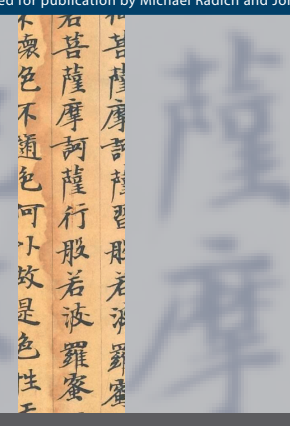

Stefano Zacchetti The Da zhidu lun 大智度論 (*Mahāprajñāpāramitopadeśa) and the History of the Larger Prajñāpāramitā Edited for publication by Michael Radich and Jonathan Silk Hamburg Buddhist Studies 14 Series Editors:
Steffen Döll | Michael Zimmermann

Numata Center

for Buddhist Studies Stefano Zacchetti The Da zhidu lun 大智度論
(*Mahāprajñāpāramitopadeśa) and the History of the Larger Prajñāpāramitā Patterns of Textual Variation in Mahāyāna Sūtra Literature Edited for publication by Michael Radich and Jonathan Silk projektverlag.

Bibliographic information published by the Deutsche Nationalbibliothek The Deutsche Nationalbibliothek lists this publication in the Deutsche Nationalbibliografie; detailed bibliographic data are available in the Internet at http://dnb.d-nb.de. 

ISSN 2190-6769 ISBN 978-3-89733-543-1 (printed version) 
ISBN 978-3-89733-574-5 (E-Book) © 2021 projekt verlag, Bochum/Freiburg www.projektverlag.de Cover: punkt KOMMA Strich GmbH, Freiburg www.punkt-komma-strich.de Cover original design by Benjamin Guzinski; Julia Wrage, Hamburg Cover image: The words 菩薩摩訶薩行般若波羅蜜, "the Bodhisattva Mahāsattva practices the prajñāpā*ramit*ā", from fascicle 91 of the DZDL, 
in the manuscript Pelliot chinoise 2138, copied by Su Qibao 蘇七寳 in the year 607 CE. Source: Bibliothèque nationale de France.

For Yang Kan, Giulio, and Livio Foreword ix Steffen Döll and Michael Zimmermann Editors' Foreword and Acknowledgements xi Introduction 1 Outline 3 1 The Life and Growth of Mahāyāna *sūtra*s 7 2 The *Larger Prajñāpāramitā* and Its Earliest Surviving Commentary 17 2.1 Enter the *Da zhidu lun* 17 2.2 The *Larger Prajñāpāramitā* Literature: An Overview 21 3 Exegesis and Textual Variation in the *Larger* Prajñāpāramitā 33 3.1 Patterns of Textual Variation in the *Larger* Prajñāpāramitā Literature 33 3.2 The Influence of Early Exegesis on *Larger* Prajñāpāramitā Texts 36 4 The Textual History of the *Larger Prajñāpāramitā* Revisited 71 4.1 "Revised" and "Unrevised" Pañcavi*ṃśatisāhasrikā*: A Misleading Dichotomy in the History of the *Larger Prajñāpāramitā* 72 4.2 From Textual Fluidity to Relative Stabilisation 78 4.3 Traces of a Northwestern Connection: The Da zhidu lun and the Larger *Prajñāpāramitā* from Gilgit 82 5 A Complex Commentary: The Nature and Historical Background of the *Da zhidu lun* 89 5.1 How Was the *Da zhidu lun*'s Exegesis Incorporated into *Larger Prajñāpāramitā* Texts? 89 5.2 A Polyphonic Commentary: The Nature of the Da zhidu lun Reconsidered 94 5.3 Fragments of a Lost World: Early *Prajñāpāramitā* Exegesis Quoted in the *Da zhidu lun* 98 5.4 The *Da zhidu lun* and the *Vibhāṣā* Compendia 110 6 Conclusions 117 Appendix 1 Other Instances of Interaction between *Larger* Prajñāpāramitā Texts and the *Da zhidu lun* 127 1.1 Instances of Chronologically Linear Textual Expansion (Earlier Reading → *Da zhidu lun* Commentary → Later Expanded Reading) 127 1.2 An Example of Chronologically Non-Linear Textual Expansion (An Earlier Expanded Reading Reflected by the *Da zhidu lun* Commentary) 174 Appendix 2 A Note on the Term anāvaraṇa- (*buddha*)-
vimokṣa 181 2.1 The anāvaraṇ*avimokṣa* in the *Da zhidu lun* 184 2.2 The anāvaraṇ*avimokṣa* in Other Mahāyāna Sources 207 2.3 Conclusions 227 Bibliography and Abbreviations 231 List of Abbreviations 231 Bibliography 235 Indices 263

## Foreword

Stefano Zacchetti, Yehan Numata Professor of Buddhist Studies and Professorial Fellow at Balliol College, University of Oxford, certainly needs no introduction from us. It is with profound grief, but also with pride and immense gratitude, that we present to the public his final monograph in the field of Buddhist Studies.

When Stefano suggested in July 2019 that he publish his investigation of the *Da zhidu lun* with Hamburg Buddhist *Studies*, we were thrilled. And like the rest of the Buddhist Studies community, we were shattered when we learned of Stefano's demise at the end of April 2020. It is no longer possible for us to express our appreciation to the author himself, but we shall remain ever grateful that he chose our series for his work. That this book should be his last study leaves us lost for words, and filled with sadness.

Stefano continued writing, and the manuscript grew over the months (especially through the addition of the magisterial Appendix 2). While he himself was no longer able to finish it, we could not imagine kinder, more suitable, and more knowledgeable editors than Michael Radich and Jonathan Silk. This publication was only possible due to their friendship with the author and their acquaintance with his work, as well as their scholarship, generosity, and untiring efforts. We take this opportunity to express our deepest gratitude to them.

## * * *

In this ground-breaking study, Stefano Zacchetti addresses the *Da zhidu lun*, 
a commentary on the Larger P*rajñāpāramitā* traditionally attributed to Nāgārjuna. Analyzing several passages from the commentary and their relation to various other texts in the "complex textual family" comprising the 
"*Larger Prajñāpāramitā* literature", his findings illustrate a multidirectional interaction. Hitherto, the dominant conception was that an original source text was reworked and revised, and then commented upon. By contrast, the evidence presented here paints a much more complex picture of a complementary, indeed symbiotic relation between root text and commentary. Vividly revealing moments in the processes of stabilization, consolidation, and canonization that led to the corpora informing current images of Buddhist schools, the study emphasizes the fluidity of sacred texts characteristic for the Mahāyāna tradition. Stefano's analyses throw new light not only on the textual history of the *Da zhidu lun*—e.g. with regards to questions of authorship, geography, the parameters of its origins and transmission, and the premises of its textual practices—but also on the *Larger* Prajñāpāramitā literature as a whole. On an even more general level, the present study contributes essential insights to our understanding of the patterns of formation, transmission, exegesis, and recension of Buddhist texts.

Steffen Döll and Michael Zimmermann

# Editors' Foreword And Acknowledgements

The untimely death on April 29, 2020, of Stefano Zacchetti, Yehan Numata Professor of Buddhist Studies and Professorial Fellow at Balliol College, University of Oxford, robbed the world of Buddhist Studies of one of its leading lights, and was greeted by an outpouring of shock and grief.

1 At the time, Stefano was on the brink of completing a monograph, and it is this work that we present here. Fortunately, the manuscript as Stefano left it was, even by the exceptionally high standards we have come to expect from all of his work, complete in all respects, except for a few details.

We have done our best to preserve the text as we received it, including maintaining Stefano's unique voice. In editing the work for publication, we have made the following changes, and observed the following principles:
Zacchetti had made a number of notes for himself in the margin of the manuscript (using the "Comment" bubble function of MS Word). Wherever possible, we have endeavoured to reflect the thinking reflected in those notes in additional notes that we added ourselves, as editors. In a couple of cases, we attempted to solve small problems that he had pointed to. All notes that we have added in this manner are presented in square brackets, and take the form [Note: ... —Eds.].

We have not undertaken the task of checking references. In only one or two cases, when we did notice a mistyped page reference, for instance, we silently corrected.

We have added volume numbers to references to Chinese Buddhist texts in the Taishō canon. Citation thus follow the following format: T 
(text number) [volume number, in roman numerals] p. (page, register and line number), e.g., T 1509 [XXV] p. 317a6–7. The single reference to the Xuzangjing/Zokuzōkyō 續藏經 follows the same format, save that it is preceded by the siglum "X". Variant readings attested in the critical apparatus of the Taishō are indicated as in Stefano's draft, in-line, with the 
----------------------------------------------
1 Obituaries and tributes to Zacchetti may be read here: http://chinesestudies.eu/?p=
4087; https://glorisunglobalnetwork.org/in-memoriam-stefano-zacchetti/. Links to other tributes by individual scholars are included in Ester Bianchi's contribution on the second of these websites. A list of Zacchetti's publications, compiled by Zhao You, may be accessed here: http://aisc-org.it/stefano-zacchetti-publications-list/ (all websites in this note accessed March 10, 2021).

sigla used in the Taishō itself, but in a smaller font, e.g., 意[意=心【宋】
【元】【明】【宮】].

The manuscript as we received it contained apparently inconsistent alternation between *prajñāpāramitā* and "Perfection of Insight"; for example: "train in the *prajñāpāramitā*" in some places, but "train in the Perfection of Insight" elsewhere. We were unable to determine whether there was a principle behind this variety, and thus we thought it best to leave Zacchetti's usage as we found it.

Zacchetti's manuscript was also inconsistent in capitalisation of the term "Perfection of Insight" (so important for the topic under discussion). We thought it possible that he was using the uncapitalised "perfection of insight" to refer to a practice or accomplishment, and the capitalised
"Perfection of Insight" to refer to texts and the genre of literature to which they belong. However, even on this hypothesis, the manuscript was inconsistent; and it was easy to find cases in which it is difficult to decide which of these two alternatives is at issue, or the same usage may refer ambiguously to both. For these reasons, we took the liberty of emending to "Perfection of Insight" throughout.

Zacchetti's usage for other "perfections" (giving, discipline) was also inconsistent, but here, the overall tendency was to lower case. We have changed to lower case throughout for consistency.

The manuscript was also missing cross-references, which Zacchetti had left blank, apparently with the intention of filling them in manually later. We believe that we were able to track down and supply the crossreferences as he intended, but it is possible that in some cases we may have introduced errors.

Zacchetti had not got round to checking line numbers in some LPG 
references. We were able to supply some, but not all.

Our editing work required us to add a few references to the Bibliography. We have listed those items in [square brackets].

Unfortunately, although they were indicated in the Table of Contents, Stefano left no acknowledgements. We know that he would have wanted to thank Baba Norihisa, Vincent Eltschinger, Camillo Formigatti, Jan Nattier, Ingo Strauch, Andrea Schlosser, Andrew Skilton, and Vincent Tournier for comments on the draft, and/or references to useful publications; Zhao You 趙悠 (whom he mentioned several times in notes to himself as the source of an illuminating reading and a valued source of advice); and students with whom he read the texts analysed in this monograph; and his colleagues at Balliol College and Oxford. We are certain that many more colleagues would have found themselves acknowledged by name, and we heartily regret that we cannot supply suitable appreciations.

For support in our editing work, we would like to acknowledge the following people and institutions. We are grateful for financial support from the Glorisun Global Network for Buddhist Studies, which was used to facilitate typesetting and indexing work. Michael Zimmermann and Steffen Döll were encouraging and accommodating in making it possible for the manuscript, as Stefano had planned, to appear in the Hamburg Buddhist Studies series. Ulrike Roesler and Nelson Landry were very helpful in arranging various practical matters at the Oxford end. Matthew Orsborn helped us tracking down missing references, and Péter Szántó helped resolve some problems with Sanskrit. Huynh Quoc Tuan spotted some lingering typos at the eleventh hour. We owe warm thanks to Francesco Bianchini, Cynthia Col, and Sophie Florence for their meticulous work on typesetting, indexing, and proofreading, respectively.

Last but not least, we are very grateful to Yang Kan for graciously honouring us with the task of readying the manuscript for publication.

It has been a rare and sad privilege to see Stefano's last book through to publication. The author of this monograph was a rare scholar, a true humanist of the old school, a wonderful person, and a dear friend to both of the undersigned. The loss of our friend, colleague, and teacher is keenly felt in every line of the remarkable work before us, and it is our great joy, mixed with extreme sadness, to present it here to the reading public.

Michael Radich and Jonathan Silk

# Introduction

Commentaries, in a conventional sense, are supposed to follow and reflect the texts they seek to explain. I am not sure that an ultimate sense applies here, but the empirical reality we experience in Buddhist literature is certainly very different. It is becoming increasingly clear that exegesis played a vastly more active role than we have generally appreciated in *shaping*—not just explaining and reflecting—all types of Buddhist scriptures.

The starting point of the present study was the realisation, long ago, of this reality with respect to one particular early commentary—the socalled *Da zhidu lun* 大智度論 (**Mahāprajñāpāramitopadeśa*) T 1509, translated into Chinese by Kumārajīva at the beginning of the fifth century CE—and its base text, the Larger *Prajñāpāramitā*. In my research on the earliest Chinese translation of the Larger *Prajñāpāramitā* 
(Zacchetti 1999 and 2005), I came across a number of passages in which the *Da zhidu lun*'s explanations of the early text (as represented by the first three Chinese translations) appeared echoed by textual expansions found in the later witnesses of the base text—especially its various Sanskrit instantiations.

The present monograph presents the evidence of this interaction between commentary and base texts, and discusses its wider implications from the point of view of both the Larger *Prajñāpāramitā* and the Da zhidu lun.

The latter also happens to be one of the most authoritative and influential texts in East Asian Buddhism. There is certainly no shortage of studies on this commentary, whether on its thought (e.g., Venkata Ramanan 1966; Takeda 2005), its authorship (Yinshun 1990; Katō 1996; Takeda 2000; Chou 2004), and its formation (Chou 2000), or more general studies encompassing various aspects (Saigusa 1969)—not to mention Étienne Lamotte's monumental partial translation (Lamotte I–V). This rich literature is an eloquent testament to the importance of this work from multiple points of view. The present monograph adopts a different perspective: It approaches the *Da zhidu lun* as a commentary, and does so from a predominantly historical-philological point of view.

Even this is, in fact, a vast and complex topic, which would require a work of a much greater scope than the present book. My aims are far more limited: First, I will try to use the *Da zhidu lun* as a source for reconstructing some aspects of the history of the Larger *Prajñāpāramitā*. 

While this, in itself, is not at all a new methodological approach, to the best of my knowledge, it has never been adopted for studying these particular texts. Second, I will use the evidence provided by my analysis of the interaction between the *Da zhidu lun* and the Larger Prajñāpāra-*mitā* to explore some aspects of this immensely important commentary.

Thus the present work is not—and I would like to emphasise this point—a comprehensive study of the *Da zhidu lun*. I have tried to sail safely away from treacherous waters, avoiding some fundamental (and, at the same time, extremely complicated) issues posed by this text, such as its authorship and philosophical orientation. These should be left to scholars better qualified for such daunting tasks.

Still, I hope that my research will contribute something to our understanding of this fascinating commentary, and of its base text. Here I 
would like to highlight, in particular, two aspects of this monograph which probably represent my main contributions to the study of the Da zhidu lun.

First, my research provides new evidence—not used, to the best of my knowledge, by Lamotte or other authors who discussed this topic—on the Da zhidu lun's historical background. The passages discussed in Chapter 3 and Appendix 1 of this book represent the only instances that have surfaced thus far of influence exerted by the *Da zhidu lun* (or, more accurately: by the exegesis transmitted in the *Da zhidu lun*) on any Indian sources. It is hard to miss the striking disproportion, in this commentary's historical trajectory, between the immense importance it has had in the East Asian Buddhist world since its translation into Chinese, and the absolute silence about it in Indian and Tibetan sources. For this reason, even the faintest echo of the *Da zhidu lun*'s voice in Indian texts represents an important piece of evidence for reconstructing its history. In particular, my analysis has evidenced a significant connection between some of the *Da zhidu lun*'s glosses and a specific recension of the *Larger* Prajñāpāramitā, that chiefly represented in the Gilgit manuscript corpus.

This connection has, in turn, important implications for our understanding of the milieu which produced this remarkable commentary. But from a broader perspective, it can also alert us to the discreet but important role played in the development of Mahāyāna literature by spatially and temporally specific exegetical traditions (or "exegetical cultures"), from an early period possibly before (or in parallel with) the existence of the main "schools" recognised by doxographical sources.

Secondly, a close analysis of the exegesis incorporated in the *Da zhidu* lun can cast some light on one extremely important aspect of this multifaceted commentary, which has been relatively overlooked by previous scholarship—thus bringing into relief its nature as a vast repository not just of Buddhist learning of all sorts, but also of a possibly even earlier and otherwise unattested rich tradition of exegesis on *Prajñāpāramitā* texts.

## Outline

In Chapter 1, which provides a broad contextualisation for the analysis, I 
argue that exegesis has been an important factor in producing the textual fluidity which characterises many Mahāyāna *sūtra*s. In a sense, much of this book could be taken as a case study based upon the *Larger* Prajñāpāramitā to exemplify this point.

Chapter 2 introduces the main sources discussed in the book. Section 2.1 focuses on the *Da zhidu lun*, while Section 2.2 offers an overview of the Larger *Prajñāpāramitā* literature, providing a detailed introduction to the various recensions which form this complex textual family and their historical and geographical backgrounds.

Chapter 3 (together with Appendix 1, which represents its continuation) forms the research core of the book. Here I analyse in detail five passages, reflecting different typologies of textual variation and different ways in which the early exegesis preserved in the *Da zhidu lun* influenced the readings of later Larger *Prajñāpāramitā* texts. Another eleven passages reflecting similar patterns of textual development are analysed in Appendix 1. For ease of reference, these sixteen key passages are given a continuous numeration from Chapter 3 to Appendix 1. Both parts of the book, together, represent my main body of evidence, and should be regarded and used as a single whole.

The next two chapters draw out the implications of the facts presented in Chapter 3. Chapter 4 does so from the perspective of the *Larger* Prajñāpāramitā. I argue that the texts that form this scriptural family were open to the influence of exegesis from as early as we can follow their traces. For this reason, it is inaccurate to depict the historical development of the Larger *Prajñāpāramitā* texts as a transition from a supposedly "unrevised" original text to the "revised" version produced at a later stage under the influence of a specific commentarial tradition (the Abhisamayālaṃkāra), and represented by the present Sanskrit Pañcavi*ṃśatisāhasrikā prajñāpāramitā* (4.1). Rather, the general tendency underlying the history of the Larger *Prajñāpāramitā* can be described as a transition from a state of textual fluidity to a comparatively more stable state (4.2). This process of gradual (and relative) textual stabilisation, which seems to have mainly taken place between the fifth and seventh centuries CE, is probably related to parallel and wider historical developments that occurred, during the same period, in Indian Buddhism at large. 

In the shifting form of Larger *Prajñāpāramitā* texts, we probably see reflected mere fragments of much larger processes of progressive institutionalisation in Mahāyāna Buddhism and its literature.

The textual evidence analysed in Chapter 3 has also brought to light a significant connection between the exegetical traditions preserved in the Da zhidu lun (and the plural, here, is intentional), and the specific *Larger* Prajñāpāramitā recension represented primarily by the early seventh century manuscript from Gilgit. This specific relationship is very impor-tant for our understanding of this commentary's historical background, strengthening, from a new angle, Lamotte's hypothesis about its Northwestern origins (4.3).

Chapter 5 focuses on the nature of the *Da zhidu lun* as a commentary, taking as a starting point the issue of the concrete ways in which the osmosis between exegesis and textual transmission documented by this study could have taken place (5.1). I argue that an important function played by the *Da zhidu lun* is that of a repository of multiple interpretations—an often-overlooked characteristic of this commentary, which has shaped, in a profound and pervasive way, both its form and its exegetical approaches (5.2). In particular, I show how the *Da zhidu lun* has preserved a considerable number of fragments attesting to earlier,2and historically significant, exegetical traditions devoted to *Prajñāpāramitā* texts, which would otherwise be completely unknown (5.3). In an effort to historically contextualise these important features of the *Da zhidu lun*, 
I suggest that the Sarvāstivādin Abhidharma genre represented by the socalled "v*ibhāṣā* compendia" (to use Collett Cox's term) may have provided the compilers of the *Da zhidu lun* with an established formal and methodological model for collecting and organising their innovative Prajñāpāramitā commentary (5.4) .

Chapter 6, which I have termed my "Conclusions", discusses the facts presented in this study from a more general angle, trying to analyse their implications from a religious point of view. Previous research has found, in various types of Buddhist scriptures, instances of interaction between exegesis and textual transmission in varying degrees similar to those investigated in this study. The systematic occurrence of these patterns of textual development points towards underlying notions of sacred scriptures as relatively "open" texts, informed by fundamental Buddhist ideas about the nature of *buddhavacana*.

The main part of the monograph is completed by two Appendices. The first, already mentioned above, complements Chapter 3, presenting the remaining examples of interaction between the Larger *Prajñāpāramitā* and its early exegesis. Appendix 2 discusses the term "unhindered liberation" (anāv*araṇavimokṣa*), which plays a considerable role in the Da zhidu lun, and is at the centre of one of the examples (Passage 4) analysed in Chapter 3.

## 1 The Life And Growth Of Mahāyāna Sūtras

It may sound like something of a truism to say that textual fluidity and recensional complexity are ubiquitous features of Mahāyāna s*ūtra* literature, 3after the many important discussions of this issue which have been published in more or less recent years.4In his influential overview of the study of Indian Mahāyāna, David Seyfort Ruegg criticised the application of the notion of a single *Urtext* to the study of these texts, describing the situation presented by our scriptural sources in these terms:
What we seem to have before us in such cases is, instead, records of a set of teachings/ideas/narratives in parallel wordings, oral or written, that are all somehow linked with a more or less compact—but nevertheless not univocally expressed—Sūtra tradition that came to be expressed in distinct recensions.5 And, indeed, it is a very common experience for anyone who approaches Mahāyāna *sūtra*s from a philological point of view, comparing various witnesses of the "same" scripture (Sanskrit manuscripts, Chinese and Tibetan translations, etc.), to come across various (and often extremely complex) patterns of textual differentiation and variation (see, for example, Skilton 1999; Zacchetti 2005: 42–50; Schopen 2009: 206–
214)—for example, just to mention some of the most common forms, addition of words and sentences, use of different wording, and transposition of passages.

In fact, in the context of the widespread, systematic variation reflected by this literature, even the deceptively self-evident notion of "same" scripture or text becomes difficult to define in a conceptually satisfactory way, and the notion of "the text" should be always taken as pointing to something dynamic and functional, rather than substantial. For these reasons, to describe Mahāyāna *sūtra*s I prefer to adopt instead the notion of the "scriptural (or textual) family": that is, a set, comprised of a plurality of textual instantiations (manuscripts, translations, etc.) and characterised by complex patterns of relationship (similarity and divergence). An analogy that springs to mind here is that of a set of variations based on the same musical theme. Indeed, V.S. Sukthankar used the same image in his memorable description of the situation and tasks confronting the editors of the *Mahābhārata*, whose textual tradition presents problems partly similar to those encountered in the study of Buddhist *sūtra* literature (cf. von Hinüber 1980: 32–33):
The Mah*ābhārata* is not and never was a fixed rigid text, but is [a] fluctuating epic tradition, a *thème avec variations*, not unlike a popular Indian melody. Our objective should consequently not to be to arrive at an archetype (which practically never existed), but to represent, view and explain the epic tradition in all its variety, in all its fullness, in all its ramifications. Ours is a problem in textual dynamics, rather than in textual statics.

6 As I have argued elsewhere (Zacchetti, 2015: 177–178), the notion of 
"scriptural family" is particularly appropriate for describing the situation we face in the study of the important subset of Mahāyāna literature known as the *Prajñāpāramitā* (Perfection of Insight), which is also the subject of this study.

While such textual fluidity is found reflected even in manuscripts of the "same" scripture (i.e., scriptural family) produced and used in the same area at the same time,7 naturally enough it tends to be magnified by the dimensions of the available textual tradition: the quantity and significance of textual variations is usually correlated to the number of available witnesses of a given scripture (Indic manuscripts, and translations, mainly in Chinese and Tibetan), and to the breadth of their geographical and temporal distribution.

What are the causes of this state of affairs? There has been a certain tendency, in some of the most important scholarly discussions of this subject, to focus on the origins of the textual transmission of Mahāyāna sūtras by framing the discourse in terms of a critique of notions such as 
(single) urtext or archetype.8 The rejection of these notions as useful categories for reconstructing the history of Mahāyāna scriptures has constituted a healthy reaction to an entrenched "classicist" notion of text which has for long informed, more or less consciously, the modern scholarly understanding of Buddhist texts and, more crucially, influenced the resulting editorial practices.

Of course, not all the differences we can find among the various witnesses of a scriptural family can be explained as stemming from an original plurality of transmission lines. Another important factor is the variation of the original readings that occurred during the course of textual transmission. This becomes particularly clear when we face large textual traditions, attested by significant numbers of witnesses (both early and late). Here careful comparative analysis may allow us, at least in some cases (e.g., agreement of a number of early witnesses versus later ones), to infer with a reasonable degree of confidence the early reading of a particular passage (of course, not necessarily the original reading!), and, as a result, to identify later developments *based on it*.

9In other words, in this scenario it is not the case that, for example, two different readings of a given passage, A and B, were necessarily originally and (at least in principle) synchronically differentiated; rather, reading A was *changed* into reading B as the result of a diachronic process of variation.10 This—intentional diachronic variation, as distinguished from aboriginal recensional differentiation—is the focus of the present work. My aim in this monograph is not so much to investigate the morphology of this complex phenomenon, but rather, to discuss the formative process underlying it, and to analyse some of its causes.

We encounter many different types of textual variation in Mahāyāna sūtras, and as a result, one can think of several possible reasons to explain them.

11 The performative nature and modular structure of these texts obviously played a role in producing fluidity and recensional diversity.

12 But another, equally important factor was the fact that when these texts were recited, put to use for various purposes (ritual, etc.), or copied and transmitted across time and space, they were also *interpreted*. And at times, interpretations of words and passages (which we can call glosses)
ended up being absorbed by the texts themselves, in the process modifying the texts to varying degrees. In this connection, it is important to clarify at the outset that while one can notice, in the diachronic devel-opment of many Mahāyāna *sūtra*s, a general tendency towards textual expansion,13 this should not, by any means, be taken as a fixed rule.14 To exemplify these points, I will quote here one passage from Chapter Nine of the Sanskrit *Vimalakīrtinirdeśa* (§ 8), selected quite at random out of many similar examples one could quote from Mahāyāna *sūtra* literature. Here the Buddha Gandhottamakūṭa is giving some recommendations to a sizeable group of Bodhisattvas from his buddhakṣ*etra* who are about to set off on a journey to the backward and dangerous Sahā world. He invites them to keep a low profile:15 during their excursion they should not arouse the jealousy of the inhabitants of the Sahā world by showing off their beautiful appearance, nor should they display contempt or hostility towards them. The reason for this is given by the Buddha with the following words:
tat kasmād dhetoḥ | ākāśakṣetrāṇi hi buddhakṣetrāṇi, satvaparipākāya tu buddhā bhagavanto na sarvaṃ buddhaviṣayaṃ sa*ṃdarśayanti.*16 Why? Because Buddha-fields are fields of empty space, yet, for the purpose of bringing beings to maturation, the Buddhas, the Lords do not show [their] Buddha-domain/realm in full.

The reading of the Sanskrit text is essentially confirmed, with some variants, by both the Tibetan and (less clearly) Kumārajīva's translations.

17 However, it seems fair to say that the meaning of this passage remains, at first sight, a little cryptic.

In contrast with all the other versions, the third surviving Chinese translation, the one produced by the celebrated translator Xuanzang in 650 CE, presents, at this point (as is also the case elsewhere), a considerably expanded text (the portions missing from other witnesses are underlined):
所以者何?諸善男子,一切國土皆如虛空。諸佛世尊為欲成熟諸有 情故,隨諸有情所樂,示現種種佛土:或染或淨,無決定相,而諸 佛土實皆清淨,無有差別 (*Shuo Wugoucheng jing* 說無垢稱經 T 476 [XIV]
p. 579c25–28).18 Why? Good men, all the [Buddha] lands are like empty space. The Buddhas, the World-honoured Ones, in order to bring sentient beings to maturation, manifest all sorts of Buddha-lands in accordance with the beings' inclinations: [so] some [buddhakṣ*etra*s] are defiled, while some others are pure, without a defined characteristic; and yet all Buddha-lands are actually pure, without differences.

As we can see, while some parts of this passage correspond very closely to the Sanskrit text, especially in the beginning,19 it also contains some notable differences. First of all, Xuanzang's text presents a variant in the predicate of the second sentence of the passage: whereas the Sanskrit has na sarvaṃ buddhaviṣayaṃ *saṃdarśayanti* ("[the Buddhas] ... do not show [their] Buddha-domain/realm in full"), it reads "[the Buddhas] ... 

manifest all sorts of Buddha-lands" (示現種種佛土). Since here Xuan-zang's text agrees, in essence, with the reading found in the earliest version (T 474) ("show ... their [buddha-]kṣ*etra*s", see n. 17 above), whereas the reading attested in the Sanskrit is already found in Kumārajīva's version (不盡現), we can conclude that in this specific point, the textual tradition branched off at an early stage in the history of the Vimala*kīrtinirdeśa*.

But apart from bearing witness to this early recensional variation, Xuanzang's text also contains what look like significant *additions* not found in any of the other surviving witnesses of this passage: the very statement that the Buddhas "manifest all sorts of Buddha-lands" is further specified by pointing out that they do so "in accordance with the beings' inclinations" ( 隨 諸 有 情 所 樂 ), and then by fully unpacking the implications of this statement at the end of the passage.

Although it would not be impossible to think of alternative scenarios, the most likely explanation of Xuanzang's enlarged reading is that it ----------------------------------------------
18 See also Lamotte 1962: 326.

19 The initial portion of Xuanzang's translation of this passage (所以者何?諸善男 子,一切國土皆如虛空。諸佛世尊為欲成熟諸有情故...) seems a fairly literal translation of the corresponding Sanskrit text (tat kasmād dhetoḥ | ākāśakṣetrāṇ*i hi* buddhakṣetrāṇi, satvapari*pākāya tu buddhā bhagavant*o ...). One can note only two minor differences: the vocative 諸善男子 (= **kulaputrāḥ*), which is missing from the Sanskrit but is found in the Tibetan translation (*rigs kyi bu*); and the elliptic 一 切國土 for buddhak*ṣetrāṇ*i, probably influenced by Kumārajīva's parallel choice (十方國土, see n. 17 above).

reflects for the most part what he read in the original Indic manuscript he used for his translation.20
----------------------------------------------
20 On the textually developed nature of Xuanzang's *Vimalakīrtinirdeśa* translation in general, see Lamotte 1962: 12. In his analysis of the Chinese translations of the Vajracchedikā prajñāpāramitā, Paul Harrison noticed a similar tendency to textual expansion in Xuanzang's version of that scripture as well. He mentioned two possible interpretations of these expansions: "In some cases the Chinese translations contain material which we may assume was present in Indic versions still inaccessible to us, which may remain so indefinitely. This is especially true of X[= Xuanzang's translation]. However, there is another possibility, which is that Xuanzang in particular amplified the texts himself, i.e., 'performed' them *vistareṇa* as he translated them. There need not be anything inauthentic about the versions of the text so produced, especially if he did this in Sanskrit first (or even perhaps if he did it in Chinese). He would thus have been part of a long tradition of Indic text recitation, according to which it was regarded as appropriate and meritorious to give the *sūtra* one was reciting its most elaborate possible form, the 'full monty'." 
(Harrison 2010: 242; cf. also, on a similar tendency toward expansion in Xuan-zang's Larger *Prajñāpāramitā* translations, Seishi Karashima's "Introduction" in Karashima and Tamai 2019: viii n. 3). This alternative scenario is perhaps more credible in the case of expansions of standard lists of terms, where, in a sense, the enlarged reading could be considered as being already virtually present in the shorter text. A well-known example from the Vajra*cchedikā* is the list of notions (sa*ṃjñā*) of selfhood which occurs several times in this scripture: whereas all the other witnesses (Sanskrit manuscripts, Chinese and Tibetan translations) consistently have a list of four items, Xuanzang's translation presents an extended list of nine items (see for example T 220 [VII] p. 980c18–21), which has parallels in Larger *Prajñāpāramitā* texts (for references see Zacchetti 2005: 207 and 327–329 [§ 3.2]. The passage I have quoted here from the *Vimalakīrtinirdeśa*, however, is clearly a different case, as in this case we are confronted by far more conscious and complex set of exegetical interpolations, as opposed to the mere expansion or "activation" of stock lists. I would also rule out that these are glosses introduced into the text by the translator. While this did happen, as we shall see, in earlier translations, at the time of Xuanzang's "new translations", the organisation of translation teams had undergone important changes. One of the key aspects of this reform (see Tso 1990: 104–105; Funayama 2013: 56) was precisely the elimination from the translation process of oral exegesis for the audience's benefit (which had characterised the preceding, pre-Sui translation teams). Although the original scripture was still subject to an in-depth analysis (Tso 1990: 106), this was essentially functional to the production of the translated text. In this period, Buddhist translations were produced by selected state-sponsored (and state-controlled) 
teams of specialists through a complex, multi-stage assembly-line process, with multiple levels of checks and controls. While Xuanzang's translations were never mechanically literal (see Delhey 2016: 72–73), it is hard to believe that he could have felt free to tamper with his original text in such a significant way under the eyes of his team—all the more so, since during his last years he was under considerable pressure from (and unsympathetic scrutiny by) the Tang court [Note: Zacchetti indicated that he wanted to insert here a recommendation that readers see While all this can give us a taste of the complexities in the textual history of Mahāyāna sūtras, as evoked at the beginning of this chapter, at least one thing seems sufficiently clear: Xuanzang's expanded reading looks like an attempt to make some sense out of a comparatively opaque passage, making explicit some of the ideas implicit in the original reading 
(which, in this case, was probably very close to the text found in the earliest version [T 474]). So, in other words, this textual expansion resembles—indeed is—a commentary, probably originating from glosses on the original reading, which at some point during the textual history of the *sūtra* (and in a particular branch of its tradition) was absorbed by the main text. Another noteworthy piece of information that we can extract from the comparison of all witnesses of this passage is that Xuanzang's enlarged text does not represent, in absolute terms, a later, but rather a lateral development—in other words, a side-branch (as far as this specific passage is concerned). This is an important point, because, as I will show below (see especially Chapter 4.3), paying attention to textual developments such as this can sometimes allow us to identify specific recensions, reflecting particular (local or otherwise) exegetical traditions and textual cultures, which we are occasionally able to pin down to specific historical and cultural contexts.

## 2 The Larger Prajñāpāramitā And Its Earliest Surviving Commentary

The passage discussed at the end of the preceding chapter exemplifies a situation which is common in Mahāyāna *sūtra* literature. The reconstruction of the process of textual expansion underlying passages such that from Xuanzang's *Vimalakīrtinirdeśa* translation must largely rely on our imagination, and hence remain, to a certain degree, speculative. There is, however, at least one notable exception: we have a unique set of sources which, due to a rare combination of historical circumstances, allows us a surprisingly direct glimpse into a process of textual development not too different from that sketched above.

## 2.1 Enter The Da Zhidu Lun

The main character of this story is the famous commentary to the *Larger* Prajñāpāramitā generally known as the *Da zhidu lun* 大 智 度 論
(**Mahāprajñāpāramitopadeśa*;
21 hereafter DZDL) and translated into Chinese by a team led by Kumārajīva at the beginning of the fifth century CE (between 402 and 406 CE).

22 According to our sources,23 only the first part of Kumārajīva's version (which is the only available witness of this commentary)24 represents a complete translation, while the rest was drastically abridged by the translator.

25 The text we possess nowadays confirms the traditional account, for there is little doubt that our extant DZDL consists of two very different commentaries, even from the point of view of their exegetical approaches: the first, consisting of extremely detailed comments on relatively short passages (at times even on single words), comprising the initial part of the text, from its beginning to the end of scroll 34 (T 1509 [XXV] p. 314b18; this is the part translated into French by Lamotte I–V); the second, starting from scroll 35, on average providing shorter comments on longer passages of the base text.

26 The DZDL is generally attributed by the East Asian Buddhist traditions to Nāgārjuna—an attribution which is completely unknown (as is the text itself) to Indian and Tibetan sources, and is not generally accepted by modern Western scholarship. The authorship of the DZDL, its nature, and its sectarian background have been hotly debated issues in the twentieth century, and for want of a scholarly consensus, they remain, to some extent, open questions even today.27 Given the uniquely authoritative and even foundational role played in East Asian Buddhism by the DZDL, this is in fact an issue which transcends the boundaries of a purely academic debate.

While the issue of the DZDL's authorship is not particularly significant from the particular point of view adopted by the present study, I think that the facts I will present in the following chapters can cast new light on the geographical milieu and the nature of this fundamental commentary, and I will come back to these issues below. For the moment, suffice it to say that I consider the DZDL as being largely (with all the important qualifications suggested by Chou 2000 and 2004) the translation of an Indic text.28 In this connection, it is also important to observe that both our main (and first-hand) sources on the DZDL's translation (Sengrui's preface and the colophon to the text; see n. 23 above) mention—if somewhat confusingly—the original Indic manuscript of the commentary.

29 Among the many peculiarities of this commentary, its history deserves a special mention. It has been, unquestionably, a history of success.30 And yet, if we are to trust the silence of Indian and Tibetan sources, the DZDL may have started its impressive career as a rather marginal scripture. If so, then it is certainly fair to say that it was extremely fortunate in its encounters with translators: twice in its long life, the DZDL met the right person at the right moment—first Kumārajīva, and then, some 1540 years later, Étienne Lamotte. Interestingly, both these great translators approached this commentary with an agenda which seems to have been at least in part similar: both sought to make the DZDL the key reference work for the Buddhist studies of their time and place (fifth century Buddhist China, and twentieth century Western Buddhological academia).31 And, we have to say, both achieved a spectacular success, projecting, all of a sudden, the DZDL to the Buddhological forefront of their respective ages, and firmly establishing it as an authoritative exegetical work and even encyclopaedia, with deep, lasting, and often unacknowledged effects on, respectively, East Asian Buddhism and modern Buddhology.

32 Rightly so, I should like to add, because the intrinsic merits of the DZDL are far greater than my narrative may suggest.

This bibliographical epic might obscure yet another remarkable feature of this commentary, which is crucial for my study: the fact that it has a unique position in historical terms. To the best of my knowledge, this is the earliest surviving Indian *Prajñāpāramitā* commentary,33 and probably also one of the earliest Indian Mahāyāna *sūtra* commentaries in general.

## 2.2 The Larger Prajñāpāramitā Literature: An Overview

above, "text", in this context, should always be understood in an intrinsically plural sense, as a collective noun—i.e., as a textual/scriptural family in the sense discussed before. And this is particularly true of the DZDL's base text, the LP, which represents an extended family of closely related texts of varying length, usually classified according to the number of lines as the A*ṣṭādaśasāhasrikā prajñāpāramitā* (Perfection of Insight in 18,000 lines), the Pañcaviṃśatisāhasrikā p*rajñāpāramitā* (in 25,000 lines), and the *Śatasāhasrikā prajñāpāramitā* (in 100,000 lines). However, this classification is comparatively late, its earliest attestations dating to the beginning of the eighth century.34 During the early documented phase of its history (third–fifth centuries CE) this scriptural family was still in a rather fluid state, and the size of LP manuscripts known to us varied from approximately 17,000 to 22,000 lines. For these reasons, it is preferable to use *Larger Prajñāpāramitā* as a general appellation for all these texts.35 Apart from (and in parallel with) these quantitative variations, the texts, or witnesses, belonging to the LP family can also be subdivided into several groups—which I prefer to call recensions36—on the basis of significant *qualitative* textual affinities (especially, shared distinctive wording, presence of converging textual developments, etc.).

I list below the most clearly defined of these recensions. It is important to stress that this provisional classification focuses on the content and wording of specific passages; other criteria may result in different classifications. As I pointed out elsewhere, LP witnesses also fall into two groups, depending on the character of their final portion—some have an extended conclusion, and others a shorter one. This distinction cuts across the recensions described here (see also the discussion of PvsP[TibPk] 
below).

37 1.

1.1 A particularly well-defined38 and historically significant recension has as its chief representative the relatively complete (and still largely unedited) main Larger *Prajñāpāramitā* manuscript belonging to a Buddhist library discovered in 1931 in Naupur near Gilgit (von Hinüber 2014: 79)—perhaps the single most important LP text we have (hereafter LPG)39—and several related texts. LPG, which originally consisted of 307 folios,40 can be dated with considerable precision, on the basis of its colophon, to the first quarter of the seventh century, 41 during the proBuddhist Palola Ṣāhi dynasty, which ruled in the Gilgit area between the late sixth and early eighth centuries CE.

42 The title of the text, as attested by some chapter colophons, is simply *Prajñāpāramitā*.

43 It is worth noticing that this title may have already been something of a conservative feature at the time when LPG was copied, for, as pointed out above, we know that more specific titles reflecting a quantitative classification of Prajñāpāramitā literature had already been adopted in the previous century.

Other LP witnesses belonging to this recension include the following texts:
1.2 The Sanskrit *Śatasāhasrikā* (mainly transmitted in late Nepalese manuscripts; hereafter Ś).

44 1.3 Some incomplete Sanskrit texts can also be ascribed to this recension: these are the fragments of two additional LP manuscripts from Gilgit (hereafter LPG II and LPG III), edited by Karashima and Tamai 
(2019);
45 as well as a fragmentary palm-leaf Sanskrit manuscript found in Dunhuang and kept at the British Library, which has been edited by Suzuki and Nagashima (2015).46 1.4 Another important source part of this group is the Tibetan translation of the Pañcavi*ṃśatisāhasrikā* included in the Kanjur, dating to the period between the end of the eighth and the beginning of the ninth century CE (hereafter PvsP[TibPk]).47 My classification of this translation as belonging to the LPG recension is based on its sharing specific, significant readings with the other representatives of this family, as will also be shown by the Passages discussed in Chapter 3 and Appendix 1 of this study.48 It does, however, differ in one significant respect from LPG 
and Ś: it has a different concluding part, which includes the so-called Sa-dāprarudita story corresponding to Chapters 30–31 of the Aṣṭasā*hasrik*ā prajñāpā*ramit*ā.

49 Nevertheless, I am inclined to consider this discrepancy as an essentially extrinsic feature, less significant, for classification purposes, than this version's overall tendency to agree with LPG in significant readings mentioned above. The whole portion containing the Sadāprarudita narrative seems to have represented a textual module which could be added to or taken out of scriptures with considerable flexibility, as shown by the pattern of its attestation in *Prajñāpāramitā* literature.

50 To the best of my knowledge, we do not possess any direct historical information which could account for the striking proximity of this Tibetan version to LPG. However, the existence of close political and cultural ties between the area of Gilgit and Tibet is well documented from a time not too distant from the production date of LPG's manuscript. During the eighth century, this territory, ruled by the Palola Ṣāhi dynasty,
"became a key battleground in the struggle between the Tibetan and Chinese empires for control of long-distance routes through the high mountain borderlands" (Neelis 2011: 176; cf. also Sen 2003: 25). Tibetan forces occupied Little Palūr/Balūr/Bolor (i.e., the Gilgit valley, see Jettmar 1977: 415) twice in the first half of the eighth century, in 722 and 737 (Beckwith 1993: 95 and 116; Neelis 2011, loc. cit.), and Tibetan influence in the area also remained strong in the following years, with ups and downs due to the Tang reaction.

51 All this obviously must have also facilitated cultural exchanges with Tibet. For example, we know of a Buddha statue52 bearing the name of the Palola Ṣāhi king Surendrādityanandin (abbreviated form of Surendravikramādityanandin, r. ca. 625–
----------------------------------------------
48 See also Zacchetti 2005: 43–43 with n. 174. 49 See Zacchetti 2005: 22–23; Karashima's Introductions to Karashima et al. 2016: 
viii and to Karashima and Tamai 2019: viii.

50 In fact, although most texts of the A*ṣṭasāhasrikā* family contain the Sadāprarudita story, this is not true of all of them: the two A*ṣṭasāhasrikā*-related sections of Xuanzang's *Da banreboluomiduo jing* lack this narrative component (see Zacchetti 2015: 183).

51 Beckwith 1993: 123; 132–137. On the Tibetan influence over Little Bolor, see also Jettmar 1977: 421–423 and 427; Jettmar 1993: 84 ff.

52 This is part of a larger group, on which Neelis (2011: 175) writes: "These dated bronze images donated by Palola Ṣāhi rulers and their families belong to a larger group of Buddhist bronze images that were produced by a local atelier of artists 644/655 CE: see von Hinüber 2004: 88–89 and 99), and thus datable to the first half of the seventh century, which was kept, for a time, in Tibet.53 It is then not difficult to imagine that the same may have happened to a LP manuscript close to LPG, which is only slightly later than this statue and represented a fairly standardised text in the Gilgit area and beyond, as suggested by other texts belonging to this recension. The presence of a text close to LPG in Dunhuang (see Suzuki and Nagashima 2015), 
already mentioned above, is also not difficult to account for in the light of these historical circumstances, given that this area was under Tibetan rule from the end of eighth to the middle of the ninth century CE.

54 Of course, the similarities between LPG and this LP manuscript from Dunhuang could also be due to other historical reasons unknown to us at this stage. It is important to bear this caveat in mind. In the following pages, I will often refer to this group of witnesses as the "LPG recension". 

This definition, however, is merely used for the sake of convenience, due to the fact that three early representatives of this recension (including the most important one) happen to come from Gilgit. It ought not to be taken as a reflection of the historical origins of this textual lineage, of which we know nothing certain.

2. Another recension is represented by the Sanskrit Pañcaviṃśati-sāhasrikā *prajñāpāramitā*, now edited in its entirety by T. Kimura and for the most part transmitted in rather late Nepalese manuscripts (hereafter PvsP[K]).55 The most evident distinctive feature of this scripture is that its text is subdivided into main sections and subsections, following the structure of an important exegetical work on the *Prajñāpāramitā*, the Abhisamayālaṃkāra.

56 For this reason, this recension has often been de-scribed as the "revised" Pañcavi*ṃśatisāhasrikā* (on the problems posed by this definition, see below, Chapter 4.1). This text is also referred to, in Tibetan sources, as the Eight-Chaptered Pañcavi*ṃśatisāhasrikā*,
57 because of its subdivision into the eight main partitions, or "[stages of] realisation" (*abhisamaya*), characteristic of the Abhisama*yālaṃkāra*.

58 But even apart from this conspicuous but ultimately extrinsic feature, PvsP(K) 
clearly represents, from a textual point of view (in wording and structure),
a different recension from that represented by LPG.

If we set the *Abhisamayālaṃkāra* section-headings aside, a number of LP fragments from Sri Lanka59 can also be associated with this textual lineage. Apart from some small fragments inscribed on copper plaques from Indikaṭusäya,60 the most important LP text from this area is represented by seven gold leaves from Anurādhapura, dating to the ninth century and containing parts of a LP scripture very close to PvsP(K). This source—hereafter referred to as PvsP(SL)—was edited by von Hinüber (1983).

61 The earliest available evidence on this recension (again, here I am referring to its *text*, leaving aside the issue of the *Abhisamayālaṃkāra*'s section headings inserted into the text) is probably provided by ĀryaVimuktisena's Abhisamayālaṃkā*ravr̥tti*, which is usually dated to the
(early) sixth century.

62 In this commentary, the lemmata (assuming, as seems likely, that they indeed reflect the text used by Vimuktisena) tend to agree with the PvsP rather than with LPG.

63 I have not been able to compare systematically these quotations with LPG and PvsP throughout the commentary, but its initial portion is already sufficiently telling.64 It is also noteworthy that Vimuktisena explicitly refers to the base text as Pañcavi*ṃśatisāhasrikā*.

65 In view of the possibly early date of this PvsP text suggested by ĀryaVimuktisena's commentary, it might be preferable to regard it as a parallel development of the LP text—perhaps, we may speculate, reflecting a specific, local, geographically delimited tradition—rather than a chronologically sequential development of an earlier LP text, as it is more or less explicitly suggested by the label "revised" attached to the current PvsP (more on this issue in Chapter 4.1 below). As a matter of fact, all the early evidence we have on this text comes from areas well to the South of areas to which the witnesses of the LPG recension are related.

66 This, 
----------------------------------------------
tasya vyāsanirdeśo; Lee 2017: 59 [7] 8–14; Pensa 1967: 16 [3a3–4]; cf. also Sparham 2006 [vol. 1]: 9) occur consecutively in the PvsP (K) I-1 pp. 28,22–29,1, with paragraph headings (here underlined) which agree with Ārya-Vimuktisena's commentary:
punar aparaṃ śāriputra daśasu dikṣu pratyekaṃ ga*ṅgānadībālukopameṣ*u lokadhātuṣu ye sattvās tān sarvān anupadhiśeṣanirvāṇadhātau parinirvāpayitukāmena bodhisattvena mahāsattvena prajñāpāramitāyāṃ śikṣ*itavyam.* 
iti samāsataḥ *parārthālambanaś cittotpādaḥ*.

evaṃ matsariṇaḥ sattvān dāne pratiṣṭhāpayitukāmena duḥśīlān śīle vyāpādabahulān kṣāntau kuśīdān vīrye vikṣiptacittān dhyāne duṣprajñān prajñāsaṃpadi pratiṣṭhāpayitukāmena bodhisattvena mahāsattvena prajñāpāramitāyāṃ śikṣitavyam. iti vyāsataḥ *parārthālambanaś cittotpādaḥ*.

of course, might be due to casual circumstances and mean nothing. It is, nevertheless, a fact worth noticing in the general dearth of data we are facing. In this respect, it is also important to mention that, as Vincent Tournier has shown in his penetrating discussion of the available sources, the n*ikāya* to which Ārya-Vimuktisena belonged, 67 that of the Kaurukullas, was a regional branch of the Sāṃmitīyas located in present-day southern Gujarat.

68 The later transmission of this LP recension to Nepal as *the* PvsP could then be explained as an effect of the increasing dominance of the Abhisamayāla*ṃkāra* as the *Prajñāpāramitā* commentarial tradition par excellence, which perhaps happened to be linked to this particular recension, precisely due to Ārya-Vimuktisena's authoritative work.69
----------------------------------------------
Vimuktisena had already been adapted to the Abhisamayālaṃ*kāra* eight-stage system, but it is hard to know to what extent this can be taken as an accurate factual record. There is, however, another passage in Tāranātha's account which might contain a kernel of historical truth. This occurs immediately before the dream leading to Vimuktisena's acquisition of the *Eight-Chaptered* PvsP: "Feeling tired of too many scriptural works, he wanted to remove his weariness in the meditation on the Prajñā-pāramitā. As a result of this meditation, he had a special form of bliss. He had no doubt about the significance [of the Prajñā-pāramitā]. Still he felt disturbed by certain discrepancies between the wordings of a *sūtra* and those of certain parts of the Abhisamaya-ala*ṃkāra.* At that time, *ārya* Maitreya instructed him in dream, etc." (Chimpa and Chattopadhyaya 1970: 189; cf. Nakamura 2014: 20). The reference to Vimuktisena's perplexity caused by disagreement between the text of a sūtra (mdo)—obviously, in this context, a *Prajñāpāramitā* text—and the *Abhisamayālaṃkāra* is noteworthy, as it might reflect his difficulties in dealing with different LP recensions. A possible scenario behind this narrative is that the Abhisamayāla*ṃkāra* (as a commentarial method centred on the *structure* of the text) might have been originally based on an early LP text (cf. Lethcoe 1976: 506 and 511), already close, to some extent (structurally and otherwise), to the current text of PvsP(K). One can then easily imagine Ārya-Vimuktisena's difficulties, if he had initially tried to reconcile the *Abhisamayālaṃkāra*'s structure with an LP text close to the northern recensions (either LPG or the texts represented by the early Chinese translations), and his relief when he could later access a representative of the southern recension already close to the commentary (whether or not it was already subdivided in eight chapters, as suggested by Tāranātha). As a matter of fact, as noted above (n. 61), there is at least one passage in Ārya-Vimuktisena's Abhisama-yālaṃkāra*vr̥tti* suggesting that he had had access to two different LP recensions.

67 This is known thanks to the colophon appended to the Abhisamayālaṃkāravr̥tti: 
see Lee 2017: 20–24; Tournier, forthcoming, 25.

68 Tournier, forthcoming, 24–30. 69 Ārya-Vimuktisena is considered the compiler of the *Eight-Chaptered* PvsP by some Tibetan sources (see Nakamura 2014: 39). [Note: At this point in his draft, Zacchetti had this note: "If further research confirms this provisional reconstruction, one could perhaps label this group of texts—PvsP(K) and PvsP(SL)—as 3. The first two divisions (*Śatasāhasrikā* and Pañcavi*ṃśatisāhasrikā*) 
of Xuanzang's summa of the *Prajñāpāramitā* literature, the monumental Da banreboluomiduo jing (大般若波羅蜜多經) translated between 660 and 663 CE70 (hereafter Xz[Ś], Xz[PvsP]), share some distinctive readings and thus seem to form another LP recension.71 As will be shown in this study, in a number of cases Xuanzang's LP translations share significant textual developments with the LPG recension, but often represent a more expanded text (see e.g., Passages 5.b.2 in Chapter 3.2 and 10.c.2, 11.c.2 in Appendix 1.1; cf. also Karashima and Tamai 2019: viii).

4. Finally, the three early Chinese LP translations72—the Guang zan jing (光讚經 T 222), translated in 286 CE by Dharmarakṣa 竺法護
(hereafter Dhr); the *Fang guang jing* (放光經 T 221), translated in 291 CE by *Mokṣala (Wuchaluo 無叉羅, hereafter Mo); and the *Mohebanreboluomi jing* (摩訶般若波羅蜜經, **Mahāprajñāpāramitā*, T 223), translated, as we have seen, in 403–404 CE by Kumārajīva (hereafter Kj)—
appear, in general, relatively close to one another in content and structure 
(with many exceptions and many differences in matters of detail). However, given that in this case we are dealing with translations, and early ones at that (and thus, with texts characterised by considerable fluidity from a stylistic and terminological point of view), it is often difficult to determine the patterns of agreement and disagreement in their precise wording. For this reason, it remains unclear to what extent Dhr, Mo, and Kj can be considered to form a recension in the strict sense. Nonetheless, as far as the general development of the LP is concerned, these three translations can be provisionally grouped together.73 While we do not have precise information on the original used by Kumārajīva for his translation, according to early bibliographical sources, the original manuscripts on which both Dhr and Mo were based came from Khotan.

74 I will discuss below the implications of this fact. It is noteworthy that these two Indic manuscripts, though very close in time and space, were clearly already significantly differentiated (see below, Chapter 4.2 with n. 154).

It is important to stress that the classification offered above is just a provisional attempt to organise *some* of the main witnesses of the LP. It does not cover, for example, the many Central Asian fragments of this textual family that survive, which for the most part have not yet been systematically studied.75

## 3 Exegesis And Textual Variation In The Larger Prajñāpāramitā 3.1 Patterns Of Textual Variation In The Larger Prajñāpāramitā Literature

The rich and rare combination of sources described in the preceding chapter provides us with almost ideal conditions for studying the textual history of the LP:
a. First of all, we have three early (mostly) independent Chinese translations (group 4 above), which (generally speaking) allow us to get a reasonably clear idea of the early stages in the textual history of the LP
family.

b. Then we have a rich and diversified mass of later witnesses: several Sanskrit texts, and Tibetan and Chinese translations, variously interrelated so as to form different recensions (1–3 above), which provide us with ample evidence concerning the textual developments of the LP family.

c. Last but not least, our real trump card: a very detailed, albeit idiosyncratic, Indian commentary (Indian, that is to say, with all the qualifications mentioned above) *right in between* these two chronologically defined groups—the earlier and later texts.

Right in between: the early date of the DZDL, and especially its temporal position with respect to the history of the LP, are extremely important, for—with the exception of Ārya-Vimuktisena's Abhisamayālaṃkāravr̥tti (sixth century), which, as we have seen, is based on the Pañcavi*ṃśatisāhasrikā*—most of the *Prajñāpāramitā* commentaries we possess date (to the best of my knowledge) to later periods, when their base texts were already showing a marked tendency to stabilisation (see below, Chapter 4.2). In other words, these commentaries are in general quite clearly distinguished from the *sūtras* upon which they comment, and lie largely downstream. The case is completely different with the DZDL, and this, in turn, is of crucial importance for our discussion: the DZDL reflects the image of a base text which is still, as it were, fully alive, in a comparatively fluid state, and entirely open to change and development.

Now, if we carefully compare all the sources listed above (with a truly microscopic approach), we can observe that in a small but significant number of cases, when some or all of the later LP witnesses (and particularly in the Sanskrit versions: LPG, Ś, and PvsP[K]) present an expanded reading with respect to the earlier ones (Dhr, Mo, and Kj), this expansion is partly or completely prefigured in the relevant DZDL gloss on the early, unexpanded reading.

Here is a crudely schematic representation of this process:

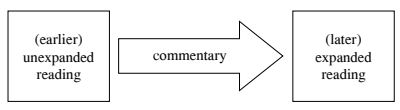

Thus, in these cases the DZDL allows us to trace, step by step, the process of textual development undergone by the LP.

I have analysed in this detailed way only a small part (approximately 10%) of what is truly an immense body of text, applying rather stringent criteria: I have only taken into account cases in which the expanded reading and the relevant DZDL gloss appear to share a specific interpretation, or even the same wording. As a result, I have identified fifteen instances of the pattern of textual development outlined above, of varying degrees of significance. It is highly probable that other occurrences have escaped my attention: apart from the number and sheer size of the texts involved, there are other distorting factors which may have a negative impact on an analysis of this kind. The most important such factor is the fact that our key source, the DZDL, only exists in a single Chinese translation, which is not always easy to interpret. This often makes it problematic to identify the precise Sanskrit wording underlying Kumārajīva's text.

76 Other potentially distorting factors derive from the way in which the DZDL was translated and edited. In particular, as already remarked above, the second part of the DZDL is an abridged translation, which often tends to focus on the main points of interest in long passages from the LP, and is less concerned than the first part with explaining specific sentences or words. This is likely to have erased many traces of a phenomenon which often manifests itself at the level of minute details in wording.

It is also important to bear in mind that the DZDL as we read it today, including as it does the entire base text (i.e., Kj) subdivided into sections of varying length followed by the relevant commentary, might not reflect the original layout of this text, although this is far from clear.

77 Hence it is possible that in some cases the commentary might be based on a text different in some details from that that quoted in the lemma. This obviously would alter our perception of the relationship between base text and glosses. If the glosses are based on a text which was already more expanded than Kj, the DZDL would not be actively anticipating but simply reflecting the expansions found in the later witnesses, which would then have to be regarded as variants already circulating when the text was commented on. There are at least a couple of instances in which this seems indeed to have been the case: one passage in which an expansion echoed by the DZDL is also attested by one of the early witnesses will be discussed in Appendix 1.2 below (see also Appendix 1.1, Passages 5.a.3 and 10.b with n. 289).

However, as we shall see, in several other cases the earlier, unexpanded reading is explicitly referred to in the relevant *commentarial* portion of the DZDL, and not just in the lemma (see Passages nos. 5, 6, 7, 8, 11, and 15), thus seemingly ruling out this scenario.

## 3.2 The Influence Of Early Exegesis On Larger Prajñāpāramitā Texts

In this section, I will present five passages exemplifying various types of textual development in the LP which appear to be anticipated by the relevant DZDL glosses. All the other occurrences of this phenomenon that I 
have been able to detect are given in Appendix 1.1 below, and all passages discussed in the main text or listed in the Appendix are given a continuous numeration for ease of reference.

Two important general caveats should be noted here. First, throughout this monograph, I have adopted the following schematic classification, which is applied to all the passages discussed below (both in this chapter and in Appendix 1.1): (earlier) unexpanded reading/(later) expanded reading. It is important to state clearly that this practical classification is entirely based on the particular expansion under discussion in each case, and hence ought to be taken with a pinch of salt: witnesses put in the same class may still display significant differences among themselves in a number of respects.

A second point to notice concerns my translation policy. In principle, I treat the Chinese sources translated as *Chinese* texts, trying to mirror, in my English renditions, the specific ways that those texts interpret the vocabulary and syntax of the underlying Indic originals.

The simplest form of this pattern of textual variation consists in the addition (hardly surprising, if not almost expected), in some or all of the later texts, of a common term, often in the instrumental, to express the cause of a certain event or state of things. A clear example is provided by a short passage from the narrative portion at the beginning of the LP:

(1.a.1) Dhr: 諸天人民所散、供養諸華之具上在虛空,三千大千世界 化為宮殿自然樓觀 (T 222 [VIII] p. 148a18–20; GZJ § 1.73).

The whole [mass] of the flowers scattered and offered by gods and human beings [to the Buddha] rose into the sky, and [thus] the Trichiliomegachiliocosm 78 was transformed into the spontaneously created79 tower of a palace (樓觀, *kūṭāgāra*). (1.a.2) Mo: 是時諸天香華、眾生香華所可供養散如來上者,於空中 合化成大臺 (T 221 [VIII] p. 1c25–27).

Then all the heavenly perfumes and flowers [as well as] the beings' perfumes and flowers, which had been scattered as an offering on the Thus-come One, mingled in empty space, turning into a great terrace (= *kūṭāgāra*).

(1.a.3) Kj: 所散寶花,於此三千大千國土[國土, DZDL = 世界]上,在虛 空中化成大臺 (T 223 [VIII] p. 218a10–11; T 1509 [XXV] p. 123b11–12; see under 1.b for a translation of this passage).

Although in this passage Dhr, Mo, and Kj differ in a number of details, they agree in describing the transformation of the flowers (and, in Mo, also perfumes) strewn on the Buddha as a spontaneous transformationor, perhaps more accurately, in not making explicit the agency behind it.

The DZDL contains a gloss specifically devoted to this short passage, in the typical catechetical question-answer form. The answer to the se-cond question introduces the idea of the Buddha's supernatural power as the cause of this miracle. I quote here the portion directly relevant to our discussion together with the lemma from Kr (the key passage is underlined):
1.b. (Commentary on the unexpanded reading)
【經】 所散寶華,於此三千大千世界上,在虛空中化成大臺。

【論】 … 問曰:何以故臺在虛空中住而不墮落?

答曰: 佛以神力欲示眾生,令知佛為福田,得報不失:乃至成佛, 其福不滅 (T 1509 [XXV] p. 123b11–17).

Sūtra: The jewelled flowers which had been scattered [on the Buddha] were transformed into a great tower [floating] in empty space high up in this Trichiliomegachiliocosm. Commentary: … Question: Why does the tower remain suspended in empty space, without falling down? Answer: The Buddha wishes to show [it] to the beings by means of his supernatural power (以神力, *adhi*ṣṭhānena*?),
80 to let them know that the Buddha is [such] a field of merit (福田, **puṇyakṣetra*) [that having made offerings to him] one obtains a retribution that will not be lost; the merit of that [action] will not be extinguished until one becomes a Buddha.

If we now turn to the group of later (specifically, post-DZDL) LP texts, we can observe how, at a certain stage, the same idea (and probably even the same word) made its way into the basic text. For example, this is what we read in the corresponding passage in the PvsP(K):

(1.c.1) tāni ca sarvāṇi uparyantarīkṣe bhagavato 'dhiṣṭhānena trisāhasramahāsāhasralokadhātupramāṇam ekaṃ kūṭāgāraṃ 81 *saṃsthitam* abhūt … (PvsP[K] I-1 p. 6,23–24; cf. also PvsP[SL] kā b5, ed. von Hinüber 1983: 196).

All those [flowers and other items which had covered the Buddha] 
came to form one single vaulted house82 of the size of a billion worlds83 up in the sky, due to the Lord's power.

As we can see, the main difference with respect to the text commented on by the DZDL is the addition of bhagavato 'dhi*ṣṭhānena*.

The corresponding passage in LPG84 and related texts, while differing from PvsP(K) in several details, also contains the same addition:
(1.c.2) sarvāṇi ca tāni puṣpādīni yāvac chatradhvajapatākā bhaga*vaty* avakīrṇāni  samanantaram eva bhaga[va](to) ['dhi]ṣṭhānena trisāhasramahāsāhasralokadhātupramāṇo bhagavata upari vaihāyase mūrdhasandhau **mahāpuṣpādikūṭāgāraḥ* 85 sa*ṃsthito 'bhūt** (LPG f. 5r1–2 
[Zacchetti 2005: 371]; cf. Ś p. 22,5–8; PvsP[TibPk] nyi 7b3–5).

And all those flowers, etc., parasols, banners, and flags scattered on the Lord, immediately, due to the Lord's power, formed a great vaulted house of *flowers, etc., of the size of a billion worlds in the space above the Lord, on [his] head opening (cranial suture?).

86
----------------------------------------------
85 Cf. Ś p. 22,8; the manuscript reads *mahāditpuṣpakūṭāgāraḥ*. 86 The obscure compound *mūrdhasandhi* is not found in the parallels to this passage in either Ś or PvsP(TibPk). This expression is attested in a handful of passages from other Mahāyāna *sūtra*s, mostly in contexts very similar to the present one. 

One example is this passage from the Gilgit text of the Saṃghāṭa-sūtra: tad bhaga-vato mūrdhasandhau kūṭāgāraḥ *saṃsthita*ḥ, which is rendered as, "Then a pavilion appeared in a cleft of the Bhagavat's head" (Canevascini 1993: 66, § 160.2.4). Other occurrences I could identify are found in the *Ratnaketuparivarta* (p. 21,14 and 22,3), in the Gaṇḍavyūha (Gaṇḍavyūha-*sūtra*[SI] p. 277,13; p. 335,9; p. 432,9), and in the Vimalakīrtinirdeśa (*sa ca muktāhāro* [so MS; ed. em. taṃ *ca muktāhāraṃ*] 
duṣprasahasya mūrdhasaṃdhau muktāhārakūṭāgāraṃ prādurbhūtaṃ; Vimala*kīrtinirdeśa* folio 26b2–3; ed. Taisho University, Tokyo 2006, p. 44).

As I mentioned elsewhere (Zacchetti 2005: 371 n. 26), long ago Prof. von Hinüber suggested to me that *mūrdhasandhi* might be a parallel of the similar expression *mūrdhacchidra*, "head opening", attested in the fragmentary meditation text from Qizil usually referred to, after Schlingloff's edition (2006 [1964]), as the Yogalehrbuch. According to Schlingloff (2003 and 2018: 63–66), this mūrdha*cchidra* has an iconographical counterpart in the hole found in the u*ṣṇīṣ*a of some Buddha statues from Gandhāra (but also China: cf. Rhi 2005: 173–183, who proposes a different interpretation of this feature). As far as I can see, the *Yogalehrbuch* and related materials contain only a couple of occurrences of the expression mūrdhacchidra. The clearest one is in a passage from a Pelliot Collection fragment edited by Nobuyoshi Yamabe (Pelliot Sanskrit nos *rouges* 9.1–6); see 9.1 recto 5 
(reprinted in Schlingloff 2006: 330): *mūrdh*(a)c(ch)i(dr)eṇa ca sarpistailābhyāṃ pūrayaṃti, rendered by Yamabe as "they fill [the body?] through a hole on the head with ghee and sesame oil" (ibid. p. 331). Cf. also *Yogalehrbuch* 165R1 (in Schlingloff 2006: 178) for a close parallel: tadā[śr](ayaṃ) mūrdhna c[ch]*idreṇa* pūra*yati.* This could also be taken as a compound, mūrdhnac[ch]*idre*ṇa (see Schlingloff 2003: 124 n. 67 and 2018: 122 n. 54), after BHSG p. 100 § 17.23.

Although in my translation of the LPG passage I have tentatively interpretated mūrdhasandhi in the light of its possible parallelism with *mūrdhacchidra*, this remains, essentially, a hypothesis—and one which is not free of problems at that. The main problem is that, in most of the occurrences of *mūrdhasandhi* I have been able to identify, this expression clearly refers to a point *above which* something happens, not an opening which can be filled, as is the case with *mūrdhacchidra* in Finally, the insertion of *adhi*ṣṭhāna* (using the same translation found also in the DZDL gloss) is also attested by the corresponding passages in Xz(Ś) and Xz(PvsP):
(1.c.3) Xz(Ś), Xz(PvsP), and Xz(Ad): … 以佛神力,諸花鬘等旋轉上 踊合成花臺,量等三千大千世界 … (T 220 [V] p. 2c24–25, [VII] p. 2c1–
3 and p. 428c3–5).

Due to the Buddha's supernatural power, all the flower garlands, etc., whirled and leaped up [in the sky], coming together to form a tower of flowers, [whose] size was equal to a trichiliomegachiliocosm.

Other instances of this type of simple, straightforward textual development are found in Appendix 1.1 (Passages nos. 9 and 14). To be sure, commentarial additions of this kind may at first sight appear of little significance, and, from an aetiological point of view, could certainly be polygenetic.

87 But let us not lose sight of a crucial implication: no matter how trivial they might be, nevertheless all these expansions (even the simplest ones, such as the one I have just discussed) do presuppose a certain specific *interpretation* of the original passage—they reflect, in other words, a certain *reasoning*, if an elementary one. Therefore, they are different, for instance, from the more mechanical addition of mahā*sattva* after *bodhisattva* found in the later Sanskrit text of the Vajra-cchedikā *prajñāpāramitā* when compared to earlier witnesses.

88 There is nothing equally mechanical in the addition of *bhagavato 'dhiṣṭhānena* in the passage discussed above, simple or expected as it might be.

But the most important point to notice here is that the same interpretation implied by this textual amplification (or a very similar one) is also reflected by the relevant DZDL gloss (be this a coincidence resulting from polygenesis or not). In fact, in this case, the relationship between these two texts—the gloss and the subsequent expansion in the LP textsis even closer: the latter seems to presuppose precisely the same question and answer found in the former.

Another example of this particular form of textual development, contextually similar to the previous one but entailing a greater degree of specificity, also occurs in the initial portion of the LP. Following the miracles narrated in the prologue of the scripture, the Bodhisattva Samantaraśmi sets out from the easternmost Ratnāvatī world with a large retinue to visit the Buddha Śākyamuni. While Dhr and especially Mo contain very short accounts of this episode, Kr already contains a few additions, witnessing a text which is, essentially, fairly close to PvsP(K):

(2.a.1) Dhr: 普明菩薩即受其金色蓮華,與無央數億百千姟諸菩薩眾、
男女大小、居家、出家,則以供養東方諸佛天中天,承事歸命,上 諸華、香、雜香、搗香。次復詣釋迦牟如來,稽首足下,却住一面
(T 222 [VIII] p. 148b23–28; GZJ § 1.83).

The Bodhisattva Universal Radiance (Puming 普明, Samantaraśmi) 
took those gold-coloured lotuses and, together with a multitude of innumerable millions, hundreds of thousands of myriads of Bodhisattvas, men and women, old and young, home-dwelling and homeleaving, offered [the lotuses] to all the Buddhas, Gods-among-Gods,89 in the East, waited on [them] and showed submission [to them], presenting [them] with all sorts of flowers, perfumes, mixed perfumes, and pounded perfumes; thereafter, he reached the Thus-Come One Śākyamuni, bowed his head to his feet, and then stood on one side.

(2.a.2) Mo: 是時普明菩薩與無央數百千菩薩、無數比丘、諸善男子、
善女人眾,從東方來。所經[經=逕【宮】]諸佛,皆以香華供養禮事。

來詣忍界,見釋迦文佛,稽首作禮 (T 221 [VIII] p. 2a21–24).

At this time the Bodhisattva Universal Radiance, together with a multitude of innumerable hundreds of thousands of Bodhisattvas, innumerable *bhik*ṣus, good men and good women, came from the East. [Along the way] they offered perfumes and flowers to the Buddhas they encountered, and worshipped them. When he [Universal Radiance] arrived in the Sahā world and saw the Buddha Śākyamuni, he paid homage [to him] by bowing.

(2.a.3) Kj: 爾時,普明菩薩從寶積佛受千葉金色[so T 222【宋】【元】
【明】【宮】; T 223 + 光明]蓮花,與無數出家、在家菩薩及諸童男童女, 俱共[共=時【宋】【明】【宮】]發引,皆供養、恭敬、尊重、讚歎東方 諸佛,持諸花、香、瓔珞、澤香、末香[末香=未香燒香 T 222【元】【明】
【宮】]、塗香、衣服、幢[幢=幡【宋】【元】,=旛【明】]蓋,向釋迦牟
[牟=文【宮】【聖】]尼佛所。到已,頭面禮佛足一面立, etc. (T 223 
[VIII] p. 218b10–15).

Then the Bodhisattva Universal Radiance, having received the golden coloured lotuses with thousands of petals from the Buddha Heap of Jewels (寶積, Ratnākara), set out together with innumerable Bodhisattvas, both home-leaving and home-dwelling, as well as young men and women; making offerings to, showing respect to, honouring, and praising all the Buddhas in the East, holding flowers, perfumes, strings of jewels, fragrant ointments, pounded perfumes, fragrant unguents, robes, banners, and parasols, he moved toward the place where the Buddha Śākyamuni was. Having arrived there, he prostrated in reverence to the Buddha's feet and stood on one side, etc.

(2.a.4) PvsP(K): atha khalu samantaraśmir bodhisattvo ratnākarasya tathāgatasya sakāśāt tāni nānāratnamayāni padmāni gr̥hītvā suvarṇanirbhāsāni sahasrapatrāṇi anekair bodhisattvakoṭiniyutaśatasahasrair gr̥hasthaiḥ pravrajitaiś ca dārakair dārikābhiś ca sārdhaṃ parivr̥taḥ puraskr̥taḥ pūrvasyāṃ diśi teṣu gaṅgānadībālukopameṣu loka-dhātuṣu buddhān bhagavataḥ *satkurvan gurukurvan mānayan pūjayan* puṣpadhūpagandhamālyavilepanacūrṇacīvaracchattradhvajapatākā-vaijayantībhir yeneyaṃ sahālokadhātus tena saṃprāptaḥ, yena ca śākyamunis tathāgatas tenopasaṃkrāntaḥ*, upasaṃkramya bhagavata*ḥ pādau śirasābhivandya ekānte '*tiṣṭhat* ... (PvsP[K] I-1 p. 8,19–28; cf. 

PvsP[SL] ki b2–4 [von Hinüber 1983: 198–199]).

Then the Bodhisattva Samantaraśmi, having received from the Tathāgata Ratnākara those lotuses made of various jewels looking like gold and with a thousand petals, surrounded and attended by several hundreds of thousands of niyuta of *koṭi* of Bodhisattvas, both householders and renunciants, and by young men and women, honouring, worshipping, respecting, and revering the Buddhas, the Lords, who were in worlds in the East as numerous as the grains of sand of the Ganges river, with flowers, incenses, perfumes, garlands, unguents, scented powders, robes, parasols, banners, flags, and streamers, he reached the Sahā world; and [then] he approached the place where the Tathāgata Śākyamuni was. Having done so and having bowed respectfully to the Buddha's feet, he stood to one side.

The DZDL, as is characteristic of its initial portion, provides a very extensive commentary, with no less than three separate sections devoted to this passage.

90 The first section focuses on the Bodhisattva's retinue, and is the one which is of interest to us. I only quote here its initial portion, which is relevant to our discussion:

【經】 爾時,普明菩薩從寶積佛受千葉金色蓮花,與無數出家、
在家菩薩,及諸童男、童女,俱共發引。

【論】 問曰:是普明菩薩大力神通故應能來;是出家、在家菩薩 及[及+(諸)【宋】【元】【明】【宮】]童男、童女,云何自致?多寶世 界最在東邊,道里悠遠,是自用力行?為寶積佛力?是普明菩薩力 耶?為釋迦牟尼佛力? 答曰: 盡是四種人力。 是出家、居家菩薩,或是不退五通成就 菩薩,四如意足好修,先世釋迦牟尼佛因緣,亦自用己力。亦是普 明菩薩力。何以故?是中力勢薄者,是普明菩薩力故得來。如轉輪 聖王飛上天時,四種兵及諸宮觀、畜獸,一切皆飛;轉輪聖王功德 大故,能令一切隨而飛從。此亦如是,力勢薄者,以普明菩薩力故 皆亦得來... (T 1509 [XXV] p. 130a20–b4).

Sūtra: Then the Bodhisattva Universal Radiance (Samantaraśmi), having received the golden coloured lotuses with thousands of petals from the Buddha Heap of Jewels, set out together with innumerable Bodhisattvas, both home-leaving and home-dwelling, as well as young men and women.

Commentary: Question: [While] this Bodhisattva Universal Radiance should [certainly] be able to come [to the Sahā world] due to his great power and supernatural faculties, how can these householder and renunciant Bodhisattvas, as well as the young men and women, attain 
[the capacity to do so] on their own? The Ratnāvatī world (多寶世界),
being the easternmost [Buddha-field] and a very long way [from here], do they move by availing themselves of their own power? Or is it the power of the Buddha Heap of Jewels (Ratnākara)? Or the power of the Bodhisattva Universal Radiance? Or that of the Buddha Śākyamuni? Answer: It is the power of all these four persons. Some of these householder and renunciant Bodhisattvas are non-retrogressing Bodhisattvas who have attained the five super-knowledges (*abhijñā*), [by whom] the four bases of supernatural power (*r̥ddhipāda*) have been successfully cultivated, [and who] in previous existences [have matured] causes [for meeting] with the Buddha Śākyamuni; 91 [for these reasons these Bodhisattvas come] availing themselves of their own power. [But] it is also a question of the Bodhisattva Universal Radiance's power. Why? Those from this [retinue] whose strength is feeble are [only] able to come thanks to the Bodhisattva Universal Radiance's power. It is just as when a Wheel-turning saintly king (*cakravartin*) flies up to heavens, [his] fourfold army, 92 as well as [his] 
palaces and animals, all fly [with him]: because the merit of the Wheelturning saintly king is great, he is able to let all of [his retinue] fly along with him. 93 In the present case it is the same: those whose strength is feeble can all come due to the Bodhisattva Universal Radiance's power.

I will not analyse in detail LPG's reading of this passage. But when we compare it with its counterpart in the PvsP(K) and the early Chinese translations, we can observe, apart from a number of minor differences, an interesting addition (underlined below) which reflects with remarkable precision (in content if not in wording) the DZDL gloss:

LPG: atha samantaraśmi‹r› *bodhisatvo mahāsatvas tasya bhagavato* ratnākarasya tathāgatasyārhata‹ḥ› samyaksa*ṃbuddhasyāntikāt tāni* suvarṇanirbhāsāni sahasrapatrāṇi padmāni gr̥hītvānekair bodhisatvakoṭīniyutaśatasahasraiḥ sārdhaṃ gr̥hasthaiḥ prabrajitaiś ca dārakadārikārūpaiś ca tato buddhakṣetrād antarhitaḥ yāvanta‹ḥ› pūrvasyān diśi buddhā bhagavantas tiṣṭhanti dhr̥yante yāpayaṃti  *tān sarvān* satkurvan guru*kurvan mānayan pūjayan* puṣpair mālyair gandhair vilepanair yāvac chatradhvajapatākābhir mahatyā bodhisatvardhyā* mahatā bodhisatvānubhāvena yena sa bhagavāṃc chākyamunis tathāgato 'rhan samyaksaṃbuddhas tenopasaṃkkrānta-r-upasaṃkkramya bhagavataḥ śākyamunes tathāgatasyārhataḥ *samyaksaṃbuddhasya* pādau śirasā vanditvaikānte 'sthād (LPG f. 6r4–8; Ś pp. 30,14–31,3; PvsP[TibPk] nyi 9b6–10a3).

Then the Bodhisattva Samantaraśmi, having taken from the Lord, the Tathāgata, the Arhat Ratnākara those lotuses looking like gold and with a thousand petals, together with hundreds of thousands of *niyuta* of *koṭi* of Bodhisattvas, both householders and renunciants,94 with the appearance of young men and women, having vanished from that Buddha-field, honouring, worshipping, respecting, and revering all the Buddhas, the Lords who existed, spent time, lived in the East with flowers, garlands, perfumes, unguents, etc. *until*: parasols, banners, and flags, due to the great supernatural power of the Bodhisattva, due to the great empowering force (*anubhāva*) of the Bodhisattva, ap-proached the place where the Tathāgata, the Arhat, the Perfectly Awakened Śākyamuni was. Having done so, and having bowed respectfully to Śākyamuni's feet, he stood on one side.

As we can see, the passage underlined in this text seems to be addressing exactly the question posed in the DZDL gloss, by making explicit that the Bodhisattva Samantaraśmi and his retinue approach the Buddha Śākyamuni thanks to the Bodhisattva's great supernatural power (r̥*ddhi*) and empowering force (*anubhāva*),
95 which closely matches one of the possibilities mentioned by the DZDL in its explanation of this passage quoted above.

The parallels to this passage found in the three LP scriptures included in Xuanzang's translation,96 while differing in several details from Dhr, Mo, Kj, and PvsP(K), equally lack the expansion found in LPG. This fact suggests that we are probably facing a textual development limited to this particular recension. So, in this case, the relationship between gloss and expansion is certainly more meaningful than in Passage 1: this expansion addresses a more specific question, and—and this is particularly noteworthy, as we shall see below—it is only attested in a particular branch of the LP textual tradition (the LPG recension). Although this expansion still consists in the addition of very common terms, polygenesis seems much less likely to be at play in this case: we are beginning here to discern the contours of a *historical* relationship between a particular exegetical tradition and a specific group of LP texts.

This scenario becomes even more likely when we turn to other examples of expansions anticipated by the relevant DZDL glosses, which involve less predictable additions to the text, or modifications of it, and relatively speaking, a higher degree of conceptual complexity, hence implying an even more specific relationship between the commentary and the later expanded text.

A rather clear example is provided by a short passage occurring in Chapter 4 of Mo and Kj (but missing from Dhr), in a part of the LP which is devoted to describing in detail various typologies of the Bodhisattva career. Exactly as in the preceding example, in this case too the expanded reading appears in only a limited part of the LP's tradition—again, the LPG recension.

Since in this case all of the other witnesses are very clear in sharing, essentially, the same reading found in PvsP(K), I will quote here just the latter (3.a) alongside the corresponding lemma in the DZDL (= Kr) and part of the relevant gloss (3.b):

santi śāriputra bodhisattvā mahāsattvā ye prathamacittotpādam upādāya dānapāramitāyāṃ śīlapāramitāyāṃ sthitvā naivaṃ *kadācid* apāyadurgativini*pāteṣūpapadyante yāvad avinivartanīyabhūmim anuprāpnuvanti* (PvsP[K] I-1 p. 86,21–23; cf. also Mo T 221 [VIII] p. 8b14–16; Kj T 223 [VIII] p. 226b28–c2;97 Xz[Ś] T 220 [V] p. 41a7–9; Xz[PvsP] T 220 
[VII] p. 20b1–3; Xz[Ad] T 220 [VII] p. 441a20–22).

There are, Śāriputra, Bodhisattvas, great beings who, having established themselves in the perfection of giving and in the perfection of discipline since [their] initial formulation of the intention [of attaining supreme awakening], in this way are never reborn into evil states, evil destinies, calamitous conditions [throughout the time] until they reach the stage of non-retrogression.

【經】 舍利弗!有菩薩摩訶薩從初發心住檀波羅蜜、尸羅波羅蜜, 乃至阿鞞跋致地,終不墮惡道。

【論】 … 問曰: 若持戒果報不墮惡道者,何以復說布施?

答曰: 持戒是不墮惡道根本,布施亦能不墮。 復次,菩薩持戒, 雖不墮惡道中,生人中貧窮,不能自利,又不益人;以是故行布施
(T 1509 [XXV] p. 344c10–23).

Sūtra: Śāriputra, there are Bodhisattvas Mahāsattvas who, having established themselves in the perfection of giving and in the perfection of discipline since [their] initial formulation of the intention [of attaining supreme awakening], never fall into the evil destinies [throughout the time] until they attain the *avaivartya* stage.

Commentary: … Question: If [the Bodhisattvas] do not fall into the evil destinies as a fruit of their observance of discipline, why does [the LP] also mention [the perfection of] giving? Answer: While observing discipline is the root of not falling into the evil destinies, one can also obtain the same result through the virtue of giving. 98 Furthermore, if a Bodhisattva [only] observed discipline, even were he to avoid rebirth in the evil destinies, when born among men, he would be poor, and could benefit neither himself nor others. It is for this reason that he practises [also the perfection of] giving [thus avoiding poverty in a future life].

Accounting for its base text's wording (especially when it may appear redundant, as it often does) is one of the main concerns of the DZDL. In that spirit, this gloss raises a question which is not entirely unreasonable: 
why does the LP mention here two forms of virtuous practice (two *pāramitā*s), but only one type of karmic result? If we now turn to the corresponding passage in LPG, we can see that it contains an expansion (na kadācid dāridryaṃ *nigacchaṃti*, "[having established themselves in the perfection of giving] ... they never become poor") which seems to address precisely this issue, and it does so precisely along the lines suggested by the second explanation provided in the DZDL gloss:

asti śāradvatīputra bodhisatvā mahāsatvā‹ḥ› prathamacittotpādam upādāya dānapāramitāyāṃ śīlapāramitāyāṃ sthitvā na kadācid dāridryaṃ nigacchaṃti  na durgativinipātaṃ prapataṃti  yāvan nāvai-*vartyabhūmim anuprāpnuvaṃ*ti (LPG f. 30v8–10; cf. Ś p. 280,3–6; PvsP
[TibPk] nyi 69b7–70a1).

There are, Śāradvatīputra, Bodhisattvas, great beings who, having established themselves in the perfection of giving and in the perfection of discipline since [their] initial formulation of the intention [of attaining supreme awakening], never become poor nor fall into the calamity constituted by the evil destinies [throughout the time] until they reach the stage of non-retrogression.

The position of this addition (preceding na durgativinipātaṃ *prapataṃti*, 
and thus symmetrically matching the—totally natural—position of *dānapāramitāyāṃ* before śīlapāramitāyāṃ *sthitvā*) makes it almost visually clear that this is intended as the specific outcome of the practice of the perfection of giving. Of course, from a doctrinal point of view, there is nothing surprising in the interpretation underlying this addition: the relationship established by the commentary between lack of giving and an impoverished rebirth is based on a common understanding of karma, and in fact the DZDL is here, very probably, implicitly referring to a *sūtra* of the *Karmavibha*ṅga type.99 And yet, again, this is not the point. From the perspective of the textual history of *this* particular scripture, what really matters is another fact: 
there seems to be little doubt that the expansion found in the LPG recension implies exactly the same line of thought we find spelled out in the DZDL gloss. Why should the transmitters of this text have added that sentence—na kadācid dāridryaṃ *nigaccha*ṃti ("[the Bodhisattvas] never become poor")—if they did not feel the need to introduce a grain of symmetry into the passage? And this is the same need we can also per-ceive in the question found in the DZDL's passage: if the cultivation of the śīlapāramitā (śīlapāramitāyāṃ *sthitvā*) can be clearly linked to the avoidance of an unfavourable rebirth (na durgativinipātaṃ *prapataṃti*), 
then surely the practice of *dānapāramitā* should also lead to some specific consequences!

While my next example only involves the insertion of one single term, it has greater significance from a doctrinal point of view and, for this reason, in this case, the relationship between commentary and expanded reading is likely to entail an even higher degree of specificity. The passage in question is part of a long exposition of the faculties known as the "five eyes", and deals specifically with the "pure Buddha eye" of a Bodhisattva 
(*bodhisattvasya* ... pariśuddhaṃ *buddhacakṣu*ḥ), which is described as the attainment, by the Bodhisattva, of a series of attributes or qualities typical of a Buddha. It is this list of attributes which is the important point for the purpose of our discussion. In typical LP fashion, each witness presents some variants and expansions not found in all the other versions, with rather complex patterns of agreement.

A first group of witnesses—Mo (which has the shortest reading), Dhr, Kj, PvsP(K)—while containing more or less expanded versions of this passage, presents the same list of Buddha attributes with which the Bodhisattva becomes endowed:

(4.a.1) Mo: 舍利弗白佛言:「何謂菩薩得佛眼淨?」
佛言:「已得金剛三昧,得薩云若、佛十種力、四無所畏,行四等 心、十八不共、大慈大悲。是菩薩眼所見諸法一切眾事,無事不見, 無聲不聞,無物不識[so 【宋】【元】【明】; T = 護],無法不覺。舍利弗, 是為菩薩得阿惟三佛,得最正覺眼。」 (T 221 [VIII] p. 9b21–27).

Śāriputra asked the Buddha: "What is the Bodhisattva's obtaining the purity of the Buddha eye?"
The Buddha replied: "Having attained the *vajrasamādhi*, [the Bodhisattva] acquires the *sarvajñatā*, the Buddha's ten powers, the four forms of fearlessness, cultivation of the four equanimities, 100 the eighteen unshared [*buddhadharma*s], the great loving-kindness, and the great compassion. What this Bodhisattva's eye sees are all the circumstances(?)101 of all *dharma*s: there is no event he does not see, no sound he does not hear, no thing he does not remember, 102 no dharma he is not aware of. This, Śāriputra, is the Bodhisattva's attaining [the state of] abhisaṃ*buddha*, acquiring the eye of supreme perfect awakening(?)."103

## (4.A.2) Dhr: 舍利弗白佛言:「云何開士大士佛眼淨?」

佛告舍利弗:「開士大士所用因與無上道意,金剛之喻三昧正受, 具足一切諸通慧、如來十力、四無所畏、四分別辯、十八不共諸佛 之法、大慈、大悲,至于開士大士眼,普達一切佛法:於一切佛法, 無所不見,無所不聞,無有限量,無所不通。是,舍利弗,開士大 士逮得無上正真之道,成最正覺時,乃能具足得佛眼淨。」 (T 222 
[VIII] p. 159b7–15).

Śāriputra asked the Buddha: "What is the purity of the Buddha eye of the Awakener, 104 the Great Being?'
The Buddha replied to Śāriputra: 'The Awakener, the Great Being, [...]
105 having attained the *vajropamasamādhi*,
106 [having become] 
provided with the all-penetrating insight, 107 the ten powers of the Thus-come One, the four forms of fearlessness, the four forms of discriminative knowledge, the eighteen unshared *dharma*s of the Buddhas, the great loving-kindness and the great compassion, as for the [Buddha] eye [obtained by] an Awakener, a Great Being,108 he comprehends all *buddhadharma*s 109 without exception: with respect to the *buddhadharma*s, there is nothing he does not see, nothing he does not hear, without any limitation, there is nothing he does not penetrate.

Śāriputra, it is when this Awakener, this Great Being, becomes supremely awakened, having attained the Supreme, Correct, and True Way, 110 that he is able to obtain in full the purity of the Buddha eye.

(4.a.3) Kj: 舍利弗白佛言:「世尊,云何菩薩摩訶薩佛眼淨?」
佛告舍利弗:「有菩薩摩訶薩求佛道心次第入如金剛三昧,得一切 種智。爾時成就十力、四無所畏、四無閡智、十八不共法、大慈、 大悲。是菩薩摩訶薩用一切種智,一切法中無法不見、無法不聞、
無法不知、無法不識。舍利弗,是為菩薩摩訶薩得阿耨多羅三藐三 菩提時佛眼淨 (T 223 [VIII] p. 228a16–24).

Śāriputra asked the Buddha: "World-honoured One, what is the Bodhisattva Mahāsattva's purity of the Buddha eye?" The Buddha replied to Śāriputra: "There are Bodhisattvas Mahāsattvas who, after the intention of seeking awakening,111 having entered in the vajropamasamādhi, attain the knowledge of all aspects (一切種智, sarvākārajñatā). Then they accomplish the ten powers, the four forms of fearlessness, the four forms of unobstructed insight,112 the eighteen unshared *dharma*s, the great loving-kindness, and the great compassion. For these Bodhisattvas Mahāsattvas, due to the knowledge of all aspects, with respect to all *dharma*s, there is no *dharma* they do not see, hear, know, remember. Śāriputra, this is the purity of the Buddha eye when the Bodhisattva Mahāsattva has attained the anuttara- *samyaksaṃbodhi-*.

(4.a.4) Xz(Ad): 時,舍利子復白佛言:「世尊,云何菩薩摩訶薩得 淨佛眼?」 佛告舍利子:「諸菩薩摩訶薩,菩提心無間,入金剛 喻定,得一切相智,成佛十力、四無所畏、四無礙解、十八佛不共 法、大慈、大悲、大喜、大捨,得淨佛眼。諸菩薩摩訶薩由得此眼, 無所不見,無所不聞,無所不覺,無所不識。舍利子,是為菩薩摩 訶薩得淨佛眼。」 (T 220 [VII] p. 443b5–11).

Then Śāriputra asked the Buddha: "World-honoured One, how does the Bodhisattva Mahāsattva obtain the pure Buddha eye?" The Buddha replied: "Śāriputra, the Bodhisattvas Mahāsattvas having entered, at no interval from the *bodhicitta*, the Vajra-like concentration, attain the knowledge of all aspects, [thus] accomplishing the ten forces of the Buddhas, the four forms of fearlessness, the four unobstructed understandings, the eighteen unshared *dharma*s of the Buddhas, the great loving-kindness, the great compassion, the great sympathetic joy, the great equanimity, 113 [thus] obtaining the pure Buddha eye. 

Through the obtainment of this eye, there is nothing that all Bodhi-sattvas Mahāsattvas do not see, nothing they do not hear, nothing they do not realise, nothing they do not remember. Śāriputra, this is the Bodhisattvas Mahāsattvas' obtaining the pure Buddha eye".

(4.a.5) PvsP(K): Śāriputra āha: katamad Bhagavan bodhisattvasya mahāsattvasya pariśuddhaṃ buddhacakṣuḥ? Bhagavān āha: yac Chāriputra bodhisattvo mahāsattvo bodhicittānantaraṃ *vajropama*ṃ samādhiṃ samāpadya ekacittakṣaṇasamāyuktayā prajñayā sarvākārajñatām anuprāpnoti, daśabhis tathāgatabalaiḥ samanvāgataḥ, catur-bhir vaiśāradyaiś catasr̥bhiḥ pratisaṃvidbhir aṣṭādaśabhir āveṇikair buddhadharmair mahāmaitryā mahākaruṇayā ca samanvāgataḥ, yena ca cakṣuṣā bodhisattvena mahāsattvena nāsti kiñcid adr̥ṣṭaṃ *vāśrutaṃ* vāmataṃ vāvijñātaṃ vā sarvair ākāraiḥ. evaṃ hi śāriputra bodhi-sattvasya mahāsattvasya pariśuddhaṃ *buddhacakṣu*ḥ (PvsP[K] I-1 pp. 

97,23–98,2).

Śāriputra asked: "What is, Lord, the pure Buddha eye of the Bodhisattva, the Great Being?"
The Lord replied: "Śāriputra, if the Bodhisattva, the Great Being, immediately after the thought of awakening, 114 having entered the Vajra-like concentration (vajropama- *samādhi*-),115 attains the knowledge of all aspects [of *dharma*s] through insight associated with one single moment of thought, 116 he [then becomes] provided with the ten powers of the Tathāgata, the four forms of fearlessness, the four special knowledges, the eighteen special qualities of the Buddhas, the great loving-kindness, and the great compassion. And there is nothing that is not seen, or not heard, or not understood, or not known117 in all aspects by the Bodhisattva, the Great Being, by means of this eye. Such, Śāriputra, is the pure Buddha eye of the Bodhisattva, the Great Being".

The DZDL comments quite extensively on this passage, but it is only the initial portion of the gloss that is relevant to our discussion. Here the commentary gives a concise summary of the process leading to the attainment of the qualities which are said to constitute the *buddhacak*ṣus:

【經】 舍利弗白佛言:「世尊!云何菩薩摩訶薩佛眼淨?」etc. 

(as quoted above under Kj, in 4.a.3).

【論】 釋曰: 菩薩住十地中,具足六波羅蜜,乃至一切種智。

菩薩入如金剛三昧,破諸煩惱習,即時得諸佛無礙解脫,即生佛眼。 所謂一切種智、十力、四無所畏、四無礙智,乃至大慈、大悲等諸 功德,是名「佛眼」 (T 1509 [XXV] p. 350b19–23).

Sūtra: Śāriputra asked the Buddha: "World-honoured One, what is the Bodhisattva Mahāsattva's purity of the Buddha eye?" etc. The Commentary explains: a Bodhisattva, established on the tenth bhūmi, perfects the six *pāramitā*s until [he attains] the knowledge of all aspects (**sarvākārajñatā*). When the Bodhisattva enters the vajropamasamādhi and destroys all the [residual] impressions of defilements, 118 he immediately obtains the Buddhas' liberation which is free from hindrances (諸佛無礙解脫, *anāvaraṇa- *buddhavimokṣa*),
119 then producing the Buddha eye. All the various qualities [characteristic of a Buddha] such as the knowledge of all aspects, the ten forces, the four forms of fearlessness, the four forms of unobstructed insight, etc., up to the great loving-kindness and the great compassion, are defined as the Buddha eye.

In contrast with the descriptions found in the various LP versions of this passage quoted above (under 4.a.1–4), here this process is depicted as being centred on an attainment called *anāvaraṇa- *buddhavimokṣa*, "unhindered Buddha liberation". And it is precisely this term that we find added (alongside other items: *mahāmuditā* and *mahopek*ṣā in LPG) in texts of the LPG recension, at the end of the list of qualities with which the Bodhisattva is endowed (the location of this addition at the end of the list may also be meaningful):

(4.c.1) LPG: āha  katamat punar bhagavan bodhisatvasya mahāsatvasya pariśuddhaṃ buddhacakṣuḥ bhagavān āha  yac chāradvatīputra bodhisatvo mahāsatvo bodhicittānantaraṃ bajropamaṃ samādhiṃ samāpadya sarvākārajñatām anuprapnoti  sa daśabhis tathāgatabalaiḥ samanvāgato bhavati  caturbhi‹r› v[ai]śāradyaiś cata*sr̥-*
bhiḥ pratisaṃvidbhi{ḥ}r aṣṭādaśabhir āveṇikair buddhadharmair ma-hāmaitryā mahākaruṇayā mahāmuditayā mahopekṣayā anāvaraṇ*ena* ca buddhavimokṣeṇa samanv*āgato bhavati* 120  ta‹d a›sya 121 cakṣur yena cakṣuṣā bodhisatvena mahāsatvena sarvākārair nāsti kiṃcid ad-r̥ṣṭam aśrutam asmr̥tam avijñātaṃ || idaṃ śāradvatīputra bodhisatva-sya mahāsatvasya pariśuddhaṃ *buddhacakṣu*ḥ (LPG f. 34v4–6; cf. Ś pp. 

300,13–301,2; PvsP[TibPk] nyi 77a8–b4).

[Śāradvatīputra] asked: "What, Lord, is the pure Buddha eye of the Bodhisattva, the Great Being?" The Lord replied: "Śāriputra, if the Bodhisattva, the Great Being, immediately after the thought of awakening, having entered the Vajralike concentration,122 attains the knowledge of all aspects [of *dharma*s], 
he [then] becomes provided with the ten powers of the Tathāgata, he becomes provided with the four forms of fearlessness, the four special knowledges, the eighteen special qualities of the Buddhas, the great loving-kindness, the great compassion, the great sympathetic joy, the great equanimity, and the unhindered Buddha liberation (anāvaraṇ*abuddhavimokṣa-*). That is his eye, by means of which there is nothing that is not seen, not heard, not remembered, or not known in all aspects by the Bodhisattva, the Great Being. This, Śāradvatīputra, is the pure Buddha eye of the Bodhisattva, the Great Being".

This particular expansion—the addition of the term anāvaraṇa- *buddhavimok*ṣa, or, rather, a related form (*anāvaraṇ*avimokṣa*?)—is also shared by Xz(Ś) and Xz(PvsP), with some interesting variants (especially in the former, which has the most expanded version of this passage):
(4.c.2) Xz(Ś): 爾時,舍利子復白佛言:「世尊,云何菩薩摩訶薩得 淨佛眼?」
佛告具壽舍利子言:「舍利子,諸菩薩摩訶薩,菩提心無間,入金 剛喻定,得一切相智,成就佛十力、四無所畏、四無礙解、大慈、 大悲、大喜、大捨、十八佛不共法等無量、無邊、不可思議、殊勝 功德。爾時成就無障無礙解脫、佛眼。諸菩薩摩訶薩由得如是清淨 佛眼,超過一切聲聞、獨覺智慧境界,無所不見,無所不聞,無所 不覺,無所不識,於一切法見一切相。舍利子,是為菩薩摩訶薩得 淨佛眼。舍利子,諸菩薩摩訶薩要得無上正等菩提,乃得如是清淨 佛眼。」 (T 220 [V] p. 44, c16–27).

At that time, Śāriputra asked the Buddha: "World-honoured One, how does the Bodhisattva Mahāsattva obtain the pure Buddha eye?"
The Buddha replied to the Life-possessing (具壽, āyuṣmat) Śāriputra: 
"Śāriputra, the Bodhisattvas Mahāsattvas having entered, at no interval from the *bodhicitta*, the Vajra-like concentration, attain the knowledge of all aspects, [thus] accomplishing the ten forces, the four forms of fearlessness, the four unhindered understandings, the great loving-kindness, the great compassion, the great sympathetic joy, the great equanimity, the eighteen unshared *dharma*s of the Buddhas, and other such immeasurable, unlimited, inconceivable, excellent qualities. 

At that time, they accomplish the unhindered, unobstructed liberation123 [and(?)] the Buddha eye.124 From the acquisition of such a pure Buddha eye, the Bodhisattvas Mahāsattvas surpass the range of the insight of all Disciples and Solitary Awakened Ones (*śrāvaka*s and pratyekabuddhas), there is nothing they do not see, nothing they do not hear, nothing they do not realise, nothing they do not remember, seeing all aspects with respect to all *dharma*s. Śāriputra, this is the Bodhisattvas Mahāsattvas' attaining the pure Buddha eye. Śāriputra, it is only when they are about to attain supreme prefect *bodhi* that the Bodhisattvas Mahāsattvas obtain such a pure Buddha eye".

(4.c.3) Xz(PvsP): 時,舍利子復白佛言:「世尊,云何菩薩摩訶薩 清淨佛眼?」 佛言:「舍利子,菩薩摩訶薩,菩提心無間,入金剛喻定,得一切 相智,成就佛十力、四無所畏、四無礙解、大慈、大悲、大喜、大 捨、十八佛不共法、無障無礙解脫、佛眼。菩薩摩訶薩由此佛眼, 超過一切聲聞、獨覺智慧境界,無所不見、無所不聞、無所不覺、 無所不識,於一切法見一切相。舍利子,是名菩薩摩訶薩清淨佛 眼。」 (T 220 [VII] p. 22b25–c4).

Then Śāriputra asked the Buddha: "World-honoured One, what is the Bodhisattva Mahāsattva's pure Buddha eye?" The Buddha replied: "Śāriputra, the Bodhisattvas Mahāsattvas having entered, at no interval from the *bodhicitta*, the Vajra-like concentration, attain the knowledge of all aspects, [thus] accomplishing the ten forces, (etc., as above) ... the eighteen unshared *dharma*s of the Buddhas, the unhindered, unobstructed liberation [and(?)] the Buddha eye (cf. n. 124 above). Through this eye, the Bodhisattvas Mahāsattvas surpass the range of the insight of all Disciples and Solitary Awakened Ones [etc., as above].... Śāriputra, this is called the pure Buddha eye of the Bodhisattvas Mahāsattvas".

The reading offered by Xz(Ś) (4.c.2) is of particular interest, for, unlike Xz(PvsP), it clearly sets the attainment of the *anāvaraṇ*avimokṣa* apart from that of the other categories listed here: by having it introduced by the formula 爾時成就 ("At that time, they accomplish"), this attainment is portrayed as a separate step leading to the attainment of the Buddha eye, thus coming closer to the DZDL's interpretation of the passage.

A more detailed analysis of the term anāvaraṇa- *buddhavimokṣa* and related forms will be provided in Appendix 2 below, where I discuss the use of this term in the DZDL, as well as some of its occurrences in other sources, especially Mahāyāna s*ūtra* literature. Here I will confine myself to two main remarks concerning this specific passage.

First, the series of Buddha attributes (ten forces, four assurances, etc.) 
is very frequent in LP texts, where it tends to form a textually stable list. 

However, as far as I have been able to determine, the anāvaraṇa- buddhavimokṣa/*anāvaraṇ*avimokṣa* is not at all common in *Prajñāpāramitā* literature. In other words, while the sequence of the ten *tathāgatabala*, 
four *vaiśāradya*, etc., up to the eighteen āveṇ*ikabuddhadharma* is a wellestablished stock list (often with the addition of *mahāmaitrī* and mahā*karu*ṇā, and further expansions, such as *mahāmuditā mahopekṣā* in the LPG recension and in Xz[PvsP] and Xz[Ś])—a *mātr̥kā*, in effect (cf. 

Lamotte III p. 1505)—the anāvaraṇa- buddhavimokṣa/*anāvaraṇavimokṣa is not part of that list.

125 In fact, this expression does not seem to occur in the whole of the Pañcavi*ṃśatisāhasrikā* edited by Kimura. And in the entirety of the immense *Da banreboluomiduo jing* 大般若波羅蜜 多經 T 220 translated by Xuanzang, apart from the passage discussed here, there seems to be only one other clear occurrence of this expression, as the name of a *samādhi*.

126 In T 223, moreover, it only occurs within the same list of *samādhi*s (得無礙解脫三昧, T 223 [VIII] p. 417c29). This is all the more remarkable, given the well-known propensity of LP texts for repetition, especially of stock lists of terms.

Secondly, as will be detailed in Appendix 2, in contrast with the scenario described above, the notion of anāvaraṇ*avimokṣa* plays an important role in the DZDL, even more so from a qualitative point of view than from a merely quantitative (although the quantitative perspective too is far from insignificant, as the term occurs almost fifty times in the commentary). In particular, there are passages of the commentary which attribute important functions to this faculty. For example, according to one passage (T 1509 [XXV] p. 265c1–4; tr. Lamotte IV pp. 1829–
1830), this is the form of *jñāna* which enables one to know the *citta* and caitasika of all the beings (see below, Appendix 2, Passage 2, p. 187).

In short, there are enough facts suggesting that the insertion of this term in the various witnesses quoted above (Passages 4.c.1–3) may reflect a specific doctrinal interpretation, arguably the same found in the corresponding DZDL passage. In other words, though it is equally limited from a quantitative point of view (just one word), this item is typologically completely different from the kind of textual development exemplified by Passages nos. 1–2 above, consisting in the addition of common terms. It is true that in PLG, Ś, and Xz(PvsP) the term anāvaraṇa- *buddhavimokṣa* is simply added at the end of the list of terms (a list which, in Ś, is, as usual, also expanded in other ways), alongside the other terms, without being explicitly made to play the same important role it has in the DZDL gloss, where it is clearly described as an attainment *leading to* the acquisition of the other qualities. Still, it seems highly unlikely that this is due to a mere coincidence, given the rarity of the term in *Prajñāpāramitā* literature. As already remarked above, this hypothesis is substantially corroborated by the occurrence of the term in Xz(Ś), where
*anāvaraṇavimokṣ*a is not* part of the stock list, but is introduced with a separate statement and hence given a more prominent role, more closely connected with the attainment of the *buddhacak*ṣus.

All the examples analysed thus far display a similarly linear pattern of textual development, consisting in the addition of one word (nos. 1, 2, 4) or a short passage (3) which can be traced to the relevant DZDL glosses. 

However, this is not the only form of exegetical influence on the development of the LP documented by the DZDL.

One case involving a more radical form of editing occurs in the first chapter of the three earliest Chinese translations. This is a short passage which reads as follows:

(5.a.1) Dhr: 復次,舍利弗,若菩薩摩訶薩欲建立諸佛國土,令不斷 絕 ... (T 222 [VIII] p. 149c25–26; cf. GZJ § 1.134, Zacchetti 2005: 180 and 295–296).

"Furthermore, Śāriputra, if a Bodhisattva Mahāsattva wishes to establish Buddha-lands, [in order to] prevent them from being interrupted
[he should train in the *prajñāpāramitā*]".127 (5.a.2) Mo: 菩薩摩訶薩欲護一切十方諸佛剎[+土【宋】【元】【明】
【宮】],使不斷者,當學般若波羅蜜 (T 221 [VIII] p. 3a25–26).

"If a Bodhisattva Mahāsattva wishes to maintain all *buddhakṣetra*s in all the ten directions, causing them not to be interrupted, he should train in the *prajñāpāramitā*".

(5.a.3) Kj: 復次,舍利弗,菩薩摩訶薩[摩訶薩 not in T 223]欲使諸佛國 土[佛國土 = 佛世界 DZDL]不斷者,當學般若波羅蜜 (T 223 [VIII] p. 

219c6–8).

"Furthermore, Śāriputra, if a Bodhisattva Mahāsattva wishes to cause all Buddha-lands not to be interrupted, he should train in the *prajñāpāramitā*".

Apart from some minor discrepancies, which, in all likelihood, are largely to be ascribed to the translation process, all these early witnesses agree in the main point: the Bodhisattva who wishes to prevent buddhakṣ*etra*s from being "interrupted" or "cut off" should train in the Perfection of Insight. Taking into account the Sanskrit parallels discussed below, I 
would reconstruct the original underlying Dhr, Mo, and Kj as *buddhakṣetrānupacchedāya sthātukāmena bodhisatvena mahāsatvena prajñāpāramitāyāṃ śikṣ*itavyam*,
128 or something similar.

While the PvsP(K) does not contain any direct parallel to this sentence in a corresponding position (which is noteworthy),129 LPG and related texts present the following passage:

(5.b.1) LPG: punar aparaṃ *śāradvatīputra bu*[ddh](o)[tpā]dānupac-*chedāya* 130 sthātukāmena bodhisatvakulam ārakṣitukāmena *buddha-*
----------------------------------------------
directly supported by Mo, whose translation, 佛剎/佛剎土, clearly seems to reflect this original reading. In fact, even *fo guotu* 佛國土 (the reading found in T 223) is commonly employed as a translation of *buddhakṣetra*, as shown (just to mention an example at hand from Kj) by the two passages which immediately precede the one we are discussing here (see T 223 [VIII] p. 219c2–6, and cf. LPG f. 10v6–11; see also GZJ § 1.132–1.133 in Zacchetti 2005: 179). The variant found in the DZDL lemma, *fo shijie* 佛世界, is also used to translate buddhakṣ*etra* (alongside other words) in Kumārajīva's corpus: see, for example, *Xiaopin banreboluomi* jing 小品般若波羅蜜經 T 227 [VIII] p. 579a8–9, corresponding to A*ṣṭasāhasrikā* p. 882,17–20.

129 A partial parallel—but occurring in a different position in the text and even more different from the reading attested by Dhr, Mo, and Kj—is found in PvsP(K) I-1 32,22–23 (cf. also Ś 71,3): punar aparaṃ *śāriputra bodhisattvena mahāsattvena* triratnavaṃśasyānupacchedāya sthātukāmena prajñāpāramitāyāṃ śikṣ*itavyam*. 

Interestingly, this reading is also found, with an expansion, in Xz(Ad), but occurring in the same position as the passages listed under 5a–b: 欲紹三寶種使不斷絕, 利益安樂一切有情,應學般若波羅蜜多 (T 220 [VII] p. 430c1–3); "[If a Bodhisattva Mahāsattva] wishes to carry on the lineage of the triple jewel, without letting it be interrupted, [thus] benefitting and bringing happiness to all sentient beings, he should train in the *prajñāpāramitā*". The most likely explanation of this complex situation is that the text found in Xz(Ad) and PvsP(K) represents a parallel development of the early passage attested in Dhr, Mo, and Kj (5.a), alternative to those witnessed (5.b) by the LPG recension, Xz(Ś) and Xz(PvsP), but equally centred on the notion of vaṃśa/種.

130 So also LPG III-3r11: buddhotpādān(u)pa(cch)[e]///. While the text of Ś (p. 77,1) 
reads *buddhotpādānupacchedāya* with LPG, the apparatus records the variant buddhotpādāya attested in the Cambridge University Library manuscript collated by Ghoṣa. [Note: All that Ghoṣa 1902 p. 4 has to say about his "Cambridge Manuscript," which he called ca, is: "The Cambridge University Library manuscript is in Nepali characters. A neatly written copy. Character Nepali." For the relevant portion of the text, it is not clear which manuscript was used. One, called Add. 1626, has 477 pages 14.5cm by 50cm (https://cudl.lib.cam.ac.uk/view/MS-ADD-01626/1), another Add. 1633 in 494 folios of 13cm by 45cm (https://cudl. lib. cam. ac. uk/view/
MS-ADD-01633/1). The latter is listed in Bendall's catalogue (Cecil Bendall, Catalogue of the Buddhist Sanskrit Manuscripts in the University Library, Cambridge [Cambridge: Cambridge University Press, 1883]: 148), but the former not. 

va*ṃśānucchedāya* 131 sthātukāmena bodhisatvena mahāsatvena prajñāpāramitāyāṃ śikṣ*itavyam** (LPG f. 11r1–2; cf. LPG III-3r11–12; Ś pp.

76,22–77,5; PvsP[TibPk] nyi 32b1–2).

"The Bodhisattva Mahāsattva who wishes to be prepared for the noninterruption of the coming into being of the Buddhas, who wishes to protect the family of the Bodhisattvas, who wishes to be prepared for the non-interruption of the Buddhas' lineage should train in the Perfection of Insight".

A partly similar textual development is also attested in Xz(Ś) and Xz
(PvsP), though with some considerable variants and further expansions with respect to LPG:
(5.b.2) Xz(Ś): 若菩薩摩訶薩欲紹佛種令不斷絕,護菩薩家令不退轉, 嚴淨佛土令速成辦,應學般若波羅蜜多 (T 220 [V] p. 13b19–21; cf. 

Xz[PvsP] T 220 [VII] p. 8b28–c1, with minimal differences).

"If a Bodhisattva Mahāsattva wishes to carry on the Buddhas' lineage132 without letting it be interrupted; to protect the Bodhisattva's family, causing it not to turn back; to purify [his own] buddha-land, causing it to be accomplished, he should train in the *prajñāpāramitā*".

What sets this case apart from those analysed before is the fact that here the expanded reading witnessed by LPG, Xz(Ś) and related texts is not a linear development (via the addition of some words) of the earlier reading found in the first three Chinese translations: while both groups of readings are centred on the idea of "non-interruption" (which is the main tangible link between them), the expanded reading mentions the non-interruption not of Buddha fields (*buddhakṣetra*), but of the Buddhas' arising
(*buddhotpāda*, not in Xz[Ś] and Xz[PvsP]) and of the Buddhas' lineage 
(buddhavaṃśa).

However, a more specific connection between the two readings can be established, again, through the DZDL. The commentary, reasonably enough, explains the "non-interruption of the *buddhakṣetra*s" as continuity in the arising of Buddhas in the various worlds, thus foreshadowing the wording of the later expanded reading. The gloss on this passage is rather long (T 1509 [XXV] p. 284b20–285a28; tr. Lamotte IV pp. 1988–
1994), and I will quote here only the passages which are directly relevant to our analysis. The first sentence of the expanded text found in LPG, etc.

(referring to *buddhotpādānupacchedāya*, or, perhaps, the variant reading buddhotpādāya found in Ś's apparatus) is clearly echoed at the beginning of the DZDL gloss:
5.c. (Commentary)
(5.c.1) 【經】 復次,舍利弗,菩薩摩訶薩欲使諸佛世界不斷者,當學般 若波羅蜜。

【論】 「佛世界不斷」者,菩薩欲令國國相次,皆使眾生發心作 佛 (T 1509 [XXV] p. 284b20–22).

Sūtra: Furthermore, Śāriputra, etc. (as quoted above in 5.a.3)
Commentary: As to [the phrase] "[to cause] the buddha-worlds (**buddhakṣetra*) not to be interrupted", [it means that] the Bodhisattva who wishes to cause [buddha-]lands to succeed one upon the other causes all the beings [living there] to produce the intention of becoming Buddha.

While the DZDL gloss does not seem to contain an exact equivalent of buddhotpāda, it interprets "the non-interruption of buddhakṣ*etra*s" in essentially the same way (the Bodhisattva's fostering *cittotpāda* in other beings means, essentially, making sure that there is a continuous coming into being of Buddhas: i.e., buddhotpādāya or buddhotpādānupacche-*dāya*).

The second segment in LPG's passage (5.b.1) quoted above (bodhisatva*kulam ārakṣitukāmena*) has no parallel in the DZDL gloss. But the situation is different for the third one (= the first in Xz[Ś] and Xz[PvsP]), 
buddhava*ṃśānucchedāya* (LPG)/buddhava*ṃśānupacchedāya* (Ś) *sthātukāmena*: not only does the idea of a succession, or lineage, of Buddhas permeate, quite naturally, the entire gloss, but the expression *buddhavaṃśānu*paccheda* or a related form is, in fact, directly mentioned. At a certain point the commentary argues for the necessity that all the Bodhi-sattvas, and not just one, should devote themselves to the "non-interruption of the *buddhakṣetra*s" (DZDL p. 284c), for the following reason:
(5.c.2) 復次,十方世界無量無邊,不應一菩薩盡得遍諸世界,令佛種不斷
(T 1509 [XXV] p. 284c2–4).

Furthermore, the worlds of the ten directions are immeasurable and boundless; it is impossible that one single Bodhisattva could succeed in going all over the buddhakṣ*etra*s, [thus] causing the lineage of the Buddhas not to be interrupted (佛種不斷, *buddhavaṃśānupa*ccheda*).133 Striving for the non-interruption of the buddhava*ṃśa* is, not surprisingly, a fairly common trope in Mahāyāna literature, 134 but the convergence between the reading found in LPG, etc. and the DZDL gloss on the corresponding passage as attested by the early witnesses remains striking and significant.

Unlike the other passages discussed in the preceding pages, in this case, the gloss was not added to the original reading, but for some reason it led to its complete reformulation. Perhaps the original expression *buddhakṣetrānu*paccheda* was deemed insufficiently clear or explicit. Be that as it may, this textual variation too presupposes an interpretation or unpacking of the original passage not too different from that found in the relevant DZDL gloss. In this connection, it is important to stress that the latter is clearly based on the early reading: apart from the lemma, which as we shall see should not be always taken at face value, the expression *buddhak*ṣetrānupaccheda* is explicitly referred to in the gloss.135

## 4 The Textual History Of The Larger Prajñāpāramitā Revisited

In Chapter 3.2 above, we have thus examined several instances of influence exerted by early exegesis on the development of the base text; further instances are described in Appendix 1.1 below. This evidence has some important implications for our understanding of the textual history of the LP, which I will try to unpack in this section of my study. As I will show, a detailed study of the DZDL glosses provides us with significant, fresh insights into the early phases of the textual history of this scriptural family.

In a sense, there is hardly anything new here, from a methodological point of view: the use of commentarial materials, broadly speaking, as sources for studying the development of texts marks the beginning of textual history as a recognised academic enterprise in its own right. It was the availability of the so-called Venice scholia 136 that made possible Friedrich August Wolf's memorable reconstruction of the transmission of the Homeric poems, especially during the Hellenistic period.

137 We have seen above (p. 28) how Ārya-Vimuktisena's commentary can provide us with important evidence on the early history of the PvsP. But it is from the earliest surviving LP commentary, the DZDL, that we can obtain the most precious pieces of information on the history of the entire LP literature.

4.1 "Revised" and "Unrevised" Pañcavi*ṃśatisāhasrikā*: A 
Misleading Dichotomy in the History of the *Larger* 

## Prajñāpāramitā

The expansions in later LP texts analysed in this study perform a number of different functions. Some—the majority—are really explanatory in nature: that is, they involve the insertion of some additional information into the original sentence (Passages nos. 1–4), or even its reformulation
(no. 5), to spell out in clearer terms its message.

In some instances (for example Passages nos. 6–7 in Appendix 1.1),
we see that the interpretation of a certain passage, which in its original shorter reading was slightly ambiguous or in any case to some extent open, is turned to a specific direction under the influence of the exegesis mirrored by the DZDL, through the addition of some words or short passages.

But none of these textual developments represents a dramatic modification of the original reading or involves the addition to the text of important new ideas. With one or two possible exceptions (e.g., Passage no. 

4), the alterations documented in the present study have little specific doctrinal significance, and I will discuss the implications of this fact for our interpretation of the nature of the DZDL in Chapter 5 below. The situation that we face in these LP passages thus seems different from that brought to light by Lewis Lancaster with respect to the A*ṣṭasāhasrikā* in his pioneering studies (1968 and 1975), which involves the addition of doctrinally weighty terms and ideas, but which, by the very nature of these expansions, must have been the result of a process of textual accretion similar to that discussed here.138 Rather, the importance of the facts presented here lies in their documentary value for understanding the history of the text of the LP, and 
----------------------------------------------
138 Neither in his PhD thesis (1968) nor in his 1975 article does Lancaster analyse in detail the causes of the various types of textual variation that he documented in the A*ṣṭasāhasrikā* textual family. See for example his discussion of the pattern of textual development in 1968: 133, and the Conclusion to his thesis (1968: 310– 318).

allowing us to cast a direct glance at a process of textual development which, as I said in the Introduction above, is widespread in Mahāyāna literature, but usually difficult to document.

Modern historical-philological scholarship on the LP, and particularly on the PvsP, has been strongly influenced by a dichotomy posited between an "unrevised" versus a "revised" PvsP,
139 the latter being represented by the Sanskrit PvsP(K) and its Tibetan translation, and characterised, as we have seen, by the systematic insertion of short commentarial passages mapping the text onto the *Abhisamayālaṃkāra*. I have already argued elsewhere that this dichotomy is fundamentally misleading (Zacchetti 2005: 28; 2015: 188). Here I will present my arguments in greater detail.

Nobody would deny that the Sanskrit PvsP represents a revised or 
"recast" text, and some previous studies have given detailed accounts of the changes introduced into this recension by comparing it with other LP
scriptures.

140 What I find problematic, rather, is the notion of an "unrevised" text qualitatively contrasted with the revised PvsP, especially when the former is more or less explicitly conceived of (or at least referred to) as if it were a *single* "unrevised" text.

141 The problem is compounded by a certain tendency in the relevant scholarship to take the PvsP, 
a priori, as a *sequential* development of this supposedly earlier and "unre-vised" text, whereas, as pointed out above (Chapter 2.2), we have evidence suggesting that it probably represents a *parallel* recension (in fact probably attested earlier than LPG). All this represents an oversimplification which fails to account for the complex dynamics of textual transmission and the resulting rich recensional diversity of LP literature.

John Makransky (1997: 139) very aptly summarised the influence of the *Abhisamayālaṃkāra* (abbreviated AA) on the PvsP as follows:
In other words, even though the AA is a commentary on the PP 
[Prajñāpāramitā] *sūtra*, portions of the rP [i.e., the "revised Pañcavi*ṃśatisāhasrikā*"] represent changes written into the *sūtra* in order to make it conform better to its commentary. The commentary was a force, over time, in the transformation of the *sūtra* upon which it had been based.142 There is little one could add to this excellent characterisation of the relationship between "*sūtra*" and exegesis. Simply, as I hope to have demonstrated above, the same words could also be applied to other (and probably earlier) texts belonging to the LP family.143 Indeed, the facts I have presented in this study provide us with additional detailed evidence to refute the myth of an "unrevised" PvsP (or, more accurately, LP). In several cases, the PvsP(K) agrees with the shorter and earlier readings of Dhr, Mo, and Kj against expansions attested in the LPG recension, which supposedly represents the "unrevised" text. This pattern is particularly clear in the series of compounds describing qualities of the Bodhisattvas found at the beginning of the LP, where LPG 
and related texts present considerable expansions (which could hardly considered anything other than the outcome of some sort of revision), 
which are not found in the PvsP.

144 Changes of the kind introduced into the current Sanskrit PvsP(K) 
under the influence of the *Abhisamayālaṃkāra* are probably unparalleled in scale and systematicity. But if read against the backdrop of the situation discussed in the present study, they appear to represent a far less ontologically dramatic shift than has been maintained in some previous studies on the *Prajñāpāramitā* literature.

As a matter of fact, even the earliest available witnesses of the LP
occasionally show traces of significant textual developments unknown to later sources.

145 Although some of these expansions might be ascribable to the translators and could thus be considered glosses interpolated into the texts during the translation process, 146 in other instances they seem to reflect original early readings that were more expanded than those attested by the later parallels, 147 or even rearranged on the basis of an underlying exegetical pattern.

To put it differently, it is possible to point out passages in the sup-posedly "unrevised" early versions in which the text shows signs of having been uniquely rearranged following an implicit underlying commentarial intention. An example is the following passage from Kj:
菩薩摩訶薩欲具足道慧,當習行般若波羅蜜;菩薩摩訶薩[菩薩摩訶薩 not in 【宋】【元】【明】【宮】]欲以道慧具足道種慧,當習行般若波羅 蜜;欲以道種慧具足一切智,當習行般若波羅蜜;欲以一切智具足 一切種智,當習行般若波羅蜜;欲以一切種智斷煩惱習,當習行般 若波羅蜜 (T 223 [VIII] p. 219a19–25; see also Lamotte IV pp. 1735–1736).

If a Bodhisattva Mahāsattva wishes to fully accomplish the knowledge of the paths (道慧, *mārgajñatā*), he should cultivate the *prajñāpāramitā*; if a Bodhisattva Mahāsattva wishes, by means of the knowledge of the paths, to fully accomplish the knowledge of the aspects of the paths (道種慧, *mārgākārajñatā*), he should cultivate the prajñāpāramitā; if he wishes, by means of the knowledge of the aspects of the paths, to fully accomplish omniscience (一切智, sarva-*jñatā*), he should cultivate the *prajñāpāramitā*; if he wishes, by means of omniscience, to fully accomplish the knowledge of all aspects (一 切種智, *sarvākārajñatā*), he should cultivate the *prajñāpāramitā*; if he wishes, by means of the knowledge of all aspects, to remove the 
[residual] impressions of defilements ( 煩惱習, 148 sarvavāsanānusandhi*kleśa*), he should cultivate the *prajñāpāramitā*.

While each LP text presents some variants here, Kj is unique in having a more complex structure, with the repetition of the previous attainment presented as the condition for fulfilling the following one, thus seemingly reflecting an interpretation of this passage as the outline of a coherent ascending path consisting of successive attainments, and not just a list.

And there is nothing, in Kj's text, suggesting that this could be due to the translator's intervention.

By way of comparison, here is the corresponding passage in LPG:
149 sarvākāravaropetaṃ sarvajña{ṃ}*jñānam abhisaṃboddhukāmena* mārgākārajñatāṃ sarvajñatāṃ *sarvasatvacittacaritajñānākāratāṃ* pari*pūrayitukāmena bodhisatvena mahāsatvena prajñāpāramitāyāṃ* yoga‹ḥ› karaṇīyaḥ sarvavāsanānusandhikleśān prahātukāmena bodhisatvena mahāsatvena prajñāpāramitāyāṃ yoga‹ḥ› *kara*ṇīyaḥ* 150 (LPG 
f. 9r4–6; cf. Ś p. 67,2–8; PvsP[TibPk] nyi 29a7–b2).

151 The Bodhisattva, the Great Being who wishes to thoroughly realise the knowledge of the omniscient one provided with the most excellent of all aspects, to fully accomplish the knowledge of the aspects of paths, the omniscience, the <knowledge>152 of [all] the aspects of all beings' minds, actions,153 and cognitions, should exert himself in the Perfection of Insight; the Bodhisattva, the Great Being who wishes to destroy all the defilements connected with the residues [of past actions], should exert himself in the Perfection of Insight.

Thus, even in our earliest versions of texts in this family, we encounter passages showing signs of expansions against other versions. For this reason, if we are to take seriously the notion of an "unrevised" LP, it seems sufficiently clear that no such text actually exists (or perhaps ever existed). One might be inclined to interpret this situation as a historical accident due to the vagaries of textual transmission. But I am rather inclined to think that the very notion of an "unrevised" text is simply conceptually inaccurate in the context of this literature, and no less chimeric then the idea of a single Urtext, criticism of which was discussed in Chapter 1: no sooner does the text take its first breath, and come to life, than it is transmitted in a fluid form, indeed, a form open to the influence of exegesis and other factors, to all sorts of additions and revisions. The notion of mechanical transmission—aimed at reproducing a fixed and closed original by an ideally equally fixed apograph (identical apart from menial scribal errors)—has no place here.

At any rate, it seems completely misleading to describe the process of the development of the LP as a movement from a "pure" or "original" unrevised text—a conceptualisation which is implicitly, and perhaps even unconsciously rooted in a classicist view of texts which has little resemblance with the reality on the ground—to a "revised" one influenced by exegesis.

The history of this literature, rather, seems to reflect a movement from a fluid state, open to diverse exegetical influences, to a more stable text which, in one particular recension (the current Sanskrit PvsP[K]), came to be influenced by a single, coherent exegetical tradition (the Abhisama-*yālaṃkāra*). In other words (and this is an important point from the perspective of the present work), it would be a complete misunderstanding of this literature to consider exegetical accretions to the text as later interpolations or corruptions, to be contrasted to an original, purer state of the text: on the contrary, they represent the very life of this kind of texts—their essential feature at any stage of their *early* history.

## 4.2 From Textual Fluidity To Relative Stabilisation

At the end of the preceding paragraph, I deliberately emphasised the word 
"early". For it is important to treat textual fluidity, too, as a historical phenomenon, resisting the temptation to conceive it in abstract or absolute terms. In fact, fluidity and openness to variations appear to be strongest in the upper reaches of the history of the LP family. This state of affairs becomes particularly clear when we compare Dhr, Mo, and Kj with the next clearly datable LP text, that is, LPG: there is little doubt that considerable changes—mostly expansions—had already taken place in the LP text between the early fifth (Kj) and the early seventh (LPG) 
centuries, as reflected by the important LPG recension.

Even the group of the early witnesses (Dhr, Mo, and Kj) projects, internally, an image of relative fluidity, which is particularly remarkable in the case of Dhr and Mo. Even if we discount discrepancies due to the very different policies adopted by the two translation teams, the Indic originals of these two texts must already have been differentiated in many details, in spite of their closeness in both time and space.154 In contrast, in the lower reaches of the history of the text we are confronted by a clear trend towards relative textual consolidation. The LPG recension already displays a remarkable stabilisation across both the spatial and the temporal dimensions, as evidenced by the Dunhuang LP manuscript, PvsP(Tib) (eighth–ninth century) and the later Nepalese manuscripts in which Ś has been transmitted. That this was a general trend is further confirmed by the other main recension, represented by PvsP(K) and PvsP(SL).

155 While the insertion of the Abhisamayāla*ṃkāra*'s headings into the text certainly played a role in "freezing" the text of PvsP(K), the general convergence of PvsP(SL) with it—the fact that PvsP(SL)is unrelated to the Abhisamayāla*ṃkāra* and yet is in general agreement with PvsP(K)—shows that the influence from commentaries like the *Abhisamayālaṃkāra* was not the only factor in bringing about textual stabilisation in PvsP(SL) also—nor, perhaps, even the main factor.

156 Thus, a bird's-eye-view of the entire history of the LP suggests a transition from an early phase of transmission, characterised by marked textual fluidity (so that even texts as close to one another as Dhr and Mo may show relatively significant differences) and a considerable porosity to exegetical influence, to a later one, during which each of the two main recensions of the Sanskrit LP (LPG/PvsP[K]) independently attained a considerable degree of stabilisation.

157 While our evidence does not allow us to link this transition with any degree of certainty to a specific historical context, the chronological data offered by our sources suggest that the main shift must have taken place, in different areas, in the period between the fifth and seventh centuries.

Even though, as I pointed out in Chapter 1, the fluid and unstable nature typical of the early history of Mahāyāna scriptures has attracted more attention in recent scholarship, the later tendency to stabilisation evidenced by the history of the LP is a no less interesting or significant process. In this study, I mostly discuss these developments from a purely philological perspective, but it is not difficult to imagine that they must reflect broader historical transformations undergone by Indian Buddhism at all levels (institutional, cultural, etc.), and that to be properly understood, they should be interpreted as comprehensive historical facts. Although it is impossible to address this complex issue here in any detail, one cannot fail to notice that the shift highlighted above in the history of the LP largely overlaps with a crucial period in the development of Buddhist (and particularly Mahāyāna) scholasticism, and with important changes in the organisation of learning.158 It is probably not by chance that the changes we perceive in the LP at a textual level are also aligned, from a chronological point of view, with such important developments in Indian Buddhism at an institutional level.

The developments in question can be inferred mainly from epigraphical data. From the fifth century on, one notices significant changes in epigraphical records, suggesting that the Mahāyāna was becoming a tangible presence, playing a role in motivating and orienting the support of donors. In Schopen's words (2000: 15 = 2005: 12), "In India it appears more and more certain that the Mahāyāna was not institutionally, culturally, or art historically significant until after the fifth century, and not until then did Mahāyāna have any significant impact on the intentions of Buddhist donors".

159 While it is probably impossible to determine how, precisely, these great historical and cultural processes influenced the textual history of the LP, the parallelism between these series of facts is highly suggestive. 

It is possible to speculate that new notions (and forms) of texts were gradually developed, which in the long run produced boundaries between base texts and commentaries that were neater and firmer, relatively speaking (and I would strongly emphasise this qualification!)160—and hence, a greater textual stability. In addition, the systematic adoption of quantitative criteria (number of *śloka*s) as a main means for classifying Prajñāpāramitā scriptures (such as Aṣṭasāhasrikā, Pañcaviṃśatisāha-*srikā*, etc.), clearly documented from the early sixth century (Zacchetti 2015: 176; see also above, Chapter 2.2 with n. 65, on Ārya-Vimuktisena's use of the category Pañcavi*ṃśatisāhasrikā*), attests to a gradual tendency towards the systematisation of this literature: accurate bibliographical classification suggests the existence of rich and well-ordered libraries, 161 and, behind them, structured monastic communities able to rely on highprofile patronage. This trend, also—reflected with the greatest clarity by Xz T 220, collecting into a well-ordered monumental summa a large part of the *Prajñāpāramitā* literature—is probably related to the process of textual stabilisation discussed above.

It would be interesting to see whether the same situation also applies to other Mahāyāna scriptures or scriptural families,162 but this is a task for another time: no doubt at this stage it would be dangerous to indulge in wild generalisations.163

## 4.3 Traces Of A Northwestern Connection: The Da Zhidu Lun And The Larger Prajñāpāramitā From Gilgit

Thus far in this chapter, I have discussed the history of the LP in general terms. But the evidence provided by the DZDL also allows us to cast light on a more specific aspect of this history. If we consider all the instances of interaction between DZDL glosses and later expanded readings that I have been able to identify, we can easily notice a very clear pattern, from both a quantitative and a qualitative point of view: in a significant majority of cases (ten out of fifteen: see Passages nos. 2, 3, 4, 5 above, and 6, 8, 10, 11, 13, 15 in the appendix below), we can detect traces of influence of the given DZDL glosses not in PvsP(K), but *only* (among Sanskrit LP 
sources) in the readings of LPG and related texts (Ś and PvsP[TibPk]), 
with Xz (especially PvsP and/or Ś) concurring in a significant number of these passages (4, 5, 6, 8, 10, 11). What is more, instances of this particular pattern of textual expansion (DZDL → LPG recension) include all the cases entailing a relatively high degree of specificity (e.g., Passages nos. 2, 3, 4, 5, etc.), which is particularly telling. In all these instances
(where the agreement of PvsP[K] with Mo, Dhr, and Kj shows that PvsP[K] has preserved the early reading), the reading found in LPG and related texts represent an *innovation* with respect to the other LP witnesses, and an innovation influenced by the specific exegetical tradition represented by the DZDL.

In three instances (Passages nos. 1, 7, 11) PvsP(K) shares the expansion with LPG and related texts. By contrast, in just one single case (no. 

9) is the expansion anticipated by the DZDL found only in PvsP(K), and not in LPG. These relations are summarised in the following table.

| 1.                      | 2.                                               | 3.             | 4.            | 5.            |
|-------------------------|--------------------------------------------------|----------------|---------------|---------------|
| Expansions              | Expansions                                       | Expansion      | Expansions    | Expansion     |
| found only in           | found in both                                    | found only in  | found in both | found only in |
| the LPG                 | the LPG                                          | PvsP(TibPk):   | the LPG       | PvsP(K):      |
| recension               | recension                                        | recension      |               |               |
| (LPG, Ś,                | and Xz(Ś)/                                       | and PvsP(K):   |               |               |
| PvsP                    | (PvsP):                                          |                |               |               |
| [TibPk]): Passages nos. | Passages nos.                                    |                |               |               |
| 2, 3, 13, 15.           | 4, 5, 6  (Xz[Ś]), 8  (Xz[Ś] +  Xz[Ad]), 10,  11. | Passage        | Passages nos. |               |
| no. 14.                 | 1 (also in  Xz[Ś] and [PvsP]), 7,  12.           | Passage no. 9. |               |               |

These data suggest a particularly close relationship between the DZDL 
and LPG's recension. But how should we interpret that relationship?

In the introduction to the third volume of his *Traité* (Lamotte III pp. 

ix–xiv; cf. also Demiéville 1950: 381–382), Lamotte argued (overall very convincingly, in my view)164 for a Northwestern origin of the DZDL. 

Lamotte's hypothesis, largely based on an internal analysis of the commentary, can now be corroborated, from an entirely new angle, by the data presented here. LPG was not just found in the area of Gilgit, but also copied there almost exactly two centuries after the DZDL's translation
(as shown by its colophon mentioning a local ruler: see above, Chapter 2.2. § 1, with n. 41). It can thus be located in space and time with a pre-cision which is rather an exception than a rule in the study of Mahāyāna sūtra literature. And while several aspects of the situation remain open to different interpretations, we are relatively well informed on the specific historical and cultural context of the Gilgit corpus.165 Broadly speaking, Gilgit can be associated, at least from a geographical point of view, with the same Northwestern milieu which, according to Lamotte, produced the DZDL.

But apart from this objective geographical proximity, can we also identify features suggesting a specific *cultural* continuity between the DZDL and the Gilgit corpus?166 While at this stage it is probably impossible to reach definitive conclusions, we can at least advance some conjectures by comparing the virtual library reflected in the copious references included in the DZDL and described by Lamotte167 with the much smaller but more tangible library168 found near Gilgit.

169 It is important not to lose sight of the many factors which make this comparison at best speculative.

170 But, in spite of many differences in matters of detail, it is hard not to notice an intriguing parallelism between these two 
"libraries", especially in the coexistence of Mahāyāna and non-Mahāyāna (mainly Sarvāstivādin/Mūlasarvāstivādin) scriptures, 171 although it would be wrong to reduce the DZDL's background to its Sarvāstivādin component.172 But then, if seen in the light of this possible shared background, the clear relationship existing between the DZDL (or, rather, the exegesis collected therein) and LPG seems to take the shape of a specific historical connection: what we are seeing here are the traces of a "Northwestern recension" of the LP, with distinctive readings probably reflecting, at least in part, a specific local exegetical tradition which came to be preserved in the DZDL.

This has important consequences for our understanding of the history of the LP as a whole. I have already pointed out elsewhere the importance of taking fully into account recensional diversity in the study of LP literature (Zacchetti 2015: 185–186). In this case it is possible to identify and roughly define from historical and geographical points of view the original background of one of the most influential LP recensions—that having LPG as its known earliest and most important representativeand to formulate a hypothesis about its historical trajectory, at least in broad terms.

173 If we take into account the evidence provided by the DZDL, it seems reasonable to assume a Northwestern origin of this recension, which subsequently spread eastward, as attested by Ś (transmitted in Nepalese manuscripts) and the Tibetan translation (PvsP
[TibPk]).

The occasional but significant agreement of Xz (Ś, PvsP, and, less frequently, Ad) with this recension in some distinctive expansions (e.g., 
Passages nos. 4, 5, 11, etc.) is also noteworthy, but less easy to assess from a historical point of view. Unfortunately we know very little about the origins of the 200,000-line text used by Xuanzang to produce his monumental *Prajñāpāramitā* translation, apart from the fact that he obtained three manuscripts "in the Western Regions" (*xiyu* 西域),
174 which could refer to any place visited by Xuanzang in his journey.175 However, even if we cannot pin this text down in space, it is still worth noticing that its acquisition was relatively close to the production of LPG 
from a temporal point of view: Xuanzang's travels to the Western Regions probably started in 628 (see Kuwayama 1988: 29–33), just a few years after LPG was copied (see above Chapter 2.2 with n. 41).

As we have just seen, the history of the LPG recension, as far as we can reconstruct it, reflects a general movement from the Northwest to the Northeast (as attested by PvsP[TibPk] and Ś). In fact, the Northwest, linking India and Central Asia, must have played an important role in the transmission and, possibly, the formation of the entire LP from a much earlier period, as is suggested by the fact that the first traces of this scriptural family we have come from Khotan. This impression is further strengthened by the abundance of manuscript fragments of the LP found in Central Asia or in the Gilgit area (see Zacchetti 2005: 17–18 n. 53–54 and 2015: 187), which contrast with the scarcity of A*ṣṭasāhasrikā* manuscripts (historically crucial as the few fragments of this family so far discovered may be176). While this phenomenon can certainly also be explained in part by other causes (such as the particular historical trajectory of the A*ṣṭasāhasrikā*: see Zacchetti 2015: 180), it does suggest the great importance of Northwestern India (understanding this term along the lines suggested by Fussman 2005: 929–930) and Central Asia in the formation, elaboration, and transmission of the LP, especially during the early phase of its history.177 Be that as it may, there seem to be enough arguments supporting the thesis that the Northwest was the centre from which radiated the specific textual innovations discussed in this study. And this brings us to our main source, the DZDL, and the *vexata quaestio* of its nature and historical background.

# 5 A Complex Commentary: The Nature And Historical Background Of The Da Zhidu Lun

As I have tried to show in the preceding Chapter, the facts documented in this study show that there is a clear and specific relationship between some expansions found in later LP witnesses (especially LPG and related texts) and some comments preserved in the DZDL. This is important, because we are now able to place the DZDL in continuity with the Indian context—more accurately: with a specific historical context whose temporal and special coordinates we are able to determine with considerable precision (the Gilgit valley in the early seventh century). Thus, this finding strengthens, from a fresh angle, Lamotte's hypothesis on the original background of this commentary.

But how can we explain—in concrete, historical terms—the relationship between the commentary and the expanded LP passages? And, perhaps more crucially, what does all this tell us about the DZDL *as a commentary*? In this part of the book I will try to address these and other related questions. Unfortunately, to the best of my knowledge, we do not possess much additional evidence about these issues beyond what the texts themselves tell us. But we can, at least, put forward some hypotheses which, in turn, will allow us a reconsideration of the nature of the DZDL.

## 5.1 How Was The Da Zhidu Lun'S Exegesis Incorporated Into Larger Prajñāpāramitā Texts?

An important fact, which we can take as the point of departure of our discussion, is that, as already mentioned above, the DZDL is completely unknown to Indian and Tibetan sources. In fact, I believe that the evidence presented in this monograph offers the only documented traces of an influence of some sort exerted by this work on any Indian source 
(in this case, the Sanskrit LP sources attesting the textual developments discussed above—especially LPG). However, the instances of the interaction between the DZDL's exegesis and later LP texts that I have been thus far able to identify are few and isolated, relative to the huge size of the sources involved. And, perhaps more importantly, as already observed above, while they are often sufficiently specific, they are for the most part of little doctrinal significance: they mainly concern details in the wording, or the general sense of a passage, rather than involving the addition of philosophically significant ideas.

But then, *direct* influence of the DZDL as such, while not impossible, might not be the only possible or even most likely scenario. This commentary is characterised by a highly distinctive hermeneutical approach178 and ideas.179 Had the DZDL, as an individual work, been the direct source of the expansions discussed above, we would expect to find many more examples than the few I have been able to identify, at least in the portion of the LP corresponding to the part of the DZDL translated by Kumārajīva in full (and they should be doctrinally more significant). Moreover, there is a substantial number of expansions in later LP texts, and particularly in the LPG recension, often of a marked exegetical nature, which have no parallel in the DZDL. Hence, systematic influence by the specific commentary which came to be called DZDL, even just on LPG 
and related texts, seems unlikely.

The DZDL is a complex, multi-layered commentary, and its glosses perform a variety of functions: apart from giving (especially in its first, unabridged portion) extremely detailed expositions of key categories of Buddhist thought and practice, and providing in-depth analyses of the philosophical implications of a given passage, the commentary also seeks—as do nearly all commentaries—to account, often in rather basic terms, for the literal meaning of the base text. It is this down-to-earth form of exegesis, embodied by numerous glosses of the DZDL, that is mostly at play in the passages analysed in Chapter 3.2.

Yet, I do not think that approaching these facts in terms of interaction between a structured, autonomous written commentary and the base text is necessarily the only explanation, or even the best. We could also think of a common lore of glosses, probably reflecting local exegetical traditions (as suggested by the specific connection between DZDL and LPG 
highlighted in the preceding section), and perhaps originating as uncodified oral explanations on the LP. We can imagine that these glosses, on the one hand, influenced the base text(s) in the ways documented by this study, while on the other hand, they happened to be *independently* incorporated and preserved in the DZDL. As I will show below, there are some features of the DZDL which support this reconstruction.

There is also another important related question: If we rule out the direct influence of a specific individual commentary, how, precisely, did these glosses (or pieces of exegesis on specific passages) end up being materially incorporated into the base texts? One could perhaps imagine that the glosses were written in the margins of manuscripts—like scholia in Greek and Latin manuscripts (cf. Wilson 2007)—whence, at some point, they crept into the base text.

180 But marginal commentarial glosses do not seem to be a common feature of early Indian Buddhist *sūtra* manuscripts.

181 While this could of course be due to the relative paucity of such manuscripts available to us, at least we can say that interpolation of marginal glosses does not seem to be the most likely scenario behind the textual developments I have described in Chapter 3.2.

Everything we know about the ways in which Mahāyāna texts were used and transmitted during the early phase of their history (which, admittedly, is not much) points in another direction. Recent research has drawn attention to the importance retained by oral textual practices in the context of Mahāyāna literature (Nance 2008; Drewes 2011 and 2015). 

Nance's study, in particular, has highlighted the role played by preaching—also entailing oral explanations of scriptures to an audience—in several Mahāyāna texts (Nance 2008: 142–143 and 147–148). Close association between textual transmission and exegesis (i.e., more precisely, 
"explaining to others") is expressed with great clarity by many Prajñā-*pāramitā* passages.

182 It is then possible to imagine that it is precisely at this level that the osmosis between commentary and expanded LP texts may have taken place: that is, at the level of a humbler, doctrinally less elaborated and probably originally oral183 exegesis accompanying the recitation of the scriptures—an exegesis which was probably concerned, to a considerable extent, with the explication of details at the level of literal meaning.

It is then possible to approach these facts with a different model of commentary in mind:184 that is, as reflecting a "fluid" form of exegesis, produced in the context of the uses of the texts described by Mahāyāna s*ūtra*s themselves (recitation, explanation, transmission), and not neces-sarily (or, rather, not yet) codified into a "structured" written commentary, materially and neatly separated from the base text, but rather, embodied in a plurality of anonymous glosses, floating in the *mare magnum* of Buddhist intertexuality.185 But then, as we have seen, fragments of this exegesis, apart from influencing the development of the base texts, did also end up being included in the DZDL. Even if we will probably never know precisely how this process of inclusion happened—i.e., whether the compiler(s) of the DZDL directly incorporated into their commentary oral explanations on the LP circulating in their area, or they absorbed them from some unknown already written commentaries, or, again, as a result of both processes, as is more likely—the very fact that the DZDL may in part reflect this kind of anonymous exegetical tradition has important implications for our understanding of this commentary. For this scenario entails a reconsideration of the nature of the DZDL—that apart from being, as it 
----------------------------------------------
184 For a very interesting and convincing reconstruction of a similar scenario in the context of non-Mahāyāna *sūtra* literature, see Anālayo 2010: 13–16.

185 Further, albeit indirect, corroboration for this scenario can be obtained from a completely different quarter. There is at least one specific form of textual transmission pertaining to Buddhist scriptures about whose concrete circumstances we are well informed: Chinese Buddhist translations. Of course, the distinctive translation technique employed to produce these texts (on which see, for example, Tso 1990: 95–120; Wang 1984: 121–202; Funayama 2013: 53–86) is the result of many different factors. But given the background of most of the main translators active in China, it makes sense to assume that Indian textual practices played an important role. And, as shown with particular clarity by Tso's research (1990: 96–
103), in the period preceding the so-called "New Translations" (*xinyi* 新譯) of the Sui and Tang periods, oral exegesis played a crucial role in the translation process. 

This particular way of rendering Indic scriptures into Chinese occasionally influenced the translated text, leading to the incorporation of explanations delivered by the main translator-exegete presiding over the translation team (Demiéville 1953: 418 § 2068 and Zacchetti 2005: 17 with n. 52 and, for a possible example, p. 282 with n. 321–322). In the light of the present research, I am now inclined to take these "interpolations" not so much as being Chinese aberrations, but rather, at least to some extent, reflections of traditional Indian Buddhist practices of textual transmission, entirely in line with the examples of textual developments discussed in this book. In other words, the translation of Buddhist texts into Chinese should also be seen as a further stage in essential continuity with the preceding transmission process.

certainly is, a philosophically sophisticated and, to a point, doctrinally systematic commentary, it is also a repository of fragments of an earlier, multi-authored, and possibly in part previously uncodified exegesis.

## 5.2 A Polyphonic Commentary: The Nature Of The Da Zhidu Lun Reconsidered

The issue of the authorship of the DZDL, indirectly evoked at the end of the last section—i.e., whether (and to what extent) it can be considered the work of the great philosopher Nāgārjuna, the author of the Mūlamadhyamakakārikā—has disproportionately monopolised the scholarly debate on this commentary (see above n. 27). While this emphasis is not difficult to explain, given the prestige of the name involved and the importance of the DZDL for East Asian Buddhism, it has had the effect of obscuring other, equally important, issues. Even authors who, like Lamotte, rejected Nāgārjuna's authorship, often did so with another individual author in mind, without really questioning their fundamental assumption about the underlying model of authorship: the idea that the DZDL is the work of an individual author has been largely taken for granted.

However, from the particular perspective of the present study, the key question is not so much "Who composed the DZDL?", as "What kind of commentary is this?" Chou Po-kan, in his important studies devoted to the DZDL (1992, 2000, 2000b, and 2004), has provided a fresh perspective on these issues. He focused on the Chinese side of the complex process underlying the production of this unique text, rightly underlining the significance of the translation process in shaping the DZDL as we have it today. This, however, only tells us part of the story. 

What I would like to focus on here is, rather, the issue of what kind of text the Indic *original* of the DZDL was.

A comprehensive reconsideration of the DZDL and its background is entirely beyond the scope of this monograph. Here I intend to focus on just one particular aspect of this commentary, which does not seem to have attracted much attention, 186 and yet is directly relevant to the topic of the present study.

A striking recurring feature of the DZDL is that many of its glosses
(probably most) provide multiple interpretations of specific questions, terms, and also—crucially—passages in the base text. Expressions like fuci 復次 or *you* 又 ("furthermore, again, etc.") are employed literally thousands of times in the commentary, often in replies to questions, to present a particular topic from several different angles.

The following example (from the first commentarial passage in scroll 35, at the beginning of the second, abridged part of the DZDL), will suffice to make my point:
問曰: 前品說已具[+足【宋】【元】【明】【宮】【石】],今何以重說? 答曰: 前雖歎[歎=讚歎【宋】【宮】【石】]般若波羅蜜,事未具足, 聞者無厭,是故復說。 復次,初品但讚般若波羅蜜力,今讚行者, 能作是功德,四天王等歡喜奉鉢。 復次,以菩薩能具諸願行,故 佛安慰、勸進,言有此果報,終不虛也。 復次,般若波羅蜜有二 種果:一者、成佛度眾生;二者、雖未成佛,受世間果報。轉輪聖 王、釋、梵天王主[主=生【宋】【宮】【石】]三千世界,世間福樂、供 養之事,悉皆備足。今以世間果報以示眾生,故說是事... (T 1509 
[XXV] p. 314b29–c9).

Question: In the previous chapter [the *sūtra*] has already completed the exposition [of the virtues of the *prajñāpāramitā*];187 why does it expound [it] again now?188 Answer: Although in the preceding part [the *sūtra*] has extolled the prajñāpāramitā, [this] matter was not yet exhausted, and given that the listeners are not tired [of listening, here the LP] expounds it again.

Furthermore, the initial chapter only praised the power of the *prajñāpāramitā*, whereas now [the *sūtra*] praises the practitioner: [that is, when the practitioner] is able to produce these qualities, the four Heavenly Kings rejoice and offer [him] the bowls.

Furthermore, the Buddha comforts and exhorts the Bodhisattvas, so that they can fulfil their vows,189 saying that there is this retribution
[for their efforts, so that they] will never be in vain. Furthermore, the *prajñāpāramitā* has two kinds of fruit: the first is becoming a Buddha to save living beings, the second is receiving worldly retributions even when one has not yet become a Buddha. In the case of the Saint King who turns the wheel (轉輪聖王, **cakravartin*), and of Śakra and Brahmā, the sovereigns of the gods who rule the Trichiliomegachiliocosm, [and] are fully provided with offerings and worldly happiness;190 the present passage expounds this fact to demonstrate worldly retribution [for Bodhisattvas] to living beings.

Surely, in many cases these look like additional or complementary explanations. But in several other passages the commentary proposes what are clearly *alternative* interpretations of the topic to hand. While it is possible to think that in some cases these additional comments may represent different points of view expressed by a single author to explain a certain topic as comprehensively as possible, this is not the most likely explanation in all instances, especially when mutually exclusive views are mentioned side by side. In such cases, it seems preferable to take these as references to interpretations by other commentators.

In a significant number of cases this need not be framed as a hypothesis: as a matter of fact, this scenario is directly evoked by numerous passages of the DZDL which explicitly mention the views of other unnamed individuals. To the best of my knowledge, these anonymous glosses, usually introduced by the formula *you ren yan* 有人言 (in the examples below, I have always rendered this as "some say") or similar expressions, have not received much attention by scholars who have discussed this commentary and its authorship.

191 Needless to say, reference to alternative interpretations, even explicitly attributed to other authors, is a typical feature of Indian Buddhist exegetical and scholastic literature at large, 192 including Pra*jñāpāramitā* commentaries such as Ārya Vimuktisena's Abhisamayālaṃkāravr̥tti193 and Haribhadra's Abhisamayālaṃkārālokā prajñāpāramitāvyākhyā, 194 which in most respects are completely different from the DZDL. So these anonymous "quotation glosses", as I will collectively refer to them for ease of reference, can by no means be considered, in themselves, a distinctive feature of the DZDL. My point, rather, is that they can provide us with some important information on this commentary and, more generally, on the early developments of *Prajñāpāramitā* exegesis. As such, these glosses deserve a careful and systematic analysis.

It is important to observe at the outset that there is nothing in the form and content of these passages (or at least of most of them) to suggest that they are the outcome of the translation process. In other words, this seems to have been, at least to a considerable extent, a feature of the original of the DZDL (the **Mahāprajñāpāramitopadeśa*), not an addition by Kumārajīva and the other members of his translation team. These "quotation glosses" are by no means a rare occurrence, even in a text of the size of the DZDL: there are literally hundreds of them in the commentary.

While the distributional patterns of these quotation glosses remain to be studied, it is easy to see that in a substantial number of cases, they occur in replies to questions, but of course, this could well be due to the pervasive adoption of the question-answer form in the DZDL.195 It is, however, noteworthy that in several instances a certain quotation gloss is given as the initial—or sometime even sole—answer to a question, which would seem to indicate that the compilers took that gloss as an authoritative answer.196

## 5.3 Fragments Of A Lost World: Early Prajñāpāramitā Exegesis Quoted In The Da Zhidu Lun

In many cases, these anonymous alternative opinions are quoted in contexts discussing some basic terms or specific doctrinal questions—that is, they are not necessarily related to the LP as the base text and object of the commentary.

197 However, in several other instances, the expression *you ren yan* 有人 言 introduces individual interpretations of *specific passages* of the LP. It is important to distinguish this second typology of glosses and to treat it separately from the previous one, because the two have different implications: while interpretations of specific terms in many cases merely constitute further examples of the DZDL's debt towards scholastic literature, and particularly Abhidharma, the quotation glosses specific passages of the base text clearly suggest that the DZDL is referring to the views of other commentators (not necessarily of *commentaries*!) on the LP. In fact, since a considerable portion of the LP overlaps with that of its model, the A*ṣṭasāhasrikā* and related texts (see Zacchetti 2015: 184), we cannot rule out that, at least in some cases, these quotation glosses might reflect exegesis originally devoted to the shorter, and earlier, *Prajñāpāramitā* scriptural family (I will come back to this issue below). But, at any rate, these glosses constitute a precious testimony of an early, otherwise undocumented stage in the development of *Prajñāpāramitā* exegesis, with the record of dissenting opinions on specific points of the base texts reminiscent of the Abhidharmic debates recorded in works such as the *Abhidharma*mahāvibhāṣā* (a telling similarity, as I will show below). Given the relatively early date of the DZDL, these fragments (either coeval with or earlier than the commentary translated by Kumārajīva) represent, in all likelihood (and barring the discovery of new manuscripts from Greater Gandhāra or Central Asia), the earliest surviving testimonies of Pra-*jñāpāramitā* exegesis produced outside China (cf. n. 33 above).198 A clear example of a quotation gloss specifically referring to the base text occurs already in the initial portion of the DZDL, where the LP narrates how the Bodhisattva Samantaraśmi, having seen from the world Ratnāvatī the emission of light and the other manifestations of Śākyamuni's power, asks the local Buddha, Ratnākara, for an explanation (cf. 

Passage no. 2 above). In the DZDL's commentary on this passage, 199 the question is raised why Samantaraśmi—who, being the most eminent Bodhisattva in his world, should know the reason for these miraculous events—asks Ratnākara. After having provided three different explanations (not mutually exclusive and indeed partly concurring, especially the last two), the DZDL quotes a fourth interpretation, alternative to the preceding three and ascribed to an unnamed author:
復次,有人言:是菩薩自有神力能知,亦是釋迦牟尼佛力令知;但 為諸小菩薩不知故問佛。諸小菩薩怖難未除,不能問佛,是故為之 發問。是普明菩薩發其世界,與諸小男子、小女人俱,以是故知不 能問佛。譬如大象能劈[劈=躄【宋】【元】【明】【宮】]大樹,令諸小 象得食枝葉 (T 1509 [XXV] p. 127b5–11; cf. Lamotte I p. 558).

Furthermore, some say: This Bodhisattva is able to know [the reason of Śākyamuni's miraculous performances] being provided with his own supernatural power, and also [because] the Buddha Śākyamuni's power causes him to know. It is just because the other 200 lesser Bodhisattvas [who live in the same *lokadhātu*] do not know that he asks the Buddha. All the other lesser Bodhisattvas, not having yet dispelled their fear,201 are not able to ask the Buddha, and for this 
----------------------------------------------
This corresponds to PvsP(K) I-1 p. 7,21–28 (cf. LPG f. 5v4–7 in Zacchetti 2005: 372):
atha tatra lokadhātau samantaraśmir nāma bodhisattvo mahā*sattvas ta*ṃ mahāntam avabhāsaṃ dr̥ṣṭvā tañ ca mahāntaṃ pr̥thivīcālaṃ tañ ca bhagavato 'secanakam ātmabhāvaṃ *dr̥ṣṭvā yena bhagavān ratnākaras tathāgato* 
'rhan samyaksaṃbuddhas tenopasaṃkrāmad upasaṃkramya tasya bhagavataḥ pādāv abhivandya taṃ tathāgataṃ *ratnākaram etad avocat: ko* bhagavan hetuḥ, kaḥ pratyayo 'sya mahato 'vabhāsasya loke prādurbhāvā-yāsya ca mahataḥ pr̥thivīcālasyāsya ca tathāgatasyāsecana*kātmabhāvasya* sa*ṃdarśanāya?* (tr. Conze 1975: 42).

200 On this particular meaning of *zhu* 諸, see Dong and Cai 1994: 657–658. 201 The expression *bunan* 怖難 (not recorded in HD) is fairly rare in the canon. 

Lamotte (I p. 558) interpreted it as a verb-object construction ("par peur des objections"). However, some parallels in other translations suggest that we should rather take it as a single disyllabic word:
reason [Samantaraśmi] asks on their behalf. This Bodhisattva Samantaraśmi sets out from his world together with the other lesser male and female [Bodhisattvas], and for this reason he knows that they are not able to ask the Buddha. [He] is like a great elephant who is able to break a big tree, [thus] enabling the other smaller elephants to eat branches and leaves.

The following is another interesting example occurring in *juan* 40 of the DZDL, this time featuring multiple quotation glosses on one single passage of the LP:
【經】 說是般若波羅蜜品時,三百比丘從坐起,以所著衣上佛, 發阿耨多羅三藐三菩提心 … (T 1509 [XXV] p. 353b18–19; cf. Kj T 223 
[VIII] p. 229b15–17).

202
【論】 問曰:如佛結戒,比丘三衣不應少,是諸比丘何以故[〔故〕 -【宋】【元】【明】【宮】]破尸羅波羅蜜,作檀波羅蜜?

答曰: 有人言:「佛過十二歲然後結戒,是比丘施衣時未結戒。」
有人言:「是比丘有淨施衣,心生當受,以是故施。」 有人言:
「是諸比丘多知多識,即能更得,事不經宿。」 復次,有人言:
「是諸比丘聞佛說諸菩薩行檀波羅蜜,諸[〔諸〕-【石】]功德力勢無 量故,得與般若波羅蜜相應,心大踊躍,即以衣施,無復他念,不 故[故=顧【石】]破戒。」 復次,諸比丘知佛法畢竟空,無所著, 斷法愛;為世諦故結戒,非第一義。是比丘從佛聞第一義及布施等
[等=得【宋】【元】【明】]六波羅蜜;聞諸菩薩種種大威力,愍念眾生 為諸煩惱所覆,不能得是菩薩功德;是故生大悲心,為眾生故發阿 耨多羅三藐三菩提意;以是故,以衣布施。 若人以貪欲、瞋恚、
怖畏、邪見、不恭敬心、輕佛語而[〔而〕-【石】]不持戒[〔戒〕-【宋】
【元】【明】【宮】],是名為破戒;是諸比丘都無此心,是故無破戒 罪 (T 1509 [XXV] p. 353c6–23).

Sūtra: When [the Buddha] expounded this version of the Prajñā-*pāramitā*, three hundred *bhikṣu*s rose from [their] seats and offered to the Buddha the robes they were wearing, formulating the intention of [attaining] the anuttara- *samyaksaṃbodhi*- ...

Commentary: Question: According to the rule established by the Buddha, a *bhikṣu* should not want for [any of the] three robes;203 why [then] 
do all these *bhik*ṣus violate the *śīlapāramitā* in order to accomplish the dānapāramitā? Answer: Some say: The Buddha established the rule only after twelve years; when these *bhikṣu*s donated the robes, he had not yet done so. Some say: These *bhikṣu*s possessed "purely donated" robes [which they had received in addition to their regular three ones]; since [their] minds had produced [the idea that they] will receive [a retribution],
204, for this reason they donated [their extra robes to the Buddha]. Some say: these *bhik*ṣus, having many acquaintances, 205 were immediately able to get other [robes, so that] the matter [of the transgression] did not [last] through the night. Furthermore, some say: these *bhik*ṣus had heard the Buddha teach that because the power of the merit of Bodhisattvas who cultivate the *dānapāramitā* is infinite, they achieve accordance with the *prajñāpāramitā*,
206 [so] they greatly rejoiced in their heart and then [gave their] robes [to the Buddha] without further thought; they [therefore] did not break the precepts intentionally. Furthermore, all these *bhik*ṣus know that the Dharma of the Buddha is absolutely empty, [and] without anything to cling to, and [as a result] they cut off craving for the Dharma; it is [only] from the viewpoint of the conventional truth that [the Buddha] established rules, not of the supreme reality.207 These *bhikṣu*s, having heard from the Buddha [the teachings concerning] supreme reality and the six *pāramitā*s, such as generosity, etc., having heard of the various forms of the Bodhisattvas' great power, having taken pity on the beings who, due to the fact that they are overwhelmed by all defilements, are not able to obtain [i.e., benefit from?] the Bodhisattvas' meritorious virtue, [those *bhik*ṣus] therefore generated a great compassion, and for the sake of beings formulated the intention of [attaining] the anuttara- *samyaksaṃbodhi*-; for these reasons, they [donated their] robes [to the Buddha]. If someone does not observe discipline due to desire, hatred, fear, wrong views, disrespect, [or] by making light of the Buddha's word, this is defined as breaking discipline. [On the other hand,] these other *bhikṣu*s [mentioned by the base text] had no such [negative] states of mind, and therefore [their action] does not entail any offence of breaking discipline.

This is one of the clearest examples of multiple interpretations of a specific passage of the base text by several anonymous exegetes, providing us with an excellent illustration of the polyphonic commentarial style typical of the DZDL. The short passage of the LP that is the object of these glosses (which has no parallel in the A*ṣṭasāhasrikā*) must have attracted the attention of commentators from the earliest stages of transmission of the LP, and it is not difficult to imagine the reason. Here the text presents a problem vis-à-vis a basic point of monastic discipline, and accounting for apparent problems in the base text (including seeming contradictions, or repetitions—of which there is no lack in the LP) is a key concern for the exegesis embodied in the DZDL.

Passages of this kind, making reference to this early anonymous LP
exegetical tradition, are far from rare in the commentary. I mention here some clear instances of quotation glosses introduced by the formula *you* ren yan 有人言, and specifically related to the LP text (the list is by no means exhaustive):
⎯ Three anonymous definitions are quoted at the beginning of the section on anupalambhaśūnyatā (*bukede kong* 不可得空; T 1509 
[XXV] p. 295c7–11; tr. Lamotte IV p. 2145). This term, not attested in the Aṣṭa*sāhasrikā*, belongs to the list of eighteen forms of *śūnyatā* which is typical of the LP (see Lamotte IV pp. 2027– 2041).

⎯ T 1509 (XXV) p. 443b4–9: two alternative interpretations of the emission of light from the Buddha's body described at the beginning of Chapter 27 of Kj (T 223 [VIII] p. 273b6 ff., corresponding to PvsP[K] II–III pp. 1,1–2,1), which could be seen as a repetition of the LP's incipit.

⎯ T 1509 (XXV) p. 451c12–16: a quotation gloss containing an alternative interpretation of a prodigiously created vaulted house made of the flowers scattered by Indra and the other gods on the Buddha (Kj T 223 [VIII] p. 277a12–13; cf. PvsP[K] II–III p. 20,18–20), ascribing it to the power of the Buddha and not of the devas, as in the first explanation provided by the DZDL.

⎯ T 1509 (XXV) p. 523a11–18: a question is raised in the commentary about one passage of the base text, according to which persons who consider the *prajñāpāramitā* to be rejected also did so in the past (Kj T 223 [VIII] p. 313b23–25, corresponding to PvsP[K] IV 
p. 9,10–13): surely these persons must have been reborn in the hells due to their former slander of the pra*jñāpāramitā*; how then can they get another chance to listen to its teaching (and thus reject it again)? In the reply, three anonymous glosses are quoted, offering different, though partly overlapping, answers. Note, however, that this passage has a parallel in the A*ṣṭasāhasrikā*,
208 so it is not impossible that the glosses originally referred to the shorter version.

⎯ T 1509 (XXV) p. 548b13–21: three answers are offered to a question about a seeming inconsistency in the LP's narrative—a group of gods asking about the characteristics of the pra*jñāpāramitā*
(T 223 [VIII] p. 325, b16–17 = PvsP[K] IV p. 67,26–27), i.e., 
something that had been already explained at length in the scripture. The last of these answers is a quotation gloss.

⎯ T 1509 (XXV) p. 548c17–19 and 549a2–5: two quotation glosses on as many sentences from a passage of the base text (T 223 [VIII]
p. 325b25–26, corresponding to PvsP[K] IV p. 68,11–12).

⎯ T 1509 (XXV) p. 588c2–13: two anonymous glosses are quoted to provide additional alternative explanations of the way Maitreya replies, in typical *prajñāpāramitā* style, to a question by Śāriputra 
(Kj T 223 [VIII] p. 347b3–9, corresponding to PvsP[K] IV p. 

180,11–23). Note that this LP passage also has a parallel in the A*ṣṭasāhasrikā* (pp. 734,21–736,1).

⎯ T 1509 (XXV) p. 603c20–25: four quotation glosses providing explanations of an expression found in a LP passage (餘心、心數 法雜) (Kj T 223 [VIII] p. 355c21, corresponding to PvsP[K] V p. 

19,25–26 and LPG f. 222r, ed. Conze 1962: 27).

209
⎯ T 1509 (XXV) p. 643a4–7: a single, rather interesting quotation gloss, interpreting three questions asked by Subhūti (Kj T 223
[VIII] p. 373, a10–12, corresponding to PvsP[K] V p. 110,25–26: 
subhūtir āha: kathaṃ bhagavan prajñāpārami*tāyāñ caritavyaṃ*? kathaṃ prajñāpāramitābhinirhartavyā? kathaṃ *prajñāpāramitā* bhāvayitavyā?) as referring to different stages of the Bodhisattva's career.

⎯ T 1509 (XXV) p. 687a24–b2: in the answer to a question concerning the fact that a passage of the base text only mentions two forms of *śūnyatā* instead of giving the full list of eighteen terms (T 223 [VIII] p. 396, c1–3 = LPG f. 282v9 [ed. Conze 1974: 54]; cf. PvsP(K) VI–VIII p. 68,12–14 which does not mention any type of emptiness here), the commentary quotes an anonymous gloss in addition to its own explanations.

For some reason, the portion of the DZDL commenting on the story of the Bodhisattva Sadāprarudita, which is attested in some LP texts 210 including Kj, and in most representatives of the A*ṣṭasāhasrikā* family (cf. 

Zacchetti 2015: 183), presents a particularly high number of "quotation glosses", some of which are of great interest. These are some of the most interesting examples (again, the list is far from being complete):
⎯ T 1509 (XXV) p. 732a12–b6: three quotation glosses on the ori-gins of the name Sadāprarudita and the character himself. A fourth gloss is quoted in the reply to a subsequent question concerning the nature of the voice from the sky inviting Sadāprarudita to set out on his quest for the *prajñāpāramitā*.

⎯ T 1509 (XXV) p. 735c10–15 (but it is not clear where the gloss actually ends): a gloss is quoted in reply to a question about the nature of the Buddha who appears in the sky reassuring Sadāpra-rudita and describing to him the town of Gandhavatī (Kj T 223 
[VIII] p. 417a4 ff.; cf. A*ṣṭasāhasrikā* p. 932,10 ff.; on this passage see Radich 2007: 727–729). The anonymous commentator states that it is not a real Buddha who appears, but only an image (有人 言:非真佛,但是像現耳), and, interestingly, this interpretation might be reflected by what we read in the corresponding passage of the Aṣṭasāhasrikā (tathā*gatavigraha*ḥ, p. 932,11). Note, however, that in the earliest Chinese version belonging to this textual family, Lokakṣema's *Daoxing jing* 道行經, this is presented as a 
"conjured-up Buddha" (化作佛, T 224 [VIII] p. 471b16–17; Karashima 2011: 469) and not a real one, while the reading with -
vigraha is already reflected in Kumārajīva's version (佛像, T 227 
[VIII] p. 580c18).

⎯ T 1509 (XXV) p. 736a17–b9 (again, the second gloss quoted here might be longer): two anonymous interpretations are quoted in reply to a question concerning the nature of the Bodhisattva Dharmodgata. According to the first gloss, Dharmodgata is a Bodhi-sattva with a "body of birth" (生身菩薩),211 i.e., a Bodhisattva in flesh and blood, though a particularly advanced one, possessed of supernatural faculties and capable of adopting antinomian behaviours, in order to attract the beings he wishes to save, without losing meditative concentration. According to the second of these glosses (p. 736b3–9), which is of particular interest from a historical point of view (see the discussion below, p. 109), Dharmodgata has a body produced from (or by?) *dharma* nature (*faxing* sheng shen 法性生身) and has been created (*bianhua* 變化) in order to save the people of Gandhavatī, and "hence one knows that 
[Dharmodgata's body] is the transformation body of a great Bodhisattva" (是故知是大菩薩變化身). The term *faxing sheng* shen 法性生身 was reconstructed by Lamotte (e.g., IV p. 1818) as 
*dharma*dhātujakāya*, in view of the equivalence *faxing* 法性= 
dharma*dhātu*, which is well established in the DZDL (see e.g., Lamotte V p. 2182).

212 The classification of Bodhisattvas reflected by these two glosses seems typical of the DZDL. 213 The term 
"body produced from (by?) *dharma* nature" is essentially limited, 
----------------------------------------------
211 Lamotte II p. 972 reconstructs this as *janmakāya*-bodhisattva*; the expression janmakāya is attested, see e.g., *Mahāyānasūtrālaṃkāra* XI.59, Lévi 1907–1911, vol. 1 p. 70,9; cf. Radich (2007: 673 and 2010: 130 with n. 40), who suggests 
*sāṃbhavikakāya or *sa*ṃbhavakāya* as possible originals underlying *shengshen* 生身. On the notion of the "body of birth", see Radich 2007: 852–871 and 2010: 
129–133; Zhao 2018: 139–140.

212 Another similar term, equally well attested in the DZDL, is *faxing shen* 法性身
(on this notion, see Radich 2007: 762); see e.g., T 1509 (XXV) pp. 121c26–122a3. 

In his translation of this passage, Lamotte (I p. 513) suggested an original 
**dharmatākāya* as the original of *faxing shen*, but in subsequent volumes he opted for *dharmadhātukāya* (see Lamotte II p. 969 n. 1). On these categories in the DZDL, see also Zhao 2018: 138–146.

213 Cf. Radich 2007: 868–869; the DZDL passages discussed by Radich concern the bodies of the Buddha, but the same classification also applies to advanced Bodhisattvas: see e.g., T 1509 (XXV) p. 264a29–b7, tr. Lamotte IV p. 1818; T 1509 (XXV) p. 273b17–20, tr. Lamotte IV p. 1908.

in the canon, to the DZDL214 (see also the relevant entry in Mochizuki 1960: vol. 5, 4620b–c). For a very helpful overview of ideas about embodiment in the DZDL, see Radich 2007: 1330–1332 (§ 6.2.5).

⎯ T 1509 (XXV) p. 741c7–13: three glosses quoted in reply to a question on the causes of Sadāprarudita's poverty.215
⎯ T 1509 (XXV) p. 741c18–22: two glosses answering a question about another point of the Sadāprarudita narrative.

216 This part of the DZDL certainly deserves further study: perhaps by carefully analysing these glosses it might be possible to detect patterns of continuity (in ideas, exegetical approach, etc.) between certain glosses on different passages of the story. In other words, it might be fruitful to try to look beyond these glosses as anonymous exegetical atoms, and keep ourselves open to the possibility that, with a certain dose of close and careful reading, we might be able to identify traces of distinctive commentarial styles, and hence the *disiecta membra* of the lost works of individual commentators. Interestingly, in at least one case this is explicitly suggested by the DZDL itself:
問曰: 曇無竭有六萬婇女、五欲、宮殿,云何能以所散花物化為 花臺? 答曰: 有人言:諸佛神力,因薩陀波崙所供養物作此[此-【宋】 【元】【明】【宮】]變化。 有人言:曇無竭是大菩薩法性生身,為 度眾生故受五欲,如曇無竭菩薩名字義中說 (T 1509 [XXV] p. 744a22–
27).

Question: Dharmodgata enjoyed [more than] sixty-thousand palace maids, the five desires,217 [and his luxuriant] palace; how could he turn the flowers and [other] objects scattered [on him] into a flower tower?218 Answer: Some say: It is the supernatural power of the Buddhas which, relying on the things offered by Sadāprarudita, effected this transformation.219 Some [others] say: Dharmodgata has the body produced from (by?) dharma nature of a great Bodhisattva, and experiences the five desires
[only] in order to save beings, as [already] explained in the [commentary on] the meaning of the name of the Bodhisattva Dharmodgata.

The second of the glosses quoted here by the DZDL is of extraordinary interest, as it contains a reference to the same anonymous commentator whose opinion has already been mentioned in a preceding quotation gloss
(T 1509 [XXV] p. 736b3–9; see p. 107 above). So, in this particular case, behind the usual anonymity, we can guess the vague contours of a *certain* early *Prajñāpāramitā* commentator as an *individual*, with very specific ideas concerning the nature of Bodhisattvas, who was possibly influential on the thought of the DZDL as a whole.

220 As already mentioned above, it is possible that in this section of the DZDL, its compilers were also drawing on a pre-existing exegetical literature based on the A*ṣṭasāhasrikā*, rather than on the LP, and this might account on the relatively high frequency of quotation glosses on the Sadāprarudita story.221

## 5.4 The Da Zhidu Lun And The Vibhāṣā Compendia

All this has probably only an indirect bearing on to the question of who was/were the author(s) of the DZDL—or, perhaps more accurately, its compiler(s)—and I will not address this issue here. But it certainly has important implications for the other question, far more important for this study, of the *nature* of this commentary: for there is little doubt, in the light of the evidence presented here, that the DZDL is to be regarded, at least to a certain extent, as the storehouse of a vast and heterogeneous anonymous exegetical tradition directly concerning the LP text, *inter alia*.

In other words, quite apart from the complexities introduced into this commentary by the translation process, and discussed by Chou Po-kan 
(see e.g., Chou 2004), it seems fair to say that the DZDL was already in its original form a complex and heterogenous work—that is, it was, to some extent, a compilation collecting various exegetical materials 
(although in most cases it will remain impossible to determine what, precisely, these materials originally were).

In this connection, some authors have suggested that Kumārajīva may have compiled the original of the DZDL, thus being, in a sense, its 
"author" (as argued, for example, by Katō 1996: 46). But even if Kumārajīva had had a more active role in shaping the DZDL than that of a mere translator, it would still be possible to account for the influence exerted on some Sanskrit LP texts by the exegesis included in the DZDL, as documented by the present study. For example, if Kumārajīva compiled the DZDL on the basis of exegetical materials collected during his travels in North India and Kashmir (cf. Choong 2018: 10), it is conceivable that the resulting commentary may have "intercepted", as it were, fragments of the fluid exegetical tradition described above, which ----------------------------------------------
221 Interestingly, the section of Haribhadra's Abhisamayālaṃ*kārālok*ā on Sadāprarudita also contains a relatively high number of references to other commentators' views (see, for example A*ṣṭasāhasrikā* p. 937,5–6; p. 938,10–11; pp. 938,124– 939,1; pp. 960,26–961,6; Ib. 13–17; Ib. 21–23, etc.). Cf. Mak (2011, 2013).

could also have influenced the Sanskrit versions downstream in the process of textual development, entirely independently from the DZDL 
as such.

As pointed out above, the quotation glosses found in such considerable numbers in the DZDL by no means represent a *unicum*. At the same time, this and other salient features of this commentary, which really set it apart from other *Prajñāpāramitā* exegetical works (such as its early date and, especially, the widespread use of "*fuci* 復次 passages" to systematically present various viewpoints on a question or passage), do suggest that its compiler(s)—whoever they were—may have been following a specific model.

In a footnote buried in the long introduction to vol. III of his *Traité*, 
Lamotte remarked:
On pourrait se demander si l'*Upadeśa* [i.e., the DZDL], comme la Mahāvibhāṣā qu'il combat, n'est pas une œuvre collective. C'est une question à laquelle je ne suis pas en mesure de répondre.222 I think that we now have enough new elements to reconsider and refine this hypothesis.223 The DZDL reflects an early, perhaps even embryonic stage in the development of Mahāyāna s*ūtra* commentaries: for all we know, when this work was composed, there was probably not yet an established tradition of commentaries specifically devoted to *Prajñāpāramitā* (or even Mahāyāna) scriptures, so it is natural to imagine that its compiler(s) had to experiment with new forms, and may have looked elsewhere for a well-established model.

As we have seen above, the facts presented in this study corroborate Lamotte's hypothesis that the DZDL was produced in a Northwestern milieu. Now, in the area and at around the time the DZDL was presumably composed, there would have been a very obvious and authoritative Buddhist commentarial model to hand—indeed, the very model tentatively suggested by Lamotte himself in the passage quoted above: I am referring to what Collett Cox calls the "*vibhāṣā* compendia" 
(Cox 1998: 229–239), which marked a crucial phase in the development 
----------------------------------------------
222 Lamotte III p. lv n. 2 (cf. also Durt 1985: 20 and especially 22). See also Ruegg 1981: 33 and Chou 2000: 13 for similar views. [Note: Rendering Lamotte in English, we might suggest: "One might ask oneself whether the DZDL, like the *Mahāvibhāṣā* which it opposes, is not a collective work. This is a question to which I am not in a position to respond".—Eds.]
223 See also Zacchetti 2002: 78 with n. 63.

of the Sarvāstivādin Abhidharma.224 These compendia (nowadays represented by three works surviving in Chinese translation: T 1545, T 1546, and T 1547)
225 are collective exegetical works on the (various recensions of the) *Jñānaprasthāna* 226 characterised by a distinctive "style and method of exegesis" that is analysed with admirable clarity by Collet Cox
(1998: 237–238). One point in Cox's description of how the compendia approach a given topic is of particular interest for our discussion:
The text [of the *vibhāṣā* compendia] will often cite the positions of different groups or masters, often with several different positions apparently deemed acceptable. The title of these compendia may reflect this guiding compositional intention to assemble alternative interpretations; in grammatical literature *vibhāṣā* can mean option, as when different syntactic but equivalent semantic constructions can be freely substituted for one another. However, not infrequently, a vibhāṣā text will select through its "arbiter" one interpretation as preferred: that is, in the case of the **Mahāvibhāṣā*, the interpretation re-presenting the Kaśmīra Sarvāstivāda perspective.227 All this looks very familiar from the perspective of the DZDL—a familiarity further enhanced by the pervasive adoption, in both *vibhāṣā* compendia and DZDL, of the question-answer form. 228 Apart from these formal similarities, the hypothesis of a close connection between the DZDL and its possible Abhidharma exegetical models is further strengthened by the well-known acquaintance of the DZDL with the doctrines of the Sarvāstivādin Abhidharma in general, and of the *vibhāṣā* compendia in particular.

229 Another important point made by Cox in her discussion of these compendia deserves our attention:
It would appear that the three extant *vibhāṣā* compendia represent a much larger group of *vibhāṣā* texts that are no longer extant and whose content, therefore, is virtually unknown. In all probability, these other vibhāṣā were not limited to commentaries on the Jñānapra*sthāna/* *A*ṣṭaskandhaśāstra*. Instead, the name *vibhāṣā* undoubtedly described the purposes and method of exegesis that these texts employed, rather than any specific content.

230 support to the idea that they may have offered a well-established commentarial model even to someone seeking to interpret a completely different base text such as the LP.

231 Thus, if we take into account certain key features—*pervasive* features, I would like to stress again—of the DZDL's commentarial style, such as its *systematic* tendency to record multiple and even alternative interpretations of specific elements of its root-text (terms, passages, etc.),
232 including the opinions of other commentators, as well as its likely historical background, we can conclude that the relationship of the *vibhāṣā* genre's commentarial style with this seminal Mahāyāna commentary is much more significant than previously thought. In other words, though the application of the conventions of the genre in the DZDL may have been contemporaneous or coeval with the textual culture witnessed by the 
**vibhāṣā* compendia, it also seems possible that the Sarvāstivādin Abhidharma (and particularly the *vibhāṣā* compendia) influenced the DZDL,
not just in its doctrinal content, as it is most evident and usually acknowledged by modern scholars, but also at the level of exegetical technique.233 Let me be clear on this point: I am not claiming that introducing multiple explanations of a topic and quoting previous interpretations are unique features of either the DZDL or *vibhāṣā* compendia, nor that they constitute, on their own, sufficient evidence of the structural and methodological influence of the *vibhāṣā* compendia on the DZDL. These features are, to varying degrees, typical of all Indian Buddhist commentaries, including other exegetical works on *Prajñāpāramitā* (cf. n. 221 above).

234 My point is, rather, that these exegetical techniques are applied, in both the DZDL and *vibhāṣā* compendia, much more systematically than in *Abhisamayālaṃkāra*-related commentaries such as Ārya-Vimuktisena's Abhisamayālaṃkāravr̥tti or Haribhadra's Abhisamayālaṃkārālokā prajñāpā*ramitāvyākhy*ā. Moreover, as pointed out above (n. 229), the connection between the DZDL and the *vibhāṣā* compendia is a historical fact, which does not have to be demonstrated. These considerations, and the probable relative dates of the works in question (see n. 224 above), mean that the hypothesis of a direct influence of the Sarvāstivādin vibhāṣā compendia on the DZDL, in matters of exegetical approach as well as content, is the most plausible explanation for the striking formal similarities between these works—even if several aspects of their shared commentarial style are also common to other types of Buddhist commentaries.

There is no doubt that the DZDL has a coherent method and distinctive ideology, which it is reasonable to take as the product of an individual author or at least a specific group. But the individual side of this commentary is not the whole story (needless to say, this is true of most of Buddhist literature!). While it would be completely wrong to consider the DZDL as being *just* a repository of inherited exegesis, there seems to be little doubt that it is *also* this.

235 Since its introduction into China, the DZDL, has enjoyed such a high status as an unsurpassed model of Buddhist exegesis that it is a little difficult to think of it as an experimental work. But that is what it probably was in its original form: the fruit of the erudition and inventiveness of author(s)—whoever they may have been—who had to experiment with existing exegetical genres, adapting them in creative ways to their specific needs.236

## 6 Conclusions

In the preceding sections I discussed instances of influence exerted by the exegesis preserved by the DZDL on the development of the LP scriptures, and the implications from different angles of these instances for all the sources in question. I tried to show (Chapter 4) how these findings cast new light on the entire history of the LP literature. This history has often been narrated by modern scholarship as a development from an 
"unrevised" to a "revised" PvsP. Instead, we are in fact confronted by a transition from a state of textual fluidity (and permeability to exegetical influence) to one of relative textual stabilisation (4.2). This fundamental shift (both in textual practices and underlying notions of text) becomes perceptible, in our sources, between the fifth and seventh centuries
(between Kj and the LPG), and can be hypothetically correlated to important historical developments taking place in that period in Indian Buddhism as a whole.

A particularly important point emerging from the data analysed in this study is that there is a clear relationship between the exegetical tradition represented by the DZDL, and the later LP recension chiefly represented by LPG and some related texts (4.3). This recurring pattern of connection has important implications for our understanding of the history of both the DZDL and the LP as a whole, especially because it corroborates, from a new angle, Lamotte's hypothesis of a Northwestern origin of the DZDL.

The implications of my findings for our understanding of the DZDL 
have been explored in Chapter 5. Starting from a discussion of the specific modes (and levels) of interaction between exegesis and base texts likely to have been involved in the passages here presented (5.1), I argued that the DZDL should be seen as an inclusive, polyphonic commentary, to a greater degree than has normally been the case in modern discussions of this work excessively concerned with the issue of its authorship (5.2). 

I also suggested that more attention should be paid to the numerous quotations of anonymous glosses contained in the DZDL (5.3): these passages attest to an often overlooked side of this commentary, as a rich repository of an otherwise lost (and still largely unexplored) lore of early Prajñāpāramitā exegesis. Finally, I went on to suggest that the form and hermeneutical approach displayed by the DZDL might have been influenced by the Sarvāstivādin "*vibhāṣā* compendia", which would have constituted an obvious commentarial model at the time when, and in the area where, the DZDL was presumably composed (5.4).

However, the various facts that I have presented in this study also pose some questions of more general import, whose implications go beyond the specific sources I have discussed so far. The porosity of the boundaries between base texts and exegesis that I have documented in this study is by no means an exclusive feature of the LP family.

A number of important, more or less recent studies have explored this phenomenon in various types of scriptures, composed and transmitted in different areas and at different times. For example, one could mention here the important works by Anālayo (2010; 2014: 78 ff.) and Baba (2004, 2004b and 2008: 196–203), documenting interesting examples of convergence between readings attested in *sūtra*s belonging to various Āgamas translated into Chinese and passages from commentaries on the Pāli parallels to those *sūtra*s. Discussions of the influence exerted by exege-tical traditions on the text of Mahāyāna *sūtra*s—and, indeed, Pra*jñāpāramitā* scriptures—include Takahashi 1999 (on the Bodhisattvabhūmi's influence on LP texts) and Shōji 2015 (documenting, *inter alia*, the influence of *Abhisamayālaṃkāra*-related exegesis on the current Sanskrit text of the Aṣṭa*sāhasrikā* and the related Tibetan translation: see *idem* pp. 

66–69). In a similar vein, Lambert Schmithausen has suggested that the La*ṅkāvatāra-sūtra* was influenced, already in its earliest attested form, by *Yogācāra* treatises (1987: 263–264 n. 102). Moving to yet another scriptural typology, Péter-Dániel Szántó (2016) has shown how even in the case of Buddhist *tantra*s, the boundaries between the categories 
"scripture" and "commentary" were often fluid, having identified "several further grey areas between scripture/*tantra* and exegesis/śā*stra* in the literature of late tantric Buddhism" (Szántó 2016: 325). Finally, mention should also be made of Sasaki Shizuka's study (2000) of Vinaya quotations in Sarvāstivādin Abhidharma "*vibhāṣā* compendia" (to use, again, Collett Cox's definition), which has identified two instances in which the abhidharmic explanations of Vinaya passages appear to have been incorporated, at a later stage, into the Vinaya texts themselves (Sasaki 2000: 92–93). This suggests, again, the possibility of a crossing—in this case a particularly spectacular one—of supposedly defined scriptural boundaries.237 In sum, there is sufficient evidence to suggest that in this widespread interaction between textual formation (and transmission) of base texts and various forms of exegesis, we are confronted with an essential feature of Buddhist (and not just Mahāyāna) *sūtra* literature at large, at least for part of its history. Thus, it is important to try to investigate the factors at play, at various levels and from different angles, in producing this state of affairs.

In the case of Mahāyāna *sūtra*s, it is possible to think of some specific historical factors which may have further amplified this general phenomenon. It is widely believed that the early Mahāyāna did not have a separate institutional identity, but rather, "ran across *nikāya* boundaries right from the start" (Harrison 2018: 17).

238 In other words, if this is true, Mahāyāna *sūtra*s were not bound to (and owned by) well-structured organisations in the way the various Āgamas/Nikāyas were. It is not difficult to see that an institutional scenario of this kind should be mirrored by an accentuated fluidity at a textual level, with different and only loosely related communities owning different versions of the "same" texts—a situation obviously prone to facilitate recensional differentiation.

In the case of Āgama/Nikāya literature, we face a relatively linear relationship between a particular set of texts (a specific canon) and a given institutional community (or Nikāya). This institutional background can account for a considerable degree of textual stability/identity, so that—even having factored in a certain amount of variation in space and time (local variants, etc.)—we can still speak, for example, of a Sarvāstivādin version of the *Daśottara-sūtra*, clearly recognisable even through textual instantiations which are located at a considerable temporal distance from one another (de Jong 1966: 4–5). In contrast, the patterns of textual variation we encounter among different instantiations (or recen-sions) of some Mahāyāna texts (for example, LPG and PvsP[K], or the Saddharmapu*ṇḍarīka*, on which see Karashima 2003: 85–86)—not only diachronically, but also synchronically, among texts transmitted in different areas—seem to be, at least in some cases, more akin to those existing between versions of the "same" mainstream *sūtra*s transmitted in the Āgamas/Nikāyas of different schools.

However, as we have seen above (Chapter 4.3), this situation changed over time—at least as far as LP texts are concerned: when we consider the history of this textual family from a bird's-eye view, we can clearly notice a tendency towards textual consolidation (roughly, from the sixth– seventh centuries on),
239 with the few recensions we can identify remaining, from then on, relatively stable over space and time.240 But in the early segment of the history of the LP (third–fifth centuries CE, from the earliest extant witnesses to the DZDL, comprising the age of textual fluidity), characterised as it is by systemic interaction between exegesis and textual transmission, we are confronted by what I would call a model of "diffused authoriality". By this I mean that—as shown by the facts discussed in this monograph—for texts such as the early LP scriptures, authorship is better conceived as not being *entirely* concentrated in a single focal point constituting the "origin" of the text, but to some extent spread over what should probably be considered an organic, complex, and tangled process of interpretation (and subsequent alteration of the text)-cum-transmission. Or, to put it in more simple terms: for this literature, authorship should be seen more as a continuous *process* than a punctual act, and a process strongly influenced by commentarial practices at that. Therefore, to some extent (and, again, especially in the upper reaches of their textual histories), it is very hard (and indeed futile) to draw neat lines separating "authors", "interpreters", and "transmitters" of the texts.

What is true of the base texts—the *sūtra*s—also applies, mutatis mutandis, to exegesis itself: in the context of the production and transmission of *early* Mahāyāna Literature, exegesis too is to be seen as a continuous process of textual formation, symbiotic with that I have just described for the base texts, and certainly not reducible to the temporally punctual creation of a distinct text, downstream from the base text, that we can call "commentary".241 In fact, as we have seen (Chapter 5.2), even when early LP exegesis solidified into a commentary—such as the earliest known commentary, the DZDL itself—it retained the relatively open character of a choral, multi-layered text, in a context of "diffused authoriality" which includes the translation team led by Kumārajīva (Chou 2000 and 2004), but is certainly not limited to it: rather, it was already a fundamental feature of the original they rendered into Chinese (see above, Chapter 5.2 and 5.3).

We must also consider one additional factor which sets the LP apart from other Mahāyāna texts. In this case, the interplay between transmission and exegesis documented by this study was probably magnified by the very nature of this textual family: it is important to bear in mind that the LP as such (I mean: even its earliest instantiations, quite apart from the textual developments described in this monograph) already has an intrinsic, marked exegetical character. In a sense, the LP, being largely an expansion—on a massive scale—of the early text of the "Aṣṭasā-*hasrikā* family" (see Zacchetti 2015: 184–186; Shi Huifeng 2017 32–35; Nattier 2003: p. 62 n. 19), can often be regarded as a *de facto* commentary to it, very much in the ways exemplified by the passages discussed in this study (entailing reformulation of passages, addition of words, etc.). It is thus possible to argue that, in this way, the borders between the categories ----------------------------------------------
241 That this scenario is, in fact, not limited to Mahāyāna *sūtra* literature is demon-strated with a wealth of arguments by Anālayo (2010: 13–16).

"*sūtra*" and commentary were, in this particular case, further blurred. As a matter of fact, that LP texts (such as the PvsP) were used in exactly this way in commentarial literature on the A*ṣṭasāhasrikā*242 is shown by some passages of Ratnākaraśānti's *Sāratamā*.

243 This brings us to another possible factor underlying textual variation in the context of Mahāyāna *sūtra* literature: intertextuality between Ma-hāyāna *sūtra*s 244 functioning also *as a form of exegesis*. Some of the passages analysed in this study suggest that—especially in the early stages of production and transmission of this literature, when few formal commentaries were probably available—other Mahāyāna *sūtra*s may have 
----------------------------------------------
242 On the possibility that the *Abhisamayālaṃkāra*-influenced PvsP[K] may, in turn, have influenced the current text of the A*ṣṭasāhasrikā*, see Shōji 2015: 68.

243 A clear example is provided by a short passage in Chapter 17 (Avinivartanīyākāra*liṅganimittaparivarta*) of the A*ṣṭasāhasrikā* (p. 691,4–6):
punar aparaṃ Subhūte 'vinivartanīyo bodhisattvo mahāsattvaḥ saddharmaparigrahasya kr̥taśa ātmaparityāgam api karoti | jīvitapari*tyāgam api* karoti ("Furthermore, Subhūti, an irreversible Bodhisattva, a Great Being gives up even himself and his life in order to obtain the true teaching").

This passage is glossed by Ratnākaraśānti as follows (*Sāratamā* p. 116,7–10):
ātmanaḥ parityāgo vikrayādi | jīvitasya parityāgo maraṇam | *buddhair* bhagavabhdir deśito dharmaḥ sarvadharmāḥ śūnyā iti | tam eva mohapuru-ṣāḥ pratikṣipanti | tasya svayaṃ *paraiś ca parigrahāya jīvitam api tyajati*
("[In this passage] 'giving up oneself' means selling [one's body (possibly a reference to Sadāprarudita: cf. A*ṣṭasāhasrikā* p. 944,22–24 and ff.)], etc.; 'giving up [one's] life' refers to death. Foolish persons reject the very teaching (*dharma*) taught by the Buddhas, the Blessed Ones, that all dharmas are empty, [while the irreversible Bodhisattva] gives up even his life so that he himself and others can obtain it."
The second part of this gloss clearly echoes the LP parallel (probably the PvsP, given that Ratnākaraśānti was familiar with the "revised" PvsP; see Seton 2015: 214) to the A*ṣṭasāhasrikā* passage; see PvsP(K) IV p. 162,11–17 (cf. LPG f. 201v8–10), especially the passage underlined: 
tatra kataro dharmo yasya kr̥tena bodhisattvo mahāsattva ātmaparityā*gam* api karoti jīvitaparityāgam api karoti? iha Subhūte tathāgato 'rhan samyaksaṃbuddhaḥ sarvadharmāḥ śūnyā iti dharmaṃ deśayati, tatraike mohapuruṣāḥ pratikrośanti prativahanti nai*ṣa dharmo na vinayo naitac chāstuḥ* śāsanam, asya subhūte kr̥taśo bodhisattvo mahāsattva ātmaparityāgam api karoti jīvitaparityāgam api karoti.

been used as sources for interpretation and textual expansion (see Passages no. 5, with n. 134, no. 8).

I would like to conclude this journey where it started. Commenting on the existence of multiple recensions of Mahāyāna scriptures, Seyfort Ruegg also remarked, "We are seemingly confronted here with a remarkable and highly important phenomenon in the history of religiophilosophical literature that has still to be fully addressed by modern scholarship".245 Indeed, the way in which Mahāyāna *sūtra* literature was transmitted, shaped by the active interventions into the texts that we have discussed at length in this study, also has profound implications from a religious point of view. These practices of textual transmission reflect an image of sacred text—the *buddhavacana* embodied by the LP—which is anything but inalterable and untouchable. The idea that a text of this kind should be transmitted mechanically, in a form as close as possible to its original, has no place here. Quite the opposite, in fact: alteration and expansion were essential components of the way the texts were conceived and used, especially in the early phase of their history. In these texts, we do not face occasional, accidental "interpolations", but a pervasive attitude.

From a more general perspective, it is probable that such a textual flexibility is also the reflection of deeply ingrained Buddhist notions of truth and language. A well-known distinctive feature of Buddhist canonical literature is the idea that a specific form/configuration of the text (including the use of a specific idiom) has no particularly strong normative value. To quote Richard Salomon's characterisation of this general attitude:
In comparison with many other religious traditions, Buddhists seem to have been concerned less with the precise wording of the *buddhavacana* than with the general sense and spirit of the *dharma* they embody.... the Buddhist canons in general place far less emphasis on the precise wording of the texts.... One rarely finds an attitude in the Buddhist tradition that minor errors, variants, or corruptions in a text destroy its meaning or lessen its value, and in practice one often finds a surprising degree of textual variation in the manuscript versions of canonical Buddhist texts. In short, in Buddhism there is an underlying sense, and sometimes even an explicit acknowledgement, that the spirit of the law outweighs its letter.246 In other words, in the case of Buddhist *sūtra* literature at large, we are confronted by a religious, philosophical, and cultural context in which a certain degree of linguistic and textual flexibility was, probably *ab origine*, part of a set of core values (cf. Salomon 2018: 58).

A key aspect of this context was a dynamic notion of "word of the Buddha" (*buddhavacana*), what Salomon (2011: 162; see also Anālayo 2014: 148 ff.) describes as the widespread (though not unanimous) acceptance of an expanded conception of *buddha-vacana*, according to which anything which was said by reliable disciples or interpreters of the Buddha could also be considered as "words of the Buddha", in the sense that they were inspired by, though not actually spoken by the master himself.

It is not difficult to imagine how the acceptance of such a conception could potentially empower persons dealing with *sūtra*s (commentators/
transmitters) to modify them even downstream, thus making possible the model of "diffused authoriality" discussed above.247 In a way, all this need not be seen as merely past history. In a fascinating study, Christoph Emmrich (2009) has described the complex process of restoration and renovation carried out at regular intervals in recent times248 on a manuscript of the A*ṣṭasāhasrikā* dating to the twelfth or thirteenth century and owned by the Kvābāhāḥ, an important temple in the Kathmandu Valley of Central Nepal and the center of "an elaborate cult centred on the public reading of the text" (Emmrich 2009: 141). The context, here, is that of the cult of manuscripts of the A*ṣṭasāhasrikā* which, while it is of ancient origin (Schopen 2000: 4–5 = 2005: 5–6), remains a living feature of contemporary Newar Buddhism (Gellner 2001: 179–
193). The restoration process—carried out after the ritual extraction of the Prajñāpāramitā deity from the manuscript (considered to be her embodiment)
249—also includes significant interventions into the *text*, 
such as the integration of passages into damaged portions of the manu-script, but also "corrections" to the latter.250 While in the past the scribes in charge of the restoration used to collate other manuscripts, in recent years they have resorted to Vaidya's printed edition of the A*ṣṭasāhasrikā*
(Vaidya 1960).251 What is important for our discussion is not the appropriateness of these practices—from a certain point of view justifiably called "a philologist's nightmare"252—but their ideological background. While in his analysis Emmrich focuses on the use of Vaidya's modern edition as a point of reference for the scribes, and on the influence of Western-style Buddhology it reflects,253 if we consider these practices within a broader historical context, it is hard not to notice some similarities with the handling of the LP during its long history. Of course, the case of the Kvābāhāḥ manuscripts does not entail textual transmission, nor does exegesis *stricto sensu* play any role here. Rather, it is a matter of preservation, restoration and correction. But the fact that these scribes are prepared to modify a sacred manuscript remains extremely interesting.254 Under their supposed modernist veneer, the alterations introduced by these contemporary scribes into the Kvābāhāḥ A*ṣṭasāhasrikā* manuscript appear to be entirely part of an old tradition.

The textual practices described by Emmrich pose a number of important problems and could be interpreted in different ways. But, at the same time, they also cast some light on an idea of sacred text—in this specific case, sacred in a very concrete sense—which is in some ways "open".

255 While it would be completely unwarranted to assume full continuity between the ideas underlying the facts described by Emmrich and the textual practices centred on the LP that I have discussed in the present study, one thing seems to be shared by these two sets of facts: the idea that a dynamic dimension of change and openness is an essential component of the underlying notions of sacred text.

# Appendix 1 Other Instances Of Interaction Between Larger Prajñāpāramitā Texts And The Da Zhidu Lun

In this Appendix I have listed and analysed other passages in which the DZDL can be used as an important source for reconstructing the history of the LP. The first section (Appendix 1.1) includes the remaining instances I have been able to find of the pattern of textual development discussed in the main body of the monograph, where an earlier reading appears to have been expanded through the addition of words which are 
"anticipated" in the relevant DZDL glosses. The second section (Appendix 1.2) presents one passage in which an expansion echoed by the DZDL 
is, instead, also shared by one of the *early* witnesses.

Passages are listed according to their order of occurrence in the LP. 

For ease of reference, the numbering carries on that of the passages analysed in Chapter 3.2 (nos. 1–5).

1.1 Instances of Chronologically Linear Textual Expansion 
(Earlier Reading → *Da zhidu lun* Commentary → Later Expanded Reading)
Passage 6 This passage occurs in the initial portion of the LP, containing a long list of often elaborated compounds describing qualities of the Bodhisattvas who have gathered to attend the Buddha's preaching (see Vetter 1993). The earliest Chinese translations, but also PvsP(K) and PvsP(SL)—as is often the case in this portion of the LP256—agree in a shorter reading:

(6.a.1) Dhr: 意不懷害 (T 222 [VIII] p. 147a25; GZJ § 1.43, in Zacchetti 2005: 148 and 251).

[Their] minds did not harbour harmful [intentions].257 (6.a.2) Mo: 意無罣礙 (T 221 [VIII] p. 1a23).

[Their] minds did not have obstructions.

(6.a.3) Kj: 意無罣[=絓【宋】【宮】]閡258 (T 223 [VIII] p. 217a24–25); 
same meaning as Mo.

----------------------------------------------
257 On Dhr's translation of *apratihatacitta*, see Zacchetti 2005: 251 n. 61.

258 [Note: Zacchetti suggested in a marginal note that 罣閡 should be considered further. He was troubled by the observation that the word is not recorded in HD, and asked whether the reading might be incorrect.

The form 罣礙 is indeed far more common (and recorded in HD, but only from the Tang). However, it is attested as a v.l. for 罣閡, e.g., at T 99 (II) p. 48c9 (【宋】
【元】【明】), 237c29, 238b2 (【元】【明】); T 309 (X) p. 1009b13; T 310(1) (XI) p. 19c7 (【宋】【元】【明】【宮】); T 585 (XV) p. 8c6 ff. (【宋】【元】【明】 【宮】), 20a26 (【聖】); T 626 (XV) p. 389a12 ff. (【宋】【元】【明】【宮】 【聖】). This pattern establishes the equivalence between the two forms, at least in the minds of later scribes. The more common form, 罣礙, is old, being attested in several works of Lokakṣema, including *Aṣṭa* T 224; see also Karashima 2010: 
190–192. The form seen here, 罣閡, is found before Dharmarakṣa only in a work of Lokakṣema, the abovementioned locus in T 626; on this work as a "third-tier" text in the Lokakṣema corpus, with various deviations from the style represented by T 224 (as the benchmark Lokakṣema text), see Nattier 2008: 84–85. In Dharmarakṣa, 罣閡 is found in three works (incluing the loci with v.l. cited above), 
T 310(1), T 403 (XIII) p. 595a11 (with no v.l.); and T 585 (see above, and two further additional without v.l., T 585 [XV] p. 15b4–5, 15b20). The fact that some of these instances have no attested v.l. (at least as far as the Taishō apparatus informs us), and that it is the *lectio difficilior,* suggest that this rarer form is authentic to at least parts of the Dharmarakṣa corpus, and so older than T 223. After Dharmarakṣa, it appears seldom: in Zhu Fonian (T 309 cited above, T 384); Dharmakṣema (T 157), and Guṇabhadra (T 99, cited above).

The present instance in T 223 is almost unique in texts in the Kumārajīva corpus, at least in their extant form, whereas 罣礙 is far more common. This might indeed suggest that 罣礙 is more likely to be the authentic reading here. However, one other instance of 罣閡 occurs in the *Zhu Weimojie jing,* (in a citation from the root text: 善於知見, 無所罣閡, T 1775 (XXXVIII) p. 347b17, with no v.l.; an accompanying comment by Sengzhao also features the problematic 閡: 諸法無閡, 347b18. Notably, at this same locus, the transmitted root text reads 善於知見, 無 所罣礙, T 475 (XIV) p. 540a20–21. This fact, and again, the fact that 罣閡 is the lectio difficilior, suggests that there may have been instances where an original reading 罣閡 was so thoroughly "corrected" by later scribes that no trace of the 
(6.a.4) PvsP(K): *apratihatacittair* (PvsP[K] I-1 p. 1,26–27; PvsP[SL] 1a6, ed. von Hinüber 1983: 194).

Their minds unaffected.259
----------------------------------------------
original reading was transmitted in the witnesses recorded by the Taishō editors; it is, conversely, much more difficult to imagine that scribes would somehow, in a few instances distributed in the clustering pattern sketched above, have substituted an incorrect 罣閡. It is possible, then, that this reading in T 223 might have been inherited by Kj from Mo, even though the present T 221 bears no trace of such a reading in the corresponding locus (as we see above).

Zacchetti was also concerned that perhaps 閡 might differ in meaning from 礙.

However, 礙 and 閡 are treated as cognate by Wang Li (1999: 87; 2000: 1566; cf. also n. 470 below). In the *Yiqiejing yin yi* 一切經音義, Huilin 慧琳, glossing 罣礙
(as it features in other texts) also notes the equivalence: 又作閡,郭璞以為古文 礙字, T 2128 (LIV) p. 431a13; see also 484c6, 570b6. Indeed, elsewhere, Huilin gives a gloss on 無閡 precisely for another text ascribed to Kumārajīva, the Fo zang jing 佛藏經 T 653, T 2128 (LIV) p. 607c16; but the present text of T 653 again preserves no instances of this reading (the locus glossed is probably 富樓那 法師得四無礙智, T 653 [XV] p. 796a11). Elsewhere in Kumārajīva's works, moreover, including T 223, the form 無閡 is reasonably frequent, though very often with the v.l. 無礙; and clearly corresponds in meaning to 無礙 (cf. also Passage 26.b in Appendix 2 below). In sum, there are no compelling reasons to reject the reading we find in the present passage.

Finally, note further that the even more peculiar v.l. 絓閡 found in this T 223 passage (【宋】【宮】—still, we note, incorporating 閡!) is extremely rare, but also appears in the revised "Southern" *Mahāparinirvāṇa-mahāsūtra* by Xie Lingyun 謝靈運, Huiyan 慧嚴 et al., as a v.l. (【聖】) for 罣礙, T 375 (XII) p. 828b15, b17, 829a3, 846c10 (in the first three of these loci also have v.l. 罣閡 in 【宋】 【元】【明】). Remarkably, the first instance of the peculiar reading 絓閡 is even echoed in a remark by Sengliang 僧亮 collected in the *Da baniepan jing ji jie* 大 般涅槃經集解, T 1763 (XXXVII) p. 599a19–21.

A final caveat is in order: as scholars gain more and more access to earlier manuscripts, including not only those preserved in Dunhuang but also those found in Japan, such as the Shōgo-zō texts preserved in the Shōsōin, it becomes more and more apparent that the Taishō editors often limited their corpus to blockprints belonging to one and the same lineage, and this of course limited their vision of the actual textual diversity of the traditions of, in particular older, Chinese translations. As more careful editions are compiled (and Zacchetti's 2005 In Praise of the Light is exemplary in this regard), we will no doubt gain a more refined picture of issues such as that discussed in the present note.—Eds.]
259 I have followed the interpretation, suggested by the DZDL (see 6b), of *apratihata* as "unaffected". Other possible interpretations of this word are "free from hostility" (cf. Dhr under 6.a.1), and "free from obstructions": cf. Vetter 1993: 74 n. 102; see also Conze 1975: 38 n. 3.

The DZDL's commentary makes clear that the compound can be interpreted in two ways, as referring to a mental attitude with respect to both living beings and *dharma*s:

【論】 云何名「意無罣礙」? 菩薩於一切怨、親、非怨非親人 中,等[〔等〕-【宋】【宮】]心無有礙。 復次,一切世界眾生中, 若來侵害,心不恚恨;若種種恭敬,亦不喜悅。如偈說:
「諸佛菩薩,心不愛著;外道惡人,心不憎恚。」
如是清淨[淨+(心)【元】【明】],名為意無罣礙。 復次,於諸法 中心無礙 ...

(T 1509 [XXV] p. 106b10–17; cf. Lamotte I pp. 391–392).

Commentary: What is defined as "[Their] minds did not have obstructions"? The Bodhisattva, with respect to all persons—either hostile, or dear, or neither hostile nor dear—[maintains] an equanimous mind and has no obstructions [towards them] (*apratihata*). Furthermore, [his] mind does not feel hatred towards the living beings of all worlds if they come to do harm [to him], nor does he rejoice should they show respect [to him] in various ways. As a *gāthā* says:
[One's] mind does not cling to all the Buddhas and Bodhisattvas, nor does it feel hatred towards evil people who follow other religions (外道, **tīrthya*).

260 See Shackleton Bailey 1951: 69 and 161 for the relevant translation and notes: "What praise could be found for you in whose mind was no movement of revulsion or inclination towards Arhat or *tīrthika*?"
I am not sure if this is really the source quoted by the DZDL. But although there are some differences, the initial portion of Mātr̥ceṭa's stanza matches sufficiently well with the DZDL quotation, if we take into account the difficulties of rendering Sanskrit verses into Chinese, and perhaps a dose of ideological adjust-ment. The main discrepancy between the two texts is DZDL's 諸佛菩薩, corresponding to *arhatsu* in Mātr̥ceṭa. But even Yijing's 義淨 version of the Śatapañcā-*śatka* renders the Sanskrit rather freely, though remaining closer in spirit to the original: 於聖弟子眾 / 及外道師徒 (*Yi bai wushi zan fo song* 一百五十讚佛頌 T 1680 [XXXII] p. 759c4). The same idea expressed by this quotation is also Such purity [of mind] is referred to as "[one's] mind being without obstructions". Furthermore, [the Bodhisattvas'] mind is without obstructions with respect to *dharma*s.

The initial part of the DZDL gloss is of interest to us, especially the phrase 
"the living beings of all worlds" (一切世界眾生中), as this explication is partly reflected by the expanded text found in the LPG recension and Xz(Ś):

(6.c.1) LPG: sarvasatvā*pratihatacittai*ḥ (LPG f. 1v4; so also Ś p. 5,11 and PvsP[TibPk] nyi 2b5).

Their minds not hostile towards all beings.

261
(6.c.w) Xz(Ś): 於諸有情,心無罣礙 (T 220 [V] p. 1c7–8).262 It is noteworthy that, at the end of the passage quoted above, the DZDL 
mentions an alternative interpretation of *apratihatacitta* ("Furthermore, 
[the Bodhisattvas'] mind is without obstructions with respect to *dharma*s"), as this implies that the expansion apratihatacitta → sarvasatvā*pratihatacitta* is by no means a predetermined textual development, but reflects a specific interpretation, thus strengthening the hypothesis of a historical connection between the DZDL's commentary on this passage and the reading witnessed by LPG and related texts.

A more interesting example, showing a partly similar pattern of textual development, is provided by another compound occurring in the initial portion of the LP. In this case, too, the three earliest witnesses reflect a shorter reading (again, the passage is describing the Bodhisattvas forming the Buddha's audience):

(7.a.1) Dhr: 攝取佛土無限之願 (T 222 [VIII] p. 147a26; GZJ § 1.46, in Zacchetti 2005: 148 and 252).

They had taken on 263 endless vows [concerning] the lands of the Buddhas.

(7.a.2) Mo: 願攝無數無量佛國 (T 221 [VIII] p. 1a23–24).

[Their] vows embraced innumerable, immeasurable Buddha-lands.

(7.a.3) Kj: 願受無量諸佛國土[=世界【宋】【元】【明】【宮】] (T 223 
[VIII] p. 217a25–26).

[Their] vows encompassed immeasurable Buddha-lands.

Lamotte (I p. 404; cf. also Vetter 1993: 57)—no doubt on the basis of the attested Sanskrit readings (see 7.c below)—reconstructed the original underlying Kj's translation as *apramāṇabuddhakṣetrapraṇidhānaparig*r̥hītaiḥ*. Even if perhaps it might be preferable to read the initial part of the compound as **anantabuddhakṣetra*-, as suggested by LPG (see below; cf. also Vetter 1993: 57), I think that all in all Lamotte's proposal represents an acceptable working hypothesis, which essentially can also be extended to Mo and Dhr, although Dhr reflects a different syntactical analysis of the compound.264 The DZDL comments extensively on this short passage (T 1509 [XXV]
p. 108a28–c20; tr. Lamotte I pp. 404–408), but it is only the first part of the gloss, before the series of questions and answers, which is of interest to us. I quote here the parts more directly relevant to our point:

【論】 諸菩薩見諸佛世界無量嚴淨,發種種願。有佛世界都無眾 苦,乃至無三惡之名者 a;菩薩見已,自發願言:我作佛時,世界 無眾苦,乃至無三惡之名,亦當如是。...如是等無量佛世界 b 種種 嚴淨,願皆得之。以是故名「願受無量諸佛世界」b(T 1509 [XXV] p. 

108a28–b14; cf. Lamotte I pp. 404–405).

[a]者, -【石】[b]世界=國土【石】
Commentary: When the Bodhisattvas see the measureless adornments and purities (嚴淨, **vyūha*)
265 of all Buddha worlds (佛世界, **buddhakṣetra*), they formulate various kinds of vows. [For example,] there are Buddha worlds which are entirely without any suffering, to the point that there is not even the name of the three evil [rebirths]. Having seen [this], a Bodhisattva formulates [the following] vow: "When I become Buddha, [my] world will be without any suffering: it will be just like this one, down to the fact that names of the the three evil [rebirths] will not exist".... As for such various sorts of adornments and purities of immeasurable Buddha worlds, [the Bodhisattva] vows to obtain all of them; therefore [the text] says: "[Their] vows encompassed immeasurable Buddha-lands".

As can be seen from this quotation, the DZDL's explanation of this compound centres—quite naturally, to be sure—on the notion of *vyūha*. 

While Xuanzang's translations reflect, in this passage, a reading essentially in line with that of the earliest witnesses,266 both LPG (and related texts) and PvsP(K) have slightly different expanded readings which clear-ly mirror the DZDL's interpretation:

(7.c.1) LPG: anantabuddhakṣetra*vyūhapraṇidhānaprasthānaparigr̥hītair* (LPG f. 

1v7–8; cf. Ś p. 5,17; PvsP[TibPk] nyi 3a2).

Who had embraced267 the setting-out [in the Great Vehicle] by means 
----------------------------------------------
buddhakṣetraguṇavyūhāṃs teṣāṃ buddhānāṃ bhagavatāṃ teṣu loka-dhātuṣu paśyanti sma.

Weimojie *suo shuo jing* T 475 (XIV) p. 538c23–25: 佛告舍利弗:「汝且 觀是佛土嚴淨?」舍利弗言:「唯然,世尊!本所不見,本所不聞,今 佛國土嚴淨悉現. Cf. *Vimalakīrtinirdeśa* folio 8a2–3 (ed. 2006: 13): *tatra* bhagavān āyuṣmantaṃ śāriputram āmantrayate sma: paśyasi tvaṃ śāriputra imān buddhakṣetraguṇavyūhān | āha: paśyāmi bhagavan adr̥ṣṭāśrutapūrvā ime vyūhāḥ *saṃdr̥śyante*.

of a vow [to contribute to]268 the marvellous arrangement of endless Buddha-fields.269
(7.c.2) PvsP(K): sarvabuddhakṣetrānantavyūhapraṇidhānaprasthānaparig*r̥hītair* (PvsP[K] I-1 p. 1,28; PvsP[SL] 1a6, ed. von Hinüber 1983: 194).270 It is revealing to compare the sentence concluding the DZDL passage quoted above under 7.b (T 1509 [XXV] p. 108b13: 如是等無量佛世界種 種嚴淨,願皆得之) with these expanded readings. This passage of the commentary prefigures, even in the word order, LPG's text of this compound:
如是等無量佛世界[= *anantabuddhakṣetra*-]種種嚴淨[= -*vyūha*-],願 [= -pra*ṇidhāna*-]皆得之[-parig*r̥hīta*-?].271
----------------------------------------------
ahaṃ buddhakṣetrasya guṇavyūhasaṃpadaṃ parigr̥h*ṇīyām*; "and may the Lord proclaim to me those characteristics by means of which I could acquire possession of the marvellous arrangement of qualities of a Buddha-field" (cf. Gómez 1996: 67, whose translation I have in part adopted). A similar interpretation is applied by Conze to the compound in PvsP(K), for which see n. 270 below. In another passage, however, the object of the verb is praṇidhāna: siṃhanādaṃ *nada ya*ṃ śrutvā bodhisattvā mahāsattvā etarhy anāgate cādhvany evaṃrūpāṇi buddhakṣetrasaṃpattipraṇidhānāni parigr̥hīṣyanti (*Larger Sukhāvatīvyūha* p. 14,16–18); 
"Do produce the lion's roar, having heard which the Bodhisattvas, Great Beings will adopt, now and in the future, vows such as [yours] to accomplish Buddha-fields" (cf. Gómez 1996: 69).

268 The string -pra*ṇidhānaprasthāna*- appears to echo an important classification of the notion of *bodhicitta* into bodhipraṇ*idhicitta*, and bodhi*prasthānacitta*, which was much debated in Buddhist treatises and commentaries; for a detailed discussion see Wangchuk 2007: 246–251. The expansion in LPG and PvsP(K) 
may reflect awareness of this classification (taking pra*ṇidhāna* as being essentially an synonym of praṇ*idhi* in the context of this compound). Then, if we follow the interpretation of the compound suggested by the Tibetan translation (PvsP
[TibPk]: see the next note), this passage might then be taken as an attempt to unpack the functional relationship between the two categories: the vow about adornments of Buddha-fields being a motivating force that allows the (effective) embracement of the Bodhisattva path (*prasthāna*).

269 The translation is quoted from Vetter 1993: 75. Vetter's interpretation of the compound is based on the Tibetan translation (PvsP[TibPk] nyi 3a2): *sangs rgyas kyi* zhing mtha' yas pa rnam par dgod pa'i smon lam gyis 'gro ba yongs su zin pa (see Vetter 1993: 75 n. 108).

270 This is translated by Conze (1975: 38) as: "acquiring through their vows and their setting-out the endless harmonies of all the Buddha-fields".

271 The equivalence between this de 得 and -parig*r̥hīta* is less clear, since in the lemma the latter is rendered as *shou* 受. Nevertheless, 得 is certainly congruent, And yet it is followed by the words "therefore [the text] says: '[Their] 
vows encompassed immeasurable Buddha-lands'" (以是故名「願受無量 諸佛世界」), which clearly demonstrate that the expansion had not yet taken place in the base text of DZDL.

272

The next passage occurs a few lines after the preceding one, at the very end of the list of compounds describing the qualities of the Bodhisattvas forming the Buddha's audience in the prologue to LP. While in PvsP(K) 
and PvsP(SL) the last compound is followed directly by the names of some of these Bodhisattvas (p. 1,31), in both the earliest texts (Dhr and Mo), the list is followed by an identical, very short formula:

(8.a.1–2) Dhr and Mo: 諸菩薩者,德皆如是 (T 221 [VIII] p. 1a26–27; T 
222 [VIII] p. 147a29–b1; GZJ § 1.51, in Zacchetti 2005: 149 and 253).

The qualities of all [these] Bodhisattvas were all such as these.

This passage already appears in expanded form in the next text in chronological order, Kj, as well as in the second of the LP scriptures contained in Xuanzang's summa:

## 8.B. (Partially Expanded Readings)

(8.b.1) Kj: 諸菩薩如是等種種無量功德成就 (T 223 [VIII] p. 217a28–29). Such various, immeasurable meritorious virtues (功德, **guṇa*) of(?) the Bodhisattvas had been attained.273
(8.b.2) Xz(PvsP): 是諸菩薩摩訶薩眾具如是等無量功德 (T 220 [VII] p. 

1c3–4).

The group of these Bodhisattvas Mahāsattvas was endowed with such immeasurable meritorious virtues.

The DZDL comments on this short passage as follows:
8.c. (Commentary)
【論】 是諸菩薩共佛住,欲讚其功德,無量億劫不可得盡。以是 故言「無量功德成就」 (T 1509 [XXV] p. 110c19–20; cf. Lamotte I pp. 

427–428).

Commentary: These Bodhisattvas were dwelling with the Buddha, [and] if one wanted to praise their meritorious virtues, not [even] in immeasurable *koṭis of *kalpa*s could [their praise] be exhausted. 

Therefore [the LP] says: "immeasurable meritorious virtues had been attained".

This gloss is closely mirrored by the reading of this passage found in some of the later texts (as already mentioned before, there is no parallel in PvsP[K] and PvsP[SL]):

(8.d.1) LPG: aparyantakalpākṣīṇaguṇavarṇasamanvā[ga]tai‹ḥ› (LPG f. 

1v9–10; Ś p. 6,4; PvsP[TibPk] nyi 3a4–5).274 Accompanied by praise of [their] qualities not exhausted [even if continued] for unlimited *kalpa*s.

275
(8.d.2) Xz(Ś): 此諸菩薩具如是等妙功德海,設經無量俱胝大劫歎不 能盡 (T 220 [V] p. 1c15–16).

These Bodhisattvas were endowed with an ocean of such wonderful meritorious virtues, [of which] one would not be able to be exhaustive in [one's] praise even through immeasurable koṭis of great *kalpa*s.

(8.d.3) Xz(Ad): 是諸菩薩摩訶薩眾具如是等無量功德,經無數劫歎 不能盡 (T 220 [VII] p. 427c12–14).

The group of these Bodhisattvas Mahāsattvas was endowed with such immeasurable meritorious virtues, [of which] one would not be able to be exhaustive in [one's] praise [even] through innumerable *kalpa*s.

Similar passages, which are also found, in parallel contexts, in other Ma-hāyāna scriptures, may have exerted some influence on the DZDL gloss and (either directly or, perhaps more likely, through the latter) on the expanded reading found in LPG and the other texts. Of particular interest is the situation presented by the Daśabhūmika-*sūtra*. While the earliest Chinese translation, by Dharmarakṣa, presents an extremely short nidāna-section, merely mentioning the presence of an incalculable group of Bodhisattvas together with the Buddha,276 the second, by Kumārajīva and Buddhayaśas, already contains a section detailing the qualities of these Bodhisattvas which is comparable to that found in the Sanskrit text.277 The list is concluded by the following sentence:
一切菩薩所有功德具足修習,如是諸菩薩摩訶薩功德無量無邊,於 無數劫說不可盡 (*Shi zhu jing* 十住經 T 286 [X] p. 497c23–25).

The meritorious virtues of all Bodhisattvas having been cultivated [by them] in full, such meritorious virtues of [these] Bodhisattvas Mahāsattvas were immeasurable and unlimited, [so that even] in innumerable *kalpa*s they could not be expounded in full.278
----------------------------------------------
278 The syntax of this passage (especially of its initial portion) is far from clear. The corresponding compound in the edited Sanskrit text—which represents an extreme expansion of this trope—reads: 
sarvabodhisattvaguṇapratipattisuparipūrṇānabhilāpyakalpādhiṣṭhānasaṃprakāśanāparikṣīṇaguṇavarṇa-nirdeśakaiḥ (*Daśabhūmika*[K] p. 2,7–8; Daśabhūmika[R] p. 2,2–4).

In the old palm-leaf manuscript of the *Daśabhūmika* (MS A) whose photographs have been published by Matsuda (1996) and which should date to "the sixth century at the latest" (Harimoto 2011: 95; cf. also Matsuda 1996: xvi–xviii), this compound occurs on ff. 1v6–2r1, and appears already close to this reading. Unfortunately, in the published reproduction, the initial portion is either missing (on f. 1v6) or difficult to read (beginning of f. 2r1). However, the end of the compound is sufficiently clear (especially with the help of a better image kindly made available to me by my colleague Prof. Diwakar Acharya):
-[nabh](i)[lā]*pyakalpādhiṣṭhānasa*(ṃ)-[pra]kāśanā*parikṣiṇa*[gu]ṇa{ṃ}- var*ṇṇanirddeśaiḥ*.

The meaning of adhi*ṣṭhāna* in this compound is problematic (and I am grateful to Vincent Eltschinger for advice on this point). In fact, the word does not seem to occur (at least, with its usual meanings) in any of the parallel versions of this passage. Some help in solving this problem is provided by the Tibetan translation of the compound (D 44, no. 31, kha 166b–167a):
byang chub sems dpa'i yon tan dang nan tan yongs su rdzogs pa thams cad bskal pa brjod du med par rgyun mi chad par yang dag par bstan pa la yon tan bsngags shing brjod pa zad mi shes pa sha stag ste.

The word corresponding, by position, to adhiṣṭhāna is *rgyun mi chad par* ("uninterruptedly"), which yields a much better sense in this context. Now, the Mahāvyutpatti records the word *aviṣṭhāna* as corresponding to *rgyun mi 'chad pa* (Sasaki 1916–1925: 410 no. 6364; Ishihama and Fukuda 1989: 302 no. 6343). This word is attested, with the meaning of "non-interruption, non-hindrance", in Yaśomitra's *Abhidharmakośavyākhyā* (see Wogihara 1932–1936: 277,3: gama-*nāviṣṭhānād iti gamanavirāmāt*). Note that this gloss refers to Abhidharmakośa-*bhāṣ*ya p. 123,15, which mistakenly reads -adhi*ṣṭhāna*-, but cf. Paramārtha and Xuanzang's translations: 行無礙故 (T 1559 [XXIX] p. 202b17 and T 1558 [XXIX]
p. 45b26). As shown by this parallel, miscopying of aviṣṭhāna as adhi*ṣṭhāna* is likely to have easily occurred: the former is a rare word (cf. Brough 1962: 220), 
which is distinguished from a very common one by just one akṣara (and -vi- and -dhi- are certainly not difficult to confound)—clearly a recipe for confusion. Thus, taking into account the Tibetan and Chinese translations (see below), I would render the Sanskrit *bahuvrīhi* compound as: "All the qualities and practices (cf. Tibetan: *yon tan dang nan tan*) [characteristic of] all Bodhisattvas having been The close similarity between the second part of this sentence and the DZDL gloss, as well as the resulting expanded readings quoted above 
(8.c–d) suggest, that in this case, too, intertextuality between different Mahāyāna *sūtra*s may have been the ultimate source of the expansion (cf. 

above n. 134, p. 122).279
----------------------------------------------
fully accomplished [by these Bodhisattvas], the manifestation of praise [they received] for their qualities could not be exhausted [even] by an exposition [continuing] uninterruptedly for untold *kalpa*s" (cf. Tatsuyama 1938: 2–3; Honda 1968: 118). I have to admit that the syntactical relationship of the initial part of the compound (up to su*paripūrṇ*a) with the following portion is not clear to me, and in my translation I have followed the interpretation suggested by the Chinese translations (the Tibetan version is not helpful from this point of view). Perhaps it might also be possible to take su*paripūrṇ*a as syntactically parallel to aparikṣīṇa and referring to guṇa: "endowed with (i.e., the object of) a praise of qualities not exhausted [even] by an exposition [continuing] uninterruptedly for untold [number of] *kalpa*s, [and] fully accomplished through the practice of all the qualities [characteristic of] Bodhisattvas". However, no parallel version supports this alternative interpretation.

The third Chinese translation of the *Daśabhūmika*, included in Buddhabha-dra's version of the Buddhāvataṃ*saka*, is of little help, as here it merely repro-duces Kumārajīva's text (T 278 [IX] p. 542a22–24; cf. also Yuyama 1996: 275). 

However, the two remaining Chinese versions are worth quoting. Śikṣānanda translated this passage thus:
一切菩薩所有功德悉已修行而得圓滿,於不可說劫說不能盡 (Da fangdeng Fohuayan jing 大方廣佛華嚴經 T 279 [X] p. 178c16–18), i.e.,
"The meritorious qualities of all the Bodhisattvas having been fully accomplished after having been [properly] cultivated, they could not be expounded in full [even] in an untold [number of] *kalpa*s".

Śīladharma's translation (on which see Yuyama 1996: 275–276) is not far from this:
一切菩薩所有祕藏功德正行悉已圓滿,設加無量不可說劫讚其功德亦不 能盡 (*Shi di jing* 十地經 T 287 [X] p. 535b19–21), i.e., "The correct practices of the secret meritorious virtues possessed by all the Bodhisattvas having already been completely fulfilled, even if one were to praise their qualities for immeasurable, untold *kalpa*s, they still could not be ex-hausted".

In the initial portion of the LP, describing the various miracles preceding the Buddha's preaching, we read—as attested in the three early Chinese translations—the following passage:

(9.a.1) Dhr: 於時諸天適生彼間人中天上,即識宿命,歡喜悅豫,往 詣佛所 (T 222 [VIII] p. 147c19–21; GZJ § 1.64, in Zacchetti 2005: 155 and 263).

At that moment all the gods [and those other beings], as soon as they were reborn in those [favourable conditions, namely] among human beings or as gods, remembered their previous lives, felt happy and blissful, and went towards the place where the Buddha was.

(9.a.2) Mo: 適生歡喜亦識宿命,各各自至其國佛所 (T 221 [VIII] p. 

1c7–8).

As soon as [those beings] had been reborn [as gods and humans], they rejoiced and remembered their previous lives; [then] each went to the place where the Buddha of their own world was ...

(9.a.3) Kj: 是諸天人自識宿命,皆大歡喜,來詣佛所 (T 223 [VIII] p. 

217c11–12).

All these gods and humans naturally remembered their previous lives and greatly rejoiced; [then] they came towards the place where the Buddha was ...

Similar readings are also found in Xuanzang's translations of this passage.280 The DZDL's commentary on this passage begins with a question on the ability of human beings to remember their previous existences:

問曰: 諸天生時,有三事自知[知-【宋】【宮】]:知所從[從-【宋】
【元】【明】【宮】]來處,知所修福田處,知本所作福德。是人生時, 無此三事,云何識宿命?

答曰: 人道不定,或有識者,有[有=或【元】【明】【石】]不識者。

復次,假佛神力,則識宿命 (T 1509 [XXV] p. 118a8–13; cf. Lamotte I 
pp. 482–483).

Question: There are three things that the gods, when they are born, naturally know: they know their provenance, they know the place in which they will cultivate the field of merit (福田, **puṇyakṣetra*) [in their present life], and they know what merit they have formerly produced. [However,] when these human beings are born, they lack [knowledge of] these three things; how do they remember their previous existences?

Answer: The human state of existence is not fixed [in its characteristics]: there are some who remember, there are some who do not. 

Furthermore, if they rely on the Buddha's supernatural power (神力, 
**anubhāva*?),
281 they then [are able to] remember their previous existences.

The second reason given by the DZDL, which is typical of the elaboration of *jātismara* (remembering one's former births) found in Mahāyāna literature,282 is reflected by the expanded reading of PvsP:

(9.c.1) PvsP(K): atha khalu te manuṣyās te ca devā bhagavata evānubhāvena pūrvajanmāny anusmaranti sma, anusmr̥tya ca tenaiva prītiprāmodyena yena bhagavāṃs tenopasa*ṃkrāntāḥ* (PvsP[K] I-1 p. 4,18–
20).

Then those humans and those gods, due to nothing other than the Lord's empowering force, remembered their previous lives, and having so done, [moved] by that very delight and joy, they went where the Lord was.

This is a rare instance in which an interpretation proposed by the DZDL 
is found in PvsP(K) and not the LPG recension,283 although this expansion is so generic that it would be completely unwarranted to assume, in this case, a direct link between exegesis and later textual development.

In a subsequent passage of the same narrative, the LP describes the offering made to the Buddha by the gods and men witnessing the miracles performed by the Buddha:

(10.a.1) Dhr: 時此世界,首陀衛淨居諸天,梵天、波羅尼蜜天、尼 摩羅天、兜術天、鹽天、忉利天、四天王天及三千大千世界所居人 民,自然見身親近如來,皆得自然天華傅餝、天香、天雜香、天搗 香、天青蓮 、芙蓉[芙蓉=扶容【宋】【宮】]、衡[衡 = 蘅【元】【明】; 鮮 T 222]華諸妙天華,莖葉具足,各各發行齎詣如來,稽首佛足,各散 佛上 (T 222 [VIII] p. 148a11–17; GZJ § 1.71 in Zacchetti 2005: 158–159 and 267–268).

At that moment, in this world-system, all the gods of the ŚuddhāvāsaPure-Abode, the Brahma-gods, the Paranirmitavaśavartin gods, Nirmāṇarati gods, Tuṣita gods, Yāma gods, Trayastriṃśa gods, gods 
[belonging to the class of the] Four Heavenly Kings, as well as the people living in the Trichiliomegachiliocosm, miraculously saw the Tathāgata being very close to themselves; 284 [then,] having taken spontaneously created heavenly flowers, heavenly perfumed unguents, heavenly mixed perfumes, heavenly pounded perfumes, heavenly blue lotuses, hibiscuses, fragrant flowers,285 and all other [sorts of] wonderful heavenly flowers, complete with stalks and leaves, they set out, one by one, to bring [these gifts] to the Thus-come One, bowed their head at his feet, and each scattered them on the Buddha.

(10.a.2) Mo: 諸首陀會天及諸梵天、第六天王、釋天、四王天,其 中諸天及諸眾生悉見師子座,聞佛所說,各持天上所有種種名香、
種種名華來詣佛所,供養如來、無所著、等正覺 (T 221 [VIII] p. 

1c19–23).

All the gods of the group of the Śuddha[-āvāsa], as well as the Brahmagods, the king of the Sixth [class of] gods,286 the gods [led by] Śakra,287 the gods [belonging to the class of the] Four [Great] Kings—all the gods included in this [list], as well as all other living beings, having seen the Lion-seat and heard what the Buddha was expounding, each of them, holding various kinds of renowned heavenly perfumes and flowers, came to the place where the Buddha was and offered them to the Thus-come One, the One Without Attachment (無所著, *arhat*), the Perfectly Awakened One.

(10.a.3) Kj: 是時,首陀會天、梵眾天、他化自在天、化[= 自化【元】,
DZDL]樂天、兜率陀天、夜摩天、三十三天、四天王天及三千大千 國土人與非人,以諸天花、天瓔珞、天澤香、天末香,天青蓮花、
赤蓮花、白蓮花、紅蓮花、天樹葉香持詣佛所,是諸天花乃至天樹 葉香以散佛上 (T 223 [VIII] p. 218a4–10).

At that time, the gods of the group of the Śuddha[-āvāsa], as well as the multitude of the Brahma-gods, the gods Masters of Others' Magical Creations ( 他化自在 , Paranirmitavaśavartin), the gods Enjoying Magical Creations (化樂天, Nirmāṇarati), the Tuṣita gods, the Yāma gods, the Thirty-three gods, and the gods [belonging to the class of the] Four Heavenly Kings, as well as humans and non-humans in the cosmic system consisting of a billion [worlds], carried all sorts of heavenly flowers, heavenly strings of jewels, heavenly fragrant ointments, heavenly powdered perfumes, heavenly blue lotuses, red lotuses, white lotuses, crimson lotuses, and perfumes made from leaves of heavenly trees to the place where the Buddha was, and scattered on the Buddha all these heavenly flowers, etc.

(10.a.4) PvsP(K): atha khalu ye 'smiṃs trisāhasramahāsāhasre lokadhātau śuddhāvāsakāyikā devāḥ śubhakr̥tsnā ābhāsvarā brahmakāyikā devāḥ paranirmitavaśavartinaś ca nirmāṇaratayaś ca tuṣitāś ca yāmāś ca trāyastriṃśāś ca cāturmahārājakāyikāś ca devās te taṃ ta-thāgatasyāsecanakam ātmabhāvaṃ dr̥ṣṭvā divyāḥ puṣpadhūpagandha-mālyavilepanacūrṇacīvaracchattra-dhvajapatākāvaijayantīr gr̥hītvā divyāni utpalakumudasaugandhikapuṇḍarīkapadmāni gr̥hītvā divyāni ca keśaratamālapatrāṇi gr̥hītvā yena tathāgatasyāsecanaka ātmabhāvas tenopasaṃkrāntāḥ, ye ceha tri*sāhasramahāsāhasre lokadhātau* manuṣyās te 'pi taṃ tathāgatasyāsecanakam ātmabhāvaṃ dr̥ṣṭvā sthalajalajāni puṣpāṇi gr̥hītvā yena tathāgata*syāsecanaka ātmabhāvas* tenopasaṃkrāntāḥ atha khalu te devās te ca mānu*ṣās tābhir divyābhiḥ* puṣpadhūpagandhamālyavilepanacūrṇacīvaracchattradhvajapatākāvaijayantībhis taiś ca sthalajalajaiḥ puṣpais taṃ tathāgata*kāyam* avakiranti sma, abhyavakiranti sma (PvsP[K] I-1 p. 6,6–20; cf. PvsP[SL] 
kā a9–b4, ed. von Hinüber 1983: 196).

Then the gods [living] in this Trichiliomegachiliocosm belonging to the class [of gods] Having a Pure Abode, the Śubhakr̥tsnā, etc. [various classes of gods up to:] the gods belonging to the group of the Four Great Kings, having seen that pleasing bodily form of the Tathāgata, having taken heavenly flowers, perfumes, garlands, ointments, pounded perfumes, robes, parasols, banners, pennons, flags, heavenly waterlilies,288 white water-lilies, *saugandhika* water-lilies, white lotuses, lotuses, and heavenly leaves of *kesara* and *tamāla*, went to the place where the pleasing bodily form of the Tathāgata was; and so also did the humans who [were living] in this Trichiliomegachiliocosm, having seen that pleasing bodily form of the Tathāgata, having taken flowers growing on dry land and water. Then those gods and those humans, scattered on and covered that body of the Tathāgata with those heavenly flowers, etc.

The DZDL contains a short gloss devoted specifically to the final part of this passage, discussing the reasons for the offerings made to the Buddha:

【論】 問曰: 何以以華散佛身上? 答曰: 恭敬供養故。又佛光照,皆遙見佛,心大歡喜。供養佛故, 皆以諸華而散佛上。 復次,佛於三界第一福田,以是故華散佛上
(T 1509 [XXV] p. 123b6–10; cf. Lamotte I p. 524).

Commentary: Question: Why do [the gods, etc.] scatter the flowers on the Buddha's body? Answer: Because they [want to] offer [these things] out of respect. 

Moreover, [due to] the Buddha's irradiating light [throughout the cosmos], having all seen289 the Buddha from afar, they greatly rejoiced in their hearts; [hence,] in order to make offerings to the Buddha, they scatter on him all sorts of flowers. Furthermore, the Buddha is the foremost field of merit in the triple world, and for this reason they scatter the flowers on him.

The second reason adduced by the commentary is subsequently found incorporated in the expanded reading attested by the LPG recension:

(10.c.1) LPG: atha yāvanto 'smiṃ trisāhasramahāsāhasre [l](o)ka-dhātau śuddhāvāsakāyikā devanikāyāḥ yāvad brahmakāyikā paranirmitavaśavartinaḥ nirmāṇaratayaḥ tuṣitā yāmās trāyastriṃśāś cāturmahārājakāyikā d[e]vanikāyās te sarve siṃhāsananiṣaṇṇaṃ tathāgataṃ paśyanti sma  [te] tuṣṭā udagrā āttamanasaḥ *pramuditā*‹ḥ›
prītisaumanasyajātā *divyāni puṣpāṇy ādāya divyāni mālyāni divyān* gandhān divyāni vilepanāni divyāni cūrṇāni divyān vāsān divyāny utpalapadmakumudapuṇḍarīkanaḍinasaugandhikāni  divyāni kesaratamālapatrāṇi divyāni cīvarāṇi  divyāny ābharaṇāni  *divyāni cchatrāṇ*i divyāṃ dhvajān* divyāḥ patākā gr̥hītvā yena bhagavāṃs tenopasaṃ-krāmanti sma  upasaṃkramya taiḥ puṣpādibhir yāvac chatradhvaja-patākābhir bhagavantam avakira‹n›ti smābhyavakiranti smā*bhiprakiranti sma.*
ye ceha trisāhasramahāsāhasre lokadhātau manuṣyā vineyā bhājanībhūtās te jalajasthalajāni puṣpāṇi gr̥hītvā yena bhagavāṃ*s tenopa-*
(sa)ṃkramya tathāgatam abhipūjayaṃti sma  sarvāṇi ca tāni puṣpādīni yāvac chatradhva*japatākā bhagavaty avakīrṇāni* (LPG f. 4v5–5r1; Ś pp. 21,15–22,5; PvsP[TibPk] nyi 7a4–b3).

Then as many classes of gods as there were in the Trichiliomegachiliocosm, from the class of gods Having a Pure Abode, etc., all of them saw the Tathāgata sitting on the Lion Seat; [then,] being pleased, joyful, delighted, full of joy and gladness, having taken heavenly flowers, heavenly garlands, etc., went to the place where the Lord was. Having done so, they covered, etc., the Lord with those flowers, etc. And those humans who, in this Trichiliomegachiliocosm, were to be trained, [and worthy] vessels [of the teaching], having taken flowers growing on dry land and water and gone to the place where the Lord was, paid homage to the Tathāgata, and scattered on the Lord those flowers, etc.

connection with their sight of the Buddha, occurring as it does immediately after the sentence siṃhāsananiṣaṇṇaṃ tathāgataṃ *paśyanti sma*.

A similar reading is also attested in Xuanzang's versions, with the passage paralleling the DZDL gloss even more expanded than in LPG:
(10.c.2) Xz(Ś), Xz(PvsP), and Xz(Ad):皆見如來處師子座,威光顯曜 如大金山,歡喜踊躍歎未曾有 (T 220 [V] p. 2c15–24; [VII] p. 2b22–c1 and p. 428b26–28).

[All of the gods, etc.], having seen the Tathāgata sitting on the Lion Seat, his imposing light radiating like a great golden mountain, rejoiced, jumped for joy, exclaimed in amazement ...

The narrative portion at the beginning of the LP contains a passage very similar to that from the *Vimalakīrtinirdeśa* discussed at the beginning of this book, in Chapter 1 (see above p. 11). Here the Buddha Ratnākara recommends to the Bodhisattva Samantaraśmi, who has expressed his intention of visiting Śākyamuni, caution in his interactions with the Bodhisattvas of the Sahā world. The part of interest to us is the explanation provided by Ratnākara.

The shortest reading is that found in PvsP(K) and related texts, with which Kj too is essentially in agreement:

(11.a.1) PvsP(K): sa*ṃprajānakārī*291 ca tvaṃ kulaputra tatra buddhak*ṣetre bhūyāḥ*.

292 tat kasya heto*ḥ? durāsadā hi te bodhisattvā ye tatra* 
----------------------------------------------
爾時彼諸菩薩聞說是法,皆大歡喜 (*Weimojie suo shuo jing* 維摩詰所說 經 T 475 [XIV] p. 554c21–22), corresponding to *Vimalakīrtinirdeśa* folio 66a3 (ed. 2006: 108): atha khalu te bodhisatvā imaṃ nirdeśaṃ śrutvā tuṣṭā udagra āttamanasaḥ pramuditāḥ prītisaumana*syajātā* ...

薩陀波崙菩薩聞空中聲,心大歡喜 (*Xiaopin banreboluomi jing* 小品般若 波羅蜜經 T 227 [VIII] p. 585b25–26), corresponding to A*ṣṭasāhasrikā* p. 

981,27–29: atha khalu sadāprarudito bodhisattvo mahāsattvas taṃ *divya*ṃ nirghoṣaṃ śrutvā tuṣṭa udagra āttamanāḥ pramuditaḥ prītisaumanasya-*jātas* ...

sahāyāṃ lokad*hātāv upapannāḥ* (PvsP[K] I-1 p. 8,16–18; PvsP[SL] ki b1–
2, ed. von Hinüber 1983: 198).

But do act thoughtfully, gentleman, in that Buddha-field. Why? Because the Bodhisattvas who are born in that Sahā world are difficult to approach.

(11.a.2) Kj: 生彼娑婆國[國=世界【宋】【元】【明】【宮】*passim*]中諸菩 薩難勝難及,汝當一心以[以-【宋】【元】【明】【宮】]遊彼國 (T 223 
[VIII] p. 218b9–10).

The Bodhisattvas born in that Sahā land are hard to overcome and hard to match:
293 you should focus your mind to travel in that land.

Interestingly, already in the earliest LP texts we find here some interesting variants or expansions—Mo's reading, in particular, is completely different from all the other LP texts:

## 11.B. (Early Variants)

(11.b.1) Dhr: 善男子,欲往修寂然行,忍界菩薩,生彼土者,甚有 患難亦難值遇 (T 222 [VIII] p. 148b22–23; GZJ § 1.82 in Zacchetti 2005: 
164–165 and 272).

Good man, as you are about to go [there], adopt a quiet mode of conduct: the Bodhisattvas of the Forbearance world ( 忍界, Sahā lokadhātu-), having been born in that land, live in extremely hard conditions294 and are [thus] difficult to approach.

(11.b.2) Mo: 汝詣彼國,攝持威儀,無失法度。所以者何?彼國菩 薩奉持律行,是以生彼 (T 221 [VIII] p. 2a20–21).

When you get to that land, control295 [your] demeanour and do not neglect [appropriate] norms. Why? The Bodhisattvas of that country 
(i.e., the Sahā world) observed discipline,296 and for this reason are born there.

It is, however, the reading attested in LPG and related texts that is of interest for the purpose of our discussion. When compared with PvsP(K), 
LPG presents a curious addition at the end of the passage, clearly reflecting an interpretation of *durāsada* as "dangerous to approach":

(11.c.1) LPG: sa*ṃprajānaccārī* 297 *ca kulaputra tatra buddhakṣetre* bhavet298 tat kasya hetoḥ *durāsadā hi kulaputra te bodhisatvā mahāsatvā ye tatra lokadhātāv upapannā mā tatra kṣaṇyethā*299 (LPG f. 6r3–
4; Ś p. 30,11–13; PvsP[TibPk] nyi 9b5–6).

But you should act thoughtfully, gentleman, in that Buddha-field. Why? Because the Bodhisattvas, the Great Beings who are born in that world are difficult to approach. I hope you won't get hurt down there!

300 The last sentence (*mā tatra kṣaṇyethāḥ*) is also found in Xz(Ś), Xz(PvsP)
and Xz(Ad), which are, however, more expanded, including as they do increasingly long explanatory passages (curiously, Xz[Ad] even more than the former):
(11.c.2) Xz(Ś) and Xz(PvsP): 汝至彼界,應住正知。觀彼佛土及諸 大眾,勿懷輕慢而自毀傷301。所以者何?彼諸菩薩,威德難及,悲 願熏心,以大因緣而生彼土 (T 220 [V] p. 3b14–17 and [VII] p. 3a4–7).

When you reach that world, you should stay aware. As you observe that Buddha-land and all the masses of people302 [living there], do not harm yourself by harbouring a disparaging attitude [towards them]. Why? The awe-inspiring virtue of those Bodhisattvas is hard to match: the compassionate vow [they have formulated] has impregnated [their] 
minds, and they are born in that land for an important reason.303 (11.c.3) Xz(Ad): 汝至彼界,應住正知,勿以慢心觀彼佛土及諸大眾 而自毀傷。所以者何?彼諸菩薩得無礙解、陀羅尼門、三摩地門, 神通自在,住最後身堪紹佛位,威德難及,悲願熏心,以大因緣而 生彼界 (T 220 [VII] p. 429a6–10).

When you reach that world, you should stay aware. Do not harm yourself by regarding that Buddha-land and all the masses of people [living there] with arrogance. Why? Those Bodhisattvas have obtained the [four] unobstructed understandings (無礙解, **pratisaṃvid*), the gateways to *dhāraṇī*s, and the gateways to *samādhi*s; they have full mastery of supernatural faculties; they are in their last existence 
[before] being equal to the task of succeeding to the Buddha's position;304 [for all these reasons, their] awe-inspiring virtue is hard to match: the compassionate vow [they have formulated] has impregnated [their] minds, and they are born in that land for an important reason.

The possibility of being hurt, especially if approaching with hostility the Bodhisattvas of the Sahā world, is explicitly evoked by the DZDL in its gloss on the *durāsada* passage:

復次,何以故言「一心敬慎」?是菩薩難勝、難及、難破、難近, 譬如大師子王,難勝、難破;亦如白象王及龍王,如大火焰,皆難 可近。是菩薩大福德、智慧力故,若人欲勝欲破,是不可得,正可 自破,是故言「難近」 (T 1509 [XXV] p. 129c20–24; cf. Lamotte I p. 574).

Furthermore, why does [the text] say "focus your mind and be respectfully cautious"?305 These Bodhisattvas are hard to overcome, hard to match, hard to crush, hard to approach; they are like the great lion king, who is hard to overcome and hard to crush. They are also like the white elephant king and the dragon king, like the blaze of fire: they are all hard to approach. Because of these Bodhisattvas' great power of merit and insight, anyone who wanted to overcome or crush them would not be able to do so, but would merely destroy himself. 

For this reason [the text] says "they are hard to approach" (難近, durāsada).

Thus, it seems likely that the expansions found in the LPG recension (mā tatra kṣa*ṇyethāḥ*) and in Xz(Ś)/(PvsP)/(Ad) reflect an interpretation of durāsada along the lines of the DZDL gloss.

The initial portion of the LP contains a fairly long passage enumerating all sorts of attainments and advantages, to obtain which a Bodhisattva should "train in the Perfection of Insight" (*bodhisattvena* ... prajñāpāramitāyāṃ śikṣ*itavyam*).306 Among the numerous instantiations of this formula, we find a passage concerning the reception and retention of the teaching imparted by the Buddhas of the ten directions. The unexpanded reading is attested, in this case, by some of the Chinese translations:

(12.a.1) Dhr: 復次,舍利弗,菩薩摩訶薩,諸佛世尊普在十方說經 法者,欲得聽聞而不斷絕至阿耨多羅三耶三菩者,當學般若波羅蜜
(T 222 [VIII] p. 150c20–23; GZJ § 1.170 in Zacchetti 2005: 191–192 and 310).

Furthermore, Śāriputra, if a Bodhisattva Mahāsattva wishes to hear the Dharma 307 which the Buddhas, the World-Honoured Ones, are expounding everywhere in the ten directions, without interruption 308 until [his attainment of the] *anuttarasamyaksaṃbodhi*, he should train in the *prajñāpāramitā*.

(12.a.2) Mo: 菩薩摩訶薩欲聞十方諸佛所說,不斷乃至阿耨多羅三 耶三菩者,當學般若波羅蜜 (T 221 [VIII] pp. 3c28–4a1).

If a Bodhisattva Mahāsattva wishes to hear what all the Buddhas of the ten directions are expounding without interruption until [his attainment of the] *anuttarasamyaksaṃbodhi*, he should train in the prajñāpāramitā.

(12.a.4) Xz(PvsP) and Xz(Ad): 若菩薩摩訶薩欲得普聞十方世界諸佛 說法,乃至無上正等菩提而不斷絕,當學般若波羅蜜多 (T 220 [VII]
p. 9c21–23 and p. 431c16–18).

If a Bodhisattva Mahāsattva wishes to hear the Dharma expounded by all the Buddhas everywhere in the ten directions without interruption until [his attainment of the] supreme perfect *bodhi*, he should train in the *prajñāpāramitā*.

Kj's version of this passage already contains a significant addition (mentioning the Bodhisattva's not forgetting what has been preached by the Buddhas), which paves the way to the further textual developments attested by the Sanskrit witnesses. Since the reading found in Xz(Ś) is also close to Kj (albeit with further additions), I list both of them here:

## 12.B. (Partially Expanded Readings)

(12.b.1) Kj: 欲聞十方諸佛所說法,聞已乃至阿耨多羅三藐三菩提不 忘者[者-【宋】【元】【明】【宮】],當學般若波羅蜜 (T 223 [VIII] p. 

220b20–22).

If [a Bodhisattva Mahāsattva] wishes to hear the Dharma expounded by all the Buddhas of the ten directions, and, having heard, not to forget [it] until [his attainment of the] *anuttarasamyaksaṃbodhi*, he should train in the *prajñāpāramitā*.

(12.b.2) Xz(Ś): 若菩薩摩訶薩欲於十方殑伽沙等諸佛世界一一佛所 聽聞正法,常無懈廢,隨所聞法乃至無上正等菩提終不忘失,應學 般若波羅蜜多 (T 220 [V] p. 15b14–17).

If a Bodhisattva Mahāsattva wishes to hear the correct Dharma in the presence of each of the Buddhas from Buddha-worlds equal [in number] to the sands of the River Ganges in the ten directions, constantly, without weariness, and, in conformity to what he has heard, never to forget it until [his attainment of the] supreme perfect *bodhi*, he should train in the *prajñāpāramitā*.

When we turn to the main Sanskrit LP texts, we can notice how both in PvsP(K) and in LPG (and related texts) the same phrase has been added to express the reason for the Bodhisattva's feat of memory:

(12.c.1) PvsP(K): punar aparaṃ śāriputra bodhisattvena mahāsattvena yāṃs te buddhā bhagavantaḥ samantād daśasu dikṣu sarvalokadhātuṣu dharmān bhāṣante tāñ chrutvā anācchedyena smr̥tibalādhānena sarvān saṃdhārayitukāmena yāvad anuttarāṃ samyaksaṃbodhim abhisaṃbuddha iti prajñāpāramitāyāṃ śikṣ*itavyam* 
(PvsP[K] I-1 pp. 39,29–40,3).

Furthermore, Śāriputra, a Bodhisattva Mahāsattva who, having heard the teachings expounded by those Buddhas, [those] Lords everywhere in the ten directions, wishes to retain them all by means of the uninterrupted possession of the power of memory until he is fully awakened in the Supreme Perfect Awakening, should train in the Perfection of Insight.

(12.c.2) LPG: punar aparaṃ śāradvatīputra bodhisatvena mahā-satvena yan te buddhā bhagavantaḥ samantād daśasu dikṣu gaṃgānadīvālukopameṣu lokadhātuṣu dharmaṃ bhāṣante taṃ śrutvānācchedyena smr̥tibalādhānena *sandhārayitukāmena yāvad anuttarāṃ* samyaksaṃbodhim abhisaṃbuddha etasminn antare sarvam avipra-ṇāśayitukāmena prajñāpāramitāyāṃ śikṣ*itavyam** (LPG 14r4–6; cf. LPG 
III-4v9–12 [damaged]; Ś p. 100,1–5 [with minimal differences]; PvsP[TibPk] nyi 37a6–37b1).

Furthermore, Śāradvatīputra, a Bodhisattva Mahāsattva who, having heard the teaching expounded by those Buddhas, [those] Lords in worlds equal [in number] to the sands of the River Ganges everywhere in the ten directions, wishes to retain it all by means of the uninterrupted possession of the power of memory until he is fully awakened in the Supreme Perfect Awakening, and in the meantime not to allow it to be lost, should train in the Perfection of Insight.

The DZDL, too, provides an explanation for the Bodhisattva's feat of memory, and although its commentary on Kj's unexpanded reading does not contain the exact expression *anācchedyena smr̥tibalādhānena*, it does partially converge with it, containing a reference to both smr̥ti and *bala*
(and perhaps even to *ādhā*na):

【論】 問曰: 一佛所說,猶尚難持,何況無量諸佛所說,欲憶 而不忘? 答曰: 菩薩以聞持陀羅尼力故能受堅憶念,陀羅尼力 故不忘 (T 1509 [XXV] p. 306b7–9; cf. Lamotte V, p. 2276).

Commentary: Question: If even what one single Buddha preaches is hard to retain, how much less should one wish to remember and not to forget what innumerable Buddhas preach?

memory, [and] because of the power of [this] dh*āraṇī* he does not forget.310 In this case there seems to be only a partial and indirect connection between the DZDL gloss and the expansion attested by PvsP(K), LPG,
etc., underlined in 12.c. While, as already pointed out above, some words appear to be shared by all these sources, we do not seem to be confronted ----------------------------------------------
"Dhāraṇī retenant ce qu'on a entendu". However, it is not clear whether this compound is actually attested in Buddhist Sanskrit literature, or is just Lamotte's back-translation of the Chinese term.

As usual, things prove a bit more complex when we turn to actually attested lexical correspondences. I could find two occurrences of *wenchi tuoluoni* 聞持陀 羅尼 in translations by Kumārajīva with Sanskrit parallels. One is at the beginning of Chapter 17 of the *Miaofa lianhua jing* 妙法蓮華經, where 菩薩摩訶薩得聞持 陀羅尼門 (T 262 [IX] p. 44a10–11) corresponds only to odhisattvānāṃ mahāsat-tvānāṃ dhāraṇīpratilambho 'bhūt in Saddharmapu*ṇḍarīka* p. 327,5; this reading is essentially confirmed by a Central Asian fragment (Hoernle MS no. 142, SB 53, recto 6, in Toda 1981: 319): (bo)dhisatbānāṃ mahāsatbānāṃ *dhāraṇīpratilābha* abhūṣīt.

Another, more interesting occurrence is in the *Shi zhu jing* 十住經, where 得 聞持陀羅尼 (T 286 [X] p. 530a14–15) corresponds to śrutagrahaṇadhāraṇī*pratilabdho bhavet* in the Sanskrit text (*Daśabhūmika*[R] p. 89,12–13; *Daśabhūmika*[K] 
p. 189,12–13; note that there are some differences between the two versions in the rest of the sentence).

310 In this case I have followed, with some hesitation, Lamotte's syntactic analysis of this passage (Lamotte V p. 2276), which is based on the punctuation adopted in the Taishō edition (菩薩以聞持陀羅尼力故。能受堅憶念。陀羅尼力故不忘). An alternative and perhaps more natural punctuation from the point of view of the Chinese text, relying as it does on a possible parallelism between the two occurrences of the string 陀羅尼力故, is that adopted in the CBETA Reader 2016 edition of the DZDL: 菩薩以聞持陀羅尼力故能受,堅憶念陀羅尼力故不忘
("The Bodhisattva is able to receive [the Buddhas' teaching] due to the power of the *dhāraṇī* retaining [what has been] heard, [and is able] not to forget [it] due to the power of the *dhāraṇī* which makes memory firm") [Note: This is the punctuation actually presented by Zacchetti in the text of 12.d above; it is peculiar that he has presented this punctuation alongside a translation that represents a differing interpretation, but being unable to determine which option he would have preferred in the end, we have left his text as we received it.—Eds.]. The main problem with this interpretation is that, unlike *wenchi tuoluoni* 聞持陀羅尼 (see the preceding note), the expression *jian yinian tuoluoni* 堅憶念陀羅尼—a *hapax* not just in Kumārajīva's corpus, but in the entire canon—does not seem to refer to a specific type of *dhāraṇī*, thus weakening the argument in support of this alternative analysis. [Note: In fact, even 堅憶 alone occurs in only one other indepen-dent instance in the canon, again in a text ascribed to Kumārajīva: 堅憶不忘, T 614 
(XV) p. 271b16.—Eds.]
by an instance of linear textual development. The main difference between the two sets of sources is that the DZDL explanation centres on the category of *dhāraṇī*, which is not mentioned in the later LP reading of this passage.

Nevertheless, a closer analysis shows that the connection is probably closer than it may appear at first sight, and sufficiently significant to warrant the inclusion of this passage in the present study. Apart from the general relationship between *dhāraṇī* and memory, which is obvious and important,311 one can also adduce more specific arguments suggesting a possible close link between Passages 12.c and 12.d.

Of particular interest is a passage from the Bod*hisattvabhūmi* introducing a fourfold classification of *dhāraṇī* (pp. 272,12–273,3; cf. also Braarvig 1985: 19–20). The first form is called *dharmadhāraṇī*, which is defined as follows:
tatra dharmadhāraṇī katamā. iha bodhisattvas tadrūpāṃ smr̥tiprajñābalādhānatāṃ pratilabhate yayā śrutamātreṇaivānāmnātān vacasā aparicitān nāmapadavya*ṃjanakāyasaṃgr̥hītān* ... apramāṇān granthān apramāṇaṃ kālaṃ dhārayati (Bodhisattva*bhūmi* p. 272,15–19).

Among these, what is dharma*dhāraṇī*? In this case the Bodhisattva acquires such a possession of the powers of memory and insight, that thanks to it, just by merely hearing [them], he retains for infinite time infinite texts not [previously] mentioned [to him],312 not thoroughly familiarised with through recitation, collected in sets of names, phrases, and syllables ...

313 This passage is noteworthy in that it appears in some respects to come close to the DZDL gloss (dealing, as it does, with a form of *dhāraṇī*), and in other respects to the expanded reading of LPG and PvsP(K), thus bridging, to some extent, the two sets of sources (e.g., note the expression smr̥ti*prajñābalādhānatāṃ*, and cf. sm*r̥tibalādhānena*314 in the LP texts). 

It is thus possible to think that the textual development we can see in 12.c was influenced by an exegetical tradition close to both the DZDL gloss and the *Bodhisattvabhūmi* passage.315

The next example, occurring immediately after Passage 12, deals with the Bodhisattva's ability to see *buddhakṣetra*s of the three periods of timepast, future, and present.

(13.a.1) Dhr: 復次,舍利弗,菩薩摩訶薩若欲得見過去多呵[so【宋】
【宮】; =訶【元】; 阿 T 222]竭、阿羅訶、三耶三佛,欲得見於諸佛國 土[〔土〕-【宋】【元】【宮】]者、當來現在十方世界、今現在佛,欲 得追見國土所有,當學般若波羅蜜 (T 222 [VIII] p. 150c23–27; GZJ § 
1.171, in Zacchetti 2005: 192 and 310).

Furthermore, Śāriputra, if a Bodhisattva Mahāsattva wishes to see the Tathāgatas, the Arhats, the Samyaksaṃbuddhas of the past; if he wishes to see [their] various Buddha-lands, [and] the worlds in the ten directions of the future and of the present, [as well as] the Buddhas of the present; 316 if he wishes to observe everything found in those lands,317 he should train in the *prajñāpāramitā*. (13.a.2) Mo: 復次,舍利弗,菩薩摩訶薩欲見過去諸佛、現在諸佛 世尊剎土者,當學般若波羅蜜 (T 221 [VIII] p. 4a1–3).

Furthermore, Śāriputra, if a Bodhisattva Mahāsattva wishes to see the kṣetra-lands of the World-Honoured Ones, the Buddhas of the past and the Buddhas of the present,318 he should train in the *prajñāpāramitā*. (13.a.3) Kj: 復次,舍利弗,菩薩摩訶薩欲見過去、未來諸佛國土及 見現在十方諸佛國土,當學般若波羅蜜 (T 223 [VIII] p. 220b22–24).

Furthermore, Śāriputra, if a Bodhisattva Mahāsattva wishes to see the lands of the Buddhas of the past and the future, and to see the lands of the Buddhas [who exist] at present in the ten directions, he should train in the *prajñāpāramitā*.

(13.a.4–5) Xz(Ś), Xz(PvsP) and Xz(Ad): 若菩薩摩訶薩欲見過去、未 來、現在十方世界種種佛土319,應學般若波羅蜜多 (T 220 [V] p. 

15b17–19; [VII] p. 9c23–25 and p. 431c18–20).

If a Bodhisattva Mahāsattva wishes to see the various Buddha-lands in the past, future and present worlds in the ten directions, he should train in the *prajñāpāramitā*.

(13.a.6) PvsP(K): punar aparaṃ śāriputra bodhisattvena mahāsattvena atītānāṃ buddhānāṃ bhagavatāṃ buddhakṣetrāṇi draṣṭukāmena, anāgatānām api buddhānāṃ bhagavatāṃ buddhakṣetrāṇi draṣṭukāmena prajñāpāramitāyāṃ śikṣitavyam. ye caitarhi samantād daśadiśi loke buddhā bhagavantas ti*ṣṭhanti dhriyante yāpayanti teṣām* api buddhānāṃ bhagavatāṃ buddhakṣetrāṇi draṣṭukāmena prajñāpāramitāyāṃ śikṣ*itavyam* (PvsP[K] I-1 p. 40,4–9).

Furthermore, Śāriputra, the Bodhisattva Mahāsattva who wishes to see the Buddha-fields of the Buddhas, the Lords of the past, and even the Buddha-fields of the Buddhas, the Lords of the future, should train in the Perfection of Insight. And [the Bodhisattva] who wishes also to see the Buddha-fields of the Buddhas, the Lords who at present are, live, and exist in the world with its ten directions, should train in the Perfection of Insight.

In contrast with all these witnesses, LPG and related texts present a different reading, shorter in some respects but also containing some additions (although LPG itself presents here a small textual problem):

LPG: punar aparaṃ śāradvatīputra bodhisatvena mahāsatvenātītānāgatapratyutpannānāṃ buddhānāṃ bhagavatāṃ *buddhakṣetrāṇi ca* buddhakṣetrapariśuddhīś320 ca [Ś p. 100,7 + draṣṭukāmena] pariniṣpādayitukāmena prajñāpāramitāyāṃ śikṣ*itavyam** (LPG f. 14r6–8; LPG 
III f. 4v12–13 [badly damaged]; Ś p. 100,5–8; PvsP[TibPk] nyi 37b1–2).

Furthermore, Śāradvatīputra, the Bodhisattva Mahāsattva who wishes <to see (so Ś)> [and] to accomplish both the Buddha-fields and [all the] purities of the Buddha-fields of the past, future, and present Buddhas, Lords, should train in the Perfection of Insight.

The text of Ś is supported by the Tibetan translation which, too, reflects a reading buddhak*ṣetrapariśuddhīś* (see n. 320) ca draṣṭukāmena pariniṣpādayitu*kāmena*.

321 This strongly suggests that LPG is simply defective here, lacking the expected dra*ṣṭukāmena*. I say "expected", not just because it is found in other witnesses of this recension, 322 but especially because of the context: there is a clear pattern underlying this part of the LP 
(cf. GZJ in Zacchetti 2005, §§ 1.169–1.172), which deals with the Bodhisattva's acquisition, through the cultivation of *prajñāpāramitā*, of supernatural powers related to hearing and seeing. So the action of seeing seems naturally required by the text at this point.

However, the interesting point here, from the perspective of our discussion, is the compound buddhak*ṣetrapariśuddhi*- (here occurring in the plural), which is clearly echoed by DZDL's explanation of the unexpanded reading:

【論】 問曰: 若見十方佛,則已見世界,今何以復說「欲見世 界」?

答曰: 菩薩未深入禪定,若見十方世界山河、草木,心則散亂; 故但觀諸佛,如念佛義中說。行者但觀諸佛,不觀土地、山河、樹 木;得禪定力已,隨意廣觀。 復次,諸[諸-【宋】【元】【宮】]清 淨佛國難見,故言:「欲見諸佛國,當學般若波羅蜜。」 又一佛 有無量百千種世界,如先說:有嚴淨、有不嚴淨、有雜;有畢竟清 淨世界難見故,以般若波羅蜜力,乃能得見 (T 1509 [XXV] p. 

306b23–c3; cf. Lamotte V, pp. 2279–2280).

Commentary: Question: If one sees the Buddhas of the ten directions 
[as stated in a previous passage 323 of the LP], then one has [also] 
already seen [their] worlds, so why does now [the LP] state in addition,
"[If a Bodhisattva] wishes to see [the Buddhas'] worlds"?

Answer: If a Bodhisattva who has not yet been deeply absorbed into the concentration [resulting from] *dhyāna* were to see mountains and rivers, plants and trees [and other features] of the worlds of the ten directions, his mind would then be distracted. For this reason, he only contemplates the Buddhas [of all these worlds], as it is explained in the section on the meaning of *buddhānusmr̥*ti.

324 [So, initially] the practitioner [should] only contemplate the Buddhas and not the land, mountains and rivers, plants and trees [of their *buddhakṣetra*s]. Once he has obtained the power of the concentration [resulting from] *dhyāna*, [the practitioner can] broaden [his] contemplation at his pleasure, [including all the features of *buddhakṣetra*s]. Furthermore, all pure Buddha-lands are difficult to see, and therefore, [the LP] says: "[if a Bodhisattva] wishes to see all Buddha-lands, he should train in the prajñāpāramitā". Moreover, one single Buddha has immeasurable hundreds of thousands of types of worlds, as was previously said; 325 there are pure [*buddhakṣetra*s], impure and mixed. Because worlds having complete purity (畢竟清淨, *pariśuddhi/**atyantaviśuddhi* ?)326 are difficult to see, it is only through the power of *prajñāpāramitā* that [the Bodhisattva] is able to see them.

There is a clear emphasis, in this commentarial passage, on the idea that purified Buddha-fields are difficult to see,327 which directly links this gloss of the DZDL to the expanded reading found in LPG's recension: this is exactly the sort of reasoning which we might assume to be behind the expansion. The last sentence in the DZDL passage quoted above is particularly significant from this point of view, as it singles out the 
----------------------------------------------
reference to only the fourth of the four types of worlds he sees in the passage.— Eds.]
Lamotte reconstructed the Sanskrit original of *bijing qingjing* 畢竟清淨 as atyantapariśuddha, which would bring the commentary close, at least in part, to LPG's expansion. However, I have not been able to find parallels supporting this reconstruction. Elsewhere in Kj, the expression 畢竟清淨 occurs in correspondence to *atyantaviśuddha*, e.g.:
佛言:一切法畢竟清淨故,般若波羅蜜清淨 (T 223 [VIII] p. 310b29–
30);= PvsP(K) II–III p. 180,30–31: *bhagavān āha: rūpasya yāvat sarvajñatāyā atyantaviśuddhatvāt pariśudhā* [sic] *prajñāpāramitā*.

何以故?色畢竟清淨故;受想行識乃至一切法,若有為、若無為,亦畢 竟清淨故 (T 223 [VIII] p. 397a19–20) = PvsP(K) VI–VIII p. 70,16–19: tat kasya hetoḥ? tathā hy atyantaviśuddhaṃ *rūpaṃ, vedanā saṃjñā saṃskārā* vijñānam atyantaviśuddham, evaṃ skandhadhātvāyatanapratītyasamut-pādāḥ *pratītyasamutpādāṅgāni ca yāvat sarvadharmā laukikā lokottarāḥ*, 
sāsrāvā anāsravāḥ saṃskr̥tā asaṃskr̥tā dharmāḥ ...

This equivalence is further corroborated by a passage from Kumārajīva's translation of the *Daśabhūmika-sūtra*: 以是資糧令此一切眾生得住畢竟清淨,乃至使 得一切法中佛無礙智力 (Shi zhu *jing* 十住經 T 286 [X] p. 512a26–28), corresponding to the following passage in the Sanskrit text: 
yathārūpeṇa puṇyajñānasaṃbhāropacayena saṃbh*r̥tena ime sarvasatvā* atyantaviśuddhim anuprāpnuyuḥ | yāvad daśabalabalatām asaṅgajñānaniṣṭhām anuprāpnuyur iti (*Daśabhūmika*[K] p. 83,15–16; *Daśabhūmika*[R] 
p. 44 § G).

Buddha-fields endowed with complete purity/purities as those whose vision specifically requires *prajñāpāramitā* training.

In a part of the LP largely devoted to contrasting Bodhisattvas to Śrāvakas and Pratyekabuddhas, the Buddha is asked by Śāriputra/Śāradvatīputra about the way in which a Bodhisattva surpasses the two lower stages of śrāvaka and *pratyekabuddha*, and reaches the stage of non-retrogression. 

The initial part of the Buddha's reply—which is the passage of interest here—is essentially identical (apart from minimal variants) in most of the witnesses, although they present more significant differences towards the end of the sentence (with the most significant expansions occurring, as usual, in Xz[Ś]).

(14.a.1) Dhr: 於是菩薩摩訶薩,從初發意行六波羅蜜,過於空法、
無相[T = 想]、無願,則為超越聲聞、辟支佛地,住阿惟越致地
(T 222 [VIII] p. 153a8–10; GZJ § 3.16 in Zacchetti 2005: 213 and 335).

As to this, if a Bodhisattva Mahāsattva practises the six *pāramitā*s from the initial production of the intention [of attaining awakening, and] goes through the *dharma* of emptiness, signlessness, and aimlessness,328 he will then surpass the stages of Disciples and Pratyekabuddhas and dwell in the *avaivartika*-stage.

(14.a.2) Mo: 菩薩從初發意以來,常行六波羅蜜,住空、無相、無 願之法,過阿羅漢、辟支佛地,逮阿惟越致地 (T 221 [VIII] p. 5b24–
26).

The Bodhisattva, constantly practicing the six *pāramitā*s from the initial production of the intention [of attaining awakening] on, having established himself in the *dharma*s of emptiness, signlessness, and aimlessness, surpasses the stages of Arhat and Pratyekabuddha and reaches the *avaivartika*-stage.

(14.a.3) Kj: 菩薩摩訶薩,從初發意[意=心【宋】【元】【明】【宮】]行 六波羅蜜,住空、無相、無作法,能過一切聲聞、辟支佛地,住阿 惟越[惟越=鞞跋【宋】【元】【明】【宮】]致地,淨於佛道 (T 223 [VIII] p. 

222b15–18).329 The Bodhisattva Mahāsattva practising the six *pāramitā*s from the initial production of the intention [of attaining awakening], having established himself in the *dharma*s of emptiness, signlessness, and nonproduction, 330 is able to surpass the stages of all the Disciples and Pratyekabuddhas, establishes himself on the *avaivartika*-stage, and purifies the path to Buddhahood.331
(14.a.4) LPG: iha śāradvatī[put]ra bodhisatvo [mahā](satvaḥ) prathamacittotpādam upādāya ṣaṭsu pāramitāsu caraṃc chunyatānimittāpraṇihiteṣu dharmeṣu sthitvā śrāvakapra[ty](e)[ka](b)u(d)dha(bh)[ū] -
mī atikkramya buddhabhūmim anuprāpnoti332 (LPG f. 19v11–20r1; cf. Ś 
p. 132,4–7).

In this regard, Śāradvatīputra, the Bodhisattva, the Great Being, being engaged in the six perfections from the initial formulation of the intention [of attaining awakening], having established himself in the dharmas emptiness, absence of signs, and absence of aim, reaches the stage of the Buddha, having surpassed the stages of Disciples and Pratyekabuddhas.

(14.a.5) PvsP(K): iha śāriputra bodhisattvo mahāsattvaḥ prathamacittotpādam upādāya ṣaṭsu pāramitāsu caran śūnyatānimittāpraṇ*ihiteṣu *dharmeṣu* 333 sthitvā śrāvakapratyekabuddhabhūmiṃ *cātikrāmati,* 
avinivartanīyabhūmim anuprāpnoti bodhimārgaṃ ca pari*śodhayati* 
(PvsP[K] I-1 p. 60,1–5).

In this regard, Śāriputra, the Bodhisattva, the Great Being, being engaged in the six perfections from the initial formulation of the intention [of attaining awakening], having established himself in the **dharma*s emptiness, absence of signs, and absence of aim, surpasses the stage of Disciples and Pratyekabuddhas, reaches the stage of those incapable of retrogression, and purifies the path to awakening.

(14.a.6) Xz(Ś): 舍利子,諸菩薩摩訶薩從初發心修行布施、淨戒、
安忍、精進、靜慮、般若、方便善巧、妙願、力、智波羅蜜多,住 空、無相、無願之法,即能超過一切聲聞、獨覺等地,能得菩薩不 退轉地,能淨無上佛菩提道 (T 220 [V] p. 19c15–20; for Xz[PvsP] and Xz[Ad] see n. 329 above).

Śāriputra, Bodhisattvas Mahāsattvas who, from the initial formulation of the intention [of attaining awakening], cultivate the *pāramitā*s of giving, pure discipline, calm acceptance, intense exertion, calm meditation, *prajñā*, skilfulness in means, marvellous vow, power, and knowledge,334 having established themselves in the *dharma*s of emptiness, signlessness, and aimlessness, are able to surpass the stages of all the Disciples and Solitary Awakened Ones, are able to attain the stage of non-retrogression, and are able to purify the path to the supreme *bodhi* of the Buddhas.

The DZDL discusses the issue seemingly posed by the presence of the three "gateways to liberation" in this passage—that is, in a context where the goal of *nirvāṇ*a is implicitly rejected:

【論】 ... 問曰: 入三解脫門則到涅槃,今云何以空、無相、無 作能過聲聞、辟支佛地?

答曰: 無方便力故,入三解脫門,直取涅槃。若有方便力,住三
[三, -【宮】【石】]解脫門,見涅槃;以慈悲[悲, -【宋】【宮】]心故, 能轉心還起[起, -【宮】【石】],如後品中說:譬如仰射虛空,箭箭 相拄,不令墮地;菩薩如是,以智慧箭仰射三解脫虛空,以方便後 箭射前箭,不令墮涅槃之地。是菩薩雖見涅槃,直過不住,更期大 事,所謂阿耨多羅三藐三菩提;今是觀時,非是證時 (T 1509 [XXV]
p. 322c28–323a8).

Commentary: ... Question: If one is absorbed in the three gateways to liberation (解脫門, vimok*ṣamukhāni*), one reaches *nirvāṇ*a; why, then, does [the LP] here state that [the Bodhisattva] is able to surpass the stages of Disciples and Pratyekabuddhas by means of emptiness, signlessness, and non-production? Answer: Without the power of expedient means, being absorbed into the three gateways to liberation, one directly acquires *nirvāṇ*a. If, [on the other hand,] one has the power of expedient means, one establishes oneself in the three gateways to liberation, and sees *nirvāṇ*a. [Then,] thanks to [one's] compassionate mind, one is able to turn [one's] mind away [from the goal of *nirvāṇ*a], and to emerge [from the absorptions constituted by the gateways to liberation in order to proceed towards awakening],
335 as is explained in a subsequent chapter [of the LP]:
336 past it, without dwelling, and instead looks forward to the important matter, 337 namely the *anuttarasamyaksaṃbodhi*; [thus he thinks:] 
"Now is the time to contemplate, it is not the time to achieve realisation".338 In other words, the commentary maintains that here, these three practices are meant to be conducive to the contemplation of *nirvāṇ*a, not to its attainment, which is avoided thanks to the Bodhisattva's *upāyakauśalya*. Interestingly enough, the Tibetan translation of the PvsP shows that its Sanskrit original here had an addition which presupposes the same interpretation:

PvsP(TibPk): sha ra dwa ti'i bu 'di la byang chub sems dpa' sems dpa' chen po ni sems dang po bskyed pa nye bar bzung nas pha rol tu phyin pa drug la spyod pa'i tshe | stong pa nyid dang | mtshan ma med pa dang | smon pa med pa'i chos la gnas te | thabs mkhas pas | nyan thos dang | rang sangs rgyas kyi sa las 'das nas | *phyir mi ldog pa'i byang* chub sems dpa'i sa 'thob ste | byang chub kyi lam yang sbyod do 
(PvsP[TibPk] nyi 48a8–b2).

Śāriputra, in this regard, when the Bodhisattva, the Great Being, is engaged in the six perfections from the initial formulation of the intention [of attaining awakening], establishing himself in the *dharma*s of emptiness, signlessness, and aimlessness, he, having surpassed, through skilfulness in means (**upāyakauśalyena*), the stages of Disciples and Pratyekabuddhas, obtains the stage of the irreversible Bodhisattva, and also purifies <reading **sbyong ngo*> the path to awakening.

Needless to say, this is hardly a surprising textual development: mention of the *vimokṣamukha*s, in a *Prajñāpāramitā* text, could automatically attract the notion of *upāyakauśalya*, given the importance that the connection between these concepts has in early *Prajñāpāramitā* teaching (with Chapter 20 of the A*ṣṭasāhasrikā* as a *locus classicus*; see Zacchetti 2015: 
174–175). In other words, this might well be a polygenetic expansion. 

But even so, it presupposes the same interpretation reflected by the DZDL gloss. Evidently this addition, obvious as it is, only took place in the particular branch of the LPG recension represented by the original of the Tibetan PvsP.339 Passage 15 The next example occurs in a section of the LP devoted to the analysis of the five *skandha*s from different points of view.

(15.a.1) Mo: 亦不見色與痛合,亦不見痛與想合,亦不見想與識合, 亦不見識與行合。所以者何?初不見有法與法合者,性本空故
(T 221 [VIII] pp. 5c29–6a3).

[The Bodhisattva] neither sees that matter combines with feeling, nor that feeling combines with ideation, nor that ideation combines with consciousness, nor that consciousness combines with impulses. 340 Why is it so? The fact that one absolutely does not341 see that there is any *dharma* which combines with [another] *dharma* is due to the fundamental emptiness of [their] nature.

(15.a.2) Kj: 不見色與受合,不見受與想合,不見想與行合,不見行 與識合。何以故?無有法與法合者,其性空故 (T 223 [VIII] p. 223a7–
9).

[The Bodhisattva] does not see that matter combines with feeling, that feeling combines with ideation, that ideation combines with impulses, that impulses combine with consciousness. Why? The fact that there is no *dharma* which combines with [another] *dharma* is due to the emptiness of their nature.

(15.a.3) Xz(Ś), Xz(PvsP) and Xz(Ad): 舍利子,是[是=見【宋】【元】]
菩薩摩訶薩不見色與受合,不見受與想合,不見想與行合,不見行 與識合。何以故?舍利子,無有少法與少法合,本性空故342 (T 220 
[V] p. 22a24–27; [VII] p. 14a5–7 and p. 435b20–23).

Śāriputra, this Bodhisattva Mahāsattva does not see that matter combines with feeling, that feeling combines with ideation, that ideation combines with impulses, that impulses combine with consciousness. Why? Śāriputra, there is not the slightest *dharma* which combines with the slightest [other] *dharma*, because of the emptiness of their fundamental nature. (15.a.4) PvsP(K): punar aparaṃ śāriputra bodhisattvo mahāsattvo na rūpaṃ vedanāyāṃ samavasaratīti samanupaśyati, na vedanā saṃjñāyāṃ samavasaratīti samanupaśyati, na saṃjñā saṃskāreṣu samavasaratīti samanupaśyati, na saṃskārā vijñāne samavasarantīti samanupaśyati, na vijñānaṃ dharme samavasaratīti samanupaśyati, na dharmaḥ kvacid dharme samavasaratīti samanupaśyati, tat kasya hetoḥ*? na* hi kaścid dharmaḥ kvacid dharme samavasarati prakr̥tiśūnyatām upā-*dāya* (PvsP[K] I-1 p. 63,23–29).

Furthermore, Śāriputra, the Bodhisattva Mahāsattva does not consider that matter comes together with feeling, that feeling comes together with ideation, that ideation comes together with impulses, that impulses come together with consciousness, that consciousness comes together with a *dharma*, nor that a *dharma* comes together with any [other] *dharma*. Why? Because no *dharma* comes together with any 
[other] *dharma*, due to [their] emptiness of nature.343 In this passage, Dhr stands apart from all the preceding witnesses, due to some distinctive renditions344 and a textual development which, interestingly, comes close, at least from a doctrinal point of view, to the expanded reading (see the discussion below):

## 15.B.

不見與色而俱遊居,不見與痛痒、思想、生死、識而俱遊居,不見 與生死而俱遊,亦不見不與生死而遊居也。所以者何?永無有法而 與俱,緣起諸事,本淨為空 (T 222 [VIII] p. 153b27–c2; GZJ § 3.30 in Zacchetti 2005: 219 and 341–342).

[The Bodhisattva] does not perceive coexistence with matter, he does not perceive coexistence with feeling, ideation, [forces leading to] 
birth-and-death,345 [nor] consciousness; he does not perceive coexistence with [forces leading to] birth-and-death; nor does he perceive non-coexistence with [forces leading to] birth-and-death. Why? There is absolutely no *dharma* which comes together with [other *dharma*s];
as to all things arisen through conditions, [their] fundamental purity346 is empty.

The short commentary on this passage provided by the DZDL, while not without problems, is important for the history of the text:

【論】 釋曰: 心、心數法無形;無形故則無住處,以是故色不 與受合。如四大及四大所造色二觸和合;心心數法中無觸法,故不 得和合。 問曰: 若爾者,何以說受、想、行、識不共和合?

答曰: 佛此中自說「無有法與法合者」。何以故?一切法性常空 故。若無法與法合,亦無有離 (T 1509 [XXV] p. 327c3–9).

The Commentary explains: mind and mental factors ( 心 數 法 , 
**caitasika*) are immaterial; being immaterial, they have no place where [they could] stay, and for this reason matter does not combine with feeling. It is like the four great elements and the matter produced (**upādāyarūpa*) by the four great elements: [these] two are combined through contact(?). [But] between mind and mental factors there is no dharma [called] "contact"(?),347 therefore they cannot be combined.

Question: If so, why does [the LP] [also] say that feeling, ideation, impulses, and consciousness are not combined together? Answer: The Buddha himself explains here that "there is no *dharma* which combines with [another] *dharma*". Why? Because the nature of all *dharma*s is constantly (eternally?)
348 empty. [And] if there is no dharma which combines with [another] *dharma*, there is also no [*dharma* which] is separated [from other *dharma*s].

The last sentence of this passage is also reflected by an expansion found, in a corresponding position, in LPG and related texts:

LPG: na rūpaṃ *vedanayā sārdhaṃ*349 *samavasaratīti samanupaśyati* na vedanā sa‹ṃ›jñayā na saṃjñā saṃskārai‹r› na saṃskārā vijñānena sārdhaṃ samavasarantīti samanupaśyati  na vijñānaṃ saṃskāraiḥ sārdhaṃ samavasaratīti samanupaśyati  tat kasya hetoḥ *tathā hi na* sa kaścid dharmaḥ kenaci‹d› dharmeṇa sārdhaṃ *samavasarati*350 na visarati351  || na yujyate na viyujyate prakr̥tiśunyatām *upādāya* (LPG f. 

21r7–10; cf. Ś p. 139,11–19; PvsP[TibPk] nyi 51a2–5).

[The Bodhisattva] does not consider that matter comes together with feeling, feeling with ideation, [nor] ideation with impulses; he does not consider that impulses come together with consciousness; nor that consciousness comes together with impulses. Why? Because no dharma [either] comes together with any [other] *dharma* [or] departs [from it]; [it is thus] neither joined nor disjoined because of the emptiness of nature.

In order to correctly assess the significance of the convergence between the expansion in LPG and the DZDL explanation—and hence to rule out polygenesis—it should be observed that while expressions like *na yujyate* and *na viyujyate* are common in LPG (see e.g., ff. 24v7–8; 26r3; 27r1), 
this is the only occurrence of *na visarati* in this part of the text.352 So this does not seem to be an instance of casual convergence in a recurring term 
(of which there is no lack in the text). And while I am not able to mention a specific example of li 離 ("to separate, to part from, etc.") being used as a translation of *visarati* in Kumārajīva's corpus, the two words do obviously overlap from a semantic point of view.

It is not easy to evaluate Dhr's testimony in this passage (15.b). It is true that its unique expansion (亦不見不與生死而遊居也, "nor does he perceive non-coexistence with [forces leading to] birth-and-death") 
seems to converge—at least in spirit, as it were, if not in the letter—with the expansion found in the LPG recension and foreshadowed by the DZDL gloss (see also Zacchetti 2005: 342 n. 94). However, it does not occur in the same position: the textual development shared by the DZDL and LPG occurs in the final portion of the passage (following the question tat kasya hetoḥ and dealing with *dharma*s in general), which is meant to provide an interpretation for the state of things described in in the preceding portion (which is where, instead, we find Dhr's passage).

The real, and much more meaningful, agreement is between the DZDL 
and the texts of the LPG group, which share similar expressions (*wu you* li 無有離/na *visarati*) in a corresponding position. While it is impossible to rule out that here—as in other cases (see above n. 289, and Passage no. 16 in Appendix 1.2 below)—the DZDL might be echoing an expanded reading already circulating in some witnesses of the LP, certainly Dhr's testimony alone does not constitute conclusive evidence of this scenario.

## 1.2 An Example Of Chronologically Non-Linear Textual

Expansion (An Earlier Expanded Reading Reflected by the Da zhidu lun Commentary)
In at least one case, we seem to face a different pattern of textual variation, with textual expansions mirrored by the DZDL also being found in one of the *earliest* LP texts (Mo).

This passage occurs at the beginning of what is marked as Chapter 3 in the early Chinese versions of the LP (Dhr, Mo, Kj). The text presents a list of near synonyms of the term *ātman*. The shortest reading is that attested in PvsP(K):

PvsP(K): tadyathāpi nāma śāriputra ātmeti cocyate, na cātmā upalabhyate, na sattvo na jīvo na poṣo na puruṣ*o na pudgalo na manujo* 
'py upalabhyate, anupalambhaśūnyatām upādāya (PvsP[K] I-1 p. 54,15–
17).

Just as, Śāriputra, [the word] "self" is uttered, and yet no self is [actually] apprehended, no being, no living principle, no individuality, no soul, no person, no human being are apprehended, on the basis of emptiness [established through] non-apprehension.

Dhr, Kj, Xz(Ś) and Xz(PvsP) already present partially expanded readings, with a sentence added at the end of the passage, reaffirming the merely linguistic nature of the categories of selfhood listed here by the LP. Below, in quoting these sources, I will confine myself to the portions directly relevant to our discussion, which encompass the beginning and the end of this passage, without quoting and discussing all the terms included the list, whose Chinese translations pose considerable problems of interpretation.353

## 16.B. (Partially Expanded Readings)

(16.b.1) Dhr: 皆由吾我:所謂我者,適無所有;無我,無人、...如 此輩類,皆不可得,空無所著,354悉由假號,但有虛言 (T 222 [VIII]
p. 152b6–10; GZJ § 3.2 in Zacchetti 2005: 207 and 327–329).

[Categories such as "Buddha", "bodhisattva" and the *skandha*s 355] are all like the self: the so-called "self" is absolutely non-existent: there is no self, no person ... All such categories, not being liable of appropriation, are empty, and there is nothing that [can] be clung to; they are all like provisional designations, with nothing but empty words.

(16.b.2) Kj: 舍利弗,如我但有字,一切我常不可得,眾[(如)+眾
【宋】【元】【明】【宮】]生...,是一切皆不可得,不可得空故,但以名 字說 (T 223 [VIII] p. 221c15–19).

Śāriputra, just as "self" is merely a nominal [entity], [but] a self cannot ever be apprehended at all, [so are] living being (眾生, *sattva*) [etc., ...]: 
all these [categories] cannot be apprehended, on account of the emptiness of non-apprehension (不可得空, *anupalambhaśūnyatā*), 
they are merely spoken of by means of names.

(16.b.2) Xz(Ś) and Xz(PvsP): 舍利子,如我但有名,謂之為我,實 不可得;如是有情...見者亦但有名,謂為有情乃至見者[Xz(P) + 實不可 得],以不可得空故,但隨世俗假立客名;諸法亦爾,不應執著
(T 220 [V] p. 18a29–b5 and [VII] p. 11c20–25).356 Śāriputra, just as the self is merely a nominal [entity], and while one calls it "self", in actuality it cannot be apprehended; so too "sentient being" [etc., ... *up to*:] "seer" (見者, **paśyaka*) are merely nominal 
[entities], and while one calls them "sentient being" and so on *up to*: "seer", <in actuality they cannot be apprehended> on account of the emptiness of non-apprehension:
357 it is merely that one provisionally establishes accidental designations in accordance with worldly conventions.358 This holds true for all *dharma*s, which should not be clung to.359 When we turn to LPG and related texts, we can see that their reading of this passage contains further additions:

LPG: tadyathāpi nāma śāradvatīputra ātmātmeti vyavahr̥*yate sa ca* parigaveṣyamāṇo nopalabhyate  evaṃ satvo jīvaḫ poṣa‹ḥ› pudgalo manujo mānavaḥ kārakaḥ kārāpako vedako vedayitr̥kaḥ *utthāpakaḥ* samut*thāpako*360 jānakaḥ paśyakaḥ sparśako vijānakaḥ sarva ete ya-thābhūtaṃ parigaveṣyamāṇā‹ḥ› *sarveṇa sarvan nopalabhyante* anupalaṃbhaśunyatām upādāya  yāvad eva nā‹ma›*saṃketena vyavahriyante* (LPG f. 18r6–8; cf. Ś pp. 120,8–121,8; PvsP[TibPk] nyi 45b2–7: 
both reflect, essentially, the same text as LPG, but even more expanded through repetitions).

Just as,361 Śāradvatīputra, [the word] "self, self" is named,362 and yet, when carefully searched for, that [self] is not apprehended; the same holds true for being, living principle, individuality, person, human being, young man, doer, one who causes to do, subject of feelings, one who causes to feel, one who causes to arise, producer, knower, seer, subject of touch, subject of awareness: none of these, when carefully searched for, according to truth, is apprehended, on the basis of the emptiness [established through] non-apprehension, they are merely designated through names and conventional designations.363 The expression parigaveṣyamāṇa- (yathābhūtaṃ parigave*ṣyamāṇ*a- in the second occurrence, but cf. Ś and PvsP(TibPk) where *yathābhūtaṃ* is used throughout the passage), not found in any of the other witnesses listed above (see 16a–b), is of considerable interest, as it explicitly pre-sents "non-apprehension" (*nopalabhyate,* etc.) as being the (negative) 
outcome of a process of careful analysis.364 The addition of this word is also interesting from a text-historical point of view, as it is clearly echoed by relevant commentary from the DZDL. 

Its gloss on this passage starts, as is typical of the DZDL, by trying to answer a question on why the text deals here with the notion of emptiness, which has already been dealt with in previous sections. Among the arguments adduced by the commentary we read the following:

復次,我空易知,法空難見。所以者何?我,以五情求之不可得, 但以身見力故憶想分別為我。法空者,色可眼見、聲可耳聞,是故 難知其空 (T 1509 [XXV] p. 319b22–26).

Furthermore, the emptiness of the self is easy to recognise, that of dharmas is difficult to perceive. Why? The self, when one searches for
( 求 , **parigaveṣate*)
365 it by means of the five senses, cannot be apprehended; it is merely that, due to the force of the [wrong] view about personality ( 身 見 , **satkāyadr̥ṣṭ*i), one mentally construes
[*dharma*s as] constituting a self. [On the other hand,] in the case of the emptiness of *dharma*s, forms can be visually perceived, sounds can be heard [and so on for the various kinds of sensorial data], and therefore it is hard to recognise that they are empty.

Prima facie, this would seem to be a classic case of exegetically influenced linear textual expansion, showing, yet again, the particularly close relationship between the DZDL and LPG recension. However, Mo's reading of this passage makes the picture a little more complicated:
16.e.

Mo: 舍利弗,一切有言吾我者,亦皆字耳。索吾我亦無有吾我[吾我 = 我吾【宮】],亦無眾生...何以故?一切諸法無所有,用空故 (T 221 
[VIII] p. 5a3–7).

Śāriputra, whenever one speaks of "self", it is also always just a matter of words: even if one searches for a self, there is no self [to be found], 
nor is there a living being [etc., ...]. Why? All *dharma*s have no existence whatsoever, due to [their] emptiness.366 Considering how *nopalabhyate* is translated (here and elsewhere) in this text (無有/無所有; 367 see also n. 366), it seems safe to assume that Mo's 索吾我亦無有吾我 should reflect an original reading not too different from LPG's sa ca parigaveṣyamāṇo (索) *nopalabhyate* (無有). In other words, the expansion parigave*ṣyamāṇ*a could already be read by Mo's translators in their late third century manuscript (see above n. 74)—in effect the earliest LP witness about which we possess any information.

How can we explain the convergence in this passage of this early LP 
text with the DZDL? Given the relative chronology of our sources—as far as we can reasonably reconstruct it—in this case we cannot easily resort to the hypothesis presented, in a schematic form, above (p. 34), 
explaining this textual expansions as being influenced by exegesis incorporated by the DZDL.

In the light of Chou Po-kan's research (2004) one might think that here the DZDL was influenced by what Kumārajīva's team could read in Mo. 

However, the fact that the text expanded with parigave*ṣyamāṇ*a is also attested in part of the Sanskrit tradition of the LP suggests a different scenario.

One possible explanation is that, in this case, the DZDL gloss does not anticipate a textual development downstream in the LP textual tradition, but reflects one that had already taken place upstream, in a specific branch of the tradition. To put it differently, in this case the LP text quoted in the lemma and the one actually used by the authors of the commentary were different.368 This has some implications for our understanding of the process of formation of the current text of the DZDL (cf. above, Chapter 3,1, p. 35).

Or, alternatively, it is also possible that the DZDL (given its nature as an "exegetical repository", as seen in Chapter 5) might have recorded a gloss originally composed much earlier than the composition of the commentary itself—sufficiently early to have influenced (as a "lateral" development) the original of Mo in this particular passage.

# Appendix 2 A Note On The Term Anāvaraṇa- (Buddha)- Vimokṣa-

The term *wu'ai jietuo* 無礙解脫 (*anāvaraṇ*avimokṣa*, also [諸]佛無礙解 脫, *anāvaraṇa- *buddhavimokṣa*-), 369 "unhindered liberation" (on this translation, see below n. 380), the centrepiece of Passage 4 in Chapter 3.2, has considerable importance in the DZDL. 370 It occurs in thirty-nine passages, in a variety of different contexts, and it does so, overall, with considerable doctrinal consistency, although, as I will show, some aspects of the concept were apparently open to different interpretations. Clearly this was an important notion in the milieu which produced our commentary, especially for the treatment of the specific qualities of the Buddhas 
(*buddhadharma*s) and the advanced stages of the Bodhisattva path.371 And while the term anāvaraṇ*avimokṣa* also occurs in several other sources, especially Mahāyāna *sūtra*s (see Section 2 below), in no other text known to me does it seem to have the same significance that it has in the DZDL, which is probably also the most important source for interpretation of this category in other scriptures.

Indeed, the patterns of distribution seen in this term are very interesting, and where it *does not* occur is just as noteworthy as where it does. For example, I have been unable to trace any occurrence of anāvaraṇ*avimokṣa* in Xuanzang's translation of the *Mahāvibhāṣā (*Apidamo da piposha lun* 阿毘達磨大毘婆沙論 T 1545),372 which is suggestive, in view of the close connection between DZDL and the *vibhāṣā* compendia (see above, Chapter 5.4), but also because, as shown by Michael Radich (2010), the *Mahāvibhāṣā* has quite a lot to say on qualities or constituents of Buddhas (*buddhadharma*s), which, as we shall see, is precise-ly one of the key motifs in the DZDL's use of anā*varaṇavimokṣa* (see below, Section 1.2).

The term seems equally unattested in Xuanzang's version of the massive Yogācārabhūmi (*Yuqie shi di lun* 瑜伽師地論 T 1579), which is also noteworthy. On the other hand, there are a couple of interesting occurrences of the compound *anāvaraṇavimokkha* in Pāli commentarial literature.373 In spite of its many features of interest, the category of anāvaraṇ*avimok*ṣa does not seem to have attracted much attention, and for this reason I thought that it might be worth devoting a note to this term, with a predominant focus on its use in the DZDL and without any pretention of exhaustiveness. This will hopefully provide some background for assessing the connection between the DZDL and the later LP 
witnesses discussed in Passage 4 of Chapter 3.2.

Another reason for devoting an Appendix to the anāvaraṇ*avimokṣa* is that this term also seems, surprisingly, to have largely escaped Lamotte's attention. He did, of course, notice the commentary's use of *wu'ai jietuo* 無礙解脫, since it occurs in several passages he translated. But his explanations of the term are uncharacteristically succinct, somewhat hesitant, and not always entirely accurate at that.374 He certainly did not offer, for the anāvaraṇ*avimok*ṣa, one of his usual masterful termino-logical "mises au point d'ensemble" (Demiéville 1950: 379) which so often mark the beginning of our explorations in the realm of Buddhist words. This is, in itself, a telling fact. It is probably related to the circumstances mentioned above, viz. that the anāvaraṇ*avimokṣa* does not figure prominently elsewhere in the scholastic literature which nourishes many of Lamotte's notes.

It is also clear that anāvaraṇ*avimokṣa* was not part of standard Mahāyāna terminology: I have already mentioned in my discussion of Passage 4 its nearly total absence from *Prajñāpāramitā* sources, and with the exception of few occurrences in texts belonging to the Buddhāva*taṃsaka* tradition (see below, sections 2.3–2.4), it seems to have remained, overall, a fairly rare and isolated term—which makes its relative prominence in the DZDL all the more remarkable.

All the passages quoted in this Appendix, both from the DZDL and other sources, are numbered in a continuous series for ease of reference.

## 2.1 The Anāvaraṇavimokṣa In The Da Zhidu Lun

An important point which should be made clear at the outset is that, as far as occurrences of the string *wu'ai jietuo* 無礙解脫 in the DZDL are concerned, the adjective *wu'ai* 無 礙 /**anāvaraṇ*a is not an occasional qualification of jietuo 解脫/**vimokṣa*, although I would not rule out that this might be the case in other sources where this expression occurs. In other words, in the DZDL the expression wu'ai jietuo/*anāvaraṇ*avimok*ṣa is clearly a technical term, and designates a specific type of attainment or quality: *the* "unhindered liberation".

375 Apart what we can infer from the way in which the term is used in the commentary, some passages make this point explicitly. Here is one example:
1.

【經】 得無礙陀羅尼 a。

【論】 問曰: 前已說諸菩薩得陀羅尼,今何以復說「得無礙陀 羅尼」? 答曰: 無礙陀羅尼最大故。如一切三昧中,三昧王三昧最大,如 人中之王;如諸解脫中,無礙解脫大 b 丹注云:得佛得道時所得也 c; 如是一切諸陀羅尼中,無礙陀羅尼大,以是故重說 (T 1509 [XXV] p. 

97c5–10; Lamotte I p. 328).

[a]尼+(者)【宋】【宮】【聖】【石】[b]〔大〕-【宋】【元】【明】【宮】[c]
(丹注云得佛得道時所得也)十一字=(得佛道時所得)六字【聖】,=(得佛得 道時所得也)【石】,〔丹注云得佛得道時所得也〕十一字-【宮】
Sūtra: [these Bodhisattvas] had obtained the unhindered *dhāraṇī*.

376 Commentary: Question: [The LP] having already stated before that the Bodhisattvas had obtained the *dhāraṇī*s, why [then] it does state again that "they had obtained the unhindered *dhāraṇī*"? Answer: Because the unhindered *dhāraṇī* is the greatest [of the dhāraṇīs]. Just as the *samādhirāja samādhi* is the greatest of all samādhis, like a king among men, [or] the unhindered liberation is preeminent among all liberations (A note in the [Qi]dan [canon] says: [This liberation] is obtained at the time when one attains buddhahood and attains awakening);
377 in the same way, the unhindered *dhāraṇī* is pre-eminent among all *dhāraṇī*s, and therefore [the text] repeats its exposition [of a *dhāraṇī* in this case].

In the DZDL, the anāvaraṇ*avimokṣa* is systematically presented as an important attainment conducive to the acquisition of specific states or special powers in several different areas, which I will analyse in the following sections. As such, this category reflects a tendency in the interpretation of *vimokṣa* which is well attested in Buddhist literature. In this context, *vimokṣa* refers not so much to the practices of progressive mental detachment and purification directly signified by this term,378 as, rather, to the powers resulting from their cultivation.379 In other words, in the context of compounds such as anāvaraṇavimokṣa or acintyavimokṣa, *vimokṣa* could be taken as a synecdoche, signifying the state achieved through reference to the practice producing it. For this reason, although in this Appendix I will always translate wu'ai jietuo/anāvaraṇ*avimokṣa* and related terms as "unhindered liberation", this should be seen as nothing more than a conventional designation, which does not fully and accurately reflect the entire semantic range of *vimokṣa* in all the contexts within which this term occurs.380

## 2.1.1 The Cognitive Functions Of The Anāvaraṇavimokṣa

Coming now to examine the main functions ascribed to the anāvaraṇ*avimok*ṣa by the DZDL, a first significant thematic cluster surfacing in several passages is the enhancement of cognitive powers produced—or, perhaps, "liberated"—by the attainment of this *vimokṣa*.

381 This idea is expressed very clearly by the following passage:
2.

【經】 欲知一切眾生意所趣向,當學般若波羅蜜 (T 1509 [XXV] p. 

265b17–18 = Kj T 223 [VIII] p. 219b1–2; corresponding to LPG f. 9r8–9; Ś p. 67,17–68,1; PvsP[K] I-1 p. 30,21–22) sarvasatvacittacaritavispand*itāni* jñātukāmena 382 [... bodhisatvena mahāsatvena prajñāpāramitāyāṃ śikṣitavyam*]).

【論】...問曰: 以何智能知一切眾生心、心數法?

答曰: 諸佛有無礙解脫,入是解脫中,能知一切眾生心、心數法。

諸大菩薩得相似無礙解脫,亦能知一切眾生心、心數法。新學菩薩 欲得是大菩薩無礙解脫及佛無礙解脫,以此無礙解脫知一切眾生心、
心數法。大菩薩欲得佛無礙解脫。以是故,雖已說知他心通,更說
「欲知一切眾生心所趣向,當學般若波羅蜜。」 (T 1509 [XXV] p. 

265c1–9; cf. Lamotte IV pp. 1829–1830).

Sūtra: [The Bodhisattva Mahāsattva who] wishes to know the inclinations383 of all beings' minds should train in the *prajñāpāramitā*.

Commentary: ... Question: By means of what [kind of] insight does one know the mind and mental factors (心數法, **caitasika*) of all beings?

Answer: All Buddhas possess the unhindered liberation (*anāvaraṇ*avimokṣa*); upon entering into (being absorbed in?)384 this liberation, they are able to know the mind and mental factors of all beings. The great Bodhisattvas obtain an unhindered liberation similar [to that of the Buddhas], and they, too, are able to know the mind and mental factors of all beings. Bodhisattvas in their initial training385 want to obtain both the unhindered liberation of these great Bodhisattvas and the unhindered liberation of the Buddhas (佛無礙解脫, *anāvaraṇa-*buddhavimokṣa*-), [so that] by means of these [forms of] unhindered liberation they [can] know the mind and mental factors of all beings. 

[In turn,] the great Bodhisattvas want to obtain the unhindered liberation of the Buddhas. For this reason, although [the LP] has already referred to the supernatural power consisting in knowing other persons' thoughts (知他心通, **paracittajñānābhijñā*),386 [here] it states again that "[The Bodhisattva who] wishes to know the inclinations of all beings' minds should train in the *prajñāpāramitā*".

This passage is also interesting in that it introduces different varieties (or degrees) of anāvaraṇ*avimokṣa*, including one which is said to be characteristic of Buddhas (cf. the expression anāvaraṇa- *buddhavimok*ṣa- attested in LPG; see Chapter 3.2, Passage 4.c.1), a point to which I will return below.

Another passage presents the cognitive function of the anāvaraṇ*avimokṣa* as the fundamental constituent of awakening:
3.

有人言:無礙解脫名菩提。何以故?得是解脫,於一切法皆通達。

(T 1509 [XXV] p. 656b20–22).387 Some say: the unhindered liberation is called *bodhi*. Why? [Because] obtaining this liberation [enables] thorough penetration with respect to all *dharma*s.

An interesting feature of this gloss, which occurs within a passage listing various definitions of *bodhi*, is that it is presented as the view of a particular exegete. As we shall see, this is not the only "quotation gloss" 
(cf. Chapter 5.3) found in the DZDL that centres on the notion of anā*varaṇavimok*ṣa, and I will discuss the possible implications of this fact below.

A recurring subset of this first motif is attested by some passages presenting the anāvaraṇ*avimokṣa* as a factor empowering other faculties,388 such as, for example, *prajñāpāramitā*:
4.

【經】 須菩提白佛言:「世尊,是諸菩薩摩訶薩解 a 深般若波羅 蜜者,當趣何所?」
佛告須菩提:「是菩薩摩訶薩解深般若波羅蜜者 b,當趣一切種 智。」 (T 1509 [XXV] p. 561a1–4 = T 223 [VIII] p. 334a3–6).389
【論】 問曰: 般若波羅蜜非趣、非不趣,須菩提何以故問「行 般若者趣至何處」?又佛何以答「趣薩婆若」? 答曰: 外道言:「諸法從因趣果、從先世入今世、從今世趣後 世。」破是常顛倒故,言「無趣不趣」。此中,須菩提以無著心問, 佛以無著心答。般若波羅蜜畢竟空,於諸法無障無礙;得無障無礙 解脫故無障無礙。因果相似故,故 c言:「解深般若 d者,趣一切種 智。」 (T 1509 [XXV] p. 561a25–b4).

[a](能)+解【元】【明】[b]〔者〕-【元】【明】【宮】, T 223 [c]〔故〕-【宋】 【元】【明】[d]般若+(波羅蜜)【聖】【石】
Sūtra: Subhūti asked the Buddha: "World-honoured One, as for these Bodhisattvas who understand the profound *prajñāpāramitā*, where will they tend390 to?"
The Buddha told Subhūti: "These Bodhisattvas who understand the profound pra*jñāpāramitā* will tend towards the knowledge of all aspects". Commentary: Question: The *prajñāpāramitā* neither tends nor does not tend to [any destiny], [so] why does Subhūti ask, "As for those who practice *prajñāpāramitā*, where will they tend to"? And why does the Buddha reply, "They will tend to *sarvajñatā*"?391 Answer: Followers of other religions claim that all *dharma*s [proceed] 
from causes and tend to fruits, from the past time 392 enter into the present time, and from the present time tend towards the future time. 

In order to refute this eternalist distortion, it is said [that *prajñāpāramitā*] has neither tending to nor not tending to. Here, Subhūti asked [his question] without thoughts of attachment, and the Buddha replied without thoughts of attachment. *Prajñāpāramitā* is absolutely empty, [and hence] has no hindrances393 with respect to all *dharma*s;394
[it is] because one has obtained the unhindered liberation [that the prajñāpāramitā he cultivates] has no hindrances [with respect to all dharmas as stated in the immediately preceding sentence]. Because cause and fruit are similar, [the LP] states that "those who understand the profound prajñā[*pāramitā*] tend towards the knowledge of all as-pects".395 In the following example, the anāvaraṇ*avimokṣa* is introduced in the third of three quotation glosses on a particular *samādhi*, as the key factor connected to (and empowering) it:
5.

散疑三昧者... 有人言:無礙解脫相應三昧是。諸佛得是三昧已, 於諸法中無疑 a,無近、無遠,皆如觀掌中 b(T 1509 [XXV] p. 401b6–
12).

[a]疑=礙【宋】【元】【明】【宮】[b]〔中〕-【宋】【元】【明】【宮】【聖】
As for the "*Samādhi* dispelling doubts",396... Some say: it is the samā*dhi* connected to unhindered liberation. Having obtained this *samādhi*, 
the Buddhas have no doubt [v.l. hindrance] 397 about all *dharma*s;
----------------------------------------------
the unhindered liberation, [pra*jñāpāramitā*] has no hindrances [with respect to all dharmas], because cause and fruit are similar; therefore [the LP] states..., etc."). [Note: In a marginal note to self, Zacchetti, citing a personal communication from Zhao You, contemplated yet another alternate reading on the basis of this punctuation, reading the clauses 得無障無礙解脫故 and 無障無礙 as having the same implicit object, so that one might also translate: "... because *one has* obtained the unhindered liberation, *one is* without obstacles, [because] cause and fruit are simi-lar; therefore..." We cannot tell which of these various readings Zacchetti might utimately have preferred, and therefore simply present them as is.—Eds.]
396 This refers to the following passage from the base text (part of a long list of samādhis introduced by the LP: see e.g., PvsP[K] I-2 pp. 63–75): 云何名散疑三 昧?住是三昧得散諸法疑,是名散疑三昧 (Kj T 223 [VIII] p. 252c18–19 = 
T 1509 [XXV] p. 398a28–29), corresponding to LPG 87r5–6 (cf. Ś 1422,20–22; PvsP[K] I-2 p. 72,18–20):
tatra katamo vimativikiraṇo nāma samādhiḥ yatra samādhau sthitvā sarvadharmavi‹mativi›kira*ṇatām* (cf. PvsP[TibPk] ... ; Ś: sarvva*samādhīnāṃ* sarvva*dharmmāṇāñ ca vimativikiraṇatām*; PvsP[K] = sarvasamādhivimativikiraṇam) *anuprāpnoty ayam ucyate vimativikiraṇo nāma samādhiḥ*.

regardless of distance, it is as if they were contemplating all of them on the palm of their hand.

The idea that the anāvaraṇ*avimokṣa* is a factor acting synergetically with (or, perhaps, on) other faculties is expressed with great clarity by a passage occurring in the commentary on the Sadāprarudita story, towards the end of the DZDL (this is, in fact, the last occurrence of the expression wu'ai jietuo 無礙解脫 in the entire text). Here the commentary is discuss-ing the list of characteristics of a Buddha which, Sadāprarudita says, he will obtain after his awakening:
6.

大慈乃至六神通義,如先 a 說。不可思議清淨戒、禪定、智慧,如 佛戒等五眾中說。「於諸 b法中得一切無礙知 c見」者,諸佛有無礙 解脫,是解脫相應知 c見,一切法中無所礙d(T 1509 [XXV] p. 742c17–
21).398
[a]先=前【宋】【元】【明】【宮】[b]諸=說【宋】【元】【明】【宮】[c]知=智 【宋】【元】【明】【宮】[d]礙=現【宋】【元】【明】【宮】
薩陀波崙答言:『善女人!是人善學般若波羅蜜及方便力,是人當為我 說菩薩所應作、菩薩所行道。我學是法、學是道,得阿耨多羅三藐三菩 提時,為眾生作依止,當得金色身、三十二相、八十隨形好、丈光、無 量明、大慈大悲大喜大捨、四無所畏、佛十力、四無礙智、十八不共法、 六神通,不可思議清淨戒、禪定、智慧,得阿耨多羅三藐三菩提,於諸 法中得無礙一切[無礙一切=一切無礙【宋】【元】【明】【聖】]智見,以 無上法寶分布與一切眾生。如是等諸功德利,我當從彼得之。』 (T 223 
[VIII] p. 419, a19–29). Cf. A*ṣṭasāhasrikā* (p. 948,12–18)—I quote here only the portion directly relevant to Passage 6: aṣṭādaśa c'āveṇikabuddhadharmān pratilapsyāmahe pañca cābhijñām [read cābhijñā-m-?] acintyāṃ ca śīlaviśuddhim acintyāṃ ca samādhiviśuddhim acintyāṃ ca prajñāviśuddhiṃ daśa ca tathāgatabalāni pratilapsyāmahe | anuttaraṃ ca buddhajñānam abhisaṃbhotsyāmahe | anuttaraṃ ca dharmaratnaṃ pratilapsyāmahe yena ca sarvasat-tvānāṃ saṃvibhāgaṃ kari*ṣyāma iti*.

The meaning of [the Buddha qualities from] the great loving-kindness to the six supernatural faculties is as explained before;399 as for the inconceivable pure discipline, concentration [resulting from] *dhyāna*, and insight, it is as explained [in the section] on the Buddhas' five 
[uncontaminated] aggregates, [namely,] discipline, etc. 400 As for "I 
will obtain completely unhindered knowledge and vision with respect to all *dharma*s", all Buddhas possess the unhindered liberation, and the knowledge and vision ( 知 見 , **jñānadarśana*) connected to this liberation are unhindered with respect to all *dharma*s.

A point of special interest presented by this passage is its reference401 to the category of the five "uncontaminated *skandha*s" (anāsrava*skandha*),402 which are also associated elsewhere in the DZDL with the anā*varaṇavimokṣa* (see Passages 7–8), and are important for understanding this term. Indeed, the motif of the "uncontaminated *skandha*s", directly evoked here, is also echoed by other Mahāyāna sources on the anāva*raṇavimok*ṣa (e.g., the *Samādhirāja* passage discussed below in section 2.2).

The "activation" of a higher modality of insight, in the Buddhas, through their "unhindered liberation" is explicitly mentioned by another passage (very close in meaning to Passage 3):

復次,諸佛得無礙解脫故,於一切法中智慧無礙 (T 1509 [XXV] p. 

220c19–21).

Furthermore, because all Buddhas have obtained the unhindered liberation, their insight (*prajñā*) is unhindered with respect to all *dharma*s.

This short gloss, too, occurs in the context of a discussion of the five "uncontaminated *skandha*s"—indeed, the main such discussion included in the DZDL. And this motif provides us with a natural transition to the analysis of the second important thematic cluster in the DZDL's treatment of the anāvaraṇ*avimok*ṣa.

## 2.1.2 The Anāvaraṇavimokṣa As A Quality Of Buddhas

As can be already seen from the passages quoted above, the cognitive function of the anāvaraṇ*avimokṣa* only applies to Buddhas and advanced Bodhisattvas. Indeed, this form of liberation is presented by the DZDL both as an essential characteristic of Buddhas, but also as a key constituent of the advanced Bodhisattva path.

I will focus in this section, at first, on passages which discuss the anā*varaṇavimokṣa* as one of the key attributes of Buddhas (*buddhadharma*s). 

The first occurs immediately after Passage 7 quoted in the preceding sec-tion, and it is also part of the DZDL's discussion of the five anāsrava*skandha*s. Here, the anā*varaṇavimokṣa* is introduced as a key facet of the Buddhas' liberation (i.e., of their *vimuktiskandha*):
8.

復次,念佛解脫眾具足。佛解脫,諸煩惱及習根本拔故,解脫真不 可壞;一切智慧成就故,名 a 為無礙解脫;成就八解脫,甚深遍得 故,名為具足解脫 (T 1509 [XXV] pp. 220c29–221a3; cf. Lamotte III p. 

1357).

[a]〔名〕-【宮】
Furthermore, one [should] call to mind the fact that the Buddhas' aggregate of liberation ( 解 脫眾 , **vimuktiskandha*) is [also] fully accomplished. Because in the case of the Buddhas' liberation, all defilements and [related residual] impressions (習, **vāsanā*)
403 are extirpated at the root, [hence this form of] liberation really is indestructible; because [with it] omniscience is accomplished, it is called "unhindered liberation"; because [the Buddhas] accomplish the eight liberations, which are extremely profound and far-reaching, [all this] is called "accomplishing [the aggregate of] liberation".

Several passages of the DZDL do indeed refer to the anāvaraṇ*avimokṣa* as a fundamental *buddhadharma*, and here I will just quote one example.404 This is part of a passage illustrating the application of the highly meritorious method of rejoicing (隨喜, *anumodanā*) at the Bodhisattvas' career:405

末後成佛,得福德果報,身有三十二相、八十種 a 隨形好、無量光 明,觀者無厭;無量清淨、梵音柔和、無礙解脫等諸佛法,於三事 b 示現,度無量阿僧祇眾生 (T 1509 [XXV] p. 488a4–7).

[a]〔種〕-【宋】【元】【明】【宮】【聖】[b]事=乘【聖】
Eventually, they obtain the fruit of [their] merit: [their] body has the thirty-two marks, the eighty secondary beautiful corporeal features, and the infinite radiance, [so that] those who contemplate it will never tire [of doing so]; [they will also obtain] the immeasurable purity,406 the sweetness of the brahmic voice ( 梵 音 , **brahmasvara*), the unhindered liberation and other such *buddhadharma*s; they will save immeasurable, innumerable (阿僧祇, **asaṃkhyeya*) beings, instructing [them] about the three [negative] matters.407 In the context of the DZDL's buddhology, too, the anāvaraṇ*avimokṣa* is singled out as a factor grounding other attributes of Buddhas, not unlike its supporting function with respect to cognitive faculties already discussed above. So, for example, the following passage is found at the end of a series of glosses providing alternative answers to the question of which of the ten powers of the Tathāgata (*daśa tathāgatabalāni*)
408 is superior:
10.

論者言:是十力皆以無礙解脫為根本,無礙解脫為增上 (T 1509 
[XXV] p. 241a8–10).

A commentator(?)409 says: [since] all these ten powers have the unhindered liberation as their root, the unhindered liberation is the dominant 
[factor].

The anāvaraṇ*avimokṣa* is also described by some passages of the commentary as the factor bringing about the complete destruction of defilements. In the following passage we find the expression *wu'ai jietuo zhi* 無礙解脫智, presumably corresponding to the compound *anāvaraṇavimokṣa*jñāna*, which echoes the last of the five uncontaminated *skandha*s 
(*vimuktijñānadarśana*, see n. 402 above) and is attested in some Sanskrit sources (see below, Passages 20, 21).

11.

問曰: 大慈、悲雖是佛法根本,故是有漏;如淤泥 a 中生蓮華, 不得言泥亦應妙;大慈、大 b 悲亦如是,雖是佛法根本,不應是無 漏。

答曰: 菩薩未得佛時,大慈、悲,若言有漏,其失猶可;今佛得 無礙解脫智故,一切諸法皆清淨,一切煩惱及習盡。聲聞、辟支佛, 不得無礙解脫智故 c,煩惱習不盡,處處中疑不斷故,心應有漏。

諸佛無是事,何以故說佛大慈、悲應是有漏? (T 1509 [XXV] p. 

257b10–19; cf. Lamotte III p. 1715).

[a]淤泥=污埿【宋】【宮】,淤=污【石】[b]〔大〕-【宋】【元】【明】【宮】 [c]〔故〕-【宋】【元】【明】【宮】
Question: Although the great loving-kindness and compassion are the roots of the Buddhas' qualities (*buddhadharma*), they are still 410 attended by contaminants (有漏, **sāsrava*). It is just like a lotus grown in mud: one cannot say that the mud, too, should be beautiful; the same holds true for the great loving-kindness and great compassion: although they are the roots of the Buddhas' qualities, they should not be without contaminants. Answer: If, when a Bodhisattva had not yet achieved buddhahood, one were to say that [his] great loving-kindness and compassion had contaminants, this error would still be excusable. However, to a Buddha, because he has obtained the insight related to unhindered liberation (無礙解脫智, *anāvaraṇavimokṣa*jñāna*? cf. Passages 20 and 21 below), all *dharma*s are pure, all defilements (*kleśa*) and all 
[related residual] impressions (*vāsanā*) alike are exhausted. For Disciples and Pratyekabuddhas, because they have not obtained the insight related to unhindered liberation, [the residual] impressions of the defilements are not exhausted, and because [their] doubts about various matters are not cut off, their minds necessarily have contaminants. Since the Buddhas do not share this situation, why then would you say that the great loving-kindness and compassion of the Buddhas must be contaminated?

Thus, this key function ascribed to the unhindered liberation, as presented by this passage, is not just a component of what Buddhas are, but also includes an important dynamic aspect: by bringing about complete eradication of defilements (both *kleśa*s and *vāsanā*s), the anāvaraṇ*avimokṣa* also comes to play an important role in the process of *becoming* Buddha. 

This brings us to the third main thematic area in the DZDL's treatment of this category: the acquisition of the anā*varaṇavimok*ṣa as a key juncture in the process of awakening.

## 2.1.3 The Anāvaraṇavimokṣa As Part Of The Advanced Bodhisattva Path

The DZDL contains several passages (including the one already discussed in Chapter 3.2) describing the final stages of the Bodhisattvas' path to awakening, in which the anāvaraṇ*avimokṣa* is mentioned as a crucial factor.

Here is one example, occurring in a dialogical and polemical context, contrasting different opinions about the destruction of the *kleśa*s and the vāsanās (see Lamotte IV pp. 1775–1783). According to Lamotte's analysis of the text, this passage represents the "correct theory" from the viewpoint of the DZDL:

菩薩得無生法忍 a,煩惱已盡;習氣未除故,因習氣受{及}法性生 身,能自在化生。有大慈悲,為眾生故,亦為滿本願故,還來世間 具足成就餘殘佛法故;十地滿,坐道場,以無礙解脫力故,得一切 智、一切種智,斷煩惱習 (T 1509 [XXV] p. 261c22–27; cf. Lamotte IV 
pp. 1780–1781).

## [A]法忍=忍法【宋】【元】【明】【宮】

[When] Bodhisattvas obtain the acceptance of [the principle of] nonarising *dharma*s (無生法忍, *anutpattikadharmak*ṣānti*), defilements are already exhausted. [However,] because [their residual] impressions (習氣, **vāsanā*) have not yet been eliminated, on the basis of 
[these] residual impressions, [Bodhisattvas] obtain411 a body produced from (or by?) *dharma* nature (**dharmadhātujakāya*, see above, Chapter 5.3, p. 107), [thus] being able to be reborn by transformation (化生, 
*aupa*pāduka*) at will. Having the great loving-kindness and compassion, for the sake of living beings and in order to fulfil their original vow [to attain Buddhahood], they come back into the world to fully achieve the remaining *buddhadharma*s. The ten stages being fully accomplished, they sit on the platform of awakening (道場, **bodhimaṇḍa*): due to the power of the unhindered liberation, they obtain omniscience, the knowledge of all aspects [etc.], and cut off the [residual] 
impressions of defilements.

The following is another example, taken from the commentary on the description of the tenth *bhūmi* provided by the LP:

爾時,菩薩作是念:「欲界魔王心未降伏。」放眉間光,令百億魔 宮闇蔽不現。魔即瞋惱,集其兵眾,來逼菩薩。菩薩降魔已,十方 諸佛慶其功勳,皆放眉間光,從菩薩頂入。是時,十地所得功德, 變為佛法,斷一切煩惱習,得無礙解脫,具十力、四無所畏、四無 礙智、十八不共法、大慈大悲等無量無邊諸佛法 (T 1509 [XXV] p. 

419b26–c4; cf. Lamotte V p. 2445).412 At that moment, the Bodhisattva thinks thus: "The mind of King Māra[, sovereign] of the realm of desire has not yet been subdued". [Then] he emits the light [emanating from] between the eyebrows, causing hundreds of myriads of Māra's palaces to be obscured and not to appear. Māra is then angered and gathers his troops to come to attack the Bodhisattva. Once the Bodhisattva has brought Māra down, all the Buddhas of the ten directions will celebrate his achievement, and will all emit light [emanating from] between the eyebrows, which will enter from the top of the Bodhisattva's head. At this moment, all the merit obtained [during the practice carried out] in the ten stages will transform into *buddhadharma*s, he will cut off all the [residual] impressions of defilements [and] obtain the unhindered liberation, [thus becoming] endowed with the ten powers, the four forms of fearlessness, the four forms of unobstructed insight, the eighteen unshared dharmas, the great loving-kindness, and the great compassion and other immeasurable, unlimited *buddhadharma*s.

An even more succinct version of the awakening process, presented by another passage, incudes the anāvaraṇ*avimok*ṣa (mentioned, in this case, after the *vajropamasamādhi*, exactly as in the Passage examined in Chapter 3.2):
14.

菩薩住金剛三昧,斷一切煩惱微習,令無遺餘,得無礙解脫,故言
「一切種智」 (T 1509 [XXV] p. 497c9–11).413 The Bodhisattva, established in the vajra[-upama-]*samādhi*,
414 cuts off all the subtle [residual] impressions of defilements, so that there is no residue, [and] obtains the unhindered liberation; therefore [the LP] mentions [here] the "knowledge of all aspects".

Clearly, we are confronted by a consistent pattern, with some passages from the DZDL describing a relatively consolidated schematic representation of the final steps of the Bodhisattva career, from which we can extrapolate the following basic sequence:
Attainment of the *vajropamasamādhi* (see Passage 4.b in Chapter 3.2, Passage 14 above and Passage 18 with n. 426 below) → destruction of all *kleśa*s and *vāsanā*s 415 → attainment of the anāvaraṇ*avimok*ṣa →
attainment of *buddhadharma*s.

An interesting aspect of this recurring motif is that the inclusion of the anāvaraṇ*avimokṣa* makes this scheme partly different from, for example, Sarvāstivādin descriptions of the awakening process (cf. Radich 2010: 
138–142; 2011: 177–179). This reinforces the impression that in the DZDL's use of the "unhindered liberation" we might face a distinctive doctrinal development. This, in turn, may have important implications for our interpretation of Passage 4 in Chapter 3.2, and I will come back to this issue below (Passage 18) and in the Conclusions at the end of this Appendix.

At any rate, the role ascribed by the DZDL to the anāvaraṇ*avimokṣa* in the context of the tenth *bhūmi* explains why this state, or faculty, is attributed by some passages of the commentary to both Buddhas and advanced Bodhisattvas.

The following example occurs in the commentary on a LP passage describing the Bodhisattvas' need to train in the Perfection of Insight in order to acquire mastery—cognitive and otherwise—over the material elements (cf. GZJ § 1.142 ff., in Zacchetti 2005: 182 ff.):416 15.

復次,諸佛及大菩薩得無礙解脫故,過於是事,尚不以為難,何況 於此! (T 1509 [XXV] p. 299c2–4; cf. Lamotte V p. 2205).

Furthermore, since the Buddhas and the great Bodhisattvas have obtained the unhindered liberation, they would not consider it difficult even to surpass these deeds [described by the LP], let alone [perform] them!

Another example mentions only Bodhisattvas, although the context is, again, that of the final stages before awakening:

「無礙智」者,菩薩得般若波羅蜜,於一切實、不實法中無礙;得 是道慧,將一切眾生令入實法。得無礙解脫,得佛眼,於一切法中 無礙 (T 1509 [XXV] p. 418a2–5).417 As for "unhindered knowledge" (無礙智, a*pratihatajñāna*), a Bodhisattva, obtaining [mastery of the] *prajñāpāramitā* [method],418 has no hindrance with respect to all real and unreal *dharma*s. Obtaining this knowledge of the paths (道慧, **mārgajñatā*), he allows all beings to gain access to real *dharma*s. Obtaining the unhindered liberation, obtaining the buddha eye, [a Bodhisattva] has no hindrance with respect to all *dharma*s.

Incidentally, this passage is also interesting in that it shows that there is an established connection between anāvaraṇ*avimokṣa* and the attainment of the Buddha eye (which is directly mentioned by the base text which this gloss comments on: *buddhacakṣuḥpratilambha*ḥ; see n. 417), exactly as in Chapter 3.2, Passage 4.

## 2.1.4 The Status Of The Anāvaraṇavimokṣa

As made clear by Passage 2 quoted at the beginning of this Appendix, the DZDL maintains the existence of different types of anāvaraṇ*avimok*ṣa, respectively characteristic of Buddhas and advanced Bodhisattvas. 

However, elsewhere the DZDL introduces a neater distinction, seemingly presenting the anāvaraṇ*avimok*ṣa as a category exclusive to Buddhas, and ascribing Bodhisattvas' supernatural powers to a distinct, specific samādhi:

佛有無礙解脫,菩薩有不可思議三昧,能令多時作少時、少時作多 時,亦能以大色入小、小色作大 (T 1509 [XXV] p. 420b23–25).419 Buddhas have the unhindered liberation, Bodhisattvas have the inconceivable *samādhi*,
420 [which] can cause a long time to become short time, or a short time to become a long time; they can also cause large material [things] to enter into small ones, and small material [things] to become large.

In this connection, it is possible that the expression [諸]佛無礙解脫, "the unhindered liberation of the Buddhas", which occurs in some passages of the DZDL,
421 might have a technical meaning more specific than it appears at first sight, being perhaps employed precisely to distinguish the type of anāvaraṇ*avimokṣa* characteristic of Buddhas (cf. Passage 2 above). If this is the case, the connection between the DZDL gloss (Passage 4.b) and the LPG expansion (Passage 4.c.1: anāvaraṇa- *buddhavimok*ṣa- in LPG and related texts) analysed in Chapter 3.2 (Passage 4) 
would be historically even more significant.

While the inconsistencies in the treatment of the anāvaraṇ*avimokṣa* highlighted above might not appear particularly serious, and could be explained away in one way or another, they still deserve our attention in the light of the discussion of the DZDL as a repository of varied exegesis offered in Chapter 5. They also strengthen the impression that the nature and status of the anāvaraṇ*avimokṣa* (a category which, as we have already observed above and in Chapter 3.2, remained peripheral in Prajñāpāramitā texts and exegesis outside the DZDL) were to some extent open to different interpretations, even within the doctrinal milieu reflected by this commentary (see on this the Conclusions below).

This impression is further corroborated by the occurrence, already briefly mentioned above (see also Passages 3 and 5 above), of the anāvaraṇ*avimok*ṣa in several "quotation glosses" recording the opinions of specific unnamed commentators (cf. Chapter 5.3). A particularly interesting example occurs in the context of a discussion of the highest form of omniscience (*sarvākārajñatā*):
422 18.

有人言:十力、四無所畏、四無礙法、十八不共法,盡是智慧相, 和合名為一切種智。 復有人言:金剛三昧次第得無礙解脫故,若 大小、近遠、深淺、難易,無事不知。如是等種種無量因緣,名一 切種智 (T 1509 [XXV] p. 649b23–27).

Some say: the ten powers, the four forms of fearlessness, the four unhindered [knowledges, the first of which concerns] *dharma*s,423 and the eighteen unshared *dharma*s are all characterised by insight and, combined together, are called the knowledge of all aspects (一切種智, sarvākārajñatā).

Some others say: because [when a Bodhisattva approaches awakening he] obtains the unhindered liberation in succession, after the *vajra* [-upama-]*samādhi*, there is no event, either big or small, close or far, deep or shallow, difficult or easy [to perceive] that he does not know.

[Due to] diverse, innumerable reasons like these, it is called "knowledge of all aspects".424 The second of these two glosses represents, for various reasons, an important piece of testimony. First of all, it is noteworthy from a doctrinal point of view, as it shows with great clarity the close connection established by this anonymous commentator between the anāvaraṇ*avimok*ṣa and the highest form of omniscience.

But the historical interest presented by this short commentarial fragment is even greater. It is singularly close to the description of the attainment of the Buddha eye provided by Passage 4.b, as discussed in Chapter 3.2, which was the starting point of our exploration of the unhindered liberation. As such, its potential implications are significant. In fact, intriguingly enough, this gloss looks like a summary of the *base* text of Passage 4,425 but combined with the exegetical addition of anā*varaṇavimok*ṣa (as in the DZDL passage quoted under 4.b). Thus this gloss significantly approaches, in its essential content, the expanded readings of that passage attested by LPG (4.c.1) and, especially, Xz(Ś) 
(4.c.2),426 except that here this is explicitly presented as still being an individual commentator's *interpretation*, and not part of the LP base text.

In other words, this quotation gloss seemingly suggests that the introduction of anāvaraṇa- *buddhavimokṣa-* in the commentarial portion of Passage 4 (4.b) and, even more importantly, its subsequent interpolation into the texts of LPG recension, Xz(Ś) and Xz(PvsP) (Passages 4.c.1–
4.c.3), may reflect an even more specific exegetical tradition than that represented by the DZDL as a whole—indeed, a particular view of omniscience which is explicitly presented elsewhere in the DZDL (i.e., in the present Passage 18 of this Appendix 2) as reflecting the position of a particular commentator.427

## 2.2 The Anāvaraṇavimokṣa In Other Mahāyāna Sources

In the second part of this Appendix I will confine myself to analysing some passages from other Mahāyāna sources mentioning the anāvaraṇ*avimokṣa*. The term occurs in texts such as the *Lalitavistara*, the Rāṣṭra-pālaparip*r̥cchā*, and other important Mahāyāna *sūtra*s.428 My treatment of this issue in the following pages will necessarily be limited to a few important occurrences, without any pretension of exhaustiveness or conceptual systematicity. My aim here is just to give an approximate idea of the use of this term outside the DZDL.

## 2.2.1 The Bajaur Mahāyāna Sūtra

Remarkably enough, the term anāvaraṇ*avimokṣa* (or, rather, its Gāndhārī counterpart aṇavaraṇ*avimoha*) is already attested in one of the earliest textual witnesses of Mahāyāna Buddhism that we possess, the so-called Bajaur Mahāyāna Sūtra, a birch-bark fragment (no. 2) in Gāndhārī from the Bajaur Collection of Kharoṣṭhī manuscripts (datable to the first–
second centuries CE).429 The term occurs, as part of a compound, in the section on the four 
"unbreakable confidences" (Gāndhārī *abhejapras̱ada*, corresponding to Sanskrit abhedya*prasāda*,
430 the first of which is centred on the Buddha:
----------------------------------------------
with the Chinese 一切. The subsequent passage cited by Zacchetti is read in the new edition (458,17–18): anāvaraṇavimokṣapratilabdhatvād anāvaraṇavimokṣa-*prāpta ity ucyate*, with the notation that this is the reading of all manuscripts. See Hokazono 2019.—Eds.]
In a passage at the beginning of the *Rāṣṭrapālaparipr̥cchā*, the Bodhisattva Prāmodyarāja is described as, among other things, "desiring the liberation of the buddhas that is free from obstruction" (see *Rāṣṭrapālaparipr̥cchā* p. 4,15–16: anāvaraṇaṃ ca buddhavimokṣam abhila*ṣamāṇaḥ*; tr. Boucher 2008, 116). On the Chinese versions of the *Rāṣṭrapālaparipr̥cchā*, see Boucher 2008: xviii–xix. This portion of the Sanskrit text has no parallel in the earliest textual witness of this scripture, namely, Dharmarakṣa's third century translation, the *Deguang taizi jing* 德光太子經 T 170 (see Boucher 2008: 108). However, the passage on unhindered liberation is attested in the late sixth century translation by Jñānagupta and Dharmagupta: 愛樂諸佛如來無礙解脫之門 (this version is included in the Mahāratnakūṭa, *Da baoji jing* 大寶積經 T 310(18) [XI] p. 458a14–15). The late tenth century translation by Dānapāla does contain the expression *wu'ai jietuo* 無礙解脫, corresponding to anāvaraṇa- *buddhavimok*ṣa- (see Huguo zunzhe suo wen dasheng jing 護國尊者所問大乘經 T 321 [XII] p. 1c13), but the passage in which it occurs, and its relationship with the Sanskrit text, are far from clear.

429 For an introductory study of the *Bajaur Mahāyāna Sūtra* and an outline of its content, see Schlosser and Strauch 2016; on the Bajaur Collection as a whole, see Strauch 2008, especially, concerning the date of the collection, p. 111: "it seems possible to place the manuscripts of the Bajaur Collection stylistically between the BL and Senior scribes which would speak in favour of a date within the first and second centuries AD with a preference to the later half of this period".

430 See Schlosser and Strauch 2016: 315: "According to the conventional interpretation, the four *avetyaprasāda*s are based on an active conceptualisation of the four 
[152] aṇavaraṇavimohaṭ́haṇaṭ́hi[do] vi tasag̱ado ṇa sama*ṇupaśati* ◊
He also does not perceive the Tathāgata as abiding in431 liberation free of obstructions.432 In view of the early date of this manuscript, and and the area of its provenance (i.e., the Bajaur District in Northern Pakistan; for detailed information see Strauch 2008: 103–105), this passage is an extremely important piece of testimony for our understanding of the later adoption of the term anāvaraṇ*avimokṣa* in the DZDL. The context within which the passage occurs in the *Bajaur Mahāyāna Sūtra* is also noteworthy: this part of the text mentions a series of features of the Buddha which are said not to be "perceived" (in a style reminiscent of *Prajñāpāramitā* texts),
433 so that, due to the resulting correct understanding, the disciple becomes 
"endowed with unbreakable confidence in the Buddha".

One conclusion we can draw from the *Bajaur Mahāyāna Sūtra* testi-mony is that already at this early stage in the formation of Mahāyāna literature, as later more systematically in the DZDL, the anāvaraṇ*avimokṣa* seems to have been conceived as a typical feature of Buddhas, at least in some sources (and, perhaps, in a certain geographic area). Interestingly, the section on the four abhedyapra*sāda*s in the *Bajaur Mahāyāna Sūtra* is also concluded by a reference to, *inter alia*, the five "uncontaminated *skandha*s" (Schlosser and Strauch 2016b: 96) which, as discussed above, also play a significant role in the DZDL's conceptualisation of the anāvaraṇ*avimok*ṣa. In this connection, it is also worth noting that Schlosser and Strauch (2016b: 97–98) have identified a significant convergence between the treatment of the four abhedya*prasāda*s in the Bajaur Mahāyāna Sūtra and in the DZDL.

## 2.2.2 The Samādhirāja-Sūtra

One of the most interesting occurrences of the term anāvaraṇ*avimokṣa* in Mahāyāna *sūtra* literature is found in the *Samādhirāja-sūtra*. When, at the beginning of the text, Candraprabha manifests his intention to query the Buddha, the latter replies that he can answer any question:

sarvajño 'smi kumara, sarvadarśī sarvadharmabalavaiśāradyavr̥ṣa-bhitām anuprāptaḥ. anāvaraṇavimokṣajñānasamanvāgataḥ. nāsti ku-mara, tathāgatasya kiṃ cid ajñātaṃ vā 'dr̥ṣṭaṃ vā 'śrutaṃ vā '*vidita*ṃ vā 'sākṣātkr̥taṃ vā 'nabhisaṃbuddhaṃ vā 'nantāparyantāsu lokadhātuṣu (*Samādhirāja-sūtra,* ed. Matsunami 1975: 232–233).434 Young man, I am omniscient and all-seeing,435 I have obtained mastery of all *dharma*s through the [ten] powers and the [four] forms of fearlessness,436 I am endowed with the knowledge of the unhindered liberation:
437 [hence] in infinite, unlimited worlds, there is nothing 
----------------------------------------------
<f. 4r1> /// ...  *sarvajño smi*
<4r2> /// (sa)[my]aksaṃbuddha sarvadharmavalavaiśāradyavr̥ṣabhitām anuprāptaḥ anāvaraṇ*avimok*ṣa-
<4r3> /// (ku)māra tathāgatasya sarvadharmeṣv ajñātaṃ vā adr̥ṣṭaṃ vā aśrutaṃ *vā aviditaṃ* vā
<4r4> ///[bu]ddhaṃ *vā1 *anantāparyanteṣu lokadhātuṣ*u […]
[1] MS: va I am grateful to Andrew Skilton for assistance in accessing textual sources for the Samādhi*rāja-sūtra*, including his unpublished edition of part of this passage from the Gilgit manuscript.

435 For a partial Pāli parallel to this formula (samaṇo gotamo sabbaññū *sabbadassāvī*,
etc. in Majjhima-*nikāya* I 482,4–5 and ff.), see Anālayo 2014: 119 with n. 68. Interestingly, in the Pāli text this is presented as a false claim made by people of the Buddha's omniscience, and rebuked by the Buddha himself (see loc. cit. lines 14–18).

436 Cf. the Tibetan version: *chos thams cad la stobs dang mi 'jigs pas khyu mchog tu* gyur pa *rjes su thob pa*. My interpretation of sarvadharmabalavaiśāradyav*r̥ṣabhatā*- might also be supported by Narendrayaśas's translation: 於一切法有 力、無畏而得自在 (*Yuedeng sanmei jing* 月燈三昧經 T 639 [XV] p. 549a18–19).

437 Here I have provisionally adopted the interpretation suggested by the Tibetan version: *sgrib pa med pa'i rnam par thar pa'i ye shes dang ldan pa*. However, this is not the only possible understanding of this compound. Perhaps, in their interpretation of the string anāvaraṇavimok*ṣajñāna* the Tibetan translators were influenced, by association, by a more common, partly parallel term, the compound vimukti*jñānadarśana*, the last of the five "uncontaminated *skandha*s", which is usually interpreted as "knowledge and vision of liberation" (Tibetan *rnam par* grol ba'i ye shes mthong ba, or *rnam par grol ba'i ye shes gzigs pa*), where *vimukti* is clearly conceived as the object of knowledge (see also the DZDL explanation, in Lamotte III pp. 1358–1359). Interestingly, the Chinese version of this passage 
(*Yuedeng sanmei jing* T 639 [XV] p. 549a19) presents a variant here: 與無障礙解 脫知見相應, with the addition of 見, **darśana*. The resulting string, 解脫知見, seemingly reflecting **vimuktijñānadarśana*, would thus explicitly connect this compound with the set of five "uncontaminated *skandha*s".

However, I wonder if, in the light of the DZDL understanding of the anāvaraṇ*avimokṣa,* analysed in the first part of this Appendix (see especially Passages nos. 

5–7 discussed above), as a factor *empowering* knowledge (and not its object), it might not be possible to understand anāvaraṇavimokṣa*jñānasamanvāgata* as "endowed with knowledge *through* the unhindered liberation".

Yet another interpretation of this compound is offered by Gómez and Silk 1989, who render it as: "I possess unobstructed freedom and knowledge" [our emphasis—Eds.], which is, of course, also possible and might be supported by a which is not perceived, or seen, or heard, or known, or realised by the Tathāgata, or to which he has not fully awakened.438 The main feature of interest offered by this passage from the point of view of this Appendix lies in its convergence with the DZDL conception of anāvaraṇ*avimokṣa* as a factor related to the Buddhas' omniscience (cf. 

above, § 2.1.1 of this Appendix), but also in its significant proximity to the context of the LP passage (Passage 4) analysed in Chapter 3.2.439

## 2.2.3 The Anāvaraṇavimokṣa In The Daśabhūmika-Sūtra And Related Sources

One group of Mahāyāna *sūtra*s in which we come across some interesting passages440 employing the term anāvaraṇ*avimok*ṣa is represented by the texts which came to be included in the Buddhāvataṃ*saka* collection.441 Here I can only discuss some examples, starting from a couple of passages found in the Daśabhūmika-*sūtra*.

The most interesting of these passages occurs in the third *bhūmi*:
21.

... evaṃ vyupaparīkṣate | *katamena khalūpāyamārgeṇa śakyā ime* sattvā evaṃ bahuduḥkhopakleśaprapatitā abhyuddhartum atyantasukhe ca nirvāṇe pratiṣṭhāpayitum | sarvadharmaniḥsaṃśayatāṃ cānuprāpayitum iti | tasya bodhisattvasyaivaṃ bhavati | nānyatrānāvaraṇavimokṣajñānasthānāt | tac cānāvaraṇajñānavimokṣa*sthānaṃ* 442 nānyatrānāvaraṇajñānavimokṣasthānat* tac cānāvaraṇa‹‹jñāna››vimok*ṣasthānaṃ* nānyatra sarvadharmayathāvadavabodhāt | sa ca sarvadharmayathāvadavabodho nānyatrāpracārānutpādacāriṇyāḥ prajñāyāḥ | sa ca pra-jñāloko nānyatra dhyānakauśalyaviniścayabuddhipratyavekṣaṇāt | *tac* ca dhyānakauśalyaviniścayabuddhipratyavekṣaṇaṃ nānyatra śruta-kauśalyād iti (*Daśabhūmika*[K] pp. 53,15–54,5; *Daśabhūmika*[R] p. 32 § G–
H).

[A Bodhisattva on this stage] reflects in this way: "Through what method of expedient means can those living beings, who have in such a way fallen into extremely painful defilements, be rescued, and established in the *nirvāṇ*a which is absolutely blissful, and made to attain certainty with respect to all *dharma*s?" That Bodhisattva [then] thinks [answering his own question]: "Not without abiding in unhindered liberation and knowledge;443 and that abiding in unhindered knowledge and liberation is not [achieved] without right understanding of all *dharma*s; and that right understanding of all *dharma*s is not [achieved] without insight observing (engaged with? attuned to?) non-manifestation and non-arising; and that light of insight is not [achieved] 
without thorough consideration through skilfulness in meditation and understanding due to doctrinal analysis; and that thorough consideration through skilfulness in meditation and understanding due to doctrinal analysis is not [achieved] without skilfulness in (through?) [Buddhist] learning".

The compound anāvaraṇavimokṣajñānasthāna/anāvaraṇajñānavimokṣa-*sthāna*, being placed at the beginning of what appears to be a descending chain of learning practices and achievements, is in effect presented as a culminating cognitive and spiritual status, in a way reminiscent of the DZDL treatment of "unhindered liberation" as an important quality or attainment of Buddhas and advanced Bodhisattvas. This passage also displays significant similarities with other sources analysed above, such as the string anāvaraṇavimokṣa*jñāna*, already encountered in Passage 20 from the *Samādhirāja*, and the use of -*sthāna*, as in the Bajaur manuscript 
(Passage 19). This terminological consistency in the use of the word anāvaraṇ*avimokṣa* in Mahāyāna sources is certainly worth noticing.

There are two other explicit references to this category in the Sanskrit text of the *Daśabhūmika*: the first occurs in the final verse portion relevant to the fifth *bhūmi*, while the second occurs in a list of "liberations".444 However, this scripture also contains another passage of some interest for our discussion. In the Sanskrit text of one of the final stanzas of the fourth *bhūmi*, we read:
22.a.

... gambhīramārgaratanaṃ ca vimok*ṣasthānaṃ* mahatām upāyasamudāgama445 bhāvayaṃ*ti ||*
----------------------------------------------
See also the translations by Dharmarakṣa (以微真雅心,修治若斯諦;智慧 脫門尊,不惱無陰蓋, T 285 [X] p. 474c28–29); Kumārajīva (如是觀諸諦,心微 妙清淨,雖為未能得,無障礙解脫, T 286 [X] p. 513b2–3); Buddhabhadra 
(T 278 [IX] p. 557a28–29: same text as T 286, apart from a minor variant); 
Śikṣānanda (如是觀諦雖微妙,未得無礙勝解脫, T 279 [X] p. 193a10–11); and Śīladharma (T 287 [X] p. 552a4: same text as T 279).

The chapter on the tenth bh*ūmi* contains a passage enumerating ten "Bodhisattva liberations" (*bodhisattvavimokṣa*) obtained—together with infinite other liberations, as we are told immediately after this passage—by a Bodhisattva who has reached this stage. The "unhindered liberation" is mentioned immediately after the "inconceivable (*acintya*) liberation" as the second item of this list: sa khalu punar bho jinaputrā bodhisattva evam imāṃ bodhisattvabhūmim anuga-to 'cintyaṃ ca nāma bodhisattvavimokṣaṃ pratilabhate | anāvaraṇaṃ c*a nāma*, 
etc. (Daśabhū*mika*[K] p. 187,8–9; *Daśabhūmika*[R] p. 88 § G). Although this is just a list of terms, this passage is important because it shows the relationship between the attainment of this *vimokṣa* and the tenth *bhūmi* (cf. above, Passage 13 from the DZDL), but also for its connection with the *acintyavimokṣa*, which is also discussed by Kumārajīva in one of his glosses on the Vimala*kīrtinirdeśa* (see below, Passage 26), perhaps influenced by this *Daśabhūmika* passage. The term anā*varaṇavimokṣa* is already attested in the earliest Chinese version of this passage, Dharmarakṣa's *Jian bei yiqiezhi de jing*: 又彼佛子,菩薩以入如是道地, 入於菩薩不可思議所立脫門,有名無蓋門, etc. (T 285 [X] p. 491b23–25). It is noteworthy that here, too (cf. n. 443 above, and n 447 below), with the addition of *men* 門 (= -*mukha*), Dharmarakṣa rendered this term (and indeed the whole list of liberations) in a way that seems to imply a reference to the "gateways to liberations" (vimok*ṣamukhāni*). This clearly suggests a consistent interpretative pattern in Dharmarakṣa's version of the *Daśabhūmika*.

The commentary ascribed to Vasubandhu glosses the "unhindered liberation" in this list as follows: "The second [of these liberations: the Bodhisattva] is able to reach worlds beyond measure [and his] knowledge resulting from resolve (願 智= *praṇidhi-*jñāna*; cf. Conze 1967: 271; Nakamura 2014: 614) is unhindered, because as [stated in] the *sūtra*: '[he obtains] unhindered liberation'". (二,能至 無量世界,願智[v.l. 知【宋】【元】【明】【宮】]無礙,如經「無障礙解脫」故, Shi di jing lun 十地經論 T 1522 [XXVI] p. 196c28–29).

445 *Daśabhūmika*(RS) prints this as *upāya samudāgama*; but, for *mahatām*, cf. BHSG 
§ 23.11 p. 126.

(*Daśabhūmika*[K] p. 76,12–13 [stanza no. 7]; *Daśabhūmika*[RS] p. 352,3–4 [stanza no. 13]; cf. Tatsuyama 1938: 94).

[The wise ones] cultivate the jewel of the profound path, the abiding in liberation, the production of great expedients.

The interesting element in this passage is the compound vimok*ṣasthānaṃ*, 
which echoes several passages we have already analysed (see above, Passages nos. 19 and 20). The reading of the Sanskrit text is confirmed by the Tibetan translation446 and most of the Chinese versions.447 However, Kumārajīva's translation of this stanza presents, at this point, a notable variation:
22.b.

甚深妙道法, 及無礙解脫, 大智慧方便 (*Shi zhu jing* 十住經 T 286 
[X] p. 511a1–2).448
[Bodhisattvas accomplish]449 the extremely profound, subtle teaching of the path,450 as well as the unhindered liberation, the great insight [and] expedients.451 It is, of course, theoretically possible that the original manuscript used by Kumārajīva had a variant in this verse, where his translation diverges from the Sanskrit in more than one way.452 But this is far from certain and indeed unlikely, given that vimok*ṣasthānaṃ* is already attested in the earliest Chinese version (see n. 447). All things considered, I am inclined to take the mention of *wu'ai jietuo* 無礙解脫 as an example of Kumārajīva's flexible and hermeneutically active approach to translation, and of his readiness to make explicit doctrinal contents that he considered implicitly present in the original text (see Zacchetti 2015b). If this hypothesis is correct, then Kumārajīva's unpacking of the Sanskrit text's simple vimokṣa into "unhindered liberation" would be eloquent testimony to the importance of this notion for the translator (and for the specific exegetical tradition he represented)—and certainly not unexpected, given his welldocumented reliance on the DZDL in doctrinal matters.453 The early commentary to the *Daśabhūmika-sūtra*, also translated by Kumārajīva and transmitted in the Chinese canon under the title of 
**Daśabhūmikavibhāṣā* and the name of Nāgārjuna (see p. 19 above), contains an important discussion of the term anāvaraṇ*avimokṣa*. It occurs in a section of the commentary devoted to a list of forty distinctive qualities of Buddhas, the last of which is, exactly, the unhindered liberation:454

無礙解脫者,解脫有三種。一者,於煩惱障礙解脫;二者,於定障 礙解脫;三者,於一切法障礙解脫。是中,得慧解脫阿羅漢得離煩 惱障礙解脫;共解脫阿羅漢及辟支佛得離煩惱障礙解脫,得離諸禪 定障礙解脫。唯有諸佛具三解脫,所謂煩惱障礙解脫、諸禪定障礙 解脫、一切法障礙解脫。總是三種解脫故,佛名無礙解脫 (Shi zhu piposha lun 十住毘婆沙論 [*Daśabhūmikavibhāṣā] T 1521 [XXVI] p. 83a24–
b3).

As for the unhindered liberation, there are three types of liberation: the first is liberation from the hindrances [constituted by] defilements (於 煩 惱 障 礙 解 脫 , *kleśā*varaṇa*); 455 the second is liberation from hindrances to absorptions;456 the third is liberation from hindrances related to all *dharma*s. Among these, *arhat*s who have obtained the liberation of insight (慧解, **prajñāvimukti*) obtain the liberation from the hindrances [constituted by] defilements; doubly liberated (共解脫, 
*ubhayatobhāga*vimukta*)
457 *arhat*s and *pratyekabuddha*s obtain the liberation from the hindrances [constituted by] defilements and the liberation from hindrances to *dhyāna*-absorptions. Only the Buddhas are provided with [all these] three liberations, namely the liberation [from] hindrances [constituted by] defilements, the liberation [from] hindrances to *dhyāna*-absorptions, and the liberation [from] hindrances related to all *dharma*s. Because [his attainments] include all these three types of liberations, a Buddha is called [one who is endowed with] unhindered liberation.

458 This is an important passage: it provides a precise definition of anāvaraṇ*avimokṣa* (here too presented as an important *buddhadharma*) in a way in which the DZDL, for all the importance it ascribes to this term, does ----------------------------------------------
he is liberated from [both] the hindrances [constituted by] defilements and 
[those] to liberation [respectively; see Yaśomitra's commentary in Wogihara 1932–1936: 597,6–8] through the powers of insight and concentration. 

The other [is called] liberated by insight, because he is liberated only through the power of insight from the hindrances [consituted by] defile-ments").

458 I tentatively take the last sentence (佛名無礙解脫) as reflecting an original bahu-*vrīh*i compound. The idea expressed by this passage is also summarised in the verse portion following this part of the commentary (in the next scroll): 煩惱諸禪 障 一切法障礙 三礙得解脫 號無礙解脫 (*Shi zhu piposha lun* T 1521 [XXVI]
p. 84b21–22). [Note: In a marginal note, Zacchetti asked himself whether he should refer to "the new translation of this text". He was probably referring to Bhikshu Dharmamitra 2019: 839–841: "As for unimpeded liberation, there are three types of liberations. The first is the liberation from the obstacles of the afflictions. The second is the liberation from the obstacles to meditative concentration. The third is the liberation from the obstacles to [the knowledge of] all dharmas. Among these, an arhat who has achieved liberation through wisdom gains liberation from the obstacles of the afflictions. Both the doubly-liberated arhat and the *pratyekabuddha* succeed in achieving both the liberation from the obstacles of the afflictions and the liberation from the obstacles to the *dhyāna* concentrations. It is only the Buddhas who have completely achieved all three of these liberations, namely liberation from the obstacles of the afflictions, liberation from the obstacles to acquisition of the *dhyāna* concentrations, and the liberation from the obstacles to [the knowledge of] all dharmas. It is because he brings together all three of the liberations that the Buddha is designated as having achieved unimpeded liberation". Further, this translation includes, as Zacchetti did not, a further sentence as part of the same thought, namely (T 1521 [XXVI] p. 83b3) 常隨心共生, 乃至無餘涅槃則止, "This 
[unimpeded liberation] always accompanies the mind all the way up to the point of entry into the nirvāṇa without residue".—Eds.]
not. Unhindered liberation is defined here against the backdrop of a specific classification of hindrances (with parallels in Abhidharma literature), 
as liberation from all possible types of hindrances.

## 2.2.4 The Anāvaraṇavimokṣa In Other Buddhāvataṃsaka Scriptures

A comprehensive discussion of anāvaraṇ*avimok*ṣa in the rest of the Bud-dhā*vataṃsaka* tradition would exceed the scope of this Appendix, and here I will confine myself to few references. The term occurs, for example, in the Gaṇḍavyūha-sūtra, 459 which is noteworthy, given the possible influence exerted by this scripture on the DZDL (see below, p. 228).

Another interesting passage is found in Chapter 28 of Buddhabhadra's translation of the Buddhāvataṃ*saka*,
460 providing a list of ten forms—or manifestations—of the Buddhas' unhindered liberation, which are essentially displays of supernatural powers:

佛子,一切諸佛,有十種無礙 a 解脫。何等為十?一切諸佛,於一 微塵中,悉能普現不可說不可說諸佛出世;一切諸佛,於一微塵中, 悉能普現不可說不可說諸佛轉淨法輪;一切諸佛,於一微塵中,教 化調伏不可說不可說眾生;一切諸佛,於一微塵中,普現不可說不 可說佛剎;一切諸佛,於一微塵中,授不可說不可說菩薩記;一切 諸佛,於一微塵中,普現三世諸佛出世;一切諸佛,於一微塵中, 普現三世一切佛剎;一切諸佛,於一微塵中,普現三世諸佛自在神 力;一切諸佛,於一微塵中,普現三世一切眾生;一切諸佛,於一 微塵中,普現三世一切諸佛佛事。佛子!是為一切諸佛十種無礙解 脫 (*Da fangguang Fohuayan jing* 大方廣佛華嚴經 T 278 [IX] pp. 600c29–
601a14).461
[a]礙=閡【聖】, *passim* Son of the Buddha (佛子, **jinaputra*), all Buddhas have ten types of unhindered liberation. Which ten? All Buddhas are able to completely manifest, in one single atom, an untold number 462 of Buddhas appearing in the world; all Buddhas are able to completely manifest, in one single atom, an untold number of Buddhas turning pure dharma wheels; all Buddhas convert through teaching and tame, in one single atom, an untold number of living beings; all Buddhas completely manifest, in one single atom, an untold number of *buddhakṣetra*s; all Buddhas confer, in one single atom, prophecies to an untold number of Bodhisattvas; all Buddhas completely manifest, in one single atom, all the Buddhas of the three times appearing in the world; all Buddhas 

佛子,諸佛世尊有十種無礙解脫。何等為十?所謂:一切諸佛能於一塵 現不可說不可說諸佛出興於世;一切諸佛能於一塵現不可說不可說諸佛 轉淨法輪;一切諸佛能於一塵現不可說不可說眾生受化調伏;一切諸佛 能於一塵現不可說不可說諸佛國土;一切諸佛能於一塵現不可說不可說 菩薩授[授=受【宮】【聖】]記;一切諸佛能於一塵現去、來、今一切諸 佛;一切諸佛能於一塵現去、來、今諸世界種;一切諸佛能於一塵現去、 來、今一切神通;一切諸佛能於一塵現去、來、今一切眾生;一切諸佛 能於一塵現去、來、今一切佛事。是為十 (*Da fangguang Fohuayan jing* 

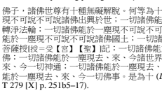

462 The expression *bukeshuo bukeshuo* 不可說不可說 must reflect an original anabhi-*lāpyānabhilāpya*, designating a very high number (see BHSD p. 20). My rendition of this as "an untold number of" is a mere placeholder and not an entirely accurate one at that, since anabhi*lāpyānabhilāpya* refers to a specific number.
completely manifest, in one single atom, all the *buddhakṣetra*s of the three times; all Buddhas completely manifest, in one single atom, the masterful supernatural powers463 of all the Buddhas of the three times; all Buddhas completely manifest, in one single atom, all the living beings of the three times; all Buddhas completely manifest, in one single atom, the buddha-deeds464 of all the Buddhas of the three times. 

Son of the Buddha, these are the ten types of unhindered liberation of all the Buddhas.

The Buddhāvataṃ*saka* scriptural tradition (with related commentaries) 
represents the second most important source on the anāvaraṇ*avimokṣa* after the DZDL itself, and I will discuss possible connections between these sources in the Conclusions to this Appendix. While here I cannot offer a detailed doctrinal analysis of this fact, it is an easy guess that it is probably a reflection of the key role that the idea of non-obstruction and dissolution of any form of limitation plays in *Avataṃsaka* and East Asian Huayan 華嚴 thought in general (see, for example, Gimello 1976: 23–27, and especially 473; Schmithausen 2009: 229–230).

## 2.2.5 The Vimalakīrtinirdeśa And The Zhu Weimojie Jing

The last set of sources I would like to discuss in this Appendix are the Vimala*kīrtinirdeśa* and the commentary based on Kumārajīva's version of this scripture known as the *Zhu Weimojie jing* 注維摩詰經 (T 1775). 

The latter is particularly important for the present study. This invaluable exegetical work, a compilation of glosses by Kumārajīva and some of his prominent disciples,465 provides unique insight into the doctrinal background of one of the most influential translation teams in the history of Chinese Buddhism, to which we owe, among other things, the DZDL.

The scripture usually known as *Vimalakīrtinirdeśa* is referred to in ancient sources under a variety of different titles, several of which are built around the expression *acintyavimokṣa*, "inconceivable libera-tion",466 a condition conducive to advanced supernatural powers which is the topic of Chapter 5 of the Sanskrit text (Acintyavimokṣasaṃdarśanaparivarta, *Vimalakīrtinirdeśa* pp. 56–63). In one of the first glosses collected in this commentary, Kumārajīva discusses at length this alternative title, also mentioning, *inter alia*, the unhindered nature of the "incon-ceivable liberation". Although it does not explicitly mention the *term* "unhindered liberation", this passage is important because provides direct evidence of Kumārajīva's understanding of *vimokṣa*, which comes close to several passages from the DZDL analysed above in section 1.

25.

一名不可思議解脫。 什曰:亦名三昧,亦名神足。或令脩短改度, 或巨細相容,變化隨意。於法自在解脫無礙 a,故名解脫。能者能 然,物不知所以故曰不思議。 亦云:法身大士念即隨應,不入禪 定然後能也。心得自在,不為不能所縛故曰解脫也。若直明法空, 則乖於常習,無以取信,故現物隨心變,明物無定性。物無定性, 則其性虛矣。菩薩得其無定,故令物隨心轉,則不思議乃空之明證。

將顯理宗故,以為經之標也 (*Zhu Weimojie jing* T 1775 [XXXVIII] p. 

327c15–25).

[a]無礙=於闕【甲】
An alternative title is Inconceivable liberation (**acintyavimok*ṣa). Kumārajīva said: [This *vimokṣa*] is also defined as *samādhi*, and also as basis of supernatural power (神足, **r̥ddhipāda*). Sometimes [this attainment] causes the length [of things] to be altered, sometimes [it causes] large and small [things] to encompass each other, transforming [them] at will. Because [this power entails] mastery and freedom with respect to [all] *dharma*s, without [any] hindrance, it is called 'libera-tion'. Because the one who has the capacity [to exert this power] is able to be so without [other] beings understanding how [that happens], 
it is called "inconceivable". It is also said that for Great Beings with the Dharma body 
(**dharmakāya*),467 [these supernatural powers] are manifested [merely] 
by thinking; 468 it is not that they are able [to display these powers] only after being absorbed in meditative states. Because [their minds] acquire mastery, without being trammeled by inability, [this state] is called "liberation". If one were to illustrate [the principle of] the emptiness of *dharma*s in a direct way, then [this] would be in [total] contrast with [people's] customary [experience], [and, as a result,] there would not be any means to win [their] conviction. Therefore, one shows that things change in accordance with the mind, to illustrate [the principle] that things lack a defined nature. If that is the case, then [their] nature is clearly unreal. If Bodhisattvas grasp the fact that [*dharma*s] are without a defined [nature], thus being able to make things transform in accordance with the mind, then [this] inconceivable [power] is indeed a clear proof of emptiness. In order to manifest [this] fundamental principle, it has been adopted as a label of the *sūtra*.

The expression anāvaraṇ*avimok*ṣa occurs only once in the Sanskrit text of the Vimala*kīrtinirdeśa*. The section in question, at the beginning of the text, describes the qualities of the Bodhisattvas accompanying the Buddha (Chapter 1 § 3), and contains a compound which is very close to the passage from the Bajaur *Mahāyāna Sūtra* quoted above (cf. Passage 19):
26.a.

anāvaraṇavimokṣapratiṣṭhitaiḥ (*Vimalakīrtinirdeśa* folio 1b6, ed. Tokyo 2006, p. 1).469 They were abiding in unhindered liberation.

The commentary contains two glosses on this passage, one by Kumārajīva (who explicitly equates the anāvaraṇ*avimokṣa* with the *acintyavimok*ṣa) and one by Sengzhao:
26.b.

心常安住無閡470解脫。

什曰: 不思議解脫即其類也。於事無閡故言 a 無閡。無閡故解脫 b。 或於一事乃至百千,或於一國至恒沙國,於中通達,自在無閡,未 能如佛一切無閡。

肇曰: 此解脫七住 c 所得。得此解脫,則於諸法通達無閡,故心 常安住也 (*Zhu Weimojie jing* T 1775 [XXXVIII] p. 329a22–27).

[a]言=名【甲】[b]脫+(也)【甲】[c]住+(於)【甲】
[*Sūtra*: These Bodhisattvas'] minds were constantly well established in the unhindered liberation.

Kumārajīva said: The inconceivable liberation (**acintyavimokṣa*) is of the same category [as the unhindered liberation]. Because it is unhindered with respect to [any] matter, it is said to be unhindered, and because it is unhindered, it is a [form of] liberation. Either with respect to one single matter, and so on *up to*: with respect to a hundred thousand; or in one single land (**lokadhātu*), and so on *up to*: in lands [as numerous as] the sands of the Ganges; [yet, even if] with respect to [all of these things, these Bodhisattvas] are penetrating, [with full] mastery and without hindrances, they are still not able to be as utterly free from hindrances as are the Buddhas. [Seng]zhao said: This liberation is achieved [by Bodhisattvas] on the seventh stage (*bhūmi*). 471 Having achieved this liberation, [Bodhisattvas] are penetrating, without hindrances, with respect to all *dharma*s, therefore their minds are constantly well established [therein].

## 2.3 Conclusions

We can now reassess the significance of the DZDL's use of the term anāvaraṇ*avimok*ṣa and, above all, of its addition to later LP texts in the passage discussed in Chapter 3.2 (Passage 4). As the survey offered by this Appendix has shown, while the term anāvaraṇ*avimokṣa* occasionally occurs in several Mahāyāna *sūtra*s, it seems to have left few traces in Mahāyāna treatises and exegetical texts.

Daśabhūmika commentaries—the **Daśabhūmikavibhāṣā* (see Passage 23 above) and the commentary traditionally attributed to Vasubandhu (see n. 443 and 444)—represent another strand of Mahāyāna exegetical literature, besides the DZDL, which discusses the anāvaraṇ*avimokṣa*. But the significance of this term's presence is different in these sources. For quite apart from the much higher frequency and doctrinal importance it has in the DZDL, in the Daśabhū*mika* commentaries the anāvaraṇ*avimokṣa* is mentioned because, as we have seen (see Passage 21 and n. 444), the term already occurs in the base text, whereas in the LP, the base text commented on by the DZDL, it does not (with the limited exceptions discussed in Chapter 3.2, Passage 4). In other words, there is no doubt that in ascribing an important role to the anāvaraṇ*avimok*ṣa, the DZDL was not following either its specific base text or the Prajñāpāramitā literature in general. Hence the relative prominence that this concept has in the commentary must reflect the specific exegetical tradition within which it was produced.472 This, in turn, has important implications for our interpretation of the textual expansion discussed in Chapter 3.2. We can now say that the addition of the term anāvaraṇ*avimokṣa* in LPG and other sources presented in Passages 4.c.1~3 was influenced by a distinctive exegetical tradition also reflected—in a very systematic way—by the DZDL, where this notion plays a uniquely important role.

But if this particular feature of the DZDL's complex ideology was not shaped by its most direct and important scriptural authority—*Prajñāpāramitā* literature—we must look elsewhere for other possible sources of inspiration.

As we have seen above in this Appendix (2.3–2.4), the Buddhāvataṃ*saka* is the one class of Mahāyāna *sūtra*s in which the notion of "unhin-dered liberation" seems to have had a relatively greater importance than in other scriptures. A systematic study of the influence exerted by Bud-dhā*vataṃsaka* texts on the DZDL must be left for future research. However, Zhao Wen (2018: 142–151) has already suggested the possibility that the Ga*ṇḍavyūha-sūtra*,
473 specifically, may have exerted some influence on the DZDL with respect to another important idea employed by the commentary, that of *dharmadhātuja-kāya (*faxing sheng shen* 法性生 身) What makes Zhao's hypothesis potentially important for our analysis is that the *dharmadhātuja-*kāya* happens to be thematically related to the anā*varaṇavimok*ṣa: both play a role in the DZDL's discussion of attributes of Buddhas and advanced Bodhisattvas, and, as a matter of fact, the two terms even occur together in a couple of passages.474 But it is the *quality* of their presence in the DZDL that is of perhaps even greater significance: as we have seen, both figure in some interesting quotation glosses (see Chapter 5.3, p. 107 for *dharma*dhātujakāya*, and Passages 3, 5, and 18 in this Appendix). Apart from other considerations (such as the general distributional patterns of these terms), 
this fact alone suggests that both these categories belong, within the DZDL's hugely complex doctrinal geology, to a more dynamic layer, including notions which are, to varying degrees, distinctive of this commentary. This layer, we can add, still bears the imprint of debates and, as such, is only partly assimilated to the DZDL's more fundamental and 
"stable" doctrinal core (mainly represented by *Prajñāpāramitā*, Madhyamaka, and Sarvāstivādin Abhidharma sources); hence, it was probably relatively close in time to its compilation.

All this, again, points to the composite nature of the DZDL, and reminds us of the importance of reading this commentary not as a doctrinal monolith, but as a complex and dynamic multi-layered text. A greater awareness of this side of the DZDL can only add to the richness and fascination of this extraordinary trove of Buddhist learning and history.

# Bibliography And Abbreviations

## List Of Abbreviations475

Abhidharmako*śabhāṣ*ya: Pradhan, P. (ed.). Abhidharmakośabhāṣ*ya of* Vasubandhu. Patna: K.P. Jayaswal Research Institute, 1967.

Aṣṭasāhasrikā: A*ṣṭasāhasrikā prajñāpāramitā* as included in Wogihara, Unrai (ed.). Abhisamayālaṃkār'ālokā prajñāpāramitāvyākhyā the Work of Haribhadra—Together with the Text Commented on. Tokyo: The Toyo Bunko, 1932.

BHSD: Franklin Edgerton. *Buddhist Hybrid Sanskrit Grammar and Dictionary. Vol. 2: Dictionary*. New Haven: Yale University Press, 1953.

BHSG: Franklin Edgerton. *Buddhist Hybrid Sanskrit Grammar and Dictionary. Vol. 1: Grammar*. New Haven: Yale University Press, 1953.

Bodhisattvabhūmi: Wogihara, Unrai (ed.). Bodhisattvabhūmi: A Statement of Whole Course of the Bodhisattva (*being fifteenth section of* Yogācārabhūmi). 2 vols. Tokyo 1930–1936 (reprinted Tokyo: Sankibo Buddhist Book Store, 1971).

Critical Pāli Dictionary: A Critical Pāli Dictionary, Begun by V. Trenckner, Revised, Continued, and Edited *by Dines Andersen and Helmer* Smith. 3 vols. Copenhagen: Royal Danish Academy/Munksgaard, 1925–2008.

CSZJJ: Sengyou 僧祐 (445–518). *Chu sanzang ji ji* 出三藏記集 T 2145.

Daśabhūmika(K): Kondō, Ryūkyō (ed.). Daśabhūmīś*varo nāma mahāyānasūtra*ṃ. Tokyo: Daijō Bukkyō Kenkō-kai, 1936.

Daśabhūmika(R): Rahder, Johannes (ed.). Daśabhūmikasūtra et Bodhisattvabhūmi*: Chapitres* Vihāra et Bhūmi. Paris, Louvain: J.-B. 

Istas, 1926.

Daśabhūmika(RS): Rahder, Johannes and Susa Shinryū (eds.). "The Gā-thās of the Daśabhūmika-sūtra". *The Eastern Buddhist* 5, no. 4 
(1931), pp. 335–359; 6, no.1 (1932), pp. 5–84.

Dhr: *Guang zan jing* 光讚經 T 222, translated by Dharmarakṣa (286 CE).

Dīgha-*nikāya*: Rhys Davids, T.W. and J. Estlin Carpenter (eds.). *The* Dīgha Nikāya. London: Pali Text Society, 1890–1911.

DAṬ: De Silva, Lily (ed.). Dīghanikāyaṭṭhakathāṭīkā Līnatthava*ṇṇanā*. 3 vols. London: Pali Text Society, 1970.

DZDL: *Da zhidu lun* 大智度論 (**Mahāprajñāpāramitopadeśa*) T 1509, translated by Kumārajīva (402–406 CE).

DZDL(Fsh): text of the *Da zhidu lun* 大智度論 in: *Fangshan shijing* 房 山石經. Beijing: Huaxia chubanshe, 2000, vols. 15–16.

Fsh: *Fangshan shijing* 房山石經. 18 vols. Beijing: Huaxia chubanshe, 2000.

Ga*ṇḍavyūhasūtra*(SI): Suzuki, Daisetz Teitaro and Idzumi Hokei (eds.). 

The Gaṇḍavyūha Sūtra, *critically edited*. Kyoto: The Sanskrit Buddhist Texts Publishing Society, 1934–1936.

Ga*ṇḍavyūhasūtra*(V): Vaidya, P.L. (ed.). Ga*ṇḍavyūhasūtram*. Buddhist Sanskrit Texts no. 5. Darbhanga: The Mithila Institute, 1960.

GZJ: Critical edition and annotated translation of Dhr, Chapters 1–3, found in Zacchetti 2005 (references are to paragraph numbers used in this work).

HD: *Hanyu da cidian* 漢語大詞典, 13 vols. Shanghai: Hanyu da cidian chubanshe, 1986–1994.

Kāśyapaparivarta: Vorobyova-Desyatovskaya, M.I. (ed., in collaboration with Seishi Karashima and Noriyuki Kudo). The Kāśyapa*parivarta: Romanized Text and Facsimiles*. Bibliotheca Philologica et Philosophica Buddhica V. Tokyo: The International Research Institute for Advanced Buddhology, Soka University, 2002.

Kj: *Mohebanreboluomi jing* 摩訶般若波羅蜜經 T 223, translated by Kumārajīva (403–404 CE).

Lalitavistara: Lefmann, Salomon (ed.). Lalita Vistara: *Leben und Lehre* des Çâkya-Buddha. Textausgabe mit Varianten-, Metren- *und* Wörterverzeichnis. 2 vols. Halle: 1902–1908.

Lamotte I–V: Lamotte, Étienne. *Le Traité de la Grande Vertu de Sagesse* de Nāgārjuna (Mahāprajñāpāramitāśāstra). 5 vols. Louvain:
Institut Orientaliste de Louvain, 1944–1980 [Tome I 1944, Tome II 1949, Tome III 1970, Tome IV 1976, Tome V 1980].

LP: Larger Prajñāpāramitā.

LPG: main Larger *Prajñāpāramitā* manuscript from Gilgit, in S. Karashima, Y. Lee, J. Nagashima, F. Shoji, K. Suzuki, S. Ye, and S.

Zacchetti (eds.) 2016, pp. 1–251.

LPG II/LPG III: fragments of two other Larger *Prajñāpāramitā* manuscripts from Gilgit, in S. Karashima and T. Tamai (eds.) 2019.

Larger Sukhāvatīvyūha: Fujita, Kotatsu (ed.). *The Larger and the Smaller* Sukhāvatīvyūha Sūtras, Edited With Introductory Remarks and Word Indexes to the Two *Sūtras*. Kyoto: Hōzōkan, 2011.

Majjhima-*nikāya*: Trenckner, V., Robert Chalmers, and Caroline Rhys Davids (eds.). The Majjhima-*nikāya*. 4 vols. London: The Pali Text Society, 1888–1925.

Mahāyānasūtrālaṃkāra: Lévi, Sylvain. Mahāyāna-Sūtralaṃkāra: *Exposé* de la doctrine du Grand Véhicule selon le système Yogācāra. 2 vols. Paris: H. Champion, 1907–1911.

Mo: *Fang guang banre jing* 放光般若經 T 221, translated by Wuchaluo 無叉羅 (*Mokṣala; 291 CE).

PvsP: Pañcavi*ṃśatisāhasrikā prajñāpāramitā*.

PvsP(D): Dutt, Nalinaksha (ed.). Pañcavi*ṃśatisāhasrikā prajñāpāramitā*.

Calcutta Oriental Series no. 28. London: Luzac and Co, 1934.

PvsP(K): Kimura, Takayasu (ed.). Pañcaviṃśatisāhasrikā p*rajñāpāramitā*. 6 vols (I-1, I-2, II–III, IV, V, VI–VIII). Tokyo: Sankibō Busshorin, 1986–2009.

PvsP(TibD): Tibetan translation of the Pañcaviṃśatisāhasrikā p*rajñāpāramitā* included in the Derge Edition, *Shes rab kyi pha rol tu* phyin pa stong phrag nyi shu lnga pa (D 9; shes phyin, *ka~ga*).

PvsP(TibPk): Tibetan translation of the Pañcavi*ṃśatisāhasrikā prajñāpāramitā* included in the Peking Kanjur, Shes rab kyi pha rol tu phyin pa stong phrag nyi shu lnga pa (P 731; sher phyin, *nyi~di*).

PvsP(SL): fragments of a Pañcavi*ṃśatisāhasrikā prajñāpāramitā* from Anurādhapura, Oskar von Hinüber (ed.) 1983.

Rāṣṭrapālaparipr̥cchā: Finot, Louis 1901. Rāṣṭrapālaparipr̥cchā: *Sūtra du* Mahāyāna. St. Petersburg: Academy of Sciences (rpt. The Hague: Mouton and Co., 1957).

Ratnaketuparivarta: Kurumiya, Yenshu (ed.). Ratnaketuparivarta: *Sanskrit Text*. Kyoto: Heirakuji-shoten, 1978.

Ś: Ghoṣa, Pratāpacandra (ed.). *Śatasāhasrikā prajñāpāramitā*. Calcutta: 
Asiatic Society of Bengal, 1902–1914.

Saddharmapu*ṇḍarīka*: Kern, H. and B. Nanjio (eds.). Saddharmapuṇḍa-*rīka* (Bibliotheca Buddhica X). St. Petersburg 1908–1912.

Saṃyutta-*nikāya*: Feer, Léon and Caroline A.F. Rhys Davids (eds.). The Saṃyutta-nikāya of the Sutta*-piṭaka*. 6 vols. Oxford: Pali Text Society, 2008 (Reprinted with corrections).

Sāratamā: Jaini, Padmanabha S. (ed.). *Sāratamā. A Pañjikā on the Aṣṭasāhasrikā prajñāpāramitā Sūtra by Ratnākaraśānti*. Patna: Kashi Prasad Jayaswal Research Institute, 1979. (Tibetan Sanskrit Works Series, 18).

Sāratthappakāsinī: Woodward, Frank Lee (ed.). Sārattha-*ppakāsinī:* 
Buddhaghosa's Commentary on the Saṃyutta-*nikāya*. 3 vols. 

London: Pali Text Society, 1929–1937.

Suma*ṅgalavilāsinī*: Rhys Davids, T.W. and J. Estlin Carpenter (eds.). The Sumaṅgala-vilāsinī: Buddhaghosa's Commentary on the Dīgha Nikāya. 3 vols. London: Pali Text Society, 1968–1971 (2nd ed.).

Theragāthā: Oldenberg, Hermann and Richard Pischel, with appendices by K.R. Norman and L. Alsdorf (eds). *The* Thera- *and* Therî-gâthâ
(Stanzas Ascribed to Elders of the Buddhist Order of Recluses). 

London: Pali Text Society, 1966 (2nd edition).

Vimalakīrtinirdeśa: Study Group on Buddhist Sanskrit Literature. 

Vimalakīrtinirdeśa: A Sanskrit Edition Based upon the Manuscript Newly Found at the Potala Palace. Tokyo: Taisho University, 2006.

Xz(Ad): Xuanzang's 玄奘 translation (660–663 CE) of the Aṣṭādaśa-sāhasrikā prajñāpāramitā (Da banreboluomiduo *jing* 大般若波羅 蜜多經 T 220 [VII, pp. 427b2–761b27], division 3).

Xz(PvsP): Xuanzang's translation (660–663 CE) of the Pañcaviṃśati-sāhasrikā prajñāpāramitā (Da banreboluomiduo *jing* 大般若波羅 蜜多經 T 220 [VII, pp. 1b2–426a14], division 2).

Xz(Ś): Xuanzang's translation (660–663 CE) of the Śatasāhasrikā prajñāpāramitā (Da banreboluomiduo *jing* 大般若波羅蜜多經 T 
220 [V-6], division 1).

ZH: *Zhonghua dazangjing* 中華大藏經. 106 vols. Beijing: Zhonghua shuju, 1984–1996.

## Bibliography

Anālayo 2010. "The Influence of Commentarial Exegesis on the Trans-mission of Āgama Literature". In: Konrad Meisig (ed.), *Translating Buddhist Chinese: Problems and Prospects*. Wiesbaden: 
Harrassowitz Verlag, 2010, pp. 1–20.

Anālayo 2011. A Comparative Study of the Majjhima-*nikāya*. 2 vols. 

Taipei: Dharma Drum Publishing Corporation.

Anālayo 2014. *The Dawn of Abhidharma*. Hamburg Buddhist Studies 2. 

Hamburg: Hamburg University Press.

Apple, James B. 2015. "Redaction and Rhetoric in Mahāyāna *Sūtra*s: The Case of the Jayamatiparipr̥cchāsūtra". *Indo-Iranian Journal* 58 
(2015), pp. 1–25.

Baba Norihisa 馬場紀寿 2004. "Hokuden Agon no 'kū' setsuji: Pāli bunken to no hikaku kenkyū" 北伝阿含の「空」説示-パ-リ文 献との比較研究. *Bukkyō kenkyū* 仏教研究 32 (March 2004), pp. 

233–255.

Baba, Norihisa 2004b. "On Expressions Regarding śūnya or *śūnyatā* in the Northern Āgamas and the Pāli Commentaries". Indogaku Buk-*kyōgaku kenkyū* 印度学仏教学研究 52, no. 2 (2004), pp. 9–11 
(946–944).

Baba Norihisa 馬場紀寿 2008. Jozabu Bukkyō no shisō *keisei: Buddha* kara Buddhaghosa e 上座部仏教の思想形成-ブッダからブッダ ゴーサへ. Tokyo: Shunjūsha.

Baums, Stefan 2009. A Gāndhārī Commentary on Early Buddhist Verses: 
British Library Kharoṣṭhī Fragments 7, 9, 13 and 18. PhD dissertation, University of Washington.

Baums, Stefan 2014. "Truth and Scripture in Early Buddhism: Categorial Reduction as Exegetical Method in Ancient Gandhāra and Be-yond". In: Tansen Sen (ed.), Buddhism across Asia: Networks of Material, Intellectual and Cultural Exchange, Volume I. Singapore: 
Institute of Southeast Asian Studies, 2014, pp. 19–38.

Baums, Stefan 2015. "Commentary: Overview". In: Jonathan A. Silk
(ed.), *Brill's Encyclopedia of Buddhism*. Vol. 1. Leiden: Brill, 2015, pp. 409–418.

Beckwith, Christopher 1993. The Tibetan Empire in Central Asia: A History of the Struggle for Great Power among Tibetans, Turks, Arabs, and Chinese during the Early Middle Ages. Princeton, NJ: Princeton University Press.

Bentor, Yael 1988. "The Redactions of the *Adbhutadharmaparyāya* from Gilgit", *Journal of the International Association of Buddhist Studies* 11, no. 2 (1988), pp. 21–52.

Bongard-Levin, G.M. and Hori Shin'ichirō 1996. "A Fragment of the Larger Prajñāpāramitā from Central Asia". Journal of the International Association of Buddhist Studies 19, no. 1 (1996), pp. 

19–60.

Boucher, Daniel 2008. *Bodhisattvas of the Forest and the Formation of* the Mahāyāna: A Study and Translation of the Rāṣṭrapālaparip*r̥cchā-sūtra*. Honolulu: University of Hawai'i Press.

Braarvig, Jens 1985. "*Dhāraṇī* and *Pratibhāna*: Memory and Eloquence of the Bodhisattvas". *Journal of the International Association of* Buddhist Studies 8, no. 1 (1985), pp. 17–29.

Bronkhorst, Johannes 2018. "Abhidharma in Early Mahāyāna". In: Paul Harrison (ed.), *Setting Out on the Great Way: Essays on Early* Mahāyāna Buddhism. Sheffield: Equinox Publishing, 2018, pp. 

119–140.

Brough, John 1962. *The Gāndhārī Dharmapada*. London Oriental Series 7. London; New York; Toronto: Oxford University Press.

Brough, John 1977. "The *Arapacana* Syllabary in the Old *Lalita-Vistara*". 

Bulletin of the School of Oriental and African Studies 40, no. 1 (1977), pp. 85–95.

Brough, John 1996. *Collected Papers*. Minoru Hara and J.C. Wright
(eds.). London: School of Oriental and African Studies—University of London.

Canevascini, Giotto 1993. The Khotanese Saṅghāṭasūtra: A *Critical* Edition. Wiesbaden: Dr. Ludwig Reichert Verlag.

Cao Shibang 曹仕邦: see Tso, Sze-bong.

Chen, Ruixuan 2018. "Vignettes of Buddhist Asceticism: Jottings on Six Fragments in Tocharian B". *Central Asiatic Journal* 61, no. 2 (2018), pp. 217–256.

Chimpa, Lama and Alaka Chattopadhyaya 1970. *Tāranātha's History of* Buddhism in India. Simla: Indian Institute of Advanced Study.

Choong Yoke-meei 宗玉媺 2008. "Fanyu Gilgit xieben liangwan wuqian song *Banreboluomi jing—di shisi pin* zhi jiaokan jiqi xiangguan wenti" 梵語 Gilgit 寫本兩萬五千頌 《般若波羅蜜經‧第十四品》
之校勘及其相關問題 . Zhongyang yanjiuyuan lishi yuyan yanjiusuo jikan 中央研究院歷史語言研究所集刊 79, no. 2 (2008), 
pp. 301–341.

Choong Yoke-meei 宗玉媺 2018. "Cong fannao zai pusadao shang de zuoyong kan *Da zhidu lun* de bianzhuan" 從煩惱在菩薩道上的作 用看《大智度論》的編撰. Unpublished paper presented at the International Conference "*Da zhidu lun* de shijie" (《大智度論》
的世界國際學術研討會), National Taiwan University/Fo Guang University, 20–21 October 2018.

Chou Po-kan [= Zhou Bokan 周伯戡] 1992. "Kuche suo chu *Da zhidu lun* xieben canjuan zhi yanjiu—jianlun Jiumoluoshi zhi fanyi" 庫車所 出《大智度論》寫本殘卷之研究―兼論鳩摩羅什之翻譯. *Guoli* Taiwan daxue lishixuexi xuebao 國立台灣大學歷史學系學報 17, 
(1992), pp. 65–106.

Chou, Po-kan [= Zhou Bokan 周伯戡] 2000. The Translation of the Dazhidulun: Buddhist Evolution in China in the Early Fifth Century. PhD dissertation, The University of Chicago.

Chou Po-kan [= Zhou Bokan 周伯戡] 2000b, "*Da zhidu lun* lüeyi chutan" 
《大智度論》略譯初探, *Zhonghua Foxue xuebao* 中華佛學學報 13, no. 1 (May 2000), pp. 155–165.

Chou Po-kan [= Zhou Bokan 周伯戡] 2004. "The Problem of the Authorship of the *Mahāprajñāpāramitopadeśa*: A Re-exam-ination". *Taida lishi xuebao* 臺大歷史學報 34 (2004), pp. 281–327.

Colas, Gérard 1999. "The Criticism and Transmission of Texts in Classical India". *Diogenes* 186, 47, no. 2 (1999), pp. 30–43.

Cone, Margaret 2001. *A Dictionary of Pāli*. Part I. Oxford: The Pali Text Society.

Cone, Margaret 2010. *A Dictionary of Pāli*. Part II. Bristol: The Pali Text Society.

Conze, Edward (ed. and tr.) 1962. The Gilgit Manuscript of the Aṣṭādaśasāhasrikā-prajñāpāramitā—Chapters 50 to 55 corresponding to the 5th *Abhisamaya*, Serie Orientale Roma XXVI. Roma: ISMEO.

Conze, Edward 1967 (repr. 1973). *Materials for a Dictionary of the* Prajñāpāramitā *Literature*. Tokyo: The Suzuki Research Foundation.

Conze, Edward (ed. and tr.) 1974. *The Gilgit Manuscript of the* Aṣṭādaśasāhasrikā-prajñāpāramitā: Chapters 70. to 82 corresponding to the 6 th, 7th, and 8th *Abhisamayas*. Serie Orientale Roma XLVI. Roma: 
ISMEO.

Conze, Edward 1975. The Large Sutra on Perfect Wisdom with the Divi-*sions of the Abhisamayālaṅkāra*. Berkeley: University of California Press.

Conze, Edward 1978. The Prajñāpāramitā Literature. 2nd ed., Revised and Enlarged. Bibliographia Philologica Buddhica, Series Maior I. 

Tokyo: The Reiukai Library.

Cox, Collett 1995. Disputed Dharmas—Early Buddhist Theories on Existence—An Annotated Translation of the Section on Factors Dissociated from Thought from Sa*ṅghabhadra's* Nyāyānusāra. Studia Philologica Buddhica (Monograph Series XI). Tokyo: The International Institute for Buddhist Studies.

Cox, Collett 1998. "Kaśmīra: Vaibhāṣika Orthodoxy". In: Charles Willemen, Bart Dessein, and Collett Cox, Sarvāstivāda Buddhist Scho*lasticism*. Leiden-New York-Köln: Brill, 1998, pp. 138–254.

Dalfen, Joachim 1978. "Scholien und Interlinearglossen in Marc AurelHandschriften". *Studi Italiani di Filologia Classica* 50, no. 1–2
(1978), pp. 5–26.

Deleanu, Florin 2000. "A Preliminary Study on Meditation and the Beginning of Mahāyāna Buddhism". *Annual Report of The International Research Institute for Advanced Buddhology at Soka University for the Academic Year 1999* 3 (2000), pp. 65–113.

Delhey, Martin 2015. "The Library at the East Indian Buddhist Monastery of Vikramaśīla: An Attempt to Identify Its Himalayan Remains". *Manuscript Cultures* 8 (2015), pp. 2–24.

Delhey, Martin 2016. "From Sanskrit to Chinese and Back Again: 
Remarks on Xuanzang's Translations of the *Yogācārabhūmi* and Closely Related Philosophical Treatises". In: Dorji Wangchuk (ed.), Cross-Cultural Transmission of Buddhist Texts: Theories and Practices of Translation. Indian and Tibetan Studies 5. Hamburg: 
Department of Indian and Tibetan Studies, Universität Hamburg, 2016, pp. 51–79.

Demiéville, Paul 1950. Review of É. Lamotte, *Le Traité de la Grande* Vertu de Sagesse de Nāgārjuna Tome II (Louvain, 1949). *Journal* Asiatique 238 (1950), pp. 375–395.

Demiéville, Paul 1953. "Le bouddhisme—Les sources chinoises." In:
Louis Renou and Jean Filliozat (eds.), L'Inde classique—Manuel des études indiennes. Paris: École française d'Extreme-Oriênt, 1953 (repr. 2000), pp. 398–463.

Dessein, Bart 1999. Saṃyuktābhidharmahr̥*daya: Heart of Scholasticism* with Miscellaneous Additions. 3 vols. Delhi: Motilal Banarsidass.

De Simini, Florinda 2016. Of Gods and Books: Ritual and Knowledge Transmission in the Manuscript Cultures of Premodern India. Berlin: De Gruyter.

Dhammajoti 法光 K.L., Bhikkhu 2015. *Sarvāstivāda Abhidharma*. Fifth revised edition. Hong Kong: The Buddha-Dharma Centre of Hong Kong.

[Dharmamitra, Bhikshu 2019. Nāgārjuna'*s Treatise On the Ten* Bodhisattva Grounds. The Daśabhūmika Vibhāṣā. Seattle, Washington: Kalavinka Press.]
Dong Zhiqiao 董志翘 and Cai Jinghao 蔡镜浩 1994. Zhonggu xuci yufa lishi 中古虚词语法例释. Changchun: Jilin jiaoyu chubanshe.

Drewes, David 2011. "Dharmabhāṇakas in Early Mahāyāna". *IndoIranian Journal* 54, no. 4 (2011), pp. 331–372.

Drewes, David 2015. "Oral Texts in Indian Mahāyāna". *Indo-Iranian* Journal 58, no. 2 (2015), pp. 117–141.

Ducor, Jérôme 2004. "Les sources de la *Sukhāvatī*: Autour d'une étude récente de G. Fussman". Journal of the International Association of Buddhist Studies 27, no. 2 (2004), pp. 357–411.

Durt, Hubert 1988. "The Difference between Hīnayāna and Mahāyāna in the Last Chapter, 'Parīndanā', of the Ta-chih-tu lun (Mahāprajñāpāramitopadeśa)". *Buddhist Studies Review* 5, no. 2 (1988), pp. 

123–138.

Durt, Hubert 1985. "Étienne Lamotte (1903–1983)". *Bulletin de l'École* française d'Extrême-Orient 74 (1985), pp. 6–28.

Durt, Hubert 1993. "Le Traité de la grande vertu de sagesse et *l'Histoire* du Bouddhisme indien d'Étienne Lamotte". In: *Premier colloque* Étienne Lamotte (Bruxelles et Liège 24–*27 septembre 1989)*. Louvain-la-Neuve: Université Catholique de Louvain, Institut Orientaliste, 1993, pp. 1–16.

Durt, Hubert 1994. "Daijō 大 乘 ". In: Hōbōgirin—*septième volume* 
(daijō*-daishi)*, Paris-Tokyo: Librairie d'Amerique et d'Orient/ Maison Franco-Japonaise, 1994, pp. 767–801.

Eltschinger, Vincent 2001. *Dharmakīrti sur les mantra et la perception* du supra-sensible. Wiener Studien zur Tibetologie und Buddhismuskunde 51. Wien: Arbeitskreis für tibetische und buddhistische Studien Universität Wien.

Emmrich, Christoph 2009. "Emending Perfection: Prescript, Postscript and Practice in Newar Buddhist Manuscript Culture". In: Stephen C. Berkwitz, Juliane Schober, and Claudia Brown (eds.), Buddhist Manuscript Cultures: Knowledge, Ritual, and Art. London: Routledge, 2009, pp. 140–156.

Felbur, Rafal Jan 2018. Anxiety of Emptiness: Self and Scripture in Early Medieval Chinese Buddhism with a Focus on Sengrui 僧叡. PhD 
dissertation, Stanford University.

Formigatti, Camillo 2015. Sanskrit Annotated Manuscripts from Northern India and Nepal. PhD dissertation, Universität Hamburg.

Frauwallner, Erich 1995. *Studies in Abhidharma Literature and the* Origins of Buddhist Philosophical Systems. Albany: SUNY Press.

Funayama Tōru 船山徹 2013. Butten wa dō kan'yaku sareta no ka: sūtora ga kyōten ni naru toki 仏典はどう漢訳されたのか—スートラが 経典になるとき. Tokyo: Iwanami Shoten.

Funayama Tōru 船山徹 and Yoshikawa Tadao 吉川忠夫 2009–2010. 

Kōsō den 高僧伝. 4 vols. Tokyo: Iwanami Shoten.

Fussman, Gérard 1999. "La place des *Sukhāvatī-vyūha* dans le boud-dhisme indien". *Journal Asiatique* 287, no. 2 (1999), pp. 523–586.

Fussman, Gérard 2004. "Dans quel type de bâtiment furent trouvés les manuscrits de Gilgit?". *Journal Asiatique* 292, no. 1–2 (2004), pp. 

101–150.

Fussman, Gérard 2005. "Cours: La progression du bouddhisme en Inde du Nord-ouest. Séminaire: Les bibliothèques des monastères boud-dhiques indiens". Annuaire du Collège de France 2003–*2004*, pp. 

929–955.

Gellner, David N. 2001. The Anthropology of Buddhism and Hinduism: 
Weberian Themes. New Delhi: Oxford University Press.

Gimello, Robert M. 1976. Chih-yen (602–668) and the Foundations of Hua-yen Buddhism. PhD dissertation, Columbia University.

Gómez, Luis O. 1967. Selected Verses from the Ga*ṇḍavyūha*: Text, Critical Apparatus and Translation. PhD dissertation, Yale University.

Gómez, Luis O. 1996. The Land of Bliss—The Paradise of the Buddha of Measureless Light. Sanskrit and Chinese Versions of the Sukhāvatī-*vyūha Sutras*. Honolulu and Kyoto: University of Hawai'i Press and Higashi Honganji Shinshū Ōtani-ha.

Gómez, Luis O. and Jonathan A. Silk (eds.) 1989. *Studies in the Literature* of the Great Vehicle: Three Mahāyāna Buddhist Texts. Ann Arbor: Collegiate Institute for the Study of Buddhist Literature and Center for South and Southeast Asian Studies, The University of Michigan.

Grafton, Anthony 1991. Defenders of the Text: The Traditions of Scholarship in an Age of Science, 1450–*1800*. Cambridge, MA; London: 
Harvard University Press.

Gwo Jong-sheng [Guo Zhongsheng] 郭忠生 1997. "Shilun *Da zhidu lun* zhong de 'duihuazhe' ", 試論《大智度論》中的「對話者」. 

Zhengguan zazhi 正觀雜誌 2 (1997), pp. 63–177.

Hachiriki Hiroki 八力広喜 1992. "Jū jū bibasharon to Jū ji kyō" 『十住 毘婆沙論』と『十地経』. *Indogaku Bukkyōgaku kenkyū* 印度学 仏教学研究 40, no. 2 (1992), pp. 37–43.

Hamar, Imre 2007. "The History of the Buddhāvataṃsaka-*sūtra*: Shorter and Larger Texts". In: Imre Hamar (ed.), *Reflecting Mirrors: Perspectives on Huayan Buddhism*. Wiesbaden: Harrassowitz, 2007, pp. 139–167.

Hanazuka Hisayoshi 花塚久義 1982. "*Chu Yuimakitsukyō* no hensansha o megutte" 注維摩詰経の編纂者をめぐって. *Komazawa daigaku* bukkyōgakubu ronshū 駒澤大学仏教学部論集 13 (1982), pp. 201–
214.

Hanneder, Jürgen 2002. "The Blue Lotus: Oriental Research between Philology, Botany and Poetics?". *Zeitschrift der Deutschen Morgenländischen Gesellschaft* 152, no. 2 (2002), pp. 295–308.

Hanneder, Jürgen 2007. "Some Common Errors Concerning WaterLilies and Lotuses". *Indo-Iranian Journal* 50 (2007), pp. 161–164.

Harimoto, Kengo 2011. "In Search of the Oldest Nepalese Manuscript". 

Rivista degli studi orientali. Nuova Serie, 84 no. 1/4 (2011), pp. 

85–106.

Harrison, Paul 1990. *The Samādhi of Direct Encounter with the Buddhas* of the Present: An Annotated English Translation of the Tibetan Version of the Pratyutpanna-Buddha-Saṃmukhāvasthita-SamādhiSūtra *with Several Appendices relating to the History of the Text*. 

Studia Philologica Buddhica (Monograph Series V). Tokyo: The International Institute for Buddhist Studies.

Harrison, Paul 2010. "Experimental Core Samples of Chinese Translations of Two Buddhist S*ūtra*s Analysed in the Light of Recent Sanskrit Manuscript Discoveries". Journal of the International Association of Buddhist Studies 31 nos. 1–2 (2008 [published in 2010]), pp. 205–249.

Harrison, Paul 2010b. "Resetting the Diamond: Reflections on Kumārajīva's Chinese Translation of the Vajracchedikā ('*Diamond* Sūtra')". In: Shen Weirong 沈衛榮 (ed.), *Historical and Philological Studies of China's Western Regions* (西域历史语言研究集刊),
no. 3 (Beijing: Science Press) 2010, pp. 233–248.

Harrison, Paul 2018. "Early Mahāyāna: Laying out the Field". In: Paul Harrison (ed.), *Setting Out on the Great Way: Essays on Early* Mahāyāna Buddhism. Sheffield: Equinox Publishing, 2018, pp. 7–
31.

Harrison, Paul and Watanabe Shōgo 2006. "*Vajracchedikā prajñāpāramitā*". In: Jens Braarvig (gen. ed.), Manuscripts in the Schøyen Collection—Buddhist Manuscripts vol. 3. Oslo: Hermes Publishing, 2006, pp. 89–132.

He Mei 何梅 1996. "Fangshan shijing yu Sui han lu, Qidan zang, Kaiyuan lu de guanxi zhi tantao" 房山石经与《随函录》·《契丹藏》·《开 元录》的关系之探讨. *Foxue yanjiu* 佛学研究 5 (1996), pp. 262–
272.

He Shuqun 何書群 [Michael Radich]. "Zhu Fahu shifou xiuding guo T474? 竺法護是否修訂過 T474?". *Foguang xuebao* 佛光學報, New Series, 5, no. 2 (2019), pp. 15–38.

Hikata, Ryusho 1958. Suvikrāntavikrāmi-paripr̥cchā-Prajñāpāramitā-sūtra *Edited with an Introductory Essay*. Fukuoka: Comittee of Commemoration Program for Dr. Hikata's Retirement from Professorship, Kyushu University.

von Hinüber, Oskar 1980. "Remarks on the Problems of Textual Criticism in Editing Anonymous Sanskrit Literature". In: *Proceedings* of the First Symposium of Nepali and German Sanskritists 1978. 

Kathmandu: Institute of Sanskrit Studies, Tibhuvan University, Dang Nepal Research Centre, 1980, pp. 28–40.

von Hinüber, Oskar 1983. "Sieben Goldblätter einer Pañcaviṃśatisāhasrikā prajñāpāramitā aus Anurādhapura". Nachrichten der Akademie der Wissenshaften in Göttingen—Philologisch-Historische Klasse Jahrgang 1983 7 (1983), pp. 189–207.

von Hinüber, Oskar 2004. Die Palola Ṣāhis: ihre Steininschriften, Inschriften auf Bronzen, Handschriftenkolophone und Schutzzauber: 
Materialien zur Geschichte von Gilgit und Chilas. ANP 5. Mainz: 
Philipp von Zabern.

von Hinüber, Oskar 2007. "Three New Bronzes from Gilgit". *Annual* Report of the International Research Institute for Advanced Buddhology at Soka University 10 (2007), pp. 39–43.

von Hinüber, Oskar 2014. "The Gilgit Manuscripts: An Ancient Library in Modern Research". In: Paul Harrison and Jens-Uwe Hartmann 
(eds.). *From Birch Bark to Digital Data: Recent Advances in Buddhist Manuscript Research*. Wien: Verlag der Österreichischen Akademie der Wissenschaften (Beiträge zur Kultur- und Geistesgeschichte Asiens 80), 2014, pp. 79–135.

von Hinüber, Oskar 2017. "Names and Titles in the Colophon of the 
'*Larger Prajñāpāramitā*' from Gilgit". *Annual Report of the International Research Institute for Advanced Buddhology at Soka University* 20 (2017), pp. 129–138.

Hirakawa Akira 平川彰 1957. "Jū jū bibasha ron no chosha ni tsuite" 十 住毘婆沙論の著者について. Indogaku Bukkyōgaku k*enkyū* 印度 学仏教学研究 5, no. 2 (1957), pp. 176–181.

[Hokazono Kōichi 外園幸一, Raritavisutara no kenkyū *(gekan)* ラリタヴ ィスタラの研究 (下巻) (Tokyo: Daitō Shuppansha 大東出版社, 2019).]
Honda, Megumu 1968. "Annotated Translation of the Daśabhūmika-*sūtra*". In: Denis Sinor (ed.), *Studies in South, East, and Central* Asia: Presented as a Memorial Volume to the Late Professor Raghu Vira by Members of the Permanent International Altaicist Conference. Śata-Piṭaka Series, Indo-Asian Literatures, vol. 74. New Delhi: International Academy of Indian Culture, 1968, pp. 115–
276.

Huang Guoqing 黃國清 2001. "Zhu Fahu yi *Zhengfa hua jing* 'ziran' yici xilun" 竺法護譯《正法華經》「自然」譯詞析論. Zhonghua Foxue yanjiu 中華佛學研究 (*Chung-Hwa Buddhist Studies*) 5 
(2001), pp. 105–122.

Huifeng: see Shi, Huifeng.

Huynh, Quoc Tuan 2019. *Buddhānusmr̥*ti in the *Da Zhidu Lun*. Mphil dissertation, University of Oxford.

Inokuchi Taijun 井ノ口泰淳 (main ed.) 1980. *Saiiki shutsudo Butten no* kenkyū 西域出土佛典の研究. 2 vols. Kyoto: Ryūkoku daigaku.

Institute for Comprehensive Studies of Buddhism of Taishō University 2000. *Taiyaku* Chū Yuimakitsu kyō 対訳注維摩詰経. Tōkyō: Sankibō Busshorin.

Ishihama, Yumiko and Fukuda Yoichi (eds.) 1989. *New Critical Edition* of the Mahāvyutpatti: Sanskrit*-Tibetan-Mongolian Dictionary of* Buddhist Terminology. Studia Tibetica no. 16; Materials for Tibetan-Mongolian Dictionaries Vol. 1. Tokyo: The Toyo Bunko.

Jettmar, Karl 1977. "Bolor: A Contribution to the Political and Ethnic Geography of North Pakistan". *Zentralasiatische Studien* 11 (1977), pp. 412–448.

Jettmar, Karl 1993. "The Paṭolas, their Governors and their Successors". 

In: Karl Jettmar et al. (eds.), *Antiquities of Northern Pakistan.* Reports and Studies, vol. 2. Mainz: Verlag Philipp von Zabern, 1993, pp. 77–122.

Jong, J.W. de 1966. "The *Daśottarasūtra*". In: *Kanakura hakushi koki* kinen: Indogaku Bukkyōgaku ronshū 金倉博士古稀記念印度学仏 教学論集, Kyoto, 1966, pp. 3–25. Reprinted in: G. Schopen (ed.), 
Buddhist Studies by J.W. de Jong, Berkeley: Asian Humanities Press, 1979, pp. 251–273.

Jong, J.W. de 1971. Review of Lamotte 1970. *Asia Major* 17 (1971–1972), 
pp. 105–112.

Kajiyoshi Kōun 梶 芳 光 運 1980. Daijō Bukkyō no seiritsu shiteki kenkyū—*Genshi* Hannya kyō *no kenkyū: sono ichi* 大乗仏教の成 立史的研究—原始般若経の研究:その一. Tokyo: The Sankibo Press.

Kanno, Hiroshi 2003. "Chinese Buddhist Sutra Commentaries of the Early Period". *Annual Report of The International Research Institute for Advanced Buddhology at Soka University for the Academic* Year 2002 6 (2003), pp. 301–320.

Karashima, Seishi 1998. A Glossary of Dharmarak*ṣa's Translation of the* Lotus Sutra 正法華經詞典. Bibliotheca Philologica et Philosophica Buddhica I. Tokyo: The International Research Institute for Advanced Buddhology, Soka University.

Karashima, Seishi 2001. *A Glossary of Kumārajīva's Translation of the* Lotus Sutra 妙 法 蓮 華 經 詞 典 . Bibliotheca Philologica et Philosophica Buddhica IV. Tokyo: The International Research Institute for Advanced Buddhology, Soka University.

Karashima, Seishi 2001b. "Some Features of the Language of the Saddharmapuṇḍarīkasūtra". *Indo-Iranian Journal* 44 (2001), pp. 207–230.

Karashima, Seishi 2003. "A Trilingual Edition of the Lotus Sutra—New Editions of the Sanskrit, Tibetan and Chinese Versions". Annual Report of The International Research Institute for Advanced Buddhology at Soka University for the Academic Year 2002 6 (2003), 
pp. 85–196.

Karashima, Seishi 2010. A Glossary of Lokak*ṣema's Translation of the* Aṣṭasāhasrikā p*rajñāpāramitā* 道 行 般 若 經 詞 典 . Bibliotheca Philologica et Philosophica Buddhica XI. Tokyo: The International Research Institute for Advanced Buddhology, Soka University.

Karashima, Seishi 2011. A Critical Edition of Lokakṣema's Translation of the Aṣṭasāhasrikā p*rajñāpāramitā* 道行般若經校注. Bibliotheca Philologica et Philosophica Buddhica XII. Tokyo: The International Research Institute for Advanced Buddhology, Soka University.

Karashima, Seishi 2015. "Who Composed the Mahāyāna Scriptures?—
The Mahāsāṃghikas and *Vaitulya* Scriptures". *Annual Report of* the International Research Institute for Advanced Buddhology at Soka University 18 (2015), pp. 113–162.

Karashima, Seishi, Lee Youngjin, Nagashima Jundo, Shoji Fumio, Suzuki Kenta, Ye Shaoyong, and Stefano Zacchetti (eds.) 2016. 

Mahāyāna Texts: Prajñāpāramitā Texts (1)—*Gilgit Manuscripts in* the National Archives of India, Facsimile Edition, Vol. II.1. New Delhi: The National Archives of India; Tokyo: The International Research Institute for Advanced Buddhology, Soka University.

Karashima, Seishi and Tamai Tatsushi (eds.) 2019. *Mahāyāna Texts:*
Prajñāpāramitā Texts (2)—Gilgit Manuscripts in the National Archives of India, Facsimile Edition, Vol. II.2. New Delhi: The National Archives of India; Tokyo: The International Research Institute for Advanced Buddhology, Soka University.

Katō Junshō 加藤純章 1983. "Dai chido ron no sekai" 大智度論の世界.

In: Hirakawa Akira 平川彰 and Kajiyama Yūichi 梶山雄一 (eds.), 
Hannya shisō 般若思想. Tokyo: Shunjusha, 1983, pp. 152–191.

Katō Junshō 加藤純章 1996. "Rajū to Dai chido ron" 羅什と『大智度 論』. *Indotetsugaku Bukkyōgaku* 印度哲学仏教学 (*Hokkaido* Journal of Indological and Buddhist Studies) 11 (1996), pp. 32–58.

Kegasawa Yasunori 気賀沢保規 (ed.) 1996. Chūgoku Bukkyō sekkyō no kenkyū 中国仏教石経の研究. Kyoto: Kyōto daigaku gakujutsu shuppankai.

Kimura, Takayasu (ed.) 2009. Śatasāhasrikā prajñāpāramitā *II-1*. Tokyo: 
Sankibō Busshorin.

Klimburg-Salter, Deborah 2015. "Along the Pilgrimage Routes between Uḍḍiyāṇa and Tibet. The Gilgit MSS Covers and the Tibetan Deco-rated Book Covers". In: Erika Forte, Liang Junyan, and Deborah Klimburg-Salte (eds.), Tibet in Dialogue with its Neighbours: 
History, Culture and Art of Central and Western Tibet, 8th to 15th century. Wiener Studien zur Tibetologie und Buddhismuskunde 88.

Wien: Arbeitskreis für Tibetische und Buddhistische Studie, 2015, pp. 392–406.

Kudo, Noriyuki, Fukita Takanori, Tanaka Hironori (eds.) 2018. *Gilgit* Manuscripts in the National Archives of India. Facsimile Edition. 

Volume II.3: Samādhirājasūtra. New Delhi: The National Archives of India; Tokyo: The International Research Institute for Advanced Buddhology, Soka University.

Kurumiya, Yenshu 1979. 'Dus pa chen po rin po che tog gi gzuṅs, Being the Tibetan Translation of the Ratnaketuparivarta. Kyoto: Heirakuji-shoten.

Kuwayama, Shōshin. 1988. "How Xuanzang Learned About Nālandā". 

In: Antonino Forte (ed.), *Tang China and Beyond. Studies on East* Asia from the Seventh to the Tenth Century. Italian School of East Asian Studies. Essays: volume 1, Kyoto: Scuola di Studi sull'Asia Orientale, 1988, pp. 1–33.

Lai, Whalen 1983. "Before the Prajñā Schools: The Earliest Chinese Commentary on the Aṣṭasāhasrikā". *Journal of the International* Association of Buddhist Studies 6, no. 1 (1983), pp. 91–108.

Lamotte, Étienne 1944–1980. *Le Traité de la Grande Vertu de Sagesse de* Nāgārjuna (Mahāprajñāpāramitāśāstra). 5 vols. Louvain: Institut Orientaliste de Louvain [this work is referred to in the present monograph as Lamotte I–V].

Lamotte, Étienne 1962. L'Enseignement de Vimalakīrti. Bibliothèque du Muséon v. 51. Louvain: Publications Universitaires.

Lancaster, Lewis R. 1968. An Analysis of the Aṣṭasāhasrikāprajñā-*pāramitāsūtra* from the Chinese Translations. PhD dissertation. 

Madison: University of Wisconsin.

Lancaster, Lewis R. 1975. "The Oldest Mahāyāna *Sūtra*: Its Significance for the Study of Buddhist Development". *The Eastern Buddhist* (New Series) 8, no. 1 (1975), pp. 30–41.

La Vallée Poussin, Louis de 1923–1931. L'Abhidharmakośa *de Vasubandhu*. 6 vols. Paris: Paul Geuthner.

Lee, Youngjin (ed.) 2017. *Critical Edition of the First Abhisamaya of the* Commentary on the Prajñāpāramitā Sūtra in 25,000 Lines by ĀryaVimuktiṣeṇa, Based on Two Sanskrit Manuscripts Preserved in Nepal and Tibet. Manuscripta Buddhica 3. Napoli: Università degli studi di Napoli "L'Orientale".

Lethcoe, Nancey R. 1976. "Some Notes on the Relationship between the Abhisamayālaṅkāra, the Revised Pañcavi*ṃśatisāhasrikā* and the Chinese Translations of the Unrevised Pañcavi*ṃśatisāhasrikā*". Journal of the American Oriental Society 96, no. 4 (1976), pp. 499–
511.

Li Rongxi (tr.) 1995. *A Biography of the Tripiṭaka Master of the Great* Ci'en Monastery of the Great Tang Dynasty. BDK English Tripiṭaka 77. Berkeley: Numata Center for Buddhist Translation and Research.

Lin, Li-kouang 1949. L'*Aide-Mémoire de la Vraie Loi* (Saddharmasmr̥tyupasthāna-sūtra)—*Recherches sur un* Sūtra Développé du Petit Véhicule. Paris: Maisonneuve.

Link, Arthur E. 1957. "Shyh Daw-an's Preface to Saṅgharakṣa's Yogācārabhūmi-*sūtra* and the Problem of Buddho-Taoist Terminology in Early Chinese Buddhism". Journal of the American Oriental Society 77, no. 1 (1957), pp. 1–14.

[Liu Shufen. "The Waning Years of the Eminent Monk Xuanzang and His Deification in China and Japan." Forthcoming.]
[Maithrimurthi, Mudagamuwe 1999. *Wohlwollen, Mitleid, Freude und* Gleichmut: Eine ideengeschichtliche Untersuchung der vier apramāṇa*s in der buddhistisch Ethik und Spiritualität von den Anfängen* bis hin zum frühen Yogācāra. Stuttgart: Franz Steiner Verlag.]
Mak, Bill M. 2011. "Haribhadra's Commentary (*Abhisamayālaṅkārālokā*) 
on the Story of Sadāprarudita (Cha. 30–31 of Aṣṭasāhasrikā pra-*jñāpāramitā*)—Sources and Construction of a Mahāyāna Soteri-ology". In: Rangama Chandawimala Thera and Chandima Wijebandara (eds.), Ñāṇappabhā: A Felici*tation Volume in Honour of* Venerable Dr. Pategama Gnanarama Mahā Thera. Singapore: TiSarana Buddhist Association, 2011, pp. 84–97.

Mak, Bill M. 2013. "Hermeneutic and Polemical Tradition of Late Mahāyāna Buddhism: Citations and Hypothetical Arguments in Hari-bhadra's Abhisama*yālaṅkārāloka* (Ch.30–31)". In: Chandawimala Thero Rangama (ed.), *Vijjāvimutti*. Singapore: Buddhist and Pali College, 2013, pp. 157–177.

Makransky, John J. 1997. *Buddhahood Embodied: Sources of Controversy in India and Tibet*. Albany, NY: SUNY Press.

Martini, Giuliana 2011. "*Mahāmaitrī* in a Mahāyāna *Sūtra* in Khotanese: 
Continuity and Innovation in Buddhist Meditation", *Chung-Hwa* Buddhist Journal 24 (2011), pp. 121–193.

Martini, Giuliana 2013. "Bodhisattva Texts, Ideologies and Rituals in Khotan in the Fifth and Sixth Centuries". In: Matteo De Chiara, Mauro Maggi, and Giuliana Martini (eds.), Buddhism among *the* Iranian Peoples of Central Asia (Proceedings of the Panel 
"Buddhism among Iranian peoples" held at the Congress of the XVIth International Association of Buddhist Studies, Dharma Drum Buddhist College, 20–25 June 2011). Multilingualism and History of Knowledge, Veröffentlichungen zur Iranistik, 1. Vienna: Österreichische Akademie der Wissenschaften, 2013, pp. 13–69.

Matsuda, Kazunobu (ed.) 1996. *Two Sanskrit Manuscripts of the* Daśa-bhūmikasūtra *Preserved at the National Archives, Kathmandu*. 

Bibliotheca codicum Asiaticorum 10. Tokyo: Centre for East Asian Cultural Studies for Unesco.

Matsunami Seiren 松涛誠廉 1975. "Bonbun *Gattō zanmai kyō*" 梵文月 燈三昧経 [The Samādhirāja-sūtra]. *Taishō Daigaku kenjyū kiyō* 大 正大学研究紀要 60 (1975), pp. 244–188; 61 (1975), pp. 796–761.

McCombs, Jason M. 2014. Mahāyāna and the Gift: Theories and Practices. PhD dissertation, University of California Los Angeles.

Mitomo Ken'yō 三友健容 2009. "Basharon to Dai chido ron" 『婆沙論』
と『大智度論』. *Indogaku Bukkyōgaku kenkyū* 印度学仏教学研 究 58, no. 1 (2009), pp. 182–188.

Mochizuki Shinkō 望月信亨 1960. *Bukkyō daijiten* 佛教大辭典. 10 vols. 

Tokyo: Sekai seiten kankō kyōkai (3rd ed.; 1st ed. 1933).

Nakajima Ryūzō 中 嶋 隆 蔵 1997 (ed.). Shutsu sanzō kishū—*jokan* yakuchū 出三蔵記集—序巻訳注. Kyoto: Heirakuji Shoten.

Nakamura, Hodo 2014. Ārya-Vimuktisena's Abhisamayālaṃkāravr̥tti: 
The Earliest Commentary on the *Abhisamayālaṃkāra*. A Critical Edition and a Translation of the Chapters Five to Eight with an Introduction and Critical Notes. PhD dissertation, Universität Hamburg.

Nance, Richard 2008. "Indian Buddhist Preachers Inside and Outside the Sūtras". *Religion Compass* 2, no. 2 (2008), pp. 134–159.

Nattier, Jan 2003. *A Few Good Men: The Bodhisattva Path According to* The Inquiry of Ugra (Ugraparipr̥cchā). Honolulu: University of Hawai'i Press.

Nattier, Jan 2008. *A Guide to the Earliest Chinese Buddhist Translations:* 
Texts from the Eastern Han 東漢 and Three Kingdoms 三國 *Periods*. Bibliotheca Philologica et Philosophica Buddhica X. Tokyo: 
The International Research Institute for Advanced Buddhology, Soka University.

Neelis, Jason 2011. *Early Buddhist Transmission and Trade Networks:* 
Mobility and Exchange within and beyond the Northwestern Borderlands of South Asia. Dynamics in the History of Religion, vol. 

2. Leiden; Boston: Brill.

Norman, K.R. 2007. *The Elders' Verses*. 2 vols. Lancaster: Pali Text Society (2nd ed.).

Okano Kiyoshi 岡野潔 1988. "*Fuyō kyō* no kenkyū (chū)" 普曜経の研究
(中). *Tōhoku Indogaku shūkyō gakkai ronshū* 東北印度学宗教学 会論集 15 (1988), pp. 25–38 [L].

Ōno Hideto 大野栄人 2001. "Dai chido *ron* no chūkoku teki tenkai" 『大 智度論』の中国的展開. Ningen bunka: *Aichi Gakuin Daigaku* ningen bunka kenkyūjo *kiyō* 人間文化: 愛知学院大学人間文化研 究所紀要 16 (2001), pp. 1–44.

Orsborn, Matthew: see Shi, Huifeng.

Ōtake, Susumu 2007. "On the Origin and Early Development of the Buddhāvataṃsaka-*sūtra*". In: Imre Hamar (ed.), *Reflecting Mirrors: Perspectives on Huayan Buddhism*. Wiesbaden: Harrassowitz, 2007, pp. 87–107.

Paranavitana S. 1933. "Indikaṭusäya Copper Plaques". Epigraphia Zeylanica, vol. 3 (1928–1933). London, 1933, pp. 199–212.

Pasquali, Giorgio 1988. *Storia della tradizione e critica del testo*. Firenze: 
Casa Editrice Le Lettere (repr. of the second edition: Firenze: 
Felice Le Monnier 1952).

Pensa, Corrado (ed.) 1967. L'Abhisamayālaṃkāravr̥tti di Ārya*-Vimuktisena. Primo Abhisamaya. Testo e note critiche*. Serie Orientale Roma XXXVII. Roma, IsMEO.

Radich, Michael: see also He Shuqun 何書群.

Radich, Michael 2007. The Somatics of Liberation: Ideas about Embodiment in Buddhism from Its Origins to the Fifth Century C.E. PhD 
dissertation, Harvard University.

Radich, Michael 2010. "Embodiments of the Buddha in Sarvâstivāda Doctrine: With Special Reference to the *Mahāvibhāṣā". Annual Report of the International Research Institute for Advanced Buddhology at Soka University 13 (2010), pp. 121–172.

Radich, Michael 2011 (2012). "Immortal Buddhas and Their Indestructible Embodiments: The Advent of the Concept of *Vajrakāya*". 

Journal of the International Association of Buddhist Studies 34 (2011[2012]), pp. 227–290.

Radich, Michael 2015. *The* Mahāparinirvāṇa-mahāsūtra *and the Emergence of* Tathāgatagarbha *Doctrine*. Hamburg Buddhist Studies 5. 

Hamburg: Hamburg University Press.

Ratié, Isabelle 2018. "For an Indian Philology of Margins: The Case of Kashmirian Sanskrit Manuscripts". In: Silvia D'Intino and Sheldon Pollock (eds.), with the collaboration of Michaël Meyer, L'espace du sens: Approches de la philologie indienne. The Space of Meaning: Approaches to Indian Philology. Publications de l'Institut de Civilisation Indienne du Collège de France 84. Paris: De Boccard, 2018, pp. 305–354.

Rau, Wilhelm 1954. "Lotusblumen". In: *Asiatica: Festschrift Friedrich* Weller zum 65. Geburtstag gewidmet von seinen Freunden, Kollegen und Schülern. Leipzig: Otto Harrassowitz, 1954, pp. 505–
513.

Ren Jiyu 任继愈 (main ed.) 1985. *Zhongguo Fojiao shi* 中国佛教史. Vol. 

2. Beijing: Zhongguo shehui kexue chubanshe.

Renou, Louis 1930. *Grammaire Sanscrite*. Paris: Librairie d'Amérique et d'Orient Adrien-Maisonneuve.

Rhi, Juhyung 2005. "Images, Relics, and Jewels: The Assimilation of Images in the Buddhist Relic Cult of Gandhāra: Or Vice Versa". Artibus Asiae 65, no. 2 (2005), pp. 169–211.

Robinson, Richard H. 1967. *Early Mādhyamika in India and China*. 

Madison: University of Wisconsin Press.

Ryckmans, Jacques 1987. "Notice sur Étienne Lamotte". *Annuaire de* l'Académie *Royale Belge* (1987), pp. 191–218.

Saigusa, Mitsuyoshi 1969. *Studien zum* Mahāprajñāpāramitā(upadeśa)
śāstra. Tokyo: Hokuseido Verlag.

Saitō Akira 斎藤明 2003. "Dai chido *ron* shoin no *Chūron* ju kō"『大智 度論』所引の『中論』頌考. *Tōyō bunka kenkyūjo kiyō* 東洋文化 研究所紀要 143 (2003), pp. 1–36.

[Sakaino Kōyō 境野黄洋 1935. Shina Bukkyō *seishi* 支那佛教精史. 

Tokyo: Sakaino Kōyō Hakushi Ikō Kankōkai.]
Salomon, Richard 1990. "New Evidence for a Gāndhārī Origin of the Arapacana Syllabary". *Journal of the American Oriental Society* 110, no. 2 (1990), pp. 255–273.

Salomon, Richard 1993. "An Additional Note on Arapacana". *Journal of* the American Oriental Society 113, no. 2 (1993), pp. 275–276.

Salomon, Richard 1998. Indian Epigraphy: A Guide to the Study of Inscriptions in Sanskrit, Prakrit, and the Other Indo-Aryan Languages. Oxford and New York: Oxford University Press.

Salomon, Richard 2011. "An Unwieldy Canon: Observations on Some Distinctive Features of Canon Formation in Buddhism". In: Max Deeg, Oliver Freiberger, Christoph Kleine (eds.), *Kanonisierung* und Kanonbildung in der asiatischen Religionsgeschichte. Wien: 
Verlag der Österreichischen Akademie der Wissenschaften, 2011, pp. 161–207.

Salomon, Richard 2018. The Buddhist L*iterature of Ancient Gandhāra:* 
An Introduction with Selected Translations. Somerville, MA: Wisdom Publications.

[Sander, Lore 2000. "Fragments of an *Aṣṭasāhasrik*ā Manuscript from the Kuṣāṇā period". In: Jens Braarvig (ed.), *Manuscripts in the Schøyen Collection I—Buddhist Manuscripts, vol. I.* Oslo: Hermes Publishing, 2000, pp. 1–51.]
[Sander, Lore 2000. "New Fragments of the Aṣṭasā*hasrik*ā of the Kuṣāṇā period". In: Jens Braarvig (ed.), Manuscripts in the Schøyen Collection III—Buddhist Manuscripts, vol. II. Oslo: Hermes Publishing, 2002, pp. 37–44.]
Sanderson, Alexis 2009. "The Śaiva Age: The Rise and Dominance of Śaivism During the Early Medieval Period". In: Shingo Einoo (ed.), Genesis and Development of Tantrism. Tokyo: Institute of Oriental Culture, 2009, pp. 41–350.

Sasaki Ryōzaburō 榊亮三郎 (ed.) 1916–1925. *Honyaku myōgi taishū:* 
Bon-Zō-Kan-*Wa shiyaku taikō* 飜譯名義大集: 梵藏漢和四譯對校. 

2 vols. Kyoto: Shingonshū Kyōto Daigaku.

Sasaki Shizuka 佐々木閑 2000. "*Basharon* to Ritsu" 婆沙論と律. 

Indogaku Bukkyōgaku k*enkyū* 印度学仏教学研究 49, no. 1 (2000), 
pp. 86–94.

Satō Shingaku 佐藤心岳 1973. "Rikuchō jidai ni okeru Dai chido *ron* no kenkyū kōsetsu" 六朝時代における『大智度論』の研究講説. 

Indogaku Bukkyōgaku kenkyū 印度学仏教学研究 21, no. 2 (1973), 
pp. 305–312.

Scherrer-Schaub, Cristina 2009. "Copier, interpretér, transformer, représenter: ou Des modes de la diffusion des Écritures et de l'écrit dans le bouddhisme indien". In: Gérard Colas and Gerdi Gerschheimer (eds.), *Écrire et transmettre en Inde classique*. Paris: 
l'École française d'Extrême-Orient, 2009, pp. 151–172.

Scherrer-Schaub, Cristina 2017. "The Poetic and Prosodic Aspect of the Page. Forms and Graphic Artifices of Early Indic Buddhist Manuscripts in a Historical Perspective: Material, Textual, and Histor-ical Investigations". In: Vincenzo Vergiani, Daniele Cuneo, and Camillo Alessio Formigatti (eds.), *Indic Manuscript Cultures* through the Ages: Material, Textual, and Historical Investigations. 

De Gruyter (https://www.jstor.org/stable/j.ctvbkjzkh), 2017, pp.

239–286.

Scherrer-Schaub, Cristina 2018. "The Quintessence of the Mādhyamika Teaching Blossoms Again: Some Considerations in View of the 5 th–7 th C. A.D. (I) Reading the Alkhan's Document (Schøyen MSS 
2241) in Religious and Political Context". *Journal Asiatique* 306, no. 1 (2018), pp. 115–146.

Schlingloff, Dieter 2003. "Mūrdhacchidra". Hōrin: *Vergleichende Studien zur japanischen Kultur* 10 (2003), pp. 109–124. Schlingloff, Dieter 2006. Ein buddhistisches Yogalehrbuch. Unveränderter Nachdruck der Ausgabe von 1964 unter Beigabe aller seither bekannt gewordenen Fragmente. München: Iudicium-Verlag (reprint of the first edition, Jens-Uwe Hartmann and HermannJosef Röllicke [eds.], [Berlin: Akademie-Verlag 1964–1966] with additions).

Schlingloff, Dieter 2018. The Superhuman Faculties. Visual Meditation and Miracles in Buddhist Literature and Art: A Study in Religious History. Buddhismus-Studien 9. München: Iudicium.

Schlosser, Andrea and Ingo Strauch 2016. "The Bajaur Mahāyāna *Sūtra*. 

A Preliminary Analysis of Its Contents". *Journal of the International Association of Buddhist Studies* 39 (2016), pp. 309–335.

Schlosser, Andrea and Ingo Strauch 2016b "Abhidharmic Elements in Gandhāran Mahāyāna Buddhism: Groups of Four and the abhed-*yaprasāda*s in the Bajaur Mahāyāna *Sūtra*". In: Bart Dessein and Weijen Teng (eds.), *Text, History, and Philosophy: Abhidharma* across Buddhist Scholastic Traditions. Leiden; Boston: Brill, 2016, pp. 47–107.

Schlosser, Andrea and Ingo Strauch (in progress). "Bajaur Collection Fragment 2 ∙ Bajaur Mahāyāna sūtra". Project: Buddhist Manu-scripts from Gandhāra (https://www. en. gandhara. indologie. unimuenchen.de/workshop/index.html).

Schmithausen, Lambert 1987. Ālayavijñāna*: On the Origin and the Early* Development of a Central Concept of Yogācāra Philosophy. 2 vols. 

Studia Philologica Buddhica (Monograph Series IV). Tokyo: The International Institute for Buddhist Studies (Reprint with Addenda and Corrigenda, 2007).

Schmithausen, Lambert 2009. *Plants in Early Buddhism and the Far* Eastern Idea of the Buddha-Nature of Grasses and Trees. Lumbini: 
Lumbini International Research Institute.

Schopen, Gregory 1983. "The Generalization of an Old Yogic Attainment in Medieval Mahāyāna *Sūtra* Literature: Some Notes on Jātismara". Journal of the International Association of Buddhist Studies 6, no. 1 (1983), pp. 109–147.

Schopen, Gregory 1999. "The Bones of a Buddha and the Business of a Monk: Conservative Monastic Values in an Early Mahāyāna Polemical Tract". *Journal of Indian Philosophy* 27, no. 4 (1999), pp.

279–324.

Schopen, Gregory 2000. "The Mahāyāna and the Middle Period in Indian Buddhism: Through a Chinese Looking-glass". *The Eastern Buddhist* 32, no. 2 (2000), pp. 1–25.

Schopen, Gregory 2005. Figments and Fragments of Mahāyāna Bud*dhism in India: More Collected Papers*. Honolulu: University of Hawai'i Press.

Schopen, Gregory 2009. "On the Absence of Urtexts and Otiose *Ācārya*s: 
Buildings, Books, and Lay Buddhist Ritual at Gilgit". In: Gérard Colas and Gerdi Gerschheimer (eds.), Écrire et transmettre en Inde classique. Paris: École française d'Extrême-Orient, 2009, pp. 189–
219.

Schuessler, Axel 2007. *ABC Etymological Dictionary of Old Chinese*.

Honolulu: University of Hawai'i Press.

Sen, Tansen 2003. Buddhism, Diplomacy, and Trade: The Realignment of Sino-Indian Relations, 600–1400. Honolulu: University of Hawai'i Press.

Seton, Gregory M. 2015. Defining Wisdom: Ratnākaraśānti's *Sāratamā*. 

DPhil dissertation, University of Oxford.

Seyfort Ruegg, David 1968. "Ārya and Bhadanta Vimuktisena on the gotra Theory of the Prajñāpāramitā. In: Beiträge zur Geistesgeschichte Indiens: Festschrift für Erich Frauwallner = *Wiener Zeitschrift für die Kunde Süd und Ostasiens* 12–13 (1968), pp. 303–317.

Seyfort Ruegg, David 1969. La Théorie du Tathāgatagarbha et du Gotra: 
étude sur la sotériologie et la gnoséologie du Bouddhisme. Paris: 
École Française d'Extrême-Orient.

Seyfort Ruegg, David 1981. The Literature of the Madhyamaka School of Philosophy in India (A History of Indian Literature vol. VII, 1). 

Wiesbaden: Otto Harrassowitz.

Seyfort Ruegg, David 1989. *Buddha-nature, Mind and The Problem of* Gradualism in a Comparative Perspective: *On the Transmission* and Reception of Buddhism in India and Tibet. London: University of London, School of Oriental and African Studies.

Seyfort Ruegg, David 2004. "Aspects of the Study of the (Earlier) Indian Mahāyāna". *Journal of the International Association of Buddhist* Studies 27, no. 1 (2004), pp. 3–61.

Sferra, Francesco 2011. "La fluidità testuale nelle tradizioni indiane". In:
Domenico Fiormonte (ed., with the collaboration of Bianca Ruggeri), Canoni liquidi. *Variazione culturale e stabilità testuale* dalla Bibbia a Internet, Atti del seminario internazionale Università di Roma Tre, 14 e 15 giugno 2010. Napoli: Scriptaweb, 2011, pp. 77–97.

Shackleton Bailey, David Roy 1951. *The* Śatapañcāśatka *of Mātr̥ceṭ*a: 
Sanskrit Text, Tibetan Translation and Commentary, and Chinese Translation. Cambridge: University Press.

Shi, Huifeng [Matthew Orsborn] 2017. *The Structure and Interpretation* of Early Prajñāpāramitā: An Analysis via Chiasmic Theory. Hong Kong: Centre of Buddhist Studies, the University of Hong Kong.

Shih, Robert 1968. Biographies des Moines Éminents (Kao Seng Tchouan) *de Houei-kiao, traduites et annotées*. Louvain-Leuven:
Institut Orientaliste.

Shih, Robert 1980. "La préface du *Ta tche che louen* par Seng-jouei". In: 
Indianisme et Bouddhisme, mélanges offerts à Mgr. Etienne Lamotte. Louvain-la-Neuve: Université Catholique de Louvain, Institut Orientaliste, 1980, pp. 313–328.

Shimoda, Masahiro (2009). "The State of Research on Mahāyāna Buddhism: The Mahāyāna as Seen in Developments in the Study of Mahāyāna S*ūtra*s". *Acta Asiatica* 96 (2009), pp. 1–23.

Shirato Waka 白土 わか 1957. "Jissō yakugo kō—Kumarajū o chūshin ni"「実相」訳語考—鳩摩羅什を中心に. *Ōtani Gakuhō* 大谷学 報 37, no. 3 (1957), pp. 48–61.

Shōji Fumio 庄司史生 2007. "*Hassenju hannyakyō* sho hon no keitō ni tsuite" けいとうについて『八千頌般若経』諸本の系統につい て. Indogaku Bukkyō*gaku kenky*ū 印度学仏教学研究 56, no. 1 
(2007), pp. 131–134.

Shōji Fumio 庄司史生 2014. "Chibetto ni tsutaerareru sanshu Hassenju hannya*kyō* ni tsuite" チベットに伝えられる三種『八千頌般若』
について. *Indogaku Bukkyōgaku kenky*ū 印度学仏教学研究 63, no.

1 (2014), pp. 93–98.

Shōji Fumio 庄司史生 2015. "Genson bonhon *Hassenju hannya* wa ika ni keisei sareta ka" 現存梵本『八千頌般若』はいかに形成され たか. *Chūō gakujutsu kenkyūjo kiyō* 中央学術研究所紀要 44 
(2015), pp. 57–78.

Silk, Jonathan A. 2002. "What, If Anything, is Mahāyāna Buddhism? 

Problems of Definitions and Classifications". *Numen* 49, no. 4 
(2002), pp. 355–405.

Silk, Jonathan A. 2009 [2013]. "The Nature of the Verses of the Kāśyapaparivarta." *Bulletin of the Asia Institute* 23. Also in Carol Altman Bromberg, Timothy J. Lenz, and Jason Neelis (eds.), *Evo ṣuyadi:* 
Essays in Honor of Richard Salomon's 65th Birthday, 2009 (2013), pp. 181–190.

Silk, Jonathan A. 2010. Review of S.C. Berkwitz, J. Schober, and C. 

Brown (eds), Buddhist Manuscript Cultures: Knowledge, Ritual, and Art (Routledge Critical Studies in Buddhism 52. London: Routledge, 2009. *Indo-Iranian Journal* 53 (2010), pp. 285–296.

Silk, Jonathan A. 2015. "Establishing/Interpreting/Translating: Is It Just That Easy?". *Journal of the International Association of Buddhist* Studies 36/37 (2013/2014 [2015]), pp. 205–226.

Silk, Jonathan A. 2015b. Buddhist Cosmic Unity: An Edition, Translation and Study of the Anūnatvāpūrṇatvanirdeśaparivarta. Hamburg Buddhist Studies 4. Hamburg: Hamburg University Press.

Silk, Jonathan A. 2015c. "Canonicity". In: Jonathan A. Silk (ed.), *Brill's* Encyclopedia of Buddhism. Vol. 1. Leiden: Brill, 2015, pp. 5–37.

Skilling, Peter 2004. "Mahayana and Bodhisattva: An Essay towards Historical Understanding". In: Pakorn Limpanusorn, Chalermpon Iampakdee (eds.), *Phothisatawa barami kap sangkhom thai nai* sahatsawat mai [*Bodhisattvaparami and Thai Society in the New* Millennium]. Chinese Studies Centre, Institute of East Asia, Thammasat University Bangkok. Thammasat University Press, 2547 
[2004] [Proceedings of a seminar in celebration of the fourth birth cycle of Her Royal Highness Princess Maha Chakri Sirindhorn held at Thammasat University, 21 January, 2546 (2003)], pp. 139–
156.

Skilling, Peter 2009. "Commentary at Nālandā in the Age of Dharmapāla: 
Vīryaśrīdatta's *Nibandhana* on the Arthaviniścaya-dharmapary-āya". In: Martin Straube, Roland Steiner, Jayandra Soni, Michael Hahn, and Mitsuyo Demoto (eds.), Pāsādikadānaṃ*: Festschrift für* Bhikkhu Pāsādika, Indica et Tibetica Verlag Marburg, 2009 
(Indica et Tibetica 52), pp. 399–447.

Skilling, Peter 2013. "*Vaidalya*, Mahayana, and Bodhisatva in India: An Essay towards Historical Understanding." In: Bhikkhu Nyanatusita himi (ed.), The Bodhisattva Ideal: Essays in the Emergence of Mahayana. Kandy: Buddhist Publication Society Inc., 2013, pp. 

69–157.

Skilton, Andrew 1999. "Four Recensions of the Samādhirāja *Sūtra*". 

Indo-Iranian Journal 42, no. 4 (1999), pp. 335–356.

Sparham, Gareth 2006–2012 (tr.), Abhisamayālaṅkāra *with* Vr̥tti *and* Āloka, 4 vols., Jain Publishing Company, Fremont von Staël-Holstein, Alexander 1926. *The* Kāçyapaparivarta: A Mahā-*yānasūtra of the* Ratnakūṭa Class *Edited in the Original Sanskrit,* 
in Tibetan and in Chinese. Shanghai: Commercial Press.

Steinkellner, Ernst 1992. "Lamotte and the Concept of *anupalabdhi*". 

Asiatische Studien/*Études Asiatiques* 46, no. 1 (1992), pp. 398–410.

Strauch, Ingo 2008. "The Bajaur Collection of Kharoṣṭhī Manuscripts: A
Preliminary Survey". *Studien zur Indologie und Iranistik* 25 (2008), pp. 103–136.

Study Group on Buddhist Sanskrit Literature 2004. Vimalakīrtinirdeśa:
Transliterated Sanskrit Text Collated with Tibetan and Chinese Translations. Tokyo: Taisho University.

Study Group on Buddhist Sanskrit Literature 2004b. Yuima gyō, Chikō-myō shōgon gyō *kaisetsu* 『 維摩經』『智光明荘嚴經』解説
(*Introduction to* Vimalakīrtinirdeśa *and* Jñānālokālaṃkāra). Tokyo: Taisho University.

Sukthankar, Vishnu Sitaram 1944 (ed. by P.K. Gode). V.S. Sukthankar Memorial Edition—Volume I: *Critical Studies in the Mahābhārata*. Bombay: V.S. Sukthankar Memorial Committee, by Karnatak Publishing House.

Suzuki, Kenta and Nagashima Jundo 2015. "The Dunhuang Manuscript of the Larger *Prajñāpāramitā*". In: Seishi Karashima, Jundo Nagashima, and Klaus Wille (eds.), *Buddhist Manuscripts from Central* Asia: The British Library Sanskrit Fragments. Vol. III.2. Tokyo: The International Research Institute for Advanced Buddhology, Soka University, 2015, pp. 593–821.

Szántó, Péter-Dániel 2016. "On the Permeable Boundary between Exe-gesis and Scripture in Late Tantric Buddhist Literature". In: Dorji Wangchuk (ed.), Cross-Cultural Transmission of Buddhist Texts: 
Theories and Practices of Translation. Indian and Tibetan Studies 5. Hamburg: Department of Indian and Tibetan Studies, Universität Hamburg, 2016, pp. 315–334.

Takahashi Kōichi 高橋晃一 1999. "Bosatsuji to *Nimangosenju hannya* ni okeru nir-/*anabhilāpyatā*" 『菩薩地』と『二万五千頌般若』に おける nir-/anabhilāpyatā. *Indogaku Bukkyōgaku kenkyū* 印度学 仏教学研究 47, no. 2 (1999), pp. 116–118.

Takeda Katsuhiro 武田和博 1998. "Dai chido ron ni okeru Abidaruma setsu: bonnō no baai" 『大智度論』におけるアビダルマ説—煩 悩説の場合. *Indogaku Bukkyōgaku kenkyū* 印度学仏教学研究 47, no. 1 (1998), pp. 128–130.

Takeda Kōgaku 武田浩学 2000. "Dai chido *ron* no chosha wa yahari Ryūju dewa nakatta no ka? Sono dokuji no Hanshū zanmai rikai kara Rajū chosha setsu no fuseiritsu o ronzuru" 大智度論の著者 はやはり龍樹ではなかったのか ― その独自の般舟三昧理解か ら羅什著者説の不成立を論ずる. Kokusai Bukkyōgaku *daigakuin* daigaku kenkyū kiyō 国際仏教学大学院大学研究紀要 (Journal of the International College for Advanced Buddhist Studies) 3 (2000),
pp. 211–244.

Takeda Kōgaku 武田浩学 2005. Dai chido ron no k*enkyū* 大智度論の研 究. Tokyo: Sankibō Busshorin.

Tatsuyama Shōshin 龍山章真 1938. *Bonbun Wayaku:* Jūjikyō 梵文和訳: 
十地経. Nagoya: Hajinkaku Shobō (repr. Tokyo, 1982).

Toda, Hirofumi (ed.) 1981. *Saddharmapundarīkasūtra: Central Asian* Manuscripts. Romanized Text. Tokushima: Kyoiku Shuppan Center.

Tournier, Vincent 2014. "Mahākāśyapa, His Lineage, and the Wish for Buddhahood: Reading Anew the Bodhgayā Inscriptions of Mahānāman". *Indo-Iranian Journal* 57, no. 1–2 (2014), pp. 1–60.

Tournier, Vincent 2017. La formatio*n du Mahāvastu et la mise en place* des conceptions relatives à la carrière du bodhisattva. Paris: École française d'Extrême-Orient.

Tournier, Vincent 2018. "A Tide of Merit: Royal Donors, Tāmraparṇīya Monks, and the Buddha's Awakening in 5th–6th-Century Āndhradeśa". *Indo-Iranian Journal* 61 (2018), pp. 20–96.

Tournier, Vincent 2020. "Buddhist Lineages along the Southern Routes: 
On Two N*ikāya*s active at Kanaganahalli under the Sātavāhanas". 

In: Vincent Tournier, Vincent Eltschinger, and Marta Sernesi 
(eds.), Archaeologies of the Written: Indian, Tibetan, and Buddhist Studies in Honour of Cristina Scherrer-Schaub. Naples: Università degli Studi di Napoli "L'Orientale" (Series Minor, LXXXIX) 
Napoli: UniorPress, 2020, pp. 859–912.

Tournier, Vincent 2020b. "Stairway to Heaven and the Path to Buddhahood: Donors and Their Aspirations in 5th/6th-century Ajanta". In:
Christina Pecchia and Vincent Eltschinger (eds.), *Mārga: Paths to* Liberation in South Asian Buddhist Traditions. Wien: 2020, Austrian Academy of Sciences Press, pp. 177–248.

Travagnin, Stefania 2018. "Reception History and Limits of Interpretation: The Belgian Étienne Lamotte, Japanese Buddhologists, the Chinese Monk Yinshun 印順 and the Formation of a Global 'Da zhidu lun 大智度論 Scholarship'". *Hualin International Journal of* Buddhist Studies 1, no. 1 (2018), pp. 341–369.

Tso Sze-bong 曹仕邦 [= Cao Shibang] 1990. *Zhongguo Fojiao yijing shi* lunji 中國佛教譯經史論集. Taibei: Dongchu chubanshe.

Tu Yanqiu (Tu Yen-chiu) 涂艷秋 2006. *Jiumoluoshi banre sixiang zai* zhongguo 鳩摩羅什般若思想在中國. Taipei: Liren.

Vaidya, P.L. (ed.) 1960. Aṣṭasāhasrikā prajñāpāramitā—With Haribha-*dra's Commentary Called* Āloka. Buddhist Sanskrit Texts no. 4. 

Darbhanga: The Mithila Institute.

Van den Broeck, José 1977. La saveur de l'immortel (A-p'i-t'an Kan Lu Wei Lun): La version chinoise de l'Amr̥tarasa de Ghoṣaka (T. 

1533). Louvain-la-Neuve: Université Catholique de Louvain.

Venkata Ramanan, K. (Krishniah) 1966. *Nāgārjuna's Philosophy as* Presented in the Mahā-Prajñāpāramitā-Śāstra. Rutland and Tokyo: 
Charles E. Tuttle Company Inc. (Published for the Harvard-Yenching Institute; repr. Delhi: Motilal Banarsidass 1993).

Vetter, Tilmann 1993. "Compounds in the Prologue of the Pañcaviṃśati-sāhasrikā". *Wiener Zeitschrift für die Kunde Südasiens* 37 (1993), 
pp. 45–92.

Vetter, Tilmann and Stefano Zacchetti 2004. "On *Jingfa* 經法 in Early Chinese Buddhist Translations". *Annual Report of The International Research Institute for Advanced Buddhology at Soka University for the Academic Year 2003* 7 (2004), pp. 159–166.

Wang Bangwei 王邦維 (ed.) 1995. *Yijing, Nanhai jigui neifa zhuan jiaozhu* (義淨)南海寄歸内法傳校注. Beijing: Zhonghua Shuju.

[Wang Li 王力 1999. *Tongyuan zidian* 同源字典. Shanghai: Shangwu yinshuguan.]
Wang Li 王力 2000. *Wang Li gu Hanyu zidian* 王力古漢語字典. Beijing: 
Zhonghua shuju.

Wang Wenyan 王文顏 1984. *Fodian Hanyi zhi yanjiu* 佛典漢譯之研究. 

Taibei: Tianhua.

Wangchuk, Dorji 2007. The Resolve to Become a Buddha: A Study of the Bodhicitta Concept in Indo-Tibetan Buddhism. Studia Philologica Buddhica Monograph Series 23. Tokyo: International Institute for Buddhist Studies.

Watanabe, Shōgo 1994. "A Comparative Study of the Pañcaviṃśatisāhasrikā prajñāpāramitā". *Journal of the American Oriental Society* 114, no. 3 (1994), pp. 386–396.

Watanabe Shōgo 渡 辺 章 悟 2005. "*Vajropamasamādhi* no kōsatsu 
(Vajropama*samādhi* の考察)". *Indogaku Bukkyōgaku kenkyū* 印度 学仏教学研究 54, no. 1 (2005), pp. 357–349.

Watanabe Shōkō 渡辺照宏 1982. *Watanabe Shōkō Bukkyōgaku ronshū* 渡辺照宏仏教学論集. Tokyo: Chikuma Shobō.

Weller, Friedrich 1965. *Zum* Kāśyapaparivarta. Heft 2: Verdeutschung des Sanskrit-Tibetischen Textes. Abhandlungen der Sächsischen Akademie der Wissenschaften zu Leipzig, Philologisch-Historische Klasse, 57-3, Berlin.

Wilson, Nigel 2007. "Scholiasts and Commentators". Greek, Roman, and Byzantine Studies 47 (2007), pp. 39–70.

Wogihara, Unrai 1932–1936. Sphuṭârthā Abhidharmakośavyākhyā by Yaśo*mitra*. 2 parts. Tokyo: The Publishing Association of Abhidharmakośavyākhyā.

Wolf, Friedrich August 1795. Prolegomena ad Homerum, sive *de operum* Homericorum prisca et genuina forma variisque mutationibus et probabili ratione emendandi. Vol. 1. Halle.

Wolf, Friedrich August 1985. Prolegomena to Homer. Translated with Introduction and Notes by Antony Grafton, Glenn W. Most, and James E.G. *Zetzel*. Princeton: Princeton University Press.

Yamabe, Nobuyoshi 1999. "The Significance of the '*Yogalehrbuch*' for the Investigation into the Origin of Chinese Meditation Texts". 

Bukkyō bunka 仏教文化 9 (1999), pp. 1–74.

Yamaguchi Tsutomu 山口務 1984. "Suriranka shutsudo no Pañcavi*ṃśatisāhasrikā prajñāpāramitā* ni tsuite" スリランカ出土の Pañcavi*ṃśatisāhasrikā prajñāpāramitā* について. *Bukkyōgaku* 佛 教學 18 (October 1984), pp. 1–29.

Yang, Lu 2004. "Narrative and Historicity in the Buddhist Biographies of Early Medieval China: The Case of Kumārajīva". *Asia Major*
(Third Series) 17, no. 2 (2004), pp. 1–43.

Yinshun 印順 1990. "*Da zhidu lun* zhi zuozhe ji qi fanyi" 《大智度論》
之作者及其翻譯. *Dongfang zongjiao yanjiu* 東方宗教研究 2 
(1990), pp. 9–70.

Yuyama, Akira 1996. "A Critical Survey of Philological Sudies of the Daśabhūmikasūtra", in: Michael Hahn, Jens-Uwe Hartmann, and Roland Steiner (eds.). Suhr̥llekhāḥ*: Festgabe für Helmut Eimer*. Indica et Tibetica Band 28. Swisttal-Odendorf, 1996, pp. 263–282.

Zacchetti, Stefano 1999. "La più antica versione cinese della Pañcaviṃśatisāhasrikā p*rajñāpāramitā*. Traduzione annotata con edizione critica del testo cinese dei capitoli 1–6 del *Guang zan jing* 光讚經 di Dharmarakṣa". PhD dissertation, Università Ca' Foscari di Venezia.

Zacchetti, Stefano 2002. "Some Remarks on the 'Peṭaka Passages' in the Da zhidu lun and their Relation to the Pāli Peṭakopadesa". Annual Report of The International Research Institute for Advanced Buddhology at Soka University for the Academic Year 2001 5 (2002), 
pp. 67–85.

Zacchetti, Stefano 2002b. "An Early Chinese Translation Corresponding to Chapter 6 of the Peṭ*akopadesa*. An Shigao's *Yin chi ru jing* T 
603 and its Indian Original: A Preliminary Survey", *Bulletin of the* School of Oriental *and African Studies* 65, no. 1 (2002), pp. 74–98.

Zacchetti, Stefano 2004. "Teaching Buddhism in Han China: A Study of the *Ahan koujie shi'er yinyuan jing* T 1508 Attributed to An Shi-gao". Annual Report of The International Research Institute for Advanced *Buddhology at Soka University for the Academic Year 2003* 7 (2004), pp. 197–224.

Zacchetti, Stefano 2005. In Praise of the Light: A Critical Synoptic Edition with an Annotated Translation of Chapters 1–3 of Dharmarak*ṣa's* Guang zan jing 光讚經*, Being the Earliest Chinese Translation of the Larger* Prajñāpāramitā. Bibliotheca Philologica et Philosophica Buddhica VIII. Tokyo: The International Research Institute for Advanced Buddhology, Soka University.

Zacchetti, Stefano 2008. "Fondamentalmente pura è la mente: la conce-zione del 'pensiero luminoso' nelle fonti buddhiste cinesi del periodo arcaico". In: Emanuela Magno (ed.), Mente e coscienza tra India e Cina. Firenze: Società Editrice Fiorentina, 2008, pp. 131–
147.

Zacchetti, Stefano 2015. "Prajñāpāramitā *Sūtra*s". In: Jonathan A. Silk
(ed.), *Brill's Encyclopedia of Buddhism*. Vol. 1. Leiden: Brill, 2015, pp. 171–209.

Zacchetti, Stefano 2015 b. "Mind the Hermeneutical Gap: A Terminolo-gical Issue in Kumārajīva's Version of the *Diamond Sutra*". In: Xie Daning (ed.), *Hanchuan fojiao yanjiu de guoqu xianzai weilai* 漢傳 佛教研究的過去現在未來—Chinese Buddhism: Past, Present and Future. Yilan: Fo guang daxue fojiao yanjiu zhongxin, 2015, pp. 157–194.

Zhao, Wen 2018. The Conceptions of Seeing the Buddha and Buddha Embodiments in Early Prajñāpāramitā Literature. PhD dissertation, Ludwig-Maximilians-Universität München.

Zhou Bokan 周伯戡: see Chou, Po-kan.

Zürcher, Erik 2007. *The Buddhist Conquest of China. The Spread and* Adaptation of Buddhism in Early Medieval China. (Third Edition with a Foreword by Stephen F. Teiser). Sinica Leidensia vol. XI.

Leiden: E.J. Brill.

Zürcher, Erik 2014. *Buddhism in China. Collected Papers of Erik Zürcher*. 

Jonathan A. Silk (ed.). Leiden: E.J. Brill.

Index See also *Index Locorum,* p. 291 Abhidharma literature:
formal and methodological model of the "*vibhāṣā* compendia" of, 5, 112–114, 113nn228–229 and the Gilgit corpus, 85n171 and the Sarvāstivādin component of the DZDL, 85, 90n178, 112–114, 114–115n233 See also *Abhidharmakośabhāṣ*ya;
**Mahāvibhāṣā*; Sarvāstivādin Abhidharma; *vibhāṣā* compendia Abhidharmakośabhāṣya of Vasubandhu:
on the attainment of the vajropamasamādhi, 56n115 and the expression sm*r̥tibalādhāna,*
158n314 samāpattyāvaraṇa mentioned in, 219n456 on *ubhayatobhāgavimukta* ("liberated in both respects"), 219– 220n457 abhijñā (super-knowledges/-
supernatural faculties):
and a gloss interpolated into the text of Dhr, 75n147 attainment of five types of, 45 six *abhijñā*s discussed in the PvsP(K), as reflected in Ārya-
Vimuktisena's comments, 28n61 and zhi taxin *tong* 知他心通
(*para*cittajñānābhijñā*, knowing other persons' thoughts), 187– 189, 188n386 Abhisamayālaṃkāra:
influence on the PvsP(K) reflected in A*ṣṭasāhasrikā* literature, 79n155, 81n160, 122, 122n242 Prajñāpāramitā commentarial tradition, 27–30 and the section-heading structure of the PvsP(K), 27 Abhisamayālaṃkārāloka prajñāpāramitāvyākhyā of Haribhadra, 115 commentary on the Sadāprarudita story, 108n216, 110n221 quotation glosses in, 97, 97n194 acintyavimokṣa ("inconceivable liberation"):
as an alternative title of Vimalakīrtinirdeśa, 228n473 as an expression in Vimalakīrtinirdeśa, 183n374, 186n379, 187n380, 216n444, 224–227, 228n473 as a term in Dharmarakṣa's *Jian bei* yiqiezhi de jing, 216n444 and *vimokṣa* as a synecdoche for it, 186, 186–187n380 Āgama/Nikāya literature, 120n240 Da *fangguang Fohuayan jing* 大方 廣佛華嚴經 (T 279) 
(Buddhāvat*aṃsaka,* tr. 

Śikṣānanda), 222n461 formula regarding the Buddha's omniscience (*samaṇo gotamo* sabbaññū sabbadassāvī) in Majjhima-*nikāya* I, 211n435 formula regarding the Buddha's omniscience in the Manoratha-*pūraṇī,* 57n147 Madhyamāgama (*Zhong ahan jing* 中阿含經) (T 26), 51n99 and Mahāyāna *sūtra* literature, 119–120, 120n240 Majjhima-*nikāya* III and Madhya-*māgama* parallel on poverty as karmic reward, 49n98, 51n99 See also Da fangguang Fohuayan jing (T 278) (Buddhāvataṃ*saka,* tr. Buddhabhadra); *Jian bei* yiqiezhi de jing (*Daśabhūmika*) (T 285) (tr. Dharmarakṣa)
Anālayo, 51n99, 57n117, 93n184, 118, 121n241, 124, 211n435 anāvaraṇa- (buddha)-*vimokṣa*. See anāvaraṇ*avimok*ṣa; Appendix 2 (*passim*)
anāvaraṇavimokṣa/*wu'ai jietuo* 無礙 解脫 ("unhindered liberation"):
Buddhaghosa's adoption of, 182–
183n373 in the Buddhāvataṃ*saka* scriptural tradition, 62, 212, 212n440, 221–
223, 228 cognitive functions of (ascribed by the DZDL), 187–195 in the *Daśabhūmika-sūtra,*
181n370, 212–215, 213–217, 213n442, 215n444 and derivatives of √*sthā,* 209n431 and the exegetical tradition, 188–
189, 204, 206–207 in the DZDL. See Da *zhidu lun*
(**Mahāprajñāpāramitopadeśa*) T 1509 (DZDL)—on anāvaraṇavimokṣa/*wu'ai jietuo* ("unhindered liberation")
in the Ga*ṇḍavyūha-sūtra,* 221–222, 221n459, 222n461 in the LPG recension, 58 and *vajropamasamādhi,* 53–54, 56n115 and *vajropamasamādhi* in the DZDL, 57–58, 201–202, 207n427 and [zhu] *Fo wu'ai jietuo* [諸]佛無 礙解脫 in the DZDL, 57–58, 204 See also *vimokṣamukha*s ("three unobstructed gateways to libera-tion")
Ārya-Vimuktisena:
Abhisamayālaṃkāravr̥tti of, 30n66, 33, 71, 97, 115 as commentator of the Eight-
Chaptered PvsP, 28–30nn61–66 as possible compiler of the Eight-
Chaptered PvsP, 30–31n69 use of the category Pañcaviṃśatisāhasrikā, 22n34 A*ṣṭādaśasāhasrikā prajñāpāramitā*
(Xz[Ad]). See Da banreboluomiduo jing (T 220), Xuanzang's trans. of the Aṣṭādaśasāhasrikā prajñāpāramitā (Xz[Ad])
in the *Daśabhūmikavibhāṣā,* 218n402 Buddhāvataṃ*saka* scriptural tradition:
and anāvaraṇ*avimokṣa*
("unhindered liberation"), 62, 212, 212n440, 221–223, 228 and fo *zhong* 佛種 used to translate buddhava*ṃśa,* 66–67, 66n132, 68–69nn133–134 and Xuanzang's Da banreboluomiduo jing (T 220), 82 See also *Daśabhūmika-sūtra*; 
Gaṇḍa*vyūha-sūtra* A*ṣṭasāhasrikā* literature:
Da *mingdu jing* commentary on the first chapter of, 21n33 Kvābāhāḥ manuscripts, 124–125 A*ṣṭasāhasrikā prajñāpāramitā*
(*Daoxing jing* 道行經) (T 224) 
(Lokakṣema), 105n208, 106, 128n258 expanded passage from Xz(Ś) 
compared with, 193n398 caitasika (mind and mental factors, xinshufa 心數法):
explained as immaterial in the DZDL, 171–172, 172n347 and glosses in DZDL on a LP 
passage (餘心、心數法雜), 105, 105n209 knowledge of others' *caitasika,* 63, 188 Baba, Norihisa, 115n234, 183n373 Baums, Stefan, 97n192 bijing qingjing 畢竟清淨 (complete purity, *pariśuddhi/*atyantaviśuddhi), 162–163 bodhicittānantaraṃ ("immediately after the thought of awakening"):
and Dhr (4.a.2), 53n105 and doctrinal developments in the conception of *bodhicitta/-* cittot*pāda,* 56n114 and LPG (4.c.a), 53n105, 59 and PvsP(K) (4.a.5), 53n105, 56 and *qiu Fodao xin cidi* 求佛道心 次第, 54, 54–55n111, 206n425 canonicity:
classification as a LPG recension of the Pañcavi*ṃśatisāhasrikā* prajñāpāramitā (Shes rab kyi pha rol tu phyin pa stong phrag nyi shu lnga pa) in the Peking Kanjur (P 731) (PvsP[TibPk]), 24–25 and the limited vision of Taishō editors, 129n258 and notions about *buddhavacana,*
5, 123–124 Pañcaviṃsatisāhasrikā prajñāpāramitā (Shes rab kyi pha rol tu phyin Bronkhorst, Johannes, 87n177 buddhānusmr̥ti practices:
and the DZDL, 161, 161n324, 218n402 and the "forty unshared *dharma*s" pa stong phrag nyi shu lnga pa) Derge Tanjur (D 3790)/Peking Tanjur (P 5188), 27n55 relative unimportance of specific form or configuration of a text as normative for, 123–124 and the systematic interaction between exegesis and textual transmission of "diffused authoriality", 19n27, 110, 120– 121, 124, 179–180 See also Buddhāvataṃ*saka* scriptural tradition; fluidity of texts; Indian Buddhism; Pañcaviṃśatisāhasrikā prajñāpāramitā (Tibetan Peking Kanjur edition [P 731]) (Shes rab kyi pha rol tu phyin pa stong phrag nyi shu lnga pa) (PvsP[TibPk]); transmission Chen Ruixuan, on the composite nature of the *Daśabhūmikavibhāṣā* (*Shi zhu piposha lun*), 116n236 Chinese Buddhist translation(s):
and the coexistence of Mahāyāna and Nikāya identities, 119n238 and the "fluid" exegesis, exemplified in Chinese translation practice prior to the Sui and Tang periods, 3, 14n20, 78, 93, 93n185, 123, 206–207 and fo *zhong* 佛種 used to translate buddhava*ṃśa,* 66–67, 68–69nn133–134 and glosses interpolated into texts during the translation process, 75, 75n147 Kumārajīva's translation of the DZDL as a possible project to create a reference work, 18n25 and the limited vision of Taishō editors, 129n258 possible shaping of the DZDL by Chinese members of Kumārajīva's team, 19, 19n27, 110, 179 Xuanzang's translation practice, 14–15n20 See also Aṣṭasāhasrikā prajñāpāramitā (*Daoxing jing*) (T 224) (Lokakṣema); Da *zhidu lun* (**Mahāprajñāpāramitopadeśa*) 
T 1509 (DZDL); Dharmarakṣa 
(竺法護) corpus; Kumārajīva corpus; Lokakṣema corpus; Xuanzang Chou Po-kan [=Zhou Bokan]:
on LP manuscript fragment found in Kuqa County, 18n24 on the original text and size of the DZDL, 19–20n29, 35n77 on the shaping of the DZDL by Chinese members of Kumārajīva's team, 19, 19n27, 110, 179 Chu *sanzang ji ji* 出三藏記集
(T 2145) of Sengyou 僧祐 (CSZJJ):
circumstances of Kumārajīva's translation of Kj and DZDL reported in, 17–18n23 on the dating of the DZDL, 17n22 title of the DZDL as *Da zhi lun* 大智論 in, 17n21 Chu yao jing 出曜經 (tr. Zhu Fonian 竺佛念) (T 212), 100n201 commentaries and commentarial style:
commentaries on the Vajracchedikā prajñāpāramitā ascribed to Asaṅga and Vasubandu, 21n33 and "diffused authoriality" (the systematic interaction between exegesis and textual transmission), 19n27, 110, 120–121, 124, 179–180 and the distinctive hermeneutical approach of the DZDL, 90–91, 90n179 the DZDL on *upadeśa* as 
"catechetical method", 17n21, 113n228 exegetical tradition in Gandhāra, 84n167, 97n192 exegetical work produced at Nālandā, 80n158 fragments of third and fourth century Chinese exegetical literature on *Prajñāpāramitā* texts preserved at Dunhuang, 21n33 and the influence of wording on later development of the root text, 7–8, 27, 30n66, 34–35, 46–50, 66–67, 206n425 and interaction with base texts, 1 and oral explanations of scriptures, 92 and the **Peṭaka,* 84n167 and *upadeśa* as a genre linked to Mahākātyāyana, 17n21 See also Da zhidu lun (*Mahāprajñāpāramitopadeśa) T 1509 (DZDL); glosses; *vibhāṣā* compendia; *Zhu Weimojie jing* 注維 摩詰經 (T 1775, Vimalakīrtinirdeśa commentary)
Conze, Edward, 27n56, 56n114, 68n133, 135n270, 190n390 on Ye shes sde as possibly the translator of PvsP(TibPk), 24n47 Cox, Collett, "*vibhāṣā* compendia" described by, 5, 111–114, 112n224, 112n226, 113n227 CSZJJ. See Chu *sanzang ji ji* 出三藏 記集 (T 2145) of Sengyou 僧祐
(CSZJJ)
Da *banreboluomiduo jing* (T 220) tr. 

Xuanzang, similarities with the Buddhāvataṃsaka or *Mahāratnakūṭ*a scriptural traditions, 82n162 Da *banreboluomiduo jing* (T 220),
Xuanzang's trans. of the A*ṣṭādaśasāhasrikā prajñāpāramitā* (Xz[Ad]):
expanded reading of DZDL (1.c.3), 
41 expanded reading of LPG (6.c.1), 
131n262 expanded reading of LPG (8.d.3), 
138 expanded reading of DZDL (9.a), 
142n280 expanded reading of DZDL
(10.c.2) and LPG, 148 expanded reading of DZDL
(11.c.2), 151, 151n301 partially expanded reading of LP 
(16.b.2), 175n356

| relationship to Xz(Ś) and          | partially expanded reading of     |           |       |                        |
|------------------------------------|-----------------------------------|-----------|-------|------------------------|
| Xz(PvsP), 31n71                    | DZDL (16.b.2), 175–176            |           |       |                        |
| unexpanded reading of DZDL         | text different from LP (6.c),     |           |       |                        |
| (3.a), 49                          | 131n262                           |           |       |                        |
| unexpanded reading of DZDL         | unexpanded reading of DZDL        |           |       |                        |
| (4.a.4), 55                        | (3.a), 49                         |           |       |                        |
| unexpanded reading of DZDL (5.a–   | unexpanded reading of DZDL        |           |       |                        |
| b), 65n129                         | (12.a.4), 153                     |           |       |                        |
| unexpanded reading of LPG (7.b),   | unexpanded reading of DZDL        |           |       |                        |
| 134n266                            | (13.a.4–5), 159, 159n319          |           |       |                        |
| unexpanded reading of DZDL         | unexpanded reading of DZDL        |           |       |                        |
| (12.a.4), 153                      | (15.a.3), 170                     |           |       |                        |
| unexpanded reading of DZDL         | as witness of textual development |           |       |                        |
| (13.a.4–5), 159, 159n319           | in the LP, 48, 48n96, 83,         |           |       |                        |
| unexpanded reading of DZDL         | 137n273, 165n329                  |           |       |                        |
| (14.a.3), 165n329                  | wu zhang wu ai                    | 無障無礙  | found |                        |
| unexpanded reading of DZDL         | in, 60n123                        |           |       |                        |
| (15.a.3), 170, 170n342             | Xz(Ad) distinguished from, 31n71  |           |       |                        |
| as witness of textual development  | Da banreboluomiduo jing (T 220),  |           |       |                        |
| in the LP, 48, 48n96, 82n162, 83,  | Xuanzang's trans. of the Śatasāha                                   |           |       |                        |
| 151, 165n329, 166, 176n356,        | srikā prajñāpāramitā (Xz[Ś]):     |           |       |                        |
| 176n359                            | expanded passage compared with    |           |       |                        |
| and wuyi                           | 無疑                              | and wu'ai | 無礙, | Aṣṭasāhasrikā, 193n398 |
| 181n371, 192, 192n397              | expanded passage compared with    |           |       |                        |
| Da banreboluomiduo jing (T 220),   | LP (6.c), 131                     |           |       |                        |
| Xuanzang's trans. of the Pañca                                    | expanded reading of DZDL (1.c.3), |           |       |                        |
| viṃśatisāhasrikā prajñāpāramitā    | 41                                |           |       |                        |
| (Xz[PvsP]):                        | expanding reading of LPG, 67, 83  |           |       |                        |
| expanded reading of LP (1.c.3), 41 | partially expanded reading of     |           |       |                        |
| expanded reading of DZDL (4.c.3),  | DZDL (12.b.2), 154                |           |       |                        |
| 61, 206–207                        | partially expanded reading of     |           |       |                        |
| expanded reading of DZDL (5.b.2),  | DZDL (16.b.2), 175–176            |           |       |                        |
| 66                                 | as a recension of LP, 31          |           |       |                        |
| expanded reading of DZDL           | unexpanded reading of DZDL        |           |       |                        |
| (11.c.2) and LPG, 151, 152         | (3.a), 49                         |           |       |                        |
| as a recension of LP, 31           | unexpanded reading of DZDL        |           |       |                        |
| partially expanded reading of      | (13.a.4–5), 159                   |           |       |                        |
| DZDL (8.b.2), 137                  | unexpanded reading of DZDL        |           |       |                        |

(14.a.6), 166 unexpanded reading of DZDL 
(15.a.3), 170 as witness of textual development in the LP, 48, 48n96, 83, 165n329 wu zhang wu ai 無障無礙 found in, 60n123 Xz(Ad) distinguished from, 31n71 Da *fangguang Fohuayan jing* 大方廣 佛華嚴經 (T 278) (Buddhā*vataṃsaka*, tr. Buddhabhadra), 221, 41n86, 140n278, 213n442, 216n444, 217n448, 221n459, 222 anāvaraṇ*avimok*ṣa rendered as wu'ai jietuo and *wuzhang'ai* jietuo in, 212n440 anāvaraṇavimok*ṣajñāna*- rendered as *wu'ai jietuozhihui* and wuzhang'ai *jietuozhi* in, 213n442 ding 頂 for mūrdhasaṃdhi/
mūr*dhasandhi* in, 41n86 Da *fangguang Fohuayan jing* 大方廣 佛華嚴經 (T 279) (Buddhāva*taṃsaka*, tr. Śikṣānanda), 41n86, 140n278, 212n440, 213n442, 216n444, 217n447, 221n459 list of the ten forms of the Buddhas' unhindered liberation, 222n461 wu'ai jietuo 無礙解脫 and wu zhang wu'ai jietou 無障無礙解脫 used by, 212n440 Da *zhidu lun* 大智度論 (*Mahāprajñāpāramitopadeśa) T 1509 (DZDL):
and anāvaraṇ*a-buddhavimokṣa*
("unhindered Buddha liberation") 
([zhu] *Fo wu'ai jietuo* [諸]佛無礙 解脫), 62–63, 187–195, 203–207 authorship of (traditional ascription to Nāgārjuna of), 19, 94 and *buddhānusmr̥*ti practices, 161, 161n324, 218n402 circumstances of translation of, 17–
18nn22–n23, 18n25 colophon to. See Chu *sanzang ji ji* 出三藏記集 (T 2145) of Sengyou 僧祐 (CSZJJ)
commentary on LP (9.b), 142 dating of, 17n22 especially close connections to Gilgit LP (LPG), 2–3, 82–87 and the expansion *apratihatacitta*
→ *sarvasatvāpratihatacitta,* 127– 132 and the expression *benjing* 本淨 interpreted as prkr̥ti, 171n346 and the expression *bunan* 怖難, 100, 100–101n201 and the expression *duo zhi duo shi* 多知多識 "having many acquaintances", 102–103 and the expression *fannaoxi* 煩惱習 "residual odour of defilements", 57–58n118 and the expression *wenchi tuoluoni* 聞持陀羅尼, 155–156n309 and the expression *wuzuo* 無作 used to translate apraṇ*ihita,* 165n330 formal affinities with the **vibhāṣā* compendia, 110–116 general introduction to, 17–21 glosses. See glosses—in the DZDL hypothesis of originally separate transmission of commentary and 

| root text, 35n77                                                                                                                                                                                                                                                                                                                                                                                                                                                          | Da zhidu lun                                                                                                                                                                                                                          | 大智度論     | (*Mahāpra   |
|---------------------------------------------------------------------------------------------------------------------------------------------------------------------------------------------------------------------------------------------------------------------------------------------------------------------------------------------------------------------------------------------------------------------------------------------------------------------------|---------------------------------------------------------------------------------------------------------------------------------------------------------------------------------------------------------------------------------------|--------------|---|
| Jizang's problematic interpreta                                                                                                                                                                                                                                                                                                                                                                                                                                                                           | jñāpāramitopadeśa) T 1509                                                                                                                                                                                                             |              |   |
| tions, 102n204, 103n205                                                                                                                                                                                                                                                                                                                                                                                                                                                   | (DZDL)—on anāvaraṇavimokṣa/                                                                                                                                                                                                           |              |   |
| Northwestern origin of, 21, 21n33,                                                                                                                                                                                                                                                                                                                                                                                                                                        | wu'ai jietuo ("unhindered libe                                                                                                                                                                                                                                       |              |   |
| 82–87, 83n164                                                                                                                                                                                                                                                                                                                                                                                                                                                             | ration"):                                                                                                                                                                                                                             |              |   |
| and the notion of faxing sheng shen 法性生身 (*dharmadhātujakāya), 107, 107n212, 109n220,  199, 227n471, 229 and the power of the dhāraṇī retaining [what has been] heard  (jian yinian touluoni), 155–156,  156n310 prior studies of, 1 questions regarding original text  and size, 35, 35n77 and the rich tradition of exegesis on  Prajñāpāramitā texts, 3 Sanskrit fragments possibly related  to, 18n24 Sengrui's 僧叡 preface to, 17n22,  18n23, 18n25, 19, 19–20n29,  218n453 temporal position with respect to  the history of the LP, 33 title of, Chinese title Mohebanreboluomi youbotishe 摩訶般若波 羅蜜優波提舍, 18n24 title of, reconstruction of original  Sanskrit title, 17n21 vibhāṣā compendia as a formal and  methodological model for, 5,  111–114, 112n224, 112n226,  113n227, 113nn228–229,  114n231, 182 See also Lamotte, Étienne— Mahāprajñāpāramitāśāstra (Lamotte I–V)                                                                                                                                                                                                                                                                                                                                                                                                                                                                           | cognitive functions of, 187–195,  187n381 importance and doctrinal  consistency of its presentation,  181 and "uncontaminated skandhas"  (anāsravaskandha), 194–195,  194n402, 211n437 and vajropamasamādhi, 57–58,  201–202, 207n427 |              |   |
| Da zhidu lun                                                                                                                                                                                                                                                                                                                                                                                                                                                              | 大智度論                                                                                                                                                                                                                              | in Fangshan  |   |
| shijing                                                                                                                                                                                                                                                                                                                                                                                                                                                                   | 房山石經                                                                                                                                                                                                                              | (DZDL[Fsh]), |   |
| 185–186n377                                                                                                                                                                                                                                                                                                                                                                                                                                                               |                                                                                                                                                                                                                                       |              |   |
| Da zhuangyan lun jing                                                                                                                                                                                                                                                                                                                                                                                                                                                     | 大莊嚴論經                                                                                                                                                                                                                            |              |   |
| (tr. Kumārajīva) (T 201), 100                                                                                                                                                                                                                                                                                                                                                                                                                                             |                                                                                                                                                                                                                                       |              |   |
| Daśabhūmika-sūtra: anāvaraṇavimokṣa ("unhindered  liberation") addressed in,  181n370, 211–212n437, 212–215,  213n442 Shi zhu jing (T 286) translation of,  138–139, 138–140n278, 156n309,  163n326, 213n441, 216n443, 217,  217n449, 217n451 Daśabhūmikavibhāṣā (Shi zhu piposha  lun 十住毘婆沙論) (T 1521): anāvaraṇavimokṣa ("unhindered  liberation") discussed in, 218– 219, 218n454, 227–228 authorship of (traditional ascription  to Nāgārjuna of), 116n236, 218 |                                                                                                                                                                                                                                       |              |   |

composite nature of, 116n236 "forty unshared *dharma*s" introduced as the focus of buddhānusmr̥ti practices in, 218n402 on the *pratyutpannasamādhi,*
97n193 Delhey, Martin, 14–15n20, 15n20 Demiéville, Paul, 20n29, 20–21n31 dhāraṇīs:
and the expression *wenchi tuoluoni* 聞持陀羅尼 in the *Da zhidu lun*
(DZDL), 155–156n309 gateways to (*tuoluonimen* 陀羅尼門), 151 and memory, 155–157, 155–
156n309, 156n310, 157n311 unhindered dhāraṇī (*wu'ai tuoluoni* 無礙陀羅尼), 185–186 dharmadhātuja-kāya. See faxing sheng shen 法性生身 Dharmarakṣa (竺法護) corpus:
exegetical glosses possibly added during the translation process, 149–150n294 preposed verbal objects in, 53n106 Puyao jing 普曜經 = *Lalitavistara*
(T 186), 207n428, 214n443 and the term *benjing* 本淨 as prakr̥ti, 171n346 and the term *gua'ai* 罣礙, 128n258 and the term *ziran* 自然, 37n79 and the *Vimalakīrtinirdeśa*
(*Weimojie jing* 維摩詰經) 
(T 474), 12n17 Zheng fahua jing 正法華經
(T 263), 141n279 and *yiqie zhutonghui* 一切諸通慧 as a translation of *sarvajñajñāna*, sarvajñatā, 53–54n107 See also *Guang zan jing* 光讚經
(T 222) (tr. Dharmarakṣa) (Dhr); Jian bei yiqiezhi de jing (*Daśabhūmika*) (T 285)
Dharmodgata:
as a Bodhisattva with a "body of birth" (*shengshen pusa* 生身 菩薩), 107, 107n211 and the notion of *faxing sheng shen* 法性生身 (**dharmadhātujakāya*), 
107, 109n220 and Sadāprarudita, 108n216 Dhr. See *Guang zan jing* 光讚經
(T 222, tr. Dharmarakṣa) (Dhr)
"diffused authoriality":
and the systematic interaction between exegesis and textual transmission, 19n27, 110, 120– 121, 124, 179–180 See also canonicity; commentaries and commentarial style; transmission Dīghanikāyaṭṭhakathāṭīkā Līnatthavaṇṇanā (DAṬ), 183n373 Dunhuang:
fragments of Chinese exegetical literature based on translations of P*rajñāpāramitā* texts, 21n33 manuscripts of the DZDL, 18 Durt, Hubert, 21n32 272 The *Da zhidu lun* and the History of the *Larger Prajñāpāramitā* Eltschinger, Vincent, 77n152 on adhi*ṣṭhāna,* 39n80, 139n278 Emmrich, Christoph, 124–126, 125–
126n255 exegesis. See commentaries and commentarial style; glosses; *vibhāṣā* compendia Fang guang banre jing 放光般若經
(T 221, tr. Wuchaluo 無叉羅) 
(*Mokṣala) (Mo):
glosses on a LP passage (餘心、
心數法雜), 105, 105n209 and Khotan, 32, 79n154 as a recension of the LP, 31–32 unexpanded reading of DZDL 
(1.a.2), 37 unexpanded reading of the DZDL 
(2.a.2), 43 unexpanded reading of DZDL 
(4.a.1), 52 unexpanded reading of DZDL 
(4.a.2), 53–54 unexpanded reading of DZDL 
(5.a.1), 64 unexpanded reading of DZDL 
(6.a.2), 129 unexpanded reading of DZDL 
(8.a.1–2), 136 unexpanded reading of DZDL
(9.a.2), 141 unexpanded reading of DZDL 
(12.a.2), 153 unexpanded reading of DZDL 
(13.a.2), 158–159 unexpanded reading of DZDL 
(14.a.2), 164 unexpanded reading of DZDL 
(15.a.1), 169 Fangguang da zhuangyan jing 方廣大 莊嚴經 T 187 (Lalitavistara), and the term anāvaraṇ*avimokṣa,*
207n428 Fangshan shijing 房山石經, DZDL(Fsh) in, 185–186n377 wuyi 無疑 found in, 192n397 faxing sheng shen 法性生身
(*dharma*dhātuja-kāya*):
and Dharmodgata, 107, 109, 109n220 and the DZDL, 107, 107n212, 109n220, 199, 227n471, 229

| fluidity of texts:   |
|----------------------|

and the "fluid" exegesis, exemplified in Chinese translation practice prior to the Sui and Tang periods, 3, 14n20, 78, 93, 93n185, 123, 206–207 and the gradual textual stabilisation of LP texts, 4, 33–34, 78–82, 117–121, 117n240 and intentional diachronic variation, 10–11 interpretation during transmission as a factor in, 11–14 porosity of boundaries between root texts and exegesis, 80, 118– 121 and the relationship of *vibhāṣā* compendia to their root-texts, 112n226 relationship to performance of texts, 10–11n12 Schopen on the textual fluidity of Bhaiṣajyaguru-*sūtra* manuscripts at Gilgit, 8n7, 10n10, 80n157 Seyfort Ruegg on the textual fluidity of Mahāyāna scriptures, 7, 123 and synchronic differentiation, 10, 10n10, 120 typologies of variation in, 10–11 four *pratisaṃvid*s (four unobstructed understandings, *si wu'ai zhi/si wu'ai* jie 四無礙智/四無礙解):
si wu'ai fa 四無礙法 as an alternative rendition of, 205n423 si wuhe zhi 四無閡智 as an alternative rendition of, 54, 54n112 Frauwallner, Erich, 56n115 Fussman, Gérard, 84n165, 87 Ga*ṇḍavyūha-sūtra*:
anāva*raṇavimokṣa* discussed in, 221n459 and the buddhava*ṃśānupaccheda* motif, 69n134 and the compound mūrdhasaṃdhi/*mūrdhasandhi,* 40–41n86 and the expression sm*r̥tibalādhāna,*
158n314 influence on the DZDL, 221, 228–
229, 228n473 Luomoqie jing 羅摩伽經 (partial Ga*ṇḍavyū*ha) ascribed to Shengjian 聖堅 (T 294), 
108n214 Gandhāra:
Buddhist art in, 25–26n52, 40n86 exegetical tradition in, 84n167, 97n192 and LP texts containing an exposition of the *arapacana* syllabary, 87n177 Ghoṣa, Pratāpacandra:
and the LPG (referred to as his 
"Cambridge Manuscript"), 65– 66n130 Śatasāhasrikā prajñāpāramitā (Ś) 
edited by, 24n44, 160 Gilgit:
and the DZDL, 2, 3, 82–87 historical and cultural context of the corpus of texts from, 84, 84n165 manuscript of the Samādhirajasūtra from, 210–212, 210n434 and Northwestern India, 84–87 overview of the Gilgit corpus, 84n169 and the process of textual variations, 10n10 See also *Larger Prajñāpāramitā* found near Gilgit (LPG)
glosses:
exegetical glosses possibly added by Dharmarakṣa during the translation process, 149–150n294 and the "fluid" exegesis, exemplified in Chinese translation practice prior to the Sui and Tang periods, 14n20, 78, 93, 93n185, 123, 206–207 marginal commentarial glosses in Mahāyāna texts, 91–92, 91n181 scholia in Greek and Latin manuscripts, 91, 91n180 Sengzhao's 僧肇 gloss on unhindered liberation (anāvaraṇavimokṣa) in the Zhu Weimojie *jing,* 226–227, 227n471 See also *Zhu Weimojie jing* 注維摩 詰經 (T 1775, *Vimalakīrtinirdeśa* commentary)
glosses—in the DZDL:
*dharmadhātuja-kāya (*faxing sheng* shen) in the DZDL, 107, 107n212, 109n220, 199, 227n471, 229 anonymous glosses, 105, 117 and fuci 復次 or you 又 passages 
("furthermore, again, etc."), 95– 96, 111, 114n232 and the influence of wording on later developments of the LP, 46– 50, 66–67, 90–91, 206n425 and Jizang's interpretations in the Da pin jing yishu, 102n204, 103n205 quotation glosses introduced by the formula you *ren yan* 有人言
("Some say"), 96, 97n194, 104– 105, 197n409 textual amplification exemplified by the addition of bhagavato 'dhiṣṭhānena in the DZDL, 39–42 Gómez, Luis O., 69n134, 78n153, 134–135n267, 228n473 Gómez, Luis O. and Jonathan A. Silk, 211–212n437 Guang zan jing 光讚經 (T 222, tr. 

Dharmarakṣa) (Dhr):
and Khotan, 32, 79n154 as a recension of the LP, 31–32 and the term benjing *wei kong* 本淨 為空 as prak*r̥tiśūnyatām upādāya,* 171, 171n346 and the term *shengsi* 生死 (birthand-death) used for sa*ṃskārāḥ*,
171, 171n345, 173 and the term *tian zhong tian* 天中天 (*bhagavat*) (unexpanded reading of the DZDL [2.a.1]), 42– 43 unexpanded reading of DZDL 
(1.a.1), 37 unexpanded reading of DZDL 
(5.a.1), 64 unexpanded reading of DZDL 
(6.a.1), 129n259, 129 unexpanded reading of DZDL
(9.a.1), 141 unexpanded reading of DZDL 
(12.a.1), 153 unexpanded reading of DZDL 
(13.a.1), 158 unexpanded reading of DZDL 
(14.a.1), 164 Gwo Jong-sheng [Guo Zhongsheng], 
96n191 GZJ. See *Guang zan jing* 光讚經
(T 222, tr. Dharmarakṣa) (Dhr)
Hanazuka Hisayoshi, 224n465 Harrison, Paul, 10–11n12, 14n20, 81n159 Hikata, Ryusho, 19n27, 22n34, 27n56, 62n126 hindrances:
and the compound *wugua'a*i santuohui men 無罣礙三脫慧門
("the three unobstructed gateways to liberation"), 214n443 and the term *gua'ai* 罣礙, 128–
129n258, 130 and the term tuowugua'ai 脫無罣礙 ("liberation without hindrances") for *anāvaraṇavimokṣa*jñāna*-, 226n469 and the term wugua'ai 無罣礙
(without obstructions [*apratihata*]), 130, 131, 131n262 and the term *wuhe* 無閡, 129n258, 226, 226n470 von Hinüber, Oskar:
on *mūrdhasandhi* and murdhacchidra ("head opening"), 40n86 on notes found in the Gilgit corpus, 91n181 See also Pañcaviṃśatisāhasrikā prajñāpāramitā fragments (ed. von Hinüber) (PvsP[SL])
Huayan jing tanxuan ji 華嚴經探玄集
(T 1733) (Fazang), 186n380 Indian Buddhism:
increased institutionalisation in, 80–82 oral exegetical traditions in, 115n234 paucity of marginal commentary in, 91–92 reference to alternate interpretations as a feature of, 97 Sanskrit fragments possibly corresponding to parts of the **Mahāprajñāpāramitopadeśa,* 18n24 Śatapañcāśatka of Mātr̥ceṭa, 130–
131n260 textual practices possibly represented in Chinese translation practice, 93 See also Āgama/Nikāya literature; Buddhāvataṃ*saka* scriptural tradition; Nāgārjuna; Pañcaviṃśatisāhasrikā prajñāpāramitā
(Kimura edition); Vimalakīrtinirdeśa (Sanskrit edition)
Jian bei yiqiezhi de jing 漸備一切智 德經 (*Daśabhūmika*) (T 285) (tr. 

Dharmarakṣa), 138n276 and the compound *wugua'ai* santuohui men 無罣礙三脫慧門
("the three unobstructed gateways to liberation"), 214n443 and the term anāvaraṇ*avimok*ṣa, 216n444 Jizang 吉藏, *Da pin jing yishu* 大品 經義疏, 102n204, 103n205 de Jong, J.W., 21n33, 120 Karashima, Seishi:
on the Mahāsāṃghika school and Mahāyāna Buddhism, 119n238 on *tian zhong tian* 天中天
(*bhagavat*), 43n89 on Xuanzang's translations and LPG manuscripts, 31n71 Karashima, Seishi and Tamai Tatsushi, on *Larger Prajñāpāramitā* manuscript fragments. See LPG 
II/LPG III
Kimura Takayasu:
Pañcaviṃśatisāhasrikā prajñāpāramitā (PvsP[K]) edited by, 26–27 Śatasāhasrikā prajñāpāramitā (Ś) 
edited by, 24n44 Kj. See *Mohebanreboluomi jing* 摩訶 般若波羅蜜經 (**Mahāprajñāpāramitā*, T 223) (tr. Kumārajīva)
Kumārajīva, biography in the *Gaoseng* zhuan 高僧傳 (T 2059), 114–
115n233 Kumārajīva corpus:
Da zhuangyan lun jing 大莊嚴論經
(tr. Kumārajīva) (T 201), 100 DZDL translated by a team led by. 

See Da *zhidu lun* 大智度論
(**Mahāprajñāpāramitopadeśa*) T 1509 (DZDL)
and the word *bunan* 怖難, 100 and the term *fannaoxi* 煩惱習
("residual odour of defilements"), 57–58n118 and the term *gua'ai* 罣礙
(hindrances), 128n258 and the term *shenli* 神力 (supernatural power), 38–39n80, 142n281, 223n463 and the term *shixiang* 實相 "real characteristic", 90n179 and the term *wu'ai jietuo* 無礙 解脫, 58n119, 181n370 and *wuzuo* 無作 used to translate apraṇihita, 165n330 Miaofa lianhua jing 妙法蓮華經
(T 262), 141n279, 156n309 See also Daśabhūmikavibhāṣā (Shi zhu piposha lun) (T 1521); *Mohebanreboluomi jing* 摩訶般若波羅 蜜經 (**Mahāprajñāpāramitā*,
T 223); *Vimalakīrtinirdeśa*
(Weimojie suo *shuo jing* 維摩詰 所說經) (T 475) (tr. Kumārajīva); 
Zhu Weimojie jing 注維摩詰經
(T 1775, Vimala*kīrtinirdeśa* commentary)
Lalitavistara:
and the term anāvaraṇajñānavimokṣa, 207n428, 209n431 and the term anāvaraṇ*avimokṣa,*
207n428, 214n443 Lamotte, Étienne, 2 analysis of the DZDL's sources, 84, 84n169 hypothesis about the **Mahāvibhāṣā* and the DZDL, 111, 111n222 hypothesis on the Northwestern origins of the Larger Prajñāpāramitā, 4 Mahāprajñāpāramitāśāstra
(Lamotte I–V). See Lamotte, Étienne—Mahāprajñāpāramitāśāstra (Lamotte I–V)
Nāgārjuna's authorship of Da zhidu lun (DZDL) rejected by, 94 reconstructions of Sanskrit originals for Chinese idioms by, 34–35n76, 64–65n128, 107, 107n212, 133n264, 136–137n273, 149n293, 155–156n309, 162– 163n326, 189n388, 197n409 Lamotte, Étienne—Mahāprajñāpāramitāśāstra (Lamotte I–V), 2, 18 and the DZDL on the cognitive functions of the anāvaraṇavimokṣa (Lamotte IV pp. 1829– 1830), 63, 187, 188n385 and the expression *bunan* 怖難, 100, 100n201 and the expression faxing sheng shen 法性生身 (*dharmadhātuja*kāya*), 107, 107n212, 109n220 and the expression *wuzuo* 無作 used to translate *apraṇihita* in the DZDL (III p. 1219), 165n330 interpretation of the power of the dhāraṇī retaining [what has been] 
heard (聞持陀羅尼) in the Da zhidu lun, 156n310 reconstruction of *wenchi tuoluoni* 聞持陀羅尼 as Śrutadharadhāraṇī, 155–156n309 selection of the *Da zhidu lun*
(DZDL) as a project by, 20, 20– 21n31 and the term *wu'ai jietuo* 無礙解 脫, 58n119, 181n370, 181n371, 183–184, 183n374, 184n375 wu'ai jietuo 無礙解脫 interpreted 
(wrongly) by, 62n125 Larger Prajñāpāramitā (LP):
interaction between commentary and base texts. See commentaries and commentarial style; glosses and Jizang's commentary, *Da pin* jing yishu 大品經義疏, 102n204, 103n205 and the model of "diffused authoriality", 120–121, 179 and the progressive institutionalisation of Mahāyāna Buddhism, 120n240 relation of textual history to broader developments in Indian Buddhism, 80–82 and the Sanskritisation of Mahāyāna *sūtra* literature, 120n239 schematic classification applied to passages, 36 schematic representation of the process of textual expansions, 34, 179 Sanskrit manuscript fragments of commentary to, found in Kuqa County, 18n24 subject to influence of exegesis in historical development of root text, 71–87 tendency to increasing textual stability over time, 78–82 Larger Prajñāpāramitā found near Gilgit (LPG):
and the compound mūrdha*saṃdhi*/-
mūrdhasandhi, 40–41n86 dating of, 23 and the DZDL expansion apratihatacitta → sarvasatvāprati*hatacitta,* 127–132 and the DZDL on the cognitive functions of the anāvaraṇavimokṣa (LPG f. 9r8–9), 187 expanded reading of LP (1.c.2), 
39–41 expanded reading of DZDL (2.c), 
46–48 expanded reading of DZDL (4.c.1), 
60, 206, 206n426, 212n439 expanded reading of DZDL (5.b.1), 
65–66 expanded reading of LP (7.c.1) 
reflecting the DZDL's interpretation, 134–135, 135n269 expanded reading of DZDL (8.d), 
137n274, 137 expanded reading of DZDL 
(11.c.1), 150–151 expanded reading of DZDL 
(12.c.2), 155 expanded reading of DZDL (13.b), 
159 expanded reading of DZDL (15.d), 
172–174 expanded reading of DZDL (16.c), 
176–177 and LPG II–III, 24, 24n46 and the Pañcavi*ṃsatisāhasrikā*
(PvsP[TibPk]), 24–25 and parig*r̥hīta,* 134–135, 135n271 and the pattern of textual expansion 
(DZDL → LPG recension), 82– 87, 127n256, 134–135, 135n269 Larger Prajñāpāramitā literature, 21–
32 Chinese translations of. See *Fang* guang banre jing 放光般若經 (T 221, tr. Wuchaluo 無叉羅) 
(*Mokṣala) (Mo); *Guang zan jing* 光讚經 (T 222, tr. Dharmarakṣa) 
(Dhr); *Mohebanreboluomi jing* 摩訶般若波羅蜜經 (*Mahāprajñāpāramitā, T 223) (tr. Kumārajīva) (Kj)
classification by length of texts, 22, 22n34, 81 classification by qualitative textual affinities, 22, 24–26 patterns of textual variation in, 33–
36 textual consolidation of, 120–121 Larger Sukhāvatīvyūha:
and the buddhava*ṃśānupaccheda* motif, 69n134 Dharmākara's ninth vow from, 77n153 and forms of *pari√grah,* 134–
135n267, 136n272 liberation (vimokṣa, *jietuo* 解脫):
eight liberations (八解脫), 62n125, 195–196 See also anāvaraṇa-buddhavimokṣa ("unhindered Buddha liberation"); anāvaraṇ*avimokṣa* ("unhindered liberation"); four pratisaṃvids ("four unobstructed understandings")
Lokakṣema corpus:
and *gua'ai* 罣礙 ("hindrances"), 
128n258 and *wuzuo* 無作 used to translate apraṇihita, 165n330 See also Aṣṭasāhasrikā prajñāpāramitā (*Daoxing jing* 道行經) 
(T 224)
LP. See Larger Prajñāpāramitā LPG. See *Larger Prajñāpāramitā* found near Gilgit (LPG)
LPG II/LPG III:
bu[ddh](o)[tpa]danupacchedāya in LPG (5.b.1) compared with LPG 
III-3r11, 65n130 dating and content of, 24n45 LPG 13.b compared with LPG III, 
160n322 and manuscripts from Gilgit, 24 mahāmuditayā mahopekṣayā (da xi, da she 大喜、大捨, "great sympathetic joy, great equanimity"), 55, 55n113, 58, 60, 61, 62, 76, 193n398 Mahāprajñāpāramitāśāstra (Lamotte I–V). See Lamotte, Étienne— Mahāprajñāpāramitāśāstra (Lamotte I–V)
**Mahāprajñāpāramitopadeśa*. See Da zhidu lun
*Mahāvibhāṣā (Apidamo da piposha lun 阿毘達磨大毘婆沙論) (T 1545) 
(tr. Xuanzang):
and the DZDL, hypothesised by Lamotte, 111, 111n222 and *fuci* passages, 114n232 Mahāyāna Buddhism:
institutionalisation of, 120n240 and the Mahāsāṃghika school, 119n238 and Nikāya boundaries/identities, 119–120, 120n240 sūtra literature. See Mahāyāna Buddhism—*sūtra* literature Mahāyāna Buddhism—*sūtra* literature:
and Āgama/Nikāya literature, 120–
121, 120n240 and archetypes of the gigantic dimensions of its texts, 20n29 and the "fluid" exegesis, exemplified in Chinese translation practice prior to the Sui and Tang periods, 14n20, 78, 93, 93n185, 123, 206–207 and the Gilgit corpus, 85n171 increasing tendency to expansion evidenced in Xuanzang's translations, 14–15n20 and marginal commentarial glosses, 91–92, 91n181 and the model of "diffused authoriality", 121, 123–124 and the "New Translation" (*xinyi* 新譯) of the Sui and Tang periods, 14–15n20, 93n185 recensional variation and expansion in, 11–13 Sanskritisation of, 120n239 and the term anāvaraṇavimokṣa/*wu'ai jietuo* 無礙解脫 ("unhindered liberation"), 227–228 textual fluidity of, 7–10, 123–126 and textual stabilisation and consolidation, 81–82, 119–120 and the verbs *ud√grah*, √dhr̥, and paryava√āp, 92n182 See also canonicity; fluidity of texts; transmission Mahāyānasūtrālaṃkāra, 56n114, 107n211 Makransky, John, 73n140 Mitomo Ken'yō, 113n229 Mo. See Fang guang banre *jing* 放光 般若經 (T 221, tr. Wuchaluo 無叉羅) (*Mokṣala) (Mo)
Mohebanreboluomi jing 摩訶般若波 羅蜜經 (**Mahāprajñāpāramitā*, 
T 223) (tr. Kumārajīva) (Kj), 204n419 and commentarial intervention in a passage on *sarvajñatā* (fully accomplished omniscience, yiqiezhi 一切智), 75–76 and the CSZJJ, 17–18n23 and the DZDL on the cognitive functions of the anāvaraṇ*avimok*ṣa, 187 early variant of DZDL (11.b.2), 
150, 150n295, 150nn295–296 glosses on a LP expression (餘心、
心數法雜), 105, 105n209 and LP 4.a.3, 54, 54–55n111, 206n425 partially expanded reading of DZDL (8.b.1), 136, 136–137n273 as a recension of the LP, 31 relationship to the LP, 31–32 unexpanded reading of DZDL 
(1.a.3), 37 unexpanded reading of the DZDL 
(2.a.3), 43, 48 unexpanded reading of DZDL 
(4.a.3), 54–55 unexpanded reading of DZDL 
(5.a.1), 64 unexpanded reading of DZDL 
(6.a.3), 129 unexpanded reading of DZDL 
(8.a.1–2), 136 unexpanded reading of DZDL
(9.a.2), 141 unexpanded reading of DZDL 
(11.a.2), 149 unexpanded reading of DZDL 
(13.a.3), 159 unexpanded reading of DZDL 
(14.a.3), 164–165 unexpanded reading of DZDL 
(15.a.2), 169–170 Nāgārjuna:
and the authorship of the Daśabhūmikavibhāṣā, 116n236, 218 and the authorship of the Da zhidu lun (DZDL), 19, 94 Nālandā, 80n158, 86n175, 120n240 Nikāyas. See Āgama/Nikāya literature Onō Hideto, 20n30 Pañcaviṃśatisāhasrikā prajñāpāramitā (PvsP):
and the *Abhisamayālaṃkāra,* 4, 30, 73–75, 73n140, 79, 122n242 and the Abhisamayālaṃkāravr̥tti of Ārya-Vimuktisena, 28–30, 28n61, 28n63, 28–29n64, 33, 71 as evidence of revisions of PvsP, 
74, 74n143 Pañcaviṃsatisāhasrikā prajñāpāramitā (Dutt edition) (PvsP[D]), 27n60, 35n76 Pañcaviṃśatisāhasrikā prajñāpāramitā (Kimura edition) (PvsP[K]), 
160n321, 204n440 dating of, 27n56 disagreement between PvsP(SL) 
and, 27–28n61, 39, 39n82 and DZDL on the cognitive functions of the anāvaraṇ*avimok*ṣa (PvsP[K] I-1 p. 30,21–22), 187 expanded reading of DZDL (1.c.1), 
39 expanded reading of DZDL (6.c.1), 
131 expanded reading of LP (7.c.2) 
reflecting the DZDL's interpretation, 135n269, 135 expanded reading of LP (9.c.1) that is not found in the LPG recension, 143 expanded reading of DZDL 
(12.c.1), 154–155 expanded reading of DZDL (14.c), 
168–169 expanded reading of DZDL (15.d), 
173, 173n351 expanded reading of DZDL (16.c), 
176–177, 177n363 glosses on a LP passage (餘心、
心數法雜), 105, 105n209 as a recension of the LP, 26–27 "revised" and "unrevised", as a misleading dichotomy, 72–78, 74n144 six *abhijñā*s discussed in, 28n61 subdivision into main sections and subsections as a feature of, 27 unexpanded reading of DZDL 
(2.a.4), 44, 48 unexpanded reading of DZDL 
(4.a.5), 56–57, 57n116 unexpanded reading of DZDL 
(6.a.4), 129 expanded reading of DZDL 
(12.c.1), 154–155 expanded reading of DZDL (14.c), 
168–169 expanded reading of DZDL (15.d), 
173, 173n351 expanded reading of DZDL (16.c), 
176–177, 177n363 Pañcaviṃsatisāhasrikā prajñāpāramitā (Shes rab kyi pha rol tu phyin pa stong phrag nyi shu *lnga pa*) Derge Tanjur (D 3790)/ Peking Tanjur (P 5188), 27n55 Pañcaviṃśatisāhasrikā prajñāpāramitā (Tibetan Derge edition [D 9]) (Shes rab kyi pha rol tu phyin pa stong phrag nyi shu lnga pa) (PvsP[TibD]), 59n120 Pañcaviṃśatisāhasrikā prajñāpāramitā (Tibetan Peking Kanjur edition [P 731]) (Shes rab kyi pha rol tu phyin pa stong phrag nyi shu lnga pa) (PvsP[TibPk]):
classification as a LPG recension, 24–25 expanded reading of DZDL (1.c.2), 
40 expanded reading of LPG (4.c.1), 
59–60, 59n120 and the Larg*er Prajñāpāramitā,*
24–25 Sadāprarudita story in, 24–25 unexpanded reading of DZDL 
(11.a.1), 148–149 Pañcaviṃśatisāhasrikā prajñāpāramitā fragments (ed. von Hinüber) (PvsP[SL]), 27–28n61, 44 LPG (1.c.1), 39, 39n82 and PvsP(K), 27, 27–28n62, 79 textual stabilisation in, 79 unexpanded reading of DZDL 
(6.a.4), 129 Pañcaviṃśatisāhasrikā prajñāpāramitā, trans. Xuanzang. See Da banreboluomiduo jing (T 220), Xuanzang's trans. of the Pañcaviṃśatisāhasrikā *prajñāpāramitā* (Xz[PvsP])
pari√grah:
and de 得, 136–137n271 forms found in the *Larger* Sukhāvatīvyūha, 134–135n267, 136n272 parig*r̥hīta*:
in Dhr *shequ* 攝取, in Mo she 攝, in Kj *shou* 受, 132n263, 133n264 and LPG texts, 134–135, 135n271 pariśuddhaṃ *buddhacakṣu*ḥ ("pure Buddha eye"), as an attainment by a Bodhisattva, 51 pariśuddhi/**atyantaviśuddhi*. See bijing qingjing 畢竟清淨 (complete purity)
Prajñāpāramitā exegesis:
and the *Abhisamayālaṃkāra,* 27–30 and oral explanations of scriptures, 92 and "*vibhāṣā* compendia", 5, 111–
115, 112n224, 115n234 See also commentaries and commentarial style; Da *zhidu lun* (**Mahāprajñāpāramitopadeśa*) T 1509 (DZDL); glosses; Lamotte, Étienne— Mahāprajñāpāramitāśāstra (Lamotte I–V)
Prajñāpāramitā literature Aṣṭasāhasrikā p*rajñāpāramitā*
(*Daoxing jing* 道行經) (T 224) 
(Lokakṣema), 105n208, 106, 128n258 Pañcaviṃsatisāhasrikā prajñāpāramitā (ed. Dutt) (PvsP[D]), 27n60, 35n76 Pañcaviṃsatisāhasrikā prajñāpāramitā (Shes rab kyi pha rol tu phyin pa stong phrag nyi shu lnga pa) Derge Tanjur (D 3790)/ Peking Tanjur (P 5188), 27n55 See also A*ṣṭasāhasrikā literature*; 
Da *banreboluomiduo jing* (T 220), Xuanzang's trans. of the Pañcaviṃśatisāhasrikā *prajñāpāramitā* (Xz[PvsP]); Da banreboluomiduo jing (T 220), Xuanzang's trans. of the Aṣṭādaśasāhasrikā prajñāpāramitā (Xz[Ad]); Da banreboluomiduo jing (T 220), Xuanzang's trans. of the *Śatasāhasrikā* prajñāpāramitā (Xz[Ś]); Fang guang banre *jing* 放光般若經 (T 221, tr. Wuchaluo 無叉羅) 
(*Mokṣala) (Mo); *Guang zan jing* (T 222, tr. Dharmarakṣa) (Dhr); Larger Pr*ajñāpāramitā* (LP); LPG II/LPG III; Mohebanreboluomi jing (*Mahāprajñāpāramitā, T 223) (tr. Kumārajīva) (Kj); Pañcaviṃśatisāhasrikā prajñāpāramitā (Kimura edition) (PvsP[K]); Pañcaviṃśatisāhasrikā prajñāpāramitā fragments (ed. von Hinüber) (PvsP[SL]); Sadāprarudita story (Chapters 30–
31 of the Aṣṭasāhasrikā prajñāpāramitā); Śatasāhasrikā prajñāpāramitā (Ś); Vajracchedikā prajñāpāramitā prakr̥tiśūnyatā/prakr̥tiśū*nya:*
and forms of *śūnyatā* expounded by LP texts, 170n343 and the term *benjing* 本淨, 171n346 PvsP. See Pañcaviṃsatisāhasrikā prajñāpāramitā (PvsP)
PvsP(D). See Pañcaviṃsatisāhasrikā prajñāpāramitā (Dutt edition) (PvsP[D])
PvsP(K). See Pañcaviṃśatisāhasrikā prajñāpāramitā (Kimura edition)
PvsP(SL). See Pañcaviṃsatisāhasrikā prajñāpāramitā fragments (ed. von Hinüber) (PvsP[SL])
PvsP(TibPk). See Pañcaviṃśatisāhasrikā prajñāpāramitā (Tibetan Peking Kanjur edition [P 731]) (*Shes* rab kyi pha rol tu phyin pa stong phrag nyi shu lnga pa)
Radich, Michael, 12n17, 107n213, 182 Ratnaketuparivarta, and the compound mūrdhasaṃdhi/*mūrdhasandhi,* 40n86 sacred word, Buddhist models of. See canonicity; fluidity of texts Sadāprarudita story (Chapters 30–31 of the Aṣṭasāhasrikā prajñāpāramitā):
Haribhadra's commentary on, 108n216, 110n221 and *samādhi* listed in the Xiaopin banreboluomi jing (T 227) (tr. Kumārajīva), 204n420 and the Tibetan translation of the Pañcavi*ṃsatisāhasrikā* (PvsP[TibPk]), 24–25 and Xz(Ś), 62n126 Saddharmapu*ṇḍarīka*:
Dharmarakṣa translation thereof, Zheng *fahua jing* 正法華經
(T 263), 141n279 expanded compound expressing the Buddha's qualities, 140–141n141 Kumārajīva translation thereof, Miaofa lianhua jing 妙法蓮華經
(T 262), 141n279, 156n309 patterns of textual variation in different instantiations of, 120, 120n239 shenli 神力 (supernatural power) 
used in the translation of, 38n80 Saitō Akira, 19n28 Salomon, Richard, 87n177, 123–124 Samādhirāja-*sūtra,* 210–212, 210n434 sa*ṃjñā* (perception):
combined with *vijñāna* in place of sa*ṃskārāḥ*, 169n340 and notions of selfhood listed in the Vajracchedikā, 14 sa*ṃskārāḥ*:
saṃjñā combined with *vijñāna* in place of, 169n340 the term *shengsi* 生死 (birth-anddeath) used for sa*ṃskārāḥ* in the Guang zan jing (T 222) (Dhr) and other early translations, 171, 171n345, 173 sarvajñatā (fully accomplished omniscience, *yiqiezhi* 一切智):
and the Buddhas' aggregate of liberation (*jietuo zhong* 解脫眾, 
**vimuktiskandha*), 195–196 and commentarial intervention in a passage in Kj on, 75–76 prajñāpāramitā as its cause, 190–
191, 191–192n395 and *yiqiezhongzhi* 一切種智
(knowledge of all aspects, sarvākārajñatā), 54–55, 57–58, 191–192n395, 199, 201, 201n413, 201, 205, 205n422, 205–206n424 and *yiqie zhutonghui* 一切諸通慧
(all-penetrating insight), 53, 53– 54n107 Sarvāstivādin Abhidharma:
and the DZDL, 85, 90n178, 112–
114, 114–115n233 vajropamasamādhi in, 56n115 See also *Mahāvibhāṣā (*Apidamo* da piposha lun 阿毘達磨大毘婆 沙論) (T 1545) (tr. Xuanzang); 
vibhāṣā compendia Śatasāhasrikā prajñāpāramitā (Ś):
bu[ddh](o)[tpa]danupacchedāya in 
(5.b.1) LPG compared with, 65n130 and DZDL on the cognitive functions of the anāvaraṇ*avimok*ṣa (Ś p. 67,17– 68,1), 187 expanded reading of DZDL (1.c.2), 
40 expanded reading of DZDL (5.b.2), 
66 expanded reading of DZDL (6.c.1), 
131 expanded reading of DZDL (15.d), 
173, 173n351 expanded reading of DZDL (16.c), 
176–177, 177n363 Ghoṣa's editing of, 24n44, 160 Kimura's editing of, 24n44 See also Da *banreboluomiduo jing*
(T 220, tr. Xuanzang); Da banreboluomiduo jing (T 220), Xuanzang's trans. of the *Śatasāhasrikā* prajñāpāramitā (Xz[Ś]);
Satō Shingaku, 20n30 Schlingloff, Dieter, 40–41n86 Schmithausen, Lambert:
on influences on the Laṅkāvatārasūtra, 118 his translation of a term for *vimokṣa in Fazang's Huayan jing tanxuan ji, 186n380 Schopen, Gregory:
hypothesis concerning the marginality of Mahāyāna in India, 81, 81n159, 82n163 on the textual fluidity of Bhaiṣajyaguru-*sūtra* manuscripts at Gilgit, 8n7, 10n10, 80n157 Sengzhao 僧肇 (374–414 CE):
and the dating and authorship of the Zhu Weimojie *jing,* 224n465 gloss on unhindered liberation
(anāvaraṇ*avimokṣa*) in the Zhu Weimojie *jing,* 226–227, 227n471 and *wuhe* 無閡 used for hindrances in the Zhu Weimojie *jing,* 128n258 Seyfort Ruegg, David, on the textual fluidity of Mahāyāna scriptures, 7, 123 Sferra, Francesco, 124n247 shenli 神力 (supernatural power):
as a translation of adhi*ṣṭhāna,* 38–
39n80 as a translation of *anubhāva,* 142, 142n281 in the Kumārajīva corpus, 38–
39n80, 142n281, 223n463 and masterful supernatural powers 
(*zizai shenli*), 223, 223n463 Shōgo-zō 聖語藏 collection, 129n258, 186n377, 213n442 Shōji Fumio, 79n155, 81n160, 122n242 Silk, Jonathan A., 7n4, 9n8, 10n12, 59n120, 79n154, 82n162, 119n238, 125n292, 171n346, 211–212n437 sm*r̥tibalādhāna* ("possession/
application of the power of memory/mindfulness"), in LP texts, 158, 158n314 Sukthankar, Vishnu Sitaram, 8 Suma*ṅgalavilāsinī*:
explanation of anāvaraṇ*avimokṣa*
("unhindered liberation") in subcommentary on (DAṬ), 183n373 vimokkho glossed by Buddhaghosa in, 182–183n373 supernatural powers:
knowing other persons' thoughts 
(zhi taxin *tong* 知他心通, 
**paracittajñānābhijñā*), 188–189, 188n386 and knowing the mind and mental factors (*xinshufa* 心數法, 
**caitasika*) of others, 63, 188 See also *abhijñā* (super-knowledges/supernatural faculties); anāvaraṇ*a-buddhavimokṣa* ("unhindered Buddha liberation"); 
anāvaraṇavimokṣa/*wu'ai jietuo* 無礙解脫 ("unhindered liberation"); *sarvajñatā* (fully accomplished omniscience, *yiqiezhi*); 
shenli 神力 (supernatural power)
Suzuki, Kenta and Nagashima, Jundo, 24, 24n46 Szántó, Péter-Dániel, 118 Takahashi Kōichi, 158n315 Tāranātha, account of Ārya-
Vimuktisena's activities as commentator of the PvsP, 28n61, 29–30n66 Tournier, Vincent, 30, 223n464 transmission:
and the DZDL as an "exegetical repository", 3, 4, 93–94, 179–180 hypothesis of originally separate transmission of the DZDL and its LP root text, 35n77 and the Northwest Indian cultural context of the Gilgit corpus, 84– 87 and the porosity of the boundaries between base texts and exegesis, 80, 118–121 and the systematic interaction between exegesis and textual transmission of "diffused authoriality", 19n27, 110, 120– 121, 124, 179–180 and *vibhāṣā* compendia, 5, 111–
114, 112n224, 112n226, 113n227, 113nn228–229, 182 See also Buddhāvataṃ*saka* scriptural tradition Tso Sze-bon [=Cao Shibang], 14n20, 93n185
"uncontaminated *skandha*s" 
(*anāsravaskandha*):
and anāvaraṇavimokṣa/*wu'ai jietuo* in the DZDL, 194–194 and *buddhānusmr̥*ti practices in the DZDL, 194n402 Vajracchedikā prajñāpāramitā:
commentaries ascribed to Asaṅga and Vasubandu, 21n33 list of notions (sa*ṃjñā*) of selfhood in, 14n20 mechanical additions found in the later Sanskrit text of, 42 pattern of textual development, 11n13, 14n20 vajropamasamādhi, in the Sarvāstivādin *Abhidharma,* 56n115 Venkata Ramanan, K. (Krishniah), 
90n179 Vetter, Tilmann, 74n44, 127n256, 131n261, 133, 135n269, 137– 138n275 Vetter, Tilmann and Stefano Zacchetti, 153n307 vibhāṣā compendia:
as a formal and methodological model for the DZDL, 5, 111–114, 112n224, 112n226, 113n227, 113nn228–229, 114n231, 182 and a Jñānaprasthāna/*Aṣṭaskandha*śāstra* root-text, 112–113, 112n226, 114n231 See also Daśabhūmikavibhāṣā (*Shi* zhu piposha lun) (T 1521); 
*Mahāvibhāṣā (Apidamo da piposha lun) (T 1545) (tr. Xuanzang)
Vimalakīrtinirdeśa:
Acintya or *Acintyavimokṣa* as an alternative title of, 228n473 adhiṣṭhāna (*shenli* 神力 [supernatural power]) in, 39n80 and the buddhava*ṃśānupaccheda* motif, 69n134 and the expression *acintyavimokṣa*
("inconceivable liberation"), 183n374, 186n379, 187n380, 216n444, 224–227, 228n473 gradual textual development displayed in *nidāna*-section of, 140n279 Vimalakīrtinirdeśa (Sanskrit edition):
and the compound mūrdhasaṃdhi/-
mūrdhasandhi, 40n86 expanded compound in the *nidāna*-
section expressing the Buddha's qualities, 140–141n141 and recensional variation and expansion, 11–13 use of *pariśuddhi* in the plural, 160 Vimalakīrtinirdeśa (Shuo Wugoucheng jing 說無垢稱經) (T 476) (tr. 

Xuanzang):
nidāna-section of, 140n279 and the notion of adhi*ṣṭhāna,* 38–
39n80 textually developed nature of, 14n20 Vimalak*īrtinirdeśa* (Weimojie jing 維摩詰經) (T 474):
authorship of, 12n17, 107n213 jiewugua'ai 解無罣礙 ("[their] 
liberation was without hindrances"), 226n469 nidāna-section of, 140n279 as witness to early recensional variation, 12n17, 13, 15, 140– 141n279 Vimalakīrtinirdeśa (Weimojie suo *shuo* jing 維摩詰所說經) (T 475) (tr. Kumārajīva):
anāvaraṇavimokṣa(*jñāna*) in, 226n469, 58n119 as evidence of Kumārajīva's translation practice and idiom, 38– 39n80, 57–58n118, 58n119, 102n205, 128–129n258, 133– 134n265, 147–148n290, 150n295, 223n463 nidāna-section of, 140n279 shenli 神力 used as a translation of adhi*ṣṭhāna* in, 38–39n80 as witness to early recensional variation, 12n17 vimokṣamukhas ("three unobstructed gateways to liberation"), 186– 187n380, 214–215n443, 226n469 apraṇihita (*wuzuo* 無作), 165n330, 214n443 and the eight *vimokṣa*s, 186–
187n380, 226n469 śūnyatā identified as one, 186–
187n380, 214–215n443 vimokṣas, eight, 62n125 and the three *vimokṣamukha*s, 186–
187n380, 226n469 See also *acintyavimok*ṣa ("inconceivable liberation")
Vimuktisena. See Ārya-Vimuktisena

| Wang Bangwei, 119n238 Watanabe Shōgo, 74n143 Watanabe Shōkō, 39n80 Wolf, Friedrich August, 9n8, 71,  71n127   |
|---------------------------------------------------------------------------------------------------------------|

| liberation")   |
|----------------|

wu'ai jietuo 無礙解脫. See anāvaraṇ*avimok*ṣa ("unhindered 

| Xz(Ad). See Da banreboluomiduo jing                                                                                   |                                                                              |                   |
|-----------------------------------------------------------------------------------------------------------------------|------------------------------------------------------------------------------|-------------------|
| Xiaopin banreboluomi jing                                                                                             | 小品波羅                                                                     |                   |
| 蜜經                                                                                                                  | (T 227) (tr. Kumārajīva):                                                    |                   |
| fo shijie                                                                                                             | 佛世界                                                                       | used to translate |
| buddhakṣetra, 163n326                                                                                                 |                                                                              |                   |
| compared with the Aṣṭasāhasrikā  on the nature of a Buddha in a  vision, 106–107, 148n290,  163n326, 194n401, 204n420 | (T 220), Xuanzang's trans. of the  Aṣṭādaśasāhasrikā prajñāpāramitā (Xz[Ad]) |                   |
| Xz(PvsP). See Da banreboluomiduo  jing (T 220), Xuanzang's trans. of  the Pañcaviṃśatisāhasrikā prajñāpāramitā (Xz[PvsP])                                                                                                                       |                                                                              |                   |
| Xuanzang:                                                                                                             | Xz(Ś). See Da banreboluomiduo jing                                           |                   |
| and the "New Translation" (xinyi  新譯) of the Sui and Tang periods, 14–15n20 his translations as evidence of tendencies to expansion in Mahāyāna  scriptures, 14–15n20 translation practice of, 14–15n20 travels to the Western Regions  (xiyu 西域), 86, 86n176                                                                                                                       | (T 220), Xuanzang's trans. of the  Śatasāhasrikā prajñāpāramitā (Xz[Ś])      |                   |
| Yamabe, Nobuyoshi,  mūrdh(a)c(ch)i(dr)eṇa ca sarpistailābhyāṃ pūrayaṃti in Pelliot  collection fragment edited by, 40n86,  40n86                                                                                                                       |                                                                              |                   |

and the "New Translation" (*xinyi* 新譯) of the Sui and Tang periods, 14–15n20 his translations as evidence of ten-dencies to expansion in Mahāyāna scriptures, 14–15n20 translation practice of, 14–15n20 travels to the Western Regions 
(*xiyu* 西域), 86, 86n176 Vimalakīrtinirdeśa translation. See Vimalakīrtinirdeśa (Shuo Wugoucheng jing)

| Yogācārabhūmi (Yuqie shi di lun 瑜伽師地論 T 1579), 15n20, 182 See also Da banreboluomiduo jing (T 220), Xuanzang's trans. of the  Pañcaviṃśatisāhasrikā prajñāpāramitā (Xz[PvsP]); Da banreboluomiduo jing (T 220); Da banreboluomiduo jing (T 220), Xuanzang's trans. of the Aṣṭādaśasāhasrikā prajñāpāramitā (Xz[Ad]); Da banreboluomiduo  jing (T 220), Xuanzang's trans. of  the Śatasāhasrikā prajñāpāramitā (Xz[Ś]); *Mahāvibhāṣā (Apidamo  da piposha lun 阿毘達磨大毘婆 沙論) (T 1545)   |
|---|

Yamaguchi Tsutomu, Sri Lankan Sanskrit witnesses to PvsP studied by, 27–28n61 Yijing 義淨:
Nanhai jigui neifa zhuan 南海寄歸 內法傳 (T 2125), 119n238 Śatapañcāśatka rendered into Chinese by, 130n260 Yinshun, 35n77, 83n164, 116n235 yiqiezhi 一切智. See *sarvajñatā* (fully accomplished omniscience)
Yuedeng sanmei jing 月燈三昧經
(T 639), 436nn436–437 Zhao Wen, 228 Zhu Fonian 竺佛念:
bunan 怖難 used in *Chu yao jing* T 212 tr. by, 100n201 gua'ai 罣礙 used in T 309 tr. by, 128n258
[zhu] *Fo wu'ai jietuo* [諸]佛無礙解脫. 

See anāvaraṇ*a-buddhavimokṣa*/- wu'ai jietuo ("unhindered Buddha liberation")
Zhu Weimojie jing 注維摩詰經
(T 1775, *Vimalakīrtinirdeśa* commentary):
dating and authorship of, 225n465 and the doctrinal background of Kumārajīva's translation team, 223–224 duo zhi duo shi 多知多識 "having many acquaintances", 102– 103n205 and *fashen dashi* 法身大士 (Great Beings with the Dharma body [**dharmakāya*]), 225n467 and *gua'ai* 罣礙 (hindrances), 
128–129n258 and Kumārajīva's understanding of vimokṣa (liberation), 224–227, 227n471

# Index Locorum

Chinese texts listed by Taishō number; other texts in alphabetical order.

| 272,15–19: 157                                           |                                               |
|----------------------------------------------------------|-----------------------------------------------|
| Abhidharmakośabhāṣya 123,15: 139n278                     | Buddhāvataṃsaka: See T 278, T 279             |
| VI.64, 381,1–4: 219n457                                  | See also Daśabhūmika, Gaṇḍavyūha                                               |
| Abhisamayālaṃkāravr̥tti Lee 2017: 11,1-8; Pensa 1967: 18– | Chu yao jing: See T 212                       |
| 19: 97n193                                               | Daśabhūmika(K)                                |
| Lee 2017: 51,8–9; Pensa 1967: 48:                        | 2,1: 217n451                                  |
| 28n61                                                    | 2,7–8: 139n278                                |
| Lee 2017: 59 (7) 8–14; Pensa 1967:                       | 53,15–54,5: 213–214                           |
| 16 (3a3–4): 29n64                                        | 76,12–13 (stanza 7): 216                      |
| Aṣṭādaśasāhasrikā prajñāpāramitā:                        | 83,15–16: 163n326                             |
| See T220(3)                                              | 89–90 (stanzas 6–7): 215n444 187,8–9: 216n444 |
| Aṣṭasāhasrikā                                            | 189,12–13: 156n309                            |
| See also T 224, T 227                                    |                                               |
| 242,15: 131n261                                          | Da banniepan jing ji jie: See T 1763          |
| 691,4–6: 122n243                                         | Da banreboluomiduo jing, chu hui:             |
| 734,21–736,1: 105                                        | See T 220(1)                                  |
| 755,11–26: 167n336 896,25–897,1: 163n326                 | Da banreboluomiduo jing, di'er hui:           |
| 932,10: 106                                              | See T 220(2)                                  |
| 934,29–935,2: 109n217                                    | Da banreboluomiduo jing, disan hui:           |
| 941,10: 62n126 948,12–18: 193n398                        | See T 220(3)                                  |
| 957,1–5: 109n218                                         | Da banreboluomiduo jing,                      |
| 981,27–29: 148n290                                       | unparalleled portion: See T 220               |
| 987,26: 204n420                                          | Da fangguang Fohuayan jing: See               |
| Bodhisattvabhūmi                                         | T 278, T 279, T 293                           |

292 The *Da zhidu lun* and the History of the *Larger Prajñāpāramitā*

| Da pin jing yishu: See X 451            | 432,9: 40n86 512,10–11: 221n459      |
|-----------------------------------------|--------------------------------------|
| Da zhidu lun: See T 1509                | Gaṇḍavyūha-sūtra(V)                  |
| Da zhuangyan lun jing: See T 201        | 13,12: 69n134 59,2: 69n134           |
| Daoxing banre jing: See T 224           | 201,28: 69n134                       |
| Daśabhūmika(R)                          | 206,27–28: 69n134                    |
| 1 § A: 217n451                          | 408,11–12: 221n459                   |
| 2,2–4: 139n278                          | Guang zan jing: See T 222            |
| 32 § G–H: 213–214 44 § G: 163n326       | Jian bei yiqiezhi de jing: See T 285 |
| 88 § G: 216n444 89,12–13: 156n309       | Kalpanāmaṇḍitikā: See T 201          |
| 352,3–4 (stanza 13): 216                | Kāśyapaparivarta                     |
| 356–357 (stanzas 16–17): 215n444        | See also: T 310(43), T 351           |
| Daśabhūmika-sūtra: See Daśabhū                                         | 42v4, § 83: 68n134                   |
| mika(R), T 285, T 286, T 287,           | Lalitavistara, vol. 1                |
| T 1521, T 1522                          | See also T 186, T 187                |
| *Daśabhūmikavibhāṣā: See T 1521         | 422,14: 207n428 424,18–19: 207n428   |
| Dīgha-nikāya                            | 435,6–7: 207n428                     |
| ii.157: 182n373                         | Larger Sukhāvatīvyūha                |
| Fang guang banre jing: See T 221        | 12,20–21: 134n267 13,10–11: 69n134   |
| Fangguang da zhuangyan jing: See  T 187 | 16,13–14: 77n152                     |
| Larger Prajñāpāramitā: See also         |                                      |
| Gaṇḍavyūha-sūtra(SI) See also T 293     | T 221, T 222, T 223                  |
| 18,16: 69n134                           | Larger Prajñāpāramitā manuscript     |
| 72,20: 69n134                           | from Gilgit (LPG)                    |
| 73,22: 69n134                           | 1r6–7: 185n376                       |
| 260,19: 69n134                          | 1v4: 131                             |
| 267,14–15: 69n134                       | 1v7–8: 134                           |
| 335,9: 40n86                            | 1v9–10: 137                          |
| 277,13: 40n86                           | 3v5–7: 143n283                       |
| 432,7–11: 41n86                         | 4v5–5r1: 147                         |

Indices 293

| 5r1–2: 40                      | III-4v9–12: 155                       |
|--------------------------------|---------------------------------------|
| 5v4–7: 100n199                 | Larger Sukhāvatīvyūha: See T 360      |
| 6r3–4: 150 6r4–8: 46–47        | Madhyamāgama: See T 26                |
| 9r4–6: 76 9r8–9: 187           | *Mahāprajñāpāramitā-sūtra: See  T 220 |
| 9r8: 188n386 11r1–2: 65–66     | *Mahāprajñāpāramitopadeśa: See        |
| 11r9–10: 202n416               | T 1509                                |
| 14r4–6: 155 14r6–8: 160        | Mahāyānasūtrālaṃkāra                  |
| 16r9–10: 95n188                | IV.2: 56n114                          |
| 18r 8–9: 177n361               | Miaofa lianhua jing: See T 262        |
| 18r6–8: 176 19v11–20r1: 165    | Mohe banreboluomi jing: See T 223     |
| 21r7–10: 172–173 30v8–10: 50   | Moheyan baoyan jing: See T 351        |
| 34v4–6: 206n426                | Pelliot Sanskrit rouges               |
| 34v4–6: 59                     | 9.1–6: 40n86                          |
| 36r10: 28n61 37r11–12: 101n202 | Pañcaviṃśatisāhasrikā prajñāpāra                                       |
| 37v5–7: 133n265                | mitā (Kimura Takayasu, PvsP[K])       |
| 37v12: 102n205                 | I-1 1: 185n376                        |
| 87r5–6: 192n396                | I-1 1,28: 135                         |
| 96v6: 203n417                  | I-1 1,26–27: 129                      |
| 97r13–15: 200n412              | I-1 4,18–20: 143                      |
| 185v2–3: 190n389               | I-1 6,6–20: 145                       |
| 201v8–10: 122n243              | I-1 6,9–10: 144n284                   |
| 222r: 105                      | I-1 6,23–24: 39                       |
| 222v: 68n133                   | I-1 7,21–28: 100n199                  |
| 225r: 68n133                   | I-1 8,16–18: 148–149                  |
| 233r: 58n118                   | I-1 8,19–28: 44                       |
| 252v: 205n422                  | I-1 28,22–29,1: 29n64                 |
| 253r: 58n118                   | I-1 30,14–18: 76n151                  |
| 282r9: 106                     | I-1 30,21–22: 187                     |
| III 4v12–13: 160               | I-1 32,22–23 65n129                   |
| III-3r11–12: 65–66             | I-1 34,1–3: 202n416                   |
| III-3r11: 65n130               | I-1 39,29–40,3: 154                   |

| I-1 40,4–9: 159                             | V 124,22–23: 205n422              |
|---------------------------------------------|-----------------------------------|
| I-1 51,11–15: 95n188                        | V 137,24: 58n118                  |
| I-1 54,15–17: 174 I-1 60,1–5: 166           | VI–VIII 68,12–14: 106             |
| I-1 63,23–29: 170                           | VI–VIII 70,16–19: 163n326         |
| I-1 86,21–23: 48–49                         | Pañcaviṃśatisāhasrikā prajñāpāra                                   |
| I-1 97,23–98,2: 56                          | mitā: See also T 220(2)           |
| I-1 101,17–18: 28n61 I-1 103,19–22: 101n202 | Pañcaviṃśatisāhasrikā prajñāpāra                                   |
| I-1 104,10–13: 133n265                      | mitā, Peking Kanjur (PvsP[TibPk]) |
| I-1 104,27–28: 102n205                      | 2b5: 131                          |
| I-1 131,11–12: 144n284                      | 3a2: 134 3a2: 135n269             |
| I-2 63–75: 192n396                          | 3a4–5: 137                        |
| I-2 72,18–20: 192n396                       | 5b1–2: 143n283                    |
| I-2 99,33–100,2: 203n417                    | 7a4–b3: 147                       |
| I-2 102,23–29: 200n412                      | 7b3–5: 40 9b5–6: 150              |
| II–III 1,1–2,1: 104                         | 9b6–10a3: 46–47                   |
| II–III 20,18–20: 104                        | 10a1–2 47n95                      |
| II–III 69,7: 68n133                         | 29a7–b2: 76                       |
| II–III 125,26–27: 188n385                   | 29a8–b1: 76–77n152                |
| II–III 142,32–33 201n413                    | 32b1–2: 65–66                     |
| II–III 177,16: 38n80                        | 37a6–37b1: 155                    |
| II–III 180,30–31: 163n326                   | 37b1–2: 160 45b2–7: 176           |
| IV 9,10–13: 104                             | 48a8–b2: 168                      |
| IV 67,26–27: 105                            | 51a2–5: 172–173                   |
| IV 68,11–12: 105                            | 51a4–5: 173n351                   |
| IV 107,1–4: 190n389                         | 69b7–70a1: 50                     |
| IV 162,11–17: 122n243                       | 77a8–b4: 59                       |
| IV 180,11–23: 105                           | 77b: 59n120                       |
| IV 193,12–13: 168n338 IV 196,1–13: T167n336 | Pañcaviṃśatisāhasrikā prajñāpāramitā (PvsP[TibD] Derge Kanjur, ka)                                   |
| V 19,25–26: 105                             | 75b3: 59n120                      |
| V 21,11: 68n133                             | Pañcaviṃśatisāhasrikā prajñāpāra                                   |
| V 110,25–26: 105                            | mitā from Anurādhapura (PvsP[SL]) |

Indices 295

| 1a6: 129, 135                    | 48: 130n260                           |
|----------------------------------|---------------------------------------|
| kā a9–b4: 145                    | Śatasāhasrikā prajñāpāramitā (Ś)      |
| kā b5: 39                        | See also T 220(1)                     |
| kham a 16 : 28n61                | 5,11: 131                             |
| khaḥ a2: 101n202                 | 5,17: 134                             |
| khaḥ b1: 102n205                 | 6,4: 137                              |
| ki b1–2: 148–149                 | 14,3–5: 143n283                       |
| ki b2–4: 44                      | 21,15–22,5: 147                       |
| "Puming pusa hui": See T 319(43) | 22,5–8: 40 30,11–13: 150              |
| Pu yao jing: See T 186           | 30,14–31,3: 46–47 30,20–31,1: 47n95   |
| Rāṣṭrapālaparipr̥cchā             | 67,17–68,1: 187                       |
| 4,15–16: 208n428                 | 67,2–8: 76                            |
| Ratnaketuparivarta               | 76,22–77,5: 65–66                     |
| 21,10–13: 41n87                  | 81,11–14: 202n416                     |
| 21,14: 40n86                     | 100,1–5: 155                          |
| 22,3: 40n86                      | 100,5–8: 160 114,16–20: 95n188        |
| Saddharmapuṇḍarīka               | 120,8–121,8: 176                      |
| See also T 262                   | 132,4–7: 165                          |
| 121,3–4: 141n279                 | 139,11–19: 172–173                    |
| 327,5: 156n309                   | 280,3–6: 50                           |
| Samādhirāja-sūtra                | 300,13–301,2: 59 300,22–301,1: 54n110 |
| 232–233: 210                     | 300,22–301,2: 52n103                  |
| Saṃghāṭa-sūtra                   | 308,2–309,1: 101n202                  |
| §160.2.4: 40n86                  | 309,21–310,2: 133n265 310,17: 102n205 |
| Saṃyutta-nikāya                  | 1422,20–22: 192n396                   |
| i.159: 182n373                   | Shi di jing: See T 287                |
| Sāratamā 24,20: 165n330          | Shi di jing lun: See T 1522           |
| 42,15: 131n261 116,7–10: 122n243 | Shi zhu jing: See T 286               |
| Śatapañcāśatka                   | Shi zhu piposha lun: See T 1521       |
| See also T 1680                  | Shuo Wugoucheng jing: See T 476       |

| T 26 Zhong ahan jing                                                                                                                                                                                                                                                                                                                                                                      | 中阿含經                                  | (V) 15b17–19: 159   |
|-------------------------------------------------------------------------------------------------------------------------------------------------------------------------------------------------------------------------------------------------------------------------------------------------------------------------------------------------------------------------------------------|-------------------------------------------|---------------------|
| (Madhyamāgama)                                                                                                                                                                                                                                                                                                                                                                            | (V) 17c12–13: 176n358                     |                     |
| 705c19–20: 51n99                                                                                                                                                                                                                                                                                                                                                                          | (V) 18a29–b5: 175–176 (V) 19c15–20: 166   |                     |
| T 186 Pu yao jing 普曜經                                                                                                                                                                                                                                                                                                                                                                  | (V) 22a24–27: 170                         |                     |
| (Lalitavistara)                                                                                                                                                                                                                                                                                                                                                                           | (V) 41a7–9: 48–49                         |                     |
| 496a5: 214n443                                                                                                                                                                                                                                                                                                                                                                            | (V) 44, c16–27: 60 (VI)1061c14–15: 62n126 |                     |
| T 187 Fangguang da zhuangyan jing  方廣大莊嚴經 (Lalitavistara) 608b24–25: 207n428 609a3: 207n428 610c14: 207n428                                                                                                                                                                                                                                                                         | (VI)1063b14–15: 193n398                   |                     |
| T 220(2) Da banreboluomiduo jing,  di'er hui 大般若波羅蜜多經, 第二會 (Pañcaviṃśatisāhasrikā  prajñāpāramitā) (Xz[PvsP]), T vol.  VII 1b27–28: 131n262 1b28–29: 134n266 1c3–4: 137 2a25–26: 143n280 2b22–c1: 148 2c1–3: 41 3a4–7: 151 7c23–24: 77n152 8b28–c1: 66 9c21–23: 153 9c23–25: 159 11c12–13: 176n358 11c20–25: 175–176 13a12–15: 165n329 14a5–7: 170 20b1–3: 48–49 22b25–c4: 61 |                                           |                     |
| T 201 Da zhuangyan lun jing                                                                                                                                                                                                                                                                                                                                                               | 大莊嚴                                    |                     |
| 論經                                                                                                                                                                                                                                                                                                                                                                                      | (Kalpanāmaṇḍitikā)                        |                     |
| 269a11–12: 100n201                                                                                                                                                                                                                                                                                                                                                                        |                                           |                     |
| T 212 Chu yao jing 出曜經                                                                                                                                                                                                                                                                                                                                                                 | (Udāna                                           |                     |
| varga) 725c3–4: 100n201                                                                                                                                                                                                                                                                                                                                                                   |                                           |                     |
| T 220 Da banreboluomiduo jing 大般 若波羅蜜多經 (*Mahāprajñāpāramitā-sūtra?), unparalleled portion 950b9: 62n126 T 220(1) Da banreboluomiduo jing,  chu hui 大般若波羅蜜多經,初會 (Śatasāhasrikā prajñāpāramitā) (Xz[Ś]), T vol. V–VI (V) 1c10–11: 134n266 (V) 1c15–16: 138 (V) 1c7–8: 131 (V) 2b19: 143n280                                                                                                                                                                                                                                                                                                                                                                                           | T 220(3) Da banreboluomiduo jing,         |                     |
| (V) 2c15–24: 148                                                                                                                                                                                                                                                                                                                                                                          | disan hui 大般若波羅蜜多經, 第三會 (Aṣṭādaśasāhasrikā prajñāpāramitā) (Xz[Ad]), T vol. VII 427c12–14: 138 427c6: 131n262                                           |                     |
| (V) 2c24–25: 41 (V) 3b14–17: 151 (V) 12c2–4: 77n152 (V) 13b19–21: 66 (V) 15b14–17: 154                                                                                                                                                                                                                                                                                                    |                                           |                     |

Indices 297

| 427c7: 134n266                                                                                                                                                                                                                                                                                                                                          | T 222 Guang zan jing 光讃經                                                             |
|---------------------------------------------------------------------------------------------------------------------------------------------------------------------------------------------------------------------------------------------------------------------------------------------------------------------------------------------------------|-----------------------------------------------------------------------------------------|
| 428a27–28: 143n280                                                                                                                                                                                                                                                                                                                                      | (Larger Prajñāpāramitā) (Dhr)                                                           |
| 428b26–28: 148                                                                                                                                                                                                                                                                                                                                          | 147a25: 128                                                                             |
| 428c3–5: 41                                                                                                                                                                                                                                                                                                                                             | 147a26: 132                                                                             |
| 429a6–10: 151                                                                                                                                                                                                                                                                                                                                           | 147a29–b1: 136                                                                          |
| 430c1–3: 65n129                                                                                                                                                                                                                                                                                                                                         | 147c19–21: 141                                                                          |
| 431c16–18: 153                                                                                                                                                                                                                                                                                                                                          | 148a11–17: 143                                                                          |
| 431c18–20: 159                                                                                                                                                                                                                                                                                                                                          | 148a18–20: 37                                                                           |
| 433c6–7: 176n359                                                                                                                                                                                                                                                                                                                                        | 148b22–23: 149                                                                          |
| 434c10–13: 165n329                                                                                                                                                                                                                                                                                                                                      | 148b23–28: 42                                                                           |
| 435b20–23: 170                                                                                                                                                                                                                                                                                                                                          | 149b20–21: 188n383                                                                      |
| 441a20–22: 48–49                                                                                                                                                                                                                                                                                                                                        | 149c25–26: 64                                                                           |
| 443b5–11: 55                                                                                                                                                                                                                                                                                                                                            | 150c20–23: 153 150c23–27: 158                                                           |
| T 221 Fang guang banre jing 放光般 若經 (Larger Prajñāpāramitā) (Mo) 1a23–24: 132 1a23: 128 1a26–27: 136 1c19–23: 144 1c25–27: 37 1c7–8: 141 2a20–21: 150 2a21–24: 43 2c27–28: 188n383 3a25–26: 64 3a29: 179n366 3c28–4a1: 153 4a1–3: 158 5a10 179n366 5a3–7: 178 5b24–26: 164 5c29–6a3: 169 8b14–16: 48–49 9b21–27: 52 82c21–22: 191n391 100c4: 68n133 | 152b6–10: 175 153a8–10: 164 153b27–c2: 171 159b7–15: 53 163c11: 144n284 179c24: 214n443 |
| T 223 Mohe banreboluomi jing 摩訶 般若波羅蜜經 (Larger Prajñāpāramitā) (Kj) 217a24–25: 128 217a25–26: 132 217a28–29: 136 217c11–12: 141 218a10–11: 37 218a25–28: 99n199 218a4–10: 145 218b10–15: 43 218b9–10: 149 219a19–25: 75 219a24 58n118 219a29–b1: 188n386 219b1–2: 187 219c16–18: 202n416 219c6–8: 64                                                                                                                                                                                                                                                                                                                                                         |                                                                                         |

298 The *Da zhidu lun* and the History of the *Larger Prajñāpāramitā*

| 220b20–22: 154                                                                                                           | 417a4 : 106                                                                                                                                        |            |
|--------------------------------------------------------------------------------------------------------------------------|----------------------------------------------------------------------------------------------------------------------------------------------------|------------|
| 220b22–24: 159                                                                                                           | 417b17–18: 109n217                                                                                                                                 |            |
| 221a22–25: 95n188                                                                                                        | 417c29: 62                                                                                                                                         |            |
| 221c15–19: 175                                                                                                           | 419, a19–29: 193n398                                                                                                                               |            |
| 222b15–18: 164–165                                                                                                       | 421a4–7: 109n218                                                                                                                                   |            |
| 223a7–9: 169                                                                                                             | 423c1: 204n420                                                                                                                                     |            |
| 226b28–c2: 48–49                                                                                                         | T 224 Daoxing banre jing                                                                                                                           | 道行般若經 |
| 228a16–24: 54                                                                                                            | (Aṣṭasāhasrikā prajñāpāramitā)                                                                                                                     |            |
| 229b15–17: 101                                                                                                           | 444c5–6: 105n208                                                                                                                                   |            |
| 229b25–26: 133n265                                                                                                       | 471b16–17: 106                                                                                                                                     |            |
| 229c7: 102n205 252c18–19: 192n396                                                                                        | T 227 Xiaopin banreboluomi jing 小品般若波羅蜜經 (Aṣṭasāhasrikā  prajñāpāramitā) 579b29–c1: 163n326 580c18: 107 582c3–4 194n401 585b25–26: 148n290 |            |
| 259a28: 203n417 259c6–10: 200n412 273b6 ff.: 104 277a12–13: 104 286b4: 68n133 298a22–24: 188n385 302a27–28: 201n413      | T 262 Miaofa lianhua jing                                                                                                                          | 妙法蓮華   |
| 經                                                                                                                       | (Saddharmapuṇḍarīka-sūtra)                                                                                                                         |            |
| 44a10–11: 156n309                                                                                                        |                                                                                                                                                    |            |
| 310a3: 38n80 310b29–30: 163n326 313b23–25: 104 325, b16–17: 105                                                          | T 278 Da fangguang Fohuayan jing 大方廣佛華嚴經 (Buddhāvataṃsaka) 551b27–29: 213n442 557a28–29: 216n444 600c29–601a14: 222 762b4: 41n86                                                                                                                                                    |            |
| 325b25–26: 105 334a3–6: 190 347b3–9: 105 350a21: 168n338 350c2–11: 167n336 355c21: 105 356a12–13: 68n133 357b8–9: 68n133 | T 279 Da fangguang Foyuanyan jing 大方廣佛華嚴經 (Buddhāvataṃsaka) 178c16–18: 140n278 187c16–17: 213n442 193a10–11: 216n444 251b5–17: 222n461 414b6: 41n86                                                                                                                                                    |            |
| 362b15: 58n118 373, a10–12: 105 375b26–27: 205n422 375c27–376a3: 58n118 378b21: 58n118 396, c1–3: 106 397a19–20: 163n326 |                                                                                                                                                    |            |

Indices 299

| 435a29–b1: 221n459                                                                                                                                                                                                                                                                                         | T 474 Weimojie jing                                                     | 維摩詰經    |
|------------------------------------------------------------------------------------------------------------------------------------------------------------------------------------------------------------------------------------------------------------------------------------------------------------|-------------------------------------------------------------------------|-------------|
| (Vimalakīrtinirdeśa)                                                                                                                                                                                                                                                                                       |                                                                         |             |
| T 285 Jian bei yiqiezhi de jing                                                                                                                                                                                                                                                                            | 漸備一                                                                  |             |
| 切智徳經                                                                                                                                                                                                                                                                                                   | (Daśabhūmika-sūtra)                                                     |             |
| 469a2–4: 214n443 474c28–29: 216n444 491b23–25: 216n444                                                                                                                                                                                                                                                     | 519a15: 226n469 519c2–3: 41n87 527b13–14: 187n380 532b16–17: 12n17      |             |
| T 475 Weimojie suo shuo jing 維摩詰 所說經 (Vimalakīrtinirdeśa) 537a13: 58n119 537a8–9: 102n205 538c23–25: 134n265 540a20–21: 128n258 542c3: 58n118 547b9: 58n118 548c5–6: 38n80 552a21: 38n80 552b22: 150n295 552b25–26: 12n17 553b19: 38n80 554c21–22: 148n290 556b14: 38n80 557a10: 38n80 557b10: 39n80 |                                                                         |             |
| T 286 Shi zhu jing                                                                                                                                                                                                                                                                                         | 十住經                                                                  |             |
| (Daśabhūmika-sūtra) 497c15–16: 217n451 497c23–25: 138 507b21–23: 213n442 511a1–2: 217 512a26–28: 163n326 513b2–3: 216n444 530a14–15: 156n309                                                                                                                                                               |                                                                         |             |
| T 287 Shi di jing 十地經 (Daśabhūmika-sūtra) 535b19–21: 140n278 552a4: 216n444 T 293 Da fangguang Fohuayan jing 大方廣佛華嚴經 (Gaṇḍavyūhasūtra) 798b6: 41n86 832a8: 221n459                                                                                                                                                                                                                                                                                                            | T 476 Shuo Wugoucheng jing                                              | 說無垢      |
| 稱經                                                                                                                                                                                                                                                                                                       | (Vimalakīrtinirdeśa)                                                    |             |
| 557c14–15: 226n469 574c5: 38n80 579c25–28: 12–13                                                                                                                                                                                                                                                           |                                                                         |             |
| T 310(43) "Puming pusa hui"                                                                                                                                                                                                                                                                                | 普明菩                                                                  |             |
| 薩會                                                                                                                                                                                                                                                                                                       | (Kāśyapaparivarta)                                                      |             |
| 634c13–14: 68n134                                                                                                                                                                                                                                                                                          | T 1509 Da zhidu lun                                                     | 大智度論    |
| T 351 Moheyan baoyan jing 摩訶衍寶 嚴經 (Kāśyapaparivarta) 197a27–28: 68n134                                                                                                                                                                                                                               | (*Mahāprajñāpāramitopadeśa) 97c5–10: 185 106b10–17: 130 108a28–b14: 133 |             |
| T 360 Wuliangshou jing                                                                                                                                                                                                                                                                                     | 無量壽經                                                                | 108b13: 135 |
| (Larger Sukhāvatīvyūha)                                                                                                                                                                                                                                                                                    | 110c19–20: 137                                                          |             |
| 268a4: 77n152                                                                                                                                                                                                                                                                                              | 118a8–13: 142                                                           |             |

300 The *Da zhidu lun* and the History of the *Larger Prajñāpāramitā*

| 123b11–12: 37      | 344c10–23: 49      |
|--------------------|--------------------|
| 123b11–17: 38      | 350b19–23: 57      |
| 123b6–10: 146      | 353b18–19: 101     |
| 127a22–b13: 99     | 353c6–23: 101      |
| 127b5–11: 100      | 398a28–29: 192n396 |
| 128c5–6: 152n305   | 401b6–12: 192      |
| 129c20–24: 152     | 416c9–10: 203n417  |
| 130a20–b4: 44–45   | 417a15–19: 200n412 |
| 134b8–10: 162n326  | 418a2–5: 203       |
| 134c4–7: 46n91     | 419b26–c4: 200     |
| 191b3–4: 96n189    | 420b23–25: 204     |
| 206c16–17: 165n330 | 443b4–9: 104       |
| 220c19–21: 195     | 451c12–16: 104     |
| 220c29–221a3: 195  | 453b14–16: 191n395 |
| 241a8–10: 197      | 488a4–7 196        |
| 248a13–16: 131n260 | 496b5–6: 201n413   |
| 250b10–11: 189n388 | 497c9–11: 201      |
| 257b10–19: 197–198 | 523a11–18: 104     |
| 260c2: 57n118      | 548b13–21: 105     |
| 261c22–27: 199     | 548c17–19: 105     |
| 265b17–18: 187     | 549a2–5: 105       |
| 265c1–9: 187       | 561a1–4: 190       |
| 284b20–21: 64n128  | 561a25–b4: 190     |
| 284b20–22: 67      | 588c2–13: 105      |
| 284c2–4: 68        | 592c14–22: 167n336 |
| 285a27–28: 69n135  | 594b2–7: 167n336   |
| 285a4: 69n135      | 603c20–25: 105     |
| 295c7–11: 104      | 643a4–7: 105       |
| 299a22–23: 202n416 | 646b24: 205n422    |
| 299c2–4: 202       | 649b23–27: 205     |
| 306b23–c3: 161     | 656b20–22: 189     |
| 306b7–9: 155       | 67c14: 182n371     |
| 314a22–23: 97n193  | 687a24–b2: 106     |
| 314b29–c9: 95      | 68a26–27: 45n91    |
| 319b22–26: 178     | 732a12–b6: 106     |
| 319c13–16: 178n365 | 735c10–15: 106     |
| 322c28–323a8: 167  | 736a17–b9: 107     |
| 327c3–9: 171       | 740c4–7: 109n218   |

Indices 301

| 741c18–22: 108                                                                                     | 1b4–5, ed. 2006: 1: 69n134                                                                                                                                           |                                                               |
|----------------------------------------------------------------------------------------------------|----------------------------------------------------------------------------------------------------------------------------------------------------------------------|---------------------------------------------------------------|
| 741c7–13: 108                                                                                      | 1b5, ed. 2006: 1 58n119                                                                                                                                              |                                                               |
| 742c17–21: 193                                                                                     | 1b6, ed. 2006, 1: 226                                                                                                                                                |                                                               |
| 744a22–27: 108–109                                                                                 | 3a7–b2, ed. 2006: 4: 41n87 8a2–3, ed. 2006: 13: 134n265                                                                                                              |                                                               |
| T 1521 Shi zhu piposha lun                                                                         | 十住毘婆                                                                                                                                                             |                                                               |
| 沙論                                                                                               | (*Daśabhūmikavibhāṣā)                                                                                                                                                |                                                               |
| 25c3–5: 97n193 71c12–15: 218n454 83a24–b3: 219 84b21–22: 220n458                                   | 21b3, ed. 2006: 36 58n118 26b2–3, ed. 2006, 44: 40n86 36a1–2, ed. 2006, 59: 187n380 39b5–6, ed. 2006: 65: 58n118 44b7, ed. 2006: 73: 38n80 54b7, ed. 2006: 91: 38n80 |                                                               |
| T 1522 Shi di jing lun                                                                             | 十地經論                                                                                                                                                             | 56b1–2, ed. 2006: 93: 150n295 56b3–4, ed. 2006: 93: 11, 12n17 |
| 155a10–12: 215n443                                                                                 | 60a3–4, ed. 2006: 99: 38n80                                                                                                                                          |                                                               |
| 196c28–29: 216n444                                                                                 | 66a3, ed. 2006: 108: 148n290                                                                                                                                         |                                                               |
| T 1680 Yibaiwushi zan Fo song                                                                      | 一百                                                                                                                                                                 |                                                               |
| 五十讃佛頌                                                                                         | (Śatapañcāśatka)                                                                                                                                                     |                                                               |
| 759c4: 130n260                                                                                     | 73a2, ed. 2006: 119: 38n80 75b5, ed.2006: 122: 38n80 77a6, ed. 2006: 124: 39n80                                                                                      |                                                               |
| T 1763 Da banniepan jing ji jie                                                                    | 大般                                                                                                                                                                 |                                                               |
| 涅槃經集解 599a19–21: 129n258                                                                      | Weimojie jing: See T 474 Weimojie suo shuo jing: See T 475 Wuliangshou jing: See T 360                                                                               |                                                               |
| T 1775 Zhu Weimojie jing 注維摩詰經 327c15–25: 224 328c2–4: 102n205 329a22–27: 226 347b17: 128n258 | X 451 Da pin jing yishu                                                                                                                                              | 大品經義疏                                                    |
| 225b9–11: 102n204  225b11–12: 103n205                                                              |                                                                                                                                                                      |                                                               |
| Xiaopin banreboluomi jing: See T 227                                                               |                                                                                                                                                                      |                                                               |
| T 2128 Yiqiejing yin yi                                                                            | 一切經音義                                                                                                                                                           | Yibaiwushi zan Fo song: See T 1680                            |
| 431a13: 129n258                                                                                    | Yiqiejing yin yi: See T 2128                                                                                                                                         |                                                               |
| 607c16 :129n258                                                                                    | Yogalehrbuch                                                                                                                                                         |                                                               |
| Udānavarga: See T 212                                                                              | 165R1: 40n86                                                                                                                                                         |                                                               |
| Vimalakīrtinirdeśa                                                                                 | Zhong ahan jing: See T 26                                                                                                                                            |                                                               |
| See also T 474, T 475, T 476,  T 1775                                                              | Zhu Weimojie jing: See T 1775                                                                                                                                        |                                                               |
| 1b3, ed. 2006: 1: 102n205                                                                          |                                                                                                                                                                      |                                                               |

Hamburg Buddhist Studies (ISSN 2190-6769)
Steffen Döll | Michael Zimmermann Series Editors: 
Anālayo

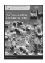 The Genesis of the Bodhisattva Ideal Band 1 http://hup.sub.uni-hamburg.de/purl/HamburgUP_HBS01_Analayo 178 pp., 12 illustrations, hardcover, 22,80 EUR ISBN 978-3-937816-62-3 (printed version) Anālayo

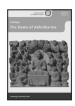 The Dawn of Abhidharma Band 2 ISBN978-3-943423-15-0 (printed version) 229 pp., 12 illustrations, hardcover, 25,80 EUR http://hup.sub.uni-hamburg.de/purl/HamburgUP_HBS02_Analayo Band 3

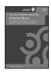 Lin, Chen-kuo / Radich, Michael (eds.) A Distant Mirror 565 pp., hardcover; 39,80 EUR Articulating Indic Ideas in Sixth and Seventh Century Chinese Buddhism ISBN 978-3-943423-19-8 (printed version)
http://hup.sub.uni-hamburg.de/purl/HamburgUP_HBS03_LinRadich Band 4

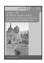 Silk, Jonathan A. Buddhist Cosmic Unity An Edition, Translation and Study of the "Anūnatvāpūrṇatvanirdeśaparivarta" 252 pp., hardcover, 28,80 EUR ISBN978-3-943423-22-8 (printed version)
http://hup.sub.uni-hamburg.de/purl/HamburgUP_HBS04_Silk Band 5

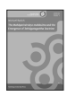 Radich, Michael The "Mahāparinirvāṇa-mahāsūtra" and the Emergence of "Tathāgatagarbha" Doctrine ISBN 978-3-943423-20-4 (printed version)
http://hup.sub.uni-hamburg.de/purl/HamburgUP_HBS05_Radich 266 pp., hardcover, 28,80 EUR
Band 6

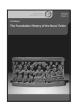

Anālayo The Foundation History of the Nuns' Order https://www.buddhismuskunde.uni-hamburg.de/pdf/4-publikationen/ hamburgbuddhist-studies/hamburgup-hbs06-analayo.pdf ISBN 978-3-89733-387-1 (printed version) 278 pp., hardcover, 29,80 EUR
Band 7

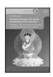 ISBN 978-3-89733-422-9 (printed version) 243 pp., hardcover, 25,80 EUR The Eighth Karmapa's Life and his Interpretation of the Great Seal Jim Rheingans A Religious Life and Instructional Texts in Historical and Doctrinal Contexts https://www.buddhismuskunde.uni-hamburg.de/pdf/4-publikationen/ hamburg-buddhist-studies/hamburgup-hbs07-rheingans.pdf Band 8

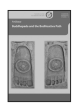 Anālayo Buddhapada and the Bodhisattva Path 180 pp., hardcover, 18,80 EUR ISBN 978-3-89733-415-1 (printed version)
https://www.buddhismuskunde.uni-hamburg.de/pdf/4-publikationen/ hamburg-buddhist-studies/hamburgup-hbs08-analayo.pdf Band 9

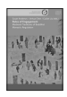 Susan Andrews/Jinhua Chen/Cuilan Liu (eds.) Rules of Engagement Medieval Traditions of Buddhist Monastic Regulation 522 pp., hardcover, 26,60 EUR ISBN 978-3-89733-428-1 (printed version)
https://www.buddhismuskunde.uni-hamburg.de/pdf/4-publikationen/ hamburg-buddhist-studies/hamburgup-hbs09-full.pdf Band 10

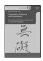 Communities of Memory and Interpretation Reimagining and Reinventing the Past in East Asian Buddhism Mario Poceski (ed.)
https://www.buddhismuskunde.uni-hamburg.de/pdf/4-publikationen/
XIV; 217 pp., hardcover, 25,80 EUR ISBN 978-3-89733-425-0 (printed version)
hamburg-buddhist-studies/hamburgup-hbs10-poceski.pdf

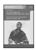

The Life and Works of mKhan-po gZhan-dga' (1871–1927) Band 11 Achim Bayer rDzogs-chen Master and Educational Reformer of Eastern Tibet ISBN 978-3-89733-495-3 (printed version) XXI; 435 pp., hardcover, 32,80 EUR
https://www.buddhismuskunde.uni-hamburg.de/pdf/4-publikationen/hamburgbuddhist-studies/hamburgup-hbs11-bayer.pdf Band 12/Teil 1

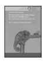 Fleischverzehr und Vegetarismus im indischen Buddhismus Lambert Schmithausen Teil 1 · Studie und Übersetzungen 381 pp., hardcover, 27,80 EUR
bis ca. zur Mitte des ersten Jahrtausends n. Chr. ISBN 978-3-89733-503-5 (printed version)

 Band 12/Teil 2

 Lambert Schmithausen Fleischverzehr und Vegetarismus im indischen Buddhismus bis ca. zur Mitte des ersten Jahrtausends n. Chr. 606 pp., hardcover, 34,80 EUR ISBN 978-3-89733-504-2 (printed version)
Teil 2 · Endnoten Band 12/Teil 3

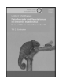 Lambert Schmithausen Teil 3 · Editionen Fleischverzehr und Vegetarismus im indischen Buddhismus bis ca. zur Mitte des ersten Jahrtausends n. Chr. 226 pp., hardcover, 24,80 EUR ISBN 978-3-89733-505-9 (printed version)
Band 13

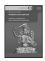 Historical, Philosophical, and Comparative Perspectives Oren Hanner (ed.) Buddhism and Scepticism 183 pp., hardcover, 25,80 EUR ISBN 978-3-89733-518-9 (printed version)

In his final monograph, Stefano Zacchetti analyzes the Da zhidu lun's complex relation to a number of Larger Prajñāpāramitā texts. The evidence presented here reveals a complementary, even symbiotic relation between root text and commentary, and puts into relief processes of stabilization, consolidation, and canonization. The reader is afforded precious insights into the textual history of the Da zhidu lun, of the Larger Prajñāpāramitā literature as a whole, and of the general patterns of formation, transmission, exegesis, and recension of Mahāyāna Buddhist texts.

ISSN 2190-6769 ISBN 978-3-89733-543-1 (printed version)
EUR [D] 25,80