Carola Roloff The Buddhist Nuns' Ordination in the Tibetan Canon

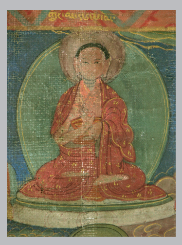

Carola Roloff The Buddhist Nuns' Ordination in the Tibetan Canon Hamburg Buddhist Studies 15 Series Editors:
Steffen Döll | Michael Zimmermann

for Buddhist Studies Carola Roloff The Buddhist Nuns' Ordination in the Tibetan Canon Possibilities of the Revival of the Mūlasarvāstivāda Bhikṣuṇī Lineage projektverleg.

Bibliographic information published by the Deutsche Nationalbibliothek The Deutsche Nationalbibliothek lists this publication in the Deutsche 

Nationalbibliografie; detailed bibliographic data are available in the Internet at http://dnb.d-nb.de. 

ISSN 2190-6769 ISBN 978-3-89733-526-4 (printed version) ISBN 978-3-89733-569-1 (E-Book)
© 2020 projekt verlag, Bochum/Freiburg www.projektverlag.de Cover original design by Benjamin Guzinski; Julia Wrage, Hamburg Cover image: Depiction of the Buddhist nun Palmo (Tib. Dge slong ma Dpal mo), part of an Avalokiteśvara thangka painting (approx. 17th century). 

Joachim Baader, Galerie für tibetische Kunst, München (Germany) 
To the bhikṣuṇīs of the three times, past, present and future.

## Table Of Contents

1 Introduction ..................................................................................... 1 1.1 Objectives and Initial Questions............................................... 1 1.2 Primary Sources ....................................................................... 6 1.2.1 The Tibetan Translation of the Kṣudrakavastu, and the Vinaya Terminology Utilized ..................................... 6 1.2.2 Principal Texts Considered............................................... 7 1.2.3 Introduction to the Tibetan Text Edition ........................ 10 1.3 Acknowledgements ................................................................ 15 2 The First Bhikṣuṇī Ordination ...................................................... 19 2.1 The First Bhikṣuṇī Saṃgha and the Evolution of the Manual for Bhikṣuṇī Ordination ............................................ 19 2.1.1 Tibetan Text *Mahāprajāpatīgautamīvastu..................... 20 2.1.2 English Translation of the Tibetan text........................... 57 3 Manual for Bhikṣuṇī Ordination ................................................... 81 3.1 The Main Parts of the Manual for Bhikṣuṇī Ordination in the Tibetan *Mūlasarvāstivādavinaya*.................................. 82 3.1.1 Edition Tibetan Text ....................................................... 88 3.1.2 English Translation of the Tibetan Text ....................... 177 4 Possibilities of Reviving the Mūlasarvāstivāda Bhikṣuṇī Lineage......................................................................... 273 4.1 Mūlasarvāstivāda Nuns' Ordination by Bhikṣus Alone....... 277 4.2 Ecumenical Ordination by Mūlasarvāstivāda Bhikṣus and Dharmaguptaka Bhikṣuṇīs ................................................... 283 4.2.1 An Argument for the Validity of an Ecumenical Bhikṣuṇī Ordination...................................................... 289 4.2.2 Recapitulating the Second Approach (Ecumenical Ordination).................................................................... 311 4.2.3 Further Rules and Regulations to be Considered ......... 313 4.3 Historic Decision Taken by the "12th Religious Conference of the Four Major Schools of Tibetan Buddhism and the Bon Tradition" ....................................... 324 4.3.1 Implications of the Decision Taken at the Conference... 326 4.3.2 Shortcomings of the Decision....................................... 327 4.4 Prospects............................................................................... 329 Annex ............................................................................................. 337 Appendix 1 ................................................................................. 337 Table 1: Text Editions from the Tibetan Canon (Kanjur)...... 337 Table 2: Concordance Obstructive Conditions 
(Āntarāyika-Dharmas) ............................................. 339 Secondary Sources ................................................................. 349 Online Bibliography in Connection with the Project............. 365 The Bhikṣuṇīkarmavācanā Sanskrit fragments, ms. c.25(R) 
of the Bodleian Library at the University of Oxford ................. 367 Abbreviations ............................................................................. 345 References .................................................................................. 349

## About Hamburg Buddhist Studies

Ever since the birth of Buddhist Studies in Germany more than 100 years ago, Buddhism has enjoyed a prominent place in the study of Asian religions. 

The University of Hamburg continues this tradition by focusing research capacities on the religious dimensions of South, Central, and East Asia and making Buddhism a core subject for students of the Asien-Afrika-Institut.

Today, Buddhist Studies as an academic discipline has diversified into a broad spectrum of approaches and methods. Its lines of inquiry cover contemporary issues as much as they delve into the historical aspects of Buddhism. Similarly, the questions shaping the field of Buddhist Studies have broadened. Understanding present-day Buddhist phenomena ‒ and how such phenomena are rooted in and informed by a distant past ‒ is not at all an idle scholarly exercise. Rather, it has become clear that fostering the understanding of one of the world's major religious traditions is a crucial obligation for modern multicultural societies in a globalized world.

Accordingly, *Hamburg Buddhist Studies* addresses Buddhism as one of the great humanistic traditions of philosophical thought, religious praxis, and social life. Its discussions are of interest to scholars of religious studies and specialists of Buddhism, but also aim at confronting Buddhism's rich heritage with questions the answers to which might not easily be deduced by the exclusive use of historical and philological research methods. Such issues require the penetrating insight of scholars who approach Buddhism from a range of disciplines, building upon and yet going beyond the solid study of texts and historical evidence.

We are convinced that *Hamburg Buddhist Studies* will contribute to opening up the field to those who may have no training in the classical source languages of the Buddhist traditions but approach the topic against the background of their own disciplinary interests. With this book series, we encourage a wider audience to take an interest in the academic study of the Buddhist traditions.

## About This Volume

We are proud to welcome Carola Roloff's monograph on the ordination of nuns in the Tibetan Buddhist tradition to the Hamburg Buddhist Studies series. Her contribution is remarkable in at least two regards. Firstly, her critical edition introduces the Tibetan texts and their English translations of two important chapters in the Tibetan Mūlasarvāstivādavinaya: the Chapter on Mahāprajāpatī Gautamī (*Mahāprajāpatīgautamīvastu) and the Manual for Buddhist Nuns' Ordination (*Bhikṣuṇyupasaṃpadājñapti). Secondly, based on the presented materials, the author discusses ways in which the nuns' ordination in the Tibetan tradition—from which full ordination for women has been absent for centuries—may be legitimately reinstated. This is a concern Carola Roloff has been supporting for more than two decades. 

Her edition and exegesis of the Tibetan texts and their Sanskrit parallels constitute a solid foundation for discussing why the Mūlasarvāstivāda bhikṣuṇī lineage should be re-established and how concrete steps in that direction may look like. 

The topic has elicited controversial debate, and has often been criticized; in that to advocate full ordination of nuns would mean to rely only on the arguments of interpreters of later centuries, i.e. on secondary authorities and not on the canon itself. The present study, in contrast, evidences that the Mūlasarvāstivādavinaya itself contains chapters of utmost relevance to this issue. These important parts of the Vinaya have been edited and translated in this volume and should be fully taken into account in future exchanges. The publication of these new and momentous insights will contribute to the advancement of these important discussions and serve to promote a view which is, on the one hand, based on solid evidence of the monastic code of the early times, while on the other hand, also addresses central issues of the modern world such as the equality of gender in society and religions. Michael Zimmermann and Steffen Döll

## 1 Introduction 1.1 Objectives And Initial Questions

This publication presents results of a research project funded by the Deutsche Forschungsgemeinschaft (DFG), entitled "The Buddhist nuns' ordination in the Tibetan canon."
1 Conducted from January 2010 to July 2017, the aim of the project was to examine the rituals and regulations for the full ordination of Buddhist nuns (Tib. *dge slong ma*, Skt. *bhikṣu*ṇī)
2according to the Mūlasarvāstivāda Buddhist monastic code. This is the code that was followed in India in a school of the same name, and that today regulates monastic life in the Tibetan Buddhist traditions. As such, the possibility of granting (or denying) full ordination to women in Tibetan Buddhism hinges on the interpretation of this monastic code. 

The Buddhist tradition holds that the Buddha himself introduced highest ordination or full ordination (Tib. *bsnyen par rdzogs pa*, Skt. upasa*ṃpadā*) for women. From India, the order of fully ordained nuns expanded to several other countries where various versions of the monastic code, or Vinaya, were used to regulate monastic life. In Taiwan, Korea, and Vietnam, the nuns' order followed the Dharmaguptaka school and its monastic code. In India, Sri Lanka, and Nepal, the nuns' order died out in the 11th/12th century, whereas in some other Buddhist countries, such as Thailand and Tibet, there are no clear records indicating that the nuns' order had arrived there from the Indian subcontinent in the first place. 

In more recent times, efforts have been made among Buddhists worldwide to reintroduce full ordination for women in the Tibetan and the Theravāda tradition, not least because this is expected to enhance the role of women in society, and improve human rights for much of Asia. These efforts have met with decidedly mixed response, and full ordination for women is currently still denied to women in the Mūlasarvāstivāda tradition that is followed by Tibetan Buddhist monasticism. In July 2007, at the prompting of the Dalai Lama, an international congress on the role of Buddhist women in the Saṅgha was convened at the University of Hamburg to discuss the question of granting full ordination to women according to the *Mūlasarvāstivādavinaya*. 

During that conference it became clear that there are substantial differences among the surviving Vinaya schools that need to be considered when the prospect of reviving the Theravāda and Tibetan Mūlasarvāstivāda bhik*ṣuṇī* lineages is examined.

Compared to Theravāda Buddhism, the revival of nuns' ordination in Tibetan Buddhism is made more complicated by the fact that the tradition seldom refers directly to the original Vinaya texts found in the Tibetan canon of texts sourced to the Buddha, or "Kanjur." Instead, in recent centuries, Tibetan monk scholars have come to rely mainly on Vinaya commentaries by Tibetan authors, which rely in turn on the exegetical texts by Guṇaprabha and other Indian authors. These exegetical texts are located in the Tanjur, a collection of Tibetan translations of Indian commentaries that are understood not to have come from the Buddha, but are nevertheless also held as authoritative by Tibetans. Furthermore, Tibetan interpretations of the Vinaya draw heavily on non-vinaya theory, to wit: Vasubandhu's Abhidharmak*ośabhāṣ*ya. 

There is a saying in Tibetan monasteries that one cannot understand the Vinaya without having studied the Abhidharma.

Arguments on issues of monastic code are far more likely to quote an Abhidharma text, comments by the Indian scholar Guṇaprabha or a native Tibetan text than they are to quote the Buddha himself. As a result, the interpretation of Vinaya rules by Tibetan scholars considering the question of full ordination for women is mediated by multiple layers of textual authorities. Such texts are granted their authority through historical processes that inevitably reflect hermeneutical preferences and social biases, which seldom worked in favor of opportunities for women. The loss of full contact with the original Vinaya texts, and the tendency to repeat instead the tiny subset of passages from them favored by later interpreters, has resulted in a narrowing of view that has left many options out of consideration.

As one example, at the time that research for this present project began, numerous contemporary Tibetan Vinaya scholars, including the abbot of an important monastery in India, were unaware that a manual for conferring full ordination on women exists in the Kanjur canon itself - that is to say, they were unaware of the existence of the manual edited and translated in this present book. As we shall see, this manual lays out the procedural requirements for ordaining women and as such stands to resolve a great deal of the current lack of clarity surrounding the issue. In the absence of awareness of this important primary source, discussions of women's ordination generally have drawn on commentaries of earlier commentaries in which only a few selected passages from this original text are cited. The publication of the women's ordination manual in this present volume (see Chapter 3), as well as the account of the first *bhikṣu*ṇī ordination (see Chapter 2), may serve to 1) facilitate access to this important original source, 2) allow us to read oft-cited passages in their original context, and thus 3) serve as a balance against the heavy reliance on decontextualized citations and multiple layers of intervening interpretations.

From the outset, major questions animating the research project included: 
To what extent do the later exegeses by Tibetan commentators coincide with the Indian sources from which they draw their authority, specifically those of Guṇaprabha? How do the positions taken in both Indian and Tibetan commentaries compare with the treatment of nuns' ordination in the *Bhikṣu*ṇīvastu*,
3found in the Kṣ*udrakavastu* within the Tibetan Kanjur? 

What new perspectives might come to light when we examine the procedures and precedents regarding *bhikṣu*ṇī ordination in their original context, rather than viewing them as decontextualized passages or refracted through the multiple layers of later interpretation?

It soon became clear that we lacked the needed textual basis for such an analysis and that any serious study must first create that base. To that end, this monograph consists of the critical edition of the Tibetan and its annotated English translation of the so-called Bhikṣu*ṇīkarmavācanā*,
4or more precisely, the Chapter on Mahāprajāpatī Gautamī (*Mahāprajāpatīgautamī*vastu*)
5(chapter 2) and the Manual for Buddhist Nuns' Ordination (*Bhikṣuṇyupasaṃpadā*jñapti)* 6(chapter 3) which are both found in the Kṣudrakavastu (*Phran tshegs kyi gzhi*, lit. "Section on Minor Matters") of the Mūlasarvāstivādavinaya (*Gzhi thams cad yod par smra ba'i 'dul ba*).

The critical annotation of the Tibetan text draws attention to points of divergence with the Sanskrit and Chinese versions of the Mūlasarvāstivāda*vinaya* (where these are available), while noting major variation from the handling of similar points in the Pāli Vinaya. The English translation is aimed at encouraging further research by other scholars and at the same time supporting ongoing dialogues within the broader Buddhist communities regarding possibilities of offering full ordination to women in Tibetan Buddhism.

With the textual material established, this study will explore the impact that the aforementioned processes of selective exegesis have had on female Buddhists aspiring to live a monastic life. It will argue that because such textual practices have clearly complicated efforts to revive the Buddhist nuns' ordination, both the texts in question and their uses by the Tibetan tradition must be taken into consideration in order to adequately address the issue of the feasibility of full ordination for women, as will be discussed in chapter 4 below. That chapter will demonstrate that there are at least two, and possibly three, ways to revive the nuns' ordination in Tibetan Buddhism that could be considered valid according to the texts analyzed in this publication. As historical background, the most important developments concerning the revival of the Buddhist nuns' order during the last thirty years will also be presented. As will become clear, while the Tibetan consensus on issues related to nuns has evolved in recent years, what has remained constant is the reliance on authoritative textual sources as the touchstone for decisionmaking - and the fact that the primary authorities are commentators subsequent to the Buddha.

In general, the application of the Vinaya to evolving socio-historical conditions is, by definition, a matter of interpretation. Over the centuries, changing social contexts prompted many new questions, which Tibetan Vinaya scholars tried to answer systematically, in the spirit of good scholasticism. In the process, later authors wove passages from earlier authors into an ever-tightening net of arguments, which - being now part of the tradition ‒ cannot be escaped. Today, efforts to address the new questions raised by a completely different socio-political and cultural context, in which gender equality is taken for granted, cannot simply ignore textual authorities but must examine them from a fresh hermeneutic perspective. This is achieved by recovering the original texts, as we do here. Once available, we can evaluate in their original context the passages so often cited by later commentators, query the uses made of them by their interpreters, and compare how other Vinaya traditions have handled similar points.

## 1.2 Primary Sources

1.2.1 The Tibetan Translation of the Kṣudrakavastu, and the Vinaya 

## Terminology Utilized

Among the different Vinaya renditions, the *Mūlasarvāstivādavinaya* (MSV) is considered to be youngest, "probably compiled in the first or second century C.E. in northwest India" (Schopen 2004: 573; Schopen 2014: 416, 434), but we do not know when this Vinaya was closed. Lamotte (1958: 196) 
states: "As for the *Mūlasarv. Vin*. which devotes two Skandakas to a full and coherent biography of the Buddha, it did not originate from an old Buddhist community established in Mathurā from the first century of Buddhism - as E. Frauwallner claims (p. 37) - but from an immense compendium of discipline which was closed very much later and was probably compiled in Kasmīr in order to complete the *Sarvāstivādin Vinaya*." That notwithstanding, according to Gregory Schopen, the Sanskrit MSV contains very early material. Furthermore, it is the only Vinaya for which we have significant amounts of actual manuscript material from perhaps the sixth or seventh centuries (Dutt 1939: 42; Schopen 1997: 25; Langenberg 2013: 45–47, Kieffer-Pülz 2014: 50–52).

The Tibetan translation of the Kṣ*udrakavastu* comprises two volumes of the Kanjur.

7 The translation work was divided among numerous translators. 

Those bearing the primary responsibility were the Indian *upadhyāya*s Vidyākaraprabha and Dharmaśrīprabha and the Tibetan Lo tsā ba bande dPal 'byor. 

Hence dPal 'byor, the chief translator of the Kṣ*udraka,* was a contemporary of both.8 Vidyākaraprabha also revised the first translation of the *Vinayavastu,* together with dPal brtsegs. Unlike the *Vinayavastu,* the Kṣ*udrakavastu*, 
which forms separate volumes of the Kanjur, was not revised subsequently. This raises the intriguing possibility that the terminology used therein may reflect an earlier draft, so to speak, of Tibetan Vinaya understanding. 

According to Herrmann-Pfandt (2008: xxii) dPal brtsegs was one of the first seven Tibetan men *(sad mi bdun)*, to receive upasa*ṃpadā* from the Bengali abbot of Nālandā University, Śāntarakṣita, in the year 779 in bSam yas.9dPal brtsegs also co-authored the *Mahāvyutpatti* (Mvy) in the year 814, along with 'Khon Klu'i dbang po. According to Nyingma history 'Khon Klu'i dbang po was also one of the seven to receive upasa*ṃpadā* from Śāntarakṣita. 

Curiously, given the fact that dPal brtsegs worked on both texts, the Vinaya terminology found in the Kanjur is not always in agreement with the Vinaya entries in the Mvy, as Hu-von-Hinüber has shown (1994: 57; 1997: 
343). Instead the compilers of the Mvy apparently used Guṇaprahba's Vinaya*sūtra* and its Tibetan translation as the basis for their translations of Vinaya terminology.

10 In the Kṣ*udraka* in particular, in several cases the vocabulary differs from the standards laid down in the Mvy.

11 Such discrepancies are indicated below, in the critical apparatus to the English translation.

The tradition presumes that the transmission of the MSV explanation *('dul* ba'i bshad rgyun) and the transmission of the MSV *prātimokṣ*a vows *(so thar* sdom rgyun) were both introduced to Tibet by Śāntarakṣita (725-788 CE), who was the first abbot (*upādhyāya*) of bSam yas, the main Tibetan monastery at that time. He went from Nepal to Tibet for the first time in about 763, and again resided there from about 775 to the time of his death (Seyfort Ruegg 1981: 88). Thus, at a first glance, it seems possible that the texts in the Kanjur Vinaya were already translated in the 8th century.

## 1.2.2 Principal Texts Considered

A Sanskrit parallel is extant for significant portions of the Tibetan translation of the Bhikṣu*ṇīkarmavācanā* and is catalogued as a fragment (Sanskrit ms. c.25(R) of the Bodleian Library Oxford. This 25–folio Sanskrit text (six folios are missing) was edited by Ridding and la Vallée Poussin in 1920, and re-edited by Schmidt (1993) for the *Sanskrit-Wörterbuch der buddhistischen* Texte aus den Turfan-Funden (SWTF). This text was originally identified as belonging to the Sarvāstivāda school but was later determined to belong to the Mūlasarvāstivāda school. Thus, it was only considered in the beginning for that dictionary project but later excluded.12 The manuscript was initially obtained in India by August Hoernle at the end of the 19th century. It seems to stem from Nepal and may be dated as early as the 11th century.13 This supports Skilling's suggestion that the Mūlasarvāstivāda *bhikṣu*ṇī lineage was present in the Kathmandu Valley up to that time.

14 A partially abbreviated translation of this Sanskrit Bhikṣuṇīkarma-*vācanā* has been published by Frances Wilson in Diana Paul's Women in Buddhism (1985: 77–105). That translation is not entirely free of inconsistencies.

The present study of the evolution of the first *bhikṣu*ṇī ordination is based on collating 13 different Kanjur editions of the Tibetan translation of the Bhikṣu*ṇīkarmavācanā* section in the Vinayakṣudrakavastu ('*Dul ba phran* tshegs kyi gzhi), that largely corresponds to the Sanskrit fragment of the Bhikṣuṇīkarma*vācanā*, as it has been preserved in ms. c.25(R) of the Bodleian Library at the University of Oxford and with the corresponding section in the Mūlasarvāstivāda*vinaya*, to the degree that it is preserved in Chinese translation. All Sanskrit and Chinese parallel fragments are identified as part of the critical apparatus to the text edition. (See 1.2.3 Introduction to the Tibetan text edition for greater details on the criteria used in preparing the text edition.)
Along with a critical edition of the Tibetan, this present publication includes an annotated English translation of the Tibetan Bhikṣuṇīkarma-*vācanā* or more precisely the *Mahāprajāpatīgautamī*vastu* and the Manual for Buddhist Nuns' Ordination (*Bhikṣuṇyupasaṃpadā*jñapti*) as found in the Kṣudrakavastu (Phran tshegs kyi gzhi) of the Mūlasarvāstivādavinaya (Gzhi thams cad yod par smra ba'i '*dul ba)*. The translation into English is based on critical editions of both parts of the Tibetan text at the beginning of the
*Bhikṣuṇīvastu (see Appendix for tabular overview). On many occasions, a comparison of passages in the Manual for Buddhist Nuns' *Ordination*
(*Bhikṣuṇyupasaṃpadājñ*apti*) with the *Manual for Buddhist Monks*'
Ordination (Bhikṣūpasaṃpadājñapti) in the MSV yielded interesting insights, which are noted in the critical apparatus. In the process of preparing the English translation, especially for those passages in which no Sanskrit equivalent was extant, it proved useful to consult Tibetan translations of Indian Vinaya commentaries. Later commentaries often cite the Abhidharmakośa or Indian Vinaya commentaries, as mentioned above, and these texts were also investigated where relevant.

Among those Indian commentarial sources considered, the comparison of the *Bhikṣuṇyupasaṃpadājñapti with the corresponding Tibetan translation of Guṇaprabha's Ekottarakarma*śataka* (Tib. *Las brgya rtsa gcig pa*) was indispensable. In fact, however, the latter is not a commentary *per se*, but rather a paraphrased reproduction of the *Bhikṣuṇyupasaṃpadājñ*apti* in which one finds that many of the Vinaya terms are rendered with different Tibetan terminology than are found in the actual *Bhikṣuṇyupasaṃpadājñ*apti* itself. The Sanskrit parallel of the Ekottara*karmaśataka* is considered to be lost. However, because Guṇaprabha is held by Tibetans to be the most authoritative Indian Vinaya commentator, his text is an important touchstone for any discussion of this issue. Thus, it cannot be ascertained whether the underlying Sanskrit terminology differed between the two texts or whether the Tibetan translations favored a different terminology for the same Sanskrit Vinaya terms. Intriguingly, numerous Vinaya terms employed in the *Bhikṣuṇyupasaṃpadājñ*apti* differ from both the Bhikṣūpasaṃpadājñ*apti* and the *Mahāvyutpatti*. In any case, the variant rendering of important Vinaya terms proved informative where a conclusive understanding of the underlying terms had not been reached.

As useful a resource as it would be, a reliable translation of Guṇaprabha's Ekottarakarma*śataka* section on the bhik*ṣuṇī* ordination would require not only a critical edition of the respective *Tanjur* editions of the Tibetan text, but also a comparison with the presumed Chinese parallel, as so far we have no corresponding Sanskrit parallel. It should be noted that the Chinese text that contemporary Chinese/Taiwanese *Dharmaguptakavinaya* nun scholars consider to be the canonical Mūlasarvāstivāda version of the **Bhikṣuṇyupasaṃpadājñapti* may well turn out to be instead a Chinese translation of the respective parallel in the Sanskrit Ekottarakarma*śataka*, which only the Tibetan tradition attributes to Guṇaprabha. No author is named in this Chinese text, but its translator was Vinaya master I-tsing (635–713 A.D.) in 710 A.D. A comparison of these two texts would be a valuable contribution but remains to be a desideratum. 

The Chinese translation of the *Mahāprajāpatīgautamī*vastu* is found in T. 1451[24] 350b8–351c1015 while the respective parallel to the *Bhikṣuṇyupasaṃpadā*jñapti* in the Ekottarakarma*śataka* in its Chinese translation is to be found in T. 1453.

16 The śrāmaṇerikā-, śik*ṣamāṇā*- and *bhikṣu*ṇī ordination rites are missing from the Bhikṣuṇīkarmav*ācanā* in Chinese T. 1451[24].

Although most of the *Bhikṣuṇyupasaṃpadā*jñapti* thus has no equivalent in the Chinese MSV, according to Chung, there is a correspondence (in content) 
to the Chinese *Ekottarakarmaśataka* in T 1453[24] 459c13–465a19. Bhikṣuṇī Wei-chun has produced an English text based on this and other Chinese translations of the MSV (2007: 1).

## 1.2.3 Introduction To The Tibetan Text Edition

This project started in January 2010 with an extensive collection of Kanjur material and the compilation of concordances in table form. This was followed by an analysis of the *Bhikṣu*ṇīvastu* (especially Bhikṣu*ṇīkarmavācanā*) including a survey of the literature on the critical edition of Vinaya texts in the Kanjur and on the *Vinayakṣudrakavastu (Tib. 'Dul ba phran tshegs kyi gzhi). Subsequent to that, new material constantly became available for consideration, such as the Tokyo manuscript (Ms.) of the Toyo Bunko Oriental Library, the Shey manuscript from Ladakh by Prof. Dr. 

Helmut Tauscher, the Kangxi Kanjur, the Jang sa tham edition, and two "new" manuscripts (Mss.) ‒ Bka' 'gyur rgyal rtse'i them spang ma and Bka'
'gyur pe cin par ma tshal pa (both published by Koyama, Shinagawa ku, Tokyo, Japan: Digital Preservation Society (DPS) and kindly provided during a visit in the Library of the Columbia University in New York City).

Finally, a decision was made to sample-collate thirteen Kanjur editions 
(LRTNHSZFQKJBD) for the first five folios of the Bhikṣu*ṇīkarmavācanā* (see Table 1 with Sigla Annex, Appendix 1). A list of the thirteen Kanjur editions is included below on p. 12–14. The collation was based on an unpublished text edition that had been drafted by Jin-il Chung, based on five Kanjur editions. This draft was compared word-by-word with the originals, and partly corrected. New Kanjur editions were collated subsquent to that, for a total of thirteen. In a later phase of the project, in consultation with Prof. 

Dr. Johannes Schneider (Bayerische Akademie der Wissenschaften Munich), 
the apparatus, which had originally been a negative apparatus, was reconfigured as a positive apparatus with the kind help of Christof Spitz 
(Hamburg), so that all textual witnesses and their stemmatical relationship were clearly recognizable, and no textual witness was overlooked.

The decision to include further Kanjur editions proved to be welladvised,17 because it allowed new and lesser-known editions to be classified more precisely. Christof Spitz entered the readings of these editions into a database and compared them with the Kanjur stemma proposed by Helmut Eimer (1992, xviii–xix). The results were evaluated in talks with Prof. Dr. 

Johannes Schneider (Bayerische Akademie der Wissenschaften Munich) and Prof. Dr. Dorji Wangchuk (Professor for Tibetology, University of Hamburg). On this basis, a final determination was made in 2016 as to which editions should be favored in the critical edition of the Bhikṣuṇyupasaṃpadā*jñapti*. Seven Kanjur editions (RLSJKQD) were selected, and these included not only the oldest tangible text witnesses of the two main lines of tradition Them spangs ma (Western group/ branches) and *Tshal pa* (Eastern group/ 
branches) in the stemma, but also the two later editions *Stog* (S) and Peking 1737 (Q), which were suitable for the clarification of certain passages. In the course of the work, Mr. Eimer's stemma proved to be correct, so that the preparation of a different stemma was not necessary.

The criteria for producing the text edition presented in this volume include content, language, and textual criticism. This edition takes into account not only the Tibetan sources, but also the preserved parts of the critical edition of the corresponding Sanskrit manuscript (Schmidt 1993). 

The primary aim was to reproduce the text as faithfully as possible and in a legible form. This edition will be published separately in Tibetan script together with the Sanskrit text in Devanāgarī script, to make the results of the present research more accessible to Tibetan native scholars. The current grammatical and orthographical standards of the Tibetan language were applied for this purpose, since the religious-historical, Buddhist studies, and partly also "reflexive praxis" question are major concerns of this project, rather than solely seeking to reconstruct a presumed Tibetan original text (archetype), preserving its orthography as faithfully as possible. For this reason, this edition takes readings from both main traditions of the Tibetan canon, and the contaminated Derge edition of 1733 (D) has also been retained, as it is an important testimony to a Tibetan process based on the Tshal pa tradition, but often emended after readings of the Thems spang ma editions.

We found excessive divergence among Kanjur editions, and against the Sanskrit, in the section concerning obstructive conditions (Tib. bar chad kyi chos rnams, Skt. *āntarāyikā dharmāḥ*) for the ordination. Thus, in Appendix 1 (Table 2) we provide a concordance table of the different versions of the list of questions regarding obstructive conditions in the Tibetan editions, in the Sanskrit manuscript, and in the edition of the *Handbuch für Mönche*
(Manual for Monks) published by Chung. Based on this a consolidated version of the list of questions was produced and appears as the English translation.

The 13 Kanjur editions of the Tibetan Bhikṣuṇīkarmavācanā (*Mahāprajāpatīgautamī*vastu* and *Bhikṣuṇyupasaṃpadājñapti) in the Kṣ*udrakavastu* are as follows:18

| L              | London Shel dkar   | ('dul ba), bam po 37–38, na, 21a8–50b7         |
|----------------|--------------------|------------------------------------------------|
| R              | Rgyal rtse         | ('dul ba), bam po 37–38, na, 19a6–45b1         |
| T              | Tōyō bunko         | ('dul ba), bam po 37–38, na, 20a4–48a5         |
| N              | Snar thang         | ('dul ba), bam po 37–38, da, 326b5–360b2       |
| H              | Lha sa             | ('dul ba), bam po 36–37, da, 150b5–182a6       |
| S              | Stog               | ('dul ba), bam po 37–38, tha, 146a4–178a5      |
| Z              | Shey               | ('dul ba), bam po 37–38, tha, 154b1–188b4      |
| F              | Phu brag           | ('dul ba), bam po 31–32, tha, 124a6–149a6      |
| Q              | Peking 1737        | ('dul ba), bam po 36–37, ne, 97a6–116a2        |
| K              | K'ang hsi          | ('dul ba), bam po 36–37, phe–be, 378a7–15a8    |
| Peking 1684/92 |                    |                                                |
| J              | Jang sa tham       | ('dul ba), bam po 36–37, da, 99a1–118b1        |
| B              | Berlin19           | ('dul ba), bam po 36–37, na–pa, 360b8–12a6     |
| D              | Derge              | ('dul ba), bam po 36–37, da, 100a3–120b1       |
| Dpe            | Dpe bsdur ma       | ('dul ba), bam po 36–37, vol. 11, 240.8–290.13 |

For the purposes of this publication, our text will be handled in two parts. Part One comprises the **Mahāprajāpatīgautamīvastu* and appears as chapter 2. Part Two comprises the *Bhikṣuṇyupasaṃpadā*jñapti* and appears as chapter 3. The Buddha was addressing his remarks to Ānanda up to the conclusion of the text *Mahāprajāpatīgaut*amīvastu*, at which point the granting of ordination of Mahāprajāpatī is complete. This forms Part One of our present text. At the opening of Part Two, the Buddha's interlocutor changes to Upāli, who queries the Buddha as to the procedure for ordaining the remaining women.

We may note here that the **Mahāprajāpatīgautamīvastu* is often referred to as the "foundation history of the nuns' order" (cf. Anālayo 2016), based on a sentence that appears at the conclusion of the Chinese text but that is missing from the Tibetan. No Sanskrit is extant for this passage, unfortunately. However, it is important to note that in the Tibetan text, by the end of the **Mahāprajāpatīgautamīvastu* only Mahāprajāpatī has become a bhikṣuṇī, while the numerous Śākyan aspirants accompanying her apparently remain un-ordained. Thus, as far as the Tibetan version of the MSV is concerned, strictly speaking, since a sole *bhikṣu*ṇī does not constitute a saṃgha, it would be incorrect to refer to this text as the foundation history of the bhikṣuṇī saṃ*gha.* Rather, the **Mahāprajāpatīgautamīvastu* is most precisely described as an account of the first bhikṣuṇī ordination. As we shall see from the text that follows the **Mahāprajāpatīgautamīvastu*, in the MSV 
it is only in connection with this subsequent text − *Bhikṣuṇyupasaṃpadā*jñapti* − that a bhikṣuṇī saṃgha, i.e., a community of at least four *bhikṣu*ṇīṣ, comes into being. Therefore, the rites regarding full ordination for women can best be understood in the context of both the *Mahāprajāpatī-*gautamīvastu* and *Bhikṣuṇyupasaṃpadā*jñapti*. This will be explored in further detail in the critical apparatus and in chapter 4. 

The **Mahāprajāpatīgautamīvastu* is found in the following sections of the Kanjur editions. Note that the forward slash below indicates the end of Part One and the end of the opening section of Part Two, in which Upāli appears and the Buddha explains that subsequent ordinations should proceed in stages, as outlined in the *Bhikṣuṇyupasaṃpadā*jñapti*. 

| L              | London Shel dkar   | ('dul ba), bam po 37, na, 21a8–28a4/28b2           |
|----------------|--------------------|----------------------------------------------------|
| R              | Rgyal rtse         | ('dul ba), bam po 37–38, na, 19a6–25a5/25b3        |
| T              | Tōyō bunko         | ('dul ba), bam po 37, na, 20a4–27a1/27a8           |
| N              | Snar thang         | ('dul ba), bam po 37, da, 326b5–334a7/334b6        |
| H              | Lha sa             | ('dul ba), bam po 36, da, 150b5–158a1/158a7        |
| S              | Stog               | ('dul ba), bam po 37, tha, 146a4–153a4/153b3       |
| Z              | Shey               | ('dul ba), bam po 37, tha, 154b1–161b5/162a5       |
| F              | Phu brag           | ('dul ba), bam po 31, tha, 124a6–130a8/130b6       |
| Q              | Peking 1737        | ('dul ba), bam po 36, ne, 97a6–101b8/102a5         |
| K              | K'ang hsi          | ('dul ba), bam po 36–37, phe, 378a7–385a4/385b3    |
| Peking 1684/92 |                    |                                                    |
| J              | Jang sa tham       | ('dul ba), bam po 36–37, da, 99a1–103b5/104a2      |
| B              | Berlin             | ('dul ba), bam po 36–37, na, 360b8–367a4/367b2     |
| D              | Derge              | ('dul ba), bam po 36, da, 100a3–104b5/105a2        |
| Dpe            | Dpe bsdur ma       | ('dul ba), bam po 36, vol. 11, 240.8–251.18/252.11 |

In addition, for the purpose of comparison, in Part Two the *Las brgya rtsa* gcig pa (*Ekottarakarmaśataka*) is provided, which the Tibetan tradition ascribed to Guṇaprabha and that accordingly is part of the *Tanjur*:
D Derge 4118 ('*dul ba*), wu, 100b1–259a7 The respective parallels in the Chinese MSV translation for Part One (chapter 2) as found in T. 1451[24] 350b8–351c10 are given paragraph-by-paragraph. 

For chapter 3, the respective parallels to the Ekottarakarma*śataka* in its Chinese translation T. 145320 are also provided.

21 No Chinese parallel to the Kṣudrakavastu exists from the Śrāmaṇerikā precepts onward.

## 1.3 Acknowledgements

The research was carried out and fully funded by the Deutsche Forschungsgemeinschaft (DFG). The help of this esteemed organization is gratefully acknowledged. My special thanks for their contributions to the results of the project go especially to my partners and colleagues at home and abroad, Dr. 

Damchö Diana Finnegan, Prof. Dr. Tashi Tsering, Geshe Rinchen Ngödrup, Prof. Dr. Ann Heirman, and Dr. Petra Kieffer-Pülz.

Particular thanks go to my colleague and dear friend Dr. Damchö Diana Finnegan (University of Wisconsin-Madison) whose doctoral dissertation 
(2009) focused on narratives from the MSV in Sanskrit and Tibetan. During her extended visits as a guest scholar in Hamburg, we compared the Tibetan line-by-line with Schmidt's Sanskrit edition (1993). Along with her editing of the English text, this publication was enriched by the many hours spent together in 2010, 2015, 2017, and 2019, discussing difficult points both the translation and of ordination procedure.

Prof. Dr. Ann Heirman (University of Ghent) kindly offered her time and expertise during visits in 2010 and 2011 to compare the Tibetan translation of the Bhikṣuṇīkarmavācanā (*Mahāprajāpatīgautamī*vastu* and *Bhikṣuṇyupasaṃpadā*jñapti*) with the Chinese parallel passages.

From the very beginning, in 2009, Prof. Dr. Michael Zimmermann played a key role in initially offering me a Research Fellow Position at the Numata Center for Buddhist Studies, and convincing me to apply for a DFG grant. He has remained supportive through the end.

Thanks to an invitation by the Vice Chancellor of the Central University for Tibetan Studies (CUTS), Professor Geshe Ngawang Samten, and Professor Lobsang Norbu Shastri, I was able to participate in the International Vinaya Conference at CUTS Sarnath, Varanasi, from January 17–
19, 2011, together with Ven. Bhikkhunī Dhammanandā (former Prof. Dr. 

Chatsumarn Kabilsingh, Thammasat University Bangkok) and Ven. Prof. em. Dr. Heng-ching shih, National Taiwan University Taipei). During this visit I also laid the groundwork for my subsequent research stay in India from September 2011 to February 2012. From October to January, as I had done while conducting research for my PhD thesis at the CUTS, I met daily with the Tibetan monk scholar Prof. Dr. Ācārya Tashi Tsering to clarify questions on Tibetan Kanjur and Tanjur texts on *bhikṣu*ṇī ordination, to read Tibetan commentaries on the same issue, and to compare the Mūlasarvāstivāda Bhikṣuṇīk*armavācanā* manuscript with my text edition of the Kanjur parallel. I truly enjoyed these regular meetings and our exchange. Toward the end of my stay Prof. Tsering encouraged me to also meet with Prof. Yeshe Thabkhey and Prof. K.N. Mishra on several days. My research stay in Sarnath was most kindly facilitated by the former CUTS librarian Ācārya Jampa Dhadak. Dr. Thea Mohr (Frankfurt), with whom I was preparing the International Congress on Buddhist Women's Role in the Saṃgha at the University of Hamburg 2007, introduced us to each other in Dharamsala (India) in 2006. To all of them, including those not mentioned here by name, I express my deep thanks. I am very grateful for the time I was able to spend with each of them.

A Karl H. Ditze Foundation advancement award enabled me to hold two highly fruitful colloquia during my research period in India with a total of 24 monk scholars from all six colleges of the three major Gelugpa monastic universities ‒ Sera, Drepung, and Ganden ‒ in southern India. These colloquia were held in close cooperation with the Abbot of Sera Je Monastery in South India, the late Geshe Lobsang Palden, and the Vinaya expert Geshe Rinchen Ngödrup, and with the logistical assistance of the Jangchub Choeling Nunnery, Tibetan Colony, Mundgod, Karnataka State, India.

In October 2012, I was kindly invited by the Department of Religion and Culture of the Central Tibetan Administration to present my research results to a committee of Tibetan monk scholars at the Sarah Institute, in Himachal Pradesh, India. My three-hour lecture in Tibetan was followed by an intensive exchange with the monk scholars lasting several days. This occasion, along with the countless meetings with Tibetan monk scholars during the previous research trips, provided many important opportunities to debate my own interpretations of difficult points and to deepen my understanding of Tibetan Vinaya hermeneutic strategies.

In 2013, when I shifted from the Numata Center for Buddhist Studies to the Academy of World Religions, both of Hamburg University, Prof. Dr. 

Wolfram Weiße provided the ongoing encouragement that has allowed me to bring the project to its conclusion. 

The same year, the Deutsche Forschungsgemeinschaft (DFG) generously provided additional material funding that permitted Christof Spitz to devote 80 hours per month for 18 months to work on the critical edition of the Tibetan. His participation greatly enriched the project, making possible the inclusion of the *Berlin manuscript* edition of the Peking-Kanjur in the collation of the aforementioned editions of the *Mahāprajāpatīgautamī*vastu*, and to convert the format of the original critical apparatus into a positive apparatus. The guidance of Prof. Dr. Johannes Schneider, professor for Indology at the Bayerische Akademie der Wissenschaften (Wörterbuch der Tibetischen Schriftsprache) was most valuable in determining the most effective approach to creating the ciritical edition.

The kind support and participation of Birte Plutat, M.A., Research Assistant at the Library of the Asien-Afrika-Institut of the University of Hamburg, was indispensable in the creation of a bibliographic database. The online bibliography on the subject "The Buddhist Nuns' Ordination in the Tibetan Canon" has now been made available to interested researchers, scholars, and the general public.

22 Additional thanks are due as well to my project assistants, Ise Gaiza and Sarah Höhner, who worked on this project for several years.

This project has benefitted from countless contributions of numerous scholars, who have improved this project in ways ranging from sharing rare reference material to discussing terminology to advising on text variants. A 
warm thanks to Prof. Dr. Jens-Uwe Hartmann, Dr. Petra Kieffer-Pülz, Dr. 

Jin-il Chung, E. Gene Smith, Prof. Dr. Paul Harrison, Dr. Helmut Eimer, Prof. Dr. Helmut Tauscher, Prof. Dr. Shayne Clarke, Dr. Ralf Kramer, Dr. 

Alexander Schiller, Prof. Dr. Cristina Scherrer-Schaub, Prof. Dr. Jay L. 

Garfield, Prof. Dr. Petra Maurer, Prof. Dr. Dorji Wangchuk, Prof. Dr. 

Harunaga Isaacson, Dr. G. Paul Hackett, Dr. Peter Gäng, and Geshe Michael Roach. Among the many gestures of support and kindness that have contributed to this present volume - too numerous to detail here - I might single out Prof. Dr. Ulrike Roesler (University of Oxford) for individually scanning in color the folios of the Sanskrit manuscript at the Bodleian library, Dr. Kazuo Kano (Kōyasan University Japan), for providing me with a microfilm of the relevant passage in the Toyo Bunko Kanjur, as well as Bruno Lainé (University of Vienna), who kindly provided facsimiles of the relevant volumes of the Jang sa tham during my research stay in India 2011/12, a time when the scans were not yet available online and were quite difficult to attain.

## 2 The First Bhikṣuṇī Ordination

This chapter studies the narrative of the first ordination of a woman and other events related to the presence of ordained women within the Buddhist community, as recounted in the Tibetan Mūlasarvāstivāda*vinaya.* This presentation is compared with the Sanskrit and Chinese Mūlasarvāstivāda parallels.

1

## 2.1 The First Bhikṣuṇī Saṃgha And The Evolution Of The Manual For Bhikṣuṇī Ordination

The history of the *bhikṣu*ṇī order begins with an account of Mahāprajāpatī Gautamī's requesting and finally receiving permission to become a nun. It then describes the way in which she became a *bhikṣu*ṇī by accepting the eight gurudharmas. While the different Vinayas agree in broad terms with this initial presentation, they show some differences in their description of ensuing events regarding the manner in which the women accompanying her became ordained, at which point an order of bhik*ṣuṇī*s came into being.

2 In what follows, at first, the Mūlasarvāstivāda version of these events is taken up, based on a critical edition of the Tibetan3and Schmidt's re-edition of the Sanskrit manuscript (1993) that was initially edited by Ridding and de La Vallée Poussin (1920). This is followed by chap. 2.1.2, which comprises an English translation of the Tibetan texts that includes an annotated analysis and discussion of the significance of this narrative. 

## 2.1.1 Tibetan Text *Mahāprajāpatīgautamīvastu Uddāna 1

mdor na4| btsa' 5zhugs pa dang dge slong mas6| yongs su dris pa7smras8 pa'o | las rnams dag kyang bya ba ste | slar babs pa yi9dge slong ma |10 (L 21 a8–b1; R 19a6–7; T 20 a4–5; N 326 b5–6; H 150 b5; S 146 a4–5; Z 154 b1–
2; F 124 a6–7; Q 97 a6–7; K 378a7–8; J 99a1–2; B 360 b8–361 a1; D 100 a3–4; Dpe 240.8–9; Sch 242 MS Kṣudr-v(Bhī) missing.

For a response on this matter, see Anālayo (2008). However, for the present study, this question is not pivotal, since all traditions discussing the possibility of the revival of *bhikṣu*ṇī ordination nowadays (Theravāda and Tibetan traditions) take their respective accounts in the Pāli and Mūlasarvāstivāda tradition to be canonical, that is, they take their accounts to present the words of the Buddha (*buddhavacana*) 
and thus cannot simply dismiss any of its contents on a philological, historical or any other basis.

3 See "Introduction to the Tibetan text edition" in the "Introduction" above.

4 mdor na] FQKJBD : sdom ni LRTNHSZ 5btsa'] THSZQKJBD: btsa LRN : tsa F
6 mas] QKJBD : ma LRTNHSF : dang Z 7dris pa] LRTNHSZQKJBD : zhugs par F
8smras] QKJBDFLRTNHS : smra Z
9babs pa yi] LRTNHSZQKJD : 'babs pa'i F : babs pa yid B
10 Cf. R/VP 123 "§ 2 Summary of the text: Fols. 1–2 missing. It seems likely that the text began with the request of Mahāprajāpatī Gautamī." In Chinese (T. 1451 
[24] 350b8–9) a summary (*uddāna*) is added at this point, but the content is different. See English translation below.

## I.1.1

sangs rgyas bcom ldan 'das ser skya'i gnas shing n+ya gro dha'i 11 kun dga' ra12 ba na bzhugs te13 │ de nas14 gau ta mī15 skye16 dgu'i bdag mo chen mo17 śākya18 mo lnga brgya dang lhan cig tu19 bcom ldan 'das gang na20 ba der dong ste21 phyin pa dang22 bcom ldan 'das kyi23 zhabs la mgo bos24 phyag 'tshal te phyogs gcig25 tu 'khod do ││ phyogs gcig26 tu 'khod nas │ gau ta mī27 skye dgu'i bdag mo chen mo28 la bcom ldan 'das kyis chos kyi gtam yang dag par bstan │ yang dag par bskul29 │ yang dag par gzengs bstod30 │
yang dag par dga' bar byas so ││ (L 21 b1–b4; R 19a7–b2; T 20 a5–8; N 
326 b6–327 a2; H 150 b6–151 a1; S 146 a5–b1; Z 154 b2–5; F 124 a7–b2; Q 
97 a7–b1; K 378 a8–378 b3; J 99a2–4; B 361 a1–4; D 100 a4–6; Dpe 240.10–
16; Sch 242 MS Kṣudr-v(Bhī) missing; T. 1451 [24] 350b10–12)

## I.1.2

rnam grangs du mar chos kyi31 gtam gyis yang dag par bstan │ yang dag par bskul32 │ yang dag par gzengs33 bstod │ yang dag par dga' bar34 byas te cang mi gsung ba dang │ gau ta mī35 skye36 dgu'i bdag mo chen mo stan las langs te bcom ldan 'das gang na37 ba de38 logs su thal mo sbyar te phyag 'tshal nas39 bcom ldan 'das la 'di skad ces gsol to ││ btsun pa de ste40 bud med41 kyis dge sbyong gi42'bras bu bzhi 'thob43 pa'i skabs mchis na bud med rnams44 legs par bshad45 pa'i chos46'dul ba la rab tu byung ste bsnyen par47 rdzogs nas dge slong ma'i dngos po spyod cing bud med rnams48 bcom ldan 
'das kyi drung na tshangs par spyad49 pa spyod du gsol zhes gsol pa dang │
(L 21 b4–8; R 19b2–5; T 20 a8–b4; N 327 a2–6; H 151 a1–5; S 146 b1–5; Z 
154 b5–155 a2; F 124 b3–5; Q 97 b1–3; K 378 b3–8; J 99a4–7; B 361 a4–7; D 100 a6–b1; Dpe 240.16–241.5; Sch 242 MS Kṣudr-v(Bhī) missing; T. 1451[24] 350b12–15)

## I.1.3

bcom lda 'das kyis skye dgu'i 50 bdag mo chen mo la 'di skad ces bka' stsal to ││ gau ta mī51 khyod52'di ltar khyim mi53 mo'i gos dkar po gyon la nam54
'tsho'i 55 bar du de 'ba' zhig pa la56 yongs su57 rdzogs pa │ yongs su dag pa58 yongs su59 byang bar60 tshangs par61 spyad62 pa spyod cig dang │ khyod la yun ring po'i don dang │ phan pa dang │ bde bar 'gyur ro63 ││ (L 21 b8–22 a2; R 19b5–7; T 20 b4–6; N 327 a6–b1; H 151 a5–7; S 146 b5–6; Z 155 a2– 3; F 124 b5–7; Q 97 b3–5; K 378b8–379a2; J 99a7–8; B 361 a7–b1; D 100 b1–2; Dpe 241.5–9; Sch 242 MS Kṣudr-v(Bhī) missing; T. 1451[24] 350b15–17)

## I.1.4

gau ta mī64 skye dgu'i bdag mo chen mos65 lan gnyis lan gsum du yang bcom ldan 'das la 'di skad ces gsol to ││ btsun pa de ste bud med kyis66 dge sbyong 
 
gi67'bras bu bzhi 'thob68 pa'i skabs mchis na bud med rnams legs par gsungs pa'i chos69'dul ba la rab tu byung ste bsnyen par rdzogs nas70 dge slong ma'i dngos por71 spyod cing bud med rnams bcom ldan 'das kyi72 drung na73 tshangs par spyad pa74 spyod du75 gsol zhes76 gsol pa dang (L 22 a2–5; R 
19b7–20a1; T 20 b6–21 a1; N 327 b1–3; H 151 a7–b3; S 146 b6–147 a2; Z 
155 a4–6; F 124 b7–125 a1; QK 97 b5–7; K 379a2–5; J 99a8–b2; B 361 b1–
4; D 100 b2–4; Dpe 241.9–15; Sch 242 MS Kṣudr-v(Bhī) missing; T. 1451[24] 350b15–17) 

## I.1.5

bcom ldan 'das kyis77 lan gnyis lan78 gsum du yang gau ta mī79 skye dgu'i bdag mo chen mo la gau ta mī80 khyod 'di ltar khyim mi81 mo'i gos dkar po82 gyon la83 nam 'tsho'i 84 bar du de 'ba' zhig pa la85 yongs su 86 rdzogs pa │
67 gi] LRTNHSZQKJBD : gis F
68 'thob] RQKJBD : thob LTNHSZF
69 chos] LRTNHSZD : add. kyi QKJB : om. chos F
70 rab tu byung ste bsnyen par rdzogs nas] LRTNHSZQKJBD : rab tu snyen par rdzogs nas rab tu byung ste F
71 por] QKJBD : po LRTNHSZF 72 kyi] LRTNHSZQKJBD : kyis F
73 na] SZFQKJBD : du LRTNH
74 spyad pa] LRNHSZQKJBD : om. spyad pa T : spyod pa F 75 spyod du] LRTNHSZQKJBD : spyad du F
76 gsol zhes] TNHSZFQKJBD : om. gsol zhes LR 77 kyis] LRTNHSZFQJBD : om. kyis K
78 lan] LRTNHSZQKJBD : om. lan F
79 gau ta mī] QKJBD : go'u ta mi LRTNH : 'go'u ta ma SZ : go'u ta ma F 80 gau ta mī] QKJD : go'u ta mi LRTNH : 'go'u ta ma SZ : go'u ta ma F : gau tu mī B
81 mi] FQKJBD : pa LRTNHSZ
82 dkar po] RNHSZFQKJBD : dkar mo T : kar mo L
83 gyon la] LRTNHSZQKJD : kyon la B : gon ba F 84 'tsho'i] LRTNHSZJBD : mtsho'i FQK
85 zhig pa la] LQBD : zhig la TNHSZF : shig la R : shig pa la KJ
86 yong su] LRTNHSZQKJBD : F *abbr.* yongsu yongs su dag pa │ yongs su byang bar tshangs par87 spyad pa spyod cig dang 
│ khyod la yun ring po'i 88 don dang │ phan pa dang bde bar 'gyur ro89 ││
zhes bka' stsal pa dang90 de nas gau ta mī91 skye dgu'i bdag mo chen mo92 bcom ldan 'das kyis93 lan gsum du ma gnang94 ba dang │ bcom ldan 'das kyi95 zhabs la mgo bos96 phyag 'tshal97 nas bcom ldan 'das kyi98 drung nas dong ngo99 ││ (L 22 a5–8; R 20a1–4; T 21 a1–4; N 327 b3–7; H 151 b3–6; S 147 a2–5; Z 155 a6–b1; F 125 a1–4; Q 97 b7–98 a1; K 379a5–8; J 99 b2–
4; B 361 b4–7; D 100 b 4–6; Dpe 241.15–242.2; Sch 242 MS Kṣudr-v(Bhī) missing; T. 1451[24] 350b17–18)

## I.2 I.2.1

de nas bcom ldan 'das kyis ser skya'i gnas na100 ji srid dgyes kyi101 bar du bzhugs nas lhung bzed dang chos gos bsnams te │ yul na di ka102 gang na ba der rgyu zhing103 gshegs pa dang104 │ gau ta mī 105 skye dgu'i bdag mo chen mos106 bcom ldan 'das ser skya'i 107 gnas na ji srid dgyes kyi108 bar du bzhugs nas lhung bzed dang chos gos bsnams109 te │ yul na di ka110 gang na ba der rgyu zhing gshegs par111 thos so ││ de ltar thos pa dang śākya mo lnga brgya dang lhan cig tu rang112 gis mgo113 bregs te chos gos bgos so ││ mgo bregs shing114 sbyar ma gyon te bcom ldan 'das kyi115 dgongs mal du rjes bzhin 
'brang zhing dong ngo116 ││ de nas bcom ldan 'das kyis117 yul bṛi dzi118 nas ljongs rgyu zhing nā di kar119 byon te nā di ka'i gu ji'i 120 gnas na bzhugs so121
││ de nas gau ta mī 122 skye dgu'i bdag mo chen mo123 lus ngal │ lus chad │
lus dub ste124 │ rdul gyis lus la phog125 bzhin du126 bcom ldan 'das ga la ba der song ste phyin pa dang │ bcom ldan 'das kyi127 zhabs la mgo bos128 106 bdag mo chen mos] LRTNHSZQKJBD : bdag mos F
107 skya'i] LRTNHSZQKJBD : skye'i F 108 kyi] LRTNHSZKJBD : gyi Q : kyis F 109 bsnams] LRTNHSZFKJBD : bsnabs Q
110 na di ka] HSZQKJBD : na ti ka LRTNF
111 par] QKJBD : pa LRTNHSZF 112 rang] LRTNHSZQKJBD : rangs F
113 mgo] LRTNHSZQKJBD : *add.* bo F
114 bgos so || mgo bregs shing] QKJBD : om. LRTNHSZF 115 kyi] LRTNHSZQKJBD : kyis F 116 ngo] LRTNHSZQKJBD : om. ngo F
117 kyis] LRTNHSZ : kyi FQKJBD Here the Derge reading kyi seems to be wrong, because Bcom ldan 'das is serving as the subject of the intransitive verb 'byon pa. Although the ergative is to be omitted in the case of an intransitive verb, it can be used to emphasize the agent in the case of verbs of movement.

118 bṛi dzi] D : bri dzi LRTNHSZJB : bri rdzi FQ : bra rdzi K
119 nā di kar] em. : na di kar LRTNHSZQKJD : ni di kar B : na ti kar F
120 nā di ka'i gu ji'i] em. : na di ka'i gu ji'i QKJDB : na ta ka'i gu ti F : na ti ka'i kun dzi ka'i SZ : na ka'i T : na ka'i kun dzi ka'i LRN : na di ka'i ku dzi ka'i H
121 bzhugs so] LRTNHSZQKJDB : *abbr.* bzhugso F 122 gau ta mī] QKJD : go'u ta mi TLNHR : 'go'u ta ma SZ : go ta mī B : go'u ta ma F
123 mo] LRTNHSZQKJBD : mos F
124 ste] LRTNHSZQKJBD : te F
125 phog] LRTNHSZQKJBD : *add.* pa F 126 du] om. du F
127 kyi] LRTNHSZQKJBD : kyis F
128 mgo bos] LRTNHSZFD : *abbr.* mgos QKJB
phyag 'tshal te phyogs gcig129 tu 'khod do130 ││ phyogs gcig131 tu 'khod132 nas gau ta mī133 skye dgu'i 134 bdag mo chen mo ni bcom ldan 'das kyis chos kyi gtam gyis135 yang dag par bstan │ yang dag par bskul │ yang dag par gzengs136 bstod │ yang dag par dga' bar byas te │ rnam grangs du mar chos kyi137 gtam138 yang dag par bstan │ yang dag par bskul │ yang dag par gzengs139 bstod │ yang dag par dga' bar byas te cang mi gsung bar140 bzhugs pa dang141 │ (L 22 a8–b8; R 20a4–b3; T 21 a4–b4; N 327 b7–328 b1; H 151 b6–152 a7; S 147 a5–b5; Z 155 b1–156 a2; F 125 a5–b4; Q 98 a1–6; K 379a8–380a1; J 99b4–100a2; B 361 b7–162 a7; D 100 b6–101 a4; Dpe 242.2–20; Sch 242 MS Kṣudr-v(Bhī) missing; T. 1451[24] 350b19–24)

## I.2.2

gau ta mī142 skye dgu'i bdag mo chen mo143 stan las langs te │ bcom ldan 'das gang144 na ba der145 thal mo sbyar te phyag 'tshal nas146 bcom ldan 'das la 'di skad ces gsol to ││ btsun pa de ste bud med rnams147 kyis dge sbyong gi148'bras bu bzhi 'thob149 pa'i skabs mchis na bud med rnams legs par gsungs pa'i chos150'dul ba la rab tu byung ste151 │ bsnyen152 par rdzogs nas dge slong ma'i dngos po153 spyod cing bud med rnams bcom ldan 'das kyi154 drung na tshangs par spyad155 pa spyod du gsol zhes gsol pa dang │ (L 22 b8–23 a3; R 20b3–5; T 21 b4–7; N 328 b1–4; H 152 a7–b2; S 147 b5–148 a1; Z 156 a2–5; F 125 b4–7; Q 98 a6–7; K 380a1–4; J 100a2–4; B 362 a7–
b1; D 101 a4–6; Dpe 242.20–243.5; Sch 242 MS Kṣudr-v(Bhī) 3 a1–2; T. 1451[24] 350b24–27)

## I.2.3

bcom ldan 'das kyis gau ta mī156 skye dgu'i bdag mo chen mo157 la │ gau ta mī 158 khyod159'di ltar 'di bzhin du nam 'tsho'i 160 bar du mgo161 bregs te sbyar ma gyon la 162 nam 'tsho'i 163 bar du164 de165'ba' zhig166 yongs su 148 gi] LRTNHSZQKJBD : gis F
149 'thob] RQKJBD : thob LTNHSZF 150 chos] LRTNHSZFBD : *add.* kyi QKJ
151 ste] LRTNHSZFJD : te QKB
152 bsnyen] LRTNHSZQKJBD : snyen F 153 po] QKJBD : por LRTNHSZF 154 kyi] LRTNHSZJD : kyis FQKB
155 spyad] LRTNHSZQKJBD : spyod F
156 gau ta mī] BD QKJBD : go'u ta mi LRTNH : 'go'u ta ma SZ : go'u ta ma F
157 chen mo] LRTNHSZFQKJBD : om. chen mo F 158 gau ta mī] BD QKJBD : go'u ta mi LRTNH : SZ 'go'u ta ma : go'u ta ma F 159 khyod] LRTNHSZQKJBD : *add.* kyis F
160 'tsho'i] RTNHSZJD : mtsho'i LFQKB
161 mgo] LRTNHSZQKJBD : F *add.* bo 162 gyon] LRTNHZQKJBD : byin S : gon te F 163 'tsho'i] LRTNHSZFJD : mtsho'i QKB
164 nam 'tsho'i bar du] QKJBD : om. nam 'tsho'i bar du LRTNHSZF 165 de] LRTNHSZQKJBD : *add.* la F
166 zhig] LTNHSZFJBD : shig RQKJ. Cf. I.1.3 and I.1.5 de 'ba' zhig pa la. Here, de 
'ba' zhig (pa la) corresponds to Skt. *kevalaṃ*. The addition of pa la in I.1.3 and I.1.5 seems plausible as a locative particle, in the sense of "in this [way of life] as a lay woman alone you should perfect … the *brahmacarya*". But here 'ba' zhig seems to be understood as an adverb to the verb spyod pa, in the sense of "to practice purely."
rdzogs pa │ yongs su167 dag pa168 dang169 │ yongs su170 byang bar tshangs pa171 spyad pa spyod172 cig dang │ khyod la yun ring po'i don dang │ phan pa dang │ bde bar 'gyur ro zhes bka' stsal to ││ (L 23 a3–5; R 20b5–7; T 
21 b7–22 a2; N 328 b4–6; H 152 b2–4; S 148 a1–3; Z 156 a5–7; F 125 b7– 126 a1; Q 98 a7–b2; K 380a4–6; J 100a5–6; B 362 b1–3; D 101 a6–7; Dpe 243.5–10; Sch 242 MS Kṣudr-v(Bhī) 3 a2–3; T. 1451 [24] 350b27–c1)

## I.2.4

gau ta mī173 skye dgu'i bdag mo chen mos lan gnyis lan gsum du yang bcom ldan 'das la 'di skad ces gsol to ││ btsun pa de ste bud med kyis dge sbyong gi174'bras bu175 bzhi 'thob176 pa'i skabs mchis na bud med rnams legs par gsungs pa'i chos 'dul ba 177 la rab tu byung zhing bsnyen178 par rdzogs nas dge slong ma'i dngos por spyod cing │ bud med rnams bcom ldan 'das kyi179 drung na tshangs par spyad pa180 spyod du gsol │ zhes de skad181 gsol pa dang │ (L 23 a5–7; R 20b7–21a1; T 22 a2–4; N 328 b6–329 a1; H 152 b4–
7; S 148 a3–5; Z 156 a7–b1; F 126 a1–3; Q 98 b2–4; K 380a6–8; J 100a6–8; B 362 b3–6; D 101 a7–b2; Dpe 243.10–16; Sch 242 MS Kṣudr-v(Bhī) 3 a3–
5; T. 1451[24] 350c1)

## I.2.5

bcom ldan 'das kyis182 lan gnyis183 lan gsum du yang gau ta mī184 skye dgu'i bdag mo chen mo la185 │ gau ta mī186 khyod kyis187'di ltar 'di bzhin du nam 
'tsho'i 188 bar du mgo189 bregs te sbyar ma gyon190 la de 'ba' zhig191 yongs su rdzogs pa dang192 │ yongs su dag pa dang193 │ yongs su byang bar194 tshangs par spyad pa195 spyod cig dang │ khyod la196 yun ring po'i don dang phan pa dang bde bar 'gyur ro │ (L 23 a7–b1; R 21a1–3; T 22 a4–7; N 329 a1–4; H 
152 b7–153 a2; S 148 a5–7; Z 156 b2–3; F 126 a3–5; Q 98 b4–5; K 380a8–
b3; J 100a8–b2; B 362 b6–8; D 101 b2–3; Dpe 243.16–21; Sch 243 MS 
Kṣudr-v(Bhī) 3 a5–b1; T. 1451 [24] 350c1)
182 kyis] LRTNHSFQKJBD : kyi Z
183 gnyis] LRTNHSZFQKJD : *add.* dang B
184 gau ta mī] ZQKJBD : go'u ta mi LRTNH : 'go'u ta ma S : go'u ta ma F 185 gau ta mī skye dgu'i bdag mo chen mo la] LRTNHSFQKJBD : om. gau ta mī skye dgu'i bdag mo chen mo la Z
186 gau ta mī QKJBD : go'u ta mi LRTNH : SZ 'go'u ta ma : F go'u ta ma 187 kyis] LRTNHSZFQJBD : gyis K 188 'tsho'i] LRTNHSZFJBD : mtsho'i QK
189 mgo] LRTNHSZQKJBD : *add.* bo F 190 gyon] LRTNHSZQKJBD : gon F 
191 zhig] LRTNHSZFQKBD : shig J. Cf. note 166.

192 rdzogs pa dang] LRTNHSZQKJBD : rdzogs par, om. dang F
193 dag pa dang] LRTNHSZQKJBD : dag par, om. dang F 194 bar] RTNHSZQKJBD : par L : om. bar F
195 spyad pa] LRTNHSZQKJBD : spyod par F
196 khyod la] LRNHSZFQKJBD : T *add.* yun la

## I.3.1 I.3.1.1

gau ta mī197 skye198 dgu'i bdag mo chen mo199 la lan gnyis200 lan gsum201 du bcom ldan 'das kyis ma gnang202 ba dang phyi rol gyi sgo khang gi203 phyogs gcig tu 'dug ste ngu zhing mchi204 ma 'byin to205 ││ (L 23 b1–2; R 21a3–4; T 22 a7–8; N 329 a4–5; H 153 a2–3; J 100b2; K 380b3–4; Q 98 b5–6; F 26 a5–6; S 148 a7–b1; Z 156 b4–5; B 363 a1; D 101 b3; Dpe 243.21–244.2; Sch 243 MS Kṣudr-v(Bhī) 3 b1–2; T. 1451[24] 350c1–2)

## I.3.1.2

tshe dang ldan pa kun dga' bos gau ta mī206 skye dgu'i bdag mo chen mo phyi rol gyi207 sgo208 khang gi209 phyogs gcig tu210'dug nas ngu zhing211 mchi ma byung212 ba mthong ngo ││ de ltar mthong ba dang │ gau ta mī 213 skye dgu'i bdag mo214 chen mo la gau ta mī215 khyod ci'i phyir na216 phyi rol gyi217 sgo khang gi phyogs gcig tu 'dug la ngu218 zhing mchi ma 'byin219 ces220 smras pa dang │ (L 23 b3–4; R 21a4–6; T 22 a8–b2; N 329 a5–7; H 153 a3–5; S 
148 b1–3; Z 156 b5–7; F 126 a6–8; Q 98 b6–7; K 380b4–6; J 100b2–4; B 
363 a2–3; D 101 b4–5; Dpe 244.2–6; Sch 243 MS Kṣudr-v(Bhī) 3 b2–4; T. 

1451[24] 350c2–3) 

## I.3.1.3

btsun pa kun dga' bo 'di ltar bud med kyis legs par bshad221 pa'i chos222'dul ba la223 rab tu byung nas bsnyen224 par225 rdzogs te dge slong ma'i 226 dngos por ma gnang ngo227 ││ (L 23 b5; R 21a6; T 22 b2–3; N 329 a7–b1; H 153 a5–6; S 148 b3–4; Z 156 b7–8; F 126 a8–b1; Q 98 b7–8; K 380b6–7; J 100b4; B 363 a3–4; D 101 b5; Dpe 244.6–8; Sch 243 MS Kṣudr-v(Bhī) 3 b4; T. 1451[24] 350c3–5)

## I.3.1.4

gau ta mī228 de lta na229 sdod230 cig dang ngas bcom ldan 'das la gsol lo ││
(L 23 b6; R 21a6–7; T 22 b3–4; N 329 b1; H 153 a6; S 148 b4; Z 156 b8; F 
126 b1–2; Q 98 b8; K 380b7; J 100b4–5; B 363 a4; D 101 b5; Dpe 244.9; Sch 243 MS Kṣudr-v(Bhī) 3 b4–5; T. 1451[24] 350c5–6) 

## I.3.2 I.3.2.1

de nas tshe dang ldan pa kun dga' 231 bos bcom ldan 'das gang na232 ba der song ste drung du phyin pa dang 233 │ bcom ldan 'das kyi234 zhabs la mgo bos235 phyag 'tshal te phyogs gcig tu 'dug go ││ phyogs gcig tu 'dug nas tshe dang ldan pa kun dga' bos236 bcom ldan 'das la btsun pa de ste237 bud med rnams238 dge sbyong gi239'bras bu bzhi 'thob240 pa'i skabs mchis na241 bud med dag242 legs par bshad243 pa'i chos244'dul ba la rab tu byung zhing bsnyen245 par rdzogs nas dge slong ma'i dngos por spyod246 cing │ bcom ldan 'das kyi drung na247 bud med rnams tshangs par248 spyad pa spyod du249 gsol zhes de skad250 gsol pa dang │ (L 23 b6–24 a1; R 21a7–b2; T 22 b4–7; N 329 b1–5; H 153 a6–b2; S 148 b4–7; Z 156 b8–157 a3; F 126 b2–5; Q 98 b8–99 a3; K 380b7–381a3; J 100b5–7; B 363 a4–8; D 101 b5–7; Dpe 244.9–
17; Sch 243 MS Kṣudr-v(Bhī) 3 b5–4 a2; T. 1451[24] 350c6–10) 

## I.3.2.2

kun dga' bo khyod bud med legs par bshad251 pa'i chos252'dul ba la rab tu byung zhing bsnyen253 par rdzogs te dge slong ma'i dngos por254 ma gsol cig255 │ de ci'i phyir zhe na │ kun dga' bo legs par bshad pa'i 256 chos257'dul ba la258 bud med259 rab tu phyung260 na chos261'dul ba de yun ring du gnas par mi 'gyur ro ││ (L 24 a1–3; R 21b2–3; T 22 b7–23 a1; N 329 b5–6; H 153 b2–4; S 148 b7–149 a2; Z 157 a3–4; F 126 b5–6; Q 99 a3–4; K 381a3–5; J 
100b7–101a1; B 363 a8–b1; D 101 b7–102 a2; Dpe 244.17–21; Sch 243 MS 
Kṣudr-v(Bhī) 4 a2–3; T. 1451[24] 350c10–12) 

## I.3.2.3.1

de262'di lta ste kun dga' bo263 dper264 na khyim gang na bud med mang zhing skyes pa nyung ba de na rkun po265 dang mi la rku ba266 rnams kyis choms267 par268'gyur zhing rab tu choms269 par 'gyur ro270 ││ kun dga' bo de bzhin du chos271'dul ba la bud med rab tu phyung272 na chos273'dul ba de274 yun ring du275 gnas par mi 'gyur276 ro ││ (L 24 a3–5; R 21b3–5; T 23 a1–3; N 329 b6–
330 a1; H 153 b4–5; S 149 a2–3; Z 157 a4–6; F 126 b7–8; K 381a5–6; Q 99 a4–5; J 101a1–2; B 163 b1–3; D 102 a2–3; Dpe 244.21–245.4; Sch 244 MS Kṣudr-v(Bhī) 4 a3–4; T. 1451[24] 350c12–14)

## I.3.2.3.2

(This paragraph is missing in *Phu brag* and all *Tshal pa* editions FQKJB)
'di lta ste │ kun dga' bo dper na │ 'bras sā 277 lu phun sum tshogs pa'i zhing la ser ba'i 'khor lo mi bzad pa babs278 na │ 'bras sā 279 lu de nyid280 nyams par 'gyur │ rnam par nyams par 'gyur281 │ tshul ma yin pas ma rung282 bar283
'gyur ro ││ kun dga' bo de bzhin du284 chos 'dul ba la bud med rab tu byung285 na │ chos 'dul ba 'di yun ring du mi gnas par 'gyur ro ││ (L 24 a5–7; R 21b5–7; T 23 a3–5; N 330 a1–3; H 153 b5–7; S 149 a3–5; Z 157 a6–
7; F om.; Q om.; K om.; J om.; B om.; D 102 a3–4; Dpe 245.4–9; Sch 244 MS 
Kṣudr-v(Bhī) 4 a4–b1; T. 1451[24] 350c14–16)

## I.3.2.3.3

'di lta ste kun dga' bo zhing rmed286 pa'i 287 khyim bdag bu ram288 shing phun sum tshogs pa la btsa'i 289 nad byung na bu ram290 shing dag ma rungs bar291
'gyur │ chud zos par 'gyur ro292 ││ kun dga' bo de ltar de bzhin du293 chos294
'dul ba la bud med295 rab tu byung296 na chos297'dul ba 'di298 yun ring299 du gnas par mi 'gyur ro300 ││ (L 24 a7–8; R 21b7–8; T 23 a5–7; N 330 a3–5; H 153 b7–154 a2; S 149 a5–7; Z 157 a7–9; F 126 b8–27 a2; Q 99 a5–6; K 381a7–8; J 101a2–3; B 363 b3–5; D 102 a4–5; Dpe 245.9–13; Sch 244 MS Kṣudr-v(Bhī) 4 b1–2; T. 1451 [24] 350c16–19)

## I.3.3 I.3.3.1–2

The Chinese (T. 1451[24] 350c19–21; c21–25) has here two passages, which have no parallels in Sanskrit and Tibetan, but a parallel in the Pāli Vin II 253– 254, Cv X.1.2–3, Horner 1938‒1966: v.354. See also Anālayo (2016: 212). For more information, see below in the English translation section.

## I.3.3.3

'on kyang kun dga' bo ngas bud med rnams la301 dgag302 cing303 mi304'da' bar bya ba'i phyir305 bla ma'i chos brgyad306 bcas pa307 la bud med kyis308 nam 
'tsho'i 309 bar du bslab par bya'o ││ (L 24b1; R 21b8–22a1; T 23a7–8; N 
330a5–6; H 154 a2–3; S 149 a7; Z 157 a9–157 b1; F 127 a2–3; Q 99 a6–7; K 381a8–381b1; J 101a3–4; B 363 b5–6; D 102 a5–6; Dpe 245.13–15; Sch 244 MS Kṣudr-v(Bhī) 4 b2–3; T. 1451[24] 350c25–27)

## I.3.3.4

de 'di lta ste kun dga' bo khyim bdag zhing pas310 dbyar 'das te ston311 kyi312 dus na chu bo'am yur313 ba yang rung chu bcad314 na chu de bgags pas315 'da' bar mi316'gyur ro317 ││ kun dga' bo de318 ltar de bzhin du bud med rnams kyi nyes pa319 dgag cing mi 'da' bar bya ba'i phyir320 bla ma'i chos brgyad bca' bar bya'o │ │ de la bud med rnams kyis nam 'tsho'i 321 bar du bslab par gyis322 shig │ (L 24b2–4; R 22a1–3; T 23a8–23b2; N 330a6–
330b1; H 154a3–5; S 149 b1–2; Z 157b1–3; F 127 a3–5; Q 99a7–b1; K 381b1–3; J 101a4–5; B 363 b6–7; D 102 a6–7; Dpe 245.15–20; Sch 244 MS 
Kṣudr-v(Bhī) 4 b3–4; T. 1451[24] 350c27–29)

## I.3.4.1

brgyad gang zhe na │ kun dga' bo dge slong rnams las323 bud med rnams kyis324 rab tu 'byung ba dang bsnyen325 par rdzogs nas dge slong ma'i dngos por 'gyur ba326 rab tu rtogs par bya'o ││ kun dga' bo ngas 'di ni bud med rnams kyi327 nyes pa dgag cing mi 'da' bar bya ba'i phyir bla ma'i chos dang por bcas te │ de la328 bud med rnams kyis329 nam 'tsho'i 330 bar331 du bslab par bya'o ││ (L 24b4–6; R 22a3–5; T 23b2–4; N 330b1–3; H 154a5–7; S 
149 b2–4; Z 157b3–5; F 127 a5–7; Q 99 b1–2; K 381b3–6; J 101a5–7; B 363 b8–364 a2; D 102 a7–b1; Dpe 245.20–246.1; Sch 244 MS Kṣudr-v(Bhī) 4 b4–5 a1; T. 1451[24] 351a1–3)

## I.3.4.2

kun dga' bo dge slong ma dag gis dge slong pha332 rnams la zla ba phyed phyed333 cing ston pa'i lung334 rjes su bstan pa btsal335 bar bya'o ││ kun dga' bo ngas 'di ni bud med rnams kyi336 nyes pa dgag cing mi 'da' bar bya ba'i phyir bla ma'i chos gnyis su bcas te │ de la bud med rnams kyis337 nam 
'tsho'i 338 bar du bslab par bya'o ││ (L 24b6–8; R 22a5–7; T 23b4–6; N 
330b3–4; H 154a7–154b2; S 149 b4–6; Z 157b5–8; F 127 a7–127 b1; Q 99 b2–3; K 381b6–8; J 101a7–8; B 364 a2–3; D 102 b1–2; Dpe 246.4–8; Sch 244 MS Kṣudr-v(Bhī) 5 a1–2; T. 1451[24] 351a4–5)

## I.3.4.3

kun dga' bo dge slong ma dag gis dge slong pha339 med pa'i gnas su dbyar tshul du mi 'jug par bya340 ste │ kun dga' bo ngas 'di ni bud med rnams kyi341 nyes pa dgag cing mi 'da' bar bya342 ba'i phyir bla ma'i chos gsum du343 bcas te │ de la bud med rnams kyis nam 'tsho'i 344 bar du bslab par bya'o ││ (L 
24 b8–25 a1; R 22a5–8; T 23b6–8; N 330 b5–6; H 154b2–4; S 149 b6–7; Z 157b8–10; F 127 b1–2; Q 99 b3–5; K 381b8–382a1; J 101a8–b1; B 364 a3– 5; D 102 b2–3; Dpe 246.8–12; Sch 245 MS Kṣudr-v(Bhī) 5 a2–3; T. 1451[24] 
351a5–7)

## I.3.4.4

kun dga' bo dge slong ma dbyar tshul du zhugs pas dge 'dun gnyis ka345 la mthong ba dang thos pa dang dogs pa'i gnas gsum du skabs346 dbye347 bar bya ste │ kun dga' bo ngas 'di ni bud med rnams kyi348 nyes pa dgag cing mi 
'da' bar349 bya ba'i phyir bla ma'i chos bzhir350 bcas te │ de la bud med rnams kyis351 nam 'tsho'i 352 bar du bslab par bya'o ││ (L 25a1–3; R 22 a8–
b2; T 23b8–24a2; N 330b6–331a1; H 154b4–5; S 149 b7–150 a2; Z 157 b10– 158 a3; F 127 b2–4; Q 99 b5–6; K 382a2–3; J 101b1–3; B 364 a5–7; D 102 b3–4; Dpe 246.12–16; Sch 245 MS Kṣudr-v(Bhī) 5 a3–5; T. 1451[24] 351a23–25 [different order in Chinese Tib./Skt. 3.4.4 = Chin. 3.4.8])

## I.3.4.5

kun dga' bo dge slong mas dge slong pha353 tshul khrims nyams pa dang │
lta ba nyams pa dang │ spyod pa nyams pa dang │ 'tsho354 ba nyams pa la355 gleng bar356 mi bya dran par mi bya ste │ kun dga' bo dge slong mas357 dge slong pha la358 tshul khrims nyams pa dang │ lta ba nyams pa dang │ spyod pa nyams pa dang │ 'tsho359 ba nyams pa rnams gleng ba dang360 │ dran par byed pa dag mi gnang361 ngo ││ dge slong dag gis ni dge slong ma la362 tshul khrims nyams pa dang │ lta ba nyams pa dang │ spyod pa nyams pa dang │
'tsho363 ba nyams pa la364 gleng ba dang │ dran par byed pa la365 dgag pa med de366 │ kun dga' bo ngas 'di ni367 bud med368 rnams kyi369 nyes370 pa dgag371 cing mi 'da' bar bya ba'i phyir bla ma'i chos lngar372 bcas373 te │ de la bud med rnams kyis nam 'tsho'i 374 bar du bslab par bya'o ││ (L 25 a3–8; R 22 b2–6; T 24 a2–6; N 331 a1–6; H 154 b5–155 a3; S 150 a2–6; Z 158 a3–
8; F 127 b4–8; Q 99 b6–100 a1; K 382a3–8; J 101 b3–6; B 364 a7–b3; D 102 b4–7; Dpe 246.16–247.5; Sch 245 MS Kṣudr-v(Bhī) 5 a5–b3; T. 1451[24] 
351a8–12 [different order in Chinese Tib./Skt. 3.4.5 = Chin. 3.4.4])

## I.3.4.6

kun dga' bo dge slong mas dge slong pha375 la tshig ngan pa mi smra │ khro bar mi bya376 │ bsdigs377 par mi bya'o ││ kun dga' bo dge slong mas dge slong378 la tshig379 ngan pa380 smra ba381 dang │ khro382 ba dang │ bsdigs pa383 rnams384 mi gnang385 ste │ kun dga' bo ngas 'di ni bud med rnams kyi386 nyes pa dgag387 cing mi 'da' bar bya ba'i phyir bla ma'i chos drug par388 bcas te │ de la bud med rnams kyis nam 'tsho'i 389 bar du bslab par bya'o ││ (L 25 a8–25 b2; R 22 b6–8; T 24a6–24b1; N 331 a6–331b1; H 155 a3–5; S 150 a6–150b1; F 127 b8–128 a2; Z 158 a8–158 b3; Q 100 a1–3; K 382a8–b2; J 101 b6–8; B 364 b3–5; D 102 b7–103 a1; Dpe 247.5–10; Sch 245 MS Kṣudr-v(Bhī) 5 b3–4; T. 1451[24] 351a12–15 [different order in Chinese Tib./Skt. 3.4.6 = Chin. 3.4.5])

## I.3.4.7

kun dga' bo bla ma'i chos nyams na dge slong mas dge 'dun gnyis ka390 la zla ba phyed kyi391 bar du392 mnyes393 par bya ba spyod cig │ kun dga' bo ngas 'di ni bud med rnams kyi394 nyes pa dgag395 cing mi 'da' bar bya ba'i phyir bla ma'i chos bdun du396 bcas te │ de la kun dga' bo bud med rnams kyis nam 'tsho'i 397 bar du bslab par bya'o ││ (L 25 b2–4; R 22 b8–23a1; T 
24 b1–2; N 331b1–3; H 155 a5–7; S 150 b1–3; Z 158b3–5; F 128 a2–4; Q 100 a3–4; K 382b2–4; J 101b8–102a1; B 364 b5–7; D 103 a1–3; Dpe 247.11–15; Sch 246 MS Kṣudr-v(Bhī) 5 b4–6 a1; T. 1451[24] 351a20–22 
[same in Chinese Tib./Skt. 3.4.7 = Chin. 3.4.7])

## I.3.4.8

kun dga' bo dge slong ma398 bsnyen399 par rdzogs nas lo brgya400 lon pas401 da gzod402 bsnyen403 par rdzogs pa'i 404 dge slong la tshig snyan405 pa dang │
bstod pa dang ldang ba406 dang │ thal mo sbyar ba dang │ phyag bya ba bya407 ste │ kun dga' bo ngas 'di ni bud med rnams kyi408 nyes pa dgag cing mi 'da' bar bya ba'i phyir bla ma'i chos brgyad du bcas te │ 'di la bud med rnams kyis409 nam 'tsho'i 410 bar du bslab par bya'o ││ (L 25b4–6; R 23a2–
3; T 24b3–5; N 331b3–5; H 155a7–155b2; S 150 b3–5; Z 158b5–7; F 128 a4–6; Q 100 a4–6; K 382b4–7; J 102a1–3; B 364 b7–365 a1; D 103 a3–4; Dpe 247.15–20; Sch 246 MS Kṣudr-v(Bhī) 6 a1–2; T. 1451[24] 351a16–19 [different order in Chinese Tib./Skt. 3.4.8 = Chin. 3.4.6])
Here, the Chinese (T. XXIV351b6–10) has a second summary, Uddāna 2. 

(*antaroddāna*); for details, see English translation.

## I.3.5

kun dga' bo de411 ste412 gau ta mī413 skye dgu'i bdag mo chen mos bla ma'i chos 'di brgyad la yang dag par bzung zhing414 nan tan du415 byas na 'di nyid de416 la rab tu byung ba'o | | de nyid bsnyen417 par rdzogs pa'o | | de nyid dge slong ma'i 418 dngos419 po zhes bka' stsal pa dang | (L 25 b6–7; R 23a3–5; T 
24b5–6; N 331 b5–6; H 155 b2–3; S 150 b5–6; Z 158 b8–159 a1; F 128 a6– 8; Q 100 a6–7; K 382b7–8; J 102a3–4; B 365 a1–3; D 103 a4–5; Dpe 247.20– 248.2; Sch 246 MS Kṣudr-v(Bhī) 6 a2–3; T. 1451[24] 351b11–13)

## I.3.6 I.3.6.1

de nas tshe dang ldan pa kun dga' bo420 bcom ldan 'das kyis gsungs pa la mngon par421 dga' ste rjes su yi rang422 nas bcom ldan 'das kyi423 zhabs la mgo bos424 phyag 'tshal te425 bcom ldan 'das kyi426 drung nas427 song ngo | | gau ta mī428 skye dgu'i bdag mo chen mo429 ga la ba der dong430 ste phyin pa dang | gau ta mī431 skye dgu'i bdag mo chen mo la 'di skad ces smras so | | (L 
25 b7–26 a1; R 23a5–7; T 24b6–8; N 331 b6–332 a2; H 155b3–5; S 150 b7–
151 a1; Z 159 a1–4; F 128 a8–b2; J 102a4–5; Q 100 a7–8; K 382b8–383a2; B 365 a3–5; D 103 a5–6; Dpe 248.2–7; Sch 246 MS Kṣudr-v(Bhī) 6 a3–5; T. 1451[24] 351b13–15)

## I.3.6.2

gau ta mī432 bud med rnams kyis legs par bshad433 pa'i chos434'dul ba la rab tu byung nas bsnyen435 par rdzogs te436 dge slong ma'i dngos por ni437 gnang mod kyi438'on kyang gau ta mī439 bcom ldan 'das kyis440 bud med rnams kyi441 nyes pa dgag cing mi 'da' bar bya ba'i phyir bla ma'i chos brgyad bcas te | 'di la bud med rnams kyis nam442'tsho'i 443 bar du bslab par bya'o | | nan tan du bya'o | | btsun pa kun dga' bo444 bka' stsal445 pa de446 nyan kyis447 gsung448 shig | (L 26 a2–4; R 23a7–b1; T 24 b8–25 a3; N 332 a2–4; H 155b5–
7; S 151 a2–4; Z 159 a4–7; F 128 b2–4; Q 100a8–b2; K 383a2–5; J 102a5–
7; B 365 a5–7; D 102 a6–7; Dpe 248.7–12; Sch 246 MS Kṣudr-v(Bhī) 6 a5– b2; T. 1451[24] 351b15–20)
432 gau ta mī] KBD : go'u ta mi LRTNH : 'go'u ta ma SZ : ge'u ta ma F gau ta ma QJ 
433 bshad] QKJBD : gsungs LRTNHSZF 434 chos] LRTNHSZFD : *add.* kyi QKJB
435 bsnyen] LRTNHSZKJD : snyen FQB
436 te] LRTNHSZQKJBD : par bya ste F 437 ni] TSZFQKJBD : om. ni LRNH
438 kyi] LRTNHSZQKJBD : kyis F 439 gau ta mī] QKJBD : go'u ta mi LRTNH : 'go'u ta ma SZ : go'u ta ma F
440 kyis] LRTNHSZF: kyi QKJBD 
441 kyi] LRTNHSZQKJBD : kyis F 442 kyis nam] LRTNHSZQKJBD : om. kyis nam F
443 'tsho'i] LRTNHSZJD : mtsho'i FQKB
444 kun dga' bo] LRTHSZKJBD : dga'o N : *add.* la FQ 445 stsal] LRTSZFQKJBD : bstsal NH
446 de] LRTNHSZQKJBD : da F
447 nyan kyis] JBD : nyan gyis K : nyin gyis Q : mnyan gyis LRTNSZ : mnyan gyi de H : mnyan gyis F 
448 gsung] RD : gsungs LTNHSZFQKJB

## I.3.7.1

gau ta mī449 bcom ldan 'das kyis ni 'di skad450 ces bka' stsal to | | kun dga' bo dge slong las451 bud med rnams kyis rab tu 'byung452 ba dang bsnyen453 par rdzogs te dge slong ma'i dngos por454 rab tu rtogs par bya'o | | gau ta mī455 bcom ldan 'das456 kyis 'di ni457 bud med rnams kyi458 nyes pa dgag cing mi 'da' bar bya ba'i phyir bla ma'i chos bcas pa dang po ste | de la459 bud med rnams kyis nam 'tsho'i 460 bar du bslab par bya'o | | (L 26 a4–7; R 23b1–3; T 
25 a3–5; N 332 a4–7; H 155 b7–156 a3; S 151 a4–6; Z 159 a7–b2; F 128 b4– 6; Q 100 b2–3; K 383a5–7; J 102a7–b1; B 365 a5–b1; D 103 a7– b2; Dpe 248.12–18; Sch 246 MS Kṣudr-v(Bhī) 6 b2–3; T. 1451[24] 351b21–23 summary)

## I.3.7.2

gau ta mī461 bcom ldan 'das kyis462 yang bka' stsal pa | kun dga' bo dge slong rnams kyi463 drung464 na465 dge slong mas zla ba phyed phyed cing ston pa'i lung rjes su466 bstan pa467 btsal468 bar bya'o | | gau ta mī469 bcom ldan 'das kyis 'di ni bud med rnams kyi470 nyes pa dgag cing mi 'da' bar bya ba'i phyir bla ma'i chos gnyis su bcas te | de la bud med rnams kyis nam 'tsho'i 471 bar du bslab par bya'o | | (L 26 a7–b1; R 23b3–5; T 25 a5–8; N 332 a7–b2; H 156 a3–5; S 151 a6–b1; Z 159 b2–4; F 128 b6–8; Q 100 b3–5; K 383a7–383b1; J 102b1–2; B 365 b1–3; D 103 b2–3; Dpe 248.18–249.2; Sch 247 MS Kṣudr-v(Bhī) 6 b3–5; T. 1451[24] 351b21–23 summary)

## I.3.7.3

gau ta mī472 bcom ldan 'das kyis yang bka' stsal pa | kun dga' bo dge slong mas473 dge slong med pa'i gnas su474 dbyar tshul du ma 'jug cig475 | gau ta mī476 bcom ldan 'das kyis 'di ni477 bud med rnams kyi478 nyes pa dgag cing mi 'da' bar bya ba'i phyir bla ma'i 479 chos gsum du480 bcas te | 'di481 la bud med rnams kyis nam 'tsho'i 482 bar du bslab par bya'o | | (L 26 b1–3; R 23b5–
7; T 25 a8–b1; N 332 b2–4; H 156 a5–7; S 151 b1–3; Z 159 b4–7; F 129 a1–
2; Q 100 b5–6; K 383b1–3; J 102b2–4; B 365 b3–5; D 103 b3–4; Dpe 249.2– 6; Sch 247 MS Kṣudr-v(Bhī) 6 b5–7 a1; T. 1451[24] 351b21–23 summary)

## I.3.7.4

gau ta mī483 bcom ldan 'das kyis yang484 bka' stsal pa | kun dga' bo dbyar tshul485 du zhugs486 pa'i dge slong mas487 dge 'dun488 gnyis ka la mthong ba dang | thos pa dang | dogs pa'i gnas gsum du489 skabs dbye bar bya'o | gau ta mī490 bcom ldan 'das kyis491'di ni bud med rnams kyi492 nyes pa dgag cing mi 'da' bar bya ba'i phyir bla ma'i chos bzhir bcas te | 'di493 la bud med rnams kyis nam 'tsho'i 494 bar du bslab par bya'o | | (Q 100 b6–8; F 129 a2–
5; S 151 b3–5; T 25 b2–4; L 26 b3–6; N 332 b4–7; H 156 a7–b2; Z 159 b7– 160 a2; R 23b7–24a2; K 383b3–6; J 102b4–5; B 365 b5–7; D 103 b4–6; Dpe 249.6–12; Sch 247 MS Kṣudr-v(Bhī) 7 a1–3; T. 1451[24] 351b21–23 summary)

## I.3.7.5

gau ta mī495 bcom ldan 'das kyis yang496'di skad gsungs so497 | | kun dga' bo dge slong mas dge slong tshul khrims nyams pa dang | lta ba nyams pa dang | spyod pa nyams pa dang | 'tsho498 ba499 nyams pa la500 gleng501 bar502 mi bya503 | dran par mi bya'o | kun dga' bo dge slong mas dge slong504 tshul khrims nyams pa dang | lta ba nyams pa dang505 | spyod pa nyams pa dang | 
'tsho506 ba nyams pa la507 gleng bar508 bya ba dang | dran par509 bya ba mi gnang ngo510 | kun dga' bo511 dge slong gis ni dge slong ma tshul khrims nyams pa dang | lta ba nyams pa dang | spyod pa nyams pa dang512 | 'tsho513 ba nyams pa la514 gleng bar byed515 | dran par byed pa la516 mi gnang ba517 med do | | gau ta mī518 bcom ldan das kyis 'di ni bud med rnams kyi nyes pa dgag cing519 mi 'da' bar bya ba'i phyir520 bla ma'i chos lnga par bcas te 'di la bud med521 rnams kyis522 nam 'tsho'i 523 bar du bslab par bya'o | | (L 26 b6–27 a2; R 24a2–6; T 25 b4–26 a1; N 332 b7–333 a4; H 156 b2–6; S 151 b5–152 a3; Z 160 a2–8; F 129 a5–b1; Q 100 b8–101 a4; K 383b6–384a3; J 102 b5–103a1; B 365 b7–366 a4; D 103 b6–104 a2; Dpe 249.12–250.1; Sch 247 MS Kṣudr-v(Bhī) 7 a3–b1; T. 1451[24] 351b21–23 summary)

## I.3.7.6

gau ta mī524 bcom ldan 'das kyis yang bka' stsal pa | | kun dga' bo dge slong mas dge slong la tshig ngan pa smra525 bar mi bya'o 526 | khro bar mi bya | bsdigs527 par mi bya'o 528 | | kun dga' bo529 dge slong mas dge slong la530 tshig ngan pa531 smra ba dang | khro ba dang | bsdigs pa rnams532 mi gnang533 ste | gau ta mī534 bcom ldan 'das kyis 'di ni bud med rnams kyi535 nyes pa dgag cing mi 'da' bar bya ba'i phyir536 bla ma'i chos drug par bcas te | de la bud med rnams kyis537 nam 'tsho'i 538 bar du bslab par bya'o | | (L 27 a2–5; R 
 
24a6–8; T 26 a1–3; N 333 a4–b1; H 156 b6–157 a2; S 152 a3–5; Z 160 a8–
b3; F 129 b1–4; Q 101 a4–6; K 384a3–6; J 103a1–3; B 366 a4–7; D 104 a2–
3; Dpe 250.1–7; Sch 247 MS Kṣudr-v(Bhī) 7 b1–3; T. 1451[24] 351b21–23 summary)

## I.3.7.7

gau ta mī539 yang bcom ldan 'das kyis540 bka' stsal pa | kun dga' bo bla ma'i chos byung ba'i 541 dge slong mas dge 'dun542 sde gnyis la zla ba phyed543 phyed kyi544 bar du mnyes par545 spyod546 do | gau ta mī547 bcom ldan 'das kyis 'di ni bud med rnams kyi548 nyes pa dgag cing mi 'da' bar bya ba'i phyir bla ma'i chos bdun du bcas te | de la bud med rnams549 kyis550 nam 'tsho'i 551 bar du bslab par bya'o | | (L 27 a5–8; R 24a8–b2; T 26 a3–6; N 333 b1–3; H 
157 a2–4; S 152 a5–7; Z 160 b3–6; F 129 b4–6; Q 101 a6–7; K 384a6–8; J 
103a3–5; B 366 a7–b1; D 104 a3–5; Dpe 250.8–12; Sch 247 MS Kṣudr-v(Bhī) 7 b3–5; T. 1451[24] 351b21–23 summary)

## I.3.7.8

gau ta mī552 bcom ldan 'das kyis553 yang554 bka' stsal pa | bsnyen555 par rdzogs nas lo brgya lon pa'i 556 dge slong mas da557 gzod558 bsnyen par rdzogs pa'i 559 dge slong la560 tshig snyan pa dang | bstod pa dang ldang ba561 dang | thal mo sbyar ba dang | phyag bya bar bya'o | | gau ta mī562 bcom ldan 'das kyis 'di ni bud med rnams kyi563 nyes pa dgag cing mi 'da' bar bya ba'i phyir bla ma'i chos brgyad du bcas te | de la bud med rnams kyis564 nam 'tsho'i 565 bar du bslab par bya'o 566 | | (L 27 a8–b2; R 24b2–4; T 26 a6–8; N 333 b3–5; H 157 a4–a7; S 152 a7–b3; Z 160 b6–161 a1; F 129 b6–7; Q 101 a7–b1; K 
384a8–384b3; J 103a5–7; B 366 b1–3; D 104 a5–6; dPe 250.13–18; Sch 248 MS Kṣudr-v(Bhī) 7 b5; T. 1451[24] 351b21–23 summary)
bcom ldan 'das kyis yang567 bka' stsal pa | kun dga' bo568 de ste569 gau ta mī570 skye dgu'i bdag mo chen mos571 bla ma'i chos 'di brgyad yang dag par bzung zhing nan tan572 byas na de la 'di573 nyid de'i rab tu byung ba'o | | 'di ni bsnyen574 par rdzogs pa'o | | 'di ni dge slong ma'i dngos po yin no575 zhes bka' stsal to | | (L 27 b2–b4; R 24b4–6; T 26 a8–b2; N 333 b5–7; H 157 a7– b1; S 152 b2–b4; Z 161 a1–161 a3; F 129 b8–130 a1; Q 101 b1–2; K 384b3–
384b5; J 103a7–8; B 366 b3–5; D 104 a6–7; Dpe 250.18–251.1; Sch 248 MS 
Kṣudr-v(Bhī) 8 missing; T. 1451 [24] 351b21–23 summary)

## I.3.8 I.3.8.1

btsun pa kun dga' bo bcom ldan 'das kyis bud med rnams kyi576 nyes pa dgag cing mi 'da' bar577 bya ba'i phyir bla ma'i chos brgyad578'di rnams bcas te579 | de la580 bud med rnams kyis nam 'tsho'i 581 bar du bslab582 par bgyi ba 'di583 ni584 bdag gis585 ngag dang | yid dang586 | spyi bos kyang mnod587 do | | (L 27 b4–5; R 24b6–8; T 26 b2–3; N 333 b7–334 a2; H 157 b1–3; S 152 b4–6; Z 161 a3–5; F 130 a1–3; Q 101 b2–3; K 384b5–6; J 103a8–b1; B 366 b5–6; D 
104 a7–b1; Dpe 251.1–5; Sch 248 MS Kṣudr-v(Bhī) 8 missing; T. 1451[24] 351b23–25) 

## I.3.8.2

btsun pa kun dga' bo de 'di lta588 ste589 | rgyal rigs kyi590 bu mo'am | bram ze'i bu mo'am591 | rje'u 592 rigs kyi bu mo'am | dmangs593 rigs594 kyi bu mo yang rung595 rab tu bkrus pa596 | rab tu byugs pa597 | skra dang sen mo byad598 byas pa | gos dkar po bgos pa la599 kha cig gis me tog ut pa le'i 600 phreng601 ba'am | tsam pa ka'i 602 phreng603 ba dang | ba ri shi ka'i 604 phreng ba605 dang | a ti mug ti'i 606 phreng607 ba yang | rung ba608 byin na des de la yid dga' 609 rangs610 te lag pa611 gnyis kyis612 blangs nas613 yan lag gi614 mchog mgo bo615 la 'jog go | | btsun pa kun dga' bo de bzhin du bcom ldan 'das kyis bud 588 'di lta] LRTNHSZQKJBD : om.'di lta F
589 ste] LRTNHSZQKJBD : te F
590 kyi] LRTNHSZQKJBD : kyis F
591 bram ze'i bu mo'am] LRTNHSZQKJBD : om. bram ze'i bu mo'am F
592 rje'u] LRTNHSZQKJBD : rje F 593 dmangs] RTHSZFQKJBD : dmang LN
594 rigs] LRTNHSZQKJBD : om. rigs F 595 rung] LRTNHSZQKJBD : om. rung F
596 pa] LRTNHSZQKJBD : om. pa F
597 pa] LRTNHSZQKJBD : pas F 598 byad] TFQKJD : byi byad LRNH : byi byed SZ : byang B
599 la] HQKJBD : om. la LRTNSZF
600 utpa la'i] LHSZQKJBD : ud pa la'i RTNF 601 phreng] LRTNHFQKJBD : 'phreng SZ 602 ka'i] LTNHSZFQKJBD : ka li R
603 phreng] LRTNHFKJBD : 'phreng SZQ
604 ba ri shi ka'i TSZKJBD : ba ri sha ka'i LRNHQ : bi ri ta ka'i F 605 phreng] LRTNHKJBD : 'phreng SZFQ
606 a ti mug ti'i] QKJBD : a ti mu ka ti'i LRNH : a ti mug ta'i TSZ : u di mu F 607 phreng] LRTNHFQKJBD : 'phreng SZ
608 ba] RZQKJBD : om. ba LTNHS : ste F 609 dga'] QKJBD : *add.* la LRTNHSZ : om. dga' F 
610 rangs] LRTNHSZFQKJD : rang B
611 lag pa] LRTNHSZQKJBD : yan lag F
612 kyis] TSZFQKJBD : kyi LRNH 613 nas] LRTNHSZQKJBD : te F
614 gi] LRTNHSZQKJBD : gis F
615 bo] FQKJBD : om. bo LRTNHSZ
med rnams kyi616 nyes pa dgag cing mi 'da' bar bya ba'i phyir bla ma'i chos brgyad po 'di rnams bcas te617 | de la bud med rnams kyis nam 'tsho'i 618 bar du bslab par bgyi ba 'di dag ni bdag gis619 ngag620 dang | yid dang621 | spyi bos kyang622 mnod623 de624 | (L 27 b6–28 a2; R 24b8–25a4; T 26 b3–8; N 
334 a2–6; H 157 b3–7; S 152 b6–153 a3; Z 161 a5–b3; F 130 a3–7; Q 101 b4–7; K 384b6–385a3; J 103b1–5; B 366 b6–367 a3; D 104 b1–4; Dpe 251.5–158; Sch 248 MS Kṣudr-v(Bhī) 8 missing; T. 1451[24] 351b25–c1)

## I.4 The Buddha'S Consent To Mahāprajāpatī'S Higher Ordination

bcom ldan 'das kyis nam gou ta mī625 skye dgu'i bdag mo chen mos bla ma'i chos rnams nyams su blangs pas na626 rab tu byung zhing bsnyen 627 par rdzogs pa'i dge slong ma'i dngos por gnang ba de na628 (L 28 a2–4; R 25a4–
5; T 26 b8–27 a1; N 334 a6–7; H 157 b7–158 a1; S 153 a3–4; Z 161 b3–5; F 130 a7–8; Q 101 b7–8; K 385a3–4; J 103b5; B 367 a3–4; D 104 b4–5; Dpe 251.16–18; Sch 248 MS Kṣudr-v(Bhī) 8 missing; T. 1451[24] 351c1–2)
2.1.2 English Translation *of the Tibetan text* I The Chapter on Mahāprajāpatī Gautamī (*Mahāprajāpatīgautamī**vastu)**

## Summary (Tib. Sdom Ni, Skt. Uddāna) 1

Spoiled by mildew2and confirmation of thorough interrogation by a *bhikṣuṇī.*
3 Legal proceedings to be conducted; 4a *bhikṣu*ṇī who left the order.

5

## I.1 Mahāprajāpatī Gautamī'S Request For Admission To The Order I.1.1 Gautamī'S Encounter With The Buddha In Kapilavastu

The Buddha,6the Bhagavān,7 was staying in Kapilavastu in the Nyagrodha8 grove. Mahāprajāpatī Gautamī, accompanied by 500 women of the Śākya clan, then went to where the Bhagavān was, bowed with her head at the feet of the Bhagavān and sat down to one side. While she was seated off to one side, 9the Bhagavān advised Mahāprajāpatī Gautamī in the right way10 [by means of] a dharma talk,11 he instructed her in the right way, encouraged12 her in the right way, and delighted her in the right way.

## I.1.2 Gautamī'S Request For Admission Into The Order

Having correctly advised her in various ways by means of a dharma talk, instructed her in the right way, encouraged her in the right way, and delighted her in the right way, he fell silent.13 Mahāprajāpatī arose from her seat, placed her palms together toward the Bhagavān, and made obeisance to the Bhagavān. Then she said the following to the Bhagavān: "Venerable, 14 then, if it is the case that it is possible for a woman to attain the four fruits of a *śramaṇa*,
15 please allow women to go forth and fully ordain in the well-spoken Dharmavinaya,16 and then practice bhikṣuṇīhood and lead the way of pure life (*brahmacarya*) in the presence of the Bhagavān" Thus she spoke.

## I.1.3 The Buddha'S Rejection

Then the Bhagavān said to Mahāprajāpatī: "Gautamī, 17 wear the white clothes of a housewife,18 and practice only19 in that way, as long as you live, the pure way of life, fully perfected, pure, perfectly purified.20 This will be conducive to your long-term objectives, benefit, and happiness."

## I.1.4 Gautamī'S Repeated Request

Again Mahāprajāpatī Gautamī asked the Bhagavān thus a second and third time: "Venerable, then, if it is the case that it is possible for a woman to attain the four fruits of a *śramaṇa*, please allow women to go forth and fully ordain in the well-spoken Dharmavinaya, and then practice bhikṣuṇīhood and lead the way of pure life in the presence of the Bhagavān." Thus she spoke.21

## I.1.5 The Buddha'S Repeated Rejection

Again a second and a third time, the Bhagavān said to Mahāprajāpatī Gautamī: "Gautamī, wear the white clothes of a housewife, and practice only in that way, as long as you live, the pure way of life, fully perfected, pure, perfectly purified. This will be conducive to your long-term objectives, benefit, and happiness." Thus he spoke, and when the Bhagavān had not consented even a third time, Mahāprajāpatī Gautamī bowed with her head at the feet of the Bhagavān and departed from his presence.22

# I.2 Gautamī'S Second Request For Admission Into The Order

## I.2.1 Gautamī'S Encounter With The Buddha In Nādikā

Then, having stayed at Kapilavastu for as long as he liked, the Bhagavān took up his alms bowl and his robes (Tib. *chos gos,* Skt. *cīvarāḥ*)
23 and set out on tour to the region of Nādikā.

24 Mahāprajāpatī Gautamī heard that the Bhagavān, having stayed at Kapilavastu for as long as he liked, had taken up his alms bowl and his robes and set out on tour to the region of Nādikā.

25 Having heard this, [she and] the 500 women of the Śākya clan accompanying 
[her]26 shaved their heads by themselves27 and put on robes (Tib. *chos gos,* 
Skt. *cīvarāḥ*). Having their heads shaved and wearing a patched garment
(Tib. *sbyar ma*, Skt. *sa*ṃghāṭī*),
28 they followed the tracks of the Bhagavān to where he had stopped overnight and went there.

29 Thus, the Bhagavān wandered through the Vṛji 30 territory and went to Nādikā. In Nādikā he stayed in the place [called] Guji.31 Then too Mahāprajāpatī, physically [fully] exhausted, tired, weary, her body covered with dust, went to where the Bhagavān was,32 bowed with her head at the feet of the Bhagavān, and sat down to one side. While she sat off to one side, the Bhagavān correctly advised Mahāprajāpatī Gautamī by means of a dharma talk, instructed her in the right way, encouraged her in the right way, and delighted her in the right way. Once he had correctly advised her in various ways by means of a dharma talk, instructed her in the right way, encouraged her in the right way, delighted her in the right way, he fell silent.

## I.2.2 Gautamī'S Request For Ordination

Then Mahāprajāpatī arose from her seat. She placed her palms together toward the Buddha and made obeisance to the Bhagavān. She then said the following to the Bhagavān: "Venerable, then, if it is the case that it is possible for women 33 to attain the four fruits of a *śramaṇ*a, please allow women to go forth and fully ordain in the well-spoken Dharmavinaya, and then practice bhikṣuṇīhood and lead the way of pure life in the presence of the Bhagavān."
Thus she spoke.34

## I.2.3 The Buddha'S Rejection

The Bhagavān said to Mahāprajāpatī Gautamī: "Gautamī, practice only in that way, as long as you live, with your head shaved and wearing a patched garment (Tib. *sbyar ma*, Skt. *saṃghāṭī*),
35 the pure way of life, fully perfected, pure, perfectly purified. This will be conducive to your long-term objectives, benefit, and happiness." 36

## I.2.4 Gautamī'S Repeated Request

Once again, a second and third time, Mahāprajāpatī Gautamī said the following to the Bhagavān: "Venerable, if it is the case that it is possible for women to attain the four fruits of a *śramaṇa*, please allow women to go forth and fully ordain in the well-spoken Dharmavinaya, and then practice bhikṣuṇīhood and lead the way of pure life in the presence of the Bhagavān" Thus she spoke.37

## I.2.5 The Buddha'S Repeated Rejection

Again a second and third time, the Bhagavān said to Mahāprajāpatī Gautamī: "Gautamī, practice only in this way, as long as you live, with your head shaved and wearing a patched garment, the pure way of life, fully perfected, pure, perfectly purified. This will be conducive to your long-term objectives, benefit, and happiness."38

## I.3 Mahāprajāpatī Gautamī And Ānanda I.3.1 Ānanda Learns Of The Buddha'S Rejection I.3.1.1 Gautamī'S Grief

Then, after Mahāprajāpatī Gautamī had been denied permission by the Bhagavān a second and a third time, 39 [Skt. she bowed with her head at his two feet and walked away from the vicinity of the Bhagavān.]40 She then remained outside, beside the entrance way, 41 weeping and shedding tears.42

## I.3.1.2 Ānanda Asks For The Reason

Then the Venerable Ānanda saw Mahāprajāpatī Gautamī outside, beside the gate, weeping and shedding tears. Seeing this he asked43 Mahāprajāpatī Gautamī, "Gautamī, why are you staying outside, beside the entrance way, weeping and shedding tears?"

## I.3.1.3 Gautamī'S Response

She spoke thus: "It is as follows, Venerable Ānanda: women 44 are not permitted to go forth (*pravrajyā*) in the well-spoken Dharmavinaya, attain full ordination, and bhikṣuṇīhood."
45

## I.3.1.4 Ānanda Offers His Help

"Gautamī, in that case, stay here, while I ask the Bhagavān."

## I.3.2 Ānanda As Mediator I.3.2.1 Ānanda'S Request For Ordination On Behalf Of Gautamī

Then the Venerable Ānanda went to where the Bhagavān was, bowed with his head at the feet of the Bhagavān and sat down to one side. Sitting off to one side, Venerable46 Ānanda asked the Bhagavān: "Venerable, if it is the case that it is possible for women to obtain the four fruits of a *śramaṇa*, please allow women to go forth and fully ordain in the well-spoken Dharmavinaya, and then practice bhikṣuṇīhood and lead the way of pure life in the presence of the Bhagavān."47

## I.3.2.2 The Buddha'S Rejection And His Reason For It

[The Bhagavān answered:] "Ānanda, do not ask that women go forth in the well-spoken Dharmavinaya, attain full ordination and become *bhikṣuṇī*s.

Why do I say this? Ānanda, if women go forth in the well-spoken Dharmavinaya, the Dharmavinaya will not last long. 48

# I.3.2.3 Three Similes For The Reason Of His Rejection

## I.3.2.3.1 Simile Of A Household With Many Women And A Few Men

"Ānanda, it is as follows. For example,49 a household in which there are many women and few men50 is easily attacked and overwhelmed by robbers and kidnappers.

51 Likewise, Ānanda, if women go forth into the Dharmavinaya, it will not last long.

52

## I.3.2.3.2 Simile Of The Destruction Of A Rice Field

(This paragraph is missing in Phu brag and all Tshal pa editions FQKJB)
women are allowed to go forth, the Buddha's teaching will not last long.'" 
(Anālayo 2016: 211) But then, from here, the MSV differs in sequence from the Pāli Vin II 256, Cv X.1.6, in that the Buddha makes this prediction not before he gives the eight *gurudharma*s, but after he has given them and thus ordained Mahāpajāpatī. See Horner (1938‒1966: v. 356), and in comparison, the Theravāda Aṅguttara-nikāya version in Anālayo (2016: 132, 233–234).

49 Lit. Ānanda. It is (Tib. de) like this (Tib.*'di lta ste*), for instance (Tib. *dper na*). 

Sanskrit lacks "for example", having only "tadyathā" = *'di lta ste*.

50 Unlike the Sanskrit and Tibetan, the Chinese version mentions men first and then women.

51 Cf. Finnegan (2009: 314n601): "*bandhusteyānām*; Tibetan: *mi la rku ba rnams*. 

The Tibetan seems to take this not as families who are thieves ‒ 'robber bands' as Frances Wilson renders it in her translation in Paul (1985: 84) ‒ but those who steal away family members, or kidnappers." Chin.: "the house will be broken in by evil thieves." The simile of robbers and abductors who attack and overwhelm a household with many women and few men could conceivably anticipate the possibility of a social backlash if there is a substantial increase in the number of women choosing to join the order, thus opting out of the few other social roles open to them at the time of the Buddha. On discussion of such backlash, see Finnegan (2009: 326).

52 Chin.: "The going forth of the women will destroy the right teaching just like that." For a detailed comparative study of the Chinese versions of these similes or predictions, see Heirman (2001: 281–284).

Ānanda, it is as follows. For example, if a fierce53 hailstorm falls on a field with fully grown *śāli* rice, the *śāli* rice will be ruined, thoroughly ruined.54 Due to ill luck, it will become destroyed. Likewise, Ānanda, if women go forth into the Dharmavinaya, it will not last long.

55

## I.3.2.3.3 Simile Of The Ruin Of Sugarcane

"Ānanda, it is as follows. If a fully grown field of sugarcane of a farmer is affected by a plague of mildew, the sugarcane fieldswill be ruined. They will become spoiled. Likewise, Ānanda, if women go forth into the Dharmavinaya, it will not last long."
56

## I.3.3 Approval Of The Buddha

The Chinese (T. 1451[24] 350c19–21; c21–25) has here the following two passages (I.3.3.1–2), which have no parallel in Sanskrit or Tibetan, but do have a parallel in the Pāli Vin II 253–254, Cv X.1.2–3, Horner 1938‒1966, v.354. See also Anālayo (2016: 212).

# I.3.3.1 Ānanda'S Reminder Of Gautamī'S Kindness To The Buddha57

## I.3.3.2 Debt To The Mother58 I.3.3.3 Purpose Of The Eight Gurudharmas

"However, Ānanda, I have established59 eight *gurudharma*s for women, which should be observed by women for their whole life, for the sake of containment and to prevent the exceeding [of bounds].

60 57 Chinese here reads: "The venerable Ānanda further said to the Buddha: 'Mahāprajāpatī has truly done a great kindness in relation to the Blessed One. When the Buddha's mother had passed away, [Mahāprajāpatī] raised him with her milk until he grew up. Will the Blessed One not accept her out of compassion?'" (Anālayo 2016: 212).

58 Chinese here reads: "The Buddha said to Ānanda: 'This matter is true. [Yet] I 
have already recompensed her completely for the great kindness she has done toward me. Because of me, she has come to know the three jewels, taking refuge in the Buddha, the Dharma, and the community. She has taken the five precepts. 

In regard to the nature of the four truths, she will never again have doubt or perplexity, she has attained the fruit of stream-entry and will eradicate duḥkha on realizing freedom from [future] births. Kindness like this is even more difficult to requite; [gifts] of robes, food, and so on cannot compare with that.'" (Anālayo 2016: 212). Cf. Ohnuma (2006) for an argument that this debt owed to the mother for her care was one of the main reasons why the Buddha agreed to the ordination of Mahāprajāpatī. However, in this version of the account, it is clear from the Buddha's response that he considered that debt to have been discharged already.

59 Sanskrit has the present tense: I establish. 60 'Containment' here translates the Tibetan verb *dgag pa,* which in turns translates the Sanskrit *āvaraṇa*, while 'preventing the exceeding [of bounds]' translates mi 'da' bar bya ba, literally, non-exceeding or non-transgressing, which in turn translates *anatikramaṇa*. The coming simile indicates the function of keeping water in the place one wishes it to be. The phrase 'in order to contain and prevent the exceeding [of bounds]' does not appear in the Chinese translation. This is confirmed by Ānalayo's translation (2016: 213).

## I.3.3.4 Comparison Of The Eight Gurudharmas With A Dam

"For example, Ānanda, when the rainy season has ended, in the autumn, a farmer61 will dam the river or channel.

62 Because the water is contained, it will not exceed [bounds].

63 Accordingly, Ānanda, I will establish64 eight gurudharmas in order to contain women's faults65 and prevent the exceeding 
[of bounds]. Let women keep them for life.

## I.3.4 The Eight Gurudharmas I.3.4.1 First Gurudharma

"What are the eight?66 61 Literally, a farming householder - Tib. *khyim bdag zhing pa*. Skt. kārṣaka gṛhapati.

62 Tib. *chu bo'am yur ba*; Skt.: *nadīmukhe vā kulyāmukhe vā* ‒ at the mouth of the river or channel. The term *mukhe* does not appear in the Tibetan.

63 Chin. *add.*: "Their being laid down by me is like a solid dyke made by a farmer at the end of the summer period and the beginning of autumn, not allowing the water to flow beyond the rivers and canals, so that it will be sufficient for irrigating the seedlings everywhere in the field." (Anālayo 2016: 213).

64 In Sanskrit as above present tense: I establish. 65 The Tibetan is alone in inserting the term "faults"; Tib. *nyes pa*, which does not appear in the Sanskrit MSV. Nor does it occur in the Chinese MSV, nor the Pāli Vinaya. The Sanskrit MSV here reads: "It is as follows, Ānanda. When the rainy season has ended, during the autumn season, a farmer should build a dam at the mouth of a river or at the mouth of a channel. Just as this is for the sake of blocking 
(containing) the water and so that there is no overflowing (exceeding of bounds), so too, Ānanda, for the sake of containment and so that there is no exceeding [of bounds], I prescribe eight *gurudharma*s for women, which women should observe for their whole lives." Sch 244 MS Kṣudr-v(Bhī) 4 b3–4. As a point of comparison, the Mahāsaṃghika-*Lokottaravādin Vinaya* makes no mention either, of faults of women, but compares the *gurudharmas* to a dyke that holds back water, and likens the way in which the *gurudharma*s perform this containment to how the shore contains the ocean (Roth 1970: 16 § 12). For a fuller discussion and translations of this passage from all the exant Vinaya traditions, see Anālayo 2016: 91–94.

66 Note that the order of the *gurudharma*s is different in the Pāli Vinaya. For a detailed study, see Jin-il Chung (1999). Of special importance is the difference between the first *gurudharma* here and the sixth *gurudhamma* in the Pāli Vin II 
"Ānanda, after women have received the going forth (p*ravrajyā*) and the higher ordination (upasa*ṃpadā*) from *bhikṣu*s, they should understand well67 that they [attained] bhikṣuṇī*hood*. Ānanda, accordingly, I have established the first *gurudharma* in order to contain women's faults and to prevent the exceeding [of bounds]. Women should observe it for life.

The Tibetan differs here from the Sanskrit, which reads:
[Skt.: "Which eight? "Ānanda, the going forth, higher ordination, and bhikṣuṇīhood should be expected68 by a woman from bhikṣus. Ānanda, accordingly, I establish the first *gurudharma* for the sake of containment and to prevent the exceeding 
[of bounds]. Women should observe it for life."]
255.19, Cv X.1.4, Horner 1938‒1966: v.355): "When, as a probationer, she has trained in the six rules for two years, she should seek ordination from both Orders 
(*dve vassāni chasu dhammesu sikkhitasikkhāya sikkhamānāya ubhatosaṅghe* upasam*padā pariyesitabbā*)." Cf. Tsedroen & Anālayo (2013: 747).

67 Tib. *rab tu rtogs par bya ba'o*.

68 Skt. *pratikāṃkṣitavya*. The Tibetan *rab tu rtogs pa* does not appear to be a translation of this term, or we can say, at a minimum, that it does not seem to draw on the usual understanding of its meaning. Cf. Mvy 6382 *pratikāṃkṣitavyaḥ*, Tib. 

re bar bya ba 'am 'dod par bya ba 'am shes par bya ba, whereas the attested Sanskrit that *rab tu rtogs par bya ba* translates elsewhere *is pratīyate*, according to Negi. Skt. *kāṃkṣ* "to wish for, to desire" has the same meaning as *icchati* or eṣ as appearing in the corresponding Pāli Vinaya term *pariyesitabbā*, whereas the Tib. *rtogs pa* means to understand or to realize. See for example Mvy 998 saṃkalpa - yang dag p*a'i rtogs pa* - MW: *saṃkalpa* - m. (ifc. f.) conception or idea or notion formed in the mind or heart, (esp.) will, volition, desire, purpose, definite intention or determination or decision or wish for (with loc., dat., or ifc.). 

## I.3.4.2 Second Gurudharma

"Ānanda, *bhikṣuṇī*s should seek the teacher's instruction69 from the *bhikṣu*s 70 every half month.71 Ānanda, accordingly, I have established the second *gurudharma* in order to contain women's faults and to prevent the exceeding [of bounds]. Women should observe it for life.72

## I.3.4.3 Third Gurudharma

"Ānanda, *bhikṣuṇī*s 73 should not enter the rainy-season retreat in a residence 
(Tib. *gnas*, Skt. *āvāsa*74) where there are no *bhikṣu*s.

75 Ānanda, accordingly, I have established the third *gurudharma* for women, in order to contain women's faults and to prevent the exceeding [of bounds]. Women should observe it for life.76

## I.3.4.4 Fourth Gurudharma

"Ānanda, when *bhikṣuṇī*s are concluding their stay in the rainy-season retreat, they should perform the *pravāraṇā* 77 in both *saṃgha*s, with regard to three points (*sthāna*):78 what they have seen, heard, or suspected. Ānanda, accordingly, I have established the fourth *gurudharma* for women, in order to contain women's faults and to prevent the exceeding [of bounds]. Women should observe it for life.79

## I.3.4.5 Fifth Gurudharma

"Ānanda, when a *bhikṣu* has failings in his discipline, failings in his view, failings in his behavior, or failings in his lifestyle, a *bhikṣuṇī* should not reproach80 him or remind him [of that].

81 Bhikṣuṇīs are not permitted to reproach or remind a *bhikṣu* who has failings in his discipline, failings in his view, failings in his behavior, or failings in his lifestyle. However, it is not prohibited for *bhikṣu*s to reproach or remind *bhikṣuṇī*s who have failings in their discipline, failings in their view, failings in their behavior, or failings in their lifestyle. Ānanda, accordingly, I have established the fifth *gurudharma* for women, in order to contain women's faults and to prevent the exceeding 
[of bounds]. Women should observe it for life.82

## I.3.4.6 Sixth Gurudharma

"Ānanda, a *bhikṣuṇī* should not revile83 a *bhikṣu*. She should not antagonize84 him. She should not upbraid him. Ānanda, I do not permit a *bhikṣuṇī* to revile a *bhikṣu*, antagonize him, [or] upbraid him. Ānanda, accordingly, I have established the sixth *gurudharma* for women, in order to contain women's faults and to prevent the exceeding [of bounds]. Women should observe it for life.85

## I.3.4.7 Seventh Gurudharma

"Ānanda, if a *bhikṣuṇī* violates86 a *gurudharma*, she should show respect87 to both *saṃgha*s for half a month. Accordingly, Ānanda, I have established the seventh *gurudharma*88 for women, in order to contain women's faults and to prevent the exceeding [of bounds]. Women should observe it for life.89

## I.3.4.8 Eighth Gurudharma

"Ānanda, a *bhikṣuṇī* who has been fully ordained for a hundred years 90 should salute91 to a *bhikṣu* who has been fully ordained that very day, praise him, stand up, place her palms together, and show him respect.92 Ānanda, accordingly, I have established the eighth *gurudharma* for women, in order to contain women's faults and to prevent the exceeding [of bounds]. Women should observe it for life.93

## I.3.5 The Eight Gurudharmas As Means Of Ordination

"Ānanda, if Mahāprajāpatī Gautamī accepts94 and keeps these eight *gurudharma*s assiduously, in that case, that itself will be her going-forth 
(*pravrajyā*), that itself will be her full ordination (upasaṃpadā), that itself will be her bhikṣuṇīhood." Thus he spoke.95

## I.3.6 Ānanda'S Report Of Admission Conditions To Mahāprajāpatī I.3.6.1 Ānanda'S Encounter With Mahāprajāpatī

Then the Venerable Ānanda was delighted and rejoiced in what the Buddha had said. Rejoicing, he bowed with his head at the feet of the Bhagavān and departed from his presence. He went to Mahāprajāpatī Gautamī, and said to Mahāprajāpatī:

## I.3.6.2 Communicating Of The Consent Of The Buddha

"Gautamī, permission has been granted for women to go forth and obtain full ordination, and bhikṣuṇīhood in the well-proclaimed Dharmavinaya. Nevertheless, the Bhagavān has established eight *gurudharma*s in order to contain women's faults and to prevent the exceeding [of bounds]. Women should observe them for life. They should be applied assidiuously."
[Gautamī replied:] "I will listen to what the Venerable Ānanda says. Please speak."
96

## I.3.7 Ānanda'S Repetition Of The Eight Gurudharmas I.3.7.1 First Gurudharma

"Gautamī, the Bhagavān said the following: 'Ānanda, after women have received the going forth and the higher ordination from *bhikṣu*s, they should understand well that they [attained] bhikṣuṇī*hood*.' Gautamī, in order to contain women's faults and to prevent the exceeding [of bounds], the Bhagavān has established this first *gurudharma*. Women should observe it for life.

## I.3.7.2 Second Gurudharma

"Gautamī, the Bhagavān further said the following: 'Ānanda, *bhikṣuṇī*s should seek the teacher's instruction from the *bhikṣu*s every half month.' Gautamī, in order to contain women's faults and to prevent the exceeding [of bounds], the Bhagavān has established this second *gurudharma*. Women should observe it for life.

97

## I.3.7.3 Third Gurudharma

"Gautamī, the Bhagavān further said the following: 'Ānanda, *bhikṣuṇī*s should not enter the rainy-season retreat in a residence where there are no bhikṣus.' Gautamī, in order to contain women's faults and to prevent the exceeding [of bounds], the Bhagavān has established this third *gurudharma*. Women should observe it for life.

## I.3.7.4 Fourth Gurudharma

"Gautamī, the Bhagavān further said the following: 'Ānanda, when *bhikṣuṇī*s are concluding their stay in the rainy-season retreat, they should perform the pravāraṇā in both *saṃgha*s, with regard to three points: 98 what they have seen, heard, or suspected.' Gautamī, in order to contain women's faults and to prevent the exceeding [of bounds], the Bhagavān has established this fourth *gurudharma*. Women should observe it for life.

## I.3.7.5 Fifth Gurudharma

"Gautamī, the Bhagavān further said the following: 'Ānanda, when a *bhikṣu* has failings in his discipline, failings in his view, failings in his behavior, or failings in his lifestyle, a *bhikṣuṇī* should not reproach him or remind him [of that]. Bhikṣuṇīs are not permitted to reproach or remind a *bhikṣu* who has failings in his discipline, failings in his view, failings in his behavior, or failings in his lifestyle. However, it is not prohibited for *bhikṣu*s to reproach or remind *bhikṣuṇī*s, who have failings in their discipline, failings in their view, failings in their behavior, or failings in their lifestyle.' Gautamī, in order to contain women's faults and to prevent the exceeding [of bounds], 
the Bhagavān has established this fifth *gurudharma*. Women should observe it for life.

## I.3.7.6 Sixth Gurudharma

"Gautamī, the Bhagavān further said the following: 'Ānanda, a *bhikṣu*ṇī should not revile a *bhikṣu*. She should not antagonize him. She should not upbraid him. It is not permitted for *bhikṣu*ṇīs to revile, antagonize, or upbraid a *bhikṣu*. Ānanda, I do not permit a *bhikṣuṇī* to revile a *bhikṣu*, antagonize him, [or] upbraid him.' Gautamī, in order to contain women's faults and to prevent the exceeding [of bounds], the Bhagavān has established this sixth gurudharma. Women should observe it for life.

## I.3.7.7 Seventh Gurudharma

"Gautamī, the Bhagavān further said the following: 'Ānanda, if a *bhikṣuṇī* violates a *gurudharma*, she should show respect to both *saṃgha*s for half a month.' Gautamī, in order to contain women's faults and to prevent the exceeding [of bounds], the Bhagavān has established this seventh gurudharma. Women should observe it for life.

## I.3.7.8 Eighth Gurudharma

"Gautamī, the Bhagavān further said the following: 'Ānanda, a *bhikṣuṇī* who has been fully ordained for a hundred years should salute a *bhikṣu* who has been fully ordained that very day, praise him, stand up, place her palms together, and show him respect.' Gautamī, in order to contain women's faults and to prevent the exceeding [of bounds], the Bha99gavān has established this eighth *gurudharma*. Women should observe it for life. "The Bhagavān further said: 'Ānanda, if Mahāprajāpatī Gautamī accepts and keeps these eight *gurudharma*s assiduously, in that case, that itself will be her going-forth (*pravrajyā*), that itself will be her full ordination (upasaṃpadā that itself will be her bhikṣuṇīhood.' Thus he spoke."

## I.3.8 Mahāprajāpatī'S Acquiescence I.3.8.1 Joyful Acceptance Of The Eight Gurudharmas

[Thereupon Mahāprajāpatī Gautamī replied:] "Venerable Ānanda, the Bhagavān has established these eight *gurudharma*s in order to contain women's faults and to prevent the exceeding [of bounds]. Women should observe them for life. I accept them with my speech, with my mind, and even with the crown of my head."
100

## I.3.8.2 Metaphor Of A Flower Garland

"It is as follows: Ānanda: Any girl (*kanyā*)
101 from the royal caste (*kṣatriya*), 
a brahmin girl, a girl from the merchant caste (*vaiśa*), or a girl from the commoners' caste (*śūdra*), when she has thoroughly washed, fully anointed, cut her hair and nails, put on white clothes, and if she is given an *utpala* flower garland by someone, a garland [made of the] flowers of the *campaka* tree, a *pāriśaka* garland, or a lemon-tree flower (*atimukta*) garland,102 she would take it with both hands, well-pleased and delighted, and put it on the highest limb of her body, the head. Venerable Ānanda, likewise with regard to these eight *gurudharma*s established by the Bhagavān in order to contain women's faults and to prevent the exceeding [of bounds], which should be observed by women for their whole life, I accept them with my speech, with my mind, and even with the crown of my head."
103

## I.4 The Buddha'S Consent To Mahāprajāpatī'S Higher Ordination

Since Mahāprajāpatī Gautamī accepted the *gurudharma*s, the Bhagavān gave her permission104 to go forth and become a fully ordained *bhikṣuṇī*.

105 103 For the shorter Pāli parallel, see Vin II 255–256, Cv X.1.5, Horner (1938‒1966: 
v.355).

104 Cf. subtitle of this passage in the Pāli Vinaya: *bhikkhunīupasampadānujānanaṃ*, 
i. e., permission for *bhikkhunī* ordination. 

105 Unlike the Tibetan, the Chinese MSV adds: "When Mahāprajāpatī accepted the principles to be respected, then she and the five hundred Śākyan women went forth, received the higher ordination, and became nuns" (Anālayo 2016: 216). It is not possible to ascertain whether the Sanskrit makes mention of the remaining five hundred aspirants to ordination here, because the Sanskrit manuscript is missing an entire folio (folio 8), and only resumes in section II.i.1.3, which appears in the present publication in Chapter 3. The missing folio can be expected to have contained the end of Ānanda's report to Mahāprajāpatī (end of the eighth gurudharma I.3.7.8), Mahāprajāpatī's acquiescence (I.3.8), her joyful acceptance of the eight *gurudharma*s (I.4), as well as the beginning of the Manual for Bhikṣuṇī Ordination. After 1.2.1 of the present Chapter, from the moment when they had arrived at the village in Nādikā after following the Buddha there, up to this point, no further mention is made in the Sanskrit, Tibetan, or Chinese of the other women seeking ordination along with Mahāprajāpatī. Thus, at this point, according to the Tibetan version, the foundation of the nuns' order has yet to take place. 

In the Tibetan, the text then abruptly switches interlocutors, with Upāli replacing Ānanda, a shift attested in both the Chinese and Tibetan MSV, with the Sanskrit text there missing, but not attested in the Pāli Vinaya. In this new section, Upāli repeats the previous comment of the Buddha regarding Mahāprajāpatī's ordination by accepting the *gurudharma*s, and asks about the 500 women accompanying her. Ānanda is no longer mentioned from this point onward in the Tibetan. 

The Pāli parallel, Vin II 256, differs here in that Ānanda reports back to the Buddha that Mahāpajāpatī has accepted the eight *garudhamma*s (Horner 1938‒ 1966: v.355). As mentioned above (I.3.2.2), unlike the MSV, in the Pāli Vin II 256, Cv X.1.6, at this point the Buddha comments that if "women had not obtained going forth from the home into homelessness in the *dhamma* and discipline" the dhamma would have endured for a thousand years, but now will only last for five hundred years, and then only do we find in the Pāli Vinaya a parallel to the four similes, above at 1.3.2.3.1–3, and 1.3.3.3.

## 3 Manual For Bhikṣuṇī Ordination

Whereas the Manual for Bhikṣu Ordination (Bhikṣūpasaṃpadā*jñapti*) 
appears in the very first chapter in the Tibetan Vinaya, the Pravraj*yāvastu*
(Rab tu 'byung ba'i *gzhi*),1the Manual for Bhikṣuṇī Ordination (*Bhikṣuṇyupasaṃpadā*jñapti*) is to be found some ten volumes later in the Tibetan canon, in one of the last volumes of the vinaya, in the section on 'minor matters' or Kṣudrakavastu (*Phran tshegs kyi gzhi*). According to Clarke 
(2015: 63), the "Kṣudra*kavastu* (Chapter on Miscellanea) contains material that is found in multiple sections in other Vinayas including the following four (Pali titles): *Vattakkhandhaka* (Chapter on Deportment); Bhikkhunī*kkhandhaka* (Chapter on Nuns); *Pañcasatikakkhandhaka* (Chapter on the First Council of 500 Arhats); and *Sattasatikakkhandhaka* (Chapter on the Second Council of 700 Arhats)." This text is only extant in Tibetan and Chinese translation and it is considered to be particularly important for the studies of *bhikṣuṇī*s in India.

2 The *Manual for Bhikṣuṇī Ordination*, edited and translated in this chapter, corresponds to the respective passages partly preserved in the Sanskrit fragments, ms. c.25(R) of the Bodleian Library at the University of Oxford, on folio pages 9 forward. This comprises the second part of the so-called Bhikṣuṇīkarma*vācanā*, as described above in the Introduction.

3 Details on these primary sources can be found in the Introduction above at 1.2.2. Information as to the Tibetan text edition are also provided in the Introduction, at 1.2.3.

## 3.1 The Main Parts Of The Manual For Bhikṣuṇī Ordination In The Tibetan Mūlasarvāstivādavinaya

The Mūlasarvāstivāda *Bhikṣuṇyupasaṃpadā*jñapti*4contains all stages of a woman's ordination up to full ordination. For ease of navigation, a brief outline of the main parts of the ritual for conferring such ordination is provided here.

## Ii.I–Ii.Ii

The provision for going forth (Tib. *rab tu 'byung ba*, Skt. *pravrajyā*), which starts with going to the triple refuge (Tib. *skyabs gsum du 'gro ba*, Skt. *trīṇ*i śaraṇa*gamanāni*) and acceptance of the five precepts of a lay woman (Tib. dge bsnyen ma'i bslab pa'i gzhi lnga, Skt. *pañca upāsikāśikṣāpadāni*)

## Ii.Iii

The provision for *śrāmaṇerikā* precepts (Tib. dge tshul ma'i bslab pa'*i gzhi*, 
Skt. śrāmaṇeri*kāśikṣāpadāni*)

## Ii.Iv

The provision for a probationer (Tib. *dge slob ma*, Skt. *śikṣamāṇā*, Mvy 8721),
5i.e., provision for the the six precepts and the six subordinate precepts 
(Tib. chos drug 6dang rjes su 'brang ba'i chos drug 7*gi bslab pa*, Skt. 

ṣaḍdharmāḥ ṣaḍanudharmāḥ *śikṣāḥ*)
8

## Iii

The provision for full ordination (Tib. *bsnyen par rdzogs pa*, Skt. upasaṃpadā)

## Iii.I

Granting of consent by the *bhikṣuṇīsaṃgha* to the *śikṣamāṇā* to practice as a celibate, i.e., to proceed for full ordination (Tib. tshangs par spyod pa la rim gror bya ba'i sdom pa, Skt. brahmacaryopasthāna*saṃvṛti*)
9

## Iii.Ii

Full ordination by both kinds of saṃgha (Tib. *dge 'dun sde gnyis ka las* bsnyen par rdzogs pa, Skt. ubhayasa*ṃghād upasaṃpadā*)
It bears mention that the actual full ordination of a bhik*ṣuṇī* is performed by both *saṃgha*s, i.e., by a *saṃgha* of at least ten *bhikṣu*s and a saṃgha of at least twelve *bhikṣu*ṇīs by means of a legal act (Tib. las, Skt. *karman*) consisting of one motion (Tib. *gsol ba*, Skt. *jñapti*), a proclamation (Tib. 

brjod pa, Skt. *anuśrāv*aṇā)
10 put three times, and the result formulated as a resolution. This is called a [legal] act with the decision as the fourth [after]
the motion (Tib. *gsol ba dang bzhi'i las*, Skt. *jñapticaturthakarman*).11

## Iii.Iii

This means that although all the first stages of ordination are carried out by bhik*ṣuṇī*s alone, the actual full ordination requires the presence of a *saṃgha* of ten *bhikṣu*s. Although mention is made of a female preceptor or upādhyāyikā (Tib. *mkhan mo*), she does not play an active role after the bhikṣ*u saṃgha* has joined the saṃ*gha* of twelve *bhikṣu*ṇīs. However, no mention is made of a bhik*ṣu upādhyāya*. After the *bhik*ṣus have joined the bhikṣuṇī saṃgha, 12 the female presiding offical (Skt. *karmakārikā bhikṣuṇī*;
Tib. *las byed pa'i dge slong ma*), no longer guides the candidate through the rites nor is it her task to declare the *karmavācanā*s. Instead, it is a male
 
presiding official (Skt. karmakāraka*-bhik*ṣu; Tib. *las byed pa'i dge slong* pha) who performs this function.

13 At the end of the act of full ordination, i.e., after measuring the shade, ascertaining the season and the time of the day or night, the male ritual master announces the four kinds of guidelines14 that the newly ordained *bhikṣu*ṇīs must observe thereafter. These are:
13 See Guṇaprabha in his auto-commentary to the *Vinayasūtra* D 4119 ('dul ba), zhu, 48a1–7. In the English translation from the Sanskrit, Jyväsjärvi quotes first Guṇaprabha's *Vinayasūtra* to state: "In [the section on] full ordination, in the requesting for that etc., ['a nun' is understood] for those other than the presiding officer." She translates his commentary to that passage as follows: "In the requesting for full ordination etc., a nun [is understood] in place of any monk other than the presiding officer (*karmakartṛ*). Beginning with requesting for full ordination, the presiding officer can only be a monk, not a nun ‒ this is stated. Earlier, a nun [can act] as the female presiding officer in requesting for full ordination: in the midst of the order of the nuns alone, it is she who grants the permission regarding the foundation of celibacy." Returning to the *Vinayasūtra*, 
her translation reads, "In this context, the assembled community." This is followed by his auto-commentary, as follows, "Here, in the requesting for full ordination etc., the entire community of the monks is to be understood [to be present]. It means that motions such as the petition are to be carried out when both communities [of monks and nuns] have assembled." (Jyväsjärvi 2011: 514). For the Tibetan parallel, see D 4119 ('dul ba), zhu, 48a4–7: *bsnyen par rdzogs pa la* ni de gsol pa la sogs pa'i las byed pa las gzhan pa'i'o zhes bya ba ni bsnyen par rdzogs pa la dge slong thams cad kyi gnas su dge slong ma blta bar bya ba ma yin te/ 'on kyang bsnyen par rdzogs pa la ni de gsol ba la sogs pa'i las byed pa po las gzhan pa'i dge slong gi gnas su dge slong ma'i bsnyen par rdzogs par gsol ba nas brtsams te 'dir las byed pa po'i dge slong nyid de dge slong ma ni ma yin zhes bya ba ni brjod par 'gyur ro/ / bsnyen par rdzogs pa gsol ba las snga *rol du dge slong* ma las byed pa po ste gang zhig 'dir dge slong ma'i dge 'dun 'ga' zhig gi dbus su tshangs par spyod pa la nye bar gnas pa'i sdom pa sbyin pa zhes bya ba'i don to/ / 'dir dge 'dun gyis bsnan par bya'o zhes bya ba ni bsnyen par rdzogs par g*sol ba* la sogs pa la dge slong gi dge 'dun slob dpon du gyur pa rtogs par bya'o/ / gnyis ka'i dge 'dun tshogs la gsol ba nas brtsams te las byed pa po ni *dang po zhes bya* ba'i don to.

14 The Theravāda tradition seems to have only the first two of these four kinds of guidelines. See, for example, the manual for higher ordination provided by the Samasata Lanka Sasanaloka Bhikkhuni Association (2002: 7–10).

1. The Three Supports of Life (Tib. *gnas gsum*, Skt. t*rayo niśrayāḥ*).

2. The Eight Infractions Leading to Exclusion from the Saṃgha (Tib. 

phas pham pa brgyad, Skt. a*ṣṭau patanīyā dharmāḥ* respectively **aṣṭau pārājikā dharmāḥ*, cf. Mvy 8358).

3. The Eight Principles to be Observed for Life (Tib. b*la ma'i chos* brgyad, Skt. a*ṣṭau gurudharmāḥ*).

4. The Four Qualities that make a Recluse (Tib. *dge sbyong du byed* pa'i *chos bzhi*, Skt. catvāraḥ śramaṇakāraka*–dharmāḥ*).

15 Finally, it follows a concluding instruction.

3.1.1 Edition Tibetan Text From the 'Dul ba phran tshegs kyi gzhi (*Vinayakṣudrakavastu*)

| 1.   | R   | Rgyal rtse                   | ('dul ba), na R25a5–45b1            |
|------|-----|------------------------------|-------------------------------------|
| 2.   | L   | London Shel dkar             | ('dul ba), na, 28a4–50b7            |
| 3.   | S   | Stog                         | ('dul ba), tha, 153a4–178a5 (153b3) |
| 4.   | J   | Jang-sa-tham 1614            | ('dul ba), da, 103b5–118b1          |
| 5.   | K   | K'ang hsi Peking 1684/92     | ('dul ba), phe, 385a4–be 15a8       |
| 6.   | Q   | Peking 1720                  | ('dul ba), ne, 101b8–116a2          |
| 7.   | D   | Derge                        | ('dul ba), da, 104b5–120b1          |
| 8.   | Dpe | ('dul ba), 11, 251.18–290.14 |                                     |

II *Bhikṣuṇyupasaṃpadā*jñapti* II.i II.i.1 

## Ii.I.1.1

sangs rgyas bcom ldan 'das la tshe dang ldan pa u pā lis1btsun pa bcom ldan 'das kyis ni de ste gau ta mī2skye dgu'i bdag mo chen mos bla ma'i chos brgyad yang dag par bzung nas nan tan byas na de la 'di nyid rab tu byung ba'o | | 'di nyid bsnyen par rdzogs pa'o | | 'di nyid dge slong ma'i dngos po'o zhes bka' stsal na | btsun pa de las gzhan pa'i bud med rnams ji ltar rab tu byung zhing bsnyen par rdzogs nas dge slong ma'i dngos por bgyi zhes zhus pa dang | (R 25a5–7; L 28 a4–6; S 153 a4–6; J 103b5–7; K 385a4–7; Q 101 b8–102 a2; D 104 b5–6; Dpe 251.18–252.3; Sch 248 MS Kṣudr-v(Bhī) 8 missing; T. 1451[24] 351c2–5)

## Ii.I.1.2

bcom ldan 'das kyis bka' stsal pa | u pā li3bud med gzhan ni rim4bzhin du rab tu dbyung zhing bsnyen par rdzogs par bya'o | | (R 25a7–8; L 28 a6–7; S 
153 a7; J 103b7–8; K 385a7–8; Q 102 a2; D 104 b6–7; Dpe 252.3–5; Sch 248 MS Kṣudr-v(Bhī) 8 missing; T. 1451[24] 351c5–6)
Cf. EKŚ(D) 117b2–3: skye dgu'i bdag mo gau ta mi la sogs pa sh'akya mo lnga brgya ni lci ba'i chos khas blangs pas rab tu byung ba dang bsnyen par rdzogs pa dge slong ma'i dngos po thob par gyur to | | bud med gzhan dag ni [3] rim gyis rab tu byung ba dang | bsnyen par rdzogs pa dge slong ma'i dngos po thob par bya'o | |

## Ii.I.1.3

bcom ldan 'das kyis bud med gzhan ni rim5bzhin du rab tu dbyung6zhing bsnyen par rdzogs par byos shig ces bka' stsal na dge slong dag gis ji lta bu7 rim8bzhin du bya ba mi shes nas de lta bur gyur pa dge slong dag9gis bcom ldan 'das la gsol pa dang bcom ldan 'das kyis bka' stsal pa | (R 25a8–25b1; L 28 a7–28 b1; S 153 a7–b2; J 103b8–104a1; K 385a8–b2; Q 102 a2–4; D 
104 b7–105 a1; Dpe 252.5–8; Sch 248 MS Kṣudr-v(Bhī) 8 missing; T. 

1451[24] 351c6–7)

## Ii.I.2

gau ta mī10 skye dgu'i bdag mo chen mo11 la sogs pa śākya mo lnga brgya rnams ni bla ma'i chos rnams khas blangs pas rab tu byung zhing bsnyen par rdzogs te dge slong ma'i dngos por gyur to12 | bud med13 gzhan ni rim bzhin bya ste14 (R 25b2–3; L 28 b1–2; S 153 b2–3; J 104a1–2; K 385 b2–3; Q 102 a4–5; D 105 a1–2; Dpe 252.9–11; Sch 248 MS Kṣudr-v(Bhī) 9 a1; T. 1451[24] 351c7–10; ~ EKŚ(D) 117 b2–3; ~ T. 1453[24] 459c16–17)
II.ii II.ii.1 

## Ii.Ii.1.1

dge slong ma gang la15 yang rung16 rab tu 'byung17 bar 'dod pa zhig gi18 drung du 'ongs nas19 des bar chad20 kyi chos21 rnams dris la gzung bar bya'o | | bzung22 nas skyabs23 gsum dang | dge bsnyen24 ma'i bslab pa'i gzhi lnga byin cig | skyabs25 gsum gang zhe na | sangs rgyas dang | chos dang | dge 'dun no | | (R 25 b3–4, L 28 b2–4, S 105 b3–5, J 104 a2–3, K 385 b3–5, Q 102a5– 6, D 105 a2–3; Dpe 252.11–15; Sch 248 MS Kṣudr-v(Bhī) 9 a1–3; T. 1451 
[24] 351c10–12; Uj II.i.1; 26 ~ EKŚ(D) 117b3–118a4; ~ T. 1453[24] 459c17–
20)

## Ii.Ii.1.2

bslab pa'i gzhi lnga27 gang zhe na | srog gcod pa rab tu spangs pa dang | ma byin par len pa dang | 'dod pas28 log par g.yem pa dang | brdzun29 du smra ba dang | chang dang 'bru'i khu ba myos par30'gyur ba31 bag med pa'i gnas rab tu spangs shing chang dang 'bru'i khu ba myos pa32 bag med pa'i gnas las33 rab tu spangs pa'o | |34 (R 25 b4–6; L 21 b4–6; S 153 b3–6; J 104 a4–6; K 385 b5–7; Q 103a6–7; D 105 a3–4; Dpe 252.16–20; Sch 248 MS Kṣudr-v(Bhī) 9 a3–4; missing in Chinese MSV parallel; not in Uj; ~ EKŚ(D) 117b3–118a4; 
~ T. 1453[24] 459c17–20)

## Ii.Ii.2 Ii.Ii.2.1

'di bzhin du yang skyabs su 'gro ba dang | bslab pa'i gzhi sbyin par bya'o | | thog mar35 ston pa la phyag byed du chug36 shig37 | de nas dge slong ma gang gis skyabs su 'gro ba dang | bslab pa'i gzhi sbyin pa de la phyag 'tshal zhing thal mo sbyor du chug38 la | de nas des 'di skad du smra bar bya'o | | (R 25 b6–7; L 28 b6–8; S 153 b6–154a1; J 104 a6–7; K 385 b8–386 a2; Q 102 a8–
b1; D 105 a5–6; Dpe 253.2–6; Sch 248 MS Kṣudr-v(Bhī) 9 a4–5; for the Chinese parallel, see II.ii.2.2; ~ Uj II.i.2; ~ EKŚ(D) 118a4–5; ~ T. 1453[24] 459c20–28).

## Ii.Ii.2.2

'phags ma dgongs shig | bdag ming 'di zhes bgyi ba nam 'tsho'i 39 bar du rkang pa40 gnyis kyi nang na gtso bo sangs rgyas la skyabs su mchi'o 41 | | 
'dod chags dang bral ba'i nang na mchog42 dam pa'i chos la skyabs su mchi'o 43 | | mang po'i nang na mchog dge 'dun la skyabs su mchi'o | | bdag ji srid 'tsho'i bar du dge bsnyen mar 'phags pas44 gzung du gsol45 | de bzhin lan gnyis lan gsum du bya'o | | (R 25 b7–26 a1; L 28 b8–29 a2; S 154 a1–3; J 104 a7–8; K 386 a2–4; Q 102 b1–3; D 105 a6–7; Dpe 253.2–11; Sch 248–249 MS Kṣudr-v(Bhī) 9a5–9b1; T. 1451 [24] 351c12–16; ~ Uj II.i.2; ~ EKŚ(D) 118 a5–6; ~ T. 1453[24] 459c20–28)
tshig gsum pa la slob dpon mas zhes brjod par bya'o | | slob dpon mas thabs yin no | | slob mas legs so zhas bya'o | | (R 26 a1–2; L 29 a2–3; S 154 a3–4; om. JKQD; no Skt. correspondence, 46 but similar in the Chinese MSV 
parallel T. 1451 [24] 351c12–16, and in Uj II.i.2; ~ EKŚ(D) 118a6–7; T. 1453[24] 459c20–28).

## Ii.Ii.3 Ii.Ii.3.1

de nas bslab pa'i gzhi lnga byin cig | 'phags ma47 dgongs shig | ji ltar 48'phags pa dgra bcom pa de dag gis nam 'tsho'i 49 bar du srog gcod pa spangs50 shing srog gcod pa las rab tu spangs pa de bzhin du | bdag ming 'di zhes bgyi ba yang deng gi nyin par51 nas bzung52 ste | nam 'tsho'i 53 bar du srog gcod pa spangs shing srog gcod pa las rab tu spangs te | yan lag dang po 'dis | bdag 
'phags pa dgra bcom pa de dag gi bslab pa'i 54 rjes su slob bo | | rjes su sgrub bo | | rjes su bgyid do55 | | (R 26 a2–5; L 29 a3–6; S 154 a4–6; J 104 b1–3; K 
386a4–7; Q 102 b3–5; D 105 a7–b2; Dpe 253.11–17; Sch 249 MS Kṣudrv(Bhī) 9b1–4; for the Chin. MSV parallel, see II.ii.3.2; ~ Uj II.i.3a; ~ EKŚ(D) 
118a7–118b2; ~ T. 1453[24] 459 c28–460 a8).

## Ii.Ii.3.2

gzhan yang ji ltar dgra bcom pa de56 dag gis nam 'tsho'i 57 bar du ma byin par len pa dang | 'dod pas58 log 59 par g.yem pa dang | brdzun du smra ba dang | [chang dang | 'bru'i khu ba myos pa bag med pa'i gnas spangs shing rab tu spangs pa de bzhin du | bdag ming 'di zhes bgyi ba yang deng gi nyi ma nas60 bzung61 ste | nam 'tsho'i bar du ma byin par len pa dang | 'dod pas62 log par g.yem pa dang | brdzun du smra ba dang |]63 bag med pa'i gnas spangs shing | chang dang 'bru'i khu ba myos pa bag med pa'i gnas nas64 slar log ste | bdag yan lag lnga po 'dis65'phags pa dgra bcom pa de dag gi bslab pa'i 66 rjes su slob67 bo | | rjes su sgrub68 bo | | rjes su bgyid do69 | | de bzhin du lan gnyis lan gsum du bya'o | | slob dpon mas thabs yin no | | zhes brjod par bya'o | | dge bsnyen mas legs so zhes brjod par bya'o 70 | | (R 26 a5–
b1; L 29 a6–b2; S 154 a6–b3; J 104 b3–4; K 386 a7–b2; Q 102 b5–7; D 
105b2–4; Dpe 253.18–254.7; Sch 249 MS Kṣudr-v(Bhī) 9 b4–10 a2; T. 1451 [24] 351c17–24; ~ Uj II.i.3b; ~ EKŚ(D) 118 b3–b6; ~ T. 1453[24] 459 c28–
460 a8)
II.iii71 II.iii.1

## Ii.Iii.1.1

de nas dge 'dun gyi nang du sgrogs pa'i dge slong ma72 skos73 shig | gang bskos pa des kyang dge slong ma74 de la khyod kyis 'di la bar chad kyi chos dris sam zhes dris shig | ma dris par bsgrag75 par byas na 'das pa dang bcas par 'gyur ro | | (R 26 b1–2; L 29 b2–b3; S 154 b3–5; J 104 b4–5; K 386 b2–
4; Q 102 b6–7; D 105 b5–6; Sch 249 MS Kṣudr-v(Bhī) 10 a2–4; ~ EKŚ(D) 118 b6–7; ~ T. 1453[24] 460 a15–17)

## Ii.Iii.1.2

de nas dge slong ma des dge 'dun 'dus shing 'khod dam | so so'i gnas khang76 du yang rung 'di skad du77 sgrogs shig | gson cig 'phags pa'i 78 dge 'dun ma rnams ming 'di zhes bgyi ba 'di mkhan mo ming 'di zhes bgyi ba las rab tu byung79 bar 'tshal te80 | khyim pa mo81 gos dkar mo82 skra ma bregs pa las legs par bshad pa'i chos83'dul ba la84 rab tu byung zhing bsnyen par rdzogs te dge slong85 ma'i dngos por gsol na | ming 'di zhes bgyi ba 'di skra bregs shing gos ngur smrig86 bgos nas yang dag par dad pas khyim nas khyim med par mkhan mo ming 'di zhes bgyi ba las rab tu 'byung na |87 ci88 rab tu byung shig89 gam (R 26 b2–5; L 29 b4–7; S 154 b5–155 a1; J 104 b5–7; K 386 b4–
7; Q 102 b7–103 a2; D 105 b6–106 a1; Sch 249–250 MS Kṣudr-v(Bhī) 10 a4–b2; ~ EKŚ(D) 118 b7–119 a4; ~ T. 1453[24] 460 a17–24)

## Ii.Iii.1.3

thams cad kyis kyang de ste yongs su dag90 na'o zhes smros shig | de ste 'di bzhin smra91 na ni legs | 'on te ma smras na92'das pa dang bcas par 'gyur ro | | (R 26 b5–6; L 29 b7–8; S 155 a1–2; J 104 b7–8; K 386 b7–8; Q 103 a2–2; D 106 a1–1; Sch 250 MS Kṣudr-v(Bhī) 10 b2; ~ EKŚ(D) 119 a4; ~ T. 

1453[24] 460 a25–26)

## Ii.Iii.1.4

de nas mkhan mor gsol ba bya ste | slob dpon ma dgongs shig | bdag ming 'di zhes bgyi ba slob dpon ma la93 mkhan mor gsol te | slob dpon ma94 bdag gi mkhan mor gyur cig | slob dpon ma mkhan mo las rab tu dbyung bar gsol lo | de bzhin du lan gnyis lan gsum du bzlas | tshig gsum pa la mkhan mo mkhan mo las zhes brjod par bya'o | mkhan mos thabs yin95 zhes brjod | rab tu byung mas legs so zhes brjod par bya'o | | (R 26 b6–8; L 29 b8–30 a3; S 155 a2–5; om. J; om. K; *om.* Q; D 106 a1–3; Sch 250 MS Kṣudr-v(Bhī) 10 b2–4; ~ 
EKŚ(D) 119 a4–7; ~ T. 1453[24] 460 a10–14)

## Ii.Iii.1.5

de nas mkhan mos 'dreg96 pa'i dge slong ma la skra 'breg97 par gsol cig | des kyang nu mo skra breg98 gam zhes dris shig | de ste breg go zhes smra99 na bregs shig100 | de ste ma yin no zhes smra101 na 'di nas song102 zhes smros shig | (R 26 b8–27 a2; L 30 a3–4; S 155 a5–6; J 104 b8–105 a1; K 386 b8–
387 a1; Q 103 a2–3; D 106 a3; Sch 250 MS Kṣudr-v(Bhī) 10 b4–11 a1; ~ 
EKŚ(D) 119 a7–b1; ~ T. 1453[24] 460 a26–27)

## Ii.Iii.1.6

dge slong dag bdag103 gis skra 'breg104 pa'i dge slong mas de ltar105 mngon du spyad106 pa'i chos bcas te | skra 'breg107 pa'i dge slong mas 'di ltar grang108 bar gyur109 na chu dron mos110 khrus bya'o | | 'on te tsha bar gyur pa'i tshe na111 chu grang112 mos khrus bya'o | | (R 26 27 a2–3; L 30 a4–6; S 
155 a7–8; J 105 a1–2; K 387 a1–3; Q 103 a3–4; D 106 a3–4; Sch 250 MS Kṣudr-v(Bhī) 11 a1–3; ~ EKŚ(D) 119 b1–2; ~ T. 1453[24] 460a27–b1)

## Ii.Iii.1.7

de nas skad cig gcig la113 lus kyi chu bskams114 te sham thabs gyon cig | sham thabs bskon pa na | mtshan ma med pa'am | mtshan gnyis pa'am | gle 'dams115 pa ma yin nam zhes mo116 mtshan brtag par bya'o | skra 'breg117 pa'i dge slong mas de ltar mngon du spyad118 pa'i chos bcas pa yang dag par blangs119 te mi spyod na | 'das pa dang bcas par 'gyur ro | | (R 27 a3–5; L 30 a6–8; S 
155 a7–b2; J 105 a2–3; K 387 a3–5; Q 103 a4–5; D 106 a4–5; Sch 250–251 MS Kṣudr-v(Bhī) 11 a3–5; ~ EKŚ(D) 119 b2–3; ~ T. 1453[24] 460b1–4)

## Ii.Iii.2 Ii.Iii.2.1

de nas rab tu byung ba nye bar bsgrub par bya ste | dang po ston pa la phyag120
'tshal du bcug | de'i 'og tu mkhan mo la phyag 'tshal121 du bcug ste | mdun du tsog pur122'dug tu bcug la thal mo sbyor du bcug nas de nas des 'di skad du smra bar bya'o | | mkhan mo dgongs shig | bdag ming 'di zhes bgyi ba nam 
'tsho'i bar du | rkang gnyis kyi nang na gtso bo sangs rgyas la skyabs su mchi'o | | 'dod chags dang bral ba'i nang na mchog123 dam pa'i 124 chos la skyabs su mchi'o | | mang po'i nang na mchog dge 'dun la skyabs su mchi'o | | bcom ldan 'das de bzhin gshegs pa dgra bcom pa yang dag par rdzogs pa'i sangs rgyas śākya thub pa śākya seng ge śākya'i rgyal po gtso bo de rab tu byung ba'i rjes su125 bdag rab tu byung126 ste khyim pa'i rtags spang127 ngo | | rab tu byung ba'i rtags yang dag par len to | | de bzhin du lan gnyis lan gsum du128 bzlas | mkhan mos thabs yin no zhes brjod par bya'o | | rab tu byung mas legs so zhes brjod par bya'o | | (R 27 a5–b2; L 30 a8–b5; S 155 b2–7; JKQ *om.;* D 106 a5–b2; Sch 251 MS Kṣudr-v(Bhī) 11 a5–b4; ~ EKŚ(D) 119 b3–7; ~ T. 1453[24] 460b8–14)

## Ii.Iii.2.2

de nas mkhan mos dge tshul ma'i bslab pa'i gzhi 'bogs129 pa'i dge slong ma130 gsol cig | gang la gsol ba des ston pa la phyag 'tshal du chug131 la mdun du tsog132 pur zhog ste thal mo sbyor du chug la skyabs su 'gro ba dang133 dge tshul ma'i bslab pa'i gzhi rnams phog cig134 | 
'phags ma dgongs shig |135 bdag ming 'di zhes bgyi ba nam 'tsho'i bar du | rkang gnyis kyi nang na gtso bo sangs rgyas la skyabs su mchi'o | | 'dod chags dang bral ba'i nang na mchog136 dam pa'i 137 chos la skyabs su mchi'o | | mang po'i nang na mchog dge 'dun la skyabs su mchi'o | | bdag ji srid 'tsho'i bar du dge tshul mar 'phags mas gzung du gsol | de bzhin du lan gnyis lan gsum du bzlas | tshig gsum pa la slob dpon mas zhes brjod par bya'o | | slob dpon mas thabs yin no zhes brjod par bya'o | | dge tshul mas legs so zhes brjod par bya'o | | (R 27 b2–6; L 30 b–31 a2; S 155 b7–156 a4; J 105 a3–5 ; K 387 a5–
8; Q 103 a5–6; D 106 b2–b5; Sch 251 MS Kṣudr-v(Bhī) 11 b4–5 and partial text gap; ~ EKŚ(D) 119 b7–120 a4)

## Ii.Iii.2.3

de'i rjes la dge slong ma zhig gis grib tshod gzhal bar bya zhing | skyes bu dang rtsa ba dang nyin mtshan gyi cha dang dus tshod kyang brjod par bya'o | | (R 27 b6–7; L 31 a2–3; S 156 a5; JKQ om.; D 106 b5; Dpe 256.18–20; Sch 251 MS Kṣudr-v(Bhī) text gap; ~ EKŚ(D) 120 a4–5)

## Ii.Iii.2.4

de nas bslab pa'i gzhi bcu byin cig138 | 'phags ma dgongs shig | ji ltar 'phags pa dgra bcom pa de dag gis nam 'tsho'i 139 bar du srog gcod pa spangs te srog gcod pa las slar log pa de bzhin du bdag ming 'di zhes bgyi bas kyang deng gi dus 'di nas bzung ste140 nam 'tsho'i 141 bar du srog gcod142 pa spangs te srog gcod pa las slar ldog143 go | | bdag yan lag dang po144'dis ji ltar 'phags pa dgra bcom pa de dag gis145 bslab146 pa'i rjes su slob bo | | rjes su sgrub147 po | | rjes su bgyid do | | gzhan yang ji ltar 'phags pa dgra bcom pa de dag gis nam 'tsho'i 148 bar du ma byin par len pa dang | mi tshangs par spyod pa dang | brdzun149 du smra ba dang | 'bru'i chang dang | 'bras bu'i chang myos par 'gyur ba bag med pa'i gnas dang | glu dang gar dang | brdung ba dang | 'phreng150 ba dang | dri dang byug pa dang | kha dog151'chang ba rnams dang | mal stan mthon po dang mal stan chen po dang | dus ma yin par152 bza' 153 ba dang | gser dngul blang154 ba rnams spangs te | gser dngul blang ba las slar log pa de bzhin du bdag ming 'di zhes bgyi bas kyang deng gi dus 'di155 nas156 bzung ste | nam 
'tsho'i 157 bar du ma byin par len pa dang | mi tshangs par spyod pa dang | brdzun du smra ba dang | 'bru'i chang dang 'bras bu'i chang myos par 
'gyur158 ba bag med par 'gyur159 ba'i gnas dang160 | glu dang | gar dang | brdung ba dang | 'phreng161 ba dang | dri dang byug pa dang | kha dog 'chang ba rnams dang | mal stan162 mthon po dang mal stan chen po dang | dus ma yin par163 bza' 164 ba dang | gser165 dngul blang166 ba dag spangs nas gser dngul blang ba las slar log ste167 | bdag yan lag bcu po 'dis168 ji ltar 'phags pa dgra bcom pa de dag gis169 bslab170 pa'i rjes su slob bo171 | | rjes su bsgrub bo172 | | rjes su bgyid do | | 173 lob dpon mas thabs yin no zhes brjod par bya'o | | dge tshul mas legs so zhes brjod par bya'o | | 174
(R 27 b7–28 a8; L 31 a3–b5; S 156 a5–157 a1; J 105 a5–b3 ; K 387 a8–388 a1; Q 103 a6–b5; D 106 b5–107 a4; Dpe 256.20–258.2; Sch 251 MS Kṣudr-v(Bhī) text gap; ~ EKŚ(D) 120 a5–b5; ; ~ T. 1453[24] 460b14–28)
II.iv175

## Ii.Iv.1

de ste khyim du176 gnas pa lo bcu lon pa'am gzhon nu ma177 lo bcwa178 brgyad lon pa de la ni | lo gnyis su chos drug dang rjes su 'brang ba'i chos drug gi bslab pa byin cig | 'di bzhin du sbyin par bya ste | dge slong ma'i dge 
'dun 'dus shing 'khod do179 | | nyung180 na yang dge slong ma bcu gnyis 'dus pa'i 'khor la phyag 'tshal du chug la | rgan pa'i drung du tsog pur zhog la | 
{mkhan mor gsol bar bya'o | | mkhan mo la phyag 'tshal du bcug la tsog tsog por181'dug ste thal mo sbyor du bcug nas}182 (R 28 a8–b2; L 31 b5–b8; S 
157 a1–4; J 105 b3–5; K 388 a1–4; Q 103 b5–7; D 107 a4–6; Dpe 258.2–8; Sch 251 MS Kṣudr-v(Bhī) text gap; ~ EKŚ(D) 120 b5–121 a6; ~ T. 1453[24] 
460 b29–c1)

## Ii.Iv.2 Ii.Iv.2.1 Ii.Iv.2.1.1

{de ste mkhan mo yin na ni 'di 'bzhin gsol lo | | dgongs shig mkhan mo bdag ming 'di zhes bgyi ba mkhan mo la183 mkhan mor gsol na | mkhan mo bdag gi mkhan mor gyur cig | mkhan mo las bslab pa'i sdom pa yang dag par blang bar gsol lo | | }184 (R 28 b2–4; L 31 b8–32 a1; S 157 a4–5; JKQ om.; D 107 a6–a7; Dpe 258.8–11; Sch 251 MS Kṣudr-v(Bhī) text gap; ~ EKŚ(D) 121 a6–7; ~ T. 1453[24] 460 c1–5)

## Ii.Iv.2.1.2

{de ste slob dpon ma yin na yang 'di skad du gsol bar bya'o | | slob dpon ma dgongs shig bdag ming 'di zhes bgyi ba slob dpon ma la185 mkhan mor gsol te | slob dpon ma186 bdag gi mkhan mor gyur cig | slob dpon ma mkhan mo las bslab pa'i sdom pa yang dag par blang bar gsol lo | | de bzhin lan gnyis lan gsum mo | | gsum pa la mkhan mo zhes brjod | mkhan mos thabs yin no zhes brjod par bya'o | slob mas legs so zhes brjod par bya'o | | }187 (R 28 b2–
4; L 32 a1–4; S 157 a5–7; JKQ om.; D 107 a7–b1; Dpe 258.12–17; Sch 251 MS Kṣudr-v(Bhī) text gap; ~ EKŚ(D) 121 a6–b1)

## Ii.Iv.2.2

de nas188 bslab pa'i sdom pa gsol bar bya'o | | gson cig 'phags ma'i dge 'dun rnams | bdag ming 'di189 zhes bgyi bas don gyi slad du mtshan nas smos te | mkhan mo ming190'di zhes bgyi ba las191 rab tu rdzogs par 'tshal192 na | bdag ming 'di zhes bgyi ba193 mkhan mo mtshan194'di zhes bgyi ste | 'phags ma'i dge 'dun las lo gnyis su chos drug dang rjes su 'brang ba'i chos drug gi bslab pa gsol na | 'phags ma'i dge 'dun mas bdag ming 'di zhes bgyi ba khyim na gnas pa lo bcu lon pa'am gzhon nu ma lo bcwa195 brgyad lon196 te | chos drug dang rjes su 'brang ba'i chos drug gi bslab pa thugs197 brtse ba can brtse ba'i slad du stsal du198 gsol te199 | de bzhin lan gnyis lan gsum du bya'o | | (R 28 b6–29 a2; L 32 a4–8; S 157 a7–b4; J 105 b5–7; K 388 a4–b1; Q 103 b7–104 a2; D 107 b1–4; Dpe 258.18–259.5; Sch 251 MS Kṣudr-v(Bhī) text gap; ~ 
EKŚ(D) 121 b2–6; ~ T. 1453[24] 460 c6–13)

## Ii.Iv.2.3 Ii.Iv.2.3.1

200de'i 'og tu dge slong ma gcig gis gsol ba thob la las byos shig | gson cig | 
'phags ma'i dge 'dun ma rnams ming 'di zhes bgyi ba khyim na gnas pa lo bcu lon pa'am | gzhon nu ma lo bcwa201 brgyad lon te | mkhan mo ming 'di zhes bgyi bas202'phags ma'i dge 'dun ma las lo gnyis su chos drug dang rjes su 'brang ba'i chos drug203 gsol na | de 'phags ma'i dge 'dun gyis204 dus la bab cing bzod na 'phags ma'i dge 'dun ma rnams kyis gnang205 la | 'phags ma'i dge 'dun ma rnams kyis ming 'di zhes bya ba khyim na gnas pa lo bcu lon pa'am | gzhon nu ma lo bcwa206 brgyad ma ste | mkhan mo ming 'di zhes bgyi bas | dge slong ma'i dge 'dun las207 lo gnyis su chos drug dang rjes su
'brang ba'i 208 chos drug gi bslab pa209 stsol210 cig | 'di ni gsol ba'o | | (R 29 a2–6; L 32 a8–b4; S 157 b4–158 a1; J 105 b7–106 a2; K 388 b1–5; Q 104 a2–4; D 107 b4–6; Dpe 259.5–15; Sch 251 MS Kṣudr-v(Bhī) text gap; ~ EKŚ(D) 121 b6–122 a2; ~ T. 1453[24] 460 c14–19)

## Ii.Iv.2.3.2

las ni 'di bzhin du bya'o | | gson cig 'phags ma'i dge 'dun ma rnams ming 'di zhes bgyi ba khyim na gnas pa lo bcu lon pa'am | gzhon nu ma lo bcwa211 brgyad ma ste | mkhan mo ming 'di zhes bgyi bas212'phags ma'i dge 'dun 
 
ma213 las lo gnyis su chos drug214 dang rjes su 'brang ba'i chos drug gi bslab pa gsol na | de'i slad du215'phags ma'i dge 'dun mas216 ming217'di zhes bgyi ba khyim na gnas pa lo bcu lon pa'am | gzhon nu ma lo bcwa218 brgyad ma219 ste | mkhan mo ming 'di zhes bgyi bas dge slong ma'i dge 'dun las220 lo gnyis su chos drug dang rjes su 'brang ba'i chos drug gi bslab pa gsol na | gang ming 'di zhes bgyi ba khyim na gnas pa lo bcu lon pa'am | gzhon nu ma lo bcwa221 brgyad ma ste mkhan mo ming 'di zhes bgyi bas dge slong ma'i dge 
'dun las222 chos drug dang rjes su 'brang ba'i chos drug gi bslab pa stsal bar223
'phags ma'i dge 'dun rnams gang bzod pa ni cang224 ma gsungs225 shig226 | mi bzod pa rnams ni gsungs227 shig (R 29 a6–b3; L 32 b4–33 a2; S 158 a1–
6; J 106 a2–5; K 388 b5–389 a3; Q 104 a4–8; D 107 b6–108 a3; Dpe 259.15–
260.5; Sch 251 MS Kṣudr-v(Bhī) text gap; ~ EKŚ(D) 122 a2–5; ~ T. 1453[24] 460 c19–27)

## Ii.Iv.2.3.3

ming 'di zhes bgyi ba khyim na gnas pa lo bcu lon pa dang228 | gzhon nu ma lo bcwa229 brgyad ma ste230 chos drug dang rjes su 'brang ba'i chos drug 
'phags ma'i dge 'dun rnams kyis bstsal te231 | 'phags ma'i dge 'dun ma rnams bzod cing gnang ste | cang mi gsung bas na de de bzhin du 'dzin to | | de nas de la chos drug dang rjes su 'brang ba'i chos drug232 zhib tu233 ston cig (R 29 b3–5; L 33 a2–5; S 158 a6–b2; J 106 a5–7; K 389 a3–6; Q 104 a8–b1; D 108 a3–4; Dpe 260.5–10; Sch 251 MS Kṣudr-v(Bhī) text gap; ~ EKŚ(D) 122 a5– 7; T. 1453[24] 460 c27–461 a1)

## Ii.Iv.2.4 Ii.Iv.2.4.1

chos drug234 gang zhe na | gcig pu grong du mi 'gro dang235 | chu bo236 pha rol mi rgal237 lo | | skyes pa dag dang reg mi bya | skyes pa dang yang gnas mi gcig238 | smyan239 du 'gyur ba mi bya ste | kha na ma tho mi bcab bo | | 'di ni de bzhin gshegs pa yis240 | gsung rab kyis241 ni chos drug gsungs | | (R 29 b5–7; L 33 a5–6; S 158 b2–3; J 106 a7–8; K 389 a6–8; Q 104 b1–2; D 108 a4–5; Dpe 260.10–13; Sch 251 MS Kṣudr-v(Bhī) text gap; ~ EKŚ(D) 122 b1–2; ~ T. 1453[24] 461 a2–9)

## Ii.Iv.2.4.2

rjes su 'brang ba'i chos drug gang zhe na | gser la sogs pa mi gzung242 ste | gsang ba'i spu ni breg mi bya | sa yang brko243 bar mi bya zhing244 | glen pas245 rtswa246 sngon mi gcad247 do | | byin len ma byas zas mi bza' 248 | gzhag249 pa rnams ni bza' 250 mi bya251 | | rjes su 'brang ba'i chos drug 'di | | bde bar gshegs pas ma gnang ngo | | (R 29 b7–8; L 33 a6–8; S 158 b3–5; J 
106 a8–b1; K 389 a8–b1; Q 104 b2–3; D 108 a5–6; Dpe 260.14–18; Sch 251 MS Kṣudr-v(Bhī) text gap; ~ EKŚ(D) 122 b2–6; ~ T. 1453[24] 461 a10–17)
III252 III.i III.i.1 III.i.1.1 

## Iii.I.1.1.1

nam lo gnyis su chos drug dang | rjes su 'brang ba'i chos drug gis253 bslab254 par gyur na | de nas255 tshangs par spyod pa la rim gror bya ba'i sdom pa sbyin par bya'o | | thog mar mkhan mos chos gos lnga dang | lhung bzed shoms la | gsang256 ba ston pa dang | las byed pa'i dge slong ma gsol cig | (R 
29 b8–30 a2; L 33 a8–b2; S 158 b5–7; J 106 b1–2; K 389 b2–4; Q 104 b4–5; D 108 a6–7; Dpe 260.18–21; Sch 251 MS Kṣudr-v(Bhī) text gap; ~ EKŚ(D) 
122 b6–123 a2; ~ T. 1453[24] 461 a18–20) 

## Iii.I.1.1.2.1

de'i 'og tu dge slong ma'i dge 'dun ma rnams 'dus shing 'khod pa dang | nyung na yang dge slong ma bcu gnyis 'dus pa'i 'khor la lan gsum du phyag byas nas mkhan mor gsol ba byas te | (R 30 a2–3; L 33 b2–3; S 160 a3–4, J 
106 b2–3; K 389 b4–5; Q 104 b5–6; D 108 a7–b1; Dpe 261.1–3; Sch 251 MS 
Kṣudr-v(Bhī) text gap; ~ EKŚ(D) 123 a2–5; ~ T. 1453[24] 461 a20–26)

## Iii.I.1.1.2.2

de ste mkhan mo yin na ni 'di bzhin gsol lo | | dgongs shig mkhan mo | bdag ming 'di zhes bgyi ba mkhan mo la mkhan mor gsol na | mkhan mo257 bdag gi mkhan mor gyur cig | mkhan mo las258 bsnyen par rdzogs par gsol lo259 | | 
(R 30 a3–4; L 33 b3–4; S 160 a4–6, J 106 b3–4; K 389 b5–7; Q 104 b6; D 
108 b1; Dpe 261.3–6; Sch 251 MS Kṣudr-v(Bhī) text gap; ~ EKŚ(D) 123 a5–
7; ~ T. 1453[24] 461 a26–b2)

## Iii.I.1.1.2.3

de ste slob dpon ma la yang260'di skad du gsol bar261 bya'o | | slob dpon ma dgongs shig | bdag ming 'di zhes bgyi ba slob dpon ma las mkhan mor gsol te | slob dpon ma262 bdag gi mkhan mor gyur cig | slob dpon ma mkhan mo las bsnyen par rdzogs par gsol lo | | de bzhin lan gnyis lan gsum mo | | (R 30 a4–6; L 33 b4–6; S 160 a6–7; J 106 b4–5; K 389 b7–390 a1; Q 104 b6–8; D 
108 b1–3; Dpe 261.6–10; Sch 251 MS Kṣudr-v(Bhī) text gap; ~ EKŚ(D) 123 a5–123b1; ~ T. 1453[24] 461 a26–b2)

## Iii.I.1.1.3

de nas chos gos rnams byin gyis brlab263 par bya'o | | mkhan mo dgongs shig | bdag ming 'di zhes bgyi ba'i chos gos 'di sbyar mar byin gyis brlab ste264 | byas pa rdzogs pa'i chos gos kun tu spyad pa'o | | de bzhin lan gnyis lan gsum du bya'o 265 | 'di266 bzhin du stod g.yogs dang | bar du bgo267 ba dang | ku su 
 
la268 dang | rngul gzan269 rnams byin gyis brlab270 bo | | (R 30 a6–8; L 33 b6–
8; S 160 b1–2; J 106 b5–7; K 390 a1–3; Q 104 b8–105 a1; D 108 b3–4; Dpe 261.10–15; Sch 251 MS Kṣudr-v(Bhī) 15a1–2; ~ EKŚ(D) 123 b1–125 a1; ~ 
T. 1453[24] 461 b2–26)

## Iii.I.1.1.4

de nas lhung bzed dge slong ma'i dge 'dun ma la bstan to | | dge slong ma271 dag gis lhung bzed bzang ngo272 zhes smros shig | (R 30 a8–b1; L 34 a1; S 
160 b2–3; J 106 b7; K 390 a3–4; Q 105 a1–2; D 108 b4; Dpe 261.15–17; Sch 251–252 MS Kṣudr-v(Bhī) 15a2–3; ~ EKŚ(D) 125 a1–4; ~ T. 1453[24] 461 b27–29)

## Iii.I.1.1.5

de nas lhung bzed byin gyis brlab ste273 | mkhan mo dgongs shig | bdag ming 
'di zhes bgyi ba'i lhung bzed 'di ni drang srong274 gi snod de | bslang ba'i snod275 du byin gyis brlab276 bo | | bza' bar kun tu spyad do277 | | de bzhin lan gnyis lan gsum mo278 | | (R 30 b1–2; L 34 a1–3; S 160 b3–4; J 106 b7–8; K 
390 a4–6; Q 105 a2–3; D 108 b4–5; Dpe 261.17–20; Sch 252 MS Kṣudrv(Bhī) 15a3–5; ~ EKŚ(D) 125 a4–6; ~ T. 1453[24] 461 b29–c3)

## Iii.I.1.2 Iii.I.1.2.1

de'i 'og tu thos pa'i gnas nas279 spangs280 nas mthong ba'i gnas su thal mo sbyar la281 mang po 'dus pa282 logs su ston la zhog shig283 | de nas las byed pa'i dge slong mas ming 'di zhes bya ba'i gsang ba ston par su la gsol zhes284 smros shig | gang bskos285 pa des kyang bdag286 ming 'di zhes bgyi ba'o 287 zhes smros shig | (R 30 b2–4; L 34 a3–5; S 160 b4–6; J 106 b8–107 a2; K 
390 a6–8; Q 105 a3–4; D 108 b5–6; Dpe 261.20–262.3; Sch 252 MS Kṣudrv(Bhī) 15a5–b1; ~ EKŚ(D) 125 a6; ~ T. 1453[24] 461 c4–6)

## Iii.I.1.2.2

de nas288 las byed pa'i dge slong mas thog mar289 dad290 par byos shig | ming 'di zhes bya ba khyod291 mkhan mo ming 'di zhes bya ba ste | ming 'di zhes bya ba'i gsang ba ston par dad292 dam293 | de ste294 dad na des295 dad do296 zhes smros shig | (R 30 b4–5; L 34 a5–6; S 160 b6–7; J 107 a2; K 390 a8–
b1; Q 105 a4-5; D 108 b6–7; Dpe 262.3–6; Sch 252 MS Kṣudr-v(Bhī) 15b1–
3; ~ EKŚ(D) 125 a6–b2; ~ T. 1453[24] 461 c6–7)

## Iii.I.1.2.3

de nas las byed pa'i dge slong mas gsol ba | nyi tshe297 byos shig | gson cig 
'phags ma'i 298 dge 'dun ma rnams | mkhan mo ming 'di zhes bgyi ste | ming 
'di zhes bgyi ba'i 299 gsang ste ston par300 ming 'di zhes bgyi ba301 dad na302 | de ste 'phags ma'i dge 'dun ma rnams kyi303 dus la bab cing bzod na | 'phags ma'i dge 'dun ma rnams kyis gnong304 shig305 dang | 'phags ma'i dge 'dun ma rnams mkhan mo ming 'di zhes bgyi ste | 306ming 'di zhes bgyi ba la gsang ba ston te307 | 'di308 ni gsol ba'o | | (R 30 b5–8; L 34 a6–b1; S 160 b7–161 a3; J 107 a2–4; K 390 b1–4; Q 105 a5–7; D 108 b6–109 a1; Dpe 262.6–12; Sch 252–253 MS Kṣudr-v(Bhī) 15b3–16 a1; ~ EKŚ(D) 125 b2–4; ~ T. 1453[24] 
461 c7–13)

## Iii.I.1.3 Iii.I.1.3.1

de nas gsang ba ston pa'i dge slong mas mdun du tsog pur zhog ste thal mo sbyar du309 chug310 la smros shig | ming 'di zhes bya ba khyod nyon cig | 'di ni khyod kyi bden pa'i dus | 'di ni yang dag pa'i dus te | ngas khyod la cung zad cig dris pa de thams cad khyod kyis ma 'dzem par byung ba la ni byung zhes bya | ma byung ba la ni ma byung zhes ma nor bar smros shig | (R 30 b8–31 a2; L 34 b1–3; S 161 a3–5; J 107 a4–6; K 390 b4–7; Q 105 a7–b1; D 
109 a1–3; Dpe 262.12–17; Sch 253 MS Kṣudr-v(Bhī) 16 a1–2; ~ EKŚ(D) 
125 b4–6; ~ T. 1453[24] 461 c14–17)

## Iii.I.1.3.2

1. khyod311 bud med dam | bud med do | |312 2. khyim du313 gnas pa lo bcu gnyis pa'am | gzhon nu ma lo nyi shu tshang ngam | tshang ngo | | 3. khyod kyi314 chos gos lnga dang lhung bzed du315 ldan nam | ldan no | | 4. khyod kyi pha ma316 dang khyim thab rnams gson317 nam318 | 5. pha dang ma319 dang khyo320 rnams kyis gnang ngam321 | 322 6. bran mo ma yin nam | 7. phrogs pa ma yin nam323 | 8. btsongs pa ma yin nam |324 9. rnyed btson ma yin nam |325 10. rtsod326 pa med327 dam | 328 11. gzhan gyis329 chags pa med dam | 12. sprul pa ma yin nam | 330 13. rgyal po la gtses pa ma yin nam | 14. rgyal po dang 'khon331 pa ma yin nam | 15. rgyal po la gnod pa'i las byed pa ma yin nam | 16. khyod kyis rgyal po la gnod pa'i las byas sam byed du bcug pa ma yin nam | 17. mi srun332 pa ma yin nam | 18. mya ngan gyis gdungs pa ma yin nam | 19. sbrum ma ma yin nam | 20. mtshan med pa ma yin nam | 21. mtshan gnyis pa ma yin nam | 22. gle 'dams pa ma yin nam | 23. rtag tu khrag333'dzag pa ma yin nam | 24. khrag med pa ma yin nam | 25. mtshan ma tsam yod pa ma yin nam | 26. dge slong bslus pa ma yin nam | 27. pha bsad pa ma yin nam | 28. ma bsad pa ma yin nam | 29. dgra bcom pa bsad pa ma yin nam | 30. de bzhin gshegs pa'i sku la ngan sems kyis khrag phyung ba ma yin nam | 31. mu stegs can ma yin nam | 32. mu stegs can du 'gro ba ma yin nam | 33. rkun po'i rgyal mtshan can ma yin nam | 34. rkun334 gnas pa ma yin nam | 35. so sor gnas pa ma yin nam | 36. mi gnas pa ma yin nam | 
(R 31 a2–b2; L 34 b3–35 a4; S 161 a5–b6; J 107 a6–b3; K 390 b7–391 b1; Q 105 b1–6; D 109 a3–7; Dpe 262.17–263.14; Sch 253 MS Kṣudr-v(Bhī) 16 a2–b2; ~ EKŚ(D) 125 b6–126 a5; ~ T. 1453[24] 461 c17–462 a3)

## Iii.I.1.3.3

37. ci khyod sngon rab tu byung ba ma yin nam | de ste rab tu byung ba'o zhes smra na | 'o na slar song shig ces smros shig | de ste rab tu ma byung ngo335 zhes smra na | 38. ci khyod kyis da ltar rab tu byung nas336 khyod kyis337 tshangs par spyod pa yang dag par338 spyad dam | spyad do339 | 39. khyod kyis dge slong ma'i dge 'dun las lo gnyis su chos drug dang rjes su 'brang ba'i chos drug340 bslab pa gsol tam341 | gsol to | 40. khyod kyis lo gnyis su chos drug dang rjes su 'brang ba'i chos drug gi bslab pa bslabs sam | bslabs so | | 342 41. khyod la gzhan gyi lon343 mang yang rung | nyung yang rung chags pa med dam344 | 42. khyod kyi345 ming ci | khyod kyi346 mkhan mo'i ming ci | bdag gi ming ni347'di zhes bgyi | don gyi slad du mtshan nas smos te mkhan mo'i ming ni 'di zhes bgyi'o | | 
(R 31 b2–6; L 35 a4–8; S 161 b6–162 a3; J 107 b3–7; K 391 b1–392 a1; Q 
105 b6–106 a3; D 109 a7–b4; Dpe 263.14–264.7; Sch 253–254 MS Kṣudrv(Bhī) 16 b2–5; ~ EKŚ(D) 126 a5–b2; ~ T. 1453[24] 462 a3–4)

## Iii.I.1.3.4

khyod ming 'di zhes bya ba348 nyon cig | bud med kyi lus la gnod par 'gyur ba lus kyi nad 'di 'dra ba yod de | de 'di lta ste | 1. mdze dang | 2. 'bras dang | 3. shu ba dang | 4. phol mig dang349 | 5. tshad pa dang | 6. sha bkra can dang | 7. rkong pa350 dang | 8. klog pa dang | 9. rab tu g.ya' ba351 dang | 10. skyigs bu dang | 11. skyugs pa dang | 12. gzhang 'brum dang | 13. rims dang | 14. zad pa352 dang | 15. myos pa dang | 353 16. ngal ba dang | 17. rmong bu dang | 18. dbugs mi bde ba dang | 19. lud pa dang | 20. skyem pa dang | 21. brjed byed dang | 22. 'jas pa dang | 23. dkar po'i 354 nad dang | 24. rkang 'bam dang | 25. mtshan par rdol ba dang | 26. skran355 dang | 27. khrag nad dang356 | 28. mkhris pa dang | 29. rkub 'brum dang | 357 30. yan lag tsha ba dang | 31. rtsib logs tsha ba dang | 32. rus pa zhig358 pa dang | 33. rims drag po dang359 | 34. rims zhag gcig360 pa dang | 35. zhag gnyis pa dang | 36. zhag gsum pa dang | 37. zhag bzhi361 pa dang | 38. rims nyin re dang362 | 39. 'dus pa'i rims dang | 40. rtag pa'i rims dang | 41. rims ldang dub pa dang363 | khyod kyi lus la 'di lta bu'i lus kyi nad dang | lus la gnod par 'gyur ba364 | gzhan dag med dam365 | 
(R 31 b6–32 a4; L 35 a8–b5; S 162 a3–b2; J 107 b7–108 a3; K 392 a1–7; Q 
106 a3–6; D 109 b4–110 a1; Dpe 264.7–265.1; Sch 254 MS Kṣudr-v(Bhī) 16 b5–17 a3; ~ EKŚ(D) 126 b2–6; ~ T. 1453[24] 462 a7–14)

## Iii.I.1.3.5

de ste yongs su gtsang366 bar gyur na | gsang ste ston pas ji ltar bdag gis khyod la dris pa de bzhin du dge 'dun gyi nang du yang367 smros shig ces bsgo la | 
'dir 'dug ste ma bos368 kyi bar du ma 'ong shig | (R 32 a4–5; L 35 b5–7; S 
162 b2–3; J 108 a3–4; K 392 a7–b1; Q 106 a6–7; D 110 a1–2; Dpe 265.1–3; Sch 254 MS Kṣudr-v(Bhī) 17 a3–4; ~ EKŚ(D) 126 b6–7; ~ T. 1453[24] 462 a14–17)
III.i.2 III.i.2.1 

## Iii.I.2.1.1

de nas gsang ste ston pa lam gyi bar du 'dug la 'di skad smros shig | dgongs shig 'phags ma369 | bdag gis370 ming 'di zhes bgyi ba la371 bar chad kyi chos rnams bstan cing dris na | yongs su dag go zhes nyid mchi372 na | ci mchi zhig gam | (R 32 a5–6; L 35 b7–8; S 162 b3–4; J 108 a4–5; K 392 b1–2; Q 106 a7–8; D 110 a2–3; Dpe 265.3–7; Sch 254 MS Kṣudr-v(Bhī) 17 a4–5; ~ 
EKŚ(D)126 b7–127 a2; ~ T. 1453[24] 462 a17–20)

## Iii.I.2.1.2

dge slong ma373 thams cad kyis kyang de ste yongs su dag par gyur na tshur shog374 ces smros shig | de ltar smras na ni legs | ma smras375 na ni 'das pa dang bcas par 'gyur ro | | (R 32 a6–7; L 35 b8–36 a1; S 162 b4–5; J 108 a5–
6; K 392 b2–3; Q 106 a8–b1; D 110 a3; Dpe 265.7–9; Sch 254 MS Kṣudrv(Bhī) 17 a5; ~ EKŚ(D) 127 a2–3; ~ T. 1453[24] 462 a20–21)

## Iii.I.2.1.3

de nas las byed pa'i dge slong mas mdun du zhog la tshangs par spyod376 pa skyed pa'i sdom pa gsol cig | gson cig 'phags ma'i dge 'dun ma rnams | bdag ming 'di zhes bgyi ba ming 'di zhes bgyi ba las377 bsnyen par rdzogs par 
'tshal te | de yang bdag ming 'di zhes bgyi ba 'phags ma'i dge 'dun ma rnams las378 tshangs par spyod pa skyed pa'i sdom pa gsol gyis379 don gyi slad du mtshan nas smos te | mkhan mo ming 'di zhes bgyi ste380| 'phags ma'i dge 
'dun gyis bdag ming 'di zhes bgyi ba la tshangs par spyod381 pa skyed pa'i sdom pa gsol cig | brtse ba can brtse ba'i 382 phyir ro | | de bzhin lan gnyis lan gsum mo383 | | (R 32 a7–b3; L 36 a1–5; S 162 b5–163 a2; J 108 a6–8; K 392 b3–8; Q 106 b1–3; D 110 a3–5; Dpe 265.9–17; Sch 254 MS Kṣudr-v(Bhī) 
17 a5–b3; ~ EKŚ(D) 127 a3–7; ~ T. 1453[24] 462 a22–29)

## Iii.I.2.2 Iii.I.2.2.1

de nas las byed pa'i dge slong mas gsol ba thob la | las byos shig384 | gson cig 'phags ma'i dge 'dun ma385 rnams | ming 'di zhes bya 386 ba ming 'di zhes bgyi ba las bsnyen par rdzogs par 'tshal te | ming 'di zhes bgyi ba 'di 'mkhan mo387 ming 'di zhes bgyi ba388 ste | phags ma'i dge 'dun ma rnams las tshangs par spyad389 pa skyed pa'i sdom pa gsol na | de ste 'phags ma'i dge 'dun ma rnams kyi390 dus la bab cing bzod na | 'phags ma'i dge 'dun391 rnams kyis gnong392 shig393 | bdag ming 'di zhes bgyi ba394 dge 'dun gyi nang du bar chad kyi395 chos 'di396'dri ste | 'di ni gsol ba'o | | (R 32 b3–6; L 36 a5–b1; S 
163 a2–4; J 108 b1–3; K 392 b8–393 a4; Q 106 b3–6; D 110 a5–7; Dpe 265.17–266.3; Sch 254–255 MS Kṣudr-v(Bhī) 17 b3–5; ~ EKŚ(D) 127 a7–
b3; ~ T. 1453[24] 462 b4–8)

## Iii.I.2.2.2

ming 'di zhes bya ba khyod nyon cig | 'di ni khyod kyi bden pa'i dus | 'di ni yang dag pa'i dus te | ngas khyod la cung zad cig dris pa de thams cad khyod kyis ma 'dzem par byung ba la ni byung zhes397 ma byung ba la ni ma byung zhes ma nor bar smros shig | (R 32 b6–7; L 36 b1–2; S 163 a4–6; J 108 b3–
 
4; K 393 a4–6; Q 106 b6–7; D 110 a7–b1; Dpe 266.4–7; Sch 255 MS Kṣudr-v(Bhī) 17 b5–18 a1; ~ EKŚ(D) 127 a7–b6)

## Iii.I.2.2.3

bud med dam | bud med do zhes bya ba nas | khyod kyi lus la 'di 'dra ba'i nad kyis398 gnod pa dang gzhan yang399 med dam | des400 med do zhes smros shig pa'i bar du sbyar ro | | (R 32 b7–8; L 36 b2–3; S 163 a6–7; J 108 b4–5; K 393 a6–7; Q 106 b7; D 110 b1–2; Dpe 266.7–9; Sch 255 MS Kṣudr-v(Bhī) 18 a1–2; ~ EKŚ(D) 127 b6–128 b7)

## Iii.I.2.3 Iii.I.2.3.1

de nas gsol ba401 byos shig | gson cig 'phags ma'i dge 'dun ma rnams | ming 'di zhes bgyi ba 'di mkhan mo402 ming 'di zhes bgyi ba las403 bsnyen par rdzogs par 'tshal te | khyim na gnas pa lo bcu gnyis lon404 pa'am | gzhon nu ma lo nyi shu tshang la | chos gos lnga dang lhung bzed du yang ldan | bar chad405 kyi chos rnams kyang yongs su gtsang ngo zhes bdag nyid mchi ste | ming 'di zhes bgyi ba 'di 'mkhan mo406 ming 'di zhes bgyi ste | 'phags ma'i dge 'dun ma rnams las407 tshangs par spyad408 pa skyed pa'i sdom pa gsol na | de ste409'phags ma'i dge 'dun ma rnams kyis 410 dus la bab cing bzod na 
'phags ma'i dge 'dun ma rnams kyis gnong411 la | 'phags ma'i dge 'dun ma rnams kyis 412 ming 'di zhes bgyi ba la413 mkhan mo414 ming 'di zhes bgyi ste | de la tshangs par spyad415 pa skyed pa'i sdom pa stsol cig | mkhan mo416 ming 'di zhes bgyi ste417 | 'di ni gsol ba'o | | (R 32 b8–33 a4; L 36 b3–8; S 
163 a7–b4; J 108 b5–8; K 393 a7–b5; Q 106 b7–107 a3; D 110 b2–5; Dpe 266.9–20; Sch 255 MS Kṣudr-v(Bhī) 18 a2–5; ~ EKŚ(D) 128 b7–129 a3; ~ T. 1453[24] 462 b9–18)

## Iii.I.2.3.2

las kyang 'di bzhin bya'o | | gson cig 'phags ma'i dge 'dun ma rnams | ming 
'di zhes bgyi ba 'di418 mkhan mo419 ming 'di zhes bgyi ba las420 bsnyen par rdzogs par 'tshal te | khyim na gnas pa lo bcu gnyis pa'am | gzhon nu ma lo nyi shu421 tshang422 la chos gos lnga dang lhung bzed du yang ldan423 | bar chad kyi424 chos rnams425 kyang gtsang ngo zhes bdag nyid mchi ste | ming 
'di zhes bgyi ba 'di ni426'mkhan mo ming 'di zhes bgyi ste | 'phags ma'i dge 
'dun ma rnams la tshangs par spyad427 pa skyed pa'i sdom pa gsol na | 'phags ma'i dge 'dun ma rnams kyis ming 'di zhes bgyi ba la428 mkhan mo ming 'di zhes bgyi ste | de la tshangs par spyad429 pa skyed pa'i sdom pa gsol na | 
'phags ma'i dge 'dun ma430 rnams las ming 'di zhes bgyi ste431 | mkhan mo ming 'di zhes bgyi ste | de la tshangs par spyad432 pa skyed pa'i sdom pa stsal bar gang la433 bzod pa de dag ni cang434 ma gsungs435 shig436 | gang la437 mi bzod pa de dag ni gsungs438 shig | (R 33 a4–b1; L 36 b8–37 a6; S 163 b4–164 a2; J 108 b8–109 a4; K 393 b5–394 a3; Q 107 a3–7; D 110 b5–111 a1; Dpe 266.20–267.11; Sch 255–256; MS Kṣudr-v(Bhī) 18 a5–b4; ~ EKŚ(D) 129 a3–6; ~ T. 1453[24] 462 b18–27)

## Iii.I.2.3.3

'phags ma'i dge 'dun ma rnams kyis439 ming 'di zhes bgyi ba440 la mkhan mo ming 'di zhes bgyi ste | de la tshangs par spyad pa441 skyed pa'i sdom pa stsal te | 'phags ma'i dge 'dun ma rnams kyis bzod cing gnang bas na cang mi gsung ste | de de bzhin du 'dzin to | | (R 33 b1–2; L 37 a6–7; S 164 a2–3; J 
109 a4–5; K 394 a3–5; Q 107 a7–8; D 111 a1–2; Dpe 267.11–14; Sch 256 MS Kṣudr-v(Bhī) 18 b4–b5; ~ EKŚ(D) 129 a6–7; ~ T. 1453[24] 462 b27–
29)

## Iii.Ii Iii.Ii.1

de'i 'og tu dge slong pha'i dge 'dun thams cad 'dus shing 'khod de442 | nyung na yang dge slong gi grangs bcu'i 'khor dang | dge slong ma thams cad 'dus shing 'khod la443 nyung na yang dge slong ma bcu gnyis kyi444'khor du las byed pa'i dge slong pha'i mdun du rtswa445 chun po'am | stan khong446 tshangs can gyi steng du zhog la thal mo sbyar te | dge 'dun gnyis ka las bsnyen par rdzogs par gsol bar bya'o | | (R 33 b2–4; L 37 a7–b2; S 164 a3–5; J 109 a5–7; K 394 a5–8; Q 107 a8–b1; D 111 a2–3; Dpe 267.14–19; Sch 256 MS Kṣudr-v(Bhī) 18 b5–19 a2; ~ EKŚ(D) 129 a7–b3; ~ T. 1453[24] 462 b29–c3)

## Iii.Ii.2

gson cig btsun pa'i dge 'dun sde gnyis rnams | bdag ming 'di zhes bgyi ba don gyi slad du | mtshan nas smos te mkhan mo447 ming 'di zhes bgyi ba dge 
'dun sde gnyis ka448 las449 bsnyen par rdzogs par 'tshal te | bdag ming 'di zhes bgyi ba450 dge 'dun sde451 gnyi ga452 las bsnyen par rdzogs par gsol na | btsun pa'i dge 'dun gnyis kas bdag bsnyen par rdzogs par bgyi bar gsol | btsun pa'i dge 'dun gnyis kas bdag dbyung bar gsol | btsun pa'i dge 'dun gnyi gas453 bdag rjes su gzung454 bar gsol | btsun pa'i dge 'dun gnyi gas455 bdag la thugs brtse456 bar gsol | thugs brtse ba can thugs brtse ba'i phyir ro | | 
'di bzhin lan gnyis lan gsum du bya'o | | (R 33 b4–8; L 37 b2–6; S 164 a5–
b2; J 109 a7–b2; K 394 a8–b5; Q 107 b1–4; D 111 a3–6; Dpe 267.19–268.7; Sch 256 MS Kṣudr-v(Bhī) 19 a2–4; ~ EKŚ(D) 129 b3–6; ~ T. 1453[24] 462 c3–12)

## Iii.Ii.3 Iii.Ii.3.1

de'i 'og tu las byed pa'i dge slong phas gsol ba gyis shig | gson cig btsun pa'i dge 'dun gnyi ga'i 457 rnams | ming 'di zhes bgyi ba458'di mkhan mo ming 'di zhes bgyi bas459 bsnyen par rdzogs par 'tshal te | ming 'di zhes bgyi ba 'di mkhan mo ming 'di zhes bgyi ste | dge 'dun460 gnyi ga461 las bsnyen par rdzogs par gsol na | de ste dge 'dun gnyi ga'i 462 dus la bab cing bzod na dge 
'dun gnyi gas463 gnong shig464 | bdag gis 'di la dge 'dun gnyi ga'i 465 nang du mkhan mo ming 'di zhes bgyi bas ming 'di zhes bgyi ba la466 bar chad kyi chos rnams 'dri467 ste | 'di ni gsol ba'o | | (R 33 b8–34 a4; L 37 b6–38 a2; S 
164 b3–6; J 109 b2–5; K 394 b5–395 a1; Q 107 b4–7; D 111 a6–b1; Dpe 268.7–9; Sch 256 MS Kṣudr-v(Bhī) 19 a4–19 b1; ~ EKŚ(D) 129 b6–130 a2; 
~ T. 1453[24] 462 c13–19)

## Iii.Ii.3.2

ming 'di zhes bya ba khyod nyon cig | 'di ni khyod kyi468 bden pa'i dus | 'di ni yang dag pa'i dus te | ngas khyod la cung zad cig dris pa de thams cad khyod kyis ma 'dzem par byung469 ba la ni470 byung zhes bya471 | ma byung ba la ni ma byung zhes ma nor bar smros shig | (R 34a4–5; L 38 a2–4; S 164 b6–7; J 109 b5–6; K 395 a1–2; Q 107 b7–8; D 111 b1–2; Dpe 268.9–17; Sch 256 MS Kṣudr-v(Bhī) 19 b1–2; ~ EKŚ(D) 130 a2–5)

## Iii.Ii.3.3

1. khyod bud med dam | bud med do | |472 2. khyim na gnas pa lo bcu gnyis dang473 | gzhon nu ma lo nyi shu tshang ngam | tshang ngo | | 3. khyod kyi chos gos lnga dang | lhung bzed du ldan nam | ldan no | | 4. khyod kyi pha dang | ma dang | khyim thab gson nam | gson no | 5. pha dang ma dang khyim thab kyis474 gnang ngam | gnang ngo | | 6. bran mo ma yin nam | 7. phrogs pa475 ma yin nam | 8. rnyed btson476 ma yin nam | 9. btsongs pa ma yin nam | 10. rtsod pa med dam | 477 11. chags pa478 med dam | 12. sprul pa ma yin nam | 479 13. rgyal po la480 gtses481 pa ma yin nam | 14. rgyal po dang 'khon pa ma yin nam | 15. rgyal po la gnod pa'i las byed pa ma yin nam | 16. khyod kyis rgyal po la gnod pa byas pa'am | gnod pa byed du bcug pa ma yin nam | 17. mi srun pa482 ma yin nam | 18. mya ngan gyis483 gdungs pa ma yin nam | 19. sbrum ma ma yin nam | 20. mtshan med pa ma yin nam | 21. mtshan gnyis pa ma yin nam | 22. gle 'dams pa ma yin nam | 23. rtag tu khrag484'dzag pa ma yin nam | 24. khrag med pa ma yin nam | 25. mtshan ma tsam485 yod pa486 ma yin nam | 26. dge slong bslus pa ma yin nam | 27. pha bsad pa ma yin nam | 28. ma bsad pa ma yin nam | 29. dgra bcom pa bsad pa ma yin nam | 30. de bzhin gshegs pa'i sku la ngan sems kyis487 khrag phyung ba ma yin nam | 31. mu stegs can ma yin nam | 32. mu stegs can du 'gro ba ma yin nam | 33. rkun po'i rgyal mtshan can ma yin nam | 34. rkun488 gnas pa ma yin nam | 35. so sor gnas pa ma yin nam | 36. mi gnas pa ma yin nam | 
(R 34 a4–b5; L 38 a2–b4; S 164 b7–165 b1; J 109 b6–110 a5; K 395 a2–b4; Q 107 b8–108 a6; D 111 b2–6; Dpe 268.18–269.14; Sch 257 MS Kṣudrv(Bhī) 19 b2–20 a2; ~ EKŚ(D) 130 a5–b4)

## Iii.Ii.3.4

37. ci khyod sngon rab tu byung ngam | de ste rab tu byung ngo zhes smra na | 'o na song shig ces smros shig | de ste rab tu ma byung ngo zhes zer na | 38. ci khyod da ltar 489 rab tu byung nas 490 khyod kyis tshangs par spyad491 pa yang dag par spyad dam | spyad do | 492 39. ci khyod kyis dge slong ma'i dge 'dun gyis lo gnyis su chos drug dang | rjes su 'brang ba'i chos drug493 bslab pa byin nam | byin no | 40. khyod kyis lo gnyis su chos drug dang rjes su 'brang ba'i chos drug494 bslab pa495 bslabs sam | bslabs so | | 41. khyod la dge slong ma'i dge 'dun gyis tshangs par spyad496 pa skyed497 pa'i sdom pa phog gam | phog go | | 42. khyod la dge slong ma'i dge 'dun gyis sngar bya ba'i las rnams byas sam | bgyis so | | 43. khyod kyis dge slong ma'i dge 'dun rnams kyi498 sems mgu bar499 byas sam | mgu bar500 byas501 so | | 44. bar chad kyi chos rnams las yongs su dag gam | yongs su dag go | | 45. khyod la gzhan gyi bu lon502 mang yang rung | nyung yang rung chags pa med dam503 | 46. khyod kyi ming ci | khyod kyi mkhan mo'i ming ci | bdag gi ming ni 
'di zhes bgyi | don gyi slad du mtshan nas smos te mkhan mo'i ming ni 'di zhes bgyi'o | | 
(R 34 b5–35 a3; L 38 b4–39 a2; S 165 b1–7; J 110 a5–b2; K 395 b4–396 a3; Q 108 a6–b3; D 111 b6–112 a3; Dpe 269.14–270.8; Sch 257 MS Kṣudrv(Bhī) 20 a2–b1; ~ EKŚ(D) 130 b4–131 a1)

## Iii.Ii.3.5

ming 'di zhes bya ba khyod nyon cig | bud med kyi lus la gnod par 'gyur ba lus kyi nad 'di 'dra ba yod504 de | de 'di lta ste | 1. mdze dang | 2. 'bras dang | 3. shu ba dang | 4. phol mig dang | 5. tshad505 pa dang | 6. sha bkra can dang | 7. rkong pa506 dang | 8. klog507 pa dang | 9. rab tu g.ya' ba dang | 10. skyugs pa dang | 11. gzhang508'brum dang | 12. skyigs bu dang | 13. rims dang | 14. zad pa509 dang | 15. myos510 pa dang | 16. ngal ba dang511 | 17. mgo g.yung512 dang | 513 18. lud pa dang | 19. dbugs mi bde ba dang | 20. skem pa dang | 21. brjed byed dang | 22. 'jas pa dang | 23. nad dkar po dang | 24. rkang 'bam514 dang | 25. mtshan par rdol ba dang | 26. skran dang | 27. khrag nad dang515 | 508 gzhang] RLQD : zhang S 509 zad pa] RLS : za ngad JKQD
510 myos] SJKQD : mos RL 511 ngal ba dang] SJKQD : *om.* RL
512 g.yung] JD : yung KQ : yung ba RL : spung S
513 dang] em. : *add.* tshad pa dang] SJKQD : *add.* tshang pa dang RL. *tshad pa* is redundant here (see above no. 5) and it appears neither in Sanskrit nor in the previous iteration of this passage at III.i.1.3.4.

514 'bam] SJKQD : bam RL
515 {mtshan par rdol ba dang | skran dang | khrag nad dang} RLSD : om. JKQ
28. mkhris pa dang | 29. rkub 'brum dang | 516 30. yan lag tsha ba dang | 31. rtsib logs tsha ba dang | 32. rus pa zhig517 pa dang | 33. rims drag po dang518 | 34. rims zhag gcig pa dang | 35. gnyis pa dang | 36. gsum pa dang | 37. bzhi pa dang | 38. rims nyin re ba dang519 | 39. 'dus pa'i rims dang | 40. rims ldang dub pa dang520 | 41. rtag pa'i rims dang | khyod kyi lus la521'di lta bu'i lus kyi nad dang522 | lus la gnod par 'gyur ba dang | de las gzhan kyang523 med dam | de la524 khyod kyis yang dag par 525 ji bzhin par smros shig | | | | (R 35 a3–8; L 39 a2–8; S 165 b7–166 a6; J 110 b2–
7; K 396 a3–8; Q 108 b3–8; D 112 a3–7; Dpe 270.8–271.2; Sch 257–258; MS Kṣudr-v(Bhī) 20 b1–4; ~ EKŚ(D) 131 a1–5)
'dul ba phran tshegs kyi gzhi526 | bam po sum bcu rtsa bdun pa527 (R 35 b1; L 39 a8; S 166 a6; J 111 a1; K[be gnyis] 2a1–2; Q 109 a1; D 112 a7–b1; Dpe 271.3)

## Iii.Ii.4 Iii.Ii.4.1

de nas gsol ba byed pa'i dge slong gis gsol ba thob ste las byos shig | gson cig btsun pa'i dge 'dun gnyi ga528 rnams | ming 'di zhes bgyi ba 'di mkhan mo529 ming 'di zhes bgyi ba dge 'dun gnyi ga530 las bsnyen par rdzogs par 
'tshal te | 531 bud med khyim na gnas pa lo bcu gnyis sam | gzhon nu ma lo nyi shu tshang ba ste | 'di'i 532 chos gos lnga dang lhung bzed du yang ldan533 | dge slong ma'i dge 'dun gyis 'di la lo gnyis su chos drug dang rjes su 'brang ba'i chos drug gi bslab pa yang phog ste | 'dis lo gnyis su chos drug dang rjes su 'brang ba'i chos drug gi534 bslab pa yang bslabs | dge slong ma'i dge 'dun ma rnams kyis 'di la chos gsum gyis tshangs par spyad pa skyed pa'i sdom pa yang byin | dge slong ma'i dge 'dun rnams kyis 'di la bya ba rnams kyang sngon du byas zin | dge slong ma'i dge 'dun rnams kyi sems mnyes par byas535 zin | bar chad kyi chos rnams kyang536 gtsang ngo zhes bdag nyid mchi na | ming 'di zhes bgyi537 ba 'di mkhan mo ming 'di zhes bgyi ste | dge 
'dun gnyi ga538 las bsnyen par rdzogs par gsol na | de ste dge 'dun gnyi ga'i 539 dus la bab cing bzod na | dge 'dun540 gnyis kas gnong541 la | dge 'dun gnyis kas ming 'di zhes bgyi ba 'di mkhan mo542 ming 'di zhes bgyi ste bsnyen par rdzogs par gsol543 cig | 'di ni gsol ba'o | (R 35 b1–36 a1; L 39 a8–40 a2; S 
166 a7–167 a1; J 111 a1–6; K 2 a–3 b3; Q 109 a1–6; D 112 b1–6; Dpe 271.3–
272.3; Sch 258 MS Kṣudr-v(Bhī) 20 b4–21 a4; ~ EKŚ(D) 131 a5–b4; ~ T. 1453[24] 462 c20–463 a1)

## Iii.Ii.4.2

las ni 'di ltar byos shig | gson cig btsun pa'i dge 'dun gnyi ka544 rnams | ming 'di zhes bgyi ba 'di mkhan mo545 ming 'di zhes bgyi ba546 gnyis ga'i dge 'dun las547 bsnyen par rdzogs par 'tshal te 548 | bud med kyang lags | bud med kyi dbang po dang yang ldan549 | bud med khyim na gnas pa lo bcu gnyis sam | gzhon nu ma lo nyi shur550 yang551 tshang ste | 'di la chos gos lnga dang lhung bzed du yang552 ldan553 | dge slong ma'i dge 'dun gyis 'di la lo gnyis554 su chos drug dang rjes su 'brang ba'i chos drug555 bslab pa556 phog ste | 'dis557 lo gnyis su chos drug dang rjes su 'brang ba'i chos drug gi bslab pa la558 yang bslabs | dge slong ma'i dge 'dun rnams kyis 'di la559 tshangs par spyad560 pa skyed pa'i sdom pa yang byin | dge slong ma'i dge 'dun gyis 'di la bya ba'i 561 rnams kyang sngon du562 byas zin | 'dis563 dge slong ma'i dge 'dun gyi sems mnyes par yang byas | bar chad kyi chos rnams gtsang ngo zhes bdag nyid mchi ste | ming 'di zhes bgyi ba 'di mkhan mo ming 'di zhes bgyi ste | dge 'dun gnyi ga las bsnyen par rdzogs shing dge slong ma'i dge 'dun rnams kyi564 ming 'di zhes bgyi ba 
'di mkhan mo565 ming 'di zhes bgyi ste | dge 'dun gnyi gas bsnyen par rdzogs par mdzad na | tshe dang ldan pa rnams566 ming 'di zhes bgyi ba 'di mkhan mo ming 'di zhes bgyi ste | dge 'dun gnyi gas bsnyen par rdzogs par mdzad de567 | dge 'dun gnyi gas bzod cing gnang na568 cang ma gsung shig | gang la569 mi bzod pa dag ni570 gsungs571 shig | 'di ni las dang po'i tshig ste | de bzhin du las kyi572 tshig rnams lan gnyis lan gsum du smra bar bya'o | | (R 36 a1–b3; L 40 a2–b5; S 167 a1–b3; J 111 a6–b4; K 3 b3–4a8; Q 109 a6–b4; D 112 b6–
113 a5; Dpe 272.3–273.6; Sch 258–259 MS Kṣudr-v(Bhī) 21 a4–b4; ~ EKŚ(D) 131 b4–132 a3; ~ T. 1453[24] 463 a1–12)

## Iii.Ii.4.3

ming 'di zhes bgyi ba mkhan mo573 ming 'di zhes bgyi ba574 ste | dge 'dun gnyi gas bsnyen par rdzogs par mdzad de | dge 'dun gnyi gas bzod cing gnang bas575 na | cang mi gsung bas de de bzhin du 'dzin to | | (R 36 b3–4; L 40 b5–
6; S 167 b3–4; J 111 b4–5; K 4 b1–2; Q 109 b4–5; D 113 a6; Dpe 273.6–8; Sch 259 MS Kṣudr-v(Bhī) 21 b4–5; ~ EKŚ(D) 132 a3–4; ~ T. 1453[24] 463 a12–14)

## Iii.Iii Iii.Iii.1

de nas grib ma gcal bar bya'o | | dge slong ma dag gis ring po576 ring pos577 grib ma gcal578 ba dang | bcom ldan 'das kyis shing lcug ma ring zhing ring pos grib ma gcal bar579 ma byed cig ces bka' stsal to | | rkang pas gcal nas bcom ldan 'das kyis rkang pas gcal bar mi bya'o | | shing bu sor bzhi580 pas 
 
gcol cig | shing bu ji srid pa de tsam la skyes bu zhes bya'o | | (R 36 b4–6; L 40 b6–8; S 167 b5–6; J 111 b5–6; K 4 b2–4; Q 109 b5–6; D 113 a6–b1; Dpe 273.8–13; Sch 259 MS Kṣudr-v(Bhī) 21 b5–22 a2; ~ EKŚ(D) 132 a4–5; ~ T. 

1453[24] 463 a14)

## Iii.Iii.2

de'i 'og tu dus tshod rig par byos shig | dgun gyi dus581 dang | dpyid kyi dus dang | dbyar gyi dus dang | dbyar zad pa dang | dus ring po'o | | de la dgun gyi dus ni zla ba bzhi'o | | dpyid kyi dus ni zla ba bzhi'o | | dbyar gyi dus ni zla ba gcig go | | {dbyar zad pa ni nyin582 zhag gcig go | | dus ring po ni}583 nub gcig gis nyung ba'i zla ba gsum mo | | (R 36 b6–8; L 40 b8–41 a2; S 167 b6–168 a1; J 111 b6–8; D 113 b1–2; Q 109 b6–8; Dpe 273.13–18; Sch 259 MS 
Kṣudr-v(Bhī) 22 a2–4; ~ EKŚ(D) 132 a7–b2; ~ T. 1453[24] 463 a14–15)

## Iii.Iii.3

dus kyang rig par bya ste | skya rengs584 dang po dang | skya rengs585 bar ma dang | skya rengs586 tha ma587 dang | nyi ma ma shar ba dang | nyi ma shar ba dang | nyi ma shar ba'i brgyad cha dang | nyi ma shar ba'i bzhi cha dang | nyi ma ma phyed pa dang588 | nyi ma phyed pa dang | nyi ma phyed yol ba dang | phyi dro'i bzhi cha dang | phyi dro'i brgyad cha dang | nyi ma nub pa dang | nyi ma ma nub pa dang589 | skar ma ma shar ba dang | skar ma shar ba'o | (R 
36 b8–37 a2; L 41 a2–4; S 168 a1–3; J 111 b8–112 a1; K 4 b7–5 a1; Q 109 b8–110 a1; D 113 b2–3; Dpe 273.18–274.3; Sch 259 MS Kṣudr-v(Bhī) 22 a4–5; ~ EKŚ(D) 132 a5–7; ~ T. 1453[24] 463 a14–15)
IV590 IV.i 

## Iv.I.1

de nas gnas gsum smra bar bya'o | | ming 'di zhes bya ba khyod nyon cig | bcom ldan 'das de bzhin gshegs pa dgra bcom pa yang dag par rdzogs pa'i sangs rgyas des591 mkhyen cing gzigs te | 'di lta bur592 rab tu byung zhing bsnyen par rdzogs pa'i dge slong ma la gnas 'di gsum gsungs te | dge slong mas de la gnas na legs par bshad593 pa'i chos594'dul ba la rab tu byung595 zhing bsnyen par rdzogs te | dge slong ma'i dngos por 'gyur ba ste | gsum gang zhe na | (R 37 a2–4; L 41 a4–7; S 168 a3–6; J 112 a1–3; K 5 a2–5; Q 
110 a1–3; D 113 b3–6; Dpe 274.3–9; Sch 259–260 MS Kṣudr-v(Bhī) 22 a5–
b2; ~ EKŚ(D) 132 b2–4; ~ T. 1453[24] 463 a15–19)

## Iv.I.2.1

chos gos kyi nang du596 rdul khrod pa ni rung ba dang mod pa597 ste | gang598 la gnas na dge slong ma legs par bshad pa'i chos599'dul ba la rab tu byung zhing600 bsnyen par rdzogs nas dge slong ma'i dngos por 'gyur ba | rdul khrod pa'i chos gos kyis tshe dang ldan ma ming 'di zhes bya ba khyod dus 'di nas nam 'tsho'i 601 bar du chog par dad dam | des dad do zhes smros shig | lhag par rnyed602 na dar ram | ras sam | bgo603 ba'am | seng ras sam | ldum bu sha na'i gos sam | srin pa'am604 | ras a mi la'am | so mi la'am | la ba'i kha dog srin bu smug po 'dra ba'am | kā shi ka'i 605 phra mo'am | zar ma'i phra mo'am | rtswa606 du gu la ka607 phra mo'am | ras ko tam ba ka608 phra mo rnams te | gang gzhan yang609 rung ba'i gos dge 'dun las rnyed dam gang zag las kyang rung610 ste | de dag las khyod kyis long la tshod611 zin par gyis shig | ci de 
'dra ba'i gnas la612 mngon613 du yid614 dam 'cha' 'am | des kyang mngon615 du yid616 dam bca'o 617 zhes smros shig | (R 37 a4–b1; L 41 a7–b4; S 168 a6–
b4; J 112 a3–7; K 5 a5–b3; Q 110 a3–7; D 113 b6–114 a1; Dpe 274.9–21; Sch 260 MS Kṣudr-v(Bhī) 22 b2–23 a1; ~ EKŚ(D) 132 b4–7; ~ T. 1453[24] 
463 a19–26)

## Iv.I.2.2

ming 'di zhes bya ba khyod nyon cig | zas kyi nang na bsod snyoms618 ni rung ba mod pa ste | de la gnas na dge slong ma legs par bshad pa'i chos619'dul ba la rab tu byung620 zhing bsnyen par rdzogs te | dge slong ma'i dngos por 'gyur ro | bsod snyoms kyi621 zas kyis622 ming 'di zhes bya ba khyod deng623 nas nam 'tsho'i 624 bar du chog par dad dam | des dad do zhes smros shig | lhag par rnyed na 'bras chan625 nam | skyo ma'am | thug pa'am626 | rtag627 pa'i'am | mgron du bos pa'i'am |628 | brgyad pa'i'am | bcu bzhi pa'i'am629 | nya ston rnams630 kyi ste | gang gzhan yang631 rung ba'i bsod snyoms dge 'dun las sam | gang zag las632 rung ste | de dag las kyang khyod kyis long la tshod zin par gyis shig | ci 'di 'dra ba'i gnas la yi dam 'cha' 'am | des kyang yi dam bca'o 633 zhes gyis shig | (R 37 b1–6; L 41 b4–42 a1; S 168 b4–169 a1; J 112 a7–b2; K 5 b3–8; Q 110 a7–b2; D 114 a1–4; Dpe 274.21–275.11; Sch 260 MS 
Kṣudr-v(Bhī) 23 a1–4; ~ EKŚ(D) 132 b7–133 a3; ~ T. 1453[24] 463 a27– b5)

## Iv.I.2.3

ming 'di zhes bya ba khyod nyon cig | bkus pa'i sman ni rung ba dang mod pa ste | de la gnas na dge slong ma634 legs par bshad pa'i chos635'dul ba la rab tu byung zhing bsnyen par rdzogs nas dge slong ma'i dngos por 'gyur ro | ming 'di zhes bya ba khyod deng nas636 nam 'tsho'i bar du bkus te bor ba'i sman gyis chog par dad dam | des dad do zhes smros shig | lhag par rnyed na mar dang | 'bru mar dang | sbrang rtsi dang | bu ram dang | rtsa ba'i sman dang | sdong bu'i sman dang | lo ma'i sman dang | me tog gi sman dang | 'bras bu'i sman dang | snga dro ba dang | phyi dro ba dang | bdun pa'i dang | nam 
'tsho'i bar du'o 637 | de lta bu la sogs te gzhan yang638 rung ba'i sman dag dge 
'dun las sam | gang zag las rnyed kyang rung ste | de dag las kyang khyod kyis long la tshod rig par gyis shig | ci 'di 'dra ba'i gnas la mngon639 du yi dam 'cha' 'am | des kyang yi dam bca'o 640 zhes smros shig | (R 37 b6–38 a2; L 42 a1–6; S 169 a2–6; J 112 b2–6; K 5 b3–6 a6; Q 110 b2–5; D 114 a4–b1; Dpe 275.11–276.2; Sch 260–261 MS Kṣudr-v(Bhī) 23 a4–b2; ~ EKŚ(D) 133 a3–6; ~ T. 1453[24] 463 b6–13)
IV.ii 

## Iv.Ii.1 Iv.Ii.1.1

ming 'di zhes bya ba khyod nyon cig | bcom ldan 'das de bzhin gshegs pa dgra bcom pa yang dag par rdzogs pa'i sangs rgyas des mkhyen cing gzigs nas 'di ltar rab tu byung zhing bsnyen par rdzogs par641 dge slong ma la ltung ba'i chos642 brgyad gsungs te | dge slong mas gnas de la gang yang643 rung ste | brtun644 cing byas ma thag tu dge slong ma ma yin | dge sbyong ma ma yin | śākya'i sras mo ma yin no | | dge slong ma'i dngos po med par 'gyur | dge sbyong ma'i yang med par 'gyur te645 med pa'o | | bsrubs pa'o | | ltung ba'o | | phas pham pa ste | de la dge sbyong mar slar dbyung du med do | | (R 
38 a3–6; L 42 a6–b2; S 169 a6–b2; J 112 b6–8; K 6 a6–b2; Q 110 b5–7; D 
114 a4–b1; Dpe 276.2–9; Sch 261 MS Kṣudr-v(Bhī) 23 b2–5; ~ EKŚ(D) 133 a6–b2; ~ T. 1453[24] 463 b14–19)

## Iv.Ii.1.2

'di lta ste shing ta la'i 646 mgo bcad pa bzhin te | sngon por mi 'gyur | mi skye | mi rgyas | mi 'phel lo | | cher skyer647 skal ba med pa648 (R 38 a6–7; L 42 b2–3; J 112 b8–113 a1; K 6 b2; Q 110 b7–8; S 169 b2–3; Dpe 276.9–11; Sch 261 MS Kṣudr-v(Bhī) 23 b5–24 a1; ~ EKŚ(D) 133 b2–3; ~ T. 1453[24] 463 b19–20)

## Iv.Ii.1.3

de ltar de bzhin du dge slong mas gnas649 de brgyad las gang yang rung | gnas de brgyad la brtun650 cing byas na de la brtun651 cing byas ma thag tu dge slong ma ma yin | dge sbyong ma ma yin | śākya'i sras mo ma yin no652 | | dge slong ma'i dngos po med par 'gyur | dge sbyong ma'i yang med par 'gyur te med pa'o | | bsrubs pa'o | | ltung ba'o | | phas pham pa ste | de la dge sbyong mar slar dbyung du med do | | (R 38 a7–b1; L 42 b3–5; J 113 a1–3; K 6 b2– 5; Q 110 b8–111 a1; S 169 b3–5; Dpe 276.11–16; Sch 261; MS Kṣudr-v(Bhī) 
24 a1–2; EKŚ(D) om.; ~ T. 1453[24] 463 b20)

## Iv.Ii.2 Iv.Ii.2.1 Iv.Ii.2.1.1

ming 'di zhes bya ba khyod nyon cig | brgyad gang zhe na | bcom ldan 'das kyis rnam grangs du ma las kyang 'dod pa smad pa ni 'dzin pa'o | | 'dod pa ni chags653 pa'o | | 'dod pa ni sems pa'o | | 'dod pa ni sdug pa'o 654 | | 'dod pa655 ni gnas so | | 'dod pa ni gdon mi za656 ba'o | | 'dod pa ni shin tu chags pa ste657 | 'dod pa spangs pa ni sos sor bsngags pa'o 658| | slar bskur ba'o 659 | |660 zad pa'o | | 'dod chags dang bral ba'o | | 'phags pa'o | | rnam par zhi ba'o | | nub pa'o zhes bstod pa'o 661 | | bstod du 'jug go | | bsngags so | | bsgrags pa yin gyis | ming 'di zhes bya ba khyod kyis deng phan chad chags pa'i sems kyis skyes pa la mig gis mig tshugs su yang chags shing mi blta na gnyis sprad662 cing mi tshangs par spyod pa 'khrig pa'i 663 chos su spyad664 pa lta ci smos | (R38 b1–5; L 42 b5–43 a1; S 169 b5–170 a3; J 113 a3–6; K 6 b5–7 a2; Q 111 a1–
4; D 114 b5–115 a1; Sch 261–262 MS Kṣudr-v(Bhī) 24 a2–5; ~ EKŚ(D) 133 b3–5; ~ T. 1453[24] 463 b21–c5)

bcom ldan 'das kyis gsungs pa | yang dge slong ma665 dge slong ma dang lhan cig tu bslab pa mtshungs pa666 mnyam par gyur pa las bslab pa ma phul lam667 | bslab pa stobs chung ngam | ma bshams par mi tshangs par spyod pa 'khrig pa'i 668 chos byas na chung du na669 byol song gi skye gnas su gtogs pa dang lhan cig pa yang rung ste | (R38 b5–6; L 43 a1–a3; S 170 a3–4; J 113 a6–7; K 7 a2–4; Q 111 a4–5; D 115 a1–2; Sch 262 MS Kṣudr-v(Bhī) 24 a5–b1; ~ EKŚ(D) 133 b5–7; ~ T. 1453[24] 463 b21–c5)

## Iv.Ii.2.1.3.1

de lta bu'i gnas gang du yang rung | dge slong mas brtun cing byas na670 | brtun cing671 byas ma thag tu dge slong ma ma yin | dge sbyong ma ma yin | śākya'i sras mo ma yin | | dge slong ma'i dngos po med par 'gyur | dge sbyong ma'i dngos po yang med par 'gyur te | med672 pa'o | | bsrubs pa'o | | ltung ba'o | | phas pham pa ste | dge slong673 mar slar dbyung du med do | | (R 38 b6–8; L 43 a3–a5; S 170 a4–6; J 113 a7–b1; K 7 a4–7; Q 111 a5–7; D 115 a2–3; Sch 262 MS Kṣudr-v(Bhī) 24 b1–3; ~ EKŚ(D) 133 b7–134 a1; ~ T. 1453[24] 
463 b21–c5)

## Iv.Ii.2.1.3.2

'di lta ste | shing ta674 la'i mgo bcad pa bzhin675 sngon por mi rung 676│ skyer mi rung | 'phel zhing rgyas par mi rung ste677 | (R 38 b8–39 a1; L 43 a5–6; S 
170 a6; J 113 b1; K 7 a7; Q 111 a7; D 115 a3–4; Dpe 277.14–16; Sch 262 MS Kṣudr-v(Bhī) 24 b3; ~ EKŚ(D) 134 a1–2; ~ T. 1453[24] 463 b21–c5)

de bzhin du dge slong mas 'di 'dra ba'i gnas la brtun678 cing byas na | de brtun de679 byas ma thag tu dge slong ma ma yin | dge sbyong ma ma yin | śākya'i sras mo ma yin | dge slong ma'i dngos po med par 'gyur | dge sbyong ma'i dngos po yang680 med par 'gyur te | med pa'o | | bsrubs pa'o | | ltung ba'o | | phas pham pa ste | dge sbyong mar slar681 dbyung du med do | | de la khyod kyis deng phan chad mi spyod pa dang | brtun682 cing mi 'jug pa dang | mi spyod par spong ba683 la smyur684 te sems srungs la | dran pa dang | bag yod pa dang | brtson par gyis shig | (R 39 a1–4; L 43 a6–b1; S 170 a6–b3; J 113 b1–4; K 7 a7–b3; Q 111 a7–b1; D 115 a4–6; Sch 262 MS Kṣudr-v(Bhī) 24 b3–5; ~ EKŚ(D) 134 a2; ~ T. 1453[24] 463 b21–c5)

ci nas685'di lta bu la mi spyod dam | des mi spyod do zhes smros shig | (R 39 a4; L 43 b1; S 170 b3; J 113 b4; K 7 b3; Q 111 b1; D 115 a6; Sch 262 MS 
Kṣudr-v(Bhī) 24 b5; ~ EKŚ(D) 134 a2–3.; ~ T. 1453[24] 463 b21–c5)

## Iv.Ii.2.2 Iv.Ii.2.2.1

ming 'di zhes bya ba khyod nyon cig | bcom ldan 'das kyis686 rnam grangs du ma las kyang687 ma byin par len pa ni rnam par smad do688 | ma byin par len pa spangs pa ni bstod do | | bstod du 'jug go689 | bsngags so690 | | bsgrags pa yin gyis deng691 phan chad ming 'di zhes bya ba khyod rku692 ba'i sems kyis pha rol po'i ma byin par til gyi phub ma tsam693 yang mi blang na | mā sha694 lnga'am | mā sha695 lnga las 'das696 pa lta ci smos697 (R 39 a4–6; L 43 b1–3; S 170 b3–5; J 113 b4–5; Q 111 b1–3; D 115 a6–7; Dpe 278.3–9; Sch 263 MS Kṣudr-v(Bhī) 24 b5–25 a2; ~ EKŚ(D) 134 a3–4; ~ T. 1453[24] 463 c6–19)

bcom ldan 'das kyis kyang698 gsungs pa | dge slong ma699 grong na 'dug pa'am | dben pa na700'dug pa yang rung | gzhan gyis ma byin par rku bar grags pa blangs na ni701 ci702 tsam ma byin par blangs pas de rgyal po'am | blon pos kyang rung bzung703 nas bsad pa dang | bcing ba dang | spyugs pa yang704 rung de la 'di skad ces zer ro | | kye khyod ni rku ba'o 705 | mi shes pa | blun pa'o 706 | | rku ba'o 707 (R 39 a6–8; L 43 b3–6; S 170 b6–7; J 113 b6–7; K 7 b6–8; Q 111 b3–4; D 115 a7–b2; Dpe 278.9–14; Sch 263 MS Kṣudrv(Bhī) 25 a2–4; ~ EKŚ(D) 134 a4–6; ~ T. 1453[24] 463 c6–19)

zhes 'di lta bu'i gnas su708 brtun709 cing byas na | des710 brtun711 cing byas ma thag tu dge slong ma ma yin | dge sbyong ma ma yin | śākya'i sras mo ma yin no | zhes bya ba nas snga ma bzhin te | dran pas bag yod pa dang | brtson par gyis shig pa'i bar du sbyar ro | | (R 39 a8–b1; L 43 b6–7; S 170 b7–171 a2; J 113 b7–8; K 7 b8–8 a2; Q 111 b4–5; D 115 b2–3; Dpe 278.14–17; Sch 263 MS Kṣudr-v(Bhī) 25 a4; ~ EKŚ(D) 134 a6–b2; ~ T. 1453[24] 463 c6–
19)

ci nas712'di lta bu la mi spyod dam | des mi spyod do zhes byos shig | (R 39 b2; L 43 b7–8; S 171 a2; J 113 b8; K 8 a2–3; Q 111 b5; D 115 b2–3; Dpe 278.17–18; Sch 263 MS Kṣudr-v(Bhī) 25 a4–5; ~ EKŚ(D) 134 b2; ~ T. 

1453[24] 463 c6–19)

## Iv.Ii.2.3 Iv.Ii.2.3.1

ming 'di zhes bya ba khyod nyon cig | bcom ldan 'das kyis srog gcod pa ni rnam grangs du ma las kyang rnam par smad do713 | | srog gcod714 pa spangs pa la bstod do | | bstod715 du 'jug go716 | | bsngags so717 | | bsgrags pa yin gyis ming 'di zhes bya ba khyod kyis deng phan chad srog chags grog sbur yang bsams bzhin du srog mi gcad718 na | mi'am mi719 lus su gyur pa lta la720 ci smos | (R 39 b2–4; L 43 b8–44 a2; S 171 a2–4; J 113 b8–114 a2; K 8 a3–5; Q 111 b5–7; D 115 b3–4; Dpe 278.18–279.2; Sch 263 MS Kṣudr-v(Bhī) 25 a5–b1; ~ EKŚ(D) 134 b2–3; ~ T. 1453[24] 463 c19–464 a4)

bcom ldan 'das kyis gsungs pa | gang yang dge slong mas mi'am mi'i lus721 su gyur pa yang rung | bsams nas rang gi lag gis srog bcad pa dang722 | de la mtshon byin nam | de la mtshon thogs pa gnyer tam723 | de la 'chi ba724 bskul725 tam726 | de la 'chi ba'i yon tan bsngags kyang727 de 'di728 skad ces zer te | kye mi khyod 'di ltar sdig pa mi gtsang bar sdug cing 'tsho ba ci rung gi kye skyes bu 'tsho ba bas ches shi na729 legs so zhes sems la bsam730 | sems la brtags pa bzhin 731 rnam grangs du mar 'chi bar de la bskul tam732 | des 'chi ba'i yon tan bsngags kyang rung ste | de yang de lta bu'i thabs kyis733 dus byas734 te | (R 39 b4–7; L 44 a2–5; S 171 a4–7; J 114 a2–5; K 8 a5–b1; Q 111 b7–112 a1; D 115 b4–7; Dpe 279.2–10; Sch 263–264 MS Kṣudr-v(Bhī) 25 b1–4; ~ EKŚ(D) 134 b3–6; ~ T. 1453[24] 463 c19–464 a4)

de lta bu'i gnas su dge slong mas brtun735 cing byas na | de brtun736 cing byas ma thag tu dge slong ma ma yin | dge sbyong ma ma yin | śākya'i sras mo ma yin | dge slong ma'i dngos po med par 'gyur ba nas | snga ma bzhin te | dran par gyis la bag yod pa dang brtson pa'i bar du sbyar737 ro | | (R 39 b7–40 a1; L 44 a6–7; S 171 a7–b2; J 114 a5–6; Q 112 a1–2; D 115 b7–116 a1; Dpe 279.10–14; Sch 264 MS Kṣudr-v(Bhī) 25 b4–5; ~ EKŚ(D) 134 b6–135 a2; ~ 
T. 1453[24] 463 c19–464 a4)

gnas 'di lta bu la mi spyod dam | des mi spyod do zhes smros shig | (R 40 a1; L 44 a7–8; S 171 b2; J 114 a6; K 8 b3; Q 112 a2; D 116 a1; Dpe 279.14–15; Sch 264 MS Kṣudr-v(Bhī) 25 b5–26 a1; ~ EKŚ(D) 135 a2; ~ T. 1453[24] 
463 c19–464 a4)

## Iv.Ii.2.4 Iv.Ii.2.4.1

ming 'di zhes bya ba khyod nyon cig | brdzun du smra ba ni bcom ldan 'das kyis rnam grangs du ma las kyang rnam par smad de | brdzun du smra ba spangs pa la738 bstod do | | bstod du 'jug go739 | | bsngags so740 | | bsgrags pa yin gyis | ming 'di zhes bya ba khyod nyon cig | chung ngu741 na rtsed mo'i phyir yang shes bzhin pa'i brdzun mi smra bar bya na | med la kun med bzhin du mi'i bla ma'i chos742 brdzun du smra ba lta ci smos | (R 40 a1–3; L 44 a8–
b2; S 171 b2–4; J 114 a6–8; K 8 b4–6; Q 112 a2–4; D 116 a1–3; Dpe 279.15–
20; Sch 264 MS Kṣudr-v(Bhī) 26 a1–2; ~ EKŚ(D) 135 a2–4; ~ T. 1453[24] 
464 a5–20)

## Iv.Ii.2.4.2 Iv.Ii.2.4.2.1

bcom ldan 'das kyis gsungs pa | yang743 gang yang dge slong ma mngon du mi shes | kun tu mi shes shing med la | kun med bzhin du mi'i bla ma'i chos kyi sgrub pa 'phags pa'i khyad par chud par744 shes pa'am | mthong ba'am | reg par gnas pa yang rung so sor shes te | 'di shes so | | 'di mthong745 ngo zhes zer ba las ci shes zhe746 na | sdug bsngal shes so747 | kun 'byung ba dang | 'gog pa dang | lam shes so748 | ji749 mthong zhe na | lha mthong ngo | | klu dang | gnod sbyin dang | nam mkha' lding dang | dri za dang | mi'am ci dang | lto 
'phye chen po dang | sha za dang | yi dags750 dang | grul751 bum dang752 | lus srul po mthong ngo | | 753 (R 40 a3–8; L 44 b2–7; S 171 b4–172 a2; J 114 a8–
b2; K 8 b6–9 a2; Q 112 a4–6; D 116 a3–6; Dpe 279.20–280.7; Sch 264 MS 
Kṣudr-v(Bhī) 26 a2–5; ~ EKŚ(D) 135 a4–b3; ~ T. 1453[24] 464 a5–20)

## Iv.Ii.2.4.2.2

lha rnams kyi sgra thos so | | klu dang | gnod sbyin dang | nam mkha' lding dang | dri za dang | mi'am ci dang | lto 'phye chen po dang | sha za dang | yi dags754 dang | grul bum dang | lus srul po rnams kyi sgra thos so | | 755 lha rnams la ltar 'gro'o | | klu dang | gnod sbyin dang | nam mkha' lding dang | dri za dang | mi'am ci dang | lto 'phye chen po dang | sha za dang | yi dags756 dang | grul bum dang | lus srul po rnams la ltar 'gro'o | | lha rnams kyang bdag la ltar 'ong ngo | | klu dang | gnod sbyin dang | dri za dang | nam mkha' lding dang | mi'am ci dang | lto 'phye chen po dang | sha za dang757 | yi dags758 dang | grul bum dang | lus srul po rnams kyang bdag la blta ba'i phyir 'ong ngo | | lha rnams dang759 lhan cig tu760 smra'o | | kun tu smra'o | | so sor dga' bar byed | | rtag tu lhan cig tu 'dug go | | klu dang | gnod sbyin dang | dri za dang | nam mkha' lding dang761 | mi'am ci dang | lto 'phye chen po dang | sha za dang | yi dags762 dang | grul bum dang | lus srul po rnams kyis763 lhan cig tu smra'o | | kun tu smra'o 764 | | so sor dga' bar byed | | rtag tu765 lhan cig tu 'dug go | | 766 klu dang | gnod sbyin dang | 
{nam mkha' lding dang | dri za dang | lto 'phye chen po dang | mi'am ci dang}767 | sha za dang | yi dags768 dang | grul bum dang | lus srul po rnams kyang bdag dang lhan cig tu rtag tu smra'o | | kun tu smra'o | | so sor dga' bar byed | rtag tu lhan cig tu 'dug go | (R 40 a8–b8; L 44 b7–45 b1; S 172 a2–b5; J 114 b2–7; K 9 a2–b2; Q 112 a6–b3; D 116 a6–b5; Dpe 280.8–281.13; Sch 264–265 MS Kṣudr-v(Bhī) 26 a5–b5; ~ EKŚ(D) 135 b3–136 a5; ~ T. 

1453[24] 464 a5–20)

## Iv.Ii.2.4.2.3

'di ltar ma thob bzhin du ngas mi rtag pa'i 'du shes thob po zhes zer ba dang | mi rtag pa la sdug bsngal bar 'du shes769 | sdug bsngal ba la bdag med par770
'du shes | zas la mi mthun par 'du shes | 'jig rten thams cad la mi mos par 'du shes | nyes pa'i dmigs su 'gyur bar 'du shes | spang bar 'du shes | 'dod chags dang bral bar 'du shes | 'gog par 'du shes | 'chi bar 'du shes | mi gtsang bar 
'du shes | rnam par771 sngos772 par 'du shes | rnam par rnags par 'du shes773 | rnam par774 rul bar775'du shes | rnam par776'bus gzhigs par777'du shes | rnam par bam bar 'du shes778 | rnam par zos par 'du shes | rnam par779 dmar bar 
'du shes | rnam par 'thor780 bar 'du shes | rus gong du781'du shes | stong pa nyid du so sor782 rtogs par783'du shes784 | (R 40 b8–41 a4; L 45 b1–5; S 172 b5–173 a2; J 114 b7–115 a2; K 9 b2–7; Q 112 b3–6; D 116 b5–117 a1; Dpe 281.13–282.3; Sch 265 MS Kṣudr-v(Bhī) 26 b5–27 a3; ~ EKŚ(D) 136 a5–
b1; ~ T. 1453[24] 464 a5–20)

## Iv.Ii.2.4.2.4

ma thob bzhin du ngas thob bo zhes zer ba785 bsam gtan dang po dang | gnyis pa dang | gsum pa dang | bzhi pa dang | byams pa dang | snying rje dang | dga' ba dang | btang snyoms dang | nam mkha' mtha' yas skye mched dang | rnam shes mtha' yas skye mched dang | cung zad med pa'i skye mched dang | 'du shes med 'du shes med min skye mched rnams so | | (R 41 a4–6; L 45 b5–7; S 173 a2–4; J 115 a2–3; K 9 b7–10 a1; Q 112 b6–7; D 117 a1–2; Dpe 282.3– 7; Sch 265 MS Kṣudr-v(Bhī) 27 a3–4; ~ EKŚ(D) 136 b1–3; ~ T. 1453[24] 464 a5–20)

## Iv.Ii.2.4.2.5

ma thob bzhin du ngas thob bo zhes zer ba rgyun du786 zhugs pa'i 'bras bu dang | lan gcig787 phyir 'ong ba'i 788'bras bu dang | phyir mi 'ong ba'i 'bras bu dang789 | rdzu 'phrul gyi yul dang | rdzu 'phrul gyi790 rna ba dang | gzhan gyi sems shes pa dang | sngon gyi gnas dang791 | shi 'pho ba792 dang | skye ba dang | zag pa zad pa dang | dgra bcom pa dang 793 rnam par thar pa brgyad la sgom pa dang | cha gnyis las rnam par grol ba (R 41 a6–8; L 45 b7–46 a2; J 115 a3–5; K 10 a1–4; Q 112 b7–113 a1; S 173 a4–6; D 117 a2–4 Dpe 282.8–13; Sch 265 MS Kṣudr-v(Bhī) 27 a4–b1; ~ EKŚ(D) 136 b3–4; ~ T. 

1453[24] 464 a5–20)

## Iv.Ii.2.4.3 Iv.Ii.2.4.3.1

de 'dra ba'i gnas la dge slong mas brtun794 cing byas na des brtun795 cing byas ma thag tu dge slong ma ma yin | dge sbyong ma ma yin | śākya'i sras mo ma yin | dge slong ma'i dngos po med par 'gyur | dge sbyong ma'i dngos po yang med par 'gyur te | med pa'o | | bsrubs pa'o | | ltung ba'o | | phas pham pa ste | dge sbyong mar slar dbyung du med do | | (R 41 a8–b2; L 46 a2–4; J 
115 a5–6; K 10 a4–6; Q 113 a1–2; S 173 a6–b1; D 117 a4–5; Dpe 282.13–
17; Sch 265 MS Kṣudr-v(Bhī) 27 b1–2; ~ EKŚ(D) 136 b4–6; ~ T. 1453[24] 
464 a5–20)

## Iv.Ii.2.4.3.2

de 'di lta ste | shing ta796 la'i mgo bcad pa bzhin te sngon por mi rung | skyer mi rung | 'phel zhing rgyas par mi rung ngo | | (R 41 b2; L 46 a4–5; S 173 b1; J 115 a6–7; K 10 a6–7; Q 113 a2; D 117 a5–6; Dpe 282.17–19; Sch 265–266 MS Kṣudr-v(Bhī) 27 b2–3; ~ EKŚ(D) 136 b6; ~ T. 1453[24] 464 a5–20)

de ltar de797'dra ba la dge slong mas brtun798 cing byas na | des brtun799 cing800 byas ma thag tu dge slong ma ma yin | dge sbyong ma ma yin | śākya'i sras mo ma yin | dge slong ma'i dngos po med par 'gyur | dge sbyong ma'i dngos po801 med par 'gyur te med pa'o | | bsrubs802 pa'o | | ltung ba'o | | phas pham pa ste | dge sbyong mar slar dbyung du med do | | de la803 khyod kyis804 deng phan chad mi spyod pa dang | brtun805 cing mi 'jug pa dang | mi spyod par spong806 ba la smyur te807 sems srungs808 la | dran pa dang | bag yod pa dang | brtson par gyis shig | (R 41 b2–5; L 46 a5–8; S 173 b1–4; J 115 a7–b1; K 10 a7–b2; Q 113 a2–4; D 117 a6–8; Dpe 282.19–283.5; Sch 266 MS 
Kṣudr-v(Bhī) 27 b3–5; ~ EKŚ(D) 136 b6–7; ~ T. 1453[24] 464 a5–20)

gang su zhig gnas 'di lta bu la809 mi spyod dam | des mi spyod do zhes smros shig | (R 41 b5; L 46 a8; S 173 b4–5; J 115 b1; K 10 b2; Q 113 a4–5; D 117 a8–b1; Dpe 283.5–6; Sch 266 MS Kṣudr-v(Bhī) 27 b5; ~ EKŚ(D) 136 b7; ~ T. 1453[24] 464 a5–20)

## Iv.Ii.2.5 Iv.Ii.2.5.1

ming 'di zhes bya ba khyod nyon cig | bcom ldan 'das kyis gsungs pa | gang yang dge slong ma810 chags bzhin du chags nas skyes pa dang lhan cig mig811 man chad | pus mo yan chad reg cing812 kun reg pa la dga' bar tshor ram | (R 
41 b5–6; L 46 a8–b2; S 173 b5–6; J 115 b1–2; K 10 b2–4; Q 113 a5–6; D 
117 b1; Dpe 283.6–9; Sch 266 MS Kṣudr-v(Bhī) 27 b5–28 a1; ~ EKŚ(D) 136 b7–137 a2; ~ T. 1453[24] 464 a20–25)

## Iv.Ii.2.5.2

dge slong mas 'di 'dra ba'i gnas la brtun813 cing byas na | de brtun te814 byas ma thag tu dge slong ma ma yin | dge sbyong ma815 ma yin | śākya'i sras mo ma yin no zhes bya ba nas | brtun816 cing mi 'jug pa dang | mi spyod par spong ba la smyur817 te sems srungs818 la | dran pa dang | bag yod pa dang | brtson pa'i bar du sbyar ro | | (R 41 b6–8; L 46 b2–4; S 173 b6–174 a1; J 115 b2–3; K 10 b4–6; Q 113 a6–7; D 117 b1–3; Dpe 283.9–13; Sch 266 MS Kṣudr-v(Bhī) 28 a1–2; ~ EKŚ(D) 137 a2–4; ~ T. 1453[24] 464 a20–25)

## Iv.Ii.2.5.3

gang su zhig gnas 'di lta bu la mi spyod dam | des mi spyod do zhes smros shig | (R 41 b8; L 46 b4; S 174 a1; J 115 b3; K 10 b6–7; Q 113 a7; D 117 b3; Dpe 283.13–14; Sch 266 MS Kṣudr-v(Bhī) 28 a2; ~ EKŚ(D) 137 a4; ~ T. 

1453[24] 464 a20–25)

## Iv.Ii.2.6 Iv.Ii.2.6.1

ming di zhes bya ba khyod nyon cig | bcom ldan 'das kyis gsungs pa | gang yang dge slong ma chags shing chags nas skyes pa dang lhan cig tu rtse ba'i tshig rtse ba dang 819 | dgod pa dang | dregs pa dang | rgyug pa dang | lus la 
'tshog820 par byed pa dang | stan nam821 | dus822'dor ram | mtshan ma 'dzugs pa dang | skyes pa 'ongs sam | song yang rung dga' bar tshor na de823'dra bas | phyogs der lus phab cing skyes pa'i dbang du bud med gyur te | (R 41 b8–
42 a3; L 46 b4–7; S 174 a1–4; J 115 b3–5; K 10 b7–11 a1; Q 113 a7–b1; D 
117 b3–4; Dpe 283.14–20; Sch 266 MS Kṣudr-v(Bhī) 28 a2–4; ~ EKŚ(D) 137 a4–7; ~ T. 1453[24] 464 a26–b2)

## Iv.Ii.2.6.2

dngos po de lta bu brgyad dang ldan zhing dge slong mas 'di 'dra ba'i gnas la brtun824 cing byas na825 des brtun826 te byas ma thag tu dge slong ma ma yin | dge sbyong ma ma yin | śākya'i sras mo ma yin pa nas | gang brtun827 cing mi 'jug pa dang | mi spyod par spong ba la smyur828 te sems srungs ba829 la dran pa dang | bag yod pa dang | brtson pa'i bar du bya'o | | (R 42 a3–5; L 46 b7–47 a1; S 174 a4–6; J 115 b5–7; K 11 a1–4; Q 113 b1–2; D 117 b4–6; Dpe 283.20–284.4; Sch 266–267 MS Kṣudr-v(Bhī) 28 a4–5; ~ EKŚ(D) 137 a7–b2; ~ T. 1453[24] 464 a26–b2)

## Iv.Ii.2.6.3

gang su zhig gnas 'di lta bu la mi spyod dam | des mi spyod do zhes smros shig | (R 42 a5; L 47 a1; J 115 b7; K 11 a4; Q 113 b2; S 174 a6; D 117 b6; Dpe 284.4–5; Sch 267 MS Kṣudr-v(Bhī) 28 a5; ~ EKŚ(D) 137 b2–3; ~ T. 

1453[24] 464 a26–b2)

## Iv.Ii.2.7 Iv.Ii.2.7.1

ming 'di zhes bya ba khyod nyon cig | bcom ldan 'das kyis gsungs pa | gang yang dge slong ma830 zhig gis sngon phas pham pa byung zhing mi gnas par gyur pa dge slong ma zhig gis shes kyang des gang gi tshe shi831 bar gyur pa'am | slar babs832 par gyur833 pa'am | yul gzhan du bros pa de'i 'og tu 'di skad du 'phags ma dag sngon bdag gis dge slong ma de ji ltar phas pham834 ste gnas su mi rung bar shes so zhes smras (118 a1) te | (R 42 a5–7; L 47 a1–
4; S 174 a6–b1; J 115 b7–116 a1; K 11 a4–7; Q 113 b2–4; D 117 b6–118 a1; Dpe 284.5–10; Sch 267 MS Kṣudr-v(Bhī) 28 a5–b2; ~ EKŚ(D) 137 b3–5; ~ 
T. 1453[24] 464 b3–8)

## Iv.Ii.2.7.2

dge slong ma'i kha na ma tho ba dang835 bcabs pa836 de 'dra ba'i gnas la brtun837 cing byas na | des brtun te838 byas ma thag tu dge slong ma ma yin | dge sbyong ma ma yin | śākya'i sras mo ma yin pa nas snga ma bzhin te | mi spyod dam | mi spyod do839 | | skyo ba dang | rab tu bsam840 pas kun tu bsrungs te dran pa dang | bag yod pa dang | brtson pa'i bar du bya'o | | (R 42 a7–b1; L 47 a4–6; S 174 b1–3; J 116 a1–2; K 11 a7–b1; Q 113 b4–5; D 118 a1–2; Dpe 284.10–15; Sch 267 MS Kṣudr-v(Bhī) 28 b2–3; ~ EKŚ(D) 137 b5–7; ~ T. 1453[24] 464 b3–8)

## Iv.Ii.2.7.3

gang su zhig gnas 'di lta bu la mi spyod dam | des mi spyod do zhes smros shig | (R 42 b1–2; L 47 a6; S 174 b3–4; J 116 a2–3; K 11 b1–2; Q 113 b5; Dpe 284.15–16; Sch 267 MS Kṣudr-v(Bhī) 28 b3; ~ EKŚ(D) 137 b7–138 a1; 
~ T. 1453[24] 464 b3–8)

## Iv.Ii.2.8

IV.ii.2.8.1

## Iv.Ii.2.8.1.1

ming 'di zhes bya ba khyod nyon cig | bcom ldan 'das kyis kyang841 gsungs pa | gang yang dge slong mas 'di ltar dge slong pha842 dge slong gi dge 'dun 'dus pas843 spangs par 'gyur844 ba'i las byas | dge slong ma'i dge 'dun 'dus par gyur pas845 kyang de la phyag mi ster bar846 sdom pa bcas par gyur nas | de skra langs pa dang | nyal bzhin du847 dge 'dun rnams la spu nyal bar byed | 'byung bar 'jug | phyag byed par ston | mtshams848 kyi nang na 'dug849 cing bzod pa gsol bar shes bzhin du de la 'di skad ces850 zer ro | | (R 42 b2–4; L 
47 a6–b1; S 174 b4–6; J 116 a3–5; K 11 b2–5; Q 113 b6–7; D 118 a2–4; Dpe 284.16–285.2; Sch 267 MS Kṣudr-v(Bhī) 28 b3–5; ~ EKŚ(D) 138 a1–3; ~ T. 

1453[24] 464 b9–24)

## Iv.Ii.2.8.1.2

'phags pa khyod skra nyal ba dang | langs bzhin du dge 'dun rnams851 la spu nyal ba dang | 'byung bar 'jug pa852 yang ma byed cig | phyag byed par ston pa dang | mtshams853 kyi nang na 'dug cing bzod pa gsol ba854 yang ma byed cig | bdag gis 'phags pa khyod kyi lhung bzed855 dang | chos gos dang | dra ba dang | phor bu dang | ska rags dang | klog pa dang | kha ton856 dang | rnal 'byor yid la bya ba dang | 'phags pa la ci dang cis brel bar gyur pa de dang857 de dag thams cad kyis mi brel858 bar byed pa'i dge slong ma de la dge slong ma rnams kyis 'di skad du bsgo shig859 | (R 42 b4–7; L 47 b1–5; S 174 b6–
175 a2; J 116 a5–7; K 11 b5–12 a1; Q 113 b7–114 a1; D 118 a4–6; Dpe 285.2–9; Sch 267–268 MS Kṣudr-v(Bhī) 28 b5–29 a2; ~ EKŚ(D) 138 a3–5; ~ T. 1453[24] 464 b9–24)

## Iv.Ii.2.8.1.3A

'phags ma860 khyod861 dge slong pha de ni 'dus pa'i dge 'dun gyis spangs pa'i las byas pa yin | dge slong ma'i dge 'dun gyis kyang862 de la phyag mi bya ba'i sdom pa bcas pa 863 yin te | dge slong pha de skra langs pa dang nyal bzhin du864 dge 'dun la spu nyal bar byed | 'byung bar 'jug | phyag byed par ston | mtshams kyi nang na 'dug cing bzod pa gsol bar shes bzhin du de la 
'phags ma khyod kyis 'di skad ces ma smra shig865 | (R 42 b7–43 a1; L 47 b5–7; S 175 a2–4; J 116 a7–b1; K 12 a1–4; Q 114 a1–3; D 118 a6–b1; Dpe 285.9–15; Sch 268 MS Kṣudr-v(Bhī) 29 a2–4; ~ EKŚ(D) 138 a5–7; ~ T. 

1453[24] 464 b9–24)

## Iv.Ii.2.8.1.3B

'phags pa khyod skra nyal ba dang langs bzhin du dge 'dun la spu nyal ba dang 'byung bar 'jug pa yang866 ma byed cig | phyag byed par ston pa dang | mtshams867 kyi nang na 'dug cing bzod par868 gsol bar yang ma byed cig dang | bdag gis khyod la kun sbyar te | lhung bzed dang | chos gos dang | dra869 ba dang | phor bu dang | ska rags dang | klog pa dang | kha ton870 dang | rnal 'byor yid la bya ba dang | ci dang cis 'phags pa khyod la brel bar gyur871 ba de dang de dag thams cad bdag gis mi brel bar sbyar ro | | (R 43 a1–4; L 47 b7–48 a2; S 175 a4–7; J 116 b1–3; K 12 a4–7; Q 114 a3–5; D 118 b1–3; Dpe 285.15–
286.1; Sch 268 MS Kṣudr-v(Bhī) 29 a4–b1; ~ EKŚ(D) 138 a7–b2; ~ T. 1453[24] 464 b9–24)

## Iv.Ii.2.8.1.3C

'phags ma khyod kyis872 spangs pa'i rjes su873'jug pa'i tshig gis874 lam de875 lta bu thong shig ces | dge slong ma de la de lta bur dge slong ma rnams kyis bsgo ste | don de slar btang na ni legs | de ste ma btang na lan gnyis lan gsum gyi bar du bsgo zhing ston cig | don de slar spang ba'i phyir lan gnyis lan 

gsum du bsgo zhing bstan pa las | don de slar btang876 na ni legs | de ste ma btang877 zhing dge slong ma spangs pa'i rjes su 'jug cing | (R 43 a4–6; L 48 a2–5; S 175 a7–b2; J 116 b3–5; K 12 a7–b2; Q 114 a5–7; D 118 b3–4; Dpe 286.1–6; Sch 268 MS Kṣudr-v(Bhī) 29 b1–2; ~ EKŚ(D) 138 b2–4; ~ T. 1453[24] 464 b9–24)

## Iv.Ii.2.8.2

de lta bu'i gnas su brtun878 cing byas na de brtun879 cing byas ma thag tu dge slong ma ma yin | dge sbyong ma ma yin | śākya'i sras mo ma yin pa nas snga ma bzhin te880 | rab tu bsams pas kun tu bsrungs te881 dran pa dang | bag yod pa dang | brtson pa'i bar du bya'o | | (R 43 a6–8; L 48 a5–6; S 175 b2–4; J 
116 b5–6; K 12 b2–4; Q 114 a7–8; D 118 b4–5; Dpe 286.6–10; Sch 268–269 MS Kṣudr-v(Bhī) 29 b2–3; ~ EKŚ(D) 138 b4–6; ~ T. 1453[24] 464 b9–24)

## Iv.Ii.2.8.3

gang su zhig gnas 'di lta bu la mi spyod dam | des mi spyod do zhes smros shig | (R 43 a8; L 48 a6–7; S 175 b4; J 116 b6; K 12 b4; Q 114 a8; D 118 b5; Dpe 286.10–11; Sch 269 MS Kṣudr-v(Bhī) 29 b3; ~ EKŚ(D) 138 b6–7; ~ T. 

1453[24] 464 b9–24)

## Iv.Iii Iv.Iii.1

ming 'di zhes bya ba khyod nyon cig | brgyad po 'di dag ni bcom ldan 'das882 mkhyen cing gzigs te de bzhin gshegs pa dgra bcom pa yang dag par rdzogs pa'i sangs rgyas kyis 'di ni rab tu byung zhing bsnyen par rdzogs pa'i dge slong ma rnams la dgag cing mi 'da' bar bya ba'i phyir bla ma'i chos su bcas te | de la bud med rnams kyis nam 'tsho'i bar du bslab par bya'o | | (R 43 a8–
b2; L 48 a7–b1; S 175 b4–7; J 116 b6–8; K 12 b4–7; Q 114 a8–b1; D 118 b5–7; Dpe 286.11–16; Sch 269 MS Kṣudr-v(Bhī) 29 b3–5; ~ EKŚ(D) 138 b7–139 a1; ~ T. 1453[24] 464 b27–c1)

## Iv.Iii.2 Iv.Iii.2.1

brgyad gang zhe na | ming 'di zhes bya ba bud med kyis883 dge slong rnams las rab tu byung zhing bsnyen par rdzogs nas dge slong ma'i dngos por 'gyur bar rab tu rtogs884 par bya'o | | ming 'di zhes bya ba bcom ldan 'das kyis 'di ni bud med rnams la dgag cing mi 'da' bar bya ba'i phyir bla ma'i chos dang por bcas te | de la bud med rnams kyis885 nam 'tsho'i bar du bslab par bya'o | | (R 43 b2–4; L 48 b1–3; S 175 b7–176 a2; J 116 b8–117 a2; K 12 b7–13 a1; Q 114 b2–3; D 118 b7–119 a1; Dpe 286.16–21; Sch 269 MS Kṣudr-v(Bhī) 29 b5–30 a1; ~ EKŚ(D) 139 a1–2; ~ T. 1453[24] 464 c2–6)

## Iv.Iii.2.2

dge slong ma rnams kyis zla ba phyed phyed cing dge slong pha rnams las ston pa'i lung rjes su bstan pa btsal bar bya'o | ming 'di zhes bya ba bcom ldan 'das kyis 'di ni bud med rnams la dgag cing mi 'da' bar bya ba'i phyir bla ma'i chos gnyis su886 bcas te | de la bud med rnams kyis nam 'tsho'i bar du bslab par bya'o | | (R 43 b4–6; L 48 b3–5; S 176 a2–3; J 117 a2–3; K 13 a2–4; Q 114 b3–4; D 119 a1–2; Dpe 286.21–287.4; Sch 269 MS Kṣudrv(Bhī) 30 a1–3; ~ EKŚ(D) 139 a2–3; ~ T. 1453[24] 464 c6–7)

## Iv.Iii.2.3

dge slong pha887 med pa'i gnas su dge slong ma888 dbyar tshul du ma 'jug shig889 | ming 'di zhes bya ba bcom ldan 'das kyis 'di ni bud med rnams la dgag cing mi 'da' bar bya ba'i phyir bla ma'i chos gsum du bcas te | de la bud med rnams kyis nam 'tsho'i bar du bslab par bya'o | | (R 43 b6–7; L 48 b5– 7; S 176 a3–5; J 117 a3–4; K 13 a4–6; Q 114 b4–5; D 119 a2–3; Dpe 287.4–
8; Sch 269 MS Kṣudr-v(Bhī) 30 a3–4; ~ EKŚ(D) 139 a4; ~ T. 1453[24] 464 c7–8)

## Iv.Iii.2.4

dge slong mas dbyar tshul nas byung ba'i tshe dge 'dun sde gnyis la mthong ba dang | thos pa dang | dogs pa'i gnas gsum du skabs dbye bar bya'o | | ming 
'di zhes bya ba bcom ldan 'das kyis 'di ni bud med rnams la dgag cing mi 
'da' bar bya ba'i phyir bla ma'i chos bzhir bcas te | de la bud med rnams890 kyis nam 'tsho'i bar du bslab par bya'o | | (R 43 b7–44 a1; L 48 b7–49 a1; S 
176 a5–7; J 117 a4–6; K 13 a6–8; Q 114 b5–7; D 119 a3–5; Dpe 287.8–12; Sch 269 MS Kṣudr-v(Bhī) 30 a4–5; ~ EKŚ(D) 139 a5–6; ~ T. 1453[24] 464 c8–9)

## Iv.Iii.2.5

dge slong mas dge slong la tshul khrims nyams sam | lta ba nyams sam | spyod pa nyams sam | 'tsho ba nyams kyang rung ma891 gleng shig892 | dran par ma byed cig | dge slong mas dge slong pha tshul khrims las nyams sam | lta ba las893 nyams sam | spyod pa las894 nyams sam | 'tsho ba las895 nyams kyang rung gleng zhing dran par byed pa mi gnang ngo | | dge slong phas ni dge slong mas896 tshul khrims nyams sam | lta ba nyams sam | spyod pa nyams sam | 'tsho ba nyams pa la gleng ba dang dran par byed897 pa la mi gnang ba med de898 | | 'di ni899 ming 'di zhes bya ba bcom ldan 'das kyis 'di ni bud med rnams la dgag cing mi 'da' bar bya ba'i phyir bla ma'i chos lngar bcas te | de la bud med rnams kyis nam 'tsho'i bar du bslab par bya'o | | (R 44 a1–4; L 
49 a2–6; S 176 a7–b3; J 117 a6–b1; K 13 a8–b5; Q 114 b7–115 a2; D 119 a5–7; Dpe 287.12–288.1; Sch 270 MS Kṣudr-v(Bhī) 30 a5–b3; ~ EKŚ(D) 
139 a6–b1; ~ T. 1453[24] 464 c9)

## Iv.Iii.2.6

dge slong mas dge slong la kha ngan mi bya | khro bar mi bya | bsdigs par mi bya | dge slong mas dge slong la kha ngan dang | khro ba dang | bsdigs pa900 mi gnang ste | ming 'di zhes bya ba bcom ldan 'das kyis 'di ni bud med rnams la dgag cing mi 'da' bar bya ba'i phyir bla ma'i chos drug tu bcas te | de la bud med rnams kyis nam 'tsho'i bar du bslab par bya'o | | (R 44 a4–6; L 49 a6–8; S 176 b3–5; J 117 b1–3; K 13 b5–7; Q 115 a2–3; D 119 a7–b2; Dpe 288.1–5; Sch 270 MS Kṣudr-v(Bhī) 30 b3–4; ~ EKŚ(D) 139 b1–3; ~ T. 1453[24] 464 c9–10)

## Iv.Iii.2.7

dge slong ma la bla ma'i chos shig901 byung na | des dge 'dun gnyi ga la zla ba phyed902 kyi bar du903 yid dga' 904 bar bya ba spyod cig | ming 'di zhes bya ba bcom ldan 'das kyis 'di ni bud med rnams la dgag cing mi 'da' bar bya ba'i phyir bla ma'i chos bdun du bcas te | de la bud med rnams kyis nam 
'tsho'i bar du bslab par bya'o | | (R 44 a6–8; L 49 a8–b2; S 176 b5–7; J 117 b3–4; K 13 b7–14 a1; Q 115 a3–5; D 119 b2–3; Dpe 288.6–10; Sch 270 MS 
Kṣudr-v(Bhī) 30 b4–31 a1; ~ EKŚ(D) 139 b4–5; ~ T. 1453[24] 464 c10–11)

## Iv.Iii.2.8

bsnyen par rdzogs nas lo brgya lon pa'i dge slong mas da gzod bsnyen par rdzogs pa'i dge slong905 la tshig snyan906 pa dang | bstod pa dang | ldang ba907 dang | thal mo sbyar ba dang | phyag bya ba byas908 te | | ming 'di zhes bya ba bcom ldan 'das kyis 'di ni bud med rnams la nyes pa909 dgag cing mi 'da' bar bya ba'i phyir bla ma'i chos brgyad du bcas te | de la bud med rnams kyis nam 'tsho'i bar du bslab par bya'o | | (R 44 a8–b1; L 49 b2–4; S 176 b7–177 a2; J 117 b4–6; K 14 a1–4; Q 115 a5–6; D 119 b3–4; Dpe 288.10–15; Sch 270 MS Kṣudr-v(Bhī) 31 a1–2; ~ EKŚ(D) 139 b3–4; ~ T. 1453[24] 464 c11)

## Iv.Iii.3

ci bla ma'i chos 'di brgyad yang dag par bzung ste spyod dam | spyod do | | 
(R 44 b1–2; L 49 b4–5; S 177 a2; J 117 b6; K 14 a4–5; Q 115 a6; S 177 a2; D 119 b4–5; Dpe 288.15–16; Sch 270 MS Kṣudr-v(Bhī) 31 a2–3; ~ EKŚ(D) 
139 b5–6; ~ T. 1453[24] 464 c11–13)

## Iv.Iv Iv.Iv.1

ming 'di zhes bya ba khyod nyon cig | bcom ldan 'das kyis bzhi po 'di dag ni910 snga ma bzhin te | yang dag par rdzogs pa'i sangs rgyas kyis shes pa'i 911 bar du sbyar912 ro | | (R 44 b2–3; L 49 b5–6; J 117 b6–7; K 14 a5–6; Q 115 a7; S 177 a2–4; D 119 b5; Dpe 288.16–18; Sch 271 MS Kṣudr-v(Bhī) 31 a3–
4; ~ EKŚ(D) 139 b6–7; ~ T. 1453[24] 464 c18–21)

## Iv.Iv.2

bzhi gang zhe na | deng phan chad ming 'di zhes bya ba khyod ngan par smra ba la slar mi smra | khros pa la slar ma khro shig913 | rdeg914 pa la slar mi rdeg915 | 'phya ba la slar mi 'phya | (R 44 b2–3; L 49 b6–7; S 177 a4–5; J 117 b7; K 14 a6–7; Q 115 a7–8; S 177 a4–5; D 119 b5–6; Dpe 288.18–20; Sch 271 MS Kṣudr-v(Bhī) 31 a4–5; ~ EKŚ(D) 139 b7–140 a1; ~ T. 1453[24] 464 c21–25)

## Iv.V Iv.V.1

ming 'di zhes bya ba khyod nyon cig | khyod sngon 'di ltar bdag legs par bshad pa'i chos916'dul ba la rab tu byung zhing bsnyen917 par rdzogs nas dge slong ma'i dngos por shog shig918 ces smon919 pa de ni khyod rab tu byung zhing bsnyen par rdzogs te | mkhan mo tshul khrims dang ldan920 pa dang | slob dpon tshul khrims dang ldan pa dang | dge 'dun gnyi ga tshogs shing921
'dus pas | gsol ba dang bzhi'i las kyis922 phyir bya ba med pa dang | gzhag923 par bya ba med pas924 rab tu byung zhing bsnyen par rdzogs so925 | | (R 44 b3–
6; L 49 b7–50 a2; S 177 a5–7; J 117 b7–118 a1; K 14 a6–7; Q 115 a8–b2; D 
119 b6–120 a1; Dpe 288.20–289.6; Sch 271 MS Kṣudr-v(Bhī) 31 a5–b1; ~ 
EKŚ(D) 140 a1–3; ~ T. 1453[24] 464 c25–29)

## Iv.V.2

ming 'di zhes bya ba khyod nyon cig926 | gang bsnyen par rdzogs nas lo brgya lon pa'i dge slong mas927 bslab928 pa de ni deng bsnyen par rdzogs pas kyang de la929 bslab par bya'o | | gang deng930 bsnyen par rdzogs pas931 bslab932 pa933 de934 bsnyen par rdzogs nas lo brgya lon pas kyang de bslab par bya'o | | gang tshul khrims mtshungs par bslab pa mthun935 pa dang | so sor thar pa'i mdo kha ton936 klog par mtshungs pa la deng phan chad khyod kyis mnyes par bya'o | | mi mnyes par mi bya'o | | (R 44 b6–8; L 50 a2–5; S 177 a7–b3; J 118 a1–3; K 14 a7–b5; Q 115 b2–3; D 120 a1–2; Dpe 289.6–12; Sch 272 MS Kṣudr-v(Bhī) 31 b1–3; ~ EKŚ(D) 140 a3–6; ~ T. 1453[24] 464 c29–465 a3)

## Iv.V.3

deng phan chad ming 'di zhes bya ba'i mkhan mo la mar 'du shes gzhag par bya'o | | mkhan mos kyang de la bu mor937'du shes gzhag par bya'o | | deng phan chad khyod kyis mkhan mo la nam 'tsho'i bar du bsnyen bkur byos shig | mkhan mos kyang khyod la nam 'tsho'i bar du bsnyen bkur byos shig | (R 
44 b8–45 a2; L 50 a5–7; S 177 b3–4; J 118 a3–4; K 14 b5–7; Q 115 b3–5; D 120 a2–3; Dpe 289.12–16; Sch 272 MS Kṣudr-v(Bhī) 31 b3–5; ~ EKŚ(D) 
140 a6–b1; ~ T. 1453[24] 464 c29–465 a3–5; cf. Uj III.iv.3)

## Iv.V.4

deng phan chad ming 'di zhes bya ba khyod kyis 'jigs pa'i dbang du byas938 shing | bla ma dang tshangs pa939 mtshungs par spyod pa940 dang | gnas rtan ma dang | bar ma dang | gsar bu rnams la ri mo941 byos shig | (R 45 a2–3; L 
50 a7–8; S 177 b4–5; J 118 a4–5; K 14 b7–8; Q 115 b5; D 120 a3–4; Dpe 289.16–18; Sch 272 MS Kṣudr-v(Bhī) 31 b5–(32 a1) ; ~ EKŚ(D) 140 b1–2; 
~ T. 1453[24] 464 c29–465 a5–7)

## Iv.V.5

ming 'di zhes bya ba khyod deng phan chad lung nos shig | lhogs shig | kha ton942 gyis shig | phung943 po la mkhas | khams la mkhas | skye mched la mkhas | rten cing 'brel bar 'byung ba la mkhas | gnas dang gnas ma yin pa la mkhas par bya'o | khyod kyis ma thob pa thob pa'i phyir | khong du ma944 chud pa khong du chud pa'i phyir | mngon du ma byas pa mngon du bya ba'i phyir brtson 'grus ma gtang945 shig946 | (R 45 a3–5; L 50 a8–b2; S 177 b5–7; J 118 a5–7; K 14 b8–15 a3; Q 115 b5–7; S 177 b5–7; D 120 a4–6; Dpe 289.19–290.3; Sch 272 MS Kṣudr-v(Bhī) Text end missing; ~ EKŚ(D) 140 b2–4; ~ T. 1453[24] 464 c29–465 a7–10)
947

## Iv.V.6

'di dag ni ngas khyod la chen po'i che ba rnams948 bslab pa'i gzhir bshad do | | gzhan ni khyod kyi949 slob dpon950 dang | mkhan mo dang | slob dpon gcig pa dang | mkhan mo gcig pa dang | smra ba dang | kun tu951 smra ba dang | bstod pa dang | mdza' ba dag gis kyang de bzhin952 ston to | | zla ba phyed phyed cing so sor thar pa'i mdo klog pa la nyon cig | (R 45 a5–7; L 50 b2–4; S 178 a1–2; J 118 a7–8; K 15 a3–5; Q 115 b7–8; D 120 a6–7; Dpe 290.3–8; Sch 272 MS Kṣudr-v(Bhī) Text end missing; ~ EKŚ(D) 140 b4–6; ~ T. 1453[24] 465 a10–13)

## Iv.V.7

'di ltar bsnyen par rdzogs pa ni | shes rab mchog gi bstan pa la | | da953 ni bsnyen par khyod rdzogs te | | khom pa phun sum tshogs rnyed dka' | |
'di la skyo bar954 ma byed955 cig | | bzang mo956 las ni rab tu byung | | yongs su dag las957 bsnyen par rdzogs | | bden zhes bya ba'i sangs rgyas kyis | | rab tu mkhyen nas gsungs pa'o | | ming 'di zhes bya ba khyod bsnyen par rdzogs kyis | bag yod par spyod cig | | (R 45 a7–b1; L 50 b4–7; S 178 a3–5; J 118 a8–b1; K 15 a5–8; Q 115 b8– 116 a2; D 120 a7–b1; Dpe 290.8–13; Sch 272 MS Kṣudr-v(Bhī) Text end missing; ~ EKŚ(D) 140 b6–141 a2; ~ T. 1453[24] 464 c29–465 a14–19)
3.1.2 *English Translation of the Tibetan Text* II Bhikṣuṇyupasaṃpadājñapti II.i Clarification of the Procedure for the Acceptance **of Women** 
into the Bhikṣuṇīsaṃgha II.i.1 Upāli's Question on the Procedure **for the Admission of** Other Women

## Ii.I.1.1 Upāli'S Question

Venerable Upāli1asked the Buddha, the Bhagavān: "Venerable, [you,] the Bhagavān, said, 'If Mahāprajāpatī Gautamī accepts and keeps the eight *gurudharma*s assiduously, in this case, that itself will be her going-forth
(*pravrajyā*), that itself will be her full ordination (upasa*ṃpadā*), [and] that itself will be her bhikṣuṇīhood.' However, Venerable, how do other women go forth, become fully ordained, [and] obtain bhikṣuṇīhood?"
2

## Ii.I.1.2 The Buddha'S Reply

The Bhagavān said, "Upāli, other women should receive going forth and be fully ordained in stages."
3

## Ii.I.1.3 The Buddha On The Bhikṣus' Question On The Procedure For The Admission Of Other Women

When the Bhagavān said, 'Other women should receive going forth and be fully ordained in stages,' the *bhik*ṣus did not know how to proceed in stages.

4 When the *bhik*ṣus asked the Bhagavān about this, the Bhagavān replied:

## Ii.I.2 Differentiation Between The Early And The Later Procedure Of Full Ordination

"Mahāprajāpatī Gautamī5and the five hundred Śākya women6 went forth and then were fully ordained and attained bhikṣuṇīhood by accepting the gurudharmas. Other women should proceed in stages."
7

## Ii.Ii Introductory Steps, Refuge And Upāsikā Precepts

II.ii.1 Introductory Steps **for the Acceptance of a Woman into the** Bhikṣuṇīsaṃgha

## Ii.Ii.1.1 Whom And How To Approach

[A woman] who wishes to go forth8should approach any *bhikṣu*ṇī. That
[*bhikṣu*ṇī] should interrogate her regarding obstructive conditions [for ordination]9and accept her. Having accepted her, she should give her the triple refuge10 and the five precepts (*śikṣāpada*)
11 of a lay woman.

12 What are the three refuges? Buddha, Dharma, and Saṃgha.13

## Ii.Ii.1.2 List Of The Five Upāsikā Precepts

What are the five precepts? Fully refraining from killing living beings, 14 and fully refraining from stealing, 15 engaging in sexual misconduct, 16 lying, 17
(1956: 58). Mvy 8714 rab tu byung ba (*pravrajita*); SWTF: *pra-vrajita* pp. (aus dem Hausleben in die Hauslosigkeit) fortgezogen, den asketischen Lebenswandel begonnen habend; m. Asket, Mönch.

9 Tib. *bar chad kyi chos rnams,* Skt. *āntarāyikā dharmāḥ*. They are listed below in III.i.1.3.2. For a list of the āntarāyika-*dharma*s for monks, see Chung (2011: 
149–151). Cf. BHSD: āntarāyika (= ant°).

10 Tib. *skyabs gsum,* Skt. *triśaraṇ*a. Mvy 8688 skyabs gsum du 'gro ba (triśaraṇ*agamana*). Going to the triple refuge marks admission to the Buddhist community.

11 Tib. *bslab pa'i gzhi lnga*, Skt. *pañca upāsikāśikṣāpāpadāni*. Mvy 7008 *bslab pa'i* gzhi (*śikṣāpada*, nt.). Cf. BHSD. Mvy 8725 dge bsnyen ma (*upāsikā*).

12 For a similar passage in the Bhik*ṣukarmavācanā,* see Chung (2011: 81) II.i.1, i.e., Uj II.i.1.

13 There is no Pāli parallel in Cv X for the bestowal of the upāsikā, *sāmaṇerī,* and sikkhamānā precepts.

14 Tib. *srog gcod pa rab tu spangs pa*, Skt. *prāṇātipātāt prativratiḥ*.

15 Tib. *ma byin par len pa*, Skt. *adattādānāt prativiratiḥ*. Lit. to take the ungiven. 

Mvy 1688: *ma sbyin par len pa spong ba*, Skt. *adattādānād viratiḥ*.

16 Tib. 'dod pas log pa*r g.yem pa*, Skt. *kāmamithyācārād prativiratiḥ*. Mvy1689 
'dod pas log par g.yem pa spong ba (*kāmamithyācārād viratiḥ*) - abstention from misconduct out of [sexual] desire; g.yem pa = *mithyācaryā* ‒ misconduct.

17 Tib. *brdzun du smra ba*, Skt. mṛṣāvādāt prativiratiḥ. Lit. untruthful speech. Mvy 8696 *brdzun du smra ba spong ba*, Skt. mṛṣāvāda-viratiḥ and intoxication 18 from beer, wine, or liquor, 19 which is a state of carelessness.

20

## Ii.Ii.2 Taking Threefold Refuge And Acceptance As Upāsikā Ii.Ii.2.1 Beginning Of The Actual Rite

Therefore, refuge and the precepts should be given.21 [Skt. After she has made three circumbulations,] first let her bow to the Teacher, 22 [i.e., the Buddha]. Next, let her bow to the *bhikṣu*ṇī who will give her refuge and the precepts, and let her join the palms of her hands in reverence. Then she should say the following:

## Ii.Ii.2.2 Taking Threefold Refuge And Request For Acceptance As Upāsikā

'Noble One, 23 may I please24 have your attention. [Skt. From today onward,] 
for as long as I live, 25 I, by the name of so-and-so take refuge in the Buddha, 
[Skt. the Bhagavān], the foremost26 among human beings.

27 I take refuge in the holy Dharma, 28 the supreme among [those teachings] freeing from desire. 

I take refuge in the Saṃgha, the supreme among the many [communities].29 I request the Noble One to accept30 me as an *upāsikā* for as long as I live.'
This should be [repeated] a second and third time. Then the *ācāryikā*31 says, 
'This is the method,' and the *upāsikā* replies, 'It is excellent.'

## Ii.Ii.3 Bestowing The Five Upāsikā Precepts Ii.Ii.3.1 First Precept

Then give the five precepts. [The candidate should say], 'Noble One, may I please have your attention. Just as the noble *arhat*s 32 refrained, fully refrained, from killing living beings for as long as they lived, so too, from today onward for as long as I live, will I, by the name of so-and-so refrain, fully refrain from killing living beings. And by means of this first precept, 33 just as the arhats trained, so too will I train, practice, and act accordingly.

## Ii.Ii.3.2 Further Precepts And Completion Of The Rite

'Furthermore, just as for as long as they lived the [Skt. noble] *arhat*s, have refrained, fully refrained, from stealing, engaging in sexual misconduct out of desire, lying and intoxication from beer, wine, or liquor, which is a state of carelessness, so too will I, by the name of so-and-so refrain from stealing engaging in sexual misconduct out of desire, lying and intoxication from beer, wine, or liquor, which is a state of carelessness, from today onward for as long as I live. I will turn away from intoxication from beer, wine, or liquor, which is a state of carelessness. 'I too will train according to these five precepts by which the *arhat*s trained.'
This should be [repeated] for a second and third time.

Then the *ācāryikā* says, 'This is the method,' and the *upāsikā* replies, 'It is excellent.'
34 II.iii Going Forth (Pravrajyā) and Acceptance as **Śrāmaṇerikā**

## Ii.Iii.1 Preparation Ii.Iii.1.1 Appointment Of The Announcer Bhikṣuṇī

After that, appoint35 an announcer (*ārocikā) *bhikṣu*ṇī 36 from among the saṃgha. The one who was appointed should ask the *bhikṣu*ṇī [who admitted the candidate],
37'Did you interrogate her on the obstructive conditions?' If
 
she makes the announcement without having asked [this], she will be guilty of a transgression.

38

## Ii.Iii.1.2 Announcement (*Ārocana)

After that, the [*ārocikā] *bhikṣu*ṇī should summon the *saṃgha*,
39 or it would also be appropriate to announce the following in their individual quarters:
40
'Noble female saṃgha members, please listen. This [person] by the name of so-and-so seeks to go forth under the female preceptor (*upādhyāyikā*)
41 so-
 
and-so. This female householder, 42 [dressed in] white 43 with her hair unshaven, requests to go forth in the well-spoken Dharmavinaya, receive full ordination, and bhikṣuṇīhood. This [person] by the name of so-and-so, after having shaved her hair and donned the saffron-colored robes, 44 out of right45 faith wants to go forth from home to homelessness 46 under the female preceptor47 so-and-so.48 Should she [be allowed to] go forth?'

## Ii.Iii.1.3 Assent By The Saṃgha

All should say, 'Yes, if she is pure.' If they say this, that is good. But if [they do] not, they will be guilty of a transgression.

## Ii.Iii.1.4 Request For A Female Preceptor

After that, she should ask for a female preceptor.

49 [Skt. She should ask again in this way. After paying homage, squatting in front of her and placing her palms together, she should say:] 'Noble Teacher (*ācāryikā*),
50 may I please have your attention. I, by the name of so-and-so request the *ācāryikā* to be the female preceptor. Ācāryikā, please become my female preceptor. I request going forth (*pravrajyā*) from the *ācāryikā* as female preceptor. Recite this a second and a third time. [When repeating] the words for the third time, the female preceptor should be addressed as female preceptor (Tib. mkhan mo, Skt. **upādhyāyikā*) [instead of *ācāryikā*]. 51 The female preceptor says, 'This is the method,' and the one who has gone forth (*pravrajitā*)
52 replies, 'It is excellent'.

53

## Ii.Iii.1.5 The Tonsure

Then the female preceptor should ask the haircutting *bhikṣu*ṇī to cut the hair. 

That [bhik*ṣuṇī*] for her part should ask, 'Younger sister, 54 may I cut your hair?' If she says, 'I want to have it cut', cut it. If on the other hand, she says, 
'No,' the [haircutting *bhikṣu*ṇī] should say: 'Please leave.'

## Ii.Iii.1.6 Taking A Bath

"Bhikṣus, 55 I have instructed56 that the haircutting bhik*ṣuṇī* [proceed] in accordance with the necessary activities.

57 The haircutting *bhikṣu*ṇī should bathe her with warm water, if it is cold [weather]. But if it is hot, she should bathe her with cool water."
58

## Ii.Iii.1.7 Confirming Sex And Providing With Robes And Alms Bowl59

"Then, just at the moment when the water on her body has dried, the undergarment60 should be put on. When putting on the undergarment, the 55 The Tib. instrumental does not correspond to the Skt. vocative plural. The first person singular pronoun and verb form make it clear that in this passage the Buddha is addressing the monks, presumably together with Upāli, on what he has laid down as to how the ordination of women should be conducted. The English translation here follows the Skt.

56 The Tibetan text does not here provide a clear indication where the quote closes, therefore it might be argued that the quote continues into the next section and concludes with the words "conjoined genitals". Sanskrit here employs the present tense, first person singular, as would be expected since the Buddha is replying to a request from Upāli on procedural instructions for ordaining women. 

But the Tibetan employs the past tense. Skt. *aham ... prajñāpayāmi* (I instruct); 
Tib. *bdag gis ... bcas te*. Jä: *bcas pa* - originally pf. of *'cha' ba*, little used.

57 Tib. *mngon du spyad pa'i chos*, Skt. *āsamudācārikān dharmān*. BHSD: 
āsamudācārika adj., with dharma, (rule) applying to customary behavior. Lokesh Chandra 2007: āsamudācārika - kun tu spyod pa; *āsamudācārikān dharmān –*
kun tu spyod pa'i chos dag.

58 At this point the Skt. has the following sentence, which appears in the Tibetan at the end of II.iii.1.7: "If the haircutting *bhikṣu*ṇī does not perform the necessary activities as they have been laid down, she will be guilty of a transgression." 
59 Although the ordination ritual for men includes this step of being bathed prior to being given robes, with warm water in cold weather and cool water in warm weather, there is no examination of genitals. See Uj II.ii.1.8.

60 Tib. *sham thabs*, Skt. *nivāsana*. Mvy 8938 sham thabs (*nivāsana*). One of the thirteen requisites of life for *bhikṣu*s (*'tsho ba'i yo byad bcu gsum*; Mvy 8932 yo byad bu gsum). *Nivāsana* refers to the "inner" or lower robe, acc. to Edgerton an 
"undergarment". Acc. to Härtel (1956: 69 note 2) in northern regions the antar-*vāsa* (Tib. *mthang gos*), which reaches from the navel down to the knees, was also referred to as niv*āsana*. In contemporary Tibetan monasteries, misleadingly, the *antarvāsa* is commonly referered to as *sham thabs*, while in the Vinaya characteristics indicating female sex should be examined61 by asking: 'Do you lack genitals?62 Do you have both [male and female] genitals?

63 Do you have conjoined genitals?'
64
[Skt. They were embarrassed when they were examined naked. The Bhagavān said, "They should not be examined naked. They should be examined instead while they are dressing, without their knowledge."
context it is known as *mthang gos*. Beneath the *antarvāsa* (also when sleeping and taking a shower) an undergarment is worn. This undergarment reaches from the navel down to the knees, while the *antarvāsa* reaches to the ankle. The undergarment is commonly known as *smad g.yogs* (also: *smad gos*). The Mvy list of the *yo byad bu gsum* (8932) distinguishes between 8935 antarvāsa (*mthang* gos), which is one of the three robes of a *bhik*ṣu, respectively one of the five robes of a *bhikṣu*ṇī (see below III.i.1.1.3), and 8938 nivāsana (*sham thabs*). 

Therefore, here *sham thabs* clearly refers to an undergarment, most likely to what today is the *smad g.yogs*, and not to the *antarvāsa* as perhaps wrongly assumed by Härtel.

61 Cf. the Chin. *Ekottarakarmaśataka* parallel in Wei-Chun (2006: 21–22): "(The bhikṣuṇī) has to inspect whether (the applicant) is without the female organ, or with both (male and female) organs, or with deformed organ. ... While putting on the lower robe for (the applicant), (the *bhikṣu*ṇī) can look it over secretly, without letting the applicant be aware of it" (T. 1453[24] 460ab).

62 Tib. *mtshan ma med pa*, Skt. *avyañjanā*. Different, probably wrong spelling below in Sch 253.16 MS Kṣudr-v(Bhī) 16 a5 (see III.i.1.3.2): avya*ṃñjanā*.

63 Tib. *mtshan gnyis pa*, Skt. *ubhayavyañjanā*. Biol., med.: hermaphrodite, i.e., 
having the marks of both sexes.

64 Tib. *gle 'dams pa*, Skt. *sambhinnavyañjanā*. Cf. Mvy 8927 in a list of terms from the Pravrajyāvastu: gle 'dams pa, sle gdams pa (sa*ṃbhinnavyañjanā*); Mvy 9514 in a list of diseases: gle 'thams pa, gle gdams pa (saṃ*bhinnavyañjanam*). Cf. DM sle 'dams pa - O.T. = *mtshan ma chad pa*. Blan 304.6–305. Tib. *gle 'dams pa* acc. to ZHD sm. to *sle 'dams pa ‒ mtshan ma chad pa'i skyes pa* (a man with the sex organ cut off). For women see also ZHD sle 'dam can ‒ mtshan ma dang bshang lam 'dres pa'i nad na mkhan bud med (a woman diseased with anus and vagina joined). Similarly, the *Lung phran tshegs kyi rnam par bshad pa* D 4115, p. 149b explains: 'bud med kyi mtshan dang bshang ba'i lam dang bcas pa gcig tu gyur pa gang la yod pa de ni 'dir gle 'dams pa yin no." For the three sexual anomalies, see also Gyatso (2003 notes 11, 70). For the related story from the Kṣ*udrakavastu*, see Cabezón: "The woman with conjoined organs 
(saṃbhinnavyañjanā, *gle 'dams*), a woman whose anus and vagina are con-joined" (2017: 434–435).

Then, if they are pure, they should be given saffron robes (*kāṣāya vastra*)
65 by the female preceptor, and then given *pravrajyā* starting from going for refuge.]66 If the haircutting *bhikṣu*ṇī does not correctly implement the prescribed necessary activities, she will be guilty of a transgression.

67 II.iii.2 The Actual Process of Going Forth (Pravrajyā) and Acceptance as **Śrāmaṇerikā**

## Ii.Iii.2.1 Refuge And Intent To Become A Renunciate

Then 68 comes the actual process of going forth.

69 First have her make prostrations to the teacher, [that is, to the Buddha]. After that, have her prostrate to the female preceptor. 

Have her squat in front of [the female preceptor] with her palms together, and then say the following:70'Female preceptor, may I please have your attention. For as long as I live, I, by the name of so-and-so take refuge in the Buddha, [Skt. the Bhagavān], the foremost among human beings. I take refuge in the holy Dharma, the supreme among [those teachings] freeing from desire. I take refuge in the Saṃgha, the supreme among the many 
[communities]. The Bhagavān, 71 the Tathāgata, 72 the Arhat, 73 the Samyaksaṃbuddha74 Śākyamuni,75 the Śākya lion,76 the Principle King77 of the Śākyas78‒ following him, who has gone forth, I [too] will go forth, giving up the signs of a householder.

79 I take up the signs of a renunciate. [Skt. 

Having taken them up, I will keep them.] This should be repeated a second and third time. 

Then the female preceptor says, 'This is the method,' and the renunciate80 replies, 'It is excellent.'
81

## Ii.Iii.2.2 Appointment Of A Śrāmaṇerikā Preceptor And Request For Śrāmaṇerikā Ordination

The female preceptor should appoint a *bhikṣu*ṇī to bestow the *śrāmaṇerikā*82 precepts [Skt. That *bhikṣu*ṇī should ask her, 'Have you been asked about the obstructive conditions?'
83 If she accepts her without asking, she will be guilty of a transgression.]
Then the appointed [*bhikṣu*ṇī] has [the candidate] make prostrations to the teacher [i.e., the Buddha].

84[She then says,] 'Squat in front of [me].' Have her join her palms together, and give her refuge and *śrāmaṇerikā* precepts [as follows]: 
'Noble One, 85 may I please have your attention. For as long as I live, I, by the name of so-and-so take refuge in the Buddha, the foremost among human beings. I take refuge in the holy Dharma, the supreme among [those teachings] freeing from desire.86 I take refuge in the Saṃgha, the supreme among the many [communities]. For as long as I live may the noble one accept me as a *śrāmaṇerikā*.' This should be repeated a second and third time. [When repeating] the words for the third time, [the *bhikṣu*ṇī bestowing the precepts] should be addressed as '*ācāryikā*'. The *ācāryikā* says, 'This is the method,' and the *śrāmaṇerikā* replies, 'It is excellent.'
II.iii.2.3 Assessment of the Time of the Day and the Season of the Year Then a *bhikṣu*ṇī should measure the shadow. The 'person' (**puruṣa*),
87 the formula (**pada*),
88 the time of day, 89 and also the season should be announced.90 87 Tib. *skyes bu* (human being). Roach & Lindsey (2009: 65): dge 'dun pa dag thur ma ring po dag gis 'jal bar byed pa na/ de ltar yang ha cang thogs nas bcom ldan 
'das kyis bka' stal pa/ thur ma sor bzhi tsam gyis gzhal bar bya zhing thur ma ji tsam yod pa de tsam la skyes bu zhes brjod par bya'o// (Even then it took too long, so the Conqueror commanded them to make the measurement with a stick which was just four fingerwidths in length, and a stick which is just that specific length came to be called a "little person"). Cf. Wilson (1989) Part 5, Table 2 
(Measures of Length): Skt. aṅ*guli*, Tib. sor (mo), fingerwidth, 0.75 in, 19 mm. See also Takakusu (1896: 100–101): "(Note by I-tsing): Purusha is man; the reason why the shadow that measures four finger-breadths is called 'one man' (Eka-purusha) is that, when the shadow of the perpendicular stick which itself measures four finger-breadths is also four finger-breadths in length on the horizontal stick, a man's shadow falling on the ground is the same length as the real height of that man." 
88 Tib. *rtsa ba*. Measuring the shadow etc. comes also below, cf. section III.iii.1, but there is no mention of "*rtsa ba.*" EKŚ(D) 120 a4–5 does not help here either. 

It similarly just reads: *de'i 'og tu slob dpon ma yin pa dge slong ma gzhan gang* yang rung ba zhig gis grib tshod gzhal bar bya zhing, skyes bu dang, rtsa ba dang, nyin mtshan gyi cha dang, dus tshod kyang brjod par bya'o. Cf. Pāli Vin I 95.36, Mv I.77, Horner 1938‒1966: iv.123: "The shadow must be measured at once, the length of the season should be explained, the portion of the day should be explained, the formula should be explained" (*tāvad eva chāyā metabbā,* 
utupamāṇaṃ ācikkhitabba*ṃ, divasabhāgo ācikkhitabbo, saṃgīti ācikkhitabbā*). Horner (123 note 1) comments on the phrase "the shadow must be measured" that "[t]his must mean the shadow of the candidate, cast by the sun", and that it should be measured with the words, "It is the length of one man or two men, ekaporisā, *dveporisā*". On "the formula" Horner (124n1) notes "*sangīti*, chanting together". Thus "*rtsa ba*" may mean "*tshig rkang*" (Skt. *pada*), i.e., one line in the verse of a stanza, or a formula.

89 Each 24–hour daily cycle is divided into several portions. For details, see below III.iii.3 Ascertaining the Time of Day.

90 This passage 2.3 is not to be found in Härtel (1956: 71). In Sanskrit, as mentioned above, folios 12 through 14 are missing here (cf. Sch 251n123). The Tibetan text in Uj is similar to our text here but has no equivalent in Skt. and Chin. A (Chung 2011: 86): II.ii.2.3. For more details, see below III.iii.1–3.

## Ii.Iii.2.4 Bestowal Of The Ten Śrāmaṇerikā Precepts

Then give the ten precepts: 'Noble One, may I please have your attention. Just as the noble *arhat*s for as long as they lived gave up killing and refrained from [1] killing, so too will I, by the name of so-and-so, from today onward for as long as I live, give up killing and refrain from killing. And by means of this first precept, just as the *arhat*s trained, in this way I too will train, practice, and act accordingly. Furthermore, just as the noble *arhat*s for as long as they lived gave up [2] stealing, [3] unchaste behavior, 91 [4] lying and 
[5] intoxication from beer, wine or liquor, which is a state of carelessness, 
[6] singing, 92 dancing, 93 and beating [drums],
94 [7] [wearing] garlands, 95 perfume, 96 lotion, 97 and makeup, 98 [8] [using] high and large beds, 99 [9] 
eating at improper times, 100 and [10] accepting gold and silver, 101 and refrain from accepting gold and silver, so too will I, by the name of so-and-so, from today onward for as long as I live, give up [2] stealing, [3] unchaste behavior, [4] lying, and [5] intoxication from beer, wine or liquor, which is a state of carelessness, [6] singing, dancing, and beating [drums], [7] [wearing]
garlands, perfume, ointment, and makeup, [8] [using] high and large beds, 
[9] eating at improper times, and [10] accepting gold and silver, and refrain from accepting gold and silver. 

Thus will I, by means of these ten precepts according to which the arhats have trained, train, practice and act accordingly.' The ācāryikā should say, 'This is the method', and the *śrāmaṇerikā* should reply, 'It is excellent'.

## Ii.Iv The Process Of Acceptance As Śikṣamāṇā Ii.Iv.1 Preparation

When giving the two years of training in the six *dharma*s and the six subordinate *dharma*s 102, either to someone who has reached the age of ten years living in a household (Tib. *khyim na gnas pa*; Skt. gṛ*hoṣi*ṭā 103) or to an unmarried woman (Tib. *gzhon nu ma*; Skt. *kumārikā*)
104 who has reached the age of eighteen years,105 they should be given as follows: Convene a bhik*ṣuṇī* saṃgha and ask [its members] to sit down. Have the [*śrāmaṇerikā*] make prostrations to the gathered assembly106 of at least twelve *bhikṣu*ṇīs, and tell her to squat in front of the senior107 bhik*ṣuṇī* and ask for a female preceptor. 

Have her make prostrations to the female preceptor and squat, placing her palms together.

out, Guṇaprabha also uses the term *kumārikā*, in his *Vinayasūtra* 53, and in addition cites '*kumārikābhūtā*" from the Bhik*ṣuṇīvibhaṅ*ga of the Mūlasarvāsti-vādin. Kieffer-Pülz notes that it is possible that *'kumārikā'* is a later development of kumāri*kābhūtā* (2005: 234 note 113).

105 Sch 253 18a3 gṛho*ṣitā dvādaśavarṣā* and kumārikā paripūrṇaviṃśativarṣā. 

Lamotte, vol. II (1944-1981/2001: 665) understands the twelve years of a gṛho*ṣitā* not as years of age, but as years of being married: "There are two kinds of *śikṣamāṇā*: i) those who take the six rules when they are young girls of eighteen years of age (*paripūrṇāṣṭadaśa kumārikā*); ii) those who take the six rules when they are women having ten years of married life (gṛhoṣitā daśavarśā)." Kieffer-Pülz (2005), discusses this question in detail and points out that although in general both translations are conceivable, in ancient India, during the period of the composition of the Vinaya, the common marriage age of girls was close to or after the onset of menstruation (2005: 214), i.e., at the age of ten to twelve. If a g*ṛhoṣitā* had to be married for twelve years first, before she could enter the biennial training as a *śikṣamāṇā*, it would require a minimum age of 22‒24 years (2005: 226).

106 Tib. *'khor*, Skt. pāriṣada. 

107 Tib. *rgan pa*, Skt. missing (gap in the ms). Mvy 2434 rgan pa (*jyeṣṭha*), i.e., 
senior/ longest-serving. SWTF *jyeṣṭha* mfn. vorzüglichste(r), obenan stehend, älteste(r).

II.iv.2 The Actual Process of Acceptance as **Śikṣamāṇā**
II.iv.2.1 Choosing a Female Preceptor (*upādhyāyikā*)

## Ii.Iv.2.1.1 Request For The Upādhyāyikā To Become The Female Preceptor

If [the person being addressed] is the female preceptor (*upādhyāyikā*),
108 [the candidate] should make a request of her as follows: 'Female Preceptor, may I please have your attention. I, by the name of so-and-so request [you,] Female Preceptor, to be female preceptor. Female Preceptor, please be my female preceptor. I am requesting to receive109 the permission to train110 from you, Female Preceptor.'

## Ii.Iv.2.1.2 Request For An Ācāryikā To Become The Female Preceptor

In the event, that [the person being addressed] is an *ācāryikā*, [the candidate] should make the request as follows: 'Ācāryikā, may I please have your attention. I, by the name of so-and-so request [you], Ācāryikā, to be female preceptor (*upādhyāyikā*). Ācāryikā, please become my female preceptor. I 
am requesting to assume the training precepts from [you], Ācāryikā, as female preceptor. [Repeat] this a second and third time. The third time, she should address her as 'female preceptor'. The female preceptor says, 'This is the method,' and the female disciple111 replies, 'It is excellent.'

## Ii.Iv.2.2 Request For Śikṣamāṇā Precepts By The Śrāmaṇerikā

Then the precepts for training should be requested: 'Members of the noble female *saṃgha*, please listen. I, by the name of so-and-so seek full ordination112 under [the one whose name] I utter for the purpose [of correctly identifying her, namely:]113 Female Preceptor so-and-so. I, by the name of so-and-so, under the female preceptor by the name of so-and-so, request of the noble female *saṃgha* two years of training in the six *dharma*s and the six subordinate *dharma*s. Having reached the age of ten living in a household, or as an unmarried woman who has reached the age of eighteen, I request of the noble female *saṃgha* two years of training in the six *dharma*s and the six subordinate *dharma*s. I request [the] compassionate, for the sake of compassion, to grant me [the precepts].' This should be done a second and third time.

## Ii.Iv.2.3 Authorization By A Bhikṣuṇīsaṃgha Ii.Iv.2.3.1 Motion For Bestowal Of Śikṣamāṇā Precepts By The Karmakārikā

After that, have one *bhikṣu*ṇī make the motion and institute the act:
114'Please listen. Noble female *saṃgha* members, 115 this [*śrāmaṇerikā*] by the name of so-and-so has reached the age of ten years living in a household or the age of eighteen as an unmarried woman. She requests from the noble female saṃgha the two years of training in the six *dharma*s and the six subordinate dharmas, under the female preceptor named so-and-so. If the moment is right and the noble female *saṃgha* agrees to it, may the noble female saṃgha members grant [their] permission and may the noble female saṃgha members grant the two years of training in the six *dharma*s and six subordinate *dharma*s under the female preceptor named so-and-so, from the bhikṣuṇīsaṃgha to this [*śrāmaṇerikā*] by the name of so-and-so, who has reached the age of ten years living in a household or the age of eighteen as an unmarried woman.' This is the motion.

## Ii.Iv.2.3.2 Proclamation By The Karmakārikā Of The Actual Act (Karmavācanā)

The [*saṃgha*] act (Tib. las, Skt. **karman*116) should be instituted as follows: 
'Please listen. Noble female *saṃgha* members, this [*śrāmaṇerikā*] by the name of so-and-so, has reached the age of ten years living in a household or the age of eighteen as an unmarried woman. She requests from the noble female *saṃgha* the two years of training in the six *dharma*s and the six subordinate *dharma*s, under the female preceptor named so-and-so. For her sake, noble female *saṃgha*, since this [*śrāmaṇerikā*] by the name of so-andso, who has reached the age of ten years living in a household or the age of eighteen as an unmarried woman, is requesting from the bhikṣuṇī *saṃgha* the two years of training in the six *dharma*s and the six subordinate *dharma*s, under the female preceptor named so-and-so, those female *saṃgha* members who agree that this [*śrāmaṇerikā*] by the name of so-and-so, who has reached the age of ten years living in a household or as an unmarried woman who has reached the age of eighteen, be granted the six *dharma*s and six subordinate dharmas by the bhikṣuṇī *saṃgha*, under the female preceptor named so-andso, do not say anything. Those who disagree, please speak.'

## Ii.Iv.2.3.3 Announcement Of The Final Resolution

'This [*śrāmaṇerikā*] by the name of so-and-so, who has reached the age of ten years living in a household or the age of eighteen as an unmarried woman has been given the training in the six *dharma*s and six subordinate *dharma*s by the noble female saṃgha members. The noble female *saṃgha* members have agreed and granted permission, by remaining silent.

117 Therefore, it is accepted accordingly.' Then the six *dharma*s and six subordinate *dharma*s are to be taught in detail.

## Ii.Iv.2.4 Teaching Of The Six Dharmas And Subordinate Dharmas Ii.Iv.2.4.1 The Six Dharmas 118

What are the six? [1] Not to go into a village119 alone. [2] Not to swim across a river.120 [3] Not to touch male persons. [4] Not to stay121 alone with a male, either. [5] Not to act as a go-between. [6] Not to conceal a censurable deed.

122 The Tathāgata has proclaimed these six *dharma*s in his discourses.

123

## Ii.Iv.2.4.2 The Six Subordinate Dharmas 124

What are the six subordinate *dharma*s? [1] Not to hold gold and the like. [2] Not to shave the hair on private parts. [3] Not to dig the soil, 125 and [4] not to cut green126 grass. [5] Not to eat food that was not offered and received. [6] 
Not to eat stored [food]. These six subordinate *dharma*s were not permitted by the Tathāgata.

122 Tib. *kha na ma tho mi bcab bo*, Skt. missing (gap in the ms.). Lit. censurable / 
blameworthy [action]. See also BHSD: *avadya*- confirmed by Tib. kha na ma mtho ba. Mvy 7237 kha na ma mtho ba *dang bcas* (pa) (*sāvadya*). In the case of a *bhikṣu*ṇī, this refers to the concealing of a *pārājika* offense committed by another *bhikṣu*ṇī, which has the consequence of expulsion from the order (see below IV.ii.2.7.1 Patanīya-Dharma, i.e., Tibetan BhīPrā *pārājika* no. 7, and Tsomo (1996: 82).

123 Tib. *gsung rab*, Skt. missing (gap in the ms.). Mvy 1433 gsung rab (*pravacana*).

124 Cf. VinSūV, p. 52: ṣaḍ anudharmāḥ katame | jātarūpaṃ na gṛhṇīyāt | na guhye roma śātayet | | na khanet pṛthivīṃ cāpi | na cchindyāt haritaṃ *tṛṇam | |* nāpratigrāhitaṃ svādet | svādet saṃnihitaṃ *na ca* | (English: What are the six anudharmas? She should not hold gold. She should not share the hair of her private parts, nor should she not dig in the earth. She should not cut green grass. 

She should not eat food that was not offered and she should not eat food that had been stored. From the *'Phags pa thams cad yod par smra ba'i rtza ba'i dge slong* ma'i so sor thar pa'i mdo'i 'grel pa (*Āryasarvāstivādimūlabhikṣuṇīprātimokṣasūtravṛtti*), D 4112, Tanjur (*'dul ba*), tsu, 133b4–5: *rjes su mthun pa'i chos drug* ni gser dngul la reg par mi bya ba dang, gsang ba'i spu mi breg pa dang, sa mi brko ba dang, rtswa sngon mo mi gcad pa dang, byin len [read: mi?] *bya ba dang,* sp*angs pa'i kha zas mi bza' ba'o*.

125 Cf. Tibetan BhīPrā *pātayantika* offense no. 56 (Tsomo 1996: 106).

126 The Tibetan term is rendered in several different ways (glen pas, sen mos, sems mo) in the various editions, likely reflecting the difficulty in construing the Sanskrit. Nevertheless, it has no counterpart in either the *Vinayasūtra* or the Bhikṣuṇīprātimokṣasūtravṛtti, both of which indicate that the reference is to green grass (Skt. haritaṃ *tṛṇam*, Tib. *rtswa sngon mo*).

III Full Ordination (Upasa**ṃpadā)**
III.i The Process of Granting the Consent to Practice as a Celibate 
(brahmacaryopasthāna*samv*ṛti)

## Iii.I.1 Preparation

III.i.1.1 Outfitting the Candidate (Upasaṃpatprekṣiṇī)
127 and Appointment of a Private Instructor (Raho'nuśāsikā) and Presiding Official (**Karmakārikā**)

## Iii.I.1.1.1 General Remarks

When [the *śikṣamāṇā*] has trained for two years in the six *dharma*s and the six subordinate *dharma*s, she should be given the *brahmacaryopasthāna*saṃvṛti.*128 First the female preceptor should prepare the five robes and the alms bowl and appoint a private instructor129 and a presiding official.

130 pa bar ma'i tshul khrims so (a vow given before the actual *bhikṣu*ṇī vow is taken; an intermediate discipline, which is considered to be of the same kind of substance as the *śikṣamāṇā* vow). In the Pāli Vinaya this term does not occur. Instead "one who has been ordained on one side" (*ekatoupasampannā*) is mentioned. This term is introduced after women to be fully ordained were ashamed when *bhikkhu*s questioned them about twenty-four things (*catuvīsati* antarāyike dhamme) which are fully listed at that time (see Pāli Vin II Cv 271.21‒30, Cv X.17, cf. Horner 1938‒1966: v.375). The Buddha said: "I allow, bhikkhus, ordination in the *bhikkhusaṃgha* after she has been ordained on one side (*ekatoupasampannā*) and having cleared herself (in regard to the hindrances) in the bhikkhunīsaṃgha ("anujānāmi, bhikkhave ekatoupasam-pannāya bhikkhunīsaṃghe visuddhāya bhik*khusaṃghe upasampadan* ti" Pāli Vin II 271.34‒35, Cv X.17, cf. Horner 1938‒1966: v.375). On another occasion, the bhikkhunīs had not been instructed how to do this, and the Buddha ruled: "I allow them, *bhikkhus*, having been instructed first, afterwards to ask the things which are hindrances." ("anujānāmi bhikkhave paṭhamaṃ *anusāsitvā pacchā* antarāyike dhamme pucchitum." Pāli Vin II 272.2‒4, Cv X.17, cf. Horner 1938‒
1966: v.375). In yet another incident, the *bhikkhunīs* had been asking the candidates in the midst of the saṃgha, and then the Buddha said: "I allow them, bhikkhus, having them instructed aside, to ask the things which are hindrances in the midst of the saṃgha." ("anujānāmi bhikkhave ekamantaṃ *anusāsitvā* saṃghamajjhe antarā*yike dhamme pucchitu*ṃ" Pāli Vin II 272.6‒8, Cv X.17, cf. 

Horner 1938‒1966: v.376). In any case, brahmacaryopasthā*nasaṃv*ṛti is not equivalent to ordination in the order of the nuns.

129 Tib. *gsang ba ston pa*; Skt. missing (gap in the ms). But the term occurs again further down: III.i.1.2.3 *raho'nuśāsikā* (15b3) - female private instructor. This refers to the interviewer who inquires whether the candidate fulfills all the conditions for full ordination. Some of the questions are very intimate as we will see below. Cf. Mvy 8730 gsang ste ston pa (*raho'nuśāsaka*). Likewise, Negi. BHSD *raho'nuśāsaka*, f. °ikā - instructor in private. Cf. III.i.1.2.1, Sch 252 note 136 and MS Kṣudr-v(Bhī) 15b1 rahasy*anuśāsikā* (BHSD derivation from rahasya - adj. secret; n. secret (doctrine) + *anuśāsana* n. instruction? = *rahasya* anuśāsikā). The word would be more likely analyzed as follows: rahasi (*rahas*, 
locative singular and ind. "privately, in secret") + *anuśāsikā* (cf. Schmidt's note 136). If the first half was *rahasya*, the compound would be *rahasyānuśāsikā*.

130 Tib. *las byed pa'i dge slong ma* Skt. missing (gap in the ms). But the term occurs again further down. Cf. III.i.1.2.1, Sch 252 MS Kṣudr-v(Bhī) 15b3 karmma-*kārikayā*. Cf. Mvy 3832, 8729 las byed pa (karmakara, karma*kāraka*). BHSD: 
"*karmakāraka*, m., or °ikā, f., the presiding officer at an assembly of monks or nuns before which a *jñapti*, q.v., is presented; he or she presents the *jñāpti*, and the following karma*vācanā*." Negi: las byed pa - karmakāraka; *las byed pa mo*
- *karmakārikā*. In the contemporary tradition, this is also known as las kyi slob dpon ma (**karmācāryikā*), but Negi gives neither a reference for las kyi slob dpon 

## Iii.I.1.1.2 Choosing A Female Preceptor (Upādhyāyikā) Iii.I.1.1.2.1 Gathering Of The Bhikṣuṇīsaṃgha

After that, the members of the bhikṣuṇī saṃgha assemble and take their seats. 

[The *śikṣamāṇā*] then makes three prostrations to a gathered community of at least twelve bhikṣuṇīs, and then she should request the following of the female preceptor:

## Iii.I.1.1.2.2 Request By The Śikṣamāṇā For A Female Preceptor

If [the *bhikṣu*ṇī addressed] is the female preceptor 131 (*upādhyāyikā*), [the śikṣamāṇā] should make the request of her in the following manner: 'Female Preceptor, may I please have your attention. I, by the name of so-and-so am requesting the female preceptor to be the female preceptor. Female Preceptor, please be my female preceptor. I request to be fully ordained132 by the female preceptor.'
133 132 Tib. *bsnyen par rdzogs pa*, Skt. missing (gap in the ms). Mvy 8715 bsnyen par rdzogs pa (*upasaṃpanna*). Negi: Tib. *bsnyen par rdzogs p*a: 1. Skt. upasaṃ-*pādanam*; 2. Skt. *upasampat* - Tib. *bsnyen par rdzogs pa'i cho ga*, Skt. 

upasampadvidhi. BHSD: *upasaṃpad*, and °*padā*, f. 2. ordination (as monk or nun) four kinds (svāma-upasa*ṃpadā* - self ordination, ehibhikṣukāyaupasaṃpadā - '*bhik*ṣu, come here' ordination, daśavargena-upasa*ṃpadā* ‒ 
ordination by a group of ten, pañcavargena-upasa*ṃpadā* - ordination by a group of five); *upasaṃpanna*, adj. ordained (as a monk). This list of four is of the Mahāsāṅghika-Lokottaravādins. The Mūlasarvāstivādins have a more extended list, which consists of ten. For instance, the *Vinayottaragrantha*, Kanjur D 6 ('dul ba), pa, 234 b7-235 a3; see also Tsering (2010: 163–164) and Pruden (1991: 
592). For the Pāli parallel, see Pāli Vin II 272.8‒9, Cv X.17, cf. Horner (1938‒ 1966: v.376): "Paṭhamaṃ upajjhaṃ *gāhāpetabbā* (First she should be invited to choose a woman preceptor (*upajjhā*)". From two unpublished ordination rites used during recent *bhikkhunī* ordinations, it is clear that the actual *bhikkhunī* kammavācās used today are much more elaborate on this point. These two manuals are: 1.) "Higher Ordination Ceremony. Tapodhanaramaya Temple, Mount Lavinia, March 3–4–2002, edited by the Samasta Lanka Sasanaloka Bhikkhuni Association, Newgala Bhikkhuni Hermitage, Galigamuwa Town, Kegalle," and 2.) Bhikkhunī Vuṭṭhāpana at Aranya Bodhi 29 August 2010. While both Pāli texts read: "*Pavattinī me, ayye, hohi*" (May you be my Pavattinī, Ayyā), the first translates into English, "Oh Venerable One, may you be my Upajjhāya therī," while the second translates, "May you be my preceptor, Venerable." 
Kieffer-Pülz (2005: 232) emphasizes that, to her knowledge, *kammavācā* collections of formularies for the Theravādin order of nuns have not been handed down, which is most likely connected with the extinction of the Theravādin order of nuns in the 10th century. The countless preserved *kammavācā* collections of the Theravadin were all assigned to the monks' order. From this we can conclude that the *kammavācā* formularies used for *bhikkhunī* ordination today, have been drawn up by today's Vinaya scholars involved in those ordinations based on the authoritative Vinaya texts and most probably using formularies assigned to the monks as a pattern.

133 In EKŚ(D) in case of an upādhyāyikā (*mkhan mo*) and ācāryikā (*slob dpon ma*) 
the *karmavācanā*s are shortened and in case of another senior nun (Tib. *'phags* ma, Skt. *āryikā*) the *karmavācanā* appears in its full form: EKŚ(D) 123 a5–
123b1: 'di ltar gsol ba bya ste | mkhan mo la phyag 'tshal du bcug nas | *mdun du* stan nang tshangs can la sogs pa'i steng du ci bder 'dug tu bcug ste | thal mo sbyar du bcug nas | gal te mkhan mo yin na mkhan mo zhes brjod par bya | *slob* dpon yin na slob dpon zhes brjod par bya | *'phags ma yin na 'phags ma zhes ci* rigs par brjod par bya'o zhes bstan nas | des 'di skad ces brjod par bya ste | *'phags* ma dgongs su gsol | bdag ming 'di zhes bgyi ba 'phags ma la mkhan mor gsol gyis

## Iii.I.1.1.2.3 Request For An Ācāryikā To Become The Female Preceptor

If [the bhik*ṣuṇī* addressed] is an *ācāryikā*, [the *śikṣamāṇā*] should request her as follows: 'Ācāryikā, may I please have your attention. I, by the name of soand-so request the *ācāryikā* to be my female preceptor. Ācāryikā, please be my female preceptor. I request to be fully ordained134 by the *ācāryikā* as female preceptor.' This [is to be repeated] a second and third time.

## Iii.I.1.1.3 Sanctioning135 The Five Robes

Then the robes should be sanctioned:136'Female Preceptor, may I please have your attention. I, by the name of so-and-so am going to sanction this outer | 'phags ma bdag gi mkhan mo mdzad du gsol | 'phags ma mkhan mos bsnyen par rdzogs par bgyi'o | | de bzhin du lan gnyis lan gsum du bzlas | tshig gsum pa la mkhan mo zhes brjod par bya'o | | *mkhan mos thabs yin no zhes brjod par bya'o* | | slob mas *legs so zhes brjod par bya'o* | | *de ni mkhan mor gsol ba'o.* See also Uj II.iii.1.1.2.2. 

134 At this point, one might expect an expression of assent by the female preceptor, as on other occasions. For example, compare above when *śikṣamāṇā* training is requested. There the *upādhyāyikā* accepts by saying, 'This is the method,' and the disciple replys, 'It is excellent.'
135 R/VP 124 translates "Benediction" of the cloth and the bowl (15a). SWTF: 
adhi*ṣṭhā* 1 ‒ in Besitz nehmen, in Gebrauch nehmen, behalten (to take in possession, to take in use, to keep); Mvy 4264 byin brlabs pa (adhi*ṣṭhāna*). Cf. Härtel (1956: 74 § 32); BHSD: adhi*ṣṭhāna*. Bhīk 15a1 *aham ... ādhiṣṭhāmi* I take 
(formal) possession. Acc. to Geshe Thubten Ngawang (personal communication, 1996), *byin gyis brlab pa* means also: to convert, to transfer, to change into. In the Tibetan Vinaya context '*byin gyis brlabs pa*' is understood to entail a process of authorizing, whereby something that had been unsuitable to use, own or do is rendered into something suitable to use, own or do. In the case of an action, for example, although it is normally forbidden to go beyond the boundary of the rainy-season retreat, under certain circumstances it can become permissible to leave the retreat for up to seven days, through the process of authorizing the act by '*byin gyis brlabs*.' In the case of authorizing articles for use by monastics, we have opted to translate the term as 'consecrate'. For actions that are made permissible, we use the translation 'authorize'.

136 Uj II.iii.1.1.3.1a reads here: *de'i 'og tu mkhan po rang gis de la chos gos gsum* byin gyis brlab par bya'o. This should be understood to mean that the male preceptor authorizes the use of the three robes by the candidate who can then take them into his formal possession. 

upper robe137. The sewing of this robe is complete, and it is fit for use.

138' 139
[She should state this] similarly a second and third time. 'I am likewise going to sanction the inner upper robe, 140 the lower robe, 141 the breast covering, 142 and the sweat cloth143.

144'

## Iii.I.1.1.4 Verification Of The Alms Bowl

Next the alms bowl145 is to be shown to the bhikṣuṇīsaṃgha [Skt. saying: 
'Venerables, may I please have your attention. This alms bowl is not too small for the Venerable so-and-so, nor is it too big or too pale.

146' 147 All] the bhikṣuṇīs should say: 'The alms bowl is good.'

## Iii.I.1.1.5 Sanctioning The Alms Bowl148

Then the alms bowl (Tib. *lhung bzed*, Skt. pātra) should be sanctioned. Taking the alms bowl in the left hand and covering it with the right, she should say:]149'Female Preceptor, may I please have your attention. I, by the name of so-and-so sanction this sage's bowl150 for use as a begging bowl.

151 It is fit for use for food.' This should [be stated] a second and third time. 

III.i.1.2 Appointment of the Private Instructor by the Bhikṣuṇīsaṃgha

## Iii.I.1.2.1 Preparation For Interrogation Within Sight But Out Of Earshot

Following that, she should be placed in a spot apart from the assembly, within sight but out of earshot, [Skt. incline physically,] and place her palms together.

152 Then the *bhikṣu*ṇī who is the *karmācāryikā* should say: 'What is the name of the person who should be asked to be private instructor? Please speak.' The person who has been appointed, for her part, should reply, 'I, by the name of so-and-so.'

## Iii.I.1.2.2 Confirmation Of Willingness Of The Private Instructor

Then the karmakārikā *bhikṣu*ṇī should ensure willingness.

153'Do you, by the name of so-and-so, wish to do the private instruction of so-and-so under the female preceptor by the name of so-and-so?' If she wishes to do so, she should say: 'I wish to.'

## Iii.I.1.2.3 Installation In Office Through Sole Motion (Muktikājñapti)

Then the karmakārikā *bhikṣu*ṇī should file a sole motion:
154'Members of the noble female *saṃgha*, please listen. The female preceptor is so-and-so; since so-and-so is willing to be the private instructor of so-and-so, and since the noble female saṃgha considers the moment to be right, may the members of the noble female saṃgha grant their permission. She will privately instruct 
[the *śikṣamāṇā*] so-and-so with so-and-so as female preceptor.' This is the motion.

III.i.1.3 Interrogation of the Candidate **within Sight but out of** Earshot

## Iii.I.1.3.1 Exhortation To Honesty By The Private Instructor155

156Then the private instructor should have [the *śikṣamāṇā*] squat in front of her and join her palms, and then she should say to her: 'Please listen, so-andso. This is your time to tell the truth. This is the right time.

157 I will ask you just a few questions, and you, without hesitation, should say without mistake: "It is," when it is the case, and "It is not," when it is not the case.'
158 III.i.1.3.2 Interrogation Concerning the Obstructive Conditions 
(āntar*āyika dharma*s)159 1. 'Are you a woman (*strī*)?' 'I am a woman.'
160 2. 'Have you reached the age of twelve, in the case of someone living in a household (gṛho*ṣiṭā*) or the age of twenty, as an unmarried woman (*kumārikā*)?' 'I have reached it.'
3. 'Do you have the five robes and alms bowl?' 'I have them.'
4. 'Are your father161 and mother [Skt. or]162 your husband163 alive?'
164 5. 'Do you have permission from your father and mother or your husband?'
165 6. 'You are not a slave, are you?' [Skt.: She should say, 'No, I am not.'] 
7. 'You are not someone who has been abducted (*āhṛtikā*)
166, are you?'
8. 'You are not someone who has been sold (*vikrītikā*),167 are you?'
161 Note that the Tibetan changes the order. The Skt. lists first the mother, then the father. 

162 Although the Tibetan reads *dang* (and), the Skt. is interested in either a) the parents or b) the husband, presumably because when a woman marries she is considered to be transferred from the former to the latter, so that only one set of 
'guardians' has authority over her at any given stage of life, depending on whether she is married or not. 

163 The Sanskrit has the mother and father paired together as one term in the dual and asks whether they are alive, using a verb in the dual, and then asks whether the husband in the singular is alive using a verb in the singular. jīvatas mātāpitarau svāmi vā jīvati. Thus, the sense is: Are your parents alive or is your husband alive?

164 RLS add.: They are alive.

165 RSJKQD add.: I have permission.

166 Tib. phrogs pa */ brkus pa*. The Tibetan editions RLS read *brkus pa ma yin nam*, 
while JKQD read *phrogs pa ma yin nam*, both having *āhṛtikā* as their equivalent. The clearest Tibetan gloss on the term comes in the Kalyāṇamitra (Dge legs bshes gynen), Vinayavastuṭīkā ('Dul ba *gzhi rgya cher 'grel pa*), Tanjur D 4113 
('dul ba), tsu, 249b3 *brkus pa zhes bya ba ni gzhan gyi rgyal srid las gya tshom* du mthus bkug pa'o. See Schopen (2010) for a fuller exploration of the terms relating to servitude and slavery in this passage. Schopen similarly argues that āhṛtikā (āhṛ*taka*) indicates an unfree laborer, based, in large part, on this Vinayavastu*ṭīkā* gloss. As Schopen also notes, there is some contention as to which Tibetan term is rendering which Sanskrit term, and one sees that this problem is further compounded when taking into consideration the numerous inconsistencies in the order of the questions among the Tibetan editions, which Schopen does not consider. Edgerton in his BHSD rather tentatively suggests 'hired servant (of some particular kind).' We must disagree with Härtel (1956: 78 no. 

8): "Du hast nichts gestohlen?" (You have not stolen anything, have you?). 

167 Tib. btsongs pa.

9. 'You are not a pawn (*prāptikā*),
168 are you?'
10. 'You are not someone who has offered herself as a servant in lieu of payment of a loan (*vaktavyikā*),
169 are you?'
11. 'You are not desired by anyone, are you?'
170 12. 'You are not a magical apparition, are you?'
171 13. 'You are not in service to the king, are you?'
172 14. 'You do not bear a grudge against the king, do you?'
173 15. 'You are not someone who acts to harm the king, are you?'
174 168 Tib. *rnyed btson*. Sch 253 MS Kṣudr-v(Bhī) 16 a4 continues with *mā vikrītikā* | mā prāptikā | m*ā vaktavyikā*. The Tibetan editions vary, appearing either as rnyed pa ma yin nam/ btsongs pa ma yin nam/ rtsod pa med dam (JKQD), or btsongs pa ma yin nam/ rnyed btson ma yin nam/ rtsod pa me dam (RLS). Meanwhile, Uj II.iii.1.3.2 reads for the Tibetan in yet a different order: rnyed btson ma yin nam/ 
rtsod pa can ma yin nam/ btsongs pa ma yin nam, while the Sanskrit for Uj has another order, i.e., mā prāptako, mā vaktavyako, mā āhṛtako, *mā vikrītako*. The Tibetan RLS editions omit the question "*rnyed pa ma yin nam*" and read (correctly, in our view) *rnyed btson ma yin nam* instead of "rnyed pa ma yin nam." BHSD: *prāptikā* (f. to *prāptaka*). 

169 Tib. *rtsod pa med dam*. We base our translation of this term on the gloss given in the Vinayavastuṭīkā (*'Dul ba gzhi rgya cher 'grel pa*), Tanjur D 4113 (*'dul* ba), tsu, 249b3–4: *rtsod pa can zhes bya ba ni skyin po la sogs pa blangs nas* phyis 'tsho ba ma lus pa na bran nyid du bsgos pa'o. JKQD add here (b)rkus pa ma yin nam. See antarāyika*-dharma* 9 (alternative RLS reading to *phrogs pa*).

170 No Skt. equivalent, and not appearing in the Uj list. Among the Tibetan editions only R reads this question together with the one before as one question: *rtsod pa* dam gzhan gyi chags pa med dam.

171 Tib. *sprul pa*, Skt. *nirmitikā*. RLSD add here "You are not an animal, are you?" 
which is neither attested in the Sanskrit nor in any Tshal pa edition. Against this, Uj reads "*sprul pa ma yin nam/ dud 'gro ma yin nam*", while Härtel (1956: 79–
80) has: 31. *mā nāgaḥ* (You are not a nāga?), 32. *mā paśuḥ* (You are not an animal?). 

172 Tib. *rgyal po la gtses pa ma yin nam*. The BhīKaVā continues with four questions related to the king: mā rājabhaṭī | mā rājakilviṣakāriṇī | mā rājāpathyakarmmakāriṇī | mā tvayā rājāpathyaṃ karmma k*ṛtam vā kāritam vā*. Similarly, Härtel (1956: 79 no. 12–15). Meanwhile, Uj reads: rgyal pos bkrabs pa ma yin nam.

173 Tib. *rgyal po dang 'khon pa ma yin nam*. But Uj reads: *rgyal po la bsdigs pa ma* yin nam.

174 Tib. rgyal po la gnod pa'i las byed pa ma yin nam.

16. 'You are not someone who has acted to harm the king or instigated others to do so, are you?'
175 17. 'You are not vicious, are you?'
176 18. 'You are not overcome with grief, are you?'
177 19. 'You are not pregnant, are you?'
20. 'You do not lack genitals, do you?'
178 21. 'You do not have both [male and female] genitals (ubhaya-*vyañjanā*),
179 do you?'
22. 'You do not have conjoined genitals, do you?'
23. 'You do not menstruate continually, do you?' 24. 'You do not suffer from amenorrhea, do you?'
180 25. 'You do not have ambiguous sexual characteristics, do you?'
181 26. 'You have not seduced a *bhikṣu*, have you?' 27. 'You have not killed your father, have you?'
182 175 Tib. khyod kyis rgyal p*o la gnod pa'i las byas sam byed du bcug pa ma yin nam*.

176 Tib. *mi srun pa ma yin nam*. Skt ca*ṇḍā.* 177 Tib. *mya ngan gyis gdungs pa ma yin nam*. Skt. *śokahatā*. Frances Wilson remarks with reference to this question that "an initiate is not supposed to be, among other things, grief-stricken (*śokhata*). Yet grief at the death of relatives is often associated with joining the order. Society forced women to sever their familiy ties before joining the order, yet they were not supposed to be griefstricken to enter the order" (Paul 1979: 82).

178 Tib. *mtshan med pa*. Different from above II.iii.1.7 the Skt. ms. has here avya*ṃñjanā*, which is not attested elsewhere, also not in NWS. Härtel (1956: 79 no. 17) has instead "śaṇṭ*haka*ḥ" (misspelled ṣaṇḍha) which he translates as impotent. Here asexual or lacking genitals by birth seems to be meant. No Mvy entry for *avyañjanā.* PW: avyañjana Adj. (f. ā) "bartlos, ohne Pubes Spr. 765" (beardless, without pubic hair). Uj reads: *za ma ma yin nam*. Mvy 8774 has za ma (ṣaṇḍha). PW: ṣaṇḍha Adj. (f. ī.) zeugungsunfähig; m. Eunuch und Zweiter GAUT. VASIṢṬHA 14,2. *yoni* f. die vulva eines Weibes, das weder Regeln noch Brüste hat (infertile; m. Eunuch and Second GAUT. VASIṢṬHA 14,2. *yoni* f. 

the vulva of a woman who has neither rules nor breasts).

179 Tib. *mtshan gnyis pa*. Mvy 8775 has the masculine form: *mtshan gnyis pa*
(*ubhayavyañjana*ḥ). Härtel (1956: 79 no. 18) has instead "paṇḍakaḥ" which he translates as eunuch, but in the case of a woman, this hardly makes sense. Uj reads: ma ning ma yin nam. Cf. Mvy 8768 ma ning (*paṇḍaka*). PW: Eunuch, ein Impotenter (eunuch, an impotent).

180 Cf. BHSD: *alohinī* - a woman who does not menstruate Mvy 8929.

181 Mvy 8930. Cf. BHSD *naimittikī*.

182 In Sanskrit the mother comes first, then the father.

28. 'You have not killed your mother, have you?'
29. 'You have not killed an *arhat*, have you?' 30. 'You have not shed the blood of a *tathāgata* with malicious intent, have you?'
31. 'You are not an adherent of a non-Buddhist sect (*tīrthikā*183), are you?'
32. 'You have not gone over to the *tīrthikā*s, have you?'184 33. 'You are not a notorious bandit, are185 you?' 34. 'You are not one who lives by theft, are you?'186 35. 'You are not someone who one who lives apart (*nānāsaṃvāsikā*), 
are you?'187 36. 'You are not someone who is not entitled to live [with the order]
(asa*ṃvāsikā*), are you?'
188 183 Tib. *mu stegs can*, Skt. *tīrthikā*. 184 Cf. BHSD *avakrāntaka*, also °ika, f. °ikā. Mvy 8759, Bhīk 16b2.

185 Härtel (1956: 79, no. 16). Although in Skt this appears as if it were two separate questions (mā caurī || *mā dhvajabaddhikā*) - a fact that vexed Edgerton in his reading - Guṇaprabha in his autocommentary treats the two as one. *Vinayasūtra* 149 (na cauraṁ dhvajabaddhakaṁ pravrājayeyuḥ upasa*ṁpādayeyurvā*). See also Mvy 8799 chom rkun por grags pa (*cauro dhvaja-baddhaka*).

186 Tib. rkun *gnas pa ma yin nam*] JKQD : rku thabs su *gnas pa ma yin nam* RLS. 

Skt. *mā steyasamvāsikā* Sch 253 MS Kṣudr-v(Bhī) 16 b2. Härtel (1956: 79, no. 

21): "Du bist keiner, der heimlich (im Orden) weilt (ohne ordiniert zu sein)?", 
i.e., you are not one who tries to associate himself with a Buddhist monastic community without a right to it? BSHD steya-sa*ṃvāsika*, f. °kā lit. a thief(-like) 
inhabitant. Literally "one who belongs to a communion by theft."
187 Skt. *nānāsaṃvāsika*/~kā, Tib. *so sor gnas pa*. Cf. Tsedroen (2016, 202-203 note 69 and 218). Härtel (1956: 79, no. 22, 79 note 6). One who is suspended from the order due to a sa*ṃghāvaśeṣ*a and undergoes "*mānatrā".* As far as I know mānatrā is not attested in Sanskrit and assume Härtel means *mānatva* (Tib. mgu bar bya ba Mvy 8652 *mānāpya*, °tvā) or respectively *parivāsa* (Tib. *spo ba* Mvy 8649; for concealment of a sa*ṃghāvaśeṣ*a). This refers either to a person temporarily suspended from the order or to persons who have voluntarily chosen to distance themselves from their legal community. See below p. 304 note 63, to become nānāsa*ṃvāsika/~kā* by disciplinary measures incurred to them, is only one of three possibilities to become nānāsa*ṃvāsika/~kā*.

188 Tib. *mi gnas pa*. Härtel (1956: 79, no. 23, 79 note 7). BSHD: being denied the right of living with the order. Cf. Tsedroen (2016: 202–203n69): asa*ṃvāsika* (Tib. mi gnas pa/ *gnas par mi bya ba*, Mvy 8758).

## Iii.I.1.3.3 Interrogation Concerning Additional Matters189

37. 'Had you gone forth previously?'
190 If she replies to that, 'Yes, I had gone forth [previously],' then say, 'In that case, you may leave.' But if she replies, 'I had not gone forth [previously],'
191 then ask: 
38. 'Have you now gone forth and practiced chastity well?'
192'I have.'
39. 'Have you requested the two years' training in the six *dharma*s and the six subordinate *dharma*s from the bhikṣuṇī *saṃgha*?' 'I have requested it.'
40. 'Have you trained for two years in the six *dharma*s and the six subordinate *dharma*s?' 'I have trained.'
193 41. 'You do not owe any debts to anyone, whether much or little, do you?'
194 42. 'What is your name?' 'What is the name of your female preceptor?'
She should reply, 'My name is so-and-so. I will utter her name for 189 Cf. Uj II.iii.1.3.3. 190 This seems to indicate that in ancient times, *pravrajyā* and upasa*ṃpadā* were the same and that the practice of ordaining in stages, with *śrāmaṇerikā* and śikṣamāṇā coming between *pravrajyā* and upasa*ṃpadā*, developed only later. Otherwise, everybody would need to reply, 'I have left home previously.' Accordingly, this formula would have different text layers, with the original version having been modified later. Cf. Jin-il Chung (2011: 7–12).

191 See also Uj II.iii.1.3.3. 192 Härtel (1956: 80, no. 38) (Skt. same): "Du bist den rechten Keuschheitswandel gewandelt?"
193 The following questions are not found in Sanskrit and are omitted in S and Q.

They are included in all the remaining editions considered: 'Did the bhik*ṣuṇī* saṃgha bestow on you the *brahmacaryopasthānasaṃvṛ*ti?' 'They bestowed it.' 
'Have the required preliminary acts been done by the bhikṣuṇī *saṃgha*?' 'They have been done.' 'Have you behaved respectfuly toward the bhikṣuṇī *saṃgha*?' 'I have behaved respectfully.' '[Are you] completely free of the obstructive conditions?' 'I am completely free.' The first question in particular is anomalous, as the *tshangs par spyad pa skyed pa'i sdom* pa has not yet been bestowed at this point in the ritual.

194 Cf. Härtel (1956: 80 no. 33). Skt. lit. 'You do not owe anyone anything, whether much or little, do you?' In the repetition of this list when the candidate is being interrogated by the karmakārak*a bhikṣu* at III.ii.3.3 below, this appears as number 45 in the list.

the purpose [of correctly identifying her.] The name of my female preceptor is so-and-so.'
195

## Iii.I.1.3.4 Interrogation Concerning Diseases

'You by the name of so-and-so, please listen. A woman's body can be harmed by diseases such as the following:196 1. leprosy (mdze, *kuṣṭha*)
197 2. goiter ('bras, *gaṇḍa*)
198 3. exanthema (shu ba, kiṭ*ibha*)
199 4. leukoderma (phol mig, *kilāsa*)
200 5. ringworm (tshad pa, *dadr*ū)
201 6. scabies (sha bkra, *kacchū*)
202 7. itching (rkong pa, kaṇḍū)
203 8. carbuncle (klog pa/glog pa, *rajata*)
204 9. psoriasis (rab tu g.ya' ba, *vicarcikā*)
205 10. labored breathing (skyigs bu, *hikkā*)
206 11. vomiting, nausea (skyugs pa, *charddi*)
12. hemorrhoids (gzhang 'brum, *arśāṃ*si)
207 13. infection or epidemic (rims, *jvara*)
208 14. pulmonary consumption (zad pa, kṣaya)
209 15. insanity (*myos pa*)
210 16. fatigue (ngal ba, *klama*)
211 204 Tib. *klog pa*. Different spelling or misspelling of *glog pa*. Cf. Uj II.iii.1.3.4 which in Skt. reads like our BhīKaVā ms. and has *rajata* for the Tib. *glog pa*. Acc. to Jä = *lhog pa* ‒ carbuncle.

205 Tib. *rab tu g.ya' ba* (variant reading *rab tu g.yan pa* only here, but below only rab tu g.ya' ba). LCh *g.yan pa*: 1. *kacchū*, 2. kaṇḍū, 3. *pāmā*. Härtel (1956: 81) 
vicarcikā: Nässende Flechte (*psoriasis*).

206 Härtel (1956: 81, no. 11): "Schlucken." The order of this and the following two items is different in the later iteration of this list at III.ii.3.5. In that later list, vomiting is followed by hemorrhoids and only then is labored breathing mentioned. 

207 BSHD: *arśāṅ*gi, refers to Mvy 9518 and Bhīk 17a1. Cf. Mvy 9518 *arśāṅ*gi; arśāṅgikuṣṭam: gzhang 'grum; *zhang 'brum*. Härtel (1956: 81 no. 25) *arśaṃ*si Hämorrhoiden. Not in Wille (1990: 150–151).

208 Härtel (1956: 81, no. 12): "Fieber." The Skt. is definitely fever but the Tibetan term *rims* means an infectious disease passing from one person to the other, whereas fever is *tsha ba*. 

209 In Skt. no. 15 as stated in the comparative concordance in Wille 1990: 150). 

Härtel (1956: 81 no. 13): "Schwindsucht." MW: phthisis *pulmonalis*.

210 Not in Skt. Mvy 7344 myos pa - *matta*, Mvy 6953 *unmāda*. RLSD adds here: 
urinary obstruction (*chu bgags pa/'gags pa)*, which is not in Skt. and does not appear either in the Tibetan editions JKQ. Mvy chu 'gags pa (*mūtra*-rodha).

211 Same (no. 16) acc. to Wille (1990: 150). Mvy 7337, 9522 ngal ba (*klama*). Härtel 
(1956: 81, no. 29): "Schwäche, Müdigkeit." MW: fatigue, exhaustion, languor, weariness.

17. dizziness (rmong bu, *bhrama*)
212 18. asthma (dbugs mi bde ba, *śvāsa*)
213 19. phlegm, mucus (lud pa, *kāsa*)
214 20. dehydration (*skem pa*, śoṣa)
215 21. epilepsy (brjed byed, *apasmāra*)
216 22. paralysis ('*jas pa*)
217 23. jaundice (dkar po'i nad, pāṇḍ*uroga*)
218 24. elephantiasis (rkang 'bam, *ślīpada*)
219 25. genital fistula (mtshan par rdol ba, *bhagandara*)
220 26. tumor (*skran*)
221 27. blood disease (*khrag nad*)
222 28. excessive bile disorder (mkhris pa, *raktapitta*)
223 29. anal pustules (*rkub 'brum*)
224 30. burning sensation (yan lag tsha ba, a*ṅgadāha*)
225 31. burning pain in the side (rtsib logs tsha ba, *pārśvadāha*)
226 220 Skt. *bhagaṃdara* no. 25. Cf. Mvy 9517 *bhagaṃdara*, Mvy 9516 *bhasmaka*ḥ. 

Härtel (1956: 81, no. 24): "*bhagaṃdara* ‒ Mastdarmfistel." MW: "lacerating the vulva," a *fistula* in the *pudendum muliebre* or in the *anus*. Cf. Jä: *rdol ba*, Med. rdol gnyan "fistula, gonorrhea." Jä *mtshan* 2. Med. genitals. Perhaps *rectovulvar* fistula. Not in Wille (1990: 150–151).

221 Not in Skt., also not in Wille (1990: 150–151). Mvy 9511 skran (*gulma*). Härtel 
(1956: 81, no. 22): "*gulmam* ‒ Unterleibstumor." MW: m. a chronic enlargement of the spleen or any *glandular* enlargement in the abdomen (as that of the mesenteric gland). Tib. *skran* (DM) nang *sha skran gyi ming*. Utpal 27.3. SRZT 
33. 'cancer.' Dhongthog. Text 7, 12, 15, 36, 53. Lag-len 275.5. See also *khrag* skran. mi dang srog chags kyi lus po'i zungs ci rigs tshad las 'das par 'phel ba las gong bur 'dril ba'i nad rigs shig gi ming ste, mang che ba ni sgrim che ba'i spyod lam dang zas rtsub 'gyur can, lus la zhugs pa'i skye ldan gzhan bcas kyis bskyed pa yin. *Bod kyi sman gzhung du de la rigs bco brgyad yod par bshad*. Dagyig.

222 Not in Skt., also not in Wille (1990: 150–151). Mvy 9529 khrag nad (*rudhira*). 

Härtel (1956: 81, no. 23): "Blutkrankheit."
223 Skt. *raktapitta* no. 24. Cf. Mvy 4022 mkhris pa (*pitta*). Not in Härtel, but *pitta*ṃ in Uj II.iii.1.3.4. In the Tib. parallel "*mkhris nad*," MW: n. "bile-blood," a part. disturbance of the blood caused by bile, *plethora*, spontaneous hemorrhage from the mouth or nose. Neither *raktapitta* nor *pitta* in Wille (1990: 150–151).

224 Not in Skt., also not in Wille (1990: 150–151). Tib. rkub ‒ *anus*, Mvy 4008 *rkub*
(*buli*), 4573 rkub (*pāyu*). Jä *'brum pa* - pustule, pox. See above *gzhang 'brum*.

225 Härtel (1956: 81 no. 30) "Gliederbrennen," also "*lus tsha ba*" in the Tibetan parallel to Uj II.iii.1.3.4. Same Mvy 9523 lus tsha ba (a*ṅgadāha*) - BHSD: bodyburn. Same in Wille (1990: 151 no. 27 in BhīKaVā, but actually no. 26)
226 Härtel (1956: 81, no. 31): "Seitenbrennen," Mvy 9524 *rtsigs logs tsha ba*
(*pārśvadāha*). Same in Wille (1990: 151 no. 28 in BhīKaVā, but actually no. 27).

32. broken bone (rus pa zhig pa, *asthibheda*)
227 33. virulent fever (*rims drag po*)
228 34. fever lasting a day (rims zhag gcig pa, *ekāhika*)
229 35. fever lasting two days (zhag gnyis pa, dvaitīyaka)
230 36. fever lasting three days (zhag gsum pa, *traitīyaka*)
231 37. fever lasting four days (zhag bzhi pa, *cāturthaka*)
232 38. daily fever (*rims nyin re*)
233 39. serious fever arising from imbalance of all three humors ('dus pa'i rims, *sāṃnipātika*)
234 227 Härtel (1956: 81, no. 32): "Knochenbruch." Mvy 9525 rus pa la zug pa, rus pa zugs pa (*asthibheda*). Same in Wille (1990: 151 no. 29 in BhīKaVā but actually no. 28).

228 Not in this formulation of the Skt. list but it does appear as *prajvara* in the subsequent at III.ii.3.5. Mvy 9530 rim drag po (*prajvara*). BSHD: virulent contagious disease, doubtless a fever. Cf. Uj II.iii.1.3.4: "jvaraḥ *prajvara*ḥ ekāhiko dvitīyakaḥ tṛtīyakaś caturthakaḥ sāṃnipātikaḥ *satatajvaro* viṣamajvaraḥ." Tibetan parallel has one more: rims dang, rims drag po dang, nyin gcig pa dang, nyin gnyis pa dang, nyin gsum pa dang, nyin bzhi pa dang, 'dus pa dang, rims nyin re ba dang, rtag pa'i rims dang, rims ldang dub pa dang. 

Not in Wille 1990 (150–151).

229 Härtel (1956: 81, no. 34): "Fieber, das einen Tag dauert." Mvy 9535 nyin gcig pa (*ekāhika*). Same in Wille (1990: 151 no. 30 in BhīKaVā, but actually no. 29).

230 Härtel (1956: 81, no. 35): "Fieber, das zwei Tage dauert." Mvy 9532 *nyin gnyis* pa (dvaitīyaka). Same in Wille (1990: 151 no. 31 in BhīKaVā, but actually no. 30).

231 Härtel (1956: 81, no. 36): "Fieber, das drei Tage dauert." Mvy 9533 nyin gsum pa (*traitīyaka*). Same in Wille (1990: 151 no. 32 in BhīKaVā, but actually no. 

31).

232 Härtel (1956: 81, no. 37): "Fieber, das vier Tage dauert." Mvy 9534 *nyin bzhi pa*
(*cāturthaka*). Same in Wille (1990: 151 no. 33 in BhīKaVā, but actually no. 32).

233 Not in Skt., also not in Wille (1990: 150–151). 234 Härtel (1956: 81, no. 39): saṃnipāta (-*jvara*)" Aus einer Störung aller drei Grundsäfte (*doṣa*s) hervorgehendes Fieber". Same in Wille (1990: 151 no. 34 in BhīKaVā but actually no. 33). For details, see Jolly (1951: 6, 104): "Particularly dangerous is the fever caused by the derangement of all doṣas (sa*ṃnipātajvara*) which, if coming in quite a pronounced form, is either incurable or curable with 40. constant fever (rtag pa'i rims, *satatajvara*ḥ)
235 41. intermittent chronic fever (*rims ldang dub pa*236)
Do you have any such diseases or any other physical conditions?'
237

## Iii.I.1.3.5 Instruction By The Private Instructor To Come For Interrogation In The Midst Of The Saṃgha238

If she turns out to be completely free, the private instructor should instruct her: 'You should reply in the midst of the saṃgha just as you have replied when I asked you. Stay here, and do not come until you are called.'
difficulty, and even if cured it leaves behind some permanent defect." Like Āyurveda with its three doṣas (vāyu, pitta, *kapha*), Tibetan medicine speaks of wind or movement energy (*lung*), bile or hot energy (*khris pa*), and cold energy or phlegm (*bad kan*). 

235 Härtel (1956: 81, no. 33): *nityajvara* "Ununterbrochenes Fieber." MW: one not intermitting. Mvy 9535 rtag pa'i rims (*nityajvara*). Note that in the later list of health conditions, the order of this and the next is inverted, with intermittent chronic fever appearing before constant fever. Not in Wille 1990 (150–151).

236 Not in Skt. Härtel (1956: 81, no. 38): "Wechselfieber" (= malaria). Mvy 9536 rim mi (b)zad pa (*viṣamajvara*). Not in Wille 1990 (150–151).

237 Tib. khyod kyi lus la 'di lta bu'i lus kyi nad dang | lus la gnod par 'gyur ba | *gzhan* dag med dam. See below III.i.2.2.3 where it is stated that here the reply should be "*med do*." Skt. mā te evaṃrūpāḥ kāye kāyikā ābādhāḥ *samvidyante 'nye vā*. 

Cf. Schmidt (1993: 254n157).

238 Cf. Uj II.iii.1.3.5. 

III.i.2 Actual Process of Granting the Consent to Practice as a Celibate (brahmacaryopasthāna*samvṛti*) III.i.2.1 Request for Brahmacaryo**pasthānasamvṛ**ti III.i.2.1.1 Request by the Private Instructor to Let the Candidate Enter239 Then, standing in the central aisle, the private instructor should say: 'Listen noble ones, 240 I have instructed and interrogated so-and-so about the obstructive conditions. She declared herself to be completely free [of such conditions]. May she come?'

## Iii.I.2.1.2 Approval By The Saṃgha241

All the *bhikṣu*ṇīs should say: 'If she is free [of obstructive conditions], let her come.' If they say this, that is excellent. If not, they will be guilty of a transgression.

## Iii.I.2.1.3 Actual Request For Brahmacaryopasthānasamvṛti By The Śikṣamāṇā

Then the *karmakārikā* should have the [*śikṣamāṇā*] sit in front of her and request the brahmacaryopasthāna*samvṛti* (consent to practice as a celibate):
'Members of the noble female *saṃgha*, please listen. I, by the name of soand-so seek full ordination under [Skt: the female preceptor] so-and-so. Since I, by the name of so-and-so am requesting the brahmacaryo*pasthānasamvṛ*ti from the noble female saṃgha members, I will utter her name for the purpose 
[of correctly identifying her:] female preceptor so-and-so. I, by the name of so-and-so request the brahmacaryo*pasthānasamvṛ*ti from the noble female saṃgha. May the compassionate for the sake of compassion [grant242 it].'
This should be done a second and third time.

III.i.2.2 Interrogation Concerning the Obstructive Conditions in the Midst of the Saṃgha III.i.2.2.1 Motion by the Karmakārikā **for Interrogation Concerning the Obstructive Conditions in the Midst of the Saṃgha**
Next, the karmakārikā-*bhikṣu*ṇī should make the [following] motion, and then institute the act: 'Members of the noble female saṃgha, please listen. This [person] by the name of so-and-so is seeking full ordination (upasa*ṃpadā*) from the female preceptor so-and-so. Thus this [*śikṣamāṇā*] 
by the name of so-and-so, under the female preceptor so-and-so, requests the brahmacaryopasthāna*samvṛti* from the noble female *saṃgha* members. If the members of the noble female *saṃgha* consider the moment to be right, may the members of the noble female saṃgha grant their permission. I, by the name of so-and-so will interrogate [her] about the obstructive conditions [for ordination] in the midst of the saṃgha [now].' This is the motion.

## Iii.I.2.2.2 Interrogation In The Midst Of The Saṃgha Concerning The Obstructive Conditions243

'You, by the name of so-and-so, listen. This is your time to tell the truth. This is the right time. I will ask you just a few questions, and you should not be embarrassed, but answer correctly, "It is," when something is the case, and "it is not", when something is not the case.'
244

## Iii.I.2.2.3 Repetition Of The Interrogation

[Here the same passage above]245 has to be applied, from 'Are you a woman?'
'I am a woman,' up to 'Do you have any such diseases or any other physical conditions?' 'I do not.'

## Iii.I.2.3 Actual Granting Of Brahmacaryopasthānasamvṛti

III.i.2.3.1 Motion by the Presiding Official for Brahmacaryopa-sthānasaṃvṛti 246 Then she should make the [following] motion. 'Noble female *saṃgha* members, please listen. This [*śikṣamāṇā*] by the name of so-and-so is seeking full ordination under the female preceptor so-and-so. She has reached the age of twelve247 in the case of someone who has been married or the age of twenty years as an unmarried woman, and she also has the five robes and alms bowl. She also says she is free of obstructive conditions. This [*śikṣamāṇā*] with the name so-and-so, under the female preceptor so-and-so, requests the brahmacaryopasthāna*samvṛti* of the noble female *saṃgha* members. If the members of the noble female *saṃgha* consider the moment to be right, may the members of the noble female saṃgha grant the brahmacaryopasthāna*samvṛti* to [the *śikṣamāṇā*] so-and-so, under the female preceptor so-and-so. So-andso acts as female preceptor. This is the motion.'

## Iii.I.2.3.2 Proclamation Of The Actual Act (Karmavācanā) By The Karmakārikā

The act has to be instituted as follows: 'Noble female saṃgha members, please listen. This [*śikṣamāṇā*] by the name of so-and-so is seeking full ordination under the female preceptor so-and-so. She has reached the age of twelve years in the case of someone living in a household or the age of twenty years as an unmarried woman, and she has the five robes and alms bowl as well. She also says that she is free of obstructive conditions. This [*śikṣamāṇā*] 
with the name so-and-so, under the female preceptor so-and-so, requests the noble female *saṃgha* members to grant her consent to practice as a celibate
(brahmacaryopasthāna*samvṛti*). May the noble female saṃgha members please grant consent to practice as a celibate to this [*śikṣamāṇā*] with the name so-and-so, under the female preceptor so-and-so. Those noble female saṃgha members who agree to grant consent to practice as a celibate to this 
[*śikṣamāṇā*] by the name of so-and-so, under the female preceptor so-and-so, remain silent. Those, who do not agree, please speak.' [Skt. This is the first karmavācanā. It should be declared a second and a third time.]248

## Iii.I.2.3.3 Announcement Of The Resolution

"The noble female saṃgha members grant their consent to practice as a celibate (brahmacaryopasthāna*samv*ṛti) to this [*śikṣamāṇā*] with the name so, under the female preceptor so-and-so. By remaining silent, the *saṃgha* of female noble ones has agreed and granted its permission. I hereby declare it so."
Tsewang Nyima (Tshe-dbang-nyi-ma 2009: 835) published in Dharamsala reflects this (mis)understanding of the requirements for conferring brahmacaryopasthānasaṃvṛti: tshangs spyod nyer gnas kyi sdom pa: *tshangs spyod nyer* gnas kyi sdom pa dge slong ma sgrub khar ma bcu gnyis kyis bar chad dris te dag pa dang/ gos lnga byin nas gsol gnyis kyi las *brjod pa nas tshangs spyod nyer* gnas pa zer ba tsam las sdom pa gsar pa thob rgyu med pas de'i rgyud kyi dge slong ma'i [read: dge slob ma'i] *sdom pa de/ tshangs spyod nyer gnas kyi sdom* pa 'di yin gyi/ de las logs su med do// [Cf. ZHD: *tshangs spyod nyer gnas kyi* sdom pa: dge slong ma'i sdom pa dgnos ma blangs sngon la 'bog pa'i sdom pa zhig ste/ dge slob ma'i sdom pa dang rdzas rigs gcig pa bar ma'i tshul khrims so] dge slob ma'i sdom pa dge tshul ma dang bsnyen rdzogs kyi bar du lo gnyis su gtso bor spyad dgos kyang/ de phan gt*ong ba min te/ rgya cher 'grel las/ de spyad* pa'i dus ni lo gnyis so// lo gnyis las lhag na yang de phyin chad nyams par mi 'gyur la/ de phyin chad mi bsrung bar bya ba'ang min no zhes gsung pa'i phyir
(Just before giving *bhikṣu*ṇī ordination, after having asked [the candidate] about the obstructions, [having determined her] to be free [of those conditions], and having given her the five robes, the so-called brahmacaryo*pasthāna* vow is given through jñapti-dvitīya-*karman* by twelve *bhikṣu*ṇīs. [The candidate] is just called "celibate" without receiving a new vow (Tib. *sdom pa*), because the bhik*ṣuṇī* vow [read: *śikṣamāṇā* vow] in the continuum [of this person] is the brahmacaryopasthāna vow and not different from it. [Cf. ZHD: brahmacaryopa-*sthāna* vow: preliminary vow before taking the actual *bhikṣu*ṇī vow, an intermediate discipline which is of one substantial type with the *śikṣamāṇā* vow.] Although the *śikṣamāṇā* vow has to be mainly practiced for a period of two years between the [time as a] *śrāmaṇerikā* and the fully ordained [person], the benefit is not cast away [after this time], since in the *Rgya cher 'grel* it is said: 'The time for its practice is two years:' Even if it is [practiced] longer than two years, after that it does not degenerate, and it is also not so that after that, it is no longer to be observed." Cf. Derge Tanjur, *Las brgya rtsa gcig pa* D 4118, 120b and *Rgya* cher 'grel pa D 4120, 'u, 78a. The latter reads slightly differently from what is quoted here, i.e., the "observance/vow (Tib. *brtul gzhugs*, Skt. *vrata*)" does not degenerate: *de spyad pa'i dus ni lo gnyis so// lo gnyis las lhag na yang de phyin* chad brtul zhugs de *nyams par mi 'gyur la, de phyin chad mi bsrung bar bya* ba'ang min no. Jä Tib. *brtul gzhugs*, Skt. *vrata*. MW renders *vrata* as "observance, vow." Cf. BHSD vrata-*pada* (Pā. vata-pada).

III.ii Karma in the Presence of the Twofold Saṃgha (*ubhayasaṃgha*)
249

## Iii.Ii.1 Gathering Of The Twofold Saṃgha In Separate Boundaries

Then, after the entire *bhikṣusaṃgha*, comprised of at least ten *bhikṣu*s, has gathered and been seated within a small boundary (Tib. '*khor*, Skt. *maṇḍalaka*),
250 and the entire bhikṣuṇī*saṃgha*, comprised of at least twelve bhikṣuṇīs,251 has gathered and been seated within a small boundary, [the candidate] should be placed in front of the karmakāraka*-bhikṣu*, upon a bundle of grass (Tib. *rtsa chun po*, Skt. *viṇḍaka*) or on a hollow cushion (Tib. khong tshangs can, Skt. *masūrikā*),
252 join her palms together, and request full ordination from the twofold *saṃgha.*
253

## Iii.Ii.2 Request For Upasaṃpadā In The Presence Of The Twofold Saṃgha

'Venerable members of the twofold saṃgha.

254 I, by the name of so-and-so am an applicant seeking full ordination255 under the female preceptor whose name so-and-so I utter for the purpose [of correctly identifying her]. I, by the name of so-and-so request full ordination from the twofold *saṃgha*. Venerable members of the twofold *saṃgha*, please fully ordain me. 

Venerable members of the twofold saṃgha, please raise me up.

256 Venerable members of the twofold saṃgha, please take care of me. Venerable members of the twofold saṃgha, please be compassionate to me. Compassionate ones, for the sake of compassion, [Skt: please grant your acceptance].' This should be stated a second and a third time.

functions as an agent, it does so in the singular, even in sentences that include a vocative plural. This gives us the curious mingling of singular and plural in the frequent opening to an utterance: "śṛṇotu bhadantā ubhayasaṃgha" ‒ Eng. 

"Venerables (plural), may the twofold saṃgha (singular) listen (singular)." In Tibetan, the careful separation of singular collective agent from plural audience in the vocative is not maintained. This same phrase is rendered at times in Tibetan as "*gson cig btsun pa'i dge 'dun sde gnyis rnams*" and at times as "gson cig bt*sun pa'i dge 'dun gnyi ga'i rnams*." Moreover, we often find internal discrepancies among the various Tibetan editions on this point. In general, when translating singular forms of the noun *ubhayasaṃgha*, the Tibetan translates ubhayasaṃgha as both dge 'dun *sde gnyis* (two communities of the saṃgha) or dge 'dun gnyis ka (both *saṃgha*s), thus preserving the ambiguity (or furthering the confusion). Moreover, the bhikṣuṇī *saṃgha* also functions on its own as a saṃgha, grammatically at least, as of course does the bhikṣu *saṃgha*. We will translate ubhayasaṃgha as twofold *saṃgha, whether* the Tibetan has *dge 'dun* gnyis ka (both saṃghas) or *dge 'dun sde gnyis* (two communities of the saṃgha).

254 Skt. bhadantā ubhayasaṃgha. Tibetan here has *btsun pa'i dge 'dun gnyi ga'i* rnams or *btsun pa'i dge 'dun gnyi rnams* in variant readings. 

255 The Skt. noun *upasaṃpatprekṣi*ṇī (applicant for full ordination) is rendered in Tibetan in verbal form as *bsnyen par rdzogs par 'tshal* (ba).

256 Tib. *bdag dbyung bar gsol*, Skt. ullu*ṃpatu māṃ*. BSHD: ulluṃpati, *ulluṃpatu*. 

Cf. Pāli, Bhikkhunī Vuṭṭhāpana Bodhinyana Monastery 22nd October 2009: 6: 
Ullumpatu mam, ayye, saṅgho anukampaṃ *upādāya* "May the Saṅgha raise me up out of compassion."
III.ii.3 Interrogation Concerning the Obstructive Conditions in the Midst of the Twofold Saṃgha III.ii.3.1 Motion by the Karmakāraka-bhikṣu for Interrogation Concerning the Obstructive Conditions in the Midst of the Twofold Saṃgha After that the karmakāraka-*bhikṣu* should make the motion (*jñapti*): 'Venerable members of the twofold saṃgha, please listen. This [person] by the name of so-and-so requests full ordination with so-and-so as her female preceptor. Thus this [person] with the name so-and-so, with so-and-so as her female preceptor, requests full ordination from the twofold *saṃgha*. If the moment is right and the twofold *saṃgha* agrees to it, may the twofold saṃgha grant its permission. I, by the name of so-and-so will interrogate [her] about the obstructive conditions in the midst of the twofold saṃgha.' This is the motion.

## Iii.Ii.3.2 Exhortation To Honesty By The Private Instructor Bhikṣu

'You, by the name of so-and-so, please listen. This is your time to tell the truth. This is the right time. I will ask you just a few questions, and you should not be embarrassed, but answer correctly, 'it is,' when something is the case, and 'it is not,' when something is not the case.'
III.ii.3.3 **Interrogation Concerning the Obstructive Conditions in** the Midst of The Twofold Saṃgha 1. 'Are you a woman?' 'I am a woman.' 2. 'Have you reached the age of twelve in the case of someone living in a household (gṛho*ṣiṭā*) or the age of twenty as an unmarried woman (*kumārikā*)?' 'I have reached it.'
3. 'Do you have the five robes and alms bowl?' 'I have them.' 4. 'Are your father and mother [Skt. or] your husband alive?'
5. 'Do you have permission from your father and mother or your husband?'
[Skt. 'I have permission.']
6. 'You are not a slave, are you?' [Skt.: 'No, I am not.'] 
7. 'You are not someone who has been abducted (*āhṛtikā*),
257 are you?'
8. 'You are not a pawn (*prāptikā*),
258 are you?'
9. 'You are not someone who has been sold (*vikrītikā*),
259 are you?'
10. 'You are not someone who has offered herself as servant in lieu of payment of a loan (*vaktavyikā*), are you?'
11. 'You are not desired by anyone, are you?'
260 12. 'You are not a magical apparition, are you?'
261 13. 'You are not in service to the king, are you?'
14. 'You do not bear a grudge against the king, do you?'
15. 'You are not someone who acts to harm the king, are you?' 16. 'You are not someone who has acted to harm the king or instigated others to do so, are you?'
262 17. 'You are not vicious, are you?' 18. 'You are not overcome with grief, are you?'
19. 'You are not pregnant, are you?' 20. 'You do not lack genitals, do you?'
21. 'You do not have both [male and female] genitals (*ubhayavyañjanā*), do you?'
22. 'You do not have conjoined genitals, do you?'
23. 'You do not menstruate continually, do you?' 24. 'You do not suffer from amenorrhea, do you?'
25. 'You do not have ambiguous sexual characteristics, do you?'
26. 'You have not seduced a *bhikṣu*, have you?'
27. 'You have not killed your father, have you?'
28. 'You have not killed your mother, have you?'
29. 'You have not killed an *arhat*, have you?' 30. 'You have not shed the blood of a *tathāgata* with malicious intent, have you?'
31. 'You are not an adherent of a non-Buddhist sect [*tīrthikā*], are you?'
32. 'You have not gone over to the *tīrthikā*s, have you?' 33. 'You are not a notorious bandit, are you?' 
34. 'You are not one who lives by theft, are you?'
35. 'You are not someone who one who lives apart [from their monastic community], are you?'
36. 'You are not someone who is not entitled to live [with the order], are you?'

## Iii.Ii.3.4 Interrogation Concerning Additional Matters

37. 'Had you gone forth previously?' If she replies to that, 'Yes, I have gone forth [previously],' then say, 'In that case, you may leave.' But if she replies, 'I have not gone forth [previously],' then ask: 
38. 'Have you now gone forth and practiced celibacy well?' 'I have.'
39. 'Have you requested the two years' training in the six *dharma*s and the six subordinate *dharma*s from the bhikṣuṇī *saṃgha*?' 'I have requested it.'
40. 'Have you trained for two years in the six *dharma*s and the six subordinate *dharma*s?' 'I have trained.'
41. 'Did the bhikṣuṇī *saṃgha* bestow on you the brahmacaryopasthāna*saṃv*ṛti?' 'They bestowed it.'
263 42. 'Have the required preliminary acts been done by the bhikṣuṇī saṃgha?'
'They have been done.'
43. 'Have you pleased the bhikṣuṇī *saṃgha*?' 'I have pleased it.'
44. 'Are you completely free of the obstructive conditions?' 'I am completely free.'
264 45. 'You do not owe any debts to anyone, whether much or little, do you?'
265 46. 'What is your name?' 'What is the name of your female preceptor?' She should reply, 'My name is so-and-so. I will utter her name for the purpose [of correctly identifying her.] The name of my female preceptor is so-and-so.'
266

## Iii.Ii.3.5 Interrogation Concerning Diseases In The Midst Of The Twofold Saṃgha

'You by the name of so-and-so, please listen. A woman's body can be harmed by diseases such as the following: 267 1. leprosy (mdze, *kuṣṭha*)
2. goiter ('bras, *gaṇḍa*) 3. exanthema (shu ba, *kiṭibha*) 4. leukoderma (phol mig, *kilāsa*)
5. ringworm (tshad pa, *dadr*ū) 6. scabies (sha bkra, *kacchū*) 7. itching (rkong pa, kaṇḍū) 8. carbuncle (klog pa/glog pa, *rajata*)
9. psoriasis (rab tu g.ya' ba, *vicarcikā*) 10. vomiting, nausea (skyugs pa, *charddi*) 11. hemorrhoids (gzhang 'brum, *arśāṃ*si)
12. labored breathing (skyigs bu, *hikkā*) 13. infection or epidemic (rims, *jvara*) 14. pulmonary consumption (zad pa, kṣaya)
15. insanity (*myos pa*)
268 16. fatigue (ngal ba, *klama*)
17. dizziness (mgo g.yung, *bhrama*)
269 18. phlegm, mucus (lud pa, *kāsa*)
19. asthma (dbugs mi bde ba, *śvāsa*) 20. dehydration (skem pa, śoṣa)
270 21. epilepsy (brjed byed, *apasmāra*) 22. paralysis ('*jas pa*)
271 23. jaundice (nad dkar po, pāṇḍ*uroga*)
272 24. elephantiasis (rkang 'bam, *ślīpada*)
25. genital fistula (mtshan par rdol ba, *bhagandara*)
273 26. tumor (*skran*) 27. blood disease (*khrag nad*)
28. excessive bile disorder (mkhris pa, *raktapitta*)
29. anal pustules (*rkub 'brum*) 30. burning sensation (yan lag tsha ba, a*ṅgadāha*)
31. burning pain in the side (rtsib logs tsha ba, *pārśvadāha*)
32. broken bone (rus pa zhig pa, *asthibheda*)
33. virulent fever (rims drag po, *prajvara*) 34. fever lasting a day (rims zhag gcig pa, *ekāhika*) 35. fever lasting two days (zhag gnyis pa, dvaitīyaka)
36. fever lasting three days (zhag gsum pa, *traitīyaka*)
37. fever lasting four days (zhag gbzhi pa, *cāturthaka*) 38. daily fever (*rims nyin re ba*)
39. serious fever arising from imbalance of all three humors ('dus pa'i rims, *sāṃnipātika*)
40. intermittent chronic fever (*rims ldang dub pa*)
274 41. constant fever (rtag pa'i rims, *satatajvara*)
'Do you have any such diseases or any other physical conditions? Please speak correctly and precisely.'

## Iii.Ii.4 Actual Act Of Full Ordination Before The Twofold Saṃgha 275Iii.Ii.4.1 Motion Before The Twofold Saṃgha For Full Ordination

Next, the *bhikṣu* who files the motions (Tib. *gsol ba byed pa'i dge slong*, Skt. jñaptikāraka) should make the [following] motion, and then institute the act:
'Venerable members of the twofold saṃgha, please listen. This [person] by the name of so-and-so with so-and-so as female preceptor, is seeking full ordination from the twofold *saṃgha*. This [candidate] by the name of so-andso, with so-and-so as female preceptor, requests full ordination from the twofold *saṃgha*. She is a woman, has a female organ, and has reached the age of twelve years in the case of someone living in a household or the age of twenty years as an unmarried woman. She has the five robes and alms bowl.276 The bhikṣuṇī *saṃgha* has granted her the two years of training in the six dharmas and the six subordinate *dharma*s, and she has trained for two years in the training of the six *dharma*s and the six subordinate *dharma*s. The bhikṣuṇī *saṃgha* has given her the brahmacaryopasthāna*saṃvṛti* by means of the three *dharma*s:
277 The required preliminary acts have been done by the bhikṣuṇī *saṃgha*, the bhikṣuṇī *saṃgha* has been pleased with her, and she says that she is free of the obstructive conditions. Therefore, [this candidate] by the name of so-and-so, with so-and-so as female preceptor, requests full ordination from the twofold saṃgha. If the moment is right and the twofold saṃgha agrees to it, may the twofold *saṃgha* grant its permission. May the twofold saṃgha fully ordain [the candidate] by the name of so-and-so, with the female preceptor so-and-so.' This is the motion.

## Iii.Ii.4.2 Proclamation By The Karmakāraka Of The Actual Act (Karmavācanā)

The *karman* should be instituted as follows: 'Venerable members of the twofold saṃgha, please listen. This [person] by the name of so-and-so, with so-and-so as female preceptor, is seeking full ordination from the twofold saṃgha. She is a woman, has a female organ, and has reached the age of twelve years in the case of someone living in a household or the age of twenty years as an unmarried woman. She has the five robes and alms bowl.278 The bhikṣuṇī saṃgha has granted her the two years of training in the six *dharma*s and the six subordinate *dharma*s, and she has trained for two years in the training of the six *dharma*s and the six subordinate *dharma*s. The *bhikṣu*ṇī saṃgha has given her the brahmacaryopasthāna*saṃvṛti* [Skt. by means of the three *dharma*s].

279 The required preliminary acts have been done by the bhikṣuṇī *saṃgha*, the bhikṣuṇī *saṃgha* has been pleased with her, and she also says that she is free of obstructive conditions.

Since [this candidate] by the name of so-and-so, with so-and-so as female preceptor, is requesting full ordination from the twofold saṃgha, those venerables280 who agree to fully ordain this [person] by the name of so-andso, with so-and-so as female preceptor, please remain silent. Those, who do not agree, please speak.' This is the first *karmavācanā*. It should be declared a second and a third time.

## Iii.Ii.4.3 Announcement Of The Resolution

"This [person] by the name of so-and-so, with so-and-so as female preceptor, has been fully ordained by the twofold *saṃgha*. By remaining silent, the twofold saṃgha has agreed and granted its permission. I hereby declare it so."

# Iii.Iii End Of The Act Of Full Ordination (Upasaṃpadā)

## Iii.Iii.1 Measuring The Shadow281

Then the shadow should be measured.

282 The bhik*ṣuṇī*s used a very long [Skt. 

vine283] to measure the shadow. The Bhagavān said, "Do not measure the shadow with a very long vine." When they measured with their feet, 284 the Bhagavān said: "Do not measure with your feet. Take a stick that is four fingerwidths long." This is how a stick that has this specific length came to be called a 'person.'
285

## Iii.Iii.2 Ascertaining The Season286

After that the season should be announced. These are winter, spring, rainy season, the period of shorter rains, 287 and long season. Among these, winter is four months, spring is four months, the rainy season is one month, the period of shorter rains is one day, and the long [rainy] season is three months less the one night [and day of the period of shorter rains].288

## Iii.Iii.3 Ascertaining The Time Of Day289

The time should also be announced. Early dawn, mid-dawn, end of dawn, just before sunrise, sunrise, first eighth of daylight, first quarter of daylight, just before noon, at noon, just after noon, the last quarter of daylight, the last eighth of daylight, just before sunset, at sunset, just before stars appear, starlight, [Skt. and so forth.]
16th of the 1st month to the 15th of the 5th month; 3) summer (rains) season 
(*dbyar gyi dus*, one month) consisting of the 16th day of the 5th month to the 15th day of the 6th month; 4) the so-called "short summer (rains) season" (*dbyar* thung ngu'i dus 1 day) consisting of the 16th day of the 6th month (24 hours), and 5) the "long summer (rains) season" (*dbyar ring po'i dus*, three months less the one day) consisting of the 17th day of the 6th month to the 15th day of the 9th month. See also Härtel (1956: 87), as well as Tsedroen (Monastic Rites 1996: 30), and (1996: 63n89) where in the Preparatory Rite for Agreement on the Summer (Rainy Season) Retreat (*dbyar khas len gyi sbyor ba'i cho ga*) it is announced that "tomorrow," i.e., the next day, the rainy season retreat will be initiated. Here "next day" refers to the 16th day of the 6th month, provided the saṃgha has decided to accept the commitment to engage in an early summer 
(rainy season) retreat (*dbyar snga ma*), which lasts three months. The late summer (rainy season) retreat (*dbyar phyi ma*) starts on the 16th day of the 7th month. The Preparatory Rite for Agreement to Summer Retreat takes place on the 15th day after the *poṣadha* ceremony. See also Wilson (1984–1989: 231– 234) for the Vinaya calendar according to which the MSV divides the year into six seasons. However, as this passage shows, the MSV (also) knows a division into five seasons, which is different from the division into three seasons that is followed by the Theravādins in accordance with the Vedic system. The six seasons are common in the MSV Vinaya rituals practiced in contemporary Tibetan Buddhism.

289 Uj II.iii.3.2.

IV The Four Kinds of Principle Guidelines **to be Observed by** 
Bhikṣuṇīs290

## Iv.I The Three Supports Of Life (Trayo Niśrayāh) 291 Iv.I.1 Introduction

Then the three supports should be announced. 'You, by the name of so-andso, please listen. The Bhagavān, the Tathāgata, the Arhat, the Samyaksaṃbuddha, who knows and sees, has taught the following three supports for bhik*ṣuṇī*s who have gone forth and fully ordained. If *bhikṣu*ṇīs rely on these, this is their going forth, full ordination, and bhikṣuṇīhood292 in the wellspoken Dharmavinaya. What are the three?'

## Iv.I.2.1 Niśraya 1293

'Among robes,294 those from a heap of rags are appropriate and easy to obtain. If *bhikṣu*ṇīs rely on these, that would be their bhikṣuṇīhood, going forth, and full ordination in the well-spoken Dharmavinaya. Will you, Venerable, by the name of so-and-so, from today onward for as long as you live, be contented with robes from a rag heap?' She should reply, 'Yes, I will be contented with them.' 'If a surplus is obtained, you may also accept silk, cotton, *prāvāra* cloth, 295 thin or fine cotton, 296 cloth made from hempen plant, 297 raw silk, 298 *āmilā*299 cloth, *somilā* cloth, 300 cloth of dark maroon silk, 301 fine Kāśi 302 cloth, fine linen, 303 fine *dukūla* cloth,304 fine koṭ*ambaka* cloth, 305 and any other appropriate cloth obtained from the saṃgha or from an individual in moderate measure]. Do you fully commit 306 to such a state307?' To this she should reply: 'I fully commit.'

## Iv.I.2.2 Niśraya 2308

'You, by the name of so-and-so, please listen. Among [types of] food, alms food (piṇḍa*pāta*) is appropriate and easy to obtain. If *bhikṣu*ṇīs rely on that, this becomes their bhikṣuṇīhood, going forth, and full ordination in the wellspoken Dharmavinaya. Will you, Venerable, by the name of so-and-so, from today onward for as long as you live, be contented with alms food?' She should reply, 'Yes, I will be contented with it.' 'If a surplus is obtained, you may accept boiled rice, 309 pap, 310 gruel, 311 regularly offered [food],
312 food given away on the feast of the eighth lunar day, 313 food of the fourteenth lunar day, 314 and food of the fifteenth lunar day, (i.e., full moon),
315 and any other appropriate alms food obtained by the saṃgha or by an individual, in moderate measure. Do you fully commit to such a state?' To this she should reply: 'I fully commit.'

## Iv.I.2.3 Niśraya 3316

'You, by the name of so-and-so, please listen. Herbal decoction 317 is appropriate and easy to obtain. If *bhikṣu*ṇīs rely on that, this becomes their bhikṣuṇīhood, going forth, and full ordination in the well-spoken Dharmavinaya. Will you, Venerable, by the name of so-and-so, from today onward for as long as you live, be contented with medicine made by 
'phral la bos pa (*autpātika*): food offered by sudden invitation; Tib. *spags pa*; 
Mvy 5765 sbags pa (piṇḍa; *utpi*ṇḍa): food offered in order to do [*pūjā* for ancestors offering]; piṇḍa, Tib. *lnga ston*; Mvy lnga ston (*pāñcamika*): food given away on the feast of the fifth lunar day. In India, on the fifth days of certain months in the lunar calendar, such as the *nāga pāñcami*, the custom is to make ritual food offerings, called piṇḍa. The piṇḍa offering is made of dough that is pressed inside one hand and thus has the shape of the five fingers. This can also be understood from the context, because the first three in the Derge list refer to different kinds of food, no. 4–6 refer to invitations to special meals, and no. 9–
12 to special dates. So these listed between the two categories are applicable to both, i.e., to special invitation and specific time.

313 Tib. *brgyad ston*, Skt. āṣṭ*amika*; cf. Mvy 5758. 314 Tib. *bcu bzhi ston*, Skt. *cāturdaśika*; cf. Mvy 5759.

315 Not in Skt. Tib. *nya ston*, Skt. *pāñcadaśika*; cf Mvy 5760. 316 Cf. Uj III.i.2.4.

317 Tib. *bkus pa'i sman*, Skt. pūtimuktabhaiṣ*ajya*. MW pūtimukta: voiding excrement. BSHD *pūtimukta* = Pali *pūtimutta*, "interpreted even by Pali comms. as containing *mutta* = Skt. *mūtra*, urine; this is prob. a late and secondary interpretation, suggested by *pūti*-; it seems unlikely in MN i.316.24 *pūtimuttaṃ* nānābhesaj*jehi saṃsaṭṭa*ṃ; BHS prob. has the true form), a *medicinal decoction*, of herbs acc. to the apparent mg. of Tib., Chin., and Jap. on Mvy; one of the four niśraya, g.v., or *requisites* of the Buddhist monk: Mvy 8673; 9435 (misdefined in BR); Bhīk 23a.4."
boiling?'
318 She should reply, 'Yes, I will be contented with it.' 'If a surplus is obtained, you may accept:
1) ghee, 319 2) sesame oil, 320 3) honey, 321 4) phāṇita obtained from sugarcane, 322 5) root medicine, 323 6) stalk medicine, 324 7) leaf medicine, 325 8) flower medicine, 326 9) fruit medicine, 327 10) morning [medicine],
328 11) evening [medicine],
329 12) weekly [medicine],
330 13) life-long [medicine],
331 and any other appropriate medicine obtained by the *saṃgha* or by an individual, in moderate measure. Do you fully commit to such a state?' To this she should reply, 'I fully commit.'
IV.ii The Eight Infractions Leading to Exclusion from the Saṃgha332

## Iv.Ii.1 Introduction Iv.Ii.1.1 Result Of Making Effort And Engaging In Wrong Conduct

'You, by the name of so-and-so, please listen. The Bhagavān, the Tathāgata, the Arhat, the Samyaksaṃbuddha, who knows and sees, has taught the following eight infractions (Tib. *ltung ba'i chos brgyad*, Skt. aṣṭau *patanīyā* dharmāḥ)
333 for *bhikṣu*ṇīs who have gone forth and fully ordained. If a bhik*ṣuṇī* makes effort and engages334 in any of these335 activities, 336 immediately upon making such effort and engaging in it, she will no longer be a bhik*ṣuṇī*. She will no longer be a *śramaṇī*.

337 She will no longer be a daughter of the Śākya (*śākyaputrīyā*).

338 Her bhikṣuṇīhood will be lost. Her [status as a] *śramaṇī* will also be lost. She will be lost, 339 destroyed, 340 fallen, 341 and completely defeated.

342 It will not be possible to reinstate her as a *śramaṇī*.'

## Iv.Ii.1.2 Simile

'Just as when a palmyra tree has had its top cut off, there will be no more chance343 to turn green, sprout, expand, flourish, or reach full growth.'344

## Iv.Ii.1.3 Repetition Of Result Of Wrong Conduct

'Likewise, if a bhik*ṣuṇī* makes effort or engages in any of these eight activities, immediately upon making such effort and engaging in it, she will no longer be a *bhikṣu*ṇī. She will no longer be a *śramaṇī*. She will no longer be a daughter of the Śākya. Her bhikṣuṇīhood will be lost. Her [status as a] 
śramaṇī will also be lost. She will be lost, destroyed, fallen, and completely defeated. It will not be possible to reinstate her as a *śramaṇī.'*345

# Iv.Ii.2 List Of The Eight Infractions (Patanīyā Dharmāḥ)

## Iv.Ii.2.1 Patanīya-Dharma 1346 Iv.Ii.2.1.1 Wrong Conduct, And Benefit Of Its Abandonment347

'You, by the name of so-and-so, please listen. What are the eight? The Bhagavān has criticized desire348 in many different ways:349 It is grasping; 350 desire is attachment, 351 desire is attraction, 352 desire is [intent on what is] 
346 See above, IV.ii.1.1, p. 244 note 332 and p. 245 note 341, and below p. 261 note 441. Sch 261 MS Kṣudr-v(Bhī) 23 b3 has *patanīyā dharmma* em. *patanīyā* dharma. The term, more common today, *pārājika*, occurs in our Sanskrit text for the first time in IV.ii.2.7 Patanīya-Dharma 7, while in Tibetan, above at IV.ii.1.1, p. 145) ltung ba'i chos brgyad (a*ṣtau patanīyādharmāḥ*) and *phas pham pa* both occur, but there *phas pham pa* translates not the Skt. term *pārājika*, but *parājita,* 
which we have rendered in English as "defeated."
347 Cf. Uj III.ii.2.1.1. 348 Tib. *'dod pa smad pa*, Skt. *kāmā vigarhitā.*
349 The handling of this list in the Tibetan translations of the Bhik*ṣuṇīkarmavācanā* and the Bhik*ṣukarmavācanā* differs in interesting ways. In the Sanskrit equivalents to both, we have a series of compounds all having *kāma* as its first term. The translators of the Bhikṣu*ṇīkarmavācanā* apparently construed these compounds as karma*dhāraya* compounds, that is to say, as appositional. Thus, the Tibetan has *'dod pa ni chags pa'o* | | *'dod pa ni sems pa'o* | | *'dod pa ni sdug* pa'o etc, whereas in the corresponding passage in the Bhik*ṣukarmavācanā*, the same *kāma* compounds were construed by the Tibetan translators as fourth-case tatpuruṣa. Cf. Uj III.ii.2.2.1 'dod pa la zhen pa dang | *'dod pa la 'chums pa dang* | *'dod pa la lhag par zhen pa ni*. There are also notable discrepancies in the terms that comprise the two lists. The Sanskrit of the Bhik*ṣukarmavācanā* contains a subset of those terms appearing in the Bhik*ṣuṇīkarmavācanā* and these same Sanskrit terms are translated differently into Tibetan in the Bhik*ṣukarmavācanā* as compared to the Bhikṣu*ṇīkarmavācanā*. For the Skt. in the Bhikṣukarma-*vācanā,* cf. Härtel (1956: 80).

350 Tib. *'dzin pa'o*. There does not appear to be Sanskrit equivalent to this term in the list. 

351 Tib. *'dod pa ni chags pa'o*, Mvy 2123 bdag tu chags pa, bdag la chags pa (ātma-*sneha*). BSHD: desire for lust, Mvy 2123 'dod pa la 'dun pa (*kāmacchanda*). Skt. 

differs: *kāmasneha*, Mvy *sneha* 4616 *snum pa'm gsher ba*.

352 Tib. 'dod pa ni sems pa'o. 

attractive, 353 desire is abiding [with the object],
354 desire is fixation, 355 [and]
desire is extreme attachment.

356
'[The Bhagavān] has praised the giving up of desire, 357 [its] abandonment, 358
[its] extinction, 359 the freedom from desire, 360 the rising above it, 361 [its] 
thorough pacification, 362 [and its] cessation.

363 He praised, encouraged others to praise, extolled, and acclaimed [it]. Therefore, from today onward, you by the name of so-and-so should not gaze at364 a man with attachment in your mind, nor even look at him with attachment, not to mention forming a couple and engaging in non-celibate conduct, that is to say, sexual intercourse.

## Iv.Ii.2.1.2 Specification

'The Bhagavān has also said, "If a *bhikṣu*ṇī who is staying with [other] bhik*ṣuṇī*s who are observing the same precepts, and then without either returning her precepts, without disclosing that her precepts are weakened, engages in non-celibate conduct, that is to say, sexual intercourse, even with an animal; 365

## Iv.Ii.2.1.3 Result Of Wrong Conduct And Simile Iv.Ii.2.1.3.1 Result Of Wrong Conduct

'if a *bhikṣu*ṇī makes effort or engages in any such activity, immediately upon making such effort and engaging in it, she will no longer be a bhik*ṣuṇī*. She will no longer be a *śramaṇī*. She will no longer be a daughter of the Śākya. 

Her bhikṣuṇīhood will be lost. Her [status as a] *śramaṇī* will also be lost. She will be lost, destroyed, fallen, and completely defeated. It will not be possible to reinstate her as a *śramaṇī*.

## Iv.Ii.2.1.3.2 Simile

'Just as when a palmyra tree has had its top cut off, there will be no more chance to turn green, sprout, flourish, or expand.

## Iv.Ii.2.1.4 The Admonition To Abandon Such Conduct

'Likewise, if a bhik*ṣuṇī* makes effort and engages in such activity, immediately upon making such effort and engaging in it, she will no longer be a bhikṣuṇī. She will no longer be a *śramaṇī*. She will no longer be a daughter of the Śākya. Her bhikṣuṇīhood will be lost. Her [status as a] *śramaṇī* will also be lost. She will be lost, destroyed, fallen, and completely defeated. It will not be possible to reinstate her as a *śramaṇī*. From today onward do not behave [like this]. Do not make effort or engage [in such activity]. Abandon such conduct, and swiftly 366 make efforts to protect your mind, using recollection and mindfulness.

## Iv.Ii.2.1.5 Vow

'You will not behave like that, will you?' She should reply, 'I will not behave [like that].'

## Iv.Ii.2.2 Patanīya-Dharma 2 Iv.Ii.2.2.1 Wrong Conduct 367

'You, by the name of so-and-so, please listen. The Bhagavān has criticized stealing in many different ways. He has praised, encouraged others to praise, extolled, and acclaimed the giving up of stealing. Therefore, from today onward, you by the name of so-and-so should not take with the intention of stealing even the husk of a sesame seed that has not been given [to you] by another person, let alone [something worth] five *māṣā*s 368 or more than five māṣās.

## Iv.Ii.2.2.2 Specification369

'The Bhagavān also said, "If a bhik*ṣuṇī*, whether staying in a village or in a secluded place, takes something that has not been given by others, in what would be considered to be stealing, taking whatever amount of something not given that would lead to her arrest by a king or minister, and then to her being executed, chained, or banished, with the words, 'Hey you, you are a thief. 

You are ignorant. You are a fool. You are a thief.'"
370

## Iv.Ii.2.2.3 Result Of Wrong Conduct And Admonition To Abandon It

'Likewise, if a bhik*ṣuṇī* makes effort or engages in such activity, immediately upon making such effort and engaging in it, she will no longer be a *bhikṣu*ṇī. 

She will no longer be a *śramaṇī*. She will no longer be a daughter of the Śākya.' … Repeat as above, up to … 'Make efforts to protect your mind, using recollection and mindfulness.'

## Iv.Ii.2.2.4 Vow

'You will not behave like that, will you?' She should reply, 'I will not behave 
[like that].'

## Iv.Ii.2.3 Patanīya-Dharma 3 Iv.Ii.2.3.1 Wrong Conduct

'You, by the name of so-and-so, please listen. The Bhagavān has criticized killing in many different ways. He has praised, encouraged others to praise, extolled, and acclaimed the giving up of killing. Therefore, from today onward, you, by the name of so-and-so, should not intentionally kill living beings, even an ant or [other] small insects, 371 let alone a human being or a developing human body.

372

## Iv.Ii.2.3.2 Specification

'The Bhagavān also said: "If a *bhikṣu*ṇī deliberately kills a human being or a developing human body with her own hands, or gives a person a weapon, seeks an assassin for that person,373 encourages someone to die or praises the advantages of death to someone, by saying, 'Hey, what is the point of such an evil, filthy, and miserable374 life? Hey, better that you die than live,' if, deliberately and calculatedly, in different ways, she urges someone to die or praises the advantages of death to a person, and by such means the person dies."
375

## Iv.Ii.2.3.3 Result Of Wrong Conduct And Admonition To Abandon It

'In such a way, if a *bhikṣu*ṇī makes effort or engages in such activity, immediately upon making such effort and engaging in it, she will no longer be a bhikṣuṇī. She will no longer be a *śramaṇī*. She will no longer be a daughter of the Śākya. Her bhikṣuṇīhood will be lost.' … Repeat as above, up to … 
'Make efforts to protect your mind, using recollection and mindfulness.'

## Iv.Ii.2.3.4 Vow

'You will not behave like that, will you?' She should reply, 'I will not behave [like that].'

## Iv.Ii.2.4 Patanīya-Dharma 4 Iv.Ii.2.4.1 Wrong Conduct

'You, by the name of so-and-so, please listen. The Bhagavān has criticized lying in many different ways. He has praised, encouraged others to praise, extolled, and acclaimed the giving up of lying. Therefore, you, by the name of so-and-so, please listen. If you should not deliberately tell a lie even for fun, there is no need to mention falsely claiming (possession of) superhuman faculties even though not having any of them at all.

## Iv.Ii.2.4.2 Specification Iv.Ii.2.4.2.1 Lie About Having Superhuman Faculties Or Special Qualities

'The Bhagavān also said that "if a *bhikṣu*ṇī who is not clairvoyant, who is not all-knowing, should claim to have superhuman faculties that she lacks and of which she has none, [or] the special qualities of a truly noble being,376 knowledge, vision, or direct contact, saying, 'I know this, I see that,' and when asked what, should reply, 'I know suffering. I know its origin. I know cessation and the path,' and when asked, 'what do you see?' [should reply], 'I see gods. I see nāgas, yakṣas, garuḍas, gandharvas, kiṃnaras, *mahoraga*s, piśacas, pretas, *kumbhāṇḍ*as, and ka*ṭapūtana*s.377

## Iv.Ii.2.4.2.2 Lie About Hearing The Sound Of Gods And Other Beings

'I hear the sound of the gods. I hear the sounds of nāgas, yakṣas, *garu*ḍas, gandharvas, kiṃnaras, mahoragas, piśacas, pretas, *kumbhāṇḍ*as, and ka*ṭapūtana*s.

378 I go to see the gods. I also go to see the nāgas, *yakṣa*s, garuḍas, gandharvas, kiṃnaras, mahoragas, piśacas, pretas, *kumbhāṇḍ*as, and ka*ṭapūtana*s. The gods also come to see me. The nāgas, yakṣas, *garu*ḍas, gandharvas, kiṃnaras, mahoragas, piśacas, pretas, *kumbhāṇḍ*as, and ka*ṭapūtana*s come to see me, too. I talk with the gods. I am always speaking to them. I exchange pleasantries379 with them. I constantly stay with them. I 
talk with the nāgas, yakṣas, garuḍas, gandharvas, kiṃnaras, *mahoraga*s, piśacas, pretas, *kumbhāṇḍ*as, and ka*ṭapūtana*s. I am always speaking to them. I exchange pleasantries with them. I constantly stay with them.

380 The *nāga*s, yakṣas, garuḍas, gandharvas, kiṃnaras, mahoragas, piśacas, *preta*s, kumbhāṇḍas, and kaṭap*ūtana*s talk with me. They are always speaking to me. 

They exchange pleasantries with me. They constantly stay with me. 381

## Iv.Ii.2.4.2.3 Lie About Having Attained 21 Kinds Of Perception

Likewise, although one has no such attainment, to say 'I have attained 1. the perception382 of impermanence, 383 2. the perception that impermanence is suffering, 384 3. the perception of no-self in suffering, 385 4. the perception of the disagreeable in food, 386 5. the perception that there is nothing enjoyable in the whole world, 387 6. the perception of defects, 388 7. the perception of abandonment, 389 8. the perception of being free from desire, 390 9. the perception of cessation, 391 10. the perception of death, 392 384 Tib. mi rtag pa la sdug *bsngal bar 'du shes*, Skt. duḥkhasa*ṃjñā*, cf. Mvy 1238 sdug bsngal shes pa (du*ḥkhajñāna*).

385 Tib. *sdug bsngal ba la bdag med par 'du shes*, Skt. duḥkhe anātmasa*ṃjñā*; cf. Pā. 

anattá-saññá, 385 cf. Mvy 1193 bdag med pa (*anātmaka*).

386 Tib. zas la mi mthun par 'd*u shes*, Skt. *āhāre pratikūlasaṃjñā*, Pā. *āhāre* patikkūla-saññā, cf. Mvy 7006.

387 Tib. *'jig rten thams cad la mi mos par*, Skt. sarvaloke 'nabhiratisa*ṃjñā*, Pā. 

sabba-loke anabhirati-*saññā*. Mvy 7007 *'jig rten thams cad la mngon par mi* dga' ba'i 'du shes (sarva-loke 'nabhirati-sa*ṃjñā*). Cf. Nyanatiloka's Buddhist Dictionary: 'contemplation on disinterestedness regarding the whole world', 
described in A. X., 60 in the following words: "If, Ānanda, the monk gives up his tenacious clinging to the world, his firm grasping and his biases and inclinations of the mind, and turns away from these things, does not cling to them, this, Ānanda, is called the contemplation on disinterestedness regarding the whole world."
388 Tib. *nyes pa'i dmigs su 'gyur bar 'du shes*, Skt. *ādīnavasaṃjñā*; cf. Mvy 7309 nyes dmigs (*ādīnavaḥ*).

389 Tib. *spang bar 'du shes*, Skt. prahāṇasa*ṃjñā*.

390 Tib. *'dod chags dang bral bar 'du shes*, Skt. virāgasa*ṃjñā*.

391 Tib. *'gog par 'du shes*, Skt. nirodhasa*ṃjñā*; cf. Mvy 1500, *1988 'gog pa'i snyoms* par 'jug pa (nirodha*samāpatti*), ecstasy with entire ceasing and stopping. See also Mvy 1491 snyoms par 'jug pa'i ming (*samāpattināmāni*). Nyanatiloka's Buddhist Dictionary: nirodha-*samāpatti*: 'attainment of extinction' (S. XIV, 11), also called saññā*-vedayita-nirodha*, 'extinction of feeling and perception'.

392 Tib. *'chi bar 'du shes*, Skt. maraṇasa*ṃjñā*, Pā. mara*ṇāsaññā*; cf. Mvy 2236 *'chi* ba'i sdug bsngal (*maraṇaduḥkka*).

11. the perception of impurity, 393 12. the perception of [a corpse] becoming (dark) blue, 394 13. the perception of its becoming full of pus, 395 14. the perception of its becoming putrid, 396 15. the perception of its being decomposed by worms, 397 16. the perception of its being swollen, 398 17. the perception of its being devoured by worms, 399 18. the perception of its becoming red, 400 19. the perception of its being torn asunder, 401 20. the perception of its skeleton, 402 [and]
21. the perception of realizing emptiness.'
403 IV.ii.2.4.2.4 Lie about Having **Attained the Four Levels of** 
Meditative Absorption and other Realms Likewise, although one has no such attainment, to say, 'I have attained the first level of meditative absorption, 404 the second, third, fourth, lovingkindness, compassion, sympathetic joy, 405 equanimity, the sphere of infinite space, 406 the sphere of infinite consciousness, 407 the sphere of not-the-slightest, 408 the sphere of having neither perception nor non-perception.'409

## Iv.Ii.2.4.2.5 Lie To Have Attained Different Levels Of Realization

Likewise, although one has no such attainment, to say, 'I have attained 1. fruit of stream entering, 410 2. fruit of once-returning, 411 3. fruit of non-returning, 412 4. magical power, 413 5. divine ear, 414 6. mind reading, 415 7. remembrance of former existences, 416 8. death and transmigration, 417 and birth, 418 9. extinction of contaminants, 419 10. arhat[ship],
420 11. meditation of the eight liberations, 421 [and]
12. liberation from both parts.'422

## Iv.Ii.2.4.3 Result Of Wrong Conduct And Simile Iv.Ii.2.4.3.1 Result Of Wrong Conduct

'Any *bhikṣu*ṇī who makes effort or engages in any such activity, immediately upon making such effort and engaging in it, she will no longer be a bhik*ṣuṇī*. 

She will no longer be a *śramaṇī*. She will no longer be a daughter of the Śākya. Her bhikṣuṇīhood will be lost. Her [status as a] *śramaṇī* will also be lost. She will be lost, destroyed, fallen, and completely defeated. It will not be possible to reinstate her as a *śramaṇī*.'

## Iv.Ii.2.4.3.2 Simile

'Just as when a palmyra tree has had its top cut off, there will be no more chance to turn green, sprout, flourish, or expand.'

## Iv.Ii.2.4.4 The Admonition To Abandon Such Conduct

'Therefore, if a *bhikṣu*ṇī makes effort or engages in such activity, immediately upon making such effort and engaging in it, she will no longer be a *bhikṣu*ṇī. She will no longer be a *śramaṇī*. She will no longer be a daughter of the Śākya. Her bhikṣuṇīhood will be lost. Her [status as a] *śramaṇī* will also be lost. She will be lost, destroyed, fallen, and completely defeated. It will not be possible to reinstate her as a *śramaṇī*. From today onward, do not behave 
[like this]. Do not make effort or engage [in such activity]. Abandon such conduct, and swiftly make efforts to protect your mind, using recollection and mindfulness.'

## Iv.Ii.27.4.5 Vow

'You will not engage in any such conduct, will you?' She should reply, 'I 
will not engage [in them].'

## Iv.Ii.2.5 Patanīya-Dharma 5 Iv.Ii.2.5.1 Wrong Conduct

'You, by the name of so-and-so, please listen. The Bhagavān has said, "If a bhikṣuṇī, while aroused, 423 has physical contact, with a male who is aroused, 424 touching [anywhere between] her eyes and her knees, and is thoroughly touched, and she does so gladly,'
425

## Iv.Ii.2.5.2 Result Of Wrong Conduct And Admonition To Abandon It

'if a *bhikṣu*ṇī makes effort or engages in such an activity, immediately upon making such effort and engaging in it, she will no longer be a *bhikṣu*ṇī. She will no longer be a *śramaṇī*. She will no longer be a daughter of the Śākya.' … Repeat as above [in 2.4.4], up to … 'Make efforts to protect your mind, using recollection and mindfulness.'
426

## Iv.Ii.2.5.3 Vow

'You will not engage in any such conduct, will you?' She should reply, 'I 
will not engage [in them].'

## Iv.Ii.2.6 Patanīya-Dharma 6 Iv.Ii.2.6.1 Wrong Conduct

'You, by the name of so-and-so, please listen. The Bhagavān said, "If a bhikṣuṇī, while aroused, uses suggestive speech427 with428 a male who is aroused, plays with him, 429 laughs, 430 acts haughty, 431 races him, 432 brushes bodies with him, 433 arranges a place, 434 a time435 or secret signals, 436 and 427 Tib. *rtse ba'i tshig rtse ba*. It is debatable what Sanskrit term the Tibetan is translating here. The Tibetan does not match the order of our Sanskrit manuscript. The uncertainty faced in attempting to map the Tibetan on to the Sanskrit is compounded by the fact that there is a minor text omission in this passage. In some cases, it may be that the Tibetan here is giving a more detailed depiction of what is alluded to in the Sanskrit terms. For example, the Skt. saṃki*likilāyed* (BSHD "making happy noises together") may be glossed here with Tib. *rtse ba'i tshig rtse ba* but the *dregs pa* (below) may also be serving this function, i.e. playing hard to get. 

428 Tib. *lhan cig tu*. Skt. *sārddhaṃ*. Unlike the corresponding phrase in the 5th patanīya*-dharma*, the Sanskrit here includes *sārddhaṃ*. The Tibetan in both cases reads either lhan cig or *lhan cig tu*.

429 Tib. *rtse ba*. Skt. sa*ṃkrīḍ*et.

430 Tib. *dgod* pa, Skt. saṃ*cagghet*. 431 Tib. *dregs pa*. It is unclear whether this Tibetan is translating any of the Sanskrit verbs in this list and, if so, which one. Cf. Mvy 7338 dregs pa (*garvita*).

432 Tib. *rgyug pa*. Here too, it is unclear whether this Tibetan is translating any of the Sanskrit verbs in this list and, if so, which one. Cf. Mvy 4952 rgyug (*dhāvati*); BSHD *dhāvita* - running.

433 Tib. *lus la 'tshog par byed pa*. Skt. It is similarly unclear whether this Tibetan is translating any of the Sanskrit verbs in this list and, if so, which one.

434 Tib. *stan*, Skt. *uddeśa*. Cf. Waldschmidt (1926: 77) which has *yul phyogs*.

435 Tib. *dus 'dor* (ba). Coming as this does in the list of three nouns governed by a single verb ‒ in uddeśaṃ nimittaṃ saṃketaṃ *kūryad* for bstan tam | *dus 'dor ram* | *mtshan ma 'dzugs pa* - it would appear that *dus 'dor* appears to correspond to Skt. *saṃketa*. Cf *'dor ba* in the sense of *rgyab pa* in Jä. However, the missing passage ends with *kṣiped* which could also correspond to *'dor* (ba). 

436 Tib. *mtshan ma 'dzugs pa*. See note above.

gladly accepts a man coming or going, 437 and through these [measures], she lies down in a place438 where she surrenders herself as a woman to a man,'
439

## Iv.Ii.2.6.2 Result Of Wrong Conduct And Admonition To Abandon It

'if a *bhikṣu*ṇī makes effort or engages in such eightfold activity, immediately upon making such effort and engaging in it, she will no longer be a bhik*ṣuṇī*. 

She will no longer be a *śramaṇī*. She will no longer be a daughter of the Śākya."' … Repeat as above, up to … 'Make efforts to protect your mind, using recollection and mindfulness.'
440

## Iv.Ii.2.6.3 Vow

'You will not behave like that, will you?' She should reply, 'I will not behave 
[like that].'

## Iv.Ii.2.7 Patanīya-Dharma 7 Iv.Ii.2.7.1 Wrong Conduct

'You, by the name of so-and-so, please listen. The Bhagavān said: "If a bhik*ṣuṇī* knew that another *bhikṣu*ṇī had previously committed a defeat (Tib. 

phas pham pa, Skt. *pārājika*)
441 and was thus someone not entitled to live 
 
with the monastic community (asa*ṃvāsyā*)
442 and then after [the latter] 
bhikṣuṇī had either passed away, left the order, 443 or run away somewhere, 
[that former] bhik*ṣuṇī* were then to say, 'Noble Ones, I had known previously that this *bhikṣu*ṇī had committed such a defeat and that she had become unsuitable to stay with.'"

## Iv.Ii.2.7.2 Result Of Wrong Conduct And Admonition To Abandon It

'If a bhik*ṣuṇī* makes effort or engages in such activity of concealing a misdeed, 444 immediately upon making such effort and engaging in it, she will no longer be a bhik*ṣuṇī*. She will no longer be a *śramaṇī*. She will no longer be a daughter of the Śākya.' … Repeat as above, up to … 'Make efforts to protect your mind, using recollection and mindfulness.'
445

## Iv.Ii.2.7.3 Vow

'You will not behave like that, will you?' She should reply, 'I will not behave 
[like that].'
synonyms. The Sanskrit term *pārājika* is attested for the first time here (Sch 267 MS Kṣudr-v(Bhī) 28b1). Cf. Introduction to Chap. 3, p. 87. However, in our Tibetan text *phas pham pa* already occurred in IV.ii.1.1, IV.ii.1.3, IV.ii.2.1.3.1, IV.ii.2.1.4, IV.ii.2.4. 3.1, and IV.ii.2.4.4, but there it translated the Skt. term parājita which we have rendered in English as "defeated." However, inTibetan the *phas pham par gyur ba'i chos bzhi* appears as catvāraḥ *pārājikā dharmāḥ* in Mvy 8358, and *pham par gyur ba* is given as the translation of *parājita* at Mvy 9132. The number four refers to the four pārājikas of a *bhikṣu*. Four of those are shared with *bhikṣu*ṇīs, while the *bhikṣu*ṇīs have an additional four *pārājika*s.

442 III.i.1.3.2, *āntarāyika dharma* no. 36: "You are not someone who is not entitled to live [with the order], are you?" Skt. *āsaṃvāsika*, Tib. mi gnas pa / gnas par mi bya ba, Mvy 8758.

443 Tib. *slar babs par gyur pa*, Skt. *vibhrāntā ‒* lit.: wandered off. Cf. Tsedroen 
(2016, 195 note 58) renders "*dge slong mas bslab pa phul te babs pa las*" as 
"after a *bhikṣu*ṇī renounced her training and descended [from her state of being a bhik*ṣuṇī*]."
444 Tib. *kha na ma tho ba*, Skt. *avadya*.

445 As above in EKŚ(D) the section abbreviated *zhes bya ba nas ... bar du sbyar ro*
(corresponding to Skt. *pūrvavad yāvat*) is given in its full form.

## Iv.Ii.2.8 Patanīya-Dharma 8

IV.ii.2.8.1 Introduction and Wrong Conduct **if not Abandoned** 
after Admonishment by the Bhikṣuṇī Saṃgha up to Three Times

## Iv.Ii.2.8.1.1 Introduction

'You, by the name of so-and-so, please listen. The Bhagavān also said: "If a bhikṣuṇī knows [Skt. and sees] that a *bhik*ṣu has been suspended through an act of exclusion (Skt. utkṣepaṇ*akarman*, Tib. *spangs par 'gyur ba'i las*)
446 that had been performed by the [Skt. entire] assembly of the bhikṣu *saṃgha*, 
and [she knows] that the [Skt. entire] assembly of the bhikṣuṇī saṃgha had also reached an agreement447 not to pay respect to him, yet when he has 
[already] backed down, 448 and is showing deference449 to the members of the saṃgha and submitting 450 to them, displaying reverence, 451 and staying within the boundary of the community asking for forgiveness, if, despite knowing this, she speaks to him,

## Iv.Ii.2.8.1.2 Wrong Conduct

"saying: 'Noble One, do not back down and show deference to the members of the *saṃgha* and submit to them. Do not display reverence. Do not stay within the boundary of the community asking for forgiveness either. Noble One, I will provide you with whatever you need, so that you want for nothing in terms of alms bowl, robes, strainer, drinking bowl, belt, [material] for [Skt. teaching], studying, reciting, engaging in yoga or meditation,'"
452 the bhik*ṣuṇī*s should admonish that *bhikṣu*ṇī, saying, 453

## Iv.Ii.2.8.1.3A Admonishment By The Bhikṣuṇī Saṃgha

"'Noble One, the [Skt. entire] assembly of the *bhikṣu saṃgha* has suspended that *bhikṣu* through an act of exclusion (Skt. *utkṣepaṇakarman*). The [Skt. entire] assembly of the bhikṣuṇī *saṃgha* has reached an agreement not to pay respect to him. He has backed down and is showing deference to the members of the saṃgha and submitting to them, displaying reverence, and staying within the boundary of the community asking for forgiveness. Knowing this, you should not say to him:

## Iv.Ii.2.8.1.3B Specification Of Wrong Conduct After

"'Noble One, do not back down, and show deference to the members of the saṃgha and submit to them. Do not display reverence. Do not stay within the boundary of the community asking for forgiveness either. Noble One, I will provide you with whatever you need, so that you want for nothing in terms of alms bowl, robes, strainer, drinking bowl, belt, [material] for [Skt. teaching], studying, reciting, engaging in yoga or meditation."

## Iv.Ii.2.8.1.3C Admonishment Up To Three Times

"'Noble sister, stop speaking in this way, following somebody who has been excluded.' The bhik*ṣuṇī*s should instruct this *bhikṣu*ṇī by saying this. If she gives up [that behavior], that is good. If she does not, she should be admonished and instructed as many as two or even three times so that she abandons the matter. If she gives in, that is good. If she does not, but follows the suspended *bhikṣu*,

## Iv.Ii.2.8.2 Result Of Wrong Conduct And Admonition To Abandon It

'Having made effort or engaged in such an activity, immediately upon making such effort and engaging in it, she will no longer be a *bhikṣu*ṇī. She will no longer be a *śramaṇī*. She will no longer be a daughter of the Śākya.' … Repeat as above, up to … 'Make efforts to protect your mind, using recollection and mindfulness.'

## Iv.Ii.2.8.3 Vow

'You will not behave like that, will you?' She should reply, 'I will not behave [like that].'

## Iv.Iii The Eight Gurudharmas To Be Observed For Life454 Iv.Iii.1 Introduction

'You, by the name of so-and-so, please listen. The following eight gurudharmas have been taught by the Bhagavān, the Tathāgata, the Arhat, the Samyaksaṃbuddha, who knows and sees, for bhik*ṣuṇī*s who have gone forth and fully ordained, for the sake of containment and to prevent the exceeding [of bounds]. Women should observe them for life.

## Iv.Iii.2 List Of The Eight Gurudharmas Iv.Iii.2.1 Gurudharma 1

'What are the eight? You, by the name of so-and-so, after a woman has received the going forth and higher ordination from the *bhikṣu*s, she should understand well that she has attained bhikṣuṇīhood.

455 This, so-and-so, is the first *gurudharma* established for women by the Bhagavān, for the sake of containment and to prevent the exceeding [of bounds]. Women should observe it for life.

## Iv.Iii.2.2 Gurudharma 2

'Bhikṣuṇīs should seek the teacher's instruction from the *bhikṣu*s every half month. This, so-and-so, is the second *gurudharma* established for women by the Bhagavān, for the sake of containment and to prevent the exceeding [of bounds]. Women should observe it for life.

## Iv.Iii.2.3 Gurudharma 3

Bhikṣuṇīs should not enter rainy-season retreat in a residence where there are no *bhikṣu*s. This, so-and-so, is the third *gurudharma* established for women by the Bhagavān, for the sake of containment and to prevent the exceeding [of bounds]. Women should observe it for life.

## Iv.Iii.2.4 Gurudharma 4

When *bhikṣuṇī*s are concluding their stay in the rainy-season retreat, they should perform the *pravāraṇā* in both *saṃgha*s, with regard to three points:
what they have seen, heard, or suspected. This, so-and-so, is the fourth *gurudharma* established for women by the Bhagavān, for the sake of containment and to prevent the exceeding [of bounds]. Women should observe it for life.

## Iv.Iii.2.5 Gurudharma 5

When a *bhikṣu* has failings in his discipline, failings in his view, failings in his behavior, or failings in his lifestyle, a *bhikṣuṇī* should not reproach or remind him [of that]. Bhikṣuṇīs are not permitted to reproach or remind a bhikṣu who has failings in his discipline, failings in his view, failings in his behavior, or failings in his lifestyle. However, it is not prohibited for *bhikṣu*s to reproach or remind *bhikṣuṇī*s, who have failings in their discipline, failings in their view, failings in their behavior or failings in their lifestyle. This, soand-so, is the fifth *gurudharma* established for women by the Bhagavān, for the sake of containment and to prevent the exceeding [of bounds]. Women should observe it for life.

## Iv.Iii.2.6 Gurudharma 6

A bhik*ṣuṇī* should not revile456 a *bhik*ṣu. She should not antagonize him. She should not upbraid him. 457 It is not permitted for *bhikṣu*ṇīs to revile, antagonize or upbraid a *bhik*ṣu. This, so-and-so, is the sixth *gurudharma* established for women by the Bhagavān, for the sake of containment and to prevent the exceeding [of bounds]. Women should observe it for life.

## Iv.Iii.2.7 Gurudharma 7

If a *bhikṣu*ṇī violates a *gurudharma*, she should show respect to both saṃghas for half a month. This, so-and-so, is the seventh *gurudharma* established for women by the Bhagavān, for the sake of containment and to prevent the exceeding [of bounds]. Women should observe it for life.458

## Iv.Iii.2.8 Gurudharma 8

A *bhikṣu*ṇī who has been fully ordained for a hundred years should formally salute a *bhikṣu* who has been fully ordained that very day, praise him, stand up, place her palms together and pay respect. This, so-and-so, is the eighth gurudharma established for women by the Bhagavān, for the sake of containment and to prevent the exceeding [of bounds]. Women should observe it for life.'
459

## Iv.Iii.3 Acceptance Of The Eight Gurudharmas As Practice (Learning Method)

'Will you observe and practice these eight *gurudharma*s?' She should reply, 'I will practice them.'

## Iv.Iv The Four Śramaṇakārakadharmas460 Iv.Iv.1 Introduction

'You by the name of so-and-so, please listen. The following four' … here the passage above (at IV.iii.1) should be inserted up to 'the Samyaksaṃbuddha, who knows and sees.'

## Iv.Iv.2 The Four Qualities That Make A Śramaṇa

'What are the four? You, by the name of so-and-so, from today onward, if someone insults you, do not insult them in return. If someone becomes angry at you, do not become angry in return. If someone beats you, do not beat them in return. If someone derides you, do not deride them in return.

## Iv.V The Concluding Instruction Iv.V.1 Aspiration To Ordain Fulfilled

'You by the name of so-and-so, please listen. Earlier you said: "May I go forth in the well-spoken Dharmavinaya, receive full ordination and bhikṣuṇīhood." You had the wish, and [now you] are fully ordained. You have a female preceptor (*upādhyāyikā*) endowed with ethical discipline,461 two teachers462 endowed with ethical discipline, the [Skt. entire] assembly of the twofold *saṃgha* has instituted the *jñapticaturthakarma*ṇ, which is irreversible and not something to set aside, 463 and thus you have gone forth and become fully ordained.'
244 note 337. Therefore, a reconstruction in Skt. as *catvāraḥ śramaṇī-kārakā dharmāḥ would be conceivable too. As Schmidt (1993: 271 note 388) points out, the supplement is uncertain. But the female form *dg*e sbyong ma du byed pa'i* chos bzhi seems not to be attested in Tibetan. Therefore, a gender-neutral reading is more likely here.

461 Note, no male preceptor (*upādhyāya*) is mentioned. That is the reason that many contemporary Tibetan Vinaya masters are under the impression that women cannot be ordained by monks. According to their studies a *bhik*ṣu upādhyāya*
(Tib. **dge slong ma'i mkhan po*) does not exist.

462 Although the Tibetan has only *slob dpon*, the use of the dual in Sanskrit (*ācāryābhyāṃ*) makes it clear that the reference is to two individuals, presumably an ācārya and an *ācāryikā*. The form leaves indeterminate the gender of the individuals. 

463 Tib. phyir bya ba med pa dang | *gzhag par bya ba med pas*, Skt. akopyena *asthāpanārhena*. The Tibetan preserves the instrumental case for this and the preceding clause, as applied in the Sanskrit, although it renders the Tibetan syntax awkward. 

## Iv.V.2 Explanation Of Equality In Religious Training

'You, by the name of so-and-so, please listen. Anyone who is fully ordained, even if she is a *bhikṣu*ṇī [fully ordained] for a hundred years, will observe the same precepts464 as one who became fully ordained today. The precepts observed by [you] who became fully ordained today, are those that are to be observed by one fully ordained for a hundred years. From today onward, you should please those who [practice] the same discipline as you, who have the same precepts as you, and who recite and read the same *Prātimokṣasūtra* as you. You should not displease them.

## Iv.V.3 Relationship With The Female Preceptor465

From today onward, you by the name of so-and-so, should consider your female preceptor as your mother. The female preceptor will also consider you to be her daughter. From today onward for as long as you live, you should attend your female preceptor [Skt. when she is ill]. As long as she lives, the female preceptor will also attend you [Skt. when you are ill].466

## Iv.V.4 Instruction On Bestowal Of Respect

From today on, you by the name of so-and-so should be reverential and respectful to your teacher (Tib. *bla ma*, Skt. **guru*)
467, your companions in the celibate life,468 your elder sisters (Tib. gnas [b]*rtan ma*, Skt. **sthavirā*),
those on a par, and your juniors. 

## Iv.V.5 Encouraging To Enthusiastic Effort

You by the name of so-and-so, from today on you should receive teachings, 469 read, 470 do recitation, 471 you should become learned in the aggregates 472, learned in the elements, 473 learned in dependent arising, 474 and learned in what is appropriate and what is inappropriate.

475 You should not give up your enthusiastic efforts to achieve what you have not achieved, to master what you have not mastered, and to realize what you have not realized.

## Iv.V.6 Advice For The Time After Ordination

As for these, I have only explained to you the major precepts for training in very broad terms. As for the rest, 476 they are taught by your ordination master, your female preceptor, those who have the same ordination master, those who have the same female preceptor as you, those with whom you can speak, those with whom you can discuss everything, those who are praised, 477 and their friends. Listen every half month to the recitation 478 of the Prātimokṣasūtra.

## Iv.V.7 Concluding Verses

Having been ordained in this way, In the dispensation of the One of Supreme Wisdom, You are now fully ordained.

In this perfect opportunity479 so difficult to attain Do not let your interest wane.

Received the going forth from one who is good, 480 Full ordination from one who is pure. 

Knowing perfectly, 481 this was taught By the Buddha, 482 whose name is the truth, You, by the name of so-and-so, are fully ordained, so practice mindfully.

[*The Bhikṣuṇyupasa*ṃpādajñapti* is completed.]
483

# 4 Possibilities Of Reviving The Mūlasarvāstivāda Bhikṣuṇī Lineage1

In 2012 by invitation of the Department of Religion and Culture of the Central Tibetan Administration, a "high-level scholarly committee" comprising ten monk scholars ‒ two representatives from each of the four major schools of Tibetan Buddhism and two monk scholars representing the Tibetan Nuns' Project ‒ gathered in Dharamsala to examine the possibility of reviving the Mūlasarvāstivāda *bhikṣu*ṇī lineage. 2 Named the 'Tibetan Gelongma Research Committee', this group focused on finding means to ensure that the ordination of nuns be "flawless and perfect" (Tib. nyes med phun sum tshogs pa), in order that nuns in the Tibetan tradition, like monks, will become Mūlasarvāstivādins.

During that meeting in Dharamsala I suggested two ways3to generate this flawless and perfect Mūlasarvāstivāda *bhikṣu*ṇī vow, 1) an ordination by bhikṣus alone based on the first *gurudharma*, and 2) an "ecumenical" ordination by Mūlasarvāstivāda *bhikṣu*s and Dharmaguptaka *bhikṣu*ṇīs.

(1) An ordination by bhikṣ*us alone based on the first gurudharma* To evaluate this option, it is important to note that from a historical-critical point of view, the authenticity of the **Mahāprajāpatīgautamīvastu*, especially the eight important rules (Skt. *gurudharma*s, Pā. *garudhamma*s),
4is questionable for a number of reasons. They are rendered differently in the currently accessible Vinaya traditions.

5 These rules subordinate nuns to monks, 6and the acceptance of these rules in itself constitutes Mahāprajāpatī's ordination. In the Mūlasarvāstivāda*vinaya*, they are pronounced at the end of full ordination (*upasaṃpad*ā) and must be observed as long as one remains a nun (Tsedroen & Anālayo 2013: 758). In the Pāli Vinaya, seven of the eight *garudhamma*s correspond to the *pācittiya* section in the Bhikkhunī*vibha*ṅga. This leads to several inconsistencies. In the Theravāda tradition, for example, the penalties for the transgression of these rules are higher than for the transgression of pā*cittiya* offenses (Hüsken 1997: 350, 356–360). The same goes for the *gurudharma*s in the Chinese *Dharmaguptakavinaya*
(Heirman 1998: 21–22). Hüsken discusses in detail why the eight garudhammas must have been formulated or arranged after the completion of the pā*timokkha* and after the founding of the nuns' order, and thus must be the product of a later historical development (1997: 356–360).

7 For the other Vinayas, Chung (2006) points out that an instruction in the eight gurudharmas at the end of the bhik*ṣuṇī* ordination is surprisingly only recorded in the Vinayas of the Mahīśāsikas and Mūlasarvāstivādins (2006: 
13). Based on this and other observations, he presents a hypothesis that nuns were initially ordained by nuns alone, which was soon prohibited, at which point the eight *gurudharma*s were formulated.8It makes sense that these rules were laid down to prevent women from escaping male dominance or to ensure the traditional protection of women by men (Hüsken 1997: 356; Sponberg 1992: 13 "institutional androcentrism"). It is important to note that Chung, however, does not rule out that a certain number of the eight gurudharmas, in a coherent form, may have indeed been part of Mahāprajāpati's ordination (2006: 14). This implication of a gradual creation process of the eight *gurudharma*s up to their "canonical fixation" as a set of eight gurudharmas could lead to the conclusion that Mahāprajāpati, if she is a historical figure at all, had not been the first, but merely the most famous or authoritative nun in the early order, due to her high status as sister of the queen and foster mother of Siddhārtha Gautama. As such she would have been well accepted by men and women of her time and deemed suitable to become the central character in the narratives establishing the nuns' order.9 O. von Hinüber (2008) takes a different avenue. Based on the Theravāda*vinaya*, he stresses that according to the narration the Buddha himself did not ordain any nun personally but delegated this act from the very beginning to the monks (2008: 5), and argues "that the introduction of the order of nuns was indeed an event at the end of the period of early Buddhism, not too long after the death of the Buddha," i.e., at a time when Mahāprajāpatī, older than the Buddha, had already passed away. He supposes that "the controversy on the admission of nuns might have been ‒ speaking in modern historical terms
‒ between two factions, whether or not to accept a group of female ascetics and their leader" (2008: 27). 

Anālayo (2008), in contrast, rejects hypostatizing the existence of nuns before Mahāprajāpatī Gautamī's going forth and opposes von Hinüber's thesis "that the order of nuns appears to have been founded only after the Buddha had passed away" (2008: 110). He considers von Hinüber's approach to containing "methodological shortcomings," because he was "restricting himself to the four Pāli *Nikāya*s" and not taking into account "the range of other discourses that document the existence of the order of nuns during the Buddha's life time" (2008: 122). For a detailed list of works by scholars who have noted inconsistencies with the eight rules, see Anālayo (2011: 301).

Thus, from a historical-critical point of view, it is legitimate to ask whether it is reasonable to base the revival of the *bhikṣu*ṇī order on a text passage such as the eight *gurudharma*s whose authenticity is questionable. From a traditional point of view, however, the respective passage is canonical and considered to be the Word of the Buddha (*buddhavacana*). As such, it cannot be ignored.

The second option I suggested in order to generate a flawless and perfect Mūlasarvāstivāda *bhikṣu*ṇī vow is:
(2) An "ecumenical" ordination by Mūlasarvāstivāda bhikṣus and Dharmaguptaka bhikṣu*ṇīs* Setting aside the differences about the legal procedures in the Vinaya traditions that were already discussed by Kieffer-Pülz (2010: 219–223) and Heirman (2008), this approach requires a pluralistic view on the Vinaya tradition: It requires us not only to concede that other Vinaya traditions are acceptable but also to give up the claim of one's superiority over the other 
(Schmidt-Leukel 2005). Here I defend such a pluralistic approach, arguing that the claim that one's own Vinaya tradition is superior or that it is the sole legitimate Vinaya is not a sustainable position. I further propose that a pluralistic attitude can be supported by certain passages in the Vinaya itself, to allow one to meet with other Vinaya traditions on an equal footing, "equal with equal," *par cum pari* (Swidler 1987: 15).

The first approach has already been discussed in Tsedroen & Anālayo
(2013), so I will briefly summarize its implications and then concentrate on the second approach, an "ecumenical" *bhikṣu*ṇī ordination by Mūla-sarvāstivāda *bhikṣu*s together with Dharmagupta bhik*ṣuṇī*s.

## Tibetan Text And Relevant Sanskrit Fragments

Both approaches are based on the first *gurudharma*10 and are related to the concept of "ordination lineage" in Tibetan Buddhism. This complicates the matter, as we shall see, due to the various perspectives from which one might approach not only the first *gurudharma,* but the *eight gurudharma*s in their entirety, as well as the ordination lineages. Moreover, we need to consider the fact that the *eight gurudharma*s are not only part of the *Mahāprajāpatīgautamī*vastu* (see above chapter 2, I.3.4 and I.3.7), but also of the *Bhikṣuṇyupasaṃpadā*jñapti* (chapter 3, IV.iii.2). 

Both approaches to ordination are based on the Tibetan translation of the second part of the Bhikṣu*ṇīkarmavācanā* section in the Vinayakṣ*udrakavastu*
('*Dul ba phran tshegs kyi gzhi*), i.e., the Bhikṣuṇyupasaṃpadā*jñapti,* which corresponds to the respective passages partly preserved in the Sanskrit fragments, ms. c.25(R) of the Bodleian Library at the University of Oxford,11 as well as on other primary and secondary sources. I rely on the complete Tibetan translation of this text included in this present publication to discuss the implications of my findings for the future of women who practice Tibetan Buddhism and who wish to become fully ordained.

## 4.1 Mūlasarvāstivāda Nuns' Ordination By Bhikṣus Alone

As mentioned in chapter 3.1, the Mūlasarvāstivāda *Bhikṣuṇyupasaṃpadā*jñapti* contains all stages of a woman's ordination up to the full ordination. 

All the initial stages of ordination are carried out by *bhikṣu*ṇīs alone, up to the point at which the twofold saṃ*gha* is required to perform together the legal act, found at III.ii Karma in the Presence of the Twofold Saṃgha 
(*ubhayasaṃgha*). The actual full ordination requires the presence of a saṃgha of ten *bhikṣu*s. Although there is still mention of a female upādhyāyikā (Tib. *mkhan mo*), she does not play an active role after the bhikṣu saṃgha has joined the *saṃgha* of twelve *bhikṣu*ṇīs. Nor is there mention of a bhik*ṣu upādhyāya*. As already discussed above in the introduction to chapter 3, after the *bhik*ṣus have joined the bhikṣuṇī saṃgha
(III.ii.1), the female presiding official (Tib. *las byed pa'i dge slong ma*; Skt. karmakārikā bhikṣuṇī), no longer guides the postulant through the ceremonial rites (III.i.1.1) nor is it her task to declare the *karmavācanā*s. 

Instead, a male presiding official (Tib. *las byed pa'i dge slong pha*; Skt. 

karmakāraka*-bhik*ṣu) takes over that task. At the end of the act of full ordination (III.iii), - that is, after measuring the shade, ascertaining the season and the time of the day or night - the male ritual master announces the four kinds of principle guidelines, which the newly ordained *bhikṣu*ṇīs are to observe henceforth (IV), i.e. the three supports of life (Tib. *gnas gsum*, Skt. tr*ayo niśrayāḥ*), the eight infractions (Tib. *phas pham pa brgyad*, Skt. a*ṣṭau patanīyā dharmāḥ* respectively *aṣṭau pārājikā *dharmāḥ*, cf. Mvy 8358), the eight important rules to be respected (Tib. b*la ma'i chos brgyad,* Skt. a*ṣṭau gurudharmāḥ*), and the four principles for a recluse (Tib. *dge* sbyong du byed pa'i *chos bzhi*, Skt. catvāraḥ śramaṇa-kāraka-*dharmāḥ*,
12 Mvy 8708).

Nevertheless, in the JBE article (Vol. 20, 2013) "The *Gurudharma* on Bhikṣuṇī Ordination in the Mūlasarvāstivāda Tradition," together with Bhikkhu Anālayo I have shown that based on the first *gurudharma,* there is clear canonical evidence that, if circumstances so require, *bhikṣu*s can give all stages of women's ordination, starting with the going forth and continuing all the way up to the full ordination. If these steps are performed by Tibetan Mūlsarvāstivāda *bhikṣu*s, the newly ordained *bhikṣu*ṇīs would automatically join the Mūlasarvāstivāda lineage.

According to the Tibetan translation based on the Sanskrit Bhikṣu*ṇīkarmavācanā*, the first *gurudharma* (IV.iii.2.1) gives the advice that 
"after a woman has received the going forth and higher ordination from the bhikṣus, she should understand well that she has attained bhikṣuṇīhood" (*bud* med kyis dge slong rnams las rab tu byung zhing bsnyen par rdzogs nas dge slong ma'i dngos por 'gyur bar rab tu rtogs par bya'o), while the Sanskrit version reads that "the going forth, higher ordination and *bhikṣu*ṇīhood should be expected by a woman from the bhikṣus" (bhikṣubhyaḥ *śakāsād* evaṃnāmike mātṛgrāmeṇa pravrajyā upasaṃpat bhikṣuṇībhāvaḥ pratikāṃkṣ*itavya*).

13 Tsedroen and Anālayo (2013: 753–760) explain that in the Bhikṣuṇīkarma*vācanā* this first *gurudharma* appears in three different places.14 Here we are mainly concerned with *gurudharma* 1 as it appears in the third place, i.e., at the very end of the instructions for the procedure to be adopted in the full ordination of *bhikṣu*ṇī. Although the wording is almost the same in all three places, here however, due to the placement of the *gurudharma* at the end of the manual for the bhik*ṣuṇī* ordination rite, the legal implications are different. The wording in the Chinese translation of the Mūlasarvāstivāda*vinaya* in the first two places is almost the same: "The *bhikṣu*ṇīs should seek from the *bhikṣu*s the going forth and the full ordination, the becoming of a bhikṣuṇī." T. 1451 (24) 351a1: 諸苾芻尼當從苾芻求出家, 受近圓, 成苾芻尼 性 (repeated again at T. 1451 (24) 351b21).15

## The Dilemma: The Eight Gurudharmas

In the context of the first approach of nuns' ordination, however, we are only concerned with the third kind of principle guidelines to be observed by a bhikṣuṇī: the eight important rules to be respected, i.e., the eight gurudharmas. As explained above, the dilemma posed by that kind of guideline is that from a historical point of view the authenticity of the eight gurudharmas is highly questionable. According to the traditions, however, they are canonical and appear in all Vinayas (Chung 1999; Dhammadinnā 2016: 98). 

From a gender perspective, the question whether the eight *gurudharma*s were established to protect women or to entrench men's power over them, is irrelevant today. At present, the rules are largely experienced as discriminatory16 because they subordinate the nuns to the monks and do so 
 
for no good reason. Women unattached to a male figure are no longer considered to be in a dangerous position of vulnerability, and therefore there is no ground to justify placing them under paternalistic "protection."
In the *Dharmaguptakavinaya* tradition, however, the eight *gurudharma*s still carry weight. Even today, many Dharmaguptaka *bhikṣu*ṇīs recite them at the end of their bimonthly confession ceremonies (Skt. *poṣadha*, Chin. 

busa, Tib. *gso sbyong*). Some contemporary Taiwanese Buddhist feminists have been the first to demand their abolition. The most dramatic attempt documented comes from the Taiwanese nun Ven. Chao Hwei. In 2001, during the opening ceremony of a conference Chao Hwei first read the eight gurudharmas out and then tore them up. As Elise DeVido (2010: 107) points out, together with her disciples, Chao Hwei supports "efforts by the government and NGOs to work toward gender equality in Taiwan."
From a Vinaya legal perspective the eight *gurudharma*s are canonical, promulgated by the Buddha himself. This implies that the Buddha ‒ as depicted in the Vinaya ‒ discriminated against women. When the bhik*ṣuṇī* saṃgha had grown in number, Mahāprajāpatī requested the Buddha to revise the *gurudharma* 8, which stipulates that even if a bhik*ṣuṇī* has been fully ordained for a hundred years, she should formally salute a *bhikṣu* who has been fully ordained that very day, praise him, stand up, place her palms together, and pay respect (see Chapter 3, IV.iii.2.8). Mahāprajāpatī requested the Buddha to replace this with the principle of seniority regardless of gender. 

The Buddha refused, explaining that adherents of non-Buddhist sects would not greet women at all.

17 From an academic theologian's point of view, this reason given by the Buddha seems to leave room for contextual interpretation. The Buddha did not reject the request of Mahāprajāpatī in principle, but referred to the social context, to the customs of his time, which did not allow monastic men to show respect to monastic women. That being the case, because today the customs are quite the opposite and mutual respect is required, the rule should therefore be interpreted accordingly to reflect the spirit in which it was first established by the Buddha. Actually, in contemporary Buddhist communities of all three main strands of Buddhism, we already find examples of change in the daily practices of local communities, with *bhikṣu*s in some cases asking senior *bhikṣu*ṇīs to go first or bowing to them in return.

In the Mūlasarvāstivāda tradition the eight *gurudharma*s, however, are indispensable to revive the bhik*ṣuṇī* order. According to the Mūlasarvāstivāda*vinaya*, for the sake of completeness, the *gurudharma*s must be announced at the end of the ceremonial upasa*ṃpadā* rite. From this, we can infer that as long as there were Mūlasarvāstivāda bhik*ṣuṇī*s, perhaps up to the 11th or 12th century (Skilling 1993–1994: 32–40), it was the custom that at the end of each full ordination ceremony a male karmakāraka*-bhikṣu* instructed the newly ordained bhik*ṣuṇī*s to observe the eight *gurudharma*s henceforth. In other words, the nuns were not only taught to acknowledge the principle that *bhikṣu*s is paramount but also to accept that bhik*ṣuṇī*s should receive their ordination from *bhikṣu*s (Tsedroen & Anālayo 2013: 758–759). 

Based on this, as mentioned above, if circumstances so require, *bhikṣu*s can give all stages of women's ordination. Thus, for the revival of the Mūlasarvāstivāda *bhikṣu*ṇī order, the first *gurudharma* is essential. It is the key to solving the problem of how to revive the bhikṣuṇī *saṃgha* in the Tibetan Mūlasarvāstivāda tradition.

In the context of the Mūlasarvāstivāda*vinaya*, in the first of the eight gurudharmas, neither the need of a twofold saṃgha for full ordination is mentioned nor the need to observe a probationary period. This reading appears to present a very early formulation of this *gurudharma*, when the bhikṣuṇī saṃgha had not come into existence yet. For further details, see Tsedroen & Anālayo (2013) and Jyväsjärvi (2011: 193).18 Furthermore, unlike the Pāli Vinaya, 19 the Mūlasarvāstivāda*vinaya* tells us that not only Mahāprajāpatī but also the 500 Śākya women20 attending her received the full ordination by accepting the eight *gurudharma*s (Tsering 2010: 164). From a legal perspective an ordination through accepting the eight *gurudharma*s is considered an "ancient rite," Tib. *sngon gyi cho ga,* Skt. purākalpa (cf. Mvy 9281), and such "ancient rites" cannot be employed for present-day ordination.21 But ‒ and this is very important to note ‒ the eight gurudharmas also became a part of the "current rite," Tib. *da ltar byung ba'i* cho ga, Skt. *vartamānakalpa*, which can or even must be applied for present-day ordination because it is the "law" that is currently in effect. As such, it must be observed. The eight *gurudharma*s are an integral part of the current valid gradual ordination manual and therefore *gurudharma* 1 remains a valid permission (Tib. *gnang ba*) or prescription (Tib. *sgrub pa*) for women to receive the going forth and the full ordination from *bhikṣu*s when no community of *bhikṣu*ṇīs exists. In the Mūlasarvāstivāda*vinaya* there is no prohibition (Tib. *dgag pa*) of ordination by *bhik*ṣus alone (cf. Tsedroen & 
Anālayo 2013: 760). This means that in accord with the four great authorities 
(Tib. *cher ston pa bzhi*, Skt. catur*mahāpadeśa*) there is space for interpretation.

22 The Buddha has not explicitly prohibited full ordination by bhikṣus, and such ordination further conforms with what is allowable, i.e., that *bhik*ṣus are allowed to give full ordination when no bhik*ṣuṇī*s are available.

## 4.2 Ecumenical Ordination By Mūlasarvāstivāda Bhikṣus And Dharmaguptaka Bhikṣuṇīs

In turning our attention to the second approach, we can reasonably ask: Are Tibetan Buddhists in a situation in which there is no bhikṣuṇī saṃgha? If you ask that question with regard to the Tibetan Mūlasarvāstivāda context only, the answer could be either: Yes, it is the case that a Mūlasarvāstivāda bhikṣuṇī saṃgha does not exist; the lineage is broken. Or it could be: No, although a Mūlasarvāstivāda bhikṣuṇī saṃgha does not exist right now, the lineage is not broken ‒ it exists latently, because the monk order exists ‒ and thus the Mūlasarvāstivāda *prātimokṣ*a vow lineage (Tib. *so sor thar pa'i sdom* rgyun/ sdom brgyud) is still there, and thus the bhikṣuṇī saṃgha can be revived.23 Accepting this second answer, the next question would be, how can it be revived; by *bhikṣu*s alone as per the approach summarized above, or by an ecumenical ordination, which we will consider now.

At the time of the Buddha, different Vinaya schools had not yet emerged. 

Therefore, canonical texts do not cover how to deal with a community of Buddhist *bhikṣu*ṇīs existing outside the Mūlasarvāstivāda*vinaya* tradition. 

Today there is a vibrant tradition of East Asian Dharmaguptaka *bhikṣu*ṇīs and with their help the Theravāda bhikkhunī *saṃgha* has been revived 
(Anālayo 2013).

The Tibetan Kanjur neither uses the term "divisions between denominations" (Tib. *sde pa tha dad*, Skt. *nikāyabheda*)
24 nor the term "other schools" bu), continues with Prince Rāhula (Sras sGra gcan 'dzin), Braḥmin Rāhula (Bram ze sGra gcan 'dzin), Patron Nāgārjuna (mGon po Klu sgrub, ca. 150–250 CE), 
Bhāvaviveka (Legs ldan 'byed; 6th cent.), Śrīgupta (dPal sbas), Jñānagarbha (Ye shes snying po), Upādhyāya Śāntarakṣita (mKhan chen Zhi ba 'tsho, 725–788) 
and then continues in more detail, generation by generation with a list of Tibetan Upādhyāyas. In 1954 the 14th Dalai Lama was ordained by his teacher Kyabje Ling Rinpoche (1903-1983), who himself had been ordained in 1923 by the 13th Dalai Lama Thub bstan rgya mtsho (1976-1933). For details see: Thub bstan rgya mtsho, Dalai Lama XIII, *rGyal kun spyi gzugs yongs 'dzin chos bzhin du* spyod pa du ma'i zhal snga nas dam pa'i chos kyi dbang khrid lung sogs mdo sngags zab rgyas bdud rtsi'i rgyun khungs ldan byin rlabs kyi tshan kha ma nyams pa'i bgo skal ji snyed thob pa'i rim brgyud (gSan yig), vol. ni, 212 ff. in vol. 5 of the 7 vol. Lhasa New Zhol edition of the Collected Works (rGyal ba thub bstan rgya mtsho'i gsung 'bum), 4a7-4b7. See also Tsedroen (2008).

24 The author prefers to avoid the translation of *nikāyabheda* as "split of the nikāya", because it has the negative connotation of saṃ*ghabheda*. In general, the term *nikāya* is ambigious. Here it means group, division, school, or denomination. I follow the suggestion by Heinz Bechert to translate '*nikāya*' with 'denomination': "These groupings within the Saṅgha are named in Sanskrit and Pāli as *nikāya*, but the translation 'sect' is hardly adequate ... I rather prefer using the term 'denomination'" (2001:10). The Tibetan tradition seems to link the term "*nikāyabheda*" mainly with Bhāvaviveka's respectively Bhavya's Nikāyabhedavibhaṅga*vyākhyā*na, which provides important information on the early sectarian movement in Indian Buddhism (for more details see Nattier & 
Prebish 1977). But the term *nikāya* cannot be limited to the eighteen schools, and not all of these eighteen schools have bequeathed canonical texts including a Vinaya textual corpus. In its later development, in a Vinaya context, *nikāya* refers not only to Vinaya school but also to the various branches of the order or monastery associations in the *saṃgha* (e.g., Thailand, Sri Lanka, Tibet) due to the different ordination successions or lineages within these Vinaya schools. For 
(Tib. *sde pa gzhan dag*, Skt. *nikāyāntariyā*, Mvy 5149). According to Bechert, we also do not find the term *nikāya* in the canonical Vinayapiṭaka. Separate saṃghas "could make different decisions, but in each instance unanimously within their own *sīmā* or 'boundary'. This situation is not considered a 'split in the Order' (saṅ*ghabheda*), but a *nikāyabheda*, i.e., the formation of separate 'groups' (*nikāya*) of monks" (2001: 12).

The first split within the early Buddhist community is said to have occurred between the Sthaviras and the Mahāsaṅghikas in 116 after the death of the Buddha (Nattier & Prebish 1977: 272). The cause of the initial schism in Buddhist history pertained to matters of Vinaya. Although there is remarkable agreement in all the schools' categories of offenses listed in the basic monastic disciplinary text, that is, the *Prātimokṣasūtra*, one can find diversity in the minor pāyantika*-dharma* and śaikṣ*a-dharm*a sections which do not come under any penal section (1977: 268-269). Different source texts date the first schism by several centuries, i.e., between about one hundred years after the death of the Buddha and the mid-third century B.C.E. (Cox 2004: 502) under the auspices of King Aśoka.25 Scholars assume that the the Theravāda, especially Heinz Bechert (2001), has done intensive research on the different *nikāya*s. For the Tibetan tradition see, for example, Seyfort Ruegg 
(1985) and Heimbel (2013). In Tibetan Buddhism, in a Vinaya context, *sde* or sde pa (*nikāya*) does not refer solely to the eighteen schools (*sde pa bco brgyad*) of Indian Buddhism, but also to different Mūlasarvāstivāda Vinaya communities. As Heimbel (2013: 213), points out: "Among the four teaching transmissions that Śākyaśrī is acknowledged to have introduced to Tibet, it was his Vinaya tradition that became embodied by the Jo gdan tshogs sde bzhi. His monastic ordination lineage in particular was passed down through the abbots of these four communities and thereby found its way into different schools of Tibetan Buddhism." Also for Buddhism in general, Lokānanda (2016: 181) suggests 
"that there were merely, indeed, a series of *bheda*s (separation) within the Buddhist monastic system, fraternity-style splits or pupillary successions. 

Nikāyas (sects) eventually gave birth to nikāy*abheda*s (sectarianism) due to certain precursorial and prototypical activities of the monastics - a perspective that counters the *saṅghabheda* (schism) long believed in by Buddhologists."
25 For the various lists of Buddhist schools of Indian Buddhism and their subdivisions see Lamotte (1958: 590–597). The opinion of contemporary scholars, whether the Nikāyas of Śrāvakas were philosophical-dogmatic schools or rather schools or orders with a certain Vinaya tradition, goes apart. Agreement seems to exist however in the fact that a splitting up into different Nikāyas 
(*nikāyabheda*) is not to be equated with saṃ*ghabheda* (or sa*ṃgharāji*), nikāyabheda is not an offence (Seyfort Ruegg 1985: 111-112).

earliest distinct Buddhist groups emerged through differences in ordination lineages and Vinaya. Traditional sources maintain the fragmentation of the monastic community after this initial schism into eighteen schools. Chinese pilgrims reported that monks of different doctrinal persuasion resided together, unified by the same ordination lineage and Vinaya. But "relations even among schools distinguished on the basis of monastic disciplinary code were generally not hostile" (Cox 2004: 503). Lokānanda "examines how the nikāyabheda (sectarianism) begun and wherein lies the root, since there was no saṅ*ghabheda* (schism), yet many splits were recorded" (2016: 181). He comes to the conclusion that there was "a number of minor, prototypical pupillary successions under the leadership of certain prominent disciples of the Buddha, which later became sectarianism (*nikayabheda*)" (2016: 184).

As Kieffer-Pülz (2010: 218) has pointed out, "a practice of reintroducing monks' ordination from other subgroups within the same tradition is attested in the Theravāda tradition." In Southeast Asia "we meet instances where new Nikāyas originated simply from the fact that a group of monks finds itself so remote from other members of the same Nikāya that mutual supervision of the correctness of legal procedure is no longer guaranteed" (Bechert 2001: 13) Similarly, Jackson (2010) has shown that in ancient Tibet monks who already possessed full ordination "were making special efforts to preserve one or another particularly valued ordination lineage."
Full nun ordination, by contrast, does not yet commonly exist, and to revive it for the Mūlasarvāstivāda tradition and to introduce it into Tibetan Buddhism one must search beyond the normal places. What these sources do show for monks in the Tibetan Vinaya tradtition, however, is the legitimacy of going to great trouble with ‒ and even purposefully manipulating ‒ the procedure of ordination for a good reason" (Jackson 2010: 214). The texts analyzed suggest "one's existing full ordination must be formally given up before engaging in a second ordination ceremony" (2010: 214). On the other hand, Martin (2013: 247 note 20; 2016: 288 note 21) points out that the Fifth Dalai Lama received a second ordination in a different Mūlasarvāstivāda lineage without having given up his earlier ordination (Tsedroen 2008: 209– 210). Based on this historical fact, one possibility would be, to follow the example of the Theravādins taking on the challenge through new approaches by applying the da*ḷhīkamma* (Skt. *dṛḍ*hakarman*), a formal act of 
"reinforcement" to permit movement between *nikāya*s (Kieffer-Pülz 2010: 223), after full ordination by Dharmaguptaka *bhikṣu*s and *bhikṣu*ṇīs.

But regarding the ordination of nuns, contemporary Tibetan Vinaya scholars in general seem to take it for granted that an ordination by a twofold saṃgha requires *bhikṣu*s and *bhikṣu*ṇīs from the same tradition. But since there Mūlasarvāstivāda bhikṣuṇīs are not available, we need new directions, or as Noritoshi Aramaki put it during the Hamburg Congress 2007: We need to "be creative of new Buddhist cultures on our earth which are respectively unique to each of all cultural traditions" (2007: 3). He rightly asked: "Isn't it now time for us to start our concrete acts toward our contemporary universal or 'ecumenical' Buddhism for the coming ecological age?" (2007: 2–3). 

When it comes to *bhik*ṣu ordination, such an approach could be traced back to the roots, because there are historic and contemporary reports of monastic rites performed by followers of different Vinaya schools.26 So what speaks against making an exception for nuns too?

Especially in today's increasingly pluralistic societies, it is not surprising that the question arises whether Tibetan Mūlasarvāstivāda *bhikṣu*s can ask Chinese, Korean, or Vietnamese Dharmaguptaka *bhikṣu*ṇīs to assist in fully ordaining Tibetan Buddhist *śrāmaṇerikā*s, in the absence of Mūlasarvāstivāda *bhikṣu*ṇīs. If they agree, would the newly ordained bhik*ṣuṇī*s then belong to the Mūlasarvāstivāda or to the Dharmaguptaka school? It would be a vain endeavour to look for a ready-made solution for such a modern challenge in the ancient texts, as there is no ready precedent for today's endeavor.

The question of how to revive full ordination for Buddhist nuns emerged in the 1980s. Two major nuns' orders (Theravāda and Mūlasarvāstivāda) had already ceased to exist about 800 to 1,000 years ago. Due to globalization and increasing international contact among Buddhists from all over the world, Theravāda and Tibetan Buddhists became aware that unlike their own traditions, in East Asian Buddhism the Dharmaguptaka nuns' order still existed. Those nuns, however, belong to a different Vinaya school, neither to the Theravāda nor to the Mūlasarvāstivāda school but to the school of the Dharmaguptakas.

Although all the Vinaya traditions trace their roots back to the historical Buddha, the Dharmaguptaka nuns have a different ordination lineage, a different lineage of teachings and practice of the Vinaya. For centuries Vinaya scholars have considered these differences to be significant even if the differences among the schools are minor. Now, why do we care which lineage or Vinaya school the nuns belong to? 

Lineages serve as proof of authenticity. In Tibetan Buddhism lineages are documented by drawing up chronological lists with names of certain key figures, outstanding masters, to ensure ‒ and to prove ‒ that the respective teaching reaches back to the Buddha himself, and is not newly created by Tibetans. To be authentic means to be genuine and credible. 

Dharmaguptaka nuns have existed throughout Buddhist history, but Tibetans as well as Theravādins were not familiar with their origins and history and thus questioned the authenticity of their lineage, especially in the early years of contact with them.

Belonging to a certain Vinaya school is a question of authority. Members of each school take it for granted that only those who belong to "their" school, i.e., those who have received ordination by contemporary holders of one of their Vinaya lineage (and fulfill certain other requirements) are authorized to carry out the different kinds of monastic rites.

The basic requirements to accept disciples and to officiate at monastic rites are 1) to be fully ordained (Tib. *bsnyen par rdzogs pa*, Skt. upasaṃ*panna*) and 2) to have the three virtues of being learned, respectable, and stable (Tib. *mkhas btsun brtan gsum*). This means being learned in the Tripiṭaka, especially in the *Vinaya*, being free from a major offense (Tib. 

pham pa, Skt. *pārājika*) of the monastic code (Tib. *so sor thar pa*, Skt. 

prātimokṣa), and being stable in the practice of Vinaya after having trained with a senior monastic for at least ten/twelve years.27 This is, why although we cannot expect to find an easy solution in ancient texts, the discussion needs to be based on those ancient texts and their proper understanding using our common sense. In other words, contextual hermeneutics needs to be applied.

## 4.2.1 An Argument For The Validity Of An Ecumenical Bhikṣuṇī Ordination

In 2012 in Dharamsala, I introduced the following heuristic hypothesis to the scholars of the Tibetan Gelongma Research Committee:
The flawless and perfect Mūlasarvāstivāda *bhikṣu*ṇī vow can arise when it is given by a Mūlasarvāstivāda bhikṣu saṃgha together with a Dharmaguptaka bhikṣuṇī saṃgha, because:
1. If two saṃghas apply the current *bhikṣu*ṇī ordination rite, only one vow (Tib. *sdom pa*; Skt. *saṃvara*)
28 arises (that is the bhikṣuṇī vow) wherein the male saṃgha is paramount; 2. Although the generation of the perfect vow depends on many conditions, a *prātimokṣ*a vow arises from its specific substantial cause (Tib. nye bar len pa'*i rgyu,* Skt. *upādānakāraṇ*a) within the continuum of the ordainee. It is not transferred from outside, from the continuum of another person; 3. The school affiliation depends only on the monastic rite (Tib. 

las kyi cho ga, Skt. *karmavidhi*) followed during ordination.

In summary, why do these three premises entail the conclusion that the flawless and perfect vow can arise in this context?

The flawless and perfect *bhikṣu*ṇī vow arises because, firstly, the Mūlasarvāstivāda male saṃgha is necessary and sufficient to make the ordination legitimate. Secondly, because the actual substantial cause of the vow does not depend on the saṃgha conferring the vow but on the person who takes the vow. The cause of the Mūlasarvāstivāda bhik*ṣuṇī* lineage (provided it exists separately from the *bhikṣu* lineage) lies in the person ordained, not in the ordainer (and his/her gender). And thirdly, in contrast to the *bhikṣu* ordination, in the case of the *bhikṣu*ṇī ordination, we can have an ordination performed by a male *saṃgha* of one tradition (e.g. Mūlasarvāstivāda) together with a female *saṃgha* of another tradition (e.g. Dharmaguptaka), 
because *bhikṣu*ṇīs play only a secondary role and are even completely dispensable, if not available. Provided the ritual is performed correctly, it leads to the women ordained becoming members of the monks' (Mūlasarvāstivāda) tradition. They will receive ordination, and the perfect and flawless vow will arise.

The cause of the *bhikṣu*ṇī vow lineage resides within the woman receiving it, and it is the Mūlasarvāstivāda ritual used during the ordination that determines the Vinaya school affiliation. Thus, all that is needed is the presence of the Mūlasarvāstivāda monks as officiants to make the ordination legitimate. Let us consider the bases and implications of these three premises:

## The First Premise

If two saṃghas apply the current *bhikṣuṇī* ordination rite, only one vow (Tib. 

sdom pa, Skt. *saṃvara*) arises (that is the *bhikṣuṇī* vow), wherein the male saṃgha is paramount.

The understanding of lineage from a philosophical point of view: At the heart of this reasoning lies the assumption that the *bhikṣu* and bhik*ṣuṇī* vow are "of a single nature" (Tib. *ngo bo gcig*) or "of a single substance" (Tib. 

rdzas gcig) and that there is only one lineage that counts, i.e., the *prātimokṣ*a vow lineage.

29 In the case of two different30 lineages, a *bhik*ṣu and a *bhikṣu*ṇī one, nuns would be holders of both lineages and obtain both vows, if ordained by two saṃghas. If, on the other hand, the *bhikṣu*ṇī lineage existed independently from the *bhik*ṣu lineage, *bhik*ṣus would not be involved in generating or validating the bhik*ṣuṇī* lineage; it would be sufficient for the ordination to be conferred by *bhikṣu*ṇīs alone.

One argument against the possibility of reviving the Mūlasarvāstivāda bhikṣuṇī order is that the "stream of the *bhikṣu*ṇī vow" (Tib. *dge slong ma'i* sdom rgyun), i.e., the *bhikṣu*ṇī ordination lineage, has already been broken once and for all. Consequently, women would have to wait for the next Buddha. Nuns, however, have always been dependent on *bhikṣu*s since the very beginning. Thus, a *bhikṣu*ṇī lineage is not distinct from the *bhikṣu* lineage, because bhik*ṣuṇī* ordinations never took place without *bhikṣu*s. But they did take place without *bhikṣu*ṇīs throughout Buddhist history, not only at the time of the Buddha (see Anālayo 2015: 413–415), but also when transmitted to China (Heirman 2001), in the later history of the Korean bhik*ṣuṇī*s (I. Chung 2007), and also in the history of the Taiwanese bhik*ṣuṇī*s 
(DeVido 2010: 16). Full ordinations of women are usually performed with the help of senior *bhikṣu*s who are well learned in the Vinaya. A *bhikṣu*ṇī ordination lineage consisting of *bhikṣu*ṇīs alone does not exist. The only stable factor in *bhikṣu*ṇī ordination has always been the participation of bhikṣu *saṃgha*s.

In autumn 2011, when I conducted field research in India, the nuns of Jangchub Choeling Nunnery in Mundgod and the late Ven. Geshe Lobsang Palden (1935–2016) ‒ at that time the abbot of Sera Je Monastery in Bylakuppe ‒ organized two all-day Vinaya symposia in their convents in order to give me the opportunity to discuss the bhik*ṣuṇī* ordination with leading Vinaya scholars of the three main Gelugpa monastic universities.

Over four days, Tibetan nun scholars and I met with more than 20 leading Vinaya scholars from all six colleges of the three main Tibetan Gelugpa monasteries: Sera, Drepung and Ganden.

We wanted to find out how exactly they understood the concept of a bhikṣuṇī lineage. Did Mahāprajāpatī have such a lineage? Another question discussed was the status of those women in India who for centuries were fully ordained by a twofold saṃgha of ten *bhikṣu*s and twelve *bhikṣu*ṇīs. Did they obtain one or two vow lineages? Finally we inquired into the status of those first *bhikṣu*ṇīs who in ancient times were ordained by *bhikṣu*s alone ("by means of a *bhikṣu karman*" in Clarke 2010: 235). 

The Vinayottaragrantha ('*Dul ba gzhung dam pa*) states that if a śikṣamāṇā is ordained through the legal act of a *bhikṣu*, she is deemed to have been fully ordained, even though those who fully ordained her committed a minor infraction.

"Venerable, if a probationer (Tib. *dge slob ma*, Skt. *śikṣamāṇā*) is ordained through the legal act of a bhikṣu, is she deemed to have been fully ordained?"
"Upāli, [she] is deemed to have been fully ordained, but those who ordained [her] commit a minor infraction."31 Tibetan: btsun pa dge slob ma dge slong gi las kyis bsnyen par rdzogs par bgyis na bsnyen par rdzogs pa zhes bgyi '*am /* u pā li bsnyen par rdzogs pa zhes bya ste / bsnyen par rdzogs par byed pa rnams ni 'das pa dang bcas pa'*o //*
Does such a *bhikṣu*ṇī have a vow lineage? In Sera, although all scholars were sure that she has a lineage, the Vinaya scholars were in disagreement as to whether it was a *bhik*ṣu or a bhik*ṣuṇī* lineage. Finally, Geshe Rinchen Ngödrup, who had been one of the speakers at the International Congress on Buddhist Women's role in the Saṃgha in 2007, and in 2012 had represented the Tibetan Nuns in the Gelongma committee, said: "Whether the person to be fully ordained obtains the vow or the vow lineage of a bhikṣu or *bhikṣu*ṇī has to be decided from the aspect of whether at the time when the actual vow arises the person to be ordained is a man or a woman. It cannot be decided from the aspect whether the person who gives the ordination is a male or female saṃgha member."32 At the end, all geshes present agreed that this is probably correct. 

This implies that the gender of the conferring party is not the deciding factor. The main cause of the *bhikṣu*ṇī vow and the vow lineage lies in the person to be ordained not in the ordainer.

Monks have always been ordained by monks. Male ordination lineages do not list every monk ordained, and certainly not for the period that the vow was transmitted in India. Rather, the lineages consist of *upadhyāya*s, who became key figures in the transmission of Vinaya through their function as ordination masters. A crucial figure is the first Tibetan monk in each lineage and the name of the *upadhyāya* who ordained him. For India, the Tibetan bhikṣu ordination lineage starts, for example, with the Buddha or his disciple Śāriputra, whereas the Dharmaguptaka *bhikṣu* ordination lineage starts with Buddha Śāykamuni or his disciple Upāli.

By contrast, what might a *bhikṣu*ṇī ordination lineage look like? It could start either with Buddha Śākyamuni, if the ordination masters are recorded or, if those who were ordained are recorded, it could start with Mahāprajāpatī Gautamī, the first Buddhist nun. According to the Pāli Vinaya other women were ordained by *bhikṣu*s alone. But neither the names of those *bhikṣu*s who ordained other women are transmitted nor are the names of those other women. Thus it seems anachronistic and disingenuous to ask contemporary Dharmaguptaka *bhikṣu*ṇīs for the record of an exact bhik*ṣuṇī* ordination lineage consisting of bhik*ṣuṇī*s only and reaching back to the Buddha himself to prove the authenticity of their lineage. According to the texts that have come down to us, a full-fledged ordination by *bhikṣu*ṇīs alone never existed.

An exception is the case of Saṃghamittā, daughter of King Aśoka and founder of an order of *bhikkhunī*s in Sri Lanka around 230 B.C.E. Bhikkhunī Dhammapālā is recorded as her *uppajhāyā* and Ayupalā as her *ācāriyā*
(Lamotte 1958: 251).

Similary the Dharmaguptaka *bhikṣu*ṇī lineage is documented in the Pich'*iu-ni chuan-shu,* the *Complete Records of the Biographies of Bhikṣu*ṇīs,33 with the biography of Chu Ching-chien (ca. 292–ca. 361).34 She "received the tonsure [required for all who leave the household life], cast off secular garb, and accepted the ten fundamental precepts from the instructor … Chishan from Kashmir." "There were twenty-four other women of like mind, and together they established Bamboo Grove Convent" at Lo-yang (Tsai 1994: 17–18). In 317 the Kashmiri master Chi-shan returned to Kashmir. 

Forty years later, in the year 357 C.E., Ching-chien and the others, four altogether, became Buddhist nuns by accepting, from the Assembly of monks only, the obligation to observe all the monastic rules. Ching-chien is thus the first of the Buddhist nuns in China" (1994: 19). The ordination of these first four *bhikṣu*ṇīs was given based on "a *karmavācanā* (list of procedures) and of a *prātimokṣ*a (list of rules) of the Mahāsāṃghika School," although there is no evidence of the spread of these works, "the search for disciplinary rules for the bhikṣuṇīsaṃgha (community of nuns) continued . . . An important step for the *bhikṣuṇī-saṃgha* in China was the translation of a Sarvāstivāda bhik*ṣuṇīprātimokṣ*a in 379–380 in Ch'ang-an" (Heirman 2001: 275). 

This shows that in those early times, the lines between the different Vinaya schools were often blurred. The school the ordination masters belonged to is not always clearly mentioned. The texts used for monastic rites may have come from different schools, as such texts were hard to obtain. 

Practitioners were often glad to get hold of any text at all to be able to continue with their practice and the spread of the *dharma.* Otherwise it may have taken years, and life is short.

"The question, however, whether an ordination only held before the bhikṣusaṃgha is valid, remained" (Heirman 2001: 276). There is no mention that these first nuns received the *śikṣamāṇā* precepts [from monks]. Given the context, we have to assume that the ordination procedure applied was the same as for monks, i.e., after going forth and receiving the ten precepts of a novice, which are the same for men and women, four *śrāmaṇerikā*s obtained full ordination (upasa*ṃpadā*) in front of monks alone, and thus the first Chinese bhikṣuṇīsaṃgha was founded.

However, the validity of their *bhikṣu*ṇī ordination, which had been set up by the foreign Buddhist monk T'an-mo-chieh-to 35 in 357 C.E., was challenged by the contemporary Chinese monk Shih Tao-ch'ang (Tsai 1994: 19). Some 70 years later, in 429 C.E. it was further thrown into question by 
"eight nuns from Ceylon" who came to the capital on the foreign boat of captain Nan-t'i from Sri Lanka (Tsai 1994: 53). The nuns stayed at the Luminious Blessing Convent. The doubt they had expressed regarding the validity of previous ordinations was reported to the famous central Asian missionary monk Guṇavarman (367–431) who answered: "The precepts originally arose in the big community. If the original conditions are not fulfilled, this is no hindrance for ordination, as in the case of Gautami [sic, read Gautamī]."36 Three biographies of eminent nuns ‒ Hui-kuo (no. 14; ca. 

364–433), Seng-kuo (no. 27; b. 408), and Pao-hsien (no. 34; 401–477) ‒ deal with the question of whether the first Chinese nuns were truly nuns, and whether the ritual had been carried out in the proper way.

37 The first *bhikṣu*ṇī in China listed in vol. 2 of the *Complete Records of the* Biographies of Bhikṣuṇīs is the Buddhist nun Hui-kuo (ca. 364–433).38 In the year 429, after the Sri Lankan nuns had raised their doubt about the validity of the ordination of the Chinese nuns, "Hui-kuo, Ching-yin and others of Luminious Blessings convent" consulted Guṇavarman about the situation 
(Tsai 1994: 62). One of the questions raised with him was whether "by permitting women to receive the rules from the Assembly of monks only" an offense had been committed (1994: 37). Guṇavarman replies, if they had not been trained [as a *śikṣamāṇā*] for two years, one may speak of an offense. At the same time, however, he makes clear that exceptions are possible, but "the correct view is that, if there is an established assembly present, one cannot but go along with all the requirements." Furthermore, the biography of Sengkuo, a disciple of the nun Hui-ts'ung of Kuang-ling on the north bank of the Yangtze River northeast of the capital tells us that "she herself had a few doubts" too. Therefore, she asked Guṇavarman whether it would be possible to go through the ritual a second time. Thereupon Guṇavarman replied 
"receiving the monastic obligations a second time is of greater benefit than receiving them only once" (1994: 54). 

Finally, about the years 432–434 C.E., 39 Hui-kuo, Seng-kuo, and the others were ordained in Nanking by a *bhikṣu* and a bhikṣuṇī *saṃgha* headed by the *bhikṣu* Saṃghavarman, an expert on Abhidharma and Vinaya and successor of the Kashmiri master Guṇavarman and the Sri Lankan senior bhikṣuṇī Devasarā40 (Pā. Tessara 41 or Chin. T'ieh-so-lo42 ). Ann Heirman points out that among other things, Guṇavarman is known for his translation of the *Szu-fen pi-ch'iu-ni chie-mo-fa* (T. 1434), a karma*vācanā* text for nuns of the Dharmaguptaka School, and that therefore S. Lévi and É. Chavannes share the view that Guṇavarman probably advocated an ordination according to the rules of this school (Heirman 2001: 276). 

There is divergence among the accounts of the number of nuns who traveled from Sri Lanka to China. As one story has it, Devasarā had been invited to China with two other senior *bhikṣu*ṇīs, to head the quorum of eight bhikṣuṇīs who had arrived from Sri Lanka some years earlier. Those nuns had not yet attained the right age and lacked the quorum of ten persons. 

Therefore, Guṇavarman advised them to learn the local language.43 After Devasarā and the other two nuns arrived, they performed the *bhikṣu*ṇī reordination as planned by Guṇavarman, who had passed away, before he could do so. The other version reads:
[Four years later] in the tenth year (433), Nan-t'i, the ship captain, brought eleven more nuns from Sri Lanka, including one named Tessara. The first group of nuns, who by this time had become fluent in Chinese, requested Sanghavarman to preside over the ritual for bestowing the monastic rules on women at the ceremonial platform in Southern Grove Monastery. That day more than three hundred women accepted once again the full monastic obligation [this time from both the Assembly of Monks and the Assembly of Nuns]. (Tsai 1994: 54) Thus, the "double ordination" by a bhikṣu *saṃgha* and a bhikṣuṇī *saṃgha* was established in East Asia in approximately 432–434, under the guidance of the *bhikṣu* Saṃghavarman and the *bhikṣu*ṇī Devasarā. This order still exists not only in mainland China, but in Taiwan, Vietnam, Korea, and many other countries as well.

For the Tibetan tradition thus far no detailed records of a Mūlasarvāstivāda śrāmaṇerikā or bhik*ṣuṇī* lineage are known, although there exist individual accounts of *śrāmaṇerikā*s and *bhikṣu*ṇīs in Tibet. 44 Most texts simply refer either to a *mkhan brgyud*, a lineage of [male] *upādhyāya*s, or to a "stream of *prātimokṣ*a vows" (Tib. so sor thar pa'*i sdom rgyun; abbr.* so thar sdom rgyun), i.e., a *prātimokṣ*a vows lineage. Sometimes one also finds the term "bhikṣu *prātimokṣ*a vow lineage" (Tib. dge slong pha'*i so sor thar* pa'i sdom rgyun) or "*bhikṣu* ordination lineages" (Sobisch 2010: 250) but so far I have not encountered any reference to a separate vow lineage of nuns (*bhikṣu*ṇīs), probationary nuns (*śikṣamāṇā*s), novice monks (śrāmaṇ*eras*), 
novice nuns (*śrāmaṇerikā*s), lay men (*upāsaka*s), or lay women (*upāsikā*).45 If the lineage of novices or laity is separate from that of the *bhikṣu*s and was important on its own, one might have expected to find some discussion of it.

This indicates that, on the one hand, the *bhikṣu*s are the authoritative holders of *prātimokṣ*a lineages and, on the other hand, there is a special importance to *prātimokṣ*a, namely in the context of the Three Vows-Theories that is unique to Tibetan Buddhism and central to it.

46 The Three Vows are: 
the *prātimokṣ*a vow (Tib. *so sor thar pa'i sdom pa*),47 the *bodhisattva* vow 
(Tib. *byang chub sems dpa'i sdom pa*), and the mantra vow (Tib. gsang sngags kyi sdom pa). The *prātimokṣ*a vow, also referred to as individual liberation vow, consists of seven types of which the *bhikṣu* vow is considered the superior.

As a Vinaya scholar one may never expect a "separate vow lineage" of śikṣamāṇās, śrāmaṇeras, śrāmaṇerikās, *upāsaka*s, or *upāsikā*s, simply because these people may not be supposed to confer vows upon others. But this is exactly what is disputed among Tibetan scholars, at least nowadays in the living tradition. For there are several well respected and high-ranking Tibetan teachers, who are not (or no more) *bhik*ṣus, though confer all three vows, i.e., *prātimokṣ*a vows (*upāsaka* and *upāsikā* vows), *bodhisattva* vows and *mantra* vows. Furthermore, for centuries, Tibetan *bhikṣu*s confer on women not only *upāsikā*, but also *śrāmaṇerikā* vows. But because monks and nuns are not allowed to live under the same roof, convents have developed where the *śrāmaṇerikā*s are staying on their own, often headed by one monk who is referred to as abbot (*mkhan po*). Tibetan history is unclear on when and by whom the first *śrāmaṇerikā*s became ordained.

Thus, it seems that anyone who has taken at least one of the seven types of individual liberation vows is considered a holder of a *prātimokṣ*a vow but is not necessarily authorized to confer the respective *prātimokṣ*a vows. According to Gelugpa mainstream opinion you have to be a *bhikṣu* or bhikṣuṇī to study and teach the Vinaya, and to confer *prātimokṣ*a vows to others. But it seems to be controversial whether one or the other is authorized to confer all seven types of *prātimokṣ*a vows, and whether a lay person can confer the lay precepts.

If the gender of the person ordaining is not the deciding factor, and if the main cause of the bhik*ṣuṇī* vow and the vow lineage lies in the person to be ordained and not in the ordainer, the answer should be that either a *bhikṣu* or a *bhikṣu*ṇī, could give all seven vows, although this of course is not the usual procedure. Monks and nuns are not supposed to stay under the same roof, but to live separately in male and female communities where they train under two slightly different sets of *prātimokṣ*a rules.

If at some point there were no *bhikṣu*s left, but only *bhikṣu*ṇīs, the question might arise whether nuns would be authorized to ordain *bhikṣu*s in order to restore the *bhikṣu* lineage. This would be more difficult than the other way round because we have no textual evidence for such a case. However, the Abhidharmakośabhāṣya (Chos mngon pa'*i mdzod kyi bshad pa)* explains that in substance or in essence the vow of a *bhikṣu*ṇī does not differ from that of a *bhikṣu*.

48 This is in line with a famous quote from the *Vinayottaragrantha*, 
in which Upāli asks the Buddha:
"Venerable, if at the time of full ordination [a man] changes sex, is 
[that person] deemed to have been fully ordained?" The Buddha replies: "[That person] is deemed to be ordained. Transfer [her] in the midst of the *bhikṣuṇīs."*
Tibetan:
btsun pa/ bsnyen par rdzogs kar mtshan 'phos na/ bsnyen par rdzogs pa zhes bgyi'am/ bsnyen par rdzogs pa zhes bya ste/ dge slong ma'i nang du spos shig/49 49 Kanjur D 7 (*'dul ba*), na, 240 b4–5. It is striking, however, that unlike the Pāli source (Vin. III 35, 12–24) that Kieffer-Pülz kindly provided in preparation of the Hamburg Congress 2007 (source: Background / Objectives > Material no. 5 Gender Transformation in the *Vinayapiṭaka* of the Theravadins: https://www.congress-on-buddhist-women.org/fileadmin/files/GenderTransfor mation3a_01.pdf <(2019–08–26), the Tibetan Kanjur version does not explicitly raise the question as to what happens when a woman changes sex. But perhaps this reverse question was not felt to be important, because from a male perspective when a woman becomes a man, everything is as usual. Kieffer-Pülz (2015–16: 6, note 19) notes (with reference to Hüsken 1997: 66, Kieffer-Pülz 2015: 228 f. and Sujato 2012: 127 note 39) that she is leaving "the sex change rules aside here." For our discussion, however, it is important to note that the 
'Dul ba gzhung dam pa (*Vinayottaragrantha*), D 7 (*'dul ba*), pa, 219a3–6, states: 
"Bhadanta, the Bhagavān said that after a *bhikṣuṇī* has renounced her training, it is not appropriate to grant her once more full ordination to become a *bhikṣuṇī*; 
those who once again grant going forth or full ordination to any [former] 
bhikṣuṇī, come to a minor infraction (Tib. *nyes byas*, Skt. *duṣkṛta*). But in case they grant going forth and full ordination to a *bhikṣuṇī*, after she has renounced her training and descended [from being a *bhikṣuṇī*], even if she is fully ordained, isn't there an offense to those?' The Blessed One said: 'There is. It is like this: If after a *bhikṣuṇī* has renounced her training and descended [from her status as a *bhikṣuṇī*], going forth and full ordination are granted to the one who changed sex, [i.e., to one who is now a man], there is no offense." (*btsun pa | bcom ldan* 
'das kyis dge slong mas bslab pa phul nas | slar dge slong ma'i dngos por bsnyen par rdzogs su mi rung ste | dge slong ma gang dag gis slar rab tu phyung ngam | bsnyen par rdzogs par byas na | de dag nyes pa dang bcas so | | zhes gsungs na | dge slong mas bslab pa phul te babs pa las | de de dag gis rab tu byung zhing bsnyen par rdzogs par bgyis na/ bsnyen par rdzogs pa yang lags la | de dag la yang nongs par mi 'gyur ba mchis sam | bcom ldan 'das kyis bka' stsal pa | yod de | de 'di ltar | dge slong ma de bslab pa phul te babs pa las | de'i mtshan 'phos te mtshan 'phos par gyur pa de | r*ab tu byung zhing bsnyen par rdzogs par byas* na | nyes par mi 'gyur ro). It seems that this statement neither refers to a *bhikṣuṇī* nor to a lay woman, but to one who is now a man, who had formerly been a bhikṣuṇī who renounced the training and left the order, and then changed sex. 

But unlike in the Theravāda tradition, in the Mūlasarvāstivāda tradition "formal renunciation" does not only exist for monks, but also for nuns (cf. Kieffer-Pülz 2015–2016: 9, 24): *Pārājika* (Tib. *pham pa*) 1, respectively patanīya*-dharma*
(Tib. *phas pham pa*) 1, as announced at the end of the Bhikṣuṇyupa-*saṃpadājñapti*, refers to a *bhikṣuṇī* who neither renounced the training, nor revealed that her training has been weakened (Tib. bslab pa ma phul lam bslab Today all schools of Tibetan Buddhism seem to accept that *prātimokṣ*a vows 
(from their second moment onward) are avijña*ptirūpa* (Tib. *rnam par rig* byed ma yin pa'i gzugs),50 imperceptible form. Whether one becomes a monk or a nun depends on the physical basis (Tib. *lus rten*). The ordination rituals prescribe how the candidate's sexual identity is to be confirmed by examing the reproductive organs (see Chapter 3, II.iii.1.6). After their ordination, monks and nuns are advised to follow one of the two gender-specific monastic codes. Ambiguous gender is seen as an impediment (Tib. bar chad kyi chos, Skt. *āntarāyika dharma*) to ordination.51 If one changes sex, no reordination is required ‒ the person just changes the community (*saṃgha*). 

Why then is a male saṃgha seen as ranking first? On this question the living Tibetan tradition keeps two standard replies ready:
1. The male body is superior; 2. The male saṃgha is senior (Tib. *bslab pa rgan pa*) to the female saṃgha because the *bhikṣu saṃgha* was founded first.

At the time of the Buddha, Buddhist women already questioned this gender-biased hierarchy. Mahāprajāpatī suggested that monks and nuns show respect to each other, regardless of gender.52 The Buddha rejected her appeal making the concession to the expectations of Indian society at that time, that women need to be placed under male authority. Furthermore, ordination by *bhik*ṣus alone is considered valid, although ordination by bhik*ṣuṇī*s alone is considered invalid.53 Thus, at present, *de facto* and *de jure* the *bhikṣu saṃgha* is considered first in rank.

## The Second Premise

Although the generation of the flawless and perfect vow depends on many conditions, a prātimokṣa vow arises from its specific substantial cause (Tib. *nye bar len pa'i rgyu*, Skt. *upādānakāraṇa*) within the continuum of the ordainee. It is not transferred from outside, from another person's continuum.

The formulation of the second premise is standard Tibetan doctrine. Tsongkhapa states in his Essence of the Ocean of Vinaya ('Dul ba rgya mtsho'i snying po)
54 that there are two ways of characterizing the nature of prātimokṣa vows: it is either a kind of form or the continued intention to abandon non-virtue. Form (Tib. *gzugs*, Skt. *rūpa*, Mvy 1859) cannot be substantially caused by mind. Thus renunciation (Tib. nges par '*byung ba*, 
Skt. *niryāta*) can only be the substantial cause of a prāti*mokṣa* vow when accepted as the continued intention to abandon non-virtue.55 Tsonawa Sherab Zangpo (Tib. *Mtsho sna ba Shes rab bzang po*) explains in his '*Dul ba mtsho* ṭīk (ka, 15a1–3) that three kinds of causal motivation (Tib. rgyu'*i kun slong*) 
are needed to generate a *prātimokṣ*a vow: (1) the wish to take it (Tib. *len par* 
'*dod pa*); (2) the understanding that one has attained it (Tib. *'thob par shes* pa); and most importantly; (3) a stable intention to transcend suffering (Tib. mya ngan las 'das pa'i bsam pa brtan po).

56 In this regard he also refers to the *Vinayasūtraṭīkā* where Dharmamitra says that "without a stable intention to transcend suffering the vow will not arise."57 Therefore, Tibetan Buddhist ordination masters emphasize that generating the vow mainly depends on the ordainee's attitude.58 The vow is not something transferred from outside; it does not come, for example, from the preceptor's continuum. Rather, the main cause that generates the vow ‒ whilst depending on many other causes and conditions ‒ is renunciation.

## The Third Premise

The school affiliation depends on the monastic rite (Tib. las kyi cho ga, Skt. *karmavidhi*) followed during ordination.

The third premise is based on the assumption that there are many inner and outer causes and conditions of the generation of flawless and perfect prāti*mokṣa* vows. What makes one specifically a Mūlasarvāstivāda nun is the fact that one was ordained according to the Mūlasarvāstivāda monastic rite. There are many essential elements required for full ordination, which are explained in the monastic rites for *bhikṣu* and bhik*ṣuṇī* ordination.59 Tsonawa concludes that there are seven differences between the *bhik*ṣu and *bhikṣu*ṇī ordination ritual.60 Neither the *bhikṣu* nor the *bhikṣu*ṇī ordination ritual explicitly states that the ten *bhikṣu*s or twelve *bhikṣu*ṇīs have to belong to the Mūlasarvāstivāda school. 

So, today, in a multi-ethnic and multicultural society, the question is whether in exceptional cases "visiting *bhik*ṣus" (Tib. *glo bur du 'ongs pa,*61 Skt. *āgantuka*, Mvy 8746), or respectively visiting *bhikṣu*ṇīs from a different Vinaya school could step in to assist in ordination, if the required number of resident monastics is insufficient. 62 The Tibetan Mūlasarvāstivāda*vinaya* distinguishes between one who belongs to a different communion (Tib. *tha* dad [du] gnas pa */ so sor gnas pa*, Skt. nānāsaṃvā*sika*/~kā; cf. Mvy 8757) 
and one who belongs to the same communion (Tib. *gzhi mthun par gnas pa*, Skt. *samānasaṃvāsika*).

63 Monks who belongs to the same communion can be either, resident monks (Tib. *gnyug mar gnas pa*, Skt. *naivāsika*, Mvy 8745) 
or visiting monks (Tib. *glo bur du 'ongs pa*, Skt. *āgantuka*, Mvy 6937). An early 15th century Tibetan monastic constitution differentiates between two remains in his/her position, he/she will never have anything to do with it again. Härtel (1956: 79 note 6) adds that this term refers to a person under suspension, someone who has committed a sa*ṃghāvaśeṣ*a offense (Tib. *lhag ma*) and undergoes *mānāpya* respectively *parivāsa* (Tib*. spo ba*, Mvy 8649). Only a monk who has committed a sa*ṃghāvaśeṣ*a offence and has been dealt with by the community can undergo the probation or *mānāpya*. This presupposes that the monk who committed the offence acknowledges it. If a monk does not acknowledge having committed an offence he can be suspended by the community. Thus, the two things mentioned above do not go together. Either a monk does not acknowledge his offence and is suspended, and thus is a nānāsaṃvāsaka, or he acknowledges his offences, and is then dealt with according to the rules, then he is not a *nānasaṃvāsika*. To be a nānāsa*ṃvāsikā* is also one of the impediments, i.e., an obstructive condition for ordination. In relation to women the Sanskrit term *nānāsamvāsikā* is translated as so sor gnas pa in Tibetan. See Chapter 3 in this volume, III.i.1.3.2, question 35, Kanjur D 6 (*'dul ba*), da, 109a7, Sch 253 Kṣudr-v(Bhī) 16 b2. Bhikṣuṇī*vinayavibhaṅga* Kanjur D 5 (*'dul ba*), ta, 133a2–3: "*tha dad du gnas pa de dag la zhes bya ba ni* so sor gnas pa la'o." Hu-von Hinüber (1994: 369) understands the term nānāsaṃvāsika as "zeitweilig aus dem Orden ausgeschlossen" (suspended from the order) as distinct from asa*ṃvāsika* (Tib. mi gnas pa | *gnas par mi bya pa*, Mvy 8758), "gänzlich aus dem Orden ausgeschlossen" (entirely expelled from the order) (369 note 9). Kieffer-Pülz (1992: 53) points out that according to 
(later) traditional Theravāda*vinaya* interpretation, *nānāsaṃvāsika* also refers to somebody who [due to a different Vinaya interpretation] opted out of a legal community. Every Theravāda monk considers himself samānasa*ṃvāsika* in regard to his own legal community, whereas he considers monks of other legal communities as *nānāsaṃvāsika*. However, it seems that in contemporary Thera-vāda practice, there are various understandings of the meaning of the respective terms (samāna)*saṃvāsika* (Tib. gzhi mthun par gnas pa), asa*ṃvāsika* (Tib. mi gnas pa / *gnas par mi bya pa*) and nānāsa*ṃvāsika* (Tib. *tha dad du gnas pa* / so sor gnas pa). Clarke (2009: 124) questions that asa*ṃvāsa* is equialvent to 'expulsion.' He discusses three terms from a list in the Upāliparip*ṛcchā*, part of the *Uttaragrantha* of the MSV: 1. asaṃvāsika (*mi gnas pa*), 2. one who is in communion elsewhere (nānāsaṃvāsika; *so sor gnas pa*), and 3. one who has previously committed a [grave] offence (*sngar nyes pa byung ba*). These terms, their various definitions these terms have changed in earlier and later times in India as well as in Tibet need further research. Cf. below p. 310 note 73 and 74.

different kinds of students or monks: gzhi pa (*āvāsika*64) - present, resident as opposed to *byes pa* - foreign, non-residents, i.e., traveler, visitor.

65 In ancient Tibet as well as today in Tibetan monasteries in Indian exile, it is very common that monks of the same or from other Vinaya schools, e.g. from India, Mongolia, China, and today also from Taiwan and Korea, are visiting monasteries for many years. How to behave correctly when visiting foreign monasteries is part of monastic training in all traditions and rooted in the Vinaya itself. For example, in the *Poṣadhavastu*, D 1 ('*dul ba*), ka, 148b4–5, Upāli asks the Buddha:66
"Venerable, if resident monks hear that visiting monks, skilled in Sūtra, skilled in Vinaya, and skilled in Mātṛkā 67 are coming, how should they behave toward these [visiting scholars]?"

## Tibetan:

btsun pa 'di lta ste dge slong gnyug mar gnas pa dag gis dge slong glo bur ba mdo sde 'dzin pa dang | 'dul ba 'dzin pa dang / ma mo 'dzin pa dag mchi'o zhes thos na | *de dag gis de dag la ji ltar bsgrub bar bgyi.* 
And the Buddha replies:
"Upāli, for the benefit of the visiting monks, skilled in Sūtra, skilled in Vinaya, and skilled in Mātṛkā, the (resident) monks should go out 
[a distance of] up to two and a half *yojanas* 68 to receive them with umbrellas (Skt. *chatra*), victory banners (Skt. *dhvaja*), and flags (Skt. patākā)."

## Tibetan:

nye bar 'khor | dge slong de dag gis dge slong glo bur ba mdo sde 'dzin pa dang | 'dul ba 'dzin pa dang | *ma mo 'dzin pa dag gi don du dpag* tshad phyed dang gsum du gdugs dang | rgyal mtshan dang | ba dan la sogs pa dag gis bsu bar bya'o | | (148 b5–6)
This could be interpreted as a clear advice to practice hospitality69 and to show respect to visiting monks.70 Today, for example, leading senior Dharmaguptaka nuns, skilled in the Tripiṭaka and experienced in functioning as ordination masters in Taiwan, have offered to come to India to conduct śikṣamāṇā ordination for Mūlasarvāstivāda śrāmaṇerikās. They even offered to follow the Mūlasarvāstivāda *śiksamāṇā* rite rather than the Dharmaguptaka rite because the former rite also exists in Chinese translation, and a comparison of the Mūlasarvāstivāda *śikṣamāṇā* precepts with their Dharmaguptaka bhik*ṣuṇī* precepts has shown that they keep all the precepts of the former. The question is whether this kind offer can be accepted in order to revive the Mūlasarvāstivāda *bhikṣu*ṇī order?

In 2012, during my meeting with the Vinaya research committee in Dharamsala, I voiced the opinion that in general it should be possible for Dharmaguptaka bhik*ṣuṇī*s to assist during full ordinations. Although there are minor differences between the various Vinayapiṭakas, I think that there is no difference regarding the nature of the vows (Tib. *sdom pa*, Skt. saṃ*vara*) 
 
of the followers of different Vinaya traditions. As shown using the example of gender reassignment, the *bhikṣu* and *bhikṣu*ṇī vows are of the same nature or substance. Otherwise a person who has undergone a change of sex would need to be newly ordained. On the basis of this, I argue that the nature of the vows of Buddhist monks and nuns of different Vinaya traditions are comparable. 71 Obviously, different Vinayas have developed their traditionspecific characteristics, but in essence all of them reach back to the same source, which is the Buddha himself and the first monastic community. For the Buddha, the most important thing seems to have been that his followers live in concord and support one another.

School affiliation mainly depends on place, time, language, and the preceptors (Tib. mkhan po, Skt. *upādhyāya*) along with the instructors (Tib. 

slob dpon, Skt. *ācārya*).72 But following a different Vinaya school does not necessarily imply discord with other schools. This does not refer to discord in the sense of a friction, but to the traditional convention that followers of different monastic codes cannot legally perform any ecclesiastic act together that is then recognized as valid by the members of their respective schools. 

Traditionally it would be considered a "mix" of two Vinaya traditions (cf. 

Hüsken & Kieffer-Pülz 263). 

But followers of different traditions may also be in concord, which is one of the basic conditions for the validity of a Buddhist monastic legal act and was an overarching Buddhist principle right from the beginning. According na | dge tshul gyi slob dpon dang | gsang ste *ston pa dang | las byed pa dang | gnas* sbyin pa'i slob dpon dang | klog pa'i slob dpon no || ... mkhan po gnyis gang zhe na | rab tu 'byin par byed pa gang yin pa dang | bsnyen par rdzogs par byed pa gang yin pa'o." See also Mvy 8727, 8728, 8729, 8730, 8731, and 8732. A 
definition for the *upādhyāyikā* (Tib. *mkhan mo*) is given in the Bhikṣuṇīvinaya-*vibhaṅga*, Kanjur (Dge slong ma'i 'dul bar rnam par '*byed pa*) D 5 ('dul ba), ta, 249a6: "mkhan mo ni | tshul khrims dang ldan pa mang du thos pa yin no" (*upādhyāyikā*: somebody endowed with ethical discipline and very learned). The female term *ācāryikā* (Tib. *slob dpon ma*) occurs in the *bhikṣuṇī* ordination manual but is not further explained. At the suggestion of Petra Kieffer-Pülz, I 
undertook to read all those passages in the Tibetan version of the *Bhikṣuṇīvinayavibhaṅga* (Kanjur D 5, Dpe vol. 9, Tib. *Dge slong ma'i 'dul bar rnam par* 
'byed pa) that relate to the various stages of Buddhist women's ordination, to find more details on the role of the *upādhyāyikā*. This turned out to be a very difficult and time-consuming task, because especially in the field of the 180 expiation-offenses (Tib. *ltung byed kyi chos*, Skt. *pāyattikadharma*), the Bhikṣuṇīprātimokṣasūtra (Kanjur D 4, Dpe vol. 9, Tib. *Dge slong ma'i so sor* tha*r pa'i mdo*) and the *Vibhaṅga* do not match. For a long time, it was questioned whether the *Bhikṣuṇīvinayavibhaṅga* belongs to the Mūlasarvāstivādins at all, cf. Claus Vogel (1985), Tsedroen (1992: 56). But as Shayne Clarke reported during the Numata Conference "Buddhist Nuns in India" (2011), we seem to be confronted with two or even three different regional branches of the *Mūlasarvāstivādin*s. For more details, see Clarke (2018). A table of concordance of the respective rules that need to be considered in this context has been published by Kishino (2015: 185). In summary, I have to admit, that upon initial review, I could not find any helpful hints to clarify the exact role of the *upadhyāyikā* beyond what has been shown in the study above. One would need to study the canonical texts along with the respective Vinaya commentaries which appear in the Tanjur and later Tibetan Vinaya commentaries. And that would be a new research project in itself.

to the Tibetan Vinaya, a saṃgha in concord (Tib. *dge 'dun mthun pa* 73, Skt. 

samagra-saṃgha) is defined as a chapter (Tib. sde, Skt. **nikāya*) consisting of four or more monks agreeing in view and behavior.74 Thus, the question in today's context is whether and how *saṃgha*s of different *nikāya*s of different Vinaya schools could agree in view and behavior, and thus could carry out a valid ecclestical act together. As Lamotte (1958: 518–519) has shown, Nikāyas do not necessarily orginate as the result of schism. ... 

Generally, there was no violent opposition between the adapts of the various sects. They all considered one another as disciples of the Śākya, enjoying the same rights and prerogatives. … Relations were cordial and easy between the members of the different sects: a *bhikṣu* on his travels had the right to stay at Buddhist establishments he encountered on his journey; he was certain to be welcome as a guest and treated according to the rules of monastic courtesy, and no one would ask him for his personal opinions. … The formation of the sects was due mainly to the geographical extension of the community over the entire Indian territory.

What we have seen is that, in general, people from one *nikāya* are not forbidden to participate in the ordination of someone from another *nikāya*. We have also seen that the Buddha explicitly advised showing respect to visiting monks from other *nikāya*s, which tells us that there can be interaction between *nikāya*s. The next question would be whether ecumenical ordination could be one such possible interaction. I will argue that in exceptional cases, if there is good reason, it is not only admissible but even the duty of *nikāya*s of different Vinaya schools to cooperate with and support each other.

## 4.2.2 Recapitulating The Second Approach (Ecumenical Ordination)

In summary, the flawless and perfect *bhikṣu*ṇī vow can be generated by the second approach for the following reasons:
1. Because the *bhikṣu saṃgha* is considered first in rank and because whether one obtains the bhikṣu or *bhikṣu*ṇī vow does not depend on the gender of those conducting the ordination rite but on the gender of the person who receives the vow. Although the lineage of the nuns is that of the monks, due to legal regulations, full ordination should not be given by monks alone, unless there is reason for an exception; 2. Because whether or not the vow arises depends mainly on the attitude of the candidate, i.e., from their wish to receive it, the understanding that one has attained it, and most importantly, a stable attitude of renunciation; 3. Because becoming (or not) a Mūlasarvāstivāda *bhikṣu*ṇī depends on whether or not the *bhikṣu*ṇī ordination rite (Skt. bhikṣuṇyupasaṃ-padā*jñapti*) is that of the Mūlasarvāstivāda school and whether the minimum of three leading75 monks joining the nuns' community for the full ordination belong to the Mūlasarvāstivāda saṃgha.

Because all Vinaya traditions trace their roots back to the historical Buddha, it should be safe to assume that the ordination lineages of different schools are of a single nature or substance. It follows that under present circumstances it would be appropriate for monastics of other Vinaya traditions to step in and complement the resident *saṃgha* for the sake of performing a saṃgha act. Before an ecumenical ordination could take place, however, it would be necessary to reach agreements on how to proceed and ensure that everyone involved has a clear understanding of the process and of the precise purpose of this saṃgha act. Because different *Vinaya* schools would be involved and in order to uphold each and every tradition, such questions would need to be raised in intensive dialogues, discussed and answered prior to proceeding with the ordination. Coming together in such a constellation would only be required once in order to revive the Buddhist nuns' order of the Mūlasarvāstivāda tradition.

As already mentioned, such an approach would require a pluralistic view. 

It would not suffice merely to concede that other Vinaya traditions have value. Any claim for superiority of one's own Vinaya tradition would have to be renounced and one would have to meet with other traditions on an equal footing. If an ecumenical ordination is conducted and both the monastic rite and the bhikṣ*u saṃgha* are Mūlasarvāstivāda, and the accompanying Dharmaguptaka *bhikṣu* and bhikṣuṇī saṃgha agree,76 in my view, a perfect Mūlasarvāstivāda vow would arise, depending on the Vinaya hermeneutics applied, i.e., on the way how practitioners interpret and apply the Vinaya in contemporary circumstances in relation to a matter not discussed at the time of the Buddha, because different *Vinaya* schools seem not to have existed at his time.77

## 4.2.3 Further Rules And Regulations To Be Considered

From a *Vinaya* legal point of view, however, the issue is even more complicated. Although this is not explained in the ordination rite itself, according to the *Karmavastu*, the *Mūlasarvāstivādavinaya* section "Formal Act Matters," participants are subjected to several rules and regulations that must be complied with in order to execute a valid *saṃghakarman*.

78 For example, the preparation of saṃ*ghakarman*s always begins with sprinkling the place with water, sweeping the place, arranging the seats, and so forth. The monastic community is summoned by the sound of striking a gaṇḍī wood, the questions to be answered are submitted, and so forth. The most important point is for the act to be complete (Tib. *tshang ba*) and flawless (Tib. *ma nor ba*), and that the way of acting, the words, and the sequence should be without disorder (Tib. *ma 'khrugs pa*). Whether a legal act comes about and is thus considered to be valid or effective (Tib. las chags pa) depends on many conditions. 79 The governing condition is that the saṃgha be in concord or in agreement. By this is understood that the saṃgha must have three special qualities (Tib. *dge 'dun khyad par gsum ldan*) or fulfill three principles (Tib. *chos gsum ldan tshang dgos pa*): (1) the quorum must be complete in number (a minimum of four, depending on the requirements for the respective legal act); (2) the members who complement the quorum must have the necessary virtues;80 and (3) the quorum must be free of the two discords, i.e., a) the discord of not attending the gathering, and b) the discord of leaving (without permission). 81 One of the many necessary virtues is that the *saṃgha* members need to stay within the same monastic boundary (Tib. *mtshams*, Skt. *sīmā*).82 Furthermore, to be suitable to function as the preceptor or as the resident teacher (Tib. *gnas kyi bla ma*), 
the respective *bhikṣu*s (or *bhikṣu*ṇīs) need to meet certain individual qualifications.83 Like the resident teacher, the preceptors need to be:
1. Venerable (Tib. *btsun pa*), i.e., have pure ethics, have not been stained by a major offense, 2. Steadfast (Tib. *brtan pa*), i.e., have ten (in the case of men) or twelve
(in the case of women) years of uninterrupted monastic standing after full ordination, 3. Learned (Tib. *mkhas pa*) in the Vinaya, the Tripiṭaka and the twentyone groups with five characteristics each (Tib. *lnga phrugs nyer gcig* po gang rung dang ldan pa), 
4. Helpful (Tib. *phan 'dog pa*) in twelve ways such as being compassionate, patient and so forth.84 Among these it is said that the teacher and the person ordained must share the same view on discipline. 

According to Śākyaprabha (ca. 7 th century) that means:
[Both] must regard a particular transgression to the rules (such as drinking alcohol) to be a transgression, i.e., both must view that which interferes with the monastic training as detrimental to spiritual growth. 

Conversely, if, for example, the aspirant believes that killing a fetus is not a basis for incurring a downfall, his view is discordant (*lta ba tha* dad) with that of the ceremonial master (CTHSN, f. 155b3) (as cited in Jamgön Kongtrul Tayé 1998: 338–339).

Most geshes seem to agree that a monastic rite is flawless and perfect (Tib. cho ga nyes med phun sum tshog pa) when (1) the words are in accordance with the rite and (2) the two disharmonies are absent, which in turn means 
(a) the number [of saṃgha members] is complete,85 and (b) the additional 
[saṃgha members] are suitable. 

If one prefers to follow the second approach of an ecumenical ordination, then one has to determine what exactly is meant by the absence of the two disharmonies or what is meant by being in concord and sharing the same views.

We have already discussed the need for sharing the same view (Tib. lta ba mthun pa, Skt. *samānadṛṣṭ*i)
86 concerning the interpretation of the Vinaya rules and the necessity to live or stay within the same monastic boundary, either as a resident or as a visiting monk or nun to perform monastic rites together. In this context, it becomes important to know whether and which saṃgha acts resident and visiting monks or nuns can perform together.

According to Kieffer-Pülz (1992: 365–66). visiting monks are not allowed to participate in the legal act of determination and announcement of the great boundary (Tib. *mtshams chen po*, Skt. *mahatī sīmā*) or the small boundary (Tib. *tshams bu chung*, Skt. khu*ḍḍalikā sīmā*). 87 Nevertheless, together with the rest of the *saṃgha* visiting monks must be present when the boundary marks (Tib. *mtshan ma*, Skt. *nimitta*)
88 are announced (1992: 387). 

Furthermore, there is a regulation that monks staying within the same boundary ‒ whether short-term residents (Tib. *gnas pa*, Skt. *āvāsika*)
89 or permanent residents (Skt. nai*vāsika*, Tib. *gnyug mar gnas pa*) ‒ should wait for each other instead of conducting the bi-monthly confession ceremony 
(Tib. *gso sbyong*; Skt. poṣ*adha*) separately. That is to say, they must conduct the legal act of confession ceremony together.90 From the context, it seems clear that "sharing the same view" does not necessarily refer to sharing the same interpretation of Vinaya rules, but first of all refers to the absence of quarrel, squabble, conflict of opinion, discord and dispute.91 What is pivotal is that no *saṃgha* member raises a formal objection in the case of differing views.

As mentioned above, at the time of the Buddha, there was not a plurality of Vinaya schools. Rather, resident and visiting monks belonged to the same Vinaya school. In consequence the Vinaya itself does not make any explicit statement as to how the different Vinaya schools could or should relate to each other in today's context. This is a question of exegesis and as such the issue is a touchstone for contemporary Buddhism.

## Can Visiting Monks Or Nuns Participate In Saṃgha Acts Of Different Vinaya Schools?

Against this background the question is raised whether today visiting monks who neither belong to the same Tibetan Buddhist ordination lineage nor to the same community (on a permanent basis) can or even must join saṃgha acts such as the bimonthly confession ceremony of the hosting Vinaya school. For example, there are many monks from the Vietnamese, Korean, or Taiwanese *Dharmaguptakavinaya* tradition who study in one of the three main Gelugpa institutions of Sera, Drepung, and Ganden Monastery in South India. Do they join the bimonthly poṣ*adha* ceremony and the annual rainy season retreat (Tib. *dbyar gnas*; Skt. varṣā), or must they convert first, i.e., return their precepts and become re-ordained in the Tibetan tradition? What happens on these days, what happens during the rite to end the rainy season retreat (Tib. *dgag dbye*; Skt. *pravāraṇā*)? Do visiting monks participate or not?

In October 2012, when I attended the meeting of the Gelongma committee at Sarah Institute in Dharamsala, I did not raise this particular question but a simpler one, i.e., whether monks of different Tibetan Buddhist ordination lineages can perform the poṣ*adha* ceremony together. This question was inspired by observations made over the last decades when ‒ during huge Tibetan Buddhist events like the Great Prayer Festival (Tib. *smon lam chen* mo) ‒ monks, regardless of their different Gelugpa monastic communities,92 gather and perform the poṣ*adha* ceremony together. Most Tibetan monks do not even know their exact lineage, they just know who ordained them and that it is Mūlasarvāstivāda.

Therefore, I raised this question with the Vinaya experts of the Gelongma committee, comprising monks of the four different major schools of Tibetan Buddhism living together during their three-month research stay. I was told they could perform a joint poṣ*adha* ceremony, even holding different Mūlasarvāstivāda*vinaya* lineages. 93 Geshe Rinchen Ngödrup, one of the committee members, explained that according to the Vinaya, after having gathered in one place, it is not permitted to perform the poṣ*adha* ceremony separately. After permission has been given, it can be performed together. Even if the monks do not agree in their views, according to the MSV, the *karman* (legal act) is considered valid (Tib. 

las chags pa), provided no member of the community raises any objection.94 Karmans become invalid only if the boundary has not been properly established first. 

## Can Dharmaguptaka Nuns Practicing Tibetan Buddhism Convert To The Mūlasarvāstivādavinaya School?

Another question at stake is whether those Tibetan, Himalayan and/or Western nuns who live according to the Tibetan tradition but were fully ordained in the Dharmaguptaka tradition95 could "convert" to become Mūlasarvāstivāda nuns, and if so, how to do this.

clearly refers to the fact that the monks must assemble in one and the same *sīmā*, 
the first term has a different meaning in the Vinaya texts. It refers to the fact that nānāsaṃvāsakā bhikkhū (i.e., *bhikkhu*s belonging to different congregations) 
may not participate in the same *vinayakammas*. Monks become *nānāsaṃvāsaka* by three conditions, viz. (1) by disciplinary measures incurred to them, (2) by different views concerning disciplinary rules, and (3) by different views concerning *vinayakamma*s. These conditions allow the formation of separate Saṅghas. It follows that *samānasaṃvāsaka* and *nānāsaṃvāsaka* are terms which do not refer to absolute conditions of the relevant congregations, but depend on the point of view, i.e. a monk would always consider his own congregation as samānasaṃvāsaka monks, those with whom he would not perform common vinayakammas, however, as *nānāsaṃvāsakabhikkhū*" (Bechert 2001: 11–12).

95 Cf. Bhikṣu Thich Quang Ba, founding abbot of Van Hanh Monastery, Canberra 
(Australia), ordained 1974, stated during the Hamburg Congress 2007 in front of H.H. the Dalai Lama: "If you require the participation of senior *bhikṣuṇī*s from other *nikāya* traditions or *bhikṣuṇī*s ordained in other traditions but following the Tibetan tradition, I believe there are many who are more than happy to assist." 
(Dalai Lama XIV 2010: 258). Hüsken & Kieffer-Pülz (2012: 260–261) raise the question of re-ordination for those nuns who fully ordained in the Dharmaguptaka tradition but follow the Tibetan tradition. The question of reordination of nuns in the Mūlasarvāstivāda tradition in general, not in that particular case, was a controversial issue during the Vinaya conference in Dharamsala in 1998. One Tibetan scholar pointed out that one of the impediments to women's ordination is to have been previously ordained, whereas men may be re-ordained up to three times. It should be added here that Guṇaprabha's *Vinayasūtra* classifies the question of having been previously gone forth as one of six impediments that specially concern female candidates, cf. D 4117 (*'dul ba*), wu, 11b4; Jyväsjärvi (2011: 519). Bapat & Gokhale (1982: 
xl) render this: "When she has already become an ascetic (in some other school)." Whether such an impediment exists, has to be verified by asking the candidate: "Have you been gone forth previously?" (Tib. sngon rab tu byung ba In this context a senior Theravāda monk stated that in his view it would be sufficient for Tibetan Buddhist Dharmaguptaka bhik*ṣuṇī*s who strive to become Mūlasarvāstivāda *bhikṣu*ṇīs to declare in front of a Tibetan Buddhist bhikṣ*u saṃgha* that from now on they will follow the Mūlasarvāstivāda*vinaya* code of rules and henceforth belong to the same Vinaya school. For this, he was referring to Anālayo (2013: 323), who explains that:
In the Vinaya, the notion of being of a "different community," *nānasaṃvāsa*, refers to a case of disagreement about the rules. . . . The status of being *nānasaṃvāsa* thus comes into existence because of a yin nam). This question not only occurs in the list for women, but also in the list for men, as can be found in the Pravrajyāvastu (*Rab tu 'byung ba'i gzhi*), cf. 

Chung (2011: 91, § II.iii.1.3.3); Härtel (1956: 80, no. 35). For nuns, the **Bhikṣuṇyupasaṃpadājñapti* reads: "Had you gone forth previously?" (Tib. ci khyod sngon rab tu byung ba ma yin nam, Skt. *kaccit tvaṃ pūrvaṃ pravrajitā*), 
cf. Chapter 3 of this volume, section III.i.1.3.3, question 37, Kanjur D 6 (*'dul* ba), da, 109a7; Sch 253 Kṣudr-v(Bhī) 16 b2. This question is missing from the first list of impediments for admission of men in the Las brgya rtsa gcig pa
(Ekottarakarma*śataka*), D 4118 (*'dul ba*), wu, 101a5–b5 (cf. Chung 2011: 82 note 6), but does occur further down in the list of impediments for full ordination of monks. The full passage reads as follows (D 1, ka, 54b4–6): "[The instructor] 
should ask: 'You are not one who had gone forth previously?' If he says 'I have already gone forth,' one should [further] ask him: 'You are not one that had committed any of the four offenses (Tib. *ltung ba*, Skt. *āpatti*) from among the pārājikas? Or, in the event, that you descended, had you properly returned the training?' If he answers: 'I had commited an offense,' one has to tell him: 'Well then, depart!' If he says: 'I had not committed [such an offense],' one should ask him: 'Are you one who is now going forth?' If he answers: 'I am going forth,' one should ask him: 'Will you keep pure conduct/celibacy (*brahmacarya*) 
well?'" (*khyod sngon rab tu byung ba ma yin nam zhes dri bar bya'o* | | *gal te* byung ngo zhes zer na khyod la pham par 'gyur ba bzhi las ltung ba gang yang rung ba zhig byung ba ma yin nam | khyod 'bab pa na bslab pa legs par phul *lam* zhes dri bar bya'o | | *gal te ltung ba byung ngo zhes zer na* | | 'o na song shig ces brjod par bya'o | | gal te ma byung ngo zhes zer na | *ji ltar khyod da ltar rab tu* byung ba yin nam zhes dri bar bya'o | | gal te bdag rab tu byung ba yin zhes zer na *| khyod kyis tshangs par spyod pa legs par spyad dam zhes dri bar bya'o*). The difference is that women are only asked whether they had previously gone forth or not and if so, they have to depart. In general, having gone forth is one of the requirements for becoming fully ordained. Thus, here the question refers to a different case. As we will see below there seem to be cases in which reordination of *bhikṣuṇī*s are allowed, when no offense or return of training is involved, to gain certainty or to clear doubt (see also above p. 317 note 91).

dispute about the interpretation of the rules. Therefore it can be resolved by settling the dispute. Once there is agreement in relation to the interpretation of the Vinaya rules, those who were *nānasaṃvāsa* become again *samānasaṃvāsa*, part of the same community.

This raises the question of whether Tibetan *bhikṣu*s consider those *bhikṣu*ṇīs who are practicing in the Tibetan tradition and have taken their full ordination in the Dharmaguptaka tradition to be *nānāsaṃvāsika/~kā*96 (cf. 

Anālayo 2013: 323–325), and if so, whether they could become again samānasa*ṃvāsika/~kā* by such a declaration or by a *karman* settling a dispute 
(Tib. *zhi bar byed pa*) on interpretation of *Vinaya* rules. 

In the Tibetan translation of the Poṣ*adhavastu* (Tib. *Gso sbyong gi gzhi*) 
two ways of regaining the samānasaṃvās*ika* status are explained: 
Bhikṣus, there are the two ways of regaining the samānasaṃvās*ika* status. What are the two? Either one declares oneself on one's own to be of the same community, or one is reinstituted by the community 
[after one had been suspended by the community for not seeing an offense].97

## Tibetan:

dge slong dag gnyis po 'di dag ni mthun par gnas pa yin te | gnyis gang zhe na | gang zhig bdag nyid kyis bdag nyid mthun pa'i gnas su bzhag pa dang *| gang zhig dge 'dun gyis chos kyis bzhag pa'o.*
Although currently there is no dispute on interpretation of *Vinaya* rules, the question arises whether one of these two saṃgha acts could be applied to the situation confronting us today. The second does not apply because there is no record of the Dharmaguptakas being suspended by the Mūlasarvāstivādins. From a historical point of view, the Dharmaguptaka school came into existence before the Mūlasarvāstivāda school. Thus, the Dharmaguptaka school cannot have split off from the Mūlasarvāstivāda school due to a dispute between two early communities.

The question is whether Dharmaguptaka nuns, despite practicing in the Tibetan tradition, could declare themselves on their own to be of the same Vinaya school as the Tibetan Mūlasarvāstivāda monks. In this context, during a personal communication the leading Tibetan Vinaya expert Geshe Rinchen Ngödrup did indicate that should nuns like myself who have received ordination in the Dharmaguptaka tradition from *bhikṣu*s alone express doubt as to whether, for example, they had been ordained properly, in his view, based on a passage in the Bhikṣuṇī*vinayavibhaṅga* they could be re-ordained by *bhik*ṣus alone in the Mūlasarvāstivāda tradition.98 For this we have not only canonical evidence, but also a precedent. As already mentioned above, around the years 432–434 a re-ordination of bhik*ṣuṇī*s took place in China: Nuns were ordained by monks alone. When nuns from Sri Lanka arrived and stayed with them for about six years, doubts arose among the Chinese nuns, as to whether their ordination had involved an offense, and thus they asked Guṇavarman whether re-ordination were possible. He confirmed that receiving the ordination a second time would, indeed, be of benefit. There is no mention that they would have to return their vows before taking them a second time. On the contrary, the biography of the nun Pao-hsien (no. 34; 401–477) clearly states that "[Gunavarman] had not said that the first transmission to China, from the Assembly of Monks only, was invalid. He had said, rather, that the second transmission [that included the Assembly of Nuns] was augmenting the good value of the obligation that had already been received" (Tsai 1994: 63).

There is a third option. Instead of performing an ecumenical ordination, one could follow the example of the Bodhgayā ordinations 1998, wherein after the Dharmaguptaka ordination has been conducted in front of both kinds of saṃgha, Theravāda *bhikkhu*s "have had the function of what in the modern tradition is known under the technical term of daḷhī*kamma*, literally 'making strong'. This refers to a formal act through which a *bhikkhu* or a group of bhikkhus ordained elsewhere gain the recognition of a particular community of which he or they wish to be part" (Anālayo 2013: 324).

A first gesture in this direction had already been made by the Dalai Lama when he stated in Hamburg in 2009: "There are already nuns within the Tibetan tradition who have received the full bhik*ṣuṇī* vow according to the Dharmaguptaka lineage and who we recognize as fully ordained" (Dalai Lama XIV 2010: 279). But although they are recognized as bhik*ṣuṇī*s, they are still Dharmaguptaka nuns and thus must follow a different *Vinaya* than the Tibetan monks. Supposing there were at least twelve Tibetan or Himalayan *bhikṣu*ṇīs who have been ordained in the Dharmaguptaka tradition, would it be possible for them to declare in front of a Mūlasarvāstivāda *bhikṣu saṃgha* that from now on they wish to be part of the Mūlasarvāstivādavinaya school? Or alternatively, could they be ordained a second time by Mūlasarvāstivāda *bhikṣus* alone, with this ceremony being considered their conversion to the Mūlasarvāstivādav*inaya* school? The answer to these questions can only be reconstructed by reflecting on the various procedural and other issues involved. We will not find a ready-made solution to this 21st century question in the ancient texts. It requires interpretation according to today's context, as well as competent *bhikṣu*s, well-learned in the *Vinaya* and willing to assume responsibility, who have the approval and support of their respective monastic communities.

4.3 Historic Decision Taken by the "12th Religious Conference of the Four Major Schools of Tibetan Buddhism and the Bon Tradition" After about 30 years of research and discussion on the matter, on June 20, 2015, the "12th Religious Conference of the Four Major Schools of Tibetan Buddhism and the Bon Tradition," 99 organized by the Department of Religion and Culture, announced the following decision on "Agenda item 2" during its closing ceremony, which was attended by the Dalai Lama and the head Lamas of all the major schools of Tibetan Buddhism. From the minutes:100 gros gzhi gnyis pa | chos tshogs thengs bcu gcig pa'i gros chod dgongs don 2012 lor btsugs pa'i dge slong ma'i nyams zhib tshogs chung nas bton pa'i "bod du dar ba'*i gzhi thams cad yod par smra ba'i lugs la* dge slong ma slar gso yod med dpyad gzhi lung gi bang mdzod"101 *ces* pa'i snyan thor gnang phyogs ji dge bka' *bsdur gnang rgyu* | Agenda item 2 As decided in accord with the intention of the "11th Religious Con-ference,"102 in 2012, a Vinaya Research Committee had gathered and published [their findings] under the title Treasury on the matter to be analyzed, i.e., whether the *bhikṣuṇī* [vow/ ordination lineage?] can be revived in the Mūlasarvāstivāda tradition spread in Tibet. The 
[outcome of the] discussion on this virtuous issue is recorded as follows: gros chod gnyis pa | ka} da bar chos tshogs rnams su bka' *bsdur dang de bzhin 'brel yod* khag nas nyams bzhib gnang ba sogs byung yod kyang | bod *du dar ba*'i gzhi thams cad yod par smra ba'i dam chos 'dul ba'i lugs la dge slong ma sgrub thabs yod med kha tshon chod pa'i thag gcod cig gnang thabs dka' bar brten | *dge slong ma sgrub thabs kyi gnad don 'di nyid mu* mthud nar 'gyangs su ma gtong bar bsnyen par rdzogs par 'dod pa'i btsun ma so so'i thugs 'dod bzhin chos srung sde pa'i lugs kyi dge slong ma'i sdom pa blangs na 'grigs pa'*i mang mos byung* | Decision [on agenda item] 2:
2.1 Although [the issue has been] discussed in the ["Religious] Conferences" up to now and research has been done accordingly, it is difficult to reach a clear decision on whether there is a way to ordain bhikṣuṇīs in the noble Dharma Vinaya tradition of the Mūla-sarvāstivāda, which spread to Tibet. Thus, in order to avoid any further delay with regard to the matter of ordination of *bhikṣuṇī*s, the majority approved that it is alright if nuns, in accordance with their individual wish become fully ordained, take the *bhikṣuṇī* vow in the Dharmaguptaka tradition.

kha} de ltar byung tshe sde pa de'*i lugs kyi las chog sogs 'dul ba'i* gzhung rnams bod skad du phab bsgyur dang | *gso sbyong tshugs stangs* sogs gzhi gsum gyi las rnams kyang lugs de dang mthun par tshad ldan yong ba dang | dge bsnyen ma nas dge slong ma'i bar gyi bslab tshigs rnams kyang de'i lugs ltar bslang rgyu yod pa gnang rgyu | 2.2 At the time when this transpires, the *karmavācanā*s (rite manuals) and other texts of this [Dharmaguptaka Vinaya] school as well as the respective Vinaya commentaries are to be translated into the Tibetan language. Also the *saṃgha* acts related to the three [most relevant] skandhakas [of the *Vinayavastu*] and signify monastic life such as how to perform the *poṣadha* (confession) should be made available in a proper, fully-characterized way in accordance with that tradition then. Also the precepts from an *upāsikā* up to a *bhikṣuṇī* should be given in the way they are received in that [Dharmaguptaka] tradition.

ga} g.yung drung bon gyi lugs la drang srong ma'am dge slong ma'i sdom rgyun yod pa snyan seng byung bas blo nges byung | 2.3 Because a report was submitted stating that in the Svastika Bon tradition the vow lineage of a bhikṣuṇī (Tib. Gelongma) or Drangsongma103 does exist, this fact has been noted.104

## 4.3.1 Implications Of The Decision Taken At The Conference

At first glance, the decision merely seems to confirm the status quo, because the Dalai Lama had already stated during the Hamburg Congress in 2007:
One thing we can do now is to translate the three primary monastic activities (*poṣadha, varṣā*, and *pravāraṇā*) from the Dharmagupta lineage into Tibetan and encourage the Tibetan *bhikṣuṇīs* to do these practices as a *bhikṣuṇī saṃgha.* (Dalai Lama XIV 2010: 279)
The significance of the decision by the "12th Religious Conference," however, should not be underestimated.

The major breakthrough in this decision is the acknowledgement of the validity of the East Asian Dharmaguptaka *bhikṣu*ṇī ordination lineage. By acknowledging that Tibetan nuns could be ordained in the Dharmaguptaka tradition, the participants have conceded that it is a reliable lineage. This development is new, highly significant, and differs from the position held during their last "11th Religious Conference" in 2011, when they were still casting doubt on the validity of the ordination lineage of the Dharmagupta nuns, stating "with regard to the *bhikṣu*ṇī lineages of other schools, doubts with regard to a pure source have not been utterly overcome or demolished."
Also, considering that the Tibetan canon was closed in the 14th century, at the time of Bu-ston (Bu ston Rin chen grub, 1290–1364), and that during the time of King Tri Ralpachen (Khri Ral pa can, r. 815–838) a decree had been issued not to spread other Vinayas aside from the Mūlasarvāstivāda in Tibet, 105 a major step has been taken in deciding that the Vinaya of the Dharmaguptakas will be added to the Tibetan canonical texts, i.e., the Kanjur and Tanjur. This falls in line with a more comprehensive plan: In January 2011, during the "Tengyur Translation Conference" at the Central University of Tibetan Studies (CUTS) in Sarnath/Varanasi, the Dalai Lama proposed to "collect all the texts from the Asian canons (Chinese, Korean, Pali, Sanskrit, Tibetan) and make sure that the texts missing in one are included in another."
106 The Dalai Lama repeatedly expressed the wish to have the early discourses of the Buddha, the Pāli Sūtras translated into Tibetan.

Should the Dharmaguptaka *bhikṣu*ṇī practice be further introduced in Tibetan Buddhism, this would be a major step toward recognizing other Buddhist traditions on an equal footing.

## 4.3.2 Shortcomings Of The Decision

Nonetheless, no logical conclusions have been drawn regarding the restoration of the nuns' ordination lineage in the Mūlasarvāstivāda school, despite decades of efforts and research initiated by the Dalai Lama, who exhorted scholars to find possibilities for restoring *bhikṣu*ṇī ordination.

During the congress in 2007 in Hamburg, the Dalai Lama stated (2010: 
268):
First of all, I just want to make clear that we all accept and recognize as *bhikṣuṇīs* those Tibetans and Westerners who have received Dharmaguptaka *bhikṣuṇī* ordination. This is not the issue. The issue is to find the way to ordain *bhikṣuṇīs* that is in accordance with the Mūlasarvāstivāda*vinaya* texts.

This hope was reconfirmed in a letter by H.H. the Dalai Lama directed to the Committee for Bhikṣuṇī Ordination in the Tibetan Buddhist Tradition, 107 dated January 20, 2013, which states: 
As one individual, I do not have the authority to institute the *bhikshuni* ordination in the Tibetan community. This is an issue for the sangha collectively to decide. However, I have long encouraged the convening of an international meeting of the *sangha* to discuss the issue. In preparation for that, it would be good if Tibetan *bhikshus* were to agree upon a way in which that the Mūlasarvastivada *bhikshuni* ordination could be given.

Furthermore, in 2007, the Dalai Lama had also stated (2010: 268–269):
I can institute that the Tibetan *bhikṣuṇīs* ordained in the Dharmaguptaka tradition meet in groups to perform the three *saṅgha* rituals. . . . I can have the appropriate texts for the Dharmaguptaka versions of these three *saṅgha* rituals translated from Chinese into Tibetan immediately and encourage the Tibetan *bhikṣuṇīs* to begin doing these practices as a community. With the support of the other bhikṣus here, I can say that much; no one will oppose that. 

Thus, the official decision taken by the "12th Religious Conference" that despite all the successful research submitted, "it is difficult" to reach a clear decision, is unfortunate. Moreover, the choice of "de dka' las khag po 'dug" is telling, because in its Tibetan colloquial version this wording carries the meaning of something that is not only difficult but not possible, something you cannot or do not want to do. The conference was supposed to decide how to revive the Mūlasarvāstivāda *bhikṣu*ṇī order and by which approach. It did not do so. 

Why is this important?

Most of those novice nuns who are interested in full ordination want their own teachers to be involved in their ordination, and do not want to receive an ordination in a culture and a linguistic setting not familiar to them. After decades of research, since about 1980, the heads of the traditions were unable to decide how these nuns should proceed. It is therefore unreasonable to expect these nuns, many of whom have not had access to higher education in the Vinaya and most of whom are uncertain whether they have the support of their male teachers, to decide on their own how to proceed.

Moreover, it is unclear how the women ordained as Tibetan Dharmaguptaka bhik*ṣunī*s would subsequently undertake *karman*s that require the cooperation of *bhikṣu*s. Would they be done with Mūlasarvāstivāda *bhik*ṣus? If yes, which Vinaya will be used? If so, will all *bhikṣu*s agree to do it, or may they opt out saying that this is a different Vinaya tradition, and that the bhikṣuṇīs should get *bhikṣu*s from East Asian countries to help them?

The decision taken in June 2015 by the "12th Religious Conference" that Tibetan Buddhist novice nuns can decide on their own to take ordination in the East Asian Dharmaguptaka tradition carries great weight. With that decision the majority of the Buddhist leaders present were agreeing to introduce the *bhikṣu*ṇī lineage from the Dharmaguptaka tradition into Tibetan Buddhism. It remains unclear, though, how Tibetan *bhikṣu*s of the Mūlasarvāstivāda tradition will relate to the Tibetan Dharmaguptaka bhik*ṣuṇī*s on a day-to-day practical level.

Whether in the end, the Mūlasarvāstivāda *bhikṣu*ṇī practice will be revived in the Karma Kagyü tradition headed by the Gyalwang Karmapa, Ogyen Trinley Dorje, or the Dharmaguptaka *bhikṣu*ṇī practice will be further introduced into the other traditions of Tibetan Buddhism, this decision was a major step toward recognizing other Buddhist traditions on an equal footing, and thus a true sign of a growing pluralist attitude toward other Buddhist traditions. Therefore, irrespective of its shortcomings, it should be regarded as a great success and an important milestone.

## 4.4 Prospects

Now, much hope lies with the Karmapa as well as with other Buddhist leaders and with Tibetan Buddhist novice nuns who are bold enough to act on this decision. 

On January 24, 2015, during the Second Ārya Kṣemā Winter Dharma Gathering at Tergar Monastery in Bodhgayā, the 17th Karmapa, Orgyen Thrinle Dorje, made the announcement that108 he would take concrete steps toward restoring nuns' vows in the Tibetan Buddhist tradition. It seems that he is planning to opt for the ecumenical approach to ordination, beginning with the conferral of the novice 'getsulma' (*śrāmaṇerikā*) and training 
'*śikṣamāṇā*' nun's vows, conferred with the assistance of a special contingent of nuns from the Dharmaguptaka tradition. This would lay the necessary framework leading to 'gelongma' or '*bhikṣu*ṇī' full nun's vows.109 Among Tibetan Vinaya scholars, as is known, it is controversial whether ordination by *bhik*ṣus alone would be valid. So far no majority has been achieved on this first approach. Obviously in line with this view, the Karmapa argues110 that because there are no bhik*ṣuṇī* vows in the Mūlasarvāstivāda tradition, one cannot speak of proper *śrāmaṇerikā* vows either, and therefore it is difficult to say that there is a truely ordained saṃgha of women who have gone forth within the Tibetan tradition.

This statement has caused some resentment around the globe, but it could also be taken as an example of a typical hard-eghed Tibetan philosophical debate. As mentioned above, there is clear canonical evidence that, if circumstances so require, *bhik*ṣus can give all stages of women's ordination, starting with the going forth and reaching all the way up to the full ordination. On the other hand, according to the *bhikṣu*ṇī ordination rite, the going forth and the precepts of a lay woman, of a novice, and of a probationer should be given by *bhikṣu*ṇīs. In the Tibetan tradition, however, for over a millenium, the female lay and novice precepts have been given by *bhikṣu*s. This raises the question of legitimacy. When this practice is based on the same *Vinaya* commentaries which exceptionally allow *bhikṣu*s to give *śikṣamāṇā* and bhikṣuṇī ordination, shouldn't they be implemented consistently? The same reasoning that is applied in justifying the granting of lower ordination to women by *bhikṣu*s would apply to the granting of high ordination to women by *bhikṣu*s, yet that tradition has preferred not to apply that reasoning and instead keep women restricted to a lower level of ordination.

While pointing out the hypocrisy in that inconsistency, the solution the Karmapa proposed instead is to have *bhikṣu*ṇīs ordained by a twofold saṃ*gha* 
(*ubhayasaṃgha*) of ten Mūlasarvāstivāda *bhikṣu*s and twelve Dharmaguptaka *bhikṣu*ṇīs two years later.111 During a meeting with the Karmapa on August 28, 2015 in Bonn, Germany, he confirmed that the decision of the "12th Religious Conference" had not affected his plans. He said he would continue to take concrete steps toward restoring nuns' vows in Tibetan Buddhism through the second approach. At that time, the Karmapa was planning to invite nuns from the Dharmaguptaka tradition to confer the upāsikā, *śrāmaṇerikā* and *śikṣamāṇā* vows.112 Two years later, leading monks of the Karma Kagyü tradition were expected to confer the Mūlasarvāstivāda bhik*ṣuṇī* vows together with the Dharmaguptaka nuns, after the latter have given the brahma*caryopasthāna*. 

The ordination was planned to be carried out in the Chinese language, and translation would have been provided. For the detailed planning he announced he would soon set up a committee. Furthermore, he stated that he would like to utilize a *bhikṣu*ṇī ordination manual included in the *Collected* Works by the 8th Karmapa Mi bskyod rdo rje (1507–1554) ('*Dul ba'i las* chog mthong ba don 'grub).113 The first approach, an ordination by *bhikṣu*s alone, no longer seemed to be an option for him, because the majority of the decision-makers would not accept it. At times when ordinations were given by monks alone, in the 13th to 15th centuries, this led to harsh criticism.114 The Karmapa does not want this history to be repeated, and therefore chooses a different way in hopes of avoiding such social backlash.115 For the future of Tibetan Buddhist monasticism, much is riding on how the first Tibetan *bhikṣu*ṇīs conduct themselves. Setting up strong nuns' orders will set strong precedents. This is why the Karmapa wants to start it in an organized way, and not leave it up to the nuns as individuals. He has also said that great emphasis will be placed on the training of these *bhikṣu*ṇīs.

A further major step toward full ordination for Tibetan Buddhist nuns was taken on March 10 and 11, 2017 at the Mahābodhi Stūpa in Bodhgayā, when in the presence of the Gyalwang Karmapa nineteen women from six different nunneries of the Karma Kagyü tradition received *śrāmaṇerikā* precepts from Dharmaguptaka *bhikṣu*ṇī masters from the Nan Lin Vinaya Nunnery in Taiwan. At the conclusion of the rite, one of the new *śrāmaṇerikā*s, Tsunmo Tsultrim Sangpo, stated in front of the Karmapa: "On behalf of all the shramaneris, I would like to say that we have the great hope that we will be able to take the shramaneri, *shikshamana*, and *bhikshuni* vows in succession and be able to restore the *bhikshuni* vow within the Mulasarvastivadin tradition."116 To which the Karmapa replied: 
In general, the shramaneri vow is available in all four Buddhist traditions of Tibet, but this morning, a special shramaneri vow was given. Why is it special? Because this vow is the preliminary step to restoring the bhikshuni ordination in our tradition. And the reason it is so important to restore these vows is that according to the standpoint of the Vinaya, all of the vows that women can take should be given by bhikshunis and all the vows that men can take should be given by bhikshus. In Tibetan Buddhism, however, we have not had a continuous lineage of bhikshunis, so bhikshus have taken their place and given vows to women. It is rather difficult to say that this is completely in accord with the meaning and intent of the vinaya. For that reason, so that women can actually take vows, bhikshunis are indispensable. We need women to become bhikshunis. This is why it is so important to restore the bhikshuni vow. It seems that since then, no progress has been made. The reason may be that in October 2017 the Karmapa left for the United States where he is believed to have been residing since that time. On 21 January 2019, on the last day of the 36th Kagyu Monlam, the Karmapa reported via webcast that a new passport [from the Commonwealth of Dominica] had been issued for him, and that once he received it, his old document, his Indian Identity Certificate became invalidated. Although he had applied for a visa to return to India in October 2018, he explained that he was still waiting for a response from the authorities.117 Although Tibetan Buddhist *śrāmaṇerikā*s may have preferred to receive all stages of ordination from their leading Tibetan male Vinaya masters, in the long run and on a global level, the decision to include the centuries-long practical experience of Dharmaguptaka *bhikṣu*ṇīs in the learning process will prove to be valuable. However, for Tibetan nuns who do not belong to the Karma Kagyü tradition ‒ unless their teachers encourage them in a similar way ‒ their wait for the opportunity to take full ordination in the Dharmaguptaka tradition may be long indeed.

For women in the West practicing in the Tibetan tradition, it may be less crucial whether they become ordained in the Dharmaguptaka or the Mūla-sarvāstivāda tradition. Thus, it may be helpful to have a clear decision on which of the two options to take when pursuing nuns' ordination. If they are interested in full ordination, such guidelines will assist as they evaluate where to direct their attention and interest when it comes to Vinaya practice.

Due to the decisions taken by the 12th Religious Conference and by the Karmapa, the acceptance of Dharmaguptaka *bhikṣu*ṇīs will further grow in Tibetan Buddhism. This will continue once the nuns' teachers have access to the relevant texts in their own Tibetan language and can study the similarities and differences between the two Vinaya traditions, the Mūlasarvāstivāda and the Dharmaguptaka.

It is a good sign that nowadays dialogue on Vinaya not only takes place among nuns but now also among monks. The nuns officially began networking on this issue during the "First International [Sakyadhita] 
Conference on Buddhist Nuns" in 1987118, the monks during the "International Conference on Vinaya," organized by the CUTS, January 17–19, 2011. 

Another dialogue, carried out on the level of Sri Lankan and Tibetan Buddhist leaders, is being referred to as "an historic conclave" organized by the International Buddhist Confederation (IBC) in New Delhi on March 18 and 19, 2015. 119 Considering that dialogue cannot take place between traditions but only between persons, the various initiatives will increasingly bear fruit on an individual level and help build trust in order to learn from each other, which in turn will fertilize the discourse also on an institutional level.

The Tibetan dialogue among the Buddhists of the four major traditions and the Bon tradition has also grown over the years. On December 29, 2011, during my stay at the CUTS in Sarnath, I had the opportunity to meet with one of the leading Bonpo scholars of the Department of Bon Sampradaya Shastra. It was through him that I found out that Bon monks keep 250 precepts, whereas nuns keep 360 precepts. The number of precepts is very similar to the numbers Tibetan Mūlasarvāstivāda monks (253) and nuns 
(364) keep. In the Bon tradition today, which has spread widely in Amdo and Kham but not in Central Tibet (namely Ü-tsang and Ngari), all stages of women's ordination are given by Bonpo *bhikṣu*s alone. Some contemporary Tibetan Buddhist monk scholars seem to assume that Bon was patterned after Buddhist *saṃgha* and thus is emulating it and not "authentic."

# Appendix 1

Table 1: *Text Editions from the Tibetan Canon (Kanjur)* 
Considered for the sample collation (Part 1, **Mahāprajāpatīgautamīvastu*) 
as well as for the editions of the text edition Part 2 (Bhikṣuṇyupasaṃpadā*jñapti*):
The editions 1–7 (LRTNHSZ) belong to the Thems spangs ma tradition (Western group / branches), the editions 9–13 (QKJB) to the *Tshal pa* tradition (Eastern group / branches). The Derge edition is based on the 'Jang sa tham block print from the *Tshal pa* tradition but contains numerous emendations according to the Thems spangs ma tradition. The Phu brag edition could not be clearly assigned to either of the two traditions on the basis of the evaluated data. The compilation in the latest edition of Dpe bsdur ma (Beijing 2006–2009) is largely based on Derge and takes into account the readings of seven other editions. It was not included in the apparatus of the edition presented here.

| Kanjur edition   | Sigla     | Volume             | App.   |        |    |        |
|------------------|-----------|--------------------|--------|--------|----|--------|
| ('dul ba)        | Folios    | App.               | Folios |        |    |        |
| Part 1           | Part 1    | Part 2             | Part 2 |        |    |        |
| London           | L         | bam po             | 1      | 21a8–  |    |        |
| Shel dkar        | 37–38, na | 2                  | 28a4–  |        |    |        |
| 28a4             | 50b7      |                    |        |        |    |        |
| Rgyal rtse       | R         | bam po             | 2      | 19a6–  |    |        |
| 37–38, na        | 1         | 25a5–              |        |        |    |        |
| 25a5             | 45b1      |                    |        |        |    |        |
| Tōyō bunko       | T         | bam po             | 3      | 20a4–  |    |        |
| 37–38, na        | ‒         | 27a1–              |        |        |    |        |
| 27a1             | 48a5      |                    |        |        |    |        |
| Snar thang       | N         | bam po             | 4      | 326b5– |    |        |
| 37–38, da        | ‒         | 334a7–             |        |        |    |        |
| 334a7            | 360b2     |                    |        |        |    |        |
| Lha sa           | H         | bam po             | 5      | 150b5– |    |        |
| 36–37, da        | ‒         | 158a1–             |        |        |    |        |
| 158a1            | 182a6     |                    |        |        |    |        |
| Stog             | S         | bam po 37–38,  tha | 6      | 146a4– | 3  | 153a4– |
| 153a4            | 178a5     |                    |        |        |    |        |

338 The Buddhist Nuns' Ordination in the Tibetan Canon

| Shey                     | Z                     | bam po 37–38,  tha     | 7                 | 154b1–   | ‒          | 161b5– 188b4   |
|--------------------------|-----------------------|------------------------|-------------------|----------|------------|----------------|
| Phu brag                 | F                     | bam po 31–32,  tha     | 161b5             |          |            |                |
| 8                        | 124a6–                | ‒                      | 130a8– 149a6      |          |            |                |
| Peking 1737              | Q                     | bam po 31–32,  tha     | 130a8             |          |            |                |
| 9                        | 97a6–                 | 6                      | 101b8–            |          |            |                |
| 101b8                    | 116a2                 |                        |                   |          |            |                |
| K                        | bam po 36–37,  phe–be | 10                     | phe  378a7– 385a4 | 5        | phe 385a4– |                |
| K'ang hsi Peking 1684/92 | be 15a8               |                        |                   |          |            |                |
| 'Jang sa tham            | J                     | bam po 36– 37,  da     | 11                | 99a1–    | 4          | 103b5– 118b1   |
| Berlin                   | B                     | bam po 36–37,  na–pa   | 103b5             |          |            |                |
| 12                       | na 360b8– 367a4       | ‒                      | na 367a4– pa 12a6 |          |            |                |
| Derge                    | D                     | bam po                 | 13                | 100a3–   |            |                |
| (sDe-dge)                | 36–37, da             | 7                      | 104b5–            |          |            |                |
| 104b5                    | 120b1                 |                        |                   |          |            |                |
| Dpe bsdur ma             | Dpe                   | bam po 36–37,  vol. 11 | ‒                 | 240.8–   | ‒          | 251.18–        |
| 251.18                   | 290.13                |                        |                   |          |            |                |

| Table 2: Concordance Obstructive Conditions (Āntarāyika-Dharmas)   |                                                                                                                             |                                   |                 |     |    |    |    |                                                           |    |    |
|--------------------------------------------------------------------|-----------------------------------------------------------------------------------------------------------------------------|-----------------------------------|-----------------|-----|----|----|----|-----------------------------------------------------------|----|----|
| List                                                               | 1. Concerning                                                                                                               | Kanjur Editions                   | BhuKaV          |     |    |    |    |                                                           |    |    |
| living conditions                                                  | ā Chung  2011: 91                                                                                                           | BhīKaVā  BhīKaVā  Sch 253 Sch 257 |                 |     |    |    |    |                                                           |    |    |
| No.                                                                | JKQ  III.i.1 .3                                                                                                             | JKQ  III.ii. 3                    | RLS  III.i.1. 3 | RLS | D  |    |    |                                                           |    |    |
| III.ii.3                                                           | edited  III.i.1.3                                                                                                           | D                                 |                 |     |    |    |    |                                                           |    |    |
| edited  III.ii.3 Tib.                                              | Sanskrit                                                                                                                    | Sanskrit                          |                 |     |    |    |    |                                                           |    |    |
| 1                                                                  | bud med - RLS add bud med kyi dbang  po dang ldan pa                                                                        | 1                                 | 1               | 1   | 1  | 1  | 1  | 1 (skyes  pa) + 2  (syes pa'i  dbang po  dang  ldan pa) 1 | 1  |    |
| 2                                                                  | khyim du/na gnas  pa lo bcu gnyis  pa'am | gzhon nu  ma lo nyi shu tshang pa                                                | 2                                 | 2               | 2   | 2  | 2  | 2  | 3 (lo nyi  shu lon  pa)                                   | 2  | 2  |
| 3                                                                  | chos gos lnga dang  lhung bzed du ldan  pa                                                                                  | 3                                 | 3               | 3   | 3  | 3  | 3  | 4 (chos  gos gsum  dang  lhung  bzed  tshang  pa) 3       | 3  |    |
| 4                                                                  | pha ma dang  khyim thab  (rnams) gson pa                                                                                    | 4                                 | 4               | 4   | 4  | 4  | 4  | 5 (pha  ma gson  pa)                                      | 4  | 4  |
| 5                                                                  | pha dang ma dang  khyo rnams/  khyim thab kyis  gnang pa                                                                    | 5                                 | 5               | 5   | 5  | 5  | 5  | 6 (pha  mas gnang  pa)                                    | 5  | 5  |
| 6                                                                  | bran mo                                                                                                                     | 6                                 | 6               | 6   | 6  | 6  | 6  | 7 (bran                                                   | 6  | 6  |
| ma)                                                                |                                                                                                                             |                                   |                 |     |    |    |    |                                                           |    |    |
| 7                                                                  | phrogs pa (JKQD) /                                                                                                          | 7                                 | 7               | 7   | 7  | 7  | 7  | 8 (brkus                                                  | 8  | 7  |
| brkus pa (RLS)                                                     | pa)                                                                                                                         |                                   |                 |     |    |    |    |                                                           |    |    |
| 8                                                                  | btsongs pa                                                                                                                  | 9                                 | 9               | 8   | 9  | 8  | 9  | 11                                                        | 9  | 8  |
| 9                                                                  | rnyed btson (RLS) /                                                                                                         | 8                                 | 8               | 9   | 8  | 9  | 8  | 9 (rnyed                                                  | 10 |    |
| rnyed pa (JKQD)                                                    | btson)                                                                                                                      | -                                 |                 |     |    |    |    |                                                           |    |    |
| 10                                                                 | rtsod pa (III.i.1.3:  JKQD add (b)rkus  pa; III.ii.3: S om.  btsod pa (sic) and  has btsongs pa  twice, JKQD om.  rtsod pa) | 10                                | -               | 10  | 10 | 10 | 10 | 10 (rtsod  11 (cf. 7) 9 pa can)                           |    |    |
| 11                                                                 | (gzhan gyis) chags                                                                                                          | 11                                | 10              | 11  | 11 | 11 | 11 | -                                                         |    |    |
| pa                                                                 | -                                                                                                                           | -                                 |                 |     |    |    |    |                                                           |    |    |

| List             | 1. Concerning living                                          | Kanjur Editions                   | BhuKaVā         |     |    |    |    |                                        |    |    |
|------------------|---------------------------------------------------------------|-----------------------------------|-----------------|-----|----|----|----|----------------------------------------|----|----|
| conditions       | Chung  2011: 91                                               | BhīKaVā  BhīKaVā  Sch 253 Sch 257 |                 |     |    |    |    |                                        |    |    |
| No.              | JKQ  III.i.1 .3                                               | JKQ  III.ii. 3                    | RLS  III.i.1. 3 | RLS | D  |    |    |                                        |    |    |
| III.ii.3         | edited  III.i.1.3                                             | D                                 |                 |     |    |    |    |                                        |    |    |
| edited III.ii.3  | Tib.                                                          | Sanskrit                          | Sanskrit        |     |    |    |    |                                        |    |    |
| 12               | sprul pa - RLSD                                               | 12                                | 11              | 12  | 12 | 12 | 12 | 31 + 32                                | 12 | 10 |
| add dud 'gro     |                                                               |                                   |                 |     |    |    |    |                                        |    |    |
| 13               | rgyal po la gtses pa                                          | 13                                | 12              | 13  | 13 | 13 | 13 | 12 (rgyal  pos  bkrabs  pa)            | 13 | 11 |
| 14               | rgyal po dang                                                 | 14                                | 13              | 14  | 14 | 14 | 14 | 13 (rgyal                              |    |    |
| 'khon pa         | po la  bsdigs  pa)                                            | 14                                | 12              |     |    |    |    |                                        |    |    |
| 15               | rgyal po la gnod                                              | 15                                | 14              | 15  | 15 | 15 | 15 | 14                                     | 15 |    |
| pa'i las byed pa | -                                                             |                                   |                 |     |    |    |    |                                        |    |    |
| 16               | rgyal po la gnod  pa'i las byas sam/  pa'am byed du  bcug pa  | 16                                | 15              | 16  | 16 | 16 | 16 | 15                                     | 16 | 13 |
| 17               | mi srun pa                                                    | 17                                | 16              | 17  | 17 | 17 | 17 | -                                      | 17 | 14 |
| 18               | mya ngan gyis                                                 | 18                                | 17              | 18  | 18 | 18 | 18 | -                                      | 18 | 15 |
| gdungs pa        |                                                               |                                   |                 |     |    |    |    |                                        |    |    |
| 19               | sbrum ma                                                      | 19                                | 18              | 19  | 19 | 19 | 19 | -                                      | 19 | 16 |
| 20               | mtshan med pa                                                 | 20                                | 19              | 20  | 20 | 20 | 20 | 18 (za                                 | 20 | 17 |
| ma)              |                                                               |                                   |                 |     |    |    |    |                                        |    |    |
| 21               | mtshan gnyis pa                                               | 21                                | 20              | 21  | 21 | 21 | 21 | 19 (ma                                 | 21 | 18 |
| ning)            |                                                               |                                   |                 |     |    |    |    |                                        |    |    |
| 22               | gle 'dams pa                                                  | 22                                | 21              | 22  | 22 | 22 | 22 | -                                      | 22 | 19 |
| 23               | rtag tu (khrag)                                               | 23                                | 22              | 23  | 23 | 23 | 23 | -                                      | 23 | 20 |
| 'dzag pa         |                                                               |                                   |                 |     |    |    |    |                                        |    |    |
| 24               | khrag med pa                                                  | 24                                | 23              | 24  | 24 | 24 | 24 | -                                      | 24 | 21 |
| 25               | mtshan ma tsam                                                | 25                                | 24              | 25  | 25 | 25 | 25 | -                                      | 25 | 22 |
| yod pa           |                                                               |                                   |                 |     |    |    |    |                                        |    |    |
| 26               | dge slong bslus pa                                            | 26                                | 25              | 26  | 26 | 26 | 26 | 20 (dge  slong ma  sun  phyung  ba) 26 | 23 |    |
| 27               | pha bsad pa                                                   | 27                                | 26              | 27  | 27 | 27 | 27 | 26                                     | 28 | 25 |
| 28               | ma bsad pa                                                    | 28                                | 27              | 28  | 28 | 28 | 28 | 27                                     | 27 | 24 |
| 29               | dgra bcom pa bsad                                             | 29                                | 28              | 29  | 29 | 29 | 29 | 28                                     | 29 | 26 |
| pa               |                                                               |                                   |                 |     |    |    |    |                                        |    |    |
| 30               | de bzhin gshegs  pa'i sku la ngan  sems kyis khrag  phyung ba | 30                                | 29              | 30  | 30 | 30 | 30 | 30                                     | 30 | 27 |

Annex 341

| List                  | 1. Concerning living                                                                                                    | Kanjur Editions                   | BhuKaV          |     |    |    |    |                                                                               |    |    |
|-----------------------|-------------------------------------------------------------------------------------------------------------------------|-----------------------------------|-----------------|-----|----|----|----|-------------------------------------------------------------------------------|----|----|
| conditions            | ā Chung  2011: 91                                                                                                       | BhīKaVā  BhīKaVā  Sch 253 Sch 257 |                 |     |    |    |    |                                                                               |    |    |
| No.                   | JKQ  III.i.1 .3                                                                                                         | JKQ  III.ii. 3                    | RLS  III.i.1. 3 | RLS | D  |    |    |                                                                               |    |    |
| III.ii.3              | edited  III.i.1.3                                                                                                       | D                                 |                 |     |    |    |    |                                                                               |    |    |
| edited  III.ii.3 Tib. | Sanskrit                                                                                                                | Sanskrit                          |                 |     |    |    |    |                                                                               |    |    |
| 31                    | mu stegs can                                                                                                            | 31                                | 30              | 31  | 31 | 31 | 31 | 24                                                                            | 31 | 28 |
| 32                    | mu stegs can du                                                                                                         | 32                                | 31              | 32  | 32 | 32 | 32 | 25 (mu                                                                        |    |    |
| 'gro ba               | stegs can  zhugs  pa) 32                                                                                                | 29                                |                 |     |    |    |    |                                                                               |    |    |
| 33                    | rkun po'i rgyal                                                                                                         | 33                                | 32              | 33  | 33 | 33 | 33 | 17 (chom  33                                                                  | 30 |    |
| mtshan can            | rkun par  grags pa)                                                                                                     |                                   |                 |     |    |    |    |                                                                               |    |    |
| 34                    | rkun gnas pa / rku                                                                                                      | 34                                | 33              | 34  | 34 | 34 | 34 | 21 (rku                                                                       |    |    |
| thabs su gnas pa      | thabs su  gnas pa)                                                                                                      | 34                                | 31              |     |    |    |    |                                                                               |    |    |
| 35                    | so sor gnas pa                                                                                                          | 35                                | 34              | 35  | 35 | 35 | 35 | 22 (tha                                                                       | 35 | 32 |
| dad du  gnas pas)     |                                                                                                                         |                                   |                 |     |    |    |    |                                                                               |    |    |
| 36                    | mi gnas pa                                                                                                              | 36                                | 35              | 36  | 36 | 36 | 36 | 23 (gnas  par mi  bya ba)                                                     | 36 | 33 |
| Before granting  brahmacaryopasthānasamvṛti  III.i.1.3 and before  granting  upasaṃpadā                       | Before  granting  upasaṃpadā                                                                                                                         |                                   |                 |     |    |    |    |                                                                               |    |    |
| 37                    | sngon rab tu byung                                                                                                      | 37                                | 37              | 37  | 37 | 37 | 37 | 35                                                                            | 37 | 34 |
| ba                    |                                                                                                                         |                                   |                 |     |    |    |    |                                                                               |    |    |
| 38                    | da ltar rab tu  byung nas tshangs  par spyod pa yang  dag par spyad pa                                                  | 38                                | 38              | 38  | 38 | 38 | 38 | 38 da  ltar rab  tu byung  nas  tshangs  par  spyod pa  legs par  spyad pa 38 | 35 |    |
| 39                    | dge slong ma'i dge  'dun gyis lo gnyis  su chos drug dang  rjes su chos drug  bslab pa gsol pa  (second list: byin  pa) | 39                                | 39              | 39  | 39 | 39 | 39 | -                                                                             | 39 | 36 |
| 40                    | lo gnyis su chos  drug dang rjes su chos drug gi bslab  pa bslabs pa                                                    | 40                                | 40              | 40  | 40 | 40 | 40 | -                                                                             | 40 | 37 |

| List             | 1. Concerning living                                                              | Kanjur Editions                   | BhuKaV          |     |    |    |    |                                                                       |    |    |
|------------------|-----------------------------------------------------------------------------------|-----------------------------------|-----------------|-----|----|----|----|-----------------------------------------------------------------------|----|----|
| conditions       | ā Chung  2011: 91                                                                 | BhīKaVā  BhīKaVā  Sch 253 Sch 257 |                 |     |    |    |    |                                                                       |    |    |
| No.              | JKQ  III.i.1 .3                                                                   | JKQ  III.ii. 3                    | RLS  III.i.1. 3 | RLS | D  |    |    |                                                                       |    |    |
| III.ii.3         | edited  III.i.1.3                                                                 | D                                 |                 |     |    |    |    |                                                                       |    |    |
| edited  III.ii.3 | Tib.                                                                              | Sanskrit Sanskrit                 |                 |     |    |    |    |                                                                       |    |    |
| 41               | dge slong ma'i dge  'dun gyis tshangs  par spyad pa skyed  pa'i sdom pa phog  gam | -                                 | 41              | -   | 41 | -  | 41 | -                                                                     | -  | 38 |
| 42               | dge slong ma'i dge  'dun gyis sngar bya  ba'i las rnams byas  pa                  | -                                 | 42              | -   | 42 | -  | 42 | -                                                                     | -  | 39 |
| 43               | dge slong ma'i dge  'dun rnams kyi sems  mgu bar byas  pa                         | -                                 | 43              | -   | 43 | -  | 43 | -                                                                     | -  | 40 |
| 44               | bar chad kyi chos  rnams las yongs su  dag pa                                     | -                                 | 44              | -   | 44 | -  | 44 | -                                                                     | -  | 41 |
| 45               | gzhan gyi lon mang  yang rung nyung  yang rung chags pa                           | 41                                | 45              | 41  | 45 | 41 | 45 | 33 bu lon  mang  yang  rung  nyung  yang  rung  cung zad  chags pa 41 | 42 |    |
| 46               | khyod kyi ming ci |  khyod kyi mkhan  mo'i ming ci                                | 42                                | 46              | 42  | 46 | 42 | 46 | 39 khyod  kyi ming  ci | khyod  kyi  mkhan  po'i ming  ci 42          | 43 |    |
| List             | 2. Concerning  diseases                                                           |                                   |                 |     |    |    |    |                                                                       |    |    |
| No. 1            | mdze                                                                              | 1                                 | 1               | 1   | 1  | 1  | 1  | 1                                                                     | 1  | 2  |
| 2                | 'bras                                                                             | 2                                 | 2               | 2   | 2  | 2  | 2  | 2                                                                     | 2  | 1  |
| 3                | shu ba                                                                            | 3                                 | 3               | 3   | 3  | 3  | 3  | 27                                                                    | 3  | 3  |
| 4                | phol mig                                                                          | 4                                 | 4               | 7   | 4  | 4  | 4  | 3                                                                     | 4  | 4  |
| 5                | tshad pa                                                                          | 5                                 | 5               | 4   | 5  | 5  | 5  | -                                                                     | 5  | 5  |
| 6                | sha bkra                                                                          | 6                                 | 6               | 5   | 6  | 6  | 6  | 5                                                                     | 6  | 6  |

| List               | 2. Concerning  diseases                                      |                     |          |    |     |    |    |                           |    |    |
|--------------------|--------------------------------------------------------------|---------------------|----------|----|-----|----|----|---------------------------|----|----|
| No.                | JKQ  III.i.1 .3 JKQ  III.ii. 3                               | RLS  III.i.1. 3 RLS | D        | D  |     |    |    |                           |    |    |
| III.ii.3           | edited                                                       | edited              |          |    |     |    |    |                           |    |    |
| III.i.1.3 III.ii.3 | Tib.                                                         | Sanskrit            | Sanskrit |    |     |    |    |                           |    |    |
| 7                  | rkong pa / rkom po                                           | 7                   | 7        | 6  | 7   | 7  | 7  | -                         | 7  | 7  |
| 8                  | klog pa / glog pa                                            | 8                   | 8        | 8  | 8   | 8  | 8  | 8 (glog                   | 8  | 8  |
| pa)                |                                                              |                     |          |    |     |    |    |                           |    |    |
| 9                  | rab tu g.ya' ba                                              | 9                   | 9        | 9  | 9   | 9  | 9  | 8 (g.ya'                  | 9  | 9  |
| ba)                |                                                              |                     |          |    |     |    |    |                           |    |    |
| 10                 | skyigs bu                                                    | 10                  | 12       | 10 | 12  | 10 | 12 | 29                        | 10 | 10 |
| 11                 | skyugs pa                                                    | 11                  | 10       | 11 | 10  | 11 | 10 | 38  (skyug  bro ba)       | 11 | 11 |
| 12                 | gzhang 'brum                                                 | 12                  | 11       | 12 | 11  | 12 | 11 | 4 ('brum                  | 12 | 12 |
| phran)             |                                                              |                     |          |    |     |    |    |                           |    |    |
| 13                 | rims                                                         | 13                  | 13       | 13 | 13  | 13 | 13 | 17                        | 13 | 13 |
| 14                 | zad pa                                                       | 14                  | 14       | 14 | 14  | 14 | 14 | -                         | 14 | 15 |
| 15                 | myos pa - RLSD  add. at III.i.1.3 chu  b(s)gags pa/'gags  pa | 15                  | 15       | 15 | 15  | 15 | 15 | 39 (chu  bgags pa) -      | -  |    |
| 16                 | ngal ba (RL om. in                                           | 16                  | 16       | 16 | S16 | 16 | 16 | 40                        | 15 | 16 |
| III.ii.3)          |                                                              |                     |          |    |     |    |    |                           |    |    |
| 17                 | rmong bu / mgo                                               | 17                  | 17       | 17 | R16 | 17 | 17 | -                         | 16 | 17 |
| g.yung             |                                                              |                     |          |    |     |    |    |                           |    |    |
| 18                 | dbugs mi bde ba                                              | 18                  | 19       | 18 | 19  | 18 | 19 | 31                        | 17 | 19 |
| 19                 | lud pa                                                       | 19                  | 18       | 19 | 18  | 19 | 18 | 30                        | 18 | 18 |
| 20                 | skem pa                                                      | 20                  | 20       | 20 | 20  | 20 | 20 | 11                        | 19 | 20 |
| 21                 | brjed byed                                                   | 21                  | 21       | 21 | 21  | 21 | 21 | 12                        | 20 | 21 |
| 22                 | 'jas pa                                                      | 22                  | 22       | 22 | 22  | 22 | 22 | -                         | -  | -  |
| 23                 | dkar po'i nad / nad                                          | 23                  | 23       | 23 | 23  | 23 | 23 | -                         | 22 | 23 |
| dkar po            |                                                              |                     |          |    |     |    |    |                           |    |    |
| 24                 | rkang 'bam                                                   | 24                  | 24       | 24 | 24  | 24 | 24 | 15 (rkang  23             | 24 |    |
| bam)               |                                                              |                     |          |    |     |    |    |                           |    |    |
| 25                 | mtshan par rdol                                              | -                   | -        | 25 | 25  | 25 | 25 | 16                        | 25 | 26 |
| ba                 |                                                              |                     |          |    |     |    |    |                           |    |    |
| 26                 | skran                                                        | -                   | -        | 26 | 26  | 26 | 26 | 34                        | -  | -  |
| 27                 | khrag nad                                                    | -                   | -        | 27 | 27  | 27 | 27 | 35                        | -  | -  |
| 28                 | mkhris pa                                                    | 25                  | 25       | 28 | 28  | 28 | 28 | 36                        | 24 | 25 |
| 29                 | rkub 'brum - RLSD add lhog pa  dang                          | 26                  | 26       | 29 | 29  | 29 | 29 | 37  (gzhang  'brum) +  32 | -  | -  |

| List               | 2. Concerning  diseases        |                     |          |    |    |                        |    |                                                  |    |    |
|--------------------|--------------------------------|---------------------|----------|----|----|------------------------|----|--------------------------------------------------|----|----|
| No.                | JKQ  III.i.1. 3 JKQ  III.ii. 3 | RLS  III.i.1. 3 RLS | D        | D  |    |                        |    |                                                  |    |    |
| III.ii.3           | edited                         | edited              |          |    |    |                        |    |                                                  |    |    |
| III.i.1.3 III.ii.3 | Tib.                           | Sanskrit            | Sanskrit |    |    |                        |    |                                                  |    |    |
| 30                 | yan lag tsha ba                | 27                  | 27       | 30 | 30 | 30                     | 30 | 33 (yan  lag tu  zug pa) /  41 (lus  tsha ba) 26 | 27 |    |
| 31                 | rtsib logs tsha ba             | 28                  | 28       | 31 | 31 | 31                     | 31 | 42 (rtsib  log tsha  ba)                         | 27 | 28 |
| 32                 | rus pa zhig pa                 | 29                  | 29       | 32 | 32 | 32                     | 32 | 43 (rus  pa la zug  pa) 28                       | 29 |    |
| 33                 | rims drag po                   | -                   | -        | 33 | 33 | 33                     | 33 | 18                                               | -  | 14 |
| 34                 | rims zhag gcig pa              | 30                  | 30       | 34 | 34 | 34                     | 34 | 19 (rims  nyin gcig  pa)                         | 29 | 30 |
| 35                 | (zhag) gnyis pa                | 31                  | 31       | 35 | 35 | 35                     | 35 | 20 (nyin                                         | 30 | 31 |
| gnyis pa)          |                                |                     |          |    |    |                        |    |                                                  |    |    |
| 36                 | (zhag) gsum pa                 | 32                  | 32       | 36 | 36 | 36                     | 36 | 21 (nyin                                         | 31 | 32 |
| gsum pa)           |                                |                     |          |    |    |                        |    |                                                  |    |    |
| 37                 | (zhag) bzhi pa                 | 33                  | 33       | 37 | 37 | 37                     | 37 | 22 (nyin                                         | 32 | 33 |
| bzhi pa)           |                                |                     |          |    |    |                        |    |                                                  |    |    |
| 38                 | rims nyin re                   | 38                  | 38       | 38 | 38 | 24 (rims  nyin re  ba) | -  | -                                                |    |    |
| 39                 | dus pa'i rims                  | 34                  | 34       | 39 | 39 | 39                     | 39 | 23 ('dus                                         | 33 | 34 |
| pa)                |                                |                     |          |    |    |                        |    |                                                  |    |    |
| -                  | -                              |                     |          |    |    |                        |    |                                                  |    |    |
| 42                 | rtag pa'i rims                 | 35                  | 35       | 40 | 41 | 40                     | 41 | 25                                               | 34 | 35 |
| 43                 | rims ldang dub pa              | -                   | -        | 41 | 40 | 41                     | 40 | 26                                               | -  | -  |

| Abbreviations ACIP   | Asian Classics Input Project                                                                                                                                             |
|----------------------|--------------------------------------------------------------------------------------------------------------------------------------------------------------------------|
| AN                   | Aṅguttara-nīkaya                                                                                                                                                         |
| App.                 | Apparatus                                                                                                                                                                |
| B                    | Berlin edition                                                                                                                                                           |
| Bhīk                 | BhīKaVā(R/VP)                                                                                                                                                            |
| BhīKaVā              | Bhikṣuṇīkarmavācanā                                                                                                                                                      |
| BhīKaVā(R/VP)        | C. M. Ridding, L. de La Vallée Poussin "A Fragment of  the Sanskrit Vinaya. Bhiksuṇīkarmavācanā," BSOS I,3 (1920), 123–143 [= R/VP]                                      |
| BhīPrā               | Bhikṣuṇīprātimokṣasūtra                                                                                                                                                  |
| BhīVinVibh           | Bhikṣuṇīvinayavibhaṅga                                                                                                                                                   |
| BHSD                 | Edgerton, Franklin: Buddhist Hybrid Sanskrit Grammar  and Dictonary, vol. 2: Dictionary (First Published: New  Heaven 1953). Reprinted Delhi: Motilal Banarsidass  1985. |
| Blan                 | Blang-dor Gsal-bar Ston-pa'i Drang-thig Dwangs Shel  Me-long by Sde-srid Sangs-rgyas-rgya-mtsho + 16 other  texts. Sonam Drakpa (Dolanji: 1979), cf. DM                  |
| BSOS                 | Bulletin of the School of Oriental Studies, University of  London, London                                                                                                |
| Chin.                | Chinese                                                                                                                                                                  |
| Cv                   | Cullavagga                                                                                                                                                               |
| CUTS                 | Central University of Tibetan Studies                                                                                                                                    |
| D                    | Derge edition                                                                                                                                                            |
| DM                   | Dan Martin's Tibetan Vocabulary Version April 14,  2003 as given in The Tibetan to English Translation  Tool, version 3.3.0 compiled on 4-May-2006 11:46 PM.             |

| 346                                                                                                                                   | The Buddhist Nuns' Ordination in the Tibetan Canon                                                                                                                                                                                                                                                                                                |                  |          |                  |                 |            |      |
|---------------------------------------------------------------------------------------------------------------------------------------|---------------------------------------------------------------------------------------------------------------------------------------------------------------------------------------------------------------------------------------------------------------------------------------------------------------------------------------------------|------------------|----------|------------------|-----------------|------------|------|
| Dpe                                                                                                                                   | Bka' 'gyur Dpe bsdur ma edition                                                                                                                                                                                                                                                                                                                   |                  |          |                  |                 |            |      |
| EKŚ                                                                                                                                   | Ekottarakarmaśataka                                                                                                                                                                                                                                                                                                                               |                  |          |                  |                 |            |      |
| F                                                                                                                                     | Phu brag edition                                                                                                                                                                                                                                                                                                                                  |                  |          |                  |                 |            |      |
| H                                                                                                                                     | Lha sa edition                                                                                                                                                                                                                                                                                                                                    |                  |          |                  |                 |            |      |
| IABS                                                                                                                                  | International Association of Buddhist Studies                                                                                                                                                                                                                                                                                                     |                  |          |                  |                 |            |      |
| IBC                                                                                                                                   | International Buddhist Confederation                                                                                                                                                                                                                                                                                                              |                  |          |                  |                 |            |      |
| J                                                                                                                                     | Jang sa tham edition                                                                                                                                                                                                                                                                                                                              |                  |          |                  |                 |            |      |
| Jä                                                                                                                                    | H.                                                                                                                                                                                                                                                                                                                                                | A.               | Jäschke, | A                | Tibetan-English | Dictionary | with |
| Special Reference to the Prevailing Dialects, to which is  added an English-Tibetan Vocabulary. London:  Routledge & Kegan Paul 1881. |                                                                                                                                                                                                                                                                                                                                                   |                  |          |                  |                 |            |      |
| K                                                                                                                                     | K'ang hsi edition                                                                                                                                                                                                                                                                                                                                 |                  |          |                  |                 |            |      |
| Kṣudr-v(Bhī)                                                                                                                          | Kṣudr-v(Bhī) = M. Schmidt, "Bhikṣuṇī-Karmavācanā:  Die Handschrift Sansk. c.25(R) der Bodleian Library  Oxford," Studien zur Indologie und Buddhismuskunde,  Festgabe für Professor Dr. Heinz Bechert zum 60.  Geburtstag am 26. Juni 1992, hg. R. Grünendahl, J.-U.  Hartmann, P. Kieffer-Pülz, Bonn 1993 (Indica et  Tibetica, 22), p. 239–288. |                  |          |                  |                 |            |      |
| L                                                                                                                                     | London Shel dkar edition                                                                                                                                                                                                                                                                                                                          |                  |          |                  |                 |            |      |
| LCh                                                                                                                                   | Lokesh Chandra                                                                                                                                                                                                                                                                                                                                    |                  |          |                  |                 |            |      |
| MSV                                                                                                                                   | Mūlasarvāstivādavinaya                                                                                                                                                                                                                                                                                                                            |                  |          |                  |                 |            |      |
| MūSarv                                                                                                                                | Mūlasarvāstivāda                                                                                                                                                                                                                                                                                                                                  |                  |          |                  |                 |            |      |
| Mvy                                                                                                                                   | Mahāvyutpatti (Bye brag tu rtogs par byed pa chen po) and Mahāvyutpatti Indexes, ed. Ryōzaburō Sakaki, 2  vols. Kyōto: Shingonshū Kyōto Daigaku 1916–1925 (3rd Reprint 1965).                                                                                                                                                                     |                  |          |                  |                 |            |      |
| MW                                                                                                                                    | Monier                                                                                                                                                                                                                                                                                                                                            | Monier-Williams, | A        | Sanskrit-English |                 |            |      |
| Dictionary, Oxford 1899                                                                                                               |                                                                                                                                                                                                                                                                                                                                                   |                  |          |                  |                 |            |      |

Annex 347

| N        | Snar thang edition                                                                                                                                                                                                                                                                                                                                                                                                        |
|----------|---------------------------------------------------------------------------------------------------------------------------------------------------------------------------------------------------------------------------------------------------------------------------------------------------------------------------------------------------------------------------------------------------------------------------|
| NWS      | Kumulatives Nachtragswörterbuch des Sanskrit (NWS),  Cumulative Supplementary Sanskrit Dictionary, a joint  project funded by the German Research Foundation  (DFG), carried out by the Department of Indology and  the Institute of Computer Science at the Martin Luther  University Halle-Wittenberg and the Department of  Indology and Tibetology at the Philipps University  Marburg: https://nws.uzi.uni-halle.de/ |
| O.T.     | = Old Tibetan (both Dunhuang and brda'-rnying [early  Phyi-dar] vocabulary, nota bene), cf. DM                                                                                                                                                                                                                                                                                                                            |
| Pā.      | Pāli                                                                                                                                                                                                                                                                                                                                                                                                                      |
| Pāli Vin | Vinayapiṭaka, ed. H. Oldenberg, 5 vols., London 1879– 1883 (PTS)                                                                                                                                                                                                                                                                                                                                                          |
| Q        | Peking edition                                                                                                                                                                                                                                                                                                                                                                                                            |
| R        | Rgyal rtse edition                                                                                                                                                                                                                                                                                                                                                                                                        |
| R/VP     | C. M. Ridding, L. de La Vallée Poussin "A Fragment of  the Sanskrit Vinaya. Bhiksuṇīkarmavācanā", BSOS I,3  (1920), 123–143 [= BhīKaVā(R/VP)]                                                                                                                                                                                                                                                                             |
| S        | Stog                                                                                                                                                                                                                                                                                                                                                                                                                      |
| Sch      | Schmidt 1993                                                                                                                                                                                                                                                                                                                                                                                                              |
| Skt.     | Sanskrit                                                                                                                                                                                                                                                                                                                                                                                                                  |
| SWTF     | = Sanskrit Wörterbuch der buddhistischen Texte aus den  Turfan-Funden, started by Ernst Waldschmidt, ed.  Heinz Bechert, processed by Georg von Simson and  Michael Schmidt, Göttingen 1973ff. The project ended  2017. Details in German language only: <https://adwgoe.de/forschung/abgeschlossene-forschungsprojekte/aka demienprogramm/sanskrit-woerterbuch/> (04.04.2019)                                                                                                                                                                                                                                                                                                                                                                                                                           |

| 348    | The Buddhist Nuns' Ordination in the Tibetan Canon                                                                                                                                                                      |
|--------|-------------------------------------------------------------------------------------------------------------------------------------------------------------------------------------------------------------------------|
| T.     | Taishō edition or Taishō Shinshū Daizōkyō, J. Takakusu,  K. Watanabe (eds.), Tōkyō, 1924–1935. A digital database provided by CBETA (Chinese Buddhist Electronic  Text Association)                                                                                                                                                                                                                         |
| T      | Tōyō bunko edition                                                                                                                                                                                                      |
| Tib.   | Tibetan                                                                                                                                                                                                                 |
| Uj     | Chung, Jin-il (2011). Handbuch für die buddhistische  Mönchsordination bei den Mūlasarvāstivādins. Gimpo:  Joon-Ang Sangha University.                                                                                  |
| VinSū  | Bapat, P. V., and V. V. Gokhale (1982). Vinaya-sūtra  and Auto-Commentary on the Same by Guṇaprabha.  Tibetan Sanskrit Works Series 22. Patna: K. P. Jayaswal Research Institute.                                       |
| VinSūV | Bapat, P. V., and V. V. Gokhale (1982). Vinaya-sūtra  and Auto-Commentary on the Same by Guṇaprabha.  Tibetan Sanskrit Works Series 22. Patna: K. P. Jayaswal  Research Institute.                                      |
| Z      | Shey edition                                                                                                                                                                                                            |
| ZHD    | = Tshig mdzod chen mo. Zhang Yisum, ed. 1984. Bod  rgya tshig mdzod chen mo (Great Tibetan-Chinese  Dictionary), Chin. Zàng-Hàn dà cídiǎn. 3 vols. Beijing:  Mi rigs dpe skrun khang (Nationalities Publishing  House). |

References

## Secondary Sources

Anālayo, Bhikkhu (2008). "Theories on the Foundation of the Nuns' Order: 
A Critical Evaluation." Journal of the Centre for Buddhist Studies, Sri Lanka 6, 105–142.

Anālayo, B. (2011). "Mahāpajāpatī's Going Forth in the Madhyama-āgama," 
Journal of Buddhist Ethics 18, 267–317.

Anālayo, Bhikkhu (2013). "The Legality of Bhikkhunī Ordination." Journal of Buddhist Ethics 20, 310–333.

Anālayo, Bhikkhu (2014a). "On the Bhikkhunī Ordination Controversy." Sri Lanka International Journal of Buddhist Studies 3, 1–20.

Anālayo, Bhikkhu (2014b). *The Dawn of Abhidharma* (Hamburg Buddhist Studies 2). Hamburg: Hamburg University Press.

Anālayo, Bhikkhu (2015). "The Cullavagga on Bhikkhunī Ordination." 
Journal of Buddhist Ethics 22, 401–448.

Anālayo, Bhikkhu (2016). *The Foundation History of the Nuns Order*
(Hamburg Buddhist Studies 6). Bochum: Projekt Verlag.

Aramaki, Noritoshi (2007). "Mahāpajātī Gotamī as the Bhikkhunī: Paper delivered by Emeritus Professor of Buddhism, Kyoto University." International Congress on Buddhist Women's Role in the Sangha, Hamburg, July 18.

Bapat, P. V., and V. V. Gokhale (1982). Vinaya-sūtra and Auto-Commentary on the Same by Guṇ*aprabha.* Tibetan Sanskrit Works Series 22. Patna: K. 

P. Jayaswal Research Institute.

Bechert, Heinz (1994). Sanskrit-Wörterbuch der buddhistischen Texte aus den Turfan-Funden und der kanonischen Literatur der Sarvāstivāda*Schule*, begonnen von Ernst Waldschmidt. Im Auftr. der Akademie der Wissenschaften zu Göttingen hrsg. von Heinz Bechert 1. Göttingen: Vandenhoeck & Ruprecht.

Bechert, Heinz (2001). "Saṅghabheda and Nikāyabheda in Buddhist Law." *The Indian International Journal of Buddhist Studies* 2, Sarnath, 9-14.

Bendall, Cecil (1903). "Fragment of a Buddhist Ordination-Ritual in Sanskrit." *Album-Kern. Opstellen geschreven ter eere van Dr. H. Kern* hem aangeboden door vriended en leerlingen op zijn zeventigste verjaardag den 6den April 1903, edited by Otto von Böthlingk et al. (373–
376) Leiden: Brill.

Boin-Webb, Sara (2001). *Abhidharmasamuccaya: The Compendium of the* Higher Teaching (Philosophy) by Asaṅga. Translated into French by Walpola Rahula, English Version by Sara Boin-Webb. Fremont, California: Asian Humanities Press.

Cabezón, José Ignacio (2017). *Sexuality in Classical South Asian Buddhism*
(Studies in Indian and Tibetan Buddhism Book 20). Wisdom Publications. 

Kindle edition.

Chang, Kun (1957). *A Comparative Study of the Kaṭhinavastu*. 's-Gravenhage: Mouton.

Chodron, Thubten (2010). "A Tibetan Precedent for Multi-Tradition Ordi-nation." *Dignity & Discipline: Reviving Full Ordination for Buddhist Nuns*, 
edited by Thea Mohr and Jampa Tsedroen, 183–194. Boston: Wisdom Publications.

Choeden, Khenpo Jangchub (2011). *Ordination of Shramanera and Upasampada.* Central University of Tibetan Studies (CUTS) Sarnath/ Varanasi.

Chung, Inyoung (1999). "A Buddhist View of Women: A Comparative Study of the Rules for Bhikṣuṇīs and Bhikṣus Based on the Chinese Prātimokṣa." 
Journal of Buddhist Ethics 6, 29–105.

Chung, Inyoung (2007). "The Revival of a Dual Ordination for Korean Buddhist Nuns in the Modern Period." Bhikṣuṇī Ordination, Hamburg, July 18, 2007. Online. Source: Publications > Online Publications http://www.congress-on-buddhist-women.org/ (2019–08–26).

Chung, Jin-Il (1998a). Die Pravāraṇā in den kanonischen Vinaya*-Texten der* Mūlasarvāstivādin und der Sarvāstivādin. (Sanskrit-Wörterbuch der buddhistischen Texte aus den Turfan-Funden, Beiheft 7). Göttingen: Vandenhoeck & Ruprecht.

Chung, Jin-il (1998b). "'Bhikṣuṇī-Karmavācanā' of the Mūlasarvāstivādins."
Facets of Indian Culture. Gustav Roth Felicitation Volume. Published on the Occasion of His 82nd Birthday, edited by Chitta Ranjan Prasad Sinha, 420–423. Patna, India: Bihar Puravid Parishad.

Chung, Jin-il (1999). "Gurudharma und aṣṭau gurudharmāḥ." Indo-Iranian Journal 42, 227–34.

Chung, Jin-il (2001). Bhikṣuṇī-Abschnitt im Kṣudrakavastu der Mūlasarvāstiv*ādins.* Unpublished PC Document (comprises Sanskrit text, Tibetan text, and German translation of the Chin. version), December 18. 

Chung, Jin-il (2006). "Ursprung und Wandel der Aufnahme von Frauen in den buddhistischen Orden nach der kanonischen Überlieferung ‒ eine Randbemerkung." Sanko Bunka Kenkyusho Nenpo (Annual of the Sanko Research Institute for the Studies of Buddhism) 28, 1–15.

Chung, Jin-il (2011). *Handbuch für die buddhistische Mönchsordination bei* den Mūlasarvāstivādins (Genben shuo yiqie youbu chujia shou jinyuan jiemo yifan). Gimpo-si: Institute for Buddhist Scriptures in Korean Translation, Joong-Ang Sangha University.

Clarke, Shayne (2009). "When and Where is a Monk no longer a Monk? On Communion and Communities in Indian Buddhist Monastic Laws." *IndoIranian Journal* 52, 115–141.

Clarke, Shayne. (2015). "Vinayas." *Brill's Encyclopedia of Buddhism*, edited by Jonathan A. Silk. Vol. 1, 60–87. Leiden: Brill.

Clarke, Shayne. (2018). "Lost in Tibet, Found in Bhutan: The Unique Nature of the Mūlasarvāstivādin Law Code for Nuns." *Buddhism, Law & Society* 2, 199–292.

Cox, Collett (2004). "Mainstream Buddhist Schools." *Encyclopedia of* Buddhism, edited by Robert E. Buswell, Jr., 501–507. New York, NY: 
Macmillan Reference.

Cutler, Joshua W.C., and Guy Newland (eds. 2004). *The Great Treatise on* the Stages of the Path to Enlightenment, Vol. 2. Ithaca, NY: Snow Lion.

Dalai Lama, XIV (2010). "Human Rights and the Status of Women in Buddhism." Dignity & Discipline, Reviving Full Ordination for Buddhist Nuns, edited by Thea Mohr and Jampa Tsedroen, 195–206. Boston: Wisdom.

Department of Religion & Culture (ed. 2002). *Concerning the Lineage of* Bhikshuni Ordination: Proceedings of the Seminar of Mulasarvastivada, Theravada and Dharmagupta Vinaya Holders; 3rd-5th August 1998 at the Norbulingka Institute, Dharamsala. Gangchen Kyishong, Dharamsala: Department of Religion and Culture, Central Tibetan Administration of H.H. The Dalai Lama.

DeVido, Elise A. (2010). *Taiwan's Buddhist nuns*. Albany: SUNY Press.

Dhammadinnā (2016). "The u*pasampadā* of Mahāprajāpatī Gautamī in the Mūlasarvāstivāda Vinaya and a sūtra Quotation in the Śamathadeva's Abhidharmakośopāyikā-ṭīkā." *Journal of Buddhist Studies* 13, 91–121.

Eimer, Helmut (1983). Rab tu 'byung ba'i gzhi: Die tibetische *Übersetzung* des Pravrajyāvastu im Vinaya der Mūlasarvāstivādins. 2 vols. Wiesbaden: 
Harrassowitz.

Eimer, Helmut (1992). *Ein Jahrzehnt Studium zur Überlieferung des Tibetischen Kanjur.* Wien: Arbeitskreis für Tibetische Studien Universität Wien.

Finnegan, Damchö Diana (2009). *For the Sake of Women, Too: Ethics and* Narrative in the Mūlasarvāstivāda Vinaya. Ph.D. dissertation, University of Wisconsin–Madison.

Finnegan, Damchö Diana (2010). "A 'Flawless' Ordination: Some narratives of nuns' ordinations in the Mūlasarvāstivāda Vinaya." Dignity & Discipline: Reviving Full Ordination for Buddhist Nuns, edited by Thea Mohr and Jampa Tsedroen, 197–206. Boston: Wisdom Publications.

Frauwallner, Erich (1956). The Earliest Vinaya and the Beginnings of Buddhist Literature (Serie Orientale Roma, VIII). Rome: Istituto Italiano per il Medio ed Estremo Oriente.

Gelongma Research Committee consisting of representatives of the four main Tibetan Buddhist traditions and representatives of nuns (Bod kyi chos brgyud chen po bzhi dang btsun ma'i sku tshab bcas kyi dge slong ma'i nyams zhib tshogs chung) (2013). *Treasury on the matter to be* analyzed, i.e., whether the bhikṣuṇī [vow/ ordination lineage?] can be revived in the Mūlasarvāstivāda tradition (Gzhi thams cad yod par smra ba'i lugs la dge slong ma slar gso yod med dpyad gzhi lung gi bang mdzod).

Tibetan Report given on November 16, 2012. Dharamsala: Department of Religion and Culture, Central Tibetan Administration (Bod mi'i sgrig 'dzugs chos rig las khungs).

Gnoli, Raniero 1977 (part 1), 1978 (part 2): The Gilgit Manuscript of the Saṅghabhedavastu, Being the 17th and Last Section of the Vinaya of the Mūlasarvāstivādin. Serie Orientale Roma XLIX, 1. 2 vols. Rome: Istituto Italiano per il Medio ed Estremo Oriente.

Goodwin, Allison (2012). "Right Views, Red Rust, and White Bones: The Eight Garudhammas and Buddhist Teachings on Female Inferiority." 
Journal of Buddhist Ethics 19, 198–343.

Gyatso, Janet (2003). "One Plus One Makes Three: Buddhist Gender Conception and the Law of the Non-Excluded Middle." *History of* Religions 43/, 89–115.

Hamm, Frank-Richard (1960). "TIB. 'DBUS' UND 'YUL DBUS'." *IndoIranian Journal* 4/2–3, 150–153. http://www.jstor.org/stable/24646111
(2021–03–21).

Härtel, Herbert (1956). Karmavācanā: Formulare für den Gebrauch im bud*dhistischen Gemeindeleben aus ostturkistanischen Sanskrit-Handschriften*. 

Sanskrittexte aus den Turfanfunden III. Berlin: Akademie-Verlag.

Harrison, Paul, and Helmut Eimer (1997). "Kanjur and Tanjur Sigla: A 
Proposal for Standardization." *Transmission of the Tibetan Canon:* Papers Presented at a Panel of the 7th Seminar of the International Association for Tibetan Studies, Graz 1995, edited by Helmut Eimer, xixiv. Wien: Verlag der Österreichischen Akademie der Wissenschaften.

Hartmann, Jens-Uwe (2004). "Āgama/Nikāya." *Encyclopedia of Buddhism*, 
edited by Robert E. Buswell, Jr., 10–12. New York: Macmillan Reference USA/Thomson/Gale.

Hazra, Kanai Lal (1988). *Constitution of the Buddhist Sangha*. Delhi: B. R. 

Publishing Corporation.

Heimbel, Jörg (2013). The Jo gdan tshogs sde bzhi: An Investigation into the History of the Four Monastic Communities in Śākyaśrībhadra's Vinaya Tradition. Nepalica-Tibetica: *Festgabe for Christoph Cüppers*, edited by Franz-Karl Ehrhard and Petra Maurer, 187–241. Beiträge zur Zentralasienforschung 28, 1. Andiast: IITBS International Institute for Tibetan and Buddhist Studies.

Heirman, Ann (1997). "Some Remarks on the Rise of the Bhikṣuṇīsaṃgha and on the Ordination Ceremony for Bhikṣuṇīs according to the Dharmaguptaka Vinaya." *Journal of the International Association of* Buddhist Studies 20/2, 33–85.

Heirman, Ann (1998). "Gurudharma: An Important Vinaya Rule." *Indian* Journal of Buddhist Studies 10, 18–26.

Heirman, Ann (2002). *Rules for Nuns according to the Dharmaguptakavinaya: The Discipline in Four Parts*. 3 vols. Buddhist Tradition Series 47. 

Delhi: Motilal Banarsidass.

Heirman, Ann (2001). "Chinese Nuns and Their Ordination in Fifth-Century China." *Journal of the International Association of Buddhist Studies* 24, 275–304.

Heirman, Ann (2008). "Becoming a Nun in the Dharmaguptaka Tradition." 
Buddhist Studies Review 25/2, 174–193.

Heirman, Ann (2010). "Fifth Century Chinese Nuns: An Exemplary Case." 
Buddhist Studies Review 27/1, 61–76.

https://doi.org/10.1558/bsrv.v27i1.61 Heng-Ching Shih, Bhikṣuṇī (2000). "Lineage and Transmission: Integrating the Chinese and Tibetan Orders of Buddhist Nuns." Chung-Hwa Buddhist Journal 13/2, 503–548. 

Online: http://enlight.lib.ntu.edu.tw/FULLTEXT/JR-AN/an343614.pdf Herrmann-Pfandt, Adelheid (2008). Die Lhan kar ma: ein früher Katalog der ins Tibetische übersetzten buddhistischen Texte; kritische Neuausgabe mit Einleitung und Materialien. Wien: Verlag der Österreichischen Akademie der Wissenschaften.

Hinüber, Oskar von (2008). "The Foundation of the Bhikṣuṇīsaṃgha: A 
Contribution to the Earliest History of Buddhism." *Annual Report of the* International Research Institute for Advanced Buddhology at Soka University for the Academic Year 2007 11, 3–29.

Hinüber, Oskar von (2014). "Review: Handbuch für die buddhistische Mönchsordination bei den Mūlasarvāstivādins by Jin-il Chung." IndoIranian Journal, 57(1/2), 105–107.

Hinüber, Oskar von, and Bhikkhu Anālayo (2017). "The Robes of a Bhikkhunī." *Journal of Buddhist Studies* 13, 79–90.

Hirakawa, Akira (1973). Index to the Abhidharmakośabhāṣya (P. Pradhan Edition). Part One: *Sanskrit-Tibetan-Chinese.* Tokyo: Daizo-ShuppanKabushikigaisha.

Hirakawa, Akira (1982). *Monastic Discipline for the Buddhist Nuns: An* English Translation of the Chinese Text of the Mahāsāṃghika-Bhikṣuṇī*Vinaya*. Patna, India: Jayaswal Research Institute.

Horner, Isaline Blew (1938–1966). *The Book of the Discipline*. 6 vols. Sacred Books of the Buddhists 20 (Reprint 1975–1986). Oxford: The Pali Text Society.

Hüsken, Ute (1993). "Die Legende von der Einrichtung des buddhistischen Nonnenordens im Vinaya-Piṭaka der Theravādin." Studien zur Indologie und Buddhismuskunde: Festgabe des Seminars für Indologie und Buddhismuskunde für Professor Dr. Heinz Bechert zum 60. Geburtstag am 26. Juni 1992, edited by Reinhold Grünendahl, Jens-Uwe Hartmann, and Petra Kieffer-Pülz, 151–170. Indica et Tibetica 22. Bonn: Indica et Tibetica Verlag.

Hüsken, Ute (1997). Die Vorschriften für die buddhistische Nonnengemeinde im Vinaya-Pi*ṭaka der Theravādin*. Monographien zur indischen Archaologie, Kunst und Philologie 11. Berlin: Dietrich Reimer.

Hüsken, Ute (2000). "The Legend of the Establishment of the Buddhist Order of Nuns in the Theravāda Vinaya-Piṭaka." *Journal of the Pali Text Society* 26, 43–69.

Hüsken, Ute, and Petra Kieffer-Pülz (2012). "Buddhist Ordination as Initiation and Legal Procedure." *Negotiating Rites*, edited by Ute Hüsken and Frank Neubert, 255–275. Oxford Ritual Studies Series. Oxford: 
Oxford University Press.

Hu-von Hinüber, Haiyan (1994). *Das Poṣadhavastu: Vorschriften für die* bud*dhistische Beichtfeier im Vinaya der Mūlasarvāstivādins.* Studien zur Indologie und Iranistik Monographie 13. Reinbek, Göttingen: Dr. Inge Wezler Verlag für Orientalische Fachpublikationen.

Jolly, Julius (1951). *Indian Medicine*, translated from the German and supplemented with notes by C. G. Kashikar, with a foreword by Dr. J. 

Filliozat. Poona: Kashikar.

Jackson, David (2010). "Preserving Endangered Ordination Traditions in the Sakya School." Dignity & Discipline: Reviving Full Ordination for Buddhist Nuns, edited by Thea Mohr and Jampa Tsedroen, 211–215. Boston: Wisdom Publications.

Jamgön Kongtrul Tayé ('Jam mgon kong sprul Blo gros mtha' yas, 1813–
1899) (1998). *Buddhist Ethics*. Ithaca, New York: Snow Lion Publications.

Jyväsjärvi, Mari Johanna (2011). Fragile Virtue: Interpreting Women's Monastic Practice in Early Medieval India. PhD diss., Harvard University.

Kieffer-Pülz, Petra (1992). *Die Sīmā: Vorschriften zur Regelung der* buddhistischen Gemeindegrenze in älteren buddhistischen Texten. Monographien zur indischen Archäologie, Kunst und Philologie 8. Berlin: 
Franz Steiner.

Kieffer-Pülz, Petra (2008). "Yamagiwa, Nobuyuki: Das Paṇḍulohitakāvastu, Marburg 2001" *Orientalistische Literaturzeitung* 103.1, 106–113.

Kieffer-Pülz, Petra (2010). "Presuppositions for a Valid Ordination with Respect to the Restoration of the Bhikṣuṇī Ordination in the Mūlasarvāstivāda Tradition." *Dignity & Discipline: Reviving Full Ordination* for Buddhist Nuns, edited by Thea Mohr and Jampa Tsedroen, 217–225. 

Boston: Wisdom Publications.

Kieffer-Pülz, Petra (2013). *Verlorene Gaṇṭhipadas zum buddhistischen* Ordensrecht. Untersuchungen zu den in der Vajirabuddhi*ṭīkā zitierten* Kommentaren Dhammasiris und Vajirabuddhis. Akademie der Wissenschaften und der Literatur, Mainz. Veröffentlichungen der Indologischen Kommission 1. 3 vols. Wiesbaden: Harrassowitz Verlag.

Kieffer-Pülz, Petra (2014). "What the Vinaya Can Tell us About Law."
Buddhism & Law, edited by Rebecca Redwood French and Mark A. Nathan, 46–62. New York: Cambridge University Press.

Kieffer-Pülz, Petra (2015–2016). "Re-Ordination of Former Buddhist Nuns in the Theravāda Tradition" *Buddhism, Law & Society*. 1, 1–32.

Kieffer-Pülz, Petra (2021). "Notes on the Introductions to the Sanskrit Sarvāstivāda and Mūlasarvāstivāda Prātimokṣasūtras." *ARIRIAB* XXIV, 
39–51.

Kishino, Ryōji (2011). "On Possible Misunderstandings of the Brahmacaryopasthānasaṃvṛti: Requirement for Female Ordination in the Mūlasarvāstivāda-vinaya." *Buddhist Nuns in India*, Toronto, November 17.

Kishino, Ryōji (2015). "The Concept of sdom pa in the Mūlasarvāstivādavinaya: On Possible Misunderstandings of the Brahmacāryopasthānasaṃvṛti," 佛教大学仏教学会紀要 (Bulletin of the Association of Buddhist Studies, Bukkyō) 20. 3, 147–192.

Krey, Gisela (2010). "Some Remarks on the Status of Nuns and Laywomen in Early Buddhism." *Dignity & Discipline: Reviving Full Ordination for* Buddhist Nuns, edited by Thea Mohr and Jampa Tsedroen, 39–63. Boston: Wisdom Publications.

Kritzer, Robert (2014). *Garbhāvakrāntisūtra: The Sūtra on Entry into the* Womb. Studia Philologica Buddhica Monograph Series XVIII. Tokyo: International Institute for Buddhist Studies.

Kuijp, Leonard W.J. van der (2009). "Some Remarks on the Meaning and Use of the Tibetan Word bam po," Zangxue xuekan *(Journal of Tibetology)* 5, 114–132.

Lamotte, Étienne (1944-1981/2001). *The Treatise on the Great Virtue of* Wisdom of Nāgārjuna (Mahāprajñāpāramitāśāstra): Vol. *I-V.* Composed by the Bodhisattva Nāgārjuna and translated by the Tripiṭakadharmācārya Kumārajiva. Translated from the French by Gelongma Karma Migme Chodron 2001:
https://archive.org/details/MahaPrajnaparamitaSastraFullByNagarjuna/
Maha%20Prajnaparamita%20Sastra%20Full%20by%20Nagarjuna%20 Lamotte, Étienne (1958). *History of Indian Buddhism*. Publications de l'Institut Orientaliste de Louvain, 36 (reprint 1988). Louvain-La-Neuve: 
Université Catholique de Louvain, Institut Orientaliste.

Langenberg, Amy Paris (2013). "Scarecrows, Upāsakas, Fetuses, and Other Child Monastics in Middle Period Indian Buddhism.". Little Buddhas: 
Children and Childhoods in Buddhist Texts and Traditions, edited by Vanessa R. Sasson, 43–74. New York: Oxford University Press.

Lokānanda, C. Bhikkhu (2016). Sa*ṁghabheda and Nikāyabheda: A Critical* Study of the Schism, Origin and Formation of Sects and Sectarianism in Early Buddhism. A dissertation presented to the Faculty of the Department of Religious Studies, University of the West in partial fulfillment of the requirements or the degree Doctor of Philosophy.

Martin, Dan (2013). "The Highland Vinaya Lineage: A Study of a TwelfthCentury Monastic Historical Source, the 'Transmission Document' by Zhing-mo-che-ba*." Tibet after Empire. Culture, Society and Religion between 850–1000: Proceedings of the Seminar held in Lumbini, Nepal, March 2011, edited by Christoph Cüppers, Robert Mayer, and Michael Walter, 239–265. Lumbini: Lumbini International Research Institute.

Martin, Dan (2016). "The Highland Vinaya Lineage: A Study of a Twelfth-Century Monastic Historical Source, the 'Transmission Document' by Zhing-mo-che-ba*." Zentralasiatische Studien ‒ *ZAS 45*, 279–308.

Maurer, Petra (2018). "Lexicography of the Tibetan Language with Special Reference to the 'Worterbuch der tibetischen Schriftsprache'," *Rocznik* Orientalistyczny/Yearbook of Oriental Studies 71/2, 118-145. https://doi: 
10.24425/ro.2019.127209 Michaels, Axel (1998). Der Hinduismus. *Geschichte und Gegenwart*. 

München: C.H. Beck.

Mohr, Thea, and Jampa Tsedroen (eds. 2010). Dignity & Discipline: Reviving Full Ordination for Buddhist Nuns. Boston: Wisdom Publications.

Ngödrup, Geshe Rinchen (2010). "Statement on Full Ordination according to the Tibetan Vinaya." Dignity & Discipline: Reviving Full Ordination for Buddhist Nuns, edited by Thea Mohr and Jampa Tsedroen, 260–261. 

Boston: Wisdom Publications.

Nolot, Édith (1996). "Studies in Vinaya Technical Terms I–III." Journal of the Pali Text Society 22, 73–150.

Ohnuma, Reiko (2006). "Debt to the Mother: A Neglected Aspect of the Founding of the Buddhist Nuns' Order." Journal of the American Academy of Religion, 74/4, 861–901.

Pagel, Ulrich (2007). "The Dhāraṇīs of Mahavyutpatti \#748: Origin and Formation." *Buddhist Studies Review* 24/2, 151–191. https:// doi: 10.1558/bsrv.v24i1.151 Panglung, Jampa Losang (1981). Die Erzählstoffe des Mūlasarvāstivāda*Vinaya analysiert auf Grund der Tibetischen Übersetzung*. Studia Philogical Buddhisca Monograph Series 3. Tokyo: The Reiyukai Library.

Paul, Diana Y. (1979). *Women in Buddhism: Images of the Feminine in the* Mahāyāna T*radition*. 2nd ed. (first edition 1979) Berkeley [u.a.]: 
University of California Press.

Powers, John, and David Templeman (2012). *Historical Dictionary of Tibet*. 

Lanham, Toronto, Plymouth, UK: The Scarecrow Press, Inc.

Pradhan, Prahlad (ed. 1975). Abhidharmakośabhāṣ*yam of Vasubandhu* (rev. 

2nd ed.) Patna: K.P. Jayaswal Research Center.

Pruden, Leo M (1991). Abhidharmakośabhāṣ*yam,* translated from the French translation by Louis de la Vallée Poussin. 4 vol. Berkeley: Asian Humanities Press.

Ridding, C.M. and de La Vallée Poussin, L. (1920). "A Fragment of the Sanskrit Vinaya: Bhikṣuṇīkarmavācanā," Bulletin of the School of Oriental Studies 1.3, 123–43.

Roach, Michael, and Anne Lindsey (2009). A Rite for the Full Ordination of a Buddhist Monk or Nun. Unpublished Manuscript. Bowie, AZ: Diamond Mountain. Ceremony for the full ordination of a Buddhist monk from the Vinaya-vastu, ACIP digital text KD00001.

Rockhill, William Woodville (1884). *The Life of the Buddha and the Early* History of His Order: Derived from Tibetan Works in the Bkah-hgyur and Bstan-hgyur; followed by Notices on the Early History of Tibet and Khoten. Trübner's Oriental Series. London: Trübner & Co.

Roesler, Ulrike (2015). "The Vinaya of the Bon Tradition." *From Bhakti to* Bon: Festschrift for Per Kvaerne, edited by Hanna Havnevik and Charles Ramble. The Institute for Comparative Research in Human Culture, 431– 448. Oslo: Novus forlag.

Roloff, Carola *see also* Tsedroen, Jampa (monastic name)
Roloff, Carola (2003). Red mda' ba (1349-1412) und Tsong kha pa (13571419): zwei zentrale Figuren des tibetischen Buddhismus und ihr wechselseitiges Lehrer-Schüler-Verhältnis; wissenschaftliche Hausarbeit zur Erlangung des akademischen Grades eines Magister Artium der Universität Hamburg.

Roloff, Carola (2009). Red mda' ba: Buddhist Yogi-Scholar of the Fourteenth Century: The Forgotten Reviver of Madhyamaka Philosophy in Tibet.

Contributions to Tibetan Studies 7. Wiesbaden: Dr. Ludwig Reichert Verlag.

Rospatt, Alexander von (2013). "Remarks on the Remarks on the *Bhāvanāmayī Bhūmiḥ* and its Treatment of Practice." *The Foundation for Yoga* Practitioners. The Buddhist Yogācārabhū*mi Treatise and Its Adaptation* in India, East Asia, and Tibet, edited by Ulrich Timme Kragh, 852–871. Cambridge, MA & London: Harvard University Press.

Roth, Gustav (ed. 1970). Bhikṣuṇī-Vinaya: Including Bhikṣuṇī-Prakīrṇ*aka* and a Summary of the Bhikṣu-Prakīrṇaka of the Ārya-MahāsāṃghikaLokottara*vādin. Manual of Discipline for Buddhist Nuns*. Tibetan Sanskrit Works Series 12. Patna: K. P. Jayaswal Research Institute.

Samasta Lanka Sasanaloka Bhikkhuni Association (2002). International Higher Ordination Ceremony. Tapodhanaramaya Temple, Mount Lavinia. March 3 - 4–*2000*. Galigamuwa Town, Kegalle: Newgala Bhikkhuni Hermitage.

Sander, Lore (1968). *Paläographisches zu den Sanskrithandschriften der* Berliner Turfansammlung. Stuttgart: Steiner.

Schmidt, Michael (1993). "Bhikṣuṇī-Karmavācanā, Die Handschrift Sansk. 

c.25 (R) der Bodleian Library Oxford." Studien zur Indologie und Buddhismuskunde, Festgabe des Seminars für Indologie und Buddhismuskunde für Professor Dr. Heinz Bechert zum 60. Geburtstag am 26. Juni 1992, edited by Michael Hahn, 239–288. Bonn: Indica et Tibetica. Online version: 
http://gretil.sub.unigoettingen.de/gretil/corpustei/transformations/html/sa_bhikSuNIkarmav AcanA.htm (2020–11–30).

Schmidt, Michael (1994). "Zur Schulzugehörigkeit einer nepalesischen Handschrift der Bhikṣuṇī-Karmavācanā." Untersuchungen zur buddhistischen Literatur. Bearbeitet *von Frank Bandurski, Bhikkhu Pasadika,* 
Michael Schmidt, Bangwei Wang. With assistance of Frank Bandurski, edited by Heinz Bechert, Sanskrit-Wörterbuch der buddhistischen Texte aus den Turfan-Funden, Beiheft 5, 155–164. Göttingen: Vandenhoeck & 
Ruprecht.

Schmidt-Leukel, Perry (2005). "Exclusivism, Inclusivism, Pluralism. The Tripolar Typology ‒ Clarified and Reaffirmed." The Myth of Religious Superiority. Multifaith Explorations of Religious Pluralism, edited by Paul F. Knitter, 13–27. Maryknoll, NY: Orbis Books.

Schneider, Nicola (2012). "The Ordination of Dge slong ma: A Challenge to Ritual Prescriptions." *Revisiting Rituals in a Changing Tibetan World*, 
edited by Katia Buffetrille, 109–135. Leiden, NLD: Brill. 

Schopen, Gregory (1997). *Bones, Stones, And Buddhist Monks. Collected* Papers on the Archaeology, Epigraphy, and Texts of Monastic Buddhism in India. Honolulu: University of Hawai'i Press.

Schopen, Gregory (2004). "Mūlasarvāstivāda-Vinaya" *Encyclopedia of Buddhism*, chief-edited by Robert E. Buswell, Jr. 1, 572–573. New York: 
Macimillan Refrence USA, Thomson Gale.

Schopen, Gregory (2014). *Buddhist Nuns, Monks, and Other Worldly Matters.* 
Recent Papers on Monastic *Buddhism in India*. Honolulu: University of Hawai'i Press.

Sera Jetsun Choekyi Gyaltsen (Se ra rje btsun Chos kyi rgyal mtshan) (1469‐
1544/46). Dam pa'i chos 'dul ba'i spyi don *'dul ba rgya mtso'i snying po'i* don phyogs gcig tu bsdus nas ston pa blo gsal m*khas pa'i mgul rgyan mu* tig gi phreng ba. ACIP file S6848.

Seyfort Ruegg, David (1981). *The Literature of the Madhyamaka School of* Philosophy in India. A History of Indian Literature, edited by Jan Gonda, Vol 7, Fasc. 1: Buddhist and Jaina Literature. Wiesbaden: Harrassowitz.

Seyfort Ruegg, David (1985). "Über die Nikāyas der Śrāvakas und den Ursprung der philosophischen Quellen." *Zur Schulgehörigkeit von* Werken der Hīnayāna*-Literatur*, edited by Heinz Bechert, Vol. 1 (= 
Symposien zur Buddhismusforschung, III, 1, Abhandlungen der Akademie der Wissenschaften in Göttingen, Philologisch-Historische Klasse, Dritte Folge, Nr. 149), 111–126. Göttingen: Vandenhoeck und Ruprecht.

Seyfort Ruegg, David (1998). "Sanskrit-Tibetan and Tibetan-Sanskrit Dictionaries and Some problems in Indo-Tibetan philosophical lexico-graphy*." *Lexicography in the Indian and Buddhist cultural fields*, edited by Boris Oguibénine, Vol. 4 (Studia Tibetica: Quellen und Studien zur tibetischen Lexikographie), 115–142. München: Kommission für Zentralasiatische Studien, Bayerische Akademie der Wissenschaften.

Silk, Jonathan A. (2008). Managing Monks: Administrators and Administrative Roles in Indian Buddhist Monasticism. Oxford: Oxford University Press.

Skilling, Peter (1993–1994). "A Note on the History of the Bhikkhunī-saṅgha 
(II): The Order of Nuns after the Parinirvāṇa." *WFB Review* 30–31/4–1, 29–49.

Skilling, Peter (2001). "Nuns, Laywomen, Donors, Goddesses: Female Roles in Early Indian Buddhism." *Journal of the International Association of* Buddhist Studies 24/2, 241–274.

Skorupski, Tadeusz (1985). *A Catalogue of the Stog Palace Kanjur.* Tokyo: 
The International Institute for Buddhist Studies.

Skilling, Peter (1993–1994). "A Note on the History of the Bhikkhunī-saṅgha 
(II): The Order of Nuns after the Parinirvāṇa." World Fellowship of Buddhists Review 30/4–31/1, 29–49.

Sobisch, Jan-Ulrich (2002). *Three-Vow Theories in Tibetan Buddhism*. 

Contributions to Tibetan studies 1: Reichert.

Sobisch, Jan-Ulrich (2010). "Bhikṣuṇī Ordination: Lineages and Procedures as Instruments of Power." Dignity & Discipline: Reviving Full Ordination for Buddhist Nuns, edited by Thea Mohr and Jampa Tsedroen, 239–252. 

Boston: Wisdom Publications.

Sobkovjak, Ekaterina (2015). "Religious History of the Gaṇḍī Beam: Testimonies of Texts, Images and Ritual Practices." *Asia* 69/3: 685–722.

Sponberg, A. (1992). "Attitudes toward Women and the Feminine in Early Buddhism." *Buddhism, Sexuality, and Gender*, edited by José I. Cabezón, 3–36). Delhi: Sri Satguru.

Stache-Rosen, V. (1973). Gunavarman (367–431): "A Comparative Analysis of the Biographies found in the Chinese Tripitaka." *Bulletin of Tibetology* 10.1, 4–54. Source: https://www.repository.cam.ac.uk (2019–08–31).

Sujato, Bhikku (2012). Bhikkhuni Vinaya Studies. Research & reflections on monastic discipline for Buddhist nuns. Santipada: Lulu.

Swidler, Leonard (1987). "Interreligious and Interideological Dialogue: The matrix for All Systematic Reflection Today." *Toward a Universal* Theology of Religion, edited by Leonard Swidler, 5–50. Faith Meets Faith Series. Maryknoll, NY: Orbis Books.

Takakusu, J. (1896). A Record of The Buddhist Religion as Practised in India and the Malay Archipelago (A.D. 671–695) By I-tsing. Oxford: Clarendon Press.

Taktsang Lotsawa (Stag tshang lo tsā ba Shes rab rin chen, 1405–77) (2001). 

Grub mtha'kun shes kyi rtsa ba dang de'i 'grel pa. Vārāṇasī: Vā ṇa mtho slob dpal sa skya'i slob gnyer lhan tshogs.

(Thu'u bkwan) Blo bzang chos kyi nyi ma (1737–1802) (1985). Grub *mtha'* 
shel gyi me long (The Christal Mirror of Tenets) (2nd edition). Lanzhou Shi: Kan-su'u mi rigs dpe skrun khang.

Trinlae, Lozang Bhikṣuṇī (2010): The Mūlasarvāstivādin Bhikṣuṇī has the Horn of a Rabbit: Why the Master's Tools Will Never Reconstruct the Master's House. In Journal of Buddhist Ethics 17, pp. 311–331. Available online at http://blogs.dickinson.edu/buddhistethics/files/2010/12/TrinlaeMulasarvastavadinBhikshuni1.pdf, checked on 1/22/2021.

Tsai, Kathryn Ann (1994). *Lives of the Nuns, Biographies of Chinese* Buddhist Nuns from the Fourth to Sixth Centuries. A Translation of the Pi-ch'iu*-ni chuan*, compiled by Shih Pao-ch'ang. Honolulu: University of Hawaii Press.

Tsedroen, Jampa *see also* Roloff, Carola (civil name)
Tsedroen, Jampa (1991). "Activities of the Vinaya Research Committee: A 
Report on the Last Three Years (1987–1990)." *Sakyadhita Newsletter* 2.2.

Tsedroen, Jampa (1992). *A Brief Survey of the Vinaya. Its origin, transmission,* 
and arrangement from the Tibetan point of view with comparisons to the Theravāda and Dharmagupta traditions. Hamburg: Dharma Edition.

Tsedroen, Jampa (2008). "Generation to Generation: Transmitting the Bhikṣuṇī Lineage in the Tibetan Tradition." *Buddhist Women in a Global* Multicultural Community. 9th Sakyadhita International Conference, edited by Karma Lekshe Tsomo, 205–215. Kuala Lumpur: Sukhi Hotu Publications.

Tsedroen, Jampa, and Thea Mohr (eds. 2011). *Mit Würde und Beharrlichkeit.* 
Die Erneuerung buddhistischer Nonnenorden. Berlin: edition steinrich (German translation of Dignity and Discipline. Reviving Full Ordination for Buddhist Nuns, edited by Thea Mohr & Jampa Tsedroen. Boston: 
Wisdom Publications 2010).

Tsedroen, Jampa (2016). "Buddhist Nuns' Ordination in the Mūlasarvāsti-vāda *Vinaya* Tradition: Two Possible Approaches." Journal of Buddhist Ethics 23, 165–246.

Tsedroen, Jampa, and Bhikkhu Anālayo (2013). "The Gurudharma on Bhikṣuṇī Ordination in the Mūlasarvāstivāda Tradition." Journal of Buddhist Ethics 20, 743–774.

Tsering, Tashi (2010). "A Lamp of Vinaya Statements: A Concise Summary of Bhikṣuṇī Ordination." *Dignity & Discipline: Reviving Full Ordination* for Buddhist Nuns, edited by Thea Mohr and Jampa Tsedroen, 161–181. Boston: Wisdom Publications.

Tsering, Tashi, and Philippa Russell (2002). "An Account of the Buddhist Ordination of Women." *Chö-Yang* 1, vol. 1 (1986), 21–30. Dharamsala: Council for Religious and Cultural Affairs of H.H. the Dalai Lama. (Also published in Concerning the Lineage of Bhikshuni Ordination: 
Proceedings of Mulasarvastivada, Theravada and Dharmagupta Vinaya Holders, 141–166. Dharamsala: Department of Religion and Culture.

Tshe-dbang-nyi-ma, 'Bras Blo-gling Nyag-re Lha-rams Dge-bshes (2009). 

Dam chos '*dul ba gtso gyur gyi gzhung sne mang las btus pa'i tshig mdzod* mun sel sgron me. Dharamsala: Norbulingka Institute.

Vargas-O'Brian, Ivette M. (2001). "The Life of dGe slong ma dPal mo: The Experience of Leper, Founder of a Fasting Ritual, a Transmitter of Buddhist Teachings on Suffering and Renunciation in Tibetan Religious History." *Journal of the International Association of Buddhist Studies* 24/2, 157–185.

Vogel, Claus (1985). "Bu-ston on the schism of Buddhist church and on the doctrinal tendencies of the Buddhist scriptures. Transl. from Tibetan by Claus Vogel." *Zur Schulzugehörigkeit von Werken der HinayanaLiteratur*, Teil 1, edited by Heinz Bechert, 104–110. Symposien zur Buddhismusforschung, III, 1. Abhandlungen der Akademie der Wissenschaften in Göttingen, philol.-hist. Kl., Folge 3, Nr. 149. Göttingen: 
Vandenhoeck & Ruprecht.

Waldschmidt, Ernst (1926). Bruchstücke des Bhikṣuṇī-Prātimokṣ*a in den* verschiedenen Schulen. Leipzig: F. A. Brockhaus.

Waldschmidt, Ernst (1951). Das Mahāparinirvāṇasūtra: Text in Sanskri*t und* Tibetisch, verglichen mit dem Pāli nebst einer Übersetzung der chine-*sischen Entsprechung im Vinaya der Mūlasarvāstivādins auf Grund von* Turfan-Handschriften. Teil 2: Textbearbeitung: Vorgang 1 - 32. Berlin: 
Akademie-Verlag.

Wangyal, Geshe B. J. (2006) *The Golden Reliquary of the World: a* Biography of the Successive Abbots and Lamas through whom His Holiness the 14th Dalai Lama's Bhikṣ*u Lineage was Transmitted*. Tibetan Text. Dharamsala: Tibetan Department of Religion and Culture.

Wei-Chun, Bhikkhuni Sik (2006). Overview of the Legal Ordination Sequence for Women according to the Mulasarvastivada Vinaya. Yuchih Township, Nantou County, Taiwan: Daksinavana Bhiksuni Sangha Ashram.

Wei-chun, Bhiksuni (2007). "The Legal Procedures for the Mulasarvastivada Bhiksuni Ordination." First International Congress on Buddhist Women's Role in the Saṅgha, Hamburg, 2007. URL: http://www.congress-onbuddhist-women.org/150.0.html (2019–08–17).

Wilson, Frances (1985). "The Nun (Chapter 3)." Women in Buddhism: 
Images of the Feminine in the Mahāyāna T*radition*, edited by Diana Y. 

Paul. 2 (first edition 1979), 79–105. Berkeley: Univ. of California Press.

Wilson, Martin (1984–1989). Regular Monastic Rites in a Tibetan Buddhist Tradition. Part 1–5. Labastide-Saint-Georges (France): Dharma Translation Unit.

Yuyama, Akira (1979). Systematische Übersicht über die buddhistische Sanskrit-Literatur = A Systematic Survey of Buddhist Sanskrit Literature, Part 1. Vinaya-Texte. Wiesbaden: Steiner Zimmermann, Michael (2013). "The Chapter on Right Conduct in the Bodhisattvabhūmi." *The Foundation for Yoga Practicioners. The Buddhist* Yogācā*rabhūmi Treatise and Its Adaptation in India, East Asia, and Tibet*,
edited by Ulrich Timme Kragh, 872–883. Harvard Oriental Series 75.

Cambridge, Massachusetts: Harvard University Press.

## Online Bibliography In Connection With The Project

Thanks to the DFG overhead funds at my disposal, a bibliography on the subject "Buddhist Nuns' Ordination in the Tibetan Canon" could be compiled from this budget. This project was especially supported by the librarian Birte Plutat, who in 1993 concluded her master thesis on "Ordained Women in Buddhism". The undertaking of this project deemed necessary, because only a part of the literature was published independently and thus accessible via library catalogues and specialist databases. It contains about 1,400 titles, partly with the full texts. The large amount of data required thematic sorting. A project-specific system was developed specifically for this purpose. The bibliography was created and maintained in a database for sustainable maintenance and usability. The decision was made in favour of the literature management system Citavi, as this program convinces by its scope of performance and user friendliness. The creation of the bibliography included the following task packages:
- Research of the published literature in the relevant catalogues and specialist databases - currently until July 2017
- Incorporation of literature references into a Citavi database
- Development of a topic-specific system and indexing of the content of the titles in the database.

- Maintenance of existing full texts and addition of Open Access publications, especially from the Internet The publication of the bibliography on the Internet ‒ an alphabetical and a systematically sorted list of the relevant titles ‒ is accessible on the pages of the Numata Center for Buddhism Studies and the following URL: <
https://www.buddhismuskunde.uni-hamburg.de/projekte/women-inbuddhism/nuns-ordination > (2020–11–23).

# The Bhikṣuṇīkarmavācanā Sanskrit Fragments, Ms. C.25(R) Of 

 The Bodleian Library At The University Of Oxford

3a 3b 4a 4b

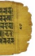

5a

| 5b   |
|------|
| 6a   |
| 6b   |
| 7a   |
| 7b   |
| 9a   |

9b 10a 10b 11a 11b 15a

| 16b 17a 17b 18a   |
|-------------------|

15b

16a

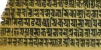

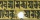

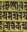

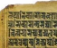

18b

 19a 19b 20a 20b 21a

| 21b 22a 22b 23a 23b 24a   |
|---------------------------|

| 24b 25a 25b 26a 26b 27a   |
|---------------------------|

| 27b 28a   |
|-----------|

| 28b 29a 29b 30a   |
|-------------------|

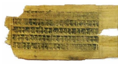

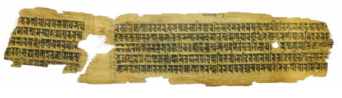

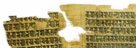

30b 31a 31b Hamburg Buddhist Studies (ISSN 2190-6769)
Steffen Döll | Michael Zimmermann Series Editors: 
Band 1

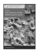

Anālayo The Genesis of the Bodhisattva Ideal 178 pp., 12 illustrations, hardcover, 22,80 EUR ISBN 978-3-937816-62-3 (printed version)
http://hup.sub.uni-hamburg.de/purl/HamburgUP_HBS01_Analayo Band 2

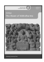 Anālayo 229 pp., 12 illustrations, hardcover, 25,80 EUR The Dawn of Abhidharma http://hup.sub.uni-hamburg.de/purl/HamburgUP_HBS02_Analayo ISBN978-3-943423-15-0 (printed version) Band 3

Lin, Chen-kuo / Radich, Michael (eds.)
A Distant Mirror Articulating Indic Ideas in Sixth and Seventh Century Chinese Buddhism 565 pp., hardcover; 39,80 EUR ISBN 978-3-943423-19-8 (printed version)
http://hup.sub.uni-hamburg.de/purl/HamburgUP_HBS03_LinRadich Band 4

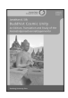 Silk, Jonathan A.

Buddhist Cosmic Unity An Edition, Translation and Study of the "Anūnatvāpūrṇatvanirdeśaparivarta" 252 pp., hardcover, 28,80 EUR
ISBN978-3-943423-22-8 (printed version)
http://hup.sub.uni-hamburg.de/purl/HamburgUP_HBS04_Silk Band 5

Radich, Michael The "Mahāparinirvāṇa-mahāsūtra" and the Emergence of "Tathāgatagarbha" Doctrine 266 pp., hardcover, 28,80 EUR
ISBN 978-3-943423-20-4 (printed version) http://hup.sub.uni-hamburg.de/purl/HamburgUP_HBS05_Radich Band 6

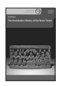

Anālayo The Foundation History of the Nuns' Order 278 pp., hardcover, 29,80 EUR ISBN 978-3-89733-387-1 (printed version)
https://www.buddhismuskunde.uni-hamburg.de/pdf/4-publikationen/ hamburgbuddhist-studies/hamburgup-hbs06-analayo.pdf Band 7

 Jim Rheingans The Eighth Karmapa's Life and his Interpretation of the Great Seal A Religious Life and Instructional Texts in Historical and Doctrinal Contexts 243 pp., hardcover, 25,80 EUR ISBN 978-3-89733-422-9 (printed version) https://www.buddhismuskunde.uni-hamburg.de/pdf/4-publikationen/ hamburg-buddhist-studies/hamburgup-hbs07-rheingans.pdf 180 pp., hardcover, 18,80 EUR

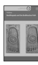

Anālayo Band 8 Buddhapada and the Bodhisattva Path ISBN 978-3-89733-415-1 (printed version)
https://www.buddhismuskunde.uni-hamburg.de/pdf/4-publikationen/ hamburg-buddhist-studies/hamburgup-hbs08-analayo.pdf Band 9

 Susan Andrews/Jinhua Chen/Cuilan Liu (eds.)
Rules of Engagement Medieval Traditions of Buddhist Monastic Regulation 522 pp., hardcover, 26,60 EUR ISBN 978-3-89733-428-1 (printed version) https://www.buddhismuskunde.uni-hamburg.de/pdf/4-publikationen/ hamburg-buddhist-studies/hamburgup-hbs09-full.pdf Band 10

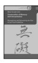

Communities of Memory and Interpretation Mario Poceski (ed.)
Reimagining and Reinventing the Past in East Asian Buddhism XIV; 217 pp., hardcover, 25,80 EUR ISBN 978-3-89733-425-0 (printed version)
https://www.buddhismuskunde.uni-hamburg.de/pdf/4-publikationen/ hamburg-buddhist-studies/hamburgup-hbs10-poceski.pdf Band 11

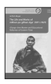 Achim Bayer The Life and Works of mKhan-po gZhan-dga' (1871–1927)
rDzogs-chen Master and Educational Reformer of Eastern Tibet ISBN 978-3-89733-495-3 (printed version)
XXI; 435 pp., hardcover, 32,80 EUR
https://www.buddhismuskunde.uni-hamburg.de/pdf/4-publikationen/hamburgbuddhist-studies/hamburgup-hbs11-bayer.pdf Lambert Schmithausen

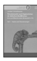 Band 12/Teil 1 bis ca. zur Mitte des ersten Jahrtausends n. Chr. Fleischverzehr und Vegetarismus im indischen Buddhismus 381 pp., hardcover, 27,80 EUR
Teil 1 · Studie und Übersetzungen ISBN 978-3-89733-503-5 (printed version)

Fleischverzehr und Vegetarismus im indischen Buddhismus

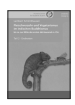

Band 12/Teil 2 Lambert Schmithausen bis ca. zur Mitte des ersten Jahrtausends n. Chr. Teil 2 · Endnoten 606 pp., hardcover, 34,80 EUR ISBN 978-3-89733-504-2 (printed version) Band 12/Teil 3

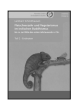 Lambert Schmithausen Fleischverzehr und Vegetarismus im indischen Buddhismus bis ca. zur Mitte des ersten Jahrtausends n. Chr. Teil 3 · Editionen 226 pp., hardcover, 24,80 EUR ISBN 978-3-89733-505-9 (printed version)
Band 13

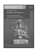 Oren Hanner (ed.) Buddhism and Scepticism Historical, Philosophical, and Comparative Perspectives 183 pp., hardcover, 25,80 EUR
ISBN 978-3-89733-518-9 (printed version) Band 14

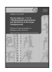

Stefano Zacchetti The Da zhidu lun 大智度論 **(*Mahāprajnāpāramitopadeśa)** 
and the History of the Larger Prajnāpāramitā Patterns of Textual Variation in Mahāyāna Sūtra Literature Edited for publication by Michael Radich and Jonathan Silk 301 pp., hardcover, 25,80 EUR

 ISBN 978-3-89733-543-1 (printed version)
Professor Roloff has offered an enormous gift to Vinaya scholars, to scholars of Tibetan Buddhism, to the monastic community, to scholars of women in religion, and most of all to Buddhist women both lay and monastic with the publication of Buddhist Nuns' Ordination in the Tibetan Canon. The editions and translations of important texts concerning the ordination of women are erudite, comprehensive and clear. They will be invaluable primary resources for anyone interested in the issue of the restoration of the Tibetan nuns' full ordination lineage. Prof. Roloff's analysis of the legal and religious issues, and her argument for the procedure for the restoration of this lineage is meticulous and convincing, setting a new standard for argument in this important debate.

Jay L Garfield, Doris Silbert Professor in the Humanities and Professor of Philosophy and Buddhist Studies, Smith College and the Harvard Divinity School

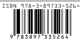

An academic book to be proud of for this cntury and centuries to come. Bhikkhunīs around the world offer deep gratitude to her work.

Venerable Bhikkhuni Dhammanandā (Dr. Chatsumarn Kabilsingh), the first Theravāda bhikkhunī in Thailand and Professor Emeritus, Thammasat University Amidst a wealth of discussions on Buddhist nns' ordination, this edition and translation of a fascinating text on rituals and regulations in the Tibetan tradition presents a much-needed exploration of all the salient issues. Leaving no stone unturned, it lays the foundation for future research and is essential reading for anyone with an interest in gender and institutions.

Prof. Dr. Ann Heirman, Head of the Department of Languages and Cultures and the Centre for Buddhist Studies, Ghent University This is an important book. It will provide a solid foundation for any future discussion of what might be an unnecessarily complicated issue. The careful critical editions of the canonical sources involved are especially welcome. Gregory   Schopen,   Distinguished   Professor Emeritus, Department of Asian Languages &
Cultures, UCLA
ISSN 2190-6769 ISBN 978-3-89733-526-4 (printed version)
EUR [D] 27,80