Wendi L. Adamek Practicescapes and the Buddhists of Baoshan

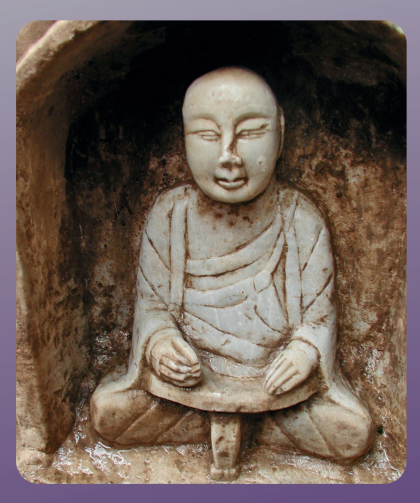

STUDIES 16 Wendi L. Adamek PRACTICESCAPES and the BUDDHISTS OF BAOSHAN
Hamburg Buddhist Studies 16 Series Editors:
Steffen Döll | Michael Zimmermann


for Buddhist Studies Wendi L. Adamek PRACTICESCAPES and the BUDDHISTS
OF BAOSHAN
projektverlag.

Bibliographic information published by the Deutsche Nationalbibliothek The Deutsche Nationalbibliothek lists this publication in the Deutsche Nationalbibliografie; detailed bibliographic data are available in the Internet at http://dnb.d-nb.de. 

ISSN 2190-6769 ISBN 978-3-89733-515-8 (printed version)
ISBN 978-3-89733-573-8 (E-Book)
© 2021 projekt verlag, Bochum/Freiburg www.projektverlag.de Cover original design by Benjamin Guzinski; Julia Wrage, Hamburg Cover image: Frederick M. Smith, 2005 Contents

| Foreword                                                | 11   |
|---------------------------------------------------------|------|
| Acknowledgements                                        | 13   |
| Abbreviations and Conventions                           | 17   |
| Abbreviations                                           | 17   |
| Conventions                                             | 19   |
| PART I: PRACTICESCAPES                                  | 21   |
| Chapter One: PRACTICESCAPE AT BAOSHAN                   | 21   |
| "Practicescape"                                         | 21   |
| Backstories                                             | 26   |
| Spiders and Catalogues                                  | 34   |
| Dedicatory Inscriptions at the Caves                    | 38   |
| Anyangxian jinshi lu and Anyangxian zhi                 | 40   |
| Shina bukkyō shiseki                                    | 41   |
| Baoshan Lingquan si                                     | 43   |
| Contemporary Academic Work                              | 44   |
| Overview of the Present Work                            | 45   |
| Conclusions                                             | 48   |
| Chapter Two: DIMENSIONS OF ENDTIME AND  DAZHUSHENG CAVE | 51   |
| Cycles                                                  | 51   |
| A Brief History of Endtime                              | 52   |
| The Candragarbha-sūtra                                  | 62   |
| The Mahāmāyā-sūtra                                      | 66   |
| The Chanhui wen                                         | 70   |
| Conclusions                                             | 79   |

| Chapter Three: REPENTANCE PRACTICES              | 81   |
|--------------------------------------------------|------|
| Widening the Circles of Repentance               | 81   |
| Dilun Repentance Verses                          | 83   |
| Repentance in Related Soteriological Movements   | 87   |
| Resonances between Sanjie Practices and Baoshan  | 89   |
| Repentance Practices and Chan                    | 100  |
| - Scapegoating Repentance in Eighth-Century Chan | 101  |
| - Doubt and the Chan "Theodicy" Problem          | 107  |
| Modern Confessional Complexes                    | 111  |
| "Ajase"                                          | 111  |
| Foucault and Technologies of Self                | 115  |
| Conclusions                                      | 118  |
| Chapter Four: THE AGENCY OF RELATIONS            | 123  |
| Working Relations                                | 123  |
| The Work of Merit                                | 125  |
| The Foundations of Merit-Practice                | 126  |
| Merit and Merit-Transfer in a Chinese Commentary | 130  |
| Generosity and "the Gift" of the Three Treasures | 139  |
| The Work of W/riting and Vows                    | 144  |
| W/riting and the Bodies of the Merit Field       | 144  |
| W/riting in the Jueding pini jing                | 149  |
| Accessing the Agency of Relations through Vows   | 150  |
| The Work of Mutual Responsiveness                | 156  |
| Resonance between the Living and the Dead        | 157  |
| Rhetorical Arts and Real Effects                 | 164  |
| Conclusions                                      | 169  |

| Chapter Five: THEORIES AND DEBATES                                                           | 171   |
|----------------------------------------------------------------------------------------------|-------|
| Introduction                                                                                 | 171   |
| Overviews                                                                                    | 173   |
| Tathāgatagarbha                                                                              | 173   |
| Yogācāra                                                                                     | 176   |
| - Yogācāra and Baoshan                                                                       | 176   |
| - Summary of Yogācāra Theory                                                                 | 179   |
| Debates                                                                                      | 186   |
| Entanglements I: Terminological Battles in the Seventh  and Eighth Centuries                 | 186   |
| Entanglements II: Terminological Battles in Contemporary  Debates over Yogācāra and Idealism | 189   |
| - Dan Lusthaus and Rūpa                                                                      | 190   |
| - Lambert Schmithausen's Critique of Lusthaus                                                | 195   |
| ~ The Case                                                                                   | 196   |
| ~ Antidotal Soteriology                                                                      | 198   |
| ~ The Spiritual Context                                                                      | 202   |
| - Robert Sharf and "Phenomenology"                                                           | 205   |
| - Uses of the Viṃśatikā                                                                      | 213   |
| Path Constructions in Dilun Texts                                                            | 225   |
| Conclusion: "Harmonizing the Debates"                                                        | 230   |
| Chapter Six: RELIQUARIES, IMAGES, AND MEDIATORS                                              | 233   |
| What Do We Do with It?                                                                       | 233   |
| Reliquary Stūpas                                                                             | 237   |
| Looking at Buddha Images                                                                     | 242   |
| "Thus Have I Seen"                                                                           | 243   |
| The Power of Shadows                                                                         | 246   |

| The Buddha Images at Dazhusheng Cave                                       | 256   |
|----------------------------------------------------------------------------|-------|
| - Mahāmāyā and Vairocana: Engendering the Dharma-Realm  in Dazhusheng Cave | 259   |
| Images of Practitioners                                                    | 268   |
| Aspiring Buddhas                                                           | 268   |
| Corpse Exposure and Enshrined Relics                                       | 273   |
| Making Dharma Ancestors                                                    | 285   |
| Representations of Donors                                                  | 290   |
| Conclusions                                                                | 299   |
| Chapter Seven: A NICHE OF THEIR OWN                                        | 301   |
| The Mortuary Grove at Lanfengshan                                          | 302   |
| Women and the Agency of Relations                                          | 305   |
| A Brief Account of Buddhist Nuns                                           | 305   |
| Active Voices                                                              | 308   |
| Practicing Women                                                           | 311   |
| - Dhūta                                                                    | 314   |
| - Dhyāna                                                                   | 317   |
| - Dharma                                                                   | 320   |
| Family Ties                                                                | 327   |
| Dharma Economics                                                           | 327   |
| Nuns and Household Economies                                               | 334   |
| Daughters in Chinese Buddhism                                              | 335   |
| - Zhijue's Memorial for Her Father                                         | 338   |
| - Chan Master Wuzhu's Dharma Daughters                                     | 339   |
| - Layman Pang's Daughter                                                   | 344   |
| - Conclusion                                                               | 346   |

| The Literary Lives of Nuns                                                       | 348   |
|----------------------------------------------------------------------------------|-------|
| The Benxing Poems                                                                | 349   |
| Buddhist Subjectivities                                                          | 354   |
| Practicing Poetesses                                                             | 358   |
| - Buddhists                                                                      | 358   |
| - Daoists                                                                        | 363   |
| Conclusions                                                                      | 366   |
| Chapter Eight: SHARING THE PRACTICESCAPE                                         | 369   |
| Huixiu's Memorial                                                                | 369   |
| The Image and the Work of Mourning                                               | 379   |
| PART II: BAOSHAN PHOTOS AND INSCRIPTIONS                                         | 385   |
| Transcription Process and Conventions                                            | 385   |
| List of Illustrations                                                            | 387   |
| Transcriptions and Translations                                                  | 395   |
| I. Dazhusheng Cave and Nearby Surfaces                                           | 395   |
| II. Memorial Niches on Baoshan                                                   | 415   |
| III. Daliusheng Cave and Memorial Niches on Lanfengshan                          | 462   |
| Appendix A: List of Reliquary Niches with Surviving Remnants  of Memorial Images | 491   |
| Appendix B: Baoshan-Related Inscriptions at Shanyingshan 善應山                  | 495   |
| Appendix C: Inscriptions from Free-Standing Pagodas and Stelae                   | 499   |
| PHOTOS                                                                           | 509   |
| Bibliography                                                                     | 555   |

## About Hamburg Buddhist Studies

Ever since the birth of Buddhist Studies in Germany more than 100 years ago, Buddhism has enjoyed a prominent place in the study of Asian religions. The University of Hamburg continues this tradition by focusing research capacities on the religious dimensions of South, Central, and East Asia and making Buddhism a core subject for students of the Asia Africa Institute. The Numata Center for Buddhist Studies is proud to have found a home at one of Europe's pioneering academic institutions. With its Hamburg Buddhist Studies book series it honors the University's long-standing commitment to research in the field of Buddhist Studies and aims to share its results with both the academic community and the wider public.

Today, Buddhist Studies as an academic discipline makes use of a broad spectrum of approaches and methods. The field covers contemporary issues as much as it delves into the historical aspects of Buddhism. Similarly, the questions shaping the field of Buddhist Studies have broadened. Understanding present-day Buddhist phenomena—and how such phenomena are rooted in and informed by a distant past—is not at all an idle scholarly exercise. Rather, it has become clear that fostering the understanding of one of the world's major religious traditions is a crucial obligation for modern multicultural societies in a globalized world.

Accordingly, *Hamburg Buddhist Studies* addresses Buddhism as one of the great humanistic traditions of philosophical thought, religious praxis, and social life. Its discussions will undoubtedly be of interest to scholars of religious studies and specialists of Buddhism, but also aim at confronting Buddhism's rich heritage with questions the answers to which might not easily be deduced by the exclusive use of historical and philological research methods. Such issues require the penetrating insight of scholars who approach Buddhism from a broad range of disciplines, building upon and yet going beyond the solid study of texts and historical evidence.

We are convinced that *Hamburg Buddhist Studies* will contribute to opening up the field to those who may have no training in the classical source languages of the Buddhist traditions but approach the topic against the background of their own disciplinary interests. With this book series, we would like to also encourage a wider audience to take an interest in the academic study of the Buddhist traditions.

## About This Volume

To the North of Henan Province in mainland China, Baoshan stands at the center of an extensive rhizome of Buddhist sites of worship. It is an area richly inscribed with memorials and biographical notes, textured by carvings, statues, reliquary niches, and cave shrines, and transformed through more than 1,400 years of Buddhist practice. While historical developments have led to the ongoing erosion of religious heritage—rituals were discontinued, spaces abandoned—, the cultural significance of the landscape remains. In 2005, during one of her field trips to the site, Wendi Adamek has in great detail documented the then-current state of preservation. The corpus of photography she produced marked the beginning of a decade-long project on Baoshan as a practicescape, i.e. a landscape shaped by practice but also designed to facilitate the escape from worldly ways of living—ultimately, even from the cycle of birth and death itself.

Her argument follows multiple vectors and associologically interweaves such vastly different perspectives as philology and iconographical analysis of the materials *in situ*; the history and historiography of millenarism and repentance in Chinese Buddhism, even up to the present day; the intradenominational debates on problems related to terminology, soteriology, practice, and gender; and studies in the theory and performance of reliquary and mortuary rites. Together with the photographical documentation of locations, images, and inscriptions, this holograph of the Baoshan practicescape truly breaks new ground: For one, it partially conserves the no longer existing state of a one-and-a-half-millenium old network molded on Buddhist ideas and practice. And while the site introduced and studied here is located not at the center but at the margins of religious history, the following pages succeed admirably in illustrating its importance for understanding Chinese Buddhism, past and present. On a methodological level, the author convincingly underscores the scholarly importance of considering overlooked topics and topoi, and of directing theory-driven questions at a multiplicity of materials. 

We welcome Wendi Adamek's newest book—as ambitious as it is impressive—enthusiastically in the *Hamburg Buddhist Studies* series.

Steffen Döll and Michael Zimmermann

## Acknowledgements

Common claims for the *raison d'être* of a book could include: "this is comprehensive coverage of the topic," "no one has done this before," and "soand-so got it wrong." For this book I cannot claim comprehensive coverage, I 
gratefully acknowledge that many have walked this ground before me, and I engage with the work of other scholars because I am impressed by the quality of their efforts. I apologize if I have overlooked other high-quality relevant work due to the associative nature of my research process. 

This study incorporates elements of Buddhist studies, cultural studies, art history, archeology, and aspects of network theory. It is an experiment. I have deliberately tried to let its diversity of forms be its argument, its point. It is a crystallization of its own process, like hoarfrost. In this I have attempted to put into practice Bruno Latour's principles of "associology" and Timothy Ingold's 
"webware," which anticipate more recent developments in "new materiality." 
In my view, these resonate with the Buddhist soteriological principle that one's intentional work creates provisional pathways that tend toward an understanding of their emptiness. Whether this has resulted in "skillful means" is not for me to judge, it is a "public case" (*gongan*), just so and irremediably irresolvable.

Focusing on any particular point—in this case a particular place, Baoshangives rise to innumerable possible pathways, interrelations, reflections, and dissolutions. I have chosen a few of these to highlight, and have also articulated some constructed meta-perspectives that pertain to parts of the webwork. Though I do not espouse a particular narrative or argument, the work includes many narratives and arguments. Though I am unapologetically a Buddhist apologist, I am also a professional practitioner of doubt. This book has been my practicescape for twenty years, and I am immeasurably thankful for everything the work has brought into my life. First and foremost, I acknowledge the place itself, Baoshan, real and always-already projected. I now turn to grateful acknowledgement of particular persons, places, and resources who have supported this project/projection for two decades. 

Let me first express long-standing gratitude to the Numata Foundation and the Bukkyō Dendō Kyōkai (Society for the Promotion of Buddhism), which provided support for my graduate work in Kyoto as well as establishing my current Chair in Buddhist Studies at the University of Calgary. 

For this project, I made my first trip to Baoshan in 1999, after a month-long Luce Foundation-sponsored research tour in Gansu and Sichuan. I sought out the site because I had stumbled on an intriguing article by Ōuchi Fumio while browsing in the stacks at the University of Iowa. I carried out further textual and on-site research in 2001-2001 and 2004-2005, while in residence as a research fellow at the Zhongguo Gudaishi Yanjiu Zhongxin (Center for Research on Ancient Chinese History) at Peking University (Beida). For these residencies at a superb research center, I owe an immense debt to the kindness of Professor Rong Xinjiang. Support was provided by the Committee on Scholarly Communication with China (National Endowment for the Humanities) and the Fulbright Foundation (CIES, China). 

I attended Professor Rong's seminars both years, benefitting greatly from his immense knowledge of Tang China. I also got to know stellar graduate students who became friends, including Lei Wen (now at the Chinese Academy of Social Sciences), Wang Jing (now at Renmin University), and Wang Jing's husband Shen Ruiwen, an archaeology professor at Beida. I met weekly with my tutor and good friend Shen Penghua (now teaching at Belmont Hill in Massachusetts) for translation questions and discussions of Classical Chinese. In 2005, I spent two weeks on-site at Baoshan, meticulously photographing and making transcriptions of the inscriptions with the help of Wang Jing, Shen Ruiwen, and Frederick M. Smith (University of Iowa). 

I began writing chapters in 2009-2010 with a much-appreciated and stimulating residence fellowship at the Stanford Humanities Center. Over the years, I have also benefitted greatly from discussions with colleagues around the globe, thanks to my years as a Lecturer at the University of Sydney and as Associate Research Fellow at SOAS, University of London. And although I 
embarked on a new project during my 2015-2016 year at the Institute for Advanced Study, Princeton, I am deeply grateful for the time this idyllic residency gave me to complete the Baoshan manuscript. 

I would like to gratefully acknowledge previous publications of sections of my Baoshan work, opportunities that provided me with valuable suggestions from anonymous reviewers and helpful readers. 

- I consolidated my research on the Sanjie movement in "Traces of the Sanjie (Three Levels) Movement at Baoshan," in Mario Poceski, ed., 
Communities of Memory: Reimagining and Reinventing the Past in East Asian Buddhism (2017). 

- The *Journal of Chinese Buddhist Studies* published "Meeting the Inhabitants of the Necropolis at Baoshan" (2016) and "Addressing the Mind: 
Developments in the Culture of Confession in Sui-Tang China" (2015). These were adapted for sections in Chapters Six and Three, respectively. 

- The kernel of Chapter Two began as "Dimensions of Endtime at Baoshan," in Dorothy C. Wong and Gustav Heldt, eds., Cultural Crossings: China and Beyond in the Medieval Period (2014). 

- Sections of Chapter Four first appeared in *Literature and Aesthetics* as 
"The Agency of Relations at Baoshan" (2012). 

- Sections of Chapter Seven appeared in "A Niche of Their Own: The Power of Convention in Two Inscriptions for Medieval Chinese Buddhist Nuns" in *History of Religions* (2009), and "The Literary Lives of Nuns: Poems Inscribed on a Memorial Niche for the Tang Nun Benxing" in *T'ang Studies* (2009). 

- A section of Chapter Eight was drawn from "The Impossibility of the Given: Representations of Merit and Emptiness in Medieval Chinese Buddhism," published in *History of Religions* (2005).

I am deeply thankful to University of Hamburg Press editors Steffen Döll and Michael Zimmerman for their encouragement and courage in taking on this publication. I am likewise grateful to Fred Pusch and the team at Projektverlag for dealing with this complicated manuscript!

I cannot begin to count all the help received from many beings, but I want to acknowledge friends (grouped in alphabetical order) who have provided support, discussion, and encouragement during this long process: Mark Allon, Ruth Ballinger, Richard Duffy and WenLu Duffy, Marcus Bingenheimer, Maitripushpa Bois and Norman Blair, Megan Bryson, Venerable Changwu, Jessey Choo, Masako Cordray and Greg Westcott, Lindsay Driediger-Murphy and William Murphy, Lucia Dolce, Anne Dutton, Jennifer Eichman, Bernard Faure and Dominique Choël, Nancy Fitkin, Nelson Foster, Sarah Fraser, Beata Grant, Roxanne Guilhamet, Iwamoto Akemi, Jiang Tao, Venerable Jongmuk Sunim, Morny Joy and John King, Durga Kale, Toyo Kawamura, Sujung Kim, Cynthia King, Dorothy Ko, Se-Woong Koo, Sonya Lee, Lei Wen, Lin Chenkuo, Lin Pei-ying, Benedetta Lomi, Ian and Mayumi McCrabbe, Andrew McGarrity, Mary Miller, Richard Payne, Hassan Pirbhai, Mario Poceski, Nash Popovic, Michael Puett, Ann and Marion Rinehart, Gabriele Roccella and Monica DiRosa, Tinu and Donna Ruparell, Rong Xinjiang, Eva Neumaier, Morten Schlütter, Shen Penghua, Shen Ruiwen, Shimoda Masahiro, Frederick Smith, Caleb Snider, Michelle Sorenson, Margery Strass, Wendy Swartz, Buzzy Teiser, Lauren Valle, Dorothy Wong, Wang Jing, Yü Chün-fang, Xue Yu and Fu Hongfen. 

And always, *me ke aloha pumehana* to my loving, patient, and entertaining family: Janet and George Allan, Brad and Jodi Fitkin, Lisa Fitkin and Andrew Wright.

This work is dedicated in loving memory of departed bodhisattvas Margery Strass, Ruth Ballinger, Marion Rinehart, and Leslie Kawamura.

Water Valley, 2021

# Abbreviations And Conventions

Abbreviations AN = *Aṅguttara Nikāya* (Incremental Discourses)
AYXJSL = Anyangxian jinshi lu 安陽縣金石錄 (Records in Metal and Stone of Anyang District). Citations from *SKSL* Series 1, Vol. 18 (see below).

BS = Baoshan BSLQS = *Baoshan Lingquan si* 寶山靈泉寺 (Lingquan Temple at Baoshan). 

Henansheng gudai jianzhu baohu yanjiusuo 河南省古代建築保護研究所
(Henan Research Institute for the Preservation of Ancient Architecture), 
eds. Zhengzhou: Henan Renmin, 1991.

Beijing = Dunhuang 敦煌 manuscripts in the National Library of China. Each ms. in the original collection was identified according to its number within a batch of 100 ms., and the batches were designated according to the sequence of characters in the *Qianziwen* 千字文 (Thousand Character Classic).

DDB = Digital Dictionary of Buddhism, http://www.buddhism-dict.net/ddb/
DLS = Daliusheng 大留聖 cave DN = *Dīgha Nikāya* (Long Discourses)
DZ = *Daozang* = 正統道藏, the Daoist canon edition of the tenth year of the Zhengtong 正統 era, Ming 明 dynasty (1445)
DZS = Dazhusheng 大住聖 cave Jinbunken 石刻 = Photographs of rubbings in the 石刻 (Stone Engravings) 
collection of the online database of the Jinbun kagaku kenkyūjo 人文科学 研 究 所 (Humanistic Science Research Institute) of Kyoto University 
(http://kanji.zinbun.kyoto-u.ac.jp/db-machine/imgsrv/takuhon/). Baoshan materials are in collection 9 輯, case 61 函; complete case and folio number citations are found in Ōuchi 1997: 334-345. 

Jinbunken 中國金石 = Photographs of rubbings in the 中 國 金 石 拓 本
(Rubbings from Chinese Metal and Stone Inscriptions) collection of the online database of the Jinbun kagaku kenkyūjo 人 文 科 学 研 究 所
(Humanistic Science Research Institute) of Kyoto University 
(http://kanji.zinbun.kyoto-u.ac.jp/db-machine/imgsrv/takuhon/). Baoshan materials in cases 43-44 函; complete case and folio number citations are found in Ōuchi 1997: 334-345. 

LFS = Lanfengshan MN = *Majjhima Nikāya* (Middle Length Discourses) P. = Dunhuang manuscripts in the Pelliot collection, Bibliothèque Nationale QTS = *Quan Tang shi* 全唐詩 (Complete Poetry of the Tang Dynasty). 

Compiled 1705, Cao Yin 曹寅 and Peng Dingqiu 彭定求 *et al*., eds. Beijing: 
Zhonghua shuju, 1960.

QTW = *Quan Tang wen* 全唐文 (Complete Prose of the Tang Dynasty). 

Compiled 1814, Dong Gao 董誥, *et al*., eds. Beijing: Zhonghua shuju, 1983.

S. = Dunhuang manuscripts in the Stein collection, British Library Scripta Sinica digital editions = 上古漢語語料庫. http://hanji.sinica.edu.tw.

SKSL = *Shike shiliao xinbian* 石刻史料新編 (A New Edition of Historical Materials Carved on Stone). Yan Gengwang 嚴耕望 , ed. Taibei: 
Xinwenfeng, 1977-2006.

SKQS = *Siku quanshu* 四庫全書 (Complete Imperial Library of the Four Treasuries). Compiled 1773-1782, by Ji Yun 紀昀 and Lu Xixiong 陸錫熊 et al., eds. Electronic *Siku Quanshu*, Chinese University of Hong Kong & Digital Heritage Publishing Ltd., 1999. 

SN = *Saṃyutta Nikāya* (Connected Discourses)
T. = *Taishō shinshū daizōkyō* 太正新修大蔵経 (*Taishō Era Revised Tripiṭaka*). 

Takakusu Junjiro 高楠順次郎, ed. Tokyo: Daizō shuppan kai, 1922-1933.

Zhonghua shuju (China Publishing House) = edition cited for the classics and standard histories.

## Conventions

- I italicize most foreign-language Buddhist terms (except for nirvāṇa), 
because the special category of terms that are included in Webster's dictionary, as identified in Jackson 1982, would not be readily apparent to non-specialists. However, some of my quoted sources follow Jackson.

- I use Sanskrit romanization for generic Indian Buddhist terms, except for sections in which I discuss or quote translations from Pāli sources. For example, I generally use the Sanskrit romanization *saṃgha*, but in some quoted passages the Pāli *saṅgha* or Saṅgha appear.

- All Baoshan inscriptions cited in Part I are identified by Dazhusheng passage title, or Baoshan (BS) number, or Lanfengshan (LFS) number, and are found catalogued, translated in full, and annotated in Part II. For translations included in Part I, only the transcription is included in Part II.

# Part I: Practicescapes

Chapter One

## Practicescape At Baoshan

Even when one is no longer attached to things, it's still something to have been attached to them; because it was always for reasons which other people didn't grasp … 
Marcel Proust, *Cities of the Plain*

## "Practicescape"

There is a gently descending valley between low peaks, the most prominent of which are named Baoshan 寶山 (Treasure Mountain) and Lanfengshan 嵐峰 山 (Misty Peak Mountain). Accessible limestone outcroppings make good surfaces for carving. At one time, abundant forests were probably more than a literary trope. The famous spring, which remains fresh and delicious even now, doubtless attracted human settlement and agriculture from early times. In this sequestered green pocket in the Taihang 太行 mountain range, there were likely to have been local sacred sites that predated Buddhist activities. 

The place now known as Baoshan in Henan 河南 province is a network of rock-cut caves, devotional and memorial inscriptions, reliquary niches with portrait-statues, and references to buildings and restorations. Most notably, the memorial inscriptions on Lanfengshan are the single largest extant *in situ* collection of records of medieval1 Chinese Buddhist nuns. 

In this study I trace intersecting lines of movement—networks of doctrine, paths of practice, carvings in stone—that link the devotional constructions of the site. Moving between the world of Baoshan and our own, I have been interested in the proposition that experience and conditions are copoietic (coconstituting, mutually shaping). I have been attuned to theorizations and enactments of this principle in both medieval and modern contexts. Pursuing the idea of mutual creation of subjects/objects entails acknowledging that what one sees are the tracks of one's pursuit. Rather than an orderly catalogue of Baoshan's features as pieces belonging to a boundaried place, these are fieldnotes of projected connections among its bodies, objects, practices, and testimonies. But as Proust-in-translation says, "it's still something" to have been attached to these (non)things and I have tried to understand the reasons. "Baoshan" has become a provisional designation for a rich experience of copoietic relations—between places and practitioners, the living and dead, women and men, clerics and laity, acts and scripts, stones and buddhas, myself and my field.

Baoshan was meant to be at work beyond itself, just as the elaborate fabrications of Buddhist scriptures were created to support the realization of their provisionality. Like the fantastic pilgrimage of the youth Sudhana in the Gaṇḍavyūha-sūtra, a journey to Baoshan takes one into intricate visions of other realms and times. Yet this "work beyond itself" was also to be understood as the everyday condition of apparent existence. Perception of Baoshan as a stabilized location would be not unlike the false conception of self that Buddhist soteriology is designed to deconstruct.

Early Buddhist teachings highlighted the binding effects of karma (intentional actions) that stem from reification of the aggregation of momentary psycho-physical functions as an independent permanent essence or self. Only focused, informed attention to the processes by which this delusion is sustained and final attainment of indescribable nirvāṇa could end the self-reinforcing cycles of karmic momentum. On the way to liberation, a practitioner's generous, selfless actions would generate self-reinforcing beneficial karmic counter-effects, a growing treasury of *puṇya* (merit). Around the beginning of the Common Era, Mahāyāna (Greater Vehicle) sūtras provided poetic evocations of the transformation of chains of delusion into the ornaments of timeless liberation and wisdom. Popular sūtras celebrated cosmic manifestations and marvelous illusions as forms of *upāya* (skillful means) deployed by the buddhas (awakened ones) and bodhisattvas (on the path to buddhahood). Composers of apocryphal scriptures and exegetical treatises elaborated on various schematizations of the stages of the path. A practitioner at Baoshan would have been familiar with some version of this trajectory: the arising of bodhicitta (the mind of awakening) would break through delusory selfidentification and motivate the practitioner to take bodhisattva vows to attain buddhahood. Stage by stage, bodhisattvas would purify themselves of the effects of past evil actions and develop salvific qualities (*pāramitās*, perfections). Becoming buddhas, functioning as the nature of reality, they would help catalyze awakening in fellow beings still caught in the web of self-created suffering.2 Baoshan has been in development as a place to participate in this process from the sixth century onwards. It has been interactively constituted as a bodhimaṇḍa, "seat of awakening," *daochang* 道 場 in Chinese, *dōjō* in Japanese. *Bodhimaṇḍa* may refer to the ritually boundaried performance of practices, the place in which they are performed, or a temple or monastery site. 

Emperor Yang 煬 (r. 604-617) of the Sui 隋 (581-618) is said to have decreed in 613 that all temples should be called *daochang*, and this designation is used in the Baoshan mortuary inscriptions.3 The creation of intentionally and provisionally circumscribed Buddhist places put the soteriology of impermanence on the map from Northern India to Sri Lanka, along the trade routes through Central and Southeast Asia, into the Tibetan Plateau and throughout East Asia, and now all over the globe. The long history and fertile contours of China's pre-Buddhist geographic imaginaire shaped the way that Buddhism adapted itself to the land.4 From faint early signs in the first century, Chinese Buddhist objects, texts, and persons created ever-more dense networks of trails. Buddhist modes of placemaking gradually usurped, coopted, or became coextensive with local, Daoist, and imperial rites of place at key nodes of the topographical and cultural landscape.5 At Baoshan in the sixth and seventh centuries, place-making skills included translating and transmitting texts and performing rituals as well as building temples and establishing images. In our century, place-making skills include virtual multi-perspectival views of the intersection of these activities.6 Over time, social networks and human-made features transformed Baoshan's pleasant but rather ordinary landscape into a place where resident, transient, and deceased members of the Buddhist community, the *saṃgha*,
7could attain salvation and perhaps buddhahood. 

The term "practicescapes" in the title is a melding of the venerable Buddhist notion of *bodhimaṇḍa* with Timothy Ingold's more recent coinage, 
"taskscape." In *The Perception of the Environment: Essays in Livelihood,* Dwelling, Skill, Ingold writes: 
It is to the entire ensemble of tasks, in their mutual interlocking, that I refer by the concept of taskscape. Just as the landscape is an array of related features, so 
—by analogy—the taskscape is an array of related activities. And as with the landscape, it is qualitative and heterogeneous: we can ask of a taskscape, as of a landscape, what it is like, but not how much of it there is.8 Baoshan can be viewed as an interlocking of related activities pertaining to livelihood, dwelling, and skill. Crucially, however, Buddhist "practicescapes" entail *escape* from worldly ways of living and ultimately from the cycle of birth and death itself. In the activities inscribed at Baoshan we see bodily cultivation of the techniques of transcendence of the body, the sculpting of a landscape into a necropolis through an ensemble of specialized skills, and maintenance of a dwelling-place intentionally removed from the ordinary world. Its skillfully carved and urgently communicative soteriology both creates and breaks down the confines of the site. Possibly displacing some preexisting form of localized religious practice, Baoshan's founders carved out a niche for individual and community practice of a universalist soteriology. They evoked the mutual responsiveness of buddhas and practitioners as the *dharmadhātu*, 
the "realm" or functioning of actuality. In Chapter Four I discuss this working concept of reality in terms of "the agency of relations."
Ingold, working from materials as diverse as the hunting lore of circumpolar peoples, modern urban experience, and Australian aboriginal images, asks us to think of places not in terms of lines on a map but from a 
"dwelling perspective," which he contrasts to a "building perspective." To be in place is to be in process, involved in a multi-level meshwork of skills, intentions, visions, and relationships.9 Here I analogize "dwelling" and the Buddhist notion of skillful means, which is a multidimensional adaptation of skills, intentions, visions, and relationships in order to liberate beings from suffering. 

In a Buddhist view, suffering arises from a process analogous to Ingold's 
"building perspective"; in the midst of an ever-renewing and mutually conditioning flow of relations, one is continually and unsatisfactorily striving for stable constructs whose dependence on prior mental idealizations is not recognized.10 The name of Dazhusheng 大住聖 cave, which is the defining devotional construction of Baoshan and the seat of its main image, the cosmic buddha Vairocana, can be translated as the cave of the "Great Dwelling Holy Ones" or the "Great Abiding Holy Ones." Vairocana is the ultimate idealization of dwelling: embodied realization of the absence of any non-dependent priority, alterity, or location. Around this universal center of the dwelling process, of emptiness, Baoshan was fashioned into a landscape of practice and escape. 

Exploring Baoshan's fourteen-hundred-year-old practicescape takes on an added poignancy in light of our current transformations of the environment. Presenting Buddhist places as exempla of dwellings in harmony with nature is not as straightforward as it might seem. Monks opened up fragile mountain ecosystems for human use in order to provide instructive alternatives to urban life. Moreover, monastic institutions depend on the support of those invested in the prevailing socioeconomic system. 

However, Buddhist insights from the seventh century could shed light on contemporary crises in another way. In order to find new means of skillful livelihood and interconnected dwelling, I believe it is helpful to confront the profound existential ambivalence generated by interconnection itself. This is something that Buddhists have been doing for some time. 

Transmission of the arts of livelihood, dwelling, and skill through time is always experimental and impermanent. Our current complex systems have developed connections that were previously unthinkable, and they lack connections that sustained earlier complex systems. We have decreasing access to modes of experience that were integral to daily life in tangled communities like Baoshan, communities that included humans, nonhumans shaped by and shaping human needs (things like tools, images, and cultivated plants and animals), and nonhumans in some category of "other." In which of these categories do we place Baoshan's buddhas, bodhisattvas, local spirits, and inhabitants of the necropolis? How are we to characterize the connections between local and universal dwelling, gendered and transcended identities, human and nonhuman agencies? The images, faces, memorials, and practices carved in the flanks of mountains may remind us that this is an ongoing experiment, and our current ways are not set in stone.

## Backstories

Viewed from a distance, the long stretch of relative stability from the establishment of the Sui in 589 to the disruption of the Tang 唐 (618-906) in the mideighth century was a flourishing era for the practice community at Baoshan. 

This is the period that encompasses the largest number of extant datable mortuary-niche inscriptions. However, let us trace back the roots of Baoshan's efflorescence to the Northern Wei 北魏 (386-534). 

The Northern Wei was formed when the armies led by Tuoba Gui 拓跋珪, posthumously known as the founding emperor Taizu 太祖, moved into presentday Shanxi 山西 and Hebei 河北 during the latter part of the fourth century.11 Subsequently, the Buddhist monk Faguo 法果 won the approval of both Taizu and his successor. Good relations between court and clergy lasted until late in the reign of Emperor Taiwu 太武 (r. 424-452), who launched the first violent persecution of Buddhism in China, purportedly instigated by a Daoist master and a powerful court minister. Yet the Northern Wei might not have become a paradigmatic Buddhist state without the focusing effects of the persecution (446-452) and its aftermath. The downfall of the perpetrators and the end of the persecution unleashed a deluge of Buddhist piety, engaging all levels of society and diverse ethnic groups. Through the latter half of the fifth century, Buddhism served as the primary unifying force for the state. Unfortunately, as the pace of territorial expansion slowed, merit-seeking excesses began to overburden the Northern Wei economic system. The mania for durable records of merit caused wealth to pour into Buddhist networks, creating an aura of prestige and power that further fed the fetishism. This tendency for Buddhism to swell into a dangerous bubble in the Chinese economy was to be a recurring problem, but the bonding of Buddhist and state operations rendered the Northern Wei particularly vulnerable. The conflagration of the magnificent Yongning 永寧 temple in 534 was later seen as an omen of the impending breakup of the dynasty, when it was split by warfare into separate eastern and western regimes.12 From the rubble grew another flowering of Buddhist culture, the short-lived hybrid Chinese/Xianbei 鮮卑 dynasties of the Eastern Wei 東魏 (534-550) and Northern Qi 北齊 (550-577).The Northern Qi was founded by Gao Yang 高洋 (529-559), the second son of the Eastern Wei 東魏 (534-550) minister Gao Huan 高歡 (496-547). As Emperor Wenxuan 文宣, Gao Yang ruled from the city of Ye 鄴 in southern Hebei, which had been rebuilt by his father under the Eastern Wei. 

The Northern Qi was destroyed in 577 by the Northern Zhou 北周 (557581), which also supplanted the regime of the Western Wei 西魏 (535-556) 
centered in Chang'an 長安. The Northern Zhou Emperor enforced a second major persecution of Buddhism from 574-577. In 580, the minister Yang Jian 楊堅 (541-604) became regent, and after crushing an attempt at resistance he swiftly established himself as Emperor Wen 文 of the Sui (r. 581-604). He reunified north and south in 589, ending over three centuries of division. It was under his pro-Buddhist regime and partially through his patronage that Baoshan became a major Buddhist site. His son Yang Guang 楊廣 (569-618) 
gained the throne in 604 through slander of his older brother, and possibly parricide. The end of his brutal reign was marked by widespread rebellions. 

In 618 the rebel Li Yuan 李淵 (566-635), former governor of Taiyuan 太原
(Shanxi), established the Tang dynasty. After his death he was designated as founding Emperor Gaozu 高祖 (r. 618-626) by his son Li Shimin 李世民 (599649), who reigned as Emperor Taizong 太宗 (r. 626-649). Taizong was succeeded by his son Li Zhi 李治 (628-683), who ruled as Emperor Gaozong 高宗 (r. 649-683). When Gaozong became incapacitated by a series of strokes in 665, his second empress Wu Zhao 武曌 (624-705), a former concubine of his father's, became de facto ruler. 

After Gaozong's death, Empress Wu succeeded in establishing herself as the founder of a new dynasty, the Zhou 周 (690-705). Given the honorific name Wu Zetian 武則天 by her son Emperor Zhongzong 中宗 (r. 705-710), she was much-criticized for her ruthlessness after the Tang was reestablished in 705. Nevertheless, she was also acknowledged to have been a strong ruler, and she was widely supported by the Buddhist clergy for establishing a Buddhist network of monasteries and convents. However, she issued proscriptions against the Sanjie 三階 (Three Levels) movement, and as Baoshan was associated with Sanjie devotees this may have caused it to be viewed with disfavor.

After a coup, followed shortly by Empress Wu's death in 705, the Tang was reestablished under Emperor Zhongzong and then his brother Emperor Ruizong 睿宗 (662-716). It did not regain firm footing until Ruizong abdicated in favor of his son Li Longji 李隆基 (685-762), who became Emperor Xuanzong 玄宗 (r. 712-756). His reign is considered to have been the "golden age" of Tang culture, but it was brought to an end by the rebellion precipitated by his general An Lushan 安 祿 山 (703-757) in 755. The Tang was reestablished in 763 but never recovered its former centralized power.13 Baoshan seems to have first attracted Buddhist attention due to its proximity to one of the passes through the Taihang mountains that linked the Northern Qi capital of Ye with the former Northern Wei capital of Luoyang 洛陽 to the south (Henan), and with the Northern Qi secondary capital Jinyang 晉陽
(present-day Taiyuan) to the north (Shanxi). In the Tang, Baoshan was part of Xiangzhou 相州 province and was located west of its capital city, then also called Xiangzhou but now known as Anyang 安陽. This was the site of the ancient city of Yin 殷, the last capital of the Shang 商 dynasty (ca. 1600-1046 BCE).

It is said that Baoshan was first marked as a Buddhist place by the monk Daoping 道憑 (488-559) during the Eastern Wei. Daoping's disciple Lingyu 靈裕 (518-605) won imperial recognition for the site and probably led the design and construction of the main cave-shrine. Baoshan's founders shared a distinguished heritage stemming from the brief but brilliant efflorescence of Northern Qi Buddhism: Daoping was the disciple of the Northern Wei master Huiguang 慧光 (468-537),14 who was later considered the progenitor of the Southern branch of the Dilun 地論 (Stages Treatise) school that developed in Ye 鄴. 

Differentiation into "Southern" and "Northern" branches is based on the biographies of Bodhiruci 菩提流支 (d. 527) and Huiguang in the Xu gaoseng zhuan 續高僧傳 (Continued Biographies of Eminent Monks),15 which show two lines of affiliation stemming from exegesis and practice of the Yogācāra tenets of Vasubandhu's *Daśabhūmikasūtra-śāstra*.

16 This is a commentary on the *Daśabhūmika-sūtra* (Sūtra on the Ten Stages), a scripture on the stages of the bodhisattva path that was incorporated into the *Avataṃsaka-sūtra*.

17 Two Dilun lines of affiliation were said to stem from disagreements between Bodhiruci and Ratnamati 勒那摩提 (active early sixth cent.) at the Northern Wei-sponsored translation atelier in Luoyang. They disputed points of interpretation and translation of the *Daśabhūmikasūtra-śāstra*. The Northern branch was said to have been based on Bodhiruci's orthodox Yogācāra approach, which was then transmitted through Daochong 道 寵 (d.u.), 
Buddhaśānti 佛陀扇多 (d.u.),18 and Sengchou 僧稠 (480-560). The Southern branch lineage, influenced by Ratnamati's *tathāgatagarbha* (buddha-matrix) 
orientation, was considered to have descended through Huiguang, Daoping, and Lingyu.19 According to the *Xu gaoseng zhuan,* Daoping died at Baoshan. The inscription on one of the two matching Northern Qi pagodas that remain at the site identify them as his reliquary monuments. His disciple and co-founder Lingyu is said to have died at Yankong 演空 temple near Anyang, but it is said that he was buried on Baoshan and a pagoda was erected there for him.20 The earliest datable record for Lingyu is his Baoshan mortuary niche and inscription dated 632. 

Two rock-cut cave shrines on Baoshan and Lanfengshan constitute the devotional foci of the site, and a restored temple stands in the valley between them, in what is believed to be its original location. The site's main cave-shrine Dazhusheng 大住聖 (Great Abiding Holy Ones) is located midway up Baoshan and about five hundred meters west and further up the valley from the restored temple. Mortuary niches for monks and laymen fan out on several levels above the cave to the east and west. An earlier smaller cave attributed to Daoping was renamed Daliusheng 大留聖 (Great Remaining Holy Ones), establishing correspondence with Dazhusheng. It is situated partway up Langfengshan, overlooking the lower part of the valley. Mortuary niches for nuns and laywomen are carved into cliff faces above, below, and to the east of the cave. 

In Lingyu's *Xu gaoseng zhuan* biography, it is said that the temple in the valley between the peaks was designated Lingquansi 靈泉寺 (Ling's Spring/Numinous Spring Temple) in 591 by Emperor Wen of the Sui. This was meant to honor Lingyu, who that year conferred precepts on the imperial household.21 One of Lingyu's disciples, the eminent monk Huixiu 慧休 (547646), also had a formative influence at the site. 

Huixiu was a disciple to both Lingyu and Lingyu's famous fellow monk Tanqian 曇遷 (542-607), as well as undertaking serious study with other masters.22 The *Xu gaoseng zhuan* asserts that Huixiu was visited by the great Yogācāra scholar Xuanzang 玄奘 (ca. 600-664), who sought him out for his expertise on the *Mahāyānasaṃgraha-śāstra*.

23 He appears to have been an assistant or student to the eminent exegete Jingying Huiyuan 淨影慧遠 (523592), as further discussed in Chapter Four.

Huixiu's Lanfengshan mortuary inscription showcases his leadership roles. 

He is depicted as restoring Lingquan temple after the Northern Zhou was vanquished: 
". . . the temple buildings were decayed, the spring had dried up, it was a wasteland overgrown by thorny bushes as the harvest of years accumulated. . . 

The Dharma Master personally wielded clippers [to clear brush], and enlisted monks [to help]." 
He may have been responsible for building Cirun 慈潤 monastery, mentioned as the former residence of many of the deceased. The memorial claims that renewal of "Ling's spring" and protection of the monks' quarters were due to his special powers, or special connections. It is said that water for the community was lacking, but after Huixiu meditated on the problem for three days, the spring "gushed forth." Later, a spirit warned him of an impending fire.24 Huixiu's role in shaping Baoshan's practicescape extended beyond his skillful use of clippers. His network included the imperial prince who sponsored his memorial and some of the most eminent monks of his day. At the same time, these anecdotes have been preserved due to the collective efforts of unknown numbers of devotees, stone-shapers, and clipper-wielders who attended to the *bodhimaṇḍa* at Lingquan, then and now. It is impossible to know how many who knew him personally are commemorated in the mortuary grove.

This mortuary grove, the site's most notable feature, spread across two mountains over the centuries. Baoshan and Lanfengshan, in addition to caves, dedicatory pagodas and stelae, and ephemeral structures, have seen the construction of almost two hundred individual mortuary niches dedicated by monks, nuns, laymen, and laywomen to commemorate deceased teachers and family members. These niches are mid-relief carvings in the limestone rockfaces of the mountainsides.25 Most are in the shape of small stūpas (reliquary towers, also known as pagodas) and are likely to have once held reliquary containers for cremation ashes. Some of the niches have a square cavity carved below or beside the niche, and many of the memorial inscriptions refer to the mortuary construction as an "ash-body stūpa" (*huishen ta* 灰身塔). Several of the inscriptions describe the disciples cremating the body and gathering the remains.

Antecedents for stūpa-shaped mortuary edifices can be found in the earliest reliably datable artifacts of the site. These are the above-mentioned reliquary pagodas for Daoping, dedicated in 563. In 2005 they could be visited in a small grassy compound near the restored temple buildings, their worn dignity set off by young trees and dark vermillion walls. 

Interestingly, they shared the compound with another occupant, the mummified body of Wu Yunqing 吴云青, a master who combined Buddhist and Daoist practice and was revered for his powers of longevity. He is said to have been born in 1838 and died in 1998. I was told that this adept saw a vision of Baoshan and came there to die, though he had never visited the mountain before. After he died his followers followed the procedures for making a 
"flesh-body" icon (*roushen* 肉身). They placed him on slated wooden support 
(allowing drainage) within a large ceramic urn, and then buried the urn. 26 When I first visited Baoshan in 1999, I was shown the dirt mound where the urn was interred. In 2000 there was a gray brick stūpa marking the spot. When I returned in 2005 he had been disinterred, his dried body had been softened and reshaped into a posture of seated meditation, and he was coated with lacquer. He had been placed in a small cave-like brick room with a glass case through which he could be viewed. The moisture-trapping glass box did not seem to agree with him, he was drooping a bit. 

From an archaeological point of view the site's earliest and most recent relics, Daoping's pagodas and the mummified longevity adept, are unrelated. 

From a devotional point of view they share the practicescape without any apparent friction. However, they occupy a space where their fields of practice would sometimes have been in conflict. During the century preceding Baoshan's establishment as a Buddhist place, the Northern dynasties were marked by Buddhist-Daoist polemics that occasionally erupted into violence. The first persecution of Buddhism in 446 is said to have been launched by a pro-Daoist faction at the Northern Wei court.27 Lingyu's own era was marked by anti-Buddhist persecution under the "Daoist theocracy" of the Northern Zhou, as well as the proliferation of apocalyptic Buddhist-Daoist hybridization. 

In the Ming 明 (1368-1644) dynasty, a restoration stele dedicated at Baoshan in 1495 cites the name Zhusha dong 硃砂洞 (Cinnabar Grotto) as one of the names for the original cave-temple; this may allude to a prior or resurgent Daoist presence. 

For the current custodians of Baoshan, the Buddhist-Daoist divide does not seem to be an issue. Restored Tang-style temple building and shrines are full of bright, new deities from the broader Chinese religious pantheon, while Dazhusheng cave continues to function as a site of veneration of the repaired buddhas ensconced within. This eclecticism may simply be a function of the long-standing relationship between pilgrimage, tourism, and business-related travel. Destinations in networks of spiritual, recreational, and economic enterprise seem to succeed best over time if they are inclusive yet maintain an individual character and history.

On the level of regional social and political identity, there is a certain symmetry connecting the site's first recorded enshrined remains and its latest one. It is notable that the man who oversaw Master Wu Yunqing's mummification, a state employee in the Cultural Relics Bureau in Anyang, was willing to include himself among the followers of the deceased master, though he was circumspect about it. One could view him as performing a role appropriate to a representative of the state under the imperial system. He was engaged in restoring local sacred sites, functioned as a regional literatus and liaison to the capital, and lent official sanction to the transmutation of an embodied saint into a regional protector. The lay county officials memorialized or named as donors and relatives in the sixth-century Baoshan memorial niches could have performed similar functions. Moreover, within living memory in both cases there had been widespread state-sanctioned destruction of Buddhist sites, one under the Northern Zhou and the other during the Cultural Revolution. Reestablishment of state-*saṃgha* relationships and enterprises also seems to be part of a recurring pattern.

Baoshan's mountainsides and their surviving names and faces attest to a tangled web of spiritual, political, and economic relationships extending through time and space. That these traces remain is a miracle. That they may outlast us is a prayer often expressed by the long-dead memorialists. As the disciples of the nun Dharma Master Puxiang 普相 (566-643) wrote: 
On this famous mountain we carved the lofty cliff and set up the stūpa, depicted her supernal appearance (*shenyi* 神儀)
28 in the niche, and recorded the virtues of her conduct in the adjoining space. We earnestly wish that until the *kalpa* comes to an end and the mountain turns to ash, her form and name will be long passed down.29

## Spiders And Catalogues

Ingold warns us "we can ask of a taskscape, as of a landscape, what it is like, but not how much of it there is." Yet cataloguing projects have much to tell us about how organizational perspectives compose likenesses, imaginaires. In this section I frame "what Baoshan is like" by reviewing some of the previous catalogues and taxonomies through which "how much of it there is" have been presented. These catalogues include 1) dedicatory inscriptions for the two main devotional caves; 2) the *Anyangxian jinshi lu* 安陽縣金石錄 (Records in Metal and Stone of Anyang District) compiled in 1799; 3) photographic and archaeological records made in the 1920s by Japanese scholars; 4) a 1991 compendium of the site compiled by the Henan Research Institute for the Preservation of Ancient Architecture; and 5) recent academic studies. 

Throughout this study I have relied on valuable information about Baoshan conveyed in these projects. However, before reviewing them, I would like to highlight some of the principles of practice and organizational perspectives that have shaped my use of these materials. Reflexive questioning of the conditions and limitations of one's own academic practice was part of "basic training" for historians of religion in my formative milieu, and has analogues in Buddhist modes of analysis. 

Bruno Latour proposes in *Reassembling the Social* that we recognize the ways that our classifications and objectifications are projections from processes and perspectives that are more like an ant's than a bird's. 30 In response to Actor-Network Theory (ANT), which Latour helped pioneer, Timothy Ingold staged a playful dialogue between ANT and SPIDER (Skilled Practice Involves Developmentally Embodied Responsiveness). ANT is confident that the inclusiveness of his new theory, not separating the social world of *anture* from the material world of *nature*, makes his network comparable to the spider's web. SPIDER protests that they are not the same. She argues:
The lines of my web are not at all like those of your network. In your world there are just bits and pieces of diverse kinds that are brought together or assembled so as to make things happen. Every "relation" in the network, then, is a connection between one thing and another. As such, the relation has no material presence. For the materiality of the world, in your view, is fully comprehended in the things connected. The lines of my web, to the contrary, are themselves spun from materials exuded from my own body, and are laid down as I move about. You could even say that they are an extension of my very being as it trails into the environment - they comprise, if you will, my "wideware". They are the lines along which I live, and conduct my perception and action in the world.31 In this SPIDER-like manner, my study seeks to trace the lines along which the inhabitants of Baoshan lived, but this cannot be abstracted from how I myself 
"conduct my perception and action in the world." The implied SPIDERs in Baoshan's web of texts and images are lay and ordained practitioners, who took vows of various kinds and worked on "skilled practice involving develop-mentally embodied responsiveness." As I attempt to convey their practices in a different language and culture, my own "developmentally embodied responsiveness" is heterogenous, both Buddhist and Buddhologist, and neither. While responsive to Latour's and Ingold's critiques of the ideological underpinnings of scholarly reifications, I remain indebted to my field and have tried to handle others' collections of reifications respectfully. I have tried to work somewhere in between Ingold's environmentally perceptive "wideware" and a more traditional philology/archaeology of objects and texts. This is part of an ongoing effort to remain in the chiasmatic moment where complexity and useful heuristic simplification cross paths and make things happen. 

Study of an archeological site requires the meshwork of considering how much we *think* there is. This kind of meshwork is not random assemblage, but it is best to acknowledge that it is more art than science. The pieces only become finite after one has chosen one's principles of addition and division. 

For example, is a mortuary niche one "piece," or should its diverse elements also be considered individually? Each piece, its identity dependent on a set of contingent relations, may then be grouped or contrasted with analogous elements, at this site or elsewhere. However these pieces and their counterparts are designated, skillful delimitations and limitations in skill combine to create the frame or box. Michael Chabon writes of iconic practitioners of this kind of art: 
"For my next trick," says Joseph Cornell, or Vladimir Nabokov, or Wes Ander-son, "I have put the world into a box." And when he opens the box, you see something dark and glittering, an orderly mess of shards, refuse, bits of junk and feather and butterfly wing, tokens and totems of memory, maps of exile, documentation of loss. And say, leaning in, "The world!"32 Each part of this book came together like one of Joseph Cornell's shadow boxes, crèches of memory crafted in a quiet place on the margins of a busy metropolis of ideas. It has been a process of assembling appreciated trouvailles within a framework of evaluation of evidence and commentary. Part One is a collection of assemblages of Baoshan's practices and relations. Tracing these practices and relations entails consideration of soteriological motivations, notoriously tricky to capture. Part Two is a catalogue of "how much of it there is," organized as a pilgrim or a very energetic ant might experience it, traversing the winding mountain paths. 

As is well-known, the ordering of collections of things—objects, lithographs, poems, sites, etc.,—is a long-standing Chinese practice. However, one of the best-known "Chinese" taxonomies in Western literature is a fictitious one: the list of animals from a work Luis Borges called the Celestial Emporium of Benevolent Knowledge, which he attributed to the translator Franz Kuhn and "cited" in order to illustrate the cultural specificity of categorization schemes. 

Subsequently, in the preface to his early classic *The Order of Things*, 
Foucault claimed that his work was inspired by encountering Borges' pseudo-Sinitic list, which he quotes: "animals are divided into: (a) belonging to the Emperor, (b) embalmed, (c) tame, (d) sucking pigs, (e) sirens, (f) fabulous, (g) 
stray dogs, (h) included in the present classification, (i) frenzied, (j) innumerable, (k) drawn with a very fine camelhair brush, (l) et cetera, (m) having just broken the water pitcher, (n) that from a long way off look like flies."33 Foucault writes that his laughter shattered "all the familiar landmarks of my thought—our thought, the thought that bears the stamp of our age and our geography …" He goes on to develop his signature concept of "episteme" as the middle ground between culturally specific encodings of empirical experience and reflexive interpretations in the form of ordering systems. He proposes to reveal the workings of this unfixed intermediacy in its nature as "the pure experience of order and of its modes of being."34 He elaborates:
… what I am attempting to bring to light is the epistemological field, the episteme in which knowledge, envisaged apart from all criteria having reference to its rational value or to its objective forms, grounds its positivity and thereby manifests a history which is not that of its growing perfection, but rather that of its conditions of possibility; in this account, what should appear are those configurations within the space of knowledge which have given rise to the diverse forms of empirical science. Such an enterprise is not so much a history, in the traditional meaning of that word, as an 'archaeology'.35 The idea of this kind of archaeological work has proved to be lastingly seductive - to uncover patterns left on a shifting intertidal zone between cultural contingencies and developed/discovered universals, traces that may allow one to infer, if not apprehend, the pure experience of the living potentiality of order, its conditions of possibility, "revealed as though already there." 36 Nevertheless, the excavations that Foucault thought might render experience of this living, shifting potentiality were conducted by digging in European soil, and so the project has been viewed with understandable skepticism by Asianists. Foucault's archaeology of the relations among epistemological fields revealed through Western literature and art is presented as an exercise that can be undertaken "in every culture."37 Yet his account of Chinese culture in "our traditional imagery" (he attempts to implicate us all in this legacy) is of a frozen civilization of "words and categories that lack all life and place, but are rooted in a ceremonial space, overburdened with complex figures, with tangled paths, strange places, secret passages, and unexpected communications."38 In an archaeology of Baoshan's implicit and explicit taxonomies, we are also concerned with the conditions of the potentiality of order, but there are significant differences. Most obviously, far from appearing in a frozen ceremonial space, Baozhan's complex figures, tangled paths, strange places, and unexpected communications reveal a dynamic and heterogeneous practicescape, with confrontations and turning points in Chinese Buddhist modes of "developmentally embodied responsiveness" reflected in its carved stones. The passing of epistemes that can be traced in these stones indeed reveals intermediacy as its nature. But the stones were also meant to support practices that reveal the self-constructing, other-dependent nature of any projected "pure experience of order and of its modes of being." We see this revelation enacted in Madhyamaka dialectics, or Dilun performance of tathāgatagarbha through confession and repentance, or the unclosure of vijñaptimātra in Yogācāra contemplative analysis,39 or Tiantai Zhiyi's dynamic "truth of the middle." However, these are grounds for later discussion, now let us get to the items on our list.

## Dedicatory Inscriptions At The Caves

The foundational records and catalogues of the site are the dedicatory inscriptions for the two main caves. The earlier cave, Daliusheng, is on the northwest side of Lanfengshan, which is southwest of Baoshan and farther down the valley that lies in between the two mountains. Dates for the dedication of the cave as a Buddhist shrine remain unclear, and the commonly claimed date of 546 is based on eighteenth- and twentieth-century descriptions of a now-lost stele. 

In the next two sub-sections I describe the authors and projects behind the eighteenth- and twentieth-century catalogues. In this sub-section I compare the descriptions found in the eighteenth-century *Anyangxian jinshi lu* with my own explorations and photographs of the site's dedicatory inscriptions. The Anyangxian jinshi lu begins its compilation of the site's materials with inscriptions concerning Daliusheng. The first entry is the four large regular-script characters "Daliusheng ku."40 These beautifully chiseled characters are still to be found on a smoothed panel on the cave façade. It is not clear when they were carved, and Dazhusheng cave has no comparable inscription. Li Yumin, who published a study and collection of materials from Dazhusheng, suggests that the Lanfengshan cave was named "Daliusheng" by Lingyu only after he constructed its more elaborate counterpart.41 The second *Anyangxian jinshi lu* entry records an important dated inscription whose source can no longer be found. It is noted to be in *bafen*
("diverting style") calligraphy, which was developed in the Han and used in Buddhist stelae during the Northern Wei. It reads: 魏武定四秊歲在丙寅四月 八日道憑法師造 "On the eighth day of the fourth month of the *bingyin* fourth year of the Wuding era of the Wei dynasty (546), constructed by Dharma Master Daoping." The characters are described as being a little over three *cun* tall, and "mark the buddha-cave built by Daoping."42 A rubbing with characters fitting this description was purchased in 1921 by Tokiwa Daijō in Jinan 濟南 in Shandong, leading him to seek its source and carry out the first archaeological investigation of Baoshan later that year.43 However, the stele from which the rubbing was made was then in the wall of the ruins of the main hall and not at Daliusheng cave.44 The *Anyangxian jinshi lu* entry goes on to note a third inscription in small characters. These crudely carved characters are still seen to the left of the four large "Daliushengku" characters outside the cave: 南無日光佛 is carved on the smoothed inscription panel itself, while 及 □ [=大?] 德同 [= 洞?] 石作匠人張 岫到此造作故記 is carved on the rougher stone beside it. Due to gaps and problematic wording, this is a tentative translation: "Praise to the Sunlight Buddha (Vairocana) and the Worthies' grotto. The mason-artisan Zhang at the mountain cave completed this construction and thus made a record."45 There are also two additional carvings of the character fo 佛 (buddha), and some unclear graffiti-like characters on the inscription panel. It is difficult to guess when these were made. This "record" appears to be an appeal on the part of the mason to share in the merit for making the cave, though merit normatively accrued to the donors who paid the artisans, and were thereby entitled to claim construction (zao 造). 

The *Anyangxian jinshi lu* includes but does not comment on this item, and concludes as follows: "What is designated as 'Daoping's Stone Hall' (Daoping shitang 道憑石堂) according to the biography of Dharma Master Lingyu carved in stone—it is uncertain whether its traces are indicated here."46 Early sources on Lingyu do not mention a "Daoping *shitang*"; neither Lingyu's in situ memorial inscription (dated 632) nor the relevant entries in the Xu gaoseng zhuan use this name. However, the appellation does appear in the *in situ* Song 宋 dynasty (960-1279) memorial stele for Lingyu dated 1094, so this could be the source that the archivist had in mind. 

The construction of Dazhusheng cave is more firmly dated. The cave is located on the southeast side of Baoshan, and its dedicatory inscription made in 589 is still on the façade above the doorway:
Cave of the Great Abiding Holy Ones. In the *jiyou* 己酉 ninth year of the Kaihuang 開皇 era of the Great Sui, [we] respectfully constructed the cave, spending one thousand six hundred merit [days/cash].47 For the images of the twenty-four [Dharma masters] and the world-honored [buddhas] we spent nine hundred merit [days/cash]. [The images are as follows:] Lochana (Vairocana), 
world-honored, one niche; Amitābha, world-honored, one niche; Maitreya, world-honored, one niche; the thirty-five buddhas, world-honored, thirty-five niches; the seven buddhas, world-honored, seven niches; and the Dharmatransmitting holy great Dharma masters, twenty-four men.48 On the south inside wall just above the entrance there is a duplicate of the first part of this dedicatory inscription. Thus, the entrance is consecrated outside and inside by a record of the accomplishment of the project, and this is the earliest reliably dated record of a Buddhist devotional construction at Baoshan. Remnants of the original listed images remain, and the panel depicting the twenty-four Dharma masters is intact. Additional elements in and around the cave were probably added later, though we may surmise that at least some of the scriptural inscriptions were added soon after, within Lingyu's lifetime. 

In subsequent chapters, we will crawl like ants over the surfaces of this cave, and get caught in the webs of a few of its spiders. 

## Anyangxian Jinshi Lu And Anyangxian Zhi

The practice of publishing collections of inscriptions became widespread during the Qing 清 dynasty (1644-1912). The archivist Wu Yi 武億 (17451799) compiled two compendia of materials from Anyang that include inscriptions from Baoshan. He refers to the site as Wanfogou 萬佛溝 (Ten Thousand Buddhas Ravine), a name that remains in popular use. This appears to be an informal designation for the Baoshan-Lanfengshan area that was coined sometime in the Ming or Qing due to the many mortuary niches with enshrined images. For Wu Yi, the site's history begins with the Daliusheng cave inscriptions discussed above, which are included under the Eastern Wei. 

The *Anyangxian jinshi lu* and the *Anyangxian zhi* 安陽縣志 (Anyang District Gazetteer) are sometimes confused, as Wu Yi was the compiler of the first and one of the two compilers of the second, and they were both published in 1799. In 1819 Wu Yi's son Wu Muqun 武穆淳 published an expanded version of the *Anyangxian zhi* 安陽縣志 that included the *Anyangxian jinshi lu* as an appendix. However, as their titles indicate, the two works belong to different genres, or distinct parts of a genre. The first is a chronological compilation of inscriptions from the Shang to the Yuan, and the second is an administrative aid organized according to categories: maps, genealogies of the nobility, officials, offices, geographical records, tax records, records of canals and fields, ceremonies and sites for local spirits, military defenses, biographies, government records, records of filial piety, and bibliographic records. With regard to Baoshan, the *Anyangxian zhi* does not add anything to the information from the inscriptions included in the *Anyangxian jinshi lu*, but it provides invaluable context. It also includes a charming map.49 The Chinese tradition of *difang zhi* 地方志 (local gazetteers or annals) had roots in early annotated diagrams and maps and became an important part of Han 漢 dynasty (206 BCE - 220 CE) administrative practice. They developed into a form of popular literature with the advance of printing technology in the Song. 50 These works presented places as organized networks of notable geographical features linked to the histories and relations of prominent local persons, animals, spirits, and deities. Historical and literary inscriptions were included, with references to related texts. While exegetical and philosophical treatises were not often prominently featured in such collections, that level of discourse was an implied hypertext accessible through further investigation into the eminent practitioners and literati named in association with the site. 

The choices made in *jinshi lu* collections reflect multiple concerns, and in the *Anyangxian jinshi lu* there is a discernible tension between the connois-seur's expression of taste in selecting fine examples and the historian's desire for a complete record. Wu Yi's collection of Baoshan materials is revealing: we find records of constructions, mortuary inscriptions for Lingyu and other prominent monks, and selected stelae and image dedications. However, none of the mortuary inscriptions for nuns are included.

## Shina Bukkyō Shiseki

The earliest photographic records of the site were published in the *Shina* bukkyō shiseki 支那佛教史蹟 (Historical Materials of Chinese Buddhism). It is based on materials collected in seven expeditions to China between 1906 and 1925 undertaken by the Japanese scholars Tokiwa Daijō 常盤大定 (1870-1945) and Sekino Tadashi 關野貞 (1868-1935).51 From 1926 to1928, *Shina bukkyō* shiseki was published in five volumes of text and five large volumes of plates.52 In 1926 they published *Buddhist Monuments in China*, an English translation of the text volumes, in which they acknowledge the help of the man who would become one of the best-known emissaries of Buddhism to the West, D.T. Suzuki.53 These works provide an invaluable pre-WWII investigation of Buddhist artifacts organized by region and site. The plates include photographs of Baoshan as it was before the neglect and destruction of its buildings and images during the war-torn decades and the Cultural Revolution.

Expressing the aims of their expeditions and publications, the authors emphasize their use of historical scientific method motivated by a reverence for China's Buddhist past. They note that they had to change their organizational schema three times in order to structure the relations of chronology, geography, and "great men."54 The section on Baoshan is under the Sui, with Lingyu as its representative; in the review of dramatic highlights of the sites, Lingyu is tagged in this way: "a grotto by Ling-yü where his tears of sorrow were shed after the persecution of the Pei-chou" (Northern Zhou).55 Mixed with the reverence they express for China's past, one can also hear a paternalistic sigh of regret that China's people are no longer the best custodians of its treasures. In the overview at the beginning of each volume, they write: 
The object of the present work is not merely to collect the historical relics and objects of art illustrative of the history of Buddhism in China, but it aims to trace the activities of the spirit and ideals of Mahāyāna Buddhism among her people and see how it helped them to develop a new creative force of spiritual advancement. There is no doubt that the development of this new cultural force played an important rôle in the moulding and maturing of Chinese civilisation. Unfortunately, however, the study of this side of Chinese history has never been carried out objectively by the aid of the historical relics and sites which are still discoverable throughout the land but which are rapidly being destroyed by human as well as natural agency. The authors have explored China for the last twenty years to attain the object above mentioned and to place the historical study of Buddhism on a sound scientific basis.56 Tokiwa and Sekino's lifework captured haunting images and textual records of many vanished Buddhist objects and landscapes, providing unique resources for scholars of Buddhism and Chinese history. In 1975-1976, a revised version edited by Takeuchi Takashima 卓一竹島 and Masao Shimada 正郎島田 was published as *Chugoku bunka shiseki, kaisetsu* 中國文化史蹟 , 解說 (Historical Materials of Chinese Culture, with Explanatory Notes) in twelve volumes.57
"Contact relics" also remain: a collection of Tokiwa's rubbings is preserved at Tōhoku University.58

## Baoshan Lingquan Si

The most comprehensive catalogue is *Baoshan Lingquan si* 寶山靈泉寺
(Baoshan's Lingquan Temple) published in 1991 by the Henan Research Institute for the Preservation of Ancient Architecture (Henansheng gudai jianzhu baohu yanjiusuo 河南省古代建築保護研究所 ). The principal compiler and editor was Chang Baoshun 棖宝顺, and the work is an impressive collaborative effort, coordinating textual and historical studies, archaeological photographs, and architectural drawings.59 The publication includes fold-out pages cataloguing all the mortuary niches, free-standing pagodas, and images that were then extant at Baoshan, Lanfengshan, and Shanying shiku 善應石窟. The latter is also known as Xiaonanhai 小南海 Middle or Central Cave, or Sengchou's cave. Due to mining activities this small cave-shrine was cut from its original cliff and relocated to the site of two related caves at Xiaonanhai, not far from Baoshan.60 Many of the artifacts of these three sites were drawn and photographed, and there is also a descriptive overview with cursory simplified-character transcriptions of the inscriptions, as well as a survey of previous records. Much care was taken to produce detailed line drawings of the mortuary niches, and these are presented according to the location of niches on the mountainsides. 

The work is an invaluable compendium of the results of fourteen centuries of construction and destruction, but its lacunae are also revealing. In accord with the positivist orientation of government-sponsored scholarship that prevailed thirty years ago, archeology and institutional history were respectable topics of academic discourse, while serious consideration of Buddhist intellectual and cultural heritage was only beginning to reemerge. *Baoshan* Lingquan si does not include any discussion of the soteriological contexts of the site. 

Capturing a moment in the life of the practicescape, the work provides an overview of its condition in 1991. Comparing the catalogue with my photographs from the site in 2001 and 2005, I discovered that two important buddha images from Daliusheng cave had disappeared and one large Tang mortuary niche had been cut from the cliff at Lanfengshan. Several mortuary niches had also been newly excavated.61

## Contemporary Academic Work

This is not a complete overview of contemporary academic work that touches on Baoshan, and I refer to a range of other sources in the ensuing chapters. Here, two seminal works on the site's inscriptions deserve prominent mention. They are:
1) Li Yumin's 李玉玟 1998 article "Baoshan Dazhushengku chutan 寶山 大住聖窟初探 (A Preliminary Study of Dazhusheng Cave on Mt. 

Bao)." 
2) Ōuchi Fumio's 大内文雄 1997 article "Hōzan Reisenji sekkutsu tomei no kenkyū—Zui-Tō jidai no Hōzan Reisenji 宝山霊泉寺石窟塔銘の研 究—隋唐時代の宝山霊泉寺 (A Study of the Stūpa Inscriptions in the Baoshan Lingquan Temple Caves—Baoshan Lingquan Temple in the Sui and Tang Dynasties)." 
The authors were working from the collections of rubbings and photographs in the archives at the Zhongyang yanjiu yuan 中央研究院 (Academia Sinica) in Taipei and the Jinbun kagaku kenkyūjo 人文科學研究所 (Humanistic Sciences Research Institute) at Kyoto University, respectively. Li focused on the inscriptions of Dazhusheng cave, and Ōuchi focused on selected mortuary inscriptions.62 Synthesizing these and other sources, Sunkyung Kim's Ph.D. dissertation 
"Decline of the Law, Death of the Monk: Buddhist Text and Images in the Anyang Caves of Late Sixth-Century China"63 is the most important recent work on Baoshan. She examines Daliusheng and Dazhusheng as part of a group of "Anyang Caves," which include the three Shanyingshan 善應山 caves mentioned above, located at Xiaonanhai. She discusses their images and selected texts in the context of Northern Dynasties Buddhism. Both Li and Kim emphasize the importance of "final age" eschatology in the Buddhist constructions of the northern dynasties.

## Overview Of The Present Work

Throughout this study I include background information on Buddhist thought and practice that I hope may be useful for historians or archaeologists working in other areas. I admire the work of historians like Peter Brown, who are able to make their research accessible without sacrifice of complexity, and animated without sacrifice of careful scholarship. However, I recognize that this work crisscrosses that ideal middle way rather than staying on the path. For nonBuddhologists there will be passages that seem choked with minutiae, while for scholars of Buddhism there will be passages that seem to over-simplify. 

I invite readers to skip around, as I have tried to allow each subsection its own identity. Sometimes, in the manner of Indian literary compilations, subsections emerged from within other subsections and made room for themselves. The structure and dynamic of the work is somewhat fractal-like. 

The subsections are meant to elaborate on the main chapter themes: endtime, repentance, agency, soteriology, mediators, women, and mourning. I present these themes through demonstrations of their action in different textual and iconographic modes or nodes. 

The book is thus filled with quotations from the Baoshan inscriptions, Buddhist texts, and secondary sources. At a certain point I began to realize that I was replicating some of the practices of the Chinese Buddhist exegetes I was studying, sharing with them a predilection for incorporating long passages from other texts. 

In contrast, mainstream contemporary practice is not able to assume readership recognition of a shared body of reference texts and demands more explicit boundaries and trajectories. Monographs tend to be organized by a 
"red thread" of argument rather than curation of a collection of others' works. 

However, I believe that the assemblage approach I have used here counteracts the tendency of an apparently smooth narrative thread or pattern to divert attention away from the diversity of supportive threads and the co-dependency of warp and weft. 

While working with Baoshan's materials, I was often thinking about the ways that my formative theoretical paradigms would have to be modified to address the texts and images I was handling. This internal dialogue shaped narrative choices, even though the interlocutors are not always explicitly evoked. Interlocutors explicitly or implicitly present in these pages include Plato, Jacques Derrida, Michel Foucault, Pierre Bourdieu, Michel Serres, Peter Brown, Bernard Faure, Bruno Latour, Timothy Ingold, Dorothy Ko, and others. 

Wherever I explicitly engage with their influences, it is because I feel the 
"public case" (*gongan* 公案) requires commentary, and the phenomena I am dealing with at Baoshan are analogous yet significantly unlike the ones explored by my guides. The leitmotifs of eschatology, confession and repentance, agency, the nature of the image, funerary rituals, and gender are familiar topics of interdisciplinary yet often Eurocentric discourse that become unfamiliar when we enter north China of the sixth and seventh centuries. In these chapters I am trying to make it possible for readers to experience the force of this allusive unfamiliarity for themselves.

In the next chapter, "Dimensions of Endtime," we explore features of Dazhusheng cave that reflect the belief that the Buddha's Dharma 64 had entered its last stage or "final age" of efficacy. After sketching the background of Chinese eschatological discourse, I discuss three of the longest and most distinctive of the Baoshan inscriptions. We look at the two linked scriptural passages carved inside Dazhusheng cave from the *Candragarbha* and Mahāmāyā sūtras, and then the confession and repentance liturgy carved on the outside wall. 

Chapter Three, "Repentance Practice," takes up key themes from these inscriptions and follows their permutations within broader soteriological, geographical, and temporal contexts. Working from scriptural models, in the fifth through eighth centuries Chinese Buddhists developed new rituals for taking the bodhisattva precepts, and these rituals included formulae of confession and repentance (*chanhui* 懺悔).65 Repentance and precepts were soteriologically linked as vows (*shiyuan* 誓願). Those making vows sought to harness the power of volition in order to remove the effects of its past misuse. 

Recognizing one's former negative actions and praying to the buddhas to aid in removing karmic residue was an important initial stage of the bodhisattva path. Indeed, many Chinese Buddhist rituals exhibit a basic structure that includes repentance as a constituent element.66 Specifically, the Dilun practice of the Baoshan founders entailed belief in the capacity of repentance rituals to remove *kleśa*, deeply engrained habitual afflictive patterns, through the evocation of mutually responsive buddha/
nature. Taking Dilun soteriology as a hermeneutical guide, we are able to read the assembled images and texts of Dazhusheng as a compelling "final age" soteriology and practice program. From this provisional center, I then extend discussion of these "technologies of the self" in widening circles: related practices in contemporaneous Sanjie and Pure Land contexts; their symbolic inversion in eighth-century Chan 禪 (Zen); key polemics that emerged in twelfth-century Chan; and finally two accounts of the history of psychologization of confessional practices in the modern era. 

Chapter Four, "The Agency of Relations," concerns the soteriology of medieval Chinese Buddhist devotion. I focus on the *work* of various devotional practices - what was being enacted and effected for specific purposes - and examine different kinds of soteriological-performative efficacy. I discuss the poiesis of generating and transferring merit, engaging in w/riting and vows, and the creation of media that were thought to support salvific interrelational resonance. 

Chapter Five, "Theories and Debates," concerns Chinese *tathāgatagarbha*-Yogācāra theories and some of their Dilun deployments. I also engage with the arguments of selected participants in a current academic debate about whether Yogācāra is a form of "idealism." In the final section I discuss Diluninfluenced path-schemes. 

In Chapter Six, "Reliquaries, Images, and Mediators," I outline histories of the various features that contributed to the making of Baoshan's mortuary niches. I first survey the backgrounds of Chinese Buddhist stūpa-building, relic-worship, and image-making. I then undertake a more detailed discussion of mortuary portraits and donor representations. In the course of this discussion I introduce some of the individual inhabitants of Baoshan's necropolis as well as other faces among the "special dead." 
Chapter Seven, "A Niche of Their Own," explores the world of Tang dynasty Buddhist female practitioners through the lens of memorials for women among Baoshan's special dead. The first part of the chapter takes up questions of female agency, practice specialties, and family relationships. In the second part, I look at the literary arts that conveyed the concerns of women, both Buddhist and Daoist, in their own words. The four longest memorials for women preserved at Lanfengshan are the centerpieces of these themed studies. 

The eighth and final chapter presents the memorial for one of the most illustrious inhabitants of Baoshan, the above-mentioned monk Huixiu. This impressive imperially-sponsored memorial is discussed in the context of its counterparts, the many niches that no longer have any attributions or images. I conclude with a discussion of the aporia of mourning in Baoshan's world and our own. 

## Conclusions

In this chapter I have attempted an overview of Baoshan's practicescape and some of the lenses through which it has been apprehended over the past millennium and a half. Each successive taxonomy has depended on previous ones in the process of creating new authoritative arrangements. What these works share is that each captures some facet of the activities of groups and individuals who once lived and practiced at this small patch of ground in the Taihang mountains. 

This introductory listing of catalogues and overviews developed signs of wanting to preempt the entire book and swallow its ostensible container, laying claim not only to all the sources but all the themes. However, as Foucault pointed out, there is no space for that: 
The central category of animals 'included in the present classification', with its explicit reference to paradoxes we are familiar with, is indication enough that we shall never succeed in defining a stable relation of contained to container between each of these categories and that which includes them all: if all the animals divided up here can be placed without exception in one of the divisions of this list, then aren't all the other divisions to be found in that one division too? 

And then again, in what space would that single, inclusive division have its existence?67 Chronology is a common organizational container, but here the facets are recognized as emerging from chronotopes, time-space contexts created through particular modes of discourse. I see Baoshan's linguistic-iconographic chronotopes as the traces of *attention*. As with Borges' animals, we can list features that belong to the emperor, are embalmed, fabulous, innumerable, or drawn with a very fine brush. While no division or container can capture "what it was like" at Baoshan, different assemblages of how its relational work was carried out may capture facets of the attention given to its practicescape. Whether or not the eminent and the anonymous Buddhists of Baoshan lived and worked in the ways that these investigations have led me to gather, my shadow-boxes have been shaped by the traces of their attentive regard to their place and time. Their skills and intentions marked the mountain in ways that no description of the remains can capture. 

Whether as a tourist, a devotee, or both, when one walks through Baoshan one is not walking on neutral solid ground but through years of densely woven extensions of merit and groundlessness. One walks through days of stone-work poured into arrays of buddhas and their names, years of mortuary niches multiplying into a necropolis spread across two mountains, the life's work of a connoisseur collecting the finest local inscriptions arranged by dynasty, not imagining that his own dynasty would be the last, and the energies of a pair of industrious Japanese archeologists scouring a fragmenting China for Buddhist treasures, many of which would not survive the ensuing years of Japanese invasion, civil war, and cultural revolution. 

Emerging from the ashes with a revived interest in the past, the compilers of the *Baoshan Lingquan si* catalogue combined elements of the works of their predecessors and contributed pages of meticulous architectural drawings. Our generation of scholars makes centuries of images and texts blossom on our screens with a tap of a finger, collecting and referring to each others' work in digital packets of information, in conferences at international destinations. Today, to travel to Baoshan one must pass through a coal-mining wasteland, and acid rain washes over the inscriptions reproduced with electronic media here. In future generations, who will wonder what it was like, and how much will there be to ponder?

# Chapter Two Dimensions Of Endtime And Dazhusheng Cave

All the living were breasting into the crest of the present together. All men and women and children spread in a long line, holding aloft a ribbon or banner; they ran up a field as wide as earth, opening up time like a path in the grass, and he was borne along with them. No, he said, peeling the light back, walking in the sky toward home; no.

Annie Dillard, *The Living*

## Cycles

In our times, "endtime" has become a ubiquitous motif spun of different threads that for everyday use need not be separated. It can accommodate references as diverse as the biblical apocalypse, popularized versions of Hindu eschatology, and the effects of anthropogenic climate change. Contemplating endtimes past can be oddly comforting, as we see how many waves of belief in the end of the world the world has lived through so far. However, while I 
have been spending time with a community of Buddhists who lived long ago in a small valley in north China, the glaciers that feed China have been disappearing, oceans have been acidifying, frozen methane trapped in tundra and ocean floors is melting, and it seems that none of us want to face the personal, political, and humanitarian costs of slowing the pace of modern time. As the "final age" of the Western Enlightenment unfolds and accelerates, the project of understanding our antecedents gains poignancy and urgency. China has arguably survived more collapses and overturnings than any other polity on earth, and Buddhism has proven itself as versatile as coyotes and cockroaches in adapting to changing conditions. Yet, as in Buddhist illustrations of not-self, it is impossible to point to any single factor that has made China or Buddhism "itself" through the generations. 

In this chapter we take a close look at how the Buddhists of Baoshan inscribed endtime into their practicescape. Most prominently, they were influenced by the ideology of the "final age of the Dharma" (mofa 末法, moshi 末世) that gained traction in China in the sixth century and influenced the development of distinctive devotional cults or practice-orientations, the bestknown of which is Jingtu 淨土 (Pure Land).68 The reputation of "final age" ideology is due in part to its significance in Japan, where *mappō* 末法 became a pivotal focus of soteriological discourse and popular practice from the twelfth century onward.

According to final age eschatology, the diminishing efficacy of the Dharma of the tutelary Buddha of one age is followed in time by the advent of the Dharma of the next Buddha. The narrative of cyclical degeneration and regeneration of the Buddhist teachings was bound up with the soteriological aim of inspiring the practitioner to end his or her bondage to the cycles of personal birth and death. Buddhist eschatology was not centered on the collapse of the current corrupt polity or the teleology of endtime redemption for the chosen few, though it made use of those perennial narratives. 

Baoshan's inscriptions refer to the unfolding of Dharma-time, but they also refer to buddha-becoming in one's own body at any time. In the Buddhist historical narrative to which Lingyu and his followers were attuned, endtime meant the light of repentant self/buddha reflection shining through the dark period of corruption and dread before the advent of the next Buddha. Thus, historical endtime was at the same time an intensely personal practice-time. As we look at the development of Baoshan in the sixth and seventh centuries, we see textual and visual images of two different faces of finality: the impending disappearance of the Dharma of Śākyamuni, the eighth Buddha of this world, and the transmutation of body-bound time into transpersonal buddhahood. 

## A Brief History Of Endtime

were invested in an ideology, the project to save beings by converting them to Buddhism. Buddhist tales and hagiographies are filled with stories of the conversion of nonhumans, of animals and spirits of various kinds who were part of the local landscape. 

As recounted in the first chapter, in 591 the temple at Baoshan was renamed Lingquansi to honor Lingyu. The reception of imperial honors was a key trope in the establishment of a place of practice. Both physical and conceptual maintenance of a *bodhimaṇḍa* depended on dedicated donors (dānapati) who gave dedicated practitioners access to time, space, and means. Donors involved in the network of circulation of Buddhist wealth were both lay and ordained, while those whose lives were entirely dedicated to practice were often but not exclusively ordained. 

When we think of the maintenance of a particular site, we tend to think of the constructions and objects that carry forward the character of the place: large constructions such as caves, temples, stūpas, stelae, and images, and more portable bearers of Buddhist identity such as sculpted, painted, and written objects. Until recently we have tended to privilege a subset of the latter category: scriptural, exegetical, and historical texts. However, most obviously and yet sometimes most invisibly, maintenance of a *bodhimaṇḍa* depends on a constant flow of bodies, and only a small minority of these are visible in any record. 

Soteriologically, this flow of bodies also represents what is not to be maintained: the identification with being, space, and time. A critical threshold for Chinese Buddhist understanding of "emptiness" (*śūnyatā*) was reached through Kumārajīva's 鳩摩羅什 (344-413) translations and commentaries on the works of Nāgārjuna (ca. second cent.). According to Nāgārjuna's Madhyamaka (Middle Way) teaching of the "Two Truths,"69 on the level of provisional understanding, being, space, and time have limited but functional validity as reflections of conventional experience. From the perspective of ultimate truth, they neither remain nor cease to exist, as there was never any inherent basis for our imputations of them. "Emptiness" is the lack of any independent self-nature to the phenomena that appear, like rainbows, through the ever-changing relations of conditions and the conditioned. As discussed in Chapter Five, the Dilun exegetes approached emptiness through the specialized lens of *tathāgatagarbha* (buddha-matrix) and Yogācāra scriptures and commentaries.

At Dazhusheng cave, the ending of Śākyamuni's Dharma was linked with the continuing responsive effect of the Buddha even after his seeming death, as promised in the *Saddharmapuṇḍarīka-sūtra* (hereafter *Lotus Sūtra*)
70 and the Śrīmālādevī-sūtra.

71 Cycles of the buddhas and their Dharma were also understood as the timeless dharmadhātu (*fajie* 法 界 , realm of dharma, actuality)72 represented by the universal Buddha Vairocana in the *Avataṃsakasūt*ra.

73 "Endtime" in the sense of realization of the *dharmadhātu* meant the end of identification with the personal cyclical time of rebirth and re-death. This aspiration was integral to the demanding daily maintenance of Baoshan as a particular place of practice through time. In the carvings at Dazhusheng, the ability to shift one's orientation to time and space is represented through images of the universal Buddha and the future Buddha, as well as the inscribed names of Buddhas of the past, the directions, and repentance, in both diachronic and synchronic arrangements. 

Chinese Buddhist notions of endtime were also undoubtedly influenced by the rich and turbulent history of indigenous eschatology. Chinese eschatology has roots in the earliest literature, in the Zhou 周 (1046–221 BCE) ideology that the Mandate of Heaven (*tianming* 天命) supported only virtuous rulers. 

However glorious, a ruling dynasty could become decadent and the mandate would pass to another, as seen in the poignant *Shijing* 詩經 (Book of Odes) 
poem urging the defeated Yin 殷 ministers to transfer loyalty to the Zhou: 
Don't you mind your ancestors! Cultivate your virtue. Always strive to be in harmony with Heaven's Mandate. Seek for yourselves the many blessings.

Before Yin lost its army, Its kings were able to be counterparts to the Lord on High.

In Yin you should see as in a mirror That the great mandate is not easy [to keep].74 During the Han 漢 (206 BCE–220 CE) this ideology took on messianic qualities, manifested in the charged and sometimes violent relationship between popular millenarianism and elite "Huang-Lao" ideology. The latter was a blend of Legalist and proto-Daoist political philosophy, debating the means by which the pervasive virtue of the Dao-mirroring Sage-ruler, modeled after the deified Huangdi 黃帝 (Yellow Emperor) and the mythical sage Laozi 老子, could manifest in a natural confluence of the rule of law and cosmic order.75 At the beginning of the Common Era, the rebellion of the "Way of Great Peace" (Taiping Dao 太平道)
76 set a pattern for the periodic resurgence of syncretic millenarian movements.77 By the fifth century, Daoist apocalyptic literature had developed various cosmologies, etiologies, and teleologies in numerous ritual and prophetic texts, many of them vociferously condemnatory of the current order of things.78 Buddhist prophecies about the advent of the final age were associated with this uncomfortable indigenous precedent and its history of potentially dangerous messianic movements. As Sylvie Hureau has shown, surviving Buddhist apocryphal works and lost titles in catalogues provide evidence that eschatological and messianic themes formed a significant proportion of Chinese Buddhist indigenous scriptural production, and the titles of discredited Buddhist apocrypha attest to the antagonism shared by clergy and state officials toward works that could fan these flames.79 Christine Mollier's work demonstrates that from the fourth century onward, Buddhism and Daoism were mutually shaped by complex processes of competition and mutual poaching from each other's texts.80 Millenarian and utopian themes were especially adaptable to hybridization. In this context, Buddhist endtime ideologies in the fifth and sixth centuries could be compared to branches on a plant with a deep and complex root system. Repeated sprouting of Buddhist offshoots appears to have been more vigorous in the north.81
 
75 See Puett 2001 & 2002, Yates 2008.

76 The so-called "Rebellion of the Yellow Scarves" (Huangjin luan 黃巾亂, 184-205 CE), was named in reference to the headscarves worn by the rebels.

77 See Seidel 1984a, 1983, 1969-1970. 78 See Mollier 1990.

79 Hureau 2010a: 768-773; see also Zürcher 1981 & 1982. 80 Mollier 2008. 81 Reasons for this are suggested by Liu Shufen's article "The Return of the State: On the Significance of Buddhist Epigraphy and Its Geographic Distribution." She argues that in the south, despite the high regard for Buddhist literary and devotional pursuits among the elite, there were attempts to control popular Buddhism through state prohibitions against stelae Translation of Buddhist canonical works supporting the notion of the final age began in the north in the fourth century. A sense of the imminence of the final age was associated with Dharmakṣema's 曇無讖 (385-433) translation of the *Nirvāṇa-sūtra.* 82 Another source for the spread of Chinese Buddhist eschatology was Kumārajīva's translation atelier at the court of the Later Qin 後秦 emperor Yao Xing 姚興 (r. 393-416) in Chang'an. The appearance of the term *mofa* and the periodization schemes in Kumārajīva's translation of the Lotus Sūtra became a catalyst for commentarial elaboration.83 Significantly, Kumārajīva's translation of the *Diamond Sūtra* in 401 led to the dissemination of its endtime soteriology. This influential scripture provided a foundation for the argument that in the final age, even the simplest practices would have special significance. In it we find a kind of predestination doctrine claiming that during the five hundred years after the Buddha's death (hou wubai sui 後五百歲), those who cultivate the precepts and immediately give rise to faith in the scripture's teaching are thereby proved to be those who have already cultivated the roots of virtue with numerous buddhas and are in effect already enlightened. 84 Further on, the practitioner is assured that men and women who recite and remember the *Diamond Sūtra* in the final age (*moshi* 末 世) gain more merit than they could possibly comprehend.85 Two subsequent translations by figures who contributed to the Dilun approach may show that the final age claims in the *Diamond Sūtra* were considered worthy of special attention in Lingyu's milieu. Bodhiruci, the monk whose views were said to have formed the basis of the "Northern" branch of Dilun, made another translation of the *Diamond* in 509, soon after his arrival in China. It specifies the coming final age (*weilaishi moshi* 未來世末世) as the time when "the dharma is about to be extinguished" (*fa yumie shi* 法欲滅時), 
but does not include the five-hundred-year time-frame. 86 This lack of specificity would have better allowed his contemporaries to associate the final age with their own times. 

The great translator and exegete Paramārtha (499-569) arrived in south China in 546, and his work soon influenced his northern brethren in Ye. His translation of the *Diamond Sūtra* is close to Kumārajīva's and includes the fivehundred-year time-frame.87 However, it is likely that Bodhiruci's translation of the *Diamond Sūtra* was the version that remained most popular in the north. 

Notably, the latter is the earliest version carved at Fangshan 房山 (Hebei) a site that was designed to preserve the scriptures in preparation for the final age. 

The *Diamond* in various translations and its commentaries were among the texts that were most frequently reproduced over the thousand-year course of the sūtra-preservation project.88 The views of the putative Tiantai 天臺 patriarch Huisi 慧思 (515–77) are often taken as the starting point for a distinctively Chinese periodization of the final age. Although his authorship of the relevant source passages in the Nanyue si dachanshi lishiyuan wen 南嶽思大禪師立誓願文 (Text on the Vow of the Great Dhyāna Master Si of Nanyue) is disputed,89 his name became associated with a popular three-part periodization of Buddhist endtime: 
zhengfa 正法 (True Dharma), *xiangfa* 像法 (Semblance Dharma), and *mofa* 末 法 (Final Dharma).90 The writer aspires to live long enough to see the future Buddha Maitreya arrive on earth to renew the True Dharma, and states that his aim in settling on Nanyue was to practice purification through repentance and to seek longevity elixirs:
I am now entering the mountains to practice asceticism [and to] confess and repent for breaking the *vinaya*, hindering the way, and any serious crimes [I have committed]. I confess and repent for sins I have committed in my present and previous incarnations. I search for longevity techniques in order to defend the faith, not in order to enjoy worldly happiness. I pray that all the saints and sages will assist me, so that I may obtain superior mushrooms, herbs, and numinous elixirs, in order to cure/heal all illness and get rid of hunger and thirst.91 However, as may be seen in accounts of Huisi's later troubles, claims that "the mofa is now" were apt to be viewed negatively by fellow clerics invested in the status quo.92 In prophetic scriptures, the final age was said to be marked by clerical and political corruption. Thus, assertions that it had arrived did not reflect well on those in power. 

In *Once Upon a Future Time*, Jan Nattier analyzes various Buddhist texts that set forth different durations for the efficacy of Śākyamuni's Dharma, tracing in particular the versions of the "Kauśāmbī prophecy" describing the signs of clerical corruption by which the advent of decline could be recognized.93 The event that was said to to have prompted the Buddha to prophesy the end of his Dharma was his encounter with a community of quarreling monks. 

The Candragarbha-*sūtra*, translated in 566, has the most extensive version of the Kauśāmbī prophecy that would have been available to Lingyu and his fellow clerics.94 Xinxing 信行 (540-594), the Sanjie (Three Levels) founder, and Daochuo 道綽 (562-645), one of the leading advocates of Pure Land devotion, also made use of the Candragarbha-*sūtra* narrative. In the next section we focus on its enshrinement at Baoshan.

As Nattier demonstrates, although Dharma-periodization narratives became rhetorically linked to themes of civilizational degeneration marked by persecution of Buddhists, the early forms of these narratives in India developed from laments over the corruption of the Buddhist community from within. She argues that both in India and China, decline rhetoric arose as much from the saṃgha's growing wealth, worldly involvements, and fears of decadence as from adverse conditions. In indigenous decline literature in China, however, the theme of regulation and repression by the state became much more prominent. Nattier suggests that the sections of the *Candragarbha* elaborating on this motif may have been added in China.95 Struggles with the imperial state over its right to regulate monks and nuns had been part of the formation of the Chinese Buddhist *saṃgha*, and it can be argued that the battle still continues. In Lingyu's milieu, the Northern Wei Buddhist persecution of 446-452, its subsequent spectacular Buddhist revival, and the state's fragmentation in 534 were relatively recent history. He himself lived through the Northern Zhou destruction of the Northern Qi and its persecution of Buddhism from 574-577. 

 
92 *Xu gaoseng zhuan*, biography of Huisi; T. 2060, 50: 562c6-564a17.

93 Nattier 1991: 145-227. 

94 *Yuezang fen jing* 月藏分經, T. 397, 13: 298a5–381c11.

95 Nattier 1991: 120–129; 185-186.

Though the violently unstable political climate at the end of the "period of division" (220-589) was undoubtedly a spur to the development of *mofa* discourse, it was not the only factor. On the one hand, the Northern Zhou persecution gave concrete, immediate reality to exegetical calculations about the advent of *mofa*. On the other hand, beginning in 581 Buddhism was elevated to more than its former glory by the patronage of Emperor Wen of the Sui. Lingyu's biography, for example, tells us that during the persecution he survived by telling fortunes and hiding out with a small group of companions in a village, but later he was able to return to Baoshan and engage in restoration and construction with the support of the emperor.96 We find an abundance of *mofa* references in the devotional program at Dazhusheng cave, and the "writing on the wall" that greets the practitioner outside the door is a passage from the Candragarbha-*sūtra,* warning that "the pure Dharma disappears" (*baifa yinmo* 白法隱沒).97 However, the motivation for the Dazhusheng carvings appear to be endtime practice rather than preservation of the Dharma, and thus can be distinguished from the ambitious sūtra-carving project initiated at Leiyin 雷音 cave on Fangshan in 605. 

The Leiyin cave project was launched by one of Huisi's disciples, the monk Jingwan 靜琬 (d. 639), under the sponsorship of the Sui imperial family. It was explicitly designed to preserve the written form of the Dharma through the impending apocalypse. The scriptural program at Leiyin cave is extensive and eclectic, including a range of major Mahāyāna scriptures. Notably, the cave also includes selections from two lesser-known texts that are also prominently featured at Baoshan, namely the *Jueding pini jing* and Guan Yaowang Yaoshang er pusa jing, discussed below. 98 Though there is no concrete evidence for interactions between Lingyu, Jingwan, and Lingyu's fellow disciple Xinxing, scholars have pointed out resonances among their practice programs and cave designs.99 Although Leiyin cave was intended to be sealed, it includes interactive elements, especially four octagonal pillars carved with small images and the names of one thousand fifty-three buddhas and three bodhisattvas. According to Sonya Lee, these indicate that Jingwan designed the space as a practice-primer as well as a doctrinal repository. She argues: "In this scheme of things the Leiyin Cave was more than a mere timed deposit; it was a microcosm of 
 
96 *Xu gaoseng zhuan*, T. 2060, 50: 496a16–26. 97 T. 397, 13: 363b5. 98 See Lee 2010a; Shi Yongyou 2010: 137-148. Overlapping contents include names of the buddhas of the ten directions and names of the thirty-five buddhas; see Lee 2010a: 46.

99 See Li Yumin 1999, 34.3: 25. 

self-help knowledge on Buddhism, a multimedia space in which the visitor in the distant future would be able to learn Buddhist teachings by reading the incised texts and by taking cues from the various ritual exercises built into the very material configuration of the cave."100 Dazhusheng cave is palpably "interactive." Its scriptural selections are presented as sources of immediate consolation, assurances of buddha-efficacy, and scripts for ritual practice. Its passages evoke the final age more as a condition of the mind than as the condition of the world. If they were indeed selected by Lingyu, the references to the intersecting dimensions of the efficacy of repentance, the responsiveness of the buddhas, and the ultimate dharmadhātu signifying emptiness of defilement may be an expression of his own practice and teachings. In his biography of Lingyu, Daoxuan 道宣 (596–
667) notes that Lingyu wrote a treatise on the theme of the destruction of the Dharma, entitled *Miefa ji* 滅法記 (or *Famie ji*).101 Though it is no longer extant, a sense of final age urgency communicates itself at Dazhusheng cave.

In the following sections I discuss in detail three of the Dazhusheng inscriptions, which are elements within a more extensive devotional program. The inscriptions highlighted here are: 
1) A selection from the "Bu Yanfuti 布閻浮提 (On the Arrangement of Jambūdvīpa)" chapter of the *Yuezang fen jing* 月 藏 分 經
(Candragarbha-*sūtra,* Sūtra of the Bodhisattva Moon-Embryo), which is the first part of two scriptural passages inscribed on the inner south wall of the cave; 2) the second part, a selection from the *Mohemoye jing* 摩訶摩耶經
(*Mahāmāyā-sūtra,* Sūtra of the Buddha's Mother Mahāmāyā); and 3) a liturgical text carved on the façade of the cave, the Lüe li qijie foming chanhui deng wen 略禮七階佛名懺悔等文 (Abridged Seven-Roster Buddhanāma and Confession-Repentance Text). 

These three inscriptions appear within a complex devotional program that includes the images listed in the dedicatory inscription and an array of other scriptural passages. Inscriptions in and around Dazhusheng cave include the following:102 1) A merit-record of images dedicated in 589; 2) the *Tan Sanbao ji* 歎三寶偈 (Verses in Praise of the Three Treasures);
3) the *Huayanjing ji* 華嚴經偈 (Verses from the *Avataṃsaka-sūtra*);
4) a partial duplicate of the dedicatory inscription; 5) inscribed images of twenty-four Indian Dharma-masters from the Fu fazang zhuan 付法藏傳 (Account of the Transmission of the DharmaTreasury), adjacent to the scriptural passages inside the cave;103 6) the "Rulai shouliang 如來壽量 (Lifespan of the Tathāgata)" chapter of the *Lotus Sūtra*; 
7) a passage from the Shengman shizihou yisheng dafangbian fangguang jing 勝鬘師子吼一乘大方便方廣經 (The Lion's Roar of Śrīmālā's One Vehicle, Great Skillful Means Far-Ranging Sūtra);104 8) names of the twenty-five buddhas from the *Foming jing* 佛名經 (Sūtra of the Names of the Buddhas);
9) the opening verses of the "Famiejin 法滅盡 (Decline of the Dharma)" 
chapter of the Candragarbha-*sūtra*;
10) the "Fenbie gongde 分別功德 (Distinction of Merit)" chapter of the Lotus Sūtra; 11) names of the fifty-three buddhas from the Guan Yaowang Yaoshang er pusa jing 觀藥王藥上二菩薩經 (Sūtra on Contemplating the Two Medicine King Bodhisattvas Bhaiṣajyarāja and Bhaiṣajyasamudgata);
12) names of the seven buddhas of the past and the thirty-five buddhas of confession from the *Jueding pini jing* 決定毘尼經 (Vinayaviniścaya-Upāliparipṛcchā-*sūtra*, Sūtra of the Inquiry of Upāli Regarding Determination of the Vinaya);
13) names of the buddhas of the ten directions from the Guan Yaowang Yaoshang er pusa jing; and 14) the *Wuchangji* 無常偈 (Verses on Impermanence) inspired by the Nirvāṇa-sūtra.

These inscriptions reference some of the best-known scriptures of the sixth century: the Avataṃsaka, Nirvāṇa, *Lotus*, and *Śrīmālādevī* sūtras. Passages and evocations of these authoritative Mahāyāna texts reflect the influence of the Buddhist culture that flourished at the Northern Qi capital of Ye, germane to the Dilun blend of Yogācāra interpretations of the bodhisattva path and tathāgatagarbha doctrine. It may be that the mainstream scriptural references were intended to legitimate and reinforce other more specialized and in some cases apocryphal text-passages included in the program. The more specialized passages supported repentance practice in the context of the final age. The importance of repentance practice in this milieu is reflected in other significant Chinese Buddhist movements. I discuss further applications in Chapter Three, tracing analogues in the practice program of the Sanjie movement and subsequent developments in Chan.

## The Candragarbha-Sūtra

The Candragarbha-*sūtra* is a multi-layered text best known for its versions of Śākyamuni's prophecies about the decline of his Dharma. It culminates with the violent saga set in the kingdom of Kauśāmbi that is said to have definitively marked the advent of the final age. Translated by the Indian monk Narendrayaśas in 566 in the Northern Qi capital of Ye, it became one of the key sources for East Asian *mofa* discourse.105 There are several variations on the decline prophecy in the *Candragarbha*, 
and the passage used at Baoshan has the most detailed periodization scheme. 

Its message that support should be given even to precept-breaking monks is repeated in a concluding section of the scripture.106 This is the section carved on Dazhusheng's southwest inner wall by the door:
At that time the World-Honored One said to Candragarbha Bodhisattva-Mahāsattva, "Understand, Pure Gentleman, that as long as I am in the world the śrāvakas' (disciples') maintenance of moral discipline is complete, their generosity107 is complete, their hearing of [the Dharma] is complete, their meditation is complete, their wisdom is complete, their liberation is complete, their direct knowledge of liberation is complete, and my True Dharma is blazing in the world. As for the gods and humans, they are also able to manifest the universal True Dharma. In the five hundred years after my *parinirvāṇa* (final nirvāṇa) all the monks will still, through my Dharma, be firm in liberation. In the next five hundred years, in my True Dharma the practice of meditation and samādhi (*chanding sanmei* 禪定三昧) will remain firm. In the next five hundred years, chanting and erudition will remain firm. In the next five hundred years, in my Dharma the building of many stūpas and temples will remain firm. In the next five hundred years, in my Dharma there will be contention and debate. The pure Dharma will disappear and lose its firm [foundation]." 
"Understand, Pure Gentleman, that from that time forth, in my Dharma [there will be those who,] although they shave their heads and wear robes, will break the precepts, not practice in accord with the Dharma, and will falsely be called monks. Regarding such precept-breaking nominal monks, if there is a donor who gives alms and supports them, I say that this person still achieves measureless, countless (*asaṇkhya*) blessings and accumulation of merit. Why? Because even this can benefit many beings. How much more so, when I am now present in the world?"
able to meditate, then those who purely maintain the precepts are taken as supreme. If there are no [monks capable of maintaining] pure precepts, then 
[monks] who sully the precepts are taken as supreme. If there are not [even monks who practice] sullied precepts, then shaven-headed, robe-wearing nominal monks are taken as the supreme treasure. Relative to the ninety-five kinds of heterodoxies, they (i.e., nominal monks) would be most honored and foremost, worthy of receiving offerings from the world and acting as the field of blessings (merit) for all creatures. Why? Because [even they] are capable of manifesting [Dharma] such that the many beings may be filled with awe. If there is protection, support, and maintenance [of the *saṃgha*], persons [who provide this] will shortly achieve the stage of endurance."108 The *Candragarbha* makes a reasoned case for support of monks who keep the precepts imperfectly because 1) this prevents non-Buddhist teachings from taking over completely, and 2) it sets a good example in bad times.109 For donors who thus uphold the Dharma against the odds, the Buddha promises speedy attainment of the first *bhūmi* (ground, stage) of the ten-stage bodhisattva path: *rendi* 忍地, the ground of endurance or forbearance, also called the ground of joy (*pramuditā*). Self-interested reasons why such arguments would be advanced by monks need no elaboration, but perhaps we should avoid dismissing these claims as one-sided propaganda. Practitioners needed a guaranteed merit-field as much as monks and nuns needed support.

The *Candragarbha* passage provided a scriptural basis for believing that the efficacy of the monastic robe was backed by the warrant of the buddhas and great bodhisattvas regardless of the worthiness of the wearers. In another text translated by Narendrayaśas and closely related to the *Candragarbha*, the Xumizang fen 須彌藏分 (Section on the Sumeru Treasury),110 a dragon king urges benevolent rulers to respect the robe even if worn by the unfit, and promises in return that the dragon kings will refrain from causing the natural calamities afflicting the world. This is followed by an extended panegyric on the significance of the robe, including its power to overcome illness and encompass all the virtues of the path: "All the buddhas of the past have empowered this *kāṣāya* robe . . . . It can hold *dhyāna* concentration just like a jeweled satchel. It is like the great earth that can produce the various 
[bodhisattva] perfections."111 It is not difficult to understand the appeal of gaining access to the power of transcendent buddhas and bodhisattvas, a connection that could manifest even in the midst of corruption. The precisely defined incremental losses described in the *Candragarbha* serve to focus attention on the narrowing options left to ordinary devotees who wish to make offerings and improve their conditions. One by one the Buddha, śravakas, arhats, *pratekyabuddhas*, meditation adepts, scholars, and edifice builders disappear from the scene. Devotees are left with monks whose rectitude is questionable, yet the Buddha promises that the very unreliability of these nominal vessels of the Dharma is a source of refuge. The efficacy of his Dharma is completely gone, yet continuing to support it in its absence gives one access to the universal bodhisattva path. This message is buttressed by the *Candragarbha* passage carved on the façade of Dazhusheng, which presents a remarkably optimistic outlook in the worst of times, claiming that "This land's evil persons and demons, yakṣas, asuras, *kumbhāṇḍas* - all in the end extinguish *kleśas* and protect and uphold the World-Honored One's genuine subtle Dharma."112 The message is further reinforced in the final section of the *Candragarbha*, 
which is not carved at Dazhusheng but was probably known to Lingyu and his circle. Again tracing the course of inevitable decline, the Buddha asserts that making offerings to monks who do not keep the precepts is as if "making offerings to me." He then recites a *dhāraṇī* (incantation) to extend the endurance of the True Dharma, and various miraculous signs are manifested throughout the many worlds.113 Falseness thus becomes a clear sign whose meaning is recognized only by the true practitioner: when one sees the robe betrayed, this affirms the truth of the Buddha's prophecy. The reward promised to the endtime faithful is therefore assured, backed by a powerful spell given by the Buddha. Making offerings to those who do not keep their word proves that one truly believes the word of the Buddha, and this becomes a gateway to the Dharma's transcendence of endtime.

## The Mahāmāyā-Sūtra

The Mahāmāyā-sūtra (*Mohemoye jing* 摩訶摩耶經, Sūtra of the Buddha's Mother Mahāmāyā) is said to have been translated by the monk Tanjing 曇景, active during the southern Xiao Qi 蕭齊 dynasty (479–502), but it may be an apocryphon. It includes a brief version of the Kauśāmbi story and a fifteenhundred-year decline timetable, contrasting with the detailed narrative and twenty-five-hundred-year timetable in the *Candragarbha*. It is also notable for claiming the Buddha's prediction of the appearance of the Mahāyāna sages Aśvaghoṣa and Nāgārjuna.114 The Dazhusheng *Mahāmāyā* selection immediately follows the *Candragarbha* passage on the southwest wall. It centers on individual liberation rather than the final age. The selection is from the first part of the sūtra, wherein the Buddha ascends to Daoli Tian 忉利天 (Heaven of the Thirty-Three Gods, Trāyastriṃśa) for three months to preach for his mother Mahāmāyā. 

In the narrative arc of the *Mahāmāyā*, the Buddha's ascent to see his mother in the first part is complemented in the second part by her descent to earth see him when she hears of his "death." In *Surviving Nirvana: Death of the Buddha* in Chinese Visual Culture, Sonya Lee presents the rich imagery associated with Śākyamuni's apparent death and mastery over death. She traces the conjunction of motifs of the reclining Buddha, relic-worship, images of reliquaries, and scenes from the second part of the *Mahāmāyā-sūtra*. In the latter, the Buddha is shown miraculously sitting up in his coffin to reassure his mother when she descends from Trāyastriṃśa Heaven. Lee suggests that the Mahāmāyā could be seen as a *Nirvāṇa-sūtra* with Chinese characteristics, foregrounding filial piety.115 In the passage carved at Dazhusheng, Mahāmāyā is the main speaker; we see her receiving her son's prophesy that she will attain the first of the stages leading to final nirvāṇa, that of *śrotāpanna*, stream-winner. Though the prediction is couched in terms of the pre-Mahāyāna path, it is presented in the manner of a *bodhicitta*-like moment that initiates and encompasses fulfillment of the path. This is followed by the assembly's prayer for the liberation of all beings. The passage centers on Mahāmāyā's soliloquy addressed to her own mind, specifically the function of volitional conceptualization (*xinyi* 心意, manas or *citta-manas*) that entails karmic residue or momentum:
At that time the World-Honored One saw from afar that his mother had come and she was paying homage in her heart. Her body shook like the agitation of the four great seas stirred by the Kings of Mount Sumeru. When the Tathāgata had seen his mother thus, he used the Brahma-voice116 to say to her: "What your body is going through is entirely caught up in sorrow and joy. You should cultivate nirvāṇa and forever transcend sorrow and joy." When Mahāmāyā heard the Buddha's words, she joined her palms and bowed her head and contemplated this wholeheartedly. Kneeling before the Buddha she prostrated herself to the ground. She concentrated her energy in correct mindfulness (*zhuanjing zhengnian* 專精正念), and all entanglements subsided.

Then she spoke verses of praise to the Buddha:
For countless *kalpas* you have been drinking my milk.

You have thus transcended birth, old age and death, attaining the peerless Way. You should repay my kindness in raising you by cutting off the root of my three poisons. 

I take refuge in the Great Hero, the unstinting benevolent one. I take refuge in the Master Tamer, the highest unsurpassable one. I take refuge in the Teacher of Gods and Men, forever parted from the bonds of ignorance and lust. 

Morning and night in each of the three times of day the recollection (*nianxiang* 念 想) is not cut off.

I prostrate and make obeisance to the supreme Great Dharma King. 

Now in your field of blessings I want to grow the seedlings of merit. I pray only that you bestow your mercy and speedily cause me to achieve the wondrous fruit. 

Having long had this great purpose I birthed in the palace of a great king a huge body the color of the finest gold whose radiance illuminated the ten directions, with face completely round and pure like the full moon of autumn. 

Then the World-honored One said to his mother: 
"I hear well, I hear well [what you have said], and I have thought carefully about it. Beginning, middle, and end it is good, its meaning is profound and farreaching. Its wording is skillful, simple and un-muddled. It is complete and pure, and has the mark of noble conduct." 
When Mahāmāyā had heard these words, the Buddha due to his supramundane powers recognized her destiny. Because of the confluence of good roots and pure practice, [Mahāmāyā] would break the ties of eighty million burning
[defilements] and achieve the fruit of the stream-winner. At this she raised her joined palms and said to the Buddha: "[From] the prison of birth and death, the confirmation of escape!" When the great assembly had the opportunity to hear these words, with one voice they said: "We pray that all beings attain liberation, just as Mahāmāyā has done right now!" 
Then Mahāmāyā said to the Buddha: "It is like a fierce fire heating hot iron—if one touches it, one's body and mind [experience] burning pain. Life and death in the world are also like this, what comes and goes are all accumulations of suffering. The basis of the sufferings of the ordinary masses all stem from their volitional conceptualizations (*xinyi* 心意). Following desires impetuously, they deceive the many beings. They revolve through the Five Paths and suffer the harsh winds [of karma]. It is like a play."117 Then in front of the Buddha, Mahāmāyā castigated her own volitional conceptualizations, saying: "Why do you always do what is unbeneficial? Wandering in the realm of the six senses you do not settle, chaotic imaginings drag you along without ever ceasing. What can be discriminated118 is all inauspicious. 

Why do you delude me and then allow [delusions] to collect there? It is like someone constantly engaged in cultivating the land - though that great land has never been increased or decreased, his plough is damaged day after day. Being in the sea of birth and death is also like this. Those who constantly lose their lives are immeasurable, yet my consciousness never increases or decreases." 
"You [volitional conceptualizations] can cause me to become a *cakravartin* king, 
[ruling] all under the Four Heavens, complete with the seven treasures [of kingship]. Then in an instant you cause me to regress back to a frog. In an instant you cause me to become a poor and humble person, running east and west begging for clothing and food. In an instant you cause me to become a gentleman, accumulating riches of many millions, with a name heard far and wide. In an instant you cause me to [live] in a heavenly palace, with sweet dew as my food and drink, indulging myself with the five desires. In an instant you cause me to be stuck in hell, drinking molten copper and swallowing balls of hot iron. Just from my past lives as an ox, [one could] pile up the skins as high as Mount Sumeru. Still within life and death, not having attained liberation, one revolves in an instant through countless names. Some are called masters, some are called servants, some are called *cakravartin* kings, some are called emperors, some are called devas, nāgas, yakṣas, gandharvas, asuras, garuḍas, *kinnaras*, 
and *mahoragas*.

119 From humans to nonhumans, some are called animals, some are called hungry ghosts, some are called hell-beings. Beings have many kinds of designations like these." "You stupid volitional conceptualizations, though you have already repeatedly gone through the five desires of all the worlds, [enjoying] gold, silver, precious things, wives, children, female slaves and servants, elephants, horses, carriages, residences, property, and peopled towns, all quickly perishes and everything is impermanent; temporarily owned by someone, [all possessions] will eventually wear away. It is like resting in an inn without a settled host."
"Above in the heavens, the five desires are spontaneously [fulfilled, yet when] 
merit is exhausted and the end approaches, the five signs [of a god's decrepitude] 
appear, then [the god] hesitates and thinks back, harboring anxious regrets. Then born among humans, they are poor and humble, ordered about by others. When they occupy the positions of kings, they attack one another; rulers and ministers and fathers and sons all struggle to slaughter one another. When they are degraded to [the level of] hell, they are butchered and roasted."
"Among animals, even more do they they eat and injure one another; with their flesh and physical exertions they repay their debts. Due to the compulsion of karma, they cannot be independent. Among hungry ghosts, compelled by hunger and thirst they run east and west, seeing only masses of flames and wheels of hot iron perpetually chasing behind them. Life and death on the five paths has these many kinds of sufferings; it is incalculable." "You stupid volitional conceptualizations, since long ago you have pulled me along, going and coming everywhere, and I have always submitted, never disobeyed. Today, I wish to concentrate on hearing the Dharma, [so] do not turn back to vexations or become obstructions. You yourselves also ought to be disgusted and want to transcend all sufferings, speedily seek nirvāṇa, and quickly obtain peace and joy."
Then, before the Buddha, Mahāmāyā spoke the verse: 
"We pray only that you pour forth the Dharma rain, moistening what is parched,
[so that] in all beings the sprouts of the Dharma open up and gradually grow. 

Cause in myself and all those in the assembly120 good roots that universally ripen well, so that all the fruits of the path one after the other are obtained. 

We pray that you might bestow sweet dew from time to time, and eliminate the sources of greed and hatred."121 Though this passage does not reinforce the endtime theme introduced by the adjacent *Candragarbha* inscription, it provides significant motivation for repentance practice. It graphically describes the consequences of the incessant flow of self-obsessed volitional thought, that which is conditioned and produces further conditioning. It evokes the wide range of sufferings to which the karma-bound are subject. Most importantly, it places the responsibility for suffering squarely on the sufferer's own shoulders, in her own head. 

The audience is shown that the true purpose of repentance is not the Sisyphean task of scrubbing away the karmic residue of endlessly arising attachments and transgressions. Rather, attention is drawn to one's own willful constructions as the source of the continual reinforcement and reproduction of the afflictive patterns that bind all beings to delusion. The *Candragarbha* and Mahāmāyā thus provide scriptural support for the two themes that Lingyu and others in his milieu yoked together: disappearance of the pure Dharma and confession and repentance practice. Let us now look at the Dazhusheng liturgy that makes this influential soteriology more explicit. 

## The Chanhui Wen

confessional script appears to be the Jueding pini jing (*VinayaviniścayaUpāliparipṛcchā-sūtra*), a portion of which is closely reproduced.123 The wall includes two other scriptural sources with supplemental lists of buddha-names that could have been recited as part of the ritual.

The Dazhusheng *Chanhui wen* begins with homage to the groups of buddhas individually named in the adjacent inscriptions. The confession and repentance begins with the line "I/We take refuge and repent" (guiming chanhui 歸命懺悔)
124 and proceeds with a comprehensive catalogue of the categories of offenses that the practitioner may have committed in this and previous lifetimes. In the course of this litany the practitioner prays that the buddhas to whom she has confessed will "compassionately recollect me/us" 
(*cinian wo* 慈念我) and "should remember me/us" (*yinian wo* 憶念我). The repentance concludes with prayers for merit transfer and collective refuge.

Homage to all of the Buddhas of the [Ten] Directions [beginning with] the Buddha of the Eastern [Direction Sumerupradīpa]prabhāsa; Homage to all of the Seven Buddhas of the Past [beginning with Vipaśyin];
Homage to all of the Fifty-Three Buddhas [beginning with] Dīpaṁkara; Homage to all of the Buddhas of the Ten Directions [beginning with] Bhadraśri Tathāgata; Homage to all of the Thousand Buddhas of the Bhadrakalpa [beginning with] 
Krakucchanda Tathāgata; Homage to all of the Thirty-Five Buddhas [beginning with] Śākyamuni Tathāgata; Homage to all of the Innumerable Buddhas of the Ten Directions; Homage to all of the Buddhas of the Ten Directions and the Three Times, past, present, and future.

I take refuge and confess [and repent]: "May all the buddhas, the World-Honored Ones, of these many kinds of worlds who constantly reside in this world, 125 may these World-Honored Ones compassionately recollect me. I now in all cases repent those obstructing offenses which I have committed: the mass of offenses which I have committed in this life or in previous lives since beginningless time, no matter whether I have done them, instructed others to do them, or seen them done and taken pleasure in that; [or participated in taking *saṃgha* goods] whether from the pagodas, of the *saṃgha*, or of the possessions of the *saṃgha* of the Four Quarters, no matter whether I have taken them, instructed others to take them, or seen them taken and taken pleasure in that; or committed the five heinous sins that entail immediate [retribution] or the four *pārājika* offenses,126 no matter whether I 
have committed them, instructed others to commit them, or seen them committed and taken pleasure in that; the path of the ten un-virtuous actions, no matter whether I have done it, instructed others, or seen it done and taken pleasure in it; those obstructing offenses which I have committed, whether I have concealed them or not concealed them; those for which I should fall into such places as hells, or the [realms of the] hungry ghosts or the animals as well as all the evil realms of existence, or into the border regions, or among the lowly and depraved, or among barbarians. Now all the Buddhas, the World-Honored Ones, should bear witness to and know me; should remember me."
Again, before all the buddhas, the World-Honored Ones, I say: "If I, in this life, or other lives, have ever practiced giving alms or kept the pure precepts, even to the extent that I have donated one morsel of food to an animal or practiced pure conduct, may these roots of goodness which I have bring sentient beings to maturity, may these roots of goodness which I have cultivate bodhi, may these roots of goodness which I have extend to ultimate 
[wisdom, may these roots of goodness which I have may they all, the whole accumulated, compared, reckoned, or calculated amount, be transferred to Supreme Ultimate Enlightenment. Just as what the past, future, and present buddhas have done has been transferred, I also likewise transfer.]127 The merit from confessing and repenting all my transgressions, sympathetically delighting in all blessings [of others], and inviting the buddhas, I vow to dedicate to the accomplishment of supreme wisdom. The past, future, and present buddhas are among sentient beings the most superlative; in the immeasurable sea of their merit [I] take refuge, making obeisance with joined palms."128 Moving toward the cave door from this liturgy and vow, there are more inscriptions that provide the practitioner with lists of the names of the buddhas of the ten directions beginning with Sumerupradīpaprabhāsa, the names of the thirty-five buddhas of confession from the *Jueding pini jing*, and the names of the fifty-three buddhas. The lists of ten and fifty-three buddhas are from the Guan Yaowang Yaoshang er pusa jing, and the upper register has an additional list of twenty-five buddha-names from the *Foming jing*.

129 The combination of eighty-eight buddhas (fifty-three and thirty-five) of repentance have continued to serve as a popular liturgical framework over the centuries.130 Inside the cave, Lochana131 (Vairocana) is the central image on the north wall, flanked by a bodhisattva and a monk.132 The seven buddhas of the past are in a vertical row on the proper left of this central image niche.133 On Lochana's proper right, another vertical row of seven buddhas contains the first set of the *Jueding pini jing* thirty-five buddhas, and the rest of the sequence is represented, in a counterclockwise direction, in vertical rows of seven buddhas to the left and right of the Amitābha image (flanked by bodhisattvas) on the west wall, and the right and left of the Maitreya image (flanked by a bodhisattva and a monk) on the east wall. A practitioner would thus keep his or her right shoulder toward the images as he or she circumambulated or did a series of prostrations in a counterclockwise direction.134 To further contextualize the Dazhusheng liturgy, we should note the ways that devotional focus on the three buddhas Vairocana, Amitābha and Maitreya is represented in other spaces at the site. The same three main buddha images were enshrined at Daliusheng, the earlier cave, but did not include the thirty-five buddhas. Later donors' interest in the related soteriology of salvation through rebirth in Amitābha's Pure Land is suggested by supplementary carvings outside Dazhusheng. Above the *Chanhui wen* liturgy and the doorway of the cave there are six individually dedicated niches showing a seated Buddha and two standing bodhisattvas, four of which are identified as representing Amitābha Buddha with Avalokiteśvara Bodhisattva 觀音菩薩 and Mahāsthā-maprāpta Bodhisattva 大勢菩薩. Avalokiteśvara and Mahāsthāmaprāpta are the two bodhisattvas to be visualized on the left and right of Amitābha Buddha in the *Guan wuliangshou fo jing* 觀無量壽佛經 (Sūtra on Contemplating the Buddha of Infinite Life). 135 Only the niche above the doorway is dated, dedicated in 652 by a village association. 

The future Buddha Maitreya is central to another popular "final age" devotional theme, the promise of salvation for those included in the assemblies attending Maitreya's descent to earth and his renewal of the Dharma. At Baoshan this soteriology is represented by an impressive though severely weathered and undated inscription on a rock face approximately one hundred meters east of Dazhusheng. It was uncovered sometime around 2004, when a 
 
131 The rendering of Lochana as 慮舍那 rather than 盧舍那 may reflect reliance on the *Foming* jing, where this form is found: T. 441, 14: 243a1.

132 It is possible that the monk-figures attending Lochana and Maitreya represent the bodhisattva Kṣitigarbha.

133 On ritual contexts for the seven buddhas, see Davidson 2014. 134 See Li 1998: 20-29. See transcriptions and translations of the buddha-names by section in Part II.

135 See T. 365, 12: 344b25-344c6.

wall was constructed to protect the cave and stūpa niches. The inscription appears to be from the *Mile xiasheng chengfo jing* 彌勒下生成佛經 (Sūtra of Maitreya's Descent and Achievement of Buddhahood), as there are nearmatches with some of the legible lines.136 Investigating the background of the *Chanhui wen*, we can classify it as an early Chinese version of a basic liturgical format known as the "Seven Roster Buddhanāma" (*Qijie foming* 七 階佛名 ), a ritual form based on Indian precedents that became standard in China. Daniel Stevenson provides in-depth discussion of this genre within the context of fifth- and sixth-century devotional liturgies that incorporate repentance practice.137 He identifies three lenses through which to examine devotional rituals of the period, namely: 1) internal form and procedure, 2) contextual settings and pattern of usage, and 3) relevant broader soteriological themes.138 Bruce Williams focusses on Dilun-specific internal forms, contextual settings, and soteriological themes in his "Seeing Through Images: Reconstructing Meditative Visualization Practice in Sixth-Century Northeastern China." Williams discusses the Seven-Roster Buddhanāma at Baoshan as an instantiation of Dilun soteriology. Both Stevenson and Williams demonstrate that there were intricate connections among the various ritual elaborations developed in subsequent Sanjie, Pure Land, and Tiantai practice-orientations. 139 Regarding the Seven Rosters (or Seven Registers) framework at Baoshan, Williams says:
One of the curiosities of the "Buddha Names of the Seven Registers" is that there are always at least eight "registers" of buddhas given, even in our earliest inscription at Mt. Bao. When the names of the twenty-five buddhas and the names of the two buddhas from the Dvadāśabuddhaka (*sūtra*) are added we can have up to ten "registers." While to date there has been no satisfactory explanation of this situation, I suspect that, if the number "seven" actually refers to the total number of rosters of buddhas, the first seven rosters in the Mt. Bao inscription were probably the original seven with the eighth roster in the Mt. Bao list and the twenty-five buddhas being added later.140 Alternatively, Williams suggests that *qijie* may refer to the seven stages of the ritual in the form introduced by Ratnamati, rather than seven rosters of buddha names. 141 While Dazhusheng's inscribed lists of buddha-names clearly correspond to "registers" in the liturgy, the names and images outside and inside the cave overspill the boundaries of any particular ritual structure, exhibiting duplications and substitutions. Evoked as a synchronic collectivity, each grouping also represents a specific function. 

The buddhas of the ten directions provide a basis for a maṇḍala-like visualization of cosmic space. The seven buddhas of the past prompt the practitioner to recollect the immense depth of time, in terms of previous cycles of regeneration and decline of the Dharma.142 The fifty-three buddhas from the Guan Yaowang Yaoshang er pusa jing guarantee purification of transgressions and healing.143 Most importantly, the thirty-five buddhas from the Jueding pini jing serve as witnesses of the supplicant's confession, among an array of responsive buddhas and bodhisattvas introduced in that sūtra. 

How might we further contextualize the space in which these practices were carried out? Though the liturgy and buddha-names on the lower register outside the cave are not at eye level, there is a paved terrace in front that could accommodate thirty or forty practitioners. Moreover, former provision of a roof is suggested by deep chiseled beam-sockets.144 Did practitioners assemble to chant the writing on the wall, or did the inscriptions "merely" represent doing the practice in totality and in perpetuity? Perhaps both, but I think that the designers of the Dazhusheng program did intend this to be a script for practice done *in situ*. Monks and nuns who had memorized the liturgy and buddha-names could have led the performance. 145 The view-commanding mountainside terrace could have served as a platform for various kinds of rituals, including bodhisattva precepts ceremonies. 

Some of the features at Dazhusheng echo a larger-scale project that was begun earlier: the cave of engraved scriptures in the south sector of the Northern Xiangtangshan 響堂山 (Mountain of Echoing Halls) caves. The lofty walls of the outer bay or porch in front of Cave Two are covered with inscriptions of impressive quality. A dedicatory stele by the donor Tang Yong 唐邕 identifies the initial project as dating from 568 to 572, and the four engraved texts named in the stele include the *Śrīmālādevī-sūtra*.

146 Significantly, the contents of the carvings on pillars that once adorned the front of the porch have been partially reconstructed and shown to have included the names of the twenty-five buddhas from the *Foming jing* and the names of the thirty-five buddhas from the *Jueding pini jing*.

147 Though these pillars may be later than the cave-wall inscriptions, they could still predate Dazhusheng.

Another space that incorporates the *Jueding pini jing* and shows correspondences with Dazhusheng is Bahui 八會 temple in Quyang 曲陽, Hebei. 

Quyang was Lingyu's native town. In 1995, a sūtra-engraved niche carved between 593-607 was discovered at the temple, containing portions of seven texts. These include the fifty-three buddhas from the *Guan Yaowang Yaoshang* er *pusa jing*, the thirty-five buddhas from the *Jueding pini jing*, and the twentyfive buddhas from the *Foming jing*. Images at the site include Maitreya, the seven buddhas of the past, and the twenty-five buddhas. It has been suggested that creation of the niche may have been connected with Lingyu.148 There are also close correspondences with a smaller cave in the vicinity of Yingjue 應覺 temple near Ye, Lingyu's home monastery and a major Buddhist center during the Northern Qi. Known as Cave Three of Fenglongshan 風龍山, according to Li Yuqun it appears to have been carved in the latter part of the sixth century, probably earlier than Dazhusheng.149 Like Dazhusheng it has three main niches with Vairocana, Amitābha, and Maitreya, as well as smaller niches with the thirty-five buddhas from the *Jueding pini jing*, in a different arrangement. 

Petra Rösch argues that both caves, Fenglongshan and Dazhusheng, could have served as chambers for individual retreats to recite the buddha-names and confession liturgies at the prescribed six times of day and night.150 According to the *Jueding pini jing*, the ritual was to be practiced in an isolated place (*duchu* 獨處) while visualizing the buddhas of confession, until the appearance of the buddhas confirmed that the practitioner had achieved purification: "A 
bodhisattva thus visualizes (*guan* 觀) these thirty-five buddhas as if they were in front of him/her, and contemplates (*siwei* 思惟) the merit of the Tathāgāta. 

He/she ought to perform this pure confession and repentance; if the bodhisattva is able to completely purify these transgressions, at that time the buddhas will reveal their bodies for him/her."151 The first part of the *Jueding pini jing* enumerates the vows of the great bodhisattvas to act as intercessors and saviors. Then the discourse turns to the practices and possible transgressions of bodhisattvas who are in the household and have left the household, respectively. The relationship between aspiring bodhisattvas and advanced bodhisattvas is the central theme of the *Jueding pini* jing's message and its technology.152 Production of large and small-scale ritual spaces, images and related texts could be been seen as integrated skillful means to actualize this kind of purifying relationship between aspiring and advanced. In Chapter Four I 
discuss deeper backgrounds for different modes of actualization work. I 
suggest that ritual texts and spaces function as deliberately shaped environ-mental "affordances," 153 opening space for self-transformation to work through and on the participants.

## Conclusions

Dazhusheng cave was not just meant to preserve pieces of Dharma, it was meant to touch the bodies that entered into its field. In his biography of Lingyu, Daoxuan recognized this quality in his description of the site:
Later, [Lingyu] constructed a rock-shrine on Baoshan, it is called "the cave of Nārāyaṇa possessed of the Vajra power [of knowledge] of the natures of things 
(Jin'gang xingli Naluoyan ku 金剛性力那羅延窟)." Each wall has carved images of the decline of the Dharma (*famie* 法滅). The mountain is secluded and the forest stands tall, the words are sincere and matters are fully expressed. Every spring the monks who roam the mountains all go there to seek the meaning of its texts. Among those who read them, there are none who do not weep and [vow] 
to maintain pure conduct. Its traces move people in this manner.154 How did these traces, these images of decline, move people to pure conduct? 

The motive power of this small pocket of Buddhist eschatology was neither fear of judgement from on high nor subversive hope for a new world order. Its endtime timetables, images of serial transmission of the Dharma, and lists of buddhas point not to teleology but to immanence. It is actualization of the link between time and no-time that the practitioner is urged to access. Evocation of buddha-names throughout space and time link each practitioner to the adamantine power of "knowledge of the natures of things" (*zhixing zhili* 知性 智力). Buddha images bear witness to countless unrecorded practitioners who have stood and sat and walked and bowed in that place, and those who come after.

Standing in the doorway of Dazhusheng cave, poised on a ledge between the buddhas and the necropolis, one is placed in the middle of a relationship between the Dharma as something preserved in sacred texts and extraordinary men, and the Dharma as something expended in ordinary bodies of all kinds. 

The practicescape is carried by the flow of anyone who, as Daoxuan says, comes to the cave to read, weep, renew vows, and be moved. Dazhusheng captures both the cosmic cycle of the advent of another buddha in another age, and the buddha in each practicing body. 

Like all Buddhist places of practice, continuity and endtime at Baoshan are codependent with given conditions. On the one hand, Lingyu and his successors worked - and are still working - to develop and maintain a sustainable community and thus a profitable *bodhimaṇḍa*. In Daoxuan's passage Baoshan is represented as a pure, remote mountain retreat and a scenic destination in a recurring annual circuit of devotion. It was created to participate in the circulation of both material and soteriological wealth.

On the other hand, Baoshan was created for the purpose of leaving itself behind. It is in the business of abandoning itself. To leave marks of the destruction of the nonexistent boundary between buddhas and bodies, so that others might follow, requires investment in a place and its future. It requires the active engagement of those who achieve the supreme realization of absence. It reassures that those further along on the path both leave and remain, and neither leave nor remain. This reflexive pivoting of emptiness and refuge echoes in the names Lingyu gave to the caves: Daliusheng, Great Remaining Holy Ones; Dazhusheng, Great Abiding Holy Ones.

# Chapter Three Repentance Practices

"I have wasted my life waiting for you." "No!" But it was true. "Waste, waste, waste," she said. "Oh, Vance, it is the only sin that cannot be forgiven." And he saw, in the wrecked remains of her splendid dark eyes, his mother confront the shining steel orbs of Hell.

Peter Carey, *Bliss*

## Widening The Circles Of Repentance

The differential complementarity of other-power/self-power is one of the key threads in our exploration of Baoshan's wider webs. This differential complementarity could be considered comparable to the productive tension between "grace" and "works" in Christian discourse. Appeals to both can be discerned at Baoshan. As we have just seen in Dazhusheng cave, the Buddha's assurance that he remains accessible to all is complemented by Mahāmāyā's successful self-liberation from her own afflictive mental constructs. In the next chapter, "The Agency of Relations," we take up specific forms of the interactive work of liberation and self-transmutation. In this chapter, comparison of Dilun soteriology with Sanjie and Chan soteriologies is meant to highlight related other/self activations. The incipient final age is complemented by an eternal Dharma that is the true nature of every being. Buddha-naming is part of the process of buddha-becoming. Repentance and confession calling on the buddhas as witnesses is also self-reflection. 

Foucault treated confession and repentance as quintessential "technologies of the self," always implicating some "other."155 Identities might shift, but a pivotal dynamic is essential for self-transformation. In our Baoshan milieu, final-age oriented discourse became a locus for theorizations of practice centered on differentiation between reliance on the merit of others, especially 
 
155 This is discussed further at the end of the chapter.

the buddhas and great bodhisattvas, and developing one's own merit. Ostensible opposition between these modes would become a central theme in the development of Japanese m*appō* ideology during the Kamakura period (11851333), under the rubric of *tariki* 他力 (other-power) versus *jiriki* 自力 (selfpower). 

In the following sections we examine Dilun repentance soteriology and two subsequent movements, Sanjie and Chan, that responded to repentancecentered practices like those we find supported by the inscriptions at Dazhusheng cave. In different modes, all these movements made use of the productive pivotal tension between self-transforming disciplines and the vow to take refuge in "other" salvific powers, itself a self-transforming act. Each transmutational technology or ideology implicates the others. The "sectarian" terms Dilun, Sanjie, Pure Land and Chan are used as provisional means of organization and identification, but my aim is to highlight the interrelationality of their distinguishing marks and aggregate dynamics. 

For example, in Sanjie contexts the diminished capacity of practitioners in the final age was emphasized, and Xinxing's writings urge the practitioner to perform simple acts in order to gain access to the salvific merit-field of the great bodhisattvas ("other power"). Yet Sanjie practitioners were also known for conspicuous practices like bowing to everyone they met, unflagging stūpacircumambulation, and acts of extreme asceticism. These efforts were thought to mark practitioners of the highest level. 

On the other side of the coin, the signature Chan/Zen exhortation to realize one's own buddha-nature has been regarded as a prime example of a "selfpower" orientation. However, as Bernard Faure and others have argued, we also find many Chan stories that extoll the thaumaturgic efficacy of the patriarchs. At Baoshan, the assemblage of salvific figures depicted in Dazhusheng cave includes twenty-four Dharma-transmitting "holy ones" 
(*sheng* 聖), lineal descendants of the Buddha who supplemented but did not displace buddha-figures. In nascent Chan movements of the latter half of the eighth century, devotional focus on buddhas was downplayed, but the Dharmatransmitters depicted at Baoshan were inducted into Chan patriarchal lineages. 

Chan's subsequent branching sectarian genealogies and hagiographies consecrated each master's successful realization of buddha-nature, but they were also powerful symbols of the authority and refuge of the "ancestral clan."
In this chapter, comparing Dilun, Sanjie, and Chan variations on the themes of final age/true Dharma, repentance/reflection, and buddha naming/
becoming, I first present writings on repentance by Lingyu and his famous fellow Dilun disciple Tanqian 曇遷 (542–607). I then turn to the Sanjie movement and significant correspondences between its repentance-centered devotional program and practices referenced at Baoshan. Next, I take up a chain of references reinterpreting or rejecting repentance practice in early Chan literature, and suggest that the soteriology of sixth-century repentance practice remained embedded in eighth-century Chan soteriology through its very scapegoating of repentance. Jumping to a later Chan era I suggest that this dynamic resurfaces in the twelfth-century "silent illumination" (*mozhao* 默照) 
versus "examining the topic" (*kanhua* 看話) polemic.156 In the final part of the chapter, I carry the discussion into modern contexts through two parallel histories of confessional practices and their translation into psychological and therapeutic modes.

## Dilun Repentance Verses

As will be further discussed in the next chapter, repentance formulae and bodhisattva precepts vows worked as mutually reinforcing performative utterances, believed to activate the merit-generating power of commitment to the bodhisattva path. Acknowledging one's past negative actions and praying to the buddhas to aid in removing karmic residue was considered an important initial "purification" stage of the path. This gained critical importance in Dilun soteriology, because the power of repentance to penetrate the deepest levels of the karmic continuum meant that it gave access to buddha-nature. 

Bruce Williams argues that the Dilun monks active in Ye during the Northern Qi developed a rather concrete notion of what it meant to achieve buddhahood. He demonstrates that Dilun translators and exegetes promoted the notion that repentance rituals not only renewed bodhisattva vows and removed the effects of past evil deeds (karma), but even eliminated the entrenched afflictive patterns (*kleśa*) that condition one's present and future actions. This was a radical claim, meaning that repentance itself could effect liberation. 157 Further, Williams draws attention to the unusually explicit visualization instructions given in the Guanfo sanmei hai *jing* 觀佛三昧海經 (*Sūtra on the Ocean-Like Samādhi of Contemplating the Buddha*),158 a text in the family of contemplation scriptures that includes the *Guan Yaowang* Yaoshang er pusa jing inscribed at Baoshan. The *Guanfo sanmei hai jing* recommends repeated purification through repentance in order to achieve a lucid vision of the marks of the buddhas. 

At the same time, exegetes were aware of the need to rationalize this in terms of *Prajñāpāramitā*-based emptiness discourse, integral to the Madhyamaka and Yogācāra treatises they studied. Williams discusses a commentary that addresses this issue, the *Jin'gang xian lun* 金剛仙論
([Vajraśrī's?] *Commentary on the Vajracchedikā*).159 Taking up the *Diamond* Sūtra's repudiation of knowing and accessing buddhas through visualization of their marks, the commentary proposes a simplified model of two complementary ultimate and provisional aspects of the truth-body of buddhas. The provisional aspect incorporated the "reward" and "response" bodies found in tripartite rubrics. Williams summarizes: "Here the '*dharmakāya* of the dharma-nature' (*faxing fashen* 法性法身; Skt. *dharmatādharmakāya*) was distinguished from the '*dharmakāya* of expediency' (*fangbian fashen* 方便法 身; Skt. *upāyadharmakāya*). The *dharmakāya* of the dharma-nature is the dharmakāya in its ultimate nature. The *dharmakāya* of expediency is the dharmakāya that responds to activities and includes both the *sambhogakāya* and *nirmāṇakāya.*"
160 Lingyu's understanding of the way that repentance accesses expedient buddha-responsiveness and ultimate *dharmadhātu* is captured in a repentance poem/prayer attributed to him in the *Fayuan zhulin* 法苑珠林 (Jade Grove of the Dharma Garden), entitled *Zongchan shi'e jiwen* 總懺十惡偈文 (Verses on Comprehensive Repentance for the Ten Evil Deeds).161 This is the second half of the text: 
違犯諸如來 [I] violate the Tathāgata's 一切清淨戒 pure precepts. 嫌恨與愛憎 Resentment and regret, love and hate無心而不有 what heart is without them? 是罪若不懺 If I do not repent this misconduct, 長夜熏自心 through the long night [of saṃsāra] it poisons my mind. 積熏而不已 If its noxious fumes accumulate without end, 變成地獄處 it will turn into a place in hell, 及與諸苦具 complete with instruments of torture.

諸佛於爾時 At that time even all the buddhas 皆悉不能救 will be utterly unable to save [me]. 唯除自發露 unless I myself confess 所造諸愆咎 the blameworthy acts I have done. 應佛菩薩心 By responding to the mind of the buddhas and bodhisattvas, 隨順本淨性 and following one's originally pure nature, 無始時無明 beginningless ignorance 自此漸微薄 from then on gradually weakens.

是故懷慚愧 Therefore I take my shame to heart, 深心悔諸罪 and with profound mind I repent all transgressions. 願佛放慈光 I beseech the buddhas to spread the radiance of their compassion 照及苦眾生 and shine it on suffering beings; 所有煩惱聚 make the *kleśas* accumulated 皆令悉消滅 all entirely disappear.

自性清淨心 One's own nature, pure mind, 從此至究竟 from this reaches actuality, 平等真法界 undifferentiated absolute *dharmadhātu*, 於今得圓滿 and attains perfection now.162 Lingyu highlights one's own chaotic emotions and willful actions as the source of an afflictive or hellish experience of reality, which is also the theme of the Mahāmāyā-sūtra passage carved in Dazhusheng cave. As an antidote, these verses provide a step-by-step explanation of the spiritual physics of repentance. 

If one is able to realize and render apparent one's transgressions through sincere repentance, one's own pure mind innately responds to buddha-mind. 

The responsive compassion of the buddhas then eliminates the latent habitual unwholesome or delusory patterns that keep one in bondage. The elimination of these obscuring patterns of behavior then removes the errors of perception that are the only barrier to enlightenment and undifferentiated absolute dharmadhātu.

"Southern Branch" Dilun monks were particularly interested in scriptures that expounded on *tathāgatagarba* ("buddha-matrix"; innate potential buddhahood) and were influenced by Paramārtha's 真諦 (499-569) Yogācāra commentaries theorizing the nature of two fundamental consciousnesses, ālayavijñāna (storehouse) and *amalavijñāna* (pure, equivalent to dharmadhātu). Confession and repentance to expose defilements became a key practice, as it was thought that dissolving the negative karmic patterns continuously reproduced by the *ālayavijñāna* allowed one's fundamental affinity/identity with buddha-nature and the *amalavijñāna* to be actualized. We return to these theories in Chapter Five.

Williams suggests that the repentance poems written by Lingyu and his fellow disciple Tanqian were probably intended to supplement or substitute for the formal repentance liturgies available in translations or apocrypha. 163 Lingyu's poem provides images of psycho-physical processes: transgressions are revealed in the mirror of self-disclosure/buddha-gaze, this is accomplished through the innate resonance between buddhas and buddha-nature, and *kleśas* disappear through the catalytic effect of the buddhas' compassion. Lingyu evokes the emergence of the tortures of hell out of toxic emotions as though this were a natural effect rather than a mandated punishment. He then describes the mind's gradual purification following the mutually responsive mirror-like awareness generated in repentance.164 For Lingyu, the power of *kleśas* gradually weakens, while Tanqian used an image of sudden transformation for a similar effect. In Tanqian's repentance poem, the *Shie chanwen* 十惡懺文 (*Text of Confession for the Ten Evil* Deeds),165 an image suggesting alchemical or catalytic transformation is used to express the instantaneous effect of repentance: "From beginningless time the ten unwholesome acts are all produced from the perverted perspective of kleśas. Now, because of relying on the strength of the correct perspective of buddha-nature (*foxing zhengjian* 佛性正見), I publicly confess and repent (falu chanhui 發露懺悔) and [my transgressions] are thereby extirpated. It is like a bright pearl thrown into turbid water; through the power and virtue of the pearl the water immediately becomes transparent. The power and virtue of buddha-nature is just like this."166 For Lingyu and Tanqian, it is confession that enables the resonant response/
identity between the buddhas and buddha-nature, which initiates fundamental change. This resonance was also meant to be realized in the merit-field of collective and public ritual. Like opening up and clearing the mind in repentance, giving one's limited resources accessed the affordances of the inexhaustible merit-field of the buddhas. Faith in the working relations of generosity, buddha-response, and becoming buddha was the foundation and continuing agency of the bodhisattva path.

## Repentance In Related Soteriological Movements

to the capital may have been one of the motivations behind imperial prohibitions. In contrast, the buddha-name recitation favored by Pure Land aspirants was incorporated into a variety of contexts. Both urged recognition of the degeneracy of the world and oneself. These practices shared in the devotional quantum physics praised in Lingyu's poem: the moment of repentance, offering, or recollection is both transparent and reflexive. It is the self/other power that empties and activates ultimate and expedient *dharmakāya*. 

Reinforced by Sanjie, Pure Land, and Tiantai practice schemas, repentance practice was established in the seventh century as a fundamental Buddhist practice throughout China. The intensity and complexity of confession and visualization practice promoted in texts like the *Jueding pini jing* was accompanied by large-scale collective devotions, which appear to have generated a variety of simplified forms. A practitioner who joined in Sanjie communal offerings could access the merit-field of the buddhas and bodhisattvas, and the practitioner who recited the name of Amitābha Buddha could be reborn in his Pure Land. We find comparable praxicological reductionism at work in eighthcentury texts that contributed to the development of a distinctive Chan polemical style. 

The late seventh-century apocryphal *Vajrasamādhi-sūtra* articulated a useful middle ground in between complexity and simplification. Its *tathāgatagarbha*based teachings offer access to original enlightenment through contemplation practice, but it does not reject the devotional soteriology of access to the buddhas: "That virtuous one arouses the thought of bodhi at the sites of the [three] buddhas: that is, 1) the buddha endowed with all the meritorious qualities of the fruition, 2) the tathāgatagarbha-buddha, and 3) the buddha as image."167 This formula captures the pivoting relations between 1) the three "bodies" or efficacies of buddhas (ultimate, merit-based, and responsive), 2) the practitioner's own "buddha-nature", and 3) the image that bears witness to the practitioner's vows and repentance and affords access to buddhas. The final teaching in the *Vajrasamādhi* is repentance:
"Oh son of good family! The mind of a person who encourages all sentient beings to keep this sūtra will be constantly concentrated; he will never forget his original mind. If he forgets his original mind, he then must repent. The practice 
(dharma) of repentance produces clarity and coolness (*śītībhūta*)."
Ānanda stated: "Repenting of previous evil deeds does not mean that they have receded into the past."
The Buddha responded: "So it is. It is like bringing a bright lamp into a dark room: the darkness instantly vanishes. Oh son of good family! We do not say that we have repented from all previous evil deeds; and yet we still say that they have receded into the past."
Ānanda asked: "What is meant by 'repentance'?"
The Buddha replied, "By relying on the teachings of this sūtra, one accesses the contemplation of true reality. As soon as one accesses that contemplation, all evil deeds will vanish completely. Leaving behind all evil destinies, one will be reborn in the Pure Land, where one will quickly achieve anuttarasamyaksaṃbodhi."168 In his explication of this passage, Wŏnhyo 元曉 (617-686) is careful to emphasize that it is the present flow from the ripening of seeds of past deeds in the ālayavijñāna that is dispelled by repentance—not deeds in the past, which are non-existent. He further distinguishes this effect from eradicating the fetters (figurative for *kleśas*), the compulsions that would produce evil deeds in the future. So in one sense the role of repentance is limited to a provisional glimpse of the lack of defilement, rather than itself destroying the self-perpetuating patterns that produce karmic seeds. However, in the final promise spoken by the Buddha in the *Vajrasamādhi*, repentance is folded into reliance on the sūtra and accessing contemplation of true reality, which is the non-existence of evil deeds or destinies.169 Repentance in the *Vajrasamādhi* signifies the non-distinction between relying on buddha-words and works ("other") and having faith in *tathāgatagarbha*
("self"). This pivotal reflexive resonance between refuge and realization is at the heart of *tathāgatagarbha* discourse. It is at work in the Dazhusheng cave Chanhui wen prayer that the buddhas "*yinian wo* 憶念我" (recollect me). In the next section we examine another sphere in which repentance was the key to activating this resonance: the Sanjie practice of acknowledging the evil of one's nature.

## Resonances Between Sanjie Practices And Baoshan

The Sanjie 三階 movement was a fascinating undercurrent in Sui-Tang Buddhist history. It remained active into the ninth century in spite of repeated imperial proscriptions. The movement's progenitor Xinxing 信行 (540–594) 
may have been a student of Daoping's, and thus could have been Lingyu's fellow disciple.170 Though there is no overt mention of Lingyu's influence, Xinxing's large corpus of liturgical texts and the inscriptions at Sanjie sites show striking correspondences with the program at Dazhusheng. Both Lingyu's and Xinxing's writings emphasize the importance of repentance rituals and other practices suitable for beings of inferior capacity whose karmic burdens caused them to be born in the endtime. Xinxing also made use of the Candragarbha final-age periodization and its case for making offerings to erring monks.171
"Three Levels" refers to the spiritual capacities or roots of beings: superior, middling, and debased. Building on final age ideology and *tathāgatagarbha* doctrine, Xinxing claimed that humans of the current age were all on the lowest level of spiritual potential. Such beings could not benefit from the varied teachings (*biefa* 別法), and so were enjoined to rely on the universal teachings 
(*pufa* 普法) of the ultimate truth of nonduality. Effective practice consisted in acknowledging evil in oneself (*ren'e* 認惡), conjoined with universal reverence 
(*pujing* 普敬) for the incipient buddhahood of other beings. 

The Sanjie movement is perhaps most famous for its "inexhaustible treasury" (*wujin zang* 無盡藏). This concretized and localized the Avataṃsaka-*sūtra* image of a vast "inexhaustible merit treasury" (*wujin gongde zang* 無盡 功德藏) compounded by the merit-transfer of the great bodhisattvas. Xinxing preached that access to the inexhaustible merit field was actualized by the devotee's practice of universal non-discriminatory giving.172 In his biography of Xinxing in the *Xu gaoseng zhuan*, Daoxuan cites repeated circumambulation of buddha-image stūpas as one of Xinxing's constant devotions, which he is said to have carried out whenever he encountered one of these edifices in his early travels as a monk.173 There is considerable speculation about what is meant by the claim, repeated in various sources on his life, that Xinxing abandoned the precepts.174 Daoxuan highlights the simplicity and ascetic rigor of his lifestyle after his disrobing.175 Early in the Kaihuang 開皇 era (581-600), Xinxing was invited to Chang'an where his patron, the powerful Vice Minister Gao Jiong 高蘔 (555?-607),176 established him at Zhenji 真寂 temple. There were said to be five Sanjie temples in Chang'an, where Xinxing's most dedicated lay and ordained followers kept up the demanding regimen of observing the six daily periods of worship and surviving by begging for food.177 Daoxuan's account of his death showcases his faithful adherence to devotional contemplative practice and his final offering, corpse exposure: 
He became extremely ill, but made the effort to go to the Buddha Hall and practice daily contemplation of the buddha image (*ribie guanxiang* 日別觀像).178 As his vital energy gradually weakened, he requested that the image be brought into his room. He was lying gazing at it when he died; his springs and autumns were fifty-four. It was the fourteenth year, first month, fourth day (of the Kaihuang 開皇 era, 594). On the seventh day of that month at Huadu 化度 temple, 179 [his followers] sent off his corpse at Chiming 鴟鳴 mound on Zhongnanshan 終南山. Sounds of the howling and weeping of ordained and lay 
[mourners] reached as far as the capital. When they gathered the bones of the abandoned body, his two ears were directly across from each other.180 They set up a stūpa and erected a stele at the foot of the mountain.181 As will be discussed in Chapter Six, some of the seventh-century Baoshan inscriptions for monks and nuns show their adherence to Sanjie-style extreme asceticism, including corpse exposure. However, for ordinary practitioners the Sanjie program centered on the practices of universal respect and universal giving.182 Xinxing argued that donations should be made to corrupt monks first, because this shows that the follower is able to actualize nondiscriminatory offering as the only practice appropriate to the conditions of decline. 

Xinxing cited the *Candragarbha* as support for this claim: "This means universally offering in one moment, not only to those who hold the precepts but also to those who break the precepts. According to the Daji yuezang fen jing, it is also necessary to make offerings first to those who break the precepts or are without the precepts."183 The *Candragarbha* does not actually claim precedence for precept-breakers. However, it provided a basis for Xinxing's soteriology of transcendence through acknowledging present evils and relying on the promises of the buddhas and great bodhisattvas.

Both Sanjie and the more durable and adaptable Pure Land devotional orientation developed in an era of anxiety about the efficacy of practice. Their proponents used many of the same texts to emphasize that repentant selfreflection had the power to attract the attention of the buddhas. Both movements espoused acknowledgment of the corruption of the world and oneself and emphasized a single simplified practice appropriate to degenerate times. In Sanjie texts, donation of "some small thing" communally dedicated to the inexhaustible treasury is singled out as the most effective practice for karmically burdened practitioners of the final age, securing them access to the infinitely self-renewing merit field of the great bodhisattvas.184 Similarly, aspirants to rebirth in the Pure Land were enjoined to practice recollection/recitation of the name (*nianfo* 念佛) of just one buddha, Amitābha, in order to gain access to Sukhāvatī, the pure realm created through the merit of his vow to save beings.185 *Nianfo* is a Chinese translation for one of the most basic types of meditation, *buddhānusmṛti*, the practice of recalling (*yinian* 憶 念) the merit and marks (*xiang* 相) of the Buddha. We have glimpses of the intensive practicescapes this generated in the fourth and fifth centuries, primarily from the six surviving hybrid Central Asian-Chinese contemplation scriptures. 186 Richly detailed visualizations of Amitābha and Sukhāvatī described in one of these, the *Guan wuliangshou fo jing*, became the altarpiece of Pure Land devotion, while simple repetition of Amitābha's name became its most accessible offering. Pure Land, Dilun, and Sanjie devotees shared a practicescape that did not demand exclusive affiliation. 

However, Sanjie remnants as well as criticism from outside sources demonstrate a sense of the uniqueness of this community. Concretely, Sanjie clergy began to establish unique spaces for practice. The Sanjie manual of community regulations mandated that Sanjie clergy, due to their unworthiness, ought to practice separately from regular clergy. Sanjie became the first known movement in China to attempt to create cloisters exclusively for its own practitioners.187 Though these were banned in 725, they may have contributed to eighth-century Chan gestures toward sectarian identity, including the establishment of cloisters and portrait-halls devoted to Chan patriarchs. 

Moreover, like the Baoshan community, the Sanjie faithful sought to create distinctive devotional spaces in which to bring together texts and images that supported their practice. There is a growing body of research on Sanjie sites in the Shaanxi 陝西, Hebei, and Henan areas.188 Here I focus on the site that shows closest correspondence with Dazhusheng: the cave at Jinchuanwan 金 川灣 in Chunhua 淳化 District, Shaanxi.

At Jinchuanwan cave we find a design with elements that clearly mark it as a Sanjie site, while echoing the foundational buddha-name liturgy at Dazhusheng. For the following summary I am indebted to the work of Zhang Zong, who has studied the cave in detail. He suggests that the text engravings were probably made in the 660s. The practice-program enshrined at Jinchuanwan thus appears to have been inscribed some seventy years later than Dazhusheng, and also postdates references to Sanjie-style practices in the Baoshan and Lanfengshan inscriptions.189 The cave's main image is now Śākyamuni, recreated in 2002 from an image that was destroyed in 1966. The east and west walls have extensive engraved liturgical and scriptural texts.190 Carved on the east wall are selections from the following texts: 
1) Ming *zhujingzhong dui gen qianshen fa puti xinfa* 明諸經中對根淺深發 菩提心法 (Method of Manifesting Bodhicitta in Relation to [Those of] 
Shallow and Deep Capacities as Explained in Various Scriptures), by Xinxing;191 2) Ming zhu dasheng xiuduoluo neishijian chushijian liangjie ren fa puti xin tongyi fa 明諸大乘修多羅內世間出世間兩階人發菩提心同異法
(Similar and Different Methods of Manifesting Bodhicitta for Persons of the Two Levels of Lay and Ordained as Explained in Various Mahāyāna Sūtras), by Xinxing;192 3) Candragarbha-*sūtra*,
193 with the inscription *Xinxing chanshi xuan* 信行 禪師撰 (written by Dhyāna Master Xinxing); 
4) *Shilun jing* 十輪經 (Sūtra on the Ten Wheels), a text favored by Xinxing.194 Texts on the west wall are selections from the following texts: 
1) *Qijie foming jing* 七階佛名經 (Sūtra of the Seven-Roster Bud-dhanāma),195 with a donor inscription from ca. 662-670; 2) *Diamond Sūtra*; 
3) *Tianpin miaofa lianhua jing* 添品妙法蓮華經 (*Lotus Sūtra* with Additional Chapters);196 4) *Rulai shijiao shengjunwang jing* 如來示教勝軍王經 (*Rājāvavādakasūtra*, Sūtra of the Tathāgata Revealing Teachings to King Prasenajit).197 Like the *Chanhui wen* at Dazhusheng, Xinxing's *Qijie foming jing* on the west wall centers on buddha-name recitation of the thirty-five buddhas from the Jueding pini jing and incorporates its repentance formula. It also includes numerous other elements that echo the carvings at Dazhusheng. The first half of the liturgy shows especially close correspondences with Dazhusheng's Chanhui wen: 
1) offering incense and taking refuge in the Three Treasures; 2) invocation of buddha-groups of the ten directions, seven buddhas of the past, and fifty-three buddhas; 3) invocation of the fifty-three individual buddhas from the *Guan Yaowang* Yaoshang er pusa jing; 198 4) invocation of the buddha-groups of the ten directions, thousand buddhas, and thirty-five buddhas; 5) invocation of the thirty-five individual buddhas from the Jueding pini jing; 199 6) invocation of the buddha-groups of the fifteen-thousand buddhas and the twenty-five buddhas; 7) invocation of the twenty-five individual buddhas from the *Foming* jing; 200 8) a passage from the *Shier foming shenzhou xiaoliang gongde chuzhang* miezui jing 十二佛名神咒校量功德除障滅罪經 (Sūtra of the Twelve Buddha-name Incantations to Compound Merit, Remove Obstructions, and Extinguish Transgressions), stating that if a person who had committed grave sins recites just one buddha-name, that person will gain inconceivable merit and buddhahood;201 9) the formula of refuge and the confession-repentance liturgy from the Jueding pini jing.

202 The second half of the *Qijie foming jing* does not correspond as closely to the Dazhusheng cave program, but it draws from some of the same texts favored at Baoshan. It includes: 
1) verses from the Śrīmālādevī-*sūtra*;
203 2) a line praising the *Moheruoboluomi* 摩訶般若波羅蜜 (Great Perfection of Wisdom) as a *dhāraṇī*;
204 3) a formula for taking refuge in the Three Treasures (repeated again at the end); 
4) the "Verses on Impermanence" from the *Nirvāṇa-sūtra* (a longer variation on the theme is carved at Dazhusheng);205 5) verses for recitation at midnight and noon; 6) invocation of fourteen individual buddhas of the ten directions; 7) part of the repentance liturgy from the *Zhancha shan'e ye bao jing* 占察 善惡業報經 (Sūtra of Divination of the Requital of Good and Evil Deeds);206 8) repetition of the merit-transfer verse from the *Jueding pini jing*; 
9) a series of rites for the benefit of others called the *Yinchao li* 寅朝禮; 10) concluding prayers, transfer of merit, and taking refuge.207 Xinxing's liturgical complement to the *Qijie foming jing* is his *Zhouye liushi* fayuan fa 晝夜六時發願法 (Vows for the Six Periods of Day and Night, a.k.a. Lifo chanhui wen 禮佛懺悔文 Text of Repentance in Obeisance before the Buddhas), which further specifies the ritual sequence for each of the six daily periods. Practitioners enter the site, contemplate the images, make offerings, pay homage, and then recite the buddha-names. They recites the names of fiftythree buddhas at the morning and noon periods, thirty-five buddhas at the dusk and early evening periods, and twenty-five buddhas at the night and late night periods.208 While drawing from a similar repertoire of texts as the Baoshan community and perhaps influenced by them, Xinxing provided a greater degree of elaboration and specificity regarding the structure and significance of buddhanāma repentance practice. The *Zhouye liushi fayuan fa* provides the structure for an unbroken round of worship, a regimen that was undertaken by the most dedicated Sanjie followers.

Comparing Dazhusheng and the Jinchuanwan cave gives the impression that Sanjie identity was more overt, centered on a charismatic individual and the practices he promoted. At Baoshan, though the design of Dazhusheng corresponds with what we know of Lingyu's background and writings; his role in creating the site was not mentioned in his 632 memorial niche. His dedication to spreading the Dharma and the widespread support he gained for his projects are mentioned in the *Lidai sanbao ji* 歷代三寶記 (Record of the Three Treasures Through the Generations),209 but his involvement with the creation of Lingquan temple is only made explicit in the *Xu gaoseng zhuan*.

210 In contrast, the later cave at Jinchuanwan was clearly designed as a repository of Xinxing's teachings, both his own writings and his chosen sūtras, and was marked by the carved colophon "Written by Dhyāna Master Xinxing." 
Sanjie texts and practices were repeatedly banned by imperial edict five times: in 600, by Emperor Wen of the Sui; in 694 and 699 during Empress Wu's Zhou dynasty; and in 721 and 725, by Emperor Xuanzong. Jamie Hubbard describes a possible underlying rationale for these proscriptions: Xinxing's doctrine of the inferior discriminating capacity of beings of the final 
 
publications/books/materials/etexts/004%20%5B8%5D%20Chi-chieh%20fo-ming%20ching. 

htm.

208 This is part of Xinxing's *Zhizhongshi zhu fa* 制眾事諸法 (Assorted Rules for Community Regulation), P. 2849, but it also circulated as a separate text. See Nishimoto 1998: 442-445; Li 1999, 34.3: 26; Hubbard 2001: 22-24.

209 T. 2034, 49: 105a24-b18. 210 T. 2060, 50: 497b11-15.

age, and the consequent need to practice non-discriminatory reverence for all Dharma, even if nominally heterodox, was an implicit challenge to a ruler's right to promote chosen forms and proponents of the Dharma. Thus, "the implications of both the doctrine of decline and the Universal Dharma are seen as tantamount to treason."211 However, Hubbard counterbalances theories of a consistent underlying imperial motive with arguments for the particularity and complexity of the politics involved in each case of suppression. He contends that if final age rhetoric alone was a sufficient reason for suppression, then Pure Land practice would also have been under pressure. If economic success was the reason, then other sects would have been targeted as well.212 Seventh-century proscriptions are the ones relevant for our purposes. The first came only six years after Xinxing's death. Several sources state: "In the year K'ai-huang 20 (600) an imperial order prohibited the propagation [of these texts]. A warning concerning their ideas was also [given]."213 Hubbard suggests a specific reason for this decree: the Sanjie patron and Sui Vice Minister Gao Jiong 高蘔 (555?-607) angered Empress Wenxian 文獻
(544-602) by his opposition to her plans to depose the crown prince Yang Yong 楊勇 (d. 604) and install her second son, Yang Guang 楊廣 (569-618). Gao was demoted and sent from court in 599. Yang Guang became crown prince in 600 and gained the throne in 604, possible through parricide. Hubbard speculates that Sanjie devotees and their inexhaustible treasury may have been regarded as a possible power-base for Gao and his cause. The ban apparently had little effect.214 Nearly a century later, Empress Wu also saw fit to target Sanjie. The Buddhist catalogue she sponsored, the *Da Zhou kanding zhongjing mulu* 大周 刊定眾經目錄 (Great Zhou Catalogue of a Definitive Edition of the Buddhist Scriptures), records two edicts, one aimed at delegitimizing Sanjie texts and the other at curbing their practices:
A benevolent imperial edict was received in the first year of Cheng-sheng (23 Nov. 694–21 Oct. 695); it ordered that the various apocryphal writings (wei ching 偽經) and sundry books of fortunetelling, etc., be established and sent to the Department of National Sacrifices for keeping. The doctrines in the above items [i.e., the San-chieh texts] are opposed to the Buddha's intent, and their unique doctrines (*pieh kou* 別搆) constitute a heresy (*i tuan* 異端). Thus they are within the boundary of apocrypha and sundry books of magic. 

Further, based on an imperial edict of the second year of Sheng-li (8 Dec. 698–
26 Nov. 699) the followers of the Three Stages are only permitted to beg for food, fast, go without grains, hold the precepts, and practice seated meditation. 

All other practices are opposed to the dharma [or, "against the law," wei fa 違法]. Fortunately, we have received clear edicts which rectify the mistakes of the past. It is inadmissible that, on the basis of the old compilations, [the works of the San-chieh] would be in the catalog. Thus it is agreed to exclude them 
[from the catalog of the canon] as a message for the future.215 However, Empress Wu's attitude toward the cult appears to have been ambivalent, as she supported it in some respects while attempting to control its resources and dissemination. In the early 690s, she tried to benefit from its economic success by moving the Sanjie inexhaustible treasury from its main location at Huadu temple in Chang'an to a private temple she established in memory of her mother, at her mother's former residence. However, it did not succeed in attracting donations, and she moved it back to its original location.216 Though nothing is recorded, the residents at Baoshan may have felt the chill of potential imperial displeasure due to a former association between one of Wu Zetian's enemies and one of Baoshan's deceased eminences, Huixiu. The sponsor of Huixiu's elaborate memorial inscription was Taizong's eighth son Li Zhen 李貞, Prince of Yue 越, who served as Yangzhou 揚州 commanderin-chief and was the prefectural governor of Xiangzhou 相州 (Baoshan's locale) in 643-653 and 670-674. He was a Sanjie follower and is credited with two memorials for Xinxing, one of which is still extant. He committed suicide in 688, after the failure of an attempted rebellion against Empress Wu led by the Li clan princes. The Empress had all their family members killed and their names removed from the imperial registers.217 Chapter Eight centers on the eloquent literary tribute to Huixiu that was sponsored by the ill-fated Prince of Yue. There are no overt references to Xinxing or Sanjie in any Baoshan memorial. Yet inferences plausibly linking Baoshan practitioners with Sanjie are not confined to the repentance-orientation seen in the correspondences between the Dazhusheng *Chanhui wen* and Xinxing's *Qijie foming jing.* Sanjie-style practices in individual seventhcentury memorial niches at Baoshan will be discussed in Chapter Six. Now we turn to the marks of repentance practice in a subsequent offshoot of final age soteriology—the nascent Chan movement.

## Repentance Practices And Chan

In *The Mystique of Transmission* I discussed a few of the connections between Sanjie and early Chan.218 Here I suggest that Sanjie and Chan represent two extremes on a spectrum of repentance-centered soteriology, both deeply influenced by Dilun forerunners. I do not argue for a chain of genealogical influences carried through specific texts and individuals, though certain links can be traced. Rather, I suggest that Chan successfully usurped a field of practice that had been dominated by repentance. In Chan's well-known criticisms of 1) repentance, 2) cleansing of *kleśas*, and 3) seeking signs of buddha-response, there may have been more at stake than elitist rejection of credulous popular Buddhism. Rather, these signature criticisms may indicate that the soteriology of realizing one's own buddha-nature was still entangled with these practices, and had to be purged. 

I argue that what I called the "pivotal reflexive resonance between refuge and realization" at the heart of *tathāgatagarbha* discourse, which animated the quest for unobstructed *yinian wo* 憶念我, *ren'e* 認惡, and *nianfo* 念佛, was further developed in the eighth century Chan "formless practice" of *wunian* 無 念 (no-thought). *Wunian*, while claimed to be a subitist and iconoclastic rejection of purifying meditation and buddha-visualization, nevertheless retained roots in *nian* as "buddha-recollection."219 While in Japan *wunian* and *nianfo* would become hallmarks of sectarian division between Zen and Pure Land practice, in China and Korea many masters continued to advocate both and theorize their relationship. 

Eighth-century Chan works emphasized subitist focus on the pivotal nature of all practices, claiming that true repentance is realizing no-repentance, the true nature of the three trainings220 is no-thought, and so on. Lingyu's buddhareflection through repentance and the later Chan reflexive non-reification of buddha-nature were both aimed at realization of original nonduality. As this reflexive devotional soteriology was interiorized, earlier practices on which it depended were scapegoated. Chan, in a "protestant" mode, was thus able to clear away the crowded exegetical and devotional cultivations of previous centuries and make a space of its own.

## - Scapegoating Repentance In Eighth-Century Chan

Ostensible opposition between ritual and Zen is inscribed in current popular views of Buddhism. Rituals of confession and repentance, though they have roots in the *poṣadha* (precepts confessional) of the earliest ordained communities and remain central in Chinese Buddhist devotional practice, are seldom celebrated in Zen circles as an integral part of the tradition to which Zen belongs. Opposition between *chanhui* and Chan has been constructed as part of the tradition's original nature.

In tracing the constructions of early Chan, the importance of adaptation and alteration of bodhisattva precepts ceremonies and repentance formulae has been discussed by Yanagida Seizan, Paul Groner, John McRae, and others.221 In this section I trace a narrower trajectory, following an increasingly polemical reformation of repentance practice. 

Taken as a provisional baseline, Tiantai Zhiyi's 天台智顗 (538-597) work has been seen as a formative influence in the development of Chan's subitist ideology. Bernard Faure argued that the nascent Chan movement appropriated the highest level of Zhiyi's classification of the teachings ("perfect and sudden") and rejected the foundational levels.222 We see the same pattern in the case of repentance practice. 

In his *Shi chan poluomi cidi famen* 釋禪波羅蜜次第法門 (Explaining the Sequence of Teachings on the Perfection of Meditation), Zhiyi articulates three mutually-reinforcing and hierarchical acts in the repentance ritual. These are 1) acknowledging one's sins according to the Vinaya, 2) seeking miraculous signs attesting to the removal of karmic residue, and 3) meditating on the empty nature of sins.223 The first level was the tacitly accepted "Hīnayāna" foundation of the bodhisattva path. The second level, seeking signs, was a key element in many repentance and bodhisattva precepts texts.224 Within the ordered yet flexible logic of Zhiyi's system, the ultimate third level was manifested in practice of the two expedient levels, and they were also to be realized as empty. 

This dialectic was offered in binary form in the *Mohe zhiguan* 摩訶止觀
(*The Great Cessation and Insight*), 225 where Zhiyi distinguished between phenomenal repentance (*shichan* 事懺) and repentance through principle 
(*lichan* 理懺). Williams argues that Dilun repentance practices influenced Zhiyi's distinction between phenomenal repentance that eliminates karmic residues, and principle repentance that eliminates *kleśas*.

226 Zhiyi's higher levels did not exclude repentance ritual performance, but his classification would become the point of departure for Chan rhetoric demoting all phenomenal purification practices.

Paul Groner notes a trend that he calls the "professionalization" of bodhisattva precepts rituals in the eighth century, which were used to attain good luck in marriage, birth, and travel, and were also used in funerals and the dedication of new buildings. 227 This ritual specialization, in which Tiantai monks were particularly active, appears to have contributed to the polarization of ritual and contemplative practice, though previously they had been considered complementary or synonymous. Repentance liturgies continued to develop and proliferate, but antinomian rhetoric emphasizing the nonexistence of defilements in realization of true mind began to establish its own oppositional trajectory. 

Certain synchronicities are indicative of their differential cohabitation of the same milieux. For example, Zhisheng 智升 (active ca. 700-740) finished his compendium of repentance liturgies, the *Ji zhujing chanhui yi* 集諸經禮懺 儀 (Anthology of Repentance Ritual Liturgies in the Sūtras) in 730. This is around the same time that Shenhui 神會 (684-758) issued the public challenge 
 
223 T. 1916, 46: 485-486; see Kuo 1994: 62-64. 224 Jinhua Chen argues that when Zhiyi administered confessional rituals, he probably relied on the *Jinguangming jing*-based traditions of Dharmakṣema's group, as transmitted through the disciples of Dharmakṣema's contemporary Xuangao 玄高 (d. 444); see Chen 2002a: 73. 

Xuangao was one of the monks said to have been executed at the outset of the Northern Wei persecution, and his disciples fled south to escape. See *Gaoseng zhuan* biography of Xuangao, T. 2059, 50: 397a3-398b11.

225 T. 1911, 46. 226 T. 1911, 46: 13c22-26. See Williams 2002: 147-158. The continued influence of Zhiyi's classification of repentance is discussed by Stevenson (1987, 354-61) and Williams (2005, 59-64).

227 Groner 1990: 235.

that launched the "Southern school" of Chan. Further, the coexistence of repentance ritual texts and early Chan texts in the Dunhuang cache indicates their shared importance in that practice community.

Tracing a series of discursive shifts in the treatment of repentance practice, we begin with Shenxiu's 神秀 (d. 706) *Dasheng wusheng fangbian men* 大乘 無生方便門 (Teachings on the Expedient Means of Attaining Birthlessness in the Mahāyāna). It opens with a collective precepts ritual and a script for audience responses. The liturgy follows a standard format—taking the buddhas and bodhisattvas as preceptors, committing to the precepts, and confessing and repenting. However, at the end the practitioner ritually repeats that the true nature of one's own mind is the same as the nature of the precepts: "To maintain the bodhisattva precepts is to maintain the precepts of the mind, because the buddha-nature is the "nature of the precepts" (*jiexing* 戒性). To activate the mind (*qixin* 起心) for the briefest instant is to go counter to the buddha-nature, to break the bodhisattva precepts."228 Here both conventional and ultimate meanings of the precepts are retained. 

However, Shenhui's subsequent criticism of the Northern School targeted all practices aimed at purification, claiming that they contributed to misrecognition of the nature of the mind. As this critique gained force, true practice was redefined as the non-objectification of practice. Any accommodation of conventional practice became problematic. Yet, as Stevenson points out, even Shenhui recommended recitation of the *Diamond Sūtra* in order to eradicate karmic impediments.229 The late eighth-century *Liuzu tanjing* 六祖壇經 (*Platform Sūtra of the Sixth* Patriarch) provided a platform for a reformulation of practice on Shenhui's terms, even if it did not support his claimed transmission status as the putative sixth patriarch Huineng's 慧能 (638-713) sole heir. In the *Platform Sūtra*, after telling the story of his transmission from the fifth patriarch, Huineng goes through four of the stages of a bodhisattva precepts ceremony. Each stage is reinterpreted as an aspect of taking the "formless precepts": 1) taking refuge in the three bodies of the buddhas; 2) the four vows; 3) repentance; and 4) taking refuge in the Three Treasures.230 This is the passage on repentance: "Good friends, what is confession and repentance (*chanhui* 懺悔)? 'Seeking forgiveness' (*chan*) is, for one's whole life, to not-do (*bu zuo* 不作). 'Repentance' (hui) is to know that the wrongs and evil deeds you have done in the past were never separate from mind. It is useless to verbally [confess] before the buddhas. In this teaching of mine, by not-doing to forever cease [wrongdoing] is called repentance."231 "Not-doing" refers to not doing evil, a shorthand for the first of the Three Pure Precepts based on the *Avataṃsaka-sūtra*.

232 Here it is reinterpreted in the sense of nothought, to be free of action in the midst of action.

The most thorough-going Chan rejection of repentance is found in the Lidai fabao ji 曆代法寶記 (Record of the Dharma-Treasure Through the Generations), compiled in ca. 780 by disciples of the Bao Tang 保唐 founder Wuzhu 無住 (714-774). In the *Lidai fabao ji*, Wuzhu calls his fellow disciples raving idiots for wanting to practice the six daily periods of worship and repentance.233 In his instructions for practice he says: "Regard non-obstruction as repentance. 

Regard no-thought as the precepts, non-action and nothing to attain as meditation, and nonduality as wisdom. Do not regard the constructed ritual arena as the *bodhimaṇḍa*."234 The *Lidai fabao ji* emphasizes *wunian* to the point of making it into a *dhāraṇi* incantation, and Wuzhu's signature teaching is "at the time of true no-thought, no-thought itself is not."235 Wuzhu firmly adheres to the principle that realization of no-thought is at once the emptiness of transgression and the perfection of the precepts. 

Compiled in 801, the *Baolin zhuan* 寶林傳 (Transmission of the Baolin 
[Temple]) pinpoints repentance as the pivot of the exchange between the putative second and third Chan patriarchs, Huike 慧可 (487-593) and Sengcan 僧璨 (d.u.). Afflicted with a chronic ailment, Sengcan asks Huike to administer the rites of repentance for him. Performance of *chanhui* rites for those seeking relief from illness would have been one of the valued functions of the clergy. 

Huike asks Sengcan to bring him his transgression (zui 罪). When Sengcan is unable to do so, Huike declares that he has administered repentance.236 This encounter was reproduced and expanded in the eleventh-century Jingde chuandeng lu 景德傳燈錄 (Record of the Transmission of the Lamp [compiled in] the Jingde era).237 More significantly, it is likely to have been the model for the famous *Jingde chuandeng lu* dialogue in which Huike asks Bodhidharma to pacify his mind, to which Bodhidharma replies, "Bring me your mind." Huike says that he cannot find it anywhere, and Bodhidharma tells him that he has thus pacified his mind for him.238
"Bring me your mind" and "bring me your transgression" motifs are also found in the Dunhuang text that Jeffrey Broughton calls *Record II*, in passages that purport to be Huike's answers to a disciple's questions:
[Huike was asked] another question: "Teach me to quiet the mind." He answered, "Bring your mind here and I will quiet it for you." [The disciple] went on: "Just quiet my mind for me!" [Huike] answered, "This is like asking a craftsman to cut out a garment. Once the craftsman gets your silk, then he can set his blade to work. 

Without having seen the silk, how could he have cut out the pattern from space for you? Since you are unable to present your mind to me, I don't239 know what mind I shall quiet for you. I certainly am unable to quiet space!" [The disciple] went on: "Administer confession and repentance for me." [Huike] 
answered, "Bring your transgressions here, and I will administer confession and repentance for you." [The disciple] went on: "Transgressions lack any characteristic of form that can be apprehended. I [don't] know what to bring!" 
[Huike] answered, "My administration of confession and repentance to you is over. Go to your quarters." Comment: If there is transgression one must confess and repent, but since one does not see transgression, it is unnecessary to confess and repent.240 In the Huike material in the Baolin zhuan, *Record II*, and *Jingde chuandeng lu* dialogues, it is the indeterminability of the transgression and the "self" who committed it that is interrogated. Huike offers his arm to Bodhidharma241 and Sengcan presents his afflicted body to Huike, but both are stumped when it comes to bringing the "mind" or their transgressions. These episodes give flesh and blood to Chan antinomian claims, based in Yogācāra doctrine: the discriminatory function of mind that constantly produces "characteristics" 
(*xiang* 相) is the illusory locus of transgression and moral distinctions. Once one ceases the production and appropriation of characteristics in no-thought, one realizes the fundamental non-existence of transgressions.

This is the point of one of the most famous scenes in all of Chan literature, the battle of verses attributed to Shenxiu and Huineng in the *Liuzu tanjing*. The mirror-mind metaphor is used to reject the notion that there is any validity to practices bent on purifying the mind of "dust," *kleśa.* Shenxiu is depicted offering up his understanding to the fifth patriarch Hongren 弘忍 (602-675) in the following verse: 
The body is the Bodhi tree The mind is like a clear mirror At all times we must strive to polish it, And must not let the dust collect.

And the future sixth patriarch Huineng responds:
Bodhi originally has no tree, The mirror has no stand, Buddha-nature is always clear and pure; Where is there any dust?242 This is the antithesis of the use of the same metaphor in Lingyu's verse, where removal of *kleśas* allows the devotee's mind to mirror *dharmadhātu*. In Lingyu's milieu—the dust that the Chan masters shook from their feet—it was not necessary to speak of "polishing" the mirror. Yogācāra texts and Chinese contemplation scriptures taught that the mind and its afflictions are like nothing at all, such that either buddhas or dust may appear. Repentance was not for preventing the collection of dust, it was for activating the recollection of buddhas.

Thus, I suggest there are sixth-century resonances in the Chan Master's challenge to a disciple to "bring me" something indeterminable (your transgression, your mind, a rhinoceros) that we hear echoing through the Chan halls of encounter-dialogue literature. It had its source in a formative Chan denunciation of the practice of bringing one's *kleśas* to a ceremony of repentance before the buddhas, represented by images and preceptors. Instead, the Chan master became the one to whom one presents one's mind, and also the one who smashes the notion of the suchness-mirror as "other." Yet if *yinian wo* originally has no "me" or wo and *wunian* has no wu or "no," where is there any difference?

## - Doubt And The Chan "Theodicy" Problem

Now imitating Sun Wukong 孫悟空 (Grandchild Awakened to Emptiness), the enduringly beloved "Monkey King" of Chinese popular imagination, we jump to the Song dynasty and take a spin around a further turning point in Chan history. We then leap even further afield, to modernity and its confessional complexes. In the end, like other pilgrims we will return to the starting point, jumping back to Dazhusheng cave. 

A visit to the Song dynasty is prompted by Dahui Zonggao's 大慧宗杲
(1089-1163) sharp distinction between the practices of "silent illumination" 
(*mozhao* 默照) and "examining the topic" (*kanhua* 看話). This appears to mirror the eighth-century Chan distinction between a devotional reflexive tathāgatagarba soteriology and an introspective one. Dilun and Sanjie practices of confessing the evil perpetuated by beginningless delusions and rendering oneself utterly transparent to salvific buddhas arose in the same context as theories about how one should practice to actualize realization of one's original buddha-nature. Here I wish to show how the line drawn between salvific "other" power and the power of the practicing "self" continued to refer to their original entanglement. 

In the Song Chan world as analyzed by Morten Schlütter, *mozhao* soteriology drew from Chan's foundational *tathāgatagarba* original-enlightenment doctrine. It did in fact appear to have promoted the notion that quieting the mind naturally allows realization of inherent resonance with/as buddhas, the universal salvific Dharma of emptiness. We see this in a poem attributed to Hongzhi 宏智 (1091-1157), the *Mozhao ming* 默照銘 (Eulogy on Silent Illumination). Here are selected verses:
1. In complete silence words are forgotten, total clarity appears before you. When you reflect it, it is boundlessly vast, and your body becomes numinous.

2. Numinous it is illuminated without relying on anything, in illumination, you return to the transcendent [*miao*].

The dewy moon on the Milky Way, the snow-clad pine on the cloudy peak.

5. Where does transcendent wisdom exist? Alertly we destroy murkiness. The path of silent illumination is the basis for leaving the world of delusion.

10. All the myriad things in the universe emit radiance and speak the dharma. They all attest to each other and individually correspond in dialogue.

12. Attesting and corresponding in dialogue, perfectly they respond to each other. But if in silence illumination is lost, then you will become turbid and leave behind the dharma.

15. Our tradition's teaching of silent illumination penetrates to the highest peak and the deepest deep. Our bodies are emptiness [*śūnyatā*],
our arms form the *mudrā* [sacred hand gesture].243 This pellucid evocation of practice is lovely, but one can see why it would revive echoes of the formative Chan polemic against "viewing purity" and 
"cleansing dust." At the same time, it also prefigures Dōgen's 道元 (12001253) signature teaching that practice and enlightenment are one.244 Schlütter comments: 
In Dahui's view, the followers of silent illumination made the mistake of not believing that there is a moment of actualization of enlightenment that takes place in relative time and space; that is to say, they did not believe in enlightenment as an event. Rather, they held that as soon as one sits down in meditation with wordless silence, enlightenment is manifested, and they maintained no true distinction between the actualization of enlightenment and original enlightenment. Dahui felt that Chan masters who believed this could not have experienced enlightenment themselves, and therefore they did not know the difference between a truly enlightened state of mind and one that merely suppresses thought.245 Schlütter lays out the complexities of Song institutional and cultural contexts. Chan monks were increasingly professionalized and involved in constant interaction with elite lay adherents. Under these circumstances, the question of how to assign authority to teach the formless teaching—Chan's seminal and ongoing dilemma—understandably became more acute. 

Dahui appears to have taken up the challenge with gusto. In a letter to a lay follower, he explains that the antidote to quietism is focus on the *huatou* 話頭 (crucial phrase) of a *gongan* 公案 (public case): 
All the myriad doubts are just one doubt. If you can shatter the doubt you have on the *huatou*, then all the myriad doubts will at once be shattered [too]. If you cannot shatter the *huatou*, then you must still face it as if you were opposite a cliff. If you discard the *huatou* and then go and let doubts arise about other writings, or about the teachings in the sutras, or about *gongan* by the old masters, or about your day-to-day worldly worries, then you will be in the company of demons.246 Dahui vividly evokes the transformative force and potential danger of making the *huatou* a point of intense focus of doubt. The opposite of doubt is conviction: unifying and shattering doubt breaks through to conviction of enlightenment. Dahui complained that latter-day Chan practitioners did not believe—they had no faith in actualization of original enlightenment. 

Doubts, deep-rooted delusions that obscure original nature, can be viewed as functionally analogous to *kleśas*. As pinpointed earlier in Sanjie soteriology, the most glaring doubt that presents itself when attempting to actualize tathāgatagarbha is awareness of one's own flawed, evil nature. In Chan contexts this dilemma echoes the theodicy problem in Christian contexts. "How can an omnipotent God have created such an imperfect world?" becomes 
"How can *this* be buddha-mind?" Yet disbelief in one's true self is damning disbelief in the buddhas. 

At Baoshan, use of the *Jueding pini jing* and other *buddhanāma* scriptures helped to structure unbroken repentance practice in the six periods of worship. 

This was meant to culminate in a vision of the buddha/s, confirming actualization. In Lingyu's and Tanqian's verses, repentance brings one into reflective resonance and non-obstruction of *dharmadhātu*. Sixth-century repentance retreats appear to have involved periods of concentrated effort akin to the doubt-shattering intensity that Dahui advocates. In that context, purification of *kleśas* and revelation of buddha-nature were not yet polarized practices. 

Schlütter skillfully brings out the nuances of twelfth-century polarization, tracing both conflict and closeness in the representations of Dahui and Hongzhi's relationship. Poignantly, a deathbed scenario in the literature about Hongzhi plays on the Chan motif of "pacifying" the indeterminable mind and illuminating the lack of disease that we saw in the early Chan Huike material:
When Hongzhi was about to die, he asked Dahui to take charge of his affairs after death. Dahui came [to Tiantong] and asked: "Is the master [Hongzhi] at peace?" The attendant said: "The master has no disease." Dahui laughed and said: "What a dull bird." The master [Hongzhi] heard this and accordingly responded to him with a poem that had the words: "It is easy for a dull bird to leave the nest, but difficult for a sacred turtle to shed its shell."247 This story, likely to have been a fabrication, adroitly captures key issues. The implicit claim that silent illumination is itself original lack-of-disease is characterized by Dahui as "dull," not leaving the peaceful nest of complacent meditation. Hongzhi gets the final word, countering that it is Dahui who has trapped himself in a hard-shelled distinction between original and actualized enlightenment. 

In the successful rhetorical maneuvers carried out by generations of *huatou* advocates in China, Japan, and Korea, sectarian politics and economic stakes were undoubtedly critical factors, as they were at every stage of Chan polemicism. However, like eighth-century Chan polemicists, Dahui can be viewed as creating a "skillful means" that turns on the irresolvable point between inherent resonance and intentional actualization. Dahui's ultimately empty Dharma-combat serves to focus attention on this crucial point, the pivotal distinction/nonduality of delusion and buddha-nature, doubt and faith.

## Modern Confessional Complexes

In the modern world, "confession" has developed into an academic sub-field with extensions in anthropology, sociology, history, literature, and psychology, treating materials from a range of cultures and periods. It has had broad methodological ramifications as well. Due in large part to Foucault's work on confession in *The History of Sexuality*, historians now seek to understand the character of operations that create certain kinds of persons (or complexes) 
rather than only seeking to understand the character of persons (or texts) that create certain kinds of operations. 

What is immediately apparent to the historian of Buddhism is that Buddhist ritual confession-and-repentance is not as "personal" as the modes we think of when considering icons of confessional literature like Saint Augustine, or the ordinary Catholic penitent seeking absolution. As we saw in the *Chanhui wen* example carved at Dazhusheng cave, Buddhist repentance formulae cover broad categories of sins, some of which may have been committed in past lives whose details are inaccessible to memory, let alone external examination. Any attempt to compare confessional modes across cultures thus inevitably raises the problem of how to justify including "confessing animals"248 who are native to different worlds. 

By the end of this work I hope to have conveyed both the otherness and the familiarity of the penitents of Baoshan. Inevitably, otherness and familiarity are in the eye of the beholder, and it is impossible to "objectively" designate the effects of one's own gaze. However, it may be possible to capture reflections from some of the intervening lenses. Before turning to Foucault's selected history of the evolution of confessional practices in the West, we first examine one Buddhist scholar's account of the background for Japanese constructions of a distinctively Asian counterpart to psychoanalytic modes of confession.

## "Ajase"

This account is found in Michael Radich's study of the many versions of the story of the parricide Prince Ajātaśatru. In *How Ajātaśatru Was Reformed: The* Domestication of "Ajase" and Stories in Buddhist History, Radich compares different uses of this classic Buddhist trope of confession and repentance through a succession of Asian contexts from India to modern Japan. He begins and ends with its psychologization and deployment in therapy.

Radich suggests that development of morally ambiguous characters in Western-influenced Japanese drama, in contrast to the good-evil polarity of Japanese medieval morality tales, may have foreshadowed the development of a unique Japanese psychoanalytic theory. This is the so-called "Ajase complex."249 Radich's exploration of the many backstories of this Buddhistinflected theory invites us to compare the medicalized or psychoanalytic confessional mode of "the patient" with traditional Buddhist confessional modes centered on the wrongs done by the karmically weighted self.

Prince Ajātaśatru is one of the most memorable figures who appear in Buddhist tales of karmic effect. Radich provides a synoptic skeleton of the "narrative complex" surrounding him. Ajātaśatru, who in many versions is said to have been killed by his father King Bimbisāra during his previous life as a sage, is prompted by the evil counsel of the Buddha's cousin Devadatta to imprison and starve his father. His mother Queen Vaidehī smuggles food concealed on her person into Bimbisāra's cell until she is discovered and also imprisoned. Ajātaśatru further oppresses or tortures Bimbisāra in order to deny him the solace of worshipping the Buddha and his disciples from afar. Then Ajātaśatru's realization of the depths of his love for his own son triggers remorse, and he rushes to release his father—but is too late. Bimbisāra has died and is reborn in heaven. Ajātaśatru is left repentant, fearful of his afterlife fate. 

Crucially, however, he goes to the Buddha and takes the refuges or the precepts. Variations of the Buddha's pronouncement on his condition range from rebirth in hell to complete enlightenment. Most versions, however, stress the good results of his repentance.250 Radich argues that the significance of the versatility of the narrative overshadows that of any single iteration. Examining the story from its earliest Buddhist forms in the Pāli canon to its incarnation as the "Ajase complex" in the theories of two Japanese psychologists, Radich takes the reader on a detail-packed exploration of its many forms and uses. 

Not surprisingly, it was the Mahāyāna sources, particularly versions from the Chinese translation of the *Nirvāṇa sūtra* and the Central Asian/Chinese Guan wuliangshou fo jing, that appear to have influenced later psychoanalytic theories. Radich argues, however, that the Mahāyāna narratives contain such a large number of unusual elements that they can be termed "radically new" stories in their own contexts. Significantly, in the *Nirvāṇa sūtra* we see dramatic elaborations on the key theme of Ajātaśatru's repentance and his 
 
249 Radich 2011: 122. 250 *Ibid*., pp. 6-17.

salvation through the Buddha's intervention. Further, in the framing story of the *Guan wuliangshou fo jing,* Queen Vaidehī becomes the protagonist and she is the one Ajātaśatru attempts to kill.251 This becomes the best-known version in East Asia, famous for the Buddha's instructions to Vaidehī on the contemplation of Sukhāvatī and Amitābha. 

Radich argues that transmission of these versions was shaped by medieval Chinese reception and modification of key motifs. Ambivalence toward legitimation of imperial accession by violent means is one consistent thread. 

Other themes highlighted in Chinese Ajātaśatru narratives are related to ones we see featured at Baoshan: "decline" discourse, confession and repentance practice, Buddhist contributions to the ideology of filial piety, and links between salvation and healing.252 In any cultural context, it is not difficult to understand the appeal of a figure who has committed the worst of all possible crimes, yet is redeemed by his own sincere repentance. Moreover, as the protagonist of the tremendously popular *Guan wuliangshou fo jing,* Queen Vaidehī mirrors her scriptural counterparts, Queen Mahāmāyā and Queen Śrīmālā. She "assumes a place traditionally the preserve of advanced *bodhisattvas*: she is the interlocutor of the Buddha in the preaching of an elevated discourse; he delights in what she says; and the scripture ends with the Buddha bestowing upon her and her entourage a prophecy of future attainment of an advanced spiritual state."253 Turning to Japan, Radich reviews political and cultural changes from the Meiji era (1868-1912) to modernity, in order to contextualize a modernist reshaping of the Ajātaśatru-Ajase narrative. It becomes the support for a distinctively Japanese contribution to the family of psychoanalytic complexes. Radich traces a genealogy of sources that may have inspired the new theory's proponents, Kosawa Heisaku 古沢平作 (1897-1968) and Okonogi Keigo 小此 木啓吾 (1930-2003). 

Kosawa's 1931 article "Two Kinds of Guilt" first introduces the theory. 

Alongside Freud's *Totem and Taboo* thesis of the fear of retribution for murder of the father as a deep-seated guilt-complex integral to religiosity, Kosawa presents the Ajase story as the template for an alternative kind of guilt. In this Japanese version, the child's murderous impulse is melted by awareness of his immense debt to the self-sacrificing parent.254 One of the most striking features of the way this account developed is the centrality of Ajātaśatru's mother Queen Vaidehī. Her fear of loss of her youthful beauty and her husband's love becomes the motivation for her to instigate the murder of the hermit who is destined to be reborn as Ajātaśatru. 

Bimbisāra, who was the prime agent of this violence in the older versions, is still the one murdered by his son, but it is Ajātaśatru's matricidal urges that become central to the Japanese psychoanalytic theory.255 In Okonogi's elaboration of the theory, Vaidehī becomes a pivotal ambivalent figure, exemplifying inner conflict between the roles of wife and mother. The narrative theme of possible resolution through the aid of the Buddha can be understood in terms of the implied role of the psychoanalyst.256 Overall, Radich's treatment leaves the reader impressed with the wealth of rhizomatic associations and distinctions that contributed to the tenacious life of the Ajātaśatru narrative. His final overview, however, concerns not the ground he has covered but the important questions and challenges raised by the process itself. Appropriately, this has the ring of a sincere confession of the doubts and possible sins of the Buddhist academic. 

Who "owns" the Buddhist tradition? If our role as scholars is "not to decry or gatekeep, but to understand" then shouldn't we be giving more attention to the contemporary permutations of our historical topics? Is the debate over cultural relativism versus universals an unresolvable morass, or simply a given condition of scholarly practice? Is an asymptotic approach to universals possible, and is it a desirable aim? Is there a "general 'Buddhism' beyond the multifarious particulars of all the local forms"?257 And finally, a crucial question—is all this simply a "matter of taste"?258 In recent history, exposure of the naïveté and cultural biases of certain deployments of structuralism and phenomenology contributed to a period of necessary reevaluation. However, retreat from the drawing room of universal values into the mirrored boudoir of aesthetics and esoteric criticism was justly excoriated by early critics of postmodernism like Terry Eagleton. Radich's work suggests a modest rehabilitation: caution-tempered analysis of relationships between particulars and universals should once again be considered legitimate, even for Buddhist scholars. 

Engaging in the risky business of suggesting or questioning comparable patterns across cultures or times, one accepts the burden of reflexive anxiety.

There will always be culturally- and personally-relative projections and blindspots implicated in what one sees. However, condemning all attempts to build bridges as "appropriation" reinforces the equally pernicious notion of cultures as magic palaces sealed off in some ideal past. 

I would argue, following Radich, that one need not give up on asymptotic approach to general or contemporary relevance.259 Radich's work combines ANT-like traverses of local pockets of textual and cultural particularity, a healthy degree of doubt about the comparative enterprise, and the temerity to raise larger questions. It is animated by internal gaps and tensions, but this may be the existential condition of things that have a heartbeat.

For our immediate purposes, Radich's questions can be brought to bear on the contested universality or comparability of confession and repentance in different cultural contexts and different times. I suggest that while we may only asymptotically approach "what it was like" at Baoshan, neither can we assume an irremediable break with that world. I would echo Latour's "we have never been modern," but in a different key. Scientistic faith not only reifies the divide between nature and culture, it also solipsistically narrows the circle of "things that respond the way we do" to include only humans like ourselves. 

Dazhusheng cave and Lingyu's verses are marked by faith that the penitent is responding to something that is responsive. This is a responsiveness that modernity has assiduously attempted to bracket. But we may tire of living in brackets, and then Baoshan's practicescape may seem less like the sealed reliquary of a superseded episteme.

## Foucault And Technologies Of Self

Speaking about that bracketed gap between premodern selves and our own, Foucault's voice still resonates. He speaks of a different history of violence and different web of references than the ones that shaped Baoshan, but his work has contributed to the technologies of the ways we live now, and the ways we do history. Radich and others have expressed caution about Foucault's eurocentrism,260 but we remain indebted to his ambiguous author-function. 

Confession is a key theme in *The History of Sexuality* and a thread running throughout Foucault's writings on the politics of language and the "technologies of the self."261 One obvious gap between his subjects and ours is that Baoshan's culture of confession and repentance was not centered on sexual acts, but mental ones. In previous sections we looked at different Buddhist modes of addressing the mind: rebuking it, confessing and repenting its karmic burdens, evoking the means to transform it, attempting to present it, and turning it on its own emptiness of essence. The desire to decisively alter the indeterminable power of existential conditioning may be seen in both confrontation of the karmically burdened self and propitiation of the buddhas and/as buddha-nature. 

Buddhist preoccupation with the power of repentance rituals to eliminate deep-seated karmic effects contrasts in interesting ways with Foucault's discussion of psychoanalytic confession. Yet there is an important commonality in these disparate confessional modes. Both Buddhist (especially Yogācāric) and psychoanalytic modes treat the roots of afflictive experience as elusive, not readily accessible to ordinary consciousness. Both developed techniques to enhance awareness of subliminal causal dynamics that shape the experience of "self."262 Tracing historical connections between the pressures brought to bear on the procedures of confession and the development of scientific discursivity, Foucault asks, "How did this immense and traditional extortion of the sexual confession come to be constituted in scientific terms?" He includes the following in the catalogue of means: "Through the postulate of a general and diffuse causality. Having to tell everything, being able to pose questions about everything, found their justification in the principle that endowed sex with an inexhaustible and polymorphous causal power."263 I suggest that in the Buddhist soteriological project of removing *kleśas*, it is volitional conceptualization rather than sexuality that is endowed with this inexhaustible and polymorphous causal power. Desire and conception are constructs that evoke both. Mahāmāyā's lament addressed to her own mind is based on the fundamental Buddhist teaching that *saṃskāras* or constructing activities, the fourth of the five *skandhas* or factors of the experience of personhood, are the functions through which desire-driven thoughts and actions are generated. It is these karma-producing activities that power an ongoing conceptualization of self, by which beginningless polymorphous births are tied to polymorphous deaths. 

Moreover, in Buddhist attitudes to volitional conceptualization there is also an intrinsic "principle of latency." We could substitute for "sex" the word 
"conceptualization" in the following sentence by Foucault, and express a Buddhist principle: "If it was necessary to extract the truth of sex through the technique of confession, this was not simply because it was difficult to tell, or stricken by the taboos of decency, but because the ways of sex were obscure; it was elusive by nature; its energy and its mechanisms escaped observation, and its causal power was partly clandestine."264 The Buddhist subject is made aware that deeds of body, speech, and mind, especially those he/she cannot remember from past lives, continue to beget further volitional acts though mechanisms that escape ordinary observation. Yogācāra theories were especially concerned with the ways that volitional mental tendencies and patterns reproduce subliminally from moment to moment, a chain of causality not usually visible until manifested in a future condition. Yet it was considered possible to reveal and break the chains. We began this chapter with Baoshan's version of a therapy of complete unclosure: the *Chanhui wen* confession and repentance liturgy is meticulous and even redundant in categorically including every act, utterance, and intention in this and previous lives. Lingyu's verses clarify that confession and repentance exposes everything one has ever done or thought to the penetrating and purifying gaze of innumerable buddhas.

In various works, Foucault returns to a key moment in the creation of the modern subject: with the Reformation, confession to a priest and the relief of absolution were renounced. Instead, the practice of the pious became private prayer, attempting to create a subject whose self-awareness was consciousness of an unmediated relationship with God. In the vanguard of rationalist critiques of external mediators of one's moral life, Descartes' *cogito ergo sum* was, unlike Mahāmāyā's, conceived as liberation. God, an ever more distant cipher, was eventually dispensable, and sin and absolution became indeterminable. 

The examiner of the self was construed as interior, but the search for its truth would be mediated by techniques of rational analysis. This corresponded with a burgeoning professional discourse (scientific, legal, and medical) on sexuality, which became part of the arsenal of technologies of knowledge and power that contributed to eighteenth- and nineteenth-century positivist rationalizations of labor.265 Across great gaps of time and place and practice, it appears that confession retains its character as both revealer and congealer of potent latencies. It also remains a quintessential medium of relationships, even in the disembodied, fragmented, and solipsistic interactions of social media. Conception of the parties and witnesses to the transactions may change radically, but desire for absolute self-exposure appears to be as resilient as its object is elusive. And in the pursuit of means, technologies, or *upāya* of transparence, there remains an implied other, even if it is conceived as oneself. 

Facing the outer west wall of Dazhusheng cave, the means appear straightforward: one confesses and repents to individually named buddhas, thereby invoking an infinite number of salvific expedients. At the same time, this ritual of erasure of self-conditioning through relationship with skillful illusion was not regarded as antithetical to the verses that are carved on a wall near the cave, the *Wuchang ji* 無常偈 (Verses on Impermanence) based on the Nirvāṇa-*sūtra*. 

Without any reference to bodhisattvas or buddhas, these verses glorify nirvāṇa in terms of the "four inversions" of permanence, joy, self, and purity (*chang le* wo jing常樂我淨). These are symmetrically presented as inversions of ordinary experience of "conditioned phenomena" (zhuxing 諸行, *saṃskāra*) marked by impermanence, suffering, not-self, and impurity. 

The rites of recitation elicited by these two walls at Dazhusheng cave are complementary opposites: confessing innumerable consequential acts and rejoicing in their ultimate emptiness. Together they enact the inversion that Dilun and later Chan practitioners desired: to actualize the true nature of the reflexive subject, the nature that mirrors/is buddha-nature. Baoshan's practicescape includes references to the evil of defiled nature that would seem at home in Christian contexts. Yet the difference is that defiled nature is said to be conditioned through past directions taken by the practitioner's volitional conceptualization, as provisionally effective and ultimately empty as the buddhas she evokes. The devotee is seen by/as buddha, and only damned insofar as her vision is self-eluded. 

## Conclusions

In the previous chapter we heard the Buddha's mother in the Mahāmāyā-*sūtra* passage carved at Dashusheng cave addressing (and dressing down) her own mind in an extended personal confession and repentance encompassing all the possible destinies of delusion. Just on the other side of the wall, the Chanhui wen provided a script for repentance that would turn the performative power of volitional thought back on itself, calling on the buddhas to hear and bear witness. Together, they support the *Jueding pini jing* prescription for intensive practice, wherein the aspiring bodhisattva is promised a sign: when transgressions are purified through repentance, the buddhas will reveal their bodies.266 This revelation was not sought for the sake of spectacle. These technologies enabled the practitioner to directly address the buddhas with the prayer to yinian wo, "recollect me." The response to that prayer is the realization of the nondual nature of mind/buddhas evoked in Lingyu's verse: "I beseech the buddhas to spread the radiance of their compassion and shine it on suffering beings; make the *kleśas* accumulated all entirely disappear. One's own nature, pure mind, from this reaches actuality, undifferentiated absolute *dharmadhātu*, and attains perfection now."
Dazhusheng cave served as both script and backdrop for the cyclic universal drama of the possibility of perfection even in the darkening days of the final age, even for the worst of sinners. It was a stage designed to bring together an extensive cast of mundane and numinous actors. The *saṃgha*supporting role of ordinary lay practitioners was a long-standing theme in Buddhist literature, but in the Dazhusheng drama the supporting actors take center stage. In a way that became even more explicit in Sanjie soteriology, lay support of the *saṃgha* in its corrupted condition, coupled with whole-hearted acknowledgement of one's own corrupted condition, earned heroic status and even buddhahood. 

Gathering for confession and repentance in the shadow of endtime made buddhahood into a personal yet collective drama. It made transcendence into something not unattainably distant, but accessible in a transport of repentance, generosity, and vision. Willingness to recognize the crisis inherent in current conditions made one a member of an elite group, one of the "few good men"267
(and women) able to face the true condition of the world and themselves. The signature Sanjie practice of recognizing the evil of one's nature was not a soteriology of self-hatred. It was a soteriology of the possibility of ultimate apotheosis through acceptance of difficult truths. Rhetoric about the unfortunate practitioners of the latter days of the Dharma also conveyed an empowering message: those who heard Śākyamuni Buddha speak were karmically blessed through their own merit—but repentant practitioners here and now are heroes and heroines who see the *dharmakāya*. 

I suggest that this appeal helped create the streamlined and concentrated contemplative rituals of "formless" practice that developed in eighth-century Chan. As first discussed by Bernard Faure, the "differential tradition" had an originally polemical nature, and also a habit of cannibalizing and burying the remains of its true ancestors. Yet even if one sees Chan as parasitic and parricidal,268 one may still appreciate that its foundational fissuring tendency has been a powerful skillful means, fiercely countering any attempt to name the buddha as either self or other. We see this re-configured throughout Chan/ Zen history, reprised in the ostensible kanhua/*mozhao* divide. I now confess 
(but do not repent) that it was my previous work on the polemics of eighthcentury Chan that took me back to the future with Baoshan. 

While working through the premodern and postmodern accounts of 
"Asian" and "Western" confessional complexes assembled in this chapter, it seemed to me that premodern histories of intense concern, even ultimate concern, with "the mass of offenses which I have committed" (suo zuo zhong zui 所作眾罪) became more striking than differences in the manner of concern. 

Existential questions highlighted by Peter Brown seem applicable across ostensible divides between Asian and Western modes. Reviewing Paula Fredriksen's book on early Christian figures, *Sin: The Early History of An Idea*, he writes: 
For her, sin is not a set of actions to be castigated or exonerated. Rather, sin is a situation thrown into high relief by the emergence of fierce hopes of deliverance and redemption. Her book is "about what people are redeemed *from*." An entire world is involved: What is the nature of the bondage from which humanity craves deliverance? What is the means of gaining that freedom? Above all, how much new freedom can be gained? How much of the old world can be expected to cling to the human person in this life (and, who knows, even in the next)? As a result, a debate about the sort of wicked acts that we might expect the clergy to castigate on Sundays rapidly escalates into a debate about hope for change, about freedom, and about the mysterious play of continuity and discontinuity in the human person, and even in the universe as a whole.269 When passages supporting confession and repentance were engraved at Dazhusheng cave, sin was indeed "a situation thrown into high relief by the emergence of fierce hopes of deliverance and redemption." The "technology of the self" at stake was the real work of *chengfo* 成佛, becoming buddha—the topic of the next chapter. The means were at once immediate access 
(tathāgat*agarbha*), intercessional access (the great bodhisattvas), and cosmic access (Vairocana). What could be gained was nothing less than absolute freedom, as the mysterious play of continuity and discontinuity in the universe as a whole. 

# Chapter Four The Agency Of Relations

This was the summer when I tried to make a perfect setting for my salamanders. This was not to show the possibility of the inheritance of acquired characteristics—God forbid!—but to see whether from a setting that was aesthetic something new and beautiful might grow—something like a visitor from the future, do you think? 

Nicholas Mosley, *Hopeful Monsters*

## Working Relations

Maintenance of the practicescape at Baoshan involved continual work on relations among human and nonhuman participants, including buddhas and bodhisattvas, objects and edifices, and the deceased members of the community. Different kinds of work went into the actualization and reproduction of those relations. "Practicescape" is, quintessentially, skillful work to maintain self-reproducing relations through the changes that these relations generate. 

All of the chapters of this work are about work of some nature. Here we focus on the work of reproducing and gaining access to the merit-field and its beneficial relations. In the previous chapter we looked at the work of repentance in transforming *kleśa*-burdened self-delusion into realization of dharmadhātu, a process that Lingyu described using metaphors connoting both individual effort and spontaneous mutual buddha/nature response. In the next chapter we delve more deeply into debates that illustrate the difficulties involved in theorizing "mutual influence." The sixth chapter concerns the techniques of transmuting deceased members of the practice community into effective mediators, a complex process that combined ritual, literary, and material skills. In the penultimate chapter we focus on women's work and the ways that their relationships shaped place and practice. The concluding chapter takes up the theme of "the work of mourning." 
I propose that these various kinds of work, powers, techniques, and disciplines all depend on shifting focus from the agency of actors versus things, of subjects and objects, to focus instead on the agency of relations. By "agency of relations" I do not mean simply the power of collective action, but the way that constructions—textual, visual, and reflexive—emerge out of processes of intention and action and in turn have efficacy within these processes. We are embarking on further enactments inspired by Latour's ANT (actor-network theory) and Ingold's SPIDER (skilled practice involving developmentally embodied responsiveness). Shifting focus to the efficacy of networks and webware entails a broad definition of agency as the capacity to generate effects and be affected within a given field of conditions—to produce and thereby be produced. In this view, the provisional condition of acting as a self-reflective agent is itself an effect of the agency of interrelation. The critical question of the role of individual intention will be taken up in the next chapter. 

My general inspiration for attempting to illustrate the "agency of relations" is the foundational Buddhist teaching that the experience of the agency of a 
"self" is an effect of the momentum of aggregated processes rather than the property of a thing-in-itself or immutable essence. Furthermore, experience of 
"objects" is considered a functional correlate of the continuum of aggregated processes. Though copoietic effects of this nature have recently been celebrat-ed as "new materiality," I suggest here that this is new wine in old bottles, or new bottles for an ancient vineyard.

In the next chapter we turn to Yogācāra, *tathāgatagarbha*, and Dilun theories about how the co-constitutive relations of subject-object experience works. But first, in this chapter we look at scripts and models for enactment that were generated in the same context as the theories. I have deliberately put illustrations of practice before illustrations of doctrine. These thick descriptions of relevant rituals, texts, and images are meant to illustrate how the agencies of provisional subject-object relations could be turned into skillful means. Vocalizations and actions co-produced Baoshan, and I have tried to capture echoes and shadows from the stones that remain. 

Three domains of work that depend on and generate the agency of relations are examined below. First, we look at the work of "merit" and the maintenance of spiritual treasuries and sites of refuge. We take up the ambiguous, potentially dangerous agency of offerings and gifts in the work of circulating and generating merit. Second, we explore use of the performative work of w/riting to actualize vows and precepts. Finally, we focus on a single Baoshan niche to engage with Chinese Buddhist theories of the agency of resonance created through representation. I contrast this with a foundational "Western" theorization of representation. In each area we examine broader historical contexts as well as detailed textual practice-schema. 

## The Work Of Merit

In this section I discuss conceptions of "merit" in early Buddhism. I then analyze the sections on merit and merit-transfer from a compendium by Dilun devotees Jingying Huiyuan and Baoshan's own Huixiu. The notion of merit 
(*gongde* 功德, Skt. *puṇya*) has always been a crucial Buddhist devotional activity. Offerings to the Buddha and *saṃgha* gain merit for the devotee, which is thought to offset the negative effects of past actions and help create favorable future conditions in this life and the next. 

In traditional Buddhism, the most meritorious act was to become a monk, and the highest fulfillment of good acts in the past was to be reborn in conditions enabling ordination and then attainment of final liberation from rebirth. In Mahāyāna contexts, working on the perfection (*pāramitā*) of meritgenerating generosity (*dāna*) was one of the preparatory practices of the bodhisattva path. For laypeople, the most important way to gain merit and cultivate generosity was through support of the community of monks and nuns. 

This support took many forms, including donating facilities and supplies, sponsoring vegetarian feasts and memorial services, and providing the means for family members to become monks and nuns. Faith in the mutually reinforcing effects of spiritual and material enrichment furthered the activities that render Baoshan's practicescape visible to us now. 

Relationships between *dānapati* (lay, ordained, individual and collective donors) and *saṃgha* members as representatives of an institution have been indispensable for the development of Buddhism. Negotiation of human bonds have adapted the ways and means of the Dharma of liberation through many centuries and countries. These human ties, with all the obligations and potential abuses they entail, have frequently been (and continue to be) the target of criticism and calls for reform from Buddhists and non-Buddhists alike. 

At the heart of this powerful and contested co-dependence is the problem of the personal. Fundamental Buddhist teachings of not-self and non-attachment, and later Mahāyāna teachings of the emptiness of gift, giver, and recipient, were conveyed through scriptural settings in which the tension between personal ties and liberation was supposed to be resolved in favor of liberation. It was recognized that monks' and nuns' dependence on gifts for survival could create personal relationships with the *dānapati*, but these debts were claimed to be annulled by merit, a universal and impersonal currency. 

## The Foundations Of Merit-Practice

In the *Dakkhiṇāvibhanga Sutta* (The Exposition of Offerings), we find Ānanda, the Buddha's cousin and personal attendant, arguing that the Buddha should accept a personal gift from their aunt:
Venerable sir, let the Blessed One accept the new pair of cloths from Mahāpajāpatī Gotamī. Mahāpajāpatī Gotamī has been very helpful to the Blessed One, venerable sir. As his mother's sister, she was his nurse, his foster mother, the one who gave him milk when his own mother died. The Blessed One too has been very helpful to Mahāpajāpatī Gotamī, venerable sir. It is owing to the Blessed One that Mahāpajāpatī Gotamī has gone for refuge to the Buddha, the Dhamma, and the Saṅgha.270 To this the Buddha replies, "That is so, Ānanda, that is so! When one person, owing to another, has gone for refuge to the Buddha, the Dhamma, and the Saṅgha, I say that it is not easy for the former to repay the latter . . ."271 The Buddha claims that the balance of obligation is on the side of Mahāpajāpatī. He has repaid the transitory "milk-debt" that sustained his infant body with the inestimable Three Treasures, which offer liberation from rebirth.272 The Buddha then expostulates on personal offerings to an individual versus offerings to the *saṃgha*. Regarding individual offerings, it is said that the rewards of making an offering to an animal repay a hundredfold, and so on up the chain of beings to offerings to a stream-entrant, which repays immeasurably. Beyond the level of stream-entrant and up to the final level of a gift to a Tathāgata, the incalculable reward is inexpressible: "What should be said about giving a gift to a Tathāgata, accomplished and fully enlightened?"273 However, gifts to the collective *saṃgha* are extolled in a passage that concludes with the assertion, "And I say that in no way does a gift to a person individually ever have greater fruit than an offering made to the Saṅgha."274 Thus the merit-reward for personal gifts to the Tathāgata is inexpressibly incalculable, but this immeasurability is yet somehow less than the results of giving to the collective *saṃgha*. Moreover, recipients of the Dharma cannot 
 
270 Dakkhi*ṇāvibhanga Sutta, MN* III, 142, 253-257; Nāṇamoli and Bodhi, trans., 1995: 11021106.

271 *Ibid.*, MN III, 142, 254.4; Nāṇamoli and Bodhi, trans., 1995: 1103. 272 For discussion of the Buddha-Dharma as a repayment for the "milk-debt" owed to mothers by their children, see Cole 1998.

273 Dakkhi*ṇāvibhanga Sutta,* MN III, 142, 255.6; Nāṇamoli and Bodhi, trans., 1995: 1104. 274 *Ibid*., MN III, 142, 256.8; Nāṇamoli and Bodhi, trans., 1995: 1105. 

hope to repay the obligations they have incurred. Having received the gift of refuge and the ending of suffering, the debt is beyond measure. Rather, the individual donor to the Buddha and *saṃgha* receives the opportunity to sow the seeds of future reward. While it is too simplistic to reduce this to the calculus of institutional self-interest, it goes without saying that the Buddhist rhetoric of merit and debt was not always deployed altruistically.275 Oliver Freiberger, in his "Profiling the Saṅgha: Institutional and NonInstitutional Tendencies in Early Buddhist Teachings," points to a countervailing soteriology of merit in certain Pāli scriptures in the *Aṅguttara Nikāya* and *Majjhima Nikāya*. In some works, the individual dispositions of both donor and recipient determine the efficacy of the gift. The recipients qualify as ideal merit field due to their own ascesis and not to their status as representatives of the *saṃgha*, and there are even passages that recommend the efficaciousness of gifts to non-Buddhist ascetics. 276 Freiberger cites an *Aṅguttara Nikāya* passage regarding the "sixfold-endowed offering," which stresses the individual merits of the giver and recipient over their differential religious roles: 
"What is the giver's threefold part? Herein, bhikkhus, before the gift he is glad at heart; in giving the mind is calmed; and he is delighted when he has given. And what is the recipients' threefold part? Herein, bhikkhus, the recipients are free from craving, hatred, and delusion, or they strive to put an end to craving, hatred, and delusion."277 Freiberger's observations are supported by James Egge in *Religious Giving* and the Invention of Karma in Theravāda Buddhism. Egge argues that the Pāli scriptures contain two distinct rhetorical patterns regarding gift-giving. He sees these two patterns grounded in theories of *yañña* (sacrifice) and theories of karma (volitional action), respectively. He demonstrates that these discourses were antithetical enough to require later exegetical effort to establish the ascendancy of karmic soteriology. 

The passage from the Dakkhiṇāvi*bhanga Sutta* with which we opened this section illustrates a "karmic" ideology. Giving to the *saṃgha* is categorically the most rewarding. Conversely, discourse based on sacrifice is reflected in the passage Freiberger quotes from the *Aṅguttara Nikāya*: the dispositions of both donor and recipient affect the degree of reward. Egge observes that works retaining traces of sacrificial ideology also tend to lay more stress on the dedication of the offering (*dakṣiṇā*) and acetic practices of abstinence of both donor and recipient.278 The idea of "transferring" a beneficial karmic effect raises ontological problems in a Buddhist context, because there is no substance or essence to transfer. Yet the sacrificial principle of the efficacy of acts of *dedication* provided means to direct the flow of beneficial intention toward designated recipients. "Merit-transfer" is sometimes thought of as a Chinese invention. However, Gregory Schopen, working with early Buddhist inscriptions and Vinaya passages, demonstrated that merit-dedication for the benefit of deceased family members by laypeople, monks, and nuns was also a flourishing aspect of pre-Mahāyāna Buddhism.279 Chinese Buddhists engaged in various textual and ritual processes that were designed to reconcile devotional faith in the provisional power of merit and merit-transfer with exegetical and contemplative analysis of its absolute lack of inherent essence. In this ongoing work they deployed Mahāyāna texts that promoted the merit of venerating the Three Treasures—buddhas, scriptures 
(Dharma), and *saṃgha*—in terms of the doctrine of interpenetration of provisional and absolute aspects of reality. Concern with reconciling merit and emptiness runs throughout Dilun works. I see this as yet another form of the self/other dialectic of works and grace, or mutually responsive true nature.

According to the *Avataṃsaka-sūtra*, which was the primary scriptural icon for Dilun exegetes, every minute particle (微塵 *weichen*) in the innumerable worlds infinitely interpenetrates with every other, and "In each particle the buddhas of the Three Times appear according to their inclinations; while their essential nature neither comes nor goes, by the power of their vows they pervade the worlds." 280 At the same time, anything is possible, and thus delusion is possible: "Because of [universal] laws as given, in the oceans of worlds innumerable [beings] become spoiled as the eons change; because defiled beings live in them, the oceans of worlds become defiled as the eons change."281 In a process whose causes are not addressed in the *Avataṃsaka*, 
beings entertain delusions that become habitual, and this is reflected in the illusory manifestation of defiled fields or worlds.282 Buddhas and bodhisattvas perceive the lack of reality of these phenomena as well as their provisional functioning, and work skillfully with the latter in order to aid deluded beings.

In this view of reality, both the marvelous appearances of cosmic buddhas and the wood, stone, and painted images that represent them are illusions. Yet all buddha-forms are manifestations of vows to save beings and thus have the power of merit. Devotion to buddhas and bodhisattvas and their images is said to elicit a response, moving the salvific figure to deploy the power of merit through various skillful means. The Buddha Amitābha and his Pure Land are just as "virtual" as the stone carvings and murals that represent them. However, as the merit sustaining Sukhāvatī is the product of Amitābha's practice as a bodhisattva, it has more powerful effect.

The framing claim for contemplative analysis of the nature of reality and devotion to the buddhas is the same: both kinds of work are meant to lead to realization of the emptiness of reifications. For example, in the *Guan* wuliangshou fo jing, after the Buddha has given Queen Vaidehī step-by-step instructions for building up a vivid and concrete visualization of Sukhāvatī, he then gives instructions for perceiving Amitābha Buddha, saying: 
All buddha-tathāgatas are dharmadhātu-*kāya* and may everywhere enter into what the minds of beings conceive. Therefore, when your minds conceive buddha, it is precisely the mind that is those thirty-two [major] marks and eighty subsidiary signs [of a buddha]. This mind makes buddhas and this mind is buddha. The ocean of true universal knowledge of all the buddhas is generated from what [your] minds conceive.283 Dharmadhātu-kāya, the dharma-realm-body or "suchness," is the inseparability of conditioned conceptualizations and ultimate truth. The specific characteristics of images and merit-fields refers to and is inseparable from absolute lack of characteristics, and vice versa. This interpenetration and recursivity is what makes "merit-transfer" possible, and desirable. 

The merit-field is considered the provisional or "skillful means" aspect of the *dharmadhātu-kāya*, powered by the vows of buddhas and bodhisattvas to save beings. Making a pious donation and then dedicating the merit for the benefit of loved ones, the donor compounds individual merit into inexhaustible merit by appealing to the mediation of salvific figures. As in Lingyu's verses, mirroring of nature and intention between buddha and devotee is claimed to activate wisdom: merit-practice deploys the mutual intention to benefit others. 

Without form or essence, merit thus acts as a kind of universal *logos* (ground, principle and medium of communication) among beings and buddhas. Let us turn to an example of how this could have been conveyed to practitioners in Baoshan's milieu. 

## Merit And Merit-Transfer In A Chinese Commentary

We find a contextually appropriate explanation of these dynamics in a compendium of key Mahāyāna doctrines, the *Dasheng yizhang* 大乘義章
(Chapters on the Meaning of the Mahāyāna).284 It is attributed to Huiyuan 慧 遠 (523-592) of Jingying 淨影 temple in Chang'an, Lingyu's contemporary and one of the most prominent Dilun masters active in the Northern Qi, Northern Zhou, and Sui dynasties. Huiyuan categorized Mahāyāna doctrines according to principles such as numerical groups and the structure of the bodhisattva path. He drew heavily on the translations of Dharmakṣema and was especially indebted to the Nirvāṇa-*sūtra*. A number of the *Dasheng* yizhang's sections are abstracts, with explications, of various parts of this favorite work. 

Moreover, it has been suggested that the aforementioned eminent Baoshan monk Huixiu 慧休 (547-646) was the one who first compiled and organized the *Dasheng yizhang*, which was then polished and revised by his senior, Huiyuan.285 A line in Huixiu's Baoshan inscription suggests his authorship role: "He also continued Dharma Master [Hui]yuan's *Avataṃsaka* commentary286 and wrote (zhu 著) *Chapters on the Meaning of the Mahāyāna*." For these reasons, in the following discussion I refer to the text as the product of dual authorship.

Because of this link, the *Dasheng yizhang* may provide our best means of understanding the hermeneutics through which concepts of merit and merittransfer were received among the Baoshan clergy. Huiyuan/Huixiu follow time-honored Chinese exegetical practice, selecting and organizing source passages according to schema modeled after authoritative texts and making these intelligible through interpolated commentary. This approach can also be 
 
284 T. 1851, 44. 285 Tanaka 1990: 31, citing Tsujimori 1978-1979: 362-366.

286 Huiyuan's *Avataṁsaka* commentary is mentioned in the *Huayan jing chuanji* 華嚴經傳記
(Record of the Traditions of the Avataṁsaka-*sūtra*), attributed to Fazang 法藏 (643-712), T. 

2073, 51: 164b28, where it is listed as an incomplete work comprised of seven fascicles. 

seen in two better-known medieval compendia of Buddhist practices, Zhiyi's Mohe zhiguan 摩訶止觀 (The Great Cessation and Insight), and Daoshi's 道世 (ca. 596-683) *Fayuan zhulin* 法苑珠林 (Jade Grove of the Dharma Garden).287 Much of the *Dasheng yizhang* consists of outlines of scriptural sources and is full of technical terms and doctrines. Yet Huiyuan/Huixiu's commentary often appears to be addressed to lay or mixed audiences, alternating between highly structured schema and commentarial passages in the mode of Dharma talks and dialogues. It includes arguments for the effectiveness of Mahāyāna practice in addressing worldly as well as ultimate concerns. 

The *Dasheng yizhang* includes sections on merit and merit-transfer in the ninth and fourteenth fascicles, which I abridge below. First I outline the sections on merit and merit transfer in the fourteenth fascicle, which conveys doctrinal tenets comprised of ten items, utilizing a common numerical principle of organization. I then turn to corresponding sections in the ninth fascicle, which presents doctrinal tenets according to the Two Truths hermeneutic. I have reversed the order of the *Dasheng yizhang* chapters (which are not explicitly related) in order to discuss the specific cultivations in the fourteenth fascicle first, followed by their significance according to the ultimate perspective presented in the ninth fascicle. I single out a few items for special attention.

In fascicle fourteen, merit and merit-transfer are presented as key elements in the cultivation of the bodhisattva path. Huiyuan/Huixiu paint an appealing picture of the inexhaustible benefits of cultivation of good deeds and the practice of merit-transfer. The extended section on "Ten Merits" (*shi gongde* 十功徳) begins with an explanation of terms for the ten kinds of merit, citing the *Nirvāṇa-sūtra* as its source. First, the term *gongde* 功德 is glossed in two parts: gong is *gongneng* 功能, the function or power that enables beings to attain nirvāṇa This power is practice of the virtues, de 德, equated with the pāramitās cultivated by bodhisattvas. The ten kinds of merit follow, each with its own sub-types. The ten major categories are: 
1) The entrance to wisdom (*ruzhi gongde* 入智功徳) is the merit of hearing the teachings and being able to cultivate them to the level of realization of buddha-nature.

2) The arising of powers (*qitong gongde* 起通功徳) comprises the superknowledges and supernormal powers.

3) The immeasurable, unconditional compassion of the bodhisattvas (da wuliang gongde 大無量功徳) benefits all beings. 

4) The "ten benefits and results" (*shi liyi chengjiu gongde* 十利溢成就功 徳) has a lengthy sub-list of karmic results. It first establishes the bases of the path, the bodhisattvic "root" or karmic disposition and the bodhisattva vow, followed by an enumeration of the types of actions and results. The principal types of actions and results are: cultivation of the field of merit through giving with equanimity, maintenance of the precepts, practice of the ten virtuous acts and avoidance of the ten evils, the retribution of births in lower realms, understanding that cause and effect are ultimately empty, the eight kinds of intolerable demons, and the repudiation of karmic proclivities. 

5) Five rewards (*wushi baoguo gongde* 五事報果功徳) are enumerated, including health, assured rebirth in China, divine favor, and wisdom. 

The fourth item implies that having the resources to "reverently make offerings on behalf of all beings, human and divine" is one of the rewards of former meritorious acts.

6) The mind that is unobstructed (xin *zizai gongde* 心自在功徳) is specified as the *vajrasamādhi* (adamantine meditation); the reader is referred to a previous section for details.

7) Cultivation (of the path) is presented as the appropriate treatment (of the illness of existence) (*xiuxi duizhi gongde* 修習對治功徳).

8) Prescriptions for successful treatment (*duizhi chengjiu gongde* 對治成 就功徳) include the six mindfulnesses (one of which is mindfulness of generosity), the five *dhyānas* (meditative absorptions), the mind of bodhi, and ultimate truth. 

9) The ninth merit is the correct path of cultivation (*xiuxi zhengdao* gongde 修習正道功徳), which could be said to encompass all the foregoing. This section includes a definition of belief (xin 信), and 
"belief in the rewards of generous giving" is listed as one of the definitive items of belief, along with belief in the Three Treasures, the Two Truths, and skillful means. 

10) The final item is "the culmination of the correct path" (zhengdao chengjiu gongde 正道成就功徳), for which we are referred to an overview in a subsequent chapter.288 In connection with previous discussion of Chan developments, I would like to draw attention to the phrase "the mind of *bodhi*" (*puti zhi xin* 菩提之心) in the eighth category of meritorious practices. This should not be regarded simply as *bodhicitta*, the glimpse of awakening that inspires the practitioner to embark on the path to buddhahood.289 Rather, it is a specific type of focus within the category of contemplative practices, glossed as follows: "the 'one thing to be guarded,' known as the mind of *bodhi*" (*shouyishizhe, wei puti zhi xin* 守一事 者謂菩提之心). In other sections Huiyuan/Huixiu discuss *shouyi* 守一 and also jianxing 見 性 (seeing the nature) within specific scriptural contexts as supporting practices of the bodhisattva path. However, in the eighth century both of these terms would be used to represent the timelessness or simultaneity of practice and ultimate realization. 

Furthermore, in "Southern School" Chan polemics they were fashioned into markers of opposed ideologies of practice. *Shouyi* was said to be an instance of the deluded gradual view of practice, while *jianxing* was said to be the correct "sudden" practice/realization.290 Chan rhetorical refashioning of these terms into antitheses is analogous to its scapegoating of the practices of confession and repentance discussed in the previous chapter. The *Dasheng* yizhang is a prime representative of sixth- and seventh-century projects to map an all-inclusive practicescape, which became the ground of Chan rhetorical differentiation and simplification. We see another example in Huiyuan/ Huixiu's discussion of "gradual and sudden." These terms are interpreted according to a Two Truths hermeneutic as two perspectives of the same "path," 
rather than representing incorrect versus correct modes of practice.291 Continuing with the fourteenth fascicle of the *Dasheng yizhang*, the subsequent section on merit-transfer (*huixiang* 迴向) is concerned with the ten kinds of merit-transfer, citing the *Avataṃsaka-sūtra* as its source. *Huixiang* 迴 向 is glossed as follows: hui, to return or reverse direction (to nirvāṇa) is what the good Dharma tends towards, *xiang*. The ten designations of merit-transfer are: 
1) merit-transfer that delivers beings from the tendency to return to rebirths, as merit transfer enables bodhisattvas practicing the perfections to free beings from the sufferings caused by defilements and establish them in *bodhi*; 
2) the merit-transfer of incorruptible faith; 3) the bodhisattva's vow to perfect merit-transfer equal to that of all buddhas of the past, present, and future. 

The next two are particularly pertinent for donor practices: 
4) The universal efficacy of the power of merit transfer, this is what causes good roots to "reach everywhere," (i.e., to be like reality, omnipresent); 
the bodhisattva's cultivation of good roots functions as merit-transfer, and the power of merit-transfer causes good roots to extend. This is what enables inexhaustible offerings to extend to Buddha, Dharma, and saṃgha, complete cultivation to extend to all paths, complete fulfillment to extend to all karmic results, complete adornments to extend to all buddha-lands, complete conversion to extend to all beings, and complete understanding to extend to all *dharmas* (constituents of experience). 

5) The inexhaustible merit treasury, *wujin gongde zang*; by soliciting the inexhaustible merit of the buddhas and bodhisattvas, one is able to accomplish the good roots of inexhaustible merit. 

I would like to underscore the *wujin gongde zang* as another example of a rubric included within the comprehensive framework of the *Dasheng yizhang* that in a contiguous context (the Three Levels sect) is promoted as uniquely efficacious, with polemical implications. In the *Dasheng yizhang* we are shown the capitalization economics of inexhaustible merit: by drawing on the inexhaustible merit-store of the buddhas and bodhisattvas, one is able to produce one's own "good roots" of merit, which can be dedicated for the benefit of others and thereby be compounded and extended.292 The notion of an "inexhaustible merit store," made accessible through the principle of merit-transfer, was integral to Three Levels soteriology. As discussed in the previous chapter, Sanjie doctrine held that universal nondiscriminatory giving was the most effective practice for karmically burdened practitioners of the final age, and this was concretized in the claim that even a small offering communally dedicated to the *wujin zang* secured access to the merit-field of the great bodhisattvas. 293 Thus, a practice that for Huiyuan/
Huixiu was only one among ten facets of merit-transfer became the foundation of practice for Sanjie devotees. Continuing with the types of merit transfer:
6) Furthering the firm establishment of good roots, whereby the good roots initiated by the cultivation of giving, etc., are made obdurate due to the protection of the buddhas.

7) Equally furthering all beings, whereby the merit of the bodhisattva's good roots equally benefits all.

8) The characteristic of suchness (*tathatā*), whereby all kinds of good roots and merit-transfers are grounded in the characteristic of ultimate reality.

9) Unbound, non-attached, liberation; that the mind of all *dharmas* is nongrasping is called non-bound and non-attached, that the Dharma is unobstructed is called liberation. Bodhisattvas do not waste good dharmas; through non-attachment, etc., all good *dharmas* are transferred, so (for example), when one solicits the bodhisattva Samantabhadra, the entirety of the merit of Samantabhadra is available. 

10) The immeasurable merit-transfer of the *dharmadhātu*, that which is ultimately sought and the reason bodhisattvas transfer their good roots. 

This completes the *Dasheng yizhang* discussion of the ten designations of merit-transfer. What follows is division of merit-transfer into three categories of efficacy: resulting from the two good roots of beings and bodhisattvas, and the good *dharma* of ultimate reality. The section ends with a visualization sequence focused on the bodhisattva Jin'gangchuang 金剛幢 (Vajraketu) in Tuṣita heaven.294 In the *Dasheng yizhang*'s fourteenth fascicle, we are shown merit and merittransfer from the perspective of the bodhisattva path, climbing the delightful spiral of the inexhaustible benefits of cultivation and transfer of good deeds. 

However, in the ninth fascicle, the ultimate emptiness of the bodhisattva path becomes the ground. Merit and merit-transfer are discussed in terms of a twotiered hierarchical hermeneutic, emphasizing that the only real benefit of meritpractice is direct realization of ultimate truth. 

In the ninth fascicle, discussion of merit occurs in the section on "the two kinds of adornment (*zhuangyan* 莊嚴)."295 The "two kinds of adornment" are the Two Truths: merit (gongde or *fude* 福德) is one of the conventional adornments supporting the ultimate adornment, wisdom (zhihui 智慧, *prajñā*). 

The terms *fude* and *gongde* indicate that good deeds have the efficacy 
(*gongneng* 功能) to enhance the welfare (*fuli* 福利) of the practitioner, and that welfare is the intrinsic virtue (*jiade* 家德) of good practices. The term *zhihui* itself indicates two levels of wisdom: the functioning of awareness (*zhaojian* 照見) and also the knowledge (zhi 知, *jñāna*) of conventional truth are called zhi, while complete apprehension (*jieliao* 解 了 ) and illuminating or experiencing (*zhao* 照) ultimate truth for oneself are called hui. 

Huiyuan/Huixiu analyze the path schemes in four scriptures and endorse that of the Nirvāṇa-*sūtra*,
296 which assigns the first five *pāramitās* (generosity, discipline, vigor, forbearance, and meditation), plus the phenomenal aspect of wisdom, to the category of merit, all on the conventional-understanding level. To the category of "wisdom" belongs only the absolute aspect of wisdom, seeing ultimate truth. 

Huiyuan/Huixiu correlate the two levels with several other two-tiered rubrics, concluding with a discussion of essence (ti 體) and function (*yong* 用).

Essence refers to verifying nirvāṇa, and function refers to practices that accord with cause-and-effect in the world, i.e., worldly benefits or merit. Huiyuan/Huixiu quote a *Nirvāṇa-sūtra* passage stating that the latter, the adornment of merit, entails conditioning, pollution (lou 漏, *āsrāva*), karmic results, and hindrances, and is impermanent, while the adornment of wisdom is the opposite. 

Further along, there is a quote from another *Nirvāṇa-sūtra* passage asserting that from the initiation of the path up through the ninth *bhūmi* the aspirant does not directly perceive buddha-nature, and all this is (mere) 
"merit." Only direct perception is "wisdom." Repeating a formula used in other sections, Huiyuan/Huixiu conclude this section by saying that it is not that 
 
295 Stephen Teiser has elucidated the semantic range of this term in ritual texts, arguing that it can often be understood as a transitive verb, bestowing the valuable effects of the ritual on a beneficiary (2009).

296 Three of these works are translations attributed to Dharmakṣema: the Nirvāṇa-*sūtra*, the Youposaijie jing 優波塞戒經 (*Upāsakaśīla-sūtra*), T. 1488, 24, and the *Pusadichi jing* 菩薩 地持經 (the "Bodhisattvabhūmi" section of the *Yogācārabhūmi-śāstra*), T. 1581, 30. The fourth is the Mahāprajñāpāramitā-*sūtra*, probably the twenty-seven-fascicle translation attributed to Kumārajīva, T. 223, 8.

ordinary practitioners of the two vehicles are without wisdom, but it is hidden and not manifest. And it is not that the buddhas and bodhisattvas are without merit, but it is hidden and not expounded.297 The ninth fascicle also has its corresponding section on merit-transfer, which is construed as seeking absolute truth and not worldly benefits. Merittransfer is divided into three categories: *bodhi*, beings, and reality. "Merittransfer of *bodhi*" refers to the mind that seeks wisdom, motivating one to transfer the good *dharmas* one has cultivated and seek the virtues of *bodhi*. 

"Merit-transfer of beings" is the mind of profound mindfulness of beings, motivating one to transfer the good *dharmas* one has cultivated and give them to others. "Merit-transfer of reality" refers to the mind that loathes the conditioned and seeks ultimate reality. 

Huiyuan/Huixiu then make a tripartite argument for the necessity of each category of merit-transfer. Without "merit-transfer of *bodhi*," the good dharmas one cultivates would not be able to transcend the Triple-World,298 would be impermanent, and good deeds could not be increased limitlessly. 

Without "merit-transfer of beings," beings would be attached to pleasure and would be unable to adapt to conditions and benefit other beings. They would seek extinction in nirvāṇa and would be unable to bear staying in the world to be merciful and beneficial to other beings, and the limited benefit of their good deeds could not be limitlessly extended. Without "merit-transfer of reality," beings would be attached to the good roots they cultivate and would be unable to let them go. As the intrinsic nature of *dharmas* is impermanent, the good produced does not abide until it is made secure by accordance with the absolute. Cultivating the good for superficial reasons is limited in scope, but through practicing in accord with the absolute, good roots become boundless.299 The *Dasheng yizhang* maintains an interpretation of merit and merittransfer that is consistent with its authoritative Mahāyāna source-scriptures: 
the conventional truth of merit-oriented practice is that it is the most auspicious of skillful means, and worldly benefits are barely mentioned. The only true benefit of merit-cultivation is to aid in the realization of ultimate truth. Nevertheless, even as they emphasized the ultimate nondual nature of merit, Huiyuan/Huixiu were careful to provide validation for the popular practice of merit-transfer to benefit one's own family. In order to explain how this works, Huiyuan/Huixiu stage a hypothetical dialogue: 
"The Buddha-Dharma holds that others do not receive the recompense of what one has done, and one does not receive the fruition of what others have done. 

How can the bodhisattvas transfer their own good *dharmas* and give them to others? If they cannot be given, then how can others obtain the benefits?" 
The Buddhist answers: 
"Although (what you say is true), it is not that 'this' and 'that' do not have a relationship of mutual aid; because of mutual aid, it is possible to transfer one's good [*dharmas*] to give to others. Because of merit-transfer, in the future age one will not be abandoned. Benefiting beings also helps [the bodhisattva] 
cultivate the good. Therefore, merit-transfer is necessary. Furthermore, merit-transfer is what enables one's family to be converted. Because of the power of merit-transfer, in the future age, beings who have seen will reverently receive the Dharma. This is the fruition of enabling one's family to be converted. 

Because one takes it upon oneself to practice and receive the Buddha-Dharma, one needs merit-transfer in order to successfully enable one's family to convert."300 This point was clearly an important one for Huiyuan/Huixiu and their audiences. They allude to scriptural assurances that merit-transfer is what maintains the bodhisattva's inexhaustible storehouse of merit for the benefit of all beings. However, it is the benefit of conversion of one's own family that they repeat three times. 

The community at Baoshan could well have been included in the audiences to which the *Dasheng yizhang* was addressed. The treatise presents an organized overview of practices based on scriptures that were important for the Dilun group, the *Avataṃsaka* and *Nirvāṇa*. Its explanation of the inexhaustible merit-field is congruent with the Dazhusheng cave inscriptions stressing the soteriological benefits of donation in the final age. 

As will be discussed in subsequent sections, the necropolis at Baoshan constitutes an extensive merit-field. This merit-field was generated both by the memorialized lives of the deceased and by the work and resources that family and Dharma-relations poured into monuments of recollection. Some of the inscriptions also affirm the ultimate perspective. The *Dasheng yizhang* provides an authoritative and comprehensive rationale for practices that were the bedrock of the Baoshan practicescape.

Moreover, the inexhaustible merit-field was thought to enable the manifestation of Pure Lands, which we could call supramundane practic-escapes. Huiyuan/Huixiu provide a Buddhist "physics" for the composition of a Pure Land, which they present as the co-constitutive and mutually responsive nature of body, intention, and field: 
It is because of transformation (hua 化) that the differentiations are inconsistent. 

If there is land [of a certain nature] there follows body [of a certain nature]. For example, before Amitābha became a buddha his land (*guotu* 國土) was coarse and uncouth, but after he became a buddha his realm (*guojie* 國界) was magnificent and pure. The locations that other buddhas manifest are indeterminate in their conditions (*buding jinggu* 不定境故). It is all like this: if there is a body [of a certain nature] there follows a land [of a certain nature].301 In this passage we see the principle of mutually responsive resonance wedded to the soteriological aim of explaining the provision of worlds "magnificent and pure," through which devotees could enter nondual nirvāṇa-nature. In this way the individual agency of the practitioner is preserved; he/she must still practice in order to actualize this nature. At the same time, the efficacy of the merit-bodies and merit-fields of the buddhas and bodhisattvas, offering a Buddhist version of "grace," is explained as a natural phenomenon.

These passages from the *Dasheng yizhang* give detailed explanations of each aspect of cultivation that establishes beneficial relations between provisional and absolute. Huiyuan/Huixiu thus provide a kind of manual for the workings of what I am calling "the agency of relations." Itemized details are grounded in the notion that the beneficial intentions of beings and buddhas mirror each other, and this is the spontaneous functioning of ultimate wisdom. 

Working relations are to be activated and maintained through cultivation of merit, and the prime generator of merit is generosity. 

## Generosity And "The Gift" Of The Three Treasures

The soteriology of participation in the field of merit is closely related to the ubiquitous practice of making offerings to the Three Treasures or Three Jewels 
(*sanbao* 三寶) of Buddha, Dharma, and *saṃgha*. Sacralized reproductions of the Buddha, his words, and his disciples served to connect donors with these three sources of refuge or aid. In this section we focus on the transactional work enabled by the circulation of such reproductions.

Andy Rotman argues that in early Buddhist narrative literature the Three Treasures were the media that enabled interpenetration of spiritual and mundane economies. He characterizes this multidimensional economy as follows: 
In the *Divyāvadāna*, the visual, moral, and market economies interpenetrate, such that seeing, believing, giving, and buying work together to constitute the ethical field of Buddhism. This interpenetration enables certain transpositions and conversions, such as merit for money and the converse, and these allow for phenomena such as market morality, karmic materialism, and *prasāda*-initiated giving. The activities and domains of Buddhist morality are therefore expansive: 
very little is outside the purview of Buddhist ethics.302 To illustrate the interpenetrating "visual, moral, and market economies" at work at Baoshan, I take up the notion of "the gift" (related to *prasāda*) as a mode of circulating the Three Treasures.303 We find this iconized in a central location at the site. Carved above the door of Dazhusheng, the *Tan Sanbao ji*
(Verses in Praise of the Three Treasures) first evokes the Buddha's inconceivable form and powers in the Triple-World of desire, form, and formlessness. The Dharma's inexhaustible salvific activity is praised, and finally the *saṃgha* is said to function as a purified sea of merit.304 The notion of the *saṃgha* as a merit-field is reinforced by other carvings at Dazhusheng cave. However, one might also see an unintentional ambiguity enshrined therein. In the carved Candragarbha-*sūtr*a passage, even erring monks represent the *saṃgha* merit-field. They are presumably always available, and donations to them are efficacious. On the other side of the coin, depictions of the twenty-four Dharma-transmitting masters from the Fu fazang zhuan represent a kind of super-*saṃgha* designated as "holy"—but they are no longer accessible. In the *Tan Sanbao ji*, the generic *saṃgha*-treasure is particularized in a manner suggestive of these saint-like figures, yet their meritfield is ever-accessible. The term used is *shengzhong yingzhen* 聖眾應真; shengzhong is the multitude of holy ones or saints, and *yingzhen* is "responsive true one," a term used for arhats.305 The figure of the arhat is a pivotal representative of access to human mediators in the interpenetrating "visual, moral, and market economies." As mediators of merit, arhats were popular yet ambiguous figures. India and Southeast Asia developed legends and cults of special arhats who could be propitiated both individually and as groups, even though collectively they represented a category of those who had attained final nirvāṇa and gone beyond all means of contact.306 This ambiguity (responsive/gone) was also an issue in China, as indirectly represented in Dazhusheng cave but also tackled explicitly in exegetical works. 

Koichi Shinohara discusses a passage in Daoshi's *Zhujing yaoji* 諸經要集
(Essential Teachings of the Sūtras) that differentiates between the true (*zhen* 真) Treasures and their provisional traces. Daoshi presents the view that because the true Treasures of the Buddha, his sermons (Dharma), and his realized disciples (arhats) are no longer directly accessible, it is only provisional traces that can be worshipped. Images are said to be the provisional shengrong 聖容 (appearance of the holy ones) that reflect the *zhenrong* 真容
(true appearance) of the Buddha-Treasure.307 However, this neat Two Truths division between an image and markless Truth was unstable. In Chapter Six we will look at other contexts in which *zhenrong* and related terms were used as designations for responsive Buddhist images of all kinds. 

In the sixth and seventh centuries we see proliferation of means of making offerings and accessing the Three Treasures. These means included rituals, images, edifices, and exegesis, transmitted in media of varying degrees of durability, portability, and expense. Shifting hierarchies among salvific figures, the rise and fall of devotional cults, inter-referential substitutions, and variations on the ideology of karma and merit sustained a complex circulation of transactions. 

In this economy of merit, diversification and even a kind of hedging of bets prevented relations between investors and their sites of investment from resolving into static reciprocity. The "sites of investment" were the Three Treasures in their function as treasuries. These treasuries were mutually reinforcing. Yet they also mediated concerns about hierarchies of agency and value. Signifying the Buddha, the power of images and stūpas was often upheld by repositories of scripture or carved texts, and their status could be raised by narratives of attendant miracles and visions. Signifying the Dharma, scriptures and ritual texts could support the worship of relics and images, but they could also relegate such tangible means to lower levels of efficacy. 

The third treasury, the *saṃgha*, was invested with the authority to regulate these fluctuating values, but they were also "insiders" who could potentially profit the most (and be most corrupted) by these transactions. Ordinary clergy were clearly the most fallible of the merit-fields. Yet their on-site regulatory and interpretive capacities were essential to the workings of the system. Monks like Lingyu or Huixiu had the authority to say whether the newly painted eyes of an image opened to *dharmadhātu* or looked down on a naively idolatrous devotee. Nevertheless, in spite of their collective authority, the ordained could never completely contain or control the protean agencies of the media and resources they managed—or the compounded, internally divided energies of their own institutional body. 

When considering the institutional and individual dispositions that contribute to the creation of Buddhist wealth, it is important to keep in mind that there is no clear line that divides donors and beneficiaries. Donors were 
(and still are) just as likely to be monks or nuns, both in India and in China.308 On the other side of the coin, laypeople benefit materially by participating in Buddhist networks. 

Theoretically, the Buddhist gift (offering) and its impersonal reward, merit, circulate in a system consisting entirely of individual donors and no individual recipients or reciprocators. This is why the Candragarbha-*sūtra* could claim that even gifts to an unworthy monk are efficacious, because he is resolved (and absolved of obligation) into the collective *saṃgha*. Though problematic, this a logical result of the need to pull the Buddhist gift out of the network of personal obligation that was both its model and its antithesis.

However, from a sociological perspective, the desire to uphold laws of obligation and securitize debts in complex systems is considered one of the driving forces of social organization. In this critical light, the Buddhist ideal of selfless giving can be seen as a mask that softens the features of power differentials. Its offer of ultimate escape from conventional hierarchies appears as an ideological prop for the inequities of the status quo.309 I turn now to a classic sociological work on the relationship between sacralized transactions, power, and material culture: Marcel Mauss's The Gift (*Essai sur le don*). Mauss's work is foundational for further work on the agency of social relations, including Pierre Bourdieu's analyses of the ways that managing illusion is essential for social agents. Here we focus on Mauss's inquiry into the ways that special objects (including texts) and ideas (including objectified constructs) are imbued with charisma and transactional agency. 

Studies of traditional gift-giving practices, pioneered by Bronislaw Malinowski, Mauss, and their heirs and critics, show that the quality of "the personal" is often marked as both necessary and dangerous to sustainable functioning of the circuit of giving. This ambivalence is integral to the system. 

Recognition of the danger of the personal is evident precisely in its deliberate "misrecognition," its transmutation into collective representation. Consider Mauss's classic statement on the system of the gift: 
Material and moral life, and exchange, function within it [i.e., the system of the gift] in a form that is both disinterested and obligatory. Moreover, this obligation is expressed in a mythical and imaginary way or, one might say, symbolic and collective. It assumes an aspect that centers on the interest attached to the things exchanged. These are never completely detached from those carrying out the exchange. The mutual ties and alliance that they establish are comparatively indissoluble.310 Mauss's work revolves around the conundrum of free and obligatory exchange, on the power by which things circulate through "total" or undifferentiated social phenomena (at once religious, political, moral, familial) that constitute so-called "primitive" societies. His work has come to symbolize his simplest proposition, namely that what goes by the name of gift is really exchange. However, throughout his essay it is the entanglement of self-interest, collective interest, and disinterest that provides the motivating force for the social dynamics he interprets and also for his interpretive quest.

Mauss's evocation of a "power in the object" (exemplified by the Maori hau) that impersonally impels reciprocity was criticized by Claude LéviStrauss as recourse to mystification and uncooked indigenous theory. 311 Nevertheless, let us reexamine Mauss's intuition that "souls are mixed with things; things with souls"312 in an incalculable social, economic, and sacred flux of exchange: "In all this there is a succession of rights and duties to consume and reciprocate, corresponding to rights and duties to offer and accept. Yet this intricate mingling of symmetrical and contrary rights and duties ceases to appear contradictory if, above all, one grasps that mixture of spiritual ties between things that to some degree appertain to the soul, and individuals, and groups that to some extent treat one another as things."313 In a Buddhist rendering of this economy, the spiritual ties binding gifts and merit yield personal benefits, especially afterlife salvation, for oneself and one's loved ones. The *saṃgha*, on the other side of the coin, is reified as a universal impersonal field of offerings enabling donors to cultivate the seeds of merit. "Merit" represents the ideal of perpetual increase of the good (and goods) through circulation, the principle of "yield" or productiveness that Marshall Sahlins claimed was the real significance of the Maori hau.

314 However, *dānapati* and *saṃgha*, treating each other as things and dealing in things tied to salvation, depend on karma rather than obligation to generate yields over time, over lifetimes. The challenge for the scholar of sacred objects and sacred rhetoric is to see with a kind of double vision both the ideallybalanced and the personally-weighted credit and debt that keep the Three Treasures of Buddha, Dharma, and *saṃgha* in circulation.

## The Work Of W/Riting And Vows

Meritorious offering is, inseparably, ritual performance. We now take up some of the specialized techniques designed to activate merit: scripted acts of body, speech, and mind to orchestrate the power of intention. First I discuss representations of the act of w/riting in the mortuary images at Baoshan, and then consider possible correspondences between these representations and injunctions about practice found in one of Dazhusheng's source-texts, the Jueding pini jing. Next I turn to the centrality of vows for all forms of practice in this milieu. I summarize the precepts vows included in the *Bodhisattvabhūmi* as a key template for ritual variations. The importance of bodhisattva precepts and repentance rituals is attested by the burgeoning of textual and artistic supports. 

## W/Riting And The Bodies Of The Merit Field

In recent decades, valuable work has emerged on the ritual uses of writing in Chinese Buddhist practice.315 The trove of ritual texts found preserved in the Dunhuang cache has immeasurably enriched our view of the landscape of medieval Chinese Buddhism. Inspiration has also come from work in other fields on the performative dimensions of cultural practice, sparked by J.L. Austin and Jacques Derrida, among others. 

 
314 Sahlins 1997: 81-83. 315 See Strickmann 1996; Copp 2013; Shinohara 2014.

Derrida, writing in "Plato's Pharmacy" about the purificatory scapegoat sacrifice in the ancient Greek *pharmakos* ritual, traces a double-edged interplay of w/riting in the foundational constructs of Western culture.316 In a Sinological context, the performative roots of writing in the earliest traces of Chinese civilization have been elucidated by David Keightley, in his analysis of functional correspondences between Shang mortuary arrangements and divination practices of the second millennium BCE.317 Keightley parses the layout of royal tombs, suggesting ways that the dispositions of the dead and their goods, including sacrificed chattel, were designed to communicate across the barriers of time and materiality. He draws analogies with the function of writing: "Just as religious rituals turned the deceased, once alive, into an ancestor with whom one could communicate and who had certain religious tasks and duties, so did the use of graph strokes turn the word that had once been spoken into a written form of communication, with its semiotic tasks and duties. Just as the living heard the sounds of their ancestors in the divination cracks, so did Chinese characters provide the means to hear the sounds of the original words, bringing those words, as it were, back to life."318 Later in the evolution of Chinese w/riting, Daoist ritual demanded mastery of a complex interpenetration of sacred graphs—formed through choreography, calligraphy, and exterior as well as internalized architecture and geomancy. Writing in special scripts conveyed offerings and petitions to transcendent beings and were the media of healing and teachings received from them.319 Registers and talismans bestowed on initiated adepts were "celestial writs" with an array of powers. In the Lingbao 靈寶 scriptures of the fourth century, these writs were conceived of as spontaneous "coagulation of heavenly primordial energies."320 In Buddhist contexts, the performative work of writing centered on Mahāyāna promotion of copying, reciting, and worshipping sūtras, the socalled "cult of the book." Mahāyāna scriptures generally end with an extended description of the wealth of merit generated from their reproduction and dissemination. In Chinese manuscripts, such w/ritings were often punctuated with *dhāraṇī*, "verbal" but also visually exotic Sanskrit letters that were claimed to capture the condensed efficacy of the text. 

In "Orality, Writing, and Authority in South Asian Buddhism: Visionary Literature and the Struggle for Legitimacy in the Mahāyāna," David McMahan argues that the paradigmatic shift from the aural/oral focus of early Buddhist teachings (whose disciples are characterized as śrā*vaka*, "hearers") toward the lavishly "visual turn" of the Mahāyāna scriptures should be understood in the context of the spread of literacy in India a few centuries after the Buddha's death.321 McMahan further argues that the visual turn has phenomenological ramifications: in contrast to the momentariness and sequentiality of aural experience, "Vision . . . suggests a different orientation toward knowledge and its organization. The visual system is capable of apprehending a variety of things simultaneously and is less tied to temporal sequence."322 To illustrate negotiations among competing means of capturing sacrality, McMahan cites a passage from the *Aṣṭasāhasrikā Prajñāpārāmita* in which the god Śakra asserts that, rather than quantities of buddha-relics, he would choose a copy of the Perfection of Wisdom because it is the true body of the Buddha, the Dharma-body. 323 Texts came to substitute for body-relics; Gregory Schopen argues that the shift toward the cult of the book opened up new ground for proliferation and diversification of stūpa-cults.324 Baoshan's mortuary niches echo certain visual and functional features of these Indian antecedents—they are carved representations of stūpas enshrining relics of deceased monks and nuns. Though there is no evidence for enshrinement of texts, references to scriptures are found throughout the mortuary grove. Commemorations of the deceased often detail the texts they recited and explicated. 

Yet Baoshan's niches are special hybrids that incorporate Chinese mortuary practices to produce unique forms. Their varied architecture-image-text combinations provide a semiotics of the community that produced them. Reading their representations of w/riting, we find keys to the hierarchies and relationships in which the deceased were ensconced. Distinctions in Baoshan's representations of practices capturing the written and spoken word reflect normative views of appropriate practices for the four-fold *saṃgha*. It is likely that gradations of practice expressed in the images would have influenced the aspirations of those who maintained and visited the mortuary grove. 

The field of representations of w/riting collectivized in the Baoshan-Lanfengshan stūpas could be considered a practicescape in Pierre Bourdieu's sense of *habitus*, where continual reenactments and alterations of a logic of practice, both learned and naturalized, distinguish the functions and privileges of the members of a given group.325 The practicing deceased are presented in terms of gender and status distinctions linked to particular contemplativedevotional acts, which would then be reflected in the living practice of blood and Dharma relatives. A host of details, including dress and architectural forms, reinforce and nuance information about the status of the deceased within the field of relations. They also model ritual placement of particular bodily dispositions in the reproduction of a devotional-social environment. Starting from the highest tier (Treatise Masters) and moving down through the ranks to the lowest (laywomen), we are able to trace connections between inscriptional tropes and the activities represented.

"Treatise Master" (*lunshi* 論師), a prestigious rank, is reserved for Huixiu 
(LFS 26) and one other master (BS 65). A handful of inscriptions for other eminent monks (but no nuns) also refer to scriptural commentaries written by the deceased. Participation in the elite commentarial tradition demanded years of study as well as social support from established masters within the monastic network. Baoshan inscriptions that include references to authorship of commentaries (most prominently Lingyu's and Huixiu's) also supply credentials, citing periods of study with masters who were known for expertise in a particular scripture or category of texts (like the Vinaya). This mirrors long-standing Chinese elite practice: reference to the formative influences and works written by the deceased are standard features of Chinese entombed epitaphs (*muzhi ming* 暮誌銘). We also see mirroring of elite practice in architectural forms, as some of the stūpa-niches on Baoshan include adaptations of imperial motifs. For example, shallow-relief tortoise-borne (*bixi* 贔屭) memorial tablets flanked by twin dragons are rendered Buddhist by the addition of a small crowning buddha image (as in BS 26-28).326 This style of memorial may have been reserved for monks with aristocratic pedigrees, but unfortunately the inscriptions are too worn for identification. 

The most common title given to both monks and nuns at Baoshan/
Lanfengshan is "Dharma Master" (*fashi* 法師), a respected rank. Inscriptions for both monks and nuns refer to scriptures they had mastered, a process that is likely to have involved recitation, memorization, and copying. If the deceased had given lectures on a particular scripture, this was also recorded. 

Scripture-copying and recitation shared a core feature with vows and repentence: they could be practiced as rituals of karmic purification. The Fo zai jinguan shang zhulei 佛在金棺上囑累經 (Sūtra of the Final Admonitions of the Buddha from the Golden Coffin), an indigenous scripture compiled sometime before the end of the sixth century, prescribes procedures for cleansing one's body and writing space before commencing copying scripture.327 While many of the monks are represented in a seated posture that could represent meditation, many are also depicted with small three-legged tables, pingji 憑几. Notably, almost all of the nuns are shown with pingji. *Pingji* are early Chinese items of furniture meant to provide support in sitting upright, but there also are textual and visual references to them as props for reading or meditation. I argue that some of the images with *pingji* at Baoshan may represent writing, because in several of the remaining statues for nuns one can see a distinctive placement of the hands. The right hand is shown lifted with the thumb upwards, the rest of the fingers curled to meet it, in the attitude one would assume when holding a brush. The left hand is shown resting on the table with all the fingers downward, as if holding down a piece of paper. One cannot conclusively prove that scripture-copying was the intended meaning. However, there does seem to have been deliberate care taken with the positioning of the hands, and there were other options available in the Baoshan image-repertoire: holding rosaries, palms joined, hands flat on the *pingji*, and the meditation *mudra*.

Moving on to the next rung of the hierarchy, we consider the "Dhyāna Master" (*chanshi* 禪師). Intensive contemplative practice was certainly part of this culture, but it would be difficult to compartmentalize the techniques used: visualization, buddha-name chanting, repentance-recollection, vows, making texts and images, and self-regulatory discipline (*śīla*) all had contemplative dimensions and were praised for their transformative efficacy. Most of the Baoshan monks are shown in a seated posture that could represent meditation, but only one (BS 77) is designated as a Dhyāna Master. Four of the nuns (LFS 
36, 37, 42, 47) are designated as Dhyāna Masters. Three of the monks (BS 75, 78, 108) are designated Vinaya Masters (*lüshi* 律師).

As we descend the saṃgha edifice, the laity are the supporting lower half. 

Iconographic distinctions between clergy and laity are more marked than between monks and nuns. Laypersons are portrayed in niches that are generally smaller and less elaborate, but they are usually close to the niches of clerics.328 Images of deceased laity are almost always in niches with Chinese-style roofs 
(*wukan* 屋龕) rather than stūpa domes.329 They wear lay clothing rather than robes and have hats and coifed hair rather than shaved heads. Some laymen, laywomen, and nuns are shown with rosaries, indicating buddha-name recitation and thus likely to be symbolic of repentance practice. One niche for a layman (BS 119) names the scriptures he recited and the number of repetitions, and also indicates recitations made on his behalf after his death. 

Some laywomen are depicted with joined palms, which may represent confession and repentance before buddha images, or refuge in the Three Treasures. 

Although occupying the lowest rung of the fourfold *saṃgha*, there is a touching personal intimacy conveyed in some of the inscriptions and placements of laywomen. Many of the laywomen portrayed are identified as the mothers of nuns, and their afterlife housings may be closely adjacent to those of their high-status Dharma daughters. In one case, an unidentified cleric and laywomen companionably share a niche, seated side by side.

These hierarchies and relationships conveyed through representations of levels of scriptural mastery and the practices of the deceased are altitudinal markings on the topographical map of Baoshan's merit-field. This map included extreme heights of bodhisattvic practice that few would reach. At the same time, these distinctions signal inclusive membership in the *saṃgha* of the necropolis. All are rendered as practicing bodies, each according to their capacity. 

## W/Riting In The Jueding Pini Jing

In comparable fashion, the Baoshan community's touchstone practice text, the Jueding pini jing, prescribes hierarchical levels of practices that admit practitioners into the company of the great bodhisattvas. Aspiring bodhisattvas are separated into two groups according to their manner of giving. Lay practitioners are enjoined to make two kinds of donation: wealth (*caishi* 財施)
and the Dharma (*fashi* 法 施 ). 330 For the ordained, scripture-copying is presented as the main merit-gaining donation: "bodhisattvas who have left the household, gentle and without anger, should practice four donations. . . . the first is paper, the second is ink, the third is a brush, the fourth is the Dharma."331 The two groups are thus linked in donation of the Dharma, but the means are differentiated. It is said that only the ordained who practice these four donations will be able to attain the level of a bodhisattva who has accepted the non-production of dharmas (*wusheng ren* 無生忍), the non-retrogressive stage usually associated with the eighth *bhūmi* and above. This is equivalent to the bodhisattva who has made the three extreme sacrifices of kingly throne, wife, and eyes.332 The *Jueding pini jing* then contrasts these meritorious practices with the kinds of offenses the aspiring bodhisattva must avoid. However, if offenses are committed, they can be extirpated by public confession. Alternatively, one can sequester oneself and practice repentance day and night, taking refuge in the Three Treasures. This is where the template for the Dazhusheng liturgy appears in the text: the names of the thirty-five buddhas are followed by confession of transgressions, appeal for the attention of the buddhas, transfer of merit, and the verse of praise.333 Thus, generosity and repentance are presented as yoked practices: giving away wealth, effort, and things most dear is coupled with w/riting away past transgressions. Merit-transfer gives a further spin to the self-reproducing virtuous cycle. In the *Jueding pini jing*, this w/riting of the merit field is preceded by vows made by the great cosmic bodhisattvas to benefit all beings, and is followed by various *samādhis*, inspirations, and further contemplations available to bodhisattvas who have progressed beyond the first stages.

## Accessing The Agency Of Relations Through Vows

For both monastics and laypersons, taking vows to maintain precepts appropriate to one's condition was a definitive threshold, and vows signifying a Buddhist way of life were ritually renewed at prescribed intervals. In China, a roster of special days for vows and devotions was essential to the maintenance of individual and community practice. Based on the early Buddhist *poṣadha* purification ceremony, these devotions were called *zhai* 齋. 

The importance of rituals of combined fasting and devotion in Chinese Buddhist practice has been elucidated by Sylvie Hureau, whose overview I 
summarize here.

The *poṣadha* ceremony for monastics was centered on fortnightly recitation of the *prātimokṣa* (monastic code), and members who had committed offenses were obliged to confess before they could participate in the ceremony. These monastic ceremonies represented collective recollection of the life of purity that the clergy vowed to maintain continuously. In contrast, the rigorous routine prescribed for lay practice days represented special punctualizations in the flow of lives assumed to be caught up with less pure desires and necessities. 

The laity were to attend fasting ceremonies six days a month (the eighth, fourteenth, and fifteenth of each fortnight), which meant practicing eight abstinences for a full day and night; some sources further stipulated thriceyearly longer periods of abstinence. During those times the lay devotee was to refrain from eating after noon, killing, stealing, having sex, lying, drinking alcohol, sitting on a high seat, and using flowers or perfumes. This "fasting" could also involve communal vegetarian meals that ended before noon; both abstinence and pure *maigre* feasts were designated as *zhai*. These periods of pure living began with a ceremony of confession of sins and vows to uphold the rules.334 Beginning in the fifth century, it became normative to choose poṣadha days to hold bodhisattva precepts ceremonies.335 Certain indigenous scriptures brought Chinese beliefs and mores into the Buddhist framework of confession and vows. A notable example is the Si Tianwang jing 四天王經 (Sūtra of the Four Deva Kings), where the four divine kings are presented as officials in charge of observing and gathering intelligence on human actions and making reports to Śakra, the high god in the realm of desire.336 This echoes early Chinese beliefs about gods charged with the role of Director of Destinies (Siming 司命), who kept track of good and bad deeds and whose reports to Heaven were the basis of records that determined one's allotment of life.337 Just as the Buddhist *poṣadha* had roots in Vedic sacrificial fire ritual and communication with the gods, so too did Chinese practices to propitiate mediator gods develop out of early ritual connections linking communal sacrificial feasts, spirits, cooking, and metallurgy.

Hureau notes that buddha-name recitation features prominently in records and texts of Chinese Buddhist fasting ceremonies in two key early sixth-
 
334 Hureau 2010b: 1209-1219. 335 Hou 2010: 1227. 336 T. 590, 15; Hureau 2010b: 1218-1221. See also Sørensen 1996. 337 Regarding the complex systems of lifespan accounting developed in Buddhist-Daoist hybrids, see Mollier 2008: 100-133.

century sources, the *Gaoseng zhuan* 高僧傳 (Biographies of Eminent Monks) 
and the *Chu sanzang ji ji* 出三藏記集 (Collection of Notes on the Translation of the Tripiṭaka). These buddha-name recitations were augmented by motivational sermons on the theme of karmic retribution and were often accompanied by confessional rituals. Recitation and chanting assumed the status of high arts, and both the *Gaoseng zhuan* and *Xu gaoseng zhuan* have sections devoted to monks who were adept at chanting.338 Thus, when we encounter the buddha-names from the Jueding pini jing, Guan Yaowang Yaoshang er pusa jing and *Foming jing* carved on the façade of Dazhusheng, we should recall that sacralized sound was a significant dimension in the maintenance of a *bodhimaṇḍa* for *zhai* ceremonies, perhaps more important than the space itself.339 Though partaking in a widespread Buddhist custom, the buddha-name recitation enshrined at Baoshan represents a particular confluence of influences. In Lingyu's Dilun circles, soteriological inspiration for taking the bodhisattva precepts was provided by the *Daśabhūmika* (Ten Stages) section of the *Avataṃsaka*, where receiving the bodhisattva precepts is said to consecrate the second of the ten stages leading to buddhahood.340 However, the ritual format for bodhisattva precepts ceremonies was based on Dharmakṣema's 曇無讖 (385-433) translation of the *Bodhisattvabhūmi*, which was derived from a section of Asaṅga's fourth-century *Yogācārabhūmi-śāstra* and provided a systematic explanation of the path in seven stages.

341 Dharmakṣema's translations and the practices described in his biography had significant influence on the development of Chinese precepts and repentance rituals.342 The fourth and fifth fascicles of the *Bodhisattvabhūmi* explain cultivation of bodhisattvic behavior in body, speech and mind, elaborating on the precepts, the categories of transgressions, the benefits of confession and repentance, and the ill-effects of failing to do so. A detailed script and step-by-step explication of the bodhisattva precepts ceremony is provided in the first part of the fifth fascicle. The aspiring bodhisattva prostrates before the worthies (*dade* 大徳) 
and begs to receive the precepts, then pays homage to the buddhas and bodhisattvas to obtain the benefit of their merit in order to be purified. Kneeling before the "wise ones" (智者 *zhizhe*) and addressing the buddha image, the petitioner repeats the request to receive the precepts. He/she concentrates with a pure heart on the incomparable merit that will accrue, and then remains in silent contemplation for an unspecified time. This is followed by scripted admonitions by the assembly and responsive affirmations by the aspiring bodhisattva, repeated three times. Then, bowing before the buddha images, the assembly three times bears witness before all bodhisattvas that the aspirant has three times repeated the bodhisattva precepts vows, and requests that all buddhas recognize this. The assembly confirms that reception of the precepts has been duly completed, and they evoke the participation of the buddhas and bodhisattvas. They request that the buddhas and bodhisattvas bear in mind that the aspiring bodhisattva has initiated insight in accord with reality (nian shi pusa qi rushi zhijian 念是菩薩起如實知見), and entreat them to grant confirmation of the ceremony that has just taken place. At this the fledgling bodhisattva is said to feel like a child or a younger brother, with a mind of compassion and thoughts of love; because of this, he/she is inspired to increase beneficial practice and never backslide. Spoken and recognized in this way, reception of the bodhisattva precepts is concluded. The assembly and the aspiring bodhisattva make obeisance to the buddhas and bodhisattvas, and withdraw.343 This public ceremony was meant to serve as a foundation for continual practice in daily life: "Those who abide in the bodhisattva precepts contemplate (*siwei* 思惟) this; one practices what is in accord with the Dharma, and what is not the Dharma one does not practice."344 Provision is also made for private repentance. Those who have committed lower-grade transgressions may, "arousing a pure heart/mind, say in thought" that they will never again commit the transgression. Furthermore, if there are no qualified persons from whom they can accept the bodhisattva precepts, then aspiring bodhisattvas may self-accept (*zishou* 自受) the precepts in front of a buddha image. Kneeling on the right knee and bowing with palms joined, the petitioner evokes all the buddhas of the ten directions and all bodhisattvas, and states that he/she accepts from them the bodhisattva precepts, in the three categories of prohibitive rules, beneficial conduct, and altruistic conduct. 

He/she affirms that these precepts were, will be, and are practiced by bodhisattvas of the past, future, and present. This is repeated three times, then the aspiring bodhisattva rises and says, "May any transgressions committed by me be completely without remainder."345 Precepts-practice as thus explained in the *Bodhisattvabhūmi* became the template for apocryphal Chinese bodhisattva-precepts texts. Two of the most influential indigenous scriptures in which precepts and repentance played a central role were the *Fanwang jing* 梵網經 (*Brahmajāla-sūtra*; Sūtra of Brahma's Net)346 and the *Pusa yingluo benye jing* 菩薩瓔珞本業經 (Sūtra of the Fundamental Acts that Serve as Necklaces for Bodhisattvas; hereafter Pusa yingluo jing).347 These closely related texts drew from the *Avataṃsaka-sūtra*, 
Bodhisattvabhūmi, and Nirvāṇa-*sūtra*, but they also share characteristics that distinguish them from canonical Mahāyāna treatments of the path. 

The *Fanwang jing* became the best-known and most commonly used precepts text in East Asia, eventually supplanting the Vinaya as the basis of monastic ordination in the Tendai sect in Japan.348 Like the related *Renwang* jing 仁王經 (Sūtra of Humane Kings),349 it gave rulers a significant role in the maintenance of Buddhism. It promised worldly peace and prosperity as well as a map of the bodhisattva path. The *Fanwang jing*'s ten major and forty-eight minor precepts proved so popular that they circulated as an independent text by the end of the fifth century. Most importantly, it attempted to mitigate incompatibilities between canonical Buddhist monastic practices and Chinese mores, especially filial piety.350 Aramaki Noritoshi suggests that the *Fanwang jing* may have been compiled by the Northern Wei monks Xuangao 玄高 (402-444) and Daorong 道融 (d.u.) in connection with Binglingsi 柄靈寺 Cave 169. Carved around 425 CE, the cave combines images of Vairocana and the thousand-buddha motif. Aramaki argues that this represents Vairocana preaching to his one thousand transformations, as described in the *Fanwang jing.*351 However, it is not clear which came first, image or text. In his view, Vairocana-centered devotion was integral to the development of the three "hyper-practical" northern apocryphal bodhisattva-path texts—i.e., the *Fanwang jing, Renwang jing,* and Pusa yingluo jing. Furthermore, Aramaki characterizes Lingyu's Vairocanacentered program at Dazhusheng as a maturation of doctrinal and devotional approaches seen in the early fifth-century apocryphal texts.352 Structured as an outline of the fifty-two stage version of the bodhisattva path, the *Pusa yingluo jing* was based on the *Pusa benye jing* 菩薩本業經 (The Fundamental Acts of a Bodhisattva), an early third-century text translated by Zhi Qian 支謙. Jan Nattier argues that the *Pusa benye jing* was a recension of a text that could be called a "proto-*Avataṃsaka*"; it was the earliest translation to emphasize the final ten stages.353 Though focused on the last ten *bhūmis*, the Pusa yingluo jing also offered an appealing synchronic vision of the path by promoting the notion that all stages of the bodhisattva path are already encompassed in the initial vow. 354 Moreover, the *Pusa yingluo jing* went further than the *Fanwang jing* in empowering lay devotees. It sanctioned administration of the precepts by the laity, and spouses and family members could confer them on each other.355 Both the *Fanwang jing* and the *Pusa yingluo jing* formalized procedures for solitary confession and repentance that were validated by the penitent's reception of an auspicious sign (*haoxiang* 好相). Contextually understood as a practice for beginners, the guidelines for self-reception of the precepts in the twenty-third minor precept of the *Fanwang jing* became widely influential. It specifies that readiness to receive the bodhisattva precepts is confirmed by the auspicious sign of a vision of the marks of the Buddha:
If, my disciples, after my passing, you want with a sincere mind to receive the bodhisattva precepts, you should take the vows on your own in front of a buddha or bodhisattva. You should practice repentance in front of the Buddha image for a week, and once you have an auspicious vision, you will receive the precepts. 

If you are unable to obtain a vision of his marks, you should continue this practice for two weeks, three weeks, even up to a whole year, until you obtain a vision of his marks. Once you have obtained this vision, you can immediately accept the precepts in front of the image of the buddha or bodhisattva. If you are unable to obtain this vision, even if you accept the precepts in front of an image, you have not actually attained them. In any case, when you accept the precepts in the presence of Dharma teacher, it is not necessary to have a vision of an auspicious sign. Why? Because the Dharma teachers have passed the precepts down to each other from teacher to teacher, and thus an auspicious vision is not necessary. Hence, when you accept the precepts in the presence of a Dharma teacher, all you need to properly attain them is an attitude of deep sincerity. If there is no qualified preceptor within a thousand li, you can take the vows on your own in the presence of the image of a buddha or bodhisattva—but you must have received an auspicious sign.356 This is taken further in the ritual for self-administered bodhisattva precepts in the *Guan Puxianpusa xingfa jing* 觀普賢菩薩行法經 (Scripture of the Methods of Contemplation of the Bodhisattva Samantabhadra). That text says it is not absolutely necessary to perform one's vows in front of images. It is the auspicious sign that marks buddha-response.357 We looked at transfigurations of repentance from nianfo to *wunian* and from *chanhui* to Chan in the previous chapter. Here we might be seeing a related dynamic, whereby prescriptions for taking bodhisattva vows in a public formal ritual created a context for activating the agency of vows in more informal settings. One could imagine individuals, householders, and small local groups taking advantage of this means of access to purification and the merit-field.

## The Work Of Mutual Responsiveness

In previous sections we examined some of the ways that the efforts of devotees were directed toward activating/accessing beneficial relations. Generating and transferring merit enacted a field of connections for practitioners, who pivoted in between beings from whom they solicited aid and beings for whom they solicited aid. Offerings to the Three Treasures maintained a triple-refuge whose human representatives, the clergy, were the most familiar but also the 
 
356 Muller, trans., 2012: 360-361, based on the text from Taehyeon's 太賢 (active mid-eighth cent.) commentary, almost identical to T. 1484, 24: 1006c5-18. 

357 Kuo 1994: 43-45. See *Guan Puxianpusa xingfa jing*, T. 277, 9: 393c11-25.

most fallible. Copying sūtras, especially in Mahāyāna contexts, became a ritual of meritorious offering, a sacrifice of time and effort that copied sacrifice of wealth and body. Fasts accompanied by chanted vows and repentances brought the practitioner before the penetrating and purifying gaze of the assembly, human and non-human.

We may provisionally summarize these as means of activating working relations between aspiring and fully realized correspondents. The realized respondents, the great bodhisattvas and buddhas, took various textual and representational forms. Crucially, these forms included visions or signs. 

How then might we conceive of the relationship between living practitio-ners and the representations of the deceased who appear in Baoshan's mortuary constructions? These representations were the foci of considerable investments of labor, resources, and ritual attention. What part did they play, what work did they perform? To address these questions, we first explore selected Chinese aesthetic theories about the resonantal power of representation. In the last section, I bring out contrasts with foundational "Western" aesthetic theories regarding representation.

## Resonance Between The Living And The Dead

To introduce medieval Chinese notions of responsive resonance, we turn to one of most detailed inscriptions in the mortuary grove, dedicated for Dharma Master Huijing 慧靜 (573-641) (LFS 25). Carved on a separate cliff of Lanfengshan, Huijing's large but rather crudely carved stūpa is paired with the elaborately carved stūpa of his more famous fellow monk, Dharma Master Huixiu. 

Their location, far from any other niches and not included with the monks on the Baoshan side, raises several questions. Why are these niches the only two at this separate site overlooking the pass into the valley? One has to cross an old watercourse to get to Huixiu and Huijing's site. Is this a trace of the cliffside "gushing spring" mentioned in Huixiu's memorial? Might this mean that the main Baoshan monk's hall, Cirun 慈潤 monastery, was somewhere in the vicinity? 

Huixiu is named as Lingyu's disciple in his inscription and in the Xu gaoseng zhuan, 358 but Huijing did not receive a *Xu gaoseng zhuan* mention. 

Huijing's memorial alludes to a personal crisis that led him to turn from study to restoration as his main vocation:
However, encountering the ending of the Sui dynasty, false teachings were [increasingly] corrupt, while [the Buddha's] green hair and golden words were combed by wind and bathed by rain. Feeling such overflowing grief, he painfully severed [the feelings of] his troubled heart. He thereupon he suspended his 
"listening and reflecting" (*śruta-cintā*) [on the Dharma], and [instead] 
vigorously cultivated meritorious works. He [copied] almost all the scriptures and collected numerous statues. He specially built a hall as a stately offering. It had carved beams and painted pillars, plastered walls and vermilion stairs. The statues were made lustrous with red and blue.359 It is not clear if Huijing had some sort of conflict to contend with, or if it was the general chaos at the end of the Sui that caused him to abandon study and take up more concrete good works. He may have been a Sanjie follower, as will be further discussed Chapter Six. It is possible that the Sui proscription of Sanjie teachings in 600 affected him somehow, when he was twenty-six.

Whatever Huijing's veiled difficulties were, he seems to have inspired deep loyalty in his disciple Fayan 法演, who describes his own mourning process in detail. In the eulogistic final part of the inscription Fayan expresses his sense of filial debt to his master. He records his desire for continued connection:
I have not yet reached the other shore, and he suddenly took leave of the human world. Moved by feelings of filiality and sincerity, I have modeled his form and drawn his portrait. I crave an audience with his supernal appearance when I 
come to pay my respects. The mountain is empty and the valley still, the pines are vigorous and the wind is [fresh?]. I have engraved [this inscription] amid these majestic peaks to forever proclaim his illustrious name.360 What might this audience with his master's supernal or superstantial appearance, his *shenyi* 神儀, entail? We cannot hope for a complete account. Chinese modes of communication with ancestors and other spirits have a long and complex history, entangled with ever-changing social, political, and economic factors.361 Moreover, theorizing about the dispositions of the living based on their manner of handling and communicating with the dead is an approach used in many fields of study, crossing disciplines and cultural regions. In *Ghostly* Matters, Avery Gordon argues that there is a cross-cultural tendency to naturalize hierarchies in ethnicity, gender, and other socially constructed categories through lines of connection with the spirit world. She notes that the deceased are often marshaled to reinforce the status quo, but they may also be recruited in movements calling for a new order.362 However, even if we could give a thorough account of Fayan's record of his mortuary ritual in terms of its social meaning, would our work be done? Is his desire for an audience with his deceased master a rhetorical performance or performative rhetoric, and can these aspects be separated? Declarations of filial piety in both secular and clerical memorials were significant means of raising social capital, establishing the prestige of the deceased, and staking lineage claims. Yet does such a reading supersede the stated wish of the disciple to make contact with the deceased?

Let us look into the term Fayan uses, shenyi. *Shen* 神 was a general term for benevolent spirits of ancestors, natural forces, or numinous powers and beings. 

Yi 儀 means appearance or bearing, but in early texts it was frequently used in the compound *liyi* 禮儀, rite or proper comportment. This was associated with the ideal of matching outer form and the cardinal virtue of inner integrity or uprightness, yi 義. Taken together, *shenyi* connotes a pivotal super-stantial appropriate appearance or image, rather than an apparition. 

Shen was, however, remarkably polysemous. According to early Chinese meta-physiology it was homologous with the light (*yang* 陽) or heavenly (hun 魂) aspect of the vital energy (qi 氣) of the spirit of the deceased. It contrasted with *gui* 鬼, malevolent spirits corresponding to the dark (yin 陰) or earthly (po 魄) aspect. The desired post-mortem outcome was that the po would dissolve back into general material energy and the hun would ascend to become a benevolent ancestor. Though ascended, ancestors remained accessible through the medium of rituals of offering and communication at specific times and places. Under adverse circumstances, however, hun and po could remain conjoined and form a malevolent ghost. There is an early explanation of this in the *Zuozhuan* 左傳 (Chronicles of Zuo), ca. fourth-third century BCE:
In man's life the first transformations are called the earthly aspect of the soul 
(po). After po has been produced, that which is strong and positive is called the heavenly aspect of the soul (hun). If he had an abundance of the use of material things and subtle essentials, his hun and po will become strong. From this are developed essence and understanding until there are spirit and intelligence. 

When an ordinary man or woman dies a violent death, the hun and po are still able to keep hanging about men and do evil and malicious things.363 However, scholar of medieval Chinese literature Cai Zongqi argues that even in early texts we cannot assume that "live supernatural beings" are connoted by the terms gui and *shen*, used separately or conjoined. "Unless we can identify an actual religious activity in the immediate context, we should not take phrases like '*gan guishen*' 感鬼神 (touching the ghosts and spirits) too literally. More often than not, '*guishen*' should be taken to mean the mysterious, omnipresent, yet impersonal indwelling force of the world."364 In the later Han there was an important factionalized debate over whether or not *shen* could function independently of *xing* 形, body/form, and this debate extended to post-Han aesthetic theory.365 The codependence of *shen* and *xing* is expressed in an essay by Gu Kaizhi 顧愷之 (ca. 345-406),366 entitled "WeiJin shengliu hua zan 魏晉勝流畫贊" (Eulogies on Famous Paintings of the Wei and Jin Dynasties):
If a painter seeks to depict [a subject's] *shen* by means of the *xing* but leaves out the thing(s) actually faced by the subject, he does not correctly use the living body as the fish trap [for catching the spirit]. What comes out of his hand is bound to be faulty. It is a big flaw to leave out the thing(s) faced by a subject. It is a lesser flaw to incorrectly align [the subject's eyes] with the thing(s) being faced. Therefore, one cannot afford not to observe carefully. The shades of brightness and darkness in a portrait are not as important as the communion of the spirit (*shen*) through eye contact."367 Cai associates this with the notion of *anima*: "If the subject can establish an intense eye contact with concrete things, then the innermost [sic] of his personality—that is, his *anima*—will reveal itself." 368 However, Cai also suggests that in other contexts *shen* comes closer to the Western notion of daemon, which "travels between the supernatural and human worlds as it seeks to mediate between gods and men."369 It was thought that the *shen* nurtured through the body or vital essence (*jing* 精) could develop into a transcendent secondary *shen* that roams free of the body and integrates with the *shen* of heaven and earth, the numinous processes of transformation.370 This may be the sense of *shenyi* alluded to by Falin 法琳 (572–640) in his Bianzheng lun 辨正論 (Treatise on Determining Orthodoxy). Although the tenor of the work as a whole is repudiation of Daoist practices, he gives this lyrical description of Daoist purification rituals: 
Circumambulating and chanting, true vital energy (*zhenqi* 真氣) spontaneously arises. Burning incense and offering flowers, *shenyi* coalesces. Mind and body together fuse, sympathetic resonance is surely attained. Host and guest identify in harmony, self-tallying with great blessing.371 For some aestheticians, the quality of *shen* took on a transcendent dimension. The artist's quieting of the senses in order to let dynamic creative force emerge was analogized with development of the far-roaming or freely wandering abilities of the daemonic *shen*. In his lastingly influential *Wenxin diaolong* 文 心雕龍 (The Literary Mind and the Carving of Dragons), Liu Xie 劉勰 (ca. 

465-521) wrote of concentrating the vital essence in quietude as part of the process of shaping literary thought.372 Aesthetic judgement of both personal character and artistic merit was based on discerning the quality of mediating resonance achieved by the virtuoso, whether of life, letters, or painting. 

However, there was disagreement over whether this quality was personal or supernal. For Xie He 謝赫 (fl. fifth cent.), it was the transcendent quality in a person's character or artistic expression that informed the law or aesthetic ideal of *qiyun shengdong* 氣韻生動 (*pneuma*-resonance or vital energy-tone, and life-motion). This was the first of his six principles for judging painting. 

Cai summarizes:
As an aesthetic ideal, the '*qiyun shengdong*' law displays a distinctly transcendent tendency. As mentioned above, '*qiyun*' and '*shengyun*' [生韻] are interchangeable in the discourse of character judgement. Both often denote a transcendent quality or tendency physiognomically displayed in a living person. 

So in his painting criticism, Xie often uses '*qiyun*' interchangeably with the *shen* in reference to the transcendent quality in a given painting. . . .373 The influence of the aesthetics of *qiyun shengdong* and its linking of image/ appearance and transcendence would continue. We see the idea of connection with the subject as the medium of a true painter's practice in a passage from the ninth-century *Lidai minghua ji* 歷代名畫記 (Record of Famous Paintings Through the Generations):
Some ancient paintings could transmit semblance in form and innate pneuma 
(*guqi* 骨氣). What is beyond semblance was deployed in seeking its depiction. 

This is very difficult to explain to ordinary people. Present-day paintings may achieve semblance, but *qiyun* is not produced. If they deployed *qiyun* in seeking its depiction, then the semblance would be there in its midst.374 The cultivation required to achieve this effect was both personal and technical; the indeterminate qualia of aesthetic-spiritual experience were linked with exacting attention to attaining mastery of brushwork and media. Moreover, behind the aesthetics of capturing or perceiving qiyun or *shen* was the venerable metaphysics of correlation. Han philosophers developed the notion of sympathetic resonance or stimulus-response (*ganying* 感應). This expressed the widespread belief that mutual response was the basic operating principle of things in the world, all produced by the resonance between Heaven (*tian* 天) and earth (di 地). 

Dong Zhongshu 董仲舒 (179-104 BCE) has been commonly though perhaps mistakenly credited with an all-encompassing system of correlations—among colors, emotions, plants, organs, political phases, etc..—based on a universal principle that like things resonate with like.375 Phenomena were thought to develop complex functioning through *yin-yang* (陰陽) polarity and the five phases (*wuxing* 五行) of its transformations. 

Dong used metaphors of sound and tuning to convey the idea of natural sympathetic responsiveness: "Suppose the seven-stringed and the twenty-five stringed lutes are tuned and played. When the note F in the one is struck, the note F on the other will respond to it, and when the note G in the one is struck, the note G in the other will respond to it."376 Notably, the character yun 韻 in the aesthetic quality *qiyun* is the word for rhyme and vocal tone. Later theories elaborated on metaphysical dimensions of resonance like the relationship between principle (li 理) and phenomena (shi 事), and substance/essence (ti 體) and function (*yong* 用). 

Chinese Buddhist explanations of merit—*gongde* as the responsive effect of beneficent action—struck a sympathetic chord with Chinese conceptions of 
 
374 Zhang Yanyuan 張彥遠, *Lidai minghua ji* 歷代名畫記 (Record of Famous Paintings Through the Generations) (compiled in 847), 1:22; in *SKQS* 812: 289. Modified from Acker, trans., 
1954: 148-149; this is part of the famous section on the six elements of painting (*ibid*. pp. 

148-153). See also Acker's discussion of the background of the "six elements" and *qiyun*
(*ibid*., pp. xx-xliii) and the question of connection with the six limbs (ṣ*adaṅga*) of Indian painting (*ibid*., pp. xliii-xlv).

375 See Queen 1996.

376 From the *Chunqiu fanlu* 春秋繁露 (Luxuriant Dew of the Spring and Autumn Annals), Chan, trans., 1963: 282-283. Though traditionally attributed to Dong Zhongshu, scholars question this attribution; see Queen 1996.

virtue as a medium of sympathetic resonance. The term *gongde* 功 德 incorporates the ancient term de, virtue-power, expressed in the *Daode jing* 道 徳經 as the way that the Dao works in the world through the character of the Sage. The natural principle of *ganying*, the aesthetic ideal of *qiyun*, and the soteriological media of *gongde* all work through what happens "in between." 
In other words, they express an agency of relations that is not limited to reified aspects of phenomenal effect.

Baoshan's eulogies and images could be seen as tuning instruments, skillful means of striking up resonance between the merit of devotion to the deceased and the merit of the deceased. Daniel Stevenson, formulating meta-analyses of ritual dynamics through his examination of fifth- through seventh-century rites for rebirth in the Pure Land, proposes a general Chinese Buddhist ritual idiom or set of operational principles that may still be seen in modern manuals: 
The idiom that most commonly underwrites such statements regarding ritual action and efficacy is the tripartite structure of enabling impetus or opportune condition (ji 幾, *jiyuan* 幾願), stimulus (gan 感), and response (*ying* 應). Indeed, if there were to be an exegetical idiom universal to Chinese Buddhist ritual discourse, it would be this: Whether the chosen object of devotion be a Buddha or bodhisattva, a physical relic, a sūtra or sacred text (i.e., the received word of the Buddha), through the specially consecrated sites and protocols of ritual practice, participants are said to forge a "relational impetus or nexus" (*jiyuan*) 
with the sacrum in question, thereby "stimulating" (gan) its resident power and causing it to manifest in "response" (*ying*) to their pieties and salvific needs. The relationship is not unilateral, but one of mutual exchange and resonantal interaction, in which ritual gesture—that is to say, the situationally ramified activities of yi 儀 and fa 法—stand *foremost*.

377 The principle of the coinherence of *emptiness* of essence and *efficacy* of phenomenal response could embrace a wide range of "situationally ramified activities" not limited to ritual. Subtle vital energies (qi), emotions, and the media of various forms of communication could all be termed "resonantal." 
Moreover, as Sonya Lee points out, the stimulus does not *reside* in the object or action. Rather, an event is called forth as stimulus-response by the mutually resonant virtues of the effects that meet and amplify. Resonance may link effects that are temporally separated; karmic ripeness of timing was a key trope in hagiographic accounts of ganying, *gantong* 感通 (supramundane power that comes from sympathetic understanding),378 and *ganzheng* 感徵 (sympathetic affirmation).379
 
377 Stevenson 2008: 152. 378 Koichi Shinohara (1990) and others have shown how Buddhists used the notion of *ganying* to explain miraculous powers (*gantong*) that spontaneously manifest from devotional acts.

379 Lee 2010b: 125-130.

Here we ask the question again. "What is the audience that Fayan craves when he visits the stūpa of his master Huijing?" It is hoped that the discussion above will make one thing clear. Even among his fellow practitioners, one would encounter many different kinds of sympathetic response to this question.

## Rhetorical Arts And Real Effects

During my years of poring over the stones of Baoshan, I often found that working in terms of "the agency of relations" suggested cross-cultural associations. However, the projected bird's-eye view from which comparisons may be drawn inevitably leaves the ground of any particular network. This may expose the comparativist to criticism from those on the ground. François Jullien, for example, has argued along the lines suggested in the previous section that Chinese aesthetics of rhetorical and visual arts were concerned with activating the natural responsiveness of things rather than achieving mimesis or technical virtuosity. Though he draws largely and somewhat unevenly from the literati repertoire, his observations seem germane to medieval Buddhist materials. Yet Jullien's contrasting of Chinese aestheticpolitical notions of "efficacy" or "disposition" (shi 勢) with Western aesthetics shaped by Greek philosophical discourse on ontological essence has attracted criticism for a-historical "Orientalist" essentialization.380 In spite of Jullien's cautionary example, in this section I venture to make some comparisons that are indebted to his observations on efficacy versus essence, but have a narrower scope. I focus on one term, *ekphrasis*, and one text, *The Sophist*. Greek culture is far from my area of expertise, but the idea that Western identity and the methods of modernity are bound up with a Hellenic legacy remains a key cultural operator. Critical reappraisals and intercultural appropriations and contestations of Greek thought are ubiquitous in the academic practicescape.381 Some years ago I found myself participating in a conference on the theme of *ekphrasis.* This led me to consider the nature of the efficacy of Baoshan's representations in a cross-cultural light. These reflections I acknowledge to be more personal than properly "archaeological," lacking references to the extensive previous excavations of this territory. However, I suggest that in ekphrasis we find something akin to a Chinese aesthetic of resonantal activation. Moreover, ekphrastic and resonantal aesthetics resist the Platonic turn even in the form in which it appears to veer closest to Buddhist views— Plato's *The Sophist*. 

Ekphrasis is now primarily associated with Mieke Bal's work on the evocation of visual art in narrative art. It was originally a technical term in the Greek practice of rhetoric, referring to descriptions so vivid as to trigger an image or visceral experience of the subject in the hearer.382 This appears to have had a performative aspect, evoking an object by calling its name. 

Robert Buch elaborates on various theorizations of the perceived magical power of *ekphrasis* to absorb the audience, to the point of self-forgetfulness, into visualized contact with the subject. This, he argues, was coupled with an antithetical desire to draw attention to its workings: "The ekphrastic is thus based on conflicting aspirations: the self-effacement of the medium and the demonstration and exposure of its power, the semblance of transparence, on the one hand, and self-reflexivity, on the other."383 Other examples may allow us to appreciate complementarity rather than contradiction in the workings of reflexivity and the self-erased media of a sense of immediacy. Likening the interactions between visitors and guides at temples in contemporary India to "a theater of images and words," Andy Rotman compares this theater of audience-actors to a scene in an eighth-century drama. In the first act, the protagonists of the *Rāmayāṇam* epic walk through a gallery of paintings of their own saga. Though Sītā now views the paintings in the company of her beloved Rāma, she is deeply grieved by images of their separation. Rāma has to remind her, "My dear . . . this is only a picture!"384 In China in the seventh and eighth centuries, self-effacing eulogistic form developed a meta-feature drawing attention to the effect of the subject, and the eulogist's effort, by calling attention to the representation of the subject. This generated its own genre, the "portrait eulogy" (zhenzan 真讚, *xiangzan* 像讚), 
which could evoke representations of living subjects as well as mourning the departed. Literary play alluding to the subject's representation of the "true form" of emptiness by addressing a representation of the subject became a sophisticated genre in Chan circles in the Song dynasty. In that discourse we 
 
382 Ruth Webb, "Ekphrasis," in Grove Art Online. *Oxford Art Online*, http://www.Oxford artonline. com/subscriber/article/grove/art/T025773. Accessed September 7, 2012.

383 Buch 2010: 119. 384 Rotman 2009: 182-183.

see whimsical references to the notion that representation is the "true form" because it directly manifests virtuality, other-dependence, and the enlightened self-referentiality that draws attention to its own illusory nature.385 The Baoshan eulogy for Dharma Master Linghui 靈慧 (d. 716) has some of the features of a portrait-eulogy. In the first verse, in a conventional manner, the sculpted representation is found wanting: "Even with a skilled artisan, what is real (shi 寔) still cannot be compared." However, in the third and final verse the stone representation itself is the immanent/transcendent subject: "Taking refuge above on the marvelous mountain, gazing down on the numinous spring." Poignantly, the lofty eulogy is weather-worn and the final words have faded into blank stone: "With no regrets . . . ."386 In a number of the eulogies we see Baoshan evoked in a similar manner, as the lonely mountainous landscape of eremitic imaginings. In this landscape the eulogized master, the idealized realized subject, is venerated as one who is beyond the delusion of essence or non-essence, being or non-being, coming or going. The stone recluses in this increasingly crowded necropolis gaze imperturbably "beyond," in the presence of those who come to recall and be moved. 

The "substance" of this presencing is relational and resonantal, not resident. 

Each stone edifice created from literary and representational templates, as well as the bodily relics it enshrined, was a unique medium of Dharma and bloodkin relations, comprised of merit and filial-karmic debt. Each was and still is 
"codependent arising," as much an instantiation of ultimate emptiness as any other form. In this context, realization of the fundamental emptiness of apparent phenomena is the potential offering of all forms, which are thus the means of freedom from the delusions that lead to suffering. Deceased masters, male and female, express the potential for successful transformation, and representations of these "special dead" enact it for the devotee.

Here and in Chapter Six, I suggest that certain Buddhist references to the 
"true" or "real" deliberately deploy art's capacity to play with and destabilize the construction of subject-object relations. "Form that is no-form" may be evoked through the perplexing affective capacity of representation that draws attention to its own other-dependent nature.387 In order to highlight some of the contrasts between the elusive ekphrastic qualities of "true form" and a more widely recognized derivation of the ontology of being, I turn now to the conversation on representation found in *The Sophist*. 

In a generic version of Platonic discourse, the relatedness of things is their shared imperfect reference to the ideal form that they copy. Thus, mimetic removes, or representations of representations, are more revelatory of reality, not less, because their relationality reveals their common reference to their transcendent form. However, in a manner that sometimes echoes Buddhist or Daoist dialectics, in *The Sophist* this apparently stable relationship of forms to form is called into question. It is the transcendent coinherence of being and difference that appears as the only relation of all. 

In *The Sophist*, the apparent paradox of the one in the many is first introduced as a deliberate manipulation: the Eleatic Stranger decries the sophist's ability to claim "the idea" as his subject, the idea that is "the common notion pervading all these objects, which you speak of as many, and yet call by the single name of image, as though it were the unity under which they were all included."388 Sounding like a Buddhist, the Stranger claims that on the contrary, the only reality of the image is that it is "really unreal." 
Instead, the Stranger proposes that "my notion would be, that anything which possesses any sort of power to affect another, or to be affected by another, if only for a single moment, however trifling the cause and however slight the effect, has real existence; and I hold that the definition of being is simply power."389 As we will see in the next chapter, the proposition that causal effect constitutes what is real is also a feature of Yogācāra philosophy. Yet in that sphere, the recognition of the reality of relational effects is deployed to undermine the reality of the relata, not to confirm them as possessors of affective power.

Though the reductive proposition of being-as-agency may be momentarily satisfying, the Eleatic Stranger and his interlocutor reluctantly realize that it affords no grounds for distinguishing between being as the perfect immutable and the dependent fluctuations of becoming.390 As exemplified in *ekphrasis*, 
the mimetic arts have precisely this power to affect, yet they are without "real existence." 
Being is proposed as the combination of active and passive, or movement and rest, but then this unity achieved through the confluence of opposites is deemed inadmissible. It is then proposed that while the communion of all with all and none with none have both been refuted, a third proposition yet remains, that of the communication of "some with some." Discovery of the principles behind this diverse yet ordered communion is said to be the dialectical art of the philosopher, superior to the rhetorical arts of the sophist. The Stranger claims: "he who can divide rightly is able to see clearly one form pervading a scattered multitude, and many different forms contained under one higher form; and again, one form knit together into a single whole and pervading many such wholes, and many forms, existing only in separation and isola-tion."391 In seeking to articulate the underlying principles of these relations, it is discovered that, in contravention of the law of "the father" Parmenides, "we have shown what form of being not-being is; for we have shown that the nature of the other is, and is distributed over all things in their relations to one another, and whatever part of the other is contrasted with being, this is precisely what we have ventured to call not-being."392 In Buddhist Madhyamaka dialectics, the inevitable contradictions involved in trying to stabilize the relations of being and non-being would be used to demonstrate their dependent, notional nature. In *The Sophist*, however, elaborations on the dynamics of the relation of being and non-being become more like the metaphysical dialectics of Chinese *xuanxue* 玄學 (abstruse learning) of the third and fourth centuries, also known as Neo-Daoism. The Stranger's proposition could be a commentary on the *Daode jing*: "being, and difference or other, traverse all things and mutually interpenetrate, so that the other partakes of being, and by reason of this participation is, and yet is not that of which it partakes, but other, and being other than being, it is clearly a necessity that not-being should be."393 However, in the end a stable dualism is reclaimed. The emergence of things from the derivative medium of language, in which the mutual interpenetration of being and non-being appears to be a contradiction, is said to be the basis of the false arts of the Sophist. In contrast, the emergence of things in nature from relative non-being, and even the natural emergence of visual illusions, are held to be the true art of the divine.394 Here we find the crux of the challenge presented by Buddhist images, objects, and performative utterances that play soteriological roles. Buddhist exegetes used Madhyamaka methods to expound on the codependence of being and non-being, but this was done in order to reveal them as constructs of the ordinary mind, not the divine mind. In China, Madhyamaka dialectics were deployed expressly to refute mistaken Neo-Daoist interpretations of Buddhist thought as the interpenetrating dynamic of original non-being and emergent being. 

Under Madhyamaka analysis, the correspondence and codependence of antitheses reveals the absence of source, essence, or self-moving mover. 

Extending this analysis into an aesthetic mode, it is not that a carved image of X eulogized in verse points to its derivation from ineffable X-ness or even relative non-being. Rather, representation of representation points to the way that conceptual distinctions act to presence "X." Its being-versus-non-being is a mental construct, regardless of whether it appears as an object or an image of an object. These constructs give rise to further provisionally valid effects but ultimately do not refer to anything except their own relations. This, as we shall see, does not mean that they cannot be marvelously affecting and effective. 

It is precisely the fundamental lack of independent essence, this coconstituence of effect, that supports the claim for mutual responsiveness between skillful means as buddhas and provisional means as beings. In the next chapter, we explore further dimensions of the agency of their relations. First I discuss ongoing issues in representing the doctrinal ground of the Dilun exegetes—*tathāgatagarbha* and Yogācāra theories. I then turn to the question of how theories of the relationship between buddha and buddha-nature were formulated in Dilun paths of practice. 

## Conclusions

In this chapter I have tried to foreground the agency of relations through which 
"yield" (merit) is created, vows are spoken, images are made, and effects are produced. As we take the winding pathways across Baoshan's mountainsides and through the valley in between, we traverse invisible lines of ongoing relationality. The agency of relations we experience is not the same as that experienced by Baoshan's seventh-century practitioners, but we need not absent ourselves from the scene of its efficacy.395 The work of w/riting, vows, memorialization, and theorization actualize efficacy by aligning sacred text and image, their making, and their subjects. 

The notion of the reception of buddha-aid through ritual and vows is founded on the theory that the mind is buddha-aid. The pivot between practitioner and buddha-nature is seen as salvific illusion, a characteristic responsiveness 
(*xingxiang* 行相) producing signs of its emptiness of essence.

It is as salvific illusion that all these modes of work come together, and disappear. Baoshan, like the mind, is what it does. When we visit likenesses of the deceased enshrined like buddhas and practicing perpetually as aspiring bodhisattvas, we cannot say their makers misunderstood impermanence and emptiness. Perhaps, as we reach the limits of our ability to stabilize the relations between actors and objects, we will begin to negotiate our own working relationships with/as the agency of relations. 

## Theories And Debates

Who is Proteus when he is no longer water and not yet a panther or a boar? What the narrative says . . . is that each metamorphosis or phenomena is an answer to questions, an answer and an absence of an answer to the questioning. 

Locally responsive and globally sub rosa. Each appearance—each experience—is a lighthouse-pharos and a pharos-veil, a flash of illumination and a blackout occultation.

 Michel Serres, *Genesis*

## Introduction

Let me begin this exploration of the dynamics of co-constitution or copoiesis with acknowledgement of constitutive debts and limitations. I cannot do what 
"real" (imagined) Yogācāra scholars do and engage in original Sanskrit and Tibetan philological analyses. Here I am a parasite: I follow the arguments of philologists and analyze the claims they make. 

Yet my interest in the work assembled here is not "just academic." On the basis of experience, I believe that these materials and voices speak to a shift in experiential orientation that Yogācāra exegetes and/or practitioners have long been investigating. I also recognize that individual experience and belief are invalid means of constructing academic arguments. 

What I attempt here is hybrid. It is neither confined to a single historical context or text, nor is it perennialist. I present readings of issues and texts that strike chords, but I make no claims for the superior authority of the resulting assemblage of passages and arguments. There is no attempted resolution. I find the irreconcilable differences between exegetes and practitioners regarding truth and method to be historically and epistemologically significant, and intrinsically interesting. Dispute affirms rather than invalidates an ongoing project of intersubjective engagement. It is a project that is ultimately impossible to stabilize conceptually, but this does not mean that conceptual formulations and contradictions among them are irrelevant. On the contrary, culturally and historically grounded concerns and the shifting boundaries of orthodox inquiry illustrate the relevance of responsive context in any endeavor to transform one's own experience, any metamorphosis. 

I suggest that social practices, including the social practice of scholarship, constitute an important "sixth *skandha*" or interactive factor in the *poiesis* of experience, including the experience of its lack of self-nature. It is vertiginous to try to work out frameworks for valid knowledge about social and institutional constructions while remaining aware of the role "they" play in one's own framing practices. This is a challenge that sociologists and anthropologists have been grappling with for some time. 396 In the section in this chapter focussed on a contemporary debate about Yogācāra, I play a role something like that of a "participant-ethnographer," in this case a practitioner of both Buddhist studies and Buddhist practice who attempts to remain aware of how those constructions have shaped my participation. 

Throughout the following investigation of such logics and their limits, I try to maintain investigative focus on the soteriological intent of Buddhist discourse. At least theoretically, Buddhists claim that freedom from existential suffering is not achieved by stabilizing an explanation of what self or reality is. However, Buddhist contemplative analysts are not by any means immune to the allure of the hunt, the attempt to capture these fantastic creatures in words and structures. 

At the same time, Buddhist words and structures fundamentally engage in the work of undoing the habit of subject-object co-constitution, while remaining focussed on the challenge of doing skillful work in any given environment/experience. This un/doing allows for infinite richness of 
"information," to use a modern idiom, in which the question "what is reality?" becomes itself: a designation of its own context. 

"What are the working principles of the formal-nominal continuum in which suffering is experienced, and how might one work with it to open up alternatives?" would be a more relevant question. In many spheres of Buddhist practice, it is neither possible nor desirable to separate the key aspects of this work: meditative absorption, study, and development of the skills of engagement, including self-discipline and ritual. I am motivated to explore these issues here because the very existence of Baoshan is built on the question 
"what do we do?"
Exploring further dimensions of the "agency of relations," in this chapter the leitmotif of subject-object co-constitution is central. I first track this core concern through overviews of two relevant provisionally designated fields, tathāgatagarbha and Yogācāra. In the subsection "Debates," I turn to entanglements generated by Yogācāra treatments of subject-object relationality, briefly tracing a medieval dispute and then getting enmeshed in a contemporary dispute. 

In the sections on contemporary debates, I was perhaps subliminally influenced by Chinese Buddhist sub-commentarial practices, in which discussions of the text (in this case primarily the *Cheng weishi lun*) are interwoven with the author's views on other commentators and disputants. Practices that were particularly relevant in Baoshan's milieu are explored in the section "Path Constructions in Dilun Texts," drawn from Chen-kuo Lin's discussion of two Dunhuang manuscripts. Finally, the concluding section is an attempt to "Harmonize the Debates."

## Overviews Tathāgatagarbha

Tathāgatagarbha refers to the idea that sentient beings are matrices of buddhahood. Tathāgata, "thus-come (or thus-gone) one," is an epithet of buddhas, and *garbha* is embryo or womb. The bivalent term thus pivots between incipient buddhahood and its actualization. Beginning with Takasaki Jikidō, scholars have discussed the evolution of the doctrine and genealogies of its texts in terms of how this potential was conceptualized.397 In The Mahāparinirvāṇa-mahāsūtra and the Emergence of Tathāgatagarbha Doctrine, Michael Radich argues that the Nirvāṇa-*sūtra* includes the earliest extant passages defending *tathāgatagarbha* doctrine. *Tathāgatagarbha* theories were generally thought to have developed in the third and fourth centuries CE. Radich argues for dating the *tathāgatagarbha*-related parts of the Nirvāṇa-sūtra to the first and second centuries.398 These *tathāgatagarbha*-related parts may postdate the sūtra's foundations. 

Shimoda Masahiro identifies different strata in the *Nirvāṇa-sūtra* and posits that the *tathāgatagarbha*-related passages belong to a later strata. He further proposes a genesis for *tathāgatagarbha* thought in the Nirvāṇa-*sūtra* discussion of a buddha-element (**buddhadhātu*). The buddha-element is said to be contained in beings as a relic is contained within a stūpa, which is likened to a womb.399 Following Shimoda, Radich identifies distinctive elements of this early form: 1) *tathāgatagarbha* is seen as an element contained within all beings; 2) 
a fully realized buddha is characterized by the "four inversions" (si *diandao* 四 顛倒, *caturviparyāsa*); and 3) some passages refer to the Tathāgata as an *ātman*
(self). Radich sees this as part of a Buddhist docetic trend that theorized buddha-genesis as categorically distinct from ordinary corporeal gestation.400 Subsequent texts oscillate between treating *tathāgatagarbha* as an innate potential element or seed in beings, or as a salvific underlying nature of reality that can be realized by beings. Christopher Jones suggests awakened "subject" versus awakened "substrate" as heuristic designations for textual approaches to *tathāgatagarbha* as the potential actualization of individuals as discreet bud-dhas, versus an "underlying metaphysical unity." 401 This ambivalence or complementarity proved to be fertile ground for Chinese exegetes. *Tathāgatagarbha* was initially translated as *rulaizang* 如來藏, emphasizing the "buddha-womb" or actualizing aspect, but evolved into the celebrated notion of buddha-nature 
(*foxing* 佛性), innate buddha-potential as the nature of reality and the true nature of all beings.402 Explications of *tathāgatagarbha* and its cognates are found in the Nirvāṇasūtra, Tathāgatagarbha-sūtra, Mahāmegha-sūtra, Śrīmālādevī-sūtra, *Anūnat*-
vāpūrṇatva-nirdeśa, Tathāgatopattisaṃbhava-*nirdeśa,* and the Ratnagotravi-*bhāga* treatise, among others.403 The Nirvāṇa-sūtra, Śrīmālādevī-*sūtra*, and Mahāmegha-sūtra speak of *tathāgatagarbha* and other concepts related to buddha-becoming (including *nirvāṇa*) in terms of the "four inversions" of permanence, joy, self, and purity.404 The *Tathāgatagarbha-sūtra,* heretofore considered the earliest *tathāgatagarbha* text, uses metaphors to convey its message; for example, the *tathāgatagarbha* of individual beings is said to be merely concealed by defilements, like buried treasure waiting to be discovered, but also potential, like a mango seed that will develop into a tree. 405 The Anūnatvāpūrṇatva-nirdeśa elaborates on the identity of *sattvadhātu* (the realm of sentient beings) and *dharmadhātu*; the one realm or essence (*ekadhātu*) that is identical in both unrealized and realized beings is also equated with 
"originally pure mind" (*prakṛtipariśuddhacitta*).406 The Tathāgatopattisaṃbhava-*nirdeśa* teaches that inherent buddhahood is in every least particle of the whole. 

All things reflect each other perfectly, all-in-one and one-in-all. Everything is recorded in a cosmic painting, and there is a copy in every particle of reality.407 The *Ratnagotravibhāga* systematizes and summarizes *tathāgatagarbha* doctrines. It claims that while the *tathāgatagarbha* is empty of *kleśas*, it is not empty of the virtues of the buddha; this entails understanding *nirvāṇa* as nonorigination of delusion, rather than cessation of it.408 Teachings from these core texts were incorporated into many of the early Chinese doctrinal-devotional trends. Dilun exegetes were among the first to integrate *tathāgatagarbha*-related works with indigenous metaphysics to create hybrid path-structures. In the final sections of this chapter, we will look at some rare relics of this process from among the Dunhuang manuscripts.

It is now thought that the most influential *tathāgatagarbha* text in China, the *Dasheng qixin lun* 大乘起信論 (Treatise on the Awakening of Faith in the Mahāyāna, hereafter *Qixin lun*), was a sixth-century Chinese composition.409 It attempts to reconcile *tathāgatagarbha* and Yogācāra theories to explain the simultaneous functioning of the two complementary aspects of mind: 
conditioned production-and-extinction (*shengmie* 生滅) and unconditioned true thusness (*zhenru* 真 如 ), utilizing indigenous Chinese philosophical discourse on complementarity between ti 體 (substance)/*yong* 用 (function) 
and li 理 (principle)/shi 事 (phenomena). It emphasizes that intrinsic enlightenment (*benjue* 本覺) must be actualized (*shijue* 勢覺) through the practices of calming and insight (*zhi-guan* 止觀) and no-thought (*wunian*).410 It also mentions the kind of practice we see enshrined at Dazhusheng cave, buddha-worship at the six periods of day and night and *chanhui*. However, it relegates this to entry-level practice for those who are afflicted by karmic obstructions.411 This demotion of the community's core practice may be why we find no mention of the *Qixin lun* among the Baoshan inscriptions. 

## Yogācāra - Yogācāra And Baoshan

Yogācāra thought is a busy sub-field in Buddhist studies, with extensive Indian, Tibetan, and East Asian trajectories of development continuing into the modern era. *Tathāgatagarbha* thought is recognized as an important element in the development of Buddhism with Chinese characteristics. Both have been accused of harboring covert substantialist or essentialist tendencies and thus running counter to orthodox Buddhist *anātman* (not-self) and *śūnyatā* (emptiness) doctrines. Scholars through the centuries have also repeatedly taken pains to demonstrate how Yogācāra has remain congruent with core Buddhist teachings, avoiding the extremes of substantialism and nihilism. In *Buddhist* Phenomenology: A Philosophical Investigation of Yogācāra Bud*dhism and the* Ch'eng Wei-shih lun, Dan Lusthaus refers back to Abhidharma texts and other early Buddhist treatises in order to elucidate the ways that Yogācāra maintained consistency with mainstream theories and methods.412 As outlined in Chapter One and discussed in subsequent chapters, the interests of the Dilun community were diverse. They translated Yogācāra texts and texts that outlined stages in the path to buddhahood, used both Indic and indigenous repentance and precepts texts. They participated in blended tathāgatagarbha and Yogācāra exegesis. 

However, one of the masters included in Lingyu's genealogy could legitimately be accused of essentializing tendencies. Paramārtha 真諦 (499569), the progenitor of the Chinese Shelun 攝論 trend, posited a separate ninth consciousness of "intrinsically pure seeds" as the most profound level of the mind. Called *amalavijñāna* (pure consciousness), it is claimed to be beyond dualism and individual consciousnesses, equivalent to *dharmadhātu*. The Shelun trend derives its name from a foundational text that Paramārtha translated and taught, Asaṅga's *She dasheng lun* 攝大乘論 (*Mahāyānasaṃgrahaśāstra*). 413 Paramārtha interpreted and even altered Yogācāra treatises to support his view of fundamentally pure mind as the same as the "pure realm" of ultimate reality. 414 His interpretations are vulnerable to the charges of mysticism and substantialism that are sometimes leveled against Yogācāra as a whole, and influenced "one mind" tendencies in early Chan.

Following Shelun and Dilun, a "next wave" Yogācāra was generated by Xuanzang 玄奘 (ca. 600-664), who went to India and brought back and translated Yogācāra treatises with the express design of clarifying the muddy waters that he thought Chinese Yogācāra had become. Though honored for his prodigious accomplishments, his Indocentric attempts to correct the course of Chinese court Buddhism were not entirely welcome.415 Based on the *Cheng weishi lun* 成唯識論 (Discourse on the Theory of Consciousness Only), 416 his translation and explication of Vasubandhu's Vijñaptimātratātriṁśika (Thirty Verses on Consciousness-Only, hereafter Triṁśika) and its commentaries, Xuanzang's followers became known as the Weishi 唯識 (*Vijñaptimātra,* Consciousness-Only) school. As will be discussed further, while "consciousness-only" has become the standard translation of these terms, this need not be taken as an ontological claim that "everything is really consciousness." Rather, its methods elaborate ways to understand that our experience as such is nothing other than the functioning of our consciousnesses.

It is by no means certain to what degree Lingyu and the early community at Baoshan were engaged with systematic or analytic Yogācāra theories.417 However, Baoshan does provide us with a particular place from which to view key Yogācāra debates. Baoshan's memorials establish lines of connection with Paramārtha, Huixiu, and Xuanzang, thus grounding theories regarding the consciousnesses, *tathāgatagarbha*, and *vijñaptimātra* in an active practice community. As discussed in subsequent sections, contemporary debates about the ways these theories could be considered substantialist, idealist, or phenomenological take on a different character when viewed in light of efforts to clarify a path of practice.

As explained in his memorial, Lingyu was allied with Ratnamati's interpretation of the teachings of Vasubandhu's Daśabhūmikasūtra-śāstra 
(*Shidi jing lun* 十地經論, Treatise on the Sūtra on the Ten Stages). His memorial also includes verses on evoking buddha-responsiveness taken from the *Mahāyānasaṃgraha-śāstra*. These choices are emblematic of a web of texts and sites in sixth- and seventh-century north China that show elements of a shared culture. This culture could be roughly characterized as Shelun plus 
"Southern Branch" Dilun exegesis, combined with *tathāgatagarbha* theorization, *buddhanāma* repentance, and bodhisattva precepts practice, all aimed toward the goal of realizing the *dharmadhātu* and intrinsic buddhahood.

The hybrid Yogācāra-*tathāgatagarbha* interests of both branches of the Dilun trend are reflected in their principal translations. In addition to the Daśabhūmikasūtra-śāstra, these include the Saṃdhinirmocana-sūtra (*Shenmi* jietuo jing 深密解脫經, Sūtra Elucidating the Hidden Connections);418 the Śrīmālādevī-*sūtra*;
419 the Vajracchedikā-prajñāpāramitā-śāstra (*Jin'gang* boreboluomi jing lun 金剛般若波羅蜜經論, Treatise on the Adamantine Perfection of Wisdom Sūtra);420 the *Jin'gang xian lun* 金剛仙論 ([*Vajraśrī's*?] 
Commentary on the Vajracchedikā); 421 and the Anūnatvāpūrṇatvā-*nirdeśa* 
(*Buzeng bujian jing* 不曾不減經, Sūtra Expositing Neither Increase Nor Decrease).422 As discussed in Chapter Two, the mainstream sūtras carved at Dazhusheng cave appear to have been chosen to support the soteriology of removing defilements in order to allow innate buddha-response/buddha-realization to be actualized, and the explicitly *tathāgatagarbha*-centered Śrīmālādevī-*sūtra* and Nirvāṇa-*sūtra* are featured. The aspect of Yogācāra in which the early Baoshan community appears to have been most interested was the phenomenology of correspondence between aspiring buddhas and actualized buddhas, rather than logical or epistemological analyses of the workings of cognition and perceptual error.423 Bruce Williams, countering the traditional understanding of Dilun as a primarily "philosophical" school, argues that we must understand the nature of their meditative and ritual practices in order to comprehend the Buddhism of this region and era.424 Nevertheless, the practices and texts indicated by the Baoshan inscriptions are part of a complex philosophical web that continues to grow in the present.

## - Summary Of Yogācāra Theory

Influenced by the development of *śūnyatā* ideas stemming from Prajñāpāramitā literature, the diversified field of practice known as Yogācāra tended toward systematic and syncretic reworking of earlier theories. Its proponents worked from foundations in Abhidharma contemplative-exegetical analyses of consciousness and also responded to Madhyamaka analytic deconstruction of metaphysical entities like existence and time. Yogācārins took up long-debated Buddhist issues like how memory works, why there is general agreement in perception among mentally-constructing beings, and, most importantly, how karma and individual responsibility work. A key question is: "to what do these functions pertain, if there are no persistent independent selves or *dharmas*?" 
Yogācāra means "practice of *yogā*," disciplined cultivation that involves attention to cognitive processes in ordinary functioning as well as stabilizing and deepening the practice of *dhyāna*, meditative absorption. Also called Vijñānavada (Consciousness Doctrine), its variegated practicescape combines epistemology, phenomenology, and soteriology. Its theories concern the way that the mind produces and appropriates the world as a perceptual construct, which is at the same time the practice of focusing on one's own experience in order to end the suffering endemic to the processes of appropriation. 

Early forms of Yogācāra ideas are found in third-century Mahāyāna scriptures. It is commonly claimed have been formulated as a distinctive doctrinal trend in fourth- to fifth-century northwest India by the half-brothers Asaṅga and Vasubandhu, along with a shadowy third figure, Asaṅga's putative teacher Maitreya. Seminal texts include the Saṃdhinirmocana-*sūtra* and Asaṅga's *Yogācārabhūmi-śāstra*.

425 Yogācāra ideas were contested from the beginning, and continue to spark interest and controversy.426 One of its most controversial innovations was the notion of *ālayavijñāna* or "storehouse consciousness" (later reformulated as "mind-stream," citta-*saṃtāna*) through which the karmic effects of past actions are reproduced. Though theorized in keeping with Buddhist consensus about the momentary codependent nature of the consciousness-functions, to critics it seemed perilously close to the notions of permanent self or numinous substrate that Buddhist analysis was designed to overturn. In the milieu with which we are concerned, the blending of Yogācāra and *tathāgatagarbha* thought heightened this apparent ontological tendency, most notably in the *Qixin lun*.

427 Yogācāra's working premise is that the perceived world is a cognitive construction or, in Lusthaus's interpretive gloss on *vijñaptimātra*, "psychosophic closure."428 "Closure" refers to imputation of independent externality to things, imputation that is only supported by constant cognitive self-referencing gestures or loops of intentional appropriation. These self-perpetuating proces-ses of appropriation are held to be largely subliminal. "Given" sensory perception is shaped through habitual patterns not accessible to ordinary awareness. 

In a subsequent section, we turn to the question of how this compares to various forms of "idealism" in the Western sense.

Yogācāra theories of mental functioning are built on the early Buddhist teachings of *pratītyasamutpāda* (conditioned co-arising or co-production) and the five *skandhas* (aggregates or factors of personality), which are analyzed in order to reveal the lack of permanent, independent "own nature" (*svabhāva*) in phenomena and expose the habit of mistaken attributions of own-nature, especially to oneself. Though Yogācāra epistemology grew out of Abhidharma metaphysics, it rejected various theories that posited the own-nature of dharmas, basic constituents of experience.

We now move to a more detailed view of the basic elements in Yogācāra theory and soteriology, which specialists are invited to skip. At the outset I would like to acknowledge my debt to Lusthaus's *Buddhist Phenomenology*. Critiques of Lusthaus's work are taken up in the next section, but I maintain that these critiques, though helpful, do not invalidate his main arguments. 

Using his work as a foundation is useful for our context, as Lusthaus is one of the few working in the field of Yogācāra studies to compare material across a range of Abhidharma sources and the works of Asaṅga, Vasubandhu, Paramārtha, Xuanzang, and Xuanzang's disciple Kuiji 窺 基 (632-682). 

Moreover, he is not overly influenced by later Tibetan interpretive lenses. 

Yogācāra exegetes worked from early Buddhist theories of the five aggregates429 and elaborated on the fifth aggregate, consciousness. Consciousness was further categorized into eight functions, the six sense-consciousnesses plus the *manas* and *ālayavijñāna*, discussed below. The following is a generic description of how the five aggregates may be conceived. 

1) *Rūpa* is "form," that which can be sensed. This is not an unchanging facticity but a relative quality that "offers resistance" to the sensory capabilities of a particular kind of body. The capacity to present resistance and consequently sensory information was understood in terms of the aggregation of four elements or "sensorial textures": earth (solidity), water (cohesion), fire (energy), wind (motion). *Rūpa* is sometimes linked with or substituted by the basic enabling condition, *sparśa* or "contact" between the five physical senses with objects perceived as material, and the mind-sense with objects perceived as material or mental.430 2) *Vedanā* refers to the spontaneous feelings of pleasure, pain, or neutrality with regard to a sensory contact. These reactions are conditioned by previous experiences, but in the chain of efficacy they are prior to "productive" intention and appropriation. This capacity is not limited to relatively complex sensory entities like humans; it is the baseline reaction to stimulus.431 3) *Saṁjñā, "*perceptions," are the largely unnoticed processes of recognition, association and interpretation that swarm from the senses of contact and feeling. This involves active linkage with the thus-resurrected ghosts of past experience, and screening out what is not relative to the stream of embodied associations.432 4) *Saṃskāra,* constructing activities or "embodied conditioning," refers to karmically charged latent conditioning and the conscious volitional acts (mental or physical) that arise from it. This link is of critical importance, because intentional actions are the basis of the patterned momentum of further conditioning. It is also the moment of potential conscious recognition of these latencies, and is thus an opportunity for intentional alteration or even unclosure of the self-perpetuating processes. This aspect received the most attention in Abhidharma literature, engendering systems of categorization of acts as morally good (skillful), bad (unskillful), or neutral, cross-referenced with extensive sub-categorizations.433 Finally, 5) *Vijñāna,* "consciousness," is the function of cognizing through discrimination (bifurcation). This function arises from moment to moment with regard to the activities of the other mental factors. It is six-fold, conditioned by the sensory processes of eye, ear, nose, tongue, body, and mind. 

The patterns of these consciousnesses are repeated but also altered in each moment according to conditions and the momentum of past constructs and actions. Abhidharma and Yogācāra analyses elaborated on the activities of the consciousnesses to categorize how *cittas* (apperceptive mind-moments) and their *caittas* (mental associates) maintain the illusion of self-and-objects. 

Sense-of-self is said to arise from the ever-changing flow of interaction of these factors, of which the first is formal (*rūpa*) while the other four are nominal (*nāma*), or, we might say, virtual—there is nothing "there" but interaction. Self-awareness is an emergent function of this formal-nominal aggregation, but imputing an underlying essence as its basis is not a valid understanding of it. There was debate over whether or not the discriminative consciousness-function is reflexive, and Lusthaus argues that Xuanzang considered the processes of the consciousnesses as capable of self-cognizing.434 Each moment of aggregated awareness is considered impermanent and conditioned, and marked by suffering or clinging if not recognized as such. 

The practitioner is enjoined to change the momentum of ongoing effects by becoming conscious of their interactive functioning. It is claimed that through practice, one can become aware of what is subliminal and ultimately break the chain of automatic self-identification and repetition of karmic patterns. As in other Buddhist contexts, practice combines moral discipline (*śīla*), meditation 
(*samādhi*), and development of insight (*prajñā*).435 Yogācāric cultivation is especially focussed on the workings of *manas*, the 
"self-grasping" mind-sense, posited as a distinct seventh consciousness that continually engages in subliminal appropriation (*upādāna*) of the functioning of the six sense-consciousnesses and the *ālayavijñāna* as "objects." *Manas* makes embodied experience meaningful to itself as subject, by displacing immediate perceptions with inferences drawn on the basis of previous experience. The problem is that these rapid subliminal processes and their dependence on inference are not apparent. Without trained investigation, experience seems immediate. Lack of access to the processes that shape experience has serious consequences, for karma is generated from volitional acts based on the constant inferring and appropriating activity of the seventh consciousness.436 As noted, the notion of an eighth consciousness, the *ālayavijñāna* "storehouse consciousness," is the most innovative and controversial feature of Yogācāra thought. The concept again has roots in Abhidharma literature, but the term is generally thought to have been first used in Asaṅga's Yogācārabhūmi-śāstra. The *ālayavijñāna* does not infer objects and is devoid of volition. Its purpose is to serve as a medium for reproduction of "seeds" (*bījā*), which function something like latent self-reproducing virtual programming for the future effects (fruition) of volitional actions. All eight consciousnesses are held to be concatenations of momentary *dharmas*; the seven active consciousnesses alter codependently with their object-constructs, while the *ālaya* reproduces itself as a matrix for seeds. The *ālaya* accounts for continuity through deep sleep, meditation, or death, when the seven active consciousnesses are interrupted.437 Yogācāra storehouse-and-seeds theory developed out of the need to account for continuity of appropriate karmic effect while retaining the radical momentariness and co-dependence of the *dharmas* that produce self-effect, which was a major challenge for Buddhist *anātman* theory.438 In the Yogācāric view, the appearance of continuity is a projection. Seeds or latent karmic effects are resurrected each moment in the consciousness-streaming of the ālaya, which reproduces as a matrix for their continuing efficacy without itself being continuous or subject to effects. Seeds express according to their characteristics and "perfuming" (*vāsānā*) in the environment maintained by one's habitual psycho-physical actions. Sooner or later these produce effects in conscious experience.439 The *manas* organizes all this activity into subject-object perception, appropriating a false sense of objective conditions from an imperfect inference based on the *ālaya*-function.440 This dichotomizing generates the attractions, repulsions, and volitional appropriations that constitute identity, on the basis of perception of a seemingly objective world shaped by inference, projection, and conceptual construction. This produces more karmic seeds or self-reproducing trajectories, which in turn reproduce, on and on: hence, "closure."441 Lusthaus, commenting on the first link in the twelve-fold chain of pratītyasamutpāda, suggests that *avidyā* (nescience, non-knowing), rather than a "state" of ignorance, could be thought of as the breach or gap in memory that prevents awareness of the moment-by-moment resurrection of karmic conditioning: "If *avidyā* is this kind of radical discontinuity, one in which conditioning continues precisely because we don't see the conditioning connections between temporally discrete actions, then the cure for *avidyā* is memory, i.e., *smṛti* (lit. 'memory'), a steady and aware 'mindfulness' (another translation of *smṛti*): a memory both in the here and now, such that I am fully aware of what I am doing (karma) and in what context (dharma), and one which recovers the seeds of my karmic conditioning."442 The unceasing nature of these processes, and our normal inability to see them at work, causes us to accept self-bifurcated cognition as reality. However, it is claimed that it is possible to know the flow of experience as such; it is then no longer *vijñāna*, divided, but simply *jñāna*, nondual knowing. This is nonlinear, uncaused immediacy, but the process of its realization is not considered quick or easy. It is ultimately "sudden" but conventionally very gradual. 

Through śīla, *samādhi*, and *prajñā* conjoined, reversal of habitual conditioning slowly gains momentum. When the chain of the continual alterations of consciousnesses is broken, "overturning the basis" (*āśraya-paravṛtti*) occurs. Manas-generated cognitive bifurcation ends, seeds are no longer produced, and karmic closed-circuit projection halts. The *ālaya* storehouse function likewise ceases, turning into "great mirror cognition" (*mahādarśa-jñāna*) that impartially reflects things just as they are (*tathatā*), which is the experiential realm (dhar*madhātu*) purified of appropriative subject-object (*grāhakagrāhya*) construction. Yogācārins retained Mahāyānic emphasis on the bodhisattva's salvific powers: after ceasing the processes of karmic conditioning, bodhisattvas can produce beneficial *upāya* that are able to interact with and affect ordinary beings' appropriative projections.443

## Debates

Entanglements I: Terminological Battles in the Seventh and Eighth Centuries Language, the *pharmakon*,
444 is integral to maintaining the pathogenic delusion of continuity yet also has a key therapeutic role to play in "overturning the basis." Language and the activities of the consciousnesses have similar mutually reinforcing discriminating-appropriating functions, though this should not be taken as a reduction of experience to language. 445 Yet the interactive gesture of language itself—discourse—necessarily opens itself to the indeterminability of "other."
Discussing conventional reality (*saṃvṛti*), Lusthaus brings out the ways that the shared inter-subjective/inter-objective structures of language and consciousness-functioning allow for the illusion of "closure" of communal conventional experience. Yet this also continually circumvents solipsism: 
"lived-body and perceptual field, dialectically and mutually condition each other; neither has primacy."446 And this is at the same time the potential for 
"unclosure":
Consciousness, in its very operations, constitutes the obstructions (*āvaraṇa*) 
which enclose and encircle it. As the seeming source of its own closure, it appears to itself as self-validating, self-justificatory, or to put this in social terms, communal assent comes to be accepted as the prerequisite and guarantor of certainty. For any conventional decision to become binding and regulative, its contingent origin must be at least partially repressed and forgotten, and it must assume the status of a law which always already was the case, and thus demands obedience. *Saṃvṛti* operates within consensual truths. 

But at the very instant *saṃvṛti* engages in its enclosuring, it is simultaneously interlinked with consensual discourse, with the "other." This is why in the Mahāyānasaṃgraha, Asaṅga details the undoing of the narcissism of the ālaya-*vijñāna* as caused by a linguistic packet imported from the *ālaya-vijñāna*'s most vociferous other. *Mano-jalpa*, an engaged refutational mental activity aimed at tearing down stable structures, infiltrates the *ālaya-vijñāna*, destroying it from within while never being of the ālaya. *Saṃvṛti*, then, is simultaneously a closure, and a powerful openness to the Other, an openness traversed by language and communication.447 That the progression of practice is disclosure of the real nature of experience rather than transcendence or negation of it is reinforced in the Yogācāra doctrine of "three natures" (tri-*svabhāva*). These are parikalpita, *paratantra*, 
and pariniṣpanna. *Parikalpita* refers to the mentally constructed, imagined nature of ordinary experience that takes consciousness-projected objects as real. *Paratantra*, "other-dependent," is pivotal. It is the relative truth of experience as conditioned codependent-arising, but it is also the revolution of "purified" direct experience when *pariniṣpanna* is realized. *Pariniṣpanna* is simply the absolute truth of emptiness, the lack of own-nature anywhere. A 
metaphor is used to convey this: constructed nature is like water in a mirage, dependent nature is the truth that it is a mirage, and absolute nature is the complete lack of water.448 The question of how to designate yet not linguistically hypostasize the unique nature of functions that do not have own-nature fomented a controversy that had lasting consequences for Chinese Yogācāra. Xuanzang took pains to counter pernicious hypostasizing tendencies among his contemporaries. 

Unfortunately, however, a distinction he introduced in his *Triṃśikā* translation allowed later rivals to turn the tables. 

As recounted by Lusthaus, Xuanzang drew a distinction between the *xiang* 相 (characteristic) and *xing* 性 (nature) of the consciousnesses in his Cheng weishi lun commentary on verses defining the five sense-consciousnesses, the sixth mind-sense (mano-*vijñāna*), and *manas*, even though there is no corresponding distinction in Sanskrit. Xuanzang specifies: "This pair discloses the self-nature (*zixing* 自性) and activity-characteristic (xingxiang 行相, *ākāra*) 
of the six consciousnesses. The consciousnesses take discerning perceptual objects as their self-nature, and again their 'activity-characteristic' is precisely the functioning (*yong* 用) of that nature."449 According to homologies drawn in the indigenous sixth-century *Qixin lun*, 
use of *yong* carried the implication that the corresponding "nature" of consciousness is ti 體, substance. As we shall consider later, in Dilun texts ti may be considered more like "self-actualizing nature" rather than substance or substrate. According to Lusthaus, the import of Xuanzang's distinction was along these lines: 
 
447 *Ibid*., p. 231. 448 *Ibid*., pp. 98-99, 236-238; Harvey 2013: 135. 449 Lusthaus 2002: 371.

Both passages go on to state that distinguishing the eight consciousnesses in terms of each's distinctive *svabhāva* and *ākāra* is what allows different *names* to be assigned to these consciousnesses, i.e., these "natures" and "functions" define each consciousness as unique, as different from the *ālaya-vijñāna* and each other. *Manas*, like the Sāṃkhyan *buddhi*, is reflective, while mano-*vijñāna* and the five sense-consciousnesses discern and discriminate cognitive objects. It is easy to lose sight of the fact that Hsüan-tsang is saying that what a consciousness is in itself (*svabhāva*) is nothing but what it does (*ākār*a). . . . The nominal distinctions between the eight consciousnesses are determined on the basis of their functions, their activities, since their "self-nature" is nothing more than a formal declaration of those functions.450 Lusthaus sees irony in the way that Xuanzang's critical point, "what it 'is' is nothing other than what it does (行相)," was used to sideline his "Weishi" teachings with the charge that he taught that *dharmas* have essential characteristics (相). Most famously, designation of Xuanzang's followers as the "Faxiang zong 法相宗 " (Dharma Characteristics School) is usually attributed to Fazang 法藏 (643-712). Fazang's critique was competitive, unfavorably contrasting this fabricated "school" with an ultimate "Faxing zong 法性宗" (Dharma Nature School) orientation.451 Imre Hamar provides further contextualization for this pivotal labeling. He traces various complex arguments circulating in the seventh and eighth centuries that were designed to structure a hierarchical complementarity between ultimate nature (empty) and characteristics (active), inflected by Madhyamaka "Two Truths" hermeneutics. He concludes that the lasting paradigm of a "Dharma Characteristics School" subordination to a "DharmaNature School" owes much to emerging Huayan 華嚴 school theorization. 

Huayan progenitor Chengguan's 澄觀 (738-839) classification of the teachings locates the "Faxing zong" as the final teaching of the Mahāyāna. This is in turn trumped by the Huayan school's perfect teaching of the non-obstruction of phenomena (*shishi wuai* 事事無礙).452 These arguments were related to controversies over interpretations of tathāgatagarbha. In the context of the doctrine of five *gotras* or seed-families 
(*wuxing* 五性), the Weishi position on *tathāgatagarbha* was interpreted as a claim that the fifth category, *icchantika*, did not have any seeds of potential awakening and thus no innate buddha-nature. According to Lusthaus this was not the intended meaning: the *icchantika* was seen as someone who had not developed any seeds of awakening. However, no one was held to be inherently incapable of doing so.453 These nuances notwithstanding, the "Faxiang" designation became a rhetorical demotion of Xuanzang's system. This mark of lowered status passed into common usage throughout East Asia. In the eighth century, Weishi Yogācāra was eclipsed by Huayan, Tiantai, and the rise of Chan.

Plus ça change—Yogācāra epistemology developed further in Tibet, enjoyed periodic resurgences in China, and has taken on new forms in contemporary comparative philosophy. Challenges drawn from Western debates referencing idealism, materialism, phenomenology, existentialism, and neuroscience are now brought into conversation with this complex tradition. In the next section we explore recent contretemps regarding Yogācāra's degree and manner of correspondence with Western forms of idealism, a debate that reawakens echoes of reifications past.

## Entanglements Ii: Terminological Battles And The Contemporary Debate Over Yogācāra And Idealism

Whether Yogācāra's capacity to excite debate is seen as karmic retribution for departing from Buddhist orthodoxy or effective Dharmic *upāya* must be in the eye of the beholder. In a recent reprise, Lusthaus was implicated in an argument over whether or not Xuanzang espoused idealism. Here I attempt, no doubt ineptly, to present Lusthaus's arguments and then engage with the writings of a few of the scholars who maintain that Yogācāra can be equated with some form of idealism: Lambert Schmithausen, Robert Sharf, and Mark Siderits. 

For those who would prefer to skip this battlefield reenactment, I will reveal my simple position at the outset: I feel that opposing "idealist" versus "notidealist" readings of Yogācāra is misleading because it entails fixation on the issue of the independent existence of external objects. A key element of the Mahāyāna turn was abandonment of inquiry into independent irreducibles, foregrounding instead the co-constitutive workings of conceptualization and experience. Mahāyāna soterics were primarily concerned with the efficacy and uses of intention and the transformation of experience. The parameters imposed by context-specific scholastic practices are of critical importance, no doubt. Nevertheless, I uphold the view that contemplative experiential investigations work in tandem with theoretical debates, and neither can be wholly derivative of the other. 

 
453 Lusthaus 2004a: 283-284.

Throughout this work I have tried to remain focussed on practice and experience, an approach that is compatible with a form of "soft idealism" holding that the nature of an "external" world is indeterminable or only relationally determinable. In tracking this approach I also attempt to avoid "relational realism" in which co-arising phenomena are reified as real (like the rainbows arising from rain, sunlight, and observer-position). I focus on questions of doing and making, rather than being. One reason I try to maintain this focus is that hard "ontological idealism" has been relegated to the scrapheap of the history of philosophy. It seems to me that Yogācāra soteriology is too complex and multifaceted to be given a label derived from an outdated Western debate and thereby shelved as a quaint antique in a museum curated by a select few. 

Moreover, the soteriology of the Buddhists of Baoshan and many Buddhists today entails belief in the efficacy of buddha-response, while the form (*rūpa*) of that response is held to be co-relative with the practitioner's karmic conditions and his/her intentional participation. Numerous texts point out the mind-constructed nature of buddha-appearance, while still upholding the reality of buddha-response. The arising of "the external" or the co-relative takes determinable forms in relation to the means and intention of appropriation. Ultimately, of course, all means, intentions, and forms are seen to lack independent internality or externality, equally undoing the constructs of "mind" and "world." Thus, provisionally buddhas are external in relation to the practitioner, and ultimately there is nothing else. Attempts to match this perspectival pivoting against different idealist stances naturally leads to stalemate, as the games are different. Let the games begin. 

## - Dan Lusthaus And Rūpa

Lusthaus's *Buddhist Phenomenology* begins by arguing that the companion field of Yogācāra in Western discourse is phenomenology, not idealism. Lusthaus objects to Buddhist studies pioneer Fyodor Stcherbatsky's (18661942) influential correlation of Yogācāra with Immanuel Kant's (1724-1804) transcendental idealism: 
For Kant a thing in-itself is ultimately unknowable as it is in itself; i.e., it is noumenal. For Yogācāra the way things happen (*yathābhūtam*) is eminently knowable, and seeing things as they truly are is one of the goals of the system. For Kant, we subliminally intuit things in-themselves, but never actually perceive anything beyond our own mental representations (*Vorstellungen*); for Yogācāra eliminating precisely this sort of narcissistic cognitive closure (vijñapti-*mātra*), so that one's cognitions (*jñāna*) are open to everything beyond ourselves, like a mirror (*ādarśa*), is the cognitive shift (āśraya-parāvṛtti) 
necessary to become Awakened (*bodhi*). That while Stcherbatsky was writing, contemporary developments in Western philosophy—particularly Husserl and the phenomenologists—were practicing a brand of philosophical investigation much closer to Yogācāra than was Kant, largely escaped his attention.454 Moreover, characterizing "what is(n't) Yogācāra," Lusthaus argues that the label "idealism," if broadly construed as encompassing all theories other than 
"materialism" (the premise that matter is the most fundamental reality), is "too vague to be meaningful." He claims that what was often meant by the idealism label was that Yogācāra "paralleled the metaphysical idealism of the Bradleyan or Vedāntic kind."455 He then abstracts three kinds of positions associated with idealism, as follows:
1) The mind or some supermental, non-material entity or force *creates* all that exists. This is *metaphysical idealism*.

2) The ultimate ground of all that is or can be conceived is the cognizing subject, such that the subjective self is the one epistemological non-reducible factor. This is a different form of metaphysical idealism, closer to epistemological idealism.

3) *Critical epistemological idealism*, as opposed to metaphysical idealism, need not insist on metaphysical or ontological implications, but merely claims that the cognizer shapes his/her experience to such an extent that s/he will never be able to extricate what s/he brings to an experience from what is other to the cognizer. 

Like can only know like, so what is truly other is essentially and decisively unknowable precisely because it is other, foreign, alien, inscrutable.456 He argues that therefore idealism is an inappropriate characterization of Yogācāra as it does not posit a cosmic mind as source, a non-reducible self as ground, or the unknowability of other. Rather, it is aimed at destroying "the mind" (qua self-reinforcing cognitive closure), overcoming the illusion of independent selfhood, and experiencing direct perception as non-obstruction, neither self nor other. However, he holds that theorists of the third idealist position do share foundational analyses with Yogācārins:
Like critical epistemological idealists, such as Kant, Husserl, and MerleauPonty, they insist that we not lose sight of the fact that everything we know, everything we consider or posit, everything we affirm and deny, occurs to us in consciousness. The status and value that we attribute to those things which appear in consciousness, therefore, depends on consciousness, so that even the notion that 'things exist external to my consciousness' is a notion conceived, affirmed, or denied in consciousness.457 The critical difference is that Yogācārins do not therefore assert that consciousness is ultimately real or that "consciousness alone exists." On the contrary, vijñaptimātra is "an epistemic caution, not an ontological pronouncement."458 This is meant to reaffirm a basic point that too often becomes sidelined in comparative philosophizing: Yogācāra and Buddhism more broadly were designed and redesigned to overcome afflictive projections of subjectiveobjective existence, rather than provide objective knowledge about the nature of existence. Liberation from suffering does, however, entail establishing valid knowledge about our condition and its causes, so epistemology is a supporting concern.459 Nevertheless, as anyone who has taught an undergraduate class on Yogācāra knows, when an inquiring mind is presented with the proposition that everything that appears to it as external is nothing other than the product of its own cognitive processing, then the first and most persistent reaction is to challenge that proposition. Therefore, let us take up the question of the appearance of materiality (*rūpa*) in consciousness as the most fundamental challenge. Given that this discussion of Yogācāra must be confined to a subsection, we will have to bracket other interesting challenges mentioned earlier, namely memory, rebirth, common experiences among beings, and distinguishing production of conventional reality from production of dreams and imaginings.

Lusthaus argues that we need to begin with pre-Yogācāra Buddhist basics:
In order to understand the Yogācāric move which is usually interpreted as the rejection of external objects in favor of a 'consciousness alone is real' idealism, we need to understand what, even prior to Yogācāra, the basic understanding of rūpa was. Once we know the place of *rūpa* in Buddhist soterics, the rationale and purport of the Yogācāric move will become apparent.460 Buddhist soterics are centered on karma and volition, so the question becomes, 
"What is the relation between *rūpa* (materiality) and the cognitive intentionality (*nāma*) of karma?"461 To understand the responses, one must first understand the context in which this question is addressed:
Distinguishing the five *skandhas* into *nāma* and *rūpa* might suggest a mind-body split, but careful analysis does not bear this out. First, *rūpa* means both materiality and sentient materiality. *Rūpa* signifies, e.g., a visible object both insofar as that object is material and insofar as that object is visible, sensorial. It is never a materiality which can be radically separated or isolated from sentiency. Such a non-empirical category would appear ludicrous to the Buddhist. Its ability to be sensed is not accidental, but rather precisely its essence. The Pāli tradition manages to avoid substance-quality metaphysics, even in relation to "matter." Rūpa is not a substratum or substance which has properties of sensibility; it functions as sensibility, perceivable physicality. 

"Matter," just like everything else, is finally defined in terms of its function, what it does, not what it is.

462 Shifting the focus of concern from "what-something-is" to "what-something-does" is thus the key to Buddhist soterics, and the functional distinctions that pertain in that context simply do not mesh with the quest for determinable ontologies—in fact, they depose it. The Buddhist quest was subject to its own unique tensions and evolving responses. Lusthaus summarizes the treatment of rūpa in early Abhidharma texts: 
Rūpa is made to wear two hats: it is at once sensorial, cognitive, within the purview of eye-consciousness, ear-consciousness, and so on up to mentalconsciousness (mano-*vijñāna*), and at the very same time emblematic of an entirely alien and remote etiology, a sign of all that is not sensorial, conscious, karmically derived and driven. It follows the same logic, the same grammar as the psycho-logical, cognitive functions, which is to say, it arises and ceases by an order of conditions, in a systematic fashion. It arises, like thought, from the concatenation of proper conditions, and disassembles by their dissolution. But its ceasing, unlike ours, is not a death. *Rūpa* and the karmic world run a parallel course which never really becomes parallel. *Rūpa*'s impermanence is interminable, a kind of eternal flux. Unlike the cognitive individual who may terminate his saṃsāric journey by "entering" final nirvana, *rūpa* has no telos, no terminus, no finality—and no problems! . . . . It may be fair to say that despite the apparent complexity and sophistication of this system, at this stage Buddhism is still a form of naive realism. That an object can be radically other than consciousness, in terms of origin, function, structure, etc., and still be cognized by consciousness did not seem to them to be a problematic proposition.463 However, Lusthaus also notes that a characteristic move in Abhidharma texts prefigures the Yogācāric focus on cognition and its shift from metaphysics to epistemology. This is the "astute" displacement of *rūpa* in favor of *sparśa*, contact, in the five-fold *skandha* scheme. Another productive displacement was the substitution of *cetanā* (volition, intentionality) for the fourth aggregate, saṃskāra.

464 These moves brought the constant reaching out, intendingtoward, and will-driven activity of consciousness and its consequences into the spotlight. Lusthaus's summation of the situation echoes Māyā's lament carved at Dazhusheng cave: "we seem doomed to be the duḥkhic occasion of an endless flow going nowhere."465 The solution lies partly in relinquishing our will to prove that our consciousness-given experience is the way things are, and accepting that it is no more or less than the way we do or make experience. And that way is also the Way, our working conditions:
While vijñapti-*mātra* invites an epistemological attitude, the epistemological attitude it invites is not the one that constructs methods with which to measure and validate what is. Rather, it engenders an attitude of self-deconstruction, selfexamination, predicated on the absence of an ultimate self who either watches or is viewed. It is an invitation to become aware of the psychosophical torrents that proscribe and circumscribe the horizons as well as vacuous core of what/where we are. What is at stake in the notion of *rūpa* for a Yogācārin is not its ontological or ontic status. In either case such a notion of "*rūpa*" would reduce experiential content to graspable entities, graspable by a self which is their grasper. The notion of an ontic or ontological *rūpa* invests the perceiver with the power of appropriation (*upādāna*), specifically the power to appropriate *rūpa*. 

Rūpa becomes a case of intentionalistic reference, it becomes karmic.466 Intentionalistic focus on the status of materiality is, from a Yogācāra perspective, merely part of an ongoing displacement of attention away from what matters (seeing through karmic construction, because it is empty), onto a counterproductive concern with manipulation of "matter." The important point about materiality is not that it is projected or how it is projected, but why. The projections of "rūpic-consciousness" are the fundamental enabling condition for the self-engrossing project of consciousness itself.

What is known as *rūpa* is, in fact, a categorial projection onto what is *given* (and which we then—as graspers, appropriators, *grāhaka*—"take"). *Rūpa* (i.e., rūpicconsciousness) is a necessary condition for appropriation (upādāna). *Rūpa* here signifies the full sensorium, that which is given as *object* in an act of cognition. 

Were there no rūpic consciousness, in fact, there would be no non-rūpic consciousness—which is to say, there would be *no consciousness*. Surprisingly, not only has the Ch'eng wei*-shih lun* refrained from ever explicitly declaring that consciousness creates *rūpa*, it actually argues that *rūpa*—though a *rūpa* in consciousness—constitutes consciousness. Rūpic consciousness is a necessary condition for consciousness itself.467 I do not see Lusthaus's characterization of *rūpa* here as an espousal of "materialism," as some have claimed. As has been exhaustively discussed 
 
465 *Ibid*., p. 474. 466 *Ibid*., pp. 474-475. 467 *Ibid*., p. 475.

elsewhere, the "materialist" label is a product of historical conditions whose effects have become normative and invisible: the tendency to project a "mindbody" split onto everything we encounter. Lusthaus's characterization instead highlights the *work* done by rūpic-consciousness. Rūpic-consciousness provides us with the sense of resistance-yet-give that builds a sense of agency 
("I push this bowl of cereal onto the floor, therefore I am!"). Yet it is also the ever-present gap in our agency of relations—it is taken for granted as *terra* firma (smash!), yet its externality can never be established independently from the externality-establishing work itself (push!). Lusthaus acknowledges the sticky mess that results: 
What then is the distinction between (1) *rūpa*, (2) rūpic-consciousness and (3) 
non-rūpic consciousness? This delivers us into a philosophical maelstrom no less virulent today than it was fifteen hundred years ago in India and China. What is the material object apart from our cognition of it? How can one even assert that it "exists"? To assert or offer proofs always already involves the reduction of that which is to be asserted or proved to the cognitive sphere; i.e., to "prove" matter, is to reduce matter to a cognitive category, either directly (i.e., offer cognition or cognizability in one form or another as the standard of proof) or indirectly (the domain of proofs is never other than the cognitive domain). The 
"belief" in matter may be predicated, made reasonable, made probable, perhaps even made imperative, but matter itself, insofar as it remains truly material, can never be the subject of a (cognitive) proof.468 We now wade into this sticky mess.

## - Lambert Schmithausen'S Critique Of Lusthaus

In "On the Problem of the External World in the *Ch'eng wei shih l*un" Schmithausen presents a detailed analysis of problems with Lusthaus's translations as a basis for arguing against his interpretations. Though he agrees with Lusthaus that the Yogācāra project is soteriological method rather than ontological theory, his argument is focussed on what he takes to be Lusthaus's ontological commitment to the independent existence of matter outside mind.469 However, as discussed in the previous subsection, the point I took away from *Buddhist Phenomenology* was that the distinction and pairing of "rupic-namic" is a mind-process, and thus any claim to "objective" derivation of the ontology of matter is made within the psychosophic loop.

For any serious consideration of these issues, the best approach would be to read the *Cheng weishi lun*, Lusthaus's book, and Schmithausen's article, and draw one's own conclusions. In the synopsis that follows I render the key 
 
468 *Ibid*., pp. 475-476. 469 Schmithausen 2105: 10-11.

points into a kind of "case and response" format, but due to space limitations have had to pare away Schmithausen's supporting arguments based on other commentaries. 

## ~ The Case

Schmithausen's opening objection is: 
Still, Hsüan-tsang was also a great scholar of Abhidharma, and in a sense the CWSL can also be understood as an attempt to re-formulate conservative Abhidharma in terms of *vijñaptimātra*. This may well imply a—preliminaryontological commitment. LUSTHAUS seems to admit that Yogācāras reject the externality of objects (e.g. L 484), but he insists on some kind of 'real' existence of matter (*rūpa*, 色), which is independent from mind in the same way that other persons' or sentient beings' minds exist independently from one's own mind (L 
492 and 512).470 Schmithausen's reference to "L 492" encompasses the following arguments and claims made by Lusthaus: 
Does the mirror-mind, then, only perceive itself and other minds, or does it also perceive *rūpa*, etc.? The very next line, which concludes the argument is: "Other mind is this sort of condition; *rūpa*, etc. are the same case." This is tantamount to admitting that *rūpa* exists independently, though not separate from my mind. 

It is known indirectly, it is a remote *ālamba*na. How could such a crucial passage have gone unnoticed for so long? . . . .

. . . . Knowing another mind (or any *rūpa*), the Ch'eng wei *-shih lun* is arguing, follows the same pattern. I know of other minds remotely. All I know directly is what happens immediately within my own consciousness. In other words, consciousness is always and everywhere a case of cognitive closure. But the closure can never be absolute. What is not of *my consciousness* in the genitive and generative sense (i.e., what does not exist simply in virtue of my consciousness either possessing or creating it) may still exert an influence on me, it may still be perceived remotely, i.e., filtered through my cognitive apparatus. No matter how far away, it may still arise on the surface of my 
'mental mirror,' and appear there as of equal depth as everything else reflected/projected (*pratibimba*) there.471 Schmithausen objects to Lusthaus's translation (at the beginning of the passage above):
如緣他心, 色等亦爾。 (CWSL 39c 16)
LUSTHAUS (L 491) translates the sentence as follows: "Other mind is this sort of condition; *rūpa*, etc. are the same case." For grammatical reasons, this translation must be discarded; in Hsüan-tsang's diction, 如can hardly mean "this sort of", and is no doubt a conjunction corresponding with 亦爾, and 緣他心 has to be taken as verb+object, as it has been in the translations by DE LA VALLÉE 
POUSSIN and COOK: "Il en va de la pensée qui connaît le *rūpa*, etc., comme de la pensée qui porte (*ālambaka*) sur la pensée d'autrui" (P 430). "As with having the minds of others as objects, so with form, etc." (C 239; cf. S 320).472 Schmithausen's alternative rendering of the line includes interpolated clarifications supported by commentaries : 
Just as [in the case of consciousness] having another's mind as [its] objective support (緣 X = X-*ālambana*) [what is directly cognized is not the other person's mind itself but only an image of it developed by the cognizing mind itself], so also [in the case of] visible matter (色 = *rūpa*), etc., (i.e., in the case of a consciousness having visible matter, etc., as its objective support) [what is cognized directly is only an image developed by the cognizing mind itself].473 Let us review this case. Yes, Lusthaus's translation of 如 could be made more precise. However, there remains the question of whether *rūpa,* as form or objective support or that which can exert influence or even "visible matter,"474 is claimed by Lusthaus to be the kind of ineluctably external "matter" to which Schmithausen objects. On the contrary, I see Lusthaus consistently arguing against such a reading of *rūpa*. Indeed, this is emphasized in the second passage Schmithausen references ("L 512") in support of his charge that Lusthaus claims Yogācārins support the existence of independent matter: 
The most important part of this description might easily be overlooked. That which the mirror reflects is not simply projected mental phantasm . . . it is *rūpa*! 

"Lived bodies, perceptual-fields, he knows their reflections." Does Yogācāra actually confirm *rūpa* to be 'real'? In an earlier section while determining which of the three (non-) self-natures were 'real' and which only nominal, the *Ch'eng* wei -shih lun says: "Mind (*citta*), mental-associates (caittas) *and rūpa*, since they arise from conditions, are considered to be real existents (為實有 *wei shih* yu). If there were no real dharmas, there would be no prajñaptic dharmas either, since the prajñaptic (*chia* 假) depends on a real cause, viz. prajñapti (*shih-she* 施設)." [emphasis added] Thus *rūpa*, because it operates causally, is real.475 As in other discussions throughout the book, this claim about the reality of *rūpa* is focussed on the dependent causal action of forms/formation in the processes of looping or closure, rather than its ontological independence. Thus, while Schmithausen may have cause to object to some of his translations and mockeries, I find Lusthaus's interpretations to be consistent with the "Three Natures" thesis that projections and grasping by the consciousnesses can be recognized as the "real" (causal) basis of perception. *Rūpa* is the indeterminable-until-grasped aspect ("what does not exist simply in virtue of my consciousness either possessing or creating it") of ordinary lived experience. 

Rūpa is that which co-responds with any determinable perceptual apparatus/action in order to intentionally create an experience of grasped independent objects—material or conceptual. As Lusthaus points out, this is an epistemological idealism positing "reality" that becomes determinable only in relation to cognitive activities. It is neither an ontological idealist claim that there is only mind nor a materialist claim that matter is all that exists. A form of idealism maintaining that consciousness is all that exists is merely the mirror-image of materialism.

## ~ Antidotal Soteriology

Schmithausen notes at the beginning of his article that he agrees with Lusthaus that these arguments stem from concerns that are primarily soteriological rather than philosophical or metaphysical. For this reason it seems to me that the *ground* on which the arguments take place is as important as the debating points. For example, Schmithausen interprets the *Cheng weishi lun* context for the disputed passage above in the following manner: 
As an epistemological principle it means, to be sure, that nothing outside the respective moment of consciousness itself can be its direct objective support (親 所緣). But it does not exclude entities outside the respective consciousness from being its object at all, i.e., from being cognized in some indirect way. In this context, the disputed sentence makes clear that this holds good not only for another's mind but also for matter.476 He goes on to argue, "But there is no rejection of the opponent's presupposition that [for the Yogācāra] external matter, i.e., matter existing outside any form of mind, does not exist in reality."477 Here I would ask—does this prove that Yogācāra is a form of ontological idealism, because an assumption that there is no independent matter is not rejected? A rejection would anchor the debate 
 
476 Schmithausen 2015: 19. 477 Ibid. 

in the ontological status of objects (or mind), and it would therefore argue on grounds that the Yogācārin (as a practitioner upholding the possibility of nondual experience) is attempting to undermine. If one is offering an entirely different paradigm, would not such a rejection be counterproductive? What is offered instead is a reminder about how "externality" is constructed.478 Schmithausen then discusses another key passage, the *Cheng weishi lun*'s explanation of *mātra* (only, nothing but) in the term *vijñaptimātratā*.

479 *Vijñapti* is characterized as 1) the specific [six] types of consciousness (識自相); 2) 
what is associated (相應) with those consciousnesses; 3) the transformations arising from their correspondence (二所變); 4) the distinct states (分位) that result; and 5) the true nature ( 實 性 ) (i.e., emptiness) of this process. 

Schmithausen translates the characterization of *mātra* as follows: "The word '- mātra' merely excludes visible matter, etc., as they are conceived of by ill- or untrained people, i.e., as something really existing definitely apart from any form of consciousness."480 He concludes, "There does not seem to be any room left for matter existing independently in the sense of being neither an image in some form of mind nor entirely separate from mind, as postulated by LUSTHAUS."481 However, the key part of the passage is that what is excluded is "愚夫所執 定離諸識," i.e., what ordinary people grasp as if it were definitely (or determinably) separate from the functioning of the consciousnesses. It was established that the consciousnesses arise in correspondence with mindassociates (*caitta*), and their true nature is emptiness. So what is excluded here is not matter per se, but the grasping of it as "per se." The mind-associates are not *known* apart from process of correspondence with consciousness activities. This neither denies nor confirms what "exists," because it is the focus on independent existence that is the problem at stake. Again, I see Lusthaus often returning to the point that *rūpa* has a real causal or co-responsive function in the *vijñapti* process, and the rūpic-namic continuum can be seen as truly empty, neither "matter" nor "mind." They are act-ants, not exist-ants. 

This perspective is reinforced by the use of "*mātra*" to designate stages of purification or progress on the path. In "An Examination of the Meaning of '*Mātra*' in Relation to Buddhist Meditation in the Yogācāra School," Huimin Bhikṣu traced the role of *mātra* denoting categories of meditative work in a range of texts from the Satipaṭṭhāna*-sutta* to the *Mahāyāna-sūtrālaṃkāra* and the *Śravakabhūmi* of the *Yogācārabhūmi-śāstra*. These texts share the approach of working on antidotes to deluded states by reducing the aspects of constructing experience to nothing but (*mātra*) its modes of construction, progressively purified of grasping. Huimin Bhikṣu concludes that while specific terms vary, there may be a consistent pattern of this use of *mātra* over time. For example:
As discussed [2.1~2, 6] above, from the passage related to description of the resembling (*pratirūpa*, 相 似 ) meditative object (*ālambana*, 所 緣 ) in the Śravakabhūmi, we find three compound terms with "-*mātra*" ( 唯 ), i.e.,
knowledge-only (jñāna-*mātra*) or perception-only (*darśana-mātra*) or continuous mindfulness-only (prati*smṛta-mātra*), and these could be the equivalent term for "ñāṇa*-matta* and paṭissati*-matta*"(bare knowledge and continuous mindfulness) in the third aspect of the refrain section (table 4) in the Satipaṭṭhāna sutta.

482 Huimin Bhikṣu's detailed analyses indicate a sustained soteriological context for *vijñaptimātra* as meditative-epistemological-antidotal investigation of the workings of one's factors. Statements that could superficially appear to be ontological claims have to be read as antidotes, correcting the tendency to grasp things in terms of either existence or non-existence. Nagārjuna's tetralemma is the best known but certainly not the only method to realize that each construction can be used to counteract itself. 

Both Schmithausen and Lusthaus claim to represent related larger soteriological contexts for the *Cheng weishi lun*. Both caution against reading the independent existence of mind or matter as the prime directive of Yogācāra.483 Thus, one is left with the impression that Schmithausen's careful, detailed, and impressive refutation of support for the independent existence of matter in the *Cheng weishi lun* is directed against a straw man. 

Schmithausen's article continues with deeper analyses of specific issues in the *Cheng weishi lun* and supporting texts, like interpretations of "remote objective support" or basis (benzhi 本質, *bimba*), the *ālayavijñāna*, karma, and the problem of common "seeds." 484 His arguments continue with the assumption that the issue under interrogation is the independent existence of external matter. He includes corrections of some of Lusthaus's translations and also argues against Lusthaus's construction of Kuiji as pushing the *Cheng* weishi lun in a direction not generally supported by Xuanzang.485 To sum up—throughout these conversations with the *Cheng weishi lun* we find descriptions of "mental" factors working within a closed karmic loop, where "external" and "internal" are co-respondent and emergent. "Externality" is thus indeterminable apart from the subject-object co-determining processes. 

In this process, the *ālayavijñāna* functions as a medium, a black box or gap that is essential to ordinary perception and karmic effect. One cannot presuppose direct connection between observer and observed because they are constructs, post-supposed in a process that cannot be directly observed. 

However, none of this need involve presupposing either substrate matter or substrate mind. Translating the *Cheng weishi lun* into claims for or against the reality of the material world seems to throw karmic apples (predicated on observer relativity) into a quest from a different paradigm, the quest for definition of oranges that we can have observer agreement about. Instead, on the one hand we have parameters of "the mental" that can include the assumption of observer agreement about images developed by other consciousnesses, taken as "external" objects of one's karmically developed world 
(i.e., "common seeds"). On the other hand we have parameters of the physical that must include the workings of the consciousnesses. Any argument about objective reality is caught within provisional functioning. This would be deemed karmic in the Yogācāra texts under question. Their claims make sense in the context of antidotal or corrective oscillations and progressive overturnings of previous heuristic reductions, in the quest to decommission kleśa or afflictive "seeds."

## ~ The Spiritual Context

The final section of Schmithausen's article is "The Spiritual Context of vijñaptimātratā." He suggests that those who argue against interpretations of Yogācāra as idealism are just as influenced by the biases of a dominant discourse as those they critique. He characterizes idealism as the dominant strand in Western philosophy when "traditional" Western Buddhist studies was developing, and it is understood that he considers materialism as the current context for parvenue imposed presuppositions. But was not idealism's "dominance" a reflection of the rise of its counterpart, development of the natural sciences? The apparent idealist/materialist opposition in Yogācāra studies could be seen as a "codependent arising," similar to the romantic/
rationalist strands of interpretation explored by David McMahan in *The* Making of Buddhist Modernism.

486 Schmithausen argues for trying to understand the texts in their own terms, and acknowledges that Lusthaus was also attuned to central Buddhist concerns. 

He claims, however, that what the texts say is closer to his own demonstration 
"in terms of a negation or at least a non-occurrence of external as well as independently existing material things and their reduction to images in some form of mind or other, even when they function as a 'remote objective support.'"487 His focus on this putative materialism as the problem is just as historically embedded as the positions he constructs and refutes.

He reiterates the centrality of karma in the Buddhist project, and points out that therefore the mental factor of intention is key. Thus, he says, "the process starts and ends in the mind" and the production of physical factors "is merely an intermediate step."488 But how can this be characterized as "in" the mind, which has no independent existence, either? As articulated by both Schmithausen and Lusthaus, recognizing the lack of any real existents corresponding to the apparent internal-external (subject-object) divide is key to realizing suchness/emptiness and overturning the basis of production of the false divide. 

Schmithausen underscores Buddhist soteriological concern for the welfare of all beings as its safeguard against solipsism, and argues that the Cheng weishi lun supports a position in which "the causal interaction of a plurality of mental continua asserted in the *Viṁśatikā* (9, 20-23) was developed into an indirect intersubjectivity also on the epistemic level, through the introduction of the notion of the 'remote objective support.' This notion is also employed in the context of the experience of the material world, with the result that a better explanation of its being presupposed and intersubjective can be given even on a *vijñaptimātratā* basis."489 This characterization of the intersubjectivity of experience of a material world, processed through presuppositions that include images formed by other beings, becomes another means to frame the Yogācāric material world as purely derivative. However, as noted, these texts are most concerned with the challenge of recognizing that what the processes of consciousnesses reflect intersubjectively is *delusion*, whether reflexive or projective. Schmithausen is of course well aware of this practical orientation, but his focus on the material world as derivative sometimes seems to obscure it. 

He goes on to characterize and speculate about the purified experience of an advanced bodhisattva or a buddha: 
The level of *vijñaptimātra* is, however, not only a preliminary step to be surmounted, but also a plane to which Buddhas and Bodhisattvas return or redescend, for the sake of other sentient beings. After the first transconceptual insight of a Bodhisattva, this return is probably more like a fall back into an experience of the re-emerging world of multiplicity. But in this so-called 
'subsequent insight' (*tatpṛṣṭhalabdhaṁ jñānam*) the dependent world of multiplicity is no longer misconceived, but is adequately experienced as illusory or as nothing but mind (and mind-associates) . . . 

. . . Hence, according to the view given preference in the CWSL, *vijñaptimātratā* as an epistemological principle excluding the direct cognizing of anything outside a given moment of consciousness is valid even in the case of a Buddha. In this context, *vijñaptimātratā* does not seem to have the negative connotation of a level to be surmounted or of a limitation to be transcended. It rather appears as the essential structure of any experience whatsoever in the sphere of multiplicity, i.e., *saṁvṛti* (俗), as far as it is describable at all. This is all the more so in view of the fact that the images manifested by a Buddha's knowledge are not limited to reproductions of the ordinary, impure world but include glorious, pure Buddha fields and pure bodies.490 This highlights the correlative nature of *vijñaptimātratā* as "the essential structure of any experience whatsoever," including the *upāya* of buddhas and bodhisattvas.491 However, then Schmithausen argues again as if "the mind" were a substrate in which mental processes perform their tricks: 
Especially in the case of the surrounding world, it is precisely on account of its being only an image in mind that its transformation from a impure world into a pure, sublime one through individual spiritual practise becomes plausible. This would be much more difficult with an adamant, unwieldy material world independent of mind.492 Again, are our only options "an image *in mind*" versus an independent adamant? That is precisely the dichotomy that the principle of *vijñaptimātratā* would overturn, by Schmithausen's own account. Though perhaps exhibiting a subtler dualism in which the "physical" has no other basis than deluded mind, Jonathan Gold attempts to articulate a middle way: 
Secondly, for Vasubandhu the lack of a self-nature (*svabhāva*) just is, precisely, what he means by "appearance-only." This is also contrary to a common understanding of Yogācāra which arises from the equation of "appearance-only" with "mind-only." This equation is not, technically, a mistake in the case of Vasubandhu. He says, specifically, that "mind" (*citta*) and "appearance" 
(*vijñapti*) are synonyms. The mistake is what we moderns tend to think, based on a background assumption of mind/matter Cartesian dualism —namely, that the expression "mind only" is used to affirm the reality of the mental at the expense of the physical. Here, reality is certainly not physical, but that is not Vasubandhu's point. His point is to equate the lack of independent nature 
(*svabhāva*) with the product of mental construction. . . . What it means to be "mind only," then, is not simply to be made of mental stuff rather than physical stuff. It is to be a false construction by a deluded mind. Again, we can see that there is no possibility that Vasubandhu is talking about the "ultimate" here. 

Ultimately, he affirms ineffability. Given that many Buddhists in India, Tibet and East Asia have understood the Yogācāra to be affirming the ultimate reality of the mental, the denial of such a view on Vasubandhu's behalf is an important and useful corrective.493 Here Gold is referring to Lusthaus's work as a useful corrective, though he also goes on to express reservations about Lusthaus's characterization of Yogācāra as phenomenology. He argues that Vasubandhu does not claim direct experience as a source, but rather bases his expositions on scripture and uses rational arguments to critique both the apparent reality given to the senses and the metaphysical theories current in his day. Let us now dig more deeply into this question of phenomenology versus scholasticism. 

## - Robert Sharf And "Phenomenology"

In "Is Yogācāra Phenomenology? Some Evidence from the *Cheng weishi lun*," 
Sharf rejects any analogizing of Xuanzang's Yogācāra with a Husserlian phenomenology focussed on lived experience: "The categories and modes of analysis in the *Cheng weishi lun* do not emerge from or aver to a systematic reflection on the nature of 'lived experience' so much as they are focused on subliminal processes and metaphysical entities that belong to the domain of the noumenal."494 Sharf also includes the later *pramāṇa* (logical-epistemological) 
tradition of Dignāga and Dharmakīrti in his critique, claiming that "both traditions falter when it comes to relating conceptual content to non-conceptual experience, and thus there is reason to be skeptical about claims that phenomenology is epistemologically grounded in how the world presents itself first-personally."495 This introduction to the problem creates the problem it proposes to address. 

First, there is reification of conceptual "content" (implicitly aligned with lived experience) and separation of this created object from "non-conceptual experience" (implicitly aligned with the "noumenal"). The latter is a concept dependent on the initial reification of the former. This construction is supposed to support the adumbration that the ability to represent links across this created gap is what would give credence to claims that both Yogācārins and phenomenologists are accessing first-personal experience. Because "phenomenology" (another falsely construed entity, as I will argue) fails in this assigned maneuver, akin to tying one's shoelaces while looking in a mirror, it is under suspicion. This indictment is accomplished through conceptual division of 
"lived experience" (agentive shoelace-tying) from a separate mirror (nonagentive representation of shoelace-tying), while (metaphysically) claiming that the mirror is noumenal, subliminal, or metaphysical. Buddhist soteriologists do indeed handle categories of experience about which there cannot be observer-agreement, the experiences that Sharf is calling "the noumenal," in a different fashion than phenomenologists. What I argue in this section is that Buddhists and phenomenologists share methods of overturning projections of subjective experience as "the world."
First, let us take a quick look at the notion of "first-personal." In the Cheng weishi lun and other Yogācāra texts, propositions about physical-sensory processes, subliminal processes, and various types of nonconceptual experience are presented from an "omniscient" perspective ("the *manas* does x"). Through auto-commentary and subsequent layers of commentary by others, these propositions are interrogated and fleshed out by using reasoning, metaphor, and scripture. These processes are not described first-personally ("I 
experienced the *manas* doing x"). 

The practice of referring to scripture and commentary as support for such statements is consistent with Buddhist soteriological hermeneutics stemming from the *caturmahāpadeśa* (four great references to authority) whereby a monk could consider a teaching valid if it issued from 1) the Buddha, 2) a Saṅgha of elders, 3) a group of specialists in one of the scriptural divisions, or 4) an individual specialist therein.

496 The Buddha and his disciples, the sources of the scriptures, are considered to be speaking on the basis of experience. 

Buddhist soteriology is grounded on this premise, and complex traditions of dispute proceeded therefrom. It is beyond the scope of this inquiry to discuss divergences after Xuanzang—post-Dignāga focus on trained perception and inference pursued in Tibetan philosophical traditions on the one hand, and the impact of Chan in East Asian Buddhism, on the other. Confining ourselves to the Cheng weishi lun, we discern use of both reasoning and scriptural support, and these means neither exclude nor privilege "first-personal" experience. 

Questioning whether the text supports the claims of "phenomenologists" as Sharf construes them imports alien construction codes to configure each "side." 
Means of validating the claims of specialists will always be under interrogation. However, in the context of the *Cheng weishi lun*, general observer-agreement was not stipulated as one of the foundational criteria for evaluating valid teaching pertaining to the path of practice. In other words, Sharf's distinction between noumenal and phenomenal has been imported from a different paradigm, a different kind of project. Lusthaus acknowledges this issue in his framing of "Buddhist phenomenology."497 Sharf posits that in Abhidharma and Yogācāra contexts, the mental constituents known as the "omnipresent mental factors"498 would seem to be most suited to phenomenological analysis: "The phenomenal or experiential character of these factors would seem palpable from most any of the standard English translations: contact, attention, feeling, conception, and volition seem to be the sorts of things that can be known first hand; they are grasped directly and immediately. And each of them might be expected to play a role in a phenomenological account of perception."499He describes these mental factors beginning with sensory contact, characterizing this as bare stimulus or "raw feel" and the basis for further processing through the remaining four factors. 

However, taking immediacy of contact or "raw feel"—which he aligns with 
"pre-reflective"—as the essence of experience is more like phenomenalism (reduction of the basis of valid knowledge to sense-experience) than an epistemological phenomenology that investigates (and thus deconstructs) the ways that given experience is constructed. Furthermore, this reductionism sidelines the prime directive of Buddhist analysis: understanding how patterns of construction create karmic effect. The reduction of contemplation to phenomenalism is a common problem in various construals of "mindfulness practice" as well. 

On the basis of this phenomenalist framing of "phenomenology," Sharf argues that the *Cheng weishi lun* "proceeds quite differently, and that virtually no attention is paid to the experiential or phenomenal features of these entities. 

They are understood, rather, as part of the underlying or subliminal cognitive machinery, and the analysis is deductive rather than inductive—the discussion is predicated unambiguously on a set of prior metaphysical and ontological postulates." Sharf characterizes Xuanzang's comments as focussed on 
"conceptual and logical puzzles" stemming from trajectories of exegetical analysis.500 However, as seen in Sharf's own subsequent summary of the relevant Abhidharma debates over the nature of the reality of contact, these are not ontological postulates or logical quandaries within the framework of a quest for what "is." They are postulates about how the factors behave in a process. 

Their reality is discussed in terms of their causal efficacy, their role in the patterned production of karmic effects.

Sharf's translates a key *Cheng weishi lun* passage on "contact" as an example of concern with "conceptual puzzles": 
[Contact] is called the "union of the three" because the organ, object and consciousness correspond to and are in accord with one another. [For example, if the object is visual, so is the organ and consciousness.] Contact arises dependent on them and brings them into union, and thus it is called [union of the three]. When the union of the three is established it brings about the functioning of the mind and concomitant mental factors, and thus is called transformation [of the three]. As contact resembles the arising of the three, it is [similarly] 
analyzed as "transformation."501 This is not a mere logical puzzle, it is a discussion directly relevant to the question of how to understand the role of contact in the causal chains of one's construction of experience. The scriptural and commentarial quotations that follow the passage are pertinent discussions of how aggregated chain reactions present as if they were immediate experience. The conclusion about contact is: "It is included in the category of nutrients and thus is able to serve as a causal condition. Its nature is like feeling and so on, and thus it is not identical to the unity of the three."502 In other words, the contact-function is a unique contributor to karma and not just an automatic co-arising of sense organ, constituted object, and consciousness. The delusory "as suchness" or "raw feel" of contact is thereby deconstructed: it is real because it functions co-relatively but distinctively with mental functions that contribute to intention, and is thus karmic. Contact presents as a primary codependence in the transformations of the consciousnesses, but the "object" aspect of the triad is always-already coconstituted, a karmically-mediated correlate.

Sharf's point about Xuanzang's analytic intention in this passage is an appropriate denial of a *phenomenalist* approach: "Nowhere does the *Cheng* weishi lun treat contact as an entity with phenomenal properties—a 'raw feel' to which one might, at least in theory, have conscious access." However, I do not see this excluding a phenomenology of deconstruction of one's illusory experience of "raw feel" and other dualizing metaphysical projections like 
"having access," or a "subjective experience that is unconstructed."503 The *Cheng weishi lun* is focussed on the ways that the transforming activities of reaction and inference are constantly at work, presenting as the multiplicity of sensory contacts, feelings, and so on. That these processes (and the workings of attention, Sharf's subsequent topic) function "beneath the threshold of conscious awareness" does not mean that they occupy an ontological domain that is either unavailable or available. The grasper-grasped relation, as a unique momentary arising of codependencies and non-entities, is not an object whose parts can be located apart from its functioning, as Sharf also concludes.504 Perspectival shifts between subjective and objective modes in the experience of subjectivity indeed presents a "Mobius strip," as Sharf characterizes the pivoting quality of texts that engage with these challenges. 

However, these only appear as Sharf's "cheats" if establishing a stable relationship between a hypothetical pre-discursive awareness (representing consciousness) and conceptual content (representing phenomenality) were in fact the aim of their analysis.505 Due to space constraints, I must bracket Sharf's claims that this was the aim of both Husserl and Dignāga.506 And while I agree with him that an empiricist, pseudo-scientific phenomenology was "an artifact of a particular historical imperative,"507 this is not really the object in question. What Lusthaus calls 
"Buddhist phenomenology" includes Merleau-Ponty's "intentional arc" and Derrida's *différance*, and is thus more like a phenomenology of the Mobius strip. This strip (not one, not two) also entangles the contemporary empirical approaches that Sharf claims are helping to unpack the constructed nature of experience. He cites theories like "situated cognition" in which the "constitutive system for the emergence of experience" is not taken to be the individual but the "larger social, cultural, and environmental matrix."508 I agree that the sciences and social sciences have expanded and will continue to expand the horizons of the ways we think about experience.509 However, more and more of us are arguing that any quest to stabilize an ontology of experience will result in illusory mirroring of one's method whether one begins "from the individual" or "from the larger social, cultural, and environmental matrix."510 And I challenge Sharf's reductionist assumption that Yogācāra can either be seen correctly, as a purely scholastic endeavor, or naively, as aiming to ascertain "latent categories, causal processes, and underlying structures of experience" on the basis of "how the world appears first-personally."511 By implication, claims about the revelatory efficacy of contemplative practice are part of this naïve quest. However, as questioned above, is representation of "how the world appears first-personally" really the foundation of the project under investigation? 

We again seem to be witnessing a battle with straw men—hypothetical practitioners of phenomenology as grounded in "raw feel" or contemplation as excavation to prediscursive or pre-reflective awareness. In the Buddhist contexts with which I am familiar, grasping "how the world appears firstpersonally," whether it appears as the givenness of phenomena or an 
"immediacy of pure consciousness," is known to be self-misdirection.512 The immediate availability of experiencing co-dependency as such is not the same as knowing (grasping) an ontological ground of pure consciousness—which would be a metaphysical representation mediated by the functionings of the consciousnesses. Highlighting the boot-strapping or Mobius-strip quality of self/awareness-of-self is a tool for realizing co-dependence/emptiness, not a flaw in the method. 

The problem is that by contesting the straw man of a phenomenalism of raw feel or even "pure consciousness," the kind of phenomenology that is actually at stake in Buddhist practice is obfuscated. The self-contradictions involved in self-construction are always (abundantly!) available to experience. What is available first-personally is that we are straw persons, that "the mind" is a straw mind, gusting in a whirlwind. It is our ever-present capacity to see the activities 
 
nor objective, and both) through which my self-awareness continually expresses and deconstructs.

510 For example, see Frank *et al*. 2019. 511 *Ibid.*
512 Sharf also makes questionable generalizations about Chan: "Indeed, the idea that nonconceptual cognition is the essence of both mind and buddhahood would galvanize later traditions of Buddhist thought, including Chan in China and Dzogchen in Tibet." (p. 26.) I 
cannot speak for Dzogchen, but I see the Chan tradition as an ongoing wrangle about the difficulties of focussing on experience yet preventing reification of "immediate, unconstructed, pre-reflective experience." Phenomenological focus, like use of language and reasoning, is a *pharmakon* requiring continual oscillation of antidotal measures, as demonstrated by the in-built self-deconstructions of gongan.

that create the mutual specification of subject and object that undercuts the foundational premises of naïve materialism: object stability and independence from the observer, and the irreducibility of observer agreement. The same capacity also undercuts relational realism ("unity"), "pure consciousness," and nihilism.

Sharf concludes his article with an approving appraisal of the Cheng weishi lun:
The text remains part of the earlier Buddhist project insofar as it presumes that what is known to us is the result of conceptual construction, that what is conceptually constructed is ultimately illusory, that freedom from illusion involves relinquishing attachment to phenomenal appearances, that such detachment is gained through an understanding of the interdependent cognitive processes that beget the illusion, and this understanding leads ultimately to nirvāṇa—the cessation of the phenomenal world. And for this, sacred scripture, authoritative exegesis, deductive logic and analysis trump phenomenological reflection.513 We agree that what is at stake is cessation of phenomena-constructing activities 
(I would add, along with the futile attempt to isolate "first-personal" constructing activities), and that the use of authoritative exegesis and reasoning are crucial. However, triangulating these with provisional first-personal practices of phenomenological focus is also crucial—not to reduce complexity, cospecification, and indeterminability, but to reveal their work. Buddhist scriptures and commentaries are part of the transformative process not because it is merely a logical or scholastic exercise, but because the three trainings (*śīla*, 
samādhi, and *prajñā*) each require focus on the workings of one's own experience, study of precedents, and context-dependent inference. Only by applying these first-personally can first-personal "explanations come to an end." 
This is brought out in Chen-kuo Lin's arguments in his article "Pheno-menology of Awakening in Zhiyi's Tiantai Philosophy." He asks:
Is insight, which is said to be freed from the act of conceptual construction, intentional? If the answer is affirmative, what then is the intentional structure of insight? Can we find the same threefold intentional structure (noesis, noema, self-awareness) in insight? If insight has the same intentional structure of consciousness, then the difference between the two forms of knowledge requires an explanation.514 He goes on to show that a three-fold structure of insight is foundational for Zhiyi's contemplative dialectical hermeneutics. Though this differs somewhat from Xuanzang's "orthodox" epistemology, Lin argues that it is supported by the Yogācāra theory of the "three natures" wherein ordinary dualistic discursive construction (*parikalpita*) pivots to correctly seeing the structural coupling of consciousness as the basis of experience of dependent-arising of phenomena (*paratantra*). Both are absolutely empty of independent entities 
(*pariniṣpanna*). Lin argues that focus on one's own experience is intrinsic to Zhiyi's soteriology. Zhiyi's famous threefold truth (emptiness of phenomena, conventional dualistic experience of phenomena, and their double negation in the dialectic of the "middle") is also a gradual contemplative phenomenology: 
In sum, the difference between mundane knowledge and insight rather lies in the function of the objectivating act, i.e., cognitive construction (*vikalpa*). In mundane knowledge, noesis (the seeing) is objectivated as the subject-as-grasper and noema (the seen) is objectivated as the object-as-grasped. In contrast, the act of objectivation ceases to function in the enlightened experience while the structure of noesis and noema remains intact in regard to insight.515 This is what Sharf describes as a "Mobius strip" trick, but here it is clear that what is known-without-knower is not "pure consciousness" or "conceptual content" but the structured/structuring activities of knowing. Functioning is through ("what does"), not as ("what is"). Transformations are perceived as co-constituting, empty of reified knowers and knowns. 

## - Uses Of The Viṃśatikā

A Buddhist "phenomenology of awakening" is also evident in the work of Dignāga scholars Birgit Kellner and John Taber. Though now commonly presented as favoring an idealist reading of Vasubandhu, their article "Studies in Yogācāra-Vijñānavāda idealism I: The interpretation of Vasubandhu's Viṃśikā" is a nuanced exploration of Vasubandhu's strategy of questioning propositions about the nature of "objects" in order to undermine assumptions and projections. The existence of external objects as independent causes of our cognition of apparent objects cannot be proved, an *argumentum ad* ignorantiam that supports the soteriological aim of recognizing the workings of the grasper-grasped relation. They conclude:
The overall strategy of the text is epistemological, we could say, not metaphysical. It considers for each *pramāṇa* what it can prove; is it powerful enough to establish the existence of things that are causing our cognitions? And in each case it answers, no. . . . This does not mean, however, that the physical entities we know as visible form, etc., do not exist at all, Vasubandhu is also careful to say (VśV 6,14–21). *Dharmanairātmya* does not mean that *dharmas* do not exist. 

Rather, it means that *dharmas* are without the nature they are imagined to have by the unenlightened, as grāhya, *grāhaka*, etc. Dharmas exist in their inexpressible nature (*anabhilāpyenātamanā*), which is known only by the Buddhas. But it is by the teaching of mere-cognition—that *dharmas* such as visible form, in particular, do not stand as entities over against, and independently of, cognition—that one realizes the *dharmanairātmya*, which culminates in the (transconceptual) comprehension of their inexpressible nature.516 In order to bring out differences in the way objects are imagined in relation to an "inexpressible nature" in the *Viṃśikā* (a.k.a.*Viṃśatikā*), I would like to compare two basic resources in the field of Buddhist studies that use this key text. I first consider claims by Mark Siderits in his *Buddhism as Philosophy*, 
and compare his translations of selected passages with Stefan Anacker's earlier translation. I conclude with a consideration of Jan Westerhoff's reflections on Buddhist hermeneutical assimilation of the principle of karmically-shaped perception and lack of observer-agreement. 

Mark Siderits, in his influential *Buddhism as Philosophy: An Introduction*, 
characterizes Yogācāra as one way of trying to make sense of the doctrine of emptiness, and states that "It does this by developing a theory that denies the existence of external objects."517 He highlights the canonical assertion that Buddhist teachings are to be investigated for oneself, not accepted on faith. The normative method of "investigation for oneself" is assumed to be rational inquiry and logical analysis. In this context, neither investigation through contemplative experience nor deconstructive analyses of conceptualizing processes are discussed. Regarding Buddhist investigative practitioners, he says: 
Instead they are expected to examine the arguments that are given in support of these claims, and determine for themselves if the arguments really make it likely that these claims are true. Buddhists revere the Buddha as the founder of their tradition. But that attitude is meant to be the same as what is accorded a teacher who has discovered important truths through their own intellectual power. 

Indeed the person whom we call the Buddha, Gautama, is said to have been just the latest in a long series of Buddhas, each of whom independently discovered the same basic truths that show the way to nirvana. This may or may not reflect historical fact. But the spirit behind this claim is worth remarking on. What it suggests is that the teachings of Buddhism are based on objective facts about the nature of reality and our place in it. And these facts are thought of as things that human reason can apprehend without reliance on superhuman revelation.518 This representation is common enough in Buddhist studies and "may or may not reflect historical fact." However, it slips past a challenge that has bedeviled 
 
516 Kellner and Taber 2014: 749. 517 Siderits 2007: 146. 518 *Ibid*., p. 7.

and enriched the tradition through the centuries: one person's objective fact may be another person's superhuman revelation. Debates over the criteria of authenticity and the means of establishing valid experience-based knowledge have constituted a major stream of the Buddhist tradition, and will no doubt continue to do so. The instruments of science are the latest in a series of methodologies and technologies that Buddhists have adopted and adapted. 

This revisits the question raised in the previous section: "how have Buddhist soteriologists handled categories of experience about which there cannot be observer-agreement?" Here we may rephrase and ask "if what human reason can apprehend and what human experience can apprehend do not entirely overlap, then whose outlier data should be bracketed?" Chinese Buddhists in the sixth and seventh centuries were exploring their own versions of these complementary but not always mutually-reinforcing approaches to understanding. 

In the classic Buddhist pair of sparring partners, Madhyamaka hones the moves of logical analysis, while Yogācāra offers techniques for seeing how the mind constructs the arena, the opponents, and the contest. Both are oriented toward finding the limit, the pivotal overturning by which the self-grasping projections of language and conceptualization are understood as such. Skills in analytic deconstruction and skills in navigating the vivid practicescapes of the consciousnesses were both seen as "rafts," provisionally useful on the wavetossed ocean of objective-subjective experience.

One could argue that Siderits and Lusthaus represent a contemporary rematch in the ongoing Buddhist practice of ritual pugilism between champions of logic and phenomenology. Both Siderits and Lusthaus are dedicated practitioners of their disciplines, and both bring Western philosophical concerns to their performances. There is no referee to whom both would yield, so it becomes the job of the reader to decide if the moves made in this match seem fair. 

In Siderits's survey of the major Buddhist schools of thought that suggest "objective facts about the nature of reality and our place in it," this is his introductory presentation of Yogācāra: 
But the school goes by several other names as well: 'Vijñānavāda', 'Cittamātra' and 'Vijñāptimātra'. The first of these means 'the doctrine of consciousness' (the fifth of the five *skandhas*), the second means 'consciousness only' (*citta* and vijñāna are synonyms), and the third means 'impressions-only'. (We will come shortly to what a *vijñāpti* or 'impression' might be.) Now the '-only' in the last two names suggests that this school holds that nothing exists other than mental things. It suggests, in other words, that Yogācāra is a form of idealism. And that indeed is the central claim of Yogācāra.519 Here, on the basis of suggestion, we are nudged toward the premise that this is indeed the central claim of Yogācāra. Arguments based on textual analysis will follow, but the conclusion is foregone. Siderits then advances an impression:
What seems likely is that Yogacara metaphysics grew out of speculation concerning the content of yoga or meditation. Here it is important that the higher stages of meditation involve focused awareness of purely mental objects. Since meditation is recognized as playing a key role in attaining enlightenment, perhaps it seemed to some meditation masters that the ignorance that must be overcome to attain nirvāna has to do with our belief in things existing independent of consciousness, physical things. Perhaps they thought that if we could come to see the world as only impressions, then the temporary surcease from suffering that is attained in meditational trance states could be extended to our daily lives.520 This is followed by a disclaimer: "Our job, though, is not to speculate about the historical origins of the impressions-only doctrine"—although no historical basis has been offered. On the contrary, Siderits's claim that "higher stages of meditation involve focused awareness of purely mental objects" is undermined by cursory examination of the basic schema of the eight *dhyānas*, in which transition from the first to second *dhyāna* is marked by the dropping away of initial focus on a mental object. Furthermore, far from being prescribed as a palliative, "the temporary surcease from suffering that is attained in meditational trance states" is the subject of ubiquitous Buddhist warnings against becoming attached to *dhyāna*. 

This non-abiding traverse through the trance states is one of the distinguishing marks of Buddhist soteriology, grounded in the image of the Buddha abandoning his teachers of advanced *samādhis* to continue his quest for liberation. Whether Mādhyamika or Yogācārin, the practitioner's challenge is to undermine the adhesive habit. Belief in the unreality of external objects is no more helpful than belief in their reality. To insist that Yogācāra texts are supposed to answer the question "do you deny that external objects exist?" is like insisting that someone who keeps no pets answer yes or no to the question "are you still beating your dog?"
Siderits proceeds with a presentation of Yogācāra's presupposed idealist stance based on Vasubandhu's Viṃśatikā vijñaptimātratā*-siddhi* (TwentyVerse Demonstration of *Vijñaptimātra*, hereafter *Viṃśatikā*), a work that became foundational for debates regarding consensus about apparitional 
"reality." As Siderits's commentary runs to thirty pages, the present discussion cannot be exhaustive. To illustrate some of the important divergences that arise in the process of translation, I compare a few passages from Siderits's translation with Stefan Anacker's translation. Both use Sylvain Lévi's edition of the Sanskrit and his corrections.521 The opening verse in Siderits's translation is:
I . This [world] is nothing but impressions, since it manifests itself as an unreal object, Just like the case of those with cataracts seeing unreal hairs in the moon and the like.522 Shall we accept that this bracketed [world] is the intended subject? Let us look at Anacker's translation, including Vasubandhu's opening explanation:
In the Great Vehicle, the three realms of existence are determined as being perception-only. As it is said in the sūtra, "The three realms of existence are citta-only." Citta, manas, consciousness, and perception are synonyms. By the word "citta", citta along with its associations is intended here. "Only" is said to rule out any (external) object of sense or understanding. 

All this is perception-only, because of the appearance of non-existent objects, just as there may be the seeing of non-existent nets of hair by someone with an optical disorder.523 In Siderits's translation, the inserted world is the agent of its manifestation as unreal objects, which may be a good premise for science fiction, but not a very hopeful outlook for the agency of a practitioner seeking liberation for all beings. In contrast, in the introductory statement included in Anacker's translation, "all this" is clearly shown to be not an objective world, but the three realms of conditional existence: desire, form, and formlessness. This is the domain of subjectively processed experience; it is *citta*, its associations, and its thus-perceived objective sphere, whether apparently physical, mental, or formless. 

In other words, what "only" rules out is not the external existence of objects, it is the externality of objects as they appear to the senses. Our attention is being directed to the non-existence of the products delivered by "all this," to break up concepts of independent objects or subjects. The world has indeed been bracketed, but affirmation or denial of its independent existence is not the issue at stake. 

It is only fair at this juncture to clarify Anacker's own position in the imaginary ring. His views accord with Lusthaus's insofar as he decries the misreading of the *Viṃśatikā* as idealist:
Perhaps no work of Vasubandhu's has been more consistently misunderstood than *The Twenty Verses*. It has frequently been used as an authoritative source for opinions that are in fact not even there. The main point here is not that consciousness unilaterally creates all forms in the universe, as has been supposed by Dharmapāla and Hsüan-tsang, but rather that an object-of-consciousness is 
"internal", and the "external" stimuli are only inferrable. What is observed directly are always only perceptions, colored by particular consciousness-
"seeds".524 By putting "internal" and "external" in quotation marks, Anacker represents a Yogācāric view that this opposition is precisely what is investigated and seen to disappear. Lusthaus would concur with such a representation.525 However, Lusthaus argues that Xuanzang was also clear about the non-idealist import of "consciousness-only." He cites the following passage, in which Xuanzang explains that while the *vijñaptimātra* proposition has a necessary corrective effect, to interpret it as "only consciousness is real" would be counterproductive, supporting the appropriative drive:
Since *cittas* and *caittas* depend on others to arise (*paratantra*), they are like a magician's trick, not truly substantial ('real') entities 真實有. But so as to oppose false attachments to the view that external to *citta* and *caittas* there are perceptual-objects (ching 境, *viṣaya*) [composed of] real, substantial entities 真 實有, we say that the only existent is consciousness 說唯有識. But if you become attached to the view that vijñapti-*mātra* is something truly real and existent, that's the same as being attached to external perceptual-objects, i.e., it becomes just another dharma-attachment [and definitely not liberating].526 Maintaining even-handedness in flagging gratuitous bracketing, we must point out that [and definitely not liberating] is not implied in the Chinese text.527 However, the soteriological intent comes through even without added emphasis. These are antidotal *upāya* and their counter-antidotes, not ontological arguments.

Let us return to Siderits's and Anacker's representations of the *Viṃśatikā*. 

Vasubandhu stages a dialogue regarding the proposition that experience of 
 
524 *Ibid*., p. 159.

525 Lusthaus 2002: 182. 526 *Ibid*., p. 465; see also the slightly different translation on p. 480. 527 See T. 1585, 31: 6c25-26.

apparently different realms depends on the karmic conditions of the one who experiences. This leads to the conundrum of the dependable behavior of the conditions that produce hell-experiences for beings with comparable karmic causes, in contrast with the complete unreality of the hell-beings (like demonguardians and animal-scavengers) that the sufferers collectively experience. As we may recall, Lingyu evoked this view of hell in his verses, wherein the mind's conflicting passions "turn into a place in hell, complete with instruments of torture." The *Viṃśatikā* questioner asks why the existence of these guardians and animals (instruments of torture) is not accepted? The vijñaptimātra representative replies: 
Siderits's translation: "Because they cannot have earned it; since they do not experience suffering as [the pretas do], they cannot have earned habitation in hell . . . . And how is it possible that those who are not [determined by karma to be] inhabitants of hell are in hell?528 Anacker's translation: "Because they are illogical. For to assume that these kinds of hell-beings have an external existence is not logical . . . . And how could there be an arising of those not experiencing a hell-state, together with those who are?"529 Interestingly, Siderits's translation would have the questioner accept the laws of karma on faith, while Anacker's translation asks the questioner to think logically about the boot-strapping implications of the question: how could the effects of one's karmic action be responsible for producing a karmically-bound agent separate from oneself? 

However, the Yogācāra representative then goes on to reassure us that the happy animals experienced in heaven are experiencing the rewards of their own karma, unlike the slavering flesh-tearing and eye-gouging nightmare animals experienced in hell. The questioner gets the idea and runs with it, elaborating on the ways that one's actions give rise to all the special effects that make up a vivid experience of hell-guardians. Yet the questioner also stubbornly clings to the other-dependent relative reality of these phantasmagoria. 

Siderits's translation: 
. . . . But this does not mean that these things are not real.

[Reply:] 
6. If you allow the possibility of elements being produced by the karma of the inhabitants of hell, Why do you not instead allow the transformation of consciousness?

Why not thus allow that it is just their consciousness that has been transformed by their karma? Why, instead, invent [material] elements [produced by karma]?530 Anacker's translation:
. . . . And yet it isn't that (these phenomena) aren't arising.

Reply:
If the arising and transformation of material elements due to the actions of those is accepted, why isn't (such arising and transformation) of a consciousness accepted?

Why is a transformation of consciousness itself due to (past) actions not accepted, and why instead are material elements constructed?531 Siderits's translation supports the idea that the representative is arguing that "just" consciousness alone accounts for phenomena, that there is no need to posit material objects at all. Anacker's translation instead stresses the inconsistency of accepting the arising of phenomena due to karmic conditions and yet not accepting the dependence of the consciousnesses on those same conditions. The construction of independent material elements is shown to be a mask (*parikalpita*) that is accepted instead of seeing through to the codependent nature of material and mental (*paratantra*) and their non-appearance 
(*pariniṣpanna*). 

This is reinforced by the representative's follow-up challenge: "It's being constructed that the process of impressions from actions takes place elsewhere than does its effect, and it is not being accepted that it exists there where the impressions take place. Now what is your reason for this?"532 In other words, the questioner is constructing the experience of externality and hiding from himself the processes of inference and association involved, and the representative is trying to bring these operations to his attention. "It exists there" points to the hidden activity of processes producing the reality-effect, it is not a claim that consciousness is "there" as the only existent.

As Jonathan Gold points out regarding a related work, Vasubandhu's efforts were aimed at undermining the imputed reality of the subject, not the object: "For Vasubandhu and the *Mahāyānasūtrālaṃkārabhāsya*, the magical illusion is not a figure for our mistaken apprehension of external reality. It is principally a figure for our mistaken apprehension of the self. The magical elephant is used to elucidate the errors of the subjective, not the objective, side of experience, by evincing the possibility of an experienced 'self ' where there is no self."533 Gold emphasizes that the central issue is not whether things exist, but the practical problem of how to maintain awareness of the ongoing work (conceptual and linguistic) that imputes existence and non-existence: 
Mind-only, therefore, is only the first stage in a two-stage process. The second stage is the recognition of non-duality. At the second stage, however, non-duality is always and *only* the non-duality of mind and mental object, in its various forms. External objects *per se* never enter into this level of the discussion.534 Likewise in the *Viṃśatikā*, Vasubandhu's elucidation of the constructing processes is oriented toward the soteriological project of understanding not-aself, which is the first but by no means the last work to be done. The latter part of the *Viṃśatikā* is a densely packed discussion of theories of perception and their karmic implications, which are reality-producing. Indeed, one of the appeals of *vijñaptimātra* theorization lies in its attempts to test the hypothesis that the fundamental nature of efficacy is ethical. Intention intrinsically corresponds with effect *because* the mind-object distinction does not correspond to any existents. It may be impossible to "prove" the karmic dimension of the agency of relations. Yet, subjectively speaking, in the manner of Pascal's wager it seems worthwhile to consider the effects of entertaining that possibility.

In order to illustrate that these issues are not "dead letters," I would like to bring out consequences relevant in current Buddhist studies practice. Some time ago I attended a talk by Jan Westerhoff entitled "The Buddhist conception of the past and its implications for writing the history of Buddhism." 535 Westerhoff outlined points of conflict between criteria of authenticity underpinning modern historiography versus traditional Buddhism. He characterized the latter as oriented to determination of *buddhavacana* (buddha-speech), and thus a hermeneutical endeavor rather than a quest for facts about what happened. 

I would note that some might consider this historiography-hermeneutics division to be a provisional heuristic. Historiography has for some time been open to discussion of the hermeneutical and ideological aspects of isolating signal events from noise. Facts (or factants in a Latourian mode) can be seen to emerge/act codependently with the means used to look for them, and these means cannot be separated from historically contingent modes of claiming authority and power.536 I flag the issue here because it corresponds in some respects with our "consciousness-only" discussion: is modern historiography about events-as-existent, about the history-constructing process, or about its own dependence on this apparitional divide? 

In his talk that day, Westerhoff discussed the interpretation-dependent criteria for determining authentic *buddhavacana*. These (summarized from the caturmahāpadeśa) were presented as consideration of the source, coherence with other texts, and correspondence with *dharmatā* (the nature of reality). This last criterion opens up the notion of *buddhavacana* to the extent that, as stated in the Adhyāśayasañcodana-*sūtra*, "All which is well-spoken, Maitreya, is spoken by the Buddha."537 The Buddha's teaching is thus universally "what is true." Truth in this context has to be understood in terms of that which liberates—what is well-spoken, skillful. It is soteriological rather than realist. 

Westerhoff elaborated on four ways that Buddhist philosophical positions conflict with historical realism: 
1) the view that the past can only present itself as a construct; 2) relativization of any presumed "common perspective," because perception is always-already shaped by one's unique karmic stream; 3) acceptance of trans-human and trans-historical actors; 4) the framing of historical narratives, notably hagiography, as forms of teaching. 

Here we focus on the second, the absence of a common perspective. As we have seen in the *Viṃśatikā*, experience is said to be shaped (though not determined) by karma, so while there may be basic perceptual agreement among beings in similar karmic conditions, there is no independent objective reality. Westerhoff cited an example that is used in the *Viṃśatikā*: what appears as clear water to a human is experienced as pus and urine by a hungry ghost.538 Buddhist historians must take into account different versions of the same events, due to the karmic dimension of what different perceivers experience as reality. This karmic dimension is "conventional truth." The functioning of karma is provisionally valid even though the actors are not ultimately real, for their relations have effect in the reality they experience/construct. (This is why comparison between Buddhism and the Matrix films used to be provisionally effective in undergraduate classrooms.)
I would like to underscore the implications of this view of "history" in terms of "our story." This means that a relativistic view of events, far from being unethical or irresponsible because it cannot serve as a foundation for universal moral standards, actually demands more ethical commitment. It places greater weight on the causal effective reality of every individual action.539 Westerhoff concluded his talk by posing the question of how to accommodate a Buddhist soteriological orientation to history, going beyond an 
"extraction" approach in order to take seriously the criteria of skillful means. 

The aims of traditional Buddhist historians included emulation of how the world appears to purified perception, and displaying what is conducive to liberation. While Westerhoff did not directly propose that Buddhist studies scholars adopt this orientation, the gap between "objective" history and an emic approach was accentuated. 

Though I would always support efforts to emulate what is conducive to liberation in Buddhist studies, I do not think etic-objective and emic-salvational are our only alternatives. In the final section of the chapter I explore another option that shares some features with a Buddhist perspective. However, I was impressed by Westerhoff's public discussion of these issues. 

Therefore, I found it perplexing that in a conversation after the talk, he expressed the view that Lusthaus is isolated in his position that "Yogacara is not idealism." I am not certain of the conditions and experiences that contribute to the construction of an arena in which Lusthaus is "isolated," and I accept that citing a comment from a private conversation may have unwelcome karmic effects. Yet I am motivated to point out the possibility of a gap between Westerhoff's theory and practice in that instance, because I agree with him that we should be serious about soteriology and phenomenology (qua awareness of structures of experience shaping conditions of experience) as the drivers of Buddhist writing and scholarship. When we view Lusthaus's and Anacker's presentations of the *Triṃśikā* and *Viṃśatikā*, it is apparent that the soteriological and phenomenological problem of karma is the framing perspective, not the ontology of consciousness. And the questions Westerhoff raised about Buddhist historiography are likewise oriented toward the former perspective.

Discussing the phenomenological problem of karma, Lusthaus uses an example from the *Viṃśatikā* to point out that although Yogācārins consider relata to be the dream-like products of psychosophic closure, the relational effects are real: 
Yogacarins are not, however, saying that dreams are entirely fictitious realms with no connection to a "real" world. Quite to the contrary, the key example offered in Vasubandhu's *Twenty Verses* is a wet dream, which is to say, based on fictitious factors (the erotic imagery in a dream) an actual physical event (seminal emission) which carries ethical and moral consequences has transpired. What is important about this example is that it is not claiming that dream images "function" solely in terms of or within the dream context. That we respond to dream images as if they were actual, real things external to our activity of cognitive projection is obvious. But the example points to more than that. Not only do dream images discharge their function within the context of the dream, they may produce observable effects, physical effects in other realms, other contexts as well.540 In the soteriological context we are foregrounding, experience of these rainbow-like effective effects can be overturned, unclosed, or uncollapsed into non-karmic experience. As noted, Yogācārins call this "great mirror cognition" 
(*mahādarśa-jñāna*), to which the determination of existence and non-existence does not pertain. Lusthaus summarizes: "What sorts of objects do enlightened ones cognize? Yogācārins refuse to provide an answer aside from saying it is purified from karmic pollution (*anāśrava*), since whatever description they might offer would only be appropriated and reduced to the habitual cognitive categories that are already preventing us from seeing properly."541 This is Anacker's representation of Vasubandhu's refusal to speak on the subject (objects) in the *Viṃśatikā*: 
Objector: And how is *that* knowledge (of one's own *citta*) not like an object?

Reply: Because of non-knowledge, as in the case of the scope of the Buddhas.

It's just like in the case of the scope of the Buddhas, which comes about through the ineffable Self. Thus both of these knowledges, because of their inherent non-knowledge, are not like an object, because it is through the state of an appearance of something which appears differently than it does later that there is a state of non-abandonment of the discrimination between object apprehended and subject apprehendor.

Though perception-only has unfathomable depth, and there are limitless kinds of ascertainments to be gained in it, I have written this demonstration of perception-only according to my abilities, but in its entirety it is beyond the scope of *citta*.

It is impossible for people like me to consider it in all its aspects, because it is not in the range of dialectics. 

And in order to show by whom it is known entirely as a scope of insight, it is said to be the scope of Buddhas.542 Such affirmations of the possibility of escape from the range of dialectics, from the "Mobius strip" of reflexivity and codependent dualisms, will probably always be both courted and attacked. In the cultural economy of our current paradigm, belief in the gold-standard of observer-agreement and statistical significance maintain the system. In the economy of the Dilun exegetes, it was belief in the possibility of reaching "the scope of the buddhas" and experiencing direct nondual perception. 

From the perspective of my limited scope of insight, the recent debate over Yogācāra idealism that I have sketched in these sections appears to stem from confusing the two economies of belief. From the *vijñaptimātra* perspective, categories like idealism and materialism are two sides of the same coin, and it is a counterfeit coin, a magician's prop. The coin of the realm of *buddhadhātu* is also nothing more than a provisional signifier of the circulation of groundless faith, but it is one that points to its own prestidigitation.

## Path Constructions In Dilun Texts

We now lay to one side these recurrent but context-specific debates. If we provisionally accept that the dominant Yogācāra concern is establishing soteriological guidelines rather than articulating an ontology, metaphysics, or even epistemology as such, then what do we know about soteriological guidelines in a Dilun context? There are various path-structures embedded in the Yogācāra and *tathāgatagarbha* texts discussed so far. In order to focus specifically on Dilun practitioners, in this section I turn to Chen-kuo Lin's excavation of path-taxonomies in two Dunhuang manuscripts, S. 4303 and S. 

613. He discusses these texts in his article "Buddhist Epistemology in Sixth Century China." 
The two texts have been identified by Japanese scholars as doctrinal compendia composed by monks with Dilun affiliations. Lin characterizes the texts as the earliest "Chinese indigenous writings on pre-Dignaga episte-mology."543 He thus challenges the standard assumption that Chinese reception of Indic *pramāṇa* began with Xuanzang's reformed Yogācāra. Lin's analysis of these Dunhuang texts highlights a heretofore under-appreciated Sinitic integration of *pramāṇa* and t*athāgatagarbha* in paths of practice. 

Lin argues that the Dilun interest in *pramāṇa*, methods for establishing valid knowledge, has to be understood in the context of delineating stages in the path of cultivation. To borrow a phrase from his article on Zhiyi discussed above, this would be a "phenomenology of awakening,"544 of cognitive change, not a phenomenology to establish fixed structures of subjective perception. S. 

4303 (*Guang siliang yi* 廣四量義, Elaboration on the Meaning of Four Means of Valid Cognition) provides a Dilun-inflected reading of a standard set of four pramāṇa: perception (*xianliang* 現量); inference (*biliang* 比量), testimony 
(*xinyanliang* 信言量), and teaching (*jiaoliang* 教量). The work of each type corresponds with sequential stages in the path of practice, and they are also seen as cognitive functions that characterize both path and attainment. Thus direct perception is a means from the beginning of the path and characterizes the perception of a buddha. Lin calls this a "process of cognitive development" viewed from the perspective of enlightenment. Moreover, these epistemological stages correlated with phenomenological shifts in cognition are discussed in terms that show the influence of Chinese *tathāgatagarbha* thought.545 There is also a link with a bodhisattva path scheme in an apocryphal text that may have been Dilun-influenced. Funayama Tōru points out that the four types of *pramāṇa* are analogized with the four stages in the bodhisattva path in the *Pusa yingluo jing*.

546 Lin argues that Dilun scholars formulated a unique 
"indigenous" ontology to complement their soteriology, one that contrasts with Xuanzang's later orthodox Yogācāra contextualization of *pramāṇa*.

547 The taxonomy in S. 4303 is structured in terms of "mind" (subject of cognition, xin 心) and "dharma" (object of cognition, fa 法), understood as dynamically corresponding functions, each shifting as the capacity to approach nondual knowledge deepens. Lin summarizes: 
In accordance with the dynamic interrelationship between mind and its object, 
"dharma" is understood as the object of intentionality in the phenomenological sense, instead of as the existence independent of mind. . . . Conversely, the capacity of mind is also dependent on the features of the object. For instance, when the teaching of practice is taken as the object of contemplation, the various characteristics of teaching will also shape the state of mind.548 As the scaffolding of a system that Lin designates as a "phenomenological ontology," S. 4303 lays out a four-part categorization of the object of cognition that is not found in Indic sources: name (*ming* 名); characteristic (*xiang* 相); 
function (*yong* 用) and substance (ti 體). These are taken as the objects of the pramāṇa or mind-work of teaching, testimony, inference, and perception (and this last may be dual or nondual). A related three-part characterization of the three bodies of the buddha (substance = *dharmakāya/tathatā*, characteristic = saṃbhogakāya, and function = *nirmāṇakāya*) is found in another part of S. 

4303. These schema echo the tripartite taxonomy of substance, characteristic, and function found in the contemporaneous *Qixin lun*.

549 Lin elaborates on the path-orientation of the correspondence between pramāṇic practice and objective counterparts: 
The above objects of cognition are arranged in the order according to the progressive path of cultivation. That is to say, when one first undertakes the practice, one begins at the stage of belief (xin 信) to learn the teachings that are transmitted in words. Once one has learned the teachings, one enters into the stage of understanding (jie 解), the second stage of cultivation, and one comprehends the Characteristics (*xiang* 相; **lakṣaṇa*) of object. In the third stage, i.e., the stage of practice (*xing* 行), one comes to know the Function (*yong* 用) of the Principle (li 理 = *tathatā*) through inference. In the final stage of cultivation, i.e., the stage of experiential witness (*zheng* 證), one is capable of intuitive awareness of the Substance (ti 體), which is also identical to the Truth, i.e., *tathatā*. . . . "Name" is taken as the object of belief, being cognized through the teaching at the first stage; "Characteristics" is taken as the object of understanding, being known through testimony at the second stage; "Function" is taken as the object of practice, being known through inference at the third stage; and "Substance" is taken as the object of experiential witness, being known through immediate perception at the final stage.550 Lin argues that these Dilun schema share a key feature with Abhidharma taxonomies of grades of objects (*dharmas*): they can only be understood as corespondents with levels of meditative attainment. He quotes Rupert Gethin: 
"Buddhist cosmology is at once a map of different realms of existence and a 
 
548 *Ibid*., p. 191. 549 *Ibid*. 550 *Ibid*., p. 192.

description of all possible experiences."551 This understanding synchs with Huimin Bhikṣu's arguments cited above, where he identifies long-standing patterns in the use of *mātra* to delineate stages in the practitioner's subjective mode in relation to meditative objects. 

In other words, objects neither exist "in the mind" nor as fixed forms. While the schema may vary, these examples illustrate the underlying soteriological uncertainty principle that we have been pursuing through various fields of practice: cognitive modes and manifested states are co-constituting. As Huiyuan/Huixiu put it in the *Dasheng yizhang*: "The locations that other buddhas manifest are indeterminate in their conditions (*buding jinggu* 不定境 故). It is all like this: if there is a body [of a certain nature] there follows a land 
[of a certain nature]."552 Lin notes similarities between S. 4303 and another Dunhuang manuscript known as the "Map of the Dharmadhātu" (*Fajie tu* 法界圖).553 In both, stages of cultivation are correlated with parallel means of cognition, converging in the stage of buddhahood and direct perception. In a separate section, Lin shows how the use of *pramāṇa* in the *panjiao* 判教 (classification of the teachings) 
schemes found in the Dunhuang Dilun texts correspond with *panjiao* used in other Dilun writings.554 For Dilun exegetes, this analytic gradual approach grounded in *pramāṇa* was complemented by a different kind of approach that Lin characterizes as "holistic" but could also be called subitist: they integrated *tathāgatagarbha* focus on the emptiness of intrinsic nature or "non-obstructive dependent arising" (*yuanqi wuai* 緣起無礙). Different kinds and levels of pramāṇic work and correspondent cognitive modes are resolved into their shared interpenetrating lack of intrinsic nature. This clearly anticipates later developments in Chinese Huayan and Chan.555 Lin illuminates another innovation in the Dilun Dunhuang texts through discussion of supporting structures of analysis in terms of cause and fruition, or *yuanzhao* 緣照 (dualistic illumination) and *tizhao* 體照 (self-illumination), 
also corresponding to gradual and subitist perspectives. From the perspective of cause, realization of truth through dualizing discursive means progresses in stages of cultivation, and this is at the same time the "self-realization" (*tizhen* 體證) of Dharmakāya/*tathāgatagarbha* as the nature or substance (ti 體) of all beings. 

Lin emphasizes a unique turn taken in these texts: the attribution of a causal function for suchness or truth (*tathatā*). 

At this jointure, we have to pay special attention to the idea of Truth (*tathatā*) as Substance (ti) which is capable of Function (*yong*). According to the Mahāyāna Buddhist philosophy, Truth (*tathatā*) is regarded as being unconditioned
(*asaṃaskṛta*), which also means to be unable to causally function by producing effects. However, in S. 4303 it clearly claims that Truth (*tathatā*) itself appears to causally function (*ziti xianyong* 自體顯用). This theoretic move exemplifies Sinitic thinking, as such a thought is not attested in Indian Buddhism. More significantly, this move forecasts the whole story of Sinitic Buddhism in the scenario of the *Awakening of Faith*, which is believed to have been composed during the very same period as S. 613 and S. 4303.556 Lin avers that deployment of the dichotomous rubric of *yuanzhao* and *tizhao* runs throughout Dilun literature of the late sixth century. To illustrate this he turns to Jingying Huiyuan's work, citing a Yogācāra-inflected example from the *Dasheng yizhang*. He also interprets Huiyuan's use of the rubric in his commentary on the *Awakening of Faith* as a form of "Absolute Idealism." Lin suggests that the Dilun understanding of the self-awareness of truth, synonymous with true mind, *dharmakāya*, and *tathāgatagarbha*, can be seen as the self-illuminating "transcendental/ontological" ground of beings.557 While the implied Hegelian parallels are clear, Lin also expresses ambivalence about whether to interpret Dilun use of *tizhao* simply (and conventionally) as nonconceptual cognition—or to take the S. 4303 statement that substance manifests as function, asserting the causal existence and agency of *tathatā*, as a unique Dilun axiom. He inclines toward the latter, concluding: "By these expositions we conclude that the cognition of Truth is achieved through the self-cognition of Truth. Truth is the self-illumination of Truth itself, while Truth is not differentiated from the Mind."558 Lin insightfully brings out unique features of Dilun thought and practice that were later refashioned in Chan and other Chinese Buddhist modes. 

However, I feel that his "Absolute Idealism" label may do an injustice to the complex dynamic integration that the Dilun exegetes seem to have been attempting. Unlike Hegel's claims for the intrinsic rationality of Spirit, in the texts Lin describes, the means of valid knowledge served as ordering principles for *provisional* path-structures. *Pramāṇa* was a foundational *upāya*, but it was 
 
556 *Ibid*., p. 197. 557 *Ibid*., p. 198. 558 *Ibid*., p. 199.

not claimed to be the intrinsic function or salient ontological characteristic of 
"Mind" writ large. Rather, the causal function of self-illuminating "substance" remained emptiness, cognizance of lack of dualism "in itself." 
Moreover, the pragmatic function of *pramāṇa* emphasized in the conclusion of S. 4303 is to provide criteria for correctly assessing the experien-ces claimed by other practitioners as well one's own. Correlation of *pramāṇa*, 
cognitive modes, and the teachings helped to mitigate inevitable subjective shaping of processes of cultivation through intermediary meditative states. As Lin notes, "These questions concern most religious practitioners, now and then, because, as we know very well, religious scandals of inauthentic 
'enlightenment' often occur."559 Lin concludes by summarizing two unique features of Dilun use of pramāṇa. First, there is no indication of Dilun interest in use of *pramāṇa* in doctrinal debates. Their concern was to correlate epistemology and modes of cognitive experience on the path to buddhahood that they were pursuing. 

Second, epistemology and tathā*gatagarbha* were integrated in a subitist vision of self-illumination as the function of *dharmakāya*.

560 Lin's characterization of Dilun epistemology also serves to show its relevance for later developments in Chan and Huayan. 

## Conclusion: "Harmonizing The Debates"

Whether acknowledged or not, the subtle flavor of Dilun-style integration of tathāgatagarbha can be discerned in later Chinese Yogācāra. In light of the Dilun notion of tathatā as *tizhao*, Schmithausen's arguments on behalf of Xuanzang's version of ta*thatā* in the *Cheng weishi lun* show that Xuanzang's sympathies may not have been so far from Dilun as is sometimes thought. 

As for the *tathatā*, I disagree with LUSTHAUS's (L 530f; cf. also 359 and 535) 
statement that it is merely a *prajñapti*. This statement is based on CWSL 6c1020 where the unconditioned (*asaṁskṛta*) entities like space (*ākāśa*) are interpreted as denominations (*prajñapti*) of the transconceptual, ineffable true ultimate nature (*dharmatā*) of everything, viewed under certain aspects. In this context, it is then added that even [the term] '*tathatā*' and the qualifications of tathatā as existent, empty, etc., are mere designations [of this *dharmatā*], used with the purport of removing wrong conceptualizations of the transconceptual ultimate nature. *Tathatā*, the text adds, must not be conceived of as an unconditioned entity apart from the dharmas (matter, mind, etc.), as other Buddhist schools do. But at the same time this implies that *tathatā* as the transconceptual, ineffable true ultimate nature (*dharmatā*) of everything, which becomes manifest in transconceptual insight (*nirvikalpaṁ jñānam*: cf. CWSL 
49c20(ff)), is not rejected. *Tathatā* constitutes the primordial *nirvāṇa* of natural purity (55b7-8) and is the basis of all forms of actualized *nirvāṇa* (55b12-17). In its non-conceptualized, true nature, it can by no means be a mere *prajñapti*. In fact, elsewhere the CWSL explicitly states that the Perfect Nature (圓成實性 = 
pariniṣpannaḥ svabhāvaḥ), which is expressly equated with *tathatā* at CWSL 
46b15-16, is exclusively truly existent because it is not constituted as a [mere] 
designation (*prajñapti*) on the basis of something else (CWSL 47c12-13: 圓成 實性 唯是實有, 不依他緣 而施設故。).561 I would like this last vision to conclude our long-winding (and winded) journey, but cannot quite let it rest in peace. It is through this very harmony between what we could call vijñaptimātra *tathatā* and tathāgatagarbha *tathatā* that the ghost lives on. Related to Schmithausen's eulogy to *tathatā* as the primordial "basis of all forms of actualized *nirvāṇa*," we may recall that Lin referred to Dilun soteriology as a form of "Absolute Idealism." Lin summed up *tathatā* (Truth) as: "Truth is the self-illumination of Truth itself, while Truth is not differentiated from the Mind." Similarly, Schmithausen characterizes tathatā as the "transconceptual, ineffable true ultimate nature (*dharmatā*) of everything." 
These evocations are part of nuanced analyses of antidotes to dualistic reifications, but apparitions of an ontologized Mind arise from ritual evocations and exorcisms alike. An "awakened subject" *tathāgatagarbha* of the non-apparition of dualism seems very difficult to detach from a pearly "awakened substrate" *tathāgatagarbha*. Of course, the bottom line is that all marks are marks of *saṃskṛta*: co-constitution, construction. And yet, and yet . . . the experience of luminous lack-of-obstruction carries with it the authority of something uniquely well-made. Perhaps we could escape resolution in a 
"third," a notion of "awakened copoeisis" that is both subject and substrate, and neither. 

Interpreting and translating Dilun exegesis is delightful and ultimately impossible. One is working with "Mobius strip" designations and formulations that self-deconstruct and resurrect in the same movement. For example, in their own contexts the compounds *tizhao* 體照 and *tizheng* 體證 point to intrinsic nature as reflexively empty, but ti as substance also appears to support reification of "pure mind." Dilun commentaries, like Huiyuan's commentary on the *Qixin lun*, turn on the paradoxical pure nature of dual/nondual reflexivity. Functioning as both self and other to itself, it becomes perception of their dependent nature. Let us close with a passage from Huiyuan's Qixin lun commentary: 
Question: "What is the difference between seeing and hearing through true consciousness and knowing through conditioned illumination?" 問。眞識見聞與縁照知有何差別。

The Buddhist says: Bodies of conditioned illumination via the seven consciousnesses only [experience] discriminative conditioned knowing amidst the illusory *dharmas* of dependent-arising. 釋曰。七識縁照身者。但於妄想縁起法中分別縁知。

They also treat true *dharmas* discriminatively as conditioned *dharmas*, they are not able to separate from conditionality.

又於眞法分別縁法。不能離縁。

The true Dharma-body is far from the delusive mind.

眞法身者遠妄想心。

It illuminates pure *dharmadhātu* by manifesting the wellspring of its own mind. 照明清淨法界顯自心源。

This is is called true "seeing and hearing." It is not discriminative knowing. 

名爲見聞。非分別知。562 You can read this both ways. The Dharmakāya illuminates by manifesting its cognitively separate origin (nondual substrate), and it manifests by illuminating fundamental non-discrimination (nondual subject). The transformations of consciousness and contingently arising subject-object dualisms intrinsically offer illumination of their différence (*paratantra*). Self-undoing is their "substance" and wellspring. This is neither being something nor doing nothing, just as Nagārjuna's "emptiness of emptiness" is not substrate or supernothingness. 

In imitation, the sparring interpretative positions that have hosted and ghosted each other in the foregoing discussions serve to illuminate the breakdown of constructions that enable discursivity. I pay homage to this "true body" of epistemology and debate. May the World-Honored Ones compasssionately recollect me; I now in all cases repent the obstructing offenses that I 
have committed.

# Chapter Six Reliquaries, Images, And Mediators

The cremation was over, and Tengo and Kumi, following tradition, picked up select bones from his father's remains and placed them in a small urn. The urn was handed to Tengo. He had no idea what he should do with it, though he knew he couldn't just abandon it.

Haruki Murakami, *1Q84*

## What Do We Do With It?

In a parallel universe, faced with the remnants of a man who may or may not have been his father, Murakami's protagonist Tengo nevertheless knows he is following tradition. He sifts through a heap of leftovers and reassembles the fragments into a collection he cannot abandon. Mortuary rituals reclaim an element of control over the inevitable redistribution of bodies, their relations, and their effects. Through its phases and containments, it orchestrates dissolution, differentiates among traces, and alters time, speeding (immolating) or slowing (entombing) the transformations of the body into its constitutive elements.

The donors and mortuary sculptors of Baoshan appear to have combined preexisting devotional imagery and eulogistic forms to design a distinctive style of mortuary monument. As Dorothy Wong has shown, the blending of Indian and Central Asian influences, Chinese epigraphic forms, and classic Chinese stone-carving techniques inspired an explosion of new Chinese Buddhist art-forms in the fifth and sixth centuries. The Baoshan sculptors were clearly drawing on this repertoire.563 What is unique to Baoshan, however, is that one hundred and fourteen of the extant one hundred and seventy-five niches still contain traces of seated representations. Five of the inscriptions explicitly refer to the process of making an image representing the deceased. Whether we call these "icons" or 
 
563 Wong 2004.

"portraits" or something other, these images, their contexts, and their associations with other images are the primary concerns of this chapter. 

The seeds of Baoshan's "mortuary grove" (*talin* 塔林) are the two Northern Qi free-standing pagodas for the site's founder Daoping, discussed in the introductory chapter. The "West" pagoda bears Daoping's name, a dedication date of 563, and a reliquary cavity, while the "East" pagoda has no inscription or cavity. 564 Sometime over the subsequent twenty-five years, unknown devotees and artisans developed a special style of mortuary construction. Their medium-relief stūpa-shaped niches contain small images with attributes that correspond to the socio-religious profiles of the deceased. They seem to be among the earliest Chinese Buddhist reliquaries to include such images.

Most of the extant Baoshan/Lanfengshan mortuary images sit within niches ranging in height from fifty to two hundred centimeters, carved in the limestone outcroppings of two mountains. The niches for clerics are usually in the shape of ornate Indian stūpas, while laypersons on both mountains are housed in niches in the shape of Chinese-style temples or homes. Prior to this, only buddhas, bodhisattvas, and idealized monks were portrayed in stūpashaped niches. Notably, Cave 285 of the Mogao 莫高 caves at Dunhuang, constructed in 538-539, is ringed with stūpa or cave-shaped niches with haloed images of monks.565 However, these figures appear to represent paradigmatic masters and are not accompanied by memorials for individuals. The closest stylistic counterparts to the Baoshan niches can be seen at Xiangtangshan 響堂 山 in neighboring Hebei. At the Northern Xiangtangshan caves, domed-roof stūpa-style niches, very similar to those at Baoshan, are carved in relief inside the caves and on the mountainside nearby. However, they house devotional, not mortuary, images.566 Like Xiangtangshan and the three most famous Chinese Buddhist cavetemple complexes, the Mogao caves near Dunhuang, the Yungang 雲岡 caves near Datong 大同, and the Longmen 龍門 caves near Luoyang, Baoshan was a site where small groups of donors could dedicate images to benefit the deceased and gain merit. However, Baoshan's devotional caves and shrines were far fewer and smaller. Instead, its individual mortuary niches came to define the site. 

Baoshan's enshrined mortuary images are functionally and iconographically distinct from donor-images of clerics and laypersons on stelae, murals, and carvings at cave-temples. Donors were usually represented standing or kneeling in three-quarters view oriented toward a central image, and they were often arranged in family groups. In contrast, the Baoshan/
Lanfengshan mortuary images are individual seated or kneeling frontal figures.567 Accompanying inscriptions, which allow us to date many of the Baoshan/
Lanfengshan images, are shaped by the conventions of both Chinese lithographic memorialization and Buddhist donor inscriptions for devotional purposes. Most of the inscriptions are brief, recording the name, title, and temple of the deceased, the date of the dedication of the niche, and often the names of the donor-disciples who created the memorial. The surviving images are predominantly seated figures in the robes of monastics, and the robed bodies of nuns are portrayed no differently from those of monks. However, there is a significant gender division: while three niches for monks remain at Lanfengshan, Baoshan has no niches with extant inscriptions for nuns or laywomen. Lanfengshan's extensive collection of niches for women is the topic of the next chapter.

A mortuary grove is not a stable collection of objects. As with all Buddhist sites in China, the images at Baoshan and Lanfengshan have sustained damages over time. As noted in some of the inscriptions, Baoshan's southwest exposure was preferable from a *fengshui* 風水 (geomantic) perspective, but niches oriented in that direction are generally more eroded and worn. Baoshan's statues have also been more thoroughly defaced, so that fewer individualizing features can be discerned. Lanfengshan is oriented toward the northeast, and due to weather conditions or benign neglect, its niches have been better protected from the elements by trees and accumulated debris. 

When I first visited the site in 1999, work on restoration and clearing was just beginning. My first collection of systematic photos in 2001 revealed that a large portion of Langfengshan cliff face had been removed. This missing piece of rock had once contained LFS 44, as seen in a photograph for the 1991 publication on Baoshan.568 When I last visited in July of 2005, two previously buried niches on Lanfengshan had been excavated, and the statues' features were startlingly clear (LFS 34A and 34B).569 Urgent conservation issues faced the site's custodians: Baoshan's niches were protected with a wall and locked gate, but Lanfengshan was unprotected. The current condition of the site is unknown to me, a mystery I am somewhat reluctant to disturb.

The translations in Part II catalogue the individual features or "trees" in the mortuary grove as I tracked them in 2005. In this chapter, we follow three pathways through the forest. These "pathways" are constructed mosaics of various studies of iconographic antecedents and correlates. 

The first part of the chapter concerns "Reliquary Stūpas." This is an overview of the different kinds of auspicious repositories that came together in the creation of Baoshan's mortuary niches. I sketch the early use of stūpas to signify the relics of the Buddha and his disciples, and trace their transformation into mortuary monuments for the ordained. 

In the second part of the chapter we look at buddha images. There is a vast and growing body of scholarship on buddha-image veneration. I could only skim the surface in the section "Looking at Buddha Images," touching on the interplay of faith, ambivalence, visualization practices, notions of "true image," and social construction. I then discuss the Dazhusheng cave images with particular attention to Vairocana. 

The third part of the chapter, "Images of Practitioners," begins with 
"Aspiring Buddhas," followed by investigation of a signature Sanjie practice at Baoshan, "Corpse Exposure and Enshrined Relics." I then turn to descriptions of the process of creating images of the deceased in "Making Dharma Ancestors." The final section concerns "Representations of Donors." 
Through this dense forest of images, I pursue the relationship between the desire to create effects and the desire to represent exemplary practitioners, intercessors, and donors. These constructions in word and image point to the potent workings of mediation. Any given image appears as an emergent function that is both network effect and individual actor, and neither. We handle them here as "black boxes," reliquaries with a transactional agency that cannot be captured by describing what they contain or what they say. It depends on what we do with them.

## Reliquary Stūpas

Reliquary stūpas were among the earliest Buddhist structures. The Pāli Mahāparinibbāna*-sutta* relates that after the cremation of the Buddha his relics were claimed by eight different groups, all of whom promised to build stūpas and hold festivals to honor them. 570 This is considered the source for the burgeoning practice of relic-veneration, which has spread to the many lands touched by Buddhism and continues in the modern era.571 Stūpa-building, relic-veneration, and the merit generated by these activities were prominent features in stories of the first Buddhist ruler, King Aśoka (r. ca. 268-232 BCE). It was claimed that he collected the Buddha's relics and built eighty-four thousand stūpas in order to distribute them more widely.572 When Buddhism went to China in the early centuries of the Common Era, tales of the ruler's pious fervor and the merit he accrued became sources of inspiration for Chinese Buddhist devotees. Moreover, it was believed that Aśoka's stūpa-building mission had extended beyond India, and therefore miracle-working relics of the Buddha could be discovered in China.573 Aśoka was a role-model for Emperor Wen of the Sui, Lingyu's imperial patron. With the help of Lingyu's confrère Tanqian, Emperor Wen instituted a Buddha-relic distribution campaign as a means of celebrating and consolidating his authority as a Buddhist monarch.574 In India, stūpas said to contain body-relics (śārīrika or *dhātuka*) or contactrelics (*paribhoga*) of the Buddha became destinations in pilgrimage networks. 

To these were added stūpas for the relics of the Buddha's disciples and later generations of revered monks and nuns. There was also an important category of "Dharma" relics: selections from sūtras and *dhāraṇī*. In *Relics of the* Buddha, John Strong notes that both body-relics and Dharma-relics ("bones and books") could be treated as substitutes for the Buddha, and there were debates as to which was superior.575 Baoshan's mortuary grove included both body-relics and Dharma-relics. 

Unlike the Baoshan reliquaries, however, early Buddhist stūpas did not include images of the Buddha, let alone images of the lesser deceased. Traditional scholarship holds that until around the beginning of the Common Era, Buddhists eschewed anthropomorphic representations of the Buddha and his disciples in favor of symbols like the wheel of the Dharma, the Buddha's footprint, and the Buddha's empty seat.576Recent reexamination of archaeological and inscriptional evidence suggests that images of the Buddha may have been made much sooner after his death than has been thought, but the matter remains in dispute. 577 It was only later that commemorative shrines 
(*uddesikacetiya*) containing images were added to the categorization of reliquary monuments, but Strong points out that this was controversial.578 It seems evident that one of the most pervasive objects of early Buddhist worship was the reliquary stūpa itself, which was treated as an efficacious agent. 579 If we think of different kinds of icons as "actants" (agents or mediators of desired effect), then what they look like becomes less important than what they do. The distinction between iconic and aniconic then appears ancillary, or externally imposed.

Imposition of etic distinctions has left indelible marks in the field. In the early history of Buddhist studies in the West, relic-veneration was at best treated as material for ethnographic notes and at worst held up as an example of the backwardness of Asian believers. Tragically, the votive stūpas around Bodh-Gayā and Sāñcī were cleared away by British archeologists.580 Study and translation of Buddhist texts was shaped by biases in favor of the aspects of Buddhism that confirmed post-Enlightenment projects like purging philosophy of metaphysics and bringing positivist historical methodologies to bear on the 
 
It should be built up, thus it is a shrine - it is said that it should be the object of pūjā. Or, it is a shrine because it has been built up. Moreover, it is of three kinds: a shrine by use, a memorial shrine, and a relic shrine. In this regard, the Bodhi tree is a shrine by use, an image of the Buddha is a memorial shrine, a stūpa with a reliquary that contains a relic is a relic shrine. (2009: 120-121.)
576 Harvey 1990. 577 See Swearer 2004: 14-30 for an overview of early Buddhist sources on Buddhist images and the aniconic/iconic debate. Claudia Wenzel divides early aniconic representations of the Buddha into three types: allusion through symbols, emblematic representation of his body, and representation as a non-image or central absence within a pictorial hagiographic scene 
(2011: 268-273). Challenging scholarly assumptions about early Buddhist aniconism, Susan Huntington has offered alternative interpretations of key objects and images (2012, 2014). 

578 Strong 2004: 18-20. 579 See Schopen 1997. 580 See Schopen 1997: 118-119.

claims of religions. It is only comparatively recently that more attention has been given to emic contextualization for the motivations of practitioners.581 The work of Kevin Trainor, Gregory Schopen, and others has widened our view of the evolving and contested nature of early Buddhist practices. In his article "Burial '*Ad Sanctos*' and the Physical Presence of the Buddha in Early Indian Buddhism," Schopen discusses the form and function of early Buddhist funerary stūpas, working with the inscriptional record and remnants of small subsidiary stūpas at special sites believed to be marked by the former presence of the Buddha. Analyzing Aśokan inscriptions, he argues that a formula used in the inscriptions echoes a text preserved in older versions of the Sanskrit Nirvāṇa-sūtra, stressing the cleansing effect of encountering the continued presence of the Buddha at these pilgrimage sites. The Pāli Mahāparinibbāna*sutta* also advocates *darśan* or direct contact at these sites.

Deposits of bone fragments, ashes, and *dhāraṇī* texts in small unmarked stūpas at these special sites suggests the incorporation of funerary rites for unknown devotees. Schopen compares the pattern of these early Buddhist mortuary stūpas to Christian burials that surrounded saints' tombs near Roman cities, and the necropolis spreading from the burial place of Kūkai at Mt. Kōya in Japan. He proposes two main sets of relevant beliefs or ideas involved in both Christian and Shingon practices: eschatological themes (resurrection with Christ, or rebirth with the future Buddha Maitreya), and belief in the efficacy of the continued physical presence of the enshrined saint. 

Schopen argues that in these contexts, eschatology was less important than the idea of redemption or salvation conferred by proximity to the virtues of the special presence. Moreover, inscriptions from the earliest Indian Buddhist sites and artifacts show no signs of final-age beliefs, but instead affirm the continued living presence of the Buddha at certain places and in bodily relics. Relics, moreover, were stated to be not only endowed with life but imbued with key qualities of the Buddha like morality, concentration, and wisdom.582 In this and other studies Schopen discusses ways that reliquary stūpas were treated as living persons. They had property rights, functioned as mediators in Buddhist networks, provided economic support for monks and nuns, and sometimes became the focus of fierce contestation.583 In an article with the provocative title "The Suppression of Nuns and the Ritual Murder of Their Special Dead in Two Buddhist Monastic Texts," he discusses the implications of Vinaya passages relating to the destruction of the stūpas of revered monks and nuns by rival groups. Based on philological analysis, he argues that the destruction of the stūpa of any deceased teacher, male or female, had the significance of a murder: ". . . if the *stūpa* is Nigaṇṭha Nātaputta, then the broken or wrecked *stūpa*—not the *stūpa* itself—signifies that he is truly dead. 

The necessary corollary of this is, of course, that as long as the *stūpa* is not demolished Nātaputta remains alive and—importantly his community has a continuing shelter and refuge." 584 He goes on to suggest that two Vinaya references to the destruction of stūpas of nuns reveal the monks' capacity for violence toward potential competitors, spurring them to attack rival sites of "refuge." One implication is that a revered live nun is not as much of a threat as a dead one. The stones and bones of the special dead "live" longer and may have more to give.585 Radich, on the other hand, discloses a related but countervailing force in his 
"docetic Buddhology" thesis, discussed above in the context of tathāgatagarbha thought. Drawing, like Schopen, on the *Nirvāṇa-sūtra*, he references associated texts to trace the development of arguments that the Buddha was not actually enmeshed in ordinary corporeality. The notion that buddha-bodies are subject to impure conception and gestation was denied, as well as the idea that the Buddha had crossed the final threshold into inconceivable and inaccessible *parinirvāṇa*. While the relic cult and the docetic trend both affirmed the Buddha's continued effectiveness, Radich claims that the latter was part of a broader polemic against the reality of physical relics and the efficacy of worshipping them. Following arguments advanced by Shimoda, he suggests that this polemic was a spur to theorization of universal buddha-embodiment.

Elsewhere, however, I have argued at length that in fact, *dharmakāya* may have been proposed primarily as such a positive alternative not to the historical body of Śākyamuni, but rather, to the relics of that body. In light of this possibility, the relation proposed by Shimoda between the relic cult and the emergence of 
"Buddha nature" (*buddhadhātu*) also acquires particular significance: "Buddha nature" is proposed as a positive alternative to the Buddha's *dhātu* seen in relics, just as various special "Buddha bodies" (*buddhakāya*), beginning with dharmakāya, were proposed as positive alternatives to the "Buddha bodies" 
(*buddhaśarīra*) seen in relics.586 It is somewhat ironic that a movement to counter the heterodox substantialist or essentialist tendencies implicated in worship of relics of the Buddha resulted in literature that appears to substantialize and essentialize buddhahood. However, Chinese Buddhists were prepared from quite early on to view buddha-embodiment in terms of relational phenomenology rather than ontological contradiction or soteriological scandal. Nevertheless, in China relics also became the focus of ideological conflict and a contested resource in court politics. 

A famous example is discussed by Eugene Wang in his analysis of the Famen 法門 temple reliquaries. Wang argues that the Famen reliquaries excavated in 1987 represent a late-Tang amalgamation of ritual symbolism derived from both esoteric Buddhism and Daoism. This ritual blend depended on the idea of relics as the "true body" (*zhenshen* 真身) in order to negotiate efficacious homologies between Buddha-relics, transmutation of the body of the emperor, and the welfare of the realm.587 Earlier in the Tang, advocates like Daoxuan presented the agency of relics in relational terms, reflecting prevailing concern with what mind/buddha does, rather than what it "is." In Daoxuan's account of excavation of relics in 631 from the site that would become Famen temple, he points out that visual experience is dependent on the condition of the viewer: "Some saw an object like jade, completely transparent in body and lit by a white radiance; some saw a green color; some saw a Buddha image; some saw Bodhisattvas and holy monks; some saw a crimson light; some saw a medley of five colors; and some saw nothing at all." 588 However, detractors at court were appalled by the resources poured into relic-processions and disgusted by the idea of worshipping a putative bit of the Buddha. Han Yu 韓愈 (768-824) is the most famous of such voices.589 Seemingly untouched by these polemics, Baoshan's relics create a fluid devotional topography. Baoshan's practicescape assimilates bodily relics, Dharma-relics, *dharmadhātu*, the passing away of the Buddha and his disciples, and immediate buddha-responsiveness, without apparent discord. Certain features are more prominent than others, but practitioners were apparently eager to compound the resources generated by individual commemorations of the special dead into a common cultic site and a growing merit field.

## Looking At Buddha Images

As with the study of stūpas and relics, studies of Buddhist images in recent decades have attempted to counter the views of earlier scholars who denigrated image-centered practices as idolatrous accretions to the Buddha's rationalist discipline. Our material suggests that for Lingyu and his contemporaries, activities like sponsoring images, ritual evocation, repentance, chanting, and visualization of buddha-bodies were considered integral to moral, contemplative, and intellectual disciplines. These were mutually reinforcing arts in a 
"meshwork" designed to actualize the Dharma. As we saw in Chapter Four, images were treated like living media for the confirmation of a devotee's repentance and reception of the bodhisattva precepts. At the same time, we also see recurring expressions of ambivalence toward the power of the image.

According to Buddhist legend, the creation of the first representational image (*xingxiang* 形像) of the Buddha was inspired by his absence. In the account in the fourth-century Chinese translation of the *Ekottarāgama,* King Udāyana (Youtian Wang 優填王) of Kauśāmbī had a sandalwood image made to serve as a doppelgänger of the Buddha when the latter went away on an extended visit to Trāyastriṃśa heaven to preach to his mother.590 This story is referenced in two early Chinese translations that extoll the karmic rewards of making buddha images.591 In a version of the story told in the *Gaoseng zhuan*, 
the statue is said to have paid homage to the original, who validated its efficacy: 
Later, when the Buddha returned to his *vihara*, the statue came out to welcome him. The Buddha said: 'Return to your seat. After my nirvāṇa, you will serve as model to the four categories of followers.' The statue sat down. This statue was the first of a multitude.592 in niches, and an inscription dated 655 identifies one of these as a "King Udāyana" image. It has been suggested that these are copies of a particular statue brought back from India by Xuanzang, who returned to China in 645. His records include a description of the putative Udāyana image at Kauśāmbī.593 One shallow-relief carving at Baoshan may have been intended to represent an Udāyana image: the carving is of a standing buddha with formfitting robe and pleated mantle, with his right hand raised and left hand lowered, palms outward.594

## "Thus Have I Seen"

As these accounts illustrate, story-telling was a crucial dimension of the image's aura. In *Thus Have I Seen: Visualizing Faith in Early Indian Buddhism*, Andy Rotman investigates the complex interrelations of images, offerings, and narratives. He elucidates the moral, social, emotional, and even erotic aspects of *avadāna* ("noble deeds") stories of seeing and believing, drawing largely from the *Divyāvadāna*.

595 For our purposes, the *prasādika* image is an especially potent motif. 

Rotman discusses two key terms, *śraddhā* and *prasāda,* in early Buddhist literature about "seeing and believing." The mental state of *śraddhā* is characterized by faith or trust in certain individuals or objects, known directly or indirectly. This is distinguishable from the upwelling of devotion and faith in divine forces characteristic of bhakti. *Prasāda* denotes a spontaneous feeling of attraction and generosity inspired by seeing certain persons and objects.

The ability to achieve faith in the unseeable system of karma and the workings of *dakṣiṇā* (offering) was critically important for Buddhist practitioners. *Śraddhā*-reliance on the word of individuals who could confirm the "natural law" of karma and merit, namely the Buddha and his disciples, was often linked with *prasāda*. Rotman designates the special foci that inspire generosity as "agents of prasāda," or *prāsādika* objects. *Śraddhā* and *prasāda* topoi in *avadāna* literature are linked with "the compulsion to give."596 Rotman notes the mimetic affect entangled in this spontaneity: " . . . not [making offerings] would be tantamount to admitting that p*rasāda* has not arisen in one."597 This was thought to have a contemplative element: *prasāda* in Buddhist contexts was often described as mental composure, serenity, clarity, purity, or trust. And while the range of *prāsādika* is not limited to religious objects, it is notable that it does include visualized objects. Among other examples, Rotman cites a passage in the *Cakravartivyākṛta-avadāna* where *prasāda* is inspired by an image generated through the practitioner's *buddhānusmṛti* practice.598 Though Rotman questions the relegation of *śraddhā* and *prasāda* to the realm of "lay practice," there is evidence of ambivalence toward the effects of 
"seeing-believing-giving" among monastics. Production of good karma is thought to bind one to rebirth, and a long run of distracting fortunate rebirths would be a hindrance to the nirvāṇa-bound monk. Therefore, in the Cakravartivyākṛta-avadāna monks are described as ceasing to do *prasāda*-generating ritual activities at a stūpa, even though they continue to carry out prescribed daily worship.599 Yet the appeal of form, even if marked as apparitional, was too potent to resist categorically. In the *Aśokavarṇa-avadāna* the Buddha tells Ānanda: 
. . . having *prasāda* in mind toward tathāgatas produces results that can't even be imagined. What to say of making a fervent aspiration? So then, Ānanda, this is to be learned: 'Bit by bit, moment by moment, even for just a snap of the fingers, we should bring to mind the phenomenal form of the Tathāgata.'600 Rotman discusses calibrations of ambivalence toward *prasāda*-inspiring 
"phenomenal forms" across a range of examples.601 Provocatively, he draws from theories of agency pertaining to pornography in order to highlight the immediacy of effect portrayed in accounts of *prasāda*: 
As a result of this mesmeric quality of the experience of *prasāda* and its resultant lack of mental intermediation, these different responses to *prāsādika* objects involve an immediate and tactile grasping, and hence a sensory and corporeal aesthetics. While a libidinal response to a *prāsādika* object entails an explicit erotics, the canonically correct response of ritual giving involves a more subtle erotics. The immediacy of the arising of *prasāda*, the result of this lack of mental intermediation, generates an erotic quality.602 The im-mediate effect of *śraddhā* is said to be mental clarity that focuses desire on attainment of the virtues upon which one gazes. Faith in the *prāsādika* object, characteristically the Three Treasures of Buddha, Dharma, and *saṃgha*, engenders longing and the aspiration to become like them. Rotman quotes Asaṅga's *Abhidharmasamuccaya*: 
What are the forms of *śraddhā*? It is conviction in what is real, *prasāda* regarding that which has virtuous qualities, and longing for what is possible. It has the function of providing a basis for will.603 Rotman argues for a homology between *prāsādika* and pornographic objects because the notion of spontaneity of effect supported the practice of those who did not enjoy the necessary conditions to enter the *saṃgha*. The power of the spontaneous arousal of faith in *Divyāvadāna* stories of aspirants like a sacrificial bull and a leprous woman undermines "the fantasy of sovereign, imperial, or heroic consciousness in agency."604 Rotman further observes: 
. . . faith is represented as a karmic intervention, an outside force that generates thought and action, and as such it provides individuals a means to create for themselves a new existence and a better destiny. With faith, individuals can act as Buddhists and in the Buddhist moral economy, and the outside agency of prasāda-initiated action ensures that it will be performed with the right intention, circumventing any possible base inclinations or motives.605 This spontaneous arousal of faith could appear slightly ludicrous in more advanced practitioners, however. In one *Divyāvadāna* account the Venerable Upagupta, having subdued Māra the tempter, asks the divine illusionist to manifest the form of Buddha for him. Because the elder became a monk a hundred years after the Buddha had passed into final nirvāṇa, he laments never having seen the Tathāgata's physical form even though he has seen the 
"Dharmic form."606 Māra accedes, but he makes Upagupta promise not to bow down to him. 

In spite of Māra's warning, upon seeing the Buddha's form Upagupta is overcome and prostrates himself. Mara protests, but Upagupta then rebukes him, saying that he is perfectly aware the Buddha is gone, yet "seeing his figure, which is pleasing to the eye, I bow down to that seer. I don't honor you."607 He further explains: 
Just as a person bows before clay images of the gods without honoring some conception of clay but with a conception of the gods [in mind], likewise, gazing upon you here, bearing the form of the lord of the world, I bowed down without honoring some conception of Māra but with a conception of the Sugata [in mind].608 Moreover, when Upagupta undertakes Māra's training, he instructs him to cultivate *prasāda* in the Buddha in order to clear up his bad karma. Rather than depending on an image, Māra does this by recalling the Buddha's form. 

Rotman comments: "Considering the number of times that Māra tried to tempt or annoy the Buddha . . . it is not surprising that he can conjure his image without relying on a list of attributes."609 Throughout, Rotman traces interdependencies "of the visual on the aural, of one's own efforts on those of another" 610 and, importantly, among narratives, tropes, and images. He manages to convey a complex world of responsiveness embodied in texts, images and devotees of all stripes, from gods to bulls and kings to beggar-women. When he concludes, "One needs, it seems, avadānas,"
611 we understand that it is not because they are keys to unlock the static meaning of images, but because they are part of an interlocking and interlocuting network of efficacy, enacted through seeing, hearing, and believing. 

## The Power Of Shadows

Potent feedback loops of seeing, hearing, believing, and telling created a related body of Chinese Buddhist tales of interventions by images. Such images were said to be moved by the "causes and conditions" arising from sincere belief.612 Along with the power of the "true copy" attributed to King Udāyana images, active interventions by images were often associated with King Aśoka's meritorious mission. Just as Aśoka was believed to have been responsible for widespread distribution of relics and construction of stūpas in India, miraculous appearances of responsive images in China were ascribed to his devotional industry and imbued with his imperial spiritual authority.613 A special category of image that attracted Chinese devotees was a mysterious contact-relic known as the Buddha's "shadow" (*foying* 佛影), an imprint that the Buddha was said to have left on the wall of a cave at Nagarahāra.614 In "The Image of the Buddha: Buddha Icons and Aniconic Traditions in India and China," Claudia Wenzel discusses beliefs about the Buddha's "shadow" and compares this with Byzantine counterparts. She suggests that this image corresponds with the Byzantine category of acheiropoietos ("not made by hand"), images on cloth believed to have been miraculously imprinted by contact with Christ's body: "In the Byzantine context, the *acheiropoietos* images can be seen as an early solution to the problem of manufactured items being thought of as unsuitable for the accommodation of the divine."615 In a related discussion of the image at Nagarahāra, Yamabe Nobuyoshi notes a *Rudrāyaṇāvadāna* account of the Buddha imprinting cloth with his chaya or shadow when the painters commissioned by King Bimbisāra were too overawed to attempt to capture his likeness.616 These stories were appealing for a Chinese audience attuned to "*ganying*" notions of spontaneous responsive resonance. A "Buddha's shadow" cult flourished in China in the fifth century, and Lushan Huiyuan 盧山慧遠 (334-416) had a replica of the famous cave made. 

Like all manifestations of emptiness, these were understood to "be" in the karmic conditions, not the eyes, of the beholder. In the early fifth century, the famous Chinese Buddhist pilgrim Faxian 法顯 reported on his experience of the *foying* phenomenon, whereby the Buddha's "true form" (*zhenxing* 真形) 
with all its marks was said to be visible when viewed from a distance but faded as one came closer. It was said that neighboring kings sent artists to capture an image of the shadow, but none were successful.617 When Xuanzang travelled to India in the seventh century he reported that the phenomenon had declined. He noted that only those who prayed with complete faith were rewarded with a clear but brief glimpse.618 Huili's 慧立
(fl. 629-665) biography of Xuanzang elaborates an account of the master making fervent efforts and bemoaning his own obstructions before finally being rewarded with a manifestation.619 As with repentance and precepts practice, in buddha-image veneration the motifs of loss, decline, and the power of the trace are found in close proximity with motifs of the visualized image as a sign of direct access. As noted, Dazhusheng's roster of buddha-names draws from the *Guan Yaowang* Yaoshang er pusa jing, considered to be one of a group of apocryphal scriptures that supported the practice of devotional contemplation of images. Among these, descriptions of contemplative processes are most detailed in the Guanfo sanmei hai jing, where attainment of the eponymous *samādhi* is founded on an elaborate process of worshipping buddha images. Periods of intensive practice are prescribed in order to achieve the purificatory effect of maintaining multiple stable, vivid visualized images and activating buddha-response.620 Not incidentally, the *Guanfo sanmei hai jing* also includes a description of the Nagarahāra "Buddha's shadow" phenomenon: 
[Buddha Śākyamuni's] whole body penetrated the rock; and just as in a bright mirror a man can see the image of his face, so the Nāgas all saw the Buddha within the rock while radiantly manifesting Himself on its exterior . . . . The Tathāgata sat cross-legged within the rock wall, while everyone watched; although only those who looked from afar could see Him, for close by He was invisible. The various gods in their hundreds and thousands all adored the Buddha's "shadow,'" and the "shadow" also preached the Law.621 This technique of direct access to the Dharma offered by an image is found in one of the earliest canonical sources for buddha-contemplation available in China, the influential *Banzhou sanmei jing* 般舟三昧經 (Pratyutpannabuddha-saṃmukhāvasthita-samādhi-*sūtra*) translated in the second century.622 This text to It prescribes visualizing an idealized image of the body of the Buddha and at the same time realizing its correspondence with the perfection of awakening to emptiness. This is said to be the gateway to the *samādhi* of direct encounter with the buddhas. 

Yamabe draws on the *Banshou sanmei jing* and related translations to analyze a semantic family of Chinese terms for buddha-contemplation (*nianfo* 念佛, *guanfo* 觀佛, and *jianfo* 見佛), concluding: 
While I believe that the basic structure of the *guanfo* practice came from India, it is not certain if any Sanskrit expression uniquely corresponding to the Chinese guanfo ever existed at all. . . . Nevertheless, if any Sanskrit original for *guanfo* distinct from jianfo (buddhadar*śana*) ever existed, I would like to suggest that the most likely candidate is *buddha(vy)avalokana*. . . . If *guanfo* had its own meaning distinct from *jianfo*, I believe it was "looking at the Buddha" (as a process) as opposed to "seeing the Buddha" (as a result).623
"Looking as a process" would accord with our previous investigation of w/riting, repentance and vows as ongoing processes enabling access to the beneficial agency of relations. Results or products like a copied scripture, a foresworn vice, a completed ritual, or a "seen" buddha would in this logic of practice be ancillary good signs or auspicious relics, not the main event. As Eric Greene has shown through analysis of related apocrypha, the processes of guanfo became increasingly elaborate and visually rich. Even contemplations of one's own body morphed away from the negative connotations found in Indian antecedents.624 In both the *Guanfo sanmei hai jing* and related *Guan* wuliangshou fo jing, the stages of deliberate visualization enact or trigger purificatory visions,625 which are meant to enable realization that the mediation of image-generation and the unmediated are nondual. This was thought to actualize rather than obviate the efficacy of image-generation.626 As noted, the *Guan wuliangshou fo jing* visualization instruction concludes: 
"This mind makes buddhas and this mind is buddha. The ocean of true universal knowledge of all the buddhas is generated from what [your] minds conceive."627 Wenzel summarizes the corresponding *Guanfo sanmei hai jing* process of image-based visualization, in which experience of emptiness marks the transition from visualized marks to the marks of reality:
The Sutra on the Ocean-*like Samādhi of Buddha Contemplation* promotes the visualization of mental images. These are created by means of contemplation in the practitioner's mind, after he has observed, as a first step, a material image of the Buddha, until he is able to reproduce all the Buddha's major and minor bodily attributes correctly and completely in his mind with his eyes closed. The mental image created is then examined step by step—visualizing the distinguishing bodily attributes of the Buddha from the *uṣṇīṣa* at the top of his crown to the dharma wheel on the soles of his feet, downwards and upwards, as many times as possible. The contemplation proceeds from one image to thousands that fill all mental space in the ten directions—from sitting images to images that can stand up and walk around freely and, furthermore, talk to and instruct the practitioner. Such visualizations are normally hampered by the practitioner's karmic obstructions and afflictions, which must be eliminated from time to time with purification and repentance rites. Near the end of the visualizations, all images suddenly disappear, and the practitioner's insight into the emptiness of all phenomena causes the Buddha's shadow, namely the real body of the Buddha, to appear. This means that despite all limits of space and time, the practitioner is actually transferred into the very presence of the Buddha himself, and receives a prophecy of his own future Buddhahood, with Buddha Śākyamuni reaching out with his right hand to touch the practitioner's head. As soon as this contemplation is successful, the practitioner encounters the Buddha in his real body. Although his image, be it material or mental, is not identical with the Buddha, the Buddha is at last found in his image, because his real body shares certain characteristics—the thirty-two bodily attributes of enlightenment—with the image.628 Let us expand on the idea of the shadow as the "real body of the Buddha." 
Throughout this study I reference variations in the semantic field of the "true image": *zhenxiang* 真像 (true image), *zhenxiang* 真相 (true characteristics), 
zhenxing 真形 (true form), *zhenshen* 真身 (true body), *zhenzan* 真讚 (portrait eulogy), *zhenrong* 真容 (true appearance or true face). In our previous encounters with *shenyi* we may also see a shadow of *zhenyi* 真儀 (true appearance). 

In these references to "true" form, it is important to keep in mind that in these contexts the truth of a buddha-body is *upāya*. What distinguishes ordinary from "true" bodies is that the latter have no other basis than the vow to save beings: no karmic qualia, no attributes apart from attributions. The true image, whether of wood, stone, paper, or mind-moments, is made when salvific works and the intent to access them act together. While many accounts include colorful details about the image, what is emphasized is that the true image appears when the devotee's intent is "true," purified of defilements. 

Wei-cheng Lin, in his discussion of images of Mañjuśrī at Wutai shan 五臺 山, translates *zhenrong* as "true presence." In an early compilation of accounts of the mountain (ca. 680-683), *zhenrong* is used to designate a vision of a moving statue of the bodhisattva that appears to a pilgrim-monk. In a later compilation (1060), from an account attributed to the early eighth century, a vision of the bodhisattva on his lion appears to a pious artisan, who then completes a detailed image that is subsequently referred to as a *zhenrong*.

629 While Lin's case for translating *zhenrong* as "true presence" indeed restores an aspect of the relationship between beholder and image that is often ignored, I am wary of bifurcating "divine" presence (as if it was believed to be lodged in an object) and appearance (as if this was considered a lesser-order effect). 

Lin is not alone in evoking "presence" in these contexts. This is of course a considerable advance from old-style references to "idolators," but it is still attached to an underlying division between projecting subject and passive object.630 Gil Raz argues for "true face" because this also alludes to the viewer 
 
628 Wenzel 2011: 283; see *Guan sanmei hai jing* fascicle 9 on image-visualization, T. 643, 15: 
690a2-693a5. See also Yamabe 1999 and Greene 2012: 235-240. 

629 Lin 2014: 93-98, 234 n.23. 630 In "The Real Presence," Robert Campany provides a more nuanced reading through his discussion of medieval tales of the interventions of the bodhisattva Guanshiyin 觀世音
(Avalokiteśvara). Surveying accounts of various manifestations of the bodhisattva (including images) responding to ordinary people in crisis, he catalogues the mundane sensory media facing the image, a verbal turning.631 Similarly, I suggest working from a dynamic "middle way," focussing on effective processes relaying pivotal relations rather than reifying ontologized locations. Granted, the "middle" is also a relative construction dependent on a site of theorization of its function. 

However, pointing to a pivotal dynamic, true appearance/looking is not localizable in the one who sees or fashions the image, or in the image. Recalling Ingold's SPIDER, appearance and "looking" are the meshwork of "develop-mentally embodied responsiveness" aroused by the physical, narrative, social, and soteriological effects of evoked bodies. This also entails turning the gaze around and seeing what work is done in the name of fixing the ontological (or epistemological) status of these *soteria*, these arts of skillful means.

"*Zhen*" as affective *process* rather than *presence* can be found inscribed on the images and objects themselves. In this light we could reconsider an inscription on a stone lantern discussed by Lin.632 It reads:
As is generally known, Śākyamuni/Capacity-for-Benevolence is immeasurable, greatly opening the gates of the "Eight Essentials of Governance";633 his true characteristics are limitless, widely opening up the path of the Two Vehicles. 

Even though the palace of the sun is refulgent, yet it must borrow the lamp of compassion. The hall of the moon is exquisite, yet it needs the support of the torch of wisdom. If one wants to quicken the splendor of the *dharmadhātu*, make the ignorant all understand, scatter brilliance over the Ganges sands, ensure there is no hidden corner un-illumined—then know the image does not perish, the lamp is ever-bright; lighting up all dust/defilements, it is not produced and not extinguished.634 buddhas are real *things*, but the effect of recognition "quickens the splendor of the *dharmadhātu*." We could say that all magnificent constructions, images, bodies, and worlds are "art in the dark" without the illumination of buddhawisdom, which leaps up "ever-bright" in response to the devotee's prestation of true wisdom as an offering.635 However, if the truth of the marks of a buddha appears as their lack of ultimate reality, it is not surprising that we find an "aniconic" shadow running throughout the field of references to buddha-bodies and their representations. 

Wenzel notes that variations on the Udāyana-image story range from the 
"iconophile" *Guanfo sanmei hai jing* version in which the Buddha kneels before his own image, to the version in the *Dasheng zaoxiang gongde jing* 大 乘造像功德經 (The Merits of Image Making in the Mahāyāna), in which the king regretfully recognizes the inadequacy of the image he has worshipped.636 Wenzel also suggests that the large-scale sixth-century carvings of sūtra passages at sites in Shandong may be indicative of a deliberate choice to focus attention on the Buddha's words rather than his image. She cites a passage from the *Diamond Sūtra* that supports aniconic approaches:
[The Buddha furthermore asked:] Subhūti, what do you think? Can the Tathāgatha be contemplated in his thirty-two attributes? [And Subhūti answered:] World Honored One! According to my understanding of the meaning expounded by the Buddha, the Tathāgatha should not be contemplated in his thirty-two attributes. At that time the World Honored One spoke the following verse: If someone saw me in form, or sought for me in sounds, such a person would walk the wrong way and could not see the Tathāgatha.637 Medieval Chinese exegetes also expressed ambivalence toward the soterio-logical role of the image. In "The 'Iconic' and 'Aniconic' Buddha Visualization in Medieval Chinese Buddhism," Koichi Shinohara traces the shifting positions expressed by Jingying Huiyuan, Shandao 善導 (613-681), and Zhiyi regarding the relationship of images and the un/reality of buddha-bodies in the Guan wuliangshou fo jing.After reviewing different pathways to the ultimately "aniconic," Shinohara concludes "But we should note that here even in the interpretation that leads from the vision of the Buddha to the realization that this 'iconic' vision is ultimately 'empty,' this realization does not lead directly to anything like iconoclasm. The 'iconic' body of the Buddha still maintains its relative validity."638 Alongside commentarial debates over the nature of buddha-representation, image-worship was negotiated within practicescapes that supported more modest expectations. According to Hou Xudong, images came to be seen as opportunities for fleeting yet nevertheless refreshing transformative experiences. These experiences required neither the skills of extended visualization practice and scriptural study nor ultimate realization of the emptiness of its products. However, this very ease of access could also undermine the effect it offered: 
In the aspirations of these devotees, to 'visualize' was the same as 'seeing' in ordinary usage, rather than the Buddhist meditative exercise of imagining an image with one's eyes closed. Seeing did not require a long period of cultivation. 

A 'glimpse' (*yikui* 一窺) or 'brief sight (*zandu* 暫賭) was enough to realize ultimate liberation, providing devotees with a simple and convenient path. . . . 

At the same time, it should be noted that this interpretation pushed the function of the image to an extreme, making false claims much easier to make and paving the way for eventual decline. 639 Glimpses of liberation may always be liable to over-production and false advertising. Yet we could also note that the rhetoric of Buddhist decline due to credulity and idolatry has also been a constant refrain, echoed by critics both inside and outside the *saṃgha*.

640 In the far-reaching economy of faith, even a brief glimpse contributed to complex collective means of production and the continual investment of interlocking skills. Even a false claim could not invalidate the many kinds of value and "goods" rendered thereby. 

Inscriptional references to image-making often describe the final adornments, the painting and gilding, that completed the image. The responsiveness of the image was then activated in consecration rituals performed by specialists in a ceremony called "opening the vision" (*kaiguang* 開光).641 Consecrated images were essential agents in translation of the offerings that maintained the practicescape, which sheltered, fed, and solaced many kinds of practicing bodies. Images helped transform incense, flowers, lamps, banners, and valuables into a circulating field of merit. They were central to the socialdevotional rituals that affirmed membership and rankings in the four-fold saṃgha.

642 Considerable material and technical resources went into "the process of looking," drawing on the ritual, rhetorical, social, and manual skills of clergy, donors, and the artisans they commissioned.

In this light, Peter Brown's comments on the textiles of seventh- to ninthcentury Byzantium might also speak to us of painted and carved Buddhist images and their social contexts: 
The gods may have died. But the warm energies that the gods represented still breathed through the robes and tapestries that sheathed the great and rendered their houses magnificent. . . . There was always room for a "religion of the world"—a tenacious conviction that there was more to life than piety. There was also something thrilling and almost numinous about wealth, good health, and the gift of children.643 At Baoshan, the buddhas and great bodhisattvas, neither living nor dead, breathed through the media of "warm energies." Even while extolling the virtues of austerity and commemorating acts of extreme asceticism, Baoshan's clerics and patrons would have seen a yield of wealth and good health for the saṃgha, children for the laity, and new hungry disciples for the ordained as numinous signs of the community's pure practice. Abundant yield (hau) was nourished by the warm, bright shadow of its ultimate lack of location. The process of looking at an image was a pivoting point between visualization of buddha-marks that enacted the wisdom of marklessness, and the "good signs" and energies marking the path of pure faith. 644 Even headless, Baoshan's enshrined buddha images convey an aesthetic of felicity, offering a brief glimpse that could, under the right conditions, arouse auspicious aspiration.

## The Buddha Images At Dazhusheng Cave

Chinese Buddhist images of the fifth through seventh centuries are things of acknowledged beauty, deservedly celebrated in art collections throughout the world. At the same time, their status as coveted inhabitants of museum galleries and the display cases of the wealthy contributes to their melancholy loss of context, and the all-too-frequent separation of their heads from their bodies. Important work has been done to repair some of this damage: Dorothy Wong has re-contextualized many Buddhist stelae, Katherine Tsiang has digitally reassembled the scattered masterpieces of Xiangtangshan, Amy McNair has revived the political life of the images at Longmen, and Sonya Lee has reanimated the multifaceted significance of nirvāṇa imagery depicting the scene of the Buddha's death.645 Though badly damaged, the best-known buddha images at Baoshan are the three stone statues enshrined in Dazhusheng cave.646 As noted, the central image is Vairocana, flanked by Maitreya and Amitābha. In this section I summarize contrasting interpretations of these three main images and discuss links with buddha-naming practice (*foming*). 

The *Avataṃsaka-sūtra*, the signature Dilun scripture, provides important unifying context. As discussed below, an inscription above the door inside the cave attributes the inspiration for buddha-naming practice to the *Avataṃsaka*. 

The significance of the text in Dazhusheng's devotional design is further explored in the next section, where we delve into the roles ascribed to Vairocana and Mahāmāyā. Their implicit complementarity is suggested at Dazhusheng by the placement of the Mahāmāyā-*sūtra* passage on the wall opposite to the main Vairocana image.

Let us first examine the relationship of the three main images. Li Yumin presents two intersecting interpretations. One view is that these are the 
"buddhas of the three times" (*sanshi fo* 三世佛). The universal buddha Vairocana represents the present age because Śākyamuni is seen as the current manifestation of cosmic Dharma. The seven buddhas represent the past, and Maitreya represents the future. I would further surmise that Amitābha could represent an intersection of past and present, merit and response, embodying the past vows of bodhisattvas to become buddhas in order to save beings. 

Li suggests an alternative way of configuring their relations in terms of the trikāya rubric of the three kinds of bodies of buddhas. Vairocana could be seen as the truth-body (fashen 法身, *dharmakāya*) and Amitābha would be the bliss or reward-body (baoshen 報身, *saṃbhogakāya*). Maitreya could then represent the renewable promise of a response-body or transformation-body that manifests in the world to aid suffering beings (yingshen 應身, *huashen* 化身, nirmānakāya).647 The view that buddha-bodies can be classified into these three types is stated in the Dilun core exegetical text, the *Daśabhūmikasūtra-śāstra*.

648 In seventh-century Chinese Buddhist discourse the meaning of these terms in relation to the nature of buddhas was much debated, and by the latter part of the eighth century they had entered common parlance and were often used loosely. *Yingshen* sometimes denoted *saṃbhogakāya*, while both *yingshen* and huashen were used to refer to *nirmānakāya*.

649 In Lingyu's context, it is likely that the responsiveness of coextensive *dharmakāya* and *dharmadhātu* was a primary concern. We see this evoked in the *Avataṃsaka*: 
The king of the Dharma peacefully abides in the Dharma Mansion, the light of the *dharmakāya* illuminates all . . . The *dharmakāya* of the Tathāgata is equal to the *dharmadhātu* [cosmos] and manifests itself according to the inclinations of sentient beings for their specific needs. The Tathāgata, the king of the Dharma, liberates sentient beings by taming them according to the law of righteousness.650 Enshrining Vairocana as the main image also reflected regional doctrinal affiliations. Hou Xudong, surveying research on buddha and bodhisattva cults during the period of division, compares references from stele and image inscriptions as well as texts. He concludes that although the greatest concentration of images and references to Vairocana appear during the Northern Qi, even at its peak this was a minor cult compared to those of Avalokitēśvara, Śākyamuni, and Maitreya. Vairocana veneration appears to have been more popular among monastics.651 However, as the main buddha in the *Avataṃsaka,* Vairocana was a natural choice for the devotional focus of the Dilun group. As noted, Vairocana also features prominently in the *Avataṃsaka*-derived *Fanwang jing.* Moreover, Vairocana is associated with the all-inclusive "thousand buddhas" motif. 

At Dazhusheng, an inscription identified as the *Huayanjing ji* 華嚴經偈
(Verses from the *Avataṃsaka-sūtra*) is carved on the inside south wall above the entrance, immediately across from the Vairocana image. This was taken from the *Avataṃsaka* fourteenth chapter featuring verses of praise, the *Pusa* yunji miaosheng dianshang shuo ji 菩薩雲集妙勝殿上說偈 (Bodhisattvas Gathering Like Clouds Speak Verses in the Palace of Excellent Superiority). It reads: 
[I] would rather receive measureless suffering and be able to hear the buddhas' utterances, and not receive [sense] pleasures rather than not hear the buddhas' names.

The reason that for measureless *kalpas* one receives all these bitter vexations is because one roams around in birth and death and has not heard the buddhas' names.652 The verse reinforces the buddha-name recitation practice that Dazhusheng seems to have been designed to support. It is in effect the "main image" crowning the entrance wall. Its "buddhas' names" serve as a synecdoche for all the images and buddha-names enshrined in the cave: the seven past buddhas and the *Jueding pini jing* buddhas of confession, Amitābha, Maitreya, and finally Vairocana, the cosmic buddha of infinite manifestations that faces it on the opposite (north) focal wall. 

## - Mahāmāyā And Vairocana: Engendering The Dharma-Realm In Dazhusheng Cave

Vairocana on the north wall complements the previously introduced Mahāmāyā-*sūtra* selection on the south wall. In the famous thirty-ninth Avataṃsaka chapter, the *Rufajie* 入法界 ("Entry into *Dharmadhātu,*" better known as the Gaṇḍavyūha-*sūtra*, Supreme Array Scripture)653 there are two sections devoted to Māyā bringing forth Vairocana's emanation as Śākyamuni. 

These sections present birth-centered perspectives on the sūtra's pervasive theme of the unobstructed interpenetration of infinite realms/abodes/bodies as the dharmadhātu. *Dharmadhātu* in this context connotes the co-inherence of transcendent realms and the conditions of mundane phenomenal existence, the teaching of the truth by enlightened beings in those realms, and their true nature as emptiness. Douglas Osto comments on the significance of *dharmadhātu*:
As a locus that is immeasurable, infinite, boundless and unlimited, it is always present, yet always more than what is present. As an indestructible, single, uninterrupted, pure unity that is the same in all worlds, it functions as the 
"ground" of all the multiplicity of realms and worlds. It represents both the ultimate nature of reality behind and beyond all illusory phenomena, and the ultimate goal of the religious quest. As such, the *dharmadhātu* represents the unifying principle behind both the worldview and narrative of the *Gaṇḍavyūhasūtra*. Not only is the *dharmadhātu* represented by buildings in the narrative, but also by bodies.654 soteriological goal is to achieve buddhahood and a dharma-body that corresponds in nature with *dharmadhātu*. This body is pure, adamantine, and infinitely prolific in generating salvific forms. 

The framing narrative of the *Gaṇḍavyūha* is the quest of the youth Sudhana, who is sent forth on a pilgrimage by Mañjuśrī, the bodhisattva of wisdom. 

Sudhana visits fifty-three spiritual guides or "good friends" (*kalyāṇamitra*) and hears narratives about their past-life conditions and vows. He receives teachings corresponding with the preparatory practices and successive stages of the bodhisattva path. 

Sudhana's path culminates with three crowning encounters: he arrives at the doorway of "the great tower of the chamber of adornments of Vairocana," is invited into it by Maitreya, and experiences unimpeded interreflecting visions of himself and Maitreya throughout time and space. He understands that both the visions and their vanishing are the nature of *dharmadhātu*. He returns to Mañjuśrī, the initiator of the pilgrimage, who confirms his accomplishment and ushers him into the presence of Samantabhadra seated at the feet of Vairocana. Samatabhadra is presented as the paradigmatic bodhisattva whose practices and vows form the body of the scripture. He lays his right hand on Sudhana's head, and Sudhana's gradual identification with all Samatabhadra's practices in all the worlds unfolds. Samantabhadra utters vows of eternal devotion to the buddhas and the practice of saving beings. 

Vairocana affirms this and the sūtra comes to a close.655 Gender representation among Sudhana's fifty-three "good friends" is unusually balanced. As Osto notes, approximately half the text is devoted to his encounters with female teachers, all presented in a positive light: "Of the fifty-three spiritual guides Sudhana encounters, twenty-one are female. Among these are ten goddesses, the daughter of a god, a queen, a princess, a nun, a courtesan, a girl, Māyā (the mother of the Buddha) and Gopā (the wife of the Buddha)."656 The sections that concern us here are Sudhana's visits to Sutejomaṇḍalaratiśrī, the Goddess of Lumbini Grove, and to Lady Māyā, respectively the thirty-ninth and forty-first guides he sees. Sutejomaṇḍalaratiśrī describes the visions and wisdom she received through seeing Māyā giving birth to Vairocana/Śākyamuni in Lumbini Grove. Subsequently, Māyā herself recounts her transformative buddha-birthing experience to the young male pilgrim. These cosmic birth-visions present a striking contrast to another wellknown strand of Buddhist discourse, running through both non-Mahāyāna and Mahāyāna literature, that illustrates the polluted nature of the body through images of the foulness of the female body. This literature links gestation and birthing processes with postmortem decomposition.657 Osto suggests a provenance for the *Gaṇḍavyūha* in third-century south India, and argues that Buddhist patronage by wealthy aristocratic women of the Ikṣvāku dynasty may have contributed to the uncharacteristically positive view of women's bodies and characters that pervades the text. He contrasts extremely negative images of women's bodies found in the Gāndhārī manuscript of the Anavatapta-*gāthā* (Songs of Lake Anavatapta, ca. first century) with the *Gaṇḍavyūha*'s sumptuously detailed portrayal of the physical and personal charms of Gopā, the devoted wife of the Buddha through many lifetimes.658 While Osto focuses on the appeal of this love story, which is the longest single section of the text, for our purposes the adjacent positive portrayals of Māyā giving birth to Vairocana's emanation of Śākyamuni are equally significant.

After Sudhana pays homage to the goddess Sutejomaṇḍalaratiśrī, she first gives him an extensive account of the ten kinds of birth of bodhisattvas, the ten omens preceding the birth of Vairocana as Śākyamuni, the multidimensional visions of the past practices of the Buddha that emanated from Māyā's body as she was about to give birth, and then describes the birth itself:
When Lady Māyā gave birth to the bodhisattva, it was like the bright pure sun manifesting in the void, like the light of thunder-and-lightning, like clouds arising from a mountain, like a torch in the darkness. At that time the bodhisattva, although he appeared to be born, at the same time understood completely that all *dharmas* are like lightning and dreams, not coming, not going, not born, not perishing.659 Sutejomaṇḍalaratiśrī reveals that this vision was given to her because of her devoted service as wet-nurse of a buddha born countless eons before. She then sends Sudhana to visit Gopā, who, after telling her own story, sends him to visit Lady Māyā herself. Before he attains Māyā's presence, however, helpful minor goddesses teach him how to purify and maintain his mind and bestow on him further powers of supernatural vision. Finally the "Queen Mother of the Dharma Realm" 660 appears, and he sees extensive visions of her innumerable manifestations in accord with the capacities of beings, culminating in her manifestations as the mother of bodhisattvas and buddhas. Responding to Sudhana's request, Māyā tells of her physical experience of the miracles of Śākyamuni's gestation and birth, relates the past-life service that made her into the mother of the buddhas, and reveals that she was and will be the mother of all buddhas in their final existences.661 Māyā's protean manifestations are repeatedly compared to magical illusions or dreams. This quality of her nature and her name is a motif running throughout the literature about the Buddha's birth. Reiko Ohnuma, quoting a Mahāvastu passage claiming that giving birth to the Buddha is painless because his body is made of mind, comments: 
Although it is the bodhisattva, rather than Māyā, who is here described as being 
"made of mind" (Skt. *manomaya*), this ghostly quality seems equally true of Māyā herself. As Obeyesekere has put it, "She who begets an illusion must herself be an illusion"—a suggestion further reinforced by Māyā's very name. 

The term *māyā* has a range of meanings running from "illusion" to "magical creation" to "deceptive appearance" and might suggest that Māyā herself is just an illusion. This meaning of the term is invoked in connection with Māyā in the Lalitavistara, which states that she was given the name Māyā (or Māyādevī) 
because "she seemed like an image created through magic" and because "she ravishes the mind like a magical creation." The erasure of Māyā's physical body evident throughout the entire pregnancy process is thereby completed in her name.662 In the Mahāmāyā-*sūtra* passage at Dazhusheng cave, Māyā recognizes her own volitional constructs and attachments as the cause of the myriad kinds of karma-bound births she has undergone. In the *Avataṃsaka*, in contrast, Māyā's complete realization is the source of her many spontaneously arising salvific manifestations. Having been trained by goddesses, Sudhana is able to see Māyā appear seated on a lotus throne in a tower that springs from a lotus. Her innumerable forms are like dreams or reflections that arise in response to the bodhicitta and vows of the many beings, to whom she appears like a wishfulfilling jewel. Her bodies are pure response.663 At that time, Sudhana saw Lady Māyā, in response to the many beings, accordingly manifested innumerable varieties of the physical bodies of beings. 

Some saw the body of a superlative Paranirmitavaśavartin *devaloka* princess, on down to a superlative Caturmaharājakayika *devaloka* princess. Some saw the body of a superlative Nāga princess, on down to the body of a superlative human princess.664 These female forms represent the gamut of fortunate female births in the realm of desire, the *kāmadhātu*. Correspondingly, Vairocana's salient characteristic as Lord of the *dharmadhātu* is his unobstructed manifestation in all realms. In the *Avataṃsaka* both Māyā and Vairocana represent the infinite variety of the dharmadhātu, but Māyā's protean forms reflect its illusory karmic aspect, while Vairocana functions as all-pervasive Dharma, the nature of reality.

At Dazhusheng cave, these contrastive and complementary ways of encompassing all births are represented in both text and image. As we saw, many variations on the five *gatis* or destinies (god, human, animal, hungry ghost, and demon) are vividly described in the Mahāmāyā-*sūtra* passage on the south wall. Tiny figures representing the five *gatis* are also engraved on the robe of the central Vairocana image, signifying the *dharmadhātu* encompassing all phenomenal existence.665 This iconographic form of Vairocana, also called Lochana, belongs to a type designated by variations on the term *renzhong* 人中 in documents and inscriptions of the period. An abbreviation of *fajie renzhong Lushena xiang* 法 界人中 盧舍那像, "Lochana image with *dharmadhātu* encompassed by its human body," *renzhong* was used to refer to buddha images with representations of the five or six paths of rebirth depicted on their robes or bodies.666 Though there have been attempts to distinguish uses of the term as it pertains to Vairocana versus Śākyamuni,667 I suggest that representations in the Baoshan milieu are attuned to the pervasive *Avataṃsaka* motif of the interplay of the identity and mutuality of these buddhas. Dazhusheng's central image is inscribed as Lochana, signifying ultimate *dharmadhātu*. At the same time, its placement in between Śākyamuni as the last of the seven buddhas of the past and Śākyamuni as the first of the thirty-five buddhas of confession also suggests its pivotal role in this-worldly continuity and accessibility.668 Tracing scriptural sources for *renzhong* images, Angela Howard references the *Baoen jing* 報恩經 (Sūtra of Requiting Blessings), which describes Śākyamuni deliberately manifesting the five *gatis* on his body. She also quotes the *Lotus Sūtra* passage that says Śākyamuni's body is like a mirror in which all forms of existence appear and are thus visible to him: "As in a pure bright mirror every image is seen, likewise the Bodhisattva, in his pure body, sees everything in the world."669 This recalls Lingyu's verses about the power of repentance to activate a mirror-effect. 

While we do not find these particular Baoen jing or *Lotus* passages inscribed at Baoshan, the Mahāmāyā, *Lotus*, and *Śrīmālādevī* passages carved at Dazhusheng all support the message of continued buddha-responsiveness in the phenomenal world. Moreover, the passages chosen seem to suggest relations of filial piety as a key element of buddha-responsiveness. The Mahāmāyā features Śākyamuni's responsiveness as the ultimate filial son, traveling to Trāyastriṃśa Heaven to give his mother the gift of the Dharma. He tells her to calm her maternal feelings for the sake of her own salvation. 

Complementing his role as an ideal son in the *Mahāmāyā*, Śākyamuni is frequently presented as an ideal paternal figure in the *Lotus.* This is the theme of the passage from the "Lifespan of the Tathāgata" chapter carved on the façade of Dazhusheng, where Śākyamuni speaks as the father: 
I am the father of this world, saving those who suffer and are afflicted.

Because of the befuddlement of ordinary people, though I live, I give out word I have entered extinction.

For if they see me constantly, arrogance and selfishness arise in their minds. Abandoning restraint, they give themselves up to the five desires and fall into the evil paths of existence.

Always I am aware of which living beings practice the way, and which do not, and in response to their needs for salvation I preach various doctrines for them. At all times I think to myself:
How can I cause living beings to gain entry into the unsurpassed way and quickly acquire the body of a Buddha?

670 This message is reinforced in various passages carved in the upper register of the façade. Moving westward away from the door, the first section of the upper register is the passage from the Śrīmālādevī-*sūtra* that begins: "WorldHonored, the Tathāgata has no limit in time. He abides in the Tathāgataresponse level, the perfect enlightenment utmost level. Abiding in the Tathāgata's limitlessness, his great mercy is also without limits to comfort the world."671 Then there is the passage from the Candragarbha-*sūtra* "Extinction of the Dharma" chapter, in which the Buddha promises that his True Dharma will endure.672 Finally, there is another long passage from the *Lotus*, from the 
"Distinction of Merit" chapter, again promising inconceivable blessings for those who believe in the Buddha's indeterminably long lifespan and his continued efficacy.673 Generating faith in buddha-response was a prominent theme throughout the Northern Qi Buddhist world. Wei Shou 魏收 (505-572), an official of the Eastern Wei and Northern Qi, is famous for the *Shi-Lao zhi* 釋老志 (Treatise on Buddhism and Daoism), included in his *Wei shu* 魏書 (Wei History) 
completed in 554. A contemporary of Lingyu's, Wei Shou clearly had Buddhist sympathies and moved in Buddhist circles, but he could also be scathingly critical of Buddhism. His account of the rise and fall of the Northern Wei is keenly attuned to the follies of excessive devotion. 

In the following passage from the *Shi-Lao zhi*, Wei Shou gives an explanation of the *dharmakāya* that weaves together its emptiness and its responsiveness in all realms and forms:
"The buddhas' body of the Law" means two things. One is the true body, the other is that of momentary response. "True" means the ultimate substance, wondrously surpassing all bonds and impediments, not to be restricted to place or direction, not to be delimited in form or measure. When there is a stimulus, it responds, but the substance is ever tranquil. However, the "body of momentary response" refers to the one that blends its light with the six paths of existence, that shares defilement with the myriad kinds, whose birth and extinction accord with the times, whose length or shortness is in response to beings. Its form comes 
 
670 T. 262, 9: 43c22-44a4; Watson, trans., 1993: 231-232. The passage carved at Dazhusheng is the entire concluding verse of the chapter, T. 262, 9: 43b12-44a4; Watson, trans., 1993: 229232.

671 The full inscribed passage corresponds to Shengman shizihou yisheng dafangbian fangguang jing, T. 353, 12 220c27-221a4.

672 T. 397, 13: 374c27-375a22. 673 The full inscribed passage corresponds to T. 262, 9: 44c19-45b25; Watson, trans., 1993: 240.

into existence because of a stimulus, but its substance is not truly existent. Although the temporary form may take its leave, the true substance does not move. It is only because at times there is no great stimulus that it cannot always be seen. It is clear that the Buddha's birth is not a real birth, his death is not a real death. When the Buddha had already taken leave of the world, his corpse was burnt in a flame of fragrant wood, and his sacred bones, both large and small, crumbled to the size of rice kernels. When struck they would not disintegrate, when kindled they would not scorch. Some had bright light and miraculous efficacy. In the barbarian tongue they are called *sheli* 舍利. His disciples gathered them up and placed them in a jeweled jar. Then, with all due incense and flowers and observation of respect, they lovingly built them a tabernacle (*gongyu* 宮宇), which they called a ta 塔. Ta is also a barbarian word; it is like a family tomb (*zongmiao* 宗廟). Therefore they are commonly called tamiao 塔廟.

674 Here we see a multivalent understanding of buddha-efficacy. Wei Shou combines Two Truths doctrine with Chinese theories of stimulus-response 
(*ganying*) to present a buddha-body theory in which both ultimate and provisio-nal levels are responsive. The "buddhas' body of the Law" (*dharmakāya*, 
fashen 法身) is unimpeded spontaneous response as the true nature of reality 
(*zhenshi* 真實). As the body of momentary response (*quanying* 權應) it works through manifestations within conditions. In this account, the miraculous obduracy of post-cremation relics is linked to the illusory nature of the Buddha's birth and death. Wei Shou thus had no trouble combining worship of physical relics and a "docetic" understanding of the buddha-body as lacking truly existent substance. 

The notion that the Buddha's death is "not a real death" but an *upāya* to motivate beings to make more effort is stressed in the *Lotus Sūtra*, particularly in the "Lifespan" chapter quoted above. However, Wei Shou seems to be drawing from the Nirvāṇa-*sūtra*. Before explaining how buddha-embodiment works, he gives an account of Śākyamuni's life and apparent death, concluding: "Nirvāṇa is translated as extinction-and-passing-over (*miedu* 滅度), and some say it is permanence, joy, self, and purity (*chang le wo jing* 常樂我淨). It is explained to be without degeneration or any hardship."675 Use of the "four inversions" (si *diandao* 四顛倒, *caturviparyāsa*) to characterize nirvāṇa is one of the hallmarks of the *Nirvāṇa-sūtra*, though not exclusive to it.

As noted in Chapter Four, the "Verses on Impermanence" carved at Dazhusheng deploy the four inversions. The east wall outside the cave features an elaboration on the Nirvāṇa-*sūtra* story known as the *Brāhmana Jātaka*. According to this story, the Buddha in a former birth as an ascetic youth of the Snowy Mountains (Xueshan tongzi 雪山童子) was willing to give up his body to feed a seeming demon (actually Indra) in order to obtain the second half of a verse affirming the joy of nirvāṇa. Having obtained it, he writes it on the mountainside for the benefit of beings.676 The Baoshan verses elaborate on these verses in terms of nirvāṇa as permanence, joy, self, and purity.677 In the sixth-century northern milieu shared by Wei Shou and Lingyu, Dharmakṣema's translations of the Nirvāṇa-*sūtra* and the Mahāmegha-*sūtra*678 could have provided the means to theorize links between buddha-response, buddha-nature, and relics. 679 Articulating means of contact with buddhaefficacy were matters of both mundane and ultimate concern, in which the desire for responsive mercy from buddha-bodies was interwoven with the desire to become one. At that time buddha-body theories were not yet rationalized or systematized, but in the seventh century a number of clerics were inspired to develop more rigorous theoretical arguments regarding the buddha-body nature of Amitābha, animated by the question of whether or not his Pure Land was accessible to ordinary people. Huiyuan/Huixiu's Dasheng yizhang passage on "bodies of a certain nature" corresponding to "lands of a certain nature" quoted in Chapter Four is a reflection of this debate. In the works of a later exegete, Xuanzang's disciple Kuiji 窺基 (632-682), we find an array of sophisticated context-specific arguments attempting to establish the nature of Amitābha and his Pure Land.680 In spite of exegetes' efforts to stabilize buddha-forms, when we look at the unceasing generation of variations and hybrids it would appear that for practitioners there were advantages to moving among images and texts with multiple referents and unfixed, coinherent natures. Emptiness/coinherence 
 
676 See T. 374, 12: 449b8-451b6. This is from the extensive additional material found only in Dharmakṣema's translation (and its revision, T. 375, 12). This "Dharmakṣema-unique" material is distinguishable from what Radich terms the "MPNMS common" text that has matches in the Faxian translation (T. 376, 12), the Tibetan translation, and Sanskrit fragments. 

It is speculated that "D-unique" material may have originated in Central Asia or China, or even Dharmakṣema himself. See Radich 2015: 20-22; Habata 2013; Jones, forthcoming.

677 Other inscriptions of the "Verses on Impermanence" from the Nirvāṇa-sūtra are found in Shandong and Sichuan; see Wang and Wenzel, eds., 2017: 48-49, 128-134, 171-172, 176-181; Blum 2018: 61-62.

678 *Dafangdeng wuxiang jing* 大方等無想經, a.k.a. *Dayun jing* 大雲經. T 387, 12.

679 However, the *Wei shu* accounts of Dharmakṣema are ambivalent; see *Wei shu* 99, pp. 22082209 and Chen 2004: 227-229.

680 Kuiji was later designated as the founder of the Faxiang 法相 (Dharma Characteristics) 
school of Chinese Yogācāra. His theories about buddha-bodies are found primarily in his Dasheng fayuan yilin zhang 大乗法苑義林章 (Essays on the Forest of Meanings of the Dharma-Grove of the Mahāyāna), T. 1861, 45. For in-depth analysis of Kuiji's arguments, see Hayashi 2005, 2008a & 2008b.

enabled the merciful "agency of relations" of the buddhas to work throughout a utopia of stable groundlessness. In the *Avataṃsaka* this is represented in the non-obstructive differentiation and ever-emanating power of Vairocana as well as the array of beautiful forms of Mahāmāyā, "Queen Mother of the Dharma Realm." In the *Nirvāṇa-sūtra,* the permanence, joy, self, and purity that Śākyamuni asserts as the true nature of nirvāṇa is also the true nature of the tathāgatas.

In the next sections, we take up this interplay of responsive immediacy and unequivocal transcendence in a different mode, in representations of relations between living and enshrined practitioners. When Wei Shou observed that Buddhists enclosed the relics of the Buddha in a jeweled jar placed inside a princely edifice, he could have been describing the mortuary niches at Baoshan, and we may imagine the incense and flowers. Devotees took the relics of their masters, male and female, and then "they lovingly built them a tabernacle, which they called a ta 塔." Wei Shou compared the containers for buddha-relics to family tombs, and at Baoshan, ta did in fact become family tombs, enshrining the merit of Dharma and kinship relations. Unlike the inhabitants of family tombs, however, the residents of Baoshan's necropolis kept their doors open. Housed in a fashion that reverently copies their more opulent neighbors, the buddhas and bodhisattvas, these human faces and forms welcomed all members of the Dharma family who came to call.

## Images Of Practitioners Aspiring Buddhas

Reproductions of the Three Treasures of Buddha, Dharma, and *saṃgha* all served as foci for vows and prayers. Like buddha images and scriptures, the ordained *saṃgha* also became objects of veneration. Iconic images of the ordained cast them as models for self-liberation and as mediators of salvific "other power." There are similarities as well as critical distinctions between devotional images and representations of the ordained, but their functions are woven together in the notion of taking refuge. 

In China, textual representations of eminent monks were important vehicles for the spread of Buddhist devotion. The Chinese literary tradition of compiling biographies of Confucian and Daoist exemplars provided an adaptable indigenous medium. Beginning in the third century, stories of the lives and former lives of the Buddha and his disciples were translated in collections of parables or "retribution cases" (Skt. *avadāna*, Chin. *piyu* 譬喻).681 Accounts of the early translator-monks in scripture-prefaces highlighted their faith and vows.682 In the first part of the sixth century there appears to have been a sudden vogue in Buddhist biographical collections, including accounts of exemplary Indian monks in China, Chinese monks, and the collection of nuns' biographies attributed to Baochang 寶 唱 (466-518?). This flowering is attested by catalogue entries for hagiographical compendia, most of which are no longer extant.683 A high-water mark of the hagiographical genre remains Daoxuan's 道宣 (596-667) *Xu gaoseng zhuan* 續高僧傳 (Continued Biographies of Eminent Monks), which includes biographies for Daoping, Lingyu, and Huixiu.684 Daoxuan used inscriptions as sources, and it is clear that he had access to some form of the Baoshan memorial for Lingyu. 

Complementing these literary forms, we also see adaptations of the Indian practice of enshrining the relics of eminent monks and nuns in stūpas. In China, from the sixth century onward the practice of enshrining representations of deceased masters can be inferred from references in biographies and portraiteulogies. Sometimes these representations were also relics like lacquered mummies or statues mixed with cremation ashes.685 The mortuary niches at Baoshan appear to be the earliest material remnants of the practice of combining cremation relics, images of the deceased, and inscribed memorials into a site for making offerings. It may be no coincidence that at Baoshan we also find a significant early precedent for the veneration of Buddhist masters as conduits of Śākyamuni's Dharma. Alongside the images of buddhas in Dazhusheng cave, we see the earliest extant representation of the succession of twenty-four masters who were said to have directly transmitted the Dharma. The shallow-relief carvings are not portraits, and the "holy ones" are not represented as buddhas, but they provided a precedent for associating buddha images with images of Buddhist masters.

The source text for the series of transmission hagiographies on which these images are based was the *Fu fazang [yinyuan] zhuan* 付法藏[因緣]傳 (Account of the [Avādana] of the Transmission of the Dharma-Treasury),which is likely to have been a sixth-century compilation attuned to "decline" sensibilities.686 The *Fu fazang zhuan* upholds a narrow definition of the true Dharma: it identifies a single line of transmission from master to disciple, beginning with Śākyamuni and ending with the murder of the representative of the twentythird generation, Siṁha Bhikṣu 師子比丘.

687 It was a major source for the patriarchal lineages of later Tiantai and Chan texts, but it had to be creatively supplemented in order to justify claims for an unbroken lineage that continued on to the Chinese patriarchs.688 There is significant overlap between the ideology of "Dharma-transmitting masters" in the *Fu fazang zhuan* and the final-age message in the *Mahāmāyāsūtra*. In the last part of the *Mahāmāyā*, the Buddha predicts the appearance of seven masters at hundred year intervals, corresponding to the five periods of the true Dharma. After them, Aśvaghoṣa and Nāgārjuna will extend the Dharma in the spirit of previous generations, but the Dharma will thereafter decline.689 A different scriptural motif may have provided a precedent for the notion of twenty-four buddha-substituting custodians of the Dharma: the Buddhavaṃsa (Chronicle of the Buddhas) has an account of twenty-four buddhas prior to Śākyamuni, a schema that may have been borrowed from the twenty-four *tīrthaṃkaras* of the Jains.690 In the *Fu fazang zhuan* the end of the line is abrupt: the evil king Mihirakula beheads Siṁha Bhikṣu, and "in his head there was no blood, only milk flowed out. The persons who had transmitted the Dharma one to the other were in this manner severed."691 The *Fu fazang zhuan* ends with the exhortation that the Dharma must be maintained and protected ever more diligently, precisely because the world has gone dark with the ending of the transmission of the Buddha's disciples. In the midst of "final age" uncertainty, the *Fu fazang zhuan* must have been both reassuring and galvanizing. On the one hand, the transmission of the "holy ones" represented this-worldly extension of the Buddha's power beyond his death. On the other hand, the end of that transmission called for even greater effort from devotees.692 However, in order to understand why stūpa-enshrined representations of deceased practitioners became a flourishing practice at Baoshan in the sixth and seventh centuries, I believe we also need to highlight other aspects inherited from the Buddhism of the northern dynasties, particularly selftransformation practices attested in votive-image inscriptions of the Eastern Wei 東魏 (534-550) and Northern Qi 北齊(550-577). Though brief, this period of intense activity influenced subsequent developments in Tang Buddhist art, practice and exegesis.

Art historian Katherine Tsiang makes an intriguing surmise about links between image and practice, based the trove of sculptures excavated at Qingzhou 青州 in Shandong and sculptures from the Xiangtangshan caves in Hebei. She suggests connections between the sculpting of individualized buddha images "in the round," seated or standing, and the proliferation of prayers that the donor and all beings "become buddhas" (*chengfo* 成佛). In the middle of the sixth century in the Eastern Wei-Northern Qi area, this prayer and numerous variations (such as the wish to achieve enlightenment, *cheng* zhengjue 成正覺) are frequently seen in donor-inscriptions dedicated by ordinary lay practitioners as well as clerics.693 Tsiang links these prayers with ordination rituals in which practitioners performed purification practices and received the precepts to consecrate their new identities as bodhisattvas.694 This new identity was also a reflection of the spread of *tathāgatagarbha* ideas; one may aspire to realization of buddhahood because the matrix of one's being cannot be anything other than buddhanature/interdependence. Of the graceful life-sized buddha sculptures found at Qingzhou, Tsiang writes, "The approachable human quality of these sculptures appears on one level to represent the belief in the continuing presence of Buddha nature in this world. On another level, the individualized characteristics suggest that images might also have been made to represent aspiring devotees."695 Moreover, both ordained and lay devotees may have begun to envision themselves in the idealized bodhisattvic forms described in scriptures like the Śrīmālādevī-sūtra and *Sukhāvativyūha-sūtra*.

696 Notably, murals in the recently excavated tomb of the Northern Qi prince and high official Lou Rui 婁叡 (531-570) show a blend of Han tomb-mural motifs with new Buddhist elements, and may include a representation of the prince in an ascended form. 

As noted, Lou Rui was one of Lingyu's early patrons. In the tomb, the deceased is depicted seated under a canopy with his wife at a feast. A scene with two riderless saddled horses amidst a party of horsemen exiting the tomb may signify the presence of the deceased as absence, echoing Han motifs of release. Paintings in the ventilation shaft may also show him among the figures ascending to Sukhāvatī.697 According to the terms set forth in popular scriptures like the Sukhāvativyūha, *Śrīmālādevī*, and *Lotus*, devotees seeking refuge in buddhas and bodhisattvas would also become such refuges themselves in the future. Ascension to Sukhāvatī meant, at least theoretically, post-mortem work on the bodhisattva path. In the following sections we further explore the interdependence of "other-power" and "self-power" in rituals and images of post-mortem transformation. Faith in an efficacious complementarity between accessing transformed others and transforming oneself contributed to the images and inscriptions that we now consider. 

## Corpse Exposure And Enshrined Relics

As noted, many of the mortuary niches at Baoshan are designated as huishen ta 灰身塔 or "ash-body stūpas." In this section I discuss the practice of transmutation of physical remains into relics. As we saw in Wei Shou's description in the *Shi-Lao zhi*, special handling and housing of the Buddha's relics were considered distinctive features of the foreign faith, and drew both admiration and criticism. 

Here I begin with the soteriological ideology of a large-scale imperially sponsored Buddha-relic campaign in the Sui, and then turn to the Baoshan niches as reliquaries for members of the immediate community. While many of the niches are designated as reliquaries for ashes, there is a special subset among them. I suggest that a contributing element in the creation of mortuary images at Baoshan and Lanfengshan may have been commemoration of extreme practices, including self-offering through postmortem exposure of the body. This ritual known as "forest interment" (*linzang* 林葬) was carried out by some members of the community. After a period of exposure, the scattered bones were collected and cremated. 

It seems that proliferation of practices centered on relics may have been inspired by Emperor Sui Wendi's relic-distribution campaign. Tanqian, Lingyu's fellow disciple and one of Huixiu's teachers, had a key role in promoting court-sponsored relic worship during the Renshou 仁壽-era (601604). This and subsequent campaigns were empire-wide pageants that could have inspired a spirit of emulation among those who could not claim access to relics of the Buddha. In the seventh and eighth centuries we see increasing interest in the processes of transmutation of bodies of exemplary practitioners into efficacious relics housed in special shrines. 

Chen Jinhua, in his account of Tanqian's promotion of relic-worship, questions the motives behind the *Xu gaoseng zhuan* story that a large number of Śākyamuni's relics had been given to Sui Wendi by an Indian monk. This was said to have happened some twenty years before the start of the emperor's campaign to build pagodas to enshrine them. Chen argues that it was Tanqian himself who planted and nurtured the seeds for a series of elaborate relicdistribution rituals. This relics-based political pageantry was later adopted by Empress Wu.698 As we saw in Wei Shou's exposition, connection with the *dharmakāya* was a crucial aspect of the objects' aura. In the *Xu gaoseng zhuan* account, it is said that Tanqian and the emperor were unable to tally the number of relics consistently. Tanqian then explained: "The dharma-body of the Tathāgata is beyond [the reach of] number and measure. These relics derive from the remains of the dharma-body. It would be futile to count them."699 Moreover, the relics provided a medium through which a vow of confession and repentance was "spoken" by the emperor and extended throughout the realm. The *Sheli ganying ji* 舍利感應記 (Account of Stimulus-and-Response Related to the Relics) describes the simultaneous homage paid to the relics upon their arrival at thirty prefectural halls in 601. It includes a lengthy text of the vow recited by representative monks on behalf of the ruler. This valuable record shows that the emperor claimed solidarity with all his subjects in a prayer of repentance and aspiration that the Three Treasures aid in removing obstacles to buddha-becoming. 

Emperor so-and-so, the Buddha's disciple with the bodhisattva-precepts, reverently reports to all the Buddhas, all the dharmas and all the worthy and saintly monks in the "Ten Directions" (*shifang* 十方) and of the "Three Time Periods" (*sanshi* 三世; i.e., the past, present and the future worlds): Thanks to the blessing of the Three Jewels, We, your disciple, have become the ruler and father of all the common people. Intending to obtain *bodhi* along with all the commoners, now We hope to spread the relics to the [thirty] prefectures, where pagodas are to be erected to enshrine them, so that all the people can cultivate good karma and obtain the wondrous fruits altogether. They are to repent [their sins] and practice the *pratyutpanna samādhi* on behalf of Us, your disciple, the Empress, the Crown Prince [Yang] Guang, all the princes and their sons and grandsons and so on, all the officials in and outside the court, all the sentient beings, both visible and invisible, in all the dharma-worlds, in the "Three Destinations of Rebirth" (*santu* 三塗) and the "Eight Destinations of Obstacles" (*ba'nan* 八難). We pray that all the Buddhas who permanently reside in the "Ten Directions," the profound dharma-treasures as contained in the "Twelve Divisions of the Canon" (*shierbu jing* 十二部經), all the deities, bodhisattvas, and all the worthies and saints, will demonstrate their compassion by accepting my invitation and descending on this "plot of Enlightenment" (*daochang* 道場; Skt. *bodhimaṇḍa*) to bear witness to the repentance that We, your disciple, perform on behalf of all sentient beings. We, Emperor so and so, who am the Buddha's disciple with bodisattva-precepts, for the benefit of all the sentient beings, confess (*falu* 發露) the ten kinds of evil *karma* which We have committed: no matter whether they were committed by Ourselves, or by others at Our instigation, or watched by Ourselves with participation. Because of the 
 
698 Chen 2002a: 63-64. See also Lee 2010b: 118-137. 699 T. 2060, 50: 573b28-29; Chen, trans., 2002a: 63.

causes and conditions of these crimes, We, on rebirth, would fall into the hells to be beasts and starving ghosts; if We happen to be reborn in the human world We would only live with a short span of life, be inflicted with all sorts of illnesses; remain in base and ignoble ranks, in poor and tough situations; be misguided by perverted views; engage in fawning on others; not be able to obtain enlightenment because of Our affliction and illusionary thinking. Now, bathed by the Tathāgatha's compassionate light, We are beginning to realize Our numerous crimes, of which We are deeply ashamed and which We constantly fear. We confess (*falu* 發露) and repent (*chanhui* 懺悔) [Our sins] before the Three Jewels. It is Our wish that by the virtue of the Buddha-sun they will be extirpated all at once; and that beginning from the present life until the future life when We attain Buddhahood, We will never repeat all these kinds of crime.700 Chen identifies corresponding phrases in this repentance, Tanqian's Shie chanwen (discussed in Chapter Three), and the *Shou bajie fa* 受八戒法
(Procedures for Receiving the Eight Precepts) attributed to Xinxing.701 He argues for Tanqian's probable authorship of the repentance text "spoken by the emperor" and surmises that even if Tanqian was not the author, his *Shie* chanwen was a likely source of inspiration. He further speculates about a common derivation for Xinxing's text and Sui Wendi's, noting that emulation of Sanjie texts would be surprising under the circumstances, as the sect had been banned one year prior to this campaign. 702 However, the emperor's repentance clearly bears a family resemblance to the Dazhusheng *Chanhui wen* and its *Mahāmāyā-sūtra* passage, so I would suggest Baoshan and Lingyu as possible common denominators among all these variations.

Further ritual processes surrounded this and subsequent relic-distribution campaigns. In between arrival of the relics at prefectural halls and their enshrinement, there was a seven-day or thirty-day ceremony of circumambulation of the pagoda, led by recitation of the repentance text. These events inspired large numbers of people to take the bodhisattva precepts. 703 Enshrinement of relics was also said to have been accompanied by auspicious signs and a spontaneous rain of more relics that fell on the emperor and empress.704 Elite alliance negotiations and networks intersected with exegetical exchanges and temple-networks, influencing further theorization of relics that integrated the benefits of merit, social harmony, the *dharmakāya*, and ultimate transformation. Influences that contributed to Buddha-relic veneration for political purposes, repentance practice, and mortuary practice cannot all be assembled in a simple equation, but it is instructive to consider how these intersecting elements are reflected at Baoshan. The immediacy of buddharesponse is highlighted. The medium of connection with the *dharmakāya* suggested by the layout of Dazhusheng is repentance calling on all buddhas, a logic of practice also used in the emperor's campaign. However, at Baoshan reference to relics is reserved for the post-cremation remains of the deceased, not the relics of Śākyamuni. Imperial relic-enshrinement may have provided a model, but the Baoshan community seems to have developed its own means of assimilating the relic-power of its members. 

Special relics produced through the above-noted extreme practice of corpse exposure or "forest interment" (*linzang*) may have played a role in this development. Liu Shufen produced important studies of third- through eighthcentury materials on *linzang* and the related practices referred to as *shishi yiku* 石室瘞窟 (interment in a stone chamber in a cave).705 Working primarily with biographies and inscriptions, she argues that these practices were more widespread in Central Asia and China than has been recognized. 

Accounts of corpse exposure were often associated with ascetic practitioners, perhaps because one of the traditional *dhūtaguṇas* ("qualities of purification" or ascetic practices) was residence in a cemetery. 706 In the 
"Yishen 遺身 (Abandoning the Body)" section of the *Xu gaoseng zhuan*,
707 Daoxuan vividly conveys the quality of extreme generosity that was attributed to this final offering:
Placing the corpse in a forest can reduce or eliminate miserly thoughts. Creatures that walk, crawl, or fly can eat their fill of it, while spirits and hungry ghosts can be saved by it. It can nourish all manner of living things, allowing them to fully attain what they need. Thus, insects and worms swarm all over the flesh, while the birds peck and swallow at will. Wasting away in the wilds—it is a sight to inspire compassion and pity.708 Detailed explication and promotion of this practice is found in an apocryphal scripture ascribed to the latter half of the seventh century, the *Yao xing sheshen* jing 要行捨身經 (Sūtra on the Essential Practice of Abandoning the Body).709 Liu points out that some of the Dunhuang copies of the text include a supplementary "Vow to [Expose My Corpse] in a Cemetery (*Śītavana*)" 
(*Shituo lin fayuan wen* 尸陀林發願文). Both the "scripture" and the vow emphasize the benefit to other beings, including ghosts. Liu notes that Sanjie practitioners referred to this relatively late apocryphal text as a source of authority for their practice.710 Though the "ash-bodies" of the deceased clearly received special attention at Baoshan, I argue that references to post-cremation relics alone do not necessarily correlate with the practice of "forest interment." At Baoshan there is one explicit reference to forest-interment among the memorials, for the nun Sengshun 僧順 (LFS 47). There are five other descriptions that point to it: the monks Jingzheng 靜證 (BS 4), Huijing (LFS 25), and Huixiu (LFS 26), and the nuns Jinggan 靜感 (LFS 42) and Puxiang 普相 (LFS 45).

The question raised by these references is whether *linzang* at Baoshan was more common than explicitly indicated, and whether it necessarily signified Sanjie affiliation. Ever since the initial archaeological survey of Baoshan by Tokiwa and Sekino, scholars have noted and expanded on the links between Baoshan and Sanjie practices and references.711 In addition to the homologies between Dazhusheng and Sanjie sites and texts discussed in Chapter Three, these mortuary inscriptions constitute another contested body of evidence. Liu Shufen believes that Sanjie-inspired *linzang* was widely practiced at Baoshan, making it comparable to Zhongnanshan where many Sanjie practitioners emulated Xinxing's exposure and cremation. Liu also implies that Tanqian may have set an early precedent for exposure on Zhongnanshan and inspired his disciples to follow suit.712 However, Tanqian's biography describes his funerary rites in terms that indicate more-or-less ordinary entombment in the graveyard of his residence monastery, Shengguang si 勝光寺.

713 With regard to Baoshan, Liu states: "I have located fifty-eight inscriptions from the late sixth century which describe Three Stages monks and nuns whose corpses were exposed in forests. An additional twelve inscriptions composed between the years 645 and 664 concern the forest exposure of lay members."714 She seems to regard all post-mortem enshrinement terms as identifying markers for linzang: *suishen ta* 碎身塔 (disconnected-body stūpa), *sanshen ta* 散身塔 (dispersed-body stūpa), *zhiti ta* 支提塔 (*caitya* stūpa) and *huishen ta* 灰 身塔 (ash-body stūpa), thus claiming seventy cases of Sanjie-related *linzang* at Baoshan.715 A body disconnected and dispersed does indeed display the marks of corpse exposure, but there is only one reference to *suishen ta* (the above-mentioned Jingzheng, BS 4) and one reference to *sanshen ta* (the above-mentioned Sengshun, LFS 47). *Zhiti* is the transliteration of *caitya*, not in itself an indication of *linzang*. There are five identifications of mortuary monuments as caitya: Daozheng 道政 (BS 3); Darong 大融 (BS 60); Facheng 法澄 (BS 61); 
Huihai 慧海 (LFS 49); and Shanyi 善意 (LFS 69, identified as a *huishen zhiti* 灰身支提塔).716 The more common designation "*huishen ta*" could refer to stūpa-niches for cremation relics without prior exposure. Five *huishen ta* are accompanied by inscriptions with descriptions that indicate exposure: LFS 42, 45, 47, 25, and 26. One is clearly marked with Sanjie references (LFS 47). One related example from a nearby site will be discussed below: the inscription for Lingchen 靈琛, a *huishen ta* with a description of exposure and explicit Sanjie affiliation. 

The remaining fifty-five niches identified as *huishen ta* at Baoshan cannot be reliably linked with either *linzang* or Sanjie practice. Fifty-one I have verified *in situ*: fourteen monks (BS 58, 62, 66, 68, 70, 71, 77, 78, 79, 80, 84, 97, 100, 80); four laymen (BS 76, 83, 93, 119); twenty-eight nuns (LFS 16, 18, 28, 29, 31, 34, 34A, 34B, 35, 37, 38, 39, 40, 44, 52, 54, 61, 62, 63, 65, 66, 67, 68, 70, 71, 72, 74, 82); and five laywomen (LFS 37A, 41, 48, 56, 81). Four more were collected by Ōuchi from other sources: one nun and three laywomen.717 Liu also seems to assume that a gap between death-date and the dedication of the stūpa-niche indicates an intervening period of corpse exposure. 718 However, this would not be the only possible reason for delay between cremation and the dedication of a reliquary-stūpa. Few of the niches record death-dates, and many niches in a given area bear the same dedication date. Delayed stūpa-construction may reflect the necessity of pooling resources to engage artisans, who could then stay at the site and work on a cluster of niches and images at the same time. Furthermore, the eighth day of the second month and the fourth month of the lunar calendar were favored dates for dedication, as these were thought to be the days of the Buddha's death and birth. 

Another uncertainty is how Sanjie followers were perceived by clerics in the mid-seventh century, when most of the Baoshan inscriptions were dedicated. Discussing Daoxuan's famous disparagement of lax *chan* practitioners in the *Xu gaoseng zhuan*, Eric Greene argues that Daoxuan may have intended to target Sanjie followers. Greene cites other works with negative portrayals of Sanjie monks who were seen as misapplying Xinxing's teaching that scriptural study could be counterproductive for "final age" practitioners of the third level. Apparently, Sanjie followers were regarded by many as unlearned zealots mindlessly practicing circumambulation and the six daily periods of worship and repentance.719 However, these characteristics would not help us to identify Sanjie practice at Baoshan, where Dazhusheng cave was a pre-Sanjie venue for circumambulation and repentance. We find no evidence of devaluation of scriptural study in the mortuary inscriptions. Conversely, Xinxing's classification of appropriate means to support the universal teaching of *tathāgatagarbha* for practitioners on the three levels could have motivated clergy to master canonical scriptures in order to have it be inferred that they belonged to the first level. 

Although Xinxing's prescribed textual supports appear to echo the ones used at Dazhusheng, searching the Baoshan mortuary inscriptions for Sanjierelated texts would yield ambiguous results. The most ubiquitous example is the *Avataṃsaka*; reverence for this scripture was part of the foundation of Baoshan, attested by the Lou Rui stelae and the verses above the entrance of Dazhusheng cave. 720 It had privileged status for both Dilun and Sanjie followers. For the happy few on the Sanjie first level, Xinxing singles out the Avataṃsaka as an example of a scriptural basis for taking refuge in "the Mahāyāna teaching of the sudden doctrine," but this was supposed to be paired with taking refuge in "the Mahāyāna teaching of universal understanding" in order to forestall disputatious exegetical discrimination.721 The most dramatic link connecting Baoshan, Sanjie, and corpse exposure is the mortuary inscription for Xinxing's disciple Dhyāna Master Lingchen 靈 琛. This 629 inscription is identified in the *Anyangxian jinshi lu* as having been at nearby Shanying 善應 village (now Xiaonanhai).722 The inscription cites Lingchen's place of death as Cirun monastery (Baoshan), but the description of the stūpa-niche site "on a lofty cliff girdled by clear water" indeed sounds more like Xiaonanhai than Baoshan. It is unclear why Lingchen's memorial was not carved at Baoshan itself, among his Cirun brethren. Was this because Shanying donors claimed the privilege of establishing his memorial, or did his explicit Sanjie affiliation cause some concern at Baoshan? 

The memorial provides a more detailed account of Lingchen's deathprocess than we find in any other inscription in the region:
The Dhyāna master's lay surname was Zhou 周, and his Buddhist name was Lingchen. He first entered the order as a young man, and at that time he got a taste of the canonical scriptures and treatises. Later he encountered Dhyāna master Xinxing, and moved on to study the Buddha-Dharma "according to capacity." 723 His nature was compassionate and obdurate, his practice was harmonious and pure. But the blessings of the world have been exhausted, the time of great darkness has arrived. When he was seventy-five, in the year of the star Yuanxiao 元枵 (628) 724 on the sixth day of the third month at Cirun monastery, he passed away sitting up majestically straight in lotus posture. 

 
(628). (My thanks to Professor Yu Xin 余欣 of Fudan University for his kind assistance with this conversion.) Claimed to have been developed sometime in the second millennium BCE, 
the system is derived from tracking the movements of Jupiter, the "year star" (*suixing* 歲星), 
which was conceptualized as traveling through twelve stations or regions in its approximately twelve-year traverse of the celestial sphere, going from west to east. The "year star" was seen to follow the ecliptic (the apparent path of the sun through the celestial sphere), but Jupiter's orbit is actually 11.86 solar years, so every seven years the starting point of Jupiter has advanced into the next station. Due to this complication, the "year star" system of dating was abandoned in the Later Han. However, it remained the foundation of the system of correlative chronology: the twelve Terrestrial Branches were linked with the seasons, months of the year, twelve emblematic animals, twelve double-hours, and twenty-eight lunar mansions. 

Astronomers conceived an invisible or imaginary "counter Jupiter" (*taisui* 太歲) that went in the opposite direction (east to west), in order to map correspondence with the seasons, animals, and double-hour divisions of the Terrestrial Branches. (See Ji 2016, Harper 1981, Schafer 1977.) 
Correlation with the seasons provides an intriguing context for the asterism used for dating the year of Lingchen's death. Yuanxiao or Xuanxiao is also the asterism of the spring equinox, the turning point of the year. Xuanxiao is associated with the end of the cycle and new beginnings. In Lingchen's memorial, this could have resonated with the reference to the signs indicating bases for superior rebirth. However, Xuanxiao also had dark associations, as can be seen by its characterization in the famous Dunhuang star map (Or.8210/S.3326), ca. 649684: 
From Nü 8° to Wei 15°. This is associated with the terrestrial branch zi, and is called Xuanxiao, or Dark Emptiness. Dark means black, this is the colour of North; Emptiness means exhaustion. In the 11th month the Yang vapours descend and the Yin vapours ascend, the myriad things are dominated by darkness and death, there is no living thing around, Heaven and Earth are bare and empty. This is why it is called Dark Emptiness. This division corresponds to the Kingdom of Qi. (Galambos, trans., 2009; see also Bonnet-Bidaud *et al.*, 2009.)
The condition of Yang descending and Yin ascending is here correlated with death and the emptiness of Heaven and Earth. However, the correlative system also recognizes the condition of nadir as the beginning of a new cycle. The *Yijing* hexagram associated with the vernal equinox is number sixty-four, the final one: *Wei Ji* 未濟 "[Crossing] not yet completed." The lower trigram is kan 坎, water, and the upper is li 離, fire. The *Yijing* image of the end of the cycle is therefore opposite to the Dunhuang Star Chart description of Yuanqiao: in *Wei Ji* fire (*yang*) is ascending and water (yin) is descending. On the one hand this signifies a natural separation of powers at the ending of a cycle, similar to the descent of the po aspect of the spirit and ascent of the hun aspect at death. On the other hand, the ending of the cycle signifies the potential implicit in the first two hexagrams that follow hexagram sixty-four in the cycle: *Qian* 乾, pure *yang*, Heaven, Creative, and Kun 坤, pure yin, Earth, Receptive. So dark (*xuan* 玄) emptiness is also the primal (*yuan* 元) emptiness, pivotal between death and new life.

There is no way to prove that this somewhat obscure style of calendrical reference was deliberately chosen for its complex associations. However, it does add another dimension to the range of allusions used by the unknown author of Lingchen's memorial.

On the day the Dhyāna master died, from the feet he grew cold first; his head was still warm when it stopped. The scriptures say that there are such signs, assuring attainment of rebirth with the superior bases (*shengchu* 勝處) [of cognition and insight].725 Further, when he was in good health he made a bequest that, according to the scriptures, [his corpse should be exposed] in the forest and his blood and flesh offered to living beings, in order to seek the unsurpassed Way. [Honored by?] the monastics and laity (lit. "black and white") of the whole town, his instructions were not disobeyed. Holding in our sorrow at losing him, we sent him off from this mountain. [When] his flesh and fat had been 
[consumed], we cremated [the bones] and sculpted the stūpa. A sea of longing and a mountain of effort [become the offerings of] [incense] ash, fragrance, sound, and water.

The successors thus made a eulogy saying: 
Distantly hearing the Primal Wind, he pondered on high and considered from afar.

The Three Trainings he completely abandoned, the One Vehicle alone went smoothly, Beginning with the first shock of Dharma thunder, ending with the submersion of this Treasury of the Way.

Showing all [signs] of extinction of substance, he effected this marvelous sign;726 With organs decaying in the body, warmth remained at the top of his head. Sitting in lotus posture unchanging, his spirit-walls were utterly destroyed.

The Buddha-sun has already set; in a swarm of delusions, we lose hope.

Not reborn in the Pure Land—in a snap of the fingers, where does one turn?

Stūpa-Ode, one poem On a lofty cliff girdled by clear water, we engraved the stūpa and depicted the supernal appearance (*shenyi*). 

Form and name remain for ages; when the *kalpa* is exhausted, only then they responsively wane.

Made on the fifteenth day of the fourth month of the third year of the Zhenguan 貞觀 era of the Great Tang (629).727 Here the description of post-mortem exposure is coupled with an account of an auspicious sign at death, which is noted again in the verse section. Interpreting the signs of death in order to predict future conditions was naturally a topic of considerable interest. We are able to trace back one trail of pertinent references through Xuanzang's disciple Kuiji's commentary on the *Cheng weishi lun*:
728 The *Treatise* [says]: "Further, when someone is about to die, coldness to the touch gradually rises." 729 Comment: In death one gradually abandons the consciousnesses. Both Vasubandhu and Asvabhāva's 無性 (450-530) *Shelun* 攝 論730 say: "With good karma one grows cold from below. With evil karma one grows cold from above. This is how one distinguishes rebirth with a superior tendency (*shengqu* 勝趣) from an evil tendency." The *Yogācāra* first section says, "Accordingly the descending or ascending cold reaches the heart; because this place initiates rebirth, it is the last to be abandoned."731 Lingchen's memorial says "the scriptures say that there are such signs," and the Yogācāra background texts to which Kuiji refers show correspondences with the description of Lingchen's post-mortem condition. Though the signs do not match exactly, it is not difficult to understand the logic of an etiology in which warmth receding upward to the crown or the heart would indicate superior transitional conditions for the base consciousnesses. What seems to be unspecified in the sources Kuiji cites is whether there are signs indicating the achievement of liberation. The pertinent Yogācārabhūmi-*śāstra* passage simply says: "The death of the pure and liberated is called a sound death."732 Signs indicating good or bad karma follow, but signs of cessation of the karmic cycle are not described. In light of the Nirvāṇa-*sūtra* theme of the "u*pāya*" of the Buddha's apparent sickness and death, this open-ended finale is also understandable. 

What about the reference to depicting Lingshen's "*shenyi*," that intriguing term for a responsive appearance previously discussed in Chapter Four? Like the practice of making mummified "flesh-body" icons, the practice of making statues of the deceased may have been initially conceived as marking the transmutation of practitioners who were thought to have passed a significant threshold on the path to buddhahood.733 Corpse exposure may have been taken as an indication of inclusion in this elite—or it may have been a bid for membership. 

Regarding a contiguous conjunction of shrine and image of the deceased, Sunkyung Kim surmises that the exquisite Middle Cave of Shanyingshan 善應 山, dedicated by disciples of the "Northern branch" Dilun master Sengchou 僧 稠 (480-560), may have served not only as Sengchou's meditation cave but 
 
729 Glossing *Cheng weishi lun*, T. 1585, 31: 17a14-16.

730 *She dasheng lun shi* 攝大乘論釋 (Commentary on the Mahāyānasaṃ*graha),* T. 1598, 31.

731 In the *Yogācārabhūmi-śāstra*, the section on the first stage of the path to buddhahood is an investigation of the association between the five bodily consciousnesses and mental factors; on the process of death, see T. 1579, 30: 282a6-12.

732 T. 1579, 30: 282a6: 又清淨解脱死者。名調善死。

733 We might note that one of the earliest extant Baoshan images has a halo, which may be a visual claim to bodhisattvic status: BS 3, dedicated in 590.

also as a resting place where his corpse was exposed for a year prior to cremation of his remains. Following Liu Shufen's arguments, Kim avers that this type of cave-interment for monks became common in the north in the late sixth century. She draws attention to the cave's shallow-relief standing image of a monk inscribed with Sengchou's name. She links this with the Xu gaoseng zhuan story of a monk who added the portrait of another monk to the walls of the stone meditation chamber where the latter had died and desiccated.734 This early example of a named commemorative image within a small caveshrine in the region could have served as an inspiration for Baoshan's mortuary monuments. However, the accompanying inscription (*biqiu Sengchou* gongyang 比丘僧稠供養) and the attitude of the figure of Sengchou, turned to make an offering to the main image, mark it as belonging to the category of donor-images.735 This distinguishes it from the frontal buddha-style images at Baoshan. 

Moreover, I am not convinced that Buddhists of the sixth century would have placed the body of a monk, however eminent, within a chamber elaborately carved with buddha images in order to let it decompose for a year. Alternatively, the cave could have served as a reliquary shrine for cremation ashes, as the Baoshan niches were designed to be. The cave's exquisitely carved images of rebirth in the Pure Land may have combined devotional and performative functions.736 But how could we expect to be certain? Would all the practitioners in the area have gotten together and agreed about how the caves and mortuary niches at Shanyingshan and Baoshan were supposed to work? They were part of a milieu in which aspirations to eradicate defilements, have a good life, become buddha, actualize buddha-nature, save loved ones, join the merit-field of great bodhisattvas, and be reborn in Sukhāvatī or Tuṣita were not mutually exclusive. 

What these aspirations had in common was reliance on the power of faith, repentance, and generosity, which could be enacted and also contacted in persons, images, and relics. We may recall the *Jueding pini jing* claim that aspiring bodhisattvas attain the level of acceptance of non-production of dharmas by making the three extreme sacrifices of kingly throne, wife, and eyes.737 In Indian Buddhist literature giving away one's eyes, understood as an offering to be used as medicine, was a trope signifying the ultimate gift of one's own body for the sake of others.738 Offering the body also pointed toward the Buddha's acts of self-sacrifice in the *Jātakas*. 

One common function in enshrinement of representations of the deceased at Baoshan and Shanyingshan may have been commemoration of the generous acts of the deceased, ranging from copying scripture to offering the body to feed other beings. In the apotheosis of death, donors may become central figures, responsive appearances. Let us now explore other aspects of enshrinement of the practitioner, examining in turn the process of making images of the deceased and representations of donors. 

## Making Dharma Ancestors

The earliest datable memorial niche on Baoshan is dedicated to Dharma Master Facheng 法澄 (BS 61). The stūpa-shaped niche is simply carved, the figure sits in meditation posture wearing a clinging Indian-style robe with pleated folds across the front. The inscription states: "*Caitya* stūpa of the late monk, Dharma Master Facheng. Recorded in the first month of the ninth year of the Kaihuang 開皇 era (589)."
The next niche with a legible date was dedicated about a year later (BS 3); 
it is in a similar style but carved on a different part of the mountain. The inscription reads: "*Caitya* stūpa of Dharma Master Daozheng 道 政 . 

Constructed on the fifteenth day of the first month of the *gengxu* 庚戌 tenth year (590) of the 開皇 Kaihuang era of the Great Sui." Daozheng's is the earliest datable image with hands placed on a small table in a manner suggestive of writing, and it also has a halo. There does not appear to be another niche with a haloed figure of the deceased, though there may have been more; many niches have had their images removed. 

The last *in-situ* datable niche is from the mid-eighth century, but collections of rubbings include inscriptions from as late as the fifteenth century.739 The most formal and lengthy type of memorial followed the conventions of the genre of ancestral *muzhi ming* 暮誌銘 (entombed epitaphs), which were adapted for Buddhist use. These begin with descriptions of the deceased's family, meritorious endeavors, and character, and end with eulogistic verses intended to praise the deceased and inspire others. In a Buddhist context, the social and soteriological functions of these works were linked.

Few of the remaining Baoshan mortuary figures have faces, having fallen prey to weather, vandalism, or the illegal trade in antiquities. However, on Lanfengshan several figures retain faces of startling detail and individuation. Nevertheless, these examples of verisimilitude cannot be assumed to have been intended as likenesses without supporting evidence. Fortunately, corroboration that likeness was desired is found in five of the inscriptions. The disciples who commissioned and dedicated these niches included phrases describing the process of fashioning an image of the deceased. In this section we examine relevant passages from these five mortuary inscriptions in chronological order.

The second example, the monk Huijing, was introduced in Chapter Four, and the first and third examples, the nuns Sengshun and Puxiang, will be further discussed in the next chapter.

1) LFS 47. Dhyāna Master Sengshun 僧順 (555-639), nun. Figure with a small table, seated on a sitting cloth or robe, holding a rosary; niche dedicated 640:
Alas, such sorrow! Her springs and autumns were eighty-five, when on the eighteenth day of the second month of the thirteenth year of the Zhenguan 貞觀 era (639), she died at Guangtian 光天 temple. The followers suffer greatly, they are wracked with inner anguish. Those with a karmic affinity grieve and long for her, and there are none who do not feel it keenly. On the twenty-second day, 
[we] escorted the coffin to the forest for corpses. The disciples carefully followed the protocol for "forest interment," collected the relics (*sheli* 舍利, Skt. 

śarīra), and built the stūpa on this famous mountain. We carved the stone and modeled her form (kanshi *tuxing* 刊石圖形) to pass down to successive generations.740 The image is clearly idealized and its masculinity is unmistakable, wearing a monastic robe that bares half the torso. Yet the term *tuxing* suggests modeling or mapping from someone's form. The image has accoutrements of a practitioner, like the rosary in one hand and the small table. However, it also has features of a buddha image, like the male form and the lotus-bourn attendants on each side. 

Sengshun's is the only inscription in the Baoshan corpus that directly refers to *linzang*. The reference to *linzang*, and references elsewhere in this memorial to extreme austerities and "acknowledging the evil" (*renwu* 認惡) of one's nature and practicing universal reverence (*pujing* 普敬), all point to Sengshun having been a Sanjie follower. Depicting her with a rosary may also have been a reference to the Sanjie practices of buddha-naming and repentance. In the context of Sanjie soteriology, the disciples were recording Sengshun's accomplishment of the rigorous levels of practice required of those aspiring to join the assembly of great bodhisattvas. 

2) LFS 25. Dharma Master Huijing 慧靜 (573-641), monk. Simply carved, seated robed figure with small table; niche dedicated 643: 
[I], his disciple Fayan, was from a young age favored with his instruction and guidance, and thanks to him have achieved a position in life. I "climb the wooded hill" (i.e., yearn for him as for a father), carrying my gratitude. To show the extent of my sincere filial piety, I cremated the disconnected bones, respectfully moved the numinous ashes, engraved the mountain column, modeled his form 
(*tuxing* 圖形) and set up a stūpa, and inscribed all his noble deeds. I entrust to the carving on the mountain [the memory of] his great virtues and exemplary services, so that they will be transmitted imperishably.741 In this second example there are intriguing references to the enshrinement process and the role of the image. In the lengthy inscription from which this is excerpted, the disciple Fayan twice cites his feelings of filiality toward his master as the motivation for making an image. Furthermore, when he says that he "cremated the disconnected bones, respectfully moved the numinous ashes," this most likely refers to the *linzang* procedure mentioned in Sengshun's memorial. 742 Fayan then says that he "engraved the mountain stone," modeled Huijing's form, set up the stūpa, and inscribed the master's deeds; this would mean that he had the stonework done by an artisan but directed the contents and design. In the final part of the epitaph (discussed in Chapter Three), Fayan records that he "modeled his form and drew his portrait" (*tuxing huaxiang* 圖形畫像), and poignantly conveys his hope for a sense of Huijing's responsiveness when he visits the niche. 

3) LFS 45. Dharma Master Puxiang 普相 (566-643), nun. Seated robed figure with small table; niche dedicated 644:
In accord with the scriptures she was "interred above" and we collected the relics. On the fifteenth day of the eleventh month of a *jiachen* 甲辰 year, the eighteenth year of the Zhenguan era (644), on this famous mountain we carved the lofty cliff and set up the stūpa, depicted her supernal appearance (*xie shenyi* 寫神儀) in the niche, and recorded the virtues of her conduct in the adjoining space. We earnestly wish that until the *kalpa* comes to an end and the mountain turns to ash, her form and name will be long passed down.743 Liu Shufeng cites *shangzang* 上葬, "interred above," as a term for corpse exposure,744 and the memorial refers to gathering the relics. This inscription also specifies that a stūpa was set up and a "*shenyi*" representation was included in the niche along with the inscription. The only other extant inscriptions that refer to the *shenyi* of the deceased are those for Huijing and Lingchen. As noted, Huijing's memorial seems to describe the process of corpse exposure, and the mortuary ritual for Lingchen most graphically involved corpse exposure. There may have been a connection between the use of the term shenyi and Sanjie-related *linzang*. 

4) BS 106. Image stūpa for Dharma Master Zhan 瞻 (644-686), monk. No extant figure; niche dedicated 691. 

Alas, such grief—even though the numinous mind is deep. Going or staying, no one is there—yet with profound sorrow those in the world regret his stepping down. [...] ten persons. Recalling and esteeming the karmic connection of his teachings, on the eighth day of the fourth month of the second year of the Tianshou 天授 era of the Great Zhou (691), fifty li west of Xiangzhou 相州 city in a separate valley of Baoshan, we respectfully burned his numinous bones, erected a stūpa and made offerings. We modeled his portrait and then engraved a eulogy (*shitu yingxiang sui le ming* 式圖影像遂勒銘).745 Our fourth example is also one of four inscriptions that designate the mortuary construction as an image stūpa (*yingta* 影 塔 or *xiangta* 像 塔). 746 This inscription includes a detailed description of the process: cremating the bones, making and dedicating a reliquary niche, and the inclusion of a portrait-image 
(*yingxiang* 影像). Like Huijing's disciple Fayan, Dharma Master Zhan's ten disciples present their post-mortem devotions in the style of filial sons, in the context of a Dharma relationship. The phrase "recalling and esteeming the karmic connection of his teachings" (*zhuimu jiao yuan* 追慕教緣) evokes this relationship. 

In the final verse of the eulogy that follows this description, there is a line linking the image and the master's yan 嚴, majestic or impressive demeanor: 
"because of our admiration for his imposing demeanor we carved his image 
(*yin chongyan er louxiang* 因崇嚴而鏤像)." Yan is a term often applied to monks, living and deceased, in contexts where the English idiom "commanding presence" would be appropriate. Connecting his yan with the image seems to indicate that the statue itself is intended to convey the effect of the master. The donors may have intended to inspire a sense of effective appearance, which we also see connected with the term *shenyi*. 

5) BS 110. Master ? (d. 723). Large, finely carved stūpa, no figure; niche dedicated 725:
[The eulogy] says: Among his clan members were scholars, real [...] net.

Grieved that the age was sinking into idleness, he broke with [universal] the [...] 
boat of [...] 
[...] the Dharma-treasure of golden scriptures, he repaired the temple's pure mill. A man [...] stay, yet must go on; the pain of life yet must end in death. There are disciples [wishing] to repay kindness who modeled his image (tu yixiang 圖儀像) on the sunny side of the mountain.

The sound of banners [flapping] in the secluded valley, our master's eternal fragrance.747 The fifth and final example is badly eroded and the presumed monk's Dharma name has been lost. However, among the remaining traces of the inscription there seems to be a reference to the deceased begging for alms. This appears to have been for meritorious works like repairing the temple's grain-mill, which would then become a form of continuing financial support for the disciples. They cite "repaying kindness" in connection with having his image made.

In each of these five cases, making an extra effort to capture a likeness is represented as part of a ritual carried out by particularly close disciples. Making forms of the "special dead" laid claim to special relationships and debts, implicating the images in Dharma and blood-kinships recorded across both mountains. Both texts and images tie the deceased into a "community of memory," which carried forward networks, hierarchies, and lineages. 

Baoshan's public and sometimes ostentatious monuments of spiritual filial piety were undoubtedly means of raising symbolic capital, essential to the economic welfare of a site. Yet we need not enshrine this economy as the "real" purpose of the mortuary rituals, literary compositions, and elaborate image-making processes. What do we do with "it"—the disciples' stated desire to maintain their connection with the deceased, in perpetuity? As I suggested in Chapter Four, we could see rhetoric and representations supporting both social reproduction and soteriological effect. They function in the manner of the Two Truths, the twin bases of efficacy, both conventionally instrumental and unobstructively intrinsic (empty). Though the phrases used in these 
 
747 See transcription and full translation in Part II.

inscriptions refer to processes of making likenesses, physical resemblance would have been only one aspect of their function in a meshwork of intentions.

## Representations Of Donors

Through the Baoshan inscriptions we catch glimpses of the other partners in these special relationships: the living. In a few of the inscriptions the donors' sentiments and motivations are made known, as in Fayan's memorial for Huijing. In these special inscriptions, eloquent expressions of sorrow, gratitude, and filial feelings echo Confucian memorialization practices. Yet even though the majority of the inscriptions give little information about the donors, the practice of listing their names is itself significant. It intersects with the practice of including the names, positions, and in some cases stylized representations of the donors on votive constructions. Sponsorship of votive projects was one of the earliest ways that Chinese Buddhists could make their mark as participants in the field of merit, while at the same time cultivating the emerging field of Buddhist social relations. 

Given the importance of making offerings at every level of practice, it is not surprising that inserting inscriptional and visual representations of donors into dedicated votive installations became widespread. Buddhist images marked with donor inscriptions were in some ways analogous to an important artifact of pre-Buddhist China: bronze vessels inscribed and dedicated with records of sacrifices and achievements in visually and tactually meaningful patterns. Both types of work derived their value from their function within intricate systems of patterned gifting. Though the systems were different, Buddhist and pre-Buddhist modes of representation included the living and the dead in the circuit of merit and memory. 

Dorothy Wong's magisterial work on early Chinese Buddhist stelae has given us a broader understanding of Buddhist donors and what they wished to record of themselves on these durable monuments. Patrons of stele-projects were most often local devotional societies, which took on some of the forms and functions of pre-Buddhist village associations devoted to the God of the Soil, the focus of community agrarian-religious festivals and social welfare projects. Wong argues that in the northern dynasties, adoption of Buddhism provided some much-needed social and political glue between Han descendants and their foreign conquerers. Though prohibited in the Han-ruled southern dynasties, northern Buddhist adaptation of the official bei 碑
(memorial tablet) format served to represent the solidarity of different ethnicities and social ranks within a universal faith.748 At the same time, visual and textual donor-representations became a way to assert individual features within a Buddhist collective: "Donor-images with distinct costumes, surnames that convey familial relations and ethnic origins, official and aristocratic titles that describe the achievements and status of the title-holders—all these provide vivid records of a broad cross-section of these Buddhist patrons." 749 Moreover, a spirit of synthesis and individualized variation is also evident in the hybrid Buddhist-Daoist stelae she discusses.750 Under the Northern Wei, Buddhist adaptation of forms of patronage, local associations, and memorialization developed together. At the Northern Wei cave-temples and niches at Yungang, Longmen, and Gongxian 鞏縣, from the last decades of the fifth century to the first decades of the sixth, we see representations of donors in nomad and Chinese-style dress as well as the use of a variety of cultural references in their iconography and inscriptions. The introduction of relief carvings on Han-style inscriptional tablets to record Buddhist patronage was one among many forms of hybridization.751 Wong compares surviving stelae and rubbings from Shanxi, Henan, Shaanxi, Gansu 甘肅, Ningxia 寧夏, and Sichuan 四川 and makes some general inferences about donor practices, as well as providing a wealth of contextual detail for her examples.752 One of the most finely grained analyses is her case-study of the rubbings and photographs of the Northern Qi-era stele known as the *Shaolinsi bei* 少林寺碑 (570-571), unfortunately destroyed in a fire in 1928. Scriptural references, details about the expense of the monument, and the placement of donor's names and their rankings convey a concrete sense of how devotees viewed their roles as individuals, as members of related subgroupings, and as a collective.

The complex space of the stele provided multiple means of claiming distinction as *dānapati*, generous Buddhist donors. The inscriptional narrative at the top of the reverse side of the stele credits Dong Hongda 董洪達, the grand chief of the yi 邑 (town or village devotional society) and its forty members, who are said to have sought the finest stone and commissioned the most famous craftsman. 753 In scriptural references included in the narrative, complementarity between human and supramundane offerings is suggested. The worldly aspect is conveyed by the story of the merchant Sudatta, whose persistence and extravagant generosity inspired Prince Jetri to donate Jetavana grove and help build a monastery for the Buddha and his disciples. The other face of the exemplary donor is shown in the *Lotus Sūtra* reference to the vow and self-immolation of the bodhisattva Bhaiṣajyarāja.

Next to the Maitreya image at the top of the obverse side of the stele, four principal donors are named, including the information that Dong Fu'en purchased the title of chief donor of the Maitreya image for the sum of five hundred strings of cash. Other donor names are given designations for special roles like fundraiser, spiritual leader (a monk), and sponsor of the consecration ceremony or the *zhai*-feast. Some donors or donor-subgroups are credited with sponsorship of particular images on the stele.754 Wong summarizes:
As on other steles, the titles of donors on the *Shaolinsi bei* provide information on the structure of the Buddhist association, the kind of functions it sponsored, and the relationship between lay and monastic members. Furthermore, the placement of the donors' names articulates the hierarchy within the organization. Many donors came from the Dong clan; other surnames included Feng, Ma, Zhang, Shi, and others. Most likely they all came from the same village or the same town. It is only in the seventh and eighth centuries that we see the formation of cross-regional groups based on professions, such as the masons' guild or the weavers' guild. The *Shaolinsi bei* also gives evidence of a group of nuns bonding together to dedicate an image. In other instances, we find examples of groups of laywomen dedicating images.755 In the *Shaolinsi bei* and many other examples of fifth through tenth-century Buddhist donor-images, which were painted on murals and scrolls as well as carved on stelae and niches, we are shown idealized images of individuals located within intersecting collectivities of clans, ethnic groups, social positions, and religious affiliations. The images are by no means generic; individuation is provided through visual markings of gender, age, dress and other accoutrements of rank and ethnicity. The inscriptions offer further specificity with regard to names, dates, aspirations, and donations. However, for the most part donor images cannot be called portraits even though they represent particular persons. 

In the discussion of *shenyi* in Chapter Four we touched on the aesthetics of capturing the true likeness of a person, but concrete discussion of medieval Chinese portraits is complicated by the scarcity of surviving examples. There are only a few Tang tomb-murals with depictions of the deceased; as noted, Baoshan's imperial patron Lou Rui may be among them. However, we do know something about individual portrait paintings due to the literary practice of writing eulogies for paintings of subjects both secular and clerical, living and dead. Thanks to aesthetic, poetic, and funerary evocation of portraits on silk and paper, we can infer that portraiture was an accomplishment practiced by paid professionals as well as literati amateurs.756 In his assessment of Chinese categories of painting, Shane McCausland writes: 
Portraiture was not defined as a genre in its own right by critics in China—it was regarded as a sub-genre of figure painting—but in practice specialist portraitists have worked uninterrupted, and often unremarked, since early times. 

Critical attention tended to focus on men like Gu Kaizhi, who was lauded for his inventive portraits, pictures that "captured the spirit" (*chuanshen*) of the sitter rather than his or her actual appearance, perhaps by the addition of some distinguishing facial feature or placement in a particular setting. Ever the maverick, Gu Kaizhi quipped that the easiest subjects to paint were ghosts, because no one really knew what they looked like.757 In Buddhist votive inscriptions, the donors are not evoked as subjects of the artist's attempt to *chuanshen xiezhao* 傳神寫照 "convey the spirit and give a vivid portrayal." However, this does not mean that a spirit of the gift or gift of the spirit was absent from donor representations. Let us turn now to one painting preserved in the Dunhuang cache that individuates the prayers of the donor and representations of the dedicatees such that their "agency of relations" appears to become the devotional subject. 

Commonly, Dunhuang scroll-paintings or banners have a main image or images of salvific buddhas and bodhisattvas (often variations of Kṣitigarbha and Avalokiteśvara), with representations of the principal donor and family members in a separate register at the bottom of the painting. Donor-images range from unidentified stylized figures of a lay couple flanking the central image with offerings, to an array of figures with names and relationships inscribed in cartouches adjacent to their images. Male and female donors are separated, but their placement to the right or left of the image is not consistent. 

Longer inscriptions, if included, are usually in a central cartouche.758 A number of paintings include donor-images with empty cartouches, which is taken as evidence that painters made votive images and then personalized the donorregister after the work was purchased as an offering. 

A few special works appear to have been commissioned with more attention to portrayal of the donors. McCausland comments: "In contrast with standard commissions, which often portray the donors with merely generic features, some high-quality commissions contain an actual portrait of the donor's face attached to a generic ink-outline figure, whether male or female. The survival of multiple sketches from life of heads of donors at different angles, as if the portraitist was looking for the most characteristic view, is evidence that specialist portraitists were employed by the various ateliers to record and then execute these portrait heads in the final banners."759 Our subject, Stein Painting 14, is well-known as a "high-quality com-mission," an image of the bodhisattva Avalokiteśvara flanked by portrayals of the deceased siblings of the unnamed donor, dated 910.760 The offering of the painting is made on behalf of the deceased, the nun Yanhui 嚴會 and the young official Zhang Youcheng 張有成. Their images are called portraits (*maozhen* 貌真) and are handled more individualistically than the majority of donor figures in the Dunhuang paintings. We cannot assume that they look like the deceased, but it is clear that they were intended to reflect the specialized painting associated with portraits. The three inscriptions on the painting itself are similar in format to dedications on other ninth- and tenth-century paintings in the Dunhuang collection, but this painting is notable for having two additional inscriptions on paper attached to the back. Considering these inscriptions further, I would like to draw attention to the various ways that the figures are identified and relationships of offering and merit-transfer are established.

The upper right green cartouche (which, unusually, is read from left to right), says:
Praise to the great merciful, great compassionate savior from hardship Avalokiteśvara Bodhisattva, in perpetual offering. Offered in the hope that the Empire may be peaceful and that the Wheel of the Law may continually turn therein. Secondly, on behalf of my elder sister and teacher, on behalf of the souls of my deceased parents, that they may be born again in the Pure Land, I 
reverently [had this image of] the Great Holy One made, and dedicate it wholeheartedly.761 The "perpetual offering" of devotion is represented in the words of the inscription, by the fact of having had the painting made, and by the portraits of two deceased siblings represented in the attitude of offering worship to Avalokiteśvara. Following a pattern found in a number of other such paintings, transfer of the merit of this perpetual offering is first dedicated for the sake of the welfare of the empire, linking this with the practice of the Dharma, and then directed to personal dedications. 

In this cartouche, the parents and the elder sister/nun who are to receive the merit are identified not by name but by their relationship with the donor, who could be either male or female. The nun, identified as the donor's teacher, is mentioned before their parents. This nun-sister-teacher of the donor is portrayed in the painting, while the parents are not. However, there is another lay-figure depicted on the painting itself, and the lower right-hand white cartouche identifies this as the donor's younger brother: "[On behalf of] my late younger brother the Probationary Chamberlain Zhang Youcheng, dedicated wholeheartedly."
Also on the face of the painting, above the portrait of the nun, is a large white cartouche of prayers for the deceased, with a dedication date:
All things born are unstable as a lightning-flash; They perish as soon as their karma is exhausted, for they have no permanence.

But the compassionate Avalokiteśvara rescues creatures of every sort; with love, how painstakingly he builds a bridge [to salvation]!

Giving insubstantial wealth (*sheshi foucai* 捨施浮財) to make a true image 
(*zhenxiang* 真像),
the beams of his light flash and glint in the splendor of a colored painting.

I only pray that the dead may be born in the Pure Land, that they escape the pain of the Three Ways and mount to the Heavenly Halls.

On the fifteenth day of seventh month of the Tianfu 天復 tenth year (910), a gengwu 庚午 year, finished and inscribed.762 Here the fundamental Buddhist theme of salvation from impermanence is evoked, though its soteriology is misconstrued. In basic Buddhist teachings, it is the continual generation of karma that causes death and rebirth, and exhaustion of karma is liberation. However, the notion that impermanent good karma and good deeds will be exhausted unless transmuted by compassion echoes the *Dasheng yizhang* explanation of merit-transfer as a function of the nature of reality. As we may recall, according to its rubric of "merit transfer of reality," the intrinsically impermanent nature of all *dharmas*, including good deeds, is "made secure by accordance with the absolute" through the practice of giving away merit for the sake of others. 

In this light, we could say that these portraits of the deceased are the "true image" of the donors and dedicatees, because they capture the transmutation of insubstantial wealth/deed/form into the merit transfer of reality, homologous to the rendering of a colored painting into the true image of compassionate Avalokiteśvara. As discussed in Chapter Four, it may be more helpful in these contexts to think of the real or true (*zhen*) as effective mutual Dharmic process rather than "presence."
The donor alludes to making an offering of the painting on behalf of his/her own special dead, but also appeals to Avalokiteśvara's compassion as a 
"bridge" that is extended to "all sorts" of beings. This implies that even those who may not be worthy according to the universal laws of cause and effect may still hope for rebirth in the Pure Land through his intervention. 763 Moreover, in the line "the beams of his light flash and glint in the splendor of a colored painting," we see a reflection of the notion that images have numinous powers.764 The inscription draws attention to the "lightning flash" instability of the material body when compared to the beams of the transcendent, which is realized in the devotional image through bodhisattvic merit-transfer. Again, we could infer a homology between the donor's compassionate transfer on behalf of kin and Avalokiteśvara's compassionate transfer on behalf of universal kinship.

Turning the painting over, we find two inscriptions on the back. The first is identical to the dedication on the face of the painting: "[On behalf of] my late younger brother the Probationary Chamberlain Zhang Youcheng, dedicated wholeheartedly."765 The second attached paper inscription is rich with nuances:
Praise to the figure of the Bodhisattva Avalokiteśvara, respectfully offered on behalf of the deceased nun who was Dharma-Vinaya Ordination Admitter (Falu lintan 法律臨壇) of Puguang 普光 temple, the Worthy Yanhui, and on behalf of the Probationary Chamberlain Zhang Youcheng. These two portraits (*maozhen*) 
dedicated wholeheartedly with the following verse-appreciation (*hezan* 偈讚):
Great indeed is the Law-King, his manifestations boundless; he roams through the Six Ways, and wherever suffering is, he is there first. When he is evoked he arrives at once, rescue is assured; he takes on the sufferings of beings who dwell in Jambudvīpa.

Mysterious, hard to discern, yet always at one's side; according to the minds of beings, he has transformations innumerable.

The delusions of those who worship him are extinguished, the lives of those who make obeisance to him are lengthened.

May departed loved ones not experience the slough and scalding [cauldron];
may they be the beneficiaries of the Bodhisattva's vow, and in his shadow enter the Western [Paradise], 
and may living loved ones' days be prolonged for endless eons.

Color painting, of the figure (qu 軀)
766 of the Great Holy One and the portrait 
(*maozhen*) of the nun Dharma-Vinaya [Ordination Admitter], [on such a day] 
finished and inscribed.767
(qu 軀) is grouped with the *maozhen* of the nun. Cultural historian Jiang Boqin demonstrated that both *zhenxiang* and *maozhen* were used for portraits and Buddhist images, though here there appears to be a distinction.768 Taken together, the interplay of redundancies and omissions in the eulogies and identifications on the front and back of the painting create the impression of overlapping symbolic hierarchies. The donor's brother and even their parents appear to be farther down the chain of reverence than the donor's sister, the nun. However, the brother's name and rank appear three times, while the nun's name and title are given only in the preface to the eulogy on the back. In the painting itself, however, the image of the nun is larger than that of her brother, and almost as large as that of the bodhisattva. 

In the painting, the proximity of the three figures gives an impression that the deceased have immediate access to the bodhisattva, which may serve as a link between the viewer and Avalokiteśvara. The figures of the nun Yanhui and her younger brother are carefully rendered, and rather than kneeling at the foot of the painting they stand upright. Seen in three-quarters view, the deceased flank the frontal main image in the manner of personal attendants or subsidiary votive images. In other Dunhuang scroll-paintings this is a treatment usually reserved for idealized bodhisattvas, *devas*, guardian deities, and monks, while the donors and deceased are usually portrayed kneeling or standing in a lower register. However, there are also a few other Dunhuang paintings that portray identified monk or nun donors in the same register or on the same scale as the central image.769 Evoked in verse, the bodhisattva is "mysterious, hard to discern, yet always at one's side; according to the minds of beings, he has transformations innumerable." In the idealized attitude of Yanhui's image at Avalokiteśvara's side, she appears to have a pivotal role as both supplicant and mediator. The prayer expresses hope that the deceased may enter the Pure Land in Avalokiteśvara's "shadow," but she could also represent one of his innumerable transformations. When alive, she was a site of refuge in her own right: she was a ranking member of the clergy and the donor refers to her as his/her teacher. Bonded through merit-transfer, the pivotal transformations of donor, deceased, and bodhisattva may function as a "true image" that aids in passage to Sukhāvatī. 

## Conclusions

At Baoshan and Lanfengshan, as long as the stones can hold them, the words of long-dead eulogists will return captured likenesses to chipped-away faces. 

This presents us with a unique opportunity to catch glimpses of the many skillful means that went into the making of efficacious images. Enshrining the relics of eminent monks and nuns in stūpas was a practice with Indian antecedents, yet Baoshan's elaborate niches also invite associations with the housings of buddha images seen at nearby sites. References to extreme purification practices and the awe-inspiring generosity entailed in corpse exposure point to bodhisattvic attainments and apotheosis of the deceased. In the carved inscriptions, we see literary forms that blend Buddhist merit-records with the eulogistic practices of ancestral filial devotion. Furthermore, references to the disciples' desire to capture a likeness of the deceased provide us with valuable confirmation that reference to the appearance of the deceased, however stylized, was considered a meaningful aspect of the transmutation of these special dead into mediators. Finally, we see traces of the crowds of donors who commissioned the niches, stelae, and paintings, modeled the forms in word and image, handled the bones and ashes, had their own names inscribed, came together in mortuary ritual and came alone in hope of connecting with the deceased. Donors recorded their feelings of filiality and emotional response. Though these expressions are all tropes of the memorialization genre, I suggest that they share scriptural, affective, and ritual expressions of faith in continued buddha-responsiveness, reflections of what we see inscribed and enshrined at Dazhusheng cave.

It is hoped that this sampling of images and texts shows something of the ways that representations of the deceased at Baoshan and elsewhere performed the mediating work of representing the agency of relations. Like the Yogācāra 
"three natures" of perception, these representations function at least three ways at once. There is the powerful, constructed nature of conventional emotions and rhetoric through which the work of mourning is carried out, transmuting the deceased into the beyond and the beyond into social capital. There is the dependent nature of the work of representation that points, in the ekphrastic manner of skillful means, to the fact that these (and all things) truly are constructions. And finally there is the absolute lack of anything as such that is represented. Who could attempt to separate these inhabitants of the necropolis?

# Chapter Seven A Niche Of Their Own

Anonymity runs in their blood. The desire to be veiled still possesses them. They are not even now as concerned about the health of their fame as men are, and, speaking generally, will pass a tombstone or a signpost without feeling an irresistible desire to cut their names on it . . . . 

Virginia Woolf, A Room of One'*s Own* The lives of women in the Tang were undeniably bounded by Confucian behavioral codes for daughters, wives, and daughters-in-law.770 As was the norm in premodern civilizations, prevailing cultural practices relegated most to anonymity. However, there was always more to the picture. We have images of women painted on silk, on the walls of tombs and cave-temples, and sculpted in clay and stone. From tomb murals and grave goods, we see that aristocratic Tang women retained the styles of their nomadic ancestors. They wore trousers and boots to ride, went hunting with hawks, and even played polo. Elite women were literate, used make-up, and kept lapdogs and birds as pets. Nuns had busy social lives. There is a small but impressive extant corpus of poems written by Tang women.771 Nevertheless, even for these elite women there were limited options, and most involved cultivating the female virtues of humility, service, and compliance in male-dominated households. In this chapter our protagonists are women who chose to renounce the household and become Buddhist nuns. They undoubtedly would have seen themselves as supporting rather than subverting mainstream cultural values and social functions. Yet in these supporting roles they were able to gather their resources—family alliances, votive donations, physical feats of endurance, and literary skills—to cut their names on tombstones and create niches of their own. Peering into the niches of Lanfengshan and examining the names, faces, and aspirations carved therein gives us entry into a far richer world of practicing women than is generally imagined. 

## The Mortuary Grove At Lanfengshan

The Lanfengshan inscriptions constitute the single largest *in situ* collection of traces of medieval Chinese Buddhist nuns. Buddhist female devotees, both nuns and laywomen, were active participants in the rapid growth and sinification of Buddhism, and there are numerous Tang nuns' memorials and references to Buddhist women. Lanfengshan presents a rare window into a community of practicing women through a combination of artifacts and epigraphs in their original contexts. The Lanfengshan inscriptions are the products of considerable material and cultural resources devoted to the collective creation of a practicescape for women.

It is no accident that much of our information on the activities of Tang Buddhist women comes from the archaeological record. The soteriology of merit-transfer sanctioned Buddhist women to use their own resources to dedicate images and copy scriptures, but not to compile their own works. The sole medieval Chinese Buddhist record of the lives of nuns was compiled by a monk, and there are no Tang hagiographic collections for nuns. Li Yuzhen and other scholars have identified and contextualized approximately one hundred individual Tang-era memorials dedicated to nuns, and Valentina Georgieva's work brings together material on nuns from inscriptions and miracle tales of the period of disunity, Sui, and Tang.772 In recent decades there has been a marked increase of valuable work on the lives of Buddhist women in the Tang and later periods.773 However, there do not seem to be any other site-specific collections on the scale of Lanfengshan's. Moreover, the creation of a space where individual nuns are visually represented as serious Buddhist practitioners appears to be 
 
772 See Li Yuzhen 李玉珍 1989; Georgieva 2000.

773 Other selected secondary works on Chinese Buddhist nuns include: Chen 2002b; Grant 2003 
& 2009; Hsieh 1999 & 2000; Jiao 2000; Levering 1982, 1992, 1999; Su 2003; Wu 1996 & 
2002; Yan 2003 & 2004; Yang 2004 & 2005; Zhang Guogang 2007.

unrivaled in the Chinese archaeological record. The women of Baoshan/ Lanfengshan used preestablished iconographic, literary, and funerary practices to create a unique *bricolage* dedicated to perpetuating the reputations of women who devoted their lives to Buddhist practice. One can trace the histories of various elements, but the resulting meshwork of representations is their own. 

As there are relatively few accounts of the aspirations of medieval religious women in Asian contexts, Lanfengshan should be recognized as an important world heritage site, but it has unfortunately been subject to depredations over the last century. Lanfengshan has eighty-nine extant or recently documented niches, including forty-two *in situ* inscriptions and five documented inscriptions not matched to any niches. Of the forty-seven inscriptions giving information about the deceased, thirty-four are for nuns, nine are for laywomen, three are for monks, and one is unclear. Most of the inscriptions for nuns identify them as belonging to particular "convents." The term si 寺 denotes a Buddhist establishment and does not distinguish convent, monastery, or temple, but monks and nuns were required to live separately and only nuns are listed as residents of these temples. There are twenty-three former inmates of Shengdao si 聖道寺, nine from Guangtian si 光天寺, and only one representative each from Miaofu si 妙福寺 and Qingxing si 清行寺.

774 When we attempt to quantify the gendering of Baoshan's comprehensive merit-field, we find that the inscriptions related to women make up forty percent of the total Sui-Tang inscriptions. A large number of the total inscriptions are concentrated in the years 640 to 687. Of the sixty-three dated inscriptions from this period, thirty-seven (fifty-eight percent) are for and/or by nuns and laywomen. This body of inscriptions represents roughly a quarter of the total of one hundred and forty-five dated Baoshan/Lanfengshan inscriptions from the Sui to the Ming dynasties.775 With the exception of the sixth-century *Biqiuni zhuan* 比丘尼傳 (Biographies of Nuns), in other collections of Buddhist biographies and inscriptions the proportion of material on Buddhist women is much lower. The number of niches for women may have been higher, but there are many with illegible inscriptions.

Of the thirty-four inscriptions for nuns at Lanfengshan, thirty tell us only the basics: the name and sometimes the title of the nun, the date of dedication of the niche, names of the donor-disciples, and sometimes the nun's lay surname.776 However, four of the inscriptions give us considerably more: those for Sengshun 僧順 (640), Puxiang 普相 (644), Jinggan 靜感 (646), and Benxing 本行 (676). The first three are the earliest on the mountain, and these niches may be the beginnings of the funerary grove for nuns. Benxing's is the last dated legible inscription, although a number of the un-inscribed niches higher up the mountain appear to echo Song dynasty-style constructions. There is also a separate stele for a nun in the Yuan dynasty, dated 1357. 777 The mortuary shrines carved in the cliffs of Lanfengshan may have continued to attract female devotees even if the convents were no longer there. The Anyangxian jinshi lu includes three image-dedications by Song laywomen, indicating that Baoshan remained a practicescape where women could make their mark.778 However, in this chapter we remain for the most part in the seventh century. 

By analyzing the four long inscriptions from various perspectives and comparing them with other works, we can learn much about the culture and practices of Buddhist women in the early Tang. Drawing from the Lanfengshan memorials and related material, this chapter is divided into two main parts. 

The first part, "Women and the Agency of Relations," concerns women's practice and questions of collective and individual agency. I begin with a brief account of the creation of the Buddhist nuns' community and early Chinese nuns' ordinations. The next subsection, "Active Voices," reviews issues involved in locating female agency in pre-modern sources. This is followed by "Practicing Women," a discussion of practice specializations available to nuns under the heuristic rubrics of *dhūta* (extreme asceticism), *dhyāna* (meditative absorption) and Dharma (teachings). Here I explore the heightened significance of the first category in women's practice. In "Family Ties," I 
examine connections between a nun's natal and Buddhist socioeconomic roles. 

"Daughters in Chinese Buddhism" continues the theme of family ties with a focus on filial devotion. 

The second part of the chapter, "The Literary Lives of Nuns," is divided into three subsections centered on literary practices. First we examine the poems included in the Baoshan memorial for the nun Benxing. This is followed by broader soteriological and cultural contextualizations in "Buddhist Subjectivities" and "Practicing Poetesses."

# Women And The Agency Of Relations

## A Brief Account Of Buddhist Nuns

As is well-known, the paradigmatic first Buddhist nun was the Buddha's aunt and foster mother, Mahāprajāpatī Gotamī. In Ties that Bind: Maternal Imagery and Discourse in Indian Buddhism, Reiko Ohnuma argues that stories of Mahāprajāpatī in biographies of the Buddha point to the underlying ambivalence toward mother-son attachment that runs throughout Buddhist literature. The issue at stake is the renunciate's guilt at abandoning his mother along with all other social ties. Ohnuma says: "In several passages, moreover, Mahāprajāpatī's long care of the bodhisattva and the grief she will experience on his renunciation are used by other characters to argue against the bodhisattva's decision to renounce. It is thus my contention that although the bodhisattva's guilt over abandoning his mother is never explicitly addressed or stated, it is nevertheless strongly suggested through the depiction of Mahāprajāpatī's great suffering."779 Moreover, Ohnuma proposes that there is an implicit comparison between Mahāmāyā as the "good mother" who exits the scene early, and her sister Mahāprajāpatī who grieves when the Buddha leaves home and whose very existence constitutes a debt.780 Mahāprajāpatī is the protagonist of the story of the founding of the Buddhist order of nuns, an account found in the Theravāda Vinaya and canonical variants that probably stem from a period well after the functional existence of the order. On behalf of herself and a group of other women (mostly Śākyan women abandoned by men who became renunciates to follow their kinsman Śākyamuni) Mahāprajāpatī begs the Buddha to ordain them as female renunciates, *bhikṣuṇī.* The Buddha is said to have refused, but then to have yielded to his cousin Ānanda's repeated interventions and allowed the nuns' order to be formed. However, he is also said to have stipulated eight special rules (Skt. *gurudharmas*) to formalize the nuns' subordinate status vis-à-vis monks and even male novices. This meant that the nuns' *prātimokṣa*, the code of conduct undertaken by the ordained, maintained an institutional and ritual imbalance between the male and female communities and had almost twice as many rules as that of the monks.781 The participation of women in the *saṃgha* has been an ongoing source of tension. One may chart a discernible increase in misogynist themes in Buddhist literature over time. Scholars have attributed this to various causes: 
psychological issues, institutional growth and conservatism, and economic pressures that spurred competition.782 Daniel Boucher usefully summarizes Alan Sponberg's thesis of four Buddhist "voices" with regard to women: "He sees essentially four major attitudes expressed: beginning with soteriological inclusiveness (nirvāṇa/arhatship available to all), a somewhat later institutional androcentrism developed that privileged male authority, and this view coexisted with a more negative ascetic misogyny that projected the psychological distress of celibacy upon women, now seen as objectified desire. 

Lastly, a soteriological androgyny developed in the much later Vajrayāna tradition that positively revalorized the feminine in dramatic fashion." 783 Boucher argues that this multiplicity of voices is more helpfully viewed as a reflection of ongoing soteriological and institutional frictions rather than a temporal progression.784 The status and legitimacy of the nuns' order has been a locus of ongoing ambivalence and friction. According to the Theravada Vinaya, the requirements for a nun's ordination are more stringent than for monks. An assembly of senior monks may ordain new monks, but a nun's ordination requires both monks and nuns. As related in the *Biqiuni zhuan*, the earliest Chinese work on Buddhist nuns, this created problems for the first female aspirants to ordination in China. 

Compilation of the *Biqiuni zhuan* is attributed (possibly erroneously) to the monk Baochang 寶唱 in the early sixth century.785 The first biography in the collection recounts the difficulties encountered by the nun Zhu Jingjian 竺淨 檢 (ca. 292-361). It is said that early in the fourth century Jingjian received the ten basic precepts required of an aspirant to ordination. She lived as a nun with an assembly of followers in a temple she established in Chang'an. Her bio-graphy claims that in 357 a translation of the Mahāsāṃghika Vinaya rules for nuns was completed, and the monk Tanmojieduo 曇摩羯多 (Dharmagupta)786 set up an ordination platform in order to confer full precepts on Jingjian and her followers. However, the Chinese monk Daochang 道昌 objected that without a preexisting assembly of ten properly ordained nuns in attendance, the ceremony would not be legitimate. His objections were overruled and Jingjian and three companions became the first Chinese Buddhist nuns.787 In several of the *Biqiuni zhuan* biographies788 it is further stated that in the fifth century a group of eight fully ordained nuns from Sri Lanka made it to China, but this did not fulfill the requirement for a quorum of ten nuns. More Sinhalese nuns were invited, and in 432 or 433 a second group of eleven arrived, led by the nun Tiesaluo 鐵薩羅 (Tessara or Dewasara). With the Indian monk Saṅghavarman officiating, an ordination ceremony for nuns was held with the proper complement of senior nuns in attendance, thereby creating a legitimate Chinese bhikṣuṇī *saṃgha*. Controversy over the legitimacy of this early establishment of a Chinese nuns' *saṃgha* has grown more heated in recent decades, due to worldwide efforts to reestablish the *bhikṣuṇī* communities of Southern Buddhism.789 At the same time, it should not be overlooked that throughout the Buddhist world, the *saṃgha*'s day-to-day existence has owed much to the support of pious laywomen. In India, lay devotional practice and support of the *saṃgha* were seen as the proper sphere of women's practice, a distinction related to the brāhmaṇical meaning of Dharma as social duty. Women who renounced householder life were considered to have transgressed against Dharma, unlike male renunciates. In China, Confucian cultural norms dictated that sons and their wives were supposed to care for parents, support the family and produce heirs, and this initially created resistance to Buddhist monasticism. Female renunciates encountered considerable obstacles. Even after female ordination became more widespread, many nuns remained within their natal households. However, Chinese nuns' communities were successfully established, often with the support of elite women. Convents managed to survive and flourish in spite of their institutional subordination to the monks' *saṃgha*.

The activities of medieval Buddhist nuns become more visible in connection with urban centers or especially important Buddhist sites. We hear about nuns' involvement in the court life of the Southern Dynasties in the Biqiuni zhuan, we find references to numerous convents in sources on the northern capitals of Luoyang and Chang'an,790 we see inscriptions dedicated by nuns at the large cave complex at Longmen,791 and we have nuns' prayers preserved among the Dunhuang documents.792 Thus, the survival of a large body of material on nuns at a relatively small mountain site like Baoshan is rendered more visible in contrast.

## Active Voices

Debate over female agency in East Asia has generated a subfield at the intersection of cultural and historical studies, sociology, and literary criticism, especially for later periods. In studying gender in traditional cultures, shifting focus to the "agency of relations" may help to avoid reductive oppositions. Inspired by the work of Dorothy Ko and Jessey Choo, I incline toward the view that it is more fruitful to elucidate the ways that both masculine and feminine agency were invested in mastery of social practice, rather than comparing the scope for self-expressive individualism.793 The latter is an exercise in which pre-modern women will always appear at a disadvantage. We should recognize that at Baoshan, laying claim to a supporting role was a significant expression of agency. 

There is a growing body of important work on female Chinese Buddhist practitioners' voices in later periods. We may note, for example, Miriam Levering's and Ding-hwa Hsieh's work on female practitioners in the Song, and Beata Grant's work on nuns in the Ming.794 In these studies as well as studies of women's writing, household practices, and economic activities, detailed analyses reveal the extent of women's nuanced appropriations of conventions shaped by males. 

The Lanfengshan inscriptions unquestionably mirror rather than challenge the androcentric social and religious norms of the Tang. Yet in a time when most memorials for women were for the wives and mothers of the elite, and most memorials for eminent Buddhist practitioners were for monks, a memorial for a nun occupies a hybrid and subtly anomalous space. It is this anomalous space that we explore for signs of reflexive constructions of gender. 

Though I consider myself to be participating in ongoing efforts to sift the historical record for evidence of active female voices, I also recognize that one must be aware of the ideological uses of images of female practitioners or exemplars. Such images often serve as symbolic inversions to support claims for ultimate nondual awareness/reality. In *The Red Thread*, Bernard Faure warns that we cannot look for validation of the social power of women in canonical Buddhist works that feature episodes in which a female superhero outwits or outshines a male, like the Nāga princess in the *Lotus Sūtra* or the goddess in the *Vimalakīrti*. The same disenchantment must unfortunately extend to Chan stories featuring feisty old ladies who defeat monks in encounter dialogues, or Tantric works that symbolize wisdom as perfect and feminine.795 Warnings against superficial readings of classic rhetorical manipulations of gender symbolism might seem unnecessary in an academic context. However, Faure is not addressing a mere straw-woman. Buddhist studies is supported in large part by the traces of enchantment that cling to Buddhism, and strong desires and projections generate reconstructions of Buddhism that fail to make critical distinctions. Yet one must turn this acknowledgement on its head as well, and remain aware that the practice of making critical distinctions is also shaped by desires and projections. I keep in mind that the present work of reconstruction is no exception.

In spite of these caveats and counter-caveats, traces of assertive female agency in the historical record should not be bracketed to the point of erasure. Elsewhere I have discussed in more detail the implications of Faure's arguments about the symbolic nature of female agency in accounts of challenge of the status quo.796 For example, in a story set in the Tang about two Tiantai nuns who challenge the "Northern School" Chan master Puji 普寂 (651-739), 
Faure emphasizes the account of the supernormal powers of the nuns as deploying a common means of claiming social and political validation. His argument for the agency of the nuns is grounded in a notion of power as a property of the individual.797 If we look closely at the case, however, it is the double who acts: the nuns' ability to challenge the dominant order cannot be separated from their paradigmatic function as twin-like prodigies who have been secretly taught by a bodhisattva-in-disguise.798 Thus, the apparent female agency on display is still that of the numinous or charismatic "hero" of medieval (and contemporary) imagination. In contrast, while Faure characterizes the images of the female disciples of Chan Master Wuzhu featured in the *Lidai fabao ji* as mere forms of symbolic inversion, in previous work and in a subsequent section of this chapter I argue for their active appropriation of an emerging literary genre as a means of expressing their unique gendered roles as practitioners. 

The issue at stake for this study is not whether we can allow ourselves to believe that traces of gendered "voices of dissent" can be recovered from medieval Chinese materials. It is rather a matter of establishing the provisional grounds of the inquiry. Before taking up the premodern individual voices and literary conventions preserved at Lanfengshan, it is necessary to question modern and postmodern conventions regarding the grounds of their power. If one construes agency only in terms of self-conscious self-assertion or challenge of the status quo, one may miss the spaces opened up by the agency of relations.

In the agency of relations we see manifested at Lanfengshan, we find a few unusual features and even some aspects, like Sanjie practices, that were vulnerable to imperial censure. However, for the most part we see conformity to well-established Buddhist programs and practices. Though Sengshun, Puxiang, Jinggan and Benxing now emerge from the mountainside as individuals, it is important to keep in mind that they departed from it as members of a *saṃgha*.

It is not irrelevant that the Sanjie movement was especially effective in mobilizing aggregate power. Sanjie texts successfully promoted donations at a specific site as collective and eternal, as opposed to the incomplete and shortlived merit of individual giving.799 There is no indication that the residents of the convents named in the nuns' inscriptions ever regarded them as Sanjie cloisters. However, it is possible that the Sanjie concept of communal giving and collective liberation played a role in the remarkable mobilization of material resources needed to create a mirror of Baoshan's necropolis on Lanfengshan. 

One can only imagine what it must have meant to a Buddhist nun to belong to a place that was defined by the symmetry of a separate but comparable mountain of women's relics, a growing merit-field fed by a cluster of convents. 

As with memorials for elite married women, the virtues recorded in the nuns' inscriptions were understood to redound to the credit of the male clan; that is, the four-fold *saṃgha* headed by monks. However, these clustered and layered records, whether long, brief, or erased by time and vandalism, have the potency of a compiled text with its own identity. Its tattered survival allows us to imagine a *Xu gao biqiuni zhuan* 續高比丘尼傳 (Continued Lives of Eminent Nuns) comparable to Daoxuan's celebrated work. It is as if a few of its unwritten pages are carved into the cliffs of Lanfengshan.800

## Practicing Women

Having raised questions about how to construe the agency of individuals, we turn now to Lanfengshan's presentation of individuals as the sum of their practices. We consider three major categories of practice: asceticism, meditation, and study, as viewed through the lenses of the memorials for Sengshun, Jinggan, and Puxiang. These three memorials are all part of the same densely-carved collection of mid-seventh-century inscriptions crowding a rock face near Daliusheng cave. These three exemplars may have been the most eminent nuns of the community.

In the previous chapter we looked at a portion of the memorial for Sengshun 
(LFS 47), in which the making of her image is described. The full inscription is as follows:
Dhyāna Master Sengshun was from the She 涉 District in Hanzhou 韓州
(Hebei). Her lay surname was Zhang 張. At the age of seven she left the household and followed a master to listen and study. She comprehensively sought all Dharma for over forty years. Suddenly meeting with the right roots for the Buddha-Dharma, she acknowledged the evil801 and promoted the good, and practiced the austerity 802 of begging for her food. She visualized the buddhas in the *bodhimaṇḍa*, and spent her life in vigorous effort. 

Alas, such sorrow! Her springs and autumns were eighty-five, when on the eighteenth day of the second month of the thirteenth year of the Zhenguan era (639), she died at Guangtian temple. The followers suffer greatly, they are wracked with inner anguish.803 Those with a karmic affinity grieve and long for her, and there are none who do not feel it keenly. On the twenty-second day, we escorted the coffin to the forest for corpses.804 The disciples carefully followed the protocol for "forest interment,"805 collected the relics, and built the stūpa on this famous mountain. We carved the stone and modeled her form to pass it down to successive generations. We made a eulogy saying: 
In her mind she kept acknowledgment of evil and universal reverence806 as her doctrine. 

She ceased karmic ties and visualized the buddhas, not separating autumn and winter.

She carried out the harsh practice of *dhūta*, accumulating merit by reducing her appearance.807 She abandoned her body in forest interment and we carved in stone to record her accomplishment.808 As noted, there is considerable debate about when, why, and by whom disparagement of women's bodies, capacities, and natures were to was included in canonical Buddhist literature. In Chinese sources, a woman's "five obstacles" (*wuzhang* 五障) are often cited in connection with the view that women's karmic burdens are heavier. The notion of five obstacles comes from the Bahudhātuka*-sutta* (The Many Kinds of Elements), in which the Buddha is said to have listed among "things that are impossible" that a women could be a fully-enlightened Buddha, Cakravartin (universal monarch), Sakka (Indra, king of the gods), Māra, or Brahmā.809 This is related to the idea of the five difficult situations and the three subordinations (*sancong* 三從) to which women are subject. In the *Mātugāmasaṃyutta* (Connected Discourses on Women), the Buddha is said to have specified five kinds of suffering peculiar to women: having to leave her own family to be married, menstruation, pregnancy, childbirth, and the obligation to wait on a man. 810 Buddhist scriptures also refer to a woman's fate in terms of her subordination to a man in three stages—to her father in her youth, to her husband in her prime, and to her son in old age.811 Sengshun's demanding Sanjie sect practices could be understood against this background. Because a woman's lot in life was demonstrably more difficult, women practitioners were assumed to have more karmic residue to clean up, more evil to acknowledge, and therefore had to work twice as hard. 

Though the vocations of all the women memorialized at Lanfengshan are likely to have been viewed in this light by themselves as well as others, this memorial centers on Sengshun's commitment to especially severe austerities, including xiaorong 銷容, reducing her appearance or physical aspect.

How common would it have been for a nun to practice extreme fasting, with or without the the Sanjie premium on austerities? It is difficult to assess what was normative for nuns at Baoshan; however, we may provisionally take the Biqiuni zhuan as a model for women's practice, as was its author's stated intention. The *Biqiuni zhuan* is chronologically arranged, but the preface mentions four types of exemplary practice: hard ascetic practice (*kuxing* 苦 行 ), meditation (*changuan* 禪 觀 ), resolute chastity (*zhengu* 貞 固 ), and spreading the Dharma (*kuangyuan fa* 曠遠法).812 Only one of these categories, meditation, overlaps with the ten-part categorization scheme devised by Huijiao 慧皎 (497-554), compiler of the *Gaoseng zhuan* (Biographies of Eminent Monks).813 Extreme asceticism was not a separate category in hagiographic collections for monks, and it had negative associations. Nevertheless, accounts of extreme practice were popular with hagiographers and their audiences and found their way into a number of monks' biographies that nominally belonged to other categories.814 To contextualize the demanding practices portrayed in these memorials, I use three heuristically alliterative Sanskrit rubrics that correspond with categories in the Biquini zhuan: *dhūta* (for kuxing), *dhyāna* (for changuan), and Dharma (for *kuangyuan fa*). Chastity, *zhengu*, will also come into the picture. These categories also overlap with the three cardinal trainings of śīla, *samādhi*, and *prajñā*.

## - Dhūta

First let us consider *dhūta*. The results of austerities were visible; through physical alterations, supreme self-discipline became manifest. Caroline Walker-Bynum has made similar points regarding religious fasting among medieval Christian women.815 In Chinese references to a body like wood or stone, wasted by fasting, or consumed in auto-cremation, a nun's physical condition became a tangible sign of the success of her practice.816 Interestingly, Biqiuni zhuan references to erudition often go hand-in-hand with references to strict vegetarianism and an ascetic life-style.817 However, the extreme fasting mentioned in Sengshun's biography is comparatively rare. The types of fasting mentioned in the *Biqiuni zhuan* include seven-day fasts to express resolve or purity, deliberate abstention from cereals for long periods, and the miraculous ability to go without food. Katherine Tsai notes that certain dietary restrictions in the *Biqiuni zhuan* show derivation from Daoist immortality practices.818 Buddhist literature is full of accounts of extreme practices, as well as warnings against them. 819 The orthodox teaching of the "Middle Way" between luxury and punishing asceticism, the fruit of the Buddha's own experience of both self-indulgence and self-starvation, is offset by perennial fascination with stories of extraordinary physical endurance. We find the orthodox view expressed in the *Biqiuni zhuan*, where a monk tells a nun weakened by fasting: "Eating is not the most important matter in Buddhism."820

```
 
    wilderness-dwellers, for whom all buddhas are full of praise. The dhūta regimen is to: 1) live 
    in the wilderness; 2) obtain food only by begging; 3) go begging in sequence (i.e., not 
    showing preference for certain households); 4) accept only a single meal; 5) eat only a limited 
    amount; 6) take no food or drink after noon; 7) wear robes made of discarded rags; 8) wear 
    only the three prescribed robes; 9) live in the burial-grounds; 10) shelter under trees; 11) sit 
    on the open ground; 12) only sit, not lie down (T. 783, 17: 720b17-10). The Chinese 
    translation is attributed to Guṇabhadra 求那跋陀羅 (394-468) but is thought to be an early 
    sixth-century compilation; see Boucher 2008: 44. Though this regimen was regarded with 
    ambivalence in many Indian scriptural contexts, in north China a likely source that conferred 
    a stamp of approval on such practices was the thirty-seventh minor precept of the Fanwang 
    jing:
         My disciples, you should always practice the austerities (dhūta) at the two designated 
         times—the winter and summer meditation intensive training periods. When you go 
         to the summer retreat, you should bring the monk's staples: willow twigs 
         (toothbrush), soap, the three garments, a water bottle, a bowl, meditation mat, 
         walking staff, censer, water filter, hand towel, knife, flint stone, tweezers, folding 
         chair, sutras, vinayas, a buddha image, and a bodhisattva image. When bodhisattvas 
         are practicing austerities, or when they are traveling, whether a hundred or a 
         thousand li, they should always have these eighteen articles with them. Dhūta should 
         be practiced from the fifteenth of the first month up to the fifteenth of the third month, 
         and from the fifteenth of the eighth month up to the fifteenth of the tenth month. One 
         should have these eighteen articles on his person during both of these periods, like a 
         bird with its two wings. On the days of poṣadha (precepts confessional), the newly 
         initiated bodhisattva monks will do poṣadha in bi-weekly installments. When they 
         chant the ten grave and forty-eight minor precepts, they should do their confession 
         before the images of the buddhas and bodhisattvas. If there is just one person doing 
         poṣadha, there should be one person chanting. If there are two, three, or even a 
         thousand people doing poṣadha, there should also be one person chanting. The 
         intoner should sit in the high seat, with the listeners sitting below, each covering 
         himself with a nine-panel, seven-panel, or five-panel robe. At the commencement of 
         the summer retreat, each item of protocol should be followed according to the rules. 
         When intensified discipline is being practiced, you should not enter dangerous 
         places. You should not enter countries in political disorder, or which are ruled by 
         evil kings. You should not enter precipitous grounds, nor dense forests, nor places 
         where there are lions, tigers, or wolves. You should not enter areas where there are 
         floods, fires, or typhoons, nor where there are brigands, nor traverse snake-infested 
         paths. You should not enter such places in any case, but even more so, during the 
         time of intensified discipline or the meditation retreat, you should not enter. If you 
         are aware that a place is dangerous and you deliberately enter, this constitutes a 
         minor transgression of the precepts. T. 1484, 24: 1008a13-29; Muller, trans., 2012: 
         388-389.
820 Tsai, trans., 1994: 51.

```

However, popular stories of nuns' feats of endurance or self-sacrifice countered this voice of moderation. 

Sengshun's ability to "reduce her appearance" is an image of liberation from self, yet remained vulnerable to censure for departure from the Middle Way and attachment to a false, objectified notion of emptiness. In later Chan Buddhist rhetoric, denial of physicality would be mocked, ostensibly because those who pursue such practices have fallen into the delusion of reifying selfrealization as a process of eradicating defilements. Ascetics, bound in the dualism of pure/impure, were said to mistake superficial physical purity as a mark of the ultimate truth of nonduality.

By emphasizing direct realization of buddha-nature free from such marks, Chan monks re-inscribed the foundational Buddhist ambivalence toward extreme practice. Followers were warned that pursuit of extraordinary practice was a spiritual dead-end. Yet one must keep in mind that this compassionate advice also helped to protect transmission of monastic orthopraxy from competing and potentially destabilizing forces. All ordained monks were canonically invested with the authority to uphold standards for validation of the exegetical-ritual-contemplative work of emptiness. Chan monks claimed a further "special transmission" and favored displays of subitist insight in iconoclastic or even transgressive behavior. 

Nonetheless, whether male or female, a body subsisting on next-to-nothing visibly carried its own authority. In Sengshun's milieu, especially in a Sanjie context, extreme physical denial would have conveyed prestige within the community. It is possible that she was considered an advanced bodhisattva, a conduit to the universal field of merit. In contrast to the inscriptional reference to her wasted body, her stone image, in a torso-revealing monk's robe, has broad masculine shoulders. Her self-expenditure is thus commemorated with some of the marks of a buddha image. 

Yet, as noted in the previous chapter, she is shown holding a rosary, which may connote purificatory repentance practice. The memorial emphasizes that she "visualized the buddhas, not separating autumn and winter" (觀佛不撊秋 冬) and "visualized the buddhas in the *bodhimaṇḍa*" (道場觀佛). These characterizations of her practice combined with depiction of a rosary seem to indicate unceasing buddha-evocation/contemplation (*buddhanāma* and buddhānusmṛti). 

## - Dhyāna

Such signs of the practice of buddha-evocation/contemplation at Baoshan lead us to our second category, *dhyāna*. Sengshun was given the title of Dhyāna Master, and so was our next subject. Dedicated in 646, the "Shengdao si gu biqiuni Jinggan chanshi huishen ta 聖道寺故大比丘尼靜感禪師灰身塔 (Ash-body stūpa of the late great nun of Shengdao temple, Dhyāna Master Jinggan)" 
(LFS 42) is Baoshan's longest extant memorial for a nun. In Jinggan's memorial we find dhūta, *dhyāna* and Dharma conjoined; in addition to extreme fasting, we find praise for Jinggan's accomplishments in profound meditation and scriptural recitation.

The [lay surname of] the deceased Dhyāna Master Jinggan was [...] She was from Dunhuang 敦煌 in Longxi 隴西 (Gansu). Her remote ancestors were supporting officials in the Wei 魏 kingdom, and that is why her family was there. If [...], so the sublime foundation of the ultimate Heaven. In Zhangyuan 長源 on the eighth day of the first lunar month, [...] transmit [...] generation. 

[The Master] inherited a gentry genealogy, the foundation of filial respect. 

Why treat it as something complicated? The Dhyāna Master's manner was refined and bright, her appearance was dignified and stately. She built on the foundations of virtue through long years [of practice], and had accumulated subtle causes through former deeds. [Even from] the age of losing her milkteeth, she had already [entered] the mysterious gate of the long journey. As a child of five, she had settled her mind on the road to awareness.

She recited the *Vimalakīrti-nirdeśa*,
821 the Sukhāvativyūha-*sūtra*,
822 and the Śrīmālādevī-sūtra, and she went through all the scriptures once. Evening and morning without resting, her recitation and study was like an [unbroken] flow. 

When she reached the age of twenty, she progressed to receiving the complete 
[precepts], and after that she listened to the five complete Vinayas, and expositions on the *Mahāsaṅghika* and *Dharmaguptaka* [Vinayas].823 She regulated her affairs and resolved her doubts, and there was nothing that was not in accord with reason. When she reached thirty she abandoned the noncultivation of miscellaneous goodness (i.e she undertook cultivation in every aspect of daily life).824 She sought the foremost subtle doctrine, sheltered herself in the *dhyāna* assembly and was a mentor for her companions. She studied the MoonPalace [...] *Cloud Sūtra.*825She had the karma of a "genuine person,"826 with the three immaterialities and five purities,827 and moreover gained a reputation in *dhyāna*.

Her pure practice was perfect, she fulfilled her intent with utmost sincerity. 

She swept dung in order to serve [the community], and endured being outdoors, resisting wind and frost. She ate sesame and wheat for meals, taking only enough to satisfy hunger and thirst. Her form was like a withered tree, her mind was as if dead ashes. Those who saw her did away with misfortune, those who heard her banished obstructions. She could be called an "elephant and dragon" 
(*hastināga*) of the Buddhist teachings and a "mandarin duck and wild goose" among the disciples. 

The Dhyāna Master shouldered her staff and roamed freely, [but] she ceased to do so when she met with illness. The sound of Sanskrit [chanting on her behalf] was mournful, the tolling of the bell was sorrowful. She transferred her spirit and followed the transformation; she was eighty-six, with sixty-five summers [as a nun]. On the twenty-first day of the third month of the twentieth year of the Zhenguan era (646), she died at Shengdao temple.

It can be said that the blessings of Buddhists are exhausted, and we repeatedly sing of emptiness. Mourning the benevolent and powerful one, our tears flow and soak our collars. The former worthies secluded their bodies [in places] encircled by trees.828 Her nieces Jingduan 靜端 and Jingyin 靜因 and the other disciples performed the auspicious ritual of gathering relics, sobbing and 
[speaking] "blood words."829 We sculpted the mountain to make a stūpa , and carved the stone to make an inscription. We hope that these will pass through the ages, so that her fame may be imperishable.830 Dhyāna Master Jinggan's memorial tells us that she was from Dunhuang and her ancestors were Northern Wei gentry, but it subordinates this pedigree to her innately pure character. The memorial describes her minimal diet and the state of imperviousness she attained, using a phrase from the *Zhuangzi* that became a trope in both Buddhist and Daoist references to adepts: "form like a withered tree, mind as if dead ashes (形同槁木心若死灰)."831 Like *dhūta*, this accomplishment would acquire negative connotations in Chan writings, but here it is linked with a claim for the immediacy of her transformative effect on others. 

Complementing this efficacious inalterability, the memorial also notes her wanderings, "shouldering her staff." This freedom to roam, presumably with companions, would have been difficult for most household women and even for most nuns, but it evokes the "free and easy wandering" celebrated in the Zhuangzi as well as subsequent paeans to the untrammeled lives of Daoist and Buddhist ascetics. Sanjie practitioners were also known for wandering in groups and following the ascetic regimen of begging for food. She seems to have wanted her post-mortem body to be unbound as well, for the phrase "the former worthies secluded their bodies [in places] encircled by trees" most likely refers to forest interment. There are also references that hint at some connection with Daoist meditation practice: mention of a Daoist-sounding but unknown text, and the term *shigong* 實躬, genuine or true person, which is not commonly used in Buddhist contexts.

Of the four major Langfengshan memorials, Jinggan's is also the one that claims the most comprehensive accomplishments in Dharma, mastery of the scriptures. *Dhyāna* and Dharma were often taken as complementary poles of normative practice, as reflected in Zhiyi's criticism of those who concentrated on one side alone.832 In the *Biqiuni zhuan* we find a number of nuns praised for skill in recitation coupled with attainment of profound meditative states, including several references to nuns whose bodies became like wood or stone.833 Of course, references to nuns' contemplative powers in Chinese Buddhist literature are vastly outnumbered by accounts of the contemplative, visionary, and thaumaturgic prowess of monks, and such gender bias in premodern cultural archives is hardly noteworthy. Yet one must bear in mind that accounts of monks' extraordinary abilities contributed to the social and economic maintenance of the Buddhist *saṃgha* as a whole. In other words, nuns indirectly benefited from the valorization of intensive practice provided by the hagiographies of monks. In the ever-challenging process of transmitting the Dharma, upholding clerical rectitude and authority, and securing patronage, the meditative states of nuns and laypersons played a minor role. Nevertheless, Jinggan's ability to devote her life to deep, multi-faceted cultivation attests to the esteem in which such a life was held by the cultural network that supported it.

## - Dharma

What can be said about nuns' roles in transmission of the Dharma? The third Lanfengshan inscription we examine is the memorial for Puxiang dated 644 
(LFS 45). In the previous chapter we looked at the phrases commemorating gathering her relics and depicting her *shenyi*. Distinguished by these acts of special reverence, Puxiang's memorial eloquently celebrates her erudition and insight:
The Dharma Master's lay surname was Cui 崔, and she was from Boling 博陵
(in Tang-era Dingzhou 定州, present-day Hebei). Her grandfather's descendants originally left Dingzhou. Because of official appointment they separated their residence and settled in Xiangbu 相部 (Xiangzhou 相州, adjacent to Dingzhou).

At the age of twelve she took the tonsure. As soon as she entered the mysterious gate she was a Buddhist disciple determined on chastity and settled in purity. Her position among her companions was far above the rest. When she was old enough she advanced to ordination. She studied the Vinaya and listened to the scriptures. She was so zealous that before long she was well-versed in Vinaya texts, and she lectured on two parts of the subtle scriptures, the Daśabhūmika and the *Vimalakīrti*. 

The Dharma Master wanted to open the gate of the Prajñāpāramitā, open up the path of the unconditioned, convey people from the great mansion (i.e.,
saṃsāra), and ferry people over the river of passion. This caused clergy and laypersons to respect her, and many followers to rely on her.

Although extinction fundamentally is no-extinction and birth is also no-birth, the mind of the unconditioned manifests as conditioned *dharmas*. Her springs and autumns were seventy-eight, when on the fourth day of the eighth month of the seventeenth year of the Zhenguan era of the Great Tang (643), she transferred her spirit at Guangtian temple. The disciples lament that the sun of wisdom has sunk its rays, are pained that the lamp of compassion is forever extinguished.

In accord with the scriptures she was "interred above" and we collected her relics.834 On the fifteenth day of the eleventh month of the *jiachen* eighteenth year of the Zhenguan era (644), on this famous mountain we carved the lofty cliff and set up the stūpa, depicted her supernal appearance (*shenyi*) in the niche, and recorded the virtues of her conduct in the adjoining space. We earnestly wish that until the *kalpa* comes to an end and the mountain turns to ash, her form and name will be long passed down. 

We made a eulogy saying: [She] makes that far crossing, [though] for ages past tangled in the threads [of causality].

Once the torch of wisdom is lit, then the fuel of defilements is extinguished. 

Bestowing mercy and renouncing lay life, she entered the Way and sought the true.

Maintaining the Vinaya and penetrating the scriptures, she experienced enlightenment "without hearing."835 The living pine is forever emerald, the upright bamboo is always verdant.

How is it that the Dharma-artisan836 is so quickly overturned? 

[Those] nearby carve the blank stone, [those] afar write of her excellent reputation. 

For a thousand autumns and ten thousand ages, may this fragrant name remain.

The disciples Purun 普閏, Shanang 善昂, Aidao 愛道, and all the fellow students reverently made this for their deceased teacher.837 Puxiang's designation as a Dharma Master, one who is qualified to teach Buddhist scriptures, is backed by claiming her mastery of the Vinaya, her ability to expound on the *Daśabhūmika* and the *Vimalakīrti*, and her desire to help others by spreading the Dharma. In the *Biqiuni zhuan*, nuns are frequently praised for mastery of certain scriptures, which meant the ability to memorize and chant them aloud. Marking a higher level of insight, many biographies also mention the subject's profound understanding of the meaning of the scriptures and her illuminating lectures to the assembly. There is no suggestion that such pursuits might be outside a woman's natural abilities. In other literature, however, we find anecdotes in which remarkable hermeneutical accomplishments in women were attributed to supernatural intervention.838 The *Biqiuni zhuan* includes only one mention of a nun who *wrote* scriptural commentaries. The nun Zhisheng 智勝 (427-492) is said to have been able to master scriptures after hearing them only once, and it is claimed that "she herself wrote several tens of scrolls of commentaries in which the phrasing was concise and the meaning far-reaching; her interpretations were recondite and her reasoning subtle."839 However, she is not referred to as a Treatise Master 
(*lunshi* 論師), and this title of distinction in erudition was not given to any nun in the *Biqiuni zhuan* or on Lanfengshan.

Nuns praised for intellectual accomplishments were almost all claimed to be members of the elite. They were therefore connected with male and female peers, both lay and ordained, for whom participation in literati culture was not simply a marker of status and but also integral to personal identity.840 There is no reason to discount the Lanfengshan female disciples' claims that they wrote these eloquent memorials for their teachers and family members. However, in spite of evidence of ample literary and contemplative skills, we have yet to discover any medieval Buddhist exegetical works ascribed to nuns. If they wrote treatises or commentaries, then the works were either not preserved or not attributed to them. There were cultural spaces for elite nuns to engage in Dharma cultivation but no institutionalized avenues for preservation and transmission of their works.

To delve further into the memorialists' claims about Puxiang's insight into the Dharma, I would like to draw attention to the reference to her enlightenment, *kaiwu* 開悟. The phrase that characterizes her experience, *wuwen* 無聞, 
"without hearing," probably means complete enlightenment unobstructed by sensory experience.841 Memorial inscriptions and biographies for monks also celebrate their direct experience of Buddhist truth, and so this praise of Puxiang 
 
838 Eric Greene provides one such example: "In the biography of Senglang 僧朗 we read: 有比 丘尼為鬼所著,超悟玄解, 統辯經文,居宗講導 'There was a certain nun who was possessed by a spirit, [causing her] to have profound understanding and abstruse comprehension, and she comprehensively debated on the scriptural texts. She occupied the *zong*, teaching and leading.'" T. 2060, 50: 650c21–23; Greene, trans., 2008: 61. Glen Dudbridge discusses the case of an eighth-century provincial girl who channeled the spirit of an erudite young man formerly of the capital, and was thereby accepted into a circle of adult male literati; Dudbridge 1995: 1-5.

839 Tsai, trans., 1994: 74. Tsai notes that this is the only mention of a nun writing commentaries. 

Regarding erudite nuns, see also *ibid*., pp. 21, 23, 29, 32-34, 38, 50, 69, 71, 73-74, 77, 91, 99, 103, and 106.

840 See Bol 1992: 32-107. 841 See note above. 

may be a trope rather than a bold claim. Nevertheless, when a trope is taken across the boundary of gender, are the literary and spiritual conventions it represents seamlessly appropriated, or does it become a revealing tear in the fabric of cultural assumption? 

Handling gendered enlightenment is a complicated affair in Buddhist literature and scholarship. Faure writes in *The Red Thread*: "The opening of Buddhism to feminine values is therefore not without risks: it threatens to affect the very content of the Buddhist awakening, traditionally perceived as a rupture, a reversal, a social drama that is reenacted endlessly by hagiographic literature. Without essentializing feminine approaches, women practitioners tend to insist on the progressive, nondramatic, intimate character of their religious experience."842 In response, I would like to first take up the question of the "nondramatic" in women's practice, and then discuss the social and institutional contexts of the "intimate character" of women's religious experience. 

Faure's caveat both signals and qualifies his awareness of what is in fact a form of essentialization, and he does not cite a body of evidence to support the claim that women practitioners tend to insist on the nondramatic. However, we should also appreciate that in terms of Faure's classic work on the Chan Buddhist "rhetoric of immediacy," to admit or even celebrate a progressive and nondramatic form of religious practice should be considered a virtue. Thus, lack of spiritual drama is a mode that monks should embrace as well. Instead, Faure demonstrates how the rhetoric of subitist (all-at-once and non-progressive) practice was often deployed to serve competitive sectarian ends, and how the dramatic shouts and blows of Chan literature were iconized into forms of 
"ritual anti-ritualism."843 It is indeed tempting to contrast the "intimacy" of feminine experience with the rhetorical and ritual violence of subitism. I would like to be able to support Faure's implied analogy between "feminine values" and the resistance to ideology and reification that characterizes both postmodern critique and ideal Buddhist practice. However, as Faure is also well-aware, surviving premodern women's accounts of their own religious vocations can be rather tempestuous. 

Autobiographical accounts like those of Saint Theresa of Avila, Margery Kempe, and the Heian nun Abutsu spring immediately to mind.844 Tales of passion and enlightenment run through the early Buddhist *Therigatha* (Verses of the Elder Nuns). Violent episodes and auto-cremations spice up the *Biqiuni* zhuan. Song and Ming accounts of Chinese Buddhist nuns yield a trove of memorable incidents. It seems clear that the tendency to spiritual drama was not associated solely with male practitioners. 

Let us briefly consider the earliest accounts. Although the enlightenment poems in the *Therigatha* were probably first committed to writing by a monk in the first century BCE, we should not dismiss them as having nothing whatever to do with early nuns' images of their own practice. Even if we discredit these accounts because their production was informed by an androcentric belief that the scope for female practice was limited, we need not assume that these representations functioned in the same circumscribed manner as their conditions of production. Ideals may be "poached" in ways that their makers did not intend.845 Consider the following verses from the *Therigatha* about the enlightenment of the nun Siha:
Obsessed by sensuality I never got to the origin, but was agitated, my mind beyond control. I dreamed of a great happiness.

I was passionate but had no peace. Pale and thin I wandered seven years, unhappy day and night. 

Then, I took a rope into the forest and thought I'd rather hang than go back to that narrow life.

I tied a strong noose to the branch of a tree and put it round my neck—just then my heart was set free!846 On the one hand, this poem reflects the misogyny and masked prurience of a monastic stereotype: the inability of women to control their passions. On the other hand, it reflects the ubiquitous Buddhist theme of the torment of physical desires. The nun Siha's enlightenment on the brink of suicide represents the anguish that both male and female disciples experienced in trying to bring sexuality under control.847
 
845 See de Certeau 1984. 846 Murcott, trans., 1991: 52-53. 847 There is a very similar account in the *Theragatha* of the monk Sappadasa, who experiences enlightenment after having been driven to the brink of suicide by unquenchable lust; see Khuddaka Nikāya 8, *Theragatha* VI.6: 405-410.

The do-or-die heroism of this niece of a famous military figure also recalls the self-sacrifice motif that pervades the *Jātaka* tales of the Buddha's former births.848 The drama of Siha's suicide attempt both reflects and exceeds the conventions that constrain it. Such paradigms are powerful precisely because they capture the tension between cultural boundaries and promises of unbounded liberation. 

In the *Biqiuni zhuan*, the most dramatic episodes are those in which a woman's vocation is either inspired or strengthened by surviving a violent attack, whether by bandits or would-be rapists. For example, we read of Zhixian 智賢 (ca. 300-70), who alone among the nuns has the courage to challenge a prejudiced administrator in his attempt to weed out the Buddhist clergy. When she resists his attempt to rape her, he stabs her over twenty times with a dagger. The account concludes: "This event behind her, Zhixian redoubled her zeal in the practice of vegetarian fasts and austerities."849 Other examples include women abducted by bandits and persecuted by rejected suitors.850 In tandem with these tales of women who suffer greatly in order to preserve their integrity, the *Biqiuni zhuan* accounts of women who willingly sacrifice their own bodies in fiery auto-cremation stress the practitioner's composure and lack of pain. Of the nun Daozong 道綜 (d. 463) 
it is said: "Even though she was engulfed by flames up to her forehead, and her eyes and ears were nearly consumed, her chanting of the scriptures did not falter."851 In short, violent and spectacular hagiographic motifs were not confined to male protagonists, and the image of female resistance to violation provided additional dramatic scope. However, in support of Faure's valorization of a nondramatic tendency in representations of female practice, let us appreciate the conventional claims to distinction in Puxiang's memorial. Puxiang's chastity and discipline are lauded, and her enlightenment is said to transcend sensory experience. Does the merit of this transcendence of sexuality and physicality pertain to the practitioner, who experiences the ultimate lack of anything to which attributes could be said to "belong"—or to the practice, which is so extraordinarily powerful that even a woman can achieve markless liberation? 

Whether the reference to Puxiang's enlightenment is read as a trope or a dramatic validation of her Buddhist practice, the very uselessness of a nun's enlightenment sets it apart, like the crooked tree in the *Zhuangzi*.

852 A nun's enlightenment was "non-progressive" in the sense that it had no ongoing function in the self-legitimating processes of Buddhist male monastic reproduction. 

Monastic structures and customs helped shape and assimilate individual experiences such that they could in turn support the status quo. At Baoshan, however, the realization of a nun could only temporarily augment the male saṃgha with which she was affiliated. Whether her talents were in exegesis, austerities, or miracles, they would not lead to her inclusion in any lineage. No matter how far a nun's prestige reached in her lifetime it would not win her a place in the annals of transmission of the Dharma. 

Notably, the Lanfengshan inscriptions do not seem to have been reproduced in textual form, though selections from the Baoshan monk's memorials are included in the *Quan Tang wen* and *Anyangxian jinshi lu*.

853 Such inscriptions written by the male disciples of a monk became the raw material from which Dharma lineages and transmission histories were later formulated. Puxiang's eulogy, written by her female disciples, may have enhanced her disciples' status and even their economic security, but it was effective only within the circle of intimacy of the site itself. And we cannot presume to remove it from that circle. Localized fields of practice like small shrines and convents may be valorized as counterbalancing large-scale "patriarchal" institutions, networks, and normative values. Yet on whose grounds could we assess whether this seventh-century memorialization of Puxiang's enlightenment was subservient to the status quo, self-serving, or subversive?

Sengshun's *dhūta* austerities, Jinggan's obdurate state in *dhyāna*, and the pursuit of Dharma claimed for all three nuns were attributes with time-honored, if fluctuating, value. The reference to Puxiang's enlightenment, on the other hand, alludes to the sense-transcending lack of the experiencing subject herself. Her disciples lamented the evanescence of the works of this 
"Dharma-artisan" (*fajiang* 法匠), 854 in contrast with the self-replenishing verdure of the groves of pine and bamboo. Although gender distinction is probably unintentional, "artisan" is indeed an apt epithet for a woman who could, with hard labor, produce simulacra of enduring Buddhist marks of 
 
852 See Watson, trans., 1964: 29. 853 In later periods, some records of nuns did find their way into authoritative biographical collections.

854 See note on *fajiang*, above.

achievement like exemplary discipline, scriptural exposition, and masterdisciple relationships. Yet her arduous lifework could only refer to the 
"natural" world it represented, the evergreen reproduction of male monastics' transmission of the Dharma.

## Family Ties Dharma Economics

Activating an "agency of relations" by combining family interests and Dharma interests was crucial to the creation and maintenance of Buddhist practicescapes. As discussed in previous chapters, the Buddhist agency of relations was powered by a soteriology of merit-transfer for family members and iconized in representations of donor groups. In both India and China, inscriptions and colophons provide evidence for the persistence of monastics' family entanglements, with attendant social, economic, and political ramifications.855 This view of a wider field of practice is supported by the Baoshan inscriptions, which include memorials dedicated by family members.

Longer inscriptions for both monks and nuns frequently introduce the subject in terms of patrilinear family status and regional affiliation, which follows the conventions of Confucian memorials. Chen Jinhua, in his article 
"Family Ties and Buddhist Nuns in Tang China: Two Studies," examines the influence of family circumstances in the ecclesiastic careers of two elite Tang nuns. In both cases the nuns' epitaphs were written by male relatives, and Chen suggests that we may discern traces of the male writers' political and personal interests expressed through the medium of epigraphic convention.856 In *The Red Thread*, Bernard Faure draws attention to the contrast between 
"deployment of alliance" and "deployment of sexuality." "Deployment of alliance" refers to traditional ways of marking identity within lineages of males, whether familial, vocational, or religious. One of the features of modernity was the supplementation or subordination of traditional modes of establishing social identity, with a turn toward deployment of sexuality as a way to mark differential individual identity. 857 "Deployment of sexuality" is a somewhat misleading shorthand for a range of modes of identity-formation. It refers to Foucauldian insights into the function of "individuality" not as a given but as a construct, correlative to institutional and social operations in specific cultural-historical contexts. As discussed in Chapter Three, Foucault's work tracks various Western "technologies of the self," drawing connections between confessional modalities and the development of a "scientific" discourse on sexuality. 

Chinese Buddhist mortuary inscriptions tend to "deploy alliance," first locating the deceased within a patrilinear family and then providing a more extensive account of a Dharma family or network. It is of course the norm in traditional societies to subordinate gender and sexual identity to kinship identity. However, the Lanfengshan nuns' erasure of gender characteristics and sexuality is also a form of "deployment of sexuality." From a Foucauldian perspective, both sexual liberation and denial have the power to create marks of heightened individuality. 

In the Baoshan/Lanfengshan inscriptions, references to regional and family alliances at the beginning and grieving Dharma companions at the end serve as frames for the "portrait," a description of the deceased's embodiment of Buddhist virtues. Such portraits may be assemblages of tropes, but their stereotypes of mastery depended on the image of an individual cutting the ties of social bondage. Monastic norms idealized elimination of desires and intimate attachments, while Mahāyāna doctrine stressed devotional and ritual transmutation of personal relationships into universal compassion. In the Baoshan inscriptions and other accounts of Chinese Buddhist monks and nuns, non-attachment was often conveyed through the motifs of Vinaya discipline and abstinence of various kinds, including chastity. In both India and China, celibacy became a key means to mark an identity that was first and foremost Buddhist, transcending regional, cultural, ethnic and family identities.858 I suggest here that Buddhist success in China had much to do with its ongoing efforts to balance the power of family alliance, which depended on controlled sexuality and reproduction, with the clergy's anomalous power to refuse those crucial aspects of cultural and socioeconomic life. The economic effects of the existence of a celibate order were profound. Monks and nuns were empowered to leave home (*chujia* 出家) and come home/take refuge (gui 歸) in the *saṃgha*. Helping others, including their families, to access this universal refuge, they also helped to negotiate a pivotal economic distinction between liquid and landed wealth. 

Jacques Gernet, in his magisterial Buddhism in Chinese Society: An Economic History from the Fifth to the Tenth Centuries, explicates and often excoriates the connection between Buddhist monasteries and the volatile loanmarkets and money-making enterprises that expanded in the eighth through tenth centuries, to the detriment of the hereditary manorial landed economy. 

Gernet's materials include Buddhist works and those of their critics. Social and economic documents from Dunhuang, including records of debts and contracts, provide some of the most detailed remaining traces of the activities of a medieval mercantile middle class. Surviving examples of its portable mass-produced Buddhist literature and art also attest to the growing economic power of this sector.

Drawing on Pierre Bourdieu's *The Logic of Practice*, we could view the socioeconomic link between money-making and Buddhism in terms of 
"symbolic capital." Symbolic capital refers to the accumulation of wealth, authority, and goodwill that enables its possessors to mediate the necessary misrecognition or masking of exploitative or asymmetrical economic relationships in traditional societies.859 This collective misrecognition converts starkly economic relationships into social interdependencies in cultural contexts where "scarcity of time is so rare and scarcity of goods so great."860 In the traditional Chinese manorial system, family interests were bound to the costly and time-consuming "circuit of giving" crucial to the maintenance of symbolic capital. Rituals of reciprocity between hosts and clients naturalized their asymmetry, converting raw power differentials into mutually (though not equally) beneficial relationships. These relationships, like land and debts, could extend through generations. Gernet argues that from the fifth century onward the growing Buddhist economy copied the traditional land-bound economy, but it was also porous to the more liquid mercantile economy. 

It is no accident that the clergy were instrumental in developing "protocapitalist" functions in medieval Chinese economic networks. Like their European counterparts, Buddhist monasteries enjoyed economic advantages because they were tax-exempt, their labour force was unencumbered by family ties, their wealth was not dissipated in legacies, and they accumulated capital from donations. Temples functioned as early banking institutions: they offered loans at interest, maintained a storehouse of liquid assets (donated objects of silk and metal, pawned items, and cash), and held goods and cash on deposit for traveling merchants. Ordination certificates became an early form of paper money and were traded for their fluctuating market value. Monasteries also became centers for other forms of social fluidity and professional specialization: printing, the arts, public education and welfare, and alternative employment for those unwilling or unable to enter into civil service. Clerics created conceptual and institutional "meshworks" through which money, goods, people, and ideas could travel.861 Monks and nuns could function as mediators in various ways. While they were symbolically independent and to varying degrees economically independent of traditional family ties, they also, as historian Hao Chunwen has shown, continued to be part of their natal families and networks.862 In their dual function as members of a family and members of a collective that was independent of family, the clergy were ideal agents for the processes of circulation that facilitated economic diversification. Those who left home to join monasteries were able to move between the traditional clan system and the mercantile volatility that destabilized the system. 

Monasteries also represented a certain intermediate stability; circulation of portable wealth through the mobile and liquid aspects of Buddhist enterprise was backed by the traditional "gold standard" of land, imperial honors, and metal wealth that accrued to large temples. Monastic networks had the resources necessary to develop marginal lands and engage in building projects. 863 Donations also enabled monastics to build income-and-merit generating works like mills and oil-presses; we see this alluded to in the Baoshan memorial for an unknown monk (BS 110) discussed in the previous chapter. 

At the same time, censure of worldly monastics and wealthy monasteries was a continuous theme from the very beginnings of Buddhism in China. 

Under Emperor Xuanzong in the first half of the eighth century, we see increasing rationalization and specialization in Tang military and civil-service sectors, mirrored (sometimes by decree) in Buddhist institutions. This came to an abrupt end with An Lushan's rebellion in 755, followed by fractured and weakened reassembly. Buddhist institutions were dealt devastating blows under the Huichang 會昌 era persecution (844-846) of Emperor Wu 武 (r. 840846). Military campaigns had emptied imperial coffers, and the dubious economic activities of the clergy, coupled with the wealth on display in their temples, made them attractive targets. Thousands of Buddhist temples and hermitages were destroyed and their land and assets seized, and it was claimed that over a quarter of a million monks and nuns were defrocked and stripped of their tax and corvée-labor exemptions. 

Baoshan's period of evident prosperity from the mid-seventh to mid-eighth centuries followed the arc of Tang expansion. After a period of steady but contested Buddhist institutional growth under the reign of Emperor Gaozong, Empress Wu funded the rapid expansion of a glittering bubble of Buddhist charisma. This was followed by sobering austerity measures imposed on the clergy by her grandson Emperor Xuanzong. Smaller-scale patterns of fluctuation are also evident in the periodic inflation of merit-generating schemes, punctuated by critical reappraisals.864
"Merit" could be considered an ideal representation of the mediating and rationalizing functions necessary for the Tang expansion of industry, international trade, and commerce. On the one hand, as merit-vendors the clergy performed crucial social-networking and inequality-sublimating functions necessary for the negotiation of traditional symbolic capital. Yet they also represented the power of universal law: Dharma and karma. For those venturing to do business and extend credit beyond their local networks, the assurance of shared investment in a system of impersonal retribution and redemption helped to manage risk. 

Bourdieu argues that cultural practice and symbolic structure are not in a simple relationship of avowed significance hiding unvoiced motivations, which must then be unmasked and interpreted by the theorist to reveal their true nature as facilitators of rational economic and social interests. Rather, "misrecognition" points precisely to the necessity of conscious mutual manipulation of relations among agents with different degrees of access to resources, risk-hedging, and bargaining power. In medieval Chinese negotiations of given social inequalities, the Buddhist notion of merit, and the function of members of the *saṃgha* as agents of merit, were valuable additions to the repertoire of representations through which necessary misrecognition functioned. Buddhist practices opened up potentially risky hybrid spaces and contributed to hierarchy-destabilizing economic activities, but they also offered new forms of amelioration. Notions of karma and merit could offer symbolic reconciliation between systems under stress, between the manorial and mercantile economies. 

We saw that in the *Dasheng yizhang*, Huiyuan/Huixiu explained merittransfer (i.e., continual reinvestment of merit) as that which enables one to turn good deeds (karma) into permanent assets that increase limitlessly and "transcend the Triple-World." By circulating rather than stockpiling the merit they gain, beings are able to make their spiritual good/s secure through 
"accordance with the absolute."865 By implication, this economy dwarfs the sphere of traditional symbolic capital—worldly prestige, family honor and continuity. Merit offered guarantees of an afterlife utopia of unlimited wealth, honor, and status within a system that was designed to protect those resources from overuse and depletion. Merit-transfer afforded a means of maintaining social and familial networks while engaging in spiritual capitalization. This not only encompassed the complex stakeholder's game (*guanxixue* 關係學) of 
"keeping-while-giving," 866 but promised a simple universal law of future return on investments in a much vaster network.

Visual and textual representations of a better life were the crowning glory of Buddhism's universal symbolic capital. Depictions of Maitreya's city in Tuṣita Heaven and Amitābha's court in Sukhāvatī promised wealth and distinction for all alike, luxuries that were reserved for elites in the worldly economy that produced the images. However, the fearsome face of the universal law of karma was the prospect of falling into lower rebirths. 

One germane illustration of this Janus-faced anticipation/anxiety is the sixth-century indigenous *Zhancha shan'e yebao jing* 占察善惡業報經 (Sūtra of Divination of the Requital of Good and Evil Deeds),867 which provided a complex method of prognostication correlating the positive or negative qualities of one's past actions, the strength of one's karma, and the retributions one could suffer. These could be offset by purificatory repentance and evocation of Dizang 地藏 (Kṣitigarbha). Notably, this divination was to be practiced in tandem with two-fold contemplation of "only mind-conscious-nesses" (*weixinshi guan* 唯心識觀) and "the reality of true thusness" (*zhenrushi* guan 真如實觀). This echoes the blended Yogācāra-tathāgatag*arbha* approach characteristic of the Dilun group.868 Other indigenous scriptures like the *Tiwei jing* 提謂經 (Scripture of Trapuṣa) correlated physical illness and karmic retribution.869 We also see proliferation of minor deities charged with keeping track of one's deeds along with ritual means of propitiating them. A vivid Buddhist-Daoist imaginaire flourished in text and image, depicting an unforgiving underworld bureaucracy and the levels of hell it administered.870 As we recall from the discussion of hell-beings in the *Viṃśatikā*, this imaginaire and contemplation of "true reality" were not theorized as separate worlds or even separate territories in the practicescape, but as reflections of one's karmic condition. 

Obsession with prognostication, moral accounting, "magical medicine," 
and legalistic afterlife processes may have addressed some of the frightening aspects of an expanding mercantile economy entangled in the so-called "Silk Road." Silk travelled through ever-shifting maritime and overland networks, in which the circulation of goods and the complexity of connections extended beyond the control of local clans. Though it functioned largely as a relay system between locally-regulated nodes, there were still ways that defaulters and charlatans could evade the authorities. Buddhist works could assure devotees that seeming lack of accountability in this life would be redressed. Yet they could also pledge that aid would be extended to victims and repentant sufferers who sincerely performed prayers, rituals, and offerings.

This aid took the form of savior-figures. "Great bodhisattvas" functioned as mediators for the universal cause-and-effect laws of the transmutation of good and goods into merit. Cults of devotion to particular bodhisattvas offered more personal forms of mediation. Maitreya welcomed devotees into his own heaven to await induction into the ideal *saṃgha* of the future. Avalokiteśvara aided victims of disasters, travelers in distress, and women wishing to bear sons.871 Kṣitigarbha interceded for those consigned to hell.872 Similarly, the mediating function of monks and nuns also depended on the complementarity between impersonal universal Dharma and beneficial relationships. The *saṃgha* represented abstract collective intercession, but in practice individual monks and nuns could move as relatively free salvific agents, connecting various levels of spiritual, economic, social, and family enterprise. Yet, then as now, not all monastics were saints; there was always the danger that the privileges of this interconnective function could be abused. We see the perceived dangers of clerical fluidity reflected in Tang imperial strictures against too much social intimacy between lay and ordained.

## Nuns And Household Economies

It was precisely through subordination of their kinship responsibilities that nuns were enabled to take a unique pivotal role in medieval Chinese households. Normative notions of *saṃgha* authority centered on male lineages of masters and disciples. While nuns were not as empowered by this alternative kinship structure, their identities were not as thoroughly subsumed in it. From the evidence provided by Dunhuang inscriptions and documents, and also by memorial inscriptions from other areas of China, we see that nuns' relationships with their natal families often formed an important part of their saṃgha identities. They sometimes continued to live at home. 873 Unlike married daughters and sisters whose loyalties and identities were supposed to transfer to their husbands' families, nuns could remain involved in the fortunes of their own.

One of the responsibilities of the male head-of-household was to maintain control of the female labor that produced silk, a key form of currency. The sons, silk, and subsequent generations of laborers that were produced by wives, concubines, and slaves could not be given credit equal to their real value without destabilizing the household economy. The limited symbolic and material resources of the household system would have been depleted if there were too many autonomous agents and too many acknowledged creditors. 

In traditional networks, creditors were acknowledged through symbolic gifts that might or might not have lasting value, but the gift was a marker of debt and the necessity of return. It placed the creditor within the network of the debtor's circulation of symbolic and real goods. The real "gift in the gift" was to be admitted as a stakeholder in the circuit of giving, inducted into the great absorbing game of maintaining the credit and trust that sustained crucial social and economic relations.874 In medieval Chinese systems of circulation of this symbolic capital, nuns had a unique position. They were owed nothing by the family and yet, unlike unmarried daughters, they generated merit and were a credit to the family. 

Depending on her *saṃgha* status, a nun could even be a creditor for her family. 

Yet she was safely "outside" (*chujia*) even if she lived in the family compound and ate family grain—which counted as a gift to the *saṃgha* and earned merit. 

Nuns also produced fine goods like silk embroidery to support their temples or other pious projects, earning further merit.875 By virtue of being outside the family, a nun was not someone who could lay competing claims to clan resources. By virtue of being part of the family, she was someone who could deploy the merit of belonging to the clergy in order to benefit her family. Therefore, she was a potentially valuable anomaly—a childless daughter, sister, and aunt whose accomplishments and services could be acknowledged and even celebrated.

## Daughters In Chinese Buddhism

Several of the laywomen memorialized on Lanfengshan are identified as mothers of the nuns who dedicated the niches. These laywomen are portrayed as slender but round-faced, wearing high-waisted dresses and coifed hair, resembling the idealized women seen in the figurines and murals from Tang tombs. They kneel behind low tables in Chinese-roofed niches; these housings are generally smaller and less elaborate but have an intimate proximity to those of clerics.876 Moreover, there is one niche, unfortunately lacking an inscription, in which a figure who is probably a nun sits beside a laywoman (LFS 64). One of the former custodians of the site introduced these figures as a monk and his consort and thus an early indication of "Tantric" sexual practices in China; this creative interpretation indicates how anomalous the representation seems within its context. The laywoman is typically slender and feminine while the robed monastic is heavy-shouldered and bulky. However, this monastic figure is no more "masculine" than many of the identified nuns' images. In the absence of an inscription I would suggest that kinship is portrayed, perhaps a mother with a daughter whose substantial image reflects her ordained status. Though we cannot know why someone chose to represent a cleric and a laywoman sharing a niche on an equal footing, we do know that they chose to represent relationship rather than non-attachment.

Chinese family relations, famously, center on filial piety (*xiao* 孝), the prime Confucian virtue. *Xiao* has been the subject of perhaps the most 
 
875 However, sericulture, traditionally the work of household women, was prohibited because of the necessity of killing the silkworms, and its use for monastic robes was disputed. See Kieschnick 2003: 98-99.

876 BS nos. 82, 83, 119, 120; LFS nos. 41, 48, 55, 56, 75, 81.

sustained and intensive commentary on values in any living culture. Praised as the key to Chinese familial and social cohesion, it has also been criticized as an invidious instrument of hierarchical social control and gender inequity. In the core Confucian text, the *Lunyu* 論語 (Analects), *xiao* is presented as an essential bulwark against social breakdown. It is also traditionally presented as the basis of learning what love is. Discourse on *xiao* is normatively centered on the behavior expected of sons and daughers-in-law in caring for the son's parents. 

In *Mothers and Sons in Chinese Buddhism*, Alan Cole traced the development of a distinctive Buddhist discourse on filial piety. He claimed that this discourse exploited existing tensions with Chinese family structure in order to bind the interests of lay supporters more tightly to Buddhist institutions. Cole qualified his critical approach by stating that his project was not to accuse Buddhist ideologues of cynically manipulating lay anxieties in order to gain support for the *saṃgha*, but rather to expose dialectical social processes whereby "Ideologies produce ideologues, who, not surprisingly, produce more ideology."877 Crucial to his argument is the notion that Chinese family relations were fundamentally fissured by the conflicting needs of patrilinear clans and the vulnerable young women who married into them. Caught in the middle of this conflict was the son, torn between collective patriarchal anxiety that males must identify with their lineages, and his own mother's need for her eldest son to serve as her ally in the household. Cole argued that Buddhist apocryphal scriptures of the fifth and sixth centuries began to address this tension by reinforcing the son's sense of indebtedness and guilt towards his mother, and then proposing offerings to the *saṃgha* as recompense for filial debt and redemption of the sinful mother. This process involved a complex notion of sin, which exploited filial ambivalence toward the mother and presented mothers as impure, greedy, and lustful. Underscoring the mother's need for her son's aid, Buddhist apocrypha also rationalized the boundary between the good Buddhist son and his craving mother.

In his characterization of this family dynamic, Cole began with analysis of the Confucian classics and then proceeded directly to modern ethnographic research on Chinese families. He duly noted that caution must be exercised if one would attempt to extrapolate from contemporary ethnography in order to make assumptions about pre-modern family practice. However, the reader cannot escape the impression the modern ethnographer's observation of the 
"agony" of the Chinese family was the driver for Cole's analysis of late Zhou and early Han Confucian classics. The conclusions appear foregone: "there is every likelihood that the filial submission required of the son would generate conflicting emotions toward the father, with a strong component of hostility likely present."878 His analyses of apocrypha and commentaries from the fifth to the ninth centuries do show that there was increased attention paid to filial piety and the salvation of parents during that period. The notion of "repaying kindness" 
(*baoen* 報恩) became more elaborate, and the popular story of the Buddhist disciple Mulian 目連 (Maudgalyayana) saving his mother from hell developed into a key motif. This story is central to the "Ghost Festival" ritual of making offerings to the *saṃgha* for the redemption of the deceased.879 Cole identified two major "mother-son complexes." The first, associated with Ghost Festival literature, centered on the milk-debt and the son's need to recompense his depletion of his mother in infancy. The second "complex," found in a seventhcentury indigenous scripture, the *Fumu enzhong jing* 父母恩重經 (Sutra on the Profound Kindness of Parents), emphasized the sufferings of the mother and the bonds of love between mother and child.880 Staying close to the template of the Mulian motif, in his early work Cole maintained an exclusive focus on mothers and sons in Buddhist literature. He subsequently took up themes related to fathers and sons. However, given the scope of his claims about the importance of filial relations and their mirrorings in Chinese Buddhism, we might note other major bodies of Buddhist popular literature on other kinds of filial relationships involving women. Motherdaughter relationships are featured in the *Dizang pusa benyuan jing* 地藏菩薩 本願經 (Sūtra of the Original Vows of Kṣitigarbha Bodhisattva); in two previous lives Dizang is a filial daughter who saves her mother from hell.881 In the fifteenth-century devotional fantasy *Xiangshan baojuan* 香山寶卷 (Precious Scroll of Incense Mountain), father-daughter conflict and reconciliation drive the plot of Avalokiteśvara's past life as the Princess Miaoshan, playing out the tension between "personal salvation and filial piety."882 In this section I focus on the latter motif, the relationship between Buddhist daughters and father-figures. Here I take up three different accounts of Buddhist daughterly devotion in different genres, in chronological order. First, at Baoshan we have one notable example of a filial Buddhist daughter, a seventh-century nun who dedicated a niche and wrote a memorial for her lay Buddhist father. Her memorial is full of praise for his commitment to his practice, and we get the impression that she and her father were united against the rest of their family. Next I turn to an eighth-century Chan text in which filial and master-disciple devotion appear to dovetail, in the stories of two female followers of Chan Master Wuzhu. Finally, I look at a well-loved Chan/Zen fictional character: Lingzhao 靈照, daughter of Layman Pang, who was said to have died in the ninth century. Lingzhao's Chan-style sparring and wit have resulted in her iconization as an early example of female Buddhist insight. In these three accounts of Buddhist "daughters," we see literary and cultural conventions re-negotiated and re-appropriated in various ways. 

## - Zhijue'S Memorial For Her Father

The nun Zhijue's 智覺 memorial for her father Sun Baiyue 孫佰悅 (BS 83) 
was dedicated in 646 and is titled "Gu da youpose Jinzhou Hongdong xianling Sun Baiyue huishen taming 故大優婆塞晉州洪洞縣令孫佰悅灰身塔銘 (Ash-body stūpa inscription for late great Upāsaka, the Hongdong District Magistrate in Jinzhou, Sun Baiyue)."
The Upāsaka's surname was Sun, his courtesy name was Baiyue. He was from Yao 堯 city in Xiangzhou 相州. For generations his family wore the tassel (of office), and the descendants did not lose their standing. He had the position of a record-keeping official. He yearned to reach the emptiness of suffering, always detested worldly vexations, and in his heart hoped for the other shore. Although his place was in the household, he was reluctant to mix with the Triple-World. 

He had to have a wife and children, but he often enjoyed practicing chastity. 

Yue died during the Sui, but [his body] had not yet undergone burial. Yue had a daughter who was a renunciate, a nun named Zhijue, who lived in Shengdao 聖道 temple. She remembered her father's kindness in giving her life and raising her. She also kept in mind the renunciate's path of liberation. She did not give weight to her lay family relocating the tomb, she admired [instead] the nirvāṇa of the Great Holy One (the Buddha).883 Now on the fifteenth day of the tenth month of the twentieth year of the Zhenguan era of the Great Tang (646), she raised this stūpa in a valley of Baoshan.

With hope that residing with *[u]pāsakas* he is moistened in the same stream as the Śākya clan, therefore she had the stone carved. Let it be that [even] when the *kalpa* is exhausted and years come to an end, it will display his mind without having gone to ruin. Excellent, excellent! Hence she made this eulogy saying: The Sage detests the world, he does not value common glory.

Suffering and emptiness have no being, according to karmic conditions one receives birth; One's life is obliterated without having achieved any greatness.

The tall tumulus and spacious tomb gaze only at a wasteland of brambles.

He is different from the common kind, and shares the same cover with those of like conduct; They all know what is not good, desiring only to brighten the bright.884 Zhijue records the fact that she defied her family's wish to have her father placed in the family tomb. Instead, on the strength of their common Buddhist faith she had him cremated and enshrined his ashes in a memorial stūpa. This defiance was not a light matter—from the point of view of a Confucian family, not only did she deprive him of the proper housing and offerings that constituted her family's claim on his afterlife benevolence, she destroyed his body. Entombment was an expression of filial piety, honoring the belief that bodies should be kept whole in order to express reverence to parents for the gift of life. Instead, enshrining his ashes in the kind of reliquary niche that was commonly used for monks, Zhijue commemorates his Buddhist faith and desire for a pure life. 

An educated member of the aristocracy, Zhijue almost certainly wrote the memorial herself, including the epitaph verses. As will be discussed in the second part of this chapter on "literary lives," the relative scarcity of surviving Tang compositions by women is more likely due to lack of access to the networks of literati culture than lack of skill. Though the literary level of Zhijue's composition may not be outstanding, it is no more cliched than other Baoshan epitaphs for monks that ended up in official historical records. 

## - Chan Master Wuzhu'S Dharma Daughters

Questions of literary authority are also central to our second account of Buddhist daughters. As noted in Chapter Three, the *Lidai fabao ji* (Record of the Dharma-Treasure Through the Ages) was written by unnamed disciples of Chan/Zen Master Wuzhu sometime after his death in 774. In previous work I 
have argued that the two female disciples prominently mentioned in the Lidai fabao ji are likely candidates for authorship of the text.885 The *Lidai fabao ji* makes a significant contribution to the records of Chinese women's practice, for it not only provides brief but intriguing glimpses of Buddhist women, it is also the first text to feature Chan nuns. Given the emerging Chan penchant for overturning social norms, we might wonder if their prominence in the text had merely rhetorical function. Bernard Faure characterized their roles in this manner, as supporting the status quo. 886 However, when we review the particular ways that women in the *Lidai fabao* ji are shown upholding the status quo, a subtly different "norm" emerges.

Women appear unexpectedly in the *Lidai fabao ji*'s version of key events in Chan history. First, a nun is introduced into the group of the legendary First Patriarch Bodhidharma's closest disciples. The *Lidai fabao ji* appears to be the original source for this story, claiming that Bodhidharma classified his disciples' levels of insight according to which ones received his marrow, bones, and skin. In a famously provocative line, Bodhidharma says that the nun Zongchi 惣持 is "the one who got my flesh."887 Next, it is claimed that Empress Wu Zetian received Bodhidharma's "robe of transmission" from the Sixth Patriarch Huineng, for devotional purposes. 

However, she is then given the role of passing it to the Bao Tang ancestral teacher Zhishen 智詵 (609-702). Not only does the woman who was later cast as a violent usurper of the Tang throne thus become a kind of intermediary transmission-holder, she is also portrayed in an unusually sympathetic manner.888 Then, in the biography of Wuzhu's master Wuxiang 無相 (684-762), 
formerly a Silla prince, Wuxiang's sister is said to have slashed her face out of a desire to maintain her vow of chastity. It is claimed that this act motivated Wuxiang to become a monk. This account of Wuxiang's vocation is found only in the *Lidai fabao ji*.

889 The most significant passages concern Wuzhu's first encounters with the disciples Changjingjin 常精進 and Liaojianxing 了見性. Changjingjin is identified as the daughter of Administrator Murong 慕容 of Qingzhou 慶州 in Gansu. She accompanies her family when they go to pay reverence to the Chan master. When Changjingjin hears Wuzhu speak, she cites her female condition as evidence of karmic obstacles, and states her determination to be liberated nonetheless. Wuzhu replies: "If you are capable of such [resolution], then you are a great hero (*dazhangfu er* 大丈夫兒), why are you 'a woman'?" He then tells her: 
No-thought is thus no "male," no-thought is thus no "female." No-thought is thus no-obstruction, no-thought is thus no-hindrance. No-thought is thus no-birth, nothought is thus no-death. At the time of true no-thought, no-thought itself is not. 

This is none other than cutting off the source of birth and death.890 The text captures a moment of wordless mutual understanding: " . . . her eyes did not blink and she stood absolutely still. In an instant, the Venerable knew that this woman had a resolute mind." Wuzhu gives Changjingjin and her mother Dharma names, and the two women take the tonsure together.

Changjingjin then brings her cousin, and Wuzhu also gives a Dharma-talk for her: 
Later, they brought a younger female cousin with the surname Wei 韋, who was the grand-daughter of Chancellor (*zaixiang* 宰相) Su 蘇. She was quick-witted and clever, extensively learned and knowledgeable, and when asked a question she was never without an answer. She came to pay obeisance to the Venerable, and the Venerable saw that she was obdurate and determined on chastity (*zhicao* 志操), and so he expounded the Dharma for her . . . . When the woman had heard his talk, she joined her palms together and told the Venerable, "Your disciple is a woman whose obstructions from transgressions are very weighty, but now that I have heard the Dharma, stain and obstruction are completely eliminated." So saying she wept grievously, a rain of tears. She then requested a Dharma name, and she was named Liaojianxing (Completely Seeing the Nature). When she had been named, she tonsured herself and donned robes, and became a leader among nuns.891 In the *Lidai fabao ji* narrative, these women emerge as two of the three most faithful long-term disciples among Wuzhu's followers. The epithet that Wuzhu applies to Changjingjin was a conventional term of praise for a brave man: 
"*dazhangfu er*" or "great hero male/son."892 Though self-tonsured, the two young women are claimed as "leaders among nuns." They are clearly inner-circle members of Wuzhu's small iconoclastic community, whose legitimacy was contested by other clerics. 

The kind of figure validated by the *Lidai fabao ji* stories featuring women is revealing: Wuxiang's sister, a young girl who refuses marriage; Zongchi, a nun who suddenly appears among the better-known male disciples of a famous master; and Empress Wu, a powerful noblewoman who secretly holds the true Dharma robe in trust. The two well-connected and well-educated young women who became Wuzhu's disciples could conceivably have seen themselves in these roles. Liaojianxing and Changjingjin appear to have renounced marriage like Layman Pang's iconic unconventional daughter Lingzhao, but unlike Sun Baiyue's daughter Zhijue they do not seem to have been officially ordained. In *Lidai fabao ji* accounts of women and their Dharma relations, the traditional virtues of chastity, loyalty, and faith are praised, but the true object of devotion is the contemplative practice of no-thought. 

If, as I surmise, one or both of these women had a hand in writing the *Lidai* fabao ji, then the text's emphasis on Liaojianxing's noble lineage and superior intellectual capacities is an especially intriguing hint. In a helpful review, John Jorgensen proposed possible candidates for her parents.893 He suggested that among chancellors surnamed Su in the appropriate era, the most likely candidate for her grandfather may be none other than the famous literatus Su Ting 蘇頲 (670-727), Duke of Wenxian 文憲 of Xu 許, who served in various important official posts from the reigns of Wu Zetian to Xuanzong. His compositional abilities were highly valued, but after complaints about the harshness of certain policies of his senior fellow chancellor Song Jing 宋璟
(663-737), he was implicated in these criticisms and demoted in 720. He was sent to Jiannan 劍南 (Sichuan) to serve as governor and inspector. He was headquartered in Yizhou 益州 from 720 to 724, and continued to serve Xuanzong until his death in 727.894 His Buddhist interests are also indicated by his participation as lay collaborator in Yijing's 義淨 (635-713) translation project at Jianfu 薦福 temple in Chang'an in ca. 706-710. 895 Su Ting's connections in Jiannan (where Wuzhu's Bao Tang group would later form) included two friends with the surname Wei, Liaojianxing's family name. 

One was Wei Kang 韋抗 (d. 726), governor of Yizhou from 715-716. In his memorial for Wei Kang, Su Ting mentions three sons, two of whom he seems to have known.896 The other was Wei Baozhen 韋抱貞, prefect of Zizhou 資 (梓) 州 in Jiannan,897 for whom Su Ting wrote a melancholy memorial poem.898 It is possible that Wei Baozhen's son Wei Zheng 韋政, a minor official in Hanzhou 漢州 (a sub-prefecture of Yizhou), 899 married one of Su Ting's daughters, and Liaojianxing could have been their daughter. If so, then she may have been orphaned at a young age; Han Yu's 韓愈 (768-824) memorial for Wei Zheng's son Wei Dan 韋丹 (752-810) notes that Wei Dan was orphaned and raised by his great-uncle.900 If Wei Dan was indeed Liaojianxing's brother then she was closely related to an illustrious local official who was memorialized by Han Yu, one of the most interesting literary figures of his day.901 Furthermore, Wei Dan appears to have cultivated Buddhist connections. The monk Lingche 靈澈 (746-816), 
who wrote the preface to the *Baolin zhuan* and was a disciple of the famous monk-poet Jiaoran 皎然 (730-799), wrote a poem for Wei Dan: "*Donglin si* chou Wei Dan cishi 東林寺酬韋丹刺史 (At Donglin Monastery: In Answer to Governor Wei Dan)."
In old age my mind is not bothered by worldly affairs, 年老心閒無外事 a hempen robe and sitting mat will do for me.

麻衣草座亦容身 Everyone I meet praises retirement from office, 相逢盡道休官好 but do you see any of them down here in the woods? 

林下何曾見一人902 We could easily imagine these down-to-earth observations uttered by Chan Master Wuzhu as he is portrayed in the *Lidai fabao ji*. Such echoes tempt one to speculate about relationships among these elite Buddhist devotees in Sichuan. Even when deploying standard literary forms, materials like memorials, poems, and rogue sectarian histories (such as the *Lidai fabao ji*), appear to provide personal "voices" that may be absent from official accounts. 

In this regard, we might note another intriguing elite laywomen mentioned in the historical record who appears in a supporting role in the *Lidai fabao ji*. 

Her name was Ren 任, wife of Cui Gan 崔旰 (723-783), the Governor of Chengdu. Cui Gan, a.k.a. Cui Ning 崔寧, was originally from Henan, but he used his military position to become a virtual ruler in the Shu 蜀 region. Wuzhu's patron Du Hongjian 杜鴻漸 (709-769) was sent in to control him, but Cui Gan's military power in the area remained uncontested. In his biography in the *Jiu Tang shu* 舊唐書 (Old Tang History), his wife Ren is said to have raised an army to fight off rebels attacking Chengdu while Cui Gan was away at court.903 There is no other record indicating the kind of Buddhist devotion and humble behavior we see this "power couple" exhibiting in the *Lidai fabao ji*, 
which includes an extended account of their respectful visit to Wuzhu. Moreover, Ren is shown playing a major role in an episode that leads to Wuzhu's descent from his mountain retreat. She hosts the vegetarian feast in which Wuzhu's enemies are exposed and shamed.904 In any event, while her suggested authorship role gives us good reason to be interested in Liaojianxing's possible blood-relations and female friends, the main point for our purposes is that the *Lidai fabao ji* showcases her exclusive commitment to her acerbic master. This may account for some of the unique features in its portrayal of a devoted Dharma family. Amidst the lively *Lidai* fabao ji accounts of Dharma-talks and Dharma-battles, we are shown loving snapshots of Wuzhu that reveal the wit, self-importance, and occasional illhumor of a living master rather than a living Buddha. We see glimpses of Wuzhu's community as a small, close-knit and unorthodox family bound together by adversity. Wuzhu's encounters with followers and challengers are more quirky and personal than the dramatic patriarchal antics of later Chan stories and *gongan*. This could be because they were recorded by the Dharma-daughters that he compares to strong "sons" (*dazhangfu er* 大丈夫兒).

## - Layman Pang'S Daughter

We see patriarchal antics on display in the *Pang jushi yulu* 龐居士語祿
(*Recorded Sayings of Layman Pang*), a Chan classic purported to include the verses of the Buddhist layman Pang Yun 龐蘊(740-808). Its core is a collection of anecdotes claimed to have been written by his friend Yu Di 于頔 (d. 818) 
soon after the layman's death. It is said that Pang studied with the famous Chan masters Shitou 石頭 (700-790) and Mazu 馬祖 (709-788). However, the Pang jushi yulu does not appear in any records until the Song, and the earliest extant edition is from 1486.905 The cryptic encounter-dialogue style in which the first fascicle is written did not develop until the tenth or eleventh centuries. The stories of Layman Pang and his daughter Lingzhao were most likely crafted and embellished in the Song or later.

Layman Pang personifies a signature Chan claim attributed to Huineng: "If you wish to practice, it is all right to do so as a layman, you don't have to be in a temple."906 Once a prosperous merchant, Pang is said to have sunk his wealth in a river and taken up a life of voluntary poverty, in which his family readily joined him.907 While studying with Mazu, we are told, the layman wrote a verse: "I've a boy who has no bride, I've a girl who has no groom; forming a happy family circle, we speak about the birthless." 908 Having unmarried children and no descendants is a Confucian's worst nightmare, but the Pang family instead celebrates "the birthless" or ultimate truth. This is Chan utopia—they maintain family relations and remain "in the world," yet escape the bondage of birth-and-death. 

Episodes with Lingzhao translate conventional filial affection into a Chan idiom, thereby transfiguring the mundane into actualized realization: 
The Layman was once selling bamboo baskets. Coming down off a bridge he stumbled and fell. When Lingzhao saw this she ran to her father's side and threw herself down. 

"What are you doing!" cried the Layman.

"I saw Papa fall to the ground, so I'm helping," replied Lingzhao.

"Luckily no one was looking," remarked the Layman.909 As in classic Chan encounter-dialogues between monks, here there are competitive edges as well as deployment of aporia. Rather than helping her father up, Lingzhao throws herself down. However, within the given context, the layman's apparently conventional response is also a challenge. His mundane surprise and embarrassment could signify that Lingzhao has "won" this encounter, as she clearly did on a previous occasion when a monk came to visit her father. However, the layman could also be commenting on the obviousness of her play, which is no more than simple inversion; unconventional behavior can also be commonplace and unskilled in Chan contexts. There remains the possibility that she could have helped her old father up and thrown him in the game of skillful means. The matter is necessarily irresolvable.

Their final father-daughter *pas de deux* is justly famous in Chan literature: 
The Layman was about to die. He spoke to Lingzhao, saying: "See how high the sun is and report to me when it's noon."
Lingzhao quickly reported: "The sun has already reached the zenith, and there's an eclipse." While the Layman went to the door to look out, Lingzhao seated herself in her father's chair and, putting her palms together reverently, passed away.

The Layman smiled and said: "My daughter has anticipated me." He postponed [his going] for seven days.

The Prefect Yu Di came to inquire about his illness. The Layman said to him: 
"I beg you to regard as empty all that is existent and to beware of taking as real all that is non-existent. Fare you well in the world. All is like shadows and echoes." His words ended. He pillowed his head on Mr. Yu's knee and died.910 Predicting one's death and then dying in seated posture was the ideal heroic death for a monk, a trope from the earliest Chinese biographies onward. This mastery is demonstrated by Lingzhao, sitting in her father's chair. A conventional father sends off his daughter in marriage, Lingzhao sends herself off in death. Seeing one's child die is a Confucian (and universal) tragedy, but here Lingzhao enacts the role of a filial daughter in her ultimate commitment to her father's path. Giving up her life for their shared Dharma, she "beats him to death" and wins the game. Yet in Chan terms, the Layman's death becomes even more masterful because it is mundane and human. Left behind by his daughter, he rests his head on his friend's knee.

## - Conclusion

In these three accounts of Buddhist daughters and fathers (or father-figures), we see literary and social conventions renegotiated and re-appropriated in various ways. Zhijue's devotion to her father and his vocation as a serious lay practitioner caused her to defy her family's wishes for a decent Confucian burial. Instead, she used her literary and material resources to create a lasting record of her admiration for his Buddhist life. It seems likely that her own vocation was modeled on his example. She, the one who was ordained and therefore nominally superior in the Buddhist hierarchy, argued on her father's behalf that committed lay practice was equal in value to that of monastics. At the same time, Zhijue's explicit defense of a layman's right to receive a burial fit for a monk could also reflect the Baoshan/Lanfengshan nuns' implicit collective statement that female Buddhist masters were as worthy of postmortem veneration as their brethren. Both gestures signify that one should venerate the practice rather than the position.

The stories of Changjingjin's and Liaojianxing's encounters with Wuzhu echo the emotional fervor of hagiographic narratives of a disciple's intuitive recognition of the master he will serve for life. Their instantaneous complete acceptance of Wuzhu's teachings is not unlike the sudden-awakening encounters of later Chan literature. Wuzhu is shown affirming their understanding and resolution, accepting them as worthy disciples. Their subsequent shared commitment to a life of Buddhist practice centered on no-thought transmutes their kinship ties into Chan family ties. And if these women did indeed have a role in the compilation of the *Lidai fabao ji*, then they chose to make a public record of Wuzhu's confirmation of their gender-transcendence through bestowal of an epithet of honorary masculinity.

Lingzhao's ability to take on Chan masters in Dharma combat and display insight with vegetables has caused her to be embraced as an ancestress in some Buddhist circles. However, we cannot ignore the fact that she is a literary paradigm, and her very cheekiness serves a didactic purpose. Chan's central teaching is that anyone is capable of realizing their own buddha-nature and expressing it in any situation. The image of a young girl who rises to the challenge and surpasses it serves to underscore this point. At the same time, her Dharma mastery is presented as an expression of filial piety. She is shown giving her father unconditional material and moral support in their shared life of devotion to Chan practice.

The literary images of these women express the ways that commitment to Buddhist practice could transmute filial devotion into self-transcendence. 

Zhijue immortalizes her father's lifelong desire for renunciation—if it had it been fulfilled, it would have precluded her own birth and opportunity for renunciation. Changjingjin and Liaojianxing recognize their teacher in the same sudden and complete way that one realizes buddha-nature. Lingzhao leaves her father as a final expression of her devotion to his teachings. To whatever degree these narratives reflect the lives and practices of real Buddhist women, they are eloquent literary portraits and perhaps self-portraits of daughters in relationships of Dharma-kinship, as profound as the masterdisciple bonds celebrated in mainstream hagiographical collections and transmission histories. 

## The Literary Lives Of Nuns

There is only one poem attributed to a Buddhist nun in the *Quan Tang shi* 全 唐詩 (Complete Poetry of the Tang). For the remainder of this chapter I discuss the ramifications of two poems inscribed on the Lanfengshan memorial niche dedicated for the nun Benxing in 676. I suggest that the verses were written either by Benxing herself or by one of the nuns who contributed to the memorial. If so, then these two pieces significantly augment the corpus of extant poems ascribable to Tang Buddhist nuns. The Benxing verses deploy standard poetic themes: the "boudoir lament," reflections on the evanescence of pleasure, and the voice of the imagined dead. They sound warnings that were meant to underscore the need for Buddhist practice. However, I suggest that Buddhist preoccupation with the nature of the experience of self and the consequences of actions also opened up spaces for literary exploration of indeterminate notions of identity and agency.

In the first section, "The Benxing Poems," I introduce the poems and compare them to verses written by Lingyu, locating them within Baoshan's practicescape. In "Buddhist Subjectivities," I explore expressions of subjectivity at the intersection of devotional and literary practice. Comparing the Benxing poem to a well-known work attributed to Empress Wu reveals tensions and homologies between Buddhist aspirations and the emotional resonances of Chinese poetic practice. In "Practicing Poetesses," I first compare the Benxing poems to the poem in the *Quan Tang shi* by the Tang nun Haiyin 海印, discussing Buddhist-inflected versification in the context of selected critical perspectives on Tang poetic culture. I then consider the scarcity of surviving poems by Tang Buddhist nuns in comparison to the larger extant corpus of poems by Daoist female practitioners. Delicately erotic images of Daoist women and compositions by Daoist female adepts provide provocative contrasts to the Buddhist oeuvre. 

I argue that when we consider the verses carved on Benxing's niche in relation to other notions of Tang poetic practice and Buddhist practice, we see a particular kind of tension at work. This is not simply a tension between poetic "form" and Buddhist "content." Which is form and which is content? Buddhist practice also delimits "form," and poetic practice is also its own "content." 
What I wish to highlight are connections between the Benxing poems, which reflect the repentance-orientation of the Baoshan practicescape, and more ambiguous "practitioner" subjectivities expressed by other selected Tang female writers. 

## The Benxing Poems

The Benxing poems deploy poetic conventions, but when viewed in the context of other Baoshan memorials and inscriptions they are not conventional. They provide a unique facet of the Baoshan nuns' communal devotional engagement with the work of words: representing the deceased for posterity, recording the merit of donors, chanting and copying scripture, and Buddhist sermonizing. The poems give us a glimpse into the concerns and aspirations of a practitioner within a gendered Buddhist community, providing a singular ground for mutually resistant stereotypes of what it meant to be a good Buddhist, a good poet, and a good woman in the Tang.

Sengshun's memorial (640) is the earliest and Benxing's (676) is the last in Lanfengshan's brief but crowded collection of datable records of the community of nuns. Benxing's memorial (LFS 72) is entitled "Shengdao si gu biqiuni Benxing huishen ta 聖道寺故比丘尼本行灰身塔 (Reliquary for the late nun Benxing of Shengdao temple)." Benxing's memorialists inscribed a eulogy beside the niche that expresses their grief. It also reminds us of our common fate as conditioned beings always approaching death, and the possibility of fallen destinies.

On the *jiayin* 甲寅 fourth day of the *xuwu* 戌午 new moon first month of the gengzi 庚子 third year of the Shangyuan era [of the Tang], [we dedicated] the ash-body stūpa for the late nun Benxing of Shengdao temple. Now the sundial moves along; mourning the passing [of loved ones] entails the sighs of those approaching the river [of death]. The astronomical clock911 returns to dawn; human birth elicits the grief of the causes of fiery [rebirth]. Benxing's birthdestiny was the Zhang 張 family. She early hastened toward ultimate reality and long sheltered in the cloud of compassion [of the buddhas]. Words return to the place of [...], she suddenly entered the condition of impermanence. We entrust this *matha*912 to serve as an eulogy-record.913 Inscribed within the niche itself are the two poems in question.914 The carving style appears to be the same for the eulogy and the poems. However, the possibility that the poems were added later cannot be ruled out. The first poem is carved as follows on the proper right of the niche, on the stūpa façade:
五言自歎 亂勾一首 可死去改客儀意愁煩悴柳媚告天マ不昭求佛 應知永辞千載樂長向九泉悲 The poem does not scan throughout as pentasyllabic verse, which appears to be acknowledged in the heading.915 Amendment of one character (in parentheses) and one addition (in brackets) would render the following:
可916 死去改客 (容)
917 儀 意愁煩悴柳媚 告天天不昭 求佛 [佛] 應知 永辞千載樂 長向九泉悲 Personal Lament918 *in pentasyllabic verse, a poem in irregular metre* That one could die changes one's appearance, thoughts of such sorrow trouble the dissolute beauty.

One petitions Heaven, [but] Heaven is not forthcoming; one seeks the buddhas, and the buddhas are responsively aware [of one's condition]. 

Always departing from a thousand years of pleasure, forever turning to the sorrows of the Nine Springs.919 Notably, the phrase *yingzhi* 應知 "responsively aware"920 is integral to the praxis of the *Foming jing* 佛名經, one of the source texts for the Dazhusheng cave design. Variations on the phrase guiming rushideng wuliang wubian zhu Fo yingzhi 歸命如是等無量無邊諸佛應知 (I entrust my destiny to these immeasurable and boundless buddhas' responsive awareness) are employed as codas to evocations of the sets of buddha-names. *Yingzhi* may also have a perlocutionary aspect: "may the buddhas be responsively aware."921 Coincidentally, we may hear an echo from Longmen, the nearest imperial site to Baoshan. Amy McNair demonstrates that the *Foming jing* was the basis for the "Fifteen Thousand Buddhas" devotional program at Longmen's Wanfo 萬佛 Grotto, which had a large number of nun patrons. One of the main patrons was the Palace Chapel nun Zhiyun 智運, and McNair suggests that Zhiyun's inaugural inscription may have been made in 676 (i.e., the same year as the Benxing memorial).922 The second Benxing poem is carved as follows on the proper left above the stūpa:
五言萬劫良緣絕千年 勝報窮羇逸飄海外旅 魄委谿中蓋旋縈飛鹤 空去 □ □ 虹唯知守荒地聯 翩聽業風 The second poem does scan as pentasyllabic verse; suggested amendments are in parentheses:
五言 萬劫良緣絕 千年勝報窮 羇 (羈) 逸 (魂)
923 飄海外 旅魄委谿中 蓋旋縈飛鹤 空去 □ □ 虹 唯知守荒地 聯翩聽業風 Pentasyllabic Verse Ten thousand *kalpas* of good causes are cut off, a thousand years of excellent rewards are exhausted.

The roaming hun soul floats across the sea, the wandering po soul is abandoned in the gorge.924 In the canopy of the heavens flying cranes revolve, from the empty sky [...] 
rainbows depart.

You only know to guard the wasteland, incessantly listening to the winds of karma.

These poems have the tone of Buddhist didactic verses, *gatha*, written to inspire others to practice the Dharma. References to the "Nine Springs" and the separation of the soul into light hun and heavy po elements indicate that the writer did not consider Chinese notions of the afterlife incompatible with Buddhist notions of karma. Thus, metaphysical tropes that might be difficult to reconcile in a systematic treatise are brought together through image and allusion. The hun soul floating across the sea while the po soul is trapped in a dried-up gorge nicely complements the image of cranes repeatedly revolving against the sky, as if caught in the cycle of birth and death, while the rainbows of provisional appearance evaporate into emptiness. 

As we will see, the admonitory tone of the Benxing poems echoes didactic repentance verses by the Baoshan founder Lingyu written a century earlier. 

Yet, as further explored in the "Practicing Poetesses" section, use of poetic tropes to express indeterminate emotional and metaphysical states is anticipatory of the verses of practicing women a century later. The use of simple verses as Buddhist teaching devices did not become obsolete, but more sophisticated poetic forms opened up new ways to ponder the nature of emotional response—is it attachment or is it heightened awareness? Is it possible to separate these?

There appears to be only one extant nun's poem that predates the Benxing poems. Interestingly, it also one of the earliest recorded Buddhist death-verses, preserved in the *Biqiuni zhuan*. In the entry for the nun Huixu 慧緒 (431-499) 
it is said that when she was sixty-nine she attended a vegetarian feast in her honor, and though she was in good health and spirits she noted that it was a fine occasion to say farewell.925 After brushing the following poem for her royal hostess, she took her leave and died a month later.

世人或不知呼我作老周 忽請作七日禪齋不得休 Worldly people who don't know call me "old Zhou!"
Now I'm invited to a seven-day (feast), but the feast of *dhyāna* never ends.926 Both Huixu's poem and the Benxing poems sound the familiar theme of the evanescence of worldly pleasures. Huixu's poem, written by a fifth-century nun whose life was punctuated by the effects of regime changes, pokes fun at the random nature of worldly disrespect and worldly honor in a jaunty manner. 

The Benxing poems, written by or for a nun lamented by a bevy of peers with the resources to leave a lasting memorial, are elaborately bleak. This may reflect the Tang fashion of *memento mori* verse.927 Yet their somber tone may also have been influenced by the emotional effect of Baoshan "endtime" practicescape, which was noted by Daoxuan a few decades earlier.928 Discussed in Chapter Three, Lingyu's *Zongchan shi'e jiwen* 總懺十惡偈文
(Verses on Comprehensive Repentance for the Ten Evil Deeds)929 describes how mental afflictions lead to painfully concrete experiences of rebirth in hell. 

It ends by endorsing the power of repentance to motivate the buddhas to extend their compassion and dissolve one's *kleśas*. The Benxing poems seem less concerned with hellish tortures than with the fate of becoming lost and insubstantial. Rather than suffering for terrible sins, the worn-out beauty's dependent existence leaves her completely unmoored in death, and her wandering soul is unable to remain intact. Though the responsiveness of the buddhas is mentioned, the cycle of rebirth seems more powerful. 

It is notable that Lingyu authored two of the earliest recorded Buddhist death-*gathas* by a monk.930 The sentiments in these poems echo the helpless-ness in the face of death expressed in the Benxing poems. However, Lingyu's doggerel verses combine macabre images and light irony.

 
925 Stephen Owen writes of links between the themes of "death and the feast," whereby poets advocate drowning awareness of mortality in merry-making or, alternatively, point out the futility of self-indulgence; see 2006a: 178-213.

926 *Biqiuni zhuan*, T. 2063, 50: 944a26-b3. The text includes a note that originally the verse was followed by a ten-character farewell, but this has been lost.

927 See Owen 2006a: 178-213.

928 T. 2060, 50: 497b11-15; see translation and discussion in Chapter Two. 929 *Fayuan zhulin*, T. 2122, 53: 918c23–919a27. 930 Included as such in Demiéville 1984: 23-24.

哀速終 今日坐高堂。明朝臥長棘 一生聊已竟。來報將何息 Lamenting the Rushing of Death Today I sit in the great hall, tomorrow I'll be bedded on long thorny branches 
(i. e., a funeral pyre).

Another life will have ended, when will karmic consequences ever cease?

悲永殞 命斷辭人路。骸送鬼門前 從今一別後。更會幾何年 Mourning the Everlasting [March] of Death Life's cut off and you leave the human highway, we send off the bones at the gateway of ghosts.

Once we separate today, how many years before we meet again?931

## Buddhist Subjectivities

What is the nature of the subjectivity imagined in the Benxing poems? The author alludes to traditional Chinese beliefs that the spirit will be confined in a dark netherworld or that the hun and po souls will part after death. However, here the light (yang) hun soul is hardly better off than the heavy (yin) po soul; both are powerless. The author dwells on the loneliness of existence in a disconnected and ambiguous state. She speaks as the "imagined dead," a wanderer who is unable to enjoy an immortal's sense of freedom upon dissolution of her ties to the earth.932 The only allusion to a path of salvation is the assertion that seeking the buddhas is met with the buddhas' "responsive awareness," faintly echoing Lingyu's repentance poem. Yet the Benxing poems offer neither the refuge of the Dilun path to direct perception of the *dharmakāya* nor the transcendent practicescapes of Sukhāvatī or Tuṣita. Actualizing buddha-nature and seeking purity were conjoined in the Dilun and Sanjie-imbued practicescape in which the Benxing poems were enshrined. Yet the poems appear to float in a kind of limbo between the robust buddha-assisted buddha-becoming of Lingyu's world and the subitist *jianxing chengfo* 見性成佛 (see the nature and become buddha) that would be promoted by Shenhui half a century later.933 In order to highlight the "betwixt and between" subjectivity of the Benxing poems in the context of its Baoshan antecedents, let us take another look at the tathāgatagarbha text most prominently displayed at Baoshan, the Śrīmālādevī-*sūtra*. As we saw, the *Śrīmālādevī* passage carved on Dazhusheng's façade emphasizes buddha-responsiveness. Lingyu's memorial cites a subcommen-tary he wrote on the scripture, and Jinggan's memorial notes that she recited it. Here is a passage that describes the highest aspiration of the scripture's female protagonist, Queen Śrīmālā:
The good son or good daughter who would embrace the True Dharma renounces body, life, and wealth for the sake of the True Dharma. By renouncing the body, these people verify transcendence of the limits of life and death, leave old age and sickness far behind, and obtain indestructible permanence, the unchanging, ultimate, tranquil, and inconceivable *dharmakāya* of the Tathāgata. By renouncing life, they verify transcendence of the limits of life and death, forever leave death, and obtain boundless permanence, accomplishing inconceivable good merit and securely abiding in all the miraculous powers of the BuddhaDharma. By renouncing wealth, they verify transcendence of the limits of life and death, surpass sentient beings, [obtaining] inexhaustible, undiminishing perfect rewards, complete inconceivable merits and splendid attributes, so that all beings will honor and make offerings to them.934 The transcendence offered in the *Śrīmālādevī* is not simply immortality and freedom, and it is more ambitious than the Daoist aspiration to be transfigured into the highest heavens and inducted into the serried ranks of the perfected. The aspiration articulated here is to be eternal and independent, while also enjoying the rewards of being salvific. It is promised that one will be a refuge unto oneself while at the same time embodying universal salvation for all beings. By giving up body and life, one will attain a body of limitless, selfverifying truth. This transcendence of limits is envisioned as if it were a buddha image: "all beings will honor and make offerings to them." Though there are many Mahāyāna scriptures that extoll the wonders of the bodhisattva path and its culmination in buddhahood, this seems a particularly concrete and selfgratifying expression of emptiness.

Sanjie soteriology wove its vision of an ultimate *dharmakāya* "self" into an equally extreme vision of the abject condition of the provisional, karmically burdened self. As we saw, Sengshun's inscription highlighted her practice of 
"acknowledging the evil" of her nature. I suggest that the tension between buddha-nature and human nature is also at work in the Benxing poems, but both the goal and the means have become less clear than they were at Baoshan's inception.

We see comparable tension between grand Buddhist aspirations and human feelings in a famous poem attributed to the woman whose ascent marked the political firmament of Benxing's world. "Accompanying the Emperor on a Visit to the Shaolin Temple" is ascribed to Empress Wu, who might have spent most of her life in a convent had she not won herself first an emperor and then an empire. Like her scriptural counterpart Queen Śrīmālā, Wu Zetian aspired to the role of a benevolent ruler propagating the Dharma. Later detractors would associate the overreach of her ambitions with Buddhism's tendency to excess. 

Yet in this poem written by the future empress sometime between 670 and 690,935 Wu Zetian seems to reveal self-doubt along with a fledgling sense of potential greatness. We see her with Emperor Gaozong visiting Shaolin temple, the former refuge of her deceased mother. The first lines emphasize her lack of freedom—she tours the restricted temple garden as Gaozong's confined dependent, "granted this favor to leave the fragrant chambers." In other contexts, this dependency was the essence of a feminine poetic persona. The trope of the virtuous beauty pining in lonely confinement due to the slander of rivals or the inconstancy of her lord was rooted in the earliest poetic and exegetical traditions, going back to the *Shijing* and the *Chuci* 楚辭 (Songs of Chu).936 Evolving into "boudoir laments" that evoked beautiful objects and natural ephemera in order to convey refined desolation, the voice of the dependent woman was assumed by celebrated male poets as well.937 However, this confined view opens out before the future empress, and we share in the escape of her gaze to far-off dwellings. Then the temple and its inhabitants come into focus: "Golden wheels revolve above the golden land, in incensed chambers move long, fragrant robes." "Golden wheels" refers to the discs atop the temple-spire, but also anticipate Wu Zetian's ambition to become a Golden Cakravartin, a "Wheel-Turning" benevolent world-ruler who aids the Buddha. This is the last part of the poem:
Truly it depends upon those with benevolent means To aid the Almighty One's power of perfecting the world.

Compassion gives rise to good fortune, At this place I linger with thoughts of devotion.

But a branch in the wind cannot find peace, Even tears of blood will not bring her back.938 Wu Zetian's compassion, devotion, and world-conquering ambition transcend the limits of her position. She is brought back to earth, however, by the realization that she is "a branch in the wind" who cannot make time stand still or bring back her mother.939 Thus we see an arc that traces emergence from confinement, ascent to the dazzling possibility of freedom and power, and return to the limitations of the human heart.

The scriptural invention Queen Śrīmālā, the future ruler Wu Zetian, and the nun who wrote the Benxing poems all find empowerment as the voice of the Buddha-Dharma. The empress sees herself as the Buddha's handmaid while the nun admonishes the fading beauty. Yet they both reveal ambivalencetheir poignant representations of powerlessness in the face of death are also testimonies about the resistance of human emotions to the grand scale of Buddhist aspirations. 

In Wu Zetian's poem we are shown the glory of the vision of a world-savior, but it dissolves in restless regrets. In the Benxing poems we see the poet pitted against herself, exposing a subtle resistance through the fate of the "other" she both impersonates and warns. She uses poetic tropes of mortality to teach Buddhist lessons, and this allows her to indulge in the imaginative projection of painful subjectivity. An implicit Buddhist "I" confronts and scolds an implicit erring "you," which evades capture. This unstable dialectical subject seems oddly familiar, calling to mind Gao Xingjian's *Soul Mountain*, a postmodern confessional pilgrimage in which the narrator is a crossroads of mutually resistant projections of himself as "I," "you," and "she."940 The elusive addressee of the Benxing poems is "incessantly listening to the winds of karma" and her fate is uncertain. Yet among the Lanfengshan images representing the deceased, the image that has survived the centuries in Benxing's niche corresponds most closely to Tang standards of beauty. She has a plump face, delicate features, long buddha-like ears, and downcast eyes. She appears tranquilly absorbed; whatever she sees or hears, it is not distressing. In her simple monastic robes, she complements Guanshiyin pusa 觀世音菩薩, the bodhisattva of compassion and constant "Perceiver of the Sounds of the World," whose richly adorned princely form is enshrined in a niche nearby.941

## Practicing Poetesses

We turn now to consideration of poems by practitioners, both Buddhist and Daoist, in the context of Tang poetic aesthetics. In the first part, I engage primarily with Pauline Yu's reflections on Buddhism and aesthetics. Yu's discussion of the evolution and character of a "literature of the beyond" helps clarify the relationship between devotional and personal poetry. I then turn to images of Daoist women and the works ascribed to them, exploring possible reasons for the relative dearth of poems by Buddhist nuns in comparison to the extant corpus of poems by Daoist female practitioners. I also comment on commonalities and differences between these works and the Benxing poems.

## - Buddhists

The sole poem in the *Quan Tang shi* ascribed to a nun provides us with an entryway into Buddhist-inflected poetry. *Zhou Ye* 舟夜 (A Night on a Boat) is attributed to Haiyin 海印 of Ciguang 慈光 temple in Shu 蜀 (Sichuan), who is said to have lived in the late Tang:
水色連天色。風聲益浪聲 旅人歸思苦。漁叟夢魂驚 舉棹雲先到。移舟月遂行 旋吟詩句罷。猶見遠山橫 The color of the water merges with the color of heaven, the sound of the wind enhances the sound of waves.

The traveler suffers from a longing for home, the fisherman is startled from his wandering dream.

As soon as the oars are raised, the clouds arrive, wherever the boat drifts, the moon follows behind.

Now I have finished reciting the lines of my poem, but I still see the distant mountains stretching out.942 Haiyin works with a palette of emotionally charged tropes. The image of the solitary traveller heading farther and farther away from all that he treasures has roots in the earliest poetic traditions and was handled with exquisite restraint and subtlety by the Tang masters.943 The haunts of the lone fisherman are associated with both voluntary reclusion and involuntary exile, and empty expanses evoke both transcendence and undeserved banishment from court and culture. 

There is nothing that marks Haiyin's poem as especially Buddhist. Pauline Yu, however, argues that by the ninth century a Buddhist sense of emptiness and impermanence had infused poetic sensibilities in general. Let us examine the alchemy of this infusion more closely. 

In *The Reading of Imagery in the Chinese Poetic Tradition*, Yu discusses the primacy of expressive-affective conceptions of poetry in China, in contrast to the mimetic-allegorical roots of Western poetry. She argues that there is a link between the Chinese affective mode and notions of virtue and harmony. 

The Dao is considered to be immanent in the world, and through activation of affinities via sound, the poet's internal emotional responses resonate with the external. Thus, poetry is not a matter of accurate description but of skillful tuning of a feedback loop between inner emotions and the world. In becoming a "tuning-string for the cosmos" the poet transcends individuality rather than asserting it, but ideally he is also acting as a Sage, stimulating all things to respond to/with virtue. This is an agency and subjectivity that is not oriented to the manipulation of objects, but rather to the activation of harmonious interplay among subjects. Yu quotes a preface to the *Shijing* attributed to the first-century commentator Wei Hong 衛宏: "Thus in regulating success and failure, moving heaven and earth, and causing spirits and gods to respond, nothing comes closer than poetry."944 Yu goes on to discuss theoretical debates and elaborations on the "stimulus-response" (*yinggan* 應感) model of writing from the third through sixth centuries. This literary theorizing about resonance itself resonates with related fields of discourse. As discussed in Chapter Four, there were links between Han theories about the cosmological principle of *ganying*, the aesthetics of portraiture, and Buddhist notions of the efficacy of devotional practice and votive images. However, we should remain aware of distinctions as well as correspondences between literary and soteriological uses of the principle of resonance. 

Distinctions are apparent when we look at the uses of verse in Mahāyāna scriptures. In the paradigmatic Mahāyāna scripture, the *Lotus Sūtra*, verse passages are used to provide sensory images to illustrate narrative passages. Ornate verses glorify the powers of the Buddha and vivify the terror and squalor of the "Burning House" of birth and death. Both the glories and the terrors are illusions, but the former are salvific *upāya*, expedient means created through the merit of the buddhas, while the latter are created through the delusions and passions of ordinary beings. In scriptural verse (in contrast to classical Indian poetry) there is a tendency to treat emotions other than devotion and compassion as hindrances. Beneficial illusions, including the scriptures themselves, are deliberate creations born of the dispassionate compassion of the buddhas and bodhisattvas. 

This is different from a Chinese poetic aesthetic, in which verse serves not to illustrate teachings about conditionality but rather as a channel for resonance and *transformation* of conditions. In the latter context, sorrow is most likely to be figured as an appropriate emotion reflecting the poet's steadfast virtue and resonance with the Dao. The *locus classicus* for linking suffering and the height of literary expression is Sima Qian's 司馬遷 "Letter to Ren An."945 In a more rarified mode, Yu shows how literary theory depicted the writing process not as creation *ex nihilo* but as catalysis: "Poetry comes not from within himself alone but as an answer to his 'knock' on nature, with which his mind, as a result of attaining the mental emptiness described above, exists in total harmony."946 Buddhist philosophical discourses, such as Madhyamaka treatises on the identity of nirvāṇa and *saṃsāra,* were construed as working harmoniously with Chinese poetic notions of the immanence of the Dao in the natural world. Yu argues that Wang Wei's 王維 (701-761) Buddhist inclinations enabled him to invest the "object-laden world of court-poetry" of the early Tang with a new emotional and philosophical depth.947 Eighth-century philosophical Buddhist-
Daoist meditations on the immanence of emptiness/transcendence as sensory reality gave poets new modes of evoking stimulus-response. These new modes were less weighted with the moral responsibility to harmonize Heaven and Earth. Chan Buddhist insights, Yu argues, enabled poets to present images with the conviction that "the concrete world could embody meaning on its own, without discursive explanation."948 However, I argue that one cannot leap directly to eighth- and ninth-century immanence without recognizing the importance of sixth- and seventh-century Buddhist morality and repentance. The "original purity of Buddha nature" did not spring straight from Madhyamaka analyses of the nonduality of ultimate truth, but derived its psychological and emotional force through the penitential rituals and visionary aspirations of practices aimed at "becoming buddha." The other face of Yu's "monism" of universal emptiness is a protean devotionalism. 

Emotional resonances deployed in devotional media evoked self-abnegation and fear of dark paths along with visions of multiple buddhas triumphant over the sensory world. We find these interactive emotional resonances in painting and sculpture, scripture, liturgy, popular literature, and verse. 

In this light, let us return to the opening images in Haiyin's poem: "The color of the water merges with the color of heaven, the sound of the wind enhances the sound of waves." Haiyin's emphasis on the abstract qualities of 
"color" and "sound" through repetition of each character (水色連天色。風聲 益浪聲) is somewhat unusual,949 but makes sense as a reflection on nonduality and interdependence. Through study and practice, the Buddhist practitioner comes to recognize, not just intellectually but experientially, the subtle ways that substantial qualities are imputed to things that have no substance. Haiyin's poem echoes eighth-century Chan writers, who claimed that this recognition takes place in a sudden transformative experience of one's own nature as emptiness/interdependence.

Yet, as discussed in Chapter Three, Chan's rhetorical denigration of devotional and ritual practice cannot be completely severed from the soteriological concerns that permeated Benxing's world. While Haiyin voices an alternating merging and emergence of the perceiving subject from phenomena like the sound of wind and waves, the Benxing poet speaks to/as a lost soul: "You only know to guard the wasteland, incessantly listening to the winds of karma." Antinomian discourse did not erase moralizing discourse, it depended on it. In Song Chan literature they performed an increasingly sophisticated duet. 

What Yu terms the "literature of the beyond," wherein "words come to an end but meaning lingers on," 950 is homologous with ninth-century Chan discourse on the immediacy and spontaneity of Buddha-nature in "everyday mind" and a transmission "beyond words." Stephen Owen links the aesthetic of the "beyond" to the poet's possession of and by a fortuitous "find" or poetic moment: 
The growing interest in the poetic *trouvaille* was related to the formation of a 
'transmimetic' aesthetic ('beyond scene,' *jingwai* 景 外 ; 'beyond image,' 
xiangwai 象外; 'beyond words,' *yanwai* 言外) in the late eighth and early ninth centuries. Here the poetic envisagement was distinguished from empirical sensory experience and from the ability of words to directly represent such experience. As *trouvailles* that are 'gotten,' such poetic scenes are possessions and signal the poet's singularity of vision.951 Haiyin's poem appears to be a pastiche of tropes rather than *trouvailles* and is not internally marked as Buddhist. However, I want to highlight the ways that her participation in the aesthetic of the "beyond" is colored (se 色) by her disappearing/appearing identity as an emotionally and sensorially responsive subject and a Buddhist nun. In contrast to the Benxing poet's use of "*fo yingzhi* 佛應知," the responsive awareness of the buddhas is not named as such. What is evoked instead is the mutual responsiveness of natural phenomena: "As soon as the oars are raised, the clouds arrive, wherever the boat drifts, the moon follows behind." In the last couplet, the poet draws attention to her own voice falling silent in time and space: "Now I have finished reciting the lines of my poem, but I still see the distant mountains stretching out." 
If unattributed, there would be no marked gendered or soteriological characteristics to this poem. However, the fact that it is the only *Quan Tang shi* poem attributed to a Tang Buddhist nun invites us to consider it in light of the ambiguous relationship between identity and self-transformative practice. 

Gendered identity may be as provisional as the drifting of a boat, but it entails relational effects and pursuant reflections that are not arbitrary.

This lone poem has floated to us from a cultural milieu that acknowledged Buddhist monks as (mostly) valued participants in poetic culture. The persona of the poet came to be viewed as analogous to that of the ideal monk: both were dedicated to demanding and esoteric practices.952 Buddhist poets like Wang Wei and the monk Jiaoran 皎然 (730-799) were recognized by literati for their superlative skill. Less-polished eccentrics like Han Shan 寒山 (ninth cent.) and Brahmacarya Wang 王梵志 (d. 670?) used poetry for Buddhist didactic purposes, deriding the self-importance of elites. On the one hand, Buddhist devotional and philosophical themes were rendered in a variety of poetic modes. On the other, literary practice was considered a vehicle of selfrealization, independent of religious forms. In a culture so rich in hybrid discourses, why did only one poem by a Buddhist nun make it into the Quan Tang shi? 

## - Daoists

The dearth of poems ascribed to Tang Buddhist nuns becomes even more striking when one notes that surviving poems by Daoist female practitioners are far more numerous. Generally speaking, Tang writings by and about female Daoist priestesses and female recluses are more extensive than corresponding Buddhist material. 953 It is possible that Buddhist nun-poets were at a disadvantage because the Buddhist emphasis on the burden of karmic afflictions left less room to circumvent increasingly constricting social mores for women. 

In the eighth and ninth centuries, poetry writing by women acquired an aura of impropriety. It became associated with "public women" whose poetizing was part of their repertoire as entertainers and companions. 954 While the persona of the professional woman could be reconciled with a Daoist vocation, this would have been difficult for a devout Buddhist nun. Daoist female practitioners had their own obsessions with purity and transcendence, but they could also see themselves (and be poetically supplicated) as goddesses granting favors. The sublimated eroticism of the *Chuci* and Daoist poetry on trysts between humans and divinities suffused Tang romantic poetry and fiction.955 Nevertheless, the aspirations of Baoshan's nuns may have resonated with some of their Daoist contemporaries. The Baoshan community seems to have been concerned with transcendence through repentance and austerities, and this may have made them receptive to prevailing Lingbao 靈寶 Daoism, which taught complex afterlife processes of purification and the possibility of transfiguration into a heavenly form. As noted, the memorial for Jinggan includes a reference to a Daoist-sounding text. 

Lingbao orthodoxy incorporated texts and aspirations of the earlier Shangqing 上 清 Daoist tradition. In the Shangqing paradigm, male practitioners could form unions with goddesses of the highest heavens, and female practitioners could attain transcendence and be wafted into celestial office in refined, but still female, forms. Transcendence was envisioned as what was impossible on earth: the female body of the ascended was eternally alluring, yet also pure. The ascended was not a concubine or servant like the "female officials" in the palace; rather, her talents were utilized in an official position with control over the highest sacred texts.

Analyzing poems written by and for elite Daoist women, Suzanne Cahill gives us glimpses of female adepts invested with important roles: keepers of celestial archives, respected friends of the Queen Mother of the West, and teachers and consorts of male adepts. Wang Wei wrote of the hermitess Refined Master Jiao 焦鍊師:
With body erect, you talk in the void; With brilliant eyes, you write in the middle of the night.

Spontaneously you possess the art of refining cinnabar; From time to time you discuss the beginning of Grand Simplicity.

You incessantly receive printed summons revealed by high gods; Sometimes the gods descend in soft-wheeled chariots.956 Male poets and even the notorious Daoist poetess Yu Xuanji 魚玄機 (844-868) 
celebrated the seductive beauty and refinement of Daoist female adepts. 957 However, while Yu Xuanji and some of her sisters in the Dao maintained themselves as entertainers and courtesans, for the most part the hagiographies of Daoist female adepts show the same emphasis on celibacy and fasting that we find in biographies and inscriptions for Buddhist nuns. Cahill notes that curtailment of sex and food represented the only areas where women could exercise control over their lives, for they, unlike their male counterparts, could not deploy the power of discipline in civil or clerical office or by producing authoritative textual commentaries.958 They could, however, write poetry about their powerlessness. For a provocative self-reflection from the most infamous of the Daoist female literatae, we turn to a poem by Yu Xuanji:959 On a Winter's Night, Sent to Feiqing With bitter longing I sought a poem, sang it beneath the lamplight, Sleepless through the long night, fearing cold coverlets.

Tree leaves fill the courtyard—I grieve at the rising wind, Through sheer gauze window curtains, I pity the sinking moon.

Estranged, but not for long—in the end I shall follow my will, In flourishing and fading I emptily perceive the nature of my original mind.

I haven't settled on a spot on the *wutong* for my hidden resting place; The evening sparrows twitter, vainly circling the forest.960 Sleepless with longing, Yu Xuanji turns her coldly compassionate gaze on her own insubstantiality. She reveals a strikingly Chan understanding of emptiness: the ceaseless play of emotions—longing, fear, grief, pity—are none other than "original mind." In contrast, Benxing and the Baoshan nuns inherited a tradition of repentance and self-denial yoked to the possibility of "becoming buddha" and doing away with gender and identity altogether. Yet the Benxing poetess and Yu Xuanji both voice an awareness of the dissoluble self that hovers at the edge of despair, listening to the wind. While the Benxing poems warn others away from the abyss, Yu Xuanji flirts with the nihilism that the Chan master Zongmi 宗密 (780-841) criticized as a mistaken understanding of emptiness.961 This warning surfaces in various Buddhist contexts, for the selfdeconstruction involved in approaching not-self and emptiness could easily take the form of self-alienation. 

However, one does not want to leave the impression that the literary lives of practicing poetesses were invariably melancholy. While Chan poetic and artistic images of light-hearted joy in the Way cannot be reliably anchored in the Tang, we have some intimations of these future developments. In this, as in many things, Daoists appear to enjoy an advantage. As a final point of contrast to the Benxing poems, let us consider the following versified vows of the ninth-century female Daoist adept Qi Xiaoyao 戚逍遙:
I look laughingly at the glaucous sea, about to turn to dust, as I part from gathered realized ones, before the Queen Mother's flowers. It will be a thousand years before I return home, departing to the realm above the heavens, meanwhile I'll treasure and give consideration to people in this world.962 While the Benxing poetess mournfully asks her listeners to imagine themselves as wandering ghosts who have exhausted the rewards of a thousand years of good deeds, Qi Xiaoyao light-heartedly takes the poetic persona of a "banished transcendent," exiled to earth for a thousand years because of some Celestial misbehavior.963 Anticipating her eventual reunion with heavenly companions, she cheerfully contemplates her entanglement in human relationships as an opportunity to practice transcendent virtues. 

## Conclusions

In the memorials for Sengshun, Jinggan, Puxiang, and Benxing, and in their sculpted representations, several kinds of practice come together. The eulogies for these four women and the Benxing poems show a great deal of training in the discipline of formal composition, displaying parallelism and poetic tropes as well as familiarity with Buddhist terminology. There is nothing to suggest that their fellow nuns did not write these pieces. As monastics, women were able to develop skills that few household women would have had time to cultivate. 

Yet the eulogies make it clear that the most prized accomplishment in this community was not literary—not recitation, exposition, or composition. Rather, it was spectacular self-mastery. For Sengshun, Jinggan, and Puxiang, the force of imaginative projection sustained a powerful asceticism that reshaped their bodies and their deaths. 

Regardless of their level of literary attainment, the Benxing poems participate in the tradition of literature itself as cultivation. The literati ethos held that the ability to write meaningfully allusive yet original poetry was a primary means of resonating with the Dao, reflecting and refining one's character. Surviving examples, including Empress Wu's poem, give us fascinating glimpses of elite Tang women engaging in this type of cultivation.964 The Benxing poems combine established poetic forms—a pentasyllabic personal lament filled with tropes of the abandoned beauty and the wanderer—with an emerging Buddhist genre, the death-verse. 

Yet when we look at the portrait-statues, we see the nuns engaged in another kind of cultivation, the cultivation of merit. Like many of the surviving images of nuns on Langfengshan, these four are immortalized in the act of w/riting. As discussed in Chapter Four, the Langfengshan nuns were frequently portrayed with small three-legged tables, their hands as if holding brushes and touching paper. They were represented copying scripture in perpetuity, compounding the merit accrued for the benefit of all. 

Dorothy Ko has challenged the image of the "victimized feudal woman" by looking at women's literary lives in the seventeenth century.965 Women of the seventh century left fewer words, but the nuns of Baoshan were clearly using literacy, writing, and image-making to imprint their personalities and collective purpose on the side of a mountain. The Benxing poems may reveal no trace of gender, but their context most certainly does. In the study of premodern literature, if there is no attribution then authors are assumed to be male, which is understandable. However, the Benxing poems need not be left in limbo because they are neither firmly attributed nor internally marked with a gendered voice. 

This is a rare instance in which one can assert with confidence that all of these engraved voices are marked with a gendered place. In "niches of their own" on Lanfengshan, the nuns of the Baoshan community reveal glimpses of themselves in the inscriptions and representations they chose to commission. They are commemorated for denying physicality in fasting and meditation, calling on the buddhas and repenting deeds they cannot remember, meditating until their bodies turn to stone, ceaselessly reciting and copying scripture, and bleakly contemplating the vicissitudes of rebirth. 

Isn't all this marvelous effort expended in the desire to escape the condition of the body in general and the female body in particular? Yes, but perhaps we should not dismiss their pursuits and fears as relics of the past too readily. 

These traces reveal the tension between the "power of denial" in the drive for absolute self-transcendence, and the unstable subjectivity that this desire to reshape the self produces. Taking oneself as one's medium is a seductive and dangerous practice, one that tempts penitents and poets, men and women, and medievals and moderns alike.

# Chapter Eight Sharing The Practicescape

". . . . I must reach the kingdom of Prester John. Otherwise I will have spent my life in vain." "But you have had living proof that it doesn't exist!" "We had proof that we hadn't reached it. That's different." . . . . 

"But how do you know you will live to the end of your journey?" "A journey makes you younger."
Umberto Eco, *Baudolino*

## Huixiu'S Memorial

I have saved for the end of the journey one of the most impressive memorials in the mortuary grove, the well-preserved tripartite inscription for Lingyu's disciple and Huiyuan's collaborator, Dharma Master Huixiu. He was one of the eminent monks of his day. The memorial consists of a dedication inscription, a stūpa-ode by the disciple Lingfan 靈範, and an elaborate eulogy penned by the Imperial Tutor Song Bao 宋寳on behalf of the above-mentioned Li Zhen, Prince of Yue.

Cirun si gu Huixiu fashi huishen ta 慈潤寺故慧休法師灰身塔 (Ash-body stūpa of the late Dharma Master Huixiu of Cirun monastery)
Respectfully made by the disciple Lingfan and others on the eighth day of the fourth month of the twenty-first year of the Zhenguan era (647).

Ta Song 塔頌 (Stūpa Ode) 
Since the radiance of the Buddha-sun has been submerged, the illuminatus responds appropriately to the world. 

This describes our Dharma Master, whose brilliance banished the darkness. From the time when he first went through the gate of the black [-robed monks], 
he became a leader among masters. 

Listening and watching he forgot fatigue; to the limits of his energies he 
[plumbed] the inner mystery, True thusness he completely realized; the three vehicles [were clear to him as] 
pointing to the palm of one's hand. 

Carrying [books], like hastening clouds [students] came to consult and receive, looking up to him thirsty [for guidance].

The artisan's contribution has been completed, his profound conversations have just ended.

We set up a shelter with a footed table [for his body], his form followed [the shape of] the waning moon.966
[All that remains is] an arhat's ashes-body (relics), an *anāgāmin* (non-returner's) *samādhi*,
Now that he has been cremated (*jhāpita*) [according to] tenets passed down by former holy ones.

We set up this spirit-stūpa (*lingta* 靈塔) recording his virtues and preserving his name. 

We wish that even beyond the fires of destruction at the *kalpa*'s end, this stone will endure. 

The disciples clench their hands and drag their feet [in grief], both ordained and lay wail with sorrow. 

We cannot bear our loss, we wipe away tears as we walk about aimlessly.

Cirun si gu da lunshi *Huixiu fashi keshi [...] ji dewen* 慈潤寺故大論師慧休法師 刻石 (□?) 記德文 (Engraved [...] "recording merit" epitaph for the late great Treatise Master of Cirun monastery, Dharma Master Huixiu)
The deceased Dharma Master's name was Huixiu. He was from Pingshu 平舒 in Hejian 河間.

967 His lay surname was Mr. Yue 樂. He was a descendent of the Jin 晉 minister Yue Wangfu 樂王鮒.

968 [Then there was Yue Hui 樂恢], the Supervisor of inflexible integrity who was ashamed to "only eat" (be idle) during the Han 漢.

969 [Then there was Yue Guang 樂廣], the Minister of Civil Personnel whose purity and honesty [caused word of] his soaring eminence to resound in the Jin imperial household.970 They had the robes and tassels [of officials] and the "manes and scales" [of outstanding men]. One could abridge yet not have told [all one could about his ancestors].971 The Dharma Master had formerly planted superior [karmic] causes, and he early nurtured the subtle fruit. At the age when Wen Ju 文舉 gave up the pear (age four),972 his will was fixed on leaving the world of dust. At the age when Lu Ji 陸績 hid the tangerine in his robe (age six),973 even then his delight was to enter the Way. 

On the day when the heavenly immortals received his hair (when he took the tonsure), 974 he was serving Dharma Master Lingyu 靈 裕 as a *śramaṇa* disciple.975 He [...] listened with clear wisdom, and was diligent in his skillful activities. Whenever he read the scriptures, he did not delay to study the treatises. 

Once he sought [the meaning] in his heart, there was not one he could not naturally follow. Although Zhong Ren 仲任 silently remembered by reading in the shops,976 and Zheng Ping 正平 without looking at a memorial inscription could write it from memory,977 when comparing them to the lofty man (Huixiu), 
they are put to shame.

He began to train in the precepts with Vinaya Master Sengshu 僧樹. He studied the five divisions of Vinaya, and before the year was complete he thoroughly understood their mysterious subtleties. Thereafter he hunted through the Three Treasuries (Tripiṭaka) and roamed through its ten gates. He studied many texts [abandoned to] worm and dew,978 and the discourses of Nāgārjuna and Aśvagohṣa. There were none that he did not analyze without the slightest error, exhausting their subtle [meanings].

Therefore the victory-standard was raised,979 the wheel of the Dharma was turned. Those hugging the classics and lugging books freely [expended] the labor [required for a journey of] a hundred stops.980 Those asking for advice and posing doubts were not afraid to make the effort [required for a journey of] of a thousand li. Thus [the Dharma Master's] followers were very numerous and his companions in study were multitudinous; they were like ten thousand streams returning to the Gulf of Bo and crowds of [stars] surrounding the Pole Star.981 The Dharma Master's compositions were [as follows]: interpretations of the Daśabhūmika-*sūtra*982 and the *Bodhisattvabhūmi*,
983 *Chapters on the Meaning of* the Chengshi lun, *with Commentary*,
984 and [commentaries on] the Abhidharma-*vibhāṣā-śāstra (*the Kātyāyanī scripture), 985 the Saṃyuktābhidharmahṛdaya-*śāstra*,
986 and others. [He wrote on] Hīnayāna texts, and [wrote] an interpretive commentary on the Mahāyānasaṃgraha-*śāstra*.

987 He also continued Dharma Master [Hui]yuan's *Avataṁsaka* commentary988 and wrote *Chapters on the* Meaning of the Mahāyāna.

989 He wrote forty-eight fascicles in all.990 All [his works] explore the subtleties of [Buddhism's] mysterious tenets, and break through [the scriptures'] secluded exclosure. He chanted the "Ten Recitations" (*Sarvāstivāda Vinaya*)
991 [...] ceremony and performed the five periods of quintessential [ritual].992 His words were [...] yet the tenets were subtle, his phrases were splendid yet the principles were profound. He was truly the "collar and sleeves" (leader) among distinguished elders, genuinely the 
"royal crown" among virtuous descendants. Regarding his lectures and expositions, his disputation was like a waterfall; those listening to it forgot their exhaustion, and those partaking of it were intoxicated indeed.

At the time when Heaven was not at peace,993 the Buddha's sun still shone. 

The *hastināga* (eminent monks) questioned and called on one another, 
[travelers] "combed by wind and bathed in dust" met together. Each planted victory banners, all sounded Dharma drums. The Dharma Master solemnly surveyed them from on high, his name had authority in the world. Even before extensive discourse was exchanged, they were left gazing at dust and fallen banners.994 Just as the points of their (s)words were about to connect, they were routed with wheel-tracks disordered.995 Thus, ascending his hall was like receiving the discourse of wisdomunderstanding, entering his chamber was like awakening to the teachings of transmission of the lamp. Therefore, the luxuriant fruit of his excellent name sent up its fragrance throughout China.

In the eighth year of the Zhenguan era (634) [the Master] received an imperial edict inviting him to the capital. The Dharma Master was almost ninety years old; he was inclined by nature to serenity and abhorred noise and clamor. So he declined on account of the infirmities of age, and was able to forestall the long journey.

The Cirun [temple] monks' quarters frequently suffered conflagrations. Each time [a fire] was about to flare up, there was a benevolent spirit who came to tell the Dharma Master, who then gave orders to guard against fire. Thus it happened many times that they were prepared and managed to avoid [disaster].

[Regarding] the *bodhimaṇḍa* at Lingquan after the end of the [Northern] Qithe temple buildings were decayed, the spring had dried up, it was a wasteland overgrown by thorny bushes as the harvest of years accumulated.996 In the third year of the Kaihuang era [of the Sui] (583), renovation was begun. The Dharma Master personally wielded clippers [to clear brush], and enlisted monks [to help]. However, sad to say, though the *saṃgha-ārāma* (monastery) was built, the mountain temple lacked water. The Dharma companions in walking meditation997—how would they obtain a tranquil residence? Thus [the Master] 
considered and pondered; but before three nights had passed, a cliffside spring gushed forth.998 Conflagrations that do not erupt—without making a show of Luan Ba's 欒巴 arts.999 A dried-up spring that brims over by itself—what need for Geng Gong's 耿恭 obeisances? 1000 These things were assuredly caused by the Dharma Master's karmic deeds, and effected by his perfect sincerity.

Every year from the *qizhe* 啟蟄 season ("insects waking," February-March) to the *jinhu* 墐戶 season ("re-caulking door-frames," September-October),1001 for the vegetarian offerings he stopped using vegetables.1002 When he wanted to go somewhere he would carry a long broom and sweep the ground as he walked. [He did these things] for fear that he might eat or trample on beings and injure living things. His great compassion and mercy was sustained from one thought to the next. Hence, from the time when he began to grow hair and milk-teeth all the way to old age the beauty of his unadorned virtue was renewed daily by his honorable services. 

Although [in him] the mind of the ten actions was already pure,1003 he had not yet left the flow of birth and death. His hundredth year had thus run out, and then one could see that he had the look of a wilted flower. On the fifteenth day of the spring of the twentieth year of the Zhenguan era (646), a *tuizang* 敦牂 year,1004 when the Dharma Master had bathed and rinsed his mouth, he reclined lying on his right side, and chanted with his [palms] joined. His complexion was as usual 
 
996 I personally encountered many such thorny brambles while cutting across Lanfengshan to get to Huixiu's stūpa. They are not to be taken lightly.

997 *Jingxing* 經行, Jap. *kinhin*. 998 A phrase from the *Zuozhuan* 左傳, Duke Zhuang 3rd year 莊公三年: 
凡師,一宿為舍,再宿為信,過信為次。 "In the military, one overnight halt is called she, a second night is called xin, and more than two nights is called ci."
999 Luan Ba 欒巴 is a fire-quenching thaumaturge featured in the *Shenxian zhuan* 神仙傳
(Biographies of Divine Immortals), by Ge Hong 葛洪 (283-343); see Campany 2002: 252255 & 451-453.

1000 Geng Gong 耿恭 is a heroic loyal officer featured in the *Hou Han shu* 後漢書 24, pp. 855856. 

1001 These and related terms were used in versions of the system of twenty-four solar terms 
(*ershisi jieqi* 二十四節氣). The images derive from the *Shijing* ode "Qi yue 七月" (Seventh Month), Scripta Sinica digital edition 上古漢語語料庫/毛詩/國風/豳/七月 109. http://hanji. 

sinica.edu.tw.

1002 This was so that insects would not be harmed for the sake of making an offering.

1003 Shiye 十業, *daśakarma*, the ten good and ten evil deeds. 1004 *Tuizang* 敦牂 is another name for wu 午, the seventh of the twelve branches, and Zhenguan 20 was a *bingwu* 丙午 year.

but his outgoing breath was difficult to sustain, then he suddenly transformed. 

His springs and autumns were ninety-nine, his summers and winters as a monk were seventy-seven. On the twentieth day of that month, he was moved and buried at [Ling]quan mountain in the west of Anyang District. The Dharma Master's adamantine nature was firm and unstained, his practice of the precepts was complete, his bright purity was flawless. He made an intensive investigation of the scriptures, chanting the profound and thoroughly analyzing the subtle. He regarded anger and affection simply as correlates, and understood the [...] of birth and death [...] He was profound, indeed.

The Prince of Yue 越, Yangzhou 揚州 Commander-in-chief Commissioned with Extraordinary Powers and Xiangzhou Prefectural Governor, considered the bodhisattva1005 to be a ridgepole of the Buddha-Dharma, ferrying the many beings to salvation. 

Sudden loss [...] words, return [...] ordered the poet to use the form "Zhao jingxing 昭景行" (Illuminating Noble Conduct) and compose the text: 
[Recall that] one transmigrates in the Triple-World, keep in mind that one drowns in the four kinds of birth, 
[or] one will sink in the river of love without dread and play in the burning house without alarm. 

[If] consciousness is not awakened to true and false, and awareness is always confused about movement and stillness, how [...] of great awakening, [...] the great Dharma of the great chiliocosm? 

He manifested the delight of the three vehicles and actualized the field of merit in the six realms [of rebirth]; 
even if the sun of wisdom was quickly hidden, the torch of wisdom is still passed down. 

The responsive traces of that superior person, the legacy of his unimpeded profound words open the gate of the nondual Dharma and explicate the subtle principle of subsuming the three [vehicles into one Buddha-vehicle].1006 He was endowed with an impressive manner and the capacity to save beings, his faith was exceptional and held in the highest regard; 
[his passing] is but the impermanence of conditioned phenomena, ultimately 
[...] tranquil nirvāṇa. 

Pained that the words of the Sage would fade, we have carved the dark stone and recorded his merits; although tombs shift and seas change, grant that his excellent reputation be not cut off. 

Composed by the Imperial Tutor Song Bao 宋寳, instructor in the household of the Prince of Yue.1007 The *Stūpa Ode* by the disciple Lingfan is a personal tribute, one that could also speak for others who were close to the Master in life and death. The phrase that compares his post-mortem form to the waning moon seems to refer to corpse exposure, followed by cremation and the building of the *lingta*, spirit-stūpa. 

This apparently first-hand description of Huixiu's final offering is followed by the elegant memorial and eulogy by the Imperial Tutor Song Bao, who includes anecdotes about Huixiu's vigilance in caring for the monks and even the insects who lived within his sphere of influence at Baoshan. 

Nearly contemporaneously, Daoxuan's extensive entry for Huixiu in the Xu gaoseng zhuan may have drawn from this memorial but is considerably more detailed. 1008 We cannot establish for certain which elements are factually 
"correct." In terms of Baoshan connections, it is noteworthy that while both accounts affirm Huixiu's training under Lingyu, only Song Bao's version mentions his work with Huiyuan. 

Differences between Song Bao's and Daoxuan's accounts are too numerous to discuss in full, but we might note the following salient contrasts. Song Bao's memorial provides an illustrious noble lineage, while Daoxuan's biography sketches the romantic image of a young boy in a remote seacoast village, pining for a purer life and lamenting his family occupations of fishing and sericulture. 

The memorial uses elegant classical allusions to suggest an early vocation and scriptural education, while the biography describes the galvanizing effect of a public sermon on the sufferings of *saṃsāra* delivered by an itinerant monk. 

The biography cites training and ordination under Vinaya Master Xu 勗 and subsequent training under Lingyu, while the memorial claims his first training was under Lingyu and he subsequently studied the Vinaya under Vinaya Master Sengshu 僧樹.

1009 Daoxuan claims that Huixiu engaged in a period of intensive contemplative-exegetical practice to realize "ultimate principle" (*zhili* 至理). He specifies *tathāgatagarbha* soteriology in terms that suggest the Dasheng qixin lun, a text not referenced at Baoshan: "Not leaving off night or day, in seclusion he sought essential nature (*tixing* 體性)." According to Daoxuan, Huixiu's study and questioning culminated in a definitive awakening experience.1010 Song Bao celebrates Huixiu's numerous followers in poetic phrases, comparing them to "ten thousand streams returning to the Gulf of Bo." He provides a detailed list of Huixiu's works, including a commentary on the Chengshi lun. Daoxuan does not provide a list of works, and while he also mentions the Gulf of Bo, he claims Huixiu went there to study the *Chengshi* lun with Dharma Master Mingyan 明彥, who was known for his expertise on this text. He also mentions a period of study with Mingyan's disciple Zhinian 志念.

1011 Daoxuan echoes Song Bao's phrases about Huixiu's many students, but he also casts aspersions on mere literary study. He claims Huixiu was still dissatisfied and wanted to understand Yogācāra (Weishi 惟識) doctrines, which was a motivation to study with Lingyu and work on the Mahāyānasaṃgraha-śāstra with Tanqian and Treatise Master Ni 尼.

1012 However, Daoxuan claims that it was not until Huixiu left theoretical discussion, turned to serious study of the *Dharmagupta Vinaya* (Daoxuan's own affiliation), and undertook repentance practice that he understood the principle of all the scriptures.1013 Daoxuan then turns to accounts of Huixiu's feats and miracles, including a dramatic story of pacification of bandits as well as the fire-prevention episode cited by Song Bao. Daoxuan praises Huixiu's austere and pure lifestyle, echoing the epitaph's phrases about solicitude for insects and adding other details like going barefoot and begging for his food. Daoxuan says he was 
"entrusted to the quiet forest" at Baoshan, also alluding to corpse exposure. He designates Lingfan as Huixiu's main disciple, claiming that Lingfan followed in his master's footsteps but did not match his insight. The biography closes with mention of imperial honors, presumably referring to the Prince of Yue's patronage.1014 Daoxuan thus hightlights Huixiu's path in the continuum of a busy Dharma-network, and portrays him as an exemplar whose mature Vinaya practice and austerities outshone the exegetical pursuits of his early years. 

In the Baoshan epitaph, on the other hand, we may discern the twilight of one soteriological era and the dawning of another. The first line of Lingfan's Stūpa Ode alludes to Baoshan's formative ethos or pathos, the passing of the Buddha-Dharma. At Dazhusheng cave, eternal cosmic buddha-responsiveness is the promised refuge, but in the ode for Huixiu it is the human master's light that alleviates the darkness of the Buddha's absence: "Since the radiance of the Buddha-sun has been submerged, the illuminatus responds appropriately to the world." (佛日潛暉明人應世.) A line in Song Bao's concluding eulogy again takes up the theme of the setting of the Buddha-sun, and again shifts focus away from final-age darkness toward the light of those who transmit the Dharma: "Even if the sun of wisdom was quickly hidden, the torch of wisdom is still passed down." (雖慧日之蹔隱乃慧炬而猶傳.) These lines reassure the mourners that the Buddha-sun of Huixiu's wisdom will shine on in subsequent disciples. 

Dazhusheng cave enshrines both endings and eternity. The absolute and inconceivably bright sun of Vairocana is its central image. This contrasts with and accentuates the dimming of Śākyamuni's Dharma that gradually wanes like the moon or the human body, as described by Bodhisattva Moon-Embryo in the Candragarbha-*sūtra* on the opposite wall. Above the cave entrance, it is promised that refuge in the Three Treasures permeates all times and realms. 

Yet the inner wall depicts the end of the line of monks who transmitted Śākyamuni's Dharma.

While the cave enshrines the Dharma-sun and its reflection in the waning moon of our Dharma-era, the inscriptions for Huixiu and his fellow inhabitants of the necropolis offer refuge in guiding illumination close at hand. As individual niches multiplied and survived the vicissitudes of time, the lights of the necropolis spread. In time, it became known as the place of "Ten Thousand Buddhas." As one of the early lamps in this buddha-field, Huixiu is shown dedicating himself to the life of the mind, the lives of the monks in his care, and the living beings in the monastery garden. These elements combine to make the image enshrined in word and stone into a human refuge, one who is eminent but not inconceivable.

At the same time, it was his reputation for exegetical brilliance that won him a lasting niche in Chinese Buddhist genealogies. In reconstructions of a Shelun lineage,1015 Huixiu has been seen as a link between the Dilun branch of Huiguang-Daoping-Lingyu and the Shelun branch of Tanqian, based on the fact that the non-extant commentaries attributed to him were on works central to both exegetical trends. The work of Huixiu's probable collaborator Huiyuan also synthesized these trends. 

At Lanfengshan, however, Huixiu's closest fellow practitioners through the centuries have been nuns and laywomen. To get to Huixiu's imperial memorial one walks through the funerary grove for nuns, passing chiseled names and faces as well as blank stone and empty niches. One also walks, with difficulty, through the descendants of the formidable thorns he once cleared with his clippers. 

In these chapters, we have followed Huixiu and his fellow practitioners as they made mountains into practicescapes, marked endtime with repeated repentances, worked through the agency of relations, theorized and debated, handled the potent power of images, and listened to the sounds of practicing women. The paths of this meshwork crisscross, disappear, and lead to unexpected niches. The practicescape is a reliquary that belongs to its own time, but what it contains is still volatile and responds "appropriately" to those who have sought contact with it through the ages.

As in Daoxuan's time, people still go there "to seek the meaning of its texts." Its traces still move people. It is still relevant. For many years, Baoshan of the sixth and seventh centuries was an active agent in my own life-practices. 

Exploration of its practicescape in Chapter One inspired contemplations on means of dwelling skillfully. While I was working on Chapter Two and the liturgy of the final age in Lingyu's time, the signs of our own endtime increased with terrifying speed. Immersed in Chapter Three, I recognized that we are still "confessing animals" even though our markings vary according to place and time. Working on Chapter Four, my fascination with "the agency of relations" was fed by popular scientific visions of the magic of material function as well as popular medieval visions of the magic of buddha-function. Both visions depend on supportive indeterminables. Chapter Five entangled me in the meshes of an irresolvable query regarding the scope of the querying consciousness. In Chapter Six I was confronted by the *kanhua* of Buddhist portraiture—what is portrayed?—that reappears in every blank surface of incipient work. In Chapter Seven, while tuning in to the voices of the women of Lanfengshan, I was mindful of the main image they chose to enshrine at their mortuary grove: Guanshiyin pusa, Bodhisattva Perceiver of the Sounds of the World. Perhaps all roads lead t/here, but are we still able to get there from here? Perhaps, as Eco wrote, "a journey makes you younger."

## The Image And The Work Of Mourning

In *The Work of Mourning,* compiled several years before his own death in 2004, Derrida collected his commemorations for departed friends and colleagues. 

Derrida has been actively forgotten of late, but when working with fifteenhundred-year-old materials one may lose track of decades. I feel that Derrida's contemplation of the practices of mourning allows us to "asymptotically approach" continuities across cultures, times, and creeds, but also contributes to greater precision about differences. 

Among his eulogies for the pantheon of major contemporary philosophers who were his close friends, Derrida's engagement with Louis Marin's work on the work of mourning, Des pouvoirs de l'ima*ge: Gloses*, is key for the collection as a whole. In this piece, Derrida reflects on the self-deconstructive nature of the work of mourning and proposes a "law of mourning": that a work of mourning succeeds only through its failures. 

Throughout, he elaborates on an impossible choice between inevitable infidelities to the dead: to appropriate the voice or effect of the loved one is a kind of narcissism, but to refrain is a betrayal of the relationship. The *kanhua* of mourning is: "How to leave him alone without abandoning him?"1016 This is a variation on major Derridian themes: the impossibility of the pure gift, the gift of death, and the impossibility/absoluteness of response to death.1017 Mourning is this aporia, "working at its own unproductivity," having to work at getting over its own force.1018 For Derrida/Marin, the question of the "force" of the work of mourning points to the paradox of death as absolute force that is thereby the place of utter helplessness. Derrida, speaking for Marin, brings his questioning of "force" alive in its provocative disturbance of the authority of the ontological question. To ask "what is?" of this force that makes one other to oneself (death), and at the same time makes all others just as oneself (mortal), is to confront the breakdown of the logic of being.1019 And it is the power of the *image* that most troubles the authority of the logic of being, logic that would distinguish the image as an inferior being: "To submit the image to the question 'what is?' would thus already be to miss the image and its force, the image in its force, which has to do perhaps not with what it is or is not, with the fact that it is not or does not have much being, but with the fact that its logic or rather its dynamic, its *dynamis*, the dynasty of its force, will not submit to an onto-logic . . . ."1020 This leads to the shift in perspective that enables one to suspect ontology or philosophy as having been constituted precisely in order to deliberately misrecognize the power of the image: to oppose it, to assert power over and against it.1021 Here I would note that, like Derrida's challenging of opposition between image and truth, Yogācāra soteriology also questions onto-logic. Yet, as discussed in Chapter Five, it proposes to overturn the power of a world made of interlocking images of "self" and "other." 
Derrida notes Marin's linking of force and the "virtue" of the image—a linkage that extends to the notion of the virtual. We are told that in thinking 
 
1016 Derrida 2001: 225.

1017 See Derrida 1995. 1018 Derrida 2001: 144.

1019 *Ibid*., p. 145. 1020 Derrida 2001: 145. 1021 *Ibid*., pp. 145-146.

this *dynamis* (without reference to "being") it is not necessary to think of actualization or the virtue of the image as the destruction of its potentiality or potency.1022 However, we might note that in the practicescape of Buddhist mental or material image-making this assurance is not needed, for it is orthodox to not-think of actualization as the destruction of potentiality. As discussed in Chapter Four, in the context of Buddhist emptiness discourse there is no Platonic tendency to short-circuit. The force of the image and the force of the person, which is also virtual/empty, are not ontologically divided. The virtue of the image is in fact a compounding of *dynamis*, for it is a manifestation of intentionally produced merit that produces further merit.

Derrida further reflects on the force of the Resurrection and the image of Christ in Marin's thought. In particular, it is the image of absence that lends itself to Marin's meditation on the power of the virtual. An active emptiness allows the power of "imaginal transfiguration" to work: "and it is in this that its pragmatic and historical force resides, its foundational efficacity —the absence of the founding body."1023 Derrida draws attention to and supports Marin's gesture towards "an intuition of a general essence concerning the nature of representation or imagination in general, beyond the Christic space."1024 Derrida's reading of Marin thus appears to pay tribute to his friend's work by offering up a sacrifice of his own *différence*. He commemorates his friend's intuitive enshrining of this "image of absence" as its own source and transcendence. The good news of this "general essence" is revealed by the absence of Christ's body, which the image of Christ recalls. But how can one think the true nature of representation as distinguishable from representations without becoming subject again to the authority of Platonic ontology?

This Buddhist would argue—if one would hold onto any essence/
transcendence, then one gives up hope of human mastery of the intentional art of intervals, deferments, indeterminacies and interdependencies in the coconstituting playing field of forms. Bodhisattvic mastery of "skillful means" depends on engaging with the true nature of representation as inseparable from representations. As we have seen, Buddhist discourse plays with the theme of representation as the true image of the lack of own-nature of all things, or aporia as the true nature of linguistic/cognitive reifications. 

Yet Buddhists claim the possibility of direct nondual perception of the lack of independent essence, which for Derrida was impossible and self-delusional. 

In both discursive fields, experience and meaning are understood to be effected through differentiation (discrimination), the endless opening of signification to otherness and what is in excess of itself, thus lacking any essence, center, or totality. However, in contrast to Derrida's aporias,1025 Yogācāra proposes an overturning: "great mirror cognition" is without medium, trace, distinction, or deferment.1026 The difference between Derridian aporia and Buddhist emptiness may be irremediable. Yet I suggest that once it has been put into play, this difference is itself a trace deferring to the mutual reference of aporia and merit as much as to their irreconcilability. There is a difficult fidelity—one might even call it faith—required in the attempt to trace interdependence, differential self-referentiality, and non-closure at work in a set of representations (like "Baoshan") 
while at the same time recognizing the inevitable infidelity and self-interest involved in the construction of subjects and relationships. There is always something to confess and repent. And although one may practice provisional means of construction via Derridan *différence* or Buddhist *pratītyasamutpāda*, in order to "give them up without abandoning them" they must remain irreconcilable. This is the agency of their relations, the potent incommensurability between absolute difference and immediate mutual response. 

What is the nature of this agency shared through mutual deferral? Is it meritorious? Aporia has yet to render up a good place for one's deceased parents, teachers, children, or siblings, while Buddhist affirmation of the ultimate nonduality of merit and emptiness still creates a fertile groundlessness in which devotees may inscribe their names and the names of their loved ones. 

Buddhist mourners still assert the responsiveness of buddha/nature across the divide of death, using phrases of memorialization that echo those carved long ago at Baoshan. 

In the current Final Age, we demand a vow of silence from our dead and from our buddhas. Derrida speaks: the semblance created through the work of mourning is successful insofar as it cannot succeed. Its failure to be the subject that is sought is its substance, its effective work. The Buddhist speaks: it is the very nature of things to fail to be the subject that is sought. This is the agency of relations of the practicescape, of Dazhusheng cave and the crowded necropolis, of Huixiu's memorial and the empty niches for unknown nuns. They share the mountains with perfect equanimity, in broken silence. 

# Part Ii: Baoshan Photos And Inscriptions

Transcription Process and Conventions List of Illustrations Transcriptions and Translations I. Dazhusheng cave and nearby surfaces II. Memorial niches on Baoshan III. Daliusheng cave and memorial niches on Lanfengshan

## Transcription Process And Conventions

The text for the inscriptions was produced by having the inscriptions from BSLQS converted into a digital format and then making extensive corrections to each inscription by hand, *in situ*. This was necessary because the simplifiedcharacter versions of the inscriptions in *BSLQS* are often faulty and incomplete. 

In situ transcriptions were made in July of 2005 with the invaluable help of Shen Ruiwen 沈睿文, a professor in the archaeology department of Peking University, and his wife Wang Jing 王静, a professor at Renmin University. 

The photographs (Figs. 1-177) were taken in 2005, by Frederick Smith of the University of Iowa and myself. I also consulted photographs of rubbings from the online database of the Jinbun kagaku kenkyūjo 人文科学研究所
(Humanistic Science Research Institute) of Kyoto University (http://kanji.

zinbun.kyoto-u.ac.jp/db-machine/imgsrv/takuhon/). Information on the niches' orientations and height in centimeters was taken from the fold-out charts in BSLQS (pp. 168 ff). 

Four other sources for Baoshan texts were consulted: the AYXJSL, QTW, 
Ōuchi 1997, 1027 and Li 1998. 1028 No published source includes all of the material included here, and the *AYXJSL* and QTW texts are sometimes unreliable. For the most part I have followed texts as corrected *in situ* by myself, Wang Jing, and Shen Ruiwen, but some characters (in parentheses) are 
 
1027 As noted, Ōuchi's transcriptions are based on photographs in the Jinbunken collection, and he also cross-referenced the *jinshi lu* works (1997: 334-345).

1028 As noted, Li's transcriptions are based on rubbings in the Zhongyang yanjiu yuan.

supplemented from other sources and noted as such. Where there are lacunae sometimes one can only guess at the number of missing characters, because rock flaws and damage make it difficult to ascertain whether or not a space was originally carved. For long scriptural passages I have not included the Chinese text, but I cite the corresponding *Taishō* text and refer the reader to the transcription of the Dazhusheng cave inscriptions in Li 1998.

Regarding inscriptions with many lacunae, I argue that it is relevant to suggest possible words or phrases even if the rendering cannot be considered a translation. I am providing a record of the site, and many of the remains are fragmentary. These lithographic fragments are similar to the manuscript scraps from Gandhara or Dunhuang that are considered valuable documents. I am providing best guesses about disconnected or gap-filled text so that scholars in other fields may get some sense of what the pieces are like. 

I have tried to make the translations as consistent as possible, but certain terms may be translated differently according to context. For example, when ming 銘 appears in the compound *taming* 塔銘 in the titles of the memorials I 
translate it as "stūpa inscription." When it marks the genre-shift at the end of the memorial, I translate it as "eulogy."
Finally, all these translations are best guesses and no doubt full of errors. 

( ) in Chinese text contains characters supplemented from other sources
( ) in translations contains supplementary explanatory meanings implied in the text 
[ ] in Chinese text contains surmised characters [ ] in translations contains supplementary words or phrases not in the text
□ = lacuna due to damage, or blank stone; I do not claim that each □ represents a missing character. 

(?) = illegible character
(Character + ?) = partially legible character, unclear

## List Of Illustrations I. Dazhusheng Cave And Nearby Surfaces

Fig. 1. Dazhusheng 大住聖 (Great Abiding Holy Ones) cave entrance Fig. 2. Niche above entrance: Amitābha Buddha flanked by Avalokiteśvara Bodhisattva (proper right) and Mahāsthāmaprāpta Bodhisattva (proper left)
Fig. 3. North wall of DZS cave: Vairocana Buddha, attendant bodhisattva 
(proper right) and monk (proper left)
Fig. 4. West wall of DZS cave: Amitābha Buddha, flanked by attendant bodhisattvas Fig. 5. East wall of DZS cave: Maitreya Buddha flanked by attendant bodhisattva (proper right) and monk (proper left)
Fig. 6. South inner wall, west of entrance: scriptural passages Fig. 7. South inner wall, east of entrance: the twenty-four Dharma Masters Fig. 8. BS 18-23. Niches and inscriptions on façade of Dazhusheng cave to the west Fig. 9. BS 8-11. Image niches and "Verses on Impermanence" to the east of Dazhusheng cave Fig. 10. BS 12. Standing bodhisattva or buddha figure in a rough niche to the east of Dazhusheng cave Fig. 11. BS 13-14. Image niches above lay figure in Chinese-style niche Fig. 12. BS 15. Rough carving of a buddha-figure with "Gupta" style drapery Fig. 13. Unnumbered large inscription, possibly from the *Mile xiasheng* chengfo jing

## Ii. Memorial Niches On Baoshan

Fig. 14. BS 1. Monk? (572-649)
Fig. 15. BS 2. Buddha-image niche Fig. 16. BS 3. Dharma Master Daozheng 道政 Fig. 17. BS 4. Dharma Master Jingzheng 靜證 Fig. 18. BS 5. Memorial tablet Fig. 19. BS 6. Buddha niche Fig. 20. BS 7. Memorial tablet Fig. 21. BS 24 & 25. Monks? BS 26-28. Memorial tablets Fig. 22. BS 29. Monk?

Fig. 23. BS 30. Monk? BS 31. Memorial tablet Fig. 23A. BS 30. Monk?

Fig. 24. BS 32. Dharma Master Fig. 25. BS 33. Deep niche Fig. 26. BS 34 & 35. Monks?

Fig. 27. BS 36. Monk?

Fig. 28. BS 37. Tablet with lion statue Fig. 29. BS 38 & 39. Monks? Fig. 30. BS 40. Memorial tablet Fig. 31. BS 41. Memorial tablet Fig. 32. BS 42. Memorial tablet Fig. 33. BS 43. Memorial tablet Fig. 34. BS 44 & 45. Monks?

Fig. 35. BS 46. Buddha-image niche?

Fig. 36. Detail of BS 46 Fig. 37. BS 47. Memorial tablet Fig. 38. BS 48. Buddha-image niche Fig. 39. BS 49. Buddha-image niche Fig. 40. BS 50. Buddha-image niche Fig. 41. BS 51. Monk?

Fig. 42. BS 52. Monk?

Fig. 43. Reliquary cavity?

Fig. 44. BS 53 & 54. Monks?

Fig. 45. BS 55 & 56. Monks?

Fig. 46. BS 57. Monk?

Fig. 47. BS 58. Dharma Master Fazhen 法珎 Fig. 48. BS 59. Dharma Master Lingyu 靈裕, co-founder of site Fig. 49. BS 60. Dharma Master Darong 大融 Fig. 50. BS 61. Dharma Master Facheng 法澄 Fig. 51. BS 62. Dharma Master Fig. 52. BS 63. Monk?

Fig. 53. BS 64. Dharma Master Zhi 智 (d. 702) Fig. 54. BS 65. Treatise Master Zhijiong 智逈 (d. 642)
Fig. 55. BS 66. Dharma Master Huideng 慧登 Fig. 56. BS 67. Minor Master Lü 呂 Fig. 57. BS 68. Bhikṣu Daoji 道寂 (d. 601)
Fig. 58. Shows BS 69. Monk?, next to BS 68 Fig. 59. BS 70. Dharma Master Fig. 60. BS 71. Dharma Master Fig. 61. BS 72. Monk? Fig. 62. BS 73. Monk? Layman? 

Fig. 63. BS 74. Bhikṣu Ciming 慈明 (566-594) 
Fig. 64. BS 75. Vinaya Master Zhi[...] 智 □ (d. 642)
Fig. 65. BS 76. Upāsaka Zhang Kezi 張客子 Fig. 66. BS 77. Dhyāna Master Xiuxing 修行 Fig. 67. BS 78. Vinaya Master Mingxin 明歆 Fig. 68. BS 79. Dharma Master Haiyun 海雲 (583-645) Fig. 69. BS 80. Dharma Master Kan 堪 (d. 637)
Fig. 70. BS 81. Monk?

Fig. 71. BS 82. Lay Scholar Xiao Jian 蕭儉 Fig. 72. BS 83. District Magistrate Sun Baiyue 孫佰悅 Fig. 73. BS 84. Monk? BS 85. Dharma Master Daoyun 道雲 Fig. 74. BS 86. Monk?

Fig. 75. BS 87. Monk? Layman?

Fig. 76. BS 88. Monk? Lay disciple? BS 89. Monk?

Fig. 77. BS 90. Layman Fig. 78. BS 91. Monk? Fig. 79. BS 92. Monk?

Fig. 80. BS 93. Layman Feng Rengang 馮仁㓻 Fig. 81. BS 94. Monk? Fig. 82. BS 95. Monk?

Fig. 83. BS 96. Monk?

Fig. 84. BS 97. Yuanzang 元藏 (d. 744?)
Fig. 85. BS 98. Monk? BS 99. Monk?

Fig. 86. BS 100. Dharma Master Xuanqi 玄起, abbot Fig. 87. BS 101 & 102. Monks?

Fig. 88. BS 103. Monk?

Fig. 89. BS 104. Monk?

Fig. 90. BS 105. Monk?

Fig. 91. BS 106. Dharma Master Zhan 瞻 (644-686)
Fig. 92. BS 107. Monk?

Fig. 93. BS 108. Vinaya Master Xuanfang 玄方 (d. 722)
Fig. 94. BS 109. Dharma Master Linghui 靈慧 (d. 716)
Fig. 95. BS 110. Master ? (d. 723)
Fig. 96. BS 111. Monk? Fig. 97. BS 112. Monk?

Fig. 98. BS 113. Monk?

Fig. 99. BS 114. Standing Buddha image Fig. 100. BS 115 & 116. Monks?

Fig. 101. BS 117. Monk? Layman?

Fig. 102. BS 118. Monk?

Fig. 103. BS 119. Layman Zhen Baowen 珍寶文 Fig. 104. BS 120. Monk? Layman?

## Iii. Daliusheng Cave And Memorial Niches On Lanfengshan

Fig. 105. Daliusheng cave east wall: Lochana (Vairocana) Buddha 慮舍那佛 Fig. 106. Torso of the Maitreya image stored in the kitchen of Lingquan temple compound, photo taken in 2001.

Fig. 107. LFS 1-4, south (proper left) to north. Three nuns, one layperson? Fig. 108. LFS 5-7, south (proper left) to north. Nuns?

Fig. 109. LFS 8 & 9, west (proper left) to east. Nuns? Fig. 110. LFS 10, east (proper right) of LFS 8 & 9. Nun?

Fig. 111. LFS 11. Nun?

Fig. 112. LFS 12. Nun?

Fig. 113. LFS 13 & 14. Nuns?

Fig. 114. LFS 15. Nun?

Fig. 115. LFS 16. Shen[...] 深 □ , nun. LFS 17. Nun?

Fig. 116. LFS 18. Nun? LFS 19. Jingxing 靜行, nun Fig. 117. LFS 20-22, west (proper left) to east. Nuns?

Fig. 118. LFS 23. Nun?

Fig. 119. LFS 24. Nun?

Fig. 120. LFS 25. Dharma Master Huijing 慧靜 (573-641), monk Fig. 121. LFS 26. Dharma Master Huixiu 慧休 (547-646), monk Fig. 122. Rubbing of LFS 26.

Fig. 123. LFS 27. Nun? LFS 28. Zhihai 智海, nun. LFS 29. Zhiyu 智譽, nun Fig. 124. LFS 30. Nun?

Fig. 125. LFS 31. Dharma Master Huizheng 慧澄, nun Fig. 126. LFS 32. Nun?

Fig. 127. LFS 33. Nun?

Fig. 128. LFS 34. Dharma Master Dashan 大善, nun Fig. 129. LFS 34A & 34B
Fig. 130. LFS 34A. Dharma Master Faguang 法光, nun Fig. 131. LFS 34B. Dharma Master Fahui 法回, nun Fig. 132. LFS 35. Dharma Master Mingxing 明行, nun. Fig. 133. LFS 36. Dhyāna Master Haide 海德, nun Fig. 134. LFS 37. Dhyāna Master Dazhi 大智, nun Fig. 135. LFS 37A. Upāsikā Zhang 張, laywoman Fig. 136. LFS 38-43. West to east, descending.

Fig. 137. LFS 38. Abbess Yuanzang 圓藏, nun Fig. 138. LFS 39. Dharma Master Zhihai 智海, nun Fig. 139. LFS 40. Dharma Master Shanxing 善行, nun Fig. 140. LFS 41. Upāsikā Fan 范, laywoman Fig. 141. LFS 42. Dhyāna Master Jinggan 靜感 (561-646), nun Fig. 142. LFS 44, 45, 47. Large triangle-shaped cut in the rock is where LFS 
44 was removed (2005 photo)
Fig. 143. LFS 45, detail. See Fig. 142, above. Dharma Master Puxiang 普相
(566-643), nun Fig. 144. LFS 46. Image of Avalokiteśvara Fig. 145. LFS 47. Dhyāna Master Sengshun 僧順 (555-639), nun Fig. 146. LFS 48. Upāsikā Shen 申 (d. 644), laywoman Fig. 147. LFS 49. Dharma Master Huihai 慧海, nun Fig. 148. LFS 50. Nun? 

Fig. 149. LFS 51. Laywoman?

Fig. 150. LFS 52. Dharma Master, nun Fig. 151. LFS 53. Laywoman Fig. 152. LFS 55. Laywoman Fig. 153. LFS 56. Yu 玉 (d. 651), laywoman Fig. 154. LFS 60. Nun?

Fig. 155. LFS 61? Inscription for Daxin 大信, nun. Photo taken in Daliusheng cave Fig. 156. LFS 62. Dharma Master Sengmin 僧愍, nun Fig. 157. LFS 63. Dharma Master Miaoxin 妙信, nun Fig. 158. LFS 64, detail. Laywoman and nun?

Fig. 159. LFS 65 & 66. Zhengxin, nun and Dharma Master Miaode 妙德, nun Fig. 160. LFS 67. Dharma Master Huiyun 慧雲, probably a nun Fig. 161. LFS 68-70 Fig. 162. LFS 68. Shansheng 善勝, nun Fig. 163. LFS 69. Shanyi 善意, nun Fig. 164. LFS 70. Dharma Master Zhishou 智守, nun Fig. 165. LFS 71. Dharma Master Xiuxing 修行, nun Fig. 166. LFS 72. Benxing 本行, nun Fig. 167. LFS 72, detail Fig. 168. LFS 73. Nun?

Fig. 169. LFS 74. Fasi 法思, nun Fig. 170. LFS 75. Laywoman Fig. 171. LFS 76. Nun?

Fig. 172. LFS. 77. Nun?

Fig. 173. LFS 78 & 79. Nuns?

Fig. 174. LFS 80. Dharma Master Yuanzhao 員照, monk Fig. 175. LFS 87-89 IV. Free-standing Stūpas (Appendix C)
Fig. 176. Paired stūpas for Daoping Fig. 177. Tang stūpa, 772 Transcriptions and Translations I. Dazhusheng Cave and Nearby Surfaces A. Dazhusheng 大住聖 *(Great Abiding Holy Ones) Cave* Fig. 1. Dazhusheng 大住聖 **(Great Abiding Holy Ones) cave entrance**
Southeast side of Baoshan. 

BSLQS drawing p. 146, photo p. 283. 1. Door guardians BS 16. Kapiladevarāja 迦毘羅神王 on proper right of door.

BS 17 (1).* Nārāyaṇadevarāja 那羅延神王 on proper left. 

* This is one of two items given the number "17" in the early survey corresponding to *BSLQS* numbering.

BSLQS photo p. 283-284, rubbing p. 295, figs. 23 & 24. In the Candragarbha-*sūtra*, Kapila is in charge of protecting China (T. 397, 13: 368b-c), and Nārāyaṇa is represented as one of the guardians and deva-kings who, along with Indra, Brahmā, and Lokapala, overcome evil in the 
"Three Stages" (T. 397, 13: 316b). According to the *Candragarbha*, Nārāyaṇa Grotto was a great stūpa protected by bodhisattvas and supported by Buddhist followers (T. 397, 13: 373c). In Fazang's 法藏 (643-712) *Huayan jing tanxuan* ji 華嚴經探玄記 (Record of the Mysteries of the *Avataṁsaka-sūtra*), Nārāyaṇa is portrayed as an image of perseverance (T. 1733, 35: 394a-b). 1029 The Dazhusheng cave images of the two closely match images on the base of a Northern Qi Sogdian funerary couch in the Victoria and Albert Museum (Collection Eumorfopoulos, A. 54-1937).

2. Above entrance a) Saddharmapuṇḍarīka-sūtra (*Lotus Sūtra*), Rulai shouliang 如來壽量品
(Lifespan of the Tathāgata) Chapter T. 262, 9: 43b12-44a4; Watson, trans., 1993: 229-232. Transcription in Li 1998: 35. The link between this *Lotus* passage and the cave design is that it details the Buddha's assurance that he is constantly active in the world, working to aid beings to "enter into unsurpassed wisdom and speedily achieve buddha-bodies 
(得入无上慧,速成就佛身)."1030 b) Niche above entrance Fig. 2. Niche above entrance: Amitābha Buddha flanked by Avalokiteś-vara Bodhisattva (proper right) and Mahāsthāmaprāpta Bodhisattva 
(proper left)
BS 17 (2).* Amitābha, Avalokiteśvara, Mahāsthāmaprāpta triad
* This is the second of two items given the number "17" in the early survey corresponding to *BSLQS* numbering.

Facing south, 116.5 cm. This niche is identified as BS 17 in a *BSLQS* photo, p. 365, fig. 166. As noted above, on-site, the door guardian on the left (Nārāyaṇadevarāja) is also marked BS 17.

Avalokiteśvara and Mahāsthāmaprāpta are the two bodhisattvas visualized on the left and right of Amitābha Buddha in the *Guan wuliangshou fo jing* (T. 365, 12: 344b25-344c6).1031 This triad is repeated in the individual donor niches on the upper register of the western part of the façade; see BS 19-23, below. The visualization is said to eliminate defilements and give access to Sukhāvatī. The opening verses summarize the benefits of practicing this visualization; it is said that it can completely eliminate defilements and thus give access to supra-mundane powers and the "immeasurable life" of freedom from defiled birth. 

Furthermore, immeasurable, pure, equal donation (*pingdeng shi* 平等施) is said to cause impure sentient beings to become buddhas (*zuofo* 作佛). (T. 365, 12: 
340b23-c24.)
Inscription to proper right of niche (652)
阿彌阤佛觀世音菩薩大勢至 [ 菩薩 ]/永微三年三月八日 (溫?) 村諸檀越 及/四 (遠?) 有縁共同敬造 Amitābha Buddha, Avalokiteśvara Bodhisattva, Mahāsthāmaprāpta 
[Bodhisattva].

Collectively respectfully made on the eighth day of the third month of the third year of the Yonghui era (652), by the *dānapati* (donors) of Wen? village and those with whom they have karmic connections in the four directions.

Transcription in Li 1998: 34. 

a) Dedicatory Inscription (589)
大住聖窟/大隋開皇九年己酉歲敬/造窟用功一千六百廿四/像世尊用功 九百/盧舍那世尊一龕/阿彌陀世尊一龕/彌勒世尊一龕/三十五佛世尊 三十五龕/七佛世尊七龕/傳法聖大法師廿四人 Cave of the Great Abiding Holy Ones. In the *jiyou* ninth year of the Kaihuang era of the Great Sui, [we] respectfully constructed the cave, spending one thousand six hundred merit [days/cash].1032 For the images of the twenty-four 
[Dharma masters] and the world-honored [buddhas] we spent nine hundred merit [days/cash]. [The images are as follows:] Lochana, world-honored, one niche; Amitābha, world-honored, one niche; Maitreya, world-honored, one niche; the thirty-five buddhas, world-honored, thirty-five niches; the seven buddhas, world-honored, seven niches; and the Dharma-transmitting holy great Dharma masters, twenty-four men.

b) Tan Sanbao ji 歎三寶偈 (Verses in Praise of the Three Treasures)
歎三寶偈言/如來定慧无邊際神通廣/大妙難思相好光明超世綱/故令三 界普歸依/法寶清淨如虛空善寂1033 甚/深无窮盡无生无滅无往/无來寂 1034 滅離垢難思議/聖眾應真功德海斷滅一/切諸諍流戒定清淨无瑕 /穢 八種功德褔田僧
"Verses in Praise of the Three Treasures" says: The *samādhi* and *prajñā* of the Tathāgata are limitless, his supramundane powers broad and great, subtle and difficult to conceive.

The brilliance of his [primary and secondary] marks surpasses mundane dimensions; therefore he causes [beings of] the Triple-World universally to take refuge. 

The Dharma-treasure is pure like the void—perfectly tranquil, extremely profound, inexhaustible. 

Not born and not extinguished, not going and not coming—nirvāṇa is free from defilements, difficult to conceive. 

The holy ones and arhats are a sea of merit, ending all contention's flow. 

Their *śīla* and *samādhi* are pure and flawless, they are the *saṃgha* of the eight kinds of merit-field.1035 4. Proper right of Nārāyaṇadevarāja a) Quarry-work dedication by Liu Guibao 劉貴寶 (667)
BSLQS p. 293, fig. 20. 

Transcription in Li 1998: 35.

相州滏陽縣尉劉貴寶供養乾/封二年二月縁當造沉石於此山記 Record that Liu Guibao, Fuyang District Defender, Xiangzhou, made offerings in the second month of the second year of the Qianfeng era (667), 
contributing to the stone-quarrying on this mountain.

b) Quarry-work dedication by Peng Deche 彭德車 (954)
BSLQS p. 293, fig. 19. Transcription in Li 1998: 35.

(Surmounted by character 佛 in lotus pedestal.) 
相州彭德車顯德元年採石記 Record that Peng Deche, in the first year of the Xiande era (954), quarried stone. 

## B. Inside Cave

On either side of each of the three main images (Vairocana, Amitābha, Maitreya) there are vertical columns of seven niches with small seated buddha images. These are the seven buddhas of the past and the thirty-five buddhas of confession from the *Jueding pini jing*, T. 325, 12: 38c19-39a6). To recite their names in proper order, the practitioner would have rotated counterclockwise, keeping the right shoulder toward the images, from Vairocana, to Amitābha, to Maitreya.1036 1. North wall (back): Lochana (Vairocana) Buddha 慮舍那佛1037 Fig. 3. North wall of DZS cave: Vairocana Buddha flanked by attendant bodhisattva (proper right) and monk (proper left)
BSLQS drawing p.147, photo p. 285. 

BSLQS photos that are identified as located on the north wall are actually from the west wall (p. 286); north wall photos are identified as located on the west wall (p. 290); east wall photos and identifications are correctly matched (p. 288). In all the buddha-image niches, heads have been added since 1991. Heads shown in the photos in Tokiwa and Sekino 1926-1928 (Plates, III: 136-139) 
were also mostly later reconstructions. a) Images carved on Vairocana's robe Carvings representing a god, human, animal, hungry ghost, and hell-being are engraved on the robe of the Vairocana image, corresponding to a type known as the Cosmic Buddha (*fajie renzhong xiang* 法界人中像).1038 b) North wall, east side of Vairocana The seven buddhas of the past (*guoqu qifo* 過去七佛);1039 individual names are illegible.

Transcription in Li 1998: 39.

Seven buddhas: Vipaśyin 毘婆尸佛, Śikhin 尸棄佛, Viśvabhū 毘舍婆佛, Krakucchanda 拘樓孫 佛 , Kanakamuni 拘那 含佛 , Kāśyapa 迦葉 佛 , 
Śākyamuni 釋迦牟尼佛.

1040 c) North wall, west side of Vairocana First seven of the thirty-five buddhas of confession; see T. 325, 12: 38c21-23.

Transcription in Li 1998: 40.

Buddha-names: Śākyamuni 釋 迦牟尼佛 , Vajrapramardi 金 剛不壞佛 ,
Ratnārcis 寶光佛, Nāgeśvararāja 龍尊王佛, Vīrasena 精進軍佛, Vīranandin 精進喜佛, Ratnāgni 寶火佛.

1041 a) West wall, north side of Amitābha Second seven of the thirty-five buddhas; see T. 325, 12: 38c24-26.

Transcription in Li 1998: 40.

Buddha-names: Ratnacandraprabha 寳月光佛, Amoghadarśin 現无愚佛, Ratnacandra 寳月佛, Nirmala 无垢佛, Vimala 離垢佛, Śūradatta 勇施佛, Brahmā 清淨佛.

1042 b) West wall, south side of Amitābha Third seven of the thirty-five buddhas; see T. 325, 12: 38c26-28.

Transcription in Li 1998: 40. 

Buddha-names: Brahmadatta 清淨施佛, Varuṇa 娑留那佛, Varuṇadevi 水天 佛, Bhadraśrī 堅德佛, Candanaśrī 旃檀功德佛, Anantoujas 无量掬光佛, Prabhāśrī 光德佛.

1043 3. East wall (right on entering): Maitreya Buddha 彌勒佛 Fig. 5. East wall of DZS cave: Maitreya Buddha flanked by attendant bodhisattva (proper right) and monk (proper left)
BSLQS drawing p.149, photo p.287. 

a) East wall, south side of Maitreya Fourth seven of the thirty-five buddhas; see T. 325, 12: 38c29-39a2. Transcription in Li 1998: 40.

Buddha-names: Aśokaśrī 无憂德佛, Nārāyaṇa 那羅延佛, Kusumaśrī 功德華 佛, Padmajyotirvikrīḍitābhijña 蓮華光逰戯神通佛, Dhanaśrī 財功德佛, Smṛtiśrī 德念佛, Suparikīrtitanāmadheyaśrī 善名稱功德佛.

1044 b) East wall, north side of Maitreya Fifth seven of the thirty-five buddhas; see T. 325, 12: 39a3-6.

Transcription in Li 1998: 40 Buddha-names: Indraketudhvajarāja 紅炎幢王佛, Suvikrāntaśrī 善逰步功德佛, Vijitasaṁgrāma 鬪戰勝佛, Vikrāntagāmin 善逰步佛, Samantāvabhasavyūhaśrī 周 匝 荘 嚴 功 德 佛 , Ratnapadmavikrāmin 寳 華 逰步佛 , Ratna-padmasupratiṣṭhitaśailendrarāja 寶蓮華善住娑羅樹王佛.

1045 4. South inner wall, west of entrance Fig. 6. South inner wall, west of entrance: scriptural passages BSLQS rubbing p. 294, fig. 22. 

a) *Yuezang fen jing* 月藏分經 (Candragarbha-*sūtra,* Sūtra of the Bodhisattva Moon-Embryo)
In the *Daji jing* 大集經 (*Mahāsaṃnipāta-sūtra*), T. 397, 13: 363a25-b22.

Transcription from Li 1998: 40-41. 

See annotated translation in Chapter Two.

爾時世尊告彼月藏菩薩摩訶薩言了知清淨士若我住世諸聲聞眾持戒具足捨 具足 聞具足定具足慧具足解脫具足解脫知見具足我之正法熾燃在世乃/至 一切諸天人等亦能顯現平等正法於我滅後五百年中諸比眾猶於我法解脫堅 固後五百年我之正法禪定三昧得住堅固後五百年讀誦多聞得住堅固/後五 百年於我法中多造塔寺得住堅固後五百年於我法中鬥諍言訟白法隱沒損減 堅固了知清淨士從是以後於我法中雖復剃除鬚髮身著袈裟毀破禁/戒行不 如法假名比丘如是破戒名字比丘若有施主捨施供養護持養育我說是人猶得 无量阿僧祇大福德聚何以故猶能饒益多眾生故何況我今現在於/世譬如真 金為无價寶若无真金銀為无價若无銀者 [金+俞] 石无價若无 [金+俞] 石偽寶 為无價若无偽寶赤白銅鐵白鑞鉛錫為无價寶如是一切諸世界中佛寶為/无 上若无佛寶緣覺无上若无緣覺羅漢為无上若无羅漢諸餘聖眾為无上若无聖 眾得定凡夫為无上若无得定淨持戒者為无上若无淨戒污戒為无上/若无污 戒剃頭著袈裟名字比丘為无上寶比餘九十五種異道最尊第一應受世供以為 福田何以故能示眾生可怖畏故若有護持養育安置是人不久得住忍地 b) *Mohemoye jing* 摩訶摩耶經 (*Mahāmāyā-sūtra,* Sūtra of the Buddha's Mother Mahāmāyā)
In T. 383, 12: 1005b16-1006a25. 

Transcription from Li 1998: 41-42. See annotated translation in Chapter Two.

爾時世尊遙見母來內懷欣敬舉身動搖如須彌山王及四大海鼓動之相于時如 來既見母至便以梵音而白母言身所經/處與苦樂俱當修涅槃永離苦樂爾時 摩訶摩耶聞佛此語合掌低頭一心思惟長跪佛前五體投地專精正念諸纏消伏 即於佛前以偈讚曰汝從无數劫/恒飲我乳汁故離生老死得成无上道宜應報 恩養斷我三毒本歸命大丈夫无貪惠施者歸命調御士最上无能過歸命天人師 永離/癡愛縛晨夜各三時念想不斷絕稽首頭面禮无上大法王今於汝福田欲 長功德芽唯願施慈悲速令成妙果久有此大志故生大王/宮巨身紫金色光明 照十方面貌悉圓淨猶如秋滿月爾時世尊即白母言諦聽諦聽善思念之初中後 善其義深遠其語巧妙純一无雜具足清白/梵行之相摩訶摩耶聞此語以佛神 力故即識宿命并以善根純熟時故破八十億洞燃之結得須陀洹果即起合掌而 白佛言生死牢獄已證解脫時會大眾聞/此語已異口同音而作是言願一切眾 生皆得解脫如今現在摩訶摩耶時摩訶摩耶而白佛言譬如猛火燒於熱鐵若有 觸者身心焦痛世間生死亦復如是所/往來處皆是苦聚凡集苦本皆由心意隨 欲輕躁戲卡眾生輪轉五道疾於猛風猶如拍鞠時摩訶摩耶即於佛前而自剋責 其心意言汝常何故作非利益/遊六塵境而不安定亂想事挽无時暫亭所可緣 慮皆非吉祥何故或我而便集彼譬如有人恒墾於地而彼大地未曾損益然其耕 器日就消毀在生死海亦/復如是恒棄身命不可稱載而我神識初不增減汝能 令我作轉輪聖王統四天下七寶具足須臾令我退為蝦蟆須臾令我作貧賤人東 西馳走求乞衣食須/臾令我作大長者積財巨億名稱普聞須臾令我在天宮殿 飲食甘露五欲自恣須臾令我居止地獄飲於融銅吞熱鐵丸我但過去曾經牛身 積聚其皮高須彌/山猶於生死未得解脫須臾復獲无量名字或曰大家或曰僕 使或曰轉輪聖王或曰帝王或曰天龍夜叉乾闥婆阿修羅迦樓羅緊那羅摩睺羅 伽人及非人/或曰畜生或曰餓鬼或曰地獄眾生有如是等種種名號汝癡心意 雖復曾經具世五欲金銀諸珍妻子奴婢象馬車乘屋舍田宅人民聚落尋皆散滅 共就无/常暫為己有會歸磨滅猶若旅舍憩无定主上至諸天五欲自在福盡臨 終五相現時徘徊顧戀心懷愁苦及在人中 貧窮下賤為人/所使若居王位互相 討伐/君臣父子競共殘滅下至/地獄屠割燒煮畜生之中/更相吞害皮肉筋 力償其/宿債為業所逼不得自在/餓鬼之中飢渴所逼東西/馳走唯見火聚 及熱鐵輪/長隨其後五道生死有如/是等種種眾苦不可稱計/汝癡心意往 昔已來長牽/於我去來諸處恒相順從/初未違異我於今日欲專/聽法勿復 惱亂而為障礙/亦宜自應厭離諸苦速求/涅槃 , 疾獲安樂時摩/訶摩耶即 於佛前而說偈言/唯願注法雨洽潤於枯槁/普生法萌芽/開發漸滋受1046/
令我及眾曾善根普純熟/或於諸道果次第隨所獲/願時施甘露消滅貪恚原 5. South inside wall, above entrance Two inscriptions a) *Huayanjing ji* 華嚴經偈 (Verses from the *Avataṃsaka-sūtra*)
Transcription in Li 1998: 42; characters in parentheses supplemented from the longer version in the *Avataṃsaka*, T. 278, 9: 443c29-444a-19.

(華)嚴經偈言/(寧)受无量苦得聞佛音聲 /(不受一切)樂而不聞佛 名/(所以无量劫受)此諸苦(惱)/(流轉生死)中不聞佛名故
"Verses from the Avataṃsaka-*sūtra*" says: [I] would rather receive measureless suffering and be able to hear the buddhas' utterances, and not receive [sense] pleasures rather than not hear the buddhas' names.

The reason that for measureless *kalpas* one receives all these bitter vexations is because one roams around in birth and death and has not heard the buddhas' names.1047 b) Duplicate of the first part of the dedicatory inscription, above the door on the outside of the cave Transcription in Li 1998: 42. 

大隋開皇九年己酉歲敬造窟用功一千六百廿四像世尊用功九百 In the *jiyou* ninth year of the Kaihuang era of the Great Sui (589), [we] 
respectfully constructed the cave, spending one thousand six hundred merit 
[days/cash]. For the images of the twenty-four [Dharma masters] and the world-honored [buddhas] we spent nine hundred merit [days/cash].

6. South wall, east of entrance Fig. 7. **South inner wall, east of entrance: the twenty-four Dharma Masters**
BSLQS rubbing p. 294, fig. 21. 

From the *Fu fazang [yinyuan] zhuan* 付法藏 [因緣] 傳 (Account of the 
[Avadāna] of the Transmission of the Dharma Treasury), T. 2058, 50. 

Transcription in Li 1998: 42. 世尊去世傳法聖師弟1048 一摩訶/迦葉摩竭國婆羅門尼拘律陁/子/弟二 阿難/迦維羅衛國 [百+升]飯王/子(弟)三摩田/提罽賓/人/弟四商 那/和脩王舍/城人/弟五優波/掬多摩突/羅國掬多/之子/弟六提多
/迦摩突羅/國大長者/子/弟七彌遮/迦/弟八佛陁/難提/弟九佛陁
/蜜多/弟十脇比/丘脇不著/席在(胎)六/十年生即/髮白/弟十一 富/那奢/弟十二馬/鳴菩薩/弟十三比/羅化在南/天竺造無/我論/
弟十四龍/樹菩薩南天(竺)梵志種/生在樹下/因龍剋道/弟十五迦/
那提婆菩/薩天(竺)梵種與神眼/遂元 [= 无] 一目/弟十六羅/睺羅/
(弟十七僧)/迦那提/弟十八僧/迦耶舍/弟十九鳩/摩羅馱/弟廿闍夜
/多持戒弟/一名最後/律師/(弟廿一婆/修槃陀善)解大 □ (修?)
/多羅義/弟廿二摩/奴羅善解/三藏義/弟廿三鶴/勒那夜舍/弟廿四 師/子比丘於罽賓國大/作佛事為/王所絕 Holy Masters who transmit the Dharma when the World-Honored One has departed the world: 1) Mahākāśyapa 摩訶迦葉; he was from Magadha, the son of the brāhmin Nyagrodha. 2) Ānanda 阿難; he was from Kapilavastu, the son of King Śuklodana. 3) Madhyāntika 摩田提; he was Kashmiri. 4) 
Śaṇavāsa 商那和脩; he was a man of Rājagṛha. 5) Upagupta 優波掬多; he was from Madhurā, the son of Gupta. 6) Dhṛṭaka 提多迦; he was from Madhurā, the son of a prominent layman (*gṛhapati*). 7) Miccaka 彌遮迦. 8) 
Buddhanandi 佛陁難提. 9) Buddhamitra 佛陁蜜多. 10) Pārśva Bhikṣu 脇比 丘; his sides never touched a mat, he was in the womb for sixty years and when he was born his hair was white. 11) Puṇyayaśas 富那奢. 12) Aśvaghoṣa Bodhisattva 馬鳴菩薩. 13) Kapimala 比羅; he died in South India, and wrote a *Treatise on Not-Self*. 14) Nāgārjuna Bodhisattva 龍樹菩薩; he was a South Indian *brāhmacarya* who was born under a tree and caused Nāgas to convert 
[hence his name]. 15) Kāṇadeva Bodhisattva 迦那提婆菩薩; he was an Indian brāhmin, had divine vision, and subsequently was without one eye.1049 16) Rāhula 羅睺羅. 17) Saṅghānandi 僧迦那提. 18) Saṅghāyaśas 僧迦耶舍. 

19) Kumārata 鳩摩羅馱. 20) Jayata 闍夜多; he was first in maintaining the precepts, and was named the final Vinaya Master. 21) Vasubandhu 婆修槃 陀; he was good at explaining the meaning of the great sūtras. 22) Manora 摩 奴 羅 ; he was good at explaining the meaning of the Tripiṭaka. 23) 
Haklenayaśas 鶴勒那夜舍. 24) Siṁha Bhikṣu 師子比丘; he greatly carried out Buddhist works in Kashmir and [his head] was cut off by the king. 

## C. Façade Of Dazhusheng Cave To The West

Fig. 8. BS 18-23. Niches and inscriptions on façade of Dazhusheng cave to the west 1. Upper register image niches BS 18-23 Inscriptions recorded *in situ*; see also *BSLQS* fold-out 3, fig. 77.

BS 18. Image niche, seated buddha Facing south. 60.5 cm. Above and to the proper right of the entrance, mostly effaced.

BS 19. Image niche, seated buddha, two standing bodhisattvas? Facing south. 55 cm. First niche in row of upper-register niches above inscriptions, images partially effaced.

The following inscription is ascribed to BS 19 in *BSLQS* p. 83, but it is no longer identifiable *in situ*; it could have been effaced from the area next to the twenty-five buddha-names inscription. 故比丘法師枝提塔/開皇九年正月 Caitya for late monk and Dharma Master First month of the ninth year of the Kaihuang era (589)
Inscription:
□ □ □ /彌阤佛/觀世音/菩薩大/勢至菩/薩一龕
[...] Amitābha Buddha, Avalokiteśvara Bodhisattva, Mahāsthāmaprāpta Bodhisattva, one niche.

BS 21. Image niche, seated buddha, two standing bodhisattvas Facing south. 55 cm.

BS 22. Image niche, seated buddha, two standing bodhisattvas Facing south. 58 cm. Last niche in upper-register row.

Inscription:
張文達敬/造阿彌阤/佛觀世音/菩薩大勢/至菩薩一/龕願共法/界眾 生同 Zhang Wenda 張文達 respectfully constructed one niche with Amitābha Buddha, Avalokiteśvara Bodhisattva, Mahāsthāmaprāpta Bodhisattva, praying together with all the beings of *dharmadhātu*.

BS 23. Image niche, seated buddha, two standing bodhisattvas Facing south. 66.5 cm. *BSLQS* photo p. 365, fig. 167. Niche on separate rock face to the west of façade. 

Inscription: 阿彌阤佛/觀音菩薩/大勢菩薩/清信女古/溫娘李娥/兒梁小僧/劉摩 兒四/人同敬造 Amitābha Buddha, Avalokiteśvara Bodhisattva, Mahāsthāmaprāpta Bodhisattva [images] collectively respectfully constructed by four persons, the laywomen1050 the late Aunty Wen, (her daughter?) Li, [myself] the humble monk Liang, and her son Liu Ma (or: Liu Mani).1051 2. Upper register scriptural inscriptions The following are the inscriptions below the images, beginning from the proper right of the cave entrance.

a) *Shengman shizihou yisheng dafangbian fangguang jing* 勝鬘師子吼一乘大 方便方廣經 (*Śrīmālādevīsiṃhanāda-sūtra*; The Lion's Roar of Śrīmālā's One Vehicle, Great Skillful Means Far-Ranging Sūtra)
T. 353, 12: 220c27-221a4. Transcription in Li 1998: 36. 勝鬘經勝鬘言世尊如來无有限齊時住如來應等/正覺後際等住如來无限齊 大悲亦无限齊安慰世間/无限大悲无限安慰世間作是說者是名善說如來/
若復說言无盡法常住法一切世間之所歸依者亦名/善說如來是故於未度世 間无依世間與後際等作无/盡歸依常住歸依者謂如來應等正覺也 In the *Śrīmālādevī-sūtra,* [Queen] Śrīmālā says: "The World-Honored Tathāgata has no limit in time. He abides in the Tathāgata-response level, the perfect enlightenment utmost level. Abiding in the Tathāgata's limitlessness, his great mercy is also without limits to comfort the world. His limitless great mercy limitlessly comforts the world. This explanation is a good explanation of the Tathāgata. If one turns to explaining the inexhaustible Dharma, the eternally abiding Dharma, that in which all worlds take refuge, this is also a good explanation of the Tathāgata. Therefore in the worlds not yet crossedover, in the worlds without refuge, [the Tathāgata] to the utmost level offers inexhaustible refuge. The eternal refuge is called Tathāgata-response-level perfect enlightenment.1052 b) *Nian wu foming* 廿五佛名 (Names of the Twenty-Five Buddhas) From the *Foming jing* 佛名經 (Sūtra of the Buddha-Names), T. 441, 14: 
159c14-161c1. Also found in Zhisheng's *Ji zhujing lichan yi* 集諸經禮懺儀
(Anthology of Repentance Ritual Liturgies in the Sūtras), T. 1982, 47: 456c526. 

Transcription in Li 1998: 36. Characters in parentheses supplemented from the Foming jing. Each buddha-name is preceded by *nanmu* 南无 (Skt. *namas*, bow)
1. 寳集佛 2. 寳勝佛 3. 成就廬舍那佛 4. 廬舍那敬像佛 5. 廬舍那光明佛 6. 不 動佛 7. 大光明(佛)8. 无量聲如來 9. (阿)弥陀劬沙佛 10. (大稱如來) 11. 寳光明佛 12. (得大无畏佛)13. (然燈火佛)14. (實聲佛)15. ( 无邊无)垢佛 16. 月聲佛 17. 无邊(稱)佛 18. 日月光明世尊 19. 无垢光明 佛 20. 清淨光明佛 21. 日光明佛 22. 无邊寳佛 23. 華勝佛 24. 妙身佛 25. 法 光明清淨開敷蓮華佛 c) Candragarbha-*sūtra*, "Famiejin pin 法滅盡品 (Extinction of the Dharma) 
Chapter T. 397, 13: 374c27-375a22. Transcription in Li 1998: 36-37. 大集經月藏分法滅盡品初(偈)/爾時月藏菩薩摩訶薩復從坐起整/理衣服 徧袒右肩合掌向於十方一/切諸來菩薩摩訶薩眾口眼微笑咲/顧視月燈菩 薩摩訶薩而說偈言/觀此希有慈悲士釋迦大仙尊導師/今以此法甘露味付 囑夜叉令護持/普告一切作是言我之正法汝當護/一切聲聞器非器當視如 子護養育/為我剃頭著袈裟勿令於後有惱害/休息諸惡儉病疫亦息非時風 熱雨/如是三種精氣增正法久住於世間/眾生不墮諸惡道速能趣向大涅槃
/我從昔來未見聞慈悲希有餘土無/除佛更無餘眾生能令正法久熾然/諸 佛慈悲慧無量廣持正法令久住/導師滅後佛正法熾然久住事希有/此土不 善煩惱山堅固希有最難壞/轉正梵輪法眼住悉令住善到涅槃/此土極惡人 與魔夜叉修羅鳩槃荼/彼等究竟滅煩惱護持世尊真妙法/以是因緣得最勝 能盡所作諸惡業/彼勤供養於三寶是故速能趣涅槃/斷除煩惱牟尼尊世間 自在大導師/憐愍一切眾生故告令護持佛正法 Opening [verses] of the "Extinction of the Dharma" Chapter in the Candragarbha section of the *Mahāsaṃnipāta-sūtra*.

At that time Candragarbha Bodhisattva-Mahāsattva rose from his seat. He arranged his robe to bare his right shoulder. He joined his palms and faced the crowd of bodhisattva-mahāsattvas of the ten directions. With a smiling countenance he turned to look at Candradīpa Bodhisattva-Mahāsattva and spoke these verses:
"Contemplate this rare merciful gentleman: Śākya, the great sage and honored guide.

Now with this Dharma like the flavor of sweet dew, he entrusts the *yakṣas* and orders them to protect and uphold it.

Proclaim to all these words [he has spoken]: 'My True Dharma you should protect.

As for *śrāvakas*, whether they are capable or incapable you should regard them as children, protecting and nurturing them.1053 One who shaves his head and dons robes for me does not cause harm ever again.

[My True Dharma] stops all evil, want, and pestilence, and it also ends untimely wind, heat, and rain; in this way the three kinds of vital essence (精氣 *jingqi*)
1054 increase as long as the True Dharma abides in the world; beings do not sink into the evil paths and are able to speedily progress toward the great nirvāṇa.

Since of old I have not seen nor heard [the True Dharma]; mercy is rare and no land has a surplus of it; if not for the buddhas there would be no beings left who could cause the True Dharma to still blaze forth.

The buddhas, with their immeasurable mercy and wisdom, widely uphold the True Dharma and cause it to long abide. 

[However,] after the guide (i.e., Śākyamuni) is gone, that the buddhas' True Dharma long continues blazing is rare.

This land is like a mountain of unbeneficial *kleśas*, firm [practice] is rare and most difficult.

Turning the true Brahmā-wheel [causes] Dharma-insight to abide, and absolutely causes [beings] to abide in good and reach nirvāṇa.

This land's evil persons and demons, yakṣas, asuras, *kumbhāṇḍas*1055all finally extinguish *kleśas* and protect and uphold the World-Honored One's genuine subtle Dharma; due to these causes and conditions [they will] attain the highest triumph and be able to exhaust all the evil karma they ever committed.

[They will] constantly support the Three Treasures, and for this reason will be able to hasten toward nirvāṇa. 

The honored *muni* (sage) who gets rid of *kleśas*, the great guide who is free in the world, because he pities all beings, decrees that the buddhas' True Dharma should be protected and upheld."
d) *Lotus Sūtra*, Fenbie gongde pin 分別功德品 (Distinction of Merit) Chapter T. 262, 9: 44c19-45b25; Watson, trans., 1993: 240. Transcription in Li 1998: 37-38.

The link between this *Lotus* passage and the repentance liturgy on the same wall is the assurance that practitioners who believe in the Buddha's long lifespan and his continued salvific engagement will gain the same immeasurable merit as those who carry out extensive beneficial practices.

3. Lower register inscriptions The following are the inscriptions below the upper register, beginning from the proper right of the cave entrance.

a) *Wushi san foming* 五十三佛名 (Names of the Fifty-Three Buddhas) 
From the *Guan Yaowang Yaoshang er pusa jing* 觀藥王藥上二菩薩經 (Sūtra on Contemplating the Two Medicine King Bodhisattvas Bhaiṣajyarāja and Bhaiṣajyasamudgata), trans. ascribed to Kālayaśas 彊良耶舍 (383-442), T. 

1161, 20: 663c8-29. 

Transcription in Li 1998: 38. Characters in parentheses supplemented from the Guan Yaowang Yaoshang er pusa jing. 

Each buddha-name is preceded by *nanmu* 南无 (Skt. *namas*, bow)
1. 普光佛 2. 普明佛 3. 普淨佛 4. 多摩羅跋旃檀香佛 5. 旃檀光佛 6. 摩尼幢 佛 7. 歡喜藏 (摩尼) 寳積佛 8.(一切)世聞樂見上(大精進)佛 9. 摩尼(幢)燈 光佛 10. 慧(炬照)佛 11. 海德光明佛 12. 金剛勞強(普)散金光佛 13. 大強精 進勇猛佛 14. 大悲光佛 15. 慈力王佛 16. 慈藏佛 17. 旃檀窟荘嚴勝佛 18. 賢 善首佛 19. 善意佛 20. 廣荘嚴王佛 21. 金華光佛 22. 寳盖照(空)自在王佛 23. 虛空寳華光佛 24. 琉璃荘嚴王佛 25. 普現色身光佛 26. 不動智光佛 27. 

降伏諸魔王佛 28. 才光明佛 29. 智慧勝佛 30. 弥勒仙光佛 31. 世靜光佛 32. 

善寂月音妙尊智王佛 33. 龍種上尊王佛 34. 日月光佛 35. 日月珠光佛 36. 慧 幡勝王佛 37. 師子吼自在力王佛 38. 妙音勝佛 39. 常光幢佛 40. 觀世(燈佛 )41. 慧威燈王佛 42. 法勝王佛 43. 須弥光佛 44. 須(曼)那華光佛 (45. 優曇 鉢羅華殊勝王佛 46. 大慧力王佛 47. 阿門毘歡喜光佛 48. 无量音聲王佛 49.

才光佛 50. 金海光佛 51. 山海慧自在通王佛 52. 大通光佛 53. 一切法常滿王 佛 )
1056 53. 釋迦牟尼佛 b) *Sanshi wu foming* 卅五佛名 (Names of the Thirty-Five Buddhas) 
From the *Jueding pini jing* 決定毘尼經 (Vinayaviniścaya-*sūtra*), T. 325, 12: 
38c19-39a6. 

Transcription in Li 1998: 38. Characters in parentheses supplemented from the Jueding pini jing. 

Each buddha-name is preceded by *nanmu* 南无 (Skt. *namas*, bow)
1. 釋迦牟尼佛 2. 金剛不壞佛 3. 寳光佛 4. 龍尊王佛 5. 精進軍佛 6. 精進喜佛 7. 寳火佛 8. 寳月光佛 9. 現无愚佛 10. 寳月佛 11. 无垢佛 12. 離垢(13. 无勇 施佛 14. 清淨佛 15. 清淨)施佛 16.(婆留那佛)17. 水天佛 18. 堅德佛 19. 

旃檀功德佛 20. 无量掬光佛(21. 光德佛)22. 无憂德佛 23. 那羅延佛 24. 功 德華佛 25. 蓮華光逰戯神通佛 26. 才(功)德佛 27. 德念佛 28. 善名稱功德 佛 29. 紅炎幢王佛 30. 善逰(步功德佛)31. 鬪戰勝佛 32. 善逰步佛 33.(周 匝)荘嚴功德佛 34. 寳華逰步佛 35.(寶蓮)華善住娑羅樹王佛1057 c) *Shifang foming* 十方佛名 (Names of the Buddhas of the Ten Directions) From the *Guan Yaowang Yaoshang er pusa jing* 觀藥王藥上二菩薩經 (Sūtra on Contemplating the Two Medicine King Bodhisattvas Bhaiṣajyarāja and Bhaiṣajyasamudgata), trans. ascribed to Kālayaśas, T. 1161, 20: 662a2-8. 

Transcription in Li 1998: 38. Characters in parentheses supplemented from the Guan Yaowang Yaoshang er pusa jing. 

Each buddha-name is preceded by *nanmu* 南无 (Skt. *namas*, bow)
1. 東方須彌登光明佛 2. 東南方寳(藏荘嚴)3. 南方旃檀摩尼光佛 4. 西南 方金海自(在王 5. 西)方大悲光明王佛 6. 西北方憂鉢羅蓮(華勝 7. 北) 方蓮華鬘荘嚴王佛 8. 東北方金剛堅(強自在)王佛 9. 上方殊勝月王佛 10. 

下方日月光王佛 d) *Chanhui wen* 懺悔文 (Text of Confession and Repentance)
A.k.a. *Lüe li qijie foming chanhui deng wen* 略禮七階佛名懺悔等文 (Abridged Seven-Roster *Buddhanāma* and Confession-Repentance Text)
Confession liturgy from the *Jueding pini jing* 決定毘尼經 (Vinayaviniścaya-*sūtra*), T. 325, 12: 39a7-27. Partially included in Zhisheng's Ji zhujing lichan yi, T. 1982, 47: 456b27-457a27. 

BSLQS rubbing p. 296 fig. 25. 

Transcription in Li 1998: 39. Annotated translation in Chapter Two.

Characters in parentheses in the following section of Li's transcription were supplemented from the *Ji zhujing lichan yi*, T. 1982, 47: 456b27-c4.

略礼 [七階佛名] 懺悔等文 南无東 (方須彌燈)/光明如(來十方)佛等一切諸佛南无(毘婆尸)/
如來過去七佛等一切諸佛南无普光如來/五(十三)佛等一切諸佛南无東 方善德如來/十方佛等一切諸佛/南无拘那提如來賢劫/千佛(等一切)
諸佛南无釋迦牟尼如來卅五/佛(等一切)諸佛南无十方无量佛等一切諸 /佛(南无)過現未來十方三世一切諸佛歸命 Characters in parentheses in the following section of Li's transcription were supplemented from the *Jueding pini jing*, T. 325, 12: 39a7-27.

懺(悔如)是等一切世界諸佛世尊常住在世/是(願諸)世尊當慈念我若我此 生若我前生從无/始生死已來所作眾罪若自作若教他作/見作隨喜若塔若 僧四方僧物若自取若教人/取見取隨喜或作五逆无閒重罪若自作若教/他 作見作隨喜十不善道自作教他作見作隨喜/所(作罪)鄣或有覆藏或不覆藏 應隨地獄餓鬼/畜生及諸惡趣邊地下賤及弥戾車如是等處/所作罪鄣今皆 懺悔今諸佛世尊當證知我當/憶念我復扵諸佛世尊前作如是言若我此/生 若於餘生曾行布施或守淨戒乃至施與畜/生一揣之食或脩淨行所有善根成 就衆生所有善根脩行菩提所有善根及无上 The following portion of Li's transcription was supplemented from the Ji zhujing lichan yi, T. 1982, 47: 457a20-22. 智所有善/根一切合集計校籌量悉皆迴向阿耨多羅/三藐三菩提如過去未 來現在諸佛所作迴/向我亦如是迴向 The following portion is from my 2005 field notes and corresponds to T. 1982, 47: 457a24-27. 眾罪皆懺悔諸福盡隨/喜及請佛功德願成无上智去來現在佛於/衆生最勝 无量功德海歸依合掌礼

## D. Outside Dazhusheng Cave To The East

Fig. 9. BS 8-11. Image **niches and "Verses on Impermanence" to the east of** 
Dazhusheng cave 1. Wuchang ji 無常偈 (Verses on Impermanence)
BSLQS rubbing p. 296, fig. 26. 

Transcription in Li 1998: 36. The verses are elaborations on the *Nirvāṇa-sūtra* story known as the Brāhmana Jātaka (T. 374, 12: 449b8-451b5; from the portion unique to Dharmakṣema's translation). Images from the *Brāhmana Jātaka* are carved at Shanyingshan 善 應山 Middle Cave at Xiaonanhai. *BSLQS* pp. 89-90 states that this passage was also carved at LFS 9, but it is no longer extant at LFS 9. 涅槃經中天帝釋為試雪山童子求道心/故變形為羅刹像扵童子前說半偈童 子/聞之踴躍懽喜為求後八字故許捨身肉/血與羅刹為食既得全偈為衆生 故書記/扵山石准此義應有一十六偈相當有四/偈交絡有十二偈相當四偈 者/諸行无常是生滅法生滅滅已寂滅為常/諸行无樂是生滅法生滅滅已寂 滅為樂/諸行无我是生滅法生滅滅已寂滅為我/諸行无淨是生滅法生滅滅 已寂滅為淨/交絡一十二偈者初偈是本經/諸行无常是生滅法生滅滅已寂 滅為樂/諸行无常是生滅法生滅滅已寂滅為我/諸行无常是生滅法生滅滅 已寂滅為淨/无常作頭交絡既得為三 (interlinear 之) 偈无樂无我无/淨三 頭下各有三偈比說應知/右此偈偈之中上半明生死下半明 . . . .

As recorded in the *Nirvāṇa-sūtra*, Indra, the lord of heaven, in order to test Xueshan tongzi's (Youth of the Snowy Mountains) determination to seek the Way, transformed himself into a *rākṣasa* demon and recited half a verse in front of the young man. When the young man heard it he was utterly delighted; in order to obtain the last eight characters, he agreed to give up his flesh and blood to feed the *rākṣasa*. Once he had the entire verse, he wrote it down on the rocks of the mountain for the sake of the many beings. 

In this response to the meaning [of the *Nirvāṇa* passage], there are sixteen verses corresponding to four [original] verses, joined to twelve verses corresponding to four [original] verses.1058 All conditioned phenomena are impermanent, their defining quality1059 is to arise and cease. 

When arising and cessation have ceased, nirvāṇa is permanent. All conditioned phenomena are joyless, their defining quality is to arise and cease. 

When arising and cessation have ceased, nirvāṇa is joy. 

All conditioned phenomena are without self, their defining quality is to arise and cease. 

When arising and cessation have ceased, nirvāṇa is self. All conditioned phenomena are without purity, their defining quality is to arise and cease. 

When arising and cessation have ceased, nirvāṇa is purity. 

The first verse of the joined twelve verses is from the original scripture:
All conditioned phenomena are impermanent, their defining quality is to arise and cease. 

When arising and cessation have ceased, nirvāṇa is joy. All conditioned phenomena are impermanent, their defining quality is to arise and cease. 

When arising and cessation have ceased, nirvāṇa is self. 

All conditioned phenomena are impermanent, their defining quality is to arise and cease. 

When arising and cessation have ceased, nirvāṇa is purity. 

The topic is impermanence, linked to make three verses on joylessness, lack of self, and impurity. For each of the three topics there are three verses explaining what one should know. On the right side of [each] verse to the middle of the verse, the first half illuminates life and death, the second half illuminates . . . .

2. BS 8-11, image niches next to "Verses on Impermanence" See *BSLQS* fold-out 3, fig. 77.

The image niches BS 8-11 to the proper right and above the inscription may have been added after the inscription was carved. BS 8. Image niche, seated buddha, two standing bodhisattvas?

Facing southwest. 47.5 cm. (Measurement error in *BSLQS*? This niche is twice the size of the next three.) Large niche, above and to the proper right of verses, partially effaced. 

BS 9. Image niche, shallow-relief seated buddha Facing southwest. 51 cm. Small niche, shallow-relief carving, to the proper right of verses. 

BS 10. Image niche, shallow-relief seated buddha Facing southwest. 53 cm. Small niche, shallow-relief carving, to the proper right of verses.

BS 11. Image niche, shallow-relief seated buddha Facing southwest. 65 cm. Small niche, shallow-relief carving, to the proper right of verses.

3. BS 12-15, image niches to the east of "Verses on Impermanence" BS 12. Standing buddha or bodhisattva Fig. 10. BS 12. Standing bodhisattva or buddha figure in a rough niche to the east of Dazhusheng cave Facing south. 125.5 cm. Rough niche and image, surrounded by a line-engraving in the shape of a stūpa, imitating the reliquary niches; this "line drawing" of a stūpa may have been added later.

BS 13 & 14: Image niches to the east of Dazhusheng cave Fig. 11. BS 13 & 14. Image **niches above lay figure in Chinese-style niche**
Facing south. 55 cm. Partially effaced.

BSLQS photo p. 357, fig. 150. BS 13. Seated buddha, two standing bodhisattvas? 

Inscription:
菩薩 □ □ /像一龕/清信女盧敬造
. . . bodhisattva . . . image, one niche, respectfully made by the laywoman Lü.

BS 14. Standing figure in a Chinese-style house or hermitage Facing south. 75 cm. Possibly representing the donor, laywoman Lü, mentioned in the BS 13 inscription. 

BS 15. Standing buddha, possibly an "Udāyana" image Fig. 12. BS 15. Rough carving of a buddha-**figure in "Gupta" style**
Facing south. 157 cm. Rough carving of a standing buddha with form-fitting robe and pleated mantle, right hand raised and left hand lowered, palms outward. 

The drapery of the image corresponds in a crude way to the Indian Guptaperiod style of images with form-fitting robes, echoed in the exquisite Qingzhou Buddhist images found in Shandong. The posture could indicate that this image was meant to refer to the wooden image of the Buddha fashioned by King Udāyana. This image could have been carved considerably later than the other carvings around the cave.

4. Un-numbered sūtra-carving further to the east of Dazhusheng cave (東石壁 刻經) 
Fig. 13. Un-numbered large inscription, possibly from the Mile xiasheng chengfo jing Sometime around 2004, a large inscription was uncovered east of the eastern wall protecting DZS and the Baoshan stūpa niches. The inscription is possibly taken from the *Mile xiasheng chengfo jing* 彌勒下生成佛經 (Sūtra of Maitreya's Descent and Achievement of Buddhahood); there is a near-match between one legible line (方億眾生令至我) and T. 454, 14: 425a9 (see also 424b-c).

## Ii. Memorial Niches On Baoshan

Groups of niches are divided into sections according to location. Numbers assigned to niches generally count up from east to west. Otherwise unidentified deceased are assumed to be monks, but we cannot rule out the possibility that memorials for nuns or laywomen may have been included. The niches now without figures may once have held figures representing the deceased; they may also have been reliquary shrines without figures. All the figures have had their faces or heads effaced unless otherwise noted.

A. Eastern Niches Against a recently constructed protective wall. BS 1. Monk? (572-649) Fig. 14. BS 1. Monk? (572-649)
Facing south. 153.5cm. Large, elaborately carved stūpa, seated figure with table.

Originally had long inscription, now only a few characters are legible: 貞觀二十三年正月廿三日/春秋七十八
[…] twenty-third day of the first month of the twenty-third year of the Zhenguan era (649), seventy-eight springs and autumns [in age]. 

BS 2. Buddha-image niche Fig. 15. BS 2. Buddha-image niche Facing southeast. 82.5 cm. Empty niche high above BS 1.

BS 3. Dharma Master Daozheng 道政 Fig. 16. BS 3. Dharma Master Daozheng 道政 Facing southwest. 94.5cm. Rough-hewn niche, haloed figure seated with a small table. Inscription characters especially sharply carved.

BSLQS drawing p. 170, photo p. 355. Inscription, proper right above niche:
道政法師/支提塔 Caitya (reliquary) stūpa of Dharma Master Daozheng.

Inscription, proper right beside niche (590): 大隋開皇十年/歲次庚戌正月/十五日造 Constructed on the fifteenth day of the first month of the *gengxu* 庚戌 tenth year (590) of the Kaihuang era of the Great Sui.

B. Immediately to the east of Dazhusheng cave, near the buddhaimage niches BS 4. Dharma Master Jingzheng 靜證 Fig. 17. BS 4. Dharma Master Jingzheng 靜證 Facing southeast. 102.5cm. Simple stūpa, seated figure in clinging robe with hands in meditation position in lap.

BSLQS drawing p. 172, photo and rubbing p. 356. Inscription above, to proper right of niche (594).

故靜證法/師碎身塔/大隋開皇/十四年建 Disconnected-body stūpa1060 for the former Dharma Master Jingzheng. 

Built in the fourteenth year of the Kaihuang era of the Great Sui.

BS 5. Memorial tablet Fig. 18. BS 5. Memorial tablet Facing south. 57.5cm. Supported by tortoise, crowned by buddha image with halo, flanked by dragons.

BS 6. Buddha niche Fig. 19. BS 6. Buddha-image niche Facing south, 42.5 cm. Seated buddha image, flaring robe, halo.

BS 7. Memorial tablet Fig. 20. BS 7. Memorial tablet Facing southeast. 52.5cm. Supported by tortoise, crowned by buddha image with halo, flanked by dragons. Characters below tablet are largely illegible, but each line has "山" (mountain) in the middle and ends with "公" (Lord). May begin with "明師" (illustrious teacher).

## C. Areas Around Cave

The numbering sequence in *BSLQS* continues with items around Dazhusheng cave and I included them in Section I, *Dazhusheng Cave and Nearby Surfaces*, 
above. I recapitulate these items here to indicate how they fit into the *BSLQS*
catalogue numbering sequence: 
BS 8-15. Image niches on wall to east of DZS cave.

BS 16-17. Unclear; on-site these numbers are assigned to the door guardians. 

However, BS 17 is identified in *BSLQS* as the large buddha image niche over the cave door.

BS 18-23. Image niches above inscriptions on wall to west of DZS cave door.

D. First level above Dazhusheng cave BS 24-28 Group Fig. 21. BS 24 & 25. Monks? BS 26-28. Memorial tablets BS 24. Monk? Facing southeast. 37.5cm. Seated figure with table.

BS 25. Monk? Facing southeast. 37.5cm. Seated figure with table. BS 26. Memorial tablet Facing southeast. 62.5 cm. Supported by tortoise, crowned with seated image in niche, framed by dragons.

BSLQS drawing p. 188, photo p. 366, fig. 168. BS 27. Memorial tablet Facing southeast. 63.5 cm. Supported by tortoise, crowned with seated image in niche, framed by dragons.

BS 28. Memorial tablet Facing southeast. 64 cm. Supported by tortoise, crowned with seated image in niche, framed by dragons.

BS 29. Monk? Fig. 22. BS 29. Monk?

Facing northeast. 119.5 cm. Large, elaborate stūpa, seated figure with table. 

BS 30-31. Linked monk and tablet? Fig. 23. BS 30. Monk? BS 31. Memorial tablet Fig. 23A. BS 30. Monk?

BS 30. Monk?

Facing south. 134.5 cm. Elaborate but roughly carved stūpa, seated figure with table. Linked with BS 31?

BS 31. Memorial tablet Facing south. 62.5cm. Supported by tortoise, crowned with seated image in niche, framed by dragons.

BS 32. Lay? Dharma Master Fig. 24. BS 32. Dharma Master Facing south. 96cm. Seated figure in stūpa with rosary, front closure layman's robe or jacket.

BSLQS photo p. 361, fig. 158.

Inscription (656):
大 □ □ □ □ 法師 □ □ □ /大唐永徽七年正月八日敬造 Great […] Dharma Master […]. 

Respectfully made on the eighth day of the first month of the seventh year of the Yonghui era of the Great Tang (656).

BS 33. Deep niche Fig. 25. BS 33. Deep niche Facing southwest. 109 cm. No image.

BS 34 & 35. Monks? Fig. 26. BS 34 & 35. Monks? Facing east. 131 & 130 cm, respectively. Twin stūpas, elaborate carving, seated robed figures.

BS 36. Monk? Fig. 27. BS 36. Monk?

Facing south. 129cm. Elaborate carving of stūpa and monk's robe, seated figure, two lions at niche entrance pillars.

BSLQS drawing p. 189, photo p. 366, fig. 169.

BS 37. Tablet with lion statue Fig. 28. BS 37. Tablet with lion statue Facing south. 54cm. Supported by tortoise, crowned with seated image, fronted by large lion. Memorial for nos. 38 & 39?

BS 38 & 39. Monks?

Fig. 29. BS 38 & 39. Monks? Facing southeast. ? cm. Twin stūpas, seated robed figures. Adjacent to BS 37 tablet.

BS 40. Memorial tablet Fig. 30. BS 40. Memorial tablet Facing southeast. 66 cm. Supported by tortoise, crowned with seated image in niche, framed by dragons.

BS 41. Memorial tablet Fig. 31. BS 41. Memorial tablet Facing south. 60 cm. Supported by tortoise, crowned with seated image in niche, framed by dragons.

BSLQS drawing p. 190. BS 42. Memorial tablet Fig. 32. BS 42. Memorial tablet Facing south. 63.5 cm. Supported by tortoise, crowned with seated image in niche, framed by dragons.

BSLQS drawing p. 191. BS 43. Memorial tablet Fig. 33. BS 43. Memorial tablet Facing south. 55 cm. Supported by tortoise, crowned with seated image in niche, framed by dragons. Memorial for BS 44 & 45?

BS 44 & 45. Monks?

Fig. 34. BS 44 & 45. Monks?

Facing south. ? cm. Twin stūpas, deep cavities, no figures. BS 46. Buddha-image niche? Fig. 35. BS 46. Buddha-image niche? Fig. 36. Detail of BS 46 Facing southeast. 111.5 cm. Large Chinese-style temple roof framing arched niche. Carved halo on back wall of niche, possibly carved later.

BSLQS photo p. 367, fig. 170. BS 47. Memorial tablet Fig. 37. BS 47. Memorial tablet Facing south. 62 cm. Crudely carved, no details. Possibly a memorial niche that was not completed. 

BS 48. Buddha-image niche Fig. 38. BS 48. Buddha-image niche Facing south. 122.5 cm. Standing buddha, two standing bodhisattvas. Worn and partially destroyed. (White painted number 59 is from a different cataloging project.)
BS 49. Buddha-image niche Fig. 39. BS 49. Buddha-image niche Facing south. 155.5 cm. Buddha seated on lotus pedestal, two standing bodhisattvas. High-quality carving, comparable to the main caves.

BSLQS photo p. 367, fig. 171.

BS 50. Buddha-image niche Fig. 40. BS 50. Buddha-image niche Facing southeast. 90 cm. Standing buddha, originally had flanking bodhisattvas.

BS 51. Monk?

Fig. 41. BS 51. Monk?

Facing south. 113 cm. Weathered stūpa, no figure. BS 52. Monk?

Fig. 42. BS 52. Monk?

Facing south. 142.5 cm. Elaborately carved stūpa, seated figure on Chinesestyle platform; half-kneeling lay figure in corner to proper left of main figure 
(representing disciple?).

BSLQS drawing p. 192.

Reliquary cavity? Fig. 43. Reliquary cavity?

The un-numbered square cavity in the rock-face adjacent to BS 51 & 52 may be a reliquary cavity. The large rock on the ground in between the cavity and BS 52 has been roughly carved into a crouching lion or tiger. BS 53 & 54. Monks?

Fig. 44. BS 53 & 54. Monks?

Facing south. 117.5 & 134.5 cm. BS 54 (on left) has elaborate carved stūpa and seated figure. BS 53 is smaller, has no figure, and is water-damaged, but the styling is exceptionally detailed and there is a second small niche above the main niche. 

BSLQS drawing of BS 53 p. 193, photo p. 368, fig. 172. BS 55 & 56. Monks?

Fig. 45. BS 55 & 56. Monks?

Facing south. 134.5 & 85 cm. BS 55 is larger; both stūpas are elaborately carved.

BSLQS drawing of BS 56 p. 194, photo p. 368, fig. 173.

BS 57. Monk?

Fig. 46. BS 57. Monk?

Facing southwest. 104 cm. Elaborately carved, no figure. BSLQS drawing p. 195, photo p. 369, fig. 174.

BS 58. Dharma Master Fazhen 法珎 Fig. 47. BS 58. Dharma Master Fazhen 法珎 Facing southeast. 130 cm. Moderately carved stūpa, large seated figure with intact head; located immediately to the west of BS 59, Lingyu's niche.

Inscription, proper left of niche (650):
慈潤寺故大法珎法師/灰身塔/大唐永徽元/年十二月八日敬造 Ash-body stūpa 1061 of the late great Dharma Master Fazhen of Cirun monastery.

Respectfully made on the eighth day of the twelfth month of the first year of the Yonghui era of the Great Tang (650).

BS 59. Dharma Master Lingyu 靈裕, co-founder of site Fig. 48. BS 59. Dharma Master Lingyu 靈裕**, co-founder of site**
Facing southeast. 162.5 cm. Large stūpa, seated figure. Exceptionally large flanking inscription panels, much weathered.

Transcription and Japanese translation in Ōuchi 1997: 329-332. Inscription (632) 
Provisional Punctuated Text and Translation1062 大唐貞觀六年歲次壬辰八月壬午朔廿日辛丑。建大法師行記。弟子海雲集。

On the *xinchou* 辛丑 twentieth day of the *renwu* 壬午 eighth month of the renchen 次壬 sixth year of the Zhenguan era of the Great Tang (632), we established this conduct-record of the great Dharma Master; his disciple Haiyun 海雲 compiled [the record].1063
(First Memorial)
夫聖生西域。影示現於東川。教被當 □ 流波蓋於萬代。故如來滅後千年之 中。廿有四聖人法師 □ 傳法也。千年之後。次有凡夫法師亦傳法也。

The holy ones were born in the regions of the west, and their reflections have appeared on the rivers of the east (i.e., China). The teachings carried at that 
[time] are the flow of [the Dharma] spreading through the ages. Therefore in the thousand year period after the Tathāgata's *parinirvāṇa*, there were twenty-four holy Dharma Masters who [...] transmitted the Dharma. After the thousand years, next there were ordinary Dharma Masters who also transmitted the Dharma. 

曁大魏太和廿二年。 □ 天竺優迦城有大法師名勒那摩提。 □ □ 寶意。兼 □ 
□ 乘。備照五明。求道精勤。聖賢未蕑 [= 簡]。而悲矜苦海。志存傳化。

遂從彼中天。持十地論。振斯東夏。授此土沙。 □ □ 光禪師。其 □ □ □ 。

□ □ 教授。

In the twenty-second year of the Taihe era of the Great Wei (498), there was a great Dharma Master from the city of Ugra in India named Ratnamati, 
[whose name in Chinese means] Jewel-Mind. [He studied] both the [Lesser and Greater] vehicles and was trained in the *pañcavidyā*,
1064 seeking the Way most assiduously. A saint not yet appointed, he yet commiserated with the sea of suffering and wanted to preserve the spread of the teachings. So he brought the *Daśabhūmikasūtra-śāstra* from that [land of] Central India to inspire this eastern land of China. He conferred it to a *śramaṇa* of this land, the Dhyāna Master [Hui]guang.1065 His/its [...] teach [...]. 

如瓶寫水不失一滴。其光律師。俗姓楊。盧奴 □ □ □ □ 。弟子名振。齊魏 十有餘人。謂 □ □ □ □ □ 詢 □ □ □ □ □ 師。此等十德皆有別傳。

This [transmission] was like a bottle dispensing water without losing a single drop. The Vinaya Master [Hui]guang had the lay name Yang, he was from Lunu (Hebei) [...] disciple was named Zhen 振. During the [Northern] Qi and 
[Eastern] Wei he had over ten disciples. Designated [...] inquire [...] master. These ten worthies all have separate biographies.

若大乘筌旨。深會取捨之方。秘教隨機。洞照卷 □ □ □ 。有其唯道憑法師 之一人也。 □ □ □ □ □ □ □ □ □ □ 人也。 □ 成弟子廿餘人。若十地秘論。 固本垂綱而傳燈 □ □ □ □ □ □ □ 法師之一人也。蓋明法師 □ □ □ □ □ □ □ □ □ □ □ □ 中 □ 。當千年之後之上首也。又是光律師之孫。憑法師之 □ □ □ 
□ □ □ □ □ 矣。

If there was one who captured the meaning of the Mahāyāna, profoundly grasped what to accept and reject, followed the crucial point of the secret teachings, and illuminated the cave of the rolls [of scripture], it was Dharma Master Daoping alone. He was a man of [...] Those who became his disciples were over twenty persons. If there was one who [got] the secret treatise of the *Daśabhūmika* (i.e., the *Daśabhūmikasūtra-śāstra*), handed down the guiding principle of the original and transmitted the lamp [...], it was Dharma Master [Lingyu] alone. A Dharma Master of surpassing brilliance [...] He ought to be the foremost [master] of the next thousand years. He was Vinaya Master [Hui]guang's grandson [in the Dharma], and Dharma Master 
[Dao]ping's [...]
法師道諱靈 □ 。 □ □ □ □ □ □ □ □ □ □ (十) 八秋中涉學。學且散矣薄言。從 宅巡衢野望。繁霜滿 □ 。 □ □ □ □ 。怖 □ □ 猛。倚樹歎息。拭 □ □ □ □ □ 
□ □ □ □ □ □ □ □ 命也。忠情曁發。留者誰乎。不計危亡。專投隱覺。於臘 月 □ □ □ □ □ □ □ □ □ 此日。而受出家。

The Dharma Master's designation in the Way was Ling[yu]. [...] in his eighteenth autumn he was immersed in studying, but his studies were scattered and superficial. He would leave the house to walk around the streets and look toward the wilderness. On a frosty full [...] Terrified [...] fierce. He leaned against a tree and sighed, "Wiping away [...] life. When feelings of devotion have come forth, who can remain? I don't mind the danger, I will dedicate myself to reclusive [practices of] realization." In the lunar month 
[...] on this day, he left home [to become a monk].

□ □ □ □ □ □ □ □ □ □ □ □ 榖歲已向周。有人言曰。此非佛法矣。求仙之念
。從是 □ □ □ □ □ □ □ □ □ □ □ 而兼餌誦 □ □ □ □ □ □ □ □ □ □ □ □ □ 念 □ 
吾當學問於閻浮提中作最大法師。若 □ 不爾。 □ □ □ □ □ □ □ □ □ □ □ 伴 難逢踟 □ □ □ □ □ □ □ □ □ □ □ □ □ □ 臽 [= 陷] 到已 □ 奉大法師。聽十地 地持。其法師也。道諱道 □ 。

[...] mulberry, a year had passed. Someone said, "This is not the Buddha-Dharma! It is contemplation seeking immortality." From then [...] "double cakes"1066 recitation [...] contemplation [...] I should study in Jambudvīpa and become the best Dharma Master. If [...] not so. [...] companion, difficult to meet, hesitate [...] trapped until the end [...] [...] attended a great Dharma Master, and heard the *Daśabhūmikasūtra-śāstra* and the *Bodhisattvabhūmi*. 

And that Dharma Master, his name in the Way was Dao[ping].

□ □ □ □ □ □ □ □ □ □ 年在從 □ □ □ □ □ □ □ □ □ □ □ □ □ □ □ 之威。巍巍 自住,薄有四王之德。師於夏日輙 (輒) 患目 □ 。 □ □ □ □ □ □ □ □ □ □ □ □ □ □ □ □ □ □ □ □ □ □ □ □ □ □ □ □ 還向定州。而受具戒。受已 [辵+車+
羽] 翩復返上原。

[...] year, from [...] peril. Loftily self-abiding, with virtue like that of the four kings. The master one summer day suddenly had pain in his eyes. [...] returned to Dingzhou, where he received the complete precepts. When he had received them he swiftly recovered his former original [health]. 

年廿 □ □ □ □ □ □ □ □ □ □ □ □ □ □ □ □ □ □ □ □ □ □ □ □ □ □ □ 亦訖。年 廿六。從隱律師。學於四分。其律師也。業想清高 □ □ □ □ □ □ □ □ □ □ □ 
□ □ □ □ □ □ □ □ □ □ □ □ □ □ □ □ □ □ 年廿九。向彼白鹿李潛下寺。首尾 一周。時造十地疏。 □ □ □ □ □ □ □ □ □ □ □ □ □ □ □ □ □ □ □ □ □ □ □ □ □ □ □ □ 冬還鄴。更訪名醫。又患求師,棲勤之苦。遂披 □ 九口 □ □ □ □ □ 
□ □ □ □ □ □ □ □ □ □ □ □ □ □ □ □ □ □ □ □ □ 
When he was twenty [...] also completed. When he was twenty-six, he studied the *Dharmaguptaka Vinaya* 1067 with Vinaya Master Yin. This Vinaya Master's karmic tendencies (karma-*saṃjñā*) were extremely pure [...] When he was twenty-nine he went to (Mt.) Bailu and stayed at the temple of Li Qian.1068 He was there for a year altogether, that was when he wrote his subcommentary to the *Daśabhūmikasūtra-śāstra*. [...] winter, he returned to Ye. He once again visited a famous doctor. Moreover he was anxious to seek a master, constantly suffering. He then opened [...] nine entrances1069 [...] 
壽 □ □ 一首。大法師記德碑文一首。年卅一更 □ □ □ □ □ □ □ □ □ □ □ □ □ 
□ □ □ □ □ □ □ □ □ □ □ □ □ □ 疏兩卷。集勝鬘疏一卷。集菩薩戒本一卷。

□ 集 □ □ □ □ □ □ □ □ □ □ □ □ □ □ □ □ □ □ □ □ □ □ □ □ □ □ □ □ □ □ □ 笫 論師。聽雜阿毘曇四年餘遍。兩遍既周。私鈔 □ □ □ □ □ □ □ □ □ □ □ □ □ □ □ □ □ □ □ □ □ □ □ □ □ □ □ □ □ □ □ 年卅四齊天保元年冬在鄴京講十地 論。 □ □ □ □ □ □ □ □ □ □ □ □ □ □ □ □ □ □ □ □ □ □ □ □ □ □ □ □ □ □ 旨 □ 一卷。合十三卷矣。年卌三。聊講華嚴。時有檀 □ □ □ □ □ □ □ □ □ □ □ □ □ □ □ □ □ □ □ □ □ □ □ □ □ □ □ □ □ □ 一 □ [广+束] 覆床而已。於此 [广 +束] 下隨力撰制。謂集 □ □ □ □ □ □ □ □ □ □ □ □ □ □ □ □ □ □ □ □ □ □ □ 
□ □ □ □ □ □ □ □ 
[...] [wrote] long-life1070 [...], one piece, and the "Inscription Recording the Virtues of the Great Dharma Master," one piece. When he was thirty-one he further [compiled] a subcommentary to the [...], two rolls; compiled a subcommentary to the *Śrīmālādevī-sūtra*,
1071 one roll; a subcommentary to the *Bodhisattvaprātimokṣa*,
1072 one roll; [...] compiled [...] [...] Vinaya Master. He heard the *Saṃyuktābhidharma*1073 for more than four years, going through it completely twice. Personal writings [...] When he was thirty-four, in the winter of the first year of the Tianbao era of the [Northern] Qi (550), 
he lectured on the *Daśabhūmikasūtra-śāstra* in Ye, the capital. [...] tenets [...], 
one roll. Altogether he wrote thirteen rolls. When he was forty-three for a while he lectured on the *Avataṃsaka-sūtra*. At that time there was a platform [...] with a (quilt?) covering the bed, and that was all. Under this (quilt?) as his strength permitted he composed regulations. It was called *Compiled* [...]
集央掘魔羅疏一卷。集無量壽經疏一卷。集 □ □ □ □ □ □ □ □ □ □ □ □ □ □ 
□ □ □ □ □ □ □ □ □ □ □ □ □ □ □ 集溫室疏一卷。集遺教論疏一卷。集衆經 宗 □ □ □ □ □ □ □ □ □ □ □ □ □ □ □ □ □ □ □ □ □ □ □ □ □ □ □ □ □ 信三寶論 一卷。集食穀雞卵成殺有罪論一卷。 □ □ □ □ □ □ □ □ □ □ □ □ □ □ □ □ □ 
□ □ □ □ □ □ □ □ □ □ □ 生 □ 成林矣 He compiled a subcommentary to the Angulimāla*-sutta*,
1074 one roll; compiled a subcommentary to the *Sukhāvativyūha-sūtra*,
1075 one roll; compiled [...]; compiled a subcommentary to the *Bathhouse Sūtra*,
1076 one roll; compiled a subcommentary to the *Treatise on Inherited Teachings*,
1077 one roll; compiled doctrines of the sūtras [...]; Treatise on Faith in the Three Treasures, one roll; compiled the Treatise on the Sin of Killing Due to Eating Grain and Chicken Eggs, one roll. [...] produced [...] becoming a forest.

年卌七。赴請范陽。隨宜闡說。三智博流。時遇 □ 德 □ □ □ □ □ □ □ □ □ □ □ □ □ □ □ □ □ □ □ □ □ □ □ □ □ □ □ □ □ 齊祚靡頹。聖駕在運。三寶頓 壞殘。僧驚竄逃。趣無於時。有俗弟子將太清 □ □ □ □ □ □ □ □ □ □ □ □ □ 
□ □ □ □ □ □ □ 想。

When he was forty-seven he was invited to Fanyang1078 to expound [on the Dharma]. The three kinds of wisdom flowed abundantly, fortunate encounter [...] virtue. [...] [Then] the blessings of the Qi were blown away, the imperial family fled, the Three Treasures were suddenly ruined. The monks were routed and fled, scurrying as never before. There were lay disciples who took great purity [...] thought.

作十慈頌十首。作十志頌十首。作齊亡消日頌廿七首。作觸事申 □ 頌 □ □ □ □ □ □ □ □ □ □ □ □ □ □ □ □ □ □ □ □ □ □ □ □ □ □ □ □ 集滅法記一卷。集 □ 綱一卷。集莊紀一卷。集五兆書一卷 (華嚴 □ 華) □ □ □ □ □ □ □ □ □ □ □ 
□ □ □ □ □ □ □ □ □ □ □ □ □ □ 記一卷。集申情書一卷。

He composed "Ode to the Ten Mercies," in ten verses; composed "Ode to the Ten Intentions," in ten verses; composed "Ode on the Day the Qi Perished," in twenty-seven verses; composed "Ode... Expressing Stirring Matters," in 
[...] verses; [...] compiled "Records of the End of the Dharma," one roll; compiled "[...]-Net," one roll; compiled "Records of *Zhuang[zi]*," one roll; compiled [...] "The Book of Five Omens," one roll; (Flower Ornament [...] Flower); "[...] Record," one roll; compiled "Letters Expressing Feelings," 
one roll.1079 年六十四。赴請定州。遂歷燕趙。 □ □ □ □ □ □ □ □ □ □ □ □ □ □ □ □ □ □ 
□ □ □ □ □ □ □ □ □ □ 遏奉得舍利世尊一粒。年六十六。返迹洺州。於俗弟 子廬永幹遏奉得辟 □ □ □ □ □ □ □ □ □ □ □ □ □ □ □ □ □ □ □ □ □ □ □ □ □ □ □ □ 集四分戒本疏一卷。集金剛般若論疏一卷。集破寺報 □ □ 卷 □ 尊世 □ 
中 □ □ □ □ □ □ □ □ □ □ □ □ □ □ □ □ □ □ □ □ 世雅頌一卷。

When he was sixty-four, he was invited to Dingzhou and then passed through Yanzhou (Hebei). [...] [...] with reserve [he] accepted one grain of a relic of the World-Honored One. When he was sixty-six, he retraced his steps through Mingzhou;1080 from the lay disciple Lu Yonggan 廬永幹 he accepted with reserve [...] He compiled a subcommentary on the Dharmaguptaka-bhikṣu-*prātimokṣa-sūtra*,
1081 one roll; compiled a subcommentary on the Vajracchedikā-prajñāpāramitā-śā*stra*,
1082 one roll; compiled the "Report on Destroyed Temples," [...] roll; [...] honored age [...] "Ode to the Refinement of the [...] Age," one roll.

年七十四。爲文皇帝。命入成陽。策杖 □ □ □ 往 □ □ 已後還相州。 □ □ □ 
□ □ □ □ □ □ □ □ □ □ □ □ □ □ □ 佛法東行譯經法師記一卷。集上首御衆法 一卷。集 □ □ □ 義記一卷。集寒陵山 □ □ □ □ □ □ □ □ □ □ □ □ □ □ □ □ □ □ □ □ 二日。終於安陽演空寺。

When he was seventy-four, he was ordered by Emperor Wen [of the Sui] to come to Chengyang. With a walking stick he [...] went to [...]; afterward he returned to Xiangzhou. [...] [He compiled] "Record of Dharma Masters Who Translated Sūtras since the Buddha-Dharma Came East," one roll; compiled 
"The Highest Honored Dharmas," one roll; compiled the "Record of the Meaning of [...]," one roll; compiled "Cold-Tomb Mountain [...]." On the second day of [...] , he died at Yankong temple in Anyang.

## (Eulogy)

哀哉。慧日此時歿矣。□ □ 衣懸絕矣。 其誌 □ □ 。 □ □ □ □ 。 □ □ □ □ 。 □ □ □ □ 。□ □ □ □ 。老而不惓。

勤講勤說。死而方止。講經講論。護法爲 □ 。 □ □ 奉 □ 。□ □ 為意。 敬聖敬 □ 。 □ □ □ □ 。□ □ □ □ 。 □ □ □ □ 。 □ □ □ □ 。 □ □ 唯上。

補衣(粗) 食。事盡一生。婦女及尼。交遊迹絕。骨向親聖。往來 □ □ 。

□ □ □ □ 。□ □ □ □ 。 □ □ □ □ 。 □ □ □ □ 。 □ □ □ □ 。□ □ □ □ 。

厭俗愛道。本非學得。志在事省。不求繁務。雖居邑郭。每樂山 □ 。 □ □ □ □ 。 □ 風來 □ 。中心 □ □ 。弱水 □ 至。 □ □ □ □ 。□ □ □ □ 。

Alas! The sun of wisdom has now died out! The [...] robe is completely altered! 

His record [...], [...]
[...], [...] [...], old yet not mournful. 

Diligently he lectured and diligently preached, only death stopped him. 

He lectured on scriptures and lectured on treatises, protecting the Dharma for 
[...] 
[...] accepting [...], [...] for the sake of the meaning. Revering the holy ones, revering [...], [...] 
[...], [...] [...], [...] only toward those above.

He wore patched robes and ate coarse food, attended to [Dharma] matters exhaustively throughout his life.

With all women, even nuns, his relations were completely severed. His essential character tended toward affinity with the holy ones, coming and going he [...]
[...], [...] [...], [...]
[...], [...] He detested the vulgar and loved the Way; [this was] intrinsic and not the result of training. 

He focused on awareness of things and did not seek to engage in numerous tasks. 

Even when he lived within city walls, he always delighted in the mountains 
[...] 
[...], [...] wind coming to [...] 
center/heart [...], weak/young water [...] arrive. [...], [...]

## (Second Memorial)

□ □ 物。其講也聲氧雄亮。初綏而終急。華嚴經講九口十六遍 □ □ □ □ □ □ 
□ 百餘 □ □ □ □ □ □ □ □ □ 經磨 □ □ □ □ □ □ □ 戒 □ □ 磨 □ □ 母 (槃) 經講 一 □ □ 然解講七遍。涅槃經講三遍。旨 □ □ □ □ □ □ □ □ □ □ □ □ □ □ □ □ 
兩 □ 論 □ 之開其若堅義。夜別一人僧。次差長極 □ □ 五臘 □ □ □ □ □ □ □ 
時唯使大僧遣 □ 彌 □ 眾 □ □ □ □ □ □ □ □ □ □ □ □ □ □ 門求受菩薩戒後弘 化大隨 (隋?) □ □ □ □ □ □ □ □ □ □ □ 高餘於 □ □ □ 上而短下。細而不 □ 。 □ □ 閻浮一所。聖賢不憚 □ □ □ □ □ □ □ □ □ □ □ □ □ 東土傳化。起於漢明 。摩騰迦葉。來此於 □ 。中天之地。城名優迦。法 □ □ □ □ □ □ □ □ □ □ □ 
□ 悲風內鼓。遊茲洛邑。專弘大乘。精成難 □ 。龍象遞出。法輪相繼。 □ 
人 □ □ □ □ □ □ □ □ □ □ □ □ 師時十八。出家求學。造此結門 □ □ □ 二十 有一。南遊鄴京。大師 □ □ □ □ □ □ □ □ □ □ □ 三十有四。講說住持。如龍 處雲雨 □ □ 其閒譔結。內外俱駕。八十有 □ □ □ □ □ □ □ □ □ □ 哀 □ □ 哉
。法雨此時。雲滅來世。蒼生傳名。

[...] things. Regarding his lectures, the sound of his voice was powerful and clear, in the beginning soothing and by the end urgent. [Regarding] his Avataṃsaka lectures, nine entrances (*jiukou* 九口) sixteen times. [...] over a hundred [...] scripture [...] precepts [...] Each [...] sūtra he lectured on once. 

[...] explanatory lectures seven times. He lectured on the *Nirvāṇa-sūtra* three times. Tenets [...] two [...] treatise [...] open, its apparent firm meaning. 

At night another monk, next difference/error utmost length [...] fifth moon 
[...] time, only send great monk [...] even more [...] crowd [...] gate, he requested to receive the bodhisattva precepts, afterward widely converted great following (Sui?) [...] high additionally [...] above and short below. 

Detailed yet not [...] [...] Jambudvīpa, one place, holy sages do not fear [...] 
[...] Eastern lands transmit and convert. Beginning with Emperor Ming of the Han and Mātaṅga Kāśyapa (i.e., Kāśyapamātaṅga), coming here [...] to the land of China. A city named Youjia (Ugra), Dharma [...] moaning sound of wind inside a drum. Travel to present-day Luo city, especially to spread the Mahāyāna. Achieving spirit/essence difficult [...] *Hastināga* (peerless monks) successively came forth, Dharma wheels turned one after another. 

[...] persons [...]
[...] master at eighteen. Left home and sought learning, building this joined/firm gate [...] At twenty one he went south to the Ye capital. Great Master [...] At thirty-four he lectured and preached, abiding and upholding, like a dragon-dwelling with clouds and rain [...] In his spare time he composed [works], inner and outer were yoked together. At eighty [...] sorrow [...]! [He was] the Dharma rain of this time; when the clouds perish in the age to come, common folk will pass on his name.

Shifang foming 十方佛名 (Buddha-names of the Ten Directions)
南無東方善德如來一 (切諸佛)。

南無東南方無憂德如來 (一切諸佛)。

南無南方栴檀德如來一 (切) 諸佛。

南無西方寶施如來一 (切) 諸佛。

南無西方無量明如來一切諸佛。

南無西北方華德如來一切諸佛。 南無北方相德如來一切諸佛。

南無東北方三乘行如來一切諸佛。 南無上方廣眾德如來一切諸佛。 南無下方明德如來一切諸佛。

(Names of the Twelve Divisions of the Sūtras)
(一名修多) 羅郶。此稱本經。

[The first is the] *sūtra* division. These are original scriptures.

二名祇夜郶。此稱頌上偈。

The second is the *geya* division. These are verses of praise.

三名和伽 (羅郶。此稱) □ □ 。

The third is the *vyākaraṇa* division. These are [...] [guarantee of future buddhahood scriptures].

(四名) 伽陀郶。(此稱) □ □ 上偈。

The fourth is the *gāthā* division. These are [...] verses.

五名憂陀那郶。此稱無問自說經。

The fifth is the *udāna* division. These are without questions, self-explanatory scriptures.

六名尼陀那 (郶。此稱) 因緣經。

The sixth is the *nidāna* division. These are causes-and-conditions scriptures.

七 (名阿波) 陀那 (郶。此稱) □ 喻經。

The seventh is the *avadāna* division. These are the [...] parables scriptures.

八名伊帝曰 (=目) 多伽郶。此稱本事經。

The eighth is the *itivṛttaka* division. These are the original stories [of the disciples] scriptures.

九名闇陀伽郶。此稱本生經。

The ninth is the *jātaka* division. These are the original lives [of the Buddha] scriptures. 

十 (名毘佛略郶。此稱) □ 有經。

The tenth is the *vaipulya* division. There are the [...] expanded scriptures.

十一名阿浮陀達磨郶。此稱方廣經。

The eleventh is the adbhuta-dharma (*abhidharma*) division. These are the broad scriptures.

十二名憂波提舍郶。此稱論 □ 。

The twelfth is the *upadeśa* division. These are the treatise [scriptures].

Qidi zhu pusa seng 七地諸菩薩僧 (The Seven-Bhūmi Bodhisattva-Saṃgha)
一種性地一切諸菩薩。

First, the gotra-*bhūmi* all bodhisattvas.

二解行地一切諸菩薩。

Second, the *adhimukticaryā-bhūmi* of all bodhisattvas.

三淨心地一 (切諸菩薩)。

Third, the *śuddhādhyāśaya-bhūmi* of all bodhisattvas.

(四行) 跡地一切諸菩薩。

Fourth, the *caryāpratipatti-bhūmi* of all bodhisattvas.

五決定地一切諸菩薩。

Fifth, the niyata-*bhūmi* of all bodhisattvas.

六決定行地一諸菩薩。

Sixth, the *niyatacaryā-bhūmi* of all bodhisattvas.

七畢竟地 (一切諸菩薩)。

Seventh, the *niṣṭhāgamana-bhūmi* of all bodhisattvas.1083 She dasheng lun zhong zhu pusa yuan Fo fashen qinian ji 攝大乘論中諸菩薩 緣佛法身七念偈 (Verses on the Seven Recollections of the Bodhisattva's Connection with the Buddha's *Dharmakāya* in the *Mahāyānasaṃgrahaśāstra*)
1084 隨屬如來心。圓德常無失。無功用能 (施)。衆生大法樂。

遍行無有礙。平等利多人。一切一切佛。智人緣此念。

Follow and focus on Tathāgata-mind, perfect virtue ever without loss, without effort bestowing upon the many beings joy in the great Dharma. Universally practicing without obstruction, equally benefiting all; Each and every buddha, the wise connect with through this recollection.

又 Also, Zhu Fo fashen zili yizhi wuxi ji 諸佛法身自利依止五喜偈 (Verses on the Five Happinesses of the Self-Reliant *Dharmakāya* of the Buddhas) 
諸佛如來受五喜。皆由 (因) 證得自界故。二乘無喜由不證。求喜要須證佛 界。

432 PRACTICESCAPES and the BUDDHISTS OF BAOSHAN
由能無量作事立。由法美味欲德 (得) 成。得喜最勝無有失。諸佛恒見四無 盡。

The buddha-tathāgatas receive the five happinesses, all due to verifying their own realm. 

Those of the two vehicles are without happiness because of not verifying [this realm]; those who seek happiness must verify the buddha-realm.1085 Thus is one able to establish limitless [buddha] activity; due to the Dharma's delicious taste one desires to achieve it. 

Achieving happiness that is supreme and without loss, all buddhas enduringly view the four inexhaustible [kinds of causes].1086 BS 60. Dharma Master Darong 大融 Fig. 49. BS 60. Dharma Master Darong 大融 Facing southeast. 133 cm. Simply carved, seated figure with small table.

BSLQS drawing p. 171. Inscription (593): 故大融法/師枝提塔/記開皇十三年 Caitya stūpa record of the late Dharma Master Darong. Thirteenth year of the Kaihuang era (593).

BS 61. Dharma Master Facheng 法澄 Fig. 50. BS 61. Dharma Master Facheng 法澄 Facing south. 96 cm. Simply carved, seated figure in meditation posture. This is the earliest dated memorial niche on Baoshan. (Daoping's reliquary pagodas are earlier, but free-standing.) 
BSLQS drawing p. 169; photo p. 355, fig. 146.

Inscription, proper left of stūpa (589):
故比丘法澄法師枝提塔/開皇九年正月 Caitya stūpa of the late monk, Dharma Master Facheng.

First month of the ninth year of the Kaihuang era (589).

BS 62. Dharma Master Fig. 51. BS 62. Dharma Master Facing south. 87.5 cm. Elaborately carved stūpa, seated figure, head remains, face worn or effaced.

Inscription, proper right of stūpa: 
報應寺故大僧 □ □ 法師灰身塔/唐 □ □ □ □ 年二月八日造 Ash-body stūpa of the late great monk of Baoying temple, Dharma Master [...]. Made on the eighth day of the second month of the [...] year of the Tang.

BS 63. Monk? Fig. 52. BS 63. Monk?

Facing south. 75 cm. Simply carved stūpa, seated figure with table; head intact, but no features remain.

BSLQS drawing p. 196.

E. Upper level, from BS 64 westward to BS 77 BS 64. Dharma Master Zhi 智 (d. 702)
Fig. 53. BS 64. Dharma Master Zhi 智 **(d. 702)**
Facing southwest. 91.5 cm. Large cave-like niche, back wall has halo above and possible reliquary cavity below, but no remaining image (installation of a Maitreya image is mentioned in the memorial). Below, a large memorial tablet is supported by tortoise and flanked by worn inscriptions.

Transcription and Japanese translation in Ōuchi 1997: 322-323. 

Inscription (703):1087 大周相州安陽靈泉寺故寺主大德智法師像塔/之銘並序/法師諱朗字 □ 智 俗姓王氏其先周 (靈王子) 之/後鄴城生也惟祖 [止+佳] 珍芬馥旃檀師生稟 神 □ 早/超塵濁年七歲投大慈寺主大德超法師 □ □ □ /誦維經 □ □ 至年十 二屬大唐太宗文武聖皇帝廣辟度門便蒙剃 □ 建 □ /(弱冠) □ □ 戒 □ 依本寺 曇源律師習毗尼 □ □ 業/之後又 □ 慈潤寺主大德智神論師學 □ □ 曇復/維 摩金剛般若並中觀等三經二論 □ □ /(源) 流 □ □ (激揚) 或研精默識加以統 之眼一分外/溢於 □ 易 □ 玄文方同三絕老荘素問博泛群流/年五 □ □ □ 金 剛般若及尊勝咒等各二 (萬) 遍又/梵音 (轉) □ □ 首 □ (出) 緇 □ □ 春秋六十 有八夏踰 □ □ □ / □ 訖於長安二年六月五日 (蛻) 遷識嗚呼大 □ (雲逝孰/ 不) 悲傷問道 [or 門徒] 大雲寺僧玄晈玄果靈泉寺僧玄 □ 玄暉/ □ 攀慕 □ 慈 誨思報莫由遂於州西南五十餘里本寺/ □ 懸壁山之陽起塔供養粤以三年七 月廿五日安唐/永畢塔內便造一彌勒像二鋪圖形奉侍言 □ 事□ □ □ /以跡 宣敬託雕刻乃為銘曰/子晉之後命氏為王載流遠派爰宅道漳父 (功) 祖德令
/門 [=聞?] 令望降生才子玉質金箱幽樹来白 [流?] 花 (繡) 黃稻衣/夙被禮
□ 早芳經泉 □ 玉戒海浮香迦 (旃) 妙教羅 [潛 = 漢?]/莊嚴禮佛頂 [□?] 捨 筏金剛兮講兮誦無怠無荒精誠 [余+升] 昳/使心 (自) 強中宗懸解外法通方 歌唄持妙唱導尤長以/ □ □ □ 用此弘揚 [胚?] 胎有裕刊樂無 □ [鞅符屏景?] 
/心 □ □ □ 輪 (脫) 輻消殿摧果粵有子尚 □ 師剛披山建/石開堂敬 □ 来禮 勒庿兮傍 [=牓?] 身命有於供侍無忘安/(厝) 既畢銘頌攸彰裨 [=碑?] 同遵於 大道庶悲 □ □ □ (常)
Image-stūpa inscription, with preface, for the late abbot, the Great Worthy Dharma Master Zhi of Lingquan temple of Anyang in Xiangzhou of the Great Zhou dynasty.

The deceased Dharma Master's honorable name was [...]zhi, his lay surname was Mr. Wang. His ancestors were descendants of Prince Ling of the Zhou (d. 545 BCE), and he was born in the city of Ye. He had only ancestors who were distinguished, [like] the rich fragrance of sandalwood. The master's birth was reported to the spirits, and he early transcended earthly corruption. 

At the age of seven he joined the Great Worthy Dharma Master Zhao, abbot of Daci temple. He recited and upheld the scriptures [...] When he reached the age of twelve, he joined [the ordinands] when the Sagely Emperor Wenwu, Taizong of the Great Tang (r. 627-649), widely opened the gates of conversion, and he expediently received tonsure. Established [...] as a young man, [...] sustained the precepts. Relying on Vinaya Master Tanyuan of the same temple, he studied the Vinaya. After the [beneficial] karma [of taking the precepts], he also, with the Cirun monastery abbot, the Great Worthy Treatise Master Zhishen, studied [Abhi]dharma [treatises], as well as the Vimalakīrti1088 and *Vajracchedikā*1089 [scriptures], with the three scriptures and two treatises of the "Contemplation of the Middle Way" classification 
(Madhyamaka)1090 [...]
[...] spring flowing [...] washing away the mud, or he studied the essence and silently memorized. He applied a systematizing eye; in part [his interests] 
spilled over into the [...] and *Yi[jing]* abstruse texts. His method was the same as the "three cuts," the Laozi, *Zhuangzi*, and *Suwen* (Basic Questions).1091 A 
flood of people flowed [to study with him]. When he was fifty [..] [he recited] the *Vajracchedikā* and the *Uṣṇīṣavijayā-dhāraṇī*,
1092 each twenty thousand times. Moreover, Sanskrit chanting rotate [...] head [...] depart black [...] 
When his springs and autumns were sixty-eight, in the summer [...] cross over [...] Finally, on the fifth day of the sixth month of the second year of the Chang'an era (702), he sloughed off the consciousnesses. Alas, the great [...] 
cloud passing, who is not full of grief? Among disciples who inquired about the Way [from him], the monks of Dayun temple were profoundly bright and profoundly accomplished; the monks of Lingquan temple were profoundly [...] and profoundly brilliant. [Though they] climbed and esteemed, [...] kindly instruction, thoughts of repaying [him] had not been followed through. 

Thereupon, traveling southwest through the prefecture for over fifty li to this temple, on a cliff-wall on the *yang* (south-facing) side of the mountain, we erected a stūpa and dedicated offerings. On the twenty-fifth day of the seventh month of the third year of the previously mentioned era (703), for the perpetual peace of the Tang, inside the stūpa we made a statue of Maitreya and two panels of [carved] figures. We offered words [...] and deeds [...] to proclaim the traces. Respectfully supporting the engraving, we made this eulogy saying: When the child had entered [the world], his destined family name was Wang. 

Moved to a far appointment, his home district was the Zhang [river].1093 His father was accomplished and his ancestors virtuous; he had an excellent name and prospects.1094 He was incarnated as a gifted scholar, [like] jade in a golden box; he was a secluded tree turning white [with blossoms], a spray of flowers embroidered in yellow. 

Wearing rice-straw robe and old quilt, the [...] of Rites was his morning perfume, and the wellspring of the Classics was [...] jade.

[Yet] on the sea of [the Buddhist] precepts floated a fragrance; the subtle teachings of Kātyāyanīputra;1095 the arhats' adornments; rituals of the Buddha-uṣṇīṣa [*vijayādhāraṇī*];1096
"abandoning the raft" in the *Vajracchedikā*;
1097 how he lectured, how he recited! 

Without idleness or neglect, with perfect sincerity from [sunrise] to sunset, he employed his mind in self-improvement. 

He unloosed the knots of the doctrines of the Middle [Way] 1098 and he mastered the methods of non-Buddhist doctrines. 

He grasped the subtleties of Buddhist chanting and was an outstanding leader in guiding chanting. 

He [...], and used this to widely promote [the teachings]. (Embryo?) richly endowed, excise delights without [...] 
[Weary of conforming he abandoned grandiosity?], mind [...]. The wheels are broken off, the spokes removed; the palace is destroyed, but the fruit is rich. 

There are sons esteemed [...]. The Master had only just opened up the mountain, erected stone and opened a hall.

Respectfully [...] come to pay obeisance. Engrave the shrine, the tablet! 

Of what the living have, offerings are made without neglect. Laying him to rest has been accomplished, the encomium is thus displayed. 

This stele conforms exactly with the great Way, much grief [...] forever.

BS 65. Treatise Master Zhijiong 智逈 (d. 642) Fig. 54. BS 65. Treatise Master Zhijiong 智逈 **(d. 642)**
Facing south. 112.5 cm. Relatively rough carving, ornate dome, seated figure with table.

BSLQS drawing p. 175, photo p. 358, fig. 153.

Inscription, proper left of top of stūpa (644): 慈潤寺故大智逈論師灰/身塔貞觀十六年十月十/日終於山勝所刊石記言 Ash-body stūpa of the late great Treatise Master Zhijiong of Cirun monastery. Died on the tenth day of the tenth month of the sixteenth year of the Zhenguan era (642), as recorded in carved stone on the mountain heights.

Proper left of image:
大唐貞觀十八年四月十/二日弟子智炬於師亡後念思/深重建此支提銘旌 長代 On the twelfth day of the fourth month of the eighteenth year of the Zhenguan era of the Great Tang (644), the disciple Zhiju 智炬, after the decease of his master, in profound remembrance built this *caitya* and inscribed a funeral banner to last through the ages. 

BS 66. Dharma Master Huideng 慧登 Fig. 55. BS 66. Dharma Master Huideng 慧登 Facing south. 81 cm. Simply carved stūpa, seated figure in meditation posture, head remains, features unclear.

BSLQS drawing p. 182. Inscription, proper left of top of stūpa (654):
光岩寺故大上坐慧登/法師灰身塔大唐永徽五/年正月二十五日 □ 造 Ash-body stūpa of the late great head monk, Dharma Master Huideng of Guangyan temple. [Respectfully] made on the twenty-fifth day of the first month of the fifth year of the Yonghui era of the Great Tang (654).

BS 67. Minor Master Lü 呂 Fig. 56. BS 67. Minor Master Lü 呂 Facing south. 91 cm. Relatively ornate stūpa, seated figure with table wearing lay robes, possibly with hat.

BSLQS drawing p. 183, photo p. 361 fig. 159.

Inscription to both sides of top of stūpa (658): 
故清信士/呂小師灰/身塔大唐顯慶/三年四月/八日婁戴/敬造 Ash-body stūpa for the late lay gentleman, the Minor Master Lü. Respectfully made by Lou Dai on the eighth day of the fourth month of the third year of the Xianqing era of the Great Tang (658).

BS 68. Bhikṣu Daoji 道寂 (d. 601)
Fig. 57. BS 68. Bhikṣu Daoji 道寂 (d. 601)
Facing south. 97 cm. Roughly carved stūpa, seated figure with flowing robe covering hands, head remains but features unclear.

BSLQS drawing p. 173. Inscription on either side of top of stūpa: 
比丘道寂/顯幽安樂/灰身塔 大隋仁壽元年正月二十日終 Ash-body stūpa for the *bhikṣu* Daoji, in seclusion, peace and joy.

Died1099 on the twentieth day of the first month of the first year of the Renshou era of the Great Sui (601).

BS 69. Monk? Fig. 58. Shows BS 69. Monk?, next to BS 68 Facing south. 80 cm. Immediately to proper right of BS 68, also Sui era? 

Smaller stūpa with finely carved ornamentation, seated figure with flowing robe.

BS 70. Dharma Master Fig. 59. BS 70. Dharma Master Facing southwest. 75.5 cm. Unfinished stūpa-niche. Usefully shows early stage of carving process.

Inscription:
報應故大僧 □ 法師灰身塔/唐 □ □ □ 年二月八日造 In recompense, ash-body stūpa for the late great monk, Dharma Master [...]. Made on the eighth day of the second month of the [...] year of the Tang.

BS 71. Dharma Master Fig. 60. **BS 71. Dharma Master** 
Facing southwest. 101 cm. Roughly carved stūpa, seated figure with table, lay clothing?

Inscription: 
故 □ □ □ □ □ 法師灰身塔/大唐 □ □ 七月十五日造 Ash-body stūpa for the late [...] Dharma Master [...]. Made on the fifth day of the seventh month of the [...] year of the Great Tang.

BS 72. Monk?

Fig. 61. BS 72. Monk?

Facing south. 93 cm. Simply carved stūpa, robed figure seated in meditation posture. Niche partially broken.

Inscription (649): 
靈 □ □ □ □ □ □ □ /大唐貞觀廿三年七月 □ □ □ □ 
Ling [quan temple?] [...] 
[Made] in the [… day of] the seventh month of the twenty-third year of the Zhenguan era (649) of the Great Tang.

BS 73. Stūpa-image of monk, inscriptions for laymen Fig. 62. BS 73. Stūpa**-image of monk, inscriptions for laymen**
Facing south. 108 cm. Simply but finely carved stūpa, seated figure with table. 

The figure looks like a monk. 

BSLQS drawing p. 197; photo p. 370 fig. 176.

Inscriptions, proper right of stūpa, upper and lower (possibly added later?): 故郝/居士塔 故人居士/曹羅什塔 Stūpa for the late layman Hao. Luoshen (*jīva*, essence) stūpa for the late layman Cao.

BS 74. Bhikṣu Ciming 慈明 (566-594) 
Fig. 63. BS 74. Bhikṣu Ciming 慈明 **(566-594)** 
Facing south. 107.5 cm. Simply but finely carved stūpa, seated figure with flowing robe covering hands.

BSLQS drawing p. 174; photo p. 357 fig. 151.

Inscription on either side of spire (603): 比丘諱慈明/大隋開皇十/四年十月/五日終年二十 九仁壽三年/四月五日建/塔支提願旌長代 The deceased *bhikṣu* Ciming on the fifth day of the tenth month of fourteenth year of the Kaihuang era of the Great Sui (594), died in his twenty-ninth year. On the fifth day of the fourth month of the third year of the Renshou era (603) 
we built a stūpa-*caitya*, praying this banner lasts through the ages. 

BS 75. Vinaya Master Zhi[...] 智 □ (d. 642) 
Fig. 64. BS 75. Vinaya Master Zhi[...] 智 **□ (d. 642)**
Facing southeast. 112.5 cm. Roughly carved stūpa, seated figure with table. 

(White-painted no. 83 is from a different cataloguing effort.)
BSLQS drawing p. 176; photo p. 358 fig. 152.

Inscription, proper left of niche (644): 
慈潤寺故大智 □ 律師灰/身塔貞觀十六年正月廿/五日終於山勝所刊石記 /言大唐貞觀十八年四月/十二日於師亡後弟子智/ □ 敬造 Ash-body stūpa for the late great Vinaya Master Zhi[...] of Cirun monastery. 

Died on the twenty-fifth day of the first month of the sixteenth year of the Zhenguan era (642). This record in carved in stone on the mountain heights was respectfully made after the master's decease by his disciple Zhi[...] 智 □ 
on the twelfth day of the fourth month of the eighteenth year of the Zhenguan era of the Great Tang (644). 

BS 76. Upāsaka Zhang Kezi 張客子 Fig. 65. BS 76. Upāsak**a Zhang Kezi** 張客子 Facing south. 74 cm. Roughly carved stūpa, seated figure with joined palms and one knee raised. (In 2005 partially buried.)
BSLQS drawing p. 181; photo p. 360 fig. 156. Inscription (650): 故優婆塞張客子灰身塔/大唐永徽元年六月八日造 Ash-body stūpa for the late Upāsaka Zhang Kezi. Made on the eighth day of the sixth month of the first year of the Yonghui era of the Great Tang (650).

BS 77. Dhyāna Master Xiuxing 修行 Fig. 66. BS 77. Dhyāna Master Xiuxing 修行 Facing west. 149 cm. Elaborately carved stūpa, seated figure with small table and rosary, head remains, features unclear.

BSLQS drawing p. 177.

Inscriptions on both sides of niche (647):
靈泉寺故大修行禪師灰身塔記 大唐貞觀廿一年七月八日邑子等敬造 Ash-body stūpa-inscription for the late great Chan Master Xiuxing of Lingquan temple.

Respectfully made by community members on the eighth day of the seventh month of the twenty-first year of the Zhenguan era of the Great Tang. 

F. Middle level, BS 78 ascending westward to BS 83 BS 78. Vinaya Master Mingxin 明歆 Fig. 67. BS 78. Vinaya Master Mingxin 明歆 Facing southwest. 126 cm. Roughly carved stūpa, seated figure with small table.

BSLQS photo p. 370, fig. 177. Inscription on separate rock-face, proper right of stūpa:
慈潤寺故大明歆律師支/提塔記 □ □ 
律師裕姓 □ 生長在 □ □ 法 □ □ □ □ 問 □ □ 部遊/三 □ 俱披 □ □ □ 尼 □ 永 □ □ □ 英 □ □ □ 未來四 □ 大 □ □ □ □ 八十周 □ 磨數 □ 釋洪玄幽/亦講無量 壽 □ 土 □ 恒 □ /脩文登於六九七十五春秋/遷神慈潤所起廟此崖頭/略記 師之德芳名萬古留傳 Caitya stūpa-inscription for the late great Vinaya Master Mingxin of Cirun monastery.

The Vinaya Master's lay surname was [...], he was born and raised in [...]. Dharma [...] asked [...] part, travel, three [...] implements donned [robe?] [...] 
-ni [...] forever [...] great person [...] future, four [...] great [...] eighty rounds [...] -ma, number [...], translate voluminous abstruse [texts], lectured on the Wuliangshou [jing] [...] land [...] Ganges [sands] [...] cultivation texts. He reached sixty-nine [years as a monk], seventy-five springs and autumns when he transferred the spirit (i.e., died). At Cirun [temple] we erected a shrine and on this cliff face we made a brief record, [so that] the Master's virtuous reputation will be forever passed down. 

BS 79. Dharma Master Haiyun 海雲 (583-645)
Fig. 68. BS 79. Dharma Master Haiyun 海雲 **(583-645)**
Facing south. 160 cm. Large elaborately carved stūpa, seated figure with small table.

BSLQS drawing p. 198. Transcription and Japanese translation in Ōuchi 1997: 314.

Inscription (646):
報應寺故大海雲法師灰身塔 大唐貞觀廿年四月八日敬造
□ □ 上元 □ □ □ 二為初分 □ 氣流形五才創立性靈百品可略而言大雲法師俗 姓王氏/河東郡白馬人也枝分洛蒲葉散鎬京得姓表名興於中古法師以影同 泡沫身若電/光慮苦海而難超 □ 邪山之叵越年登二九因得法師遂釋髮縉門 高參法侶可謂志烈/ □ □ □ 神山 □ 心始 □ 石 □ □ □ □ 洞 □ 幽 □ □ □ 因果 故 □ 崖岸峻遠壅百川而不溢/ □ □ 里 □ □ 端而莫視 □ □ □ □ □ □ □ □ □ □ □ □ 上 □ 化來 □ □ 法受具受業為師/為範護戒 □ 甚浮囊慕 □ □ □ □ □ 博 □ 
□ 編練 □ 結 □ □ □ 玄剛則僧徒霧集機除/理窟 □ □ □ □ 奔是智凡 □ □ □ □ 
悟 □ □ □ □ □ □ □ 古無 □ □ □ □ 沈溺設此津梁之 □ □ 夜元 □ □ 彼岸不期 □ 
□ □ □ □ □ □ 光 □ 俗 □ □ □ □ □ □ 從使控鵠 □ □ 鸞之洛/ □ □ □ □ □ □ □ □ 
□ □ □ □ □ □ □ □ □ □ □ □ □ □ 十有 □ 六十三 □ 於大唐貞/觀十九年 □ □ □ □ 十二 □ □ □ □ □ □ □ □ □ □ □ □ □ □ □ □ □ 灰身闍維起塔 Ash-body stūpa for the late Great Dharma Master Haiyun of Baoying temple.

Respectfully made on the eighth day of the fourth month of the twentieth year of the Zhenguan era (646) of the great Tang. 

[...] highest original [...] two, make initial part [...] vital energy (qi) flowing form [...] The five materials (i.e., fire, water, metal, wood, earth) were established. [His] nature was numinous and he had many [good] qualities. 

We can abridge and say that the great Dharma Master Yun's lay surname was Mr. Wang, and he was from Baima1100 in Hedong commandery (Shanxi). 

His branch of the family divided [and went to] Luopu (Luoyang), and leaves scattered to Haojing (Chang'an).1101 They obtained a surname and listed their name, and flourished in China. The Dharma Master considered images to be like foam, and the body as if a lightning flash. He pondered that the sea of suffering was difficult to transcend, and [...] that the mountain of evil was impossible to leap over. 

At the age of twenty-nine, in order to find a Dharma Master he cut off his hair at the red silk gate.1102 He was a Buddhist disciple of high caliber, and could be called strong-willed. [...] spirit mountain [...] mind begin [...] stone 
[...] cave [...] secluded [...] cause and effect. Therefore he [went to live?] at a cliff in mountains far away. He [practiced] stopping the hundred channels and there were no outflows. [...] li (miles) [...] end/level but did not look upon [...] [...] high [...] convert to [...] Dharma. 

He received the complete [precepts] and received the karmic [connection of studying with a teacher]. He became a master and an exemplar. He guarded the precepts [...] profound floating raft. Esteem [...]. Abundant [...] weave white silk [...]. Tie [...] abstruse and obdurate. And so monks gathered like mist. A chance to get rid of the "cave of Principle" (i.e., profound philosophical investigation) [...] hasten. This wisdom ordinary [...] awaken 
[...] ancient, without [...] drowning build this bridge's [...]. In the night, first [...], the other shore is not in a set time [reached?] [...] bright [...] plain [...]. 

Since he was sent off riding a swan [...], on a *luan* bird1103 [crossing?] the Luo 
 
1100 Or, possibly, a Baima 白馬, a Tibeto-Burman ethnic group from Sichuan and Gansu, commonly but perhaps erroneously associated with the Di people (Dizu 氐族).

1101 The capital of the Western Zhou, thus the old name for Chang'an. 1102 Unclear; allusion to the Buddha leaving his father's palace?

1103 The *luan* 鸞 is a mythical phoenix-like bird.

river [...] ten [...] at sixty-three in the nineteenth year of the Zhenguan era of the Great Tang (645). [...] twelve [...] ash-body from the cremation pyre 
(jhāpita) and set up the stūpa.

BS 80. Dharma Master Kan 堪 (d. 637)
Fig. 69. BS 80. Dharma Master Kan 堪 **(d. 637)**
Facing south. 163 cm. Immediately to the proper right of BS 79. Roughly carved stūpa, finely carved robed seated figure with table.

Inscription to each side of top of stūpa (638):
故大僧堪法師/灰身塔十一年四月廿三日終 大唐貞觀十二/年四月八日造 Ash-body stūpa for the late great monk Dharma Master Kan. Died on the twenty-third day of the fourth month of the eleventh year (637).

Made on the eighth day of the fourth month of the twelfth year of the Zhenguan era of the Great Tang (638).

BS 81. Monk? Fig. 70. BS 81. Monk?

Facing southwest. 112.5 cm. Originally elaborately carved stūpa with seated figure and long inscription; much-weathered and in 2005 partially buried.

BS 82. Lay Scholar Xiao Jian 蕭儉 Fig. 71. BS 82. Lay Scholar Xiao Jian 蕭儉 Facing south. 50.5 cm. Finely carved Chinese-style house, seated figure with joined palms and one knee raised.

BSLQS drawing p. 179, photo p. 359 fig. 154. Inscription (650):
故居士子蕭儉灰/身塔 大唐永徽元 [年 added on next line] 二月八日造 Ash-body stūpa for the late lay scholar Xiao Jian.

Made on the eighth day of the second month of the first year of the Yonghui era of the Great Tang (650). 

BS 83. District Magistrate Sun Baiyue 孫佰悅 Fig. 72. BS 83. District Magistrate Sun Baiyue 孫佰悅 Facing south. 101.5 cm. Finely carved stūpa, seated figure in lay robes and hat with rosary, in 2005 partially buried.

BSLQS drawing p. 178, photo p. 360 fig. 157. 

Transcription and Japanese translation in Ōuchi 1997: 315-316.

See annotated translation in Chapter Seven.

Inscription, proper left of niche, in between BS 82 and BS 83 (646):
故大優婆塞晉州洪洞縣令孫佰悅灰身塔銘 優婆塞姓孫字佰悅相州堯城人也世衣纓苗裔無/墜身居薄 [=簿?] 官情達苦 空每厭塵勞心希彼岸雖處居/家不願三界見有妻子常忻梵行悅去隋朝身故 未/經大殯悅有出家女尼字智覺住聖道寺念父生育/之恩又憶出家解脫之 路不重俗家遷穸意慕大聖/泥洹今以大唐貞觀廿年十月十五日起塔於寶山
/之谷冀居 [優] 婆塞之類同沾釋氏之流今故勒石當使/劫盡年終表心無墜 善哉善哉乃為銘曰/哲人厭世不貴俗榮苦空非有隨緣受生身世磨滅/未蕳 雄英高墳曠壟唯矚荒荊且乖 [=乘?] 俗類同被如行/俱知不善唯願明明 G. Next level up, west of Dazhusheng cave, BS 84 ascending westward to BS 95 BS 84 & 85 Fig. 73. BS 84. Monk? BS 85. Dharma Master Daoyun 道雲 BS 84. Monk? Facing south. 101.5 cm. Elaborate finely carved stūpa, seated figure with elaborate robes. Paired with BS 85.

BSLQS drawing p. 199, photo p. 359 fig. 155.

BS 85. Dharma Master Daoyun 道雲 Facing south. 103 cm. Elaborate finely carved stūpa, figure and lower part of niche chopped out. Exceptionally well-carved inscription. Paired with BS 84.

BSLQS drawing p. 180, photo p. 359 fig. 155.

Inscription, proper right of stūpa (651): 
慈潤寺故道雲法師灰身/塔大唐永徽二年四月/八日敬造 Ash-body stūpa for the late Dharma Master Daoyun of Cirun monastery. Respectfully made on the eighth day of the fourth month of the second year of the Yongwei era of the Great Tang (651).

BS 86. Monk? Fig. 74. BS 86. Monk? Facing south. 113 cm. Moderately detailed carved stūpa, seated figure. 

BS 87. Monk? Layman? Fig. 75. BS 87. Monk? Layman?

Facing south. 77 cm. Simply carved stūpa, seated figure with hat? (In 2005 it had been removed from the rock face and had fallen sideways on path, this photo orients it vertically.)
BS 88 & 89 Fig. 76. BS 88. Monk? Lay disciple? BS 89. Monk?

BS 88. Monk? Lay disciple?

Facing south. 21 cm. Simple niche, seated figure in meditation posture, immediately to proper left of BS 89. 

BS 89. Monk?

Facing south. 109 cm. Finely carved stūpa, seated robed figure. BSLQS drawing p. 200, photo p. 369 fig. 175. BS 90. Layman Fig. 77. BS 90. Layman Facing south. 54 cm. Chinese-style house, seated figure in lay clothing, with rosary. 

BSLQS drawing p. 201.

BS 91. Monk? Fig. 78. BS 91. Monk? Facing south. 107 cm. Elaborately carved stūpa, seated figure with Indian-style robe (shoulder bared), table. 

BS 92. Monk? Fig. 79. BS 92. Monk?

Facing southeast. 104 cm. Elaborately carved stūpa, seated figure with table, weathered. 

BS 93. Layman Feng Rengang 馮仁㓻 Fig. 80. BS 93. Layman Feng Rengang 馮仁㓻 Facing southwest. 87 cm. Finely carved stūpa, seated figure in lay clothing, with long rosary. 

Inscription, proper left of niche (657):
清信士馮仁㓻/灰身塔大唐顯慶二年 □ 月廿七日造 Ash-body stūpa for the lay gentleman, Feng Rengang. Made on the twentyseventh day of the [...] month of the second year of the Xianqing era of the Great Tang (657).

BS 94. Monk?

Fig. 81. BS 94. Monk?

Facing southeast. 109 cm. Elaborate but roughly carved stūpa, seated figure with table. 

BS 95. Monk?

Fig. 82. BS 95. Monk? Facing southwest. 81.5 cm. Elaborate finely carved stūpa, seated figure with clinging robe, weathered. 

H. On same level as Dazhusheng cave, continuing westward from BS 96 to BS 102 BS 96. Monk?

Fig. 83. BS 96. Monk?

Facing southeast. 155 cm. Large elaborate finely carved stūpa, no figure. BSLQS drawing p. 202, photo p. 373 fig. 183.

BS 97. Yuanzang 元藏 (d. 744?)
Fig. 84. BS 97. Yuanzang 元藏 **(d. 744?)**
Facing southeast. 78 cm. Simple niche, seated figure with table and rosary, buddha image in small niche above head. 

Inscription (747):
□ □ □ □ □ □ □ □ 元藏俗姓張載圭/ □ □ □ □ □ □ □ □ 天寶三載三月十五日
□ 天寶六/載 □ 月十五日入塔 □ 灰身塔
[...] Yuanzang, lay name Zhang Zaigui. [Died?] on the fifteenth day of the third month of the third year of the Tianbao era (744). Interred in the stūpa on the fifteenth day of the [...] month of the sixth year of the Tianbao era 
(747), [made?] ash-body stūpa.

BS 98 & 99 Fig. 85. BS 98. Monk? BS 99. Monk?

BS 98. Monk? Facing south. 103 cm. *BSLQS* drawing p. 203.

Elaborate finely carved stūpa, seated figure with elaborate robe, table. Paired with BS 99.

BS 99. Monk? Facing south. 103 cm. Elaborate finely carved stūpa, no figure. Paired with BS 
98.

BSLQS drawing p. 203.

BS 100. Dharma Master Xuanqi 玄起, abbot Fig. 86. BS 100. Dharma Master Xuanqi 玄起, abbot Facing southeast. 156.5 cm. Large, elaborate finely carved stūpa, seated figure with elaborate robes. 

BSLQS drawing p. 204.

Inscription:
大慈(潤)寺主玄起法師灰身塔 Ash-body stūpa for the great abbot of Cirun monastery, Dharma Master Xuanqi. 

BS 101 & 102. Monks? Fig. 87. BS 101 & 102. Monks? Paired stūpas facing southeast. 139.5 & 134 cm. Large, elaborate finely carved stūpas, seated figures with elaborate robes, BS 101 figure holds rosary. Both much weathered.

BSLQS drawing pp. 205-206.

I. *Further westward around ridge, BS 103 to BS 106; especially* elaborately carved group BS 103. Monk?

Fig. 88. BS 103. Monk? Facing southeast. 135 cm. Large, elaborate carved stūpa, *apsarā* carvings beside crown.

BS 104. Monk?

Fig. 89. BS 104. Monk?

Facing south. 173 cm. Exceptionally large, elaborate stūpa, roof embellished with bells and lions; buddha niche with Chinese-style roof at crown. Stūpa façade partially chipped away.

BSLQS photo p. 371, fig. 178. BS 105. Monk? Fig. 90. BS 105. Monk? Facing south. 147 cm. Large stūpa with finely carved support figures and roof. BSLQS drawing p. 207, photo p. 371, fig. 179.

BS 106. Dharma Master Zhan 瞻 (644-686) Fig. 91. BS 106. Dharma Master Zhan 瞻 **(644-686)**
Facing south. 155 cm. Large finely carved stūpa in deep niche, no figure. BSLQS drawing p. 185, photo p. 362, fig. 161. Transcription and Japanese translation in Ōuchi 1997: 319-321.

Inscription on surfaces on each side of the stūpa (691):1104 大唐願力寺故瞻法師影塔之銘並序

## East Panel

夫大士遊心必歸先覺之境高人建德要開後覺之門所以攝倒海而就安波湛圓 空而收動界其有出生五滓駕御 □ 之日/辰作世間之 燭者其唯我上人乎上 人諱神瞻俗姓邵氏相州安陽人也其先有周太保北燕伯邵公奭之後上 □ □ □ □ □ 代為/冠族厥宅不移碑表列於墳塋譜牒傅於家國今此不復詳談矣 曾祖日磾齊任司州刺史使持節行軍總管諸軍 □ □ □ □ □ 隨任/平州盧 龍縣令兼檢校盧龍鎮將父琰唐任晉州神山縣尉日諷萬言三業相承聲馳宇內 惟文與武並在一門 □ □ □ □ □ □ 群誕/靈賢族金精玉骨卓絕常倫日誦 五千言工屬文善談吐年廿一遍閱九經備開三史泛覽諸子涉獵群書陰陽圖 □ 
□ □ □ □ □ 術之/說莫不咸陳掌上捴納胸中以為並是糟粕之餘詞膻腥之 陋業不足以揚眉闊步畢志息心解纓絡於寰中縱解 □ □ □ □ □ □ □ 意營 /道迥 (迴?) 向釋門授毗曇 □ 師智神寺主作一邊依止於是載聽中論且學小 乘入理致即鏡寫精微演法相 □ □ 流名 □ □ □ □ □ 

## West Panel

[乾] 封元/年覃東山之慶爰啟度門刺史許平 [恩?] 妙體一乘先通三論傾風 見悅 [說?] 高預染衣於是更就硔谷操禪師鍊摩戒品自此律行彌嚴溫尋[=燖]
/轉富講四分律並羯磨維摩法華金剛般若勝天王般若護國仁王般若及中論 毗曇馳驟两乘包羅三藏橫五豎五之義三車九轍之/途不思議之奧宗無住相 之深旨花貫泉湧雨澍雷驚法澤所加枯悴者莫不沾潤心燈所耀黑暗者咸生承 光廿年間為佛法將紹隆/饒益胡可勝談又以講誦之 □ □ 則之暇撰出像住 持同畢論一卷浮圖澄法師碑文一首 □ 定琬寺主碑文一首更有諸餘雜文數 首/並事在光揚不之繁目 □ □ □ □ □ □ 終告化春秋卌三以大唐垂拱二 年四月十二日端拱蛻生夏凡廿嗚呼哀哉雖靈心湛然去畓/無在而世間攀戀 有慟 □ □ □ □ □ □ □ 十人等追慕教緣以大周而天授二年四月八日於相 州城西五十里寶山別谷敬焚靈骨起塔/供養式圖影像遂勒銘 □ /伊大人 之處世首寔在 □ □ □ □ □ □ □ 之開心兮亦橫舟而俯度架三界之天梁兮 杜兮四生之險路作真諦之耿光兮為末法之弘護一其我族姓之尊者兮 □ □ 
□ □ □ □ □ /三有之危界兮陋萬卷之浮言超埃塵而遐 □ 驣兮建勝義之 高幡宣法王之正教兮洗濁世之/誼煩二其 □ 被利益之云周兮就後代而長 注玄構落而疇依兮法日墜而安仰疏絕崿以 □ 閲塔兮因崇嚴而鏤像留銘頌 於山阿兮庶芳/風之畻蠁三其 Image-stūpa inscription, with preface, for the late Dharma Master Zhan of Yuanli temple of the Great Tang.

## [East Panel]

The freely roaming mind of the great being must return from the boundaries of foresight. The established virtue of the superior person must open the gates of hindsight. Therefore, he takes hold of the tumbling sea and immediately calms the waves, plumbs perfect emptiness and stops the moving world. He has managed to leave the five defilements of birth, 1105 and drives the 
[carriage] of the sun. He acts as an illuminator of the world; isn't he [like the Buddha able to say] "I alone am a superior person"?1106 The superior person/monk's posthumous name was Shenzhan. His lay surname was Mr. Shao and he was from Anyang in Xiangzhou (Hebei). His ancestors included the descendants of the Zhou Grand Protector, Earl of the Northern Yan (Hebei), Duke Shi of the Shao. 1107 [...] generations were gentry. Their residence did not shift, their stelae are displayed in rows in the cemetery. 

Their genealogy was transmitted through families and states. Here we will not go into detailed discussion. Regarding his great-grandfather Ridi; 1108 during the Qi he served as Sizhou (Henan) Prefectural Governor Commissioned with Special Powers, and Campaigning Army Commanderin-Chief of all troops [...]. [His grandfather] in the Sui 1109 served as the District Magistrate of Lulong in Pingzhou (Hebei), and also acted as inspecting Lulong Defense Commander. His father Yan in the Tang was appointed District Defender of Shenshan in Jinzhou (Shanxi). Daily intoning ten thousand words, for three [generations] professions were passed down; their fame spread throughout the land. Only [their family] had both civil and military officials together within one household. 

[...] crowd, [the master] was born into a clan of numinous virtue. He had a golden essence and jade bones, he was outstanding in everything and always ethical in behavior. Daily he recited five thousand words, and worked at prose composition to improve his style of conversation. By the time he was twenty-one he had completely gone through the nine classics1110 and prepared the three histories.1111 He read extensively in the works of the masters,1112 and browsed a large variety of books. *Yin-yang* charts [...], explanation of the [...] 
arts. There were none that were not laid bare like the palm of his hand, he had them all by heart. But he considered all these to be leftover excess verbiage, rancid-smelling vulgar work. It was not sufficient to raise his eyebrows or extend his stride, his entire aim was to put the mind at rest. 

He untied the tassels [of official rank] in the palace, liberated [...]. [...] 
intention to seek the Way, he turned toward the gate of Buddhism. He was taught by the Abhidharma Master Abbot Zhishen.1113 This made one side of a supporting basis, and thereafter he took notes listening to the *Madhyamaka-*
śāstra, 1114 and moreover studied Hīnayāna. He entered principle as exactly identical [with phenomena], 1115 a mirror depicting perfectly precisely. Practice of the Dharma, mutual [...],1116 [...] flow name [...]. [...]

## [West Panel]

In the first year of the [Qian]feng era (666), at a celebration at Tandongshan 1117 he then entered the gate of salvation (i.e., was ordained); the Prefectural Governor granted this peace and kindness. [He had advanced to] the subtle body of the One Vehicle, first mastering the Three Treatises 
(Madhyamaka). Having exhausted the airing of views and opinions, he loftily prepared the dyed robes [of a monk]. Thereupon he went to Dhyāna Master Cao of Hong valley.1118 He trained in the *[Da?]mo* precepts section,1119 and thenceforth practiced the Vinaya even more diligently. He heated up [his practice] and transferred the wealth; he lectured on the *Dharmaguptaka* Vinaya1120 along with the *Karmavācanā*,
1121 the *Vimalakīrti-nirdeśa*,
1122 the Lotus Sūtra, 1123 *Vajracchedikā-sūtra*,
1124 Devarājapravara-*prajñāpāramitāsūtra*,
1125 and the Prajñāpāramitā-sūtra *of Humane Kings Who Protect Their* States, 1126 as well as Madhyamaka and Abhidharma treatises. He galloped with the Two Vehicles and embraced the Three Baskets (Tripiṭaka). [He mastered] the meaning of horizontal five, vertical five1127 and the route of the three carts and nine tracks.1128 [He fathomed] the mysterious doctrines of the inconceivable, the profound tenets of the characteristics of non-abiding.

Flowers were strung together and springs gushed forth, the rain was timely and the thunder startling.1129 Dharma-moisture was thereby increased, and among the parched there were none not soaked; the mind-lamp was thereby brightened, and among the benighted all living things were granted illumination. For twenty years he was a Commander of the Buddha-Dharma. Furthering its prosperity and increasing its benefit, what could surpass [his] 
conversation? Moreover with [the skills?] of discourse and recitation, [...] 
spare time.

He composed the Treatise on Similarities and Differences in Maintaining the True and Semblance [Dharma]1130 in one fascicle; a stele inscription for Dharma Master Fotudeng,1131 one piece; a stele inscription for [...] the Abbot of Dingwan temple, one piece; and many more miscellaneous pieces. At the same time, he engaged in works to glorify and promote [the Dharma], which we will not enumerate [...]. [...], [...] ended, announce transformation (death). 

His springs and autumns were forty-three. On the twelfth day of the fourth month of the second year of the Chuigong era of the Great Tang (686), he abdicated and sloughed off life. His summers [as a monk] were altogether twenty. Alas, such grief—even though the numinous mind is deep. Going or staying, no one is there—yet with profound sorrow those in the world regret his stepping down. [...] ten persons. Recalling and esteeming the karmic connection of his teachings, on the eighth day of the fourth month of the second year of the Tianshou era of the Great Zhou (691), fifty li west of Xiangzhou city in a separate valley of Baoshan, we respectfully burned his numinous bones, erected a stūpa and made offerings. We modeled his portrait and then engraved a eulogy. His was the place in the world of the great man—the true was in [...]. [...] opening the mind, also a ferry graciously crossing [others] over. 

He built the heavenly bridge of the Triple-World, he blocked the dangerous road of the four kinds of birth.

He acted as the brilliant light of ultimate truth, he served as the great protector in the final age [of the Dharma]. 

(First Verse)
The honored one of our clan—[...].

He [...] the dangerous world of the three kinds of existence, he disparaged the floating words of ten thousand scrolls.

Transcending the dust and far ascending, he erected the high banner of surpassing meaning.

He proclaimed the true teachings of the Dharma King, he bathed away the turbulent vexations of the muddy world. 

(Second Verse)
By beneficial speech making a full circle (?), toward later generations we look afar. 

Profound compositions fall away though we formerly depended on them; the Dharma-sun descends while we tranquilly look upward. 

Climbing the distant cliff to look at the stūpa, because of our admiration for his imposing demeanor we carved his portrait.

Remaining, an encomium in a mountain nook, the earthbound larva of fragrant airs (prose)
(Third Verse) 

## J. Same Level, Westward From Bs 107 To Bs 114

BS 107. Monk?

Fig. 92. BS 107. **Monk?** Facing southeast. 135 cm. Stūpa originally finely carved, now partially destroyed; no figure. 

BSLQS drawing p. 208, photo p. 372, fig. 180.

BS 108. Vinaya Master Xuanfang 玄方 (d. 722)
Fig. 93. BS 108. Vinaya Master Xuanfang 玄方 **(d. 722)**
Facing south. 173.5 cm. Buddha image in niche at crown. Partially destroyed.

BSLQS drawing p. 186, photo p. 363, fig. 162. Transcription and Japanese translation in Ōuchi 1997: 325.

Inscription on proper left of buddha niche at top:1132 唐故方律師像塔之銘/律師諱寶承字玄方俗 (姓王) □ /原人也後代因官鄴 京 (遂宅)/鄴下人焉 □ 師道性 □ 天 (稟 ) □ /十三就當縣太慈寺 □ □ 大 (德 和)/上誦法花維摩等經 □ ( 年廿/元? 九?) 年恩敕落髪配住龍 (興寺依止大 德)/恪律師進受戒品五夏未 (周備閑持犯)/於是眾所知識允屬光隆 (法侶 傾 □ 屈)/任當寺律師十余年間 ( □ □ 統理 □ 疲)
Image-stūpa inscription for the late Vinaya Master Fang of the Tang.

The Vinaya Master's posthumous name is Baocheng, his courtesy name was Xuanfang. His lay surname was Wang. His family was from [...]yuan. Later generations, due to [serving] as officials in the Ye capital, thereafter were residents of Ye. [The Vinaya?] Master's Dao-nature was [...] Heavenendowed. At thirteen he went to the Worthy Venerable [...] of Taici temple in Dang District. He recited from memory the Lotus, *Vimalakīrti*, and other scriptures [...]. At age of twenty-one, thanks to imperial benevolence he took the tonsure. He qualified to live at Longxing temple, and served the Worthy Vinaya Master Ke. He advanced to the level of receiving the [complete] 
precepts before five summers had passed. He prepared and trained in 
[distinguishing between] keeping and breaking [the precepts]. Thereafter he was well-known to the community. He truly belonged to the spreading of light. His Dharma companions inclined toward [...]. He submitted to serving the Vinaya Master at that temple for over ten years [...] managing everything 
[...] exhausted.

Inscription on proper right of buddha niche at top (727):
身心益靜春秋三十有七 □ □ 夏凡一十/有五以開元十年三月一日蛻形遷識 嗚/呼大士云逝孰不悲傷門徒玄超玄秀玄/英等攀慕慈誨遂於靈泉寺懸壁 山陽起/塔供養粵以開元十五年三月一日安厝/言因事顯頌以跡宣乃為銘 曰/大士攝生不貪代榮豎法幢兮諷詠榮典/玄章要闡 □ □ 邪教兮增善法戒 累鄣 [=障?] 腐敗/摧苦輪兮生必歸滅悲哉傷哲懷哀戀兮/建塔山陽刊石傳 芳 □ □ □ 兮 In body and mind he increased in stillness. When his springs and autumns were thirty-seven, [...] his summers [as a monk] altogether had been fifteen. 

On the first day of the third month of the tenth year of the Kaiyuan era (722), 
he sloughed off his form and transferred his consciousnesses. Alas, the Mahāsattva has passed like a cloud, who is not grieved? His disciples Xuanchao, Xuanxiu, Xuanying, and others, in regretful esteem for his kindly instruction, thus on the sunny (*yang*) side of the mountain at the cliffs of Lingquan temple erected a stūpa and made offerings. And so on the first day of the third month of the fifteenth year of the Kaiyuan era (727) we sheltered his corpse.1133 Words cause his deeds to be displayed, odes take up his traces and proclaim, therefore we made a eulogy saying:
The Mahāsattva took birth and did not debase the glory of generations [of ancestors]. 

Raise the Dharma banner! 

He chanted the excellent scriptures and explicated the essentials of abstruse chapters. 

[...] heterodox teachings! 

He improved the practice of Dharma precepts and toiled to prevent their decay.

Break the wheel of suffering! Birth surely returns to extinction; how sad is the injury of the sagacious. Cherish [his memory] with sorrowful love! 

We built a stūpa on the sunny side of the mountain and carved the stone to pass on the fragrance [of his reputation]. 

[...]!

BS 109. Dharma Master Linghui 靈慧 (d. 716) Fig. 94. BS 109. Dharma Master Linghui 靈慧 **(d. 716)**
Facing south. 161 cm. Large, elaborately carved, with Buddha and two bodhisattvas in square niche inset in dome.

BSLQS drawing p. 187, photo p. 363, fig. 163. Transcription and Japanese translation in Ōuchi 1997: 323-325.

Inscription (717):
大唐相州安陽縣大雲寺故大德靈慧法師影塔之銘並序/法師諱嘉運字靈慧 俗姓劉氏其先帝王漢高祖之苗裔彭/城人也 [速?] 遠祖 [因?] 比遂此居矣子 孫派流於茲不絕遂為/魏郡人焉 [拔?] 法師宿植勝 □ 生而奇拔早懷慕道棄 俗歸/真年十歲遂投慈潤寺方大禪師出家習業至年十六逢/廣啟度門便蒙 剃染配本縣大通寺恒以頭陀為務六時/禮懺一 □ 食資身知自行之不弘了利 他之情廣更荣心訪道/朝夕孜孜遂投河南府佛授記寺翻經大德感法師親承 左/右學解深密法花仁王轉女身梵綱等經成唯識俱舍等論/三性一乘之妙 旨半滿達磨之深宗莫不究盡根源窮其秘/奧從茲溫古道業 □ 新遂得譽播三 川聲聞八水奉 □ □ □ /敕便留住佛授記寺補充翻經感法師侍者後蒙本州大 雲/寺牒充律師教授至景雲年中屬國家大弘佛事廣闢僧/方以聖善初成 □ 
拓碩德以法師道齊林遠葉紹安遂蒙徵召赴/都充其大德歸 □ 者若霧渴仰者
/如雲三二年間傳燈無替後為情/深色飬請辟 □ 鄉住大雲寺雖解/行周
 
1133 *Ancuo* 安厝 now means to shelter the coffin in a temporary place before burial, but this seems to refer to final rites, possibly corpse exposure.

瞻常懷 □ 足之心更投汾州宗悊法師咨承異見曲蒙/提 [將+升] 偏授 □ 途經
/論章門莫不 [備?] 曉/既而輕身重法不憚/劬勞其所稟承無非龍象方[異 ?] 住/持饒益闡法 □ □ 何圖淨行己圓/舍茲穢剎嗚呼哀哉哲人云亡孰不淒 感春秋卌有九夏凡臘二十有/七以開元四年六月廿六日於汾/州平遙縣福 聚寺端拱厭生奄然/裝遷識有侄男慈潤寺僧玄晞斯乃遊子心重骨 □ 情深/
不憚艱辛遂涉山途由衰孝闍毗事畢收骨歸鄉門徒與/姪同寺僧圓滿等師資 義重攀慕彌殷思出世之因深想/入道之緣厚傍求良匠遠訪丹青遂於州西南 五十里零/泉寺西南懸壁山南而面之陽敬想靈儀雕 □ □ □ □ □ 開元五年歲 次丁巳三月辛丑朔廿三日 □ □ □ (舍利塔)
1134 以/事莊嚴然理因教發事假頌 陳刊之金 □ □ □ □ □ □ 爲/ □ 曰粵有良匠寔亦難倫幼而舍 □ □ □ □ □ □ □ 
可/寶葉廣堪珎尋師委命坊 □ 亡身 □ □ □ □ □ □ □ 五/ □ □ □ 拯物處謂遷 神一其 □ □ □ □ □ □ □ □ □ □ □ □ □ / □ 可則此賢利物善知 □ □ □ □ □ □ □ □ □ □ □ □ □ / □ 道其宜不惑基/二其粵有 □ □ □ □ □ □ □ □ □ □ □ □ 盡/
雕鐫上依奇岫下瞰零泉 □ □ □ □ □ /千齡兮有 □ 美希萬代兮無悔 □ □ □ □ 
□ □ □ □ □ □ 
Image-stūpa inscription, with preface, for the late Worthy, Dharma Master Linghui of Dayun temple, Anyang District, Xiangzhou, in the great Tang dynasty.

The Dharma Master's posthumous name is Jiayun, his courtesy name was Linghui. His lay surname was Mr. Liu. His ancestors were rulers, descendants of Emperor Gaozu of the Han. He was from Peng city. His remote ancestors, because of receiving office took up residence there. His family [lived there] continuously up until the present. They were Commandery officials during the Wei. The Dharma Master was from an old, established and superior [family].

From birth he was extraordinary. From an early age he esteemed the Way, and [wanted to] abandon lay life to return to the true. When he was ten, he went to join the great Dhyāna Master Fang at Cirun monastery,1135 leaving home to engage in training. At sixteen, he encountered expansive opening of the gates of salvation. He then received "cutting off of impurity" (i.e., took the tonsure), and joined Datong temple of that district. He committed to *dhūta* (austerities) as his practice, and did the six daily periods of worship and repentance. He ate one [...]1136 to sustain his body. [But] he knew that selfcultivation was not without limits, and understood that the feelings of benefitting others were extensive. Even more he cultivated the mind in seeking the Way, from morning to night striving tirelessly.

Then he joined the scriptural translator, the Worthy Dharma Master Gan of Foshouji temple in Henan prefecture. He was honored to serve as the master's personal attendant. He studied the *Saṃdhinirmocana-sūtra*,
1137 the Lotus Sūtra, the *Prajñāpāramitā-sūtra of Humane Kings Who Protect Their* States, 1138 the *Strīvivarta-vyākaraṇa-sūtra*,
1139 the *Brahmajāla-sūtra*,
1140 and other scriptures, [as well as] the *Cheng weishi [lun]*,1141 the Abhidharmakośa, 1142 and other treatises.

The subtle tenets of the three natures of the one vehicle, 1143 and the profound doctrines of the half and complete Dharmas (i.e., Hīnayāna and Mahāyāna)—there were none he did not investigate completely to their sources. He plumbed their profound mysteries; from the present he reviewed the ancient, and the work of the Way [...] anew. Thereupon it came about that praise spread through the land of the three rivers and his reputation was known throughout the eight waterways.1144 He received an imperial command to stay at Foshouji temple, to bolster the translation of scriptures as Dharma Master Gan's attendant. Later he received an official certificate from Dayun temple of that prefecture, serving as Vinaya Master Preceptor. In the middle of the Jingyun era year (711), he joined the state project to spread Buddhism. He broadened *saṃgha* methods, making holy goodness the initial accomplishment. [...] developing eminent virtue, making the Dharma Master the completion of the path. The forest was far-reaching and the leaves were continuous [...] peace. 

Thereupon he received an appointment to go to the capital to serve as a Worthy. Those who took refuge in him [rolled in] like mist, those who looked up to him [gathered] like clouds. For a number of years there was no replacement to whom to pass the lamp. Later, out of affection, he gave support to monks. He petitioned the Emperor to return home to live at Dayun temple. Though he had completely surveyed the stages of understanding and practice [of the bodhisattva path], he constantly cherished the mind of 
[attaining] fulfillment. 1145 He even joined Dharma Master Zongzhe of Fenzhou to seek out different views. He was inclined to receive the offered reward, he was partial to bestowing the [...] route. Of the methods of the chapters of scripture and treatises, there were none he did not work on until dawn. Subsequently he made light of his body and gave weight to the Dharma, not fearing hard work. The heritage he received was none other than the methods of the *hastināga* (peerless monks). [...] maintenance, ample provision, expounding the Dharma [...].

Why [does one whose] pure practice is already perfect abandon this impure world? Alas, such sorrow, the sage is a cloud dispersed! Who does not feel desolate? His springs and autumns were forty-nine, his summers as a monk1146 were twenty-seven. On the twenty-sixth day of the sixth month of the fourth year of the Kaiyuan era (716), at Fuju temple in Pingyao District, Fenzhou, he abdicated from this tiresome life and abruptly pretended to transform his consciousness.

His nephew, the Cirun monastery monk Xuanxi, is now like a wandering child; his heart is heavy, his bones weak, his feelings deep. Not fearing hardship, [the disciples] took the mountain road. To express our sorrow and exhibit our filial piety, we carried out the cremation. [Those who] gathered the bones and returned them to his native place were his disciples, together with his nephew, his fellow monk Yuanman, and others. The master-disciple relationship is weighty, we look up to him even more ardently. We consider the profound karmic cause of leaving the world, we think of the deep karmic destiny of entering the Way.

We sought out a skilled artisan, from far away we gathered "red and blue."1147 Thereupon, in the southwest of the prefecture, fifty li to Lingquan temple, on the southwest cliffs of the mountain, on the south-facing sunny side, we reverently remember his numinous appearance. We carve [...] to 
 
1145 The lacuna could be something like [達] 足. 1146 臘 = *jiela* 戒臘 A term meaning the number of years a monk has been ordained, derived from the offerings monks receive at the end of the summer retreat.

1147 The colors used for painting, but could also connote the materials for the literary depiction. 

erect his stūpa. On the *guihai* new moon twenty-third day of the *xinchou* third month of the *dingsi* fifth year of the Kaiyuan era (717), the [relic-stūpa] was undertaken; the adornment principles accord with the teachings. We express our leave-taking by displaying an ode. Carving it metal [...] to [...] say: 
Even with a skilled artisan, what is real still cannot be compared. 

When he was young he abandoned lay life, [...]
Able to treasure the leaves extending, enduring the rare search for a master. Entrust one's life [obstacle?] [...], lose one's body [...]
[...], [...] five [...]
[...] saving all things, the place called transforming the spirit. (First Verse) [...], [...] talent [...] [...] one can make this virtuous person one's standard.

A good friend benefitting all things, [...] [...] Way, his propriety is undoubted. 

(Second Verse)
And so [...], [...]. [...], [...] utmost, engrave. Taking refuge above on the marvelous mountain, gazing down on the numinous spring. 

[...], [...] a thousand ages. [...] beautiful, hope for ten thousand generations. 

With no regrets [...], [...]. [Third verse]
BS 110. Master? (d. 723) Fig. 95. BS 110. Master ? (d. 723)
Facing south. 165.5 cm. Large, finely carved stūpa, no figure.

BSLQS photo p. 364, fig. 164. Inscription on right side of spire:
□ □ □ □ 俗姓張/張 □ □ 充王 □ □ 不祥 □ □ 嵗誓願舍家投/願 □ □ 誦法華 維摩屬永/ □ □ 家落發配住法行伽/ □ □ 法俗傾光屈任當/ □ □ 餘年內外 施爲
[...] lay surname Zhang. Zhang [...] served prince [...] inauspicious. At age 
[...], he pledged to leave home, join [...] He chanted the *Lotus* and *Vimalakīrti* scriptures continuously. [...] family, fell to a frontier posting. Abiding in the Dharma practice ga-[...] Dharma - Lay, overturn/prefer? light. Submitted to official appointment and served as [...] for more than [...] years. Inner and outer carry out [...]
Inscription on left side of spire (725):
□ □ □ □ □ 作辨化緣斯畢開元十/一年臘月十七日道從襎[=幡?]化春秋六
/十二夏凡卌 □ □ □ □ 門等攀慕無/迨開元十三年 □ □ □ □ 廿日於靈泉/
寺西懸壁山 □ □ □ □ 一期之嚴事/報萬 □ 之 □ □ □ □ □ 云伊族姓/之間士 實 □ □ □ □ 綱悲代閑之淪/溺違[普?] [亠+母+水]之舟 □ □ 金經之法寶修/ 梵宇之净坊夫 □ 呆而必往痛處生/而必亡有門人之報德圖儀像於山/陽襎 徽音於幽谷傅永永之芬芳
[...] make distinction. Begged alms to complete this. On the seventeenth day of the twelfth lunar month of the eleventh year of the Kaiyuan era (723), the 
[banners] along the Way were changed. His springs and autumns were sixtytwo, his summers [as a monk] were altogether forty [...] The disciples [...] 
offer up our admiration. Without delay, on the twentieth day of the [...month] of the thirteenth year of the Kaiyuan era (725), at Lingquan temple on the west cliff of the mountain [...] [...] one season of solemn work, recompense ten thousand [...] [The eulogy] says: Among his clan members were scholars, real [...] net.

Grieved that the age was sinking into idleness, he broke with [universal] the 
[...] boat of [...] 
[...] the Dharma-treasure of golden scriptures, he repaired the temple's pure mill. 

A man [...] stay, yet must go on; the pain of life yet must end in death. 

There are disciples [wishing] to repay kindness who modeled his image on the sunny side of the mountain.

The sound of banners [flapping] in the secluded valley, our master's eternal fragrance. 

BS 111. Monk? Fig. 96. BS 111. Monk?

Facing south. 175.5 cm. Large, elaborate stūpa with lions, buddha niche, bells.

BSLQS drawing p. 209, photo p. 372, fig. 181. BS 112. Monk?

Fig. 97. BS 112. Monk? Facing south. 169.5 cm. Large elaborate stūpa, dragons over door, buddha niche, bells.

BSLQS drawing p. 210, photo p. 373, fig. 182.

BS 113. Monk?

Fig. 98. BS 113. Monk?

Facing south. ? cm. Elaborate stūpa, lions, buddha niche, bells. Partially destroyed.

BSLQS drawing p. 211, photo p. 374, fig. 184.

BS 114. Standing buddha image Fig. 99. BS 114. Standing buddha **image** Facing southeast. 142.5 cm. Standing figure to proper left of image broken off, a monk (donor?) with joined palms.

BSLQS photo p. 374, fig. 185. BS 115 & 116. Monks? Fig. 100. BS 115 & 116. Monks? Facing southeast. 119 cm. & 105 cm. Elaborate carving, much weathered.

BS 117. Monk? Layman? Fig. 101. BS 117. Monk? Layman?

Facing southeast. Remnant, 65 cm. Figure possibly wearing lay clothing, with rosary.

K. Up the mountain to the east of Dazhusheng cave BS 118. Monk? Fig. 102. BS 118. Monk?

Facing southeast. Remnant, 65 cm. Simply carved niche, seated figure with clinging robe, table.

BS 119. Layman Zhen Baowen 珍寶文 Fig. 103. BS 119. Layman Zhen Baowen 珍寶文 Facing southeast. 100 cm. Lay hairstyle and clothing, face chipped but remaining.

BSLQS drawing p. 184, photo p. 362, fig. 160. 

Inscription on inner face of niche wall to proper left of stūpa (664):
相州鄴縣萬春鄉綏德里住段王村劉才戡/弟才質父灰身塔父諱珍字寶文父 /存之日敬造絹像一帳禮十萬拜造涅槃經/讀一七遍造法華經讀卌九遍造 維摩經讀/十四遍造金剛波若經並論讀廿一遍右並/父自造父亡後才戡等 息 [=念?] 為父敬造楞/伽地治 [=持?]各轉二遍今所造功德具錄如前/父願 於此靈泉寺西南一里起塔身受五戒/菩薩戒願斯立記以麟德元年歲次甲子 十/一月癸未朔九日壬子以為銘記侄易智果 Ash-body stūpa of the father of Liu Caikan and his younger brother Caizhi of Duanwang Hamlet in Ande Neighborhood in Wanchun Village in Ye District, Xiangzhou. Our deceased father's name was Zhen, his courtesy name was Baowen. 

When our father was alive he respectfully had a silk image made, did ten thousand obeisances, made seventeen recitations of the *Nirvāṇa-sūtra*, made forty-nine recitations of the *Lotus Sūtra*, made fourteen recitations of the Vimalakīrti-sūtra, and made twenty-one recitations of the *Vajracchedikāsūtra* and commentary.

The foregoing our father did himself. After our father died, Caikan and the others read for our father, respectfully making two rounds of recitation each of the *Laṅkā-sūtra*1148 and the *Bodhisattvabhūmi.*1149 Now the merit that has been made is entirely recorded above. Our father wished to have his stūpa erected one li southwest of this Lingquan temple. His body has received the five precepts and the bodhisattva precepts. We wish it thus recorded that on the *renzi* ninth day of the *guiwei* eleventh new moon month of the *jiazi* first year of the Qide era (664), we made this eulogyrecord. Nephew Yi Zhiguo.

BS 120. Monk? Layman?

Fig. 104. BS 120. Monk? Layman?

Facing southeast. 93.5 cm. Seated figure with front-closure robe, with rosary. BSLQS drawing p. 212, photo p. 364, fig. 165.

III. Daliusheng cave and memorial niches on Lanfengshan Daliusheng 大留聖 *(Great Remaining Holy Ones) Cave* West side of Lanfengshan. 

BSLQS photo of cave-name inscription, p. 300. 1. East wall (back): Lochana (Vairocana) Buddha Fig. 105. Daliusheng cave east wall: Lochana (Vairocana) Buddha 慮舍那佛 BSLQS drawing p. 154, photo p. 303. 2. North and south wall panels of chthonic deities BSLQS drawings, fold-out p. 154, photos pp. 301-302 figs. 34 & 36, pp. 304-307.

Names given below are not included in the carving, the figures are identified by attributes.

North wall panel (below Amitābha): 
Zhu shenwang 珠神王 (Pearl God Xiang shenwang 象神王 (Elephant God)
He shenwang 河神王 (River God), Shan shenwang 山神王 (Mountain God).

South wall panel (below Maitreya): 
Shu shenwang 樹神王 (Tree God)
Feng shenwang 風神王 (Wind God)
Huo shenwang 火神王 (Fire God)
last image unclear (possibly Thunder).

3. South wall (right on entering): Maitreya Buddha Fig. 106. Torso of the Maitreya image stored in the kitchen of Lingquan temple compound, photo taken in 2001.

Current location unknown. BSLQS drawing p. 153, photo of image inside cave p. 301. 4. North wall (left on entering): Amitābha Buddha Current location unknown.

BSLQS drawing p. 152, photo of image inside cave p. 302.

## Memorial Niches On Lanfengshan

Groups of niches are divided into sections according to location. Otherwise unidentified deceased are assumed to be nuns, but we cannot rule out the possibility that memorials for monks or laymen may have been included. The niches now without figures may have once held figures representing the deceased; they may also have been reliquary shrines without figures. All the figures have had their faces or heads effaced, unless otherwise noted.

## A. Top Of Mountain Above Dls Cave

LFS 1-4 Niches Fig. 107. LFS 1-4, south (proper left) to north. Three nuns, one layperson?

LFS 1. Nun? Facing west. 117.5cm. Elaborately carved stūpa, smaller than others in this group. LFS 1-4 are all carved on the same rock face. 

BSLQS drawing p. 241, photo p. 344, fig.124.

LFS 2. Nun?

Facing west. 149cm. Large elaborately carved stūpa.

BSLQS drawing p. 242, photo p. 344, fig. 125. LFS 3. Layperson?

Facing west. 148.5cm. Large elaborately carved niche with Chinese-style roof.

BSLQS drawing p. 243, photo p. 345, fig. 126.

LFS 4. Nun? Facing west. 149.5cm. Large elaborately carved stūpa.

BSLQS drawing p. 244, photo p. 345, fig. 127.

LFS 5-7 Niches Fig. 108. LFS 5-7, south (proper left) to north. Nuns? LFS 5. Nun? Facing west.137cm. LFS 5-7 are all carved on the same rock-face, all elaborately carved stūpas.

BSLQS drawing p. 245, photo p. 346, fig. 128. LFS 6. Nun?

Facing west. 150cm. BSLQS drawing p. 246, photo p. 346, fig. 129. LFS 7. Nun Facing west. 135cm. 

BSLQS drawing p. 247, photo p. 347, fig. 130.

## B. Upper Level Of Mountain East Of Dls

The rock face with the LFS 8-10 niches is at right angles to the rock face with the LFS 11-19 niches, so the two series of niches are as if two walls of a courtyard. All are elaborately carved, large stūpas in a similar style, but only LFS 12 & 13 still contain seated figures. All the inscriptions are worn away, but rubbings of LFS 16 and LFS 19 remain. 

LFS 8 & 9 Fig. 109. LFS 8 & 9, west (proper left) to east. Nuns? LFS 8. Nun?

Facing north. 92.5cm. LFS 8 & 9 are paired. BSLQS drawing p. 248. 

LFS 9. Nun? Facing north. 91.5cm.

BSLQS drawing p. 249. *BSLQS* pp. 89-90 cites the *Wuchang ji* 無常偈 (Verses on Impermanence) as an inscription for LFS 9, but in 2005 such an inscription was not found in this location. 

LFS 10. Nun?

Fig. 110. LFS 10, east (proper right) of LFS 8 & 9. Nun?

Facing north. 114cm. Nearly identical to LFS 8 & 9.

BSLQS drawing p. 250. LFS 11. Nun?

Fig. 111. LFS 11. Nun?

Facing west. 108cm. Seated figure with small table. BSLQS drawing p. 251. LFS 12. Nun? Fig. 112. LFS 12. Nun?

Facing west. 155cm. Seated figure with flowing robe. BSLQS drawing p. 252, photo p. 347, fig. 131. LFS 13 & 14 Fig. 113. LFS 13 & 14. Nuns? LFS 13. Nun? Facing west. 93.5cm. 

BSLQS drawing p. 253. 

LFS 14. Nun? Facing west. 119cm. 

BSLQS drawing p. 254, photo p. 348, fig. 132. LFS 15. Nun?

Fig. 114. LFS 15. Nun? Facing west. 111.5cm. 

BSLQS drawing p. 255.

LFS 16 & 17 Fig. 115. LFS 16. Shen[...] 深 **□, nun. LFS 17. Nun?** LFS 16. Shen[...] 深 □ , nun Facing west. 137.5cm. 

BSLQS drawing p. 256.

Inscription:
光天寺故大比丘尼深 □ 灰身塔 Ash-body stūpa of the late great nun Shen[...] of Guangtian temple.

LFS 17. Nun?

Facing west. 135cm. BSLQS drawing p. 257. 

LFS 18 & 19 Fig. 116. LFS 18. Nun? LFS 19. Jingxing 靜行**, nun**
LFS 18. Nun? Facing west. 66.5cm. 

LFS 19. Jingxing 靜行, nun Facing west. 93.5cm. There is a Jingxing listed as a disciple in the 667 dedication for LFS 68, the nun Shansheng. 

BSLQS drawing p. 240, photo p. 343, fig. 123. Inscription:
□ 明寺故大法師比丘 [尼] 靜行灰身塔/弟子比丘尼靜寂洪垂拱三年二月十 五日造 Ash-body stūpa of the late great Dharma Master, the nun Jingxing of [...]ming temple. Made by her disciple, the nun Jingjihong, on the fifteenth day of the second year of the Chuigong era (Zhou, 687).

LFS 20-22 Fig. 117. LFS 20-22, west (proper left) to east. Nuns? In 2005, all partially buried.

LFS 20. Nun?

Facing northwest. 92.5cm. 

LFS 21. Nun? Facing northwest. 85.5cm. 

BSLQS drawing p. 258, photo p. 348, fig. 133.

LFS 22. Nun? Facing northwest. 108cm. LFS 23. Nun?

Fig. 118. LFS 23. Nun? Facing west, next level up from LFS 8-22. 26 cm. Simple niche, broken, no images.

LFS 24. Nun?

Fig. 119. LFS 24. Nun?

Facing west, next to LFS 23. 87.5cm. Simple niche with arched doorway.

C. Farthest east, at a distance from other niches, overlooking entrance to the valley LFS 25. Dharma Master Huijing 慧靜 (573-641), monk Fig. 120. LFS 25. Dharma Master Huijing 慧靜 **(573-641), monk**
Facing northwest. 160cm. Simply carved niche, seated figure with small table. BSLQS drawing p. 213, photo p. 330. 

Transcription and Japanese translation in Ōuchi 1997: 311-313.

Inscription inside niche (643): 慈潤寺故/慧靜法師/灰身塔記 大唐貞觀/十七年四/月八日 Ash-body stūpa record of the late Dharma Master Huijing of Cirun monastery.

[Dedicated] on the eighth day of the fourth month of the seventeenth year of the Zhenguan era of the Great Tang (643).

Inscription beside niche to west (proper left):
唐故慧靜法師靈塔之銘/法師諱慧靜河東聞喜人也俗姓裴氏晉吏部/郎揩 之 [立 over 冏 over 衣=裔] 胄師幼懷穎悟器寓澄明信冠蓋如/浮雲 [去 over 世=棄] 簪纓猶脫屣年十有四發志出家望大/道而孤征趣菩提而一息至於三 藏奧典精思/幽求十二 □ 博文討窮漁獵於是鉤深致遠之/照恬悅性靈符幽 洞玄之鑒惔為自逸法師雖復群經遍學而十地偏工伏膺有年談麾方舉/但以 屬逢隋季偽教陵遲紺發金言櫛風沐雨/感斯流慟淒斷惕心遂輟聞思盛修功 德經几/一切像集數軀特造一堂莊嚴供養爾其雕樑/畫栱粉壁朱墀像則鎣
[=瑩?] 以月[=丹?] 青經則闕/文續寫豐功粗畢景業且周師寢疾彌留/漸衰 不愈春秋六十有九/以大唐貞觀十五年四/月廿三日卒於寺所弟子法演早
/蒙訓誘幸得立身陟岵銜恩展申誠孝闍維/碎骨遷奉靈灰鑿鏤山楹圖形起 塔銘諸景行/寄山雕鐫盛德徽猷庶傳不朽其銘曰/弈葉冠蓋蟬聯世襲有覺 煩籠簪纓羈縶四生難寄三/寶偒依通人憬悟落髪爰歸戒定慧 □ 聞思克勵彼 岸/未窮奄辭人世孝誠追感圖形畫像覬覲神儀時申敬/中山虛谷靜松勁風
[清?] 勒諸巖岫永播鴻名 Inscription of the spirit-stūpa for the late Dharma Master Huijing of the Tang.

The Dharma Master, the deceased Huijing, was from Wenxi in Hedong.1150 His lay surname was Mr. Pei, and he was the descendent of the Jin dynasty 
(265-420) Director of the Ministry of Personnel [Pei] Kai. 1151 When the Master was young, he cherished intelligence. He was a vessel containing clear brilliance. He believed cap and chariot (i.e., official rank) to be like floating clouds, and he abandoned hairpin and tassel (i.e., future official life) 
as easily as if he were kicking off his slippers.

When he was fourteen he expressed the intention to leave home. He set his sights on the Great Way and journeyed alone; he advanced to *bodhi* and [was enlightened] in an instant. Going into the profound scriptures of the *Tripiṭaka*, he was refined in thought and sought seclusion. [Going through] the twelve [divisions of scripture] and extensive commentaries, he investigated exhaustively, "fishing and hunting." As a result, he had a deep-reaching, farranging illumination (of the scriptures). His spiritual disposition was tranquil and happy. [Regarding] his reflections on the "Tally of the Abstruse" Mysterious Cave,1152 brilliant argument was for him a leisure pastime. 

Even though the Dharma Master had studied all the scriptures thoroughly, he specialized in the *Daśabhūmika* section. He humbly accepted [this work] for years. In conversation this was raised as the leading topic. However, encountering the ending of the Sui dynasty, false teachings were 
[increasingly] corrupt, while [the Buddha's] green hair and golden words were combed by wind and bathed by rain. Feeling such overflowing grief, he painfully severed [the feelings of] his troubled heart. He thereupon he suspended his "listening and reflecting" (*śruta-cintā*) [on the Dharma], and 
[instead] vigorously cultivated meritorious works.

He [copied] almost all the scriptures and collected numerous statues. He specially built a hall adorned as a beneficial offering.1153 It had carved beams and painted pillars, plastered walls and vermilion stairs. The statues were made lustrous with red and blue. [To complete] the scriptures, he continued to copy out texts that were lacking. 

An abundance of achievements were roughly finished, and the conditions of (karmic) endeavor were moreover fulfilled. The master became bedridden and was dying, he gradually weakened and did not recover. His springs and autumns were sixty-nine. On the twenty-third day of the fourth month of the fifteenth year of the Zhenguan era of the Great Tang (641), he died at the temple.

[I,] his disciple Fayan, was from a young age favored with his instruction and guidance, and thanks to him have achieved a position in life. I "climb the wooded hill" (i.e., yearn for him as for a father), carrying my gratitude. To express my sincere filial piety, I cremated the disconnected bones, 1154 respectfully moved the numinous ashes, engraved the mountain column, modeled his form and set up a stūpa, and inscribed all his noble deeds. I entrust to the carving on the mountain [the memory of] his great virtues and exemplary services, so that they will be transmitted imperishably. The eulogy says: 
Generations of official caps and canopies, a hereditary post —
He felt them to be as vexing as a cage, hairpin and tassel were as if bridle and fetter. 

It is difficult to trust in the four kinds of birth,1155 it is easy to rely on the Three Treasures. 

A person of penetration, he was awakened; he took the tonsure and thereupon took refuge [in the Three Treasures]. 

He was [a vessel of] śila, *samādhi*, and *prajñā*; his "hearing and reflecting" 
[on the Dharma] was inspirational. 

I have not yet reached the other shore, and he suddenly took leave of the human world. 

Moved by feelings of filiality and sincerity, I have modeled his form and drawn his portrait. 

I crave an audience with his supernal appearance when I come to pay my respects. 

The mountain is empty and the valley still, the pines are vigorous and the wind is [fresh?]. 

I have engraved [this inscription] amid these majestic peaks to forever proclaim his illustrious name.

LFS 26. Dharma Master Huixiu 慧休 (547-646), monk Fig. 121. LFS 26. Dharma Master Huixiu 慧休 **(547-646), monk**
Fig. 122. Rubbing of LFS 26.

Facing west. 172.5cm.

BSLQS drawing p. 214, photo p. 331, rubbing pp. 387-88, fig. 199-200. Transcription and Japanese translation in Ōuchi 1997: 316-319.

See annotated translation in Chapter Eight.

Inscription below niche (647):
慈潤寺故/慧休法/師灰身塔/貞觀廿一/年四
[月 八日弟子靈範等敬造]
1156 Ash-body stūpa of the late Dharma Master Huixiu of Cirun monastery.

[Respectfully made by the disciples Lingfan and others on the eighth day of the fourth month] of the twenty-first year of the Zhenguan era (647).

Inscription inside niche, to northeast:
塔頌/佛日潛暉明人應世是曰法師照除昏 [艸 over 敉 over 廾] 始涉緇門方 為師導聽覽忘疲/精窮內奧真如顯悟三乘指掌負 [先 over 求?] 雲奔諮承渴 仰匠益既周玄談且歇/置亭几爪形隨盡月羅漢灰身那含寂定今乃闍毗宗承 先聖建茲靈塔/記德留名覬超劫火此石常貞門徒攀躄道俗 [艸 over 咾] 哀 不勝戀慕捫淚徘徊 On outer rock face to northeast of niche: 
慈潤寺故大論師慧休法師刻石 □ 記德文 □ 法師諱慧休河間平舒人也俗姓樂 氏晉大夫樂王鮒之後/焉僕射之剛正抗直恥素 [abbreviated 餐 or 飡] 於漢 朝吏部之 □ 清白貞淳飛英聲於晉室衣纓髦彥可略而不言法師夙樹/勝因早 膺妙果文舉讓梨之歲志在出塵 □ 陸績懷橘之年便欣入道及天仙接髮之日即 事靈裕法師為/息慈弟子 □ 聽明慧勤於藝業每披覽經論不俟研求一經於心 莫不怡然理順雖仲任之閱市默記正平/之背碑闇寫方之上人彼所多媿始受 業於僧樹律師習毗尼五 □ 部星紀未周即洞曉玄妙遂乃馳鶩三/藏遨遊十門 修多蠹露之文龍樹 □ 馬鳴之說莫不剖析豪釐窮盡隩秘於是勝幢斯建法輪遂 轉懷經負/笈者靡 □ 勞於 [百] 舍 □ □ □ □ 請益質疑者不憚勤於千里於 □ 是 門徒濟濟學侶詵詵同萬流之歸渤/澥類眾 [星?] □ 之環 □ [滅?] □ 極法師所 制十地地持義記成實論義章及疏毗婆沙論迦旃延經雜阿毗曇等/疏小乘等
□ □ □ 攝 □ 大乘論義疏又續遠法師華嚴疏又著大乘義章凡卌八卷並皆探賾 玄宗敷通幽揵/暢十誦之 □ □ □ 典演五時之精義其辭 □ 而旨微其文華而理 奧誠先達之領袖寔後賢之冠冕及開講解/釋辯若懸 □ 河聽之者忘 □ 疲
[abbreviated 餐 or 飡] 之者心醉兮時天不寧宴佛曰1157 載明龍象問望風塵相 接各樹勝幡俱/鳴 □ □ 法鼓法師儼然高視擅名當世雖弘論未交則望塵而旗 靡辭鋒纔 [=才] 接亦漼然而轍亂於是昇/其 □ 堂者如承慧解之談入 □ 其室 者似寤傅鐙 [=燈] 之說由是茂實嘉名騰芬於函夏貞觀八年奉 □ □ □ □ /詔 召入京都法師年將九十志性沉靜深憚諠譁乃辭以老病得停遠涉慈潤僧坊屢 有災火每將發之際/即有善神來告法師令為火防如此數四以有備獲免靈泉 道場自儕亡之後堂閣朽壞水泉枯竭荊棘荒/蕪累經歲稔至開皇三年始加修 復法師躬自開剪招引僧徒乃歎曰伽藍雖建山寺 [艸+艸 over 木+口+木=橆] 
水經行法侶豈得/ 安居於是思惟深念不過信次飛泉奔涌災火不焚無假欒巴 之術枯泉自溢豈藉耿恭之拜此固法師業/行所致精誠所感法師每至啟蟄之 後墐戶之前齋供乃絕於蔬菜欲脩所之手執長帚掃地方行惟恐食/踐有生損 傷物命大慈大悲念念相續爰始髫齔終乎耆壽德素 □ 之美徽猷日新雖十業之 心已淨未出/生死之流百年之期斯盡遂見花萎之相貞觀廿年歲次敦牂季春 旬有五日法師藻嗽訖因右脅而臥叉/ □ [= 手?] □ 念色貌如常出息難保奄然 遷化春秋九十有九夏臈七十有七即以其月廿日遷窆於安陽縣西之/ □ □ [=
靈?] 泉山法師 □ 金剛之性堅固不染戒行圓滿明淨無瑕博綜群典詠玄窮妙視 怨親惟一相達生滅之/ □ □ □ □ □ □ □ □ □ 閒湛然而已使持節揚州都督相 州刺史越王以開士乃佛法之棟樑眾 [interlinear 生] 之津濟奄損/ □ □ 言歸 □ □ □ □ 命詞人式昭景行乃為文曰/ □ □ 三界之輪迥念四生之沉溺沒愛河 而不懼玩火宅而無惕識莫寤於真假智常昏於動寂何大覺之/ □ □ □ □ 大法 於大千示三車之快樂實六趣之福田雖慧日之蹔隱乃慧炬而猶傳彼上人之應 跡暢微/ □ □ 言之遺旨開不二之法門闡會三之妙理 [束+力=敕] 威儀與器度 信卓然而高視惟諸行之無常究竟 / □ □ 寂滅痛哲人之云逝刊玄石而記烈雖 陵遷而海變恕徽音之無絕/越王府文學宋寳奉教撰

## D. Top Of Mountain Above Dls Cave

Fig. 123. LFS 27. Nun? LFS 28. Zhihai 智海, nun. LFS 29. Zhiyu 智譽, nun Fig. 124. LFS 30. Nun? LFS 27-30 are carved on one rock face, south to north All are nearly identical large moderately carved stūpas with no remaining images, inscriptions worn. 

There is a large square pit in front of the niches. LFS 27. Nun? Facing west. 106cm.

LFS 28. Zhihai 智海, nun Facing west. 141.5cm. Inscription:
妙福寺故大苾芻尼智海灰身塔 Ash-body stūpa of the late great *bhikṣuṇī* Zhihai of Miaofu temple.

LFS 29. Zhiyu 智譽, nun Facing west. 127.5cm.

Inscription:
清行寺故大苾芻尼智譽灰身塔 Ash-body stūpa of the late great *bhikṣuṇī* Zhiyu of Qingxing temple.

LFS 30. Nun?

Facing west. 137.5cm.

E. Mid-mountain to east of DLS
LFS 31. Dharma Master Huizheng 慧澄, nun Fig. 125. LFS 31. Dharma Master Huizheng 慧澄**, nun**
Facing northwest. 66.5cm. Chinese-style roof, seated robed figure with rosary. BSLQS drawing p. 265, photo p. 352, fig. 141, rubbing p. 402, fig. 225.

Inscription to proper right of niche (657): 聖道寺故大比丘尼/慧澄法師灰身塔大唐/顯慶二年七月八日/弟子德藏 等敬造 Ash-body stūpa of the late great nun of Shengdao temple, Dharma Master Huizheng. On the eight day of the seventh month of the second year of the Xianqing era of the Great Tang (657), respectfully made by the disciple Dezang and others. 

LFS 32. Nun?

Fig. 126. LFS 32. Nun? Facing northwest. 60.5cm. Chinese-style roof, seated robed figure with small table.

BSLQS drawing p. 266, photo p. 353, fig. 142.

LFS 33. Nun? Fig. 127. LFS 33. Nun?

Facing northwest. 69.5cm. Simply carved stūpa, worn seated figure; in 2005 partially buried.

BSLQS drawing p. 259, photo p. 349, fig. 134. LFS 34-37 A *BSLQS* photo (1991: 329) shows LFS 34-37 with all heads intact, but LFS 36 & 37 were missing heads in 2005. The niches designated 34A & 34B were newly excavated in 2005.

LFS 34. Dharma Master Dashan 大善, nun Fig. 128. LFS 34. Dharma Master Dashan 大善**, nun**
Facing north. 90cm. Moderately carved stūpa, seated robed figure with small table, face intact, head chipped.

BSLQS drawing p. 223, photo p. 336, fig. 108, rubbing p. 400, fig. 220.

Inscription to proper left of niche (655):
聖道寺/故大比丘尼大善法師/灰身塔大唐永徽六年/五月八日弟子等敬 造 Ash-body stūpa of the late great nun of Shengdao temple, Dharma Master Dashan. On the eighth day of the fifth month of the sixth year of the Yonghui era of the Great Tang (655), respectfully made by her disciples.

LFS 34A & 34B Fig. 129. LFS 34A & 34B
LFS 34A. (Provisional numbering) Dharma Master Faguang 法光, nun Fig. 130. LFS 34A. Dharma Master Faguang 法光**, nun**
Facing west. Newly excavated, photo taken in 2005. Moderately elaborate stūpa, seated robed figure with small table, features clear, excellent condition. 

Both 34A and 34B are dedicated by the same disciple, Faying 法英.

Inscription below 34B on proper right (658): 聖道寺/故大比丘尼法光/法師灰身塔/大唐顯慶三年四/月八日弟子法 英/及眷属等敬造 Ash-body stūpa of the late great nun of Shengdao temple, Dharma Master Faguang.

On the eight day of the fourth month of the third year of the Xianqing era of the Great Tang (658), respectfully made by her disciple Faying and family dependents.

LFS 34B. (provisional numbering) Dharma Master Fahui 法回, nun Fig. 131. LFS 34B. Dharma Master Fahui 法回**, nun**
Facing northwest. Newly excavated, photo taken in 2005. Moderately elaborate stūpa, seated robed figure with small table, features clear, excellent condition.

Inscription below 34B on proper left (661):
聖道寺/故大比丘尼法回/法師灰身塔/大唐龍朔元年四/月八日弟子法 英/等敬造 Ash-body stūpa of the late great nun of Shengdao temple, Dharma Master Fahui. 

On the eighth day of the fourth month of the first year of the Longshuo era of the Great Tang (661), respectfully made by her disciple Faying and others.

LFS 35. Dharma Master Mingxing 明行, nun. Fig. 132. LFS 35. Dharma Master Mingxing 明行**, nun.** 
Facing northwest. 117.5cm. Large elaborately carved stūpa, seated figure with small table, face intact, head chipped.

BSLQS drawing p. 224, photo p. 336, fig. 109. Inscription to the proper right of niche (654):
聖道寺 故大比丘尼明/行法師灰身塔/大唐永徽五年七月八日/弟子等敬造 Ash-body stūpa of the late great nun of Shengdao temple, Dharma Master Mingxing.

On the eighth day of the seventh month of the fifth year of the Yonghui era of the Great Tang (654), respectfully made by her disciples.

LFS 36. Dhyāna Master Haide 海德, nun Fig. 133. LFS 36. Dhyāna Master Haide 海德**, nun**
Facing northwest. 109cm. In 2005 the head was missing, though intact in 1991.

BSLQS drawing p. 225, photo p. 329, rubbing p. 399, fig. 219. Inscription to proper right of niche (654): 光天寺 乞食眾/故大比丘尼海德禪師灰/身塔 大唐永徽五年五/月八日 弟子徒眾及眷属/等敬造 Ash-body stūpa of the late great nun of the *piṇḍa* assembly1158 of Guangtian temple, Dhyāna Master Haide. On the eighth day of the fifth month of the fifth year of the Yonghui era of the Great Tang (654), respectfully made by her disciples, followers, and family dependents.

LFS 37. Dhyāna Master Dazhi 大智, nun Fig. 134. LFS 37. Dhyāna Master Dazhi 大智**, nun**
Facing northwest. 111.5cm. In 2005 the head was missing, though intact in 1991.

BSLQS drawing p. 226, photo p. 329, rubbing p. 398, fig. 216. Inscription to the proper right of niche (651) 光天寺故大比丘尼/大智禪師灰身之塔/大唐永徽二/年十月八 日弟子/
妙因及眷 属等造 Ash-body stūpa of the late great nun of Guangtian temple, Dhyāna Master Dazhi.

On the eighth day of the tenth month of the second year of the Yonghui era of the Great Tang (651), respectfully made by her disciple Miaoyin and family dependents.

LFS 37A. Upāsikā Zhang 張, laywoman Fig. 135. LFS 37A. Upāsikā Zhang 張**, laywoman**
Facing northwest between LFS 37 and LFS 38. Simple stūpa, standing or kneeling figure in laywoman's dress and hairstyle, hands in prayer position.

Provisional numbering, not included in *BSLQS* catalogue. Inscription to proper right of niche (648):
故清信女張優婆夷/灰身塔 大唐貞觀/廿二年三月八日有/出家女為慈母 敬造 Ash-body stūpa of the late laywoman, Upāsikā Zhang. On the eighth day of the third month of the twenty-second year of the Zhenguan era of the Great Tang (648), respectfully made by a nun for her compassionate mother.

F. Mid-mountain further east of DLS cave, extensively carved cliff face LFS 38-43 Fig. 136. LFS 38-43. West to east, descending LFS 38. Abbess Yuanzang 圓藏, nun Fig. 137. LFS 38. Abbess Yuanzang 圓藏**, nun**
Facing northwest. 128.5cm. Elaborately carved stūpa, seated robed figure with small table, head intact.

BSLQS drawing p. 215, photo p. 332, fig. 100, rubbing p. 394, fig. 210.

Inscription below niche (648):
聖道寺故大比/丘尼圓藏寺主/灰身塔/大唐貞觀廿二/年四月八日弟/
子遠行等敬造 Ash-body stūpa of the late great nun of Shengdao temple, Abbess Yuanzang. On the eighth day of the fourth month of the twenty-second year of the Zhenguan era of the Great Tang (648), respectfully made by her disciple Yuanxing and others.

LFS 39. Dharma Master Zhihai 智海, nun Fig. 138. LFS 39. Dharma Master Zhihai 智海**, nun**
Facing northwest. ? cm. Elaborately carved stūpa, seated robed figure with small table, head damaged.

BSLQS drawing p. 216, photo p. 332, fig. 101, rubbing p. 395, fig. 212.

Inscription below niche (648): 
聖道寺故大/比丘尼智海/法師灰身塔大唐/貞觀廿二年七月/八日弟子 等敬造 Ash-body stūpa of the late great nun of Shengdao temple, Dharma Master Zhihai. On the eighth day of the seventh month of the twenty-second year of the Zhenguan era of the Great Tang (648), respectfully made by her disciples.

LFS 40. Dharma Master Shanxing 善行, nun Fig. 139. LFS 40. Dharma Master Shanxing 善行**, nun**
Facing northwest. 99cm. Elaborately carved stūpa, seated robed figure with small table.

BSLQS drawing p. 217, photo p. 333, fig. 102, rubbing p. 396, fig. 213. Inscription below niche (648): 聖道寺故大比丘/尼善行法師灰身/塔記/大唐貞觀廿二年/正月八日弟 子造 Ash-body stūpa record of the late great nun of Shengdao temple, Dharma Master Shanxing. 

On the eighth day of the first month of the twenty-second year of the Zhenguan era of the Great Tang (648), made by her disciples.

LFS 41. Upāsikā Fan 范, laywoman Fig. 140. LFS 41. Upāsikā Fan 范**, laywoman**
Facing northwest. Below LFS 40. 55cm. Niche with Chinese-style roof, kneeling figure in laywoman's dress, small table.

BSLQS drawing p. 264, photo p. 352, fig. 140, rubbing p. 395, fig. 211.

Inscription to the left of niche (648):
故清信女佛弟子/范優婆夷灰身塔/大唐貞觀廿二年/四月八日有出家/
女為慈母敬造 Ash-body stūpa of the late laywoman and disciple of the Buddha, Upāsikā Fan. On the eighth day of the fourth month of the twenty-second year of the Zhenguan era of the Great Tang (648), respectfully made by a nun for her compassionate mother.

LFS 42. Dhyāna Master Jinggan 靜感 (561-646), nun Fig. 141. LFS 42. Dhyāna Master Jinggan 靜感 **(561-646), nun**
Facing northwest. 164cm. Elaborately carved stūpa, seated robed figure with small table.

BSLQS drawing p. 218, photo p. 333, fig. 103. 

Transcription and Japanese translation in Ōuchi 1997: 314-315; rubbing p. 348.

See annotated translation in Chapter Seven.

Inscription to proper right of image (646): 聖道寺故大比丘尼靜感禪師灰身塔/禪師諱靜感 □ □ □ □ □ □ 氏隴西 敦煌人也遠祖從官魏國因以家焉若 □ □ 乃崇基極/天長源谷日 □ 傳 □ 
□ 世襲縉紳譜孝敬之基詎待 [爾+見] 縷禪師風 □ 神秀朗容 □ □ 端莊/殖 德本於長年積 □ □ 妙因於前 □ 業齠齔之歲已高蹈玄門童稚之辰遂栖心覺 路 □ 即/誦維摩經無量壽 [佛] 經勝鬘經轉一切經一遍夕晨無暇誦習如流 年登廿進受具足遂聽/律五周僧祗四分 □ 之說制事斷疑無不合理至卅捨 散善之不修求第一妙宗庇身禪眾/高參勝侶學月殿 □ 雲經實躬之業三空 五淨並得禪名潔行精微志成懇惻 [米+里=糞?] 掃為服聊/以處外御風霜麻 麥為餐纔充飢渴形同槁木心若死灰見之者去殃聞之者遣障可謂釋門/之龍 象法侶之鴛 □ 鴻者也禪師負杖逍遙息焉親疾梵響悲深鐘聲哀急遷神從化 八十/有六六十五夏貞 □ 觀廿年三月廿一日終於聖道寺可謂釋種福盡再 唱空虛悲威德者/涕流沾衿昔 [尹 over 口=善?] 人者僻身貟木姪 □ 女靜端 靜因及門徒等祥收舍利嗚 [or 鳥] 咽血 [or 而] 言鏤山為塔/刊石為文冀通 万古庶不朽焉 LFS 43. Nun? See Fig. 141, above Facing northwest. In 2005 this niche was buried beneath LFS 42, only the Chinese-style roof was visible. The *BSLQS* photo shows a nun with a standing attendant. 

BSLQS drawing p. 267, photo p. 353, fig. 143.

LFS 44. Dharma Master Nazheng 那延, nun Fig. 142. LFS 44, 45, 47. Large triangle-shaped cut in the rock is where LFS 44 was removed (2005 photo)
Facing west. 75cm. This niche was removed sometime between the taking of the *BSLQS* photo published in 1991 and the first time I photographed the Lanfengshan niches in 2001. Its current location is unknown.

BSLQS drawing p. 219, photo p. 334, fig. 104, rubbing p. 394, fig. 209. Inscription below niche, now missing (648):
聖道寺故/大比丘尼/那延法師/灰身塔記/大唐貞觀/廿二年二/月八 日弟/子等敬造 Ash-body stūpa record of the late great nun of Shengdao temple, Dharma Master Nazheng. 

On the eighth day of the second month of the twenty-second year of the Zhenguan era of the Great Tang (648), respectfully made by the disciples and others. 

LFS 45. Dharma Master Puxiang 普相 (566-643), nun Fig. 143. LFS 45, detail. See Fig. 142, above. Dharma Master Puxiang 普相
(566-643), nun Facing west. 127cm. Seated robed figure with small table.

BSLQS drawing p. 220, photo p. 334, fig. 105, rubbing of title p. 392, fig. 206. 

Transcription and Japanese translation in Ōuchi 1997: 313-314; rubbing p. 347.

See annotated translation in Chapter Seven. Inscription on niche: 
光天寺故大比丘尼普 (above, horizontal, read right to left)
相法師灰身塔 (to proper right, vertical)
Ash-body stūpa of the late great nun of Guangtian temple, Dharma Master Puxiang.

Inscription to the proper right of niche (644): 法師俗姓崔博陵人也祖父苗裔本出定州因仕分居遂/留相郶年十有二落髟 玄門一入僧徒志操安靜處於眾/侶卓尔不群年滿進戒學律聽經精懃 □ 未久 律文通利/講宣十地維摩兩部妙典法師 □ 意欲啓般若之門開無/為之路運 乘大宅舟 □ 航愛河遂 □ 使道俗慕欽眾徒歸/仰但滅 □ 本不滅生亦不生 □ 
無為心示有為法春秋七/十有八大唐貞觀十七年八月四日遷神於光天寺所 弟/子等哀慧目 (日?)之潛暉痛慈燈之永滅乃依經上葬收其舍利/粵以貞 觀十八年歲次甲辰十一月十五日於此名山鐫高/崖而起塔寫神儀於龕內錄 行德於廣側覬劫盡山灰形名/久嗣乃為銘曰 □ 彼遙津萬古紛綸會燃智炬乃 滅煩薪/捨恩棄俗入道求真持律通經開悟無聞松生常翠竹挺恆/青如何法 匠忽爾將傾近雕素石遠署嘉聲千秋萬古留此/芳名 □ □ 弟子普閏善昂愛道 及諸同學等為亡師敬造 LFS 46. Image of Avalokiteśvara Fig. 144. LFS 46. Image of Avalokiteśvara Facing west. 95cm. Figure with male torso and princely robes and jewels seated in lotus posture on lotus pedestal within a square niche with a Chinesestyle roof. 

BSLQS drawing p. 268, photo p. 354, fig. 144. Inscription below pedestal of image: 觀世音菩薩像 Image of the Bodhisattva Guanshiyin.1159 Inscription to the left of LFS 45 and LFS 46: 光天寺大象石 Great image stone of Guangtian temple.

LFS 47. Dhyāna Master Sengshun 僧順 (555-639), nun Fig. 145. LFS 47. Dhyāna Master Sengshun 僧順 **(555-639), nun**
Facing west. 216.5cm. Crudely carved stūpa, imposing seated figure with elaborate robes, small table and rosary. Two standing robed attendants. 

BSLQS drawing p. 221, photo p. 335, fig. 106, rubbings p. 390.

Transcription and Japanese translation in Ōuchi 1997: 311. 

See annotated translation in Chapter Seven. Inscription on niche, one line on each side of the image (640):
光天寺故大比丘尼僧順禪師散身塔/大唐貞觀十四年五月廿三日敬造 Dispersed-body stūpa of the late great nun of Guangtian temple, Dhyāna Master Sengshun. 

Respectfully made on the twenty-third day of the fifth month of the fourteenth year of the Zhenguan era of the Great Tang (640).

Inscription to the proper right of image:
僧順禪師者韓州涉縣人也俗姓張/氏七歲出家隨師聽學遍求諸法卌/餘年 忽遇當根佛法認惡推善乞食/頭陀道場觀佛精懃盡命嗚呼哀哉/春秋八十 有五以貞觀十三年二月/十八日卒於光天寺門徒巨痛五內/崩摧有緣悲慕 無不感切廿二日送/樞於屍陁林所弟子等謹依林葬之/法汲取舍利建塔於 名山仍刊石圖/形傳之於歷代乃為銘曰/心存認惡普敬為宗息緣觀佛不撊 /秋冬頭陀苦行積德銷容捨身林葬/鐫石紀功 LFS 48. Upāsikā Shen 申 (d. 644), laywoman Fig. 146. LFS 48. Upāsikā Shen 申 **(d. 644), laywoman**
Facing west. 115cm. Simply but elegantly carved stūpa, kneeling figure in laywoman's dress with small table and rosary.

BSLQS drawing p. 222, photo p. 335, fig. 107, rubbing p. 392, fig. 205. Inscription above and to proper left of image (645):
故清信女大申優婆/夷灰身塔記/大唐貞觀十八年五/月廿七日終至十九
/年二月八日/有三女/為慈母敬造 Ash-body stūpa record of the late laywoman, the great Upāsikā Shen.

Died on the twenty-seventh day of the fifth month of the eighteenth year of the Zhenguan era of the Great Tang (644). On the eighth day of the second month of the nineteenth year (645), three women respectfully made the stūpa for their compassionate mother.

LFS 49. Dharma Master Huihai 慧海, nun Fig. 147. LFS 49. Dharma Master Huihai 慧海**, nun**
Facing north. 119cm. Elaborately carved stūpa, seated figure with finely carved robes and small table.

Inscription to proper left of image (worn):
聖道寺故大比丘尼/慧海法師支提塔/大唐 □ □ 二年三月/ □ □ □ □ □ □ 
□ 阿/ □ □ □ □ □ □ 敬造 Caitya (reliquary) stūpa of the late great nun of Shengdao temple, Dharma Master Huihai. 

On the [...] day of the third month of the second year of the [...] era of the Great Tang, respectfully made by [...] A [...].

LFS 50. Nun? Fig. 148. LFS 50. Nun? Facing west. 122.5cm. Elaborately carved stūpa, no image.

G. Next level down the mountain below LFS 45-50 LFS 51. Laywoman? Fig. 149. LFS 51. Laywoman? Facing west. 91cm. Moderately carved stūpa, in 2005 partially buried. 

BSLQS small drawing on fold-out (1991: 168, Fig. 78) shows image with the clothing of a laywoman. 

LFS 52. Dharma Master, nun Fig. 150. LFS 52. Dharma Master, nun Facing north (around corner to the east of LFS 51). 99cm. Elaborately carved stūpa, seated robed figure with small table.

BSLQS rubbing p. 406, fig. 232.

Inscription to proper left of niche (661):
聖道寺故大比丘尼/ □ □ 法師灰身窣堵/波龍朔元年四月八/日弟子法乘 等敬造 Ash-body stūpa of the late great nun of Shengdao temple, Dharma Master 
[...]. On the eighth day of the fourth month of the first year of the Longshuo era of the Great Tang (661), respectfully made by the disciple Fasheng and others. 

LFS 53. Laywoman Fig. 151. LFS 53. Laywoman Facing north. 89.5cm. Elaborately carved stūpa, kneeling figure in laywoman's dress with small table.

LFS 54. Dharma Master, nun No photo, access difficult Facing north, around corner to the east of LFS 53. 90.5cm.

BSLQS rubbing p. 400, fig. 221. *BSLQS* fold-out (p. 168, Fig. 78) shows stūpa niche without image, two lions below niche.

Inscription to proper right of niche (655).

聖道寺故大比/丘尼 □ □ 法師灰身塔/大唐永徽六年七月八日弟子開性等 敬造 Ash-body stūpa of the late great nun of Shengdao temple, Dharma Master 
[...].

On the eighth day of the seventh month of the sixth year of the Yonghui era of the Great Tang (655), respectfully made by the disciple Kaixing and others. 

LFS 55. Laywoman Fig. 152. LFS 55. Laywoman Facing north. 77cm. Simply carved stūpa, kneeling figure in laywoman's dress with small table. Inscription to proper right of niche, worn away.

BSLQS drawing p. 260, photo p. 349, fig. 135.

H. Next level down from LFS 51-55 LFS 56. Yu 玉 (d. 651), laywoman Fig. 153. LFS 56. Yu 玉 **(d. 651), laywoman**
Facing west. 117.5cm. Image partially buried in 2005, but *BSLQS* photo shows kneeling figure in laywoman's dress with small table.

BSLQS drawing p. 227, photo p. 337, fig. 110. Inscription above niche (655):
故清信佛子玉 □ 永徽/二年七月終至六年正月廿/六日 □ 此名山男女等 □ / □ 為母造灰身塔刊石記 The late lay disciple of the Buddha, Yu, died in the seventh month of the second year of the Yonghui era [of the Tang] (651). On the twenty-sixth day of the first month of the sixth year (655), on this famous mountain her sons and daughters and others made for their mother an ash-body stūpa and carved a stone inscription.

I. LFS 57-59, not locatable in 2005 There are no photos or large drawings in *BSLQS*.

The *BSLQS* fold-out chart with small drawings (1991: 168, Fig. 78) indicates the following: 
LFS 57. Destroyed or incomplete, facing north, 132.5cm, no inscription.

LFS 58. Stūpa-shaped niche with image of kneeling nun (?), facing north, 144.5cm, no inscription.

LFS 59. Stūpa-shaped niche with image of kneeling laywoman, facing west, 66.5cm, no inscription. 

J. *Approximately the same level as LFS 51-55, further east around* mountain LFS 60. Nun? Fig. 154. LFS 60. Nun?

Facing west, 112.5cm. Elaborately carved stūpa. LFS 61. Unclear Fig. 155. LFS 61? Inscription for Daxin 大 信 , nun. Photo taken in Daliusheng cave In the *BSLQS* fold-out (1991: 168-169), LFS 61 is identified as a buddha niche, and the small drawing of the image looks like the larger drawing of the Vairocana Buddha image in DLS cave (*BSLQS* p. 154). There is no other BSLQS photo or image labeled LFS 61, and we did not find any niche on the mountain with this identification number. The inscription for a nun, below, was on a detached slab of rock stored in DLS cave; in 2005 this was identified as LFS 61, and corresponds to a *BSLQS* rubbing (1991: 401, fig. 223).

Inscription (655):
聖道寺故大比丘尼/大信法師灰身塔/大唐永徽六年二月/八日弟子等敬 造 Ash-body stūpa of the late great nun of Shengdao temple, Dharma Master Daxin.

On the eighth day of the second month of the sixth year of the Yonghui era of the Great Tang (655), respectfully made by the disciples and others. 

LFS 62. Dharma Master Sengmin 僧愍, nun Fig. 156. LFS 62. Dharma Master Sengmin 僧愍**, nun**
Facing northwest. 71cm. Top of niche broken, partially buried in 2005.

BSLQS rubbing p. 403, fig. 227. 

Inscription to proper right of image (658): 聖道寺 故大比丘尼僧愍/法師灰身塔記 大唐顯慶三年/二月八日弟子等 法義敬造 Ash-body stūpa record of the late great nun of Shengdao temple, Dharma Master Sengmin. On the eighth day of the second month of the third year of the Xianqing era of the Great Tang (658), respectfully made by the disciples and Fayi. 

LFS 63. Dharma Master Miaoxin 妙信, nun Fig. 157. LFS 63. Dharma Master Miaoxin 妙信**, nun**
Facing northwest, paired with LFS 62. 107.5cm. Moderately carved stūpa, partially destroyed and half-buried in 2005.

Inscription to right of niche (658): 聖道寺故大比丘尼/妙信法師灰身塔記/大唐顯慶三年二月八日/弟子等 普明敬造 Ash-body stūpa record of the late great nun of Shengdao temple, Dharma Master Miaoxin. 

On the eighth day of the second month of the third year of the Xianqing era of the Great Tang (658), respectfully made by the disciples and Puming. 

LFS 64. Laywoman and nun?

Fig. 158. LFS 64, detail. Laywoman and nun?

Facing northwest. 106.5cm. Elaborately carved stupa, large square niche with figure in laywoman's dress and larger figure in robes seated side by side. 

Laywoman figure has small table, robed figure more damaged.

BSLQS drawing p. 261, photo p. 350, fig. 136.

Carved next to niche: Li Renyuan 李仁遠 LFS 65 & 66 Fig. 159. LFS 65 & 66. Zhengxin, nun and Dharma Master Miaode, nun LFS 65. Dharma Master Zhengxin 正信, nun Facing northwest. 120.5cm. Elaborate but roughly carved stūpa, half-buried in 2005. Paired with LFS 66.

BSLQS drawing p. 228, photo p. 337, fig. 111, rubbing p. 404.

Inscription to proper left of niche (658):
光天寺故大都維那/正信法師灰身塔大唐顯慶三/年四月八日弟子圓行等 敬造 Ash-body stūpa of the late great Temple Supervisor of Guangtian temple, Dharma Master Zhengxin. On the eighth day of the fourth month of the third year of the Xianqing era of the Great Tang (658), respectfully made by the disciple Yuanxing and others. 

LFS 66. Dharma Master Miaode 妙德, nun Facing northwest. 118.5cm. Elaborate but roughly carved stūpa, same style as LFS 65.

BSLQS drawing p. 229, photo p. 338, fig. 112.

Inscription to proper right of image (658): 
光天寺故大比丘尼妙德法/師灰身塔大唐顯慶三年二月/八日弟子妙意寶 素等敬造 Ash-body stūpa of the late great nun of Guangtian temple, Dharma Master Miaode. On the eighth day of the second month of the third year of the Xianqing era of the Great Tang (658), respectfully made by the disciples Miaoyi, Baosu, and others. 

LFS 67. Dharma Master Huiyun 慧雲, nun?

Fig. 160. LFS 67. Dharma Master Huiyun 慧雲 Facing northwest, east of LFS 65 and 66. 123.5cm. Elaborate but roughly carved stūpa, same style as LFS 65 & 66, seated figure.

BSLQS drawing p. 230, photo p. 338, fig. 113.

Inscription to proper right of niche:
□ □ □ 都維那慧雲法師灰身塔/ □ □ □ □ 年十二月八日弟子等/ □ □ □ □ 
密娘娘子莫 [艸+口+回] 敬造 Ash-body stūpa of the Temple Supervisor of [...], Dharma Master Huiyun. 

On the eighth day of the twelfth month of the [third year of the Xianqing era of the Great Tang, 658?],1160 respectfully made by the disciples, [...] (secret concubine?), Lady Mo [...].

K. Cliff *face east of LFS 67, niches from LFS 68 around the side of the* mountain to LFS 71 LFS 68-70 Fig. 161. LFS 68-70 LFS 68. Shansheng 善勝, nun Fig. 162. LFS 68. Shansheng 善勝**, nun**
Facing west. 105cm. Elaborate but roughly carved stūpa.

BSLQS drawing p. 235, photo p. 341, fig. 118, rubbing p. 408. Inscription to proper left above niche (667):
聖道寺比丘尼善勝灰身/塔弟子尚解洁成善威靜/行善道等敬造供養/大 唐乾封二年二月十五/日故記 Ash-body stūpa of the nun Shansheng of Shengdao temple. The disciples Shanjie, Jiecheng, Shanwei, Jingxing, Shandao, and others respectfully made 
[this] offering, thus recorded on the fifteenth day of the second month of the second year of the Qianfeng era of the Great Tang (667).

LFS 69. Shanyi 善意, nun Fig. 163. LFS 69. Shanyi 善意**, nun**
Facing west. 102.5cm. Elaborate but roughly carved stūpa, seated robed figure with small table, head and features intact.

BSLQS drawing p. 236, photo p. 341, fig. 119, rubbing p. 407. Inscription to proper left of niche (666): 大唐乾封元年歲次景寅二月/戊戌朔三日庚子聖道寺比丘尼善/意灰身支 提塔弟子法閏智慧法/勝善靜法神等為和尚敬造和尚/生緣姓袁故立銘記 On the *gengzi* third day of the *wuxu* new moon, second month, of the *jingyin* first year of the Qianfeng era of the Great Tang (666), the ash-body *caitya*
(reliquary) stūpa of the nun Shanyi of Shengdao temple was respectfully made for the Venerable by the disciples Farun, Zhihui, Fasheng, Shanjing, Fashen, and others. The Venerable was born with the surname Yuan. Thus we set up a eulogy-record. 

LFS 70. Dharma Master Zhishou 智守, nun Fig. 164. LFS 70. Dharma Master Zhishou 智守**, nun**
Facing west. 102cm. Elaborate but roughly carved stūpa, traces of seated robed figure with small table. BSLQS drawing p. 231, photo p. 339, fig. 114, rubbing p. 405. Inscription to proper right of niche (659): 光天寺故大比丘尼智守法師灰身塔大唐/顯慶四年四月十四日弟子等僧慶 敬/造 Ash-body stūpa of the late great nun of Guangtian temple, Dharma Master Zhishou. Respectfully made by the disciples and Sengqing on the fourteenth day of the fourth month of the fourth year of the Xianqing era of the Great Tang (659).

LFS 71. Dharma Master Xiuxing 修行, nun Fig. 165. LFS 71. Dharma Master Xiuxing 修行**, nun**
Facing north. 121cm. Elaborate but roughly carved stūpa, seated robed figure with small table.

BSLQS drawing p. 232, photo p. 339, fig. 115, rubbing p. 405.

Inscription to proper right of niche (660): 
聖道寺故大比丘尼修/行法師灰身塔大唐顯/慶五年二月八日弟子/修惠 法力客尚法成胡/子修辯等敬造 (Characters up to this point are expertly carved.) 
修證四果 □ 造 (These characters seem to have been added later.)
Ash-body stūpa of the late great nun of Shengdao temple, Dharma Master Xiuxing. Respectfully made by the disciples Xiuhui, Fali, Keshang, Facheng, Huzi, Xiubian, and others on the eighth day of the second month of the fifth year of the Xianqing era of the Great Tang (660).

Made by Xiuzheng and Siguo.1161 L. Northeast of LFS 68-71, descending the mountain from south to north LFS 72. Benxing 本行, nun Fig. 166. LFS 72. Benxing 本行**, nun**
Fig. 167. LFS 72, detail Facing west, 125.5cm. Large finely carved stūpa, exquisitely carved robed figure with small table, face intact. 

BSLQS drawing p. 239, photo p. 343, fig. 122. See annotated translation in Chapter Seven.

Inscription to proper left of image (676):
上元三年歲次庚子正月戌午朔四日甲寅聖道/寺故比丘尼本行灰身塔夫晷 運推移傷逝有/臨川之歎璇機迴朝人生慨瑑(緣)火之悲本行生緣/張氏早 趋真際夙蔭慈雲言歸 □ □ 之所奄入無/常之境托斯 [瑪?] 塔乃為銘記 To proper right of niche, on stūpa façade:1162 五言自歎/亂勾一首/可死去改客儀意愁煩悴柳媚告天マ不昭求佛/應知 永辞千載樂長向九泉悲 On proper left above the niche: 五言萬劫良緣絕千年/勝報窮羇逸飄海外旅/魄委谿中蓋旋縈飛鹤/空去
□ □ 虹唯知/守荒地聯/翩聽業風 LFS 73. Nun? Fig. 168. LFS 73. Nun?

Facing west. 149.5cm. Large finely carved stūpa (same style as LFS 72).

BSLQS drawing p. 237, photo p. 342, fig. 120. 

LFS 74. Fasi 法思, nun Fig. 169. LFS 74. Fasi 法思**, nun**
Facing west. 128.5cm. Large finely carved stūpa (same style as LFS 72). 

Seated figure with elaborate robes and trace of small table.

BSLQS drawing p. 238, photo p. 342, fig. 121, rubbing p. 408, fig. 236.

Inscription to proper left of niche (668): 大唐總章元年歲次戊辰三月乙/酉朔廿八日壬子聖道寺故大比/丘尼法思 灰身塔弟子法周/等為和尚敬造和尚俗姓霍/故立銘記 On the *renzi* twenty-eighth day of the *yiyou* third new moon month of the wuchen first year of the Zongzhang era of the Great Tang (668), the ash-body stūpa for the late great nun Fasi of Shengdao temple was respectfully made for the Venerable by the disciples Fazhou and others. The Venerable's lay surname was Huo. Thus we set up a eulogy-record.

LFS 75. Laywoman Fig. 170. LFS 75. Laywoman Facing west. Finely carved Chinese-style niche, kneeling figure in laywoman's dress with small table.

BSLQS photo p. 354, fig. 145. LFS 76. Nun?

Fig. 171. LFS 76. Nun?

Facing west. 119cm. Elaborately carved stūpa, similar in style to LFS 72. 

Seated figure with elaborate robes and trace of small table.

M. Lower level, east of *LFS 76* LFS 77. Nun? Fig. 172. LFS. 77. Nun?

Facing north. 80.5cm. Elaborate but roughly carved stūpa, similar in style to LFS 68-71. Seated robed figure with small table.

LFS 78 & 79 Fig. 173. LFS 78 & 79. Nuns? Both partially buried in 2005 LFS 78. Nun? Facing north. 82.5cm. Elaborate, finely carved stūpa, similar in style to LFS 
72. Worn inscription to proper left of niche. 

LFS 79. Nun?

Facing north. BSLQS photo p. 350, fig. 137. Top broken off. 

N. At the foot of the mountain to the east of Daliusheng cave, at some distance below the other niches LFS 80. Dharma Master Yuanzhao 員照, monk Fig. 174. LFS 80. Dharma Master Yuanzhao 員照**, monk**
Facing north. 110.5cm. Elaborate but roughly carved niche, seated robed figure with small table.

BSLQS drawing p. 262, photo p. 351, fig. 138. Inscription to right of niche (666): 慈潤寺故大員照法師灰身/塔大唐乾封元年二月八日/弟子會福寺都維那 惠朗弟/子慈潤寺僧尸羅同學二人/敬造供養故立銘記 Ash-body stūpa of the late great Dharma Master Yuanzhao of Cirun monastery. Respectfully made and offered on the eighth day of the second month of the first year of the Qianfeng era of the Great Tang (666) by two co-disciples, the disciple Huilang, Monastic Supervisor of Huifu temple and the disciple "Monk of Silla" (Korea) of Cirun monastery. This we set up a eulogy-record. 

## O. Could Not Locate Lfs 81-86

LFS 81. Upāsikā Zhang 張, laywoman Facing north. 91.5cm. 

BSLQS drawing p. 233, photo p. 340, fig. 116, rubbing p. 402, fig. 224. Inscription (658):
故大張優婆夷灰身塔大唐/顯慶三年正月四日有出家/女 □ □ 比丘尼為慈 母敬造 Ash-body stūpa of the late great Upāsikā Zhang, respectfully made for her compassionate mother by her renunciate daughter, the nun [...], on the fourth day of the first month of the third year of the Xianqing era of the Great Tang (658).

LFS 82. Daozang 道藏, nun. 

Facing northeast. 93cm. 

BSLQS drawing p. 234, photo p. 340, fig. 117, rubbing p. 406, fig. 233. Inscription (663): 聖道寺故大比丘尼道/藏灰身塔/大唐龍朔三年十一月/廿一日弟子善英 等為/亡師敬造 Ash-body stūpa of the late great nun Daozang of Shengdao temple. Respectfully made for their deceased teacher by the disciples Shanying and others on the twenty-first day of the eleventh month of the third year of the Longshuo era of the Great Tang (663). 

LFS 83. Laywoman. Facing south. 30.5cm. 

BSLQS small drawing on fold-out (p. 168, Fig. 78), shows a niche fragment with fragmentary inscriptions on either side, enclosing an image of a laywoman kneeling at a small table. 

LFS 84. Laywoman. 

Facing south. 30cm. 

BSLQS small drawing on fold-out (p. 168, Fig. 78), shows a broken niche enclosing an image of a laywoman kneeling at a small table.

LFS 85. Laywoman. 

Facing south. 52cm. 

BSLQS small drawing on fold-out (p. 168, Fig. 78), shows a broken stūpashaped niche enclosing an image of a laywoman kneeling at a small table.

LFS 86. Two laywoman. 

Facing south. 75cm. 

BSLQS drawing p. 263, photo p. 351, fig. 139, shows a broken stūpa-shaped niche with a square arch (similar to LFS 64, also enclosing two figures), 
enclosing images of two laywoman kneeling side by side at a small table.

## P. On Top Of Mountain, Lfs 87-89 (North-South)

Fig. 175. LFS 87-89 Simple arches, partially buried. Possibly image niches.

BSLQS small drawings on fold-out (1991: 168, Fig. 78) show two small arched niches flanking a larger arched niche; no remaining images or inscriptions.

LFS 87. Facing west. 20.5cm. LFS 88. Facing west. 38.5cm.

LFS 89. Facing west. 21cm. 

Q. *Additional inscriptions for nuns or laywomen listed in Ōuchi 1997,* 
not matched to niches 1) Ōuchi 1997: 337, no. 39. Jinbunken 中國金石 43-33. 

Title: 張優婆夷姤妹灰身塔記 Ash-body stūpa record for the younger concubine Upāsikā Zhang. 

Date: 大唐貞觀四年二月十五日 Fifteenth day of the second month of the fourth year of the Zhenguan era of the Great Tang (650).

2) Ōuchi 1997: 337, no. 40. Jinbunken 中國金石 43-39. 

Title: 故粟優婆夷灰身塔銘 Ash-body stūpa inscription for the late Upāsikā Su. 

Date: 大唐永徽元年二月八日 Eighth day of the second month of the first year of the Yonghui era of the Great Tang (650).

3) Ōuchi 1997: 341, no. 78. *Heshuo fang guxinlu* 河朔訪古新錄 (Old and New Records from North of the Yellow River), *juan* 2. 

Title: 故太傅優婆夷塔記 Stūpa inscription for the late Upāsikā [wife of ?] the Grand Minister. 

Date: 大唐儀封二年十二月 Twelfth month of the second year of the Yifeng era of the Great Tang (677). 

4) Ōuchi 1997: 341, no. 89. Heshuo fang guxinlu, *juan* 2.

(Though this closely matches BS 76 for 張客子, the recorded month is different.)
Title: 故優婆 □ □ 張客灰身塔記 Ash-body stūpa record for the late Upā [sikā or saka] Zhang Ke. 

Date: 七月 Seventh month of [...] 5) Ōuchi 1997: 343, no. 19. Jinbunken 中國金石 43-66. Academia Sinica AS 
18142.

Title: 聖道寺 □ □ 灰身塔記 Ash-body stūpa record for the [nun] of Shengdao temple. 

Date: 二年三月 Third month of the second year of [...].

# Appendix A: List Of Reliquary Niches With Surviving Remnants Of Memorial Images

Photos taken in 2005 include most of these images; however, there were some niches we could not locate even with the help of the site's custodians. For these I rely on the *BSLQS* photos and drawings. Otherwise unidentified deceased are assumed to be monks on Baoshan and nuns on Lanfengshan, because the identifiable deceased largely conform to this pattern. However, we cannot entirely rule out the possibility that there were more exceptions. (Identifiable exceptions are the niches for monks on Lanfengshan: LFS nos. 25, 26, and 80.)
I. Baoshan (63 out of 85)
BS 1. Monk (572-649)
BS 3. Dharma Master Daozheng 道政, niche dedicated 590 BS 4. Jingzheng 靜證, niche dedicated 594 BS 24. Monk BS 25. Monk BS 29. Monk BS 30. Monk BS 32. Monk, niche dedicated 656 BS 34. Monk BS 35. Monk BS 36. Monk BS 38. Monk BS 39. Monk BS 51. Monk BS 52. Monk BS 54. Monk BS 58. Dharma Master Fazhen 法珎, niche dedicated 650 BS 59. Dharma Master Lingyu 靈裕, co-founder of site, niche dedicated 632 BS 60. Dharma Master Darong 大融, niche dedicated 593 BS 61. Dharma Master Facheng 法澄, niche dedicated 589 BS 62. Dharma Master, niche dedicated in the Tang BS 63. Monk BS 65. Treatise Master Zhijiong 智逈 (d. 642), niche dedicated 644 BS 66. Dharma Master Huideng 慧登, niche dedicated 654 BS 67. Lesser (Lay) Master Lü 呂, niche dedicated 658 BS 68. Bhikṣu Daoji 道寂 (d. 601)
BS 69. Monk BS 71. Dharma Master, niche dedicated in the Tang BS 72. Monk, niche dedicated 649 BS 73. Inscription identifies this as a stūpa for two laymen, but the figure is a monk. Inscription added later?

BS 74. Bhikṣu Ciming 慈明 (566-594), niche dedicated 603 BS 75. Vinaya Master Zhi— 智 □ (d. 642), niche dedicated 644 BS 76. Upāsaka Zhang Kezi 張客子, niche dedicated 650 BS 77. Dhyāna Master Xiuxing 修行, niche dedicated 647 BS 78. Vinaya Master Mingxin 明歆 BS 79. Dharma Master Haiyun 海雲 (583-645), niche dedicated 646 BS 80. Dharma Master Kan 堪 (d. 637), niche dedicated 638 BS 81. Monk BS 82. Lay Scholar Xiao Jian 蕭儉, niche dedicated 650 BS 83. District Magistrate Sun Baiyue 孫佰悅, niche dedicated 646 BS 84. Monk BS 85. Dharma Master Daoyun 道雲, niche dedicated 651 BS 86. Monk BS 87. Monk? Layman? Figure with hat, in stūpa BS 88. Monk? Figure seated in meditation posture, no stūpa. BS 89. Monk BS 90. Layman BS 91. Monk BS 92. Monk BS 93. Layman Feng Rengang 馮仁㓻, niche dedicated 657 BS 94. Monk BS 95. Monk BS 97. Monk Yuanzang 元藏 (d. 744?), niche dedicated 747 BS 98. Monk BS 100. Dharma Master Xuanqi 玄起, Abbot BS 101. Monk BS 102. Monk BS 115. Monk BS 116. Monk BS 117. Monk? Layman?

BS 118. Monk BS 119. Layman Zhen Baowen 珍寶文 (face still discernible)
BS 120. Layman?

II. Lanfengshan (51 out of 90)
LFS 11. Nun LFS 12. Nun LFS 25. Dharma Master Huijing 慧靜 (573-641), niche dedicated 643 LFS 26. Dharma Master Huixiu 慧休 (547-646), niche dedicated 647 LFS 31. Dharma Master Huizheng 慧澄, nun, niche dedicated 657 LFS 32. Nun LFS 33. Nun LFS 34. Dharma Master Dashan 大善, nun, niche dedicated 655 LFS 34A. Dharma Master Faguang 法光, nun, niche dedicated 658 (face intact)
LFS 34B. Dharma Master Fahui 法回, nun. (face intact) LFS 35. Dharma Master Mingxing 明行, nun, niche dedicated 654 (face intact)
LFS 36. Dhyāna Master Haide 海德, nun, niche dedicated 654 LFS 37. Dhyāna Master Dazhi 大智, nun, niche dedicated 651 LFS 37A. Upāsikā Zhang 張, laywoman, niche dedicated 648 LFS 38. Abbess Yuanzang 圓藏, niche dedicated 648 LFS 39. Dharma Master Zhihai 智海, nun, niche dedicated 648 LFS 40. Dharma Master Shanxing 善行, nun, niche dedicated 648 LFS 41. Upāsikā Fan 范, laywoman, niche dedicated 648 LFS 42. Dhyāna Master Jinggan 靜感, nun (561-646), niche dedicated 646 LFS 43. In 2005 buried beneath LFS 42; *BSLQS* photo shows seated person in robes with standing attendant.

LFS 44. Dharma Master Nazheng 那延, nun, niche dedicated 648. Now missing; *BSLQS* photo shows niche intact.

LFS 45. Dharma Master Puxiang 普相, nun (566-643), niche dedicated 644 LFS 47. Dhyāna Master Sengshun 僧順, nun (555-639), niche dedicated 640 LFS 48. Upāsikā Shen 申, laywoman, niche dedicated 645 LFS 49. Dharma Master Huihai 慧海, nun LFS 51. Laywoman? Image underground in 2005. *BSLQS* drawing on foldout (p. 168, Fig. 78) shows figure with the clothing of a laywoman.

LFS 52. Dharma Master ?, nun, niche dedicated 661 LFS 53. Figure with clothing of laywoman LFS 55. Figure with clothing of laywoman LFS 56. Yu 玉, laywoman, niche dedicated 655 LFS 62. Dharma Master Sengmin 僧愍, nun, niche dedicated 658 LFS 63. Dharma Master Miaoxin 妙信, nun, niche dedicated 658 LFS 64. Laywoman and nun or monk LFS 65. Dharma Master Zhengxin 正信, nun, niche dedicated 658 LFS 66. Dharma Master Miaode 妙德, nun, niche dedicated 658 LFS 67. Dharma Master Huiyun 慧雲, probably nun, niche dedicated 658 LFS 69. Shanyi 善意, nun, niche dedicated 666 (face intact)
LFS 70. Dharma Master Zhishou 智守, nun, niche dedicated 659 LFS 71. Dharma Master Xiuxing 修行, nun, niche dedicated 660 LFS 72. Benxing 本行, nun, niche dedicated 676 (face intact)
LFS 74. Fasi 法思, nun, niche dedicated 668 LFS 75. Figure with clothing of laywoman LFS 76. Nun LFS 77. Nun LFS 80. Dharma Master Yuanzhao 員照, monk, niche dedicated 666
(Could not locate LFS 81-86 niches in 2005, but *BSLQS* 1991 photos and drawings show niches with extant figures.)
LFS 81. Upāsikā Zhang 張, laywoman, niche dedicated 658 LFS 82. Daozang 道藏, nun, niche dedicated 663 LFS 83. Figure with clothing of laywoman LFS 84. Figure with clothing of laywoman LFS 85. Figure with clothing of laywoman LFS 86. Two laywomen seated side by side APPENDIX B: BAOSHAN-RELATED INSCRIPTIONS 
AT SHANYINGSHAN 善應山 (Xiaonanhai 小南海 , 
Hebei)
1. *Fang fashi loushi banjing ji* 方法師鏤石班經記 (Record of Engraving Stone and Carving Scriptures [in honor of] Dharma Master Fang)1163 This is the dedicatory Inscription for Shanyingshan Middle Cave, a.k.a. 

Sengchou's 僧稠 cave, ca. 560. In *Anyangxian jinshi lu* 2, 10 (*SKSL* series 1, 1977, vol. 18: 13833), its location is described as Shanying village, Huan 洹 river, north cliff. This text is followed by verses after the Avataṃsaka-*sūtra* and a selection from the "Shengxing 聖行" (Holy Conduct) chapter of the Nirvāṇa*-sutra*.

Transcription and Japanese translation in Ōuchi 1997: 332. 大齊天保元年。靈/山寺僧方法師。故/雲陽公子林等。率/諸邑人。刊 此巖窟/髣像真容。至六年/中。國師大德稠禪/師。重瑩修成。相好/
斯備。方欲刊記金/言。光流末季。但運/感將移。曁乾明元/年歲次庚 辰。於雲/門帝寺。奄從遷化。/衆等仰惟先師。依/准觀法。遂鏤石班/ 經。傳之不朽。/
In the first year of the Tianbao era of the Great Qi (550), Dharma Master Sengfang of Lingshan1164 temple, the late noble Lin of Yunyang and others led the people of the district to carve this cave in the cliff and [sculpt] likenesses of true appearances. In the sixth year (555), the State Preceptor Great Worthy *Dhyāna* Master [Seng]chou completed further decorations, and thus achieved a fine appearance. At that time he wanted to record [the Buddha's] golden words so that their radiance would spread to later ages. However, his fate was about to change, and in the first year of the Qianming era, a *gengchen* year (560), he died suddenly at the imperially-sponsored Yunmen temple. We all admired only our former teacher and relied on his method of developing contemplation.1165 Accordingly we engraved the stone and carved the scriptures so as to pass them on imperishably.1166 2. Dhyāna Master Lingchen 靈琛, monk (629), Xinxing's disciple 慈潤寺故大靈琛禪師灰身塔銘文 (Text of the ash-body stūpa inscription for the late great Dhyāna Master Lingchen of Cirun monastery). In the *Anyangxian jinshi lu* 3, 1 (*SKSL*, Series 1, 1977, vol. 18: 13840), the inscription is said to be at Shanyingshan. The *Baqiong jinshi buzheng* entry begins with a detailed physical description of the inscription, and also notes its location as Shanying temple.1167 Ōuchi's transcription (1997: 332) is from the *Baqiong jinshi buzheng* 八瓊 室金石補正 (Supplement and Amendments to Eight Jade Rooms Metal and Stone [Records]), 29, 25 (*SKSL* Series 1, 1977, vol. 6: 4469). Reproduced below, the *Baqiong jinshi buzheng* text compiled by Lu Zengxiang 陸增祥
(1816-1882) is more complete than the *Anyangxian jinshi lu*.

See annotated translation in Chapter Six.

禪師俗姓周道諱靈琛初/以弱冠出家即味大品經/論後遇禪師信行更學當 /機1168 佛法其性也慈而剛其/行也和而潔但世閒福盡/大闇時來年七十 有五歲/在元枵1169 三月六日於慈潤/寺所結跏端儼泯然遷化/禪師亡日 自足冷先頂臑/後歇經云有此相者尅 □ /生1170 勝處又康存遺囑依經/ □ 
林血肉施生求無上道/ □ 合城皂白[ 示+互] 教弗違1171 含/悲傷失送茲山 所肌膏纔/ □
1172 闍維鏤塔冀海竭山灰/芳音水嗣乃爲銘曰/逖聽元1173 風 高惟遠量三1174 學/具捨一乘獨暢始震法雷/終1175 淪道藏示諸滅體效1176 茲/奇相器敗身中臑餘頂上1177 /結跏不改神城亡1178 [ 大+口+口+亡 ]慧 1179日/既虧群迷失望非生淨土/彈指何向 塔頌一首/崖1180 高帶淥水鐫 塔寫神儀/1181 形名留萬古1182 劫盡乃應虧/大唐貞觀三季四月十五日造1183

# Appendix C: Inscriptions From Free-Standing Pagodas And Stelae

The following is an account of inscriptions from the other monuments at Baoshan. Transcriptions are based on the simplified-character texts in *BSLQS* converted into traditional characters by a data-input company in Beijing in 2005. They were then checked with the kind assistance of graduate students at the Zhongguo gudaishi yanjiu zhongxin 中國古代史研究中心 (Center for Research on Ancient Chinese History), Peking University.

1. Paired stūpas for Daoping Fig. 176. Paired stūpas for Daoping See annotated translation and discussion in Chapter One 2. Paired *Avataṃsaka* stelae, Northern Qi, 564 a) *Situ Gong Lou Rui Huayan jing bei* 司徒公婁叡華嚴經碑 (*Avataṃsakasūtra* stele of the Minister of Education Lou Rui)
Academia Sinica rubbing AS 23194.

Also known as:
Dongan Wang Lou Rui kejing bei 東安王婁叡刻經碑 (The engraved-scripture stele of Lou Rui, Prince of Dongan)
Da fangguang fo Huayan jing "Pusa mingnan" pin 大方廣佛華嚴經菩薩明難 品碑 (Stele of the *Buddhāvataṃsaka-sūtra*, "The Bodhisattvas [Ask for] 
Clarification about Difficulties" section)1184 b) *Huayan bahui bei* 華嚴八會碑 (Stele of the eight assemblies of the Avataṃsaka-sūtra)
Jinbunken 石刻 61-16, 104; 43-3, 1-5.

Also known as:
Fo huishuo fayuanwen ji Dasheng miaojie bei 佛會說發願文及大乘妙偈碑
(Stele of the Vows Spoken by the Buddha Assembly and the Profound Verses of the Mahāyāna)
The donor of these two stelae was Lou Rui 婁叡 (531-570), Prince of Dongan 東安 and a nephew of Northern Qi Empress Dowager Lou Zhaojun 婁昭君
(501-562). He was a lay disciple of Lingyu and Sengchou, and according to Lingyu's *Xu gaoseng zhuan* biography, he helped fund Lingyu's work at Baoshan.1185 The *Anyangxian jinshi lu* has descriptions of the stelae but does not include the texts.1186 The stelae were considered lost, but were rediscovered in 1995 by Li Yuqun 李裕群 and re-erected at Baoshan.1187 3. Paired free-standing stūpas, Tang, 772 Fig. 177. Tang stūpa, 772 In 2005, these were located in the courtyard of the restored Lingquan temple.

a) Lingquan *si Tang ta xita dongbi tiji* 靈泉寺唐塔西塔東壁題記 (Inscription from the east face of the west stūpa)
□ □ □ □ □ □ □ □ ?十四/ □ □ □ □ □ □ □ □ □ 阿用/ □ □ □ □ □ □ □ 徒者鐵兒/之問壺 虛/左揖泰嶽右俯砥華流情肆目獨暢其 巔/?環澗力拯危峯矚盟津於前 常山於後/?目十八日較夏租面寳山之崔 嵬稅車半日捫/?人禹璜以咸通八年五月自宗城拜安陽/端午日/禹璜紀
/麥租每遊?寺頗悉/明年夏五月廿日又攉/縣令鄭 b) *Dongta tashen dongbi Tangdai tiji* 東塔塔身東壁唐代題記 (Inscription from the east face of the main body of the east stūpa)
題靈泉寺皇唐八葉大曆六年嵗次辛亥夏四月有五日/竹園無外事秘殿夕陰 生雲起靈峰隱風來寳鐸鳴焚香流玉聼/鳥度金楹靜心歸正法方此謝塵纓高 平徐源字太初/梵宇栖其所寥寥世事稀老僧被百納童子學三歸寳刹臨香地 星宮/隱翠嶶誰憐漂泊者扵此遂忘機東海徐淮字黃河/煙影晝寘寘樓臺隱 翠屏猨攀太子樹鳥聽法王經悟理心無著求/緣塔有靈逥車猶未遠日暮數峰 青廣平程序字士倫/物外經行處雲峰斷復連散花飛講席輕翠澹鑪煙稽首求 真/偈觀空息衆緣有時聞法鼓應是會諸天高平徐冰字太和 4. Stele for Lingyu, Song, 1094 You Sui Xiangzhou Tianxizhen Baoshan Lingquan si chuanfa gaoseng Lingyu fashi zhuan bing xu 有隋相州天禧鎮寶山靈泉寺傳法高僧靈裕法師傳並序 (Biography, with preface, of Dharma Master Lingyu, Dharma-transmitting eminent monk of Lingquan temple of Baoshan, Tianxi town, Xiang prefecture, in the Sui dynasty)
 
1185 T. 2060, 50: 496a13-16. 1186 *AYXJSL* 2, 14 and 2, 21 (*SKSL*, series 1, 1977: vol. 18: 13835, 13839). 1187 For a description of the stelae, see Li Yuqun 2012: 64-70.

AYXJSL 7, 2-6 (*SKSL*, series 1, 1977, vol. 18: 13885-13887).

BSLQS pp. 75-76; rubbing p. 375 fig. 186. 釋靈裕法師姓趙氏定州曲陽人也在幼童時每見沙門佛像必拜禮聞屠宰聲必 加悲愴年七歲即欲捐俗父母不許遂博覽群書及十五丁父憂苫(苦)凷哀瘠杖 而後起事親篤孝編之史冊服畢遂往趙郡應覺寺出家後聞慧光律師在鄴都即 往從之會光已歿乃投道憑法師授十地論及華嚴涅槃等經皆晨夜研究博尋舊 解闡發新異眾翕然稱之時齊方興釋典有法上者為僧大統學者望風嚮(响)附 惟裕專精獨立不偶倫類後法上頗欽服之裕常與諸僧共談儒教旁設講席聽者 同集兩得所聞覆述句義無一遺者自是擅名鄴下遠近師附俗呼為裕菩薩多從 之受戒焉裕持性剛潔器識堅明志存遠大不局偏授每有傳講必恭恪勤厚延請 乃赴既臨講席聽者莫不肅然自持一夕布薩說戒靜影惠遠法師造涅槃經疏詳 練撿覆緣此傳欲師厲聲曰惠遠讀疏言是法事因緣眾僧說戒豈是魔說遠聞而 憚之自尔 □ 不趨筵稟於戒範女人尼眾莫敢面參其嚴毅如此當與鄴下諸法 師連坐開講齊安東王婁 □ (叡)拜諸僧次禮至裕前不覺怖畏流汗 □ 詢厥由 知其戒行精苦遂奉為戒師造寶山寺以居之裕通達三乘辯對乘機前後所講科 目無常時同學者或譏之裕曰此乃大士之宏規也豈拘拘於常情哉後周滅齊廢 毀釋教裕乃衣斬縗冠布絰與同侶二十餘人潛遁村落晝誦儒書夜理佛經時歲 饑穀貴裕乃造卜書一卷占者取米二升而已負米者相繼裕歎曰先民有言舐蜜 仞傷驗於今矣乃取卜書對眾焚之更以所得供饋同厄及隋興復釋教始去縗絰 改襲舊儀真緋正紫五大色服正背之衣凡乖律則並不入室常服祁支纔 [=才] 
過其肘(時)人或誚之法師若此將非邀譽耶師對曰君子求名小人求利亦何爽 乎誚者 □ 然心服開皇三年相州刺史樊叔略創立講會延集名僧有詔令立僧 官叔略乃舉裕為都統裕語叔略曰都統之德裕德非其德都統之用裕用非其用 既德用非器事理難從叔略不聽裕乃潛游燕趙久之還居相州大慈寺開皇十一 年文帝詔裕入長安令住興善寺延入宮掖與皇后獨孤氏歸敬之禮求受菩薩戒 師曰至尊是萬基之主靈裕乃凡庸比丘詎敢為師也遜辭不已方始從受未幾詔 為國統裕因辭請歸於鄴文帝許之乃命左僕射高熲右僕射蘇威納言虞慶則總 管賀若弼等詣寺宣旨代帝復受戒懺罪並送綾錦衣服絹三百段助營寶山寺御 自注額改號靈泉蓋取八山之泉師之上字合以為稱聖意欲存師名之不朽耳既 還相州更住演空寺 (今淨明寺是也) 及仁壽中分布舍利諸州起塔多有變瑞 時人咸以為吉祥裕聞歎曰此相禍福兼表夫白花白樹白塔白雲豈非凶兆耶未 幾果應獻后安養之徵眾始傳裕言為信相州刺史 □ 胄所居堂礎變為玉胄喜 設齋慶之裕曰此乃瑠璃耳誡之慎之宜禳禍祈福胄不從後楊諒作逆胄竟坐累 流之邊裔裕之明識皆此類也裕以大業元年終於演空寺道俗相與殯於寶山靈 泉寺側裕所有經律疏義及詩頌雜集百余卷行於當世嘗製寺十誥以法御徒終 南釋氏宗而奉之其他可知也有弟子日光寺法礪慈潤寺惠休定國寺道昂并曇 榮等皆以明律習禪一時宗匠各有別傳以載德業云元祐八稔秋九月天禧仕人 牛彥景命余就弟敷演旬有二日乘暇領徒遊目寶山攀蘿捫石越壑登峰矚岩隈 靈龕尋林泉勝槩(概)考其名實雅符史傅至於玄林塔像道憑石堂魏齊隆替之 基周隋廢興之跡遺緒備存勒之琬琰獨師盛德徽猷穎拔眾表牆仞法力功莫大 焉而杳無支提良用慨然乃募信士郭文真率眾于寺之東南隅岑麓之上建塔設 像俾好古觀風之士瞻仰有歸矣時紹聖元年十二月八日釋德殊敘並題額習唯 論小童師慶書相州衛並洞天 □ 宗儀刊修塔匠人張宣 5. Stele for Dhyāna Master Xuanlin, Song, 1107 Tang gu Lingquan si Xuanlin chanshi shendao bei bing xu 唐故靈泉寺玄林禪 師神道碑並序 (Spirit-way Stele, with Preface, for the late Chan Master Xuanlin of Lingquan Temple of the Tang). 監察 御史 陸 長 源 撰 By Investigating Censor Lu Changyuan. 

BSLQS pp. 76-77, rubbing pp. 377-378, fig. 189 & 190. Transcription and Japanese translation in Ōuchi 1997: 326-329; punctuation from Ōuchi's transcription.

法本無生之謂真。心因不染之謂寂。執有求真之謂着 (著)。體真歸寂之謂如
。非夫善發/惠源。深窮定窟。何足以大明觀行。獨秉禪宗。使定惠兼脩。空 有俱遣。道流東夏。聖齊/北山哉。禪師諱玄林。堯城人也。俗姓路氏。黃帝 之後。封于路國。因而為氏。捕虜將軍/端見為後燕錄。豫州刺史永出晉中 興書。邁種于人。嗣有明壞。禪師襟靈爽岸。神氣/儁遠。生而克歧。弱不好 弄。初遊神書府。精意儒術。覩百氏之奧。窮九流之源。平叔之/疑義两存。 康成之未詳多闕。莫不窮蹎至妙。剖拆玄理。渙若冰釋。朗然雲開。至如枝/
拒蹶張步騎彈射。人則曠劫。藝皆絕倫。後讀阿毗曇藏。遂發心入道。依龍興 寺解律/師學業。依年受具。隸居靈泉佛寺。摳衣之歲。惠遠即風雅書生。落 髪之年。道融乃聰/明釋子。以戒為行本。經是佛緣。雅閑持犯。克傳秘密。 學者號為律虎。時人因為義龍。/推步渾儀。昭明曆象。天竺跋陀之妙。沙門 法願之能。道契生知。理符神授。既習空觀。/遂得真如。身常出塵。心則離 念。將在此以超波。不自利以利他。不來相而來。不見相/而見。焚天香以崇 發弘願。鳴法鼓以召集有緣。聲振兩河。教被千里。樹林水鳥竹葦/稻麻。願 結道緣。爭味禪悅。雖先生槐市。夫子杏壇。攝齋之徒。未足為喻。於是廣度 羣/有。大庇庶情。應悟攝心。隨分獲益。大雲含潤。草木無幽而不芳。明鏡 懸空。妍蚩有形/而各兆。當至城邑。因過蒼肆。屠說停刀。酒趙釋爵。擁路 作禮。望塵瞻頑。師必款曲以/情。悅可其意。捨資財以攝其利。言力役以勤 其生。漸去客塵。令入佛智。有苛吏敗俗。/蠹政虐人。伏以剛強。示之簡易
。見方便力。去貢高心。破其重昏。歸以實相。夫學偏者/量褊。道廣者業弘 。禪師智括有情。德通無礙。體含虛韻。性有異能。妙窮音律。雅好圖/畫。

季長公瑾別有新聲。凱之僧瑤皆德真跡。以是好事君子。翕然向風。擅為施 心。居/無長物。有流離道路。羈旅風霜。鄉隔山川。親無強近。飢者推之以 食。寒者解之以衣。/人中之急難。法中之慈濟也。景龍三年 □ □ □ _勅追 與僧玄散同為翻譯大德。累表/懇請。_ □ □ □ _詔許還山。禪師自居此寺 凡六十年。或宴坐林中。累日忘返。或經行巖/下。踰月不還。跡異人閒。行 標物表。每遊峯選勝。建塔崇功。鷲若飛來。鷹如踊出。官窯/杖標之所。得 自神人。破塢移燈之處。傳諸耆老。今山上數十處有窣堵波者。即其事/也。 自金人入夢。白馬員來。譯音議於天竺。布文字於震旦。是為教本。寔曰道因
。禪師/遍寫藏經。以導學者。德實無量。行非有涯。不惟惣持辯才禪定智惠 而已。故騰聲洛/下。獨步鄴中。齊達叡之大名。繼稠融之遐躅。噫。日月大 地。咸歸有盡之源。河海高山。/不出無常之境。天寶五載十二月十日。因閱 僧務。詣主德里。迴首西方。端坐如定。不/疾而化。春秋九十餘。僧臘七十 一。日黑震驚。車徒奔集。雷慟雨泣。隘谷填山。粵以其/月十七日。遷靈坐 于本寺。禪師真身。忽然流汗。是知因生有滅。乃現真空。示聖出凡。/獨標 靈相。以八載二月十五日。即身塔於寺之西北隅。以安神也。其夜霜霰霑凝。

山/川草木。皓然如素。東帶雲門。西連_ [山+共 = 硔? ] 谷。一佛二佛。前 身後身。接林嶺之風烟。成鄴衛/之松柏。禪師洞合神契。妙通法源。義則解 空。智能藏往。先是寺中新植眾菓。弱未成/林。悉令沙弥扶之以杖。其夜大 雪。折樹摧枝。唯時小枝不動如故。師之冥感多如此類/也。門人等味道通 經。連州跨境。歸宗雖倍。入法益稀。三千門徒。皆傅經于闕里。四百/弟子 空問道于襄陽。弟子大通。親奉音塵。常陪庭院。承宮之歲。初執勞以求師。 智稱/之年。載棄俗而從道。調九侯以除五疾。明六度以伏四魔。感自舊恩。

錄憑故事。龕塔/山古。霜露歲深。虎溪為陵。高踨不亡於別傅。龍山若礪。

盛德長存乎此詞。其銘曰。/執有非有。覩相非相。日離諸妄。得法捨法。悟 空非空。是出群蒙。日景常朗。雲藏其耀。/無雲自照。佛性常在。欲生其塵
。無欲為真。無相捨有。出空離法。大師弘業。覩日除雲。無欲歸佛。大師秘 密。茫茫群有。溺于中流。濟之以舟。冉冉八苦。沒於五濁。導之以覺。/因 心發惠。惠契於定。道澄其性。憑緣有生。生歸於無。理不存軀。恒沙一劫。

藏舟閱水。/真身去矣。連崗萬古。雲門靈泉。飛塔巋然。/安陽縣南平村信 士李智平游寺睹禪師碑建立己來歷年綿遠風日曝裂鼇座湮沒謹舍淨財命工 出援複新稱亭蓋 □ 以永其久優 □ 存亡父母得悟無生眷屬安康同登覺道見 聞隨喜發菩提心法界眾生 □ 安樂果 □ □ 大觀元季四月望日住持寶山靈泉 寺僧福澄記南平村三氏男李智平弟悼沖齊悅從洞天郜宗儀刊 _

## 6. Restoration Stele, Ming, 1495

Chongjian Baoshan Lingquan si bing Guanyin ge beiji 重建寶山靈泉禪寺並 觀音閣碑記 (Stele inscription for the rebuilding of Lingquan Temple of Baoshan and the Guanyin Pavilion)
BSLQS pp. 77-78; rubbing p. 379 fig. 191.

古寺名刹羅列天下皆有其名惟彰德,安陽裏日高平山有蒼石雞翹覆釜礦窟左 右懸壁嵐峰馬鞍環列前後寶山靈泉寺居其中得清氣之所會形勢奇偉規模宏 大誠彰德之甲刹列郡莫之能先也君(肇)自魏武定四年道憑法師創建寶山寺 造殊(硃)砂洞響堂洞各山岩造石佛百余處至隋開皇間祖師靈裕文帝詔入 長安賜綾錦衣服三百段感八山神聽法獻揚州塔於覆釜山頂上敕改另(號)寶 山大靈泉禪寺唐鹹通九年高惠 □ 建石塔三座龍井一座景龍三年隋帝時為 將軍號玄林禮拜靈裕為師益加敬重宋紹聖元年僧德殊建靈裕祖師塔並碑文 一座大金天會五年住持僧法智重修祖師去(玄)林真身塔敕賜常住白藥山等 地東南西北俱有界段大定九年住持僧法智立石重修煥然一新大明洪武初祖 師善海號印空和尚再新殿宇徒圓智號魯庵 □ □ □ □ □ □ □ 鋼司都鋼圓 真圓志圓瓣(辯)住持本寺正統五年住持明 □ 不墜祖風景泰年住持僧明廣 重修前殿並天王佛像成化十年住持 □ □ □ □ □ □ □ □ □ □ □ 治五年 住持普訓重建觀音閣高平一裏南平施主常友妻李氏侄交秀海侄劉峰雲男常 智妻王氏贊助其功僧照慶募緣立石普川(訓)再拜 □ □ □ □ □ □ □ □ □ 旦(且)佛之為言覺也學佛氏者探群有之夥究至空之 □ 要歸於覺而已工不 居市肆業不專精僧不居覺海則道不成就此選佛之 □ □ □ □ 講業林將會五 百阿羅漢同歸於覺焉耳予觀靈泉 □ 建創造前後華美左右森拱不過妝嚴寶 地為十萬(方)善信(侶)之所瞻仰其究竟上乘之根基直 □ (指)人心之蹊 □ 燈 □ 相傳室(空)門益熾是知普訓經營之心有以繼述前人之志能以所覺者 覺其所未覺母終 □ 然而已其有功於宋(宗)門何如耶亦將重示無窮與前人 相為終始非但侈其土木之美而已普川照慶大有功於宗門以揚佛祖之耿光哉 因書以為記前住持印古心監寺 照王內臣鄭宗太 本寺都管 □ 緣照恕立面 發心比丘照灰 法景徒法 □ 大明弘治七年歲次甲寅菊月二荀有四吉旦相城 後學庠生東善應村石 A poetic account of Baoshan's history by an imperial prince, claiming that in 546 Daoping founded Baoshan temple and built Zhusha dong 硃砂洞
(Cinnabar Grotto) and 響堂洞 (Echoing Halls Grotto), as well as carving 
"buddhas" all over the cliffs of both mountains. Continuing Daoist influences may be alluded to by the name "Cinnabar Grotto." "Buddhas" evidently refers to the mortuary grove images. 7. Restoration stele, Qing, 1769 Chongxiu Tian wang dian beiji 重修天王殿碑記 (Stele inscription for the restoration of the Hall of the Heavenly Kings)
BSLQS rubbing p. 382 fig. 194.

8. Restoration stele, Qing, 1795 Chongxiu Dizang wang pusa dian beiji 重修地藏王菩薩殿碑記 (Stele inscription for the restoration of the Hall of King Kṣitigarbha Bodhisattva)
BSLQS pp. 78-79; rubbing p. 381 fig. 193. 郡城之西寶山之座有名寺焉曰靈泉寺創始於大魏武定四年中曆唐宋以來屢 經修葺 □ (迨)我朝數百載其宮殿樓閣又頗殘缺矣而地藏菩薩之廟記(圮)
毀尤甚蓋廟居離位基坐山跛每當大雨時行則水之漸入廟中者遂深尺許此廟 之所以殘毀獨甚為可慨也乾隆己酉 □ (歲)丙子月單門張氏善人者未(來)
謁於斯觸目感懷不忍傾覆敬請諸鄉善與本寺僧眾共議重〔修〕愛 (爰) □ 
(增) □ (舊)制起殿台三尺於是廟貌神像煥然重新合社人等 □ (屬)予作 文以記之予觀天(夫)靈泉勝狀實 □ (洹)左巨觀木茂林深泉幽石古其名山 八座巍然聳然岈然窪然潦然窈然斬然萃然旁立向背俯仰吞吐連綿絡繹呈巧 獻怪大略皆退之南山詩中所稱或如云云者而詩猶未能盡其狀然則斯甯非菩 薩之靈統天地造 □ (化)之秀之所錘(鐘)耶且吾念古先王神道設教於今為 烈矣 □ (呪)蓮生 □ (缽)素仰神通吐飯成蜂亦稱仙術況我菩薩本慈祥之德 為冥司之主賞善罰惡而以覺世覺迷為靈者哉則斯廟之修之大有禪(俾)於世 道人心也由是我方隅中 □ (縉)紳長者婦人女子值煙霞澄鮮相與八(入)廟 而成杞(祀)事見我菩薩衣裳乘拱諸閏(閻)君蔡(葵) □ (霍)傾城(誠)疾趨 而進鞠躬而前凝神屏息當必有益動其為善之心而早絕夫恬(怙)惡之念者矣 餘不敏亦 □ (忝)列諸鄉善後得 □ (參)未議每瞻棟宇輝煌神祠炳煥固嘗有 望而畏畏而敬敬而善念 □ (頻)與(興)者蓋誠念金身寶相靈爽式憑而紫閣 朱門允屬斯人向善之區也寧徒日(曰) □ (壯)威武肅觀瞻已哉因不揣淺陋 謹於塵兄(冗)蝟集之暇略陳管見用以廣明神之惠而揚功德之波 □ □
(probably originally blank)安邑臨(監)生李克昌字盛德撰女(文)長男國子監 生千章字(滎 added in blank space)夏書丹安邑居士郭履安字維寧 □ (參)校
(捐資人姓名省略) 大清乾隆六十年 □ (歲次)乙鄧(卯)十一月龍(戊)子望九 日丙寅吉時建立

## 9. Restoration Stele, Qing, 1829

Chongxiu Sanfo dian beiji 重修三佛殿碑記 (Stele inscription for the restoration of the Hall of the Three Buddhas)
BSLQS pp. 79-80; rubbing p. 380 fig. 192.

自漢明帝遣使之天竺得佛經四十二章及沙門攝摩騰至京師而佛教始入中國 至梁武帝三捨身于同泰唐憲宗迎佛骨於風(鳳)翔梵王之宇幾遍天下矣寶山 相西名峰也山有靈泉寺 □ □ □ 佛之廟在為(焉)廟之建始于大魏武定四年 隋開皇間文帝召寺僧至長安賜名靈泉寺遂為相台名刹雲有唐以後屢經修葺 而古碑殘缺多無存者明宏 □ (治)時重修之碑尚約略可考迄今四百餘年風 雨剝蝕廟宇傾圮寺僧側然心 □ (傷)謀葺而新之 □ (糾)合鄰村善大共董其 事工費繁重非一二人之力所能任於是達官長者縉紳先生與夫信士義商無不 隨意捐貲以 □ (勷)盛舉戊寅春節(飭)具(其)庇村剞劂圬墁之功(工)竭力 將事越明年己卯而廟成 □ □ 垣墉之義(美)丹青塗 □ (塈)之華巍巍峨峨 朱碧輝煥向之鹿(塵)封草鞠者燦然亦新而規模之巨集壯故較之昔日而有加 矣功既竭竣 □ □ □ □ □ □ (屬)文于余余不文僅紀其始末如此至於佛之 發清淨心以廣度眾生如何種利益福田如何游極樂國土如何泛大圓覺海前賢 論之已詳無俟子(予)之言也亦邑庠生員劉廷士撰文監生袁璋書丹儒童李天 良校字大清道光九年二月十三日吉旦 10. Restoration stele, Republican era, 1912 Chongxiu Baoshan Lingquan si beiji 重修寶山靈泉寺碑記 (Stele inscription for the restoration of Lingquan Temple of Baoshan)
BSLQS p. 79.

光緒二十年春今鄂 □ 馬公講蔣村岐從受業論及靈泉古跡為相壹名勝回歸 尋覽遊 □ 再三恣觀山水人物之樂時師奎文園大禪師方糾合眾議庇材究工 為重修計經畫凡六年修治閱四載工竣越十餘年屬記以文解不獲乃忝膺斯命 竊觀夫靈泉勝概在寶山一隅八峰環衛林谷清幽靜似太古時代而一水鏘然響 如夏玉於其間孝諸錫名之義豈不以山嶽靈氣書軒露於此耶然而不足以語靈 泉之大觀何者勝地不遭佳跡雖蘭亭之清流亦善沒於空山矣是刹創於北魏武 定而盛於隋之開皇迄今千百餘年窮崖峭穀中猶見石 □ □ 碑屹 □ 像刊如來 經刻蓮花古制輝煌洵堪刊圖書補金石志是即所謂亂佛洞溝者彽徊留連不能 去慨然想見古人勝跡而知靈泉之昭著於天下徒日峰巒聳翠泉石清奇為張山 川畫本已哉不然北魏崇佛術凡隹山秀水建立禪寺者興有 □ 其昭著者亦興 有 □ 而是刹獨於古往今來凡韻歇絕之餘雖殘碑斷碣不啻興岐陽錘鼎嶧山 刻石並寶於文房墨林之間亙古分為聞寺 □ 跡愈古地愈靈每覽古昔遺留其 發顯在千百年之後而煙鬱恒在千百年之前當其養晦韜光山同峙水同長樵牧 混跡不知 □ 經風霜兵 □ 半銷磨於蒼崖墟莽之中一旦發見有自精奇光怪炳 耀陸離雖剝蝕殘餘眾煌煌而詢錘毓之美山因之而增光川因之而益秀禪林因 之而改色是則靈泉勝況興黃華韓陵共輝映於行山鄴水之間者豈不以此也夫 以此也夫 (donor's surname omitted) 大清宣統三年歲次辛亥四月建立

# Photos


Fig. 2

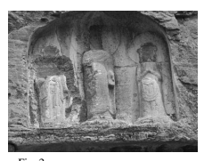

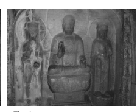

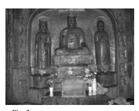

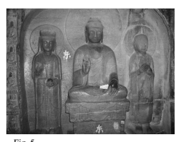

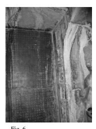

Fig. 5

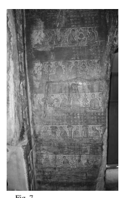

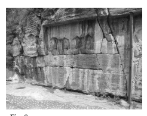

Fig. 8


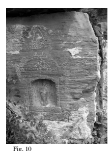

Fig. 9 Fig. 10

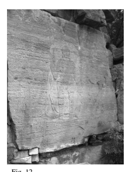

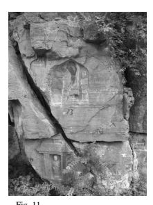

Fig. 11 Fig. 12

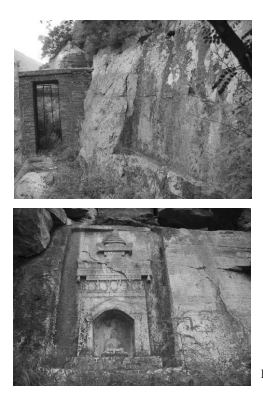

Fig. 15 Fig. 16

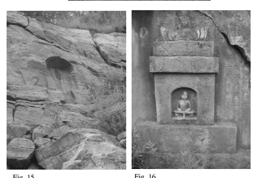

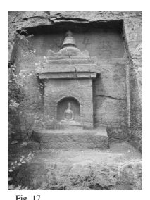

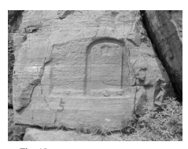


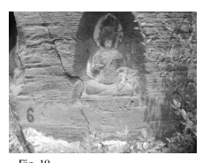

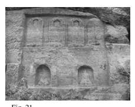

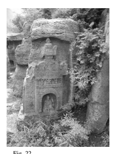

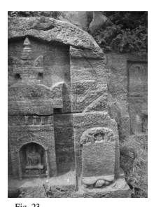

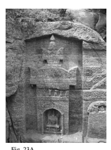

Fig. 23 Fig. 23A

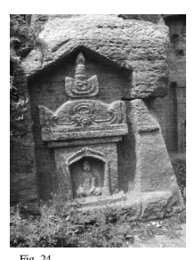

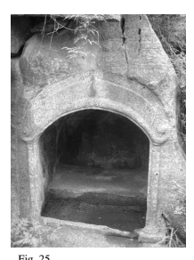

Fig. 24 Fig. 25

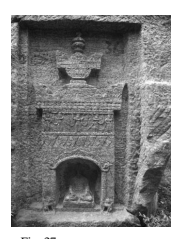

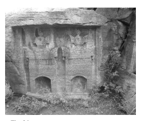

Fig. 26 Fig. 27

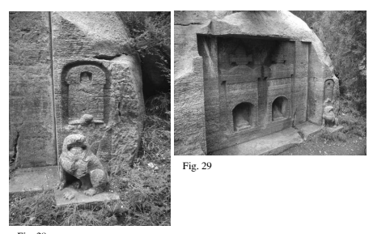


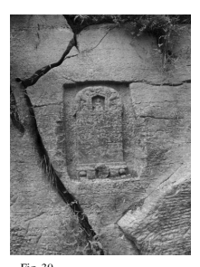

Fig. 30 Fig. 31

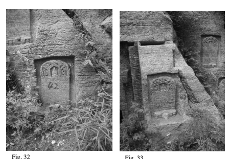

Fig. 32 Fig. 33

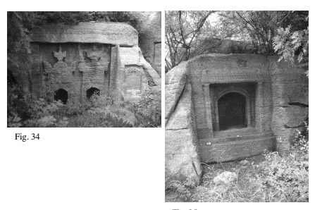

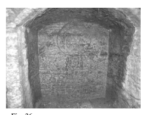

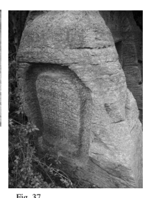

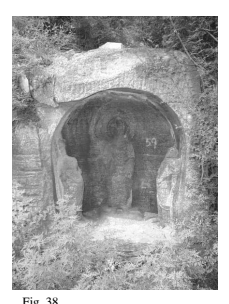

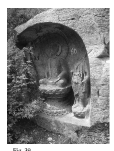

Fig. 38 Fig. 39

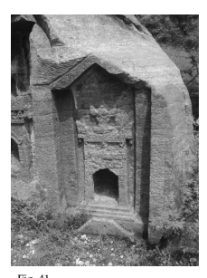

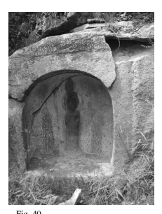

Fig. 40 Fig. 41

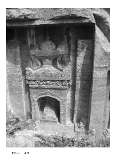

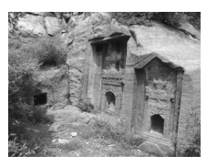

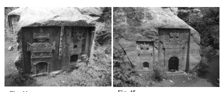

Fig. 44 Fig. 45


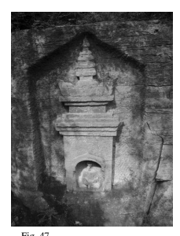

Fig. 46 Fig. 47

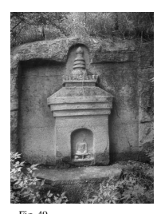

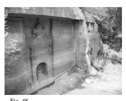

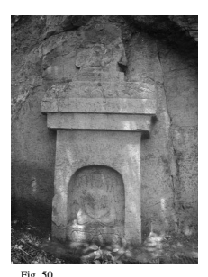

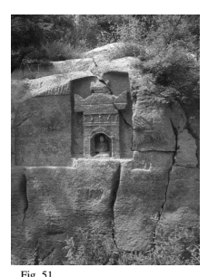

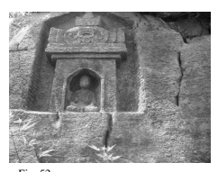


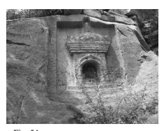

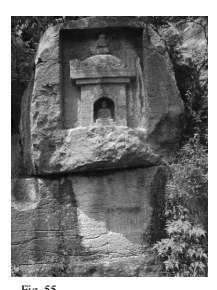

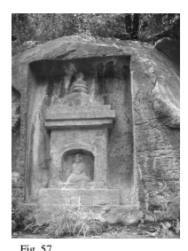

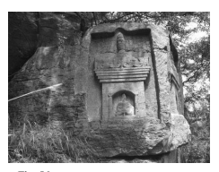

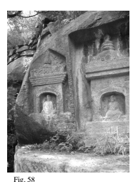

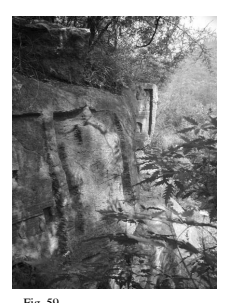

Fig. 58 Fig. 59

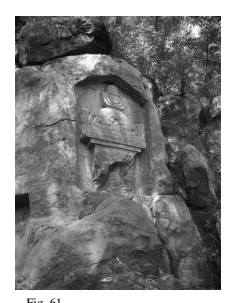


Fig. 62 Fig. 63


Fig. 66 Fig. 67


Fig. 70 Fig. 71


Fig. 74 Fig. 75


Fig. 78 Fig. 79


Fig. 85


Fig. 88 Fig. 89


Fig. 90 Fig. 91


Fig. 92 Fig. 93


Fig. 94 Fig. 95


Fig. 96 Fig. 97


Fig. 98 Fig. 99


Fig. 102 Fig. 103


Fig. 104 Fig. 105


Fig. 106 Fig. 107


Fig. 110 Fig. 111


Fig. 116 Fig. 117


Fig. 120 Fig. 121


Fig. 125


Fig. 126 Fig. 127


Fig. 128 Fig. 129


Fig. 130 Fig. 131


Fig. 132 Fig. 133


Fig. 138 Fig. 139


Fig. 146 Fig. 147


Fig. 148 Fig. 149


Fig. 150 Fig. 151


Fig. 152 Fig. 153


Fig. 154 Fig. 155


Fig. 156


Fig. 158 Fig. 159


Fig. 162 Fig. 163


Fig. 166 Fig. 167


Fig. 170 Fig. 171


# Bibliography

## I. Conventions

Sanskrit Buddhist texts normally do not include the designation "sūtra" after titles with paripṛcchā (inquiry) or *nirdeśa* (description, discourse), but I sometimes follow Chinese conventions of designation (經) and use "sūtra" when describing such texts. 

Indic terms are given in romanized Sanskrit unless identified as Pali, e.g. (P. *dhamma*). 

Citations for the classics, the twenty-five dynastic histories, and the *Quan Tang wen* and Quan Tang shi are cited by *juan* number and pages in the Zhonghua shuju editions, e.g. *Jiu Tang shu* 88, pp. 2880-2884.

Though precise distinctions are not possible, below apocrypha are provisionally distinguished from indigenous scriptures. Works assigned to the former category adhere more closely to Indian models and claim translation pedigrees, while those designated "indigenous" are focussed on Chinese cultural themes and concerns. 

## Ii. Primary Sources And Collections

Aggañña-sutta (Discourse on Knowledge of Things). *Dīgha Nikāya* (Long Discourses) 
III, 27.

Amituo jing 啊彌陀經 (Amitābha-*sūtra*, a.k.a. "Smaller" *Sukhāvatīvyūha-sūtra*). Trans.

ascribed to Kumārajīva 鳩摩羅什 (344-413). T. 366, 12. Cf. T. 367, 12.

Aṅgulimālīya-*sūtra*; see *Yangjuemoluo jing*.

Aṅguttara Nikāya (Incremental Discourses).

Anyang jinshi lu 安陽金石錄 (Anyang Records in Metal and Stone). 1933, 12 *juan*, reedition by Li Guoti 李國禔 of Wu Yi's *Anyangxian jinshi lu* 安陽縣金石錄 (see below), as an appendix to the *Guomin Anyangxian zhi* 國民安陽縣志. In Shike shiliao xinbian 石刻史料新編 (A New Edition of Historical Materials Carved on Stone), Yan Gengwang 嚴耕望 , ed., Series 3, Vol. 28: 463-538. Taibei: 
Xinwenfeng, 1986.

Anyangxian jinshi lu 安陽縣金石錄 (Records in Metal and Stone of Anyang District).

1799, 12 *juan*, plus one supplementary *juan*, by Wu Yi 武億 (1745-1799). In Shike shiliao xinbian 石刻史料新編 (A New Edition of Historical Materials Carved on Stone), Yan Gengwang 嚴耕望, ed., Series 1, Vol. 18. Taibei: Xinwenfeng, 1977.

Anyangxian zhi 安陽縣志 (Anyang District Gazetteer), a.k.a. *Jiaqing Anyang zhi* 嘉慶 安陽志 (Anyang District Gazetteer of the Jiaqing Era). 1799, 14 *juan*, by Wu Yi and Zhao Xihuang 趙希璜. Expanded version published in 1819 by Wu Muqun 武穆淳
(son of Wu Yi) and Gui Tai 貴泰, 28 *juan*, with Wu Yi's *Anyangxian jinshi lu* (12 juan) as an appendix. Digitized photocopy of the originals available in Google Books.

Apidamojushe lun 阿毘達磨俱舍論 (*Abhidharmakośa-bhāṣya*). By Vasubandhu 世親. 

Trans. ca. 651-654, ascribed to Xuanzang 玄奘 (602-664). T. 1558, 29.

Apitanpiposha lun 阿毘曇毘婆沙論 (Abhidharma-*vibhāṣā-śāstra*). By Kātyāyaniputra 迦旃延子. Trans. 437, ascribed to Buddhavarman 浮陀跋摩 *et al*. T. 1546, 27.

Ayu wang jing 阿育王經 (Aśokarāja-sūtra, *Sūtra of King Aśoka*). Trans. 512, ascribed to Saṃghabhara 僧伽婆羅. T. 2043, 50. 

Ayu wang zhuan 阿育王傳 (Aśokarājāvadāna, *Chronicle of King Aśoka*). Trans. 306, ascribed to An Faqin 安法欽. T. 2042, 50.

Bahudhātuka*-sutta* (Discourse on the Many Kinds of Elements). *Majjhima Nikāya*
(Middle Length Discourses) III, 115.

Bailun 百論 (*Śataka-śāstra*, Hundred-Verse Treatise). By Āryadeva 提婆. Trans. 

ascribed to Kumārajīva. T. 1569, 30. 

Banzhou sanmei jing 般舟三昧經 (Pratyutpanna-buddha-*saṃmukhāvasthita-samādhisūtra*, a.k.a. Bhadrapāla-*sūtra*). Trans. late second cent., ascribed to Lokakṣema 支 婁迦讖. T. 418, 13.

Baoen jing = *Dafangbian fo baoen jing* 大方便佛報恩經 (Sūtra of the Great Expedient Means by Which the Buddha Requites the Blessings of Parents). T. 156, 3. Probable Chinese indigenous scripture compiled between 445 and 516. 

Baolin zhuan 寶林傳 (Transmission of the Baolin [Temple]). 801, by Zhiju 智炬. In Zhongguo fojiao congshu: Chanzong bian 中國佛教叢書 : 禪宗編 (Compendium of Chinese Buddhism: Chan School), 1.18: 507-659. (Beijing: Jiangsu guji, 1993.) See Tanaka 2003. 

Baqiong jinshi buzheng 八瓊室金石補正 (Supplement and Amendments to the Eight Jade Rooms Metal and Stone [Records]). By Lu Zengxiang 陸增祥 (1816-1882). 

(*SKSL* series 1, 6-8.)
Bianzheng lun 辨正論 (Treatise on Determining Orthodoxy). 626, by Falin 法琳 (572–
640). T. 2110, 52.

Biqiuni zhuan 比丘尼傳 (Biographies of Nuns). Ca. 516, by Baochang 寶唱. T. 2063, 50.

Buddhavaṃsa (Chronicle of the Buddhas). Ca. second-first cent. BCE. *Khuddaka* Nikāya (Smaller Discourses) 14. See Vicittasārābivaṃsa, trans., 1992. 

Buzeng bujian jing 不曾不減經 (*Anūnatvāpūrṇatvā-nirdeśa*, Sūtra Expositing Neither Increase Nor Decrease [in the Extent of the Sphere of Beings]). Trans. ascribed to Bodhiruci 菩提流支 (d. 527). T. 668, 16.

Chanhui wen. See *Lüe li qijie foming chanhui deng wen*.

Chan mi yaofa jing 禪祕要法經 (Scripture on the Secret Essential Methods of Dhyāna). 

T. 613, 15. 

Chengshi lun 成實論 (Satyasiddhi-*śāstra*). Non-extant Sanskrit original attributed to Harivarman 訶梨跋摩 (ca. 250-350). Trans. ascribed to Kumārajīva. T. 1646, 32. 

Cheng weishi lun 成唯識論 (*Vijñaptimātratāsiddhi-śāstra*, Discourse on the Theory of Consciousness Only). By Xuanzang 玄奘 (ca. 602-664); translation and synthesis of commentaries on Vasubandhu's *Vijñaptimātratātriṁśika* (Thirty Verses on Consciousness-Only). T. 1585, 31.

Cheng weishi lun shuji 成唯識論述記 (Commentary on the Discourse on the Theory of Consciousness Only). By Kuiji 窺基 (632-682). T. 1830, 43.

Chuan fabao ji 傳法寶紀 (Annals of the Transmission of the Dharma-Treasure). Ca. 

713, by Du Fei 杜胐. T. 2838, 85; P. 2634, P. 3858, P. 3559. See Yanagida 1971.

Chunqiu fanlu 春秋繁露 (Luxuriant Dew of the Spring and Autumn Annals). See Lai 1987.

Chu sanzang ji ji 出三藏記集 (Collection of Notes on the Translation of the Tripiṭaka). 

515, by Sengyou 僧祐. T. 2145, 55.

Da banniepan jing 大般涅槃經 (*Mahāparinirvāṇa-sūtra,* Great Final Passing of the Buddha Sūtra). T. 374, 12, 40 *juan*, trans. ca. 420-431, ascribed to Dharmakṣema 曇 無讖 (385-433) (Northern Liang); T. 375, 12, 36 *juan*, Dharmakṣema translation reedited ca. 433-452 by Huiyan 慧嚴 (363-443) *et al.* (Liu Song). Cf. T. 376, 12, 6 juan, trans. 416-418, ascribed to Faxian 法顯 (ca. 337-418).

Da boreboluomi jing 大般若波羅蜜経 (Mahāprajñāpāramitā-*sūtra,* Sūtra of the Great Perfection of Wisdom). Trans. 659, ascribed to Xuanzang. T. 220, 5-7. 

Da baoji jing 大寶積經 (*Mahāratnakūta-sūtra*, Compendium of the Heap of Great Jewels Sūtra). Trans. ascribed to Bodhiruci. T. 310, 11.

Da fagu jing 大法鼓經 (Mahābherīkāraka-*sūtra*, Beater of the Great Kettledrum Sūtra). 

Trans. ascribed to Guṇabhadra 求那跋陀羅 (394-468). T. 270, 9. 

Dafangdeng rulaizang jing 大方等如來藏經 (*Tathāgatagarbha-sūtra*, Matrix of the Tathāgatas Sūtra). Trans. ascribed to Buddhabhadra 佛陀跋陀羅 (359–429). T. 666, 16. Cf. T. 667, 16, trans. ascribed to Amoghavajra 不空 (705-774).

Dafangdeng wuxiang jing 大方等無想經, a.k.a. *Dayun jing* 大雲經 (*Mahāmegha-sūtra*, 
Great Cloud Sūtra). Trans. ascribed to Dharmakṣema. T. 387, 12.

Da fangguang fo Huayan jing 大方廣佛華嚴經 (*Buddhāvataṃsaka-sūtra*); see Huayan jing.

Da fangguang shilun jing 大方廣十輪經 (*Daśacakra-sūtra*); see Shilun jing.

Dafoding jing 大佛頂經 (*Śūraṃgama-sūtra*, Sūtra of the Crown of the Buddha's Head). 

Tang indigenous scripture. T. 945, 19. 

Dakkhiṇāvibhanga Sutta (The Exposition of Offerings). *Majjhima Nikāya* III, 142.

Da niepan jing xu 大涅槃經序 (Preface to the *Nirvāṇa-sūtra*). By Daolang 道朗 (d. after 439). In the *Chu sanzang ji ji,* T. 2145, 55: 59b5-60a9.

Dasheng dayi zhang 大乘大義章 (Chapters on the Great Meaning of the Mahāyāna). 

By Huiyuan 慧遠 (334-417). T. 1856, 45.

Dasheng fajie wujin fazang fa shi 大乘法界無盡藏法釋 (Commentary on the Inexhaustible Storehouse). By Xinxing 信行 (540-594). S. 721.

Dasheng fayuan yilin zhang 大乗法苑義林章 (Essays on the Forest of Meanings of the Dharma-Grove of the Mahāyāna), by Kuiji 窺基 (632-682). T. 1861, 45.

Dasheng qixin lun 大乘起信論 (Treatise on the Awakening of Faith in the Mahāyāna). 

Sixth-century apocryphon, attributed to Aśvaghoṣa 馬鳴. Possible authors include Tanyan 曇延 (516-588) and Paramārtha 真諦 (499-569). Trans. ascribed to Paramārtha, T. 1666, 32; trans. ascribed to Śikṣānanda 實叉難陀 (652–710), T.

1667, 32.

Dasheng Qixin lun yishu 大乘起信論義疏 (Commentary on the Awakening of Faith). 

By Jingying Huiyuan 淨影慧遠 (523-592). T. 1843, 44.

Dasheng yizhang 大乘義章 (Chapters on the Meaning of the Mahāyāna). By Jingying Huiyuan and Huixiu 慧休 (547-646). T. 1851, 44.

Dasheng xinxing lun 大乘心行論 (Treatise on the Mind-Practice of the Mahāyāna). By Sengchou 僧稠 (480-560). P. 3559.

Dasheng zaoxiang gongde jing 大乘造像功德經 (The Merits of Image-Making in the Mahāyāna). Trans. between 689-691, ascribed to Devaprajñā 提雲般若. T. 694, 16.

Dasheng zhuangyan jing lun 大 乘 莊 嚴 經 論 (*Mahāyāna-sūtrālaṃkāra-kārikā*, 
Ornament for the Mahāyāna Sūtras). Attributed to Asaṅga. Trans. ca. 630, ascribed to Prabhākaramitra 波羅頗蜜多羅. T. 1604, 31.

Da Tang da Ci'en si sanzang fashi zhuan 大唐大慈恩寺三藏法師傳 (Biography of the Dharma Master Tripiṭaka [Xuanzang] of the Great Ci'en Temple of the Great Tang). 

By Huili 慧立 (fl. 629-665). T. 2053, 50. 

Da Tang neitian lu 大唐內典錄 (Great Tang Catalogue of the Inner Classics/Buddhist Canon). By Daoxuan 道宣 (596-667). T. 2149, 55.

Dazhidu lun 大智度論 (*Mahāprajñāpāramitā-upadeśa*, Treatise on the Great Perfection of Wisdom). Attributed to Nāgārjuna, trans. ascribed to Kumārajīva. T. 1509, 25.

Da Zhou kanding zhongjing mulu 大周刊定眾經目錄 (Great Zhou Catalogue of the Definitive Edition of the Buddhist Scriptures). 695 by Ming Quan 明佺 *et al. T*. 

2153, 55. 

Dazhuangyan lun jing 大莊嚴論經 (*Sūtrālaṃkāra-śāstra*). By Aśvaghoṣa, trans. 

ascribed to Kumārajīva. T. 201, 4.

Dehu zhangzhe jing 德護長者經 (Sūtra of the Elder Śrīgupta). Trans. 583, ascribed to Narendrayaśas 那連提黎耶舍 (517-589). T. 545, 14.

Diamond Sūtra; see *Jin'gang boreboluomi jing*.

Dizang pusa benyuan jing 地藏菩薩本願經 (Sūtra of the Original Vows of Kṣitigarbha Bodhisattva). Trans. ascribed to Śikṣānanda. T. 412, 13.

Fahua chuan ji 法華傳記 (Record of Accounts of the *Lotus*). Compiled in the Tang by Sengxiang 僧詳. T. 2068, 51.

Fahua yishu 法華義疏 (Commentary on the *Lotus Sūtra*). By Jizang 吉藏 (549-623). T. 

1721, 34.

Fanwang jing 梵網經 (*Brahmajāla-sūtra*; Sūtra of Brahma's Net). Apocryphon, early fifth cent. Trans. ascribed to Kumārajīva. T. 1484, 24.

Fayin jing 法印經 (Sūtra of the Dharma-Seal; section of the *Saṃyuktāgama*). T. 104, 2. 

Fayuan zhulin 法苑珠林 (Jade Grove of the Dharma Garden). 668, by Daoshi 道世 (ca. 

596-683). T. 2122, 53.

Fo benxingji jing 佛本行集經 (Sūtra of the Collection of the Past Acts of the Buddha, Abhiniṣkramaṇa-sūtra). Trans. ascribed to Jñānagupta 闍那崛多 (523-600/605?). T. 

190, 3.

Foding zunsheng zongchi jing 佛頂尊勝總持經 (*Uṣṇīṣavijayādhāraṇī-sūtra*, Sūtra of the Veneration-Incantation for the Protruding Crown of the Buddha's Head). Trans. 

ascribed to Buddhapāli 佛陀波利 (active ca. late seventh cent.). T. 967, 19.

Foming jing 佛名經 (Sūtra of the Names of the Buddhas). Trans. ascribed to Bodhiruci. 

T. 440, 14. (Cf. T. 441, 14.)
Fo shi biqiu Qiezhanyan shuofa meijinji baiershi zhang 佛使比丘迦旃延說法沒盡偈百 二十章 (Verses in One Hundred and Twenty Chapters on the Complete Disappearance of the Dharma that the Buddha Had the Monk Kātyāyana Speak). T. 

2029, 49.

Foxing lun 佛性論 (Buddha-Nature Treatise). Trans. ascribed to Paramārtha. T. 1610, 31. Fu fazang [yinyuan] zhuan 付法藏[因緣]傳 (Account of the [Avadāna] of the Transmission of the Dharma Treasury). Central Asian/Chinese compilation from scriptural sources. T. 2058, 50. 

Fumu enzhong jing 父母恩重經 (Sutra on the Profound Kindness of Parents). 

Apocryphon with many variants. T. 2887, 85.

Gaoseng Faxian zhuan 高僧法顯傳 (Record of the Eminent Monk Faxian), a.k.a. *Foguo* ji 佛國記 (Record of Buddhist Kingdoms). By Faxian 法顯. T. 2085, 51.

Gaoseng zhuan 高僧傳 (Biographies of Eminent Monks). Ca. 530, by Huijiao 慧皎. T. 

2059, 50.

Genben shuoyiqieyou bu lu 根本說一切有部律 (*Mūlasarvāstivāda Vinaya*). Trans. ca. 

700-703, ascribed to Yijing 義淨. T. 1442, 23. 

Guanding jing 灌頂經 (Sūtra of Consecration). Likely to be a Chinese indigenous scripture. T. 1331, 21.

Guan Mile pusa shangsheng Doulutian jing (Sūtra on Contemplating Maitreya Bodhisattava Being Reborn in Tuṣita Heaven). Likely to be a Central Asian apocryphon, trans. ascribed to Juqu Jingsheng 沮渠京聲 (active mid-fifth cent.). T. 

452, 14. 

Guan Puxian pusa xingfa jing 觀普賢菩薩行法經 (Sūtra on the Methods of Contemplating the Bodhisattva Samantabhadra). Likely to be a Central Asian apocryphon, trans. ascribed to Dharmamitra 曇摩蜜多 (active ca. 424-442). T. 277, 9.

Guanfo sanmei hai jing 觀佛 三 昧海 經 (Sūtra on the Ocean-Like Samādhi of Contemplating the Buddha). Likely to be a Central Asian apocryphon, trans. 

ascribed to Buddhabhadra. T. 643, 15. 

Guan wuliangshou fo jing 觀無量壽佛經 (Sūtra on Contemplating the Buddha of Infinite Life). Likely to be a Central Asian apocryphon. Trans. ascribed to Kālayaśas 彊良耶舍 (383-442). T. 365, 12.

Guan Xukongzang pusa jing 觀虛空藏菩薩經 (Sūtra on Contemplating Ākāśagarbha Bodhisattva). Likely to be a Central Asian apocryphon. Trans. ascribed to Dharmamitra. T. 409, 13. 

Guan Yaowang Yaoshang er pusa jing 觀藥王藥上二菩薩經 (Sūtra on Contemplating the Two Medicine King Bodhisattvas Bhaiṣajyarāja and Bhaiṣajyasamudgata). Likely to be a Central Asian apocryphon. Trans. ascribed to Kālayaśas. T. 1161, 20.

Heshuo fang guxinlu (see Gu 1923).

Huayan jing 華嚴經 (*Avataṃsaka-sūtra,* Flower Ornament Sūtra). 60 *juan* version, trans. ca. 418-421, ascribed to Buddhabhadra, T. 278, 9; 80 *juan* version, trans. ca. 

695-699, ascribed to Śikṣānanda, T. 279, 10; 40 *juan* version, trans. ca. 798, ascribed to Prajñā 般若, T. 293, 10. See Hamar 2007a. 

Huangdi neijing 黃帝內經 (The Yellow Emperor's Inner Canon [of Medicine]). = 
Chongguang buzhu Huangdi neijing suwen 重廣補註黃帝内經素問 (Huangdi Neijing Suwen: Again Broadly Corrected and Annotated). Wang Bing 王冰 (762) and Lin Yi 林億, et al. (1053), eds. In *Sibu beiyao* 四部備要, Zibu 子部 409-410. 

Taibei: Taiwan Zhonghua shuju, 1965. 

Huayan jing chuanji 華嚴經傳記 (Record of the Traditions of the *Avataṃsaka-sūtra*). 

By Fazang 法藏 (643-712). T. 2073, 51.

Huayan jing tanxuan ji 華嚴經探玄記 (Record of the Mysteries of the *Avataṁsakasūtra*). By Fazang. T. 1733, 35.

Jie mo 羯磨 (*Karmavācanā*). 255, attributed to Tandi 曇諦 (Dharmasatya?). T. 1433, 22.

Jieshenmi jing 解深密經 (Saṃdhinirmocana-*sūtra*, Sūtra Elucidating the Hidden Connections or Sūtra Setting Free the [Buddha's] Intent). Trans. ascribed to Xuanzang. T. 676, 16. The early Baoshan community would perhaps have been familiar with the translation ascribed to Bodhiruci (T. 675, 16; see Shenmi jietuo jing), or the partial translations ascribed to Paramārtha (T. 677, 16) or Guṇabhadra (T. 677, 16).

Jin shu 晉書 (Jin History). Ca. 646-648, by Fang Xuanling 房玄齡 (579– 658), *et al*.

Beijing: Zhonghua shuju, 1975.

Jin'gang boreboluomi jing 金剛般若波羅蜜經 (*Vajracchedikā-prajñāpāramitā-sūtra,* 
Adamantine Perfection of Wisdom Sūtra, a.k.a. *Diamond Sūtra*). T. 235-239, 8. 

Version most likely to have been used in the Baoshan context: trans. ascribed to Bodhiruci, T. 236, 8.

Jin'gang *bore lun* 金剛般若論 (*Saptapadārth*a). Attributed to Asaṅga. Trans. ascribed to Dharmagupta 達磨笈多 (d. 619). T. 1510, 25.

Jin'gang boreboluomi jing lun 金剛般若波羅蜜經論 (Vajracchedikā-prajñāpāramitāśāstra, Treatise on the Adamantine Perfection of Wisdom Sūtra). By Vasubandhu. 

Trans. 509, ascribed to Bodhiruci. T. 1511, 25.

Jin'gang sanmei jing 金剛三昧經 (*Vajrasamādhi-sūtra*). T. 273, 9. Apocryphon compiled in the late seventh century.

Jingde chuandeng lu 景德傳燈錄 (Record of the Transmission of the Lamp [compiled in] the Jingde era). 1004, by Daoyuan 道原. T. 2076, 51.

Jinguangming jing 金光明經 (Suvarṇaprabhāsottama-*sūtra*, Sūtra of Golden Light). 

Trans. ascribed to Dharmakṣema. T. 663, 16.

Jin'gang xian lun 金剛仙論 ([Vajraśrī's?] *Commentary on the Vajracchedikā*). Trans. 

ascribed to, possibly authored by, Bodhiruci. T. 1512, 25; cf. T. 1510 & 1511.

Jiujing yisheng baoxing lun 究竟一乘寶性論 (*Ratnagotravibhāga*). Ca. 511, trans. 

ascribed to Ratnamati 勒那摩提 (active early sixth cent.). T. 1611, 31.

Jiu Tang shu 舊唐書 (Old Tang History). 945, by Liu Xu 劉昫, *et al*. Beijing: Zhonghua shuju, 1975. 

Ji zhujing chanhui yi 集諸經禮懺儀 (Anthology of Repentance Ritual Liturgies in the Sūtras). 730, by Zhisheng 智升 (active ca. 700-740). T. 1982, 47.

Jueding pini jing 決定毘尼經 (*Vinayaviniścaya-Upāliparipṛcchā-sūtra,* Sūtra of the Inquiry of Upāli Regarding Determination of the Vinaya). Trans. ascribed to Dharmarakṣa 竺法護 (ca. 265-313), but possibly early fifth cent. T. 325, 12. 

Kaiyuan shijiao lu 開元釋教錄 (Buddhist Catalogue of the Kaiyuan Era). 730, by Zhisheng. T. 2154, 55.

Kaiyuan shijiao lu lüechu 開元釋教錄略出 (Condensed Buddhist Catalogue of the Kaiyuan Era). 730, by Zhisheng. T. 2155, 55. 

Lengqie jing 楞伽経 *Laṅkā[vatāra]-sūtra* (Sūtra of the Appearance of the Dharma in Laṅkā). T. 670-672, 16. 

Lidai fabao ji 曆代法寶記 (Record of the Dharma Treasure Through the Generations). 

Ca. 780. T. 2075, 51.

Lidai minghua ji 歷代名畫記 (Record of Famous Painters Through the Generations). 

847, by Zhang Yanyuan 張彥遠. *SKQS* 812.

Lidai sanbao ji 歷代三寶記 (Record of the Three Treasures Through the Generations). 

597, by Fei Changfang 費長房. T. 2034, 49.

Liuzu tanjing 六祖壇經 (Platform Sūtra of the Sixth Patriarch). Ca. late eighth cent. 

Numerous texts, see Komazawa daigaku Zenshūshi kenkyūkai, eds., 1978.

Lotus Sūtra, see *Miaofa lianhua jing*.

Lüe li qijie foming chanhui deng wen 略禮七階佛名懺悔等文 (Abridged Seven Registers *Buddhanāma* and Confession-Repentance Text). Inscribed at Baoshan 
(589); partially included in the *Ji zhujing chanhui yi*, T. 1982, 47:456b27–457a27 and Dunhuang ms. Beijing 8344/yu 宇 16. 

Luoyang qielan ji 洛陽伽藍記 (A Record of Buddhist Monasteries in Luoyang). 547, by Yang Xuanzhi 楊衒之. T. 2092, 51.

Mahābherīkāraka-sūtra; see *Da fagu jing*.

Mahāmegha-sūtra, see *Dafangdeng wuxiang jing*. Mahāpadāna*-sutta* (Discourse on the Great Noble Deeds). *Dīgha Nikāya* II, 14. Mahāparinibbāna*-sutta* (Discourse on the Great Final Passing of the Buddha). *Dīgha* Nikāya II, 16.

Mahāyānasaṃgraha-śāstra; see *She dasheng lun*. Mahāyāna-sūtrālaṃkāra-kārikā; see Dasheng zhuangyan jing lun. 

Mātugāmasaṃyutta (Connected Discourses on Women). *Saṃyutta Nikāya* (Connected Discourses) IV, 37.

Miaofa lianhua jing 妙法蓮華經 (Saddharmapuṇḍarīka-sūtra, *Lotus Sūtra*). T. 262-264, 9. 

Mingbao ji 冥報記 (Tales of Miraculous Retribution). Ca. 655, by Tanglin 唐林 (600659). T. 2082, 51.

Ming zhujingzhong dui gen qianshen fa puti xinfa 明諸經中對根淺深發菩提心法
(Method of Manifesting Bodhicitta in Relation to [Those of] Shallow and Deep Capacities as Explained in Various Scriptures). By Xinxing. P. 2283. See Nishimoto 1998: 198-202, 602-608; Zhang Zong 2013a: 558-584. 

Ming zhu dasheng xiuduoluo neishijian chushijian liangjie ren fa puti xin tongyi fa 明諸 大乘修多羅內世間出世間兩階人發菩提心同異法 (Similar and Different Methods of Manifesting Bodhicitta for Persons of the Two Levels of Lay and Ordained as Explained in Various Mahāyāna Sūtras). By Xinxing. See Nishimoto 1998: 198202, 602-608; Zhang Zong 2013a: 558-584.

Mishasaibuhexi wufen lü 彌沙塞部和醯五分律 (*Mahīśāsaka Vinaya*). Trans. ca. 424438, ascribed to Buddhajīva 佛陀什. T. 1421, 22.

Mohemoye jing 摩 訶 摩 耶 經 (*Mahāmāyā-sūtra,* Sūtra of the Buddha's Mother Mahāmāyā). Trans. ascribed to Tanjing 曇景 (479-502), possible apocryphon. T. 

383, 12. 

Moheruoboluomi jing 摩訶般若波羅蜜経 (*Mahāprajñāpāramitā-sūtra,* Sūtra of the Great Perfection of Wisdom). Trans. ascribed to Kumārajīva. T. 223, 8.

Mohe zhiguan 摩訶止觀 (The Great Cessation and Insight). By Tiantai Zhiyi 天台智顗
(538-597). T. 1911, 46.

Mohosengqi lü 摩訶僧祇律 (*Mahāsaṅghika Vinaya*). Trans. ca. 416-18, ascribed to Faxian and Buddhabhadra. T. 1425, 22. 

Nanyue si dachanshi lishi yuan wen 南嶽思大禪師立誓願文 (Text of the Vow of the Great Dhyāna Master Si of Nanyue). Attributed to Huisi 慧思 (515-577). T. 1933, 46.

Pusa benye jing 菩薩本業經 (Sūtra of the Original Acts of the Bodhisattvas). Trans. 

early third cent., ascribed to Zhi Qian 支謙 (fl. 223-253). T. 281, 10.

Pusadichi jing 菩 薩 地 持 經 (*Bodhisattvabhūmi*, Grounds of the Bodhisattvas). 

Attributed to Maitreya and Asaṅga. Trans. ca. 414-421, ascribed to Dharmakṣema. 

T. 1581, 30.

Pusa jieben 菩薩戒本 (*Bodhisattvaprātimokṣa*, Conferring the Bodhisattva Precepts). 

Trans. ascribed to Dharmakṣema. T. 1500, 24.

Pusa shanjie jing 菩薩善戒經 (*Bodhisattvabhūm*i, a.k.a. Bodhisattvacārya-*nirdeśa*, 
Wholesome Morality of the Bodhisattvas). Trans. ca. 431, ascribed to Guṇavarman 求那跋摩 (367-431). T. 1582, 30.

Pusa shanjie jing yijuan youboli wen pusa shoujie fa 菩薩善戒經一卷優波離問菩薩受 戒法 (*Bodhisattvacārya-nirdeśa;* Upāli Asks about the Bodhisattva's Method of Receiving the Precepts, in one fascicle). Trans. ascribed to Guṇavarman. T. 1583, 30.

Pusa yingluo benye jing 菩薩瓔珞本業經 (Sūtra of the Original Acts that Serve as Necklaces for Bodhisattvas), a.k.a. *Pusa yingluo jing*. Chinese indigenous scripture, early fifth cent. T. 1485, 24. 

Qijie foming jing 七階佛名經 (Sūtra of the Seven-Roster Buddhanāma). S. 59.

Qixin lun; see *Dasheng qixin lun*.

Quan Tang shi 全唐詩 (Complete Poetry of the Tang Dynasty). 1705, by Cao Yin 曹寅 and Peng Dingqiu 彭定求 *et al*., eds. Beijing: Zhonghua shuju, 1960.

Quan Tang wen 全唐文 (Complete Prose of the Tang Dynasty). 1814, by Dong Gao 董 誥, *et al*., eds. Beijing: Zhonghua shuju, 1983.

Renwang boreboluomi jing 仁王[般若波羅蜜]經 ([Prajñāpāramitā] Sūtra of Humane Kings). Apocryphon, late fifth cent. Trans. ascribed to Kumārajīva, T. 245, 8; trans. 

ascribed to Amoghavajra, T. 246, 8.

Rulai shijiao shengjunwang jing 如來示教勝軍王經 (*Rājāvavādaka-sūtra*, Sūtra of the Tathāgata Revealing Teachings to King Prasenajit). Trans. 649, ascribed to Xuanzang. T. 515, 14.

Rulai xingxian jing 如來興顯經 (*Tathāgatopattisaṃbhava-nirdeśa*, The Appearance of the Tathāgatha). Trans. 292, ascribed to Dharmarakṣa. T. 291, 10. (Alternative versions are also found in the *Avataṁsaka-sūtra*: T. 278, 9: 611b1-631b5 & T. 279, 10: 262a15-278c22.)
Sanguo zhi 三國志 (Records of the Three Kingdoms). Attributed to Chen Shou 陳壽
(233-297). Beijing: Zhonghua shuju, 1959.

Satipaṭṭhāna*-sutta* (Establishing Mindfulness). *Majjhima Nikāya* I, 10.

She dasheng lun 攝大乘論 (*Mahāyānasaṃgraha-śāstra*, a.k.a. *Mahāyānasaṃgrahabhāṣya*,
Compendium of the Great Vehicle). Attributed to Asaṅga. Trans. ascribed to Buddhaśānta 佛陀扇多 (active ca. 511-539), T. 1592, 31; trans. ascribed to Paramārtha, T. 1593, 31; trans. ascribed to Xuanzang, T. 1594, 31.

She dasheng lun shi 攝大乘論釋 (Commentary on the *Mahāyānasaṃgraha).* Attributed to Asvabhāva 無性 (450-530). T. 1598, 31.

Sheli ganying ji 舍利感應記 (Account of Stimulus-and-Response Related to the Relics). 

Attributed to Wang Shao 王邵 (d. 610). In the *Guang Hongming ji* 廣弘明集, by Daoxuan. T. 2103, 52: 213b25-214b20 (no. 17).

Shengman furen jing 勝鬘夫人經 (*Śrīmālādevī [siṃhanāda]-sūtra*, Sūtra of [the Lion's Roar] of Lady Śrīmālā). Fascicle 119 (Sūtra 48) of the *Dabaoji jing* 大寶積經
(*Mahāratnakūta-sūtra*, Compendium of the Heap of Great Jewels Sūtra). Trans. ascribed to Bodhiruci. T. 310, 11: 672c14-678c4. 

Shengman shizihou yisheng dafangbian fangguang jing 勝鬘師子吼一乘大方便方廣經
(*Śrīmālādevīsiṃhanāda-sūtra*, The Lion's Roar of Śrīmālā's One Vehicle, Great Skillful Means Far-Ranging Sūtra). Trans. ascribed to Guṇabhadra. T. 353, 12.

Sheng tianwang boreboluomi jing 勝天王般若波羅蜜經 (Devarāja-pravara-prajñāpāramitā-sūtra). Trans. 565, ascribed to Upaśūnya 月婆首那 (active ca. 538-565).

T. 231, 8.

Shenmi jietuo jing 深密解脫經 (Saṃdhinirmocana-*sūtra*, Sūtra Elucidating the Hidden Connections or Sūtra Setting Free the [Buddha's] Intent). Trans. ascribed to Bodhiruci. T. 675, 16. See also *Jieshenmi jing*.

Shenri erben jing 申日兒本經 (Sūtra of the Origins of Prince Candra). Trans. ca. 440, ascribed to Guṇabhadra. T. 536, 14.

Shenri jing 申日經 (Sūtra of Candra). Trans. ca. fifth century. T. 535, 14. 

Shi chan poluomi cidi famen 釋禪波羅蜜次第法門 (Explaining the Sequence of Teachings on the Perfection of Meditation). Attributed to Tiantai Zhiyi. T. 1916, 46.

Shidi jing 十地經; see *Shizhu jing*.

Shidi *jing lun*十地經論(= 地論) (*Daśabhūmikasūtra-śāstra*, a.k.a. *Daśabhūmikasūtropadeśa*,
Daśabhūmivyākhyāna, Treatise on the Sūtra on the Ten Stages). Attributed to Vasubandhu, ca. fourth-fifth cent. Trans. ascribed to Ratnamati, Bodhiruci, et al. T. 1522, 26.

Shidi lun 十地論 *Shizhu piposha lun* 十住毘婆沙論 (*Daśabhūmikavibhāṣā-śāstra,* 
Treatise on the Ten Stages). Attributed to Nagārjūna. Trans. ascribed to Kumārajīva. T. 1521, 26.

Shie chanwen 十惡懺文 (Text of Repentance for the Ten Evil Deeds). Attributed to Tanqian 曇遷 (542–607). In the *Fayuan zhulin*, T. 2122, 53: 918b9-c22.

Shier toutuo jing 十二頭陀經 (Sūtra of the Twelve *Dhūta*). Trans. ascribed to Guṇabhadra. T. 783, 17.

Shier foming shenzhou xiaoliang gongde chuzhang miezui jing 十二佛名神咒校量功德 除障滅罪經 (*Dvādaśabuddhaka-sūtra*, Sūtra of the Twelve Buddha-name Incantations to Compound Merit, Remove Obstructions, and Extinguish Transgressions). Trans. ascribed to Jñānagupta. T. 1348, 12.

Shiermen lun 十二門論 (*Dvādaśanīkāya-śāstra*, Treatise on the Twelve Gates). 

Attributed to Nāgārjuna. Trans. ascribed to Kumārajīva. T. 1568, 30.

Shijiashi pu 釋迦氏譜 (Genealogy of the Śākya Clan). Attributed to Daoxuan, T. 2041, 50.

Shijing 詩經 (Book of Odes). *Scripta Sinica* digital edition 上古漢語語料庫 . 

http://hanji.sinica.edu.tw.

Shi-Lao zhi 釋老志 (Treatise on Buddhism and Daoism). Ca. 550, attributed to Wei Shou 魏收. Fascicle 114 of the *Wei shu* 魏書 (Wei History). Beijing: Zhonghua shuju, 1974: 3025-3062.

Shilun jing 十輪經 (*Daśacakra-sūtra*, Sūtra on the Ten Wheels). Probable Chinese indigenous scripture, 6th century. T. 410, 13. Related to the *Daji Dizang shilun* jing 大集地藏十輪經 (*Kṣitigarbha-sūtra*).

Shisong lü 十誦律 (*Sarvāstivāda Vinaya*). Trans. ca. 404-406, ascribed to Kumārajīva, Puṇyatara 弗若多羅, and Dharmaruci 曇摩流支. T. 1435, 23.

Shizhu jing 十住經 (Daśabhūmika-*sūtra,* Sūtra on the Ten Stages). Trans. ascribed to Kumārajīva. T. 286, 10. Cf. *Jianbei yiqie zhide jing* 漸備一切智德經, trans. ascribed to Dharmarakṣa, T. 285, 10; *Shidi jing* 十地經, trans. ascribed to Śīladharma 尸羅 達摩 (active ca. 785-804), T. 287, 10.

Shou bajie fa 受八戒法 (Procedures for Receiving the Eight Precepts), ascribed to Xinxing. P. 2849. 

Shoulengyan sanmei jing 首楞嚴三昧 (*Śūraṃgamasamādhi-sūtra*, Sūtra on the Samādhi of Heroic Progress). Trans. ca. 384-417, ascribed to Kumārajīva. T. 642, 15.

Shujing 書經 (Book of History). Scripta Sinica digital edition 上古漢語語料庫. 

http://hanji.sinica.edu.tw.

Sifen lü 四分律 (*Dharmaguptaka Vinaya*). Trans. ca. 410-412, ascribed to Buddhayaśas 佛陀耶舍 and Zhu Fonian 竺佛念, *et al.* T. 1428, 22.

Sifen biqiu jieben 四分比丘戒本 (Dharmaguptaka-bhikṣu-*prātimokṣa-sūtra*, Sūtra of the Dharmagupta Precepts for Monks). Trans. ca. 403-413, ascribed to Buddhayaśas. T. 1429, 22.

Sigālaka*-sutta* (To Sigālaka). *Dīgha Nikāya* III, 31.

Siyifantian suowen jing 思益梵天所問經 (*Viśeṣacintibrahmaparipṛcchā-sūtra,* Sūtra of the Inquiry of Viśeṣacinti *Brahma*). Trans. ascribed to Kumārajīva. T. 586, 14. 

Song gaoseng zhuan 宋高僧傳 (Song Dynasty Biographies of Eminent Monks). 988, by Zanning 贊寧. T. 2061, 50.

Tang huiyao 唐會要 (Institutional History of the Tang). 961, by Wang Pu 王溥 (932982). See Yang Jialuo 楊家駱, ed., 1974.

Tangdai muzhiming huibian fukao 唐代暮誌銘彙編附考 (Annotated Compilation of Tang Dynasty Tomb Inscriptions). 18 vols. Mao Hanguang 毛漢光*et al*., eds., 19841994. Taibei: Zhongyang yanjiu yuan lishi yuyan yanjiusuo.

Tangdai muzhi huibian xuji 唐代墓誌彙編續集 (Continued Compilation of Tang Dynasty Tomb Records). Zhou Shaoliang 周紹良 and Zhao Chao 趙超, eds., 2001. 

Shanghai: Shanghai guji.

Tianpin miaofa lianhua jing 添品妙法蓮華經 (*Lotus Sūtra* with Additional Chapters). 

Trans. 601, ascribed to Jñānagupta and Dharmagupta 達磨笈多. T. 264, 9. 

Tiwei [Boli] jing 提謂[波利]經 (Scripture of Trapuṣa [and Ballika]). Non-extant Chinese indigenous scripture, by Tanjing. Reconstructed by Makita Tairyō (1976) 
from S. 2051, P. 3732, and quotations from the *Fayuan zhulin*.

Triṁśika, Vijñaptimātratātriṁśika (Thirty Verses on Consciousness-Only), a.k.a. 

Vijñaptimātratāsiddhi-śastra (Demonstration of Consciousness-Only); see Buescher, Hartmut, ed. (2007); see also *Cheng weishi lun*. 

Weimojie suoshuo jing 維摩詰所說經 (*Vimalakīrti-nirdeśa*, On the Expositions of Vimalakīrti). Trans. ascribed to Kumārajīva, T. 475, 14. Cf. T. 474 & 476, 14.

Weishi ershi lun 唯識二十論 (Viṃśatikā vijñaptimātratā*-siddhi*, Twenty Verses on Vijñaptimātra). Attributed to Vasubandhu. Trans. 661, ascribed to Xuanzang. T. 

1585, 31.

Wei shu 魏書 (Wei History). Beijing: Zhonghua shuju, 1974. Wenshi xiyu zhongseng jing 溫室洗浴眾僧經 (Sūtra on the Bathhouse and Bathing of the *Saṃgha*). Trans. An Shigao 安世高 (d. 168). T. 701, 16. 

Wenshi jing yiji 溫室經義記 (On the Meaning of the Bathhouse Sūtra). Attributed to Huiyuan 慧遠 (334-416). T. 1793, 39.

Wenshi jing shu 溫室經疏 (Subcommentary to the Bathhouse Sūtra). Attributed to Huijing 慧淨 (578-645?). S. 2497; T. 2780, 85. 

Wen xuan 文選 (Selections of Refined Literature). Attributed to Xiao Tong 蕭統 (501531). Shanghai: Shanghai guji, 1986.

Wuliangshou jing 無量壽經 (*Sukhāvativyūha-sūtra*, Sūtra of Limitless Life). Trans. 

ascribed to Saṃghavarman 康僧鎧 (third cent.). T. 360, 12. Cf. T. 362-364, 12.

Wuliangshou jing youpotishe yuansheng ji 無量壽經優波提舍願生偈
(*Sukhāvativyūhôpadeśa,* Treatise on the Sūtra of Limitless Life). Attributed to Vasubandhu. Trans. ascribed to Bodhiruci. T. 1524, 26.

Wumen chan jing yao yongfa 五門禪經要用法 (Pañcadvāra-dhyāna-sūtra-mahârthadharma, Essentials of the Sūtra on the Fivefold Meditation). Trans. ascribed to Dharmamitra. T. 619, 15. 

Xin Tang shu 新唐書 (New Tang History). 1060, by Ouyang Xiu 歐陽修 and Song Qi 宋祁. Beijing: Zhonghua shuju, 1975. 

Xu biqiuni zhuan 續比丘尼傳 (Continued Biographies of Nuns). Attributed to Zhenhua 震華 (early twentieth century). In *Biqiuni zhuan quanji* 比丘尼傳全集. Taibei: 
Fojiao shuju, 1988.

Xu gaoseng zhuan 續高僧傳 (Continued Biographies of Eminent Monks). Attributed to Daoxuan 道宣 (596-667); first completed in 645 and augmented two decades later. 

T. 2060, 50.

Xukongzang pusa jing 虛空藏菩薩經 (Sūtra of Ākāśagarbha Bodhisattva). Trans. 

ascribed to Buddhayaśas. T. 405, 13. 

Yangjuemolou jing 央掘魔羅經 (Sūtra of Aṅgulimālīya). Trans. ascribed to Guṇabhadra.

T. 120, 2.

Yangxing yanming lu 養性延命錄 (Records of Cultivating the Nature and Extending Life). Attributed to Tao Hongjing 陶弘景(456-536). DZ 838/TT 572.

Yao xing sheshen jing 要行捨身經 (Sūtra on the Essential Practice of Abandoning the Body). Chinese indigenous scripture, latter part of the seventh century. T. 2895, 85.

Yogācārabhūmi-śāstra; see *Yuqie shidi lun*.

Youposejie jing 優波 塞 戒 經 (*Upāsakaśīla-sūtra*, Sūtra of Moral Discipline for Laymen). Trans. ascribed to Dharmakṣema. T. 1488, 24.

Yuanhe xingzuan 元和姓纂 (Register of Great Family Surnames in the Yuanhe Era, 806-820). Compiled in 812 by Lin Bao 林 寶 . See corrected edition with commentary, Cen Zhongmian 岑仲勉 et al., eds., 1948.

Yuedeng sanmei jing 月燈三昧經 (Sūtra of the Moon-lamp *Samādhi*). Trans. 577, ascribed to Narendrayaśas. T. 639, 15. 

Yueguang tongzi 月光童子經 (Sūtra of Prince Moonlight). Trans. ca. late third century, ascribed to Dharmarakṣa. T. 534, 14.

Yuezang fen jing 月藏分經 (Candragarbha-*sūtra,* Sūtra of the Bodhisattva MoonEmbryo). Trans. 566, ascribed to Narendrayaśas. In the *Daji jing* 大集經
(*Mahāsaṃnipāta-sūtra*, Sūtra of the Great Assembly), T. 397, 13:298a5–381c11.

Yuqie shidi lun 瑜伽師地論 (*Yogācārabhūmi-śāstra,* Treatise on the Stages of Yogācāra Practice). Attributed to Asaṅga. Trans. ascribed to Xuanzang. T. 1579, 30.

Za ahan jing 雜阿含經 (*Saṃyuktāgama,* Combined Discourses). Trans. ascribed to Guṇabhadra. T. 99, 2.

Za apitan xin lun 雜阿毘曇心論 (*Saṃyuktābhidharma-hṛdaya-śāstra,* Treatise on the Heart of Combined Abhidharma). Attributed to Dharmatrāta 法救. Trans. ascribed to Saṃghavarman. T. 1552, 29. 

Zaoli xingxiang fubao jing 造立形象福報經 (Sūtra on the Merit-Reward of Making and Installing Images). T. 693, 16.

Zengyi ahan jing 增一阿含經 (*Ekottarāgama*, Incremental Discourses). T. 125, 2.

Zhancha shan'e yebao jing 占察善惡業報經 (Sūtra of Divination of the Requital of Good and Evil Deeds). Chinese indigenous scripture. T. 839, 17.

Zhi chan bing mi yaofa 治禪病秘要法 (Secret Essential Methods for Healing the Maladies of Meditation). Trans. 455, ascribed to Juqu Jingsheng. T. 620, 15.

Zhizhongshi zhu fa 制眾事諸法 (Assorted Rules for Community Regulation). Attributed to Xinxing. P. 2849. See Nishimoto 1998: 578-601.

Zhong *ahan jing* 中阿含經 (*Madhyamāgama*, Middle-Length Discourses). Trans. 397398, ascribed to Gautama Saṃghadeva 瞿曇僧伽提婆. T. 26, 1.

Zhongjing mulu 眾經目錄 (Catalogue of Sūtras). 594, by Fajing 法經. T. 2147, 55.

Zhonglun 中論 (Madhyamaka-*śāstra,* a.k.a. Madhyamaka-*kārikā*, Fundamental Verses on the Middle Way). Attributed to Nāgārjuna, appended with notes by Piṅgala. Trans. 409, ascribed to Kumārajīva. T. 1564, 30.

Zhouye liushi fayuan fa 晝夜六時發願法 (Vows for the Six Periods of Day and Night, or *Lifo chanhui wen* 禮佛懺悔文 Text of Repentance in Obeisance before the Buddhas); see *Zhizhongshi zhu fa*.

Zhuan nushen jing 轉女身經 (Strīvivarta-vyākaraṇa-*sūtra*, Sūtra of the Transformation of the Female Body). Trans. ascribed to Dharmamitra. T. 564, 14.

Zhude futian jing 諸徳福田經 (Sūtra of the Fields of Merit). Trans. ascribed to Fali 法 立 and Faju 法炬 (active ca. 290-306). T. 683, 16.

Zhujing yaoji 諸經要集 (Essential Teachings of the Sūtras). Attributed to Daoshi 道世
(ca. 596-683). T. 2123, 54.

Zongchan shi'e jiwen 總懺十惡偈文 (Verses on Comprehensive Repentance for the Ten Evil Deeds). Attributed to Lingyu 靈裕 (518-605). In the *Fayuan zhulin, T*. 2122, 53: 918c23-919a27.

Zuo fo xingxiang jing 佛說作佛形像經 (Sūtra on Making Buddha Images). Translator unknown. T. 692, 16. Cf. *Youtian Wang jing* 優填王經 (The Scripture of King Udāyana), trans. ascribed to Faju, T. 332, 12; *Zaoli xingxiang fubao jing* 造立形像 福報經 (Sūtra on the Karmic Blessings of Making and Erecting Images), trans. also possibly ascribable to Faju, T. 693, 16.

## Iii. Secondary Sources Cited

Abe, Stanley K. (2002). *Ordinary Images*. Chicago: University of Chicago Press.

______ (1990). "Art and Practice in a Fifth-Century Chinese Buddhist Cave Temple." 
Ars Orientalis 20: 1-31.

Acker, William Reynolds Beal 1954 & 1974. *Some T'ang and Pre-T'ang Texts on* Chinese Painting. Vol. 1, 1954; Vol. 2 (in two parts), 1974. Leiden: Brill.

Adamek, Wendi L. (2017). "Traces of the Sanjie (Three Levels) Movement at Baoshan." In Mario Poceski, ed., Communities of Memory: Reimagining and Reinventing the Past in East Asian Buddhism. Hamburg: University of Hamburg Press, pp. 23-86.

______ (2016a). "Meeting the Inhabitants of the Necropolis at Baoshan." *Journal of* Chinese Buddhist Studies 29: 9-49. 

______ (2016b) "Revisiting Questions about Female Disciples in the *Lidai fabao ji*
(Record of the Dharma-Treasure Through the Generations)." *Pacific World,* Third Series 18: 57-65.

______ (2015). "Addressing the Mind: Developments in the Culture of Confession in Sui-Tang China." *Journal of Chinese Buddhist Studies* 28: 117-152.

______ (2014). "Dimensions of Endtime at Baoshan." In Dorothy C. Wong and Gustav Heldt, eds., *Cultural Crossings: China and Beyond in the Medieval Period*. 

Singapore: Institute of Southeast Asian Studies, pp. 101-114.

______ (2012). "The Agency of Relations at Baoshan." *Literature and Aesthetics* 22.2: 
50-71.

______ (2009a). "A Niche of Their Own: The Power of Convention in Two Inscriptions for Medieval Chinese Buddhist Nuns." *History of Religions*, 49.1: 1-26.

______ (2009b). "The Literary Lives of Nuns: Poems Inscribed on a Memorial Niche for the Tang Nun Benxing." *T'ang Studies*, 27: 40-65.

______ (2007). The Mystique of Transmission: On an Early Chan History and Its Contexts. New York: Columbia University Press.

______ (2005). "The Impossibility of the Given: Representations of Merit and Emptiness in Medieval Chinese Buddhism." *History of Religions* 45.2: 135-181.

Anacker, Stefan (1984). *Seven Works of Vasubandhu*. Delhi: Motilal Banarsidass. Anālayo (2009). "The Bahudhātuka*-sutta* and Its Parallels on Women's Inabilities." 
Journal of Buddhist Ethics 16: 136-190.

Aoki Takashi 青木隆, ed. (2012). "Fajie tu 法界圖 (Map of the Dharmadhātu)." In Aoki Takashi 青木隆 *et al*., eds., *Changoe chinonjong munhŏn chipsŏng* 藏外地論宗文 獻集成 (Collection of the Extra-canonical Literature of the Dilun School), pp. 539591. Seoul: Ssiaial.

_______ (2010). "Tonkō shahon ni miru Jiron kyōgaku no keisei 敦煌写本 にみる地 論教学の形成 (The Formation of the Doctrines of the Dilun School as Seen in Dunhuang Manuscripts)." In Geumgang Center for Buddhist Studies, ed., *Jiron* shisō no keisei to hen'yō 地論思想の形成と変容 (The Formation and Transfiguration of the Thought of the Dilun School), pp. 44-65. Tokyo: Kokusho kankōkai.

Aramaki Noritoshi 荒牧典俊, ed. (2013). "Jiaoli wenxian jicheng 教理文獻集成 S. 613 
(Doctrinal Literature Compendium S.613)." In Aoki Takashi 青木隆 *et al*., eds., 
Changoe chinonjong munhŏn chipsŏng sokjip 藏外地論宗文獻集成續集 (Continued Collection of the Extra-canonical Literature of the Dilun School), pp. 39-92. 

Seoul: Ssiaial.

______ (2007). "The Huayan Tradition in its Earliest Period." In Imre Hamar, ed., 
Reflecting Mirrors: Perspectives on Huayan Buddhism, pp. 169-187. Weisbaden: Harrassowitz Verlag.

Beckwith, Christopher I. (2017). *Greek Buddha: Pyrrho's Encounter with Early* Buddhism in Central Asia. Princeton: Princeton University Press. 

Benn, James A. (2007). *Burning for the Buddha: Self-Immolation in Chinese Buddhism.*
Honolulu: University of Hawai'i Press.

Blum, Mark L.: (2018). "The Nirvāṇa-sūtra." In Martin Bemmann and Claudia Wenzel, eds., Buddhist Stone Sutras in China: Sichuan Province, Volume 4. Series editor Lothar Ledderose. Wiesbaden: Harrassowitz and Hangzhou: China Academy of Art Press.

______ (2103). *The Nirvana Sutra Vol. 1*. BDK English Tripitaka Series. Berkeley: 
Numata Center for Buddhist Translation and Research.

Bodhi, Bhikkhu, trans. (2000). *The Connected Discourses of the Buddha: A Translation* of the Saṃyutta Nikāya. Boston: Wisdom Publications.

Bokenkamp, Stephen R. (1997). *Early Daoist Scriptures*. Berkeley: University of California Press.

______ (1990). "Stages of Transcendence: The Bhūmi Concept in Taoist Scripture." In Robert E. Buswell, Jr., ed., *Chinese Buddhist Apocrypha,* pp. 119-147. Honolulu: 
University of Hawai'i Press.

Bol, Peter K. (1992). *"This Culture of Ours": Intellectual Transitions in T'ang and Sung* China, Stanford: Stanford University Press.

Bonnet-Bidaud, Jean-Marc, Françoise Praderie, and Susan Whitfield (2009). "The Dunhuang Chinese Sky: A Comprehensive Study of the Oldest Known Star Atlas." London: International Dunhuang Project. http://idp.bl.uk/education/astronomy_ researchers/index.a4d. Accessed March 30, 2016.

Borges, Jorge Luis [1942] 1999. "John Wilkins' Analytical Language." In Eliot Weinberger, trans. *Selected Non-Fictions*. New York: Viking.

Boucher, Daniel (2008). Bodhisattvas of the Forest an*d the Formation of Mahāyāna: A* 
Study and Translation of the Rāṣṭrapālaparipṛcchā-sūtra. Honolulu: University of Hawai'i Press.

______ (2004). "Paramārtha." In Robert Buswell, ed. (2004). *Encyclopedia of* Buddhism, pp. 630-631. New York: Macmillan.

Bourdieu, Pierre (1990). *The Logic of Practice*. Stanford: Stanford University Press.

______ (1984). *Distinction: A Social Critique of the Judgement of Taste*. London: 
Routledge and Kegan Paul.

Brentano, Franz [1874] (1995). *Psychology from an Empirical Standpoint*. Trans. Antos C. Rancurello, D.B.Terrell, Linda L. McAlister. London: Routledge. 

Broughton, Jeffrey L. (2004). "Tsung-mi's *Zen Prolegomenon*: Introduction to an Exemplary Zen Canon." In Steven Heine and Dale S. Wright, eds., The Zen Canon: 
Understanding the Classic Texts. Oxford: Oxford University Press.

______ (1999). *The Bodhidharma Anthology: The Earliest Records of Zen*. Berkeley: 
University of California Press.

Brown, Peter (2012a). "The Risks of Being Christian." *The New York Review of Books* 59.20 (December 20): 70-76.

______ (2012b). "The Great Transition." *The New York Review of Books* 59.8 (May 10): 
12-15.

_____ (1988). *The Body and Society: Men, Women, and Sexual Renunciation in Early* Christianity. New York: Columbia University Press.

Buch, Robert (2010). *The Pathos of the Real: On the Aesthetics of Violence in the* Twentieth Century. Baltimore: John Hopkins University Press.

Buescher, Hartmut, ed. (2007). *Sthiramati's* Trimsikavijnaptibhasya: Critical Editions of the Sanskrit Text and Its Tibetan Translation. Vienna: Austrian Academy of Sciences Press.

Buswell, Robert E., Jr., (2007). Cultivating Original Enlightenment: Wŏnhyo's Exposition of the Vajrasamādhi-Sūtra (Kŭmgang Sammaegyŏng Non). Honolulu: University of Hawai'i Press.

______, ed. (2004). *Encyclopedia of Buddhism*. New York: Macmillan.

______, ed. (1990). *Chinese Buddhist Apocrypha.* Honolulu: University of Hawai'i Press.

______ (1989). *The Formation of Ch'an Ideology in China and Korea: The* Vajrasamādhi-Sūtra, A Buddhist Apocryphon. Princeton: Princeton University Press.

______, and Donald S. Lopez, eds., (2013). *The Princeton Dictionary of Buddhism*. 

Princeton: Princeton University Press.

Cabezón, José Ignacio, ed. (1992). *Buddhism, Sexuality, and Gender.* Albany: State University of New York Press.

Cahill, Suzanne E. (2006). *Divine Traces of the Daoist Sisterhood*. Magdalena, NM: 
Three Pines Press.

______ (2003). "Discipline and Transformation: Body and Practice in the Lives of Daoist Holy Women of Tang China." In Dorothy Ko, JaHyun Kim Haboush, and Joan R. Piggott, eds., Women and Confucian Cultures in Premodern China, Korea, and Japan, pp. 251-278. Berkeley: University of California Press. 

______ (1993). *Transcendence and Divine Passion: The Queen Mother of the West in* Medieval China. Stanford: Stanford University Press.

Cai Yaoming 蔡耀明 (2009). "Yi faji de shijieguan, zhudi kaocha, baorong shuo—yi Buzeng bujian jing wei yiju de gongsheng tongcheng linian 一法界的世界觀、住地 考察、包容說—以《不增不減經》為依據的共生同成理念 (A Worldview of One Dharmadhātu, Examination of Abiding-places, and Inclusivism: The Ideas of Coarising and Mutual Accomplishment in the Anūnatvāpūrṇatvā-*nirdeśa*)." Taida Foxue yanjiu 臺大佛學研究 (Taiwan Journal of Buddhist Studies) 17:1-48. NTU 
Digital Library and Museum of Buddhist Studies, http://buddhism.lib.ntu.edu.tw. Accessed 10/17/13.

______ (2004). "*Foshuo buzeng bujian jing* 'Zhongsheng jie buzeng bujian' de Foxue yili: you zhongsheng jie, fajie, fashen dao rulaizang de lilu kaizhan 《佛說不增不 減經》「眾生界不增不減」的修學義理: 由眾生界、法界、法身到如來藏的理 路開展 (The Buddhist Doctrine of 'Neither Increase Nor Decrease in the Realm of Sentient Beings' in the Anūnatvāpūrṇatvā-*nirdeśa*: A Doctrinal Development from the Realm of Sentient Beings, Dharmadhātu, *Dharmakāya*, to *Tathāgatagarbha*)." 
Taida zhexu lunping 臺大哲學論評 (National Taiwan University Philosophical Review) 28: 89-156. NTU Digital Library and Museum of Buddhist Studies, http://buddhism.lib.ntu.edu.tw. Accessed 10/17/13.

Cai Zongqi (2004). "The Conceptual Origins and Aesthetic Significance of '*Shen*' in Six Dynasties Texts on Literature and Painting." In Zongqi Cai, ed., *Chinese* Aesthetics: The Ordering of Literature, the Arts, and the Universe in the Six Dynasties, pp. 310-342. Honolulu: University of Hawai'i Press.

Campany, Robert Ford (2009). Making Transcendents: Ascetics and Social Memory in Early Medieval China. Honolulu: University of Hawai'i Press.

______ (2002). *To Live as Long as Heaven and Earth: A Translation and Study of Ge* Hong's Traditions of Divine Transcendents. Berkeley: University of California Press.

______ (1996). *Strange Writing: Anomaly Accounts in Early Medieval China.* Albany: 
State University of New York Press.

______ (1993). "The Real Presence." *History of Religions* 32: 233-272. Carey, Peter (1981). *Bliss*. London: Faber and Faber.

Carter, Martha L. (1990). The Mystery of *the Udāyana Buddha*. Napoli: Istituto Universitario Orientale.

Caswell, James O. (1988). Written and Unwritten: A New History of the Buddhist Caves at Yungang. Vancouver: University of British Columbia Press.

Cen Zhongmian 岑仲勉 et al., eds. [1948] (1994). *Yuanhe xingzuan fu si jiaoji* 元和姓 纂附四校記 (Synoptic Edition of the Register of Great Family Surnames in the Yuanhe Era, 806-820). Beijing: Zhonghua shuju.

Chabon, Michael (2013). "The Film Worlds of Wes Anderson." New York Review of Books 60.4 (March 7) 23.

Chan, Wing-tsit (1963). *A Source Book in Chinese Philosophy.* Princeton: Princeton University Press.

Chandra, Lokesh, and Nirmala Sharma (2012). *Buddhist Paintings of Tun-Huang In the* National Museum, New Delhi. New Delhi: Niyogi Books.

Chang, Garma C.C., ed. (1983). *A Treasury of Mahāyāna Sūtras: Selections from the* Mahāratnakūta-sūtra. University Park: Pennsylvania State University Press.

Chang, Kang-i Sun and Haun Saussy, eds. (1999). *Women Writers of Traditional China:* 
An Anthology of Poetry and Criticism. Stanford: Stanford University Press.

Chen, Jinhua (2012). "Jiang Zhiqi and the Miaoshan Legend: A Case Study of the Roles Played by Laymen in Constructing Buddhist Sacred Sites in Medieval China." In James A. Benn, Jinhua Chen, and James Robson, eds., *Images, Relics and Legends:* 
the Formation and Transformation of Buddhist Sacred Sites. Essays in Honour of Professor Koichi Shinohara, pp. 195-212. Oakville, Ontario: Mosaic Press. 

______ (2004a). "Another Look at Tang Zhongzong's (r. 684, 705-710) Preface to Yijing's (635-713) Translations: With a Special Reference to Its Date." *Indo* tetsugaku Bukkyōgaku kenkyū インド哲学仏教学研究 11.3: 3-25.

______ (2004b). "The Tang Buddhist Palace Chapels." *Journal of Chinese Religions* 32: 101-173.

______ (2002a). Monks and Monarchs, Kinship and Kingship: Tanqian in Sui Buddhism and Politics. Kyoto: Italian School of East Asian Studies.

______ (2002b). "Family Ties and Buddhist Nuns in Tang China." *Asia Major*, 3rd Series, 15. 2: 51-85.

______ (1999). *Making and Remaking History: A Study of Tiantai Sectarian* Historiography. Tokyo: The International Institute for Buddhist Studies.

Chen Mingda 陳明達, Ding Mingyi 丁明夷, and Zhongguo meishu quanji bianji weiyuanhui 中國美術全集編輯委員會, eds. (1989). *Gong xian Tianlong shan* Xiangtang shan Anyang shi ku diao ke 鞏縣天龍山響堂山安陽石窟雕刻 (The Stone-Cave Carvings of Gong District, the Tianlong Mountains, the Xiangtang Mountains, and Anyang). *Zhongguo meishu quanji* 中國美術全集, Vol. 13. Bejing: 
Wenwu chubanshe.

Chen Yuan 陳垣 [1939] (1991). *Shishi yinian lu* 釋氏疑年錄 (Record of Dubious Dates of Buddhist Monks). Jiangsu: Jiangsu guangling guji.

Choo, Jessey Jiun-Chyi (2009). "Historicized Ritual and Ritualized History—Women's Lifecyle in Late Medieval China (600-1000 AD)." Ph.D. dissertation, Princeton University.

Chou, Yi-Liang (1945). "Tantrism in China." *Harvard Journal of Asiatic Studies* 8: 241332.

Clarke, Shayne (2014). *Family Matters in Indian Buddhist Monasticisms*. Honolulu: 
University of Hawai'i Press.

Cleary, Thomas, trans. (1993). The Flower Ornament Scripture: A Translation of the Avatamsaka Sutra. Boston: Shambhala.

Cohen, J.M., trans. (1988). *The Life of Saint Teresa of Ávila by Herself*. Reprint. Penguin Classics.

Cole, Alan (2009). *Fathering Your Father: the Zen of Fabrication in Tang Buddhism*. 

Berkeley: University of California Press.

______ (1998). *Mothers and Sons in Chinese Buddhism*. Stanford: Stanford University Press.

Collins, Steven (1990). *Selfless Persons: Imagery and Thought in Theravāda Buddhism*. 

Cambridge: Cambridge University Press.

Conze, Edward, trans. (1959). *Buddhist Scriptures.* London: Penguin.

Cook, Francis H. [1977] (1981). *Hua-yen Buddhism*. Second Printing. University Park: 
The Pennsylvania State University Press. 

Copp, Paul (2013). The Body Incantatory: Spells and Ritual Imagination in Medieval Chinese Buddhism. New York: Columbia University Press.

Coseru, Christian [2009] (2012). "Mind in Indian Buddhist Philosophy." *Stanford* Encyclopedia of Philosophy. https://plato.stanford.edu/entries/mind-indian-buddhism/
Davidson, Ronald M. (2014). "Studies in *Dhāraṇī* Literature III: Seeking the Parameters of a *Dhāraṇī-piṭaka*, the Formation of the *Dhāraṇīsaṃgrahas*, and the Place of the Seven Buddhas." In Richard K. Payne, ed., *Scripture:Canon::Text:Context: Essays* Honoring Lewis R. Lancaster, pp. 119-180. Berkeley: Institute of Buddhist Studies and BDK America. 

______ (1990). "An Introduction to the Standards of Scriptural Authenticity in Indian Buddhism." In Robert E. Buswell, Jr., ed., *Chinese Buddhist Apocrypha*, pp. 291325. Honolulu: University of Hawai'i Press.

de Bary, Wm. Theodore, ed. (2008). *Sources of East Asian Tradition*, Vol. 1. New York: 
Columbia University Press.

de Certeau, Michel (1984). *The Practice of Everyday Life*. Trans. Steven Rendall. 

Berkeley: University of California Press.

de Groot, J. J. M. (1893). *Le code du Mahāyāna en Chine: son influence sur la vie* monacale et sur le monde laïque. Amsterdam: Johannes Müller.

de Rauw, Tom (2005). "Baochang: Sixth-Century Biographer of Monks—and Nuns?" 
Journal of the American Oriental Society, 125.2: 203-218.

Demiéville, Paul (1984). *Poèmes chinois d'avant la mort*. Ed. J.-P. Diény. Paris: 
L'Asiathèque.

Derrida, Jacques (2001). *The Work of Mourning*. Eds. Pascale-Anne Brault and Michael Naas. Chicago: University of Chicago Press.

______ (1995). *The Gift of Death*. Trans. David Wills. Chicago: University of Chicago Press.

______ (1994). *Given Time: I. Counterfeit Money*. Trans. Peggy Kamuf. Chicago: 
University of Chicago Press.

______ (1981). "Plato's Pharmacy." In *Dissemination*, pp. 63-171. Translated, with introduction and notes, by Barbara Johnson. Chicago: University of Chicago Press.

Despeux, Catherine, and Livia Kohn (2003). *Women in Daoism*. Magdalena, NM: Three Pines Press.

Dillard, Annie (1992). *The Living*. New York: Harper-Collins.

Ding Mingyi 丁明夷 (1988). "Beichao fojiaoshi de zhongyao buzheng 北朝佛教史的 重要補正" (Important Additions and Corrections to the Buddhist History of the Northern Dynasties). *Wenwu* 文物 4: 15-20.

Donner, Neal, and Daniel B. Stevenson (1993). *The Great Calming and Contemplation:* 
A Study and Annotated Translation of the First Chapter of Chih-i's Mo*-ho Chihkuan.* Honolulu: University of Hawai'i Press.

Douglas, Mary (1966). *Purity and Danger: An Analysis of the Concepts of Pollution and* Taboo. London: Routledge.

Dreyfus, Georges (2007). "Is Perception Intentional? (A Preliminary Exploration of Intentionality in Indian Philosophy)." In Ernst Steinkellner, Birgit Kellner, and Helmut Krasser *et al.*, eds., *Pramāṇakīrtiḥ: papers dedicated to Ernst Steinkellner* on the occasion of his 70th birthday, pp. 95-114. Vienna: Association for Tibetan and Buddhist Studies, University of Vienna.

______ , and Evan Thompson (2007). "Asian Perspectives: Indian Theories of Mind." 
In Philip David Zelazo, Morris Moscovitch, and Evan Thompson, eds., *The* Cambridge Handbook of Consciousness, pp. 89-114. Cambridge: Cambridge University Press.

Duan Wenjie 段文杰 (1994). *Dunhuang shiku yishu: Mogaoku di 285 ku* 敦煌石窟艺术•
莫高窟第 285 窟 (The Art of the Dunhuang Caves: Mogao Cave No. 285). Nanjing: 
Jiangsu renmin meishu.

Dudbridge, Glen (1995). *Religious Experience and Lay Society in T'ang China: A* 
Reading of Tai Fu's Kuang-i chi. Cambridge: Cambridge University Press.

Dunhuang wenwu yanjiuso 敦煌文物研究所 (Dunhuang Cultural Research Institute) 
(1980-82). *Dunhuang Mogaoku* 敦煌莫高窟 (The Dunhuang Mogao Caves). 

Zhongguo shiku Series, Vols. 1-5. Beijing: Wenwu chubanshe.

Eck, Diana L. (1981). *Darśan: Seeing the Divine Image in India*. Chambersburg, PA: 
Anima Books.

Eckfeld, Tonia (2005). *Imperial Tombs in Tang China, 618-907: The Politics of* Paradise. London: RoutledgeCurzon.

Eco, Umberto (2003). *Baudolino*. London: Vintage. Egge, James (2002). Religious Giving and the Invention of Karma in Theravada Buddhism. Richmond, Surrey: Curzon Press.

Falk, Nancy A. (1980). "The Case of the Vanishing Nuns: The Fruits of Ambivalence in Ancient Indian Buddhism." In Nancy A. Falk and Rita M. Gross, eds., *Unspoken* Worlds: Women's Religious Lives in Non*-Western Cultures,* pp. 207-224. San Francisco: Harper and Row. 

Faure, Bernard (2004). Double Exposure: Cutting Across Buddhist and Western Discourses. Trans. Janet Lloyd. Stanford: Stanford University Press. 

_____ (2003). *The Power of Denial: Buddhism, Purity, and Gender.* Princeton: 
Princeton University Press.

______ (1998a). *The Red Thread: Buddhist Approaches to Sexuality*. Princeton: 
Princeton University Press.

______ (1998b). "Voices of Dissent: Women in Early Chan and Tiantai." *Zenbunka* kenkyūjo kiyō 禅文化研究所紀要 24: 25-66. 

______ (1998c). "The Buddhist Icon and the Modern Gaze." *Critical Inquiry* 24.3: 768813.

______ (1993). *Chan Insights and Oversights: An Epistemological Critique of the Chan* Tradition. Princeton: Princeton University Press.

______ (1991). *The Rhetoric of Immediacy: A Cultural Critique of Chan/Zen Buddhism.*
Princeton: Princeton University Press.

______ (1987). "Space and Place in Chinese Religious Traditions." *History of Religions* 26.4: 337-356.

______ (1986). "The Concept of One-Practice Samādhi in Early Ch'an." In Peter N. 

Gregory, ed., *Traditions of Meditation in Chinese Buddhism,* pp. 99-128. Honolulu: University of Hawai'i Press. 

Fengfeng kuangqu wenwu baoguan suo 峰峰矿区文物保管所 (Fengfeng Mining District Office of Protection and Management of Cultural Relics) and Center for the Art of East Asia, University of Chicago (芝加哥大学东亚艺术中心) (2013). *Bei* Xiangtang shiku kejing dong—*Nanqu 1, 2, 3 hao ku kaogu bao* 北响堂石窟刻经洞
—南区 1、2、3 号窟考古报告. (The Cave of the Engraved Scriptures at Northern Xiangtang Stone Caves—Archeological Report of Southern Sector Caves 1, 2, and 3). Beijing: Wenwu chubanshe.

Forte, Antonino (1992). "Chinese State Monasteries in the Seventh and Eighth Centuries." In Kuwayama Seishin, ed., *E Chō Gotenchikukyō den kenkyū*, pp. 213258. Kyoto: Jinbun kagaku kenkyūjo.

______ (1976). Political Propaganda and Ideology in China at the End of the 7th Century: Inquiry into the Nature, Authors, and Function of the Tunhuang Document S. 6502 Followed by an Annotated Translation. Naples: Instituto Universitario Orientale.

Foucault, Michel (1988). "Technologies of the Self." In L.H. Martin, et al., *Technologies* of the *Self: A Seminar with Michel Foucault,* pp. 16-49. London: Tavistock.

______ [1976] 1978. *The History of Sexuality. Volume 1: An Introduction*. Trans. Robert Hurley. New York: Pantheon. 

______ [1966] 2005. *The Order of Things: An Archaeology of the Human Sciences*. 

London: Routledge.

Foulk, Griffith T. and Robert H. Sharf (2003). "On the Ritual Use of Ch'an Portraiture in Medieval China." In Bernard Faure, ed., *Chan Buddhism in Ritual Context*, pp. 74-150. London: RoutledgeCurzon.

Frank, Adam, Marcelo Gleiser and Evan Thompson (2019). "The Blind Spot." *Aeon*, 
Jan. 8, 2019. https://aeon.co/essays/the-blind-spot-of-science-is-the-neglect-of-livedexperience Accessed Feb. 5, 2019.

Freiberger, Oliver (2000). "Profiling the Saṅgha: Institutional and Non-Institutional Tendencies in Early Buddhist Teachings." *Marburg Journal of Religion* 5/1: 1-6.

Fuller-Sasaki, Ruth, Yoshitaka Iriya and Diana R. Fraser, trans. (1971). The *Recorded* Sayings of Layman P'ang: A Ninth Century Zen Classic. Tokyo: Weatherhill.

Funayama Toru 船山徹, ed. (2012). *Shintai sanzō kenkyū ronji* 真諦三藏研究論集
(Collected Research on Paramārtha). Kyoto: Jinbun kagaku kenkyūjo.

______ (2006). "Masquerading as Translation: Examples of Chinese Lectures by Indian Scholar Monks in the Six Dynasties Period." *Asia Major*, 3rd series, 19. 1–2: 39-55.

______ (2000). "Jironshū to nanchō kyōgaku 地論宗と南朝教学 (The Dilun School and Scholasticism in the Southern Dynasties)." In Aramaki Noritoshi 荒牧典俊, ed., 
Hokuchō Zui Tō Chūgoku bukkyō shisōshi 北朝隋唐中国仏教思想史 (History of Chinese Buddhism in the Northern Dynasties, Sui and Tang), pp. 123-153. Kyoto: Hōzōkan.

______ (1995). "Rikuchō jidai ni okeru bosatsukai no juyō katei—Ryū Sō - Nan Sei ki o chūshin ni 六朝時代における菩薩戒の受容過程—劉宋 - 南斉期を中心に (On the Acceptance of the Bodhisattva Precepts During the Six Dynasties Period: With Special Reference to the Liu Song and Nan Qi Periods)." *Tōhō gakuhō* 東方学報 67: 1-135.

Fung, Mary M.Y. and David Lunde, trans. (2014). *A Full Load of Moonlight*. Hong Kong: Musical Stone Culture LTD.

Gadamer, Hans-Georg [1960] 2004. *Truth and Method*. 3rd edition. London: 
Continuum International. 

Galambos, Imre, trans. (2009). "Or.8210/S.3326 Recto." London: International Dunhuang Project. http://idp.bl.uk/database/oo_scroll_h.a4d?uid=1159724069;recnum=
8280;index=1. Accessed March 30, 2016.

Gao Xingjian (2001). *Soul Mountain.* New York: Harper Perennial. Garfield, Jay (1995). *The Fundamental Wisdom of the Middle Way: Nāgārjuna's* Mūlamadhyamakakārikā. Oxford: Oxford University Press.

______ (1994). "Dependent Arising and the Emptiness of Emptiness: Why Did Nāgārjuna Start with Causation?" *Philosophy East and West*, 44.2: 219-250.

Georgieva, Valentina (2000). "Buddhist Nuns in China: From the Six Dynasties to the Tang." Ph.D. dissertation, University of Leiden.

Gernet, Jacques [1956] (1995). Buddhism in Chinese Society: An Economic History from the Fifth to the Tenth Centuries. Translation by Franciscus Verellen of the French original published in 1956. New York: Columbia University Press.

Gethin, Rupert (2007). *Sayings of the Buddha: A selection of suttas from the Pali* Nikāyas. Oxford: Oxford University Press.

______ (1998). *The Foundations of Buddhism*. Oxford: Oxford University Press.

Gibson, James J. (1979). *The Ecological Approach to Visual Perception*. Boston: 
Houghton Mifflin Harcourt.

Giès, Jacques, ed., (1995-1996). *Les arts de l'Asie centrale: la collection Paul Pelliot du* musée national des arts asiatiques-Guimet. 2 vols. Paris: Réunion des musées nationaux.

Glass, Robert Newman (1998). Review of *Healing Deconstruction* and On Deconstructing Life-Worlds. *Journal of Buddhist Ethics* 5.

______ (1995). "Splits and Gaps in Buddhism and Postmodern Theology." Journal of the American Academy *of Religion* 63.2 : 303-31.

Gnanarama, Pategama (1997). *The Mission Accomplished: A Historical Analysis of the* Mahaparinibbana Sutta of the Digha Nikaya of the Pali Canon. Singapore: Ti-
Sarana Buddhist Association.

Gold, Jonathan C. [2011] (2015). "Vasubandhu." *Stanford Encyclopedia of Philosophy*. 

https://plato.stanford.edu/entries/vasubandhu/
______ (2015). *Paving the Great Way: Vasubandhu's Unifying Buddhist Philosophy*. 

New York: Columbia University Press.

______ (2006). "No Outside, No Inside: Duality, Reality and Vasubandhu's Illusory Elephant." *Asian Philosophy* 16.1: 1-38. 

Gómez, Luis O. (1996). *The Land of Bliss: The Paradise of the Buddha of Measureless* Light: Sanskrit and Chinese Versions of the Sukhāvatīvyūha Sutras. Honolulu and Kyoto: University of Hawai'i Press and Higashi Honganji Shinshū Otani-ha.

______ , trans. (1995). "The Whole Universe as a Sūtra." In Donald S. Lopez, Jr., ed., 
Buddhism in Practice, pp. 107-112. Princeton: Princeton University Press.

Gordon, Avery F. (1997). *Ghostly Matters: Haunting and the Sociological Imagination*. 

Minneapolis: University of Minnesota Press.

Graham, A.C., trans. (1981). *Chuang Tzǔ: The Inner Chapters*. London: George Allen and Unwin.

Grant, Beata (2009). Eminent Nuns: Women Chan Masters of Seventeenth-Century China. Honolulu: University of Hawai'i Press. 

______ (2003). *Daughters of Emptiness: Poems of Chinese Buddhist Nuns*. Boston: 
Wisdom Publications.

Greene, Eric Matthew (2017). "Atonement of *Parājika* Transgressions in Fifth-Century Chinese Buddhism." In Susan Andrews, *et al*., eds. Rules of Engagement: Medieval Traditions of Buddhist Monastic Regulation. Hamburg Buddhist Studies 9. 

Hamburg: Numata Center for Buddhist Studies. 

______ (2012). "Meditation, Repentance and Visionary Experience in Early Medieval Chinese Buddhism." Ph.D. dissertation, University of California, Berkeley.

______ (2008). "Another Look at Early *Chan*: Daoxuan, Bodhidharma, and the Three Levels Movement." *T'oung Pao* 94: 49-114.

Gregory, Peter (1991). *Tsung-mi and the Sinification of Buddhism.* Princeton: Princeton University Press.

Griffiths, Paul J. and John P. Keenan, eds. (1990). *Buddha Nature: A Festschrift in* Honor of Minoru Kiyota. Los Angeles: Buddhist Books International.

Groner, Paul (1990a). "The *Fan-wang ching* and Monastic Discipline in Japanese Tendai: A Study of Annen's *Futsū jubosatsukai kōshaku*." In Robert E. Buswell, Jr., ed., *Chinese Buddhist Apocrypha,* pp. 251-290. Honolulu: University of Hawai'i Press. 

______ (1990b). "The Ordination Ritual in the *Platform Sūtra* within the Context of the East Asian Buddhist Vinaya Tradition." *Fo Kuang Shan Report of International* Conference on Ch'an Buddhism, pp. 220-250. Kao-hsiung, Taiwan: Fo Kuang. 

Grosnick, William H. (1995). "The Tathāgatagarbha-*sūtra*." In Donald S. Lopez, Jr., 
ed., *Buddhism in Practice*, pp. 92-106. Princeton, Princeton University Press.

Gu Xieguang 顧燮光 (1923). *Heshuo fang guxinlu* 河朔訪古新錄 (Old and New Records from North of the Yellow River). Shanghai: Zhongnan yinshua.

Guang Xing (2005). *The Concept of the Buddha: Its evolution from early Buddhism to* the trikāya theory. London: RoutledgeCurzon.

Habata Hiromi (2013). "A Critical Edition of the Tibetan Translation of the Mahāparinirvāṇa-mahāsūtra." Wiesbaden: Dr. Ludwig Reichert Verlag.

Hamar, Imre (2007a). "The History of the *Buddhāvataṃsaka-sūtra*: Shorter and Larger Texts." In Imre Hamar, ed., *Reflecting Mirrors: Perspectives on Huayan Buddhism*, pp. 139-167. Weisbaden: Harrassowitz Verlag. 

Hamar, Imre (2007b). "A Huayan Paradigm for the Classification of Mahāyāna Teachings: The Origin and Meaning of *Faxiangzong* and *Faxingzong*." In Imre Hamar, ed., *Reflecting Mirrors: Perspectives on Huayan Buddhism*, pp. 195-220. Weisbaden: Harrassowitz Verlag. 

Hao Chunwen 郝春文 (2010). "The Social Life of Buddhist Monks and Nuns in Dunhuang During the Late Tang, Five Dynasties and Early Song." *Asia Major* (Third series) 23: 77-95
______ (1998). *Tang houqi Wudai Songchu Dunhuang sengni de shehui shenghuo* 唐後 期五代宋初敦煌僧尼的社會生活 (The Social Life of Buddhist Monks and Nuns in Dunhuang During the Late Tang, Five Dynasties and Early Song). Beijing: Zhongguo shehui kexue.

______ (1997). "Guanyu Tang houqi wudai Song chu Shazhou seng-su de shishe wenti 關於唐後期五代宋初沙州僧俗的施捨問題 (Alms Donations by Monks and Laymen in Sha Prefecture during the Later Tang, Five Dynasties, and Early Song). Tang yanjiu 3: 19-40.

Harper, Donald (1981). "The Han Cosmic Board: A Response to Christopher Cullen." 
Early China 6: 47-56.

Harrison, Paul (1990). *The Samādhi of Direct Encounter with the Buddhas of the* Present: An Annotated English Translation of the Tibetan Version of the Pratyutpanna-Buddha-saṃmukhāvasthita-Samādhi-*Sūtra with Several Appendices* Relating to the History of the Text. Studia Philologica Buddhica Monograph Series, no. 5. Tokyo: The International Institute for Buddhist Studies.

Harvey, Peter (2012). *An Introduction to Buddhism: Teachings, History, and Practices*. 

Second edition. Cambridge: Cambridge University Press.

______ (1990). "Venerated Objects and Symbols of Early Buddhism." In Karl Werner, ed., *Symbols in Art and Religion: The Indian and Comparative Perspectives*, pp. 68102. London: Curzon.

Haskett, Christian P.B. (2010). "Revealing Wrongs: A History of Confession in Indian Buddhism." Ph.D. dissertation, University of Wisconsin-Madison.

Hayashi Kana 林香奈 (2008a). "基の著作における菩薩の二種身と仏の三身との関 係について (The Relationship between the Bodhisattva-kayas and the Buddha-kayas in [Kui]ji's Works)." *Journal of Indian and Buddhist Studies* 57.1: 88-92.

______ (2008b). "『大乗法苑義林章』仏土章における仏土の因について (The Causes of the Buddha's Land in the *Dacheng fayuan yilin zhang*)." Journal of Indian and Buddhist studies 56.2: 725-728.

______ (2005). "基の仏身・仏土論 : 特に阿弥陀仏の仏格の判定について (The Interpretation of the Buddha-kaya of Amitabha by [Kui]ji." *Shūkyō kenkyū* 宗教研 究 79. 3: 745-767.

Heirman, Ann (2011). "Buddhist Nuns: Between Past and Present." *Numen* 58: 603631.

______ (2010). "Fifth Century Chinese Nuns: An Exemplary Case." *Buddhist Studies* Review 27.1: 61-76.

______ (2008). "Becoming a Nun in the Dharmaguptaka Tradition." *Buddhist Studies* Review 25.2: 174-193.

______ (2001). "Chinese Nuns and Their Ordination in Fifth Century China." *Journal* of the International Association of Buddhist Studies 24.2: 275-304.

Henansheng gudai jianzhu baohu yanjiusuo 河南省古代建築保護研究所 (Henan Research Institute for the Preservation of Ancient Architecture) (1991). *Baoshan* Lingquan si 寶山靈泉寺 (Lingquan Temple at Baoshan). Zhengzhou: Henan Renmin.

______ (1988). "Henan Anyang Lingquansi shiku ji Xiaonanhai shiku 河南安陽靈泉 寺石窟及小南海石窟 (The Lingquan Temple Caves and Xiaonanhai Caves at Anyang in Henan Province)." *Wenwu* 文物 4: 1-14.

Hirakawa Akira 平川彰 (1999). *Monastic Discipline for the Buddhist Nuns: An English* Translation of the Chinese Text of the Mahāsāṃghika Bhikṣuṇī*-Vinaya*. Patna: Kashi Prasad Jayaswal Research Institute.

______ (1990) [1973]. "Zange to kushama: daijō kyōten to ritsuzō no taibi 懺悔とクシ ャマ: 大乗経典と律蔵の対比 (Confession-Repentance and *Kṣamā*: [through] 
Comparing Mahāyāna Scriptures and Vinayas." In *Jōdo shisō to Daijōkai* 浄土思想 と大乗戒 (Pure Land Thought and the Mahāyāna Precepts), pp. 431-453. Tokyo: 
Shunjūsha.

______ (1960). "Daijōkai to bosatsukaikyō 大乗戒と菩薩戒経. Mahāyāna Precepts and Bodhisattva Precepts." In *Tōyō shisōron shū* 東洋思想論集, pp. 522-544. Tokyo: 
Fukui hakashi shōjukinen ronbunshū kankōkai. 

______ (1957). "Jūjū bibasha ron no chosha ni tsuite 十住毘婆沙論の著者について
(On the Author of the *Daśabhūmikavibhāṣā-śāstra*)." *Indogaku bukkyōgaku kenkyū* 5.3: 504-509.

Horner, I.B. [1930] (1975). Women Under Primitive Buddhism: Laywomen and Almswomen. Delhi: Motilal Banarsidass.

Hou, Ching-lang (1975). Monnai*es d'offrande et la notion de trésorerie dans la religion* chinoise. Paris: College de France, Institut des Hautes Études Chinoises. 

Hou, Xudong (2010). "The Buddhist pantheon." In John Lagerwey and Pengzhi Lü, eds., *Early Chinese Religion: Part Two: The Period of Division (220-589)*. Vol. 2, pp. 1095-1168. Leiden: Brill.

Howard, Angela Falco (1996). "Buddhist Cave Sculpture of the Northern Qi Dynasty: 
Shaping a New Style, Formulating New Iconographies." *Archives of Asian Art* 49: 
6-25.

______ (1986). *The Imagery of the Cosmological Buddha*. Leiden: Brill.

Hsieh, Ding-hwa (2000). "Buddhist Nuns in Sung China." *Journal of Sung-Yuan Studies* 30: 1-34.

______ (1999). "Images of Women in Ch'an Buddhist Literature of the Sung Period." 
In Peter N. Gregory and Daniel A. Getz, Jr., eds., *Buddhism in the Sung*, pp. 148187. Honolulu: University of Hawai'i Press.

Hsu, Eileen Hsiang-ling (2011). "The Sengchou Cave and Early Imagery of Sukhāvatī." 
Artibus Asiae 71.2: 283-324.

______ (1999). "The Xiaonanhai Cave-Chapel: Images of Deeds and Aspirations." 
Ph.D. dissertation, Columbia University.

Huang Zheng 黃征 (2007). "P 2160 *Mohemoye jing* shufa canjuan kaoding《摩訶摩耶 經》書法殘卷考訂 (A Critical Edition of an Incomplete Manuscript of the Mahāmāyā-sūtra, P. 2160)." *Dunhuang yanjiu* 敦煌研究 6: 82-89.

_______ and Wu Wei 吴偉, eds. (1995). *Dunhuang Yuanwen ji* 敦煌願文集 (Anthology of Dunhuang Prayers). Changsha: Yuelu shushe.

Hubbard, Jamie (2001). Absolute Delusion, Perfect Buddhahood: The Rise and Fall of a Chinese Heresy. Honolulu: University of Hawai'i Press.

______ (1986). "Salvation in the Final Period of the Dharma: The Inexhaustible Storehouse of the San-chieh-chiao." Ph.D. dissertation, University of WisconsinMadison. 

______ and Paul L. Swanson, eds. (1997). Pruning the Bodhi Tree: The Storm over Critical Buddhism. Honolulu: University of Hawai'i Press. 

Huntington, Susan L. (2014). "Buddhist Art through a Modern Lens: A Case of a Mistaken Scholarly Trajectory." In Julia A. B. Hegewald, ed., In the Shadow of the Golden Age: Art and Identity in Asia from Gandhara to the Modern Age, pp. 79-112. 

Berlin: EB-Verlag.

______ (2012). *Lay Ritual in the Early Buddhist Art of India: More Evidence against the* Aniconic Theory. Amsterdam: Royal Netherlands Academy of Arts and Sciences.

Hureau, Sylvie (2010a). "Translations, apocrypha, and the emergence of the Buddhist canon." In John Lagerwey and Pengzhi Lü, eds., *Early Chinese Religion: Part Two:* The Period of Division (220-589). Vol. 2, pp. 741-774. Leiden: Brill. 

______ (2010b). "Buddhist rituals." In John Lagerwey and Pengzhi Lü, eds., *Early* Chinese Religion: Part Two: The Period of Division (220-589). Vol. 2, pp. 12071244. Leiden: Brill. 

Hurvitz, Leon, trans. (1956). Wei Shou: Treatise on Buddhism and Taoism: An English Translation of the Original Chinese Text of Wei-shu CXIV and the Japanese Annotation of Tsukamoto Zenryū. Kyoto: Jinbun kagaku kenkyūjo. 

Idema, Wilt L. (2008). *Personal Salvation and Filial Piety: Two Precious Scroll* Narratives of Guanyin and Her Acolytes. Honolulu: University of Hawai'i Press.

_____ and Beata Grant, eds. (2004). *The Red Brush: Writing Women of Imperial China.* 
Cambridge, MA: Harvard University Asia Center.

Ikeda Masanori 池田將則, ed. (2012). "Jiaoli wenxian jicheng 教理文獻集成 S. 4303 
(Doctrinal Literature Compendium S.4303)." In Aoki Takashi 青木隆 *et al*., eds., 
Changoe chinonjong munhŏn chipsŏng 藏外地論宗文獻集成 (Collection of the Extra-canonical Literature of the Dilun School), pp. 199-255. Seoul: Ssiaial.

Ingold, Timothy (2011). Being Alive: Essays on Movement, Knowledge, and Description. London: Routledge.

______ (2000). *The Perception of the Environment: Essays in Livelihood, Dwelling, and* Skill. London: Routledge.

Jackson, Roger (1982). "Terms of Sanskrit and Påli Origin Acceptable as English Words." *Journal of the International Association of Buddhist Studies* 5: 141-142.

Jan Yün-hua (Ran Yunhua) 冉雲華 (1994). "'Tang gu Zhaosheng si dade Huijian chanshi bei' kao《唐故招聖寺大德慧堅禪師碑》考 (A Study and Transcription of the Stūpa Inscription of the Tang Dynasty Chan Master Huijian of Zhaosheng Monastery)." *Chung-hwa Buddhist Journal* 7: 97-120.

______ (1983). "Seng-ch'ou's Method of Dhyāna." In Robert M. Gimello and Peter N. 

Gregory, eds., Studies in Ch'an and Hua*-yen,* pp. 51-63. Honolulu: University of Hawai'i Press. 

_________ (1977). "The Power of Recitation: An Unstudied Aspect of Chinese Buddhism." *Studi Stoirico* 1(2).

______ (1965). "Buddhist Self-Immolation in Medieval China." *History of Religions* 4: 
243-268.

Jiang Boqin 姜伯勤 (1996). *Dunhuang yishu zongjiao yu liyue wenming* 敦煌藝術宗教 與禮樂文明 (Dunhuang Arts, Religion, and 'Rites and Music' Civilization). Beijing: 
Zhongguo shehui kexue.

Jiang, Tao (2006). *Contexts and Dialogue: Yogācāra Buddhism and Modern Psychology* on the Subliminal Mind. Honolulu: University of Hawai'i Press.

Jiao Jie 焦傑 (2000). "Cong Tang muzhi kan Tangdai funü yu fojiao de guanxi 从唐墓 誌看唐代妇女与仏教的关系 (Connections between Tang Dynasty Women and Buddhism as Seen through Tomb Inscriptions)." *Shanxi shifan daxue xuebao* 陕西 师范大学学报 29.1: 95-99.

Ji Hyunjoo (2016). "The Relationship between Directions and the Four Seasonal Points: 
A Study of the Equinoxes and Solstices in 'Yao dian.'" *Journal of Confucian* Philosophy and Culture 25: 29-54.

Jones, Christopher V. (2020). *The Buddhist Self: On* Tathāgatagarbha *and* Ātman. 

Honolulu: University of Hawai'i Press.

______ (2016a). "Beings, Non-Beings, and Buddhas: Contrasting Notions of tathāga*tagarbha* in the Anūnatvāpūrṇatvanirdeśaparivarta and *Mahābherī Sūtra." Journal of the Oxford Centre for Buddhist Studies 5: 53-84.

______ (2016b). "A Self-Aggrandizing Vehicle: Tathāgatagarbha, *tīrthikas*, and the true self." *Journal of the International Association of Buddhist Studies* 39: 115-170.

Joo, Bong Seok (2007). "The Arhat Cult in China from the Seventh through Thirteenth Centuries: Narrative, Art, Space, and Ritual." Ph.D. dissertation, Princeton University.

Jorgensen, John (2008). Review of Wendi L. Adamek, *The Mystique of Transmission:* 
On an Early Chan History and Its Contexts. *T'oung Pao*, 94.4-5: 372-376.

______ (2005). *Inventing Hui-neng, the Sixth Patriarch: Hagiography and Biography* in Early Ch'an. Leiden: Brill.

Jullien, François (2004). *A Treatise on Efficacy: Between Western and Chinese Thinking*. 

Trans. Janet Lloyd. Honolulu: University of Hawai'i Press.

______ (1995). *The Propensity of Things: Toward a History of Efficacy in China.* New York: Zone Books.

Kapstein, Matthew T. (2014). "Buddhist Idealists and Their Jain Critics on Our Knowledge of External Objects." *Royal Institute of Philosophy Supplement*, 74: 123147. DOI:10.1017/S1358246114000083.

Katō Bunno, Tamura Yoshirō, Miyasaka Kōjirō, trans. (1975). *The Threefold Lotus* Sutra: The Sutra of Innumerable Meanings; The Sutra of the Lotus Flower of the Wonderful Law; The Sutra of Meditation on the Bodhisattva Universal Virtue. 

Tokyo: Weatherhill & Kōsei.

Keenan, John P., trans. (2003). *The Summary of the Great Vehicle*. Translation of T. 

1593, 31. Revised Second Edition. BDK English Tripiṭaka 46-III. Berkeley: Numata Center for Buddhist Translation and Research.

______ (1990). "The Doctrine of Buddha Nature in Chinese Buddhism—Hui-K'ai on Paramārtha." In Paul J. Griffiths and John P. Keenan, eds., Buddha Nature: A Festschrift in Honor of Minoru Kiyota, pp. 125-137. Los Angeles: Buddhist Books International.

Keightley, David N. (2000). The Ancestral Landscape: Time, Space, and Community in Late Shang China (ca. 1200-1045 B.C.). Berkeley: Institute of East Asian Studies, University of California at Berkeley.

______ (1996). "Art, Ancestors, and the Origins of Writing in China." *Representations* 56: 68-95. 

Kellner, Birgit (2015). "Proving Idealism in [Vasubandhu and] Dharmakīrti." In Jonardon Ganeri, ed., *The Oxford Handbook of Indian Philosophy*. DOI: 10.1093/oxfordhb/9780199314621.013.18.

______ and John Taber (2014). "Studies in Yogācāra-Vijñānavāda idealism I: The interpretation of Vasubandhu's Viṃśikā." *Asiatische Studien* 68 (3): 709-756.

Kieschnick, John (2003). *The Impact of Buddhism on Chinese Material Culture*. 

Princeton: Princeton University Press. 

______ (1997). *The Eminent Monk: Buddhist Ideals in Medieval Chinese Hagiography*. 

Honolulu: University of Hawai'i Press.

Kim, Sunkyung (forthcoming). "An Idealized Space for Meditation and Death—A 
Reassessment of Xiaonanhai Central Grotto."
______ (2011). "Seeing Buddhas in Cave Sanctuaries." *Asia Major* 24.1: 87-126. ______ (2005). "Decline of the Law, Death of the Monk: Buddhist Text and Images in the Anyang Caves of Late Sixth-Century China." Ph.D. dissertation, Duke University.

King, Sallie B. (1991). *Buddha Nature*. Albany: State University of New York Press. Ko, Dorothy (2007). *Cindarella's Sisters: A Revisionist History of Footbinding*. 

Berkeley: University of California Press.

______ (1994). Teachers of the Inner Chambers: Women and Culture in Seventeenth-
Century China. Stanford: Stanford University Press.

Kohn, Livia (2003). *Monastic Life in Medieval Daoism: A Cross-Cultural Perspective*. 

Honolulu: University of Hawai'i Press.

Komazawa daigaku Zenshūshi kenkyūkai 駒沢大学禅宗史研究会, eds. (1978). Enō kenkyū—Enō no denki to shiryō ni kansuru kisoteki kenkyū 慧能研究—慧能の伝記 と資料に関するの基礎的研究 (Huineng Studies—Fundamental Studies of Huineng's Biography and Its Materials). Tokyo: Taishūkan shoten.

Kucera, Karil (2006). "Recontextualizing Kanjingsi: Finding Meaning in the Emptiness at Longmen." *Archives of Asian Art* 56: 61-80.

Kuhn, Dieter and Helga Stahl (1991). Annotated Bibliography to the Shike shiliao xinbian (A New Edition of Historical Materials Carved in Stone) 石刻史料新編. 

Heidelberg: Würzburger Sinologische Schriften.

Kuo, Li-ying (1995). "La récitation de noms de Buddha en Chine et au Japon." T'oungPao 4-6: 230-268. 

______ (1994). *Confession et contrition dans le bouddhisme chinois du Ve au Xe siècle.*
Paris: École Française d'Extrême-Orient.

Lagerwey, John, and Pengzhi Lü, eds. (2010). Early Chinese Religion: Part Two: The Period of Division (220-589). 2 Vols. Leiden: Brill.

Lai, Whalen (1990). "The Chan-*ch'a ching*: Religion and Magic in Medieval China." 
In Robert E. Buswell, Jr., ed., *Chinese Buddhist Apocrypha,* pp. 175-206. Honolulu: 
University of Hawai'i Press. 

Lai Yanyuan 賴炎元, ed. (1987). *Chunqiu fanlu jinzhu jinyi* 春秋繁露今注今譯
(Modern Annotation and Translation of [Dong Zhongshu's] *Luxuriant Dew of the* Spring and Autumn Annals). Taipei: Taiwan Shanwu Yinshuguan.

Latour, Bruno (2005). Reassembling the Social: An Introduction to Actor-Network-
Theory. Oxford: Oxford University Press.

Ledderose, Lothar (2018). "The Heroic Section D." In Martin Bemmann and Claudia Wenzel, eds., Buddhist Stone Sutras in China: Sichuan Province, Volume 4. Series editor Lothar Ledderose. Wiesbaden: Harrassowitz and Hangzhou: China Academy of Art Press.

______ (2004). ''Changing the Audience: A Pivotal Period in the Great Sutra Carving Project at Cloud Dwelling Monastery near Beijing.'' In John Lagerwey, ed. Religion and Chinese Society, Vol. 1, pp. 385–409. Hong Kong: Chinese University Press; Paris: École française d'Extrême-Orient.

______ (2003). "Thunder Sound Cave." In Wu Hung, ed. Han Tang zhijian: shijiu wenhua yu wuzhi wenhua 漢唐之間 視覺文化與物質文化 (Between Han and Tang: 
Visual and Material Culture in a Transformative Period), pp. 235-265. Beijing: 
Wenwu chubanshe.

Lee, Sonya S. (2010a). "Transmitting Buddhism to a Future Age: The Leiyin Cave at Fangshan and Cave-Temples with Stone Scriptures in Sixth-Century China." Archives of Asian Art 60: 43–78.

______ (2010b). *Surviving Nirvana: Death of the Buddha in Chinese Visual Culture*. 

Hong Kong: Hong Kong University Press.

Legge, James (1865). *The Chinese Classics*. Vol. 3, Part 2. London: Trübner and Co. Levering, Miriam (1999). "Miao-tao and Her Teacher Ta-hui," in Peter N. Gregory and Daniel A. Getz, Jr., eds., *Buddhism in the Sung*, pp. 188-219. Honolulu: University of Hawai'i Press. 

______ (1992). "Lin-chi (Rinzai) Ch'an and Gender: The Rhetoric of Equality and the Rhetoric of Heroism." In José Ignacio Cabezón, ed., *Buddhism, Sexuality, and* Gender, 137-156. Albany: State University of New York Press.

______ (1982). "The Dragon Girl and the Abbess of Mo-shan: Gender and Status in the Ch'an Buddhist Tradition." Journal of the International Association of Buddhist Studies 5.1: 19-35.

Lévi-Strauss, Claude [1950] (1987). *Introduction to the Work of Marcel Mauss*. Trans. 

Felicity Baker. London: Routledge. 

Lévi, Sylvain (1925). Vijñaptimātratāsiddhi: Deux Traités de Vasubandhu: Viṃśatikā 
(La Vingtaine), Accompagnée d'une Explication en Prose, et Triṃśikā (La Trentaine) 
avec le Commentaire de Sthiramati. In *Bibliothèque de l'École des Hautes Études*, 
Vols. 241-245. Paris: Librairie Ancienne Honoré Champion. 

______ (1932). "Corrections au Texte Sanscrit." In Matériaux Pour l'É*tude du Système* Vijñaptimātra. Paris: Librairie Ancienne Honoré Champion.

Lewis, Mark (1990). "The Suppression of the Three Stages Sect: Apocrypha as a Political Issue." In Robert E. Buswell, Jr., ed., *Chinese Buddhist Apocrypha,* pp. 207238. Honolulu: University of Hawai'i Press. 

Li Jianchao 李健超, ed., (1996). *Zengding Tang liangjing chengfang kao* 增訂唐兩京城 坊考 (Revised and Expanded Study of the City Streets of the Two Capitals of the Tang), originally compiled by Xu Song 徐松. Xian: San Qin chuban she.

Li, Rongxi (1993). *The Biographical Scripture of King Aśoka.* Berkeley: Numata Center for Buddhist Translation and Research.

Li Yumin 李玉玟 (1998). "Baoshan Dazhushengku chutan 寶山大住聖窟初探 (A 
Preliminary Study of Dazhusheng Cave on Mt. Bao)." *Gugong xueshu jikan* 故宮學 術季刊 16.2: 1-51.

_______ (1999). "Preserving the Dharma in Word and Image: Sixth-Century Buddhist Thought, Practice, and Art at Ta-chu-sheng Grotto." In two parts: National Palace Museum Bulletin 34.2: 1-17 & 34.3: 16–37.

Li Yuqun 李裕群 (2012). "Lingquan si Bei Qi Lou Rui *Huayanjing bei* yanjiu 靈泉寺 北齊婁睿「華嚴經碑」研究. (The Research on Lou Rui's *Huayan jing* Tablets of the Northern Qi Dynasty at Lingquan Temple)." *Kaogu xuebao* 考古學報 1: 63-82 
+ plates.

______ (2010). "Classification, layout, and iconography of Buddhist cave temples and monasteries." In John Lagerwey and Pengzhi Lü, eds. *Early Chinese Religion: Part* Two: The Period of Division (220–589 AD). Vol. 1., pp. 575-738. Leiden: Brill.

______ (1998). "Fenglongshan shiku kaiye niandai yu zaoxiang ticai 風龍山石窟開業 年代與造像題材 (On the Topics of the Sculptured Images and Opening Date of the Fenglongshan Cave Temples)." *Wenwu* 文物 1998.1: 67-75.

______ (1997). "Yecheng diqu shiku yu kejing 邺城地区石窟与刻经贸部 (Rock-cut Caves and Engraved Scriptures in the Area of the Ye Capital." *Kaogu xuebao* 考古 學報 1997.4: 443-479.

Li Yuzhen 李玉珍 (1989). *Tangdai de biqiuni* 唐代的比丘尼 (Nuns of the Tang Dynasty). Taibei: Taiwan xuesheng shuju.

Lin, Chen-kuo (2015). "Buddhist Epistemology in Sixth Century China." In Gregor Paul, ed., Logic in Buddhist Scholasticism from Philosophical, Philological, Historical, and Comparative Perspectives. Lumbini: Lumbini International Research Institute.

______ (2011). "Phenomenology of Awakening in Zhiyi's Tiantai Philosophy." In Morny Joy, ed., *After Appropriation: Explorations in Intercultural Philosophy and* Religion, pp. 203-220. Calgary: University of Calgary Press.

______ and Michael Radich, eds. (2014). A Distant Mirror: Articulating Indic Ideas in Sixth and Seventh Century Chinese Buddhism. Hamburg: Hamburg University Press.

Lin, Wei-cheng (2014). *Building a Sacred Mountain: The Buddhist Architecture of* China's Mount Wutai. Seattle: University of Washington Press. 

Liebenthal, Walter (1948). *The Book of Chao.* Peking: Catholic University Press.

Liu, Jianhua 劉建華 (1995). "Hebei Quyang Bahuisi Suidai kejing kan 河北曲陽八會 寺隋代刻經龕 (A Sui Dynasty Niche with Sūtra Engraving in Bahui temple, Quyang, Hebei)." *Wenwu* 文物 1995.5: 77-86.

Liu Shufen 劉淑芬 (2010). "The return of the state: on the significance of Buddhist epigraphy and its geographic distribution." In John Lagerwey and Pengzhi Lü, eds., Early Chinese Religion: Part Two: The Period of Division (220-589). Vol. 1, pp. 

319-342. Leiden: Brill. 

______ (2009). "Xuanzang de zuihou shi nian 玄奘的最後十年 (655-664)—Jianlun Zongzhang er nian gaizang shi 兼論總章二年 (669) 改葬事 (Xuanzang's Final Decade (655-664)—Also Discussing the Matter of Changing His Tomb in the Second Year of the Zongzhang Era (669)." *Zhonghua wenshi luncong* 中華文史論 叢 95 (2009.9): 1-97.

______ (2002). "Ethnicity and the Suppression of Buddhism in Fifth-Century North China: The Background and Significance of the Gaiwu Rebellion." *Asia Major* 15.1: 
1-21. 

______ (2000). "Death and the Degeneration of Life: Exposure of the Corpse in Medieval Chinese Buddhism." *Journal of Chinese Religions* 28: 1-30.

______ (1999). "Shishi cuoku—Zhonggu fojiao lushizang yanjiu zhi er 石室痤窟—中 古佛教露屍葬研究之二 (Stone Chamber Cavity [Burial]—Research on Medieval Buddhist Burial by Corpse-Exposure, Part II)." *Dalu zazhi* 大陸雜誌 98.4: 49-152.

______ (1998). "Linzang—Zhonggu fojiao lushizang yanjiu zhi yi 林葬—中古佛教露 屍葬研究之一 (Forest Burial—Research on Medieval Buddhist Burial by Corpse-Exposure, Part I)," *Dalu zazhi* 大陸雜誌 96.3: 22-136.

Liu Zhenlun 劉真倫 and Yue Zhen 岳珍, eds. (2010). *Han Yu wenji huijizo jianzhu* 韓 愈文集彙校箋注 (Han Yu's Collected Works, Collated and Annotated). 7 vols. 

Beijing: Zhonghua shuju.

Lopez, Donald S., ed. (1995). *Buddhism in Practice*. Princeton: Princeton University Press. 

Loy, David, ed. (1996). Healing Deconstruction: Postmodern Thought in Buddhism and Christianity. New York: Oxford University Press.

Lü, Pengzhi (2010). "Daoist rituals." In John Lagerwey and Pengzhi Lü, eds., Early Chinese Religion: Part Two: The Period of Division (220-589). Vol. 2, pp. 12451349. Leiden: Brill. 

Lusthaus, Dan (2004a). "Yogācāra School." In Buswell, Robert E., Jr., ed. (2004). 

Encyclopedia of Buddhism, pp. 914-921. New York: Macmillan. 

______ (2004b). "Faxiang School." In Buswell, Robert E., Jr., ed. (2004). Encyclopedia of Buddhism, pp. 283-284. New York: Macmillan. 

______ (2002). Buddhist *Phenomenology: A Philosophical Investigation of Yogācāra* Buddhism and the Ch'eng Wei-shih lun. London: Routledge-Curzon. 

Magliola, Robert (1997). On Deconstructing Life-Worlds: Buddhism, Christianity, Culture. New York: Oxford University Press.

Magnin, Paul (1979). La Vie et l'Oeuvre de Huisi (515-577): Les Origines de la Secte Bouddhique Chinoise du Tiantai. Paris: École Française d'Extrême-Orient.

Mair, Victor (2010). "What is Geyi, After All?" In Alan Kam-leung Chan and Yuet Keung Lo, eds., *Philosophy and Religion in Early Medieval China*, pp. 227-264. Albany: State University of New York Press. 

Makita Tairyō 牧田諦亮 (1976). *Gikyō Kenkyū* 疑經研究 (Research on Apocryphal Scriptures). Kyoto: Jinbun kagaku kenkyūjo. 

______ [1964] (1981). "Hōzan Reiyū den 寶山靈裕傳 (A Biographical Study of Lingyu of Baoshan)." In Chūgoku bukkyō-*shi kenkyū* 中國佛教史研究 (Research on Historical Issues Related to Chinese Buddhism), Vol. 1, pp. 235-70. Tokyo: Daitō shuppansha.

Malpas, Jeff (2006). *Heidegger's Topology: Being, Place, World*. Cambridge, MA: MIT 
Press.

______ (1999). *Place and Experience: A Philosophical Topography*. Cambridge: 
Cambridge University Press.

Martin, François (2010) "Buddhism and literature." In John Lagerwey and Pengzhi Lü, eds., *Early Chinese Religion: Part Two: The Period of Division (220-589)*. Vol. 2, pp. 891-952. Leiden: Brill.

Maspero, Henri (1911). "Sur la date et l'authenticité du Fou fa tsang yin yuan tchouan." 
Mélanges d'Indianism (offerts à S. Lévi par ses élèves), pp. 129-149. Paris: E. Leroux.

Matsunaga, Daigan and Alicia Matsunaga (1976). *Foundation of Japanese Buddhism*, 
Vol. 2. Tokyo: Buddhist Books International.

Mauss, Marcel [1925] (1990). *The Gift*. Trans. W.D. Halls. New York: W.W. Norton & 
Co.

McCausland, Shane (2013). "Categories of Paintings in China: Genres and Subjects." 
In Zhang Hongxing, ed., *Masterpieces of Chinese Painting 700-1900*. London: V&A 
Publishing.

McMahan, David L. (2008). *The Making of Buddhist Modernism*. New York: Oxford University Press.

______ (1998). "Orality, Writing, and Authority in South Asian Buddhism: Visionary Literature and the Struggle for Legitimacy in the Mahāyāna." *History of Religions* 37.3: 249–274.

McMullen, David (1988). *State and Scholars in T'ang China.* Cambridge: Cambridge University Press.

McNair, Amy (2007). Donors of Longmen: Faith, Politics, and Patronage in Medieval Chinese Buddhist Scupture. Honolulu: University of Hawai'i Press.

McRae, John (1986). *The Northern School and the Formation of Early Ch'an Buddhism.*
Honolulu: University of Hawai'i Press.

______ and Jan Nattier, eds. (2012). *Buddhism across Boundaries: The Interplay of* Indian, Chinese, and Central Asian Source Materials. Sino-Platonic Papers No. 222. 

Philadelphia: University of Pennsylvania.

Mizuno Seiichi, and Nagahiro Toshio (1952-56). Yun-kang (Unkō *sekkutsu): The* Buddhist Cave-Temples of the Fifth Century A.D. in North China. Detailed Report of the Archaeological Survey Carried Out by the Mission of the Toho Bunka Kenkyūsho, 1938-1945. 16 vols., supplement and index. Kyoto: Jinbun kagaku kenkyūjo. 

Mollier, Christine (2009). *Buddhism and Taoism Face to Face: Scripture, Ritual, and* Iconographic Exchange in Medieval China. Honolulu: University of Hawai'i Press.

______ (1990). Une apocalypse taoïste du Ve siècle: Le Livre des Incantations divines des grottes abyssales 太上洞淵神呪經. Paris: Mémoires de l'Institut des Hautes Etudes Chinoises, Vol. 31.

Morrison, Elizabeth (2010). *Power of Patriarchs: Qisong and Lineage in Chinese* Buddhism. Leiden: Brill. 

Mosley, Nicholas. [1990] (1993). *Hopeful Monsters*. New York: Vintage Books. Muller, Charles A., trans. (2012). *Exposition of the Sutra of Brahma's Net*. Collected Works of Korean Buddhism, Vol. 11. Seoul: Compilation Committee of Korean Buddhist Thought, Jogye Order of Korean Buddhism. 

Murakami, Haruki (2011). *1Q84*. Trans. Jay Rubin and Philip Gabriel. New York: 
Alfred A. Knopf.

Murcott, Susan (1991). The First Buddhist Women: Translations and Commentary on the Therigatha. Berkeley: Parallax Press.

Nāṇamoli, Bhikkhu and Bhikkhu Bodhi, trans. (1995). *The Middle Length Discourses* of the Buddha: A New Translation of the Majjhima Nikāya. Boston: Wisdom Publications.

Naquin, Susan and Chün-fang Yü, eds. (1992). *Pilgrims and Sacred Sites in China.*
Berkeley: University of California Press.

Nattier, Jan (2007). "Indian Antecedents of Huayan Thought: New Light from Chinese Sources." In Imre Hamar, ed., Reflecting Mirrors: Perspectives on Huayan Buddhism, pp. 109-137. Weisbaden: Harrassowitz Verlag.

______ (2003). *A Few Good Men: The Bodhisattva Path According to* The Inquiry of Ugra (Ugraparipṛcchā). Honolulu: University of Hawai'i Press. 

_____ (1991). *Once Upon a Future Time: Studies in the Buddhist Prophecy of Decline.*
Berkeley: Asian Humanities Press. 

Needham, Joseph, and Lu Gwei-Djen (1983). *Science and Civilization in China:* 
Chemistry and Chemical Technology, Vol. 5, Part 5. Cambridge: Cambridge University Press.

Nishimoto Teruma 西本照真 (1998). *Sangaikyō no kenkyū* 三階教の研究 (Research on the Three Levels Sect). Tokyo: Shunjūsha.

Ochō Einichi 横超慧日 (1970). *Hokugi bukkyō no kenkyū* 北魏仏教の研究 (Research on Buddhism in the Northern Wei). Kyoto: Heirakuji shoten.

Ohira, Suzuko (1994). "The Twenty-Four Buddhas and the Twenty-Four Tīrthaṅkaras." 
In Nalini Balbir and Joachim K. Bautze, eds. Festschrift Klaus Bruhn: zur Vollendung des 65. *Lebensjahres*, pp. 475-488. Reinbek: Dr. Inge Wezler Verlag für Orientalistische Fachpublikationen. 

Ohnuma, Reiko (2012). *Ties that Bind: Maternal Imagery and Discourse in Indian* Buddhism. Oxford: Oxford University Press.

_______ (2007). *Head, Eyes, Flesh, and Blood: Giving Away the Body in Indian* Buddhist Literature. New York: Columbia University Press.

Okumura, Shohaku and Taigen Daniel Leighton, trans. [1977] 1997. *The Wholehearted* Way: A Translation of Eihei Dōgen's Bendōwa*, with Commentary by Kōshō* Uchiyama Roshi. Boston: Tuttle Publishing.

Ōno Hōdo 大野法道 [1954] (1963). *Daijō kaikyō no kenkyū* 大乗戒経の研究 (Research on the Mahāyāna Precepts Scriptures). Tokyo: Sankibō busshorin.

Ōno Kōji 大野晃嗣, Saitō Tomohiro 齋藤智寛, and Watanabe Kenya 渡辺健哉 (2015). 

"Tōhoku Daigaku *fuzoku toshokan shozō '*Chūgoku kinsekibun takuhon shu' Fu: 
kanren shiryō no kankō ni yoseta_『東北大学附屬図書館所蔵「中国金石文拓本 集」 附: 関連資料」の刊行によせて』 (Preface to the Publication of *The* 
'Collection of Rubbings of Chinese Documents in Metal and Stone' at Tōhoku University Annex Library, with Related Materials)." *Higashi Asia sekkoku kenkyū* 東 アジア石刻研究 6: 1-16.

______ and Chen Qing 陳青 (2013). *Tōhoku Daigaku fuzoku toshokan shozō '*Chūgoku kinsekibun takuhon shu*' Fu: kanren shiryō* 東北大学附屬図書館所蔵「中国金石 文拓本集」 附: 関連資料 (The 'Collection of R*ubbings of Chinese Documents in* Metal and Stone' at Tōhoku University Annex Library, with Related Materials). Sendai: Tōhoku University.

Orzech, Charles D. (1998). *Politics and Transcendent Wisdom: The* Scripture for Humane Kings *in the Creation of Chinese Buddhism.* University Park: The Pennsylvania State University Press. 

Osto, Douglas (2009). "The Supreme Array Scripture: A New Interpretation of the Title 
'Gaṇḍavyūha-sūtra.'" *Journal of Indian Philosophy* 37: 273-290. 

______ (2006). "Soteriology, Asceticism and the Female Body in Two Indian Buddhist Narratives." *Buddhist Studies Review* 23.2: 203-220.

Ōuchi Fumio 大内文雄 (1997). "Hōzan Reisenji sekkutsu tomei no kenkyū—Zui-Tō jidai no Hōzan Reisenji 宝山霊泉寺石窟塔銘の研究—隋唐時代の宝山霊泉寺. 

(Research on the Stūpa Inscriptions in the Baoshan Lingquan Temple Caves— Baoshan Lingquan Temple in the Sui and Tang Dynasties)." *Tōhōgakuhō* 東方學報 69: 287-355. (Note: Ōuchi Humio is the romanization of the author's name that appears in the *Tōhōgakuhō*.)
Ouyang Zhongshi 欧阳中石, et al., ed. (2009). *Shexian Bei Qi kejing* 涉县北齐刻经
(Northern Qi Inscribed Scriptures in She District). 2 Vols. Shenyang: Wanjuan.

Owen, Stephen (2006a). *The Making of Early Chinese Classical Poetry*. Cambridge, MA: Harvard University Asia Center.

______ (2006b). The Late Tang: *Chinese Poetry of the Mid-Ninth Century (827-860).* 
Cambridge, MA: Harvard University Asia Center.

______ (1996a). The End of the Chinese 'Middle Ages': Essays in Mid*-Tang Literary* Culture. Stanford, Stanford University Press.

______ (1996b). *An Anthology of Chinese Literature: Beginnings to 1911*. New York: 
W. W. Norton & Company.

______ (1977). *The Poetry of the Early T'ang*. New Haven: Yale University Press.

Paul, Diana Mary (1984). Philosophy of Mind in Sixth-*Century China: Paramārtha's* 
"Evolution of Consciousness." Stanford: Stanford University Press. 

______ [1974] (1980). *The Buddhist Feminine Ideal: Queen Śrīmālā and the* Tathāgatagarbha. Missoula, Montana: Scholar's Press.

_____ (1979). *Women in Buddhism: Images of the Feminine in Mahāyāna Tradition.*
Berkeley: Asian Humanities Press.

Pickering, Andrew (1995). *The Mangle of Practice: Time, Agency, and Science*. 

Chicago: University of Chicago Press.

Plato. *The Sophist*. In *The Dialogues of Plato*, Vol. 4, trans. Benjamin Jowett. Third Edition, London: Oxford University Press, 1892.

Potter, Karl H., ed. (1998). *Encyclopedia of Indian Philosophies, Vol. 7: Abhidharma* Buddhism to 150 A.D. Delhi: Motilal Banarsidass.

Proust, Marcel [French 1921-1922] (1927). *Cities of the Plain*. Vol. 4 of *Remembrance* of Things Past. Trans. C.K. Scott-Moncrieff. New York: Albert and Charles Boni.

Puett, Michael J. (2002). To Become a God: Cosmology, Sacrifice, and Self-Divinization in Early China. Cambridge, MA: Harvard University Asia Center.

______ (2001). The Ambivalence of Creation: Debates Concerning Innovation and Artifice in Early China. Stanford: Stanford University Press.

Python, Pierre, trans. (1973). *Vinayaviniścaya-Upāliparipṛcchā*. Paris: Adrien Maisonneuve.

Queen, Sarah A. (1996). *From Chronicle to Canon: The Hermeneutics of the Spring and* Autumn Annals according to Tung Chung-shu. Cambridge: Cambridge University Press.

Radich, Michael (2015a). *The Mahāparinirvāṇa-mahāsūtra and the Emergence of* Tathā*gatagarbha Doctrine.* Hamburg: University of Hamburg Press.

______ (2015b). "Tathāgatagarbha Sūtras." In Jonathan Silk *et al*., eds., Brill Encyclopedia of Buddhism. Vol. 1, pp. 261-272. Leiden: Brill. 

______ (2011). *How Ajātaśatru Was Reformed: The Domestication of "Ajase" and* Stories in Buddhist History. Tokyo: The International Institute for Buddhist Studies.

Rambelli, Fabio, and Eric Reinders, eds. (2012). *Buddhism and Iconoclasm in East Asia:* 
A History. London and New York: Bloomsbury Academic. 

Rao Zongyi 饒宗頤, ed., (1994). *Dunhuang miaozhenzan jiaolu bing yanjiu* 敦煌邈真 讚校錄并研究 (Critical Edition and Research on Dunhuang Portrait-Eulogies). 

Taibei: Xinwenfeng.

Raz, Gil. (forthcoming). "True Forms and True Faces." Rhi Ki-yong [1960] 1982. *Aux origins du "T'chan-houei": Aspects bouddhiques de la* pratique pénitentille. Seoul: Korean Institute for Buddhist Studies. 

Richey, Jeffrey L. (2005). Review, A Treatise on Efficacy: Between Western and Chinese Thinking, by François Jullien. *The Journal of Asian Studies* 64.2: 446-448.

Robinson, Richard H. (1978). *Early Madhyamaka in India and China*. New York: 
Samuel Weiser.

Robson, James (2009). *Power of Place: The Religious Landscape of the Southern Sacred* Peak (Nanyue 南嶽) *in Medieval China*. Cambridge, MA: Harvard University Asia Center.

Rösch, Petra Hildegard (2015). "Envisioning Purification: Material Evidences for Buddhist Rituals of Confession and Repentance at North Chinese Cave-temples." In Jeong-hee Lee-Kalisch and Antje Papist-Matsuo, eds. Ritual and Representation in Buddhist Art, pp. 65-83. Berlin: Studies of East Asian Art History, Freie Universität.

_____ (2012). "Inscribed Columns: Ritual and Visual Space in Chinese Buddhist Cave Temples." In Burglind Jungmann *et al*., eds., *Shifting Paradigms in East Asian* Visual Culture: A Festschrift in Honour of Lothar Ledderose, pp. 77-106. Berlin: 
Dietrich Reimer.

_____ (2008). "The Fifty-three Buddhas of Confession." *Hōrin* 15: 115-138.

Rotman, Andy (2009). *Thus Have I Seen: Visualizing Faith in Early Indian Buddhism*. 

New York: Oxford University Press.

Ruegg, David Seyfort (1989). Buddha-nature, Mind, and the Problem of Gradualism in a Comparative Perspective: On the Transmission and Reception of Buddhism in India and Tibet. London: School of Oriental and African Studies.

Sahlins, Marshall (1997). "The Spirit of the Gift." In Alan Schrift, ed., *The Logic of the* Gift: Toward an Ethic of Generosity, pp. 70-95. London: Routledge.

Sasaki Shizuka 佐々木閑 (1999). "The *Mahāparinirvāṇa-sūtra* and the Origins of Mahāyāna Buddhism." (Review of Shimoda 1997.) Trans. Paul L. Swanson. Japanese Journal of Religious Studies 26. 1-2: 189-197.

Schafer, Edward H. (1977). *Pacing the Void: T'ang Approaches to the Stars*. Berkeley: 
University of California Press. 

Schlütter, Morten (2008). *How Zen Became Zen: The Dispute over Enlightenment and* the Formation of Chan Buddhism in Song-Dynasty China. Honolulu: University of Hawai'i Press.

Schmithausen, Lambert (2015). "On the Problem of the External World in the Ch'eng wei shih lun." *Studia Philologica Buddhica Occasional Paper Series* XIII. Electronic Edition with Corrections and Additions, http://philpapers.org/archive/SCHOTP-
12.pdf. Accessed 1/10/16. Tokyo: International Institute for Buddhist Studies of the International College for Postgraduate Buddhist Studies.

______ (2014). The Genesis of Yogācāra-Vijñānavāda: Responses *and Reflections*. 

Tokyo: The International Institute for Buddhist Studies.

______ (1987). *Ālayavijñāna: On the Origin and Early Development of a Central* Concept of Yogācāra Philosophy. Tokyo: The International Institute for Buddhist Studies.

Schopen, Gregory (2004). *Buddhist Monks and Business Matters: Still More Papers on* Monastic Buddhism in India. Honolulu: University of Hawai'i Press. 

______ (1997). *Bones, Stones, and Buddhist Monks*. Honolulu: University of Hawai'i Press. 

Seidel, Anna (1984a). "Taoist Messianism." *Numen* 31: 161-74. ______ (1984b). "Le sûtra merveilleux." In Michel Soymié, ed., *Contributions aux* études sur Touen-houang, III, pp. 305-361. Paris: École Française d'Extrême- Orient. 

______ (1983). *Imperial Treasures and Taoist Sacraments: Taoist Roots in the* Apocrypha. In Michel Strickmann, ed., *Tantric and Taoist Studies*, 2, pp. 291-371. 

Bruxelles: Institut Belge des Hautes Études Chinoises. 

______ (1969-1970). "The Image of the Perfect Ruler in Early Taoist Messianism: Laotzu and Li Hung." *History of Religions* 9.2/3: 216-247.

Serres, Michel [1982] (1995). *Genesis*. Trans. Geneviève James and James Nielson. 

Ann Arbor: University of Michigan Press.

Sha Wutian 沙武田 (2006). "Dunhuang xiezhen miaozhen huagao yanjiu—jian lun Dunhuang hua zhi xiezhen xiaoxiang yishu 敦煌寫真邈真畫稿研究 - 兼論敦煌畫 之寫真肖像藝術 (Research on Realist and Descriptive Sketches from Dunhuangwith Discussion of the Realist Portrait Art in Dunhuang Painting)." Dunhuang xie jikan 敦煌學輯刊 (Journal of Dunhuang Studies) 51: 43-62.

Shanxisheng kaogu yanjiusuo 山西省考古研究所 and Taiyuanshi wenwu kaogu yanjiusuo 太原市考古研究所, eds. (2006). *Bei Qi Dong'an wang Lou Rui mu* 北齊 東安王婁睿墓 (The Northern Qi Tomb of Lou Rui, Prince of Dong'an). Beijing: 
Wenwu chubanshe.

Shanxisheng kaogu yanjiusuo 山西省考古研究所 and Taiyuanshi wenwu guanli weiyuanhui 太原市文物管理委員會, eds. (1983). "Taiyuan shi Bei Qi Lou Rui mu fajue jianbao 太原市北齊婁睿墓發掘簡報 (Report on the Excavation of the Northern Qi Tomb of Lou Rui)." *Wenwu* 文物 10: 1-23.

Sharf, Robert H. (2015). "Is Yogācāra Phenomenology? Some Evidence from the Cheng weishi lun." *Journal of Indian Philosophy* online. DOI: 10.1007/s10781-0159282-7.

______ (2013). "Art in the dark: the ritual context of Buddhist caves in western China." 
In David Park, Kuenga Wangmo, and Sharon Cather, eds., *Art of Merit: Studies in* Buddhist Art and its Conservation, pp. 38-65. London: Archetype Publications, Courtauld Institute of Art.

______ (2002). Coming to Terms with Chinese Buddhism: A Reading of the Treasure Store Treatise. Honolulu: University of Hawai'i Press.

______ (1992). "The Idolization of Enlightenment: On the Mummification of Ch'an Masters in Medieval China." *History of Religions* 32: 1-31.

Shaughnessy, Edward L. (1997). Before Confucius: Studies in the Creation of the Chinese Classics. Albany: State University of New York Press.

Sheng Kai 聖凱 (2006). *Shelun xuepai yanjiu* 攝論學派研究 (Research on the Shelun Lineage). Beijing: Zongjiao Wenhua. 

______ (2004). *Zhongguo fojiao chanfa yanjiu* 中國佛教懺法研究 (Research on Chinese Buddhist Confession Methods). Beijing: Zongjiao wenhua.

Shi Darui 釋大睿 (1998). "Zhongguo fojiao zaoqi chanhui sixiang zhi xingcheng yu fazhan 中国佛教早期懺悔思想-之形成與發展 (The Formation and Development of Early Chinese Buddhist Confession and Repentance Thought). Chung-Hwa Buddhist Studies 2: 313-337.

Shi Yongyou (2010). *The Diamond Sutra in Chinese Culture*. Hacienda Heights: 
Buddha's Light Publishing.

Shimoda Masahiro 下田正弘 (2015). "Mahāparinirvāṇamahāsūtra." Brill Encyclopedia of Buddhism, Vol. 1: 158-170. Leiden: Brill. 

______ (1997). *Nehangyō no kenkyū: Daijō kyōten no kenkyū hōhō shiron* 淣槃經の研 究—大乘經典の研究方法試論 (A Study of the *Mahāparinirvāṇa-sūtra*—with a Focus on the Methodology of Research on Mahāyāna Sūtras). Tokyo, Shunjūsha.

Shinohara, Koichi (2014). *Spells, Images, and Mandalas: Tracing the Evolution of* Esoteric Buddhist Rituals. New York: Columbia University Press.

_______ (2004). "Stories of Miraculous Images and Paying Respect to the Three Jewels: A Discourse on Image-Worship in Seventh-Century China." In Phyllis Granoff and Koichi Shinohara, eds., *Images in Asian Religions: Texts and Contexts*. Vancouver: UBC Press.

______ (2001). "The 'Iconic' and 'Aniconic' Buddha Visualization in Medieval Chinese Buddhism." In Jan Assmann and Albert I. Baumgarten, eds., *Representation in Religion: Studies in Honor of Moshe Barasch*, pp. 133-148. Leiden: Brill. 

______ (1990). "Dao-xuan's Collection of Miracle Stories about 'Supernatural Monks' 
(*Shen-seng gan-tong lu*): An Analysis of its Sources." *Chung-Hwa Buddhist Studies* 3: 319-380.

______ (1988). "Two sources of Chinese Buddhist biographies: *stupa* inscriptions and miracle stories." In Phyllis Granoff and Koichi Shinohara, eds., *Monks and Magicians: Religious Biographies in Asia,* pp. 119-228. Oakville, Ontario: Mosaic Press. 

Shioiri Ryōdō 塩入良道 (2007). *Chūgoku bukkyō ni okeru zanpō no seiritsu* 中国仏教 における懺法の成立 (The Development of Penitential Methods in Chinese Buddhism). Tokyo: Taishō Daigaku Tendaigaku Kenkyūshitsu.

Shi Youzhi 釋有智 (Chua Lee Keng 蔡麗卿) (2008). "An Analytical Study on Buddhist Eschatology—Prophecy of Decline of Dharma Based on the Sūtra on the Seven Dreams of Ānanda (啊難七夢經)." Conference paper on Ph.D. dissertation, Foguang University.

Siderits, Mark (2007). *Buddhism as Philosophy: An Introduction*. Hants, UK: Ashgate. Silk, Jonathan A. (2015). Buddhist Cosmic Unity: An Edition, Translation and Study of the Anūnatvāpūrṇatvanirdeśaparivarta. Hamburg: Hamburg University Press.

Skilling, Peter (2001). "Nuns, Laywomen, Donors, Goddesses: Female Roles in Early Indian Buddhism." *Journal of the International Association of Buddhist Studies* 24.2: 241-274.

Sommer, Deborah, ed. (1995). *Chinese Religion: An Anthology of Sources*. Oxford: 
Oxford University Press.

Soothill, William E. and Lewis Hodous (1937). *A Dictionary of Chinese Buddhist Terms*. 

London: Kegan Paul. http://www.acmuller.net/soothill/soothill-hodous.html.

Soper, Alexander Coburn (1959). *Literary Evidence for Early Buddhist Art in China*. 

Supplement 19. Zurich: Artibus Asiae.

Sørensen, Henrik H. (1996). "Divine Scrutiny of Human Morals in an Early Chinese Buddhist Sūtra: A Study of the *Si tianwang jing* (T 590)." Studies in Central and East Asian Religions 8: 44-83. 

Soymié, Michel (1999-2000). "Les Donateurs dans les Peintures de Dunhuang." 
Cahiers d'Extrême*-Asie* 11: 1-24. 

Sponberg, Alan (1992). "Attitudes toward Women and the Feminine in Early Buddhism." In José Ignacio Cabezón, ed., *Buddhism, Sexuality, and Gender*, pp. 336. Albany: State University of New York Press.

Staley, Lynn, trans. (2000). *The Book of Margery Kempe*. W.W. Norton & Co. Stengers, Isabelle [1997] (2010 & 2011). *Cosmopolitics* (I & II). Trans. Robert Bononno. Minneapolis: University of Minnesota Press. 

Stevenson, Daniel B. (2008). "The Ties that Bind: Chinese Buddhist Rites for Securing Rebirth in the Pure Land." *Hōrin* 15: 139-202.

______ (1987). "The T'ien-T'ai Four Forms of Samādhi and Late North-South Dynasties, Sui, and Early T'ang Buddhist Devotionalism." Ph.D. dissertation, Columbia University.

______ and Hiroshi Kanno (2006). *The Meaning of the* Lotus Sūtra's *Course of Ease* and Bliss: An Annotated Translation and Study of Nanyue Huisi's (515*-577)* Fahua jing anlexing yi. Tokyo: International Research Institute for Advanced Buddhology, Soka University.

Strickmann, Michel (2005). Chinese Poetry and Prophecy: The Written Oracle in East Asia. Ed. Bernard Faure. Stanford: Stanford University Press. 

______ (2002). *Chinese Magical Medicine*. Ed. Bernard Faure. Stanford: Stanford University Press. 

______ (1996). *Mantras et mandarins: le bouddhisme tantrique en Chine*. Paris: 
Gallimard.

______ (1990). "The *Consecration Sūtra*: A Buddhist Book of Spells." In Robert E. 

Buswell, Jr., ed., *Chinese Buddhist Apocrypha,* pp. 251-290. Honolulu: University of Hawai'i Press.

Strong, John S. (2004). *Relics of the Buddha*. Princeton: Princeton University Press. ______ (1992). The Legend and Cult of Upagupta: Sanskrit Buddhism in North India and Southeast Asia. Princeton: Princeton University Press.

______ (1983). *The Legend of King Aśoka: A Study and Translation of the Aśokāvadāna.*
Princeton: Princeton University Press. 

______ (1979). "The Legend of the Lion-roarer: A Study of the Buddhist Arhat Piṇḍola Bhāradvāja." *Numen* 26.1: 50-88.

Stuart, Jan (2005). "The Face in Life and Death: Mimesis and Chinese Ancestor Portraits." In Wu Hung and Katherine R. Tsiang, eds., Body and *Face in Chinese* Visual Culture, pp. 201-203. Cambridge, MA, Harvard University Asia Center.

Su Shimei 蘇士梅 (2003). "Cong muzhi kan fojiao dui Tangdai funü shenghuo de yingxiang 从墓誌看仏教对唐代妇女生活的影响 (The Influence of Buddhism on Tang Dynasty Women's Lives as Seen through Tomb Inscriptions)." *Shixue yuekan* 史學月刋 5: 84-88.

Suzuki D[aisetsu] T[eitarō] 鈴木大拙貞太郎 (1932). *The Laṅkāvatāra Sūtra.* London: 
Routledge and Kegan Paul.

Swearer, Donald K. (2004). *Becoming the Buddha: The Ritual of Image-Consecration* in Thailand. Princeton: Princeton University Press.

Tan Wei 譚偉 (2002). *Pang jushi yanjiu* 龐居士研究 (Research on Layman Pang). 

Chengdu: Sichuan minzu.

Takasaki Jikido 高崎直道 , trans. (1981). *Nyoraizō kei kyōten* 如 来 蔵 系 経 典
(Tathāgatagarbha Scriptures). *Daijō Butten* 12. Tokyo: Chūō kōronsha.

______ (1974) *Nyoraizō shisō no keisei* 如来蔵思想の形成 (The Formation of Tathāgatagarbha Thought). Tokyo: Shunjūsha. 

______ (1966). *A Study on the* Ratnagotravibhāga (Uttaratantra)*: Being a Treatise on* the Tathāgatagarbha Theory of Mahāyāna Buddhism. Rome: Istituto Italiano per il Medio ed Estremo Oriente.

Tanaka, Kenneth K. (1990). The Dawn of Chinese Pure Land Buddhist Doctrine: Chingying Hui-*yüan's Commentary on the Visualization Sutra.* Albany: State University of New York Press.

Tanaka Ryōshō 田中良昭 (1983). *Tonkō Zenshū bunken no kenkyū* 敦煌禅宗文献の研 究 (Research on Dunhuang Chan Manuscripts). Tokyo: Daitō shuppansha.

______ , ed. (2003). *Hōrinden yakuchū* 宝林伝訳注 (An Annotated Translation of the Baolin zhuan). Tokyo: Uchiyama shoten. 

Tang Yongtong 湯用彤 [1938] (1991). *Han Wei Liang Jin Nanbei chao Fojiaoshi* 漢魏 兩晉南北朝佛教史 (A History of Buddhism in the Han, the Wei, the Two Jins, and the Northern and Southern Dynasties). Shanghai: Shanghai shudian.

Taylor, Chlöe (2008). *The Culture of Confession from Augustine to Foucault: A* 
Genealogy of the 'Confessing Animal.' New York: Taylor and Francis.

Teiser, Stephen (2009). "Ornamenting the Departed: Notes on the Language of Chinese Buddhist Ritual Texts." *Asia Major* 22.1: 201—237.

______ (1994). The Scripture on the Ten Kings and the Making of Purgatory in Medieval Chinese Buddhism. Honolulu: University of Hawai'i Press.

______ (1988). *The Ghost Festival in Medieval China*. Princeton: Princeton University Press. 

Tilley, Christopher (1994). A Phenomenology of Landscape: Places, Paths and Monuments. Oxford: Berg.

Tokiwa Daijō 常盤大定 [1938] (1972). *Shina bukkyō shiseki tōsaki* 支那佛教史蹟踏查 記 (Record of Personally Examined Historical Materials of Chinese Buddhism). 

Tokyo: Bukkyō shiseki kenkyūkai. 

______ (1938-43). *Shina bukkyō no kenkyū* 支那佛教の研究 (Research on Chinese Buddhism). 3 vols. Tokyo: Shunjūsha.

______ and Tadashi Sekino 貞關野 (1926-1928). *Shina bukkyō shiseki* 支那佛教史蹟
(Historical Materials of Chinese Buddhism). 5 vols. text, 5 vols. plates. Tokyo: 
Bukkyō shiseki kenkyūkai.

______ and Tadashi Sekino (1926). *Buddhist Monuments in China*. 5 vols. Tokyo: 
Bukkyō shiseki kenkyūkai.

______ and Tadashi Sekino, Takeuchi Takashima 卓一竹島, Masao Shimada 正郎島 田 (1975-1976). *Chugoku bunka shiseki, kaisetsu* 中國文化史蹟 , 解說 (Historical Materials of Chinese Culture, with Explanatory Notes). 12 vols. Kyoto: Hōzōkan.

Tokuno, Kyoko (1994). "Byways in Chinese Buddhism: The *Book of Trapusa* and Indigenous Scriptures." Ph.D. Dissertation, University of California at Berkeley.

Trainor, Kevin (1997). *Relics, Ritual, and Representation in Buddhism: Rematerializing* the Śri Lankan Theravāda Tradition. Cambridge, UK: Cambridge University Press.

Tsai, Kathryn Ann, trans. (1994). *Lives of the Nuns: Biographies of Chinese Buddhist* Nuns from the Fourth to the Sixth Centuries. Honolulu: University of Hawai'i Press.

Tsiang, Katherine R., ed. (2010). Echoes of the Past: The Buddhist Cave Temples of Xiangtangshan. Chicago: David and Alfred Smart Museum of Art, University of Chicago.

______ (2010). "The Xiangtangshan Caves: Buddhist Art and Visual Culture in the Northern Qi Dynasty). In Katherine R. Tsiang, ed., Echoes of the Past: The Buddhist Cave Temples of Xiangtangshan, pp. 17-57. Chicago: David and Alfred Smart Museum of Art, University of Chicago.

______ (2008). "Resolve to Become a Buddha (*Chengfo*): Changing Aspirations and Imagery in Sixth-Century Chinese Buddhism." *Early Medieval China* 13–14.2: 115169.

______ (Tsiang-Mino) (1996). "Bodies of Buddhas and Princes at the Xiangtangshan Caves: Image, Text, and Stūpa Buddhist Art of the Northern Qi Dynasty (550-577)." 
Ph.D. Dissertation, University of Chicago.

Tsujimori Yōshū 辻森要修 ( 1978-1979). "Daijōgishō kaidai 大乘義章解題 (Review of the *Dasheng yizhang*)." In *Kokuyaku issaikyō* 國譯一切經: *Shoshūbu* 諸宗部 13, pp. 362-366. Tokyo: Daitō shuppansha.

Tsukamoto Zenryū 塚本善隆 [1979] (1985). A History of Chinese Buddhism: From its Introduction to the Death of Hui-yüan. Translation by Leon Hurvitz of the Japanese original published in 1979. 2 vols. Tokyo: Kodansha.

______ (1976). *Chūgoku Jōdo kyōshi kenkyū* 中国浄土教史研究 (Research on the History of the Chinese Pure Land School). *Tsukamoto Zenryū chosakushū* 塚本善 隆著作集, Vol. 4. Tokyo: Daitō shuppansha.

______ (1974-76). *Tsukamoto Zenryū chosakushū* 塚本善隆著作集 (The Collected Works of Tsukamoto Zenryū). 7 vols. Tokyo: Daitō shuppansha.

______ [1942] (1974). *Hokuchō Bukkyōshi kenkyū* 北朝仏教史研究 (Research on the History of Buddhism in the Northern Dynasties). Reprinted in Tsukamoto Zenryū chosakushū 塚本善隆著作集, Vol. 2. Tokyo: Daitō shuppansha.

______ (1937). "Sangaikyō shiryō zakki 三階教資料雑記 (Notes on the Materials of the Three Levels Sect)." *Shina Bukkyō Shigaku* 支那 佛教 史學 1/1: 57-74.

______ [1935] (1975). "Bōzan Ungoji to sekkoku daizokyō 房山雲居寺石刻大蔵経
(The Stone-Engraved Buddhist Canon at Yunju Monastery at Fangshan)." 
Reprinted in Tsukamo*to Zenryū chosakushū* 塚本善隆著作集, Vol. 5, pp. 291-610. 

Tokyo: Daitō shuppansha.

Twitchett, Denis (1992). *The Writing of Official History Under the T'ang*. Cambridge: 
Cambridge University Press. 

______, ed. (1979). The Cambridge History of China: Vol. 3, Sui and T'ang China, 589906, Part I. Cambridge: Cambridge University Press.

______ (1957). "The Monasteries and China's Economy in Medieval Times." Bulletin of the School of Oriental and African Studies 19.3: 526-549.

Ueyama Daishun 上山大峻 (1990). Tonkō bukkyō no *kenkyū* 敦煌仏教の研究
(Research on Dunhuang Buddhism). Kyoto: Hōzōkan.

Vicittasārābivaṃsa, U., trans. (1992). *The Great Chronicle of Buddhas*, Volume One, Part Two. English trans. by U Ko Lay and U Tin Lwin. Yangon, Myanmar: Ti=Ni Publishing Center.

Waldron, William S. (2003). *The Buddhist Unconscious: The ālaya-vijñāna in the* context of Indian Buddhist thought. London: RoutledgeCurzon.

Waley, Arthur (1931). A Catalogue of Paintings recovered from Tun-huang by Sir Aurel Stein, K.C.I.C. London: British Museum.

Walker-Bynum, Caroline (1988). Holy Feast and Holy Fast: The Religious Significance of Food to Medieval Women. Berkeley: University of California Press.

Wallace, John (1988). "Fitful Slumbers: Nun Abutsu's Utatane." *Monumenta Nipponica* 43.4: 391-416.

Walsh, Michael J. (2010). Sacred Economies: Buddhist Monasticism and Territoriality in Medieval China. New York: Columbia University Press. 

______ (2007). "The Economics of Salvation: Toward a Theory of Exchange in Chinese Buddhism." *Journal of the American Academy of Religion*: 1-30.

Walshe, Maurice, trans. (1995). *The Long Discourses of the Buddha: A Translation of* the Dīgha Nikāya. Boston: Wisdom Publications.

Wang, Eugene Y. (2004). "Of the True Body: The Famen Monastery Relics and Corporeal Transformation in Tang Imperial Culture." In Wu Hung and Katherine R. Tsiang, eds., *Body and Face in Chinese Visual Culture*. Cambridge, MA.: Harvard University Press.

Wang Juan 汪娟 (1998). *Dunhuang lichan wen yanjiu* 敦煌禮懺文研究 (Research on Dunhuang Ritual and Repentance Texts). Zhonghua foxue yanjiusuo luncong 中華 佛學-研究所論叢 18. (Collected Essays of the Chinese Buddhist Research Institute No. 18). Taibei: Fagu wenhua. 

Wang, Yi-t'ung, trans. (1984). *A Record of Buddhist Monasteries in Loyang*. By Yang Hsüan-chih. Princeton: Princeton University Press.

Wang Yongbo and Claudia Wenzel, eds. (2017). Buddhist Stone Sutras in China: 
Shandong Province, Volume 3. Series editor Lothar Ledderose. Wiesbaden: Harrassowitz and Hangzhou: China Academy of Art Press.

Watson, Burton, trans. (1997). *The Vimalakirti Sutra.* New York: Columbia University Press.

______, trans. (1993). *The Lotus Sutra.* New York: Columbia University Press.

______, trans. (1964). *Chuang Tzu.* New York: Columbia University Press. Wayman, Alex, and Hideko Wayman, trans. (1974). The Lion's Roar of Queen Śrīmālā: 
A Buddhist Scripture on the Tathāgatagarbha Theory. New York: Columbia University Press.

Weiner, Annette (1992). *Inalienable Possessions: The Paradox of Keeping-WhileGiving*. Berkeley: University of California Press.

Weinstein, Stanley (1987). *Buddhism Under the T'ang.* Cambridge: Cambridge University Press.

Welter, Albert (2008). *The* Linji lu *and the Creation of Chan Orthodoxy: The* Development of Chan's Records of Sayings Literature. Oxford: Oxford University Press.

Wenzel, Claudia (2011). "The Image of the Buddha: Buddha Icons and Aniconic Traditions in India and China." *Transcultural Studies* 2011.1: 263-305.

Whitfield, Roderick (1982-1985). Art of Central Asia: the Stein Collection in the British Museum. 3 vols. Tokyo: Kodansha.

Williams, Bruce Charles (2005). "Seeing Through Images: Reconstructing Buddhist Meditative Visualization Practice in Sixth-Century Northeastern China." *Pacific* World 7: 33-89.

______ (2002). "Mea Maxima Vikalpa: Repentance, Meditation, and the Dynamics of Liberation in Medieval Chinese Buddhism, 500-650 CE." Ph.D. dissertation, University of California, Berkeley.

Wilson, Liz (1996). Charming Cadavers: Horrific Figurations of the Feminine in Indian Buddhist Hagiographic Literature. Chicago, University of Chicago Press.

Wong, Dorothy C. (2004). Chinese Steles: Pre-Buddhist and Buddhist Use of a Symbolic Form. Honolulu: University of Hawai'i Press. 

______ (2008). "What's in a Buddha's Name: Case Study of a Sixth-Century Chinese Buddhist Stele from the Shaolin Monastery." In Leopold Swergold et al., eds., 
Treasures Rediscovered: Chinese Stone Sculpture from the Sackler Collections at Columbia University, pp. 17–26. New York: Miriam and Ira D. Wallach Art Gallery.

______ (王靜芬 Wong Jingfen) (2010). "佛名与忏仪 : 以张荣迁碑和陈海龙碑为中心 Foming yu chanyi: yi Zhang Rongqian bei he Chen Hailong bei wei zhongxin (Buddha-names and repentance rituals: A study of the ZHANG Rongqian bei and CHEN Hailong bei)." Trans. Shanqing Zhang. *Dunhuang yanjiu* 敦煌研究 2: 6-16.

Woolf, Virginia (1929). *A Room of One's Own*. http://gutenberg.org.

Wu Hung 巫鴻 (2002). "A Case of Cultural Interaction - House-Shaped Sarcophagi of the Northern Dynasties." *Orientations*, May 2002: 34–41.

Wu Minxia 吴敏霞 (2002). "Cong Tang muzhi kan Tangdai nüxing fojiao xinyang jiqi tedian 从唐墓誌看唐代女性仏教信仰及其特点 (Tang Dynasty Women's Buddhist Beliefs and Their Special Characteristics as Seen through Tang Tomb Inscriptions)." *Foxue yanjiu* 佛学研究 2002: 256-257.

_______ (1996). "Cong Tang muzhi kan Tangdai shisu fojiao xinyang 从唐墓誌看唐 代世俗仏教信仰 (Tang Dynasty Lay Buddhist Beliefs as Seen through Tang Tomb Inscriptions)." *Foxue yanjiu* 佛学研究 1996: 218-225.

Yabuki Keiki 矢吹慶輝 (1927). *Sangaikyō no kenkyū* 三階教の研究 (Research on the Three Levels Sect). Tokyo: Iwanami shoten.

Yamabe Nobuyoshi (2005). "Visionary Repentance and Visionary Ordination in the Brahmā Net Sûtra." In William Bodiford, ed., *Going Forth: Visions of Buddhist* Vinaya. Honolulu: University of Hawai'i Press.

______ (1999). "The Sūtra on the Ocean-Like Samādhi of the Visualization of the Buddha: The Interfusion of the Chinese and Indian Cultures in Central Asia as Reflected in a Fifth Century Apocryphal Sūtra." Ph.D dissertation, Yale University.

Yampolsky, Philip B. (1967). *The Platform Sūtra of the Sixth Patriarch.* New York: 
Columbia University Press.

Yan Yaozhong 嚴耀中 (2004). "Fojiao jielü yu Tangdai funü jiating shenghuo 仏教戒 律与唐代妇女家庭生活 (Buddhist Precepts and Tang Dynasty Women's Family Lives)." *Xueshu yuekan* 学术月刋 8: 95-101.

______ (2003). "Muzhi jiwen zhong de Tangdai funü fojiao xinyang 墓誌祭文中的唐 代妇女仏教信仰 (The Buddhist Beliefs of Tang Dynasty Women as Seen in Tomb Epitaphs)." In Deng Xiaonan 鄧小南, et al., eds., *Tang-Song nüxing yu shehui* 唐宋 女性與社會 (Tang and Song Women and Society), Vol. 2, pp. 467-492. Shanghai: 
Shanghai cishu.

Yanagida Seizan 柳田聖山, ed. (1971). *Shoki no Zenshi I: Ryōga shijiki, Denhōbō ki* 初 期の禪史 I—楞伽師資記、 伝法宝記 (Early Chan History I: *Lengqie shizi ji*, 
Chuan fabao ji). *Zen no goroku* 禅の語録, no. 2. Tokyo: Chikuma shobō.

______ (1969). *Daruma no goroku: Ninyū shigyō roku* 達摩の語録: 二入四行論 (The Recorded Sayings of Bodhidharma: The Treatise on the Two Entrances and Four Practices). *Zen no goroku* 禅の語録, no. 1. Tokyo: Chikuma shobō.

Yang Jialuo 楊家駱, ed. (1974). *Tang huiyao* 唐會要 (Institutional History of the Tang). 

3 vols. Taibei: Shijie shuju.

Yang Mei 楊梅 (2005). "Tangdai nüxing chujia yinyuan kao 唐代女性出家因緣考
(Considerations on Causes and Conditions Causing Tang Dynasty Women to Leave Home)." *Lishi jiaoxue* 歷史教學 12: 72-75.

______ (2004). "Tangdai niseng yu shisu jiating de guanxi 唐代尼僧与世俗家庭的关 系 (Connections between Tang Dynasty Nuns and Monks and Lay Households)." 
Shoudu shifan daxue xuebao 首都師範大學學報 5: 20-26.

Yates, Robin D.S. (2008). "Huang-Lao 黃老." In Fabrizio Pregadio, ed., *The Encyclopedia of Taoism*, Vol. 1, pp. 508-510. London: Routledge.

Yifa (2003). *The Origins of the Buddhist Monastic Code in China: An Annotated* Translation and Study of the Chanyuan Qinggui. Honolulu: University of Hawai'i Press.

Young, Stuart H. (2015). *Conceiving the Indian Buddhist Patriarchs in China*. 

Honolulu: University of Hawai'i Press.

Yu, Chünfang (2001). Kuan-*yin: The Chinese Transformation of Avalokiteśvara*. New York: Columbia University Press.

Yu, Pauline (1987). *The Reading of Imagery in the Chinese Poetic Tradition*. Princeton: 
Princeton University Press. 

Zhang Guogang 張國剛 (2007). "Tangdai guaju funü de shenghuo shijie 唐代寡居妇女 的生活世界 (The World of Widows' Lives in the Tang Dynasty)." Anhui shifan daxue xuebao 安徽师大学报 35.3: 307-334.

Zhang Guye 张固也 (2008). "Tangchu gaoseng Huixiu ji dewen kaoshi 唐初高僧慧休 记德文考释 (A Textual Criticism on the Epitaph of Eminent Monk Hui Xiu Living in the Initial Period of Tang)." *Wenxian* 文献 4: 35-44.

Zhang Hongxiu 張鴻修 (1995). *Zhongguo Tangmu bihua ji* 中國唐墓壁畫集 (A 
Collection of China's Tang Dynasty Tomb Murals). Lingnan: Lingnan Art Publishing House.

Zhang Zong 張總 (2013a). *Zhongguo Sanjiejiao shi* 中國三階教史 (History of China's Three Levels Sect). Beijing: Shehui kexue wenzhang.

_____ (2013b). "Bei Xiangtang shiku kejingdong de fodian, jiesong, he foming 北响堂 石窟刻经洞的佛典,偈颂和佛名 (The Engraved Buddhist Sūtras, *Gāthas*, and Names of the Buddhas at Northern Xiangtangshan)." In Fengfeng kuangqu wenwu baoguan suo *et al*., eds., *Bei Xiangtang shiku kejing dong* 北响堂石窟刻经洞 (The Cave of the Engraved Scriptures at Northern Xiangtang Stone Caves), pp. 79-114. 

Beijing: Wenwu chubanshe.

_____ (2010). "Northern Qi Inscribed Sutras and Buddha Images: The Unique Case of the Inscribed-Sutra Cave at Mount Zhonghuang." Trans. Howard L. Goodman. *Asia* Major 3rd Series, 23.1: 285-305.

_____ and Wang Baoping 王保平 (2003). "Shaanxi Chunhua Jinchuanwan sanjie jiao kejing shiku 陝西淳化金川灣三階教刻經石窟 (The Stone Cave of the Three Levels Sect Inscribed Scriptures at Jinchuanwan in Chunhua, Shaanxi." *Wenwu* 文物 2003.5: 65-74.

Zhao Lichun 赵立春 (2006). "Yecheng diqu xinfaxian de Huiguang fashi ziliao 邺城地 区新发现的慧光法师资料 (Materials on Dharma Master Huiguang Newly Discovered in the Area of Ye City)." *Zhongyuan Wenwu* 中原文物 2006.1: 69-76.

Zheng Binglin 鄭炳林 (1992). *Dunhuang beimingzan jishi* 敦煌碑銘贊輯釋 (An Annotated Compilation of Dunhuang Stele Inscription Eulogies). Lanzhou: Gansu jiaoyu.

Zhiru (2007). *The Making of a Savior Bodhisattva: Dizang in Medieval China*. Hono-lulu: University of Hawai'i Press.

Zhou Shaoliang 周紹良 (1999-2000). *Quan Tang wen xinbian* 全唐文新編 (A New Edition of the Complete Prose of the Tang Dynasty). Changchun Shi: Jiling wenshi.

Zimmermann, Michael (2002). *A Buddha Within: The* Tathāgatagarbhasūtra*: The* Earliest Exposition of the Buddha-Nature Teaching in India. Tokyo: The International Research Institute for Advanced Buddhology, Soka University. 

Zürcher, Erik (1982). "Prince Moonlight: Messianism and Eschatology in Early Chinese Buddhism." *T'oung Pao* 68 (1-3): 1-75.

______ (1981). "Eschatology and Messianism in Early Chinese Buddhism." In W.L. 

Idema, ed., *Sinica Leidensia,* pp. 34-56. Leiden: Brill. 

______ (1959). The Buddhist Conquest of China: The Spread and Adaptation of Buddhism in Early Medieval China. 2 vols. Leiden: Brill.

Hamburg Buddhist Studies (ISSN 2190-6769)
Steffen Döll | Michael Zimmermann Series Editors: 
Band 1

 The Genesis of the Bodhisattva Ideal Anālayo 178 pp., 12 illustrations, hardcover, 22,80 EUR ISBN 978-3-937816-62-3 (printed version)
http://hup.sub.uni-hamburg.de/purl/HamburgUP_HBS01_Analayo Band 2

 The Dawn of Abhidharma 229 pp., 12 illustrations, hardcover, 25,80 EUR
Anālayo ISBN978-3-943423-15-0 (printed version) http://hup.sub.uni-hamburg.de/purl/HamburgUP_HBS02_Analayo Band 3

 Lin, Chen-kuo / Radich, Michael (eds.) A Distant Mirror Articulating Indic Ideas in Sixth and Seventh Century Chinese Buddhism 565 pp., hardcover; 39,80 EUR
http://hup.sub.uni-hamburg.de/purl/HamburgUP_HBS03_LinRadich ISBN 978-3-943423-19-8 (printed version)
Band 4

 Silk, Jonathan A. Buddhist Cosmic Unity An Edition, Translation and Study of the "Anūnatvāpūrṇatvanirdeśaparivarta" 252 pp., hardcover, 28,80 EUR ISBN978-3-943423-22-8 (printed version)
http://hup.sub.uni-hamburg.de/purl/HamburgUP_HBS04_Silk Band 5

 Radich, Michael The "Mahāparinirvāṇa-mahāsūtra" and the Emergence of "Tathāgatagarbha" Doctrine 266 pp., hardcover, 28,80 EUR ISBN 978-3-943423-20-4 (printed version)
http://hup.sub.uni-hamburg.de/purl/HamburgUP_HBS05_Radich Band 6


Anālayo The Foundation History of the Nuns' Order 278 pp., hardcover, 29,80 EUR ISBN 978-3-89733-387-1 (printed version)
https://www.buddhismuskunde.uni-hamburg.de/pdf/4-publikationen/ hamburgbuddhist-studies/hamburgup-hbs06-analayo.pdf Band 7

 Jim Rheingans ISBN 978-3-89733-422-9 (printed version)
A Religious Life and Instructional Texts in Historical and Doctrinal Contexts The Eighth Karmapa's Life and his Interpretation of the Great Seal 243 pp., hardcover, 25,80 EUR
https://www.buddhismuskunde.uni-hamburg.de/pdf/4-publikationen/ hamburg-buddhist-studies/hamburgup-hbs07-rheingans.pdf Band 8

 Anālayo ISBN 978-3-89733-415-1 (printed version) Buddhapada and the Bodhisattva Path 180 pp., hardcover, 18,80 EUR
https://www.buddhismuskunde.uni-hamburg.de/pdf/4-publikationen/ hamburg-buddhist-studies/hamburgup-hbs08-analayo.pdf Band 9

 Susan Andrews/Jinhua Chen/Cuilan Liu (eds.) Rules of Engagement Medieval Traditions of Buddhist Monastic Regulation 522 pp., hardcover, 26,60 EUR ISBN 978-3-89733-428-1 (printed version)
https://www.buddhismuskunde.uni-hamburg.de/pdf/4-publikationen/ hamburg-buddhist-studies/hamburgup-hbs09-full.pdf XIV; 217 pp., hardcover, 25,80 EUR

 Communities of Memory and Interpretation Band 10 Mario Poceski (ed.) Reimagining and Reinventing the Past in East Asian Buddhism ISBN 978-3-89733-425-0 (printed version)
https://www.buddhismuskunde.uni-hamburg.de/pdf/4-publikationen/ hamburg-buddhist-studies/hamburgup-hbs10-poceski.pdf Band 11

 Achim Bayer The Life and Works of mKhan-po gZhan-dga' (1871–1927) rDzogs-chen Master and Educational Reformer of Eastern Tibet XXI; 435 pp., hardcover, 32,80 EUR ISBN 978-3-89733-495-3 (printed version)
https://www.buddhismuskunde.uni-hamburg.de/pdf/4-publikationen/hamburgbuddhist-studies/hamburgup-hbs11-bayer.pdf Fleischverzehr und Vegetarismus im indischen Buddhismus

 Band 12/Teil 1 Lambert Schmithausen bis ca. zur Mitte des ersten Jahrtausends n. Chr.

381 pp., hardcover, 27,80 EUR
Teil 1 · Studie und Übersetzungen ISBN 978-3-89733-503-5 (printed version)

 Band 12/Teil 2

 Lambert Schmithausen Fleischverzehr und Vegetarismus im indischen Buddhismus bis ca. zur Mitte des ersten Jahrtausends n. Chr. 606 pp., hardcover, 34,80 EUR
Teil 2 · Endnoten ISBN 978-3-89733-504-2 (printed version) Band 12/Teil 3

 Lambert Schmithausen Fleischverzehr und Vegetarismus im indischen Buddhismus bis ca. zur Mitte des ersten Jahrtausends n. Chr. Teil 3 · Editionen 226 pp., hardcover, 24,80 EUR ISBN 978-3-89733-505-9(printed version)
Band 13

 Oren Hanner (ed.) Buddhism and Scepticism Historical, Philosophical, and Comparative Perspectives 183 pp., hardcover, 25,80 EUR
ISBN 978-3-89733-518-9(printed version) Band 14

 Stefano Zacchetti The Da zhidu lun 大智度論 (*Mahāprajnāpāramitopadeśa) 
and the History of the Larger Prajnāpāramitā Patterns of Textual Variation in Mahāyāna Sūtra Literature Edited for publication by Michael Radich and Jonathan Silk 301 pp., hardcover, 25,80 EUR ISBN 978-3-89733-543-1 (printed version) Carola Roloff

 Band 15 375 pp., hardcover, 27,80 EUR

 ISBN 978-3-89733-526-4 (printed version) Possibilities of the Revival of the Mūlasarvāstivāda Bhikṣuṇī Lineage The Buddhist Nuns' Ordination in the Tibetan Canon How should one dwell in endtime? In this SPIDER-spun web of a book, Wendi Adamek guides readers to the visual and textual traces left by Buddhist nuns, monks, and devotees on mountainsides in Baoshan, north central China, and through them, the soteriology of Buddhism in the medieval world. The convents have vanished and the stones weathered, but the skillful work in maintaining co-constitutive relations is as palpable as ever. Thoroughly researched and artfully written, this deeply affecting book advances scholarship without leaving the lay reader behind. The comparative insights, theory-work, and appended transcriptions of this definitive study constitute a gift to past, present, and future travelers.

Dorothy Ko, author of The Social Lives of Inkstones: Artisans and Scholars in Early Qing China


ISSN 2190-6769 ISBN 978-3-89733-515-8 (printed version)
EUR [D] 34