HAMBURG
BUDDHIST
STUDIES 17 Mark Allon The Composition and Transmission of Early Buddhist Texts with Specific Reference to Sutras

Mark Allon The Composition and Transmission of Early Buddhist Texts with Specific Reference to Sutras Hamburg Buddhist Studies 17 Series Editors:
Steffen Döll | Michael Zimmermann

Numata Center

for Buddhist Studies Mark Allon The Composition and Transmission of Early Buddhist Texts with Specific Reference to Sutras projektverlag.

Bibliographic information published by the Deutsche Nationalbibliothek The Deutsche Nationalbibliothek lists this publication in the Deutsche Nationalbibliografie; detailed bibliographic data are available in the Internet at http://dnb.d-nb.de. 

ISSN 2190-6769 ISBN 978-3-89733-552-3 (printed version) ISBN 978-3-89733-572-1 (E-Book)
© 2021 projekt verlag, Bochum/Freiburg www.projektverlag.de Cover original design by Benjamin Guzinski; Julia Wrage, Hamburg Cover image: The Buddha's First Sermon; Gandhāra, 3rd century CE, Lahore Museum (G-89), Pakistan. Source: Proser, Adriana, ed. 2011. *The* Buddhist Heritage of Pakistan. Art of Gandhara. New York: Asia Society Museum.

For Chiara

# Contents

Foreword IX
Preface and Acknowledgements XI
1. Introduction 1 2. The Stylistic Features of Sutra Prose and What They Reveal About the Composition and Transmission of these Texts 9 3. References within Canonical Texts to Texts being Memorized and Recited Communally 21 4. The Formation of Sutra and Verse Collections, and the sa*ṃgītikāra*s and bhāṇakas 27 5. The Main Differences Between Parallel Versions of Early Buddhist Texts and Accounting for these Differences 5.1. Introduction 5.2. Change of Language 5.3. Modification of the Wording 5.4. Rearranging Sutra and Verse Collections and Creating new Sutras and Verses 47 52 59 105 6. Recent Scholarship on the Composition of early Buddhist Texts, and Initiating and Adapting to Change 109 Abbreviations 123 References 125

# Foreword

Mark Allon is well-reputed for his work on the composition and transmission of early Buddhist literature. It is our great pleasure to be able to present his newest outstanding contribution to this field in our series, which draws on his work with Gandhari manuscripts, the oldest Indic manuscripts we have. Building on the comparison of passages in the different versions of texts written and/or transmitted in Pali, Gandhari, Sanskrit, and Chinese, Allon's analysis and conclusions are far-reaching indeed. They open up new and revealing perspectives on the question of how differences in the texts of various Buddhist schools came into existence. 

Based on a concise identification of the stylistic and structural characteristics as well as the principles employed in the creation and organization of sutra and verse collections, Allon contends that these texts originated as oral compositions meant for memorization and verbatim transmission. In the course of diffusion they underwent changes, which were—typically and generally—intentional in nature. Given the fact that communal recitations and other measures assuring the correct word-for-word transmission of the text are common, Allon makes the point that it is difficult to account for major changes that are unintentional. He also argues against the view that so-called formulas, i.e. 

textual units appearing throughout the corpus of texts in almost identical versions, function as the most central elements of a text and, so to speak, constitute the text itself. Equally, Allon demonstrates convincingly that it is unlikely for new doctrines to originate on the basis of creative rearrangements of such modules. Instead, he insists that new texts are not merely the result of a playful and creative combination of existing formulas but rather respond to the needs of a coherent and—if requiredupdated doctrinal position: Whoever initiated these changes paid attention to the plot, idea, structure, and purpose of the newly created text. In Allon's words: "Meaning was of more concern than wording."
The same holds true for the idea that differences in the transmitted versions of Buddhist texts are due to the fact that these were not all memorized in a verbatim fashion but actualized in marginally different forms whenever they were preached. In this case too, Allon shows conclusively that there is little to no reason to assume this. By contrast, he argues that similar versions of a text transmitted at different times and places "are not the frozen snapshots of oral performances, but formal 'editions' sanctioned by the community concerned." Michael Zimmermann and Steffen Döll

# Preface And Acknowledgements

Although I have been thinking about and researching the issues discussed in this book for many years, the stimulus to write it came from a paper of the same name that I delivered at the conference *The Idea of Text in* Buddhism held at the Hebrew University of Jerusalem, 10−12 December 2019, which was organized by Eviatar Shulman and funded by the Khyentse Foundation. I would like to thank Eviatar for inviting me to the conference and for the stimulating conversations I have had with him in recent years on the topic of the composition and transmission of early Buddhist texts. This book has been greatly improved by comments on an earlier draft given by Bhikkhu Anālayo who has written extensively on this topic and from subsequent discussions with him. The book has also benefited from comments given by Jens-Uwe Hartmann and Richard Salomon and by the two anonymous reviewers. I would like to thank several people who provided information relevant to this study and research materials difficult to obtain during this COVID-19 isolation period, including Aruna Gamage, Jens-Uwe Hartmann, Oskar von Hinüber, Petra Kieffer-Pülz, Andrea Schlosser, Ingo Strauch, and Klaus Wille. I am also indebted to my colleagues Chiew Hui Ho and Jim Rheingans for checking, respectively, several Chinese and Tibetan references. Finally, this book would not have been written without the loving support and good company of Chiara Neri.

## Introduction

On the basis of a detailed study of the main stylistic features of early Buddhist texts in the form of Pali canonical *sutta*s, I argued in *Style and* Function: A Study of the Dominant Stylistic Features of the Prose Portions of Pāli *Canonical Sutta Texts and their Mnemonic Function* (Allon 1997b, summarized in Allon 1997a) that these texts were designed to be memorized and transmitted verbatim. I also argued that the communal or group recitation of texts that was common in the early Buddhist community and that was an essential part of the transmission of texts by the bhāṇakas, or specialist reciters, required fixed wording; to use words in a more recent article: "Group recitation requires that the wording of the text and the arrangement of the textual units within a collection be fixed; otherwise you would have complete chaos" (Allon 2018: 236; cf. 

1997b: 366).

In my recent article "The Formation of Canons in the Early Indian Nikāyas or Schools in the Light of the New Gāndhārī Manuscript Finds" 
(Allon 2018), I argued against the idea proposed by some that neighbouring monasteries of the same *nikāya* transmitted different versions of the same sutra and *āgama*, stating, The investment of time and labour that must have gone in to memorizing and transmitting *sūtra* and verse collections, as with any text, combined with the demands of communal recitation, would ensure that communities would have been slow to make changes to their collections since each change would involve considerable time and energy in relearning the material, besides the effort needed to arrive at a consensus to make the changes. (Allon 2018: 236)
Yet Buddhist communities did make changes to the texts they were transmitting as witnessed by the differences encountered between parallel versions of what is essentially the same text transmitted by different nikāya communities, sometimes even in those transmitted by the same nikāya at different times and locations.1 In the current work I will first give an overview of the main stylistic features of early Buddhist sutras and the organizational principles employed in the formation of textual collections of sutras that support the idea of these texts and collections being transmitted as fixed entities, and then examine the ways in which such texts changed and were changed over time, attempt to identify the reasons why this occurred, and give an account of the challenge this represents to the idea of oral transmission requiring fixity. I will discuss this primarily with reference to early Buddhist sutras, with some mention of the verses found in canonical verse collections, such as the Dhammapada/Dharmapada/*Udānavarga*s. In the final section I will also address the ideas presented in several recent publications that deal with the issue of the composition of early Buddhist texts. The first is Nathan McGovern's article (2019) "Protestant Presuppositions and the Study of the Early Buddhist Oral Tradition" in which he criticizes the above view that early Buddhist texts were designed to be memorized and transmitted verbatim, arguing, like Lance Cousins (1983), that they were the result of improvisation. The others are Eviatar Shulman's 2019 article "Looking for Samatha and Vipassanā in the Early Suttas: What, actually, are the Texts?," his forthcoming article
"Orality and Creativity in Early Buddhist Discourses," and his forthcoming book Visions of the Buddha: Creative Dimensions of Early Buddhist Scripture (Oxford University Press) which also criticize the emphasis in theories of composition on memorization and verbatim repetition, articulating a possible alternative method for the composition of early Buddhist texts.

To begin, a note on what I mean by "early Buddhist texts" and "early Buddhist sutras." The earliest Buddhist texts we have are undoubtedly the canonical sutras and some of the canonical verse collections such as the Dhammapada/*Dharmapada*s and *Suttanipāta* found in the Pali canon and in the comparable canonical collections belonging to other *nikāya* communities that have survived, mostly partially, in a variety of 
 
1I first became aware of such differences when in 1987 I undertook a translation of the Sanskrit version of the *Mahāparinirvāṇa-sūtra* and a comparison of it with the Pali version for a 4th year undergraduate Honours degree thesis completed at the Australian National University (Allon 1987). More recently, the comparison of parallel versions of sutra texts has been central to my study and publication of the recently discovered Gandhari sutra texts (e.g. Allon 2001, 2007a, 2009[2013], 2020; Allon and Salomon 2000). 

languages (Gandhari, Buddhist Hybrid Sanskrit, Sanskrit, Chinese, Tibetan). Accounts of this material are provided by Oberlies 2003, the articles in Harrison and Hartmann 2014, and by Salomon 2018. But new manuscript finds containing such texts continue to surface, with publications appearing at a steady rate. The oldest manuscripts we have are the Gandhari manuscripts from Afghanistan and northern Pakistan that have appeared since the early 1990s, which date from approximately the 1st century BCE to the 3rd or 4th century CE.2 Substantial examples are preserved in Sanskrit or Buddhist Sanskrit in manuscripts dating from the 3rd or 4th century CE to approximately the 10th century CE 
discovered in Bamiyan, Gilgit, and Central Asia (notably from the Tarim Basin), while the Chinese translations of such texts begin in the 2nd century CE. Some are also preserved in Tibetan translation. With a few rare exceptions, Pali manuscripts are late, dating from the late 15th century onwards. But as noted by von Hinüber (1996: 4), "the age of the manuscripts has little to do with the age of the texts they contain,"
3though they do provide a snapshot of the state of a text at a given time and place, as do the Chinese and Tibetan translations. 

The dating of the texts that have survived is problematic and far from settled. The exemplars we have certainly span many centuries, with many of them or portions of them going back to the pre-Aśokan period, perhaps even to the period of the Buddha, while others, such as those of the Sarvāstivādins and Mūlasarvāstivādins, which are generally far more elaborate than, say, the Pali versions, postdate, in their present form at least, the earliest Mahāyāna texts, which are not classed as early Buddhist texts.4 However, even the Pali *sutta*s, which on the whole are relatively conservative and amongst the oldest we have, exhibit changes that are relatively late, meaning those sections at least most likely post-date Aśoka. Despite these changes, the core of these texts, the ideas and teachings they promote, the general account they give of events, and possibly also much of the wording is likely to stem from the period immediately after the death of the Buddha based on material composed during the Buddha's lifetime. Aspects of language, style, and the world they depict⎯social and political structures, technologies, human activities, events, geography and places, and individuals depicted and not depicted⎯all support this view. For instance, building on previous scholars' observations regarding the Buddha predicting the grander future of the village of Pāṭaligāma in the *Mahāparinibbānasuttanta* as the market town (*puṭabhedana*) Pāṭaliputta but not as the capital of the Mauryan empire it would become, von Hinüber (2006[2008]: 202–207) 
conjectured that the latest date for the composition of the Mahāparinibbāna*suttanta*, at least for this part of it, is around 350 to 320 BC. If this is not altogether too far off the mark, and if it is remembered that the date of the *nirvāṇ*a can be assumed to be about 380 BC, this dating of the text certainly has also some consequences for the assessment of the content. For a distance in time of roughly thirty to sixty years from the event recorded to the text conceived allows for a fair chance to trace true historical memory. (p. 206)5 In his 2012 article "The Historical Value of the Pāli Discourses" and elsewhere, Anālayo takes "early Buddhism" to be pre-Aśokan Buddhism, which is witnessed by what the sources have in common, stating "it seems to me quite sensible to assume that, if all known versions of a text or passage agree, that text or passage is probably old" (Anālayo 2012: 233).

Of course, this depends on what 'agree' means. Two texts can agree in meaning and general account of a particular concept, aspect of the Dharma, and so on, but differ in wording and manner of presenting it. For example, the Gandhari versions of sutras that have parallels in, say, the Pali canon, with which they agree on a doctrinal level, but differ in aspects of wording and structure, are clearly early Buddhist sutras, though in the form in which we have them they most likely post-date Aśoka, that is, although they have their origins, like most of these texts, in the pre-Aśokan period, they have undergone changes in structure and wording in the post-Aśokan period. But as noted, this is probably true of the Pali versions also. For this reason and for the purpose of this study, an early Buddhist sutra is a text that presents itself as a sutra (see below), 
has the stylistic features discussed below, is doctrinally in keeping with what we understand to be early Buddhist thought, and forms a part of the nikāya/*āgama* collections, even if the form in which we have it post-dates Aśoka.

The axiom that parallel versions or components of them that agree must be old and go back to a time when distinct *nikāya* communities had not yet formed or were not geographically separated as just articulated by Anālayo is commonly employed. Norman (1984: 7 = 1992: 42), for example, states, "Where the Pāli and Sanskrit versions agree, it is probable that they go back to a common version earlier than both of them.

Such a common source can, in the absence of any other information, be regarded as going back to early Buddhism, perhaps even to the Buddha himself."
6 And this, in turn, is closely connected with the position that there was no or little borrowings between different *nikāy*a textual communities, as stated by Brough (1962: xviii) and quoted by Norman
(1984: 8 = 1992: 44) in the article under discussion, "borrowing between schools, though it may have happened, is unlikely to have been extensive." As is well known, Schopen (1997[1985]: 25–29) took issue with the agreement-equals-old assumption arguing that "If all known versions of a text or passage agree, that text or passage is probably late; that is, it probably represents the results of the conflation and gradual leveling and harmonization of earlier existing traditions" (p. 27). This latter position of similarities being due to levelling has, I believe, been shown by Wynne (2005: esp. 42–46) and Anālayo (2012) to be incorrect.

Schopen (1997[1985]: 27) cites several scholars from the previous generation (Wassilieff, Lamotte, Bareau) who believed that borrowings and communication between textual schools took place, an understanding voiced more recently by, for example, MacQueen (1988: 195; cf. p. 112 n. 18) who concludes his comparative study of the Sāmaññaphala*-sutta*/
Śrāmaṇyaphala-*sūtra*s by stating that borrowings were quite likely and best explain certain features, while Skilling (2017: 297) states, All evidence is that textual transmission was an intricate accomplishment drawing on webs of intertextuality, a human chain of concerted efforts to preserve and promote the dynamics of the Buddha's teachings. I suspect that the different projects were regularly looking over each other's shoulders.

Although it is highly likely, if not inevitable, that different monastic and textual communities in a given region, such as ancient Gandhara, and even inter-regionally given the long-distance monastic networks that were operational in ancient India, were well aware of each other's texts and were influenced by each other, Wynne's (2005: 65–66) argument that it is unlikely that the similarities we see between parallel versions could have resulted from a joint endeavour of different Buddhist schools because "such an undertaking would have required organization on a scale which was simply inconceivable in the ancient world" is convincing.

Regarding what constitutes a sutra, the application of the term, even in the case of Śrāvakayāna literature, is sometimes broader than commonly thought. For example, the Anavatapta-*gāthā*, which is normally classed as an *avadāna* rather than sutra, was apparently regarded to be a sutra by the compilers of an anthology of fifty-five Gandhari texts, most of which are classic canonical sutras, a status reflected in the Chinese translation the Anavatapta-*gāthā*.

7 A broader usage of the term sutta/*sūtra* is also seen in the case of the Pali Suttasaṅ*gaha* (ed. Chaudhuri and Guha 1957), which is an anthology of eighty-five texts, including canonical *sutta*s and passages from the Abhidhamma-piṭaka, *Vinayapiṭaka*, and commentaries on canonical texts. As suggested by the title, Sutta-saṅgaha or "Collection of *Sutta*s," the texts that make up the Suttasaṅgaha are all referred to as *sutta*s within the text itself. Examples of such a reference to texts not generally so classed as *sutta*s are a section of the *Vibhaṅga* of the Abhidhamma Piṭaka (Dhammahadaya-vibhaṅgasuttaṃ idaṃ suttaṃ *Dhammahadaya-vibhaṅge*, p. 70.9–10) and an extract from the commentary on the *Dhammapada*, the Dhammapada-a*ṭṭhakathā*
(p. 153.14). But in the current study, I restrict the usage of sutta/*sūtra* to the textual units that make up the four main nikāyas/*āgama*s, the Suttanipāta, *Udāna*, and Itivuttaka/*Ityuktaka* and their parallels preserved in other languages that report the words of the Buddha and his monastics, and are marked as sutras by being introduced by a *nidāna* recording where the Buddha was dwelling (commonly abbreviated or omitted in the manuscripts and editions). 

Finally, in the context of early Buddhism and canonical texts, the terms sutta/*sutra* and suttanta/*sūtrānta* are often rendered as "discourse."
8 Although attractive, in this study I want to make a distinction between a discourse or sermon of the Buddha or one of his monastics preserved as a discrete and independent textual unit, a sutta/*sūtra*, and one preserved as part of a larger narrative text, such as the Vinaya or even a large sutta/*sūtra* such as the Mahāparinibbāna-sutta/Mahāparinirvāṇa-*sūtra*, and so will use the form 'sutra'9throughout for such a textual unit 
(or in some contexts sutta or *sūtra*), keeping 'discourse' for any religious talk given by the Buddha or one of his monastics.

10 Now, early Buddhist sutras, which in form are either in prose, in verse, or in a mixture of prose and verse, and individual verses such as those of the Dhammapada/Dharmapada/*Udānavarga*s had two main functions. 

The first was to record the teachings, ideas, and actions of the Buddha and members of his community of practitioners and sympathizers
(monks, nuns, laymen, gods, deities, etc.), whether historic events or literary artifices, for the purpose of instructing and guiding and in order to provide models for instructing and guiding, including providing models for the defeat of rivals and their views. In the process they record instances of individuals' experiences, insights, inspirations, understandings and practices, which again, may be based on historical events or be purely literary. The second function was to inspire in order to attract converts, to motivate the converted, and to attract financial supporters, that is, these texts function as inspiration and propaganda. This includes showing the Buddha, his teaching, and his community of monastics to be superior to all others, including the gods, recording the defeat of rivals, profiling the attainments of community members, presenting instances of conversion thereby acting as models for conversion ⎯ especially of 
 
8 Anālayo (2012: 223 n. 1) restricts the expressions "discourse" and "discourse collections" in the context of Pali texts to the Dīgha-, Majjhima-, Saṃ*yutta-*, and Aṅguttara-nikāyas, Suttanipāta, *Udāna*, and *Itivuttaka*.

9 This spelling is now common in print in many languages. 10 I am well aware of the historical distinction between veyyākaraṇa/*vyākaraṇ*a, dhammapariyāya/dharmaparyāya, suttanta/*sūtrānta*, and sutta/*sūtra*, but use sutta/*sūtra* rather than suttanta/*sūtrānta* because it is now the conventional term. 

It is also the case that Buddhist texts themselves commonly used sutta/*sutra*, as in commentaries and texts such as the *Visuddhimagga* that do not form a part of the formal Tipiṭaka (as a search for **sutte/*suttante* in the electronic versions of the Tipiṭaka will show). For a good discussion of sutta/*sutra* and suttanta/*sūtrānta*, 
see Klaus 2010, which includes a criticism of von Hinüber's view that *sutta* originally referred to the *Pātimokkha*.

wealthy and elite individuals such as kings, merchants, prominent courtesans, and the like, of those of other religious and ideological persuasions, such as ascetics and brahmans, as well as the spiritually advanced and the ordinary⎯, and then also illustrating the generous patronage the community received.

The Stylistic Features of Sutra Prose and What They Reveal About the Composition and Transmission of these Texts Although we do have verse sutras, the vast majority of early Buddhist sutras consist of prose narrative passages describing personalities, actions, and events and the settings for these and prose and/or verse passages recording the words of individuals (the Buddha, his monks, and nuns, laymen, kings, ascetics, brahmins, gods, etc.) that articulate teachings, practices, ideas (such as religious and philosophical positions), 
provide recommendations and guidance, record debates, questions asked and responses, and so on. Prose was the medium preferred by the early Buddhist community or communities for the texts they composed, including for the presentation of core teachings. This preference for prose may have been due to the perceived limitations imposed by the metrical structures of verse or, given that many Buddhist authors as well as authors belonging to other religious groups throughout Indian history have effectively used and preferred verse as the medium for the transmission of equally sophisticated ideas, prose may have been adopted because it was the preferred medium for oral texts at that period, as was the case with the late Vedic literature such as the Brāhmaṇas and early Upaniṣads. It is also likely that prose was preferred because it allowed for the gross forms of repetition and other stylistic features, most of which are forms of repetition, these authors considered would best ensure the successful transmission of their texts given the "literary" training, or lack thereof, of their community members, 11 as well as being the medium they considered most accessible to and appropriate for their audience.

1. introductory setting or *nidāna*: 
evaṃ me sutaṃ ekaṃ samayaṃ *bhagavā* [place (general): loc.] *viharati*
[place (specific): loc.] Thus have I heard, at one time the Bhagavat dwelt in ….

2. the Buddha-monk interchange:
2a. *tatra kho bhagavā bhikkhū āmantesi bhikkhavo ti. bhadante ti* te bhikkhū bhagavato paccassosuṃ. bhagavā etad avoca:
There the Bhagavat addressed the monks, "monks." "Venerable sir,"
replied those monks to the Bhagavat. The Bhagavat said this: or 2b. *tatra kho bhagavā bhikkhū āmantesi bhikkhavo ti. bhadante ti te* bh*ikkhū bhagavato paccassosuṃ. bhagavā etad avoca* [topic: acc.] vo bhikkhave desessāmi taṃ suṇātha sādhukaṃ manasikarotha bhās-issāmī ti. evaṃ *bhante ti kho te bhikkhū bhagavato paccassosuṃ*. 

bhagavā etad avoca:
There the Bhagavat addressed the monks, "monks." "Venerable sir," replied those monks to the Bhagavat. The Bhagavat said this, "monks, I will teach you x. Listen to it, pay attention carefully, I will speak."
"So be it, venerable sir," those monks replied to the Bhagavat. The Bhagavat said this: 3. the teaching / the Buddha's discourse; 4. conclusion: 
idam avoca bhagavā. attamanā te bhikkhū bhagavato bhāsitaṃ abhinandun ti.

The Bhagavat said this. Pleased, those monks rejoiced in the words of the Bhagavat.

For example, the Mūlapariyāya*-sutta* (MN 1 at I 1–6) uses the combination 1+2b+3+4, while the Ākaṅ*kheyya-sutta* (MN 6 at I 33–36) uses 1+2a+
3+4. The way in which this event of the Buddha delivering a discourse is depicted is highly formal, almost ceremonial in its tone (see below pp.

93–96).

A standard structure for section 3, the Buddha's discourse or teaching, is equally formal, repetitive and highly structured. To use a concrete example:
15 cattār' imāni bhikkhave padhānāni. katamāni cattāri. Monks, there are these four efforts. What four?

saṃvara-ppadhānaṃ pahāna-ppadhānaṃ *bhāvana-ppadhānaṃ* anurakkhana-*ppadhānaṃ*.

The effort of restraint, the effort of abandoning, the effort of developing, the effort of protecting. 

1. katamañ ca bhikkhave saṃvara-*ppadhānaṃ*.

And what, monks, is the effort of restraint?

idha bhikkhave bhikkhu … [description of restraint] Here, monks, a monk … [description of restraint] idaṃ vuccati bhikkhave saṃvara-*ppadhānaṃ*.

This, monks, is called the effort of restraint. 

2–4. [follow the same model as 1 with substitution of the term for the effort and change of the definition.]
im*āni kho bhikkhave cattāri padhānānī ti*.

These, monks, are the four efforts.

The first part consists of a statement of the topic, "Monks, there are these four efforts," a rhetorical question, "What four?," that sets up the following presentation, and a summary statement in response outlining the topic, in this case the listing of the four efforts. The account of each of the four efforts share the same structure: a rhetorical question, the description or definition of that effort, and a concluding statement that this is that effort. The discourse then concludes with a summary state-ment, in this case "These, monks, are the four efforts." Although variation does occur, it is not common, which means that the overall structure and a proportion of the wording of each sutra of this type is highly predictable. Once again, repetition is integral to this structure.

The prose descriptions of the concepts, teachings, and practices that form the subject of the discourse are similarly highly structured. A good example is the practice of the four b*rahmavihāra*s, or "divine abidings,"
e.g. MN I 38.20–30:
so | **mettā**-sahagatena cetasā | ekaṃ disaṃ pharitvā | viharati | *tathā* dutiyaṃ tathā tatiyaṃ *tathā catutthaṃ*. | iti | uddhaṃ adho tiriyaṃ sabbadhi sabbatthatāya | sabbāvantaṃ lokaṃ | **mettā**-sahagatena cetasā | *vipulena mahaggatena appamāṇena averena avyāpajjhena*16 | pharitvā | *viharati* so **karu**ṇā-*sahagatena cetasā* … (as above)
so **muditā**-*sahagatena cetasā* … (as above)
so **upekkhā**-*sahagatena cetasā* … (as above)
The description of each *brahmavihāra* is identical except for a change of the word for the *brahmavihāra* that occurs in each of the two sentences that make up the description of each *brahmavihāra* (the word in bold in the above text), namely, loving-kindness (*mettā*-), compassion (*karuṇā-*), 
sympathetic joy (*muditā*-), and equanimity (*upekkhā*-). The vertical lines added into the above Pali text of the first *brahmavihāra* demarcate the building blocks, the syntactically discrete units used to construct the description of the practice.

17 Following general English syntax, the units are: he dwells (*so … viharati*) | having pervaded one direction (ekaṃ disaṃ *pharitvā*) | with thought of loving-kindness (mettā*-sahagatena* cetasā) | so (also) the second (direction), so the third, so the fourth (*tathā* dutiyaṃ tathā tatiyaṃ *tathā catutthaṃ*). | Thus he dwells (*iti … viharati*) 
| having pervaded the entire world (sabbāvantaṃ lokaṃ … *pharitvā*) | above, below, all around, everywhere, entirely (uddhaṃ *adho tiriya*ṃ sabbadhi sabbatth*atāya*) | with thought of loving-kindness (mettā-saha-*gatena cetasā*) | abundant, great, immeasurable, without hate, without illwill (vipulena mahaggatena appamāṇena averena avyā*pajjhena*). | The first sentence gives a brief description of pervading each of the four directions with the *brahmavihāra* concerned, while the second uses the same basic sentence (so/iti … mettā-*sahagatena cetasā pharitvā* viharati) to express the thoroughness of the directionality of the practice:
"above, below, all around, everywhere, entirely, the entire world"
(uddhaṃ adho tiriyaṃ sabbadhi sabbatthatāya | sabbāvantaṃ *loka*ṃ), and to list more specific qualities of the *brahmavihāra*: "abundant, great, immeasurable, without hate, without ill-will" (*vipulena mahaggatena* appamāṇena averena avyāpajjhena).

The importance of repetition to the authors of these texts is evident in this *brahmavihāra* formula. Had textual economy been important, they could have just as effectively listed all four *brahmavihāra*s together in a single passage and dispensed with mentioning each direction individually, for example, *so ekamekaṃ mettā-karuṇā-muditā-upekkhā-saha-gatena cetasā catuddisā *pharitvā viharati …*., "He pervades the four directions in due order with thought of loving-kindness, compassion, sympathetic joy and/or equanimity …." However, interestingly, the repetition is not exhaustive since although applied individually to each of the *brahmavihāra*s, the formula is not repeated for each direction.

The highly structured, carefully crafted nature of the text discussed so far, as with all canonical prose, is further evident at the most granular level, that is, in the choice of words and the building up of text. For example, a characteristic feature of canonical prose are strings of grammatically parallel units, such as nouns, adjectives, verbs, and adverbs, that express the same or similar general idea, with each subsequent unit nuancing or expanding the meaning of the preceding ones, presenting further qualities of the thing described, or presenting a similar category of item. So the Buddha does not simply instruct someone with a Dhamma talk (*dhammiyā kathāya sandassesi*), but he instructs, urges, rouses, and encourages them with such a talk (*dhammiyā kathāya* sandassesi samādapesi samuttejesi sampahaṃ*sesi*, e.g. MN I 146.27–28);
that is, his act of teaching is expressed through four semi-synonymous verbs rather than one. Further, the component units of these structures or strings are normally arranged according to a waxing number of syllables, that is, the first unit has fewer syllables than the last (or at least their count does not decrease); for example, the syllable pattern of the above four verbs sandassesi samādapesi samuttejesi sampahaṃ*sesi* is 4+5+5+5.

18 It is also not uncommon in these string structures for the initial members to be single words and the latter members to consist of compounds in the case of strings of adjectives and nouns, or of verb-object phrases in the case of strings of verbs, and so on, as a means of generating the waxing of syllables. Examples are *unnādino uccāsadda-mahāsaddā*, "exclaiming loudly, with a loud noise, with a great noise," discussed below where the second member is a compound, and *majjati mucchati pamādam āpajjati*
(3+3+7 syll.), "he is intoxicated, infatuated, and careless" (DN III 42.28), 
where the first two members are simple verbs while the last (pamādam āpajjati) is a verb-object phrase. The members of these strings also regularly exhibit sound and metrical similarities or repetitions. For example, the four verbs sandassesi samādapesi samuttejesi sampa*haṃsesi* all begin with the prefix san-/*sam-*, besides naturally sharing the same termination *-esi* (see further examples below), while in *majjati* mucchati pamādam āpajjati there is repetition of labial sounds m and p and of mā: majjati mucchati pamādam āp*ajjati*, and repetition of the palatal consonant cluster in combination with the verbal termination: 
majjati mu**cchati** pamādam āpa*jjati*. The first two verbs share the same metrical pattern ( ⏑⏑). In the *brahmavihāra* passage under discussion, the string of five adjectives vipulena mahaggatena appamāṇ*ena averena* avyāpajjhena qualifying *cetasā* can be understood to consist of two groups with a 4+5+5, 4+5 waxing syllable pattern, the first group of three referring to quantity and expanse (abundant, great, immeasurable), and the following group of two members referring to positive psychological qualities (without hate, without ill-will). Sound similarities are evident in the final three words which help to bind the two groups together. 

Similarly, the five adverbs or adverbial expressions uddhaṃ adho tiriyaṃ sabbadhi sabbatth*atāya* have a 2+2+3+3+5 waxing syllable pattern, which could in fact be understood to consist of two groups 2+2+3, 3+5 based on general meaning and the last two words being based on *sabba-*,
"all," which in turn connects this string with the following noun phrase sabbāvantaṃ *loka*ṃ. Finally, the four brahmavihāras of mettā … *karu*ṇā 
… muditā … upekkhā have a 2+3+3+3 waxing syllable pattern.

19 The tight composition and in some cases "artificiality" of such string structures is further illustrated by instances of words within them only being found in that particular string. An example is taṃ *tad eva te* kumārakā vā kumārikā vā kaṭṭhena vā kaṭhalena vā sañchindeyyuṃ sambhañjeyyuṃ *sampalibhañjeyyu*ṃ, "those boys and girls would break off that [crab's claw], smash it, crack it with sticks and stones" (MN I 
234.14–16; SN I 123.25–27).

20 Here the word *kaṭhala-*, "stone," only occurs in *sutta* prose in this pair kaṭṭha- *kaṭhala-*, "stick [or] stone,"
21 while the finite forms of the final two verbs sam-√*bhañj* and sampali-
√*bhañj* in the string sañchindeyyuṃ sambhañjeyyuṃ *sampalibhañjeyyu*ṃ, 
"break off, smash, crack," are only found in canonical prose in this simile of the crab, which itself only occurs twice in the Pali canon; of course, it goes without saying that the three verbs only occur together in this simile. 

In other words, the two verbs sambhañjeyyuṃ *sampalibhañjeyyu*ṃ were created for this specific context to be combined with the first verb *sam-* √*chind*, which does occur in other contexts, to create a string of three semi-synonymous verbs that waxed in syllables (4+4+5) and shared sound and metrical similarities or repetitions (the first two verbs have the same metrical pattern of four long syllables ). So also, the authors of this passage undoubtedly chose the rare word for stone kaṭ*hala* rather than a more common one like silā or *pāsāṇ*a because of its sound similarities with *kaṭṭha*, "stick," and because they formed a nice waxing syllable pair, in the case of ka*ṭṭhena vā kaṭhalena vā* of 3+4 syllables, the pair also forming a sound play with the word for crab, *kakkaṭaka* and perhaps even the word for claw, aḷa.

22 As I noted of these structures in my detailed study of them (Allon 1997b: 251):
The proliferation of similar word elements and units of meaning and the ordering of the member elements of such sequences according to the Waxing Syllable Principle, which thus produces an overall crescendo effect, tends to give a rhythm and homogeneity to this material. This rhythm and homogeneity is then greatly enhanced when, as is frequently the case, the member elements also share sound and metrical similarities. The presence of rhythmical patterns in prose, and especially in long prose texts, must have been extremely important to those who performed or recited this material, and may be functionally parallel to the rhythm produced in verse by metre.

A passage that further illustrates the building block approach to constructing prose text is the following (DN III 40.16–20), once again the vertical lines demarcating the building blocks:23 evaṃ vutte | te paribbājakā | unnādino uccāsadda-*mahāsaddā* | ahesuṃ: | acchariyaṃ vata bho | abbhutaṃ vata bho | samaṇassa Gotamassa | mahiddhikatā mahānubhāvatā | yatra hi nāma | saka-vādaṃ ṭhapessati | para-*vādena pavāressatī ti* When (the Buddha) spoke thus, those ascetics exclaimed loudly, with a loud noise, with a great noise: "Wonderful, sir! Marvellous, sir! is the greatness and power of the monk Gotama since he withholds his own theories and invites the theories of others!"
What is most evident in this passage is the not uncommon tendency to create and use building blocks that consist of pairs of words or related textual units. The first is the locative absolute evaṃ *vutte*, literally "when it was said thus." The following subject of the sentence is not the simple noun *paribbājakā*, "the ascetics," but *te paribbājakā*, "those ascetics," a pronoun plus noun. This is then qualified by two predicative attributes, the second a compound (mentioned above), *unnādino uccāsadda-mahāsaddā*, "exclaiming loudly, with a loud noise, with a great noise," which have a 4+8 waxing syllable pattern and exhibit sound repetitions, each beginning in two heavy syllables. The ascetics' exclamation begins with two parallel expressions acchariyaṃ vata bho | abbhutaṃ *vata bho*, 
"Wonderful, sir! Marvellous, sir!," which have the same syllable count if the epenthetic vowel is not scanned in *acchariya*ṃ, besides sharing sound repetitions and repetition of wording. The reference to the Buddha is not merely his name Gotama but *samaṇassa Gotamassa*, "of the ascetic Gotama," parallel to *te paribbājakā*, "those ascetics." The subject of the clause, *mahiddhikatā mahānubhāvatā*, "greatness (and) power," consists of two synonymous abstract nouns in -tā beginning with *mahā*-, "great," that have a 5+6 waxing syllable pattern and share the same metrical pattern in the first three syllables. Finally, the ascetics' exclamation ends in two parallel units each consisting of verb and "object" saka-vādaṃ ṭhapessati | para-*vādena pavāressati*, "he withholds his own theories 
(and) invites the theories of others," that has an 8+10 waxing syllable pattern, with each unit having the same metrical pattern in the first five syllables. 

Nothing in canonical sutra prose is casual. It is as highly structured as verse, if not more so. In fact, apart from many of the component elements of these string structures exhibiting metrical similarities, some canonical prose is metrical.

24 The metre is called *veḍha*25 and it consists of an undefined number of *gaṇa*, or groups, each containing four *mātrā*, or measures, where a light syllable (⏑) is one *mātrā* and a heavy syllable ( ) 
two *mātrā*, the duration of the latter being twice that of the former. The most well-known example of this is the formula used to describe the Buddha, his teaching (*dhamma*), and his community of monastics (*saṅgha*), the so-called *iti pi so* formula studied in particular by Bechert 
(1988, 1991a),
26 to which the reader is referred for references and details:
iti pi so bhagavā arahaṃ sammāsambuddho vijjācaraṇ*asampanno* sugato lokavidū anuttaro purisadammasārathi satthā devamanussānaṃ *buddho bhagavā ti*.

svākkhāto bhagavatā dhammo sandiṭṭhiko akāliko ehipassiko opanayiko paccattaṃ veditabbo viññūhī ti.

suppaṭipanno bhagavato sāvakasaṅ*gho ujuppaṭipanno bhagavato* sāvakasaṅgho ñāyappaṭipanno bhagavato sāvakasaṅgho sāmīcippaṭipanno bhagavato sāvakasaṅgho yadidaṃ *cattāri purisayugāni aṭṭ*ha purisapuggalā esa bhagavato sāvakasaṅgho āhuneyyo pāhuneyyo dakkhiṇeyyo añjalīkaraṇīyo anuttaraṃ puññakkhettaṃ *lokassā ti*.

The metrical pattern of the first passage that describes the Buddha:
iti pi so bhagavā arahaṃ sammāsambuddho vijjācaraṇ*asampanno* sugato lokavidū anuttaro purisadammasārathi satthā devamanussānaṃ *buddho bhagavā ti* The Bhagavat is perfected (*arahat*), completely awakened, endowed with knowledge and conduct, well-gone (*sugata*), a knower of the world, incomparable charioteer of men to be tamed, a teacher of gods and men, awakened, blessed is 

⏑ ⏑| ⏑⏑| ⏑⏑| | | | |⏑⏑ | | ⏑⏑| |⏑⏑ |⏑ ⏑| ⏑⏑|⏑ ⏑| ⏑⏑| | ⏑⏑| | | ⏑⏑| 27
But a looser form of this metrical prose is not uncommon in less defined contexts, many of which involve the string structures just discussed. In fact, a section of the above *brahmavihā*ra passage exhibits such a metrical pattern:
iti uddhaṃ adho tiriyaṃ sabbadhi sabbatthatāya sabbāvantaṃ *loka*ṃ The same goes for the introduction or *nidāna* (part 1) and conclusion (part 4) to the common structure of many *sutta*s discussed above:28 evaṃ me sutaṃ ekaṃ samayaṃ *bhagavā … viharati …* idam avoca bhagavā. attamanā te bhikkhū bhagavato bhāsitaṃ abhinandun ti29
⏓⏓|⏑ ⏑|⏑⏑ | ⏑⏑| | |⏑⏑⏓| |⏑⏓⏑| |⏑| As with the string structures discussed above, these loose veḍha-like passages may also have provided a rhythm to chanting the material (Allon 1997b: 248–249).

The above features are in various ways all forms of repetition. But the authors of early Buddhist prose pursued other forms of repetition on a truly grand scale. For example, in my detailed analysis of one *sutta* in the Dīgha-nikāya (Allon 1997b: 273–363), I identified several types of quantifiable repetition (Verbatim Repetition, Repetition with Minor Modifications, etc.) and showed, for example, that 30% of this *sutta* consisted of various passages repeated verbatim two, three, or four times and that another 35% of this *sutta* involved repetition with minor modifications at a primary level. An example of Repetition with Minor Modifications is the above *brahmavihāra* passage in which an identical description is repeated four times with one word, the word for the brahmavihāra, substituted in each. Astonishingly, in total almost 87% of the *sutta* studied involved quantifiable repetition of one kind or another at a primary level (repetition is also quantifiable within these primary repetitive passages). Further, although 13% of the *sutta* did not occur again within this *sutta*, much of that wording does occur in other *sutta*s in the Pali canon.

Another dominant stylistic characteristic of early Buddhist sutra prose is the use of formulas, that is, the wording used to depict a given concept, action, or event is highly standardized and predictable. The description of the four *brahmavihāra* and the introduction and conclusion to typical sermons discussed above are examples of such formulas.30 As noted at the start of this discussion, the stylistic features of canonical Buddhist prose sutra texts, such as formulas, the proliferation of similar word elements with members chosen to maximize sound and metrical similarities, large scale repetition, the use of metrical prose, and the building block approach to constructing text indicate that these texts were designed to facilitate the memorization and faithful transmission of this material as fixed text. These are not characteristics one would expect of improvised composition.31 Although in *Style and Function* (Allon 1997b) I primarily explored the function of these features as aids to the composition and transmission of the literature, they undoubtedly have other dimensions of equal importance. For example, these features have aesthetic and poetical dimensions, which may have functioned to emphasize aspects of the ideas, practices, personalities, and so on, being described, and contributed to the overall attractiveness and emotional force of the material, thereby heightening the impact it had on the audience.32 Such features may also have been valued for the psychological impact they had on those who memorized, contemplated, and recited these texts, including the attainment of meditative states.33

References within Canonical Texts to Texts being Memorized and Recited Communally Apart from the fabric of the texts themselves, that is, the very way in which they have been constructed, further evidence for texts being memorized and transmitted verbatim comes from numerous references within early Buddhist texts themselves that describe the recitation and learning of texts, where it is hard to imagine that fixed texts are not what is meant. These have been discussed at length by several authors34 and I 
will not rehearse them. Suffice it here to mention but a few to illustrate the point.

In a passage found in the Pali *Udāna* and *Mahāvagga* of the *Vinaya* the Buddha asks the monk Soṇa, who had been a monk for only a year
(*ekavasso aha*ṃ), to expound the Dhamma (paṭibhātu taṃ *bhikkhu* dhammo bhāsituṃ),
35 which the *Udāna* commentary glosses with yathāsutaṃ yathāpariyattaṃ dhammaṃ bha*ṇāhī ti attho*, "the meaning is 
'recite the Dhamma as (you) have heard and learnt it'" (Ud-a 312.13–16).

In response Soṇa recites the sixteen *sutta*s of the *Aṭṭhakavagga*, which is generally considered to belong to the oldest strata of the canon36 and now forms a part of the Suttanipāta: soḷasa a*ṭṭhakavaggikāni sabbān' eva* sarena abhaṇi, "he recited all sixteen Aṭṭhakavagga (*sutta*s) with intoned voice."
37 The *Udāna* commentary confirms the identification of the text involved: soḷasa a*ṭṭhakavaggikānī ti aṭṭhakavaggabhūtāni kāmasuttādīni* so*ḷasa suttāni*, "'sixteen belonging to the A*ṭṭhakavagga'* are the sixteen suttas that make up the Aṭṭ*hakavagga* beginning with the Kāma*-sutta*"
(Ud-a 312.16–17). The Buddha praises Soṇa with the words *sādhu sādhu* bhikkhu. suggahitāni (te) bhikkhu soḷasa a*ṭṭhakavaggikāni sumanasikatāni sūpadhāritāni*,
38"Well done, well done, monk! Monk, the sixteen 
(*sutta*s) belonging to the *Aṭṭhakavagga* have been well grasped by you, well attended to, well reflected upon."
39 This account suggests that the initial training for Soṇa and probably also for other new monastics included memorizing and learning to recite texts. But there is nothing surprising about this given the oral context. Young brahmans, and probably also other religious ascetics, had been doing this for many centuries prior to the birth of the Buddha.

In fact, it would appear that the *Aṭṭhakavagga* or sections from it were also learnt by laymen. In a Saṃyutta-nikāya *sutta* (SN 22.3 at III 9–12) the householder (*gahapati*) Hāliddikāni visits the monk Mahākaccāna, quotes a verse from the Māga*ndiya-sutta* of the Aṭṭ*hakavagga*, which he introduces with the words vuttam idaṃ bhante bhagavatā aṭṭhakavaggike māgandiyapañhe, "this, venerable sir, was said by the Bhagavat in (the sutta containing) the questions of Māgandiya in the *Aṭṭhakavagga*" (SN 
III 9.18–19) and asks him to explain it. The following *sutta* (SN 22.4 at III 12–13) records Hāliddikāni asking Mahākaccāna on another occasion to explain a statement made by the Buddha in the Sakkapañha (vuttam idaṃ bhante bhagavatā *sakkapañhe*, p. 13.5), the statement he quotes being found in the *Sakkapañha-sutta*, the eighth *sutta* of the Dīgha-*nikāya*
(DN II 283.9–11).

40 Again, a *sutta* in the Aṅguttara-*nikāya* (AN 6.61 at III 399) records nuns asking for clarification of a verse spoken by the Buddha "in (the *sutta* containing) the questions of Metteyya in the Pārāyana-(vagga)" (Pārāyane *metteyyapañhe*). The verse is the first of three that make up the Tissametteyyamāṇavapucchā*-sutta* in the Pārāyanavagga of the Sutta-*nipāta* (Sn 1040–1042), the *Pārāyanavagga* being of similar antiquity to the Aṭṭ*hakavagga*. As with Soṇa reciting the full Aṭṭ*hakavagga*, the laywoman Nandamātā is depicted rising early and reciting the Pārāyana (tena kho pana samayena veḷukaṇṭakī nandamātā upāsikā rattiyā paccūsasamayaṃ paccuṭṭhāya pārāyanaṃ *sarena bhāsati*, 
AN IV 63.11–14).41 Of course, as noted by Norman (1984: 5 = 1992: 39) 
concerning such references to the *Aṭṭhaka-* and Pārāyana*-vagga*s and quotes of their verses, "we cannot be certain that the vaggas we have are identical with the originals, and that no additions or removals have been made."
Again, two *sutta*s in the Aṅguttara-*nikāya*42 list things that result in the decline and disappearance of the good Dhamma (*saddhamma*) and their opposites that conduce to its continuance and non-disappearance. In the second category, the first is that the monks learn the *suttanta*s that have been well grasped (suggahītaṃ suttantaṃ pariyāpuṇ*anti*) and whose words and phrases are well laid down (*sunikkhittehi padavyañjanehi*), 
since the latter results in the meaning being well interpreted (*attho pi* sunnayo hoti), a description that brings to mind the stylistic features discussed above. The third is that the monks are learned (*bahussutā*), have mastered the tradition (*āgatāgamā*),
43 are expert in the Dhamma 
(*dhammadharā*), Vinaya (*vinayadharā*), and outlines (*mātikādharā*) and teach the *suttanta*s to others so that after their death the *suttanta*s will not be lost but will remain44 (te sakkaccaṃ suttantaṃ paraṃ *vācenti, tesaṃ* accayena na ca chinnamūlako suttanto hoti sappaṭ*isaraṇo*).

45 Finally, as is well known, the institution of learning and regularly reciting the monastic rules, the Pātimokkha/*Prātimokṣ*a, seems to have begun relatively early in the life of the Buddhist community, being depicted as having been initiated by the Buddha himself (e.g. Vin I 102–
104). There are many accounts of reciting and mastering the P*ātimokkha*, 
with mastery of it, for example, being a requisite for ordaining and instructing others, being considered one who knows the *Vinaya* (*vinayadhara*), and so on. The key phrase describing mastery is *ubhayāni* kho pan' *assa pātimokkhāni vitthārena svāgatāni honti suvibhattāni* suppavattīni suvinicchitāni suttaso (Vin Ee suttato) *anuvyañjanaso*, "both P*ātimokkha*s are well learnt by him in detail, well analysed, well mastered, well discerned down to the rule and explanation."
46 And many details about its recitation⎯the timing and frequency of its recitation, the manner in which it should be recited, by whom it can be recited, etc.⎯are laid down in the Vinaya. For example, there are five ways in which the P*ātimokkha* can be recited (pañc' ime bhikkhave *pātimokkhuddesā*), the first four involving reciting only sections of it, the remainder of the Pātimokkha being understood as if heard, for example, reciting the origin and the four p*ārājika* rules only (nidānaṃ *uddisitvā cattāri pārājikāni* uddisitvā avasesaṃ *sutena sāvetabbaṃ*), the fifth being reciting the Pātimokkha in full (*vitthārena*) (Vin I 112). Another example is the Buddha's instruction that if a group of monks who do not know the Pātimokkha is spending the rains retreat together and they are not able to attract one who knows it to join them, then a monk should be sent off for seven days to learn it (eko bhikkhu sattāhakālikaṃ pāhetabbo gacch' āvuso saṃkhittena vā vitthārena vā pātimokkhaṃ *paruyāpuṇitvā āgacchā* ti, Vin I 119–120).

The Formation of Sutra and Verse Collections, and the sa*ṃgītikāra*s and bhāṇakas The tight control over textual production and organization aimed at facilitating faithful transmission of that textual material is further witnessed by the way in which similar textual units such as sutras and verses were brought together to form larger collections of such units and even composed for a particular context, namely, nikāyas/*āgama*s and individual verse collections such as the Dhammapada/*Dharmapada*s, Theragāthā, and *Therīgāthā*. This was done on the basis of genre, size, purpose, a numerical principle, subject matter, and so on. The textual units within these larger collections were further organized into more manageable sub-divisions, such as vagga/vargas, saṃyutta/saṃ*yukta*s, and *nipāta*s, and then, in the case of sutra collections, into the most basic grouping of the vagga/*varga* that consists ideally of ten sutras, the number ten perhaps being influenced by the fact that we have ten fingers. The larger collection was also sometimes divided into *bhāṇavāra*s, or recitation sections, where a *bhāṇavāra* is said to consist of 8,000 akṣaras or syllables.

47 Yet another system of organization occasionally used for large collections was to arrange the member sutras into groups of 50, or paññāsakas, a system used to group the 152 *sutta*s of the Majjhima-*nikāya* into three *paññāsaka*s 48 and for structuring the *sutta*s of the large 
 
47 bhāṇavāro mato eko, svaṭṭ*hakkharasahassako* (Sv-nṭ Be I 81.9–12); see von Hinüber 1995b: esp. 131, 1996: 8 n. 29, 113; PTSD s.v. bhāṇavāra. *Bhāṇavāra*s are also found in the canonical texts of other schools. For example, the Chinese Dīrghāgama and *Madhyamāgama* have four *bhāṇavāra*s, while the Sa*ṃyuktāgama* (T 99) has ten (Lu 1963: 243). Lu (1963: 243), in discussing the Dīrghāgama which has 30 sutras, states that "recitations" are "divisions made according to the quantity of materials so that each can be recited within a day," although he does not state his source for this.

48 See Anālayo (2011: 1–13) for possible themes and connections between the *sutta*s in each *paññāsaka* of the Majjhima-*nikāya* and for how the three *paññāsaka* may Khandha- and Saḷāyatana*-saṃyutta*s of the Saṃyutta-*nikāya* and those in Books 2 to 10 (Duka- to Dasaka-*nipāta*) of the Aṅguttara-*nikāya*. A 
further set of organizational principles was then used to guide the inclusion and arrangement of textual units within these secondary and tertiary divisions. This included genre, size, whether verse was included and how many verses were involved, subject matter, a numerical feature, a connection based on a key word or words, or key concepts, the manner of treating a topic, including its treatment in brief and in expanded form, the individuals involved, such as who delivered the discourse or spoke the verses or the one to whom they were addressed, the location of events depicted, and figures of speech such as a simile or metaphor, to mention only the main ones.

Genre as an organizational principle is extremely common. For example, the *Aṭṭhakavagga* and Pārāyana*vagga*, which undoubtedly first circulated as independent collections before forming a part of the Suttanipāta, consist of *sutta*s composed entirely of verse.49 Similar verse collections in the Pali canon are the Dhammapada, *Thera-* and Therīgāthās, and *Jātaka*. Many other individual books or divisions of collections consist of mixed prose-verse *sutta*s. The Sāgatha*-vagga*, which is the first Book, or *vagga* in the large sense of the word, of the Saṃyutta-*nikāya* and comprises eleven *saṃyutta*s, consists of *sutta*s that are either pure verse or contain verse. This tendency to group *sutta*s containing verse at the beginning of a collection is also seen elsewhere. 

For example, the first seven *vagga*s of the Book of Fours, the Catukka-*nipāta*, of the Aṅguttara-*nikāya*, which make up the first 70 of the 271 suttas of this *nipāta* (according to the numbering in the Ee), conclude with one or more verses.50 Parallel to the ordering of proliferated parallel word elements according to syllable length discussed above, within some canonical texts that consist of verse *sutta*s or of verses spoken by individual monastics the *sutta*s and groups of verses are ordered according to the number of verses they contain, beginning with those containing the fewest and ending with those that contain the most. For example, the sixteen *sutta*s of the Aṭṭ*hakavagga* of the *Suttanipāta*, which the monk Soṇa and others are said to have memorized (as discussed above), are arranged according to such a system, the number of verses each *sutta* contains being 6, 8, 8, 8, 8, 10, 10, 11, 13, 14, 16, 17, 20, 20, 20, 21. The same principle is used in the ordering of the verses spoken by the elder monks and nuns that make up the Thera*gāthā* and *Therīgāthā* and the verses of the *Jātaka*. Of course, a similar numerical principle, but in this case the ordering of sutras according to internal numerical features, forms the basic structure of the Aṅguttara-nikāya/*Ekottarikāgama*s. This principle is also the basis of the listing and analysis of doctrinal items within some sutras, such as the Dasottara-sutta/*Daśottara-sūtra* and Saṅgīti-sutta/Sa*ṅgīti-sūtra*s of the Dīgha-nikāya/*Dīrghāgama*s and in the ordering of the seven sets that make up the 37 bodhipakkhiya-dhamma (4 satipa*ṭṭhāna*, 4 samma-*ppadhāna*, 4 *iddhipāda*, 5 *indriya*, 5 *bala*, 7 *bojjhaṅga*, and 8 *aṭṭhaṅgika* magga).51 This numerical organizing principle is pre-Buddhist going back to the oldest Indian texts we have, namely, *maṇḍala*s or Books II–
VII, the Family Books, of the *gveda*, although from longer to shorter in some cases. To quote Jamison and Brereton (2014: 10–11),
So Maṇḍala II contains the fewest number of hymns and VII the greatest. Within each Family Book the hymns are ordered first by deity. Thus the hymns to Agni come first, followed by those to Indra. After these collections are the hymns to other deities, generally arranged by the decreasing number of hymns to each deity within the maṇḍala. Within each deity collection the hymns are arranged by their length, beginning with the longest hymns. If two hymns are of equal length, they are ordered according to meter, with the hymns in longer meters placed before those in shorter meters.

The organizational principle is also found in, for example, Jain texts and parts of the *Mahābhārata*.

52 principle is found at all levels in other texts as well, including at the most basic level of the vagga/*varga* of ten or so sutras.

54 For example, many vaggas of the Aṅguttara-*nikāya* contain *sutta*s that deal with particular topics,55 as do some sections of the Majjhima-*nikāya*.

56 Subject matter or a key word is also the basis for arranging the verses of the Dhammapada/ Dharmapada/*Udānavarga* collections into vagga/*varga*s, though each surviving version exhibits different editorial choices as to what vagga/*varga* and topic a verse should belong to.

Yet another organizational principle, and one that is closely related to topic or subject matter, is grouping together sutras or verses that involve the same class of individual or the same individual, e.g. deities, kings, monks, ascetics, and so on. For example, *vagga*s 6–10 of the Majjhima-*nikāya* each contain ten *sutta*s concerning respectively householders 
(*Gahapati-vagga*), monks (*Bhikkhu-vagga*), ascetics (Paribbājaka*vagga*), kings (Rāja*-vagga*), and brahmans (Brāhmaṇ*a-vagga*), although this sometimes breaks down.

57 The same principle is used for many vagga/*varga*s and saṃyutta/*saṃyukta*s in the Saṃyutta-nikāya/Saṃyuk-*tāgama*s. The fourteen sutras that make up the *Vana-saṃyutta* of the Saṃyutta-*nikāya* (SN 9.1–14 at I 197–205), its parallels in the two Sa*ṃyuktāgama*s preserved in Chinese translation, and an as yet unpublished Gandhari counterpart, each depict a deity visiting a monk or monks who live in a certain forest grove and whose practice or attitude is wrong and uttering one or more verses in order to correct him and in order to spur him on to better practice.58 Again, many vagga/*varga*s consist of sutras that involve a specific individual, an example being the ten *sutta*s of the Ānanda*-vagga* in the Book of Threes of the Aṅguttara-*nikāya* (AN 3.71–80 at I 215–228), which all involve the monk Ānanda.59 Sutras being grouped together in vagga/*varga*s according to a shared literary feature or figure of speech is also not uncommon. For example, 
 
54 Bucknell 2014 (esp. pp. 73–79) includes many references to "decades" as he calls vagga/*varga*s. He makes a distinction (p. 78) between "natural decades" and "mechanical decades," the members of the former having some connection while those of the latter do not. 

55 See Bodhi 2012: 18, 75–84. 56 See Anālayo 2011: 2–4, 11–13; cf. Bucknell 2014: 73–79.

57 See Anālayo 2011: 2, 6. For the organizing principles in the Majjhima-*nikāya*/
Madhyamāgamas, see Anālayo 2011: 1–13.

58 See Allon 2007b: 11, 21–22 for references. 59 For grouping *sutta*s into the *paññāsaka* of the Majjhima-*nikāya* according to which monk delivers the discourse, see Anālayo 2011: 1–2.

the ten *sutta*s of the *Opamma-vagga* of the Majjhimma-*nikāya* (MN 21–
30 at I 122–205) all contain similes, as indicated by the name of the vagga.

60 Similarly, the twelve *sutta*s that make up the very short Opamma-saṃyutta of the Saṃyutta-*nikāya* (SN 20.1–12 at II 262–272) 
all contain similes or "examples" used by the Buddha to illustrate a point.

At a finer level, yet another organizational principle is the tendency to form pairs of textual units or occasionally longer runs, whether sutras and verses, within a division such as the vagga/*varga* based on the factors already noted, for example, based on a key word, the subject matter, a specific individual or class of person, a numerical principle, a figure of speech, and so on. Von Hinüber and Anālayo refer to this phenomenon as concatenation.61 Although this appears to be a very common principle with examples found in many if not most canonical texts, besides texts belonging to other Indian religious and literary traditions,62 it has been little studied. For Buddhist texts at least, my detailed study of the Catukka-*nipāta* of the Aṅguttara-*nikāya* and brief survey of other sections of the Aṅguttara-nikāya/*Ekottarikāgama*s may be the most detailed to date (Allon 2001: 18–22).

63 A detailed study of the *Nidāna*- and *Khandha-saṃyutta*s of the Pali Saṃyutta-*nikāya* shows that this organizational principle is also operational in the arrangement of *sutta*s within the *vagga*s of these two saṃyuttas of the Saṃyutta-*nikāya*, which suggests that it may be fundamental to the Saṃyutta-*nikāya.* What follows is a brief account of the ten *sutta*s of the Āhāra*-vagga*, the second *vagga* of the Nidānasaṃ*yutta* (SN 12.11–20 at II 11–27), by way of illustration.

First, all of the *sutta*s of this *vagga*, like all if not most of the *sutta*s of the Nidāna-saṃ*yutta*, deal with pa*ṭiccasamuppāda*, dependent arising or the conditioned nature of things, the overall topic of this *saṃyutta*. All suttas are set in Sāvatthi except no. 7 which is set in Rājagaha, and all involve the Buddha addressing the monks or a monk asking the Buddha a question, except the pair nos. 7 and 8 that involve ascetics. Using the sutta number within the Nidāna-saṃ*yutta* rather than within the *vagga*, 
the first two *sutta*s, nos. 11 and 12 (SN II 11–14), begin in the same way with the Buddha stating that there are four *āhāra*s, nutriments, that maintain beings and assist those coming into being and his listing of them:
cattāro 'me bhikkhave āhārā bhūtānaṃ vā sattānaṃ ṭhitiyā sambhavesīnaṃ vā anuggahāya. katame cattāro. kabali*ṃkāro āhāro* o*ḷāriko vā sukhumo vā phasso dutiyo manosañcetanā tatiyā* (Ee *tatiyo*) viññāṇaṃ catutthaṃ. ime kho bhikkhave cattāro āhārā bhūtānaṃ vā sattānaṃ ṭhitiyā sambhavesīnaṃ *vā anuggahāyā ti*. (SN II 11.22–26, 13.1–6)
Āhāra is subsequently linked with pa*ṭiccasamuppāda* in different ways in each *sutta*, but both *sutta*s end with the same "on account of the remainderless fading and cessation" (*asesavirāganirodhā*) articulation of pa*ṭiccasamuppāda*.

Suttas 13 and 14 (SN II 14–16) both depict the Buddha telling the monks that there are some monks and brahmans (sama*ṇā vā brāhmaṇā* vā) who do not understand pa*ṭiccasamuppāda* and therefore have not realized the purpose of being an ascetic or brahman (*sāmaññatthaṃ* vā brahmaññatthaṃ vā), while there are others who have, with slight variation between the two *sutta*s in the way this is articulated. 

Suttas 15 and 16 (SN II 16–18) both depict a monk approaching the Buddha and asking him for clarification of a concept. In the first of these, Kaccānagotta asks the Buddha for clarification of what is meant by right view: sammādiṭṭhi sammādiṭṭhī ti bhante vuccati. kittāvatā nu kho bhante sammādiṭṭhi hotī ti; in the second an unnamed monk asks him for clarification of what it is to be a speaker on the Dhamma, the wording used to depict this being the same as that used in the previous *sutta*: 
dhammakathiko dhammakathiko ti bhante vuccati. kittāvatā nu kho bhante dhammakathiko hotī ti.

64 The Buddha's explanations are quite different, but nonetheless involve pa*ṭiccasamuppāda*. No. 15 connects with nos. 17 and 18 in utilizing the same "avoiding these two extremes a Tathāgata teaches the middle way of pa*ṭiccasamuppāda*" phrase (see below).

Suttas 17 and 18 (SN II 18–23) both depict an ascetic asking the Buddha very similar questions and the Buddha giving similar responses. In the first, the *acela* Kassapa asks the Buddha whether suffering is one's 
 
64 Ee abbreviates the second sentence without indicating it. 

own making, another's making, neither one's own nor another's making, etc. (kiṃ nu kho bho gotama sayaṃkataṃ *dukkhan ti*, etc.), to which the Buddha responds in each case "not so" (mā h'evaṃ *kassapā ti bhagavā* avoca). Asked why he responds in this way, the Buddha explains to Kassapa that his questions are connected with eternalist or nihilist views, but that avoiding these two extremes a Tathāgata teaches the middle way of pa*ṭiccasamuppāda*. In response, Kassapa becomes a monk and soon after an *arahat*. In the second *sutta*, which has a less complex setting than the first, the pattern of Timbaruka *paribbājaka*'s questions and the Buddha's responses are the same except here it is whether pleasure and suffering are one's own making, etc. The remainder of the *sutta* is virtually the same as no. 17 but ends with Timbaruka becoming a lay follower. 

In *sutta*s 19 and 20 (SN II 23–27), the final two *sutta*s of the *vagga*, 
the connection is less obvious. In the first, the Buddha explains to the monks the difference between a fool (*bala*) and a wise man (paṇḍita), 
which is whether or not ignorance (*avijjā*) and craving (taṇhā) have been abandoned. The articulation of dependent arising (pa*ṭiccasamuppāda*) is more subtle in this *sutta* than in the other *sutta*s of the *vagga*. In *sutta* 20 the Buddha teaches the monks pa*ṭiccasamuppāda* and the things that are dependently arisen (pa*ṭiccasamuppādañ ca vo bhikkhave desessāmi* paṭiccasamuppanne ca dhamme), giving the fullest articulation of the topic found in the *vagga*. The *sutta* concludes with the Buddha saying that, having seen pa*ṭiccasamuppāda* and the things that are dependently arisen through right understanding, the noble disciple does not engage with thoughts as to whether he existed or not in the past, how he was in the past, etc., and so on with the future and present. This echoes reference to eternalist or nihilist views in *sutta* 17 while *sutta* 19 connects with *sutta* 18, the second of the previous pair, with the words *sukhadukkha*ṃ, 
"pleasure and suffering." Thus, although the connections between the last two *sutta*s of the *vagga* are less apparent than in the other pairs, these suttas are nonetheless connected with other *sutta*s in the *vagga* in addition to the saṃ*yutta* topic of pa*ṭiccasamuppāda*.

Again, in several sections of the Pātimokkha/*Prātimokṣ*as, a text that must belong to an early strata of Buddhist literature, we find rules forming pairs or strings based on a common subject or a key word or wording.

65 With reference to the Pali *Pātimokkha*, von Hinüber (1996:
12; cf. 1999: 20) notes that within the *vagga* divisions of the longer nissaggiya and *pācittiya* rules "single rules are often connected by concatenation in such a way that certain keywords occur in a sequence of rules,"
66 while Pruitt and Norman (2001: xl–xli) note the occurrence of pairs among the *sekhiya* rules. But the phenomenon appears to be more widespread in the Pātimokkha/*Prātimokṣ*as than suggested by these authors. For example, the thirteen sa*ṃghādisesa* rules consist of pairs that for the most part share wording in common.

67 In addition, in the Pali at least, the second member of each pair has a greater word count than the first, while on the whole the rules get longer as they progress. This is parallel to the string structures discussed above in which words and units are ordered according to the Waxing Syllable Principle. To use the Pali version, 68 rules 1 and 2 deal with physical expressions of sexuality: rule 1 (p. 12.5–6) concerns the intentional emission of semen; rule 2 (p. 12.8–
11) concerns touching a woman. There is little wording in common in this case. They consist of 5 and 21 words, respectively. Rules 3 (p. 12.13–
15) and 4 (p. 12.17–21) concern speaking to women in a crude, sexualized way and consist of 16 and 26 words, respectively. I quote these two here to illustrate the way in which pairs of rules share wording in common
(wording in bold indicating identical or similar wording):69 3. yo pana bhikkhu | otiṇṇo vipariṇatena cittena | *mātugāmaṃ* duṭṭhullāhi vācāhi o**bhāseyya** | yathā taṃ yuvā yuvatiṃ | methunupasaṃhitāhi | sa*ṅghādiseso* (p. 12.13–15)
4. yo pana bhikkhu | otiṇṇo vipariṇatena cittena | **mātugāmassa** *santike* attakāmapāricariyāya vaṇṇaṃ **bhāseyya** | etad aggaṃ *bhagini* pāricariyānaṃ | yā mādisaṃ sīlavantaṃ kalyāṇadhammaṃ brahma-cāriṃ | etena dhammena paricareyyā ti | *methunupasaṃhitena* | sa*ṅghādiseso* (p. 12.17–21)
3. "**If any bhikkhu should, beset [by passion], with perverted mind**, address a **woman** with lewd words, as a young man [addresses] a young girl [with words] alluding to sexual intercourse, **this entails** 
a formal meeting of the saṅgha." (tr. Norman in Pruitt and Norman 2001: 13).

4. "**If any bhikkhu should, beset [by passion], with perverted mind**, in the presence of a woman, **speak** in praise of ministering to his own sensual pleasure, [saying], 'Sister, this is the highest of ministries, [namely] if any [woman] should minister with this act to one like me, virtuous, of noble nature, a liver of the holy life,' [with an utterance] 
alluding to sexual intercourse, **this entails a formal meeting of the** saṅgha." (tr. Norman in Pruitt and Norman 2001: 13).

In fact, rule 2 is linked with these two rules by sharing the same initial phrase: yo pana bhikkhu | otiṇṇo vipari*ṇatena cittena | mātugāmena* saddhiṃ, "If any bhikkhu should, beset [by passion], with perverted mind, 
… with a woman" (tr. Norman in Pruitt and Norman 2001: 13).

Rule 5 concerns acting as a go-between for a man and a woman, which is connected with the previous four rules in being concerned with sexuality, but this rule does not seem to be a member of a pair, the pairing pattern starting again with the following rules. Rules 6 (14.6–13) and 7 
(p. 14.16–21) both concern a monk constructing a building with both rules sharing much wording in common. They consist of 44 and 29 words, respectively, which does not conform to the pattern. Rules 8 (pp. 14.24–
16.3) and 9 (p. 16.5–11) concern accusing an innocent monk of a *pārājika* offence. They share much wording in common and consist of 37 and 46 words, respectively. Rules 10 (p. 16.14–25) and 11 (p. 18.2–16) concern schism in the Sangha, either causing it (no. 10) or siding with a schismatic monk (no. 11). They share much wording in common and consist of 70 and 115 words, respectively. Rules 12 (p. 18.18–20.6) concerns resisting investigation and admonishment regarding behaviour and rule 13 (p. 

20.8–31) concerns corrupting families and resisting admonishment. They share much wording in common and consist of 103 and 179 words, respectively.70 An interesting feature of some sections of canonical collections is the seeming "artificiality" of the sutras and verses that make up a *vagga*/
varga or similar division.71 This is particularly evident in the Saṃyutta-nikāya/*Samyuktāgama*s and Aṅguttara-nikāya/*Ekottarikāgama*s. Returning to the Nidāna*-saṃyutta* of the Pali Saṃyutta-*nikāya* discussed above, the first *vagga* of this saṃ*yutta*, the *Buddha-vagga*, consists of ten *sutta*s 
(SN 12.1–10 at II 1–11) which all depict the Buddha living in Sāvatthi and addressing the monks on the topic of pa*ṭiccasamuppāda*. In the first sutta (12.1) the Buddha tells the monks that he will teach (*desessāmi*) 
them pa*ṭiccasamuppāda* and he presents a basic account of paṭicca-*samuppāda*, while in the second *sutta* (12.2) he tells them that he will teach and analyse (desessāmi vibhajissāmi) pa*ṭiccasamuppāda* and does so by defining each member of the pa*ṭiccasamuppāda* set. These *sutta*s form a pair, with the second being longer than the first. The bare bones account of pa*ṭiccasamuppāda* of the first *sutta* is very short, taking me less than two minutes to recite, seemingly too short for a formal discourse. One would expect that the brief account would normally have been followed by the more detailed analysis or have formed part of a more complex discourse, as recorded elsewhere in the canon. It seems that the first *sutta* of this *vagga*, which is also the first *sutta* of the saṃyutta, was created to present the most basic account of paṭicca-*samuppāda*, while the second was created to provide definitions of the individual terms. The third *sutta* (12.3) consists of a brief account of pa*ṭiccasamuppāda* in terms of wrong and right way (micchāpaṭ*ipadañ ca* 
… sammāpaṭ*ipadañ ca*), which appears to be a nuancing of the understanding presented in the first two *sutta*s. In the remaining seven suttas of the *vagga* the Buddha gives an account of the realization of pa*ṭiccasamuppāda* by the seven buddhas, beginning with the past buddha Vipassī and ending with himself. Each account is identical except for the change of the name of the buddha. The account of Vipassī is given in full, that of the following five buddhas are heavily abbreviated, having been introduced with a statement that they are to be filled out (*sattannam pi* buddhānaṃ evaṃ *peyyālo/vitthāretabbo*, p. 9.14), while Gotama's is given more flesh. It is hard to imagine the scenario presented here in which a teacher, in this case the Buddha, gives separate discourses on individual buddha's on different occasions. A more likely scenario is that such a teacher would give an account of his own realization of pa*ṭiccasamuppāda*, as we find presented for the Buddha elsewhere in the canon, possibly then followed by a brief statement that the same occurred for the six past buddhas, or more likely, that the Buddha's account of his own realization was applied to the past buddhas by those who composed these texts to form six additional *sutta*s.

An even more extreme example in the Nidāna*-saṃyutta* is the Samaṇabrāhmaṇ*a-vagga*, the eight and penultimate *vagga* of the saṃyutta (SN 12.71–81 at II 129–130), which consist of eleven virtually identical *sutta*s. In the first (12.71), the Buddha states that there are some monks and brahmans who do not understand old age and death 
(jarāmaraṇaṃ *na pajānanti*), which is the first link in pa*ṭiccasamuppāda* and the starting point in its analysis, nor their origin, cessation or way leading to their cessation, and who therefore have not realized the purpose of being an ascetic or brahman, while there are some monks and brahmans who do understand them. This utilizes much of the wording of suttas 13 and 14 of the Nidāna*-saṃyutta* discussed above with its reference to monks and brahmans. The following ten *sutta*s consist of the same wording being applied in turn to each of the other links in pa*ṭiccasamuppāda*, ending with volitional formations (sa*ṅkhāra*). Once again, it is hard to imagine that a teacher would give eleven separate discourses each dealing with only one link.72 It is far more likely that those responsible for the composition of this material divided what was originally a single discourse to form eleven *sutta*s and thus an independent *vagga* in the case of the Samaṇabrāhmaṇ*a-vagga*, or the last seven *sutta*s of a *vagga* in the case of the *Buddha-vagga*.

73 As a recent study by Kuan and Bucknell (2019) reveals, this phenomenon of generating "artificial" or pseudo-*sutta*s, as they refer to them, and whole vagga/*varga*s by splitting what must have been original single discourses or by applying the same formulaic wording to an expanded list of items is extremely common in the Aṅguttara-*nikāya/*
Ekottarikāgamas, particularly so in the Book of Ones and Twos.

74 Regarding the Book of Ones, they state, Sets that logically belong in higher nipātas (the Fours, Fives, etc.) have been made superficially appropriate for inclusion in the Ones by being subdivided into their individual components … presumably motivated by a perceived need to produce an Ekaka-*nipāta* comparable to the more natural higher nipātas, despite a shortage of genuine doctrinal sets comprising just a single item. (Kuan and Bucknell 2019, p. 150)
By the opposite process, sutras in the higher *nipāta*s have often been created by combining sequences from lower *nipāta*s, by adding additional comparable elements to form the appropriate number, or by combining two sets of doctrinal items in the same sutra.

75 The generation of sutras to create a Book of Ones and to fill out the otherwise sparsely populated Book of Twos and the Books of higher numbers within the Aṅguttara-nikāya/*Ekottarikāgama*s may well have been motivated by a sense of balance and neatness, to have an Aṅguttara-nikāya/*Ekottarikāgama* covering the full number range from one to eleven, but the generation of sutras in other sections of the Aṅguttara-nikāya/*Ekottarikāgama*s and in the Saṃyutta-nikāya/*Samyuktāgama*s seems more motivated by a desire to create comprehensive textual collections, and to generate repetition that was so loved by the authors and compilers of these collections. A possible motive for wanting to produce such large textual corpora may have been competition, either with brahmans whose corpus of oral literature must have been quite impressive by the time Buddhists came on the scene, with other rival religious groups such as the Jains, or possibly with other Buddhist communities, or some combination of these. Kuan and Bucknell (2019) 
argue that the Book of Ones, which forms a part of the Pali Aṅguttara-*nikāya* and Chinese *Ekottarikāgama* T 125 (EĀ) but not the second Chinese *Ekottarikāgama* T 150a (EĀ2), is a later addition rather than a feature of the ancestral Aṅguttara-nikāya/*Ekottarikāgama* for two reasons: "First, the artificiality of the subdividing technique indicates that it is a late development. Second, no corresponding Book of Ones exists in EĀ2[T 150a], a fact that correlates well with the artificiality of the Ones in AN and the corresponding part of EĀ [T 125]" and that it is therefore likely "that the observed resemblances between the Ones of AN 
and EĀ are due to borrowing at some time after the two traditions had separated." (p. 160). Although the lack of sutras from the Ones in T 150a may very well have been due to it being an anthology, thus discrediting it as evidence, that parallel collections belonging to different monastic (*nikāya*) and textual lineages often differ in the way sutras and *vagga*/
vargas have been generated, suggest that this feature is relatively late, meaning post-Aśokan.

The large amount of repetitive material and the forms of repetition that resulted from multiplying parallel textual units, sutras in this case, produced by applying the same frame, the same formulaic passage, to individual items that would more naturally occur together within one sutra, may itself have been what was desired rather than the creation of a large corpus of texts, per se. This repetition is very much in keeping with the way in which repetition is built into the very design of early Buddhist texts from the smallest building blocks to the overall structure of the larger unique sutras such as those of the Dīgha-nikāya/*Dīrghāgama*s and Majjhima-nikāya/*Madhyamāgama*s, and then across the textual units within a collection or collections by means of the standardization of the wording used to depict a given concept, action, or event, namely through the use of formulas, through the use of standardized sutras structures, and so on. Memorizing and reciting the eleven *sutta*s of the Samaṇa-brāhmaṇ*a-vagga* discussed above in which identical wording concerning whether some monks and brahmans do or do not have understanding is applied to eleven of the twelve links of pa*ṭiccasamuppāda* would certainly have ensured accurate transmission of that material. But in addition to this, and perhaps even more importantly, it would have acted as an important tool for mental training, for the development of concentration and attention to fine detail, and as a meditative exercise.

One had to be keenly alert to the wording, particularly the moments when key words were to be substituted for the next item in the sequence. As Gethin (2007: 382) puts it, this kind of structural repetition involving as it does the substitution of various items in turn must require and develop a certain mental alertness and agility that goes beyond mere rote repetition, such that it might be considered a practice for developing the Buddhist meditative virtues of mindfulness and concentration.76 There is also something in this of the atomization of truth statements in which each and every element or *dhamma* of a teaching or doctrinal set is isolated and emphasized, being ideal for meditative contemplation. It is possible that this as much as a sense of balance was the motive for the creation of the Book of Ones, or perhaps the creation of the Book of Ones was a natural outcome of this process.

As some of the above examples show, canonical collections are not merely the result of the arranging of pre-existing sutras or verses according to certain organizational principles. Sutras and verses were created for a particular context, to present the teachings and practices in a particular order or manner, to develop a particular theme, to develop a particular vision of the Buddha, and so on. For example, as we saw in the study of the Nidāna*-saṃyutta*, the first *sutta* of the first *vagga* was created to present the most basic account of pa*ṭiccasamuppāda*, while the second was created to provide definitions of the individual terms.77 I will return to the creation of new sutras below.

It is highly likely that a teacher like the Buddha, who is said to have preached for 45 years, would speak on the same topic many times throughout his teaching career, varying his discourse to suit the occasion, the content and delivery changing as his experience and understanding of his audience developed, and no doubt as his own understanding matured. This being the case, the phenomenon of sutras and other textual units being arranged in pairs indicates that an enormous amount of culling and modification of discourses must have occurred when these collections were created, a process that seems to have gone hand-in-hand with the creation of textual units discussed above.

Finally, the arrangement of textual units within collections and the faithful transmission of these collections is controlled by means of the para-textual mechanism of the *uddāna*s, or mnemonic verses, that key off the members of the group of textual units by means of a keyword of the textual unit being referenced or a word encapsulating its main topic. These normally occur at the end of the division of textual units they reference and may be applied to all divisional levels within the larger collection, beginning with the smallest division of the *vagga/varga* of ten sutras and ending with the nikāya/*āgama* or the like itself. These function to ensure the membership of the collection (inclusion) and the correct ordering of the members and would have been memorized by the bhāṇakas and those who wished to memorize the text or a section of it.

An example is the *uddāna* to the first *vagga* of the Pali *Suttanipāta*, which contains twelve *sutta*s (pp. 1–38):
tass*' uddānaṃ*: urago dhaniyo c' eva, visāṇañ *ca tathā kasi* cundo parābhavo c' eva, vasalo mettabhāvanā.

sātāgiro āḷavako, vijayo ca tathā muni dvādas' etāni suttāni, *uragavaggo ti vuccatī ti*.

78 The *uddāna* is introduced with tass*' uddānaṃ*, "the *uddāna* of that 
[*vagga*] is," and ends with *dvādas' etāni suttāni uragavaggo ti vuccatī ti*, 
"these twelve *sutta*s are called the *Uragavagga*," the *vagga* taking its name from the first *sutta* of it as is commonly done. The metre is anuṣṭubh.

The first *sutta* (Sn 1–17) is referenced by means of the key word urago, "snake," that occurs in the simile that makes up the last *pāda* of each verse: urago jiṇṇaṃ iva tacaṃ *purāṇaṃ*, "as a snake its old wornout skin." The *sutta* is referred to as the *Uraga-sutta*. The second *sutta*
(Sn 18–34) is referenced in the *uddāna* by means of *Dhaniyo*, which is the name of the cowherd who is talking with the Buddha and utters many of the verses that make up the *sutta*. His name only occurs late in the *sutta* in verse 13d (Sn 30d): imam atthaṃ *Dhaniyo abhāsatha*, "Dhaniya spoke about this matter," but then is also found in the hyper-metrical reciters' 
(sa*ṅgītikāra*) words that were added at a later stage in order to make clear who was speaking the verse,79 in this case *iti Dhaniyo gopo*, "[said] the cowherd Dhaniya," which occurs after each of Dhaniya's verses (those spoken by the Buddha are marked by *iti bhagavā*). The title of the *sutta* is *Dhaniya-sutta*. The third *sutta* (Sn 35–75) is referenced by means of visāṇañ, "horn," which is a key word of the last *pāda* of each verse: *eko* care khaggavisāṇ*akappo*, "one should wander alone like a rhinoceros/
rhinoceros' horn."
80 The title given to the sutta is Khaggavisāṇ*a-sutta*. 

The fourth *sutta* (Sn pp. 12–16) is referenced by means of *kasi*, "ploughing," which is both a reference to *kasi*, "ploughing," that occurs in the first verse of the *sutta* (1b–d = Sn 76b–d) spoken by the brahman to the Buddha: *na ca passāma te kasiṃ, kasin no pucchito brūhi, yathā* jānemu te kasiṃ, "but we do not see your ploughing. Being asked, tell us about your ploughing so that we may know your ploughing," and a reference to his name that occurs in the introductory prose: Kasibhāradvājo brāhmaṇo, "the brahman Kasibhāradvāja" (p. 13). The title of the sutta is Kasibhāradvāja*-sutta*. To mention one more entry, the uddāna entry for the eighth sutta is *mettabhāvanā*, "the development of loving-kindness" or "loving-kindness meditation." This encapsulates keywords of verse 8a–b (Sn 150a–b) mettañ ca sabbalokasmiṃ, mānasaṃ bhāvaye, "and one should develop (*bhāvaye*) loving-kindness (*mettañ*) 
towards the whole world," and the general topic of the *sutta*. The title given to the sutta is *Metta-sutta*.

Uddānas are very much para-textual and contextual entities, that is, they were created and recreated as collections of textual units were rearranged. This is evident in the same sutra that is found in different collections belonging to the same community, e.g. the Pali *Saṃyutta-* and Aṅguttara-*nikāya*s, being referenced differently in the *uddāna*s to each. 

In fact, there are often quite important differences between the *uddāna*s to the same collection transmitted by different Theravāda communities: 
Sri Lankan, Burmese, Thai, etc.81 Although brief, the above account of the way in which collections of textual units were created and of the principles that guided the selection of the textual units for inclusion and their arrangement within the collection and its subdivisions further illustrates the degree of control that was exercised over the production and organization of early Buddhist texts, at least as we have them. The creation of textual units such as sutras which involved multiple and complex decisions regarding language, genre, structure, length, diction, style, standardization, and the creation of collections of such units that clearly involved selecting, culling, and even proliferating textual units, must have been an enormous group undertaking that involved considerable investment of time and effort, as would have been the process of getting the results ratified by the community, to say nothing of its subsequent transmission.

82 Very little of the texts that have survived indicate that they are the result of spontaneous creativity, of composition in performance, an understanding that is supported by what we know of the history of early Buddhist communities.

Alongside references in the sutras and the *Vinaya*s to texts being memorized and recited, we find many references to those who are expert or learned in certain classes of text or forms of transmission (several of which were mentioned in passages discussed above), including suttantika, "who knows the suttantas," *āgatāgama*, "has mastered the tradition," *dhammadhara*, "expert in the Dhamma," *vinayadhara*, "expert in the Vinaya," *mātikādhara*, "expert in the outlines," *dhammakathika*, "a Dhamma preacher," and bhāṇaka, "reciter." But it is unclear what these terms meant in terms of the nature of the actual texts involved and knowledge of them, it only being in the commentaries and other extracanonical texts, which are relatively late in their present form though certainly based on older material, that they are spelt out. For example, it is only in such texts that we find references to bhāṇakas or reciter communities who specialized in the transmission of particular collections of texts such as the *Dīgha-nikāya, Majjhima-nikāya*, and so on, an institution that, according to Theravāda accounts at least, was initiated at 
 
texts: their origin, function, and importance" delivered at the 17th World Sanskrit Conference, Vancouver 9–13 July 2018, is currently being prepared for publication. Further information on *uddāna*s, including the analysis of examples, can be found, for example, in Allon and Silverlock 2017: 7–11; Hartmann 2004: esp. 120, 122–125; Salomon 2000: 33–37; Su 2009, 2013. Norman 2001: xxx– xxxi makes some remarks on the *uddāna*s of the *Suttanipāta*, or at least the relationship of the entry to the titles of *sutta*s.

82 See Skilling 2009: 59.

the first sa*ṃgīti*, or communal recitation or council, that was held in Rājagaha soon after the Buddha's death.83 A classic list is found in the Milindapañha: suttantikā venayikā ābhidhammikā dhammakathikā Jātakabhāṇakā Dīghabhāṇakā Majjhimabhāṇakā Saṃyuttabhāṇakā A*ṅguttarabhāṇakā Khuddakabhāṇakā* (Mil 341.27–342.1). The earliest datable references to bhāṇakas of specific collections of texts are found in Buddhist inscriptions, of which the earliest date to the 2nd century BCE. For example, in the Sri Lankan inscriptions dating from the 2nd century BCE onwards published by Paranavitana (1970) we find reference to Majjhima-bhāṇaka (*majhimabaṇaka*, no. 330), Ekottarika-bhāṇaka = Aṅguttara-bhāṇaka (*ekautirakabaṇaka*, no. 407), and Saṃyutta-bhāṇaka (*sayutakabaṇaka*, no. 666),
84 while in early Indian inscriptions we find references to those who know or are a master of three baskets, the equivalent Sanskrit forms being paiṭakin, *traipiṭaka*, 
traipi*ṭikā*, and traipi*ṭakopādhyāya*.

85 Although individuals may have mastered particular collections and thereby been known as bhāṇakas, what we do know of the institution of the bhāṇakas, including the impact they had on the material they transmitted and the different views different bhāṇaka communities are said to have had on certain topics, indicates that they must have learnt and recited texts communally, which by default involves fixed texts, because as stated at the beginning, group recitation requires that the wording of the text and the arrangement of the textual units within a collection be fixed.88 Besides, without a continuous tradition of the communal memorization and validation of texts, we would not have the material that we do that exhibits the peculiar stylistic features and systems of organization I have described, that are preserved in such ancient languages, with parallel versions exhibiting such similarities.

89

The Main Differences Between Parallel Versions of Early Buddhist Texts and Accounting for these Differences

## 5.1. Introduction

When we compare parallel versions of sutras and verses that have been transmitted by different communities at different times and locations, they exhibit a great range of differences within an overall similarity, something that is sometimes observable even in the texts transmitted by the same *nikāya*, such as the Theravāda. Of course, what constitutes a parallel version is not always straightforward. Sometimes two sutras may be virtually the same or similar in a portion of the text, but then differ completely in the remainder, two or more different blocks of text being combined in different ways to form each. In some instances, we can speak of partial parallels. In other cases what is preserved as one sutra in one tradition is transmitted as two in another. There are also many instances of sutras being unique to only one tradition though elements of their structure, subject matter, wording, and style closely match sutras known in other traditions, besides sutras being common to several but not all traditions or of a tradition lacking a sutra found in the others. But in the great majority of cases, the parallel status is straightforward. 

The main differences encountered between parallel versions of early Buddhist texts preserved in Pali, Gandhari, or other Prakrit, in Buddhist Hybrid Sanskrit, Sanskrit, Chinese, and/or Tibetan are, apart from language and language related phenomena, the following:
- whole episodes or descriptions of events, practices, teachings, and so on, found in one version are missing in one or more of the parallels;
- differences in the sequence of events and order in which teachings are given;
- differences in the arrangement of information within the description of an event, concept or practice;
- differences in the information given within the description of an event, concept or practice;
- different order of items in a list and differences in the number of items listed;
- differences in the names of people and places in the description of what is essentially the same event;
- differences in the wording used to portray a given event, concept or practice, including the use of different synonyms, differences in word order, and differences in the complexity of descriptions;
- differences in the use of markers such as indeclinables and vocatives of address;
- differences in grammar, e.g. verbal tense, grammatical number, etc.

And then, of course, we find major differences in the ways in which the textual units of sutras and verses were allocated to and arranged within collections of such units, namely, nikāyas/*āgama*s and *piṭaka*s. The above list is by no means exhaustive.

Some of the factors that must have contributed to such changes occurring include:
- change of language; - the *bhāṇaka* traditions, which seem to have been fraternity-like as evident from the fact that they held different views concerning aspects of doctrine, the shape of the canon, and the status of textual collections; 90
- the authority of the teacher and his specialization; - geographical isolation or separation: by the end of the Mauryan period (324–187 BCE) Buddhism had spread throughout most of the subcontinent, though undoubtedly in a patchwork fashion, including to Gandhara and the Punjab in the northeast and to Sri Lanka in the south, though its presence in many areas may have been rather weak;
- lack of centralized authority, which combined with geographical isolation would have made it difficult to maintain standard versions;
- the formation of separate *nikāya*s: this must have greatly multiplied the possibility of diversity in the texts transmitted, with each school maintaining, rearranging, altering, and supplementing its own version of canonical texts;
- the dynamic attitude towards what constitutes *buddhavacana*, the authoritative word of the Buddha;
- an emphasis on meaning rather than wording (contra the Brahmanical tradition);
- the background and mnemotechnical skills of members of the Buddhist community and the age at which they became monastics;
- the possibility that communities belonging to different *nikāya*s and different textual lineages influenced each other's texts;
- the possibility that an oral performance altered for a given purpose and to suit a particular audience or a sermon based on a text influenced (altered or replaced) the communally transmitted version; for example, of a teacher's exposition on a discourse being felt to have been an improvement on the original or his sermon on a topic based heavily on memorized material producing a result that was considered worthy of formalization and preservation;
- the impact of writing and manuscript transmission, including errors and changes resulting from the limitation of script, e.g. not marking long vowels and geminate consonants, confusion due to similarity of two letters, lack of standardized orthography at some periods and in some scripts; scribal errors and additions; marginal glosses in a manuscript being incorporated into the root text when the manuscript was copied; confusion in the ordering of folios; accidental omission of passages, particularly repetitive passages; words triggering the inclusion of material found in another context known to the scribe, etc.

Once again, this list is not exhaustive. It is also quite difficult to identify which factor or combination of factors was responsible for a given observable difference.

Now, the changes that texts underwent may have been intentional or unintentional, both being possible in the context of purely oral transmission and transmission involving manuscripts. By intentional I mean that the reciters or those who transmitted the text were consciously aware that they were modifying it, resulting in effort being needed to adopt and learn the modified text. Unintentional change is the opposite, occurring when the reciters were not aware that their recitation of the text differed from their previous recitation of it.

In a purely oral context, unintentional changes may result from the limitations of memory and the way memory works91 and the social background and mnemotechnical skills of members of the Buddhist community.92 Although brahmans did apparently make up a significant portion of the early Buddhist community, the majority of monastics came from diverse social backgrounds, ordaining as adults. As a consequence, Buddhists did not utilize the sophisticated mnemonic techniques developed and used by brahmans for the accurate transmission of their texts. Examples of unintentional changes are of a word being replaced by a similarly sounding word; words or phrases being accidentally omitted; words or phrases triggering the inclusion of a stock phrase or description found associated with that word or phrase in other texts transmitted by the community; changes in the order of items being listed or in the order of verses due to lack of adequate guides to maintaining a particular order; differences in the names of people and places; commentarial glosses being included in the root text, for example, it is not uncommon to find elements of the expanded wording encountered in a non-Pali version of a sutra in commentarial glosses in the Pali commentaries or to find similarly expanded wording in late Pali canonical literature. However, the differences encountered between parallel versions of texts cannot be accounted for by unintentional causes and "errors," if they can be called that, in oral transmission alone. It is clear that many changes were intentionally produced, which means that although they memorized texts and attempted to transmit fixed texts, communally reciting them, Buddhists communities were quite willing to change the texts they were transmitting.93 Besides, changes that arose through unintentional means must have been accepted by the reciter communities for them to have become standard as we encounter them to be, which involved intention. 

With reference to the interpolations found in some versions of the Ugraparip *cchā*, Nattier (2003: 52) states,
[W]hat forces lead to the insertion of new material into an existing religious text? Or to put it another way, what is the motive of the interpolator who seeks to add his (or, at least theoretically, her) own ideas to an already authoritative scripture? This is surely the most natural way for a western-trained scholar to put the question, but to phrase our inquiry in this way is to smuggle in, at the outset, two assumptions about how interpolation works: first, that an interpolator adds to a text in order to express new and creative ideas; and second, that interpolation is necessarily a conscious act. However, an examination of interpolated passages … reveals an immense body of evidence to counter these assumptions. Even a brief cataloguing of these passages will make it clear that to assume a "creative individual author" as the driving force behind interpolations in Buddhist scripture is to import a model that is foreign to most of the literary processes that have shaped the production of Indian religious texts.

In the following pages (pp. 53–59) Nattier discusses examples of interpolations in the Ugraparip *cchā*, most of which she classes as unintentional, including multiplication of epithets, completion of a standard list, recall of a passage from elsewhere, filling in the blanks, reiteration with additional examples, and addition of genuinely new material, 94 concluding that "the vast majority of interpolations found in the *Ugra* can best be explained as having emerged within an oral context, and of these a substantial proportion seem to be the result of the recall of previously memorized texts" (p. 58). 

This may very well be the case for these instances of interpolation in the Ugraparip *cchā*, but this does not cover all instances of change in Buddhist texts, early or otherwise. In the following I will examine examples that illustrate instances of what I regard to be intentional change, the order in which they are presented not implying chronology or a hierarchy in importance or frequency. 

## 5.2. Change Of Language

Buddhists were generally quite willing to change the language or dialect of their texts to better suit their audience or the monastic community itself, though this was not by any means the rule as witnessed by the use of Pali in Sri Lanka and Southeast Asia where Pali was not the local language. This is evident from the great diversity of languages in which early Buddhist texts are preserved: Pali, Gandhari or other Middle IndoAryan (MIA) dialect, various forms of Buddhist Hybrid Sanskrit, and standard Sanskrit in the case of Indian languages; Chinese, Tibetan, and various central Asian languages in the case of non-Indian languages. And the texts we have and therefore the languages and dialects witnessed, are only the tip of the iceberg given that so little of the literature has survived of the many Buddhist communities that flourished at different times and places in South, Central, and Southeast Asia and transmitted this literature. As noted by Norman with reference to the Indian context, all versions we have of Śrāvakayāna literature are translations.95 As with much concerning early Buddhism, our understanding of the languages and dialects used by early Buddhist communities as vehicles for their texts, and the extent and duration of their usage, is rather poor. For example, the status and origin of Pali is still being debated, and although we know that it was the language of the canonical texts in Sri Lanka from at least the 3rd century BCE onwards (or perhaps not universally so in the early period), and then subsequently in Southeast Asia, we don't know how extensively and for how long it was used in India. Gandhari is a little more secure, being the language of the vast majority of Buddhist texts transmitted and composed in the northwest of the subcontinent (Greater Gandhara) from the 3rd century BCE at the earliest when Buddhism was said to have been introduced to Gandhara until approximately the 3rd or 4th century CE when it was replaced for the most part by Sanskrit, or at least increasingly Sanskritized Prakrit and then standard Sanskrit for some groups. Again, although some Buddhist communities began converting their texts to Sanskrit, probably "at the latest during Kṣatrapa or Kuṣāṇa times,"
96 that is the 1st–2nd centuries CE, we again don't know how extensive this was nor the rate at which it progressed. Although our understanding of what language was being used or likely to have been used at a given time and place is based on manuscripts, inscriptions, and to some extent historical accounts and evidence within the texts themselves, the use of manuscripts, the earliest of which are the Gandhari manuscripts dating to the 1st century BCE onwards, did not replace oral transmission and the culture of memorization.

In the Indian context, translation, or transposition as some prefer to refer to it, 97 into another MIA dialect or into Sanskrit primarily consisted of applying the appropriate changes in phonology, morphology, syntax, metre, and sandhi.

98 For example, the Pali, Gandhari, and Sanskrit versions of the common opening prose *nidāna* to many sutras is (with vertical dividing markers to facilitate comparison):
99 P evaṃ me sutaṃ | ekaṃ samayaṃ | bhagavā sāvatthiyaṃ *viharati |* jetavane anāthapiṇḍikassa ārāme | G eva me rśoda | eka samaya | bhaya⟨va*⟩du śavastie viharadi* | jedavaṇ(o aṇasapi)ḍ*iasa aramu* | Skt. evaṃ mayā śrutam | ekasmin samaye | *bhagavān śrāvastyāṃ* viharati sma | *jetavane 'nāthapiṇḍadasyārāme* | The translation is the same in each case; that for the Pali being "Thus have I heard. At one time the Bhagavat stayed in Sāvatthi in the Jetavana, in the park of Anāthapiṇḍika." The changes in phonology are obvious. 

An example of a difference in morphology is *bhayavadu* in the Gandhari, the nominative singular masculine of a vowel stem form *bhayavada*based on the original weak stem *bhagavat*. This contrasts with Pali and Sanskrit *bhagavā/bhagavān*, which are based on the strong form of the consonant stem.100 The use of the locative *ekasmin samaye* in the Sanskrit, where the Pali and Gandhari have the accusative (P ekaṃ *samaya*ṃ) represents a change in syntax, though some Buddhist Sanskrit texts read ekaṃ *samaya*ṃ.

101 The full instrumental form of the personal pronoun mayā in the Sanskrit where the Pali and Gandhari have the enclitic contracted form me and the addition of the particle sma after *viharati* to mark a past tense in the Sanskrit, represent further minor differences. A 
difference in external vowel sandhi is seen in *jetavane 'nāthapiṇḍadasyārāme* of the Sanskrit, which contrasts with the tolerance of vowel hiatus in the Prakrit forms, e.g. Pali *jetavane anāthapiṇḍikassa ārāme*.

Finally, the form of the personal name Anāthapiṇḍada with final -da in the Sanskrit differs from the -ika/-ia form of the Pali and Gandhari: Pali Anāthapiṇḍika/Gandhari Aṇasapiḍia.

New witnesses to the process of the Sanskritization of Prakrit Buddhist texts are provided by recent finds of late Gandhari manuscripts from Bamiyan, Afghanistan, in which a thin veneer of Sanskrit orthography and sometimes morphology is inconsistently applied. These manuscripts generally date to the 3rd or 4th centuries CE, a period that overlaps with the beginning of the use of Sanskrit in the region and sees Gandhari being replaced by Sanskrit, or at least Buddhist Hybrid Sanskrit, as the preferred language for Buddhist texts in Gandhara. 

Examples from a fragment of a Gandhari version of the *Mahāparinirvāṇa-sūtra* published by Allon and Salomon (2000)102 and further discussed along with other examples of the phenomenon by Salomon 
(2001) are: *brahma-*, "Brahma" (P *brahma-* [itself a Sanskritized spelling], Skt. *brahma-*), where *brama-* is the normal Gandhari spelling; sapta-, "seven" (P *satta-*, Skt. *sapta-*), where *sata-*is the normal Gandhari spelling; ayu*ṣmaṃ*, "the venerable," (P *āyasmā*, Skt. *āyuṣmān*), where aïśpa/*aïṣpa* is the normal Gandhari spelling; *vyakta*, "wise" (P *viyattā*, 
vyattā, Skt. *vyaktāḥ*), where the regular Gandhari reflex of Old IndoAryan -kt- is *-t(t)-*; and the genitive singular termination *-sya* of masculine and neuter short a stems, where the normal Gandhari spelling is *-sa/-*s̱a, e.g. *saghasya*, "of the community of monastics" (P saṅ*ghassa*, 
Skt. *saṃghasya*). Such Sanskritic orthography provides new examples of rare consonantal ligatures, including some that had previously been unattested in the Kharoṣṭhī script, meaning that these scribes or their recent predecessors had to create Kharoṣṭhī ligatures to express the Sanskritic consonant cluster.

103 Given that this orthography is inconsistently applied, while much of the morphology is still standard Gandhari Prakrit, it is unclear how these texts would have been pronounced when chanted.

The changes involved in the shift from one MIA dialect to another or to Sanskrit discussed above are all relatively minor. More significant changes that occurred in the process of translating involved replacing archaic, regional, and obscure lexical items and expressions with those more appropriate to the target audience. An example is seen in a Gandhari version of a sutra in which the simile of the likelihood of a blind (or oneeyed) turtle, which surfaces every hundred years, inserting its neck into a single hole in a (wooden) yoke that is floating on a vast ocean is used to illustrate the rarity of a Buddha appearing in the world. The expression for the yoke with the single hole in the Pali version is *eka-cchiggaḷayuga-* (two separate words), where *chiggaḷa-*, "hole (in a yoke)," is a word of non-Aryan origin. The Gandhari version has *eka-tarmao yuo*, where the Gandhari word for hole is *tarmaa-*, the equivalent of Sanskrit tardman- with -ka suffix, a word that is apparently not found elsewhere in Buddhist literature. It is however found in several early Brahmanical texts but was subsequently replaced in later Brahmanical literature by chidra, which was also the word used in most other Buddhist texts. In other words, those who translated this sutra into Gandhari from another Prakrit replaced the "hole" word, most likely chiggaḷa- or *chidda-* (= Skt. 

chidra-), with the equivalent of *tardman-* to fit local usage.104 Translation as an initiator of more substantial changes to the text is more evident in verse than in prose, at least in translating Prakrit into Sanskrit because the results are commonly unmetrical. For this reason, in texts consisting of prose and verse, the verses were often left in Prakrit or slightly Sanskritized Prakrit, while the prose was more completely Sanskritized. But when the translators did produce Sanskrit versions of the verses, they got around the metrical problem by changing the word order, substituting words with synonyms, and adding or dropping words, particularly particles, or if all that failed, changing the wording and often meaning altogether. Chosen more-or-less at random, let us examine the following verse found in the Theravāda Pali *Dhammapada* (Dhp 7); the Gandhari *Dharmapada* (Dhp-G
K 217), thought to belong to the Dharmaguptakas and preserved on a manuscript that probably dates to the 2nd century CE; the Patna Dharmapada (PDhp 7), possibly belonging to the Sāmmatīyas, 105 which is in Prakrit with a degree of Sanskritization and is preserved in a manuscript dated to the second half of the 12th century; 106 and the Sanskrit Sarvāstivāda *Udānavarga* (Uv 29.15) preserved in numerous manuscripts from Central Asia dating to approximately the 3rd or 4th centuries CE onwards.

107 The *Udānavarga* went through various stages of Sanskritization with at least two different recensions being recognized.

108 That used here is the version closest to standard Sanskrit. 

Although manuscripts and writing were no doubt integral to this process (Brough 1962: 30), like the Dhammapada/*Dharmapada*s, memorization of the *Udānavar*ga was an integral part of the monastic curriculum in the communities that transmitted it.

109 In the following analysis of each of the three lines of anuṣṭubh verse, the version is designated by its language rather than the usual text abbreviations: P = Pali Dhp; G = Gandhari Dhp-G
K; Pkt. = Patna PDhp; Skt. = Sanskrit Uv. By way of introducing the verse as an integral unit, the translation of the Pali is:
Dwelling contemplating pleasant things, being uncontrolled in the senses, not knowing moderation in food, lazy, lacking energy, him indeed Māra (the evil one) overpowers, like the wind a weak tree.

Pādas a–b:
P subhānupassiṃ *viharantaṃ, indriyesu asaṃvuta*ṃ G śuhaṇupaśi viharadu, idrieṣ*u asavudu* Pkt. śubhānupaśśiṃ *viharantaṃ, indriyesu asaṃvṛta*ṃ Skt. śubhānudarśinaṃ **nityam**, indriy**aiś cāpy** asaṃvṛtam The three MIA versions are identical in both *pāda*s. A Sanskrit equivalent of the MIA subhānupassiṃ *viharanta*ṃ (to use the Pali) in *pāda* a would be śubhānudarśinaṃ *viharanta*ṃ, which has ten syllables when Sanskrit anuṣṭubh requires eight.

110 Given that *viharanta*ṃ, "living, dwelling, being," has no particular force, the Sanskrit translator was able to solve his metrical problem by replacing *viharanta*ṃ with *nityam*, "always," the result being "always contemplating pleasant things" rather than "dwelling contemplating pleasant things."
111 The Sanskrit equivalent of MIA indriyesu asaṃvutaṃ in *pāda* b would be indriyeṣv asaṃvṛtam, which because of Sanskrit sandhi rules makes an unmetrical seven syllables. To solve the problem, the translator introduced the meaningless particles *ca + api*, which become *cāpy* before asaṃvṛtam.

112 But because indriyeṣu cāpy asaṃ*vṛtam* has nine syllables, he substituted the instrumental *indriyai*ḥ for the locative *indriyeṣu*, producing indriyaiś cāpy asaṃvṛtam.

113 Pādas c–d:
P b*hojanamhi cāmattaññuṃ*,
114 kusītaṃ *hīnavīriyaṃ* G bhoyaṇasa amatraño, kusidu hiṇ*aviryava* Pkt. (bhojana)mhi amāttaṃñū, kuśīdaṃ *hīnavīriyaṃ* Skt. bhojan**e cāpy** amātrajñaṃ, hīnaṃ *jāgarikāsu ca* Again, the three MIA versions are virtually identical. The Sanskrit equivalent of *pāda* c would be *bhojane 'mātrajñaṃ*, with six syllables. 

The translator's solution to this was to again insert *ca + api* which gave one syllable after sandhi (*cāpy*) and avoided the elision of the initial vowel of a*mātrajñaṃ*. The Sanskrit equivalent of *pāda* d would be kusīdaṃ *hīnavīryaṃ*, which has seven syllables and is metrically problematic. Although the nominative of the similar kus*īdo hīnavīryavān* is found elsewhere in the *Udānavarga*,
115 the accusative of this would be kusīdaṃ *hīnavīryavantaṃ*, which has nine syllables. The Sanskrit translator therefore had no choice but to alter the wording of the *pāda*, 
choosing to connect *hīna*-, "lacking, inferior, lowly," of *hīnavīriyaṃ*, 
"lacking energy," with the BHS word *jāgarikā*, "keeping awake," no doubt prompted by the prose sutra formula found in Pali as *indriyesu* aguttadvāro bhojane amattaññū jāgariyaṃ *ananuyutto* (e.g. SN IV 
103−104) in which *indriyesu aguttadvāro* expresses the same idea as indriyesu asaṃvutaṃ in *pāda* b and *bhojane amattaññū* is virtually identical to *pāda* c. 

Pādas e–f:
P taṃ ve pasahatī māro, vāto rukkhaṃ *va dubbala*ṃ G ta gu prasahadi **raku***, vadu rakhkṣa ba drubala* Pkt. taṃ ve prasahate māro, vāto rukkham *va dubbala*ṃ Skt. taṃ vai prasahate **rāgo**, vāto vṛkṣam ivā*balam* The fact that the Gandhari and Sanskrit of *pāda* e agree in the reading G 
raku/Skt. *rāgo*, "lust," in contrast to *māro*, "Māra (the evil one)," of the other two, indicates that *rāgo* in the Sanskrit did not result from the translation process but most likely represents a variant produced in oral transmission, possibly stimulated by the following *rakhkṣa* (G)/*rukkha*ṃ
(P).

116 The Sanskrit equivalent of *pāda* f would be the unmetrical *vāto* vṛkṣam iva durbalam, with nine syllables. The translator therefore replaced *dubbala*ṃ, "weak," with the near-synonymous *abalam*.

The above verse may be misleading in that it suggests that the MIA 
versions differed primarily in phonology with some minor differences in morphology, syntax, and vocabulary. Although this is often the case, it is also fairly common for whole pādas and lines to differ, resulting from the building blocks that are *pāda*s being combined in different ways to produce unique or partially parallel verses, to mention just one of the major differences.

117 Given the closeness of the MIA dialects, as witnessed by the above examples, it may not have been that difficult for a person who had memorized a text or collection of texts in one MIA dialect (whether it be a vernacular or a "literary/church" one) to learn to recite them in a different dialect as long as the wording was the same or if the differences only consisted of certain words and expressions being changed to reflect local usage. It would primarily be a matter of pronunciation. Sanskrit, however, may have been a different matter, given how different it is on many levels to the MIA dialects. But change in dialect or the adoption of Sanskrit probably required the least effort. As we will see, significant changes in wording, structure, and so on must have been far more challenging.

## 5.3. Modification Of The Wording

A good example of more significant differences in wording to those just discussed are the last words of the Buddha spoken before his death along with the sutra narrator's words that frame them. This passage forms a part of the Mahāparinibbāna-sutta/*Mahāparinirvāṇa-sūtra*s preserved in Pali, Sanskrit, Chinese, and Tibetan belonging to different schools. It suffices here to present the Pali version of the Theravādins118 and the 

| Pali                                                                                                                                                                                | Sanskrit                                                                                                                                                                                                                                                                                                                                                                                                                                                                                                                                                                                                                                     |
|-------------------------------------------------------------------------------------------------------------------------------------------------------------------------------------|----------------------------------------------------------------------------------------------------------------------------------------------------------------------------------------------------------------------------------------------------------------------------------------------------------------------------------------------------------------------------------------------------------------------------------------------------------------------------------------------------------------------------------------------------------------------------------------------------------------------------------------------|
| atha kho bhagavā bhikkhū  āmantesi: handa dāni bhikkhave  āmantayāmi vo, vayadhammā  saṅkhārā appamādena  sampādethā ti.  ayaṃ tathāgatassa pacchimā vācā                           | [42.8] api tu karaṇīyam etat tathāgatena  yathāpi tat paścimāṃ janatām  anukaṃpamānaḥ. [42.9] atha bhagav(ān svakāyād  uttarāsaṅgam ekān)te vivṛtya bhikṣūn  āmantrayate: [42.10] avalokayata bhikṣavas tathāgatasya kāyam. vyavalokayata bhikṣavas  tathāgatasya kāyam. tat kasmād dhetoḥ.  durlabhadarśanā y(asmāt tathāgatā)  arhantaḥ samyaksaṃbuddhās  tadyathoduṃbare puṣpam. [42.11] aṅga bhikṣavas tūṣṇīṃ bhavata vyayadharmāḥ sarvasaṃskārāḥ. [42.12] iyaṃ tatra tathāgatasya paścimā  (vācā).                                                                                                                                                                                                                                                                                                                                                                                                                                                                                                                                                                                                                                              |
| Then the Bhagavat addressed the  monks:  "Monks, I now address you. It is  the nature of formations to  disappear. Strive diligently!"  This was the last speech of the  Tathāgata. | [The Bhagavat said:] [42.8] "But this, however, is to be done by  the Tathāgata since he has compassion on  later generations." [42.9] Then the Bhagavat, turning aside the  upper robe from his own body, addressed  the monks: [42.10] "Monks, gaze upon the body of the  Tathāgata. Monks, gaze closely upon the  body of the Tathāgata. What is the reason  for this? It is because the sight of  Tathāgatas, Arhats, Completely  Awakened Ones is as rare as a flower on a  fig tree. [42.11] Monks, please be silent. It  is the nature of all formations to disappear." [42.12] This was, then, the last speech of the  Tathāgata.120 |

Sanskrit version of the Sarvāstivādins, 119 the differences highlighted in bold.

The Sanskrit version is much expanded compared to the Pali, as indicated by the amount of text in bold. In the Pali, the Buddha's speech consists of a short statement made up of nine words. This is framed by a statement by the narrator introducing the Buddha's speech and a concluding statement that these were his last words. In the Sanskrit, the Buddha's speech consists of 25 words and although the narrator's framing is similar to the Pali, it has nonetheless also been expanded. The expanded wording in the Sanskrit centres on the Buddha exposing his 80 year-old body to the monks at the time of his death, a gesture missing in the Pali, that graphically illustrates his statement that all formations are subject to change and, by extension, therefore impermanent.

121 The Chinese versions, including that found in the Dharmaguptaka *Dīrghāgama*, are generally yet more elaborate than the Sanskrit.

122 However, the Pali is not simpler on all accounts. Having told the monks that all formations are subject to change (*vayadhammā saṅkhārā*), the Buddha exhorts them to strive with diligence (*appamādena sampādetha*), which is missing in the Sanskrit. It is possible that the inclusion of the passage describing the Buddha exposing his old body to illustrate the impermanent nature of things was included by the reciters of the Sanskrit version, or even an earlier Prakrit version in this lineage, to emphasize the humanness of the Buddha in the face of an increasing tendency to deify him.123 Alternatively, as proposed by Waldschmidt (1939: 62–63) and furthered by von Hinüber (2019: 251–252), it is a possibility that the Theravādins deliberately omitted mentioning the Buddha exposing his body in their Pali version because it detracted from their vision of the Buddha (cf. 

Anālayo 2014b: 6–7).

124 Both interpretations (inclusion or omission) 
involve intentional change and both may represent examples of changing a text for ideological reasons.125 A feature of the Sanskrit versions, and to some extent the Gandhari versions as well, is the tendency to clarify obscure words and phrases and to articulate what is, as just stated, implicit in other versions such as the Pali. An example of this is the wording used to depict the type of respect a monk, nun or someone who has faith in the Buddha shows the Buddha when visiting him:
P atha kho aññataro bhikkhu yena bhagavā ten' upasaṅ*kami* upasaṅkamitvā bhagavantaṃ **abhivādetvā** ekamantaṃ *nisīdi*.

126 G añe(aro) bhikhu yeṇa bhayava teṇ*a uasakami uasakramita* bhayavaḏa **paḏa vadita** ekamata *ṇiṣiḏ*i.

127 Skt. athānyatamo bhikṣur yena bhagavāṃs tenopasa*ṃkrāntaḥ* upasaṃkramya (/tenopajagāma upetya) bhagavataḥ pādau śirasā vanditvaikānte niṣaṇṇaḥ/nya*ṣīdat*.

128 P Then a certain monk approached the Bhagavat. Having approached, he **paid homage** to the Bhagavat and sat down to one side.

G Then a certain monk approached the Bhagavat. Having approached, he **honoured the feet of the Bhagavat** and sat down to one side.

Skt. Then a certain monk approached the Bhagavat. Having approached, he honoured the feet of the Bhagavat with his head and sat down to one side.

The phrase bhagavato pāde sirasā √*vand*, the equivalent of Sanskrit bhagavataḥ *pādau śirasā vanditvā*, does in fact occur in Pali *sutta* texts, where it is clear that it is synonymous with *abhivādetvā*, and in Pali commentaries as a gloss on *abhivādetvā*.

129 In time or perhaps as Buddhist texts spread to new cultural areas, it must have been felt that the meaning of *abhivādetvā* was not clear enough because, to the best of my knowledge, in all Sanskrit versions of this formula it is replaced by bhagavataḥ pādau śirasā vanditvā or *bhagavatpādau śirasā vanditvā*, 
"having honoured the feet of the Bhagavat with his head." The few Gandhari examples documented to date show a similar phenomenon. The three examples in a Gandhari sutra in the Robert Senior collection of Kharoṣṭhī manuscripts (RS 19) read bhayavaḏ*a paḏa vadita*, "having honoured the feet of the Bhagavat," which lacks mention of the head. 

However, the fuller form occurs several times in a similar formula in a Mahāyāna text in the Bajaur collection (BC 2)130 as *bhag̱avato pada* śiras̱*a vadita* and in the Gandhari Senavarma inscription in a different formula as *śirasa pada vadati* (1a).

131 The Gandhari examples show that the replacement of the more obscure *abhivādetvā* took place while Buddhist texts were still being transmitted in Prakrit. Of course, even if the initial instance of this change was unintentional, its standardization across texts belonging to different schools required intention. 

The Sanskrit versions of the above approach formula also show a change in the verbal elements expressing the approach. What appears in Pali texts as upasaṅkami upasa*ṅkamitvā* and in Gandhari as uasakami uasakramita, a preterite of upa-sam-√*kram* (to use the Sanskrit equivalent) and a gerund of the same verb, is replaced in Sanskrit versions by upasaṃkrāntaḥ *upasaṃkramya*, a past passive participle and gerund of the same verb as the Pali, or *upajagāma upetya*, a reduplicated perfect of upa-√gam follow by a gerund of upa-√i. Von Simson (1977) argued that the latter expression *upajagāma upetya* only occurs in the sutra texts of the Sarvāstivādins, which, if the case, may indicate that communities were willing to change the wording of their texts to mark them as their own.

132 I will return to this topic again below.

Another example of deliberate expansion is seen in the formula used to express someone's desire to be ordained by the Buddha. The example here is found in the Pali, Gandhari, and Sanskrit versions of what in Pali is called the Dārukkhandhopama*-sutta*:
133 P labheyyāhaṃ bhante bhagavato **santike** pabbajjaṃ *labheyya*ṃ upasampadan ti G lahece ⟨avu bhate⟩ bhayava**satia** pravace **laece** *vasapa*ḏa Skt. labheyāhaṃ bhadanta **svākhyāte dharmavinaye** *pravrajyām* upasaṃpadaṃ bhikṣubhāvaṃ careyam ahaṃ *bhagavato 'ntike* brahmacaryam iti P=G May I obtain, venerable sir, the going forth **in the presence of**
the Bhagavat. **May I obtain** the higher ordination.

Skt. May I obtain, venerable sir, the going forth **in this well** 
proclaimed teaching and discipline [and] the higher ordination as a monk **[that] I would live the holy life in the** 
presence of the Bhagavat.

The Pali and Gandhari are the same. The bold text shows where the Pali and Gandhari differ from the Sanskrit. The Sanskrit reading presented here seems to be standard across Buddhist Sanskrit literature, or at least that of the Sarvāstivādins and Mūlasarvāstivādins, though I have not undertaken an exhaustive search.134 The Sanskrit wording finds no parallel in Pali, nor do there appear to be prominent examples of upasampadaṃ being glossed with *bhikkhubhāvaṃ* in Pali commentaries as possible source for Sanskrit upasaṃpadaṃ bhik*ṣubhāvaṃ*.

135 The closest is a statement by someone that they are unable to live the holy life and the Buddha's criticism of them which uses similar wording, which only occurs a few times in the *Suttavibhaṅga* of the Vinaya and once in the Majjhima-*nikāya*, e.g. yv āhaṃ evaṃ *svākkhāte dhammavinaye* pabbajitvā nāsakkhiṃ yāvajīvaṃ paripuṇṇaṃ parisuddhaṃ brahmacariyaṃ *caritun ti*, "that I, having thus gone forth in the well-taught teaching and discipline, am unable to live the holy life that is perfect and completely pure as long as I live" (e.g. Vin III 19.15–17). The lack of similar wording elsewhere in Pali sutra texts in this context or in Pali commentarial literature suggests that the wording of the Sanskrit version is an innovation, though it is possible that such a gloss appeared in a commentary that has not survived. 

There are, however, many instances where the expanded wording found in one version, whether it be Pali, Gandhari, Sanskrit, or Chinese, is found in another sutra or text belonging to the tradition transmitting the simpler version. For example, in the Mahāparinibbāna-sutta/Mahāpari-nirvāṇa-*sūtra*s, the ascetic Subhadda/*Subhadra* comes to see the Buddha but is prevented from doing so by Ānanda because the Buddha is soon to die. However, the Buddha hears their conversation:136 P assosi kho bhagavā āyasmato ānandassa subhaddena pari-bbājakena saddhiṃ imaṃ kathā*sallāpaṃ* Skt. (imāṃ ca punar āyuṣmata ānandasya subhadreṇa) par(iv)r(ājakena) s(ā)rdham **antarā**k(athāṃ viprak**ṛtām** *aśrauṣīd bhagavān* divyena) śrotr(e)ṇa vi(śuddhe)nātikrānta(mā)nuṣeṇa P The Bhagavat heard this **conversation** between the venerable Ānanda and the wanderer Subhadda.

Skt. The Bhagavat, **with the divine ear, purified, surpassing the** 
human, heard the venerable Ānanda's hindering **conversation** with the wanderer Subhadra.

Although lacking in the Pali version, the phrase expressing hearing with the divine ear of the Sanskrit is common elsewhere in Pali *sutta* texts, e.g.

assosi kho bhagavā dibbāya sotadhātuyā visuddhāya atikkantamānusikāya tesaṃ bhikkhūnaṃ imaṃ *kathāsallāpaṃ*, "with the divine earelement, purified, surpassing the human, the Bhagavat heard this conversation of the monks" (DN II 1.11–13). The inclusion of the 
"hearing with the divine ear" phrase in the passage under review by those who transmitted the Sanskrit version, or perhaps by those of an earlier Prakrit version in their textual lineage, was no doubt triggered by this association and/or by a desire to articulate what they thought was implicit in a simpler version, although here the Pali commentary emphasizes that the Buddha heard the conversation with his ordinary hearing (*assosi kho* ti sāṇidvāre ṭhitassa bhāsato pakatisoten' eva assosi, Sv II 589.1–2), 
suggesting that the two traditions differed in their understanding of the event.

137 Although such an inclusion could have occurred through unintentional means, that is, by common association alone, given that the expansion of the wording and the tendency to elaborate, to articulate what is implicit, to clarify, and generally to give a more attractive account is so much a feature of Sanskrit versions, it is more likely to be another instance of intentional change. But perhaps more importantly, Ānanda and Subhadra were clearly within earshot of the Buddha as noted by the Pali commentary, since the Buddha is able to tell Ānanda to let Subhadra in. In other words, the reciters of the version (or versions) that include the "hearing with the divine ear" phrase included this phrase despite the apparent illogicality of it, perhaps motivated by the desire to emphasize the qualities of the Buddha.138 The changes documented to date have primarily involved changes to the wording, particularly expansion of the wording.139 But a comparison of parallel versions often reveals differences, sometimes significant differences, in the very structure of the text itself, in the course of events, and in the way in which the plot is developed. A good example of the latter is the introductory narrative portion of the Sāmaññaphala*-sutta*/ Śrāmaṇyaphala-*sūtra*, a sutra that is most commonly associated with the Dīgha-nikāya/*Dīrghāgama*. There are multiple versions of this text preserved in Pali, Gandhari, Sanskrit, and in Tibetan and Chinese translation, belonging to different schools and textual lineages, the witnesses of which stem from different times and places. Six are sutra versions, the seventh is found in the Mūlasarvāstivāda Vinaya. The versions and their abbreviations (in square brackets at the end of each entry) for the following discussion are (arranged by language):
Sutra versions 1. Sutra no. 2 of 34 of the Pali Theravāda Dīgha-*nikāya* (DN I 47–
86) [Pali];
2. Gandhari sutra version of which only the introductory narrative portion survives. Although it forms part of an anthology of sutras and other related texts, the full sutra probably formed a part of the Dīrghāgama of the Dharmaguptaka community that produced the anthology; the manuscript is dated to the 2nd century CE and originates from the Gandharan region [Gandhari];140 3. Sutra no. 20 of 47 of the Sanskrit *Dīrghāgama* thought to belong to the Mūlasarvāstivādins; preserved on a manuscript from the Gilgit region dated to the 8–10th century CE [Skt. DĀ];141 4. Sutra no. 27 of 30 of the Chinese *Dīrghāgama*, which is generally taken to belong to the Dharmaguptakas; translated in 412–413 CE 
[Chin. DĀ];142 5. Sutra no. 43.7 of the Chinese *Ekottarikāgama*, which is sometimes attributed to the Mahāsāṃghikas though other schools have been proposed; translated in 384–385 CE and revised 397–398 CE
[Chin. EĀ];143 6. Chinese independent translation translated between 381 and 395 CE; the school affiliation is uncertain [Chin. IT];144

## Vinaya Version

7. The Saṃ*ghabhedavastu* of the Mūlasarvāstivāda *Vinaya*, which is preserved in Sanskrit, Tibetan, and Chinese, contains a non-sutra version. The manuscript of the Sanskrit version dates to the 6th or 7th centuries CE and comes from Gilgit [Skt. SBhV].145 As discussed by MacQueen (1988: 104–111), the inclusion of this sutra in the *Ekottarikāgama* and in the *Saṃghabhedavastu* of the Mūlasarvāstivāda Vinaya, the only Vinaya in which it is found, are likely to be secondary.

This sutra (and the Vinaya version) depicts king Ajātasattu/Ajātaśatru of Magadha visiting the Buddha and asking him what the fruits are of living life as an ascetic or monk (samaṇa/*śramaṇ*a). The background to this story is that the king had killed his father, king Bimbisāra, who was a follower of the Buddha. Elements of the introductory narrative are to be understood against this background, such as the king's lack of peace of mind, which is contrasted with the peace of mind of the Buddha and the tranquillity of the monks, and his experiencing fear on his way to visiting the Buddha.

Due to the complexity of the material and the multiple sources involved, I will not reference every detail noted. MacQueen (1988) and Meisig 
(1987a) provide detailed accounts of all versions except the new Sanskrit Dīrghāgama (Skt. DĀ) and Gandhari versions, which had not yet been discovered. MacQueen (1988: 30–103) provides English translations of the four Chinese versions. Suffice it here to give an overview of the narrative.

All versions begin by telling us that the Buddha is staying in Jīvaka's mango/fruit grove in Rājagṛha along with 1250 monks. On a full moon night of one or other month associated with the rains (there is variation in which month it is), king Ajātaśatru is seated in his palace surrounded by his courtiers. The king asks his courtiers and/or ministers what he should do on such a night and/or which ascetic (samaṇa/*śramaṇ*a) or brahman (*brāhmaṇ*a) he should visit who would calm or inspire his mind.

Different members of the court recommend various activities. In some versions it is first recommended by different courtiers that he engage in pleasurable activities and engage the military, that is, engage in secular activities. In all versions it is recommended that he visit the six rival teachers of the Buddha's day: Pūraṇa Kassapa/Pūraṇa Kāśyapa, Nigaṇṭha Nātaputta/Nirgrantha Jñātiputra, and so on. Here the different versions exhibit variation in the question or questions the king asks, whether only ministers are asked or both courtiers and ministers, whether they are named or not and if named, what name they bear, and what activity or rival teacher each recommends. In the Pali, which is the simplest, the king asks six unnamed ministers which ascetic or brahman he should visit and they each recommend one of the six rival teachers. In Chin. IT the king asks his unnamed ministers how he should dispel his anxiety. The responses of four different ministers are, in turn, through sense pleasures, through listening to music and song, through soldiering, and finally, through visiting the six teachers. In Chin. EĀ, the king asks eight named courtiers and ministers in turn what he should do on such a night. A 
named court lady recommends engaging in dance, song, and pleasure. 

Prince Udāyi recommends military exploits. The remaining named ministers (Prince Abhaya, Minister Sunidha, the brahman Varṣakāra, and so on), each recommend visiting one of the six teachers. In the Skt. SBhV and Skt. DĀ, which both belong to the Mūlasarvāstivāda tradition, the king asks his courtiers what he should do on such a night (kiṃ asmābhiḥ karaṇīyaṃ *syād*). In the Skt. SBhV, the first unnamed court lady recommends that they amuse themselves, while in Skt. DĀ it is that they amuse themselves with music without men in the upper apartment (see below). The second unnamed court lady then recommends amusing themselves and parading around the city wall, though in different order. Prince Udāyibhadra then recommends that they assemble the army and go to war. An old unnamed minister recommends visiting Pūraṇa Kāśyapa, then an old teacher (Skt. SBhV) or old minister (Skt. DĀ) recommends visiting the remaining five teachers. 

The Chin. DĀ and Gandhari are similar to each other, both probably being associated with the Dharmaguptakas. In both, the king first asks one set of courtiers what he should do on such a night. In Chin. DĀ, an unnamed court lady recommends washing the hair, bathing, and sporting with the women. In the Gandhari she recommends playing music. The Gandhari apparently has a second court lady recommending something, but the manuscript is quite damaged at this point. In the Gandhari, Prince Udāyibhadra then recommends assembling the army and parading around the city wall, while in Chin. DĀ it is assembling the army, planning an attack, returning, and amusing themselves. A general then recommends military exploits, which differ in the details given. In Chin. DĀ, the king then asks his ministers which ascetic or brahman he should visit on such a night. In both, named ministers, including the king's younger brother Abhaya, recommend visiting the six teachers (or apparently four in the Gandhari, but this appears to be a scribal omission), which show some variation in the order of ministers and who they recommend. In all but one version, Jīvaka, the court physician, who is a follower of the Buddha, is then introduced. In the Pali, Chin. IT, and SBhV-Skt. DĀ group, the king asks Jīvaka why he is silent. In Chin. EĀ he asks what he should do, while in the Chin. DĀ and Gandhari he asks what ascetic or brahman he should visit. In all versions, Jīvaka recommends visiting the Buddha. In Chin. EĀ it is stated that the king experienced joy, admits his crime of patricide, and that the king and Jīvaka utter some verses. In the Skt. SBhV 
and Skt. DĀ it is stated that the king's mind was inclined towards the Buddha. 

To summarize the events that follow more briefly (and to gloss over many differences), in all versions the king tells Jīvaka to make ready 500 elephants and his state elephant and he sets out to see the Buddha, several versions referring to them carrying torches. On the way the king experiences fear and accuses Jīvaka of betraying him to his enemies, in some versions noting that he cannot hear the 1250 monks Jīvaka said were with the Buddha. In the Chin. DĀ and Gandhari he asks this three times. In the Gandhari, Jīvaka then tells the king that he will see the Buddha, serene, etc., and be inspired. The king leaves the elephants (and royal insignias in some versions). In the Gandhari the king sees the serene monks and wishes that his son Udāyi would be the same, whereas in the other versions this comes later. The king asks Jīvaka where the Buddha is and Jīvaka tells him. In the Chin. EĀ, the *samādhi* of the monks makes the hall glow, Jīvaka prostrates himself towards the Buddha, and the king asks Jīvaka about the cause of the light. In all versions except the Gandhari, the king sees the serene monks or approaches the Buddha and wishes that his son Udāyi would be the same. This is where the Gandhari manuscript ends. The remaining versions record the dialogue between the Buddha and the king on the topic of the king's question, namely, the fruits of living life as a monk, which constitutes the bulk of the sutra.

The relationship between the many versions of this sutra in this narrative introduction is, not surprisingly, complex, with no two versions being identical at every level. This is true even of those that can be attributed to the same school or a closely related school, such as the Sanskrit, Tibetan, and Chinese SBhV versions and the new Sanskrit DĀ 
version. For example, the Skt. SBhV and Skt. DĀ versions are both attributed to the Mūlasarvāstivāda school, with the manuscripts of both thought to originate from the same or closely related areas and date to approximately the same period. A comparison of the introductory narrative portion of these two versions shows that most differences are minor: words in compound in one are uncompounded in the other; differences in the order of words or larger units of meaning; differences in the tense of verbs or grammatical case for nouns; the employment of a different verb or verbal prefix, and so on.146 However, some differences are more significant. An example is the recommendation of the first lady of the court (the differences in bold):147

## Sbhv Ii 216.15–20

athānyatamā avaruddhikā *strī rājānam ajātaśatrum vaidehīputram* idam avocat: evaṃrūpāyāṃ deva jyotsn**āyāṃ** rātryām āṣāḍhyām var*ṣopanāyikāyām abhijñātāyām abhilakṣitāyām <pūrṇāyām>* 
paurṇamāsyām yad devaḥ pañcabhiḥ kāmaguṇaiḥ *samarpita*ḥ samanva**ṅgībhūtaḥ** *krīḍed rameta paricārayet; idam aham devasya* karaṇīyam *manye*.

DĀ *435r7–v1 (reconstructions are based on the repetitive passages within the text)
athā<nya>tamā avaruddhik**aivam āha**: evaṃrūpā(yāṃ deva jyotsnā-rātrāv āṣāḍhīvarṣopanāyikāyām abhijñātāyām a)bhilakṣitāyāṃ
<pūrṇāyāṃ> paurṇamāsyā<ṃ> yad (d)eva *upariprāsādatalagato* niṣpuruṣe**ṇa tūryeṇ**a *krīḍed rame<ta> paricārayet; idam ahaṃ* devasya ka(raṇīyaṃ *vadāmi*).

There are three main differences between these two passages:
1. SBhV: athānyatamā avaruddhikā *strī rājānam ajātaśatrum* vaidehīputram idam avocat, "Then a certain lady of the court **said** 
this to King Ajātaśatru, Vaidehīputra"; DĀ: athā<nya>tamā avaruddhik*aivam āha*, "Then a certain lady of the court **spoke thus**";
2. SBhV: pañcabhiḥ kāmaguṇaiḥ samarpitaḥ samanva*ṅgībhūtaḥ* krīḍed rameta paricārayet, "endowed and provided with the five strands of sense-pleasures, let the king play, delight, and amuse himself";
DĀ: upariprāsādatalagato niṣpuruṣe**ṇa tūryeṇ**a krīḍ*ed rame<ta>* 
paricārayet, "**going to the roof of the upper apartment**, let the king play, delight, and amuse himself **with music played only by** 
women";
3. SBhV: idam aham devasya karaṇīyam *manye*, "**I think** the king should do this";
DĀ: idam ahaṃ devasya ka(raṇīyaṃ *vadāmi*), "**I say** the king should do this."
There are several possible explanations for the differences in wording between these two versions, including that one version is found in the Vinaya, while the other in an *āgama*, which were transmitted by different groups within the Mūlasarvāstivāda community; that these manuscripts stem from different communities and/or periods; that at this point in time written textual transmission meant that texts were more open to modification; or that they are just further examples of the types of variation we encounter when comparing all parallel versions of a particular text, whether transmitted by the same community or not. The Gandhari and Chin. DĀ versions, which as noted are closely related and probably both created by members of the same school, show a similar relationship as that between the Skt. SBhV and Skt. DĀ versions, though the latter probably exhibit fewer differences.148 The above brief comparison of the introductory narrative portion of the surviving versions of the Sāmaññaphala-sutta/Śrāmaṇyaphala-*sūtra*, 
which only hints at the differences at the level of wording, illustrates well the way in which the account of an event, the plot, was expanded and developed. These developments are certainly intentional, the result of creative minds, no doubt motivated by a desire to ever improve the story and make it more compelling. What is particularly interesting about this example is that the most complex and developed plot, that seen in the Gandhari version, is witnessed by the most ancient manuscript by far, namely, by a 2nd century CE Gandhari manuscript (the translation of the parallel Chin. DĀ version is two centuries later). Once again, this illustrates that such changes were happening in the period when oral transmission was still the dominant medium employed by Buddhist monastics for the transmission of their texts. It also illustrates that, as seen in many of the examples involving Gandhari versions, that such changes are not the result of Sanskritization, though the process of translating into Sanskrit may well have provided an opportunity to "improve" and polish the text. 

It has been argued that changes were most likely to occur in narrative portions of sutras, such as the introduction to the Sāmaññaphala*-sutta*/
Śrāmaṇyaphala-*sūtra*s just discussed, whereas doctrinal passages and the words spoken by the Buddha were generally more conservative. For example, Anālayo (2011: 886–887) concludes his major study of the sutras of the Majjhima-*nikāya* and their parallels, by stating, differences between parallel versions tend to affect more often the narrative portions of the text, which are the parts that were more prominently 'commentarial' and thus more directly open to the influence of the reciters. In contrast, what would have been considered by the reciters to be the word of the Buddha appears to have been more resistant to change.

Anālayo gives copious references in the accompanying footnotes (p. 887 n. 138 and n. 139) of statements made by others along these lines.

There are certainly many instances where a high degree of stability is witnessed between parallel versions of words spoken by the Buddha, particularly so discrete passages that describe an aspect of the teaching, define a concept and detail a practice. An example is the second discourse of the Buddha, known in Pali as the *Anattalakkhaṇa-sutta*, which articulates the not-self nature of the five aggregates. Due to the importance of this topic and the place of the discourse in the life of the Buddha, there are, like the first discourse of the Buddha, the Dhammacakkappavattana-sutta/Dharmacakrapravartana-*sūtra/-dharmaparyāya*, 
numerous versions of it preserved in a variety of languages (Pali, Gandhari, Sanskrit, Tibetan, Chinese) within the Sutta-/*Sūtra*- and Vinaya-piṭakas as well as in other texts, that belong to a diversity of schools and originate from different times and places. For a listing of all versions, the reader is referred to Allon 2020, which publishes the Gandhari version. Here I will only discuss two sections of the main Indic versions, what I refer to in Allon 2020 as sections B and E. As noted in Allon 2020: 214, there is, apart from the *Mahāvastu* and Mahīśāsaka Vinaya versions, considerable agreement between the surviving versions in the structure and even wording of the text. Section B is an example of almost complete agreement in wording between the parallel versions. The versions used here and the abbreviations are the following: Pali (P) 
Saṃyutta-*nikāya* and *Vinaya* version of the Theravāda; Gandhari (G) 
Sa*ṃyuktāgama* version probably of the Dharmaguptakas; Sanskrit version in the *Saṃghabhedavastu* (SBhV) of the Mūlasarvāstivāda Vinaya; and Buddhist Hybrid Sanskrit version in the *Mahāvastu* of the Mahāsāṃghika-Lokottaravādas. The text will be broken up into discrete phrases to better expose the similarities and differences, with a literal translation of the Pali heading each section:149 P tr. Form, monks, is not-self.

P rūpaṃ *bhikkhave anatt*ā.

G (ruo) bhikṣ(a)v(a) aṇ*a(t)v(a).* SBhV rūpaṃ bhik*ṣavo 'nātmā.*
Mvu rūpaṃ bhikṣavo anātmā; *vedanā anātmā saṃjñā anātmā* saṃskārā anātmā vijñānaṃ *anātmā* P tr. If, monks, this form were self, this form would not lead to affliction, P rūpañ ca *hida*ṃ150 bhikkhave attā abhavissa, nayidaṃ rūpaṃ ābādhāya saṃ*vatteyya,*
G (ruo ya iḏa bhikṣava atva bhaviśe), ṇa iḏa ruo avasae *duhae* sabatiye, SBhV rūpaṃ ced bhikṣava ātmā **syān**, na rūpam ābādhāya du*ḥkhāya* saṃvarteta, Mvu idaṃ rūpaṃ ce bhikṣavaḥ ātmā abhaviṣyat, na va rūpaṃ ābādhāya du**ḥkhāya** *saṃvarteta* P tr. and it would be possible to obtain with regard to form 'Let my form be thus; let my form be not thus.'
P labbhetha ca rūpe evaṃ me rūpaṃ hotu, evaṃ me *rūpaṃ* mā ahosī ti.

G labh(es̱a ya ruo eva va) ruo bhodi, eva ruo *ma hahu*ṣ̱i. SBhV labhyeta ca rūpasyaivaṃ me rūpaṃ bhavatu, evaṃ *mā bhūd* iti.

Mvu **ṛdhyāc ca rūpe kāmakārikatā** evaṃ me rūpaṃ bhavatu, evaṃ mā *bhavatu*.

P tr. But since, monks, form is not-self, therefore form leads to affliction P yasmā ca kho **bhikkhave** rūpaṃ anattā, tasmā rūpaṃ ābādhāya saṃ*vattati,*
G yaspaḏ ayi ru(o aṇatva, taspi) ruo avasae **duhae** *sabataḏi,* SBhV yasmāt tarhi **bhikṣavo** rūpam anātmā, tasmād rūpam ābādhāya du**ḥkhāya** *saṃvartate,*
Mvu yasmāc ca bhikṣavo rūpaṃ anātmā, tasmād rūpaṃ *bādhāya* du**ḥkhāya** *saṃvartati,*
P tr. and one does not obtain with regard to form 'Let my form be thus; let my form be not thus.'
P na ca labbhati rūpe evaṃ me rūpaṃ hotu, evaṃ *me rūpaṃ* mā ahosī ti. 

G ṇo ya labhadi (ruo eva va ruo) bhodi eva ruo *ma ahu*ṣ̱i.

SBhV na ca labhyate rūpasyaivaṃ me bhavatu, evaṃ mā bhūd iti Mvu na cātra **ṛdhyati kāmakārikatā** evaṃ me rūpaṃ *bhavatu, eva*ṃ mā *bhavatu*.

The majority of the differences involve the inclusion or omission of the vocatives, particles, pronouns, and some variation in verb forms, which I 
would regard to be rather minor. The phrase *ṛdhyāc ca rūpe kāmakārikatā*, lit. "the condition of doing what one wants with regards to form would succeed," in the *Mahāvastu* in sub-sections 2 and 4 is the exception. But the *Mahāvastu* is in its own category, being much modified compared to the other versions. Apart from this, the most significant difference is ābādhāya saṃ*vattati*, "leads to affliction," of the Pali compared to ābādhāya duḥkhāya saṃ*vartate*, "leads to affliction and suffering" (to use the Sanskrit version), of the others. As we have seen, this form of expansion of wording, which can involve the inclusion of commentarial glosses, is characteristic of the Sanskrit and to some extent Gandhari versions, though there is only one example of such a gloss in the Pali commentaries: ābādhāyā ti evaṃ *dukkhena*.

151 In comparison, the reading of section E shows substantial difference in the Sanskrit version. The Indic versions presented are the same as above, but with the omission of the *Mahāvastu*, which is quite different at this point.152 I use bold to highlight the differences between those sections that are the same in the three versions and underline to mark the major difference in the Sanskrit. 

P evaṃ passaṃ *bhikkhave sutavā ariyasāvako rūpasmim* pi153 nibbindati vedanāya pi nibbindati saññāya pi nibbindati saṅkhāresu pi nibbindati viññāṇasmim pi *nibbindati nibbinda*ṃ virajjati virāgā vimuccati vimuttasmiṃ vimuttam iti154 ñāṇaṃ hoti khīṇā jāti vusitaṃ brahmacariyaṃ kataṃ kara*ṇīyaṃ* nāparaṃ **itthattāyā** ti *pajānātī ti*.

| virajaḏi virag̱e vimucaḏi. vimutaspa vimutam eva ñaṇa bhadi  kṣiṇa jaḏi vuṣ̱iḏa bramahio kriḏa me ḵaraṇao ṇavaro  imadhatva155 ḏi payaṇadi.   |                                                                                                                                                                                                                                                                                                                                                                                                          |
|---------------------------------------------------------------------------------------------------------------------------------------------|----------------------------------------------------------------------------------------------------------------------------------------------------------------------------------------------------------------------------------------------------------------------------------------------------------------------------------------------------------------------------------------------------------|
| SBhV                                                                                                                                        | yataś ca bhikṣavaḥ śrutavān āryaśrāvaka imāṃ pañca upādānaskandhān naivātmato nātmīyataḥ samanupaśyati sa evaṃ samanupaśyan na kiñcil loka upādatte. anupādadāno na  paritasyati aparitasya ātmaiva parinirvāti kṣīṇā me jātiḥ uṣitaṃ brahmacaryam kṛtaṃ karaṇīyam nāparam asmād bhavaṃ prajānāmīti.                                                                                                                                                                                                                                                                                                                                                                                                          |
| P = G                                                                                                                                       | Seeing thus, monks, the well-taught, noble disciple is disgusted  with forms, disgusted with feeling, disgusted with perception,  disgusted with volitional formations, disgusted with consciousness; being disgusted, he is dispassionate; on account of  dispassion, [his mind] is liberated; being liberated, there is the  knowledge "[my mind] is liberated." He understands, "birth is  destroyed, the holy life has been lived, what was to be done has  been done, there is no further [being] than this."                                                                                                                                                                                                                                                                                                                                                                                                          |
| SBhV                                                                                                                                        | And when, monks, the well-taught noble disciple sees these five  aggregates affected by clinging as not-self and as not pertaining  to self, (then) seeing thus, he clings to nothing in the world; not  clinging, he is not troubled; not troubled, he himself attains  Nirvāṇa. [He understands], "birth for me is destroyed, the holy  life has been lived, what was to be done has been done, I know |

As discussed in Allon 2020: 218–219, as is typical of this class of literature, the wording of the Sanskrit version that differs (the underlined) 
is found elsewhere in the Pali canon, while the wording of the Pali and Gandhari is found elsewhere in the canonical literature of the Sarvāstivādins and Mūlasarvāstivādins.

The Mahāparinibbāna-sutta/Mahāparinirvāṇa-*sūtra*s provide many examples of both impressively stable passages that are presented as reports of what the Buddha said and yet others that exhibit important differences. As is well known, this sutra depicts the Buddha travelling through north India from Rājagaha/Rājagṛha to Kusinārā/Kuśinagara where he dies, with him giving many discourses to the monks traveling 
 
155 Read as *ima ? tva* in Allon 2020.

with him or encountered along the way as well as to other individuals and groups. Not only do the surviving versions differ on the topic on which the Buddha spoke in a particular town and whether or not he gave a discourse in that town (in fact, the towns and villages listed in each version differ), but they also frequently differ on the wording of those discourses that are similar in subject matter. For example, in the Pali version, in Koṭigāma, which is just north of the river Ganges, the Buddha gives a discourse in which he states that it is on account of not understanding the four noble truths that we are caught in the endless cycle of rebirths, which ends in two summary verses (DN II 90.9–91.5). This is followed by a statement that while in Koṭigāma the Buddha gave a religious talk to the monks (dhammiṃ kathaṃ *karoti*) on the topic of morality, concentration, and understanding (iti sīlaṃ iti samādhi iti paññā) (DN II 91.6–12), a statement that is made at eight different places in the Pali version. In contrast, in the Sanskrit version, the Buddha is depicted giving the discourse on not understanding the four noble truths at the beginning of his journey while spending the night at Veṇuyaṣṭikā, having just left Rājagṛha for Pāṭaligrāmaka (MPS §§ 3.3–9), an occasion where the Pali version merely states that the Buddha gave a religious talk 
(iti-*sīla-samādhi-paññā* formula), the location being Ambalaṭṭhikā (DN 
II 81.20–27). In the Sanskrit version, the iti-*śīla-samādhi-prajñā* formula occurs nine times (MPS §§ 8.6−7, 21.3−5, 21.6–9 [abbreviated]), the first occasion being in Kuṭigrāmaka, the equivalent of Koṭigāma of the Pali. 

In all cases it occurs alone without an associated discourse. Corresponding to the event set in Veṇuyaṣṭikā in the Sanskrit (MPS § 3) and Ambalaṭṭhikā in the Pali, the Chinese *Dīrghāgama* (T 1 no. 1, p. 12a20–
24) parallels the Pali in stating that the Buddha spoke on morality, concentration, and understanding, the location being the Bamboo grove near Rājagṛha. The topic of the discourse given at this point in the first of the independent Chinese translations of the *Mahāparinirvāṇa-sūtra*, the Fo bannihuan jing (T 1 no. 5. p. 162a28–b16),156 is quite different from the others dealing with the four kinds of suffering, the eight precepts and 
"correct mind," while the second independent translation, the Ban nihuan jing (T 1 no. 6, pp. 177b5–c2),
157 parallels the Sanskrit in depicting the Buddha giving a discourse on the four noble truths, though it is much expanded.

Regarding the discourse given by the Buddha in Koṭigāma/Kuṭi-grāmaka (MPS § 8) in the remaining parallel versions, in the Chinese Dīrghāgama (T 1 no. 1, p. 13a3–8)
158 the Buddha lists the four profound teachings: noble morality, noble concentration, noble wisdom, and noble liberation, stating that they are difficult to understand and that it is on account of not understanding them that he and the monks had experienced birth and death for so long, concluding with verses summarizing these ideas. This seems to be a combination of elements from the statement on morality, concentration, and understanding and the discourse on not understanding the four noble truths. The discourse in the Fo bannihuan jing (T 1 no. 5, p. 163a14-20)
159 once again differs from the others, though it does touch on the theme of overcoming lust, hate, and delusion and transcending rebirth, while the *Ban nihuan jing* (T 1 no. 6, p. 178b4–
12)160 parallels the Sanskrit in only giving the brief statement on morality, concentration, and understanding.

The discourse on not understanding the four noble truths is only recorded in Pali and Sanskrit sources, and probably others as well, in association with the Buddha's final journey, namely, in the Mahāparinibbāna-sutta/Mahāparinirvāṇa-*sūtra*s, as an independent sutra in the Pali and Chinese Saṃyutta-nikāya/*Saṃyuktāgama*s, and as part of the narrative of the *Mahāvagga* of the Pali Vinaya, in the case of Pali at least.

161 In other words, the Buddha is not recorded as having given this discourse earlier in his life. Similarly, the Pali iti-*sīla-samādhi-paññā* formula and its Sanskrit iti-śīla-samādhi-*prajñā* parallel only occur in the Mahāparinibbāna-sutta/Mahāparinirvāṇa-*sūtra*s, with both the Pali Saṃyutta-n*ikāya* and Vinaya occurrences of the discourse on not understanding the four noble truths omitting it. This discourse and this iti-*sīlasamādhi-paññā* formula therefore seem to have been created by those who composed the Mahāparinibbāna-sutta/*Mahāparinirvāṇa-sūtra*s.

Again, since I am most concerned with details of wording, I will focus here primarily on the Pali and Sanskrit versions of this discourse and formula, the two surviving Indic versions. To facilitate comparison of these two versions of the discourse, 162 I have introduced Waldschmidt's section numbers into the Pali text and translation, besides the usual dividing lines to facilitate comparison. I do not mark the differences in bold in the translation of sections 3.3 and 3.4 because the Sanskrit of these sections is reconstructed from the Tibetan translation and the Pali itself, though I do so in the actual text. In the following table the Pali is presented on the left, the Sanskrit on the right. This alternates with the English translation.

| English translation. Pali: DN II 90.8–91.5                                                                                                                                                                                                  | Sanskrit: MPS §§ 3.3–9                                                                                                                                                                                                                                         |
|---------------------------------------------------------------------------------------------------------------------------------------------------------------------------------------------------------------------------------------------|----------------------------------------------------------------------------------------------------------------------------------------------------------------------------------------------------------------------------------------------------------------|
| [3.3] tatra kho bhagavā bhikkhū  āmantesi: | catunnaṃ bhikkhave ariyasaccānaṃ ananubodhā appaṭivedhā |  evam idaṃ dīgham addhānaṃ sandhāvitaṃ saṃsaritaṃ mamañ c' eva tumhākañ ca. | katamesaṃ catunnaṃ. |                                                                                                                                                                                                                                             | [3.3] (atha bhagavān bhikṣūn  āmantrayate sma: | caturṇāṃ bhikṣava  āryasatyānām ajñānād adarśanād anavabodhād aprativedhād | idaṃ dīrgham adhvānaṃ saṃdhāvitaṃ saṃsṛtaṃ mayā yuṣmābhir eva ca.  katameṣāṃ caturṇām) |                                         |
| [3.3] There the Bhagavat addressed the  monks: "It is, monks, on account of not  discovering, not penetrating the four  noble truths that this long round (of  rebirths) has thus been run and  wandered through by you and me. What  four? | [3.3] Then the Bhagavat addressed the  monks: "It is, monks, on account of not  knowing, not seeing, not discovering,  not penetrating the four noble truths  that this long round (of rebirths) has  been run and wandered through by you  and me. What four? |
| [3.4] dukkhassa bhikkhave ariyasaccassa ananubodhā appaṭivedhā  evam idaṃ dīgham addhānaṃ sandhāvitaṃ saṃsaritaṃ mamañ c' eva  tumhākañ ca. | dukkhasamudayassa  bhikkhave ariyasaccassa ananubodhā  appaṭivedhā evam idaṃ dīgham  addhānaṃ sandhāvitaṃ saṃsaritaṃ mamañ c' eva tumhākañ ca. | dukkhanirodhassa bhikkhave ariyasaccassa ananubodhā appaṭivedhā evam idaṃ dīgham addhānaṃ sandhāvitaṃ saṃsaritaṃ mamañ c' eva tumhākañ  ca. | dukkhanirodhagāminiyā  paṭipadāya bhikkhave ariyasaccassa ananubodhā appaṭivedhā | evam idaṃ dīgham addhānaṃ sandhāvitaṃ saṃsaritaṃ mamañ c' eva tumhākañ  ca. |                                                                                                                                                                                                                                             | [3.4] (duḥkhasya | duḥkhasamudayasya | duḥkhanirodhasya |  duḥkhanirodhagāminyāḥ pratipado  'jñānād adarśanād anavabodhād  aprativedhād | idaṃ dīrgham  adhvānaṃ saṃdhāvitaṃ saṃsṛtaṃ mayā yuṣmā)bhir eva ca. |                                                                                                                                                                                                                                                                |

| Chapter Five   | 81                                                                                                                                                                                                                                                                                                                                                                                                                                                                                                       |
|----------------|----------------------------------------------------------------------------------------------------------------------------------------------------------------------------------------------------------------------------------------------------------------------------------------------------------------------------------------------------------------------------------------------------------------------------------------------------------------------------------------------------------|
| [3.4] "It is, monks, on account of not  discovering, not penetrating suffering,  which is a noble truth, that this long  round (of rebirths) has thus been run and  wandered through by you and me. It is,  monks, on account of not discovering,  not penetrating the arising of suffering,  which is a noble truth, that this long  round (of rebirths) has thus been run and  wandered through by you and me. It is,  monks, on account of not discovering,  not penetrating the cessation of suffering, which is a noble truth, that this long  round (of rebirths) has thus been run and  wandered through by you and me. It is,  monks, on account of not discovering,  not penetrating the way leading to the  cessation of suffering, which is a noble  truth, that this long round (of rebirths)  has thus been run and wandered through  by you and me.                | [3.4] "It is on account of not knowing,  not seeing, not discovering, not  penetrating suffering, the arising of  suffering, the cessation of suffering,  and the way leading to the cessation of  suffering that this long round (of  rebirths) has been run and wandered  through by you and me.                                                                                                                                                                                                       |
| [3.5–6] tayidaṃ bhikkhave dukkhaṃ ariyasaccaṃ anubuddhaṃ paṭividdhaṃ | dukkhasamudayaṃ ariyasaccaṃ anubuddhaṃ paṭividdhaṃ | dukkhanirodhaṃ ariyasaccaṃ anubuddhaṃ paṭividdhaṃ | dukkhanirodhagāminī paṭipadā ariyasaccaṃ anubuddhaṃ paṭividdhaṃ | ucchinnā bhavataṇhā khīṇā bhavanetti natthi dāni punabbhavo ti. |                | [3.5] tad idaṃ duḥkha(m āryasatyam  anuviddhaṃ p)r(ati)viddham |  ucch(i)nnā bhavanetrī vikṣīṇo jātisaṃsāro nāstīdānī(ṃ) punarbhavaḥ. | [3.6] duḥkhasamudayo | duḥkhanirodho | duḥkhanirodhagāminī  prati(pad āryasatyam anuviddhaṃ)  p(ra)t(i)viddham | ucchin(n)ā bhavanetrī vikṣīṇo jātisaṃsāro nāstīdānīṃ punarbhavaḥ. |                                                                                                                                                                                                                                                                                                                                                                                                                                                                                                          |
| [3.5–6] "That, monks, this suffering,  which is a noble truth, is pierced and  penetrated, that the arising of suffering,  which is a noble truth, is pierced and  penetrated, that the cessation of suffering, which is a noble truth, is pierced  and penetrated, that the way leading to  the cessation of suffering, which is a  noble truth, is pierced and penetrated,  craving for being is cut off, that which  leads to (renewed) being is destroyed,  and there is now no further being."                | [3.5–6] "That this suffering, which is a  noble truth, is pierced and penetrated,  that which leads to (renewed) being  is cut off, the samsara of births is  destroyed, and there is now no  further being. That the arising of  suffering, the cessation of suffering,  the way leading to the cessation of  suffering, which are noble truths, are  pierced and penetrated, that which  leads to (renewed) being is cut off, the  samsara of births is destroyed, and  there is now no further being. |

| [3.7]163 idam avoca bhagavā. idaṃ vatvā sugato athāparaṃ etad avoca  satthā: |                                                                                                                                                                                                                                                                                                                                                                                                                                                                | [3.7] (only in the Tibetan)                                                                                                                                                                                                                                                                                              |                                                                                                    |
|-----------------------------------------------------------------------------------------------------------------------------------------------------------------------------------------------------------------------------------------------------------------------------------------------------------------------------------------------------------------------------------------------------------------------------------------------------------------------------------------------------------------------------------------------|--------------------------------------------------------------------------------------------------------------------------------------------------------------------------------------------------------------------------------------------------------------------------------------------------------------------------|----------------------------------------------------------------------------------------------------|
| [3.7] The Bhagavat said this. Having said this, the Sugata, the teacher, then  further said this:                                                                                                                                                                                                                                                                                                                                                                                                                                             | [3.7]  [3.8]                                                                                                                                                                                                                                                                                                             | caturṇām āryasatyānāṃ yathābhūtam adarśanāt saṃsṛtaṃ (d)īrgha(m  adhvānaṃ mayā yu)ṣmābhir eva ca | |
| [3.9]                                                                                                                                                                                                                                                                                                                                                                                                                                                                                                                                         | tāni satyāni dṛṣṭāni  bhavanetrī samuddhṛtā vikṣīṇo jātisaṃsāro nāstīdānīṃ punarbhavaḥ. |                                                                                                                                                                                                                                |                                                                                                    |
| [3.8] "It is on account of not seeing the  four noble truths as they really are that  this long round has been wandered  through in these many births. [3.9] "These very ones having been  seen, that which leads to (renewed)  being is done away with, the root of  suffering is cut out, and there is now no  further being." [3.8] catunnaṃ ariyasaccānaṃ yathābhūtaṃ adassanā saṃsitaṃ dīgham addhānaṃ tāsu tāsv eva164 jātisu. | [3.9] tāni etāni diṭṭhāni bhavanetti samūhatā ucchinnaṃ mūlaṃ dukkhassa n' atthi dāni punabbhavo ti. | | [3.8] "It is on account of not seeing the  four noble truths as they really are that  this long round has been wandered  through by me and you. [3.9] "Those truths having been seen,  that which leads to (renewed) being is  done away with, the samsara of births  is destroyed, and there is now no  further being." |                                                                                                    |

Unfortunately, the text of sections 3.3 and 3.4 of the Sanskrit has not survived and was reconstructed by Waldschmidt based on the Tibetan translation and Pali parallel (Waldschmidt 1950–1951: 134 n. 4), which excludes it from comparison. I include it here to maintain the integrity of the discourse. Nonetheless, if the Tibetan is faithful to the original Sanskrit, as it usually is, then the main differences are in the presentation of the material, with the Sanskrit abbreviating the repetitive wording. The expanded string *ajñānād adarśanād anavabodhād aprativedhād*, "on account of not knowing, not seeing, not discovering, not penetrating," of the Sanskrit reconstruction for *ananubodhā appaṭivedhā* of the Pali would be in keeping with a general characteristic of the Sanskrit versions noted above. Sections 3.5–6 similarly display differences in the way in which repetitive wording is presented. A fairly minor difference is seen in Sanskrit *ucchin(n)ā bhavanetrī vikṣīṇo jātisaṃsāro*, "that which leads to (renewed) being is cut off, the samsara of births is destroyed," 
compared to Pali *ucchinnā bhavataṇhā khīṇā bhavanetti*, "craving for being is cut off, that which leads to (renewed) being is destroyed," which is also seen in the summary verses (see below for further discussion). The Sanskrit omits the sutra narrator's statement idam avoca bhagavā. idaṃ vatvā sugato athāparaṃ *etad avoca satthā* that introduces the verses (§ 
3.7), though it is included in the Tibetan translation (Waldschmidt 1950–
1951: 137). Interestingly, the Pali *Vinaya* version (Vin Ee I 231) omits these sutra narrator's words where they are included in the *sutta* versions. 

This formulaic phrase is extremely common if not the norm in Pali *sutta*s where the verse or verses summarize the content of the Buddha's prose discourse. The two verses (§§ 3.8–9) exhibit differences that are quite common in verse and that could easily have arisen through unintentional means. P *etāni*, "these," Skt. *satyāni*, "truths," in pāda a of the second verse (P *tāni etāni diṭṭhāni*, Skt. *tāni satyāni dṛṣṭāni*) refer to the same thing, sound very similar, and have the same metrical pattern. Although we cannot say with certainty which reading was earlier, that the Sanskrit reading *tāni satyāni* avoids the seeming redundancy of pronouns in tāni etāni would fit the tendency of the Sanskrit versions to articulate what is unstated, which suggests that this is a later modification. The Pali commentaries do not provide a gloss on these words, though *satyāni* as a gloss on *etāni* may well have been found in a commentarial tradition that has not survived. The greatest difference is in pāda c of the second verse where the Pali has ucchinnaṃ mūlaṃ *dukkhassa*, "the root of suffering is cut out," and the Sanskrit vik*ṣīṇo jātisaṃsāro*, "the samsara of births is destroyed." A similar verse is seen in MPS § 34.169 of which only pādas b–d have survived: (sam)ucchi(nnā) bhava(ne)t(r)ī, (v)i(kṣ)ī(ṇo) j(ātisaṃ)sā(ro, nā)s(t)īdānīṃ *punarbhava*ḥ, "that which leads to (renewed) 
being is well cut off, the samsara of births is destroyed, and there is now no further being." However, the equivalent of pādas c and d of the Sanskrit (vikṣīṇo jātisaṃsāro, nāstīdānīṃ *punarbhava*ḥ) are quite common in the Pali canon combined with a diversity of pāda a and b building blocks, which explains the variation here. An example is kilesā jhāpitā mayhaṃ, bhavā sabbe samūhatā, vikkhīṇo jātisaṃsāro, n' *atthi* dāni punabbhavo ti, "my defilements have been burnt, all becoming is done away with, the samsara of births is destroyed, and there is now no further becoming" (Th 67).165 It is likely that this variation in the verse lay behind the reading vik*ṣīṇo jātisaṃsāro* in the preceding prose of the Sanskrit (§ 3.6) where the Pali has *khīṇā bhavanetti*.

| Sanskrit is: Pali: e.g. DN II 81.5−12,20–27                                | Sanskrit: MPS §§ 8.5−7, 21.2−5, 21.8–9  [abbrev.]   |
|----------------------------------------------------------------------------|-----------------------------------------------------|
| tatra sudaṃ bhagavā [location: loc.]  viharanto [location: loc.] etad eva  bahulaṃ bhikkhūnaṃ dhammiṃ kathaṃ karoti: | iti sīlaṃ iti samādhi iti paññā. |  sīlaparibhāvito samādhi mahapphalo hoti mahānisaṃso. | samādhiparibhāvitā paññā mahapphalā hoti  mahānisaṃsā. | paññāparibhāvitaṃ cittaṃ sammad eva āsavehi vimuccati |  seyyathīdaṃ kāmāsavā bhavāsavā  (diṭṭhāsavā) 166 avijjāsavā ti.                                                                            | [8.5] tatra bhagavā(n bhikṣūn)  āmantrayate: | [8.6] itīmāni bhikṣavaḥ śīlāny ayaṃ s(amādhir iyaṃ prajñā.) | śīlaparibhāvitaḥ samādhiś cirasthitiko bhavati. | prajñāparibhāvitaṃ cittaṃ samyag eva vim(u)cyate rāgadveṣamohebhyaḥ. [8.7] evaṃ samyaksuvimuktacitta āryaśrāvakaḥ samyag  (eva) praj(ānāti) kṣīṇā me jātir uṣitaṃ brahmacaryaṃ kṛtaṃ karaṇīyaṃ nāparam asmād bhavaṃ prajānāmi.                                                     |
| There the Bhagavat, while staying in  place x, frequently gave a religious  talk to the monks: Such is morality,  such is concentration, such is understanding. Concentration fortified with  morality is of great fruit, of great  benefit. Understanding fortified  with concentration is of great fruit,  of great benefit. The mind fortified  with understanding becomes completely released from the taints (āsava),  that is, the taint of sense desires, the  taint of being, (the taint of views,)  the taint of ignorance.                                                                            | [8.6] There the Bhagavat addressed the  monks: [8.6] "Such, monks, are these moralities, this concentration, this understanding. Concentration fortified  with morality is long lasting. The mind  fortified with understanding becomes  completely released from lust, hate, and  delusion. [8.7] The noble disciple  whose mind is thus completely wellreleased understands completely:  'Birth for me is destroyed, the holy  life has been lived, what was to be  done has been done, I know no further  being than this.'" 167                                                     |
| As noted, this formula is not found anywhere else in the Pali canon, which |                                                     |

The account of morality, concentration, and understanding (the iti-sīla-samādhi-paññā/iti-*śīla-samādhi-prajñā* formula) in the Pali and Sanskrit is:
As noted, this formula is not found anywhere else in the Pali canon, which suggests that it is the work of those who composed the Mahāparinibbāna*sutta*. The uniqueness of the formula is also witnessed by none of the component elements being found elsewhere in the Pali canon, the elements being iti sīlaṃ iti samādhi iti paññā; *sīlaparibhāvito samādhi*; 
samādhiparibhāvitā paññā; paññāparibhāvitaṃ cittaṃ; *sammad eva* āsavehi vimuccati; seyyathidaṃ *kāmāsavā bhavāsavā avijjāsavā ti*
(omitting di*ṭṭhāsavā*). The exception is *mahapphalā hoti mahānisaṃsā* which does occur elsewhere. In contrast, virtually all the elements in the Sanskrit version that differ from the Pali version are found elsewhere in the Pali canon, and no doubt in Sanskrit sutra texts also. The idea of a mind being well released (*suvimuktacitta*) from lust, hate, and delusion (rāgadveṣ*amoha*) is seen in a not uncommon Pali passage kathañ c*' āvuso* bhikkhu suvimuttacitto hoti. idh' āvuso bhikkhuno rāgā cittaṃ *vimutta*ṃ hoti, dosā cittaṃ vimuttaṃ hoti, mohā cittaṃ vimuttaṃ hoti. evaṃ *kho* āvuso bhikkhu suvimuttacitto hoti, "how, friend, is a monk one whose mind is well released? Here, friend, the monks mind is released from lust, his mind is released from hate, his mind is released from delusion. In this way, friend, is a monk one whose mind is well released" (e.g. DN III 270.24–27; AN V 31.28–31), while another very common passage combines the idea of a mind being released from the taints (*āsava*), the wording found in the Pali version, with the knowing-that-rebirth-isdestroyed formula that concludes the Sanskrit version: tassa evaṃ *jānato* evaṃ passato kāmāsavā pi cittaṃ *vimuccati, bhavāsavā pi cittaṃ* vimuccati, avijjāsavā pi cittaṃ vimuccati, vimuttasmiṃ *vimuttam iti* ñāṇaṃ hoti khīṇā jāti vusitaṃ brahmacariyaṃ kataṃ karaṇīyaṃ *nāparaṃ* itthattāyā ti pajānāti, "of one knowing and seeing thus, his mind is released from the taint of sense desire, his mind is released from the taint of being, his mind is released from the taint of ignorance; when released, he has the knowledge 'it is released'; and he understands 'birth for me is destroyed, the holy life has been lived, what was to be done has been done, there is no further [being] than this'" (e.g. DN I 84.8–12,31–35, 209.24–28). Given that the Pali formula is unique to the Mahāparinibbāna*-sutta*, while the wording of the latter half of the Sanskrit version, which is the section that most differs from the Pali, consists of wording found in other sutras, it would appear that the differences between the two versions are due to modifications undertaken by those who transmitted the Sanskrit version or a Prakrit predecessor to it. This is also supported by the lack of symmetry in the Sanskrit version, which the Pali version certainly has with its threefold structuring, the omission of the equivalent of the *samādhiparibhāvitā* phrase contributing to the lack of symmetry in the Sanskrit. However, just to complicate matters, the Chinese *Dīrghāgama* version168 combines the equivalent of the Pali iti-*sīla-samādhi-paññā* formula with the knowing-that-rebirth-isdestroyed formula, though again, I think the inclusion of the latter formula is an addition, for the reason just stated. 

Interestingly, the Sanskrit takes these words to be those of the Buddha, introducing them with *tatra bhagavān bhikṣūn āmantrayate*, "there the Bhagavat addressed the monks," and including the vocative *bhikṣava*ḥ, 
"monks," in the formula itself, where such a vocative of address only occurs in reported speech. In contrast, in the Pali the passage is introduced with the words tatra sudaṃ *bhagavā* [location: loc.] *viharanto* 
[location: loc.] etad eva bahulaṃ bhikkhūnaṃ dhammiṃ kathaṃ *karoti*, 
"there the Bhagavat, while staying in *place x*, frequently gave a religious talk to the monks," with the following wording lacking the vocative, which indicate that these are the words of the sutra narrator summarizing the general topic of the Buddha's discourse. By including wording spoken by the Buddha found in other sutras in this passage, those responsible for the Sanskrit version converted what was originally a sutra narrator statement into the words of the Buddha. It may very well have been the original status of the words as not being those of the Buddha that facilitated their willingness (or that of their predecessors) to modify them. The Chinese *Dīrghāgama* version seems to parallel the Pali in this regard.

169 The final examples I would like to examine are the Pātimokkha*-sutta*/
Prātimokṣa-sūtra rules, which have been discussed several times above. 

As is well known, these rules are held by all Buddhist communities to have been formulated by the Buddha himself and were recited by each community every fortnight at the formal uposatha (poṣatha/poṣadha/
upoṣadha) ceremony. Because of the importance of the *Pātimokkha*/
Prātimokṣa and the survival of so many Vinayas, we have the Pātimokkha/*Prātimokṣ*a rules for the monks, in full or in part, belonging to at least nine schools preserved in a variety of languages and witnessed in a variety of manuscripts and dated translations stemming from different times and locations. Its importance in the current study is that the Pātimokkha/*Prātimokṣ*a is universally accepted in traditional sources and in modern scholarship as having been a fixed, memorized text that was regularly recited; and that although it may not have always been recited communally in the sense that all monastics recited it together, it was recited in a communal setting with all monastics expected to know and understand it. Further, there was a general reluctance to change the rules, as witnessed by the statement in the commentary on the Pali *Vinaya* noted by von Hinüber (1995a: 14): suttaṃ *hi appaṭivattiya*ṃ (Sp 231.27), "for it is impossible to reverse the (Pātimokkha)sutta" (translation by von Hinüber) and by the refusal to change even the 'minor rules' (khuddānukhuddakāni sikkhāpadāni) hinted at in the pertinent discussion at the council of Rājagaha (Rājagṛha) (Vin II 287.29-288.15, cf. DN II 154.15ff.) 
[which] could indicate the end of the freedom for any changes of the Pātimokkha." (von Hinüber 1995a: 14)
Although the great concern for the correct wording and pronunciation of the *kammavācā*s discussed by von Hinüber (1987/1994) does not seem to have applied to the *Pātimokkha* rules, it reflects the conservative attitude towards Vinaya rules and proceedings in general.

Here I will only discuss the second Saṅghādisesa/Sa*ṃghātiśeṣ*a/
Sa*ṃghāvaśeṣ*a rule of the four surviving Indic versions.

170 As in the above studies of individual passages, I restrict myself to these Indic versions because I am most interested in exact wording with these four providing enough material to illustrate the point. However, it is also the case that to take into consideration the quite large number of versions available which exhibit complex relationships would be a study in itself. I chose the second rule because it is relatively short. The abbreviation for the school is given on the left:
Th Pali Theravāda *Paṭimokkha-sutta* (ed. and tr. Pruitt and Norman 2001);
S Sanskrit Sarvāstivāda *Prātimokṣa-sūtra* (ed. and tr. von Simson 2000) based on manuscripts from Central Asia; there are also several Chinese translations (see Clarke 2015: 70–72);
MūS Sanskrit Mūlasarvāstivāda *Prātimokṣa-sūtra* (ed. Hu-von Hinüber 2003) based on manuscripts from Gilgit and Tibet; there are also Tibetan and Chinese translations (see Hu-von Hinüber 2003 and Clarke 2015: 73–75);
Mā-L Buddhist Hybrid Sanskrit Mahāsāṅghika-Lokottaravādin Prātimokṣa-*sūtra* (ed. Tatia 1975) based on 12th century manuscript photographed by Sāṅkṛtyāyana in Tibet (for other fragments and editions, see Clarke 2015: 64–68).

In addition to these, there are also complete Prātimokṣa-*sūtra*s, preserved either as separate texts or as part of the larger Vinayas, mostly in Chinese translation, belonging to the Mahāsāṅghika, Dharmaguptaka, Mahīśāsaka, Kāśyapīya, and Sāṃmitīya, for details of which, see Clarke 2015.171 The ordering of the thirteen Saṅghādisesa/*Saṃghātiśeṣ*a/
Sa*ṃghāvaśeṣ*a rules is the same in all versions except for nos. 12 and 13 which are reversed in some cases. The four Indic versions of the second Saṅghādisesa/Saṃghātiśeṣa/Sa*ṃghāvaśeṣ*a rule are (dividing lines to demarcate units and help comparison; underline indicating variation, bold more significant difference):
Th yo pana bhikkhu | otiṇṇo vipariṇatena cittena | *mātugāmena* saddhiṃ | kāyasaṃsaggaṃ samāpajjeyya | *hatthaggāhaṃ* vā veṇiggāhaṃ vā | aññatarassa vā aññatarassa vā aṅ*gassa* parāmasanaṃ | sa*ṅghādiseso*172 S yaḥ punar bhikṣur | udīrṇavipari*ṇatena cittena | mātṛgrāmeṇ*a sārdhaṃ | kāyasaṃsargaṃ *samāpadyeta | hastagraha*ṇaṃ vā veṇīgrahaṇaṃ vā | anyatamānyatamasya vāṅga**jātasyāmarśanaṃ** parāmarśanaṃ *vā | saṃghāvaśeṣaḥ* 173 MūS yaḥ punar bhikṣur | avadīrṇṇavipari*ṇatena cittena | mātṛgrāmeṇ*a sārdhaṃ | kāyasaṃsarggaṃ *samāpadyeta | hastagraha*ṇaṃ vā bāhugrahaṇaṃ vā veṇīgrahaṇaṃ vā | *'nyatamānyatamasya vā*
'ṅgapratyaṅgas**yāmarśanaṃ** parāmarśanaṃ *svīkuryāt* | sa*ṃghāvaśeṣā* 174 Mā-L yo puna bhikṣu | otīrṇo vipariṇatena *cittena | mātṛgrāmeṇ*a sārdhaṃ | kāyasaṃsargaṃ samāpadyeya | sa**ṃyathīdaṃ** *hasta-*
grahaṇaṃ vā veṇīgrahaṇaṃ vā | anyatarānyatarasya vā *punar* aṅga**jāta**sya **āmoṣaṇ**aparāmoṣaṇaṃ **sādiyeya** | sa*ṃghātiśeṣ*o 175 Th If a monk, overcome [by passion], with perverted mind, should engage in bodily contact with a woman, or in holding of hands or holding of locks of hair or caressing this or that limb, this is a sa*ṅghādisesa*.

176 S If a monk, with excited and perverted mind, should engage in bodily contact with a woman, or in holding of hands or holding of locks of hair or **touching** or caressing this or that limb, this is a sa*ṃghāvaśeṣ*a.

177 MāS If a monk, with excited and perverted mind, should engage in bodily contact with a woman, or in holding of hands or in holding of arms or in holding of locks of hair or **should take on** 
the **touching or** caressing of this or that limb **or secondary part**, 
this is a sa*ṃghāvaśeṣ*a.

178 Mā-L If a monk, overcome [by passion], with perverted mind, should engage in bodily contact with a woman, **that is to say**, in holding of hands or in holding of locks of hair or, again, if he should enjoy himself **touching or** caressing this or that limb, this is a saṃghātiśeṣa.

179 In the second unit (as defined by the vertical lines), where the Pali Th and the less Sanskritic Mā-L versions have otiṇṇo/otīrṇo vipariṇ*atena* cittena, "overcome [by passion], with perverted mind," the two Sanskrit versions of S and MūS appear to have responded to the awkwardness of the nominative otiṇṇo/*otīrṇ*o by forming the more straightforward compound udīrṇa-/avadīrṇṇ*a-vipariṇatena cittena*, "with excited and perverted mind." The variation otiṇṇa-/*otīrṇ*a- from ava-√tr ̥̄, *udīrṇ*a-from ud-√īr, and *avadīrṇṇ*a- from ava-√dīr, which all sound the same, is undoubtedly based on uncertainty of the etymology of the word. 

The basis for the difference between -gāha in hattha-ggāhaṃ veṇi-*ggāhaṃ* of the Pali and -grahaṇa in hasta-grahaṇaṃ *veṇī-grahaṇa*ṃ of the other Indic versions may be merely that the *-ana* form was felt to be more common and more in keeping with the following (āmarśanaṃ) parāmarśanaṃ. The old commentary within the *Suttavibhaṅga* of the Pali Vinaya does not comment on -*gāha* in these compounds but the commentary on the Vinaya does, glossing gāha with gahaṇa: hatthassa gahaṇaṃ *hatthaggāho* (Sp III 554.13–14), as does the commentary on the Pātimokkha itself, the Ka*ṅkhāvitaraṇī* (p. 36.19–20): iti vuttalakkhaṇassa hatthassa gahaṇaṃ hatthagāho veṇiyā gahaṇaṃ *venigāho*.

The expansion of the two-member string hastagrahaṇaṃ vā veṇī*grahaṇa*ṃ vā (to use S), "or in holding of hands or holding of locks of hair," to a three-member string hastagrahaṇaṃ *vā bāhugrahaṇ*aṃ vā ve*ṇīgrahaṇaṃ* vā, "or in holding of hands or in holding of arms or in holding of locks of hair," in MāS is another example of the type of expansion discussed many times above. The Pali Vinaya commentaries do not give a basis for this expansion.

Mā-L's addition of sa*ṃyathīdaṃ*, "that is to say," at the beginning of this string spells out what is implicit in the other versions, namely, that what follows are instances of kāya-saṃsagga-/saṃ*sarga-*, "bodily contact." The Pali commentaries do not reflect this.

Probably the greatest variation is seen in unit 7. Here it is apparent that the simple expression of the Pali vā a*ṅgassa parāmasanaṃ*, "or caressing (this or that) limb," has been expanded and clarified by vā aṅgajātasya āmarśanaṃ *parāmarśanaṃ* vā (to give the non-sandhi form), 
"or touching or caressing (this or that) limb," in S, by vā aṅgapratyaṅgasya āmarśanaṃ parāmarśanaṃ *svīkuryāt*, "or should take on the touching or caressing of (this or that) limb or secondary part," in MūS, and by vā punar aṅgajātasya āmoṣaṇa-parāmoṣaṇaṃ *sādiyeya*, 
"or, again, if he should enjoy himself touching or caressing (this or that) 
limb," in Mā-L. The basis for the expansion of the single term parāmasanaṃ in the Pali to the two terms āmarśanaṃ *parāmarśanaṃ* in the others is seen in the long list of synonyms in the old commentary within the *Suttavibha*ṅga of the Pali Vinaya: *āmasanā parāmasanā* omasanā ummasanā olaṅghanā ullaṅghanā ākaḍḍhanā patika*ḍḍhanā* abhiniggaṇhanā abhinippīḷanā gahaṇaṃ *chupana*ṃ (Vin III 120.14–16), 
with each of these items then glossed: āmasanā nāma āmaṭṭhamattā parāmasanā nāma ito c' ito ca sa*ṃcopanā*, etc. (Vin III 120.17–18).

The reason for what is most likely an expansion or clarification in a*ṅgajātasya* in S, MūS, and Mā-L for Pali aṅ*gassa* is unclear. The old Pali commentary takes "limb" (aṅga) to mean the remaining limbs/parts once you take away hands and hair which had already been mentioned
(aṅgaṃ nāma hatthañ ca veṇiñ ca ṭhapetvā avasesaṃ aṅgaṃ *nāma*, Vin III 120.12–13). Although a*ṅgajāta* normally means a sexual organ in Pali, 180 given that the old Pali commentary clearly shows that the Pali rule concerned any limb, I take -*jāta* in the sense of "kind of."
181 The reason for the inclusion of *svīkuryāt*, "should take on," in MūS and *sādiyeya*, 
"should enjoy himself," in Mā-L is unclear.

Anālayo (2014a: 53–54, 2020a: 2719–2720, 2020b: 396–402) draws attention to the differences between the Pātimokkha/*Prātimokṣ*as but considers that they are due to errors of memory, monastics knowing the meaning of the text, the intrusion of commentarial material into the root text, and other unintentional factors as he does generally for differences between sutras.

182 He also argues against any possibility of the Pātimokkha/*Prātimokṣ*a being intentionally changed because of its importance to the community and its function in defining the community's identity. He states, In spite of clearly being perceived as a fixed text, the different extant versions of the monastic code of rules exhibit, a large degree of correspondence, minor and even a few major differences …. These differences reflect patterns of change in line with what can be found on comparing parallel discourses. Since a way of explaining such variations has to be found that is applicable as well to the monastic code of rules and its crucial function for maintaining a monastic community, improvisation or intentional change as the chief mode for the formation and transmission of the source texts is simply not a promising candidate. (Anālayo 2020a: 2720)183 Briefly outlining the way in which in oral performance a reciter may respond to the needs of the audience by providing commentary on the root or source text, he then states, In an oral setting (as distinct from written and printed text), the difference between source text and commentary is not necessarily always self-evident, given that they are both stored in memory and have been received from the same person(s). During the prolonged period of oral transmission, the dividing line between what is 
"canonical" and what is "commentarial" would naturally tend to become a fluid one. (Anālayo 2020a: 2720; cf. p. 2721)
That is, the differences we encounter between the Pātimokkha/Prātimokṣas are due to the blurring of boundaries between the root or source text and commentary.184 Indeed, some of the differences in the versions of the Sa*ṅghādisesa* rule discussed above do appear to have their origins in commentarial material, but I would argue that most of them have resulted from active desire to clarify and to smooth awkward formulations, drawing heavily on the authoritative commentarial tradition to do so, a process that is also evident in sutra texts. Also, given that the Pātimokkha/*Prātimokṣ*a was recited so frequently, and always by a group or in a group setting, with all monastics supposedly knowing it, any accidental change, error, or divergence from the memorized version would have been corrected. Even in a situation where the monastic community was inclined to follow the highly revered senior monk's altered recitation of the monastic rules out of respect and inability to challenge the alteration, there must have been an awareness by the community of the difference and tacit agreement on their part to adopt the modified version. It is also hard to believe that the lead reciter, who performed the recitation of the Pātimokkha/*Prātimokṣ*a precisely because of his command of it, would not at some point have become aware that his recitation differed from his previous one, for example, when another monk led the recitation using the original wording or, in a period when manuscripts were in use, when he consulted a manuscript of it. Again, the adoption of a version with altered wording may have been possible in a single monastery, but individual monasteries rarely sat in isolation. They were closely connected with monasteries of the same *nikāya* in their region or in neighbouring ones, and no doubt beyond that also, which would inevitably lead to difference being noted and either adopted or rejected. Further, although the Pātimokkha/*Prātimokṣ*a did play such an important role in the monastic community, which resulted in a conservative attitude being held towards it, the changes encountered generally do not alter the meaning of the rules. Rather, these changes are attempts to make the meaning of the rule clearer and therefore less likely to be misunderstood, which was the motive for the production of the accompanying introductory stories (*vatthu*) and the word for word explanations (pa*dabhājanī*ya) on the rules. In other words, the changes that were introduced are very much in keeping with the function of the Pātimokkha/*Prātimokṣ*a. Finally, there are many examples of manuscripts that preserve remnants of the *Prātimokṣ*a that diverge from the standard version transmitted by the community that most likely produced the manuscript, though the phenomenon has yet to be fully explained.185 By way of summary, although there are many examples of passages that record the words of the Buddha exhibiting minimal differences among surviving versions, this is by no means the rule. But the above hardly constitutes an adequate study of the phenomenon. A far more detailed study involving a much larger body of material systematically analysed is required to better understand the phenomenon of stability and change in passages recording the words of the Buddha, but that is another study.186 Many of the examples discussed so far involve the expansion of the text, particularly evident in the narrative passages. It is therefore interesting to see instances of the shortening and simplification of the texts, of which there are several different types. We have, for example, seen examples where the Sanskrit version has condensed an internally repetitive passage, a phenomenon that is closely related to abbreviation 
(see e.g. pp. 80–82). Although worthy of attention, what I would like to examine here instead are two interesting examples of the shortening of quite important formulas that occupy prominent positions in the sutras in which they occur. The first is the common formula that begins many sutras that states where the Buddha is staying and that he addressed the monks, the first part of which was discussed above (see p. 11). I will use the version with the Sāvatthi/Śrāvastī setting. Pali and Sanskrit examples are very common and the reader is referred to Allon 2001: 225–232 for references and the variant readings.187 The Gandhari version presented here is RS 22.57–59 from the Robert Senior collection, which preserves several other instances of the formula, many in abbreviated form. The Gandhari example presented above in the discussion of the opening nidāna (p. 53) is based on two examples found in the British Library Kharoṣṭhī manuscripts (BL 12 + 14.26–28,37–39). Being Gandhari, there is some variation in orthography in the occurrences of this formula.188 P evaṃ me sutaṃ | ekaṃ samayaṃ bhagavā sāvatthiyaṃ *viharati* jetavane anāthapiṇḍikassa ārāme. | tatra kho bhagavā bhikkhū āmantesi bhikkhavo ti. | bhaddante t*i te bhikkhū bhagavato* paccassosuṃ. | *bhagavā etad avoca* | G eva me śuḏa | eka samae bhayava śavastia viharaḏi je*ḏavaṇ*o aṇo ap(i)ḍiasa arame. | tatra u bhayava bhikhu amatreḏi | *ti bhikhu* bhayava pacaśo e | bhayavaṣu eḏaḏ aya | Skt. evaṃ mayā śrutam | ekasmin samaye bhagavān śrāvastyāṃ *viharati* sma jetavane 'nāthapiṇḍadasyārāme. | tatra bhagavān bhikṣūn āmantrayati sma | P Thus have I heard. At one time the Bhagavat stayed in Sāvatthi in the Jetavana, in the park of Anāthapiṇḍika. There the Bhagavat addressed the monks, **"Monks." "Venerable sir," those monks** 
assented to the Bhagavat. The Bhagavat said this.

G (as Pali) … There the Bhagavat addressed the monks. Those monks accented to the Bhagavat. The Bhagavat said this."
Skt. Thus have I heard. At one time the Bhagavat stayed in Śrāvastī in the Jetavana, in the park of Anāthapiṇḍada. There the Bhagavat addressed the monks.

The Sanskrit form, which is more-or-less standard throughout Sanskrit canonical sutra texts, abbreviates the rather elaborate introduction of the Pali (the text in bold), omitting the whole second half of the Pali formula: *bhikkhavo ti. bhaddante ti te bhikkhū bhagavato* paccassosu*ṃ. bhagavā etad avoca*, "'Monks.' 'Venerable sir,' those monks accented to the Bhagavat. The Bhagavat said this." This is a little surprising given that the Pali version of the formula, a formula that opens so many *sutta*s, sets a formal and ceremonial tone to the interchange between the Buddha and his monks and thereby gives gravitas to the discourse that follows and the *sutta* as a whole. 

The Gandhari version parallels the Pali but omits the exchange of vocatives of address "'Monks', 'Venerable sir'," thus apparently witnessing the beginnings of the process of abbreviating this formula that ended with the omission of the whole interchange seen in the Sanskrit.

The words *tatra bhagavān bhikṣūn āmantrayati sma* and the Pali equivalent *atha kho bhagavā bhikkhū āmantesi* (with reading *atha kho* rather than *tatra kho* as in the opening formula) are found alone within the main body of many sutras functioning to introduce the words spoken by the Buddha. It is possible that this and a sense that the words *bhikkhavo* ti. bhaddante ti te bhikkhū bhagavato paccassosuṃ. bhagavā etad avoca added no new information led to the simplification of the formula.

However, in Pali manuscripts it is common to find the phrase *tatra kho* bhagavā bhikkhū āmantesi bhikkhavo ti. bhadante ti te bhikkhū bhagavato paccassosu*ṃ. bhagavā etad avoca* abbreviated with *tatra kho bhagavā* bhikkhū āmantesi, that is, the whole latter half of the formula is omitted just as in the Sanskrit, which suggests that the shorter Sanskrit version may have resulted from the tendency to abbreviate this formula of sutra openings in manuscripts.

189 Abbreviation of the formula occurs in Gandhari manuscripts as well, though usually simply with śavastiṇiḏaṇe, śavastia*-ṇiḏaṇe* or slightly longer wording, parallel to sāvatthi-*nidānaṃ* in Pali manuscripts and editions.190 Although the shortening of this formula, like the next to be discussed, may have its origins in a tendency to abbreviate it in manuscript transmission, it nonetheless involved editorial intention to standardize the new reading across the whole corpus of texts transmitted and recited by the community, a decision that seems to have been made by all communities using Sanskrit.191 The second example of the simplification of a formula is seen in the formula that concludes many sutras and depicts a person with whom the Buddha has been in discussion or debate expressing their wish to be a lay follower (*upāsaka*) of the Buddha and take the three refuges. The Indic versions given here have been discussed in detail in Allon 2001:
203−218, and I will restrict myself to a discussion of the main differences. 

The reader is referred to Allon 2001 for details of the discussion given here.

The Pali version (P) is standard throughout the Pali canon (e.g. AN I 
56.3–11). The several Gandhari examples attested to date show some important differences. I present the two most complete examples. The first (G1) is found in an *Ekottarikāgama*-type sutra in the British Library Kharoṣṭhī manuscript collection (BL 12 + 14.20−25), the collection being dated by Salomon to approximately the first half of the 1st century CE 
(Salomon 1999: 141–155). The second Gandhari example (G2) comes from the Robert Senior manuscript collection (RS 20.10–11), which as noted previously date to the first half of the second century CE.192 The form found in Buddhist Sanskrit texts (Skt.) shows some variation in reading, but the formula is essentially that given here (e.g. CPS § 16.16).

P abhikkantaṃ bho gotama abhikkantaṃ bho gotama. *seyyathāpi* bho gotama nikkujjitaṃ vā ukkujjeyya paṭ*icchanna*ṃ vā vivareyya mūḷhassa vā maggaṃ ācikkheyya andhakāre vā telapajjotaṃ *dhāreyya cakkhumanto rūpāni dakkhintī ti evam eva* kho bhotā gotamena anekapariyāyena dhammo pakāsito*. esāhaṃ* bhavantaṃ gotamaṃ saraṇaṃ gacchāmi dhammañ ca bhikkhusaṅghañ ca. upāsakaṃ maṃ bhavaṃ gotamo dhāretu ajjatagge pāṇupetaṃ saraṇaṃ *gatan ti.*
G1 (abhikatu) bhu ghodama abhikatu. *suyasavi bhu ghudama ṇiujidu* ukuje paḍichaṇo a viv(are) mu*ḍhasa va maghu praghaśe* adhagharo aloka va <dharae> yavad eva cakṣuatu ruaṇa dhrekṣatu evam eva ṣamaṇeṇa ghodameṇa krir*ṇo śukro dharmu* akhade viva**ḍe s(a)praghaśide** (eṣaho) ṣamaṇo ghudamu śaraṇo ghachami dhama ca bhikhusagha ca u(asaghu) mi ṣ(a)ma(ṇe ghuda)m(e) dharedu ajavaghreṇa **yavajivu** praṇouviade śaraṇo 
<ghade> *abhiprasa*ṇe.

G2 eṣao bha geḏam(a) ś(a)r(a)ṇo gachami dhrarma ja bhikhu aga ja uasao me bhi goḏama dharei ajavagreṇa **yavajiva** p(r)a*ṇueḏ*a śaraṇ*a ga*ḏe.

Skt. abhikrānto 'haṃ bhadantābhikrāntaḥ. eṣo 'haṃ *bhagavanta*ṃ śaraṇaṃ gacchāmi dharmaṃ ca bhikṣusaṃghaṃ *ca. upāsakaṃ* ca māṃ dhārayādyāgreṇa **yāvajjīvaṃ** prāṇopetaṃ śaraṇaṃ *gatam* abhiprasannam.

P Wonderful, venerable Gotama! Wonderful, venerable Gotama! 

Just as, venerable Gotama, one would set **upright what has been** 
overturned or uncover what has been covered or show the path to one who is lost or bring an oil lamp into the darkness so that those with eyes might see forms, even so has the venerable Gotama declared the Dhamma in various ways. I go to the venerable Gotama as a refuge and to the Dhamma and to the community of monks. May the venerable Gotama accept me as a layman, who has gone [to him] as a refuge from today onward, until [my] last breath.

G1 Wonderful, venerable Gotama! Wonderful! **Just as, venerable** 
Gotama, one would set upright what has been overturned or uncover what has been covered or show the path to one who is lost or bring light into the darkness, so that those with eyes might see forms, even so has the monk Gotama declared, revealed, and proclaimed the Dharma, dark and bright. I go to the monk Gotama as a refuge and to the Dharma and to the community of monks. May the monk Gotama accept me as a layman, who **with faith** has gone [to him] as a refuge from today onward, for as long **as there is life**, until [my] last breath.

G2 I go to the venerable Gotama as a refuge and to the Dharma and to the community of monks. May the venerable Gotama accept me as a layman who has gone [to him] as a refuge from today onward, for as long as there **is life**, until [my] last breath.

Skt. I am successful, Lord. (I am) successful. I go to the Bhagavat as a refuge and to the Dharma and to the community of monks. May you accept me as a layman, who **with faith** has gone [to you] as a refuge from today onward, **for as long as there is life**, until [my] 
last breath.

The Pali and Sanskrit versions differ in several ways but the most striking difference is the complete absence in the Sanskrit version of the simile likening the Buddha's discourse to the uncovering of what was covered, to showing the path to one who is lost, and to the bringing of light into darkness.193 It is therefore particularly interesting that while the Gandhari version G1 parallels the Pali in the inclusion of this passage, Gandhari G2, the manuscript of which postdates that of G1 by about a century, lacks it, as do the other examples in the Senior manuscripts. In fact, the Senior Gandhari manuscript examples are even briefer than the Sanskrit versions, lacking the equivalent of the initial abhikrānto 'haṃ bhadantābhikrāntaḥ, "I am successful, Lord. (I am) successful," and the final *abhiprasannam*, "with faith," the latter being also found in G1. Yet the Sanskrit is not simpler than the Pali in all aspects. The inclusion of the words *yāvajjīvaṃ*, "as long as there is life," and *abhiprasannam*, "with faith," is typical of the type of expansion we have seen in Sanskrit versions throughout this study, which also characterizes the Gandhari versions, though to a lesser extent. The equivalents of *yāvajjīvaṃ* and abhiprasannam are also found in G1 (only the equivalent of *yāvajjīvaṃ* is found in G2) along with another instances of expansion: krir*ṇo śukro* dharmu akhade viva*ḍe s(a)praghaśide*, "declared, revealed, and proclaimed the Dharma, dark and bright," for ane*kapariyāyena dhammo* pakāsito, "declared the Dhamma in various ways," of the Pali. This makes the loss of the very expressive simile illustrating the Buddha's explanation of the Dharma in the Sanskrit version the more surprising.

The Buddha's interlocutor's reference to the Buddha's explanation as being like uncovering what was covered, like showing the path to one who is lost, and like bringing light into darkness clearly functions to emphasize the extraordinary nature of the Buddha and his teaching and to establish the reason for the interlocutor's following declaration of conversion. This richer ending is more in keeping with one of the functions of sutra texts noted at the beginning of this study, that of keeping and attracting converts. The fuller Pali version of the formula depicting the Buddha addressing the monks that introduces many sutras, discussed above, similarly fits this function in that it sets a formal tone to the sutra. Given that, as noted above, the introductory *nidāna* is commonly abbreviated in the Senior manuscripts, I suspect that the briefer form of the conversion formula found in the Senior manuscripts is similarly a manuscript abbreviation,194 which tends to support the idea that the simplified version found in all Sanskrit texts represents the adoption of an abbreviated version found in manuscripts as the standard version that must have involved editorial input on a major scale across several schools and textual communities.

195 Of course, it remains possible that the Gandhari Dharmaguptaka versions of these sutra passages were influenced by trends taking place in the sutras being transmitted by other schools in the Gandharan region, perhaps in Sanskrit, rather than being innovations of the Gandharan Dharmaguptaka sutra lineage itself. 

If it is the case that these two examples of the simplification of wording, which seem to represent an exception to the almost universal tendency for the wording of texts to be expanded over time, have their origins in manuscript transmission, then it raises the possibility that other changes we have examined to date may have been implemented through writing. Although quite possible, my sense is that most of these differences happened when texts were still primarily being transmitted orally since they are found in the Gandhari texts which are witnessed in manuscripts that date to the very beginning of manuscript usage as far as we can tell from the available evidence. Besides, we also witness differences in wording in parallel passages and in what is essentially the same formula within the Pali canon itself.

In the Pali canon we sometimes find differences in the account of the same event recorded in different sections of the canon, that is, in different nikāyas, books of the Khuddaka-nikāya (Udāna, Itivuttaka, Su*ttanipāta*),
and different *piṭaka*s. The account of the death of the Buddha provides a good example. The Buddha's last words, the attainments or states 
(*samāpatti*) he then experiences and the verses spoken by gods and monks at the moment of his death recorded in the Mahāparinibbāna*-sutta* of the D*īgha-nikāya* (DN II 155.31–157.19) are also found in the Saṃyutta-*nikāya* (SN I 157.31–159.6). After speaking his last words, the Buddha progresses through nine different states starting with the first *jhāna* and ending with *saññāvedayitanirodha*, the cessation of perception and experience. He then progresses back down to the first *jhāna*, back up to the fourth *jhāna*, and then, having emerged from that, he attains parinibbāna (catutthajjhānā vuṭṭhahitvā samanantarā bhagavā pari-*nibbāyi*). In the Dīgha-*nikāya* version, at the moment when the Buddha attains *saññāvedayitanirodha*, Ānanda asks Anuruddha whether the Buddha has attained the *parinibbāna*, to which Anuruddha tells him that he has not but has attained saññāvedayitanirodha (atha kho āyasmā ānando āyasmantaṃ anuruddhaṃ etad avoca: parinibbuto bhante anu-ruddha bhagavā ti. nāvuso ānanda bhagavā parinibbuto saññāvedayitanirodhaṃ *samāpanno ti*, DN 156.15−19). This interchange is missing in the Saṃyutta-*nikāya* version, the description of the Buddha's movement through the states being uninterrupted. A minor difference is that throughout this passage the Dīgha-*nikāya* reads *saññāvedayitanirodhasamāpattiyā vuṭṭhahitvā*, etc., "having emerged from the attainment of the cessation of perception and feeling," etc., where the Saṃyutta-*nikāya* has saññāvedayitanirodhā vuṭṭhahitvā, etc., "having emerged from the cessation of perception and feeling," etc. In the *Dīgha-nikāya* version, it is then stated that when the Buddha attained the parinib*bāna* there was an earthquake and thunder (parinibbute bhagavati saha parinibbānā mahābhūmicālo ahosi bhiṃ*sanako lomahaṃso devadundubhiyo ca* phaliṃsu, DN II 156.35−37), which is missing in the Saṃyutta-*nikāya* version. Following the Buddha's *parinibbāna*, two gods and two monks each utter one or more verses. In the *Dīgha-nikāya* the order of delivery is Brahmā Sahampati, Sakka devānam inda, Anuruddha, then Ānanda. In the Saṃyutta-*nikāya* the order of Anuruddha and Ānanda are reversed. 

The reading of the verses in both texts is identical with the exception of the first verse of Anuruddha which differs in pāda d: nāhu assāsapassāso, ṭhitacittassa tādino, anejo santim ārabbha, yaṃ *kalam akarī mun* , "no inbreath or out-breath for such a one of steady mind, when unmoved, set on peace, the sage died," in the *Dīgha-nikāya* (DN II 156.12−13), where the Saṃyutta-*nikāya* reads *cakkhumā parinibbuto*, "the one with vision attained *parinibbāna*," instead of "the sage died" (SN I 159.3−4). The differences noted here are found in all editions.196 An example of a difference in the formula used to depict a particular action or event in different texts within the Pali canon is that used to depict the Buddha or a monk visiting another ascetic. In this case the formula used in the *Dīgha*- and Majjhima-*nikāya*s (no. 1) differs from that used in the *Saṃyutta-* and Aṅguttara-*nikāya*s (no. 2):197 1. atha kho bhagavā yena poṭṭhapādo paribbājako ten' upasaṅkami. 

atha kho poṭṭhapādo paribbājako bhagavantaṃ *etad avoca: etu kho* bhante bhagavā. svāgataṃ bhante bhagavato. cirassaṃ *kho bhante* bhagavā imaṃ pariyāyam akāsi, yadidaṃ idh' āgamanāya. nisīdatu bhante bhagavā idaṃ āsanaṃ *paññattan ti. nisīdi bhagavā* paññatte āsane. poṭṭhapādo kho paribbājako aññataraṃ *nīcaṃ* āsanaṃ gahetvā ekamantaṃ nisīdi. ekamantaṃ nisinnaṃ kho poṭṭhapādaṃ paribbājakaṃ *bhagavā etad avoca* (DN I 
179.13−23).

Then the Bhagavat approached the ascetic Poṭṭhapada. Then the ascetic Poṭṭhapada said this to the Bhagavat: "May the Bhagavat come, venerable sir. Welcome to the Bhagavat, venerable sir. It is long, venerable sir, since the Bhagavat took the opportunity to come here. May the Bhagavat be seated, venerable sir. This seat has been prepared." The Bhagavat sat down on the prepared seat. 

Having taken a lower seat, the ascetic Poṭṭhapada sat down to one side. The Bhagavat said this to the ascetic Poṭṭhapada as he was seated to one side.

2. atha kho āyasmā sāriputto yena aññatitthiyānaṃ paribbājakānaṃ ārāmo ten' upasaṅkami upasaṅkamitvā tehi aññatitthiyehi pari-bbājakehi saddhiṃ sammodi. sammodanīyaṃ kathaṃ sāraṇīyaṃ vītisāretvā ekamantaṃ nisīdi. ekamantaṃ nisinnaṃ *kho āyas*-
mantaṃ sāriputtaṃ te aññatitthiyā paribbājakā etad *avocu*ṃ (SN
II 32.33−33.6) Then the venerable Sāriputta approached the park of the ascetics of another sect. Having approached, he exchanged greetings with the ascetics of another sect and, having exchanged agreeable and courteous talk (with them), sat down to one side. Those ascetics of another sect said this to the venerable Sāriputta as he was seated to one side.

The formula found in the *Dīgha-* and Majjhima-*nikāya*s depicts the Buddha or monk being shown a high degree of respect by the ascetic, relayed through the forms of address he uses, his gestures, and by his taking a lower seat, while that used in the Saṃ*yutta-* and Aṅguttara-*nikāya*s is quite simple, being the same formula used in the Dī*gha-* and Majjhima-*nikāya*s to depict an ascetic approaching the Buddha or one of his monks. 

Another example is seen in the wording of the formula used to depict Māra approaching the Buddha towards the end of the Buddha's life to persuade him to attain the *parinibbāna*, an event that is recorded in the Dīgha-, Saṃyutta-, Aṅguttara-*nikāya*s, and *Udāna*.

198 In the Dīgha-*nikāya* and *Udāna*, Māra approaches the Buddha, stands to one side, then speaks to him (atha kho māro pāpimā acirapakkante āyasmante ā*nande* yena bhagavā ten' upasaṅkami, upasaṅkamitvā ekamantaṃ *aṭṭhāsi.* 
ekamantaṃ ṭhito kho māro pāpimā bhagavantaṃ *etad avoca*, DN II 
104.12–15, Ud 63.13–16); in Saṃyutta-*nikāya* no mention is made of standing to one side (atha kho māro pāpimā *acirapakkante āyasmante* ānande yena bhagavā ten' upasaṅkami upasa*ṅkamitvā etad avoca*, SN V 
260.25–27); while the Aṅguttara-*nikāya* merely states that Māra addressed the Buddha (atha kho m*āro pāpimā acirapakkante āyasmante* ānande bhagavantaṃ *etad avoca*, AN IV 310.11–12).

There are many other examples of such differences in the Pali canon,199 including forms not discussed here, such as the same verse or teaching being attributed to different individuals, the same event occurring in different locations, and so on. But the above will suffice for the current purpose.

There are several possible reasons for the differences of the kind just outlined between different Pali *nikāya*s, individual books of the Khuddhaka-*nikāya*, and the *Vinaya*. The most likely is that they are due either to differences in the function and use of each of these collections or to the tradition of bhāṇaka reciters or a combination of these two.

200 For example, the diction of the *Dīgha-nikāya* and to some extent the Majjhima-*nikāya* is generally more elaborate than that of the other nikāyas and *Vinaya* (which contributes to the bulk of the *sutta*s of these collections and helps qualify them for inclusion in these *nikāya*s) while in these collections the superior status of the Buddha is at the forefront. The inclusion of the passage describing Ānanda asking Anuruddha whether the Buddha had attained the *parinibbāna* and the mention that there was an earthquake and thunder when the Buddha died in the description of the Buddha's death and the differences in the formula used to depict the Buddha approaching an ascetic, are probably instances of differences due to function, while differences in the ordering of the verses spoken by Anuruddha and Ānanda when the Buddha dies and differences in the inclusion or omission and ordering of phrases within parallel passages and formulas are more likely to be due to the bhāṇaka reciters, although the function of the text may also have been the cause of the difference in the briefness of the *Saṃyutta-* and Aṅguttara-*nikāya* versions.

This, of course, raises an important issue. Throughout this study I have been comparing parallel versions of sutras and the passages and formulas they contain preserved in different languages (mostly Indic), transmitted by different schools and communities that are witnessed in manuscripts or translations dating from different periods and locations. The Pali examples just discussed show that ideally we should take into consideration the contextual information of each witness: the function of the text and the collection it belongs to, why it was produced, who was the intended audience, why the manuscript or manuscripts that witnesses the text was produced, how and by whom the text was transmitted, and so on.

Clearly, these factors affected many aspects of a text: its size, the nature and complexity of the descriptions it contained, the inclusion or omission of passages, the way in which ideas are developed and teachings and practices presented, and so on. And in the case of manuscripts, a sutra written for interment in a stupa as a religious act, one written for didactic purposes, one written for one's personal use, and the one recited communally may very well not be identical.201 Unfortunately, this remains an ideal, since in most cases this information is not available to us, while, even where the collection of one school is complete and more information is available, such as is the case with Pali texts, adequate studies of these aspects of them have not yet been undertaken, which means that we do not fully understand the Pali texts, to say nothing of those belonging to other schools.

That different bhāṇaka or reciter communities transmitted different accounts of the same event and utilized formulas that differed in type or wording raises the possibility that such differences may have been intentionally introduced to identify a text or collection of texts as belonging to a particular community of reciters and even different monastic nikāyas. Although probably not involving bhāṇakas, the community responsible for the sutra texts of the Sarvāstivādins made the decision to change what in Pali appears as upasaṅkami upasa*ṅkamitvā*, "he approached, having approached," and in other Sanskrit texts as upasaṃkrāntaḥ upasaṃkramya, to *upajagāma upetya* (von Simson 1977).202 That the change to this very common expression is confined to a particular group of texts raises the possibility that it represents a form of branding. Closely related to this is changing a text for ideological reasons, of which components of the description of the last words of the Buddha in some versions may be examples.203 5.4. Rearranging Sutra and Verse Collections and Creating new Sutras and Verses As noted by Hartmann above, the ordering of sutras within the Dīrghāgama of the Sarvāstivādins and Mūlasarvāstivādins differs from that found in the Pali Theravāda *Dīghanikāya* and Chinese Dharmaguptaka *Dīrghāgama*. Differences between different schools or textual communities in the ordering of sutras and verses within a collection and differences in the allocation of a sutra or verse to a particular collection or section within a collection is one of the most dominant and defining characteristics of canonical collections and texts and does not require further discussion, having been documented by several scholars.

204 But worthy of mention is Bucknell 2014 which documents the way in which the Sarvāstivādins/Mūlasarvāstivādins expanded their *Dīrghāgama* by transferring sutras from their *Madhyamāgama*, Vinaya, and possibly other collections despite several of the transferred sutras being much smaller than most other *Dīrghāgama* sutras, while the Theravādins independently expanded their *Dīgha-nikāya*, though to a lesser extent, by transferring sutras from their Majjhima-*nikā*ya. Particularly interesting is the way in which the Sarvāstivādins/Mūlasarvāstivādins rearranged the resulting sutras within their *Dīrghāgama* within a new threefold structure that differed in order and to some extent character from the threefold structure of the other Dīgha-nikāya/*Dīrghāgama*s, namely, Ṣaṭsūtraka-nipāta, Yuga-*nipāta* (pairs), and *Śīlaskandha-nipāta*. They also added the large "gradual training" passage that characterize sutras of the Sīlakkhandha-/Śīla*-skandha-* division to several of the transferred sutras so that they could be included in that division. Suffice it to say, that in the vast majority of cases, if not all cases, such reordering and rearranging of textual units must have been intentional and that the implementation of such a largescale editorial project must have involved quite some effort in terms of decision making, eliciting consensus and adapting to the change. Although learning a new order of familiar sutras may not have been that difficult, the movement of sutras between nikāyas/*āgama*s would have required the reciters of that nikāya/*āgama* to learn the new sutras, though they would no doubt already have been familiar with them.

But undoubtedly the most significant and grossest form of intentional change that reciters had to deal with would have been learning completely new sutras and verses that had been created by the community and included in one or other āgama/*nikāya*, a phenomenon for which there is substantial evidence. The creation of new sutras is particularly evident in the *āgama*s of the Sarvāstivādins and Mūlasarvāstivādins205 which contain more sutras than the comparable collections of other schools that we know about, although a larger number of sutras alone does not mean that the additions are later creations because sutras were often moved between collections.206 The Dīgha-nikāya/*Dīrghāgama*s provide an example of this. The Sanskrit Mūlasarvāstivādin *Dīrghāgama* has forty-seven sutras, the Pali Theravāda *Dīgha-nikāya* has thirty-four, and the Chinese Dharmaguptaka *Dīrghāgama* thirty. Twenty-four of the Sanskrit Dīrghāgama sutras have parallels in the Pali *Dīgha-nikāya*, a further ten 
(or eleven) have their parallels in the Pali Majjhima-*nikāya*, and one in the Aṅguttara-*nikāya*, which leaves ten (or eleven) that have no known corresponding Pali *sutta*.

207 At least four have no known parallel: no. 2 Arthavistara-, no. 8 *Sarveka-*, no. 18 *Māyājāla*-, no. 27 *Lohitya I*.

208 But as discussed in detail by Anālayo 2014c, the Chinese *Dīrghāgama*, which has the least number of sutras of the three surviving Dīgha-nikāya/*Dīrghāgama*s, also contains three sutras that are without parallel in any other collection, these being sutra nos. 11, 12, and 30.209 Anālayo 2014c provides a summary and discussion of these three sutras and a translation of no. 11, and I paraphrase his observations here. The first two 
(nos. 11 and 12) of these three sutras are based on and are similar in form to sutra no. 10 in the same *Dīrghāgama*, the equivalent of the Pali Dasottara-sutta, Sanskrit *Daśottara-sūtra*, which like the *Dasottara-*/
Daśottara- functioned to similarly summarize the teaching and provide a map (pp. 32, 34, 43–45). The third sutra, no. 30, "Discourse on a Record of the World," as Anālayo translates the title, deals with Buddhist cosmology and consists of passages found in other "early discourses." He states, "The overall impression conveyed by the discourse is as if all kinds of information on cosmological matters had been collected from various discourses and passages to form a single text that gives an exhaustive account of the world from a Buddhist viewpoint" (p. 38). This description could well fit the Mahāparinibbāna-sutta/*Mahāparinirvāṇa-sūtra*s were we to replace "an exhaustive account of the world from a Buddhist viewpoint" with "an exhaustive account of the last months of the Buddha's life, his death and the distribution of his relics." This sutra (no. 30) is the longest in the Chinese *Dīrghāgama* and "by far the longest discourse in any of the Āgama or *Nikāya* collections" (pp. 35–36), the Mahāparinibbāna-sutta/Mahāparinirvāṇa-*sūtra*s being not dissimilar in this regard, though not as long. Anālayo considers all three sutras to be 
"late additions to the collection" (p. 44), with the first two sutras (nos. 11 and 12) not showing evident signs of lateness (pp. 31–32, 43), but no. 30 being "a rather late text," having been added to the collection after the first two (pp. 39, 43–44). However, as cautioned by Anālayo (2014c: 44–
45) and Hartmann (2014: 145) in their discussion of the *Dīgha-nikāya*/
Dīrghāgamas, and as illustrated more clearly by Anālayo (2018) in his study of a sutra in the Chinese *Ekottarikāgama* that is without parallel, a sutra lacking a parallel is not an indication in itself of lateness, in part because we only have a limited number of nikāyas/*āgama*s at our disposal with sutras found in a particular nikāya/*āgama* belonging to one school being allocated to a different nikāya/*āgama* in the canons of other schools.

210 Although we cannot be certain that the sutras that lack a parallel in the canonical collections belonging to other schools available to us are late additions, there are enough instances of them to show that communities continued to create sutras for some time after textual lineages became separated, which of course is just a continuation of a process that began at the time of Buddha or shortly thereafter.

211 Of all forms of change, the learning of a new sutra probably entailed the greatest amount of effort.

Recent Scholarship on the Composition of early Buddhist Texts, and Initiating and Adapting to Change Despite early Buddhist sutra texts being designed to facilitate their memorization and oral transmission, as witnessed by their stylistic features and their organization within collections, and despite the deeply rooted institution of memorizing texts and reciting them communally that required the text be fixed, these texts underwent many changes throughout the long history of their transmission, both intentionally and unintentionally produced. Now change, and most importantly, intentional change, surely posed major problems to the oral transmission of fixed texts, particularly when undertaken through communal recitation. How did reciter communities who had invested a huge amount of time and effort into memorizing texts adapt to the changes made to the texts of the kind outlined in this study? How were the changes and innovations accepted? By group consensus or by a top-down model with senior monastics or recitation masters authorizing the adoption of the innovations, or both? How were such changes implemented? Did the recitation master(s) lead the community of reciters in learning the new version? And were such changes generally the result of considered prerecitation, pre-performance, creative impulses or did they also have their origin in innovations produced in the course of someone giving a sermon based on the memorized text?

Before pursuing these questions, I would like to first respond to several recent publications that address the issue of the composition of early Buddhist texts mentioned in the introduction. The first is McGovern's (2019), "Protestant Presuppositions and the Study of the Early Buddhist Oral Tradition." In his paper, which nuances ideas proposed by Lance Cousins (1983), McGovern argues against the idea that early Buddhist texts were designed as fixed texts to be transmitted verbatim as proposed by, for example, Bhikkhu Anālayo, Richard Gombrich, Alexander Wynne, and myself, considering rather that they were in fact created in performance using fixed or relatively fixed formulas and narrative frames within an improvisatory but conservative oral tradition, the basic stable textual unit being the formula rather than the sutra. Regarding improvisation, he states,
'Improvisation' simply means that the text *as a whole* was not memorized word-for-word, and that a roughly similar, but not exactly identical text could be reproduced with each performance through the use of formulas" (McGovern 2019: 461, italics original)
And he argues that this better explains the differences we see between parallel versions of sutras:
What we are clearly seeing in the different versions of the early Buddhist *sūtra*s is snapshots of performances of what was once a living oral tradition. In this oral tradition, stock formulas and narrative frameworks maintained a remarkable consistency (especially in doctrine) over the centuries, but each performance was nevertheless made without resort to a fixed, memorized text (McGovern 2019: 
484).

He maintains that "deliberate memorization is not supported by the evidence" (p. 451), there being "absolutely no basis for the assumption that early Buddhist discourse (*sūtrānta*s) in their entirety could only be faithfully preserved and transmitted through strict memorization" (p. 

487).

First, as I hope I have shown in this study, the evidence in fact shows that Buddhist communities composed and memorized fixed text from a very early period, if not within the Buddha's lifetime, but that most communities, if not all, were willing to change the wording, structure, complexity, and so on, of the texts they transmitted to better suit their purposes: meaning was of more concern than wording, though the latter was not insignificant. The examples of texts we have belonging to different communities transmitted at different times and places are not the frozen snapshots of oral performances, but formal "editions" sanctioned by the community concerned. It may well have been the case that innovations that occurred in the course of a skilled monastic delivering a sermon in public or within a monastic setting on what the Buddha and others did and said or on a particular aspect of the Dharma, which drew on the memorized text and involved quoting passages from it, were introduced into the memorized text because they were felt to be improvements, but these sermons were very different from the fixed, memorized texts transmitted by the community.

Further, why innovate and improvise in public performance with such a high degree of internal repetition that we encounter in these texts? As Shulman (forthcoming a) notes, the "extensive amount of repetition the texts rely on … would produce exceedingly dull performances." Why not just report what happened and what the Buddha said in normal speech as a preacher would? The Buddha would not have spoken in the way he is depicted as speaking in these texts, and one could not imagine that a latter-day preacher would deliver a sermon with the features of the sutras that we have, which I think only make sense in the context of the oral transmission of fixed text.

Again, McGovern (pp. 462–463) critiques three of the examples Wynne (2004) presents as evidence of word-for-word memorization, the first two of which concerns the *Pātimokkha*. In his counter to the first of those concerning the *Pātimokkha*, McGovern (p. 463) states that "No one would seriously doubt that this list of rules was memorized." But as I 
have shown, despite being a fixed, memorized text that was recited communally, or in a communal setting, and despite Buddhist communities being particularly conservative towards their monastic rules, they were willing to change the wording of them. Further, the types of differences we see between the Pātimokkha/*Prātimokṣ*as belonging to different communities are very similar to the types of differences we see between parallel versions of sutras, though less pronounced due no doubt to the more conservative attitude towards the Pātimokkha/*Prātimokṣ*a and because of the frequency of recital. If the differences between the Pātimokkha/*Prātimokṣ*as, which were fixed, memorized texts, can be accounted for through intentional change, then so can the differences between parallel versions of sutras, once we have accounted for those that arose through unintentional means. And here intentional change is not improvisation, but conscious change to text that is being transmitted as a fixed text.

Regarding McGovern's understanding of formulas being the fixed, memorized units rather than the sutra as a whole, formulas themselves are no more conservative than the sutras. As we have seen, although expressing the same idea, the same formulas found in texts belonging to different traditions and preserved in different Indic languages are rarely identical. In some cases the differences are minor⎯a different synonym or particle used, a difference in some wording, or differences in grammar⎯but in other cases the differences are more substantial.

212 We have also seen that even in Pali *sutta*s there is some variation in formulas used to depict the same event or idea, particularly between different sections of the canon. Again, to make the formula the base fixed, memorized unit, would mean that the focus of the reciters' attention was primarily on memorizing these formula-units, yet we have no evidence of this, no handbook of formulas, no mention of monks learning formulas. 

Similarly, how were the narrative frames or outlines of the sutras learnt? It is hard to imagine that the focus was on learning a body of formulas and narrative frames, not actual sutras. To understand how formulas work and are used, one would have to learn them in their context. I think a more likely scenario for preachers is that, on the basis of having learnt a corpus of memorized texts, he or she would give a free-flowing natural sermon punctuated by the quoting of passages from the memorized sutras and verse collections accompanied by commentary on and analysis of the quoted passage. Alongside this, monastics would have given public recitations of the fixed, memorized text, much as is done in Buddhist communities today. To my mind, both the similarities and differences we encounter between versions of sutras as discussed in the current work show that a memorized text lay behind them and that those who transmitted these texts consciously reworked them to improve them, to make them more compelling, to make them better suit their purposes and their understanding of their audience's expectations, to make them better reflect their understanding of the Buddha and his teaching, sometimes also creating new sutras on the basis of familiar elements.

Another factor that needs to be taken into consideration is that in the period when separate *nikāya*s had formed and certainly in the post-Aśoka period when most of the major changes we witness are likely to have occurred (see below), the language of the texts may not have been readily understood by the general public. This was probably the case with Pali given that, as some have argued, it was a "church" language. This was certainly the case in Sri Lanka and Southeast Asia from the beginning, as was also the case with the Sanskrit versions transmitted by communities in India and Central Asia. In their respective contexts, the Pali and Sanskrit sutras would only have been understood by the educated elite, in the case of Pali in the post-Aśokan period, probably only by the monastics. In these environments sutras in these languages would have been used for formal public "ceremonial" recitations, not as something to be understood in those public contexts, and as the basis and as source material for public preaching by monastics. This being the case, why innovate in performance? What would be achieved by innovating in a context where the text was not readily understood? We would expect that innovation in performance, if it did occur, would only have happened where the audience, whether monastic, non-monastic, or both, understood the material, otherwise there would have been no point in changing the text.

213 This suggests that in later periods at least, any innovations and changes were initiated within the confines of the monastery, where the audience for such texts were monastics, the new versions being produced for edification of the monastics and as basis for retellings in public. Also, had improvisation been the norm, even if textual communities were on the whole conservative, we would surely see far greater differences than we do see. 

Again, in Allon 1997b (cf. also 1997a), I argued that the Buddhist community and its reasons for composing and transmitting texts were on virtually all counts so very different to those who performed oral epics for which oral theory as outlined by McGovern was formulated. It is also the case that Buddhists had as their model the Brahmanical tradition of transmitting fixed texts, not the bardic tradition that initially produced the Indian oral epics such as the *Mahābhārata* and *Rāmāyaṇ*a. 

Finally, in his brief response to the argument I raised in Allon 1997b 
(outlined at the beginning of this book) that communal recitation requires the wording to be fixed (pp. 465–466), McGovern states, "One could, for example, imagine a recitation leader guiding the performance of a particular *sūtra*, with other monks joining in for the lengthy recitation of formulaic passages" (p. 466). Although this method may have occurred, we have no evidence for it from the early period. We do, however, have ample evidence of individual and communal recitation of texts from the early period, besides during the many centuries that followed.

The other recent publications that address the issue of the composition of early Buddhist texts are Eviatar Shulman's articles "Looking for Samatha and Vipassanā in the Early Suttas: What, actually, are the Texts?" (2019) and "Orality and Creativity in Early Buddhist Discourses" 
(forthcoming a), and his forthcoming book *Visions of the Buddha:* 
Creative Dimensions of Early Buddhist Scripture (Oxford University Press), which the author has been sharing with me and which have been the basis for productive ongoing discussions between us. Unlike McGovern, Shulman does not doubt that the memorization of texts was integral to the transmission of texts by Buddhist communities (e.g. 

forthcoming a) and he does not subscribe to the Parry-Lord model of improvisation as it stands, stating with qualification, The Parry-Lord hypothesis is, however, a specific approach that is not accepted as standard in all studies of oral literature and must be altered to fit the Buddhist case. Improvisation in performance is inapplicable as the dominant paradigm for Buddhist oral culture; but in its application this argument has created too strong an emphasis on fixed texts and memorization, which does not leave enough room for creativity and textual evolution. Such an approach limits our capacity to account for the corresponding vector of personal engagement and elaboration by the Buddha's students and followers. (forthcoming a)
Shulman then goes on to describe some of the ways in which new texts may have been composed by means of formulas, by the "play of formulas" as he calls it, that were already in use by the community, adapted them to suit the context, or creating new ones for that context if one was not readily available, the community then adopting that text if it was felt to be compelling enough, though it would undoubtedly have gone through much editing and group discussion and modification before being fully sanctioned even if it was composed using the formulas in use and sanctioned by the community. However, like McGovern, Shulman takes formulas as the primary textual elements, though his understanding of formulas is certainly not the same as McGovern's. For example, he states, The main building blocks of Buddhist discourse were formulas, which reciters knew by heart. This does not mean, however, that the bearers of the tradition merely repeated what they previously heard and recited. They rather used these formulas in order to create new articulations of Buddhist vision, which in many ways repeated what they had previously heard but were nonetheless new. These articulations were both traditional, conservative expressions and new, creative material. When a new text was introduced it looked much like the texts everybody knew by heart, and therefore could be "brought into sutta" in light of its specific "words and letters." (forthcoming a)

## Further

Formulas are the texts, and any new element that is introduced must become a formula and fit the requirements of genre. Formulas are primary to texts, and they are accepted building blocks from which one can produce a possibly infinite array of legitimate Buddhist scriptures. So long as texts are founded on accepted formulas, they have every chance of being recognized as "true" Buddhist speech. In this sense, from a historical perspective, discourses are all probably 
"late"—that is to say, they are secondary to the building blocks of which they are composed. (forthcoming a; italics original)

## And

These scholarly works, together with Allon's [1997b] central study of early Buddhist orality and other major studies of the nature of the early suttas, share two foundational, unquestioned assumptions. The first is that the basic analytical category for the study of early Buddhist textuality is the discourse, as we find it today in Buddhist canons or collections in different languages, which were set for transmission. In response, I argue that formulas are the fundamental textual element, and discourses are products of formulas, not only in the sense that they are composed of formulas, but also in that a basic practice of early Buddhist textuality was combining formulas in different ways to produce ever more Buddhist discourses.214 And in a thought experiment illustrating one possible method of how a new text could be created which envisages a monk going into seclusion and contemplating the texts he has memorized and aspects of the Buddha, he states, Reciting a formula, he now feels it combines in interesting, legitimate, and relevant ways with other officially sanctioned and carefully shaped formulas. Formulas connect to each other elegantly, and he adds slight connecting phrases to cement the passages to each other. 

(forthcoming a)
Although new texts were undoubtedly created using pre-existing formulas, that does not make formulas the primary textual element. The creation of a text requires a plot, an idea, a structure, a purpose and motivation. Formulas are the means by which plot, idea, structure, and purpose are realized in concrete form. Both categories of literary feature are essential to the composition of a text.

In Chapter 5 of his forthcoming book Visions of the *Buddha* entitled 
"The Play of Formulas: Toward a Theory of Composition for the Early Discourses," Shulman refers to the chronology T.W. Rhys Davids proposed in his *Buddhist India* (1911: 188) for the development of early Buddhist texts in which the first stage was "The simple statements of Buddhist doctrine now found, in identical words, in paragraphs or verses recurring in all the books," while only in the fourth stage do we have the full *sutta*s of the four *nikāya*s. Shulman interprets Rhys Davids to be proposing here that "formulaic utterance [comes] before the full text" concluding that "we should then think of it along the lines suggested by Rhys Davids, with formulas rather than discourses as the basic, primary units of early Buddhist textuality." First, Rhys Davids was referring to formulas concerning doctrine, not formulas in general, which, of course, are far broader than doctrinal formulas, encompassing all narrative and non-narrative elements that make up sutras. It was undoubtedly the case that some of the first textual units to have been created for memorization were standardized descriptions of teachings, doctrines, and practices that the Buddha's followers needed to contemplate and to engage with and practice the Buddha's path. But much of Shulman's discussion is, in fact, of formulas that would not generally be classed as doctrinal, though they may well have philosophical dimensions, such as the formula used to depict brahmans hearing that the Buddha has come to their town and their subsequent visit and interaction with him, or those employed to relay the Buddha visiting a community of rowdy ascetics and their greeting of and interaction with him, or the formulas depicting brahman's observation of the Buddha's 32 marks, and so on, that is, formulas that depict individuals, their character traits and personalities, their behaviour, and interactions. Such formulas sit in a particular context with a portion of them having been created for that context. Most formulas do not have much appeal except in the context in which they are found. One cannot imagine members of the early community in the first phase of Rhys Davids' chronology formulating and memorizing such context-bound formulas that, say, described the Buddha visiting rowdy ascetics, for personal contemplation and practice. It was the plot and the overarching purpose of the story that generated the production of the bulk of formula, though once generated they could be readily used in the creation of new sutras. 

Shulman (forthcoming a) also takes issue with formulas being seen primarily as aids to the memorizing of text (referring to Allon 1997b, among others) stating, "The scholarly paradigm that treats these formulas only as the most convenient way to faithfully preserve the word of the Buddha is at best partial, and in important senses misleading," arguing that they are much more than this, in particular, "their poetic and aesthetic aspects are among their primary features, not only from a literary perspective but even from a religious or philosophical one" and that 
"[t]hey are first and foremost designed in order to create a particular, compelling perception of the Buddha and of his message."
215 But this is to confuse the wording of the formula with the formula status of that wording. It is certainly the case that the wording that constitutes some formulas has poetic and aesthetic aspects that relay a "compelling perception of the Buddha and his message," functioning to emphasize the qualities of the Buddha, showing that he is the superior being and the one most worthy of respect,216 making his teaching appealing, making the ideas and practices of rivals unappealing, and so on, with the wording of other categories of formulas doing other jobs. However, that wording, whether it be short or long, whether it constitutes a fraction of the sutra or large sections of it, becomes a formula and is recognized as a formula through its repetitive use, though it may be modified to suit the context following predictable patterns. In the case of early Buddhist prose texts, the structural features of the formula and the Lego-like building blocks of which it is constructed may also contribute to its recognizability as a formula. The fabric of the text, the wording, is, as we have seen, so highly structured and carefully crafted that even where a phrase or passage is not encountered elsewhere in the corpus of sutras transmitted by the community concerned, it is in effect a formula by its potential to be used and reused to depict the same idea in another text. And indeed, it may well have been so used, though the text in which it was reused was not preserved by that community. Canonical prose is in effect constituted by formulas, whether that standardization was integral to the early phases of the composition of the text or imposed by later editorial projects or both. 

The question is, why choose highly structured and standardized, that is, formulaic, wording to give a compelling perception of the Buddha and his message? Or more broadly, why use the same wording time and again to depict a given quality, attainment, practice, thought, concept, action, event, or the like? Why not use innovative and poetically rich wording that differed on each telling, each text, each description being unique, the diversity and richness adding to the appeal of the text and the perception of the Buddha and his teaching? As I argued in Allon 1997b, the primary function of formulas in early Buddhist prose sutra texts is to aid composition and transmission of fixed texts, which as we have seen in this study continued well after the beginning of the common era, though I tended to concentrate in that study on the latter mnemonic function. But formulaic diction, as distinct from the wording and its meaning that constitutes the formulas, certainly had other functions. Examples are imparting solemnity, gravitas, and authority to the material, that is, making it suitably "religious," thereby inducing respect and reverence; relaying legitimacy, or as Shulman notes, "[s]o long as texts are founded on accepted formulas, they have every chance of being recognized as 
'true' Buddhist speech" (forthcoming a); producing predictability, which combined with other forms of repetition enabled the audience to grasp and remember what was said and to participate in the recital (at least mentally), much as one might sing along when hearing one's favourite song; and inducing certain states of mind, moods, and emotional responses.

Finally, Shulman is certainly correct to argue that the preservation of the Buddha's teaching was not the only function of early Buddhist texts and to emphasize the literary and creative dimensions of this literature.

So also, he is correct in arguing that texts were not necessarily composed to report historical events. Although his statement that the "central project of the texts is not to provide accurate historical information regarding the founding father, but to visualize him in meaningful ways, presenting him as a sublime, larger-than-life figure" (forthcoming a) is true in general, it is too limiting to maintain that this is the central project of early Buddhist texts.217 Early Buddhist texts do much more than visualize the Buddha as, in fact, articulated by Shulman elsewhere in the works being discussed here.

Coming back to the initial question of how reciter communities changed the texts they transmitted and adapted to it, like much concerning the early history of Buddhist communities, we can, unfortunately, only really guess at the processes involved. Presumably, given that seniority in ordination along with skill and accomplishment determined hierarchy in the Buddhist monastic community, the introduction of intentional change or the formal adoption of what had originally been unintentional changes would have been a top-down affair with consensus of all members of a reciter community and the community at large not being required for a new version to be authorized as the version to be memorized and recited. Senior reciters would have led the way by memorizing the new version and leading junior reciters in the new recitation following the method used for memorizing communal texts generally. In the case of adapting to change, although there are many differences between parallel versions of early Buddhist sutras, the degree of similarity indicates that Buddhist communities were on the whole quite conservative regarding the texts they transmitted, which means that reciter communities probably did not have to face this problem that frequently. With so little evidence available to us, it is currently impossible to accurately determine when and where a particular change or set of changes first took place. We also do not know how long it was before geographical isolation and the formation of separate *nikāya*s began to be manifest in the texts transmitted. But for the sake of the current attempt to provide a rough estimate of the period within which the changes witnessed occurred, let us assume that the corpus of sutras transmitted by the Buddhist community prior the Aśokan period in the mid-3rd century BCE was relatively homogenous, an admittedly somewhat bold assumption. At the other end, to state the obvious, the changes of the kind discussed in this study must have occurred prior to the earliest witness we have to that change. Given that the Gandhari sutras discussed in this study, which are thought to belong to the Dharmaguptaka lineage, are preserved in manuscripts dating to the 1st to 2nd centuries CE, then the time within which such changes could have occurred in this textual lineage is approximately four or five centuries. In the case of the Chinese translations, some of the first translations of individual sutras and anthologies of sutras date to the 2nd century CE, 
while the translations of the main *āgama*s date from the late 4th to 5th centuries, which in the case of the *āgama*s means that we are looking at some six or seven centuries. In the case of the Sanskrit versions preserved in manuscripts from Central Asia and the Greater Gandharan region belonging to the Sarvāstivādin/Mūlasarvāstivādins, we are looking at some eight or more centuries, though the Chinese translations of their Madhyamāgama and Saṃyuktā*gama* predate them by several centuries. 

In the case of Pali sutras, it would be some three centuries if the event that halted any further significant change is taken to be the writing down of the canon in Sri Lanka in 1st century BCE or seven or eight centuries if it was the writing of commentaries on the four main *nikāya*s in the fifth century CE in Sri Lanka, both events being proposed by different scholars as the defining event, though it is highly likely that significant change had been halted long before the writing down of the canon in the 1st century BCE. But then, many of the changes encountered in these texts may well predate their earliest witnesses, though we cannot be more precise than this. To take the Gandhari versions as example, as we saw, there is at least one instance of a significant difference in the reading of the same formula found in sutras preserved in the British Library Kharoṣṭhī manuscripts, which are thought to date to the 1st century CE, and those found in the Senior Kharoṣṭhī manuscripts dated to approximately a century later (see pp. 96–99), where both manuscript collections are thought to have been created by the Dharmaguptaka community in Gandhara. It was noted that the version preserved in the British Library manuscript was closer to the Pali while that preserved in the Senior manuscripts paralleled the Sanskrit versions. More research needs to be undertaken on the diction of the Gandhari texts, the situation being quite complex, but this example suggests that such changes were still happening in the early centuries CE 
for this textual lineage.

It is also the case that many of the changes discussed in this study appeared to have been introduced gradually. This is particularly evident when we line up the Pali, Gandhari, and Sanskrit versions, where the Gandhari versions often witness some of the changes seen in the Sanskrit versions but not all of them, or not to the same degree.218 The implication is that reciters had to adapt to change only gradually.

Finally, the impact of change when it was introduced would have only been experienced by one generation of reciters, that is, by the monastics who knew the pre-change version and had to learn the new version. Since at this stage they had well-developed faculties for memorization and recitation and had at their disposal a large body of textual material and its components, this may not have been such a difficult thing for these advanced reciters to have done. And all subsequent generations and all those who did not know the pre-change version were in the same position as any beginner faced with the task of memorizing a text or collection of texts, which of course, was no minor undertaking.

## Abbreviations

For complete citations to text editions, see References. For Pali texts, see Bechert 1990.

| AN     | Aṅguttara-nikāya                                      |
|--------|-------------------------------------------------------|
| Avś    | Avadānaśataka (ed. Speyer 1906–1909)                  |
| BC     | Bajaur Collection (of Gandhari manuscripts)           |
| Be     | Burmese (Chaṭṭhasaṅgāyana) edition                    |
| BHS    | Buddhist Hybrid Sanskrit                              |
| BL     | British Library (collection of Gandhari manuscripts)  |
| Ce     | Ceylonese (Buddha Jayanti Tipiṭaka Series) edition    |
| Chin.  | Chinese                                               |
| CKI    | Catalog of Kharoṣṭhī Inscriptions (in Gandhari.org)   |
| CPD    | Critical Pāli Dictionary (Trenckner et al. 1924–2011) |
| CPS    | Catuṣpariṣat-sūtra (ed. Waldschmidt 1952–1962)        |
| DĀ     | Dīrghāgama                                            |
| Dhp    | Dhammapada (ed. von Hinüber and Norman 1994)          |
| Dhp-GK | Gāndhārī Khotan Dharmapada (ed. Brough 1962)          |
| Divy   | Divyāvadāna (ed. Cowell and Neil 1886)                |
| DN     | Dīgha-nikāya                                          |
| DN-ṭ   | Dīghanikāya-ṭīkā                                      |
| DP     | A Dictionary of Pāli (Margaret Cone 2001–)            |
| EĀ     | Ekottarikāgama                                        |
| Ee     | European (Pali Text Society) edition                  |
| G      | Gandhari                                              |
| IT     | (Chinese) independent translation                     |
| loc.   | locative                                              |
| Mā-L   | Mahāsāṃghika-Lokottaravāda                            |
| MIA    | Middle Indo-Aryan                                     |
| Mil    | Milindapañha                                          |
| MN     | Majjhima-nikāya                                       |
| MPS    | Mahāparinirvāṇa-sūtra (ed. Waldschmidt 1950–1951)     |
| MSV    | Mūlasarvāstivāda-vinaya (ed. Dutt 1984)               |

| 124                                          | The Composition and Transmission of Early Buddhist Texts                                    |     |                |       |     |     |
|----------------------------------------------|---------------------------------------------------------------------------------------------|-----|----------------|-------|-----|-----|
| Mvu                                          | Mahāvastu-avadāna (ed. Senart 1882–1897)                                                    |     |                |       |     |     |
| P                                            | Pali                                                                                        |     |                |       |     |     |
| PDhp                                         | Patna Dharmapada (ed. Cone1989)                                                             |     |                |       |     |     |
| Pkt.                                         | Prakrit                                                                                     |     |                |       |     |     |
| Ps                                           | Pāpañcasūdanī                                                                               |     |                |       |     |     |
| PTSD                                         | The Pali Text Society's Pali-English Dictionary (T. W. Rhys  Davids and W. Stede 1921–1925) |     |                |       |     |     |
| RS                                           | Robert Senior (collection of Gandhari manuscripts)                                          |     |                |       |     |     |
| S                                            | Sarvāstivāda                                                                                |     |                |       |     |     |
| SĀ                                           | Saṃyuktāgama                                                                                |     |                |       |     |     |
| SBhV                                         | Saṅghabhedavastu (ed. Gnoli 1977–1978)                                                      |     |                |       |     |     |
| Se                                           | Siamese (King of Siam) edition                                                              |     |                |       |     |     |
| SHT                                          | Sanskrithandschriften aus den Turfanfunden (Waldschmidt  et al. 1965–)                      |     |                |       |     |     |
| Skt.                                         | Sanskrit                                                                                    |     |                |       |     |     |
| Sn                                           | Suttanipāta                                                                                 |     |                |       |     |     |
| SN                                           | Saṃyutta-nikāya                                                                             |     |                |       |     |     |
| Sp                                           | Samantapāsādikā, Vinaya-aṭṭhakathā                                                          |     |                |       |     |     |
| Sv                                           | Sumaṅgalavilāsinī, Dīghanikāya-aṭṭhakathā                                                   |     |                |       |     |     |
| Sv-nṭ                                        | Sumaṅgalavilāsinī navaṭīkā                                                                  |     |                |       |     |     |
| SWTF                                         | Sanskrit-Wörterbuch                                                                         | der | buddhistischen | Texte | aus | den |
| Turfan-Funden (Waldschmidt et al. 1973–2018) |                                                                                             |     |                |       |     |     |
| T                                            | Taishō edition                                                                              |     |                |       |     |     |
| Th                                           | Theravāda                                                                                   |     |                |       |     |     |
| Th                                           | Theragāthā                                                                                  |     |                |       |     |     |
| Ud                                           | Udāna                                                                                       |     |                |       |     |     |
| Ud-a                                         | Udāna-aṭṭhakathā, Paramatthadīpanī I                                                        |     |                |       |     |     |
| Uv                                           | Udānavarga (ed. Bernhard 1965–1968)                                                         |     |                |       |     |     |
| Vin                                          | Vinayapiṭaka                                                                                |     |                |       |     |     |
| WSP                                          | Waxing Syllable Principle                                                                   |     |                |       |     |     |

# References

Adikaram, E.W. 1946. Early H*istory of Buddhism in Ceylon; or "State of* Buddhism in Ceylon as Revealed by the Pāli Commentaries of the 5th Century A.D." Colombo: M.D. Gunasena.

Allon, Mark. 1987. The Mahāparinirvāṇa-sūtra (incorporating the Mahāsudarśana-sūtra) being the "Sanskrit" *Version of the Pali* Mahāparinibbāna-sutta and the Mahāsudassana-sutta (a translation with explanatory footnotes edited in comparison with the corresponding Pali with an introductory essay and a supplementary word index). 

Honours sub-thesis, South and West Asia Centre, Faculty of Asian Studies, Australian National University.

———. 1997a. "The Oral Composition and Transmission of Early Buddhist Texts." In Peter Connolly and Sue Hamilton, eds., *Indian* Insights: Buddhism, Brahmanism *and Bhakti. Papers from the Annual* Spalding Symposium on Indian Religion, pp. 39–61. London: Luzac Oriental.

———. 1997b. *Style and Function: A Study of the Dominant Stylistic* Features of the Prose Portions of Pāli Canonical Sutta Texts and Their Mnemonic Function. Studia Philologica Buddhica Monograph Series 12. Tokyo: International Institute for Buddhist Studies.

———. 2001. *Three Gāndhārī Ekottarikāgama‐Type Sūtras: British* Library Kharoṣṭhī *Fragments 12 and 14*. Gandhāran Buddhist Texts 2. Seattle: University of Washington Press.

———. 2007a. "A Gāndhārī Version of the Simile of the Turtle and the Hole in the Yoke." *Journal of the Pali Text Society* 29: 229–262.

———. 2007b. "Introduction: The Senior Manuscripts." In Andrew Glass, *Four Gāndhārī Saṃyuktāgama Sūtras: Senior Kharoṣṭhī* Fragment 5. Gandhāran Buddhist Texts 4, pp. 3–25. Seattle: 
University of Washington Press.

———. 2009[2013]. "A Gāndhārī Version of the Story of the Merchants Tapussa and Bhallika." *Bulletin of the Asia Institute* 23: 9–19.

———. 2018. "The Formation of Canons in the Early Indian *nikāya*s or Schools in the Light of the New Gāndhārī Manuscript Finds." Buddhist Studies Review 35: 225–244.

———. 2020. "A Gandhari Saṃyukta-*āgama* Version of the 'Discourse on Not-self' (P Anattalakkhaṇ*a-sutta*, Skt. *Anātmalakṣaṇa-*sūtra*)." In Dhammadinnā, ed. *Research on the* Saṃyukta-āgama. Dharma Drum Institute of Liberal Arts Research Series 8, pp. 201−258. Taipei: 
Dharma Drum Publishing Co.

Allon, Mark and Richard Salomon. 2000. "Kharoṣṭhī Fragments of a Gāndhārī Version of the Mahāparinirvāṇasūtra." In J. Braarvig, ed., 
Buddhist Manuscripts, Volume I. Manuscripts in the Schøyen Collection I, pp. 243–273. Oslo: Hermes Academic Publishing.

———. 2010. "New Evidence for Mahayana in Early Gandhāra." The Eastern Buddhist 41.1: 1–22.

Allon, Mark, Richard Salomon, Geraldine Jacobsen, and Ugo Zoppi. 

2006. "Radiocarbon Dating of Kharoṣṭhī Fragments from the Schøyen and Senior Manuscript Collections." In Jens Braarvig, ed., *Buddhist* Manuscripts III. Manuscripts in the Schøyen Collection 4, pp. 279– 291. Oslo: Hermes Publishing.

Allon, Mark and Blair Silverlock. 2017. "*Sūtra*s in the Senior Kharoṣṭhī Manuscript Collection with Parallels in the Majjhima-*nikāya* and/or the Madhyama-*āgama*." In Dhammadinnā, ed., *Research on the* Madhyama-āgama. Dharma Drum Institute of Liberal Arts Research Series 5, pp. 1–54. Taipei: Dharma Drum Publishing Co.

Anālayo, Bhikkhu. 2007. "Oral Dimensions of Pāli Discourses: 
Pericopes, Other Mnemonic Techniques, and the Oral Performance Context." *Canadian Journal of Buddhist Studies* 3: 5–33.

———. 2009a. "The Vicissitudes of Memory and Early Buddhist Oral Transmission." *Canadian Journal of Buddhist Studies* 5: 5–19.

———. 2009b. "Waxing Syllables." In *Encyclopedia of Buddhism* 8.3:
740–741.

———. 2009c. "The Development of the Pāli *Udāna* Collection." Bukkyō Kenkyū 37: 39–72.

———. 2010. "The Influence of Commentarial Exegesis on the Transmission of Āgama Literature." In Konrad Meisig, ed., *Translating Buddhist Chinese, Problems and Prospects*, pp. 1–20. Wiesbaden: 
Harrassowitz.

———. 2011. *A Comparative Study of the* Majjhima-nikāya. 2 vols. 

Taipei: Dharma Drum Publishing.

———. 2012. "The Historical Value of the Pāli Discourses." *IndoIranian Journal* 55: 223–253.

———. 2013. "Two Versions of the Mahādeva Tale in the Ekottarika-āgama: A Study in the Development of Taishō No. 125." In Dhammadinnā, ed., *Research on the* Ekottarika-āgama *(Taishō 125)*. Dharma Drum Institute of Liberal Arts Research Series 6, pp. 1–70. 

Taipei: Dharma Drum Publishing Corporation.

———. 2014a. "The *Brahmajāla* and the Early Buddhist Oral Tradition."
Sōka daigaku kokusai bukkyōgaku kōtō kenkyūjo nenpō 創価大学国際 仏教学高等研究所年報 Annual Report of The International Research Institute for Advanced Buddhology at Soka University for the Academic Year 2013 (ARIRIAB) 17: 41–59. 

———. 2014b. "The Buddha's Last Meditation in the Dīrgha-*āgama*."
Indian International Journal of Buddhist Studies 15: 1–43.

———. 2014c. "Three Chinese *Dīrgha-āgama* Discourses without Parallels." In Dhammadinnā, ed., *Research on the* Dīrgha-āgama, pp. 

1–55. Taipei: Dharma Drum Publishing Corporation.

———. 2015. "The *Brahmajāla* and the Early Buddhist Oral Tradition 
(2)." *Sōka daigaku kokusai bukkyōgaku kōtō kenkyūjo nenpō* 創価大 学国際仏教学高等研究所年報 Annual Report of The International Research Institute for Advanced Buddhology at Soka University for the Academic Year 2014 (ARIRIAB) 18: 79–94.

———. 2016. "Āgama and aṅga in the Early Buddhist Oral Tradition." 
Singaporean Journal of Buddhist Studies 3: 9–37.

———. 2018. "An Ekottarika-*āgama* Discourse without Parallels: From Perception of Impermanence to the Pure Land." Buddhist Studies Review 35.1–2: 125–134.

———. 2020a. "Early Buddhist Oral Transmission and the Problem of Accurate Source Monitoring." *Mindfulness* 11: 2715–2724.

———. 2020b. "'Mūlasarvāstivādin and Sarvāstivādin': Oral Transmission Lineages of *Āgama* Texts." In Dhammadinnā, ed., *Research on the* Saṃyukta-āgama. Dharma Drum Institute of Liberal Arts Research Series 8, pp. 388−426. Taipei: Dharma Drum Publishing Co.

———. (forthcoming). Review of Ichimura Shohe 2015, 2016, 2018. *The* Canonical Book of the Buddha's Lengthy Discourses. 3 vols. BDK 
English Tripiṭaka Series. Moraga, California: BDK America. In *The* Indian International Journal of Buddhist Studies 21.

Ānandajoti, Bhikkhu. 2013. An Outline of the Metres in the Pāḷ*i Canon*. 

n.p.

Banerjee, Anukul Chandra. 1957. Sarvāstivāda *Literature*. Calcutta: D. 

Banerjee.

Baums, Stefan. 2012. "Catalog and Revised Texts and Translations of Gandharan Reliquary Inscriptions." In David Jongeward, Elizabeth Errington, Richard Salomon and Stefan Baums, Gandharan Buddhist Reliquaries. Gandharan Studies, Volume 1, pp. 200–251. Seattle: 
Early Buddhist Manuscripts Project.

Baums, Stefan, Andrew Glass and Kazunobu Matsuda. 2016. "Fragments of a Gāndhārī Version of the Bhadrakalpikasūtra." In Jens Braarvig, ed., *Buddhist Manuscripts, Volume IV.* Manuscripts in the Schøyen Collection, pp. 183–266. Oslo: Hermes Publishing.

Bechert, Heinz. 1980a. "Introduction." In Heinz Bechert, ed., Die Sprache der ältesten buddhistischen Überlieferung/The Language of the Earliest Buddhist Tradition. Abhandlungen der Akademie der Wissenschaften in Göttingen, Philologisch-historische Klasse, ser. 3, no. 117, pp. 11–16. Göttingen: Vandenhoeck and Ruprecht.

———. 1980b. "Allgemeine Bemerkungen zum Thema 'Die Sprache der ältesten buddhistischen Überlieferung'." In Heinz Bechert, ed., *Die* Sprache der ältesten buddhistischen Überlieferung/The Language of the Earliest Buddhist Tradition. Abhandlungen der Akademie der Wissenschaften in Göttingen, Philologisch-historische Klasse, ser. 3, no. 117, pp. 24–34. Göttingen: Vandenhoeck and Ruprecht.

———. 1988. "'Alte Veḍhas' im Pāli-Kanon. Die metrische Struktur der buddhistischen Bekenntnisformel." Nachrichten der Akademie der Wissenschaften in Göttingen, I. Philologisch-Historische Klasse, 1988, 4, pp. 119–132. Göttingen: Vandenhoeck and Ruprecht.

———, ed. 1990. *Abkürzungsverzeichnis zur buddhistischen Literatur in* Indien und Südostasien. Sanskrit-Wörterbuch der buddhistischen Texte aus den Turfan-Funden, Beiheft 3. Göttingen: Vandenhoeck and Ruprecht.

———. 1991a. "A Metric 'varṇaka' in the Pāli Scriptures." In The Editorial Committee of the Felicitation Volume of Professor Dr.

Egaku Mayeda, eds., *Studies in Buddhism and Culture in Honour of* Professor E. Mayeda on his 65th Birthday, pp. 23–30. Tokyo: Sankibo Busshorin.

———. 1991b. "Methodological Considerations Concerning the Language of the Earliest Buddhist Tradition." Buddhist Studies Review 8.1–2: 3–19.

Bernhard, Franz. 1965–1968. *Udānavarga*. 2 vols. Abhandlungen der Akademie der Wissenschaften in Göttingen, Philologisch-historische Klasse, ser. 3, no. 54. Sanskrittexte aus den Turfanfunden X. 

Göttingen: Vandenhoeck and Ruprecht.

Bingenheimer, Marcus. 2013. "Two Sūtras in the Chinese Sa*ṃyuktāgama* without Direct Pāli Parallel: Some Remarks on How to Identify 'Later Additions' to the Corpus." *Buddhist Studies Review* 30.2: 201–214.

Bodhi, Bhikkhu. 2000. *The Connected Discourses of the Buddha*. 2 vols. 

Oxford: Pali Text Society.

———. 2012. The Numerical Discourses of *the Buddha*. Bristol: Pali Text Society.

———. 2017. The Suttanipāta: An A*ncient Collection of the Buddha's* Discourse Together with its Commentaries Paramatthajotikā II and Excerpts from the Niddesa. Somerville: Wisdom.

Brough, John. 1962. The Gāndhārī Dhar*mapada*. London Oriental Series 7. London: Oxford University Press.

Bucknell, Roderick S. 2014. "The Structure of the Sanskrit *Dīrghaāgama* from Gilgit vis-à-vis the Pali *Dīgha-nikāya*." In Dhamma-dinnā, ed., *Research on the* Dīrgha-āgama. Dharma Drum Institute of Liberal Arts Research Series 1, pp. 57–101. Taipei: Dharma Drum Publishing Co.

Chaudhuri, Ramaprasad and Devaprasad Guha. 1957. *Suttasaṃgaha*. 

Bibliotheca Indica, work no. 283, issue no. 1575. Calcutta: Asiatic Society.

Chung, Jin-il. 2008. *A Survey of the Sanskrit Fragments Corresponding* to the Chinese Sa*ṃyuktāgama*. Tokyo: Sankibo Press.

Clarke, Shayne. 2015. "Vinayas." In Jonathan Silk, Oskar von Hinüber, and Vincent Eltschinger, eds., *Brill's Encyclopedia of Buddhism*, vol. 

1, pp. 60–87. Leiden: Brill.

Collins, Steven. 1992. "Notes on Some Oral Aspects of Pali Literature."
Indo-Iranian Journal 35: 121–135.

Cone, Margeret. 1989. "Patna Dharmapada, Part I: Text." *Journal of the* Pali Text Society 13: 101–217.

———. 2001–. *A Dictionary of Pāli*, 3 vols. to date. Oxford: Pali Text Society.

Cousins, Lance. 1983. "Pali Oral Literature." In P. Denwood and A. 

Piatigorsky, eds., *Buddhist Studies Ancient and Modern*. Collected Papers on South Asia 4, pp. 1–11. London: Curzon Press.

———. 2011. "Review of Salomon 2008." Bulletin of the School of Oriental and African Studies 74: 494–496.

———. 2013. "The Early Development of Buddhist Literature and Language in India." *Journal of the Oxford Centre for Buddhist Studies* 5: 89–135.

Cowell, Edward B. and Robert A. Neil. 1886. *The Divyâvadâna: A* 
Collection of Early Buddhist Legends. Cambridge: n.p.

Dhammadinnā, Bhikkhunī. 2019. "Co-textuality of Sūtra and Early Abhidharma in the Abhidharmakośopāyikā-ṭīkā's Discourse Quotat-ions." *Journal of Buddhist Studies* 16: 1–32.

Dimitrov, Dragomir. 2020. The Buddhist Indus Script and Scriptures. On the so-called Bhaik*ṣukī or Saindhavī Script of the Sāṃmitīyas and their* Canon. Veröffentlichungen der Indologischen Kommission der Akademie der Wissenschaften und der Literatur, Mainz 7. Wiesbaden: 
Harrassowitz.

Drewes, David. 2011. "Dharmabhāṇakas in early Mahāyāna." *IndoIranian Journal* 54.4: 331−372.

———. 2015. "Oral Texts in Indian Mahāyāna." *Indo-Iranian Journal* 58.2: 117−141.

Dutt, Nalinaksha. 1984. Gilgit Manuscripts. Vol. 3, pts. 1–4, Mūla-*sarvāstivādavinayavastu*. 2nd ed. Bibliotheca Indo-Buddhica 16–19. 

Delhi: Sri Satguru Publications.

Falk, Harry. 2011. "The 'Split' Collection of Kharoṣṭhī Texts." Sōka daigaku kokusai bukkyōgaku kōtō kenkyūjo nenpō 創価大学国際仏教 学高等研究所年報 Annual Report of The International Research Institute for Advanced Buddhology at Soka University *(ARIRIAB)* 14:
13–23.

Falk, Harry and Seishi Karashima. 2012. "A First‐century *Prajñāpāramitā* Manuscript from Gandhāra - *parivarta* 1 (Texts from the Split Collection 1)." Sōka daigaku kokusai bukkyōgaku kōtō kenkyūjo nenpō 創価大学国際仏教学高等研究所年報 *Annual Report of The* International Research Institute for Advanced Buddhology at Soka University *(ARIRIAB)* 15: 19–61.

———. 2013. "A First-century *Prajñāpāramitā* Manuscript from Gandhāra - *parivarta* 5 (Texts from the Split Collection 2)." *Sōka* daigaku kokusai bukkyōgaku kōtō kenkyūjo nenpō 創価大学国際仏教 学高等研究所年報 *Annual Report of The International Research* Institute for Advanced Buddhology at Soka University (ARIRIAB) 16: 97–169.

Falk, Harry and Ingo Strauch. 2014. "The Bajaur and Split Collections of Kharoṣṭhī Manuscripts within the Context of Buddhist Gāndhārī Literature." In Harrison and Hartmann, 2014, pp. 51–78.

Franke, Otto. 1913. Dīghanikāya: *Das Buch der langen Texte des* buddhistischen Kanons. Göttingen: Vandenhoeck and Ruprecht.

Gamage, Aruna K. 2012. "Some Facets of the Theravāda Oral Tradition."
Sri Lanka International Journal of Buddhist Studies 2: 134–150.

Gethin, Rupert. 2007. "What's in a Repetition? On Counting the Suttas in the Saṃyutta-nikāya." *Journal of the Pali Text Society* 29: 365–387.

Glass, Andrew. 2007. *Four Gāndhārī Saṃyuktāgama Sūtras: Senior* Kharoṣṭhī *Fragment 5*. Gandhāran Buddhist Texts 4. Seattle: 
University of Washington Press.

Gnoli, Raniero (with T. Venkatacharya). 1977–1978. *The Gilgit* Manuscript of the Saṅghabhedavastu: Being the 17th and Last Section of the Vinaya of the Mūlasarvāstivādin. 2 vols. Serie orientale Roma 49.1–2. Rome: Istituto italiano per il Medio ed Estremo Oriente.

Gombrich, Richard. 2018. *Buddhism and Pali*. Oxford: Mud Pie.

Goonesekere, L.R. 1966. "bhāṇaka." In G.P. Malalasekera, ed., 
Encyclopaedia of Buddhism, vol. 2, pp. 688–690. Colombo: 
Government of Ceylon.

Harrison, Paul and Jens-Uwe Hartmann, eds. 2014. *From Birch Bark to* Digital Data: Recent Advances in Buddhist Manuscript Research. 

Papers Presented at the Conference Indic Buddhist Manuscripts: The State of the Field Stanford, June 15–*19 2009*. Österreichische Akademie der Wissenschaften, philosophisch‐historische Klasse, Denkschriften, 460. Band / Beiträge zur Kultur‐ und Geistesgeschichte Asiens, Nr. 80. Wien: Verlag der Österreichischen Akademie der Wissenschaften.

Hartmann, Jens-Uwe. 1991. *Untersuchungen zum Dīrghāgama der* Sarvāstivādins. Habilitationsschrift dem Fachbereich HistorischPhilologische Wissenschaften der Georg-August-Universität, Göttingen.

———. 1994. "Der Ṣaṭsūtraka-Abschnitt des in Ostturkistan überlieferten Dīrghāgama." In Cornelia Wunsch, ed., *XXV. Deutscher* Orientalistentag vom 8. bis 13.4.1991 in München, Vorträge. 

Zeitschrift der Deutschen Morgenländischen Gesellschaft, Supplement 10, pp. 324–334. Stuttgart: Franz Steiner Verlag.

———. 2004. "Contents and Structure of the *Dīrghāgama* of the 
(Mūla-)Sarvāstivādins." Sōka daigaku kokusai bukkyōgaku kōtō kenkyūjo nenpō 創価大学国際仏教学高等研究所年報 *Annual Report* of The International Research Institute for Advanced Buddhology at Soka University (ARIRIAB) 7: 119–137.

———. 2014. "The Dīrgha-*āgama* of the (Mūla-)Sarvāstivādins: What was the Purpose of this Collection?" In Dhammadinnā, ed., *Research* on the Dīrgha-āgama. Dharma Drum Institute of Liberal Arts Research Series 1, pp. 136–166. Taipei: Dharma Drum Publishing Co.

Hartmann, Jens-Uwe and Klaus Wille. 1992. "Die nordturkistanischen Sanskrit-Handschriften der Sammlung Hoernle (Funde buddhistischer Sanskrit-Handschriften II)." In Jens-Uwe Hartmann, Klaus Wille, Claus Vogel, and Günter Gronbold, eds., *Sanskrit-Texte aus dem* buddhistischen Kanon: Neuentdeckungen und Neueditionen 2, pp. 9–
62. Sanskrit-Wörterbuch der buddhistischen Texte aus den TurfanFunden, Beiheft 4. Göttingen: Vandenhoeck and Ruprecht.

———. 2014. "The Manuscript of the *Dīrghāgama* and the Private Collection in Virginia." In Harrison and Hartmann, 2014, pp. 138–
155.

Hinüber, Oskar von. 1987/1994. "Das buddhistische Recht und die Phonetik des Pāli. Ein Abschnitt aus der Samantapāsādikā über die Vermeidung von Aussprachefehlern in kammavācās." *Studien zur* Indologie und Iranistik 13/14: 101–127. [= O. von. Hinüber. 1994.

"Buddhist Law and the Phonetics of Pāli: a Passage from the Samantapāsādikā on Avoiding Mispronunciation in *kammavācās.*" In Selected Papers on Pāli *Studies*, pp. 198–233. Oxford: Pali Text Society] 
———. 1989. "Origin and Varieties of Buddhist Sanskrit." In Collett Caillat, ed., *Dialectes dans les littératures indo-aryennes*. Publications de l'Institut de civilisation indienne, ser. in-8o, fasc. 55, pp. 341–367. 

Paris: Institut de Civilisation Indienne.

———. 1994. *Untersuchungen zur Mündlichkeit früher mittelindischer* Texte der Buddhisten. Untersuchungen zur Sprachgeschichte und Handschriftenkunde des Pali III. Akademie der Wissenschaften und der Literatur, Mainz. Abhandlungen der geistes- und sozialwissenschaftlichen Klasse, Jg 1994, Nr. 5. (Untersuchungen zur Sprachgeschichte und Handschriftenkunde des Pali III). Stuttgart: 
Franz Steiner Verlag.

———. 1995a. "Buddhist Law According to the Theravada-Vinaya: A
Survey of Theory and Practice." Journal of the International Association of Buddhist Studies 18.1: 7–45.

———. 1995b. "The Nigamanas of the Sumaṅgalavilāsinī and the Kaṅkhāvitaraṇī." *Journal of the Pāli Text Society* 21: 129–133.

———. 1996. A Handbook of Pāli *Literature*. Indian Philology and South Asian Studies 2. Berlin: Walter de Gruyter.

———. 1999. *Das Pātimokhasutta der Theravādin, Seine Gestalt und* seine Entstehungsgeschichte. Studien zur Literatur des Theravāda*Buddhismus II*. Akademie der Wissenschaften und der Literatur, Mainz, Abhandlungen der Geistes und Sozialwissenschaftlichen Klasse, Jahrgang 1999 Nr. 6, Stuttgart: Franz Steiner.

———. 2001. *Das ältere Mittelindisch im Überblick*, 2nd edition. 

Österreichische Akademie der Wissenschaften, Philosophischhistorische Klasse, Sitzungsberichte 467. Vienna: Verlag der Österreichischen Akademie der Wissenschaften.

———. 2006[2008]. "Hoary Past and Hazy Memory: On the History of Early Buddhist Texts." *Journal of the International Association of* Buddhist Studies 29.2: 193–210.

———. 2019. "The Buddha as a Historical Person." Journal of the International Association of Buddhist Studies 42: 231–264.

Hinüber, Oskar von and K.R. Norman. 1995. Dhammapada (with a Complete Word Index Compiled by Shoko Tabata and Tetsuya Tabata)
[first published 1994, reprinted with corrections 1995]. Oxford: Pali Text Society.

Horner, I.B. 1966. The Book of Discipline, Vol. 6 *(Parivāra)*. Sacred Books of the Buddhists 25. London: Luzac.

Hu-von Hinüber, Haiyan. 2003. Das Bhik*ṣu-Prātimokṣasūtra der* Mūlasarvāstivādins: anhand der Sanskrit-Handschriften aus Tibet und Gilgit sowie unter Berücksichtigung der tibetischen und der chinesischen Übersetzungen kritisch herausgegeben. Freiburg: 
Online-Veröffentlichung der UB Freiburg.

Ichimura, Shohei. 2015. The Canonical B*ook of the Buddha's Lengthy* Discourses, vol. 1. BDK English Tripiṭaka Series. Moraga, California: 
BDK America.

Jamison, Stephanie W. and Joel P. Brereton. 2014. *The Rigveda: The* Earliest Religious Poetry of India. 3 vols. Oxford and New York: 
Oxford University Press.

Jones, D. T. 2014. "Like the Rhinoceros, or Like Its Horn? The Problem of Khaggavisāṇa Revisited." *Buddhist Studies Review* 31.2: 165–178.

Karashima, Seishi. 2014. "The Sarvāstivādins' "Encroachment" into the Chinese Translation of the Daśottara-*sūtra* in the Dīrgha-*āgama* of the Dharmaguptakas." In Dhammadinnā, ed., *Research in the* Dīrghaāgama. Dharma Drum Institute of Liberal Arts Research Series 1, pp. 

197–235. Taipei: Dharma Drum Publishing Co.

Karpik, Stefan. 2019a. "The Buddha Taught in Pali: A Working Hypothesis." *Journal of the Oxford Centre for Buddhist Studies* 16: 10–86.

———. 2019b. "A Reply to Bryan Levman's The Language the Buddha Spoke." *Journal of the Oxford Centre for Buddhist Studies* 17: 106−116.

Klaus, Konrad. 2010. "Zu den buddhistischen literarischen Fachbegriffen sutta und *suttanta*." In Eli Franco and Monika Zin, eds. *From Turfan* to Ajanta, Festschrift for Dieter Schlingloff on the Occasion of His Eightieth Birthday, pp. 513–526. Lumbini: Lumbini International Research Institute.

Kuan, Tse-fu and Roderick Bucknell. 2019. "The Structure and Formation of the A*ṅguttara Nikāya* and the *Ekottarika Āgama*." 
Buddhist Studies Review 36.2: 141–166.

Lamotte, Étienne 1985. "The Assessment of the Textual Interpretation in Buddhism." tr. Sara Boin-Webb. *Buddhist Studies Review* 2: 4–24. 

[Reprinted in Donald S. Lopez Jr., 1988, ed., *Buddhist Hermeneutics*, 
pp. 11–27. Honolulu: University of Hawaii Press.]
———. 1988. *History of Indian Buddhism: From the Origins to the Śaka* Era. Tr. Sara Webb-Boin. Publications de l'Institut orientaliste de Louvain 36. Louvain and Paris: Peeters Press.

Lee, Mei‐huang (Tien-chang Shi). 2009. A Study of the Gāndhārī Dārukkhandhopamasutta ("Discourse on the Simile of the L*og")*. PhD 
dissertation, University of Washington.

Lenz, Timothy. 2003. (with a contribution by Andrew Glass and Bhikshu Dharmamitra) *A New Version of the Gāndhārī Dharmapada and a* Collection of Previous-Birth Stories: British Library Kharo*ṣṭhī* Fragments 16 + 25. Gandhāran Buddhist Texts 3. Seattle: University of Washington Press.

Lévi, Sylvain. 1912. "Documents de l'Asie centrale (Mission Pelliot). 

L'Apramāda-varga: étude sur les recensions des Dharmapadas."
Journal Asiatique Series 10, no. 20: 203–294.

Levman, Bryan. 2019. "The Language the Buddha Spoke." Journal of the Oxford Centre for Buddhist Studies 17: 63–105.

Lu Cheng. 1963. "āgama (1)." In G. P. Malalasekera, ed., *Encyclopaedia* of Buddhism, vol. 1, fasc. 2, pp. 241–244. Colombo: Government of Ceylon.

Lüders, Heinrich. 1912. *A List of Brāhmī Inscriptions, from the Earliest* Times to about A.D. 400, With the Exception of those of Aśoka. Appendix to *Epigraphia Indica* 10, 1912. Calcutta: Superintendent Government Printers. Reprinted Varanasi: Indological Book House, 1973.

———. 1954. Beobachtungen über die Sprache des buddhistischen Urkanons, ed. E. Waldschmidt. Abhandlungen der Deutschen Akademie der Wissenschaften zu Berlin, Klasse für Sprachen, Literatur und Kunst, 1952, no. 10. Berlin: Akademie-Verlag.

MacQueen, Graeme. 1988. A Study of the Śrāmaṇyaphala-*sūtra*. 

Freiburger Beiträge zur Indologie 21. Wiesbaden: Otto Harrassowitz.

Manné, B. Joy. 1990. "Categories of Sutta in the Pāli Nikāyas and their Implications for our Appreciation of the Buddhist Teaching and Literature." *Journal of the Pali Text Society* 15: 29–87.

Marino, Joseph. 2017. *Metaphor and Pedagogy in Early Buddhist* Literature: An Edition and Study of Two Sūtras from the Senior Collection of Gāndhārī Manuscripts. PhD dissertation. University of Washington.

Masefield, Peter. 1994. *The Udāna*. Oxford: Pali Text Society.

Matsuda, Kazunobu (松田和信). 2006. "Bonbun Chō Agongyō no Tridaṇḍi-sūtra ni tsuite (梵文長阿含の Tridaṇḍi-sūtra について)" [On the Tridaṇḍi-sūtra of the Sanskrit Dīrgha-āgama], *Indogaku* Bukkyōgaku Kenkyū (印度學佛教學研究) 54.2: 984–977 [129–136]. 

McGovern, Nathan. 2019. "Protestant Presuppositions and the Study of the Early Buddhist Oral Tradition." *Journal of the International* Association of Buddhist Studies 42: 449–491.

Meisig, Konrad. 1987a. Das Śrāmaṇyaphala-*sūtra, Synoptische* Übersetzung und Glossar der chinesischen Fassungen verglichen mit dem Sanskrit und Pāli. Freiburger Beiträge zur Indologie 19. 

Wiesbaden: Otto Harrassowitz.

———. 1987b. "Sheng Tao King: Die chinesische Fassung des Mahācattārīsaka-Sutta." In Harry Falk, ed., Hinduismus und Buddhismus. Festschrift für Ulrich Schneider, pp. 220–247. Freiburg: 
Hedwig Falk.

Mizuno, Kōgen. 1979. "Dhammapadas of Various Buddhist Schools." 
A.K. Narain, ed., Studies in Pali and Buddhism: A Memorial Volume in Honor of Bhikkhu Jagdish Kashyap, pp. 255–267. Delhi: B.R. 

Publishing Corporation.

———. 1984. "A Comparative Study of the Dhammapadas." In Gatare Dhammapala, Richard Gombrich, K.R. Norman, eds., *Buddhist* Studies in Honour of Hammalava Saddhātissa, pp. 168–175. Nugegoda: Hammalava Saddhātissa Felicitation Volume Committee.

Mori. Sodō. 1990. "The Origin and the History of the Bhāṇaka Tradition." In Y. Karunadasa, ed., *Ānanda: Papers on Buddhism and* Indology. A Felicitation Volume Presented to Ananda Weihena Palliya Guruge on his Sixtieth Birthday, pp. 123–129. Colombo: The Felicitation Volume Editorial Committee.

Nakatani, Hideaki. 1984. "Remarques sur la transmission des Dharmapada." Bulletin d'études i*ndiennes* 2: 135–151.

———. 1987. Udānavarga de Subaši: edition critique du manuscrit sanskrit sur bois provenant de Subaši: Bibliothèque nationale de Paris, fonds Pelliot. 2 vols. Publications de l'Institut de civilisation indienne, série in‐8º, fascicule 53 / fascicule 54. Paris: Edition‐Diffusion de Boccard.

Ñāṇatusita, Bhikkhu. 2018. "The Lavrov Collection of Prātimokṣas." 
Journal of Buddhist Studies 15: 111–126.

Nattier, Jan. 2003. *A Few Good Men. The Bodhisattva Path according to* the Inquiry of Ugra (Ugraparip cchā). Studies in the Buddhist Traditions. Honolulu: University of Hawai'i Press.

Norman, K.R. 1983. Pāli *Literature, including the Canonical Literature* in Prakrit and Sanskrit of all the Hīnayāna *Schools of Buddhism*. A 
History of Indian Literature, vol. VII, fasc. 2. Wiesbaden: Otto Harrassowitz.

———. 1984. "The Value of the Pāli Tradition." Jagajjyoti Buddha Jayanti Annual: 1–9. [Reprinted in K.R. Norman 1992. Collected Papers, vol. 3, pp. 33–44. Oxford: Pali Text Society.]
———. 1993. "The Languages of Early Buddhism." In Premier colloque Étienne Lamotte *(Bruxelles et Liège 24–27 septembre 1989).*
Publications de l'Institut Orientaliste de Louvain 42, pp. 83–99. 

Louvain-la-Neuve: Institut Orientaliste. [Reprinted in K.R. Norman. 

1994. *Collected Papers*, vol. 5, pp. 146–168. Oxford: Pali Text Society.]
———. 1997a. A Philological Approach to Buddhism: The Bukkyō Dendō Kyōkai Lectures 1994. The Buddhist Forum 5. London: SOAS.

———. 1997b. *The Word of the Doctrine (Dhammapada)*. Oxford: Pali Text Society.

———. 2001. 2nd ed. *The Group of Discourses*. Oxford: Pali Text Society.

———. 2003. "The Aṭṭhakavagga and early Buddhism." In O. 

Qvarnstrom, ed., Jainism and Early Buddhism: Essays in Honor of Padmanabh S. Jaini, pp. 511–522. California: Asian Humanities Press. [Reprinted in K.R. Norman. 2007. *Collected Papers*, vol. 8, pp. 167–182.]
———. 2006. 2nd ed. A Philological Approach to Buddhism: The Bukkyō Dendō Kyōkai Lectures 1994. Lancaster: Pali Text Society.

Oberlies, Thomas. 2003. "Ein bibliographischer Überblick über die kanonischen Texte der Śrāvakayāna-Schulen des Buddhismus 
(ausgenommen der des Mahāvihāra-Theravāda)." Wiener Zeitschrift für die Kunde Südasiens 47: 37–84.

Pachow, W. 2000. A Comparative Study of the Prātimokṣ*a on the Basis* of its Chinese, Tibetan, Sanskrit and Pāli *Versions*. Revised and enlarged edition. Buddhist Tradition Series 31. Delhi: Motilal Barnarsidass.

Paranavitana, S. 1970. Inscriptions of Ceylon Vol.1, Containing Cave Inscriptions from 3rd century B.C. to 1st Century A.C., and Other Inscriptions in the Early Brāhmī *Script*. Colombo: Department of Archaeology.

Prebish, Charles S. 1975. *Buddhist Monastic Discipline. The Sanskrit* Prātimokṣa Sūtras of the Mahāsāṃghikas and Mūlasarvāstivādins. 

Pennsylvania, London: Pennsylvania State University Press.

Pruitt, William and K.R. Norman. 2001. *Pātimokkha*. Sacred Books of the Buddhists 49. Oxford: Pali Text Society.

Rhys Davids, T.W. 1911. *Buddhist India*. London: Fisher Unwin.

Rhys Davids, T.W. and C.A.F. Rhys Davids. 1910. *Dialogues of the* Buddha, vol. II. London: Luzac and Co.

Rhys Davids, T.W. and William Stede. 1921–1925. *The Pali Text* Society's Pali*-English Dictionary*. London: Pali Text Society.

Ruegg, David Seyfort. 2016. "On Translating Buddhist Texts: A Survey and Some Reflections." In Dorji Wangchuk, ed., Cross-cultural Transmission of Buddhist Texts: Theories and Practices of Translation. Indian and Tibetan Studies 5, pp. 193–265. Hamburg: Department of Indian and Tibetan Studies, Universität Hamburg.

Salomon, Richard. 1999. Ancient Buddhist Scrolls from Gandhāra: The British Library Kharoṣṭhī *Fragments*. Seattle: University of Washington Press.

———. 2000. *A Gāndhārī Version of the Rhinoceros Sūtra: British* Library Kharo*ṣṭhī Fragment 5B* (with contribution by Andrew Glass). Gandhāran Buddhist Texts 1. Seattle: University of Washington Press.

———. 2001. "'Gāndhārī Hybrid Sanskrit': New Sources for the Study of the Sanskritization of Buddhist Literature." *Indo‐Iranian Journal* 44: 241–252.

———. 2008. Two Gāndhārī *Manuscripts of the Songs of Lake* Anavatapta (Anavatapta‐gāthā): British Library Kharoṣṭhī fragment 1 and Senior scroll 14. Gandhāran Buddhist Texts 5. Seattle: University of Washington Press.

———. 2014. "Gāndhārī Manuscripts in the British Library, Schøyen and other Collections." In Harrison and Hartmann 2014, pp. 1–17.

———. 2018. The Buddhist Literature of A*ncient Gandhāra:* An Introduction with Selected Translations. Classics of Indian Buddhism. 

Somerville: Wisdom Publications.

Schlosser, Andrea. (forthcoming). Three Early Mahāyāna *Treatises from* Gandhāra: Bajaur Kharoṣṭhī *Fragments 4, 6, 11*. Gandhāran Buddhist Texts. Seattle: University of Washington Press.

Schmithausen, Lambert. 1970. "Zu den Rezensionen des Udānavargaḥ."
Wiener Zeitschrift für die Kunde Südasiens 14: 47–124.

Schopen, Gregory. 1997[1985]. "Two Problems in the History of Indian Buddhism: the Layman/Monk Distinction and the Doctrine of the Transference of Merit." In Gregory Schopen, *Bones, Stones, and* Buddhist Monks: Collected Papers on the Archaeology, Epigraphy, and Texts of Monastic Buddhism in India. Studies in the Buddhist Traditions, pp. 114–147. Honolulu: University of Hawai'i Press, 1997. [Originally published *Studien zur Indologie und Iranistik* 10, 1985: 9–47.]
Senart, Émile. 1882–1897. Mahāvastu avadānaṃ: Le Mahā*vastu*. 3 vols. 

Paris: Société asiatique.

Shulman, Eviatar. 2012[2013]. "Early Buddhist Imagination: the Aṭṭ*hakavagga* as Buddhist Poetry." Journal of the International Association of Buddhist Studies 35.1–2: 363–411.

———. 2017. "The Early Discourses of the Buddha as Literature: 
Narrative Features of the Dīgha Nikāya." *The Journal of Religion* 97.3: 360–387.

———. 2019. "Looking for Samatha and Vipassanā in the Early Suttas: 
What, actually, are the Texts?" Indian International Journal of Buddhist Studies 20: 95–141.

———. (forthcoming a). "Orality and Creativity in Early Buddhist Discourses." In Luis O. Gómez and Natalie Gummer, eds., *The* L*anguage of the Sūtras*. Berkeley: Mangalam Research Institute.

———. (forthcoming b). Visions of the Buddha: Creative Dimensions of Early Buddhist Scripture. Oxford: Oxford University Press.

Silverlock, Blair. 2015. An Edition and Study of the Gos̱*iga-sutra, the* Cow-Horn Discourse (Senior Collection scroll no. 12): An Account of the Harmonious Aṇ*arudha Monks*. PhD dissertation, University of Sydney.

Simson, von Georg. 1965. Zur Diktion einiger Lehrtexte des buddhistischen Sanskritkanons. München: J. Kitzinger.

———. 1977. "Zur Phrase *yena … tenopajagāma/upetya* und ihren Varianten im buddhistischen Sanskrit." In Heinz Bechert, ed., 
Beiträge zur Indienforschung (Festschrift Ernst Waldschmidt), pp. 

479–488. Berlin: Museum fur Indische Kunst.

———. 1986. *Prātimokṣasūtra der Sarvāstivādins*, Teil I, nach Vorarbeiten von Else Lüders und Herbert Härtel. Abhandlungen der Akademie der Wissenschaften in Göttingen, Philologisch-Historische Klasse, ser. 3, no. 155. Sanskrittexte aus den Turfanfunden XI. 

Göttingen: Vandenhoeck and Ruprecht.

———. 1997. "Eine Prātimokṣasūtra-Handschrift in hybrider Sprache." 
In Petra Kieffer-Pülz and Jens-Uwe Hartmann, eds., Bauddhavidyāsudhākaraḥ, Studies in Honour of Heinz Bechert on the Occasion of His 65th Birthday, pp. 583–604. Swisttal-Odendorf: Indica et Tibetica.

———. 2000. *Prātimokṣasūtra der Sarvāstivādins*, Teil II: Kritische Textausgabe, Übersetzung, Wortindex sowie Nachträge zu Teil I, 
nach Vorarbeiten von Else Lüders und Herbert Härtel. Abhandlungen der Akademie der Wissenschaften in Göttingen, PhilologischHistorische Klasse, ser. 3, no. 238. Sanskrit Text aus den Turfanfunden XI. Göttingen: Vandenhoeck and Ruprecht.

Skilling, Peter. 1994. *Mahāsūtras: Great discourses of the Buddha:* 
Volume 1, Texts: Critical editions of the Tibetan Mahāsūtras with Pāli and Sanskrit Counterparts as Available. Sacred Books of the Buddhists 44. Oxford: Pali Text Society.

———. 1997a. Mahāsūtras: *Great discourses of the Buddha: Volume 2,* 
Parts I and II. Sacred Books of the Buddhists 46. Oxford: Pali Text Society.

———. 1997b. "On the School-affiliation of the 'Patna *Dhammapada*'."
Journal of the Pali Text Society 23: 83–122.

———. 2009. "Redaction, Recitation, and Writing: Transmission of the Buddha's Teaching in India in the Early Period." Stephen C. 

Berkwitz, Juliane Schober and Claudia Brown, eds., *Buddhist* Manuscript Cultures: Knowledge, Ritual, and Art, pp. 53–75. London, New York: Routledge.

———. 2010. "Scriptural Authenticity and the Śrāvaka Schools: An Essay Towards an Indian Perspective." *The Eastern Buddhist* 41.2: 1– 47.

———. 2012. "'Discourse on the Twenty-two Faculties' (Translated from Śamathadeva's Upāyikā-ṭīkā)." In Lalji 'Shravak' and Charles Willemen, eds., Dharmapravicaya, Aspects of Buddhist Studies: 
Essays in Honour of Professor Narayan Hemandas Samtani, pp. 423–
458. Delhi: Buddhist World Press.

———. 2017. "The Many Lives of Texts: the *Pañcatraya* and the Māyājāla sūtras." In Dhammadinnā, ed., *Research on the* Madhyama-āgama, pp. 269–326. Taipei: Dharma Drum Institute of Liberal Arts.

Speyer, J.S. 1906–1909. Avadānaçataka: A Century of Edifying Tales Belonging to the Hīnayāna. 2 vols. Bibliotheca Buddhica 3. St. 

Petersburg: Académie impériale des sciences.

Strauch, Ingo. 2008. "The Bajaur Collection of Kharoṣṭhī Manuscripts: a Preliminary Survey." *Studien zur Indologie und Iranistik* 25: 103–136.

———. 2012. "The Character of the Indian Kharoṣṭhī Script and the 
'Sanskrit Revolution': A Writing System between Identity and Assimilation." In Alex de Voogt and Joachim Friedrich Quack, eds., 
The Idea of Writing: Writing across Borders, pp. 131–168. Leiden: 
Brill.

———. 2014a. "Looking into Water-pots and over a Buddhist Scribe's Shoulder - On the Deposition and the use of Manuscripts in early Buddhism." *Asiatische Studien/Etudes Asiatiques* 68.3: 797–830.

———. 2014b. "The Bajaur Collection of Kharoṣṭhī Manuscripts: 
Mahāprajāpatī Gautamī and the Order of Nuns in a Gandhāran Version of the Dak*ṣiṇāvibhaṅgasūtra*." In Alice Collett, ed., Women in Early Indian Buddhism: Comparative Textual Studies. South Asia Research, pp. 17–45. Oxford: Oxford University Press.

———. 2017. "The Indic Versions of the *Dakṣi*ṇāvibhaṅga‐sūtra*: Some Thoughts on the Early Transmission of *Āgama* Texts." In Dhammadinnā, ed., *Research on the* Madhyama‐āgama. Dharma Drum Institute of Liberal Arts Research Series, 5, pp. 327–373. 

Taipei: Dharma Drum Publishing Corporation.

———. 2018. "Early Mahāyāna in Gandhāra: New Evidence from the Bajaur Mahāyāna Sūtra." In Paul Harrison, ed., *Setting Out on the* Great Way: Essays on E*arly Mahāyāna Buddhism*, pp. 207–242. Sheffield: Equinox Publishing.

Su, Ken. 2009. "First Exploration to the Uddānas of Za-A-Han-Jing (T 
99): And Ideas Highlighted and Inspired by Master Yin-Shun." *Fuyan* Buddhist Studies 4: 89–139.

———. 2013. "The uddānas and Structural Aspects of the Ekottarika-*āgama*." In Dhammadinnā, ed., Research on the Ekottarika-āgama 
(Taishō 125). Dharma Drum Institute of Liberal Arts Research Series 6, pp. 195–233. Taipei: Dharma Drum Publishing Corporation.

Tatia, Nathmal. 1975. Prātimokṣasūtram of the Lokottaravādamahāsāṅ*ghika School*. Patna: Kashi Prasad Jayaswal Research Institute.

Trenckner, V. et al. 1924–2001. A Critical Pāli *Dictionary*. 3 vols. 

Copenhagen: The Royal Danish Academy of Sciences and Letters / 
The Department of Asian Studies, University of Copenhagen.

Waldschmidt, Ernst. 1939. *Beiträge zur Textgeschichte des* Mahāparinirvāṇasūtra. Nachrichten von der Gesellschaft der Wissenschaften zu Göttingen. Philologisch-historische Klasse. 

Fachgruppe III. Allgemeine Sprachwissenschaft. Östliche Kulturkreise. Neue Folge, Bd. II, Nr. 3. Göttingen: Vandenhoeck and Ruprecht. [Reprinted in Von Ceylon bis Turfan: Schriften zur Geschichte, Literatur, Religion und Kunst des indischen Kulturraumes. 

Festgabe zum 70. Geburtstag, am 15. Juli 1967, pp. 80–94. Göttingen: 
Vandenhoeck and Ruprecht.]
———. 1944–1948. *Die Überlieferung vom Lebensende des Buddha:* 
Eine vergleichende Analyse des *Mahāparinirvāṇasūtra und seiner* Textentsprechungen. Abhandlungen der Akademie der Wissenschaften in Göttingen, Philologisch-historische Klasse, ser. 3, nos. 29–
30. Göttingen: Vandenhoeck and Ruprecht.

———. 1950–1951. Das Mahāparinirvāṇasūtra: Text in Sanskrit und Tibetisch, verglichen mit dem Pāli nebst einer Ü*bersetzung der* chinesischen Entsprechung im Vinaya der Mūlasarvāstivādins. 3 vols. Abhandlungen der Deutschen Akademie der Wissenschaften zu Berlin, Klasse für Sprachen, Literatur und Kunst, 1949, no. 1, 1950, nos. 2–3. Berlin: Akademie-Verlag.

———. 1952–1962. Das Catuṣpari*ṣatsūtra: Eine kanonische Lehrschrift* über die Begründung der buddhistischen Gemeinde. 3 vols. 

Abhandlungen der Deutschen Akademie der Wissenschaften zu Berlin, Klasse für Sprachen, Literatur und Kunst, 1952, no. 2, 1956, no. 1, 1960, no. 1. Berlin: Akademie-Verlag.

Waldschmidt, Ernst et al., ed., 1965–. *Sanskrithandschriften aus den* Turfanfunden. Verzeichnis der orientalischen Handschriften in Deutschland X. Wiesbaden / Stuttgart: Franz Steiner Verlag.

Waldschmidt, Ernst et al. 1973–2018. *Sanskrit-Wörterbuch der* buddhistischen Texte aus den Turfan-Funden, und der kanonischen Literatur der Sarvāstivāda*-Schule*. 4 vols. Göttingen: Vandenhoeck and Ruprecht.

Weber, Claudia. 1999. Buddhistische Sutras: das Leben des Buddha in Quellentexten. Kreuzlingen/München: Heinrich Hugendubel Verlag.

Weller, Friedrich. 1939–1940. "Buddha's letzte Wanderung."
Monumenta Serica 4.1 (1939): 40–84; 4.2 (1940): 406–440; 5.1–2 
(1940): 141–207.

Wille, Klaus. 1997. "Zwei kleine Fragmente aus dem Bhikṣuṇī-prātimokṣasūtra." In Heinz Bechert, Sven Bretfeld and Petra KiefferPülz, eds., *Untersuchungen zur buddhistischen Literatur II*, pp. 307–
314. Göttingen: Vandenhoeck and Ruprecht.

Witzel, Michael. 2009. "Moving Targets? Texts, Language, Archaeology and History in the Late Vedic and Early Buddhist Periods." *IndoIranian Journal* 52: 287–310.

Wynne, Alexander. 2004. "The Oral Transmission of Early Buddhist Literature." *Journal of the International Association of Buddhist* Studies 27.1: 97–127.

———. 2005. "The Historical Authenticity of Early Buddhist Literature: 
a Critical Evaluation." *Wiener Zeitschrift für die Kunde Südasiens* 49:
35–70.

———. 2019. "Once More on the Language of the Buddha." Journal of the Oxford Centre for Buddhist Studies 17: 8–10.

van Zeyst, H.G.A. 1965. "Aṅguttara Nikāya." In G.P. Malalasekera, ed., 
Encyclopaedia of Buddhism, vol. 1, fasc. 4, pp. 629–655. Colombo: 
Government of Ceylon.

Hamburg Buddhist Studies (ISSN 2190-6769)
Steffen Döll | Michael Zimmermann Series Editors: 
Band 1

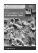 Anālayo The Genesis of the Bodhisattva Ideal 178 pp., 12 illustrations, hardcover, 22,80 EUR ISBN 978-3-937816-62-3 (printed version)
http://hup.sub.uni-hamburg.de/purl/HamburgUP_HBS01_Analayo Band 2

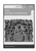 Anālayo The Dawn of Abhidharma 229 pp., 12 illustrations, hardcover, 25,80 EUR ISBN978-3-943423-15-0 (printed version) http://hup.sub.uni-hamburg.de/purl/HamburgUP_HBS02_Analayo A Distant Mirror

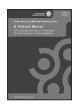 Band 3 Lin, Chen-kuo / Radich, Michael (eds.) Articulating Indic Ideas in Sixth and Seventh Century Chinese Buddhism 565 pp., hardcover; 39,80 EUR ISBN 978-3-943423-19-8 (printed version)
http://hup.sub.uni-hamburg.de/purl/HamburgUP_HBS03_LinRadich Band 4

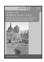 Silk, Jonathan A. Buddhist Cosmic Unity An Edition, Translation and Study of the "Anūnatvāpūrṇatvanirdeśaparivarta" 252 pp., hardcover, 28,80 EUR ISBN978-3-943423-22-8 (printed version)
http://hup.sub.uni-hamburg.de/purl/HamburgUP_HBS04_Silk Band 5

 Radich, Michael The "Mahāparinirvāṇa-mahāsūtra" and the Emergence of "Tathāgatagarbha" Doctrine 266 pp., hardcover, 28,80 EUR ISBN 978-3-943423-20-4 (printed version)
http://hup.sub.uni-hamburg.de/purl/HamburgUP_HBS05_Radich Band 6

 The Foundation History of the Nuns' Order Anālayo 278 pp., hardcover, 29,80 EUR
https://www.buddhismuskunde.uni-hamburg.de/pdf/4-publikationen/ hamburgbuddhist-studies/hamburgup-hbs06-analayo.pdf ISBN 978-3-89733-387-1 (printed version)
Band 7

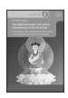 The Eighth Karmapa's Life and his Interpretation of the Great Seal Jim Rheingans A Religious Life and Instructional Texts in Historical and Doctrinal Contexts 243 pp., hardcover, 25,80 EUR ISBN 978-3-89733-422-9 (printed version)
https://www.buddhismuskunde.uni-hamburg.de/pdf/4-publikationen/ hamburg-buddhist-studies/hamburgup-hbs07-rheingans.pdf Band 8

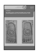 Anālayo Buddhapada and the Bodhisattva Path 180 pp., hardcover, 18,80 EUR ISBN 978-3-89733-415-1 (printed version)
https://www.buddhismuskunde.uni-hamburg.de/pdf/4-publikationen/ hamburg-buddhist-studies/hamburgup-hbs08-analayo.pdf Band 9

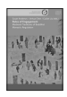 Susan Andrews/Jinhua Chen/Cuilan Liu (eds.) Medieval Traditions of Buddhist Monastic Regulation Rules of Engagement 522 pp., hardcover, 26,60 EUR ISBN 978-3-89733-428-1 (printed version)
https://www.buddhismuskunde.uni-hamburg.de/pdf/4-publikationen/ hamburg-buddhist-studies/hamburgup-hbs09-full.pdf Band 10

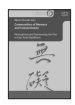 Mario Poceski (ed.) Reimagining and Reinventing the Past in East Asian Buddhism Communities of Memory and Interpretation XIV; 217 pp., hardcover, 25,80 EUR ISBN 978-3-89733-425-0 (printed version)
https://www.buddhismuskunde.uni-hamburg.de/pdf/4-publikationen/ hamburg-buddhist-studies/hamburgup-hbs10-poceski.pdf Band 11

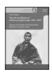 Achim Bayer rDzogs-chen Master and Educational Reformer of Eastern Tibet The Life and Works of mKhan-po gZhan-dga' (1871–1927) XXI; 435 pp., hardcover, 32,80 EUR ISBN 978-3-89733-495-3 (printed version)
https://www.buddhismuskunde.uni-hamburg.de/pdf/4-publikationen/hamburgbuddhist-studies/hamburgup-hbs11-bayer.pdf Band 12/Teil 1

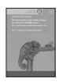 Lambert Schmithausen 381 pp., hardcover, 27,80 EUR
ISBN 978-3-89733-503-5 (printed version) Teil 1 · Studie und Übersetzungen Fleischverzehr und Vegetarismus im indischen Buddhismus bis ca. zur Mitte des ersten Jahrtausends n. Chr.

 Band 12/Teil 2

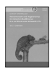 Fleischverzehr und Vegetarismus im indischen Buddhismus Lambert Schmithausen bis ca. zur Mitte des ersten Jahrtausends n. Chr.

Teil 2 · Endnoten 606 pp., hardcover, 34,80 EUR ISBN 978-3-89733-504-2 (printed version) Band 12/Teil 3

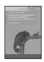 Lambert Schmithausen Fleischverzehr und Vegetarismus im indischen Buddhismus bis ca. zur Mitte des ersten Jahrtausends n. Chr. Teil 3 · Editionen 226 pp., hardcover, 24,80 EUR ISBN 978-3-89733-505-9 (printed version)
Band 13

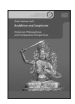 Oren Hanner (ed.) Buddhism and Scepticism Historical, Philosophical, and Comparative Perspectives 183 pp., hardcover, 25,80 EUR
ISBN 978-3-89733-518-9 (printed version) Band 14

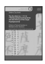 Stefano Zacchetti The Da zhidu lun 大智度論 (*Mahāprajnāpāramitopadeśa) 
and the History of the Larger Prajnāpāramitā Patterns of Textual Variation in Mahāyāna Sūtra Literature Edited for publication by Michael Radich and Jonathan Silk ISBN 978-3-89733-543-1 (printed version) 301 pp., hardcover, 25,80 EUR Band 15

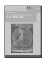 The Buddhist Nuns' Ordination in the Tibetan Canon Carola Roloff ISBN 978-3-89733-526-4 (printed version) Possibilities of the Revival of the Mūlasarvāstivāda Bhikṣuṇī Lineage 375 pp., hardcover, 27,80 EUR Band 16

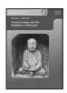 Wendi L. Adamek Practicescapes and the Buddhists of Baoshan 604 pp., hardcover, 34,00 EUR ISBN 978-3-89733-515-8 (printed version)

This study discusses the composition and transmission of early Buddhist texts with specific reference to sutra ( sutta/sutra ) texts. Based on an initial overview of the stylistic and structural characteristics of these texts and the principles employed in the creation and organization of sutra and verse collections that, l argue, indicate that they were oral compositions that were intended to be memorized and transmitted verbatim, the study focuses on the types of changes that these texts underwent in the course of their transmission, both intentional and unintentional, and the reasons such changes occurred. It then gives an account of the challenges that change, particularly intentional change, must have posed to the oral transmission of fixed texts.

ISSN 2190-6769 ISBN ISBN 978-3-89733-552-3 (printed version) EUR [D] 17