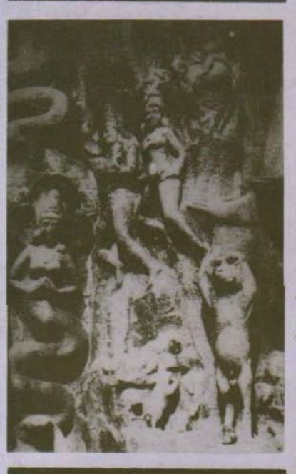

The Two

Traditions of Meditation in Ancient India Johannes  Bronkhorst TWO  TRADITIONS OF  MEDITATION
JOHANNES BRONKHORST
THE TWO TRADITIONS
OF MEDITATION
IN  ANCIENT  INDIA
Second edition: Delhi: Motilal Banarsidass. 1993. (Reprint: 2000.)

# Table Of Contents

Preface to the second edition Acknowledgements to the first edition Introduction Part I: Two traditions of meditation Ch. 1:
The ascetic practices of the Bodhisattva Ch. 2:
Further Buddhist criticism of alternative practices Part II: The main stream Ch. 3:
Early Jaina meditation Ch. 4:
Meditation as part of asceticism in early Hindu scriptures Theory and practice in the main stream Ch. 5:
Ch. 6:
The influence from Buddhist meditation Part III: Buddhist meditation Influence on Buddhist meditation (I)
Ch. 7:
Influence on Buddhist meditation (II)
Ch. 8:
Ch. 9:
The origin of Buddhist meditation Ch. 10:  Pratyekabuddhas, the Sutta Nipāta, and the early Saṅgha Conclusion Ch. 11:  The position and character of early Buddhist meditation Abbreviations Primary Sources Modern Authors Index The Two Traditions of Meditation in Ancient India has been out of print for a while. Reactions to the first edition have been varied, ranging from positive to critical. It is clear that these reactions are determined, at least to a large extent, by the positions of the scholars concerned with regard to the question of what can be expected from research into earliest Buddhism. The brief discussion that follows of some of the criticisms that have been expressed against the first edition, is therefore more than just a defence of this book; it is meant to be a contribution to a more general discussion regarding the aspirations and possibilities of scholarship in this particular field of study.

Lambert Schmithausen has recently (1990) distinguished three positions held by scholars of Buddhism with regard to the question whether and to what extent the early Buddhist texts can be regarded as faithfully preserving the doctrine of the Buddha himself at least in essence. They might be presented as follows : (i) stress on the fundamental homogeneity and substantial authenticity of at least a considerable part of the Nikåyic materials; (ii) scepticism with regard to the possibility of retrieving the doctrine of earliest Buddhism; (iii) cautious optimism in this respect. This book takes position (iii). This position is to be preferred to (ii) for purely methodological reasons : only those who seek may find, even if no success is guaranteed.1 The danger of position (i) is that it may raise a hypothesis into a principle. And once the homogeneity of the early Buddhist texts is taken as point of departure rather than as a hypothesis to be tested against the evidence, one is in the same situation as the Christian church, which managed to obstruct progress in Biblical studies for many centuries, precisely because it insisted on the fundamental homogeneity of its scripture.2 This parallelism becomes almost complete, once the further 1. Position (ii) is essentially adopted in the review by S. Collins (1987). For a discussion of some of the points raised there, see my review of T. E. Vetter's The Ideas and Meditative Practices of Early Buddhism in the Indo-Iranian Journal 36 
(1993), 63-68.

2. I refer here to Gusdorf, 1988.

requirement is added that the early Buddhist texts have to be interpreted in the light of the later tradition.3 It would be unfair to those who uphold position (i) to put too much emphasis on the parallelism with the unfortunate history of Biblical studies. We must assume that they look upon their position as, in their eyes, the best hypothesis available, which they are ready to abandon at any time, if only good enough evidence were forthcoming. The present book concentrates on contradictions and inconsistencies. Upholders of position (i) - such as R. Gombrich (1990) - argue that some lack of homogeneity is only to be expected in the early Buddhist texts, even on the assumption that all of them go back to the Buddha himself. No farreaching conclusions should therefore be drawn from 'inconsistencies' and 'contradictions', especially not where these latter occur in descriptions of such notoriously elusive 'things' as meditational states. Similar problems about 'contradictions' are voiced by D. S. Ruegg (1989 : 9 n.9) who, while specifically referring to the first edition of the present book, complains that the "treatment of the relevant material is not infrequently based on unexplicated or unexamined (and anything but self-evident) presuppositions about 'contradictions' in the tradition".

It seems that the main arguments of this book have escaped Gombrich and Ruegg. They may escape other readers too. For this reason these main arguments will be once more presented in this Preface, but in an abbreviated and differently arranged form. This new presentation will, I hope, show that the criticisms mentioned above are not applicable to this book. Details and references will be found in the main body of the book.

The point of departure is the undeniable fact that even the oldest Buddhist texts we have do not date back, in their present form, to the period of the Buddha. Linguistic considerations alone suffice to show that "all Buddhist texts, as they are read today, are not only heavily influenced by linguistic developments known to be much later than early days of Buddhism, but also reformulated perhaps, and certainly recast from one language into another before they reached their present linguistic shape" (Hinüber, 1991: 184). There is therefore no guarantee 3. As is proposed by R. Gombrich (1988 : 21; cp. 1990 : 11-12).

whatsoever that all these texts represent the teachings of the Buddha, and it is at least conceivable that some of their contents are non-authentic.

How can we imagine non-authentic views and practices to have found their way into the canonical collections, primarily the collections of SËtras ? This is not difficult. It is at least conceivable that in the process of collecting some texts or passages were included that contained elements that derived, ultimately, not from the teaching of the Buddha, but from other religious groups and ideals current at the time.

The preceding remarks concern conceivable events; no evidence has yet been presented that they actually took place. Suppose they did take place. How could we ever discover the non-authentic elements in the Buddhist texts? In general this would be difficult or even impossible. Elements that were not part of the teaching of the Buddha but were not rejected either, might find their way in - after or even before the death of the Buddha - without anyone ever noticing, least of all the modern scholar. Perhaps the only hope ever to identify non-authentic elements in the Buddhist texts is constituted by the special cases where elements which are recorded to have been rejected by the Buddha, yet found their way into the texts, and, moreover, are clearly identifiable as belonging to one or more movements other than Buddhism.

This gives us what might turn out to be an objective criterion for identifying foreign intrusions into the Buddhist texts : An element that is (i) rejected at some places in the Buddhist texts, (ii) accepted at others, and (iii) known to fit at least some non-Buddhist religious movements of the time, such an element is very likely to be a non-authentic intrusion into the Buddhist texts. As we have to work with only limited evidence, I would not know what better criterion there could be in the circumstances. Unfortunately, the importance of this criterion seems to have escaped all of my critics.

Of course, having a criterion in theory is one thing, applying it to the texts, quite another. This book tries to apply this criterion to the one aspect of Buddhism - perhaps the only one - where it seems to work: that of meditation. Much of the book is dedicated to the presentation of the meditational and ascetic practices and related ideas found in early Jainism and other non-Buddhist religious movements of early India. Since no one has criticized this presentation, whereas several scholars 1. The Mahåparinirvåˆa SËtra, in its various recensions, records a discussion of the Buddha with someone called Putkasa (in Sanskrit) or Pukkusa (in Påli). The Buddha here boasts that once, in a violent thunderstorm when lightning killed two farmers and four oxen nearby him, he did not notice it. It is known that abilities of this kind were sought after by certain non-Buddhists. Another Buddhist SËtra (the Indriyabhåvanå Sutta of the Påli canon and its parallel in Chinese translation), on the other hand, ridicules such 'cultivation of the senses' which leads to their non-functioning; the Buddha is here reported to say that if this is cultivation of the senses, the blind and deaf would be cultivators of the senses.

The passages here mentioned may not logically contradict each other, yet they come about as close to that as one could hope for in this type of texts: on one occasion the Buddha disapproves of the practice that aims at the complete suppression of all sense-activities, on another he boasts about his attainments in this direction. This situation calls for a solution. One solution would be to think that the Buddha changed his mind about this practice. A more plausible explanation is that a practice that was respected among non-Buddhists came to be ascribed to the Buddha, either before or after his death. This latter explanation implies that the practice concerned is not authentically Buddhist. 2. A SËtra of the Majjhima Nikåya (the CËÒadukkhakkhandha Sutta) as well as its parallels in Chinese translation describe and criticize the Jainas as practising 'annihilation of former actions by asceticism' and 'non-performing of new actions'. This can be accepted as an accurate description of the practices of the Jainas. But several other SËtras of the Buddhist canon put almost the same words in the mouth of the Buddha, who here approves of these practices (see note 8 to chapter 2, below). Did the Buddha first hold one opinion, then to change his mind ? Or did he not know how to describe his experiences ? Obviously it is far more plausible that, again, practices that were widely accepted outside the Buddhist fold, but not inside it, found their way in.

The argument here summarized is again presented, in a but slightly different form, by no one else than Ruegg, apparently without realizing it, in the very same book in which he dismisses my arguments. This situation is extraordinary enough to warrant quoting the passage concerned at length (Ruegg, 1989: 142-143):
Now, in some old Buddhist canonical texts also there are in fact found certain references to the idea that liberation from Ill (du˙kha) results from, and consists in, the non-production of any future karman at all and from the ending, often through austerities (tapas), of any existing bad karman. This idea is there usually ascribed to the Nigaˆ†ha Nåtaputta (Nirgrantha Jñåt®putra), in other words to Mahåv¥ra and the Jainas. We also read that immobility of body and renunciation of speech bring Ease (sukha). Moreover, in a couple of Buddhist canonical texts the idea that no new karman at all should be generated, and that any existing karman should be ended, has even been connected with the Buddha himself in a sermon he once addressed to a Nirgrantha and in another one he addressed to Vappa, a disciple of the Nirgranthas. The connection of such a teaching with the Buddha himself seems nevertheless to be rare. When it does occur, it is evidently to be explained by the fact that his auditor was a Nirgrantha and that the teaching was thus intended as an introductory salvific device, a circumstance that would lend support to Kamalaߥla's statement denying that such relinquishement of all activity was the Buddha's own teaching. In the majority of other places where it has been mentioned in the Påli canon, this doctrine has in fact been severely criticized. It is patently inconsistent with such basic principles of Buddhist doctrine as the four correct efforts (sammåppadhåna / samyakprahåˆa) ...

It is not a little surprising to see how Ruegg, who rejects my arguments, arrives here at my conclusions, using my arguments and 3. The Vitakkasanthåna Sutta of the Majjhima Nikåya and its parallels in Chinese translation recommend the practising monk to 'restrain his thought with his mind, to coerce and torment it'. Exactly the same words are used elsewhere in the Påli canon (in the Mahåsaccaka Sutta, Bodhiråjakumåra Sutta and Sa∫gårava Sutta) in order to describe the futile attempts of the Buddha before his enlightenment to reach liberation after the manner of the Jainas. Once again it is hard to see a better explanation than that these Jaina practices had come to be accepted by at least some Buddhists.

It would be unrealistic to expect that all 'contradictions' in the Buddhist canon are quite as explicit as the ones mentioned above. This does not however mean that they are any less real. Consider the following: 4. Four states of meditation are often enumerated in the Buddhist SËtras in varying contexts, but almost always together. They are: l) the Stage of Infinity of Space; 2) the Stage of Infinity of Perception; 3) the Stage of Nothingness; 4) the Stage of neither Ideation nor Non-Ideation. The texts say little by way of explanation of these stages, but the names make clear that they together form a list of graded exercises aimed at the cessation of all ideations. This aim conforms very well with the aims we have to ascribe to the early Jainas and those of similar convictions. Moreover, the Jaina scriptures describe 'reflection on infinity' as one of the accompaniments of 'pure meditation'. These stages are denounced elsewhere in the Buddhist canon, be it indirectly: The Buddha is said to have had two teachers before his enlightenment: Órå∂a Kålåma and Udraka the son of Råma. From the former he learned the Stage of Nothingness, from the latter the Stage of neither Ideation nor NonIdeation. However, the Buddha left these teachers, because he came to believe that these Stages would not lead him to his goal.

Here the question seems justified: do these stages lead to the goal or do they not ? Various answers can be imagined, such as, "they do to some extent, but not all the way", "the Buddha had second thoughts about the usefulness of these stages", etc. But I insist that there is a problem here that demands an answer, and not just a manifestation of my "unexplicated or unexamined (and anything but self-evident) presuppositions about 'contradictions' in the tradition", as Ruegg would have it. Criticism of this kind, which refuses to study arguments, is not only counter-productive, it constitutes one of the greatest enemies of scholarship which, as Gombrich rightly points out, should at least try to progress by argument. Returning to the Stage of Nothingness and the Stage of neither Ideation nor Non-Ideation, it will hardly be necessary to add that in my opinion they comply with the criterion of foreign intrusion into the Buddhist texts formulated above.

The conclusion that the above four meditational Stages were not accepted in earliest Buddhism finds support in an altogether unexpected quarter; for a detailed presentation of the argument I must refer the reader to BSOAS 48, 1985, pp. 305 f.4 Among the early (Abhidharmic) 
måt®kås, one seems to have been considered particularly important. It occurs a number of times in the early texts, but not always in exactly the same form; to an original enumeration of merely mental characteristics, meditational states came to be added. But initially the meditational states thus added did not contain the four Stages discussed above, even though these Stages, collectively known as 'the Formless States', are very prominent in the Buddhist scriptures as we have them. The most plausible explanation is again that the Formless States were not accepted during the earliest period of Buddhism. 5. The Buddhist texts are not of one mind concerning the time when liberation is reached. A great number of passages emphatically states that liberation is reached in this life, i.e., well before death. This is hardly surprising, for the Buddha himself is agreed to have passed many years teaching after his moment of liberation. Yet other passages speak about 4. This article has been criticized by R. M. L. Gethin (1992: 281). Be it noted that this criticism –whatever its worth - does not affect the argument here presented.

liberation as taking place at death. As in all the preceding cases, there is here a contradiction in the texts. Various solutions are conceivable, such as "the Buddha didn't know", "he expressed himself variously", "he changed his mind", "some are liberated at death, others in life", etc. Indeed, anyone with some imagination can add to this list of possibilities almost indefinitely. However, we know that among many non-Buddhists liberation took place at death, and that many Buddhist texts emphatically hold the opposite opinion. It is no doubt superfluous to add that an intrusion of foreign ideas seems to me most plausible here, too.

These examples should suffice to induce critics, at last, to read this book, rather than presenting their a priori reasons for thinking that the effort made in it cannot possibly lead anywhere. Scholarship should and indeed can only progress by argument, and this implies also: trying to understand someone else's arguments. Those who are not willing or able to do this, would have done better to ignore the book,5 rather than pronounce facile judgments about it.

The first edition of this book was published in 1986, by Franz Steiner Verlag Wiesbaden GmbH, Stuttgart. The preparation of this second edition has permitted me to correct a number of, usually minor, mistakes, and make other improvements. For ease of comparison, the page numbers of the first edition are indicated in the margin in the present edition. The help provided by Yves Ramseier in the preparation of this edition is here gratefully acknowledged.

 5. This is done in some recent surveys of Buddhism, such as Harvey, 1990; and Klimkeit, 1990.

Acknowledgements to the first edition This book was written with the financial assistance of the Netherlands Organisation for the Advancement of Pure Research (ZWO). This organisation also enabled me to visit India in order to work with various Jainas, laymen and monks. From among these I like to thank in particular Prof. N. Tatia and Muni JambËvijayaji for their help. In Europe I received help and encouragement from many friends and colleagues. Here I can mention but a few: Professors L. Schmithausen and T. E. Vetter, and Dr. H. Tieken. I like to thank Prof. A. Wezler for his support and enthusiasm in getting this book published in Germany, when ZWO refused to finance its publication.

Introduction The main aim of the present study is to find out what early Buddhist meditation was by ascertaining what it was not. The results are therefore largely negative, but not any less interesting.

The fact is that everyone who wishes to form an opinion on early Buddhism has to choose from a bewildering mass of often contradictory statements in the Buddhist canon. This choice is in danger of being arbitrary, for little is known about the relative chronology of the different parts of the canon. There can be no doubt that the canon - including the older parts, the SËtra- and Vinaya-Pi†aka - was composed over a long period of time. Only by assuming this can we make sense of its often glaring contradictions. But which parts are the oldest ?

In the following pages I shall try to answer this question in so far as it concerns Buddhist meditation by a method which, to my knowledge, has never yet been employed. At a number of places the Buddhist canon criticizes alternative practices which are claimed by others to lead to the highest good. These alternative practices can be identified in the early scriptures of Jainism and Hinduism. The idea behind this method is that those alternative practices, even when they are described and approved of in other parts of the Buddhist canon, cannot be considered to be authentic to Buddhism; they must be looked upon as later borrowings from outside. Traces of earliest Buddhism therefore must be sought among the practices which are opposed to those alternative ones.

Does this deny the possibility that early Buddhism shared certain features with the other religious movements that existed in India in its time ? Clearly not! We do not wish to exclude features from early Buddhism simply because they are present elsewhere. We wish to exclude such features only if other, contrasting or even contradictory, features exist in the early Buddhist scriptures which are explicitly preferred to the former ones in those scriptures.

Why should features which are peculiar to Buddhism have greater likelihood to belong to early Buddhism than features which also occur elsewhere ? This is partly a matter of definition. By 'early Buddhism' we mean the beginning of the tradition peculiar to Buddhism. The question will remain whether all these peculiar features came more or less at the same time and can therefore be ascribed to a single founder of this tradition, i.e., to the historical Buddha. All we can say is that the Buddhist tradition clearly points to such a person. Moreover, it is known that religious traditions tend to be conservative. They may inadvertently borrow elements from outside; they may also develop and undergo modifications. They will not as a rule introduce complete novelties. This privilege is reserved for the founder of such a tradition.

The execution of the above program will enable us to reach a better understanding of early Buddhist meditation. It also allows us to obtain more insight into the alternative, non-Buddhist, practices, especially of the early period. The circumstance that the two traditions intermingled at a rather early date had hidden from previous investigators the ideas underlying the non-Buddhist practices. It also obscured the influence which these ideas had on virtually all systems of Hindu philosophy.

A few words must be said about methodology. This book presents a theory about what early Buddhism - or rather, certain aspects of it - was and what it was not. That is to say, this book does not merely reproduce the texts on which it is based, and is not simply the result of 'just reading the texts' (if such a thing is at all possible; cf. Bronkhorst, 1986 : Introduction). In a way it contains more than what can be found in the texts. In return, it explains contradictions and other features of the texts which would otherwise remain obscure. There is no way to prove that the theory presented in this book is right. But this does not by itself detract from its value. A great deal, if not all, we know about the world is of such a theoretical nature.

Such a starting point has consequences for those who wish to disagree with my theory. It will not just be enough to say that it has not been proved. It may be more worthwhile to try and show that the theory does not fit certain facts. Criticism of this kind, though not without value, will at best bring us back to the situation where the contradictions in the Buddhist canon are, again, unexplained. Really constructive criticism of my theory will present an even better theory.

# 1.1. At Three Places6 In The Majjhima Nikåya Of The Påli Buddhist Canon An Episode Is Found In Which The Buddha Describes How He, Before His Enlightenment, Tried Out Two Methods Which He Then Discovered Did Not Lead To The Desired End. The Two Methods Are 'Meditation Without Breath' And 'Reduced Intake Of Food'. The Episode Reads7 In The Mahåsaccaka Sutta: 8

 assåsapassåsesu uparuddhesu adhimattå våtå muddhånaµ Ëhananti / åraddhaµ kho pana me aggivessana viriyaµ ... na pariyådåya ti††hati /
(p. 243, l. 32:) tassa mayhaµ aggivessana etad ahosi: yan nËnåhaµ˛ appånakaµ yeva jhånaµ jhåyeyyan ti / so kho ahaµ aggivessana mukhato ca nåsato ca kaˆˆato ca assåsapassåse uparundhiµ / tassa mayhaµ aggivessana mukhato ca nåsato ca kaˆˆato ca assåsapassåsesu uparuddhesu adhimattå s¥se s¥savedanå honti / seyyathå pi aggivessana balavå puriso daÒhena varattakhaˆ∂ena s¥se s¥save†haµ dadeyya, evam eva kho me aggivessana mukhato ca nåsato ca kaˆˆato ca assåsapassåsesu uparuddhesu adhimattå s¥se s¥savedanå honti / åraddhaµ kho pana me aggivessana viriyaµ ... na pariyådåya ti††hati /
(p. 244, l. 9:) tassa mayhaµ aggivessana etad ahosi: yan nËnåhaµ˛ appånakaµ yeva jhånaµ jhåyeyyan ti / so kho ahaµ aggivessana mukhato ca nåsato ca kaˆˆato ca assåsapassåse uparundhiµ / tassa mayhaµ aggivessana mukhato ca nåsato ca kaˆˆato ca assåsapassåsesu uparuddhesu adhimattå våtå kucchiµ parikantanti / 
seyyathå pi aggivessana dakkho goghåtako vå goghåtakantevås¥ va tiˆhena govikantanena kucchiµ parikanteyya, evam eva kho me aggivessana adhimattå våtå kucchiµ parikantanti / åraddhaµ kho pana me aggivessana viriyaµ ... na pariyådåya ti††hati /
(p.244, l. 23) tassa mayhaµ aggivessana etad ahosi: yan nËnåhaµ appånakaµ yeva jhånaµ jhåyeyyan ti / so kho ahaµ aggivessana mukhato ca nåsato ca kaˆˆato ca assåsapassåse uparundhiµ / tassa mayhaµ aggivessana mukhato ca nåsato ca kaˆˆato ca assåsapassåsesu uparuddhesu adhimatto kåyasmiµ ∂åho hoti / seyyathå pi aggivessana dve balavanto puriså dubbalataraµ purisaµ nånåbåhåsu gahetvå a∫gårakåsuyå santåpeyyuµ samparitåpeyyuµ, evam eva kho me aggivessana mukhato ca nåsato ca kaˆˆato ca assåsapassåsesu uparuddhesu adhimatto kåyasmiµ ∂åho hoti / åraddhaµ kho pana me aggivessana viriyaµ ... na pariyådåya ti††hati /
(p. 244, l. 37:) api 'ssu maµ aggivessana devatå disvå evam åhaµsu: kålakato samaˆo gotamo ti / ekaccå devatå evam åhaµsu: na kålakato samaˆo gotamo, api ca kålaµ karot¥ti / ekaccå devatå evam åhaµsu: na kålakato samaˆo gotamo na pi kålaµ karoti, arahaµ samaˆo gotamo, vihåro tv eva so arahato evarËpo hot¥ti /
(p. 245, l. 6:) tassa mayhaµ aggivessana etad ahosi: yan nËnåhaµ sabbaso åhårupacchedåya pa†ipajjeyyan ti / atha kho maµ aggivessana devatå upasa∫kamitvå etad avocuµ: må kho tvaµ mårisa sabbaso åhårupacchedåya pa†ipajji, sace kho tvaµ mårisa sabbaso åhårupacchedåya pa†ipajjissasi tassa te mayaµ dibbaµ ojaµ lomakËpehi ajjhoharissåma, tåya tvaµ yåpessas¥ti / tassa mayhaµ aggivessana etad ahosi: ahañ c'eva kho pana sabbaso ajaddhukaµ pa†ijåneyyaµ imå ca me devatå dibbaµ ojaµ lomakËpehi ajjhohareyyuµ tåya cåhaµ yåpeyyaµ, taµ mama assa muså ti / so kho ahaµ aggivessana tå devatå paccåcikkhåmi, halan ti vadåmi / 
(p. 245, l. 17:) tassa mayhaµ aggivessana etad ahosi: yan nËnåhaµ thokaµ thokaµ åhåraµ åhåreyyaµ pasataµ pasataµ, yadi vå muggayËsaµ yadi vå kulatthayËsaµ yadi vå kaÒåyayËsaµ yadi vå hareˆukayËsan ti / so kho ahaµ aggivessana thokaµ thokaµ åhåraµ åhåresiµ pasataµ pasatam, yadi vå muggayËsaµ yadi vå kulatthayËsaµ yadi vå kaÒåyayËsaµ yadi vå hareˆukayËsaµ / tassa mayhaµ aggivessana thokaµ thokaµ åhåraµ åhårayato pasataµ pasatam, yadi vå muggayËsaµ yadi vå kulatthayËsaµ yadi va kaÒåyayËsaµ yadi vå hareˆukayËsaµ, adhimattakasimånaµ patto kåyo hoti / seyyathå pi nåma ås¥tikapabbåni vå kålåpabbåni vå evam eva 'ssu me a∫gapacca∫gåni bhavanti tåy'ev'appåhåratåya, seyyathå pi nåma o††hapadaµ evam eva 'ssu me ånisadaµ hoti tåy'ev'appåhåratåya, seyyathå pi nåma va††anåvaÒ¥ evam eva 'ssu me pi††hikaˆ†ako unnatåvanato hoti tåy'ev'appåhåratåya, seyyathå pi nåma jarasålåya gopånasiyo oluggaviluggå bhavanti evam eva 'ssu me phåsuÒiyo oluggaviluggå bhavanti tåy'ev'appåhåratåya, seyyathå pi nåma gambh¥re udapåne udakatårakå 
(p. 242, l. 23:) Then, Aggivessana, I thought : 'Let me, closing my teeth, pressing my palate with my tongue, restrain my thought with my mind, let me coerce and torment it'. Then indeed, Aggivessana, closing my teeth and pressing my palate with my tongue, I 
restrained my thought with my mind, coerced and tormented it. 

While I, Aggivessana, closing my teeth and pressing my palate with my tongue, restrained my thought with my mind, coerced and tormented it, sweat came from my armpits. Just as when, Aggivessana, a strong man, taking a weaker man by his head or taking him by his shoulder, may restrain, coerce and torment him, just so indeed, Aggivessana, while I, closing my teeth and pressing my palate with my tongue, restrained my thought with my mind, coerced and tormented it, sweat come from my armpits. But, Aggivessana, my energy was aroused, not shrinking, my mindfulness was alert, not distracted, but9 my body was impetuous, not calmed, while I was harassed by that painful exertion. Even gambh¥ragatå okkhåyikå dissanti evam eva 'ssu me akkhikËpesu akkhitårakå gambh¥ragatå okkhåyikå dissanti tåy'ev'appåhåratåya, seyyathå pi nåma tittakålåbu åmakacchinno våtåtapena sampu†ito hoti sammilåto evam eva 'ssu me s¥sacchavi sampu†itå hoti sammilåtå tåy'ev'appåhåratåya / so kho ahaµ aggivessana udaracchaviµ parimasissåm¥ 'ti pi††hikaˆ†akaµ yeva parigaˆhåmi, pi††hikaˆ†akaµ parimasissåm¥ 'ti udaracchaviµ yeva parigaˆhåmi / yåva 'ssu me aggivessana udaracchavi pi††hikaˆ†akaµ all¥nå hoti tåy'ev'appåhåratåya / so kho ahaµ aggivessana vaccaµ vå muttaµ vå karissåm¥ti tattheva avakujjo papatåmi tåy'ev'appåhåratåya / so kho ahaµ aggivessana imam eva kåyaµ assåsento påˆinå gattåni anomajjåmi / tassa mayhaµ aggivessana påˆinå gattåni anomajjato pËtimËlåni lomåni kåyasmå papatanti tåy'ev'appåhåratåya /
(p. 246, l. 12:) api 'ssu maµ aggivessana manusså disvå evam åhaµsu: kåÒo samaˆo gotamo ti / ekacce manusså evam åhaµsu: na kåÒo samaˆo gotamo, såmo samaˆo gotamo ti / ekacce manusså evam åhaµsu: na kåÒo samaˆo gotamo na pi såmo, ma∫guracchavi samaˆo gotamo ti / yåva'ssu me aggivessana tåva parisuddho chavivaˆˆo pariyodåto upahato hoti tåy'ev'appåhåratåya /
(p. 246, l. 20:) tassa mayhaµ aggivessana etad ahosi: ye kho keci at¥taµ addhånaµ samaˆå vå bråhmaˆå vå opakkamikå dukkhå tippå ka†ukå vedanå vedayiµsu, etåvaparamaµ nayito bhiyyo; ye pi hi keci anågatam addhånaµ samaˆå vå bråhmaˆå vå opakkamikå dukkhå tippå ka†ukå vedanå vedayissanti, etåvaparamaµ nayito bhiyyo; ye pi hi keci etarahi samaˆå vå bråhmaˆå vå opakkamikå dukkhå tippå ka†ukå vedanå vediyanti, etåvaparamaµ nayito bhiyyo / na kho panåhaµ imåya ka†ukåya dukkarakårikåya adhigacchåmi uttariµ manussadhammå alamariyañåˆadassanavisesaµ, siyå nu kho añño maggo bodhåyåti /
9. MN I.21, 117, 186 have: "my energy was aroused, not shrinking, my mindfulness was alert, not distracted, my body was calmed, not impetuous, ...". This justifies the translation 'but' for ca.

such a painful experience, Aggivessana, when it happened to me, did not completely take hold of my mind.

(p. 243, 1. 4:) Then, Aggivessana, I thought: 'Let me perform meditation without breath'. Then indeed, Aggivessana, I stopped breathing out and breathing in, both through the mouth and through the nose. When, Aggivessana, my breathing out and breathing in had been stopped, both through the mouth and through the nose, there came about the extremely strong noise of winds which went out through my ears. Just as when an extremely strong noise comes about when the bellows of a smith are blown, just so indeed, Aggivessana, there came about the extremely strong noise of winds which went out through the ears, when my breathing out and breathing in had been stopped both through the mouth and through the nose. But, Aggivessana, my energy was aroused, not shrinking, my mindfulness was alert, not distracted, but my body was impetuous, not calmed, while I was harassed by that painful exertion. Even such a painful experience, Aggivessana, when it happened to me, did not completely take hold of my thought. (p. 243 l. 18): Then, Aggivessana, I thought: 'Let me perform meditation fully without breath'. Then indeed, Aggivessana, I stopped breathing out and breathing in through mouth, nose and ears. When, Aggivessana, my breathing out and breathing in had been stopped through mouth, nose and ears, extremely strong winds shook up my head. Just as when, Aggivessana, a strong man may destroy a head with the sharp edge of a sword, just so indeed, Aggivessana, extremely strong winds shook up my head, when breathing out and breathing in had been stopped through mouth, nose and ears. But, Aggivessana, my energy ... did not completely take hold of my mind. (p. 243, l. 32:) Then, Aggivessana, I thought: 'Let me perform meditation fully without breath'. Then indeed, Aggivessana, I stopped breathing out and breathing in through mouth, nose and ears. When, Aggivessana, my breathing out and breathing in had been stopped through mouth, nose and ears, there came about extremely strong headaches in my head. Just as when, Aggivessana, a strong man may place a turban on a head with a strong strip of leather, just so indeed, Aggivessana, there came about extremely strong headaches in my head when breathing out and breathing in had been stopped through mouth, nose and ears. But, Aggivessana, my energy did not completely take hold of my mind. (p. 244, l. 9:) Then, Aggivessana, I thought: 'Let me perform meditation fully without breath'. Then indeed, Aggivessana, I stopped breathing out and breathing in through mouth, nose and ears. When, Aggivessana, my breathing out and breathing in had been stopped through mouth, nose and ears, extremely strong winds cut my belly all around. Just as when, Aggivessana, a skilled butcher or apprentice of a butcher may cut a belly all around with a sharp butcher's knife, just so indeed, Aggivessana, extremely strong winds cut my belly all around. But, Aggivessana, my energy ... did not completely take hold of my mind. (p. 244, l. 23:) Then, Aggivessana, I thought: 'Let me perform meditation fully without breath'. Then indeed, Aggivessana, I stopped breathing out and breathing in through mouth, nose and ears. When, Aggivessana, my breathing out and breathing in had been stopped through mouth, nose and ears, there came about an extremely strong heat in my body. Just as when, Aggivessana, two strong men, taking a weaker man by both his arms, may burn and roast him on a pit of burning coal, just so indeed, Aggivessana, there came about an extremely strong heat in my body when my breathing out and breathing in had been stopped through mouth, nose and ears. But, Aggivessana, my energy ... did not completely take hold of my mind. (p. 244, l. 37:) The gods moreover, Aggivessana, seeing me spoke thus: 'The recluse Gotama is dead'. Some gods spoke thus: 'the recluse Gotama is not dead, but he is dying'. Other gods spoke thus: 'The recluse Gotama is not dead, nor is he dying, the recluse Gotama is an arahant, that condition is exactly the one of an arahant'.

(p. 245, l. 6): Then, Aggivessana, I thought: 'Let me completely abstain from taking food'. Then indeed, Aggivessana, the gods, approaching me, said this: 'Don't you, Sir, completely abstain from taking food. If indeed, Sir, you will completely abstain from taking food, then we shall feed you divine nutritive essence through the pores of your skin, and thereby you will stay alive'. Then, Aggivessana, I thought: 'If I promised to completely abstain from taking food, these gods would feed me divine nutritive essence through the pores of my skin, and thereby I would stay alive; thus I would [speak] untruth'. Then indeed, Aggivessana, I rejected those gods, and said 'enough'. (p. 245, l. 17:) Then, Aggivessana, I thought: 'Let me take food little by little, drop by drop, soup of kidney-beans, or soup of vetch, or soup of chick-peas, or soup of peas'. Then, Aggivessana, while I took food little by little, drop by drop, soup of kidneybeans, or soup of vetch, or soup of chick-peas, or soup of peas, my body became extremely thin. Just like the joints of the ås¥tika or the joints of the kåla, my limbs, great and small, became just so on account of taking so little food. Just like the foot of a camel, my behind became just so on account of taking so little food. Just like a line of balls, my backbone became similarly bent up and bent down, on account of taking so little food. Just as the supporting beams in an old shed are breaking off and falling to pieces, just so my ribs were breaking off and falling to pieces on account of taking so little food. Just as in a deep well the glitter of water is seen, deep and low-lying, just so the glitter of my eyes was seen, deep and low-lying in the sockets, on account of taking so little food. Just as a bitter gourd, cut off while still unripe, becomes shrivelled and withered on account of wind and heat, just so the skin of my head became shrivelled and withered on account of taking so little food. Then indeed, Aggivessana, [thinking:] 'I shall touch the skin of my belly', I got hold of my backbone, [thinking:] 'I shall touch my backbone', I got hold of the skin of my belly, since, Aggivessana, the skin of my belly had become stuck to my backbone on account of taking so little food. Then indeed, Aggivessana, [thinking:] 'I shall defecate or urinate', I fell down, head forward, at that very place, on account of taking so little food. Then indeed, Aggivessana, soothing this my body I rubbed over my limbs with my hand. While I, Aggivessana, rubbed over my limbs with my hand, the hairs, having fetid roots, fell down from my body on account of taking so little food. (p. 246, l. 12:) People moreover, Aggivessana, seeing me spoke thus: 'The recluse Gotama is black'. Some people spoke thus: 'The recluse Gotama is not black, the recluse Gotama is brown'. Other people spoke thus: 'The recluse Gotama is not black, nor is he brown, the recluse Gotama has a fair10 skin (ma∫guracchavi)'. So much, Aggivessana, the colour of my skin, [though] fully clean and fully pure, had become destroyed on account of taking so little food. (p. 246, l. 20:) Then, Aggivessana, I thought: 'The recluses or Brahmins of the past who experienced painful, sharp, severe sensations [which were] due to [self- inflicted] torture,11
[experienced] this much at the most, not more than this. Also the recluses or Brahmins of the future who will experience painful, sharp, severe sensations [which will be] due to [self-inflicted] torture, [will experience] this much at the most, not more than this. Also the recluses or Brahmins of the present who experience painful, sharp, severe sensations [which are] due to [self-inflicted] torture, [experience] this much at the most, not more than this. But indeed I do not attain, through these severe and difficult practices, excellence in knowledge and insight which is truly noble and transcends the human condition. Could there be another road toward enlightenment ?'
This episode contains two features which suggest that non-Buddhist, most probably Jaina, practices are described :
 10. See below, point (iv).

11. opakkamika. The parallel passages in the Mahåvastu (II, p. 130) and Lalitavistara
(p. 263) have åtmopakramika; see also Mahåvastu II, p. 121-23, Lalitavistara p. 246-48.

(i) After the "meditation fully without breath", some gods think that Gotama is dead, others that he is dying, others again observe that "that condition is exactly the one of an arahant ". Obviously Gotama's condition is not "exactly the one of an arahant" in the Buddhist sense of this word. Here the term arahant is reserved12 for those who have followed to the end the road to salvation taught by the Buddha, as also for the Buddha himself after his enlightenment. The practices described in the present passage are without value for the attainment of (Buddhist) salvation, and to be discarded by Buddhist arahants. However, this same term (or its equivalent, in Sanskrit arhant, in Ardha-Mågadh¥ araha, arihaµta) was also used by the Jainas, and perhaps the Ój¥vikas (see Basham, 1951: 56, 140), to designate those who have reached the highest stage possible while still embodied as human beings.13 Both the Jainas and the Ój¥vikas are known for their inclination towards asceticism, so that we must conclude that the gods used the word arahant in the sense current among these religious wanderers.

(ii) The reduced intake of food is preceded by the intention to completely abstain from taking food. The reduced intake of food, with all its horrors, is therefore no more than a second choice. The story loses much of its force by the fact that the exalted initial intention comes to nothing. Why then was it added?14 The question resolves itself once we assume that our episode is directed against the Jainas, among whom the 12 A few possible exceptions occur in the På†ika Sutta (nr. 24) of the D¥gha Nikåya (III, 
7, 10, 11), where the term is used - by Sunakkhadatta, who has left the Buddhist order - in connection with certain ascetics. It is hard to decide if the term is used here, for once, in its literal sense ('deserving, respectable'), or if it is used to indicate the foolishness of Sunakkhadatta, who indeed is repeatedly called moghapurisa 'foolish man' in that SËtra. T.W. and C.A.F. Rhys Davids' (1921: 36) contention that in the På†ika Sutta as well as in our Mahåsaccaka Sutta the term is used in its supposedly pre-Buddhistic sense ("we may take it that ... the word ... 

had come to be popularly applied, not only to priests and kings, but also to ascetics") is unacceptable, the more so since this part of the Mahåsaccaka Sutta cannot be very early; see below, § 1.4. Some more places where arahant may be used in its literal sense have been noted by Franke (1913: 300-301). See further Horner, 1936: 77-95.

13 Also the Vråtyas used the term; see Weber, 1876: 85.

14 It is not present in the parallel passage in the Mahås¥hanåda Sutta of the Majjhima Nikåya (I.80).

(iii) The phrase "painful, sharp, severe sensations [which are] due to 
[self-inflicted] torture" (opakkamikå dukkhå tippå ka†ukå vedanå)
occurs, apart from this episode, in two and only two other contexts in the Påli canon, both times in connection with Jainas (Nigaˆ†ha; see below): in the Devadaha Sutta (nr. 101 of the Majjhima Nikåya, vol. II, p. 21819) and in the CËÒadukkhakkhandha Sutta (nr. 14 of the Majjhima Nikåya, vol. I, p. 92).

Perhaps we may add:
(iv) The reduced intake of food is said to evoke three kinds of reactions from onlookers. Some say that Gotama is black, others that he is brown, others again that he has a fair skin (ma∫guracchavi). The exact significance of ma∫guracchavi is not known. It occurs always16 (DN I. 

193; 242; MN I. 429; II. 33; and here) in the company of kåÒa, "black",
såma "brown". The three terms seem intended to cover among them the whole range of colours a human being can have: in three of the five cases they enumerate the varieties of complexion that an unknown beautiful girl can have, so that "having a fair skin" seems to be a reasonable translation. In the circumstances, only the first two terms are appropriate. 

 15 Cf. Schubring, 1935: 182-83; Kamptz, 1929; and ch. III below. Perhaps we may look at the following as a confirmation that our episode is directed against the Jainas : 
the gods assure Gotama that they will keep him alive in a way which is familiar from the Jaina scriptures. They want to feed Gotama divine nutritive essence through the pores of his skin (lomakËpesu). Feeding of this kind (lom' åhåra) is known from the (late) Paˆˆavaˆå Sutta (ch. 28, § 1859-61). "Here we learn that infernal beings, celestial beings and one-sensed beings undertake feeding through skin (1859-60). The two-sensed up to the five-sensed human beings undertake the feeding through skin as well as mouth (1861)." (Paˆˆavaˆå, part 2, Intr. p. 396-97). 

Cf. SËtrak®ta∫ganiryukti p. 228-29, gåthås 171f.

16 That is to say, in the Påli canon. Prof. K.R. Norman informs me that ma∫guracchavi occurs with kåla and odåta at Vism 184 and Sp 238, and observes that it 
"presumably represents a colour (half-way) between black and white", perhaps '(dark) brown'. Norman further suggests a connection with ma∫gula / ma∫gul¥, 
which seems to be used only in a bad sense.

It seems however dubious to attach too much worth to the opinions of the commentators, who may often, like us, have tried to make sense of the material before them and may occasionally have failed to draw the correct conclusions. 

Moreover, ma∫gura may be connected with ma∫kura, which has been preserved by the Sanskrit lexicographers in the sense 'mirror'; this suggests 'shining' for ma∫gura.

virocasi), Sn 551 as 'whose skin resembles gold' 
(kañcanasannibhattaca); see also Th 818f. See however ch. X below.]
However, it is not impossible that the disagreement among the onlookers does not concern the present colour of Gotama, but rather his original colour which had now become unrecognizable.18 1.2. The episode on meditation without breath and reduced intake of food occurs in the Ekottara Ógama preserved in Chinese, as well. It reads 
(T.125, p. 670c18-671b4):19
(670c18:) Then I thought: 'Why should I still eat ? I can completely abstain from taking food'. Because this thought arose in me, the gods came to me and said: 'Do not now stop eating. If you'll stop eating, we'll prolong and preserve your life with the pure force of nectar'. Then again I thought: 'What reason is there now to stop eating, [since] it will instigate the gods to give me nectar. I would deceive [others and myself]'. At that time I thought: 'Now I can eat a residue of sesamum and rice'. Then I ate per day one [seed of] sesamum and one [grain of] rice. My body became deteriorated and weak, and my bones were joined together. A sore grew on top of my head, so that the skin [of my head] fell down of its own, piece after piece, and my head resembled a broken bottle-gourd. [The sore] did not leave my 17 It is hard to believe that ma∫guracchavi was added by the redactors of the Påli canon in their efforts to unify the texts, since the Mahåvastu (II, p. 126-30) and the Lalitavistara (p. 255) use the corresponding term madguracchavi in the same context.

18 This was pointed out to me by Prof. Schmithausen in a written communication.

19 Prof. E. Zürcher was kind enough to lend assistance in reading this passage. The responsibility for the translation remains however mine.

head intact.20 At that time I was like this : a sore grew on top of my head, so that the skin [of my head] fell down of its own, piece after piece, all because I did not eat. And just like stars which are seen [reflected] in deep water, so were my eyes at that time, all because I did not eat. My body resembled an old cart which breaks down. It was entirely destroyed and could not support and obey me. And my two buttocks were like the foot of a camel. When I put my hand on my belly, I got hold of the bones of my spine; and when I placed my hand on my spine, I got hold of the skin of my belly. My body was emaciated and weak, all because I did not eat. At that time, when I ate one [seed of] sesamum and one [grain of] rice and considered it my food, I did not in the end derive any benefit [from it]. And I did not attain to the most honourable dharma. When I wished to defecate or urinate, then I fell over on the earth and could not myself stand up and sit down. (671a7: ) Gods, seeing me, thought this, saying: 'This recluse (ßramaˆa) Gautama, he has come to extinction'. But there were some gods who said: 'This recluse, his life has not yet ended, [but] today his life will certainly end'. Other gods again said: 'This recluse is not at the end of his life. This recluse is really an arhat. The dharma of a sage [called] arhat contains this painful practice'. At that time I still was conscious and knew the factors that came to me from outside. (671a12:) Then again I thought: 'Now I can enter into meditation without breath'. I then entered into meditation without breath, and counted my exhalations and inhalations. Counting my exhalations and inhalations, I noticed that there was air coming out from my ears. The sound of [this] wind resembled the roll of thunder. (671a15:) Then again I thought: 'Now I close my mouth and block my ears, [so that] my breath [can] not escape'. When my breath [could] not escape, the air inside came out from my hands and feet. Truly, I did not let my breath go out through my ears, nose and mouth. The inner sound [resulting from this] resembled the roar of thunder. Yet my consciousness revolved [through all 20 Unclear.

this] along with my body.17
(671a19:) Then again I thought: 'I ought to enter into meditation without breath once more'. I then completely blocked all apertures [of my body]. Having blocked all exhalations and inhalations, I then suffered pain in my forehead. As if a man, taking hold [of me], pierced my head with a drill, so did I have extremely painful headaches. At that time, like before, I retained consciousness. (671a23:) Then again I thought: 'Now again I can sit down and meditate [such that] my breath cannot go out or in'. Then I blocked my exhalations and inhalations. Thereupon all my breaths gathered together in my belly. The breaths which then whirled around had extremely few points of support.21 Just as when a skilled butcher slaughters a cow with a knife, so did I suffer extremely severe pains. And as when two strong men together hold one weak man and toast him before a fire, [so that] he suffers extreme pains which he cannot bear, so did I [suffer such pains]. These severe pains cannot be wholly described. Yet I retained consciousness. (671a29:) On that day, while I sat in meditation, my body did not have a human colour. At that occasion there were people who, seeing me, said: 'The colour of this recluse is extremely black'. There were other people who, seeing me, said: 'The colour of this recluse resembles green'. (671b3:) Monks (bhik∑u), you should know that in the six years that I did these painful practices I did not attain to the most honourable dharma.

The episode from the Ekottara Ógama and the one from the Majjhima Nikåya clearly come from a common source. It seems a priori likely that the former is a later version, for the Ekottara Ógama is said to have been profoundly influenced by Mahåyåna, and to contain an "abundance of composite SËtras, artificially forged together by placing one after the other SËtras or portions of SËtras borrowed from other canonical texts" 21 Unclear.

(cf. Lamotte,1967: 106; Bareau, 1963: 9). Some facts support this.

The episode in the Ekottara Ógama reverses meditation without breath and reduced intake of food. Reduced intake of food comes here first, and this has given rise to an absurdity. At the beginning of his reduced intake of food the future Buddha decides not to undertake a complete fast, because the gods would keep him alive, would not let him die. But at the end of the reduced intake of food the gods are made to think that Gautama has died, or is about to die, without their having done a thing to prevent this. This inconsistency is absent from the Påli version where these thoughts on the part of the gods occur after Gautama's meditation without breath. We may assume that the story got muddled up in the course of the longer tradition which underlay the version in the Ekottara Ógama.

The statement at the end of the episode in the Ekottara Ógama that these painful practices were performed for six years is another indication that this is a later stage in the development of the story. The Påli canon does not, to my knowledge, indicate anywhere how long the future Buddha tried alternative methods. In the later literature,22 however, it is often said that it lasted six years.

The Ekottara Ógama version of our episode preserves, in spite of its lateness, the two main indications that it originally dealt with nonBuddhist, probably Jaina, practices:
(i)The gods call Gautama an arhat (ii)The future Buddha intends to fast to death but abandons this idea.

The third indication which we might expect, viz., something corresponding to ma∫guracchavi, is not found in the Ekottara Ógama.

One thing is lacking in the Ekottara Ógama. The Påli version introduces the description of meditation without breath with an account of the Bodhisattva's attempt to "restrain my thought with my mind, [to] coerce and torment it". This is the only part of the whole episode which can properly be called a description of meditation. It is absent from the 22 E.g., Aßvagho∑a's Buddhacarita 12.95; Lalitavistara p. 250, 256, 257, 259, 260, 264, 265; Mahåvastu II, p. 241. It is also mentioned in the introduction to the Jåtakas (Ja I.67), which is late. For a comparative study of all these and other versions of our story, see Dutoit, 1905.

Chinese version.

The explanation of this absence lies no doubt in the circumstance that the practice to "restrain one's thought with one's mind, to coerce and torment it" - here criticized - was taken over by the Buddhists themselves at an early date. This is most clearly shown by the fact that almost the same words which are used in the autobiographical account of the Buddha to ridicule this practice, are used elsewhere in the Majjhima Nikåya (I. 120-21; similarly MÓc p. 582c7-10) to recommend that same practice. Even the accompanying simile is there. This explains sufficiently the omission in the Ekottara Ógama.

1.3. The Ekottara Ógama gives no real context to the autobiographical account which contains our episode. Only an introduction accompanies it, which reads (p. 670c2-3): "Thus it has been heard. At one time the Buddha was in a grove outside the city of Vaißål¥. Then the worldhonoured one spoke to the monks: 'Formerly, when I had not yet attained enlightenment,23 ...'." Following this comes the autobiographical account which contains our episode and which reaches up to the end of this unit.

The Majjhima Nikåya gives the episode in three different contexts, one of which is of particular interest to us. The Mahåsaccaka Sutta may well contain the original context of the episode; at the very least it shows that early in the Buddhist tradition there was a clear awareness that our episode served the purpose of criticizing others, i.e., Jainas, for which a suitable context was created. The following points go to show this: (i) The Mahåsaccaka Sutta mainly describes a conversation between the Buddha and Saccaka Nigaˆ†haputta, alias Aggivessana. The Nigaˆ†has of the Påli canon are - as has been shown by Jacobi (1895: xivf.) - the Jainas. Saccaka is called 'Nigaˆ†haputta', i.e., 'son of a Nigaˆ†ha', which indicates that he was a Jaina.24
 (ii) Saccaka points out that there are two extremes into which certain recluses and Brahmins fall. Some are devoted to the cultivation of the body, at the expense of the cultivation of the mind. Others are devoted to 23 Lit. 'the way of a Buddha'.

24 On the pleonastic use of -putta / putra, see Alsdorf, 1969: 18 (375) n. 9, and esp. 

Alsdorf, 1951: 357-60 (587-90).

the cultivation of the mind, at the expense of the cultivation of the body. 

Both suffer the horrible consequences of this omission because they fail respectively to cultivate the mind or the body. Saccaka specifies that the disciples of the Buddha are devoted to the cultivation of the mind, at the expense of the cultivation of the body. Those who are devoted to the cultivation of the body, at the expense of the cultivation of the mind, are, apparently, Nanda Vaccha, Kisa Sa∫kicca, and Makkhali Gosåla. These three persons are mentioned at the beginning of a passage which gives an enumeration of ascetic practices. These practices fit very well with what we know about the Jainas (Jacobi, 1895: xxxi), yet neither Nigaˆ†ha Nåtaputta, i.e. Mahåv¥ra, nor his followers are here mentioned. The reason seems clear: Saccaka, himself a Jaina, cannot ascribe to the Jainas the extreme of only cultivating the body at the expense of cultivating the mind. The tenor of Saccaka's exposition indicates that others such as Nanda Vaccha, Kisa Sa∫kicca, and Makkhali Gosåla - all of whom are normally associated with the Ój¥vikas (Basham, 1951: 27–30) - are guilty of this extreme, while the Jainas give mind and body their proper share. It is certainly significant that this same enumeration of ascetic practices occurs often in the Påli canon (see Franke, 1913: 135n.1), but never in connection with these three persons!25 Note that according to the composer of this part of the Mahåsaccaka Sutta the episode of meditation without breath and reduced intake of food is not directed against the Ój¥vikas. (MN I. 237-39, esp. p. 238, 1. 12-28).

Perhaps the following point should be added:
(iii) Towards the end of the SËtra (MN I. 249-50) Saccaka directs a final criticism at the Buddha. The Buddha, he points out, sleeps sometimes by day. This criticism makes sense against the background of the Jaina rule that monks should abstain from sleeping by day (Jaini, 1979: 251; cf. Óyår. 106 (1.3.1.1): suttå amuˆ¥ muˆiˆo sayå jågaraµti "The unwise sleep, the sages always wake" (tr. Jacobi, 1884: 28); SËy. 585 (1.14.6); 
 25 Jacobi (1895: xxxi-xxxii), not taking into account the context, mistakenly thinks that this passage is "most easily ... accounted for by our assuming that the original Nigaˆ†has ... were not the section of the church, which submitted to the more rigid rules of Mahåv¥ra, but those followers of Pårßva, who, without forming a hostile party, yet continued ... to retain within the united church some particular usages of the old one."
PËjyapåda's Sarvårthasiddhi 9.19; Hemacandra's Yogaßåstra with the own commentary (vol. II, p. 726); etc.).26 The other two SËtras of the Majjhima Nikåya provide no context worth the name. The autobiographical account containing our episode is given in the Bodhiråjakumåra Sutta in reply to the faulty observation that "happiness should not be reached through happiness, happiness should be reached through hardship" (see however note 5 to ch. II). Here the features which point to specific non-Buddhistic, probably Jaina, practices remain unexplained. In the Sa∫gårava Sutta the autobiographical account follows the Buddha's statement that he has achieved perfection of wisdom in this world (di††hadhammåbhiññåvosånapåramippatta) by having recognized the dhamma himself (MN II.211). This is hardly a fitting context for our episode.

However, in all the three SËtras our episode is part of the same autobiographical account, portions of which do not appear to make sense in the Mahåsaccaka Sutta. One of those portions seems to fit much better in the Sa∫gårava Sutta. This is the story of the Bodhisattva's training under ÓÒåra Kålåma and Uddaka the son of Råma, which he then discarded as useless. This story has nothing to do with the point which the Buddha wants to make to Saccaka. It is, on the other hand, a suitable introduction to the message which the Buddha wants to get across in the Sa∫gårava Sutta, viz., that he reached his goal all alone.27 One gets the impression that the long autobiographical account which is repeated in three contexts, contains some portions which at an earlier time occurred separately in those different contexts.

Be this as it may, the autobiographical account in the Mahåsaccaka Sutta contains some further portions which do not make sense in the conversations with Saccaka, and which may therefore be later additions. They are the following: (i) Immediately after the account of the training under ÓÒåra Kålåma and Uddaka the son of Råma, the Buddha describes how three similes occurred to him which, briefly stated, showed him that no progress would be possible as long as desire for the objects of the senses were not 26 The idea is also found in Brahmanical sources, e.g. ÓpDhS 1.2.24.

27 This story occurs again in the Ariyapariyesana Sutta (MN I. 163-67).

(ii) At the end of the Mahåsaccaka Sutta (MN I. 250-51) Saccaka contrasts the composed behaviour of Gotama with the evasive reactions of the six heretics, which include, as ever, Nigaˆ†ha Nåtaputta. Since there is no mention in the text that Saccaka was converted to Buddhism, he was still a follower of Nigaˆ†ha Nåtaputta. This episode is therefore inexplicable in this context.

***
If we remove the portions indicated above from the Mahåsaccaka Sutta, we are left with what may be called the 'Original Mahåsaccaka SËtra'. It is very likely that it once had an existence of its own, while additions were made to it later. From the beginning this Original Mahåsaccaka SËtra must have contained the episode on meditation without breath and reduced intake of food. This episode itself may or may not have existed before the composition of the Original Mahåsaccaka SËtra. 1.4. Something can be said about the date of composition of the episode on meditation without breath and reduced intake of food. It must have been well before the final redaction of the Påli canon, because, as we have seen, the Original Mahåsaccaka SËtra suffered a number of additions. The Påli canon was written down in the first century B.C.28 Our episode must be much earlier than this.

One feature of our episode allows us to tentatively push this date back considerably. The Bodhisattva, we know, abandoned his intention to fast to death. The author of the episode really did not have much choice here, for if he had let the Bodhisattva die as a result of these hardships, the latter could not have reached enlightenment in the same life. Embarrassment could however have been avoided by placing the episode in an earlier existence of the Bodhisattva. In that case the 28 Dates vary from between 35 and 32 B.C. (Lamotte, 1958: 404-05) to about 89-77 B.C. (Bechert, 1974: 131).

Bodhisattva could finish his fast to death completely. Why was this not done?

Stories about previous existences of the Buddha are a late feature of the canonical literature. Very few of them occur in the collections of SËtras (Kˆadanta Sutta: DN I. 134-43, cf. DÓc p. 98b-100b; Mahåsudassana Sutta: DN II. 169-98, cf. DÓc p. 21b-24b, MÓc p. 515b518b; Mahågovinda Sutta: DN II. 220-51, cf. DÓc p. 30b-34a; Makhådeva Sutta: MN II. 74-82, cf. MÓc p. 511c-515a, EÓc p. 806c810a; Gha†¥kåra Sutta: MN II. 46-49, 54, cf. MÓc p. 499a-503a; see Winternitz, 1920: 91f.; Bareau, 1980: 5). A whole collection of such stories (the Jåtakas) came to be accepted in the Påli canon. We may assume that this happened before the time that these Jåtakas (Lüders, 1941: 136f.; but cf. Lamotte, 1958: 444-45) were depicted at Buddhist monuments, especially in Bhårhut. These sculptures may be dated between 150 and 100 B.C. (Barua, 1934: 29-37; Rowland, 1967: 88). It seems that we must date our episode long before this time, i.e., in the third century B.C. at the latest (cf. Bareau, 1980: 5-6).

29 This conclusion seems supported by the fact that many Jåtakas contain verses in the new Óryå metre (Alsdorf, 1967: 23-51) and must therefore perhaps be dated before the supposed migration of Påli to Ceylon, in the middle or second half of the third century B.C. (Alsdorf, 1965: 70; 1967: 5). This last consideration is however weakened by the possibility that the early Påli works which originated after this date may also have been composed on the mainland, not in Ceylon; cf. 

Frauwallner, 1971: 105-06.30 With regard to the above conclusion some caution must be exercised. It is likely that some kind of tradition regarding the preenlightenment hardships of the Buddha existed prior to the composition of our episode (see below). This may have prevented the transposition of 29 A possible objection would be that the Bodhisattva is said to abandon a full fast merely to indicate that he would be kept alive by receiving divine food through his pores. This point of view does not however seem to do full justice to our episode.

30 It is not likely that our episode was part of the original Skandhaka which Frauwallner 
(1956b: 67) dates a century after the death of the Buddha. Mukherjee (1966: 13032) argues convincingly that the original Skandhaka may not have contained any biographical material regarding the period preceding the enlightenment of the Buddha.

The Påli account of meditation fully without breath contains four comparisons: (i) "Just as when a strong man may destroy a head with the sharp edge of a sword, just so indeed extremely strong winds shook up my head"
(ii) "Just as when a strong man may place a turban on a head with a strong strip of leather, just so indeed there came about extremely strong headaches in my head"31 (iii) "Just as when a skilled butcher or apprentice of a butcher may cut a belly all around with a sharp butcher's knife, just so indeed extremely strong winds cut my belly all around" (iv) "Just as when two strong men, taking a weaker man by both his arms, may burn and roast him on a pit of burning coal, just so indeed there came about an extremely strong heat in my body." These comparisons also occur in the Ekottarågama version, even though there (i) and (ii) have been condensed into one: (i)-(ii) "As if a man, taking hold of me, pierced my head with a drill, so did I have extremely painful headaches" (iii) "Just as when a skilled butcher slaughters a cow with a knife, so did I suffer extremely severe pains" (iv) "And as when two strong men together hold one weak man and toast him above a fire, so that he suffers extreme pains which he cannot bear, so did I suffer such pains."
 31 Jha (1979: 276) observes: "The traditional scholars from South India very often say: 
kimarthaµ ßirove∑†ana-pråˆåyåma˙ ?" What could be the connection ?

These four32 comparisons must have occurred in the original version of our episode.

But the same comparisons occur in the exact words elsewhere in the Påli canon and always in connection with a sick person: MN II. 193; SN IV. 56; AN III. 379-80. There can be no doubt that the comparisons fit a sick person much better than one engaged in meditation fully without breath. The important role allotted to wind in Indian medical treatises is well-known.33 Further, it is difficult to see why meditation without breath should bring about the extreme heat of the fourth comparison, which appears to describe fever, which is connected with bile ( pitta) and not wind (see note 28). It is however clear how the four comparisons could come to be transferred from a sick person to one engaged in meditation fully without breath; the first and the third mention wind, and winds are not allowed to leave the body in this kind of meditation.

Another apparently borrowed part in the episode is the description of the horrible effects of the future Buddha's reduced intake of food, which occurs in both the Påli and the Chinese versions. It occurs again in the Mahås¥hanåda Sutta of the Majjhima Nikåya (nr. 12, MN I.80) and, in a somewhat different form, in the Shên mao hsi shu ching (originally Romahar∑aˆ¥ya SËtra, cf. Lévi, 1932: 158n5; T. 757, p. 598a 25f.).34 In both these SËtras it is part of an account of the extreme ascetic practices which the Bodhisattva tried out. These practices include much besides fasting, but no meditation with or without breath. Since it is hard to see in what other context this part could originally have existed, we may assume that some sort of tradition regarding the pre-enlightenment hardships of the Buddha existed prior to the composition of our 32 Four, not three. The Påli version must be closer to the original because two of its comparisons make a mention of winds, which the whole passage really is about. 

The mention of winds cannot be an adjustment après coup, for the four comparisons were taken from another context. See below.

33 According to Agniveßa's Caraka Saµhitå, SËtrasthåna 20.11 (p. 113), headache 
(ßiroruc) and belly-ache (udaråve∑†a˙; the commentator Cakrapåˆidatta explains: 
udarasyåve∑†anam ivodaråve∑†a˙ ) are caused by wind (våta). This corresponds to comparisons (i)-(iii). Heat (dåha), on the other hand, is caused by bile ( pitta); see SËtrasthåna 20.14 (p. 114).

34 The Romahar∑aˆ¥ya SËtra in its Chinese version is clearly influenced by our episode. 

It includes the remarks by onlookers regarding Gautama's black or brown colour 
(p. 598b24) and is aware of the feeding of ojas through the pores (p. 599a24).

1.5. The most interesting result of the above observations is that, probably in the third century B.C., a Buddhist gave a description of a non-Buddhist, probably Jaina, method of cultivating the mind, called 'meditation' (jhåna / dhyåna). Stripped from obvious exaggerations and repetitions it presents this picture : Among the non-Buddhists (Jainas), meditation was a forceful effort to restrain the mind and bring it to a standstill. Along with it, but perhaps only in a more advanced stage of meditation, breathing is stopped.

This form of non-Buddhist meditation is contrasted with Buddhist meditation in the Mahåsaccaka Sutta, and probably also in the Original Mahåsaccaka SËtra which may have constituted the original context of our episode. The Bodhisattva is said to recall the First Dhyåna in a passage which appears to contain very old elements (Horsch, 1964; Bareau, 1963: 47-48, 52-53). It reads (MN I. 246-47; cf. T. 1428, p. 

781a4-11):36 Then, Aggivessana, I thought: 'I remember, indeed, that [once], during the work of my father the Sakka, while sitting in the cool shade of the rose-apple tree, separated from desires, separated from bad things (dhamma), I reached the First Dhyåna, which is accompanied by thought and reflection, born from separation, consists of joy and bliss, and remained [there]. Could this perhaps be the road toward enlightenment?' Then, Aggivessana, following this memory I had this knowledge: 'This is really the road toward 35 This tradition, too, may have been strongly influenced by Jaina and similar practices. 

See Bollée, 1971; Verclas, 1978: 156-60.

36 tassa mayhaµ aggivessana etad ahosi: abhijånåmi kho panåhaµ pitu sakkassa kammante s¥tåya jambucchåyåya nisinno vivicc'eva kåmehi vivicca akusalehi dhammehi savitakkaµ savicåraµ vivekajaµ p¥tisukhaµ pa†hamaµ jhånaµ upasampajja viharitå, siyå nu kho eso maggo bodhåyå'ti / tassa mayhaµ aggivessana satånusåri viññåˆaµ ahosi: eso va maggo bodhåyå'ti / tassa mayhaµ aggivessana etad ahosi: kin nu kho ahaµ tassa sukhassa bhåyåmi yan taµ sukhaµ aññatr 'eva kåmehi aññatra akusalehi dhammeh¥ 'ti / tassa mayhaµ aggivessana etad ahosi: na kho ahaµ tassa sukhassa bhåyåmi yan taµ sukhaµ añ~ñatr 'eva kåmehi aññatra akusalehi dhammeh¥ 'ti /
One cannot fail to be struck by the relaxed and friendly atmosphere which emanates from this passage, and which contrasts with the violent spirit ascribed to Jaina meditation.

In the opinion of the author of the Original Mahåsaccaka SËtra Buddhist meditation consists of the so-called Four Dhyånas. This is shown by the fact that the autobiographical account in the Mahåsaccaka Sutta concludes with a description of the final enlightenment of the Buddha which follows his ascent through the Four Dhyånas. They are described as follows (MN I. 247):37 Then indeed, Aggivessana, having taken ample food, and having recovered strength, being separated from desires, separated from bad things, I reached the First Dhyåna, which is accompanied by thought and reflection, born from separation, and consists of joy and bliss, and resided [there]. Even such a blissful experience, Aggivessana, when it happened to me, did not completely take hold of my mind. As a result of appeasing thought and reflection I reached the Second Dhyåna, which is an inner tranquillization, a unification of the mind, free from thought and reflection, consisting of joy and bliss that is born from concentration (samådhija), and resided [there]. Even such a blissful experience, Aggivessana, when it happened to me, did not completely take hold of my mind.

 37 so kho ahaµ aggivessana oÒårikaµ åhåraµ åhåretvå balaµ gahetvå vivicc'eva kåmehi vivicca akusalehi dhammehi savitakkaµ savicåraµ vivekajaµ p¥tisukhaµ pa†hamaµ jhånaµ upasampajja vihåsiµ / evarËpå pi kho me aggivessana uppannå sukhå vedanå cittaµ na pariyådåya ti††hati / vitakkavicårånaµ vËpasamå ajjhattaµ sampasådanaµ cetaso ekodibhåvaµ avitakkaµ avicåraµ samådhijaµ p¥tisukhaµ dutiyaµ jhånaµ upasampajja vihåsiµ / evarËpå pi kho me aggivessana uppannå sukhå vedanå cittaµ na pariyådåya ti††hati / p¥tiyå ca virågå upekhako ca vihåsiµ sato ca sampajåno, sukhañ ca kåyena pa†isaµvedesiµ yan taµ ariyå åcikkhanti : 
upekhako satimå sukhavihår¥ti tatiyaµ jhånaµ upasampajja vihåsiµ / evarËpå pi kho me aggivessana uppannå sukhå vedanå cittaµ na pariyådåya ti††hati / sukhassa ca pahånå dukkhassa ca pahånå pubbeva somanassadomanassånaµ atthagamå adukkhaµ asukhaµ upekhåsatipårisuddhiµ catutthaµ jhånaµ upasampajja vihåsiµ 
/ evarËpå pi kho me aggivessana uppannå sukhå vedanå cittaµ na pariyådåya ti††hati /
As a result of detachment from joy, I remained indifferent, attentive and mindful. I experienced with my body the bliss which the noble ones describe [in these terms]: 'indifferent, with attentiveness, residing in bliss'; thus I reached the Third Dhyåna and resided [there]. Even such a blissful experience, Aggivessana, when it happened to me did not completely take hold of my mind. As a result of abandoning bliss, and abandoning pain, as a result of the earlier disappearance of cheerfulness and dejection, I reached the Fourth Dhyåna, which is free from pain and bliss, the complete purity of equanimity and attentiveness, and resided 
[there]. Even38 such a blissful experience, Aggivessana, when it happened to me, did not completely take hold of my mind.

When we compare what we learned about non-Buddhist meditation with this description of the Buddhist Four Dhyånas (which is standard, and recurs numerous times in the Buddhist canon; see Schmithausen, 1981: 203-04), we notice many differences. The one that is emphasized by the author of the Original Mahåsaccaka SËtra is that Buddhist meditation39 is a pleasant experience,40 accompanied by joy (p¥ti) and bliss (sukha), or bliss alone, in all but its highest stages, whereas non-Buddhist meditation is not described as pleasurable.

 38 This sentence is here rather absurd, and shows the unifying, but non-understanding hand of a redactor.

39 By this I mean, of course, the Four Dhyånas. 40 Note that SN I.l claims that Nirvån˝a is reached without effort; cf. Karunaratne, 1976.

2.1. More information about the Jainas that is of interest to us can be gathered from various places in the Buddhist canon. Of particular interest is MN I. 92-95 (cf. T. 55, p. 850c-851a; MÓc p. 587b13f.; EÓc p. 744a27f.) where the Buddha is in conversation with the Sakka named Mahånåma:41 At one time, Mahånåma, I resided in Råjagaha on the mountain Gijjhakˆa. At that time there were many Nigaˆ†has on the black rock on the slope of [the mountain] Isigili, standing erect, 42 sensations [which were] due to [self-inflicted] torture.43 Then, Mahånåma, having arisen in the evening from my retirement, I 
went to the black rock on the slope of [the mountain] Isigili where those Nigaˆ†has were; having gone there I said to those Nigaˆ†has: 'Why, dear Nigaˆ†has, are you standing erect, refusing to sit down, and do you experience painful, sharp, severe sensations [which are] due to [self-inflicted] torture?' When this was said, Mahånåma, those Nigaˆ†has said to me: 'Friend, Nigaˆ†ha Nåthaputta, who knows all and sees all, claims complete knowledge and insight [saying:] "Always and continuously knowledge and insight are present to me, whether I walk, stand still, sleep or be awake." He (i.e., Nigaˆ†ha Nåthaputta) says: "Formerly, Nigaˆ†has, you performed sinful activities; you must exhaust that [sinful activity] by means of this severe and difficult practice. Being here and now restrained in body, speech and mind, amounts to not performing sinful activity in the future. Thus, as a result of the annihilation of former actions by asceticism, and of the non-performing of new actions, there is no further effect in the future; as a result of no further effect in the future there is destruction of actions; as a result of the destruction of actions there is destruction of suffering; as a result of the destruction of suffering there is destruction of sensation; as a result of the destruction of sensation all suffering will be exhausted." And this [word of Nigaˆ†ha Nåthaputta] pleases us and is approved of by us, and therefore we are delighted. ... Happiness, dear Gotama, should not be reached through happiness,44 happiness should be reached through hardship.45 If happiness should be reached through happiness, dear Gotama, king Seniya Bimbisåra of Magadha would reach happiness 43. See note 6 to ch. I, above.

44. The Jaina text SËyaga∂a 230 (I.3.4.6) criticizes some who say that happiness is reached through happiness (iham ege u bhåsaµti såtaµ såteˆa vijjat¥). Í¥lå∫ka 
(p. 64) identifies these as 'Buddhists etc.'(ßåkyådaya˙).

45. The Ekottara Ógama completely reverses the situation and makes the Buddha say that happiness can only be reached through hardship, not through happiness (EÓc p. 744b9-10, 20-21). This must be due to outside influence; see § 1.2 above.

[hereafter, because] king Seniya Bimbisåra of Magadha lives in greater happiness than the venerable Gotama.' [The Buddha replies:] 'With respect to this I should be asked: "Who of the [two] venerable ones lives in greater happiness, King Seniya Bimbisåra of Magadha or the venerable Gotama?" ... Therefore, dear Nigaˆ†has, I shall ask you [a question] which you may answer as seems right to you. What do you think, dear Nigaˆ†has, is king Seniya Bimbisåra of Magadha able to experience unalloyed happiness for seven (six ... five ... four ... three ... two ... one) nights and days [at a stretch] without moving his body and without saying a word?' 'No, friend.' 'But I, dear Nigaˆ†has, am able to experience unalloyed happiness46 for one (two ... three ... 

four ... five ... six ... seven) night and day [at a stretch] without moving my body and without saying a word. What do you think, dear Nigaˆ†has, who lives in view of this in greater happiness, king Seniya Bimbisåra of Magadha or I ?' 'In view of this the venerable Gotama lives in greater happiness than king Seniya Bimbisåra of Magadha'.

We observe that here again the painful practices of the Jainas are contrasted with the happiness of the Buddhists. Unfortunately the contrast is not validly illustrated, because the Buddha himself - who has already reached the goal - is said to be happy, and those who have not yet reached the goal but are practising in the right way are not mentioned.

Nevertheless, this passage contains one more piece of information about the Jainas as viewed by the Buddhists. The Jainas, we read, were "standing erect, 47 refusing to sit down". We may look upon this as an expression of their desire for 'non-performing of new actions' and 
'annihilation of former actions by asceticism'.48 46. EÓc p. 744bl4-15 seems to miss the point and makes the Buddha boast of being able "to sit cross-legged for seven days and nights without stirring the body", not mentioning happiness.

47. Or 'standing on their knees' and 'squatting on their heels' in the Chinese parallels.

48. These words are again ascribed to Nigaˆ†ha Nåthaputta and his followers at AN I. 

220-21; MN II.214; cf. SÓc p. 147c8f.; MÓc p. 442c2f.

The emphasis on bodily practices among the Jainas is explicitly mentioned in the Upåli Sutta /SËtra (MN no. 56, I.371f.; MÓc no. 133, p. 628a f.). The Nigaˆ†ha D¥ghatapass¥ tells the Buddha that of the three kinds of bad activities - of body, speech, and mind - bodily activities are the worst. The Buddha, on the other hand, is of the opinion that mental bad activities are the worst. 2.2. The Indriyabhåvanå Sutta of the Majjhima Nikåya ( III. 298f.; 
cf. SÓc p. 78a22f.) criticizes such 'cultivation of the senses' (indriyabhåvanå) as leads to their non-functioning. Uttara explains, at the request of the Buddha, that his teacher Påråsariya teaches such cultivation of the senses that "one sees no form with the eye, hears no sound with the ear" (MN III.298: ...cakkhunå rËpaµ na passati, sotena saddaµ na suˆåti). The Buddha responds that then the blind and deaf will have cultivated the senses (bhåvitindriya), because they do not see with the eye, nor hear with the ear. The Buddha then explains to Ónanda that the best cultivation of the senses (anuttarå indriyabhåvanå) consists in equanimity (upekkhå) with respect to what is experienced through the senses. 2.3. The main conclusions to be drawn from the material presented in chapters I and II are as follows. Certain non-Buddhist ascetics, in particular the Jainas, performed practices which are described as 'nonperforming of new actions' and 'annihilation of former actions by asceticism'. The 'non-performing of new actions' implied apparently It is noteworthy that almost the same words are placed in the mouth of the Buddha at AN I.221, II.197-98 (cf. MÓc p. 434b23; SÓc p.147c27): so navañ ca kammaµ na karoti, puråˆaµ kammaµ phussa phussa vyantikaroti; the effects of activities are now said to wear out with death (AN II. 198-99; MÓc p. 434c5f.). At Ud 21, similarly, we are confronted with a monk "in a cross-legged position, with body erect, mindful and conscious, and bearing without a murmur, acute, piercing and terrible pains, the result of deeds done in the past" ( palla∫kaµ åbhujitvå ujuµ kåyaµ paˆidhåya puråˆakammavipåkajaµ dukkhaµ tippaµ kharaµ ka†ukaµ vedanaµ adhivåsento sato sampajåno avihaññamåno; tr. Strong, 1902: 27). At AN 
V.292, 294, 297, 298 (cf. MÓc p. 437b26f.) the Buddha is made to declare "that of intentional deeds done and accumulated there can be no wiping out without experiencing the result thereof, and that too whenever arising, either in this same visible state or in some other state hereafter" (nåhaµ bhikkhave sañcetanikånaµ kammånaµ katånaµ upacitånaµ appa†isaµviditvå vyantibhåvaµ vadåmi, tañ ca kho di††he va dhamme upapajjaµ vå apare vå pariyåye; tr. Woodward, 1936: 189, 191). In all these cases we can be sure of outside influence on Buddhism. See ch. VII, below.

such feats of motionlessness as standing erect without ever sitting or lying down. The accompanying feelings of displeasure are probably what is meant by 'annihilation of former actions by asceticism'.

These practices on the part of the Jainas and other non-Buddhist religious ascetics were, in the view of the Buddhists, accompanied by others, of equally negative intent. One of these is the abstention from all food, until its inevitable result, death. Another one is described as 'meditation without breath'. The meditation-part of this practice consisted in a complete restraint of all mental processes. Along with this went an attempt to stop breathing.

One more practice was described and assigned to non-Buddhists. 

Here the attempt is made to halt the functioning of the senses in such a way that "one sees no form with the eye, hears no sound with the ear".

The common denominator in all these practices is easily discerned. 

All of them aim at non-activity of a part, or of the whole, of the aspirant. Given the fact that many of the religious movements in the time of the Buddha and later strove to discard the evil consequences of activity (karman), this goal should not surprise us.

It is perhaps more surprising that the early Buddhists are against all these practices. In some cases they contrast the non-Buddhist practices aiming at non-activity with what are, in their opinion, the practices to be performed in their stead. Rather than fasting, restraining the mind and stopping the breath, one should perform the Four Dhyånas. And rather than aiming at the non-functioning of the senses, one should remain equanimous in the face of the experiences they offer.

3.1. Probably the earliest surviving detailed description of the road leading to liberation in the Jaina scriptures is Óyåraµga (Óyår.) 
1.8(7).7.2-8 / 228-53:49 49. jassa ˆaµ bhikkhussa evaµ bhavati 'se gilåmi ca khalu ahaµ imammi samae imaµ sar¥ragaµ aˆupuvveˆaµ parivahittae' se aˆupuvveˆaµ åhåraµ saµva††ejjå, aˆupuvveˆaµ åhåraµ saµva††ettå kasåe pataˆue kiccå samåhiyacce phalagåvaya††h¥ u††håya bhikkhË abhiˆivvu∂acce ... taˆåiµ jåejjå, taˆåiµ jåettå se ttam åyåe egaµtam avakkamejjå, egaµtam avakkamettå ... taˆåiµ saµtharejjå, 
[taˆåiµ saµtharettå] ettha vi samae kåyaµ ca jogaµ ca iriyaµ ca paccakkhåejjå / ... 

//228//
aˆupuvveˆa vimohåiµ jåiµ dh¥rå samåsajja /
vasumaµto matimaµto savvaµ ˆaccå aˆelisam //229//
duvihaµ pi viittå (so Schubring; Jambuvijaya reads vidittå) ˆaµ buddhå dhammassa påragå /
aˆupuvv¥e saµkhåe åraµbhå ya tiu††ati //230//
kasåe payaˆue kiccå appåhåro titikkhae /
aha bhikkhË gilåejjå åhårasseva aµtiyaµ //231//
j¥viyaµ ˆåbhikaµkhejjå maraˆaµ ˆo vi patthae /
duhato vi ˆa sajjejjå j¥vite maraˆe tahå //232//
majjhattho ˆijjaråpeh¥ samåhim aˆupålae /
aµto bahiµ viyosajja ajjhatthaµ suddham esae //233//
jaµ kiµcuvakkamaµ jåˆe åukhemassa appaˆo /
tasseva aµtaraddhåe khippaµ sikkhejja paµ∂ite //234//
gåme aduvå raˆˆe thaµ∂ilaµ pa∂ilehiyå /
appapåˆaµ tu viˆˆåya taˆåiµ saµthare muˆ¥ //235//
aˆåhåro tuva††ejjå pu††ho tattha hiyåsae /
ˆåtivelaµ uvacare måˆussehiµ vi pu††havaµ //236//
saµsappagå ya je påˆå je ya u∂∂ha-m-ahecarå /
bhuµjaµte maµsasoˆiyaµ ˆa chaˆe ˆa pamajjae //237//
påˆå dehaµ vihiµsaµti thåˆåto ˆa vi ubbhame /
åsavehiµ vivittehiµ tippamåˆo 'dhiyåsae //238//
gaµthehiµ vivittehiµ åyukålassa pårae /
paggahitataragaµ cetaµ daviyassa viyåˆato //239//
ayaµ se avare dhamme ˆåyaputteˆa såhite /
åyavajjaµ pa∂iyåraµ vijahejjå tidhå tidhå //240//
hariesu ˆa ˆivajjejjå thaµ∂ilaµ muˆiå sae /
viyosajja aˆåhåro pu††ho tattha 'dhiyåsae //241//
iµdiehiµ gilåyaµto samiyaµ såhare muˆ¥ /
tahåvi se agarahe acale je samåhie //242//
abhikkame pa∂ikkame saµkucae pasårae /
kåyasåhåraˆa††håe etthaµ vå vi acetaˆe //243//
parikkame parikilaµte aduvå ci††he ahåyate /
†håˆeˆa parikilaµte ˆis¥ejja ya aµtaso //244//
ås¥ˆe 'ˆelisaµ maraˆaµ iµdiyåˆi sam¥rate /
When50 a monk thinks: 'I am indeed tired of carrying around this body in these circumstances', he should gradually reduce his food; having gradually reduced his food and diminished his passions, his body being prepared, standing like a plank, his body pacified, ... he should ask for grass; having asked for grass and received it, he should go away to a lonely place; having gone away to a lonely place ... he should spread the grass; and having spread the grass, at that occasion, he should reject body, activity, and movement ... (228).

The51 firm ones, having reached the [ways of] liberation, powerful and wise,52 knowing all that is excellent, (229) 
Having conquered the twofold (birth and death?), the awakened ones have gone to the other shore of the doctrine. And one rids oneself of activity when he has thought [about this] in due order. (230) 
 kolåvåsaµ samåsajja vitahaµ pådur esae //245//
jato vajjaµ samuppajje ˆa tattha avalaµbae /
tato ukkase appåˆaµ savve phåse 'dhiyåsae //246//
ayaµ cåtatare (v.l. cåyatatare) siyå je evaµ aˆupålae /
savvagåyaˆirodhe vi †håˆåto ˆa vi ubbhame //247//
ayaµ se uttame dhamme puvva††hånassa paggahe /
aciraµ pa∂ilehittå vihare ci††ham ≥ (so Schubring; Jambuvijaya reads ci††ha) 
måhaˆe //248//
acittaµ tu samåsajja †håvae tattha appagaµ /
vosire savvaso kåyaµ ˆa me dehe par¥sahå //249//
jåvajj¥vaµ par¥sahå uvasaggå ya iti saµkhåya /
saµvu∂e dehabhedåe iti paˆˆe 'dhiyåsae //250//
bhiduresu ˆa rajjejjå kåmesu bahutaresu vi /
icchålobhaµ ˆa sevejjå dhuvavaˆˆaµ sapehiyå //251//
såsaehiµ ˆimaµtejjå divvamåyaµ ˆa saddahe /
taµ pa∂ibujjha måhaˆe savvaµ nËmaµ vihˈiyå (so Schubring, Jambuvijaya reads vidhˈitå) //252//
savva††hehiµ amucchie åyukålassa pårae /
titikkhaµ paramaµ ˆaccå vimohaˆˆataraµ hitam //253//
50 The meaning of the passage is not always clear. The translation often follows Schubring, 1926 : 111-15, and also owes much to the advice of Dr. H. Tieken. The suggestions of N. Balbir (Bulletin d'études indiennes 4, 1986, p.23*) have been gratefully incorporated.

51 The remainder of this passage consists of verses which have been added to explain 
"body, activity and movement". See Schubring, 1926: 113 n.3.

52 Schubring takes vasumanto maimanto to be nom. sing., but there is nothing against it being nom. plural (Pischel, 1900: § 396, pp. 324-25). On vasuma(t) < Skt. 

*vaßamat, see Norman, 1976:49.

(1) Having diminished his passions he bears with little food. In case the monk gets ill in the presence of food, (231) 
He should not long for life, nor strive after death; he should not be attached to either, life or death. (232) Impartial, intent on the destruction of activity (ˆijjarå) he should preserve his concentration. Renouncing internally as well as externally he strives after a pure heart. (233) Whatever means he may know to secure his life [for another while, let the wise one quickly avail of that for an intervening period.53 (234) 
Having looked for a place in a village or in the wilderness,54 and knowing it to be with little life, the monk should spread out the grass. (235) He should lie without food; when affected [by discomfort] in that [position] he should bear it. He should not go beyond the boundary [which he has set himself], even when he has been affected55 by things human. (236) 
He should not hurt nor rub away living creatures which creep on the ground, or fly high or low, and eat his flesh and blood. (237) Creatures injure his body, yet he should not walk from his place. Being pained by all kinds of outside influences, he should bear [it all], (238) going to the other shore of his span of life, [free] from all kinds of knots. This is well-accepted by the self-controlled and understanding person. (239) (2) The following is another practice taught by the son of N˛åya (= Mahåv¥ra). One should abandon movement in the threefold three ways, except for [keeping] himself [alive]. (240)
 53 Í¥lå∫ka (p. 194) and Schubring (1926: 114 n. 1) point out that this extension of life is meant to make the monk ready for the death he has chosen.

54 On the opposition between 'village' (gråma) and 'wilderness' (araˆya) in Vedic literature, see Sprockhoff, 1981: 32-43.

55 pu††havaµ; cf. Pischel, 1900: § 396.

He should not sit down on green plants, but lie on the bare ground after inspecting it; renouncing, taking no food, he should bear 
[discomfort] when affected [by it] in that [position]. (241) While feeling aversion to his senses, the monk may take [as much food] as is appropriate.56 Nevertheless, he is blameless who is motionless and concentrated. (242) He may step forward and backward, contract and stretch [his limbs], in order to keep body [and soul] together; or, alternatively, he [may become] unconscious in that same position. (243) He may walk around when tired, or [remain] standing as before. When tired of standing he may finally sit down. (244) While sitting he directs his senses to the excellent death [which he is going to die]. In case he stumbles upon a termite hill [for support], he should search for something different. (245) He does not lean on something from which something avoidable could originate. He should pull himself up from there and bear all that affects him. (246) (3) This one is [even] more intent (åyatatare) [on reaching the goal] who keeps to the following. While controlling all his limbs, let him not move away from his place. (247) This is the best practice, better than the preceding. Having cleansed [the place] for a short time, the Brahmin should remain there standing. (248) Having reached a place free from living beings, he should place himself there. He should renounce his body; thinking 'there are no afflictions in my body, afflictions and troubles [last] as long as life', he should bear them, being restrained, realizing that they lead to the destruction of the body. (249-50) He should not be attached to desires for transitory things, even when [they become] more numerous. He should not nourish wishes and greed, since he is looking for the unchanging character. (251)
 56 samiyaµ = samyak. See Schubring, 1910 : 105.

Here we find a description of a voluntary starvation to death, accompanied by an as complete as possible restraint with regard to all activity and movement. It is the culmination of a life of training and preparation.58 The emphasis on restraint of activity and movement should not surprise us. We read repeatedly in the Óyår. that suffering is the result of activity (åraµbha, kamma): "knowing that all this suffering is born from activity" (1.3.1.3 / 108 and 1.4.3.1/140; åraµbhajaµ dukkham iˆaµ ti ˆaccå); "no action is found in him who has abandoned activity, the condition [for rebirth] originates on account of activity, (1.3.1.4 / 110; akammassa vavahåro ˆa vijjati, kammuˆå uvådhi jåyati).

The most obvious remedy against such a situation is to abstain from activity: "therefore he who does not act has ceased [from activity]; he who has ceased from that is called 'homeless'" (1.1.5.1/40; taµ je ˆo karae esovarate, etthovarae esa aˆagåre tti pavuccati); "free from activity he knows and sees, he does not long for [anything] because of his insight; he is called 'homeless'" (1.2.2.1 / 71; esa akamme jåˆati påsati, pa∂ilehåe ˆåvakaµkhati, esa aˆagåre tti pavuccati); "But he is wise and awakened [who] has ceased from activity. ... Looking at those among the mortals in this world who are free from activity, having seen the result connected with activity, he who really knows turns away from that [activity]" (1.4. 4. 3 / 145; se hu pannåˆamaµte buddhe åraµbhovarae ... 

 57 Prof. Tatia draws my attention to YogasËtra 3.51 and the Bhå∑ya thereon, where the gods are made to say to the yogin, among other things: "Have entrance to this highplace which is unfading and ageless and deathless and dear to the gods." 
( pratipadyatåm idam ak∑ayam ajaram amarasthånaµ devånåµ priyam; tr. Woods, 1914: 286.)
58 In these respects the above description contrasts with the later canonical descriptions of voluntary death contained in the Paiˆˆayas. This has been pointed out by Caillat (1977).

ˆijjåti vedav¥); etc.

All this gives us a clear and intelligible picture of the way to liberation in early Jainism. Activity being the source of all unhappiness,60 the attempt is made to put a stop to activity.61 This is done in a most radical way. The monk abstains from food and prepares for death in a position which is as motionless as possible.

The passage translated above does not say a word about meditation 
( jhåˆa / Skt. dhyåna). This does not mean that nothing is said about the mental attitude of the monk. The monk is supposed to have diminished his passions, he should not long for life or death, must preserve his concentration and strive after a pure heart, etc. It is easy to guess that in the mental realm as in the bodily, cessation of activity is sought, but no detailed information is given in the Óyåraµga.

3.2. For such information we turn to a slightly younger text, the Uttarajjhayaˆa, chapter 29. This chapter deals with the effects of a number of practices. Some of these are comparable with what we learned in the preceding section, others throw additional light on it.

Comparable with our earlier findings are the following statements: 
"What does the soul produce by renouncing activity? By renouncing activity it produces a state without activity. By being without activity the soul does not bind new karman and destroys the karman that was bound before". (29.37 / 1139; jogapaccakkhåˆeˆaµ ... j¥ve kaµ jaˆayaï? 

jogapaccakkhåˆeˆaµ ajogattaµ jaˆayaï / ajog¥ ˆaµ j¥ve navaµ kammaµ na baµdhaï, puvvabaddhaµ nijjarei) "By renouncing food it stops the many hundreds of existences (which it would otherwise be doomed to live)" (29.40 / 1142; bhattapaccakkhåˆeˆaµ aˆegåiµ bhavasayåiµ niruµbhaï). "By the possession of right conduct [the soul] produces the 59 This v.l. da††hˈa seems to make more sense than da††huµ, which Schubring (1926: 
89 n. 4) takes as "grammatisch ungenau fur påsai od. dergl."
60 Injury to living beings seems to be the intermediate link between activity and the resulting unhappiness. This explains the always repeated emphasis in the Jaina scriptures on abstention from injury.

61 This is perhaps most concisely expressed at SËy. 1.15.7 / 613: "For him who does not act there is no new karman" (akuvvato ˆavaµ natthi kammaµ). Old karman, be it noted, is cut off by asceticism (Uttar. 29.27 / 1129) as well as by non-activity 
(Uttar. 29.37 / 1129; see below).

cattåri kevalikammaµse khavei / tao pacchå sijjhaï bujjhaï muccaï parinivvåi savvadukkhåˆam aµtaµ karei /.) These passages confirm our idea that liberation is effected by bringing all activity to a standstill.

The culmination of this process is described in Uttar. 29.72 / 1174:62 Then having preserved his life [long enough], the remainder of life being less than the time of a muhËrta, he stops [all] activities and enters pure meditation (sukkajjhåˆa) in which only subtle activity remains and from which one does not fall back; he first stops the activity of his mind, then of his speech and body, then he puts a stop to breathing out and breathing in. During the time needed to pronounce hardly five short syllables the homeless [monk], being in pure meditation in which [all] activity has been cut off and from which there is no return, simultaneously destroys the four parts of karman [which remain]: pertaining to experience, span of life, name and lineage.

Here we meet with the term 'pure meditation' (sukkajjhåˆa / Skt. 

ßukladhyåna). It is clear from the text that in this stage of pure meditation little or no activity remains. Initially only subtle activity remains, later all activity is cut off. The text adds, almost superfluously, that the monk stops the activities of his mind, speech and body, and even stops breathing. All this is exactly what we had expected on the basis of the supposition that early Jainism strives to obtain complete inactivity. This inactivity includes, we now know for certain, cessation of the mental processes. Let us however note that meditation, i.e. the attempt to stop 62 ahåuyaµ pålaïttå aµtomuhuttaddhåvasesåue joganirohaµ karemåˆe suhumakiriyaµ appa∂ivåi sukkajjhåˆaµ jhåyamåˆe tappa∂hamayåe maˆajogaµ niruµbhaï, vaïjogaµ niruµbhaï, kåyajogaµ niruµbhaï, åˆåpåˆunirohaµ karei, 
¥sipaµcahrassakkharuccåraˆaddhåe ya ˆaµ aˆagåre samucchinnakiriyaµ aˆiya††iµ sukkajjhåˆaµ jhiyåyamåˆe veyaˆijjaµ åuyaµ nåmaµ goyaµ ca ee cattåri kammaµse jugavaµ khavei.

3.3. A more detailed description of 'pure meditation' is found in the no doubt later Èhåˆaµga Sutta (Èhåˆ.) which, like the A∫guttara Nikåya of the Påli canon, classifies and orders subject matters on the basis of the number of their subdivisions. At Èhåˆ. 4.1.69-72 / 247 we read:63 Pure meditation is of four kinds and has four manifestations: 1. in which there is consideration of multiplicity and changes of object; 2. in which there is consideration of oneness and no change of object; 3. in which activity has become subtle and from which there is no return; 4. in which [all] activity has been cut off and from which one does not fall back. These are the four characteristics of pure meditation: absence of agitation, absence of delusion, discriminating insight, renunciation. These are the four supports of pure meditation: forbearance, freedom, softness, straightness. These are the four reflections of pure meditation: reflection on infinity, reflection on change, reflection on what is inauspicious, reflection on sin.

The third and fourth kind of pure meditation are here described as in the passage from the Uttarajjhayaˆa (29.72 / 1174) studied above. The only difference is that the words "from which one does not fall back" (appa∂ivåt¥/-våi) and "from which there is no return" (aˆiyatt¥) have changed place. There is therefore no reason to doubt that the Èhåˆaµga Sutta follows in this point an older tradition.

In order to find out whether the other kinds of pure meditation also existed in early Jainism, we shall compare the above description with some passages from Óyår.I, certainly one of the oldest texts of the Jaina canon. The few occurrences of 'meditation' ( jhåˆa), 'meditate' ( jhåti) 
 63 sukke jhåˆe caüvvihe caüppaoåre pannatte, taµjahå - puhattavitakke saviyår¥ (1),
egattavitakke aviyår¥ (2), suhumakirie aˆiya††¥ (3), samucchinnakirie appa∂ivåt¥ 
(4) / sukkassa ˆaµ jhåˆassa cattåri lakkhaˆå pannattå, taµjahå - avvahe asammohe vivege viussagge / sukkassa ˆaµ jhåˆassa cattåri ålaµbaˆå pannattå, taµjahå - khaµt¥ mutt¥ maddave ajjave / sukkassa ˆaµ jhåˆassa cattåri aˆuppehåo pannattåo, taµjahå - aˆaµtavattiyåˆuppehå vippariˆåmåˆuppehå asubhåˆuppehå avåyåˆuppehå /
pi jayamåˆe appamatte samåhite jhåt¥). Meditation is here said to be possible for long stretches of time, not, e.g., merely for a muhËrta as maintained by the later tradition.

Óyår. 1.9.4.14 / 320 reads: "Further, the Great Hero meditates on what is above, below, beside, while remaining in his position, motionless, observing his concentration, without desires."64 This indicates that meditation can have an object in the outside world. This fits the second kind of pure meditation described in the Uttarajjhayaˆa. In this form of meditation there is "consideration of oneness and no change of object". A single object, we may assume, is made the focus of attention and this causes the mind to come to a standstill. The first kind of pure meditation must then be an introductory stage to the second kind.

We see that the four kinds of pure meditation can be looked upon as stages on the road to complete motionlessness and physical death. At the first stage the mind still moves from one object to another. At the second stage it stops doing so and comes to a standstill. At the third and fourth stages motionlessness of the body comes about in addition to motionlessness of the mind. When complete motionlessness of body and mind has been reached, physical death takes place.

It is characteristic for the emphasis on the body in early Jainism that even in the above description of pure meditation two of the four kinds of pure meditation are described in physical rather than mental terms. The third and fourth kind of pure meditation are characterized by little or no activity of the body, in addition to that of the mind. Only this interpretation, so it seems, makes satisfactory sense, and agrees with the earlier passages which we discussed. 3.4. The description of pure meditation in the Èhåˆaµga Sutta does not stand alone. Pure meditation is presented as one (the last) of four types of 64 avi jhåti se mahåv¥re åsaˆatthe akukkue jhåˆaµ / u∂∂haµ adhe ya tiriyaµ ca pehamåˆe samåhim apa∂iˆˆe /
Afflicted dhyåna is of four kinds: 1. [one] is joined with what is not liked and also accompanied by the thought of separation therefrom; 2. [one] is joined with what is liked and also accompanied by the thought of non-separation therefrom; 3. [one] 
is joined with disease and also accompanied by the thought of separation therefrom; 4. [one] is joined with the experience of agreeable pleasures and also accompanied by the thought of nonseparation therefrom. These are the four characteristics of afflicted dhyåna: crying, grief, weeping, lamentation. Wrathful dhyåna is of four kinds: connected with injury, connected with robbery, connected with theft, connected with the protection [of worldly goods]. These are the four characteristics of wrathful dhyåna: [one] has abundant hatred, much hatred, hatred due to ignorance, hatred until the end which is death. Pious dhyåna is of four kinds and has four manifestations: 
examination of the commandments [of the Jinas], examination of sins, examination of the results [of actions], examination of the forms [of the constituents of the world]. These are the four characteristics of pious dhyåna: liking for the commandments [of the Jinas],66 liking for the natural state, liking for the scriptures, liking for pervasive study [of the scriptures]. These are the four 65 a††e jhåˆe caüvvihe pannatte, taµjahå amaˆunnasaµpaogasaµpaütte tassa vippaogasatisamaˆˆågate yåvi bhavati (1), maˆunnasaµpaogasaµpaütte tassa avippaogasatisamaˆˆågate yåvi bhavati (2), åtaµkasaµpaogasaµpaütte tassa vippaogasatisamaˆˆågate yåvi bhavati (3), parijusitakåmabhogasaµpaogasaµpaütte tassa avippaogasatisamaˆˆågate yåvi bhavati (4) / a††assa ˆaµ˛ jhåˆassa cattåri lakkhaˆå pannattå, taµjahå kaµdaˆatå sotaˆatå tippaˆatå paridevaˆatå /
rodde jhåˆe caüvvihe pannatte, taµjahå hiµsåˆubaµdhi mosåˆubaµdhi teˆåˆubaµdhi sårakkhaˆåˆubaµdhi / roddassa ˆaµ˛ jhåˆassa cattåri lakkhaˆå pannattå, taµjahå - osaˆˆadose bahudose annåˆadose åmaraˆaµtadose /dhamme jhåˆe caüvvihe caüppa∂oyåre pannatte, taµjahå åˆåvijate avåyavijate vivågavijate saµ†håˆavijate / dhammassa ˆaµ jhåˆassa cattåri lakkhaˆå pannattå, taµjahå –
åˆåru¥ ˆisaggaru¥ suttaru¥ ogå∂haru¥ / dhammassa ˆaµ jhåˆassa cattåri ålaµbaˆå pannattå, taµjahå - våyaˆå pa∂ipucchaˆå pariya††aˆå aˆuppehå / dhammassa ˆaµ jhåˆassa cattåri aˆuppehåo pannattåo, taµjahå - egåˆuppehå aˆiccåˆuppehå asaraˆåˆuppehå saµsåråˆuppehå /
66 Or: "liking for knowledge" (Alsdorf, 1966: 203-04 ((51)-(52))).

It is clear that in this passage dhyåna refers to a pondering over, a thinking about certain things, and not to the process of stopping the mind which we have designated 'meditation'. Yet the term dhyåna covers both 'pondering' and 'meditation'. This is the reason that a classificatory text like the Èhåˆaµga can distinguish four types of dhyåna: afflicted, wrathful, pious, and pure.67 Only the last type - ßukla dhyåna - is of interest for our study of early Jaina meditation.

However, these four types of dhyåna came to be looked upon as four types of meditation, and this led to peculiar results. The Viyåhapaˆˆatti Sutta (25.7.217 / 580) and the Uvavåiya Sutta (§ 30) distinguish six kinds of inner asceticism. The fifth is meditation (dhyåna). What is this meditation? That is explained at Viy. 25.7.237-49 / 600-12 and Uvav. § 30 V', both of which are virtually identical with Èhåˆ. 4.1.61-72 / 247 studied above; both therefore describe all four types of dhyåna. This is a plain absurdity. Afflicted and wrathful dhyåna at any rate cannot possibly be considered forms of asceticism.

Interestingly, the confusion about dhyåna also found expression in an altogether different manner. The Óvassaya Sutta contains a sËtra 
(4.23.4) where the confessing monk is made to repent for "the four dhyånas: afflicted dhyåna, wrathful dhyåna, pious dhyåna, pure dhyåna"
( pa∂ikkamåmi caühiµ jhåˆehiµ - a††eˆaµ jhåˆeˆaµ, ruddeˆaµ jhåˆeˆaµ, dhammeˆaµ jhåˆeˆaµ, sukkeˆaµ jhåˆeˆaµ).68 67 The idea of four types of dhyåna may have been derived from a verse in the Uttarajjhayaˆa (30.35/1211): a††aroddåˆi vajjettå jhåejjå susamåhie / dhammasukkåiµ jhåˆåiµ jhåˆaµ taµ tu buhå vae // It is not clear from this ßloka whether there is a distinction between dhamma jhåˆa and sukka jhåˆa. Perhaps pure meditation (sukka jhåˆa) is 'in accordance with the doctrine' (dhamma). It is certainly clear that afflicted and wrathful dhyåna are to be avoided.

68 The ekottarikå-pattern of Óv. 4 (Bruhn, 1981:23) excludes the possibility that this sËtra originally enumerated fewer (or more) than four dhyånas.

Uttarajjhayaˆa 29:
"By making the mind onepointed [the soul] brings about the destruction of thought" (29.25 / 1127; egaggamaˆasannivesaˆayåe ˆaµ cittanirohaµ karei). "By renouncing existence [the soul] brings about 
[the state] from which there is no return. And the homeless [monk] who has reached [the state] from which there is no return destroys the four parts of karman which [even] a kevalin possesses, viz. pertaining to experience, span of life, name, and lineage. After that [the soul] becomes perfected, awakened, freed, completely emancipated, and puts an end to all suffering." (29.41 / 1143; sabbhåvapaccakkhåˆeˆaµ aniya††iµ jaˆayaï / aniya††ipa∂ivanne ya aˆagåre cattåri kevalikammaµse khavei, taµ jahå - veyaˆijjaµ åuyaµ nåmaµ goyaµ / tao pacchå sijjhaï bujjhaï muccaï parinivvåi savvadukkhåˆaµ aµtaµ karei /.)
"By watchfulness of the mind the soul brings about onepointed 
[thought]. When thought is onepointed and the mind is watched the soul becomes devoted to control." (29.53 / 1155; maˆaguttayåe ˆaµ j¥ve egaggaµ jaˆayaï / egaggacitte ˆaµ j¥ve maˆagutte saµjamåråhae bhavaï /. )
 "By holding the mind together69 [the soul] brings about onepointedness. Having brought about onepointedness it brings about modifications of knowledge. Having brought about modifications of knowledge it purifies right belief and destroys wrong belief. ... By holding speech together [the soul] purifies the modifications of belief which are mixed with speech. Having purified the modifications of belief which are mixed with speech [the soul] easily reaches enlightenment, and is no longer such that it reaches enlightenment with difficulty. ... By holding the body together [the soul] purifies the modifications of conduct. Having purified the modifications of conduct it purifies the conduct which is in accord with the word [of the t¥rtha∫karas]. Having purified the conduct which is 69 samåhåraˆayå = Skt. samådhåraˆatå ?

ˆaµ vaïsåhåraˆadaµsaˆapajjave visohei / vaïsåhåraˆadaµsaˆapajjave visohittå sulabhabohiyattaµ nivvattei, dullabhabohiyattaµ nijjarei / ... 

kåyasamåhåraˆayåe ˆaµ carittapajjave visohei / carittapajjave visohittå ahakkhåyacarittaµ visohei / ahakkhåyacarittaµ visohettå cattåri kevalikammaµse khavei / tao pacchå sijjhaï bujjhaï muccaï parinivvåi savvadukkhåˆam aµtaµ karei /.) "By subjugating the organ of hearing 
[the soul] brings about the subjugation of its likes and dislikes for pleasant and unpleasant sounds, it does not bind the karman which results therefrom, and destroys [the karman] which has been bound before. ... By subjugating the organ of sight [the soul] brings about the subjugation of its likes and dislikes for pleasant and unpleasant colours, it does not bind the karman which results therefrom, and destroys [the karman] which has been bound before. With regard to the organ of smelling it is the same, as also with the organ of taste, and the organ of touch." (29.62-66 / 1164-68; soiµdiyaniggaheˆaµ maˆunnåmaˆunnesu saddesu rågadosaniggahaµ jaˆayaï, tappaccaïyaµ kammaµ na baµdhaï, puvvabaddhaµ ca nijjarei / ... cakkhiµdiyaniggaheˆaµ maˆunnåmaˆunnesu rËvesu rågadosaniggahaµ jaˆayaï, tappaccaïyaµ kammaµ na baµdhaï, puvvabaddhaµ ca nijjarei / ghåˆiµdie evaµ ceva / jibbhiµdie vi / phåsiµdie vi /.) 3.6. We can summarize the results of the above as follows. Early Jaina meditation was only one aspect of a more general attempt to stop all activities of body and mind, including even breathing. In order to bring about this mental state a number of means were employed. Reflections on infinity, on change, on what is inauspicious, and on sin were probably preparatory. More immediate precursors of meditation proper, we may assume, were certain mental states, viz. forbearance, freedom, softness, and straightness. Other supportive practices were onepointedness of the mind, watchfulness of the mind, holding the mind together, and subjugation of the sense-organs. Meditation itself was characterized by absence of agitation, absence of delusion, discriminating insight, and renunciation.

Meditation was said to have four kinds of manifestations, which must be understood to be four steps on the ladder to perfection. They are described thus: 1. in which there is consideration of multiplicity and change of object; 2. in which there is consideration of oneness and no change of object; 3. in which activity has become subtle and from which there is no return; 4. in which [all] activity has been cut off and from which one does not fall back.

The fourfold division of meditation into afflicted, wrathful, pious and pure, is not reliable. Undoubtedly this division was made by early systematisers and must initially have been meant to be a division of dhyåna, which word means both 'thought' and 'meditation'. Later theoreticians mistakenly took it to be a division of meditation only, and this did not fail to influence the later history of Jaina meditation.

 

# 4.1. The Main Idea Of The Road To Liberation In Early Jainism Is Also Expressed In Bhagavad G¥Tå (Bhg) 18.3 :70 "Some Wise Men Say That [All] Activity Is To Be Abandoned As Evil." More Details Are Given At Mahåbhårata (Mbh) 1.86.14-16: 71 But The Muni Who Behaves Like A Muni By Abandoning Desires,

renouncing activity, and conquering his senses, he reaches perfection in the world (14). Who should not honour him who has clean teeth, whose nails are cut, who is always bathed and adorned, is not bound and performs [only] pure actions ?72 (15) Emaciated by austerities, patient, his flesh, bones and blood wasted away, when the muni becomes free from the pairs (of opposites, such as heat and cold), then he really behaves like a muni. Then, having conquered this world, he gains the other world (16).

Briefly stated: "Such a muni reaches perfection which is the most important [thing there is], by living in the forest, his food and movements being restrained."73 Freed from all attachments, taking little food, having conquered the senses , he should fix his mind on his self in the first and last part of the night (13). Having made his senses firm with his mind, oh lord of Mithilå, and having made his mind (manas) firm with his intellect (buddhi), he is motionless like a stone (14). He should be without trembling like a pillar, and motionless like a mountain; the wise who know to follow the precepts then call him 'one engaged in Yoga' ( yukta) (15). He neither hears nor smells nor tastes nor sees; he notices no touch, nor does [his] mind form conceptions (16). Like a piece of wood, he does not desire anything, nor does he notice [anything]. When he has reached the Original Nature ( prak®ti), then sages call him 'engaged in Yoga' 
( yukta) (17). And he looks like a lamp shining in a place without wind; not flickering and motionless it will not move upward or sideward (18).

The Ka†ha Upani∑ad (KU) is probably the earliest Upani∑ad which gives some detailed information about meditation. The concluding verse 
(6.18) declares that 'the whole method of Yoga' ( yogavidhiµ k®tsnam) has been presented. The most informative verses are KU 6.10-11:75 When the five organs of knowledge stand still together with the mind (manas), and the intellect (buddhi) does not stir, that they call the highest course (10). This they consider as Yoga, a firm fixing of the senses. Then one becomes careful, for Yoga is the origin and the end (11).

 sthir¥k®tyendriyagråmaµ manaså mithileßvara /
mano buddhyå sthiraµ k®två på∑åˆa iva nißcala˙ //14//
sthåˆuvac cåpy akampa˙ syåd girivac cåpi nißcala˙ /
budhå vidhividhånajñås tadå yuktaµ pracak∑ate //15//
na ß®ˆoti na cåghråti na rasyati na paßyati /
na ca sparßaµ vijånåti na saµkalpayate mana˙ //16//
na cåbhimanyate kiµcin na ca budhyati kå∑†havat /
tadå prak®tim åpannaµ yuktam åhur man¥∑ina˙ //17//
nivåte ca yathå d¥pyan d¥pas tadvat sa d®ßyate /
niri∫gaß cåcalaß cordhvaµ na tiryag gatim åpnuyåt //18//
75. yadå pañcåvati∑†hante jñånåni manaså saha /
buddhiß ca na vice∑†ati tåm åhu˙ paramåµ gatim //10//
tåµ yogam iti manyante sthiråm indriyadhåraˆåm /
apramattas tadå bhavati yogo hi prabhavåpyayau //11//
Holding the body straight, three parts of it stretched up, causing the senses to enter into the heart by means of the mind, the wise one should cross over all the frightening streams with the help of the raft which is Brahman (8). Having here suppressed his breaths and having brought his movements under control ( yuktace∑†a), when his breath has been diminished, he should take breath through his nose. Being careful, the wise one should restrain (dhårayeta) his mind like that chariot yoked with vicious horses (9).

The Maitråyaˆ¥ya Upani∑ad (MU 6.18)78 speaks of a six-membered Yoga, consisting of restraint of the breath, withdrawal of the senses, meditation, fixing the mind, insight (tarka),79 concentration. All these terms, with the single exception of tarka, are known from the other early passages on meditation which we have studied. The explanation of 
'fixing the mind' (dhåraˆå) is interesting (MU 6.20):80 76. yas tu vijñånavån bhavati yuktena manaså sadå /
tasyendriyåˆi vaßyåni sadaßvå iva sårathe˙ //
77. trir unnataµ sthåpya samaµ ßar¥raµ h®d¥ndriyåˆi manaså saµniveßya /
brahmo∂upena pratareta vidvån srotåµsi sarvåˆi bhayåvahåni //8//
pråˆån prap¥∂yeha sa yuktace∑†a˙ k∑¥ˆe pråˆe nåsikayocchvas¥ta /
du∑†åßvayuktam iva våham enaµ vidvån mano dhårayetåpramatta˙ //9//
78 pråˆåyåma˙ pratyåhåro dhyånaµ dhåraˆå tarka˙ samådhi˙ ∑a∂a∫ga ity ucyate yoga˙.

79. The use of tarka here is surprising. The only meaning which seems to fit both here and at MU 6.20 (see below) is 'insight'. A similar meaning is assigned to this term in Abhinavagupta's Tantråloka (III.13-15, 34, 40); see Pandey, 1963: 535; Pensa, 1973: 11-13.

80. athånyatråpy uktam - ata˙ paråsya dhåraˆå / tålurasanågranip¥∂anåd vå∫mana˙- pråˆanirodhanåd brahma tarkeˆa paßyati /. The readings ata˙ and tålurasanågranip¥∂anåd (so Limaye-Vadekar, 1958: 343) seem to make more sense than atha and tålurasanågre nip¥∂anåd (so Van Buitenen, 1962: 112).

The tip of the tongue is here said to be pressed against the palate. 

The same is said at Vi∑ˆusm®ti 97.1 and Trißikhibråhmaˆa Upani∑ad 93 and 146. But this is exactly what the early Buddhist critic ridiculed the Jainas for in the Original Mahåsaccaka SËtra (above, § 1.1). A point of difference is that the Vi∑ˆusm®ti (97.1) and the Trißikhibråhmaˆa Upani∑ad (92 and 146) add that the teeth do not touch each other, whereas the Original Mahåsaccaka SËtra said they do. Here, however, the Mahå Upani∑ad (5.75) and the Muktikå Upani∑ad (2.42) agree with the account in the Original Mahåsaccaka SËtra, by talking about 'grinding the teeth' (dantair dantån vicËrˆya). We see that the description of meditation in the Original Mahåsaccaka SËtra corresponds with these texts in this respect.

Details of meditation are found in a few verses given at MU 6. 34 
(Van Buitenen, 1962: 105):82 When [someone], having made his mind (manas) completely motionless, without dissolution or distraction, goes to a state without mind, that is the highest place (7). The mind has to remain suppressed until it is destroyed in the heart. This is knowledge, this is liberation; the rest, on the other hand, is bookish proliferation83 (8). The bliss, purified by concentration, which arises when the spotless mind (cetas) has been made to enter into the self, cannot be described with words. It is in that state (tadå) itself experienced by the inner organ (9).

 81. See note 10 above.

82. layavik∑eparahitaµ mana˙ k®två sunißcalam /
yadå yåty amanobhåvaµ tadå tat paramaµ padam //7//
tåvan mano niroddhavyaµ h®di yåvat k∑ayaµ gatam /
etaj jñånaµ ca mok∑aß ca ße∑as tu granthavistarå˙ //8//
samådhinirdhautam amalasya cetaso, niveßitasyåtmani yat sukhaµ bhavet /
na ßakyate varˆayituµ girå tadå, svayaµ tad anta˙karaˆena g®hyate //9//
83. So Van Buitenen, 1962: 133.

It is remarkable that here bliss is said to accompany meditation which is clearly of the type also met with in early Jainism. The author of the Original Mahåsaccaka SËtra had denied experiences of bliss to Jaina meditation and reserved them for Buddhist meditation. Is the mention of bliss here due to influence from Buddhist meditation? It is possible, for influence from Buddhism in the Maitråyaˆ¥ya Upani∑ad seems likely (Horsch, 1966: 197-203; Pande, 1974: 575-76). It is however strange that not more features of Buddhist meditation are found in this Upani∑ad. 4.2. Restraint of breath has been referred to a few times in the passages discussed in § 3.1. It recurs more emphatically in certain others. BhG 4. 29 speaks of those "who having stopped the movements of breathing in ( pråˆa) and breathing out (apåna) are devoted to pråˆåyåma" ( pråˆåpånagat¥ ruddhvå pråˆåyåmaparåyaˆå˙). This suggests that the term pråˆåyåma can refer to a complete cessation of breathing. This agrees with the definition of pråˆåyåma in Yoga SËtra (YS) 2.49 as "cutting off the movement of breathing out and breathing in" (ßvåsapraßvåsayor gativiccheda˙).

The following passage brings restraint of breath in connection with fixing the mind (MBh 12.304.8-10):84 But they say in accordance with the teaching of the sacred books that the highest Yoga-activity among [the different forms of] Yoga is of two kinds: with properties (saguˆa) and without properties (nirguˆa) (8). [These two are] fixing the mind and restraint of breath ( pråˆåyåma), oh king; restraint of breath is with properties, fixing the mind85 is without properties (9). Where 
[a Yogin] would be seen leaving his breaths free, oh best among 84. dviguˆaµ yogak®tyaµ tu yogånåµ pråhur uttamam /
saguˆaµ nirguˆaµ caiva yathåßåstranidarßanam //8//
dhåraˆå caiva manasa˙ pråˆåyåmaß ca pårthiva /
pråˆåyåmo hi saguˆo nirguˆaµ dhåraˆaµ (v.l. dhårayen) mana˙ //9//
yatra d®ßyeta muñcan vai pråˆån maithilasattama /
våtådhikyaµ bhavaty eva tasmåd dhi na samåcaret //10//
85. The reading dhåraˆaµ mana˙ is hard to construe grammatically; the v.l. dhårayen mana˙ is better, but not completely satisfactory. Perhaps however we may accept a construction action noun + accusative as permissible for epic Sanskrit, as it is for Påli (Hinüber, 1968: 54-55).

The passage is obscure, but seems to consider pråˆåyåma less than and probably preparatory to fixing the mind. Verse 10 seems to indicate the need for pråˆåyåma; otherwise there would be an excess of air. This indicates that apparently pråˆåyåma remains a necessity also in the state 'without properties', i.e., fixing the mind. It certainly shows that here too pråˆåyåma concerns the breath, not, or not only, the senses.86 The following passage comes closer to the idea that saints stop their breathing moments before death (MBh 12.207.25):87 Having reached equilibrium of the guˆas, performing [only] such actions as concern sustaining the body, and pushing at the time of death the breaths into the artery of the heart (manovahå) with merely the mind, one is liberated.

The same may be intended at MBh 13.154.2, where in describing the death of Bh¥∑ma it is said:88 The breaths of that great soul, forced together, went up.

4.3. Fasting to death was practised by Yayåti (MBh 1.81.10-16):89 King Yayåti the son of Nahu∑a anointed his younger son PËru king and then gladly departed for the forest (10). Having sent his sons 86. This is maintained by Edgerton (1924: 41 n. 46).

87. guˆånåµ såmyam ågamya manasaiva manovaham (v.l. manovahåm) /
dehakarma (v.l. dehakarmå) nudan pråˆån antakåle vimucyate //
88. tasyordhvam agaman pråˆå˙ saµniruddhå mahåtmana˙. 89. yayåtir nåhu∑o råjå pËruµ putraµ kan¥yasam /
råjye 'bhi∑icya mudita˙ pravavråja vanaµ tadå //10//
ante∑u sa vinik∑ipya putrån yadupurogamån /
phalamËlåßano råjå vane saµnyavasac ciram //11//
Yadu etc. to the borders [of the kingdom], the king lived for a long time in the forest, eating [only] fruits and roots (11). Firmly resolved, having conquered anger, satisfying manes and gods, and duly pouring oblations into the fires, [all] in accordance with the rules of forestdwellers (12), the mighty one honoured guests with oblations obtained from the forest. Adopting the mode of life by way of gleaning, eating remains of food (13),90 the king accepted this mode of life for a full thousand years. Eating [only] water for thirty autumns, he kept his speech and mind under restraint (14). Then he ate [only] wind for a year, free from lassitude. And the king performed asceticism in the midst of five fires for a year (15). And he stood on one foot for six months, eating [only] air. Then, having a reputation of virtue, he went to heaven, ... . Fasting; to death is prescribed, after a preparatory course of asceticism, at Yåjñavalkyasm®ti II.3.50-55 :91 He should spend the time with fasts regulated by the moon, or he should continually be engaged in painful exercises. Or, alternatively, he should eat when a fortnight has passed, or when a month, or a day, has passed (50). Being pure he should sleep on the earth at night, the day he should spend [standing] on the tip of his toes, or standing, sitting, or walking about, or again by practising Yoga (51). He should perform asceticism in the midst of five fires in summer, lying on the bare ground during the rains, and wearing wet clothes in winter, or he should perform 90 On the meaning and implication of this term (ße∑ånnak®tabhojana) see Wezler, 1978, esp. p. 87-88.

91 cåndråyaˆair nayet kålaµ k®cchrair vå vartayet sadå /
pak∑e gate våpy aßn¥yåt måse våhani vå gate //50//
ßucir bhËmau svaped råtrau divasaµ prapadair nayet /
sthånåsanavihårair vå yogåbhyåsena vå puna˙ //51//
asceticism according to his power (52). If someone pricks him with thorns, or anoints him with sandal, he is neither angry nor satisfied with all and with that man (53). Or having placed the fires upon himself, living under a tree, taking limited food, he should go for alms in order to prolong his life,92 only in the houses of forest-dwellers (54). Or, taking eight mouthfuls from a village, he should eat it, his speech remaining restrained. Or, eating [only] wind he should go to the north-east, until the destruction of his body ( 55).

It deserves notice that the final fast is here not accompanied by motionlessness.93 Death through fasting and restraint of breath is described at Ópastamb¥ya Dharma SËtra 2.9.23.1-2:94 Or, if he desires [to perform] more restraint, he should collect things (i.e., food) every day, morning and evening, in a vessel (1). After that he should wander, surviving on roots, fruits, leaves, or grass; in the end he should live on what happens [to come to him], then on water, [then] air, [then] ether. Each next undertaking brings greater reward (2).

4.4. It is clear that all the important features of early Jaina meditation are found in the early Hindu scriptures. Here too meditation is only one aspect of a more general process in which all bodily and mental activities are stopped. Fasting to death and stopping the breath, both of which we had come to know as characteristic accompaniments of early Jaina meditation, are also present in the Hindu scriptures. The same is true of bodily motionlessness, which is compared with the state of a stone, of a pillar, of a mountain.

 92 I understand, following Wezler in a private communication, yåtrå° as ellipsis for dehayåtrå°.

93 This and the preceding case have affiliations with 'Vedic asceticism'; see my The Two Sources of Indian Asceticism (Bronkhorst, 1993).

94 bhËyåµsaµ vå niyamam icchann anvaham eva påtreˆa såyaµ pråtar artham åharet 
//1// tato mËlai˙ phalai˙ parˆais t®ˆair iti vartayaµß cared antata˙ prav®ttåni tato 'po våyum åkåßam ity abhinißrayet te∑åm uttara uttara˙ samyoga˙ phalato vißi∑†a˙ //2//.

As in early Jainism, meditation itself aims at the motionlessness of the mind. Here as well the sense organs are conquered. As a result the adept is said not to hear, smell, etc.

There can be no doubt that the early Jaina and Hindu scriptures describe forms of meditation which belong to the same tradition.

Therefore we shall speak of main stream meditation. It cannot be denied that this kind of meditation, and more in particular its accompaniments, have been described remarkably well, although not fully, by the author of the Original Mahāsaccaka Sūtra and elsewhere in the Buddhist canon.

A man does not reach the state free from activity by not performing actions; and he does not attain perfection by merely abandoning [activity] (4). For no one ever remains without activity even for a moment, because everyone, being powerless, is made to perform activity by the guˆas which are born from Original Nature ( prak®ti) (5). He who sits, restraining his organs of action [but] thinking with his mind of the objects of the senses, he is said to be deluded and of improper demeanour (6). But he, Arjuna, who performs discipline of action (karmayoga) with his organs of action, restraining his senses with his mind, unattached, he excels (7).

The same criticism is expressed in BhG 18.11: "For it is not possible for an embodied being to abandon completely all actions" (na hi dehabh®tå ßakyaµ tyaktuµ karmåˆy aße∑ata˙).

Criticism of this kind has to answer the question whether liberation can be attained in another way, and if yes, which way. The answer which is given is surprisingly simple. Liberation from the results of one's actions is possible because in reality no actions are ever performed. They are not performed because man's inner self, his soul, is completely different from his body and never acts.96 The Bhagavad G¥tå (3.27) puts 95. na karmaˆåm anårambhån nai∑karmyaµ puru∑o 'ßnute /
na ca saµnyåsanåd eva siddhiµ samadhigacchati //4//
na hi kaß cit k∑aˆam api jåtu ti∑†haty akarmak®t /
kåryate hy avaßa˙ karma sarva˙ prak®tijair guˆai˙ //5// karmendriyåˆi saµyamya ya åste manaså smaran /
indriyårthån vimË∂håtmå mithyåcåra˙ sa ucyate //6//
yas tv indriyåˆi manaså niyamyårabhate 'rjuna /
karmendriyai˙ karmayogam asakta˙ sa vißi∑yate //7//
96. This idea is already known to SËyaga∂aµga 13-14 (1.1.1.13-14); see Bollée, 1977: 15 and 66f. In Buddhist literature the idea is primarily connected with PËraˆa Kassapa (Basham, 1951: 13), but sometime with others, such as Saµjayin But he, oh long-armed one, who knows the truth about the category guˆa and the category action, knowing that the guˆas move about among the guˆas, he does not get attached (28). 

Those who are confused by the guˆas of Original Nature ( prak®ti) 
get attached to the guˆas and their actions. He who knows all should not disturb those dull [people] who do not know all.

It is clear that in this way an altogether different road to liberation is introduced. The Bhagavad G¥tå (3.3) calls it jñånayoga 'discipline of knowledge' and mentions it together with the 'discipline of action' (karmayoga) which enjoins disinterested activity:99 In this world a two-fold foundation (of religious salvation) has been expounded by Me of old : by the discipline of knowledge of the followers of Så∫khya, and by the discipline of action of the followers of Yoga. (tr. Edgerton, 1924: 1).

This 'discipline of knowledge' is, of course, the såµkhya100 which is so often referred to in the Mahåbhårata, as has been shown by Edgerton in an important article (1924). But there are also passages in the Upani∑ads which show that the knowledge that the soul is Vair冥putra (Vogel, 1970: 25f.). The idea is perhaps also present in MN III.19 and SN III.103, where the question is asked (and rejected) what self is affected by actions which have not been performed by a self, since the five skandhas are not the self; see however Schmithausen, 1986: 228-29 n. 122.

97. prak®te˙ kriyamåˆåni guˆai˙ karmåˆi sarvaßa˙ /
ahaµkåravimË∂håtmå kartåham iti manyate //
98. BhG 3. 28-29: tattvavit tu mahåbåho guˆakarmavibhågayo˙ /
guˆå guˆe∑u vartanta iti matvå na sajjate //28//
prak®ter guˆasaµmË∂hå˙ sajjante guˆakarmasu /
tån ak®tsnavido mandån k®tsnavin na vicålayet //29//
99. loke 'smin dvividhå ni∑†hå purå proktå mayånagha /
jñånayogena såµkhyånåµ karmayogena yoginåm //
100. Different from the Såµkhya system of philosophy.

That Soul (åtman) is not this, it is not that (neti, neti). It is unseizable, for it cannot be seized. It is indestructible, for it cannot be destroyed. It is unattached, for it does not attach itself. It is unbound. It does not tremble. It is not injured. Him (i.e., that Soul) these two do not overcome - neither the thought 'hence I did wrong', nor the thought 'hence I did right'. Verily, he overcomes them both. What has been done and what has not been done do not affect him. (cf. Hume, 1931: 143) 
The result of knowing the soul is presented in BAU 3.8.10-11:102 10. Verily, O Gårg¥, if one performs sacrifices and worship and undergoes austerity in this world for many thousands of years, but without knowing that Imperishable, limited indeed is that [work] of his. Verily, O Gårg¥, he who departs from this world without knowing that Imperishable is pitiable. But, O Gårg¥, he who departs from this world knowing that Imperishable is a Brahmin. 11. Verily, O Gårg¥, that Imperishable is the unseen Seer, the unheard Hearer, the unthought Thinker, the ununderstood Understander. Other than It there is naught that sees. Other than It there is naught that hears. Other than It there is naught that thinks. Other than It there is naught that understands. ... (tr. Hume, 1931: 119)
Since knowledge of the soul is something which is attained while being alive, the idea of liberation in this life could arise. It is described in BÓU 
 101. sa e∑a neti nety åtmå / ag®hyo na hi g®hyate / aߥryo na hi ߥryate / asa∫go na hi sajyate / asito na vyathate / na ri∑yati / etam u haivaite na tarata iti / ata˙ påpam akaravam iti / ata˙ kalyåˆaµ akaravam iti / ubhe u haivai∑a ete tarati / nainaµ k®tåk®te tapata˙ //
102. yo vå etad ak∑araµ gårgy aviditvå 'smiµl loke juhoti yajate tapas tapyate bahËni var∑asahasråˆy antavad evåsya tad bhavati / yo vå etad ak∑araµ gårgy aviditvå 
'smål lokåt praiti, sa k®paˆa˙ / atha ya etad ak∑araµ gårgi viditvå 'smål lokåt praiti, sa bråhmaˆa˙ //10//
tad vå etad ak∑araµ gårgy ad®∑†aµ dra∑†r aßrutaµ ßrotr amataµ mantr avijñåtaµ vijñåt® / nånyad ato 'sti dra∑†® / nånyad ato 'sti ßrot® / nånyad ato 'sti mant® / nånyad ato'sti vijñåt® / ... //11//

## 4.4.6:103

He who is without desire, who is freed from desire, whose desire is satisfied, whose desire is the Soul - his breaths do not depart.

Being very Brahma, he goes to Brahma. (tr. Hume, 1931: 141)
We may observe that this trend of thought exerted a lasting influence on later philosophical systems, most notably on the Sāmkhya and Vedānta systems. In both these systems the soul is conceived as motionless and no party to the activity of body and mind. 104 5.2. If the knowledge that one's real self is by its very nature free from activity is sufficient for being freed from the results of actions, one would think that no place is left for austerities and meditation. There can be no doubt that indeed knowledge fully replaced these alternative methods in the opinion of some. But others preferred a combination of knowledge and ascetic and meditative practices. Reasons for doing so are given at Apastambīya Dharma Sūtra 2.9.21.13-16: 105 13. Abandoning truth and falsehood, pleasure and pain, the Vedas, this world and the next, he shall seek the soul.

14. (Some say that) in a enlightened one there is obtainment of peace.

15. (But) that (opinion) is opposed to the Śāstras. 16. (For) if there were obtainment of peace in an enlightened one, then he ought not to feel pain even in this (world). (cf. Bühler, 1879: 153)
That is to say, in addition to knowledge of the soul something more Not one who does not abstain from bad acts, nor one who has not come to peace, nor one who is not concentrated, nor one whose mind has not come to peace, shall reach this [Self] by means of knowledge.

In this passage ascetic practices are a precondition for the acquisition of knowledge. Similarly, BAU 4.4.22 first gives a description of the soul and then states that austerities are performed in order to gain knowledge of it:108 Verily, he is the great, unborn soul, who is this [person] consisting of knowledge among the senses. He lies in the space within the heart, the ruler of all, the lord of all, the king of all. He does not become greater by good actions nor inferior by bad actions. He is the lord of all, the overlord of beings, the protector of beings. He is the separating dam for keeping these worlds apart. Such a one the Brahmins desire to know by repetition of the Vedas, by sacrifices, by offerings, by austerities, by fasting. On knowing him, in truth, one becomes an ascetic (muni). (cf. Hume, 1931: 143)
The two ways are also combined, e.g. in MBh 12.212.14-19:109 106. We shall leave out of consideration other ways, such as karmayoga in the Bhagavad G¥tå; they are not directly relevant to the present discussion. See also note 16 below.

107. nåvirato dußcaritån nåßånto nåsamåhita˙ /
nåßåntamånaso vå 'pi prajñånenainam åpnuyåt //
108. sa vå e∑a mahån aja åtmå yo 'yaµ vijñånamaya˙ pråˆe∑u / ya e∑o 'ntarh®daya åkåßas tasmiñ chete / sarvasya vaߥ / sarvasyeßåna˙ / sarvasyådhipati˙ / sa na sådhunå karmaˆå bhËyån / no evåsådhunå kan¥yån / e∑a sarveßvara˙ / e∑a bhËtådhipati˙ / e∑a bhËtapåla˙ / e∑a setur vidharaˆa e∑åµ lokånåm asaµbhedåya / tam etaµ vedånuvacanena bråhmaˆå vividi∑anti yajñena dånena tapaså 'nåßakena /
etam eva viditvå munir bhavati /
109. imaµ guˆasamåhåram åtmabhåvena paßyata˙ /
He who looks upon this collection of guˆas as being the soul, due to wrong points of view, his suffering is infinite [and] does not cease (14). But when [suffering] for you (te) [= by you] is seen as not the soul, not as I, nor as mine, on what basis does [then] the stream of suffering continue ? (15) Hear in this connection the supreme teaching of renunciation called 'Right Mind', which when declared shall result in liberation for you (16). For mere renunciation (without knowledge of the soul) of all actions, also of the ones prescribed [by the Veda], is considered as an affliction of the wrongly educated which always brings suffering (17). When objects are renounced (dravyatyåge), however, [sacrificial] activities [are involved]; when property is renounced, also vows [are involved]; when happiness is renounced, this is the exertion of asceticism; when all is renounced, this is perfection (18). This one and only way of renunciation of all (viz. the one called 'Right Mind') is taught as leading to freedom from suffering; any other way leads to misery (19).

5.3. A consequence of the fact that practice leads to liberation only in combination with the knowledge of the immovable nature of the soul, is that practice does no longer have to be predominantly bodily.110 Where practice is expected to bring about this knowledge, the mental part is bound to gain prominence. This means that now meditation can become the main means of liberation, at the expense of physical austerities. It can virtually by itself lead to knowledge of the true nature of the self. The following passage, which describes Yoga-activity ( yogak®tya) according asamyagdarßanair du˙kham anantaµ nopaßåmyati //14//
anåtmeti ca yad d®∑†am tenåhaµ na mamety api /
vartate kimadhi∑†hånå prasaktå du˙khasaµtati˙ //15//
tatra saµya∫mano nåma tyågaßåstram anuttamam /
ß®ˆu yat tava mok∑åya bhå∑yamåˆaµ bhavi∑yati //16//
tyåga eva hi sarve∑åm uktånåm (v. l. yuktånåm) api karmaˆåm //
nityaµ mithyåvin¥tånåµ kleßo du˙khåvaho mata˙ //17//
dravyatyåge tu karmåˆi bhogatyåge vratåny api /
sukhatyåge tapoyoga˙ sarvatyåge samåpanå //18//
tasya mårgo 'yam advaidha˙ sarvatyågasya darßita˙ /
viprahåˆåya du˙khasya durgatir hy anyathå bhavet //19//
110. This opens the way for practices like the karmayoga of the Bhagavad G¥tå, devotion to God, etc.

to verse 2, illustrates this (MBh 12.232.10-18):111 Meditation, study, liberality, truth, modesty, sincerity, forbearance, purification, purity of food, and restraining the senses (10); by these [means] the fire increases and removes sin. To him [who practises these means] all things are obtained and knowledge comes about (11). Acting the same way toward all beings, with [things] obtained or not obtained, having shaken off sin, full of fire, taking little food, having conquered the senses, having brought desire and anger under control, he should wish to bring [himself] to the place of Brahman (12). Having brought about one-pointedness of his mind and senses, concentrated, he should fix his mind with his self in the first and last parts of the night (13). If one sense leaks of this man possessed of five senses, then his insight flows away, like water from the bottom of a bag (14). But he should first take hold of his mind, just as a killer of fish [first takes hold of] small fish; then the knower of Yoga [should take hold of] his ear, then his eye, tongue and nose (15). Then, holding these together, the ascetic should place them in his mind; removing in the same way his volitions, he should fix his mind in his self (16). Bringing the five [senses] together with his knowledge, the ascetic should place them in his mind; and when these [five senses] with the mind as sixth stay in the self, and 111. dhyånam adhyayanaµ dånaµ satyaµ hr¥r årjavaµ k∑amå /
ßaucam åhårasaµßuddhir indriyåˆåµ ca nigraha˙ //10//
etair vivardhate teja˙ påpmånaµ cåpakar∑ati /
sidhyanti cåsya sarvårthå vijñånaµ ca pravartate //11//
sama˙ sarve∑u bhËte∑u labdhålabdhena vartayan /
dhutapåpmå tu tejasv¥ laghvåhåro jitendriya˙ /
kåmakrodhau vaße k®två nin¥∑ed brahmaˆa˙ padam //12//
manasaß cendriyåˆåµ ca k®tvaikågryaµ samåhita˙ /
prågråtråpararåtre∑u dhårayen mana åtmanå //13//
janto˙ pañcendriyasyåsya yad ekaµ chidram indriyam /
tato 'sya sravati prajñå d®te˙ pådåd ivodakam //14//
manas tu pËrvam ådadyåt kum¥nån iva matsyahå /
tata˙ ßrotraµ tataß cak∑ur jihvåµ ghråˆaµ˛ ca yogavit //15//
tata etåni saµyamya manasi sthåpayed yati˙ / tathaivåpohya saµkalpån mano hy åtmani dhårayet //16//
pañca jñånena saµdhåya manasi sthåpayed yati˙ /
yadaitåny avati∑†hante mana˙∑a∑†håni cåtmani /
pras¥danti ca saµsthåya tadå brahma prakåßate //17//
vidhËma iva d¥ptårcir åditya iva d¥ptimån /
vaidyuto 'gnir ivåkåße paßyaty åtmånaµ åtmanå /
5.4. A further theoretical adjustment to the situation where both knowledge and practice are required in order to find liberation, may be witnessed in the Nyåya-Vaiße∑ika system of philosophy. Here, to be sure, the soul is conceived as acting and undergoing the fruits of its actions. But a closer inspection brings to light that this should not be accepted at its face value, but in a technical sense which modifies the situation considerably.112 The soul, in Vaiße∑ika ontology, is an omnipresent and eternal substance (dravya); this implies that the soul is motionless. It is conceived as acting because it can have effort ( prayatna) as a quality (guˆa); this quality is required in order to bring about activity of the body. Effort itself is the result of two other qualities of the soul, desire (icchå) and repulsion (dve∑a). The activity of the body gives rise to yet two more qualities of the soul, virtue (dharma) and sin (adharma). Virtue and sin are responsible for rebirth and saµsåra.

All these qualities inhere in the soul and cannot exist without it. The soul, on the other hand, can very well exist without them. Indeed, liberation is conceived of as freedom from the special qualities that inhere in it. The complete list of these qualities is as follows: knowledge (buddhi), happiness (sukha), pain (du˙kha), desire (icchå), repulsion (dve∑a), effort ( pratyatna), virtue (dharma), sin (adharma), subliminal impression (saµskåra).113 None of these survive in the liberated state. 

We see that the theoretical constructs of the Vaiße∑ikas, and following them the Naiyåyikas, force them to look at the liberated state as one 112 Since the ontology of Nyåya-Vaiße∑ika derives from Vaiße∑ika, we shall confine ourselves to Vaiße∑ika texts, primarily Kaˆåda's Vaiße∑ika SËtra and Praßastapåda's Padårthadharmasa∫graha.

An analysis of the road to liberation in Pak∑ilasvåmin's Nyåya Bhå∑ya is given by Oberhammer (1984: 1-65), who however seems to misunderstand the nature of liberation adhered to by Pak∑ilasvåmin.

113 Dharma, adharma and saµskåra are not enumerated among the qualities in Kaˆåda's Vaiße∑ika SËtra (VS 1.1.5) and were not yet considered such in the Vaiße∑ika known to the Jaina author Jinabhadra (c. 6th century; see Halbfass, 1980: 
285n.55).

without knowledge and happiness; a fact for which they have been often ridiculed.114 The order in the list of special qualities of the soul is not arbitrary. 

Knowledge of an object precedes the experience of happiness or pain connected with it; this in its turn gives rise to desire and repulsion respectively; then follows effort in order to obtain or avoid that object; as a result virtue and sin come into being, as well as subliminal impressions. The sequence also shows how liberation can be obtained. Right knowledge of the categories of reality, including the soul, prevents desire and repulsion from coming about. As a result no new virtue and sin arise. Life goes on until the old virtue and sin have produced experiences and consequently disappeared. Liberation is reached at the moment of death. Praßastapåda's Padårthadharmasa∫graha (p.261-62) describes this process as follows:115 When someone - as a consequence of knowledge and of the activity resulting therefrom, viz., [activity] without intended fruit - is born in a virtuous family and desires to know means to get rid of suffering, goes to a teacher and acquires true knowledge about the six categories [of Vaiße∑ika], then he becomes free from passion because his wrong knowledge ceases. Because there is then no passion nor repulsion, virtue and sin which are born from those do not come into existence; and [the virtue and sin] which have been accumulated before disappear after producing experiences. When he has thus brought about contentment and 114 Already Pak∑ilasvåmin (Våtsyåyana) notes as one example of wrong ideas in his Nyåya Bhå∑ya on sËtra l.l.2 (p. 11-12): "Emancipation (i.e., liberation) is dreadful. 

It consists, as a matter of fact, in the cessation of all effects. Since emancipation is separation from everything, much that is good is lost in it. How could therefore a wise man find pleasure in this state of emancipation, in which all happiness has been cut off and which is without consciousness?" (apavargo bh¥∑ma˙ / sa khalv ayaµ sarvakåryoparama˙ sarvaviprayoge 'pavarge bahu ca bhadrakaµ lupyata iti kathaµ buddhimån sarvasukhocchedam acaitanyam amum apavargaµ rocayed iti /) Some later Naiyåyikas preferred to look upon liberation as blissful (Mishra, 1936: 384-87).

115 jñånapËrvakåt tu k®tåd asa∫kalpitaphalåd vißuddhe kule jåtasya du˙khavigamopåyajijñåsor åcåryam upasa∫gamyotpanna∑a†padårthatattvajñånasyåjñånaniv®ttau viraktasya rågadve∑åbhåvåt tajjayor dharmådharmayor anutpattau pËrvasañcitayoß copabhogån nirodhe santo∑asukhaµ ßar¥raparicchedaµ cotpådya rågådiniv®ttau niv®ttilak∑aˆa˙ kevalo dharma˙ paramårthadarßanajaµ sukhaµ k®två nivartate / tadå nirb¥jasyåtmana˙ ßar¥rådiniv®tti˙ / puna˙ ßar¥rådyanutpattau dagdhendhanånalavad upaßamo mok∑a iti //
happiness, as well as separation from the body, and passion etc. 

have ceased, only virtue characterized by inactivity remains. [This too,] after producing the happiness born from insight in the highest truth, ceases. Then the body etc. disappear of [this] soul which is free from seeds [for rebirth]. The tranquillity [which arises] since no body etc. come again into existence, and which resembles a fire whose fuel has been burnt, is liberation.

We see that the soul of the Vaiße∑ikas has something in common with the soul of the Såµkhyas. Both are in their deepest essence unconnected with what goes on in the world. But unlike the Såµkhyas, the Vaiße∑ikas admit that the soul can get into connection with the world, and into a close connection at that; the soul is connected with its qualities by the relation of inherence (samavåya), which is the closest relation that exists in this system of philosophy.

Yet, in its deepest essence the soul remains free from activity and its fruits. This is underlined by the circumstance that the soul is conceived as omnipresent. The soul, even though actor, remains in this way free from action. This is, as far as I can see, the only reasonable explanation of the otherwise rather queer attribute of omnipresence of the soul. This explanation gains in strength if it is true that the oldest Vaißesika considered the soul as having the size of the body, as Frauwallner (1956a: 62) surmises.116 116 Frauwallner's (1956a: 95-97) attempt to explain the omnipresence of the soul on the basis of ad®∑†a, a quality of the soul which is supposed to exert its influence almost everywhere, does not convince. The Vaiße∑ika SËtra speaks already of the omnipresence of the soul (VS 7.1.29), but contains no indication that ad®∑†a
(mentioned in sËtras 5.1.15; 2.2; 4; 8; 14; 19; 6.2.2.; 15; in all but two cases in the compound ad®∑†akårita) was considered a quality of the soul (cf. Halbfass, 1980: 285f.). Indeed, ad®∑†a is not enumerated among the qualities (cf. note 19 above). 

Moreover, Nyåya SËtra 3.2.69 uses the word ad®∑†a - in the compound ad®∑†akårita, so common in the Vaiße∑ika SËtra - in a sense which contrasts with karman (67); 
here it is no quality of the soul, nor even the same as dharma and adharma .

Frauwallner's reason for believing that early Vaiße∑ika considered the soul as having the size of the body is that this idea was present and survived among the Jainas. The early connection between the two systems seems supported by the Jaina tradition that the Vaiße∑ika SËtra was composed by a Jaina schismatic from the UlËka lineage (Leumann, 1885a: 121; Mehta and Chandra, 1970-72: 646 (s.v. 

Rohagutta), 664 (s.v. Vaisesiya)). Vaiße∑ika SËtra 5.2.18 has been presented as evidence that the soul of early Vaiße∑ika was deemed to have limited size. See Wezler, 1982: 653-55. A closer study of this sËtra, to be published in the It is clear from the above passage from the Padårthadharmasa∫graha that knowledge is but the beginning of the process leading to liberation. 

It is succeeded by some kind of practice of the type with which we are now familiar. This is confirmed by the Vaiße∑ika SËtra, 117 which describes Yoga as a state where the mind (manas) resides only in the soul and therefore not in the senses, resulting in the absence of happiness and pain (5.2.17); liberation is attained when this contact of mind and soul is also no longer there (5.2.20). We recognize what is elsewhere called pratyåhåra 'withdrawal of the senses'. Again, liberation is the absence of contact of the soul with virtue and sin (6.2.19); the means thereto are, among other things, fasting, chastity, dwelling in a forest (6.2.2). 5.5. The 'pure' forms of asceticism lived on, as in Ha†ha Yoga,118 beside the currents which emphasized meditation and knowledge of the soul. Where they had to confront these other currents, terms pertaining to meditation often were reinterpreted in such a manner that they came to refer to bodily practices. Elsewhere the mental practices were postponed until after the mastery of the - by now numerous and complex - bodily practices, i.e., postponed to a stage which few people would reach.

Reinterpretation of terms pertaining to meditation is witnessed in Íivånanda Sarasvat¥'s Yogacintåmaˆi. There we read that "restraint of breath itself, in accordance with the degree of practice, is called by the names pratyåhåra, dhåraˆå, dhyåna and samådhi" (p. 28: pråˆåyåma evåbhyåsakrameˆa pratyåhåradhåraˆådhyånasamådhißabdenocyate). Of the same tenor, but more specific, is Skanda Puråˆa 4.41.94-95:119 Proceedings of the Bhart®hari Conference held in Pune 1992 (Asiatische Studien /
Études Asiatiques 1993), has convinced me that it constitutes no such evidence.

The omnipresence of the soul is explained by Vyomaßiva by arguing "that only on such a hypothesis can we explain the yogi's ability to inhabit many bodies simultaneously" (Potter, 1977: 98).

Other reasons why Brahmanical philosophies - unlike Jainism - introduced the idea of an omnipresent soul are given by Jaini ( 1980: 220 ).

117 Wezler (1982) argues that the sËtras on Yoga and liberation were later added, perhaps after Praßastapåda (p. 665). This does not however affect my argument.

118 On the ancient roots of Ha†ha Yoga, see Nowotny, 1976: 5-10.

119 pråˆåyåmadvi∑a†kena pratyåhåra udåh®ta˙ /
pratyåhårair dvådaßabhir dhåraˆå parik¥rtitå //94//
bhaved ¥ßvarasaµgatyai dhyånaµ˛ dvådaßadhåraˆam /
dhyånadvådaßakenaiva samådhir abhidh¥yate //95//
These verses occur in slightly different form in Gorak∑a's Gorak∑aßataka ( 114-15).

dhåraˆå ('fixing the mind'), dhyåna ('meditation'), and samådhi 
('concentration') the last four limbs of the eightfold Yoga described in YS 2.29 (cf. also MU 6.18 discussed above, §4.1). We see that mental states are reinterpreted to be, or to be the result of, physical restrictions.

Postponement of meditation is seen in, e.g., Svåtmåråma's Ha†ha Yoga Prad¥pikå (HYPr). We are told in verse 1.2 that Ha†ha Yoga, which emphasizes bodily practices,120 is only taught by way of preparation for Råja Yoga:121 "Bowing to the respected teacher and patron, Yogin Svåtmåråma teaches the knowledge of Ha†ha [Yoga] merely for the sake of Råja Yoga." And again (HYPr 4.103):122 "All the means of Ha†ha [Yoga] and Laya [Yoga] are for the attainment of Råja Yoga." Råja Yoga is the name of the unified mind (4.77);123 it is the state without mind, samådhi (4.3-4). But a precondition for Råja Yoga is mastery over Kevala-kumbhaka (2.74-75):124 "Who is powerful through Kevalakumbha[ka] because he [can] hold his breath as long as he likes, he obtains even the state of Råja Yoga, there is no doubt about it." Holding one's breath as long as one likes is obviously beyond the reach of most (cf. Bernard, 1950: 57-58).

Ha†ha Yoga belongs to the tradition of asceticism which we are investigating. The following verses (HYPr 4.106-09, 112) show this beyond doubt :125 120 The Gheraˆ∂a Saµhitå (1.2) calls it gha†asthayoga 'bodily Yoga'.

121 praˆamya ßr¥guruµ nåthaµ svåtmåråmeˆa yoginå /
kevalaµ råjayogåya ha†havidyopadißyate //
122 sarve ha†halayopåyå råjayogasya siddhaye /
123 ek¥bhËtaµ tadå cittaµ råjayogåbhidhånakam /
124 ßakta˙ kevalakumbhena yathe∑†aµ våyudhåraˆåt //
råjayogapadaµ cåpi labhate nåtra saµßaya˙ /
125 ßa∫khadundubhinådaµ ca na ß®ˆoti kadåcana /
kå∑†havaj jåyate deha unmanyåvasthayå dhruvam //106//
sarvåvasthåvinirmukta˙ sarvacintåvivarjita˙ /
m®tavat ti∑†hate yog¥ sa mukto nåtra saµßaya˙ //107//
khådyate na ca kålena bådhyate na ca karmaˆå /
By virtue of the state without mind (unman¥ avasthå)126 the body becomes certainly like a piece of wood; it does not at any time hear the sounds of a conch-shell and of a large drum (106). Being free from all states and devoid of all thought, the Yogin is like a dead person; he is liberated, there is no doubt about it (107). The Yogin engaged in samådhi is not devoured by death and is not harassed by karman, nor is he subdued by anyone (108). The Yogin engaged in samådhi is not aware of smell, taste, form, touch, and sound, nor of himself or another (109). ... He is certainly liberated who is healthy, as if sleeping while awake, and without breathing out and breathing in (112).

HYPr 4.31-32 amount to much the same:127 Absorption (laya), in which breathing out and breathing in are destroyed and the grasping of objects has disappeared, in which there is no movement [of the body] nor modification [of the mind], is victorious in the Yogins (31). Some [state of] absorption comes about in which all conceptions are cut off and there are no movements whatever; it can only be experienced by oneself and is beyond words (32).

We find here most of the features which have characterized main stream meditation from early times: motionlessness of body and mind, cessation of breathing, non-functioning of the sense-organs.

It is interesting to quote in conclusion the final verse128 of Svåtmåråma's Ha†ha Yoga Prad¥pikå (4.114), because it evinces a sceptical attitude toward the claim that knowledge alone may lead to the goal:129 sådhyate na sa kenåpi yog¥ yukta˙ samådhinå //108//
na gandhaµ na rasaµ rËpaµ na ca sparßaµ na ni˙svanam /
nåtmånaµ˛ na paraµ vetti yog¥ yukta˙ samådhinå //109//...

svastho jågradavasthåyåµ suptavad yo 'vati∑†hate /
ni˙ßvåsocchvåsah¥naß ca nißcitaµ mukta eva sa˙ //112//
126 This is the same as Råja Yoga according to verses 4.3-4 (p. 125).

127 prana∑†aßvåsanißvåsa˙ pradhvastavi∑ayagraha˙ /
nißce∑†o nirvikåraß ca layo jayati yoginåm //31// ucchinnasarvasaµkalpo ni˙ße∑åße∑ace∑†ita˙ /
svåvagamyo laya˙ ko 'pi jåyate vågagocara˙ //32//
128 In the Lonavla edition this is not the final verse. A whole (fifth) chapter follows which is found in some Mss., as explained on pp. (5) - (7) of the Introduction.

129 yåvan naiva pravißati caran måruto madhyamårge As long as the breath, moving about, does not enter into the middle road; as long as the semen does not become steady as a result of binding the vital air; as long as in meditation reality does not become like the natural state; 36 so long the knowledge that [some] talk of is deceitful and false chattering.

6.1. It seems that main stream meditation remained unaffected by Buddhist meditation for a long time. Only in the case of the Maitråyaˆ¥ya Upani∑ad did we have to consider the possibility that there was some influence from the side of Buddhist meditation (above, § 4.1). And even in this case it concerned a rather minor point, not one pertaining to the actual technique of meditation, nor to its immediate aim. We may assume that main stream meditation owed its strong position primarily to two factors. The first one is that, apparently, it had far wider currency than Buddhist meditation. This is indicated by its presence in both Jaina and Hindu scriptures. The second factor explains to some extent the first one. The idea that the misery resulting from activity must be combated by inactivity is so clear and simple that its immediate appeal must have been greater than that of the rather abstruse methods propagated in Buddhist meditation.

Yet some influence from the side of Buddhist meditation is discernible. It is first noticeable in a passage of the Mahåbhårata, but here the influence remains confined to terminology. Strong influence can be shown in the Yoga SËtra. The important position acquired by this text explains that the Buddhist element in Hindu meditation came to stay.

We turn to the texts. 6.2. MBh 12.188.1-2, 5-10, 12-13, 15, 20-22 reads:130 130. hanta vak∑yåmi te pårtha dhyånayogaµ caturvidham /
yaµ jñåtvå ßåßvat¥µ siddhiµ gacchanti paramar∑aya˙ //1//
yathå svanu∑†hitaµ dhyånaµ˛ tathå kurvanti yogina˙ /
mahar∑ayo jñånat®ptå nirvåˆagatamanasa˙ //2//
...

tatra svådhyåyasaµßli∑†am ekågraµ dhårayen mana˙ /
piˆ∂¥k®tyendriyagråmam ås¥na˙ kå∑†havan muni˙ //5//
ßabdaµ na vindec chrotreˆa sparßaµ tvacå na vedayet /
rËpaµ na cak∑u∑å vidyåj jihvayå na rasåµs tathå //6//
ghreyåˆy api ca sarvåˆi jahyåd dhyånena yogavit /
pañcavargapramåth¥ni necchec caitåni v¥ryavån //7//
tato manasi saµsajya pañcavargaµ vicak∑aˆa˙ /
samådadhyån mano bhråntam indriyai˙ saha pañcabhi˙ //8//
visaµcåri nirålambaµ pañcadvåraµ calåcalam /
pËrve dhyånapathe dh¥ra˙ samådadhyån mano 'ntaram //9//
See, oh king, I tell you the fourfold Yoga of meditation, knowing which the supreme seers reach eternal perfection (1). Yogins, great seers satiated with knowledge whose minds are set on *nirvåˆa,* 
perform meditation that is well-practised (2). ... A sage, sitting like a piece of wood, bundling his senses together, should fix his mind [so that it becomes] one-pointed and held together as a result of recitation, on that [own nature (?)] (5). He should not notice sound with his ear, nor should he feel touch with his skin; he should not perceive colour with his eye, nor tastes with his tongue (6). And the knower of Yoga should also abandon, by means of meditation, all odours; being energetic, he should not desire these things which trouble the five senses (7). Then, being wise and joining together his five senses in his mind, he should concentrate his wandering mind together with the five senses (8). Being resolute, he should concentrate his interior mind, which is moving here and there, having no point of support, with five gates, unsteady, in the first course of meditation (9). When he bundles together his senses and his mind, this is the first course of meditation described by me (10). ... Like a drop of water on a leaf, moving here and there, going in all directions, just so is that mind of his on the road of meditation (12); being brought together (*samåhita*) for some moment on the road of meditation, it stands indriyåˆi manaß caiva yadå piˆ∂¥karoty ayam /
e∑a dhyånapatha˙ pËrvo mayå samanuvarˆita˙ //10//
...

jalabindur yathå lola˙ parˆastha˙ sarvataß cala˙ /
evam evåsya tac cittaµ bhavati dhyånavartmani //12//
samåhitaµ k∑anaµ kiµcid dhyånavartmani ti∑†hati /
punar våyupathaµ bhråntam mano bhavati våyuvat //13//
...

vicåraß ca vitarkaß ca vivekaß copajåyate /
still, but again the mind roams about on the path of the wind, like the wind (13). ... When the sage concentrates on the first meditation from the beginning, vicåra, vitarka and viveka come to him (15). ... He himself, oh descendant of Bharata, as well as his mind and five senses, comes to rest when he has reached the first course of meditation by the incessant practice of Yoga (20). That bliss of him whose self is thus controlled, will not be attained by means of any kind of human effort or fate (21). Endowed with that bliss he will delight in the activity of meditation. In this way Yogins attain to that nirvåˆa which is free from disease (22).

This passage speaks of a 'fourfold dhyånayoga' (v.1), and of a 'first Dhyåna' ( pËrva dhyånapatha, vv. 9, 10, 20; prathama dhyåna, v. 15) in which vicåra, vitarka and viveka are present, as well as bliss (v. 21-22). Yogins performing this kind of meditation reach nirvåˆa (vv. 2, 22.) All this sounds like pure Buddhism (cf. § 1,5 above) and cannot be due to coincidence.131 But there are differences as well. It appears that the Four Dhyånas are really a foreign element in the Yoga of the Epic, which could only be made to fit clumsily. Note that only the First Dhyåna of the 'fourfold dhyånayoga' is mentioned - repeatedly - in the text, never the remaining three. The reason may well be that these later Dhyånas, especially the Third and Fourth, were an embarrassment for the author of this section because they go beyond his aim in discarding such desirable (see v. 2122) states as joy ( pr¥ti) and bliss (sukha). The immediate aim in this section of the Mahåbhårata - as elsewhere in the Epic - is control of the mind and the senses. This resembles the Second Dhyåna, where vitarka and vicåra come to rest. Our section of the Epic appears to be content with even less. The First Dhyåna is sufficient for its purposes because vitarka and vicåra are apparently looked upon as special faculties on the First Dhyåna, not as mere thought remaining from ordinary 131 So Bedekar, 1963a; Pande, 1974: 534; Heiler, 1922: 46-47; Keith, 1923: 144; Oldenberg, 1915: 324; Barnes, 1976: 189 f. Nothing supports the contention that here the four stages of meditation are intended which figure in MBh 12.46.2-4, as maintained in the Critical Notes to the Poona ed. (p. 2161). In those stages no mention is made of vicåra, viveka and nirvåˆa.

6.3. Influence from Buddhist meditation, i.e., from the form Buddhist meditation acquired under the influence of main stream meditation (see ch. VII below), is noticeable in the first chapter of the Yoga SËtra
(YS).133 This will be shown by bringing to light a contradiction between the sËtras.

SËtra 1.2 defines: yogaß cittav®ttinirodha˙ "Yoga is the suppression of the activities of the mind". This agrees with all we have come to know about main stream meditation in Jaina and Hindu scriptures. SËtra 1.3 explains that then the self abides in its own form. This too tallies with main stream meditation and the accompanying speculations about the nature of the soul (above, chapter V). Subsequent sËtras (1.5-11) specify what are the activities of the mind. YS 1.12 indicates that the desired suppression comes about as a result of practice (abhyåsa) and passionlessness (vairågya). These two terms are explained in sËtras 1.1316. There can be no doubt that sËtras 1.2-16 belong together and give a short description of main stream meditation.

SËtras 1.17-20 then continue:
YS 1.17: vitarkavicårånandåsmitårËpånugamåt saµprajñåta˙ : "Because it is accompanied by the form of deliberation, reflexion, happiness and the feeling 'I am' [there is concentration (samådhi) which is] 
saµprajñåta."
YS 1.18: viråmapratyayåbhyåsapËrva˙ saµskåraße∑o 'nya˙ :"The other [asaµprajñåta form of concentration (samådhi)] is preceded by practice 132 Note that also the Yoga SËtra (1.44) appears to give vicåra a special sense, viz. of having subtle things as objects. Something similar is said in Vasubandhu's Abhidharmakoßa and Abhidharmakoßabhå∑ya (II. 33) and in earlier Abhidharma works.

133 Cf. already Senart, 1900, and esp. La Vallée Poussin, 1937a.

YS 1.20: ßraddhåv¥ryasm®tisamådhiprajñåpËrvaka itare∑åm: "It is preceded by trust, energy, mindfulness (sm®ti), concentration (samådhi)
and insight ( prajñå) in the case of others."
We note, to begin with, that sËtra 1.17 is not complete. The author of the Yoga Bhå∑ya supplies samådhi, a word which has not been used in the preceding sixteen sËtras. The incompleteness of sËtra 1.17 suggests that this sËtra together with the ones following it was taken from a different context. It is known that the Yoga sËtras were collected together, most probably by the author of the Yoga Bhå∑ya (Bronkhorst, 1985a: § 1). The author of the Yoga Bhå∑ya gives evidence at a few places that he knew the original meaning and context of the sËtras, and this allows us to accept tentatively his proposal to supply samådhi˙ in sËtra 1.17. It is true that sËtra 1.20 now comes to convey the peculiar sense that asaµprajñåta samådhi is preceded by samådhi, but this may be due to the technical meaning assigned to asaµprajñåta samådhi.

When we compare these four sËtras with the definition of Yoga given in sËtra 1.2, it becomes clear that samprajñåta samådhi cannot be considered the highest form of Yoga. Certainly deliberation (vitarka) and reflexion (vicåra), and perhaps also happiness (ånanda) and the feeling 'I am' (asmitå), must be looked upon as activities of the mind, even if it may be difficult to say how these must be brought in agreement with the five kinds of activity enumerated in sËtra 1.6. The case is different with asaµprajñåta samådhi. Here only subliminal impressions (saµskåra)
remain, which cannot be looked upon as activities of the mind. Therefore asaµprajñåta samådhi must be considered the completion of Yoga, the total suppression of all activity of the mind.

However, such an interpretation gives rise to difficulties. For it would mean that the bodiless - i.e., gods according to the Yoga Bhå∑ya - and those called prak®tilaya - those whose minds have been temporarily dissolved into primary matter - have reached the highest aim of Yoga, which seems an unlikely supposition. What is worse, sËtra 1.18 emphatically asserts that in asaµprajñåta samådhi subliminal impressions (saµskåra) remain, strongly suggesting that another state exists in which even these subliminal impressions are no longer present.

It is confirmed by the last sËtra of the first chapter, which I shall give in its immediate context, that such a further state exists. SËtra 1.46 speaks about a concentration with seed (sab¥ja˙ samådhi˙) and sËtra 1.47 about an inner tranquillity (adhyåtmaprasåda). SËtras 1.48-51 then continue:
YS 1.48: ®taµbharå tatra prajñå : "There there is truthbearing insight."
YS 1.49: ßrutånumånaprajñåbhyåm anyavi∑ayå viße∑årthatvåt : "It has other objects than the insight from the scriptures and the insight from inference, because it concerns particulars." YS 1.50: tajja˙ saµskåro 'nyasaµskårapratibandh¥ : "From that [insight] arises a subliminal impression which obstructs the other subliminal impressions." YS 1.51: tasyåpi nirodhe sarvanirodhån nirb¥ja˙ samådhi˙ : "When that 
[subliminal impression] too is destroyed,134 because all [subliminal impressions] have been destroyed, there is concentration without seed."
It seems clear that the definition of Yoga given in the first chapter of the Yoga SËtra does not fit the descriptions contained in that same chapter. The definition speaks merely of the suppression of mental activity, whereas the descriptions go far beyond this: they speak about a state also beyond happiness and the feeling 'I am', where even the subliminal impressions are destroyed.

The author of the Yoga Bhå∑ya does not do much to solve the disagreement. On sËtra 1.18 he simply identifies asaµprajñåta samådhi with nirb¥ja samådhi ('concentration without seed'). And on sËtra 1.46 he justifies the expression sab¥ja samådhi 'concentration with seed' by stating that "outer objects are the seed". It is clear that in this way nirb¥ja samådhi 'concentration without seeds/outer objects' acquires a sense 134 nirodha carries both the meanings 'suppression' and 'destruction'. My choice of translation here and in YS 1.2 embodies a certain amount of interpretation.

nirb¥ja samådhi does not.

The Yoga Bhå∑ya gets into more trouble while explaining sËtra 1.19. Obviously it does not want to grant the highest Yogic state - which it calls kaivalya 'isolation' - to the gods and the prak®tilayas, free of charge, so to say. It 'solves' the problem by adding iva 'as if' in the explanation: it is as if the gods and prak®tilayas experience isolation.

The clumsy procedure of the Yoga Bhå∑ya further convinces us that two kinds of Yoga are being referred to in the first chapter of the Yoga SËtra.135 The other kind of Yoga described in the first chapter of the Yoga SËtra shows far-reaching agreement with Buddhist meditation. YS 1.17 says that deliberation (vitarka), reflection (vicåra), happiness (ånanda) and the feeling 'I am' (asmitå) are present in saµprajñåta (samådhi).

Deliberation (vitarka) and reflection (vicåra) are also present in the First Dhyåna of the Buddhists (above, § 1.5). Joy ( pr¥ti) is present in the First and Second Dhyåna, bliss (sukha) in the First, Second and Third; this corresponds to happiness (ånanda). Only the feeling 'I am' has nothing corresponding to it in the early Buddhist texts.136 Asaµprajñåta samådhi (?) may be compared with the five states which came to be added after the Four Dhyånas in the Buddhist scriptures, and which are characterized by a weakening and ultimately disappearance of samjñå 'ideation'. The dependence on Buddhist ideas is confirmed by the fact that in YS 1.20 asaµprajñåta samådhi (if it is that) is said to be preceded by trust (ßraddhå), energy (v¥rya), mindfulness 
(sm®ti), concentration (samådhi), and insight ( prajñå). The last two of this list, samådhi and prajñå, are also the last two of the Buddhist triad ߥla, samådhi, prajñå, which is often presented in the canon as the 135 Frauwallner (1953: 437f.), too, distinguishes two kinds of Yoga in the Yoga SËtra, but considers the first chapter as describing but one of them.

136 Unless we consider it equivalent to mindfulness (sm®ti) and circumspection 
(saµprajanya), as Heiler, 1922: 46 does. Note that the Buddhist texts speak occasionally of liberation as a result of, among other things, the destruction of all dispositions to egoism, selfishness and pride (sabbaaha∫kåramama∫kåramånånusayånaµ khayå); see MN I.486.

samådhi, prajñå, or rather their Påli equivalents - occur in the Påli version of the account of the Bodhisattva's training under ÓÒåra Kålåma and Uddaka the son of Råma. Gotama proclaims to be the equal of his teachers in these five respects. (MN I.164-66; repeated I.240, II.212. Note that the Chinese parallels merely mention ßraddhå, v¥rya and prajñå; MÓc p. 776b14-17, c13-15; T 1428 p. 780b11-13, c4-5; cf. 

Bareau, 1963: 13-26). The terms occur also elsewhere in the canon (e.g. MN I.479), and frequently in the Abhidharma works.

YS 1.18 and 1.48-51 (when combined) tell us that asaµprajñåta samådhi is not the final end. The subliminal impressions (saµskåra)
which remain are to be destroyed with the help of insight ( prajñå). If we read åsrava for saµskåra, this is pure Buddhism.137 In addition to this, it can hardly be coincidence that the 'truthbearing insight' is said to follow an inner tranquillity (adhyåtmaprasåda); the Buddhist texts speak about an inner tranquillization (adhyåtmasamprasådana). 6.4. Traces of the influence from Buddhist meditation are visible in other works. Yogakuˆ∂al¥ Upani∑ad 1-2 reads:138 There are two causes for [the activity of] the mind: subconscious impression (våsanå) and air. Of these two when one is destroyed, both get destroyed (1). Of these two, a man should always conquer air first. [The means thereto are:] moderate eating, [practising] postures, and setting the Íakti in motion as the third (2). 

The words våsanå ('subconscious impression') and saµskåra ('sub137 The Buddhist texts also speak about the destruction of saµskåras, e .g. in Sn 731; cf. DN II.36, MN I.167, SN I.136, Vin I.5. See also the argument concerning the mental nature of saµkhåra in Franke, 1913: 307-18; and Schneider, 1980: 100-01. Cf. Schumann, 1957; Johansson, 1979: 41-56.

138 hetudvayaµ hi cittasya våsanå ca sam¥raˆa˙ /
tayor vina∑†a ekasmiµs tad dvåv api vinaßyata˙ //1//
tayor ådau sam¥rasya jayaµ kuryån nara˙ sadå /
mitåhåraß cåsanaµ ca ßakticålas t®t¥yaka˙ //2 //
The first of these two verses occurs almost identically (tu for hi) in Svåtmåråma's Ha†hayogaprad¥pikå (4.22).

liminal impression') are virtual synonyms, in the Yoga Bhå∑ya
(Koelman, 1970: 154) and elsewhere.139 Therefore the above verses refer to the destruction of subliminal impressions, like certain sËtras of the Yoga SËtra (above, § 5.3). Similarly, the verses must be considered to have undergone influence from Buddhist meditation.

Note however, that the element 'destruction of subconscious impressions' is grafted upon techniques which clearly belong to main stream meditation. The destruction of subconscious impressions is said to result from the destruction of breath, one of the most characteristic accompaniments of main stream meditation. The Upani∑ad nowhere returns to the question of the destruction of the subconscious impressions, whereas much room is dedicated to breath control. We must conclude that in the Yogakuˆ∂al¥ Upani∑ad the influence from Buddhist meditation is slight, and may even be merely terminological.

Buddhist meditation is more strongly represented in the Muktikå Upani∑ad (MuktU).140 Verse 2.27 contains a statement very similar to the one above:141 The tree which is the mind has two seeds: the movement of breath and subconscious impression. When one of these two is destroyed, both are quickly destroyed.

The remainder of this Upani∑ad talks much about the destruction of the subconscious impressions, more than about the control of breath. Destruction of the subconscious impressions is said to be equal to liberation (MuktU 2.68). The subconscious impressions are of two kinds: pure and impure (MuktU 2.61); all are abandoned in the end (MuktU 
suppression of the movement of breath (MuktU 2.45: våsanåsaµpari139 E.g. in Vidyåraˆya's J¥vanmuktiviveka; see Sprockhoff, 1964: 226-27.

140 The Muktikå Upani∑ad is late and may date from the 15th century A.D. 

(Sprockhoff, 1976: 260-64, 286).

141 dve b¥je cittav®k∑asya pråˆaspandanavåsane /
ekasmiµß ca tayo˙ k∑¥ˆe k∑ipraµ dve api naßyata˙ //
This verse occurs almost identically in the Yogavåsi∑†ha according to the commentary Jyotsnå on HYPr 4.22, p. 143.

tyāgaḥ prānaspandanirodhanam). Moreover, the aim is to free the soul from attributes which do not really belong to it, such as 'being the actor':
"Properties of the mind, such as being the actor, being the enjoyer, bliss and suffering, are fetters of the soul ( purusa ) because they are afflictions (klesa) by nature; their destruction is liberation while being alive (jīvanmukti)" (MuktU 2 .1: puruṣasya kartṛtvabhoktṛtvasukhaduḥkhādilaksanas cittadharmah klesarupatvad bandho bhavati / tannirodhanam jīvanmuktih /). This shows that this Upanisad belongs to the main tradition of meditation, in spite of the influence from Buddhist meditation.

The notion of vāsanā and its destruction appears here and there in other late Upanisads as well, but not usually in the predominant position it has in the Muktik ā Upanisad. Examples are: N ā dabindu Up. 49c-d =
Yogasikhā Up. 6.71a-b; Annapūrna Up. 4.79; Mahā Up. 2.45; 5.78; etc. 142 Nothing like the Four Dhyānas of the Buddhists recurs in any of these Upanisads, as far as I know.

7.1. We have seen that the main stream of ancient Indian meditation largely lived a life of its own, showing developments both theoretical and practical which could be explained without reference to Buddhism. Buddhist influence came late and remained marginal. The question is whether Buddhist meditation also remained unaffected by main stream meditation.

A priori this seems unlikely. Buddhist meditation had to live in surroundings where apparently the other form of meditation held undisputed sway. Moreover, the other form of meditation was so simple and perspicacious in its aim that Buddhist meditation could not compete with it in appeal.

There is another fact which supports this a priori supposition. The Buddhist scriptures, as we have seen, show that much attention was paid to other modes of meditation, or rather asceticism. We studied the most important passages in chapter I, above.143 The Jaina canon, on the other hand, says very little about Buddhism, and nothing whatever about Buddhist meditation (Bollée, 1974: 27-28; cf. Jacobi, 1880: 161). Therefore Buddhism is more likely to have adopted parts of the meditation current among the Jainas and elsewhere than vice versa. The fact that Buddhism appears to have been 'a comparatively minor factor in the religious life of India before Asoka' lends further support to this supposition; see Basham, 1982: 139-41 .

A concrete instance of influence from mainstream asceticism on Buddhism is provided by the five demands of Devadatta to the Buddha (Mukherjee, 1966: 75-81). Three of them occur in a stereotyped description of heretics in the Buddhist canon. This has been discussed by Bollée ( 1971, esp. pp. 71, 76, 81, 83) and will not be repeated here. This case is particularly interesting because the five demands are in Buddhism not accepted as compulsory, but as optional. Four of them recur in the 143. See further Bollée, 1971; Bhaskar, 1972; Jacobi, 1895: xv-xx; Tatia, date unknown.

list of thirteen dhuta∫gas enumerated in the canon (Vin V. 131, 193) and in the post-canonical Milindapañha (ch. 6) and Visuddhimagga (ch. 2).144 Another instance occurs in the Mahåparinirvåˆa SËtra, in the discussion with Putkasa / Pukkusa, the different versions of which have been compared by Bareau (1970: 282-95). Putkasa tells that Órå∂a Kålåma at one occasion did not hear the sound of five hundred - in one version fifty - carts passing by, even though awake and conscious.145 This ability, we know, is ascribed to practitioners of main stream meditation, along with the ability not to see, smell, taste and feel. The Buddhist texts ridicule it, as we have seen (§ 2.2, above). Here however the Buddha is said to surpass Órå∂a Kålåma in this respect. He tells Putkasa that once, in a violent thunderstorm when lightning killed two farmers and four oxen near him, he did not notice a thing. We see that a story of probably non-Buddhist origin (so Bareau) was accepted by the Buddhists. This could not fail to influence the way Buddhist meditation came to be looked upon subsequently.

One more instance of borrowing from main stream meditation was pointed out in § 1.2, above. We saw that at one place in the Majjhima Nikåya (Vitakkasanthåna Sutta, nr 20; MN I.120-21) monks are advised to do what is shown to be incorrect elsewhere (MN I.242; and therefore in the Original Mahåsaccaka SËtra). It refers to the kind of meditation which consists of "closing the teeth, pressing his palate with the tongue, restraining thought with the mind, coercing and tormenting it", in short, main stream meditation.

Further cases were pointed out in notes 5 and 8 to ch. II. 'Nonperforming of new actions' and 'annihilation of former actions' - two characteristics of Jaina meditation criticized at some places - were found to be accepted at other places of the Buddhist canon.146 144. On the dhuta∫gas, see Bapat, 1937; 1964: Introduction; and Dantinne 1991: esp. 

p. 25f. The tendency to accept painful practices is also apparent in the Ekottara Ógama where it makes the Buddha say that happiness can only be reached through hardship; elsewhere this point of view is ascribed to the Jainas; see note 5 to chapter II above.

145. Something closely similar is told about the grammarian Íåka†åyana in Patañjali's Vyåkaraˆa-Mahåbhå∑ya on P. 3.2.115, vol. II, p. 120, 1. 20-23.

146. It is possible that the (first) stanza uttered by Anuruddha after the death of the Buddha (Bareau, 1971: 163-64), which stresses the latter's cessation of breathing, likewise betrays influence from main stream meditation.

7.2. The above cases could relatively easily be shown to be due to outside influence. Each of them rests on at least two canonical passages which flatly contradict each other, while one agrees closely with what we know about main stream meditation and its accompaniments. We shall now turn to a few cases which are less immediately obvious. The idea remains the same: we shall propose outside influence where by this means contradictions in the Buddhist canon can be explained and where at the same time the origin of this influence can be indicated. 7.2.1. A number of meditational states are mentioned in the Buddhist canon. These, as a rule, occur in lists. We first look at the eight Liberations (vimok∑a / vimokkha).147 They are the following:148 1) Having visible shape, one sees visible shapes 2) Having no ideation of visible shape in oneself, one sees visible shapes outside [oneself]
3) One becomes intent on what is beautiful 4) By completely going beyond ideations of visible shape and the coming to an end of ideations of aversion, by not fixing one's mind on different149 ideations, [thinking] 'space is infinite', he reaches the Stage of Infinity of Space (åkåßånantyåyatana / 
åkåsånañcåyatana) and remains there 5) Having completely gone beyond the Stage of Infinity of Space, 
[thinking] 'knowledge is infinite', one reaches the Stage of Infinity of Perception (vijñånånantyåyatana / 
viññåˆañcåyatana) and remains there 6) Having completely gone beyond the Stage of Infinity of Perception [thinking] 'there is nothing' one reaches the Stage of 147. See e.g. Sa∫g VIII.9; Daßo VIII.7; DN II.70-71, 111-12; DÓc p. 62b19-25; MN 
II.12-13; AN IV.306, 349; Lamotte, 1970: 1281-83. MN III.222 calls them a††hå diså 'the eight directions'; cf . MÓc p . 694a2-b9. According to Mahåvibhå∑å 77 (T. 

1545, p. 399b20 f.; tr. La Vallée Poussin, 1937c: 12) heterodox teachers teach four liberations, viz. the four stages åkåßånantyåyatana until naivasaµjñånåsaµjñåyatana.

148. I translate the Påli version. Small variations occur in the other versions which are of no relevance for the present study.

149. See note 14 below.

Nothingness (åkiñcanyåyatana / åkiñcaññåyatana) and remains there 7) Having completely gone beyond the Stage of Nothingness, one reaches the Stage of Neither Ideation nor Non-Ideation (naivasaµjñånåsaµjñåyatana / nevasaññånåsaññåyatana) and remains there 8) Having completely gone beyond the Stage of Neither Ideation nor Non-Ideation, one reaches the Cessation of Ideations and Feelings (saµjñåvedayitanirodha / saññåvedayitanirodha) and remains there.

Even though it is difficult to understand fully what exactly is meant by this passage, one can easily see that it is a list of graded exercises by which the practitioner gradually puts an end to all ideations. In the Stage of Nothingness the most ethereal of ideations alone remain, described as "there is nothing". In the following two states even this ideation disappears.

It is not clear why two states follow the Stage of Nothingness. One might think that ideations are not yet completely absent in the Stage of Neither Ideation nor Non-Ideation, however unlikely that may be.150 But even on this assumption the presence of feeling (vedayita) in the final Cessation of Ideations and Feelings must give rise to suspicion, since the whole list seems aimed at the dissolution of ideations and leaves no place for feelings. This suggests that the state of Cessation of Ideations and Feelings is an addition to the list. Other passages from the Buddhist canon confirm this.

 150. If we understand the term naivasaµjñånåsaµjñåyatana literally, there are no ideations in this 'Stage of Neither Ideations nor Non-Ideations'. This interpretation is supported by DN II.69, according to which beings without ideations occupy that stage (see note 15 below). DN I.184, moreover, speaks of the ideation accompanying the Stage of Nothingness as 'the topmost of ideations' (saññagga), after which follows the cessation of all ideations. See further Franke, 1917: 70. 

Note that the later dogmatists had different opinions on this issue, the Theravådins holding that there are ideations in the Stage of Neither Ideations nor Non-Ideations, their opponents that there are none (Kathåvatthu III.12). These opponents are identified as Andhakas in the Kathåvatthuppakaraˆa-A††hakathå (p. 72). See also Vasubandhu's Abhidharmakoßabhå∑ya 8.4 (La Vallée Poussin, 1923-31: ch. viii, p. 

143-44).

saññaµ pa†icca manasikaroti ekattaµ)152 2) He fixes his mind on the exclusive ideation of earth 
( pa†hav¥saññå )
3) He fixes his mind on the exclusive ideation of the Stage of Infinity of Space (åkåsånañcåyatanasaññå)
4) He fixes his mind on the exclusive ideation of the Stage of Infinity of Perception (viññåˆañcåyatanasaññå)
5) He fixes his mind on the exclusive ideation of the Stage of Nothingness (åkiñcaññåyatanasaññå 6) He fixes his mind on the exclusive ideation of the Stage of Neither Ideation nor Non-Ideation (nevasaññånåsaññåyatanasaññå)
7) He fixes his mind on the exclusive mental concentration beyond [any ideation of] characteristics (or mental images)153
(animitta cetosamådhi).

The numbers 3)-6) of this list correspond to the numbers 4)-7) of the list of the eight Liberations. What precedes and follows differ.

It is again possible to distinguish a list of graded exercises in which consciousness, by a process of ever increasing abstractions, is deprived of all content. The two introductory states fit well with this. But the last state, the animitta cetosamådhi, appears superfluous. Rather, in this list an unconvincing trick has been used which is apparently intended to provide a place for this animitta cetosamådhi. In all but the last states the mind is fixed on the exclusive ideation of something. In the final state the mind is fixed on the animitta cetosamådhi and now apparently goes 151. See note 14 below.

152. The Påli text adds tassa araññasaññåya cittaµ pakkhandati pas¥dati santi††hati / 
adhimuccati, and the same appropriately adjusted to each of the following sentences. But the Chinese (MÓc p. 736c f.) and Tibetan (not accessible to me) 
parallels omit this (Schmithausen, 1981: 234 n. 124).

153. So Schmithausen, 1981: 235.

vedayitanirodha ('Cessation of ideations and Feelings').154 Schmithausen 
(1981: 236 n. 133) gives one reference (SN 40.1-9) where the two terms seem to have been interchanged, as well as a few references (DN II. 100, AN 6.60 (III.397)) where the two denote different things. We note that, at any rate, the terms are different.

The two lists discussed thus far share in common a unit of four meditational states, which may be looked upon as their 'hard core': 1. the Stage of Infinity of Space (åkåßånantyåyatana); 2. the Stage of Infinity of Perception (vijñånånantyåyatana); 3. the Stage of Nothingness (åkiñcanyåyatana); 4. the Stage of Neither Ideation nor Non-Ideation (naivasaµjñånåsaµjñåyatana). This 'hard core' occurs by itself in the Buddhist canon under the name 'the four arËpas / årËpyas' (DN III.224; Sa∫g IV.8; DÓc p. 50c25f.).

One might expect that this list of four meditational states has to be reduced still further to account for the seven Places of Perception 
(vijñånasthiti / viññåˆa††hiti):155 1) There are beings with different156 bodies and different ideations, such as men, some gods and some inhabitants of hell 2) There are beings with different bodies and uniform157 ideations, such as the Brahmakåyika gods who came first into existence 3) There are beings with uniform bodies and different ideations, such as the Óbhåsvara gods 4) There are beings with uniform bodies and uniform ideations, 154. For a different opinion, see Vetter, 1988:67 n.8.

155. See e.g. DN III.253; DÓc p. 52a23 - 29; AN IV.39; Daßo VII.7. I translate the Påli version, ignoring the small deviations which occur in other versions.

156. I translate nånatta ( Skt . nånåtman ) and ekatta ( Skt . ekåtman ) as proposed by Schmithausen (1981: 233-34, n. 122), even though the Sanskrit version has nånåtva and ekatva.

157. MN I.169-70; MV I.7; MÓc p. 777a-b; T. 1428, p. 787b.

yatana)
6) There are beings which, having completely gone beyond this Stage of Infinity of Space, [thinking] 'perception is infinite', reach the Stage of Infinity of Perception (vijñånånantyåyatana)
7) There are beings which, having completely gone beyond the Stage of Infinity of Perception, [thinking] 'there is nothing', reach the Stage of Nothingness (åkiñcanyåyatana).

Here the Stage of Infinity of Space, the Stage of Infinity of Perception and the Stage of Nothingness, occur together without the fourth, the Stage of Neither Ideation nor Non-Ideation (naivasaµjñånåsaµjñåyatana).

There is, however, an obvious reason why the Stage of Neither Ideation nor Non-Ideation is left out. This list enumerates Places of Perception. But perception (vijñåna) is always accompanied by ideation 
(saµjñå), which is absent in the Stage of Neither Ideation nor NonIdeation. This last stage, therefore, falls into another, higher category.

The Buddhist canon also gives a list of nine Residences of Beings 
(sattvåvåsa / sattåvåsa; e.g., Daßo IX.3; Sa∫g IX.2; DN III.263) which is the seven Places of Perception plus two items. Between 4) and 5) is added the Residence of Beings of those without ideations and feelings (asaññino appa†isaµvedino, in the Påli version), or of those without ideations and discriminating ideations (asaµjñino 'pratisaµjñinas, in the Sanskrit version); and the Residence of Beings of those who have reached the Stage of Neither Ideation nor Non-Ideation (naivasaµjñånåsaµjñåyatana) is added at the end.

It appears from the above that the Stage of Nothingness (åkiñcanyåyatana) and the Stage of Neither Ideation nor Non-Ideation (naivasaµjñånåsaµjñåyatana) are the two final states of a row of graded exercises. By a process of increasing abstraction, in which the initial stages seem to be variable, the aspirant works himself up to a state where there is 'neither ideation nor non-ideation'. In the later stages of this process the mind is successively fixed on the notions "space is infinite", "perception is infinite" and "there is nothing". The Stage of Nothingness is the final state in which some kind of notion remains before the jump is made into (complete or almost complete) notionlessness, the real goal.

There is some independent evidence that the Stage of Nothingness and the Stage of Neither Ideation nor Non-Ideation were at one time aims in themselves.

The Buddha is said to have had two teachers before his enlightenment: Órå∂a (P. ÓÒåra) Kålåma and Udraka (P. Uddaka) the son of Råma. From the former the Bodhisattva learned the Stage of Nothingness, from the latter the Stage of Neither Ideation nor NonIdeation. No credence can be given to this story, for the following reasons, presented by Bareau (1963: 20-21).158 The episode of the Bodhisattva's training under Órå∂a Kålåma and Udraka the son of Råma is found in three versions in the older parts of the canon: in the Majjhima Nikåya of the Theravådins (thrice: in the Ariyapariyesana Sutta, nr. 26, MN I.163-67; Mahåsaccaka Sutta, nr. 36, MN I.240, Nålandå ed. I, p. 294-98; Sa∫garåva Sutta, nr. 100, MN II.212, Nålandå ed. II, p. 484-87); in the Madhyamågama of the Sarvåstivådins (MÓc p. 776b5-777a4); in the Vinaya of the Dharmaguptakas (T. 1428, p. 780b7-c19). The names of Órå∂a Kålåma and Udraka the son of Råma occur again in the scriptures of these schools, where they relate how the Buddha, after his enlightenment, wonders to whom he will preach his doctrine first. He thinks of Órå∂a Kålåma and Udraka the son of Råma, but learns that both have died recently. No word is said about the Buddha's relationship to these two people, nor indeed do we hear what these men had been or done. This would be hard to explain if the training of the Bodhisattva under them had been related at that time a few pages earlier as it is now. One suspects that the names 158. [Discussions with Ghiorgo Zafiropulo - whose book De la quête à l'annonce de l'éveil is expected to come out soon (Innsbrucker Beiträge zur Kulturwissenschaft, 1993) - have now (1992) convinced me that Bareau's reasons may not be compelling. This does not, however, affect - or if it does, it strengthens - the following arguments.]
of these two men originally occurred only where the Buddha thinks of possible persons with whom to start his missionary activity. In order to give some content to these mysterious names, the account of the Bodhisattva's training under teachers with these names was added. This supposition finds support in the fact that the Vinaya of the Mah¥ßåsakas relates the Buddha's doubt about whom to preach to first (T. 1421, p. 104a11-21; Bareau, 1963: 145-46) and mentions in this context the names of Órå∂a Kålåma and Udraka the son of Råma, but does not refer to the Bodhisattva's training under these two even though this Vinaya mentions a number of things about the Bodhisattva prior to his enlightenment (T. 1421, p. 101a10 - 102c14; tr. in Bareau, 1962).159 If this story does not reflect the historical truth, why was it invented? Part of the reason has been given above: the occurrence of the two names 'Órå∂a Kålåma' and 'Udraka the son of Råma' required an explanation which could be given in this manner. But clearly this does not explain why the story took exactly this shape. In its actual form the story serves the additional purpose of denouncing the Stage of Nothingness and the Stage of Neither Ideation nor Non-Ideation.

Let us note that in two of the three versions of this story (of the Theravådins and of the Sarvåstivådins) the Bodhisattva complains that these two stages do not lead to what he is looking for, an impossibility if, in the opinion of its author, they represented two steps which preceded the final steps of the way to enlightenment. If on the other hand, the criticism had been against, for instance, the eight Liberations (vimok∑a) - which have one more stage after the two stages mentioned in this story, viz. the Cessation of Ideations and Feelings, saµjñåvedayitanirodha - the Bodhisattva should have been depicted as also practising this final stage and finding it worthless. Consequently it is only reasonable to assume that the account of the training under Órå∂a Kålåma and Udraka the son of Råma contains an implicit criticism of those who considered the Stage of Neither Ideation nor Non-Ideation the final aim of a course of training, immediately preceded presumably by the Stage of Nothingness.

The above observations have made it probable that in the early days 159. Note further that the Mahåparinirvåˆa SËtra mentions a Putkasa / Pukkusa who is supposed to be a follower of Órå∂a Kålåma and visits the Buddha not long before the latter's death. See Bareau, 1970: 282-95, esp. p. 284; and § 7.1 above.

a) the Stage of Infinity of Space (åkåßånantyåyatana); b) the Stage of Infinity of Perception (vijñånånantyåyatana); c) the Stage of Nothingness (åkiñcanyåyatana);
d) the Stage of Neither Ideation nor Non-Ideation (naivasaµjñånåsaµjñåyatana).

We know that this short list appears as a part of longer lists in the Buddhist canon and was therefore accepted in Buddhist circles. Interestingly enough, the evidence discussed above points to a time when this list was not accepted by at least some Buddhists.

The list agrees well with what we know of main stream meditation. 

There the aim is to stop mental activity. This can be compared with the Stage of Neither Ideation nor Non-Ideation studied above. It is striking that the Jaina scriptures describe reflection on infinity (aˆaµtavattiyå, Skt. anantavartitå or -v®ttitå) as one of the reflections (aˆuppehå, Skt. 

anuprek∑å) underlying pure (sukka, Skt. ßukla), i.e. the highest meditation (above, § 3.3). This corresponds with the Stage of Infinity of Space and the Stage of Infinity of Knowledge. A further point of resemblance is the fact that these four states of meditation, unlike the Four Dhyånas of Buddhism, are never described as pleasurable or blissful160 (as already remarked by Schmidt (1953: 65)).

We hypothesize that the meditational states under discussion at present entered Buddhism from Jainistic or related circles. 7.2.2. How could these meditational practices find entrance into Buddhism ? Where could they find a place side by side with the Four Dhyånas ?

The Four Dhyånas can be briefly characterized as follows (cf. § 1.5 above):
 160. The only exception occurs in the CËÒasaññata Sutta of the Majjhima Nikåya. However, the Chinese and Tibetan parallels leave out the sentences concerned. See note 10 above.

- In the First Dhyåna there is deliberation (vitarka), thought (vicåra), joy 
( pr¥ti) and bliss (sukha).

- In the Second Dhyåna deliberation and thought come to rest. Inner tranquillization (adhyåtmasamprasådana), unification of the mind (cetaso ekot¥bhåva), concentration (samådhi), joy and bliss are present.

- In the Third Dhyåna one is no longer attached to joy. Equanimity 
(upek∑å), mindfulness (sm®ti), circumspection (saµprajanya) and bliss are present.

- In the Fourth Dhyåna bliss and misery (du˙kha) are abandoned, as well as cheerfulness (saumanasya) and dejectedness (daurmanasya). Equanimity and mindfulness remain.

Clearly the Stage of Neither Ideation nor Non-Ideation can be compared with the Second Dhyåna, where deliberation and thought come to rest. Both states represent some kind of cessation of ordinary mental functioning. There is some evidence that an assimilation of this type was actually made at some time.

A Buddhist SËtra (SN IV.297-300; SÓc p. 152b28 - 153a2) relates a discussion between Nigaˆ†ha Nåtaputta, i.e. the Jina, and the householder Citra / Citta. Citra is asked if he believes the recluse Gautama who says that there is a concentration free from deliberation and thought (avitakko avicåro samådhi), that there is cessation of deliberation and thought 
(vitakkavicåråˆaµ nirodho). Initially Citra gives an ambiguous answer, but then turns out not to believe, but to know these things from his own experience which he obtained while practising the Four Dhyånas (Påli) / the first two of the Four Dhyånas (Chinese). In this passage the leader of the Jainas is depicted as considering impossible the very aim of Jaina meditation. What is more, the Jaina road of meditation up to the cessation of all mental activity seems here to be identified with the first two of the Four Dhyånas of the Buddhists. Note that the word nirodha 'cessation' which is common in the main tradition of meditation, is used in the context of the Second Dhyåna, where normally 'coming to rest' (vyupaßama / vËpasama) is used.

Main stream meditation does not end with a mere cessation of all mental activity. In its highest stages there is a complete cessation of all - For one who has reached the First Dhyåna the ideation of objects of sense (kåma) has ceased;
- for one who has reached the Second Dhyåna deliberation and thought 
(vitakkavicåra ) have ceased;
- for one who has reached the Third Dhyåna joy ( p¥ti) has ceased; - for one who has reached the Fourth Dhyåna breathing out and breathing in (assåsapassåsa) have ceased;
- for one who has reached the Stage of Infinity of Space the ideation of form has ceased;
- for one who has reached the Stage of Infinity of Perception the ideation of the Stage of Infinity of Space has ceased;
- for one who has reached the Stage of Nothingness the ideation of the Stage of Infinity of Perception has ceased;
- for one who has reached the Stage of Neither Ideation nor Non-Ideation the ideation of the Stage of Nothingness has ceased;
- for one who has reached the Cessation of Ideations and Feelings ideations and feelings have ceased.

We note the fourth item of this list, where the same terms are used as at MN I.242, where Jaina meditation is described (above, chapter I).

If it is true that the early Buddhists (or some of them) made attempts to assimilate the four stages under discussion to the Four Dhyånas, it cannot have escaped their attention that in the Second Dhyåna, where vitarka and vicåra come to rest, joy ( pr¥ti) and bliss (sukha) remain together with other feelings which do not disappear until the Third and Fourth Dhyånas. This would imply that after the Stage of Neither Ideation nor Non-Ideation another stage would be required where not only ideations (saµjñå) but also feelings (vedayita) have stopped. Such a stage exists in the Cessation of Ideations and Feelings (saµjñåvedayitanirodha ) frequently met with in the texts.

The above assimilation of the four states and what follows them to the Four Dhyånas is clearly not very satisfactory. The differences between the four states and the Four Dhyånas are too great to allow of such an easy assimilation. No wonder that this assimilation was not accepted in the larger part of the Buddhist canon. The alternative, if one of the two groups was not to be discarded, was to place them one after the other. In the nine Successive States (anupËrvavihåra / 
anupubbavihåra)161 we find the following order : first the Four Dhyånas, then the Stage of Infinity of Space, the Stage of Infinity of Knowledge, the Stage of Nothingness, the Stage of Neither Ideation nor NonIdeation, and finally the Cessation of Ideations and Feelings.

The list obtained was justified with the help of the nine Successive Cessations (see above): in each next stage something more is stopped. The Po††hapåda Sutta of the D¥gha Nikåya (nr. 9) contains a slightly different justification: the list162 is presented as bringing about the successive cessation of several forms of ideation (DN I.182-84): - In the First Dhyåna there is cessation of the ideation of objects of sense. - In the Second Dhyåna there is cessation of the subtle and true ideation of the joy and bliss born from seclusion (vivekajap¥tisukhasukhumasaccasaññå ).

- In the Third Dhyåna there is cessation of the subtle and true ideation of the joy and bliss born from concentration (samådhijap¥tisukhasukhumasaccasaññå ).

- In the Fourth Dhyåna there is cessation of the subtle and true ideation of indifference and bliss (upekkhåsukhasukhumasaccasaññå).

- In the Stage of Infinity of Space there is cessation of the ideation of form (rËpasaññå).

- In the Stage of Infinity of Perception there is cessation of the subtle and true ideation of the Stage of Infinity of Space (åkåsånañcåyatanasukhumasaccasaññå).

 161. See e.g. Daßo IX.8; Lamotte, 1970: 1308.

162. Properly speaking, a slightly different list. The final Cessation of Ideations and Feelings is lacking here, and the Stage of Neither Ideation nor Non-Ideation is designated differently. See the next note.

The Successive States became quite prominent in the Buddhist canon and are often said to lead to the vanishing of the Intoxicants (åsrava / åsava), i.e., final liberation (e.g., SN 16.9-11; AN 9.34; 35; MN 
I.159-60; 174-75; II.42-45; MÓc p. 701b12).

7.2.3. If it is true that the four states - from the Stage of Infinity of Space until the Stage of Neither Ideation nor Non-Ideation - were borrowed from main stream meditation in one form or another, we must assume that originally this list of graded exercises represented a road to liberation quite different from the authentic Buddhist one. Moreover, these states must then have been part of a scheme where liberation was not attained until the death of the body. Our idea that these states were borrowed from outside is therefore confirmed by the fact that several Buddhist schools were indeed of the opinion that an alternative road to liberation led through the Stage of Neither Ideation nor Non-Ideation; arhant-ship is here obtained at the end of one's final existence. These schools are the Vibhajyavådins, Mah¥ßåsakas, Theravådins164 and the authors of the Íåriputråbhidharmaßåstra165 (Bareau, 1957: 248; 1955: 
175, 184, 198, 262). 7.2.4. The above arguments make it likely that the four states discussed came into Buddhism from outside. The following, somewhat speculative considerations may support this.

Space (åkåßa) and perception (vijñåna) are the last two in the list of 163. This stage corresponds to the Stage of Neither Ideation nor Non-Ideation rather than to the Cessation of Ideations and Feelings, for, unlike the latter of these two, it does not stop feelings. There is at any rate nothing in the text to indicate this.

164. Bareau gives no reference for the Theravådins. Cf. Pp 13: yassa puggalassa apubbaµ acarimaµ åsavapariyådånañ ca hoti j¥vitapariyådånañ ca, ayaµ vuccati puggalo samas¥s¥ "The person in whose case no sooner does the termination of sinful tendencies take place than the life terminates. Such a person is said to be one who is 'equal-headed'."(tr. Law, 1924: 20).

165. Mahåsåµghikas? See Lamotte, 1958: 208 n.24.

six dhåtus, the earlier ones being earth, water, fire and wind (see, e.g., 
SN II.248) . This makes it tempting to think that these earlier dhåtus could be added before the above four meditational states. Indeed, in AN 
V.324 and elsewhere166 we find the following list of items which can, but should not be used as objects of meditation: (l) earth, (2) water, (3) fire, (4) wind,167 (5) Stage of Infinity of Space, (6) Stage of Infinity of Perception, (7) Stage of Nothingness, (8) Stage of Neither Ideation nor Non-Ideation, (9) this world, (10) the world beyond, (11) whatever is seen, heard, thought, known, obtained, searched, pondered over by the mind.

If we leave out of consideration the last three items of this list, we arrive at something similar to what is described in a passage of the Mok∑adharmaparvan, viz. MBh 12.288.113-15. There we find a successive fixation of the mind (dhåraˆå) on earth, ether, water, fire, ahaµkåra, buddhi, and avyakta168 (cf. Bedekar, 1963b: 25-27; Frauwallner, 1953: 142-43; Hopkins, 1901: 351-52; Barnes, 1976: 66). Frauwallner (1953: 143) observed, no doubt correctly, that it was considered that the Yogin who practised these successive fixations was able to go through the process of creation in reverse order.169 It remains none the less possible that both these lists - the one of the Mahåbhårata and the one of the A∫guttara Nikåya - derive from a common ancestor. Their divergent developments may have been determined by ontological and other considerations. 7.3. This may be the place to say a few words about the four Brahmic States (brahmavihåra). As far as I know, the practice of these mental states is nowhere criticized in the Buddhist canon. Nor are these states 166. AN V.7-8; 318-20; 321-22; 353-58.

167. Note that these four (six in the case of MÓc) elements are enumerated as objects of meditation in the Sm®tyupasthåna SËtra (MN I.57-58; DN II.294; MÓc p. 583b 17-23; EÓc p. 568a23-b1). Schmithausen (1976: 252-53, n. 25) suggests that the four elements in this context are not original and derive from passages like MN 
I.185 f. and 421 f., where they occur in an analysis of rËpa.

168. The text announces seven fixations but appears to give eight. Are we to exclude buddhi, which has the suffix -tas that is so hard to explain in this context, or should we look upon avyakta as belonging to another category ?

169. Recall Eliade's (1967: 107) remark that the Yogin aimed at the state which preceded creation, primordial unity.

immediately recognizable as belonging to main stream meditation. 

Indeed, it appears that they are not found in the old Hindu and Jaina scriptures.170 Yet certain passages in the Buddhist canon show that they were known to and practised by non-Buddhists.

The Saµyutta Nikåya (SN V. 115f) and the Saµyukta Ógama (SÓc p. 197 b15f.) contain the story of Buddhist monks who are embarrassed by heretical wanderers. These heretics claim that the teaching of the Buddha does not differ from their own : both teach the four Brahmic States.171 In response to this allegation the Buddha is presented as saying that his followers practise the Brahmic States until their highest perfection, leading to purity in the case of benevolence (maitr¥ / P. 

mettå), to the Stage of Infinity of Space (åkåßånantyåyatana / P. 

åkåsånañcåyatana) for compassion (karuˆå), the Stage of Infinity of Perception (vijñånånantyåyatana / P. viññåˆañcåyatana) for joy (muditå), the Stage of Nothingness (åkiñcanyåyatana / P. åkiñcaññåyatana) for indifference (upek∑å).172 All this merely confirms the main point: the Brahmic States were practised by non-Buddhists.

The Pa†hamamettå Sutta of the A∫guttara Nikåya (AN II. 128f.) 
does not even try to show the difference between Buddhists and nonBuddhists in their practice of the Brahmic States. The only difference lies in the result. Both Buddhists and non-Buddhists attain to the state of certain gods as a result of these practices, and remain there for a long but finite period of time. After that the non-Buddhists go to hell, or become animals, or ghosts. The Buddhists, on the other hand, reach Nirvåˆa while in that divine state. We may conclude that at least for some time the Brahmic States were practised identically by Buddhists and certain non-Buddhists.

Some SËtras indicate that their authors considered the Brahmic States older than and inferior to the practices taught by the Buddha. The Makhådeva Sutta (MN II.74-83; MÓc p. 511c-515b; EÓc p. 806c-810b) 
 170. They are referred to in Umåsvåti's Tattvårthådhigama SËtra 7.6 (Jacobi, 1906: 
523) but not in the Jaina canon (Schubring, 1935: 191).

171. The term brahmavihåra is not used here, but the four practices are described.

172. The Påli text also brings in the Constituents of Enlightenment (sambojjha∫ga). These are absent from the Chinese.

relates how king Makhådeva173 and his successors abandon the world as soon as they get grey hair, and practise the Brahmic States.174 The Buddha explains that he himself was Makhådeva in an earlier birth, but that Makhådeva's practices brought him not to the end, whereas the practices now taught by the Buddha lead to liberation (MÓc p. 515a23) 
and Nirvåˆa (MN II.82; EÓc p. 810b12).

The Påli version of the Mahågovinda Sutta (DN II.220-52) indicates the same thing. Mahågovinda practises the four Brahmic States and reaches the world of Brahman. The Buddha explains that he himself was Mahågovinda, but that his practice was not satisfactory. Only the Noble Eightfold Path (ariya a††ha∫gika magga) leads to enlightenment and Nirvåˆa (pp. 250-51). The fact that the Brahmic States are not clearly included in the Chinese (DÓc p. 30b-34b; T 8, p. 207c-210b) and Sanskrit (Mv III.197-224) versions of this story, makes it probable that they were inserted at a relatively late date, perhaps under the influence of the Makhådeva Sutta.

The assimilation of the Brahmic States to three of the four Stages discussed in § 7.2 may give us a clue regarding the origin of these practices. In both the Brahmic States and the four Stages we find a heavy emphasis on infinity. In the four Brahmic States the world is pervaded by the mind which is suffused with benevolence, compassion, joy and equanimity respectively. It seems reasonable to assume a historical connection with the reflection on infinity of the Jainas (see § 7.2.1 and § 3.3, above). 7.4. We see that there is much reason to think that the influence from main stream meditation on Buddhist meditation was already widespread in canonical times. That this was solely due to the relatively small number of active Buddhists as compared with the much larger number of those who practised main stream meditation seems unlikely. Another factor must have been at work. Already early in the history of Buddhism there was uncertainty about the details of the practice taught by the 173. The Chinese ( ) presupposes rather 'Mahådeva'.

174. The Chinese versions have which also translates brahmacarya. However, the specifications given in the Ekottara Ógama (p. 808b15-16; c11-12; 809a21; 810a13-14) leave no room for doubt.

Buddha. This explains why the Buddhist canon contains so many contradictions, some of which we have studied above. It also explains why very early disagreement arose about the nature of an arhant (see Bareau, 1957; La Vallée Poussin, 1937b). This uncertainty opened the door to foreign elements which could take the place of original but little understood elements. In this way outside influence could touch the very heart of the teaching of the Buddha. In this light we shall study some other questions.

Before we turn to these questions, let us see what remains that can be considered authentic Buddhist meditation in view of the conclusions of the present chapter. The Four Dhyånas and the subsequent destruction of the intoxicants survive the present analysis easily. I know of no indications that they too must be looked upon as due to outside influence. Moreover, they occur very frequently in the canonical scriptures and already made the impression on other investigators of belonging to the oldest layers of the tradition.175 Closely connected with the Four Dhyånas is the practice of 
'mindfulness' (sm®ti / sati). Mindfulness is mentioned in the description of the Four Dhyånas, but is also independently described in the canon. It is possible that, originally, mindfulness merely concerned the body (Schmithausen, 1976: 253). It may have been borrowed from outside movements, because it appears to be known to Jainism (Schmithausen, 1976: 254). But this is no reason to doubt its role in original Buddhism, for mindfulness is nowhere criticized in the Buddhist canon, nor does it conflict with other practices accepted by the Buddhists.

 175. See Frauwallner, 1953: 162 f.; Pande, 1974: 529-34; Schmithausen, 1978: 101; Griffiths, 1983: § 2; cf. Heiler, 1922: 45; Schmithausen, 1981: 218-19.

8.1. In the preceding chapter we discussed the influence of main stream meditation on the techniques of Buddhist meditation. In the present chapter we shall examine the extent to which main stream ideas influenced the Buddhist conception of liberation and its commencement.

Recall that main stream asceticism led to liberation after death. Only where ascetic practices were wholly or partly replaced by insight, could the decisive transition take place in this life. Buddhism too promised liberation in this life (as will be shown in § 8.2). This leads us to expect two developments in Buddhism under outside influence: (i) liberation in Buddhism will tend to be postponed to the time after death (§ 8.3); (ii) liberating insight will tend to take an explicit form and a central position (§ 8.4). 8.2. Numerous canonical passages confirm that Buddhism preached liberation in this life, i.e., before death. The Buddha himself is said to have reached liberation at his moment of enlightenment, attaining Nirvåˆa and accomplishing his task at that time (see Bareau, 1963: 7279). But with respect to others, or in general descriptions, the aim of the religious life is also said to be attained, or attainable, in this life (d®∑†e dharme / di††he va dhamme).176 A special case is constituted by the oftrepeated formula: "Soon N. - having himself, in this very life, by means of his intuition witnessed that highest end of the religious life for which sons from good families completely go forth from their house to the state of houselessness - reached [that end] and remained there, and recognized: 'Birth is destroyed, the religious life has been lived, what had to be done has been done, there is no more of this state [of existence]'." (in Påli : ... na cirass' eva yass' atthåya kulaputtå sammad eva agårasmå anagåriyaµ pabbajanti, tad anuttaraµ brahmacariyapariyosånaµ di††he va dhamme sayaµ abhiññå sacchikatvå upasampajja vihåsi 'kh¥ˆå jåti, vusitaµ brahmacariyaµ, kataµ karaˆ¥yaµ, nåparaµ 176. E.g. DN I.167f.; II.71; MN I.55, 71; SN II. 15, 46; AN I.50; cf. DÓc p. 34a24, p. 

103c21; MÓc p. 596a24; SÓc p. 99a22, b7; EÓc p. 811b12; T. 1428, p. 788a4. See also Kumoi, 1969: 209.

itthattåyå'ti' abbhaññåsi.)177 The teaching of the Buddha is similarly characterized as 'belonging to this life' (såµd®∑†ika / sandi††hika) and 'inviting to come and see' 
(ehipaßyika / ehipassika).178 The attribute akålika, which often occurs along with the preceding two, appears to mean 'not connected with death' (Bronkhorst,1985b) and draws attention to the this-worldly relevance of the message of the Buddha as well. Sometimes these or similar attributes describe Nirvåˆa, 179 which is thus seen to be attainable in this life. Both Nirvåˆa and Arhant-ness (arahatta) are defined as 'destruction of desire, destruction of hatred, destruction of delusion' (rågakkhaya, dosakkhaya, mohakkhaya) in SN IV.251-52, which indicates that the two are identical or, at any rate, related and therefore (also) part of this world. 8.3. The tendency to postpone liberation until after death becomes visible in those canonical passages which distinguish between Nirvåˆa - qualified in Sanskrit and Påli as 'without a remainder of upadhi / upådi' (anupadhiße∑a / anupådisesa) - and the 'highest and complete enlightenment' (anuttara samyaksaµbodhi / sammåsambodhi).180 The former occurs at death, the latter in life.

The Nigrodhakappa Sutta of the Suttanipåta (Sn 343-58) also assigns Nirvåˆa to the time after death. The prose introduction tells us that Nigrodhakappa is aciraparinibbuta "recently entered into Parinirvåˆa". The first verse states that he is dead (kålam akåsi). And Sn 354 (= Th 1274) asks: "Has he reached Nirvåˆa or is he with a remainder of upådi ? Let us hear if he was liberated." (nibbåyi so ådu sa-upådiseso, yathå vimutto ahu taµ suˆoma).

Some passages, esp. in the Mahåparinirvåˆa SËtra, speak about the 177. E.g. DN I.177; II.153; SN I.140, 161; AN II.249; III.70; Ud 23; Sn p. 16; p. 11112; cf. MN I.172, 177; MPS p. 380-82; DÓc p. 104c12-14; p. 25b22-25; p. 39a2-9; SÓc p. 309a16-17; EÓc p. 612b24-26.

178. E.g. DN II.93, 217; MN I.37, 265; SN I.9, 220; AN I.149, 207; Mv III. 200. 179. AN I.158-59; IV.453-54; Ud 37.

180. E.g. DN II.108-09; III.135; AN II.120; IV.313; Ud 85; MPS p. 216-18; cf. DÓc p. 16a8-14; EÓc p. 753c23-26; T. 7, p. 192a1-5.

death of the Buddha as his 'Parinirvåˆa'.181 (It is understandable that the opinion could arise that the term 'Parinirvåˆa' referred to the state after death of the Buddhist saint, 'Nirvåˆa' to the state while he was alive. This does not however appear to be correct. The canon also uses the term 
'Parinirvåˆa' with reference to living men.182 See Franke, 1913: 180n.; 
Thomas, 1947; Nyanatiloka, 1976: 160-61 (s.v. parinibbåna).)
The Dhammasa∫gaˆi (Dhs 1017-18) differentiates between Arhantness (upari††himaµ arahattaphalaµ) and Nirvåˆa (asa∫khatå dhåtu), 
disagreeing with SN IV.251-52 discussed above. See C.A.F. Rhys Davids, 1900: 153-54, 342.

There is one canonical passage (It 38-39) where the conflict between Nirvåˆa in this life and Nirvåˆa after death is resolved by distinguishing two kinds of Nirvåˆa: with and without a remainder of upådi (Skt. 

upadhi; the terms used are sa-upådisesa and anupådisesa);183 the former applies to Nirvåˆa in this life, the latter to Nirvåˆa after death. We saw that the distinction between Nirvåˆa without a remainder of upådi on the one hand, and enlightenment on the other, is more common in the canon. Introducing a 'Nirvåˆa with a remainder of upådi' was consequently a rather obvious thing to do. We do not, however, have to know the exact significance of upådi184 in order to discover that the idea of a Nirvåˆa with a remainder of upådi does not agree with the use of the word elsewhere in the canon. An oft-recurring formula describes the two fruits of which certain advanced disciples will obtain either the one or the other: "perfect knowledge in this life, or - in case there is a remainder of upådi - the state of being a non-returner" (di††he va dhamme aññå, sati vå upådisese anågåmitå).185 Some other passages186 use both the terms anupådisesa and sa-upådisesa with reference to living monks. In Sn 354 181. E.g. DN I.204, II.140; SN V. 260-62; AN IV. 310-11; Ud 63-64; Th 1045; MPS 
p. 192; T. 5, p. 169a23; T. 6, p. 185b15; T. 7, p. 199b16-19; MÓc p. 515b19.

182. E.g. DN III.55, 97; MN I.235; AN I. 204-05; II.167; Sn 359; SÓc p. 57c8.

183. Note that the Chinese translations, where they translate these terms at all, often skip the word upådi in it: sa-upådisesa corresponds to , anupådisesa to . See e.g. DÓc p. 16a13; MÓc p. 584b17, 20, 23; p. 752c2; EÓc p. 753c25.

184. For opinions, see Welbon, 1968: 208-20; Bhattacharya, 1968.

185. DN II. 314-15; MN I.62, 63, 481; SN V.129, 181, 285, 314; AN III. 81-82, 143; It 39, 40, 41; Sn 140, 148; cf. MÓc p. 584b16-24, p. 752c1-2.

186. AN IV. 75-78; 379-81.

(= Th 1274) the Buddha is questioned about the fate of Nigrodhakappa who died: "Has he reached Nirvåˆa or is he with a remainder of upådi ?" 
(see above). We must conclude that the distinction between Nirvåˆa with and without a remainder of upådi, in spite of its later currency (see La Vallée Poussin, 1925: 171-77, 179-80), was initially no more than an attempt to find a middle course between the original idea of Nirvåˆa in this life and the later tendency to place Nirvåˆa after death.

Another solution of the problem of the two Nirvåˆas also came to be adopted. The highest stage of meditation - here nirodhasamåpatti, or saµjñåvedayitanirodha - is said to be similar to Nirvåˆa, or touching it. 

(See La Vallée Poussin, 1937b: 213 f.; Schmithausen, 1981: 241, 219 n.67.) This opened the possibility for a Nirvåˆa which is really situated after death but can be anticipated in life. 8.4. The early Buddhists believed in liberation in this life. They must therefore have often been asked which is the insight by which one is liberated. For the main stream of meditation could only acknowledge liberation in life after one had acquired insight into the nature of the soul (above, ch. V). The Buddhists could not answer by saying that the soul is essentially not involved in action, as their opponents did. A firm tradition maintained that the Buddha did not want to talk about the soul, or even denied its existence.187 Instead they adopted what they considered most essential to the Buddhist doctrine as liberating insight. We shall see that (l) this liberating insight varied along with what was considered most central to the teaching of the Buddha (§ 8.4.1); (2) insight and practice vied with each other, just as they did in main stream meditation (§ 8.4.2); (3) the Buddhist texts leave scope for the possibility that originally the liberating insight was not described in any explicit form - they even support this to some extent (§ 8.4.3). These three points go a long way to show that the explicit descriptions of the content of liberating insight are not original to Buddhism, and were added under the influence of main 187. It is possible that original Buddhism did not deny the existence of the soul 
(Frauwallner, 1953: 217-53; Schmithausen, 1969: 160-61; Bhattacharya, 1973; Pérez-Remón, 1980; Vetter, 1983). One reason why it did not want to talk about it may well be that conceptions of the soul were too closely connected with the methods of liberation described in Part II, above.

The principle that Enlightenment and, analogously, Liberating Insight188 are essentially characterized (and perhaps rendered effective) by the fact that ... their content must consist of, or at any rate contain, the most fundamental truth, can be observed to have been valid also in later periods, for we find that such concepts also were taken to be constitutive or essential to both as are expressive of what was, later on, regarded to be the most fundamental truth. E.g., in some obviously more or less later descriptions of Enlightenment or Liberating Insight, the Comprehension of the four Noble Truths is supplemented189 or even supplanted190 by the Comprehension of Origination-inDependence ( prat¥tyasamutpåda) - in its two forms of anuloma and pratiloma corresponding to samudaya- and nirodhasatya, respectively191 –, a fact which is easily understood if we bear in mind that, as an expression of the most fundamental soteriologically relevant truth, prat¥tyasamutpåda seems to have gradually superseded the four Noble Truths. In most of the H¥nayåna schools, however, it was in its turn later superseded by the doctrine of the non-existence of a substantial self or person ([ pudgala-]nairåtmya). Accordingly, it is not surprising to find this new fundamental truth, too, becoming the major content of Liberating Insight, which, e.g., according to one of three 188. Schmithausen uses "the term 'Enlightenment' with exclusive reference to the 
(historical) Buddha, and the term 'Liberating Insight' either with special reference to his Disciples (ßråvaka), or in a comprehensive sense including both Enlightenment and the Liberating Insight of the Disciples" (1981: 199).

189. Schmithausen refers in a footnote to Waldschmidt, 1967: 410f. 190. Schmithausen refers to Nobel, 1955: 8 (translated p. 57-59) and texts like SN 
12.65.

191. Schmithausen refers again to SN 12.65.

Schmithausen (1981: 219 f.) further points at other forms which liberating insight has in the Buddhist canon:193 "that the five Skandhas are impermanent, disagreeable, and neither the Self nor belonging to oneself";194 "the contemplation of the arising and disappearance 
(udayabbaya) of the five Skandhas";195 "the realization of the Skandhas as empty (rittaka), vain (tucchaka) and without any pith or substance 
(asåraka)".196 8.4.2. The competing roles of insight and practice already in canonical Buddhism have been pointed out by La Vallée Poussin in his article "Mus¥la et Nårada" (1937b; cf. Schmithausen, 1981: 214 f.; Griffiths, 1981). Mus¥la (in SN II. 115 f.) represents those who know and thereby reach the goal. Nårada is one of those who strive to reach the goal through direct experience. The canon also shows that attempts were made to remove the opposition between these two groups, e.g., in AN III.355 f. La Vallée Poussin further shows that all three schools - of knowledge, of direct experience, and of their combination - survive in later times. These are the same schools which we met in main stream meditation. La Vallée Poussin rightly identifies the group represented by Mus¥la with såµkhya, the group of Nårada with yoga, as defined in the Bhagavad G¥tå. We must look upon this parallelism as due to influence 192. At T. 1548, p. 595a3ff. Schmithausen further draws attention to Pa†is II.105: 
katih'åkårehi cattåri saccåni ekapa†ivedhåni ? catËh'åkårehi ... : tatha††hena, anatta††hena, ... ; Pa†is-a 594: anatta††henå'ti: catunnaµ saccånaµ attavirahitattå ... 

and explains that "in the latter passage, sacca has, of course, to be understood in a collective sense as denoting the totality of those dharmas the nature of which is Suffering, etc."
193. For later views see Schmithausen, 1981: 240f.

194. This is mentioned at Vin I. 13-14; MN I. 138-39; III. 19-20; 278-80; SN II. 12425; III. 21-24; 195-98; 223; etc.; cf. further MN I. 500; III. 286-87; SN II. 244-52; etc. All these places have a formula in common which - as Schmithausen (1981: 
219-20, n. 69) has rightly argued - contains traces to show that originally it belonged in another context, in the stereotyped detailed description of the Path of Liberation, as Schmithausen calls it.

195. AN II. 45. 196. SN III. 140-42.

from main stream meditation on Buddhism. The explanations of the idea that liberation is obtained merely through insight given by La Vallée Poussin - that insight without meditation makes liberation accessible to more than just a few (1937b: 206) - and by Schmithausen - that there was an awareness of the difference of situation between the Buddha's Enlightenment and the Disciple's Liberating Insight, and that psychological plausibility was sought (1981: 222) - may add to our understanding, but only after we know that ideas of this type were already exerting an influence from the side of main stream meditation.

Those who emphasized practice did so usually in connection with the Cessation of [all] Ideations and Feelings (saµjñåvedayitanirodha /
saññåvedayitanirodha). What is particularly interesting is that in certain schools this state came to be looked upon as similar to Nirvåˆa, an anticipation in this life of Nirvåˆa; Nirvåˆa itself, and therefore liberation, was postponed until after death, just as was the case in main stream asceticism. See § 8.3, above. 8.4.3. In the stereotyped detailed description of the path of liberation which often recurs in the Buddhist canon (see Schmithausen, 1981: 203 f.) liberating insight takes place in the Fourth Dhyåna. It is described thus (e.g. MN I.23; cf. DN I. 83-84, 209; MN I. 183-84, 348; AN I. 165; II. 

211; etc.):197 Then, when my mind was thus concentrated, pure, cleansed, free from blemish, without stain, supple, ready, firm, immovable, I directed my mind to the knowledge of the destruction of the intoxicants. Then I recognized in accordance with reality 'this is suffering', I recognized in accordance with reality 'this is the 197. so evaµ samåhite citte parisuddhe pariyodåte ana∫gaˆe vigatËpakkilese mudubhËte kammaniye †hite ånejjappatte åsavånaµ khayañåˆåya cittaµ abhininnåmesiµ / so idaµ dukkhan ti yathåbhËtaµ abbhaññåsiµ ayaµ dukkhasamudayo ti yathåbhËtaµ abbhaññåsiµ, ayaµ dukkhanirodho ti yathåbhËtaµ abbhaññåsiµ, ayaµ dukkhanirodhagåmin¥ pa†ipadå ti yåthabhËtaµ abbhaññåsiµ / ime åsavå ti yathåbhËtaµ abbhaññåsiµ, ayaµ åsavasamudayo ti yathåbhËtaµ abbhaññåsiµ, ayaµ åsavanirodho ti yathåbhËtaµ abbhaññåsiµ, ayaµ åsavanirodhagåmin¥ pa†ipadå ti yathåbhËtaµ abbhaññåsiµ / tassa me evaµ jånato evaµ passato kåmåsavå pi cittaµ vimuccittha, bhavåsavå pi cittaµ vimuccittha, avijjåsavå pi cittaµ vimuccittha / vimuttasmiµ vimuttam iti ñåˆaµ ahosi / kh¥ˆå jåti, vusitaµ brahmacariyaµ, kataµ karaˆ¥yaµ, nåparaµ itthattåyå 'ti abbhaññåsiµ 
/
origin of suffering', I recognized in accordance with reality 'this is the cessation of suffering', I recognized in accordance with reality 'this is the path leading to the cessation of suffering'. I recognized in accordance with reality 'these are the intoxicants (åsava)', I recognized in accordance with reality 'this is the origin of the intoxicants', I recognized in accordance with reality 'this is the cessation of the intoxicants', I recognized in accordance with reality 'this is the path leading to the cessation of the intoxicants'. Then, when I knew and saw this, my mind was liberated from the intoxicant of desire, and from the intoxicant of existence, and from the intoxicant of ignorance. In [the mind thus] liberated the knowledge arose that it was liberated. I recognized: 'Birth is destroyed, the religious life has been lived, what had to be done has been done, there is no more of this state [of existence].'
In many passages this insight is preceded by two other insights, but those must be later additions (see below, § 9.2.7). Consequently we can concentrate on the present passage.

There can be no doubt that this passage does not represent the original account of enlightenment (so also Schmithausen, 1981: 205). The recognition of the intoxicants, their origin, cessation, and the path leading to their cessation is obviously modelled on the pattern of the recognition of suffering, its origin, cessation, and the path leading there. It is tempting to follow Bareau (1963:87) in thinking that the recognition of the intoxicants, their origin, etc., was added later to the text.198 This would also solve problems relating to the origin of the intoxicants (Schmithausen, 1981: 205-06). Yet we may share Schmithausen's (1981: 206) misgivings about dropping this part, for åsava "seems to be a key term of the whole passage".

The truth seems to be that the part on the recognition of the intoxicants, their origin, etc., is a bridge linking the recognition of the Four Noble Truths (suffering, its origin, etc.) with the destruction of the intoxicants. This bridge was necessary because destruction of the intoxicants is mentioned just before and after the Four Noble Truths. 

 198 Some versions are without it; see Schmithausen, 1981: 205 n. 21.

This bridge - regardless of the question whether it was added by the composer of this passage or later - therefore emphasizes the fact that the Four Noble Truths just do not fit here. They do not fit because the connection between their knowledge and the destruction of the intoxicants is not clear.

But the Four Noble Truths do not fit in this context for another far more serious reason. Recognition of the Four Noble Truths culminates in knowledge of the path leading to the cessation of suffering. This is useful knowledge for someone who is about to enter upon this path, but it is long overdue for someone at the end of the road. Knowledge of the path must and does precede a person commencing upon it. This also applies to the Buddha himself. In the passage which we studied above (§ 1.5, MN I. 246-47) we were told that the Bodhisattva remembered how once in his youth, he reached the First Dhyåna and wondered if this could be the road towards enlightenment. The text then continues: "following this memory I had this knowledge: 'This is really the road towards enlightenment'." In other words, also the Bodhisattva knew the path he was to traverse, and knowledge of the Four Noble Truths could not thereafter bring him anything new.

We observed that knowledge of the Four Noble Truths must come at the beginning of the path leading to 'the cessation of suffering'. We find this confirmed in many places in the Buddhist canon. The first sermon which the Buddha is supposed to have preached deals with them in many of its versions (Bareau, 1963: 172 f.; Feer, 1870; Waldschmidt, 1951: 96 f. (176 f.)). Here his listeners are obviously completely uninitiated in the Buddhist doctrine. Elsewhere the Four Noble Truths are often presented as the preaching of the Buddha in a nutshell, as in the following passage (SN V.438; similarly DN I.189; MN I.431; SN II.223; DÓc p.111a21-22; MÓc p.805c2-3):199 What then, monks, have I taught ? 'This is suffering'; thus, monks, have I taught. 'This is the origin of suffering'; thus have I taught. 'This is the cessation of suffering'; thus have I taught. 

 199 kiñ ca, bhikkhave, mayå akkhåtaµ ? 'idaµ dukkhaµ' ti, bhikkhave, mayå akkhåtaµ, 'ayam dukkhasamudayo' ti mayå akkhåtaµ, 'ayaµ dukkhanirodho' ti mayå akkhåtaµ, 'ayaµ dukkhanirodhagåmin¥ pa†ipadå' ti mayå akkhåtaµ /
Here too they constitute what an aspirant must know before he can actually go the path and become liberated.

The Four Noble Truths are specified at a number of places.200 The specification shows what we knew already, viz., that the Four Noble Truths must be known before one can properly start out upon the path; the reason is that the Four Noble Truths specified contain a description of the path to be traversed. I translate the Påli version:201
- This moreover, monks, is indeed the Noble Truth of suffering. Birth is suffering, union with what is not dear is suffering, separation from what is dear is suffering, that one does not get what one desires is suffering. In short, the five aggregates of grasping are suffering.

- This moreover, monks, is indeed the Noble Truth of the origin of suffering. It is the thirst which leads to renewed existence, is accompanied by enjoyment and passion, finding its delight here and there, viz., thirst for sensual pleasure, thirst for existence, thirst for non-existence. - This moreover, monks, is indeed the Noble Truth of the cessation of suffering. It is the complete detachment from and cessation of that same thirst, its rejection, renunciation, the liberation from it, the absence of attachment to it.

- This moreover, monks, is indeed the Noble Truth of the path leading to 200 Vin I. 10; SN V. 421-22; Mv III. 332; CPS p. 158-62; T. 1421, p. 104b29-c7; T. 

1428, p. 788a16-29; cf. DN II. 305-14; MN I. 185-91; SN V. 425, 426; AN I. 17677; MÓc p. 435c26-436a6, p. 464b27f.; T. 109, p. 503b21-c2.

201 idaµ kho pana, bhikkhave, dukkhaµ ariyasaccaµ / jåti pi dukkhå, jarå pi dukkhå, vyådhi pi dukkhå, maraˆaµ pi dukkhaµ, appiyehi sampayogo dukkho, piyehi vippayogo dukkho, yaµ p'icchaµ na labhati tam pi dukkhaµ / saµkhittena, pañc'upådånakkhandhåpi dukkhå / idaµ kho pana, bhikkhave, dukkhasamudayaµ ariyasaccaµ / yå'yaµ taˆhå ponobbhavikå nandirågasahagatå tatratatråbhinandin¥, 
seyyath¥'dam: kåmataˆhå, bhavataˆhå, vibhavataˆhå / idaµ kho pana,bhikkhave, dukkhanirodhaµ ariyasaccaµ / yo tasså yeva taˆhåya asesaviråga nirodho, cågo, pa†inissaggo, mutti, anålayo / idaµ kho pana, bhikkhave, dukkhanirodhagåmin¥ 
pa†ipadå ariyasaccaµ / ayam eva ariyo a††ha∫giko maggo, seyyath¥'dam: 
sammådi††hi, sammåsa∫kappo, sammåvåcå, sammåkammanto, sammååj¥vo, sammåvåyåmo, sammåsati, sammåsamådhi /
On the irregular gender of -nirodhaµ and -samudayaµ, see von Hinüber, 1976: 39 n. 

28.

A number of versions of the account of the Buddha's first sermon202 give evidence that the Buddhists themselves did not feel comfortable about recognizing the Four Noble Truths as liberating insight. They put into the mouth of the Buddha some remarks with respect to each of these, to the extent that the Noble Truth of suffering had to be fully known by him, then that it was actually fully known by him; the Noble Truth of the origin of suffering had to be abandoned, then was indeed abandoned; the Noble Truth of the cessation of suffering had to be seen with his own eyes, then it had indeed been seen with his own eyes; the Noble Truth of the path leading to the cessation of suffering had to be practised, then it had actually been practised by him. It is likely that these remarks are later additions to the text.203 But it can be seen that they change the picture of the Buddha at his moment of enlightenment considerably. No longer does he simply know suffering, its origin, its cessation, and the path leading thereto. He now knows suffering, has abandoned the origin of suffering, has seen with his own eyes the cessation of suffering, and has completed practising the path leading to the cessation of suffering. The ill-fitting 'liberating insight' has in this was become something quite different from just an insight. The fact that the texts add that all this was clearly realized by the Buddha does not alter this at all.

The different versions of the first sermon in Benares show another peculiarity, to which Bareau (1963: 178-81) has drawn attention. The versions which belong to Vinaya texts (Vin I. 10-11; Mv III.331f.; T.1421, p. 104b28-c17; T.1428, p. 788a14-b23) and the versions which have apparently been adjusted to or influenced by the Vinaya versions 
(SN V.421-23; CPS p. 142 f.; SÓc P 103c14f.; T.109; T.110) contain the part dealing with the Four Noble Truths; the versions which belong to SËtra texts (MN I. 171-73; MÓc p 778a; EÓc p 593b24f.) do not. This seems to indicate that initially those Four Noble Truths were not part of 202 Vin I. 11; SN V. 422; CPS p. 146-48; T. 1421 p. 104c7-17; T. 1428 p. 788a16-b14; cf. SN V. 424-25, 436; Mv III. 332-33.

203 Feer, 1870: 429-35; Schmithausen, 1981: 203.

the sermon in Benares, and consequently probably not as central to Buddhism as they came to be. We may surmise that the concise formulation of the teaching of the Buddha in the shape of the Four Noble Truths had not yet come into being, not necessarily that the contents of this teaching deviated from what they were meant to express.204 If then the Four Noble Truths did not yet exist when the primitive version of what came to be known as the Dharmacakrapravartana SËtra was composed, we can be sure that in that time they were not considered as constituting the insight which immediately preceded and brought about liberation. Let us be clear about it that we are not sure that the Four Noble Truths had not yet been formulated in earliest Buddhism. But the indications in that direction which we possess go a long way toward undermining the idea that these Four Noble Truths constituted liberating insight in earliest Buddhism.

If then, in all probability, neither the Four Noble Truths nor any of the other, later, specifications of liberating insight which we find in the Buddhist scriptures played this role in earliest Buddhism, how could they come to fill this place? One answer we know already: it is likely that the Buddhists were often asked what their liberating insight was like because they believed in liberation in this life. It may be, however, that another factor aided this development. The Buddhist texts often speak about 'insight' ( prajñå / paññå) as something immediately preceding liberation205 or characterize the teaching of the Buddha as especially concerning ߥla ('morality'), samådhi ('concentration') and prajñå
('insight'), to which sometimes vimukti ('liberation') is added.206 This may have made it plausible to the Buddhists themselves that the Buddhist doctrine knew some 'liberating insight' as well which had to be specified. The choice fell on the Four Noble Truths and on the other contents which we have seen were subsequently given to this insight.

 204 Note that Dhammapada 191 expresses the same truth in different words: dukkhaµ dukkhasamuppådaµ, sukkhassa ca atikkamaµ / ariyaµ c'a††ha∫gikaµ maggaµ, dukkhËpasamagåminaµ //. Cf. Feer, 1870: 418f.

205 See Schmithausen, 1981: 216, and note 33 below. 206 E.g. DN I. 206, II. 81, 91; AN II. 1-2, III. 15-16, IV. 105-06; It 51; Th 634; MPS p. 

160, 228; DÓc p. 12a20f., p. 13a3-4; MÓc p. 486c23f.; T. 6 p. 178b5-6; T. 1421 p. 

135b7.

What I propose can be expressed more specifically. Perhaps the passages which now contain a description of 'liberating insight' as consisting in the Four Noble Truths etc., originally merely made a short reference to prajñå. Later tradition inserted the Four Noble Truths etc. in the place of prajñå wherever possible. Such a replacement was not however possible in the contexts where liberation comes about while there is Cessation of Ideations and Feelings (saµjñå- /saññåvedayitanirodha).207 There is properly speaking no place for such an insight here because there are no ideations (see Schmithausen, 1981: 216-17; La Vallée Poussin, 1937 b: 220). The replacement was not made and the older short reference to prajñå - which originally belonged after the description of the Four Dhyånas - survived only here.

This proposal, though hypothetical, explains the facts which confront us in the extant canon. However, it raises another question. If prajñå was originally not intended to refer to the Four Noble Truths etc., 
what then was it ? And whatever it was, does not this term clearly point to some kind of liberating insight ?

The answer to these questions must be that prajñå referred to some unspecified and unspecifiable kind of insight. The reason to think so is as follows. If my reconstructions up to now are correct, prajñå became necessary at the stage where the aspirant had reached the Fourth Dhyåna. It is not in accordance with the line of approach adopted in this book to try and specify what kind of psychic state this fourth Dhyåna - or any of the other Dhyånas - is. It will be agreed, to use very general terms, that it must be a state of consciousness different from what we call normal. After reaching the fourth Dhyåna the next step consists in the 'destruction of the intoxicants (åsava/åsrava)'. I have little doubt that this phrase 'destruction of the intoxicants' sounded almost as mysterious to the early listeners to the Buddha's words as it sounds to us, the reason being that it apparently refers to an inner-psychic process, the conditions for which are not fulfilled until the fourth Dhyåna has been reached. This means that the aspirant had to find his way to the most crucial and 207 Since Cessation of Ideations and Feelings appears to be a borrowed element in Buddhism (ch. VII, above), its mention in descriptions of liberation must be looked upon as a later adjustment of an earlier text. This explains the puzzling mention of insight (prajñå) in a state without ideations.

decisive steps of the process which he was undergoing while in a state of changed consciousness! One does not need to refer to psychiatric literature in order to know that many altered states of consciousness rather have the tendency to make a person lose his way. All this makes it plausible that the aspirant who had reached the fourth Dhyåna could do with, or rather could not do without, an insight into his psychic state and its possibilities. This, I propose, is prajñå.

208 If this proposal is correct, it is not without consequences for the way the Buddha must have taught his advanced disciples. General statements - such as the Four Noble Truths etc. - would not be of help to them, but rather personal advice, adjusted to the needs of each person. It is therefore in direct support of the above proposal that the two main SËtras which record the 'first sermon' of the Buddha without mentioning the Four Noble Truths, continue in a way which leaves no doubt regarding the personal nature of the Buddha's instruction (MN I. 173; similarly MÓc 778a3-5; cf. Bareau, 1963: 183f.):209 I could indeed, monks, convince the monks belonging to the group of five. Monks, I instructed two monks, [while] three monks went for alms. What the three monks who had gone for alms brought with them, we six lived on that. Monks, I instructed three monks, [while] two monks went for alms. What the two monks who had gone for alms brought with them, we six lived on that.210 I do not claim that this passage embodies a memory of an historical event. It does, however, appear to preserve the idea of how the early 208 This seems confirmed by, or at any rate in agreement with, phrases like åsavånaµ khayo paññåya sacchikaraˆ¥yo (DN III. 230; AN II. 183; cf. DÓc p. 51a12); 
paññåya ca me / c'assa disvå åsavå parikkhayaµ agamaµsu / parikh¥ˆå honti (e.g. 

MN I. 160, 175; AN IV. 448, 453; cf. MÓc p. 582a29; p. 701b12; see Schmithausen, 1981: 216 n.55); paññåparibhåvitaµ cittaµ sammad eva åsavehi vimuccati (e.g. DN II. 81, 91; cf. MPS p.160, 228; DÓc p. 12a21-23).

209 asakkhiµ kho ahaµ bhikkhave pañcavaggiye bhikkhË saññåpetuµ / dve pi sudaµ bhikkhave bhikkhË ovadåmi, tayo bhikkhË piˆ∂åya caranti / yaµ tayo bhikkhË 
piˆ∂åya caritvå åharanti tena chabbaggo yåpema / tayo pi sudaµ bhikkhave bhikkhË ovadåmi, dve bhikkhË piˆ∂åya caranti / yaµ dve bhikkhË piˆ∂åya caritvå åharanti tena chabbaggo yåpema /
210 Note that according to the Nidånakathå (p. 82) four of the five monks are each instructed individually, while the remaining four go for alms. See Waldschmidt, 1951: 96 (176).

monks conceived what the Buddha's instruction had been like.

It is no doubt significant that the versions of the 'first sermon' which do mention the Four Noble Truths - the ones which occur in Vinaya texts or are influenced by them - do not contain the above episode (CPS p.142 f.; T. 1421, p. 104b-105a; SN V. 421-24) or preserve part of it in a context which completely changes the meaning of it (Vin. I.13; T. 1428, p. 789a). The five monks, moreover, become enlightened while the Buddha is still preaching. This shows that the accounts which include the Four Noble Truths had a completely different conception of the process of liberation than the one which includes the Four Dhyånas and the subsequent destruction of the intoxicants. This too supports our thesis that the Four Noble Truths were inserted later in the description of liberation by way of the Four Dhyånas and the destruction of the intoxicants. This modified description represents a hybrid of two views of the matter: according to one view an insight into the Four Noble Truths is sufficient for enlightenment; according to the other view liberation is rather attained by way of the Four Dhyånas and the destruction of the intoxicants. We cannot but be struck, once again, by the parallelism with main stream meditation, where we also find insight alone, practice alone, and the combination of both insight and practice as different ways to reach the goal. It is reasonable therefore to suspect influence from that side.

We can sum up the results of this section by stating that there is good reason to think that the Four Noble Truths did not constitute liberating insight in the earliest period of Buddhism. However, they were apparently considered to do so before any of the other 'liberating insights' which we find specified in the canon took their place. We must conclude that if the earliest Buddhist tradition acknowledged the existence of any liberating insight at all - and it possibly did - this insight remained unspecified. One of the main reasons why it came to be specified must have been that in main stream meditation liberation in life was always accompanied by an explicit 'liberating insight'.

# 9.1. We Have Seen That Buddhist Meditation Formed A Tradition Different From The Meditation And Ascetic Practices Found In Jainism And In Many Hindu Scriptures. There Is Little Reason To Doubt That This Main Stream Of Asceticism Existed Before The Beginnings Of Buddhism, I.E. Before The Historical Buddha. It Is A Far More Interesting Question, However, Whether Buddhist Meditation Existed Before The Buddha. This Will Be Investigated In The Present Chapter.

9.2. Nothing like Buddhist meditation is, understandably, referred to in early Jaina literature. Vedic literature is for the most part silent about any form of meditation. Not until the oldest Upani∑ads do we find any references to it. The earliest sentence211 that is of interest to us is B®hadåraˆyaka Upani∑ad (BÓU) 4.4.23: tasmåd evaµvic chånto dånta uparatas titik∑u˙ samåhito212 bhËtvåtmany evåtmåˆaµ˛ paßyati 
"Therefore, knowing this, having become calm, subdued, quiet, patiently enduring, concentrated, one sees the soul in oneself."
It is most probable that this sentence refers to main stream meditation. However, its brevity and consequent lack of information leave this to some extent undecided. In order to invalidate the opinion that perhaps this sentence refers to an earlier form of meditation of the Buddhistic type, I shall try to show that this sentence is later than the beginnings of Buddhism, i.e., later than the Buddha. I shall present a number of arguments, of varying force, in support of this.213 211. Chåndogya Upani∑ad 8.15 has ... åtmani sarvendriyåˆi saµprati∑†håpy[a] ... 

"having concentrated his senses upon the soul". This, if it refers to meditation at all, then clearly to that of the main stream. Taittir¥ya Upani∑ad 2.4 identifies a number of abstract things with the parts of a person. Here the phrase occurs: yoga åtmå. 

This is most naturally translated: "exertion is the body". There is no reason whatever, contextual or otherwise, to think that yoga here refers to anything like meditation. The word yoga is not attested in that sense until rather late; even the entry yuja samådhau in Påˆini's Dhåtupå†ha (IV.68) was added after Patañjali 
(Bronkhorst, 1983: § 1).

212. Thus the Kåˆva version. The Mådhyandina version has ßraddhåvitta˙˝.

213. I am of course looking forward to the definitive study announced by M.Witzel 
(e.g. StII 13/14, 1987, p.407 n.96).

9.2.1. My first argument is based on Horsch, 1966: 391f. I shall briefly and in a somewhat modified way restate Horsch's view.

SËtra 4.3.105 of Påˆini's A∑†ådhyåy¥ reads: puråˆaprokte∑u bråhmaˆakalpe∑u [tena proktam 101, ˆini˙ 103] "In the case of Bråhmaˆa and Kalpa works uttered by ancient [sages], [the taddhita suffix] ˆini is [semantically equivalent to]214 tena proktam ('uttered by him')." Kåtyåyana restricts the scope of this sËtra in his first and only vårttika on it (vol.II, p.326, l.12-13): puråˆaprokte∑u bråhmaˆakalpe∑u yåjñavalkyaØdibhya˙ prati∑edhas tulyakålatvåt "A prohibition [of P. 

4.3.105:] puråˆaprokte∑u bråhmaˆakalpe∑u [must be stated] after yåjñavalkya etc., because [they are] of the same time." Patañjali explains 
(1.14-16): puråˆaprokte∑u bråhmaˆakalpe∑v ity atra yåjñavalkyådibhya˙ 
prati∑edho vaktavya˙ / yåjñavalkåni bråhmaˆåni / saulabhån¥ti / kiµ kåraˆam / tulyakålatvåt / etåny api tulyakålån¥ti //. We learn from this that, according to Patañjali, the Bråhmaˆa works uttered by Yåjñavalkya, rather than Yåjñavalkya himself, are meant to be considered 'of the same time' in this vårttika.

The sense requires, in spite of Kaiya†a, that the Bråhmaˆa works uttered by Yåjñavalkya are of the same time as Påˆini. We do not have to take such a remark by Kåtyåyana very literally. It is doubtful whether Kåtyåyana was well informed about Påˆini's time, for tradition had not even been able to preserve knowledge regarding certain essential features of the A∑†ådhyåy¥ (see Kiparsky, 1980; Bronkhorst, 1980). We must rather understand from this vårttika that Kåtyåyana was still aware of the recent origin of the 'Bråhmaˆa works uttered by Yåjñavalkya'.

But Kåtyåyana must also have been aware that these Bråhmaˆa works were ascribed to an ancient sage, for otherwise this vårttika would serve no purpose in the context of P. 4.3.105 which is about 'Bråhmaˆa and Kalpa works uttered by ancient sages'. What Kåtyåyana must have had in view was a Bråhmaˆa work recently composed and ascribed to Yåjñavalkya, where in reality Yåjñavalkya was an ancient sage who could not have composed this work.

This description fits BÓU 3-4 very well. Since Påˆini does not use the term Upani∑ad in connection with Vedic literature, and divides Vedic 214. I translate as proposed by Wezler (1975: 5 etc.)
literature in mantra, bråhmaˆa and kalpa (cf. Thieme, 1935: 67f.), his use of the word bråhmaˆa is wide and fit to cover the BÓU. This is all the more true since the BÓU is, indeed, the last part of the Íatapatha Bråhmaˆa (ÍB 14.4-9). Moreover, the subsections of the BÓU are called bråhmaˆa in their colophons. The reason that BÓU 3-4 must be meant by Kåtyåyana, rather than any other text, is that only here Yåjñavalkya is clearly the dominating person. Yåjñavalkya is mentioned elsewhere, primarily in ÍB 1-4 and 11-13, further Jaimin¥ya Bråhmaˆa 1.19, 23; 2.76; Íå∫khåyana Óraˆyaka 9.7 and 13.1, but nowhere as the sole dominating figure. Moreover, the BÓU is one of the youngest parts of the ÍB.

Horsch (1966: 396) further shows that the compilatory nature of the ÍB was still known to Patañjali215 and the Mahåbhårata.

216 This further corroborates that BÓU 3-4 is late.

The facts (i) that Påˆini does not make an exception for the yåjñavalkåni bråhmaˆåni, (ii) that Kåtyåyana indicates that he considers these recent, and (iii) that Patañjali still knows the compilatory nature of the ÍB, allow of the conclusion that BÓU 3-4 is later than Påˆini and but little earlier than Kåtyåyana. Patañjali lived probably in the middle of the second century B.C. (Cardona, 1976: 263-66). If we assume that Kåtyåyana wrote a century earlier, BÓU 3-4 very well fits in the time after the death of the Buddha, even if we accept this to have taken place as late as 370 B.C. (Bechert, 1982).217 215. Patañjali - in a verse on P. 4.2.60 - appears to have known a work named S˛a∑†ipatha, which may have contained sixty of the present one hundred Adhyåyas of the ÍB. Weber (1850b: 185n.) assumed that these are the sixty Adhyåyas of the first nine books of the ÍB. But Minard (1968) argues for the sixty Adhyåyas contained in books I-V (35) and XI-XIII (25) of the Mådhyandina recension.

216. Mahåbhårata 12.306.16 (where Yåjñavalkya speaks) reads:
tata˙ ßatapathaµ k®tsnaµ sarahasyaµ sasaµgraham /
cakre sapariße∑aµ ca har∑eˆa parameˆa ha //
Here Yåjñavalkya is said to have composed the whole of the ÍB. In BÓU 6.5.3 
(ådityån¥måni ßuklåni yaj˵∑i våjasaneyena yåjñavalkyenåkhyåyante), 
Yåjñavalkya is said to have declared the sacrificial formulas of the Våjasaneyi school. Patañjali's yåjñavalkåni bråhmaˆåni may therefore cover all the later portions of the ÍB, not just, but certainly including, BÓU 3-4. See Weber, 1850a: 57n.; Goldstücker, 1861: 146f.

217. The section on Påˆini's acquaintance with the Vedic Saµhitås (§9.2.2.), which followed in the first edition of this book, has now been superseded by Bronkhorst, 1991.

9.2.3. Further evidence regarding the late date of the BÓU, and of the later chapters of the ÍB as well, can be derived from a closer inspection of the figure of Yåjñavalkya.

Pronouncements of Yåjñavalkya occur repeatedly in ÍB 1-4. There is no reason to doubt that he was an authority on ritual, along with other ritualists. He appears again in ÍB 11-13, but often in a legendary context: a number of times he is depicted as debating with king Janaka of Videha. Moreover, since these parts of the ÍB are younger than its beginning (Eggeling, 1882: xxixf.; Weber, 1876: 130f.), we may assume that, at this time, Yåjñavalkya had become a legendary person.218 This is confirmed by the fact that later again (in the BÓU and the Mahåbhårata) Yåjñavalkya's fame had reached such proportions that he is said to have declared the sacrificial formulas ( yajus) and composed the ÍB (see note 6). This development is parallel to the one of Íåkalya, who, really being the maker of the Padapå†ha of the Ùgveda, came to be considered the person who had 'seen' the Veda (see below).

The parallel development of Yåjñavalkya and Íåkalya is of special significance for the chronological problem we are investigating, as follows. At ÍB 2.5.1.2 Yåjñavalkya's opinion is contrasted with that of the ®c, and therefore of the Ùgvedins. A way of visualizing this disagreement would be to describe a debate between Yåjñavalkya and Íåkalya. 

And indeed, we find such a debate described twice over, at ÍB 11.6.3 and BÓU 3.9.1-26. Both times the debate ends in the utter defeat and consequent death of Íåkalya.

219 The important fact is that the disagreement between the followers of Yåjñavalkya and the Ùgvedins could not be visualized in this way until after Íåkalya had become the most important representative of the Ùgveda, rather than merely the representative of one of its versions and the maker of its Padapå†ha.

What we know about the development of the legend of Íåkalya can be summarized as follows : Påˆini's A∑†ådhyåy¥ and Yåska's Nirukta know him as an early grammarian and as the maker of the Padapå†ha of 218. This is more extensively established in Horsch, 1966: 380f.

219. The Ùgvedins perhaps took revenge by not mentioning Yåjñavalkya in their Kau∑¥taki Upani∑ad, in spite of mentioning Uddålaka Óruˆi and Ívetaketu who occur in the BÓU (Esnoul, 1968: 280).

the Ùgveda. In Patañjali's Mahåbhå∑ya he has become the redactor of the Ùgveda Saµhitå (Bronkhorst, 1981: 142-43, 147), and apparently the most important representative of the Ùgveda. In the Anuvåkånukramaˆ¥ Íåkalya is even said to have seen the Veda (Bronkhorst, 1982b: §4). The legend of the debate between Yåjñavalkya and Íåkalya seems to fit best at a time closer to Patañjali than to Påˆini, i.e., closer to 150 B.C. than to 350 B.C.220 9.2.4. We turn to a question which is directly related to our chronological observations. The ÍB, including the BÓU, is one of the late Vedic texts which preserve Vedic accents. Both were composed in a time when Vedic accents were still in use. Also the language described by Påˆini contains Vedic accents as an integral part. If then the origin of Buddhism is earlier than (portions of) the BÓU, can it be that the earliest layers of Buddhist literature contain indications that Vedic accent was still used ?

An affirmative answer to this question has been given by Lévi 
(1915, esp. p. 426-47), in a study where he shows, on the basis of Vinaya texts of a variety of schools,221 that in an early period the tendency existed to use Sanskrit with Vedic accent in the recitation of Buddhist texts. Lévi thinks that this accent could not have been transposed mechanically from the sacred texts of the Veda onto the sacred texts of Buddhism and concludes (1915: 447): "Les premier essais de littérature canonique iraient donc rejoindre l'époque des derniers textes accentués du canon védique: le Bråhmaˆa, l'Óraˆyaka des Taittir¥ya et le Íatapatha Bråhmaˆa."
Lévi argues his case on the basis of texts taken from the Vinaya work Skandhaka. This allows us - with Frauwallner (1956b: 62-63) - to be more precise about the period when Vedic accents were still in use. The Skandhaka was composed, according to Frauwallner (1956b: 67), shortly before or after the second council, which is at least 40 years after 220. This is the date which best seems to fit the evidence studied by Hinüber, 1989: 
34-35.

221. The most important passages have again been discussed by Brough (1980), who gives references to the TaishØ edition for the Chinese passages (p. 37), and refutes Norman's (1971: 329-31; cf. 1980: 61-63) alternative interpretation of a Påli passage. Also see Lin Li-kouang, 1949: 216f; Demiéville, 1929; Lamotte, 1958: 
610f.; De Jong, 1982: 215.

9.2.5. Perhaps conclusions can be drawn from the fact that BÓU 2.1222 features a K∑atriya named 'Ajåtaßatru'. Ajåtaßatru is approached by D®ptabålåki Gårgya, who proposes to tell about Brahman. Ajåtaßatru offers thousand (cows) in response, and compares himself to Janaka, the former king of Videha. Apparently also Ajåtaßatru was a king. Our text describes him as kåßya, which can be taken to mean that he ruled over Kåߥ.

The name223 Ajåtaßatru occurs nowhere in Vedic literature except here in the BÓU and in the parallel version in Kau∑¥taki Upani∑ad 4. It is, however, well-known from Buddhist literature. Ajåtaßatru (Påli 'Ajåtasattu') is there described as the son of king Bimbisåra, from whom he seized the throne eight years before the death of the Buddha (Malalasekera, 1937-38: I: 31-35, s.v. Ajåtasattu).

A serious difficulty is that the Buddhist texts depict Ajåtaßatru as king of Magadha, not Kåߥ. He is not, to be sure, entirely without connection with Kåߥ. He is said to have fought battles in Kåߥ against king Prasenajit (Pasenadi) of Kosala and to have come in the possession of a village in Kåߥ (Malalasekera, 1937-38: I: 33). Ajåtaßatru later reputedly battled and defeated king Ce†aka of Vaißål¥, who was joined, among others, by the gaˆaråjas of Kåߥ (Lamotte, 1958: 100-01).

The discussion between Gårgya and Ajåtaßatru in the BÓU (and in the Kau∑¥taki Up.) is clearly legendary. This means that if there ever was a king Ajåtaßatru of Kåߥ, he must have lived a considerable time before this discussion was laid down, long enough, perhaps, to make a confusion between Kåߥ and Magadha possible. If, further, this Ajåtaßatru is identical with the king who ruled over Magadha during the 222. Almost the same episode, with the same actors (Bålåki for D®ptabålåki), is found at Kau∑¥taki Upani∑ad 4 (= Íå∫khåyana Óraˆyaka 6).

223. The word ajåtaßatru 'whose enemies are unborn, having no enemies' occurs in several Vedic Saµhitås, but not as a name.

9.2.6. BÓU 2.4 and BÓU 4.5 give two versions of a discussion between Yåjñavalkya and one of his wives, Maitrey¥. The former version appears to be the older one. Hanefeld (1976: 71-115) has argued that two independent texts underlie it, one (BÓU 2.4.5-6, 12 [na pretya] - 14) dealing with the åtman, the other (BÓU 2.4.7-12 [vinaßyati]) dealing with mahad bhËtam. This latter concept has a universal-cosmic aspect, in that mahad bhËtam is said to be the origin of all literary texts (BÓU 2.4.10). At the same time it has an individual aspect, viz. vijñåna 'discerning knowledge': BÓU 2.4.12 describes the mahad bhËtam as a mass of discerning knowledge (vijñånaghana). The 'Great Being' (mahad bhËtam) apparently unites a universal-cosmic and an individual aspect.

But classical Såµkhya unites these two aspects in its mahån / 
buddhi as well, whereas the Såµkhya texts in the Mahåbhårata do not, or hardly, do so (Frauwallner, 1925: 200f. (76f.)). Hanefeld (1976: 114-15) raises the question as to whether or not the older Upani∑ads in their present form must be dated much later than has generally been supposed. 9.2.7. We come to an important point. Buddhism presupposes a belief in transmigration determined by one's preceding (mental or physical) behaviour or state.225 The BÓU, on the other hand, presents such a belief as something new. At BÓU 3.2.13 Yåjñavalkya takes Jåratkårava Órtabhåga apart to inform him, in secret, about karman. "What they said was karma (action). What they praised was karma. Verily, one becomes good by good action, bad by bad action." (tr. Hume, 1931: 110). Similar remarks occur at BÓU 4.4.5. A more primitive idea seems to prevail at BÓU 6.2.16. Does this not show that the BÓU represents an earlier phase in the development of these ideas, and that it is consequently older than 224. This point of view was accepted by Hoernle (1907: 106) and, it seems, by Lassen 
(Weber, 1850b: 213).

225. See Schmithausen (1986: 205), who points out that craving (t®∑ˆå) etc., rather than karman, is said to be responsible for suffering and rebirth in numerous canonical texts.

the beginning of Buddhism ?

Not necessarily. The BÓU originated in surroundings quite different from those of early Buddhism. The former was part of an esoteric movement confined to Brahmins who dwelt in villages; the latter centred in the cities (cf. Horsch, 1966: 400). What is more, Jainism, as much as Buddhism, presupposes a belief in transmigration determined by one's preceding behaviour or state (cf. Malvania, 1981).226 But Jainism may have existed, in the form preached by Pårßva (Pkt. Påsa), as many as 250 years before Mahåv¥ra (Schubring, 1935: 24f.), which is certainly earlier than the BÓU. Therefore it is not possible to see in the passages on transmigration in the BÓU evidence that this Upani∑ad preceded the Buddha. Rather, they may have been attempts to sanctify a belief which was anyhow irresistibly gaining adherents among the Brahmins.

There is some reason to think that the early Buddhists were confronted with people who did not believe in transmigration of the kind described:
The majority of versions of the long account of the enlightenment of the Buddha describe three insights:227 memory of earlier lives; knowledge of the births and deaths of beings; knowledge regarding the destruction of the intoxicants. Only the third insight has an obvious connection with liberation, which consists in the destruction of the intoxicants. The first two insights make the impression of having been added to the text which underlay these versions, and which was therefore without these first two insights.

And indeed, one version of the long account of the Buddha's liberation survives in which only the knowledge regarding the destruction of the intoxicants precedes final liberation: a SËtra of the Sarvåstivådins (MÓc p. 589c14-23). A closer study of all these parallel versions - undertaken by Bareau (1963: 81f.) - confirms that the long 226. Jaini (1980: 225-29) thinks that certain 'inconsistencies' of the Jaina doctrine may point to an earlier linear-evolutionary scheme similar to that of the Ój¥vikas, and asks (p. 227-28): "Is it possible that, for the Jainas, the doctrine of karma represents a relatively late (albeit prehistorical) accretion, a set of ideas imposed upon [that linear-evolutionary scheme]?" Even if this is indeed the case, we must date this 
'accretion' well before Mahåv¥ra.

227. MN I. 22-23, 117, 247-49; EÓc p. 666b22-c20; T. 1421, p. 102c18-20; T. 1428 p. 

781b5-c11. These passages have been translated and discussed by Bareau (1963: 
75f.), whom I mainly follow.

account of the Buddha's liberation originally made no mention of his earlier lives and of the knowledge of the births and deaths of beings.

Schmithausen (1981: 221-22, n. 75) comes to the same conclusion, also basing himself on texts which describe the way to salvation for others than the Buddha. The Madhyama Ógama (T. 26), Schmithausen observes, seems to have fewer accounts with memory of earlier lives and knowledge of the births and deaths of beings, than without. Schmithausen further points at the difference in tense in the description of this memory and of the knowledge of the birth and death of beings (present tense), and everywhere else in the account (aorists).

Why then were these first two insights added? The reason must be sought in the circumstance that what the Buddha realized in his moment of liberation cannot but be the most essential in Buddhism (see § 8.4, above). The memory of earlier lives and the knowledge of the births and deaths of beings may therefore have been added in order to press a point which was considered essential to the teaching of the Buddha. There can be no doubt that this point is the belief in transmigration determined by one's earlier behaviour or state.

The faculty to remember former lives is not, in most of Buddhist literature, confined to Buddhist sages (Demiéville, 1928). This seems to indicate that soon belief in transmigration had become common to Buddhists and all those they were confronted with. But in such a time the addition of the memory of former lives and of the knowledge of the births and deaths of beings to the account of the Buddha's liberating insight would be inexplicable. We must rather assume that this addition took place when such a belief had not yet become common to all.228 Among those who were not yet fully convinced we may have to count the Brahmins. These had to wait until new 'old' scriptures like the BÓU gave them free way to accept this belief.

In this connection it must be pointed out that the Buddhist canon knows a few characters who deny transmigration and the moral efficacy of acts. One is Påyåsi, appearing in the Påyåsi Sutta (DN II. 316f.; cf. 

 228. At least twice the Jaina canon mentions the memory of former lives, but not together with the knowledge of the births and deaths of beings. It seems less concerned with establishing the correctness of rebirth. See Samavåya 10.2, and Tatia and Kumar, 1980: 37, 39.

DÓc p. 42bf.). Then there are some of the six heretic teachers, in particular Ajita Keßakambalin and PËraˆa Kåßyapa (Malalasekara, 193738: I: 37; Basham, 1951: 10-26; Vogel, 1970: 20-21). It is, however, unlikely, at least in the case of Påyåsi, that we must see in his opinion a leftover from early times. Påyåsi's opinion is described as very exceptional, not held by anyone known to his opponent Kumåra Kassapa. Further, in the Jaina version of the story of Påyåsi - there Paesi - in the Råyapaseˆaijja, the second Uva∫ga of the Jaina canon, this opinion is not ascribed to Paesi; see Leumann, 1885b: 467-539. 9.2.8. A possible counterargument against some of the preceding arguments will be that the language of the BÓU still contains Vedic features, and must therefore be older than classical Sanskrit, older also than the grammar of classical Sanskrit which is Påˆini's A∑†ådhyåy¥. This counterargument can be answered by pointing out that there is reason to believe that Vedic and classical Sanskrit were used for some time side by side. Since this point has been discussed elsewhere (Bronkhorst, 1982c), I need not dwell upon it here. 9.3. The preceding observations have made it clear that no traces of a pre-Buddhistic form of 'Buddhist meditation' survive in the nonBuddhist literature of India. What do the Buddhist scriptures say in this regard ?

9.3.1. We have become acquainted with a number of descriptions of nonBuddhist religious practices in the Buddhist canon in the course of this book. None of them ascribe to outsiders what we have come to regard as authentic Buddhist meditation.

In this connection it deserves notice that the ideas in the canon usually ascribed to the 'six heretics' contain nothing regarding meditation (see Basham, 1951: 10-26; Vogel, 1970).229 The Buddhist canon tells us that the Buddha learned the Stage of Nothingness and the Stage of Neither Ideation nor Non-Ideation from 229. The opinions ascribed to these heretics may have been put together on the basis of different sources; see Basham, 1951: 25, 218-19; Norman, 1976a: 120-21.

9.3.2. If then the Buddhist scriptures contain no reliable information that the Buddha got his meditational techniques from someone else, they contain some very clear passages that claim that the Buddha discovered these techniques himself.

First among these is the passage in which the Buddha to be remembers how he reached the First Dhyåna while still a child (§ 1.5, above). On the basis of this memory he is then said to have discovered the path leading to liberation.

Second come the passages where the Buddha is said to have made his discoveries 'among the things (dharma) which had not been heard of before'.230 The phrase pubbe ananussutesu dhammesu cakkhuµ udapådi, ñåˆaµ udapådi, paññå udapådi, vijjå udapådi, åloko udapådi and its equivalents in other languages occur in many different contexts.231 In the 'first sermon' it applies to the Four Noble Truths and consequently to the path of liberation discovered by the Buddha. Since this appears to be the oldest context to which the phrase applies, we must again conclude that the path taught by the Buddha, including his method of meditation, was considered a new discovery by his early followers. 9.4. We can sum up our findings regarding the origin of Buddhist meditation as follows. None of the early scriptures of India, whether Buddhist or non-Buddhist, contain any indication that the Buddhist form of meditation existed prior to the beginnings of Buddhism. Some passages in the Buddhist canon, on the other hand, describe the Buddha as an innovator, also where the technique of meditation is concerned.

 230. pËrvam ananußrute∑u dharme∑u / pubbe ananussutesu dhammesu. See CPS p. 144- 48; Mv III. 332-33; Vin I.11; SN II. 10-11, 105; IV. 233-34; V. 178-79; 258, 422; AN III.9; cf. SÓc p. 103c-104a; T. 1428, p. 788 a-b. T. 1421, p. 104c7 etc. 

interprets, no doubt incorrectly, 'things (dharma) which had not before been heard of by me'.

231. It is a 'pericope'. For an explanation and application of this useful concept see Griffiths, 1983.

There seems little reason to doubt that Buddhist meditation was introduced by the founder of Buddhism, i.e., by the historical Buddha.

10.1. The previous chapter has made it clear that the early Buddhist tradition supports the view that the method of salvation preached by the Buddha was new and unknown before him. Unfortunately this point of view was not retained in the Buddhist tradition. On the one hand the historical Buddha came to be looked upon as one in a chain of Buddhas. On the other hand, a second category of Buddhas came to be accepted - the Pratyekabuddhas (P. Paccekabuddha) - who obtained enlightenment without the help of a Buddha (Samyaksaµbuddha, P. Sammåsambuddha, contrasted with Pratyekabuddha), and did not preach the doctrine; they were supposed to have lived in periods not covered by the preaching of a Samyaksaµbuddha, i.e., before Íåkyamuni.

The acceptance of Pratyekabuddhas conflicts with our assumptions in a way which demands attention. The Påli canon, it is believed, preserves utterances of Pratyekabuddhas in the Khaggavisåˆa Sutta of the Sutta Nipåta. This belief has essentially been accepted in a recent study by Wiltshire (1990),232 who further argues that the Pratyekabuddha tradition in Buddhism preserves the memory of the time before Íåkyamuni.

There is no doubt that the Khaggavisåˆa Sutta is old. It is commented upon in the canonical Culla Niddesa. At the same time, it contains an unmistakable reference to the Fourth Dhyåna in Sn 67.233 Does this mean that the four Dhyånas were already known before Íåkyamuni ?

 232. Wiltshire (1990:17) takes care to state that he regards the Gåthås of the Khaggavisåˆa Sutta "as shedding light conceptually on [Pratyekabuddhas]".

233. vipi††hikatvåna sukhaµ dukhañ ca pubbe va ca somanadomanassaµ laddhån 'upekhaµ samathaµ visuddhaµ eko care khaggavisåˆakappo
"Turning one's back on bliss and pain, and earlier already on cheerfulness and dejection.

Obtaining pure indifference and calm, one should walk alone like the horn of a rhinoceros." Compare this with the description of the Fourth Dhyåna in § 1.5, above.

The answer to this question must be negative. There is no evidence that the Khaggavisåˆa Sutta is pre-Íåkyamuni. Rather, this SËtra contains a clear indication that it is later than 'our' Buddha: it refers to him. Sn 54cd reads:234 "Observing the word of Ódiccabandhu, one should walk alone like the horn of a rhinoceros." Ódiccabandhu 'kinsman of the Ódicca family' (Fausböll, 1881: 8) is "[a]n often-used epithet of the Buddha" (Malalasekara, 1937-38: I: 245). In Sn 423 - to take but one example - the Buddha specifies the family to which he belonged as follows:235 "Ódiccas by lineage, Såkiyas by birth; from that family I have wandered forth, oh king, not longing for sensual pleasures." The Khaggavisåˆa Sutta must therefore have been composed after, or at the earliest during the preaching of the Buddha.

How then could it be thought of as being composed by Pratyekabuddhas ? The commentators obviously invented this explanation in order to be able to keep the Sutta without having to draw the consequences.236 We must conclude that here again we have no reason to think that the Four Dhyånas existed before Íåkyamuni. 10.2. Why were the later Buddhists hesitant to accept the Khaggavisåˆa Sutta as part of the post-Íåkyamuni tradition ? The answer is not difficult. The Khaggavisåˆa Sutta celebrates the lonely wanderer. The later Buddhist monk, on the other hand, was part of a community of monks, and lived as a rule in a monastery. Solitary life was no longer common.

But the Khaggavisåˆa Sutta constitutes evidence that in the early days of Buddhism monks did often live alone. Other parts of the canon confirm this. The solitary life is often praised in the Sutta Nipåta, Dhammapada, Thera Gåthå, and elsewhere.237 Life in monasteries seems 234. ådiccabandhussa vaco nisamma eko care khaggavisåˆakappo.

235. ådiccå nåma gottena, såkiyå nåma jåtiyå tamhå kulå pabbajito 'mhi råja na kåme abhipatthayaµ 236. Pj II. 104, Ap-a 181, Nidd II. 103.

237. Cf. Nakamura, 1979: 574-75. Przyluski (1926: 292) surmises that solitary ascetics primarily joined Buddhism in western regions, whereas in the east groups of monks travelled with a teacher. He derives support from the 12th Khandhaka of the Cullavagga (Vin II. 299) where åraññakas are found to be numerous in the west, no mention of them being made in the east, at the time of the Second Council.

Skandhaka was composed (Frauwallner, 1956b: 121), i.e., at least forty years after the death of the Buddha (p. 117 above). This same work prescribed that "the monk should ... live under trees" (Frauwallner, 1956b: 74). Life in monasteries probably developed out of the habit to spend the rainy season at one place (Olivelle, 1974; Dutt, 1962: 53f.). Before this took place, and perhaps also to some extent simultaneously with it, followers of the Buddha led a wandering and often solitary life.

Works like the Sutta Nipåta, Dhammapada and Thera Gåthå derived wholly or in part from these early wanderers. This is confirmed by the fact that these works or parts of them are known to be among the oldest portions of the Buddhist canon.238 The language of parts of the Sutta Nipåta is archaic (Fausböll, 1881: xi-xii). The A††haka Vagga, Påråyaˆa and Khaggavisåˆa Sutta - all part of the Sutta Nipåta - are commented upon in the Niddesa, itself considered a canonical work. The Arthavarg¥yåˆi SËtråˆi (= A††haka Vagga) are referred to in all the versions corresponding to the original Skandhaka (Frauwallner, 1956b: 149; Lévi, 1915: 40l-17; Bapat, 1951: Intr. p. 1-2). Other early enumerations often include Påråyaˆa, Satyad®ßa (Satyad®∑†a), Munigåthå, Íailagåthå, probably all of them corresponding to parts of the Sutta Nipåta; and Dharmapada, Thera (Sthavira) Gåthå239 (Lamotte, 1956: 
258-61; 1957: 346-47). 10.3. If then the Sutta Nipåta and other collections of verses arose in circles where solitary wandering was held in high esteem, one might expect that these works in particular are likely to show traces of outside influence. Wanderers are more exposed to such influence than monks who reside in monasteries among their likes.

Many of the verses in these works are such that they would be acceptable to Buddhists and non-Buddhists alike. They cannot help us to find outside influence. Some verses of the Sutta Nipåta however do show such influence:
 238. Bechert (1961: 43f.) argues for a long and complicated history of the origin of the Thera and Ther¥ Gåthå.

239. On the correspondence of Thera and Sthavira Gåthå see Bechert, 1961: 10-12.

The Dvayatånupassanå Sutta (Sn 724-65) enumerates a number of items - many of them also occur in the Prat¥tyasamutpåda - which cause suffering. Three of them are: årambha 'effort', åhåra 'food', iñjita 'movement' (Sn 744-51). These three, like the other ones, have to be suppressed in order to prevent further suffering. Suppression of effort, food and movement sounds much like the asceticism we encountered in Jainism and Hinduism; the use of årambha as a synonym of karman is familiar from the Jaina texts we studied in chapter III, above. Asceticism (tapas) is often approvingly referred to (Sn 77; 267; 284; 292; 655). 

Sleep is disapproved of (Sn 926).240 The presence of borrowed elements in the Sutta Nipåta and other collections of verses may be part of the reason why the canonicity of these works - though old - remained uncertain (Lamotte, 1956; 1957).

 240. Main stream asceticism includes restriction of breathing, as we know. This is possibly meant in Sn 1090-91, where a question and answer regarding the one without desire, thirst and doubt is translated as follows by Fausböll (1881:
202-03): "Is he without breathing or is he breathing ... ? ... He is without breathing, he is not breathing ..." (niråsaso so uda åsasåno ... niråsaso so na so åsasåno ...). 

This translation can be defended by deriving -åsasa and åsasåna from å-ßvas. 

However, most scholars take the sense of these verses differently, either by accepting a v.l. (niråsayo; åsamåna) or by interpreting the words in another way 
(see CPD s.v. -åsasa, åsasåna).

Dixit (1978: 86-92) argues that "there are Suttanipåta passages which throw interesting light on certain technical concepts of Jainism, concepts which obviously are not current among Buddhists" (p. 87). He concludes that "the presumption is strengthened that the two traditions were particularly close kins in the beginning" 
(p. 92). The Sutta Nipåta does not share many lines with the oldest books of the Jainas (Bollée, 1980).

11.1. The results of this study can be briefly restated as follows : in the ancient Indian religious movements other than Buddhism there was a tradition of asceticism and meditation which can be described and understood as direct and consistent answers to the belief that action leads to misery and rebirth. In this tradition some attempted to abstain from action, literally, while others tried to obtain an insight that their real self, their soul, never partakes of any action anyhow. Combinations of these two answers were also formed.

The Buddhist scriptures criticize this tradition repeatedly. Yet practices and ideas connected with this tradition appear to have made their way into the Buddhist community. Some of these practices and ideas even came to occupy rather central positions in the Buddhist tradition. Practices of this kind include the Eight Liberations, or at any rate the last five steps of them, which also occur in other contexts in the Buddhist canon; and the Brahmic States. Among the ideas which influenced Buddhism, the gradual postponement of liberation to the time after death, and the prominence of an explicit liberating insight must be mentioned. 11.2. We have come as far as philology could take us, it seems. For a further understanding of Buddhist meditation, philology will probably not be of much help. An altogether different approach may be required to proceed further. Such a different approach does not fall within the scope of the present book. I may return to it in another study.

## Abbreviations

| AMg.   | Ardha Māgadhī                                           |
|--------|---------------------------------------------------------|
| AN     | Anguttara Nikāya (PTS ed.)                              |
| Ap-a   | Apadāna-atthakathā (PTS ed.)                            |
| ApDhS  | Āpastambīya Dharma Sūtra                                |
| Av.    | Āvassaya Sutta                                          |
| Ayar.  | Āramga Sutta                                            |
| BA     | Brhadāraṇyaka Upaniṣad                                  |
| BhG    | Bhagavad Gītā                                           |
| CPD    | Critical Pāli Dictionary                                |
| CPS    | Catusparisatsūtra                                       |
| DĀC    | Dīrghāgama (T. l)                                       |
| Daso   | Daśottara Sūtra (= Mittal, 1957, and Schlingloff, 1962) |
| Dhs    | Dhammasangani                                           |
| DN     | Dīgha Nikāya (PTS ed.)                                  |
| EĀC    | Ekottara Agama (T. 125)                                 |
| HYPr   | Hatha Yoga Pradīpikā of Svātmārāma                      |
| It     | Itivuttaka (PTS ed.)                                    |
| KU     | Kaṭha Upaniṣad                                          |
| MĀC    | Madhyamāgama (T. 26)                                    |
| MB     | Mahābhārata                                             |
| MN     | Majjhima Nikāya (PTS ed.)                               |
| MPS    | Mahāparinirvāṇasūtra (ed. Waldschmidt)                  |
| MU     | Maitrāyanīya Upanisad                                   |
| MuktU  | Muktikā Upaniṣad                                        |
| Mv     | Mahāvastu                                               |
| Nidd I | Mahā-niddesa (PTS ed.)                                  |

| Nidd II   | Culla-niddesa (PTS ed.)                                 |
|-----------|---------------------------------------------------------|
| P.        | Pāli                                                    |
| Patis     | Patisambhidā-magga (PTS ed.)                            |
| Patis-a   | Saddhammapakāsinī (Ct. on Paṭis), Bangkok 1922          |
| Pj II     | Sutta-nipāta-atthakathā, Paramattha-jotikā II (PTS ed.) |
| Pkt.      | Prakrit                                                 |
| Pp        | Puggala-paññatti (PTS ed.)                              |
| PTS       | Pāli Text Society                                       |
| SĀC       | Saṃyuktāgama (T. 99)                                    |
| Sang      | Sangīti Sūtra (= Stache-Rosen, 1968)                    |
| ŚB        | Śatapatha-Brāhmana (Mādhyandina version)                |
| SN        | Samyutta Nikāya                                         |
| Sn        | Sutta-nipāta (PTS ed.)                                  |
| Sp        | Samanta-pāsādikā, ct. on Vin (PTS ed.)                  |
| Sūy.      | Sūyagadamga Sutta                                       |
| T.        | Taishō edition of the Tripitaka in Chinese              |
| Th        | Thera-gatha (PTS ed.)                                   |
| Than.     | Thānamga Sutta                                          |
| Ud        | Udāna (PTS ed.)                                         |
| Uttar.    | Uttarajjhayana                                          |
| Uvav.     | Uvavāiya                                                |
| Vin       | Vinaya-pitaka I-V (PTS ed.)                             |
| Vism      | Visuddhi-magga (PTS ed.)                                |
| Viy.      | Viyāhapannatti Sutta                                    |
| VS        | Vaiśesika Sūtra of Kanāda                               |
| YS        | Yoga Sūtra                                              |

# Agniveßa, Caraka Saµhitå. Edited, With The Commentary Óyurvedad¥Pikå Of CakrapåˆIdatta, By Vaidya Jådavaji Trikamji Óchårya. Bombay: NirˆAya Sågar Press. 1941.

AnnapËrˆa Upani∑ad = Shastri, 1970: 493-509.

Ópastamb¥ya Dharma SËtra. Edited by George Bühler. Third Edition. 

Poona: Bhandarkar Oriental Research Institute. 1932. (Bombay Sanskrit Series Nos. XLIV and L.)
Aßvagho∑a, Buddhacarita. Edited by E. H. Johnston. Calcutta: Baptist Mission Press. 1935.

Óvassaya Sutta. Edited by Muni Shri Puˆyavijayaji and Pt. Amritlål Mohanlål Bhojak. Bombay: Shri Mahåv¥ra Jaina Vidyålaya. 1977. (Jaina-Ógama-Series No. 15, pp. 331-58.)
Óyåraµga Sutta / Ócårå∫ga SËtra. 1. Edited by Muni JambËvijaya. 

Bombay: Shr¥ Mahåv¥ra Jaina Vidyålaya. 1976. (Jaina-ÓgamaSeries No. 2(I).) 2. See Schubring, 1910.

B®hadåraˆyaka Upani∑ad = Limaye-Vadekar, 1958: 174-282.

Catu∑pari∑atsËtra. Herausgegeben und bearbeitet von Ernst Waldschmidt. 

Teil II-III: Textbearbeitung. Berlin: Akademieverlag. 1957-62. (Abhandlungen der Deutschen Akademie der Wissenschaften zu Berlin, Klasse für Sprachen, Literatur und Kunst, Jahrgang 1956, Nr. 1 - Jahrgang 1960, Nr.l.)
Chåndogya Upani∑ad = Limaye-Vadekar, 1958: 68-173.

Gautama, Nyåya SËtra. Edited, with Våtsyåyana's Bhå∑ya and Vißvanåtha's V®tti, by Digambara Någeßa Joߥ. Poona: Ónanda Óßrama. 

1922. (Ónandåßramasaµsk®tagranthåvali, 91).

Gheraˆ∂a Saµhitå. Edited and translated by Rai Bahadur Srisa Chandra Vasu. Delhi: Sri Satguru Publications. 1981.

Gorak∑a, Gorak∑aßataka. = Nowotny, 1976.

Hemacandra, Yogaßåstra. 3 parts. Edited by Muni JambËvijaya. Bombay: 
Jain Sahitya Vikas. 1977f.

Kanāda, Vaiśesika Sūtra. Edited, with the commentary of Candrānanda, by Muni Śrī Jambūvijayaji. Baroda: Oriental Institute. 1961.

(Gaekwad's Oriental Series Nõ 136.)
Katha Upanisad = Limaye-Vadekar, 1958: 11-27.

Kathāvatthu. PTS ed.

Kathāvatthuppakarana-Atthakathā. PTS ed. Kausītaki Upanisad = Limaye-Vadekar, 1958: 301-24. Lalitavistara. Edited by S. Lefman. Halle a.S.: Verlag der Buchhandlung des Waisenhauses. 1902.

Mahabharata. Critical Edition. Poona: BORI. 1933-59. Mahāparinirvāṇasūtra. Sanskrit text edited by Ernst Waldschmidt. 3 parts. 1950-51. (Abhandlungen d. Deutschen Akademie der Wissenschaften zu Berlin, Klasse für Sprachen, Literatur und Kunst, Jahrg. 1949:1, 1950: 2,3).

Maha Upanisad = Shastri, 1970: 427-53. Maha vastu. Edited by E. Senart. Vol. II. Paris: Imprimerie Nationale.

1890.

Maitrāyaṇīya Upaniṣad = Van Buitenen, 1962: 97-122.

Muktik ā Upanisad = Shastri, 1970: 657-64.

Nādabindu Upaniṣad = Sastri, 1920: 214-26.

Nidanakatha. Pali introduction to the Jataka, vol. I, edited by V.

Fausböll. London: Trübner & Co. 1877.

Nilakantha, Commentary on the Mahabharata. I. Adiparvan. Poona:
Chitrashala Press. 1929.

Paksilasvamin (Vatsya¯yana), Nya¯ya Bha¯sya. See under 'Gautama'. Pannavanā Sutta. 2 parts. Edited by Muni Punyavijaya, Pt. Dalsukh Malvania, Pt. Amritlal Mohanlal Bhojak. Bombay: Shri Mahavira Jaina Vidyālaya. 1969-71. (Jaina-Āgama-Series No. 9 (Parts 1, 2).)
Patañjali, Vyākaraṇa-Mahābhāsya. Edited by F. Kielhorn. Third Edition by K. V. Abhyankar. 3 volumes. Poona: BORI. 1962-72.

Prasastapada, Padarthadharmasangraha or Prasastapadabhasya. Edited, with the commentary Kiranāvalī of Udayana, by Jitendra S. Jetly.

Ravi∑eˆa, Padmapuråˆa. 3 vol. Edited and translated (into Hindi) by Pt. 

Pannalal Jain. Delhi: Bharatiya Jnanpith. 1977-78.

Samavåya. Edited by Muni Nathamal. Ladnun: Jain Viswa Bhårati. Anga Suttåni I, pp. 825-954.

Í¥lå∫ka, Commentary on Ócårå∫ga SËtra and SËtrak®tå∫ga SËtra. In: 
Ócårå∫gasËtram and SËtrak®tå∫gasËtram. Originally edited by Ócårya SågarånandasËrij¥ Mahåråja. Re-edited with appendices etc. by Muni JambËvijayaji. Delhi: Motilal Banarsidass. 1978. (Lålå Sundarlål Jain Ógamagranthamålå Vol. I.)
Íivånanda Sarasvat¥, Yogacintåmaˆi. Edited by Haridås Vidyåvåg¥sa.

Calcutta Oriental Press. No date.

Skanda Puråˆa. Bombay: Shri Venkateshwar Steam Press. 1867 (?).

SËtrak®tå∫ganiryukti. In: Ócårå∫gasËtram and SËtrak®tå∫gasËtram. See under 'Í¥lå∫ka'.

SËyaga∂aµga Sutta. Edited by Muni JambËvijaya. Bombay: Shri Mahåv¥ra Jaina Vidyålaya. 1978. (Jaina-Ógama-Series No. 2(2).)
Svåtmåråma, Ha†ha Yoga Prad¥pikå. 1. Edited with the commentary Jyotsnå of Brahmånanda and an English translation. Madras: The Adyar Library and Research Centre. 1975. 2. Edited, with an English translation, by Swami Digambarji and Pt. Raghunathashastri Kokaje. Lonavla: Kaivalyadhama. 1970.

Ívetåßvatara Upani∑ad = Limaye-Vadekar, 1958: 283-300.

Taittir¥ya Upani∑ad = Limaye-Vadekar, 1958: 50-61.

Èhåˆaµga Sutta. 1. Edited by Muni JambËvijaya. Bombay: Shr¥ 
Mahåv¥ra Jaina Vidyålaya. 1985 (Jaina-Ógama-Series No. 3, pp. 1322). 2. Edited by Muni Nathamal. Ladnun: Jain Viswa Bhårati. V.S. 2031 (Anga Suttåni I, pp. 489-823).

Trißikhibråhmaˆa Upani∑ad = Sastri, 1920: 116-51.

Uvavåiya = Das Aupapåtika SËtra, erstes Upånga der Jaina. I. Theil. 

Einleitung, Text und Glossar. Von Ernst Leumann. Leipzig, 1883. Genehmigter Nachdruck, Kraus reprint Ltd., Nendeln, Liechtenstein, 1966. (Abhandlungen für die Kunde des Morgenlandes, VIII. Band, No. 2.)
Vasubandhu, Abhidharmakoßabhå∑ya. Edited by P. Pradhan. Revised second edition with introduction and indices etc., by Aruna Haldar. Patna: K.P. Jayaswal Research Institute. 1975.

Vi∑ˆusm®ti. Edited, with the commentary Keßavavaijayant¥ of Nandapaˆ∂ita, by Pandit V. Krishnamacharya, Part II. Madras: Adyar Library and Research Centre. 1964.

Viyåhapaˆˆatti Sutta / Bhagava¥. 1. Edited by Pt. Bechardas J. Doshi, assisted by Pt. Amritlal Mohanlal Bhojak. Bombay: Shri Mahåv¥ra Jaina Vidyålaya. Part II. 1978. (Jaina-Ógama-Series No. 4 (Part 2).) 2. Edited by Muni Nathamal. Ladnun: Jain Viswa Bhårati. (Anga Suttåni II.)
Yåjñavalkyasm®ti. Edited, with the commentary Bålakr¥∂å of VißvarËpåcårya, by T. Gaˆapati Sastr¥. Part II: Pråyaßcittådhyåya. Trivandrum: Government Press. 1924.

Yoga Bhå∑ya. In: Påtañjalayogadarßanam. VåcaspatimißraviracitaTattva-vaißårad¥-Vijñånabhik∑uk®ta-YogavårttikavibhË∑itaVyåsabhå∑yasam- etam. Edited by Nåråyaˆa Mißra. Våråˆas¥: 
Bhårat¥ya Vidyå Prakåßana. 1971.

Yogakuˆ∂al¥ Upani∑ad = Sastri, 1920: 307-36. Yogaßikhå Upani∑ad = Sastri, 1920: 390-463 Yoga SËtra. See Yoga Bhå∑ya.

# Alsdorf, Ludwig: 1965, Les Études Jaina : État Présent Et Tâches Futures. Paris: Collège De France.

Alsdorf, Ludwig: 1966, The Óryå Stanzas of the Uttarajjhåyå.

Contributions to the text history and interpretation of a canonical Jaina text. Wiesbaden: Franz Steiner. (Akademie der Wissenschaften und der Literatur, Abhandlungen der Geistes- und Sozialwissenschaftlichen Klasse, Jahrgang 1966, Nr. 2.)
Alsdorf, Ludwig: 1967, Die Óryå-Strophen des Påli-Kanons metrisch hergestellt und textgeschichtlich untersucht. Akademie der Wissenschaften und der Literatur, Abh. d. Geistes- und Sozialw. Kl., 
Jahrgang 1967, Nr. 4.

Alsdorf, Ludwig: 1969, "Verkannte Mahåvastu-Strophen". WZKS 12-13 
(1968-69; Festschrift Erich Frauwallner), 13-22. Reprinted: Kleine Schriften, pp. 370-79.

Bapat, P. V.: 1937, "Dhutangas (or the ascetic practices of purification in Buddhism)." IHQ 13, 44-51.

Bapat, P. V.: 1951, The Arthapada Sutra. Santiniketan: Visva-Bharati. 

(Visva-Bharati Studies 13.)
Bapat, P. V.: 1964, Vimuktimårga: Dhutaguˆa-Nirdeßa. A Tibetan text critically edited and translated into English. London: Asia Publishing House.

Bareau, André: 1955, Les sectes bouddhiques du Petit Vehicule. Paris: 
École Française d'Extrême-Orient. (Publications de l'École Française d'Extrême-Orient, Volume XXXVIII.)
Bareau, André: 1957, "Les controverses relatives à la nature de l'Arhant dans le Bouddhisme ancien." IIJ 1, 241-50.

Bareau, André: 1962, "La légende de la jeunesse du Buddha dans les Vinayapi†aka anciens." Oriens Extremus 9, 6-33.

Bareau, André: 1970-71, Recherches sur la biographie du Buddha dans les SËtrapi†aka et les Vinayapi†aka anciens : II. Les derniers mois, le parinirvåˆa et les funérailles. Tome I-II. Paris: École Française d'Extrême-Orient. (Publications de l'École Française d'ExtrêmeOrient, Volume LXXVII.)
Bareau, André: 1980, "The place of the Buddha Gautama in the Buddhist religion during the reign of Aßoka." Buddhist Studies in Honour of Walpola Rahula. London: Gordon Fraser; in collaboration with Vimamsa, Sri Lanka. Pp. 1-9.

Barnes, Michael Anthony: 1976, The Buddhist Way of Deliverance : A 
Comparison between the Påli Canon and the Yoga-praxis of the Great Epic. Unpublished thesis. Oxford University.

Barua, Benimadhab: 1934, Barhut. Book I. Stone as a Storyteller. 

Calcutta: Indian Research Institute. (Indian Research Institute Publications, Fine Arts Series - No. 1.)
Basham, A. L.: 1951, History and Doctrines of the Ój¥vikas : A Vanished Indian Religion. Delhi: Motilal Banarsidass. 1981.

Basham A. L.: 1982, "Asoka and Buddhism - a reexamination." Journal of the International Association of Buddhist Studies 5, 131-43.

Bechert, Heinz: 1961, Bruchstücke buddhistischer Verssammlungen aus zentralasiatischen Sanskrithandschriften. 1. Die Anavataptagåthå und die Sthaviragåthå. Berlin: Akademie-Verlag. (Deutsche Akademie der Wissenschaften zu Berlin, Institut für Orientforschung, Veröffentlichungen Nr. 51.)
Bechert, Heinz: 1974, "Buddhismus." Taschenlexikon für Religion und Theologie. Göttingen. Pp. 130-46.

Bechert, Heinz: 1982, "The date of the Buddha reconsidered." Indologica Taurinensia 10, 29-36.

Bedekar, V. M.: 1963a, "The Dhyånayoga in the Mahåbhårata." BhV 2021 (1960-61; Munshi Indological Felicitation Volume), 116-25.

Bhaskar, Bhagchandra Jain: 1972, Jainism in Buddhist Literature. 

Nagpur: Alok Prakashan.

Bhattacharya, Kamaleswar: 1968, "upadhi-, upådi-, et upådåna- dans le canon bouddhique påli." Mélanges d'Indianisme (à la mémoire de Louis Renou). Paris: E. de Boccard. Pp 81-95. (Publications de l'Institut de Civilisation Indienne, Serie In-8˚ , Fascicule 28.)
Bhattacharya, Kamaleswar: 1973, L'Ótman-Brahman dans le Bouddhisme ancien. Paris: École Française d'Extrême-Orient. 

(Publications de l'École Française d'Extrême-Orient, Volume XC)
Bollée, Willem B.: 1971, "Anmerkungen zum buddhistischen Häretikerbild." ZDMG 121, 70-92.

Bollée, Willem B.: 1974, "Buddhists and Buddhism in the earlier literature of the Ívetåmbara Jains." Buddhist Studies in Honour of I. B. Horner. Dordrecht-Boston: D. Reidel. Pp. 27-39.

Bollée, Willem B.: 1977, Studien zum SËyaga∂a. Teil I. Wiesbaden: 
Franz Steiner. (Schriftenreihe des Südasien-Instituts der Universität Heidelberg, Band 24.)
Bollée, Willem B.: 1980, The Pådas of the Suttanipåta with Parallels from the Óyåra∫ga, SËyaga∂a, Uttarajjhåyå, Dasaveyåliya and Isibhåsiyåiµ. Reinbek: Inge Wezler. (Studien zur Indologie und Iranistik, Monographie 7).

Bronkhorst, Johannes: 1980, "Asiddha in the A∑†ådhyåy¥: a misunderstanding among the traditional commentators ?" JIP 8, 69-85.

Bronkhorst, Johannes: 1981, "The orthoepic diaskeuasis of the Ùgveda and the date of Påˆini." IIJ 23, 83-95.

Bronkhorst, Johannes: 1982b, "The Ùgveda-Pråtißåkhya and its Íåkhå." 
StII 8/9, 77-95.

Bronkhorst, Johannes: 1982c, "The variationist Påˆini and Vedic: a review article." IIJ 24, 273-82.

Bronkhorst, Johannes: 1986, Tradition and Argument in Classical Indian Linguistics: the Bahira∫ga-Paribhå∑å in the Paribhå∑endußekhara. 

Dordrecht: Reidel.

Bronkhorst, Johannes: 1991, "Påˆini and the Veda reconsidered". 

Påˆinian Studies. Professor S. D. Joshi Felicitation Volume. Ed. by Madhav M. Deshpande and Saroja Bhate. University of Michigan: Center for South and Southeast Asian Studies. Number 37. Pp. 75-121.

Bronkhorst, Johannes: 1993, The Two Sources of Indian Asceticism. 

Bern: Peter Lang. (Schweizer Asiatische Studien / Études Asiatiques, Monographie 13.)
Brough, John: 1980, "Sakåya Niruttiyå: Cauld kale het". Die Sprache der ältesten Buddhistischen Überlieferung / The Language of the Earliest Buddhist Tradition. (Symposien zur Buddhismusforschung, II.) Edited by Heinz Bechert. Göttingen: Vandenhoeck & Ruprecht. Pp. 35-42.

Bruhn, Klaus: 1981, "Óvaßyaka studies I." Studien zum Jainismus und Buddhismus. Gedenkschrift für Ludwig Alsdorf. Wiesbaden: Franz Steiner. (Alt- und Neu-Indische Studien, 23.) Pp. 11-49.

Bühler, Georg: 1879. The Sacred Laws of the Óryas. Part I. Ópastamba and Gautama. Oxford: Clarendon Press.

Caillat, Colette: 1977, "Fasting unto death according to Óyåra∫ga-Sutta and to some Paiˆˆayas." Mahåv¥ra and his Teachings. Edited by A. N. Upadhye et al. Bombay: Bhagavån Mahåv¥ra 2500th Nirvåˆa Mahotsava Samiti. Pp. 113-17.

Cardona, George: 1976, Påˆini: A Survey of Research. The Hague-Paris: 
Mouton.

Collins, Steven: 1987, Review of the The Two Traditions... JRAS, 1987, 373-75.

Demiéville, Paul: 1928, "Sur la mémoire des existences antérieures." 
BEFEO 27 (1927), 283-98.

Demiéville, Paul: 1929, "Bombai: la psalmodie en Inde." HØbØgirin, fasc. I, pp. 93-95.

Dixit, K. K.: 1978, Early Jainism. Ahmedabad: L.D. Institute of Indology. (L.D. Series 64).

Dutoit, Julius: l905, Die du∑karacaryå des Bodhisattva in der buddhistischen Tradition. Strassburg: Karl J. Trübner.

Dutt, Sukumar: 1962, Buddhist Monks and Monasteries of India. Their history and their contribution to Indian culture. London: George Allen and Unwin.

Edgerton, Franklin: 1924, "The meaning of Så∫khya and Yoga." 
American Journal of Philology 45, 1-46.

Eggeling, Julius (tr.): 1882, The Íatapatha-Bråhmaˆa according to the Text of the Mådhyandina School. Part I. Delhi: Motilal Banarsidass. 

1966.

Eimer, Helmut: 1976, Skizzen des Erlösungsweges in buddhistischen Begriffreihen. Bonn: Religionswissenschaftliches Seminar der Universität Bonn. (Arbeitsmaterialien zur Religionsgeschichte, 1.)
Eliade, Mircea: 1967, Le Yoga : immortalité et liberté. Paris: Petite Bibliothèque Payot.

Esnoul, Anne-Marie: 1968, "Notes sur quatre Upani∑ad." Mélanges d'Indianisme (à la mémoire de Louis Renou). Paris: E. de Boccard. Pp. 279-88. (Publications de l'Institut de Civilisation Indienne, Serie In-8˚, Fascicule 28.)
Fausböll, V. (tr.): 1881, The Sutta-Nipåta. Delhi-Patna-Varanasi: Motilal Banarsidass. 1973. (Sacred Books of the East, Vol. X, Part II.)
Feer, M.: 1870, "Études bouddhiques: les quatre vérités et la prédication de Bénarès. (Dharma-cakra-pravartanam)." JA Sixième Série, Tome XV, 345-472.

Franke, R. Otto: 1913, Dīghanikāya. Das Buch der langen Texte des buddhistischen Kanons in Auswahl übersetzt. Göttingen: Vandenhoeck & Ruprecht.

Franke, R. Otto: 1917, "Die Buddhalehre in ihrer erreichbar-ältesten Gestalt (im Dīghanikāya)". ZDMG 71, 50-98.

Frauwallner, Erich: 1925, "Untersuchungen zum Moksadharma: die samkhyistischen Texte." WZKM 32, 179-206. Reprinted: Kleine Schriften. Wiesbaden: Franz Steiner. 1982. (Glasenapp-Stiftung, Band 22.) Pp. 55-82.

Frauwallner, Erich: 1953, Geschichte der indischen Philosophie. I.Band.

Salzburg: Otto Müller.

Frauwallner, Erich: 1956a, Geschichte der indischen Philosophie.

I.Band. Salzburg: Otto Müller. (Reihe Wort und Antwort, Band 6/II.)
Frauwallner, Erich, 1956b, The Earliest Vinaya and the Beginnings of Buddhist Literature. Roma: Is.M.E.O. (Serie Orientale Roma, VIII.)
Frauwallner, Erich: 1971, "Abhidharma-Studien." III. Der Abhisamayavadah (p. 69-102). IV. Der Abhidharma der anderen Schulen (p.

103-21). WZKS 15, 69-121.

Gethin, R. M. L. : 1992, The Buddhist Path to Awakening. A study of the Bodhi-Pakkhiy ā Dhamm ā . Leiden: E. J. Brill. (Brill's Indological Library, 7.)
Gombrich, Richard F.: 1988, Theravada Buddhism. A social history from ancient Benares to modern Colombo. London and New York:
Routledge & Kegan Paul.

Gombrich, Richard: 1990, "Recovering the Buddha's message." = Ruegg and Schmithausen, 1990: 5-23.

Griffiths, Paul: 1981, "Concentration or insight: the problematic of Theravāda Buddhist meditation-theory." The Journal of the American Academy of Religion 49, 605-24.

Griffiths, Paul: 1983, "Buddhist jhāna: a form-critical study." Religion 13, 55-68.

Hanefeld, Erhardt: 1976, Philosophische Haupttexte der älteren Upani∑aden. Wiesbaden: Otto Harrassowitz. (Freiburger Beiträge zur Indologie, Band 9.)
Harvey, Peter: 1990, An Introduction to Buddhism. Teachings, history and practices. Cambridge University Press.

Heiler, Friedrich: 1922, Die buddhistische Versenkung. 2. vermehrte und verbesserte Auflage. München: Ernst Reinhardt.

Hinüber, Oskar von: 1968, Studien zur Kasussyntax des Påli, besonders des Vinaya-Pi†aka. München: J. Kitzinger.

Hinüber, Oskar von: 1976, "Sprachliche Beobachtungen zum Aufbau des Påli-Kanons." StII 2, 27-40.

Hinüber, Oskar von: 1989, Der Beginn der Schrift und frühe Schriftlichkeit in Indien. Stuttgart : Franz Steiner.

Hinüber, Oskar von: 1991, "Linguistic considerations on the date of the Buddha." In: The Dating of the Historical Buddha / Die Datierung des historischen Buddha. Part 1. Ed. by Heinz Bechert. Gottingen: 
Vandenhoeck & Ruprecht. (Symposien zur Buddhismusforschung, IV, 1) Pp. 183-193.

Hoernle, A. F. Rudolf: 1907, Studies in the Medicine of Ancient India. 

Part I. Osteology or the Bones of the Human Body. Oxford: Clarendon Press.

Hohenberger, A.: 1960, Råmånuja: Ein Philosoph indischer Gottesmystik. Bonn: Selbstverlag des Orientalischen Seminars der Universität Bonn. (Bonner Orientalische Studien, Neue Serie, Band 10.)
Hopkins, E. Washburn: 1901, "Yoga-technique in the Great Epic." JAOS 
22, 333-79.

Horner, Isaline Blew: 1936, The Early Buddhist Theory of Man Perfected. A study of the arahan concept and of the implications of Hume, Robert Ernest (tr.): 1931, The Thirteen Principal Upanishads. 

Second edition, revised. Oxford University Press. 1975.

Jacobi, Hermann: 1880: "On Mahåv¥ra and his predecessors." IA 9, 15863.

Jacobi, Hermann (tr.): 1884, Jaina SËtras. Part I. The Ócårå∫ga SËtra; the Kalpa SËtra. Delhi-Patna-Varanasi: Motilal Banarsidass. 1980. (Sacred Books of the East, vol. XXII.)
Jacobi, Hermann (tr.): 1895, Jaina SËtras. Part II. The Uttarådhyayana SËtra; the SËtrak®tå∫ga SËtra. 2nd reprint. Delhi-Patna-Varanasi: Motilal Banarsidass. 1968. (Sacred Books of the East, Vol. XLV.)
Jacobi, Hermann: l906, "Eine Jaina-Dogmatik: Umåsvåti's Tattvårthådhigama SËtra übersetzt und erlautert." ZDMG 60, 287325 and 512-51.

Jaini, Padmanabh S.: 1979, The Jaina Path of Purification. Berkeley-Los Angeles-London: University of California Press.

Jaini, Padmanabh S.: 1980, "Karma and the problem of rebirth in Jainism." Karma and Rebirth in Classical Indian Traditions. Edited by Wendy Doniger O'Flaherty. Berkeley-Los Angeles-London: University of California Press. Pp. 217-38.

Jha, V. N.: 1979, Review of Nyåyokti-Koßa by Chhabinath Mishra, Ajanta Publications, Delhi, 1978: ABORI 60, 274-76.

Johansson, Rune E. A.: 1979, The Dynamic Psychology of Early Buddhism. London-Malmö: Curzon Press. New Delhi - CalcuttaBombay: Oxford and IBH.

Kamptz, Kurt von: 1929, Über die vom Sterbefasten handelnden älteren Paiˆˆa des Jaina-Kanons. Dissertation Hamburg.

Karunaratne, W. S.: 1976, "The effortless way to Nirvåˆa." Malalasekera Commemoration Volume. Edited by O. H. de A. Wijesekera. Colombo. Pp. 180-86.

Kiparsky, Paul: 1982, Some Theoretical Problems in Påˆini's Grammar. 

Poona: Bhandarkar Oriental Research Institute. (Post-graduate and Research Department Series No. 16.)
Klimkeit, Hans-Joachim: 1990, Der Buddha. Leben und Lehre. Stuttgart 
- Berlin - Koln: Kohlhammer. (Urban-Taschenbucher, 438.)
Koelman, Gaspar M.: 1970, Påtañjala Yoga : From Related Ego to Absolute Self. Poona: Papal Athenaeum.

Kumoi, Shozen: 1969, "Der Nirvåˆa-Begriff in den kanonischen Texten des Frühbuddhismus." WZKS 12/13 (Festschrift für Erich Frauwallner), 205-13.

Lamotte, Etienne: 1956, "Problèmes concernant les textes canoniques 
'mineurs'." JA 244, 249-64.

Lamotte, Etienne: 1957, "Khuddakanikåya and K∑udrakapi†aka." EW 7, 341-48.

Lamotte, Etienne, 1958, Histoire du Bouddhisme indien. Des origines à l'ère Íaka. Louvain: Université de Louvain, Institut Orientaliste. Réimpr. 1967.

Lamotte, Etienne: 1967, "Un SËtra composite de l'Ekottarågama." 
BSOAS 30, 105-16.

Lamotte, Etienne: 1970, Le Traité de la Grande Vertu de Sagesse. Tome III. Louvain: Institut Orientaliste, Université de Louvain. (Publications de l'Institut Orientaliste de Louvain, 2.)
Lamotte, Etienne: 1977, "Die bedingte Entstehung und die höchste Erleuchtung." Beiträge zur Indienforschung (Festschrift Ernst Waldschmidt). Berlin: Museum für Indische Kunst. Pp. 279-98.

Lamotte, Etienne: 1980, "Conditioned Co-production and Supreme Enlightenment." Buddhist Studies in Honour of Walpola Rahula. 

London: Gordon Fraser. Pp. 118-32.

La Vallée Poussin, Louis de: 1937b, "Mus¥la et Nårada." Mélanges chinois et bouddhiques 5, 189-222.

La Vallée Poussin, Louis de: 1937c, "Documents d'Abhidharma: Les deux, les quatre, les trois vérités." Mélanges chinois et bouddhiques 5, 159-87.

Law, Bimala Churn (tr.): 1924, Designation of Human Types (PuggalaPaññatti). London: Påli Text Society. (Translation Series, No. 12.)
Leumann, E.: 1885a, "Die alten Berichte von den Schismen der Jaina."
IS 17, 91-135.

Leumann, E.: 1885b, "Beziehungen der Jaina-Literatur zu andern Literaturkreisen Indiens." Actes du Sixième Congrès International des Orientalistes tenu en 1883 à Leyde. Troisième Partie, Section 2: 
Aryenne. Leyde: E. J. Brill. Pp. 467-564.

Lévi, Sylvain: 1915, "Sur la récitation primitive des textes bouddhiques." 
JA Onzième Série, Tome V, pp. 401-47.

Lévi, Sylvain (ed. and tr.): 1932, Mahåkarmavibha∫ga et Karmavibha∫gopadeßa. Paris: Librairie Ernest Leroux.

Limaye, V. P., and Vadekar, R. D. (ed.): 1958, Eighteen Principal Upani∑ads, Vol. I. Upani∑adic Text with Parallels from Vedic Literature, Exegetical and Grammatical Notes. Poona: Vaidika Samßodhana Maˆ∂ala.

Lin Li-kouang: 1949, L'Aide-Mémoire de la Vraie Loi (SaddharmaSm®tyupasthåna-SËtra). Recherches sur un SËtra développé du Petit Vehicule. Paris: Librairie d'Amérique et d'Orient.

Lüders, Heinrich: 1941, Bhårhut und die buddhistische Literatur. 

Leipzig: F. A. Brockhaus. (Abhandlungen für die Kunde des Morgenlandes XXVI, 3.)
Malalasekera, G. P.: 1937-38, Dictionary of Påli Proper Names. 2 Vol. 

London: Påli Text Society. 1974.

Mehta, Mohanlal, and Chandra, K. Rishabh: 1970-72, Ógamic Index. 

Vol I. Prakrit Proper Names. Parts I-II. Edited by Dalsukh Malvania. Ahmedabad: L. D. Institute of Indology. (Lalbhai Dalpatbhai Series, No. 28, 37.)
Minard, Armand: 1968, "Sur les divisions du Íatapatha-Bråhmaˆa." 
Mélanges d'Indianisme (à la mémoire de Louis Renou). Paris: E. de Boccard. Pp. 523-28. (Publications de l'Institut de Civilisation Indienne, Série In-8˚ , Fasc. 28.)
Mishra, Umesha: 1936, Conception of Matter according to NyåyaVaiße∑ika. Allahabad.

Mukherjee, Biswadeb: 1966, Die Überlieferung von Devadatta, dem Widersacher des Buddha, in den kanonischen Schriften. München: J. Kitzinger. (Münchener Studien zur Sprachwissenschaft, Beiheft I.)
Nakamura, Hajime: 1979, "Aspects of original Buddhism." Ludwik Sternbach Felicitation Volume. Part I. Lucknow: Akhila Bharatiya Sanskrit Parishad. Pp. 573-78.

Nobel, Johannes: 1955, Udråyaˆa, König von Roruka. Eine buddhistische Erzählung. Erster Teil: Tibetischer Text, deutsche Übersetzung und Anmerkungen. Wiesbaden: Otto Harrassowitz.

Norman, K. R.: 1971, "Middle Indo-Aryan studies VIII." JOIB 20, 32936.

Norman, K. R.: 1976, "The labialisation of vowels in Middle IndoAryan." StII 2, 41-58.

Norman, K. R.: 1976a, "Påli and the language of the heretics." Acta Orientalia 37, 117-26.

Norman, K. R.: 1980, "The dialects in which the Buddha preached." Die Sprache der ältesten buddhistischen Überlieferung. Edited by Heinz Bechert. Göttingen: Vandenhoeck & Ruprecht. Pp. 61-77.

Nowotny, Fausta: 1976, Das Gorak∑aßataka. Köln: Karl A. Nowotny. 

(Dokumente der Geistesgeschichte 3.)
Oldenberg, Hermann: 1915, Die Lehre der Upanishaden und die Anfänge des Buddhismus. Göttingen : Vandenhoeck & Ruprecht.

Olivelle, Patrick: 1974, The Origin and the Early Development of Buddhist Monachism. Colombo: M. D. Gunasena & Co.

Pande, Govind Chandra: 1974, Studies in the Origins of Buddhism. 

Second Revised Edition. Delhi: Motilal Banarsidass.

Pandey, Kant Chandra: 1963, Abhinavagupta: A Historical and Philosophical Study. Second edition, revised and enlarged. 

Varanasi: Chowkhamba Sanskrit Series Office. (Chowkhamba Sanskrit Studies, Vol. I.)
Pensa, Corrado: 1973, "Observations and references for the study of 
∑a∂a∫gayoga . " Yoga Quarterly Review 4, 9-24.

Pérez-Remón, Joaquín: 1980, Self and Non-Self in Early Buddhism. The Hague-Paris-New York: Mouton. (Religion and Reason, 22.)
Pischel, R.: 1900, A Grammar of the Pråkrit Languages. Translated from German by Subhadra Jhå. Second Revised Edition. Delhi-VaranasiPatna: Motilal Banarsidass. 1981.

Potter, Karl H. (ed.): 1977, Encyclopedia of Indian Philosophies. Vol. II. 

Indian Metaphysics and Epistemology. The tradition of NyåyaVaiße∑ika up to Ga∫geßa. Delhi-Varanasi-Patna: Motilal Banarsidass.

Przyluski, Jean: 1926, Le concile de Råjag®ha. Introduction à l'histoire des canons et des sectes bouddhiques. Paris: Paul Geuthner. (Buddhica, première série: mémoires - tome II.)
Rhys Davids, Caroline A. F. (tr.): 1900, A Buddhist Manual of Psychological Ethics entitled Dhamma-Sa∫gaˆi. London: Påli Text Society. 1974. (Påli Text Society Translation Series No. 41.)
Rhys Davids, T. W. and C. A. F.: 1921, Dialogues of the Buddha. 

Translated from the Pali of the D¥gha Nikåya. Part III. London: 
Ruegg, David Seyfort: 1989, Buddha-nature, Mind and the Problem of Gradualism in a Comparative Perspective. On the transmission and reception of Buddhism in India and Tibet. London: School of Oriental and African Studies. (Jordan Lectures 1987)
Ruegg, David Seyfort, and Schmithausen, Lambert (ed.)(l990): Earliest Buddhism and Madhyamaka. Leiden: Brill. (Panels of the VIIth World Sanskrit Conference, vol. II.)
Sastri, A. Mahadeva (ed.): 1920, The Yoga Upani∑ads with the Commentary of Íri Upani∑ad-Brahmayogin. Madras: The Adyar Library and Research Centre. 1968 .

Schmidt, Kurt: 1953, Leer ist die Welt. Buddhistische Studien. Konstanz: 
Christiani.

Schmithausen, Lambert: 1969, "Ich und Erlösung im Buddhismus." 
ZMR 53, 157-70 .

Schmithausen, Lambert, 1976, "Die vier Konzentrationen der Aufmerksamkeit." ZMR 60, 241-66 .

Schmithausen, Lambert, 1978, "Zur Struktur der erlösenden Erfahrung im indischen Buddhismus." In : Gerhard Oberhammer (ed.): Transzendenzerfahrung, Volzugshorizont des Heils. Wien, 1978. Pp. 97-119.

Schmithausen, Lambert: 1981, "On some aspects of descriptions or theories of 'Liberating Insight' and 'Enlightenment' in Early Buddhism." Studien zum Jainismus und Buddhismus. Gedenkschrift für Ludwig Alsdorf. Wiesbaden: Franz Steiner. Pp. 199-250.

Schmithausen, Lambert: 1986, "Critical response." In : Karma and Rebirth : post-classical developments. Edited by Ronald W. 

Neufeldt. State University of New York Press. Pp. 203-230.

Schmithausen, Lambert: 1990, "Preface" = Ruegg and Schmithausen, 1990: 1-4.

Schubring, Walther: 1935, Die Lehre der Jainas. Berlin und Leipzig: 
Walter de Gruyter u. Co. (Grundriß der Indo-Arischen Philologie und Altertumskunde, III. Band, 7. Heft.)
Schumann, Hans Wolfgang: 1957, Bedeutung und Bedeutungsentwicklung des Terminus Saµkhåra im frühen Buddhismus. 

Dissertation Bonn.

Senart, Emile: 1900, "Bouddhisme et Yoga." RHR 42, 345-64. Shastri, J. L. (ed.): 1970, Upani∑at-Saµgraha˙. Containing 188 Upani∑ads. Reprinted 1980. Delhi-Varanasi-Patna: Motilal Banarsidass.

Sprockhoff, Joachim Friedrich: 1962, "Die Vorbereitung der Vorstellung der Erlösung bei Lebzeiten in den Upani∑ads." WZKS 6, 151-78.

Sprockhoff, Joachim Friedrich: 1963, "Die Idee der J¥vanmukti in den späten Upani∑ads." WZKS 7, 190-208.

Sprockhoff, Joachim Friedrich: 1964, "Der Weg zur Erlösung bei Lebzeiten, ihr Wesen und ihr Wert, nach dem J¥vanmuktiviveka des Vidyåraˆya." WZKS 8, 224-62.

Sprockhoff, Joachim Friedrich: 1976, Saµnyåsa: Quellenstudien zur Askese im Hinduismus. I. Untersuchungen über die SaµnyåsaUpani∑ads. Wiesbaden: Franz Steiner. (Abhandlungen für die Kunde des Morgenlandes, XLII, 1.)
Sprockhoff, Joachim Friedrich: 1981, "Óraˆyaka und Vånaprastha in der vedischen Literatur." WZKS 25, 19-90.

Strong, D. M. (tr.): 1902, The Udåna or the Solemn Utterances of the Buddha. London: Luzac & Co.

Tatia, Nathmal: date unknown, "The interaction of Jainism and Buddhism and its impact on the history of Buddhist monasticism." 
Studies in History of Buddhism. Edited by A. K. Narain. Pp. 32138.

Thieme, Paul: 1935, Påˆini and the Veda. Studies in the early history of linguistic science in India. Allahabad: Globe Press.

Thomas, E. J.: 1947, "Nirvåˆa and parinirvåˆa." India Antiqua 
(presented to Jean Philippe Vogel). Leyden: E. J. Brill. Pp 294-95.

Van Buitenen, J. A. B.: 1962, The Maitråyaˆ¥ya Upani∑ad. A critical essay, with text, translation and commentary. 's-Gravenhage: Mouton.

Verclas, Katrin: 1978, Die Óvaßyaka-Erzählungen über die Upasargas des Mahåv¥ra im vergleich mit den Versuchungen des Bodhisattva in der buddhistischen Literatur. Dissertation Hamburg.

Vetter, Tilmann: 1983, Review of Pérez-Remón, 1980. WZKS 27, 211-15.

Vetter, Tilmann: 1988, The Ideas and Meditative Practices of Early Buddhism. Leiden : E. J. Brill.

Vogel, Claus: 1970, The Teachings of the Six Heretics. Wiesbaden: 
Franz Steiner. (Abhandlungen für die Kunde des Morgenlandes, XXXIX. Band.)
Waldschmidt, Ernst: 1951, "Vergleichende Analyse des Catu∑pari∑atsËtra." Festschrift Walther Schubring. Hamburg. Pp 84-122. Reprinted: Von Ceylon bis Turfan. (Festgabe Ernst Waldschmidt). Göttingen: Vandenhoeck & Ruprecht. 1967. Pp. 164-202.

Waldschmidt, Ernst: 1967, Von Ceylon bis Turfan. Festgabe zum 70. 

Geburtstag. Göttingen: Vandenhoeck & Ruprecht.

Weber, Albrecht: 1850a: "Über die Literatur des Såmaveda." IS 1, 25-67. Weber, Albrecht: 1850b, "Zwei Sagen aus dem Çatapatha-Bråhmaˆa über Einwanderung und Verbreitung der Órier in Indien, nebst einer geographisch-geschichtlichen Skizze aus dem Weissen Yajus." IS 1, 161-232.

Wezler, Albrecht: 1975, Bestimmung und Angabe der Funktion von Sekundärsuffixen durch Påˆini. Wiesbaden: Franz Steiner.

Wezler, Albrecht: 1978, Die wahren 'Speiseresteesser' (Skt. vighasåßin). 

Beiträge zur Kenntnis der indischen Kultur- und Religionsgeschichte I. Wiesbaden: Franz Steiner. (Akademie der Wissenschaften und der Literatur : Abhandlungen der Geistes- und Sozialwissenschaftlichen Klasse, Jahrgang 1978, Nr. 5.)
Wezler, Albrecht: 1982, "Remarks on the definition of 'yoga' in the Vaiße∑ikasËtra." Indological and Buddhist Studies. Festschrift J. W. 

de Jong. Canberra: Faculty of Asian Studies. Pp. 643-86.

Wiltshire, Martin G. : 1990, Ascetic Figures before and in Early Buddhism. Berlin - New York : Mouton de Gruyter.

Winternitz, Moriz: 1920, Geschichte der indischen Literatur. Band 2. Die buddhistische Literatur und die heiligen Texte der Jainas. Stuttgart: K. F. Köhler. 1968.

Woods, James Haughton (tr.): 1914, The Yoga-system of Patañjali. Third Edition. Delhi-Varanasi-Patna: Motilal Banarsidass. 1966.

Woodward, F. L. (tr.): 1936, The Book of the Gradual Sayings 
(A∫guttara-Nikåya), vol. V. London: Luzac and Co. 1955. (PTS Translation Series, No. 27.)
Zafiropulo, Ghiorgo (1993): L'illumination du Buddha: De la quête à l'annonce de l'éveil. Essais de chronologie relative et de stratigraphie textuelle. Enquête sur l'ensemble des textes canoniques bouddhistes se référant - à titre principal ou accessoire - à l'"Abhisaµbodhi" du fondateur et à quelques épisodes connexes: antérieurs ou postérieurs. Innsbruck: Institut für Sprachwissenschaft der Universität Innsbruck. 1993. (Innsbrucker Beiträge zur Kulturwissenschaft, Sonderheft 87.)
Ajīvikas, 12, 20 Ālāra Kālāma, 22, 83 Ārāda Kālāma, 87, 93, 94, 138 ākāśānantyāyatana, 88, 91, 92, 95, 101 ākāsānañcāyatana, 90, 99 ākiñcaññāyatana, 90 ākiñcanyāyatana, 89, 91, 93, 95, 102 ārūpya, 91 abandoning [activity, 61 activity is to be abandoned as evil, 52 anupūrvavihāra, 98 anupubbanirodha, 97 anupubbavihāra, 98 arahant, 8, 12, 13 arhant, 12, 100, 103, 106 arhat, 16, 18 arūpa, 91 ascetic, 64, 65 ascetic practices, 20, 26 asceticism, 13, 32, 34, 35, 48, 58, 59, 66, 72, 73, 86, 105, 114, 126, 143, 144 at night, the day he should spend [standing] on the tip of his toes, or standing, sitting, or walking about, or again by practising .i.Yoga, 58 Bharhut, 23 Bodhisattva, 18, 21, 23, 24, 26, 93, 94, 95, 116, Brhadāranyaka Upanisad, 126 brahmavihāra, 101 Brahmic States, 102, 144 cessation of all mental activity, 97 Cessation of Ideations and Feelings, 98 clearly the dominating person. .i.Yājñavalkya, 128 Devadatta, 86 dhutangas, 87 Digambaras, 14 enlightenment, 12, 19, 23, 28, 49, 93, 94, 102, 105, 106, 107, 110, 114, 15, 116, 118, 123, 135, 140 fasting, 26, 36, 57, 59, 65, 71 First Dhyāna, 26, 77, 78, 82, 96, 97, 99, 116, 138 Four Dhyānas, 28, 29, 36, 48, 77, 82, 85, 95, 96, 97, 98, 103, 104, 121, 123, 140, 141 four Noble Truths, 110, 112, 116, 117, 118, 119, 121, 122, 123, 125, 138 free from activity, 61, 64 free from activity, 70 inactivity, 75 Infinity of Perception, 97, 99, 100 insight, 67, 70, 79, 80, 83, 109, 110, 112, 114, 115, 118, 119, 120, 121, 122, 123, 125, 144 Jatakas, 23 Jaina, 12, 18, 20, 21, 26, 28, 143 jñānayoga, 62 Kātyāyana, 127, 128 karmayoga, 61, 62 liberation, 61, 62, 63, 66, 144 mangura, 11, 14, 18 meditation fully without breath, 6, 7, 8, 12, 24, 25 meditation without breath, 5, 14, 16, 17, 18, 21, 22, 23, 24, 35 naivasamjñānāsamjñāyatana, 89, 91, 92, 93, 95 Neither Ideation nor Non-Ideation, 138 nvasañ Nigantha, 20, 22, 31, 32, 33, 34, 96 Nigantha Nāthaputta, 31 nirodhasamāpatti, 109 nirvāṇa, 75, 77, 106, 107, 109, 114 nn-activity, 35, 36 Nyāya-Vaiśesika, 68 Original Mahāsaccaka Sūtra, 22, 23, 26, 28, 29, 55, 56, 60, 87 Pāṇini, 127, 128, 131, 132, 137 Parinirvana, 106, 107 Patañjali, 127, 128, 131 Places of Perception, 92 pure meditation, 44, 45, 46 renouncing activity, 52 Śākalya, 129, 131 sāṃkhya, 62, 64, 70, 114, 134 samjñā-/ saññāvedayitanirodha, 121 samjñāvedayitanirodha, 95, 98, 109, 114 saṃjñāvedayitanirodha / saññāvedayitanirodha, 89 samskāra, 79, 80, 83, 84 sattvāvāsa / sattāvāsa, 92 smrti, 83, 96 smrti / sati, 104 smrti), concentration ( samādhi ), and .i.insight, 83 soul, 63, 70, 71, 72, 78, 85, 109, 126 standing, 40 standing erect, 31, 34, 35 standing like a plank, 37 stop mental activity, 95 sukkajjhāna, 43 sukkajjhāna / Skt. śukladhyāna, 44 śukla, 95 suppression of all activity, 80 suppression of mental activity, 81 tarka, 54, 55 transmigration, 134, 135, 136, 137 Uddaka the son of Rāma, 22, 83 Udraka (P. Uddaka) the son of Rāma, 93 Udraka the son of Rāma, 93, 94, 95, 138 vāsanā, 83, 84, 85 Vaiśesika, 68, 70, 71 Vaiśesikas, and following them the Naiyāyikas, 69 Vedanta, 64 vijñānāntyāyatana, 91, 95 vijñānāntyāyatana / P. viññāṇañcāyatana, 102 vijñānāntyāyatana / viññāṇañcāyatana, 89 vijñānasthiti / viññānatthiti, 91 vimoksa, 95 vimoksa / vimokkha, 88 viññanānãcāyatana, 99 yājñavalkya, 127, 128, 129, 131, 134 Yoga, 53, 54, 56, 58, 62, 67, 71, 72, 73, 75, 76, 77, 78, 79, 80, 81, 82, 84, 85, 114