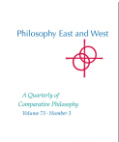

Can Cessation Be a Cognitive State? Philosophical 

 Implications of the Apophatic Teachings of the Early Buddhist Nikāyas 

Grzegorz Polak Philosophy East and West, Volume 73, Number 3, July 2023, pp. 740-761 (Article) Published by University of Hawai'i Press DOI:
https://doi.org/10.1353/pew.2023.a903371

For additional information about this article https://muse.jhu.edu/article/903371 CAN CESSATION BE A COGNITIVE STATE? PHILOSOPHICAL

IMPLICATIONS OF THE APOPHATIC TEACHINGS OF THE EARLY
BUDDHIST NIKĀYAS
Grzegorz Polak Institute of Philosophy, Maria Curie-Skłodowska University in Lublin grzegorz.m.polak@gmail.com

## Introduction

The notion of cessation (nirodha) occupies an important place in the early Buddhist Nikāya texts. While the cessation of suffering (dukkhanirodha)
constitutes the content of the third noble truth, there are numerous passages that emphasize the soteriological necessity of cessation or of the nonoccurrence of various elements that were traditionally considered psychophysical constituents of an individual being. While the term nirodha is used most often in this context, a similar notion is sometimes expressed in other ways and by using other terms (e.g., vibhava). It is often presented as part of a formula that might be termed "dependent cessation" and is the reverse of a scheme of dependent origination (e.g., SN 12.1 / II 1–2). Thus, the cessation of ignorance is said to bring about the cessation of several successive elements of the twelvefold formula including elements such as saṅkhāra-s, consciousness, name-and-form, and feeling.

Even the world (loka) itself is meant to undergo cessation in order for the practitioner to reach the end of suffering. In a famous fragment of the Rohitassa Sutta (SN 2.26 / I 61) the Buddha declares the cessation of the world (lokanirodho) within the fathom-long body endowed with perception and mind (kal.evare sasaññimhi samanake). In the Loka Sutta (AN 4.23 / II
23–24) the cessation of the world is said to be realized (sacchikato) by the Tathāgata, while the Kaccānagotta Sutta (SN 12.15 / II 16–17) speaks of seeing the cessation of the world as it is (yathābhūtaṃ), by the means of right understanding (sammappaññāya).

Cessation as a Special Meditative State One possible, most straightforward way of explaining this cessation is by placing it after the death of a liberated person. The other potential explanation could be that such cessation simply refers to the impermanence or momentariness of the five aggregates and the six sense bases. However, several texts speak explicitly about cessation or non-occurrence of various elements considered to be constitutive of a human being, which takes place during the life of an individual, in a special meditative state. In the Kāmaguṇa Sutta (SN 35.117 / IV 97–101) the Buddha states that a base should be known (āyatane veditabbe) where the senses and perceptions
(saññā) of their respective objects cease (nirujjhati). According to Ānanda's explanation contained in the same text, the Buddha's statement concerns cessation of the six (sense) bases (sal.āyatananirodhaṃ).

In the Nimokkha Sutta (SN 1.2 / I 2) the Buddha states that it is by the extinction of perception and consciousness (saññāviññāṇasaṅkhayā) and by the cessation and appeasement of feelings (vedanānaṃ nirodhā upasamā)
that he knows a state of emancipation, release, and seclusion for beings.

One could perhaps argue that this text refers to the final liberation happening after the death of an individual. The Buddha, however, says that he "knows" (jānāti) this state, which suggests that he must have experienced it in his life. The fragment therefore suggests the possibility of the nonoccurrence of three mental aggregates: feeling, perception, and consciousness. The Pot.t.hapāda Sutta (DN 9 / I 178–203) describes a state in which one does not intend (ceteti) or construct (abhisaṅkharoti) and one's perceptions cease (saññā nirujjhanti). This implies cessation of the aggregates of saṅkhāra and saññā.

Finally, the Dutiyasikkhattaya Sutta (AN 3.91 / I 235–236) contains a seemingly paradoxical statement that with the cessation of consciousness
(viññāṇassa nirodhena) the release of the mind (vimokkho hoti cetaso) is like the extinguishing of a lamp.

Some Nikāya texts explicitly express the awareness of the paradoxicality of this state. Texts such as the Saddha Sutta (AN 11.9 / V 332), the Saññā Sutta (AN 11.7 / V 318), and the Kalahavivāda Sutta (Snp 4.11 / 862–877)
use apophatic strategy to express the paradoxical mode of cognition resultant from suspending saññā. All possible modes of being conscious
(saññī) of the elements constituting the world of our experience are denied, and yet the texts emphasize that one would continue to remain cognizant in some way (saññī ca pana assā).1 Therefore, such a state should be equated not with ordinary insentience but with some special form of cognition. Some texts even go as far as to describe cessation as a state of the highest insight. This in particular concerns the cessation of perception and feeling
(saññāvedayitanirodha). According to stereotypical interpretations, the attainment of cessation is a state "akin to a vegetative coma" (Sharf 2018, p. 828)
and involves the "complete cessation of all cognitive activity" (Coseru 2012, p. 64). However, its stock description in the Nikāyas contains a phrase suggesting its cognitive character, as it reads: "having seen (disvā) by means of understanding (paññāya), the effluents (āsavā) are exhausted (parikkhīṇā)"
(e.g., MN 26 / I 175).

Dealing with the problem of cessation in the context of the Nikāyas means working with a very complex and diverse group of texts. The purpose of this essay is not, however, to establish which of the ideas regarding cessation are earlier, "authentic," or to reconstruct their evolution. One must agree with Ruppert Gethin (2020, p. 67) that sometimes "scholarly judgements about what is earlier and later amount to little more than intuitions or preferences."
What matters for our purpose is that we can identify a substantial stratum of apophatic teachings in the Nikāyas, in which cessation or non-occurrence of the elements traditionally considered to be constitutive of a human being can be explained neither in terms of liberation after death nor by insentience or momentariness. It is, rather, a very special type of cessation occurring during the life of an individual.2 The fact that the above-mentioned Nikāya fragments offer various names and descriptions for such states should not be taken as meaning that they refer to different states. For example, Gethin
(2020, p. 19) suggests that it is likely that the state of cessation described in the Pot.t.hapāda Sutta indicates "what is elsewhere in the Nikāyas called 'the cessation of perception and feeling'." It is natural to expect that the obscure and ineffable nature of such states would make the development of any uniform terminology a problematic task. What matters for the purpose of this essay is that they are all apophatically described states of cessation or nonpresence of elements traditionally considered constitutive of a human being and are described as an absolute apex of meditational progress.

The very notion of such a state raises several very interesting philosophical questions. What is it that actually undergoes cessation? What type of insight can take place in this state? Exactly by what mechanism does cessation occur? What is the first-person content of this state and is it expressible in language? Is there anything that it is like to be in a state of cessation? The Nikāyas do not discuss these issues in an explicit and systematic way. It may be argued, however, that the concept of cessation is grounded in a particular philosophical understanding that may be reconstructed.

From what we have already stated, some apophatic statements in the Nikāyas appear highly specific and challenge commonsense views about human consciousness. Critical research by several scholars in recent decades has also shown several ideas in the Nikāyas to be markedly different from their later interpretations within the later Theravāda doctrine.3 This makes their reconstruction a particularly difficult task.

In this essay, a cross-cultural comparative perspective will be employed in dealing with these issues. This is not meant to take away from the value of later exegetical and philosophical works within the Buddhist tradition.

However, engaging the problem of cessation in the Nikāyas from the standpoint of modern Western philosophy of mind may offer certain interesting fresh insights that can enrich our understanding of this state.

Modern philosophy of mind draws heavily from new developments within the natural sciences, such as brain studies, which were generally unavailable to philosophers of previous centuries. This gives it a stronger empirical basis and provides perspectives that were impossible before. What could be the potential benefits of employing this comparative perspective in our case?

First of all, it is interesting to consider whether the ideas connected with the Nikāya notion of cessation have any parallels in modern philosophy of mind. Furthermore, could states such as cessation even be considered possible from the perspective of modern philosophy of mind? Dealing with this issue requires an attempt to express early Buddhist ideas by using modern philosophical terminology. Of course, the Nikāyas do not contain direct Pāli equivalents of several key terms occurring in modern Western philosophy, such as: "content," "cognitive mechanism," or "phenomenal."
However, a case can be made that the ideas behind these terms can still be found in the Nikāyas, although they may function in an implicit form or be expressed in a way that is specific to these texts.

Second, a comparative approach may prove particularly useful when dealing with Nikāya ideas about the mind that may at first appear counterintuitive or even at odds with common sense. Several such ideas are connected with the notion of cessation. However, many theories of modern philosophy of mind are also counterintuitive and strongly challenge what they label as "folk psychology." The awareness that certain parallel ways of thinking about mental functioning may have appeared within modern philosophy of mind and are considered valid may allow one to make better sense of the problematic early Buddhist ideas in question, instead of ignoring them or considering them to be merely forms of religious rhetoric lacking philosophical coherency. In this way, the concept of cessation can be made more comprehensible for the modern reader.

It needs to be pointed out, however, that the results of any such reconstruction will not necessarily represent the Nikāyas as a whole. The meaning of one or a particular group of texts should not be easily generalized into a whole canon, as it may be the result of the work of different authors and express different ideas.4 But at the very least we can identify certain strata of texts expressing similar ideas and try to explain them. However, one should also not reject out of hand the possibility that there is a far-reaching doctrinal unity underlying the majority of the concepts expressed in the Nikāyas. Of course, absolute certainty is probably unachievable in early Buddhist research, and the ideas put forward in this essay must be viewed as hypotheses, regardless of how well they are argued. Still, it can be claimed that there is value in the very raising of awareness about some problems that have perhaps not been given enough attention so far, and in considering their potential philosophical implications.

What, then, is the philosophical position implied by the cessationist teachings? First, let us notice that the cessation of elements belonging to the sets of the khandha-s or the sal.āyatana-s clearly does not entail an annihilation or disappearance of the person who undergoes these states. Such a person can after all still be observed from the third-person perspective. This implies that the authors of the texts describing this state did not consider the elements in question to be objective, mind-independent entities constitutive of a human being. Rather, the possibility of their cessation suggests their subjective and phenomenal nature.

Such an interpretation of at least four so-called "mental" khandha-s that are often said to undergo cessation does not immediately seem very problematic. Several early Buddhist scholars (e.g., Gethin 1986; Hamilton 2000) have already argued that the set of the khandha-s was not meant to serve as a comprehensive analysis of the human being as an object, but rather represents phenomenal and experiential understanding (Wynne 2010).

This interpretation is, however, more problematic regarding the six senses from the sal.āyatana set. Some later Theravāda authors like Ācariya Anuruddha describe the senses in a way that suggests their objective nature
(see Bodhi 2000a, pp. 237–239). How could senses conceived in such a way be directly experienced if they are objective conditions for experience itself? Some texts, such as the Channovāda Sutta (MN 144 / III 263–266),
are, however, clear that the senses and their respective contacts may be experienced as they really are, and, what is even more important, one can experience their cessation. In an interesting contribution, Cintita (2018, p. 7) suggests that the dichotomy of the sense faculties and of their respective objects may be an early Buddhist way of expressing the idea of a bifurcation of the original, neutral experience into a subjective and objective sphere, which is a sort of cognitive distortion. The notion of contact (phassa) is a result of this distortion, as it "presupposes subjective and objective realms."
The other key aspect of the khandha-s and the sal.āyatana-s is that the experience that they mediate is expressible in language. Nikāya texts show awareness of the issue of the range of language and of its limitations. In the Mahākot.t.hika Sutta (AN 4.173 / II 161–162), every potential statement concerning the issue of what remains after the cessation of the six bases of contact is met with the stern warning: "do not say so, friend" (mā hevaṃ, āvuso), which suggests that the range of language is coterminous with that of the sense bases. Furthermore, the range of the six bases of contact is said to be synonymous with the range of conceptual proliferation (papañca), and the latter is strongly connected with the activities of language.

All these considerations about the subjective and phenomenal character of the khandha-s and the sal.āyatana-s may be extended to the Nikāya notion of the world itself. The world is actually often explicitly identified with the six sense bases (e.g., SN 35.68 / IV 39–40) and, as we have noted, may also itself undergo cessation.5 The Lokantagamana Sutta (SN 35.116 /
IV 93) explains that the "world" is that by which one is conscious of the world (lokasaññī) and conceives the world in one's mind (lokamānī). The Sammidhilokapañhā Sutta (SN 35.65 / IV 39) seems to equate the world with its linguistic concept (lokapaññatti), which again suggests the vital link between phenomenality and expressibility.

## Does Cessation Involve The Mind?

Cessation of the four mental khandha-s could perhaps be conceived simply as a form of insentience or unconsciousness. This is after all a stereotypical interpretation of saññāvedayitanirodha, found so often in modern literature
(e.g., Coseru 2012, p. 64; Sharf 2018, p. 828). But then, how do we account for the form of paradoxical cognition said to occur in this state by at least some texts? Eviatar Shulman (2014, p. 33) is right in pointing out that "the name 'cessation of perception and feeling' itself does not necessarily imply a cataleptic-like state devoid of content" and that "we could conceive of a conscious state . . . which still maintains a degree of awareness." The possibility of rethinking nirodhasamāpatti as "one of the earliest ways that Buddhist practitioners attempted to make sense of the ineffable liberatory experience" has been suggested by Daniel M. Stuart (2013, p. 43).

It is interesting to consider whether at least some aspects of the original understanding of this state as cognitive in nature may have been preserved by some of the non-Therāvadins. Griffiths (1986, pp. 67–68, 125) brings attention to the fact that Bhadanta Vasumitra considered nirodhasamāpatti to be sacittakā (endowed with mind).6 Perhaps we can take Vasumitra's position as an inspiration for further investigation. Could citta operate independently of the mental khandha-s? At first look this notion seems so improbable that one is tempted to reject it straightaway. It definitely goes against the general understanding within Buddhist history, which identifies citta with viññāṇa. For example, Ghosaka has opposed Vasumitra's argument on the grounds that the persistence of viññāṇa in this attainment would make the cessation of saññā and vedanā impossible (see Griffiths 1986, pp. 66–67). His counterargument assumes that citta and viññāṇa have the same denotation, and that the latter is inseparable from saññā and vedanā, which undergo cessation. Therefore, citta would also have to cease.

Such a position is not without basis in the Nikāyas, regarding both the synonymity of citta and viññāṇa (SN 12.61 / II 94–95) and the inseparability of the latter from saññā and vedanā (MN 43 / I 292–298).

Since ancient Buddhists considered the whole canon to be equally right and infallible, such unequivocal explicit statements pretty much settled the case. However, there are several other texts that imply the possibility of separation of the mind from the mental khandha-s, including viññāṇa. The

already mentioned Dutiyasikkhattaya Sutta considers cessation of viññāṇa to be synonymous with the liberation of the mind. The Vāhana Sutta (AN
10.81 / V 151–152) speaks of the Tathāgata dwelling with a dissociated mind and detached from all the khandha-s. The Jhāna Sutta (AN 9.36 / IV
422–426) mentions the mind being turned away (pat.ivāpeti) from all the five aggregates.7 In the Mūlapariyāya Sutta (MN 1 / I 1–6), it is said that the Arahants and the Buddhas "directly know" (abhijānāti) various elements as opposed to perceiving them (sañjānāti), which implies that they cognize without the medium of saññākkhandha.

Furthermore, a deliberate effort seems to have been made in the Nikāyas to use the terms citta and viññāṇa consistently in different contexts. For example, citta is always used in a functional context, as a mental faculty that can be used to produce some cognitive effect or has a particular quality enabling or hindering its function (e.g., DN 2 / I 76). Unlike viññāṇa, it is never described as having a phenomenal qualitative content associated with a particular sense modality8 such as the gustatory qualities of bitter, sweet, and sour (SN 22.79 / III 87–91). Also, unlike viññāṇa, citta is never explicitly said to be subject to cessation, which is particularly important in our case.

The distinction between mind and consciousness goes very much against the commonsense view, which in general identifies these two mental faculties. However, in certain strands of modern philosophy of mind, globally available phenomenal consciousness is distinguished from the mind in general, which is describable in functional terms. (e.g., Baars 1997; Metzinger 2009; Carruthers 2015). According to such a view, consciousness is not the locus of actively cognizing and processing data, but rather a particular way of representing it throughout the cognitive system. One of the major developments of modern philosophy of mind is that many crucial aspects of our cognition occur in a way that is inaccessible to our selfreport, reflection, long-term memory, and speech. These aspects are usually labeled as "unconscious," although this implies a particular definition of consciousness that, while intuitive, is not without problems and hidden assumptions. It is probably safest to label them as not being globally available.9 To use a common way of speaking, "we" cannot directly observe these processes, remember them, or talk about them. What we can directly observe in a phenomenal way are their end-products. Therefore, it makes little sense to define the function of consciousness as that of cognizing.

According to philosophers such as Baars (1997, pp. 157–164) or Carruthers
(2015, p. 2), the functional importance of particular data being "conscious" lies in their global availability, meaning that the output of a particular module may become available to other modules. Thus, the original output may be further processed, reflected upon, reported in speech, and stored in long-term memory. It is generally accepted that phenomenal consciousness correlates or is co-extensive with, global broadcasting (see Carruthers 2015, p. 49).

The processes that are not globally available cannot be described from the first-person perspective in terms of their phenomenal contents. They may only be analyzed from the third-person perspective in functional terms, or one can provide the biological account of their neural correlates.

Could it be that through the notion of khandha-s the Nikāya authors wanted to convey an idea of various aspects of our globally available, ordinary phenomenal consciousness, while citta corresponded to the mind in a general, functional sense? Applying this understanding to the Nikāya texts could help to make sense of the distinction between citta and the mental khandha-s in the texts we have been analyzing. The same could be said regarding the sal.āyatana-s, since, as Bhikkhu Bodhi (2000b, p. 1122)
points out, they offer "an alternative to the five aggregates as a scheme of phenomenological classification." Instead of being objective physical senses, they may represent basic modalities of phenomenal consciousness: seeing, hearing, tasting, smelling, and touching, which are responsible for the unique and mutually irreducible qualities of phenomenal experiences connected with the particular senses (e.g., red, blue, sour, bitter). The activity of the objective physical senses, on the other hand, can be explained in fully functional, third-person, quasi-physicalist terms of data processing. Therefore, the cessation of phenomenal sensory modalities need not entail nonfunctioning of their physical counterparts.

## Limitations Of Ordinary Phenomenal Consciousness As A Medium Of Cognizing Reality

We should now consider another question: why would a state of cessation be conducive to the soteriological goals of Buddhism? A permanent transformation is usually connected in the early Buddhist texts with the notion of liberating insight variously described as seeing things as they really are (yathābhūtaṃ), in the visible state of things (dit.t.hevadhamme), so that merely the seen will be in the seen (SN 35.95/IV 73: dit.t.he dit.t.hamattaṃ bhavissati). Can this perspective be harmonized with the apophatic trend emphasizing the necessity of the cessation of the elements constituting the subjective world of the practitioner? Could cessation somehow contribute to the cognitive goal of seeing things as they are?

Let us assume that we are right in seeing the khandha-s and the sal.āyatana-s as corresponding to various aspects of globally available phenomenal consciousness. Is there then something inherently wrong with that type of consciousness that prevents it from being the medium to achieve a pure cognition of reality as it really is? Metzinger (2009, p. 207) argues that phenomenal consciousness is a sort of virtual reality, a representational phenomenon, and one cognizing through its medium is lacking direct contact with outside reality. This in itself is hardly problematic, as there is simply no way for a complex biological organism to cognize reality without

representing it in its cognitive system, starting with the sense organs, through the neural pathways, and up to primary and secondary centers in the brain.

The issue, however, is not whether it is possible to cognize without the medium of any representation, but whether a particular mode of representation is faithful or distorted, and whether it can satisfy the Nikāya postulate of
"the seen in the seen," as it is here and now. Can ordinary phenomenal consciousness meet these criteria? Several contemporary philosophers of mind (e.g., Metzinger 2009, pp. 37–38) raise a point that even the very sense of the present moment that we have is an illusion, as ordinary phenomenal consciousness is actually never in touch with the present. The conscious phenomenal experience of space is similarly constructed and not basic in its character, as it requires heavy processing and binding by the unconscious modules of the disjointed data from different senses (including sensations associated within the body, as well as visual and auditory input) to create an impression of being in a three-dimensional space (see Marchetti 2014, pp. 11–12).

Several contemporary philosophers of mind believe that working memory is a crucial element for the generation of a phenomenal conscious experience. As Dietrich (2004, p. 749) sums up, "the view emerging from the cognitive and neuroscientific literature is that memory contains the content of consciousness." Working memory is considered a sort of workspace that holds a certain amount of data for some time in order to bind and process it successfully.

Ordinary experience through the medium of phenomenal consciousness is therefore not the experience of the here and now as it really is, or, to put it metaphorically, of the knife-edge present. It is in fact always a little behind the physical present. What we believe to be the present is in fact a processed memory of a very recent past. It is, however, not merely the question of temporary delay. There also seems to exist an organic relationship between ordinary phenomenal experience and the feeling of selfhood or ego. According to Metzinger (2009, p. 8), "the ego is the content of the phenomenal self-model at any given moment (which includes bodily sensations, emotional state, perceptions, memories, acts of will, thoughts)."
Ordinary phenomenal consciousness is thus not just a disjointed sum of various sensory phenomena, as it forms a highly coherent personal narrative.

As Oakley and Hilligan (2017, p. 7) note, the self-referential perspective, which provides for the sense of agency, ownership, and autobiographical time, is introduced by various unconscious construction processes. It is very important to emphasize that at least from the perspective of an ordinary person, there is no direct way to attend to these construction processes as they all occur in a globally unavailable way. Only the end-result of these processes is available in the form of heavily constructed phenomena infused with the notion of selfhood. There seem to be no pure, unprocessed selfless phenomena immediately available to the simple act of deliberate attention or by means of adopting any particular perspective of observing. Garfield
(2015, p. 210) emphasizes the fact that even the supposedly fundamental subjectivity characterizing our experience is constructed by unconscious cognitive processes, which "lie below the level of introspectability."
Could ordinary phenomenal consciousness be cleansed of its distortion, so that only pure, selfless phenomena remain? Sharf (2018, p. 28) believes that the elimination of factors that "attend upon and shape conscious experience . . . does not result in a more luminous or transparent state of pure consciousness, so much as in the progressive attenuation of consciousness itself." The above-mentioned statements by Garfield and Sharf have been made in the context of specific scholarly debates and do not directly refer to early Buddhist context. However, they agree quite well with some important recent developments within cognitive science and should at least be taken into consideration. Supposing for the sake of argument that they are true, would it not make the early Buddhist postulate of direct cognition of reality ultimately impossible? Such a conclusion would rest on the commonsense assumption that being phenomenally conscious is the only way in which one can be cognizant. However, as we shall see, this is not necessarily the case.

## Does Cessation Occur In Ordinary Life?

Can cognition occur in the absence of phenomenal consciousness, or should it be considered merely a hypothetical model? A real-life example of such a phenomenon may be found in blindsight, where an intuitive, tacit knowledge about a visual object is not accompanied by phenomenal consciousness of it.10 Even more relevant for our issue is a paper by Jeff Warren
(2013), which contains information about certain present-day meditators reporting occurrences of "cessation," or "annihilation," during which "mind, body and the world just collapsed" and "time and space [were] punctuated with nothing," sometimes multiple times a day during ordinary activities like walking down the street or driving a car, without any apparent detriment to their efficiency. Here, the non-occurrence of reportable phenomenal consciousness coincides with an unimpeded efficient functioning in real-life situations. Nonetheless, blindsight and the occurrences reported by Warren are very special states limited to a small number of individuals and occasions.

A case can be made, however, that each of us actually undergoes many such moments of "cognitive cessation" on a constant basis but we simply do not know it.11 Although such a notion is highly counterintuitive, it is not without support. Baars and Franklin (2007, p. 959) have suggested that "conscious cognition occurs as a sequence of discrete, coherent episodes separated by quite short periods of no conscious content." Drawing from the results of

recent empirical studies on monkey brains, Naccache (2018, p. 7) considers the possibility that during conscious wakefulness, "a form of high-level filling-in process may join discrete conscious states separated by short periods of unconsciousness into what we subjectively experience as a continuous stream of consciousness." In other words, we would be conscious only during "temporal islets interspersed with unconscious states."
Dean Buonomano (2017) notes that "while the unconscious brain continuously samples and processes information about events unfolding in time, consciousness itself is generated in a highly discontinuous manner." The paradox connected with such moments of temporary cessation of phenomenal consciousness is that we have no way of becoming positively aware of them due to their non-introspectable, globally unavailable character, which makes them unconscious according to the standard criteria (see Garfield 2015, p. 174).

Second, such cessations may simply be too short to be noticed. Only if the density of such moments was relatively high during a particular period could one perhaps notice something peculiar in retrospect, like a lesser degree of self-awareness and a relatively small quantity of psychological time that has passed in comparison to the corresponding objective, physical time. That is because the experience of duration is only constituted on the level of a self-reflective phenomenal consciousness (see Zahavi 2005, p. 56),
which is absent in such a state.

Therefore, if the cessation of ordinary phenomenal consciousness occurs regularly within our lives without entailing cognitive insentience, it may very much occur during special prolonged meditative states. It is exactly this prolonged and uninterrupted character of meditative cessation that may contribute to its soteriological efficiency. The ordinary "cessations" that occur during our normal states of consciousness may simply be too short to produce any effect. The other reason may lie in the fact that ordinary cessations are usually connected with a preoccupation with a particular activity or experience. This means that the cognitive resources of the organism are occupied with a particular task and may not be directed toward transformative insight. Meditation, on the other hand, is the state of relative idleness, and the cognitive resources are available for this task.

## Can Cessation Be A State Of Insight?

How could such cessation be a state of insight? We have already accounted for the possibility of cognition occurring in a globally unavailable way, with its content not available for introspection, speech, memory, and reflection.

What several modern philosophers of mind are suggesting is that actually most of our cognition functions in exactly that way. Globally unavailable (i. e., unconscious) information processing is postulated to explain the so-called eureka phenomenon, where we suddenly arrive at a new idea or a solution to a problem after a long period of 'incubation' when it is not considered consciously (see Carruthers 2015, p. 177; Bagassi and Macchi 2016, p. 58).

Baars (1997, p. 31) claims that our expectations and intentions are largely unconscious in detail but guide conscious experience and voluntary action. In addition to deliberate and automatic forms of cognition, which are performed on conscious representations, Shea and Frith (2016) make the case for an automatic cognition, which works on non-conscious representations. In Carruthers' (2015) model, "amodal attitudes," that is, beliefs, desires, judgments, and goals, operate in an unconscious way, with us only becoming aware of their end-results. Carruthers (2015, p. 237) believes that ultimately all decisions we make are in fact unconscious and result from competitive interactions among goals, desires, and action plans. If such complex cognitive operations may operate in an unconscious way, then the notion of an insight occurring in a state of cessation must be considered plausible.

According to our hypothesis, the states of the cessation of the khandha-s or of the sal.āyatana-s could be conceived as states of the cessation of ordinary phenomenal experience, while the mind would continue working in a way that is not globally available. It would, however, be functionally productive. Since this mode of data processing is not available for introspection, report, and memory, its contents would not be effable, at least while one would remain in this hypothetical state of cognitive cessation.

This type of tacit insight could, however, very much result in deep and permanent changes in one's behavior, such as the removal of desire or conceit. It is possible, however, that upon emerging from such a meditative state, one could at least verbalize its directly observable effects (e.g., being in a state free from desire), though not necessarily its content. Such a model fits well with the accounts of apophatic meditative states in the Nikāyas, and in particular with that of cessation of perception and feeling.

## The Mechanism Of Cessation

Let us now consider the issue of the cognitive mechanism by which cessation could occur. We have already considered the idea that ordinary phenomenal consciousness does not keep up with the present and is generated in a highly discontinuous manner and consists of discrete episodes separated by quite short periods of a non-introspectable and nonreportable character. We can therefore hypothesize that cessation could perhaps be conceived as a state of cognition keeping up so faithfully with the knife-edge present, albeit in a globally unavailable way, that there simply would be no space for ordinary phenomenal consciousness to be generated. We have already noted that the generation of ordinary phenomenal consciousness entails momentarily losing contact with the present and creating a snapshot of sorts of the very recent past, and that on a functional

level it involves working memory. The Udayamāṇavapucchā (Snp 5.13 /
214-215) contains a line about a particular way of practicing mindfulness
(satassa carato) toward feelings, causing consciousness to cease (viññāṇaṃ uparujjhati). In light of our theory, it would make sense that perfect mindfulness able to keep up with the knife-edge present would not allow an ordinary phenomenal consciousness to interfere. Zahavi (2005, p. 56) notes:
"had our perception been restricted to being conscious of that which exists right now, it would have been impossible to perceive anything with temporal extension and duration." The latter qualities are considered to be key features of phenomenal consciousness. Thus, there would simply be no opportunity for it to arise, as any instance of its arising would entail an interruption of the "knife-edge" present.

However, we have also suggested that one may not be able to straightforwardly attend to the pre-constructed, raw present since it is not immediately given. The state of being aware of the present to such an extent that ordinary phenomenal consciousness has no place to interrupt should be seen rather as an end stage than as a starting point of the process. One may hypothesize that cessation would rather be reached by a gradual suspension of higher-level constructive processes responsible for several key features of our phenomenal consciousness, while lower, more basic processes would remain unimpeded. Therefore, during cessation one would not merely become unaware of the khandha-s, which would, however, continue in the background. Rather, they would cease due to suspension of the constructive processes that made them possible in the first place. In an interesting contribution, Dietrich (2003, p. 237) argues that higher-level associative processes could be turned off without ensuing inactivity of the lower-level ones. The suggested mechanism by which this could occur is that of deregulation of the prefrontal cortex, that is, hypofrontality, which would enable "the temporary suppression of the analytical and meta-conscious capacities of the explicit system." The processing of lower-level structures would not in any way be changed; their content would simply no longer be elaborated by the higher structures.

Of course, such cessation should not be conceived as occurring in isolation from other elements of the Buddhist practical path. Quite the contrary, the gradual suspension of the processes constitutive of ordinary phenomenal consciousness would probably start during the meditative stages preceding cessation, namely the formless (arūpa) states and the jhāna-s. These latter states should in turn be seen as a harmonic extension and culmination of a particular way of life and mindset, namely Buddhist sīla. Of particular importance would be the practice of faculty restraint (indriyasaṃvara) and especially the attitude of not grasping at signs (na nimittaggāhī), which when developed and intensified could initiate a process that would ultimately culminate in cessation. And this is exactly the way cessation is presented in many early Buddhist texts: not as an isolated mental state, but as an apex of a gradual practical path. Furthermore, one can hypothesize that experiencing cessation of the khandha-s or the sal.āyatana-s, while remaining cognizant in another way, would facilitate disidentification with phenomenality, that is, seeing it as not-self. Thus, cessation should be seen as connected organically with other elements of early Buddhist soteriology.

The Cognitive Content of Cessation and the Issue of Its Expressibility What would be the inner content of such a state of cognitive cessation? We have already suggested the possibility of viewing it as a state of insight, and of "seeing things as they are." However, what would such a general statement mean on a more detailed level? How are things really, according to Nikāya texts? So far, we have been referring heavily to the results of modern cognitive science, which suggest that the basic level of cognition is connected to a particular way of brain functioning. Such considerations may create an impression that the view of reality emerging from the early Buddhist texts is a realistic one, as it assumes the existence of a mindindependent space occupied by bodies and other objects. After all, such a view is pretty much implied by modern natural science. Therefore, would it not imply that things, as they really are, are simply bodies, albeit selfless and impermanent ones? This, however, is at odds with the radically apophatic approach of several Nikāya texts. Instead of describing the content of the state of cessation in first-person, quasi-realistic terms, all the basic categories characterizing our experience are being apophatically denied, including those of long and short, subtle and gross, ugly and beautiful (DN 9 / I 223: dīghañca rassañca, aṇuṃ thūlaṃ subhāsubhaṃ),
below and above (Snp 1.1 / : orapāraṃ), here (idha), there (huraṃ), and inbetween both (SN 35.95 / IV 72: ubhayamantarena). There is an insistence on the ineffability of the highest meditative and liberative states and even on their inconceivability. According to the Acinteyya Sutta (AN 4.77 / II 80),
the scope of the Buddha (buddhavisayo) is said to be unthinkable (acinteyyo) and should not be thought about (na cintetabbo). There would be no reason for such an approach had these texts assumed a commonsense realistic worldview.

What may be implied in the unsystematic way in the Nikāyas is that a view of reality consisting of bodies and objects is dependent on a particular way of cognitive processing, and as such is not reflective of objective reality.

We may see the world as consisting of bodies and objects occupying time and space and connected by causal relations, because this is how our phenomenal consciousness is structured. Such an interpretation would make sense in the context of the controversial line from the Kalahavivāda Sutta
(Snp 4.11 / 170) that rūpa vanishes when all modes of being percipient
(saññī) are gone, since proliferated concepts (papañcasaṅkhā) are based on saññā (see Ronkin 2005, pp. 246–247, and Wynne 2015, p. 229, for a

discussion of this fragment). The idea that even such basic categories as time, space, substance, and cause are reflective of the structure of the mind and not that of noumenal reality is a Kantian one. The tendency of seeing parallels between early Buddhism and the Kantian view of the world is present in Hamilton (2000). In a similar vein, Wynne (2010, 2015) has argued for an antirealist reading of the early Buddhist ideas. While it is difficult to find explicit and detailed expression of such views in the Nikāyas, a case could be made for their implicit presence as the backdrop of some early Buddhist ideas that would otherwise be difficult to comprehend.

Such is the case with the notion of the undeclarable views (avyākata). It is difficult to understand why these views would be considered undeclarable if the early Buddhist texts would imply a direct realistic worldview. If, however, the notions of time, space, substance, or cause-and-effect are only relevant within the realm of phenomenal experience, then this means that the questions regarding the existence of the Tathāgata after death are based on incorrect assumptions. That is because they apply the categories of phenomenal experience to that which is beyond it (i.e., beyond the khandha-s and the sal.āyatana-s).

The notions of dying, being born, or even being an entity are dependent on more basic categories of time, space, substance, and plurality and would thus be possible only within the phenomenal sphere of experience.12 One may speak about dying only with regard to a particular entity existing in relation to other beings and objects, or void in a spatiotemporal reality.

Perhaps this is the key to understanding the line in the Mahānidāna Sutta
(DN 15 / II 63–64), which seems to equate the mutually conditioning complex of name-form and consciousness (nāmarūpaṃ saha viññāṇena)
with the extent (ettāvatā) to which one can be born, age, and die, pass away, and re-arise on the one hand and with the extent that there is a pathway for designation (adhivacana), language (niruttti), and concept
(paññatti) on the other. The dyad of name-form and consciousness is pretty much synonymous with the five khandha-s (see MN 9 / I 153; SN 12.2 / II
3–4), which, according to our hypothesis, correspond to ordinary phenomenal consciousness. The text thus seems to convey the message that the range of linguistic expressibility coincides with that of ordinary phenomenal consciousness. Thus, cessation of the latter would result in the total ineffability of such a state.

Therefore, the first-person cognitive content of a person in a state of the specific form of cessation that we are considering would not be constituted by the familiar and linguistically expressible reality of bodies and objects. Although during cessation the input provided by the senses could be the same as in the ordinary state,13 due to turning off the higher-level processes of its elaboration it would appear different to such an extent that it would be unimaginable and ineffable from the perspective of ordinary consciousness.

This latter feature seems to be emphasized in the Saddha Sutta (AN 11.9 / V 325), where the deva-s praise a person in a highest apophatic state, by stating that they do not know in dependence on (nissāya) what it is that he meditates (jhāyati).14 There is thus in the Nikāyas a coexistence of the two perspectives of description of a meditator in a state of cessation: a thirdperson cataphatic perspective, where a meditator is said to have a body and senses, and a completely apophatic "inner" perspective in which these categories do not apply. First-person cataphatic descriptions are of course very much present in the Nikāyas in the case of the meditative states in which total cessation of the sal.āyatana-s and the khandha-s has not yet occurred. As we have suggested, these sets can be seen as corresponding to various aspects of globally available phenomenal consciousness. In fact, even third-person functional accounts of a person in a state of cessation are also made in terms of the sal.āyatana-s and the khandha-s, since they are made from the perspective of persons still perceiving reality by their medium.

At this point we may consider the question: is there actually any firstperson content of the state of cessation at all? In other words, is there anything it is like to be in a state of cessation? We have so far avoided equating khandha-s or sal.āyatana-s with phenomenality per se. Instead, we have been more cautious, making a qualification that they may represent ordinary, self-reflective forms of phenomenal consciousness. We cannot be certain if the sets of the aggregates or of the six sense bases exhaust all the possible modes of phenomenality. For example, we do not know for sure whether sal.āyatana-s represent phenomenal sense modalities per se or just their specific form involving duality between subject and object (as argued in Cintita 2018). If the latter option is true, then one can speculate that the Buddhas and the arahants in the state of cessation still experience phenomena, but of a different kind. In other words, there would be something it is like to be in the state of cessation, a unique inner perspective, and the phenomenal content of such a state. While such a position is tempting, it is not without serious problems, however. If there were such a perspective then it should at least be reportable or expressible to the other arahants, through a special language. However, as we have seen, the Nikāya texts are firm in their assertion of the total indescribability of an awakened person.

This leads to another interesting question: would such a state of cessation even be globally available for those who enter it? Could they later recollect this state and reflect on it? Or would it be a blank moment, a gap in the memory record? But if so, would it not therefore mean being like a zombie from the famous mind experiment known from cognitive science where the inner space in which phenomenal experience occurs has gone dark?15 Would it not simply mean being unconscious and entail virtual annihilation of our innermost being? Even if a particular state would be

phenomenally conscious, if it could not be recollected as such, expressed by speech or reflected upon, then from the functional standpoint it could not be distinguished from those usually labeled as phenomenally unconscious. But maybe such an idea of cessation should rather be seen as an inspiration to rethink our notions of who we actually are, and what it means to be conscious? The fact that at a given moment there is no globally available state in a particular person does not necessarily take away anything from the intelligence, agency, and sentience of that person.

Garfield (2015, p. 174) points to the cases of so called "skillful coping," that is, states of absorption or flow, in order to rethink what it means to be conscious. He claims that although in such moments, in the sense of selfreflective phenomenal feeling, there is no consciousness, from the other standpoint "we are most fully engaged, fully present"—and consciousness in a functional sense is most manifest and present. From such a perspective, the early Buddhist cessation would no longer appear to be an annihilation of our inner being or an insentience. Rather, it could be conceived as a cognitive state of being as close to what we really are, and as far as possible from any distorting illusion.

## Notes

This essay was created as a result of research project No. 2018/31/B/HS1/
01324, financed by the National Science Center (NCN) in Poland. I would like to thank the anonymous reviewers for their helpful comments.

Abbreviations are used in the text and Notes as follows:
AN Aṅguttara Nikāya DN Dīgha Nikāya MN Majjhima Nikāya SN Saṃyutta Nikāya Snp Suttanipāta 1 - It seems possible that saññā in this text refers to being conscious in general and does not imply saññākkhandha as an element of the set of aggregates. It might be that the text predates a formation of the fully developed khandha doctrine.

2 - Some scholars have already argued for the presence of such a notion in the Nikāyas (e.g., Ñāṇananda 2016; Harvey 1995; Wynne 2015).

3 - E.g., Harvey 1995; Hamilton 2000; Bronkhorst 2012; Shulman 2014; Wynne 2015; Ñāṇananda 2016.

4 - Shulman (2017, pp. 864–865) finds it probable that within the early Buddhist community there may have been more than one answer regarding the ultimate truth.

5 - Many scholars have noted the specific, subjective notion of the world contained in the Nikāyas; e.g., Harvey 1995, pp. 87–88; Shulman 2014, pp. 69–70; Coseru 2012, p. 67.

6 - Similar considerations may have given rise to the concept of ālayavijñāna of the early Yogācāra-vijñānavādins. Schmithausen (1987, p. 18) claims that the starting point of this concept is found in the discussion of nirodhasamāpatti in the Yogācārabhūmisāstra, attributed to Asaṅga. The text states that ālayavijñāna does not cease during the attainment of cessation. Another relevant fragment of this text differentiates between manas, vijñāna, and citta while identifying the latter with ālayavijñāna (see Schmithausen 1987, pp. 117–127). This can be seen as somewhat paralleling the Nikāya distinction between viññāṇa and citta.

7 - Both texts do not use the term citta, but ceto, which is pretty much synonymous with it (see Rhys Davids and Stede 2007, p. 268).

8 - Viññāṇa is open to a phenomenological reading, as something which makes a state phenomenally conscious (see Davis and Thompson 2013, p. 589).

9 - Siderits (2011, p. 325) characterizes global availability as the availability of the object for systems like memory, speech, desire, and actionguidance.

10 - See Siderits 2020, pp. 205–206, for a discussion of blindsight.

11 - It is interesting to consider that a similar idea may have been implied by the concept of "cessation through absence of observation" (apratisaṅkhyā(ya)nirodha) present in the third-century text on meditation, the Saddharmasmr.tyupasthānasūtra (see Stuart 2015, p. 452).

12 - See Wynne 2010, pp. 155–156, for a more detailed presentation of this view.

13 - See Hamilton (2000, p. 77), who interprets the words indriyāni vippasannāni contained in a discussion of attainment of cessation in MN 43 / I 296 as meaning that a person in this state "has 'purified his senses'" and that "apperception with 'purified senses' is . . . a feature of insight."
14 - Perhaps the enigmatic statement in the Brahmajāla Sutta, (DN 1 / I 46)
that gods and men see the body of the Tathāgata as long as he lives but its cord to becoming is cut off (ucchinnabhavanettiko), may be interpreted in a similar vein. If, as we have suggested, one can meaningfully speak of becoming only in the context of the subjective phenomenal world of experience constituted by the khandha-s or the sal.āyatana-s, then an individual in whom these elements have ceased could be described as having his "cord to becoming cut off," while his

body could still be observed from the perspective of those cognizing through the medium of ordinary phenomenal consciousness.

15 - The notion of enlightened persons as zombies or "Robo-Buddhas" is tentatively and somewhat provocatively considered by Siderits (2011, pp. 329–330).

## References

Numerical references to Pāli source texts use a twofold system. A reference to the number of a text is given before the slash, while a reference to the page of the Pali Text Society edition is provided after the slash. Numbering of the suttas used before the slash follows the scheme used at https://suttacentral.net/
Primary Sources (Original Text)
Chat.t.ha Saṅgāyana Tipit.aka, Version 4.0 (CST4). Vipassana Research Institute. Accessed February 11, 2022. Online at http://tipitaka.org Secondary Sources (Essays and Articles)
Baars, Bernard J. 1997. "In the Theatre of Consciousness: Global Workspace Theory, a Rigorous Scientific Theory of Consciousness." Journal of Consciousness Studies 4:292–309.

Baars, Bernard J., and Stan Franklin. 2007. "An Architectural Model of Conscious and Unconscious Brain Functions: Global Workspace Theory and IDA." Neural Networks 20:955–961.

Bagassi, Maria, and Laura Macchi. 2016. "The Interpretative Function and the Emergence of Unconscious Analytic Thought." In Cognitive Unconscious and Human Rationality, edited by Laura Macchi, Maria Bagassi, and Riccardo Viale, pp. 43–76. Cambridge, MA: MIT Press.

Bodhi, Bhikkhu. 2000a. A Comprehensive Manual of Abhidhamma:
The Abhidhammattha Sangaha of Ācariya Anuruddha. Onalaska: BPS
Pariyatti Editions.

———. 2000b. The Connected Discourses of the Buddha: A New Translation of the Saṃyutta Nikāya. Boston: Wisdom Publications.

Bronkhorst, Johannes. 2012. Absorption: Human Nature and Buddhist Liberation. Wil/Paris: University Media.

Buonomano, Dean. 2017. Your Brain Is a Time Machine: The Neuroscience and Physics of Time. New York and London: W. W. Norton and Company.

Carruthers, Peter. 2015. The Centered Mind: What the Science of Working Memory Shows Us about the Nature of Human Thought. New York:
Oxford University Press.

Cintita, Bhikkhu. 2018. "What Is the Eye?" DhammāNupassanā Series.

Accessed February 11, 2022. https: //bhikkhucintita.files.wordpress.com/
2018/04/sixspheres.pdf Coseru, Christian. 2012. Perceiving Reality: Consciousness, Intentionality, and Cognition in Buddhist Philosophy. New York: Oxford University Press.

Davis, Jake H., and Evan Thompson. 2013. "From the Five Aggregates to Phenomenal Consciousness: Towards a Cross-Cultural Cognitive Science." In A Companion to Buddhist Philosophy, edited by Steven. M.

Emmanuel, pp. 585–598. Malden: Wiley-Blackwell.

Dietrich, Arne. 2003. "Functional Neuroanatomy of Altered States of Consciousness: The Transient Hypofrontality Hypothesis." Consciousness and Cognition 12:231–256.

———. 2004. "Neurocognitive mechanisms underlying the experience of flow." Consciousness and Cognition 13:746–761.

Garfield, Jay L. 2015. Engaging Buddhism. New York: Oxford University Press.

Gethin, Ruppert. 1986. "The Five Khandhas: Their Treatment in the Nikāyas and Early Abhidhamma." Journal of Indian Philosophy 14, no. 1:35–53.

———. 2020. "Schemes of the Buddhist Path in the Nikāyas and Āgamas."
In Mārga: Paths to Liberation in South Asian Buddhist Traditions, edited by Cristina Pecchia and Vincent Eltschinger, pp. 5–77. Vienna: Austrian Academy of Sciences Press.

Griffiths, Paul J. 1986. On Being Mindless: Buddhist Meditation and the Mind-Body Problem. LaSalle, IL: Open Court.

Hamilton, Sue. 2000. Early Buddhism: A New Approach. Richmond, Surrey:
Curzon Press.

Harvey, Peter. 1995. The Selfless Mind: Personality, Consciousness and Nirvana in Buddhism. Richmond, Surrey: Curzon Press.

Marchetti, Giorgio. 2014. "Attention and Working Memory: Two Basic Mechanisms for Constructing Temporal Experiences." Frontiers in Psychology 5 (880):1–15.

Metzinger, Thomas. 2009. The Ego Tunnel: The Science of the Mind and the Myth of the Self. New York: Basic Books.

Naccache, Lionel. 2018. "Why and How Access Consciousness Can Account for Phenomenal Consciousness." Philosophical Transactions of the Royal Society B 373:20170357. http://dx.doi.org/10.1098/rstb.2017.0357 Ñāṇananda, Kat.ukurunde. 2016. Nibbāna—The Mind Stilled: Library Edition
(Sermons 1–33). Sri Lanka: Kat.ukurunde Ñāṇananda Sadaham Senasun Bhāraya.

Oakley, David A., and Peter W. Halligan. 2017. "Chasing the Rainbow: The Non-conscious Nature of Being." Frontiers in Psychology 8:1924. https://
doi.org/10.3389/fpsyg.2017.01924 Rhys Davids, Thomas W., and William Stede. 2007. The Pali-English Dictionary. Springfield, VA: Nataraj Books.

Ronkin, Noa. 2005. Early Buddhist Metaphysics: The Making of a Philosophical Tradition. New York: RoutledgeCurzon.

Schmithausen, Lambert. 1987. Ālayavijñāna: On the Origin and the Early Development of a Central Concept of Yogācāra Philosophy. Tokyo:
International Institute for Buddhist Studies.

Sharf, Robert H. 2018. "Knowing Blue: Early Buddhist Accounts of NonConceptual Sense Perception." Philosophy East and West 68, no.

3:826–870.

Shea, Nicholas, and Chris D. Frith. 2016. "Dual-process Theories and Consciousness: The Case for 'Type Zero' Cognition." Neuroscience of Consciousness 2016, issue 1:1–10. http://dx.doi.org/10.1093/nc/niw005 Shulman, Eviatar. 2014. Rethinking the Buddha: Early Buddhist Philosophy as Meditative Perception. New York: Cambridge University Press.

———. 2017. "Polyvalent Philosophy and Soteriology in Early Buddhism."
Philosophy East and West 67, no. 3:864–886.

Siderits, Mark. 2011. "Buddhas as Zombies: A Buddhist Reduction of Subjectivity." In Self, No Self? Perspectives from Analytical, Phenomenological, & Indian Traditions, edited by Mark Siderits, Evan Thompson, and Dan Zahavi, pp. 308–331. Oxford: Oxford University Press.

———. 2020. Self-Knowledge and Non-Self. In Buddhist Philosophy of Consciousness: Tradition and Dialogue, edited by Mark Siderits, Ching Keng, and John Spackman, pp. 189–208. Leiden and Boston: Brill.

Stuart, Daniel M. 2013. Thinking about Cessation: The Pr.ṣt.hapālasūtra of the Dīrghāgama in Context. Wien: Arbeitskreis für Tibetische und Buddhistische Studien.

———. 2015. A Less Traveled Path: Saddharmasṃrtyupasthānasūtra Chapter 2: Critically Edited with a Study on Its Structure and Significance for the Development of Buddhist Meditation. Volume I. Beijing and Vienna:
China Tibetology Publishing House/Austrian Academy of Sciences Press.

Warren, Jeff. 2013. "How Understanding the Process of Enlightenment Could Change Science." Psychology Tomorrow: Magazine, issue 4.

Accessed February 11, 2022. http://psychologytomorrowmagazine.com/ inscapes-enlightenment-and-science/
Wynne, Alexander. 2010. "The Ātman and Its Negation." Journal of the International Association of Buddhist Studies 33, nos. 1–2:103–171.

———. 2015. "Early Buddhist Teaching as Proto-sūnyavāda." Journal of the Centre for Buddhist Studies 9:213–241.

Zahavi, Dan. 2005. Subjectivity and Selfhood: Investigating the First-Person Perspective. Cambridge, MA and London: MIT Press.