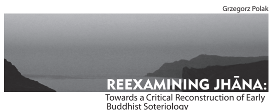

  •  1 REEXAMINING JHĀNA:
Towards a Critical Reconstruction of Early Buddhist Soteriology

  •  3

wydawnictwo uniwersytetu marii curie-skłodowskiej lublin 2011 4  • 
recenzent dr hab. Marta Kudelska prof. UJ
redakcja wydawnicza redakcja techniczna projekt okładki, stron tytułowych, skład Studio Format - studioformat.pl
© Wydawnictwo UMCS, Lublin 2011 druk i oprawa Drukarnia "Tekst" s.j.

ul. Wspólna 19, 20-344 Lublin isbn 978-83-227-3260-1 Wydawnictwo Uniwerystetu Marii Curie-Skłodowskiej 20–031 Lublin, pl. Marii Curie-Skłodowskiej 5 tel. (81) 537 53 04 www.umcs.lublin.pl/wydawnictwo e-mail: sekretariat@wydawnictwo.umcs.lublin.pl dział handlowy tel./fax (81) 537 53 02 e-mail: wydawnictwo@umcs.eu

# Contents

	 	 Abbreviations . . . . . . . . . . . . . . . . . . . 7 Introduction . . . . . . . . . . . . . . . . . . . 9 1.	 Jhāna and **yoga** . . . . . . . . . . . . . . . . . . . 19 1.1 The problem of the jhānas . . . . . . . . . . . . . . . 19
    1.1.1 the general place of jhāna in the buddhist system of meditation . . . . . . . 19
    1.1.2 jhāna in the eyes of the modern theravādin meditation masters . . . . . . . . . 21
    1.1.3 the general overview of the place of jhāna in the suttapit.aka . . . . . . . . . . . 24
    1.1.4 the jhāna controversy . . . . . . . . . . . . . 29 1.1.5 the quest for the earliest stratum of the suttapit.aka . . . . . . . . . . . . . . 32 1.2 The criticized methods of meditation in the Suttapit.aka . . . . . 42
    1.2.1 the lesson of the 'bodhisatta suttas' . . . . . . . 42 1.2.2 the meditative practice of the brahmin pārāsariya . 47 1.2.3 initial conclusions . . . . . . . . . . . . . . 49 1.2.4 the significance of the sandha sutta . . . . . . . 51 1.3 Yogic meditation in the scriptures of the non-Buddhists . . . . . 60
    1.3.1 yogic meditation in the principal upanis.ads . . . . . 60
    1.3.2 yogic meditation in the yoga-sūtras of patañjali . . 64 1.3.3 yogic meditation in the bhavagad gītā . . . . . . 66
    1.3.4 yogic meditation in the yogic upanis.ads . . . . . . 68
    1.3.5 jainism and yoga . . . . . . . . . . . . . . . 70 1.3.6 seeking for the original soteriological context of yogic meditation . . . . . . . . . . . . . . 75
    1.3.7 buddhist influence in the yogic scriptures . . . . . 77 1.4 Investigating the authenticity of the 'bodhisatta suttas' . . . . . . 80
    1.4.1 āl.āra kālāma and uddaka rāmaputta . . . . . . . 80
    1.4.2 the description of the breathless meditation . . . . 85 1.4.3 ascetic practices in the māhasīhanāda sutta . . . . 90 1.4.4 ariyapariyesana or bodhirājakumāra:
the quest for the original 'bodhisatta sutta' . . . . 92

## 6  •  Contents

2.	 The four jhānas and the meditative **teachings**
of Theravāda **Buddhism** . . . . . . . . . . . . . . . . 105 2.1 Investigating the orthodox theory of meditation presented in the Visuddhimagga . . . . . . . . . . . . . 105
    2.1.1 *kasin.* a meditation in the visuddhimagga . . . . . . 105
    2.1.2 the *arūpas* and the jhānas in the suttapit.aka . . . . 114
    2.1.3 the place and role of the ten *kasin.as* in the suttapit.aka . . . . . . . . . . . . . . 127
    2.1.4 the concept of *nimitta* in the suttapit.aka . . . . . 131
    2.1.5 the place and role of *vitakka* and *vicāra* in the suttapit.aka . . . . . . . . . . . . . . 137 2.2 From jhāna to yoga . . . . . . . . . . . . . . . . . 143
    2.2.1 reconstructing the evolution of the meditative ideas of early buddhism . . . . . 143
    2.2.2 *ānāpānasati* meditation . . . . . . . . . . . . 151
    2.2.3 the attainment of cessation . . . . . . . . . . 159 2.2.4 were the four jhānas practiced by the non-buddhists? . . . . . . . . 163 2.3 Uncovering the inconvenient truth: a look on the meditative tradition of Theravāda Buddhism . . . . . . . . . 174
    2.3.1 the origins of the modern meditative traditions of theravāda buddhism . . . . . . . . . . . . . 174
    2.3.2 the non-buddhist elements in the meditative teachings of the modern theravādin meditation masters . . . 181
    2.3.3 the meditative practices in the yogāvacara manual . 185 2.3.4 the buddhist myth of decline . . . . . . . . . . 187
	 	 Perspectives . . . . . . . . . . . . . . . . . . . . 191 **Aftermath** . . . . . . . . . . . . . . . . . . . . 213
    **Bibliography** . . . . . . . . . . . . . . . . . . . 225

# Abbreviations

ABU *Amr.tabindu Upanis.ad* AN An. *guttara Nikāya* Āyār. Āyāram. *ga Sutta* BG *Bhavagad Gītā* BU Br. hadāran. *yaka Upanis.ad* CU *Chāndogya Upanis.ad* DBU *Dhyānabindu Upanis.ad* DN *Dīgha Nikāya* HYP *Hat.hayogapradīpikā* Iti *Itivuttaka* KU *Kat.ha Upanis.ad* Mbh *Mahābhārata* MN *Majjhima Nikāya* MU *Maitrī Upanis.ad* MukU *Muktikā Upanis.ad* NBU *Nādabindu Upanis.ad* ŚU *Śvetāśvatara Upanis.ad* Ps *Pat.isambhidāmagga* PTS *Pali Text Society* SN Sam. *yutta Nikāya* Sn *Sutta Nipāta* Ud *Udāna* Uttar. Uttarajjhayan. *a Sutta* Vism *Visuddhimagga* YKU Yogakun. *dali Upanis.ad* YS *Yoga-sūtras* YTU *Yogatattva Upanis.ad* In this book, the references to the Pāli suttas are to:
- The number of the sutta in case of the suttas from the Dīgha Nikāya. - The number of the sutta in case of the suttas from the Majjhima Nikāya.

- The number of the sam. yutta and the number of the sutta in case of the suttas from the Sam. yutta Nikāya.

- The number of the nipāta and the number of the sutta in case of the suttas from the An. guttara Nikāya. The numbers are based on the Book of the Gradual Sayings by Woodward and Hare. In case of the short suttas from the first two nipātas, whose numbering is particularly problematic, the references are to the number of the nipāta, the number of the vagga, and the number of the sutta counting from the beginning of the vagga. Because there is no ultimately correct and universally accepted way of numbering the suttas from the An. guttara Nikāya, I have also added in each case an alternative reference based on the PTS romanized Pāli edition of the An. guttara Nikāya. In this case, the reference is to the number of the volume and to the number of the starting page.

- The number of the nipāta and the number of the sutta in case of the suttas from the Itivuttaka.

- The number of the verse in case of the fragments from the Dhammapada. - The number of the verse in case of the suttas from the Sutta Nipāta.

The references to the other texts are based on the way these texts are numbered in their translations used in this book.

In quotations, I have decided to use popular and widely available translations of the Suttapit.aka which are now in circulation. I wanted to avoid the possible impression that by translation I am somewhat twisting the meaning of the texts to fit them to my claims. I also believe that these modern translations are very good, and they are based on the experiences of the previous generations of translators.

In my arguments, however, I prefer to use Pāli terms to avoid any misconceptions.

For example, I use the term '*āsava*', and not 'taints', 'fermentations' or 'effluents'. Of course, the meaning of these Pāli terms is explained when they are first used in the text, and they are often given in brackets in quotations.

# Introduction

Since its discovery by the West, Buddhism has been a source of constant interest and fascination. Its popularity has been slowly but gradually increasing, despite having some ups and downs. In the last century, Buddhism has also undergone a sort of a revival on its home ground and as the result, many new movements have emerged, and the old ones have regained vitality. The information on the subject of Buddhism has become very easily accessible and one may obtain both popular and scholarly books dealing with the different aspects of Buddhism. It is also possible to explore the practical side of Buddhism without even visiting the native Buddhist countries.

Many meditation centers have been established in the West, and the teachings and the personal guidance of the famous meditation masters have been made available.

Amidst all this Buddhist abundance, one cannot, however escape the impression that the historical initiator of Buddhism seems to be left slightly in the shadow. There can be no doubt that he is still functioning as an icon and as a legendary founder of the whole religion. In the existing traditions and schools of Buddhism he is, however often overshadowed to some extent by later charismatic masters, teachers or gurus belonging to a particular tradition. Are we therefore to assume, that the issue of the origins of Buddhism does not hold any question marks, or any fascination? In the Western culture, the enigmas surrounding historical Jesus and the problem of the origins of Christianity have even made their way to popular culture. The problem of early Buddhism is, however not widely recognized amongst the Buddhists themselves.

In this book, I will try to show, that this problem is very important and has to be taken seriously. The title of the book contains some implicit presuppositions, which need to be explained. If the book aims at reconstructing some aspects of early Buddhism, then this seems to imply that the early form of Buddhism is not something that is readily available, since in such a case there would be no need for any reconstruction. All modern forms of Buddhism derive their teachings from the historical Buddha. Even the representatives of Mahāyāna claim, that their teachings were formulated by the Buddha himself. He was supposed to deliver them in an esoteric way, preaching them only to the chosen. These teachings were supposed to remain undiscovered for centuries, often hidden in special places, like the Nāga abodes, or simply in the unconscious minds of the followers. This claim was supposed to explain the late appearance of the Mahāyāna holy texts. Of course, it cannot be taken seriously anymore. The scholars, and the followers who were able to develop at least some critical attitude towards their own tradition, readily admit that while Mahāyāna Buddhism was a great innovation, it had nothing to do with the historical Buddha. But what can be said about the Theravāda tradition? The historical Buddha is usually associated with this branch of Buddhism. If Theravāda had been able to remain completely faithful to the original message of the Buddha, there would have been no need for any reconstruction, critical or not. All one would need to do, is to consult the essential orthodox treatises from this tradition, such as the Visuddhimagga, or even better, check the teachings of the modern masters. Unfortunately, this does not appear to be the case.

This book was inspired by some fundamental discrepancies between the orthodox Theravāda doctrine, and the earliest available teachings supposedly delivered by the Buddha, which are contained in the Suttapit.aka of the Pāli Canon. Major internal discrepancies may also be found in the Suttapit.aka itself. These discrepancies are both disturbing and fascinating. They are disturbing, because they compel us to challenge everything we considered obvious about Buddhism. On the other hand, they are fascinating because they open up a completely new field for investigation, and this investigation may reveal some unexpected and surprising facts about the origins of Buddhism and shed some light on the process that has led to the development of its modern forms.

Since Buddhism is a very popular subject, there are many works on the subject of Buddhist philosophy, Buddhism as a religion, Buddhist ethics, or Buddhist meditation.

Although these approaches have allowed us to greatly increase our knowledge about Buddhism, they do not really capture the specific character of Indian spirituality.

This applies in particular to the times of the Buddha. Indian thinkers of that era were neither interested in pure, theoretical speculation about the nature of reality nor were they engaged in creating ethical systems. The Western notion of religion, with its concepts of God and 'the sacred' cannot be applied to ancient Indian thought of that era. Although meditation occupied an important place in Indian spirituality of that time, it was never an aim in itself. It was not used to explore heightened states of consciousness or to achieve pleasure and comfort, as it is often wrongly understood in the modern times. The spiritual seekers of ancient India were obsessed with the issue of suffering. They were keenly interested in discovering its cause and its real nature, but most of all they were striving to transcend the limitations of the mundane existence and thus achieve ultimate liberation. From the etymological perspective, the term 'soteriology' means 'the doctrine of salvation'. This rendering applies well to the specifics of Indian thought, but we must be aware, that in ancient India salvation was never supposed to be achieved by the mediation of some Deity or Saviour, but always by one's own effort. Early Buddhism was not simply a philosophical doctrine or a set of meditative practices. It was a soteriological system, in which all the abovementioned constituents were linked in an organic way and only in this connection, they gained their true meaning. Any attempt to reconstruct early Buddhism must take into the account the fact that it was a soteriological doctrine. This will be the approach adopted in this book.

While early Buddhism was not merely a meditative system, meditation occupied a very important place in early Buddhist soteriology. Until recently, the issue of early Buddhist meditation was not seen as particularly problematic or controversial. It was almost taken for granted, that the meditative tradition of Theravāda Buddhism was able to preserve the meditative teachings of early Buddhism in their pure form.

This view can however no longer be maintained. It appears that there are several fundamental discrepancies between the early suttas and the later meditative scriptures of Theravāda Buddhism. Major internal discrepancies are also present in the Suttapit.aka itself. Most controversies are connected with the status and the role of the meditative state known as 'jhāna'. This books can be seen as a polemic with the traditional, orthodox vision of early Buddhist meditation. The issue of early Buddhist meditation has already been researched to a certain extent by several scholars, including: Johannes Bronkhorst, Tilmann Vetter, Lambert Schmithausen, Bhikkhu Sujato, Alexander Wynne, and Tse-fu Kuan. The sad thing about early Buddhist studies, is that some of these seminal works have not received the attention they deserve. The results achieved by some of these scholars, such as Bronkhorst or Vetter, should have really caused an intellectual turmoil in the Buddhist world, but in fact they are only known to a small group of the scholars dealing with the issue of early Buddhism. It appears that Buddhism has yet to live up to the opinion of being more open to critical thinking and less dogmatic than the other religions.

These scholars have been able to achieve some important results, and this book contains a critical discussion of those of their claims, which are relevant to our investigation. In addition to that, it proposes several new solutions and arguments.

This book is a revised version of my doctoral thesis submitted to the UMCS
University in 2008. The old concluding chapter has been replaced by a new one and a brief chapter outline has been added to the introduction. The rest of the book has not been altered, apart from small stylistic correction in some places. The arguments have remained unchanged. Given below is a brief chapter outline of the book:

## Chapter Outline

According to the traditional, orthodox view on Buddhist meditation, the four jhānas are supposed to be a yogic type of meditation, and their development is not necessary to achieve liberation. In chapter 1.1 I confront this view with the general image of jhāna meditation contained in the Suttapit.aka. As it turns out, these two views are totally irreconcilable, and we are dealing with 'the jhāna controversy'. As I argue, this controversy is too fundamental to be ignored, and must be explained by the reconstruction of the process that resulted in the fundamental reinterpretation of jhāna meditation. In this way, the stage is set for the rest of the book.

In sub-chapter 1.1.5 I focus on the specifics of the Suttapit.aka, and attempt to propose and evaluate several different methods of establishing the relative earliness or lateness of the suttas contained in the Nikāyas. I attempt to establish a sort of a
'tentative methodology' of reconstructing the evolution of early Buddhist concepts, such as that of jhāna meditation. I also examine the possibility of the reconstructed earliest stratum of the Suttapit.aka being authored by the Buddha himself.

Chapters 1.2 and 1.3 are theoretically indebted in a big way to Bronkhorst's seminal work, *The Two Traditions of Meditation in Ancient India*, and rely heavily on the structure of argument contained in this book. Following this framework, even if it entails the repetition of Bronkhorst's solutions serves several purposes. First of all it allows me to preserve the unity and integrity of the whole 'narrative' contained in my book, to give it a certain completeness and make it understandable even to a reader who is not acquainted with Bronkhorst's research. More importantly however, it allows me to introduce several new arguments and solutions, and also to disagree with some of Bronkhorst's claims. All the credit for the idea of investigating the suttas which criticize some methods of meditation, and then looking for these methods in the scriptures of the non-Buddhists, should of course be given to Bronkhorst.

In sub-chapter 1.2.2, I argue, that the proper method of *indriyabhāvanā* described in the Indriyabhāvanā Sutta can be probably identified with the final stages of jhāna meditation, and that contrary to the traditional view, the early Buddhist jhāna does not lead to the stopping of the senses. Part of my argument is based on the evidence contained in the little known Mahātan. hāsan. khaya Sutta.

In sub-chapter 1.2.4, I analyze yet another sutta which criticizes a particular method of meditation - the Sandha Sutta. Comparing the structure of the Sandha Sutta, the Gopakamogallāna Sutta and the suttas belonging to the 'Sāmaññaphala Group', I
reach a conclusion that the description of *ājānīya* jhāna contained in this sutta is the alternative account of the same meditative state more often described under the heading of the four jhānas. I also present arguments suggesting the relative earliness of the Sandha Sutta.

The analysis of the meditative scriptures of the non-Buddhists forms the bulk of chapter 1.3. As I have stated above, this task has already been undertaken by Bronkhorst, but the discovery of yet another criticized method of meditation in the Sandha Sutta, gives meaning to a new re-examination of these scriptures. In this way, we learn that the method of meditation criticized in the Sandha Sutta is indeed a crucial feature of yogic meditation. Together with the other meditative methods criticized in the Suttapit.aka, which have been pointed out by Bronkhorst, it forms a 'hard core' of yogic practice, which can be located in almost all of the meditative scriptures of the non-Buddhists.

In the final sub-chapters I deal with the issue of the supposed original soteriological context of yogic meditation. I disagree with Bronkhorst's claim, that we should turn to Jainism when looking for this original context of 'main stream' meditation.

Instead, I argue that there is no such thing as the original soteriological context for yogic meditative practices. Instead, we are dealing with an originally non theoretical, but purely practical 'hard core' of yogic practices which proved to be extremely efficient in providing an altered state of the body and mind, and which was very easy to interpret in different ways in order to to incorporate it into different soteriological systems. This was the key to the success of these methods of meditation in India.

The chapters 1.2 and 1.3 end with a conclusion that the early Buddhist jhāna was not originally a yogic type of meditation. In fact, it was often described as standing in direct opposition to yoga, which was negatively evaluated in the earliest Buddhist scriptures.

In chapter 1.4, I focus exclusively on the issue of the authenticity of various suttas describing the bodhisatta's way to liberation. Much of our evidence is based on the testimony of these suttas, and so their authenticity is very important to us.

In the first sub-chapter, I mostly follow Wynne's argument contained in his book entitled: *The Origin of Buddhist Meditation*. Wynne rightly argues that Āl.āra Kālāma and Uddaka Rāmaputta were real, historical figures and I also add some minor arguments in support of this thesis.

The next sub-chapter is very important, as it deals with the authenticity of the account of the severe side effects resulting from bodhisatta's breathless meditation.

Bronkhorst has argued that this account is not authentic. By comparing this account with the first hand description of side effects of prān. *āyāma* contained in Swami Rama's *Path of Fire and Light*, I show that this account is in fact strikingly authentic, and is a first such detailed description of breath retention in India.

In sub-chapter 1.4.3, I compare the account from the Māhasīhanāda Sutta describing extreme ascetic practices of the bodhisatta with the one from the Jain Āyāram. ga Sutta describing the hardships of Mahāvīra and some Jain rules. The similarities are too big to ascribe them to chance. I claim, that the Buddhist account is not authentic and it was probably based on the original Jain account.

In sub-chapter 1.4.4, I disagree with Wynne's claim that the original account of bodhisatta's road to awakening is contained in the Ariyapariyesana Sutta. By a detailed comparison of this text with the Bodhirājakumāra Sutta, I show that several fragments of the Ariyapariyesana Sutta do not make sense in the context of this sutta, and they implicitly suggest the existence of some earlier part of account, which is however not present in the Ariyapariyesana Sutta. These fragments, however make perfect sense in the context of the Bodhirājakumāra Sutta. I reach the unavoidable conclusion that the account contained in the Ariyapariyesana Sutta is a result of a modification of the one present in the Bodhirājakumāra Sutta. I also explain the rationale behind this modification, which perfectly fits with the general scheme of the evolution of jhāna meditation suggested in this book. The compiler of the Ariyapariyesana Sutta held a view that *saññāvedayitanirodha* was the apex of Buddhist meditation, and the account of the strivings, which praises the four jhānas and denigrates practices similar to *saññāvedayitanirodha* was very inconvenient to him.

As the result, he took the whole account out.

Chapter 1.4 ends with a conclusion that the whole account of the bodhisatta's road to liberation contained in the Bodhirājakumāra Sutta is strikingly authentic, and probably goes back to the Buddha himself. Our conclusions concerning jhāna meditation which are based on this account, are therefore sound.

Chapter 2.1 contains an investigation of the orthodox theory of jhāna meditation presented in the Visuddhimagga. The first sub-chapter is purely descriptive and focuses on probably the most important subjects used to develop jhāna meditation in Buddhaghosa's treatise: the ten *kasin.* as. In the following sub-chapters of this chapter I attempt to examine and evaluate just to what extent are the meditative concepts in the Visuddhimagga based on the fragments of the Suttapit.aka.

Sub-chapter 2.1.2 deals with the difficult interrelation of the *arūpas* and the jhānas in the Suttapit.aka. This sub-chapter owes much to Bronkhorst's research. He has pointed out many fragments in which the *arūpas* function in their own context independent of the jhānas, and also some peculiar suttas which may contain the first, often awkward attempts to connect the *arūpas* and the jhānas. I point out some additional fragments in the same vein, and present many sets in which the jhānas function in their own context, independent of the *arūpas*. I also point out the the account of the bodhisatta's way to liberation in an implicit way undermines the validity of the whole orthodox set in which the *arūpas* are placed above the jhānas.

Contrary to Bronkhorst, I claim that this account was not at all intended as a polemic against the supporters of the last two *arūpas*, but was probably a faithful account of Gotama's life without polemic intentions. I also focus on the account of the Buddha's last meditation in the Mahāparinibbāna Sutta and explain its unique structure by suggesting that it represents an awkward attempt to augment the original narrative, with the new scheme of meditative progress in which the jhānas are followed by the arūpas, and by *saññāvedayitanirodha*.

In sub-chapter 2.1.3, I examine these rare fragments of the Suttapit.aka which describe the ten *kasin.* as. None of them has anything to do with the four jhānas, and the Suttapit.aka does not provide any basis for using the *kasin.* as to develop the jhānas.

The concept of various *nimittas* arising during meditation plays a big role in the Visuddhimagga. In sub-chapter 2.1.4, I attempt to establish whether this meditative concept has any basis in the Suttapit.aka. As it turns out, the term *nimitta* is commonly used in the suttas, but never in a meditative meaning known from the Visuddhimagga. Tse-Fu Kuan has attempted to find the basis for the meditative concept of *nimitta* in the Sūda Sutta. I argue that this interpretation of the the Sūda Sutta is incorrect as it ignores an important simile contained in it. This view is further supported by the evidence of the Son. a Sutta.

Sub-chapter 2.1.5 deals with the place and role of *vitakka* and *vicāra* in the Suttapit.-
aka. *Vitakka* and *vicāra* played an important role in the Visuddhimagga, as the mental factors keeping the mind focused on the meditation subject. I point out, that they never function in this way in the Suttapit.aka, where they are seen as the remains of ordinary thinking and are evaluated rather negatively. I also focus on the relation of the *nīvaran.* as and 'the jhāna factors'. In the Visuddhimagga 'the jhāna factors' forcefully suppress the *nīvaran.* as. In the suttas, the order is reversed, because states such as pīti, *sukha*, and *samādhi* appear as a spontaneous reaction to the disappearance of the *nīvaran.* as. I also notice, that the concept of *upacāra samādhi* is not present in the suttas at all.

Chapter 2.1 ends with a conclusion, that several crucial meditative concepts present in the Visuddhimagga possess no basis in the Suttapit.aka. To make matters worse, the way some of the terms in the Visuddhimagga are used is in direct conflict with the meaning of these terms in the suttas.

In chapter 2.2, I finally present some conclusions.

In sub-chapter 2.2.1, I claim that the orthodox theory of meditation presented in the Visuddhimagga can be seen as a final stage of the process that led to the fundamental reinterpretation of early Buddhist jhāna meditation. The Visuddhimagga contains many important new elements, which cannot be traced down in the earlier suttas. The presence of these new elements can only be explained as a result of a wider trend to interpret jhāna as a yogic form of meditation. The original accounts of jhāna given in the suttas could not serve as the proper descriptions of yogic meditation for an obvious reason: jhāna was not originally meant to be yoga. The introduction of the new elements and the reinterpretation of the other ones were supposed to supply the missing information. This process probably started when the original meaning of jhāna was lost and when the states known as the *arūpas* were introduced into the set of the four jhānas. But before this happened, the concept of the *arūpas* had also undergone a certain evolution on its own.

In sub-chapter 2.2.2, I compare the account of *ānāpānasati* meditation given in the Visuddhimagga with the different descriptions of mindfulness of breathing contained in the suttas. I claim, that it is possible to reconstruct a certain evolution of the concept of *ānāpānasati* meditation based on these different texts. During this evolution the original form of early Buddhist meditation was at some point understood as yogic practice, and the modifications were supposed to reflect this new understanding.

In sub-chapter 2.2.3, I examine the meditative concept of *saññāvedayitanirodha*.

I claim that *saññāvedayitanirodha* is an important intermediary stage in the process of the evolution of Buddhist meditative concepts. I argue that it was introduced, when the original meaning of jhāna had been lost, and the Buddhists were seeking for a meditative state endowed with the former qualities of jhāna, which could replace it. In other words it was meant to be a unique meditative practice exclusive to Buddhism, and it was supposed to combine insight and serenity and provide liberating knowledge. Ironically, this supposed unique meditative state of the Buddhists, was in fact the very same state that has always been practiced and held in a highest esteem by the Hindu yogins. Ultimately, the attainment of cessation was relegated to a status of meditative attainment devoid of any soteriological function.

Much of this book is based on the claim that the four jhānas were an exclusively early Buddhist practice. In sub-chapter 2.2.4, I examine the counter-evidence to this claim. The Brahmajāla Sutta and the Jhāna Sutta ascribe the four jhānas to the non-Buddhists. By the analysis of these texts I show that they cannot be considered authentic, and that they represent a later stage of the development of Buddhist doctrine. I also point out several texts which directly suggest that the four jhānas were a discovery of the Buddha himself.

Chapter 2.3 focuses on the meditative tradition of Theravāda Buddhism. It is important to establish, whether this tradition was able to preserve the original form of early Buddhist meditation.

In sub-chapter 2.3.1, I examine the surprisingly obscure beginnings of the modern meditative traditions of vipassanā and kammat.t.hāna. It appears that the modern traditions of meditation of Theravāda Buddhism have all originated not long before the beginnings of the twentieth century. When we go back to the beginnings of the nineteenth century, it seems to be impossible to find any mention of the proper meditative practices within the Theravāda camp.

In sub-chapter 2.3.2, I examine in detail some of the meditative teachings of the masters representing the modern traditions of vipassanā and kammat.t.hāna. I point out that they contain many non-Buddhist elements, which shows just how strong the outside influence was on the meditative practices of Buddhism.

Because the modern traditions of meditation within Theravāda Buddhism are relatively young, it is important to establish whether any forms of meditation were practiced in the long period of time that separates Buddhaghosa from the modern traditions of meditation. In sub-chapter 2.3.3 I analyze the obscure Yogāvacara Manual of meditation. Its analysis however confirms the trend of Buddhist meditation coming under the strong outside influence. In case of the Yogāvacara Manual this influence was tantric in character.

In sub-chapter 2.3.4 I attempt to somehow explain this surprising passivity with which the Theravāda Buddhists fell into a sort of a meditative slumber. It appears that they were somewhat justified in their attitude, as the analysis of the texts such as the Gotamī Sutta, and the Cakkavati-Sihānada Sutta shows. The ancient Buddhists were absolutely certain that they were living in an era of a great decline. They were convinced that the road to liberation was closed for good in these difficult times and the practice of jhānas was therefore meaningless. The sub-chapter ends with some closing remarks on the evolution of jhāna meditation.

Most of this book is devoted to showing that the traditional vision of early Buddhist meditation is fundamentally wrong. In this way, however, we are unable to get the full picture of jhāna meditation in early Buddhism, and to find out what this elusive jhāna really was. In the part of the book entitled **Perspectives**, I present several tentative solutions of this problem. These issues will however still require a much more detailed investigation, which will perhaps be undertaken in the future. I have decided to include these tentative solutions, because I cannot be sure whether my life will be give me the opportunity to elaborate these ideas in a detailed way. Much of *Perspectives* is devoted to showing that jhāna was vitally connected to the other elements of early Buddhist soteriology, and that the misinterpretation of jhāna has brought with it a significant evolution of these elements. Several issues are briefly touched upon here, including:
- Jhāna and liberating insight.

- Jhāna and *lokuttara* jhāna.

- The early Buddhist notions of 'liberating knowledge' and 'mindfulness'. - The theoretical underpinnings of early Buddhism: the early Buddhist concepts of body, mind, language, and cognitive process.

- Jhāna, *saññā* and *vedanā*.

- The early Buddhist concept of 'liberation' and the issue of the status of a liberated person.

- Jhāna and 'the end of the world'.

- Jhāna and the four satipat.t.hānas, *kāyagatāsati* and *ānāpānasati*.

- Jhāna and animitta samādhi, appan. *ihita samādhi* and *suññata samādhi.*
- The 'method' of jhāna.

The final chapter, entitled **Aftermath**, may raise some eyebrows as it is seemingly very different from the rest of the book. In reality, however, the issues examined in this chapter have great significance for early Buddhist studies. The chapter deals with the problem of providing justification and proper motivation for critical Buddhist studies and with establishing their true significance. In order to deal with these issues, it will be necessary however to examine the present crisis of Western science and to consider the future perspectives of Buddhism.

18  •  Jhāna and yoga

# 1. Jhāna And Yoga

## The Problem Of The Jhānas  •  19 1.1 The Problem Of The Jhānas

1.1.1 the general place of jhāna in the buddhist system of meditation The issue of suffering has always occupied a central place in the teaching of the Buddha. The Sim. sapā Sutta contains the following words:
And what, Bhikkhus have I taught? I have taught: 'This is suffering'; I have taught: 'This is the origin of suffering'; I have taught: 'This is the cessation of suffering'; I have taught:
'This is the way leading to the cessation of suffering' (SN 56.31; tr. Bodhi, 2000:1858).

The above statement contains a standard formula of the four noble truths. The first three noble truths, which describe the nature of suffering, its origination, and the way of its cessation, are supposed to correspond to the theoretical part of early Buddhist doctrine. However, as we have already noted, early Buddhism was a soteriological system and dealing with theoretical issues was never an aim in itself. The descriptions of the path leading to the cessation of suffering were therefore given the most important spot in the Buddha's teachings. Since suffering is ultimately conditioned by ignorance, the path of practice leading to the cessation of suffering must aim at dispelling this ignorance. According to a view held by all the Buddhists, ignorance is eradicated by the development of understanding. This understanding is however not obtained by the means of speculation, but as a result of meditative practice. It is no surprise then, that meditation plays a crucial role in Buddhist soteriology, and cannot be replaced by any other practice.

Reading the books dealing with Buddhist meditation, one gets the feeling that there are no controversies or uncertainties surrounding the issue of the meditative practice taught and cultivated by the Buddha himself. This is the case with most of the popular works on Buddhism, the majority of the scholarly works dealing with Buddhist meditation and this is also the case with the books containing the teachings of the modern masters of meditation. It is widely accepted, that the Buddha has distinguished two main methods for cultivating the mind: the way of serenity
(*samatha*) and the way of insight (*vipassanā*). This view is adequately summed up by Henepola Gunaratana in his work A Critical Analysis of the Jhānas in Theravāda Buddhist Meditation in which he presents with great detail the orthodox view on the issue of meditation held by the Theravāda Buddhists:
The various subjects and methods of meditation expounded in the Theravāda Buddhist scriptures - the Pāli Canon and its commentaries - divide into two inter-related systems. One is called the development of serenity (*samatha bhāvanā*), the other the development of insight (*vipassanā bhāvanā*). The former also goes under the name of development of concentration (*samādhi bhāvanā*), the latter the development of wisdom (*paññā bhāvanā*). The practice of serenity meditation aims at developing a calm, concentrated, unified mind as a means of experiencing inner peace and as a basis for wisdom. The practice of insight meditation aims at gaining a direct understanding of the real nature of phenomena. Of the two, the development of insight is regarded by Buddhism as the essential key to liberation, the direct antidote to the ignorance underlying bondage and suffering. Whereas serenity meditation is recognized as common to both Buddhist and non-Buddhist contemplative disciplines, insight meditation is held to be the unique discovery of the Buddha and an unparalleled feature of his path.

(Gunaratana, 1980: 11–12).

The methods leading to the development of serenity and the methods aiming at the development of insight differ from each other in a significant way. Serenity is developed by the practice of focusing on the specially assigned meditation objects.

The awareness of the meditator must be limited and restricted to just one object, on which he must concentrate to develop the factor of one-pointedness (*ekaggatā*),
which is crucial for this type of meditation. The meditation object should be as simple and uncomplicated as possible, since this greatly facilitates reaching higher stages of concentration. As a result of such a practice, one achieves the states of deep meditative absorption known as the jhānas. These states form a set, in which each of the successive stages is characterized by a stronger absorption compared to a stage preceding it. The first four stages of this set are known as the *rūpa* jhānas, because the absorption takes place in the fine-material sphere (*rūpa loka)*. The following four stages of absorption take place in the formless spheres, and are therefore called arūpa jhānas. They are also known as the four attainments (*samāpatti)*. The complete set consists of the eight jhānas, and each of the successive stages is characterized by a lesser level of disturbance in comparison to a preceding stage. The development of *samatha* leads to a gradual cessation of the mental activity and to a temporary blockage of unwholesome mental factors. If jhāna is really practiced in this way, then it should be no surprise that it is not seen as an original and unique Buddhist contemplative practice. Such forms of meditation are very important in the Hindu yoga and they are also known in Jainism. *Samatha* meditation has a very fundamental weakness; the stopping of unwholesome mental factors lasts only during the period of absorption. After emerging from the meditative attainment, the unskillful mental tendencies are due to return. If this is the case, it appears obvious that samatha is unable to provide the ultimate liberation. This task is to be fulfilled by *vipassanā* meditation, but its development looks completely different to that of *samatha.* Concentration limited to one meditation object is no longer the method, because one has to develop a broad awareness. The scope of this awareness is described by the formula of the four foundations of mindfulness (*satipat.t.hāna*). Four *satipat.t.hānas* are interpreted as four basic groups of phenomena in regard to which mindfulness must be developed. The set consists of body (*kāya*), feelings (*vedanā*), mind (*citta*),
and mental factors (*dhamma*). As we see, the scopes of *samatha* and *vipassanā* are very different. The differences occur also with regard to the object of meditation. In samatha meditation, the object must become steady and be fixed in the awareness of the meditator. In *vipassanā,* mindfulness allows the meditator to become fully aware of the changeability of phenomena, of their arising and vanishing. In this way, one fully realizes that they are impermanent (*anicca*). That, which is impermanent cannot provide satisfaction and safety, and thus the meditator begins to understand, that all phenomena are connected with suffering (*dukkha).* Moreover, if something is impermanent and connected with suffering, it cannot be seen as 'self ', 'mine', or
'I'. In other words, all phenomena are not-self (*anattā*). When this insight arises, the tendency to identify oneself with phenomena, ceases, and with it, desire, clinging and becoming are gone as well. In this way, the man becomes ultimately liberated from the vicious cycle of birth and rebirth. Taking all these points into consideration, it becomes evident, that *vipassanā* meditation surpasses *samatha*, when it comes to the effects of meditation.

## 1.1.2 Jhāna In The Eyes Of The Modern Theravādin Meditation Masters

Some difficulties are connected with the fact, that the Buddha claimed that to see phenomena as they really are and to achieve liberating insight, one must develop sufficient power of concentration (*samādhi*). The suttas also state, that there are five hindrances (*nīvaran.* a): sensual desire (*kāmacchanda*), ill will (*byāpāda*), sloth and torpor (*thīna-middha*), restlessness and worry (*udhacca-kukucca*) and doubt
(*vicikicchā*), which prevent understanding from arising. These hindrances are supposed to cease, with the attainment of the first jhāna, as it is often stated in the suttas. Does this mean that achieving various stages of absorption is necessary for the successful development of insight? Accepting such a view, would cause some difficulties, because no true insight is possible in the state of absorption, if the jhānas are to be understood in a traditional way. Concentrating on one object, fixing it in a permanent way in one's own awareness, and excluding everything else, stands in direct conflict with the aims of *vipassanā* meditation. However, according to the traditional view, attainment of absorption is not necessary at all. In *samatha* meditation, the stage of full absorption connected with the first jhāna is preceded by a state known as access concentration (*upacāra samādhi*). The strength of concentration is weaker than in the state of full absorption, but it is sufficient to overcome the hindrances.

Five *nīvaran.* as are blocked by the five jhāna factors: one pointedness of the mind
(*ekaggatā*), applied thought (*vitakka*), sustained thought (*vicāra*), rapture (*pīti*) and pleasure (sukha). In *upacāra samādhi,* the five jhāna factors are strong enough to block the hindrances, but not strong enough to enable full absorption. The meditator, who wants to develop understanding, may start with *samatha* practice, and achieve the state of access concentration. Instead of developing absorption, he should stop his *samatha* practice, and start practicing *vipassanā*, using the obtained concentration to develop insight into the nature of phenomena. That method of practice is encouraged, by the renowned representative of the Thai forest tradition, Ajaan Chah:
Q: Is it necessary to be able to enter absorption in our practice?

A: No, absorption is not necessary. You must establish a modicum of tranquility and one pointedness of mind. Then use this to examine yourself. Nothing special is needed
(Kornfield, 1996: 42).

## And Also In Other Place:

We must use *Upacāra Samādhi*. Here, we enter calm and then, when the mind is sufficiently calm, we come out and look at outer activity. Looking at the outside with a calm mind gives rise to wisdom (Chah, 1995: 23).

However, it appears that even access concentration is not absolutely necessary to develop understanding. That is because there is an even better method, which does not require stepping back from *vipassanā* meditation to practice *samatha*. This method is described below, in the words of another famous modern meditation master, Ajaan Lee Dhammadaro:
The third kind of concentration is what is referred to in the eightfold path as right concentration or perfect concentration. This is concentration developed on a momentto-moment basis in insight meditation. […] This concentration is not developed by fixing the mind motionless to one object, but by being mindful of the changing bodily sensations, feelings, consciousness, and mind objects. […] Through this concentration, we develop the ability to see clearly the five aggregates: form, feeling, volition and consciousness which make up what we conventionally call men and women (Kornfield, 1996: 260).

This type of concentration is known as the 'momentary concentration' (khan. *ika* samādhi). The practice of mindfulness in itself, is supposed to develop a sufficient level of concentration to the moment, when temporary one-pointedness of the mind is achieved, and the *nīvaran.* as may be temporarily blocked. According to Mahasi Sayadaw, this level of concentration is on the equal footing with access concentration
(Mahasi, 1980: 35–36). Sayadaw U Pandita adds that khan. *ika samādhi* must be considered the most important factor in *vipassanā* practice and that in spite of its momentary nature, such *samādhi* can arise from moment to moment, with no breaks in between (U Pandita, 1992: 149).

As we have seen, jhāna does not allow the development of liberating insight. Unfortunately, this is just one of its numerous flaws. In the states of deep absorption, one becomes sensitive to extremely pleasant feelings, which cannot be compared to any worldly, ordinary pleasure. One may become addicted to the bliss connected with those heightened states of awareness, and this is something that must be avoided at all costs. Ajaan Lee Dhammadaro sums up this issue in a following way:
This provisional eradication of defilements in a state free from desire, aversion and confusion lasts only so long as the meditator keeps the mind on the meditation object.

As soon as the mind leaves its absorption in the object, bliss disappears and the mind is again beset by the flow of defilements. There is additionally a danger of this fixed concentration. Since it does not generate wisdom it can lead to clinging to bliss or even misuse of the powers of concentration, thereby actually increasing defilements.

(Kornfield, 1996: 260).

This misuse of the powers of concentration, spoken about by Ajaan Lee is connected with the possibility of developing special powers (*iddhi*). According to the traditional view, one who masters the higher jhānas, gains several *iddhis*, including:
reading the minds of other beings, seeing the events happening on the astral plane, and the ability to appear and vanish. The possession of such powers opens up the door to a great temptation to use them in an egoistic way. This in turn, means the accumulation of very negative *kamma.* This temptation is difficult to resist, because jhāna in itself, is not supposed to lead to the cessation of desire and clinging.

The practice of jhāna is also connected to yet another great danger. This undesirable effect is described by one of the most important representatives of the Burmese vipassanā tradition, Mahasi Sayadaw:
Nevertheless, despite the possession of such powers as *jhānas or abhiññās*, those possessing these attributes will not bee free from the miseries and sufferings of old age, death, etc. On death, even with jhānic states […] they will be reborn in one of the Brahmā Loka or heavens […] When that life span comes to an end, they will die and will be reverted to the world of human beings. […] In such an event, they will again face the miseries of old age, death, etc. (Mahasi, 1980: 5).

This view is connected with the traditional Indian belief, that the states of deep meditative absorption correspond to the realms of existence of the celestial beings, and that the achievement of such meditative states guarantees rebirth in a corresponding plane of existence. Unfortunately, although life in these realms is long and endowed with great pleasure, it is not possible to achieve Nibbāna there. Being in such a state, moves one away from the unique opportunity provided by the human existence to attain full liberation. Given all these flaws of jhāna, it is no surprise that the modern meditation masters, favor pure insight approach, which avoids the dangers of *samatha*. Mahasi Sayadaw claims that by merely practicing *samatha* one will not be liberated from suffering and misery, and only if *vipassanā* is cultivated one will be able to realize Nibbāna (Mahasi, 1980: 6).

To sum things up, we may say, that the practice of jhāna is not an original Buddhist practice, unique to this soteriological system. It is incapable in itself of developing the ultimate liberating insight and is connected to many undesirable side effects and dangers, like the possibility of developing addiction to this state, the temptation of the misuse of yogic powers, and the possibility of being reborn in a celestial plane of existence. Moreover, this practice is extremely difficult, and there are alternative methods of developing concentration, like khan. *ika samādhi*, which are devoid of the flaws of jhāna.

The final evaluation of jhāna in orthodox Theravādin theory of meditation must be therefore rather negative. Such is the tone of Ajaan Chah's words:
That which can be most harmful to the meditator is Absorption *Samādhi* (Jhāna), the samādhi with deep, sustained calm. This *samādhi* brings great peace. Where there is peace, there is happiness. When there is happiness, attachment and clinging to that happiness arise. The meditator does not want to contemplate anything else; he just wants to indulge in that pleasant feeling. When we have been practicing for a long time, we may become adept at entering this *samādhi* very quickly. As soon as we start to note our meditation object, the mind enters calm, and we do not want to come out to investigate anything. We just get stuck on that happiness. This is a danger to one who is practicing meditation (Chah, 1995: 23).

The position of the meditation masters who propagate *vipassanā* meditation, and seem to neglect jhāna seems to be perfectly justified. It is worth noting, that this view is not something confined to the Theravāda tradition, since it is also commonly held and accepted by the representatives of Mahāyāna Buddhism.

## 1.1.3 The General Overview Of The Place Of Jhāna In The Suttapit.Aka

However, if one who has adopted such a view on the role of jhāna, would turn to the suttas contained within the Pāli Canon, he would be in for a shock. It seems that the practice of jhāna occupies a central place in these ancient discourses supposedly spoken by the Buddha himself. It seems very possible that if one started reading the suttas without any previous knowledge on Buddhism, he would see the jhānas as the most important element of the Buddhist doctrine. Such an interpretation would be possible, because the descriptions of the jhānas occur in a great number of places in the Pāli Canon. One may be surprised by the fact that the term *vipassanā*, which is held in such a high esteem in modern Buddhism, occurs rather rarely in the Suttapit.aka, and almost always in pair with *samatha*. What's more, the term *samatha* is almost never described in connection with the jhānas. The descriptions of the four jhānas are not only very frequent, but they always appear in the same, unchanged form. And this is not always the case with the other important terms present in the Pāli suttas. It seems that the compilers of the Canon were convinced that there is something very important about the description of the jhānas, and this conviction has saved these descriptions from modifications.

The descriptions of the jhānas not only occur frequently and in an unchanged form throughout the Canon, but they also occupy a crucial place in the various schemes of the path to liberation depicted in the Pāli suttas. The jhānas played an important role in the Buddha's own struggle to achieve Nibbāna. According to the suttas describing the strivings of the bodhisatta (unawakened being striving for awakening) contained within the Majjhima Nikāya, the attainment of the four jhānas preceded the awakening of the Buddha. Four jhānas play an important role in the scheme of the gradual practice leading to liberation, which is described in many suttas of the Dīgha Nikāya and of the Majjhima Nikāya. This scheme always appears in the same form, with very slight modifications in several suttas. It may be regarded as a dominant theme of both the Dīgha Nikāya and the Majjhima Nikāya.

This scheme is a very straightforward description of the successive stages of practice, which one has to perfect, in order to attain the final goal of the holy life. Drawing from the name of the first sutta, in which this scheme appears, it is often described as the Sāmaññaphala Scheme. This scheme can be seen as one of the earliest depictions of the Buddhist soteriological doctrine, and is certainly very archaic. The release from taints (*āsava*) occurs after the attainment of the four jhānas. In this regard, this scheme is a faithful reflection of the Buddha's own way to awakening.

The four jhānas also occupy a central place in various numerical sets, in which the Buddhist path to liberation is presented in a slightly schematic way, as a set of various positive factors. This is the case with the most famous of all the Buddhist sets - the noble eightfold path. The last stage of the path - right concentration, is simply defined as the four jhānas. In the scheme of the five faculties (*indriya*) and in the identical scheme of the five strengths (*bala*), the four jhānas constitute the fourth element of the set - the faculty/strength of concentration. This factor precedes the appearance of understanding (*paññā*), which closes both sets. At the first look, it may seem that the four jhānas are not present in the scheme of the seven factors of awakening (*bojjhan.* ga), but a closer analysis, reveals that most of these factors correspond directly to the descriptions of the jhānas. *Sati* (mindfulness) is present in the last two jhānas, while *pīti* (rapture) is said to belong to the first two jhānas.

Samādhi (concentration) arises for the first time in the second jhāna, and *upekkhā*
(equanimity) appears in the third jhāna and reaches its perfection in the fourth jhāna. When dealing with those schemes, it is important to realize, that the full development of all the factors contained in the scheme is absolutely necessary for the realization of the ultimate goal. This seems to imply that the four jhānas are the necessary condition for the attainment of awakening.

There are also suttas, in which the jhānas receive the highest praise. In the An. guttara Nikāya one may find a whole group of short suttas which describe the achievement of each jhāna as the realization of : a dhamma to be seen for oneself
(AN 9.46/iv.453: *sandit.t.hikadhamma*), Nibbāna to be seen for oneself (AN 9.47/
iv.453: *sandit.t.hikanibbāna*), Nibbāna (AN 9.48/iv.454), *parinibbāna* (AN 9.49/iv.454),
Nibbāna by these means (AN 9.50/iv.454: tadan. *ganibbāna*), Nibbāna here and now
(AN 9.51/iv.454: *dit.t.hadhammanibbāna*), Security (AN 9.52/iv.455: *khema*), The Deathless (AN.9.54/iv.455: *amata*), The Fearless (AN 9.56/iv.455: *abhaya*), Tranquility
(AN 9.58/iv.455: *passaddhi*), Gradual tranquility (AN 9.59/iv.456: *anupubbapassaddhi*), Cessation (AN 9.60/iv.456: *nirodha*), and Gradual cessation (AN 9.61/iv.456:
anupubbanirodha). The one who has attained any of the jhānas is also described: as the one who attains security (AN 9.52/iv.455: *khemappatta*), the one who attains the deathless (AN 9.55/iv.455: *amatappatta*), and as the one who attains the fearless
(AN 9.57/iv.455: *abhayapatta*).

In the Sam. yutta Nikāya, there are two separate collections of suttas that deal exclusively with the subject of jhāna, and each of them is labeled as 'the Jhāna Sam. -
yutta'. The second Jhāna Sam. yutta contains the following statement:
Bhikkhus, just as the river Ganges slants, slopes, and inclines towards the east, so too a bhikkhu, who develops and cultivates the four jhānas slants, slopes, and inclines towards Nibbāna (SN 53.1; tr. Bodhi, 2000: 1762).

This simile requires further explanation. In a different place of the Sam. yutta Nikāya, the Buddha describes any attempt to change the course of the river Ganges, as completely impossible and futile, even if:
A great crowd of people would come along bringing a shovel and a basket. Thinking:
'We will make this river Ganges slant, slope, and incline towards the West.' […] The great crowd of people would only reap fatigue and vexation (SN 45.160; tr. Bodhi, 2000: 1558).

This statement seems to imply, that if one achieves the four jhānas, his attainment of Nibbāna will be absolutely certain, unstoppable and irreversible.

In the other places of the Jhāna Sam. yutta, the four jhānas are said to be developed to gain the direct knowledge of the three taints (*āsava*), and to achieve their complete destruction (SN 53.37). The set of the three *āsavas* is probably the oldest of the sets of the negative factors, which must be eradicated in order to attain Nibbāna. The jhānas are also described as the necessary requisite for the destruction of the four floods (SN 53.45: *ogha*), the four yokes (SN 53.46: *yoga*), the sets of clinging (SN
53.47: *upādāna*) and the five lower (SN 53.53) and the five higher (SN 53.54) fetters
(sam. *yojana*). The abovementioned sets can be seen as schematic representations of the negative tendencies, which bind the individual to the cycle of birth and death.

It is worth noticing, that the Jhāna Sam. yutta is one of the numerous sam. yuttas contained within the Mahāvagga of the Sam. yutta Nikāya, which possess a very similar structure. The same similes (like the one about the river Ganges) and the same fruits (like the release from the *āsavas* ) are ascribed to other schematic sets of the Buddhist practice including the noble eightfold path (in the Magga Sam. yutta),
the seven enlightenment factors (Bojjhan. ga Sam. yutta), the five faculties (Indriya Sam. yutta), and the five strengths (Bala Sam. yutta) among others. It is worth pointing out, that these sets may be considered as representing a more or less complete list of the factors necessary for awakening. This means, that they contain factors connected to the development of understanding, which the jhāna cannot possess according to a traditional view. And yet, the jhānas are put on the same level, when it comes to the results of the practice, and one cannot avoid the impression, that the Jhāna Sam. yutta presents the four jhānas, as an alternative description of the same road to liberation, which is depicted in various ways, with the help of the abovementioned sets.

The Vāset.t.ha Sutta (MN 98) speaks about the jhānas, in a close connection to the attainment of Nibbāna.

Who has crossed to the further shore And meditates within the jhānas Is unperturbed and unperplexed Attained Nibbāna through no clinging He is the one I call a Brahmin (MN 98; tr. Ñan. amoli and Bodhi, 1995: 805).

Many suttas of the Sagāthavagga contain the words of highest praise for the jhānas.

According to the Ujjhānasaññi Sutta (SN 1.35), the jhāins are liberated from Māra. The Ven. hu Sutta (SN 2.12) promises that those who have attained the jhānas will reach the far shore, which symbolizes the ultimate goal of the holy life. The Saddhā Sutta
(SN 1.36) speaks about the jhāins, as the ones who have attained supreme happiness.

There are suttas, which explicitly state, that jhāna is a necessary condition for the attainment of discernment (*paññā*), which is supposed to be the proper goal of the Buddhist path and is supposed to eradicate spiritual ignorance. Given below is a very famous verse from the Dhammapada.

There's no jhāna for one with no discernment, no discernment for one with no jhāna.

But one with both jhāna and discernment:
he's on the verge of Unbinding. (Dhp 372; tr. Thanissaro, 1997: Access to Insight Website).

Even more surprising from the fact that jhāna is a condition for the arising of discernment, is that this verse suggests that one cannot attain the jhāna without the development of *paññā*. This view seems to stand in direct conflict with the traditional view on jhāna. According to the Dhammapada, jhāna and *paññā* are inseparable, and cannot arise in separation from one another.

The discourses of the Buddha are often ended by a short summary of their content, and by an exhortation to practice jhāna. One gets the feeling, that in this way, the Buddha wants to underline the fact, that the jhānas are the essence of his practical path to liberation. What is curious, however, is that the suttas that end in this way seem to have nothing to do with the meditative issues, and their content seems to have nothing in common with jhāna. Among the suttas which end in this way, are: the Sallekha Sutta (MN 8), which describes the path to effacement, the Indriyabhāvanā Sutta (MN 152) which describes the way in which the six sense faculties should be developed, the Kamma Sutta (SN 35.146), in which the workings of *kamma* are analyzed, and the Pat.hamadhammavihāri Sutta (AN5.8.73) which describes the way of life in accord with the dhamma.

This is also the way, in which all the suttas from the Asan. khata Sam. yutta are ended.

These suttas describe the path leading to the unconditioned (asan. *khata*). All these suttas contain the following exhortation:
Thus, bhikkhus, I have taught you the unconditioned and the path leading to the unconditioned. Whatever should be done, bhikkhus, by a compassionate teacher out of compassion for his disciples, desiring their welfare, that I have done for you. These are the feet of trees, bhikkhus, these are empty huts. Meditate (*jhāyatha*) bhikkhus; do not be negligent, lest you regret it later. This is our instruction to you (SN 43.1–12; tr. Bodhi, 2000: 1372).

There is a group of suttas, which present a list of the positive effects of the higher training. In order to gain each of these effects, including the release from the *āsavas*,
a monk should be a person who brings the precepts to perfection, who is committed to mental calm, who does not neglect jhāna, who is endowed with insight, and who frequents empty dwellings (AN 10.71/v.131: the Ākan. kha Sutta, MN 6: the Ākan. -
kheyya Sutta, MN 32: the Mahāgosin. ga Sutta). According to the Kassapa Sutta (SN
2.2) and the Dīghalat.t.i Sutta (SN 2.13), a bhikkhu should be a jhāin, who is liberated in mind.

Moreover, when we look at the suttas describing the way of the practice of the Buddha and his leading disciples, it is difficult to find any remarks on *vipassanā*.

Instead, they are described as diligent meditators, who remain in the state of jhāna.

The sight of a monk practicing jhāna is always considered 'inspiring', and many statements of the Buddha, are the result of such an inspiration. Many such statements are contained in the Udāna. The following verse from the Itivuttaka shows the significance of jhāna in the life of an Arahant:
Those with calm minds - masterful, mindful, absorbed in jhāna –
clearly see things rightly, not intent on sensual pleasures.

Delighting in heedfulness, calm, seeing danger in heedlessness, they - incapable of falling away - are right on the verge of Unbinding (Iti II.18; tr.

Thanissaro, 2001: Access to Insight Website).

As we have already noted, jhāna played a crucial role in the life of the Buddha himself. According to the suttas, which depict the road of the bodhisatta to awakening
(MN 4, MN 19, MN 36, MN 85, MN 100, MN 128), his attainment of awakening was directly preceded by the state of the fourth jhāna. His final extinguishment - the parinibbāna, also happened immediately after the achievement of the fourth jhāna.

Jhāna was seen as a central element of the Buddha's teaching by his contemporaries, including the non-Buddhists. The Brahmin Vassakāra, a minister in the kingdom of Māgadha, has maintained a following reminiscence of the Buddha, which is evidenced in the Gopakamoggallāna Sutta (MN 108):
(Vassakāra is talking to Ānanda)
On one occasion, Master Ānanda, Master Gotama was living at Vesāli in the Hall with the Peaked Roof in the Great Wood. Then I went there and approached Master Gotama, and in many ways he gave talk about meditation (lit. jhāna). Master Gotama was a meditator (*jhāyī*) and cultivated meditation, and he praised every type of meditation
(MN 108; tr. Ñan. amoli and Bodhi, 1995: 885).

The suttas often contain remarks about the Buddha achieving the four jhānas.

According to the Sampasādaniya Sutta (DN 28) the Buddha is able to enjoy here and now the surpassing happiness of dwelling in the four jhānas. The Putta Sutta (AN
4.87/ii.87) depicts the Buddha as the best of all ascetics - the exquisite ascetic, who destroys *āsavas* and attains the four jhānas. In the Vassakāra Sutta (AN 4.35/ii.34),
the abovementioned Brahmin Vassakāra describes the Buddha as a quick gainer of the four jhānas, and this characteristic is later confirmed by the Buddha himself.

## 1.1.4 The Jhāna Controversy

There are many more suttas, which speak about the importance of the four jhānas.

The abovementioned fragments serve only as an example of a general tendency within the Suttapit.aka. If someone thinks that, since the Suttapit.aka is so vast, it is possible to find similar fragments praising other aspects of the Buddhist practice, then he is wrong. As we have already noted, *vipassanā* appears rather rarely in the suttas and is never described in detail. The concepts of *upacāra samādhi* and *khan.-*
ika samādhi do not occur at all in the Nikāyas. It therefore seems that jhāna was a crucial element of early Buddhist soteriology. This picture is of course at odds with the commonly held, traditional view on the role of jhāna, which is also held by the modern meditation masters. It appears that we have encountered a fascinating discrepancy, a fundamental disagreement concerning the nature and the role of jhāna within Buddhist soteriology. And as we have already noted, meditation occupies the most crucial place in the soteriological system of Buddhism. This means that we are not dealing here with some secondary issue; in fact we have encountered a controversy concerning the very foundations of Buddhism. The view of the modern masters regarding the efficiency of the *samatha* practice in attaining the liberating insight seems well justified. The practice of this type certainly cannot be reconciled in any satisfactory manner with *vipassanā* meditation. And, as we have learned, the jhānas are said to constitute *samatha* meditation. But the abovementioned fragments of the Pāli suttas show that jhāna is at least a necessary condition for liberation, and many suttas seem to suggest that it is in fact the only way to the final goal. What are we to do in this situation? Tilmann Vetter rightly points out that it is no longer possible to maintain a view, that the Theravāda theory of meditation is a faithful and coherent representation of early Buddhist soteriology (cf. Vetter, 1988: vii). If we are to understand jhāna as a yogic meditative practice, we will be forced to admit that the Buddha has simply developed a modified version of yoga. This would also imply that the concepts such as *vipassanā* are merely a result of a later development and that they have distorted the original character of the Buddha's message. Such is the view of Mircea Eliade in his famous *Yoga: Immortality and Freedom*, where he writes:
[…] it is clear that the Buddha was a fervent jhāin and that he sought neither the Cosmic Soul nor God, through jhāna that he practiced, nor exhorted the other ones to seek them. For him jhāna was a means of "mystical experimentation", a way of access to supersensible realities and not an *unio mystica.* This yogic experience prepared the monk for a superknowledge whose final goal was nirvān. a (Eliade, 1969: 169).

According to Eliade, the development of such concepts as *vipassanā* can be seen as a result of the process of intellectualization of the original yogic character of the Buddha's teaching. It was supposed to be a part of a wider trend of rivalry between
'the yogins' and 'the metaphysicians', a trend also to be seen within Hinduism (Eliade, 1969: 173–177).

One might also propose an alternative solution to the problem and suggest that vipassanā is an authentic practice reaching back to the Buddha himself. According to such an interpretation, the descriptions of the jhānas within the Pāli suttas must be seen as a result of a non-Buddhist, yogic outside influence. This position is held by Thich Nhat Hahn, a renowned Buddhist meditation master and scholar. His book entitled *Transformation and Healing* contains a following claim:
There are also states of concentration that encourage the practitioner to escape from the complexities of suffering and existence, rather than face them directly in order to transform them. These can be called "wrong concentration". The Four Form Jhānas and The Four Formless Jhānas are states of meditational concentration which the Buddha practiced with teachers such as Āl.āra Kālāma and Uddaka Rāmaputta and he rejected them as not leading to liberation from suffering. These states […] have probably found their way back into the sutras around two hundred years after the Buddha passed into *Mahāparnirvāna*. The results of these concentrations are to hide reality from the practitioner (Thich Nhat Hahn, 2006: 37).

Accepting such a position leads of course to several difficult consequences, because it would imply that much of the Suttapit.aka is to be considered unauthentic and a result of an outside yogic influence. Alternatively, one may simply assume that the Suttapit.aka is a conglomerate of different, rivaling trends of development, which cannot be in any way reconciled. This would mean that we might find many completely different modes of practice in the suttas that have nothing in common with each other. The yogic jhāna, the way of *vipassanā* connected to the practice of the four satipat.t.hānas, and the purely speculative approaches, such as seeing the true nature of the five *khandhas* and understanding of the scheme of the dependant co-arising could be seen as the examples of such diverse modes of practice.

As we see, there are many possible solutions to our problem, but their acceptance leads to great difficulties.

Although all these approaches differ greatly from each other, they share one thing in common. All these interpretations assume that the method of practice, which leads to jhāna, is well known, obvious, and uncontroversial. It is the same method that we have already described as a characteristic of *samatha* meditation. It is based on focusing on special meditation objects, and excluding everything else from the field of consciousness. This mental fixation leads in time to a gradual cessation of the mental activity and to the restraint of the unwholesome mental factors.

The detailed method for developing jhāna is not given however in the suttas. Its
'obviousness' may therefore be very misleading. The Pāli suttas are probably the most ancient Indian texts dealing with meditation. We must therefore be very careful not to impose the later concepts and interpretations on the elements of early Buddhist soteriology. If the Theravāda tradition has wrongly evaluated the role of jhāna, it may have also failed in preserving the true nature of this state as well. It may be possible then, that the concept of jhāna has undergone a very fundamental transformation and reinterpretation. But to tackle this issue and to solve the riddle of this elusive jhāna, we would have to recover the earliest stratum of the Buddhist soteriological doctrine. Unfortunately, this hypothetical earliest stratum is not something that is readily available to us.

1.1.5 the quest for the earliest stratum of the suttapit.aka We do not know the earliest stratum of the Buddhist doctrine, but we may easily establish the final phase of the process that resulted in the development of the Theravāda orthodoxy. Since this development has continued long after the Suttapit.aka had been closed, we need to look for a work from the later period, which can be seen as containing the fully developed orthodox theory of meditation. We are fortunate in that regard, because such a work exists. I mean here the famous Visuddhimagga written by Buddhaghosa in the fifth century A.D. in Sri Lanka. The Visuddhimagga closed the period of doctrinal evolution within Theravāda and it represents a synthesis of all the main trends of the development within this branch of Buddhism. This includes the doctrines present in the suttas, in the Abhidhamma scriptures, and in the numerous commentaries, which are now mainly lost. The Visuddhimagga is a soteriological treatise, and thus it is of special relevance to us.

This treatise defines the orthodoxy within Theravāda Buddhism and it has always been held in great esteem. It is also worth noting, that the doctrine presented within the Visuddhimagga,represents a basic level of Buddhist soteriology, which is accepted by all the schools of Buddhism. From a Mahāyāna and Vajrayāna standpoint, practices contained within Buddhaghosa's work are a safe but slow and strenuous path to liberation. Of course, according to the representatives of these traditions, their own soteriological strategies are much easier and more proficient, being a higher stage of the development of Buddhism.

On the other hand, just like Paul Williams points out, from the standpoint of the Theravāda orthodoxy, Mahāyāna can only be seen as something absurd (Williams, 2001: 38). Of course, this view is not held anymore by the Theravādins, at least not openly in the modern, ecumenical times. But all this means that the Visuddhimagga contains the only path to liberation, which is universally accepted by all the Buddhists, even if by some it is regarded as a lesser level of soteriological road to liberation.

The views of the modern masters, presented above, are, as we shall see rooted in and influenced by Buddhaghosa's work. But are their views really identical to those presented in the Visuddhimagga? Over thousand years have elapsed since the creation of this treatise. For most of this time, Theravāda was remaining in a state of petrifaction. However, during the last century, it has undergone a spectacular revival thanks to the emergence of the vipassanā movement in Burma and the kammat.t.hāna tradition in Thailand. Investigating the relation of those movements to the Theravāda orthodoxy as defined by the Visuddhimagga, may shed some light on the more general process of evolution of Theravāda Buddhism, and reveal some regularities. It is also worth noticing, that the modern movements within Theravāda have a very practical, meditative character, while the Visuddhimagga tends slightly towards theoretical sophistication. This is particularly true in relation to the section concerning the development of insight, because the chapter on the development of concentration has a much more practical character. It may be therefore interesting to check, if and how the theoretical schemes from the Visuddhimagga were put into practice by the modern meditators. If some concepts present in the Visuddhimagga will prove to be impossible to develop in a practical way, it might be possible that they did not originate in the earliest period of Buddhism and their character may be attributed to the later theoretical development. Early Buddhism had had a very practical character, while the Theravāda School later focused on a highly sophisticated speculation.

At this point one might jump to a conclusion that all one needs to do, is to reconstruct the soteriological doctrine present in the Suttapit.aka and later compare it with the Visuddhimagga. In this way, one will uncover the earliest stratum of Buddhism and come to an understanding of the process of evolution that has led to the development of the Theravāda orthodoxy. In fact, such a view is held by some modern Buddhists who are critical enough to realize, that the Visuddhimagga can no longer be regarded as a faithful representation of the original message of the Buddha. Such a view is however based on a very naive assumption that the whole Suttapit.aka contains the original message of the Buddha, and that it presents a unified soteriological doctrine. Unfortunately, this is not the case.

The Suttapit.aka is a huge collection of texts, which were transmitted orally for at least four centuries, before being written down. Taking into account these conditions, it becomes quite obvious that it could have been subject to many modifications.

And sadly, this seems to be the case. As we shall see, the Canon contains many discrepancies, which concern the most fundamental soteriological issues and cannot be in any way reconciled. Seeing all this, it no longer makes sense to speak about the Suttapit.aka as the earliest stratum of the Buddhist doctrine. Instead, we need to start to look at the Suttapit.aka as itself containing different strata and different trends of development.

But why, one might ask, did not the ancient Buddhists prevent these modifications, why did not they preserve the original message of the Buddha? Providing a more complete answer at this point and at this place of the book would not be proper, but we may at least take some points into consideration. First of all, because of the specifics of the oral transmission, no one knew the entire Suttapit.aka. The monks were divided into different groups, each assigned to memorize a different group of texts.

If the changes occurred in one such a group, they could not have been recognized and prevented by the other memorizers, and during the writing down of the Suttapit.-
aka, they would have been preserved in a written form together with the original texts. Secondly, it is important to realize that the very fact of being able to consult a written form of the Suttapit.aka brings a fundamental change, compared to having it memorized. One, who can consult the written form of the Suttapit.aka, can make instant comparisons between different texts, and as the result, the discrepancies become evident very easily and it is also possible to investigate different scripts and copies. This makes the introduction of new modifications a much more difficult task. On the other hand, someone who has only memorized the texts is in a much more difficult position. In his case, it is almost impossible to fully embrace all the texts preserved in his memory, realize the existence of the discrepancies, and make comparisons between the texts.

What are we to do, when we are faced with all these difficulties? For starters, let us consider some approaches that will not be as useful, as they may appear to be.

As its name suggests, the Pāli Canon is composed in Pāli, one of the ancient languages of northern India. It may seem natural to assume that the etymological analysis of the terms present in the suttas will allow us to establish, which of them are older, and which are younger. Unfortunately, this does not seem to be the case.

To understand the heart of the problem, let us imagine a hypothetical situation in which the etymological analysis would indeed be very helpful in providing stratification of some ancient texts. This would be possible, if this group of texts would be undergoing modifications for a very long time - several hundreds of years. On the other hand, the language would have to be used not only for special purposes, but be a spoken language, because only in such cases it can undergo a quick evolution.

The results of this evolution would be reflected in the etymological features of the texts in question, because the scribes introducing modifications would do so in a language that has been subject to change. We would also need to have access to some other literature of different type, written in the same language and composed over different periods. We would have to at least approximately know the dates of the composition of this literature of different type. Then by making comparisons between both groups of texts, we could come to some conclusions about the stratification of the texts in question. Unfortunately, none of these conditions is met, when we are dealing with Pāli language. It is not clear, whether this language was a spoken language at all. The crucial modifications within the suttas happened during the period of at most two hundred years. We will not be able to find any other example of Pāli literature predating the formation of the Suttapit.aka. In fact, the Suttapit.aka is the oldest corpus of Pāli literature in existence. In the later period, this language was used only for special purposes, and hardly underwent any significant evolution at all. As we shall see, some scholars were able to achieve some important results with the aid of etymology, but these results will not solve the most fundamental issues.

Theravāda was not the only school of ancient Buddhism, which had its own canon. In fact, it seems possible that most of the Sthaviravāda schools possessed their own canons. We may assume that a comparison between the canons of these schools would help us to solve the dilemma of early Buddhism. Such a comparison would probably reveal a core of texts present in all the canons while on the other hand it would show, which texts are unique to the canons of the schools in question. It seems plausible to infer, that this shared core of texts would represent the Buddhist doctrine from the time predating the schism, which led to the divisions within the Sthaviravāda branch of Buddhism. On the other hand, the texts present in only one canon, and missing from the others, would have to be interpreted as later interpolations.

Unfortunately, Theravāda is the only school of the Small Vehicle, which has survived. The Pāli Canon is the only complete canon in existence. However, some texts belonging to the canons of the different schools were recovered, although not necessarily in their original form. Of special importance are the Āgamas of the Sarvāstivāda School preserved in Chinese translation. The comparisons between the Pāli Nikāyas and the Chinese Āgamas proved to be quite helpful in solving some issues, but perhaps not so much as it was originally expected. It appears that the fundamental modifications within the Buddhist suttas had happened before the schism within the Sthaviravāda School took place. It seems that the most crucial changes occurred in a period following the Buddha's death. No fundamental changes seem to have happened after the Schism, and both the Theravādin Nikāyas and the Sarvāstivādin Āgamas possess a similar stratification.

Some scholars have attempted to investigate the issue of the authenticity of the suttas by analyzing their narrative context. By narrative context, I understand here the circumstances surrounding the talk provided by the Buddha: his interlocutors, his listeners, the purpose for which the talk is delivered, the events taking place before, during, and after the talk. Some scholars believe that by analyzing whether the content of the talk fits it narrative context, they can establish the authenticity of the sutta. Such an approach is usually based on a presupposition, that the narrative context of the sutta, as an objective fact is something more reliable than the content of the talk. According to this approach, the forged suttas may have been created by combining forged content of the talk with an authentic narrative context. This approach seems however to be very naive and several points can be raised against it. The investigation of the narrative context of most of the suttas reveals a huge amount of supernatural events: the Buddha displaying his supernatural powers, appearing and vanishing, talking with the *devas* in their own realms of existence.

Almost every time, when the Buddha is talking to a non-Buddhist, the sutta ends with an enthusiastic conversion of his interlocutor, always expressed by exactly the same stock passage. The Buddha is always depicted as a friend of kings, who treat him with highest reverence. It is quite obvious, that we are not dealing here with historical events, but rather with the Buddhist propaganda. On the other hand, the shorter suttas, which are collected in the Sam. yutta and in the An. guttara Nikāya usually do not contain any narrative context at all. All this seems to suggest, that in most of the cases, the narrative context is a later addition to an earlier existing talk.

To illustrate this point, let us analyze the structure of the Sāmaññaphala Sutta which is one of the most famous suttas of the Pāli Canon. In this sutta King Ajātasattu of Māgadha visits different ascetics and asks them all a question about the fruits of the ascetic life. None of them, however, is able to respond in a manner that would satisfy the king. His quest ends when he meets the Buddha, whose answer puts to shame all the other ascetics, and satisfies the king. The sutta consists of several parts: the narrative context, the short summaries of the teachings of the six ascetics, and the scheme of the gradual practice, which is presented by the Buddha himself.

This scheme is a very important description of the Buddhist path to liberation, and probably a very ancient one. It is a pretty straightforward depiction of the road to salvation, starting by the renunciation of the household life, and ending with the release from the *āsavas*, and the knowledge of liberation. It occurs in an identical form in many suttas of the Dīgha Nikāya, and in a slightly different form in some suttas of the Majjhima Nikāya. When reading the sutta, one may be surprised, by the fact that the six ascetics, who are being asked about the fruits of the ascetic life, answer simply by providing short summaries of their doctrine and never directly respond to the question. On the other hand, when comparing the descriptions of the road to liberation in the Dīgha Nikāya and in the Majjhima Nikāya, one may notice that the Dīgha Nikāya scheme contains an additional element: a section on 'the higher virtue', which describes with great detail the activities forbidden to the Buddhist monks. The character of these activities, which include fortunetelling, astrology, prophesizing solar eclipses and conducting certain rituals, makes it clear, that this description cannot belong to the earliest stratum of the Pāli Canon. It must come from the times, when Buddhism became an established religion, and the Buddhist monks were expected to take the role similar to priests and thus satisfy the needs of local communities. It seems plausible to assume that the Sāmaññaphala Sutta is an amalgam of different elements belonging to different chronological strata. The scheme of the gradual practice and the descriptions of the teachings of the six ascetics are probably the earliest elements. The section on the higher virtue comes from the later period, while the narrative context is probably the latest addition. Seeing all this, it becomes clear, why the ascetics do not answer the king's question in a direct way. The descriptions of their teachings are much older that the narrative contest, and were never meant to be an answer to the question concerning the fruits of the ascetic life.

The placement of these descriptions in the context of the sutta, results in an awkward effect. Nevertheless, this manipulation serves the intentions of the compiler of the sutta, and establishes the Buddha as the foremost of all the spiritual teachers. All these considerations make it clear, that the analysis of the narrative contexts of the suttas will not be very helpful in establishing the authenticity of their content.

The considerations on the structure of the Sāmaññaphala Sutta bring us to another important issue. The Suttapit.aka consists of many thousands of suttas, which are supposed to be the original accounts of the Buddha's discourses. But a closer look on their structure reveals that the whole parts of text are repeated in the same way in many different suttas. Those reoccurring fragments came to be known among the scholars as 'stock passages' or 'pericopes'. The description of the road to liberation present in the Sāmaññaphala Sutta is a good example of a stock passage. The presence of the stock passages in the Suttapit.aka is of course connected to its oral transmission in the early period of its circulation. It would not be possible to memorize a couple of thousands of completely original and unique discourses. Stock passages are the result of the schematization of the original discourses. For each element of the early Buddhist doctrine, there is a stock passage, and whenever this element came to be mentioned in the original discourse, the memorizers would replace the original and probably unique description, with a schematic stock passage. For example, whenever the four jhānas are mentioned, their basic description is always the same. Sometimes there are some additional sentences added, but the basic structure of the stock passage rarely gets modified.

Stock passages usually possess the form of numerical lists consisting of various elements. One may easily encounter in the Suttapit.aka the descriptions of the four jhānas, the four *satipat.t.hānas*, the four noble truths, the five *balas* or the seven *bojjhan.-*
gas, the eight liberations, along with many others. These numerical lists represent an even further degree of schematization. One can easily imagine however, how the very presence of these lists made the memorization easier, and how it prevented losing some of the important elements of Buddhist doctrine due to lapses of memory.

Any attempt to reconstruct the earliest stratum of the Buddhist doctrine, must take into the account the specific structure of the Suttapit.aka, and the fact that it consists of stock passages, which usually have a numerical form. And while this structure has greatly facilitated the memorizing process, it has also made later modifications easier. Had the suttas possessed unique and original content, it would have been very difficult to insert new portions, or to modify the original text. It is very important to realize, that the compilers or memorizers were usually very reluctant to take some content out, and that the modifications usually occurred by the insertion of some new material. If the original sutta contained a list describing some elements, it was very easy to insert some new ones. This was only possible, however, when the context of the sutta allowed such a manipulation. Let us assume that the original sutta contained three elements: *a, b, c,* and that the last element of the list had some special importance; it may have been connected in a vital way to another list of elements, or it may have possessed a special meaning in itself, being a culmination of a certain process. In such a case, insertion of additional material was almost impossible.

All these considerations have a very practical meaning. When investigating the potential earliness of a particular set of elements, we will often find out that this set exists in various forms. Sometimes it may exist in a basic form containing a number of elements, but one can also find extended sets containing additional elements along with the basic ones. Which of the sets is the original one? Several issues must be investigated, before answering this question. Which form of the set occurs more frequently? Which of the sets seems to fit better in the context of the suttas? Do the additional elements of the extended sets occur in some other context, perhaps forming an independent set on their own? Does the extended set seem natural, or is there some awkwardness in the connection of the supposed early and late elements? Which of the forms is closer to the fully developed form present in the Visuddhimagga? If we suspect that the basic form is the original one, can we provide the rationale for the later modification? Can we locate in the Suttapit.aka the sets that can be seen as the intermediary stages of the development?

When dealing with the supposedly earliest texts of Buddhism, one must be very careful. During the investigation of the nature of some concepts present in the suttas, it is very important not to impose some later interpretations of these concepts, instead of taking them at their face value. We must set aside all the 'obvious truths' about Buddhism and as we shall see, these 'obvious truths' will quite often be challenged.

While all the suttas in the Suttapit.aka are important, some of them seem to stand out and be of special relevance to us. These are the suttas depicting the Buddha's own way to liberation. They are always delivered by the Buddha himself, and have a form of an autobiographic account. The Buddha's revolutionary new message was supposedly based on his own personal path to liberation, and his earliest teachings must have been based on his own experiences. It seems plausible to expect that investigating these suttas will shed some light on the beginnings of Buddhism. What views and practices were rejected by the Buddha? What was supposed to be his biggest discovery, his breakthrough? In our case, this will mean investigating the role of jhāna in the suttas, which describe the Buddha's personal path to liberation. Several other questions will need to be answered however. Are all the suttas in agreement with each other, or are there some discrepancies? If this is the case, which suttas are to be considered authentic?

The definitions contained in the suttas often seem to be limited to describing some, but not all the aspects of a defined element. Some aspects that are particularly interesting to us are often mysteriously ignored. As we shall soon find out, this is precisely the case with the description of the jhānas. It might be possible that these missing aspects were something obvious in the times of the Buddha, but they are no longer obvious to us. What are we to do in such a situation? How are we going to reconstruct the missing information? Besides presenting the path to liberation, the suttas sometimes contain an explicit critique of some practices, which are not supposed to be effective or are seen as harmful. In some cases, these practices are described as standing in a direct opposition to the jhānas, which are depicted as the positive counterpart to these wrong practices. It seems plausible to infer, that the jhānas do not possess the criticized characteristics of these wrong practices. It appears that we may learn something important about the jhānas in this indirect way.

Investigation of the Suttapit.aka shows something very curious. Often, one gets the impression that some concepts seem to possess a similar meaning and be connected to the same process. But surprisingly, their relation is never explained. What's more, they never seem to appear in the same suttas. Instead, each of these concepts seems to always appear in connection with the same elements, but these associated elements are different for each concept. The jhānas and the *satipat.t.hānas* are the good examples of this phenomenon. They almost never seem to occur together in the same suttas. How are we to establish their meaning and their relation to each other? We can establish their relation by interpreting their meanings from the context of the suttas in which they appear, and later finding out whether their meanings are the same. But sometimes there is something more, that can be done. A closer look on the elements associated with each concept may reveal that, one element is appearing in both groups. Suppose we are investigating the relation of concept a and concept b. Each of these concepts appears together with a group of associated elements, which form a description of the successive stages on the road to liberation. For a it is: *c-d-e-a-f-g*. For b it is: *z-x-e-b-n-m*. The fulfillment of a lower stage is a necessary and sufficient condition for the achievement of a higher one. Although both sets seem to differ greatly from each other, a and b are preceded in both sets by the same element e. This confirms that both concepts may possess a similar meaning and that they may occupy a similar place on the road to liberation.

On the other hand, it is also possible to encounter sets that are almost identical, but differ with respect to only one element. For example, the first set consists of the following elements: *a-b-c-d-e* and the second one contains the following sequence: a-b-c-d-f. Is the presence of e or f a result of a later modification of the original set?

This would mean that one of the two elements in question represents the earlier stratum, while the other one is a result of forgery. But this approach does not take into the account to the specific style of teaching developed by the Buddha. As we shall see, the Buddha was often using different terms to describe different aspects of the same phenomenon. In other words, it might also be possible that neither e nor f is a forgery, but they are both being used to emphasize different features of the same soteriological process. Of course, such a tentative hypothesis must be backed up with further analysis, based on the evidence from other suttas.

There are many suttas in the Canon, which function as the interpretations of some statements contained in the other parts of the Suttapit.aka. This usually means that these suttas are rather late. On the other hand, this seems to show, that the interpreted fragments belong to the earlier strata of the Pāli Canon. It seems that some early concepts had very quickly become a mystery for the later generations of the Buddhists, and needed to be interpreted, or explained. Sometimes, these suttas that serve as interpretations possess a unique catechetic style, which differs from the usual style of other suttas. In those suttas, one may find attempts to elucidate some concepts, already unclear at that time, by establishing whether they are 'different or identical in meaning or phrasing' or by providing their detailed analysis, which involves creating various numerical sets of combinations with the other factors.

These methods are connected to a later period of development within Buddhism, in which the Abhidhamma scriptures were created.

In the Sam. yutta Nikāya, and in the An. guttara Nikāya, one may often encounter sets of suttas that deal with the same subject, and even contain the same portions of text. One may discover that the first suttas of the sets are usually shorter and contain fewer elements. The later ones are on the other hand usually longer and contain some new elements in addition to the basic portion shared with the first suttas. This may be an indication of the earliness of the first suttas, and the lateness of the following ones, which seem to contain an elaboration of the earlier material. However, this is hardly a conclusive evidence for their supposed lateness. It has to supported by the analysis of their content, which will show, whether these suttas contain some elements already established in a different way, as late.

Sometimes, it is possible to encounter in the suttas some statements or facts which seem to go strongly against the grain, are somewhat unexpected, and do not seem to be in harmony with the orthodox doctrine. They have often caused interpretative problems and uneasiness for the later generations of Buddhists. This uneasiness is often present in the commentaries, which deal with those odd fragments. It seems hard to believe, that such fragments would be forged or inserted, because there would be no rationale behind such an operation. They may represent the earliest stratum, but one must also be aware of the possibility of outside influence in case of these texts.

It would be very naive to believe that one will be able to reconstruct the earliest stratum of Buddhism by simply adding up the evidence from the suttas. As we have already noted, there are discrepancies between the suttas and the later scriptures, and there are also discrepancies within the Suttapit.aka. Any attempt to reconstruct the place of jhāna in early Buddhist soteriology must take these discrepancies as a starting point, and explain their presence. This means, that one has to present a comprehensive reconstruction of the process that led to a fundamental reinterpretation of jhāna within the Buddhist doctrine. One must provide the explanation of the changes that have occurred. Did they happen because of the outside influence?

Answering this question will require making several comparisons of the doctrine presented in the suttas, with the teachings of the non-Buddhists. Or are these changes a result of the internal development? What was the rationale behind this supposed development? Did some serious reinterpretation of the earlier concepts take place? Or perhaps, can we talk about the combination of outside influence and internal development, which caused a change in the understanding of jhāna?

In any case, it is hard to imagine, that such a fundamental change would take place in a radical, immediate way. This means, that there certainly were intermediary stages of the process. These intermediary stages must have also found their way into the Buddhist suttas, and one must be able to point them out, and explain their presence. It is also possible that some concepts created during the development of the Buddhist doctrine, were later dropped aside, or superseded by some other concepts. Such concepts would not find their way into the official orthodox Buddhist doctrine. One must be however able to point them out, and explain the reasons for their appearance in the suttas.

As we have already noted, all the components of the soteriological doctrine were linked to each other in a vital way. If jhāna truly occupied a crucial place in early Buddhist soteriology, it must have been strongly connected to other important elements of the early doctrine. According to the traditional view, the practice of *sati*
(mindfulness) and the development of understanding (*paññā*) were supposed to be the most important and original factors of the early Buddhist path to awakening. It is therefore necessary to investigate the relation of jhāna to *sati* and to *paññā*. Were they connected in a vital way, or did they represent different and independent trends of the development of Buddhist soteriology? It is also important to explain the role of jhāna in the process of liberation. If jhāna was truly connected in a vital way with the abovementioned factors, the reinterpretation of jhāna must have brought with it the reinterpretation of the connected elements.

It is important to realize that early Buddhist soteriology had a very practical character. It was never meant to be a purely speculative doctrine. But the practical elements of early Buddhism must have been embedded in some theoretical background. This theory underlining the practical elements of early Buddhism, may have functioned on an implicit level, and may have never been explicitly formulated and explained. If jhāna really occupied a central spot in early Buddhism, reconstructing its theoretical underpinnings could shed some light on the nature of jhāna. On the other hand, a fundamental reinterpretation of jhāna must have been connected to a fundamental change of the theoretical underpinnings of Buddhist soteriology. It will be important to find out, whether such a change really took place.

Although we have analyzed above many different methods for establishing the eventual earliness/lateness of the suttas, it is worth emphasizing, that one can almost never reach absolute certainty, when dealing with isolated cases. However when all the pieces seem to form a more general picture, it may be a sign that we have found something truly important.

Can such an approach bring positive results? Some scholars have vigorously argued against the possibility of reconstructing the early Buddhist doctrine. According to Edward Conze, only a comparison of the Theravāda Canon with the lost Mahāsān. -
ghika sutras would reveal the oldest stratum of Buddhism. Since we do not have access to the canon of the Mahāsān. ghikas, our situation is hopeless (Conze, 1962:
31). Gregory Schopen has on the other hand claimed that since the Theravāda Canon was written down over four hundred years after the death of the Buddha, it is merely a representation of the views and interests of the Theravāda School (Schopen, 1997:
22–24). According to Schopen, most of the scholars are very naive, when they take the descriptions in the suttas literally. These descriptions existed as a part of a myth created by the Buddhist themselves, and the real life of the Buddhist monks had very little to do with this lofty picture. One will not learn the truth about ancient Buddhism by studying scriptures, but by exploring the archeological sites: the ruins of monasteries, the burial mounds, the remains of the stupas. And these findings show the true character of ancient Buddhism. It seems that the ancient monasteries gained great wealth, and that the monks were more concerned with social affairs, than with spiritual issues.

But what if our research would uncover the hypothetical early stratum of Buddhism, and it would turn out that it was something very different from both Theravāda and Mahāyāna? What if we could provide a comprehensive explanation of the process that has led to the development of the orthodox Buddhist doctrine from this supposedly early form of Buddhism? What if this hypothetical early stratum would also prove radically different from the non-Buddhist doctrines of those times?

Would it not be plausible to assume, that we have truly come upon the original form of Buddhist soteriology?

And lastly, could this earliest form of Buddhist soteriology be connected to the Buddha himself? History of religion shows that the later theoretical developments were often attributed to some legendary characters from the earlier times. Bhavagad Gītā was attributed to Kr.s.n. a, the avatar of Vis.n. u. The Mahāyāna sutras were often attributed to some cosmic Buddhas or bodhisattvas. Could this be the case here?

It may be a shock to some, but one cannot escape the impression, that the Buddha did not do anything truly spectacular in his whole life. He was not a martyr, he was not a heroic figure, and he was not a charismatic social leader. He died as an old man, after a long life that was lacking in truly spectacular events. During his life, Buddhism enjoyed a slow, but steady rise of popularity. If there was anything really unique about the Buddha, it was undoubtedly connected to the character of his teachings. There had to be something truly revolutionary about them.

Let us consider another possibility: that the chief disciples of the Buddha were responsible for most of the new developments. In the New Testament the unique styles of Paul and John, and the strong personality of James are very apparent, sometimes to the point of overshadowing Jesus himself. However, none of this seems to be the case, when we are dealing with early Buddhism. All the disciples of the Buddha seem to be very much in the shadow of their Teacher. In fact, they do not even appear as real personas of flesh and blood. The leading disciples seem to be stereotypical figures representing the perfect traits of a Buddhist monk. Sāriputta symbolizes wisdom and Moggallāna represents meditative powers. Anurudhha stands for the mastery of the divine eye (*dibba cakkhu*) and Ānanda embodies devotion. Revata represents the mastery of jhāna while Kassapa is a symbol of forest ascetic practices (*dhutan.* ga).

Taking all these considerations into account, it seems plausible to assume that the hypothetical earliest stratum of Buddhist soteriology contained within the Suttapit.-
aka may be very close to the original doctrine preached by the Buddha himself.

Let us stay on the topic of the Buddha, and start our proper investigation by the analysis of the suttas depicting his own path to awakening.

## 1.2 The Criticized Methods Of Meditation In The Suttapit.Aka

1.2.1 the lesson of the 'bodhisatta suttas' The most important suttas, which describe the bodhisatta's path to awakening, are all contained within the Majjhima Nikāya. The most complete account is given in the Bodhirājakumāra Sutta (MN 85) and it describes both the strivings of the bodhisatta before his awakening and the first activities of the newly awakened Buddha.

The Mahāsaccaka Sutta (MN 36) and the San. gārava Sutta (MN 100) contain only the account of the bodhisatta's strivings, which appears in the same way as in the Bodhirājakumāra Sutta. The Ariyapariyesana Sutta (MN26) on the other hand describes only some of the strivings present in the other suttas, but deals also with the period directly after the awakening. The Bhayabherava Sutta (MN 4),
the Dvedhāvitakka Sutta (MN 19), and the Upakkilesa Sutta (MN 128) are only concerned with the period directly preceding awakening, and therefore will not be as useful to us as the suttas mentioned earlier. The Māhasīhanāda Sutta (MN 12)
describes with great detail only the ascetic practices of the bodhisatta and ignores all the other events.

The autobiographic narrative starts with young Siddhattha Gotama's decision to renounce the household life and go forth into homelessness. The sutta reads as follows:
Here, Aggivessana, before my enlightenment, while I was still only an unenlightened Bodhisatta, I thought: 'Household life is crowded and dusty; life gone forth is wide open. It is not easy, while living in a home, to lead the holy life utterly perfect and pure as a polished shell. Suppose that I shave off my hair and beard, put on the yellow robe and go forth from the home life into homelessness (MN 36, MN 85; tr. Ñan. amoli and Bodhi, 1995: 335). Later, while still young, a black haired young man endowed with the blessing of youth, in the prime of life, though my mother and father wished otherwise and wept with tearful faces, I shaved off my hair and beard, put on the yellow robe, and went forth from the home life into homelessness (MN 26, MN 36, MN 85, MN 100; tr. Ñan. amoli and Bodhi, 1995: 256).

A careful analysis of this short fragment reveals some facts that are at odds with the traditional, popular depiction of the Buddha's way to enlightenment. Contrary to the popular version, the bodhisatta is not leaving his home in secrecy, but he does it openly, after having announced his decision to his objecting parents. Both parents are mentioned, while according to a popular version, Gotama's mother died very shortly after his birth. His father was supposed to remarry later, but it seems plausible to assume that the sutta would somehow mention the fact that the bodhisatta had a stepmother. It may surprise some, but the text neither mentions Gotama's wife, nor does it say anything about his small son, Rāhula. It seems odd, that the sutta would not mention these persons, when there was such a good occasion for it. We can only explain this silence, by assuming that at the time of creation of this sutta, there was no knowledge yet about the Buddha having a wife and a son. It seems that the popular account of the Buddha's lay life has little to do with truth and belongs to a later period of the development.

What is important, however, is that the young bodhisatta decided to visit a renowned meditation teacher, Āl.āra Kālāma, and to join his school. After a short period of mastering the theoretical foundations of Āl.āra Kālāma's doctrine, Gotama decided to take a step further and started to develop the meditative practices of the school. According to the sutta, he quickly gained the attainment known, as the base of nothingness (*ākiñcaññāyatana*). By doing so, he put himself on equal grounds with Āl.āra Kālāma, who himself was also able to attain this state. When Āl.āra had learned about his disciple's achievement, he reacted by proposing the co-leadership of the school to Gotama. But the bodhisatta was dissatisfied with this result:
But it occurred to me: 'This Dhamma does not lead to disenchantment, to dispassion, to cessation, to peace, to direct knowledge, to enlightenment, to Nibbāna, but only to reappearance in the base of nothingness.' Not being satisfied with that Dhamma, I left it and went away (MN 26, MN 36, MN 85, MN 100; tr. Ñan. amoli and Bodhi, 1995: 258).

This time, he went to another famous teacher, Uddaka Rāmaputta and joined his school. Uddaka was teaching his disciples how to develop a state known as the base of neither perception nor non-perception (*nevasaññānāsaññāyatana*). As in Āl.āra Kālāma's school, the bodhisatta had first acquired the theoretical basics of the school and then moved onto developing the practical goal of the school - the base of neither perception nor non-perception. After hearing the news of Gotama's achievement, Uddaka even offered him the sole leadership of the school. But in bodhisatta's eyes, this achievement was just as unsatisfactory as the earlier attained base of nothingness. Disappointed, he turned down Uddaka's offer, and decided to leave the school for good.

Now on his own, he wandered for some time around the country of Māgadha, before coming to a neighborhood of Uruvelā. There, inspired by the lovely surroundings, he decided to continue his striving. According to the suttas, he acquired a strong conviction, that although painful feelings may arise during the contemplative practice, one should withstand them to gain the liberation. It seems that at this point five other ascetics joined him, curious to see, whether he would be able to achieve any spiritual breakthrough. The contemplative practices undertaken at that point by the bodhisatta, were very unique, and are very important to our research. They are described in a following way by the Mahāsaccaka Sutta:
I thought: 'Suppose, with my teeth clenched and my tongue pressed against the roof of my mouth, I beat down, constrain and crush mind with mind.' So with my teeth clenched and my tongue pressed against the roof of my mouth, I beat down, constrain and crushed mind with mind. While I did so, sweat ran from my armpits. (MN 36, MN
85, MN 100; tr. Ñan. amoli and Bodhi, 1995: 337).

I thought: 'Suppose I practice the breathless meditation.' So I stopped the in-breaths and out-breaths through my mouth and nose. While I did so, there was a loud sound of wind coming from my earholes. Just as there is a loud sound when a smith's bellows are blown, so too, while I stopped the in-breaths and out-breaths through my nose and ears, there was a loud sound of winds coming out from my earholes. […] I thought:
'Suppose I practice further the breathless meditation.' So I stopped the in-breaths and out-breaths through my mouth, nose, and ears. While I did so, violent winds cut through my head. Just as if a strong man were splitting my head open with a sharp sword. […] While I did so, there were violent pains in my head. Just as if the strong man were tightening a tough mether strap around my head as a headband. […] While I did so, violent winds carved up my belly. Just as if a skilled butcher or his apprentice were to carve up an ox's belly with a sharp butcher's knife. […] While I did so, there was a violent burning in my body. Just as if two strong men were to seize a weaker man by both arms and roast him over a pit of hot coals […] my body was overwrought and uncalm, because I was exhausted by the painful striving (MN 36, MN 85, MN 100; tr.

Ñan. amoli and Bodhi, 1995: 337–338).

As we see, both of these practices failed in delivering the desired result due to the over arousal of the body. The bodhisatta who was getting desperate, then decided to engage in an even more radical practice - fasting. Although Gotama had originally planned to resign from food altogether, he ultimately decided to limit himself to eating only very small amounts of vegetable soups. According to the suttas, as a result of this practice, his body became emaciated to the point, that people were not able to properly evaluate the original color of his skin. The sutta contains some very graphic descriptions of the disastrous effects, which this self-inflicted 'diet' made on the body of the bodhisatta. Just as it was the case with the earlier strivings, the practice of fasting failed to bring any liberating vision.

Having exhausted all the possible methods of practice known to him, Gotama was at his limit and was facing the ultimate defeat. Crucial breakthrough happened in a very unexpected way through a unique reminiscence:
I considered: 'I recall that when my father the Sakyan was occupied, while I was sitting in the cool shade of a rose-apple tree quite secluded from sensual pleasures, secluded from unwholesome states, I entered upon and abided in the first jhāna, which is accompanied by applied thought and sustained thought, with rapture and pleasure born of seclusion. Could that be the path to enlightenment? Then following on that memory, came the realization: 'That is the path to enlightenment.' I thought: 'Why am I afraid of pleasure that has nothing to do with sensual pleasures, and unwholesome states?'
(MN 36, MN 85, MN 100; tr. Ñan. amoli and Bodhi, 1995: 340).

No longer bound by his dogmatic rejection of pleasure, bodhisatta decided to drop all the ascetic practices, and started taking solid food in order to regain his strength. Seeing this, his five fellow ascetics left him, disgusted by Gotama's 'luxurious way of living'. The suttas tell us, that after having regained sufficient strength, the bodhisatta achieved not only the first jhāna, which he had remembered from his youth, but all four jhānas. In a heightened state of the fourth jhāna, he was able to destroy the three *āsavas*, and thus he gained the ultimate awakening and became a Buddha.

It is important to notice, that this part of the narrative also does not agree well with the popular account of the Buddha's enlightenment. We will not find in these suttas any information about a woman serving a meal to a bodhisatta, about the battle with the forces of Māra, or about the help of a royal *nāga* named Mucalinda.

But what we find in these suttas is far more precious and crucial for our research.

First of all, they present the four jhānas as the practice, by which the Buddha acquired liberation. Secondly, they describe the four jhānas as a discovery of the Buddha, and as a practice unique to Buddhism. Thirdly, they provide us with priceless information about the nature of the jhānas. At first, it may seem that since these suttas give the same description of the jhānas as the rest of the Canon, they will not reveal much about the nature of these states. But a closer look shows that we may in fact infer something about the nature of the jhānas from the descriptions of the practices rejected by the bodhisatta. Since the suttas present the jhānas in a complete opposition to the rejected practices and as their positive counterparts, it seems plausible to assume that the jhānas did not possess the features of these criticized states. The knowledge obtained in this indirect way will be of utmost importance to us, since the stock description of the jhānas seems limited to describing only some of the aspects of these states, while ignoring the other ones.

But do the criticized meditative practices truly have something in common? Can they be attributed to any pre-Buddhist or non-Buddhist ancient Indian contemplative tradition? Johannes Bronkhorst was the first scholar who has truly realized the significance of the 'bodhisatta suttas' and has provided an answer to our question in his groundbreaking work *The Two Traditions of Meditation in Ancient India*. He has decided to focus initially on the descriptions of the solitary ascetic practices of the bodhisatta and not to analyze them in a direct connection with the contemplative practices taught by the first two teachers of the Buddha. We will learn about the reasons of this decision in a later part of the book. Bronkhorst (1986: 5–6) has suggested that some features of the rejected ascetic practices may be connected with the Jainas. He has noticed, that after the bodhisatta's meditation without breath, one of the *devas* who were witnessing the event described the state of Gotama, as that of an Arahant. But such a state is definitely not a desired state of a liberated person from a Buddhist point of view. The description used by a *deva*, may simply be a reflection of a way of thinking and evaluating present among some sects of that time.

The term *arahant* was also used by the Jainas and the Ājīvakas, who highly valued ascetic practices, and therefore from their point of view, the state of Gotama could have received a highest praise. Secondly, the phrase 'fierce, sharp, racking pains'
(*opakkamikā dukkhā tippā kat.ukā vedanā*) used by the Buddha to describe his own state, may also be found in the Cūl.adukkhakkhandha Sutta (MN 14) and in the Devadaha Sutta (MN 101), where it is used to describe the ascetic practices of the Jainas. Thirdly, the initial attempt of the bodhisatta to abstain from eating any food at all may correspond to a Jain practice of starving to death. These features are the most evident, and provide grounds for further investigation.

## 1.2.2 The Meditative Practice Of The Brahmin Pārāsariya

The suttas presenting the path of the bodhisatta may be seen as an implicit form of criticizing certain practices. But are there any more fragments within the Pāli Canon that criticize some contemplative practices? Such fragments would certainly be of great use to us. Bronkhorst (1986: 26) has rightly pointed out the significance of a fragment contained in the Indriyabhāvanā Sutta (MN 152). In this sutta, the Buddha is talking with Uttara, who informs him about the contemplative practice taught by the Brahmin Pārāsariya, which is supposed to lead to the development of the sense faculties. This practice is described in a following way:
Here, Master Gotama, one does not see forms with the eye, one does not hear sounds with the ear. That is how the Brahmin Pārāsariya teaches his disciples the development of the faculties (MN 152; tr. Ñan. amoli and Bodhi, 1995: 1147).

After hearing this description, the Buddha ridicules Pārāsariya's method of developing the senses, by pointing out the fact, that according to such a criterion, a blind person and a deaf person would have perfectly developed sense faculties. This short fragment seems to show that the early Buddhists rejected the meditative practices leading to the stopping of the senses. This is what Bronkhorst has pointed out. But can we learn anything about the nature of the four jhānas from this sutta? Pārāsariya's method of 'cultivating the senses' is not described in this sutta in the opposition to the jhānas, as it was the case with the ascetic practices depicted in the 'bodhisatta suttas'. The Indriyabhāvanā Sutta instead praises the proper method of the development of the senses preached by the Buddha himself. It may be therefore the case, that this sutta is directed against all the contemplative practices leading to altered states of consciousness, including the four jhānas. As we have already noted, there are discrepancies within the Canon, and one may find traces of different trends of development. Maybe this sutta belongs to the original *vipassanā* stratum, just like Thich Nhat Hahn has wanted? In such a case, the critique of Pārāsariya's method would be of no use to us at all. Bronkhorst has not investigated this possibility. We must therefore analyze the content of the Indriyabhāvanā Sutta, to establish whether the proper method of cultivating the faculties described in this sutta is in any way connected to the four jhānas. As we have already noted, after the explicit critique of Pārāsariya's method, the Buddha describes his own method of cultivating the faculties. According to the sutta, as the result of the work of the six sense organs, three types of reaction arise in a monk: agreeable, disagreeable and both agreeable and disagreeable. Someone with developed faculties should be able to remain percipient of the repulsive in the presence of what is not repulsive, and percipient of what is not repulsive in the presence of what is repulsive. There is also a second and the final stage of this practice, which is described as follows:
If he should wish: 'May I, avoiding both both the repulsive and unrepulsive, abide in equanimity (*upekkhako*), mindful (*sato*) and fully aware (*sampajāno*)', he abides in equanimity towards that, mindful and fully aware (MN 152; tr. Ñan. amoli and Bodhi, 1995:1150).

At the first glance, it seems that this practice has nothing at all to do with the four jhānas. A comparison with the stock description of the third jhāna may be helpful in this regard:
Again with the fading away as well of rapture, he abides in equanimity (*upekkhako*), and mindful (*sato*) and fully aware (*sampajāno*) still feeling pleasure in the body, he enters upon and abides in the third jhāna on account of which, the noble ones announce:
'He has a pleasant abiding who has equanimity and is mindful' (MN 51; tr. Ñan. amoli and Bodhi, 1995: 451).

This comparison leaves no doubts as to the relation of the practice of developing the faculties to the jhānas. The states of sati, *sampajañña*, and *upekkhā* present in the third jhāna directly correspond to those described in the Indriyabhāvanā Sutta.

It is also worth mentioning that the fourth jhāna is described as the attainment of the purity of *sati* and *upekkhā*, so there is also a strong correspondence to that state. No mention of *sampajañña* may be found however in the stock description of the fourth jhāna. Nevertheless we may conclude our investigation by saying that the highest stage of *indriyabhāvanā* directly corresponds to the state of the third jhāna, and probably to the fourth as well. This assumption may be backed up by the fact, that the Indriyabhāvanā Sutta ends with an exhortation to practice jhāna. One gets the impression that the experience of jhāna is supposed to lead to a practical realization of the goals described in this sutta. In other words, this is one of those cases, where the Buddha uses different terms to describe different aspects of the same practice, or the same phenomenon. As we shall later learn, this is the key to a proper interpretation of many obscure fragments within the Canon.

Taking all the above considerations into account it seems right to assume that the criticized method of meditation preached by the Brahmin Pārāsariya was standing in a direct opposition to the four jhānas. This means that the four jhānas cannot be interpreted as the states in which the senses would come to a halt. This is of course at odds with the popular view on the jhānas as the states of deep absorption, where one is so strongly focused on his meditation object, that he is not aware of anything else. The popular view on the nature of the jhāna is rightly summed up by Ajahn Brahm, a modern meditation master:
Furthermore, you should know that while in any Jhāna it is impossible to experience the body (e.g. physical pain), hear a sound from outside or produce any thought, not even "good" thoughts (Brahm 2006: 24–25).

The view that jhāna is connected with the stopping of the senses is one of these
'obvious' truths about Buddhist meditation, that are taken for granted. So maybe we are wrong in making an assumption that the final phase of the development of faculties corresponds to the final jhānas? Maybe there simply exists another state endowed with sati, *sampajañña* and *upekkhā*, which is different from jhāna? Fortunately, there is a sutta which deals explicitly with this issue. The Mahātan. hāsan. khaya Sutta contains a following fragment:
With the abandoning of pleasure and pain… he enters and abides in the fourth jhāna…
which has neither pain nor pleasure and purity of equanimity due to mindfulness. On seeing a form with the eye… hearing a sound with an ear… smelling an odor with the nose… tasting a flavor with a tongue… touching a tangible by the body… cognizing a mind-object with the mind, he does not lust after it if it is pleasing; he does not dislike it if it is displeasing. He abides with mindfulness of the body (*kāyasati*) established, with an immeasurable mind and he understands as it actually is the deliverance of mind, and deliverance by wisdom, wherein the evil unwholesome states cease without remainder (MN 38; tr. Ñan. amoli and Bodhi, 1995: 360).

This passage makes it very clear that in the state of the fourth jhāna, the senses of the meditator are not coming to a halt. On the contrary, they are functioning in a smooth, continuous way, because their activity is not disrupted by the arising of lust or aversion directed towards their objects. It is also worth noting that the Mahātan. hāsan. khaya Sutta describes in slightly different words the same state, which is depicted in the Indriyabhāvanā Sutta. The Mahātan. hāsan. khaya Sutta describes it as not lusting/disliking after pleasing/displeasing sense objects, while according to the Indriyabhāvanā Sutta one can remain mindful, alert and equanimous, when faced with objects that are agreeable/disagreeable.

## 1.2.3 Initial Conclusions

Armed with this knowledge, we can now follow Bronkhorst's argument further. After having made a tentative assumption that the episode describing the ascetic practices of bodhisatta contains some apparent Jain features, Bronkhorst has decided to analyze other suttas of the Pāli Canon, which explicitly describe the theory and the practice of the Jainas. In the Cūl.adukkhakkhandha Sutta (MN 14) and in the Devadaha Sutta (MN 101) the Jainas, who are referred to as the Nigan. t.has (knotless ones) in the Canon, are described as standing erect, refusing to sit down and experiencing sharp, acute, burning feelings. When asked by the Buddha about the reasons of this austerity, they answer with a short summary of the teachings of Nigan. t.ha Nātaputta
(i.e. Jina Mahāvīra) who is supposed to know all and see all, and who has declared the possession of the perfect knowledge and vision. The teachings of Nigan. t.ha Nātaputta provide a perfect justification of the Jain practices. According to his words, Nigan. t.has must practice severe austerities, because they have committed evil activities in the past, and their results must be destroyed through ascetism. On the other hand, the Jainas must be restrained with regard to their body, speech, and mind to prevent the committing of new evil activities. These suttas also contain a scheme of gradual liberation proclaimed by Nigan.t.ha Nātaputta:
Destruction of old actions through ascetism and non-doing of new actions - no flow into the future - ending of action - ending of suffering - ending of feeling - all suffering and stress is exhausted.

This scheme is in fact even more radical, than the preceding claim, that the Jainas must annihilate evil actions from the past, and prevent the arising of new evil actions.

This scheme in fact describes the destruction and the non-doing of all the actions, and not only the evil ones. In the Upāli Sutta (MN 56) we learn, that the Jainas compared action (*kamma*) to a rod, or a punishment (*dan.* da). According to this sutta, the Jainas held a view that bodily action is worse than verbal and mental action. All these information are in perfect harmony, with what we know about the Jainas from other sources, including their own scriptures. Activity leads to the accumulation of kamma, and therefore has to be restrained. The already acquired *kamma* must be eradicated with the aid of ascetic practices. And that is the key to understanding the practices of the Jainas; they either aim at achieving motionlessness, or they are connected to self-mortification.

Taking the information from the suttas describing Jain theory into account, Bronkhorst has proposed a following explanation of the character of the ascetic practices rejected by the bodhisatta:
The common denominator in all these practices is easily discerned. All of them aim at non-activity of a part, or the whole of the aspirant. Given the fact that many of the religious movements in the time of the Buddha and later strove to discard the evil consequences of activity, this goal should not surprise us (Bronkhorst 1986: 26).

And this indeed seems to be the case: stopping breathing, shutting down of the senses, crushing the mind during the practice of pressing the tongue against the palate, abstaining from food are all different forms of restricting one's own activities.

Bronkhorst has mainly focused on the ascetic practices undertaken by the bodhisatta during his solitary practice, but I would also like to point out, that the states taught by Āl.āra Kālāma and Uddaka Rāmaputta also fit nicely into this category. The term
'base of nothingness' (*ākiñcaññāyatana*) can easily be interpreted, as a state where all activity comes to a halt, and therefore 'there is nothing'. The term 'base of neither perception nor non-perception' (*nevasaññānāsaññāyatana*) seems to imply a state, where the activity of perception has been reduced to such a subtle level, where one cannot anymore say whether one is still percipient or not. We can learn some further information about the meditative practice of Āl.āra Kālāma from the Mahāparinibbāna Sutta (DN 16). In this text, Pukkusa Mallaputta, a disciple of Āl.āra Kālāma recalls a certain event, when Āl.āra Kālāma was seated in meditation near a noisy road.

Although a big caravan consisting of many chariots was passing by, he did not hear a thing. No word is said in this account about the base of nothingness, but we may probably assume that Āl.āra Kālāma was practicing the form of meditation that he himself taught. This would imply that the attainment of the base of nothingness was connected with the stopping of the senses. It is worth mentioning at this point, that according to the Sāmaññaphala Scheme, the mind in the state of the fourth jhāna is supposed to be concentrated (*samāhite*), purified (*parisuddhe*), bright (*pariyodāte*),
unblemished (anan. *gan.* e), rid of defilement (*vigatūpakkilese*), pliant (*mudubhūte*),
malleable (*kammaniye*), steady (*t.hite*) and attained to imperturbability (e.g. DN 2:
āneñjappatte). If it is pliant, bright and malleable, it definitely cannot be identified with the crushed, constrained mind (MN 36) or the base of nothingness (MN 26).

All this opens up a completely new field for investigation. It seems that the methods of meditation rejected by the Buddha were really practiced by some of the nonBuddhists of those times. If this is truly the case, it may be worthwhile to examine in detail the meditative practices developed by the non-Buddhists of that era, to see whether they really correspond to the practices rejected by the bodhisatta. Such an investigation will of course have to be based on the analysis of the scriptures belonging to the non-Buddhist traditions. Sadly, this research will have to be limited to only a few traditions, because most of the numerous sects that had existed in the era of the Buddha have become extinct and their teachings have never been recovered.

Such an investigation has of course been made by Bronkhorst himself. I would like to however, investigate the issue on my own, because I intend to analyze the problem from a slightly different angle. I also do not fully agree with some of Bronkhorst's solutions. But most importantly, I would also like to point out yet another meditative method, which was criticized in the Suttapit.aka. Proper identification of this method will be of utmost importance for our research, because it will in turn allow us to learn something very important about the character of the jhānas.

## 1.2.4 The Significance Of The Sandha Sutta

This criticized method is described in the Sandha Sutta (AN 11.10/v.323), which is contained in the Ekādasanipāta of the An. guttara Nikāya. This sutta belongs to a whole group of suttas, which deal with the same issue. The Sandha Sutta stands out however as the most original of them all, while the other suttas possess an almost identical, schematic structure. All these suttas are contained in the collections of tens and elevens in the An. guttara Nikāya.

The Sandha Sutta starts with the Buddha distinguishing two forms of jhāna: one that should not be practiced, and the one to be developed. The wrong jhāna is described as the jhāna of an unbroken (*khalun.* ka) colt (*assa*) while the right jhāna is the jhāna of a thoroughbred (*ājānīya*). According to the Buddha, when a meditator similar to an unbroken colt attains jhāna, his mind is filled with the five hindrances, from which he does not discern the proper escape. As a result, when he attains the jhāna, he does it in an opaque way. All this information is hardly surprising. The Sāmaññaphala Scheme always describes the attainment of the jhānas as the process of overcoming the *nīvaran.* as. But the second part of the description of the jhāna of an unbroken colt contains some unique information:
He is absorbed ( lit. attains jhāna - *jhāyati*) dependent on earth (pat.havimpi nissāya jhāyati)… liquid… fire… wind… the sphere of the infinitude of space… the sphere of the infinitude of consciousness… the sphere of nothingness… the sphere of neither perception nor non-perception… this world… the next world… whatever is seen, heard, sensed, cognized, attained, sought after, pondered by the intellect. That is how an unbroken colt of a man is absorbed (AN 11.10/v. 323; tr. Thanissaro, 2004: Access to Insight Website).

Nissāya can also mean 'support', 'foundation', 'reliance' (Rhys Davids and Stede, 2007: 374).

The jhāna of a thoroughbred is described as a direct opposite of the jhāna of an unbroken colt. This right jhāna is achieved when one dwells with the mind devoid of all the *nīvaran.* as, and when one sees the escape from them. But most importantly, this jhāna is attained without relying on earth, liquid, fire, wind, the sphere of the infinitude of space, the sphere of the infinitude of consciousness, the sphere of nothingness, the sphere of neither perception nor non-perception, this world, the next world and on whatever that is seen, heard, sensed, cognized, attained, sought after, pondered by the intellect. Sandha seems puzzled by this description and asks the Buddha for further details. Buddha answers by saying:
There is the case, Sandha, where for an excellent thoroughbred of a man the perception of earth with regard to earth has ceased to exist (*pat.haviyā pat.havi saññā vibhūtā hoti*)
[…] the perception of whatever that is seen, heard, sensed, cognized, attained, sought after, pondered by the intellect has disappeared there (*yampidam. dit.t.ham. sutam. mutam.*
viññātam. pattam. pariyesitam. anuvicaritam. manasā tatrāpi saññā *vibhūtā hoti*) (AN
11.10/v. 323; tr. Thanissaro, 2004: Access to Insight Website).

This characteristic is confirmed by the other suttas from this group. Like we have already noticed, they are shorter and display a more schematic structure, but they also describe a unique type of concentration (*samādhi*) which directly corresponds to the jhāna of a thoroughbred. The Samādhi Sutta (AN 10.6/v.7), the Sāriputta Sutta (AN
10.7/v.8) and the Saññā Sutta (AN 11.8/v.318) tell us, that in this type of *samādhi* one is not percipient of earth with regard to earth (*neva pat.haviyam. pat.avisaññī*),
is not percipient of water with regard to water (*na āpasmim. āposaññī*) etc. In the Manasikāra Sutta (AN 11.9/ v.320) we read that the attention of the mind should not be directed to earth (*na pat.havim. manasi kareyya*), to water (na āpam. manasi kareyya), etc. In addition to the standard list, we also learn that it should not be directed/applied to the six sense bases and their objects, but this was already implied in the formula of whatever that is seen, heard, sensed, cognized, attained, sought after, pondered by the intellect. The whole list seems to contain all the basic qualities that exist in the world.

This comparison shows that achieving jhāna with the support of the abovementioned qualities can also be seen as perceiving them, or directing the attention of one's mind to them. But it is considered obvious, that to achieve absorption, one must focus on some special meditation object. Focusing on the meditation object can certainly be seen as using it as a support, as perceiving it, or as attending to it. It seems then, that the Sandha Sutta tries to convey a very odd message: one should not focus on any meditation subjects, but should somehow attain absorption without them. But such a state seems impossible, doesn't it? The sutta ends with the following words:
And to this excellent thoroughbred of a man, absorbed in this way, the gods, together with Indra, the Brahmās, and Pajāpati, pay homage even from afar:
'Homage to you, O thoroughbred man.

Homage to you, O superlative man –
you of whom we don't know even what it is dependent on which You are absorbed (*jhāyasīti*: AN 11.10/v. 323; tr. Thanissaro, 2004: Access to Insight Website).

This verse confirms that the author of the sutta was well aware of the paradoxical nature of the jhāna of a thoroughbred. Even the mighty *devas* are unable to understand the character of this state. I would like to bring attention to the uniqueness of this verse. While the Brahmās of different kinds often appear within the Canon, the presence of Indra (lit. *Inda*) and Pajāpati is a rarity. Apart from this stanza, Pajāpati is very rarely mentioned in the Suttapit.aka. The presence of Indra is even more special. In the Vedas, Indra was a king of *devas*, but in Buddhist mythology, this role is occupied by Sakka. Rhys Davids has rightly pointed out, that Indra should not be identified with Sakka, and that this mistake is being often made by the scholars
(Rhys Davids and Stede, 2007: 121). None of the qualities of Sakka resembles those of Indra. The introduction of Sakka to Buddhist mythology has to be seen as a later development. The presence of Indra may therefore be a good indicator of the antiquity of the Sandha Sutta. The same can be said about the presence of Pajāpati.

It is worth mentioning that, when Buddhaghosa was commenting the suttas, he had no idea about the true identity of this deity. He thought that Pajāpati is in fact a different name of Māra, the evil Buddhist deity (cf. Ñan. amoli and Bodhi, 1995:
1164–1165). We know however, that Pajāpati is a Pāli version of Sanskrit Prajāpati, an important early Vedic deity. All this seems to imply, that this sutta may come from a very early period.

It is noteworthy that exactly the same stanza spoken by Indra, the Brahmās, and Pajāpati is also present in the Khajjanīya Sutta (SN 22.79). This is one of the rare suttas, which contain a more detailed definition of the five *khandhas*. According to the Khajjanīya Sutta, when the meditator sees the five *khandhas* as they really are, he becomes disenchanted with them, dispassionate with them, and finally he attains full liberation. The verse is used here to describe the released mind of the meditator. Apart from this stanza, not a word is said in this sutta about jhāna. The verse mentions a thoroughbred of a man (*purisājañña*), but in the earlier part of the sutta this description is not present.

There can be no doubt that this verse fits much better in the context of the Sandha Sutta. It seems plausible to assume that its presence in the Khajjanīya Sutta is a result of direct borrowing from the Sandha Sutta. This is a good indication of the earliness of the Sandha Sutta and it merely reaffirms our conviction that it is an old text.

But is the message of this sutta really relevant to our investigation? As we have seen, it praises one type of meditation, and disparages the other one, but how does all this relate to the four jhānas? According to the traditional view, exemplified by the commentary of Buddhaghosa (cf. Nyanaponika and Bodhi, 1999: 316) the jhāna of a thoroughbred does not correspond to the four jhānas at all. It is supposed to be a very special type of jhāna - a transcendental jhāna (*lokuttara jhāna*). This concept is very important for our research but it will be dealt with in a different place (Polak:
forthcoming). Suffice it to say, for now, that this concept is a result of a much later development, and that the term '*lokuttara jhāna*' never appears in the suttas. We must remember to abstain from imposing later concepts and interpretations, on the early soteriological doctrine of the Pāli suttas, and instead try to take the suttas at their face value. We have already seen that the traditional orthodox view is in many ways in a direct conflict with the Pāli suttas, and therefore it cannot serve as a method of establishing their true meaning. I will therefore attempt to establish the relation of the four jhānas to the jhāna of a thoroughbred.

Lokuttara jhāna was supposed to be a special type of jhāna available only to the noble persons (i.e. the ones who have realized one of the four stages of liberation starting from the Stream Enterer). While the concept of *lokuttara* jhāna is undoubtedly late, it could have evolved from some earlier concept. Could it be that the jhāna of a thoroughbred is a special type of jhāna available only to a liberated person, which has nothing to do with the four jhānas? The way in which the jhāna of a thoroughbred is presented in the Sandha Sutta seems to deny such a possibility. Sandha is instructed to practice one type of jhāna and to avoid the other one. In the later part of the sutta, he asks for further instructions about the jhāna of a thoroughbred.

A liberated person would surely need no such instruction; it seems to be given to someone who is still learning and needs guidance. On the other hand, the suttas quite frequently describe the Buddha and the Arahants practicing the four jhānas
(e.g. DN 28, MN 107, AN 4.87/ii.87, AN 4.35/ii.34, DN 16). Their practice of these supposedly 'imperfect' states would be unexplainable if they had access to some unique jhāna of a liberated person.

It is important to realize, that the Sandha Sutta distinguishes only two forms of meditation: the wrong one, and the right one. It leaves no third option, no alternative; one jhāna is to be practiced, and the other one has to be avoided. Either one practices jhāna with the support of some object or without it; there is no other possibility.

Since, as we have already seen, the four jhānas occupied a central place in early Buddhist soteriology, it seems plausible to assume that they correspond to the jhāna of a thoroughbred. If the four jhānas corresponded to the jhāna of an unbroken colt, this would mean their condemnation. But this would be at odds with the rest of the Suttapit.aka. Since no third option is possible, this means that the four jhānas must be identified with the jhāna of a thoroughbred. But such evidence surely cannot be considered conclusive.

There is another problem that needs to be considered. The definition of the four jhānas does not mention anything at all about not perceiving any objects, or meditating without support. On the other hand the description of the jhāna of a thoroughbred says nothing about the qualities of the four jhānas, like sati, sampajañña, *sukha*, and *upekkhā*. How can these states have anything in common? While at this place of the book we cannot explain how do these two descriptions relate to each other, it is important to realize that they are not mutually exclusive. The stock account of the four jhānas contains the descriptions of the bodily states and of the positive modes of awareness like sati, *sampajañña*, and *upekkhā*. But this description says nothing at all, about what one is percipient of in the state of jhāna. On the other hand, the description of the jhāna of a thoroughbred has nothing to say about the bodily state of someone who develops it. It is therefore easy to see, that these two descriptions are focused on two different aspects of meditation and do not stand in any conflict.

A comparison of the structure of the Sandha Sutta and the Sāmaññaphala Scheme reveals some interesting regularities. In the Sandha Sutta, a thoroughbred of a man is supposed to go to the wilderness, to the foot of a tree, or to an empty building. After that follows the description of defeating the five *nīvaran.* as. The meditator is said to be dwelling with a mind devoid of all the *nīvaran.* as, because he discerns the escape from them when they arise. The description of meditation without depending on any object follows next.

In the Sāmaññaphala Scheme a bhikkhu seeks out a secluded dwelling: the wilderness, the foot of a tree, a mountain, a glen, a hillside cave, a charnel ground, a forest grove, the open air, a heap of straw. As we can see, the first two places are identical in both descriptions, but this in itself means very little. What matters, is that in the Sāmaññaphala Scheme the description of the conquest of the five *nīvaran.* as follows next. Bhikkhu is said to abandon each of the *nīvaran.* as with regard to the world, and thus he is said to dwell with the mind free from each of them. It is important to realize, that in the Sāmaññaphala Scheme the absence of the *nīvaran.* as in itself, causes an almost natural attainment of the first jhāna. The state of the mind with nīvaran. as is described as being in direct opposition to the jhānic state (cf. DN 2). If this is really the case, it would imply that since the thoroughbred of a man dwells with the mind free from the *nīvaran.* as, he is at least in the state of the first jhāna. It is worth pointing out, that the terms used to describe the first of the five *nīvaran.* as differ in both sets. The Sandha Sutta has *kāmarāga* (sensual desire) as the first *nīvaran.* a, while in the Sāmaññaphala Scheme this place is occupied by *abhijjha* (covetousness).

Despite these small differences, the terms in both sets undoubtedly refer to the same states. Still this evidence is not enough to establish a direct connection between the two states in question.

This much needed evidence is provided by the Gopakamoggallāna Sutta (MN
108) from the Majjhima Nikāya. In the final part of the sutta, we find the distinction of the two types of jhāna: the one, which deserves criticism, and that one, which deserves praise. This distinction is stated in response to a faulty observation, that the Buddha has praised every type of jhāna. The description of the jhāna that deserves criticism follows next:
Here, Brahmin, someone abides with his mind obsessed by sensual lust (*kāmarāga*),
While he harbours sensual lust within, he meditates, premeditates, out-meditates and mismeditates (MN 108; tr. Ñan. amoli and Bodhi, 1995: 885).

It is exactly the same description that is used to describe the first aspect of the jhāna of an unbroken colt. The same stock passage is being used here. Of course, this means that the terms used in the set of hindrances are also the same as in the Sandha Sutta.

The Gopakamoggallāna Sutta says nothing about any other hypothetical aspects of this wrong jhāna, and instead describes the jhāna which deserves praise. This proper jhāna is described simply as the four jhānas. This sutta has a very similar structure to the Sandha Sutta. One type of jhāna is being praised and the other type is being criticized. The description of the first aspect of the jhāna of an unbroken colt and the description of the jhāna that deserves to be criticized are the same. This means that the jhāna of an unbroken colt directly corresponds to the jhāna that needs to be criticized. Since both suttas leave no alternative, no third option and no neutral state in between, it is plausible to infer that the jhāna of a thoroughbred from the Sandha Sutta and the jhāna that deserves praise from the Gopakamoggallāna Sutta also directly

| The Gopakamogallāna Sutta                                                                                                                                                          | The Sandha Sutta                                                                                                                                                                                                            | The Sāmaññaphala Scheme                                                                                                                                                                                                        |
|------------------------------------------------------------------------------------------------------------------------------------------------------------------------------------|-----------------------------------------------------------------------------------------------------------------------------------------------------------------------------------------------------------------------------|--------------------------------------------------------------------------------------------------------------------------------------------------------------------------------------------------------------------------------|
| Two types of jhāna are distinguished: the jhāna that deserves criticism and the jhāna that deserves praise                                                                                                                                                                                    | Two types of jhāna are distinguished: the jhāna of an unbroken colt (which should not be practiced) and the jhāna of a thoroughbred (which should be practiced)                                                                                                                                                                                                                             |                                                                                                                                                                                                                                |
| The jhāna that deserves criticism is characterized as a state in which the meditator dwells with his mind obsessed by the five nīvaran. as, unable to understand the escape from them. While he harbours the nīvaran. - as within, he meditates, premeditates, out-meditates and mismeditates                                                                                                                                                                                    | The jhāna of an unbroken colt is characterized as a state in which the meditator dwells with his mind obsessed by the five nīvaran. as, unable to understand the escape from them. While he harbours the nīvaran. - as within, he meditates, premeditates, out-meditates and mismeditates. In addition to that, we learn that the meditator attains jhāna with reliance/ support/dependence on all the basic qualities of the world. Before the attainment of the jhāna of a thoroughbred, the meditator goes to wilderness, the foot of a tree, or to an empty building.                                                                                                                                                                                                                             | Before the attainment of the four jhānas the meditator seeks out a secluded dwelling: the wilderness, the foot of a tree, a mountain, a glen, a hillside cave, a charnel ground, a forest grove, the open air, a heap of straw |
| The meditator practicing the jhāna of a thoroughbred dwells with his mind not obsessed by the five nīvaran. as, and he understands the escape from them as it actually is present. | Before the attainment of the four jhānas, the meditator abandons the five nīvaran. as, dwells with the mind devoid of the five nīvaran. as, and cleanses his mind of the five nīvaran. as.                                  |                                                                                                                                                                                                                                |
| The jhāna that deserves praise is described as the attainment of the four jhānas.                                                                                                  | The meditator practicing the jhāna of a thoroughbred does not attain jhāna with reliance/ support/dependence on all the basic qualities of the world. The perception of all the basic qualities of the world ceases in him. | After abandoning the five nīvaran. as, the meditator attains the four jhānas.                                                                                                                                                  |

Table 1: The comparison of the structure of the Gopakamoggallāna Sutta, the Sandha Sutta and the Sāmaññaphala Scheme (e.g. MN 27)
correspond to each other. The descriptions in the Gopakamoggallāna Sutta simply do not deal with the issue of perception in such a state, while the Sandha Sutta says nothing about the bodily state of the jhāna of a thoroughbred. The results of the comparison of the structure of the Sandha Sutta, the Gopakamoggallāna Sutta and the Sāmaññaphala Scheme are given in Table 1. It would be naive however, to believe that the state described in the Sandha Sutta directly corresponds to all the four jhānas. It is more possible that it corresponds to the state of the fourth jhāna, which is the final stage of the whole jhānic process and occupies a central place in the Sāmaññaphala Scheme. Nevertheless, the implications of the Sandha Sutta are very profound. It appears that attaining absorption with the support of any perceived or attended objects was seen as a wrong form of meditation in early Buddhism. This is of course in direct conflict with what we know about the practice of jhāna from the orthodox sources.

It was always considered obvious, that jhāna is achieved by the absorption of the mind due to concentration on a special object. But as we have already noticed, the author of the sutta was well aware of these shocking implications. But let us consider another possibility: that the state in which one does not get absorbed with the support of perceived meditation objects is only a last stage of a wider process, and that in the earlier stages of this process one must in fact focus on meditation objects, to get to the final stage. This view seems to be less paradoxical, and could perhaps be reconciled with the traditional view on the nature of meditation. But such an interpretation cannot be put forward, since the Sandha Sutta explicitly denies such a possibility. The jhāna of an unbroken colt is not described as a less perfect stage of a wider process, but as a meditation which should not be practiced at all. In this way, we have obtained some crucial information about the forms of meditation criticized by the early Buddhists. In this way, we have also learned in an indirect way something about the four jhānas. The results of our research are given in Table 2.

We can conclude this part of our investigation by saying that the early Buddhists rejected the meditative practices leading to the states where mental activity would be heavily restrained, and which were connected with the stopping of breathing and of the functioning of the senses. They also rejected meditation developed with the support of certain perceived objects. The four jhānas have to be devoid of these criticized features. Armed with this knowledge we may begin our analysis of the meditative methods practiced by the non-Buddhists, which are preserved in their own scriptures. We must establish, whether the criticized practices truly belonged to the meditative systems of the other sects. We must also find out, whether the scriptures of the non-Buddhists contain anything that would resemble the four jhānas of early Buddhist soteriology. All this will have crucial significance for our general research.

As we have noted earlier, the four jhānas were not supposed to be the original Buddhist form of meditation, unique to its soteriological system. It is taken for granted that these forms of meditation had already been in existence before the times of the Buddha, who was supposed to adopt them into his own soteriological system.

| Criticized meditative                                                                                                                            | Their positive counterparts                                                                                                                                                                      |
|--------------------------------------------------------------------------------------------------------------------------------------------------|--------------------------------------------------------------------------------------------------------------------------------------------------------------------------------------------------|
| practices in the Suttapit.aka The base of nothingness (MN 26, MN 36, MN 85, MN 100) - probably connected with the stopping of the senses (DN 16) | The four jhānas                                                                                                                                                                                  |
| The base of neither perception nor non perception (MN 26, MN 36, MN 85, MN 100) Beating down, constraining and crushing the mind with mind by pressing the tongue against the palate while holding the clenched teeth (MN 36, MN 85, MN 100)                                                                                                                                                  | The four jhānas - In the fourth jhāna mind is concentrated, purified, bright, unblemished, rid of defilement, pliant, malleable, steady, and attained to imperturbability                        |
| Breathless meditation with several levels and side effects, including hearing certain internal sounds (MN 36, MN 85, MN 100)                     | The four jhānas                                                                                                                                                                                  |
| Development of the sense faculties through not                                                                                                   | Development of the sense faculties by being                                                                                                                                                      |
| seeing and hearing (MN 152)                                                                                                                      | mindful, fully aware, and equanimous when faced by agreeable and disagreeable (corresponds to the third jhāna and to the fourth jhāna - cf. MN 38)                                                                                                                                                                                                  |
| Meditating with the support of perceived/attended objects constituted by all the basic qualities of the world - jhāna of an unbroken colt                                                                                                                                                  | Meditating without the support of perceived/ attended objects constituted by all the basic qualities of the world - jhāna of a thoroughbred (according to MN 108 corresponds to the four jhānas) |

History is written by the victors. The only non-Buddhist scriptures that deal with the issue of meditation in a detailed manner belong to the Hindu tradition. This usually results in a somewhat distorted view that the only non-Buddhist meditative tradition may be found within Hinduism. But when we turn to Pāli suttas, we see a very different picture. It appears that in the times of the Buddha, there was a multitude of various non-Buddhist and non-Brahminic spiritual movements. The representatives of these movements are referred to as 'saman. as' in the Pāli suttas.

Each of these movements probably had its own unique meditational system, and had developed its own contemplative practices. Unfortunately, with the exception of Jainism, these movements have not survived and their meditative teachings have been lost. We will deal briefly with the Jain meditative teachings after the investigation of the Hindu scriptures. Compared to a very rich and complex Hindu meditative tradition, the Jain scriptures contain relatively little information on the issue of meditation, and the references to meditation are often hopelessly obscure. The Hindu scriptures must therefore remain the main point of reference in our investigation.

# 1.3 Yogic Meditation In The Scriptures Of The Non-Buddhists

1.3.1 yogic meditation in the principal upanis.ads The earliest Upanis.ads like the Br.hadāran. yaka Upanis.ad or the Chāndogya Upanis.-
ad do not contain any detailed descriptions of the meditative techniques. As we have already noticed, Bronkhorst has connected the criticized forms of meditation described in the Pāli suttas with the Jainas. Can we therefore find any mention of meditation in the Upanis.ads? The doctrine presented in the Upanis.ads has a completely different character than the Jain doctrine. To really understand the specific character of the solutions proposed by the Upanis.adic sages, one must confront them with the older soteriological concepts, such as the Jain notion of liberation, which was based on a very unique theoretical doctrine. In Jainism action leads to the accumulation of *karman*, which is understood as a subtle matter. This subtle matter binds itself to the soul of an individual who performs actions. As the result, the natural cognitive capacities of the soul become obscured, and the soul is even said to change its color. It is worth noticing, that the notion of the soul as possessed of colors, and the idea of *karman* as a subtle matter are undoubtedly very ancient. When the soul accumulates *karman* it also becomes heavy, and its weight is dependant on the nature of the undertaken activities. According to the Jainas, the universe has a vertical structure, and consists of several realms of existence. The realms connected with suffering occupy the lower layers of the universe, while the happy destinations are placed in its upper parts. The realm of the liberated beings occupies the apex of the universe. To get to that sphere, soul must lose all the accumulated *karman* and thus become buoyant. Unfortunately, every activity results in the accumulation of subtle matter. Even good activities are ultimately deadly, because they result in the acquisition of a more subtle *karman*, which allows the soul to reach the celestial realms. But the existence in those realms is always temporary, and ends with a descent to the lower, unhappy realms. It seems obvious then, that one should avoid the accumulation of *karman* at all costs. Since *karman* is acquired by activity, one should abstain from all activities. This may stop the inflow of the new *karman* to the soul, but it will not eradicate the already accumulated *karman*. In normal conditions, evil *karman* results in future suffering, and in this way it becomes exhausted.

But this also opens up the door to a possibility of a deliberate effort to exhaust the accumulated *karman*. All one needs to do, is to engage in ascetic practices. In this way, it is possible to destroy the accumulated *karman* in a conscious, planned way instead of waiting for its ripening in the future and wasting the unique opportunity provided by human existence. When all the *karman* has been successfully exhausted by the austerities, the soul regains its pure character. In this moment it gains the supreme knowledge (*kevala jñāna*), and becomes omniscient. As we see, in Jainism the achievement of perfect knowledge was a result of liberation, and this liberation was in itself attained in a mechanical way, due to the exhaustion of karman.

The Upanis.ads have proposed something completely different. The liberation was not supposed to happen as a result of effort, but as a result of special knowledge. This special knowledge was concerned with the nature of one's own self, and its relation to the basic principle underlying the structure of the universe. One must realize that one's true, inner self (*ātman*) is ultimately identical with the highest principle of reality (*brahman*). The Upanis.ads have therefore reversed the order of liberation proposed by the Jainas. Knowledge was no longer seen as the result of liberation, because it was now supposed to be its main cause. The idea that knowledge can lead to liberation must have been a novelty at that time. This notion shared by the Upanis.-
ads with early Buddhism, has created a sort of a soteriological paradigm for most of the later Indian doctrines. From that time, Indian thinkers have always held a view that knowledge of the real nature of reality is a liberating experience. But while the Upanis.ads proved to be quite influential in this respect, they were also open to acquiring many new ideas from the outside. As Marta Kudelska rightly points out, it is impossible to explain the appearance of some important doctrinal developments in the Upanis.ads without attributing them to non-Vedic influence (Kudelska, 1996:
51). Such was the case with the theory of transmigration. It did not belong to the earliest stratum of the Vedic literature, and it is possible that it originated in the non-Vedic circles perhaps connected to proto-Jainism. Yogic meditation was also introduced to the Upanis.ads due to outside influence, but ultimately it has become a vital constituent of the soteriological doctrine presented in these scriptures.

The first detailed descriptions of meditation can be found in the Kat.ha Upanis.ad
(KU). In KU 3.4–6, the senses are compared to horses, the mind to a charioteer, while *ātman* is compared to the master of the chariot. A wise man should be able to control both the senses and the mind. IN KU 6.9–11 we read that the mind should be restrained, and rest together with the five senses of knowledge. This state is described as the 'highest'. Yoga is defined as the steady restraint over the senses (KU 6.11).

It is obvious that this description corresponds to some of the rejected meditative methods from the Pāli suttas. The stopping of the senses resembles the meditative practice preached by the Brahmin Pārāsariya, while the non-activity of the intellect may be connected to the states taught by Āl.āra Kālāma and Uddaka Rāmaputta, but most of all to the restraining and crushing of the mind undertaken by the bodhisatta during his solitary practices. The Kat.ha Upanis.ad describes these methods as 'yoga'.

Although yoga receives a highest praise in this text, one still gets the feeling that it is not smoothly incorporated here. There is no satisfying explanation on how this stopping of the intellect and of the senses may be connected with the acquisition of liberating knowledge.

Yoga occupies an even more important position in the Śvetāśvatara Upanis.ad
(ŚU). This text presents a theistic version of the Brahminic doctrine and postulates Rudra as the highest *brahman*. According to ŚU 1.14, one should take one's own body as the lower piece of wood, and the mantra OM. as the upper piece of wood, and should 'ignite a fire' during the meditative exercise. This will in turn lead to a vision of God, who resembles a hidden flame. The detailed description of meditation practice is contained in ŚU 2.8:
Placing the body in a straight posture, holding the chest, throat and head erect, and drawing the senses and the mind into the heart, the knowing one should cross over all the fearful currents by means of the raft of Brahman (ŚU 2.8; tr. Tyagisananda, 1979).

Drawing the senses and the mind into the heart undoubtedly means that their activity becomes restrained. This is again an example of a meditative method criticized in the early Buddhist texts. If according to ŚU 1.14 the syllable OM. is to be used as a support, then this type of meditation also corresponds to the criticized jhāna of an unbroken colt in the Sandha Sutta. Attaining absorption by meditating on OM.

is definitely a jhāna having 'the heard' as a support. In the Śvetāśvatara Upanis.ad, we also find an attempt to justify the presence of yoga as a method of attaining the liberating knowledge. In ŚU 2.15, we read that when the yogin realizes the nature of brahman thanks to meditation, he knows the God as unborn, free from any form of modification and stable. This vision is said to bring the liberation from all the bonds.

This may mean, that the state of non-activity of the mind and the senses brought by meditation, in which there is no fluctuation, no multiplicity, and no change, may have been interpreted as a realization of the ultimate essence of reality - *nirgun.* a brahman, which is devoid of all attributes. The knowledge of *brahman* was always considered by the Upanis.ads to be a liberating experience. If yoga leads to such knowledge, then this means that it may be regarded as a unique path to liberation.

In this way, yoga became an integral element of Brahminic soteriology.

In the Maitrī Upanis.ad (MU), yoga becomes the central practice leading to liberation. The descriptions of the contemplative practices are very detailed and possess a technical character. In MU 6.18, the sixfold yoga is presented as: restraint of the breath, restraint of the senses, meditation, fixed attention (*dhāran.* ā), investigation
(*tarka*), and absorption. This yoga is supposed to lead to the vision of *brahman*, by making everything to become one. This definitely refers to the process of meditation in which the multiplicity caused by the activities of the senses and the working of the mind, is ultimately replaced by unity and stability, when these activities come to a halt. MU 6.19 speaks about removing of all the objects of the senses far away from oneself, and remaining without any conceptions. The following fragment is particularly interesting to us:
And thus it has been said elsewhere: There is the superior fixed attention (*dhāran.* ā) for him, viz. if he presses the tip of the tongue down the palate and restrains voice, mind, and breath, he sees *brahman* by discrimination (*tarka*). And when, after the cessation of mind, he sees his own Self, smaller than small, and shining, as the Highest Self, then having seen his Self as the Self, he becomes Self-less, and because he is Self-less, he is without limit, without cause, absorbed in thought (MU 6.20; tr. Müller, 1884).

This method is identical to the one undertaken by the bodhisatta during his striving. Even the effect is similar, since MU speaks about restraining the mind and its cessation, while in the 'bodhisatta suttas' the mind was supposed to be 'crushed' and
'constrained'. The rationale for this practice is provided in MU 6.21:
And thus it has been said elsewhere: The artery, called *sus.umn.* ā, going upwards serving as the passage of the pran. ā, is divided within the palate. Through that artery, when it has been joined by the breath (held in subjection), by the sacred syllable OM. , and by the mind (absorbed in the contemplation of Brahman), let him proceed upwards, and after turning the tip of the tongue to the palate, without using any of the organs of sense, let greatness perceive greatness (MU 6.21; tr. Müller, 1884).

In the later part of MU 6.21, we can read that the breath has to be retained and fixed in the palate. This may be a key to a proper understanding of the descriptions contained in Pāli suttas. Pressing the tongue against the palate and stopping the breaths may have not been two separate practices, but two successive stages of the same practice. According to MU 6.28, one should leave behind the body, the senses and their objects, and by the means of OM. , he should realize *brahman*. As the result, one is said to be breathless, bodiless, pure, and clean. MU 6.22 contains the description of using OM. , as a meditation object. One should meditate on two aspects of *brahman*: one represented by the syllable OM. , and the other one which is beyond words. One should start with OM. meditation and later attain absorption in *brahman*, which lies beyond words. A very interesting practice is described later:
Other teachers of the word (as Brahman) think otherwise. They listen to the sound of the ether within the heart while they stop the ears with the thumbs. They compare it to seven noises, like rivers, like a bell, like a brazen vessel, like the wheels of a carriage, like the croaking of frogs, like rain, and as if a man speaks in a cavern (MU 6.22; tr.

Müller, 1884).

It is easy to see, that this description corresponds to one of the experiences of the bodhisatta, which is described in a following way So I stopped the in-breaths and out-breaths through my mouth and nose. While I
did so, there was a loud sound of wind coming from my earholes. Just as there is a loud sound when a smith's bellows are blown, so too, while I stopped the in-breaths and out-breaths through my nose and ears, there was a loud sound of winds coming out from my earholes (MN 36, MN 85, MN 100; tr. Ñan. amoli and Bodhi, 1995: 337).

It seems that this description was an implicit critique of the meditative method similar to the one described in MU 6.22. The supposed unique mystical experience is reduced in the Buddhist text to a physiological side effect of breath retention.

MU 6.26 contains a neat summary of the doctrine presented in the Upanis.ad. Yoga is described as a unity of the breath, the mind, and the senses. It is quite obvious that this unity is attained in a state in which all their activities are stopped.

In MU 6.26, the subjugation of the senses through the means of OM. meditation is described as their offering in the sacrificial fire, which is devoid of any faults. This is a very interesting effort of reinterpreting the old Vedic concepts, by giving them a new meaning connected with meditation. It may be seen as a part of a wider tendency present in the Upanis.ads to interiorize the Vedic sacrificial ritual. In Maitrī, yoga itself becomes the ritual, the senses are the offering, and just like in the traditional ritual, the whole process is connected with the recitation of the holy mantras, in this case represented by meditation on OM. .

## 1.3.2 Yogic Meditation In The Yoga-Sūtras Of Patañjali

As we have seen, the methods criticized by the early Buddhist scriptures are all present in the later Upanis.ads, especially in Maitrī. In these texts, they are referred to as 'yoga', and they form a coherent set of practices leading to the realization of ātman/*brahman*.

To explore the Hindu meditative tradition further, we must now turn towards the famous Yoga-sūtras of Patañjali. The treatise postulates the eightfold yoga consisting of yama, niyama, āsana, prān. āyāma, pratyāhāra, dhāran. ā, *dhyāna*, and *samādhi* (YS
2.29). This set is slightly extended in comparison to the one present in Maitrī, and it is slightly different (most notably *tarka* is missing), but most of the elements of the set are identical. It may be a surprise to some, but we will not find too many detailed descriptions of meditative techniques in the Yoga-sūtras. It becomes evident, when we compare this treatise to the Maitrī Upanis.ad, or some later technical texts, like the Yogic Upanis.ads. The author of the treatise seems to be dependant on some other sources when it comes to meditation, there are discrepancies, and some passages are hopelessly obscure. In YS 2.54 *pratyāhāra* (sense withdrawal) is described as a state in which the senses withdrawing from their objects imitate the nature *(sva-rūpa*)
of consciousness (*citta*). This text is slightly obscure, but the commentary of Vyāsa explains that *pratyāhāra* is not to be attained by any special methods, but happens naturally when the consciousness becomes restricted by meditation on certain object
(cf. Bengali Baba, 2005: 64). This state is described in YS 2.55 as the highest subjugation (*vaśyāta*) of the senses. It seems then, that *pratyāhāra* in the Yoga-sūtras directly corresponds to the development of the senses taught by the Brahmin Pārāsariya.

Prān. *āyāma* (breath control) is also explained in several places in the Yoga-sūtras.

According to YS 1.31, inhalation (*śvāsa*) and exhalation (*praśvāsa*) are the symptoms of distraction (*viks.epa*). It seems natural to assume that in order to attain the state of non-distraction, they must be stopped. This is supported by YS 2.49, where prān.-
āyāma is described as cutting off (*viccheda*) of the flow of inhalation and exhalation.

This also agrees with the doctrine presented in Maitrī, and corresponds to the criticized method of the breathless meditation described in the 'bodhisatta suttas'. Vyāsa's commentary to YS 2.52 explains that the one who practices prān. *āyāma* destroys karman, which obscures the natural capabilities of consciousness (cf. Bengali Baba, 2005: 64). This is a very surprising return to a pre-Upanis.adic view on the nature of liberation, because knowledge is said to be a result of the destruction of *karman*.

Dhāran. ā is described as the action of binding (*bandha*) the consciousness to a single spot (*deśa*) (YS 3.1). This is accomplished by focusing on specially selected meditation objects. These objects and the meditative methods aiming at reaching higher states of consciousness are described in several places of the Yoga-sūtras. They seem to be scattered in a kind of chaotic way throughout the different sections of the treatise. According to Vyāsa's commentary, consciousness may be bound to a *cakra* in the region of the navel, to the lotus of heart, to the light in the head, to the tip of the nose, to the tip of the tongue, or to any external object (cf. Bengali Baba, 2005: 66).

According to YS 1.23, *samādhi* is attained by focusing on Īśvara, who is symbolized by pran. *avah.* OM. . In YS 1.28, we read that pran. *avah.* should be recited, and that it will lead to the contemplation of its meaning. Other methods include: concentrating on a single *tattva* (YS 1.32), retention of the breath (YS 1.32), or achieving absorption (*dhyāna*) by using any desired object (YS 1.39). According to one of the later commentators, Vacaspatimiśra, *dhāran.* ā cannot be attained without the aid of an object on which to fix one's thought (cf. Eliade, 1969: 70). It seems then, that Vacaspatimiśra did not believe in a possibility of developing a state similar to a jhāna of a thoroughbred from the Sandha Sutta. All the objects and methods of dhāran. ā contained in the Yoga-sūtras must of course be interpreted as a jhāna of an unbroken colt, if we are to use the term from the Sandha Sutta.

Compared to the other Hindu scriptures the Yoga-sūtras do not contain the most detailed and original descriptions of the techniques of yoga, but they are nonetheless very important for a different reason. In the Yoga-sūtras, we find a first truly successful attempt to integrate the yogic methods, with the notion of liberating knowledge. The soteriology of Yoga-sūtras is based on dualist metaphysics of Sam. -
khyā-Yoga. There are two basic ontological principles: *purus.a* and prakr. ti. *Purus.a* is the absolute Subject, which is pure, transcendental and inactive. *Prakr.* ti is the sphere of objectivity, it is dynamic, changeable, and develops into different forms during its evolution. Even the most subtle mental activities, such as thinking, emotions, feeling of selfhood and volition, which are traditionally linked to subjectivity, have nothing to do with *purus.a*, and are just modifications of *prakr.ti*. Since they may become the object of experience, they can never be seen as the real Subject. *Purus.a* does not think, has no volition; it is an unengaged spectator, pure seeing (*dras.t.r.*) which witnesses the
'spectacle' of *prakr.ti's* activities. The two principles are linked to each other by the mediation of *buddhi* (intelligence), the most subtle element created during the evolution of prakr.ti. The 'seeing' of purus.a is reflected in *buddhi*, just as a flower is reflected in a crystal. The misunderstanding of this relation, results in considering the dynamically changing *prakr.ti* to be self. This wrong idea of selfhood in turns becomes the cause of the further activities of *prakr.ti*, and every activity leaves its subliminal impression (sam. *skāra*). The whole strings of sam. *skāras* create *vāsanās* (subliminal traits)
and these *vāsanās* in time give rise to the fluctuations of consciousness (*citta-vr.tti*),
These fluctuations result in the arising of another sam. *skāras*, and the whole cycle repeats itself. This erratic activity generates suffering. Yoga aims at arriving at the insight, which will discriminate *purus.a* from *prakr.ti* and thus end the illusion of the false mundane 'selfhood'. But to arrive at this insight (*prajñā*), the fluctuations of consciousness (*citta-vr.tti*) must be restrained. According to YS 1.2, this is the goal of yoga. By *dhāran.* ā of the mind on meditation object one attains *dhyāna*, and later successive stages of *samādhi*. According to one of the two schemes of meditation contained in the Yoga-sūtras, in the highest stage of *samādhi* with a seed (sabīja samādhi), a special sam. *skāra* is born from prajñā, which obstructs all the other *sam.* -
skāras (YS 1.50). When ultimately even this special sam. *skāra* is restrained, a final samādhi without seed (*nirbīja samādhi*) happens, in which *purus.a* stands alone, and thus achieves a state of aloneness (*kaivalya*) (YS 1.51).

## 1.3.3 Yogic Meditation In The Bhavagad Gītā

The techniques of yoga are also present in the Bhavagad Gītā, perhaps the most revered holy text of Hinduism. The Bhavagad Gītā contains a very strong explicit critique directed towards the idea of liberation through non-activity:
4. Not by abstaining from action does man win actionlessness, nor by mere renunciation does he attain perfection […]
8. Do thou perform (thy) bounden duty; for action is superior to inaction. And even the maintenance of the body would not be possible for thee by inaction. (BG 3.4, 8; tr. Alladi Mahadeva Sastry, 1992).

According to the above fragment, the goal sought after by the Jainas is considered unnatural and impossible to attain. The ascetics who try to abstain from activities are deluding themselves. Kr.s.n. a proposes a radically different road to liberation; one should act and perform one's natural duties, but act without any attachment, and sacrifice the fruits of one's own actions. And the easiest way to do so is to devote one's whole existence to Lord Kr.s.n. a, and perform every action having him in mind. It is interesting to note that the Bhavagad Gītā uses the concepts of *purus.a* and *prakr.ti* known from Sam. khyā-Yoga, but in a different meaning. They are no longer two absolutely independent metaphysical principles, but their dualism is in fact illusory; ultimately both *purus.a* and *prakr.ti* are forms of Kr.s.n. a. How does yoga fit into the Bhavagad Gītā? It is noteworthy that the Bhavagad Gītā presents many paths to liberation, and each of them is described as 'yoga'. But yoga in the proper meaning of this term is also present in this text. According to BG 6.11–13 the basic method of meditation consists of making the mind one-pointed, controlling the mind and the senses, holding the body erect and gazing on the tip of the nose.

Pratyāhāra is described in BG 5.26–27:
26. Others offer hearing and other senses in the fires of restraint; others offer sound and other objects in the fires of the senses.

27. And others sacrifice all the functions of the senses and the functions of the vitality in the wisdom-kindled fire of the Yoga of Self-restraint (BG 5.26–27; tr. Alladi Mahadeva Sastry, 1992)
This is definitely the same practice known from the Upanis.ads and the Yoga-sūtras, and it also corresponds to the criticized meditative method of the Brahmin Pārāsariya.

What is important however, is that sense-restraint is now reinterpreted in terms of
'offering' of one's own senses, which is in perfect tune with the main theme of the Bhavagad Gītā. Prān. *āyāma* is described in a very similar way, as the offering of the in-breaths and the out-breaths by being absorbed in prān. *āyāma* in BG 4.29.

According to BG 8.7–8, one should all the time meditate, by having the mind constantly fixed on Kr.s.n. a. In BG 8.12–13, a description is given which captures all the essential features of yoga:
12–13. Having closed all the gates, having confined mind in the heart, having fixed his life-breath in the head, engaged in firm Yoga, uttering Brahman, the one-syllabled 'OM. ', thinking of Me, Who so departs, leaving the body, he reaches the Supreme Goal (BG 8.12–13; tr. Alladi Mahadeva Sastry, 1992)
All the basic elements are here: sense restraint (closing the gates), breath restraint
(fixing life–breath in the head), stopping the activity of mind (confining it in the heart), and meditation on mantra OM. . All this is however flavored by *bhakti,* because one should think of Kr.s.n. a at the same time.

We may sum things up by saying that the Bhavagad Gītā contains a very general description of all the basic constituents of yoga known from the Upanis.ads and the Yoga-sūtras. This of course means that all the elements criticized by the early Buddhist suttas are also here. It is however important to realize that all these elements are reinterpreted in terms of a voluntary offering to Kr.s.n. a. The appraisal of these meditative methods in the Bhavagad Gītā, the central text of Hindu orthodoxy must be seen as a great success of yoga. This was rightly pointed out by Eliade (1969: 161).

## 68  •  Jhāna And Yoga 1.3.4 Yogic Meditation In The Yogic Upanis.Ads

We will now take a look on an interesting group of texts known as the Yogic Upanis.ads.

Eliade (1969: 128–129) believed that these texts are only slightly younger than the Maitrī Upanis.ad, but it seems that this assumption was wrong. According to Feuerstein (1998: 311) these texts show unmistakable traces of later developments and must be therefore regarded as much younger. These rather short texts are extremely technical in character and lack theoretical sophistication typical to the Yoga-sūtras.

As we might have expected, yoga occupies a central place in the Yogic Upanis.ads.

According to the Amr.tabindu Upanis.ad (ABU):
5. The mind should be controlled to that extent in which it gets merged in the heart. This is *Jñāna* (realization) and this is *Dhyāna* (meditation) also, all else is argumentation and verbiage (ABU 5; tr. Madhavananda, 1973).

As we see, the above fragment identifies yoga with *jñāna*, but it goes further than the old Upanis.ads and the Bhavagad Gītā, because it denies the possibility of any other non-yogic insight. According to ABU 7, one should practice concentration on OM. first through the means of its letters and later without regarding the letters. In this way, the idea of non-entity is to be attained. The Nādabindu Upanis.ad contains some interesting speculations on the 'auditory meditation' practiced by the means of OM. . The syllable OM. is compared to a bird, and its letters to the bodily parts of the bird (NBU 1–4). The text goes onto lengthy speculation about the mystical significance of each of the letters. In NBU 18 a state is described, in which the mind goes beyond the organs, and becomes absorbed having no separate existence and no mental action. The following fragment is very interesting:
31. The Yogin being in the *siddhāsana* (posture) and practicing the *vaishnavi-mudrā*,
should always hear the internal sound through the right ear. 32. The sound which he thus practices makes him deaf to all external sounds. […]. 33. In the beginning of his practice, he hears many loud sounds. They gradually increase in pitch and are heard more and more subtly. 34. At first, the sounds are like those proceeding from the ocean, clouds, kettle-drum and cataracts; in the middle (stage) those proceeding from *Mardala*
(a musical instrument), bell and horn (NBU 31–34; tr. Narayanasvami Aiyar, 2008).

This state bears a strong resemblance to the experiences of the bodhisatta during his the breathless meditation. Of course, it is also very similar to the fragment of the Maitrī Upanis.ad already analyzed by us. According to NBU 40, yogin should concentrate his attention on the sound that 'destroys the mind'. The mind is said to exist as long as this mystical sound lasts, but with its cessation, mind ceases to exist, and the meditator attains the state of 'being above the mind' (NBU 48b). The Dhyānabindu Upanis.ad describes the sixfold yoga consisting of āsana, prān. āyāma, pratyāhāra, dhāran. ā, *dhyāna* and *samādhi* (DBU 41). The text advises the practice of restraining the breath, connected with uttering the mantra OM. , until both these activities will cease by themselves (DBU 23). This text is famous for its extremely detailed visualization practices. DBU 95 contains an amazingly elaborate description of the lotus of the heart. Each of its petals has a special color and a special mystical meaning, which has to be contemplated. This Upanis.ad also proposes a unique technique of connecting prān. *āyāma* with visualization. One should visualize Mahā-Vis.n. u in the navel during the inspiration, during the retention one should visualize Brahmā in the lotus of heart, and in the course of expiration Śiva should be contemplated between the eyebrows (DBU 30–34a). Each god has to be visualized with all the specific iconographic attributes. Another unique meditative method is described in DBU 95:
One should meditate on the five *bīja* (seed) letters of (the elements) *pr.ithvī*, etc., as also on the five *pran.* ās, the color of the *bījas* and their position. The letter 'Ya' is the *bīja* of pran. ā and resembles the blue cloud.

[the following elements are elaborated in a similar way] (DBU 95; tr. Narayanasvami Aiyar, 2008).

This meditative method is practiced by connecting the meditation on elements with the visualization of their specific colors and utterance of mystical syllables assigned to each of the elements. The Yogatattva Upanis.ad (YTU) attempts to reconcile yoga and *jñāna*, but it does so by describing these concepts as mutually interdependent:
14. So I shall tell you the means of destroying (these) sins. How could *jñāna* capable of giving moks.a arise certainly without Yoga? 15. And even yoga becomes powerless in
(securing) moks.a when it is devoid of *jñāna*. So the aspirant after emancipation should practice (firmly) both yoga and *jñāna* (YTU 14–15; tr. Narayanasvami Aiyar, 2008).

The Yogatattva Upanis.ad (YTU 24–25) contains a description of the eightfold set of the elements of yoga, which is identical to the one contained in the Yoga-sūtras. All the classical elements of yoga are described in this text. Meditation on OM. is described in YTU 63–63, and it is supposed to destroy all the obstacles and former sins. *Pratyāhāra* is defined as a complete drawing away of the senses from their objects during the restraint of the breath (YTU 68–69). YTU 84–87a contains a description of a meditative method similar to the one depicted in the Dhyānabindu Upanis.ad. This one is however even more complicated. It is described as a fivefold *dhāran.* ā. One should contemplate five basic elements in connection with their colors and their mystical syllables. Each element is assigned to a certain part of the human body. Contemplation of each element must be connected with the retention of breath in a corresponding region of the body, and with a visualization of a corresponding deity. The Yogatattva Upanis.ad places special emphasis on the practice of prān. *āyāma*, and the descriptions are very technical and contain some new elements. YTU 41–44 describes a special prān. *āyāma* method, which should be developed by drawing breath through the left nostril for the period of sixteen *mātrās*, retaining it for sixty-four *mātrās*, and expelling it through the right nostril for thirty-two *mātrās*. Mātrā is defined as:
The time taken to in making a round of a knee with the palm of the hand, neither very slowly, nor very rapidly and snapping the fingers (YTU 36–40; tr. Narayanasvami Aiyar, 2008).

In YTU 50–53 a description of the culminating stage of prān. *āyāma* practice is given:
50–53. By thus retaining the breath as long as he likes, *kevala kumbhaka* (cessation of breath without inspiration and expiration) is attained. When *kevala kumbhaka* is attained by one and thus expiration and inspiration are dispensed with, there is nothing unattainable in the three worlds to him (YTU 50–53; tr. Narayanasvami Aiyar, 2008).

Prān. *āyāma* receives a highest praise in this Upanis.ad. According to YTU 106, one who restrains the breath attains *samādhi* and becomes an emancipated person.

The Yogic Upanis.ads describe with great detail all the 'core' elements of yoga known from the older Hindu texts. But they also contain some striking new elements. Meditation objects no longer serve as the simple devices used only in order to concentrate the mind. Now, they possess special function and hidden meaning which has to be penetrated. Visualization becomes an important meditative technique, and the visualized objects are very complicated. This seems at odds with the idea to use relatively simple objects in meditation, which was still present in the Yoga-sūtras. Mantra OM.

is no longer simple, because it now consists of several parts, which also need to be contemplated. Mantra meditation gives rise to hearing special mystical sounds. Many meditative methods are based on a principle of homology. Each element used as a meditative object corresponds to a particular mantra, is connected with a special deity, governs a part of the body, and possesses certain color. All these new elements present in the Yogic Upanis.ads may be seen as a result of the influence of tantrism.

The old yogic methods of meditation are modified and reinterpreted in a new way.

We may only add that all the meditative methods criticized in the early Buddhist suttas are present in the Yogic Upanis.ads and they still occupy an important place.

## 1.3.5 Jainism And Yoga

As we have already noted, Bronkhorst has suggested that that the meditative methods criticized in Buddhist suttas may be linked with the Jainas. He has therefore undertaken an analysis of the Jain meditative scriptures. According to his research, early Jain meditation was only one aspect of a more general attempt to stop all the activities of body and mind, including breathing (Bronkhorst, 1986: 37). Taking this as a starting point he has analyzed the Hindu scriptures describing meditation, and has come up with a following result:
It is clear that all the important features of Jaina meditation are found in the early Hindu scriptures. Here too, meditation is only one aspect of a more general process in which all bodily and mental activities are stopped. Fasting to death and stopping the breath, both of which we had come to know as characteristic accompaniments of early Jaina meditation, are also present in the early Hindu scriptures (Bronkhorst, 1986: 47).

According to Bronkhorst, early Jain and Hindu scriptures describe the same type of meditation. He has therefore come up with the idea of a 'main stream of meditation' encompassing both the Jain and the early Hindu meditative teachings (Bronkhorst 1986: 48). Bronkhorst has examined the history and the evolution of the Hindu meditative tradition and has come to several conclusions. He has claimed that, the original form of the main stream of meditation has undergone a huge transformation in Hinduism. This transformation has coincided with the development of the notion of liberating knowledge. According to Bronkhorst, this liberating knowledge was achieved by an insight into the unchangeable nature of the soul. The notion of liberating knowledge gave rise to the idea, that liberation may be attained in this life, and not after death (Bronkhorst, 1986: 52). Bronkhorst claims that at some point, the proponents of the notion of liberating insight have adopted the methods of the main stream of meditation. But since the liberation was supposed to happen through knowledge about the nature of the soul, the meditative practice did no longer need to be predominantly bodily (Bronkhorst 1986: 54). As the result, meditation could become the main method of liberation, and the bodily practices were set aside. But later, new currents have emerged and they have returned to the pure, bodily form of ascetism.

Hat.ha Yoga can be seen as representing this new current. According to Bronkhorst, in the scriptures of this new current we may find attempts to reinterpret the meditative terms in such a manner, that they would refer to bodily practices (Bronkhorst 1986:
57). This has also resulted in another trend described by Bronkhorst in a following way:
[…] the mental practices were postponed until after the mastery of the, by now numerous and complex - bodily practices, i.e., postponed to a stage which few people would reach (Bronkhorst 1986: 57).

Bronkhorst's views have recently been criticized by Alexander Wynne in his work The Origin of Buddhist Meditation. Wynne has accused Bronkhorst of conflating the evidence from different texts. He writes:
He does not recognize the differences between texts that do not include any reference to extreme ascetism, and those that do. The idea of fasting to death […] is not found in any of the early Brahminic texts on meditation […] Moreover the passages on yoga in the early Brahminic texts do not mention the ideals of emaciation and painful breath restraint (Wynne, 2007: 112).

According to Wynne, Bronkhorst has misunderstood the true character of the early Brahminic meditative tradition. It was a meditative tradition in its own right, and severe forms of ascetism were either completely absent, or were something superficial (Wynne, 2007: 111). Wynne claims that the realization of *ātman* was from the beginning the main goal of the early Brahminic schools, and that the cessation of bodily activity was never a goal in itself.

It seems that Wynne has shown some weaknesses of Bronkhorst's approach towards the early Brahminic meditative tradition. But Bronkhorst's interpretation of the Jain meditative texts is also not without its problems. Uttarajjhayan. a Sutta 29.72 is probably the most important text used by Bronkhorst to support his interpretation of Jain meditation as directly corresponding to the criticized methods in the Pāli suttas. It describes the attainment of pure *dhyāna* in which the functions of the mind stop first, then the functions of speech, followed by the bodily functions and by ceasing of breathing. Unfortunately, there are good reasons to believe that this description does not refer to the types of meditation practiced by the bodhisatta, but to a special meditative procedure of conscious dying. This fragment starts with the following words:
Then, when his life is spent up to less than half a *muhurta*, he discontinues to act, and enters upon the pure meditation from which there is no relapse (Uttar. 29.72; tr. Jacobi, 2008: 370, cf. Bronkhorst, 1986: 32).

This passage seems to tell us, that the life of the meditator is very close to an end, and that he will not return from this state of pure meditation. In the last part of this fragment, we read that the meditator destroys simultaneously all four remaining types of *karman*. One of these types of *karman* is responsible for the remaining life span.

All these suspicions are directly confirmed by the passage, which is placed directly after the fragment describing the pure *dhyāna*. According to this passage (Uttar.

29.73), the soul goes upwards in a straight line and without touching anything and occupying any space it develops into its pure natural form. There can be therefore no doubt, that pure *dhyāna* is a very unique type of meditation, and that it does not correspond well to the meditative methods of the Hindu tradition. In Hindu scriptures, stopping of the senses and cessation of breathing are achieved thanks to special methods, and last only for a temporary period of time. In the Jaina text, it seems that the breathing stops because the meditator is dying, or conversely, he dies because of his breath restraint. It is worth mentioning that according to the Pāli suttas, the bodhisatta was not considering breath retention as an aim in itself, but as a way to obtain knowledge, vision, and unexcelled self-awakening. Apart from Uttar. 29.72, there appears to be no other early text in the Jain canon, which would describe cessation of breathing. The texts used by Bronkhorst to support the idea that the Jainas practiced stopping of the senses are also problematic. In Uttar.

29.62–63 we read:
By subduing the organ of hearing he overcomes his delight with or aversion to pleasant and unpleasant sounds, he acquires no *karman* produced thereby, and destroys the karman he had acquired before (Uttar. 29.62–63; tr. Jacobi, 2008: 369, cf. Bronkhorst, 1986: 37).

According to this passage, the practice of subduing the senses is very similar to Buddhist sense-restraint described in the Indriyabhāvanā Sutta. Nothing is said here about bringing the senses to a halt; the fragment speaks about overcoming the emotional reactions to sense objects.

Analyzing the occurrences of the term *dhyāna* in Jain texts, Bronkhorst (1986: 35)
comes to a conclusion, that this term very often does not refer to meditative process, but simply to 'thinking' or 'pondering over'. In the Jain texts, we may often encounter the scheme of fourfold *dhyāna* consisting of: afflicted *dhyāna*, wrathful *dhyāna*, pious dhyāna, pure *dhyāna*. The first three *dhyāna*s do not refer to meditation at all. Only the fourth seems to have something to do with meditation proper.

This leaves some texts, which unmistakably speak about meditation, but they only speak about making the mind one-pointed (Uttar. 29.25, Uttar. 29.23, cf. Bronkhorst, 1986: 36), or about a stage of meditation in which there is a consideration of oneness and no change of object (cf. Bronkhorst 1986: 33). This refers undoubtedly to the practice of focusing on a single object. Bronkhorst seems to believe that the later generations of Jainas misunderstood some of the earlier fragments dealing with meditation, and that meditation had been more prominent in the early forms of Jainism. But in the Āyāram. ga Sutta, possibly an oldest Jain text, the term *dhyāna*/
jhāna appears only in some general statements concerning the life of Mahāvīra. It is not even clear, whether these passages refer to meditation or to ordinary thinking.

And the Āyāram. ga Sutta can be very detailed when it comes to describing other Jain practices like begging for food. All this leaves an impression, that meditation played a relatively small role in Jain system and that the Jainas were never the champions of meditations.

Bronkhorst considers Jain soteriological system to be the original context for the practices rejected by the early Buddhists. He has claimed that the description of the rejected methods of meditation in the Mahāsaccaka Sutta served the purpose of ridiculing the Jainas (Bronkhorst 1986: 43). He also believes that purely ascetic practices, such as fasting, or remaining in a standing position were vital and integral parts of the 'main stream of meditation'. This has led him to considering many later forms of Hindu meditative tradition as merely reinterpretations of the original forms of practice.

Bronkhorst has based some of his arguments on the fact, that in the Pāli suttas these practices are described as painful, while the four jhānas are said to be pleasant.

This has led him to an assumption that the fragments of Hindu scriptures, which describe yoga as leading to the highest bliss, have to be interpreted as the result of Buddhist influence. But the fragments describing yoga meditation as blissful are very numerous. A vast majority of yogic scriptures from different periods describe meditation as an extremely blissful experience. What's more, this view is also commonly held by the modern proponents of yoga. The testimonies of many modern meditators confirm that meditation practiced by focusing on a single object is connected with pleasant feelings. It seems that explaining the presence of all these statements by the influence of early Buddhists meditative practices may be considered as going perhaps a little too far. As we have already seen, modern Buddhist masters also consider yogic meditation to be pleasant. Bronkhorst also puts emphasis on the motionlessness of the posture as one of significant features of the main stream of meditation. But this feature is very much shared with the early Buddhist meditative practices. In the Cūl.-
asaccaka Sutta (MN 35), the Buddha says that he is able to remain motionless for several days in the seated position, experiencing highest bliss at the same time. The stock passage describing the attainment of the four jhānas, always describes the meditator as holding his body erect.

On the other hand, Hindu scriptures never describe the breathless meditation as painful. As we shall see, according to the masters of prān. *āyāma*, the initial stages of these exercises can really lead to several side effects. But as the aspirant makes the progress on his path, these side effects gradually cease. In case of really advanced hat.ha-yogins, retention of breath is no more painful, but in fact, it is supposed to lead to many beneficial effects for the body. From this point of view, the bodhisatta's conviction that he had reached the highest limit of austerities does not seem to be justified. In fact, he only reached the initial stages of this exercise.

In this book, we will be quite often questioning some of the claims made by Bronkhorst. The reader might therefore get an impression that his work is very erratic.

In fact, it is the other way around*. The Two Traditions of Meditation in Ancient India* is perhaps the most innovative work in the field, and I am probably more indebted to Bronkhorst than to any other scholar. When one is a pioneer and is pushing forward new ideas, it is highly possible that some of the solutions will ultimately turn out to be problematic. On the other hand, there are many works, which are not even worth discussing here, because they only present the orthodox vision of the Buddhist meditation and ignore the numerous difficulties connected with this approach.

Johannes Bronkhorst has in fact done us all a great service by showing that the methods of meditation criticized in the Suttapit.aka have something in common, and that they are all present in the meditative scriptures of the non-Buddhists. He was also the first scholar to point out, that the four jhānas must have been an exclusively early Buddhist practice. In this way, he has paved the way for further developments. The results of Bronkhorst's research should have really caused an intellectual turmoil in the Buddhist world, but in fact, they are only known to a small group of the scholars dealing with the issue of early Buddhism. It appears that Buddhism has yet to live up to the opinion of being more open to critical thinking and less dogmatic than the other religions.

## 1.3.6 Seeking For The Original Soteriological Context Of Yogic Meditation

As we have already seen, all the scriptures from Hindu meditative tradition, really describe the same practices, although in different contexts. What then, is the original soteriological context for these practices? It may sound surprising, but I believe that there is no such a thing. When we take away all the interpretations, we are left with a set of practices, which may be described as a yogic 'hard core'. The following methods can be seen as belonging to this set: focusing on a single object in a motionless position, the restraint of breathing and stopping the activity of the senses and of the mind. The popularity of these methods can simply be explained by their efficiency. They really work in providing the altered state of body and consciousness. Although these practices are really difficult to master, the methods of their development may be described in a plain and a comprehensive manner. Focusing on single objects must be regarded as a main method of this 'hard core' set. This was rightly pointed out by Eliade:
The point of departure of Yoga meditation is concentration on a single object; whether this is a physical object […], or a truth […] or God makes no difference (Eliade, 1969: 47).

Bronkhorst has probably not emphasized this aspect of yogic meditation in a sufficient way. This was due to the fact, that he was not fully aware of the implications of the Sandha Sutta. Because of that, he could not connect this type of meditation to the other practices, which are criticized in the Suttapit.aka. Stopping of the activity of the senses was on the other hand never a method in itself, and had to be developed by other means. The senses were probably becoming inactive in a gradual way and in connection to the growing level of absorption into the object of meditation. On the other hand, breath retention could be developed in an independent way, by practicing special exercises. All these elements of yogic meditation possess crucial meaning from the psychological point of view. The process of breathing can be very disturbing, when one is trying to develop full concentration on some object. The same can be said about sensual impressions, which may turn one's attention away from the meditation object. Motionlessness of the meditation posture also possesses a crucial psychological meaning. If one is not able to comfortably remain in one position for a longer period of time, he will certainly be disturbed by unpleasant sensations arising during meditation. All these elements were not functioning in isolation, but were connected in an organic way. The perfection of meditation posture and a certain level of the development of prān. *āyāma* may be seen as the prerequisite of a successful yogic meditation. This allows to develop a certain strength of absorption by focusing on the meditation object. This initial focus on the meditation object makes one less aware of the sensory impressions. This allows the development of even stronger concentration, which in turn leads to an even greater unawareness of sensory impressions. Besides serving as the initial basis for the development of concentration, breath retention possessed a deep psychological meaning. The Hindu yogins have discovered the existence of a fundamental connection between breathing, states of mind, and the activity of the senses. This connection has also been confirmed by modern psychology. Therefore, in the final stage of concentration, the senses, the mind, and breathing have to come to a temporary standstill. This process of concentration was also connected with several psychological effects. Many modern meditators have reported that a unique feeling of joy arises when one develops a sufficient strength of concentration. As the result of growing absorption, the activity of thoughts is being gradually diminished. When concentration is strong, the feeling of selfhood also seems to fade away, and the meditator 'forgets about himself '.

All these elements constitute a pre-theoretical core of all yogic systems of meditation. Armed with this knowledge, we can easily see that all these soteriological systems are in fact theoretical interpretations of the same 'hard core' of basic methods and their effects. The Jain soteriology was not the original context of these practices, but rather a mere reinterpretation. The Jainas were mostly concerned with the motionlessness of meditational posture and the inactivity of the mind and the senses. Since they were mostly concerned with the restraining of bodily activities, the abovementioned elements could receive a positive evaluation and be integrated into their soteriological doctrine. But they may have also at the same time neglected and ignored other elements of yogic meditation. The pleasant feelings arising at the course of such practice must have caused some discomfort for the Jainas, because they could not be evaluated positively according to their doctrine. It seems therefore possible, that they decided to ignore this aspect in their scriptures. But in time, this attitude may have changed.

In the Yoga-Bindu, a late Jain work on meditation written by Haribhadra Sûri (c. 750 C.E.) *dhyāna* is described as the mind's fixation upon auspicious objects, which is accompanied by subtle enjoyment (Feuerstein, 1998: 148–149). This view is of course impossible, if we are to adopt Bronkhorst's vision of Jain meditation.

The representatives of the Hindu yoga tradition were interested in other aspects of meditation. They strove for the insight into the true nature of the ultimate self, and they tried to dispel the illusion of limited 'mundane selfhood'. The higher stages of absorption connected with the fading away of "I-ness", could have been seen as the realization of this soteriological goal. As we have already noted, the state of non-activity of the mind and senses brought by meditation, in which there is no fluctuation, multiplicity and no change, may have been interpreted as a realization of the ultimate nature of the higher self. Restraint of breathing and the motionlessness of meditational posture were not seen as the aims in themselves, but as the means for attaining the ultimate goal.

## 1.3.7 Buddhist Influence In The Yogic Scriptures

Yoga had achieved a great success and has become in time a dominant element of Indian spirituality. As we have seen, the methods of meditation criticized in the Pāli suttas form the 'hard core' of practical yoga, and their descriptions may easily be found in most of the scriptures of Hindu meditative tradition. But can we find anything in these scriptures that resembles the four jhānas from the early Buddhist suttas? Bronkhorst has investigated this issue, and has come to a conclusion that the Buddhist influence on the 'main stream of meditation' has to be considered marginal and superficial. For example, a passage of the Mahābhārata (Mbh 12.188.1–2, 5–10, 12–13, 15, 20–22) speaks about the 'fourfold *dhyāna* yoga'. The first *dhyāna* is described as a state in which vicāra, *vitarka* and *viveka* are present together with bliss
(*sukha*). This practice is supposed to lead to *nirvān.* a. This seems to correspond well to a description of the first jhāna, which possesses vitakka, *vicāra* and is attained by the seclusion (*viveka*) from unwholesome mental qualities. Bliss (*sukha*) is also present in the stock formula of the four jhānas. But as Bronkhorst (1986: 66) rightly points out, although the text speaks about 'fourfold *dhyāna* yoga', only the first *dhyāna* is described. What's more, the text describes the meditator as sitting like a log of wood, trying to stop his senses and his mind. All these elements are seen in the Suttapit.aka as the negative counterparts of the four jhānas. This has led Bronkhorst to a view, that the 'four *dhyāna*s' are a foreign element which is incorporated here in a really clumsy way. He writes:
The terminology of Buddhist meditation has been used, but its influence stopped at that (Bronkhorst, 1986: 67).

According to Bronkhorst, the Buddhist influence was stronger in the Yoga-sūtras.

The following fragment is particularly important:
[The enstasy (*samādhi*) arising out of state of restriction] is cognitive (sam. *prajñāta*) by being connected (*anugama*) with [the forms of] cogitation (*vitarka*), reflection (*vicāra*),
joy (*ānanda*) or I-am-ness (*asmitā*) (YS 1.17; tr. Feuerstein, 1989).

Again, we recognize the familiar terms from the Pāli suttas: *vitarka* and *vicāra*.

Joy (*ānanda*) may be seen as corresponding to pīti or *sukha*. Bronkhorst (1986: 68)
points out that this sūtra is very incomplete, and that the term *samādhi*, is supplied by the author of the Yoga Bhās.ya. According to Bronkhorst, the sutras contained in the treatise were collected together by the author of the Yoga Bhās.ya, who knew their original context. He points out that, that the state described by this sūtra is at odds with the main goal of yoga, defined in YS 1.2 as the suppression of the fluctuations of consciousness. Therefore, Bronkhorst rightly comes to a conclusion that this sūtra, along with the two following ones comes from a different context. In support of Bronkhorst's argument we may add, that in YS 2.3 *asmitā* is described as one of the five causes of affliction (*kleśa*), along with ignorance (*avidyā*), attachment
(*rāga*), aversion (*dves.a*), and the will to live (*abhiniveśa*). This is of course in direct conflict with YS 1.17, where *asmitā* is described as a positive factor of concentration. According to one of the following sutras (YS 1.19), which belongs to the same context as YS 1.17, *āsamprajñāta sāmadhi* is preceded by faith (*śrāddha*), energy
(vīrya), mindfulness (*smr.ti*), concentration (*samādhi*) and wisdom (*prajñā*). This list is a result of direct borrowing from the Buddhist suttas (e.g. SN 48.1, SN 50.1),
where it constitutes the identical sets of the five *indriyas* (faculties), and the five *balas*
(strengths). This has been rightly noted by Bronkhorst (1986: 70) and Feuerstein
(1979: 40–41). Feuerstein (1969: 48) has also pointed out the fact, that YS 1.33 contains the description of the following four qualities: *maitrī* (loving kindness),
karun. ā (compassion), *muditā* (sympathetic joy), and *upeks.a* (equanimity) which occur many times in the Pāli Canon as the four *brahamavihāras* (divine abidings).

Perhaps we may add that there also exists another fragment of the Yoga-sūtras, which is in fact directly borrowed from the Pāli suttas. YS 2.5 describe ignorance
(*avidyā*) as seeing that which is impermanent (*anitya*) as permanent (*nitya*), that which is impure (*aśuci*) as pure (*śuci*), that which is painful (duh. kha) as pleasant
(*sukkha*) and that which is not-self (*anātman*) as self (*ātman*). Of course, this is pure Buddhism. Impermanence, painfulness, and not-self as very often described in Pāli suttas. One can also find a fragment in the Vipallāsa Sutta which seems to directly correspond to YS 2.5:
'Constant' with regard to the inconstant (*anicce bhikkhave niccanti*)… 'Pleasant' with regard to the stressful (*dukkhe bhikkhave sukhanti*)… 'Self ' with regard to not-self (*anattani bhikkhave attāti*)… 'Attractive' with regard to the unattractive (*asubhe bhikkhave* subhanti) is a perversion of perception, a perversion of mind, a perversion of view
(*saññāvipallāso cittavipallāso dit.t.hivipallāso*) (AN 4.49/ii.52; tr. Thanissaro, 1997: Access to Insight Website).

Three items from both sets directly correspond to each other. *Subha* can also refer to 'brightness' or 'cleanliness' (Rhys Davids and Stede, 2007: 719), and its meaning is not extremely far away from *śuci.*
We may also find another instant of direct borrowing from the Buddhist suttas in the Yoga Bhās.ya. When commenting on the sutra YS 2.54, which describes pratyāhāra, Vyāsa lists five different possible modes of practicing *pratyāhāra*. One of them is described as overcoming the senses, by stopping aversion and lust. As the result, hearing is supposed to be free from pain and pleasure (cf. Bengali Baba, 2005: 65). This method of developing *pratyāhāra* directly corresponds to the early Buddhist method of developing the *indriyas*, known from the Indriyabhāvanā Sutta, but is at odds with the main tone of the Yoga-sūtras, which describe *pratyāhāra* as the stopping of the activity of senses (YS 2.54–55).

Bronkhorst has also found other traces of Buddhist influence in the scriptures of the Hindu meditative tradition. YS 1.51 tells us that in the state of *nirbīja samādhi*,
all the sam. *skāras* are destroyed. Bronkhorst writes:
If we read āsrava as sam. *skāra*, this is pure Buddhism (Bronkhorst, 1986: 70)
He has also analyzed fragments from the Yogakun. dali Upanis.ad (YKU 1–2) and from the Muktikā Upanis.ad (MukU 2.27), speaking about the destruction of the vāsanās (subliminal traits). These fragments describe *vāsanās* as one the sources of the movements of mind. Breathing is described as the other one. When one of these sources is destroyed, the other one gets destroyed simultaneously. Bronkhorst believes that the destruction of *vāsanās* corresponds to the destruction of *āsavas* in Buddhism (Bronkhorst, 1986: 71). He seems to be going perhaps too far, however. *Sam.* -
skāras and *vāsanās* cannot be identified at any rate with *āsavas*. As we have already noted, sam. *skāras* can be seen as subliminal impressions. They are stored up, as the result of our action, and our experiences. The strings of sam. *skāras* create *vāsanās*.

Āsavas, on the other hand can be seen as the fundamental tendencies present in every unawakened person. The set of the three *āsavas* consists of: *kāma* (sensuality),
bhava (becoming), and *avijjā* (ignorance). They are not something that is stored up. While the destruction of sam. *skāras* and *vāsanās* brings with it, the inactivity of the mind, nothing like that can be said about *āsavas*. A mind of a person with āsavas destroyed becomes pure and can act in an unobstructed way. Sanskrit sam. -
skāra corresponds to Pāli sam. *khāra*, but the meaning of these two terms is different.

Sam. *khāras* cannot be seen as subliminal impressions. The meaning of this term is complicated and may perhaps be best rendered as 'fabricated/conditioned volitional fabricating/conditioning activities'.

It seems then, that when we put aside the fragments, which speak about sam. *skāras* and *vāsanās*, we are left with merely a couple of fragments in the Mahābhārata and in the Yoga-sūtras. Bronkhorst has rightly noted that they do not really belong to the original context of these texts. It appears that the Buddhist influence on the Hindu meditative tradition was limited only to a few cases of borrowing Buddhist terminology. Nothing resembling the four jhānas can be found in the Hindu scriptures dealing with meditation. What's more important, the practices criticized in the Pāli suttas, and described as the negative counterparts of the four jhānas can be seen as the central and intrinsic elements of Hindu meditative tradition. It appears that we have no choice, but to accept the following conclusion: the four jhānas were not a yogic practice. They were in fact described as standing in direct opposition to the methods constituting yoga. This conclusion is of course in direct conflict with both the popular and the orthodox view on the nature of the four jhānas. As we have already seen, they were supposed to be a form of yogic meditation, and were not seen as an original element of Buddhist soteriology, unique to its system. This view was considered to be one of the 'obvious truths' about the character of Buddhist meditation. If this is the case, then this means that a fundamental reinterpretation of jhāna really did take place at some point. To understand better the character of this change, we will have to analyze the theory of meditation contained in the Visuddhimagga. As we have already stated, this treatise defines the orthodoxy within Theravāda Buddhism, and may be seen as a result of a final phase of the development of the Theravāda theory of meditation. It may be also seen as containing the 'basic core' of Buddhist meditative practices, shared by all the main branches of Buddhism.

But before we will investigate this issue, there is still one more thing to do. We have based much of our conclusions on the evidence contained in the suttas describing the bodhisatta's path to awakening. Aren't we attaching to much significance to these texts? Can they be considered reliable? Do they really belong to the earliest stratum of the Suttapit.aka? We shall therefore investigate the issue of the authenticity of the
'bodhisatta suttas'.

## 1.4 Investigating The Authenticity Of The 'Bodhisatta Suttas' 1.4.1 Āl.Āra Kālāma And Uddaka Rāmaputta

As we have already seen, many of Bronkhorst's claims have been based on the information contained in the 'bodhisatta suttas'. But his own view on the authenticity of these texts is somewhat complicated. He does not consider them to be authentic, in the sense of being the words of the Buddha himself. In the opinion of Bronkhorst, these texts should not be seen as neutral accounts of the strivings of the bodhisatta, because they are in fact a polemic directed against some of the non-Buddhist contemplative practices. As we might remember, the autobiographic account presented in the
'bodhisatta suttas', starts with the description of his training with Āl.āra Kālāma and Uddaka Rāmaputta. According to Bronkhorst, this description cannot be considered authentic. He bases his view on several arguments put forward earlier by Bareau
(1962: 20–21). As Bronkhorst points out, the account of these trainings is contained in three suttas of the Majjhima Nikāya, in the Madhyamāgama of the Sarvāstivādins and in the Vinaya of the Dharmaguptakas. In the scriptures of all these schools, the names of Āl.āra Kālāma and Uddaka Rāmaputta also occur, when the newly awakened Buddha is wondering to whom he will present his Dhamma. But no word is said in that place about the relationship of these two people to the Buddha. According to Bronkhorst that would have been unexplainable, if they really had been his teachers.

Bronkhorst writes:
One suspects that the names of these two men originally occurred only where the Buddha thinks of possible persons with whom to start his missionary activity. In order to give some content to these mysterious names, the account of the Bodhisatta's training under teachers with these names was added (Bronkhorst, 1986: 81).

Bareau (1963: 145–146) has also pointed out that the Vinaya of the Mahīśāsakas doesn't contain any description of the training under two teachers, but mentions their names, when the Buddha thinks about his potential disciples. This may indicate that the account of training is indeed a later addition, which was not originally present in the 'bodhisatta suttas'. Bronkhorst claims that this story was invented not only to give some meaning to those mysterious two names, but also to denounce the base of nothingness and the base of neither perception nor non-perception as the goals of contemplative practice. He has also claimed, that this may indicate that these two stages were at some time regarded as the goals in themselves (Bronkhorst, 1986: 80).

A similar view on the authenticity of the account of bodhisatta's training with the two teachers is also held by Tilmann Vetter (1988: xxii).

Alexander Wynne has recently put forward several arguments against such a view.

He considers the argument based on the evidence of the Mahīśāsaka Vinaya to be a version of the argument from silence. The absence of the account of training in one text, is supposed to show that its presence in the other texts is a result of fabrication.

But as Wynne (2007: 10) points out, this cannot be seen as a conclusive argument.

He believes that the lack of the account of training in the Mahīśāsaka Vinaya should rather be seen as a result of later modification done by the redactors of text. According to Wynne, the structure of the Mahīśāsaka Vinaya supports this interpretation.

The account of the bodhisatta's path to awakening starts with his arrival at Uruvelā, which was supposed to happen after his training with the two teachers. It also does not contain the description of the bodhisatta's strivings, which were supposed to take place after his arrival at Uruvelā. But according to Wynne this mysterious silence is not a sign of the antiquity of the Mahīśāsaka Vinaya. It seems that the Mahīśāsaka Vinaya is simply not concerned with describing any of the practices undertaken by the bodhisatta in the period preceding his awakening. As Wynne points out, the Theravādin Vinaya also lacks the details of strivings and begins with the description of the awakening. The relevant material is contained in the Suttapit.aka of the Theravāda School, and was never supposed to be placed in the Theravādin Vinaya.

This was also probably the case with the Vinaya of Mahīśāsakas.

As Wynne points out, Bareau was also not aware that the San. ghabhedavastu account of the Buddha's decision to teach the two men first does include a reference to the fact that the two had previously taught the Buddha (Wynne, 2007: 11). And the lack of such a reference in the texts of the other schools was supposed to prove that the account of training with Ālāra and Uddaka was forged to give some meaning to these names. But according to Wynne, this is a very wrong way of reasoning. He writes:
In the account of the Buddha's decision to teach the two men in Ariyapariyesana Sutta, there is no need to mention the training under them for it is found just a few pages earlier. This suggests that the men may not have been named as teachers of the Bodhisatta in the various accounts of the decision to teach because two episodes - the striving and the decision to teach - were originally part of the same biographical account, and there was no need for repetition (Wynne, 2007:11).

Wynne's explanation seems much more plausible, than Bareau's argument from silence. Bareau has also claimed that the repetitive character of the account of training under the two teachers can be seen as an indication of its unoriginality. The descriptions of the training under Āl.āra Kālāma and of the training under Uddaka Rāmaputta indeed seem to be very similar. In both cases, the bodhisatta starts by mastering the theoretical doctrine and then decides to pursue the meditative goal of the school. In both cases, when the teachers learn about his achievement, they offer the leadership of the school to the bodhisatta. Wynne has however pointed out, that these descriptions contain an interesting peculiarity, which suggests that both men were without doubt historical figures. When the bodhisatta was training with Āl.āra Kālāma, he was pursuing a meditative goal already attained by his teacher - the base of nothingness. However, this is not the case with the account of training under Uddaka Rāmaputta. After having mastered the theoretical doctrine of the school, the bodhisatta asked Uddaka the following question:
I considered: 'It was not through mere faith alone that Rāma declared: "By realizing for myself with direct knowledge, I enter upon and abide in this Dhamma." Certainly Rāma abided knowing and seeing this Dhamma.' Then I went to Uddaka Rāmaputta and asked him: 'Friend, in what way did Rāma declare that by realizing for himself with direct knowledge he entered upon and abided in this Dhamma?' In reply Uddaka Rāmaputta declared the base of neither perception nor non-perception (MN 26, MN
36, MN 85, MN 100; tr. Ñan. amoli and Bodhi, 1995: 258).

The bodhisatta had quickly mastered the base of neither perception nor nonperception. When he told his teacher about his achievement, Uddaka responded with the following words:
It is a gain for us, friend, it is a great gain for us that we have such a venerable one for our companion in the holy life. So the Dhamma that Rāma declared he entered upon and abided in by realizing for himself with direct knowledge […] As Rāma was, so are you; as you are, so was Rāma. Come, friend, now lead this community (MN 26, MN
36, MN 85, MN 100; tr. Ñan. amoli and Bodhi, 1995: 258–259).

A closer look on the account of training under Uddaka Rāmaputta reveals that the text mentions two different persons: Uddaka Rāmaputta and a certain Rāma.

The name Rāmaputta can be directly translated as 'Rāma's son'. It seems then, that Uddaka himself did not attain the base of neither perception nor non-perception, and that he was simply spreading the teachings of his spiritual father - Rāma. The attainments of Rāma are described using the past tense and this seems to indicate, that he was no longer alive, when the bodhisatta was visiting the school of Uddaka Rāmaputta. When we take all these information into account, Uddaka's decision to place the bodhisatta above himself as the sole leader of the school no longer seems more generous than Āl.āra's decision to award co-leadership of the school to Siddhattha. Both men were in fact acting according to the same logic. Since Uddaka had not himself attained the base of neither perception nor non-perception, his spiritual status was lower than that of the bodhisatta. On the other hand, Āl.āra had himself mastered the base of nothingness, and therefore he could perceive the bodhisatta as his equal. As Wynne (2007: 16) points out, there can be no doubt that a conscious effort was made to differentiate Uddaka Rāmaputta from Rāma, and to preserve this difference in the sutta. And preserving such a difference was not as natural as it may now seem to us. The suttas tend to have a repetitive character, because it simplifies the process of memorization. The compilers of the suttas would have no reason for creating an account in which the abovementioned peculiarity occurs. It would only make their work more difficult, and it would not serve any additional purpose.

The natural tendency would have been quite different. The text would have been simplified by modifying the account of training under Uddaka in such a way, that it would have identical structure as the account of training under Āl.āra Kālāma. In fact, this is what happened in some of the translations of the 'bodhisatta suttas'. As Wynne indicates, this mistake was in fact made by I. B. Horner, the Pāli Text Society translator of the Majjhima Nikāya (Wynne, 2007: 15). All the abovementioned considerations seem to indicate that the account of trainings under two teachers could not have been forged. Wynne concludes:
[…] it seems that the account has preserved valuable historical information. The conclusion must be that the three men were real (Wynne, 2007: 16).

To support this claim even further, Wynne has analyzed other fragments of the Pāli Canon, which can shed more light on the figures of the two teachers. Āl.āra Kālāma was supposed to be a member of the clan of Kālāmas. According to the famous Kālāma Sutta (AN 3.65/i.188), the Kālāmas were living in a city of Kesputta.

This city was said to be a part of the Kosalan Kingdom. As Wynne (2007: 12) points out, the Buddha's native Sakyan country also formed a part of this kingdom. This information can be found in Sn 422, in the Dhammacetiya Sutta (MN 89), and in the Bharan. d. u-Kālāma Sutta (AN 3.124/i.276) All this may indicate, that Āl.āra Kālāma may have not been located far from Kapilavatthu, the capital of the Sakyan clan. This is even further supported by the Bharan. d. u-Kālāma Sutta, in which the Buddha is visiting a certain Bharan. d. u-Kālāma in Kapilavatthu. The sutta tells us that this Bharan. d. u-Kālāma was once the Buddha's companion in the contemplative life.

Wynne believes that this may indicate, that Bharan. d. u-Kālāma was a pupil of Āl.āra Kālāma, and that he was still living in the place in which the school of Āl.āra was located (Wynne, 2007: 13). This would make the bodhisatta's initial decision to visit Āl.āra for training comprehensible. Both of them may have been living in the same city. Āl.āra is also explicitly mentioned in the famous Mahāparinibbāna Sutta (DN
16). A certain Pukkusa the Malla, a disciple of Āl.āra Kālāma is relating an event from the life of his master. He was supposed to be able to sit in meditation near the road side, and at the same time he didn't hear the noise of a caravan passing by.

Uddaka Rāmaputta is also mentioned in some suttas. In the Uddaka Sutta (SN
35.103), he is said to be wise and an all-conqueror. The Buddha disagrees with this characteristic, and reinterprets the terms in such a way, that they apply to himself. In the Vassakāra Sutta (AN 4.187/ii.180–181), the Brahmin Vassakāra tells the Buddha that raja Eleyya has faith in *saman.* a Rāmaputta, who is described as his advisor. In other place (DN 16), Vassakāra is said to be an advisor of the kingdom of Māgadha.

It might be possible that Uddaka was himself located near Rājagaha, the kingdom of Māgadha. As Wynne (2007: 14) points out, this suggestion is confirmed by an account in the Mahāvastu, which places Uddaka in Rājagaha. Wynne concludes:
The coincidence of this different evidence from the Theravādin and Mahāsān. ghika sources is not to be overlooked. It suggests a common early tradition that Uddaka Rāmaputta was based in Rājagaha, no doubt as a famous sage of Māgadha. This diverse information on the two teachers supports the view that they were historical figures
(Wynne, 2007: 14)
We may also add in support of this claim that the information on the two teachers contained in those other suttas is in agreement with the relevant information contained in the 'bodhisatta suttas'. The 'bodhisatta suttas' depict Āl.āra as a master of a lofty meditative state known as the base of nothingness. The name of this state may indicate that all the activity of the senses has come to a halt and the mind has stopped. This would correspond well to the yogic meditative practices. The account in the Mahāparinibbāna Sutta shows Āl.āra as attaining a meditative state in which he does not hear any outside noises. This is in accord both with the fact that he was a meditation master and with the fact that he has mastered a state known as the base of nothingness. But can the same be said about the suttas containing information about Uddaka? He is described as an advisor to the king in the Vassakāra Sutta, and as a poet in the Uddaka Sutta and in the Pāsādika Sutta (DN 29). Isn't this information in disagreement with what we know about Uddaka from the bodhisatta suttas?

But as we have already learned, Uddaka did not himself attain the base of neither perception nor non-perception. Maybe he was not a great meditator at all. It seems that the description of Uddaka in 'bodhisatta suttas' is not in conflict with the other suttas, which depict him as a man of words, but not a meditator.

It is worth noting that the placement of Ālāra in Kapilavatthu and of Uddaka in Rājagaha, works perfectly in the context of the 'bodhisatta suttas'. Wynne has already noted, that it would make Gotama's visit to Ālāra something natural and expected. But I would like to point out, that this also works in case of Uddaka. After the period of teachings, the bodhisatta is said to be living in the vicinity of Uruvelā.

Uruvelā belonged to the country of Māgadha, whose capital was placed in Rājagaha.

If Uddaka was really located in Rājagaha, this would explain bodhisatta's presence in the Māgadhan country after the period of training with Uddaka.

## 1.4.2 The Description Of The Breathless Meditation

Bronkhorst has also investigated the issue of the authenticity of the account of the bodhisatta's strivings. He has noted that this account is also present in the Chinese Ekottara Āgama. The Chinese version is slightly different, however. It reverses the descriptions of the practices of the breathless meditation and of the reduced intake of food. But as Bronkhorst (1986: 9) points out, this resulted in an awkward effect in the Ekottara Āgama. The reactions of the *devas*, who were wondering whether Gotama had died after the practice of the breathless meditation, no longer make sense in the context of the sutta. This seems to imply that the Theravādin version of the account is the original one, and that the version preserved in Ekottara Āgama is a result of some modifications.

As we have already noted, the same stock description of the bodhisatta's striving is contained in three suttas of the Majjhima Nikāya: the Mahāsaccaka Sutta (MN
36), the Bodhirājakumāra Sutta (MN 85), and in the San. gārava Sutta (MN 100).

Bronkhorst has attempted to establish the potential authenticity of these suttas by analyzing their narrative context. He has come up with a claim that only the Mahāsaccaka Sutta provides a coherent narrative context for the description of the strivings of the bodhisatta. In this sutta, Saccaka Nigan.t.haputta claims that there are two extremes: cultivating the body at the expense of the mind, and cultivating the mind at the expense of the body. The Ājīvakas are said to represent the first extreme, and the Buddhists the latter. But according to Bronkhorst, the bodily practices supposedly practiced by the Ājīvakas, agree well with what we know about the Jainas.

In this way, the Buddha's account of his own strivings may be seen as an indirect critique of the Jain extreme of cultivating the body. Bronkhorst's claim is based on a presupposition that the description of the strivings of the bodhisatta serves a purpose of ridiculing the Jainas. Therefore, the narrative context must somehow be connected to that purpose (Bronkhorst, 1986: 10). The other 'bodhisatta suttas' say nothing about the Jainas, and according to Bronkhorst they do not provide the context for the critique of the supposedly Jain practices. Bronkhorst takes for granted that the descriptions of striving are not an original account of Gotama's life, but a Buddhist polemic against the Jainas. But he has not noticed that the Buddha presents a very different purpose for the presentation of his strivings in this sutta.

After hearing Saccaka's accusation of neglecting the body, the Buddha provides his own definitions of wrong and right development of the body and mind. According to the Buddha, when someone with the developed body and mind is experiencing a pleasant or unpleasant feeling, he does not allow it to invade his mind and remain.

After that, the Buddha relates his own past experiences from the period when he was still an 'unawakened bodhisatta'. At this place, the stock passage describing the practices undertaken by the bodhisatta is inserted. But each description of painful strivings is closed by the added sentence:
But such painful feeling that arose in me did not invade my mind and remain (MN 36, MN 85, MN 100; tr. Ñan. amoli and Bodhi, 1995: 337).

This is supposed to show, that the Buddha had already possessed a developed body and mind before his awakening. As we see, the description of the strivings in this sutta does not serve the function of ridiculing the Jainas, because it is supposed to show the greatness of the Buddha. On the other hand, after describing each of the jhānas and the experience of liberating insight, the Buddha says that the pleasant feeling that arose in this way did not invade his mind or remain. This leads to a rather awkward result, because the experience of the bliss of awakening seems to be regarded as a potential danger, and according to the sutta, it is said not to have remained in the Buddha's mind! It seems obvious that the narrative context of the Mahāsaccaka Sutta is a very crude later addition. In the Bodhirājakumāra Sutta, the account of bodhisatta's strivings is given as a reaction to a wrong view that happiness cannot be reached through happiness, but that it has to be reached through hardship.

Bronkhorst writes:
Here, the features which point to specific non-Buddhist, probably Jaina practices remain unexplained (Bronkhorst, 1986: 12)
In fact, it is the other way around. It is the only sutta that could really provide the context for the critique of the Jainas. In the Cūl.adukkhakkhandha Sutta (MN
14), the Nigan.t.has (i.e. the Jainas) criticize the Buddha and make a following claim:
Friend Gotama, pleasure is not to be gained through pleasure. Pleasure is to be gained through pain (MN 14; tr. Ñan. amoli and Bodhi, 1995: 188).

And this is exactly the claim that is criticized by the Bodhirājakumāra Sutta. The description of the bodhisatta's strivings is supposed to show, that he was not able to attain liberation by painful austerities, but he did attain it by the pleasant experience of jhāna. But even if the narrative context of the Bodhirājakumāra Sutta fits the account of the strivings, it still means very little. I have already shown in the earlier part of the book, that analyzing the narrative context is not a good way to go when establishing the authenticity of the sutta. In almost all of the cases, these narrative contexts are a result of the imagination of the compilers of the suttas. Often they are very awkward, and do not seem to fit too well with the content of the sutta.

Bronkhorst (1986: 14) has also claimed that the episode on meditation without breath and reduced intake of food do not belong to the earliest stratum of Buddhist literature. He believes that these episodes were created by inserting already existing stock passages from the different suttas. While these stock passages fit in really well in their original context, in the 'bodhisatta suttas' they seem to be slightly out of place. This is particularly the case with the description of the effects of the breathless meditation. According to this account, the Bodhisatta was experiencing great pains in his stomach, hearing strange sounds in his head, and feeling a burning sensation throughout his body, due to the increase of the bodily heat. Bronkhorst has rightly pointed out that the same descriptions can be found in the following suttas: the Channovāda Sutta (MN 144), the Channa Sutta (SN 35.87), and the Phagagun. a Sutta (AN 6.56/iii.380). However, in all these cases they are not used to describe the effects of the breathless meditation, but to depict the sufferings of a gravely ill person. Bronkhorst concludes:
There can be no doubt, that the comparisons fit a sick person better than one engaged in meditation fully without breath. […] Further, it is difficult to see, why meditation without breath should bring about the extreme heat of the fourth comparison, which appears to describe fever which is connected with bile (*pitta*) and not wind (Bronkhorst, 1986: 15).

Bronkhorst seems to have a point here. We will also not be able to find such comparisons in the Hindu scriptures describing prān. *āyāma*. If these descriptions are a result of later modification, Bronkhorst's claim that this account merely serves as a polemic against the Jainas, seems reasonable. But things are not always as obvious, as they may seem. In recent years, several representatives of Hindu meditative tradition have decided to share their knowledge about some advanced yogic meditative methods. Swami Rama's *Path of Fire and Light* is a good example of this trend. The author is a meditation master belonging to the Himalayan tradition of Hindu yoga.

In his book, he reveals some first hand information about many advanced prān. *āyāma* techniques. The facts revealed in this book are based on his first hand experiences, and on the oral tradition of Himalayan yoga. In the Table 3, I have attempted a comparison of some of the fragments of his book, with the descriptions of the side effects of the breathless meditation contained in the 'bodhisatta suttas'.

Table 3: A comparison of some of the strivings practiced by the Bodhisatta with the descriptions of prān. *āyāma* practice presented by Swami Rama.

| The Bodhirājakumāra Sutta                                                                                                                                                                                     | The Path of Fire and Light                                                                                                                                                                                                                                                     |
|---------------------------------------------------------------------------------------------------------------------------------------------------------------------------------------------------------------|--------------------------------------------------------------------------------------------------------------------------------------------------------------------------------------------------------------------------------------------------------------------------------|
| So I stopped the in-breaths and out-breaths through my mouth and nose. While I did so, there was a loud sound of wind coming from my earholes. Just as there is a loud sound when a smith's bellows are blown, so too, while I stopped the in-breaths and out-breaths through my nose and ears, there was a loud sound of winds coming out from my earholes (MN 85; tr. Ñan.- amoli and Bodhi, 1995: 337)                                                                                                                                                                                                               | The head sounds heard during the practice of prān. āyāma are caused by the rushing of blood through the arteries and veins and may indicate congestion(Rama, 2004: 26).                                                                                                        |
| […] While I did so, violent winds carved up my belly. Just as if a skilled butcher or his apprentice were to carve up an ox's belly with a sharp butcher's knife (MN 85; tr. Ñan. amoli and Bodhi, 1995: 338).                                                                                                                                                                                                               | In this practice of prān. āyāma, the air will eventually be able to enter the esophagus and stomach in small quantities and will finally reach the bowels. At this point, some pain will be felt, and the practitioner must endure a reasonable amount of it. The practice will progress slowly until all pain disappears and the stomach and bowels can be freely filled with air (Rama, 2004: 59). At this point one is able to detect air beginning to enter alimentary canal[…] it will force its way out of lungs, and attempt to enter the alimentary canal […] Pain will develop and may be initially quite acute, but as time progress it will disappear and the process will become quite easy and natural (Rama 2004: 61).                                                                                                                                                                                                                                                                                |
| While I did so, sweat ran from my armpits (MN                                                                                                                                                                 | In the beginning one will also perspire freely.                                                                                                                                                                                                                                |
| 85; tr. Ñan. amoli and Bodhi, 1995: 337).                                                                                                                                                                     | (Rama, 2004: 60).                                                                                                                                                                                                                                                              |
| While I did so, there was a violent burning in my body. Just as if two strong men were to seize a weaker man by both arms and roast him over a pit of hot coals (MN 85; tr. Ñan. amoli and Bodhi, 1995: 338). | Kumbhaka increases heat in the body (Rama 2004: 60). When one has been able to hold his breath for 3,000 to 5,000 counts, he will be able to feel it throughout the body. There will be a tingling and stinging sensation over the entire surface of the body Rama, 2004: 64). |
| Suppose, with my teeth clenched and my tongue pressed against the roof of my mouth, I beat down, constrain, and crush mind with mind (MN 85; tr. Ñan. amoli and Bodhi, 1995: 337).                            | The teeth should be firmly pressed together during the entire round of practice(Rama, 2004: 57).                                                                                                                                                                               |
| "I thought: 'Suppose I take very little food, a handful each time, whether of bean soup or lentil soup or vetch soup or pea soup (MN 85; tr.Ñan.- amoli and Bodhi, 1995: 339).                                | As one develops the practice the diet must be further simplified and should eventually consist almost entirely of liquids (Rama, 2004: 58).                                                                                                                                    |

I believe that this comparison speaks for itself. The similarities are striking. There can be no doubt, that the account given in the 'bodhisatta suttas' is an accurate description of the side effects of advanced prān. *āyāma* techniques. Now these descriptions no longer appear to be a gross exaggeration. These quite severe side effects now become perfectly understandable. The account in the 'bodhisatta suttas' must have been provided by someone who had really practiced breath retention. Of course, we can exclude a possibility, that Swami Rama would base his descriptions of prān. *āyāma* techniques on some obscure ancient Buddhist suttas. That would be simply nonsensical. All this does not necessarily mean that the account comes from the Buddha himself, but at least we now know that is not a primitive anti-Jain Buddhist propaganda. It is really surprising, but it appears that the account of the breathless meditation in the 'bodhisatta suttas' is the earliest detailed description of the techniques of prān. *āyāma* existing in the Indian meditative literature. Now we know that these descriptions were not taken from the other suttas, but that they really belong to the episode on the breathless meditation. But this also means that the suttas, which contain the descriptions of illness, are a result of borrowing the original fragments from the bodhisatta suttas. If this is the case, then it seems to imply that the descriptions contained in the 'bodhisatta suttas' are really old, because they are being quoted in different places of the Canon. Bronkhorst was certain that the bodhisatta's initial attempt to abstain from taking food must be seen as a voluntary fast to death. But given the information from Swami Rama, it seems that it was not merely a simple fast. It might be the case that the bodhisatta simply wanted to purify his body to enable the arising of knowledge and vision. In prān. -
āyāma, diet plays an absolutely crucial role. It seems possible, that Gotama would abstain from food only until he would have attained some spiritual breakthrough.

Nothing indicates that he wanted to kill himself, by fasting to death. If this is really the case, then the reduced intake of food, could have been seen as having something in common with the practices of restraining the breath and constraining the mind.

All the abovementioned arguments seem to prove that this episode is very authentic, and cannot be simply seen as an anti-Jain polemic. In fact, it becomes apparent that the account of strivings could not have been directed against the Jainas at all. As we have already noticed, the Jainas have never really developed so radical methods of meditation. If this can be interpreted as a polemic at all, it is a polemic directed towards yogins, and not the Jainas. We have already seen that the practice of constraining the mind with the help of pressing the tongue against the palate has a direct parallel in the Maitrī Upanis.ad. Here we can also exclude the possibility that the author of the Maitrī Upanis.ad would simply quote a fragment of one of the suttas of his opponents - the Buddhists. That is because the Maitrī Upanis.-
ad provides a rationale for this practice, which is lacking in the Buddhist sutta. As we have already seen, the tongue is supposed to be touching the spot in which *sus.-*
umn. ā divides itself. We can also exclude a possibility of a Buddhist compiler quoting from the Maitrī Upanis.ad, because this Hindu text is much later than the Pāli suttas.

We can conclude this part of our investigation, by saying that the account of the strivings bears all the marks of antiquity and authenticity.

## 1.4.3 Ascetic Practices In The Māhasīhanāda Sutta

Bronkhorst (1986: 15) has also suggested that the description of the reduced intake of food is borrowed from some other context. He has pointed out that the same description appears in the Māhasīhanāda Sutta (MN 12) and in its Chinese counterpart, the Shˆn mao hsi shu ching (originally Sanskrit Romahars.an. īya Sūtra). There, according to Bronkhorst, it seems to fit in better than in the account of strivings in 'bodhisatta suttas'. The account in the Māhasīhanāda Sutta does not mention the breathless meditation and constraining the mind by pressing tongue against palate. On the other hand it describes many extremely harsh austerities, including: sleeping on spiked mattresses, going naked, various 'diets', exposing oneself to the sun in summer and staying in the shade during the cold season. Here the situation is clear - these practices are not the methods of meditation, but they aim at tormenting and mortifying the body (MN 12). Bronkhorst (1986: 15) believes that this account belongs to a tradition that had existed before the composition of the account of strivings preserved in the
'bodhisatta suttas'. If this is really the case, it does not bode well for the authenticity of the account of strivings. But there are good reasons to believe that the account of austerities contained in the Māhasīhanāda Sutta cannot be considered authentic. It seems that this account displays a far-reaching similarity to some of the fragments of the Jain Āyāram. ga Sutta. The results of this comparison are given in the Table 4.

As we see, these similarities are simply too far reaching to naively ascribe them to a coincidence. And this is not merely the issue of copying Jain practices and rules, because the Buddhist text does something more. There would be nothing suspect, if it turned out that the bodhisatta had followed Jain rules of training before his awakening.

| The Māhasīhanāda Sutta                                                                                                         | The Āyāram. ga Sutta                                                                                                                                                                                   |
|--------------------------------------------------------------------------------------------------------------------------------|--------------------------------------------------------------------------------------------------------------------------------------------------------------------------------------------------------|
| Such was my asceticism, Sāriputta, that I went naked (MN 12; tr. Ñan. amoli and Bodhi, 1995: 173).                             | For a year and a month, he did not leave off his robe. Since that time the Venerable One, giving up his robe, was a naked, world-relinquishing, houseless (sage) (Āyār I.8.1.3; tr. Jacobi, 2008: 84). |
| Such was my asceticism that I was not coming when asked, not stopping when asked (MN 12; tr. Ñan. amoli and Bodhi, 1995: 173). | Giving up the company of all householders whomsoever, he meditated. Asked, he gave no answer; he went, and did not transgress the right path. (Āyār. I.8.1.6; tr. Jacobi, 2008: 84).                   |

| And cowherd boys came up and spat on me, urinated on me, threw dirt at me, and poked sticks into my ears. Yet I do not recall that I ever aroused an evil mind (of hate) against them. Such was my abiding in equanimity. (MN 12; tr. Ñan. amoli and Bodhi, 1995: 175).                 | When he once (sat) without moving his body, they cut his flesh, tore his hair under pains, or covered him with dust. Throwing him up, they let him fall, or disturbed him in his religious postures; abandoning the care of his body, the Venerable One humbled himself and bore pain, free from desire (Āyār I.8.3.11–12; tr. Jacobi, 2008: 88–89).   |
|-----------------------------------------------------------------------------------------------------------------------------------------------------------------------------------------------------------------------------------------------------------------------------------------|--------------------------------------------------------------------------------------------------------------------------------------------------------------------------------------------------------------------------------------------------------------------------------------------------------------------------------------------------------|
| When those cold wintry nights came during the 'eight-day interval of frost,' I would dwell by night in the open and by day in the grove. In the last month of the hot season I would dwell by day in the open and by night in the grove (MN 12; tr. Ñan. amoli and Bodhi, 1995:174–175) | Sometimes in the cold season, the Venerable One was meditating in the shade. In summer he exposes himself to the heat, he sits squatting in the sun; he lives on rough (food): rice, pounded jujube, and beans (Āyār I.8.4.3–4; tr. Jacobi, 2008: 90).                                                                                                 |
| I was one who stood continuously, rejecting seats (MN 12; tr. Ñan. amoli and Bodhi, 1995: 173).                                                                                                                                                                                                                                                                                         | Now follows the fourth rule: I shall choose something inanimate, but I shall not lean against it; not changing the position of the body, nor moving about a little, I shall stand there (Āyār II.8.-.5; tr. Jacobi, 2008: 154).                                                                                                                                                                                                                                                                                                                                                        |
| It never occurred to me: 'Oh, let me rub this dust and dirt off with my hand, or let another rub this dust and dirt off with his hand' (MN 12; tr. Ñan. amoli and Bodhi, 1995: 174).                                                                                                    | A sage should not rub his eyes nor scratch his body (Āyār. I.8.1.19; tr. Jacobi, 2008: 85).                                                                                                                                                                                                                                                            |
| I took food once a day, once every two days… once every seven days, and so on up to once every fortnight (MN 12; tr. Ñan. amoli and Bodhi, 1995: 173).                                                                                                                                                                                                                                                                                         | Sometimes he ate only the sixth meal, or the eighth, the tenth, the twelfth; without desires, persevering in meditation (Āyār. I.8.4.7; tr. Jacobi, 2008: 90).                                                                                                                                                                                                                                                                                                                                                        |
| I did not accept food brought or food specially made or an invitation to a meal (MN 12; tr. Ñan.- amoli and Bodhi, 1995: 173). He did not use what had expressly been prepared for him; he well saw (that bondage comes) through action (Āyār. I.8.1.17; tr. Jacobi, 2008: 85). Such was my scrupulousness, Sāriputta, that I was always mindful in stepping forwards and stepping backwards. I was full of pity even for (the beings in) a drop of water thus: 'Let me not hurt the tiny creatures in the crevices of the ground' (MN 12; tr. Ñan. amoli and Bodhi, 1995: 174). A Nirgran.t.ha is careful in his walk, not careless. The Kevalin assigns as the reason, that a Nirgran. t.ha, careless in his walk, might (with his feet) hurt or displace or injure or kill living beings. (Āyār II.15.-.30.i.1; tr. Jacobi, 2008: 173).                                                                                                                                                                                                                                                                                         |                                                                                                                                                                                                                                                                                                                                                        |

However, in the Māhasīhanāda Sutta, many descriptions of the supposed ascetic practices of Gotama are in fact molded on the account of the strivings of Mahāvīra himself. It seems highly unlikely, that the Buddha would have experienced exactly the same events as Mahāvīra. We can also exclude a possibility that the descriptions of Mahāvīra's hardships were based on the account of bodhisatta's austerities. Ascetism was a central element of Jain soteriology, and it must have also played a vital role in Mahāvīra's life. But why would the ancient Buddhists base the account of Gotama's austerities on the descriptions of Mahāvīra's hardships? It might have been helpful in converting the Jainas to Buddhism. It is worth remembering that ascetism was highly praised and respected in the era of the Buddha. There are also good reasons to believe, that the Buddha was sometimes accused of being a 'lazy' ascetic. For example, in the Mahāsaccaka Sutta, Saccaka Nigan. t.haputta accuses the Buddha of sleeping at day. The account in the Māhasīhanāda Sutta, which describes the Buddha as the foremost ascetic, could have been helpful in laying those accusations to rest.

It is worth pointing out that the account in the Māhasīhanāda Sutta does not agree well with the account of strivings in 'bodhisatta suttas'. It is simply impossible to place all the austerities from the Māhasīhanāda Sutta in a rather short period of strivings during the bodhisatta's stay near Uruvelā. The austerities described in the Māhasīhanāda Sutta also seem to be over exaggerated. What's more, the last part of the text places some of the austerities in the former lives of the Buddha, and uses a rather late concept of Pure Abodes. The Buddha is said to have practiced every possible austerity to a maximum extent in his previous lives. The sutta contains an auto-reference; in the end, the Buddha says that this sutta may be recollected as the Hair-raising Discourse. Such an auto-reference usually does not bode well for the sutta's authenticity, and it dangerously resembles some elements of the Mahāyāna Sutras. It seems that the account in the Māhasīhanāda Sutta cannot be considered earlier from the account contained in the Bodhirājakumāra Sutta.

## 1.4.4 Ariyapariyesana Or Bodhirājakumāra: The Quest For The Original 'Bodhisatta Sutta'

Wynne has recently made some claims concerning the authenticity of the account of the strivings. He has pointed out that the Ariyapariyesana Sutta is in a way peculiar, because it does not describe the bodhisatta's strivings. It contains the episode of training with Āl.āra Kālāma and Uddaka Rāmaputta, the short description of awakening, and the account of the events that occurred directly after the Buddha's awakening.

The other bodhisatta suttas contain also the account of the strivings in addition to the episode of training with two teachers, but seem to lack information about the events that happened after the enlightenment. Wynne has taken these peculiarities of the Ariyapariyesana Sutta as a starting point of his investigation. He has pointed out that the Ariyapariyesana Sutta also contains some other peculiarities. One of these peculiarities is present in the account of the Buddha's meeting with Upaka the Ājīvaka. This meeting was supposed to have happened directly after Buddha's awakening. Upaka astonished by the Buddha's pure and radiant complexion, asked him to give the name of his Teacher and to describe the Teachings he follows. According to the Ariyapariyesana Sutta the Buddha responded by uttering a stanza, in which he claimed among other things, ,that he had realized the perfect awakening by himself.

After hearing this reply, Upaka only shook his head and said:
May it be so, friend (*huveyyapāvuso ti*) (MN26; tr. Ñan. amoli and Bodhi, 1995: 264).

Wynne has pointed out, that the form *huveyya* is an anomaly in the Pāli canon
(Wynne, 2007: 16–17). The form *huveyya* may be a result of normalizing an original form '*hupeyya'* to make it conform to the Pāli pattern. The form *hupeyya* may have belonged to an ancient magadhan dialect, spoken by the Buddha himself. Its presence would have been an indication of the authenticity of the Ariyapariyesana Sutta. Wynne has noted that the account of Upaka's reaction should also be considered authentic. It is hard to imagine that the later compilers would have invented such an event. One would rather suspect, that they would invent a story in which Upaka would have enthusiastically converted to Buddhism and would become the Buddha's first disciple.

The account of training with the two masters contains another peculiarity: *tuvam.* , 
a unique form of second person pronoun, which apart from this sutta occurs only in the Pāli verse. According to Wynne, these peculiarities work in support of the Ariyapariyesana Sutta's authenticity.

Wynne has focused on the differences between the accounts contained in the Ariyapariyesana Sutta and in the three other suttas, which describe the strivings.

Why would the account of strivings be absent from the Ariyapariyesana Sutta? The Chinese parallel of the Ariyapariyesana Sutta also lacks the account of strivings.

Wynne believes that this seems to imply that in pre-sectarian period, the Ariyapariyesana Sutta was already closed to modification. In other case, the account of strivings might have been added. According to Wynne, this lack of account of the strivings cannot be attributed to an accidental mistake made by the compilers. If the account of strivings had belonged to the original version of the Ariyapariyesana Sutta, it could have been taken out only due to a deliberate effort. But why would it be taken out? Wynne considers a possibility that the structure of the Ariyapariyesana Sutta would have prevented the addition of the account of strivings to the original content of the sutta. This is certainly the case with the Dvedhāvitakka Sutta and with the Bhayabherava Sutta in which only the period directly preceding awakening is described. In these suttas, there is simply no room for the description of strivings.

In case of the Ariyapariyesana Sutta, the special formula used to describe the Buddha's awakening may have prevented the addition of the account of strivings. In this formula, the Buddha claims that being subject to birth, and understanding the danger in what is subject to birth, he has attained the unborn, unsurpassed release from the bondage - Nibbāna (MN 26). As Wynne points out, it is hard to reconcile this formula, with the formula of liberating insight occurring after the fourth jhāna.

According to this quite complicated formula, after the attainment of the fourth jhāna the meditator directs his pliant and concentrated mind to the cessation of the *āsavas*.

The release from the *āsavas* is preceded by the understanding of the four noble truths, and the analogous fourfold understanding of the *āsavas*. This complicated formula is contained in all the 'bodhisatta suttas' with the exception of the Ariyapariyesana Sutta. There is simply no place in which the simple formula from the Ariyapariyesana Sutta could have been inserted. But such a consideration is not enough to explain the omission of the strivings. The account of austerities could have been simply added to the Ariyapariyesana Sutta without the description of the four jhānas and of the liberating insight. The strivings would have to be left out due to a deliberate effort. Wynne has also pointed out that the formula of awakening contained in the Ariyapariyesana Sutta is very unique, and contains a pericope that is used throughout the Canon only in connection with the Buddha's own awakening. In this pericope, the Buddha states that his release is unshakeable, that this is his last birth, and that there is no more re-becoming. Wynne comments:
It's remarkable that this pericope is not used elsewhere in the Suttapit.aka to describe the liberation of the bhikkhu. Indeed some of the suttas that include the pericope in the description of the Bodhisatta's awakening are followed by parallel suttas describing the liberation of other people (*sattā*), and these parallel passages do not use the pericope (Wynne, 2007: 20).

This may suggest that this pericope was in some way special, and it was used to describe only the Buddha's own attainment. According to Wynne the simplicity of this formula of awakening coupled with the omission of the account of the strivings, suggest that the Ariyapariyesana Sutta is a very early composition. Because we are unable to find any reason for the omission of the account of the strivings, we must conclude that this account did not form a part of the original text describing the bodhisatta's way to liberation. The pericope describing the Buddha's knowledge of liberation must have remained unchanged because of its special status. Wynne concludes, by saying that the peculiarities of the Ariyapariyesana Sutta can only be explained, by assuming that this sutta was closed early to modifications because it was known to be the most ancient account of awakening (Wynne, 2007: 21). Wynne has also rejected Bronkhorst's claim that the account of training with two teachers, served only as way of denouncing the base of nothingness and the base of neither perception nor non-perception as the goals of meditation. As Wynne points out, the teachings of Āl.āra Kālāma and Uddaka Rāmaputta are not completely rejected. According to Wynne, this can rather be said about the ascetic practices undertaken by the bodhisatta, since according to the bodhisatta they have not delivered any distinction of knowledge and vision suitable for the noble ones. If the goals of both teachers are not completely rejected, then this text is not a simple polemic. So maybe this text served as a way of introducing the base of nothingness and the base of neither perception nor non-perception as the meditative goals? According to Wynne (2007: 22–23), this solution cannot be accepted, since the bodhisatta described the teaching of both teachers as unsatisfactory, and was disgusted
(*nibbijja*) with them. If this text is not a polemic, and it is not an attempt to legitimize the goals of the two teachers, it seems plausible to assume that it is simply a neutral account of the Buddha's way to awakening. Wynne has also come to some conclusions regarding the formula of awakening present in the Ariyapariyesana Sutta. As we have already seen, this formula is very simple. Could this short formula be the result of a deliberate simplification of a more complex formula describing the four jhānas and the release from the *āsavas*? According to Wynne, this seems highly improbable. One can easily imagine a situation, when the simple formula would be replaced by a longer and more sophisticated account as the result of theoretical elaboration. A replacement of the simple formula contained in the Ariyapariyesana Sutta by a more theoretical and complex account of the four jhānas and the release from the *āsavas* seems to be much more probable. Wynne (2007: 24) has also pointed out, that the earliest formula of liberating insight was more likely to be an immediate verbalization of an actual experience than an elaborate, complex scheme full of technical terms. In other words, there are no reasons to believe that the account of the Buddha's awakening contained in the Ariyapariyesana Sutta is a result of a theoretical modification of the scheme contained in other 'bodhisatta suttas'. All the abovementioned considerations have led Wynne to a following conclusion:
Taken together, the philological, narrative and polemic peculiarities of the APS (Ariyapariyesana Sutta) suggests that it contains the oldest account of the Bodhisatta's awakening. It contains episodes and facts that cannot have been invented, as well as an account of the awakening that is unique, simple and lacking in any clear polemical purpose (Wynne, 2007: 23).

If this is really the case, it does not bode very well for the authenticity of the account of the strivings and the description of the four jhānas in the bodhisatta suttas. And we have based much of our research concerning jhāna, on the evidence contained in the
'bodhisatta suttas'. There are however good reasons to believe that Wynne's argument is not properly justified, because it does not take into account some very important facts. For starters, let's note that Wynne is wrong in placing all the suttas that contain the episode of strivings into the same category. Whenever Wynne is mentioning these suttas, he labels their group as 'the Mahāsaccaka et. al'. This approach takes for granted that all the suttas from this group contain the same account. But this is not the case. The Mahāsaccaka Sutta and the San. gārava Sutta end their narration in the moment of the Buddha's awakening, and contain the same portion of the text. But the Bodhirājakumāra Sutta is different from these suttas, because it contains both the account of the strivings and the narration of the Buddha's first activities after his awakening as well. The account of the Buddha's activities in the period after the awakening is almost identical to the one contained in the Ariyapariyesana Sutta. This means that the Bodhirājakumāra Sutta also contains the philological peculiarities described earlier such as the form '*huveyya'*. These peculiarities work in favor of the authenticity and antiquity of the Bodhirājakumāra Sutta, just as well as they work for the Ariyapariyesana Sutta. Of course, from the point of view of Wynne's theory the structure of the Bodhirājakumāra Sutta may be explained as a result of combining the elements from the Ariyapariyesana Sutta and from the 'Mahāsaccaka et. al'. This would mean that it is in fact the youngest of all the bodhisatta suttas. However, a careful comparison of the Bodhirājakumāra Sutta with the Ariyapariyesana Sutta reveals some very interesting discrepancies.

As we have already noted, the narrative account in both suttas is almost identical until the point where the bodhisatta arrives in Uruvelā. In the Ariyapariyesana Sutta the short and simple description of the Buddha's awakening comes next, while in the Bodhirājakumāra Sutta there follows a detailed description of the strivings, the four jhānas and the release from the *āsavas*. From the point of the Buddha's awakening, both suttas again contain a very similar account of his activities. There is no point in describing here in detail the Buddha's initial hesitation to teach and his exchange with Brahmā Sahampati because these events are not relevant to our investigation. When the Buddha realized that Āl.āra Kālāma and Uddaka Rāmaputta had died, he decided to teach the five bhikkhus who were attending him during his strivings, and were supposed to be very helpful. The Buddha had to leave Uruvelā and move to Benares, because the five bhikkhus were living there at that time. During his travel, he met the Upaka the Ājīvaka with whom he had a short conversation, already described by us earlier. From that point, the story focuses around the Buddha's relations with the five bhikkhus who were to become his first disciples. According to both suttas, when the five bhikkhus saw the Buddha approaching, they displayed a scornful attitude. They decided among themselves not to greet 'Gotama' by standing up and taking up his bowl and robes, because he had earlier abandoned striving and was 'backsliding into abundance'. But when the Buddha finally approached the bhikkhus, they somehow could not resist from preparing a seat for him, providing him with water and taking his robe and bowl. However, when the Buddha started talking about his achievement and describing the practice leading to liberation, five bhikkhus were initially very reluctant to accept his message. They reminded him, that he had not attained any superior human states, any distinction in knowledge and vision worthy of a noble one as the result of his striving. Their doubts were however quickly dispelled, and they became the first disciples of the Buddha. According to both suttas, they soon became liberated and attained the status of an Arahant.

These descriptions of the five bhikkhus in both 'bodhisatta suttas' are of fundamental importance to our research. This is where the real difference between the Ariyapariyesana Sutta and the Bodhirājakumāra Sutta becomes evident, although these descriptions are exactly the same in both suttas. Shortly speaking, the appearance of the five bhikkhus and their reactions make no sense in the context of the Ariyapariyesana Sutta. They seem to appear out of nowhere, and their presence seems to be completely unexpected and inexplicable. They seem to know the Buddha well, and yet nothing is said about their relationship in the earlier part of the sutta. The five bhikkhus first appear in the Ariyapariyesana Sutta, when the Buddha wonders whom to teach the Dhamma first. They are mentioned as the potential receivers of the Buddha's teaching, just as Āl.āra Kālāma and Uddaka Rāmaputta were mentioned couple of lines earlier. But we perfectly know the identity of Āl.āra and Uddaka from the earlier part of the Ariyapariyesana Sutta, and we know nothing about the five bhikkhus. And yet they are mentioned in the same way as Āl.āra and Uddaka, as if they were not unknown to the listeners. What's more important, the way in which they are described by the Buddha, and their reactions toward him seem to presuppose some crucial events from the past. They seem to allude to some earlier events in a way indicating that these events are already familiar to the listener. One gets the feeling that some important information is missing from the Ariyapariyesana Sutta. In an indirect way, we learn that when the Buddha was engaged in striving, five bhikkhus were accompanying him. We also learn that the Buddha did not attain any superior human states, any distinction in knowledge and vision worthy of a noble one as the result of his striving, and that according to the bhikkhus he has abandoned his striving and started living luxuriously. And yet, none of these events is described in the earlier part of the Ariyapariyesana Sutta. What's more, there seems to be no place for them, because narrative in the Ariyapariyesana Sutta gives an impression that the Buddha attained Nibbāna very shortly after his arrival in Uruvelā, and that nothing worth mentioning happened during his stay in that place in the period directly preceding awakening. But the descriptions, which seem to make no sense in the context of the Ariyapariyesana Sutta, make perfect sense in the context of the Bodhirājakumāra Sutta. The missing information can be found in the account of the strivings that is missing from the Ariyapariyesana Sutta. Each fragment that seems unclear in the context of the Ariyapariyesana Sutta corresponds to a relevant fragment contained in the account of the strivings given in the Bodhirājakumāra Sutta:
I considered thus: 'To whom should I teach the Dhamma? Who will understand this Dhamma quickly?' It then occurred to me: 'The bhikkhus of the group of five who attended upon me while I was engaged in my striving were very helpful. Suppose I
taught the Dhamma first to them (MN 26, MN 85; tr. Ñan. amoli and Bodhi, 1995: 263).

Now five monks had been attending on me, thinking, 'If Gotama, our contemplative, achieves some higher state, he will tell us (MN 36, MN 85, MN 100; tr. Ñan. amoli and Bodhi, 1995: 340).

The bhikkhus saw me coming in the distance, and they agreed among themselves thus:
'Friends, here comes recluse Gotama, who lives luxuriously, who gave up his striving, and reverted to luxury (MN 26, MN 85; tr. Ñan. amoli and Bodhi, 1995: 264).

But when I ate the boiled rice and bread, the five bhikkhus were disgusted and left me, thinking: 'The recluse Gotama now lives luxuriously; he has given up his striving and reverted to luxury (MN 36, MN 85, MN 100; tr. Ñan. amoli and Bodhi, 1995: 340).

When this was said, the bhikkhus of the group of five answered me thus: 'Friend Gotama, by the conduct, the practice and the performance of austerities that you undertook, you did not achieve any superhuman state, any knowledge and vision worthy of the noble ones (MN 26, MN 85; tr. Ñan. amoli and Bodhi, 1995: 264).

But by this racking practice of austerities I have not attained any superhuman states, any distinction in knowledge and vision worthy of the noble ones. Could there be another path to enlightenment? (MN 36, MN 85, MN 100; tr. Ñan. amoli and Bodhi, 1995: 340).

There can be no doubt that some information was taken out from the Ariyapariyesana Sutta. This information was contained in the episode of the strivings. But why would it be taken out? Wynne was not aware of this problem and was not able find a reason for the supposed replacement of the long account in the Bodhirājakumāra Sutta by the simple awakening formula contained in the Ariyapariyesana Sutta. Therefore, he has assumed that the Ariyapariyesana Sutta contained an original and coherent account of events, and that the episode of the strivings must be seen as a later addition.

This raises another question: if the Bodhirājakumāra Sutta really contains the original account of the bodhisatta's path to liberation, why would the complex account of the jhānas and the release from the *āsavas* be simplified in order to obtain a simple liberation pericope contained in the Ariyapariyesana Sutta? According to Wynne, such a situation is highly improbable. But while the simplification of the more complex account seems improbable, the deliberate replacement of an inconvenient fragment by a more convenient one does not. Wynne was perfectly right when he has stated that if the account of the strivings had been original, it must have been deliberately taken out from the Ariyapariyesana Sutta. The rationale for such an operation is in fact given in the Ariyapariyesana Sutta itself. It is however not contained in the description of the bodhisatta's path to awakening but in the second part of the sutta.

Wynne has not analyzed it, probably because he had found it irrelevant for the issue of authenticity of the narrative describing the bodhisatta's path to awakening. And indeed, this second part deals with a very different issue. It describes a method to blind Māra, the evil one, by attaining successive stages of meditative absorption. The sutta describes nine stages of blinding Māra: the first jhāna, the second jhāna, the third jhāna, the fourth jhāna, the base of infinite space, the base of infinite consciousness, the base of nothingness, the base of neither perception nor non-perception, and lastly the cessation of perception and feeling. The stock description of the attainment of each of the first eight stages is closed by the following stock passage:
This bhikkhu is said to have blindfolded Māra, to have become invisible to the Evil One by depriving Māra's eye of its opportunity (MN 26, MN 85; tr. Ñan. amoli and Bodhi, 1995:267).

But the attainment of the last stage - the cessation of perceptions and feelings
(*saññāvedayitanirodha*) is described differently:
Again, by completely surmounting the base of neither perception nor non-perception, a bhikkhu enters upon and abides in the cessation of perception and feeling. And his taints are destroyed by seeing with wisdom. This bhikkhu is said to have blindfolded Māra, to have become invisible to the Evil One by depriving Māra's eye of its opportunity, and to have crossed beyond the attachment to the world. He walks without fear, sits without fear, lies down without fear. Why is that? Because he is out of the Evil One's range (MN 26, MN 85; tr. Ñan. amoli and Bodhi, 1995: 268).

As we see, the attainment of *saññāvedayitanirodha* is in this sutta described as an achievement of the ultimate liberation. But how can this description of the successive meditative stages provide a rationale for the omission of the account of the strivings and the jhānas in the Ariyapariyesana Sutta? Shortly speaking, for someone who held a view, that the liberating insight takes place in *saññāvedayitanirodha,* the account of the liberation contained in the Bodhirājakumāra Sutta was very inconvenient. First of all, this account says nothing at all about *saññāvedayitanirodha*, which according to the Ariyapariyesana Sutta is an ultimate meditative state. Secondly, the account of liberation given in the Bodhirājakumāra Sutta cannot be reconciled in any way with the account of liberation given in the second part of the Ariyapariyesana Sutta. The former describes liberation as happening when the meditator who has attained the fourth jhāna directs his concentrated, pliant, and malleable mind to the cessation of the *āsavas*. The latter describes the ending of *āsavas* through seeing with wisdom in the state of *saññāvedayitanirodha.* While the four jhānas were given a central place in the Bodhirājakumāra Sutta, and were seen as the Buddha's breakthrough, in the second part of the Ariyapariyesana Sutta they are merely seen as the lower stages of meditation, succeeded by several higher stages, which are much more refined.

According to the set contained in the Ariyapariyesana Sutta, one has to perfect the lower stages in order to attain the higher ones. The mastery of the four jhānas is therefore a necessary condition for the attainment of the higher stages, such as the base of nothingness or the base of neither perception nor non-perception. The account given in the Bodhirājakumāra Sutta undermines the scheme given in the Ariyapariyesana Sutta. The bodhisatta is said to have attained the base of nothingness and the base of neither perception nor non-perception during his training with Ālāra Kālāma and Uddaka Rāmaputta. According to the theory of meditation presented in Ariyapariyesana Sutta, this would imply that he was already a master of the first four jhānas, since their achievement is a necessary condition for formless attainments. But in the Bodhirājakumāra Sutta, his attainment of the first jhāna is seen as a great breakthrough and innovation. And at that time, he was already a master in attaining the base of nothingness and the base of neither perception nor non-perception. This is of course at odds with the scheme of meditation presented in the second part of the Ariyapariyesana Sutta. The account of the strivings may have also been inconvenient for someone who held the view that *saññāvedayitanirodha* is the ultimate goal of meditation. From other sources, we know that in this unique state, the mind temporarily ceases to exist, the breathing is stopped, and the meditator resembles someone dead. In the Bodhirājakumāra Sutta, the bodhisatta found out that crushing and constraining the mind, as well as the breathless meditation are useless when it comes to providing knowledge and vision. According to the reaction of the *devas*, he was also resembling a dead person when he was practicing the breathless meditation. All these rejected forms of meditation, possess features that are surprisingly similar to those of *saññāvedayitanirodha*. It seems likely that someone who believed that *saññāvedayitanirodha* is the ultimate goal of meditation, was not happy with the account of the strivings. It is therefore no wonder that the compiler of the Ariyapariyesana Sutta took out the episode of strivings, and has replaced it by another, simpler account. He had very good reasons to do it.

All the above considerations make it clear that the Ariyapariyesana Sutta cannot be seen as the earliest account of the Buddha's personal way to awakening. There are also other problems with Wynne's argument. Wynne has claimed that the formula of awakening contained in the Ariyapariyesana Sutta may be seen as a simple and direct verbalization of the Buddha's actual experience, while the corresponding formula contained in the 'Mahāsaccaka et al.' must be seen as a complex theoretical elaboration. But the situation is not that simple. Instead of talking about the formula of awakening, one should in fact distinguish two different formulas: the one describing the process of liberation, and the one describing the knowledge of liberation. While the formula describing the process of liberation in 'the Mahāsaccaka et al.' is indeed much more complex than the one described in the Ariyapariyesana Sutta, this is not the case with the formula of the knowledge of liberation, which runs as follows:
When it was liberated there came the knowledge: 'It is liberated.' I directly knew: 'Birth is destroyed, the holy life has been lived, what had to be done has been done, there is no more coming to any state of being (MN 85; tr. Ñan. amoli and Bodhi, 1995: 342)
This formula is definitely very simple and may in fact be a direct account of the state of mind immediately after the awakening. In this regard, it can certainly rival the formula given in the Ariyapariyesana Sutta:
The knowledge and vision arose in me: 'My deliverance is unshakeable; this is my last birth; there is no renewal of being' (MN 26; tr. Ñan. amoli and Bodhi, 1995: 260).

Wynne has claimed that this formula must have been special, because it is used only to describe the Buddha's awakening and not that of his disciples. And yet, in the very same sutta the same formula is used to describe the liberation of the five bhikkhus. Wynne has realized his mistake, and his correction is given in the notes to the main text. But even if this formula would really be used exclusively to describe the awakening of the Buddha, this cannot be regarded as a conclusive argument. Wynne's argument can in fact be turned around. It seems that in the earlier days of Buddhism, the Buddha's liberation was not seen as fundamentally different from that of his disciples. The tendency to put the Buddha on the pedestal and to award him with the status unattainable by others became dominant in the later period of development. And if we were to accept Wynne's standpoint, it would mean that it was the other way around. Why would the compilers of the supposedly later 'Mahāsaccaka Sutta et al.' model the account of the Buddha's awakening on the standard description of the liberating insight of the bhikkhu, if they could have used a well known ancient formula used uniquely to describe the Buddha's awakening? It seems highly unlikely. Wynne has pointed out that apart from the Ariyapariyesana Sutta, this simple formula of awakening occurs only in a few secondary suttas, which are undoubtedly later than the Ariyapariyesana Sutta. But this argument can also be turned around. It may simply mean that the account in the Ariyapariyesana Sutta is just as late, as the other suttas in which it occurs. If the element is early, it has a chance to be present in many places throughout all the chronological strata of the Canon. If on the other hand it is late, it may not had the time to become popular, and thus its occurrence is limited only to a few places.

Wynne has claimed that the simplicity of the account of awakening present in the Ariyapariyesana Sutta is an indication of its earliness. This claim is based on a general assumption, that the simple descriptions may be considered earlier than the more complex ones. This approach usually yields good results. But there are also limits to such an approach. To realize it, let's take a look on the account of awakening given in the Ariyapariyesana Sutta, and on the fragment directly preceding it:
Still in search, bhikkhus, of what is wholesome, seeking the supreme state of sublime peace, I wandered by stages through the Māgadhan country until eventually I arrived at Senānigama near Uruvelā. There I saw an agreeable peace of ground, delightful grove with a clear flowing river with pleasant, smooth banks and nearby a village for alms resort. This will serve for the striving of a clansman intent on striving.' And I sat down there thinking: 'This will serve for striving' (MN 26, MN 36, MN 85, MN 100; tr. Ñan. amoli and Bodhi, 1995: 259).

Then bhikkhus, being subject to birth, having understood the danger in what is subject to birth, seeking the unborn supreme security from bondage, Nibbāna, I attained the unborn supreme security from bondage: Nibbāna (the same characteristic is repeated for ageing, sickness, death, sorrow, defilement) The knowledge and vision arose in me:
'My deliverance is unshakeable; this is my last birth; there is no renewal of being' (MN
26; tr. Ñan. amoli and Bodhi, 1995: 259–260).

If we will accept this text as the original account of the Buddha's awakening, we are facing some paradoxical consequences. According to this text, the Buddha had much more to say about the lovely surroundings of Uruvelā, than about his own awakening. Are we to believe, that the Buddha had nothing to say about the nature of his breakthrough, about the difficulties he had to overcome and about the truth he had discovered but instead had chosen to focus on the period of training with Āl.āra and Uddaka, and on the landscape of Uruvelā? His first listeners were certainly interested mainly in hearing about his own enlightenment, and it seems possible that the Buddha would base his first discourses on the account of his own awakening.

But this is impossible with the fragment contained in the Ariyapariyesana Sutta.

It is also worth pointing out that there is a certain tension between the fragment describing the Buddha's conviction that the vicinity of Uruvelā is a right place for striving, and the account of awakening which directly follows. While the first fragment focuses on the issue of striving, the following one says nothing about it. One would expect at least a short mention, for example: 'And then after long striving I
have reached Nibbāna'. But nothing like that is said in the following fragment, and one gets the feeling that the two fragments do not fit well with each other. On the other hand, in the Bodhirājakumāra Sutta, a long account of the strivings follows next, and the first fragment can be seen as setting the ground for this account.

It is worth pointing out, that Ariyapariyesana Sutta and the Bodhirājakumāra Sutta slightly differ when it comes to describing the liberation of the five bhikkhus and its connection to the teaching given to them by the Buddha. The account of the Buddha's teaching is identical in both the Ariyapariyesana Sutta and the Bodhirājakumāra Sutta, and runs as follows:
Practicing as you are instructed, by realizing for yourselves here and now through direct knowledge you will soon enter upon and abide in that supreme goal of the holy life for the sake of which clansmen rightly go forth from home life into homelessness
(MN 26, MN85; tr. Ñan. amoli and Bodhi, 1995: 264).

But the accounts of the liberation of the five bhikkhus are different in both suttas.

Bodhirājakumāra Sutta contains the following description:
Then the bhikkhus of the group of five, not long after being thus taught and instructed by me, by realizing for themselves with direct knowledge here and now entered upon and abided in that supreme goal of the holy life for the sake of which clansmen rightly go forth from the home life into homelessness (MN85; tr. Ñan. amoli and Bodhi, 1995: 706).

The account given in the Ariyapariyesana Sutta is completely different. According to this text, the five bhikkhus being themselves subject to birth, having understood the danger in what is subject to birth, seeking the unborn supreme security from bondage - Nibbāna, attained the unborn security from bondage - Nibbāna. The same characteristic is then repeated for ageing, sickness, death, sorrow, and defilement.

This is the same formula of awakening as the one, which was used to describe the liberation of the Buddha himself. But a comparison with the formula describing the Buddha's first teaching shows, that only the account of the five bhikkhus' liberation given in the Bodhirājakumāra Sutta directly corresponds to the goal set forth by the Buddha a couple of lines earlier. In the Ariyapariyesana Sutta, the attainment of the five bhikkhus is described using completely different terms, than those present in the formula describing the teaching of the Buddha. This merely reinforces our conviction, that it is the Bodhirājakumāra Sutta, and not the Ariyapariyesana Sutta, which contains an earlier and more original account. This does not mean however that the whole account given in the Bodhirājakumāra Sutta belongs to the earliest stratum of the Suttapit.aka. I am well aware that the formula of the liberating insight given in this sutta was subject to some modifications. The first two vijjās (i.e. the knowledge of the recollection of past lives, and the knowledge of the passing away and re-appearance of beings), the formula of the four noble truths and the fourfold scheme applied to the *āsavas* (but not the release from the *āsavas* in itself) were undoubtedly inserted in the later period to the original text. But the introduction of these new elements was done in a simple way and it most probably did not require any alteration of the original parts of the text.

It is also worth pointing out, that the bodhisatta's motivation to leave household life and to go forth into homelessness is depicted in different ways in the 'bodhisatta suttas'. All these suttas contain the same account of going forth:
Later, while still young, a black haired young man endowed with the blessing of youth, in the prime of life, though my mother and father wished otherwise and wept with tearful faces, I shaved off my hair and beard, put on the yellow robe, and went forth from the home life into homelessness (MN 26, MN 36, MN 85, MN 100; tr. Ñan. amoli and Bodhi, 1995: 256).

But the considerations that had led to this radical decision are described differently. In the Ariyapariyesana Sutta, the Buddha relates, that when he was still an unawakened bodhisatta, while being the subject to birth, ageing, sickness, death he was seeking things which are also the subject to birth, ageing, sickness, death. But at some point, he realized that such a search is meaningless, and cannot bring any permanent satisfaction. Therefore, he decided to seek the unborn, aging-less, illness-
-less, deathless, sorrow-less, unexcelled rest from the yoke - Nibbāna. This quest is described in the sutta as the noble search. It is easy to see, that the formula of the noble search uses exactly the same terms as the formula of awakening contained in the same sutta. In the Mahāsaccaka Sutta and in the San. gārava Sutta the standard formula from the Sāmaññaphala Scheme is used:
[…] before my enlightenment, while I was still only an unenlightened Bodhisatta, I
thought: 'Household life is crowded and dusty; life gone forth is wide open. It is not easy, while living in a home, to lead the holy life utterly perfect and pure as a polished shell.

Suppose that I shave off my hair and beard, put on the yellow robe and go forth from the home life into homelessness (MN 36, MN 85; tr. Ñan. amoli and Bodhi, 1995:335).

On the other hand, the Bodhirājakumāra Sutta contains only the formula of going forth, without giving any motivation for such a decision. Since we have already learned that this sutta is most probably the earliest account of the bodhisatta's path to awakening, it seems possible that originally there was no account of bodhisatta's motivation. The later compilers of the Ariyapariyesana Sutta, the Mahāsaccaka Sutta, and the San. gārava Sutta have probably added their own accounts of bodhisatta's motivation to renounce household life to enrich the narrative.

We have not yet investigated the authenticity of the account of the bodhisatta's unique reminiscence from his youth. According to the suttas, which contain this account, the reminiscence of the first jhāna was a true breakthrough, which allowed the bodhisatta to do away with his dogmatic view that every form of pleasure is wrong. He was then able to attain not only the first jhāna, but all the four jhānas and eventually destroy the *āsavas*, and thus become liberated. According to Bronkhorst, this passage appears to contain some very old elements (Bronkhorst, 1986: 16).

Tilmann Vetter has stated that there appears to be little doubt, as to the nucleus of this story, although the passage in question may contain technical terms that can be seen as the result of a later development (Vetter, 1988: xxi). But let's try to look at this issue from a slightly different angle. Can such a passage be a result of a later modification? When the new elements are inserted, they usually reflect the new trends of the development and their insertion is supposed to serve some purpose. I have already stated that the original elements of the early doctrine can sometimes appear to stand out, and to be going against the grain. The natural tendency in describing the moment of the Buddha's liberation was very different. The popular accounts focus on the Buddha's resolve to stay under the Bodhi tree until the attainment of enlightenment, or on his great battle with the forces of Māra. The enlightenment is attained after a long and hard struggle. This way of describing the crucial breakthrough of the legendary founder of Buddhism is something that can be expected from a pious, religious mind. It can even be seen as the natural tendency.

But it is hard to imagine, what purpose would it serve to introduce such an account, as the one given in the 'bodhisatta suttas'. One would rather expect the Buddha to attain enlightenment after a deadly struggle, on the brink of the ultimate defeat, and by making some inhuman effort. It therefore seems plausible to assume, that the account of the Buddha's reminiscence is very likely to be authentic.

As a conclusion to this part of our investigation, we may say, that the authenticity of the account given in the bodhisatta suttas seems to leave no doubts. This applies in particular to the Bodhirājakumāra Sutta. It would be hard to point out another sutta in the Suttapit.aka whose authenticity has been so well established. If this is the case, it means that we were not mistaken in drawing our far-reaching implications on the basis of this sutta. Now we can finally start our investigation of the theory of meditation contained in the Visuddhimagga. While investigating this treatise, we will focus in particular on the nature of jhāna, its role, and the methods of its development.

Then we will be able to compare the place occupied by jhāna in the Visuddhimagga, with the place occupied by jhāna in the Pāli suttas. This comparison will perhaps allow us to find out, how the reinterpretation of jhāna has taken place.

# 2. The Four Jhānas And The Meditative Teachings Of Theravāda Buddhism

## Investigating The Orthodox Theory Of Meditation...  •  105 2.1 Investigating The Orthodox Theory Of Meditation Presented In The Visuddhimagga

2.1.1 *kasin.* a meditation in the visuddhimagga In the Visuddhimagga, jhāna can only be developed with the help of a particular meditation subject, and never without it. There are two basic groups of meditation subjects: the generally useful meditation subjects and the specific meditation subjects (Vism III.57). There are only two generally useful meditation subjects:
loving-kindness developed towards the community of monks and the recollection of death. Sometimes, the perception of the repulsiveness in food is also counted as belonging to this group of meditation subjects. Loving-kindness is being developed through thinking: 'may they be happy and free from suffering' (Vism III.58). It should be first developed towards the community of the monks from the local monastery, then towards the *devas* inhabiting the same area, later towards the people from the nearby village, and finally towards all living beings abiding nearby. As the result of such a meditation, the monk is said to be dear to all those beings, and he is being protected by the *devas*. The recollection of death is developed with the thought: 'I
must die' and it arouses an urge to practice in a monk. The perception of repulsiveness in food leads to fading away of covetousness, even towards 'celestial' food.

The Visuddhimagga distinguishes forty special subjects of meditations. The list consists of the ten *kasin.* as, the ten kinds of foulness, the ten recollections, the four brahamavihāras, the four *arūpas*, one perception, and one definition. We will deal in detail only with the ten *kasin.* as, the four *arūpas*, and the mindfulness of breathing
(*ānāpānasati*). These meditation subjects easily stand out as the most important ones in the Visuddhimagga. The other meditation subjects are not really relevant for our research. *Kasin.* a meditation occupies a central spot in the Visuddhimagga, and Buddhaghosa describes this practice with great detail. *Kasin.* as can be seen as the meditative devices, which represent the most basic qualities of the world. The term '*kasin.* a' has a meaning of 'totality'. In the Visuddhimagga, this term may both refer to a physical artifact used in the initial stages of meditation, but also to a special nimitta (sign) arisen in the mind of the meditator during the contemplation. As we have already noted, there are ten *kasin.* as: the earth *kasin.* a, the water *kasin.* a, the air kasin. a, the fire *kasin.* a, the blue *kasin.* a, the yellow *kasin.* a, the red *kasin.* a, the white kasin. a, the limited space *kasin.* a, and the light *kasin.* a. Buddhaghosa provides the detailed description only for the development of the earth *kasin.* a, but all the *kasin.* as are to be developed in an analogous way.

A *kasin.* a may be a special requisite created solely for the purposes of meditation, but it may also spontaneously arise in the minds of certain meditators. According to Buddhaghosa, this is the case with those meditators, who had collected positive kamma and had practiced *kasin.* a meditation in their earlier lives. The *nimitta* of the earth *kasin.* a may for example arise for such a meditator, when he looks on a freshly prepared field, and the *nimitta* of the water *kasin.* a, when he looks at the ocean. But these are very special and rare cases, so an average meditator must make the *kasin.* a by himself, according to the detailed instructions contained in the treatise.

The earth *kasin.* a is made from clay possessing a color similar to the rising sun
(Vism IV.24). This clay is used to form a disc, which can later be fixed in some spot, or be carried around. The water *kasin.* a is made, by filling a bowl with clean water, unsoiled by earth. The fire *kasin.* a is simply a flame of a specially prepared fireplace, and the air *kasin.* a can only be grasped when the activity of the wind may be observed.

Reeds moved by the rush of wind can be seen as an example of air *kasin.* a. The *kasin.* as of four basic colors are prepared by filling a basket with the flowers of relevant color, or with a piece of dyed cloth. The light *kasin.* a can be used only when the ray of the sun or the moon passes through a small opening and falls on a wall, creating a luminous circle. To meditate with the limited space *kasin.* a, one should simply focus attention on some empty space limited by some other shapes. *Kasin.* a should be made personally by the meditator and without any witnesses. After preparing the *kasin.* a, the meditator should assume a sitting position and place the *kasin.* a before his eyes.

Then he should contemplate the dangers connected with the pursuit of sensual desires and arouse in himself a longing to escape from their misery. He should also arouse joy, by a recollection of the special qualities of the Buddha, Dhamma and the Sangha and later arouse rapture by realizing that he is on a path, which was successfully treaded before by all of the Buddhas, Paccekabuddhas (solitary Buddhas) and the several noble disciples.

After these preliminary contemplations, one should start the proper meditative practice. A meditator should open his eyes, apprehend the sign (*nimitta*), and later expand it (Vism IV.27). This practice is however not a simple visualization, as it is often wrongly described in some books. Buddhaghosa writes:
The color should not be reviewed. The characteristic should not be given attention.

But rather, while not ignoring the color, attention should be given by setting the mind on the [name] concept as the most outstanding mental datum, relegating the color to the position of a property of its physical support. That [conceptual state] can be called by any one he likes among the names for earth, such as: pathavī, mahī, medinī, *bhūmi*
(Vism IV.29; tr. Ñyān. amoli, 1976: 129).

We may better understand this issue if we will connect it to the Buddhist theory of the cognitive process. According to this theory we are able to perceive reality as consisting of certain elements and qualities thanks to the activity of *saññā* (perception). *Saññā* is one the five khandhas, and its activity is strongly connected with language, because that which is perceived, may also be expressed in speech. *Saññā* works by grasping the main feature (*nimitta*) of the object, and then by identifying it as belonging to a certain category. The earth *kasin.* a has a feature (*nimitta*) of 'being made of earth' but it also has different features, such as shape, color, or texture. It is therefore important to grasp the right *nimitta*, if one really wants to develop the earth *kasin.* a. As we have already noted, perception is strongly connected to verbal activity, hence the repeating of the names for earth, which greatly facilitates the apprehension of the *nimitta*. The other *kasin.* as representing the basic elements are to be developed in an analogous way. Apprehending the signs of the color *kasin.* as is easier, because their *nimittas* are more apparent. The initial stages of the apprehension of the sign should be done with open eyes, but later the eyes should be closed. The whole process must be repeated until the appearance of *uggahanimitta* (learning sign). One acquires *uggahanimitta* only when the sign is equally vivid and clear regardless of whether the eyes are opened or closed. When *uggahanimitta* is attained, one should no longer stay in the same place, but should return to his quarter, and there he should try to establish the sign in a seated position. If he is unable to do it, he should return to the original place of contemplation and repeat the whole process.

The progress is achieved, when the counterpart sign (*pat.ibhāganimitta*) arises. It is possible only when the five *nīvaran.* as (hindrances) have been temporarily blocked, and the mind has attained a stage known as upacāra *samādhi* (access concentration).

Buddhaghosa describes this new *nimitta* in a following way:
The difference between the earlier learning sign and the counterpart sign is this. In the learning sign, any fault in the *kasin.* a is apparent. But the counterpart sign appears as if breaking out from learning sign and a hundred times, a thousand times, more purified like a looking glass disk drawn from its case, like a mother-of-pearl dish well washed, like the moon's disk coming from behind the cloud, like cranes against a thunder cloud.

But it has neither color nor shape; for if it had, it would be cognizable by the eye, gross, susceptible of comprehension and stamped with three characteristics. But it is not like that. For it is born only of perception in one who has obtained concentration, being a mere mode of appearance (Vism IV.31; tr. Ñyān. amoli, 1976: 130).

In the cases of the remaining *kasin.* as, the learning signs and the counterpart signs look different. *Uggahanimitta* of the water *kasin.* a seems to be moving, while its *pat.-*
ibhāganimitta is motionless and looks like a crystal fan placed in an empty space.

Counterpart sign of the fire *kasin.* a looks like a motionless peace of red cloth, or like a golden fan. The learning sign of the air *kasin.* a appears to be moving like a wave of steam over a bowl of boiled rice, but *pat.ibhāganimitta* is quiet and still. Counterpart signs of the color *kasin.* as look like crystal fans spread in a space, possessing a very intense color corresponding to the original color of the *kasin.* a. Learning sign of the light *kasin.* a appears like a luminous circle on a wall or a ground and the counterpart sign looks like a cluster of strong lights.

As we have already noted, the *nīvaran.* as must be blocked, for the counterpart sign to appear. Buddhaghosa gives his own definitions of the five *nīvaran.* as, which function better in a technical meditative context than the ones given in the suttas.

Kāmacchanda (sensual desire) disallows the mind to focus on the meditative object possessed of unity. When the mind is hindered by *byāpāda* (ill will) towards an object, it cannot function without disturbances. *Thīna-middha* (sloth and torpor)
make the mind unwieldy. As the result of *udhacca-kukucca* (restlessness and worry),
the mind is unquiet and buzzes about. *Vicikicchā* (doubts) prevent the mind from accomplishing the attainment of jhāna. Buddhaghosa describes the *nīvaran.* as as the factors of abandoning, because they are especially obstructive to jhāna (Vim IV.106).

The conquest of the *nīvaran.* as is accomplished with the help of the five positive jhāna factors, which directly oppose the hindrances. These factors are being developed in the course of meditation, and in time, they gain sufficient strength to eradicate the *nīvaran.* as. The set of the jhāna factors consists of: applied thought
(*vitakka*), sustained thought (*vicāra*), rapture (*pīti*), happiness (*sukha*), and one pointedness of mind (cittass' ekaggatā). *Vitakka* and *vicāra* possess a very technical meaning in the Visuddhimagga and play a crucial role in the attainment of jhāna.

Buddhaghosa defines these factors in a following way:
Herein applied thinking (*vitakkana*) is applied thought (*vitakka*); hitting upon, this is what is meant. It has a characteristic of directing the mind onto an object (mounting the mind on its object). Its function is to strike at and thresh - for the meditator is said, in virtue of it, to have the object struck at by applied thought. It is manifested as the leading of the mind onto an object. Sustained thinking (*vicāran.* a) is sustained thought (*vicāra*); continued sustainment (*anusañcaran.* a), is what is meant. It has the characteristic of continued pressure on (occupation with) the object. Its function is to keep conascent (mental) states (occupied with that). It is manifested as keeping consciousness anchored [on the object] (Vism IV.88; tr. Ñyān. amoli, 1976: 148).

To explain these concepts further, Buddhaghosa uses interesting similes. *Vitakka* can be compared to striking the bell, and *vicāra* to its ringing after being stricken.

Vitakka is like a bird spreading the wings, while *vicāra* is similar to a bird gliding in the open air with wings wide spread. And finally, *vitakka* is like a hand which firmly grabs a plate, while *vicāra* is like a hand that rubs it with oil (Vism IV.89).

According to Buddhaghosa, rapture (*pīti*) refreshes (*pīnayati*) the body and the mind and its function is to pervade (fill with rapture). It is supposed to have a characteristic of endearing (*sampiyāyana:* Vism IV. 94). Buddhaghosa distinguishes several kinds of rapture: minor rapture being able to raise the hair on the scalp, momentary rapture being like flashes of lightning, uplifting rapture being powerful enough to levitate the body, and the pervading rapture, which completely pervades the body (Vism IV.98).

Pleasure (*sukha*) is described as pleasing (*sukhana*). It is supposed to completely
(*sut.t.hu*) devour (*khādati*) and consume (*khanati*) bodily and mental affliction. What is the difference between *pīti* and *sukha*? When we take the doctrine of the five khandhas into account, *pīti* belongs to the sam. *khāra* group, while *sukha* belongs to vedanā group. *Pīti* can be compared to a contentedness resulting from getting the desired object, while *sukha* is like actually experiencing it once it has been acquired.

Pīti never appears without *sukha*, but the latter can also stand alone, as it is the case in the third jhāna.

Cittass᾿ ekaggatā (one-pointedness of the mind) is the last of the five jhāna factors.

Its presence seems natural here, because it describes the main feature of *samatha* meditation - the process of focusing on a single meditation object. It is so important, that according to Buddhaghosa it can be identified with concentration (*samādhi*)
itself:
[We will] be calling concentration (*samādhi*) profitable one-pointedness of mind (*cittass*'
ekaggatā […] It is the centering *(ādhana)* of consciousness (*citta*) and consciousnessconcomitants (*cetasika)* evenly *(saman.* a) and rightly *(sammā)* on a single object; placing, is what is meant. So it is the state in virtue of which consciousness and its concomitants remain evenly and rightly on a single object undistracted and unscattered, that should be understood as concentrating (Vism III.2–3; tr. Ñyān. amoli, 1976: 84–85).

As we have already noted, the five factors of jhāna play the role of conquering the five *nīvaran.* as. They are supposed to be incompatible with the hindrances, and each of the jhāna factors eliminates and abolishes one of the *nīvaran.* as. One-pointedness is incompatible with kāmacchanda, *pīti* with byāpāda, *vitakka* with thīna-middha, sukha with *udhacca-kukucca*, and *vicāra* with *vicikicchā* (Vism IV 86).

The hindrances are eliminated by their temporary suppression by the jhāna factors
(Vism IV.87). This is supposed to explain the phrase 'secluded from unwholesome things' used in the stock formula of the four jhānas in the suttas. The hindrances are not eliminated forever, because this can be only attained with the aid of insight, and the four jhānas do not possess this factor.

When the *nīvaran.* as have been suppressed, the counterpart sign (*pat.ibhāganimitta*)
appears in the mind of the meditator. Its emergence signals the attainment of upacāra samādhi (access concentration). The Visuddhimagga distinguishes two types of concentration: access concentration and absorption concentration (*appanā samādhi*),
which is present in the state of jhāna. According to Buddhaghosa, the five jhāna factors are not strong in *upacāra samādhi*, but they are at their full strength in the state of absorption (Vism IV. 32–33). When this stage happens, one is said to attain the first jhāna, which in the Visuddhimagga is considered to be a very deep level of absorption. Being absorbed in the first jhāna, the meditator should also undertake a procedure known as the extension of the sign, described in a following way by Buddhaghosa:
The meditator should not extend the sign as a clay bowl, or a cake, or boiled rice or a creeper or piece of cloth is extended. He should first delimit with his mind successive sizes for the sign, according as acquired, that is to say one finger, two fingers […] He should not in fact extend it without having delimited [it] he can further expand it […]
making the extreme limit the world sphere or even beyond (Vism IV. 127; tr. Ñyān.- amoli, 1976: 158).

The extended sign is said to resemble an ox hide stretched out with a hundred pegs over the earth's ridges and hollows (Vism IV. 129).

The Visuddhimagga is renowned for its sophisticated analysis of the cognitive process during the absorption. This analysis is being carried out using several terms and concepts belonging to a late, post-Abhidhammic period of the Theravāda thought.

According to Abhidhamma philosophy, our normal experience can be dissected into the series of momentary states of mind described as *citta or citt'uppada*. Each citta is said to last only for a short fraction of the second, but its moment of existence can be further divided into three distinct stages: the stage of arising (*uppāda*), the stage of persisting (*thīti*) and the stage of vanishing (*bhan.* ga). These momentary states of mind arise one after another with such a great frequency, that a normal person is not even able to discern them. That what we call our 'common experience', is in fact supposed to be a sum of a great multitude of momentary distinct states of mind, undistinguishable for a normal person. According to the philosophy of Abhidhamma, these momentary states of mind do not appear in isolation, but as a part of whole series. One type of this series is a passive mental stream, which underlies all the active mental processes. It is known as *bhavan.* ga - the life continuum. The second type of this series is a process of active states of mind, connected with perceptions, thoughts, and volitional acts. This process is known as cittavīthi. *Bhavan.* ga arises in the mother's womb at the very moment of conception. It has ignorance (*avijjā*)
as its root, it is supported by its desire to exist (*bhavatan.* hā), and its character and individual form is conditioned by the past *kamma*. During the life of a person, life continuum is functioning only when the mind is not engaged in the processes of active thinking. *Bhavan.* ga functions during the period of sleep without dreams, but it also becomes active in very short, but numerous periods, which occur in between the moments of active mental process.

When the mind gets into contact with sensory data or mental ideas, the passive flow of the life continuum gets interrupted. The mind enters the active phase, after which it will again return to the passive state. The attainment of jhāna also happens according to that general scheme. When the mind has been freed from the influence of *nīvaran.* as, and is ready for the attainment of absorption concentration (appanā samādhi), it receives a stimulation. Three moments of *bhavan.* ga then occur: a moment of normal functioning of life continuum (*atītabhavan.* ga), a moment of its vibration (bhavan. *ga calana*), and finally a moment of its cutting off and stopping
(bhavan. *ga upaccheda*), when the active mind is about to arise. The first moment of the active mind is described as adverting (*āvajjana*) to the object of meditation, which has just appeared in the 'mind door' (*manodvāra*). At this stage of meditation, this means that the mind is adverting to the counterpart sign. Then, four or five pulsations (*javana*) of the active mind occur. These pulsations are associated with the very strong factors of the first jhāna. The first *javana* is known as preliminary work
(*parikamma*), because it prepares the mind for the state of jhāna. In the case of very talented meditators, *parikamma* does not occur at all. The second *javana* is described as access (*upacāra*), because it leads the mind in the vicinity of jhāna. The third javana is labeled as conformity (*anuloma*), and it prepares the mind even further for the state of jhāna. Change of lineage (*gotrabhū*) is the fourth *javana*, and in this moment, the mind starts to move from the sense sphere to the fine-material sphere connected with jhānic states. The first *javana* of the first jhāna occurs immediately after *gotrabhū*. It lasts only for one moment, and afterwards the mind moves into the state of life continuum. This description only applies to the situation in which the jhāna is attained for the first time. The experienced meditator himself decides about the duration of the *javanas* connected to the first jhāna. Buddhaghosa offers a following description of the process:
So absorption is of a single consciousness moment. After that, it lapses into the life continuum. Then the life continuum is interrupted by adverting for the purpose of reviewing the jhāna, next to which comes the reviewing of the jhāna (Vism IV. 78; tr.

Ñyān. amoli, 1976: 144).

According to Buddhaghosa, the attainment of each jhāna is followed by the mental procedure known as reviewing (*paccavekkhati*). Reviewing happens immediately after leaving the jhānic state. Reviewing is concerned with the imperfections of the attained level of jhāna and it is simultaneously a starting point for the attainment of a higher level of absorption, which is devoid of the abovementioned imperfections.

As the result of reviewing the state of the first jhāna, the meditator realizes that this attainment is threatened by the nearness of the hindrances and that its factors are weakened by the grossness of *vitakka* and *vicāra* (Vism IV.137). After reviewing the imperfections of the first jhāna, he may bring the second jhāna to the mind as more quiet and in this way end his attachment to the first jhāna. After the emergence from the first jhāna *vitakka* and *vicāra* seem gross to him, but the remaining three factors appear as peaceful. He should then again bring the *nimitta* of earth to his mind and in this way attain the second jhāna. According to Buddhaghosa, the attainment of the successive, higher jhānas may be explained by describing it as the 'surmounting' of the factors connected to the lower jhānas. Attainment of second jhāna is achieved by surmounting *vitakka* and *vicāra*. The second jhāna is defined as a state which abandons two factors, and possesses three, namely: sukha, *pīti* and *cittass᾿ ekaggatā*.

These factors are not identical to the ones bearing the same names and present in the first jhāna, because they are newly arisen (Vism IV.140). The meditator should master the second jhāna before attempting to attain the third jhāna. He should then review the second jhāna as threatened by the nearness of *vitakka* and *vicāra*, and as grossed by the presence of *pīti*. On the other hand, *sukha* and cittass' *ekaggatā* still appear blissful to him. By bringing the same sign of the earth to his mind for the purpose of abandoning the gross factors and obtaining the peaceful factors, the meditator attains the third jhāna. In the third jhāna, *pīti* is surmounted and its place is taken by *upekkhā* (equanimity), which is defined in the following way:
He dwells in equanimity; it watches [things] as they arise (*upattito ikkhati*), thus it is equanimity (*upekkhā* - or on-looking); it sees fairly, sees without partiality (*a-pakkhapatita*) is the meaning. A possessor of the third jhāna is said to 'dwell in equanimity' since he possesses equanimity that is abundant, clear and sound (Vism IV.156; tr. Ñyān.-
amoli, 1976: 166).

The third jhāna abandons one factor, and possesses two factors (*sukha* and *cittass'*
ekaggatā). According to Buddhaghosa, equanimity, mindfulness, and clear comprehension that appear in the stock description of the third jhāna are not the factors of this state. They are described as its requisites. The process of attaining the fourth jhāna is analogous to the earlier attainments. One should emerge from the third jhāna and review it as threatened by the nearness of *pīti*, and as grossed by the presence of sukha. Cittass᾿ *ekaggatā* and *upekkhā* (as a feeling and as a factor, not as a requisite)
appear peaceful to him. By bringing the sign of earth to the mind for the purpose of surmounting *sukha* and obtaining *ekaggatā* and *upekkhā*, the meditator attains the fourth and final jhāna. The fourth jhāna abandons one factor (*sukha*) and possesses two (*ekaggatā* and *upekkhā*). It is worth noticing that *upekkhā* as a factor of the fourth jhāna should not be identified with *upekkhā* as the requisite of the third jhāna.

According to Buddhaghosa, *upekkhā* is to a certain level present in all the jhānas, but only in the fourth jhāna it is strong enough to purify mindfulness. That is why it is classified as the factor of this state. Abandoning of *sukha* and *dukkha* described in the canonic account of the jhānas is interpreted by Buddhaghosa as abandoning of bodily pain and bodily pleasure. The disappearance of elation (*somanassa*) and sadness (*domanassa*) should be understood as the fading away of mental pleasure and mental pain. By using *kasin.* as as the meditation objects, it is possible to attain all four jhānas. Each *kasin.* a is best suited for a specific type of character. Four color *kasin.* as are particularly helpful for meditators of hateful character. The remaining *kasin.* as are suitable meditative objects for all the meditators, regardless of their character. In case of speculative character, the sign of *kasin.* a should remain limited, and in case of deluded character, the *nimitta* should be extended into infinity (Vism IV.123).

In the Visuddhimagga, the successive stages of jhāna are distinguished on the basis of different factors, which are present in each of these states. Therefore, the fourth jhāna is supposed to be a final stage of the process of absorption. This might be surprising to somebody, who is accustomed with the lists containing the four *rūpa* jhānas and the four *arūpas*. But according to Buddhaghosa, all four *arūpas* possess the factors of the fourth jhāna, and according to this peculiar mode of analysis, they must be counted as modifications of the fourth jhāna. The four *arūpas* are often described as attainments (*samāpatti*), or as peaceful liberations. The set of the four arūpas consists of: the base of infinite space (*ākāsānañcāyatana*), the base of infinite consciousness (viññān. *añcāyatana)*, the base of nothingness (*ākiñcaññāyatana*) and the sphere of neither perception nor non-perception (*nevasaññānāsaññāyatana*).

The meditator, who wants to attain the first of these states, should achieve the fourth jhāna using any of the *kasin.* as, with the exception of the limited space *kasin.* a. After the attainment of the fourth jhāna, he should make it an object of reviewing, and as a result, he should become dissatisfied with this state. Buddhaghosa writes, that the meditator should review the dangers connected with the state of the fourth jhāna in a following way:
'This makes its object the materiality with which I have become disgusted', and 'it has joy (*sukha*) as its enemy' and 'it is grosser than the Peaceful Liberations' (Vism X.5; tr. Ñyān. amoli, 1976: 355).

As the result of this reviewing, the attachment to the fourth jhāna will be gone.

Then the meditator should remove the already extended counterpart sign of the kasin. a, and direct his attention onto the space, which was occupied by the sign. The Visuddhimagga describes this crucial process as follows:
And when *kasin.* a is being removed, it does not roll up or roll away. It is simply that it is called 'removed' on account of his non-attention to it, his attention being given to
'space, space'. This is conceptualized as the mere space left by the removal of the *kasin.* a
[materiality]. Whether it is called 'space left by the removal of the *kasin.* a' or 'space touched by the *kasin.* a' or 'space secluded from the *kasin.* a' it is all the same (Vism X.8; tr. Ñyān. amoli, 1976: 355).

The meditator should therefore direct *vitakka* and *vicāra* towards the *nimitta* of space, which was formerly occupied by the sign of *kasin.* a. In time, his mindfulness will be established, the hindrances will get suppressed, and the absorption will occur. If one wants to attain the base of infinite consciousness, he should completely master the base of infinite space, emerge from it and make it a subject of reviewing. In this way, he will end his attachment towards that sphere. Afterwards, he should direct his attention towards the base of infinite consciousness. The attainment of the last two arūpas happens in an analogous way. The process of achieving successive stages of arūpas possesses its own unique character, because in order to get to a higher stage, the object of the preceding stage must be surmounted. Buddhaghosa summarizes this process in a following way:
Of these [four], the first is due to surmounting signs of materiality, the second is due to surmounting space, the third is due to surmounting the consciousness that occurred with that space as its object, and the fourth is due to surmounting the disappearance of the consciousness that occurred with that space as its object (Vism X.58; tr. Ñyān.

amoli, 1976: 369).

It is worth noticing, that although the objects of meditation are surmounted, the factors remain the same in all the four stages. In order to attain successive stages, their objects have to be grasped by *vitakka* and *vicāra*. This may be surprising to some, since these factors belong to the relatively gross stage of the first jhāna. But it is in harmony with the theory of meditation proposed by the Visuddhimagga. If we are to take the following *arūpas* as meditative objects, this means that they have to be grasped by *vitakka* and *vicāra* in order to be apprehended by the mind. Secondly, the Visuddhimagga does not describe the attainment of successive stages of meditation as a process of uninterrupted absorption. In order to gain the higher stage of meditation, one should always emerge from the sphere of absorption connected to the preceding stage. In this way, he finds himself temporarily in a normal sphere of consciousness. This is the explanation of the presence of *vitakka* and *vicāra* in the moment directly preceding the attainment of successive *samāpattis*. But once the absorption in the formless sphere is achieved, the gross factors of *vitakka* and *vicāra* are no longer present.

## 2.1.2 The Arūpas And The Jhānas In The Suttapit.Aka

As we have seen, the Visuddhimagga presents an extremely elaborate and sophisticated theory of meditation. It is worth pointing out, that this theory seems to be very coherent. But how are these issues presented in the suttas? Instead of starting our comparative study with the analysis of the process leading to the stage of the first jhāna, let us focus on the issue of the *arūpas* first. Such an approach will enable us to get immediately to the heart of the problem. As we have noticed, there are eight successive stages of mundane concentration in the Visuddhimagga. The mastery of the four *rūpa* jhānas is a necessary condition for the attainment of the four *samāpattis* which are seen in the Visuddhimagga as the modalities of the fourth jhāna. These eight successive stages are often described in the suttas, but without mentioning the specific difference between the *rūpa* jhānas and the *arūpas*. In most of the times this set is augmented by one additional stage - the cessation of perception and feeling (*saññāvedayitanirodha*), as we have already seen in the Ariyapariyesana Sutta. According to the Gāvīupamā Sutta (AN 9.35/iv.418–419), in order to attain any of the successive stages of this set, the meditator must master the stage directly preceding it. In other words, it is not possible to jump to one of the higher stages, without mastering all the lower ones. In this sutta, a meditator who jumps to one of the higher stages, without mastering the lower ones is compared to a foolish, inexperienced cow, unfamiliar with the mountains. Such a cow decides to go to a pasture unknown to her in order to feed on grass and drink fresh water. But when she lifts her hind hoof, she does it without having firmly established her front hoof first. As the result, she is not only unable to get to the coveted pasture, but she is also incapable of returning to the place of departure. The simile is clear; the meditator, who jumps at a higher stage without mastering the lower, will not only fail in getting to the higher stage, but he will be also unable to maintain his initial level of concentration. Therefore, a meditator who wants to attain the four *arūpas* must be already a master of the four lower *rūpa* jhānas.

But as we have already noted, this view is undermined by the 'bodhisatta suttas'.

Since this issue is so important, it seems right at this place to again present the implications of the 'bodhisatta suttas'. The bodhisatta is said to have attained two highest *arūpas*: the base of nothingness and the base of neither perception nor non-perception during this training with Āl.āra Kālāma and Uddaka Rāmaputta.

However, his later breakthrough is described as the attainment of the four jhānas.

If the doctrine of the *arūpas* presented in the Visuddhimagga had been correct, this would have been completely unexplainable. To attain the base of nothingness and the base of neither perception nor non perception, the bodhisatta would have to master the four jhānas earlier. But this would make his later breakthrough completely meaningless. It seems that according to the bodhisatta suttas, the four jhānas have nothing in common with the base of nothingness and the base of neither perception nor non-perception. Bronkhorst has seen the 'bodhisatta suttas' as an explicit critique of those who thought that the last two *arūpas* might be considered the ultimate goals of meditation. But it appears that he has perhaps not fully embraced the implications of the account given in those suttas. This was probably because, he was convinced that this story does not represent the truth, but is a later insertion which serves a polemic purpose. But as we have already seen, this account is most probably authentic. If this is really the case, it appears that the implications of these suttas are far more reaching, than Bronkhorst has expected. It is possible to criticize the higher stages of the set, without rejecting the set in itself. The attainment of the higher stages may simply be seen as an unnecessary and one sided way of developing meditation, when the lower stages are perfectly sufficient. But the 'bodhisatta suttas' are not merely a critique of the two highest *arūpas*, because they in fact undermine the legitimacy of the whole set. This assumption is even strengthened by the account of the bodhisatta's reminiscence from his early life. Had he already mastered the four jhānas with his teachers, there would have been no need to go back to his youth, in order to recollect the first jhāna. He could have simply reminded himself of his training with Āl.āra and Uddaka. In fact, there would be no need to go back to the imperfect state of the first jhāna, because he could have recollected the experience of the fourth jhāna from his training with the two teachers. We have already learned that the bodhisatta suttas may be seen as an authentic account of Gotama's road to liberation, and not as a mere polemic. If this is the case, it means that in the earliest stratum of the Suttapit.aka, the four jhānas and the *arūpas* were not seen as belonging to the same set of meditative attainments.

Taking this tentative hypothesis as a starting point, we may investigate the issue further. It is noteworthy that the four jhānas very often stand alone in many suttas, and that the *arūpas* are not mentioned in these suttas at all. Let's take a closer look at these cases.

As we have already noticed, the four jhānas occupy a central spot in the bodhisatta's path to liberation. The attainment of the fourth jhāna made his mind pliant, malleable, bright, imperturbable, and free from defilements. When this mind was directed into the destruction of the *āsavas*, the liberation was accomplished.

The same combination of the attainment of the four jhānas and the destruction of *āsavas* also occupies a central place in the Sāmaññaphala Scheme. This scheme may be seen as the dominant motive of the Dīgha Nikāya and the Majjhima Nikāya.

But unlike in the bodhisatta suttas, in this scheme the attainment of the four jhānas is preceded by the development of many wholesome factors and qualities. In case of the suttas from the Dīgha Nikāya, the scheme has a following form:
going forth - development of virtue - sense restraint - mindfulness and alertness –
contentedness - abandoning the hindrances - the four **jhānas** - insight knowledge
- mind made body - 5 *abhiññās* (direct knowledges) - release from the *āsavas* In case of the suttas from the Majjhima Nikāya, this scheme is slightly modified, and in most of the times it appears as follows:
going forth - virtue - contentedness with robes - sense restraint - full awareness –
abandoning the hindrances - the four **jhānas** - 2 *vijjās* (higher knowledges) - release from the *āsavas* The four jhānas, without the *arūpas* also appear in many schematic numerical sets of positive factors conducive to liberation. Such is the case with the very popular noble eightfold path (ariya at.t.han. *gika magga*), in which the last element, sammāsamādhi is simply described as the four jhānas:
right view - right intention –right action - right speech - right livelihood - right effort - right mindfulness - right concentration (the four jhānas)
The four jhānas also occur in a slightly less popular set of the five *indriyas* (faculties). The indriya of *samādhi* is defined as the four jhānas:
the faculty of faith - the faculty of energy - the faculty of mindfulness - the **faculty**
of concentration (the four **jhānas**) - the faculty of wisdom The set of the five strengths (*bala*) is identical to the set of five faculties. The fourth bala is simply defined as the four jhānas:
the strength of faith - the strength of energy - the strength of mindfulness - the strength of concentration (the four **jhānas**) - the strength of wisdom.

The Pañcan. gikasamādhi Sutta of the An. guttara Nikāya (AN 5.28/iii. 25) contains the mysterious set described as the fivefold noble concentration. We will attempt to uncover its meaning in another place. It consists of the following factors:
the first jhāna - the second jhāna - the third jhāna - the fourth **jhāna** - the reviewing sign (paccavekkhan. *ānimitta*)
The Pat.hamasikkhattaya Sutta (AN 3.88–89/i.235–236) distinguishes the three trainings. The second training is said to consist of the four jhānas:
the training in higher virtue (following the rules of *patimokkha*) - the training in higher mind (the four **jhānas**) - the training in higher wisdom (the understanding of the four noble truths)
One may think that the four jhānas are not present in the scheme of the seven factors of awakening, since they are not explicitly mentioned. But a closer analysis reveals that most of the factors of awakening can be traced back to the stock definition of the four jhānas. *Sati* is said to be present in the third and the fourth jhāna.

In addition, it is also 'brought to the fore' before the attainment of the first jhāna. Rapture (*pīti*) appears in the first and the second jhāna. Equanimity is present in the third and in the fourth jhāna. Concentration can also be related to the four jhānas, since in many cases concentration is defined as the four jhānas. But *samādhi* also appears explicitly in the stock passage of the jhānas. The second jhāna is described as being born of *samādhi*. The state of tranquility (*passaddhi*) can be seen as similar to that of *samādhi*. All the four jhānas may be seen as the realization of tranquility. In the second jhāna, the mind is said to be subjectively tranquilized (*ajjhattam.*
sampasādanam. cetaso). The whole set has the following form:
sati (mindfulness) - *dhammavicaya* (analysis of mental qualities) - *viriya* (energy) - *pīti*
(rapture) - *passaddhi* (tranquility) - *samādhi* (concentration) - *upekkhā* (equanimity)
It is worth emphasizing that in all those sets, with the exception of the set of the seven factors of awakening, the same stock formula describing the four jhānas is being used. None of these sets contains any mention of the *arūpas*. In the case of the
'bodhisatta suttas' and the Sāmaññaphala Scheme, the four jhānas are vitally linked to the last stage of both schemes: the release from the *āsavas*.

We have seen that the four jhānas often appear in their own specific context, without the addition of the *arūpas*. It would be interesting to investigate, whether the arūpas also occur in isolation to the jhānas in the suttas. Such an investigation has been undertaken by Bronkhorst, who has come up with some very interesting results.

He has shown four such sets in which only the *arūpas* appear, and not the jhānas.

The first set can be found in a couple of places throughout the Suttapit.aka (e.g. DN
15, DN 33, MN 77). It is known as the eight liberations, and it has the following form:
possessing material form, one sees forms - not perceiving forms internally, one sees forms externally - one is resolved only upon the beautiful - the base of infinite space
- the base of infinite consciousness - the base of nothingness - the base of neither perception nor non perception - the cessation of perceptions and feelings Bronkhorst has commented that although the meaning of this set is not completely clear, it seems that it aims at the gradual reduction of perception until its disappearance in the last stage. A slightly different set is given in the Mahānidāna Sutta (DN
15). This set is described as the seven stations of consciousness:
beings with diversity of body and diversity of perception - beings with diversity of body and singularity of perception - beings with singularity of body and diversity of perception - beings with singularity of body and singularity of perception - beings of the base of infinite space - beings of the base of infinite consciousness - beings of the base of nothingness Compared to the set of the eight liberations, the absence of the two last stages becomes apparent. They are however described separately as two realms: the realm of non-percipient beings and the realm of neither perception nor non-perception.

The realm of non-percipient beings seems to correspond to *saññāvedayitanirodha*.

These two isolated 'realms' have found their way into the set of the nine abodes of beings (e.g. DN 33):
beings with diversity of body and diversity of perception - beings with diversity of body and singularity of perception - beings with singularity of body and diversity of perception - beings with singularity of body and singularity of perception - the realm of non-percipient beings - the realm of neither perception nor non-perception - beings of the base of infinite space - beings of the base of infinite consciousness - beings of the base of nothingness Their placement is surprising however, because in this set they precede the first three *arūpas*. This seems to be in conflict with the set of eight liberations, where they were seen as the highest stages of the meditative process.

The Cūlasuññata Sutta (MN 121) contains a scheme similar to the set of the eight liberations. This row of meditative exercises also seems to be aiming at the gradual cessation of perception.

one attends to: the singleness based on the perception of wilderness - to the singleness based on the perception of earth - to the perception of the base of infinite space - to the perception of the base of infinite consciousness - to the perception of the base of nothingness - to the perception of the base of neither perception nor non perception - one attends to the singleness based on *animitta cetosamādhi* (signless concentration of the mind)
Bronkhorst (1986: 78) has pointed out that the penultimate stage is very awkward.

How can one attend to the perception of the stage in which one can no longer speak about perception at all? According to Bronkhorst, the last stage of the set seems to be superfluous. While in all the preceding stages the mind was attending to the singleness based on a particular perception, in the last stage there is no mention of any perception. Schmithausen has shown that *animitta cetosamādhi* cannot be identified with *saññāvedayitanirodha*, which occupies the last stage in the set of the eight liberations (Schmithausen, 1981: 236).

In addition to the schemes shown by Bronkhorst, it is also worth to analyze two more unique schemes, which contain at least some of the *arūpas*. The Sattimādhātu Sutta (SN 14.11) describes the set consisting of the seven *dhātus* (elements). The term
'*dhātu'* is frequently used in connection to the four great elements: earth, water, fire, and air. This time its meaning is different however, and seems to denote the elevated stages attained during meditation. The set consists of the following elements:
the *dhātu* of light - the *dhātu* of beauty - the *dhātu* of the base of infinite space - the dhātu of the base of infinite consciousness - the *dhātu* of the base of nothingness - the dhātu of the base of neither perception nor non-perception - the *dhātu* of the cessation of perceptions and feelings The sutta contains some additional information, on the way these *dhātu*s are discerned, and on the method of their attainment. The *dhātu* of light is said to be discerned in dependence on darkness. The *dhātu* of beauty is discerned in dependence on foulness, the *dhātu* of the base of infinite space in dependence on form (*rūpa*),
the *dhātu* of the base of infinite consciousness in dependence on the base of infinite space, the *dhātu* of the base of nothingness in dependence on the base of infinite consciousness, the *dhātu* of the base of neither perception nor non perception in dependence on the base of nothingness. And finally, the *dhātu* of the cessation of perceptions and feelings is discerned in dependence on cessation.

The first five *dhātu*s are to be attained as the attainments with perception
(*saññāsamāpatti*). The *dhātu* of the base of neither perception nor non-perception is said to be attained as the attainment with a residue of formations (sam. *khārāvasesā* samāpatti), and the last *dhātu* is reached though the attainment of cessation
(*nirodhasamāpatti*).

A very odd scheme of meditation is contained in the Āneñjasappāya Sutta (MN
106). The meditator is said to gradually move away from the disturbances caused by the perceptions of less refined spheres towards the peace connected with the higher spheres. The set consists of the following stages:
perceptions of sensuality - perceptions of forms - perceptions of the imperturbable
(*āneñja*) - perceptions of the dimension of nothingness - the sphere of neither perception nor non perception The general tendency present in this scheme of meditation seems to agree with the ones analyzed above. The perception is gradually refined and reduced as the meditator attains the successive stages of meditation. But this set does not contain the first two *arūpas*, and instead it contains the mysterious stage known as imperturbable
(*āneñja*). It seems possible that we are dealing here with an important intermediary stage in the process of the development of the concept of *arūpas*.

We have already learned that the four jhānas very often occur in the Suttapit.aka in their own unique context and without any mention of the *arūpas*. The above sets make it clear, that there are several cases of *arūpas* occurring without the four jhānas and appearing in their own context. There are important differences however.

In case of the four jhānas, the same stock passage is used in an unchanged form in almost all the places of the Canon. On the other hand, there are many different sets of *arūpas*, which cannot be easily reconciled. The four jhānas are connected in a vital way to the other elements of the early Buddhist path to liberation, and their role in the process of the liberating insight can easily be pointed out. The *arūpas* often appear in a separation, as the isolated sets. Their soteriological role is often unclear, or it is not described at all.

Bronkhorst has also shown in his article *Dharma and Abhidharma* that the four arūpas do not appear in the oldest Abhidhamma lists, which only contain the set of the four jhānas (Bronkhorst, 1985: 305–320). These lists seem to be older than the Abhidharmapit.akas of different schools of Buddhism.

All the above considerations seem to support our initial tentative hypothesis that in the earliest period, the four jhānas were not seen as connected with the four *arūpas* at all. Bronkhorst (1986: 84–84) has claimed that at some point, ancient Buddhists started to identify some stages from both sets with each other. He believes that the second jhāna in which *vitakka* and *vicāra* have ceased, may have been identified with the base of neither perception nor non perception. In both cases, the level of mental activity is significantly reduced. There may have been other attempts to assimilate the jhānas with the *arūpas*. He claims that we may find the traces of such an attempt in one of the suttas of the Citta Sam. yutta (SN 41.11). In this sutta, the lay Buddhist Citta is speaking with Nigan. t.ha Nātaputta. Nigan. t.ha Nātaputta asks Citta whether he believes that there is a concentration without *vitakka* and *vicāra*. He also describes this state as a cessation (nirodha) of *vitakka* and *vicāra*. He himself does not believe in an existence of such a state. Citta answers by saying that he does not believe, because he knows it, since he is capable of attaining the four jhānas. Bronkhorst (1986: 83)
has rightly pointed out, that this sutta shows Nigan.t.ha Nātaputta as not believing in the very aim of the Jain meditation itself. We are definitely dealing with the Buddhist propaganda here. Bronkhorst has also claimed, that the usage of the term '*nirodha'*,
instead of the usual '*vupama*' to describe the stopping of *vitakka* and *vicāra*, may mean that the second jhāna is described using the terms belonging to the 'main stream of meditation'. And according to Bronkhorst, the *arūpas* are very similar to the contemplative practices associated with the main stream of meditation. Bronkhorst's claim about the attempt to identify the jhānas and the *arūpas* may not be without problems, however. The Citta Sam. yutta as a whole appears to be a very late group of texts. This has been already shown by Pande. He has noted that the suttas from this sam. yutta often quote other suttas, some suttas contain dry scholastic discussion in
'vedalla' style and that the Buddha appears nowhere in the whole sam. yutta (Pande, 1983: 221) In the period when this sam. yutta was created, the list consisting of the four jhānas and the four *arūpas* was well established. Other suttas from this sam. -
yutta show Citta displaying knowledge about the set of meditative stages consisting of the four jhānas, the four *arūpas* and *saññāvedayitanirodha*. The link between the second jhāna and the base of neither perception nor non-perception also seems to be very weak. According to Bronkhorst, these attempts at assimilation were quickly abandoned, and instead the four *arūpas* were just placed after the jhānas. If this was really the case, the two sets must have been merged together at some point. In this way, the 'official' set known from the Visuddhimagga was obtained.

Bronkhorst has rightly pointed out that this has led to other problems. The jhānas are described in a very different way than the *arūpas*. It is hard to find any common denominator of these two sets. The presence of both the jhānas and the *arūpas* in the same set, needed to be justified. This led to a search for a unifying principle underlying the whole set, which could also explain the progress through the successive stages of meditation. As the result of this search, different solutions were offered.

Bronkhorst has pointed out two suttas which explain in a slightly different way, the progress through the whole set of the jhānas and the *arūpas*. In the Pot.t.hapāda Sutta
(DN 9), the progress through the jhānas is explained in the terms of ceasing of the perceptions connected with each state. The states connected with the jhānas, such as pīti and *sukha*, are according to this sutta merely perceptions of these states, i.e. the subtle perception of *pīti* and *sukha*. In the first jhāna, the perceptions of sensuality are said to cease. In the second jhāna, the subtle but true perception of *sukha* and *pīti* born of seclusion ceases. In the third jhāna, the subtle but true perception of sukha and *pīti* born of *samādhi* ceases. In the fourth jhāna, the subtle but true perception of *sukha* and *upekkhā* ceases. In the base of the infinite space the subtle but true perception of form ceases. In the base of the infinite consciousness, the subtle but true perception of the base of the infinite space ceases. In the base of nothingness, the subtle but true perception of the base of the infinite consciousness ceases. In the final stage described as the cessation (*nirodha*) all perceptions cease. The result here is rather awkward. One gets the feeling this reinterpretation of the states connected with the four jhānas as the mere perceptions of these states has nothing to do with the old view on the jhānas. This is definitely an intermediary stage of the development. The set is unique, and does not contain the base of neither perception nor non-perception and the cessation of perception and feeling. Instead, it contains
'cessation' as the final stage.

Another attempt to find the underlying principle of the process of meditation has been traced by Bronkhorst in the list of the nine successive cessations in the San. gīti Sutta (DN 33). This set also includes the base of neither perception nor non-perception and the cessation of perception and feelings. Some explanations are identical to the set from the Pot.t.hapāda Sutta, but other ones are quite different.

In the first jhāna, the perceptions of sensuality cease. In the second jhāna, *vitakka* and *vicāra* cease. In the third jhāna, *pīti* ceases. In the fourth jhāna, breathing in and breathing out ceases. In the base of the infinite space the perception of form ceases. In the base of the infinite consciousness, the perception of the base of the infinite space ceases. In the base of nothingness, the perception of the base of the infinite consciousness ceases. In the base of neither perception nor non-perception, the perception of the base of nothingness ceases. In the cessation of perception and feelings, feelings and perceptions cease.

In this case, the result seems to be more natural. This scheme does not try to reinterpret the jhānic states as the subtle perceptions, but in accordance to the stock description of the jhānas it lists the factors that are dropped during the process of meditation. There is one significant innovation in this scheme. Breathing in and out is said to cease in the fourth jhāna. Bronkhorst (1986: 83) has rightly identified it as the influence of the main stream of meditation.

With the help of the list of the nine successive cessations, the list of the nine successive abidings was obtained. This list consists of the four jhānas, the four *arūpas* and *saññāvedayitanirodha*. Nothing is said in this list about the factors that cease, and the stages are simply enumerated.

There were also other attempts to provide the justification for the set of the nine successive abidings, apart from those pointed out by Bronkhorst. As we shall see, some of them were very awkward. In the Cūl.agosin. ga Sutta (MN 31), each of the nine abidings is described in a following way:
Venerable sir, this is another superhuman state, a distinction in the knowledge and vision worthy of the noble ones, a comfortable abiding, which we have attained by surmounting the preceding abiding, by making that abiding subside (MN 31; tr. Ñan.-
amoli and Bodhi, 1995: 303).

According to this sutta, the progress through the set of nine successive abidings comes through surmounting the preceding stage and by making it subside. A similar explanation is given in the Lat.ukikopama Sutta (MN 66). Each stage is described as being 'not enough'. The Buddha urges the listener to abandon it and to surmount it.

Each successive stage is described as 'surmounting' the preceding one.

A really unique explanation of the set of the nine successive abidings is given in the Bahuvedaniya Sutta (MN 59). Each successive stage of meditation is described in a following way:
This is the other kind of pleasure loftier and more sublime than the previous pleasure
(MN59; tr. Ñan. amoli and Bodhi, 1995: 503).

This leads of course to a very awkward result. According to the stock definition of the four jhānas, pleasure (*sukha*) occurs only in the first three jhānas. Nothing is said about pleasure in the definitions of the four *arūpas*, and yet in our sutta each of them is described as a pleasure more lofty and sublime than the previous pleasure. But the sutta really gets into trouble when it comes to describing *saññāvedayitanirodha*.

This state, in which the mind ceases to exist, and the body appears to be dead is also described as a pleasure loftier and more sublime than the previous one. The author must have realized that this statement will appear to be paradoxical. Therefore, he has provided the following explanation:
The Blessed One describes the pleasure not only with reference to pleasant feelings.

Rather, friends, the Tathāgata describes as pleasure any kind of pleasure wherever and in whatever way it is found (MN 59; tr. Ñan. amoli and Bodhi, 1995: 505).

It appears that the jhānas and the *arūpas* had originally formed two independent, completely different sets. A natural question must arise at this point: why were not all the sets of the four jhānas in the Suttapit.aka 'augmented' by the four *arūpas*? In other words, how did the original sets of the four jhānas survive in an unchanged, original form? In the case of the numerical schematic sets, like the noble eightfold path, or the five indriyas, sammā samādhi or *samādhindriya* were explicitly defined, as 'the four jhānas'. There was no possibility of adding anything new to the description of the factor in question, because the definition did not allow it. The situation was different in case of the Sāmaññaphala Scheme or the 'bodhisatta suttas'. No explicit definition was given there, and the four jhānas were simply functioning as one of the stages of a more general process leading to liberation. In these cases, the context proved decisive in preventing the addition of the four *arūpas* and *saññāvedayitanirodha*. The mechanism of liberation was connected in a vital way to the state of the fourth jhāna.

The mind had to become pliant, malleable, bright, equanimous, mindful, and free from defilements in order to eradicate *āsavas*. This connection of the fourth jhāna with the liberating insight saved most most of the passages from the modification.

In some cases however, the later compilers attempted to introduce the *arūpas* into the scheme, and we shall now take a look at these attempts.

The already analyzed Pot.t.hapāda Sutta belongs to the whole string of suttas from the Dīgha Nikāya, which are built around the Sāmaññaphala Scheme. This sutta also contains the stock account of the Sāmaññaphala Scheme, but only until the point of conquering the *nīvaran.* as. In the normal version of the Sāmaññaphala Scheme, the stock description of the four jhānas follows next, and later there is a description of the pliant, malleable mind which is being directed to realize various forms of direct knowledge, and ultimately to destroy *āsavas*. But in the Pot.t.hapāda Sutta, the description of the set consisting of the four jhānas, the three *arūpas*, and the state of cessation is given next. As we have already noticed, the progress through these stages is described in terms of the ceasing of perceptions. But after the account of the stage of cessation there follow no descriptions of a pliant and malleable mind, of the *abhiññās* and of the release from the *āsavas*. The scheme of gradual practice given in this sutta ends in a rather abrupt and unsatisfactory manner. This is however a natural consequence of adding of the three *arūpas* and of the state of cessation to the description of the four jhānas. If the mind has achieved cessation, it cannot be equanimous, pliant, bright, and malleable, and therefore cannot be directed to the cessation of the *āsavas*. It seems obvious, doesn't it? But it was not so obvious to the compiler of the Gāvīupamā Sutta, who decided to connect the nine successive abidings with the account of insight given in the Sāmaññaphala Scheme, but came out with a very clumsy result. In this sutta, after the account of the first eight successive abidings, the description of *saññāvedayitanirodha* follows next:
With the complete transcending of the dimension of neither perception nor nonperception, enters and remains in the cessation of perception and feeling.

When a monk enters and emerges from that very attainment, his mind is pliant and malleable. With his pliant, malleable mind, limitless concentration is well developed.

With his concentration well developed and limitless, then whichever of the six higher knowledges he turns his mind to know and realize, he can witness them for himself whenever there is an opening. […]"If he wants, then through the ending of the mental fermentations, he remains in the fermentation-free awareness-release and discernmentrelease, having known and made them manifest for himself right in the here and now.

He can witness this for himself whenever there is an opening (AN 9.35/iv.418–419; tr.

Thanissaro, 1997: Access to Insight Website).

In this sutta the pliant, malleable mind usually associated with the forth jhāna is awarded to someone who has attained cessation of perceptions and feelings, and has emerged from that state. The compiler was wise enough to realize that the mind cannot be pliant and malleable in the state of *saññāvedayitanirodha*, because in that state the mind does not exist at all. Even so, it remain obvious that in this sutta, the set of the nine successive abidings and the final elements of the Sāmaññaphala Scheme are not linked in an organic, natural way. Ultimately, this approach did not succeed, and did not become popular. The Gāvīupamā Sutta is the only instant, where this approach can be observed.

There certainly were many other cases in which the context could not have prevented the insertion of the new elements into the original set of the four jhānas. In such cases, the insertion was extremely easy, and it did not require any modification of the structure of the sutta into which new elements were inserted. Many such insertions were probably done in good faith, or as a result of mistakes in memorization. Once the first forged suttas containing the nine stages instead of four, started to be in circulation, the forgery of the other original suttas became even easier and more natural. If the memorizer knew even one sutta with the set of nine stages, he had to question himself whenever it came to reciting the suttas with only the four jhānas. It is easy to imagine that whenever such a memorizer was reciting the suttas containing only the four jhānas, he may have been uncertain whether he should finish at the fourth jhāna, or add the five additional states already known to him from the other suttas. By adding the five successive states to the four jhānas, he may have had a feeling that he was in fact correcting his own lapse in memory, or that of the earlier memorizers.

But can we find an unmistakable trace of such an operation in the Suttapit.aka? In other words, can we catch the pious forger red handed? There is one such a fragment in the Pāli Canon where we can really observe the process of pious forgery. This fragment is contained in the famous Mahāparinibbāna Sutta (DN 16). The description of the Buddha's attainment of the final Nibbāna seems to be very odd:
Then the Lord entered the first jhāna. And leaving that he entered the second, the third, the fourth jhāna. Then having left the fourth jhāna he entered the Sphere of Infinite Space, then the Sphere of Infinite Consciousness, then the Sphere of Nothingness, then the Sphere of Neither Perception Nor Non-Perception, and leaving that he attained The Cessation of Feeling and Perception. Then the Venerable Ānanda said to the Venerable Anuruddha: 'Ven. Anuruddha, the Lord has passed away.' 'No, friend Ānanda, the Lord has not passed away, he has attained The Cessation of Feeling and Perception. Then the Lord leaving the attainment The Cessation of Feeling and Perception, entered the Sphere of Neither Perception Nor Non-Perception. From that he entered the Sphere of Nothingness, the Sphere of Infinite Consciousness, the Sphere of Infinite Space.

From the Sphere of Infinite Space he entered the fourth jhāna, from there the third, the second and the first jhāna. Leaving the first jhāna he entered the second, the third, the fourth jhāna. And leaving the fourth jhāna, the Lord finally passed away (DN 16; tr. Walshe, 1995: 270–271).

The oddity of the whole process of the Buddha's last meditation has already been noticed by Govind Chandra Pande who has made a following comment:
One might ask why this torturous procedure? The account varies greatly in some of the Chinese versions (Pande, 1983: 105).

Given what we know from our earlier investigation about the four jhānas and the nine successive abidings, we may provide a solution to this mystery. We have already shown that in the earliest days of Buddhism, the four jhānas were considered to be a complete set, and the *arūpas* were not yet introduced to their list. If the Buddha had really attained *parinibbāna* in some meditative state, it would have to be the state of the fourth jhāna, which occupied a special place in early Buddhist soteriology. And this is exactly the way in which the Mahāparinibbāna Sutta describes the Buddha's parinibbāna. But as we have already seen, as the result of the later development, the fourth jhāna was no longer considered to be a special state. Now it was merely an intermediary stage between the first three jhānas and the *arūpas*. The special role was now attributed to a different state: *saññāvedayitanirodha*, which was now considered to be the pinnacle of the meditative process. The pious forger must have found it very inconvenient, that the Buddha had only attained the intermediary state of the fourth jhāna, before his *parinibbāna*. With a good intention, he decided to add the description of the four *arūpas* and of the *saññāvedayitanirodha* to correct the 'obvious mistake' of the earlier compilers. But he could not simply modify the text in such a way, that as a result the Buddha would have attained *parinibbāna* in the state of *saññāvedayitanirodha*. The tradition stating that the Buddha had passed away in the state of the fourth jhāna, must have been well established at that point.

Therefore, our pious compiler added the description of the nine successive abidings before the original description of the four jhānas. But this caused an additional difficulty, because the Buddha had to somehow return to the state of the fourth jhāna from his earlier attainment of *saññāvedayitanirodha*. In order to attain that goal, the Buddha now had to successively emerge from the higher stages of concentration, and attain the lower ones, until the point in which he found himself in the state of the first jhāna. From that point, he could finally begin his final attainment of the four jhānas, which ended in *parinibbāna*. The additional justification for this whole complicated procedure was obtained with the help of the Mahānidāna Sutta (DN
15). In this sutta, the meditator who attains nine successive abidings in forward order and in reverse order, entering and emerging from them when he wishes, and for as long as he wishes is said to be 'liberated in both ways'.

Tilmann Vetter has also noticed the peculiarity of this account (cf. Vetter, 1988:
68–69). He has not focused however, on the tension between the jhānas and the arūpas, but on the special procedure of 'abandoning/leaving' the meditative states described in this passage. He has rightly pointed out that the notion of 'abandoning' does not belong to the earliest stratum of the Suttapit.aka, and that it represents a new, different vision of jhāna. In fact, both the addition of the *arūpas* and the presence of the concept of 'abandoning' belong to the later period of development, when the old meaning of jhāna was lost. The Buddha's *parinibbāna* is also described in the Parinibbāna Sutta from the Sam. yutta Nikāya. It is worth pointing out at this place that the Roman-script edition of the Sam. yutta Nikāya from 1884 does not describe the Buddha's last attainment of *saññāvedayitanirodha*. In that script, his meditative ascent ends in the base of neither perception nor non-perception. In the other scripts, the account of the Buddha's last meditation is identical to the one present in the Mahāparinibbāna Sutta. The version contained in the Roman-script edition of the Sam. yutta Nikāya from 1884 may either be an editorial mistake, or it may represent an intermediary stage of the elaboration of this account.

Our investigation of the status of *arūpas* has shown beyond any doubt that these states could not have belonged to the earliest stratum of the Suttapit.aka. It has also shown that the four jhānas had formed originally a complete and closed set of meditative stages, which was connected in vital way to the other important elements of early Buddhist soteriology.

We can now go back to the process of meditation leading to the state of jhāna.

As we have seen, Buddhaghosa has provided a very detailed analysis of this stage of meditation, using many technical terms. But how is this issue described in the suttas?

## 2.1.3 The Place And Role Of The Ten Kasin.As In The Suttapit.Aka

In the Visuddhimagga, the state of jhāna is attained with the help of various meditation subjects. Of these subjects, the ten *kasin.* as are definitely the most important ones.

They are described in a very detailed way, and the analysis of *kasin.* a meditation sets a sort of a paradigm, which in the Visuddhimagga is later applied to the analysis of all the other meditation subjects. The *kasin.* as can be therefore seen as very useful meditation subjects, since they allow the attainment of all the stages of concentration and they are suitable to all the characters.

But when someone who has adopted such a view on *kasin.* as turns to the Suttapit.-
aka, he may be surprised. The descriptions of *kasin.* as are a rarity in the Nikāyas. They only appear in a few places of the Suttapit.aka, usually in the suttas which contain many sets of numerical factors: the San. gīti Sutta (DN 33), the Mahāsakuludāyi Sutta (MN 77),
the Kasin. a sutta (AN 10.25/v.46), the Kālī sutta (AN 10.26/v.47), the Pat.hamakosala Sutta (AN 10.29/v.57) and in the whole string of very short suttas in the Ekakanipāta of the An. guttara Nikāya (AN.1.XX.63–72/i.41). The stock definition runs as follows:
He perceives the earth *kasin.* a, the water *kasin.* a, the fire *kasin.* a, the wind *kasin.* a, the blue *kasin.* a, the yellow *kasin.* a, the red *kasin.* a, the white *kasin.* a, the space *kasin.* a, the consciousness *kasin.* a above, below, on all sides, undivided, unbounded (DN 33; tr.

Walshe, 1995: 508).

The whole set is labeled as the ten '*kasin.* a bases' (kasin. *āyatāna*). The comparison of this set with the ten objects of meditation in the Visuddhimagga reveals some differences. In the Visuddhimagga the *kasin.* a of consciousness has been replaced by the light *kasin.* a, and instead of the space *kasin.* a, we have the limited space *kasin.* a.

The consciousness *kasin.* a proved to be too elusive to be efficiently used in meditation.

One can also easily realize the paradoxical consequences of using the space *kasin.* a as a meditation object. If this *kasin.* a had been extended in the first jhāna, as it is the case with the remaining *kasin.* as, one would have arrived at the base of the infinite space already in the first jhāna. Therefore, Buddhaghosa has stated that the limited space kasin. a should not be extended in the state of the first jhāna. Buddhaghosa's claim that the consciousness *kasin.* a is not a proper meditational device seems reasonable.

But according to the Pat.hamakosala Sutta (AN 10.29/v.57), of all the ten *kasin.* as, the consciousness *kasin.* a is the best. The Pañcattaya Sutta (MN 102), enumerates different forms of the eternalist view that the self remains percipient and unimpaired after death. According to the sutta the eternalists may proclaim the self that is:
material, immaterial, both material and immaterial, neither material or immaterial, percipient of unity, percipient of diversity, percipient of the limited, percipient of the immeasurable. But according to the sutta, others go beyond this, and assert the consciousness *kasin.* a, imperturbable and immeasurable to be the self.

It is noteworthy that the ten *kasin.* as always appear as the isolated lists. They are never placed in any particular soteriological context, they are not connected to any other soteriological elements, and their role in the Suttapit.aka is completely unclear.

But what is most important, is that the ten *kasin.* as are never connected to the experience of jhāna. The rare passages describing the ten *kasin.* as lack any mention of the jhānas, while the numerous passages describing the four jhānas remain mysteriously silent about the *kasin.* as.

In the Ekakanipāta of the An. guttara Nikāya (AN.1.XX.63–72/i.41) the monk who perceives the ten *kasin.* as above, below, on all sides, undivided, unbounded is described with the following epithets:
Such a one may be called monk. Not without the result is his jhāna, he abides doing the Master's bidding; he is the one who takes advice and he eats the country's alms-food for some purpose (AN 1.XX.63–72/i.41; tr. Woodward, 1989: 37–39).

This passage seems to show some connection between the jhāna and the *kasin.* as.

But a closer look on the whole group of suttas contained in the Ekakanipāta reveals that this 'connection' is in fact a result of the mechanical application of the same stock passage to many various Buddhist factors. It appears that it is one of these odd suttas of the An. guttara Nikāya, which seem to have been created by purely mechanical adding up of different factors. The same stock passage is applied to all the factors of the eightfold noble path, including the factors that have nothing to do with jhāna like: right view, right intention, right action, right speech, and right livelihood. It is also used with regard to the faculty of faith and the strength of faith. To make things look even more odd, everyone who attains one of the four jhānas is also described as someone 'not without the result in his jhāna'. This description is totally redundant.

The later suttas of this set describe different combinations of the attainment of each of the four jhānas with the development of each of the five *indriyas* and each of the five *balas*. As the result we get forty combinations, and each of them is described by the same stock passage, including the phrase: 'Not without the result is his jhāna'. It seems obvious that these suttas cannot be used as the evidence of the connection between the jhānas and the *kasin.* as.

The Kālī Sutta (AN 10.26/ v.47), contains Mahā Kaccāna's interpretation of a supposedly very unclear statement of the Buddha, already contained in the other sutta of the Suttapit.aka (SN 4.25). Buddha has stated in that sutta, that by practicing jhāna alone he had discovered bliss. Interpreting this statement Mahā Kaccāna has stated that while the other Brahmins and saman. as highly expert in the attainment of all the ten *kasin.* as (e.g. pat.havikasin. *asamāpattiparamā*) have thereby wrought their welfare, the Buddha thoroughly comprehended to its utmost excellence the attainment of all the ten *kasin.* as. By thus thoroughly comprehending all the ten *kasin.* as, the Buddha saw the origination, the danger, the escape, the knowledge into what the path is and what is not in respect to all of the ten *kasin.* as. As the result of so seeing, he gained the peace of heart. This sutta is the first one, which at least describes the ten *kasin.* as as the form of meditation, because one is suppose to be an expert in the *samāpatti*
(attainment) of the *kasin.* a. Jhāna is not mentioned in this sutta, apart from the commented verse. Unfortunately, there are good reasons to doubt the authenticity of this sutta. Its only purpose is to comment on the unclear words of the Buddha.

When one sutta is a comment of the other one, it is usually a mark of the lateness of this sutta. It seems to come from the time when many statements of the Buddha become an unsolvable mystery.

In the Mahārāhulovāda Sutta (MN 62) the Buddha advises Rāhula to develop meditation in tune with earth, water, fire, air and space. Have we finally come upon a sutta, which links *kasin.* a meditation with the jhānas? Unfortunately, this does not seem to be the case. The five elements are used here as metaphors of the positive qualities of the mind. Developing meditation in tune with earth is described in the following way:
Rāhula, develop meditation that is like earth; for when you develop meditation that is like the earth, arisen agreeable and disagreeable contacts will not invade your mind and remain. Just as people throw clean things and dirty things, excrement, urine, spittle, pus, and blood on earth, and the earth is not horrified, humiliated and disgusted because of that, so too, Rāhula, develop meditation that is like earth; for when you develop meditation that is like earth, arisen agreeable and disagreeable contacts will not invade your mind and remain (MN62; tr. Ñan. amoli and Bodhi, 1995: 529–530).

The meditation in tune with the other four elements is described in the same vein.

It seems to be clear, that we are not dealing here with the description of the *kasin.* a meditation.

In the Kakacūpama Sutta (MN 21), The Buddha advises the monks to pervade the world with the mind similar to earth, empty space, river Ganges and loving-kindness.

In each case, the mind is said to be abundant, exalted, and devoid of ill will and hostility. But just like in the Mahārāhulovāda Sutta, earth and empty space are merely used as the metaphors of an unaffected mind. In the Kakacūpama Sutta, the Buddha advises the monk to develop these four types of minds, when he is addressed in an improper way by others. He then provides similes describing a person who wanted to dig out all the earth with a hoe and a basket, and a person who wanted to draw pictures on empty space.

In both cases, the great elements would remain completely unaffected. And in exactly this way, the monks should preserve their unaffected minds when someone addresses them improperly. This sutta definitely has nothing to do with *kasin.* a meditation.

Apart from the cases already analyzed by us, there are no other suttas speaking about *kasin.* a meditation. The only fragment that describes something that can be seen as the meditation on elements is contained in the list of the eight causes of earthquakes (e.g. DN 16). According to this fragment the *saman.* a or a Brahmin who has developed supernatural power, or a mighty *deva* who can develop a limited perception of earth (*parittā pat.havisaññā*) and an unlimited perception of water
(appamān. *ā āposaññā*) can make the earth shake. This is based on a traditional Indian belief that the 'great earth' lies on the 'great liquid', and when that great liquid is agitated, the earth shakes. It is noteworthy, that also according to Buddhaghosa, the development of the *iddhis* (supernatural powers) takes place through various manipulations of the perceptions of the great elements. However, nothing is said in this fragment about jhāna or *samādhi*.

According to the Visuddhimagga, the meditation on *kasin.* as is practiced by the perception (*saññā*) of the basic elements and colors. We have already noted that Buddhaghosa has stressed the importance of perceiving proper elements in case of each *kasin.* a, and has even advised the meditator to think certain thoughts (e.g. 'earth',
'earth') to facilitate the perception of the element. But as we have already pointed out, the Sandha Sutta defines the perception of all the basic qualities of the world, including the four great elements as the wrong form of jhāna that should not be practiced, i.e. the jhāna of an unbroken colt. It therefore seems that the most important form of meditation in the Visuddhimagga is rejected in some of the suttas.

As a conclusion to this part of our investigation, we may say that the suttas seem to know nothing about the *kasin.* a meditation, the most important form of meditation in the Visuddhimagga. Some suttas even explicitly condemn this form of meditation.

This seems quite peculiar. Even Bhikkhu Sujato, who seems sympathetic towards the vision of jhāna as a quasi-yogic meditation practiced by keeping in mind certain meditation objects has stated, that the suttas virtually never speak of '*kasin.* a jhānas'
(Sujato, 2005: 112).

## 2.1.4 The Concept Of Nimitta In The Suttapit.Aka

In the Visuddhimagga, the progress in meditation is connected with the ability to perceive *nimittas* (signs). The concept of *nimitta* definitely occupies a central place in Buddhaghosa's treatise. The term *nimitta* appears quite often in the suttas. The meaning of this term varies depending on the context in which it is used.

In many suttas, the term '*nimitta*' refers to a main feature of the object, its distinctive mark that allows us to establish the identity of this object. This *nimitta* is so dominant, that it overshadows all the other aspects of an object. Our senses have a natural tendency to grasp *nimittas* of the objects, and ignore their less obvious details. '*Nimitta*' is used in this way in a very popular stock formula of sense restraint, present in the Sāmaññaphala Scheme:
On seeing a form with the eye, he does not grasp at its signs (na *nimittaggāhī*) and features. Since, if he left the eye faculty unguarded, evil unwholesome states of covetousness and grief might invade him, he practices the way of its restraint, he guards the eye faculty, he undertakes the restraint of the eye faculty (the same characteristic is repeated for ear, nose, tongue, body and mind: MN 27; tr. Ñan. amoli and Bodhi, 1995: 274).

The term *nimitta* is also used in a similar meaning in the Āhāra Sutta (SN 46.51).

This sutta describes different types of food (*āhāra*), for the arising of the five hindrances. According to this sutta, *kāmacchanda* arises when one applies inappropriate attention (*ayonisomanasikāra*) to the sign of beauty (subhanimitta). *Vyāpāda* arises when one inappropriately attends to the sign of repulsiveness (*pat.ighanimitta*). In both of these cases, grasping the *nimitta* is seen as something potentially dangerous.

This is definitely not the way the term '*nimitta*' is used in the Visuddhimagga in connection with the jhānas.

Nimitta may not only apply to the dominant physical features of an object, but to more abstract qualities as well. According to the Nimitta Sutta (AN 3.100/i.255),
from the An. guttara Nikāya, a monk should periodically attend (*manasikaroti*) to the *nimitta* of concentration (*samādhinimitta*), to the *nimitta* of exertion (*paggahanimitta*) and to the *nimitta* of equanimity. If he attends to only one of these signs, his development will become one sided and he will experience difficulties in his meditation. When a monk only attends to the *samādhinimitta*, his mind tends to laziness. When he attends to the *paggahanimitta*, it is possible that his mind would tend to restlessness. If he attends solely to the *upekkhānimitta*, his mind would not be rightly centered for the stopping of the *āsavas*. It is worth noting that the idea conveyed in this sutta either seems to belong to a later period of development or it is just a result of a serious misinterpretation. If we are to take the stock passage describing the attainment of the four jhānas seriously, this would imply that both samādhi and *upekkhā* are not the readily available factors to which the meditator can simply attend. They are in themselves the results of the progress of concentration.

Upekkhā appears only in the state of the third and fourth jhāna, and is certainly not readily available for a meditator to 'attend to it' whenever he wants it.

The similar meaning of the term *nimitta* can be found in the San. gīti Sutta (DN
33), where the *nimitta* of serenity (samatha *nimitta*) and the *nimitta* of exertion
(paggaha *nimitta*) are distinguished. These two *nimittas* seem to represent the two opposite qualities of the mind, which have to be developed in harmony in order to attain progress. The term *nimitta* is also used in a similar way in the Kāya Sutta (SN
46.2). This sutta speaks about the nimitta of *samatha*, and the nimitta of *abyagga*
(nondispersal); giving careful attention (*yonisomanasikāra*) to these signs is described as a way to develop the *samādhisambojjhan.* ga (concentration factor of awakening).

It appears then, that the term *nimitta* is in some contexts understood as the quality, or a feature of the mind. This is still very far away from the meaning of the term used in the Visuddhimagga.

There are also suttas, which use the term '*nimitta*' in context of meditation. In the Vitakkasan.t.hāna Sutta (MN 20), five methods given for quieting the mind are described as five '*nimittas*'. One of these methods is of particular interest to us. If evil thoughts connected with desire, aversion and ignorance persist when a meditator is attending to one sign, he should attend to another *nimitta* connected with what is skillful, and as the result, these evil thoughts may fade. In this context, the meaning of '*nimitta*' is not as far away from the meaning of the term in the Visuddhimagga, as it was in the previous cases. Still, it is not the same meaning as in the Visuddhimagga.

Nimitta most probably here applies to the qualities of the mind, such as exertion or serenity. Such an interpretation works well in the context of this sutta; when the mind is over aroused as the result of attending to the *nimitta* of exertion, one should attend to the nimitta of *samatha* instead.

The term '*nimitta*' is also used in a meditative context in the Bhikkhunūpassaya Sutta (SN 47.10), a very important sutta from the Satipat.t.hāna Sam. yutta. The method of using '*nimitta*' in meditation is described in this sutta in a following way:
Here, Ānanda, a bhikkhu dwells contemplating the body in the body, ardent, clearly comprehending, mindful, having removing covetousness and displeasure in regard to the world. While he is contemplating the body in the body, there arises in him either a fever in the body or sluggishness of mind, or the mind is distracted outwardly. The bhikkhu should then direct his mind towards some inspiring sign (pasādanīye nimitte cittam. pan. *idahitabbam.* ). When he directs his mind towards some inspiring sign, gladness is born. When he is gladdened, rapture is born. When the mind is uplifted by rapture, the body becomes tranquil. One tranquil in the body experiences happiness.

The mind of one who is happy becomes concentrated. He reflects thus: 'The purpose for the sake of which I directed my mind has been achieved. Let me now withdraw it'. So he withdraws mind, and does not think or examine. He understands: 'Without thought and examination, internally mindful, I am happy' (SN 47.10; tr. Bodhi, 2000:
1638–1639).

In this sutta, directing the mind to a satisfactory sign can be seen as a proper method of meditation. This form of meditation is in a way similarto the one described in the Visuddhimagga. But at the same time, it is very different. Here, the *nimitta* is only used as a temporary measure, which should be used only in special cases.

When the satisfactory *nimitta* has served its function, the meditator must return to the main form of meditation, which in this sutta is described as the practice of the four *satipat.t.hāna*s. In the Visuddhimagga, the meditator starts his meditation with nimitta, and continues to focus on it at least until the development of the fourth jhāna, when he can remove it to develop the base of the infinite space. In the meantime, the nimitta undergoes a radical transformation. Nothing like that is mentioned in this sutta. Here the meditator starts with his basic form of meditation, attends to *nimitta* only in case of trouble, and afterwards he reverts to his basic method of meditation.

This is definitely not the way *nimitta* is used in the Visuddhimagga.

In his recent work, *Mindfulness in Early Buddhism* Tse-Fu Kuan has attempted to show, that at least in some suttas, the term '*nimitta*' is used in the same way as in the Visuddhimagga. According to Kuan, such is the case with the Sūda Sutta (SN
47.8) of the Satipat.t.hāna Sam. yutta. This sutta describes two possible outcomes of meditation. In the first case, a foolish, inexperienced monk is practicing the four satipat.t.hānas, but his mind does not get concentrated and his defilements are not abandoned. The sutta explains that this happens because this monk does not grasp the *nimitta* of his mind. In the second case, the monk is wise and experienced, and while he is developing the four *satipat.t.hānas*, his mind gets concentrated and his defilements are abandoned. According to the sutta, this happens, because contrary to the first meditator, his is able to grasp the *nimitta* of his mind. Kuan has compared this sutta to one of the passages in the the Visuddhimagga, which states that when pat.-
ibhāganimitta arises and the mind gets concentrated in access concentration (upacāra samādhi), the defilements subside, and the *nīvaran.* as withdraw. According to Kuan this fragment directly corresponds to the one contained in the Sūda Sutta. He writes:
Therefore grasping the sign, may mean grasping the counterpart sign. […] we may interpret the passage in question thus: when a wise monk is contemplating the body as body (or feelings, etc.) if he grasps the meditation object formed by conception (*saññā*)
in his own mind and transcending the original object outside his mind he breaks the bondage to the objects of the five senses, and thereby escapes from the sphere of sensual desire to the sphere of form (Kuan, 2008: 68).

If this is indeed the way we are to understand this sutta, this means that we have finally come upon the usage of term '*nimitta*', which is identical as in the Visuddhimagga. Kuan has achieved some groundbreaking results in his research of the concepts of the four *satipat.t.hānas* and *kāyagatāsati*, but I cannot agree with him on this issue.

He completely ignores the simile given by the Buddha in the Sūda Sutta, which was supposed to make the meaning of the sutta more clear. This simile runs as follows:
That foolish, incompetent, unskillful cook does not pick up the sign of his own master's preference: 'Today this curry pleased my master, or he reached for this one, or he took a lot of this one; or the sour curry pleased my master today, or he reached for the sour one, or he took a lot of the sour one, or he spoke in praise of the sour one; or the bitter curry… or the pungent curry… or the sweet curry… or the sharp curry… or the mild curry… or the salty curry… or the bland curry pleased my master… or he spoke in praise of the bland one.'
That foolish, incompetent, unskillful cook does not gain [gifts of] clothing, wages and bonuses. For what reason? Because that foolish, incompetent, unskillful cook does not pick up the sign (*nimitta*) of his own master's preference (MN 47.8; tr. Bodhi, 2000: 1634).

This simile makes it clear, that something very different to perceiving the counterpart sign is meant in this sutta. Grasping the *nimitta* in this context most probably means becoming aware of the mind's main feature. Is the mind over aroused, or sluggish?Is the mind distracted, or maybe greedy? When the cook knows, what his master wants on a given day, he may prepare a proper dish for him, and get rewarded. When the meditator knows the state of his own mind, in a given situation, he can choose a proper form of meditation to neutralize the particular defilement, which is present in his mind at that time. This interpretation is in perfect harmony with the meaning of '*nimitta*' given in the San. gīti Sutta, where *samathanimitta* and *paggahanimitta* are distinguished. Becoming aware that the mind is overexerted can be seen as grasping paggahanimitta. When the meditator becomes aware of this attitude, he may counter it by attending to *samathanimitta*. As the result, his meditation will regain balance and his mind will become concentrated. This interpretation is supported by the Son. a Sutta (AN 6.55/iii.375). In this text, the Buddha compares meditation to playing a vīn. ā - a traditional Indian string instrument. As the Buddha points out, when the strings of a *vīn.* ā are either too loose or too taut, the instrument is unplayable. It can only be played when the strings are neither too taut nor too loose, but tuned to be right on pitch. The Buddha has presented this simile to a monk named Son. a, who was formerly a *vīn.* ā player. Son. a was considering quitting the Sangha, because his meditation had not been going well, although he had aroused great effort in meditation. The Buddha has given him a following advice:
In the same way, Son. a, over-aroused persistence leads to restlessness, overly slack persistence leads to laziness. Thus you should determine the right pitch for your persistence attune the pitch of the [five] faculties [to that] and there pick up your theme (lit.

and there grasp your sign: tattha ca nimittam. gan. *hāhīti*: AN 6.55/iii.375; tr. Thanissaro, 1997: Access to Insight Website).

As we see, this sutta also speaks about grasping the sign, but in this context there can be no doubt that the Buddha does not mean forming a counterpart sign (pat.-
ibhāganimitta) in the mind of the meditator. Just as in the Sūda Sutta, grasping the nimitta can be seen as recognizing the salient feature of one's own mind. The terms used to describe this process are almost identical. In the Sūda Sutta it is:
nimittam. uggan. *hātīti* (SN 47.8).

In the Son. a Sutta it is:
nimittam. gan. *hāhīti* (AN 6.55/ iii.375).

This case seems to show, that sometimes it is better to refrain oneself from imposing later interpretations on the earlier texts, and instead try to take them at their face value.

Kuan has also claimed that the concept of *nimitta* can be found in the Upakkilesa Sutta (MN 128). In this sutta, Anuruddha is talking to the Buddha about a certain meditative experience. For some time he was able to perceive light and see forms, but this experience has ceased. In response, the Buddha says that he also had a similar experience when he was still an unawakened bodhisatta. He had found out that the perception of light and the vision of forms can only be present when the defilements
(*kilesa*) are absent from the mind. He then goes on to describe several defilements, including sloth and torpor and putting too much effort. Once the Buddha has been able to dispel these defilements, he was able to see unlimited forms and perceive immeasurable light. Kuan believes that the light and forms described in this sutta correspond to the counterpart sign of the Visuddhimagga (Kuan 2008: 66–67).

According to him, this sign is something that is created in one's mind through the means of conceiving (*saññā*). This interpretation is problematic, however. First of all, the Upakkilesa Sutta does not present 'light and forms' as the transformed object of meditation, as it is the case with counterpart sign. Secondly, it shows 'light and forms' more as a side effect of concentration, than an object of concentration in its own right. Counterpart sign is usually a single object, which is also luminous in case of some of the *kasin.* as. But the Upakkilesa Sutta makes a very clear distinction between the light and forms, which are described, as if they were quite different things. According to the sutta, light and forms are also experienced in a different way. We find different terms used here to describe the cognition of light and forms; one perceives (*sañjānāti*) light, but sees (*passati*) forms, or the text speaks about the vision (*dassana*) of forms. In the later part of the text, we learn that this vision comes by the means of *cakkhu* (eye), which is limited when the concentration is limited, but becomes measureless when the concentration is measureless in itself.

Our interpretation is supported by the Gayāsīsa Sutta (AN 8.64/iv.300). This sutta contains a very similar account to the one present in the Upakkilesa Sutta. In the Gayāsīsa Sutta, the Buddha states that when he was still an unawakened bodhisatta, he was devoted to the development of different levels of knowledge and vision. At the beginning, he perceived light, but he was not able to see forms. In time however, he was able to improve his knowledge and vision by being able to perceive light and see forms at the same time. This of course perfectly corresponds to the account given in the Upakkilesa Sutta. The Buddha also tells his disciples that he was abiding diligent
(*appamatto*), ardent (*ātāpi*), and resolute (*pahitatto*). It is exactly the same phrase, as the one used in the Upakkilesa Sutta. But from that point, the Gayāsīsa Sutta seems to focus on the different aspect of this 'knowledge and vision'. The Buddha recollects, that while he was abiding diligent, ardent and resolute, he perceived light and saw forms, but he did not stand with, talk to or engage in conversation with any of those devas. It appears that for the author of this sutta it was obvious, that the perception and vision of 'light and forms' is not a perception of a counterpart sign, but a knowledge and vision of the *devas*. According to the Gayāsīsa Sutta, the bodhisatta was later able to talk with the *devas*, to know their origin, their nature, their past deeds, their food, their life span, and whether he himself was living with them in one of his former existences. The Buddha states in the sutta, that he was able to attain the awakening only after mastering the 'eightfold knowledge and vision of the higher devas'. The perception of light and the vision of forms, is according to that scheme a lower stage of knowing and seeing the *devas*. We cannot be certain, whether the Gayāsīsa Sutta is authentic or not. It is quite possible that this sutta is merely a later interpretation of the Upakkilesa Sutta intended to clarify its meaning. Nevertheless, the analysis of the Gayāsīsa Sutta clearly shows that in the period when this sutta was created, the perception of light and the vision of forms were not interpreted as a development of a counterpart sign.

When Buddhaghosa was commenting on the Upakkilesa Sutta, he claimed that the vision of forms does not correspond to perceiving the counterpart sign, but to supernatural *dibba cakkhu* (deva eye), which allows one to see the *devas* and the beings appearing and reappearing on the 'astral' plane (cf. Ñan. amoli and Bodhi, 1995: 1335). And Buddhaghosa would certainly have good reasons to interpret this passage as pertaining to the *pat.ibhāganimitta*, since this concept occupied such an important place in his treatise.

But it is also possible to provide a different interpretation of 'light and forms'.

According to some suttas (e.g. the Pabhassara Sutta: AN 1.VI.1/i.10), the mind is inherently luminous, but its natural luminosity is obscured by the defilements (*upakkilesa*) of the mind. Once these defilements are gone, the mind becomes luminous, and regains its natural ability to see things clearly. In the Obhāsa Sutta (AN 4.144/
ii.139), the Buddha states that there are four types of light (*obhāsa*): the light of the moon (*candobhāso*), the light of the sun (*suriyobhāso*), the light of fire (*aggobhāso*),
and the light of understanding (*paññobhāso*). The light of understanding is supposed to be the brightest of them all. According to the Āvaran. a Sutta (AN 5.51/
iii.58) the five *nīvaran.* as are the obstacles that weaken understanding. It therefore seems plausible to assume that the light of understanding can be obscured by the presence of the hindrances. This is in perfect tune with the message conveyed in the Upakkilesa Sutta. In this text, the presence of several defilements (*kilesa*) hinders the perception of light by the meditator. It is also worth noting, that while in these suttas the perception of light appears naturally when the defilements are gone, in the case of counterpart sign it is the other way around. The development of the counterpart sign allows one to shift to the fine-material sphere (rūpa *loka*), and thus escape the hindrances which belong to the realm of sensuality (*kāma loka*). The appearance of light and forms has also been testified by some modern meditators. Sunlun Sayadaw was supposedly able to see geometrical pattern and colored lights at one point of his practice (Kornfield, 1996: 84). But in his case, these phenomena were not the object of his meditation, but rather its side effect. One of the main disciples of Sunlun Sayadaw has characterized them in a following way:
After the lower hindrances have been removed, light, colors, and geometrical patterns appear to the yogi. […] the yogi begins to turn his attention to these lights and patterns, he gazes on them, he dwells in them. And with this turning away from the object of meditation he abandons his original purpose (Kornfield 1996, 95–96).

In this interpretation, the 'light and forms' are something very much different to the *pat.ibhāganimitta* of the Visuddhimagga. All these considerations seem to imply that the 'light and forms' from the Upakkilesa Sutta should not be interpreted as the pat.ibhāganimitta from the Visuddhimagga. It therefore appears that the concept of pat.ibhāganimitta is not present at all in the suttas. It must be quite surprising, given the significance of this concept in the Visuddhimagga. Bhikkhu Sujato has also admitted that:
Nimitta in the suttas probably never means 'radiant reflex image in meditation' (Sujato, 2001: 139).

Why would the Buddha remain so silent about such an important element of meditative practice? It is definitely not the case, that the Pāli Canon leaves no place for the description of such elements. Concepts of lesser importance are given much place and are described in detail. There is only one solution to this problem; the concept of *pat.ibhāganimitta* is not present in the suttas, simply because it was never a part of the Buddha's teaching. It appears that we cannot avoid such a conclusion.

## 2.1.5 The Place And Role Of Vitakka And Vicāra In The Suttapit.Aka

Vitakka and *vicāra* played an important role in Buddhaghosa's theory of meditation.

They were responsible for the ability to keep the object firmly in mind, and they played an important role in the suppression of some of the *nīvaran.* as. But how does this issue look in the suttas?

Vitakka and *vicāra* occur in many fragments of the Suttapit.aka. Of the two, *vitakka* occurs much more frequently, while *vicāra* rarely appears in isolation to *vitakka*. In most of the cases, these terms are used to denote normal, ordinary thinking. The term *vitakka* quite often appears in the narrative accounts of the suttas. It is used in this way in the Son. a Sutta:
Then, as Ven. Son. a was meditating in seclusion this train of thought arose in his awareness (*cetaso parivitakko udapādi*: AN 6.55/iii.375; tr. Thanissaro, 1997: Access to Insight Website).

Both *vitakka* and *vicāra* as the elements of normal, mundane consciousness also appear in the Vammika Sutta (MN 23). This sutta states, that the bhikkhu performs his bodily, verbal and mental actions, after having thought and pondered during the night:
Yam. kho bhikkhu rattim. anuvitakketvā anuvicāretvā divā kammante payojeti kāyena vācāya manasā (MN 23).

In this context, *vitakka* denotes 'thinking' while *vicāra* stands for 'pondering'. This meaning is certainly very far away from the one provided in the Visuddhimagga.

As we have already noted, *vicāra* almost never appears without *vitakka*, while on the other hand *vitakka* often stands on its own. This has led some scholars including Kuan (2008: 38) and Stuart Fox (1989: 86–92) to a conclusion, that the term
'*vicāra*' does not denote any mode of thinking different to *vitakka*, but is only used to strengthen the meaning of *vitakka* and to put emphasis on this term. But it is worth pointing out that there are cases in which *vicāra* stands alone. In the already mentioned Sandha Sutta, we find the following line:
[…] and whatever is seen, heard, sensed, cognized, attained, sought after, or pondered by the intellect: the perception of that has ceased to exist (*yampidam. dit.t.ham. sutam.*
mutam. viññātam. pattam. pariyesitam. anuvicaritam. manasā tatrāpi saññā vibhūtā hoti)
(AN 11.10/v.323; tr. Thanissaro, 2004: Access to Insight Website).

The text speaks about the disappearance of the perception of whatever is pondered
(*anuvicaritam.* ) by the intellect. *Vitakka* is not mentioned in this sutta at all. In the Udaya Sutta from the Sutta Nipāta, Udaya asks the following questions:
With what is the world fettered? (kim. su sam. *yojano loko*)
With what is it examined? (kim. *su tassa vicāran.* ā) (Sn 1113; tr. Thanissaro, 1994: Access to Insight Website).

In this sutta, *vicāra* also appears to function in its own right. But most importantly, vitakka and *vicāra* are distinguished from each other in the set of three successive concentrations. In the first concentration, both *vitakka* and *vicāra* are present, in the second one only *vicāra* remains, and in the third *vitakka* and *vicāra* are no longer present. This set can be found in the San. gīti Sutta (DN 33), in the four suttas from the Asan. khata Sam. yutta (SN 43.3, SN 43.14, SN 43.15, SN 43.16) and in the Upakkilesa Sutta (MN 128). According to these suttas, there is a state in which *vicāra* still functions, but *vitakka* is no longer there.

Vitakka and *vicāra* often appear as the elements of various sets describing the dependant arising of suffering. Such is the case in the Mahāsatipat.t.hāna Sutta (DN
22), where they are present in the set, used to describe the noble truth of the origination of suffering. This set contains the following elements:
eye - forms - eye-consciousness - eye-contact - feeling born of eye-contact - perception of forms - craving for forms - thinking (*vitakka*) about forms - pondering
(*vicāra*) the forms This set is later repeated for the remaining five senses and their respective objects.

The Dutiyanidhāna Sutta (AN 3.109/i.264) describes the arising of desire. Desire is generated, when one thinks and ponders in his mind (*cetasā anuvitakketi anuvicāreti*)
the things (*dhamma*) based on his past desire. When one becomes desirous, he becomes fettered by those things.

As we have already noted, *vitakka* often appears alone, without the accompaniment of *vicāra*. In this way, it appears in the scheme of gradual arising of ignorance, given in the Madhupin. d. ika Sutta (MN 18):
contact - feeling - perception - thought (*vitakka*) - the perceptions and categories of proliferation (papañcasaññāsan. khā)
Vitakka also occupies an important place in the scheme present in the Sakka Pañha Sutta (DN 21) which describes the gradual arising of conflict:
the perceptions and categories of proliferation (papañcasaññāsan. khā) - thought
(*vitakka*) - desire - dear-and-not-dear - envy and stinginess - rivalry and hostility In all these cases both *vitakka* and *vicāra* possess a rather ominous meaning. They function as the factors which distort our experience and thus provide grounds for the arising of ignorance and suffering.

Vitakka and *vicāra* also appear in the suttas dealing with meditation. In the meditative context, the meaning of these terms is usually very negative. The Vitakkasan.t.hāna Sutta (MN 20) describes five methods for dealing with evil, unskillful thoughts (pāpakā akusalā vitakkā). One of the methods given in the sutta is described as *vitakkasan.-*
khārasan. *t.hāna* (leading the thought fabrications to their resting place). This meaning of vitakka is certainly very different from the way it is understood in the Visuddhimagga.

In Buddhaghosa's treatise *vitakka* functioned as the factor which allows the mind to grasp its object. In the Dantabhūmi Sutta (MN 125), contemplating the body, feelings, mind, and dhammas through a mediation of *vitakka* is seen as the imperfection of meditation. The Buddha gives the following advice:
Come bhikkhu, abide contemplating the body as the body, but do not think thoughts connected with the body (*Ehi tvam. bhikkhu, kāye kāyānupassī viharāhi.* 
Mā ca kāmūpasam. *hitam. vitakkam. vitakkesi*: MN 125; tr. Ñan. amoli and Bodhi, 1995: 995).

The Pam. sudhovaka Sutta (AN 3.100/i.253) describes successive levels of meditation.

According to this sutta, the thoughts present in each level of concentration have a different character. When the monk has rid of the three forms of misconduct, there remain in him moderate impurities: thoughts of sensuality (*kāmavitakka*), thoughts of ill will (*vyāpādavitakka*), and thoughts of harmfulness (vihim. *sāvitakka*). The monk has to dispel these *vitakka*s and eradicate them. In the next stage, there remain in him only the fine impurities: thoughts of his caste *(ñātivitakka*), thoughts of his home district (*janapadavitakka*) and thoughts related to not wanting to be despised (anuviññattipat.isaññutto *vitakka*). When these thoughts have been erased, there remain only thoughts of the Dhamma (*dhammavitakka*). Because of that, his concentration is not refined and is sustained by the fabrications of the forceful restraint. But according to the sutta, there comes a time when his mind grows steady inwardly, settles down, grows unified and concentrated. Nothing is said about the presence of thoughts in this state, but it seems natural to assume that even the thoughts of dhamma have to be ultimately abandoned.

This interpretation is supported by the Dvedhāvitakka Sutta (MN 19). In this sutta, the Buddha describes his meditative practices from the period directly preceding his awakening. According to this account, he had divided his thoughts into two groups:
skillful thoughts and unskillful thoughts. Then he decided to actively contemplate only positive thoughts. But he found out that excessive thinking made his body tired and uncalm. The only solution was to stop the active contemplation of the positive thoughts, and simply to become mindful of them. This led the bodhisatta to the attainment of the four jhānas and to the release from the *āsavas*.

In all these cases, *vitakka* and *vicāra* are seen as the imperfections of concentration. Even the skillful thoughts have to be removed in order to make progress in meditation. None of these suttas describes anything even remotely similar to Buddhaghosa's 'applied thought' and 'sustained thought'. Lance Cousins has stated in his paper *Vitakka/Vitarka And Vicāra: Stages of Samādhi in Buddhism and Yoga*, that in all the forty passages containing the term '*vitakka'* which he was able to collect, it can always be rendered as 'thinking' and 'thought' (Cousins, 1992: 139). And yet Cousins still believes that *vitakka* in the case of the jhāna may have meant bringing different objects into firm focus of the mind. He speculates that this would be very possible among the community containing many contemplatives. Bhikkhu Sujato holds a similar view. He writes:
Vitakka and Vicāra do not mean 'thinking' in the context of jhāna. Thinking involves a succession of different mental objects and therefore cannot apply to the still onepointedness of jhāna. Jhāna is a state of altered consciousness, and it is only to be expected that psychological terms will take on new and more refined meaning (Sujato, 2001: 140).

Sujato's claim is however based on the implicit assumption that the first jhāna is a state of 'still one-pointedness'. This assumption is surely based on the theory of meditation present in the Visuddhimagga. As we have seen, *ekaggatā* is perhaps the most crucial of the jhāna factors in the Visuddhimagga. Buddhaghosa has even identified *ekaggatā* with *samādhi*. It seems to be a reasonable interpretation, because in the Visuddhimagga jhāna is practiced by focusing in a one-pointed way on a particular meditation object, such as *kasin.* a. But the suttas seem to be describing this issue in a different manner. The stock definition of the first two jhānas has the following form:
Here, bhikkhus, secluded *(vivicceva*) from sensual pleasures (*kāmehi*), secluded from unwholesome (*akusalehi*) states (*dhammehi*), a bhikkhu enters and dwells in the first jhāna, which is accompanied by thought (*savitakkam.* ) and examination (*savicāram.* ),
with rapture and happiness (*pītisukham.* ) born of seclusion (*vivekajam.* ). With the subsiding (*vūpasamā*) of thought and examination, he enters and dwells in the second jhāna, which has internal confidence and unification of mind (*cetaso ekodibhāvam.* ),
is without thought born of rapture and examination, and has rapture and happiness born of concentration (*samādhijam.* : SN 45.8; tr. Bodhi, 2000: 1529).

We will not find in this stock passage any mention of cittass' *ekaggatā*. What's more, it appears that *samādhi* does not even occur in the first jhāna, because it first appears in the second jhāna. We have therefore no other option, but to assume that to the early Buddhists, the first jhāna was a state devoid of *samādhi* and *cetaso* ekodibhāva. On the other hand, it was still characterized by the remnants of the ordinary consciousness. The set of jhāna factors identical to the one given in the Visuddhimagga occurs only in one place of the Suttapit.aka, in the Mahāvedalla Sutta (MN 44). This is probably one of the youngest suttas of the Suttapit.aka, and it displays a catechetic style of answers and questions, typical to the Abhidhamma period. The sutta attempts to elucidate the meaning of some terms and concepts, which were already unclear and controversial in the period when this sutta was created. The lateness of the sutta was already noted by Pande, who has stated that this sutta is a result of a considerable doctrinal development and shows very clearly the tendencies of scholastic schematization (Pande, 1983: 134). The Mahāvedalla Sutta is undoubtedly an important intermediary stage of the development of the new concept of jhāna. First of all it describes the jhānic states as 'factors', and secondly it introduces *ekaggatā* to the set of the jhāna factors. All these considerations show that interpreting the early suttas with the help of the later concepts is not a very good idea.

In the Visuddhimagga, the conquest of the *nīvaran.* as was a crucial step towards the attainment of absorption. As we have already noted, the five *nīvaran.* as had to be suppressed by the five positive jhāna factors. These factors are said to be incompatible with the *nīvaran.* as, and their development leads to their temporary elimination.

The conquest of the *nīvaran.* as also occupies a very important place in the suttas. In the Sāmaññaphala Scheme, the abandonment of the *nīvaran.* as is presented in the following way:
As long Sire, as a monk does not perceive the disappearance of the five hindrances in himself, he feels as if in debt, in sickness, in bonds, in slavery, on a desert journey. But when he perceives the disappearance of the five hindrances in himself, it is as if he were freed from debt, from sickness, from bonds, from slavery, from the perils of the desert. And when he knows that these five hindrances have left him, gladness (*pāmojja*)
arises in him, from gladness comes delight (*pīti*), from the delight in his mind, his body is tranquillized, with a tranquil body he feels joy (*sukha*), and with joy his mind is concentrated (*Sukhino cittam. samādhiyati*). Being thus detached from sense desires, detached from unwholesome states, he enters and remains in the first jhāna, which is with thinking and pondering, born of detachment, filled with delight and joy (DN 2; tr. Walshe, 1995: 102).

It appears that the suttas describe the abandonment of the *nīvaran.* as in a completely different manner than the Visuddhimagga. In this fragment, the concentration develops in a gradual way and as a reaction to the abandonment of the nīvaran. as. Pīti, sukha, and *samādhi*, which has been identified by Buddhaghosa with *ekaggatā*, appear in this fragment as a reaction to the abandonment of the *nīvaran.* as. And we must remember that in the Visuddhimagga they were supposed to suppress the *nīvaran.* as.

As we see, the order in which the *nīvaran.* as are conquered is completely different in the suttas and in the Visuddhimagga. This is quite a fundamental difference, and it appears that we are dealing here with two completely different modes of practice.

It is also worth pointing out that the concept of upacāra *samādhi* is not present in the Nikāyas. There is no point in analyzing any suttas here, because there is simply no mention of such a state or anything even closely pertaining to it in the whole Suttapit.aka.

## 2.2 From Jhāna To Yoga

2.2.1 reconstructing the evolution of the meditative ideas of early buddhism It is finally time to make some conclusions regarding the theory of meditation presented in the Visuddhimagga. As we have seen, all the crucial developments presented in the Visuddhimagga are absent in the earliest stratum of the Suttapit.aka.

There is not even a single mention of uggahanimitta or *pat.ibhāganimitta*, and also there are no fragments that can be interpreted as pertaining to these concepts. The ten *kasin.* as rarely appear in the suttas, and they are never described as the objects of meditation. Although the four *arūpas* stand side by side with the four jhānas in some of the later suttas, they were not connected in any way to them in the earliest stratum of the Suttapit.aka. *Vitakka* and *vicāra* often appear in the Nikāyas, but never in the technical meaning provided by the Visuddhimagga. In the suttas, the conquest of the five *nīvaran.* as does not take place through their suppression by the five jhāna factors. On the contrary, the presence of some of the positive states belonging to the first jhāna is explained as resulting from the absence of the *nīvaran.* as. The stock definition of the jhānas does not mention *ekaggatā*, which is seen as perhaps the most crucial jhānic factor by Buddhaghosa. To make things worse, in the stock definition of the jhānas, the term *samādhi* first appears in the second jhāna, and not the first.

Nothing is said in the suttas about *upacāra samādhi*, a crucial transitional stage of concentration present in the Visuddhimagga.

What are we to make of these fundamental discrepancies? Can we provide any explanation of the appearance of the several new developments in the Visuddhimagga? I would like to emphasize that the theory of meditation presented in the Visuddhimagga is very coherent and makes perfect sense. When we leave aside all the new developments provided by the Visuddhimagga, we are left with the stock definition of the four jhānas given in the Suttapit.aka. But standing on its own, devoid of the crucial concepts from Buddhaghosa's treatise, this passage does not seem to make sense as an adequate description of the meditative process, does it? There is no mention of any meditation object and nothing is said about focusing on it in a one-pointed way. Nothing is said about the way the *nīvaran.* as are to be suppressed.

Jhāna is seemingly a very elevated, lofty mental state, very detached from the ordinary state of consciousness. And yet, nothing is said in the suttas about a transitional stage of meditation, which can be seen as standing in the middle of the road leading from the ordinary state of consciousness to jhānic absorption.

To explain this fascinating discrepancy, we must go back to the results of our earlier investigations. We have learned that the four jhānas were portrayed in the Suttapit.-
aka, as standing in the direct opposition to several rejected methods of meditation.

These rejected methods of meditation, were in most of the cases attributed to the non-Buddhist meditators. By our investigation of the Hindu meditative tradition we were able to find out, that these criticized methods of meditation have formed the core of all Hindu meditative systems. We have seen that these methods have achieved great success, and have found their way to many soteriological systems, seemingly very different on a theoretical level. In the scriptures of these schools, these methods are simply labeled as yoga. Therefore, it seems plausible to assume that the four jhānas were not originally considered to be a yogic type of meditation.

We have also found out, that according to the 'bodhisatta suttas' which can be seen as authentic and very early texts, the four jhānas were supposed to be a unique discovery of the Buddha. We can now put all the pieces together, and provide the answers to our question. At some point during the development of the Buddhist doctrine, the jhānas started to be seen as a yogic form of meditation. This must have happened long before Buddhaghosa, in the period when the new suttas were still being created. The identification of the four jhānas with yogic meditation caused great interpretative problems for the later generations of Buddhists. Some crucial information seemed to be missing from the canonic account of the jhānas. If the jhāna was to make any sense as a yogic form of meditation, the missing information had to be supplemented. The process of 'supplementing' this 'missing' information probably started quite early. But what matters to us, is that this process reached its culmination in Buddhaghosa's Visuddhimagga. This treatise was finally able to present a coherent and sensible theory of jhāna meditation, now understood as
'Buddhist yoga'. But to achieve such a feat, several new concepts had to be introduced, which could fill the gap present in the canonic descriptions of the jhānas. The new developments present in the Visuddhimagga, such as upacāra *samādhi*, the concept of *nimittas*, the technical character of *vitakka* and *vicāra*, the *kasin.* as as the objects of meditation, suppression of the *nīvaran.* as by the five jhāna factors, crucial role of *ekaggatā* in meditation can all be seen as a result of this trend. The concept of the ten *kasin.* as provided the 'missing' information about the objects of meditation.

The concept of the *nimittas* was necessary to describe the changes in the meditation object during the process of meditation. This concept also provided a much needed explanation of the shift from the jhānas to the *arūpas*. Yogic meditation is practiced by focusing on a single point, by keeping the meditative object firm in mind. The technical understanding of *vitakka* and *vicāra* as well as the emphasis on ekaggatā was able to fill the gap present in the suttas, regarding this fundamental characteristic of yogic meditation. Thanks to the concept of upacāra *samādhi*, the missing link between the ordinary consciousness and the heightened state of jhāna, now understood as yogic 'enstasis', was established.

Why was all this information missing from the canonic descriptions of the jhānas?

It was simply because the four jhānas were not originally meant to be a yogic type of meditation.

Can we provide an explanation of the process in which the four jhānas underwent a fundamental reinterpretation, and at least show the early stages of the development of some of the concepts present in the Visuddhimagga? This process must have started, when the states known as the *arūpas* were introduced into the set of the four jhānas. But before this has happened, the concept of the *arūpas* had also undergone an evolution on its own. When we go back to the earliest sources, such as the 'bodhisatta suttas', we can only learn about the two last *arūpas*: the base of nothingness and the base of neither perception nor non-perception. Nothing is said in these suttas about the way these two states are related to each other except for the fact, they are not the same state, but two different states. It is highly unclear, whether these states were considered to be preceded at that time by the base of the infinite space and the base of infinite consciousness. The Āneñjasappāya Sutta (MN 106)
presents a set in which the last two *arūpas* are preceded by a mysterious imperturbable (*āneñja*), and the first two *arūpas* are not present at all. This may indicate that at the time when the sutta was created, the base of the infinite space and the base of infinite consciousness were not yet seen as belonging to the set of the four *arūpas*.

If this was really the case, how did they finally make their way into the set? It is possible that they were taken from the set of the ten kasin. *āyatānas*. The last two *arūpas* were already described as '*āyatānas'* in the bodhisatta suttas. None of the ten *kasin.* as in particular is labeled in this way, but the whole set is described as the 'ten *kasin.* -
āyatānas'. This may have facilitated the insertion of the last two kasin. *āyatānas*, as the preceding stages of *ākiñcaññāyatana* and *nevasaññānāsaññāyatana*. In this way, the set of the four *arūpas* could have been created. But this set may have not been fixed for a long period of time. Our analysis has shown that it is possible to detect several discrepancies between the different lists of *arūpas*. These discrepancies are often connected with the status of the base of neither perception nor non-perception.

Some suttas (e.g. DN 9) do not mention this state at all in their lists of *arūpas*. In the list of the nine abodes of beings, the base of neither perception nor non-perception occupies the place before the base or the infinite space. There are good reasons to believe that at some point, the base of nothingness was not considered to be a lesser state of concentration than the base of neither perception nor non-perception. As we have already noted, in the 'bodhisatta suttas' the relation of these two states is not clarified. If we take the names of these two stages at their face value, and refrain from the imposition of later interpretations, 'nothingness' does not seem to be something lesser than 'neither perception nor non-perception'. It may be possible, that at some time 'nothingness' was not understood as a mere 'perception of nothingness' as it is stated in some of the suttas. It may have denoted a state in which there was nothing at all, and all the contents of the mind, including perception were annihilated. There are some suttas, which deal exclusively with 'nothingness' or 'nothingness-release',
but have nothing to say about the remaining *arūpas*. The base of neither perception nor non perception is never described in this way in the suttas. The interpretation of nothingness as a 'perception of nothingness' may be a result of a later development which allowed the placement of the base of nothingness before the base of neither perception nor non perception. *Saññāvedayitanirodha*, the last stage of the set of the nine successive abidings and of the set of the eight liberations, was probably added much later. We will learn about the reasons for the introduction of this stage in the later part of this book. Its position may have not been fixed for some time. The Cūlasuññata Sutta (MN 121) has placed animitta *cetosamādhi* after the base of neither perception not non perception, and in the list of the nine abodes of beings, the realm of non-percipient beings which corresponds to *saññāvedayitanirodha*, occupies a place before the base of infinite space. On the other hand, in the Pot.t.hapāda Sutta
(DN 9), the last stage of the process of meditation is simply described as cessation.

But the Pot.t.hapāda Sutta gets into trouble when it attempts to describe this stage of 'cessation'. According to this sutta, in this stage one finally lays to rest the activity of *vitakka* and *vicāra*. It appears that the compiler of the sutta must have forgotten that *vitakka* and *vicāra* are gone already in the second jhāna.

The set of the eight liberations can be seen as containing the final configuration of the arūpas. *Saññāvedayitanirodha* is preceded in this set by the four *arūpas*, and the three preliminary stages. It is possible that at this stage of development, the *arūpas* were not yet inserted to the list of the four jhānas. This must have happened when the old meaning of the four jhānas was lost, and the Buddhists begun to see them as a yogic form of meditation. The *arūpas* were on the other hand known to be a yogic type of meditation already for a long period of time. Such an implication can be drawn from the 'bodhisatta suttas' in which the last two *arūpas* are awarded to Āl.āra Kālāma and to Uddaka Rāmaputta. When the four jhānas started to be seen as yogic type of meditation, this caused some interpretative problems for the later generations of Buddhists. If both the jhānas and the *arūpas* were now considered to be yogic forms of meditation, this must have meant for the ancient Buddhists of that time that these states were somehow interconnected. This connection was achieved, by placing the four jhānas before the *arūpas* in the sets such as 'nine successive abidings'. This in turn caused further interpretative problems, because it was necessary to find a unifying principle underlying the newly created sets consisting of both the jhānas and the *arūpas*. As we have seen, this led to many awkward results.

In the meantime, the Buddhists were looking for the texts that would provide any description of the method of practicing the jhāna, which was now seen as a form of yogic meditation. The set of the eight liberations may have proven helpful in this regard. In this set, the *arūpas* are preceded by three preliminary stages, in which the meditator is said to perceive forms in various ways. On the other hand, in the younger set of the nine successive abidings, the *arūpas* are preceded by the four jhānas. By comparing these two sets, the ancient Buddhists must have come to a conclusion that the first three liberations correspond to the four jhānas. The description of the first three liberations provided a much needed description of a method for attaining the jhānas. This description runs as follows:
Possessing material form, one sees forms. This is the first liberation. Not perceiving material forms internally, one sees forms externally. This is the second liberation. One is resolved only upon the beautiful. This is the third liberation (MN 77; tr. Ñan. amoli and Bodhi, 1995: 638).

This fragment may appear hopelessly unclear, but a closer look reveals something interesting. These vague sentences can be seen as the descriptions of the process of meditation presented in the Visuddhimagga. The first liberation can be interpreted as the initial stages of meditation, in which the meditator places a *kasin.* a before him and starts to contemplate it. In this way, he is seeing forms. The second liberation may apply to the stage in which one develops *uggahanimitta*. The concentration is so strong, that the meditator perceives the *nimitta*, but 'forgets about himself ' and is no longer aware of one's own body. The third liberation may correspond to the stage, when the counterpart sign appears. As we have already learned, this sign is often described as devoid of any flaws, perfect and luminous. Being resolved upon the beautiful may very well correspond to the perception of *pat.ibhāganimitta*. It seems very possible that fragments such as this, were used by the later Buddhists as the basis for the development of a full-blown theory of meditation. The first stages of the set of eight liberations are connected to another set, known as the eight bases of mastery (e.g. DN 33, MN 77):
One, perceiving forms subjectively, sees small forms, beautiful or ugly, external to himself - one, perceiving forms subjectively, sees large forms, beautiful or ugly, external to himself - one, not perceiving forms subjectively, sees small forms, beautiful or ugly, external to himself - one, not perceiving forms subjectively, sees large forms, beautiful or ugly, external to himself, - one, not perceiving forms subjectively, sees forms external to himself that are blue, blue in color - one, not perceiving forms subjectively, sees forms external to himself that are yellow, yellow in color - one, not perceiving forms subjectively, sees forms external to himself that are red, red in color - one, not perceiving forms subjectively, sees forms external to himself that are white, white in color.

A closer look on this set shows that the eight fields of mastery correspond to the first three liberations. The first two fields of mastery seem to correspond to the first liberation. In both cases, the meditator sees forms, and is at the same time percipient of one's own form. The third and the fourth field of mastery may correspond to the second liberation. Here, the meditator sees forms externally, but is no longer aware of one's own form. The last four fields of mastery may therefore correspond to the third liberation in which one is resolved only upon the beautiful. The intense colors of the last four masteries can certainly be seen as beautiful. The descriptions of the last four masteries can also be seen as corresponding to the counterpart signs of the color *kasin.* as. These counterpart signs possess a very intense color, and are devoid of any flaws.

What matters to our investigation, is that the set of the eight masteries could have provided the rationale for interpreting the ten kasin. *āyatānas* as the meditative objects. The last four masteries correspond to the four color *kasin.* as. And since the eight fields of mastery definitely describe the meditative process, it may have meant for the ancient Buddhists that the ten *kasin.* as can be seen as the objects for this kind of meditation. The additional rationale for using the four elemental *kasin.* as as the meditative objects may have been obtained by the interpretation of certain unclear suttas. In the Cūlasuññata Sutta (MN 121), the perception of earth serves as a preliminary stage in the development of the four higher *arūpas*. Of course, in this sutta it was not understood as the meditation with the earth *kasin.* a. It was simply a transitional stage of the process of refining one's own perception, and moving away from gross perceptions, towards more subtle ones. Nothing is said in this sutta about the perception of the other three elements and of the four basic colors. As we have already seen, in the Mahārāhulovāda Sutta (MN 62), the Buddha advises to practice meditation in tune with the four elements, and in the Kakacūpama Sutta
(MN 21), he claims that the meditator should develop a mind similar to earth and to space. Although these descriptions serve merely as the metaphors, the ancient Buddhists may have taken them as the justification for using the four elementary *kasin.* as as meditative objects. *Viññn.* a could not have been used as a meditative device for practical reasons, and was dropped from the set. Our interpretation is supported by the analysis of the two *kasin.* a sets present in the Pat.isambhidāmagga. In one of these sets (Ps I 72–81), we find the list of the ten *kasin.* as known from the suttas. But they are not presented as the meditative devices. According to the treatise, they should simply be directly known. The second set (Ps II.267) distinguishes only eight *kasin.* as.

Consciousness *kasin.* a and space *kasin.* a are not present in this set. These eight *kasin.* as are described as the eight forms of concentration. Concentration is defined here as the unification of the mind and its non-dispersal through the means of the earth kasin. a, water *kasin.* a, fire *kasin.* a, air *kasin.* a, blue *kasin.* a, yellow *kasin.* a, red *kasin.* a and white *kasin.* a. Here, for the first time the eight *kasin.* as are described as the meditative devices. Undoubtedly, this eightfold set can be seen as an important intermediary stage of the development of this form of meditation. In the Visuddhimagga, this set is augmented by the light *kasin.* a and by the limited space *kasin.* a.

Now we can finally understand the discrepancies between the canonic set of kasin. as, and the one given in the Visuddhimagga. We can also understand some supposedly unclear statements about the *kasin.* as given in the suttas. As we have already noted in the Pat.hamakosala Sutta (AN 10.29/v.57) *viññān.* a (consciousness) is described as the best of all the *kasin.* as. In the Pañcattaya Sutta (MN 102),
we read that some non-Buddhists consider the viññān. a *kasin.* a, immeasurable and imperturbable to be the self. From the standpoint of *kasin.* a theory presented in the Visuddhimagga, these statements are nonsensical. How can viññān. a *kasin.* a be the best of all ten, if it cannot be even properly used for meditation? And why should someone consider a meditative device to be self? But these fragments are clear to us now, because we know, that probably the ten *kasin.* as were originally not meant to be meditative devices. The set of ten kasin. *āyatānas* represented the ten basic qualities/
elements existing in the world. It probably wasn't expected, that a meditator would take these qualities as the meditative objects. Tilmann Vetter has also emphasized the fact that the ten kasin. *āyatānas* do not belong to the earliest stratum. According to Vetter, the original jhāna meditation had nothing to do with the *arūpas* and the kasin. as. At some point, this original practice was lost, and the Buddhists focused on developing of the concept of theoretical discriminating insight. Some later Buddhists were not satisfied with the idea that insight happens in a purely theoretical way, and wanted to put more emphasis on the meditative practices. Vetter writes:
They, too, no longer had access to the old dhyāna meditation, but they knew of states of meditation (originally practiced by the non-Buddhists), that culminated in a cessation of all apperceptions and were impervious to physical suffering. They perceived a means of making these states accessible by adding them to a system, not precisely the old system, of the four stages of dhyāna (Vetter, 1988: 63).

We must realize that when the later generations of Buddhists were developing their own theory of meditation, they wanted it to be based on the suttas. They did not want to introduce concepts without at least minimal supporting evidence provided by the Canon. They really believed that this form of meditation was taught by the Buddha himself, and they were certain that some fragments from the suttas must have pertained to this form of meditation. This is why the sets of the eight liberations, the eight masteries and the ten kasin. *āyatānas* were so important to the ancient Buddhists.

These were the only fragments of the Suttapit.aka that could provide the justification for understanding jhāna as 'Buddhist yoga'. These rudimentary concepts were a starting point for the later development. The theory of meditation presented in the Visuddhimagga can be seen as a culmination and the final phase of this development.

Compared to the Pat.isambhidāmagga, this treatise contained some innovations, like a very complex theory of *nimittas*, the concept of *upacāra samādhi*, the technical understanding of *vitakka* and *vicāra*, and the sophisticated doctrine of the cognitive process. But it would be very naive to attribute those innovations to Buddhaghosa himself. He based his work on the numerous commentarial works written in Syngalese, which are now lost. Many concepts present in the Visuddhimagga can also be found in the Vimuttimagga, an earlier meditative treatise belonging to the Theravāda tradition.

Buddhaghosa was not an independent thinker and he was definitely not an innovator.

The fundamental reinterpretation of jhāna had happened long before his times. He was merely trying to put all the pieces together, and provide a coherent theory of meditation. In this, he has succeeded, but his theory cannot be at any rate seen as consistent with the view on meditation contained in the earliest suttas. In this regard, his effort was doomed to failure, because he was basing his theory on the scriptures representing the different phases of development and containing several discrepancies. Today some Buddhists, particularly those of Western descent are condemning Buddhaghosa for distorting the Buddha's message. But Buddhaghosa is not the one to blame. The most crucial modifications happened already in the late suttas. But those Buddhists still cannot bring themselves to accepting the unavoidable conclusion that not all the suttas from the Pāli Canon may be attributed to the Buddha himself.

Several other things need to be pointed out about the theory of meditation presented in the Visuddhimagga. We have already learned that the old meaning of jhāna was lost long before Buddhaghosa. We have noted that the scheme of meditation in the Visuddhimagga is based on the sets such as the eight liberations, which were yogic in character but originally had nothing to do with jhāna. These observations are supported by a fact, that Buddhaghosa has very much to say about the meditative activities and processes preceding the first jhāna, but he has almost nothing to say about the four jhānas in themselves. The perception of the kasin. a-*nimitta*, the development of *uggahanimitta* and *pat.ibhāganimitta*, the suppression of the *nīvaran.* as
- all these processes happen before the attainment of the first jhāna. But when it comes to analyzing the four jhānas in themselves, all that Buddhaghosa can do is to enumerate the jhāna factors that are dropped, and the ones that are gained. The interesting things start to happen again, when the meditator is about to attain the base of the infinite space. At that point, the procedure of removing *pat.ibhāganimitta* is described. The attainment of the following *arūpas* is also explained in a coherent way as the process of surmounting the objects of concentration. One cannot escape the impression, that Buddhaghosa could have just refrain from the analysis of the four jhānas, and move to the presentation of the *arūpas*, immediately after explaining the process of extending the *pat.ibhāganimitta*. In fact such a procedure would have spared him some interpretative problems, and would make his theory more coherent As we have already noted, in order to attain the base of infinite space (and all the other *arūpas*), the meditator has to 'hit it' with *vitakka* and *vicāra*. In this way, he is making it his meditation object. But *vitakka* and *vicāra* were only present in the first jhāna, and they were supposed to be gone for good after the attainment of the second jhāna. The absence of *vitakka* and *vicāra* in the higher stages of meditation is really inconvenient to Buddhaghosa. How can they be gone, if they are supposed to keep the meditation object firmly in the mind of the meditator? Given what we have learned about the role of *vitakka* and *vicāra* in the suttas, we can solve this problem. In the Suttapit.aka, *vitakka* and *vicāra* were merely seen as the remnants of the ordinary state of consciousness. Their presence in the first jhāna was not seen as the positive quality of this state, but as a mark of its imperfection. In the suttas, they were supposed to be gone for good, once the meditator has developed the second jhāna. But in Buddhaghosa's system, they had to make reappearance in order to take the base of the infinite space as the object of meditation. This apparent discrepancy was solved with the help of Buddhaghosa's theory of meditative reviewing. He has claimed that after the attainment of each jhāna, the meditator has to emerge from this state for a brief period of time, in order to review it. Afterwards, the meditator can proceed to the next stage of meditation. When the meditator is reviewing the attained state of concentration, he is for a brief period of time back on the more mundane level of consciousness. Being at this level, he can again use *vitakka* and vicāra whenever it is necessary. In this way, Buddhaghosa was able to explain the shift from the fourth jhāna to the base of the infinite space. The meditator leaves the fourth jhāna in order to review it, and then hits the base of infinite space with vitakka and *vicāra*. It is important to realize, that although this concept works really good in theory and has allowed Buddhaghosa to solve some interpretative problems, it has nothing to do with real-life meditation. When one is really absorbed into the meditation object, one cannot make a decision to stop this process and start doing something else. Furthermore, this 'reviewing' would have brought the meditator to the point zero of his meditation erasing all of his progress. But in the Visuddhimagga, the meditator after reviewing the attained level of concentration is ready to get to the next one. It seems clear that we are dealing here with purely theoretical speculation.

The Hindu Yogins know nothing about 'reviewing', and they have certainly mastered meditation in its practical aspect.

Armed with this newly acquired knowledge we can analyze some other aspects of the theory of meditation presented in the Visuddhimagga. We will focus on mindfulness of breathing, perhaps the most famous Buddhist meditation subject, which in the Visuddhimagga can be seen as an alternative to the ten kasin. as. We will also investigate the unique meditative state of *saññāvedayitanirodha*, which at one time was considered to be the pinnacle of Buddhist meditation.

## 2.2.2 Ānāpānasati Meditation

The Visuddhimagga contains a very detailed and technical description of the practice of *ānāpānasati* (mindfulness of breathing). Buddhaghosa distinguishes several stages of breath meditation. During the first stage, one should count the breaths. This stage is described as follows:
And while counting, he should not stop short of five, or go beyond the ten or make any break in the series (Vism VIII.190; tr. Ñyān. amoli, 1976: 300).

According to Buddhaghosa going beyond the ten, will make the meditator focus on the counting instead of the breath, and the breaks in counting will interrupt his concentration. Going below five is on the other hand not sufficient to develop a continuous concentration. The counting should be slow at the beginning, and as the result, the breathing will become more apparent to the meditator. Buddhaghosa understands slow counting, as counting with a certain delay. Afterwards, one should start fast counting, which is not connected with any delay, because mental noting is occurring simultaneously with the breaths. Fast counting allows achieving progress in meditation because it makes the meditation object appear as an uninterrupted process. Counting should be continued, until mindfulness remains settled on the in-breaths and out-breaths as its object (Vism VIII.195). According to Buddhaghosa, counting is merely a device for settling the mindfulness on in-breaths and out-breaths as the object of meditation, because it cuts off the activity of thoughts. When this happens, a meditator should stop counting and instead he should follow the breaths with his mindfulness. This stage is described as giving attention by connection (Vism VIII.196). The Visuddhimagga describes three main stations of the in-breaths and the out-breaths: the tip of the nose, heart, and navel. One should not follow the flow of air through all these stations, because it leads to the arising of distraction.

Buddhaghosa sums it up in a following way:
When he goes in with mindfulness after the beginning, middle and end of the in-breath, his mind being distracted internally, both his body and his mind are disquieted and perturbed and shaky (Vism VIII.197; tr. Ñyān. amoli, 1976: 302).

Following the whole flow of the out-breath leads to similar results, but the mind is said to be distracted externally.

Fixing the attention to one place touched by the breaths is described as a proper method of practice. Buddhaghosa compares it to the work of the gatekeeper. He should neither be interested in people staying outside the city, nor in the people living inside its gates. He controls only those, who pass through the gate. One who wants to develop *ānāpānasati* should fix his attention on the tip of his nose, and uniterruptingly follow the in-breaths and out-breaths touching that place. Initially the breathing is gross and loud, but in time, it will settle down and become serene.

It seems that, we are dealing here with a certain paradox; the progress of meditation makes grasping the contemplated object more and more difficult. Buddhaghosa was well aware of this issue:
For while other meditation subjects become clearer at each higher stage, this one does not; in fact, as he goes on developing it, it becomes even more subtle for him at each higher stage, and it even comes to the point at which it no longer manifests (Vism VIII.208; tr. Ñyān. amoli, 1976: 305).

When such a situation occurs, the meditator should not stop his practice. He also should neither think about what should be done, nor should he try to find his meditation teacher. Such an approach would destroy all the progress of the practice.

Instead, he should continue practice, and fix his attention on the place normally touched by the breaths. He should also contemplate the nature of breathing. By doing so he will realize that, his breathing has not stopped, but it has become so subtle that he is unable to grasp it. According to Buddhaghosa, the in-breaths and out-breaths touch the tip of the nose in case of people with long noses, and the upper lip in case of people with short noses (Vism VIII.210). The meditator should therefore fix his attention to one of these spots. If he will successfully accomplish this stage, the nīvaran. as will become suppressed and the *nimitta* will appear. Contrary to the *nimittas* of the kasin. as, the nimitta of *ānāpānasati* can appear in different forms. Some meditators experience it as similar to the touch of cotton or a draught. To the others it may appear like a star, cluster of pearls, wreath of flowers, puff of smoke, stretched out cobweb, chariot wheel, moon's disk, or the sun's disk (Vism VIII.214–215).

There is no difference between *uggahanimitta* and *pat.ibhāganimitta* of mindfulness of breathing. The practice of *ānāpānasati* allows attaining all of the four jhānas.

According to Buddhaghosa, this practice is however extremely difficult, and only the Buddhas, Pacceka Buddhas and Buddha's sons may develop this practice with ease (Vism VIII.211). But once it is developed, it brings with it many rewards. It successfully cuts off discursive thoughts and it also allows to foresee the moment of one's own death.

Ānāpānasati occupies a very important place in the Suttapit.aka. There are texts that deal exclusively with this subject: the Ānāpānasati Sutta (MN 118) in the Majjhima Nikāya, and all the suttas from the Ānāpānasam. yutta (SN 54) in the Sam. yutta Nikāya.

In addition to that, *ānāpānasati* is described in detail in the Mahāsatipat.t.hāna Sutta (DN 22), the Satipat.t.hāna Sutta (MN 10), the Mahārāhulovāda Sutta (MN 62)
and in the Kāyagatāsati Sutta (MN 119). This is in complete contrast to the concept of the ten *kasin.* as, which appears only in a couple of suttas, as we have already noted.

It is important to realize, that the descriptions of *ānāpānasati* are not identical in all the suttas that depict this form of practice. But fortunately, by the analysis of these discrepancies we can establish the basic description of *ānāpānasati*, which is present in all the suttas dealing with the subject. This basic, most simple version most probably served as the basis for later elaborations and is probably the original version of the text. We can find this basic form in the Ekadhamma Sutta (SN 54.1)
and in the Mahārāhulovāda Sutta (MN 62). The first part of this account dealing with the body (kāya) can also be found in the Kāyagatāsati Sutta (MN 119). This limited account has the following form:
'Breathing in long, he knows: 'I breathe in long'; or breathing out long, he knows: 'I
breathe out long.' Breathing in short, he knows: 'I breathe in short'; or breathing out short, he knows: 'I breathe out short.' He trains thus: 'Experiencing the whole body, I
will breathe in'; he trains thus: 'Experiencing the whole body, I will breathe out.' He trains thus: 'Tranquillizing the bodily formation, I will breathe in'; he trains thus:
'Tranquillizing the bodily formation, I will breathe out' (SN 54.1; tr. Bodhi, 2000: 1765).

A comparison of this account with the theory of *ānāpānasati* presented in the Visuddhimagga reveals the existence of some fundamental differences. These differences are not a surprise to us, given what we have learned about *kasin.* a meditation. Most importantly, the canonic account does not contain any mention of the supposedly unique breath *nimitta*. Nothing is said about counting the breaths, following them, or about establishing mindfulness on the tip of the nose. It is also worth noticing that while in the Visuddhimagga *ānāpānasati* is considered to be a hopelessly difficult subject of meditation, in the Suttapit.aka it is the most popular one. What is the reason for these fundamentally different assessments of this state in the suttas and in the Visuddhimagga? We shall soon find out. But now let us focus on the elaborations of this basic *ānāpānasati* description present in the suttas. In the Satipat.t.hāna Sutta, the Mahāsatipat.t.hāna Sutta, the Ānāpānasati Sutta and in the several suttas of the Ānāpānasam. yutta we can find an analysis of mindfulness of breathing in terms of the four *satipat.t.hāna*s. The four parts of the account of *ānāpānasati* are categorized under the headings of the four *satipat.t.hānas*. The first part of the account of *ānāpānasati* corresponds to *kāyānupassanā*, the second one to *vedanānupassanā*, the third one to cittānupassanā, and the fourth one to *dhammānupassanā*. The following clarification is provided in these suttas:
I say that this is a certain body among bodies, namely, in-breathing and out-breathing.

That is why on that occasion a bhikkhu abides contemplating the body as a body, ardent, fully aware, and mindful, having put away covetousness and grief for the world (MN
118; tr. Ñan. amoli and Bodhi, 1995: 945).

In the later part of the account, the in and out breaths are also interpreted in such a way, that they can be seen as corresponding to the remaining three *satipat.t.hāna*s.

All the suttas dealing with *ānāpānasati*, which are present in the Pāli Canon, contain some later commentarial insertions. These insertions can be found in most of the English translations of the Suttapit.aka; they appear in brackets. These insertions are not present in the Pāli scripts. These insertions are only present in the two sentences of the original text and have the following form:
He trains thus: 'I shall breathe in experiencing the whole body [of breath]'; he trains thus: 'I shall breathe out experiencing the whole body [of breath]' (MN 118; tr. Ñan.-
amoli and Bodhi, 1995: 944).

In the Kāmbahu Sutta (SN 41.6) from the very late Citta Sam. yutta, we learn that the in and out breaths are bodily formations (sam. *khāras*), because they are connected with the body. The basic version of *ānāpānasati* states, that the meditator tranquilizes his bodily formations while breathing in and out. This seems to imply that while the meditator is breathing in and out, he is tranquillizing his in and out breaths. But what does that really mean? In the Ariyavāsa Sutta (AN 10.20/v.30), we learn that the monk tranquilizes his bodily formations in the fourth jhāna. These two pieces of information were put together and augmented with further details in the list of the nine successive cessations (DN 33). According to this list, breathing in and out ceases in the state of the fourth jhāna. The authors of this list did not only make an obvious implication based on the evidence from the Kambahu Sutta and the Ariyavāsa Sutta, but they also interpreted the tranquilization of the bodily formations as their cessation. In this way, we have arrived at the idea, that through the practice of *ānāpānasati* one puts and end to breathing. This conclusion leads to rather paradoxical consequences. If we supply the 'stopping the in and out breathing' for 'calming the bodily formations' in the basic canonic version of *ānāpānasati*, we are left with the following result:
He trains himself, 'I will breathe in stopping the in and out breathing'. He trains himself,
'I will breathe out stopping the in and out breathing' It seems that the meditator must be able to breathe in and out and stop the in and out breathing at the same time. It appears that Buddhist meditation is indeed very difficult! Kuan has attempted to solve this dilemma, by proposing that the meditator can still contemplate the breath-*nimitta* taken from one's own past experience when the in and out breaths have ceased (Kuan, 2008: 73). But how can focusing on the breath-*nimitta* be equaled to breathing in and out, which is explicitly stated in the suttas?

Can we find any common denominator of both the modifications of the basic ānāpānasati formula present in the Suttapit.aka as well as of the new developments found in the Visuddhimagga? Given what we have learned about the general trend of the evolution of the Buddhist meditative concepts, providing an answer to this question will not be too difficult. The same trend can be discerned here - the gradual reinterpretation and modification of the original form of Buddhist meditation in order to make it conform to yogic meditation. To really understand this process, we must go back to the basic *ānāpānasati* formula, and try to take it at its face value.

The first two sentences state that the meditator should start with the basic awareness of breathing in and out. Nothing is said about fixing the attention on the tip of the nose, or on the upper lip or about counting the breaths. But according to the two following sentences, the meditator should be now aware of the entire body, and not only of the in and out breaths. The last two sentences state that one should tranquilize the bodily sam. *khāras* while breathing in and out. There are very good reasons to believe, that both the 'body (*kāya*)' as well as 'sam. *khāras'* were seriously misinterpreted in the later stratum of the Buddhist literature. The early Buddhism developed a very unique concept of body (*kāya*). We will deal with it in another place
(Polak: forthcoming), to fully embrace the profound implications of this concept.

But now it will have to suffice to say that *kāya* in the early Buddhism was something much more than the mere physical corpse. It encompassed all the six senses, including the mind. It may sound paradoxical at this point, but in early Buddhism, thoughts were seen as the bodily states and not the elusive 'mental phenomena' of the 'stream of consciousness'. On the other hand, in early Buddhism sam. *khāras* were not considered to be simply bodily movements, as the later interpretations seem to imply. Sam. *khāras* can be loosely rendered as the volitional conditioned activities which are at the same time conditioning. They have strong connection to kamma. According to this interpretation, simple automatic body movements like blinking, heart beating, unaware breathing cannot be considered as sam. *khāras*. But thoughts, desires, intentions, decisions, volitional movements arising on the base of the six-fold body can be seen as sam. *khāras*. The meditator who has tranquilized the bodily fabrication can therefore be seen as a person whose thoughts, intentions, and desires connected with the body have calmed down. But most importantly, such a person breathes in a spontaneous, unconstricted, smooth, unforced way. And this is something very different from the stopping of the in and out breaths. We have not presented the whole basic text on *ānāpānasati*. Its later parts tell us, that the meditator should breath in and out sensitive to rapture, pleasure and mental sam. *khāras*.

Then, he should breath in and out, calming the mental sam. *khāras*. We also learn, that the meditator should be experiencing the mind and that later he should breathe in and out, satisfying, steadying, and releasing the mind. According to the last part, the meditator should breathe in and out, contemplating inconstancy, dispassion, cessation, and relinquishment. This is all what the basic version has to tell us. A closer look on some of the elements of *ānāpānasati* makes it clear that we are dealing here with an alternative description of jhāna meditation. *Pīti* and *sukha* are present both in the description of the jhānas and in the account of *ānāpānasati*. The meditator should breath in and out steadying the mind (*samādaham. cittam.* ). This surely corresponds to the state of *samādhi* characterizing the second jhāna. On the other hand releasing the mind while breathing in and out undoubtedly corresponds to the liberation of the mind (*cetovimutti*) in the state of the fourth jhāna.

As we have already seen, at some point, the ancient Buddhists started to consider the four jhānas to be a yogic type of meditation. This in turn led to many misinterpretations and to the development of several new concepts, including the ones present in the Visuddhimagga. But why would the later generations of Buddhists need to reinterpret and modify the basic account of *ānāpānasati*? The answer should be quite obvious at that point. The form of meditation described in the basic canonic account of *ānāpānasati* could have never been considered as a proper description of yogic meditation. First of all, it could not provide a fixed and single meditation object. The meditator only starts with the awareness of breathing, but then he is said to be aware of many other things. Secondly, broad awareness presented in the canonic account of *ānāpānasati*, can never be reconciled with the yogic type of meditation, which is based on focusing on a single object. All the later elaborations of this basic *ānāpānasati* account can be seen as the attempts to solve these problems.

Interpretation of the breath as the 'body among bodies', allowed the later Buddhists to understand the 'awareness of the whole body' in terms of yogic focusing on one point. But they did not realize that this interpretation made the sentences advising to develop sensitivity of the entire body during breathing, redundant. If the 'sensitivity of the entire body' can be interpreted as the sensitivity of breath, then the sentence containing this phrase says nothing more than the first one, which advises the meditator to be aware of his breathing.

The idea that the meditator should be aware of the entire body caused great interpretative problems to the later generations of Buddhists. The Theravādins and the Sarvāstivādins attempted to solve this problem in a different way. As we have already seen, the Theravādins modified the original phrase: 'experiencing the entire body' into 'experiencing the entire body [of breath]'. The Sarvāstivādins provided a different explanation of this 'problem'. As Kuan points out, they came up with an idea that the meditator breathes in and out, not only through his nostrils, but by innumerable pores of his body as well. In this way, he is supposed to be aware of the 'entire body'
(cf. Kuan, 2008: 71–72).

The later understanding of 'tranquilizing the bodily formations (sam. *khāras*)' as the 'stopping of the in and out breathing' can also be seen as belonging to the same trend of development. As we have noted, the cessation of breathing was one of the crucial elements of all the yogic meditative systems. By attributing breath cessation to *ānāpānasati*, the later Buddhist took one step further to reinterpret this form of meditation as yoga.

All the developments present in the Visuddhimagga may also be seen as belonging to the same trend. Buddhaghosa advises the meditator to restrict his awareness as far as it is possible. One should not follow the breath through its whole cycle, but should focus on one single point instead. As we have already pointed out, the concept of the breath *nimitta* was quite unique. Buddhaghosa writes:
When he does so in this way, the sign soon appears to him. But it is not the same for all; on the contrary, some say that when it appears it does so to certain people producing a light touch like cotton or silk cotton or a draught. But this is the exposition given in the commentaries: It appears to some like a star or a cluster of gems or a cluster of pearls, to others with a rough touch like that of silk-cotton seeds or a peg made of heartwood, to others like a long braid string or a wreath of flowers or a puff of smoke, to others like a stretched-out cobweb or a film of cloud or a lotus flower or a chariot wheel or the moon's disk or the sun's disk (Vism VIII. 214–215; tr. Ñyān. amoli, 1976: 306–307).

The idea that the breath-*nimitta* can appear in so many different forms must be surprising. The counterpart signs of the *kasin.* as usually have a one fixed form. Are all the descriptions of the breath-*nimitta* really based on real-life experiences of the meditators, or are they a result of some textual influence? The comparison with the following fragment of the Śvetāśvatara Upanis.ad reveals some interesting similarities:
Forms that appear like snow, smoke, sun, wind, fire, fire-fly, lightning, crystal and moon, precede the manifestation of Brahman in Yoga practice (ŚU 2.11; tr. Tyagisananda, 1979).

Sun, moon and smoke appear in both sets. Crystal from the Śvetāśvatara Upanis.ad can easily be seen as corresponding to a star or a cluster of gems in the Visuddhimagga.

Wind can be related to *ānāpānasati* for obvious reasons that need no explanation.

However, we need to be very careful here. It may be possible that this correspondence is purely coincidental. But let us suppose for a moment, that it is not. How would we explain, that the fragment of the ancient Upanis.ad would influence Buddhaghosa when he was writing his Visuddhimagga? The clue may lay in the fact, that before becoming a Buddhist and coming to Sri Lanka, Buddhaghosa was supposed to be a Hindu Brahmin, living in the northern India. If this had been the case, he would have certainly known the Śvetāśvatara Upanis.ad. But it may also be possible that we are dealing with a similar type of meditation in both cases, namely with the yogic focusing on the sensations of breathing. The Śvetāśvatara Upanis.ad contains a fragment that seems to allude to this type of practice. It may be quite surprising, but the idea that the appearance of Brahmā is preceded by the appearance of certain
'mystical manifestations' was already known to the Buddhists and it found a way into the Suttapit.aka. Given below is a fragment from the Janavasabha Sutta (DN 18):
And Sakka said: […] when such signs (*nimitta*) are seen, such light (*āloka*) is seen and such radiance (*obhāsa*) shines forth, Brahmā will appear. The appearance of such radiance is the first sign of Brahmā's approaching manifestation (DN 18; tr. Walshe, 1995: 295).

It is again worth emphasizing that it is yet another case, when the Buddhist sources prove to be very accurate and faithful when it comes to describing the teachings and meditative practices of the non-Buddhist traditions. Unfortunately, this cannot be said about the Hindu and the Jain sources. If we were to use the scriptures of these traditions to gain some knowledge about Buddhism, we would be in a hopeless situation.

We have already pointed out, that while in the Visuddhimagga *ānāpānasati* was a hopelessly difficult meditation subject, in the suttas it was the most popular one. Now we can attempt to solve this discrepancy. Buddhaghosa was perfectly right, when he was pointing out the flaws of *ānāpānasati*. Taking the sensation of breathing as the point of focus for yogic meditation is not a very good idea. The sensations caused by breathing are not strong, there are long intervals between the in-breaths and the out-breaths, and breathing tends to get more subtle during the course of meditation. While in the other forms of yogic meditation, the object is becoming more apparent as the meditator makes progress, in case of *ānāpānasati* it is the other way around. Compared to a mantra, *ānāpānasati* is a really flawed object of meditation. It is no wonder that the Hindu yogins knew better, than to engage in this type of meditation. They are much better off sticking with their good old trusted mantras. But why was *ānāpānasati* so popular in the suttas? It was simply because, *ānāpānasati* was never meant to be a yogic form of meditation.

Something completely different was meant by the practice of *ānāpānasati*, but its original meaning was quickly lost.

There is one more question that needs to be answered. If *ānāpānasati* is really not practiced by the exclusive fixation of awareness on breathing, why is the description of breathing in and out present in all the sentences, regardless whether the meditator is sensitive of the entire body, or whether he is contemplating impermanence?

Wouldn't these descriptions of breathing become redundant? To really comprehend this issue, we must drop all our preconceptions about *ānāpānasati*, and instead we must come to the understanding of the unique character of the times of the Buddha.

We have already noted that in this period, yoga was a dominant meditative practice.

The ancient yogins discovered the fundamental connection between the states of the mind and the activity of breathing. That is why they were practicing the restraint of the breath, because they were hoping that this would allow them to completely stop the activity of one's own mind. The Buddha fully embraced and accepted the existence of this connection between the breath and the mind, but took radically different implications from this connection. He was not aiming at a state in which the mind would come to a halt. He was interested in such a state in which the mind would become pliant and malleable. But this state could not arise when the breath was restrained. It could arise however, when the breathing has become spontaneous, unforced and not constricted. In the times of the Buddha, it was probably taken for granted, that in the highest stages of meditation, the breathing should cease. We have already seen the prevalence of this idea when we were analyzing the Hindu meditative scriptures. By putting emphasis on the activity of breathing throughout all the stages of meditation, the Buddha wanted to make it very clear, that the breathing should never cease. Was he too cautious? It appears that even those explicit warnings were not enough to deter the later Buddhists from interpreting *ānāpānasati* as a yogic meditation, which leads to the cessation of breathing in the state of the fourth jhāna. This explanation touches just one aspect of the problem. There was also another reason for describing the meditator as breathing throughout the whole period of meditation, even though he was no longer contemplating his in-breaths and out-breaths. Some tentative solutions of this problem will be provided in later part of this book.

The history of *ānāpānasati* meditation shows clearly just how great was the influence from the yogic form of meditation on the ancient Buddhists. This will become even more apparent, when we will analyze the concept of *saññāvedayitanirodha* (cessation of perception and feeling), the supposed pinnacle of the Buddhist meditation.

## 2.2.3 The Attainment Of Cessation

Saññāvedayitanirodha, is also known as the attainment of cessation (nirodha samāpatti). According to the Visuddhimagga, the attainment of this state leads not only to the stopping of perception and feeling, but in fact to the cessation of all the mental activity. Buddhaghosa defines *nirodhasamāpatti* in a following way:
What it is the attainment of cessation? It is the non-occurrence of consciousness and its concomitants owing to their progressive cessation (Vism XXIII.18; tr. Ñyān. amoli, 1976: 824).

Of all the meditative attainments, the state of *saññāvedayitanirodha* is definitely the most difficult to achieve. This attainment is not available to any 'ordinary men',
but only to the Arahants and the Non-Returners (*anāgāmi*) who have developed both the four jhānas and the four *arūpas*. In order to attain that state, the meditator has to bring to cessation the consciousness belonging to the base of neither perception nor non-perception. Only someone who has fully developed *samatha* has an access to the last a*rūpa*, and only the meditator who has fully developed *vipassanā* is able to overcome his attachment to this state. The full development of *samatha* and *vipassanā* must therefore be seen as a necessary condition for the attainment of cessation. That is why, according to Buddhaghosa, the non-Buddhists are unable to attain *saññāvedayitanirodha*. They may be the masters of *samatha*, but they do not possess *vipassanā*.

The meditator who wants to attain *saññāvedayitanirodha*, has to achieve the successive jhānas, and after the emergence from each of the jhānas, he has to contemplate their factors as impermanent, full of suffering and devoid of self. After the emergence from the base of nothingness, the meditator must perform a 'fourfold preparatory task', which consists of making four resolves. First of all, the meditator must make a resolve, that all the requisites which are in his possession, but are not his private property will not be damaged in any way, during the attainment of cessation. Buddhaghosa provides the following formula for this resolve:
During these seven days let this and this not be burn by fire; let it not be swept off by water; let it not be spoilt by wind; let it not be stolen by thieves; let it not be devoured by rats, and so on. When he has resolved in this way, they are not in danger during the seven days (Vism XXIII.35; tr. Ñyān. amoli, 1976: 829).

Secondly, he must make a resolve, that if he is needed by the community of the monks, he will emerge from the attainment of cessation, before another monk comes to him with this message. The same applies to a hypothetical situation in which the Buddha himself would need to see him; this is the third resolve. And finally, he must make a resolve that his lifespan will last at least for seven days from the moment of the attainment of cessation. A monk remaining in this state cannot die and cannot be killed. Buddhaghosa writes:
There is no dying during the cessation (Vism XXIII.42; tr. Ñyān. amoli, 1976: 831).

After making all these preparations, the meditator attains the base of neither perception nor non-perception. After one or two mind-moments, his consciousness comes to a halt and undergoes a complete cessation. The attainment of cessation will last as long, as it was predetermined beforehand by the meditator. After the emergence from the attainment of cessation, the whole series of consciousnessmoments take place. This specific type of consciousness-moments is known as the
'fruit-consciousness' (*phalacitta*). During these moments, the consciousness takes Nibbāna as its object. The attainment of cessation is a state in which there is not even a slightest trace of any activity left. The order of the gradual cessation of different forms of activity is described in the late Cūl.avedalla Sutta (MN 43). Verbal activity understood as *vitakka* and *vicāra* is said to be stopped after the attainment of the second jhāna. The bodily activity stops in the fourth jhāna, because in this state the in-breaths and the out-breaths supposedly come to rest. When the meditator attains nirodhasamāpatti, the mental activity, which was already very subtle in the base of neither perception nor non-perception, is brought to a complete halt. The meditator appears to be like a dead corpse at this stage. However according to the Kambahu Sutta (SN 41.6), the life force and the bodily heat are still present in the body of someone who has attained cessation, and his faculties remain intact, although they are not functioning. An interesting story about the attainment of cessation can be found in the Māratajjaniya Sutta (MN 50). In this sutta, Mahā Moggallāna relates an event from the times of the former Buddha Kakusandha. Sañjiva, who was one of his foremost disciples decided to attain cessation under a certain tree. While he was remaining in this state, he was spotted by the local farmers who considered him to be dead. In order to honor him, they constructed a funeral pyre around Sañjiva.

Before going back to their village, they set it on fire. But at the end of the night, venerable Sañjiva emerged from *saññāvedayitanirodha* as if nothing had happened, took his robes and bowl which were apparently untouched by the flames, and went to the nearby village to collect alms. The villagers were in shock when they saw him, and believed that he had risen from the dead and is alive again. Buddhaghosa has described *nirodhasamāpatti* as the type of Nibbāna, because it resembles the final Nibbāna of an Arahant, which happens after his death (Vism XXIII.30).

It is not difficult to realize that *saññāvedayitanirodha* embodies the essence of the yogic meditation. All the salient elements of yoga are here: breath restraint, the inactivity of the senses and the cessation of the mind. There is no point in quoting here the relevant passages from the Hindu scriptures dealing with those issues, because it has already been done in the earlier part of the book. But *saññāvedayitanirodha* was also supposed to be special, because the meditator who has attained it, was virtually invincible. Was this idea also held by the yogic meditators? The following passages from the Hat.hayogapradīpikā and from the Nādabindu Upanis.ad reveal that this is indeed the case:
105. Such a one does not hear the noise of the conch and Dundubhi. Being in the Unmanī, his body becomes like a piece of wood. 106. There is no doubt, such a Yogi becomes free from all states, from all cares, and remains like one dead. 107. He is not devoured by death, is not bound by his actions. The Yogi who is engaged in *Samādhi* is overpowered by none. 108. The Yogi, engaged in *Samādhi*, feels neither smell, taste, color, touch, sound, nor is conscious of his own self. 109. He whose mind is neither sleeping, waking, remembering, destitute of memory, disappearing nor appearing, is liberated. 110. He feels neither heat, cold, pain, pleasure, respect nor disrespect. Such a Yogi is absorbed in *Samādhi*. 111. He who, though awake, appears like one sleeping, and is without inspiration and expiration, is certainly free. 112. The Yogi, engaged in Samādhi, cannot be killed by any instrument, and is beyond the controlling powers of beings. He is beyond the reach of incantations and charms. (HYP IV.105–112; tr.

Becherer, 1972).

51(b)-52(a). Being freed from all states and all thoughts whatever, the Yogin remains like one dead. He is a *Mukta*. There is no doubt about this. 52(b). After that, he does not at any time hear the sounds of conch or Dundubhi (large kettle drum). 53. The body in the state of *Unmanī* is certainly like a log and does not feel heat or cold, joy or sorrow (NBU 51–53; tr. Narayanasvami Aiyar, 2008).

There can be no doubt, that the state depicted in these passages perfectly corresponds to *saññāvedayitanirodha*. Even the idea that the meditator is beyond the reach of death is conveyed here. But as we have already noticed, the Buddhists were absolutely certain that *saññāvedayitanirodha* was an unique meditative state exclusive to Buddhism. We must remember, however, that both the Nādabindu Upanis.ad and the Hat.hayogapradīpikā come from a much later period than the Pāli suttas. Would the Hindu yogins borrow the descriptions of this state from the ancient Buddhists?

This seems highly unlikely. This state is much more 'at home' in the yogic meditative system, than it is in the Buddhist soteriology. The idea that through this state, the meditator anticipates the final liberation, which will occur after death, is also an integral element of yogic soteriology. It seems likely, that this state was known to the non-Buddhist yogins already in the times of the Buddha. Some of the meditative practices rejected by the bodhisatta are surprisingly similar to the attainment of cessation. According to the 'bodhisatta suttas', Gotama crushed and constrained his mind and stopped his in-breaths and out-breaths. According to the reactions of the devas, he was resembling a dead person. The similarities to *saññāvedayitanirodha* are quite obvious and need no further explanations. Some of the *devas* commented that Gotama is an Arahant, because this the way Arahants live. This seems to indicate, that already in the times of the Buddha, the state similar to *saññāvedayitanirodha* was held in highest esteem by some non-Buddhist contemplatives. Why would then such a state be declared by the Buddhists to be their highest and most unique meditative attainment? When the change in the understanding of the jhāna had taken place, the ancient Buddhists started to consider the jhānas as a yogic form of meditation. Jhāna was no longer supposed to be the unique and original Buddhist meditative state, because it was supposed to be shared with the Hindu yogins. But among the Buddhists, there must have remained an ancient belief that they were supposed to be master meditators, who practiced forms of meditation unavailable to others. *Saññāvedayitanirodha* was supposed to fill the gap left by the jhāna. It was also supposed to help in solving a certain interpretative difficulty. According to many suttas of the Pāli Canon, the qualities of *samatha* and *vipassanā* should be developed together during the meditation. Jhāna was at that time understood as a pure form of *samatha* meditation, devoid of *vipassanā*. The attainment of cessation was supposed to be this unique state of meditation in which *samatha* and *vipassanā* go hand in hand. How ironic, that this supposed unique meditative state of the Buddhists, was in fact the very same state that was always practiced and held in a highest esteem by the Hindu yogins. For some time, *saññāvedayitanirodha* was occupying a central place in Buddhist soteriology. We have already seen that according to the Ariyapariyesana Sutta the liberating insight takes place in *saññāvedayitanirodha*, and that the meditator in this state has freed himself from Māra.

Saññāvedayitanirodha's triumph appeared to be very short lived, however. In the Visuddhimagga, this state does not possess any soteriological function, and it is merely a demonstration of a meditative mastery. The later Buddhists must have realized that such a state cannot be reconciled at any rate with their soteriological system. Most importantly, it was impossible to explain how *saññāvedayitanirodha* can be connected to the liberating insight, which was always supposed to play the central role in Buddhist soteriology. Modern meditation masters almost never discuss this subject, and the attainment of cessation is not a part of their teachings.

The results of our investigation of the theory of meditation presented in the Visuddhimagga are quite disturbing. It appears that this theory has very little to do with the original Buddhist meditative practices. Just as we have suspected, the fundamental misinterpretation of jhāna did indeed happen, and the theory of meditation presented in Visuddhimagga can be seen as the culmination of the process that led to this change. Now we can explain the fundamental discrepancies between the teachings of the modern Theravādin masters and the early suttas of the Pāli Canon. All these considerations seem to lead to a conclusion, that the four jhānas were a unique Buddhist meditative practice and that they were discovered by the Buddha himself.

## 2.2.4 Were The Four Jhānas Practiced By The Non-Buddhists?

But can we be absolutely certain of that? Such a view is definitely at odds with the traditional views on the nature of jhāna. We must find out whether there exists any potential counterevidence and establish its authenticity if we are to move forward with our investigation. Bronkhorst (1986: 120) has brought to the attention the issue of the Khaggavisān. a Sutta from the Sutta Nipāta. This sutta is traditionally attributed to the Pacceka Buddhas, and contains an unmistakable reference to the fourth jhāna
(Sn 67). According to the traditional view, the Pacceka Buddhas only appear in the times predating the arrival of the proper Buddha. As Bronkhorst notices, this would imply that the four jhānas were practiced before the times of the Buddha. But as Bronkhorst points out, this sutta is in fact later than Buddha Sakyamuni, because it refers to him. Sn 54 contains the word *ādiccabandhu*, which is an often-used epithet of the Buddha himself. As Bronkhorst concludes, Khaggavisān. a Sutta was probably composed after the times of the Buddha.

But apart from the Khaggavisān. a Sutta, there exists stronger counterevidence to the claim that the jhānas were a unique Buddhist practice. We cannot simply ignore this evidence. In the Brahmajāla Sutta (DN 1), each of the four jhānas is described as being practiced by certain 'Brahmins and saman. as'. According to this sutta, these non-Buddhists misinterpret their experience of the jhānic states, by claiming that each of the four jhānas is a 'Nibbāna here and now'. If the evidence contained in the Brahmajāla Sutta is authentic, this seems to imply that the jhānas were also practiced by the non-Buddhists. That would be in harmony with the traditional view. There are however very good reasons to doubt the authenticity of the whole Brahmajāla Sutta. This sutta is famous for its depiction of the sixty-two wrong speculative views held by the non-Buddhists. These views in most of the cases can be classified as the different variants of eternalism, annihilationism, and skepticism. The Brahmajāla Sutta not only enumerates different forms of wrong views, but also attempts to explain their origin. These explanations are as we shall see quite 'unique'. According to the sutta, most of the metaphysical views are usually based on the wrong interpretations of supernatural knowledge attained with the help of various *iddhis*
(supernatural powers). The views of the eternalists, who proclaim that the universe is eternal, are supposedly based on the recollections of their earlier incarnations.

These views are later differentiated according to the range of the recollections that have led to the appearance of those views. Some ascetics and Brahmins are able to recollect only a few former lives, others are able to recollect up to ten periods of the contraction and the expansion of the universe, and there are those, who are able to remember even up to forty periods of contraction and expansion of the universe.

All these recollections lead to the arising of the view that the world is eternal. The explanation of the arising of the concept of *brahman*, here described as the 'partial eternalism and partial non-eternalism' is even more odd. According to the sutta, at the beginning of the period of expansion of the universe, luminous and effulgent devas possessing a high level of perfection dwell in the *Ābhassara* heaven. Then one of those *devas* is reborn in the still empty Brahmā world, due to the exhaustion of the positive *kamma* that allowed this being to inhabit the *Ābhassara* heaven. This being is the first one to appear in the Brahmā world, and it thinks a following thought: 'Oh, if only some other beings would come here'. This being becomes a Brahmā. Then, as the result of complete coincidence and not due to the power of Brahmā, other beings are reborn in the Brahmā world due to the exhaustion of their merit. These beings and Brahmā himself think that their appearance in the Brahmā world was caused by the power of Brahmā. None of these beings remembers their former existence in the *Ābhassara* Realm. Then some of these beings fall from the Brahmā heaven, and are reborn in the human world. As the humans, they become Brahmins and saman. as, and start to lead a contemplative life. At one point, they gain the power to remember their previous existences, and they recollect that they were living in the company of Brahmā. As the result they claim, that although they are impermanent and imperfect, there exists a being, which is eternal and perfect
- Brahmā. In this way the view of partial Eternalism and partial Non-eternalism is born. The belief in the existence of permanent and perfect beings can also be a result of living in a previous incarnation as 'a *deva* corrupted by pleasure'. These *devas* spend an excessive amount of time addicted to play, enjoyment and merriment, and because of that, their mindfulness gets dissipated. As the result, they fall from the deva-world, and are reborn in the human realm. They go forth into homelessness, become contemplatives, and recall their former existences. They recollect that they were living among the other *devas*, who were however not corrupted by pleasure.

Then, they form a view that those *devas* that were not corrupted by pleasure are eternal and perfect, while they themselves are imperfect and impermanent. This is supposed to be a second way in which the view of partial eternalism and partial non-eternalism arises. The sutta contains also an analogous account of the recollection of the former existence as 'the *deva* corrupted in the mind'. These *devas* spend their time regarding each other with envy and as the result their minds become corrupted and they fall from the Brahmā world. The rest of the account is the same as in the previous case.

It is quite obvious that these 'explanations' have nothing in common with the real reasons of the arising of ancient Indian eternalism. Anyone acquainted with the Upanis.ads can confirm that this is not the way in which the concept of *brahman* came into existence. One can examine the Upanis.ads, starting from Br.hadāran. yaka and Chāndogya to see how the ancient Brahmins have gradually arrived at the concept of *brahman*.

Other explanations of the arising of different views given in the Brahmajāla Sutta have a similar structure. The view that the world is finite is supposed to be a result of the development of the finite range of concentration. The development of the infinite range of concentration results in a view that the world is infinite. According to the sutta, there are ascetics and Brahmins who are 'chance originationists' and proclaim the chance origin of the world and the self. This view arises when 'Unconscious devas' fall from their realm and become reborn as humans. They recall their former existence, but because they were 'unconscious *devas*' they believe that before their birth they did not exist. Then, they come up with the view that the self and the world have arisen by chance, because they have been brought to being from the state of non-being.

The explanation of the arising of the annihilationist views is even more curious.

There are several grades of annihilationism. The basic annihilationist view states that the self is material and composed of the four elements, and that it perishes after death. This is hardly surprising. But there are other variants of annihilationism in which the existence of a different self is proclaimed. Surprisingly, these higher selves are connected to the *arūpas*:
Another says to him: sir, there is such a self as you say. But that self is not wholly annihilated. For there is another self which by passing entirely beyond bodily sensations, by the disappearance of all sense of resistance and by non-attraction to perceptions of diversity, seeing that space is infinite, has realized the Sphere of the Infinite Space. It is this self that at the breaking up of body perishes (DN 1; tr. Walshe, 1995: 84).

The same characteristic is applied to the three remaining *arūpas*. The explanation of the arising of the annihilationist view by referring to the attainment of the four *arūpas* is extremely awkward. The attainment of the *arūpas* was always seen as a proof of the existence of a self independent of the body. The *arūpas* were even seen as the liberation from the body, as the description of the base of infinite space asserts. It was widely accepted that the *arūpas* directly correspond to certain celestial spheres of rebirth. This correlation can be seen in the list of the seven stations of consciousness (DN 15) and in the set of the nine abodes of beings (DN 33). When the Buddha had mastered the base of nothingness and the base of neither perception nor non-perception under Āl.āra Kālāma and Uddaka Rāmaputta, he was absolutely certain that this would lead to his rebirth in the celestial spheres corresponding to these meditative attainments.

The Brahmajāla Sutta also describes the four forms of skepticism. The skeptics are referred to in this sutta as the 'eel-wrigglers' (*amarā-vikkheppikā*), because of the way in which they avoid answering difficult questions. According to the sutta, their skepticism is usually based on some hidden agenda. Not knowing what is good and what is bad, they are simply afraid to answer questions concerning this issue. In the first case the 'eel-wrigglers' don't answer questions because they are afraid to lie. In the second case, they remain silent because they are afraid that they will develop attachment to their views. In the third case the 'eel-wrigglers' resort to evasive statements, because they know that they would be humiliated in a public debate. The fourth case is special. Here an 'eel-wriggler' refuses to answer questions of metaphysical nature.

According to the sutta, he does so because he is 'dull and stupid', and as the result he wrigglers like an eel. This is a pretty slanderous statement. Ancient Indian skepticism was a serious and original soteriological movement. Sāmaññaphala Sutta tells us, that the skeptic movement was lead by Sañjaya Belat.t.hiputta. Sañjaya Belat.t.hiputta's skepticism was a soteriological strategy and was definitely not a result of dullness and stupidity. What is surprising however, is that the ancient Indian skepticism was in some aspects very similar to early Buddhism. Both Sañjaya Belat.t.hiputta and the Buddha refused to answer the questions dealing with the status of the Tathāgata after death. This similarity may have been disturbing for the later Buddhists. As the result, they slandered the skeptics in the Brahmajāla Sutta.

All the above considerations show beyond doubt that the Brahmajāla Sutta cannot be considered as an adequate description of the non-Buddhist views. This becomes even more evident when we contrast the descriptions from the Brahmajāla Sutta with the account of the teachings of the six saman. as given in the Sāmaññaphala Sutta.

This account seems to be very ancient. Rhys Davids has pointed out that expressions used in this account seem to be in a Prākrit differing in dialect from the Pāli of the Pit.akas (Rhys Davids, 1956: 57). This account is a priceless source of information about the non-Buddhist and non-Brahminic doctrines of that era. It describes the nihilistic and amoralistic doctrines of Pūran. a Kassapa and Ajita Kesakambalī, the pluralistic eternalism of Pakudha Kaccayāna and the deterministic fatalism of Makkhali Gosāla. In addition to that it also describes the teachings of Nigan. t.ha Nātaputta (i.e.

Jina Mahāvīra) and Sañjaya Belat.t.hiputta. Most of these unique doctrines cannot be found in the account given in the Brahmajāla Sutta. They appear to be too original to fit in the simplistic schemes of this sutta.

As a conclusion, we may say that the sixty-two wrong views presented in the Brahmajāla Sutta have very little, or almost nothing to do with the real doctrines of this era. It is hard to believe that the Buddha would discuss these fictional views with his disciples. It seems more possible that this sutta comes from the later times.

The sixty-two views presented in the sutta came as the result of speculation about the potential misuses and misinterpretations of the Buddhist supernatural powers and of the Buddhist meditative attainments. Apparently, a very imaginative person had too much time on his hands. This suspicion of the sutta's lateness is confirmed by the analysis of the sutta's ending:
Ānanda, you may remember this exposition of Dhamma as the Net of Advantage., the Net of Dhamma, the Supreme Net, the Net of Views, or as the Incomparable Victory in Battle. […] And as this exposition was propounded, the ten-thousand-world system shook (DN 1; tr. Walshe, 1995: 90).

The self-reference and the supernatural effect instantly remind us of the distinct features of the Mahāyāna sutras. And this is not a good indication of the authenticity of the sutta. Only a few suttas in the Pāli Canon contain self-reference. It appears that the Brahmajāla Sutta is not a good representation of the non-Buddhist views.

The Brahmajāla Sutta has criticized some 'saman. as and Brahmins' for assuming that the four jhānas are a 'Nibbāna here and now'. We already know that this account has nothing to do with the real meditative practices of the non-Buddhists. Surprisingly, it appears that the person criticized in the Brahmajāla Sutta by the Buddha, is… the Buddha himself! We have already learned that there is a sutta in An. guttara Nikāya in which each of the four jhānas is described as 'a Nibbāna here and now'
(*dit.t.hadhammanibbāna*: AN 9.51/iv.454).

It seems very possible that we have come upon a trace of an internal Buddhist polemic concerning the status of the four jhānas. It appears that the jhānas quickly became a very controversial subject for the ancient Buddhists. This hypothesis is supported by the evidence contained in the Mahācunda Sutta (AN 6.46/iii.355). This sutta describes an internal Buddhist conflict between the jhāins who are described as 'touching the deathless with their bodies' and the monks yoked to the Dhamma
(*dhammayogins*) who penetrate the ultimate goal by the means of understanding.

The monks from both groups are depicted as slandering each other and denigrating the teachings of the rivaling group. The author of the sutta attempts to reconcile both groups by underlining the positive qualities of both the jhāins and the *dhammayogins*. La Valée Poussin was the first scholar to notice the significance of this sutta (La Valée Poussin, 1937: 210). The Mahācunda Sutta shows beyond doubt that already in the early period of Buddhism there existed an internal conflict concerning some fundamental aspects of Buddhist soteriology. It appears that not long after the passing away of the Buddha, a period of chaos and uncertainty ensued. The numerous discrepancies present in the suttas, which were uncovered by our investigation, also suggest that there was a period in which the new concepts were very easily introduced to the older texts, and the completely new suttas were being created as well. This is perfectly in tune with our hypothesis, that the concept of jhāna has undergone a fundamental change. This change was most likely to happen in this chaotic period, when the Buddhist doctrine was not yet fixed.

The practice of the four jhānas is attributed to non-Buddhists in the Jhāna Sutta
(AN 4.123/ii.125). The description of the first jhāna has the following form:
There is the case where an individual, withdrawn from sensuality, withdrawn from unskillful qualities, enters and remains in the first jhāna: rapture and pleasure born from withdrawal, accompanied by directed thought and evaluation. He savors that, longs for that, finds satisfaction through that. Staying there - fixed on that, dwelling there often, not falling away from that - then when he dies he reappears in conjunction with the devas of Brahma's retinue. The devas of Brahma's retinue, monks, have a life-span of an eon. A run-of-the-mill person having stayed there, having used up all the life-span of those devas, goes to hell, to the animal womb, to the state of the hungry shades. But a disciple of the Blessed One, having stayed there, having used up all the life-span of those devas, is unbound right in that state of being (AN 4.123/ii.125; tr. Thanissaro, 2006: Access to Insight Website).

The remaining three jhānas are described in an analogous way. The only difference lies in the different realms of rebirth for each of the jhānas: *Ābhassara* heaven for the second jhāna, *Subhakin.* ha heaven for the third jhāna and *Vehapphala* heaven for the fourth jhāna. This sutta makes no distinction between the jhāna practiced by the Buddhists and the non-Buddhists. The only difference seems to lie in the result:
non-Buddhists go to hell, while the Buddhists attain Nibbāna. Interestingly, this sutta is in direct conflict with the sutta directly following it in the An. guttara Nikāya, also entitled the Jhāna Sutta (AN 4.124/ii.126). In this sutta, the meditator who attains the jhānas sees the phenomena that are connected with form, feeling, perception, fabrications, and consciousness, as inconstant, stressful, a disease. As the result he gets reborn among the *devas* of the Pure Abodes. These suttas stand in direct conflict with each other, and cannot be at any rate reconciled. It is important to realize that the view presented in the first Jhāna Sutta is not the orthodox view of the Theravāda school. On the other hand, the second sutta can be seen as a representation of the orthodox doctrine. The rebirth among the *devas* of the Pure Abodes corresponds to the status of Non-Returner (*anāgāmi*). Does this mean that the first Jhāna Sutta represents the early Buddhist doctrine? This does not appear to be the case. Early Buddhist soteriology put emphasis on the liberation in life, by realizing here and now with direct knowledge the ultimate goal of the holy life (MN 26). The trend to shift the final liberation after the death of the aspirant belongs to a different period of the development. As we shall later see, the first Jhāna Sutta is a crucial intermediary stage of the process that led to the development of the orthodox doctrine of different stages of liberation, from the Stream Enterer to Arahant. This doctrine was definitely not yet present in the earliest stratum of the Buddhist Canon.

It is also very important to realize that the first Jhāna Sutta, represents a completely new vision of the four jhānas, compared to the earliest suttas. According to this sutta, each jhāna corresponds to a different sphere of existence. This new view on the nature of the four jhānas greatly facilitated their final assimilation with the four arūpas. The *arūpas* were considered to correspond to the celestial realms, already in the times predating the Buddha. This is evidenced by the 'bodhisatta suttas'. We have already seen that the efforts to justify the presence of the jhānas and the *arūpas* in the same set were usually very awkward. It was very hard to find any unifying principle underlying the whole set. But once the Buddhists accepted the idea that the four jhānas correspond to certain celestial realms, the situation has radically changed. The final justification of the set was achieved on the basis of cosmology.

The four jhānas were now supposed to be below the four *arūpas*, simply because they corresponded to the lower spheres of existence. By the attainment of any of the meditative stages of the set, the aspirant was gaining a guarantee of the rebirth at the plane corresponding to the attained stage of meditation. But there are good reasons to believe, that the situation looked very different in the earliest period of Buddhism. The jhānas were not seen as corresponding to the *deva* realms. Some texts explicitly state that the jhāna is such a paradoxical state, that it is beyond the range of the *devas*.

We have already seen that according to the Sandha Sutta, Brahmā, Indra, and Pajāpati worship the meditator who attains jhāna, because they cannot comprehend his state. There are also other suttas, which seem to convey a similar message. According to the Dhammapada (Dhp 181) the *devas* view with envy the meditators who are intent on jhāna. The Kat.t.hahāra Sutta (SN 7.18) contains the following statement made by the Buddha:
I - without longing, unattached, uninvolved, with purified vision with regard to all things, having reached self-awakening, sublime, unexcelled –
practice jhāna hidden from Brahma, matured (SN 7.18; tr. Thanissaro, 2005: Access to Insight Website).

We can conclude this part of our investigation, by saying that the first Jhāna Sutta cannot be seen as belonging to the earliest stratum of the Pāli Canon. The Brahmajāla Sutta and the Jhāna Sutta were the only two suttas of the Suttapit.aka in which the practice of the four jhānas is awarded to the non-Buddhists. As we have seen, both these suttas cannot be considered authentic. On the other hand, our earlier research seems to show beyond doubt that the four jhānas were originally a meditative practice unique to Buddhism, and that these states were most probably discovered by the Buddha himself. This appears to be an unavoidable implication of the 'bodhisatta suttas', which as we have found out may be seen as very early and authentic Buddhist texts. Our analysis of the scriptures of the Hindu meditative tradition has shown that these texts do not describe anything like the four Buddhist jhānas. In addition to this evidence, there are also texts, which explicitly state that the Buddha was the one, who discovered jhāna. In the Māradhītu Sutta (SN 4.25), the Buddha speaks the following verse:
Meditating alone (*ekāham. jhāyam.* ),
I discovered bliss (*sukhamanvabodhim.* )
The attainment of the goal, the peace of heart Therefore I don't make friends with people Nor will I form any intimate ties (SN 4.25; tr. Bodhi, 2000: 143).

If the Buddha had been practicing jhāna alone, he could not have learned it from the other meditators, like Āl.āra Kālāma and Uddaka Rāmaputta. If by the practice of jhāna he discovered/awakened to bliss, this seems to imply that he was the first one who succeeded in this practice. Otherwise, his experience of bliss would not be called a 'discovery'. This interpretation is confirmed by the Pañcālacan. d. a Sutta:
The one of broad wisdom has indeed found The opening in the midst of confinement The Buddha who discovered jhāna The withdrawn chief bull, the sage (SN 2.7; tr. Bodhi, 2000: 218–219).

These verses seem to leave no doubt, that the Buddha was indeed supposed to be the first person who developed jhāna. It appears that jhāna meditation was really a unique Buddhist practice. In the Subha Sutta (DN 10), a young Brahmin Subha, after hearing the description of the Buddhist gradual training says that it is impossible to find among other Brahmins and ascetics, anything comparable to the Noble Concentration of the Buddhists. In this sutta, the four jhānas are described as the central element of the 'group of Noble Concentration'.

In the Uppāda Sutta (SN 48.59), the Buddha states that the five indriyas do not arise apart of the Tathāgata. *Samādhindriya* is simply defined as the four jhānas.

It therefore seems plausible to assume, that the four jhānas could not had been practiced in the times predating the Buddha.

In the Dasuttara Sutta (DN 34) we find a description of 'the fivefold knowledge of right concentration' (pañca ñān. *iko sammāsamādhi*):
1. This concentration is both present happiness and productive of future resultant happiness. 2. This concentration is Ariyan (*ariyo*) and free from worldliness (*nirāmiso*) 3. This concentration is not practiced by the unworthy (*akāpurisasevito*) 4. This concentration is calm (*santo*) and perfect (pan. īto), has attained tranquillization (*pat.ippassaddhaladdho*), has attained unification (*ekodibhāvādhigato*), and is not instigated, it cannot be denied, or prevented (san. *khāraniggayhavāritāvatoti*) 5. I myself attain this concentration with mindfulness and emerge from it with mindfulness (DN 34; tr. Walshe, 1995: 515).

Sammāsamādhi is always defined as the four jhānas. It therefore appears that according to the Dasuttara Sutta, the four jhānas are an exclusively Buddhist practice.

The sutta states clearly that they are free from worldliness (*nirāmiso*) and should not be practiced by the unworthy (*akāpurisasevito*). These terms undoubtedly refer to the non-Buddhists, while the term *ariyo* seems to underline the exclusively Buddhist character of this practice.

It is worth pointing out at that point, that if the jhānas had truly been a unique meditative practice of the early Buddhism, there would have been no need to explicitly state that fact. It must have been obvious for the early Buddhists, that the central element of their soteriology was discovered by the founder of their movement.

But if someone still wants to award the four jhānas to the non-Buddhists, he has to be able to face the consequences. According to the Jhāna Sam. yutta, the attainment of Nibbāna by someone who develops the four jhānas is just as certain as the fact that the River Ganges flows to the sea. If the non-Buddhists really practice the four jhānas, it appears that they will not avoid Nibbāna, even if they want to! The string of suttas in the An. guttara Nikāya describes the attainment of each jhāna as Nibbāna (AN 9.48/
iv.454), *parinibbāna* (AN 9.49/iv.454), Nibbāna by these means (AN 9.50/iv.454:
tadan. *ganibbāna*), Nibbāna here and now (AN 9.51/iv.454: *dit.t.hadhammanibbāna*),
among other epithets. If the non-Buddhists really attain the four jhānas, they also must be described with these epithets. In the Sāmaññaphala Scheme the attainment of the fourth jhāna leads to the development of the bright, pliant, concentrated and malleable mind. This mind is then able to eradicate the *āsavas*, and thus attain the ultimate liberation. Why wouldn't the non-Buddhist yogins do the same, if they really attain the four jhānas? The release from the *āsavas* cannot be seen as a completely new practice started after the development of the jhānas. This is because in the state of the fourth jhāna there are no more thoughts or intentions, which could allow the meditator to stop the jhāna practice, and start a supposedly new practice leading to the release from *āsavas*. The same process that has carried the meditator to the fourth jhāna, must also lead him to the release from the *āsavas*. If the non-Buddhist yogins really attain the fourth jhāna, they should have no problem in destroying the *āsavas* as well. One may perhaps put forward an argument that although the non-Buddhists attain the four jhānas, they interpret them in terms of their dogmatic preconceptions, while the Buddhists simply see these states as they are. But how would it matter, if starting from the second jhāna, there are no thoughts left in this form of meditation?

In the state of the fourth jhāna, all meditators are equal, regardless of their earlier views, or their later interpretations. In the Avijjā Sutta (SN 45.1) the Buddha states, that each factor of the noble eightfold path is a necessary and a sufficient condition for the development of the succeeding factor. According to the San. gīti Sutta (DN 33),
the first seven factors of the noble eightfold path are merely the necessary requisites of right concentration. Right concentration is always defined simply as the four jhānas.

This means that if the non-Buddhists really attain the four jhānas, they must also possess all the other factors of the noble eightfold path as well. This would imply that they would possess right view and right mindfulness which were always seen as the factors unique to Buddhist soteriology. Awarding the four jhānas to the nonBuddhists would make the Buddha's breakthrough depicted in the 'bodhisatta sutta' completely meaningless. Why make a big noise about developing states, which were already perfectly known to the non-Buddhists of that era?

Those who award the four jhānas to the non-Buddhists, always see the jhānas as meditation of a yogic type. If this would be really the case, the Buddha must have been an enthusiastic yogin. But the consequences of making the Buddha a yogin are also difficult to face. It would appear that this 'yogin' knew nothing about using simple objects of meditation during the practice of yoga, and about fixing them in one's own awareness. Instead he would advise his disciples to be 'aware of the entire body' and to be 'sensitive of the mind'. Such a 'yogic meditation' would not lead one very far in his concentration. As we have already seen, breath retention and the inactivity of the senses may be seen as crucial and intrinsic elements of yoga meditation. And yet, the Buddha explicitly rejected those practices, and instead advised his disciples to breathe and to be aware of the sense impressions during the whole period of meditation. What kind of yoga is this? In yoga, dietary restrictions play a very important role. It is impossible to develop highest states of yogic concentration without adhering to various dietary restrictions. But the Buddha appears to know nothing at all about this issue. Beggars can't be choosers. A bhikkhu has to eat everything that was given to him as an alms-food. But worst of all, the Buddha advises to develop jhāna directly after eating the meal:
On returning from his almsround, after his meal, he sits down folding his legs crosswise, setting his body erect, and establishing mindfulness before him (An account of overcoming the five *nīvaran.* as and of the attainment of the four jhānas follows next:
MN 27; tr. Ñan. amoli and Bodhi, 1995: 274–275).

From a yogic point of view, practicing meditation after having eaten a meal is a cardinal sin. Such an instruction immediately disqualifies the Buddha as a competent yogin. If the Hindu yogins heard about this, the Buddha would become their laughingstock.

If the four jhānas had really been a yogic practice, the Buddha would have to be seen as a really incompetent instructor of meditation. But we don't have to accept this conclusion. In fact, we cannot accept it because our earlier investigation has shown beyond doubt that the four jhānas were not originally meant to be a yogic form of meditation.

This view is of course in direct conflict with the notion of jhāna present in the Theravāda tradition of meditation. If our conclusions are correct, this means that the legitimacy of the Theravāda meditative tradition is at stake. But can we accept such a consequence? We have come to our conclusions on the basis of the textual investigation. But the meditative teachings can never be conveyed in a complete way solely by the means of words and texts. Nothing can replace the direct relationship of the master and the student. Are we to reject the testimonies of the modern masters of meditation representing a noble and ancient tradition, and instead base our views on jhāna upon the investigation of some obscure scriptures? Aren't we attaching to much importance to the results of our textual analysis? This point was already raised by Mircea Eliade in his seminal work *Yoga: Immortality and Freedom*:
It is, however probable that that at least a part of the meditative technique employed by the Buddha was preserved by his disciples and transmitted by the primitive ascetic tradition. How should so rich and coherent a corpus of spiritual exercises be lost, or should it suffer mutilation in a tradition in which the Master's direct teaching plays such an important part? (Eliade, 1969: 169).

The positive qualities of the Theravāda tradition of meditation have been emphasized by Chögyam Trungpa, who has made a following comment in his foreword to Jack Kornfield's *Living Dharma: Teachings of Twelve Buddhist Masters*:
It is this genuine tradition which is embodied by the teachers presented in this book.

They are the holders of an unbroken lineage of transmission which has succeeded in surviving and communicating itself in its pure form (Kornfield, 1996: VII).

If Theravāda meditation really represents the unbroken lineage of transmission, which has preserved the pure form of Buddhist meditation, then perhaps we should be more careful with our assessments. Shouldn't we more rely on the 'living dharma' instead of basing our research on ancient texts, which were transmitted in an oral way for several centuries before being written down? To find an answer to this question, let us take a closer look on the Theravāda tradition of meditation.

## 2.3 Uncovering The Inconvenient Truth: A Look On The Meditative Tradition Of Theravāda Buddhism

2.3.1 the origins of the modern meditative traditions of theravāda buddhism There are two main branches within the modern Theravāda tradition of meditation, which slightly differ from each other: the Burmese vipassanā tradition, and the Thai kammat.t.hāna tradition. We will first take a look on the kammat.t.hāna tradition. There were many renowned meditation masters in this tradition and we have already quoted some of their statements in the earlier part of the book. Ajaan Chah (1918–1992), Ajaan Lee (1907–1961), Ajaan Thate (1902–1994), Ajaan Fuang
(1915–1986), and Ajaan Maha Boowa (1913–) were probably the most influential meditation masters of the kammat.t.hāna tradition in the twentieth century. They all developed their own unique approaches to meditation and instructed many students.

Among these students, were the first Westerners who would later become Theravāda monks, and carry the Dhamma to the western countries. Thanissaro Bhikkhu (1949–)
is an American Buddhist monk who is an abbot of Mettavanaram ("Metta Forest Monastery") in the hills of San Diego. He was studying under Ajaan Fuang, who in turn was a student of Ajaan Lee. Ajahn Brahm (1951–) is an Australian monk and a charismatic meditator. During his stay in Thailand, he was a student of Ajaan Chah, one of the greatest teachers of the kammat.t.hāna tradition.

When we analyze the history of the kammat.t.hāna movement, we realize that all the renowned teachers of this tradition belong to the same linage. Ajaan Chah, Ajaan Lee, Ajaan Thate, Ajaan Maha Boowa, and many other masters of the kammat.t.hāna tradition were all disciples of one person - Ajaan Mun (1870–1949). Who was Ajaan Mun?

He didn't write any books, and there are not many recorded talks of his, but according to the accounts of the people who knew him, he was a charismatic leader of the whole kammat.t.hāna movement. Ajaan Mun was not interested in theoretical studies, but he was engaged in the practical aspects of Buddhism. After having been ordained in 1893, he left the monastery and went off in search for a true meditative practice.

He was influenced by Ajaan Sao (1861–1941), a slightly older monk, who trained Ajaan Mun in discipline and showed him some meditative exercises. Ajaan Sao was not sure, whether these practices will lead to liberation, but he believed that they are going in a right direction. Ajaan Mun was devoted to the practice of dhutan. gas
(solitary ascetic practices), and spent most of his life wandering through the forests of Thailand. Even though he shunned big cities and public places, he was able to attract a huge number of followers who were drawn by his charismatic personality and his direct style of teachings. But most importantly, Ajaan Mun was considered to be a genuine Arahant. In this regard, he seems to have surpassed his older colleague Ajaan Sao, with whom he roamed the jungles of Thailand in the first decades of the twentieth century. Ajaan Sao and especially Ajaan Mun were without doubt the monks who have made the kammat.t.hāna tradition what it is. But what can be said about their teachers and the monks representing the earlier chains of their lineage?

Here we come to the heart of the problem. It may be quite a surprise for some Westerners, but it appears that Ajaan Mun and Ajaan Sao had no teachers of meditation.

They were in fact the founders and the initiators of the whole kammat.t.hāna lineage.

But how could this be possible? In search for the answers, we may turn to Thanissaro Bhikkhu's internet-only work dealing with the beginnings of kammat.t.hāna movement entitled: *The Customs of the Noble Ones.* Thanissaro points out that at the beginnings of the nineteenth century, there existed two main forms of Thai Buddhism. One of them can be labeled as the 'customary Buddhism'. The monks representing this form of Buddhism were representing the tradition of rites and mores handed down over the centuries from teacher to teacher. These rites however had very little if anything to do with the methods of practice described in the Suttapit.aka and in the Visuddhimagga.

These monks were leading a sedentary life in the villages, performing the functions of doctors, astrologers, and fortune tellers. Their methods of meditation were quite
'unique'. Thanissaro sums them up in a following way:
Their practices, called vichaa aakhom, or incantation knowledge, involved initiations and invocations used for shamanistic purposes, such as protective charms and magical powers. They rarely mentioned nirvana except as an entity to be invoked for shamanic rites (Thanissaro, 1999: Access to Insight Website).

This 'customary Buddhism' must have been petrified in this form for centuries.

But at the beginning of the nineteenth century, a new movement emerged, which was supposed to be an alternative to 'customary Buddhism'. It was known as the
'dhammayut movement' and it was founded by Prince Mongkut, who was later to become King Rama IV. Prince Mongkut grew dissatisfied with the 'customary Buddhism' after his intense studies of the Pāli Canon. In an attempt to reform the Thai Buddhism, he started an informal movement, which was aiming at the study of the ancient scriptures, at the revival of the ancient practices and at the eradication of the wrong methods practiced by the 'customary Buddhists'. Both Ajaan Sao and Ajaan Mun were influenced to some point by the dhammayut movement, but they had to develop their meditative practices by themselves. It therefore appears that the Thai kammat.t.hāna tradition of meditation goes back only to the beginnings of the twentieth century.

The situation with the Burmese vipassanā tradition is not very much different. In this case, however, it is not possible to point out one person who would be responsible for the founding of the whole movement, as it was the case with Ajaan Mun.

Vipassanā tradition seems to be even more diverse than the kammat.t.hāna movement.

It appears that some masters of this tradition had to develop their own methods of meditation from scratch. This was the case with the famous Sunlun Sayadaw
(1878–1952), who was a peer of Ajaan Mun. Sunlun was a simple, uneducated farmer who in 1919 underwent a spiritual transformation and became obsessed with practical aspects of Buddhism. No meditation teacher was however available in a region where Sunlun was living. He could only learn some general guidelines from a certain Theravāda monk visiting Sunlun's village, who told him that education is unnecessary for meditation. Taking these guidelines as a starting point, he has developed a unique and original method of meditation. Using his own method of meditation, he was able to quickly attain all the stages of liberation from the level of Stream Enterer to the status of an Arahant. Mahasi Sayadaw (1904–1982), U Ba Khin (1899–1971), S. N. Goenka (1924–), and Sayadaw U Pandita (1921–) were amongst the most famous masters of the vipassanā tradition. But just as it was the case with kammat.t.hāna tradition, here it is also impossible to go beyond a certain date in search of the initiators of this tradition. S. N. Goenka and his teacher, U Ba Khin belong to the lineage of Ledi Sayadaw (1846–1923) who appears to be one of the earliest representatives of the vipassanā tradition. Ledi Sayadaw was a very different monk than Ajaan Mun. He was a highly learned, eloquent man who was educated in the complex philosophy of the Abhidhamma scriptures and was an expert in Pāli grammar. In addition to that, he was also trained in the three Vedas.

The book containing the teachings of Ledi Sayadaw entitled *The Manuals of Dhamma* has been published by the Vipassanā Research Institute in English translation. In this book, we find a biographic account of Ledi Sayadaw's life (cf. Ledi, 1999: iii-viii).

Surprisingly, almost nothing is said about the meditative practices undertaken by Ledi Sayadaw. It is also completely impossible to find any mention of the supposed meditation teacher of Ledi Sayadaw. The modern representatives of the vipassanā tradition like to claim that this movement represents an unbroken lineage going back to the Buddha himself. S. N. Goenka, who belongs to the lineage of Ledi Sayadaw, writes:
Blessed is the land of Myanmar, which preserved in its pure form the technique of Vipassana for more than 2,000 years. But Myanmar alone preserved the beneficent practice of Vipassana. If the *Bhikkhu Sangha* of this country had not kept the practice of Vipassana alive, today the entire world would have been in darkness for want of this technique (Goenka, 2000: Vipassana Research Institiute Website).

Providing the evidence to back up such a bold claim is however much more problematic. According to the alternative online biography provided by the Vipassana Research Institute in one of the issues of the *Vipassana Newsletter*, at the age of thirty-six, Ledi Sayadaw moved to Monywa to teach local students about the Pāli Canon. *Vipassana Newsletter* informs us that:
In the evening he would cross to the west bank of the Chindwin river and spend the nights in meditation in a small vihara (monastery) on the side of Lak-pan-taung mountain. Although we do not have any definitive information, it seems likely that this was the period when he began practicing Vipassana in the traditional Burmese fashion:
with Anapana (respiration) and vedana (sensation) (Vipassana Research Institute, 1994:
Vipassana Research Institute Website).

Again, nothing is said about the supposed teacher of Ledi Sayadaw. The representatives of his tradition seem to be unable to provide any detailed information about the meditative practices undertaken by the founder of their own lineage. He was supposed to practice vipassanā in the traditional Burmese fashion. It would be however more fitting to say, that while this method is indeed traditional from our point of view, in the times of Ledi Sayadaw it was probably seen as a novelty.

It therefore appears that the beginnings of the vipassanā meditative tradition are shrouded in the cloud of mystery. But what can be said about the other important lineages within the vipassanā meditative tradition? We have already noted that the famous Sunlun Sayadaw did not have any meditation teacher, and that he himself invented his unique meditative method. We have not yet investigated the meditative lineage of Mahasi Sayadaw, who was perhaps the most important and influential representative of the vipassanā tradition. His lineage is today represented by Pandita U Sayadaw, who played an important role in bringing the vipassanā teachings to America. Mahasi Sayadaw was a disciple of Mingun Jetawun Sayadaw (1868–1955).

According to Jake H. Davis' paper *From Burma to Barre*, Mingun Jetawun Sayadaw became interested in the meditative practice after long theoretical studies of Buddhist scriptures (Davis, 2003: 11). It appears however, that the meditative teachings were scarce at that time in Burma, and he had to travel to the wilderness of Sagaing Hills to find the guidance of Aletawya Sayadaw. His newfound mentor told him not to look outside the fields of senses, when seeking for a meditative practice. Aletawya Sayadaw was in turn a disciple of The-Lon Sayadaw. While very little is known about the life and the teachings of The-Lon Sayadaw, it appears that he was a self-taught meditator, just like Ledi Sayadaw. Davis rightly sums up this issue:
Apparently a number of nineteenth century monks were inspired by the meditation techniques collected from the Pāli discourses in one seminal text, Buddhaghosa's Visuddhimagga. Scholar-practitioners such as the The-Lon Sayadaw and the Ledi Sayadaw are said to have put this textual guidance into practice without personal teachers to guide them in mindfulness practice. […] it is remarkable that these modern scholar-practitioners were able, solely with guidance meditated through the texts, to found lineages that have led many thousands of twentieth-century practitioners to achieve - according to their own reports - significant levels of liberation from suffering
(Davis, 2003: 11).

Everything that we learn from the biographic account of Ledi Saydaw's life supports Davis' claim. This biographic account depicts Ledi Sayadaw as a brilliant Abhidhammic scholar, an author of many important scholarly works and as a reformer of Burmese Buddhism. Such is also the main tone of the texts written by Ledi Sayadaw himself. They are mostly the descriptions of Abhidhammic concepts, and quote freely from classical orthodox works of Theravāda tradition, such as the Visuddhimagga.

The style is impersonal and very scholastic. There is only one short description, which can be considered as a proper meditative instruction presenting 'the Ledi method of meditation' (cf. Ledi, 1999: 30). In this short passage, Ledi Sayadaw states that in order to gain insight knowledge, the meditator should first of all gain the knowledge of impermanence. To illustrate his point he uses a simile of a cinematograph show.

Watching a cinematographic show, we may realize that it consists of a quick series of photographs, which are needed to represent the scene of the movement of the body. All the movements in the scene are in fact full of changes, full of Death, full of impermanence. The quickly changing static photographs result in an illusion of continuity. As Ledi Sayadaw points out, these observations need to be applied to our everyday life and the meditators must discern the changes in every part of their bodies. In this way, they will acquire the knowledge of impermanence, and later the knowledge of non-self. According to Ledi Sayadaw, the meditators should continue with this practice throughout the whole life. These are very general remarks, and nothing is said about the way in which this impermanence should be realized. One gets the feeling that Ledi's method of meditation is in fact a mere elaboration of the theoretical schemes of development of insight given in the Abhidhamma scriptures and in the Visuddhimagga. This instruction was written down in 1915, and at that time Ajaan Mun was already developing the kammat.t.hāna meditative practices in Thailand. And yet it is easy to see, that this general and theoretical description has served as a launch pad for the development of various later forms of vipassanā meditation. Mahasi Sayadaw's method emphasizes constant mental noting of the changing phenomena, which are experienced by the meditator. Sunlun Sayadaw advised the meditators to develop a bare awareness of the sensations arising during the practice. U Ba Khin developed the dynamic method of 'sweeping the awareness through the body' in order to investigate its impermanent and changing nature. All these methods can be seen as the elaborations and modifications of the very general instructions given by Ledi Sayadaw. It is also worth emphasizing that Ledi Sayadaw was probably the first meditation master who strongly encouraged lay followers to engage in vipassanā practice. His foremost disciple, Saya Thetgyi, was a lay person.

This new attitude towards the lay people greatly helped the vipassanā movement in achieving worldwide success. What is important for our research, however, is that it seems impossible to find any meditation teacher of the vipassanā tradition predating Ledi Sayadaw and The-Lon Sayadaw.

It is worth pointing out at this place, that the Sri Lankan branch of Theravāda Buddhism has almost died out during the nineteenth century. Westerners and the Theosophists in particular, played a significant role in the 'Syngalese Revival' of the Sri Lankan Theravāda Buddhism. Henry Steel Olcott and Helen Blavatsky were the first Westerners to become lay Buddhists. This ceremony took place in May 25, 1880 at the Wijananda Monastery in Galle. Olcott would later become very engaged in the reform of the Sri Lankan branch of Theravāda Buddhism. He founded several lay and monastic branches of the Buddhist Theosophical Society. In addition to that, he founded many secondary Buddhist schools and Sunday Schools affiliated with the Buddhist Theosophical Society. During the conflict of the Sri Lankan Buddhists with the local Catholic community, he would also act as an advocate for the Theravādins and vigorously support their cause in England. It is therefore no wonder that Olcott became a sort of a national hero in Sri Lanka and on every anniversary of his death, ceremonies are held to honor his memory (cf. Prothero, 1996: 13). No modern meditation tradition has originated in Sri Lanka.

All the above considerations lead to a rather surprising and inconvenient conclusion. It appears that the modern traditions of meditation of Theravāda Buddhism have all originated not long before the beginnings of the twentieth century. When we go back to the beginnings of the nineteenth century, it appears to be impossible to find any mention of the proper meditative practices within the Theravāda camp.

This must be quite a shock for someone accustomed with the popular beliefs about Buddhism. When people get interested in Buddhist meditation, they usually envision a 'noble tradition', 'an unbroken lineage of transmission going back to the Lord Buddha' and the several thousands of enlightened persons supposedly produced by Buddhism in the long course of its history. This myth was however not produced by the native Buddhists, but by the overenthusiastic and idealistic Westerners. The reality looks very different however. According to Jack Kornfield only a very small percentage (less than ten percent) of monks meditate at all (Kornfield, 1996: 6).

And this number comes from the period of a great popularity of the meditative practices within Theravāda Buddhism. Bhikkhu Sujato, an Australian Theravādin monk, recollects a funny incident:
A few years ago I was staying in a forest hut belonging to a devoted, intelligent Thai Buddhist, who, when he was young, had been in robes for two and a half years. Once I visited a local monastery and borrowed copies of some of the Suttas. When I mentioned it to my friend, he looked absolutely blank: he had never even heard the words
'Majjhima Nikāya' or 'Dīgha Nikāya' (Sujato, 2005: 230).

We have already noted that Gregory Schopen has based his research on the studies of the archeological sites and the Vinayas of the ancient Buddhist schools. According to these sources, the ancient monks were very active, but not necessarily in a way, we would expect them to be. It appears that they were heavily engaged in many social activities including: donating from their own wealth various building projects, lending on interest, making gains, and promoting stupa and image worship. The Buddhist monasteries were rich and highly developed, while the nearby villages were small and poor. But we don't even have to use the results of Schopen's research to arrive at this picture. In the Visuddhimagga, Buddhaghosa describes the ten impediments (*palibodha*) that should be dealt with, in order to make progress in meditation. While the suttas present the bhikkhus suffering from hunger, cold, insects and getting killed by wild animals, Buddhaghosa paints a very different picture.

The 'impediments' are not connected with the shortage of anything, but rather with over-abundance: being engaged in a building project, being over-supported by the relatives, being too popular among the followers who offer requisites to the monk, being too engaged in reciting blessings and conducting ceremonies, and devoting too much time to the study of the books (Vism III.29–56). Davis' remarks may serve as a conclusion to this part of our investigation:
The Buddha's discourses in the Pāli frequently prescribe personal development through concentration and insight. Later in the Theravādin tradition, however, meditation seems to have been much less valued than Pāli scholarship and social rituals. Beginning around the first century CE in Sri Lanka, there is evidence of a debate over the relative merits of textual scholarship and mindfulness practice. With royal and popular support, those dismissing meditation practice seem to have gained the upper hand by the fifth century CE There may have been episodes in which regional lineages of the Theravāda returned to an emphasis on meditation; nonetheless, at the time of the British invasion in the nineteenth century, the Theravādin establishment in Burma was focused on textual scholarship and social functions, almost to the exclusion of mindfulness practice (Davis, 2003: 11).

As we have already seen, the situation in Thailand was even worse than in Burma.

It therefore appears that the Buddhists were not the champions of meditations that we believed them to be. The scholars are becoming increasingly aware of that fact.

Wynne has recently acknowledged the fact, that at certain point, some Buddhists dispensed with meditation altogether (Wynne, 2007: 125). He doesn't provide any evidence to back up this claim, but his intuition is right.

Our investigation seems to show that the Theravāda tradition of meditation cannot be seen as an unbroken lineage going back to the Buddha himself. But what can be said about the character of the teachings belonging to the modern meditative tradition of Theravāda?

2.3.2 the non-buddhist elements in the meditative teachings of the modern theravādin meditation masters As we have already noted, little has been recorded of the teachings and discourses given by Ajaan Mun and Ajaan Sao. Fortunately, their direct disciples have preserved in their memories the methods of meditation taught by these two seminal figures of the kammat.t.hāna movement. Phra Ajaan Phut Thaniyo has maintained a following recollection of Ajaan Sao's teaching style:
How did Phra Ajaan Sao teach? If it so happened that someone came to him, saying,
"Ajaan, sir, I want to practice meditation. How should I go about it?" he would answer,
"Meditate on the word 'Buddho.'" If the person asked, "What does 'Buddho' mean?"
Ajaan Sao would answer, "Don't ask." "What will happen after I've meditated on
'Buddho'?" "Don't ask. Your only duty is simply to repeat the word 'Buddho' over and over in your mind." That's how he taught: no long, drawn-out explanations (Phut Thaniyo, 1997: Access to Insight Website).

Ajaan Lee was a disciple of Ajaan Mun. This is how he recollects his first meeting with his master:
There I paid my respects to Ajaan Mun and told him my purpose in seeking him out. The advice and assistance he gave me were just what I was looking for. He taught me a single word - 'Buddho' - to meditate on (Lee, 1994: Access to Insight Website).

It appears that this form of meditation occupied a special place in the kammat.t.hāna tradition. It was also taught by Ajaan Chah, who advised the meditators to recite
'Buddho' until it penetrates deep into the heart of the consciousness (*citta*). The word
'Buddho' is supposed to represent the awareness and the wisdom of the Buddha. In practice, a meditator should depend on this word more than on anything else. The awareness it brings is supposed to lead the meditator to the understanding of the truth about one's own mind (Chah, 2004: 300).

'Buddho' meditation was also taught by Ajaan Thate, Ajaan Maha Boowa, and Ajaan Lee. Ajahn Brahm has summed up this method of meditation in a following way:
In the Thai forest tradition, they add a mantra to breathing. As you breath in you think
"Bud" and as breath out you think "Dho" (Brahm, 2006: 84).

Ajahn Brahm has rightly identified the true character of this form of meditation.

'Buddho' is indeed a mantra, just like OM. was a mantra. But this also means that we are not dealing here with the original Buddhist practice of jhāna, but with a practice of yoga. The basic method of yogic meditation is exactly the same. The meditation on 'Buddho' is not present in any of the suttas of the Pāli Canon. Even Buddhaghosa knew nothing about this form of meditation. The Visuddhimagga describes the subject of meditation known as 'the recollection of the Buddha', but it is developed in a completely different way. One should recollect the Buddha, by bringing to the mind his numerous unique qualities. These qualities should be then contemplated by active thinking and pondering. Due to the complexity of this method, it leads only to the attainment of *upacāra samādhi*. Ajahn Chah has stated that 'Buddho' should penetrate deep into the heart of consciousness. The idea that the mantra
'Buddho' should be merged into the heart was also preached by Ajaan Maha Boowa
(cf. Kornfield, 1996: 167) and by Ajaan Thate. This notion is in fact a very old yogic idea. The Amr.tabindu Upanis.ad states that the mind should be controlled to such an extent, in which it gets merged in the heart. This is achieved by the meditation on mantra OM. (ABU 5–7).

Ajaan Lee has developed some really unique methods of meditation. They can be seen as a combination of breathing meditation, the repetition of the mantra 'Buddho' and some elaborate visualizations (Lee, 1979: 23). During the first stage of meditation one should count the breaths up to ten and think 'Bud' during the in breaths and
'dho' during the out breaths. After some time, the counting can be dropped and one should simply repeat 'Buddho' with each cycle of in and out breathing. Ultimately, even this mantra should be dropped. The meditator should then start exploring different aspects of his breath. According to Ajaan Lee's teachings, there are different
'bases' of the breath located in various parts of the body, and the meditator should bring his attention to these bases. The first base is located at the tip of the nose. The second one is located in the middle of the forehead. The meditator should move his attention between these two bases for seven times, before letting it settle in the middle of the forehead. From there he should move it to the third base, which is placed at the top of the head. He should inhale at that spot and spread the breath throughout the head. The attention should again be moved seven times between the second and the third base. Then, the meditator should bring his attention to the fourth base, which is located in the middle of the brain. During this stage of practice, he should let the refined breath spread itself to the lower parts of the body.

At this point, the *nimittas* will start to manifest. They may have the appearance of stinging sensations in the head, or they may manifest as a cloud of vapor or even as the mental image of one's own skull. The meditator should then focus on one of the *nimittas*, and extend it in such a way, that it will have the size of the head. Then, he should make this *nimitta* as white and bright as it is possible and bring it to the fifth base, which is located in the middle of the chest. The pure and white breath should fill the chest, and later it should be spread throughout the body, and into all its pores. As the result, the mental images of different parts of the body will appear in the mind of the meditator.

This method has very little in common with the practice of mindfulness of breathing presented in the Visuddhimagga, and it has nothing in common at all with the practice of *ānāpānasati* presented in the Suttapit.aka. It has however very much in common with some tantric and hat.ha-yogic methods of practicing meditation. We have already seen that both the Dhyānabindu Upanis.ad and the Yogatattva Upanis.ad present a method of meditation in which the recitation of mantras is combined with the visualization of certain images and with the retention of breath in certain regions of the body. The notion of the five bases present in the teaching of Ajaan Lee bears strong resemblance to the hat.ha-yogic concept of 'mystic physiology' if we are to use one of Eliade's favorite terms (cf. Eliade, 1969: 227–249). These bases seem to correspond is some way to the *cakras* - the centers of spiritual energy known to Hindu and Buddhist tantrics.

In this book, we have already mentioned and quoted, Ajahn Brahm, who is perhaps the most charismatic Buddhist meditator of Western descent. Ajahn Brahm describes himself as a 'meditation junkie' and is famous for his statement that 'jhāna is better than sex'. He has brought the jhāna to the center of attention like no other modern Buddhist meditation master before him. He has made several important comments about the state of jhāna, which is attained by his method of meditation. He points out, that all the five senses are totally shut down during jhāna. A meditator cannot feel, hear, see, smell of feel touch. Even if someone tapped a meditator absorbed in jhāna on the shoulder, he wouldn't feel a thing (Brahm, 2006: 154). In the state of jhāna, one cannot experience his own body, or feel any pain. As Ajahn Brahm points out, once the meditator is inside the jhāna, there is no more choice. One will be able to emerge only when the fuel of relinquishment will be all used up. Higher jhānas usually persist for several hours (Brahm, 2006: 24–25). To illustrate his point, Ajahn Brahm recollects a fascinating story:
A lay disciple once told me how, completely by chance, he had fallen into a deep jhāna while meditating at home. His wife thought he had died and sent for an ambulance. He was rushed to hospital in a loud wail of sirens. In the emergency room, no heartbeat registered on the ECG, and no brain activity was seen by EEG So the doctor on duty put defibrillators on his chest to reactivate his heart. Even though he was being bounced up and down on the hospital bed through the force of the electric shocks, he didn't feel a thing. When he emerged from the jhāna in the emergency room, perfectly all right, he had no knowledge of how he got there, nothing of ambulances and sirens. Nothing of body-jerking defibrillator (Brahm 2006, 154–155).

This account must seem all too familiar to us by now, but contrary to what Ajahn Brahm writes, it is not jhāna that we are reminded of here. The complete inactivity of the senses, the resemblance to a dead person, the halt in the functioning of the most basic bodily operations are all the features of the highest yogic state of meditation, the very same state that was introduced by the later Buddhists under the name of saññāvedayitanirodha. There can be no doubt, that Ajahn Brahm's jhāna possesses all the distinct features of yogic meditation.

As we have already noted, Sunlun Sayadaw was one of the pioneers of the vipassanā movement. Virtually on his own, he has developed a unique and original method of meditation which has become very popular. In order to start the practice of 'the Sunlun way of meditation' one should assume a motionless meditational posture. The meditator should remain in the same position even if pain, cramps, or stiffness will be experienced. Breathing should not be allowed to go on its own. On the contrary, one should breath (Kornfield, 1996: 102–104) strongly, firmly and rapidly. This type of breathing is said to ward off external noises, it helps to control the mind, it rapidly establishes concentration, and it enables the meditator to deal with the unpleasant sensations that may arise later. One should breath in to a maximum extent and exhale sharply. The attention should be rigorously fixed on the sensation of the touch of the breath on the upper lip or on the tip of the nose. According to Sunlun Sayadaw's instructions, fatigue may appear at this stage. This fatigue is supposed to be a result of insufficient strength of inhalation, or due to excessive blowing on exhalation. The meditator should not rest when he becomes fatigued. As the result of rapid breathing, sensations of pain, cramps, ache, numbness, heat, or cold may arise. At some point, the meditator should suddenly stop the respiration on inhaled breath, and the whole body should be watched internally. One should at this stage focus on the sensations that are present in the body. As it was already said, they will probably be painful. But in this way, the meditator makes direct contact with reality, here and now. Sunlun Sayadaw has said:
The uncomfortable is truly the norm; the comfortable will set you all adrift on the current of samsara (Kornfield, 1996: 107).

Reading this account we are instantly reminded of the bodhisatta's path to awakening. The painful sensations aroused by the Sunlun method of meditation seem to have much in common with the practices tried out by the bodhisatta. He rejected them, because they were over arousing the body and they were making it uncalm due to the great exertion. In the Dvedhāvitakka Sutta (MN 19), even the cultivation of active positive thinking is ultimately rejected, because it takes away the bodily calm. Sunlun Sayadaw has claimed that suffering is efficient in overcoming suffering. This statement is almost identical to the view that 'pleasure should be reached through hardship, not through pleasure' presented in the Bodhirājakumāra Sutta.

But the Buddha rejected this view, and instead claimed that 'pleasure should be reached through pleasure'. Of course, when making this statement, he was having the practice of jhāna in mind.

Sunlun's instructions contain no mention of jhāna. This is also the case with almost all the other teachers representing the vipassanā tradition. It is almost as if jhāna was a forbidden subject to the representatives of this branch of Theravāda Buddhism.

We have already seen that, the modern traditions of meditation of Theravāda school cannot be at any rate seen as going back to the Buddha himself. The analysis of the meditative teachings of modern meditation masters shows that they contain many elements which have very little to do with the original form of early Buddhist meditation. In fact, many of these elements are explicitly criticized and rejected in the Suttapit.aka. This is particularly the case with Ajahn Brahm's view of jhāna as a state in which the activity of the body comes to a halt, and with the painful methods of meditation developed by Sunlun Sayadaw. Chögyam Trungpa has claimed that the modern teachers of the Theravāda tradition represent an unbroken lineage of transmission going back to the Buddha himself, and that this tradition has preserved the Buddha's meditative teachings in their pure form. None of this appears to be true.

This seems to be a very disturbing conclusion. And we have already seen, that the theory of meditation presented in the Visuddhimagga, also cannot be seen as a representation of the meditative practices of early Buddhism.

## 2.3.3 The Meditative Practices In The Yogāvacara Manual

But what can be said about the meditative practices of the Theravāda school during the long period of time that separates Buddhaghosa from the modern traditions of meditations? Could it be, that the original form of the early Buddhist meditation survived, perhaps in some small, esoteric circles? They must have practiced some forms of meditation. To investigate this issue we will now turn to the Yogāvacara Manual. This mysterious manuscript was discovered by H. Dharmapāla in 1893 in Bambara-Galla Wihārē in Teldeniya, Sri Lanka. The manuscript is written partly in Pāli and partly in Syngalese. It bears no title. Rhys Davids has labeled it as the
'Yogāvacara Manual', because the person for whose use it is intended is several times referred to as 'yogāvacara'. The Yogāvacara Manual must be a later work than the Visuddhimagga, because it seems to use some concepts from Buddhaghosa's treatise.

In addition to that, it also contains some new developments.

This manual describes the meditative practice leading to the development of 112 positive Buddhist qualities collected in ten groups. These qualities include: five kinds of rapture (*pīti*), four forms of pleasure (*sukha*), the ten *kasin.* as, the ten kinds of foulness (*asubha*), the four *arūpas*, the ten recollections (*anussati*), the four divine abidings (*brahmavihāras*) among many others. These qualities should be developed in a successive way during the single session of meditation and the method of their development is the same. This already should raise some suspicions about the idea conveyed here. It appears that some serious misinterpretation of the traditional Buddhist meditative subjects and of the positive states of mind took place. Such an approach to meditation is definitely not present in the Suttapit.aka and it is also not present in the Visuddhimagga.

As we have already noticed, the basic method for the development of all these states is virtually the same. One should start with the five kinds of rapture (pīti): khuddakā pīti (slight rapture), khan. *ikā pīti* (momentary rapture) okkantikā *pīti* (rapture that causes a shock), *ubbegā pīti* (uplifting rapture) and pharan. *a pīti* (rapture that suffuses the whole being: Rhys Davids, 1896: VII). The meditator should close his eyes, and taking the idea of Arahatship as his aid, he should 'see' the tip of his nose, and fix the object of his thought in the heart. After some time two images will appear: the first will be hazy and the second one will be clear.

The hazy image will be gone after some time, and with it, all the imperfections will pass away, and all the impurities will be cleansed. The clear image that has remained should penetrate the whole being of the meditator. At this moment, the element of fire will manifest itself in the door of the mind. It can assume three different forms.

Appanā element has the color of the glow of the evening star. The *parikarma* has the color of gold, and the *upacāra* has a color of young sun rising in the east. Taking all three from the tip of the nose, putting them for a while in the heart, the meditator finally locates them in the navel. The same framework should be followed when meditating with the remaining four elements (earth, water, space, and wind). Each of them will have a different appanā, *parikarma*, and *upacāra* (Rhys Davids, 1896: XI).

In order to properly practice this form of meditation, a lighted candle should be divided into eight portions by the eight bits of wood stuck into the candle at equal distances. One should then meditate on each of the five raptures until the corresponding element appears. It should be kept in mind and located as before until the sound of the falling stick. Then the meditator should adopt the posture of reverence, and return again to meditation on another element (Rhys Davids, 1896: XIII).

It seems pretty obvious that the form of meditation described in the Yogāvacara Manual has nothing to do with the original form of early Buddhist meditation. One can trace down some elements known from the Visuddhimagga, but they appear in a completely transformed, warped form. We are not even dealing with yoga here. The usage of the candle prevents the arising of any deep absorption. The 112 developed states are also not understood in the yogic way. There can be no doubt that we are dealing here with a strong tantric influence. We have already seen that the similar forms of meditation have been described in the Dhyānabindu Upanis.ad and in the Yogatattva Upanis.ad.

The analysis of the Yogāvacara Manual merely reaffirms our earlier suspicions.

Buddhism was not able to preserve the pure, original form of the meditative practice taught by the Buddha himself. Instead, it proved to be very receptive to the outside meditative influences, mostly connected with yoga, but also with tantrism. This process started already in the period when the new suttas were still being created. The theory of meditation contained in the Visuddhimagga can be seen as the culmination of this process. This trend also continued in the later period. The Yogāvacara Manual and the meditative teachings of the modern Theravādin masters show the unmistakable traces of outside influence.

## 2.3.4 The Buddhist Myth Of Decline

As we have already seen, through most of the nineteenth century, the Theravāda Buddhists were probably not practicing meditation at all. This changed only after the arrival of such charismatic figures as Ledi Sayadaw, Ajaan Sao, Ajaan Mun, and Sunlun Sayadaw. There are good reasons to believe that this meditative slumber had been going on through centuries. But how can it be possible, that the Buddhists would abstain from practicing meditation, when the Suttapit.aka puts such a strong emphasis on the contemplative life? This may be quite surprising, but it appears that the Buddhists' refusal to practice meditation was very well justified. They simply knew their scriptures well. In the Gotamī Sutta (AN 8.51/iv.277), we read that the Buddha was asked by a lay follower Mahāpajāpatī to allow women to become nuns.

The Buddha initially turned down her request. After hearing the whole story, Ānanda came to the Buddha to support Mahāpajāpatī's cause. The Buddha was reluctant at first, but he finally agreed to allow women to go forth and to become nuns. He has however made a following statement:
If, Ānanda, women had not been allowed to go forth from the home to the homeless life into the discipline of Dhamma, declared by the Tathāgata, then long would have lasted the godly life; for a thousand years would Saddhamma have lasted. But now, Ānanda since women have gone forth … not for long will the godly life last; now Ānanda just for five hundred years will Saddhamma last. Just as those clans, that have many women and but few men, easily fall a prey of robbers and pot-thieves; even so, Ānanda, in whatever discipline of Dhamma women are allowed to go forth from the home to the homeless life, that godly life will not last long (AN 8.51/iv.277; tr. Hare, 1989: 184–185).

Given the character of this statement, it is no wonder that the modern Buddhists attempt to ignore its existence. One will not be able to find this fragment in any recent anthologies of the suttas. As for the ancient Buddhists, they did not develop a critical attitude towards their tradition. They had never doubted the statements of the Buddha contained in the Suttapit.aka and they willingly accepted the claim, that the Dhamma would last only five hundred years. Who would doubt the prophecy of the Buddha himself? This acceptation came easy, because it was connected with a very prevalent view held at that time in India. Mircea Eliade has shown through his comparative studies that some ideas occur in all the myths and religions of mankind.

The myth of 'golden beginnings' is perhaps one of the most common religious ideas.

According to this myth, the golden era of mankind had long passed and we are living now in a decadent age of decline. This idea lies at the basis of the most important Indian historiosophic ideas. The Brahmins, the Jainas, and the Buddhists all held a view that the universe is undergoing the cycles of progress and decline. Each cycle can be divided into eras of different level of perfection. In the best eras, the life span of human beings can last for millions of years, the level of morality is high, and the attainment of the ultimate goal of the religious life is easy. But in our era of decline, it is the other way around. According to the Cakkavati-Sihānada Sutta (DN 26)
Buddha Sakyamuni was supposed to be the last Buddha of the era of decline. The situation will continue to worsen, until the time will come when humans will live only for ten years, and all the morality will be gone. This will be the 'nadir' of the decline, because from this moment the world will again enter the phase of progress.

When the situation will vastly improve, and humans will have a life span of eighty thousand years, a new Buddha named Metteyya will appear and the true Dhamma will be present again.

The ancient Buddhists were absolutely certain that they were living in an era of a great decline. They were convinced that the road to liberation was closed for good in these difficult times. The attainment of the status of Arahant was no longer considered possible. One could only accumulate merit, and hope for a good rebirth in the future.

It is noteworthy that according to a hagiographic work from the fifteenth century, Budddhaghosuppatti written by Mahāman. gala, Buddhaghosa was supposed to be reborn after his death in Tus.ita heaven, surrounded by the celestial nymphs. According to the Budddhaghosuppatti, he is due to be reborn as the disciple of the future Buddha Metteyya. (cf. Ñyān. amoli, 1976: xxvi). I am not claiming here that this hagiographic account tells the truth about Buddhaghosa's afterlife. It simply shows the attitude prevalent in those times. The 'great Buddhaghosa' is not even awarded the status of a Stream-Enterer by a hagiographic work, which displays a worshipful attitude towards him. This just perfectly shows that in the times of Buddhaghosa, the road to Nibbāna was considered to be closed. And if it is not possible to achieve real spiritual progress, it is also meaningless to meditate. We have already seen that some aspects of the theory of meditation presented in the Visuddhimagga possess a purely theoretical and speculative character. Some ideas, like emerging from the lower stage of meditation in order to review it and progress to a higher stage, appear to be impossible to realize on the practical level. There are very good reasons to believe that the famous Visuddhimagga was never meant to be a manual of meditation, and that no one has ever traversed the path described in this treatise. It is much more possible that the Visuddhimagga was supposed to be a tribute to the ancient, heroic times in which the Arahants still walked the earth. The treatise was also probably meant to be an example of 'Buddhist science' of meditation and psychology, written for purely theoretical purposes. We can be absolutely certain that Buddhaghosa himself did not realize the lofty states described in his own treatise. As we have already noted, the attainment of a certain level of absorption guarantees a rebirth in the celestial plane corresponding to it. Buddhaghosa was supposed to be reborn in Tus.ita heaven. This realm is situated a couple of levels below the realm of Retinue of Brahma, which corresponds to the first jhāna. It therefore appears that Buddhaghosa did not even supposedly attain the first jhāna. It should not be such a surprise, if we take into the account the great number of commentarial works written by this author.

He was probably writing all the time, and definitely had no time for other activities.

This attitude was also prevalent in the later centuries. When Prince Mongkut was establishing the Dhammayut order, it was commonly accepted that it was impossible to reach the level of an Arahant. The best thing to do, was to make a bodhisatta vow and to dedicate the merit of one's own efforts to future Buddhahood. Many people were also taking a vow, in hope to become the disciples of the future Buddha. Even the great Ledi Sayadaw was not considered to be an Arahant, because he was supposed to be an *anāgāmi* (Non-Returner). The declarations of the attainment of Arahantship made by Ajaan Mun and Sunlun Sayadaw were therefore a great shock. Everyone thought that it was no longer possible to become an Arahant.

At this point we may ask another fundamental question: why was the original practice of jhāna lost? Why would the Buddhists completely misinterpret the central element of their soteriological system? At this place it is still not possible to provide a complete answer to this question, but we can take some points into consideration.

Johannes Bronkhorst has very rightly pointed out, that before the rule of Aśoka, Buddhism must have been a relatively minor factor in the religious life of India
(Bronkhorst, 1986: 75). On the other hand, yogic meditation was very popular and had far wider currency than Buddhism. This assumption can be confirmed by the analysis of the Jain, Hindu, and Buddhist scriptures. While the Buddhist suttas have much to say about the doctrines of their rivals, the Jain, and the Hindu scriptures appear to ignore Buddhism. Bronkhorst has also pointed out another factor of great importance. He writes:
Already early in the history of Buddhism there was uncertainty about the details of practice taught by the Buddha (Bronkhorst, 1986: 88).

This suspicion is confirmed by the great number of discrepancies present in the Suttapit.aka. In such conditions, fundamental changes could occur easily. Bronkhorst has also indicated that the yogic method of meditation was much more comprehensible and it conformed in a better way to the popular idea that suffering is caused by the activity (Bronkhorst 1986: 65).

In addition to Bronkhorst's arguments we may add, that the Buddhist jhāna was an elusive and a paradoxical meditative state. We have already noted that the Buddha himself may have been well aware of this fact, as it is evidenced by the Sandha Sutta.

Yogic meditation is very difficult, but the instructions for its practice can be provided in a comprehensive manner. On the other hand, the Suttapit.aka seems to remain silent about the method of attaining the four jhānas. In the Sandha Sutta, Indra, Brahmās, and Pajāpati worship the meditator who attains the jhāna of a thoroughbred, by saying that they do not understand the nature of his absorption. If the mighty devas could not understand this state, how could an average bhikkhu attain it?

Another issue needs to be pointed out. We have already noted that the influence from Buddhism on yogic meditation was limited to the terminology used in the Hindu meditative scriptures. It appears that the Buddha was a great innovator in this regard. The presence of such technical terms as 'samādhi', 'vitarka', 'vicāra', '*sam.* -
skāra' in yogic treatises can perhaps be seen as a result of Buddhist influence. Of course, these terms possess a different meaning in the yogic scriptures than in the old Pāli suttas. To make matters even more complicated, we must realize that the Buddha liked to use the terms already present in the other soteriological systems, but with a completely new meaning. This was probably the case with such terms as:
jhāna, indriyasam. *vara* and *sati*. The presence of similar terminology may have greatly facilitated the later process of the reinterpretation of jhāna meditation. This new vision of jhāna in turn caused great interpretative problems to the later generations of Buddhists. Buddhaghosa's Visuddhimagga can be seen as an attempt to deal with those problems. Buddhaghosa may have succeeded in providing a coherent theory of meditation, but he could not make it perfectly conform to the old suttas.

This fundamental reinterpretation of jhāna meditation also resulted in some practical problems. Jhāna was now seen as yoga, but the ancient Theravādin Buddhists knew nothing about some crucial elements of yogic practice such as: prān. *āyāma*,
kumbhaka (techniques of breath retention), *bandhas* (special bodily techniques which are supposed to restrict and redirect the energy flowing in the body), yogic diet, yogic *āsanas* (meditative postures) and about the usage of mantras. The presence of all these elements is absolutely crucial for the success in yoga meditation.

Without these elements, the meditative project of the Buddhist yoga was doomed to be a failure. But the Buddhists themselves gladly and willingly accepted this failure.

They were able to explain it and justify it on the basis of Buddhist historiosophy and the evidence from the Gotamī Sutta. As the result they probably stopped to practice meditation altogether for well over a thousand years. A few Theravāda Buddhists belonging to the isolated esoteric circles were still attempting to practice meditation.

But as the analysis of the Yogāvacara Manual shows, their meditation had nothing to do with the jhāna of early Buddhism. The renaissance of the meditative practices within the Theravāda took place in the beginnings of the twentieth century. This renaissance would have never happened without the proper social, intellectual, and cultural conditions. Much has changed in Burma and Thailand and after the centuries of slumber, these countries have finally opened to the world. In such conditions, it was easier to question and challenge the commonly held traditional views about meditation.

# Perspectives

perspectives  •  191 As the result of our investigation, we have found out that the orthodox vision of jhāna as a yogic type of meditation is completely wrong. Not only have we learned that jhāna was not yoga; it was in fact seen in early Buddhism as the direct opposite of yogic meditation. We have found out that jhāna was not yoga, but can we learn anything about what this elusive jhāna meditation really was? We have seen that jhāna was a central element of early Buddhist soteriology. As we have already noted earlier, the constituents of the soteriological system are linked to each other in an organic way, and cannot be completely isolated. The fundamental misinterpretation of jhāna must have brought with it a reinterpretation of the other crucial elements of early Buddhist soteriology, such as the notion of liberating insight and mindfulness (*sati*).

This is a good starting point for a further research. This issue will be investigated in detail in a different place (Polak: forthcoming). I have however decided to present below some tentative solutions of the problem. These claims should not be taken as full fledged arguments, but rather as pointers. The reader is invited to critically check these claims for himself. While in our recent research we have mainly focused on the meditative issues, this future investigation will also have to deal with the theoretical problems, such as the early Buddhist concepts of mind, body, language, understanding, cognitive process and metaphysics. The following issues deserve our special attention:
- The Suttapit.aka contains many different concepts of liberating insight which appear to be very difficult to reconcile: insight into the four noble truths, release from the *āsavas* in the fourth jhāna, release from the *āsavas* in the state of saññāvedayitanirodha, insight into the imperfect nature of the jhāna, insight into the nature of the five *khandhas*, understanding of dependant co-arising, insight into the nature of the four *dhātu*s, insight into the nature of the six sense bases.

All these concepts appear to be hard to reconcile, and in some cases are in direct conflict. This difficulty has already noticed by Schmithausen (1981). Buddhaghosa attempted to somehow reconcile some of these concepts in the Visuddhimagga.

Unfortunately, the detailed path of gradual insight presented in the Visuddhimagga has absolutely no basis in the Suttapit.aka.

- The conflict focuses on the nature of jhāna: in many suttas, the fourth jhāna is a perfect state, which allows the liberating insight to happen. In the other ones and in the Visuddhimagga, the evaluation of jhāna is ambivalent; jhāna is imperfect, and these imperfections are in fact the object of insight. There are also other concepts of insight in which jhāna meditation seems to be completely absent.

- I will attempt to show, that this discrepancy was caused by the fundamental misinterpretation of jhāna which occurred at some point. In the original stratum of the Suttapit.aka, insight was somehow seen as an intrinsic quality of the state of jhāna. When jhāna was misinterpreted as yoga, the later generations of Buddhists came to a right conclusion that such thing is impossible, because the Buddhist notion of insight is incompatible with yogic meditation. This caused severe interpretative problems for the later Buddhists. There were still old texts stating that jhāna is crucial for the development of insight and that jhāna is an essential Buddhist state.

I believe, that the ancient Buddhists dealt with this issue in two ways: by developing a concept of insight into the imperfections of jhāna, and by introducing a concept of *lokuttara* jhāna.

- *Lokuttara* jhāna was supposed to be this coveted, unique, and positively evaluated meditative state of the Buddhists, which was endowed with insight. I would like to point out that the rationale for the introduction of this state was in fact the same as it was the case with *saññāvedayitanirodha*. It was in fact introduced to fill the gap left by *saññāvedayitanirodha* which was already relegated to the status of a spectacular meditative attainment devoid of any soteriological functions. The concept of *lokuttara* jhāna has absolutely no basis in the Suttapit.aka. The later Buddhists desperately seeking for the justification for this state, interpreted all the fragments speaking about jhāna or *samādhi*, but not mentioning explicitly the four jhānas as pertaining to *lokuttara* jhāna. Such an interpretation is wrong however.

- I would like to show some serious problems connected with the traditional Buddhist psychological concepts of insight. According to the concept of *samathayānika* 
(vehicle of serenity), the meditator leaves jhāna and analyzes this state in terms of nāma-rūpa, using at the same time the strength of concentration of that state. But if one analyzes the passed state, such as jhāna, it means that he is working with something that belongs to the past and not to the present. This means that he is working with the image in his memory, and memory cannot capture 'life'. That also means that at the same time when the meditator is contemplating the past jhāna he is in fact unaware of the 'here and now'. According to the other concept of insight formulated in some suttas, the meditator can suddenly stop his practice of *samatha* meditation in one of the jhānas (including the higher ones) and while being in this very state start the practice of insight which makes this state of jhāna and its imperfection the object of insight. This view is of course nonsensical. When one is absorbed in jhāna, his intentions are gone. MN 78 states that the evil intentions are gone in the first jhāna and the good ones are gone in the second jhāna. It is not even possible to think about starting a different practice, while being in jhāna. If one would indeed start such a practice, it would mean that he is no longer in the state of jhāna. Later Buddhists understood the impossibility of such a practice and it is not present in the Visuddhimagga.

- Serious difficulties are also connected with the traditional Buddhist concept of insight as active contemplation; active understanding of our experience by applying categories; understanding it in terms of 'impermanence', 'suffering', 'non self';
classifying it under the headings of different *khandhas*. If one is engaged in such a practice, it means that although one thinks that he is contemplating the nature of his experience, he is completely unaware of his real present activity. In other words, he is unaware that his activity is in fact constituted by 'analyzing', 'applying categories', 'psychological understanding', 'contemplating' or 'seeing in terms of'. If he would really practice insight, he should make these activities the object of his contemplation. But it would not be possible by using 'categories', by 'active understanding', because this would create a sort of a 'vicious cycle'.

- I will attempt to investigate the early Buddhist notion of liberating insight/
knowledge, conveyed through various terms such as: paññā, aññā, ñān. adassanā, vipassanā. I believe that the early Buddhist did not see liberating insight as a psychological phenomenon that takes place on the 'field of consciousness', 'inside the mind'; that psychological phenomenon of 'understanding' is something that we can experience, be aware of. Liberating insight was not seen as some sort of deliberately undertaken activity or as a form of conscious, active thinking. Such a view is a misconception, a theoretical proliferation, if we are to use an early Buddhist term.

One can only speak properly about liberating insight in connection to its effects; without them, liberating knowledge is an empty word. If one no longer clings to the objects of the six senses, no longer reacts to them with attachment or aversion, then we may say that he has achieved full insight into their impermanent nature.

- I believe, that in the earliest stratum of the Suttapit.aka, liberating knowledge was dominantly understood not in a sense of an 'activity' which liberates one from suffering, but rather in a sense of a certainty of the fact of one's own liberation. In other words, it was often seen not as a cause of liberation, but rather as its effect.

One gets the feeling, that in the earliest suttas we are dealing with 'the knowledge of liberation' and not with 'the liberating knowledge'. This still does not mean that this understanding is a distinct psychological phenomenon. It only means that one no longer has any doubts about his own status, and that one no longer seeks for anything more. This certainty was very important in early Buddhism. One had to know that 'birth is ended, holy life is finished' in this very life, and did not have to wait for the verification in an afterlife.

- Mindfulness (*sati*) occupies a central place in Buddhist soteriology. According to the traditional and commonly accepted view, we can be 'positively mindful',
'aware' of our own state, as it really is 'here and now'. When we are really mindful, we are supposed to be able to be aware of the most subtle sensations taking place in the different place of our body, which are supposed to be something basic, and from which we construct in an unaware way our common experience. When one is really mindful, one is supposed to realize that his 'being' is ultimately constituted by a multitude of phenomena changing with an amazingly rapid pace. That what we call an 'individual' is an illusion, because we can ultimately dissect it into a multitude of rapidly changing *dhammas* which constitute our stream of consciousness.

This is the traditional view of Abhidhamma, the traditional view of the *vipassanā* tradition. Buddha was supposed to be able to be aware of a multitude of *dhammas* in one second. I will support a seemingly paradoxical thesis that we cannot be in fact 'positively mindful' of our experience 'here and now'. Our real life is in fact completely ungraspable to us in such a way. This becomes particularly apparent in the moments when we are really deeply engaged into our activities, when we are absorbed in them. If we would attempt to be mindful, to find out what is exactly happening at that time, we would destroy the uniqueness of these moments and create something unnatural. The very act of 'trying to be mindful' spoils everything, adds something artificial, and in this way destroys the possibility of finding out what is really happening. If we are positively 'mindful', if we are 'aware of', it means that we have in fact lost our connection with the activity, that we were supposed to be 'mindful of' or 'aware of'. This also means that we are working with our retrospection, with a mental image created artificially by our memory, and not with the 'here and now'. Is then mindfulness possible at all? I will attempt to show that it can be seen as functioning in two ways. In one way, mindfulness is a guard working in a negative way. It may not be positively aware of the 'here and now' but may be aware of every our attempt that takes us away from the 'here and now'. In other words, we can be positively mindful of our own non-mindfulness.

The very awareness of our unawareness, which is (I mean here the 'unawareness')
constituted by thoughts, memories and longings makes it subside, and propels us back to 'life'. At this point, we should ask about that, what is left, when we are no longer unmindful, when we are in the 'here and now'. We have already stated that we cannot be mindful of it in a positive way. We may not be aware of the 'body', but we can simply be the 'body'. To be even more correct we must do away with 'we',
because it is a misconception. This leaves the statement: 'there is body'. And this exactly the very statement that was used by the early Buddhists to describe the full development of mindfulness in the *satipat.t.hāna* formula. But how is this mindfulness? To understand this, we must do away with the notion of mindfulness as a
'psychological phenomenon', 'deliberate activity' just like we did away with the notion of insight as 'psychological phenomenon'. When one is not construing something artificial and is not engaged in thinking, longing, planning, he can be described as mindful. Whether his mindfulness is present as a 'psychological phenomenon' is irrelevant for the meaning of the word. The knowledge: 'There is body', is in fact a pinnacle of mindfulness, although there is no one who could be mindful of it, and there is no mindfulness as a distinct psychological phenomenon. I will also attempt to show, that early Buddhists had no notion of mindfulness as the activity that dissects our common experience into a multitude of subtle feelings. Such a practice is in fact creating something artificial and unnatural. In early Buddhism one should be fully aware of the postures and movements. This means that according to early Buddhism, the postures and movements are something basic and fundamental and are already given to us as such. If we deconstruct them into basic sensations, we are in fact creating an artificial situation. The early Buddhists had no view that our experience can ultimately be dissected into a multitude of flashing *dhammas*,
which are positively impermanent by their own nature. I believe that the term '*anicca'* was used in a negative way; it simply meant that we cannot apply the notion of 'permanence' to our bodies, but it did not mean that they are constituted by a multitude of flashing and irreducible *dhammas* which are positively impermanent in a sense that they last for an extremely short period of time.

- Early Buddhism developed quite a unique vision of the body and mind. Some scholars have noted the peculiarity of the *kāyagatāsati* formula, which states that one should guard his six-fold body (*kāya*) with mindfulness (*sati*). This six-fold body is described as the five senses with the mind/intellect (*mano*) as the sixth.

The formula of the six-fold sense restraint has in fact a very similar meaning to the formula of *kāyagatāsati,* and the mind is seen in the same way in this formula.

These scholars have considered it to be a peculiarity of early Buddhism and have perhaps not fully embraced the significance of this concept for Buddhist soteriology. According to this formula, the mind is not fundamentally different from the remaining five senses. Apart from *mano*, we may also find the term *citta*, also rendered by the translators as 'mind' or as 'consciousness'. *Citta* cannot be identified with *mano*, because it possesses different function in early Buddhist soteriology. It is extremely important to realize that neither *mano* nor *citta*, were seen by the early Buddhists as the 'container of mental contents' or as a 'field of consciousness'. It may be a paradoxical view to some, but in early Buddhism thoughts and emotions were considered to be 'bodily states', and not 'mental ideas'. To understand the meaning of the term mind (*citta*) in the earliest Buddhism, we must look at the way in which it is used. We may find the usage of 'mind' as: 'deluded mind', 'scattered mind',
'constricted mind', 'gladdening the mind', 'liberating the mind', 'measureless mind'.

But we will not found phrases such as: 'one is aware of the contents of his mind' or
'one makes this *dhamma* (for example Nibbāna) the object of one's own mind'. It is very important to realize that in early Buddhism mind was not seen as engaged in the fundamental subject-object relation. Act of cognition is not seen, as something that takes place 'inside' the mind. The very notion of 'act' with its content, object and subject does not apply to early Buddhism. Mind is always seen in a functional and not in a substantial way. In other words, seeking for a 'real' correlate of the term 'mind' is a heavy misconception. For example, the statement 'mind is deluded' does not mean that there is a distinct entity called 'mind', and that this delusion is a distinct psychological phenomenon contained inside this 'mind'. All this means, is that one does not see the world as it really is, because he still clings to it, for example. Early Buddhism can be seen as standing in direct opposition to the view that sees cognizing, understanding, thinking, the analysis of the sense data, learning, decision-making as taking place 'inside the mind', or on the 'field of consciousness'.

Contrary to common beliefs and to later Buddhist theoretical developments, early Buddhism had no notion of a 'stream of consciousness', 'field of consciousness'. I
believe that this notion is completely incompatible with the early Buddhist view. The implications of the early Buddhist concepts of 'body', 'mind', 'understanding', and
'mindfulness' are very significant from the soteriological point of view. It appears that some later Buddhists misinterpreted the early statements describing 'understanding' or 'mindfulness' as the accounts of deliberately undertaken activities which are present as psychological phenomena inside the 'mind'. Because of that, they could not understand how 'understanding' and 'mindfulness' can have anything in common with jhāna. This was also connected with the misinterpretation of jhāna as a yogic form of meditation. In order to solve these interpretative difficulties, the Buddhists have come up with the orthodox concept of *samathayāna* (vehicle of serenity). According to this concept, the meditator leaves jhāna, and takes this state as the object of his insight practice. Modern masters of the *vipassanā* tradition, who have put so much emphasis on the practice of mindfulness, have dispensed with jhāna altogether. They could not understand, how jhāna, now understood as yoga, could have anything to do with mindfulness.

- This is the key to the proper understanding of the *satipat.t.hāna* formula, and its relationship to the *kāyagatāsati* formula which was wrongly understood by the representatives of the *vipassanā* tradition. The traditional vision of the four *satipat.t.hānas* as the four different, alternative groups of objects of mindfulness is impossible to maintain. The fields covered by some of the four satipat.t.hānas (*kāyānupassanā* and *vedanānupassanā*) seem to be overlapping. Some *satipat.t.hānas* appear to be highly indirect, theorized descriptions, which do not seem to correspond to any direct experience (*dhammānupassanā*), while the other ones (*cittānupassanā*) appear to be described in a way, which seems very far away from our views about how such a practice would look like. There are several texts, which speak in praise of *kāyagatāsati*, as the one and only way to the deathless (*amata*), or to the unconditioned (asan. *khata*). The representatives of the *vipassanā* tradition have wrongly identified *kāyagatāsati* with *kāyānupassanā*. They have also wrongly interpreted kāyānupassanā/*kāyagatāsati* as the mindfulness of the purely bodily sensations in a traditional sense of the word. Because of that, they have come to a conclusion, that one can somewhat neglect the remaining three *anupassanās*, which they respectively misinterpreted as mindfulness of emotions (*vedanānupassanā*), mindfulness of the contents of the mind (*cittānupassanā*) and mindfulness of the mind phenomena
(*dhammānupassanā*). Because *kāyānupassanā* is supposed to be so important, one should first of all focus on the bodily sensations. This has led to the emergence of practices such as super-accurate mindfulness of even the slightest sensations connected with walking. The meditator is doing special sessions devoted only to walking: carefully raising his foot, holding it in the air, slowly lowering it down. At the same time he is aware of even the subtlest sensations - he dissects the movement into its smallest constituents: fleeting sensations. Another technique is known as 'sweeping the body'. One should sweep the different parts of the body with his awareness, noticing even the barest sensations. In the other technique, one should be rigorously mindful of the sensations caused by a touch of air in the nostrils, or caused by the movements of the diaphragm. In light of what we have learned about early Buddhism, such a contemplation can only be seen as the creation of an artificial situation. Real *kāyagatāsati* is an awareness of all the six senses, including the mind/
intellect. It also includes being aware of the thoughts, emotions and volitions arising in connection to all the six senses. Like we have already noticed, thoughts and emotions could be interpreted as the bodily states from the early Buddhist perspective.

Kuan (2008: 132) has rightly shown in his important recent work that *kāyagatāsati* does not correspond only to *kāyānupassanā*. In fact it corresponds to all the four satipat.t.hānas. What is then the meaning of the four *satipat.t.hāna*s? I will attempt to show, that this formula was supposed to denote four different aspects of the same practice: six-fold body as the field of practice (kāyānupassanā), *vēdanas* caused by the contact of the senses with their respective objects as the ultimate objects of contemplation (*vedanānupassanā*), the changed mind-states connected with this practice (*cittānupassanā*) and the progress from the *nīvaran.* as towards the bojjhan. gas
(*dhammānupassanā*). Each *anupassanā* was described in the terms of successive stages of progress in meditation. In addition to that, an additional general formula was applied to each of the *satipat.t.hānas* stating that one should arrive at the stage
'there is kāya/vedanā/citta/*dhamma'* and that this vision leads to liberation through non-clinging.

- I would like to investigate the issue of the three doctrines, which are supposed to be the theoretical pinnacle of early Buddhism: the four noble truths, the dependant co-arising, and the five *khandhas*. Whenever one opens any popular book on the early Buddhism, one is due to bump into these concepts. All these concepts have already been evaluated by several scholars, including Schmithausen, Bronkhorst
(1986: 101), and Wynne, as later developments not belonging to the earliest stratum of Buddhism. They have noted that insight into the four noble truths during the fourth jhāna, is impossible from the psychological standpoint. I will attempt to show that the acceptation of these concepts as the 'methods of insight' caused great problems for the ancient Buddhists. There are suttas, which report that many monks found these 'theoretical methods' inefficient in the dispelling of the 'self-view' and in attaining the ultimate breakthrough. There are also suttas presenting the four noble truths in opposition to the release from the *āsavas*, describing them as a preliminary insight attained at the initial stages of the path to liberation. I want to emphasize the fact that these three theories possess a very limited explanative power, when it comes to elucidating the causes of the arising of the ignorance and of the self-view. If we are to accept the fact, that these three concepts are the pinnacle of the theoretical background of early Buddhism, we must also accept the fact that it was a rather crude and primitive doctrine.

- I would like to focus on the different schemes explaining the arising of the ignorance and of the self-views. These schemes are much more sophisticated and difficult, and perhaps they proved too difficult for the later Buddhists who mainly ignored them and apparently failed to embrace their true significance. These schemes show the gradual stages of the cognitive process leading to the arising of the mysterious papañcasaññāsan. khā (proliferated perceptions and classification) which can be interpreted as the different forms of self-view. In these schemes of the gradual cognitive process, *saññā* (ideation/labeling/perceiving as/apperception) plays an absolutely crucial role. It appears that the early Buddhist concept of *saññā* has not yet received enough attention from the scholars. I will attempt to show that *saññā* played a rather negative role in the early Buddhist schemes of the gradual arising of ignorance. *Saññā* works by grasping the main feature of the object (*nimitta*), while ignoring the less obvious features. The activity of *saññā* allows us to classify objects as belonging to the same group, but also allows us to compare them. It works by categorizing, labeling, finding similarities and differences. It also simplifies our experience, but it is a necessary simplification. Without it, we would have never survived in the world. The categories of *saññā* are not something fixed; they can be modified and transformed. The activity of *saññā* is directly connected to the workings of memory: our past experience modifies the categories of *saññā*. Therefore we can perceive the world in a way which reflects our past experiences. According to early Buddhism, *saññā* is directly connected with the activity of language. In many cases, the categories of *saññā* directly correspond to the categories of language. It appears that language and *saññā* are interdependent, and their mutual relation can be seen as a sort of a feedback loop. The fundamental categories of *saññā* may perhaps serve as the building blocks for the initial stages of the development of language. But then the language is further developed by interaction, by serving its functions, by being used to solve our problems. The new developments of language in are in turn reflected in the new categories of *saññā*. As the suttas tell us, what one perceives, one expresses. But our expressions also influence our perception of the world.

- I would like to show that, applying such labels as 'realism' or 'idealism', to early Buddhism is perhaps not the best way of understanding its cognitive theory. We have already seen that Buddhism distinguishes different stages of cognitive process: bare sensations (*vedanā*), perceptions (*saññā*), thoughts (*vitakka*), construing activities (sam. *khāra*), proliferations (*papañca*). There are also statements saying that one sees the object, hears the sound, etc. Are these theories in conflict? Does one directly perceives 'reality' or does that mean that saññās or *vedanās* are 'representations' contained inside the mind? I have already stated that the early Buddhism did not develop a concept of the mind as the container of 'ideas' or 'representations'.

These are merely two modes of speaking: one more direct, focusing on the objective side, and the other one more relative, focusing on the subjective side. But early Buddhism did not postulate any metaphysical and fundamental 'subjectivity' and
'objectivity'. One sees the object but one can see it in different ways. One can see it in its entirety (*vedanā*), but one can see only its main feature (*nimitta*). This means that one perceives (*sañjānāti*) an object. One can also flavor this seeing by adding thoughts (*vitakka*), volitional fabricating activities (sam. *khāra*), or by distorting it by the categories of proliferation (*papañca*).

- Understanding the relation of *saññā* to language is crucial for the proper understanding of early Buddhist 'linguistics'. Just like *saññā*, language is meant to be a tool for our efficient functioning in the world. Here lies the key to the understanding of the early Buddhist rejection of metaphysics, and of the early Buddhist pragmatism. Language is not meant to represent the world. According to early Buddhism, metaphysics are created by seeking 'real' correlates for some terms of language which should only be understood functionally. This is why early Buddhism saw metaphysics as something completely wrong. If one understands the workings of language, one will no longer attach any significance to the metaphysical theories.

The Buddha has also many times stated that his Dhamma is merely a 'raft' that should be used to perform its function, but that apart of this, it does not have any value in itself. Dhamma is conveyed through the means of language. Language is based on saññā. *Saññā* and language are not meant to represent 'reality'. Therefore, Dhamma is not 'the ultimate truth' but merely a soteriological tool.

- Only the understanding of the early Buddhist concept of *saññā* allows us to understand the arising of the self-view. Kuan (2008: 22) has recently stated that
'deep rooted sense of ego' is the reason of the arising of 'distorted perceptions' and
'proliferated categories and perceptions'. But if that would be the case, it would mean that the 'deep rooted sense of ego' is something fundamental, basic and innately in-built into our cognitive structure. It would be impossible to eradicate something that fundamental. In fact it is the other way around. I would like to propose a different interpretation of this problem. As we have already noted, *saññā* and language are mutually interdependent. Fundamental and basic categories of *saññā* allow the development of language, and the results of this development become later
'imprinted' into the categories of *saññā*. When language is developed, pronoun 'I'
comes into play. Its meaning is purely functional - the Buddha and the Arahants have no problem using it in this way; 'conventionally' as they say. Language is not meant to represent reality. But according to the Buddha, each and every one of us is a natural metaphysician. Best of all, we do not even know it. Seeking for a substantial correlate of the pronoun 'I' we identify it with 'the owner of the experience'
- the 'experiencer'. Language influences *saññā*. This new understanding becomes imprinted into the structure of *saññā*. We now perceive the world in the terms of self. But this is not the end. Some suttas (e.g. SN 35.207) tell us, that apparently in order to make sense of our experience, we create a narrative with the 'self' as the main protagonist. By this narrative we project the self-notion on our past memories and into our expectations of the future events.

- I would like to point out that although the analysis of the different concepts of insight shows many discrepancies, there appears to be a 'hard core' of some of these concepts. By seeing khandhas/āyatanas/vedanās/*dhātu*s as they really are, i.e.

as non-permanent, non-satisfactory and devoid of self, one becomes dispassionate
(*virāgā*) with them, and as the result, one becomes disenchanted (*nibbidā*). In this way one obtains liberation (*vimutti*). This scheme is coherent and seems to make sense. But how to is it possible to see the world as impermanent? In the Visuddhimagga, the meditator makes the sam. *khāras* the object of his insight practice and sees them as impermanent, non-satisfactory and devoid of self. But the very notion of sam. *khāra* carries with it a distortion of our experience in terms of self and volition.

Early Buddhism did not have the notion of a distinct 'mind' which could take the sam. *khāras* as its object. Kuan (2008: 16) has claimed that through the practice of sati, *saññā* can be transformed in such a way, that it will allow us to see the true nature of the phenomena. Focusing on the role of *saññā* is definitely an important step in a right direction from Kuan. But I believe that the final insight cannot occur in such a way as Kuan wants it. *Saññā* is not meant to reflect reality, it is a tool for the efficient functioning in the world. *Saññā* would lead to insight only if the 'reality' would consist of irreducible particles, which could be adequately represented in language. These particles would have to be endowed with the positive features of 'impermanence', 'suffering', and 'not-self' These features would be the *nimittas* which would be grasped by *saññā*. This vision is similar to the orthodox view of Theravāda Buddhism. According to the Abhidhamma philosophy, reality consists of irreducible dhammas, which may be adequately described in language. There exists one absolutely and fundamentally correct method of describing these phenomena, and this method is used in the Abhidhamma scriptures. The *dhammas* possess the *nimittas* of 'impermanence', 'suffering', and 'not-self' which may be realized thanks to the development of understanding. But it appears that in early Buddhism,
'the pure experience' was indescribable in positive terms. One could only say that 'permanence', 'satisfaction', and 'self' do not apply to our body, as it really is. If we are to avoid all the distortions caused by our own construing efforts, we must get to the bare sensations un-interpreted and unflavored by our preconceptions and categories. This means bypassing *saññā* and reaching *vedanā*. I will attempt to show indirect and direct textual evidence in support of this claim (most notably MN 1, AN 11.10, SN 45.11, Sn 878). *Saññā* can get transformed as the result of such vision, but it still does not mean that it sees 'reality' as it really is. It only means that it no longer applies the categories of 'selfhood' and 'permanence' to the world.

- There are suttas claiming that jhāna leads in a natural way to insight, and there are suttas showing that the insight leads to jhāna. In other words jhāna and insight are mutually interdependent and must be seen as two complimentary aspects of the same process.

- I will attempt to show, that in early Buddhism jhāna was supposed to be a state in which *saññā* ceases, but *vedanā* still remains. This would lead to virāgā, *nibbidā* and *vimutti*. The presence of 'mindfulness' and 'insight' as psychological phenomena, or as deliberately undertaken activities was not needed - it was irrelevant. The very vision of *vedanās* in their bare form was supposed to lead to liberation. Some suttas appear to directly support this interpretation (most notably AN 11.10, SN 45.1).

This idea may also be conveyed in MN 152, as it has already been suggested in the earlier part of the book. I would also like to point out that the stock description of the four jhānas was merely one of several, alternative descriptions of the same state.

The stock passage of the four jhānas focuses only on the bodily aspect of this state.

But there were also descriptions of the cognitive aspect of this state. I believe that
'ājānīya jhāna', animitta samādhi, appan. *ihita samādhi* and suññata *samādhi* are in fact alternative descriptions of the same state - the state described by the formula of the four jhānas. They were used, to convey the notion that in the final stages of jhāna, one no longer forms *saññā*s of the experience (*ājānīya* jhāna from the Sandha Sutta).

When one no longer forms *saññā*s, it also means that one no longer grasps *nimittas*,
because *saññā* operates by grasping nimittas (animitta *samādhi*). When there are no *nimittas*, the concentration cannot be directed towards them; therefore it is undirected (appan. *ihita samādhi*). When there is no perception, there are only six senses functioning in an uninterrupted way. This means that mindfulness: 'there is body', is the only thing left. If mindfulness: 'there is body' is the only thing left, the notion of self no longer applies. This vision is therefore 'empty' of self or anything that pertains to self (suññata *samādhi*). I believe that the vision of jhāna as a state devoid of *saññā* can also be established in an indirect way, by analyzing the different schemes of *abhiññā* (direct knowledge). According to MN 1, *abhiññā* is a positive counterpart of *saññā*. A comparative analysis shows that *abhiññā* happens directly after the attainment of the jhānas. An analysis of relation of the four jhānas to the practice of *kāyagatāsati* and sense-restraint also in an indirect way supports a view that jhāna leads to the gradual fading out of perceptions, but not to cessation of feelings. While some suttas directly support this interpretation, there are also others (DN 9, MN 43) which state that *saññā* ceases only in the state of nirodha, and that it is inseparable from *viññān.* a and *vedanā*. These suttas are in direct conflict with the ones analyzed earlier. We have already seen that DN 9 and MN 43 do not belong to the earliest stratum of the Suttapit.aka. They represent a new vision of jhāna, now misinterpreted as yoga. It appears that the early Buddhist notion of *saññā* was also lost.

- It appears that the Buddha had a very unique teaching style. He would use alternative formulas to describe different aspects of the same state or process, but the suttas do not contain any explicit explanation of the way in which these formulas are related to each other. And yet it becomes evident by the comparative textual analysis. For example, it is now clear that mindfulness directed to the body
(*kāyagatāsati*), sense restraint, development of the faculties, four forms of right effort, and most probably four bases of power (*iddhipāda*), are probably the alternative formulas used to describe the same process. On the other hands, we have already seen that the Buddha also liked to provide some indirect theoretical schemes like the four *satipat.t.hāna*s. They were neither instructions for practice, nor were they direct verbalizations of experience - they were theoretical elaborations. I believe that this is the key to the proper understanding of the āyatana, *dhātu*, and khandha theories of insight. Many scholars have already rejected the concept of the five khandhas as not belonging to the earliest stratum of Buddhism. This conclusion was perhaps premature. It appears that the formulas of the khandhas, *āyatanas*, and dhātus contained many elements which could not be directly experienced (i.e. eye, ear, *viññān.* a, contact, earth, water, etc.), and that they also were not instructions or methods of meditation. They appeared in three contexts in the Suttapit.aka:
1. that taking any *khandha/āyatana/dhātu* as self leads to the arising of the selfview.

2. that only a concentrated monk sees *khandhas/āyatanas/dhātu*s as they really are.

3. that as the result of seeing khandhas/āyatanas/*dhātu*s as they really are, one becomes dispassionate with them (*virāgā*), disenchanted with them (*nibbidā*)
and attains liberation (*vimutti*).

I believe that the formulas of khandhas/āyatanas/*dhātu*s were merely the theoretical elaborations of a more simple formula describing the individual as 'the body
(*kāya*)'. In other words, in the original context:
1. seeing any element of the body as the self, was leading to the arising of the self view.

2. only a concentrated person could see the body as it really is.

3. when one sees the body as it really is, one becomes dispassionate with it, disenchanted with it and liberated.

It appears that one can trace down the initial stages of the development of this concept in the formula describing the monk who directs his mind towards the knowledge and vision of *kāya* and *viññān.* a as they really are (e.g. DN 2) or in the formula of pervading the body with a pure bright mind (e.g. MN 119). This means that there is nothing fundamental in the formulas of khandhas/āyatanas/*dhātu*s. To put it bluntly, there could have been 100 dhātus, or 10 *khandhas*, if we were to use a different mode of the analysis of the body. Why were these concepts misunderstood as the 'methods of insights' and as instructions for practice? In early Buddhism insight was supposed to be the result of jhāna. When jhāna was misunderstood as yoga, later generations of the Buddhists desperately seeking for a method of insight, wrongly reinterpreted these formulas as 'instructions of practice'. In this way, the ancient Buddhist arrived at the concept of the theoretical insight.

- I will attempt to explain the seemingly paradoxical fragments stating that for the liberated person, the world, the six sense bases, *nāma - rūpa*, feelings, and consciousness cease and come to an end. Are these fragments in a direct conflict with the fragments suggesting that at the moment of liberation: desire, construing, thinking and *saññā* cease, but the six senses are functioning and there are still vedanās left? I believe that this is not the case. Like in so many other cases, the proper understanding of the early Buddhist concept of language and perception is absolutely crucial here. 'World', 'feelings', 'six senses', 'body', '*nāma - rūpa*', are ultimately words, concepts of language. They are the result of the activity of *saññā* and language. One fragment explicitly states that one 'perceives and conceives the world' (SN 35.116). When someone puts an end to perception and language in the state of jhāna, concepts like 'world', 'feelings', 'body', '*nāma - rūpa*', no longer apply. What is left then? How does the reality look from the perspective of a person who is beyond perception? This seems to be a very intelligent, a very reasonable question, but in fact if someone asks such a question, it means that he still does not understand this issue at all. 'Liberated person' is a concept, 'perspective' is a concept,
'reality' is a concept, 'look like' is a concept, 'beyond' is a concept, 'perception' is a concept. Concepts belong to the field of language, to the field of *saññā*. They have their own natural context, in which they perfectly function, in which they are 'at work'. But when someone tries to use them to describe the 'ultimate reality' he is committing a typical mistake of a metaphysician: he is trying to get beyond the realm of language, using this very language. All one can do, is to say that at some point perception fades away and then remain completely silent. Or even better, describe only the practical path leading to the eradication of suffering. And this is exactly what the Buddha was doing. But what about the view that liberating insight takes place when thoughts and perceptions cease, but senses still function and *vedanā* is still there? It is perfectly plausible from our perspective, as long as we will not consider it to be the 'ultimate perspective' which represents 'reality'. Although 'the body', 'nāma - *rūpa*', and the 'world' come to an end in the moment of liberation, from the perspective of the other people, the body of a liberated person engaged in meditation is still there, his senses are still functioning, he is still breathing.

- This interpretation may be a key to a proper understanding of some otherwise hopelessly unclear fragments contained in the Suttapit.aka. Let's start for example with a famous meditative 'duel' between Āl.āra Kālāma and the Buddha described in the Mahāparinibbāna Sutta. Traditional interpretation would see the Buddha's ability to not hear the loud events occurring around him as a mastery of yogic meditation. But that would be completely at odds with his rejection of practices leading to the inactivity of the senses as evidenced by the Indriyabhāvanā Sutta and many other texts. But in light of what we have just stated, the Buddha's ability to not experience the sounds, may have been achieved in a completely different way and may have been on a completely different level, than that of Āl.āra Kālāma. As the result of bypassing *saññā* in the state of the fourth jhāna, the concepts of 'the ear', 'the body', 'the sound' and 'the world' could no longer be applied to describe the 'internal state' of the Buddha from his 'own perspective'. From the perspective of the ordinary people, however, his body could still be described as sensitive and mindful. On the other hand, Āl.āra Kālāma was not experiencing the nearby sounds simply as the result of shutting down of his senses due to typical yogic meditation. The same interpretation may be applied to the Buddha's statement contained in the same sutta, that he can get some relief from the burden of his aged body only in the state of *animitta samādhi*. This again would not imply the yogic form of meditation, because as we have suggested earlier, *animitta samādhi* is a state in which *saññā* ceases and which corresponds to the fourth jhāna. In this way we may also understand the abandoning of pleasure and pain in the fourth jhāna which is seemingly paradoxically connected with perfect mindfulness and sensitivity of the senses, as evidenced by the Mahātan. hāsan. khaya Sutta (MN 38). A
completely new interpretation of *pat.iccasamuppāda* may also be proposed, which would allow complete liberation 'here and now' and not shift it to the moment of death. Ignorance, the first of the twelve elements, would be dispelled at the moment of destruction of the *āsavas* in the fourth jhāna. This would entail the immediate non-occurrence of all the following eleven elements, including '*nāma –* 
rūpa', '*viññān.* a', 'six senses', 'birth' and 'death'. These concepts could no longer be applied to describe the 'internal state' of a liberated person from his 'own perspective' due to cessation of saññā in the fourth jhāna. From the perspective of other people, such a person would still live and possess viññān. a, *nāma - rūpa*, the six senses and still experience feelings as the results of contacts. The traditional interpretation of *pat.iccasamuppāda* does not allow complete liberation 'here and now', and has to shift it to the end of life and even ascribe the twelve elements of the scheme to three different existences.

- I believe that these fragments describing the end of the 'world', '*nāma - rūpa'*,
'feelings', 'the six senses' etc., were misinterpreted by the later Buddhists. One way of misinterpretation, was to believe that this 'ending' comes through a state in which all the bodily and mental activity ceases. It is possible that the concept of saññāvedayitanirodha was created in this way. The other way of misinterpreting, was to shift this end of the 'world' '*nāma - rūpa'* etc, to a period after the death of a liberated person.

- We have already noted that any attempt to describe 'the reality' from the perspective of a liberated person is doomed to failure and is in fact a misconception in itself. But what about the descriptions of the four jhānas? What do they represent?

Are they not the internal states of a liberated person? I will support a seemingly paradoxical claim that the account of the four jhānas is not at all the description of the 'internal state of a liberated person'. It is not even possible. One sutta (AN 4.77/
ii.80) explicitly states that the range of someone in jhāna is beyond questioning, and that thinking about it can drive one to madness. What are these descriptions, then? They in fact describe the bodily state of the meditator from our perspective
(this in particular applies to the higher jhānas, especially to the fourth one). In the lower jhānas, one is still forming perceptions, and therefore their descriptions can be made from the perspective of a meditator himself. The account of the jhānas does not describe the contents of the mind of a meditator, because early Buddhism had no notion of 'the mind' as a 'container of mental contents' and no concept of the 'field of consciousness'. In this way, the Buddha was avoiding misusing the language to describe the 'experience' of someone absorbed in jhāna. This may also be the key to the proper understanding of the elusive *brahamavihāras*. The textual analysis shows that this form of meditation was already a mystery in the canonic times. There are however good reasons to believe that the *brahamavihāras* were not developed as a special meditative practice, nor were they seen as 'internal feelings' experienced by the meditator. It may be possible that the formula of the four *brahamavihāras* was an alternative description of the four jhānas. The meditator in the state of jhāna was probably seen as simultaneously radiating metta, karun. a, *mudita* and *upekkhā*.

Similar solution has already been suggested by Vetter (1988: 27).

- There is a tendency to misinterpret the statements describing the liberation in terms of the unestablishment of consciousness. Some believe that it exists in an unestablished way. But I will attempt to show that something else was meant here. One can only speak about consciousness in positive or negative terms only in connection to the *nāma - rupā*, which is a support for consciousness. Buddha once used a metaphor of a ray of light falling on a wall. As long as there is an object upon which the ray falls, we can talk about the ray. But what will happen when there will be no object left, upon which the ray would land? How will we be able to describe it? The ending of the 'six senses', '*nāma - rūpa',* 'the world' has nothing to do with discernment 'standing away from them', 'being dissociated from them' in a positive way. When *saññā* and language fall off, the concepts of '*nāma - rūpa',* 'world', and 'six senses' cannot be used anymore. Without them, one can no longer speak about the presence/absence of discernment. But what about the *tetralemma*? We must realize that the *tetralemma* was not rejected only because the Tathāgata is supposed to be
(*hoti*) or is supposed to be expressed in terms of self. I would like to show, that the tetralemma was rejected because the very notion of placing the Tathāgata after death is a proliferation, a misuse of language. If the notion of 'death' does not apply to the Tathāgata, it means that we cannot say that the Tathāgata is, or is not after death.

We cannot even say that he 'is/exists' before death, or to say that he 'is/exists' 'free from death', or that he 'is/exists' 'beyond death'. Avoiding describing the Tathāgata in terms of 'self' and 'being' is irrelevant here. If someone says: 'this state is beyond the field of the six senses, beyond words, and cannot be expressed by language; it is timeless', he is in fact still construing, proliferating, misusing language. Someone may say: 'I know, I feel what is meant here, but it cannot be expressed in words'.

But there is nothing here to 'know' of 'feel'. All one can do is to use language in its proper way, and in the cases when language may be misused, remain silent. Where others see a unified, perfectly correct, and coherent theory underlining the early Buddhist doctrine, I see a great innovator heavily struggling with language, trying to show its limitations and to point a way towards transcending it, using this very language at the same time. Some Buddha's statements and especially those dealing with liberation are in fact in conflict with each other. But perhaps they were never meant to represent 'ultimate reality', 'the truth' but rather to be pragmatic tools bringing a desired effect in the listeners, pointing towards a desired solution. In an overwhelming majority of the cases, the Buddha was however using a safe approach, limiting himself to presenting a path to liberation, to admonishing others when they were misusing the language and was remaining silent about all else. We can again appreciate the way the Buddha used the descriptions of the jhānas. By focusing on the inter-subjective, bodily state of the meditator, he was avoiding the necessity of describing exactly what he is 'really' 'experiencing' 'inside'.

- What is then the method of jhāna? Why is there no description of the method of attaining this state in the suttas? I will attempt to show, that this description contains all the information, which is required, and that nothing important is missing.

The description is given in such a way as it was intended to be. There is no gap that should be filled by any 'meditation teacher' representing a 'direct transmission' and belonging to an 'unbroken lineage' In other words, there was no distinct 'method' of 'practicing' the jhāna. One should simply sit down and find oneself in this state.

A similar solution has already been proposed by Tilmann Vetter (1988: XXV).Vetter's intuition was brilliant, but perhaps it can be elaborated further. Most scholars have completely ignored Vetter's idea. It must have seemed too far removed from the commonly held 'obvious' truths about the nature of Buddhist meditation. To be more concrete and less paradoxical we may say that jhāna was a fruition of all the elements of the Buddhist soteriological path: virtue, sense-restraint, freedom from views, freedom from social identity, *sati* and *sampajañña*. One was not starting any new type of practice when he was sitting down to attain jhāna. The Sāmaññaphala Scheme shows that a person sits down to jhāna endowed with 'the aggregate of virtue',
'the aggregate of sense restraint', *sati* and *sampajañña*. The change of situation (from everyday occupations and activities to a sitting position in which one has nothing more to do) brings these qualities on a different, higher level. In other words, a meditator is 'practicing' exactly in the same way as he was practicing before coming to a sitting meditation, but his practice gets spontaneously on a higher level. If one is however desperate to find 'methods' for this practice, one can find jhāna formulas which are augmented with additional information. These information are not really 'instructions' on how to practice jhāna, they are descriptions of the specifics of jhāna. These are: *vossaggāramman.* a (e.g. SN 48.9), appan. *idhāya bhāvanā* (SN 47.10),
vitakkasan. khārasan. *t.hāna* (MN 20), paccavekkhan. *ānimitta* (AN 5.28/ iii.25), and of course *ājānīya* jhāna (AN 11.10/iv.323–326). Paccavekkhan. *ānimitta* and vitakkasan.

khārasan. *t.hāna* are in fact the same descriptions; they are only labeled differently.

These descriptions are the most detailed information on the 'method of jhāna' that we can get. I will attempt to provide the interpretation of these concepts. It appears that according to these formulas, the progress through jhānas comes by becoming aware of our own construing efforts, our preconceptions, even our efforts to be aware and mindful - everything that takes us away from 'life'. These 'distortions' are not removed simultaneously all at once but rather in a gradual way. In some way, they are something obvious, but one is not aware of them at all during normal life.

It is as if someone was watching the landscape through a dirty windowpane, and then suddenly would realize that all one need to do is to take a few steps to see the world as it really is. But according to the texts, only when the gross preconception is dispelled, it opens up the possibility of dispelling a more subtle one. The order of these 'preconceptions' seems to be given in the Vihāra Sutta (SN 45.11): chanda
(desire) - *vitakka* (thought) - *saññā* (perception) - *vedanā* (feeling). Feeling is the last stage, and it is free from construing.

- A traditional formula of the four *satipat.t.hānas* states, that this practice is the one and only way leading to liberation. Some scholars have found it inconvenient and have attempted to interpret this formula as: 'a path going only in one way' or as a 'convergence point' of different practices. But the four *satipat.t.hānas* were really the one and only way to liberation in early Buddhism, and there was no other way.

The four jhānas were also the one and only way to liberation. The same can be said about kāyagatāsati, ānāpānasati, or *yonisomanasikāra*. All these formulas can be seen as alternative and complimentary descriptions of the same process, which focus on its different aspects. *Ānāpānasati* deserves our special attention, however.

It is perhaps the most complete of the alternative formulas describing the meditative process leading to liberation. There is no possibility of reaching the awakening without *ānāpānasati*. We have already noted that when the meditator sits down to meditation, he is not starting any new practice at all - he is 'practicing' in exactly the same way as he was practicing before. He continues to 'practice' kāyagatāsati, yonisomanasikāra, *sati* and *sampajañña*. His 'practice' is however brought to a new level by the change in his situation. It is easy to see, that breathing is the main activity that still remains. If one is not aware of breathing at this stage, then one is not mindful at all. We have already noted, that one is supposed to know that he is breathing in and breathing out only in the early stages of this practice. And yet, the text says that the meditator is breathing in and out in all the stages of this exercise.

We have already stated, that by underlining the fact that the meditator is breathing throughout the whole period of meditation, the Buddha was rejecting the yogic type of meditation. But this explanation touches only one aspect of the problem.

We have also put forward a slightly paradoxical view, that one cannot be perfectly mindful in a 'positive' way of one's own activities. If one still 'knows' what he is doing, this means that he is living in the past. I believe, that this is the key to the proper understanding of *ānāpānasati* formula. Having knowledge of one's activity of breathing in and breathing out is in fact an imperfection of mindfulness, its lower stage. One cannot be 'positively' mindful of one's own breathing. What is then the pinnacle of mindfulness of breathing? When mindfulness is perfect, there is only the breathing body left. This very state brings with it the liberating insight. We have already noted that in early Buddhism, 'mindfulness', 'understanding', 'knowledge' were not seen as 'conscious activities' or 'distinct psychological phenomena'. That is why, no special method of 'insight' was needed. This final stage of mindfulness of breathing is not reached by focusing on breath, but rather by becoming aware of everything that takes us away from it. At the early stages it means simply becoming aware of thoughts, intentions, desires and memories arising with regard to breathing.

To progress, one must become aware of one's own construing efforts connected with the breath. Any attempts to be mindful of breathing, any awareness of the process of breathing in fact take us away from the breath. But the final stage probably happens, when one 'realizes' that he is not simply breathing in and breathing out, but that he is rather 'perceiving' one's own breaths. This can perhaps be interpreted as the falling away of *saññā*.

- But is such a form of meditation possible at all? Have we not come through our textual analysis to something nonsensical? It is commonly accepted that there are two forms of meditation: *samatha*, which leads to altered states of consciousness by focusing on a single subject, and *vipassanā*, which sees the world as it really is, but fails in bringing a radically different state of consciousness. And according to our textual analysis jhāna was supposed to be a state that provides the altered state of consciousness (or the body if we are to use early Buddhist terminology) by mere act of seeing the body as it really is. How could this be possible? I will attempt to show that such a thing is possible, by showing that a similar type of meditation can be traced down in some meditative scriptures of Mahamudra, Dzogchen, Chan and also in the meditative teachings of some modern Theravādin masters (as the
'*vipassanā* jhānas'). I want to stress the fact, that I speak only about some scriptures and not the whole 'tradition' of Mahamudra, Dzogchen or Chan. In these forms of meditation the very awareness of our activities, as they really are, leads to the stopping of thoughts, to the arising of joy and to attainment of an altered state of consciousness. I am not claiming that these forms of meditation are the four jhānas of early Buddhism. I am only claiming that the very existence of such forms of meditation allows us to escape from the deadly dichotomy of 'yogic meditation leading to an altered state of consciousness' and 'insight meditation which sees the things as they really are, but does not bring the altered state of consciousness' in which all seem to be caught up.

- An enigmatic formula (AN 4.41/ii.44) describes the fourfold development of right *samādhi* which leads to: pleasant abiding here and now, knowledge and vision, mindfulness and full awareness, and to the release from the *āsavas*. I would like to show that this is not the description of four different types of meditation as it was commonly accepted. These are in fact four different but complimentary aspects of the same meditative practice: the four jhānas.

- I will attempt to show that early Buddhist views on *kamma* were somewhat complicated. Contrary to common beliefs I believe, that the Buddha could not provide any plausible explanation of liberation in terms of freedom from *kamma*. I
would also like to point out that early Buddhism could not in fact provide a plausible concept of reincarnation. In the Buddha's doctrine, liberation was happening 'here and now', 'in this very life', and not after death. However paradoxical it may seem, becoming, birth, ageing, death, coming and going, and the whole world were instantly coming to an end when one was attaining awakening. I have already explained how this is connected to the early Buddhist notion of *saññā* and language. But to the Buddha, the notion of *kamma* was extremely important. To him, the law of *kamma* meant that one's effort to change oneself, to progress on the soteriological path, and to recondition oneself could bring success. To him, the rejection of *kamma* would make the spiritual practice meaningless. This was the only way in which he could explain the efficiency of the spiritual training; because of course, he had not even the slightest knowledge of the workings of the neural system, of the neural basis of the memory, of the neural conditions of our behavior and of the plasticity of the neural system. There are good reasons to believe however, that for the Buddha, the issue of the afterlife was not something obvious. The Kālāma Sutta (and a couple of other ones) seems to show, that according to the Buddha one cannot be certain whether there will be an afterlife or not. In his soteriological system, it was not really that important. There is also one curious sutta, in which the Buddha gives an ambiguous answer when asked about the existence of the *devas* (MN 100). These may be the few remaining traces of his real attitude towards the subject, which may have been replaced by the forged suttas representing the commonly held views of the époque.

One was liberated from death, ageing, and becoming at the moment of awakening, and the issue of afterlife was automatically becoming irrelevant
- It appears that this vision was quickly lost. The later generations of Buddhists started to shift the moment of ultimate liberation to an after-death period. I will attempt to show, that the orthodox theory of the four stages of liberation (Stream Enterer, Once-Returner, Non-Returner, Arahant) does not belong to the earliest stratum of Buddhism, and that in fact it cannot be even reconciled with the Buddha's original message. I would like to show that this new theory did not appear immediately in its ultimate form, and that there are suttas scattered throughout the Suttapit.aka, which can be seen as the intermediary stages of this development. I will also attempt to provide the rationale for the introduction of this concept. The key again lies in the fundamental change of the understanding to jhāna. When jhāna was misinterpreted as yoga, the original form of jhāna was lost. This meant that the road to liberation was no longer open, because the original jhāna meditation was a central element of early Buddhist soteriology. As it was already pointed out in the other place, the certainty of one's own liberation was an important element of Arahant's self-awareness. The later generations of the Buddhists were honest enough to admit, that there were no new Arahants. But would this mean that their lives were meaningless, that they were an ultimate failure? Of course, they could not accept such a conclusion. The concept of the four stages of liberation emerged as an attempt to provide a 'guarantee of safety'. But such guarantees were not even compatible with the earliest form of Buddhist soteriology.

- I will focus on the social dimension of early Buddhism, which was somewhat neglected, and has not received enough attention. The proper understanding of the social dimension of early Buddhism is crucial for the proper understanding of jhāna. Early Buddhists emphasized the fact, that a bhikkhu was devoid of any social identity. He was simply a 'wondering beggar'. Social identity of any form was directly incompatible with the state of jhāna. As long as one was a parent, a child, a husband or wife, a citizen or a patriot, the road to jhāna was closed. Jhāna was not something that could be trained through practice, it was not the method of meditation that could 'block' or 'suppress' something. As long as one is engaged in emotional relationships, as long as one is responsible for something, as long as one has to maintain his social position and status, as long as one is concerned with the way he is perceived by others, this is a source of thoughts, plans, fears, longings.

And all this is deadly to jhāna. One can deal with the remnants of old memories through being aware of them, but if their source is still active, there is no chance for the attainment of jhāna.

- In traditional view, someone who becomes a monk is seen as standing at point zero, as a spiritual '*tabula rasa'*, 'piece of clay', which is then molded by careful following the instructions of the Buddha. I believe that this view has very little to do with early Buddhist beliefs. It appears that in early Buddhism, the decision to reject the lay life and to become a beggar (bhikkhu) was seen as a fundamental insight in itself. I also believe that this was the original context for the development of the four noble truths. The modern scholars are right - the four noble truths do not make any sense as the formulation of the liberating insight. But there are very good reasons to believe that the four noble truths constituted the very crucial insight of someone who was rejecting his social identity and becoming a disciple of the Buddha. To reject his former social status, one had to realize that lay life is full of suffering and that the very effort to pursue the desired goals will in fact bring more suffering. In this way, one was realizing the first two noble truths. In order to leave the household life, and to become a contemplative, one had to be certain that it is possible to stop this desire, to do away with it. Otherwise, no effort would make sense. This was the third noble truth. The later Buddhist propaganda showed the decision of entering the Sangha as something obvious and easy. But we must remember that Buddhism was in fact just one of the many soteriological movements of that time. Instead of becoming a Buddhist one could just as well become a Jain, an Ājīvika, a nihilist, a skeptic, or join the Brahmin schools. In order to choose Buddhism one had to gain at least a preliminary understanding of the Buddhist path to awakening, to realize why is it better from the other soteriological paths. This understanding can be seen as the fourth noble truth. Although the insight into the four noble truths was not an ultimate liberation and could not compete in this regard with the release from the āsavas, it was in some way more important. The Buddha can provide instructions for someone who is already a bhikkhu, but it is not possible to lead someone to the insight into the four noble truths. One has to come by himself to a realization that the lay life is worthless, and arouse in himself a longing to escape from the bondage of suffering. Although we are all living in the same world, and we are all subjects to suffering, most people react as if there was no problem at all. Only a very small minority is able to question all this, and challenge the 'normal' ways of thinking and living. Early Buddhism had a very elitist character. It was something that was distorted by the later generations of Buddhists. According to the later views, one does not have to be intelligent; he just has to ardently follow the instructions of the 'Lord Buddha'. It is important to realize that the final decision to go forth from lay life into homelessness was probably not something that came smooth and easy. There was certainly a great deal of internal conflict, internal struggle involved. In this way, we may see that the insight into the four noble truths was in early Buddhism a very fundamental breakthrough and may even be seen as a sort of an initiatory experience. Why were then the four noble truths misinterpreted as the formula of the final, liberating insight? The jhāna connection is again the key.

In early Buddhism, the final insight was connected in a vital way with the state of jhāna. It was not something that could be explicitly expressed, because jhāna was free from language. But when the original jhāna practice was lost, the Buddhists started seeking for something to fill the gap left by jhāna. The four noble truths proved to be a (bad) solution to the problem. Jhāna really was the central element of early Buddhist soteriology; its central axis to which all the other soteriological elements were connected and through which they gained their true significance.

When that central axis was gone, the elements that were connected to it went astray and lost their original meaning.

212  •  perspectives

# Aftermath

aftermath  •  213 During our research, we have pointed out several discrepancies in the ancient Buddhist scriptures, we have shown the differences between the early and the orthodox forms of Buddhism and we have also investigated the evolution of Buddhist tradition.

To make sense of these issues and to present a somewhat complete picture we had to also formulate several evaluative statements about Buddhism. But do we really have a right to adopt such a critical attitude towards this great and ancient religion? For the pioneers of modern buddhology, such as Rhys-Davids, such question would seem absurd and most probably it did not even arise at all. To them, their critical methodology must have seemed to be a natural and unquestionable method of conducting scientific research. And yet, in the recent decades we have witnessed a complete turnaround, as the wave of revisionism has hit the world of the Western science, having a particularly strong impact in the field of humanities. The attitudes which were taken for granted not so long ago, are now being questioned and challenged.

This new revisionist approach sees making evaluative statements about different cultures as particularly problematic, as they are often supposed to serve some hidden agenda. The adoption of this approach in the field of Buddhist studies usually results in resignation from critical research and in the adoption of affirmative, uncritical attitude towards the researched tradition. In his recent book, Alexander Wynne has considered this problem serious enough to openly address it (Wynne, 2007: 6).

He particularly focuses on King's critique of early Orientalists' textual methods and hidden motives. Wynne sees King's critique as a development of Edward Said's argument that academic knowledge about Orient serves some hidden political motives. Wynne's own approach definitely places him in the old critical tradition, so he naturally felt the need to justify his position. He convincingly defends the textual method of research, but somewhat ignores the accusations of hidden political agenda. The problem hinted at in King's critique is too important, however, to not be dealt with full seriousness. It leads to several interconnected questions: How can we justify making evaluative statements about Buddhism? Where will we find motivation for engaging in critical Buddhist studies? What is the significance of these studies?

To fully understand the scale of this problem we must go back in time. For centuries, the Western science was animated by the quest for ultimate and objective truth.

The scientist was supposed to be an unengaged observer, leading a 'theoretical life' devoted to obtaining knowledge. This knowledge was not to be obtained for any practical means, as it was in fact desirable as an aim in itself. A critical approach towards the subject of research, was always an important element of Western scientific mentality. It was taken for granted that this attitude possesses a universal and an all-embracing character, as it has yielded great results.

These basic notions were directly challenged from many sides in the XXth century.

Severe interpretative problems arose due to developments in the field of quantum physics. According to the so called Copenhagen interpretation, one can no longer speak about the scientist as an unengaged observer investigating objective, independent reality - in fact every act of scientific observation results in a change in the observed set. Those striking new elements brought by quantum physics proved to be very disconcerting to the scientists representing the traditional model of Western science, such as Albert Einstein who unsuccessfully tried to fight the Copenhagen Interpretation.

These ideas were later developed by the Western philosophy of science. According to the most radical philosophers of science, such as Feyerabend, the Western model of science was in fact not so universally right and all-embracing as we were lead to believe. It was in fact just one of many possible schemes and attitudes aimed at cognizing and interacting with the world. Different schemes are often incompatible and it is in fact even impossible to evaluate them on some neutral and objective basis.

Similar ideas were developed to an even greater extent by the postmodern philosophers representing the humanist tradition, such as Foucault. Their critical method of deconstruction has revealed that the pursuit or objective truth, proved to be in fact a cloaked attempt to gain power and to control and oppress 'the others'. What was supposed to posses a universal validity, is in fact just one of many possible
'discourses' or 'narratives'. These notions proved to be particularly influential within the wide field of humanities, and have greatly contributed to the rise and spread of multiculturalism in the Western universities.

But to gain a better understanding of this modern crisis of the Western normative science, we must turn back to its real causes. All the Western sciences originated from the 'mother science' of philosophy, and inherited its basic notions. The scientific critical pursuit of objective truth is ultimately rooted in the classical Western philosophical attitude of 'theoretical life' devoted solely to the activity of obtaining knowledge for its own sake, and not for any practical purposes. This attitude supposedly goes back to the very origins of the Western philosophy, as it can be found in the thought of pre-Socratic philosophers. It was probably described in a best way by Pythagoras, who allegedly compared a philosopher to an unengaged spectator at some sort of an public event or games. The Western philosophical activity was revolving for centuries around basic, fundamental questions, such as: 'what does it mean that something exists?', 'how can we know anything?', 'what does it mean that something is true?', 'what is the nature of moral laws and obligations?', 'how can we justify our actions?'.

Western philosophy has always had a very strong normative character. Not only any undertaken activity should be justified, but in fact the very intent and motivation to act should be regulated by the normative sphere: i.e. values and obligations. For such influential Western philosopher as Kant, an action possesses a moral character only when it is undertaken to fulfill obligations, and never when it is naturally motivated or when it is spontaneous.

The model of justification had successfully spread from philosophy to several other crucial elements of the Western culture. In science, it meant that the inquiry should be conducted in accordance to a set of objective rules and norms regulating the whole scientific enterprise. In politics, it meant that any action should be motivated and justified as the realization of certain values, such as: 'justice' and 'highest good'.

Critical thinking and the ability to question that what is given, functioned as the essential features intrinsic to the Western philosophical tradition. This tradition was not constituted by a blind and dogmatic act of following philosophical predecessors, but rather by questioning even the most basic truths which were taken for granted earlier. Such was the case with many of the great Western philosophers including Plato, Descartes, Kant, Nietzsche and Wittgenstein.

Paradoxically, this very feature of the Western philosophy has ultimately turned out to be a cause of its undoing. Successively, the critical thinkers of the West have undermined many of their own philosophical areas of research as devoid of firm basis which could withstand questioning. Plato has made the pre-Socratic way of conducting philosophic research obsolete. Kant has questioned our ability to cognize objective reality as it really is. Wittgenstein and the neo-positivists have discovered that metaphysics are a result of a fundamental misunderstanding of the nature of language and of its improper usage. Stirner and Nietzsche have challenged the very foundations of the Western morality and ethics.

While the aforementioned works of the recent critical philosophers such as Feyerabend and Foucault may appear to be directed against the very essence of the Western philosophical tradition, they in fact constitute the final necessary steps of its evolution. It was truly a unique evolution, and the ancient imagery of Ouroboros: a snake devouring its own tail readily comes to mind as a good metaphor of this process.

And so we arrive at our present situation, with philosophy unable to provide justification for its queries, and in fact even to define its own field of activity. This normative crisis has spread to other fields as well, including politics and science, and particularly humanities. Inability to provide proper justification is especially paralyzing for the Western science, as it was never supposed to be motivated by practical profits, and was always heavily dependent on its normative foundations.

These very foundations were however found to be lacking.

This realization coincided with the growing awareness that the West has wronged the other cultures in many ways, and therefore holds a severe moral responsibility towards them. A wave of revisionism ensued and it resulted in the rise and spread of multiculturalist relativism, so influential on today's universities.

In light of these developments, the problem of finding proper motivation and justification for conducting critical Buddhist studies becomes particularly nagging.

It appears then, that the revisionist arguments undermining the enterprise of critical studies of early Buddhism appear to be valid. The old Western normative paradigm indeed seems to be problematic, and perhaps we should seek for an alternative solution to our problem.

Is it therefore possible to provide a completely different perspective, which would solve our problem, even if it was to happen on an entirely different level?

A great example of such a different approach to critical studies of early Buddhism can be found in Bhikkhu Sujato's *A History of Mindfulness*. Criticizing Gregory Schopen's attitude, Sujato writes:
If we were to accept Schopen's methods unconditionally, we would have to abandon the very reason that most of us became interested in Buddhism. There would be no more reason to study ancient India, than any other ancient culture. This may not be a problem for Schopen, but is a big one for most students of Buddhism. My primary interest is in spiritual practice, and my interest in the Āgama Suttas stems from this: they describe a spiritual practice that I find inspiring, practical and profound. […] Since this tradition that I belong to claims to stem from a genuine historical individual called the Buddha, it seems reasonable to see what truth might be to this claim (Sujato, 2005: 230–231).

Sujato's personal and honest approach to the problem is refreshing. He perfectly understands the problems connected with providing proper justification and motivation for critical studies of early Buddhism. To put it bluntly: if we use traditional theoretical approach, the problem of early Buddhist meditation is no more significant, then say, the studies of initiation rites among South American jungle tribes.

Similarly to Sujato, I too believe that proper justification and motivation for critical studies of early Buddhism can only be provided by a pragmatic and existential approach. My personal position and argument with regard to that issue can be summed up as follows: examining that what is given and encountered by us, we find our limited, finite life with its share of pleasure and pain, happiness and suffering, with its riddles of identity, sexuality and ultimately death. We cannot have any ultimate certainty in this regard, but all knowledge that we possess seems to strongly suggest that the moment of death will be the final end of it. All psychological aspects constituting our identity, seem too strongly correlated with underlying neural structures to even allow any notion of survival after the death of our body. It truly appears that this life is our unique, short and 'once in the eternity' rendezvous with the universe. The sharp contrast of our finite existence with an almost unimaginable size and age of the universe only enhances this feeling of its uniqueness and fragility. If we truly take all this in, and assess our situation in this way, we cannot but see our existence as priceless, as if it was the only card in the deck that we possess. If my existence is so precious and unique, than I have to make the most of it, I cannot allow myself to waste it. Is there any way in which I can squeeze the most if? I can make peace with myself only after having exhausted all the possibilities of doing so. The awareness of not doing so would be unbearable: there is simply too much at stake.

It seems pretty obvious then, that we should be particularly interested in the proposals which offer some ultimate solutions to our existential problems. If we shall find out that there are none, or that all of them are obviously and necessarily false, than we may at least try to make the most of our remaining lifespan, with the peace of mind and the awareness of having exhausted all of the 'ultimate solutions'. If it however happens to be the case that we encounter a possible 'ultimate solution', and we cannot immediately affirm it or disqualify it, then it becomes our life's priority to investigate it to a maximum possible extent.

I happen to believe that this general account describes perfectly well our situation with Buddhism. First of all, it is not that we are faced with an infinitude of 'ultimate proposals' to deal with, which would excuse us from investigating them to a full extent. There is only a handful of them, and Buddhism easily stands out as probably the least dogmatic and the least difficult to harmonize with the scientific worldview. It possesses some apparent flaws, a dose of internal discrepancies, some question marks and we can also encounter some problems connected to its history. These problems certainly would put Buddhism on the edge of being immediately disqualified as the
'ultimate solution', were it not for a fascinating perspective of some deeply hidden nucleus, possibly devoid of these flaws. This perspective is provided by the presence of some fundamental internal discrepancies within the Buddhist doctrine, which suggest that some process of evolution of the original doctrine must have occurred, during which the above-mentioned discrepancies made their way into the Buddhist writings. In this way, a critical research of this problem becomes a life's necessity. It is no longer the case of us trying to find motivation and then justification for this activity, as the questions 'why should we?', and 'do we have right to?' get transformed to 'how can we allow ourselves not to?'.

I have perfect awareness that this type of ponderings is not even usually found in the scholarly works on the subject and seems completely unfitting. It is better to pretend that everything is all right, while in fact nothing is. Who, if not ourselves, are we trying to fool with this unengaged, theoretical scientific attitude? We are simply not in a position to allow ourselves to adopt such an approach. Perhaps some immortal and perfect beings could be justified in acting that way, but this is clearly not our situation.

And yet, the whole Western culture was founded upon this fundament and had thrived for centuries. So could it be that such a successful endeavor was built on an error of such fundamental extent? We have already noted, that the normative, unengaged approach is fully justified only when the existential problems are already solved on a different level. Well, it appears that the Western philosophers and scientists had a very good reason to adopt such an approach, at least until the second half of the nineteenth century. This reason was provided by Christianity, the dominant religion of the West, and the main force animating its culture.

If someone really takes for granted the Christian articles of faith, then his existential problems are dealt with to a large extent. This religion offers final solutions to the problems of life, death, identity, redemption and meaning. This means that for a true believer in Christianity, the existential search described above as a life's necessity, comes to an end, as it is fueled by a lack of ultimate answers. This opens up the possibility of engaging in theoretical, normative science based on justification, norms, values and obligations. While all of this is true with respect to the Roman Catholic Church, this attitude is even strengthened within Protestantism. Although in Catholicism the ultimate answers are already given, the outcome of life is not decided yet and one must strive for salvation by strict adherence to the rules of religion. On the other hand, in Protestantism, one is already justified by the very act of faith in reborn Christ (Lutheranism) or by divine predestination (Calvinism). This opens up even further the possibility of devoting oneself to scientific activity.

Christian philosophy and science were not developed from scratch, on the contrary, they were greatly dependent on the achievements of an ancient Greek culture. We have already seen, that the Christians were fully justified in their pursuit of normative science, as it was in perfect harmony with the characteristics of their religion. But can the same be said about their predecessors, the Greek thinkers? Traditional approach to the history of philosophy does not acknowledge any dramatic change of scientific paradigm that would accompany the start of Christian era, which would suggest that the Greeks used the same model as their successors. At the surface, it indeed seems to be the case. The pre-Socratic philosophers appear to be proto-physicists and the Pythagorean allegory of an observer at the games is a perfect metaphor of unengaged philosophy. Plato is deemed to be the father of theoretical metaphysics while Epicureans, Stoics and other schools of the middle period represent the development of ethics, understood as the set of objective rules, values, obligations and laws. On the closer look however, the cracks in this perfect picture are beginning to show. How could it be that 'the unengaged philosopher' Pythagoras was at the same time a leader of an esoteric religious group actively striving for deliverance from the process of metempsychosis? Recent research uncovers strong religious flavor in these scattered pieces of the pre-Socratic works, that we possess. The case of Pyrrhon is even more telling. According to the traditional view, he was a founder of the highly sophisticated philosophical school, which combated metaphysical theories of that era. And yet we learn that this enigmatic Pyrrhon was worshiped in his hometown as a 'priest of the highest god', an unlikely scenario for a theoretical philosopher dealing with matters of high sophistication. If we take into account the fact that Pyrrhon supposedly underwent a mental and spiritual breakthrough during his stay with the troops of Alexander in the ever-religious India, these facts no longer appear so surprising. New research no longer dissects Plato's thought into the rigid schemes of metaphysics, gnoseology, ethics, esthetics and politics, but highlights an underlying unity constituted by the deeply ingrained religious factors.

The 'ethics' of the Epicureans, Stoics and other schools from that period, are more of a path to secular salvation, than a set of normative rules and obligations typical to modern ethical ideas.

This soteriological tone of Greek philosophy will no longer appear surprising, when we will consider the characteristics of Greek religion, so unlike the ones found in Christianity. While in Christianity most of the answers concerning the 'ultimate issues' were given, Greek religion provided only a very few of them. Moreover, already in the times of the blossoming of Greek philosophy, traditional religion was seen as somewhat outdated and primitive in many aspects. It is therefore no wonder, that the Greeks had to resort to philosophy in their search for ultimate solutions to existential problems.

Why was then the Greek philosophy so heavily misinterpreted by the later thinkers and scholars? The fact that most of the original scriptures was lost, certainly did not help in that regard. The remaining scattered pieces were simply interpreted from the new perspective, typical to Christian normative thought, which allowed to see sharp distinctions of theoretical sciences, such as: 'metaphysics', 'ethics', 'politics', instead of a multifaceted but nonetheless unified, doctrine of salvation.

Finally we can arrive at some conclusions. It appears that the paradigm of normative, theoretical and unengaged science does not possess a universal character at all, but is in fact a unique and peculiar feature of Christian culture. The present problems of this paradigm stem from two roots: the decline of Christianity in the West, which served as a natural context for it, and from the recognition that its philosophical basis is highly questionable. This recognition is a result of the unique self-critical movement of the Western thought already described earlier. To make matters even worse, the underlying Christian character of the normative model is not fully recognized. As the result this model is being sustained, despite the decline of its vital background. This in turn makes it very susceptible to legitimate criticism and the over-reaction brings to life directly opposite views, such as multiculturalism and relativism.

This, in turn, has very direct consequences for critical Buddhist studies, as we have seen above. It is very difficult to provide proper motivation and justification for critical Buddhist studies in the traditional normative model of Western science.

It is not a very popular topic among scholars, and when seminal works appear, they do not receive proper attention. Only through the recognition of the pragmatic consequences of Buddhist studies for solving our existential problems, will they gain a new impetus and deserved importance.

These ponderings about the role of Christianity in the development of Western normative model of science are also important for another reason. They clearly show, that religion is not merely a neutral and private element of individual spirituality, but a crucial ideological factor which strongly influences the model of conducting scientific research, along with many other elements of culture. What does all of this have to do with Buddhism and early Buddhist studies? Surprisingly much, as we shall see. The problems with the normative model of science appear to be just a part of an even more general crisis of the Western culture, a crisis not caused by any outside challenge but by internal difficulties. However unlikely it may seem, we cannot fully understand the future perspectives of Buddhism and the potential significance of early Buddhist studies without referring to the Western crisis. This is definitely not a place for a detailed analysis of the problem, but some points can be offered. I personally believe, that the West has pretty much exhausted its possibilities, when it comes to reacting to new challenges. The reasons of this stagnation lie in the history of the West, just as it was the case with the crisis of the normative, theoretical approach in science. Almost all potential ways of adapting to rapidly changing situation are blocked by the scars left by the negative events of the Western history. This becomes particularly evident, when we analyze the challenges offered by the recent developments in the fields of neurology, genetics, cognitive and evolutionary sciences.

These developments are extremely important as they undermine the traditional concept of human nature on many levels. The Western culture, morality and political system were built on a concept of human being as a moral agent, endowed with free will and distinct, rational conscious identity governing the body. But the recent developments of neurosciences paint a very different image. Our cognitive system is not monadic, but possesses a modular structure, and the whole system can go on even when some of the modules are not functioning. Our self is not permanent, but very fragile and can undergo various forms of deconstruction in various disorders.

Most of our cognitive operations, including much of our decision making, does not take part on a conscious level, but takes form of unconscious information processing. Some researchers are even claiming that our feeling of freedom of choice is an illusion, as the decision is already undertaken on an unconscious level. No element of our mentality is independent of our body, and in fact we can locate direct neural correlates of many aspects of our consciousness. It is also impossible to even make purely rational decision, as the emotional factor plays a decisive role in our lives.

It appears that in reality, we are really strangers to ourselves, and this fact has very direct consequences for all areas of our lives. The main idea of Western politics is based on the notion of rational, free willed agents making moral and political choices resulting in common welfare. If this idea is wrong then the whole system will show its flaws in time. And it is indeed happening, as the political system is unleashing its destructive aspects: the prevalence of spin doctors, 'narratives', and demagogy replace the rational and idealistic politics.

Equally disconcerting are the results displaying the evolutionary origins of our behavior. The main idea lying at the heart of the evolutionary explanation is that much of our genetic and physical evolution has ended, when the condition of our lives improved to such an extent, that the drastic natural selection came to a halt. This moment can be located in time when humanity developed agriculture and moved to a settled way of life. In other words, our innate behavior still reflects to a big degree a hunter-gatherer's way of life, although our living conditions have greatly changed.

And so, our tribal nature inherited from our ancestors continues to reveal itself in different ways, including our social behavior and sexual preferences. Unfortunately, that what was efficient in tribal times, often proves to be highly incompatible in the new environment resulting from drastic civilizational and cultural changes. Now it becomes painfully clear, what it was, that the cultural and religious laws were holding back, and how it allowed the civilization to achieve progress even if ultimately these laws were based on falsehood. The world changes; we do not. Herein lies the crux of our dilemma. This is a very brutal truth, but can we take it in? The civilization which will accept these truths about human nature, and will build its culture, morality and political system upon them, will surely gain a powerful advantage over the ones that are unable to do so. Even more important is the extremely close perspective of applying genetic engineering to human beings. The West does not appear to be able to accept these truths and reach some drastic conclusions and this sad observation applies to both of its dominant ideologies. The conservatives will never accept genetic engineering, as it is in direct conflict with the Christian worldview and the so called
'natural law'. The humanist leftists are also unable to accept the brutal truth about human nature, as their main thesis states that it is culture, and not human nature that matters.

In other words, we are in dire need of rethinking human nature. Unfortunately, too much evil has been committed in the West as the result of of various radical concepts of human nature. Such crimes as racism, sexism, totalitarianism and colonialism readily come to mind. As the result, any radical attempt to rethink human nature in the West is doomed to a failure, as it is already embarrassed by the painful events of the past.

But how does Buddhism and Buddhist studies fit in all of this? In recent decades, we have witnessed the economical and political awakening of the East. The spectacular progress of Japan turned out to be merely a forerunner for the appearance of the even bigger, global players: China and India. Today, there can be no doubt, that the old face of the world has been changed for ever and that there can be no returning to the old status quo. What has gone pretty unnoticed, is that despite its success, the East is remaining very inactive and passive in the ideological sphere. Of course, considering 'the East' as a homogenous entity is in a way an oversimplification.

When we refer to 'the East', India and especially China are of particular interest to us, simply because of their immense population and geopolitical impact. For now, these countries satisfy themselves in merely following the Western economical and political model, which, as we have already seen is based on Western ideology. This ideological passivity of the East should not be such a surprise, though. It was the adoption of Western economical and political models that has brought the Eastern countries a spectacular success, and has revived them back from a long slumber partially inflicted by the paralyzing character of their very own ideologies. Now, however, the situation is beginning to change. The West and its political and economical model are in heavy crisis, and this crisis is of course spreading worldwide. Very soon, the major players of the East may find themselves in a completely unlikely and unexpected new situation requiring the proposal of the new global order and taking responsibility for the state of the world. This will not however be possible, without presenting a suitable ideology as a basis of the new status. How will they face this challenge? Can perhaps Buddhism step up and fill the gap, created by the impotence of the Western ideologies?

It appears that the East has some real aces up its sleeve, but they are at the present neither acknowledged as such, nor are they readily available. For starters, let us go back to our thesis that the West is blocked by the scars left by its history, and is unable to progress further. Paradoxically, the passivity of the East throughout the last centuries has proved to be very beneficial in this regard. Where the West has its pathways blocked, the East has all roads open, but it will only be able to take them, if its ideology allows it. Very much will depend on the ability to provide an ideological basis for the further development of science.

This is where advantage of the East is really beginning to show. It is fairly easy to harmonize the new developments of neurosciences and cognitive psychology with the traditional no-self theory, championed by most of the eastern thinkers and meditators. The East can really open itself to the possibilities of human genetic engineering on a large scale. In China, genetic engineering is already well developed and certainly has bright prospects. Speaking of China, its relative lack of established Buddhist tradtions may paradoxically prove beneficial, as it may make the introduction of some really creative reinterpretation of Buddhist doctrine easier. In this regard, China definitely represents a potential of possibilities. The idea that the process of liberation is based upon a physical transformation had always had huge prominence in the East and it was a central point of Tantrism, Taoism and Hat.ha Yoga. The Eastern religions are anthropocentric, and the idea of the man attaining godhood through the fundamental change in himself easily allows the acceptance of even the most radical genetic manipulations. All of this applies in particular to Buddhism, an exemplary eastern religion.

Buddhism could also perhaps offer a possible way of solving the modern normative crisis, resulting in the inability to evaluate different, incompatible paradigms. The way out may be offered by Buddhist pragmatism. Even if paradigms are incompatible on the theoretical level, their physical consequences are comparable. Why is that?

Because their effects ultimately materialize in the physical world, which is shared by everyone, regardless of the upheld intellectual paradigm.

But to take advantage of these possibilities, Buddhism must come out of its slumber, and start actively rethinking its place and role in the world. Its relative inactivity and inability to produce outstanding thinkers or sensitive artists is really embarrassing, especially when we compare Buddhism to say, Catholicism. But to succeed in that task, the East must do away with the false dichotomy of uncritically affirming its own tradition or completely ignoring it. It must take the middle road of critical approach.

The role of critical Buddhist studies is even more significant in another area.

Regardless of its social consequences, a religion must provide an acceptable solution to the existential problems of the individuals. Buddhism is already in a better situation than Christianity in that regard, since it is at least not in direct conflict with the aforementioned new scientific developments. There are some other serious problems, however. There are some doctrines such as the karman and reincarnation theory, along with some embarrassing supernatural elements which may be difficult to be taken seriously by critically thinking individuals. The Buddhists are beginning to recognize this problem. A reinterpretation of some these concepts has already been proposed by Buddhadhasa. There are problems with the history of Buddhism, there are some dark sides to it, the schisms and the discrepancies in the scriptures. The critical quest for the original Buddhist doctrine offers a really attractive and unexpected way out of all these problems. Namely, it presents a chance for a new opening.

In this regard, it may in a way resemble Western reformation, which also started as a search for the original Christian doctrine. The reconstructed early Buddhism can present a very convenient way out for modern forms of Buddhism from the features that are no longer so comfortable. For example, karman and reincarnation are apparently not that significant in early Buddhist doctrine, and liberation from life and death takes place on a completely different level.

Early Buddhism may also prove to be a good solution to the problem of schisms and may provide some possibility of reconciliation based on a serious reevaluation of Buddhist history. In Christian culture, the results of the critical research of the origins of Christianity proved to be very destructive, as they undermined the very fundaments of this religion. In case of Buddhism, the critical research may actually prove not to be destructive at all, but rather creative. Early Buddhism has something to offer to most of the modern branches of Buddhism, including Mahāyāna. I have already stated that some unique meditative practices which originated at the 'outskirts' of the Mahāyāna movement are possibly quite close to the jhāna meditation of early Buddhism. Some scholars have already noticed some similarities between early Buddhist theoretical views and the philosophy of Mādhyamaka.

Although one might be inclined to think that the critical studies of early Buddhism are somewhat damaging to the Theravāda tradition, this is not the case. Theravāda Buddhists have in fact done us all a great service. Had they not patiently safeguarded until our times the Suttapit.aka, the reconstruction of the original early Buddhist teachings would have been probably impossible. Theravāda Buddhists may have not been able to preserve the original form of jhāna meditation, but nonetheless they have achieved something of great value. The representatives of the kammat.t.hāna movement and of the vipassanā tradition have shown that Dhamma is not merely an ancient theoretical construct that should be only worshiped and that it is still possible to take Gotama's message seriously, and to attempt to put his teachings into life. Their meditative teachings may have contained distinct outside influences, but I believe that at the same time they have been able to recover some of the original meditative practices of early Buddhism. Their situation was extremely difficult –
they had to develop their meditative teachings virtually from scratch, as they had no meditative tradition to rely on. But what may seem to be Theravāda's biggest weakness may ultimately turn out to be its biggest strength. Theravāda Buddhism has proved itself immune to any form of spiritual authoritarianism, any notion of special, mystical 'direct transmission' performed by the Guru, which has lead to so many exploits. There is no fixed center of orthodoxy within Theravāda Buddhism to decide what is right, or what is wrong. Everyone is free to present one's own vision of practice leading to awakening; everyone is free to question the 'official truths'. This attitude is bringing its fruits, and we may already observe a multitude of different approaches and meditative methods being introduced by the Theravāda Buddhists.

As we have seen, the critical study of early Buddhism is by no means a purely theoretical and neutral task. On the contrary, it is interconnected with many issues of great importance and it may have far-reaching consequences. While official and traditional Buddhist religion is 'given' and readily available, the original early Buddhist doctrine is certainly not. This makes our quest for its reconstruction even more fascinating and challenging.

# Bibliography

## 1. Pāli Texts

1.1 the pāli text society editions An. *guttara Nikāya,* vv. 1–2 ed. R. Morris, vv. 3–5 ed. E. Hardy, Pali Text Society, London-Oxford, 1885–1900; reprinted 1976–1979.

Dīgha Nikāya, vv.1–2 ed. T. W. Rhys Davids and J. E. Carpenter, v.3 ed. J. E. Carpenter, PTS 1889–1910.

Itivuttaka, ed. E. Windish, PTS 1889, repr. 1975.

Majjhima Nikāya, v.1 ed. V. Trenckner, vv.2–3 ed. R. Chalmers, PTS 1888–1889; reprinted 1977–1993.

Pat.isambhidāmagga, vv.1–2, ed. A. C. Taylor, PTS 1905–1907.

Sam. *yutta Nikāya*, vv.1–5 ed. L. Feer, PTS 1884–1894; reprinted 1975–1991.

Suttanipāta, ed. D. Andersen and H. Smith, PTS 1913.

Visuddhimagga, vv.1–2 ed. C. A. F. Rhys Davids, PTS 1920–1931; reprinted 1975.

1.21 online edition of the tipit.aka: www.metta.lk*. the pāli is based on the sri lanka buddha jayanti tipit.aka series

## 2. The English Translations Of The Original Texts

Amr. *tabindu Upanis.ad*; trans. Swami Madhavananda (1973) *Minor Upanishads*, Kolkatta: Adavaita Ashrama. Online version: http://www.celextel.org/108upan ishads/amritabindu.html An. *guttara Nikāya*; vv. 1–2, 5 trans. F. L. Woodward, vv. 3–4 trans. E. M. Hare (1932–
1936) *The Book of the Gradual Sayings*, Oxford: Pali Text Society; reprinted Oxford: Pali Text Society (1988–1994).

Āyāram. *ga Sutta*; trans. Hermann Georg Jacobi (1884) Jaina-Sūtras. Part I. The Ācāranga Sūtra; the Kalpa Sūtra, Delhi-Patna-Varanasi: Motilal Banarsidass; reprinted (2008) *Jaina Sutras: Part I and II*, Forgotten Books.

Bhavagad Gītā; trans. Alladi Mahadeva Sastry (1992) *Bhagavad Gita, with Commentary of Sri Sankaracharya*, Lotus Press. Online version: http://www.

celextel.org/Gita.html Dhyānabindu Upanis.ad; trans. K. Narayanasvami Aiyar (2008) *Thirty Minor Upanishads*, Kessinger Publishing, LLC. Online version: http://www.celextel.

org/108upanishads/dhyanabindu.html Dīgha Nikāya; trans. Maurice Walshe (1995) *The Long Discourses of the Buddha. A* 
translation of the Dīgha Nikāya, Boston: Wisdom Publications.

Hat.hayogapradīpikā; trans. Elsy Becherer (1972) *Hatha Yoga Pradipika*, London:
George Alien and Unwin.

Majjhima Nikāya; trans. Bhikkhu Ñan. amoli, and Bhikkhu Bodhi (1995), The Middle Length Discourses of the Buddha: A Translation of the Majjhima Nikāya, Boston, MA: Wisdom Publications.

Maitrī Upanis.ad; trans. Friedrich Max Müller (1884) The Sacred Books of the East: 
Volume 15. The Upanishads. Part 2, Oxford: Clarendon Press; reprinted
(2000) Adamant Media Corporation. Online version: http://www.hinduwebsite.com/sacredscripts/hinduism/ upanishads/maitrayana.asp Nādabindu Upanis.ad; trans. K. Narayanasvami Aiyar (2008) *Thirty Minor Upanishads*, Kessinger Publishing, LLC. Online version: http://www.celextel.

org/108upanishads/nadabindu.html Śvetāśvatara Upanis.ad; trans. Swami Tyagisananda (1979) *Svetas Vatara Upanisad Chennai*: Sri Ramakrishna Math. Online version: http://www.celextel.

org/108upanishads/svetasvatara.html Pat.isambhidāmagga; trans. Bhikkhu Ñan. amoli (1982) *The Path of Discrimination,* 
Boston: Wisdom Publications.

Sam. *yutta Nikāya*; trans. Bhikkhu Bodhi (2000) The Connected Discourses of the Buddha: A new translation of the Sam. *yutta Nikāya*, Boston: Wisdom Publications.

Uttarajjhayan. *a Sutta*; trans. Hermann Georg Jacobi (1895) *Jaina-Sūtras. Part I. The* Uttarādhayana Sūtra; the Sūtrakr. *tānga Sūtra,* Delhi-Patna-Varanasi: Motilal Banarsidass; reprinted (2008) *Jaina Sutras: Part I and II*, Forgotten Books.

Visuddhimagga; trans. Bhikhu Ñyān. amoli (1976) *The Path of Purification,* Berkeley and London: Shambhala.

Yoga Bhās.ya; trans. Bangali Baba (2005) *Yogasūtra of Patañjali With the Commentary* of Vyāsa, Delhi: Motilal Banarsidass.

Yoga-sūtras; trans. Georg Feuerstein (1989) *The Yoga-Sūtra of Patañjali: A New* Translation and Commentary, Rochester: Inner Traditions International.

Yogatattva Upanis.ad; trans. K. Narayanasvami Aiyar (2008) *Thirty Minor Upanishads*, Kessinger Publishing, LLC. Online version: http://www.celextel.

org/108upanishads/yogatattva.html 2.1 access to insight: readings in theravada buddhism - an online anthology of the suttas from the pāli canon translated by thanissaro bhikkhu: http://www.accesstoinsight.org/

## 3. Secondary Sources

Bareau, André (1962). *La legende de la jéneusse du Buddha dans les Vinayapit.aka* ancien, Oriens Extremus 9, 6–33.

Bareau, André (1963) Recherches sur la biographie du Buddha dans les Sūtrapit.aka et les Vinayapit.aka anciens: De la quête de l'éveil a la coversion de Maudgalyāna, Paris: École franr. aise d'Extrême-Orient.

Bodhi, Bhikkhu (2000) The Connected Discourses of the Buddha: A new translation of the Sam. *yutta Nikāya*, Boston: Wisdom Publications.

Brahm, Ajahn (2006) *Mindfulness, Bliss, and Beyond: A Meditator's Handbook*,
Boston: Wisdom Publications.

Bronkhorst, Johannes (1985) 'Dharma and Abhidharma', Bulletin of the School of Oriental and African Studies 48, pp. 305–320.

Bronkhorst, Johannes (1986) *The Two Traditions of Meditation in Ancient India*,
Stuttgart: Steiner Verlag.

Chah, Ajahn (1995) *A Taste of Freedom*, translated from the Thai by the Sangha of Bung Wai Forest Monastery, Berkeley: DharmaNet International.

Chah, Ajahn (2004) *The Teachings of Ajahn Chah*, translated from the Thai by the Sangha, Wat Nong Pah Pong, Wat Nong Pah Pong: Buddha Dharma Education Association Inc.

Conze Edward (1962) *Buddhist Thought in India: Three Phases of Buddhist Philosophy*,
London: George Allen and Unwin Ltd.

Cousins, L. S. (1992) *Vitakka/Vitarka and Vicāra: Stages of samādhi in Buddhism* and Yoga. Indo-Iranian Journal 35, pp. 135–157.

Davis, Jake H. (2003) From Burma to Barre, *Insight Journal:* Vol. 21, Fall 2003 pp.

9–14, Barre Center for Buddhist Studies.

Eliade, Mircea (1954) *Le Yoga. Immortalité et liberté*, Paris; trans. Willard R. Trask
(1969) *Yoga: Immortality and Freedom,* London: Routledge and Kegan Paul.

Feuerstein Georg (1998) *The Yoga Tradition: Its History, Literature, Philosophy and* Practice, Prescott: Hohm Press; reprinted Prescott: Hohm Press (2001)
Gethin, R. M. L. (1992) *The Buddhist Path to Awakening,* Leiden: Brill; reprinted, Oxford: Oneworld (2001).

Gethin, R. M. L. (2004) 'He who sees *dhamma* sees *dhammas: dhamma* in early Buddhism', *Journal of Indian Philosophy,* vol. 32, pp. 513–24.

Goenka S. N. (1998) *Satipat.t.hāna Sutta Discourses*, Seattle: Vipassana Research Publications.

Goenka, S. N. (2000) Pilgrimage to the Land of Dhamma, *Vipassana Newsletter* Vol.

10 No.4 April 2000. Dhamma Giri Edition, Vipassana Research Institute Website: http://www.vridhamma.org/en2000-04.aspx.

Gunaratana, Mahathera (1980) *A Critical Analysis of the Jhānas in Theravāda Buddhist Meditation*, Washington: The American University.

Kornfield, Jack (1996) *Living Dharma: Teachings of the Twelve Buddhist Masters*,
Boston and London: Shambhala.

Kosior, Krzysztof (1999) *Droga środkowa w Nikajach*, Lublin: Wydawnictwo Uniwersytetu Marii Curie-Skłodowskiej.

Kosior, Krzysztof (2007) *Budda*, Kraków: Wydawnictwo WAM.

Kuan, Tse-Fu (2008) *Mindfulness in Early Buddhism. New approaches through psychology and textual analysis of Pali, Chinese and Sanskrit Sources,* London and New York: Routledge.

Kudelska, Marta (1996) *Upaniszady. Zaranie myśli indyjskiej*, Kraków: Polska Akademia Nauk. La Valleé Poussin, Louis de (1936–37) 'Musīla et Nārada' *Mélanges chinois et bouddhiques,* vol. V, pp. 189–222.

Ledi, Sayadaw (1999) *The Manuals of Dhamma*, Igatpuri: Vipassana Research Institute.

Lee Dhammadharo, Ajaan (1979) Keeping the Breath in Mind and The Lessons in Samādhi, tr. Thanissaro Bhikkhu, Buddha Dharma Education Association Inc.

Lee, Ajaan Dhammadharo (1994) *The Autobiography of Phra Ajaan Lee*, tr. Thanissaro Bhikkhu, Access to Insight Website: http://www.accesstoinsight.org/
lib/thai/lee/leeauto.html.

Mahasi, Sayadaw (1980) *Purpose of Practising Kammat.t.hāna Meditation*, tr. U Min Swe, Rangoon: Buddha Sasana Nuggaha Organization Nayanaponika, Thera and Bodhi, Bhikkhu (1999) (tr.) Numerical discourses of the Buddha. An anthology of Suttas from the An. *guttara Nikāya*, Kandy: Buddhist Publication Society.

Ñan. amoli, Bhikkhu and Bodhi, Bhikkhu (1995), The Middle Length Discourses of the Buddha: A Translation of the Majjhima Nikāya, Boston, MA: Wisdom Publications.

Ñyān. amoli, Bhikhu (1976) *The Path of Purification,* Berkeley and London: Shambhala.

Pande, Govind Chandra (1974) *Studies in Origins of Buddhism,* Delhi: Motilal Banarsidass; Reprinted Delhi: Motilal Banarsidass (1983).

Phut Thaniyo, Phra Ajaan (1997) Ajaan Sao's Teaching: A Reminiscence of Phra Ajaan Sao Kantasilo, tr. Thanissaro Bhikkhu, Access to Insight Website: http://
www.accesstoinsight.org/lib/thai/phut/sao.html.

Prothero, Stephen (1996) The White Buddhist: Henry Steel Olcott and the Sinhalese Buddhist Revival, *Tricycle: The Buddhist Review* Fall 1996 pp. 13–19.

Rama, Swami (1988) Path of Fire and Light. *Volume 1: Advanced Practices of Yoga*,
Honesdale: Himalayan Institute Press; Reprinted Honesdale: Himalayan Institute Press (2004).

Rhys Davids T. W. and Stede, William (1905) *The Pali-English Dictionary*, London:
Oxford; Reprinted Springfield: Nataraj Books (2007).

Rhys Davids, T. W. (1896) The Yogāvacara's Manual of Indian Mysticism as Practiced by the Buddhists, London: Oxford University Press Warehouse, Amen Corner E. C. 

Rhys Davids, T. W. (1899) *Sacred Books of the Buddhists vol. II (Dialogues of the* Buddha Part I), London; Reprinted London: Luzac and Company Ltd (1956).

Schmithausen, Lambert (1981) On Some Aspects of Descriptions or Theories of
"Liberating Insight" and "Enlightenment" in Early Buddhism, *Studien Zum* Jainism und Buddhism, eds. Klaus Bruhn and Albert Wezler, Wiesbaden:
Franz Steiner, pp. 199–250.

Schopen, Gregory (1997) *Bones, Stones and Buddhist Monks. Collected Papers on the* Archaeology, Epigraphy and Texts of Monastic Buddhism in India, Honolulu:
University of Hawaii Press.

Stuart-Fox, Martin (1989) 'Jhāna and Buddhist Scholasticism', *Journal of the International Association of Buddhist Studies* 12/2, pp. 79–110.

Sujato, Bhikkhu (2001) *A Swift Pair of Messengers*, Penang: Inward Path.

Sujato, Bhikkhu (2005) *A History of Mindfulness: How Insight Worsted Tranquility in the Satipatthana Sutta,* E-Book: http://santifm1.0.googlepages.com/
webmind.pdf Thanissaro, Bhikkhu (1999) *The Customs of the Noble Ones,* Access to Insight Website: http://www.accesstoinsight.org/lib/authors/thanissaro/customs.html Thich Nhat Hahn (1990) *Transformation and Healing*, Berkeley: Parallax Press; Reprinted Berkely: Parallax Press (2006).

U Pandita, Sayadaw (1992) *In This Very Life: The Liberation teachings of the Buddha*,
Boston: Wisdom Publications.

Vetter, Tilmann (1988) *The Ideas and Meditative Practices of Early Buddhism*, Leiden: E. J. Brill.

Vipassana Research Institute (1994) Chain of Teachers - [1] Venerable Ledi Sayadaw, Vipassana Newsletter Vol.4 No.3 July, 1994. *Dhamma Giri Edition*, Vipassana Research Institute Website: http://www.vridhamma.org/Teachers-2.aspx.

Walshe, Maurice (1995) The Long Discourses of the Buddha. A translation of the Dīgha Nikāya, Boston: Wisdom Publications.

Williams, Paul (1989) Mahayana Buddhism. The Doctrinal Foundations, London and New York: Routlege; trans. Smagacz, Henryk (2001) *Buddyzm Mahajana,* 
Kraków: Wydawnictwo A.

Wynne, Alexander (2007) *The Origin of Buddhist Meditation*, London and New York: Routledge.