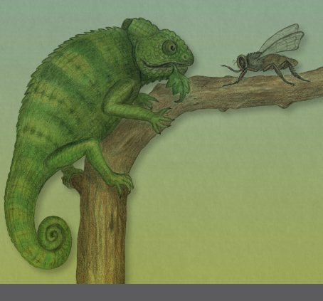
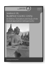
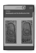
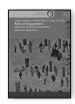
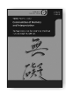
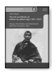
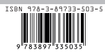

HAMBURG BUDDHIST
STUDIES 1,2 Lambert Schmithausen Fleischverzehr und Vegetarismus im indischen Buddhismus bis ca. zur Mitte des ersten Jahrtausends n. Chr.

Teil 1 · Studie und Übersetzungen

Lambert Schmithausen Fleischverzehr und Vegetarismus im indischen Buddhismus Hamburg Buddhist Studies 12 | Teil 1 Series Editors:
Steffen Döll | Michael Zimmermann

for Buddhist Studies Lambert Schmithausen Fleischverzehr und Vegetarismus im indischen Buddhismus bis ca. zur Mitte des ersten Jahrtausends n. Chr.

Teil 1 · Studie und Übersetzungen projektverlag.

Bibliographic information published by the Deutsche Nationalbibliothek The Deutsche Nationalbibliothek lists this publication in the Deutsche Nationalbibliografie; detailed bibliographic data are available in the Internet at http://dnb.d-nb.de.

ISSN 2190-6769 ISBN 978-3-89733-546-2 (E-Book)
ISBN 978-3-89733-503-5 (printed version)
© 2020 projekt verlag, Bochum/Freiburg www.projektverlag.de Cover original design by Benjamin Guzinski; Julia Wrage, Hamburg Cover image: Felicitas Schmithausen Inhalt: 
Teil 1:
Vorwort der Herausgeber 11 Vorwort des Verfassers 13 A. Studie 19 I. Fleischverzehr in den kanonischen Texten des älteren Buddhismus 19 I.2.3. Sonderregelung für gefährliche Situationen 68 I.2.4. Sonderregelung für die Behandlung an Geistesverwirrung leidender Mönche 71

| I.1. Fleischverzehr und Tiertötungsverbot                                                                            | 23   |
|----------------------------------------------------------------------------------------------------------------------|------|
| I.1.1. Vedische Religion: rituelle Schlachtung                                                                       | 25   |
| I.1.2. Aufgeben der Rituale und konsequentes Nichtverletzen in den Asketenbewegungen  I.1.3. Buddhistischer Vinaya: Fleisch ist erlaubt, sofern es "in  dreifacher Hinsicht rein" ist I.1.3.1. Die formale Regel in den Vinayas                                                                                                                      | 32   |
| I.1.3.2. Die Bedeutung der inneren Einstellung                                                                       | 38   |
| I.1.3.3. Interpretationsprobleme im Zusammenhang mit der  Vinaya-Regel I.1.3.4. Resümee                              | 45   |
| I.2. Fleischverzehr und Askese                                                                                       | 45   |
| I.2.1. Moderate Aszetik und meditative Praktiken statt rigider  Selbstkasteiung I.2.2. Die fünf Regeln des Devadatta | 51   |
| I.2.2.1. In der Mehrzahl der überlieferten Vinayas                                                                   | 51   |
| I.2.2.2. Im Mūlasarvāstivāda-Vinaya                                                                                  | 59   |

I.2.2. Die fünf Regeln des Devadatta 51 I.2.2.1. In der Mehrzahl der überlieferten Vinayas 51

I.2.2.2. Im Mūlasarvāstivāda-Vinaya 59

I.2.2.3. Spätere Nachrichten über mögliche Anhänger Devadattas

67

I.3. Fleischtabus 75 I.3.1. Rohes Fleisch und frisches Blut 75 I.3.2. Menschenfleisch 77 I.3.3. Tiere, deren Fleisch nicht gegessen werden darf: ältere Listen 79 I.3.4. Tiere, deren Fleisch nicht gegessen werden darf: Erweiterungen 88 I.3.5. Schweinefleisch und Rindfleisch 93 I.4. Die letzte Mahlzeit des Buddha 95 I.5. Fleischverzehr bei den buddhistischen Laien 103 II. Fleischverzehr im Kontext der Selbstaufopferung des Bodhisattva 109 II.1. Der Bodhisattva überläßt seinen Körper Tieren zum Verzehr 111 II.2. Der Bodhisattva überläßt seinen Körper Dämonen zum Verzehr 118 II.3. Der Bodhisattva als Tier überläßt seinen Körper Menschen zum Verzehr 123 II.4. Der Bodhisattva als Mensch überläßt seinen Körper Menschen zum Verzehr 131 II.4.1. Der menschliche Körper wird Menschen vermittels einer Transformation zum Verzehr überlassen 131 II.4.2. Der menschliche Körper als solcher wird Menschen zum Verzehr überlassen 135 II.5. Resümee 145 III. Fleischverzehr im Hauptstrom des indischen Mahāyāna 149 III.1. Mehrheitliche Beibehaltung der traditionellen Einstellung 149 III.2. Bhāvivekas explizite Verteidigung der traditionellen Position 151 III.3. Ergänzende Materialien 157 IV. Ansätze für einen Verzicht auf Fleischnahrung 163 IV.1. Zunehmende Restriktionen im Vinaya 165

| IV.3. Schutz vor Dämonen und rituelle Reinheit                                                                                                                                      | 169                                              |
|-------------------------------------------------------------------------------------------------------------------------------------------------------------------------------------|--------------------------------------------------|
| IV.4. Verzicht auf Fleischverzehr an den 'Fasttagen' und bei  Katastrophen IV.5. Verzicht auf Fleischverzehr im Falle unmittelbarer  Verantwortung für die Tiertötung IV.5.1. Aśoka | 179                                              |
| IV.5.2. Das Mṛgajātaka                                                                                                                                                              | 182                                              |
| IV.5.3. Der Buddha als Gast bei einer Jägersippe                                                                                                                                    | 184                                              |
| IV.5.4. Der Einsiedler in der Erzählungsliteratur und analoges  Verhalten bei einzelnen Tieren IV.6. Vegetarische Ernährung als Ideal                                               | 190                                              |
| IV.6.1. Ideale Weltgegenden                                                                                                                                                         | 191                                              |
| IV.6.2. Ideale Weltperioden                                                                                                                                                         | 194                                              |
| IV.6.3. Zur Zeit des zukünftigenBuddha Maitreya                                                                                                                                     | 196                                              |
| IV.6.4.                                                                                                                                                                             | Verzicht auf Fleisch als Element der Lebensweise |
| vollkommener Personen IV.6.5. Als Ideal hier und jetzt                                                                                                                              | 201                                              |
| IV.6.5.1. Die "Lehrrede vom Buddha als Arzt"                                                                                                                                        | 201                                              |
| IV.6.5.2. Das Mahāmeghasūtra                                                                                                                                                        | 203                                              |
| V. Strikter (Lacto-)Vegetarismus in indischen Mahāyānatexten                                                                                                                        | 209                                              |
| V.1. Das Mahāparinirvāṇa-mahāsūtra                                                                                                                                                  | 212                                              |
| V.1.1. Der Abschnitt gegen den Fleischverzehr: Bemerkungen  zum Text V.1.2. Striktes Fleischverzehrverbot                                                                           | 213                                              |
| V.1.3. Motive für das Fleischverzehrverbot                                                                                                                                          | 216                                              |
| V.1.3.1. Unreinheit                                                                                                                                                                 | 216                                              |
| V.1.3.2. Aszetik                                                                                                                                                                    | 217                                              |
| V.1.3.3. Nichtverletzen (ahiṁsā)                                                                                                                                                    | 219                                              |
| V.1.3.4. Spirituelle Motive                                                                                                                                                         | 221                                              |
| V.1.3.4.1. Fleischverzehr als Ausdruck von Gier                                                                                                                                     | 221                                              |

V.1.3.3. Nichtverletzen (ahiṁsā) 219

V.1.3.4. Spirituelle Motive 221 V.1.3.4.1. Fleischverzehr als Ausdruck von Gier 221 V.1.3.4.2. Unvereinbarkeit von Fleischverzehr und Wohlwollen 

(*maitrī*)

222

IV.2. Asketische Motive 166 V.1.4. Angesprochene Personengruppen 226 V.1.5. Der nur bei Dharmakṣema überlieferte Teil des Mahāparinirvāṇa-*mahāsūtr*a 227 V.2. Das A*ṅgulimālīyasūtra* 229 V.2.1. Der Text und seine Stellung innerhalb der vegetaristischen Lehrreden 229 V.2.2. Verzicht auf Fleischverzehr: Aszetik 230 V.2.3. Verzicht auf Fleischverzehr: Verwandtschaftsargument und *tathāgatagarbha*-Lehre 231 V.2.3.1. Das Verwandtschaftsargument 232 V.2.3.2. Die *tathāgatagarbha*-Lehre als Argument gegen Fleischverzehr 234 V.2.4. Die Frage der Zulässigkeit anderer tierischer Produkte 236 V.2.5. Der gesellschaftliche Hintergrund des Verzichts auf Fleischverzehr 237 V.3. Das La*ṅkāvatārasūtra* 238 V.3.1. Das Kapitel "Verzicht auf Fleischverzehr" (maṁsābh*akṣaṇa*): Textstruktur und Textüberlieferung 238 V.3.2. Die ältere Textschicht 242 V.3.2.1. Der gesellschaftliche Hintergrund 242 V.3.2.2. Argumente gegen den Fleischverzehr 243 V.3.2.2.1. Argumente: Gruppe 1 243 V.3.2.2.2. Argumente: Gruppe 2 246 V.3.2.2.3. Argumente: Gruppe 3 247 V.3.2.2.4. Das Konsumentenargument 249 V.3.2.3. Exegese der einschlägigen Vinaya-Bestimmungen 251 V.3.3. Die spätere Textschicht 254 V.4. Vegetaristische Bearbeitungen von Erzählstoffen 261 V.4.1. Die Saudāsa-Kalmāṣapāda-Sage und die Geschichte von König Śibi und der Taube im La*ṅkāvatārasūtra* 261 V.4.2. Die "Lehrrede von König Siṁha-Saudāsas Verzicht auf Fleischverzehr" 262 V.4.3. Das Verhältnis der "Siṁhasaudāsa-Lehrrede" zum Laṅ-*kāvatārasūtra* 265 V.4.4. Eine vegetaristische Bearbeitung des *Śaśajātaka* 268 V.5. Späteres indisches Mahāyāna 270 Anhänge 274 Anhang A: Beutereste von Raubtieren 274 Anhang B: Fleischlose Ernährung als konstitutives Element des Heilswegs im Pāli-Kanon?

277 Anhang C: Die Liste der 'erstklassigen Nahrungsmittel' (paṇīta*bhojana*) in den verschiedenen Vinayas 281 Präsentation des Vergleichsmaterials 281 Analyse 284 Anhang D: Bemerkungen zu unmāda, *cittakṣepa* und deren Ursachen Anhang E: Verbotene Fleischarten nach den *Vinaya*s 292 Anhang F: Zur Bedeutung von Ch. 鵄 *ch'ih*1in Übersetzungen indischer Texte und zu Skt. *kurara* (Pā. *kulala*)
Anhang G: Bemerkungen zu einigen frühen Belegen für Verzicht auf Fleischverzehr im chinesischen Tripiṭaka 307 Anhang H: Einige Argumente gegen Fleischverzehr aus in China verfaßten buddhistischen Texten 314 B. Texte (Übersetzungen) 321 Vorbemerkung 321 1. Mahāparinirvāṇa-*mahāsūtra* 321 2. A*ṅgulimālīyasūtra* 325 3. La*ṅkāvatārasūtra* 326 Text I: *Mahāparinirvāṇa-mahāsūtra* ("Fleischverzehr-Abschnitt") 331 Text II: A*ṅgulimālīyasūtra* ("Verzicht auf Fleischverzehr") 357 Text III: La*ṅkāvatārasūtra* (Kapitel 8) 363 287 294

| Teil 2: Endnoten Endnoten zur Studie                                                      | 7   |
|-------------------------------------------------------------------------------------------|-----|
| Endnoten zu den Texten I–III (Übersetzung)                                                | 360 |
| Endnoten zur Vorbemerkung                                                                 | 360 |
| Endnoten zur Übersetzung von Text I                                                       | 368 |
| Endnoten zur Übersetzung von Text II                                                      | 415 |
| Endnoten zur Übersetzung von Text III                                                     | 432 |
| Teil 3:  Texte (Editionen) Text I: Mahāparinirvāṇa-mahāsūtra ("Fleischverzehr-Abschnitt") | 7   |
| Vorbemerkung                                                                              | 7   |
| Synoptische Edition                                                                       | 13  |
| Text II: Aṅgulimālīyasūtra ("Verzicht auf Fleischverzehr")                                | 33  |
| Vorbemerkung                                                                              | 33  |
| Synoptische Edition                                                                       | 35  |
| Text III: Laṅkāvatārasūtra (Kapitel 8)                                                    | 41  |
| Vorbemerkung                                                                              | 41  |
| Kritische Edition                                                                         | 55  |
| Appendix I: Versuch einer Gruppierung der Sanskrit-Handschriften                                                                                           | 105 |
| Appendix II: Konkordanz der Sanskrit-Handschriften                                        | 136 |
| Appendix III: Konkordanz der tibetischen Textzeugen                                       | 140 |
| Abkürzungsverzeichnis                                                                     | 143 |
| Verzeichnis der zitierten Literatur                                                       | 165 |

# Foreword By The Editors

About *Hamburg Buddhist Studies* Ever since the birth of Buddhist Studies in Germany more than 100 years ago, Buddhism has enjoyed a prominent place in the study of Asian religions. The University of Hamburg continues this tradition by focusing research capacities on the religious dimensions of South, Central, and East Asia and making Buddhism a core subject for students of the Asien-Afrika-Institut. The Numata Center for Buddhist Studies is proud to have found a home at one of Europe's pioneering academic institutions. With its *Hamburg Buddhist Studies* book series it honours the University's longstanding commitment to research in the field of Buddhist Studies and aims to share its results with both the academic community and the wider public. 

Today, Buddhist Studies as an academic discipline makes use of a broad spectrum of approaches and methods. The field covers contemporary issues as much as it delves into the historical aspects of Buddhism. 

Similarly, the questions shaping the field of Buddhist Studies have broadened. Understanding present-day Buddhist phenomena—and how such phenomena are rooted in and informed by a distant past—is not at all an idle scholarly exercise. Rather, it has become clear that fostering the understanding of one of the world's major religious traditions is a crucial obligation for modern multicultural societies in a globalized world. Accordingly, *Hamburg Buddhist Studies* addresses Buddhism as one of the great humanistic traditions of philosophical thought, religious praxis, and social life. Its discussions will undoubtedly be of interest to scholars of religious studies and specialists of Buddhism, but also aim at confronting Buddhism's rich heritage with questions the answers to which might not easily be deduced by the exclusive use of historical and philological research methods. Such issues require the penetrating insight of scholars who approach Buddhism from a broad range of disciplines, building upon and yet going beyond the solid study of texts and historical evidence. We are convinced that *Hamburg Buddhist Studies* will contribute to opening up the field to those who may have no training in the classical source languages of the Buddhist traditions but approach the topic against the background of their own disciplinary interests. With this book series, we would like to also encourage a wider audience to take an interest in the academic study of the Buddhist traditions.

## About This Volume

It is our great pleasure to welcome Lambert Schmithausen's latest oeuvre, spanning three volumes on Buddhism and vegetarianism, in our series. While vegetarianism and Buddhism are frequently taken to go hand in hand, the author—one of the world's leading specialists on the intellectual history of Buddhism—argues that this assumption lacks a factual, historiographic basis. The present study illustrates the gradual genesis of a strictly vegetarian attitude in Indian Mahāyāna Buddhism and how it manifested in three of the tradition's important texts: the Mahāparinirvāṇa-*sūtra*, the Aṅgulimālīya-*sūtra*, and the Laṅkāvatāra-*sūtra*. Largely on the basis of these three texts, Schmithausen portrays the thoughts, arguments, and motives which promoted vegetarianism among adherents of the tradition in a relatively late period (ca 4th century CE), when Buddhism had already been in existence for more than seven hundred years. Common traits as well as individual features of the arguments in the three main texts are discussed, and their most important passages translated (part 1, with endnotes in part 2). Critical editions of significant parts of the texts in Sanskrit, Tibetan, and Chinese make up the third part and are directed towards specialists of Buddhist textual history to access the original wording of these *sūtras*. Schmithausen shows that a younger, pronounced vegetarian strand of Buddhism contrasts starkly with the older, traditional mainstream attitudes towards the consumption of fish and meat of Indian Buddhism. 

Since there are no traces of a strict vegetarian diet in the literary traditions of early Buddhism it seems impossible that vegetarianism was part of the daily routine of the large majority of Buddhists, be they monastics or lay persons. Even more, an attempt at prescribing a strictly vegetarian diet is expressly discarded. Notwithstanding, certain restrictions concerning the consumption of meat are firmly established. In the first chapter of his study, Schmithausen outlines these restrictions based on relevant source texts. They are discussed in light of their origins, possibly deriving from ethical considerations, ascetic practices, and widely accepted societal norms.

Another important issue raised by Schmithausen is the question of whether the turn towards a vegetarian diet in Indian Mahāyāna Buddhism is rooted in Buddhism itself or whether it was motivated by the rigid anti-meat attitudes found in influential sectors of Hindu society. Chapter IV takes into consideration ideas from inside the early Buddhist traditions that may have triggered or supported the emergence of Buddhist vegetarianism—the one feature which influenced the dietary norms of later East Asian Buddhism so profoundly.

Michael Zimmermann and Steffen Döll

## Vorwort

Die vorliegende Arbeit basiert auf Vorarbeiten, in denen ich, vor nunmehr ca. zwanzig Jahren, versucht hatte, einen im Jahre 2000 veröffentlichten Überblick über Fleischverzehr und Vegetarismus im Buddhismus1 näher auszuarbeiten. Der Schwerpunkt lag auf den diesbezüglichen Einstellungen bei den Buddhisten in Indien, dem Mutterland des Buddhismus, bis etwa zur Mitte des ersten nachchristlichen Jahrtausends, doch hatte ich versucht, auch die anschließende Periode sowie Entwicklungen in außerindischen Formen des Buddhismus im Rahmen des Möglichen einzubeziehen. Durch andere Verpflichtungen und Projekte konnte ich diese Studien dann aber erst Anfang 2014 nach einer nahezu zehn Jahre währenden Unterbrechung wieder aufnehmen. Angesichts meines vorgerückten Alters und der Grenzen meiner Kompetenz und meiner Möglichkeiten sah ich mich jedoch gezwungen, die Reichweite der Untersuchung deutlich zu beschränken. Eine eingehendere Behandlung der Stellung von Fleischverzehr im tantrischen Buddhismus, zumal in den Yogānuttara-Tantras, muß Wissenschaftlern, die mit dieser Materie besser vertraut sind als ich, überlassen bleiben. Für die außerindischen und neuzeitlichen Entwicklungen kann ich auf Untersuchungen von seiten der jeweiligen Fachvertreter verweisen, dies umso mehr, als gerade in den letzten Jahren einige speziell dem Thema Tierethik, Fleischverzehr und Vegetarismus gewidmete Monographien und Aufsätze erschienen sind, wobei vor allem die Arbeiten von STEWART (2016: neuzeitliches Sri Lanka), BARSTOW (2013 u. 2018: 
Tibet) und PU (2014: China)2 zu nennen wären.3 Ein Vergleich der in der vorliegenden Arbeit behandelten Entwicklung im älteren indischen Buddhismus mit den Entwicklungen im außerindischen und neuzeitlichen Buddhismus kann hier ebensowenig einbezogen werden wie ein Vergleich mit der Einstellung zu Fleischverzehr und Vegetarismus in anderen Religionen und Kulturen innerhalb oder gar außerhalb Indiens. Auch eine Aufarbeitung archäologischer Daten für die Frage des Fleischverzehrs auf dem indischen Subkontinent kann, obwohl von großem Interesse, im Rahmen der vorliegenden, philologisch orientierten Arbeit nicht geleistet werden, auch nicht für den engeren Rahmen des indischen Buddhismus. 

In der hier vorgelegten Fassung beschränkt sich meine Studie deshalb im wesentlichen auf den indischen Buddhismus bis etwa zur Mitte des ersten nachchr. Jahrtausends. Ein Schwerpunkt liegt dabei auf dem Aufkommen einer vegetaristischen (genauer: lacto-vegetaristischen) Bewe-gung in bestimmten Kreisen des Mahāyāna-Buddhismus, wobei neben der Auswertung auch eine Neubearbeitung der wichtigsten Textstücke (Texte I‒III) unternommen worden ist, in der Hoffnung, den von der bisherigen Forschung (vgl. u.a. SEYFORT RUEGG 1980, SHIMODA 1997: 388‒419) 
erreichten Erkenntnisstand in dem einen oder anderen Punkt korrigieren oder vertiefen zu können. Unabdingbar für ein angemessenes Verständnis dieser Textstücke ist aber auch die Kenntnis der von ihnen vorausgesetzten und kritisierten Einstellung zum Fleischverzehr in der älteren buddhistischen Tradition. Auch wenn die wichtigsten Aspekte längst allgemein bekannt sind - es mag hier genügen, auf die grundlegenden Untersuchungen von ALSDORF (1962a/2010, auf der Basis der Pāli-Überlieferung, aber zugleich im Vergleich mit der Entwicklung bei den Jainas und Hindus) und SHIMODA (1989 etc., unter Berücksichtigung auch der außerindischen Textüberlieferungen) zu verweisen - , so hoffe ich doch, auch hier einige zusätzliche Klarstellungen und Präzisierungen beigebracht zu haben. 

Ausgangspunkt der Studie ist die Feststellung, daß in den kanonischen Texten des Hauptstroms des indischen Buddhismus Fleisch (und Fisch) als wertvolle, erstklassige Nahrung gilt und sein Verzehr sowohl den Laien wie auch den Ordinierten grundsätzlich erlaubt war (Kap. I). In diesem Rahmen wird sodann zunächst das Problem der Vereinbarkeit dieser grundsätzlichen Zulässigkeit von Fleischverzehr mit der ethischen Verpflichtung, keine Lebewesen (also auch keine Tiere) zu töten, behandelt 
(Kap. I.1). Sodann wird auf die Probleme eingegangen, die der Verzehr von Fleisch und Fisch, vor allem für die Ordinierten, im Kontext einer asketischen Lebensführung aufwarf (Kap. I.2), und schließlich auf die Schwierigkeiten, die sich im Zusammenhang mit der gesellschaftlichen Ächtung bestimmter Fleischarten ergeben konnten (Kap. I.3). Gesondert zu behandeln ist die kontroverse Frage nach der letzten Mahlzeit des Buddha (Kap. I.4) und die Frage des Fleischverzehrs der Laienanhänger 
(Kap. I.5). Ein eigenes Kapitel (II), gewissermaßen als Überleitung zum Mahāyāna-Buddhismus, ist buddhistischen Erzählungen gewidmet, in denen der Bodhisattva, d.h. der Buddha in früheren Existenzen, sei es als Mensch oder als Tier, anderen Lebewesen seinen Körper oder Teile desselben zum Verzehr überläßt. In einem weiteren Kapitel (III) wird sodann die Einstellung zum Fleischverzehr in demjenigen Strang des Mahāyāna-Buddhismus behandelt, in dem die Haltung der älteren Tradition zu dieser Frage mehr oder weniger unverändert beibehalten und gelegentlich sogar explizit verteidigt worden ist. Es wird sodann versucht, Ansatzpunkte in der buddhistischen Tradition aufzuzeigen, an die eine 
(wie auch immer motivierte) programmatisch vegetaristische Bewegung anknüpfen konnte (Kap. IV), bevor schließlich (in Kap. V) zur Behandlung der dezidiert vegetaristischen Texte übergegangen wird. Es folgen sodann noch einige Anhänge, in denen zum einen Listen zusammengestellt 
(und ggf. diskutiert) werden, zum anderen einzelne Begriffe und Textstellen ausführlicher behandelt werden, wenn dies den Rahmen der Studie gesprengt und auch den Endnotenapparat über Gebühr belastet hätte. Auch abgesehen davon habe ich mich bemüht, die eigentliche Darstellung möglichst flüssig zu halten und nur die für die Argumentation unerläßlichen Textbelege in Form von Übersetzungen einzubauen, den Originalwortlaut und alles weitere Belegmaterial sowie inhaltliche und philologische Detailprobleme hingegen in die Endnoten zu verweisen. Es muß aber betont werden, daß die Studie aufgrund der Grenzen meiner zeitlichen und organisatorischen Möglichkeiten keinen Anspruch auf Vollständigkeit erhebt, weder hinsichtlich der Ausschöpfung der Primärquellen noch im Hinblick auf die verwendete Sekundärliteratur. Auf einen Index glaubte ich verzichten zu dürfen, da das Buch binnen Jahresfrist online zugänglich sein wird (www.buddhismuskunde.uni-hamburg.de). 

Was die Textbearbeitungen betrifft, so handelt es sich zunächst um je ein Textstück aus dem *Mahāparinirvāṇa-mahāsūtra* und aus dem A*ṅgulimālīyasūtra*. Von diesen beiden Textstücken liegt m.W. bislang nur der Anfang des ersteren im Sanskrit-Original vor. Für den Rest und für das Textstück aus dem A*ṅgulimālīyasūtra* sind wir auf alte Übersetzungen angewiesen, wobei in erster Linie natürlich solche, die auf einem Sanskritoriginal basieren, heranzuziehen sind. Im Falle des *Mahāparinirvāṇa-mahāsūtra* gilt dies für eine tibetische und zwei chinesische Übersetzungen (eine von Fa-hsien, 417‒418 erstellt, und eine weitere von Dharmakṣema, zwischen 414 und 421 angefertigt), im Falle des Aṅguli*mālīyasūtra* für eine tibetische und eine chinesische Übersetzung (zwischen 435 und 453 von Guṇabhadra angefertigt). Ich habe diese Textstücke in Gestalt synoptischer Editionen beigefügt und nach inhaltlichen Gesichtspunkten in Paragraphen gegliedert. Die am Ende der Paragraphen angegebenen Varianten erheben keinen Anspruch auf Vollständigkeit.4 Anders liegen die Dinge im Falle des dritten Textes, des 8. Kapitels des La*ṅkāvatārasūtra*, da dieses Werk zur Gänze im Sanskritoriginal erhalten ist. Es erwies sich jedoch als notwendig, die (durchaus anerkennenswerte und höchst verdienstvolle) Standardedition von B. NANJIO unter Verwendung weiterer, vor allem durch das Nepal-German Manuscript Preservation Project zugänglich gewordener Handschriften zu überarbeiten. Angesichts der großen Zahl der Handschriften ist der kritische Apparat, obgleich rein orthographische Varianten nicht aufgenommen worden sind, dennoch zugestandenermaßen allzu umfangreich geworden. Wenn meine auf der Grundlage des vorliegenden Abschnittes entwickelte Beurteilung des Handschriftenmaterials zutreffen sollte, wird man bei der Edition weiterer Textteile wohl ökonomischer vorgehen können. 

Bei den Übersetzungen geht es mir nicht so sehr um stilistisch gefällige als vielmehr um möglichst genaue Wiedergaben. Im Falle des Mahāparinirvāṇa- und des Aṅguli*mālīya*-Textstückes habe ich dort, wo die Versionen stark divergieren, auch in der Übersetzung die synoptische Struktur beibehalten. Komplexere Probleme der Textkonstitution sowie sprachliche und interpretatorische Probleme beim Verständnis der Texte werden in den Endnoten zur Übersetzung diskutiert. Dabei war ich bemüht, Schwierigkeiten nicht durch Schweigen zu übergehen, sondern explizit zu machen, sie bei Bedarf ausführlich zu erörtern und meine Entscheidung zu begründen. Ich bin mir bewußt, daß diese Erörterungen, zumal im Falle des La*ṅkāvatārasūtra*, manchem Leser allzu weitschweifig vorkommen mögen und daß für manche Fragen vielleicht bessere und einfachere Lösungen gefunden werden können. Es erschien mir aber sinnlos, einem der oft erheblich divergierenden Vorschläge bisheriger Übersetzer den Vorzug zu geben oder eine ganz neue Wiedergabe anzubieten, ohne dies mit hinreichenden Argumenten zu rechtfertigen. 

Die Fertigstellung der Arbeit wäre, selbst in der vorliegenden, zugestandenermaßen unvollkommenen Form, nicht möglich gewesen ohne die zahlreichen nützlichen Hinweise und ohne die Hilfe bei der Beschaffung von einschlägigen Materialien von seiten vieler Freunde und Kollegen, denen ich bei dieser Gelegenheit herzlich danken möchte: Ven. Anālayo, Noritoshi Aramaki, Achim Bayer, Jin-il Chung, Florin Deleanu, Martin Delhey, Michael Friedrich, Luo Hong, Toshio Horiuchi, Harunaga Isaacson, Shanshan Jia, Kazuo Kano, Shōryū Katsura, Werner Knobl, Carsten Krause, M. Maitrimurti, Manik Bajracharya, Adelheid Mette, Katsumi Mimaki, Birte Plutat, Michael Radich, Alexander von Rospatt, Burkhard Quessel, Hidenori Sakuma, Perry Schmidt-Leukel, Jonathan Silk, S.A. Srinivasan†, Helmut Tauscher, Muneo Tokunaga, Ven. Vinītā Tseng, Dorji Wangchuk, Albrecht Wezler, Michael Zimmermann und viele andere, die mir verzeihen mögen, wenn ich sie hier nicht namentlich aufgeführt habe. Besonderer Dank gebührt überdies Michael Zimmermann und Steffen Döll für die Aufnahme des Buches in die Reihe Hamburg Buddhist Studies. Ganz herzlich danken möchte ich auch meiner Tochter, Felicitas, für die künstlerische Gestaltung des Einbands. Last but not least bin ich meiner lieben Frau, Helga, zutiefst dankbar, nicht nur dafür, daß sie große Teile des Manuskripts gelesen hat, sondern vor allem auch für das Verständnis, mit dem sie meine zeitraubende Beschäftigung mit dieser Arbeit so lange ertragen und mich in kritischen Momenten sogar davor bewahrt hat, vorzeitig aufzugeben. 

## Technische Bemerkungen:

1. Bei Literaturangaben und Textbelegen hat die Stellenangabe entweder die Form I(:) 1,1 = "Band (:) Seite, Zeile", oder aber die Form I.1 (bzw. 1.1) = "Kapitel.Unterabschnitt" bzw. "Kapitel.Vers". Die Angabe "f" nach der Seiten- oder Zeilenzahl schließt die folgende Seite bzw. Zeile (nur diese, nicht mehrere!) ein; die mehrere Seiten bzw. Zeilen einschließende Angabe "ff" vermeide ich nach Möglichkeit zugunsten einer genauen Angabe. 

Bei Seiten mit mehreren Kolumnen kennzeichne ich diese mit a, b, c etc. 

2. Die Abkürzungen "En." ("Endnote") und "Fn." ("Fußnote") verweisen auf Fuß- bzw. Endnoten der vorliegenden Arbeit, bei Fehlen einer näheren Bestimmung auf solche desselben Teiles oder Stückes der vorliegenden Arbeit. Bei Verweisen auf andere Arbeiten benutze ich andere Abkürzungen ("Anm.", "n."). 

3. Auch mit dem Zeichen "§" verweise ich nur auf die Paragraphen der vorliegenden Arbeit. Auch hier gilt, daß nicht näher spezifizierte Verweise sich auf Paragraphen desselben Teiles oder Stückes beziehen. In den übrigen Fällen wird angegeben, auf welchen Teil der Arbeit Bezug genommen wird (St. = Studie [= Teil 1, A]). Im Falle von Verweisen auf Paragraphen anderer Arbeiten als der vorliegenden verwende ich stets das Zeichen \#. Bei Querverweisen auf Textabschnitte innerhalb der einzelnen Textbearbeitungen lasse ich das Paragraphenzeichen weg, verweise also z.B. in den Endnoten zu Text III auf den Abschnitt A.3 einfach mit "A.3". 

Bei Verweisen auf Abschnitte einer Textbearbeitung der vorliegenden Arbeit in der Studie oder in anderen Textbearbeitungen wird dies durch einen entsprechenden Zusatz gekennzeichnet, also z.B. "Text III: A.3", 
wenn in den Endnoten zu der Studie oder zu Text I bzw. Text II auf den Abschnitt A.3 von Text III verwiesen wird. 

4. Chinesische buddhistische Texte werden normalerweise aus dem Taishō Tripiṭaka (大正新脩大藏經, CBETA-Version, Abkürzung "T") und dem Hsü-tsang ching /Zokuz*ōkyō* (卍新纂續藏經, CBETA-Version, Abkürzung "X") zitiert, nach dem Schema T 1.26: 692a3 = Taishō Bd. 1 Nr. 26: 
Seite 692 obere Kolume Zeile 3. 

5. Für Stellen aus dem tibetischen Tanjur benutze ich nach Möglichkeit die Ausgaben von Peking und Derge, für solche aus dem Kanjur auch sTog, jeweils (soweit nicht im Abkürzungsverzeichnis angegeben) mit Angabe der Sektion (z.B. mDo) und der einheimischen Bandnummer (ka, kha, etc.). 

# A. Studie

I. Fleischverzehr in den kanonischen Texten des älteren Buddhismus 1.1. Daß der Verzehr von Fleisch und Fisch zumindest im Hauptstrang 
("mainstream") des älteren indischen Buddhismus im Prinzip für zulässig erachtet wurde, ergibt sich zweifelsfrei aus den kanonischen Texten der verschiedenen Traditionsketten ("Schulen") dieses Hauptstranges. Diesen Texten zufolge wird zwar Abstinenz von berauschenden Getränken, also von Alkohol, nicht nur von den Ordinierten (d.h. den Mönchen und Nonnen) verlangt,1 sondern gehört auch zu den fünf Selbstverpflichtungen, die 
(zumindest konsequent engagierte) Laienanhänger (upā*saka*) und Laienanhängerinnen (*upāsikā*) auf sich nehmen;2 ein genereller Verzicht auf Fleisch hingegen wird, jedenfalls in den uns überlieferten Texten, von keiner dieser beiden Gruppen gefordert oder erwartet.3 Es darf daher davon ausgegangen werden, daß die Redaktoren dieser Texte keine prinzipiellen Bedenken gegen Fleischverzehr hatten. 1.2. Im Falle der Laien war die grundsätzliche Zulässigkeit von Fleischverzehr wohl eher selbstverständlich und wird in den Texten kaum explizit festgestellt. Hierzu paßt auch ein lehrhafter Verstext der buddhistischen Erzählungsliteratur, das Kumbha*jātaka* (Jā Nr. 512),4 wo der Gott Sakka einem dem Alkohol verfallenen König (Jā V 14,6-10) ausführlich die üblen Folgen des Alkoholgenusses vor Augen führt (vs. 36‒61),5 den Verzehr von Fleisch (als Bestandteil vorzüglicher Speisen) aber ausdrücklich gestattet: "Iß [nach Wunsch] Reisbrei mit Fleisch und Milchreis mit Ghee ...!" (vs. 63: maṁsodanaṁ sappipāyāsaṁ *bhuñja* ...).6 1.3. Auch dafür, daß der Verzehr von Fleisch nicht nur den Laien, sondern auch den Ordinierten erlaubt ist, läßt sich ein Verstext der Erzählungsliteratur anführen. Im Bhikkhāparampara*jātaka* (Nr. 496) wird ein Reisgericht mit Fleischsoße zunächst einem König angeboten, der es aber seinem Hofbrahmanen überläßt. Auch der Brahmane ißt es aber nicht selbst, sondern bietet es einem Einsiedler (*āraððako isi*) an,7 der es seinerseits an einen Mendikanten (*bhikkhu*) weiterreicht. Dieser schließlich verzehrt es, und wenngleich die Geschichte (wie alle *Jātaka*s) in vorbuddhistische Zeit versetzt ist, so repräsentiert hier der Mendikant (die würdigste der vier Personen) doch offensichtlich die buddhistischen Mönche.8 2. Unabhängig von diesen Überlegungen ergibt sich die Erlaubnis, Fleisch und Fisch anzunehmen und zu verzehren, gerade für die Ordinierten mit aller wünschenswerten Eindeutigkeit aus den überlieferten Versionen des *Vinayapiṭaka*, den Texten zur Ordensdisziplin, die das Verhalten der Mönche und Nonnen regeln. 

2.1. In den *Vinaya*s der verschiedenen Schulen wird Fleisch (māṁsa, Pā. 

maṁsa), und meist auch Fisch (*matsya*, Pā. *maccha*), neben gekochtem Reis (*odana*),9 (Gerste-Bohnen-)Brei (*kulmāṣ*a, Pā. kummāsa)
10 und Mehl aus geröstetem Gerstenschrot (*saktu*, Pā. *sattu*)
11 ausdrücklich unter den als Grund- oder Hauptnahrungsmittel ( 正 食) dienenden fünf "weichen Speisen" (pañca bhojanāni = *bhojanīyam*) aufgeführt.12 Diese Grundnahrungsmittel sind den Mönchen grundsätzlich gestattet.13 Gelegentlich wird ihnen in diesem Zusammenhang ausdrücklich erlaubt, sich an diesen Speisen satt zu essen.14 Fisch und Fleisch zählen ferner zu den "erstklassigen Nahrungsmitteln" (p(r)aṇīta*-bhojana*). Diese dürfen die Ordinierten zwar nicht eigens erbitten (s. § 32); aber wenn sie ihnen spontan angeboten werden, dürfen sie sie annehmen, und im Krankheitsfall ist es sogar erlaubt, ausdrücklich um erstklassige Nahrungmittel, also auch Fleisch, zu bitten (s. ibid.). Fleisch ist also zumindest im voll entwickelten Vinaya15 auch als Heilmittel anerkannt,16 und es gibt auch Textbeispiele für seinen tatsächlichen Einsatz in dieser Funktion (Näheres in § 53 u. § 59). 

2.2. Im Mahāsāṅghika-*Vinaya* wird konstatiert, daß der Buddha in Vaiśālī den Mönchen Milch und Yoghurt, in Aṭavī (曠野, Pāli Āḷavī) 
dagegen Fisch und Fleisch erlaubt habe.17 Im Dharmaguptaka-*Vinaya* wird die Erlaubnis, Fisch und Fleisch anzunehmen und zu verzehren, ausdrücklich für die allerersten Anfänge des Buddhismus in Anspruch genommen. 

Hier wird nämlich berichtet, der Buddha habe ganz zu Beginn seiner Lehrtätigkeit seinen fünf ersten Schülern auf die Frage, was sie denn essen dürften, fünf Arten von Speisen erlaubt, und der Text konkretisiert dies dahingehend, daß ihnen zunächst einmal der Verzehr der genannten fünf "weichen Speisen", also auch Fleisch und Fisch, gestattet wurde, zu denen dann anschließend noch weitere Speisen, die sie ebenfalls annehmen durften, hinzugefügt werden, u.a. Yoghurt und Milch.18 2.3. In der gleichen Situation läßt das *Kṣudrakavastu* des Mūlasarvāstivāda-19*Vinaya* den Buddha seinen fünf ersten Schülern erklären, es gebe für sie fünf Arten von harten/festen Speisen (*khādanīya*, sc. Wurzeln, Stengel, Blätter, Blüten und Früchte)20 und fünf Arten von weichen Speisen 
(bhoja*nīya*), sc. Mehl oder Brei aus gerösteten Körnern (麨, Tib. *phye ma*, 
Skt. *mantha*), gekochten Reis (飯, 'bras can, *odana*), Gerste-Bohnen-Brei 
(麥豆飯, zan dron, *kulmāṣ*a), Fleisch und Kuchen (餅, *apūpa*).21 Hier ist, wie man sieht, "Fisch" durch "Kuchen" ersetzt, was, wie ein exegetischer Text ausdrücklich bestätigt,22 dadurch möglich war, daß "Fisch" offenbar unter "Fleisch" als Oberbegriff subsumiert werden konnte.23 Anschließend nennt der Buddha aber unter den Zutaten, mit denen die festen Speisen der Mönche schmackhaft gemacht werden dürfen, ausdrücklich auch Fisch, Fleisch und Dörrfleisch (**vallūra*).24 3. In Anbetracht der im vorigen angeführten Stellen ist es kaum verwunderlich, daß in den kanonischen Texten, vor allem in den in den *Vinaya*s als Anlaß für den Erlaß von Vorschriften eingebauten Episoden, gelegentlich erwähnt wird, daß Ordinierte Fleisch als Nahrung erhalten oder zu sich nehmen, ohne daß daran Anstoß genommen würde. 

3.1. So heißt es z.B. an einer *Vinaya*-Stelle,25 daß in einer Familie für einen dort regelmäßig versorgten Mönch von einem Fleischgericht eigens ein Anteil zurückgelegt wurde. An einer anderen Stelle26 hören wir von einem Mönch, dem ein Stück Fleisch im Hals stecken bleibt. Mönche, die sich die Beutereste von Raubtieren27 oder auf dem Wasser treibende tote Tiere28 zubereiten lassen, machen sich keines Vergehens schuldig. Auch im Falle von Mönchen, die, in dem Glauben, es handle sich um Abfall, beiseite gelegte Reste bzw. weggeworfene Teile vom Fleisch eines von Räubern geschlachteten Rindes29 bzw. Schweines30 zum Verzehr mitgenommen31 hatten, ist es nicht etwa der Verzehr dieses Fleisches als solcher, der Probleme macht,32 sondern lediglich der Umstand, daß die Mönche in den Verdacht des Diebstahls geraten. Und die Nonne Uppalavaṇṇā nimmt ein Stück Rindfleisch an sich, das der Anführer einer Räuberbande, die das Tier geschlachtet und zubereitet hatten, diskret für sie an einem Baum befestigt hatte, und läßt es sogar dem Buddha überreichen.33 Bei einem Mönch, der während einer Hungersnot aus einem Schlachthaus (sūna*ghara*) 
Fleisch entwendet hat, besteht das Vergehen nur darin, daß er es gestohlen hat.34 Dem Mönch Sāgata, der von Laienanhängern (*upāsaka*, 居士) mit Alkohol,35 nach dem *Vinaya* der Mahīśāsakas aber mit Alkohol und Fleisch bewirtet worden ist,36 wird auch in letzterem *Vinaya* anschließend nur der Alkoholgenuß untersagt, nicht aber der Fleischverzehr.37 Auch im Falle von opulenten Einladungen einer großen Zahl von Mönchen gibt nicht etwa die Bewirtung mit Fleisch oder dessen der Verzehr als solcher Anlaß für Beanstandungen (s. §§ 14‒18 u. § 25.2). Im Sarvāstivāda-*Vinaya* heißt es, daß Mönche besonders gute Speisen, u.a. Rebhuhn-, Tauben-? oder Wachtelfleisch, nicht annehmen dürfen, wenn sie wissen, daß der Spender diese auf Anraten einer Nonne für sie zubereitet hat;38 hat er solche Speisen hingegen für den eigenen Haushalt oder schon vorher aus eigenem Antrieb für die Mönche zubereitet, ist den Mönchen der Verzehr erlaubt.39 Im Mūlasarvāstivāda-*Vinaya* begründet die Nonne ihren Vorschlag, z.B. 

statt des vom Spender vorgesehenen Gemüse-Currys einen Fleisch-Curry zu servieren, damit, daß die betreffenden Mönche spirituell weit fortgeschrittene Personen (*srota*āpann*a usw.) oder Kenner der buddhistischen Überlieferung (*sūtra-, *vinaya*- u. mātṛkā*dhara*) seien,40 und der Verzehr der Speise bedeutet für die betreffenden Mönche nur dann eine Verfehlung, wenn diese Begründung nicht den Tatsachen entspricht, nicht hingegen, wenn sie tatsächlich zutrifft.41 3.2. In den Lehrreden sind derartige Aussagen nur sehr vereinzelt anzutreffen, so etwa, wenn es im chinesischen *Ekottarikāgama* heißt, daß der Mönch Mahākāśyapa bei einem Haushälter eine kleine Portion Fisch und Fleisch (小[>少]許魚肉) erhält.42 In den eigentlichen Lehrreden (den vier Nikāyas oder Āgamas) werden aber überhaupt die Speisen, welche die Ordinierten auf dem Almosengang oder bei Einladungen erhielten, nur recht selten konkret benannt. Selbst wo dies geschieht, bleiben die Einzelheiten manchmal offen, so etwa wenn gelegentlich von einer Bewirtung mit "Brei aus feinem Reis mit verschiedenen Soßen und Currys" (*sālīnaṁ* odano ... anekasūp*o anekabyañjano*) die Rede ist;43 denn die "Soßen und Curries" können durchaus außer etwa Bohnen44 auch Fisch und Fleisch45 enthalten. Das Schwergewicht liegt in den Lehrreden weniger auf der Art der Speisen, die der Mönch zu sich nimmt, als vielmehr auf der inneren Haltung, mit der er dies tut: daß er er sie ohne Gier verzehrt (vgl. § 29) 
und gleichmütig annimmt, was ihm vorgesetzt wird. Ein strikter Verzicht auf Fleischnahrung wird in den Lehrreden, soweit ich sehe, nicht gefordert, sondern als Element rigider Aszetik eher kritisch bewertet (s. §§ 30-31). 

4. Bei den im vorigen angeführten Textaussagen ist allerdings im Blick zu halten, daß sie zunächst einmal nur als Zeugnis für die Verhältnisse im Zeitraum der Kompilation bzw. Redaktion dieser Texte und für die normative Einstellung der hierfür verantwortlichen Personengruppen (im Falle des Vinaya wohl vor allem Mönche, die bereits in festen Klöstern lebten) 
gelten können. Inwieweit das sich ergebende Bild auf die Anfänge des Buddhismus übertragen werden kann, ist eine andere Frage, auf die ich noch zurückkommen werde (s. vor allem § 40), desgleichen auf die Frage, ob es nicht doch Indizien dafür gibt, daß es schon damals im buddhistischen Orden auch Kreise gabe, die im Gegensatz zu der die Texte dominierenden Einstellung einem konsequenten Verzicht auf Fleischverzehr das Wort redeten (s. Kap. I.2.2)46 oder ihn zumindest unter bestimmten Umständen praktizierten (s. Kap. I.2.3). Abgesehen davon dürfen die einleitenden Ausführungen nicht dahingehend mißverstanden werden, daß in den uns erhaltenen kanonischen Texten des Hauptstranges der älteren buddhistischen Überlieferung Fleischverzehr durchgängig und unter allen Umständen für unbedenklich erachtet worden wäre und es keine Probleme und Einschränkungen gegeben hätte. Es gab ganz im Gegenteil durchaus Probleme, die allerdings weitgehend nur im Zusammenhang mit den Ordinierten explizit thematisiert und geregelt werden (vor allem in den Vinayas). Notwendig wurden solche Regelungen vor allem angesichts der 
(primär doch wohl ethisch motivierten) Verpflichtung, keine Lebewesen zu töten (Kap. I.1), im Zusammenhang mit Forderungen nach einer strengeren asketischen Lebensführung (und damit zusammenhängenden Problemen) (Kap. I.2) und aufgrund bestimmter gesellschaftlicher Konventionen 
(Nahrungstabus: Kap. I.3). Obwohl diese drei Gesichtspunkte deutlich unterscheidbar sind, spielt im Falle der Ordinierten das gesellschaftliche Ansehen des Ordens bei allen dreien eine wichtige Rolle. Im Falle der Laien (Kap. I.5) dürfte vor allem der ethische Aspekt von Belang gewesen sein. 

## I.1. Fleischverzehr Und Tiertötungsverbot

5.1. Schon den ältesten Texten zufolge (und im großen und ganzen bis heute) sind Buddhisten dazu angehalten, keine lebenden, für empfindungs-fähig erachteten Wesen (Pā. pāṇa, Skt. *prāṇ*in, buddh. auch prāṇa) willentlich zu töten. Zu diesen Wesen gehören - daran läßt die buddhistische Tradition keinen Zweifel - auch die Tiere, 47 im Prinzip sogar Insekten und anderes Kleingetier.48 Das bedeutet, daß nicht nur Menschen, sondern auch Tiere nicht getötet und, als empfindungsfähige Wesen, genau genommen auch nicht mißhandelt und gequält werden dürfen, sondern Mitgefühl verdienen.49 Vom Töten lebender Wesen Abstand zu nehmen wird sowohl von den Ordinierten - Mönchen (*bhikkhu*, Skt. *bhikṣu*) und Nonnen (bhik-khunī/*bhikṣu*ṇī) - wie auch von Laien erwartet. In den Lehrreden steht es an erster Stelle der Grundlagen für eine erfolgreiche Praxis des Erlösungsweges,50 aber auch am Anfang der Liste der zehn heilsamen (*kuśala*) 
Handlungsweisen, die den Laien zu zeitlichem Wohlergehen, insbesondere zu einer günstigen Wiedergeburt, verhelfen.51 Formell verboten wird den Ordinierten im Vinaya (Prātimokṣa*sūtra*) sowohl das Töten von Menschen 
(das den Verlust des Mönchs- bzw. Nonnenstatus zur Folge hat) wie auch das Töten von Tieren (das eine Sühneleistung erforderlich macht).52 Auch engagierte buddhistische Laienanhänger (*upāsaka*) bzw. -anhängerinnen (*upāsikā*) nehmen (als erste von fünf Selbstverpflichtungen) in formeller Weise die Verpflichtung auf sich, vom willentlichen Töten lebender Wesen Abstand zu nehmen.53 Auf die (schon in indischen Texten kontrovers diskutierte) Frage, ob es für buddhistische Laienanhänger(innen) 
zwingend, üblich oder bloß fakultativ ist, diese Selbstverpflichtung formell auf sich zu nehmen,54 braucht hier nicht näher eingegangen zu werden, ebensowenig auf die Frage, in welchem Umfang die Alltagspraxis buddhistischer Laien mit eine solchen Selbstverpflichtung im Einklang war.55 Es ist im übrigen davon auszugehen, daß es in der altindischen Gesellschaft Personen(gruppen) gab, die sich nicht formell als Laienanhänger(innen) 
verstanden und dennoch als Förderer wirkten oder an Zeremonien teilnahmen.56 An der grundsätzlichen Gültigkeit der ethischen Norm des Nichttötens von Lebewesen und an den bei Zuwiderhandeln zu befürchtenden unheilvollen karmischen Folgen57 aber besteht zumindest in den in dieser Arbeit berücksichtigten Richtungen des Buddhismus kein Zweifel.58 5.2. In Anbetracht dieser Situation könnte man erwarten, daß für Buddhisten auch die Nutzung tierischer Produkte nur insoweit zulässig ist, als das Tier hierfür nicht getötet oder gequält werden muß. Von daher sind Milch und Milchprodukte eher unproblematisch.59 Für Felle und Häute hingegen gilt dies nur, sofern sie von auf natürliche Weise (d.h. von selbst oder durch Ertrinken, Blitzschlag, Raubtiere etc.) gestorbenen Tieren stammen. Gleiches trifft natürlich auch auf Fleisch zu. Da aber Fleisch als Nahrungsmittel in der Regel von geschlachteten oder im Rahmen von Jagd und Fischfang getöteten Tieren stammt, könnte man erwarten, daß die Ächtung des Tötens von Tieren im Buddhismus de facto auf eine Ablehnung von Fleischverzehr, also eine (lacto-)vegetarische Ernährung, hinausläuft.60 Eine solche Konsequenz scheint aber, wie oben (§ 1‒4) dargelegt, im indischen Buddhismus, zumal in älterer Zeit, im allgemeinen nicht gezogen worden zu sein. Explizit geschieht dies vielmehr nur in einer relativ kleinen Zahl von Texten, deren Terminus ante quem durch chinesische Übersetzungen aus dem Anfang bzw. der ersten Hälfte des 5. nachchr. 

Jahrhunderts gesichert ist, die aber zumindest in der dort vorliegenden Gestalt auch nicht wesentlich älter sein müssen. In der großen Mehrzahl der indischen Quellen bleibt demgegenüber bis dahin und auch danach der Verzehr von Fleisch und Fisch bei Laien wie Ordinierten durchweg unbeanstandet oder wird, zumal im Falle der Ordinierten, sogar ausdrücklich erlaubt und verteidigt, wenngleich mit gewissen Einschränkungen.

5.3. Es wird also im frühen Buddhismus zwar das Töten von Tieren abgelehnt, Fleischverzehr hingegen grundsätzlich gestattet. Wie paßt das zusammen? In diesem Zusammenhang erscheint es angebracht, einen kurzen und zugestandenermaßen selektiven Blick auf vorbuddhistische Verhältnissse und Vorstellungen zu werfen.

## I.1.1. Vedische Religion: Rituelle Schlachtung

6. Es kann im Rahmen dieser Studie nicht auf die Frage eingegangen werden, in welchem Umfang zu welchen Zeiten in welchen Teilen der Gesellschaft im vorbuddhistischen Indien Fleisch als Nahrung diente. Zur Sprache bringen möchte ich lediglich einen bestimmten, hiermit zusammenhängenden Aspekt des Rituals und der damit verbundenen Vorstellungswelt der von NW her ins nördliche Indien eingewanderten indogermanischen Stämme, genauer gesagt: derjenigen Stämme, über deren religiöse Praxis und Vorstellungen wir durch das auf sie zurückgehende Korpus der vedischen Texte gut informiert sind. Diesen Texten läßt sich zweifelsfrei entnehmen, daß die eingewanderten Stämme, als Halbnomaden, die wesentlich von Viehzucht (Rind, Schaf, Ziege) lebten und erst mit der Zeit zunehmend seßhaft wurden, erwartungsgemäß auch Fleisch aßen, nicht zuletzt - im Gegensatz zu heutigen Hindus - auch Rindfleisch.61 Ein vedischer Text bezeichnet Fleisch ausdrücklich als die beste Speise.62 7. Im Rahmen der vorliegenden Untersuchung ist nun von Interesse, daß in der vedischen Gesellschaft63 die Schlachtung der für den Verzehr vorgesehenen Tiere, jedenfalls der obengenannten Haustiere,64 regelhaft oder gar ausschließlich65 in einem rituellen Rahmen stattfand (Tieropfer, bzw. 

Tieropfer einschließende Rituale).66 Von besonderem Interesse sind dabei die Darstellungen der mit der Opferung eines oder mehrerer Tiere verbun-denen feierlichen (Śrauta-)Rituale67 in den nach-ṛgvedischen Ritualtexten 
(vor allem den Sa*ṁhitā*s und *Brāhmaṇ*as des *Yajurveda*). Diesen Texten läßt sich zweifelsfrei entnehmen, daß man, jedenfalls in dieser Periode, bei der Tötung des Opfertieres (bzw. der Opfertiere) deutliches Unbehagen 68 empfand. Dies kommt in einer ganzen Palette von Maßnahmen, rituellen Handlungen und Vorstellungen klar zum Ausdruck,69 etwa in der Tendenz, die Verantwortung für die Tötung des Tieres auf einen von außen Hinzugekommenen (Opferpriester oder Gast) abzuschieben, oder in dem Bemühen, den Tötungsakt auszublenden, indem etwa, wenn der für das Töten des Tieres zuständige Offiziant diesen Akt ausführt, die übrigen Priester sich umdrehen und wegschauen. Dieses Bemühen zeigt sich auch darin, daß bei der Beschreibung der betreffenden Riten die üblichen Wörter für Töten meist vermieden und durch harmlos klingende Ausdrücke wie 
"Ergreifen" (ā*-labh*) ersetzt werden. Ferner versucht man, sich in ritueller Form vor der Schlachtung der Zustimmung des Opfertieres und seiner Verwandten zu versichern. Der Legitimation solchen Verhaltens dient nicht zuletzt die Annahme, das geschlachtete Tier werde eigentlich gar nicht getötet, sondern, als Opfertier, in die Himmelswelt versetzt.70 8. Von besonderem Interesse für meine Überlegungen sind aber Elemente der betreffenden Rituale, mittels derer der Schmerz oder die [Todes-]Angst (śuc), die das Tier bei der Schlachtung empfindet, neutralisiert oder abgeleitet werden soll. 71 Gerade in diesem Punkt wird meines Erachtens deutlich, daß man sich, zumindest instinktiv, der Tatsache bewußt war, daß das Tier ein empfindungsfähiges Lebewesen ist, für das der Schlachtungsvorgang genau so qualvoll ist, wie er es für einen selbst wäre. Fraglich ist allerdings, inwieweit sich diese Empathie schon in den vedischen Ritualtexten als ein echtes, starkes Gefühl der Anteilnahme und des Mitleids deuten läßt. Ohne den Aspekt des Mitgefühls gänzlich in Abrede stellen zu wollen, scheinen mir diese Texte doch eher dafür zu sprechen, daß andere Gesichtspunkte im Vordergrund standen, vor allem ein durch die Tötung oder schmerzhafte Verletzung eines Lebewesens zu befürchtender Mißerfolg des Opfers bzw. ein direkter oder indirekter Schaden für den, der die Handlung des Tötens oder Verletzens ausführt oder an ihr beteiligt ist, für seine Sippe oder für das Vieh.72 Gelegentlich wird ganz konkret die Vorstellung ausgesprochen, daß im Jenseits die Rollen von Täter und Opfer vertauscht sind ('verkehrte Welt') und die Tiere sich an dem, der sie in dieser Welt getötet und verzehrt hat, rächen, indem sie ihn dort ihrerseits auffressen,73 oder daß der Gott Varuṇa den Töter bestraft.74 9. Die Gefahr wird dadurch noch erhöht (und der rituelle Schutz noch dringlicher), daß nicht nur Tiere, sondern auch Bäume, Kräuter und sogar Wasser und Erdboden als belebte Wesen galten, denen man Schmerz zufügen kann und deren Verletzung Unheil nach sich zieht.75 Besonders plastisch malt dies die 'Geschichte von Bhṛgu im Jenseits76 aus, welcher zufolge nicht nur die Tiere, sondern auch Bäume, Kräuter und Wasser demjenigen, der sie hier verzehrt oder zerhackt hat, in der anderen Welt mit gleicher Münze heimzahlen - eine Perspektive, welche Herstellung, Zubereitung und Verzehr nahezu jeglicher Art von Nahrung als ein Unterfangen erscheinen läßt, das schlimme Folgen nach sich zieht - Folgen, die sich, so der Text, nur durch das tägliche Feueropfer (*agnihotra*) vermeiden lassen. 

## I.1.2. Aufgeben Der Rituale Und Konsequentes Nichtverletzen In Den Asketenbewegungen

10.1. Es liegt auf der Hand, daß im Rahmen einer solchen Vorstellungswelt ein Übergang zu fleischloser, (lacto-)vegetarischer Ernährung die Probleme allenfalls abmildern, aber keineswegs lösen würde. Die Ersetzung von Tieropfern durch pflanzliche Substitute in bestimmten Riten ist kaum als Indiz für einen konsequenten Vegetarismus zu verstehen, sondern eher aus dem konkreten Kontext solcher Riten und aus der zunehmenden Bedeutung von Ackerbau und pfanzlicher Nahrung innerhalb des vedischen Kulturkreises zu erklären.77 Auch bei dem vorübergehenden Verzicht auf Fleischnahrung in bestimmten Situationen, etwa während der vorbereitenden Observanz (*dīkṣā*) des Opferveranstalters (Milchdiät),78 war die Vermeidung des Tötens oder Verletzens in der betreffenden Phase wohl nur eines von mehreren Motiven. Gleiches dürfte auch für den Vedaschüler (brahma*cārin*: s. § 37) gelten, wenngleich sich in seinem Falle, wenn er nicht im Hause des Lehrers beköstigt wurde,79 die Situation dadurch zuspitzt, daß sie länger andauert und er persönlich in dieser Phase weder über die üblichen Nahrungsmittel noch über die rituelle Qualifikation, die ihre Zubereitung und ihren Verzehr gefahrlos machen würde, verfügt. In noch höherem Maße trifft dies für Personen zu, die - wegen ihres Alters oder aus anderen Gründen - endgültig aus dem Familienverbund ausgeschieden waren, jedenfalls dann, wenn sie sich der grundlegenden Voraussetzung für rituelle Verrichtungen, des sakralen Feuers, begaben oder gar den Glauben an die Wirksamkeit der Rituale nicht mehr teilten bzw. die rituelle Lösung der Probleme für moralisch unbefriedigend hielten. 

10.2. Letzteres gilt insbesondere für die Repräsentanten der etwa um die Mitte des ersten vorchristlichen Jahrtausends aufkommenden Asketenbewegungen. Zumal von den Jainas und den Buddhisten wurde der vedische Ritualismus konsequent abgelehnt. 80 So beispielsweise im Brāhmaṇ*adhammikasutta* des *Suttanipāta*,
81 wo der massenhaften Schlachtung von Rindern im Rahmen eines von einem König veranstalteten Opfers eine unblutige Opferpraxis früherer (idealer) Zeiten, in denen die Rinder wie Familienangehörige geachtet wurden, gegenübergestellt wird; oder im Kūṭ*adantasutta* des *Dīghanikāya*,
82 in dem den blutigen Opferritualen der Reihe nach unblutige, nur lacto-vegetabile Opfergaben verwendende Rituale (früherer Zeiten), Spenden, Zufluchtnahme, Aufsichnehmen der fünf moralischen Selbstverpflichtungen engagierter Laienbuddhisten und schließlich der buddhistische Erlösungsweg als überlegene Alternativen gegenübergestellt werden. An der Auffassung jedoch, daß das Töten lebender Wesen auch für den Täter selbst - im Jenseits - üble Folgen nach sich ziehe, halten zumindest diese beiden Bewegungen weiterhin fest,83 wenngleich die Vorstellung von der Rache des Opfers zugunsten des Karma-Gesetzes in den Hintergrund tritt. Dadurch wird aber die Situation eher noch verschärft. Denn das Karma-Gesetz ist unpersönlich und deshalb unerbittlich:84 Schlechte Handlungen wie das Töten von Lebewesen ziehen automatisch üble Jenseitsfolgen nach sich. Da ein Annullieren dieser Folgen mit rituellen Mitteln aus der Sicht dieser Traditionen nicht mehr in Frage kommt, gibt es für diese Asketen streng genommen nur eine einzige Lösung: das Töten von Lebewesen (*prāṇātipāta*) zu unterlassen, konsequentes Nichtverletzen (ahiṁsā) zu praktizieren.85 10.3. Die gleiche Konsequenz ergibt sich aber auch aus dem Umstand, daß sich in dieser Phase der ideengeschichtlichen Entwicklung die bis dahin eher im Hintergrund wirksame Fähigkeit zur Empathie zu einer bewußten Haltung des Mitgefühls und Erbarmens (*dayā*) entwickelt hat, die schon für sich allein ausreicht, ein radikales Abstandnehmen vom Töten, Verletzen und Quälen anderer empfindungsfähiger Lebewesen zu motivieren. Ein beeindruckendes Zeugnis hierfür liefert eine Stelle in einem spätvedischen Text, der Bṛhadāraṇ*yaka-Upaniṣad* (5.2.1‒3),86 wo Selbstbeherrschung (*dama*), Freigebigkeit (*dāna*) und Erbarmen (*dayā*) gelehrt werden, zunächst in mythischem Gewand vom 'Herrn der Geschöpfe' 
(Prajāpati) der Reihe nach Göttern (*deva*), Menschen und Dämonen (*asura*) 
zugewiesen,87 dann aber als drei den Adressaten des Textes (also Menschen) insgesamt zur Einübung empfohlene Haltungen. Es sind dies die gleichen Ideale, die auch von den Asketenbewegungen vertreten werden, wo das Mitgefühl ganz explizit mit der "Goldenen Regel" begründet wird.88 11. Wie aber kann man sich ernähren ohne zu töten, wenn praktisch *alles* belebt ist, auch die Pflanzen und Samen, eventuell sogar das Wasser? Ein Verzicht auf Fleisch, also (lacto-)vegetarische Ernährung, reicht da nicht. 

Die Asketentraditionen kennen, grob gesagt, zwei Strategien, die allerdings beide gewiß nicht nur durch das Bestreben, Töten und Verletzen zu vermeiden, sondern auch asketisch motiviert sind und in ihren Wurzeln nicht zuletzt durch sozio-ökonomische Sachzwänge bedingt gewesen sein mögen.89 11.1. Unter dem Gesichtspunkt des Nichtverletzens (ahiṁsā)
90 kann man die *erste* Strategie als den Versuch einer Einschränkung der Diät mit dem Ziel einer Reduktion oder sukzessiven Ausschaltung von Töten und Verletzen charakterisieren. In der Praxis sieht dies so aus, daß z.B. die Asketen, die in den Hindu-'Rechtstexten' (d.h. den Werken, die den *dharma*, 
d.h. korrektes Verhalten im sozialen, moralischen und religiösen Sinne, festlegen) unter der Kategorie der Waldanachoreten (*vānaprastha*) subsumiert werden,91 von Wurzeln, Knollen, Früchten und Blättern92 wild wachsender Pflanzen und gegebenenfalls von *Raubtierbeuteresten*93 leben oder sich gar auf von selbst abgefallene Früchte (und Blätter, etc.?) beschränken.94 Bei noch weitergehender Einschränkung der Nahrungsaufnahme nimmt der Asket nur noch Wasser und schließlich nur noch Wind zu sich.95 Am Ende steht hier also der totale Verzicht auf Nahrungsaufnahme,96 *de facto* also wohl Sterbefasten, das sich, wie bei den Jainas, allerdings auch mit der zweiten Strategie verbinden kann. 

11.2. Dieser *zweiten* Strategie zufolge, welche die Hindu-Rechtstexte dem Wanderasketen (*parivrāj*) und (jedenfalls später) dem Weltentsager 
(sa*ṁnyāsin*) zuordnen,97 kann man das Nichtverletzen (ahiṁsā) dadurch wahren, daß man nur von *Almosen*speise lebt. Auch diese Lösung basiert auf einer konsequenten Weiterführung der schon im vedischen Ritual ansatzweise angelegten Entkopplung von Verzehr und Tötung98 und besteht im Idealfall darin, daß der Asket ausschließlich von Speiseresten anderer 
(hier: anderer Menschen) lebt,99 die andernfalls verkommen würden, daß er also (ähnlich wie der Waldeinsiedler im Falle von Raubtierbeuteresten) 
nur verzehrt, was ohnehin schon getötet worden war. Dieses Prinzip leitet in aller Strenge den Almosengang der Jaina-Asketen: nach den für sie geltenden Regeln muß unbedingt sichergestellt sein, daß die als Nahrung zubereiteten Lebewesen - und darunter fallen auch nach ihrer Auffassung nicht nur Tiere, sondern auch Pflanzen und Samen - nicht eigens für den Asketen getötet und auch nicht eigens für ihn beschafft oder zubereitet worden sind.100 12. Wie man sieht, besteht unter der Voraussetzung der Allbelebtheit kein grundsätzlicher Unterschied zwischen pflanzlicher und tierischer Nahrung. Das Tötungsproblem stellt sich in beiden Fällen, aber auch die 
"Speisereste-Lösung" greift in beiden. Vegetarismus hingegen bietet, wenn auch Pflanzen und Samen als lebende, empfindungsfähige Wesen gelten, keine befriedigende Lösung des Dilemmas. Das Problem bei der "Speisereste-Lösung" ist, daß sie nur funktioniert, wenn andere das Töten übernehmen; daß der Asket nur schuldlos bleiben kann, weil andere sich schuldig gemacht haben, also sozusagen auf deren Kosten.101 Aber die anderen haben es ohnehin getan; er soll ja nur von allemal angefallenen Resten leben. 

13.1. Der Buddhismus übernimmt von dieser Lösung nur die Forderung, daß die Mönche und Nonnen von Speise, die andere (d.h. Laien) zubereitet haben, leben sollen. Es müssen aber nicht unbedingt die Reste von deren Mahl sein. Der Normalfall dürfte, zumindest in der Anfangsphase, zwar der Almosengang gewesen sein102 (darauf verweist ja auch die mit "Mönch" etwas ungenau wiedergegebene103 Bezeichnung als *bhik*ṣu = 
"Mendikant"). Aber die buddhistischen Mönche und Nonnen brauchen sich nicht darum zu kümmern, ob die Speisen eigens für sie zubereitet worden sind, und sie dürfen - wenngleich wohl erst im Zuge einer nachträglichen Abmilderung ursprünglich strengerer asketischen Regeln104–
im Gegensatz zu den Jaina-Mönchen und brahmanischen Wanderasketen105 sogar Einladungen annehmen, bei denen dies ganz offensichtlich der Fall ist.106 Sie treten insofern in eine gewisse Konkurrenz zu den (Haushälter-)Brahmanen, für die es ja geradezu charakteristisch ist, eingeladen und gespeist zu werden, zumal bei rituellen Anlässen.107 13.2. Im Vergleich zur Einstellung der Jainas, nach deren Auffassung dies nicht erlaubt ist und ein Mönch wie gesagt (§ 11.2) Speisen - ursprünglich, ganz im Sinne der obigen Überlegungen (§ 12), offenbar auch Fleisch und Fisch,108 zumindest in bestimmten Situationen109– grundsätzlich nur annehmen darf, wenn weder die Leblosmachung noch die Beschaffung und Zubereitung eigens für ihn erfolgt war, ist die buddhistische Praxis somit deutlich lockerer.110 Es lag daher nahe, daß sie über kurz oder lang zum Zielpunkt der Kritik strengerer Richtungen wie eben der Jainas wurde, wobei allerdings neben dem ethischen Gesichtspunkt der indirekten Mitschuld an der Tötung und Verletzung von Lebewesen auch der Vorwurf asketischer Laxheit (s. Kap. I.2) eine Rolle gespielt haben dürfte. 

13.3. Im Falle pflanzlicher Nahrung scheinen solche Vorwürfe die buddhistischen Mönche nicht besonders beunruhigt zu haben. Die Vorstellung von der Belebtheit und Empfindungsfähigkeit von Pflanzen und Samen 
(und erst recht der Elemente) tritt im Buddhismus schon früh zurück111 und wird später explizit abgelehnt.112 Zwar wird ihr im Vinaya durch die Regel, daß Mönche Pflanzen und Samen nicht beschädigen sollen,113 noch Rechnung getragen, doch dient dies wohl in erster Linie der Wahrung des Ansehens der Mönche als Weltentsager. Im Zusammenhang mit pflanzlicher Nahrung, die von Laien eigens für die Mönche beschafft und zubereitet wird, spielt die Vorstellung, daß auch Pflanzen Lebewesen sind, im Vinaya keine greifbare Rolle mehr und hat keine Einschränkungen zur Folge. 

13.4. Bei Fleisch (und Fisch) jedoch geht es nicht so einfach: Tiere sind, wie eingangs (§ 5.1) festgestellt, auch für die Buddhisten unbestritten empfindungsfähige Lebewesen. Die Schlachtung eines Tieres, zumal eines größeren Tieres (wie Rind, Ziege oder Schaf), verstößt daher massiv gegen die für Ordinierte wie auch Laien gültige Norm, keine Lebewesen zu töten. Der Vorwurf einer Mitschuld an der Schlachtung konnte daher auch den buddhistischen Mönchen nicht gleichgültig sein und war überdies dazu angetan, sie in den Augen anderer Asketengruppen zu diskreditieren, aber auch in den Augen der Haushälter, die, auch wenn sie selbst das Töten von Tieren nicht immer vermeiden konnten, doch zumindest von Weltentsagern eine Lebensführung erwarteten, durch die diese keine Verantwortung für die Tötung von Tieren auf sich luden. 

I.1.3. Buddhistischer Vinaya: Fleisch ist erlaubt, sofern es "in dreifacher Hinsicht rein" ist 

## I.1.3.1. Die Formale Regel In Den Vinayas

14.1. Es kann angesichts der im vorigen aufgezeigten Problematik kaum überraschen, daß sich in den Vinaya-Texten eine Bestimmung findet, die einem solchen Vorwurf vorbeugen sollte. Dies dürfte insbesondere im Zusammenhang mit Einladungen erforderlich geworden sein, da sich gerade hier die Tendenz abzeichnet, die Ordinierten vorzugsweise mit erstklassigen Speisen zu bewirten, und dazu gehörte eben auch Fleisch (s. 

§ 2.1). Im Abschnitt über Heilmittel (Bhaiṣ*ajyavastu*) des *Vinaya* der Sarvāstivādins114 heißt es, daß ein Heerführer namens Siṁha ("Löwe", 師 子), ein vermögender Mann, die Mönchsgemeinde des öfteren "mit feinen fetten Fleisch[gerichten]" (好肥肉) bewirtet habe. Dieser Heerführer hatte sich erst kürzlich der buddhistischen Lehre zugewandt und war vorher ein Anhänger nichtbuddhistischer Asketen (外道, *(anya)tīrthika*) gewesen. Das erklärt, warum diese nun verärgert sind und die buddhistischen Mönche bezichtigen, [das Fleisch von Tieren] zu essen, die jemand eigens für sie getötet hat (人故為殺); denn das Fleisch, mit dem der Heerführer die Mönche zu bewirten pflegt, stamme aus der von ihm selbst - zu eben diesem Zweck (so muß man wohl ergänzen) - durchgeführten Schlachtung wohlgenährter Tiere.115 Die Mönche, zumindest diejenigen, die genügsam (少欲, **alpeccha*) und zufrieden (知足, **santu*ṣṭa) sind und die asketischen Tugenden (*dhuta(guṇa)*) praktizieren, bekommen Bedenken und erstatten dem Buddha Bericht. Der Buddha läßt daraufhin die Mönchsgemeinde zusammenrufen und legt fest, daß Fleisch, das auf 
[zumindest eine von] drei Weisen unrein ist (三種不淨肉), nicht gegessen werden darf: wenn man selbst gesehen hat, wenn man von vertrauenswürdigen Personen gehört hat oder wenn begründeter Verdacht besteht, daß das Tier eigens für einen selbst geschlachtet worden ist.116 Sind diese drei Ausschlußkriterien nicht gegeben, darf der Mönch das Fleisch annehmen und essen: 
Fleisch, das in dreifacher Weise rein ist (三種淨肉, **trikoṭi(pari)-*
śuddhaṁ māṁsam), darf [ein Mönch] essen. Worin besteht [diese] 
drei[fache Weise]? Wenn er nicht gesehen hat, nicht gehört hat und nicht den Verdacht hegt [daß das Tier für ihn selbst getötet worden ist]. Wie ist 'er hat nicht gesehen' [zu verstehen]? Er hat nicht mit eigenen Augen gesehen: "Dieses lebende [Wesen] wird absichtlich 
[eigens] für mich des Lebens beraubt" (自眼不見, 是生故為我奪命). 

So ist 'er hat nicht gesehen' [zu verstehen]. Wie ist 'er hat nicht gehört' [zu verstehen]? Er hat nicht von einer vertrauenswürdigen Person gehört: "Dieses lebende [Wesen] hat man absichtlich [eigens] für dich des Lebens beraubt." So ist 'er hat nicht gehört' [zu verstehen]. Wie ist 'man hegt keinen Verdacht' [zu verstehen]? In den Gedanken gibt es keinen Anlaß für einen Verdacht, [sondern man denkt vielmehr etwa wie folgt]: "Hier gibt es Metzger" (是中 有屠兒家), "es gibt ein von selbst gestorbenes [Tier]" (有自死者), [oder] "dieser Gastgeber ist gut (是主人善), er würde niemals absichtlich [eigens] für mich [ein Tier] des Lebens berauben". So ist 'man hegt keinen Verdacht' [zu verstehen].117 Fleisch, das auf diese dreifache Weise rein ist, darf [ein Mönch] essen.118 14.2. Mit "[Fleisch von Tieren, die] eigens für einen selbst getötet 
[worden sind]" (故為殺) ist wohl Skt. uddiśya kṛtam (sc. māṁsam) wiedergegeben (vgl. §§ 15‒16), was nahelegt, daß es sich bei den nichtbuddhistischen Asketen (*tīrthika*) um Jainas handelt. Der Ausdruck ud*diśya* kṛtam119(bzw. das bei den Jainas gebräuchlichere *uddesiya*) beinhaltet dort zwar normalerweise nur, daß die Speise eigens für den betreffenden Asketen *zubereitet* worden ist.120 Die Zubereitung wird aber von den Jainas in engem Zusammenhang mit der dafür erforderlichen Tötung von Lebewesen, im Falle von Fleisch: der Schlachtung des Tieres, gesehen.121 Der Vorwurf der Jaina-Asketen dürfte also auf eine indirekte Mitverantwortung der buddhistischen Mönche für die Tötung zielen,122 und es ist allein dieser Aspekt, der aus buddhistischer Sicht relevant ist und sich auch in der chinesischen Wiedergabe des Ausdrucks spiegelt. 

15. In der Sarvāstivāda-Version des Berichtes über den Vorgang, der zu der Bestimmung führt, daß Mönche Fleisch nur essen dürfen, wenn es in dreifacher Weise rein ist, findet sich keine Angabe darüber, woher das Fleisch, das der Heerführer Siṁha den Mönchen anbietet, stammt, d.h. es wird nicht klargestellt, ob er die Tiere wirklich selbst geschlachtet hat (bzw. hat schlachten lassen) oder ob er das Fleisch gekauft oder von dritter Seite erhalten hat. Es bleibt daher auch offen, ob der Vorwurf der nichtbuddhistischen Asketen berechtigt oder ungerechtfertigt ist. In der Dar-stellung des Vorgangs im Mūlasarvāstivāda-*Vinaya*123 hingegen heißt es gleich zu Anfang von dem Heerführer Siṁha, daß er Fleisch (offenbar nur dann) aß, wenn es ihm von Nachbarn gebracht wurde.124 Das legt nahe, daß er, schon bevor er buddhistischer Laienanhänger wurde, persönlich keine Tiere tötete und einer anderen Tiertötung ächtenden Gruppe (etwa den Jainas) nahestand. Nach seiner 'Bekehrung' durch den Buddha125 aber aß er das von den Nachbarn für ihn gebrachte Fleisch nicht mehr 
[selbst],126 sondern gab es an die buddhistischen Mönche weiter, und diese ihrerseits verzehrten es.127 Auch in dieser Version machen nichtbuddhistische Asketen (*tīrthikāḥ*, vermutlich die, denen er zuvor nahegestanden hatte)128 den Mönchen Vorhaltungen, indem sie ihnen vorwerfen, sie hätten eigens für [den Empfänger] "hergestelltes" (uddiśya kṛtam) Fleisch gegessen129– und damit ist wohl auch hier in erster Linie intendiert, daß das Fleisch von einem eigens für den Empfänger geschlachteten Tier stammt.130 Für diesen Vorwurf genügt diesen Asketen offenbar schon die Tatsache, daß der Heerführer eigens für ihn "hergestelltes" Fleisch an sie weitergereicht hat. Der Buddha, dem der Vorfall berichtet wird, stellt dann ähnlich wie im Sarvāstivāda-*Vinaya* klar, daß [für einen Mönch der Verzehr von] Fleisch nur dann unzulässig (*akalpika*) ist, wenn er mit eigenen Augen (*sākṣāt*) gesehen hat, von einer vertrauenswürdigen Person gehört hat oder sich ihm durch sorgfältiges Bedenken der Umstände 
(ākāra*parivitarka*)
131 der Verdacht aufdrängt, daß [das Fleisch] eigens für ihn selbst [durch Tötung des Tieres verfügbar] gemacht worden ist.132 Andernfalls ist [der Verzehr von] Fleisch zulässig (*kalpika*).133 16. Eine dritte Version der Bewirtung durch den Heerführer Siṁha findet sich, ebenfalls im Kapitel über Heilmittel, in ausführlicherer Form im *Vinaya* der Theravādins134 und in dem der Dharmaguptakas,135 in kürzerer Gestalt im *Vinaya* der Mahīśāsakas.136 Trotz gelegentlicher Abweichungen im Detail stimmen diese drei Überlieferungen in den wesentlichen Punkten überein. Der Heerführer Siṁha (Pā. Sīha) wird hier gleich zu Anfang explizit als Schüler (弟子) bzw. Laienanhänger (*sāvaka*) des Nigaṇṭha (also des Jina) bzw. der Nigaṇṭhas (Jainas) eingeführt, und zumal in den ausführlicheren Fassungen wird detailliert geschildert, wie er durch ein Gespräch mit dem Buddha zu einem buddhistischen Laienanhänger wird.137 Dieses Ereignis ist dieser Version zufolge auch der Anlaß für die festliche Bewirtung des Saṅgha mit erstklassigen Speisen (paṇītaṁ khāda-nīyaṁ *bhojanīyaṁ*, 種種美食), inklusive Fleisch, wobei hier nicht nur die Mönche eingeladen werden, sondern auch der Buddha selbst.138 Auch in diesem Fall reagieren die nichtbuddhistischen Asketen verärgert und verbreiten die Nachricht, der Buddha und seine Mönche äßen wissentlich das Fleisch eines Tieres, das der Heerführer Siṁha eigens für sie geschlachtet habe:139 Heute hat der Heerführer Sīha ein großes Tier (/fettes Stück Vieh) 
getötet und davon dem Asketen Gotama ein Mahl bereitet.140 Dieses Fleisch verzehrt der Asket Gotama, obwohl er weiß, daß es eigens für ihn 'gemacht' (*uddissa kata*ṁ), daß der [Tötungs]akt um seinetwillen [geschehen] ist141.

142 Siṁha weist diese Behauptung als böswillige Unterstellung zurück und erklärt, daß er nicht einmal um sein eigenes Leben zu retten absichtlich ein Lebewesen (/Tier) töten würde.143 In der Tat heißt es in zwei Fassungen dieser Version, daß er zur Bewirtung des Buddha Fleisch verwendet, das ohne sein Zutun verfügbar gewesen war (*pavatta-maṁsa*)
144 und das ein Diener besorgt, d.h. wohl: auf dem Markt gekauft hatte.145 Das Tier war also nicht eigens für den Buddha (und die Mönche) geschlachtet worden. Auch diese Version endet damit, daß der Buddha festlegt, daß die Mönche nicht wissentlich Fleisch essen dürfen, das eigens für sie "hergestellt" (d.h. 

durch Schlachtung eines Tieres verfügbar gemacht) worden (uddissa kataṁ) ist, daß aber der Annahme und dem Verzehr von Fleisch146 nichts entgegensteht, wenn es "aus drei Blickwinkeln völlig rein" (三種淨, *tikoṭiparisuddha*) ist, d.h. wenn sie weder gesehen noch gehört noch Anlaß für einen Verdacht haben, daß das Tier eigens für sie geschlachtet worden ist.147 17. Bei den im vorigen skizzierten Versionen des Anlasses für die Einführung der Regel, daß Fleisch nur erlaubt ist, wenn es aus drei Blickwinkeln rein ist, handelt es sich offenbar um unterschiedliche Ausgestaltungen einer Überlieferung, die in Schulen kursierte, welche dem Zweig der Sthaviras (im Gegensatz zu den Mahāsāṅghikas, auf die ich noch zurückkomme [§ 19.2]) zugeordnet werden. Gemeinsam ist diesen Versionen die Person des Heerführers Siṁha/Sīha, der zuvor einer nichtbuddhistischen Asketengruppe, vermutlich den Jainas, nahegestanden hatte, dann aber Laienanhänger des Buddha wird und nun die buddhistischen Mönche zur Speisung einlädt, wobei ihnen auch Fleisch vorgesetzt wird. Die nichtbuddhistischen Asketen sind verärgert und werfen den buddhistischen Mönchen vor, eigens für sie "gemachtes" Fleisch zu verzehren. Dies kann sich auf die Zubereitung beziehen, impliziert aber zumindest bei einer Einladung in großem Stil auch, daß größere Mengen von Fleisch beschafft werden mußten, was aber kaum möglich ist, ohne daß dafür Tiere getötet wurden. Die eingeladenen Mönche wären somit aus dieser Perspektive indirekt der Anlaß für die Tötung von Tieren und insofern mitverantwortlich. Es ist dieser Aspekt, dem der Erlaß der Regel vom "aus drei Blickwinkeln reinen Fleisch" Rechnung tragen soll. Aus der Sicht des Vinaya ist diese angebliche Mitverantwortung nur dann ein ernst zu nehmendes Problem (auch für das gesellschaftliche Ansehen des Ordens), wenn bei der Bewirtung von Mönchen (und analog natürlich auch von Nonnen) mit Fleischspeise das Tier eigens für diese Personen getötet worden ist und diese das Fleisch in Kenntnis dieses Sachverhaltes oder trotz eines begründeten Verdachtes verzehren und auf diese Weise die eigens für sie erfolgte Tötung de facto nachträglich billigen. Bei gekauftem Fleisch von ohnehin bereits toten oder getöteten/geschlachteten Tieren ist dies nicht gegeben. Hier besteht keine persönliche Verbindung des Essers (oder auch des Käufers) mit dem Tötungsakt; der abstrakte Kausalzusammenhang zwischen Verzehr, Nachfrage und Angebot (vgl. § 25.2) 
bleibt außer Betracht. 

18. Daß die Bezeichnung einer diese Bedingungen erfüllenden Fleischspeise als "völlig rein" (*parisuddha*) gegen die brahmanische Vorstellung von der generellen Unreinheit von Fleisch gerichtet sei,148 halte ich für eher unwahrscheinlich. Denn abgesehen davon, ob eine solche Vorstellung zur Zeit der Einführung dieser Regel149 überhaupt schon verbreitet war,150 spricht die Rahmengeschichte151 doch eher dafür, daß hier der Reinheitsbegriff der Jainas ersetzt bzw. zurechtgerückt werden soll. In der Tat heißt es in einem der älteren kanonischen Jaina-Texte, der Jaina-Asket müsse u.a. eigens für ihn zubereitete oder gekaufte Speise ablehnen und sich, bevor er Almosenspeise annimmt, nach ihrer Herkunft erkundigen, d.h. fragen, von wem und für wen sie zubereitet worden ist, und dürfe sie nur dann annehmen, wenn er gehört habe, daß sie zweifelsfrei rein (*suddha*) 
sei.152 Diese Reinheit dürfte aus jinistischer Perspektive wesentlich darin bestehen, daß die Speise durch keinerlei Kontakt des Asketen mit der Tötung von Lebewesen kontaminiert ist, auch nicht durch eine wie auch immer geartete indirekte Mitverantwortung bzw. Verbindung. Eine solche wäre aus der Sicht der Jainas auch schon dadurch gegeben, daß die Speise eigens für den Mönch gekauft oder zubereitet worden ist. 153 Aus buddhistischer Sicht ist dies allein jedoch wie gesagt (§ 17) noch kein ausreichender Grund zur Ablehnung der Speise, auch nicht bei Fleisch, solange der bewirtete oder gar ausdrücklich eingeladene Mönch keine Kenntnis davon oder zumindest Grund für den Verdacht hat, daß das Fleisch von einem Tier stammt, das eigens für ihn getötet worden ist.154 19.1. Es ist allerdings bemerkenswert, daß sich diese Regelung im Rahmen des *Vinayapiṭaka*, wie eingangs bereits bemerkt, nur im 'Kapitel über Heilmittel' der als *Skandhaka* (Pā. *Khandhaka*) bezeichneten Abteilung findet (s. § 14.1 etc.), nicht aber im grundlegenden Regelwerk, dem Prātimokṣa*sūtra* (Pā. Pātimokkha*sutta*).155 Im *Prātimokṣasūtra* wird den Mönchen und Nonnen lediglich untersagt, beim Almosengang wertvolle Speisen, zu denen auch Fleisch und Fisch gehören, ausdrücklich zu erbitten, außer in Krankheitsfällen (s. §§ 32-34). Zudem wird auch im 
'Kapitel über Heilmittel' (zumindest des Pāli-*Vinaya*) eine Übertretung des Verbotes, Fleisch eines Tieres, das eigens für den Mönch geschlachtet wurde, zu verzehren, nur in die vergleichsweise leichte Kategorie einer 
"unkorrekten Handlung" (*dukkaṭa*) eingeordnet.156 Es ist deshalb möglich, daß Fleisch ursprünglich zu den Speisen gehörte, die Mönche und Nonnen wie andere in der Gesellschaft übliche Nahrungsmittel unbedenklich annehmen durften, wenn sie ihnen gegeben wurden,157 und daß sie sich um die Herkunft nicht zu kümmern brauchten, sondern die Verantwortung dafür ganz den Haushältern überlassen konnten. Es hätte dann genügt, daß sie an der Schlachtung nicht eigenhändig oder durch eine mehr oder weniger explizite Aufforderung beteiligt waren. 

19.2. Um eine solche ziemlich unverhüllte Aufforderung seitens der Mönche handelt es sich in der Tat in der Geschichte, mit der die Regel, daß ein Mönch nicht wissentlich das Fleisch eines eigens für ihn geschlachteten Tieres essen dürfe, im *Vinaya* der Mahāsāṅghikas eingeleitet wird.158 Hier suchen die Mönche Nanda und Upananda nach längerer Abwesenheit einen Spender (*dānapati*) auf und machen ihm klar, daß sie von ihm eine besonders gute Bewirtung erwarten, was sie letztendlich dahingehend präzisieren, daß sie "warmes" Fleisch, d.h. Fleisch "frisch verstorbener" Tiere (新死熱肉),159 erwarten. Der Spender bietet ihnen daraufhin an, die Tiere in der Frühe in ihrer Gegenwart zu schlachten. Die Mönche gehen darauf ein und sind tatsächlich am nächsten Morgen bei der Schlachtung der für ihre Beköstigung vorgesehenen Tiere (Schaf, Huhn, Schwein) anwesend. Der Spender ist im nachhinein aber doch irritiert: "Der Asket Gautama hat auf zahllose Weisen das Töten von Lebewesen getadelt und das Nichttöten gepriesen; trotzdem haben diese Asketen zum Töten [von Tieren] vor ihren eigenen Augen aufgefordert (目前教殺); wodurch unterscheidet sich das denn von eigenhändigem Töten (與自殺何 異)?" Daraufhin untersagt der Buddha den Verzehr des Fleisches von Tieren, die eigens für den Mönch getötet worden sind (為殺 = *uddiśyakṛta).160 Dies wird sodann161 im Sinne der drei Kriterien - (mit eigenen Augen) gesehen, (von einer vertrauenswürdigen Person) gehört, (begründeter) Verdacht (s. § 14.1 etc.) - spezifiziert. 

19.3. Es ist aber doch nicht zu übersehen, daß der hier berichtete Vorfall als Anlaß für dieses Verbot und zumal für dessen Spezifizierung im Sinne der genannten drei Kriterien nicht recht paßt, insofern das eigentlich Skandalöse ja nicht die Tatsache ist, daß die Tiere eigens für die Mönche geschlachtet worden sind, sondern daß die Mönche zur Schlachtung geradezu auffordern und ihrer nicht etwa bloß zufällig ansichtig werden, sondern ihr absichtlich, gewissermaßen zur Kontrolle, beiwohnen. Einen passenden Anlaß würde der Vorfall hingegen abgeben, wenn es ursprünglich vor allem darauf ankam, daß der Mönch an der Tötung des Tieres nicht beteiligt gewesen sein darf, sei es eigenhändig, durch Veranlassen oder durch Billigung.162 Auch dies wäre ja eine dreifache "Reinheit", konstituiert durch eine Triade, die zwar vor allem im Jaina-Kanon gängig,163 aber auch in einem recht alten buddhistischen Vers belegt ist,164 und in einem Mahāyāna-Text tatsächlich auch im Zusammenhang mit Fleischverzehr anklingt.165

## I.1.3.2. Die Bedeutung Der Inneren Einstellung

20. Zu einer solchen Auffassung der "dreifachen Reinheit" im Sinne eines Nichtbeteiligtseins an der Tötung, auch nicht dergestalt, daß man sie offen oder insgeheim billigt, würde das *Telovāda-jātaka*166 (Nr. 246)167 recht gut passen, wo - so die Prosa - ein Haushälter einem brahmanischen Asketen 
(dem Buddha in einer früheren Existenz) bei dessen Almosengang Fisch und Fleisch (*macchamaṁsa*ṁ)
168 vorsetzt und nach dem Mahl in einem Vers169 erklärt, daß durch den Verzehr der dargebotenen Speise, zwecks derer er (der Haushälter) Tiere geschlagen, gepeinigt und getötet habe 
(u.zw., so die Prosa, eigens für den Asketen), nunmehr (auch) dieser (d.h. 

der Asket) vom Übel (des Tötens) beschmutzt sei. Darauf entgegnet der Asket in einem zweiten Vers:170 Selbst wenn ein zügelloser Spender seine Kinder oder seine Frau tötete und dem Asketen als Speise vorsetzte, würde dieser durch den Verzehr nicht vom Übel (des Tötens) beschmutzt. Zumindest der Verstext läßt nicht erkennen, daß es aus der Sicht des Asketen irgendwie relevant ist, daß der Spender das Tier (/die Tiere) selbst getötet oder dies gar eigens für den Asketen getan hat, oder daß der Asket davon zumindest keine Kenntnis haben darf. 171 Letzteres mag vorausgesetzt sein, aber relevant ist offenbar in erster Linie der spirituelle Status des Asketen, den der Verstext mit seiner Kennzeichnung des Empfängers als "einsichtsvoll" oder "weise" (*sappañña*) andeutet, was der Wortkommentar172 als "mit Vorzügen wie Geduld und Wohlwollen versehen" (khanti-mettādi*-guṇa-sampanno*) erklärt. 

21. Mit allem Nachdruck betont wird die entscheidende Bedeutung der moralischen und spirituellen Vollkommenheit des Empfängers auch in einem alten Verstext, dem Āma*gandhasutta*, der "Lehrrede vom Aasgeruch 
(wörtl.: Geruch rohen [Fleisches])" (Sn 239‒252).

173 Dort wird Kassapa, einem Buddha der Vergangenheit,174 von einem offenbar vegetarisch lebenden (239) brahmanischen Asketen vorgeworfen, daß er Reis mit Vogelfleisch esse und trotzdem von sich behaupte, er sei "frei von Aas-geruch" (240‒241). Kassapa entgegnet, der wirkliche 'Aasgeruch' (im Sinne einer unreinen Lebensführung) bestehe nicht im Verzehr von Fleischspeise (*maṁsabhojana*), sondern im Töten und Quälen von Lebewesen (242; 247) und anderen unmoralischen Handlungen, in der Gier nach Wohlgeschmack (243) und sonstigen Sinnesgenüssen, in Zorn, Stolz und anderen Untugenden. Äußerliche Praktiken hingegen wie Fasten, Nacktheit usw. oder vedische Rituale (249), oder eben auch die völlige Meidung von Fisch und Fleisch,175 führen, so Kassapa, nicht zu echter Läuterung. Daß in den meisten Fällen zwischen Fleischnahrung und Töten ein Zusammenhang besteht, kommt in diesem Text mit keinem Wort zum Ausdruck; aus Kassapas Sicht genügt es offenbar, daß man an der Tötung weder äußerlich noch innerlich selbst beteiligt ist. Wahrscheinlich geht es auch dem Brahmanen bei seiner Kritik gar nicht so sehr um den Zusammenhang zwischen Fleischverzehr und Töten, und nicht einmal in erster Linie um Fleisch als unrein und ekelhaft, wie es der Ausdruck "Aasgeruch" suggeriert, sondern um Fleisch als erstklassige, wohlschmeckende Speise (s. § 32); denn er bezichtigt Kassapa, nach Aas Riechendes zu essen, weil dieser ein ihm von anderen gespendetes "wohlzubereitetes, erstklassiges Reisgericht" (sukataṁ suniṭṭhitaṁ ... paṇītaṁ *sālīnam annaṁ*) verzehrt (240), und auch die diesem beigemischten Vogelfleisch(stück)e bezeichnet er mitnichten als ekelhaft, sondern ganz im Gegenteil als "gut zubereitet (od. gewürzt)" (su-saṅ*khata*: 241). Es wäre dann die Wendung 
"nach Aas riechend" hier weniger ein Ausdruck physischen Abscheus oder gar moralischer Entrüstung als vielmehr asketischer Geringschätzung. 

22. Eine Kombination der formellen Bedingung des Vinaya und der spirituellen Voraussetzungen, die dem Mönch Fleischverzehr erlauben, bietet die "Lehrrede an Jīvaka" (Jīvaka*sutta*) im Majjhima*nikāya* des PāliKanons.176 Der Text besteht, wenn man von Einleitung und Schlußteil einmal absieht, aus drei Abschnitten. 

22.1. Im ersten dieser Abschnitte (MN I 368,23‒369,10) wird, ganz im Sinne des Vinaya (s. §§ 14‒16), dem Gerücht, der Buddha esse Fleisch, das eigens für ihn "hergestellt" (*uddissa kata*, Skt. *uddiśya kṛ*ta, d.h. durch Tötung des Tieres verfügbar gemacht) worden ist, die Regel entgegengehalten, daß Fleisch dann und nur dann gegessen werden dürfe, wenn man weder gesehen noch gehört noch Grund zu der Befürchtung hat, daß das Tier eigens für einen selbst getötet worden ist.177 22.2. Im zweiten Abschnitt (MN I 369,11‒371,2) geht der Buddha auf die spirituelle Seite ein: Ein vorbildlicher Mönch übt schon vor einer möglichen Einladung, gewissermaßen vorbeugend, Wohlwollen (*mettā*)
178 gegenüber allen Lebewesen. Wenn es zu einer Bewirtung mit erstklassigen 
(d.h. hier: Fleisch enthaltenden)179 Speisen kommt, verzehrt er diese, ohne gierig danach (/daran gefesselt), davon betört oder darauf versessen zu sein (*agadhito (*v.l. *agathito) amucchito anajjhopanno*),180 ohne das Verlangen, auch in Zukunft wieder mit solchen Speisen bewirtet zu werden, und in dem Bewußtsein ihrer Nachteile. Auf diese Weise ist er frei von jeglicher Schädigungsabsicht und seine Ernährung (auch im Falle von Fleischspeise) ganz und gar untadelig (anavajjaṁ yeva āhāraṁ *āhāreti*).181 Auf den ersten Blick steht dieser Abschnitt der Lehrrede unvermittelt neben dem ersten, und für sich genommen könnte er einfach die mutmaßliche ursprüngliche Situation, derzufolge es allein auf die spirituelle Integrität des Asketen ankommt, repräsentieren. Im Rahmen der Lehrrede als Gesamtkomposition jedoch läßt sich das Anliegen dieses zweiten Abschnittes vielleicht doch etwas spezifischer bestimmen: Er soll deutlich machen, daß die (inzwischen etablierte) formale Bedingung, der Mönch müsse davon ausgehen können, daß seine Beköstigung nicht der unmittelbare Anlaß für die Tötung des Tieres war, aus spiritueller Sicht nicht ausreicht. Es muß eine adäquate innere Einstellung hinzutreten: eine Gemütsverfassung, die jeglicher Schädigung von Lebewesen grundsätzlich entgegengesetzt ist und die gewissermaßen einen Schutzschild182 gegen die Mitverantwortung für die Tötung bildet, vorausgesetzt, daß sie nicht durch Gier nach Fleisch (als Leckerbissen), die ein unterschwelliges Gutheißen der Tötung implizieren dürfte, wirkungslos gemacht wird.183 22.3. Im dritten und letzten Abschnitt (MN I 371,3-17) schließlich wird versucht, der Möglichkeit einer Bewirtung des Buddha und der Mönche mit dem Fleisch eines eigens für sie geschlachteten Tieres auch durch eine entsprechende Beeinflussung der als Almosenspender fungierenden Haushälter entgegenzuwirken. Diesen wird deutlich gemacht, daß sie sich in einem solchen Fall auf fünffache Weise ungünstiges Karma (apuṇya) 
zuziehen: durch den Befehl, das zur Schlachtung vorgesehene Tier herbeizuschaffen, durch die dem Tier beim Herbeischleppen zugefügten Qualen, durch den Befehl zur Tötung, durch die Pein, die das Tier bei der Tötung erleidet, und schließlich dadurch, daß sie den Buddha und die Mönche durch die Bewirtung mit unziemlicher Nahrung beleidigen.184 23. Macht das Verhältnis der spirituellen Einstellung des Wohlwollens zur formalen Regel vom "dreifach reinen Fleisch" im Jīvaka*sutta* eher den Eindruck einer zusätzlichen Absicherung des Asketen (wenn nicht gar, angesichts des Fehlens einer expliziten Bezugnahme, eines bloßen Nebeneinander), so wird in Jayarakṣitas Spuṭārthā Śrīghanācārasaṁgraha-*ṭīkā*, 
einem postkanonischen Vinaya-Text, der vermutlich der MahāsāṅghikaSchule entstammt,185 ein Bedingungszusammenhang postuliert, der im Falle des Verzehrs von Fleisch, das nicht dreifach rein ist, eine solche Absicherung ausschließt: Wenn ein Asket (hier ein Novize) einen Curry verzehrt, der mit dem Fleisch eines Fisches oder eines anderen Tieres, das eigens für ihn getötet worden ist, zubereitet wurde, so entsteht bei ihm ein mitleidloser Geisteszustand. Dies wiederum hat zur Folge, daß jemand, der gelegentlich solches Fleisch ißt, vom Feuer der Gier erfüllt wird und damit gerechnet werden muß, daß er schließlich sogar [eigenhändig] Tiere tötet 
(um an ihr Fleisch zu kommen).186

## I.1.3.3. Interpretationsprobleme Im Zusammenhang Mit Der Vinayaregel

24. Die Regel vom "dreifach reinen" Fleisch wirft allerdings ein nicht ganz unwichtiges Interpretationsproblem auf: Ursprünglich war sie wohl so gemeint, daß das Tier nicht eigens für den bewirteten Mönch (bzw. für die bewirtete Gruppe von Mönchen)187 geschlachtet worden sein durfte.188 Es stellt sich aber dann die Frage, ob ein anderer Mönch, auch wenn ihm dies bekannt war, solches Fleisch dennoch guten Gewissens essen konnte. 

In einem der Samanta*pāsādikā* nahestehenden chinesischen Vinaya-Kommentar189 wird der Fall diskutiert, daß zwei Mönche das ihnen angebotene Fleisch mit der Vermutung, daß das Tier nicht eigens für sie selbst, sondern lediglich für den jeweils anderen geschlachtet worden sein könnte, verzehren. Der Text vertritt die Auffassung, daß sich keiner von beiden eines Vergehens schuldig macht.190 An der entsprechenden Stelle der Samanta*pāsādikā*191 ist die Situation aber eine etwas andere: hier reicht ein Mönch Almosenspeise mit Fleisch, von dem er weiß, daß das Tier eigens für ihn geschlachtet worden ist, an einen anderen Mönch weiter, der es vertrauensvoll annimt und verzehrt, ohne über den Tatbestand Bescheid zu wissen. Auch hier wird festgestellt, daß keiner von beiden gegen die Regel verstoßen hat: der erstere nicht, weil er das Fleisch gar nicht verzehrt hat, der letztere nicht, weil über den Tatbestand nicht informiert war und auch keinen Verdacht hatte. Wäre er hingegen informiert gewesen, hätte er sehr wohl gegen die Regel verstoßen; denn der Samanta*pāsādikā* zufolge ist Fleisch nur dann rein, wenn davon ausgegangen werden kann, daß das Tier nicht für die Mönche (Mehrzahl) geschlachtet worden ist.192 Daß damit aber nicht nur die zu einem bestimmten Anlaß eingeladenen Mönche gemeint sind, sondern Mönche überhaupt, ergibt sich klar aus einer anderen Stelle, wo ausdrücklich festgestellt wird, daß z.B. das Fleisch eines Tieres, das für die Mönche des einen Klosters geschlachtet worden ist, auch von denen eines anderen Klosters nicht gegessen werden darf, sofern sie von diesem Umstand wissen.193 Der *Vinaya* der Mahāsāṅghikas verbietet den Verzehr des Fleisches eines für einen Mönch (oder überhaupt für Mönche) geschlachteten Tieres auch Novizen, Nonnen, Novizinnen, Laienanhängern (*upā*saka*) und Laienanhängerinnen (**upāsikā*), und analog darf auch das Fleisch eines für eine der anderen Gruppen geschlachteten Tieres von den übrigen Gruppen einschließlich der Mönche nicht gegessen werden.194 25.1. Es wäre gewiß voreilig, diese Regelung des *Vinaya* der Mahāsāṅghikas dahingehend zu verstehen, daß sie praktisch ein generelles Verbot von Fleischverzehr impliziere.195 Denn abgesehen davon, daß das Fleisch durch Unfall zu Tode gekommener oder von selbst gestorbener Tiere darin nicht erfaßt wäre, dürfte davon auszugehen sein, daß mit den Laienanhängern und -anhängerinnen (upāsaka, *upāsikā*) hier besonders engagierte Personen gemeint sind, vielleicht sogar solche, die wie Mönche und Nonnen von Almosen leben, so daß man hier eher von "Laienbrüdern und Laienschwestern"196 sprechen sollte (vgl. die explizite Erwähnung solcher Personen im Mahāparinirvāṇa-*mahāsūtra*: s. § 197).197 Auch diesen Personen und desgleichen den Mönchen und Nonnen bliebe daher der Verzehr des Fleisches von Tieren, die der Spender für den Eigenbedarf oder für weltliche Gäste geschlachtet hat, erlaubt.198 Auf jeden Fall aber stünde ihnen der Genuß von Fleisch offen, das auf dem Markt angeboten wurde und von Tieren stammt, die nicht für bestimmte Personen oder Gruppierungen getötet worden waren, sondern für beliebige Kunden, die ja zumindest in einer pluralistischen Gesellschaft wie der indischen keineswegs alle Buddhisten waren.199 25.2. Der Verzehr solchen Fleisches wird erst dann problematisch, wenn man sich der - in der formellen Regelung des Vinaya (und auch bei den oben200 angedeuteten Rechtfertigungen aus spiritueller Sicht) ausgeblendeten - Frage stellt, ob der Mönch nicht auch schon dann indirekte Verantwortung für die Tötung auf sich lädt, wenn er zuläßt, daß Fleisch eigens für ihn auf dem Markt oder im Schlachthaus gekauft wird; denn dies beinhaltet eine zusätzliche Nachfrage, die ihrerseits unter Umständen zu einer Steigerung, auf jeden Fall aber zur Stabilisierung des Fleischangebotes führt und damit indirekt zusätzliche Tiertötung zur Folge hat oder doch wenigstens zu deren Fortbestand beiträgt. Bei einer kleinen Zahl von Mönchen mag dies ja ein zu vernachlässigender Punkt gewesen sein; nicht aber bei einer wahren Massen-Fleischspeisung, wie sie an einer Stelle des *Bhesajja-khandhaka* (Vin I 222f) geschildert wird. Danach soll ein "Groß-Minister" (mahā*matta*), der erst kürzlich an der Buddha-Lehre Gefallen gefunden hatte (*taruṇa-ppasanna*), 1250 Mönche eingeladen und mit je einem Fleischteller bewirtet haben.201 Aber auch in diesem Text tadelt der Buddha nicht etwa die Fleischmenge oder die zu vermutende Rückwirkung eines solchen Konsums auf das Angebot, sondern bloß die Tatsache, daß sich die Mönche schon vorher sattgegessen und daher mangels Appetit den spendefreudigen Gastgeber durch allzu große Zurückhaltung verärgert hatten.202 26. In der bereits erwähnten Spuṭārthā Śrīghanācārasaṁgraha-*ṭīkā* Jayarakṣitas scheint aber *de facto* der im vorigen (§ 25.2) angedeuteten Problematik des durch Kauf erworbenen Fleisches Rechnung getragen zu sein; denn als für den Empfänger - hier ein Novize - akzeptable Antwort auf die Frage an den Spender, ob das Tier auch nicht etwa eigens für ihn geschlachtet worden sei, nennt der Text nur die, daß das Tier von einem Raubvogel o.ä. getötet worden oder durch den Verzehr von (zuviel?) Reis, Gerste oder Bohnen von selbst gestorben sei.203 Hierzu paßt auch eine Stelle des Mahāsāṅghika-*Vinaya*:
204 Dort bewirtet ein Haushälter die Mönche mit dem Fleisch eines von zwei neu erworbenen Zugrindern, das bei einer zur Erprobung der Leistungsfähigkeit der Tiere unternommenen Testfahrt durch einen unglücklichen Umstand zu Tode gekommen war. 

Und an einer Stelle des Sarvāstivāda-*Vinaya*205 wird berichtet, daß Mönche das Fleisch von Tieren essen, die von selbst oder durch ein Unwetter umgekommen waren. Unter dem Gesichtspunkt der Tötungsverantwortung stellen solche Fälle in der Tat geradezu den Idealfall dar: hier kann der Mönch absolut sicher sein, daß das Tier nicht eigens für ihn getötet worden ist.206 Das entscheidende Kriterium für die Einschränkung des Fleischverzehrs ist somit in dem obengenannten Text Jayarakṣitas ganz deutlich der Gesichtspunkt der Mitverantwortung für den Tod des Tieres, und nicht etwa eine Fleisch als solchem zugeschriebene Unreinheit, die durch die genannten Todesarten ja in keiner Weise beseitigt würde. Es spricht daher nichts dagegen, daß hier Fleischnahrung wenigstens in den Fällen, in welchen sie erlaubt bleibt, weil der Esser keine Mitverantwortung für den Tod des Tieres trägt, nach wie vor als "erstklassige" oder gar beste Speise angesehen wurde. 

27. Bemerkenswert ist noch, daß in Jayarakṣitas Spuṭārthā Śrīghanā-cārasaṁgraha-*ṭīkā* nicht nur das Fleisch von Tieren, die von Raubtieren getötet wurden oder von selbst gestorben sind, für erlaubt erklärt wird, sondern auch das von Tieren, die im Zusammenhang mit einem Opfer, das der Spender für seine [verstorbenen?] Eltern vollzogen hat, getötet worden sind.207 Dies entspricht dem *Vinaya* der Mahāsāṅghikas, wo Reste des Fleisches eines als Opfer an die Götter geschlachteten Tieres den Mönchen ausdrücklich erlaubt werden.208 Es ist sicher nicht abwegig, hierin mit SHIMODA (1997: 668f) eine Anpassung an Hindu-Normen zu sehen.209 Damit ließe sich vielleicht auch erklären, warum durch Kauf erworbenes Fleisch (also Fleisch, das von "professionellen" Schlachtern stammt) bei Jayarakṣita nicht genannt ist; denn Fleisch aus dem Schlachthaus (*sauna*) 
gehört (im Gegensatz zum Fleisch von Tieren, die von Hunden oder Raubtieren oder Greifvögeln getötet wurden)210 zu den von Brahmanen bzw. 

höherkastigen Personen zu meidenden unreinen Fleischarten.211 Auch die Theravāda-Kommentare halten übrigens das Fleisch von Tieren, die im Rahmen der Toten-Riten für Verstorbene oder anläßlich glückbringender Zeremonien [z.B. Hochzeitsriten?] etc. geschlachtet worden sind, für erlaubt.212 Andere buddhistische Traditionen hingegen haben eine solche Anpassung ausdrücklich verweigert, mit dem Argument, das Hauptmotiv der Opfer sei die Bewirtung von Gästen.213

## I.1.3.4. Resümee

28. Halten wir fest, daß zumindest in den uns überlieferten Texten des Hauptstroms ("mainstream") des indischen Buddhismus den Mönchen und Nonnen Fleischverzehr grundsätzlich erlaubt ist, weil von der Auffassung ausgegangen wird, daß man durch den bloßen Verzehr nicht automatisch für den Tötungsakt mitverantwortlich wird. Entscheidend ist vielmehr die innere Einstellung, die spirituelle Haltung des Essers. Nach außen hin genügt es, daß der Mönch nicht wissentlich persönlich in die Tötungshandlung involviert ist, auch nicht indirekt in der Weise, daß jemand anders das Tier eigens für ihn getötet hat und er dies weiß oder vermutet.214 Darüber hinausgehende Zusammenhänge, insbesondere die pauschale Auswirkung des Konsums auf das Warenangebot, konstituieren keine Mitschuld.215 Nur vereinzelt (§ 26) deutet sich eine (wahrscheinlich von Hindu-Normen beeinflußte) Tendenz zur Zurückhaltung auch gegenüber gekauftem Fleisch an. 

## I.2. Fleischverzehr Und Askese

I.2.1. Moderate Aszetik und meditative Praktiken statt rigider Selbstkasteiung 29. Der im vorigen besprochene Zusammenhang mit der Tiertötung ist aber nicht der einzige Kontext, in dem Bedenken im Zusammenhang mit dem Verzehr von Fleisch und Fisch aufkommen konnten. Zumal im Falle der Weltentsager, also der ordinierten Mönche und Nonnen und der Novizen und Novizinnen, liegt ein weiteres Motiv nahe, nämlich das asketische. Asketische Züge können ja dem alten Buddhismus gewiß nicht abgesprochen werden, auch nicht im Rahmen des Essens. In den Lehrreden heißt es, die Ordinierten sollten maßvoll essen (*bhojane mattaððū hoti*),216 gerade so viel wie nötig ist, um den Körper am Leben zu erhalten, störende Hungergefühle zu beenden und sich so weiterhin ungestört der spirituellen Praxis widmen zu können.217 Auf dem Almosengang sollen sie nehmen, was ihnen als Speise gegeben wird, und sollen damit zufrieden sein, egal, ob sie wertvolle oder einfache Speisen erhalten, egal, ob viel oder wenig.218 Um die Gier nach Wohlgeschmack (rasataṇhā) auszumerzen, wird ihnen die Kultivierung der Vorstellung der Nahrung als widerwärtig (*āhāre* pa*ṭikūlasaððā*) empfohlen.219 In einer Lehrrede heißt es sogar, die Mönche sollten Nahrung so widerwillig zu sich nehmen, als wäre es das Fleisch des einzigen Söhnchens220 (auf das - so der Vergleich - ein in der Wildnis vom Hungertod bedrohtes Elternpaar unter Wehklagen als allerletzten Ausweg zum Überleben zurückgreift).221 Ein generelles Verbot bestimmter Speisen wird in diesen Zusammenhängen jedoch nicht ausgesprochen. 

Das gilt auch für die detaillierte Beschreibung der Betrachtung der Nahrung als widerwärtig (āhāre pratikūlasa*ṁjðā*) in der *Mahāvibhāṣā*.

222 Diese Betrachtung besteht hier u.a. darin, daß sich der Mönch für den Fall, daß er auf dem Almosengang Fisch und Fleisch erhält, vorstellt, es sei Menschenfleisch.223 Analoges gilt jedoch auch für alle möglichen anderen Speisen. So stellt er sich z.B. bei Backwerk (餅) menschliche Eingeweide (人肚) vor, bei Salz (鹽) Menschenzähne (人齒), bei Gemüse (菜) 
Menschenhaare (人髮), bei Milch und Yoghurt (乳酪) menschliche Gehirnmasse (人腦), bei Butter (酥/蘇) Menschenfett (人脂膏) und bei Getränken Menschenblut (人血).224 30. Es gibt allerdings in den Lehrreden auch Texte, in denen von völligem Verzicht auf Fleisch und Fisch und einer Beschränkung der Diät auf einfache vegetarische Kost bis hin zu von selbst abgefallenen Früchten (vgl. auch § 11.1) die Rede ist: 
Ich trage keine Kleidung. ... Ich genieße nichts eigens für mich Zubereitetes und [nehme] keine Einladung [an]. ... [Ich esse] weder Fisch noch Fleisch und [trinke] keinen Alkohol. ... Ich ernähre mich von Gemüse, oder ich ernähre mich von Hirse. ... Ich lebe von Wurzeln und Früchten, [oder sogar nur] von Früchten, die von selbst abgefallen sind.225 Die betreffenden Stellen sind jedoch keine Darstellung buddhistischer Praxis, sondern Bestandteil einer Schilderung von Formen extremer asketischer Selbstkasteiung, wie sie auch der Buddha selbst vor seinem Erwachen erfolglos praktiziert und ebendeshalb als übertrieben und nicht zur Erlösung führend verworfen haben soll.226 Daß der Verzicht auf Fleisch und Fisch in dieser stereotypen Schilderung extremer Askese nicht als Ausdruck von Nichtverletzen (ahiṁsā) oder gar von Wohlwollen (*mettā*) 
oder Mitleid verstanden wird, erhellt auch daraus, daß diese Form von Askese in einem der Kontexte, in denen sie (als Praxis nichtbuddhistischer Asketen) beschrieben wird, ausdrücklich mit dem Wohlwollen (als Element buddhistischer Spiritualität) kontrastiert wird. 227 Und in einem anderen Kontext 228 erscheint die durch Mitgefühl (*dayā*) motivierte Bemühung um Nichtverletzen (ahiṁsā) auch der kleinsten Lebewesen (bis hin zum Wassertröpfchen) beim Gehen als eine eigene Rubrik, sc. 

jegucchi, hier offenbar nicht "Abscheu", sondern "Zurückscheuen", "Vermeiden [jeglichen Verletzens von Lebewesen, auch der kleinsten]",229 vielleicht sogar mit der Nuance, sich [vor den negativen Jenseitsfolgen von hiṁsā] schützen zu wollen. Der Verzicht auf Fleisch und Fisch ist demgegenüber zusammen mit anderen Formen der Einschränkung von Nahrung, Kleidung usw. und mit schmerzhaften Praktiken bzw. Körperhaltungen unter der Rubrik "Selbstkasteiung" (*tapassitā*) eingeordnet.230 31.1. In den Lehrreden wird, wie gesagt, solche Selbstkasteiung, wie sie in der stereotypen Schilderung extremer Askese dargestellt ist, kritisch bewertet.231 Selbst wenn sie nicht mit spirituellen Fehleinstellungen wie Arroganz, Rivalität oder Streben nach Bewunderung oder materiellen Vorteilen232 verbunden ist, kann sie bestenfalls als äußerlicher, wegbereitender Ausgangspunkt für die eigentliche Erlösungspraxis, die in moralisch korrektem Verhalten, Versenkung und höheren Einsichten (letztlich der Einsicht in die vier Wahrheiten) besteht, dienen.233 Auch dies ist aber wohl eher ein taktisch bzw. didaktisch motiviertes Zugeständnis an bestimmte Gesprächspartner.234 Die meisten in der stereotypen Schilderung angedeuteten Praktiken haben in der buddhistischen Praxis keinen Platz oder werden gar, wie etwa Nacktgehen235 oder das für gewisse nichtbuddhistische Asketen typische Tragen von Bekleidung aus Baumrinde, Antilopenfell, *kuśa*-Gras, etc.,236 ausdrücklich verboten. 

31.2. Nur einige wenige der aufgeführten Praktiken sind auch im buddhistischen Kanon als heilsförderlich anerkannt. Von diesen ist aber lediglich der Verzicht auf Alkohol obligatorisch, während die übrigen (wenn nicht von Anfang an, so doch schon recht früh: s. § 41) zumindest den Redaktoren der uns überkommenen kanonischen Texte lediglich als freiwillige Formen asketischer Selbstbescheidung gelten und später in eine Liste von 12 oder 13 auch aus buddhistischer Sicht lobenswerten asketischen Observanzen (*dhutagu*ṇa)
237 aufgenommen werden, so etwa - in Gestalt des Nur-von-Almosenspeise-Lebens - der Verzicht auf das Annehmen von Einladungen (*nimantana*), das Tragen von Gewändern aus dem Abfall 
(paṁsu*kūla*) oder das Leben in der Wildnis (araṇya) oder im Freien (d.h. 

der Verzicht auf feste Unterkünfte, zumindest außerhalb der Regenzeit). 

31.3. Ein Verzicht auf Fleisch und Fisch ist aber in dieser Liste üblicherweise238 nicht enthalten. Das schließt nicht aus, daß es - vor allem unter den in der Wildnis praktizierenden Mönchen - auch Kreise gab, in denen der Verzehr von Fleisch und Fisch de facto oder auch prinzipiell vermieden wurde.239 Für bestimmte Situationen wird dies sogar in den überlieferten Texten gelegentlich empfohlen (s. Kap. I.2.3), und in vorbuddhistische Verhältnisse schildernden Texten wie den *Jātaka*s erscheint die weitgehend vegetarische Lebensweise der Einsiedler durchaus in einem positiven Licht (s. § 157).240 Das Fehlen des Verzichtes auf Fleisch und Fisch in der Liste der freiwilligen asketischen Observanzen ist dennoch auffällig und kann kaum anders gedeutet werden, als daß zumindest bei den für die Textredaktion verantwortlichen Mönchen Vorbehalte gegen eine solche Observanz bestanden. Im *Ambaṭṭhasutta* des *Dīghanikāya*241 wird im Rahmen einer Kritik brahmanischer Superioritätsansprüche das Leben als Einsiedler, der in der Wildnis lebt und sich von nichts anderem als von selbst abgefallenen Früchten (*pavattaphala*: erste, anspruchsvollste Stufe) oder Knollen, Wurzeln und Früchten (kandamūla*phala*: zweite Stufe) ernährt242
(und meint, das sei für den Heilsweg ausreichend oder zumindest unerläßlich), ausdrücklich als "Abweg" (*apāya*)
243 vom wahren Heilsweg bezeichnet, aber doch immer noch höher bewertet als die opulente Lebensführung des durch eine Schenkung des Königs wohlversorgten brahmanischen Gesprächspartners. 

32. Als unbezweifelbare Tatsache läßt sich jedenfalls im Sinne der eingangs (§ 2) angeführten Belege festhalten, daß in den uns überlieferten Vinaya-Kompendien den buddhistischen Mönchen (und Nonnen) der Verzehr von Fleisch und Fisch grundsätzlich erlaubt und eine rein vegetarische Diät nicht vorgeschrieben ist.244 Es handelt sich bei diesen Belegen allerdings um Materialien aus vergleichsweise eher späten Textschichten. 

Aber auch in älteren Textschichten findet sich nirgendwo ein Verbot des Verzehrs von Fleisch und Fisch: weder im Prātimokṣa*sūtra*, dem die grundlegenden Verhaltensregeln für die Mönche und Nonnen formulierenden und im großen und ganzen wohl ältesten Teil des *Vinaya*,
245 noch in den vermutlich noch älteren246 Regeln für buddhistische Mönche, die in den Lehrreden bewahrt sind. In diesen Regeln wird (zumindest in einem Teil der Überlieferung) nur die Annahme von rohem Fleisch untersagt,247 was impliziert, daß Annahme und Verzehr von gekochtem bzw. gebratenem Fleisch gestattet sind. Und im Prātimokṣa*sūtra* wird den Mönchen und Nonnen der Genuß von Fleisch und Fisch lediglich dann verboten, wenn sie diese Speisen ausdrücklich für sich selbst erbeten haben, es sei denn, sie seien krank: 
Was die erstklassigen Nahrungsmittel betrifft, nämlich (geklärtes) 
Butteröl ('Ghee'), frische [Sauermilch-]Butter, (Sesam-)-Öl, 248 Honig, eingedickten Zuckerrohrsaft (phāṇita)
249, Fisch, Fleisch, Milch sowie [indischen, d.h. aus gekochter Milch hergestellten] 
Joghurt:250 wenn ein Mönch solche erstklassigen Speisen [ausdrücklich] für sich selbst erbittet und verzehrt, ohne daß er krank ist, so ist das ein *pācittiya* (d.h. ein Vergehen, das durch eine Buße oder Sühneleistung geheilt werden konnte).251 Nicht nur aus der Geschichte, die berichtet, was der Anlaß für den Erlaß dieser Bestimmung war,252 sondern auch aus dem Wortlaut aller Fassungen der betreffenden Regel selbst geht eindeutig hervor, daß sie nicht etwa besagt, die Mönche und Nonnen dürften außer im Krankheitsfall253 Fleisch und Fisch überhaupt nicht essen.254 Die besagte Regel betrifft, wie das obige Zitat zeigt, ohnehin nicht nur Fleisch und Fisch, sondern gilt auch für weitere Nahrungsmittel wie Butter, Honig, Milch und Yoghurt, mit denen zusammen Fleisch und Fisch die Kategorie der "erstklassigen Speisen" (paṇīta-/pra*ṇīta-bhojanāni*)
255 bilden, d.h. der wohlschmeckenden und zugleich besonders kräftigenden256 (und vermutlich auch relativ raren und kostspieligen,257 somit in mehrfachem Sinne wertvollen258) Nahrungsmittel. Alle diese erstklassigen Nahrungsmittel dürfen gesunde Mönche und Nonnen durchaus annehmen und essen, wenn sie ihnen spontan angeboten werden: 
Wenn ihr, ohne um erstklassige Speisen gebeten zu haben, diese 
[vom Spender] spontan erhaltet und dann verzehrt, kommt ein pācittiya-Vergehen nicht in Betracht.259 33. Dem Dharmaguptaka- und Mahīśāsaka-*Vinaya* zufolge gehören ebenso wie Fisch und Fleisch (s. § 2.2 + Fn. 18) auch Milch und Yoghurt zu den Speisen, deren Annahme und Verzehr der Buddha bereits seinen fünf ersten Schülern ausdrücklich gestattet hat,260 und nach dem Kṣ*udrakavastu* des Mūlasarvāstivāda-*Vinaya*261 erlaubte er ihnen auch, dem Geschmack der fünf Arten von festen und weichen Speisen (s. § 2.3) mit Milch, Yoghurt, Butter usw., also erstklassigen Nahrungsmitteln, aufzuhelfen.262 Nicht gestattet ist gesunden Mönchen und Nonnen wie gesagt lediglich, erstklassige Nahrungsmittel ausdrücklich für sich selbst zu erbitten.263 Es geht also in diesem Kontext nicht, zumindest nicht primär, um den Zusammenhang von Fleisch und Fisch - die Sarvāstivāda-Quellen und ein Teil der Mūlasarvāstivāda-Quellen fügen "Dörrfleisch" (*vallūrā*) 
hinzu 264– mit Tiertötung, sondern um Askese: Mönche und Nonnen dürfen auf dem Almosengang nicht um erstklassige Nahrungsmittel bitten, weil dies in den Augen der Haushälter als Ausdruck einer für Asketen unschicklichen Gier nach wohlschmeckenden Speisen erscheinen und die Ernsthaftigkeit ihres Erlösungsstrebens in Frage stellen könnte.265 Lediglich im Krankheitsfall (s. § 32) ist es ihnen gestattet, solche Nahrungsmittel ausdrücklich zu erbitten,266 da dann nicht der Wohlgeschmack dieser Nahrungsmittel, sondern ihre (in diesem Fall der Heilung dienende und nicht etwa einen Vitalitätsüberschuß bezweckende) kräftigende Wirkung im Vordergrund steht. 

34. Im *Vinaya* der Mahāsāṅghikas wird diese Erlaubnis allerdings dahingehend eingeschränkt, daß auch im Krankheitsfall, bei ärztlicher Verordnung, solche erstklassigen Nahrungsmittel nur in den Häusern buddhistischer Laienanhänger (*upāsaka*), die Vertrauen [zum Buddha, seiner Lehre und dem Saṅgha] haben, erbeten werden sollen, und nicht bei Leuten, denen dieses Vertrauen fehlt (不得往不信家索), da letztere den Mönchen (und Nonnen) doch bloß Gier nach wohlschmeckenden Speisen als Motiv unterstellen würden.267 Im Falle von Fisch und Fleisch, aber auch (Sesam-)Öl, Honig und Zucker,268 wird überdies festgelegt, daß die Mönche und Nonnen diese auch im Krankheitsfall nicht bei den Produzenten, also bei Fischern (捕魚家, *kaivarta*), Metzgern (屠家, *aurabhrika*), Ölpressern (笮油家, tailapīḍaka), Honigsammlern (採蜜家, madhu*ghātaka*269) und Zuckerrohrpressern (笮甘蔗家) erbitten dürfen,270 zumindest nicht ausdrücklich.271 Das Motiv für diese zusätzliche Bestimmung dürfte, da sie bei Butter, Yoghurt und Milch fehlt, darin zu sehen sein, daß die Ordinierten genügend Distanz zu dem in der Produktion von Fisch usw. involvierten Tötungsakt wahren sollen; denn auch bei der traditionellen Honiggewinnung ist es kaum vermeidbar, daß dabei Bienen oder Bienenlarven umkommen.272 Und auch im Falle des Auspressens von Sesamkörnern und wohl auch von Zuckerrohr kann leicht darin verstecktes Kleingetier zu Schaden kommen, oder es wird mit dem obigen Verbot der in der Bevölkerung, zumindest unter den Anhängern anderer Religionsgemeinschaften, verbreiteten Vorstellung von der Belebtheit von Pflanzen und Samen273 Rechnung getragen. 

## I.2.2. Die Fünf Regeln Des Devadatta I.2.2.1 In Der Mehrzahl Der Überlieferten Vinayas

35. Es wird allerdings in der Mehrzahl der *Vinaya*s (d.h. allen außer dem der Mahāsāṅghikas) auch von einem Versuch berichtet, den Verzicht auf Fleisch (und Fisch)274 für die Mönche verbindlich zu machen. Diesen Versuch verbindet die Überlieferung mit der Person des Devadatta, 275 der in den *Vinaya*s als ordensinterner Widersacher des Buddha dargestellt wird. 

Er soll, angeblich um den Orden zu spalten, den Buddha aufgefordert haben, fünf Regeln zu erlassen, von denen die letzte eben den völligen Verzicht auf Fleischverzehr beinhaltet: 
Darauf nun ... sagte Devadatta Folgendes: "Kommt, Mitbrüder, laßt uns zum Asketen Gotama gehen und ihn bitten, fünf Punkte [festzulegen]: Bitte, Ehrwürdiger, [setzt fest,] daß die Mönche ... [5.] zeitlebens weder Fleisch noch Fisch essen; wer Fleisch oder Fisch ißt, an dem hafte ein Makel!"276 Ähnlich wie im Falle der Regel vom "dreifach reinen Fleisch" gibt es auch bei dieser Devadatta zugeschriebenen Forderung kein Indiz dafür, daß ihr Motiv in der Absicht zu sehen wäre, eine zwischenzeitlich in der HinduGesellschaft erstarkte Tendenz zu genereller Tabuierung des Fleischverzehrs aufzugreifen und innerhalb des Ordens durchzusetzen.277 Die übrigen Forderungen Devadattas weisen vielmehr eindeutig auf eine asketische Motivation:278 außer zum Verzicht auf Fleisch und Fisch will Devadatta nämlich (nach der Pāli-Version) die Mönche dazu verpflichten, 
(1.) ständig in der Wildnis (und nicht in Siedlungen) zu leben (*āraððikā* assu),279 (2.) sich nur von Speisen, die sie auf dem Almosengang erhalten, zu ernähren (piṇḍa*pātikā assu*, d.h. keine Einladungen *(nimantana)* anzunehmen),280 (3.) ausschließlich Gewänder aus dem Abfall (d.h. Gewänder, die aus Lumpen vom Kehrichthaufen zusammengenäht waren)281 zu tragen 
(pa*ṁsukūlikā assu*) und (4.) [als Sitz und Lager] lediglich den Fuß eines Baumes aufzusuchen (rukkha*mūlikā assu*) bzw. im Freien zu leben282 und überdachte Gebäude zu meiden. Es geht also hier um eine zwar nicht bis zu extremer Selbstkasteiung gesteigerte, aber doch deutlich strengere asketische Lebensführung der Mönche. Die Pāli-Version macht dies vollends explizit, wenn sie Devadatta sagen läßt, seine Forderungen dienten in besonderem Maße der asketischen Bedürfnislosigkeit, Zufriedenheit, Abhärtung und Läuterung,283 und überdies imponiere asketische Strenge ja den Leuten (Vin II 197,16: *lūkha-ppasannā hi ... manussā*).284 36. Daß den Devadatta zugeschriebenen Forderungen nicht etwa brahmanische Reinheitsvorstellungen, sondern asketische Gesichtspunkte zugrundeliegen, wird ferner durch Varianten dieser Forderungen, die sich in den Parallelüberlieferungen finden, deutlich. Im *Vinaya* der Mahīśāsakas und dem der Dharmaguptakas taucht nämlich unter den von Devadatta geforderten Verhaltensweisen auch der Verzicht auf Milch, Butter(öl )? 285 und Salz auf.286 Dies sind nun zweifellos auch aus brahmanischer Sicht keine unreinen Nahrungsmittel. Milch, Yoghurt und Butteröl gelten in der brahmanischen Tradition vielmehr als rituelle Reinigungsmittel,287 und im Vinaya finden sie sich, wie oben (§ 32) bereits festgestellt wurde, neben Fleisch und Fisch in der Liste der erstklassigen Nahrungsmittel (p(r)aṇīta*bhojana*). Es verwundert daher nicht, daß gelegentlich der Verzicht auf sie ebenso wie der auf Honig auch im Rahmen der als übertrieben gewerteten extremen Selbstkasteiung auftaucht. So heißt es im "Sūtra vom Sich-vorFreude-Sträuben der Körperhaare" (*Romaharṣa*ṇ(īy)asūtra*)
288: 
Was ihre Nahrung angeht, so essen sie kein Mehl (od.: keinen Brei) 
aus gerösteten Körnern (**saktu*), keinen gekochten Reis und keine 
"kleinen Bohnen"; sie trinken keine berauschenden Getränke, weder aus Blumen oder Früchten hergestellte noch aus Reis hergestellte; sie essen kein Fleisch; sie genießen keine Milch und keinen Yoghurt sowie keine Butter und kein Öl; sie essen auch keinen Honig (...).289 37. Daß jedoch bei der Abstinenz von einigen dieser Nahrungsmittel außer dem asketischen Verzicht auf feine Speisen auch noch ein weiterer, allerdings ebenfalls mit asketischer Lebensführung zusammenhängender Aspekt eine Rolle gespielt haben dürfte, legt ein Blick auf die spätvedischen bzw. frühhinduistischen Speiseregeln nahe. Hier wird Verzicht nicht nur auf Fleisch, sondern auch auf Honig und, zumindest zeitweilig, auf Gewürze und Salz (k*ṣāralavaṇ*a) zunächst einmal dem Veda-Schüler 
(*brahmacārin*) vorgeschrieben.290 Die Vermutung liegt nahe, daß dieser Verzicht nicht zuletzt mit der vom Veda-Schüler ebenfalls geforderten sexuellen Enthaltsamkeit 291 zusammenhängt. Dies wird im Falle von Honig und Fleisch ganz deutlich, wenn (wie es in einigen Texten geschieht) 
die Abstinenz von diesen Nahrungsmitteln und vom Geschlechtsverkehr dem Veda-Schüler besonders nachdrücklich im Zusammenhang mit der Observanz auferlegt wird, die mit dem *godāna*- oder *keśānta*-Ritual assoziiert ist,292 d.h. mit dem Ritus des Bartscherens, der frühestens im 16. 

Lebensjahr,293 also nach dem Eintreten der Geschlechtsreife, vollzogen wird. Eine ähnliche Kombination von Verzicht vor allem auf Fleisch (aber auch auf Honig, Salz und Bohnen294) und geschlechtlicher Abstinenz charakterisiert auch verschiedene andere Observanzen, im feierlichen Ritual295 wie im häuslichen Bereich.296 So heißt es beispielsweise, daß Neuvermählte die ersten drei Nächte keusch bleiben und während dieser Zeit keine salzigen und scharfen Speisen essen sollen.297 Noch sprechender ist die Vorschrift, derzufolge der Witwe ein Jahr lang nach dem Tode des Gatten u.a. der Verzehr von Fleisch, Honig und Salz verboten ist.298 Die asketische Enthaltsamkeit von Fleisch, Honig und Salz ist also wohl nicht nur Ausdruck des Verzichts auf wohlschmeckende Speisen, sondern bedeutet auch eine Vermeidung von Nahrungsmitteln, die in besonderem Maße als sexuelle Potenz und Begierde bewirkend gelten, wie auch Jainaund Hindu-Quellen gelegentlich explizit bestätigen.299 Auch für Milch ist eine solche Auffassung belegbar.300 38. Die Devadatta zugeschriebenen Regeln zielen also deutlich auf strengere asketische Lebensformen für die buddhistischen Mönche, und auch die Forderung nach dem Verzicht auf Fleisch und Fisch ist in diesem Zusammenhang zu sehen. Man wird daher dieser Forderung, der parteilichen Darstellung unserer Quellen zum Trotz, nicht von vorneherein eine seriöse spirituelle Motivation absprechen können.301 Natürlich können auch andere Beweggründe eine Rolle gespielt haben (vgl. auch Kap. I.2.3), 
und auch weltliche Motive wie Profilierungssucht im Rahmen ordensinterner Machtkämpfe sind nicht *a priori* ausgeschlossen. Es liegt durchaus nahe, daß sich, wie es die Pāli-Version Devadatta unterstellt (s. § 35), zumindest einige Vertreter der strengeren Askese davon auch (oder gar primär) einen Vorteil im Wettbewerb um die Gunst und die Gaben der Haushälter versprachen; denn was die Unterstützung durch die Haushälter betrifft, so standen die buddhistischen Mönche ja in Konkurrenz zu anderen Gruppierungen, die sich - wie die Jaina-Asketen, aber auch verschiedene Hindu-Asketenbewegungen - strengeren Formen der Selbstkasteiung unterzogen. Es geht aber gewiß nicht an, das Eintreten für eine strengere asketische Lebensführung auf solch unlautere Motive zu reduzieren.302 39. Nach der Pāli-Version des Textes wurde die Forderung Devadattas, die von ihm aufgeführten Elemente einer strengeren asketischen Lebensführung für die Mönche obligatorisch zu machen, nichtsdestoweniger vom Buddha abgewiesen. Die asketischen Lebensformen als solche werden aber, wenn wir von dem strikten Verzicht auf Fleisch und Fisch einmal absehen, keineswegs verworfen; es wird lediglich ihre Ausübung der freien Entscheidung des einzelnen anheimgestellt. Als optionale Alternativen 303 zu ebenfalls statthaften bequemeren Formen der Lebensführung wie Aufenthalt in Siedlungsnähe, Annehmen von Einladungen oder Tragen von gespendeten Gewändern werden die asketischen Lebensformen durchaus zugelassen: 
Wer möchte, mag in der Wildnis leben; wer möchte, darf sich in/bei einer Siedlung aufhalten. Wer möchte, mag [nur] von Almosen (= auf dem Almosengang erhaltener Speise) leben; wer möchte, darf Einladungen annehmen. Wer möchte, mag sich in Gewänder aus dem Abfall kleiden; wer möchte, darf von Haushältern [gespendete] Kleidung tragen. Für die Dauer von acht Monaten (aber auch nur für diese, d.h. außerhalb der Regenzeit) habe ich ... erlaubt, Sitz und Schlafstätte am Fuße eines Baumes [zu haben] (d.h. im Freien zu leben).304 Ähnlich die Fassung der Episode im Saṅ*ghabhedavastu* des *Vinaya* der Sarvāstivādins: 
Du Tor! ... Die Buddhas der Vergangenheit haben das Gewand aus dem Abfall305 gepriesen, haben das Tragen von Gewändern aus dem Abfall erlaubt. Ich jetzt preise ebenfalls das Gewand aus dem Abfall, erlaube das Tragen von Gewändern aus dem Abfall. Ich erlaube aber auch, von den Haushältern [gespendete] Gewänder zu tragen. ... Ich ... erlaube, [nur] von Almosenspeise zu leben. Ich erlaube aber auch, Einladungen zum Essen [anzunehmen]. ... Ich ... erlaube, [nur] einmal am Tag zu essen. Ich erlaube aber auch, zweimal am Tag zu essen. ... Ich ... erlaube, im Freien zu wohnen. Ich erlaube aber auch, in einem Gebäude oder einer Hütte zu wohnen.306 In den übrigen Versionen, die vom Versuch Devadattas, strengere asketische Lebensformen verbindlich zu machen, berichten, fehlt zwar eine solche ausdrückliche Stellungnahme des Buddha,307 doch wird auch in ihnen dieser Versuch negativ bewertet und als eine Strategie, mit welcher der Orden gespalten werden sollte, beurteilt.308 40. Offenbar verbirgt sich hinter dieser Geschichte eine Kontroverse zwischen zwei Richtungen:309 einer strengeren und einer weniger strengen. 

40.1. Die strengere Richtung mag zwar in dem einen oder anderen Punkt zu verschärfenden Neuerungen tendiert haben, vertrat aber in erster Linie wohl lediglich ein striktes Festhalten an (bzw. eine dezidierte Rückkehr zu) urbuddhistischen asketischen Lebensformen. Dies legt jedenfalls Vin II 
146,4-29 nahe, wo es heißt, daß die Mönche310 zunächst in der Wildnis, am Fuße von Bäumen, im Gebirge usw. lebten und ihnen erst später die Erlaubnis, in festen Gebäuden zu wohnen, erteilt wurde.311 In die gleiche Richtung weist auch Sa*ṁyuttanikāya* Nr. 16.8.312 Hier stellt der Buddha fest, daß die älteren (/angesehenen) Mönche früher in der Wildnis und ausschließlich von Almosen gelebt und Gewänder aus dem Abfall getragen hätten313 und daß sie anspruchlos gewesen seien; erst neuerlich hätten sie diese Lebensweise aufgegeben, und es zählten für sie nur noch Ruhm und reichliche Gaben, sehr zum Schaden der diesem falschen Vorbild nacheifernden jungen Mönche. Auch der Bericht im *Vinaya* über Upasena Vaṅgantaputta, der erklärt, nur solche Personen unter seine Obhut zu nehmen, die wie er selbst bereit seien, zeitlebens in der Wildnis und von Almosen zu leben und sich mit Gewändern aus dem Abfall zufriedenzugeben,314 und dafür vom Buddha gelobt wird,315 ließe sich durchaus als Reminiszenz urbuddhistischer asketischer Lebensformen bzw. als Zeugnis für deren Beibehaltung in bestimmten Kreisen verstehen.316 Das Gleiche gilt für Saṁyutta*nikāya* Nr. 16.5 (Jiṇṇ*asutta*),317 wo der Buddha dem Mahākassapa vorschlägt, angesichts seines hohen Alters die abgetragene AbfallKleidung aus grobem Hanftuch gegen von Haushältern gespendete 
[bequeme] Gewänder auszutauschen und sich, statt in der Wildnis und nur von Almosen zu leben, in seiner (des Buddhas) Nähe aufzuhalten und Einladungen anzunehmen, Mahākassapa aber diesen Vorschlag zugunsten einer Beibehaltung der strengeren Lebensweise ablehnt318 und ebenfalls vom Buddha dafür gelobt wird. 

40.2. In die gleiche Richtung weisen ferner Stellen, an denen asketische Selbstbeschränkung hinsichtlich Nahrung (ausschließlich Almosenspeise)319, Kleidung (ausschließlich Gewänder aus dem Abfall, insbesondere von der Leichenstätte), "Unterkunft" (Lager am Fuße eines Baumes) und Heilmitteln (Beschränkung auf "reinigenden?320 [Rinder?-]321Urin" *(pūtimutta)*) als die vier322 "[Lebens-]Grundlagen" (*niśraya*, Pā. *nissaya*) der Mönche bezeichnet werden.323 40.3. Schließlich wäre in diesem Zusammenhang auch an die drei ersten der vier "'Traditionen' der Edlen"324 (*āryavaṁśa*)
325 zu denken, welche besagen, daß der Mönch sich mit jedwedem Gewand, jedweder Almosenspeise und jedweder Sitz- oder Schlafgelegenheit zufrieden geben soll. 

Hier steht aber ersichtlich (ganz im Sinne buddhistischer Spiritualität) 
nicht so sehr die äußerliche asketische Selbstbeschränkung als vielmehr die innere Haltung der Genügsamkeit im Mittelpunkt, und es ist nicht zwingend impliziert, daß die Mönche grundsätzlich in der Wildnis bzw. im Freien leben und sich strikt auf das Tragen von Gewändern aus dem Abfall und auf Almosenspeise beschränken, weitergehende Annehmlichkeiten aber ablehnen müßten.326 40.4. Daß dies nicht gefordert sei, war jedenfalls die Meinung der weniger streng asketischen Richtung, für deren Entwicklung vielleicht - d.h. 

sofern man die zahlreichen Berichte in den Lehrreden, wonach schon der Buddha Einladungen angenommen haben soll, nicht in Bausch und Bogen als nachträglich legitimierende Konstruktionen verwerfen will - schon die 
(spätere?) Praxis des Buddha selbst Ansatzpunkte geliefert haben mag. 

Diese weniger strenge Richtung stand neuen Organisationsformen und einer Lockerung der asketischen Lebensführung aufgeschlossener - in den Augen so mancher Vertreter einer strengeren Askese wohl *allzu* aufgeschlossen - gegenüber. Dementsprechend werden bei der Formulierung der vier "[Lebens-]Grundlagen" in den *Vinaya*s an den meisten Stellen ausdrücklich Erleichterungen zugelassen, d.h. Dinge, die man zusätzlich annehmen darf (*atirekalābha*): Einladungen, Gewänder aus frischem Tuch, feste Gebäude oder eine Höhle als Unterkunft sowie Butteröl, frische Butter, Sesamöl, Honig und eingedickter Zuckerrohrsaft (phāṇita)
327 als Heilmittel.328 Hierin wird man eine Aufweichung der deutlich asketisch geprägten "[Lebens-]Grundlagen" unter dem Einfluß einer weniger streng asketischen Richtung sehen dürfen.329 Der "zusätzliche Erwerb/Besitz" 
(*atirekalābha*) wird in dieser Richtung - und dies gilt trotz der zahlreichen Restriktionen gegen unangemessenen Luxus auch für die überlieferten Vinayas - geradezu zum Normalfall. 330 Die strengeren asketischen Lebensformen hingegen werden zur Ausnahme, d.h., von Notsituationen einmal abgesehen, zu (zumindest offiziell) als lobenswert anerkannten Verhaltensweisen, die ein Mönch freiwillig auf sich nehmen konnte. Eine bindende Festlegung des gesamten Saṅgha331 auf durchgängig zu praktizierende streng asketische Lebensformen (später in der Liste der 12 oder 13 *dhutagu*ṇas 332 zusammengefaßt) wurde jedoch von dieser Richtung entschieden abgelehnt. 

40.5. Diese Auffassung wird in aller Deutlichkeit im Mahāsakuludāyi*sutta* des Majjhima*nikāya* zum Ausdruck gebracht. 333 In diesem Text werden - im Anschluß an eine Observanz strenger Beschränkung der Nahrungsmenge (*appāhāratā*) - die drei ersten 'Traditionen der Edlen' 
(*āryavaṁśa*, s. § 40.3) im Sinne strenger Aszetik gedeutet: als ausschließliches Tragen grober, aus dem Abfall stammender Gewänder, als konsequentes Leben von Almosenspeise im Sinne von Speiseresten, die den Mönchen beim Almosengang von Haus zu Haus überlassen werden,334 und als ständiges Leben am Fuße eines Baumes oder im Freien außerhalb der Regenzeit. Zugleich läßt der Text jedoch den Buddha erklären, daß solche Praktiken nicht den Kern seiner Lehre ausmachen und ihre rigide Einhaltung nicht erforderlich ist: im Gegensatz zu einigen seiner Schüler, die diese Observanzen streng befolgen, trage er selbst bisweilen auch bessere Gewänder, wenn sie ihm von den Haushältern geschenkt werden, nehme gelegentlich auch Einladungen an, bei denen er Brei aus erstklassigem, sorgfältig gereinigtem Reis335 mit verschiedenen Soßen und Currys esse,336 und wohne manchmal auch außerhalb der Regenzeit in festen Gebäuden. 

41.1. Es ist hier nicht der Ort, über die zweifellos mehrschichtige Motivation zu spekulieren, die der Ablehnung einer obligatorischen Befolgung der strengeren asketischen Lebensformen durch die in den *Vinaya*-Texten dominante (und im Verlauf der geschichtlichen Entwicklung jedenfalls nach außen letztlich erfolgreichere)337 Richtung zugrundeliegt. Gewiß spielte das Bestreben, sich deutlich von anderen, einer radikaleren Aszetik das Wort redenden Gemeinschaften wie den Jainas abzusetzen, eine wichtige Rolle. Bei der Zurückweisung des Devadatta zugeschriebenen Verbotes, in oder bei den Siedlungen zu leben und Einladungen anzunehmen, dürfte aber doch wohl auch mitgespielt haben, daß der dominanten Richtung ein engerer Kontakt zur Laienbevölkerung wichtig erschien. 

Hierbei mag das Bedürfnis, den Laien bei Bedarf und Interesse durch Belehrung und andere religiöse Dienste eine Gegenleistung für ihre Unterstützung zu erweisen, eine Rolle gespielt haben. Zugleich darf man aber auch hier den Aspekt des Wettbewerbs mit anderen religiösen Spezialisten nicht aus den Augen verlieren, wobei in diesem Falle vielleicht nicht so sehr an andere Asketengemeinschaften als an die für Rituale zuständigen Brahmanen, die zu den verschiedensten rituellen Anlässen eingeladen zu werden pflegten,338 zu denken wäre. 

41.2. Nun liegt es gerade bei Einladungen nahe, daß fromme Laien, um des größeren religiösen Verdienstes willen, bestrebt waren, den Mönchen 
(wie ja auch den Brahmanen) zumindest bei besonderen Anlässen erstklassige Speisen vorzusetzen,339 nicht zuletzt Fleisch und Fisch,340 so daß auch das kategorische Verbot des Verzehrs von Fleisch und Fisch für diese Richtung problematisch war. Während aber in den beiden oben (§ 39) 
zitierten Versionen des Textes der Buddha im Falle der ersten vier Punkte341 die jeweils strengere Lebensform als Alternative anerkennt und ins Belieben des einzelnen stellt, spricht er in der Frage der Ablehnung von Fleisch und Fisch eine solche Duldung nicht aus,342 sondern greift auf die Regel vom "in dreifacher Hinsicht reinen (*tikoṭi-parisuddha*) Fleisch" (s. 

§ 16) zurück,343 d.h. betont, daß unter der Voraussetzung, daß der Mönch weder gesehen noch gehört hat noch begründeten Verdacht hegt, daß das Tier eigens für ihn geschlachtet worden ist, der Verzehr von Fleisch (bzw. 

Fleisch und Fisch) erlaubt sei. So heißt es im *Vinaya* der Theravādins:
Fisch und Fleisch sind unter drei Voraussetzungen rein: wenn man weder gesehen noch gehört hat noch [begründeten] Verdacht hegt, 
[daß das Tier eigens für einen selbst geschlachtet worden ist].344 Ähnlich im Vinaya der Sarvāstivādins:
Du Tor! Ich erlaube den Verzehr von Fleisch [nur dann] nicht, wenn es auf [zumindest eine von] drei Weisen unrein ist, d.h. wenn man gesehen oder gehört hat oder den Verdacht hegt, [daß das Tier eigens für einen selbst getötet worden ist]. ... Ich erlaube [hingegen] den Verzehr von Fleisch, sofern es auf dreifache Weise rein ist. Worin besteht [die] drei[fache Reinheit]? [Darin, daß man] weder gesehen noch gehört hat noch den Verdacht hegt [daß das Tier eigens für einen selbst getötet worden ist]. ...345 Durch diese Regel grenzen sich die buddhistischen Mönche zugleich auch von den an der rituellen Schlachtung direkt oder indirekt beteiligten Brahmanen ab. 

41.3. Auf dem Hintergrund der Kritik an rigiden Askesepraktiken in den Lehrreden, zu denen auch die konsequente Meidung von Fleisch und Fisch zählt (s. § 30), und in Anbetracht des weitgehenden Fehlens eines Verzichts auf Fleisch und Fisch in den späteren Listen der anerkannten asketischen Observanzen (*dhutagu*ṇa)
346 erscheint die in den beiden soeben zitierten Versionen dem Buddha in den Mund gelegte abweichende Reaktion auf die Forderung nach komplettem Verzicht auf Fleisch und Fisch doch wohl nicht zufällig zu sein. Daß in diesem Fall eine Erlaubnis, eine solche Observanz auf freiwilliger Basis zu praktizieren, nicht ausgesprochen wird, könnte nahelegen, daß es sich bei der Forderung nach einer prinzipiellen Meidung von Fleisch und Fisch (selbst im Rahmen freiwilliger asketischer Selbstbeschränkungen) um eine Neuerung handelte.347 Ursprünglich dürfte im Sinne der zweiten der vier "Traditionen der Edlen" 
(*āryavaṁśa*, s. § 40.3) davon auszugehen sein, daß die buddhistischen Mönche beim Almosengang im großen und ganzen348 ohne Murren einfach das anzunehmen hatten, was ihnen die Haushälter gaben,349 und daß dies ebenso für grobe wie für feine Speisen galt, also auch für Fleisch und Fisch (als in der damaligen Zeit allgemein geschätzte Nahrungsmittel).350 Dafür spricht auch, daß es im Buddhismus nicht um eine äußerliche Unterdrückung des Anhaftens an Sinnesgenüssen (also z.B. der Gier nach leckeren Speisen) geht, sondern um die Beseitigung der inneren, geistigen Wurzeln solchen Anhaftens mittels Versenkung und Einsicht, so daß zumindest aus spiritueller Sicht ein asketisch motiviertes rein äußerliches Verbot solcher Speisen abwegig oder jedenfalls überflüssig erscheinen konnte (s. auch § 21).351 Von daher ist es nicht unverständlich, daß zumindest im Hauptstrom des älteren Buddhismus ein asketisch motivierter rigoroser Verzicht auf Fleisch und Fisch, und ebenso auf andere feine oder stärkende Nahrungsmittel wie Milch, Yoghurt, Butter(öl) oder auch Salz,352 auch als freiwillige Observanz einzelner Personen nur sehr begrenzt Zustimmung gefunden zu haben scheint (vgl. auch § 138). Ein zusätzlicher Grund könnte gewesen sein, daß ein programmatischer Verzicht auf Fisch und Fleisch (und auch Milchprodukte und Salz) als typisch für bestimmte nichtbuddhistische Asketengemeinschaften (insbesondere die Jainas) empfunden und deshalb von buddhistischer Seite überwiegend abgelehnt wurde. 

## I.2.2.2 Im Mūlasarvāstivāda-Vinaya

42. Daß ein asketisch motivierter programmatischer Verzicht auf Fleischverzehr im Gegensatz zu anderen asketischen Verhaltensweisen von der älteren buddhistischen Tradition mehrheitlich als Fremdkörper empfunden worden sein dürfte, wird in bemerkenswerter Weise auch durch die Überlieferung der fünf Forderungen Devadattas im Mūlasarvāstivāda*-Vinaya* gestützt. Die von Devadatta vorgebrachten fünf Forderungen kommen im Saṅghabhedavastu dieses *Vinaya* an drei Stellen zur Sprache:353 
[1.] im Kontext der "Devadatta-Legende" (nach der Schilderung des Versuchs Devadattas, den Buddha mit Hilfe des Elefanten Dhanapālaka umzubringen) im Anschluß an die Erwähnung einer Hungersnot in Rājagṛha ("Textstück 1": SanghBhV II 204,13-25); 
[2.] gegen Ende der "Devadatta-Legende" ("Textstück 2": SaṅghBhV II 
259,6-21), und 
[3.] im Schlußabschnitt des *Saṅghabhedavastu*, der nicht mehr zu der vorangehenden "Devadatta-Legende" gehört, sondern in Form einer Beantwortung von Fragen des Mönches Upālin Begriffe, die mit dem Thema der Ordensspaltung zusammenhängen, behandelt354 ("Textstück 3": 
SaṅghBhV II 271,11‒272,11).

Ich bespreche zuerst "Textstück 1", danach "Textstück 3", und zuletzt 
"Textstück 2". 

43.1. In "**Textstück 1**" wird Devadattas Versuch, die Gemeinde vom Buddha abzuspalten, folgendermaßen dargestellt:
Darauf sprach er (sc. Devadatta) zu den Mönchen: "Liebe Mitbrüder!355 Der Asket Gautama belehrt seine Schüler folgendermaßen: 
«Dadurch, daß er in der Wildnis lebt, wird der Mönch geläutert, wird erlöst, entkommt [aus dem sa*ṁsāra*] und überwindet [das Hin und Her von] Freude und Leid (…); dadurch, daß er [nur] von Almosen lebt, [nur] Gewänder aus dem Abfall trägt, [nur] drei Gewänder besitzt,356 [ständig] im Freien lebt, wird er geläutert, erlöst, ...». Wem aber, liebe Mitbrüder, diese fünf Elemente [asketischer] Observanz nicht passen, nicht angemessen erscheinen, nicht einleuchten, der soll sich von dem Asketen Gautama abwenden, entfernen, der soll ein Stäbchen nehmen357!"358 43.2. Bei dieser Darstellung ist zweierlei bemerkenswert: 
43.2.1. Erstens ist es hier, im Gegensatz zu den zuvor behandelten Quellen, nicht Devadatta, sondern der Buddha, der als Befürworter einer strengeren asketischen Lebensführung und ihrer Relevanz für den Heilsweg dargestellt wird,359 während Devadatta die soteriologische Bedeutung einer solchen Lebensführung entschieden ablehnt und dies sogar zum Anlaß nimmt, die Gemeinde zu spalten.360 Dazu paßt auch die Rahmenerzählung, der zufolge sich der Buddha in der Regenzeit während einer Hungersnot in die Abgeschiedenheit zurückgezogen hatte, während Devadatta sich um die Versorgung der Mönche mit Kleidung, Nahrung, Unterkunft und Heilmitteln kümmerte.361 Für die Abfassung bzw. Redaktion zumindest dieses Teils des Textes waren somit offenbar Mönche362 verantwortlich, die ein asketisches Leben in Abgeschiedenheit wenn nicht bevorzugten, so doch zumindest hochschätzten und gegen eine pauschale Abwertung von seiten auf das bequemere Leben in wohlausgestatteten Klöstern363 fixierter, stärker weltzugewandter, aber auch sozial engagierter Kreise innerhalb des buddhistischen Ordens verteidigen wollten.364 Aus dieser Perspektive wurde Devadatta gewissermaßen umgepolt:365 vom Verfechter einer obligatorischen streng asketischen Lebensweise zu einem militanten, intoleranten Vertreter der in den *Vinaya*s dominanten Richtung, für die das durchorganisierte Leben in festen Klöstern, die gute Versorgung der dort lebenden Mönche und die damit verbundenen weltlichen Verflechtungen der Normalfall war. Auch der Mūlasarvāstivāda*-Vinaya* ist zweifellos, wie vor allem die Arbeiten von G. SCHOPEN überdeutlich machen, durchgängig von dieser Richtung geprägt. Zumindest für die Redaktoren des vorliegenden Textstückes war dies aber offenkundig nicht mit einer Ablehnung oder Geringschätzung asketischer Lebensformen verbunden.366 Sie kennzeichnen, ganz im Gegenteil, eine solche Ablehnung durch die Zuweisung an Devadatta als Irrweg. Das muß nicht bedeuten, daß sie, wie Devadatta in den übrigen *Vinaya*s, eine strenger asketische Lebensführung als unabdingbar und für alle Ordinierten verpflichtend ansahen, aber sie hielten es offenbar doch für wichtig, den Wert einer solchen Lebensführung und ihre heilsförderliche Wirkung als unverzichtbaren Bestandteil der Lehre des Buddha zu verteidigen. 

43.2.2. Zweitens ist, zumal im Kontext dieser Arbeit, bemerkenswert, daß es sich bei den asketischen Praktiken, die hier vom Buddha als heilsdienlich empfohlen, von Devadatta hingegen als irrelevant erachtet werden, um Praktiken bzw. Lebensformen handelt, die in der älteren buddhistischen Tradition gängig und unbestritten waren. Es fehlt hingegen, im Gegensatz zu den übrigen *Vinaya*s, der Verzicht auf Fisch und Fleisch. 

Es ging den Redaktoren dieses Textteils somit wohl nur darum, die Legitimität und den Wert althergebrachter, in der buddhistischen Tradition weithin anerkannter Elemente asketischer Lebensführung zu verteidigen, und nicht um eine Verschärfung oder Erweiterung, etwa durch Einführung eines strikten Vegetarismus. Bemerkenswert ist ferner, daß auch die asketische Observanz des Lebens auf der Leichenstätte in der Liste der hier vom Buddha empfohlenen Praktiken fehlt. Sie fehlt zwar auch in den von den übrigen *Vinaya*s Devadatta zugeschriebenen Forderungen (und läßt sich ja auch kaum für alle Mönche verbindlich machen), doch verdient ihr Fehlen an der vorliegenden Stelle insofern besondere Beachtung, als diese Praxis auch an anderen Stellen des Mūlasarvāstivāda*-Vinaya* zwar nicht grundsätzlich abgelehnt, aber doch im Interesse des gesellschaftlichen Ansehens des Ordens (nicht zuletzt wegen des aus brahmanischer Sicht extrem verunreinigenden Kontaktes mit Leichnamen)367 durch eine Reihe von Einschränkungen erheblich erschwert und letztendlich wohl mißbilligt wird.368 44. In "**Textstück 3**", in den "Fragen Upālins", wird eine im Wortlaut weitgehend mit "Textstück 1" übereinstimmende Formulierung von fünf Thesen als Beispiel für einen formellen Vorschlag oder Antrag (*jñaptikarman*), durch den eine Spaltung der Gemeinde (*saṅghabheda*) herbeigeführt wird, referiert, und dann erneut,369 wiederum in weithin gleichem Wortlaut, als Beispiel für eine entsprechende Abstimmung (śalākā*grahaṇa*). Auch hier ist Devadatta der Initiator. 

44.1. Eine wirklich genaue Entsprechung bietet aber nur die tibetische Übersetzung.

370 Genau wie in "Textstück 1" wird hier die These der Heilswirksamkeit der asketischen Lebensformen ausdrücklich dem Buddha zugeschrieben, während Devadatta die Ablehnung dieser Auffassung beantragt: 
So [wie wenn] Devadatta den Mönchen verkündet (...): "Liebe Mitbrüder (*āyuṣ*manta*ḥ)! **Der Asket Gautama lehrt folgendes:**
«Durch fünf Observanzen wird ein Mönch geläutert (…) Welche sind [diese] fünf? [Dadurch,] daß ein Mönch in der Wildnis lebt, (…) wird er geläutert (…). [Dadurch,] daß ein Mönch [sein Lager] 
am Fuße eines Baumes hat, [nur] von Almosen lebt, [nur] drei Gewänder besitzt und [nur] Gewänder aus dem Abfall trägt, wird er geläutert (...).» Liebe Mitbrüder! Diejenigen von euch, die **nicht** akzeptieren, daß man durch diese fünf Observanzen geläutert … 
wird, sollen sich von dem Asketen Gautama fernhalten (…)."371 44.2. Im Sanskrit-Original jedoch, so wie es in der Gilgit-Hs.372 überliefert ist,373 weicht der (im übrigen gleiche) Wortlaut in beiden Abschnitten insofern entscheidend von dem der tibetischen Version (und damit auch dem von "Textstück 1") ab, als die dort durch Fettdruck markierten Partien hier fehlen: 
Wie wenn beispielsweise Devadatta den Mönchen [folgende] Anweisung/Belehrung erteilt: "Durch fünf Observanzen, liebe Mitbrüder, wird ein Mönch geläutert, wird erlöst, entkommt [aus dem sa*ṁsāra*] und überwindet [das ständige Hin und Her von] Freude und Leid (…). Durch welche fünf? Dadurch, daß er in der Wildnis lebt (…), [sein Lager] am Fuße eines Baumes hat,374 [nur] von Almosen (= Speiseresten) lebt, [nur] drei Gewänder besitzt und [nur] Gewänder aus dem Abfall trägt (…). Diejenigen von euch, denen [meine Lehre], daß man durch diese fünf Observanzen geläutert wird, erlöst wird [und aus dem Saṁsāra] entkommt, angemessen erscheint, die sollen sich von dem Asketen Gautama abwenden, zu ihm auf Distanz gehen und sich von ihm fernhalten."375 Hier ist es also - ganz im Gegensatz zu "Textstück 1" - nicht der Buddha, sondern wie in den übrigen *Vinaya*s Devadatta, der den Wert der strengeren asketischen Lebensformen betont, und er beantragt Zustimmung zu dieser seiner Auffassung. Im Unterschied zu den übrigen *Vinaya*s gehören aber hier die von Devadatta hervorgehobenen Observanzen allesamt zu den asketischen Lebensformen, die in den kanonischen Lehrreden auch vom Buddha durchweg gutgeheißen oder gar empfohlen werden und die auch in einigen der übrigen *Vinaya*s ausdrücklich als optionale Alternativen zugelassen sind (s. § 39). Von einer Forderung nach striktem Verzicht auf den Verzehr von Fleisch und Fisch hingegen ist wie in "Textstück 1" keine Rede. Wie dort besteht auch hier der Grund für die Konfrontation nicht so sehr darin, daß Devadatta rein formal die strikte und lebenslange Einhaltung bestimmter asketischer Lebensformen zur Bedingung für die Zugehörigkeit zum Saṅgha machen möchte. Entscheidend ist vielmehr seine Behauptung, daß er sie als zur Erlösung, also zum Nirvāṇa führend betrachtet,376 und das kann hier, sofern es als im Widerspruch zur Lehre des Buddha stehend gemeint ist, wohl nur bedeuten, daß Devadatta zufolge die formelle Einhaltung dieser Observanzen für die Erlösung hinreichend oder zumindest unabdingbar ist, oder daß sie, wie es im *Vinaya* der Sarvāstivādins heißt, schneller zu diesem Ziel führen als der übliche buddhistische Heilsweg377 und auf diese Weise der Primat der spirituellen Loslösung und der Einsicht in die vier Wahrheiten untergraben wird (vgl. § 31.1).

44.3. Es stellt sich natürlich die Frage, welche der Versionen von 
"Textstück 3" die ursprüngliche sein könnte. Ist der Sanskrit-Text, wie GNOLI annimmt,378 verderbt, oder bietet die tibetische Version eine überarbeitete, konsequent dem Inhalt und Wortlaut von "Textstück 1" angepaßte Fassung? Daß in der Sanskrit-Hs. eine Negation versehentlich ausgefallen sein könnte, wäre durchaus denkbar, aber das dies an zwei parallelen Stellen geschehen sein soll, ist schon weniger wahrscheinlich. Ganz unwahrscheinlich ist aber doch ein versehentlicher Ausfall des entscheidenden Passus *śramaṇo Gautama evaṁ āha (od. *deśayati*) am Anfang von Devadattas Rede, wiederum in beiden Abschnitten. Hier führt doch kaum ein Weg um die Annahme herum, daß eine der beiden Fassungen das Ergebnis einer bewußten Textänderung ist. In diesem Falle aber liegt es doch wohl näher, daß die tibetische Fassung eine Adaptation der SanskritVersion an "Textstück 1" ist, und hierfür spricht auch die Tatsache, daß Ichings (義淨, gest. 713) chinesische Übersetzung379 im Falle des ersten Satzes dem Sanskrit entspricht, und nicht dem Tibetischen: 
Genau so wie wenn Devadatta den Mönchen verkündet …: "Ihr Mönche! Ihr sollt wissen, daß es fünf Arten von [korrekter] Observanz gibt. Welche fünf? Wenn es da, [liebe] Mitbrüder, einen Mönch gibt, der nicht im der Wildnis (araṇya) wohnt, so wird er geläutert, so wird er erlöst, … ; das Gleiche [gilt]380 für Sitzen unter einem Baum [als Lager], ständig von Almosenspeise leben, nur drei Gewänder besitzen und [nur] Gewänder aus dem Abfall tragen. … Wenn, [liebe] Mitbrüder, die Gesamtheit der [anwesenden] Mönche akzeptiert, daß diese fünf vorzüglichen Observanzen Läuterung [bedeuten], Erlösung [bedeuten] …, so soll sie sich von jenem Asketen Gautama entfernen …!"381 Wie man sieht, ist aber auch in der chinesischen Version "Textstück 3" inhaltlich dem "Textstück 1" angepaßt worden; nur ist dies auf eine ganz andere Weise geschehen als in der tibetischen Version, nämlich durch Einfügung einer Negation in der ersten der Devadatta in den Mund gelegten Thesen: "Wenn da ein Mönch ist, der nicht in der Wildnis wohnt, so wird er geläutert ...".382 Auch hier wird somit, wie in der tibetischen Version und in diametralem Gegensatz zur überlieferten Sanskritfassung, der Buddha zum Vertreter einer dezidiert asketischen Heilslehre gemacht und Devadatta als Fürsprecher einer Position, nach der eine asketische Lebensführung für die Erlösung unnütz oder gar hinderlich ist, dargestellt. Aber die dies zum Ausdruck bringende Formulierung ist in beiden Versionen ganz verschieden, und dies läßt sich nur schwer anders erklären als durch die Annahme, daß wir es mit zwei selbständigen Anpassungen des überlieferten Sanskrittextes an die Position von "Textstück 1" zu tun haben. 

Wenn dies zutrifft, hätte die Sanskrit-Fassung der "Fragen Upālins" eine den anderen *Vinaya*s näherstehende Version der fünf Thesen Devadattas bewahrt, mit dem bemerkenswerten Unterschied, daß im Gegensatz zu jenen die Forderung nach Verzicht auf Fisch und Fleisch hier fehlt, es also Devadatta ausschließlich darum geht, im alten Buddhismus gängige asketische Lebensformen als hinreichend oder zumindest unabdingbar für die Erlösung zu etablieren und auf diese Weise zur Pflicht zu machen. In 
"Textstück 1" wäre diese Darstellung dann von engagierten Befürwortern der traditionell-buddhistischen asketischen Lebensformen dergestalt umgekehrt worden, daß nun Devadatta den Wert dieser asketischen Lebensformen anzweifelt und der Buddha zu deren Verteidiger erklärt wird, wenngleich kaum in dem Sinne, daß ihre formale Observanz für die Erlösung ausreichend wäre, als vielmehr im Sinne einer hierfür zumindest äußerst hilfreichen Praxis, im Gegensatz zu einer einseitig auf kommunale Aspekte und auf das Wohlergehen des klösterlich organisierten Saṅgha in dieser Welt ausgerichteten Tendenz. 

45.1. Daß die Redaktoren des Saṅ*ghabhedavastu* des Mūlasarvāstivāda-*Vinaya* die allgemein anerkannten asketischen Lebensformen befürworteten oder zumindest hochschätzten und respektierten, aber in der buddhistischen Tradition unüblichen Observanzen wie etwa einem obligatorischen Verzicht auf Fisch und Fleisch ablehnend gegenüberstanden, kommt in "**Textstück 2**" mit aller wünschenswerten Deutlichkeit zum Ausdruck. Hier läßt der Text Devadatta, der inzwischen von Pūraṇa (Kāśyapa) eine 
"nihilistische", d.h. Karma, jenseitige Welt (d.h. Wiedergeburt) und die Existenz von Edlen Personen (d.h. Erlösten) leugnende Weltsicht übernommen hat,383 eine neue, nach Auffassung der Verfasser des Textes wohl noch abwegigere Fassung seiner fünf Forderungen384 vorgetragen: 
Daraufhin verkündete Devadatta - nachdem er die falsche Ansicht, welche [die Existenz von] Edlen leugnet,385 angenommen und, als einer, bei dem sämtliche 'Wurzeln des Heilsamen' ausgerottet waren, zu der Überzeugung gelangt war, daß es die jenseitige Welt 
(/ein Leben nach dem Tode) nicht gebe - , mittels fünf Punkten 
[seinen] Hörern [seine eigene Verhaltens-]Norm (*dharma*): "Der Asket Gautama, meine Herren, nimmt Joghurt und Milch386 zu sich; wir wollen [diese] von heute an nicht mehr zu uns nehmen, weil dadurch die Kälbchen leiden.387 Der Asket Gautama ißt Fleisch; wir wollen keines essen, weil dadurch Tiere zu Tode gebracht werden. Der Asket Gautama ißt Salz; wir wollen es nicht essen, weil es aus Staub entstanden ist.388 Der Asket Gautama trägt Gewänder mit abgeschnittenen Fransen; wir wollen Gewänder mit langen Fransen tragen, weil durch das [Abschneiden der Fransen] die Anstrengung der Weber zunichte wird. Der Asket Gautama lebt in der Wildnis; wir wollen in der Siedlung leben, weil durch das [Leben in der Wildnis] die Gaben der Leute nicht [in vollem Umfang?] genossen werden [und dadurch deren religiöses 'Verdienst' gemindert wird?]."389 45.2. Auch in diesem Textstück wird also, ähnlich wie in "Textstück 1" 
(§ 43), eine asketische Lebensführung ("Leben in der Wildnis") als Praxis des Buddha bezeichnet, während Devadatta sich für ein Leben in den Siedlungen ausspricht. Zu dieser weltzugewandten Einstellung paßt auch, daß Devadatta das Tragen von Gewändern mit langen Fransen befürwortet und im Gegensatz zum Buddha nicht verlangt, die als Schmuck geltenden Fransen abzuschneiden.390 Zusätzlich werden aber an der vorliegenden Stelle auch gewisse auf die Ernährung bezogene Selbstbeschränkungen angesprochen, die nicht zu den allgemein anerkannten asketischen Verhaltensweisen gehören, und hierzu zählt auch der strikte Verzicht auf Fleischverzehr. In diesen Fällen ist es jedoch bezeichnenderweise Devadatta, und nicht etwa der Buddha, der den Verzicht fordert, genau wie in den übrigen Vinayas, von deren Darstellung der Forderungen Devadattas das vorliegende "Textstück 2" durchaus als eine Art Nachtrag angeregt worden sein könnte. 

45.3. Devadatta vertritt diese Nahrungseinschränkungen jedoch in 
"Textstück 2" nicht aus asketischen Erwägungen, sondern mit einer ethischen Begründung: Fleischverzehr sei Anlaß dafür, daß Lebewesen 
(d.h. Tiere) getötet werden. Das erinnert an ein Argument, das wir in der vegetaristischen Bewegung des Mahāyāna wiedertreffen werden (s. § 241). 

Devadatta fordert aber im Gegensatz zu den besagten Mahāyāna-Texten, ähnlich wie er es in den *Vinaya*s der Mahīśāsakas und Dharmaguptakas 
(vgl. § 36) tut, zusätzlich auch einen Verzicht auf Milch und Yoghurt sowie auf Salz, und zumindest der Verzicht auf Milch und Yoghurt wird an der vorliegenden Stelle von Devadatta ebenfalls nicht asketisch, sondern ethisch begründet (und damit verbindlich gemacht), nämlich mit dem Argument, daß der Verzehr auf Kosten des Kalbes gehe.391 Sogar für das Tragen von Gewändern mit langem Saum und (wenn meine Deutung zutrifft) auch für das Leben in der Siedlung werden Argumente vorgebracht, die auf die Interessen der Laien, also anderer, abheben.392 45.4. Wenngleich die Position Devadattas im Text nicht ausdrücklich verurteilt wird, so ist sie doch eben dadurch, daß sie ihm - dem Widersacher des Buddha, der sich unheilvolle Irrlehren zueigen gemacht hat und wenig später für eine ganze Weltperiode zur Hölle fährt - in den Mund gelegt wird, automatisch abgewiesen. Das bedeutet, daß die Redaktoren des Mūlasarvāstivāda-*Vinaya* (oder zumindest dieses Textteils) trotz ihres entschiedenen Eintretens für die asketische Tradition des buddhistischen Mönchstums einen prinzipiellen Verzicht auf Fleisch und andere erstklassige bzw. als triebfördernd geltende Speisen nicht hierzu zählten und in diesem Punkt mit den übrigen *Vinaya*s übereinstimmten. Es bedeutet ferner, daß sie in einer ethischen und damit verpflichtenden Begründung einer rein vegetarischen, ja veganen (auch Milchprodukte ausschließenden) 
Ernährung eine Haltung sahen, die nach ihrer Auffassung mit der traditionellen Einstellung des Buddhismus (gemäß welcher "dreifach reines" Fleisch und erst recht Milchprodukte nicht nur in asketischer, sondern auch in ethischer Perspektive unbedenklich sind) nicht vereinbar war. 

46. Es ist bemerkenswert, daß sich in der zuletzt (§ 45) vorgestellten Version der fünf Positionen Devadattas im Saṅ*ghabhedavastu* des Mūlasarvāstivāda-*Vinaya* im Rahmen einer primär ethisch orientierten Begründung zwei Stoßrichtungen verbinden (und in dieser Form aus der Sicht der Redaktoren als Irrweg kritisiert werden), die in der älteren Kontroverse den eigentlichen Gegensatz ausmachten: zum einen (durchaus im Sinne des Devadatta der übrigen *Vinaya*s) die Übernahme von Nahrungsbeschränkungen, wie sie in Schilderungen asketischer Praktiken nichtbuddhistischer Gruppen393 auftauchen (s. § 30 u. § 36), dem eher auf einen "mittleren Weg" zielenden Hauptstrom der buddhistischen Aszetik jedoch fremd waren; zum anderen (im Gegensatz zum Devadatta der übrigen Vinayas und im Sinne der dort dominanten Einstellung) die entschiedene Befürwortung weltzugewandter und zugleich annehmlicherer Lebensformen. 

## I.2.2.3. Spätere Nachrichten Über Mögliche Anhänger Devadattas

47. Daß es tatsächlich innerhalb des Buddhismus eine Richtung oder einzelne Gruppen gegeben hat, die den Verzehr von Milchprodukten mied und - zu Recht oder zu Unrecht - mit Devadattas Regeln in Verbindung gebracht wurde, bestätigt das Zeugnis der chinesischen Indienpilger Hsüan-tsang (ca. 602-664) und I-ching (635-713). 394 Hsüan-tsang 395 berichtet von drei Klöstern (sa*ṅghārāma*) in Westbengalen, in denen man weder Milch noch Yoghurt verzehre, der Lehre Devadattas folgend. Auch I-ching396 bestätigt die Existenz solcher als Gefolgsleute Devadattas geltender, auf Milchprodukte verzichtender (不飡乳酪)
397 Mönche und verzeichnet ihre Präsenz im Großkloster von Nālandā, bemerkt aber auf der anderen Seite, daß sie ansonsten nicht in großen Klöstern lebten (無大 寺舍), sondern zwischen den Dörfern und Weilern398 (居村塢間), und unterstreicht ihre asketische Lebensführung. 399 Ob sie sich, wie ein Hinweis Fa-hsiens400 (Indienaufenthalt 405‒411) auf Anhänger Deva-dattas, die nur drei frühere Buddhas verehrten, nicht aber Śākyamuni, nahelegen könnte, tatsächlich zu Devadatta bekannten oder ob sie lediglich wegen ihrer besonderen asketischen Praktiken von der "Orthopraxie" mit diesem assoziiert wurden,401 kann hier ebenso dahingestellt bleiben wie die Frage, ob sie tatsächlich Nachfahren (einer) der Gruppe(n) waren, deren Abspaltung die Vinaya-Texte mit dem Namen Devadatta verbinden.402 Bemerkenswert ist aber im vorliegenden Zusammenhang, daß die oben genannten Reiseberichte im Gegensatz zu den *Vinaya*-Texten den DevadattaAnhängern nur den Verzicht auf Milchprodukte, nicht aber auf Fleisch und Fisch zuschreiben. Gerade dieser letztere Aspekt aber wäre im Hinblick auf die spätestens gegen Ende des 4. Jh. n.Chr. im indischen Mahāyāna aufkommende vegetaristische Bewegung (s. Kap. V) von besonderem Belang,403 mag aber auch deshalb bei Hsüan-tsang und I-ching keine Erwähnung gefunden haben, weil ein solcher Verzicht auf Fleisch und Fisch zu ihrer Zeit dank eben dieser Bewegung kaum mehr als "häretisch" gelten konnte, schon gar nicht aus der Sicht chinesischer Buddhisten (s. § 134.1). 

Es ist daher vielleicht doch auch die Möglichkeit in Betracht zu ziehen, daß es sich bei den angeblichen Devadatta-Anhängern der Indienpilger (und vielleicht auch des "Textstückes 2" des VinMū: s. § 45.3) um eine bestimmte Gruppe von vegetaristischen Mahāyāna-Mönche gehandelt haben könnte. Dabei ist aber zu bedenken, daß zwei der drei Haupttexte des vegetaristischen Stranges des Mahāyāna Milch bzw. Milchprodukte ausdrücklich unter den zulässigen Speisen nennen (s. § 196 u. § 250.1.2) 
und sich allenfalls dem Aṅguli*mālīyasūt*ra ein Hinweis darauf entnehmen läßt, daß man auf erstklassige Speisen überhaupt, also auch Milch und Milchprodukte, verzichten solle (s. § 216).404

## I.2.3. Sonderregelung Für Gefährliche Situationen

48. Aus den vorangehenden Ausführungen dürfte deutlich geworden sein, daß eine feste Verbindung strikter Abstinenz von Fleisch (und Fisch) mit der Lebensform eines in der Wildnis lebenden Mönchs (āraṇ*yaka*) im älteren Buddhismus nicht bestanden zu haben scheint.405 Eine solche Abstinenz wurde allenfalls von besonders streng asketischen Gruppen gefordert bzw. für heilsdienlich oder gar heilsnotwendig erachtet, jedoch vom Hauptstrom (und wohl auch von der Mehrheit der āraṇ*yaka*s, der in der Wildnis lebenden Mönche) nicht als verbindlich anerkannt. Das schließt nicht aus, daß es dennoch gerade unter den āraṇ*yaka*s auch solche gegeben haben dürfte, die einen Verzicht auf Fleisch zwar nicht förmlich forderten, aber doch persönlich zu einer fleischlosen Ernährung tendierten, und daß diese Tendenz im Laufe der Zeit in diesen Kreisen an Einfluß gewonnen haben mag. Zumindest die Hinweise im La*ṅkāvatārasūtra*, daß Yogins, die in der Wildnis an gefährlichen Orten lebten und (nicht zuletzt zu ihrem Schutz vor wilden Tieren und Dämonen) mitfühlendes Wohlwollen (*maitrī*) übten, kein Fleisch essen durften, weil Fleischverzehr ihre maitrī-Übung unwirksam machen und (somit) den Erfolg ihrer spirituellen Praxis verhindern würde,406 könnte in diese Richtung weisen. 

49. Diese Aussage bezieht sich allerdings an den beiden Stellen, an denen sie gemacht wird, speziell (oder jedenfalls in erster Linie) auf solche Yogins, die ihre spirituelle Praxis auf Leichenstätten durchführen (śmāśā*nika*).407 Gerade für diesen Personenkreis finden sich aber auch anderweitig hinreichend Belege dafür, daß der Verzicht auf Fleischverzehr zumindest von einer gewissen Zeit an zu deren spezifischen Observanzen zählte, auch in Traditionen des Hauptstroms des indischen Buddhismus. In Buddhaghosas *Visuddhimagga* (um 400 n.Chr.)408 sowie in dem etwas älteren409 Vimuttimagga (/Vimukti*mārga*) heißt es, daß ein solcher Leichenstätten-Asket (Pā. *sosānika*) Speisen wie zerstampften Sesam, Gerichte aus bestimmten Bohnen, Milch, Sesamöl und Braunzucker und eben auch Fisch und Fleisch nicht verzehren solle,410 und SHIMODA berichtet letzteres auch für die Leichenstätten-Mönche im heutigen Myanmar.411 Das Ratnamegha*sūtra* ("Juwelenwolken-Lehrrede"), ein Mahāyāna-Text, 412 nennt Abstinenz von Fleischverzehr als Sonderregel für den Bodhisattva, dem nach der Buddhaschaft strebenden Praktiker, der sich für seine Übungen auf eine Leichenstätte zurückgezogen hat (*śmāśānika*):
Der auf der Leichenstätte übende Bodhisattva ... muß einwandfreies Verhalten (*śīla*) und reine Lebensführung besitzen und sich von 
[Verunreinigung durch] Fleisch[verzehr]413 frei halten.414 50. Dieser Text gibt dafür auch eine m.E. überzeugende Begründung: 
daß nämlich die bösartigen, menschenfleischfressenden Dämonen, die sich vor allem des Nachts in der Nähe der Leichenstätten aufhalten,415 durch den Anblick eines fleischessenden Bodhisattva gereizt und aggressiv würden: 
Warum [soll er kein Fleisch essen]? Weil, mein Guter,416 in der Nähe der Leichenstätte Dämonen hausen, die, wenn sie den Bodhisattva Fleisch essen sehen, unfreundliche Gefühle entwickeln und darauf sinnen, ihm ein Leid anzutun.417 Dies paßt zu der Bemerkung des *Visuddhimagga*, daß es sich bei den Speisen, die der Leichenfeld-Mönch nicht essen darf, um solche handelt, auf welche die Dämonen erpicht sind (amanussānaṁ *piya*ṁ)
418 und von welchen diese offenbar angelockt werden. Auch im *Vinaya* der Mahīśāsakas wird berichtet, daß im Falle von Mönchen, die sich nach dem Genuß von Sesam, Honig, Fisch und Fleisch auf eine Leichenstätte begeben hatten, um dort nach Leichentüchern als 'Gewändern aus dem Abfall' (**pāṁsukūla*) zu suchen, die Dämonen unfreundlich reagierten und der Buddha deshalb Mönchen vom Verzehr solcher Speisen abrät, wenn sie eine Leichenstätte aufsuchen wollen.419 Verzicht auf Fleischverzehr ist also für den Mönch oder Bodhisattva, der seine spirituelle Praxis auf einer Leichenstätte durchführt, offenkundig nicht so sehr asketisch motiviert als vielmehr in erster Linie ein Mittel zum Selbstschutz. Der Verzicht auf Fleisch hat somit in diesem Kontext die gleiche Funktion, wie sie sonst oft der Übung des Wohlwollens (*maitrī*) zugeschrieben wird,420 die im Ratnamegha*sūtra* in der Tat dem auf der Leichenstätte weilenden Bodhisattva ebenfalls nahegelegt wird.421 51. Daß die primäre Funktion des Verzichts auf Fleischverzehr im Falle des auf einer Leichenstätte meditierenden Mönchs darin zu sehen ist, daß dieser Verzicht ihn vor den dort hausenden Dämonen (und allenfalls in zweiter Linie vor Raubtieren)422 schützt, wird auch durch eine andere Auskunft Buddhaghosas gestützt, der zufolge während der Rezitation des Āṭānāṭ*iyasutta* im Rahmen eines Schutzrituals (*paritta*) zur Bannung von Dämonen der rezitierende Mönch u.a. kein Fleisch essen darf, da ihm andernfalls die Dämonen etwas anhaben könnten.423 52. Aus der Perspektive der damaligen Vorstellungswelt sehe ich für meinen Teil keinen Grund, diese Erklärung als vordergründig abzutun und als emische Maskerade eines soziologischen Hintergrundes zu deuten, wie SHIMODA 424 vorschlägt, nach dessen Auffassung die buddhistischen Mönche in der Wildnis (bzw. auf der Leichenstätte) den Fleischverzehr vermieden hätten, um sich dadurch gegen Yogins, die sich "orgiastischen", rituellen Fleischgenuß einschließenden Riten hingaben, abzugrenzen. 

Hierfür wären jedenfalls konkrete Indizien beizubringen sowie der sichere Nachweis, daß solche Yogins schon im 4. nachchr. Jh. eine Rolle spielten.425 SHIMODAs Deutungsvorschlag trifft aber insofern einen wichtigen Punkt, als sich in der Reaktion der buddhistischen Mönche auf die Dämonen in der Tat ein fundamentaler Unterschied zu den "orgiastischen" bzw. tantrischen Kulten (zu denen auch der Vajrayāna-Buddhismus gehört) 
spiegelt: Während nämlich die Anhänger der letzteren der Überzeugung waren, sich die Dämonen mit Hilfe magischer Formeln und "dämonischer" Rituale oder Visualisierungen dienstbar machen zu können,426 sehen die traditionellen buddhistischen Mönche in den Dämonen (bzw. den durch sie repräsentierten dämonischen Mächten oder Kräften) eher eine Gefahr oder zumindest ein Störpotential für ihre spirituelle Praxis, das es sich vom Leibe zu halten gilt. Daß die Leichenfeld-Mönche außerdem auch ein gesellschaftliches Motiv hatten, auf Fleischverzehr zu verzichten, sei nicht bestritten, doch würde ich ein solches Motiv eher in der Befürchtung sehen, daß ihnen andernfalls von Außenstehenden dämonenhaftes Verhalten (Verzehr von Leichenfleisch) hätte unterstellt werden können.427

## I.2.4. Sonderregelung Für Die Behandlung An Geistesverwirrung Leidender Mönche

53. In Anbetracht des im vorigen aufgezeigten Zusammenhanges zwischen Fleischverzehr und Dämonen erscheint mir auch SHIMODAs 428 Erklärung der in einigen *Vinaya*s ausgesprochenen Erlaubnis, einen an Geistesverwirrung leidenden Mönch mit rohem Fleisch oder frischem Blut zu behandeln, nicht ganz unproblematisch. 

53.1. Im Dharmaguptaka-*Vinaya* heißt es hierzu: 
Zu jener Zeit gab es einen an Geistesverwirrung erkrankten Mönch. 

Der begab sich zu einem Rinderschlachtplatz, aß rohes Fleisch und trank Blut. Daraufhin besserte sich seine Krankheit (/wurde er gesund). Nachdem er seinen normalen Geisteszustand wiedererlangt hatte, kamen ihm Bedenken. Die [anderen] Mönche informierten den Buddha. Der Buddha erklärte: Er hat keine Verfehlung begangen. Sollte es weitere Mönche geben, die eine solche Krankheit haben, und sollte diese Krankheit durch den Verzehr von rohem Fleisch und das Trinken von Blut geheilt werden können, so gestatte ich den Verzehr.429 Ähnlich im Sarvāstivāda-*Vinaya*: 
Der ehrwürdige Ṣecusa litt an Geistesverwirrung (**unmāda*).430 Von anderer Seite wurde ihm geraten, rohes Fleisch zu essen und Blut zu trinken; dann werde er von der Geistesverwirrung geheilt werden. Ṣecusa sprach [daraufhin] zu [seinen Mit]mönchen: "Als Geistesverwirrter habe ich von anderen den Rat erhalten, rohes Fleisch zu essen und Blut zu trinken. Wie soll ich nun [verfahren] 
(*kathaṁ *pratipattavyam*)?"431 Die Mönche berichteten dies dem Buddha. Der Buddha … erklärte [daraufhin] den Mönchen: "Von heute ab [gilt folgendes]: Wenn eine solche Krankheit auftritt, erlaube ich, rohes Fleisch zu essen und Blut zu trinken. [Der Betreffende] soll [das rohe Fleisch und das Blut] aber an einem abgeschirmten Ort zu sich nehmen, so daß die Leute es nicht sehen."432 Im Mūlasarvāstivāda*-Vinaya*433 wird der geistesverwirrte (unmattaḥ kṣ*iptacitta*ḥ) Mönch Saikata auf Anweisung des Buddha zu einem Arzt geschickt, der seinerseits den Verzehr rohen Fleisches verordnet (āmakamāṁsaṁ *paribhuñjatu*), woraufhin ihm dieses mit Genehmigung des Buddha von den Mitmönchen verabreicht wird. 

53.2. SHIMODA434 möchte hierin eine für das Klostermilieu typische Methode der Behandlung von Personen, die sich aus dem "orgiastischen" Asketenmilieu zum Buddhismus bekehrt hatten, aber noch unter den Nachwirkungen der früheren Praxis litten, sehen.435 Die Quellen selbst weisen allerdings, jedenfalls für die emische Deutung des Phänomens, in eine andere Richtung. Die Pāli-Version bestimmt die Krankheit des Mönches nämlich ausdrücklich als Besessensein von einem Dämon
(*amanussikābādho*):
Zu jener Zeit litt ein gewisser Mönch an einer dämon-bedingten Krankheit (amanu*ssikābādho*). Sein Lehrer und sein Unterweiser kümmerten sich um ihn, konnten ihn aber nicht gesund machen. Da ging er zu einem Schweine-Schlachtplatz (*sūkara-sūna*), aß rohes Fleisch und trank frisches Blut (āmaka-maṁsaṁ khādi, āmaka-lohitaṁ *pivi*). Da beruhigte sich seine dämon-bedingte Krankheit. Man berichtete den Vorfall dem Erhabenen, [der daraufhin erklärte]: "Ich gestatte, ihr Mönche, bei dämonen-bedingter Krankheit rohes Fleisch und frisches Blut."436 Daß mit der "dämonenbedingten Krankheit" hier das gleiche Leiden, das in den übrigen Versionen als "Geistesverwirrung" bezeichnet wird, gemeint ist, kann kaum bezweifelt werden, zumal die Tatsache, daß die Einwirkung von Dämonen als eine der Hauptursachen für Geistesverwirrung galt, in buddhistischen437 wie nichtbuddhistischen438 Quellen gut belegt ist. 

Im Rahmen dieser Vorstellung wird nun aber die in den *Vinaya*-Texten geschilderte (und ausdrücklich für zulässig erklärte) Einnahme von bzw. 

Behandlung mit rohem Fleisch oder frischem Blut völlig einleuchtend; denn genau dies sind "Speisen", die von Dämonen besonders geschätzt werden, ja geradezu ihre Nahrung schlechthin ausmachen.439 Der Verzehr bzw. die Verabreichung von rohem Fleisch oder frischem Blut dient also der Heilung von Besessenheit, indem der Dämon durch eine ihm genehme Speisung offenbar zufriedengestellt und zum Abziehen bewogen wird.440 Desgleichen läßt sich der Umstand, daß in der Pāli-Version der Besessene spontan zu einem Schlachtplatz rennt und dort rohes Fleisch und frisches Blut verschlingt, zwanglos damit erklären, daß der Dämon seine Gelüste auf den Besessenen überträgt.441 In der Version der Dharmaguptakas ist diese Spontaneität zwar bewahrt, aber es fehlt der sie erklärende Hinweis auf den Dämon als Ursache der Geistesverwirrung, und in den Versionen des Sarvāstivāda- und Mūlasarvāstivāda-*Vinaya*, wo dieser Hinweis ebenfalls fehlt, erfolgt dann auch der Verzehr rohen Fleisches und frischen Blutes durch den Kranken nicht mehr spontan, sondern geschieht auf Anraten einer anderen Person bzw. eines Arztes. Man könnte versucht sein, dies im Sinne einer schrittweisen Demythologisierung des diskutierten Phänomens zu interpretieren.442 54. Das Auftreten des Arztes in dem soeben behandelten Vorgang legt die Frage nahe, ob sich ähnliche Vorstellungen und vergleichbare Behand-lungsmethoden auch in den Āyurveda-Traktaten nachweisen lassen. Dies ist in der Tat der Fall, doch sind zugleich auch bemerkenswerte Unterschiede zu vermerken. Zunächst einmal ist festzustellen, daß den Āyurveda-Texten443 zufolge Geistesverwirrung (*unmāda*) im Normalfall durch eine Störung der drei pathogenen Körperbestandteile (doṣa, sc. Wind, Galle u. Schleim) - eines von ihnen oder aller zusammen - bedingt ist.444 Weitere mögliche Ursachen sind seelischer Schmerz445 und Gift,446 aber eben auch Besessenheit, jedenfalls nach Vāgbhaṭa 447 und Caraka,448 wäh-rend bei Suśruta eine solche Verbindung von Geistesverwirrung und Besessenheit nicht deutlich ausgesprochen wird.449 Unter den Symptomen für Besessenheit wird nun auch in den Āyurveda-Traktaten im Falle einiger Dämonen, vor allem der Rākṣasas, gieriges Verlangen nach Fleisch 
(und Blut), oft auch nach Alkohol, genannt.450 Entsprechend finden im Rahmen der Therapie, zumindest bei Vāgbhaṭa und Suśruta,451 vereinzelt neben anderen Mitteln auch Fleisch, Blut und Alkohol Verwendung, wobei dies allerdings nicht dem Kranken verabreicht, sondern dem Dämon als Opfergabe (*bali*) dargebracht wird.452 So heißt es bei Suśruta: 
Welche ... Arten von Fleisch und Blut den betreffenden [Dämonen] 
jeweils erwünscht sind, die soll [der behandelnde Arzt] ihnen darreichen lassen.

453 Ähnlich Vāgbhaṭa:
Was zu welchem Zeitpunkt den betreffenden [Dämonen: *graha*, vgl. 

5.21a) gefällt - [sei es] ... Fett, Fleisch, Alkohol, Milch oder Moskovade - , das soll [der behandelnde Arzt] ihnen stets dann bringen.454 Am explizitesten aber ist Vāgbhaṭa an einer anderen Stelle, wo es mit Bezug auf die Behandlung von Geistesverwirrung, die von Besessenheit durch einen Dämon herrührt, heißt: 
... und als Opfergabe soll man gemahlene Sesamkörner darbringen, ... fette, süße Speise, mit Blut beträufelte Reiskörner, (verschiedene Sorten von) gekochtem und rohem Fleisch, 455 alkoholische Getränke, ..., u.zw. an einer Wegkreuzung, einer Furt für Rinder oder dort, wo Flüsse zusammenfließen.456 55. Im Zusammenhang mit Fleisch als Heilmittel verdient eine Stelle aus dem Saddharmasm*ṛtyupasthānasūtra* Erwähnung, die sich im Kontext einer ausführlichen Begründung des (schon kanonischen)457 Verbotes für Mönche, sich (zumindest außerhalb des Klosters) als Ärzte zu betätigen, findet. Dort458 wird dies u.a. damit begründet, daß der Mönch als Arzt bei bestimmmten Befunden Fleisch als Heilmittel anordnen würde, u.zw. 

Fleisch eines frisch geschlachteten Tieres, wobei das Tier weder zu fett noch zu mager sein, vor allem aber nicht eines natürlichen Todes oder an einer Krankheit oder an Gift gestorben oder von einem Raubtier (Ch.: von einer Schlange) getötet worden sein dürfe. Auch Dörrfleisch komme nicht in Frage. Wenn solch frisches Fleisch nicht vorhanden ist und deshalb eigens ein Tier geschlachtet werden muß, mache sich der als Arzt fungierende Mönch durch seine Verordnung des Tötens eines Lebewesens schuldig; denn für die Tat sei derjenige, welcher die Tötung anordnet, ebenso verantwortlich wie der, welcher sie ausführt. Es ist deutlich, daß auch hier nicht generell der Verzehr von Fleisch beanstandet wird, und auch nicht die Verordnung von Fleisch als Heilmittel, sondern, ähnlich wie im Falle der Regel vom "dreifach reinen Fleisch" (§§ 14-17), die (direkte oder indirekte) Mitverantwortung für den zur Verfügbarmachung des Fleisches erforderlichen Tötungsakt. 

## I.3. Fleischtabus I.3.1. Rohes Fleisch Und Frisches Blut

56. Das im vorigen behandelte Thema des Verzehrs von rohem Fleisch und frischem Blut als Heilmittel leitet über zu einem dritten, für die Problematik des Fleischverzehrs im indischen Buddhismus ebenfalls sehr wichtigen Komplex: der Tabuierung bestimmter Arten von Fleisch. Denn der Umstand, daß in einigen *Vinaya*s der Verzehr rohen Fleisches und frischen Blutes als Mittel gegen eine bestimmte Krankheit (Besessenheit durch einen Dämon) ausdrücklich erlaubt wird, impliziert ja, daß ein solcher Verzehr problematisch war: daß er den Ordinierten normalerweise verboten war oder zumindest in der Gesellschaft schlecht angesehen war. 

Ersteres wird durch eine explizite Feststellung des Mūlasarvāstivāda-*Vinaya* 459 sowie der Samanta*pāsādikā* 460 bestätigt, letzteres durch die Bemerkung im Sarvāstivāda-*Vinaya*, daß der kranke Mönch das rohe Fleisch an einem Ort, wo es niemand sieht, zu sich nehmen solle.461 In die gleiche Richtung weist auch der Umstand, daß einigen *Vinaya*s zufolge (s. 

§ 53.1) dem erkrankten Mönch selbst zumindest im nachhinein Bedenken kommen, desgleichen der Bericht des Mūlasarvāstivāda-*Vinaya*, wonach der kranke Mönch sich vor dem rohen Fleisch ekelt und es sogar erbricht,462 und die übrigen Mönche die Anweisung des Arztes skandalös finden und ganz aufgebracht fragen, ob der kranke Mönch denn ein Menschenfresser sei463 (was auf den Dämon, der nach der Pāli-Version von ihm Besitz ergriffen hat, ja durchaus zutreffen dürfte, auch wenn er sich diesmal mit rohem Tierfleisch zufrieden geben muß). Im *Vinaya* der Mahāsāṅghikas schließlich fehlt, soweit ich sehe, eine ausdrückliche Erlaubnis des Verzehrs von rohem Fleisch oder frischem Blut im Falle von Besessenheit völlig (vgl. auch § 57 u. § 58). Man kann also davon ausgehen, daß gegen den Verzehr von rohem Fleisch (und analog, so darf man annehmen, auch von frischem Blut) eine deutliche Abneigung bestand und solcher Verzehr gesellschaftlich verpönt war. Dies kommt nicht zuletzt darin zum Ausdruck, daß er als typisch für Dämonen angesehen wurde464 und, in Anbetracht von deren besonderer Vorliebe für Menschenfleisch und Menschenblut, gar den Verdacht des Kannibalismus aufkommen lassen konnte. 

57. Zu unterscheiden von der Frage, ob Mönche rohes Fleisch essen dürfen, ist die Frage, ob sie es beim Almosengang annehmen dürfen. Im Vinaya der Mahāsāṅghikas wird auch dies grundsätzlich untersagt,465 während mir aus den übrigen *Vinaya*s ein solches Verbot nicht bekannt ist.466 Das Verbot findet sich aber zumindest in der Pāli-Fassung einer Gruppe von Verhaltensregeln für buddhistische Asketen in den Lehrreden,467 die 
(noch) nicht die typische Vinaya-Terminologie verwenden und deshalb eine älteren Entwicklungstufe als das Prātimokṣa*sūtra* repräsentieren dürften.468 Da hier der Verzicht auf das Entgegennehmen von rohem Fleisch, zusammen mit dem Verzicht auf das Entgegennehmen roher Getreidekörner (āmaka*-dhañña*), 469 im Kontext primär asketischer Verhaltensweisen steht, dürfte auch er in erster Linie asketisch motiviert sein. Zwar sind für das Verbot unterschiedliche Motive denkbar: etwa die Gefahr des Verdachtes, daß ein Mönch, der rohes Fleisch annimmt, es auch (wie ein Dämon) roh verzehren könnte, oder daß ein Mönch, der mit rohem Fleisch daherkommt, an der Tötung des Tieres beteiligt gewesen sein oder das Fleisch gestohlen haben könnte.470 Ein zumindest ebenso naheliegendes Motiv für das Verbot, rohes Fleisch (desgleichen rohe Getreidekörner) 
anzunehmen, dürfte aber doch gewiß auch darin zu sehen sein, daß die Mönche (und Nonnen) von Almosenspeise leben sollten und deshalb keine Rohmaterialien annehmen durften, um sich daraus selbst ein (womöglich schmackhafteres)471 Mahl zuzubereiten.472 Dies wird durch eine zusätzliche Bemerkung im *Vinaya* der Mahāsāṅghikas gestützt, welcher zufolge zwar auch ein kranker Mönch rohes Fleisch nicht eigenhändig entgegennehmen darf, es in seinem Fall aber gestattet ist, daß er einen Laien dazu veranlaßt, es für ihn anzunehmen und zu kochen, und er es danach bei Bedarf sogar selbst garkochen darf.473 Hier ist offenbar vorausgesetzt, daß der kranke Mönch bzw. sein Kloster über eine Kochgelegenheit verfügt, und vielleicht hängt der Umstand, daß sich in den übrigen *Vinaya*s kein Verbot, rohes Getreide oder Fleisch anzunehmen, findet, irgendwie mit dem späteren Aufkommen größerer Klöster mit Klosterküchen474 zusammen, doch bedürfte dieser Punkt einer eingehenderen Untersuchung. Auf jeden Fall ist aber die Frage des Annehmens rohen Fleisches von der Frage des Verzehrs rohen Fleisches zu trennen. Der kranke Mönch, dem es dem Vinaya der Mahāsāṅghikas zufolge gestattet ist, rohes Fleisch anzunehmen, sofern ein Laie dies für ihn tut und es ihm zubereitet, ist ein ganz normaler Kranker, der dringend kräftigender Nahrung, wie sie Fleisch darstellt, bedarf, und dieses selbstverständlich in gekochter Form oder als Fleischbrühe zu sich nimmt. Sein Fall ist deutlich zu unterscheiden von dem sehr speziellen Kasus des geistesgestörten bzw. von einem Dämon besessenen Mönches, dem der Verzehr rohen Fleisches (oder frischen Blutes) als ein ganz spezifisches Heilmittel gestattet oder verordnet wird (§ 53).475

## I.3.2. Menschenfleisch

58. Daß im *Vinaya* der Mahāsāṅghikas im Gegensatz zu den meisten Vinayas 476 eine solche Behandlung nicht ausdrücklich erlaubt wird, mag auf eine konservativere oder stärker asketischen Idealen verpflichtete Einstellung weisen. Es mag aber ebensogut ein Anzeichen dafür sein, daß auch in diesem Zusammenhang dieser *Vinaya* brahmanischen Reinheitsvorstellungen (und davon beeinflußten klassisch-āyurvedischen Standards?) stärker Rechnung trägt. Anderseits ist aber festzuhalten, daß der Vinaya der Mahāsāṅghikas eine Behandlung besessener Mönche mit rohem Fleisch und frischem Blut auch nicht ausdrücklich verbietet. Was er hingegen sehr wohl *expressis verbis* verbietet, ist die Behandlung eines an der "gelben Krankheit" (黃病)
477 leidenden Mönches mit Menschenblut.478 Angesichts der vorangehenden Darlegungen liegt die Vermutung nahe, daß auch in diesem Fall eine Demythologisierung stattgefunden hat und ursprünglich wie im Falle des geistesverwirrten Mönches der übrigen Vinayas (§ 53.2) ein Dämon als Krankheitsursache vorausgesetzt war.479 Gestützt wird diese Annahme durch einen in chinesischer Übersetzung überlieferten, der Samanta*pāsādikā* nahestehenden Vinaya-Kommentar,480 wo die Einnahme von Menschenblut im Kontext der Behandlung dämonenbedingter Krankheiten untersagt wird.481 In der Tat verhält sich der besagte Mönch wirklich wie ein Dämon - und die Leute reagieren auch entsprechend482– , indem er mit eigenen Händen das frische Blut trinkt, das aus der vom Henker durchtrennten Halsschlagader eines zum Tode Verurteilten hervorströmt. Dies ist aber nun zweifellos etwas ganz anderes als der Verzehr von rohem Fleisch oder frischem Blut von Tieren. Es handelt sich um einen echten Akt von Kannibalismus (und nicht nur um ein Verhalten, durch das man sich einem bloßen Verdacht aussetzt). Kannibalismus aber war in der Hindu-Gesellschaft massiv tabuiert.483 Es war daher nicht zu befürchten, daß den buddhistischen Mönchen auf dem Almosengang oder bei Einladungen Menschenfleisch gereicht werden könnte, so daß sich das Problem seiner Annahme und seines Verzehrs im normalen Leben kaum gestellt haben dürfte. Dennoch scheint es Ausnahmesituationen gegeben zu haben, die selbst in diesem Punkt ein ausdrückliches Verbot erforderlich machten. 

59.1. Der im *Bhaiṣajyavastu* der *Vinaya*s enthaltenen Überlieferung484 zufolge war der Anlaß für ein formelles Verbot des Verzehrs von Menschenfleisch485 folgender: Ein erkrankter Mönch erbittet von einer Laienanhängerin (*upāsikā*) namens Suppiyā (Skt. Supriyā;486 in den Sarvāstivāda- und Mūlasarvāstivāda-Texten heißt sie Mahāsenā)487 Fleischbrühe488
(pa*ṭicchādaniya*). Zum Kauf angebotenes Fleisch (*pavatta-maṁsa*)
489 ist aber nicht aufzutreiben, da an dem betreffenden Tag jedwedes Schlachten untersagt war490 und Fleisch vom Vortag im indischen Klima nicht über Nacht frisch bleibt.491 Die Laienanhängerin sieht sich aber in der Pflicht und befürchtet, daß sich die Krankheit des Mönchs verschlimmern und sogar zu seinem Tod führen könnte.492 Deshalb schneidet sie sich ein Stück aus dem eigenen Schenkel und läßt es für den Mönch zubereiten.493 Der Mönch nimmt das Fleisch unbesehen an, verzehrt es und ist (den meisten Versionen zufolge) anschließend wieder gesund.494 Er wird aber vom Buddha, in Kenntnis des wahren Sachverhaltes, getadelt, weil er das Fleisch ungeprüft verzehrt hat.495 Der Verzehr von Menschenfleisch wird verboten und als schweres Vergehen (thullaccaya, *sthūlātyaya*) eingestuft.496 59.2. Ob die Geschichte von Suppiyā bzw. Mahāsenā - auf die ich unter einem anderen Blickwinkel noch zurückkomme (s. § 113) - den tatsächlichen Anlaß des Verbotes bewahrt hat, sei dahingestellt.497 In einigen Vinayas ist das Verbot, Menschenfleisch zu verzehren, auch unabhängig von der obigen Geschichte enthalten.498 Denkbar wäre als ursprünglicher Hintergrund des Verbotes auch eine Situation, in der ein Mönch eine aus 
(oder unter Verwendung von) Menschenfleisch zubereitete Arznei eingenommen hatte oder vor der Frage stand, ob ihm dies gestattet sei. Solche Präparate sind textlich belegt,499 und in einem Mahāyāna-Werk (s. § 115) 
findet sich eine ähnliche Erzählung, in der tatsächlich von vorneherein der Verzehr von Menschenfleisch (und -blut) zur unabdingbaren Voraussetzung für die Heilung eines erkrankten Mönches erklärt wird. Auch sei in diesem Zusammenhang an die im Mahāsaṅghika-*Vinaya* (unmittelbar nach der Suppiyā-Episode!) berichtete Verwendung von frischem Menschenblut als Mittel gegen die "gelbe Krankheit" erinnert (s. § 58). Wie dem auch sei: 
nach den Regeln des Vinaya ist Ordinierten der Verzehr von Menschenfleisch unter allen Umständen, auch bei Krankheit, untersagt.500 Eine ausdrückliche Begründung gibt, soweit ich sehe, nur der Mūlasarvāstivāda-
Vinaya: Menschenfleisch ist von allen Fleischarten die verachtetste (tha chad = **pratikru*ṣṭa
?).501 In der chinesischen Version wird dies dahingehend expliziert, daß Menschenfleisch allgemein verabscheut wird (眾所共 嫌) und von allen Fleischarten als die am übelsten riechende und widerwärtigste (最為臭穢可惡) gilt.502 Die Samanta*pāsādikā*503 hingegen begründet, ebenso wie ein in China verfaßter Kommentar zum Mahāparinir-*vāṇa-mahāsūtra*,
504 das Verbot damit, daß der andere Mensch der gleichen Art angehört wie man selbst,505 einem Argument, das unreflektiert auch hinter der gesellschaftlichen Tabuierung, auf die der Mūlasarvāstivāda-*Vinaya* verweist, stecken mag. Um unwissentlichen Verzehr von Menschenfleisch (und anderen tabuierten Fleischarten) auszuschließen,506 verlangt ein Teil der Überlieferung von den Ordinierten ausdrücklich, Fleisch nicht ungeprüft anzunehmen bzw. nachzufragen, um was für Fleisch es sich handelt.507

## I.3.3. Tiere, Deren Fleisch Nicht Gegessen Werden Darf: Ältere Listen

60. Im Anschluß an das Verbot von Menschenfleisch wird im *Bhaiṣajyavastu* der verschiedenen *Vinaya*s des Sthavira-Überlieferungsstranges und einem inhaltlich vergleichbaren Textstück des Mahāsāṅghika-*Vinaya* den Mönchen auch der Verzehr einiger weiterer Fleischarten untersagt,508 wenngleich eine Übertretung für nicht so schwerwiegend erachtet wird wie der Verzehr von Menschenfleisch. 509 Auch bei diesen weiteren Fleischarten handelt es sich um solche, die normalerweise offenbar nicht gegessen wurden. In den meisten Fällen wird Nahrungsmittelknappheit als Anlaß dafür angegeben, daß zumindest ein Teil der Bevölkerung auch solches Fleisch verzehrte und die Mönche es als Almosenspeise erhielten.510 In allen *Vinaya*s 511 werden, zumeist an erster Stelle,512 Elefantenund Pferdefleisch verboten, 513 ferner Schlangenfleisch 514 und Hundefleisch,515 welch letzteres allerdings im Bhaiṣ*ajyavastu* des Mūlasarvāstivāda-*Vinaya* ungenannt bleibt. Im *Bhaiṣajyavastu* des Theravāda- und des Mahīśāsaka-*Vinaya* werden außerdem fünf bzw. vier Arten von Raubtierfleisch verboten,516 in dem inhaltlich vergleichbaren Abschnitt des Mahāsāṅghika-*Vinaya* Krähen- und Geierfleisch.517 Raubtierfleisch erscheint hier nur, in Gestalt von Löwenfleisch, nach "Schwein" und "Affe" in einer offenbar nachträglich angefügten Liste von zehn verbotenen Fleischarten.518 Nachgetragen wird das Raubtierfleischverbot (die gleichen fünf Arten wie im Theravāda-*Vinaya*) auch in einem späteren Teil des Dharmaguptaka-*Vinaya*.

519 Auch im *Uttaragrantha* des Mūlasarvāstivāda-*Vinaya* und entsprechenden Teilen des Sarvāstivāda-*Vinaya* finden sich Textstücke mit einer ganzen Reihe von zusätzlichen, über das *Bhaiṣajyavastu* hinausgehenden Verboten, auf die weiter unten (Kap. I.3.4) näher einzugehen sein wird. 

61.1. Als Begründung für das Verbot von Elefanten- und Pferdefleisch führen die meisten Versionen an, daß es sich hierbei um Tiere handelt, die dem König gehören und insbesondere von militärischer Bedeutung sind, so daß beim Verzehr ihres Fleisches die Gefahr einer unfreundlichen Reaktion des Königs bestand,520 zumal dann, wenn in irgendeiner Weise ein Verdacht aufkommen konnte, daß die Mönche etwas mit dem Tod der Tiere zu tun gehabt haben könnten.521 61.2. Wie leicht in einer Gesellschaft, für welche die Existenz von Dämonen und übernormalen Kräfte eine Selbstverständlichkeit war, Asketen in Verdacht geraten konnten, zeigt der Dharmaguptaka-*Vinaya*,
522 wonach die Bereitschaft der Mönche, Elefanten- bzw. Pferdefleisch zu essen, in einer Notsituation einen ihnen wohlgesonnenen (**prasanna*) 
Dämon dazu veranlaßt, eigens für sie ein solches Tier sterben zu lassen. In diesem Sinne argumentiert auch der Mūlasarvāstivāda-*Vinaya*: 
Wenn der König hört, daß ihr Elefantenfleisch gegessen habt, wird er, wo es doch den einen oder anderen523 [unter den] Gottheiten, Nāgas, Menschen oder Dämonen (**amanu*ṣya) gibt, der euch gewogen (**abhiprasanna*) [und alles Mögliche für euch zu tun bereit] ist, dann nicht denken: 'Die Ehrwürdigen essen Elefantenfleisch; deswegen sind alle meine Elefanten524 gestorben'?525 Gewiß mußte dem Orden sehr daran gelegen sein, solchen Verdächtigungen von vornherein vorzubeugen. 

61.3. Davon abgesehen dürfte es aber die Sonderstellung von Elefanten und Pferden als Königstieren mit sich gebracht haben, daß der Verzehr ihres Fleisches einfach unüblich war und zumindest in der "besseren Gesellschaft" gemieden wurde. 

61.3.1. Dies klingt an, wenn im Sarvāstivāda-*Vinaya* die Leute - Angehörige von Gruppen mit niedrigem Sozialprestige,526 die während einer Hungerperiode das Fleisch von Elefanten, die an einer Epidemie gestorben waren, essen - davon ausgehen, daß Elefanten- und Pferdefleisch für die um Almosenspeise nachsuchenden Mönche inakzeptabel ist: 
Die Leute sagten: 'Ehrwürdige, bei uns hier gibt es weder Reisbrei 
(*odana*) noch gebackenes Mehl (*saktu*). Es gibt nur Elefantenfleisch 
(bzw. Pferdefleisch). Könnt ihr das denn essen?527 Ähnlich im Mūlasarvāstivāda-*Vinaya*:
Die Gattin des Hausherrn sagte: 'Ehrwürdige, ich habe nichts, das ich euch geben könnte, geht weiter!' [Die Mönche] entgegneten: 
'Da kocht doch etwas in diesem Topf da!'.[Die Hausherrin antwortete:] 'Ehrwürdige, das ist doch Elefantenfleisch! Eßt etwa auch ihr Elefantenfleisch?!'528 61.3.2.Wenn es ferner im Mūlasarvāstivāda-*Vinaya* heißt, daß während einer Hungersnot sogar die Brahmanen angefangen hätten, Elefantenfleisch zu essen,529 so impliziert das, daß sie normalerweise solches Fleisch nicht essen. Wenn aber anschließend den buddhistischen Mönchen der Genuß von Elefantenfleisch generell, auch in einer solchen Situation, verboten wird, so erweisen sie sich gewissermaßen als die besseren Brahmanen, während die Brahmanen selbst, als ihrer eigenen Norm zuwiderhandelnd dargestellt, de facto auf eine Stufe mit der für ihr notorisches Fehlverhalten berüchtigten Gruppe von sechs Mönchen (ṣaḍvargikā bhikṣavaḥ) gestellt werden, denn diese waren es, die Elefantenfleisch angenommen hatten.

61.3.3. Auch im Mahīśāsaka-*Vinaya* ist der eigentliche Auslöser für das Verbot von Elefantenfleisch (und analog Pferdefleisch) die Entrüstung der Haushälter über die Mönche, die solches in den Augen der Haushälter unreine Fleisch angenommen haben:
Als die Haushälter das sahen, kritisierten sie [die Mönche] mit den Worten: 'Es gibt kein Fleisch, das diese buddhistischen Asketen nicht essen! Sie sind schlimmer als Milane/Weihe?(**kurara*)
530 und Krähen (d.h. aasfressende Vögel)! Wie dürften sie, wo sie solch unreines, stinkendes [Zeug] essen, in unsere Häuser kommen!'531 61.3.4. Ausschließlich der Wahrung des gesellschaftlichen Ansehens der Mönche dient das Verbot, Elefantenfleisch (und analog Pferdefleisch) zu essen, im Mahāsāṅghika-*Vinaya*;
532 denn der Erlaß des Verbotes wird hier durch den dem Buddha unterbreiteten Vorwurf ausgelöst, daß der Genuß solchen Fleisches typisch für die Caṇḍālas und deshalb dem Sozialprestige der Mönche abträglich sei: 
Da begab sich der Jüngling Jīvaka zum Buddha ... und sagte: 'Erhabener, der Elefant des Königs Bimbisāra ist gestorben. Es gibt 
[Leute aus] niedrige[n] Familien - Caṇḍalas - , die essen das Fleisch. Unter den Mönchen gibt es ebenfalls welche, die es essen. 

Die Mönche sind [aber doch] Weltentsager, die von den Leuten geehrt werden! Ich bitte den Erhabenen inständig, nicht zuzulassen, daß [die Mönche] Elefantenfleisch essen!'533 62.1. Was das Hundefleischverbot betrifft, so dürfte der entscheidende Grund hierfür die gesellschaftliche Ächtung dieser Fleischart sein. Der Hund galt und gilt ja in Indien überwiegend als unrein,534 sein Fleisch infolgedessen als für den Verzehr ungeeignet,535 Im allgemeinen diente es nur den allerverachtetsten Gruppen wie den Caṇḍālas oder Śvapākas 
("Hundekochern") als Nahrung,536 während es den höheren Ständen der Hindu-Gesellschaft abgesehen von extremen Notsituationen537 verboten war 538 und auch von der breiten Masse allenfalls in Zeiten großer Nahrungsknappheit gegessen wurde.539 Hierzu stimmt, daß auch in zwei Vinayas explizit festgestellt wird, daß die Mönche Hundefleisch bei Caṇḍālas und anderen sozial niedrigstehenden Familien erhalten,540 und das Verbot seines Verzehrs wird mehrfach damit begründet, daß Hundefleisch verabscheuenswert und widerwärtig sei541 und daß es dazu angetan war, das Sozialprestige der betreffenden Mönche und letztlich des buddhistischen Ordens insgesamt spürbar zu unterminieren: 
Wenn ihr zu respektablen Leuten kommt oder respektable Leute euch aufsuchen und sie dann hören, daß buddhistische Asketen 
(*śramaṇāḥ *śākyaputrīyāḥ*) Hundefleisch essen, dann schicken sie euch weg (od.: ignorieren sie euch [**adhyupek*ṣ-]?) und halten sich von euch fern,542 als wäret ihr Caṇḍālas.543 62.2. Bemerkenswert im Zusammenhang mit Hundefleisch ist ferner, daß sein Verzehr mehreren *Vinaya*s zufolge dazu führt, daß andere Hunde dies riechen, sich zusammenrotten, den Mönchen unter wütendem Gebell folgen und dadurch entweder die Mönche selbst nachdenklich machen544 oder aber durch ihr Gebell den Umstehenden verraten, daß die Mönche Hundefleisch gegessen haben: 
Mönche hatten Hundefleisch gegessen. Die [übrigen] Hunde rochen die Ausdünstung, liefen hinter ihnen her und verbellten sie. Als die Haushälter das sahen, fragten sie: 'Warum verbellen die Hunde ausgerechnet [diese] Mönche?' Jemand antwortete: 'Weil sie Hundefleisch gegessen haben!' Da entrüsteten sich [die Haushälter].545 62.3. Ein anderer wichtiger Punkt ist das Faktum, daß im entsprechenden Abschnitt des Mūlasarvāstivāda-*Vinaya* das Verbot von Hundefleisch fehlt. 546 Nun ist in diesem Text bei Elefanten- (bzw. Pferde-) und Schlangenfleisch zwar vorausgesetzt, daß sein Verzehr in den höheren sozialen Schichten geächtet war,547 doch werden die jeweiligen Verbote primär nicht mit der Unreinheit oder gesellschaftlichen Ächtung dieser Fleischarten begründet, sondern mit ganz anderen Argumenten.548 Deshalb darf man wohl davon ausgehen, daß für die Redaktoren des Bhaiṣ*ajyavastu* dieses *Vinaya* (im Gegensatz zu den Redaktoren der später [§§ 70.2‒72] zu besprechenden Partien des *Uttaragrantha*) die Reinheitsvorstellungen der Hindu-Gesellschaft nicht von entscheidender Bedeutung waren. 

63.1. Ähnlich wie im Falle von Hundefleisch begründet der *Vinaya* der Theravādins auch das Verbot von Schlangenfleisch zunächst damit, daß es bei den Leuten, zumindest in den gehobeneren Kreisen, als verabscheuenswert galt549 und daher sein Verzehr auf Kritik stieß und dem gesellschaftlichen Ansehen der Mönche abträglich war.550 Auch in anderen *Vinaya*s wird deutlich, daß es selbst in Notzeiten eher niedriggestellte soziale Gruppen waren, die Schlangenfleisch aßen.551 63.2. Es kommt jedoch, nach dem Zeugnis aller sechs *Vinaya*s, noch ein weiterer Grund hinzu: die Verwandtschaft bzw. Quasi-Identität der Schlangen mit den mächtigen Nāgas, mythischen Schlangenwesen.552 Diese mythischen Schlangen könnten es übelnehmen, wenn Mönche Schlangenfleisch essen, und könnten ihnen etwas zuleide tun: 
Wenn die Nāgas hören, daß die buddhistischen Asketen Schlangenfleisch essen, so werden sie ungnädig. Warum? Weil die Schlangen von der Art der Nāgas sind.553 Es gibt Nāgas, die kein Vertrauen [zur buddhistischen Lehre und ihren Repräsentanten] haben und [ihr/ihnen] nicht wohlgesonnen sind; diese könnten den Mönchen schon bei einem ganz geringfügigen Anlaß ein Leid antun.554 Es ist also auch - und vielleicht sogar vor allem - die vom Buddhismus übernommene oder doch respektierte kultische Verehrung der Nāgas und die Scheu vor ihnen, die hinter dem Verbot des Verzehrs von Schlangenfleisch steht.555 63.3. In zwei *Vinaya*s ist jedoch von einer solchen Bedrohung keine Rede: Während in den *Vinaya*s der Theravādins, Mahīśāsakas und Dharmaguptakas ein Nāga-König den Buddha aufsucht und ihn vor der zu befürchtenden aggressiven Reaktion der (bzw. gewisser) Nāgas warnt, tritt im Mahāsāṅghika- und im Mūlasarvāstivāda-*Vinaya* eine Nāga-Frau556 auf, die sich bitter beklagt, daß Mönche bedenkenlos Schlangen/Nāga-Fleisch annehmen und - in Anbetracht ihrer Vorbildfunktion - durch diese Enttabuisierung dafür verantwortlich sind, daß nun noch mehr Schlangen
/Nāgas getötet werden. Im Mahāsāṅghika-*Vinaya* heißt es: 
Die Leute von Vaiśālī essen Nāgas/Schlangen. Die Mönche essen ebenfalls [Nāgas/Schlangen]. Deshalb hat das Töten [von Nāgas
/Schlangen]557 sehr zugenommen. Ich möchte den Erhabenen bitten, die Mönche nicht [länger] Nāgas/Schlangen essen zu lassen.558 Im Mūlasarvāstivāda-*Vinaya* lautet die Klage der Nāga-Frau wie folgt: 
Da eine Hungersnot ausgebrochen ist, hacken Leute, die nicht auf ihre Taten achten?559– Rinderhirten (*gopālaka*), Schafhirten (*paśupālaka*), Gras(/Kräuter)sammler (t*ṛṇahāraka*), [Brenn]holzsammler 
(*kāṣṭhahāra*ka), Leute, die auf den [Haupt]wegen ihrem Lebensunterhalt nachgehen? (*pathājīva*), und Leute, die auf Seitenwegen ihrem Lebensunterhalt nachgehen? (*utpathājīva*)
560– das Fleisch des Nāga561 Stück für Stück ab562 und essen es. Die Edlen (d.h. die Mönche) haben, nachdem sie gesehen haben, [daß die Leute Schlangenfleisch essen,] ebenfalls begonnen, [solches Fleisch] zu essen. Da die Edlen es essen, haben die [Leute] ihrerseits begonnen, noch mehr563 abzuhacken und zu essen. ... Ich bitte [den Erhabenen], irgendeinen Grund zu nennen, warum es in seinem Sinne wäre, daß edle [Personen] (*ārya*) kein Schlangenfleisch essen564.

565 Nicht Selbstschutz ist hier das Hauptmotiv für das Verbot des Verzehrs von Schlangenfleisch, sondern Anerkenntnis der indirekten Mitverantwortung der Mönche für zusätzliches Töten sowie Mitgefühl (*thugs brtse ba =* 
anukampā) mit den menschenähnlichen und wie Menschen empfindenden Nāgas. Möglicherweise haben die Redaktoren dieser beiden *Vinaya*s aber auch bloß an der Vorstellung, die Mönche, die doch unter dem mächtigen Schutz des Buddha stehen, könnten von den Nāgas tatsächlich bedroht werden, Anstoß genommen, und deshalb deren Drohung durch eine Bitte um Mitleid ersetzt. 

64. Mit der Gefährlichkeit wird auch das Verbot des Verzehrs des Fleisches größerer Raubtiere - der Theravāda-*Vinaya* nennt Löwe, Tiger, Panther, Bär und Hyäne - begründet.566 Hier sind es jedoch nicht artverwandte mythische Wesen, sondern die ganz normalen Artgenossen, also z.B. andere Löwen, die riechen, wenn ein Mönch Löwenfleisch gegessen hat, ihn offenbar automatisch für den Töter ihres Artgenossen halten und anfallen.567 Diese Vorstellung dürfte dem gleichen Weltbild entstammen wie die von der Rache der getöteten Tiere im Jenseits (s. § 8), nur daß hier der Racheakt schon im Diesseits durch die Artgenossen erfolgt. Im Falle des Raubtierfleisches ist der Anlaß dafür, daß die Mönche solches erhalten, übrigens nicht eine Hungersnot, sondern der Umstand, daß sie auf ihrem Almosengang zu Jägern kommen, die gerade ein solches Tier erbeutet hatten.568 Bei diesen Jägern handelt es sich vermutlich um (mehr oder weniger akkulturierte) Angehörige von Stammesgruppen mit niedrigem gesellschaftlichem Status. Außerhalb solcher Gruppen dürfte der Verzehr von Raubtierfleisch unüblich (und deshalb dem Ansehen des Ordens abträglich) 
gewesen sein, sofern man von seiner therapeutischen Anwendung im Rahmen der altindischen Medizin569 einmal absieht. Davon ist aber an der vorliegenden Stelle nicht die Rede.570 Es geht vielmehr um die alltägliche Ernährung, in deren Kontext sich das Problem des Raubtierfleisches nur für Mönche gestellt haben dürfte, die wie die besagten Jägersippen in bzw. 

am Rande der Wildnis (*araṇya*) lebten oder auf ihrer Wanderung eine Wildnis durchqueren mußten. In der Tat heißt es ja in der Darstellung des Anlasses für die Raubtierfleischverbote ausdrücklich, daß die Mönche, die Raubtierfleisch gegessen hatten, sich nach dem Mahl in der Wildnis aufhielten,571 wo sie dann von den betreffenden Tieren angegriffen wurden. 

Hierzu paßt auch eine Stelle im Mahīśāsaka-*Vinaya*, der zufolge der Buddha in der Wildnis lebenden Mönchen den Besitz von Tierfellen als Sitz- und Liegematten verbietet, nachdem solche Mönche von Raubtieren, die der Geruch derartiger Matten angelockt hatte, getötet worden waren.572 65. Aus der Perspektive der im vorigen skizzierten Begründung des Verbotes des Verzehrs von Raubtierfleisch mit der Befürchtung, daß die Artgenossen dies riechen und den betreffenden Mönch töten könnten, liegt es nahe, auch in der Reaktion der Hunde, wenn sie die Mönche, die Hundefleisch gegessen haben, mit wütendem Gebell verfolgen (s. § 62.2), 
eine Art von ohnmächtigem Protest der Artgenossen zu sehen. Gleiches gälte dann auch für die analoge Begründung des Verbotes von Krähen-und Geierfleisch im Mahāsāṅghika-*Vinaya*: auch hier heißt es, daß den Mönchen, die solches Fleisch gegessen hatten, auf ihrem Almosengang im Dorf oder auf dem Weg durch den Wald ein ganzer Schwarm dieser Vögel mit lautem Geschrei folgt.573 Das schließt natürlich keineswegs aus, daß sie (ebenso wie die Hunde) mit ihrem auffälligen Verhalten auch die Aufmerksamkeit der Leute erregen und auf diese Weise schließlich das unschickliche Verhalten der Mönche ans Licht kommt. Und selbst im Falle des Raubtierfleischverzehrs wäre zu überlegen, ob nicht außer dem Motiv des Selbstschutzes574 doch auch der Aspekt der gesellschaftlichen Reputation des Ordens insofern mit hineinspielt, als zum Bild des Asketen weithin auch die Vorstellung gehörte, daß die wilden Tiere sich ihm friedlich und vertrauensvoll nähern,575 ein agressives Verhalten der Tiere gegenüber dem Mönch also dessen moralisch-spirituelle Unvollkommenheit signalisieren würde. 

66. Eine Beurteilung des im vorigen besprochenen Textmaterials zu verbotenen Fleischarten576 im Hinblick auf eine historische Entwicklung kann hier nur tentativ erfolgen. Daß entsprechende Bestimmungen sowohl im *Prātimokṣasūtra* wie in den im Rahmen der Lehrreden überlieferten Regeln für asketische Lebensführung fehlen, scheint dafür zu sprechen, daß die Tabuierung bestimmter Fleischarten erst in einer vergleichsweise späten Phase des älteren Buddhismus akut geworden ist. Dies paßt zu der bereits aus anderen Indizien gewonnenen Annahme, daß die buddhistischen Mönche auf dem Almosengang ursprünglich wohl einfach anzunehmen hatten, was ihnen die Haushälter gaben (vgl. § 19.1 u. § 41.3). Das bedeutet aber gewiß nicht, daß sie ohne Bedenken auch etwa Menschenfleisch angenommen hätten. Es ist aber doch höchst unwahrscheinlich, daß ihnen solches auf dem Almosengang überhaupt angeboten wurde. Erst im Zuge der Abkehr von der alten, einfachen asketischen Lebensform (wie sie sich etwa in den vier *nissaya*s 577 ausdrückt) und der Entwicklung des Ordens zu einer etablierten, auf hohes gesellschaftliches Ansehen Wert legenden Origanisation dürfte sich die Notwendigkeit eines förmlichen Verbotes ergeben haben, um auch Grenzfälle (vgl. § 59) auszuschließen.

67. Auch bei den Tieren, deren Fleisch in allen oder doch der großen Mehrheit der bisher behandelten Textstücke verboten wird, handelt es sich um solche, deren Verzehr in weiten Kreisen der damaligen Gesellschaft gemieden wurde, wenngleich, wenn man den Begründungen der Texte folgen darf, aus unterschiedlichen Motiven:
67.1. Elefant und Pferd wurden im damaligen Indien nicht für Alltagsarbeiten oder als Schlachttiere genutzt, sondern waren "Königstiere", also wohl Tiere, die nur von den Herrschern, vor allem für die Kriegführung, gehalten wurden (vgl. aśvakāya u. *hastikāya* als zwei der vier Heeresabteilungen)578; der Verzehr ihres Fleisches dürfte von daher, ähnlich wie der von Pferdefleisch im mittelalterlichen Europa,579 wenn nicht verboten so doch zumindest unüblich und normalerweise auf niedere Gesellschaftsschichten (Caṇḍālas als Abdecker, etc.)580 beschränkt gewesen sein. Wenn die buddhistischen Mönche auf dem Almosengang auch solche Familien aufsuchten,581 wird ihnen wohl gelegentlich auch solches Fleisch angeboten worden sein. Spätestens zu einer Zeit, wo der buddhistische Orden zu einer größeren Organisation, womöglich mit festen Klöstern, gediehen und auf Zuwendungen und Stiftungen angewiesen war, mag es jedoch angebracht erschienen sein, im Interesse des gesellschaftlichen Ansehens und eines loyalen Verhältnisses zum Herrscher den Ordinierten den Verzehr von Elefanten- und Pferdefleisch durch Erlaß einer entsprechenden Vinaya-Vorschrift zu verbieten. 

67.2. Auch im Falle des von weiten Teilen der Gesellschaft verabscheuten Hundefleischs lag es im Interesse des Ordens als einer auf sein gesellschaftliches Ansehen Wert legenden etablierten Organisation, seine Mitglieder vom Verzehr solchen Fleisches durch Erlaß eines entsprechenden Verbotes abzuhalten. Ob der Mūlasarvāstivāda-*Vinaya*, der dieses Verbot nicht enthält, trotz seiner nach verbreiteter Auffassung relativ späten Endredaktion in diesem Punkt ein älteres Stadium der Entwicklung bewahrt hat, ist schwer zu entscheiden. Möglich auch, daß zumindest der hier relevante Teil dieses *Vinaya* in einer Gegend redigiert wurde, in der brahmanische Reinheitsvorstellungen keine große Rolle spielten, oder daß er sich bewußt über diese hinwegsetzte.582 67.3. Was schließlich das in allen *Vinaya*s enthaltene Verbot von Schlangenfleisch betrifft, so erscheint es in Anbetracht der in den Texten vorgebrachten Begründungen naheliegend, daß hiermit vor allem dem verbreiteten und von den Buddhisten relativ früh integrierten Nāga-Kult Rechnung getragen wurde. 

68. Schwierig zu beurteilen ist das Alter der Verbote von Raubtierfleischarten im *Bhaiṣajyavastu* des Theravāda- und des Mahīśāsaka-*Vinaya*
(s. § 60). Sie machen einerseits angesichts ihrer archaischen Begründung einen altertümlichen Eindruck, so daß ihr Fehlen in den übrigen Bhaiṣajyavastu-Versionen die Annahme nahelegt, daß sie von einem Teil der Überlieferung als obsolet ausgeschieden wurden. Andererseits scheint die Tatsache, daß solche Verbote im Dharmaguptaka-, im Mūlasarvāstivāda- und ansatzweise auch im Mahāsāṅghika-*Vinaya* in nachgetragenen Textelementen bzw. Textteilen dann doch erscheinen (s. § 60 u. § 72(b)), 
eher dafür zu sprechen, daß wir es hier mit einem Element zu tun haben, das nicht zum ältesten Textbestand des *Bhaiṣajyavastu* gehört. Wenn der Eindruck, den vor allem der Theravāda-*Vinaya* vermittelt, nicht täuscht, könnten die Raubtierfleischverbote dem Milieu in der Wildnis (*araṇya*) 
lebender Mönche entstammen (s. § 64). Da die *Vinaya*s, jedenfalls in den uns überkommenen Redaktionen, vornehmlich das Leben des in festen Klöstern583 lebenden Saṅgha reflektieren und regeln, ist es denkbar, daß die besagten Verbote in dem eigentlichen Vinaya-Material keinen festen Platz hatten und deshalb von manchen Versionen nicht bzw. - wie im Falle des Dharmaguptaka-*Vinaya* - nur in ein Nachtragskapitel aufgenommen wurden. Das ebenfalls nachtragsartige Verbot von Löwenfleisch im Mahāsāṅghika-*Vinaya* hingegen könnte auch unter dem Einfluß brahmanischer Speiseregeln erfolgt oder zumindest davon unterstützt worden sein. 

Dieser *Vinaya* läßt nämlich, jedenfalls in der vorliegenden Form, auch in den übrigen zusätzlich aufgenommenen Fleischarten (Geier, Krähe, Affe, Schwein)584 sowie in seiner Vorliebe für Begründungen, die auf die Unreinheit und soziale Ächtung der verbotenen Fleischarten abheben, deutlich eine zunehmende Orientierung an brahmanischen Reinheitsvorstellungen erkennen. Er repräsentiert daher meines Erachtens zumindest in dem hier relevanten Abschnitt eine deutlich spätere Entwicklungsstufe. 

## I.3.4. Tiere, Deren Fleisch Nicht Gegessen Werden Darf: Erweiterungen

69. Eine beträchtliche Erweiterung gegenüber dem *Bhaiṣajyavastu* erfahren die Fleischverbote im Sarvāstivāda- und Mūlasarvāstivāda-*Vinaya* in Textstücken, die in letzterem dem *Uttaragrantha* zugeordnet sind und deutlich Nachtragscharakter haben. 

70. An erster Stelle möchte ich auf ein zu dem als *Muktaka*585 bezeichneten Textteil gehöriges Textstück eingehen. 

70.1. (a) Im *Muktaka* des Sarvāstivāda-*Vinaya*586 wird zunächst (VinSa 461a22-b8) berichtet, daß bei einem Unwetter viele Vögel umkommen und die Leute die "guten" Vögel (好鳥) einsammeln, gewisse Arten wie Krähen, Geier, und Eulen587 jedoch liegenlassen, weil sie zum Verzehr ungeeignet seien (不中食故). Einige Mönche aber lassen diese Vögel dennoch ins Kloster bringen und zubereiten, erregen damit aber Anstoß bei ihren Mitbrüdern. Daraufhin wird der Buddha informiert, der klarstellt, daß der Verzehr des Fleisches solcher Vögel nicht gestattet ist (duṣ*kṛta*Vergehen), und daß Gleiches für sämtliche Vögel, die Leichen fressen (噉 死尸鳥), gilt.588
(b/c) Des weiteren wird in dem genannten Text verboten, Schakalfleisch 
(犲肉: 461b8-15) und Maultierfleisch (騾肉: 461b15-21) zu essen, da zwischen Schakal und Hund sowie zwischen Maultier und Pferd bzw. 

deren Fleisch kein [wesentlicher] Unterschied bestehe. 

(d) Schließlich folgt noch ein Verbot von Affenfleisch (獼猴肉: 461b2127), da der Affe dem Menschen ähnlich sei.589 Mit dem Verbot von Affenfleisch, sowie dem von Krähen- und Geier-fleisch, nimmt der Text eine Erweiterung vor, die auch im Mahāsāṅghika-*Vinaya* bzw. der dort angehangenen Liste eine Entsprechung hat (s. § 60). 

70.2. Ein in den Grundzügen mit dem soeben besprochenen Textstück übereinstimmender Abschnitt findet sich auch im *Muktaka* des Mūla-sarvāstivāda-*Vinaya*.

590
(a) Auch hier sammeln nach einem Unwetter mit Hagelschlag die Mönche der für ihr Fehlverhalten berüchtigten Sechsergruppe die von den Leuten als nicht eßbar übriggelassenen toten Krähen, Eulen, Geier und 
(kleinen weißen?) Reiher (chu skyar mo, *balākā*591) ein,592 um sie anschliessend zu verzehren, und werden von den Brahmanen und Haushältern 
(*bram ze dang khyim pa dag*) belehrt, daß man solches Fleisch nicht ißt, woraufhin der Buddha den Verzehr derartiger Vögel verbietet.593
(b) Anschließend wird sodann das im *Bhaiṣajyavastu* dieser Tradition fehlende Verbot, Hundefleisch zu verzehren, nachgetragen,594 wobei auch hier die Hundefleisch mit sich führenden Mönche von den dies riechenden Artgenossen verbellt und so gewissermaßen denunziert werden. Das Unverständnis der Haushälter für das Verhalten der Mönche ist sodann der Anlaß für ein formelles Verbot,595 das aber nicht auf Hundefleisch eingeschränkt bleibt, sondern - offenbar daran anknüpfend, daß die vielfach halbwilden, streunenden Hunde notorische Leichenfresser sind596– auch auf das Fleisch von Milanen? (鵄, *khra*)
597und Eulen598 (*'ug pa*, 鴞) sowie generell auf das Fleisch Leichen (Tib.: Menschenfleisch)599 fressender Vögel (Ch.: Vögel und Vierfüßler) ausgedehnt wird.600
(c) Anschließend wird dann - anläßlich eines Vorfalls, bei dem Mönche Reste des Fleisches eines dem König gestohlenen Maultiers (Ch.: edlen Pferdes) an sich genommen hatten und dadurch in den Verdacht, den Diebstahl verübt zu haben, geraten waren601– das Fleisch von Einhufern 
(d.h. Unpaarhufern, also Pferdeartigen) (*eka-*śapha*?)602 und anhangsweise auch das Fleisch des Schakals603 (also eines hundeartigen Tieres) verboten.604
(d) Schließlich folgt noch ein Verbot von Affenfleisch,605 wegen der Menschenähnlichkeit des Affen.606 Als Anlaß für das Verbot wird berichtet, daß Mönche, die einen tödlich verunglückten Affen kochten, verdächtigt worden waren, ein verlorengeganges Kind verzehren zu wollen (und sich nur dadurch hatten entlasten können, daß sie der Mutter den Schwanz des Affen zeigten!). 

71. Eine teilweise ähnliche, teilweise aber auch abweichende kürzere Ausweitung der Liste verbotener Fleischarten findet sich ferner in dem als 
**Māṇavikā*607 bezeichneten Textstück des *Uttaragrantha* des Mūlasarvāstivāda-*Vinaya*608 und in dem entsprechenden Textstück des Sarvāstivāda-*Vinaya*.

609 Dort wird zunächst der Verzehr von menschlicher Muttermilch610 und Menschenfleisch als schweres Vergehen (*sthūlā*tyaya*) bezeichnet, sodann - als [weniger schweres] Fehlverhalten (*duṣkṛta) - der 
(wissentliche) Verzehr des Fleisches eigens für den Mönch (*ud*diśya*) geschlachteter Tiere sowie (pauschal) der Verzehr unzulässiger (**akalpika*, 
d.h. für Asketen ungeeigneter, unerlaubter) Fleischarten (VinSa: des Fleisches unreiner Vögel und Vierfüßer). Anschließend werden einige Tiere namentlich aufgeführt, deren Fleisch nicht gegessen werden darf, die aber weder im *Bhaiṣajyavastu* noch im *Muktaka* (§ 70.1-2) genannt sind, insbesondere Blutegel (*srin bu pad pa*, 水蛭),611 Spechte (bya shing rta mo)
612 und Frösche (*sbal pa*, 蝦蟆, *ma*ṇḍūka*).613 72. Wesentlich umfangreicher ist die Liste der Tiere, deren Fleisch von Ordinierten nicht gegessen werden darf, in einem Textstück der Upāliparip*ṛcchā*614 des *Uttaragrantha* des Mūlasarvāstivāda-*Vinaya*.

615 Dieser Text zerfällt in drei Teile, die jeweils aus einem Vers und einer knappen Prosafassung bestehen. 

(a) Im ersten Teil werden (ähnlich wie in dem *Muktaka*-Textstück: 
§ 70.2[a,b]) Eulen,616 Milane? (*'ol ba*),617 Geier, Krähen, *kaṅka*s 618 und 
(kleine weiße?) Reiher (*chu skyar mo*, **balākā*)
619 genannt, sowie [überhaupt] Vögel, die Leichen fressen (mi ro za ba'i bya rnams, bya [D : om. S] 
mi ro 'tshal ba rnams) und solche, die kräftige Krallen und Schnäbel haben 
(*sen mo dang mchu stobs dang ldan pa*). 

(b) Im letzten Teil werden verbotene Fleischarten aufgezählt, die dem nahekommen, was sich schon im *Bhaiṣajyavastu* der verschiedenen *Vinaya*s findet: Menschenfleisch, Elefantenfleisch,620 Pferdefleisch, Schakalfleisch (*wa'i sha*,
621 statt Hundefleisch) und (ähnlich wie im Theravādaund Mahīśāsaka-*Vinaya*)
622 das Fleisch von Löwe, Tiger und Bär sowie 
[sonstigen] Vierfüßern mit starken Krallen und Reißzähnen.623 Zugefügt ist lediglich der Affe (vgl. § 70.2[d]). Dafür fehlt die Schlange,624 die aber schon im mittleren Teil des Textes genannt war. 

(c) Die in diesem mittleren Teil aufgeführten Tiere, deren Fleisch nicht gegessen werden darf, wirken etwas heterogen, und in der zweiten Hälfte divergieren Vers und Prosa erheblich, so daß eine Textstörung zu vermuten ist.625 Vers und Prosa beginnen aber übereinstimmend mit einem als kan-du-sha bezeichneten Tier (*srog chags kan du sha*: Regenwurm??)626, Blutegel (*pad pa*, **jalaukasa*, *raktapa [NEGI]) und Frosch (*sbal pa*)
627. Es folgen Mungo (*sre mo*, **nakula*), Schlange, Waran (go dha, *godhā*)
628 und Schnabeldelphin? (*sbal pa dkar po*)
629. Die Prosa schließt mit dem Otter 
(*sram*, **udra*), während im Vers zuvor noch Esel und Kamel genannt sind. 

73. Abschließend sei noch die Liste der verbotenen Fleischarten im Vinayasūtra (Mūlasarvāstivāda) des Guṇaprabha (ca. 550‒630)630 erwähnt. 

Nach der Feststellung, daß rohes Fleisch nur im Krankheitsfall erlaubt,631 Menschenfleisch hingegen unter allen Umständen verboten ist632 und daß weder das Fleisch von Tieren, von denen man weiß, daß sie eigens für einen selbst geschlachtet worden sind, 633 noch die Beutereste eines Tigers634 gegessen werden dürfen, folgt die Liste der Tiere, deren Fleisch generell verboten ist. Zunächst werden die schon im *Bhaiṣajyavastu* des Mūlasarvāstivāda-*Vinaya* aufgeführten Tiere genannt: Elefant, Pferd und Schlange.635 Anschließend636 werden weitere Tiere aufgezählt, von denen die meisten den im vorigen behandelten *Uttaragrantha*-Textstücken, insbesondere dem *Muktaka*, entnommen sein dürften: 
[a] Einhufer,637 Schakale und Affen (< *Muktaka (c)*); 
[b] Spechte638 (<**Māṇavikā*); 
[c] Krähen,639 Geier, (kleine weiße?) Reiher (*balākā*),640 Hunde (*bhaṣaka*),641 Milane? (*alika*)
642, Eulen643 und allerhand andere Leichen/Aas fressende Vögel644 (<*Muktaka a,b)*); 
[d] (große) Reiher? (baka, *bya gar*)
645 und Fledermäuse (jatukā, *pha* wang)
646; 
[e] Warane?,
647 Regenwürmer? (gaṇḍūpaka, dri'u/*dre'u srin*)
648 (<Upāliparipṛcchā (c)?), und überhaupt Gewürm (kṛmi, *srin bu*) aller Art649.

650 74.1. Was die Gründe für diese zusätzlichen Verbote betrifft, so enthalten die Texte zwar einige Andeutungen, aber kaum explizite Angaben. 

Eine Ausnahme ist das Verbot von Affenfleisch, das im *Muktaka* ausdrücklich mit der Menschenähnlichkeit des Affen begründet wird.651 Im Falle des Verbotes von Löwen-, Tiger- und Bärenfleisch in der *Upāliparipṛcchā*
(§ 72[b]) legt die Ausweitung dieses Verbotes auf alle Tiere mit starken Krallen und Zähnen als Grund für das Verbot die Gefährlichkeit dieser Tiere nahe und erinnert von daher an das Motiv der Rache der Artgenossen (s. § 64). Analoges könnte man vermuten, wenn im gleichen Text (§ 72[a]) auch im Falle der Vögel, deren Fleisch nicht gegessen werden darf, dieses Verbot auf alle Vögel mit starken Krallen und Schnäbeln ausgedehnt wird. Zunächst war jedoch dort das Verbot auf alle Vögel, die Leichen fressen, ausgeweitet worden, und diese Ausweitung findet sich auch im *Muktaka* und im *Vinayasūtra*.

652 Der entscheidende Grund für das Verbot von Krähen- oder Geierfleisch usw. wäre dann, daß diese Vögel vorwiegend von Aas und insbesondere menschlichen Leichen leben, so daß man durch den Verzehr ihres Fleisches gewissermaßen indirekt Menschenfleisch essen würde. Das würde auch das Verbot des Verzehrs von Blutegeln in der *Māṇavikā* (§ 71) erklären, da diese ja auch menschliches Blut saugen, so daß man bei ihrem Verzehr indirekt menschliches Blut mitverzehren würde. 

74.2. Andererseits heißt es in der Mūlasarvāstivāda-Version des *Muktaka* (§ 70.2) im Bericht über den Anlaß des Verbotes, das Fleisch von Krähen, Geiern und anderen als Aas- bzw. Leichenfresser geltenden Vögeln zu essen, daß die Leute diese Tiere als nicht eßbar liegenlassen und kein Verständnis dafür zeigen, daß die Mönche der Sechsergruppe dergleichen dennoch essen wollen, 653 und auch auf deren Absicht, Maultier-, Schakal- und Affenfleisch zu verzehren, reagieren sie mit Entrüstung.654 Die Verbote werden daher offenbar auch (und wohl in erster Linie) im Interesse des gesellschaftlichen Ansehens des Ordens erlassen. In der Tat finden sich für die meisten der in den *Uttaragrantha*Texten zusätzlich verbotenen Fleischarten parallele Bestimmungen in den Hindu-Dharmatexten ("Rechtsbüchern"). Die *Uttaragrantha*-Bestimmungen dürften daher als Versuch zu werten sein, den Normen und Konventionen der brahmanisch geprägten Hindu-Gesellschaft zumindest insoweit Rechnung zu tragen, als dies für das gesellschaftliche Ansehen des buddhistischen Ordens notwendig erschien. 

74.3. So erinnert das Verbot des Verzehrs des Fleisches von Vögeln, die von Leichen bzw. Aas leben, deutlich an die Vorschrift der Dharma-Texte, das Fleisch von Vögeln zu meiden, die (ausschließlich) rohes Fleisch (oder Fisch), zumal Aas, fressen (*kravyād*),655 und alle in den Uttaragrantha-
Textstücken genannten Vögel werden auch in den Dharma-Texten an der einen oder anderen Stelle namentlich aufgeführt.656 Dies gilt auch für die Reiher (baka u. *balākā*)
657 und den Specht.658 Tabuiert ist in den DharmaTexten auch das Fleisch vierfüßiger Fleischfresser, also der Raubtiere,659 und das Fleisch von Fleisch oder Fische fressenden Wassertieren, so daß auch Schnabeldelphin und Krokodil einbegriffen sind.660 Auch die Ausweitung des Verbotes von Pferdefleisch auf das Fleisch aller Einhufer 
(*ekakhura*) entspricht genau den Regelungen der Dharma-Texte, ebenso das Verbot von Kamelfleisch.661 Parallelen finden sich vereinzelt auch für die Tabuierung des Fleisches von Fledermaus (/Flughund),662 Fröschen663 und Gewürm/Käfer/Insekten (kīṭa)
664. Verboten ist in den Dharma-Texten auch Affenfleisch, denn der Affe gehört zu den fünfkralligen Tieren,665 deren Fleisch, von bestimmten Ausnahmen abgesehen, nicht gegessen werden darf,666 desgleichen der Schakal,667 der Hund668 und überhaupt die Raubtiere,669 die darüber hinaus natürlich auch Fleisch- oder Aasfresser sind. Der Waran (*godhā*) hingegen, dessen Verzehr der *Upāliparipṛcchā* zufolge nicht statthaft ist (s. § 72[c]), gehört im Hindu-Dharma zu den vom Verbot ausgenommenen fünfkralligen Tieren;670 ob vielleicht - wie der abweichende Ausdruck upaladdhā? im Vinaya*sūtra* (s. § 73[e]) andeuten könnte - unterschiedliche Arten anvisiert sind,671 muß ich dahingestellt lassen. 

74.4. Ein Einfluß des Hindu-Dharma auf den Mahāsāṅghika-*Vinaya* kann schon deshalb als sicher gelten, weil hier wie in den Hindu-Dharmatexten672 in Verbindung mit den verbotenen Fleischarten auch der Verzehr von Knoblauch untersagt wird.673

## I.3.5. Schweinefleisch Und Rindfleisch

75. Einer Rücksichtnahme auf Tabu-Vorstellungen der höheren Schichten der Hindu-Gesellschaft674 dürfte es daher auch zu verdanken sein, wenn im Mahāsāṅghika-*Vinaya* in der nachgetragenen Liste von zehn verbotenen Fleischarten675 auch das Schweinefleisch auftaucht. Das Hausschwein gehört jedenfalls zu den Tieren, deren Verzehr schon in den älteren676 Dharma-Texten ausdrücklich untersagt wird.677 Als Stütze dafür, daß eine Ächtung des Schweinefleischverzehrs zur Zeit der Übersetzung des Mahāsāṅghika-*Vinaya* ins Chinesische (Anfang 5. Jh. n. Chr.) in etwa der Lebenswirklichkeit in der zentral-nordindischen Ebene (um Mathurā) 
entsprochen haben dürfte, ließe sich Fa-hsien (einer der beiden Übersetzer des Mahāsāṅghika-*Vinaya*!) zitieren, der in seinem Reisebericht bemerkt, daß Schweinehaltung dort unüblich sei.678 Im *Amarakoṣa* (6. Jh.?)679 wird das Hausschwein - und damit Schweinehaltung und Schweinefleischverzehr - mit dem untersten Stand, den Śūdras, assoziiert.680 Interessant ist in diesem Zusammenhang ferner der Reisebericht des chinesischen Pilgers Hsüan-tsang, der zwischen 630 und 644 Indien bereiste und eine Liste von Tieren angibt, deren Verzehr allgemeine gesellschaftliche Ächtung nach sich zog. In dieser Liste, die übrigens große Ähnlichkeit mit einer Liste, die als Zitat aus einem nicht erhaltenen Dharma-Werk des Devala681 überliefert ist, aufweist, finden sich neben dem Schwein auch die meisten übrigen Tiere, deren Fleisch die verschiedenen *Vinaya*s den Mönchen verbieten, wieder.682 76. Hinzu tritt bei Hsüan-tsang und Devala allerdings das (Haus-)-
Rind, 683 das in den buddhistischen *Vinaya*s in der Liste der Tiere, deren Fleisch die Mönche nicht essen dürfen, noch nicht enthalten war, auch nicht im Mahāsāṅghika-*Vinaya*, der ganz im Gegenteil ausdrücklich eine Episode berichtet, in deren Verlauf Mönche mit Rindfleisch bewirtet werden, ohne daß irgendjemand daran Anstoß nimmt.684 Hierzu paßt, daß Rindfleisch auch in den älteren Hindu-Rechtstexten, zumindest unter bestimmten Bedingungen, noch zugelassen wird.685 Beim Hausschwein hingegen ist dies, wie gesagt, nicht der Fall. 

77. Die buddhistischen Texte bezeugen demgegenüber für die ältere Zeit nicht nur den Verzehr von Rindfleisch,686 sondern auch den von Schweinefleisch,687 und lassen, was auch immer die Einstellung gewisser brahmanischer Kreise gewesen sein mag, keine Abneigung breiterer Bevölkerungsschichten gegen letzteres erkennen. Hierzu paßt auch das Zeugnis der Inschriften des Königs Aśoka, dessen Schutzbestimmungen im 5. Säulenedikt (s. § 152) Schweinehaltung und -schlachtung, also auch Schweinefleischverzehr, als das Normale voraussetzen, desgleichen die Tatsache, daß in den *Vinaya*s, mit der alleinigen Ausnahme des (zumindest in dieser Frage) offenbar am weitestgehenden an Hindu-Konventionen angepaßten Mahāsāṅghika-*Vinaya*, Schweinefleisch eben nicht in der Liste der den Mönchen verbotenen Fleischarten erscheint. Noch Buddhaghosa (um 400, s. Fn. 408) führt Schweinefleisch als erlaubtes Fleisch an, unter dessen Namen übelgesonnene Haushälter Mönchen unerlaubtes Bärenfleisch unterschieben.688 Und selbst im *Vinaya* der Mahāsāṅghikas wird nicht nur (wie in den meisten übrigen *Vinaya*s) Schweinefett als Heilmittel zugelassen,689 sondern es gibt auch eine Stelle, an welcher der Verzehr von Schweinefleisch als völlig unproblematisch erscheint. Es handelt sich um beiseite gelegte Reste eines von Dieben geschlachteten Schweines, die einige Mönche mitgenommen und verzehrt hatten, und beanstandet wird nicht etwa, daß es sich um Schweinefleisch handelt, sondern daß die Mönche sich des Diebstahls schuldig gemacht haben könnten (was nicht der Fall ist, da die Mönche das Fleisch in dem Glauben, es habe keinen Besitzer, an sich genommen hatten).690

## I.4. Die Letzte Mahlzeit Des Buddha

78.1. Wie im vorigen Kapitel (bes. § 77) dargelegt, war Schweinefleisch in den ersten Jahrhunderten des Buddhismus zumindest in weiten Kreisen der indischen Bevölkerung ein gängiges, hochgeschätztes Nahrungsmittel. In der Mehrzahl der *Vinaya*s erscheint es daher nicht unter den Fleischarten, deren Verzehr den Ordinierten grundsätzlich verboten ist, und wurde lediglich im *Vinaya* der Mahāsāṅghikas - offenbar relativ spät, im Rahmen eines Nachtrags - in die Liste aufgenommen (s. § 75). Es ist daher (zumindest aus der Perspektive des Vinaya) kein Grund ersichtlich, warum nicht auch der Buddha selbst Schweinefleisch verzehrt haben sollte, wenn es ihm vorgesetzt wurde. Dies bestätigt eine Lehrrede des Aṅguttara-*nikāya*,
691 in der u.a. berichtet wird, daß der Buddha von einem Haushälter namens Ugga mit einem ausdrücklich als "köstlich" (*manāpa*) bezeichneten Gericht aus Schweinefleisch mit "schmackhaften Jujuben"692 (sampannakolakaṁ *sūkaramaṁsaṁ*) bewirtet worden sei und dieses auch angenommen habe.693 Aus dieser Perspektive zumindest spricht grundsätzlich kaum etwas dagegen, daß auch die letzte Mahlzeit des Buddha in einem Schweinefleischgericht bestanden haben könnte.694 78.2. Diese letzte Mahlzeit hat der Buddha nach Auskunft der PāliVersion der kanonischen "Großen Lehrrede vom Eingehen [des Buddha] 
ins Nirvāṇa"695 (Mahāparinibbāna*suttanta*) in dem Ort Pāvā bei Cunda, einem Schmied (kammāra*putta*),696 eingenommen. Bei dieser Gelegenheit erhielt er ein in sūkara*maddava* ("Schweineweich") bestehendes Gericht, das nur ihm dargereicht wurde, während die übrigen Mönche mit anderen festen und weichen Speisen bewirtet wurden.697 Anschließend soll der Buddha unter heftigen Schmerzen mit blutigem Durchfall gelitten haben698 und nach einer unter zunehmender Mühsal fortgesetzten Wanderung in der folgenden Nacht verstorben sein. 

78.3. Problematisch im Rahmen der hier behandelten Thematik ist, daß der Ausdruck *sūkaramaddava* ein hapax legomenon ist, dessen konkrete Bedeutung nicht nur unter modernen Interpreten strittig ist, sondern nach Ausweis der Theravāda-Kommentare auch schon in der buddhistischen Tradition (zumindest von einer gewissen Zeit an) unterschiedlich bestimmt wurde, und daß er in den uns erhaltenen Textüberlieferungen anderer Schulen keine oder zumindest keine genaue Entsprechung hat. 

79. Die Theravāda-Kommentatoren verstehen sūkara*maddava* unmißverständlich im Sinne des ersten Wortbestandteils als ein Schweinefleischgericht.699 In Buddhaghosas Sumaṅgala*vilāsinī* heißt es: 
Sūkara*-maddava* bedeutet: Fleisch eines nicht zu jungen und nicht zu alten erstklassigen Schweines/Ebers, das schon verfügbar war, [ohne daß eigens für den Gast ein Tier hätte getötet werden müssen]700; das [Fleisch eines solchen Tieres] ist bekanntlich zart und fett.701 In diesem Sinne wird das Wort auch von Dhammapāla in seinem Kommentar zum *Udāna*702 erklärt, wobei er hinzufügt, daß diese Deutung der alten *Mahā-aṭṭhakathā*703 entnommen sei. Bemerkenswert ist, daß Dhammapāla in seinem Subkommentar zum *Dīghanikāya* zusätzlich feststellt, daß das "weiche Fleisch eines wilden Ebers" (vana*varāhassa mudumaṁ*saṁ) gemeint sei,704 womit er es, bewußt oder *de facto*, von dem aus brahmanischer Sicht705 besonders unreinen Hausschwein-Fleisch abhebt. In der birmanischen Version der Sumaṅgala*vilāsinī* und in Dhammapālas *Udāna*Kommentar werden jedoch auch Alternativerklärungen angeführt: 
[a] in einer Brühe mit den fünf schmackhaften Produkten der Kuh (sc. 

Milch, Yoghurt, Buttermilch, Butter und Ghee) weichgekochter Reisbrei, 
[b] ein bestimmtes lebensverlängerndes Elixir (rasā*yana*), 
[c] von Schweinen weichgetrampelte (√mṛd) Bambusschößlinge, oder 
[d] eine auf (oder: in) von Schweinen zertrampeltem Boden (*sūkarehi* madditapadese) wachsende Pilzart (*ahi-cchattaka*).706 80. Als ein nur dem Buddha (und nicht den übrigen Mönchen) vorgesetztes Pilzgericht, genauer: eine bestimmte Art von Baumpilzen (旃檀樹 耳: "Sandel-Baum-Ohren"), wird das letzte Mahl des Buddha auch in der chinesischen Übersetzung des Mahāparinirvāṇasūtra im *Dīrghāgama* der Dharmaguptakas bestimmt.707 In der bei den ostturkestanischen Sarvāstivādins überlieferten Sanskrit-Fassung des *Mahāparinirvāṇasūtra*708 und in den tibetischen Übersetzungen der Mūlasarvāstivāda-Version709 hingegen setzt Cunda dem Buddha ein "wohlzubereitetes Gericht710 mit schmackhaften Jujuben"711 (sampannakolakaṁ sukṛtā*nnakam*) vor, was offenläßt, um was für ein Gericht es sich handelt; doch liegt es nahe, an ein Reisgericht712 mit den üblichen Beilagen, von denen eine besonders hervorgehoben wäre, denken. Auch hier erhält nur der Buddha diese Speise, während die Mönchsgemeinde im Sinne der stereotypen Formel mit 
"reiner, erstklassiger fester und weicher Speise (śucinā praṇītena khāda-*nīyabhojanīyena*) bewirtet wird.713 81. Während in den zuvor angeführten Fassungen des Mahāparinir-*vāṇasūtra* der Buddha von Cunda mit einem Extragericht bewirtet wird,714 die übrigen Mönche dagegen wie üblich mit "erstklassigen (bzw. reinen und erstklassigen) festen und weichen Speisen", ist in anderen, nur in chinesischer Übersetzung erhaltenen Versionen (von denen zwei aus dem 3. Jh. n. Chr. stammen dürften)715 von einem solchen Extragericht für den Buddha keine Rede. Hier (und übrigens auch in dem Zitat des Textes im chinesischen Mūlasarvāstivāda-*Vinaya*)
716 hören wir nur von einer gemeinsamen Bewirtung des Buddha und der Mönche mit erstklassigen Speisen717 bzw. Reisbrühe (od. -schleim) (漿)
718 oder einfach nur mit einer Mahlzeit.719 Auch im Kommentar zum *Cundasutta* des Sutta*nipāta* (Sn 83‒90) 
heißt es nur, daß der Schmied Cunda der Mönchsgemeinde mit dem Buddha an der Spitze [Fleisch-?]Curry,720 Bohnen-Curry721 usw. (vyañjana-*sūpādi*) vorgesetzt habe.722 Hier handelt es sich aber möglicherweise um die Bewirtung bei einer früheren Gelegenheit;723 in der Pāli-Tradition fehlt jedenfalls (im Kommentar wie im Verstext) jeglicher Hinweis auf ein an-schließendes Unwohlsein des Buddha oder auf sein Parinirvāṇa. In anderen Überlieferungen724 ist die in den Versen des *Cundasutta* vorgetragene Belehrung über vier Arten von Asketen (*samaṇa*) allerdings Teil des Mahāparinir*vāṇasūtra* und wird Cunda im Anschluß an die "letzte Mahlzeit" des Buddha erteilt. 

82. Über die letzte Mahlzeit des Buddha ist viel geschrieben worden,725 und eine eingehende Behandlung der verschiedenen kontroversen Auffassungen moderner Interpreten würde den Rahmen der vorliegenden Arbeit sprengen.726 Auf zwei Punkte aber muß in Anbetracht des im vorigen skizzierten Auseinandergehens der Überlieferung kurz eingegangen werden: 
1. auf die Frage, ob [A] man eher davon auszugehen hat, daß die Bewirtung des Buddha mit einem Extragericht in der ursprünglichen Fassung fehlte und erst nachträglich hinzugefügt wurde, oder ob [B] es Gründe dafür gibt, diese Extrabewirtung als ein Element des ursprünglichen Berichtes vom Lebensende des Buddha727 anzusehen, das erst im nachhinein weggefallen ist oder ausgelassen wurde (§ 83); 
2. auf die Frage, worin das Extragericht bestanden haben könnte. 

Mit der ersten Frage verbindet sich naturgemäß die weitere Frage, was als Ursache oder Motiv für [A] die Hinzufügung der Extrabewirtung bzw. für 
[B] deren Ausfall oder Auslassung in Betracht kommen könnte. Zur Beantwortung der zweiten Frage (§ 85) wird vorab zu klären sein, wie die unterschiedlichen Bestimmungen dieses Extragerichtes in den einschlägigen Texten zu beurteilen sind (§ 84). 

83. Die Frage nach der Ursprünglichkeit der Extrabewirtung des Buddha drängt sich natürlich erst dann unabweisbar auf, wenn man nicht nur die Pāli-Version des Mahāparinibbāna*suttanta* im Blick hat, sondern auch die übrigen Überlieferungen berücksichtigt, zumal die chinesischen, die mit Ausnahme der *Dīrghāgama*-Version eine solche Extrabewirtung nicht verzeichnen. Es bieten sich dann (im Anschluß an WALDSCHMIDT 1939) zwei textgeschichtliche Erklärungsmöglichkeiten an: 
83.1. Position A: die Versionen ohne Extrabewirtung repräsentieren den ursprünglichen Zustand, und die Extrabewirtung ist als nachträglicher Zusatz eines Teiles der Überlieferung zu bewerten. Diese Alternative bereitet nach WALDSCHMIDT728 die geringeren Schwierigkeiten und wird mit Nachdruck von BAREAU729 vertreten. Nach dieser Auffassung wäre dann die letzte Mahlzeit des Buddha ursprünglich wohl mit den gleichen stereotypen Ausdrücken beschrieben worden wie andere Einladungen, nämlich als Bewirtung "mit (reinen,) erstklassigen festen und weichen Speisen". Das Motiv für die Erweiterung sieht WALDSCHMIDT730 in dem Bemühen, Cunda den Gedanken zu nehmen, seine Bewirtung könne für die anschließende Unpäßlichkeit des Buddha und seinen Tod in der folgenden Nacht verantwortlich gewesen sein. Zu diesem Zweck habe man die letzte Mahlzeit des Buddha vor seinem Parinirvāṇa in Parallele zu der Mahlzeit unmittelbar vor seinem Erwachen (welche dem durch extreme Selbstkasteiung ausgezehrten Bodhisattva neue Kraft verlieh) gesetzt, um sie auf diese Weise als besonders gehaltvoll und deshalb außergewöhnlich verdienstvoll herauszustellen.731 Diese Parallelisierung wiederum legte es nahe, auch die letzte Mahlzeit des Buddha als etwas Besonderes, als ein ihm allein dargereichtes erlesenes und zugleich mit besonderen Kräften ausgestattetes, womöglich für die übrigen Mönchen unverträgliches Extragericht darzustellen. Eine solche nachträgliche Überhöhung ist aber erst recht plausibel, wenn das Extragericht ursprünglicher Bestandteil des Berichtes war, da gerade in diesem Falle der unerwünschte Verdacht nahelag, daß die dem Buddha dargebotene Speise der Grund für seine anschließende Unpäßlichkeit war. Auch der eigenartige Name des Extragerichtes läßt sich im Falle seiner nachträglichen Zufügung kaum schlüssig erklären.732 Es trifft auch nicht zu, daß eine deutliche Mehrzahl der Versionen733 für einen ursprünglichen Bericht ohne Extragericht spräche; ein solcher Eindruck kann vielmehr nur entstehen, solange man im Falle der Sarvāstivāda-Fassung734 WALDSCHMIDTs Rekonstruktion zugrundelegt, in der die durch einen späteren Textfund gestützte Extrabewirtung des Buddha ausgelassen worden war, obwohl diese auch von der tibetischen Mūlasarvāstivāda-Version735 gestützt wird. 

83.2. Position B: die Extrabewirtung des Buddha ist Teil der ursprünglichen Gestalt des Berichtes und in einigen Versionen nachträglich ausgefallen bzw. weggelassen worden. Für diese (von WALDSCHMIDT736 nicht favorisierte) Alternative plädiert O. V. HINÜBER (2000).737 Sie erscheint auch mir als die plausiblere und kann sich auf die Pāli-Version, auf die Sarvāstivāda- und die tibetische Mūlasarvastivāda-Version sowie auf die Version des chinesischen *Dīrghāgama* (Dharmaguptakas) stützen. Auch kontextuell ist es durchaus passend, daß dem Buddha ein Extragericht dargereicht wird, da er in Anbetracht seines angegriffenen Gesundheitszustandes - nach gemeinsamer Überlieferung aller Versionen hatte er schon wenige Monate zuvor einen schweren Krankheitsanfall738– einer besonderen Stärkung bedurfte. Eine solche Extrabewirtung dürfte auch formal durch die Tatsache gestützt werden, daß in der Pāli-Version739 und im *Dīrghāgama*740 das Wesentliche des Vorgangs einschließlich des Namens des Extragerichtes am Ende in Versform wiederholt wird.741 Auch die mit der Bezeichnung des Extragerichtes und ihrer Deutung verbundenen Probleme (s. §§ 84‒85) sprechen eher für eine hohes Alter dieses Elementes. Das Fehlen einer solchen Sonderbewirtung in der Mehrzahl der chinesischen Versionen mag teils in der Unklarheit des Ausdrucks für das Extragericht742 begründet sein, teils auch in Vorbehalten gegen die Speise, auf die man den Ausdruck bezog.743 84. Nun zur zweiten Frage, sc. der Frage nach der konkreten Bestimmung des Extragerichtes). Zu deren Beantwortung sind wir in erster Linie auf die in den einschlägigen Quellen überlieferten Bezeichnungen angewiesen. Diese divergieren aber und sind nicht leicht auf einen Nenner zu bringen. Möglich wäre, daß nur das Faktum der Bewirtung des Buddha mit einem Extragericht im Gedächtnis geblieben, die ursprüngliche Bezeichnung aber verlorengegangen ist und einige Traditionen mehr oder weniger unabhängig voneinander neue Bezeichnungen kreiert haben. 

Zumal angesichts des ungewöhnlichen, ansonsten nicht belegten Ausdrucks sūkara*maddava* der Pāli-Version ist aber doch wohl eher davon auszugehen, daß es sich hier um ein altes regionales Dialektwort (vielleicht für ein spezielles regionales Gericht) handelt,744 das auf einen alten Bericht zurückgeht und womöglich eine authentische Reminiszenz reflektiert.745 Das vergleichsweise unspezifische suk*ṛtānnaka* der Sarvāsti-vāda-Version macht demgegenüber einen sekundären Eindruck. 746 Zugleich suggeriert die lautliche Ähnlichkeit zwischen *sukṛta*- und *sūkara* einen überlieferungsgeschichtlichen Zusammenhang, der über eine mi. 

Form *sukiḍa/*sukaḍa* nachvollziehbar ist.747 Für ein ursprüngliches *sūkara*spricht zudem das in der Sarvāstivāda-Version vorangestellte Attribut saṁpannakolaka, das schlagend an die oben (§ 78) angeführte Aṅguttara-*nikāya*-Stelle erinnert, wo das gleiche Attribut (ein hapax in der Pāli-Literatur!) mit sūkara*maṁsa*, also einem *sūkara*- als erstes Glied habenden Kompositum, verbunden ist.748 Auch die Bezeichnung des Extragerichtes mit "Sandelbaumohren" im chinesischen Dīrghā*gama* ist bei genauerer Überlegung nicht so inkompatibel mit Pā. sūkara*maddava* wie es auf den ersten Blick erscheinen mag. BAREAUs Versuch, die chinesische Wiedergabe auf Skt. **candanakarṇa* oder *candana*śrotra*749 (bzw. eine mittelindische Entsprechung) zurückzuführen hat den großen Nachteil, daß m.W. 

keiner dieser Ausdrücke oder sonst irgendeine analoge Bezeichnung für Baumpilze im Skt. oder Pāli belegt ist. Wahrscheinlicher ist doch, daß es sich bei den "Sandelbaumohren" (d.h. eßbaren Baumpilzen, "Judasohren")750 um eine auf die chinesischen Leser zugeschnittene(?)751 Paraphrase eines sūkara*maddava* entsprechenden Ausdrucks im Sinne der bei Dhammapāla (s. § 79) belegten Interpretation als Pilzgericht handelt.752 85.1. Wenn im Sinne der vorhergehenden Überlegungen sūkara*maddava* oder ein lautlich ähnlicher Ausdruck als ursprüngliche Bezeichnung des dem Buddha dargereichten Extragerichtes angenommen werden darf, so ist damit die ursprüngliche Bedeutung dieses Ausdrucks noch keineswegs geklärt. Es führen ja schon die Theravāda-Kommentare (s. § 79) neben der von ihnen vertretenen Deutung im Sinne eines Schweinefleischgerichtes auch eine Anzahl abweichender Erklärungen an. Dabei erscheinen neben Erklärungen, die von einer Auflösung des Kompositums sūkara*maddava* auszugehen scheinen (sc. [c] und [d]),753 allerdings auch solche (sc. [a] 
und [b]), bei denen ein solcher Versuch nicht erkennbar ist754. Zu etwaigen Motiven, die hinter den unterschiedlichen Deutungen stecken könnten, erfahren wir nichts. Es ist aber bemerkenswert, daß drei der vier Alternativdeutungen vegetarische Gerichte beinhalten und daß die vierte, der zufolge es sich um ein lebensverlängerndes Elixir gehandelt haben soll, eine solche Möglichkeit zumindest nicht ausschließt. 

85.2. Auch unter den modernen Interpreten gibt es hinsichtlich der Frage, wie der Ausdruck *sūkaramaddava* zu verstehen sei, erhebliche Meinungsverschiedenheiten. Während einige es vorziehen, die Frage offenzulassen,755 treten andere mehr oder weniger dezidiert für eine bestimmte Deutung ein. 

85.2.1. Eine Anzahl von Interpreten756 favorisiert, aus hier nicht zu erörternden unterschiedlichen Motiven, eine Deutung im Sinne eines vegetarischen Gerichtes, vorzugsweise eines Pilzgerichtes. Dabei wird sūkara*maddava* häufig im Anschluß an K. E. NEUMANN757 als "Eberlust" ("pig's delight")758 interpretiert, was aber trotz analoger Bezeichnungen von Pflanzen als "*sūkara*-X"759 sprachlich problematisch ist, da *maddava* kaum "delight" bedeuten kann.760 Möglich hingegen wäre es, das Kompositum 
(analog zu sūkara*kanda* "Schweine-Wurzelknolle" = "bei Schweinen beliebte Wurzelknolle") als "bei Schweinen [beliebtes, d.h. von ihnen gern gefressenes] Weiches" zu analysieren,761 wobei lediglich zu fragen wäre, ob ein solcher Ausdruck als Bezeichnung einer (bestimmten) Pilzart hinreichend spezifisch wäre. Ob die nach der Mahlzeit beim Buddha einsetzenden akuten Beschwerden durch eine Pilzvergiftung ausgelöst worden sein könnten, muß ich mangels medizinischer Kompetenz dahingestellt sein lassen.762 Daß die Texte bemüht sind, einen sich aufdrängenden Zusammenhang zwischen dem Mahl und der Erkrankung zu negieren,763 reicht wohl nicht aus, um diese Möglichkeit auszuschließen. Eher schon der Hinweis METTANANDOs,764 daß die Jahreszeit (Spätherbst oder Winter), in welcher der Text den Vorgang ansiedelt,765 für das Wachstum von Pilzen ungünstig sei. Auch ist mir keine Stelle im buddhistischen Kanon bekannt, an der Pilze als kräftigende Krankenkost genannt wären.766 Zudem wäre zu erklären, warum diese Bedeutung von sūkara*maddava* schon in der alten *Mahā-aṭṭhakathā* vergessen oder gar absichtlich durch eine andere ersetzt worden sein sollte. 

85.2.2. Unter dem Blickwinkel einer Extra-Beköstigung des durch Alter und eine frühere Erkrankung geschwächten Buddha ergäbe hingegen seine Bewirtung mit einem lebensverlängernden Elixir (*rasāyana*: s. § 79) einen guten Sinn, doch erscheint mir die von DHADPALE (2003) im Sinne einer solchen Deutung vorgeschlagene Erklärung von sūkara*maddava* als 
"sugar-malt" (ibid. 148: *sūkara*° verderbt aus **sakkara°*, Skt. *śarkarā*
"Zucker") angesichts des auch von der Sanskrit-Version gestützten uVokals schon aus lautlichen Gründen problematisch.767 85.2.3. Abgesehen davon ist eine solche Annahme unnötig,768 da gerade auch Fleisch im Vinaya nicht nur zu den erstklassigen Speisen zählt, sondern auch als Krankenkost gilt, um welche die Ordinierten im Krankheitsfall ausdrücklich bitten dürfen (§ 32). Dies wird auch durch die Suppiyā-
/Mahāsenā-Geschichte (§ 59.1) bestätigt. Da gegen Schweinefleisch in frühbuddhistischer Zeit nichts einzuwenden ist (§ 78), paßt sūkara*maddava* im Sinne eines besonderen Schweinefleischgerichtes ("weiche Stücke vom Schwein")769 bzw. eines damit garnierten Reisgerichtes nicht nur sprachlich, sondern auch kontextuell bestens.770 Es spricht daher einiges für die Ansicht derjenigen modernen Interpreten,771 die geneigt sind, der auf die Mahā-a*ṭṭhakathā* gegründeten Auffassung Buddhaghosas zu folgen, und davon auszugehen, daß mit sūkara*maddava* von Anfang an ein besonderes Schweinefleischgericht gemeint gewesen sein dürfte. Im überwiegenden Teil der uns erhaltenen Textüberlieferung wäre der ungewöhnliche Ausdruck dann (wie bereits angedeutet) durch Überlieferungsstörungen entstellt worden oder verlorengegangen oder aber absichtlich ausgeschieden, geändert oder uminterpretiert worden. Über etwaige Motive lassen sich nur Vermutungen anstellen. Die Deutung von sūkara*maddava* als lebensverlängerndes Elixir ([b] in § 79) ließe sich vielleicht als konsequenter Ausdruck des Bestrebens erklären, Cunda von jeglicher Verantwortung für die anschließenden Beschwerden und den Tod des Buddha zu entlasten (vg. § 83.1). Die Deutung als in Milchprodukten zubereiteter Reisbrei ([a]) könnte durch die Parallelisierung des letzten Gerichtes vor dem Parinirvāṇa mit dem letzten Gericht vor dem Erwachen (ein Milchreisgericht, *pāyāsa*)
772 angeregt worden sein. Als Motiv für die Auffassung, sūkara*maddava* sei im Sinne von Bambusschößlingen ([c]) oder Pilzen ([d]) 
zu verstehen, mögen zunehmende gesellschaftlicher Vorbehalte speziell gegen Schweinefleisch773 eine Rolle gespielt haben oder auch eine veränderte Einstellung zu Fleischverzehr überhaupt auch innerhalb des Buddhismus, dergestalt, daß Fleischverzehr von einer bestimmten Zeit an in gewissen Kreisen oder Regionen (und insbesondere im chinesischen Buddhismus: s. § 134.1) generell beanstandet wurde oder doch zumindest bei vollkommenen Personen, zumal in einer exponierten Situation wie dem letzten Mahl vor dem Eintritt ins Nirvāṇa, anstößig erschien (s. 

Kap. IV.6.4). Auf Ceylon hingegen, wo solche Entwicklungen kaum wirksam waren und sich insbesondere Vorbehalte gegen Schweinefleisch erst viel später durchgesetzt zu haben scheinen,774 gab es keinen triftigen Grund für eine Umdeutung. 

## I.5. Fleischverzehr Bei Den Buddhistischen Laien

86. Im vorhergehenden war fast ausschließlich vom Fleischverzehr der Mönche und Nonnen die Rede. Der Grund ist, daß die Texte des 'Hauptstroms' des älteren indischen Buddhismus, vor allem die *Vinayapiṭaka*s, nur hierzu hinreichend explizite und eindeutige Aussagen enthalten, nicht zuletzt auch aus normativer Perspektive. Den Fleischverzehr der buddhistischen Laien hingegen thematisieren diese Texte nicht ausdrücklich.775 Sie liefern uns hierzu vielmehr nur sehr sporadische und beiläufige Informationen, aber keine expliziten normativen Festlegungen wie im Falle der Ordinierten. Weder in den fünf Selbstverpflichtungen engagierter Laienanhänger noch in der für Laien gedachten Liste der zehn heilsamen Handlungen ist von einem Verzicht auf Fleischverzehr oder von Beschränkungen des Fleischverzehrs die Rede (s. § 1.1 u. § 5.2). 

86.1. Eine asketisch motivierte Forderung nach konsequentem Verzicht auf Fleisch und Fisch, die den uns erhaltenen Texten zufolge sogar für die Ordinierten zurückgewiesen wurde (Kap. I.2.1-2), kommt im Falle der Laien erst recht nicht in Betracht und wird in den indischen Quellen auch im Rahmen der buddhistischen Fasttage (upavāsa, *poṣadha*) nicht verlangt 
(s. aber auch Kap. IV.4). Kritisiert wird in den Texten allenfalls hemmungslose Gier nach dem Wohlgeschmack dieser eher als Luxus anzusehenden Nahrungsmittel. Von daher entsprechen auch Stücke aus der indischen Erzählungsliteratur, in denen die katastrophalen Folgen von zwanghaftem Versessensein auf Fleischnahrung geschildert werden,776 in ihrer Intention durchaus auch der buddhistischen Perspektive. 

86.2. Die Tabuierung bestimmter Fleischarten (Kap. I.3) hingegen, auf welche die Mönche vor allem im Interesse ihres Ansehens in der Bevölkerung Rücksicht nehmen mußten, dürfte - ohne daß es dazu irgendwelcher spezifisch buddhistischer Vorschriften bedurft hätte - auch für die buddhistischen Laien mehr oder weniger selbstverständlich gewesen sein, jedenfalls für diejenigen, welche den höheren sozialen Schichten angehörten;777 im Falle der untersten Schichten war es aus der Sicht der Ordinierten gleichgültig, wovon diese lebten, solange ihnen selbst, den Ordinierten, nicht solch unreines Fleisch angeboten wurde.778 86.3. Probleme entstehen hingegen nicht nur für die Ordinierten, sondern auch für die buddhistischen Laien unter dem Aspekt des Nichtverletzens (ahiṁsā), zumal für diejenigen, die sich formell verpflichet haben, keine Lebewesen, also auch keine Tiere, zu töten, aber auch für die übrigen, da das Töten von Lebewesen allemal unheilsames Karma ist. Und da Laien normalerweise nicht von Almosen leben, sondern für ihren Lebensunterhalt selbst sorgen müssen, stellt sich bei ihnen die Frage, wieso sie Fleisch essen können, ohne gleichzeitig gegen das Tötungsverbot verstoßen zu müssen, sogar noch schärfer und unabweisbarer als bei den Mönchen und Nonnen. Die kanonischen Texte geben dennoch den Laien keine expliziten Regeln an die Hand. Fleischverzehr wird offenbar als Faktum vorausgesetzt und hingenommen, aber es wird nicht ausgeführt, wieso bzw. unter welchen Umständen er mit dem Tötungsverbot vereinbar ist. 

87.1. Es liegt aber auf der Hand, daß es in Fällen, wo buddhistische Haushälter von ihrem eigenen Vieh und dessen Fleisch oder auf irgendeine andere Weise von Tiertötung lebten, Probleme geben mußte.779 Ohne daß hier Anspruch auf eine auch nur annähernd erschöpfende Auswertung des Materials erhoben werden könnte, lassen sich doch aus den *Vinaya*s der verschiedenen Schulen hinreichend Belege dafür beibringen, daß in der Lebenswirklichkeit manche der Haushälter, bei denen die Mönche Almosen erhielten oder zu Gast waren, eigene Tiere schlachteten oder (von Bediensteten) schlachten ließen. Die Vorschrift, daß die Mönche das Fleisch von Tieren, von denen sie wußten oder vermuteten, daß sie eigens für sie geschlachtet worden waren, nicht annehmen durften (§§ 14-17), 
wäre ja andernfalls gar nicht erforderlich gewesen. Einige Stellen berichten denn auch ausdrücklich von Haushältern, die eigens für Mönche Tiere schlachteten. So heißt es etwa im Mahāsāṅghika-*Vinaya* an einer Stelle: 
Da schleppte der Spender (*dānapati*) [an Stricken] Schafe, Schweine und Hühner herbei, stellte sie auf und tötete sie vor den Augen der Mönche.780 In einem anderen, auch von weiteren *Vinaya*s berichteten Fall schlachtet ein Rinderhirt auf die unmißverständliche Andeutung eines Mönches hin ein in der Nähe weilendes schönes Kalb, um dem Mönch das Fell als Sitzunterlage zu überlassen.781 87.2. Was in diesen Fällen vom Vinaya getadelt wird, ist vor allem die Impertinenz der Mönche, die den Haushälter zu der Tötung geradezu nötigen. Die Handlungsweise des Haushälters als solche ist für die meisten Vinayas nicht von Interesse. Wenn der Haushälter das Tier, dessen Fleisch er den Mönchen anbietet, für sich selbst oder für Beamte des Königs o.ä. 

geschlachtet hat, besteht aus der Sicht des Vinaya, bei der es ja nur um das Verhalten der Mönche (und Nonnen) geht, kein Anlaß zur Kritik.782 Damit ist natürlich in keiner Weise gesagt, daß die Handlungsweise der betreffenden Haushälter auch aus der Sicht der buddhistischen Ethik (oder der Karma-Lehre) unproblematisch wäre. Dies ist mitnichten der Fall, wie das Jīvaka*sutta* deutlich macht (s. § 22). Aber das ist nicht Thema des Vinaya, der Ordensdisziplin, und es ist auch nicht so, daß alle Haushälter, bei denen die Mönche um Nahrung nachsuchten, unbedingt engagierte buddhistische Laienanhänger (*upāsaka*) gewesen sein müßten, die sich formell zur Einhaltung der fünf Laienobservanzen verpflichtet hatten. Zwei Versionen der Geschichte von dem Kalb, das eigens für den Mönch geschlachtet wird, um diesem den Wunsch nach dessen Fell zu erfüllen, nennen den Spender allerdings einen "schlechten Laienanhänger" (*pāp'*-
upā*saka*)
783 und bringen damit auch mit Bezug auf ihn eine Wertung ins Spiel. Impliziert ist offenkundig primär, daß ein guter Laienanhänger auf die unschickliche Andeutung des Mönches nicht in dieser Weise reagiert hätte. Tatsächlich bietet im Mahāsāṅghika-*Vinaya* der Rinderhirt zunächst dem Mönch das Fell eines anderen, bereits toten Kalbes an und schlachtet das lebende Kalb erst, nachdem der Mönch dieses Angebot abgelehnt und erklärt hat, daß für ihn nur das Fell des noch lebenden Kalbes in Frage komme.784 Ein wirklich guter Laienanhänger, der sich ernsthaft um die Einhaltung der fünf Grundregeln der Laienethik bemüht, wäre dazu aber gewiß nicht bereit gewesen. Analog dürfte im Falle von Fleisch (und Fisch) 
davon auszugehen sein, daß wirklich gute Laienanhänger oder Laienanhängerinnen Ordinierte mit Fleisch bewirteten, das verfügbar geworden war, ohne daß sie selbst an der Tötung beteiligt gewesen wären (*pavattamaṁsa*), wie es der Heerführer Sīha tut (§ 16) und wie es die Laienanhän-gerin Suppiyā zumindest versucht (§ 59.1): etwa mit Fleisch von Tieren, die durch einen Unfall zu Tode gekommen (vgl. § 26) oder Opfer eines Raubtiers geworden waren, mit Fleisch, das ihnen von anderen geschenkt worden war (vgl. § 15), oder mit Fleisch, das auf dem Markt zum Kauf angeboten wurde und von Tieren stammte, die jedenfalls nicht für den Käufer persönlich getötet worden waren. Sehr engagierte Laienbuddhisten werden wohl auch für den eigenen Verzehr nach Möglichkeit auf solches Fleisch zurückgegriffen haben. 

87.3. Diese Lösung stand allerdings kaum allen buddhistischen Laien offen. Sie setzt vielmehr voraus, daß die betreffenden Personen entweder selbst keine Tiere züchteten, von denen sie leben mußten, oder daß diese Tiere zumindest nicht von ihnen selbst und auch nicht (wie in den in Kap. IV.5.1-2 zu behandelnden Fällen) in ihrem unmittelbaren Verantwortungsbereich geschlachtet wurden. In der Tat gewinnt man aus Texten des alten Kanons785 den Eindruck, daß die Verfügbarmachung von Fleisch 
(zumindest in größeren Siedlungen?) weithin die Angelegenheit bestimmter Personengruppen war, die sich auf das Schlachten bestimmter Tiere und den Verkauf ihres Fleisches spezialisiert hatten und davon lebten: 
Schafschlächter, Schweineschlächter und Rinderschlächter. Außerdem lieferten Jäger und Vogelsteller Wild und Fischer Fisch. Ein nicht unbeträchtlicher Teil der buddhistischen Haushälter brauchte daher, wenn sie Fleisch oder Fisch essen oder die Mönche damit bewirten wollten, nicht unbedingt selbst zu töten oder den Befehl dazu zu geben, sondern konnte sich Fleisch und Fisch bei diesen Spezialisten, also auf dem Markt, besorgen. Die Verantwortung für das Töten und das damit verbundene schlechte Karma bleibt sozusagen bei den Metzgern, Jägern und Fischern hängen.786 Man darf davon ausgehen, daß ernsthafte Laienanhänger solche Erwerbstätigkeiten nach Möglichkeit nicht ausgeübt haben.787 Auch der Handel mit Fleisch und lebenden Wesen (also wohl nicht zuletzt mit Schlachtvieh) ist buddhistischen Laienanhängern (*upāsaka*) untersagt.788 Nach dem Bericht des chinesischen Pilgers Fa-hsien waren zu Anfang des 5. Jh. im Mittleren Indien (Madhyadeśa) Jagd, Fischfang und Fleischverkauf Sache der Caṇḍālas, der Outcasts.789 In den *Jātaka*s dienen Jagd und Fischfang zum einen bestimmten sozialen Randgruppen zum Lebensunterhalt,790 zum anderen ist die Jagd aber auch eine von Angehörigen der Kriegerkaste 
(*khattiya*) und insbesondere von Königen ausgeübte Praxis.791 Wenngleich letztere im sozialen Wertesystem als Privileg gilt, steht doch auch sie zu der buddhistischen Norm des Nichttötens von Lebewesen (auch Tieren) in letztlich unauflösbarem Widerspruch, und dies ist auch in den *Jātaka*s gelegentlich zumindest impliziert. 792 Im Rahmen der kanonischen Aufzählung von Tätigkeiten, die anderen Lebewesen Qualen verursachen,793 wird hingegen die fürstliche Jagd (im Gegensatz zum vedischen Tieropfer)794 nicht offen angesprochen. 

88. Über das Ausmaß des Fleischverzehrs bei den engagierten oder auch weniger engagierten buddhistischen Laien geben uns die kanonischen Texte des "Hauptstroms" nur wenig Auskunft. Es dürfte nicht zuletzt von der gesellschaftlichen Stellung und der wirtschaftlichen Lage der einzelnen Personen bzw. Familien abhängig gewesen sein. Es spricht vieles dafür, daß zumindest die nichttabuierten Fleischarten eher ein Luxusgut waren, das sich die Mittelschicht der damaligen Bevölkerung eher nur sporadisch, zumal bei besonderen Anlässen wie Hochzeiten,795 leisten konnte. Das wird auch unter Buddhisten nicht anders gewesen sein. Bemerkenswert ist, daß in den Quellen in geradezu stereotyper Weise die Speisen, die dem Buddha und den Mönchen - zumal von vermögenden Personen - bei Einladungen dargereicht werden, als "erstklassig" (p(r)a-*ṇīta*) bezeichnet werden.796 Zu den erstklassigen Speisen zählen aber auch Fisch und Fleisch,797 und gelegentlich ist ja auch explizit von einer Bewirtung mit Fleisch die Rede.798 Man kann diese Berichte als diskreten Hinweis, wie Mönche bei Einladungen bewirtet werden sollten, auffassen, doch spiegeln sie zugleich wohl auch eine Tendenz in der tatsächlichen Praxis. Dies dürfte auch für die Variante der Geschichte vom Heerführer Siṁha gelten, die sich im Mūlasarvāstivāda-*Vinaya* findet (s. § 15), wonach Siṁha das Fleisch, das ihm die Nachbarn bringen, nicht selbst verzehrt, sondern, offenbar weil es das Beste ist, was er anzubieten hat, an die Mönche weiterreicht.799 Ähnliche Verhaltensweisen dokumentiert STE-WART800 für das heutige Sri Lanka. Wie dieses Beispiel zeigt, wäre gerade im Hinblick auf den Verzehr von Fleisch und Fisch in der Lebenswirklichkeit der von mir behandelten Periode des 'Hauptstrom'-Buddhismus ein Blick auf die späteren Entwicklungen in den Ländern des TheravādaBuddhismus bis in neuere Zeit zweifellos aufschlußreich, doch kann ich das in der vorliegenden Arbeit nicht leisten und muß auf spezielle Untersuchungen wie STEWART 2016 verweisen.801 Hinzu kommt, daß die neuzeitlichen Verhältnisse in diesen Ländern nicht ohne weiteres auf die alte Zeit übertragbar sind, sondern regionale Unterschiede und Entwicklungen802 und, vor allem für die neuere Zeit, fremde, zumal westliche Einflüsse ebenso wie negative Reaktionen und Absetzungsstrategien gegen westliche Verhaltensmuster und Positionen in Rechnung zu stellen sind, die einerseits eine Zunahme von Fleischverzehr, andererseits aber auch dezidiert vegetaristische Tendenzen zur Folge hatten.803

# Ii. Fleischverzehr Im Kontext Der Selbstaufopferung Des Bodhisattva

89.1. 1. Eine Art Zwischenstellung zwischen "Hauptstrom"-Buddhismus 
("Śrāvakayāna", d.h. Fahrzeug oder Weg der Hörer) und dem Mahāyāna 
(d.h. dem Großen Fahrzeug oder Großen Weg804) nimmt die Erzählungsliteratur ein, d.h. die Sammlungen der *Jātakas* und Avadānas.

805 Eine Art Zwischenstellung insofern, als in den *Jātaka*s und z.T. auch in den Avadānas das vorbildliche Handeln des Bodhisattva,806 d.h. des Buddha Śākyamuni in früheren Existenzen (als Mensch, aber auch als Tier oder Gottheit) 
auf dem Wege zur Buddhaschaft, zwar nicht das einzige, aber doch ein 
(für die Verfasser oder zumindest die buddhistischen Bearbeiter des jeweiligen Stoffes) zentrales Thema ist und dieses Handeln im Mahāyāna Modell-Charakter für den Heilsweg der Bodhisattvas, d.h. all derer, die sich im Sinne dieser Bewegung die Buddhaschaft zum Ziel setzen, erhält. 

89.2. Die Geschichten als solche, insbesondere die alten Verse (die gāthās) der Pāli-*Jāta*kas, sind jedoch vielfach der gemeinindischen Erzähltradition entnommen und spiegeln vor allem Verhältnisse bzw. Vorstellungen und Ideale, wie sie in der damaligen indischen Gesellschaft herrschten oder für vorbuddhistische Zeiten, in welche die buddhistischen Bearbeiter die Erzählungen ja explizit zurückprojizieren, angenommen wurden. Eine erschöpfende Auswertung dieser umfangreichen Literatur im Hinblick auf das Thema Fleischverzehr kann im Rahmen der vorliegenden Arbeit nicht geleistet werden. Zumindest in der Alltagswelt, wie sie in den Pāli-*Jātaka*s durchschimmert, sind Vorbehalte gegen den Verzehr von Fleisch und Fisch kaum auszumachen. Ganz im Gegenteil, gerade Fleisch und Fisch finden mehrfach (und oft in Verbindung mit Alkohol) als in privilegierten Kreisen bzw. bei festlichen Anlässen gängige Speisen807 und als Zeichen von Wohlstand Erwähnung.

808 Relevant für die Thematik der vorliegenden Arbeit sind jedoch Fälle, wo übermäßige Fleischgier getadelt und deren üble Folgen dargestellt werden (s. § 86.1) oder wo ein direkter Zusammenhang zwischen Tiertötung (z.B. Jagd) und Fleischverzehr ins Blickfeld rückt (s. § 87.3 + En. 792 u. § *153). Von Interesse ist auch die Gestalt des Einsiedlers, der zwar nicht zwangsläufig vegetarisch, aber doch überwiegend von "Wurzeln und Früchten" lebt (s. §§ 157-158 u. § 185).

90.1. Etwas näher eingehen möchte ich aber - ohne Anspruch auf Vollständigkeit, da meine Kompetenz auf dem Gebiet der Erzählungsliteratur zugestandenermaßen sehr begrenzt ist - auf Fleischverzehr im Zusammenhang mit der Selbstaufopferung des Bodhisattva, d.h. auf Erzählungen, in denen der Bodhisattva (oder eine andere vorbildliche Person) den eigenen Körper oder Teile desselben einem oder mehreren anderen Lebewesen zum Verzehr überläßt. Bei der Beurteilung der Einstellung zum Fleischverzehr in diesen Erzählungen darf allerdings nicht außer acht gelassen werden, daß der Schwerpunkt hier auf der Schilderung einer Situation liegt, in der sich die außergewöhnliche Freigebigkeit, Barmherzigkeit, Opferbereitschaft und Standhaftigkeit des Bodhisattva manifestiert. 

Im Vordergrund steht also die vorbehaltlose Selbsthingabe des Bodhisattva und seine allein auf die Erlangung der Buddhaschaft (und nicht auf weltliche Ziele) ausgerichtete Motivation. Der Fleischverzehr als solcher, soweit es am Ende überhaupt dazu kommt, ist von untergeordneter Bedeutung. Solange er nicht mit einem Tötungs- oder Gewaltakt auf seiten des Fleisch(fr)essers verbunden ist, wird Fleischverzehr nicht nur bei Tieren, sondern (wenn man Menschenfleisch einmal ausklammert) auch bei Menschen als gegeben vorausgesetzt und - von einzelnen vegetaristischen Bearbeitungen, für die ich auf Kap. V.4 verweise, einmal abgesehen - nicht grundsätzlich beanstandet. Einschränkende Bestimmungen im Sinne des Vinaya spielen verständlicherweise kaum eine Rolle, da als Empfänger nur ausnahmsweise (s. § 115) ein Ordinierter (der Gemeinde eines früheren Buddha) auftritt. 

90.2. Die Geschichten, in denen der Bodhisattva (Bs) anderen seinen Körper oder Teile davon zum Verzehr anbietet oder überläßt, lassen sich auf unterschiedliche Weise in Gruppen einteilen. Naheliegend wäre: 
[A.] der Bs als Tier überläßt sein Fleisch etc. anderen Tieren, Dämonen oder Menschen zum Verzehr; 
[B.] der Bs als Mensch überläßt sein Fleisch etc. Tieren, Dämonen oder anderen Menschen zum Verzehr. 

Diese Einteilung wäre sinnvoll, insofern die zweite Gruppe in den Texten der Pāli-Überlieferung, soweit ich sehe, kaum vertreten ist (Ausnahme: 
§ 119.1-2) und auch in anderen Traditionen bisweilen auf gewisse Vorbehalte gestoßen zu sein scheint.809 Eine Thematisierung der mit solchen Fällen extremer Selbstaufopferung verbundenen gesellschaftlichen, ethischen und spirituellen Probleme810 ist jedoch im Rahmen der vorliegenden Arbeit weder möglich noch erforderlich. Es geht hier ja vor allem um die der Frage, ob bzw. inwieweit Fleischverzehr als solcher statthaft ist. Aus dieser Perspektive erscheint eine andere Einteilung der Geschichten dienlicher: 
[1.1.] der Bs (als Tier oder Mensch) überläßt sein Fleisch etc. Tieren zum Verzehr; 
[1.2.] der Bs überläßt sein Fleisch Dämonen zum Verzehr; [2.1.] der Bs als Tier überläßt sein Fleisch etc. einem Menschen zum Verzehr; 
[2.2.] der Bs als Mensch überläßt sein Fleisch etc. einem Menschen zum Verzehr. 

Dabei liegt der Schwerpunkt im Rahmen der vorliegenden Arbeit naturgemäß auf den Kategorien [2.1] und [2.2]; denn es ist ja normalerweise nur der Mensch, der sich explizit die ethische Frage stellt, was als Nahrung statthaft ist und was nicht, während Tiere dies auch in der Erzählungsliteratur nur in Ausnahmefällen (vgl. §§ 158‒160) tun. Das bedeutet aber nicht, daß in der buddhistischen Tradition nicht auch tierisches Verhalten manchmal am Maßstab der für Menschen geltenden Normen gemessen würde,811 und die Dämonen nehmen ohnehin eine Art Zwischenstellung zwischen Mensch und Tier ein. Der Vollständigkeit zuliebe habe ich daher auch Geschichten der Kategorien [1.1] und [1.2] in die Untersuchung einbezogen. 

## Ii.1. Der Bodhisattva Überläßt Seinen Körper Tieren Zum Verzehr

91. Von den Erzählungen, in denen der Bodhisattva als Mensch sein Fleisch einem Tier zu fressen gibt, sind zwei sowohl textlich wie auch in bildlichen Darstellungen gut belegt: die Geschichte von der Tigerin 
(*vyāghrī*)
812 und die von König Śibi und der Taube (*kapota*). In der klas-sischen Theravāda-Literatur haben diese beiden Geschichten, in denen ein Mensch sein Leben für ein Tier opfert, keine Entsprechung (s. auch 
§ 90.2). Der Grund dafür mag sein, daß dieser Tradition ein Aufgeben der aus traditioneller soteriologischer Perspektive höherwertigen menschlichen Existenzform zugunsten eines Tieres unvertretbar erschien: nur in menschlicher Existenz hat man aktuell die Möglichkeit, die für das Erreichen des Nirvāṇa bzw. der Buddhaschaft entscheidende höhere Einsicht zu erlangen; in einer Existenz als Tier ist das nicht möglich.813 92.1. In der Geschichte von der Tigerin 814 trifft der Bodhisattva, als Königssohn oder junger brahmanischer Einsiedler, in der Wildnis auf eine Tigerin, die so ausgehungert und erschöpft ist (in einer Version815 aufgrund von anhaltendem Schneefall), daß sie kurz davor steht, ihre eigenen Jungen aufzufressen. Der Bodhisattva entschließt sich, die Tigerin und ihre Jungen durch Selbstaufopferung zu retten, mit dem feierlichen Vorsatz (pra*ṇidhāna*), mittels des dadurch erlangten ʻVerdienstes' (*puṇya*) die Buddhaschaft zu erlangen,816 und stürzt sich vor die Tigerin, um sich von ihr fressen zu lassen,817 bzw. steckt seinen Kopf in ihr Maul.818 Einigen Versionen zufolge ist die Tigerin so erschöpft, daß er sich zuvor mit einem spitzen Gegenstand verletzen und ihr sein Blut zu trinken geben muß,819 nach einer anderen Fassung muß er sich selbst töten, weil ihn die Tigerin wegen des ihn magisch schützenden Wohlwollens (*maitrī*) nicht fressen kann, solange er lebendig und bei Bewußtsein (*savijðāna*) ist.820 Daß die Tigerin den Bodhisattva am Ende tatsächlich frißt, ist in allen Versionen entweder ausdrücklich gesagt821 oder zweifelsfrei impliziert.822 92.2. Daß Tiger sich von Fleisch, einschließlich Menschenfleisch, ernähren, wird nicht problematisiert, sondern im Sinne der natürlichen Verhältnisse als selbstverständlich vorausgesetzt oder sogar ausdrücklich festgestellt: 
Tiger sind doch Fleischfresser!823 Was würde diese Tigerin denn nun fressen? ... Wenn sie das warme Fleisch und Blut eines frisch getöteten [Tieres oder Menschen] 
bekäme, dann würde ihr das zusagen.824 Was [wäre] Nahrung für diese Unglückliche? ... Frisches825 Fleisch und warmes826 Blut könnte [ihre Nahrung] sein (/ihr [als Nahrung] 
dienen): das, was hier [gemeinhin] als Nahrung von [Tieren wie] 
Tiger, Hyänen, Bären und Löwen angeführt wird.827 92.3. Auch sonst wird in den *Jātaka*s und *Avadāna*s die naturgemäße Ernährungsweise der Tiere meist einfach als gegeben vorausgesetzt, auch im Falle von Raubtieren und anderen Fleischfressern, nicht zuletzt auch Löwen und Tigern.828 Dies gilt mehrfach auch dort, wo das betreffende Tier mit dem Bodhisattva identifiziert ist, und nicht nur in Fällen, wo das Tier Fleisch frißt, ohne dafür töten zu müssen, wie im Falle von Aasfressern, etwa dem Geier (Bodhisattva), der seine alten Eltern mit dem Fleisch toter Rinder etc. ernährt.829 Als Specht frißt der Bodhisattva selbstverständlich Maden,830 und als Löwe jagt, tötet und frißt er Büffel und anderes Wild.831 Es gibt aber auch Situationen, wo das naturgemäße Töten und Fressen von Beutetieren negativ bewertet wird, so im Falle des Leoparden oder Wolfes, der ein um sein Leben flehendes Schaf gnadenlos tötet.832 In einem relativ späten Text833 wird der Bodhisattva gegen Anfang seiner Laufbahn als Löwe wiedergeboren und angesichts der Tatsache, daß er Tiere und Menschen anfällt, tötet und ihr blutiges Fleisch frißt (und sogar einen Buddha anzugreifen versucht) als äußerst grausam (ati*krūramānasa*) und überaus böse (atipradu*ṣṭātman*) bezeichnet, 834 analog zu einem unmoralischen Menschen,835 und zur Strafe wird er anschließend in der Hölle836 und später als Wurm (kṛmi) und Käfer/Insekt (kīṭa) wiedergeboren.837 Davon ist aber in der hier zur Diskussion stehenden Geschichte von der Tigerin keine Rede. Ihr Verhalten wird vielmehr als naturgemäß vorausgesetzt und ist überdies für die innere Logik des Handlungsablaufs der Geschichte unentbehrlich, da es andernfalls für die heroische Selbstaufopferung des Bodhisattva, auf die allein es in der Geschichte ankommt, gar kein zwingendes Motiv gäbe. 

93. Während sich in der im vorigen skizzierten Geschichte die Tigerin ganz wie eine normale Tigerin verhält und den Bodhisattva am Ende auch tatsächlich frißt, sind in der Geschichte von König Śibi und der Taube, 838 die übrigens auch in nichtbuddhistischer Literatur, insbesondere im *Mahābhārata*, überliefert ist,839 die auftretenden Tiere wie im Märchen der Sprache mächtig. Sie sind auch in Wirklichkeit gar keine Tiere, sondern die Götter Śakra(/Indra) und Viśvakarman840, die Tiergestalt angenommen haben, um die Standfestigkeit841 des Königs auf die Probe zu stellen; denn dieser war dafür berühmt, freigebig842 die Bedürfnisse aller Wesen zu befriedigen 843 und ihnen in Notlagen zu helfen 844 und Schutz zu gewähren.845 Viśvakarman erscheint nun in der Gestalt einer Taube, und Indra in der eines Greifvogels (*śyena*: Falke oder Habicht?)
846, der die Taube verfolgt. Die Taube bittet den König Śibi um Schutz, den ihr dieser auch zusichert. Der Greifvogel fordert jedoch die Auslieferung der Taube, u.zw. nicht zuletzt mit dem Argument, daß Tauben seine natürliche Nahrung seien 847 und daß er ohne diese Nahrung verhungern müsse.848 Andere Nahrung außer frischem, noch blutigem Fleisch lehnt er als nicht naturgemäß ab.849 In diesem Dilemma sieht der König, wenn er seinem Vorsatz, allen Lebewesen zu helfen, ohne dafür andere zu verletzen, treu bleiben will,850 keinen anderen Ausweg als sich ein der Taube entsprechendes Stück Fleisch aus dem eigenen Leib zu schneiden und es dem Greifvogel als Ersatz für die Taube anzubieten.851 Beim Abwiegen des Fleischstückes erweist sich dann die Taube wunderbarerweise als so schwer, daß der König schließlich als ganzer auf die Waage steigt und sich bereit erklärt, seinen ganzen Leib und damit sein Leben zu opfern. Dazu kommt es dann aber doch nicht, da sich die Gottheiten zu erkennen geben, und am Ende wird der Leib des Königs wieder heil.852 Es findet also in dieser Geschichte gar kein Fleischverzehr statt. Der Grund dafür sind aber nicht Bedenken gegen die Nahrungsgewohnheiten eines Greifvogels, sondern eben der Umstand, daß der Greifvogel in Wirklichkeit kein Tier, sondern eine Gottheit ist. Die Abhängigkeit des Greifvogels von frischem Fleisch und Blut ist vielmehr wie im Falle der Geschichte von der Tigerin ein unabdingbares Element für die Entfaltung des eigentlichen Themas der Erzählung: der grenzenlosen Hilfsbereitschaft und Standfestigkeit des Königs (also des Bodhisattva).

94. Eine ähnliche Situation wie in der Geschichte von König Śibi und der Taube ist auch in einer anderen Erzählung Anlaß für den Bodhisattva, sein eigenes Fleisch einem Tier zum Verzehr anzubieten. In dieser Erzählung ist jedoch auch der Bodhisattva selbst ein Tier, u.zw. ein Löwe.853 In seiner Funktion als König der Tiere fühlt dieser sich verpflichtet, alle Tiere zu schützen, und nimmt deshalb zwei Affenkinder in seine Obhut, während die Eltern auf Futtersuche sind. Einem Geier gelingt es aber, die Kleinen zu packen und wegzuschleppen, um sie zu fressen. Einem Teil der Überlieferung zufolge genügt es, daß der Löwe seinen eigenen Körper zum Verzehr anbietet, um den Geier zur Herausgabe der Beute zu bewegen.854 In anderen Versionen reißt sich der Löwe tatsächlich mit den Krallen die Flanken auf und löst die Affenkinder aus, indem er dem Geier sein eigenes Fleisch bzw. Blut zum Verzehr überläßt.855 Daß der Geier, als Raubvogel, Fleisch frißt, wird auch hier als naturgegeben vorausgesetzt.856 95. Raubvögeln opfert der Bodhisattva sein Fleisch auch in einer weiteren Erzählung.

857 Der Bodhisattva ist hier (wie in der Śibi-Geschichte) 
ein Mensch (der Sohn eines Gildemeisters), und er opfert sich hier nicht, um ein bestimmtes Tier aus einer konkreten Notlage zu befreien, sondern handelt aus purem Mitgefühl. In der Absicht, seine Freigebigkeit auch Tieren zugute kommen zu lassen,858 begibt er sich auf eine Leichenstätte 
(*śmaśāna*, 尸陀林 = *Śītavana*) und überläßt seinen Körper dem Tode bzw. 

den hungrigen Tieren, nachdem er sich mit einem Messer Wunden zugefügt und diese mit Honig und Ghee (*madhusarpis*) eingerieben hat.859 Zuerst erscheint ein "Hochflieger"-Vogel (uccaṁ*gamaḥ pak*ṣī), offenbar ein Greifvogel, der nach einigem Zögern, vom Bodhisattva ermutigt, dessen Augen frißt (als die für ihn begehrenswertesten Teile). 860 Anschließend kommen viele Vögel und fressen das Fleisch des Bodhisattva, bis nur noch die Knochen übrig sind und er stirbt.861 96. Ähnlich selbstlos opfert der Bodhisattva in einem *Jātaka* des *Liu-tu* chi ching (六度集經)
862 seinen Körper Raubfischen. Hier ist er ein armer Kaufmann, der in einer Gesellschaft von spendefreudigen wohlhabenden Kaufleuten auf See unterwegs ist und sich aufgrund seiner Mittellosigkeit zu keiner anderen Spende als der des eigenen Körpers imstande sieht. Auf die naturgegebene Situation des Fressens und Gefressenwerdens im Tierreich (s. § 169 + Fn. 1625) anspielend läßt der Text den Kaufmann sagen: 
Wenn ich die Fische im Meer betrachte: die großen und die kleinen, sie verschlingen einer den anderen (d.h. die großen verschlingen die kleinen).863 Über das Schicksal der kleinen Fische bekümmert, entschließt sich der Kaufmann daher, sie mit seinem eigenen Körper auszulösen und stürzt sich ins Meer, wo ihn die großen Fische auffressen, so daß die kleinen am Leben bleiben.

97. Zu den Tieren, die natürlicherweise von Fleisch oder Blut leben, gehört auch mancherlei Kleingetier: blutsaugende Insekten etwa oder Insekten, Käfer und Maden, die sich von toten Körpern ernähren. Auch solchem Getier überläßt in manchen Geschichten der Bodhisattva (als Tier und auch als Mensch) sein Blut oder seinen Körper zum Verzehr. 

97.1.1. Als ein Beispiel hierfür sei eine Erzählung angeführt, in der eine große Schildkröte 864 Kaufleute aus Seenot gerettet und and Land geschleppt hat. Als sie, von der großen Anstrengung ermüdet, am Strand eingeschlafen ist, machen sich Käferchen, Würmchen und Insekten 
(kīṭaka; Ch.: Ameisen 蟻), welche die Schildkröte für tot halten, über sie her. Die Schildkröte schläft so tief, daß sie nichts merkt, solange das Kleingetier nur ihr grobes Fleisch (sthūlaṁ māṁsam) frißt. Erst als die Tierchen zum Fleisch der vitalen, neuralgischen Körperstellen (marma-*sthāna*) vordringen, wacht sie auf und sieht, daß ihr ganzer Körper von kleinem Getier übersät ist. In dem Bewußtsein, daß sie dieses Getier töten würde, wenn sie sich bewegte oder umdrehte, gibt sie dem eigenen Tod den Vorzug und läßt sich auffressen. 

97.1.2. Zum Verzehr des Fleisches der Schildkröte kommt es hier spontan, ohne daß die Schildkröte dazu eingeladen oder auch nur mit der Möglichkeit gerechnet hätte. Die Akteure sind kleines Getier, das (wie der Text ausdrücklich feststellt) nicht einmal merkt, daß die Schildkröte noch lebt. Daß dieses Getier das Fleisch und Blut eines vermeintlich toten Tieres verzehrt, wird stillschweigend als naturgegeben akzeptiert. Worauf es dem Text ankommt, ist allein die Bereitschaft des Bodhisattva, lieber selbst zu sterben als andere Lebewesen zu töten, und seien es auch nur Würmchen oder Insekten. In einem weiteren Schritt verleiht der Bodhisattva der Hingabe seines Fleisches und Blutes überdies eine soteriologische Bedeutung,865 indem er folgendes praṇi*dhāna*866 formuliert: 
"So wie ich diese 80.000 kīṭakas (Käferchen, Würmchen, Insekten) 
[jetzt] mit [meinem] Fleisch und Blut erquickt habe, so möge ich sie (*etān*, d.h. die ihnen dann entsprechenden Personen) dereinst, wenn ich das höchste, vollkommene Erwachen erreicht habe, mit dem Wohlgeschmack der rechten Lehre (*saddharmarasa*) erquicken."867 97.2. Einen der soeben behandelten Fassung der Erzählung von der Schildkröte sehr ähnlichen Verlauf nimmt auch eine im *Mahāprajðāpāramitā-upadeśa*868 überlieferte Geschichte, in der ein Nāga (s. § 63.2) an einem der buddhistischen Fasttage (upavāsa, poṣ*adha*)
869 die Fasten-Observanzen auf sich nimmt und im Walde meditiert. Von der Meditation ermüdet, schläft er ein und nimmt automatisch seine Schlangengestalt an. 

Jäger sind von der wunderschönen Haut der Schlange begeistert und enthäuten den Nāga, der sich nicht wehrt, um seine Gewaltlosigkeit einschließende Fastenobservanz nicht zu brechen. Als der blutend daliegende Nāga aus der Sonne ins nahe Gewässer kriechen will, sieht er, daß sich ihm kleines Getier (小蟲: Insekten u.ä.) genähert hat, um ihn zu fressen. 

Aus Angst, diese Tierchen durch seine Bewegung zu zerquetschen, bleibt er liegen und opfert ihnen sein Fleisch und sein Leben, auch hier mit einem ähnlichen pra*ṇidhāna*870 wie die Schildkröte in der zuvor wiedergegebenen Geschichte (§ 97.1.2). 

97.3. In einer Erzählung des *Avadānaśataka*871 ist der Bodhisattva sogar als Mensch auch um Kleingetier bemüht. In seiner Existenz als König Śibi (vgl. § 93) weitet er, nachdem er sein gesamtes Hab und Gut an seine Mitmenschen verschenkt hat, seine Wohltätigkeit ausdrücklich auch auf Tiere, namentlich kleines Getier (kṣ*udrajantava*ḥ), aus und bietet diesen seinen Körper an. Mit einem Messer bringt er sich Verletzungen bei und sättigt mit dem austretenden Blut Stechfliegen und Mücken (da*ṁśamaśaka*), als wären sie sein geliebter einziger Sohn. 

97.4. Um blutsaugende Insekten, aber auch um fleischfressende Tiere generell geht es an einer Stelle im Karu*ṇāpuṇḍarīka*, einer MahāyānaLehrrede. Hier berichtet der Buddha von seiner früheren Existenz als König Ambara,872 der wegen seiner Freigebigkeit auch "der alles Hingebende" (*Sarvaṁdada*) genannt wird.873 Einer Reihe von Bittstellern 
(mehrheitlich Brahmanen) schenkt er sogar Teile seines Körpers: Augen, Ohren, Füße und Hände, sein Glied sowie Fleisch[stücke] und Blut 
(māṁ*sarudhiram*),874 aber es wird nicht gesagt, zu welchem konkreten Zweck diese Gaben erbeten werden.875 Seinen blutbeschmierten Restkörper, den seine Untertanen als nutzlosen Fleischklumpen auf der Leichenstätte außerhalb der Stadt entsorgen, überläßt er willig den Stechfliegen und Mücken, die sein Blut trinken, und den Hunden, Schakalen und Geiern, die sein Fleisch fressen.876 Sein Leben findet aber auch damit kein Ende,877 da er nunmehr ein praṇi*dhāna*878 formuliert, daß sein Körper zu einem Fleischberg (māṁ*saparvata*) werden möge, auf daß alle Wesen, die sich von Fleisch ernähren und Blut trinken - dabei ist offenbar vor allem an [Raub]tiere und [Greif]vögel gedacht879– , sich daran sättigen können,880 und daß dieser Körper umso mehr anwachsen möge, je mehr die Wesen von dem Fleisch fressen und von dem Blut trinken.881 Auf diese Weise ernährt er die betreffenden Wesen ein ganzes Jahrtausend lang mit seinem Fleisch und Blut.882 97.5. In all diesen Geschichten wird die Tatsache, daß Raubtiere und Raubvögel von Fleisch und manche Insekten von Blut leben, als naturgegeben vorausgesetzt. Von einer negativen Bewertung ist wenig zu spüren.883 Sie ist vielmehr im Rahmen dieser Erzählungen als Kulisse für die außergewöhnliche, selbst vor der Hingabe des eigenen Körpers an Tiere nicht zurückschreckende selbstlose Freigebigkeit des Bodhisattva nachgerade unentbehrlich. Dies gilt im Prinzip auch für ein Textstück aus der Pūrṇaparip*ṛcchā* der *Ratnakūṭ*a-Sammlung,884 wo der Buddha erklärt, daß er in zahllosen früheren Existenzen als Bodhisattva von Fleisch und Blut lebende Wesen freiwillig mit seinem eigenen Fleisch und Blut bzw. 

mit dem Fleisch und Blut eines eigens zu diesem Zweck angenommenen Körpers eines riesigen Tieres gesättigt885 und auf diese Weise von Hungerqualen befreit habe.886 Er tut dies aber auch (ähnlich wie der Kaufmann in 
§ 96), um zu verhindern, daß die Raubtiere kleinere Tiere töten, um deren Fleisch zu fressen, und sich auf diese Weise des Vergehens der Tötung von Lebewesen schuldig machen.887 Die Raubtiere werden hier ausdrücklich als böse oder grausam (惡, *ma rungs pa*) gekennzeichnet.888 Der alltägliche, mit dem Töten der Beute verbundene Fleischverzehr ist hier also auch bei Tieren ein unheilvoller Akt. Wenn hingegen der Bodhisattva sein Fleisch und Blut freiwillig und mit Freuden zur Verfügung stellt, ist der Verzehr statthaft und kann sogar als heilskonstitutiv betrachtet werden (§ 97.1.2).

## Ii.2. Der Bodhisattva Überläßt Seinen Körper Dämonen Zum Verzehr

98. Ähnlich wie bei Raubtieren und Greifvögeln kann es auch bei Dämonen - den Yakṣas oder Rākṣasas889– zu Situationen kommen, in denen sich der Bodhisattva aufgefordert sieht, ihnen sein eigenes Fleisch und Blut als Nahrung zu überlassen. Dabei sind es, soweit ich sehe, vornehmlich zwei Anlässe, die zu einer solchen Situation führen: Zum einen ist es Hunger, der einen Dämon oder mehrere als Bittsteller zum Bodhisattva führt (§ 99), zum anderen ist es der Besitz eines tiefsinnigen Ausspruches oder Verses, für dessen Mitteilung der Dämon eine ihm gemäße Verköstigung als Gegenleistung verlangt (§ 100).

99.1. Als Beispiel für die erste Variante bietet sich die Geschichte von König Maitrībala890 an. Hier sind es fünf Lebenskraft raubende (*ojohāra*) 
Yakṣas,891 die sich in der Umgebung von Maitrībalas Residenz herumtreiben, aber (trotz anfänglicher Erfolge)892 niemandem etwas anhaben können, da das ganze Land durch des Königs und seiner Untertanen intensive Übung mitfühlenden Wohlwollens (*maitrī*) geschützt ist. Die Yakṣas beschließen, sich an den König selbst zu wenden. In der Gestalt von Brahmanen893 treten sie vor ihn hin und bitten ihn, ihrem Hunger894 durch Speisung abzuhelfen. Der König ordnet an, ihnen erstklassiges Essen zu servieren,895 aber sie verweigern die Annahme, so wie Tiger, [denen man] grünes Gras [vorsetzt, dieses nicht annehmen würden].896 Sie verlangen vielmehr Fleisch und Blut.897 Aber auch mit vom Markt auf vorschriftsmäßige Weise beschafftem Fleisch und Blut898 sind sie nicht einverstanden. 

Sie erklären vielmehr, daß sie nur das Fleisch und Blut frisch getöteter Lebewesen essen.899 Der König sieht nicht, wie solches Fleisch und Blut verfügbar werden könnte, ohne einem anderen Wesen Qualen zuzufügen,900 und entschließt sich daher, ihnen sein eigenes Blut anzubieten.901 Er fügt sich, da die Ärzte sich hierzu außerstande sehen,902 eigenhändig903 an Armen, Beinen und Rumpf je eine Verletzung zu und sättigt die Dämonen mit dem ausfließenden Blut.904 99.2. In Āryaśūras *Jātakamālā* (Kapitel 8)905 fordern die verkappten Brahmanen sogar ausdrücklich noch nicht erkaltetes Menschenfleisch und 
-blut906 und nehmen, da sie sich mit diesen Worten eigentlich schon verraten haben, anschließend wieder ihre wahre Dämonengestalt an.907 Auch hier sieht der König keinen anderen Ausweg als den, sein eigenes Fleisch und Blut anzubieten;908 denn das Fleisch von selbst gestorbener 
[Personen] ist nicht mehr warm und nicht mehr blutig und ist daher den Dämonen nicht recht.909 Fleisch von einer anderen noch lebenden Person zu nehmen kommt aber für den König (wegen des damit verbundenen Tötens oder Verletzens) nicht in Frage.910 Ebensowenig kann er die ausgehungerten, durstigen Bittsteller leer ausgehen lassen.911 Also läßt er sich an fünf Stellen seines Körpers die Adern öffnen912 und bietet den Dämonen das Blut als Gabe an.913 Nachdem diese sich sattgetrunken haben,914 schneidet er mit einem scharfen Messer auch noch Fleischstücke von seinem Körper ab915 und sättigt freudig die Dämonen mit diesem seinem Fleisch.916 99.3. Auch in dieser Geschichte geht es offenkundig nicht um Fleischverzehr als solchen. Gegen den Verzehr des Fleisches von Tieren, für deren Tod man nicht verantwortlich ist, bestehen offenbar keine Bedenken. 

Problematisch ist Fleisch nur, wenn man die Tötung oder Verletzung eigenhändig vornimmt oder zu verantworten hat, und nur mit solchem Fleisch bzw. Blut wollen sich die Dämonen zufriedengeben. Zusätzlich erschwert wird die Situation, wenn die Dämonen auf frischem Menschenfleisch und -blut bestehen. Der Vergleich mit Raubtieren legt nahe, daß der Verzehr von frischem, noch blutigem Fleisch (oder gar Menschenfleisch) als die naturgegebene Lebensweise der Dämonen verstanden wird, oder doch zumindest als eine tiefsitzende Gewohnheit. An einer Stelle der Jātakamālā heißt es ausdrücklich, ihr Wesen sei "von Natur aus schrecklich, grausam" (*nisargaraudra*).917 Unter dieser Voraussetzung leuchtet ein, daß der König, will er sie nicht leer ausgehen oder gar verhungern lassen, nur in der geschilderten Weise handeln kann. Auf diese Weise bleibt nicht nur der König, da er niemand anders tötet oder verletzt, schuldlos, sondern auch die Dämonen, zumindest insofern, als sich der König freiwillig und freudig opfert. 

99.4. Die Geschichte ist aber damit nicht zuende, und ihre Weiterführung zeigt, daß im Falle der Dämonen die unmittelbar mit der Tötung anderer verbundene Ernährung - das Leben von deren frischem Fleisch und Blut oder deren Lebenskraft (*ojas*) - doch nicht gänzlich unabänderlich ist. Denn nachdem sich die Dämonen gesättigt haben, werden sie im Dharma unterwiesen, mit dem Erfolg, daß sie sich zur Einhaltung der fünf Laienobservanzen918 verpflichten,919 was zu allererst beinhaltet, daß sie hinfort vom Töten und Schädigen anderer Lebewesen Abstand nehmen.920 Das wiederum impliziert, daß sie ihre bisherige, normalerweise mit Gewalt und Töten einhergehende Ernährungsweise aufgeben müssen. In der *Jātakamālā* erweicht schon die unerschütterliche, freudige Selbstaufopferung des Königs das harte Herz der Dämonen,921 so daß sie ihn schließlich auffordern, seinen Körper nicht länger zu martern,922 und ihn, nachdem sie sein eigentliches Motiv, die Erlangung der Buddhaschaft, erfahren haben,923 um Verzeihung und Unterweisung bitten.924 In der Tat sind die fünf Dämonen niemand anders als die fünf ersten Jünger des Buddha in einer früheren Existenz. Die damalige materielle Speisung mit dem eigenen (Fleisch und) Blut als Rettung vor dem physischen Verhun-gern initiiert eine Beziehung, die zunächst zur 'Speisung' mit den Regeln der Laienethik (als Rettung aus der dämonischen Existenz) und schließlich (nachdem der Bodhisattva zum Buddha geworden ist) zur spirituellen Speisung mit dem erlösenden Dharma des eigentlichen Heilsweges und zur Rettung aus dem Saṁsāra führt.925 100.1. Auch das Motiv, daß ein Dämon als Entgelt für die Mitteilung einer in seinem Besitz befindlichen prägnanten Formulierung des Dharma oder eines (die Essenz des Dharma beinhaltenden) trefflichen Ausspruchs 
(subhāṣita) dem Bodhisattva frisches Fleisch (und Blut) bzw. frisches Menschenfleisch (und -blut) abverlangt,926 liegt in mehreren Ausgestaltungen vor. In den meisten Versionen927 ist der Bodhisattva ein König, dem weltliches Glück nicht genügt und der deshalb großes Verlangen nach der Heilslehre (*dharma*) trägt, die aber in einer Zeit, in der kein Buddha wirkt, schwer zu erlangen ist.928 In der Version des Mahāparinirvāṇa-*mahāsūtra*929 ist er ein vorbuddhistischer brahmanischer Einsiedler.930 Hinter dem Dämon (yakṣa, rākṣasa) verbirgt sich in einer Fassung der Geschichte931 Vaiśravaṇa, in den übrigen932 Śakra/Indra, der diese Gestalt angenommen hat, um die Ernsthaftigkeit des Bodhisattva zu prüfen. Der Dämon erklärt, daß er im Besitz eines solchen Ausspruchs sei,933 bzw. rezitiert die erste Hälfte einer Strophe.934 Zur Mitteilung dieses Auspruchs bzw. der gesamten Strophe ist er aber nur bereit, wenn zuvor sein Hunger 
(bzw. Hunger und Durst) in der ihm gemäßen Weise, also mit frischem 
(Menschen-)Fleisch und Blut,935 gestillt wird. 

100.2. Im *Avadānaśataka* und im *Hsien-yü-ching* erhält der Dämon als Nahrung zunächst den einzigen Sohn (bzw. einen der Söhne) des Königs - der hier den Namen Surūpa trägt - sowie die Gattin (bzw. Lieblingsfrau) 
des Königs und frißt sie vor dessen Augen.936 Im *Avadānaśataka* ist er damit aber immer noch nicht zufrieden, sondern verlangt auch noch den Körper des Königs selbst.937 Der König ist einverstanden, unter der Bedingung, daß er zuvor die ganze Strophe hören darf,938 und überläßt, nachdem er sie gehört hat, voller Freude seinen Körper dem Dämon.939 Zum Verzehr kommt es jedoch in keinem der beiden Texte, denn Śakra 
(bzw. Vaiśravaṇa), von der Ernsthaftigkeit des Königs überzeugt, nimmt nunmehr seine wahre Gestalt an und bringt auch den Sohn und die Gattin lebendig und heil zurück (der Verzehr war nur Blendwerk).940 100.3. Sieht man von der Hingabe von Sohn und Gattin (die an das Vessantara-*jātaka*941 erinnert) einmal ab, so sind die strukturellen Anklänge an die Geschichte von König Śibi augenfällig. Im *Karmaśataka* und in der Bodhisattvāvadānakalpa*latā* (Nr. 91) heißt der König tatsächlich nicht Surūpa, sondern Śibi, und von einem Sohn oder einer Gattin des Königs ist hier keine Rede.942Auch in der Version des Mahāparinirvāṇa-*mahāsūtra* hören wir nichts von einem Sohn oder einer Gattin. Der Bodhisattva ist hier wie gesagt (§ 100.1) ein brahmanischer Weltentsager, der ganz für sich allein in der Einöde lebt943 und sich nur von Früchten ernährt.944 In dieser Version zögert der Dämon sogar,945 bevor er erklärt, daß er ausschließlich frisches, noch warmes Menschenfleisch esse und ausschließlich frisches Menschenblut trinke,946 und er fügt hinzu, daß es an seinem allzu kärglichen karmischen 'Verdienst' (*puṇya) liege, daß er nur solche Nahrung essen könne.947 Trotz der vielen Menschen in der Welt habe er, weil sie tugendhaft lebten und überdies von den Göttern beschützt würden, nicht die Kraft, selbst welche zu töten.948 Der Bodhisattva verspricht daraufhin dem Dämon, ihm nach dem Hören der gesamten Strophe seinen Körper zu überlassen, zumal dieser, wenn er dereinst stürbe, ohnehin von Raubtieren und aasfressenden Greifvögeln gefressen würde, ohne daß ihm dies auch nur das geringste karmische Verdienst einbrächte.949 Nachdem der Bodhisattva die ganze Strophe gehört hat, stürzt er sich, um sein Versprechen zu erfüllen, von einem Baum,950 wird aber von Śakra, der seine wahre Gestalt wieder angenommen hat, in der Luft aufgefangen.951 100.4. Auch in dieser Gruppe von Erzählungen hat der (Menschen)-
fleischverzehr des Dämons vor allem die Funktion, im Kontext der Handlung eine Situation zu schaffen, in der sich die bedingungslose Opferbereitschaft des Bodhisattva als Ausdruck seiner Wertschätzung des Dharma manifestieren kann. Zu diesem Zweck wird der Menschenfleischverzehr der Dämonen als gegeben, in der Version des Mahāparinirvāṇa-*mahāsūtra* (s. § 100.3) geradezu als schicksalhaft vorausgesetzt und nicht 
(jedenfalls nicht explizit) problematisiert. Andererseits liegt es aber doch nahe, das Zögern des Dämons in letzterem Text im Sinne einer impliziten Andeutung der unheilvollen Natur einer solchen normalerweise direkt mit dem Töten lebender Wesen verbundenen Ernährungsweise zu deuten. Das Gleiche mag auch der Kontrast, in dem sie zu der vorbildhaften Ernährungsweise des Einsiedlers steht, suggerieren (s. auch § 157).952 101.1. In diesem Zusammenhang ist schließlich noch ein Abschnitt im Karuṇāpu*ṇḍarīka* von Interesse,953 wo der Bodhisattva, als Gott Śakra wiedergeboren, angesichts des unheilsamen Wandels der Lebewesen –
hier gewiß: der Menschen - sich zum Schein in einen Dämon verwandelt 
(yakṣarūpam ātmānam abhinir*māya*) und in die Menschenwelt hinabsteigt. 

Die Menschen geraten in Furcht und fragen ihn nach seinem Begehr. Er verlangt Nahrung, und auf die Frage, welcher Art seine Nahrung sei, erklärt er, daß er Menschen töte und fresse (manuṣyān mārayitvā bhakṣa-*yāmi*), nicht aber solche, die sich zeitlebens an die Gebote halten (d.h.: sich des Tötens lebender Wesen enthalten, usw.) und sich für den Heilsweg entscheiden. Um seiner Forderung Nachdruck zu verleihen, erzaubert er Lebewesen (=Menschen) und frißt sie, mit dem Effekt, daß sich die echten Menschen, nachdem sie das gesehen haben, aus Angst tatsächlich zeitlebens von schlechten Handlungen abkehren954 und sich dem Heilsweg widmen, sei es mit dem Ziel der Buddhaschaft, sei es, um ein Pratyekabuddha zu werden oder um als Hörer eines Buddha die Erlösung zu erlangen. In der *Mahajjātakamālā*955 wird dieses Konzept dergestalt verallgemeinert, daß der Bodhisattva alle möglichen schreckenerregenden Gestalten annimmt, um die Lebewesen zu moralischem Verhalten anzuhalten: 
nicht nur die Gestalt unterschiedlicher Arten von Dämonen, sondern auch die aller möglichen Tiere einschließlich fleischfressender bzw. gefährlicher Tiere wie Löwen, Tiger, Geier oder Schlangen. 

101.2. Es ist offensichtlich, daß hier die dämonische Lebensweise des Tötens und Fressens von Menschen nur als Strategie eingesetzt wird, um die Menschen von unheilsamen Handlungen abzuhalten. Selbst als bloße Strategie würde sie aber zu den von den Menschen geforderten ethischen Verhaltensweisen in krassem Widerspruch stehen, da sie mit dem Gebot des Abstandnehmens von jeglichem Töten lebender Wesen unvereinbar ist. Daß dies dem Verfasser des Textes bewußt ist und er implizit die dämonische Lebensweise zumindest im Rahmen der (auch für den Bodhisattva verpflichtenden) ethischen Normen für untragbar hält, wird dadurch klar, daß der Bodhisattva nicht wirklich Menschen tötet und frißt, sondern das Fressen (und die gefressenen Menschen) nur erzaubert, d.h. in Form von Trugbildern zur Erscheinung bringt. Der Text gibt übrigens keine Auskunft über die Konsequenzen, die sich aus der gewaltsam durchgesetzten Befolgung der ethischen Verhaltensnormen für die Ernährungsweise der Menschen ergeben, doch liegt auf der Hand, daß ein Verzicht auf Fleischverzehr nur insoweit nötig wäre, als keine Tiere zu diesem Zweck getötet werden dürften; das Fleisch auf natürliche Weise gestorbener oder durch Unglücksfälle umgekommener Tiere hingegen bliebe unproblematisch. 

## Ii.3. Der Bodhisattva Als Tier Überläßt Seinen Körper Menschen Zum Verzehr

102.1. Die wohl bekannteste Geschichte, in der sich der Bodhisattva als Tier aufopfert, um mit seinem Fleisch einem Menschen als Nahrung zu dienen, ist das *Jātaka* (bzw. *Avadāna*) vom Hasen (*śaśa*, Pā. *sasa*), das in zahlreichen teils älteren, teils späteren Bearbeitungen vorliegt.956 In den vier Versen (*gāthā*) der Pāli-Fassung dieses *Jātaka*,
957 die vor- oder doch außerbuddhistischen Ursprungs sein dürften, bieten vier Tiere einem Brahmanen Speise an, mit der Bitte, er möge nach deren Verzehr im Walde wohnen bleiben (etaṁ *bhutvā vane va*sa). Das erste Tier (nach der Prosa ein Otter) bringt sieben Fische, das zweite (ein Schakal)958 zwei Spieße mit [gebratenem] Fleisch, einen Waran959 (*godhā*)
960 und einen Topf mit (indischem) Yoghurt (*dadhi*), das dritte (ein Affe) reife Mangos und kühles Wasser; nur das vierte Tier, der Hase (der Bodhisattva), hat nichts Eßbares vorzuweisen und bietet daher an, sich selbst961 im Feuer zu rösten und als Nahrung zur Verfügung zu stellen.962 102.2. Als Motiv für das Angebot der Tiere gibt die in der "Sammlung 
[von Geschichten] über die sechs Vollkommenheiten" (Liu-tu chi ching 六 度集經: T 3.152)963 überlieferte und nächst den *gāthā*s des Pāli-*Jātaka* wohl älteste Fassung der Geschichte964 an, daß der Brahmane schon länger als asketischer Einsiedler zusammen mit diesen Tieren in der Wildnis gelebt hatte und von ihnen als ihr Lehrer verehrt worden war, nun aber aus Nahrungsmangel - die Wildfrüchte waren gänzlich zur Neige gegangen965– in eine Gegend, wo es noch reichlich Früchte gab, wegziehen wollte.966 Dieses Motiv hat sich im Prinzip auch in denjenigen Bearbeitungen der Geschichte erhalten, in denen von den vier Tieren nur der Hase 
(teils allein, teils als König und Lehrer einer Hasenherde) genannt ist.967 Demgegenüber erscheint in der *Jātaka*-Prosa und einigen weiteren Versionen, in denen auch die anderen Tiere genannt sind,968 anstelle des schon länger in der Wildnis lebenden brahmanischen Einsiedlers969 spontan der Gott Śakra/Indra in Gestalt eines wandernden oder vom Wege abgekommenen und ausgehungerten Brahmanen, um die Ernsthaftigkeit des Hasen zu prüfen,970 der an einem Feiertag (*uposathadivasa*)
971 versprochen hatte, sich, da er nichts anderes anzubieten hat, selbst zu opfern, falls ein Gast auftauchen sollte.972 102.3. Nichts weist darauf hin, daß die angebotenen Speisen als solche aus der Sicht des Brahmanen inakzeptabel wären. Er darf offenbar sowohl Fisch als auch Fleisch essen, zumindest das Fleisch von Tieren, deren Verzehr nicht tabuiert ist, und hierunter fallen in der Tat auch Waran 
(*godhā*) und Hase, die zu den fünf fünfkralligen (*pañcanakha*) Tieren gehören, deren Verzehr nach den Dharma-Texten nicht verboten ist.973 Dies gilt auch, wenn es sich, wie im *Liu-tu chi ching* und den meisten Fassungen, bei dem zu speisenden Brahmanen um einen in der Wildnis ansässigen Asketen handelt. Ein solcher lebt zwar, wie einige Versionen ausdrücklich vermerken, im wesentlichen von Früchten, Wurzeln und Wasser.974 Er darf aber, zumindest im Notfall, auch Fleisch von Tieren, für deren Tötung er nicht verantwortlich ist, insbesondere Raubtierbeutereste (*vighsa*), verzehren (s. § 11.1). Auch aus buddhistischer Sicht wäre dies einem Mönch grundsätzlich erlaubt, vorausgesetzt, das Fleisch wird ihm von einem Laien übergeben (s. Anhang A), und dem entspricht in dieser Erzählung ja die Tatsache, daß dem Brahmanen die Fische vom Otter angeboten werden, und das Fleisch vom Schakal. Ferner legen einige Versionen Wert darauf, daß auch die Überbringer (also Otter und Schakal) 
keine Schuld am Tod der Tiere trifft und sie auch sonst moralisch einwandfrei gehandelt haben:975 der Otter hat die Fische nicht etwa (wie in den Versen des Pāli-*Jātaka*) selbst aus dem Wasser gefischt, sondern am Ufer gefunden,976 und der Schakal hat das Fleisch nicht (wie in den PāliVersen) einem Feldhüter gestohlen, sondern ist auf der Suche nach Eßbarem darauf gestoßen und hat sich durch dreimaliges erfolgloses Rufen nach einem etwaigen Eigentümer abgesichert.977 102.4. Problematischer könnte demgegenüber der Verzehr des Fleisches des Hasen erscheinen, also der Gabe, die im Zentrum der Erzählung steht und, wie oben (§ 102.2) angedeutet, in einem breiten Strang der Überlieferung als einzige Gabe übriggeblieben ist. Das Problem besteht jedoch auch in diesem Überlieferungsstrang nicht darin, daß Fleischverzehr als solcher beanstandet würde (auf eine bemerkenswerte Ausnahme komme ich später [Kap. V.4.4] zurück). In zwei eher älteren Versionen vermutet der brahmanische Einsiedler, als ihm der Hase zunächst nur Speise für den kommenden Tag ankündigt, daß der Hase ein sterbendes bzw. kurz vorher gestorbenes Tier entdeckt habe, dessen Fleisch er ihm vorsetzen werde.978 Der Einsiedler hat also auch hier offensichtlich keine grundsätzlichen Bedenken, Fleisch zu essen. Eher schon könnte es für den Einsiedler ein Problem sein, daß der Hase eigens für ihn zu Tode kommt. Aber der Hase wird ja nicht gewaltsam getötet, sondern opfert sich aus freien Stücken, bzw. um eines höheren Gutes willen.979 Es gibt daher auch aus der Perspektive der Tötungsverantwortung für den Einsiedler, zumal wenn er der Selbstopferung des Hasen nicht zugestimmt hat und sie auch nicht verhindern konnte, letztlich keinen Grund, den Verzehr des Hasenfleisches zu verweigern.980 Ich kenne aber nur eine einzige Version (die des *Tsapao-tsang ching* 雜寶藏經: T 4.203),981 in der ausdrücklich festgestellt wird, daß er das Fleisch tatsächlich verzehrt, und auch in diesem Fall tut er dies nur mit großem Bedauern.982 In einer anderen Version wirft sich hingegen auch der Einsiedler ins Feuer,983 in einer weiteren fastet er sich zu Tode 
(und wird, wie zuvor der Hase,984 im Tuṣita-Himmel wiedergeboren),985 in einer dritten Fassung wagt der Einsiedler es nicht, den Hasen zu essen, sondern sammelt dessen Knochen, errichtet einen Stūpa und bezeugt [der Reliquie] seine Verehrung. 986 In der eingangs (§ 102.2) vorgestellten Version des *Liu-tu chi ching* 六度集經 hingegen überlebt der Hase, weil das Feuer ihn einfach nicht verbrennt,987 und der Einsiedler bleibt weiterhin bei den vier Tieren als ihr Lehrer.988 Ähnlich endet die Geschichte auch in der Sanskrit-Version des *Avadānaśata*ka, 989 und das Problem der Hungersnot löst der Hase hier mit einem Regen bewirkenden Wahrheitsspruch.990 Es ist offensichtlich, daß den Bearbeitern des Stoffes die Vorstellung, daß der Einsiedler es über sich bringen könnte - und sei es in einer extremen Notlage - , das Fleisch des Tieres, mit dem er in enger Freundschaft bzw. als dessen Lehrer991 (in einigen Versionen *de facto* eher Schüler)992 zusammengelebt hatte, zu verzehren, erhebliches Unbehagen bereitete, zumal angesichts der heroischen Selbstaufopferung des Hasen. 

Zu keinem Verzehr des Fleisches des Hasen kommt es verständlicherweise in der (wohl von der Śibi-Legende993 inspirierten) Ausgestaltung der Erzählung, wonach der ausgehungerte Brahmane in Wirklichkeit der Gott Śakra/Indra ist, der den Hasen nur prüfen will.994 Hier geht es nur darum, daß der Hase seine Opferbereitschaft wahrmacht; am Verzehr des Fleisches ist Indra, der sich anschließend zu erkennen gibt, nicht interessiert. In der Version der *Jātaka*-Prosa überlebt der Hase sogar, da ihn das Feuer wunderbarerweise nicht verbrennt.995 103.1. Kaum Raum für eine solche Auflösung läßt demgegenüber eine andere Erzählung, in der sich ein Tier, in diesem Falle ein großer Elefant, für vom Hungertod bedrohte Menschen opfert.996 In Āryaśūras *Jātakamālā*
(Nr. 30)997 lebt der Elefant (der Bodhisattva) solitär (*ekacara*) in einer von Wüste umgebenen Bergwildnis. Eines Tages gewahrt er eine Schar von mehreren hundert Männern, die, vom König im Zorn vertrieben (vs. 6), sich hierher verirrt haben und nahe daran sind, vor Hunger und Durst umzukommen. Der Elefant möchte sie retten und beschließt, da es in der Wildnis kaum Eßbares gibt,998 ihnen seinen eigenen Körper zu opfern.999 Er zeigt ihnen den Weg zu einem großen Teich und erklärt ihnen, nicht weit davon würden sie den Körper eines abgestürzten Elefanten finden,**1000**
dessen Fleisch sie als Proviant für die Weiterreise und dessen Därme sie als Trinkwasserbehälter verwenden könnten.**1001** Während sie sich dorthin begeben, eilt der Elefant selbst auf anderem Wege zu der Stelle und stürzt sich von einem Felsen.**1002** Die Männer, dort eingetroffen, finden den toten Elefanten,**1003** erkennen in ihm aber ihren Wohltäter wieder und haben Hemmungen, sein Fleisch zu verzehren,**1004** entschließen sich aber letztendlich doch, seinen Anweisungen Folge zu leisten.**1005** Grund für die zunächst auftretenden Hemmungen war jedoch ausschließlich die Bewunderung und der Respekt für die selbstlose Opferbereitschaft des Elefanten, und nicht etwa ein Vorbehalt gegen Fleischverzehr als solchen. Auch von Bedenken speziell gegen Elefantenfleisch (als tabuierte Fleischart) ist hier nichts zu spüren. Da die Männer keine buddhistischen Mönche sind, gelten die Vinaya-Vorschriften für sie ohnehin nicht, und die dort gegen Elefantenfleisch vorgebrachte Begründung als solche, sc. daß es sich um königlichen Besitz oder kriegsrelevante Tiere handelt, ist in der entlegenen Wildnis (wo es nur wilde Elefanten gibt) kaum aktuell, zumal nicht in einer solchen Notlage. 

103.2. Im Gegensatz hierzu ist aber in der Version dieser Erzählung, die im *Bhaiṣajyavastu* des Mūlasarvāstivāda-*Vinaya* überliefert ist,**1006** von einem Verzehr des Fleisches des Elefanten keine Rede. Hier führt der Elefant (also der Bodhisattva) die Männer (hier: vom König verbannte Ratgeber) zunächst in ein Seitental, wo sie sich an Früchten, Wurzeln und Wasser erquicken können,**1007** und weist ihnen dann den Weg zu dem toten Elefanten, mit der Anweisung, dessen Därme (*rgyu lto*, **antra*) zu reinigen und mit Wasser zu füllen sowie Wurzeln und Früchte zu sammeln, so daß sie für den Weg aus der Wildnis gerüstet seien.**1008** Auch hier haben die Männer, da sie in dem toten Elefanten ihren Wohltäter wiedererkennen, zunächst Skrupel, werden aber durch eine himmlische Stimme dazu angehalten, dessen Anweisungen zu folgen, handeln entsprechend und können so die Wildnis durchqueren, nicht ohne vor ihrem Aufbruch der Leiche des Elefanten Verehrung gezollt zu haben.**1009** Der Körper des toten Elefanten liefert hier also nur das Material für Behälter zum Transport des für die Weiterreise unerläßlichen Trinkwassers; von einem Verzehr des Fleisches hingegen ist, wie gesagt, keine Rede. Ob dies im Zusammenhang mit der im gleichen Teil des Vinaya (*Bhaiṣajyavastu*) - wenngleich nur für Mönche, aber doch zugleich in Anbetracht gesellschaftlicher Vorbehalte –
formulierten Tabuisierung von Elefantenfleisch zu sehen oder eher anders zu erklären ist, etwa als Ausdruck des Respekts für die Selbstlosigkeit des Elefanten (also des Bodhisattva), muß dahingestellt bleiben. 

103.3. In Kṣemendras Bodhisattv*āvadānakalpalatā* (als Teil von Nr. 

96)**1010** schließlich ist die Erzählung noch radikaler umgestaltet worden. 

Hier ist die Selbstaufopferung des Elefanten gänzlich entfallen. Er versorgt die vertriebenen Ratgeber lediglich mit Wasser, Wurzeln und Früchten (vs. 12) und zeigt ihnen, wie sie überleben können (vs. 13b). 

Nach einiger Zeit stirbt er (offenbar eines natürlichen Todes)**1011** und wird von den Männern ehrenvoll bestattet**1012** (vs. 14). Von irgendeiner Nutzung seines Körpers ist keine Rede. Angesichts der späten Abfassung des Textes (1051)**1013** erscheint ein vegetaristischer Hintergrund hier nicht ausgeschlossen. Auch ist im Blick zu behalten, daß Kṣemendra in seinem Text zwar buddhistische Stoffe gestaltet hat, aber trotz unverkennbarer Sympathien für den Buddhismus selbst wohl primär Hindu (Vaiṣṇava) 
war.1014 104. In einer Geschichte, die im *Saṅghabhedavastu* des Mūlasarvāsti-vāda-*Vinaya***1015** und einigen anderen Texten**1016** überliefert ist, wird ein Holzfäller von einem Unwetter überrascht und sucht in einer Höhle Zuflucht. Er trifft dort zu seinem Schrecken auf einen Bären (den Bodhisattva), der ihn aber freundlich aufnimmt, wärmt und mit Nahrung versorgt. 

Nach einer Woche bessert sich das Wetter, und der Holzsammler kann in die Siedlung zurückkehren. Sein Versprechen, den Aufenthaltsort des Bären niemandem zu verraten, bricht er aber, als er auf dem Rückweg auf einen**1017** Jäger trifft, der ihm einen doppelten Anteil am Fleisch des Bären zusichert, wenn er ihn zu der Höhle führe. Dort angekommen tötet der Jäger den Bären. Als nach dem Zerteilen des Tieres der Holzfäller seinen Anteil entgegennehmen will, fallen ihm die Arme ab. Darüber ist der Jäger so entsetzt, daß auch er das Fleisch nicht haben will.**1018** Am Ende wird durch einen Ordensältesten**1019** der Bär als Bodhisattva erkannt und sein Fleisch nicht verzehrt,**1020** sondern mit großen Ehren eingeäschert und ein Stūpa darüber errichtet.**1021** Es ist offensichtlich, daß es in dieser Geschichte nicht darum geht, den Verzehr von Fleisch generell in Frage zu stellen, und auch nicht um eine Tabuierung speziell von Bärenfleisch. In mehreren Versionen**1022** bringen die Jäger das Bärenfleisch sogar zu einem Kloster und spenden es dem Saṅgha, offenbar in der Annahme, daß seinem Verzehr dort nichts entgegensteht. Das Abstandnehmen vom Verzehr des Fleisches des Bären ist vielmehr auf den Einzelfall beschränkt, und das Motiv ist, bei den Mönchen, die Ehrfurcht vor dem als Bodhisattva erkannten Tier bzw., im Falle des Jägers, schlicht Angst.**1023** In der Version des Karma*śataka* wird allerdings schon den Jägern (hier sind es zwei) klar, daß der Bär kein gewöhnliches Wesen und sein Fleisch "von Wohlwollen durchtränkt" (**maitrīparibhāvita*) - und gewissermaßen magisch geschützt - ist, so daß sie es nicht essen können und es als verehrungswürdig erkennen.**1024**
105.1. Das *Bhaiṣajyavastu* des Mūlasarvāstivāda-*Vinaya***1025** enthält eine interessante Variante der oben (§ 97.2) referierten Nāga-Geschichte. Hier wird erzählt, daß der junge Nāga Cāmpeya**1026** (= der Bodhisattva) an den Fast- bzw. Feiertagen (upavāsa, poṣ*adha*)
1027 aus seiner [unterirdischen] 
Wohnung hervorkommt, die acht Fasttags-Observanzen auf sich nimmt und sich in Gestalt einer riesigen Schlange**1028** an einem gut sichtbaren Ort**1029** niederläßt, mit herabgelassenem (d.h entspannt ausgestrecktem) Körper,**1030** ohne irgendwelchen Lebewesen**1031** irgendwelchen Schaden zuzufügen. Als dann eine Hungersnot ausbricht, kommen Hirten, Holzsammler und Personen, die auf den Haupt- oder Seitenwegen ihrem Lebensunterhalt nachgehen,**1032** und beginnen, ein Stück nach dem anderen aus dem Fleisch des Leibes des Nāga herauszuschneiden, um es zu verzehren. Aber auch nachdem der Nāga diese Leute lange Zeit mit seinem Fleisch gesättigt hat, läßt seine hochherzige Gesinnung nicht nach.**1033** Das bedeutet nicht, daß das Verhalten der Leute moralisch einwandfrei wäre,**1034** aber Verzehr von Nāgafleisch (also *de facto* Schlangenfleisch) als solcher, zumal in einer Notsituation, durch die genannten (eher niedrigkastigen) Personengruppen wird hier offensichtlich nicht beanstandet, im Kontrast zu der oben (§ 63.3 besprochenen Stelle aus dem gleichen Text, wo den Mönchen der Verzehr von Schlangenfleisch selbst in einer solchen Situation verboten wird. 

105.2. In der Theravāda-Überlieferung kommt dieser Erzählung das Saṅkha*pāla-Jātaka***1035** am nächsten. Auch hier tritt ein (in der Prosa mit dem Bodhisattva identifizierter) Nāga auf, der an den Fasttagen (*uposatha*) 
in Schlangengestalt zwischen einem größeren und einem kleineren Weg**1036**
auf einem Termitenhügel**1037** die *uposatha*-Observanzen auf sich nimmt**1038**
und im Zusammenhang damit**1039** ausdrücklich erklärt: "Sollte jemandem dies hier, [nämlich] meine Haut, mein Fleisch, meine Sehnen, meine Knochen usw., dienlich sein, so ist es ihm [hiermit] gegeben, er mag es nehmen."**1040** Tatsächlich erscheint eine Gruppe von rohen, unkultivierten Gesellen, die auf der Suche nach Fleisch auf den Nāga stoßen und ihn auf brutale Weise fesseln und wegschleppen, um sein Fleisch zu verzehren, was der Nāga trotz seiner übernormalen Kräfte ohne Widerstand und Groll über sich ergehen läßt.**1041** Es kommt in dieser Fassung der Geschichte dann aber doch nicht zum Verzehr, da ein des Weges kommender Händler den Nāga gegen Rinder auslöst.**1042** Das Motiv dieses Händlers ist dabei ganz gewiß nicht Vegetarismus, da er offensichtlich gegen den Verzehr der Rinder keine Bedenken hat, und es geht wohl auch nicht um Schlangenfleisch als solches (zumindest als gängige Nahrung sozialer Randgruppen)**1043**. Was den Händler motiviert, ist eher, wie der Text andeutet,**1044** sein Erschrecken über die Mißhandlung dieser besonderen, für den Händler unschwer als mythisches Wesen, als Nāga, und deshalb als potentiell äußerst gefährlich, erkennbaren großen Schlange. 

106. War in der im vorigen behandelten Geschichte der Nāga 
(/Schlange /Bodhisattva) aufgrund seiner *uposatha*-Observanz schon im voraus implizit oder (in der Pāli-Version) explizit bereit, etwaige Mißhandlungen und sogar den Verzehr seines Fleisches ohne Gegenwehr und Groll hinzunehmen, so tritt in einigen Versionen der bereits (§ 97.1) 
erwähnten Geschichte von der riesigen Schildkröte, welche in Seenot geratene Kaufleute vor dem Ertrinken gerettet hatte, eine solche Situation eher unerwartet ein.**1045** Auch hier war die Schildkröte, nachdem sie die Kaufleute an Land geschleppt hat, ermattet von der großen Anstrengung eingenickt.**1046** In zwei Versionen wird sie nun aber nicht von Kleingetier befallen, sondern von den ausgehungerten Kaufleuten, die ihr Fleisch essen wollen, angegriffen und getötet,**1047** wobei nach einer Quelle der Angriff zunächst erfolglos ist,**1048** die Schildkröte sich dann aber aus Mitleid freiwillig opfert.**1049** Nach einer anderen Fassung ist es nur einer der Kaufleute (das Oberhaupt),**1050** der trotz des Einspruchs der anderen, die ihm Undank vorwerfen, die Schildkröte tötet und ihr Fleisch ißt.**1051**
Hier ist von einem Einverständnis der Schildkröte nicht die Rede, und es heißt, daß in der folgenden Nacht eine große Elefantenherde kommt und die Kaufleute tottrampelt.**1052** Auch in dieser Geschichte ist es klärlich nicht der Verzehr von Fleisch (oder Schildkrötenfleisch) als solcher, der getadelt wird, sondern das Töten und Verzehren eines Wohltäters. 

107.1. Das *Liu-tu chi ching* (六度集經: s. § 102.2) enthält ein *Jātaka*, in welchem u.a. berichtet wird,**1053** daß die 'Seele' (魂靈) des Bodhisattva nach einer Existenz als Mensch, in der er sich für kleine Fische geopfert hatte (s. § 96), die Gestalt eines riesigen, über eine Meile (里數)
1054
[langen] Meeresfisches ('König der *chan*-Fische' 鱣魚之王) angenommen hatte. Als das an das Meer angrenzende Land von einer großen Dürre heimgesucht wird und die dort lebenden Menschen vor lauter Hunger einander aufzufressen beginnen, bekommt der Fisch Mitleid. In dem Gedanken, daß das Fleisch seines riesigen Körpers genügt, um den Leuten für eine ganze Zeit**1055** über den [Nahrungs]mangel hinwegzuhelfen, läßt er sich auf den Strand spülen.**1056** Das ganze Land ernährt sich nun von ihm, und über Monate hinweg holen sich die Leute Fleisch, obwohl der Fisch noch lebt. Auf die Frage einer Gottheit, warum er sich diese Qualen zumutet und nicht lieber stirbt, antwortet der Fisch, daß andernfalls sein Körper verfaulen würde, was zur Folge hätte, daß die Hungersnot von neuem beginnen und erneut zu Kannibalismus führen würde. Am Ende stirbt der Fisch aber doch, weil ihm ein Mann mit einer Axt den Kopf abhackt. 

107.2. Auch wenn dieser Text eine extreme Notlage schildert, enthält er doch keinen Hinweis, daß der Verzehr von Fischfleisch nur in einer solchen Lage statthaft wäre, nicht aber unter normalen Umständen, im Gegensatz zum Verzehr von Menschenfleisch, der auch in einer solchen Extremsituation als unheilvolle Verirrung erscheint, und gewiß nicht nur wegen des involvierten Einanderumbringens, sondern auch weil er als widernatürlich empfunden wird. Die Problematik, daß der Fisch noch lebt und durch das Abschneiden seines Fleisches Schmerzen leidet, wird den Leuten nicht angelastet, da der Fisch es ja selbst so will und sein altruistisches Ziel nur so zu realisieren ist. Als Übeltäter zu bewerten ist vielmehr eher die Person, die ihm schließlich mit der Axt den Kopf abhackt und damit die schlechte Tat der Tötung eines Lebewesens begeht; daß dabei Mitleid mit dem Fisch das Motiv gewesen sein könnte, wird im Text durch nichts angedeutet. 

## Ii.4. Der Bodhisattva Als Mensch Überläßt Seinen Körper Menschen Zum Verzehr

108. Es bleibt nun noch die letzte Kategorie von Selbstaufopferung: Fälle, in denen der Bodhisattva (bzw., analog, ein Bodhisattva) als Mensch sich oder Teile seines Körpers anderen Menschen zum Verzehr anbietet. 

Motiviert ist diese Selbstaufopferung dadurch, daß den Mitmenschen andernfalls entweder der Hungertod droht oder eine lebensbedrohliche Krankheit anders nicht geheilt werden kann. Ein entscheidender Unterschied unter dem Gesichtspunkt des Fleischverzehrs ergibt sich jedoch vor allem daraus, daß eine solche Selbstaufopferung in zwei gänzlich verschiedenen Kontexten beschrieben wird: zum einen findet sie anläßlich einer landesweiten Hungersnot oder Epidemie statt, zum anderen anläßlich der Konfrontation des Bodhisattva (bzw. einer ähnlich handelnden Person) 
mit einem konkreten Einzelfall. 

II.4.1. Der menschliche Körper wird Menschen vermittels einer Transformation zum Verzehr überlassen 109. Wenn der Bodhisattva als Mensch anläßlich einer Hungersnot oder Epidemie die Menschen landesweit mit seinem Körper als Nahrung erretten will, so ist - auch wenn man von dem Aspekt des Kannibalismus einmal absieht - zumindest im Falle der Hungersnot sein menschlicher Körper schon deshalb ungeeignet, weil er für diesen Zweck einfach zu klein ist, und das Gleiche liegt auch im Falle einer landesweiten Epidemie nahe. In den meisten Erzählungen (zu einer Ausnahme im Falle einer Epidemie s. § 117.1) löst sich diese Schwierigkeit dadurch, daß der Bodhisattva seinen menschlichen Körper wie im Falle der in § 97.4 besprochenen Geschichte ins Riesenhafte anwachsen läßt oder willentlich eine Wiedergeburt in Gestalt eines riesigen Tieres, das sich zum Verzehr anbietet, annimmt. In beiden Fällen können auch Tiere und andere fleischfressende Wesen am Verzehr teilhaben, und auch im Falle des Verzehrs durch die Menschen kann kaum noch von Kannibalismus die Rede sein: der riesige Körper, den sie verzehren, ist kein Mensch mehr, sondern entweder ein amorpher Fleischberg oder ein Tier. In den *Jātaka*s der Pāli-Überlieferung scheint dieser Typus nicht vorzukommen. 

110.1. Ein Beispiel für eine Erzählung dieser Art enthält eine von Dharmarakṣa (tätig 2. Hälfte 3. Jh. n. Chr.) ins Chinesische übersetzte**1057**
Jātaka-Sammlung (*Sheng ching* 生經: T 3.154). In dieser Erzählung**1058** ist der Bodhisattva ein vorbildlich regierender König namens Sarvaṁdada (薩 和達), in dessen Reich es anläßlich einer dreijährigen Dürre zu einer großen Hungersnot kommt. Da die Vorzeichendeuter erklären, daß es erst nach Ablauf von zehn Jahren wieder regnen werde,**1059** beschließt der König, sich für sein Volk zu opfern. Er fastet sich binnen sieben Tagen zu Tode**1060** und wird aufgrund seines zuvor gefaßten Vorsatzes**1061** im Meer als ein riesiger Fisch wiedergeboren, der sich ans Ufer spülen läßt, woraufhin alle Leute herbeikommen, sein Fleisch abtrennen und verzehren und so von den Hungerqualen erlöst werden.**1062**
110.2. Im *Hsien-yü-ching* (賢愚經)
1063 beginnt die Geschichte ebenso, nur daß der König hier *Śārdūlakarṇa (od. °karṇin?: 設頭羅健寧) heißt, sich von einem Baum zu Tode stürzt und als Riesenfisch in einem Fluß wiedergeboren wird.**1064** Hier lädt überdies der Fisch mit menschlicher Stimme die Hungrigen ausdrücklich dazu ein, sich an seinem Fleisch satt zu essen,**1065** so daß nach und nach immer mehr Leute kommen. Ist sämtliches Fleisch auf der einen Seite aufgebraucht, dreht sich der Fisch auf die andere, und das Fleisch auf der einen Seite kann nachwachsen.**1066** Alle, die vom Fleisch des Fisches essen, werden von mitfühlendem Wohlwollen 
(*maitrī*) erfüllt und nach ihrem Tod in der Himmelswelt wiedergeboren.**1067**
Die ersten, die den Fisch fanden und von seinem Fleisch aßen, waren übrigens fünf Holzfäller,**1068** bei denen es sich um dieselben Personen handelt, die in einem späteren Leben, als der Bodhisattva zum Buddha Śākyamuni geworden war, seine ersten Hörer sind und als erste von ihm mit der Speise des Dharma gesättigt werden.**1069**
110.3.1. Eine ähnliche Geschichte findet sich im Karuṇāpu*ṇḍarīka*.

1070 Hier hat sich der mit dem Bodhisattva identische fromme König**1071** als Einsiedler zurückgezogen und das Land seinen sechs Söhnen übergeben, die aber nach ihrer Inthronisation miteinander im Streit liegen.**1072** Die 
(karmische) Folge ist eine durch Dürre ausgelöste Hungersnot für Mensch und Tier.**1073** Mit dem Vorsatz (pra*ṇidhāna*) - untermauert durch einen auf das Mitleid als einziges Motiv abhebenden Wahrheitsspruch - , all die hungernden Lebewesen mit seinem eigenen Fleisch und Blut zu sättigen, stürzt der König sich von einem Felsen.**1074** Aufgrund seines Vorsatzes wird sein Körper groß wie ein Berg,**1075** und Menschen, (fleischfressende) 
Wildtiere und Vögel - später werden auch noch Dämonen und hungrige Geister genannt**1076**– beginnen, sein Fleisch und Blut zu verzehren.**1077**
Dabei wächst der Körper trotz des Verzehrs täglich weiter,**1078** und es bilden sich menschliche Köpfe, die in menschlicher Sprache die Lebewesen (*sattva*, jetzt wohl die Menschen) ermuntern, sich nach Bedarf zu bedienen.**1079** Zugleich werden sie aufgefordert, den Entschluß zu fassen, nach der Buddhaschaft zu streben oder doch wenigstens den traditionellen Heilsweg zu beschreiten.1080 110.3.2. Ähnlich wie in dem oben (§ 97.4) behandelten Textstück aus der gleichen Quelle wird auch hier nicht explizit von einer Wiedergeburt gesprochen, und der Fleischberg, zu dem der König wird, nachdem er sich vom Berg gestürzt hat, ist schwerlich als Tier zu bezeichnen, aber (zumindest physisch) auch kaum noch als Mensch.**1081** Der Vorgang erscheint eher als Verwandlung in eine lebendige Fleischmasse, bei der die Ausbildung menschlicher Köpfe und menschlicher Sprache lediglich die Funktion hat, auch die Menschen zum Verzehr einzuladen und zugleich zu belehren. 

Hierin liegt auch ein wichtiger Unterschied zu dem in § 97.4 behandelten Textstück, insofern dort als Lebewesen, von denen die Fleischmasse verzehrt wird, konkret nur Tiere (Wildtiere und Vögel: mṛ*gapakṣibhi*ḥ) 
genannt waren, nicht aber Menschen. Bemerkt sei ferner noch, daß an der vorliegenden Stelle die Selbstaufopferung zeitlich weit über die den Anlaß bildende Dürreperiode hinaus ausgedehnt wird**1082** und überdies das Muster für zahllose weitere Selbstaufopferungen des Bodhisattva ist.**1083**
111.1. Die Geschichte von der Selbstaufopferung des Bodhisattva (als Mensch) anläßlich einer Epidemie ist im *Avadānaśataka* enthalten.**1084** Hier bricht im Reiche des als König Padmaka wiedergeborenen Bodhisattva eine epidemische Krankheit**1085** aus, gegen welche die Ärzte mit den verfügbaren Arzneien nichts auszurichten vermögen. Auf Befragen erklären sie dem König, das einzige Mittel, das gegen die betreffende Krankheit helfe, sei das Fleisch (Ch.: Fleisch und Blut) des Rohita-Fisches ("Rotfisch")**1086**.

1087 Die Suche nach einem solchen Fisch bleibt aber ergebnislos. 

Da beschließt der König voller Mitleid, sein Leben zu opfern, und übergibt das Königreich seinem ältesten Sohn. Anschließend stürzt er sich, mit dem von einem Wahrheitsspruch untermauerten feierlichen Vorsatz (praṇi-*dhāna*), in einem nahegelegenen Fluß als riesiger Rohita-Fisch wiedergeboren zu werden, vom Flachdach des Palastes (prāsāda*tala*).**1088** Unmittelbar nachdem er sich zu Tode gestürzt hat, tritt er tatsächlich in dem Fluß als riesiger Rohita-Fisch in Erscheinung.**1089** Von Gottheiten**1090** informiert eilen viele Leute herbei und entnehmen dem Fisch bei lebendigem Leib Fleischstücke,**1091** durch deren Verzehr ihre Krankheit geheilt wird.**1092** Der Bodhisattva setzt sein aufopferungsvolles Handeln zwölf Jahre lang fort,**1093** ohne auch nur die kleinste Empfindung von Bedauern oder Groll zu haben,**1094** und strahlt nur mitfühlendes Wohlwollen (*maitrī*) aus,**1095** den Geist fest auf die Buddhaschaft gerichtet.**1096** In der Sanskrit-Version gibt er sich am Ende den Leuten zu erkennen und verspricht, sie nach Erlangung der Buddhaschaft ein für allemal von jeglicher Krankheit zu befreien und zum höchsten Heil, zum Nirvāṇa, zu führen.1097 111.2.1. Erwähnung verdient in diesem Zusammenhang eine ähnlich strukturierte Geschichte, die in zwei Texten der (mahāyanistischen) Ratna-kūṭa-Sammlung überliefert ist.**1098** Auch diese Geschichte spielt zu einer Zeit, in der die Lebewesen (in erster Linie wohl die Menschen) von allen möglichen Krankheiten geplagt werden, gegen welche die Ärzte nichts auszurichten vermögen.**1099** Der Bodhisattva**1100** ist aber hier kein Mensch, sondern der damalige Götterkönig Śakra (namens Sunetra),**1101** der mit seinem himmlischen Auge sieht, wie die Lebewesen leiden, und mit seinem himmlischen Ohr ihre Klagen hört.**1102** Voller Mitleid beschließt er, sie zu heilen,**1103** läßt seine göttliche Gestalt verschwinden und nimmt nicht weit von der großen Stadt Kuru die Gestalt eines Saumya**1104** ("der Soma/Mondartige, [wie der Mond] Wohltuende") oder Soma**1105** ("Mond") 
genannten Tieres an.**1106** Zugleich fordert er aber aus dem Luftraum (*steng* gi bar la 'dug ste) alle Menschen auf, zu dem Ort, wo sich Soma befindet, zu kommen und ohne Furcht von dessen Fleisch zu essen, damit sie von ihren Krankheiten genesen.**1107** Alle Kranken leisten dieser Einladung Folge, schneiden sich von Somas Körper Fleisch ab - das kraft eines Wahrheitsspruches Somas immer wieder nachwächst - und werden durch dessen Verzehr gesund.**1108** Daraufhin fragen sie Soma, durch welche Ehrerweisung sie ihm danken können.**1109** Dieser, nunmehr in seiner wahren Gestalt als Śakra,**1110** erklärt, daß er kein Bedürfnis nach weltlichen Gütern welcher Art auch immer habe,**1111** und fordert sie statt dessen auf, die Prinzipien der buddhistischen Laienethik (keine Lebewesen töten, usw.) zu beachten und einander mitfühlendes Wohlwollen entgegenzubringen.**1112**
111.2.2. Daß Śakras (= Indras) himmlischer, aber zugleich menschenähnlicher Körper sich für den menschlichen Verzehr ebensowenig eignet wie der Körper eines Menschen, liegt auf der Hand: die Hemmungen wären mindestens genau so groß, und angesichts der großen Menge der Kranken, denen er als Arznei dienen soll, wird auch hier ein Körper von beträchtlicher Größe benötigt. Eben deshalb nimmt Śakra, ähnlich wie der König in der vorigen Geschichte (§ 111.1), die Gestalt eines - nach einigen Quellen ausdrücklich als "groß" gekennzeichneten**1113**– Tieres 
(prāṇaka, 1114 **prāṇakajāta***1115**) an.**1116** Um was für eine Art von Tier es sich handelt, bleibt unklar. Die Wiedergabe mit 蟲**1117** bzw. 蟲獸**1118** in mehreren chinesischen Versionen könnte ein wurm- oder schlangenartiges (oder einfach unförmiges, undefinierbares?) Tier suggerieren. **1119** Hsüan-tsang spricht in der Tat von einer riesigen Schlange.**1120** Bemerkenswert ist, daß es sich zumindest in den Sūtra-Texten um die willentliche Annahme einer (gleich zu Anfang voll ausgebildeten) Tiergestalt handelt, zu der Śakra durch seine übernormale Macht fähig ist und die er nach Erfüllung seiner Aufgabe rückgängig machen kann, und nicht um eine Wiedergeburt im strengen Sinne.**1121**

## Ii.4.2. Der Menschliche Körper Als Solcher Wird Menschen Zum Verzehr Überlassen

112. Im Falle des im vorigen behandelten Typus von Erzählungen, in denen sich der Bodhisattva als Mensch (bzw. anthropomorphe Gottheit) 
für eine große Zahl von Menschen opfert, indem er (durch absichtliche Wiedergeburt oder übernormale Macht) die Gestalt eines lebenden Fleischbergs oder riesigen Tieres annimmt und sich ihnen zum Verzehr anbietet, erscheint Hungersnot als Motiv mindestens ebenso plausibel wie eine Epidemie. In den im folgenden zu besprechenden Erzählungen hingegen, in denen der Bodhisattva (oder eine fromme Person) als Mensch einem bestimmten anderen Menschen (bzw. - ausnahmsweise - einer größeren Anzahl anderer Menschen) direkt den eigenen Körper bzw. Teile davon (also Menschenfleisch, Menschenblut usw.) zum Verzehr überläßt, ist eher das medizinische Motiv das näherliegende: der Empfänger leidet 
(bzw. die Empfänger leiden) an einer Krankheit, die nur auf diese Weise geheilt werden kann (§§ 113‒117). Das Motiv "Hunger" ist aber ebenfalls belegbar (§§ 118‒121). Bei den Erzählungen, in denen der Verzehr von Menschenfleisch gesundheitlich motiviert ist, lassen sich zwei Haupttypen unterscheiden: einerseits (§ 113) Versionen der Suppiyā-Mahāsenā-Geschichte, die vor allem im Kontext des Vinaya belegt ist (s. § 59.1), wo eigentlich nur Fleisch(brühe) erbeten bzw. vom Arzt verordnet ist und lediglich die besonderen Umstände zum Verzehr von Menschenfleisch führen, und andererseits (§§ 114‒117) Geschichten, in denen von vornherein der Einsatz von Menschenfleisch, ‐blut oder ‐knochenmark als Heilmittel für unerläßlich erachtet wird. Der erste Erzählungstyp spielt in der Gegenwart (d.h. zur Zeit des Buddha Śākyamuni), der zweite hingegen in der Vergangenheit. Die spendende Person ist daher im ersten Erzählungstyp nicht der Bodhisattva (im speziellen Sinn einer früheren Existenz Śākyamunis), wohl aber im zweiten. 

113.1. In der Geschichte von der Laienanhängerin Suppiyā bzw. Mahāsenā, die in den *Vinaya*s der Anlaß (*nidāna*) dafür ist, daß den Mönchen verboten wird, Menschenfleisch anzunehmen und zu verzehren, liegt der Schwerpunkt naturgemäß auf eben diesem Verbot. In den meisten Versionen wird der kranke Mönch ausdrücklich vom Buddha getadelt, weil er das Fleisch ungeprüft und ohne Nachfrage gegessen hat.**1122** Die Handlungsweise der Laienanhängerin hingegen wird nur in einem einzigen Vinaya beanstandet: im Dharmaguptaka-*Vinaya* erklärt ihr der Buddha, daß man so etwas nicht tun solle; vielmehr solle man so handeln, daß man mit seinen Gaben weder sich selbst Schmerzen zufügt noch dem [Empfänger] 
Ungelegenheiten macht.**1123** Auch in diesem *Vinaya* wird jedoch wie in den übrigen die heroische Standfestigkeit und Selbstlosigkeit der Laienanhängerin zumindest implizit gewürdigt, indem der Buddha bei seinem Besuch in ihrem Hause ihre Wunde auf wunderbare Weise verheilen läßt.**1124** Im Mahāsāṅghika-*Vinaya* tritt der erkrankte Mönch, von einem Dämon über den Sachverhält aufgeklärt, in die Versenkung des mitfühlenden Wohlwollens (*maitrī*) ein, dessen Kraft dergestalt auf Supriyā einwirkt, daß sie geheilt wird.**1125** Unter diesem Aspekt betrachtet kann die Geschichte von Suppiyā/Mahāsenā durchaus auch als Beispiel für ein am Handeln des
(/eines) Bodhisattva orientiertes Verhalten gelesen werden. 

113.2. Dies wird deutlich im *Hsien-yü-ching*, wenn sich dort die Laien-anhängerin (Mahāsenā) entschließt, die dem Mönch verordnete Fleischbrühe mit einem Stück Fleisch aus ihrem Schenkel zuzubereiten, nachdem ihr in den Sinn gekommen war, daß sich der Bodhisattva einstmals schon um einer Taube willen Fleisch aus dem eigenen Körper geschnitten hat.**1126**
Sie nimmt also das Handeln des Bodhisattva zum Vorbild. Noch expliziter formuliert wird dies in der *Vibhāṣā*: hier motiviert Mahāsenā ihren Entschluß damit, daß - so wie der Buddha vormals als Bodhisattva mehrfach Fleisch von seinem eigenen Körper hingegeben hat, um das Leben anderer zu retten - nun auch sie ihrerseits wie ein Bodhisattva handeln möchte.**1127**
Im Mūlasarvāstivāda-*Vinaya* schließlich ist es der Buddha selbst, der ihr Handeln mit dem eines Bodhisattva in Verbindung bringt.**1128** In diesem Vinaya wird auch der kranke Mönch, den Mahāsenā mit ihrem eigenen Fleisch beköstigt hat, in einem etwas anderen Licht gezeichnet. Auch hier verzehrt er die Fleischbrühe ungeprüft und wird gesund. Anschließend heißt es dann aber, daß er, nachdem ihm der wahre Sachverhalt klar geworden ist, die heroische Gabe der Mahāsenā als Verpflichtung versteht, sich seinerseits intensiv um spirituelle Vervollkommnung zu bemühen: 
Nachdem jener Mönch erkannt hatte, daß die Frau des Hausherrn ihn mit ihrem eigenen Fleisch versorgt hatte, dachte er: 'Nachdem ich die in gläubigem Vertrauen [gegebene] Gabe genossen habe, kann ich mich nicht auf die faule Haut legen (**pārśvaṁ* √dā)! 

Wohlan, ich will mich anstrengen ...!' Daraufhin ... wurde er ein Arhat.**1129**
Hierzu paßt auch, daß in dieser Fassung der Geschichte keine Rede davon ist, daß der Buddha nach seiner Rückkehr den kranken Mönch persönlich für seine Nachlässigkeit getadelt hätte. 

113.3. Wiederum anders orientiert ist eine Version der Geschichte (die Laienanhängerin heißt hier Mahāsenadattā), die sich im Mahāparinirvāṇa-*mahāsūtra* (u. zw. in dem zweiten, nur in Dharmakṣemas chinesischer Version enthaltenen Teil) findet.**1130** Hier besteht kein Zusammenhang mit dem monastischen Verbot des Verzehrs von Menschenfleisch. Daß der kranke Mönch, dem Fleischbrühe verordnet worden ist (andernfalls müsse er bald sterben!)**1131** und für dessen medizinische Versorgung Mahāsenadattā verantwortlich ist,**1132** aufgrund der Umstände (Fleisch ist beim besten Willen auf dem Markt nicht zu haben)**1133** Menschenfleisch erhält und verzehrt, wird mit keinem Wort beanstandet. Das eigentliche Interesse des Textes gilt nicht Mahāsenadattās heroischer Tat, sondern der heilvollen Wirksamkeit und universalen Präsenz des mitfühlenden Wohlwollens 
(*maitr*ī) des Buddha. Denn obwohl der Buddha physisch gar nicht anwesend ist, wird allein schon dadurch, daß Mahāsenā ihn angesichts der unerträglichen Schmerzen, die ihr die Wunde bereitet, mit den Worten namo Buddhāya namo Buddhāya anruft, sein Mitgefühl geweckt.**1134** Dies wiederum hat zur Folge, daß sie eine Vision hat, in der ihr der Buddha ein Heilmittel auf die Wunde schmiert, so daß diese verheilt,**1135** und sie anschließend belehrt, woraufhin sie den Entschluß faßt, auch ihrerseits nach der Buddhaschaft zu streben. 

114. Nun zu der zweiten Gruppe: den Erzählungen, die von einer Krankheit handeln, gegen die erklärtermaßen nur Menschenfleisch (bzw. ‐blut, etc.) hilft. Sie spielen allesamt nicht zu Lebzeiten des(/eines) Buddha, sondern in einer früheren, buddhalosen Zeit, und die ihr eigenes Fleisch etc. spendende Person ist der Bodhisattva. Die Handlung wird folglich nicht aus der Perspektive des Vinaya beschrieben und beurteilt, sondern es handelt sich um *Jātaka*s bzw. *Avadāna*s, und im Zentrum des Interesses steht folglich nicht ein Verbot des Verzehrs von Menschenfleisch, sondern die Opferbereitschaft des Bodhisattva, der aus Mitleid und um der Buddhaschaft willen schließlich sogar sein eigenes Fleisch als Speise und sein eigenes Blut als Trank hingibt.**1136** Eine nachträgliche Heilung der Verletzung durch den Buddha kommt in diesen Geschichten nicht in Frage, da sie ja in einer buddhalosen Zeit spielen; die Wunde heilt entweder von selbst**1137** oder dank des Eingreifens einer Gottheit,**1138** oder der Bodhisattva stirbt.**1139** In allen Erzählungen dieser Gruppe ist der Bodhisattva übrigens von königlichem Geblüt, was seiner Gabe zusätzlichen Wert verleihen mag. 

115.1. Unter den in diese Gruppe fallenden Erzählungen enthält die von der Prinzessin Jñānvatī die meisten Anklänge an die Suppiyā/MahāsenāGeschichte.**1140** Die Erzählung bildet das Kernstück des 34. Kapitels des Samādhirājasūtra, 1141 einer Mahāyāna-Lehrrede. Eine diesem Kapitel ähnliche Geschichte wurde bereits im zweiten Viertel des 3. Jh. n. Chr. 

von Chih Ch'ien (支謙) ins Chinesische übersetzt.**1142**
115.2. In diesem Text wird von einem Bodhisattva erwartet, daß er, falls ein Mönch - zumal ein Bewahrer der in diesem Sūtra gelehrten Versenkungspraxis - erkrankt, diesen mit Arznei versorgt, nötigenfalls mit seinem eigenen Fleisch und Blut.**1143** Als Illustration eines solchen Verhaltens wird eine Geschichte aus der Endzeit der Lehrtradition eines früheren Buddha erzählt.**1144** Der Bodhisattva**1145** war damals eine Frau, nämlich Jñānvatī,**1146** die Tochter des frommen Königs Jñānabala, und ihr Unterweiser war solch ein außergewöhnlicher Mönch namens Bhūtamati. Als dieser an einem lebensbedrohlichen "schwarzen Tumor?" (kṛṣṇ*avaisarpa*) 
erkrankt, können ihm die Ärzte nicht helfen. Im Traum eröffnet eine Gottheit dem König und der Prinzessin,**1147** daß der Mönch nur durch Einschmieren des Tumors mit frischem, unverdorbenem Menschenblut und durch den Verzehr von eben solchem schmackhaft zubereiteten Menschen-fleisch (nach Chih Ch'ien: durch den Verzehr des Fleisches und Blutes eines lebenden Menschen)**1148** geheilt werden könne.**1149** Daraufhin ent-schließt sich Jñānāvatī zu diesem Opfer, schneidet sich ein Stück Fleisch aus dem Schenkel und versorgt damit den Mönch in der angegebenen Weise, woraufhin dieser gesund wird.1150 115.3. Wenn der Sanskrittext betont, daß der Mönch beim Verzehr nicht wußte, um was für Fleisch es sich handelte, und auch keinen Verdacht hatte **1151** (wozu ja angesichts seiner Vertrautheit mit der frommen Königsfamilie auch kein Anlaß bestand), so klingt dies sehr nach einem Versuch, ihn von einer Verfehlung gegen die Vinaya-Regel zu entlasten. 

Aus der Sicht des Textes ist aber zweifellos die Rettung seines Lebens und insbesondere die nur so gewährleistete Weitertradierung der in diesem Sūtra gelehrten Versenkungspraxis**1152** das höhere Gut,**1153** so daß in diesem speziellen Fall der Verzehr von Menschenfleisch als solcher und die fromme Täuschung des Mönchs gerechtfertigt erscheint und das Handeln des Bodhisattva uneingeschränkt als höchst verdienstvoll zu bewerten ist. 

116.1. In einem anderen Typus von Erzählungen dieser Gruppe ist der Bodhisattva ein Prinz, der auf einem Spaziergang auf einen Schwerkranken trifft und diesen heilen möchte.**1154** Nach Auskunft der Ärzte bedarf es hierzu jedoch des Blutes und Knochenmarks einer Person, die (wie der Prinz) von Geburt an noch niemals Haß oder Übelwollen empfunden hat,**1155** oder der Kranke erklärt selbst, daß ihm nur das Blut bzw. Knochenmark des Prinzen helfen könne.**1156** Es ist allerdings nur das Blut zum Verzehr gedacht,**1157** während mit dem Mark lediglich der Körper des Kranken eingerieben werden soll.**1158** Daraufhin läßt sich der Prinz von einem Caṇḍāla Blut abzapfen und Knochenmark durch Aufbrechen von Knochen extrahieren (bzw. tut dies eigenhändig)**1159** und stellt es dem Kranken zur Verfügung. 

116.2. Eine ähnliche Geschichte findet sich auch im Dharmaguptaka-*Vinaya*.

1160 Hier wendet sich ein Kranker (病人) an den König *Sarvaṁdada (一切施) und bittet ihn um Rettung. Die vom König herbeigerufenen Ärzte erklären, der Kranke könne nur gerettet werden, wenn sich ein mitfühlender Bodhisattva bereit fände, ihm 29 Tage lang sein eigenes rohes Fleisch und Blut (生肉生血) anzubieten. Daraufhin entschließt sich Sarvaṁdada selbst zu diesem Opfer, schneidet sich mit einem Messer eigenhändig ein Stück Fleisch aus dem Schenkel und läßt es dem Kranken verabreichen, der nach der angegebenen Zeit tatsächlich geheilt ist. 

116.3. In diesem Typus von Geschichten ist der Empfänger nicht (wie in der Jñānvatī-Geschichte) die Verkörperung eines höheren Gutes, sondern eine ganz gewöhnliche, leidende Kreatur, und die Hilfsbereitschaft des Bodhisattva ist allein durch sein Mitgefühl motiviert.**1161** Es geht in erster Linie um die Herausstellung dieser außerordentlichen Hilfsbereitschaft des Bodhisattva, der sogar sein eigenes Fleisch, Blut usw. für andere hinzugeben bereit ist. Die Problematik des Verzehrs von Menschenblut oder gar ‐fleisch durch den Kranken wird davon geradezu verdrängt, bzw. der Verzehr als solcher in einer extremen Notlage stillschweigend hingenommen oder gar durch die höherrangige Motivation des Spenders (Buddhaschaft) sanktioniert. Daß eine solche Geschichte sogar im Rahmen eines Vinaya auftreten kann, ohne daß der Verzehr von Menschenfleisch (zumal rohem!) ausdrücklich mißbilligt wird, ist wohl damit zu erklären, daß der Empfänger eben keine ordinierte Person ist, für die der Vinaya Geltung hätte, sondern ein Laie. Man könnte indes versucht sein, die Tatsache, daß er im nachhinein als eine frühere Verkörperung Devadattas, des bösartigen Gegenspielers des Buddha, identifiziert wird,**1162** als Indiz einer unausgesprochenen Mißbilligung eines solchen Verzehrs zu deuten. Der im Text offen ausgesprochene Ansatzpunkt für diese Identifikation ist jedoch nicht der Verzehr von Menschenfleisch, sondern die Tatsache, daß der Empfänger seine Rettung mit Undank lohnt,**1163** indem er nach seiner Gesundung den Bodhisattva verunglimpft.1164 117. Kurz ewähnt werden sollen noch zwei weitere Erzählungen, in denen der Bodhisattva, um Kranke zu heilen, sogar den eigenen Körper bzw. Teile davon zum Verzehr hingibt. 

117.1. In der ersten**1165** ist der Bodhisattva der Prinz *Maheśvara-deva (大 自在天). Seine Kenntnisse sind umfassend, auch im Bereich der Heilkunde, so daß sich die Heilung suchenden Kranken vor allem an ihn wenden, worüber die übrigen Ärzte verärgert sind.**1166** Als eine Epidemie ausbricht und, da die üblichen Heilmittel wirkungslos bleiben, viele Menschen sterben,**1167** erklärt einer der mißgünstigen Ärzte (=Devadatta in einer früheren Existenz)**1168** dem König, daß eine Heilung der Krankheit nur möglich ist mit einer Arznei, die vermischt ist mit dem Blut einer Person, die von Geburt an stets Wohlwollen mit allen Wesen und noch niemals Übelwollen empfunden hat (vgl. § 116.1), und daß zur Vertreibung der für die Epidemie verantwortlichen Dämonen die Augen einer solchen Person benötigt werden.**1169** Der Prinz stellt sich zur Verfügung, und der Verzehr der aus seinem Blut hergestellten Arznei erweist sich tatsächlich als wirksam.**1170** Daraufhin fordert der Prinz dazu auf, ihm nunmehr auch die Augen auszustechen. Der mißgünstige Arzt erklärt sich bereit dazu und sticht ihm das erste Auge aus.**1171** Bevor er ihm jedoch das zweite Auge ausstechen kann, greift Gott Śakra ein, setzt dem Prinzen, von dessen allein auf die Buddhaschaft gerichteter Motivation**1172** beeindruckt, auch das erste Auge wieder ein**1173** und läßt die Krankheitsdämonen durch Viśvakarman vertreiben.**1174**
117.2. In der zweiten Geschichte**1175** heißt der Prinz (=der Bodhisattva), 
weil er frei von Ärger ist, "Duldsam(keit)" (忍辱, *Kṣānti?).**1176** Als sein Vater, der König, lebensbedrohlich erkrankt,**1177** erklärt (ähnlich wie in der vorigen Geschichte) eine mißgünstige Person, hier ein Minister,**1178** der König könne nur durch den Verzehr einer Arznei geheilt werden, die aus dem Knochenmark und den Pupillen einer von Geburt an von Übelwollen freien Person hergestellt wird.**1179** Der Prinz ist sogleich bereit, sich für seinen Vater zu opfern. Ein Caṇḍāla (vgl. § 116.1) spaltet die Knochen des Prinzen, holt das Mark heraus und sticht ihm die Augen aus.**1180** Der Minister zermahlt dies zu einer Arznei und verabreicht diese dem König.**1181** Sobald der König die Arznei eingenommen hat, wird er gesund.**1182** Als ihm auf die Frage, woher denn diese wunderbare Arznei stamme, der wahre Sachverhalt eröffnet wird, ist er entsetzt und stürzt zu seinem Sohn, der aber bereits an den Folgen der Verletzungen gestorben ist**1183** und nur noch posthum durch die Errichtung eines Stūpa geehrt werden kann. 

117.3. In beiden Texten sind es übelwollende Personen, die den Verzehr bzw. die Verwendung von Teilen des menschlichen Körpers als Heilmittel vorschlagen, was als implizite Kritik an einer solchen Therapie gedeutet werden könnte. Zugleich wird aber ihre Wirksamkeit (und damit der Sinn der Selbstaufopferung des Bodhisattva) nicht in Frage gestellt. Am Ende der zweiten Geschichte wird überdies festgestellt, der Bodhisattva habe in zahllosen Existenzen pietätvoll seine Eltern mit allem Nötigen versorgt, bis hin zur Aufopferung seines eigenen Fleisches und Knochenmarks.**1184**
Da dieser Text möglicherweise in China kompiliert worden ist, könnte es einen Zusammenhang geben mit der für China belegten Praxis, den eigenen Eltern im Krankheitsfall ein Stück Fleisch aus dem eigenen Körper zu kochen.**1185**
118. Es gibt aber, wie oben (§ 112) angedeutet, auch Geschichten, in denen der Anlaß dafür, daß der Bodhisattva als Mensch einem anderen Menschen Fleisch und/oder Blut eben dieses seines menschlichen Körpers zum Verzehr überläßt, nicht in einer nur auf diese Weise heilbaren Krankheit besteht, sondern in Hunger und/oder Durst. 

119.1. Eine dieser Geschichten ist bemerkenswerterweise schon in den Jātaka-*gāthā*s der Theravādins und in der recht frühen Sammlung *Liu-tu* chi ching (六度集經)
1186 bezeugt.**1187** Der entscheidende Passus fehlt aber in diesen beiden Werken noch**1188** und erscheint erst in der Prosa der PāliVersion. Hier wird erzählt, daß der von seinem Vater verbannte Prinz Paduma (= der Bodhisattva) auf der Flucht durch die Wildnis seine Gattin, die schon bald über Müdigkeit klagt, auf der Schulter trägt,**1189** und daß er sich, als sie in der Sonnenhitze jammert, sie sei durstig, mit seinem Schwert das Knie aufschlitzt und sie von seinem eigenen Blut trinken läßt.**1190** Er erweist sich damit als liebender, aufopferungsvoller Gatte, aber sein eigenes Leben bringt er durch die Blutspende nicht in Gefahr, und auch in Kṣemendras später Fassung, in welcher der Bodhisattva (hier: Vi-śākha) auch den Hunger seiner Gattin mit einem Stück von seinem eigenen Fleisch stillt,**1191** ist keine Rede davon, daß dies lebensbedrohlich wäre. 

119.2. Die Gattin ihrerseits erweist sich im Fortgang der Erzählung als undankbar und treulos, indem sie ihren Gatten mit einem Krüppel, den dieser vor dem Ertrinken gerettet hat, betrügt und ihn dann sogar noch auf heimtückische Weise umzubringen versucht. Zuvor, während der Flucht, war sie jedoch lediglich als von den Strapazen überfordert dargestellt worden. In Kṣemendras späterer Ausgestaltung der Geschichte bricht sie tatsächlich ohnmächtig zusammen und ist nahe daran, vor Durst und Hunger umzukommen.**1192** Daß sie Menschenblut (und Menschenfleisch) 
verzehrt, wird in beiden Versionen mit keinem Wort beanstandet;**1193** es handelt sich um eine extreme Notlage, und das Blut (bzw. das Fleisch) ist ihr bereitwillig angeboten worden, ohne Anwendung von Gewalt und ohne daß jemand sein Leben verliert. 

119.3. In der *Jātaka*-Prosa geht dem hier geschilderten Vorgang gar eine Passage voraus, in der das Paar, ebenfalls schon in der Wildnis, noch mit den ebenfalls verbannten sechs jüngeren Brüdern des Prinzen und deren Frauen zusammen ist und die Brüder, um nicht zu verhungern und zu verdursten, beschließen, der Reihe nach ihre Frauen zu töten, beginnend mit der des jüngsten Bruders,**1194** und sie gemeinsam zu verspeisen.**1195**
Auch Prinz Paduma (also der Bodhisattva!) und seine Frau beteiligen sich zunächst daran.**1196** In der Nacht vor dem Tag, an welchem schließlich auch Padumas, des ältesten Bruders, eigene Frau an der Reihe gewesen wäre, ergreifen die beiden jedoch die Flucht. Es ist kaum verwunderlich, daß diese aus buddhistischer Sicht verstörende Passage in den übrigen Versionen der Geschichte keinerlei Entsprechung hat. 

120.1. In einer anderen Geschichte ist der Bodhisattva**1197**, wie in der Erzählung von Jñānvatī, ausnahmsweise eine Frau: Rūpyāvatī bzw. 

Rukmavatī ("die Silbernes bzw. Goldenes, d.h. silber/goldfarbige oder silber/goldgeschmückte Brüste, Besitzende")**1198**.

1199 Während einer Hungersnot**1200** stößt sie unterwegs in einem Gemach auf eine andere Frau, die soeben einen Knaben geboren hat, aber derart ausgehungert ist, daß sie in wilder Gier (Kṣemendra: wie eine Dämonin) nach ihrem eigenen Kind greift, um es zu fressen.**1201** Rūpyāvatī hält sie auf und bietet an, aus ihrer Wohnung Nahrung herbeizuholen, muß aber einsehen, daß dazu keine Zeit mehr ist, da die hungrige Frau in der Zwischenzeit ihr Kind fressen oder, wenn Rūpyāvatī es mit sich nähme, verhungern würde.**1202** Um beide zu retten, entschließt sich Rūpyāvatī deshalb, die vom Hungertod bedrohte Frau mit ihrem eigenen Fleisch und Blut zu sättigen: sie schneidet sich mit einem scharfen Messer beide Brüste ab und überläßt sie der Frau zum Verzehr.**1203** Nachdem sie auf diese Weise deren schlimmsten Hunger und Durst gestillt und sie dazu verpflichtet hat, vom Verzehr des Kindes Abstand zu nehmen, begibt sie sich nach Hause, um weitere Nahrung zu holen. 

120.2. In dieser Geschichte ist der Eingriff in den eigenen Körper deutlich massiver und blutiger als in der vorigen, aber auch hier kostet er die Spenderin nicht das Leben, und zu Hause werden ihre Brüste sogar durch einen Wahrheitsspruch ihres Ehemannes wiederhergestellt.**1204** Im Unterschied zur vorigen Geschichte dient die Gabe aber hier nicht der Kräftigung oder Rettung einer nahestehenden Person.**1205** Die geretteten Personen sind vielmehr der Wohltäterin völlig fremd, die Opferung des eigenen Fleisches und Blutes ist ganz und gar altruistisch motiviert, erklärtermaßen mit dem Fernziel der Erlangung der Buddhaschaft, ebenfalls zum Heile der anderen.**1206** Genau genommen gilt Rūpyāvatīs Selbstaufopferung in erster Instanz der Rettung des Knäbleins,**1207** aber so, daß auch der ausgehungerten Mutter (ähnlich wie dem Falken in der Geschichte von König Śibi und der Taube) die letzte Überlebenschance**1208** nicht einfach weggenommen werden darf.**1209** Durch die Gabe der Brüste werden beide gerettet, und die Mutter überdies vor der schweren Schuld des Kindesmordes bewahrt. Es ist in der Tat dieser (ähnlich wie in der Geschichte von der hungrigen Tigerin)**1210** beabsichtigte Akt des Tötens und Fressens des eigenen Kindes, dessentwegen die Mutter in späteren Versionen als Übeltäterin angeredet **1211** und mit einer Dämonin verglichen**1212** wird. 

Hingegen wird, wie in der vorigen Geschichte, so auch hier der Verzehr des freiwillig gespendeten Menschenfleisches und -blutes in einer extremen Notlage nicht beanstandet. Ein Konflikt mit dem Vinaya scheidet ja aus; die Empfängerin ist keine Ordinierte und auch keine buddhistische Laienanhängerin (die Geschichte spielt ja in der fernen Vergangenheit, vor dem Auftreten des Buddha). In einer Version wird die Frau ausdrücklich**1213** als Angehörige der sozialen Unterschicht charakterisiert. 

121. Ganz zweifellos nach dem Muster der Geschichte von König Śibi und der Taube (s. § 93) konzipiert ist eine dritte in diesem Zusammenhang zu erwähnende Erzählung, deren mir bekannte literarische Belege allerdings recht spät sind.**1214** In dieser Geschichte ist der Bodhisattva der 
(ähnlich wie Śibi) für seine Freigebigkeit berühmte König Sarvaṁdada 
("Allesgeber")**1215**. Auch hier flüchtet sich eine verfolgte Taube in den Schutz des Königs.**1216** Der Verfolger, der die Taube als seine rechtmäßige Beute einfordert, ist aber hier kein Raubvogel, sondern ein Jäger 
(*lubdhaka*),**1217** also ein Mensch (in Wirklichkeit aber auch hier der Gott Śakra, der den König nur auf die Probe stellen will). Ohne die mühsam gefangene Beute, so erklärt der Jäger, müßten er und seine Familie verhungern.**1218** Wie in der Śibi-Geschichte ist auch hier der König durch sein Schutzversprechen gebunden und bietet dem Jäger die für ihn selbst, den König, zubereiteten Speisen als Ersatz an,**1219** was der Jäger jedoch 
(ähnlich wie dort der Falke) mit der Begründung, solche Nahrung sei ihm ungewohnt und unangemessen, ablehnt.**1220** Als Jäger lebe er nun einmal von auf der Jagd erbeutetem Fleisch.**1221** Lediglich mit frisch herausgeschnittenem Fleisch vom Körper des Königs in angemessener Menge will er sich zufriedengeben.**1222** Gegen Entgelt findet sich ein besonders grausamer Bursche bereit, das Fleisch herauszuschneiden,**1223** aber wie in der Śibi-Geschichte läßt sich die Taube nicht aufwiegen, bis der König selbst auf die Waage steigt,**1224** womit sein Leben verwirkt erscheint. Am Ende steht aber auch hier die Wiederherstellung seines Körpers, in diesem Fall durch einen Wahrheitsspruch des seine Motivation (Buddhaschaft) 
beteuernden Königs.**1225** Daß auch in dieser Geschichte der Menschenfleischverzehr als solcher nicht explizit negativ bewertet wird,**1226** mag einerseits daran liegen, daß er gar nicht zustandekommt - der Jäger ist ja nur ein Phantom - , andererseits aber auch daran, daß der Jäger, wäre er echt, eher als ein "Wilder" angesehen wird, für den die Konventionen der "zivilisierten" Gesellschaft nicht gelten und dessen Lebensweise eher die eines Raubtiers ist. 

## Ii.5. Resümee

122. Zusammenfassend wäre zur Frage des Fleischverzehrs (inklusive des Verzehrs anderer Körperbestandteile wie Blut, Knochenmark oder Augen) in den im vorigen behandelten Geschichten folgendes festzuhalten: 
1. Das zentrale Thema der Geschichten ist die bedingungslose Opferbereitschaft des Bodhisattva; der Fleischbedarf anderer Lebewesen (Tiere oder Menschen), mit welchem der Bodhisattva sich konfrontiert sieht, liefert in den Erzählungen in erster Linie einen Anlaß für die aktuelle Demonstration dieser Bereitschaft. Der Fleischverzehr als solcher, soweit er tatsächlich stattfindet, ist eher von untergeordnetem Interesse, desgleichen die Frage nach seiner Legitimität. In manchen Geschichten allerdings konstituiert die lebensrettende oder heilende Gabe des Fleisches zugleich eine dauerhafte Verbindung der Empfänger mit dem Bodhisattva und fungiert als eine Art physischer Vorwegnahme der späteren, "metaphysischen" Speisung mit der heilskonstitutiven Gabe der Lehre, des Dharma (§ 97.1-2; § 99.4). 

2. Sind die Empfänger Tiere, so wird der Umstand, daß sie Fleisch, zumal frisches, noch warmes Fleisch fressen (bzw. fordern), in den Erzählungen - nicht zuletzt im Sinne der Schlüssigkeit des Handlungsablaufs –
als naturgegeben hingenommen (§ 92.2-3, § 97.5, etc.). In einigen Fällen, wie z.B. in der Śibi-Geschichte (§ 93), wird diese Naturgegebenheit sogar von dem fordernden Tier selbst explizit als Begründung verwendet. 

Gleiches gilt auch im Falle der primär auf Menschenfleisch fixierten Dämonen (§ 100.4). In einigen Erzählungen schimmert aber, bei Raubtieren und vor allem bei den Dämonen, zugleich auch durch, daß eine solche Ernährungsweise normalerweise, d.h. sofern sie direkt mit dem Töten oder zumindest Verletzen des Opfers einhergeht, als grausam und unheilsam zu werten ist (§ 97.5; § 100.4; § 101.2).**1227** Daß dieser Aspekt in den Geschichten meist im Hintergrund bleibt, dürfte daran liegen, daß der Bodhisattva seinen Körper letztlich freiwillig zum Verzehr anbietet oder das Verzehrtwerden zumindest geduldig hinnimmt, bzw. daran, daß es gar nicht zu einem Verzehr kommt, da der ganze Vorgang (wie in der Śibi-Geschichte: § 93) nur als Prüfung des Bodhisattva gedacht war. 

3. Im Hintergrund bleibt der unheilsame Aspekt des Tötens aus den gleichen Gründen auch in den Erzählungen, in denen der Bodhisattva als Tier seinen Körper Menschen zum Verzehr anbietet oder überläßt (anders jedoch die in § 106 behandelte Geschichte). Zwar haben in einigen Fällen die betreffenden Menschen Bedenken, das Fleisch des Bodhisattva-Tieres zu verzehren,**1228** doch sind die Gründe hierfür eher psychologischer Natur: 
die persönliche Beziehung zu dem betreffenden Tier, Bewunderung, Respekt oder einfach Angst (§ 102.4, § 103, § 104). Ein Vorbehalt gegen Fleischverzehr als solchen ist nicht erkennbar. Auch Fleischtabus (Elefant: 
§ 103, Schlange/Nāga: § 105, Bär: § 104) werden kaum greifbar,**1229** wobei allerdings zu berücksichtigen ist, daß die involvierten Personen natürlich keine buddhistischen Mönche sind, sondern Alltagsmenschen, zumal sozial Niedrigstehende, und es sich in der Mehrzahl der Fälle um eine Notsituation handelt. 

4. Um Notsituationen handelt es sich auch in den Geschichten, in denen der Bodhisattva als Mensch seinen Körper oder Teile davon anderen Menschen zum Verzehr überläßt. Motive hierfür sind Hunger und Krankheit, wobei hiervon ein ganzes Land oder eine bestimmte Person bedroht sein kann (§ 108). In den Fällen, wo der Bodhisattva die Menschen eines ganzes Landes vor dem Hungertod oder einer Epidemie retten will (Kap. 

II.4.1), verwirklicht er dies zumeist (Ausnahme: § 117.1) dadurch, daß er seinen menschlichen Körper durch den eines riesigen Tieres oder durch eine Art lebenden Fleischberg ersetzt. Der Grund hierfür ist kaum ein Tabu auf Menschenfleisch (das in diesen Quellen allenfalls versteckt anklingt: vgl. § 107.1) als vielmehr der Umstand, daß sein menschlicher Körper viel zu klein ist (§ 109) bzw. als Arznei ungeeignet wäre (§ 111.1). 

Auch in den Geschichten, in denen der Bodhisattva als Mensch einen bestimmten anderen Menschen (Kap. II.4.2) durch die freiwillige Hingabe von Teilen seines Körpers von einer tödlichen Krankheit befreit (§§ 114117) oder vor dem Hungertod rettet (§§ 118-121), kommt (im Gegensatz zur Suppiyā/Mahāsenā-Geschichte in den *Vinaya*s: § 59.1 u. § 113.1) das Menschenfleischtabu nicht zum Tragen. Dies gilt überwiegend sogar für die Jñānvatī-Geschichte, in welcher die Prinzessin (= der Bodhisattva) 
einen Mönch aus der Gemeinde eines früheren Buddha auf diese Weise rettet (§ 115), und selbst in einigen Versionen der Suppiyā/MahāsenāGeschichte ist eine deutliche Verlagerung des Schwerpunktes in Richtung auf die Opferbereitschaft der Laienanhängerin zu beobachten (§ 113.1-3). 

# Iii. Fleischverzehr Im Hauptstrom Des Indischen Mahāyāna

## Iii.1. Mehrheitliche Beibehaltung Der Traditionellen Einstellung

123. Aus den vorangehenden Kapiteln dürfte deutlich geworden sein, daß für den Hauptstrom der älteren buddhistischen Tradition Fleischverzehr als solcher - im Gegensatz zum Töten und Schlachten von Tieren - im Prinzip statthaft war. Wichtig war, daß man persönlich nicht an der Tötung beteiligt war, auch nicht durch einen Auftrag oder durch explizite Zustimmung. Auch im Falle der Ordinierten war es im Prinzip ausreichend, daß das Tier, dessen Fleisch sie verzehrten, nicht eigens für sie getötet worden war. Verboten waren den Ordinierten außerdem gesellschaftlich tabuierte Fleischarten. Im Falle gewöhnlicher Laienanhänger war es wohl eher diesen selbst überlassen, wieweit sie es für angebracht hielten, sich an diese Konventionen zu halten. In der Erzählungsliteratur zumindest kommen Fleischtabus kaum zum Tragen, und grundsätzliche Vorbehalte gegen Fleischverzehr generell sind erst recht nicht zu erkennen. 

In dieser Hinsicht ist - von einzelnen Zeugnissen einer späteren Entwicklung (Kap. V.4) einmal abgesehen - zwischen Jātakas/*Avadāna*s des Hauptstroms der buddhistischen Tradition und solchen in Texten, die als Mahāyāna-Werke überliefert sind, kaum ein Unterschied zu beobachten. 

124. Gleiches gilt aber auch für die überwiegende Masse der dem Mahāyāna zugeordneten Lehrreden und Lehrtexte. Zwar vertreten einige zwischen Anfang und Mitte des 5. Jh. n.Chr. ins Chinesische übersetzte Lehrreden explizit eine vegetaristische Position (s. Kap. V.1-3), doch wird in der Mehrzahl der Texte, zumal den älteren, aber nicht nur diesen, Fleischverzehr als grundsätzlich erlaubt vorausgesetzt, auch für Ordinierte. 

Auch innerhalb des indischen Mahāyāna blieb somit ein starker Strang bei der traditionellen Auffassung, und die Mönche dieses Stranges folgten, wie es bis in neuere Zeit in Tibet und der Mongolei überwiegend der Fall war, weiterhin den alten Vinaya-Regeln,**1230** nach denen Fleisch grundsätzlich erlaubt ist, sofern der Mönch nicht gesehen oder gehört hat oder begründeten Verdacht hegt, daß das Tier eigens für ihn getötet worden ist.**1231**
So werden z.B. in der *Yogācārabhūmi* nicht nur in dem Kapitel über die "Ebene der Hörer" (Śrāvaka*bhūmi*), das den traditionellen Heilsweg behandelt, unter den schmackhaften Nahrungsmitteln, welche zu verzehren den Mönchen (im Einklang mit dem Vinaya)**1232** gestattet ist, auch Fisch, Fleisch und Dörrfleisch aufgeführt.**1233** Vielmehr wird auch in dem Kapitel "Ebene der Bodhisattvas" (Bodhisattva*bhūmi*), das eine ausführliche Darstellung der Verhaltensnormen für Bodhisattvas (also für Praktiker des Mahāyāna) enthält, ein Verzicht auf Fleischverzehr weder gefordert noch empfohlen.**1234** In Guṇaratnas Kommentar zu Haribhadras 
(8. Jh.)**1235** Ṣaḍdarśana*samuccaya* heißt es generell von den buddhistischen Mönchen, sie äßen sogar Fleisch, da sie der Ansicht seien, daß alles, was ihnen auf dem Almosengang zuteil wird,**1236** rein sei.**1237** Aus der Sicht eines Jaina-Autors ist es somit auch Jahrhunderte nach dem Aufkommen der vegetaristischen Strömung im Buddhismus zumindest für die überwiegende Mehrheit der buddhistischen Ordinierten geradezu charakteristisch, daß sie, im Gegensatz zu den Jaina-Asketen, Fleisch als Almosenspeise akzeptieren. 

125. Als weiteres Beispiel sei eine Stelle aus dem mahāyānistisch orientierten**1238** "Sūtra über die Verhaltensregeln für Novizinnen" (沙彌尼 戒經: T 24.1474)**1239** angeführt. Dort heißt es im Zusammenhang mit der ersten Verhaltensregel, der zufolge eine Novizin keine Lebewesen töten darf, daß sie auch Fleisch nicht essen darf, wenn sie gesehen, gehört oder den Verdacht hat, daß das Tier getötet worden ist, und [weiß oder vermutet,] daß dies eigens für sie geschehen ist.**1240** Das impliziert, daß sie bei Nichtzutreffen dieser Einschränkungen Fleisch essen darf, also selbst bei strengster Auslegung zumindest das Fleisch auf natürliche Weise gestorbener oder umgekommener Tiere erlaubt ist. 

126.1. Als selbstverständlich vorausgesetzt wird Fleischverzehr auch an einer Stelle des *Sūryagarbhasūtra*.

1241 Hier heißt es zwar, der [nach Loslösung von der Welt strebende] Weise**1242** betrachte Fleisch[speise] so, als handle es sich um Menschenfleisch.**1243** Damit ist aber keineswegs ein Verbot von Fleischverzehr intendiert. Die Betrachtung steht vielmehr ganz im Kontext der traditionellen Kultivierung der Betrachtung von Nahrung überhaupt als widerwärtig (*āhāre pratikūlasaṁjðā*);**1244** denn wie an der in 
§ 29 angeführten Stelle aus der *Mahāvibhāṣā* werden auch andere Nahrungsmittel zum Gegenstand ähnlicher Betrachtungen gemacht. So stellt man sich etwa, wenn man gekochten Reis ('*bras chan*, **odana*) erhält, diesen als einen menschlicher Leichnam voller Würmer vor,**1245** Wasser als Menschenblut [und deshalb] äußerst ekelhaft (*parama-jugupsa*nīya*?),1246 Gries (**saktu*) als zermahlene Menschenknochen,**1247** Rahm (*maṇḍa) als Menschenhaut,**1248** Gemüse (Blattgemüse und Hülsenfrüchte?) als Menschenhaar und Menschenzähne,**1249** Zucker, Molasse, Wein (*mṛdvīkā) und Granatapfelsaft als Menschenblut, Menschenhirn, menschlichen Schleim und menschliches Knochenmark.**1250** Sogar die Almosenschale soll man sich als übelriechenden und ekelerregenden menschlichen Totenschädel vorstellen.**1251** Und im noch weiteren Rahmen der Kultivierung einer auf Abneigung gegenüber der gesamten Welt (d.h. dem weltlichen Dasein in seiner Gesamtheit) ausgerichteten Betrachtung (sarvaloke anabhiratisa*ṁjðā*)
1252 werden analoge Vorstellungen auch mit Bezug auf Kleidung, Unterkünfte und Liegen bzw. Betten empfohlen: Im Falle der Kleidung 
(bzw. der Robe) soll die Vorstellung der Widerwärtigkeit kultiviert werden, indem man sie wie die Haut eines Menschen betrachtet, als blutbeschmiert, von Blut triefend, übelriechend, ekelhaft, voll von Gewürm und Ungeziefer.**1253** Wenn man ein Gebäude betritt, soll man die Holz-
[konstruktion] als [Körper eines] Mensch[en] betrachten, den Lehm als menschliches Fleisch, die Bemalung als Menschenblut, das Bettzeug als Menschenhaut und die Sitzgelegenheiten (**āsana*) gedanklich in einen Haufen menschlicher Gebeine oder in eine Leiche verwandeln.**1254**
126.2. Daß es diesem Text nicht um eine Ablehnung von Fleischverzehr zu tun ist, sondern um radikale innere Loslösung von jeglichem Anhaften, wird auch von einem anderen, mit Astrologie befaßten Kapitel**1255** gestützt. 

Hier ist von den Sternbildern oder Mondstationen (*nakṣatra*) die Rede. 

Dabei werden auch diesen zugeordnete Opfergaben oder Speisen angeführt, und diese sind zwar überwiegend, aber keineswegs ausschließlich vegetarisch, sondern bestehen in einigen Fällen aus Fleischspeise,**1256** etwa Hirschfleisch,**1257** Vogelfleisch,**1258** Fleisch und Blut,**1259** oder sogar Alkohol und Fleisch.**1260**

## Iii.2. Bhāvivekas Explizite Verteidigung Der Traditionellen Position

127. Die traditionelle Position wird von Bh**āvivek**a (ca 500-570),**1261**
erklärtermaßen einem Anhänger des Mahāyāna, **1262** in seinem in Versen (k*ārikā*) abgefaßten *Madhyamakahṛdaya* ausdrücklich und mit Argumenten gegen eine in Hindu-Kreisen**1263** etablierte (lakto-)vegetaristische Tendenz verteidigt.

1264 In der (allerdings nicht unumstritten)**1265** als Autokommentar Bhāvivekas geltenden, leider nur in tibetischer Übersetzung erhaltenen Tarka*jvālā* wird jedoch der Erklärung des Grundtextes der Standpunkt der vegetaristischen Richtung des Mahāyāna vorangeschickt 
(unter ausdrücklichem Bezug auf Hastikakṣya-, Mahāmegha-, La*ṅkāvatārasūtra*- und Aṅguli*mālīyasūtra*)
1266 und die Position der Verse des Grundtextes mit der Erklärung relativiert, diese seien aus der Sicht des Śrāvaka-yāna, also des "mainstream"-Buddhismus, formuliert.**1267** Der Grundtext selbst enthält jedoch keinerlei Indiz für eine solche Relativierung. 

128**.1.** Bhāviveka bringt im *Madhyamakahṛdaya* zunächst zwei Argumente zugunsten der eigenen Position vor, in denen er als Grund (*hetu*) für die Harmlosigkeit des Fleischverzehrs jeweils eine Eigenschaft anführt, welche Fleischspeise mit anderen, auch vom Opponenten als unbedenklich anerkannten Speisen gemeinsam hat:
1268 Fleisch, das in dreifacher Hinsicht [als] rein [erwiesen ist], führt, wenn man es verzehrt, nicht zu Schuld, weil es sich in Nährsaft usw.**1269** umwandelt, so wie [unstrittige (d.h. vegetarische?)] Almosenspeise nicht zu Schuld führt.**1270**
Fleischverzehr [als solcher] *kann für den Verzehrer* nicht Ursache von Übel (/schlechtem [Karma]) *sein*(?), weil er der Grund für die Stillung von Hunger ist, wie [der Verzehr von unstrittiger] Speise, die einem unerwartet zuteil wird.**1271**
Der Wortlaut des ersten Verses macht deutlich, daß das Argument nur für solche Fleischspeise in Anspruch genommen wird, die den Bedingungen des Vinaya entspricht, d.h. für Fleisch, bei dem man weder gesehen noch gehört noch den begründeten Verdacht hat, daß das Tier eigens für einen selbst getötet worden ist, also für Fleischspeise als solche, die nicht durch das Hinzutreten eines problematischen Aspektes, wie etwa Mitverantwortung für die Tötung des Lebewesens, dessen Fleisch man ißt, belastet ist. 

Auch im Falle des zweiten Verses, dessen Wortlaut in der ersten Zeile leider teilweise (Kursivdruck) unsicher ist, dürfte eine dem Vinaya entsprechende Einschränkung des als unbedenklich zu erweisenden Fleischverzehrs impliziert sein. Sie wird dadurch nahegelegt, daß die als Beispiel angeführte (unstrittige) Speise als solche, die dem Mönch unerwartet zuteil geworden ist (yad*ṛcchāgata*), spezifiziert ist, d.h. wohl: als solche, die er nicht eigens erbeten hat. Es ist hier wohl in erster Linie an erstklassige Speisen wie Ghee, Öl, Honig usw. (s. § 32) gedacht, die der Mönch normalerweise nur annehmen darf, wenn sie ihm spontan angeboten werden, ohne daß er eigens um solche Nahrungsmittel gebeten hätte. 

Diese Einschränkung gilt im Vinaya in gleicher Weise auch für Fleisch und Fisch. Das Argument des zweiten Verses dürfte daher bezwecken, sicherzustellen, daß auch Fleisch und Fisch unter der Voraussetzung, daß sie diese Bedingung erfüllen, ebenso statthaft sind wie die übrigen erstklassigen Nahrungsmittel. 

128.2 Es ist aber nicht einmal sicher, ob für Bhāviveka eine solche Limitierung letzlich überhaupt ausschlaggebend ist. Denn bei einem weiteren Argument zugunsten der eigenen Position, das er etwas später vorbringt, verzichtet er auf jegliche Einschränkung: 
Fleischverzehr ist nicht böse (/schuldhaft), da zu der Zeit (d.h. zur Zeit des Verzehrs) keinem Lebewesen Schmerz zugefügt wird, ebensowenig wie bei der Benutzung von Perlen, Pfauenfedern, enthülsten Reiskörnern**1272** oder Wasser.**1273**
Bhāviveka scheint also den Fleischverzehr ganz generell als moralisch neutral vom moralisch negativen Akt des Schlachtens und Tötens zu trennen. Wenn das Tier einmal tot ist, kann man es ruhig auch essen, da es dann nichts mehr spürt, ebensowenig wie Dinge, die auch der Opponent als leblos anerkennt bzw. trotz ihrer Herkunft von Lebewesen nicht mit dem Tod dieser Lebewesen in Verbindung bringt. Der Kommentar fügt hinzu: 
Wenn [beim Verzehr des Fleisches eines längst toten Tieres] ein moralischer Verstoß vorläge, dann müßte auch beim Verbrennen einer Leiche eine schlechte Handlung vorliegen.**1274**
129. In einer zweiten Gruppe von Argumenten versucht Bhāviveka, die gegnerischen Argumente gegen den Fleischverzehr zu widerlegen, indem er zeigt, daß die vom Gegner vorgebrachten Gründe nicht überzeugen. 

129.1. Die ersten beiden dieser Verse richten sich gegen das Argument, daß man Fleisch wegen seiner Unreinheit nicht essen solle: 
Wenn [der Gegner meint,] Fleisch dürfe man nicht essen, weil es unrein ist, so wäre doch auch der Körper in Betracht zu ziehen: aufgrund [der Unreinheit] der Stätte des Samens**1275** (d.h. wohl: des Ortes, in den der Same bei der Zeugung eingepflanzt wird, also des Uterus) und der [Unreinheit der] Stärkung**1276** (d.h. der dem Embryo zugeführten Nährsäfte)(?)**1277** ist [der Körper selbst] unrein, wie ein Wurm**1278**[, der sich] in Kot [entwickelt (hat)].**1279**
Wenn [der Gegner meint:] 'Weil sie aus Sperma usw. entstanden [und deshalb unrein] sind, sind Fisch, Fleisch und dergleichen [als Speise] verwerflich', so (*evam*) ist der Grund nicht schlüssig wegen Butteröl, Milch, usw. (d.h. weil er auch in Gegenbeispielen wie Butteröl und Milch vorkommt).**1280**
Bhāviveka läßt also die vom Gegner als Grund für die Tabuierung von Fleisch angeführte Unreinheit zunächst einmal gelten, zweifelt aber die Schlüssigkeit dieses Grundes an, indem er darauf hinweist, daß der Körper, den es zu ernähren gilt, ebenso unrein sei. Unter diesen Umständen, so der Kommentar, muß man sich doch fragen, zu was für einer zusätzlichen Verunreinigung es durch den Verzehr von Fleisch bei dem ohnehin schon gänzlich unreinen Körper noch kommen kann.**1281** Die Gründe, die Bhāviveka für die Unreinheit des Körpers anführt, sind allerdings etwas enigmatisch formuliert, beziehen sich aber dem Kommentar zufolge auf die Unreinheit der Stoffe, aus denen er sich gebildet hat, und auf die Verunreinigung im Mutterleib und beim Austritt aus diesem.**1282** Im zweiten Vers greift Bhāviveka dann den Grund an, den der Gegner für seine Position, daß Fisch und Fleisch [unrein seien und deshalb ihr Verzehr] Tadel verdiene, anführt, sc. den Umstand, daß Fisch und Fleisch aus Sperma usw. (d.h. aus Sperma und [Zeugungs]Blut,**1283** śukra-śoṇita) entstanden sind.**1284** Bhāviveka wendet gegen diesen Grund ein, daß er uneindeutig sei, d.h. auch in Gegenbeispielen vorkomme. Denn auch Milch und Butteröl, denen der (brahmanische!) Gegner ja reinigende Kräfte zuschreibt, sind, als Körpersekret bzw. Umwandlungen davon, letztlich aus der gleichen Ursache wie das Fleisch, also aus Sperma und (Zeugungs-)-
Blut, entstanden, müßten also ebenso unrein und verabscheuenswert sein wie Fleisch.**1285**
129.2. In einem weiteren Argument, gegen das sich Bhāviveka wendet, kommt die asketische Motivation der Ablehnung von Fleischverzehr zum Ausdruck: Fleisch sei zu meiden, weil sein Verzehr sexuelles Begehren hervorrufe.**1286** Dem hält Bhāviveka entgegen: 
Weil [sexuelles] Begehren aus Wunschvorstellungen (*saṁkalpa*) 
entsteht, ist Fleischverzehr nicht dessen Ursache; denn das [sexuelle Begehren] entsteht auch ohne diesen (sc. Fleischverzehr), wie bei Rindern, die [doch nur] Gras fressen.**1287**
Bhāviveka sieht also, ganz im Sinne der buddhistischen Tradition, die eigentliche Wurzel des sexuellen Begehrens im Geiste, nicht in der Ernährung. Der Kommentar zitiert in diesem Zusammenhang einen kanonischen Vers,**1288** der auch im *Mahābhārata* (12.171.25) überliefert ist und deshalb dazu angetan erscheinen mochte, auch den brahmanischen Gegner zu beeindrucken. Daß die Art der Ernährung zumindest bei spirituell untrainierten Personen doch einen gewissen Einfluß auf den Geschlechtstrieb haben könnte (vgl. § 37), zieht Bhāviveka nicht in Erwägung.

129.3. Das letztlich gravierendste Argument des Gegners, auf das sich Bhāviveka einläßt, ist aber doch wohl das ethische der indirekten Verantwortung des Konsumenten, der durch seinen Fleischverzehr die Nachfrage und damit indirekt das Angebot anheizt, wobei es keine Rolle spielt, ob die Tiere für ihn persönlich oder für den Verkauf des Fleisches an beliebige Kunden geschlachtet werden. Der Kommentar formuliert das gegnerische Argument so: 
Wenn es keinen Esser gibt, gibt es auch keinen Töter. Deshalb ist eben der Esser [in Wahrheit] der Töter, weil er der Anlaß für das Verletzen (= Töten) ist, wie jemand, der um des Fleisches willen 
[ausdrücklich] zum Töten auffordert.**1289**
Bhāviveka hält diesem Argument entgegen: 
Wenn [der Gegner] meint: 'Der Fleischesser ist [letztlich] der Töter der [betreffenden] Lebewesen, weil er der Anlaß dafür (d.h. für das Töten) ist',**1290** so ist der Grund nicht schlüssig wegen der Antilopenfellträger.**1291**
D.h.: Wenn der Fleischesser, weil er allein schon durch seinen Konsum die Nachfrage beeinflußt, grundsätzlich mitschuldig an der Tötung, wenn nicht gar der Hauptverantwortliche, ist, so müßte auch der in ein Antilopenfell gekleidete brahmanische Asket mitschuldig an der Tötung der Antilopen sein, was der Gegner natürlich weit von sich weisen würde. Der vom Gegner verwendete Grund ist also nicht zwingend, da er auch in Gegenbeispielen vorkommt. 

130.1. Schon bei dem soeben angeführten Gegenbeispiel könnte man die Frage stellen, ob der Asket wirklich in der gleichen Weise Anlaß für die Tiertötung ist wie der Fleischesser; es wäre jedenfalls zu klären, welcher Stellenwert der Gewinnung des Felles im Vergleich zur Fleischgewinnung bei der Antilopenjagd zukam.**1292** Ganz deutlich aber zeigt sich die Tendenz, den in der oben wiedergegebenen Kārikā verwendeten Begriff des "Anlasses" (*nimitta*) abzuschwächen und als "Voraussetzung" im weitesten Sinne zu interpretieren, in einer Versreihe, die nur in der tibetischen Fassung des *Madhyamakahṛdaya* enthalten ist, in der *Tarkajvālā* hingegen nur zitiert, aber nicht erklärt wird**1293** und daher wohl nicht zum Grundtext gehört. Um nur einige besonders deutliche Beispiele aus diesem recht schwierigen, mir zugestandenermaßen nicht immer verständlichen Textstück anzuführen: 
Für denjenigen, der beim Abmessen oder auf der Waage betrügt, und denjenigen, der [die betreffende Ware] zu kaufen wünscht, wäre das [dadurch erworbene] unheilsame [Karma] gleich. [Und man müßte im Falle von Fleisch] annehmen, daß dem Käufer Schuld dergestalt zuwächst, daß sie gegenüber dem schlechten [Karma], das [jeweils] dem Verletzer (d.h. Töter) und dem, der [mit dem Fleisch] Geld verdient, [zukommt], um zwei (= um das Doppelte)**1294** vermehrt ist.**1295**
Wenn in einem Park, Brunnen [oder] Teich (/ in einem Brunnen 
[oder] Teich [im] Park) ein Lebewesen (*dehin*) zu Tode gekommen sein sollte, müßte, da [diese] *der Bereich des Herstellers (??)* sind, diesem [letzteren] die Schuld zukommen.**1296**
Weil es einen Töter (/Töten) nur gibt, wenn es ein Opfer (**hantavya*) gibt, nicht aber ohne ein solches, müßten sich somit Opfer und Töter in gleichem Maße schlechtes [Karma] zuziehen.**1297**
Die Sonne, die [den Tatort/Schlachtplatz] beleuchtet, die Eltern, die Ursache für die Geburt [des Täters? oder auch des Opfers?**1298**] waren, der König als Beschützer**1299**: die [alle wären] tatsächlich Übeltäter!**1300**
130.2. In den soeben wiedergegebenen Versen ging es dem buddhistischen Autor darum, zu zeigen, daß sich zu weitreichende Konsequenzen ergeben, wenn man mit dem brahmanischen Gegner annimmt, daß der Fleischesser mitschuldig ist, weil er, als Käufer und Konsument, das Töten motiviert und dadurch eine wesentliche Voraussetzung für einen (zukünftigen) Tötungsakt ist. Demgegenüber scheint ein anderer Vers, wenn ich seine Intention richtig verstehe, von dem gegenläufigen realen Voraussetzungsverhältnis auszugehen und das gegnerische Argument dahingehend zu verstehen, daß Fleischverzehr schuldhaft ist, weil er seinerseits die Herstellung des Fleisches und den dafür erforderlichen Tötungsakt (als bereits vollzogen) voraussetzt.

1301 Hiergegen macht der buddhistische Autor geltend: 
In diesem Falle müßte man sich durch/bei Fleisch auch dann, wenn man [es bloß] erblickt, [davon (oder: die Bratgeräusche o.ä.?)] gehört, [daran (oder: den Duft?)] gerochen, [es] berührt oder sich auch nur [daran] erinnert hat, Schuld (*adharma*) zuziehen.1302 130.3. Alle diese Argumente verfolgen das Ziel, die vom Gegner behauptete indirekte Verantwortung des Fleischessers ad absurdum zu führen. In dem zuletzt zitierten Vers geschieht dies dadurch, daß von der Motivation des Tötungsaktes (sc. Fleisch für den Verzehr bereitzustellen) 
und von der Rückkoppelung der Nachfrage auf das Angebot einfach abgesehen und der Zusammenhang auf das bloße Faktum, daß Fleischverzehr Tiertötung voraussetzt, reduziert wird. Das trifft dann natürlich auch auf Vorgänge zu, die auch in den Augen des Gegners nicht schuldhaft sind, wie etwa das bloße Erblicken von Fleisch, das ja ebenfalls ohne Vorhandensein von Fleisch, und somit (normalerweise) ohne Tiertötung, nicht stattfinden würde. In den zuvor (§ 130.1) angeführten Versen hingegen hatte der Buddhist versucht, die gegnerische Position der indirekten Verantwortung des Fleischessers dadurch *ad absurdum* zu führen, daß er das vom Gegner benutzte Wort *nimitta* verwässert. Auf diese Weise kann er den motivierenden Einfluß, den der Fleischesser zwar vielleicht ungewollt, aber doch alles in allem unbestreitbar und erkennbar durch seinen Konsum auf Fleischproduktion und Tiertötung ausübt, in eine Reihe mit allen möglichen, völlig anders gelagerten Voraussetzungen stellen. M.a.W.: der Buddhist versucht, die indirekte Verantwortung des Fleischessers für die Tiertötung sophistisch *ad absurdum* zu führen, indem er Fälle, in denen eine Handlung eine zwar nicht unmittelbar eintretende, aber doch letztlich zwangsläufige und vorhersehbare negative Auswirkung hat, mit solchen in eins setzt, bei denen eine unglückliche Entwicklung nicht zu erwarten ist und lediglich durch unvorhersehbare Zufälle eintritt. Das Argument, daß es keinen Töter geben könne, wenn es kein Opfer gibt, und dieses somit mitschuldig an der Tötung sei, setzt gar - nicht völlig überraschend bei einem Mādhyamika**1303**– ein logisches Voraussetzungsverhältnis einem kausalen gleich. 

## Iii.3. Ergänzende Materialien

131.0 Bemerkenswerte Anklänge an die Argumentation in *Madhyamakahṛdaya* und Tarka*jvālā* lassen sich im Rahmen einer Widerlegung der buddhistischen Position in einem tamilischen Jaina-Text aufzeigen, dem Nīlakēci (nach BASHAM 21981: 200f: 8. oder 9. Jh. n.Chr.) mit dem Kommentar des Samaya**divākara** dazu. Der Proponent ist aber hier wie gesagt kein Vertreter des Hindu-Dharma, sondern ein Jaina. Bei den folgenden, im Rahmen dieser Arbeit zwangsläufig selektiven Bemerkungen zu der komplexen und nicht immer leicht verständlichen Diskussion des Themas Fleischverzehr in dem genannten Werk stütze mich, da ich des Tamils unkundig bin, ganz auf S.A. SRINIVASANs (2007; im folgenden: SR.) annotierte englische Übersetzung, wobei ich in erster Linie die wesentlich expliziteren Ausführungen des Kommentars zugrundelege. 

131.1. Ähnlich wie die *Tarkajvālā* (§ 127) stellt auch dieser Text seiner Diskussion der traditionellen buddhistischen Position, daß Fleisch, sofern einwandfrei, gegessen werden darf, den Hinweis auf das uneingeschränkte Verbot von Fleischverzehr "in autoritativen Texten" (also wohl: in Hastikak*ṣyasūtra* usw., vor allem im La*ṅkāvatārasūtra*) gegenüber und kritisiert die buddhistische Lehrtradition als in sich widersprüchlich (SR. p. 32). Als 
"einwandfrei" gilt nach Samayadivākara den Buddhisten Fleisch, das unter drei, sechs und schließlich neun Gesichtspunkten rein ist. Die drei Gesichtspunkte besagen hier, daß man die Tötung des Tieres weder selbst vollzogen noch andere dazu angewiesen noch sie gutgeheißen hat.**1304** Im Rahmen der Reinheit unter sechs Gesichtspunkten treten zu dieser Triade die drei traditionellen Gesichtspunkte des buddhistischen Vinaya hinzu: 
daß man weder gesehen noch gehört hat und auch kein Verdacht besteht, daß das Tier für einen selbst getötet worden ist.**1305** Die Reinheit unter neun Gesichtspunkten ergibt sich, wenn man zusätzlich das Fleisch weder erbeten noch erwünscht noch gepriesen, d.h. sein Freude daran in Worten geäußert hat (SR. p. 32). Das Konzept der Reinheit unter neun Gesichtspunkten**1306** (als über das der Reinheit unter drei Gesichtspunkten hinausgehend) findet sich, wenngleich ohne nähere Erklärung, auch in zweien der vegetaristischen Mahāyāna-Lehrreden (sc. dem Mahāpari*nirvāṇamahāsūtra***1307** und dem Laṅkāva*tārasūtra***1308**), und auch die einzelnen bei Samayadivākara zu den neun Gesichtspunkten zusammenaddierten Dreiergruppen als solche sind im La*ṅkāvatārasūtra* weitgehend**1309** vorgegeben.**1310** Die Erlaubnis, Fleisch zu verzehren, das unter diesen neun Gesichtspunkten rein ist, gilt aber in diesen Mahāyānasūtren nur als ein vorläufiger Schritt in Richtung eines vollständigen Fleischverzehrverbotes, und wenn Samayadivākara (aus der Jaina-Perspektive) feststellt, daß Fleischverzehr, bei dem keiner der neun Gesichtspunkte greift, kaum vorstellbar sei, so deckt sich dies durchaus mit der Position des La*ṅkāvatārasūtra*.

1311 Der buddhistische Opponent im *Nīlakēci* und bei Samaya-divākara geht demgegenüber von der Position aus, daß es sehr wohl Fälle gibt, in denen die Ausschlußkriterien nicht vorliegen, daß in diesen Fällen den Esser keine Mitschuld am Tod des Tieres trifft und daß er sich (im Sinne von MHṛd IX.137: s. § 128.2) durch den Fleischverzehr als solchen nicht schuldig macht, d.h. sich kein schlechtes Karma ("demerit") 
zuzieht.1312 131.2. Dieser Ablehnung einer automatischen indirekten Mitschuld des Fleischessers am Tod des Tieres (z.B. dergestalt, daß der Konsum die Nachfrage und diese das Angebot steuert) hält der Proponent (also der Jaina) entgegen, daß der Opponent (= der Buddhist) im Falle von heilsamem Karma ('Verdienst') eine indirekte Wirksamkeit ("merit through mediate agency") durchaus zugesteht. Als Beispiel werden Akte der Verehrung angeführt, bei denen die verehrungswürdige Person durch ein Substitut vertreten ist, etwa der Buddha durch den Bodhi-Baum oder eine Buddha-Statue,**1313** oder ein Bodhisattva bzw. Arhat durch eine Reliquie.**1314**
Die Verehrung des Substituts gilt in Wirklichkeit der verehrungswürdigen Person und wird im Bewußtsein von deren Verehrungswürdigkeit vollzogen; sie ist deshalb ebenso verdienstvoll wie die direkte Verehrung der verehrungswürdigen Person. Auf den Fleischverzehr übertragen bedeutet dies, daß das tote Tier als Substitut für das lebendige Tier anzusehen ist, der Verzehr des toten Tieres somit als gleichbedeutend mit dem Töten des lebendigen Tieres, und daß die Geisteshaltung in beiden Fällen eine Übereinstimmung aufweist. Eine solche Übereinstimmung sieht der Proponent in dem nach seiner Auffassung bei jedem Fleischverzehr bewußt oder unbewußt vorhandenen Einverständnis (acquiescence)**1315** mit der Tötung, ferner in dem Verlangen (desire) nach (mehr) Fleisch, das nach Ansicht des Proponenten mit jedem Fleischverzehr einhergeht und (zumindest latent) 
den Wunsch nach weiterem Töten impliziert (vgl. z.B. SR. p. 54). 

131.3. Auf dieser Basis setzt sich der Proponent auch mit der in der Tarkajvālā (s. § 130.1) diskutierten Frage auseinander, wie man denn, wenn man auch den (nicht aktiv oder als persönlich anvisierter Empfänger involvierten) Fleischesser als mitverantwortlich für die Tiertötung ansieht, überhaupt irgendwo eine Grenze ziehen kann, dergestalt, daß dann beispielsweise auch das getötete Tier (etwa ein Reh), ohne dessen Existenz ja die Tötung nicht möglich wäre, mitschuldig wäre (SR. p. 45f), oder der Vater Verantwortung trüge für die Untaten des Sohnes, bloß weil er diesen in die Welt gesetzt hat (SR. p. 49). Für den Proponenten löst sich diese Schwierigkeit durch die Annahme, daß Fleischverzehr immer mit (zumindest latentem) Einverständnis (mit der Tötung) einhergeht. Das Tier selbst stimmt aber seiner Tötung niemals zu, versucht vielmehr, sich zu verbergen (SR. p. 45), und der Vater ist für die Taten des Sohnes nur mitverantwortlich, wenn er einverstanden war. 

131.4. Nach Auffassung des buddhistischen Opponenten lädt man, wie oben (§ 131.1) angedeutet, ganz im Sinne von MHṛd IX.137 (s. § 128.2) allein dadurch, daß man ein bereits totes Tier brät und verzehrt, noch keine Schuld auf sich (das tote Tier erleidet ja dabei keinen Schmerz), und ebensowenig erwächst einem durch den bloßen Verzicht auf Fleischverzehr Verdienst (SR. p. 39). Wäre der Verzehr eines toten Körpers schuldhaft, müßte dies, wie schon die Tarka*jvālā***1316** argumentiert, auch für das Einäschern einer Leiche gelten (SR. p. 66). Nach Auffassung des Proponenten ist dies nicht schlüssig, da die Einäscherung der Leiche ein Akt der Pietät ist, der keinen Tötungsakt und keine Nutzung involviert. 

131.5. Sollte sich der buddhistische Opponent im Falle von Fleisch, für dessen Gewinnung ein Tier getötet worden ist, von der Schuldhaftigkeit des Verzehrs überzeugen lassen, so kann er doch immer noch fragen, warum man denn nicht wenigstens das Fleisch auf natürliche Weise gestorbener Tiere folgenlos essen könne (SR. p. 40). Hier bleibt dem jinistischen Proponenten nur der Hinweis auf das von jeglichem Fleischverzehr ausgelöste Verlangen (desire) nach mehr, das zu dem Wunsch führe, daß weitere Tiere sterben mögen (SR. pp. 41f, 44, 51). Er wendet sich in diesem Zusammenhang auch gegen eines der in MHṛd IX.137 angeführten Beispiele, nämlich die Pfauenfedern, und erklärt (SR. p. 42f), daß - im Gegensatz zum Fleisch, das nur dem Mästen des eigenen Körpers diene –
Pfauenfedern (die bei der Mauser von selbst ausfallen) von den JainaAsketen aus Wohlwollen (benevolence) gesammelt werden, d.h. zu dem Zweck, durch vorsichtiges Wischen Kleingetier vom Gehweg zu entfernen. 

131.6. Zugeschnitten auf eine Ächtung jeglichen Fleisches, auch des Fleisches auf natürliche Weise gestorbener Tiere, ist auch das von Bhāviveka (MHṛd IX.135) zurückgewiesene Argument, Fleisch sei unrein, weil es aus Sperma und (Zeugungs-)Blut entstanden ist (SR. p. 60f). 

Bhāviveka hatte erklärt, dieses Argument sei nicht schlüssig sei, weil dann auch Milch und Milchprodukte als unrein gelten müßten, da sie Körpersekrete sind (s. § 129.1). Dem hält nun der jinistische Proponent (SR. p. 62) 
entgegen, daß sich die Milch nicht aus dem Fleisch der Kuh, sondern aus dem von ihr verzehrten Grünfutter und Wasser bildet, was man daran sehen könne, daß der Geschmack der Milch je nach Art des Futters variiert. 

Auch würde die Gleichsetzung von Milch und Fleisch implizieren, daß dann jemand, der Kuhmilch trinkt, letztlich Rindfleisch zu sich nähme 
(bzw. keine Bedenken dagegen haben dürfte, was aber dem hier wohl vorausgesetzten Rindfleischtabu zuwiderliefe), und wenn ein Säugling Muttermilch trinkt, wäre das eine Art Kannibalismus. 

131.7. Charakteristisch für die Auseinandersetzung mit einem Jaina (und deshalb in Bhāvivekas Kritik an Argumenten von seiten des HinduDharma verständlicherweise nicht zu finden) ist es, wenn der buddhistische Opponent (SR. p. 36) der These des Proponenten, Fleischverzehr sei aufzugeben, weil er zum Töten von Lebewesen führe, entgegenhält, daß dann auch der Verzehr von gekochtem Reis aufzugeben sei, da auch in diesem Fall ein Töten von Lebewesen impliziert ist, nämlich von pflanzlichen Lebewesen, die ja nach jinististischer Auffassung mit einem Sinnesvermögen, dem Tastsinn, ausgestattet und insofern empfindungsfähig sind. Der jinistische Proponent scheint aber (entgegen der älteren JainaTradition) reife Früchte (offenbar auch Reiskörner) nicht als belebt anzusehen, sondern nur die jeweiligen Trägerpflanzen (von denen es heißt, daß sie z.T. mit der Reifung ihrer Früchte sterben, z.T. weiterleben und erneut fruchten: SR. p. 37). Daraufhin argumentiert der Opponent, daß der Proponent, wenn er den Verzehr von selbst abgefallener (insofern offenbar lebloser) Früchte für unbedenklich halte, doch auch den Verzehr des Fleisches von selbst gestorbener Tiere zulassen müsse (SR. p. 37). Der Proponent (SR. p. 37f) sieht dennoch einen Unterschied, insofern zwar in beiden Fällen der Genuß das Verlangen nach mehr weckt, dies aber nur bei Fleisch zum Töten weiterer Tiere führt, bei den Früchten hingegen nur zum Abpflücken weiterer Früchte, da niemand auf die Idee komme, auch den fruchttragenden Baum zu fällen, das mit dem Tastsinn ausgestattete pflanzliche Lebewesen somit unbeschädigt bleibe. 

132. Ein weiteres Argument, das bei Bhāviveka nicht belegt ist, wird einem buddhistischen Gegner von dem Jaina-Autor Haribhadra**(sūri)**
(8. Jh.)**1317** in den Mund gelegt.**1318** Nach Haribhadra (Vers 1) führt dieser Buddhist als Grund dafür, daß man Fleisch essen dürfe, an, daß dieses [nur] 
Teil eines Lebewesens war (prāṇ*yaṅgatvena*), wie Reisbrei (aus Reiskörnern, die Teil der Reispflanze sind und damit, nach Auffassung der Jainas, wonach Pflanzen empfindungsfähige Lebewesen sind, Teil eines Lebewesens)**1319**. Haribhadra hält dem entgegen, daß man nicht aus jeder partiellen Gleichheit praktische Konsequenzen ziehen könne (Vers 6). Andernfalls könne der Buddhist auch den Verzehr des Fleisches eines Mönches nicht verbieten, denn dieses ist (bzw. war) ja schließlich auch nur Teil eines Lebewesens (Vers 5); oder man könne mit seiner Mutter wie mit der Ehefrau verkehren, da ja beide Frauen sind (Vers 6). Was man essen dürfe und was nicht, sei auch von den Konventionen der Gesellschaft (*loka*) abhängig, und gemäß diesen dürfe man manche Teile eines Lebewesens, etwa Kuhmilch, verzehren, andere, etwa Blut, hingegen nicht 
(Vers 2-3). Daß man Fleisch nicht essen dürfe, basiere in der Tat für die Jainas nicht etwa darauf, daß es Teil eines Lebewesens war, sondern darauf, daß in ihm andere Lebewesen vorhanden sind (anya-*jīva-bhāvena*:
1320 Vers 4), insofern, wie ein vom Kommentator zitierter Vers aus einem anderen Werk Haribhadras explizit macht, in rohen wie gekochten Fleischstücken ständig Mikro-Lebewesen (*nigoda*) entstehen.**1321** Schließlich merkt Haribhadra noch an, daß die These des Buddhisten, Fleischverzehr sei erlaubt, im Widerspruch zu dessen eigener autoritativer Tradition, etwa dem La*ṅkāvatārasūtra* (s. Kap. V.3), stehe (Vers 8). 

133. Was das jinistische Argument betrifft, daß man Fleisch nicht essen dürfe, weil sich darin ständig Mikro-Lebewesen bilden, so dürfte es traditionelle Buddhisten kaum beeindruckt haben. Nicht daß ihnen Kleingetier gleichgültig wäre, aber ethisch relevant ist solches Kleingetier nur, soweit es mit dem bloßen Auge erkennbar ist. Das wird deutlich, wenn es etwa heißt, man solle keine Lebewesen töten, bis hin zu Ameisen,**1322** oder wenn Trinkwasser unter der Voraussetzung erlaubt ist, daß man es vorher durchsiebt**1323**. In diesem Zusammenhang ist eine Stelle aus dem Saddharmasmṛtyupa*sthānasūtra* von Interesse.**1324** Dort wird in der chinesischen Version**1325** als Beispiel für besonders konsequentes (zur Wieder-geburt in der Himmelswelt der Trāyastriṁśa-Gottheiten führendes) 
Abstandnehmen vom Töten lebender Wesen angeführt, daß jemand, der erkrankt ist und zu sterben fürchtet, sich Fleisch als Heilmittel besorgt. Darin hat sich aber, aufgrund von Hitze oder weil es zu lange gelegen hat, Gewürm entwickelt. Dieses Gewürm zu entfernen würde aber bedeuten, es umzubringen. Wer das Tötungsverbot konsequent befolgen will, wird lieber selbst sein Leben verlieren als das Gewürm zu entfernen, weil er das Leben der Tiere schützen will. Dies ist aber gewiß kein Plädoyer für eine strikt vegetarische Lebensweise, sondern eine Ausnahmesituation, in welcher der Verzehr eines ansonsten legitimen Nahrungsmittels problematisch wird. In der tibetischen Version**1326** ist in der Tat nicht nur von Fleisch die Rede, sondern von "Fleisch oder anderer [guter] Speise" 
(*sha'am kha zas gzhan zhig*), welche sich die betreffende Person besorgt hat, um das Essen angenehm zu machen (kha zas kyi bde bar bya ba'i don du).

# Iv. Ansätze Für Einen Verzicht Auf Fleischnahrung

134.1. Bevor ich mich den (ab der ersten Hälfte des 5. nachchr. Jh.s durch chinesische Übersetzungen dokumentierten) explizit vegetaristischen, d.h. 

den Verzehr von Fleisch (und Fisch) aus buddhistischer Sicht generell ablehnenden Mahāyāna-Texten zuwende, stellt sich die Frage, ob sich schon in früheren Dokumenten Ansätze für eine solche Entwicklung oder sogar Spuren von echten Vorläufern nachweisen lassen. Letzteres glaubt PU (2014: 43‒47) anhand chinesischer Übersetzungen indischer Texte leisten zu können. Die von ihm beigebrachten Belege sind aber, wie GREENE (2016: 8f, Anm. 20) gezeigt hat, durchweg problematisch, sei es, weil bei der Wiedergabe der zitierten Stellen Mißverständnisse unterlaufen sind,**1327** sei es, weil unglaubwürdige Zuschreibungen von Texten an frühe Übersetzer unkritisch übernommen werden oder Texte, die in China kompiliert oder für die chinesische Hörerschaft ausgestaltet worden sind, als getreue Übersetzungen indischer Originale behandelt werden.**1328** GREENE seinerseits entnimmt zweien der von PU angeführten Stellen**1329** sowie drei weiteren Stellen aus chinesischen Übersetzungen**1330** und vier Stellen aus originalen**1331** Werken chinesischer Autoren,**1332** daß unter chinesischen Buddhisten (Ordinierten und bis zu einem gewissen Grad auch Laien) 
schon vor der Einführung der programmatisch vegetaristischen Sūtras ein Verzicht auf Fleischverzehr üblich war. Dies war nach GREENE nicht indischem Einfluß zu verdanken, sondern dem Bedürfnis der chinesischen Buddhisten, sich gegen die vorherrschende autochthone Religion, für die blutige Opferrituale von zentraler Bedeutung waren, abzusetzen.**1333** Im Gegensatz zu Indien, wo der Buddhismus sich nicht nur von der brahmanischen, Schlachtopfer einschließenden Ritualpraxis, sondern zugleich von anderen Asketengruppen, für die strenge, strikten Verzicht auf Fleischverzehr einschließende Selbstkasteiung konstitutiv war, abgrenzen mußte, habe in China diese letztere Notwendigkeit nicht bestanden.1334 134.2. Ohne dem widersprechen zu wollen, stellt sich mir doch die Frage, ob eine dezidierte Ablehnung von Fleischverzehr, sei es im chinesischen Buddhismus oder im indischen Mahāyāna, als eine gesellschaftlich (oder wie auch immer) motivierte abrupte, unvorbereitete Kehrtwendung zu verstehen ist, oder ob sich nicht doch Ansätze aufweisen lassen, die ihr Zustandekommen unter bestimmten Umständen begünstigt bzw. ermöglicht haben könnten. Wenngleich ich dieser Frage im vorliegenden Kapitel in erster Linie im Hinblick auf die indische Entwicklung nachgehe, stellt sie sich doch wohl ebenso für den chinesischen Buddhismus, wenn eine vegetarische Lebensweise dort schon vor dem Bekanntwerden der entsprechenden indischen Texte und unabhängig von diesen etabliert war. Bemerkenswerterweise ergibt eine genauere Betrachtung mancher der von PU
(und GREENE) herangezogenen Stellen, daß sie gar keinem generellen Verzicht auf Fleischverzehr das Wort reden, sondern sehr viel vorsichtiger interpretiert werden müssen und allenfalls als Ansätze zu einer solchen Entwicklung betrachtet werden können. Ein paar solcher Stellen aus dem chinesischen Kanon habe ich im folgenden zur Illustration auch dann herangezogen, wenn ihr Alter und/oder die Existenz einer (gleichlautenden) indischen Vorlage offenbleiben muß, sie aber den jeweils zur Diskussion stehenden Ansatzpunkt oder seine Weiterentwicklung deutlich widerspiegeln.**1335**
135. Als mögliche Anknüpfungspunkte für den Übergang zu einer vegetaristischen Position, was auch immer der eigentliche Auslöser dafür gewesen sein mag, scheinen mir folgende Kontexte beachtenswert:
1. zunehmende Restriktionen mit Bezug auf Fleischverzehr in den VinayaBestimmungen (Kap. IV.1);
2. asketische Motive: das Bedürfnis, zumal bei Ordinierten, feine Speisen, insbesondere Fleisch und Fisch, aus asketischen Gründen bzw. als Auslöser von Begierde (vgl. auch § 177) zu meiden (Kap. IV.2); 
3. Verzicht auf Fleisch als Element ritueller Reinheit und zum Schutz vor Dämonen (Kap. IV.3);
4. Einschränkung des Fleischverzehrs an den "Fasttagen" (poṣadha/*uposatha*) und bei Katastrophen (Kap. IV.4); 
5. Probleme im Zusammenhang mit Tiertötung zum Zwecke des Verzehrs, wenn der Esser an der Tötung beteiligt ist oder die Verantwortung dafür trägt (Kap. IV.5); 
6. fleischlose Diät als Ideal (Kap. IV.6).

## Iv.1 Zunehmende Restriktionen Im Vinaya

136. Schon bei der Betrachtung der älteren, Fleischverzehr grundsätzlich zulassenden buddhistischen Texte war mehrfach eine Tendenz erkennbar, den Fleischverzehr der Ordinierten zunehmend einschränkend zu regulieren, wenngleich die Einschränkungen hier (zumindest zu Anfang) nicht Selbstzweck sind, sondern eher umgekehrt die Intention verfolgen, Fleischverzehr zumindest in Grenzen zu legitimieren. 

136.1. In diesem Sinne war die anfangs vermutlich weitgehend problemlose Praxis, daß die Mönche (und analog Nonnen, Novizen usw.) auf dem Almosengang im wesentlichen das anzunehmen hatten, was ihnen die Haushälter gaben (in vielen Fällen wohl Überbleibsel von deren eigener Mahlzeit, zumindest aber übliche Speisen), im Falle von Fleisch in den Vinayas dahingehend eingeschränkt worden, daß das Tier nicht eigens für sie getötet worden sein durfte (s. Kap. I.1.3.1). Diese Einschränkung dürfte vor allem dann relevant geworden sein, wenn Mönche, zumal in größerer Anzahl, zu einem Mahl eingeladen wurden und es nahelag, eigens für ihre Bewirtung Tiere zu schlachten. Eine indirekte Mitverantwortung der Mönche für die Tötung dieser Tiere war dann schwer von der Hand zu weisen. Dies soll durch die Regel, daß Fleisch nur angenommen werden darf, wenn es in dreifacher Hinsicht rein (trikoṭipari*śuddha*) ist (§§ 14-16), 
ausgeschlossen werden. Der Mehrzahl der *Vinaya*s zufolge war damit ursprünglich gemeint, daß der Mönch das Fleisch nicht annehmen darf, wenn er gesehen oder gehört hat oder aufgrund von Indizien davon ausgehen muß, daß das Tier eigens für ihn persönlich geschlachtet wurde 
(§ 24). Es zeichnet sich aber eine Tendenz ab, diese Einschränkung strenger auszulegen, dergestalt, daß Mönche das Fleisch auch dann nicht annehmen dürfen, wenn sie wissen oder befürchten müssen, daß man das Tier für andere Mönche, oder überhaupt für Mönche (welche auch immer) 
geschlachtet hat. Im Mahāsāṅghika-*Vinaya* wird diese Auffassung konsequent dahingehend erweitert, daß Fleisch für Mönche und andere buddhistische Religiose auch dann inakzeptabel ist, wenn ihnen bekannt ist oder der Verdacht besteht, daß das Tier für irgendeine der Kategorien solcher Religiosen, einschließlich der upā*saka*s und *upāsikā*s - hier wohl eher von Almosen lebende Laienbrüder und Laienschwestern - , geschlachtet wurde (§ 24). Versteht man jedoch die *upāsaka*s und *upāsikā*s als engagierte buddhistische Haushälter und Hausfrauen und geht davon aus, daß auf dem Markt angebotenes Fleisch normalerweise von Tieren stammt, die für solche Leute geschlachtet worden sind, wird das Spektrum unbedenklichen Fleisches ziemlich eng. In der Tat führt Jayarakṣita als unbedenklich - außer dem Fleisch von Tieren, die erklärtermaßen eines natürlichen Todes gestorben oder von einem Beutegreifer getötet worden sind 
(§ 26) - lediglich das Fleisch von Tieren an, die man zum Zwecke eines Opfers für die [verstorbenen] Eltern geschlachtet hat (§ 27). Von hier wäre es dann kein allzu großer Schritt mehr, etwa im Rahmen eines Fleischverzehr negativ wertenden gesellschaftlichen Perspektivewechsels, prinzipiell jeglichen Fleischverzehr zu untersagen. 

136.2. Eine weitere Kategorie von Einschränkungen, die sich wohl erst im Laufe der Zeit anläßlich besonderer Vorfälle oder Notsituationen ergeben haben dürften,**1336** sind die Verbote der Annahme und des Verzehrs von zumindest in der "besseren Gesellschaft" tabuierten Fleischarten im Interesse des gesellschaftlichen Ansehens des buddhistischen Ordens 
(Kap. I.3). Auch hier ist, vor allem im Mahāsāṅghika-*Vinaya* (§ 60 u. § 75) 
und in eher späteren Schichten des Sarvāstivāda- und des Mūlasarvāsti-vāda*-Vinaya* (Kap. I.3.4), eine Ausweitung der Einschränkung durch Verbote weiterer Fleischarten zu beobachten, wobei manche dieser zusätzlichen Verbote von entsprechenden Bestimmungen der Hindu-DharmaTexte bzw. Entwicklungen in der Hindu-Gesellschaft angeregt zu sein scheinen (§ 68 u. § 74.2-4). Auch aus dieser Perspektive erscheint es plausibel, wenn in Reaktion auf einen grundlegenden Wertewandel innerhalb der Hindu-Gesellschaft, in dessen Rahmen die einstmals als erstklassig geltende Speise Fleisch von den tonangebenden Schichten nunmehr als unmoralisch oder unrein eingestuft wurde, auch buddhistische Kreise, die Wert auf gesellschaftliches Ansehen legten, diese negative Einschätzung des Fleischverzehrs übernahmen und auch innerhalb des Ordens durchzusetzen versuchten. Es wird sich bei der Besprechung der vegetaristischen Sūtras zeigen, daß dies in der Tat ein wichtiger Faktor war. 

## Iv.2. Asketische Motive

137. Wie in Kap. I.2.2 dargelegt, hat es offenbar schon relativ früh den Versuch gegeben, einen strikten Verzicht auf Fleischnahrung im Zusammenhang mit der Forderung nach einer streng asketischen Lebensführung der Mönche durchzusetzen, doch war dieser Versuch in den dominanten Kreisen des buddhistischen Ordens auf Ablehnung gestoßen, jedenfalls in Gestalt einer für alle Ordinierten verpflichtende Regel. Es fällt auf, daß in diesem Punkt (im Gegensatz zu anderen streng asketischen Praktiken wie etwa dem Leben in der Wildnis oder dem Sichbeschränken auf Almosenspeise) in den betreffenden Quellen das Zugeständnis eines freiwilligen individuellen Verzichts unausgesprochen bleibt (s. § 41.2) und daß ein Verzicht auf Fleischspeise auch in der späteren Liste der anerkannten 
(freiwilligen) asketischen Tugenden (der *dhutaguṇa*s)**1337** üblicherweise**1338**
nicht erscheint. Ein Grund hierfür dürfte darin bestehen, daß ein solcher Verzicht mit der Observanz des Almosenganges kollidieren konnte, sofern diese impliziert, daß der Mönch im wesentlichen (d.h. mit den in Kap. I.1.3 und I.3 behandelten ethisch bzw. gesellschaftlich motivierten Ausnahmen) das annehmen sollte, was ihm angeboten wird.**1339**
138.1. Es scheint aber, daß dennoch innerhalb des Ordens durchaus auch solche Mönche anerkannt wurden, die es persönlich vorzogen, keine erstklassigen (pra*ṇīta*) Speisen anzunehmen, also auch kein Fleisch und keinen Fisch. Diesen Eindruck vermittelt jedenfalls eine Stelle aus dem Jðānaprasthāna, die von beiden chinesischen Versionen (der älteren von Gautama Saṅghadeva, tätig zwischen 383 u. 398, und der späteren von Hsüan-tsang) gestützt wird und daher zweifellos auch im indischen Original gestanden hat. Sie findet sich im Kontext der Interpretation einer Stelle aus dem Kanon,**1340** wonach Mahākāśyapa der erste unter den genügsamen, die asketischen Tugenden (*dhutaguṇa*) praktizierenden Mönchen ist, Bakkula hingegen der erste unter denen, die kaum erkranken, das rechte Maß kennen und sich durch reinen Lebenswandel auszeichen.**1341** Das *Jðānaprasthāna* spezifiziert den Unterschied zwischen diesen beiden Mönchen u.a. dahingehend, daß Mahākāśyapa die erhaltenen Speisen und Getränke, egal ob grob (**lūha*) oder fein (*pra*ṇīta*) (/minderwertig oder erstklassig), 
verzehrt, ohne eine Auswahl zu treffen, so wie es gerade kommt, während Bakkula die feinen Speisen vermeidet und nur die groben ißt.**1342** Die Vorgehensweise Mahākāśyapas wird dabei zwar als die überlegene gewertet,**1343** die des Bakkula aber keineswegs verworfen. 

138.2. In der *Mahāvibhāṣā* zu diesem Textstück**1344** wird die Frage aufgeworfen,**1345** ob Bakkula die feinen Speisen erst gar nicht annimmt (was sich schlecht mit der Observanz, bei der Almosensuche von einem Haus zum anderen zu gehen, ohne eines zu überschlagen, vertrage)**1346** oder sie nachher wegwirft (womit die Gabe des Spenders ruiniert [d.h. fruchtlos?] 
wäre).**1347** Die Antwort ist, daß Bakkula die feinen Speisen erst gar nicht annimmt, da er zunächst mit Hilfe seines "himmlischen Auges" (**divya*ṁ cakṣuḥ) und seines durch einen entsprechenden Entschluß aktivierten übernormalen Wissens (*praṇidhi*jðāna*) feststellt, in welcher Gegend und in welcher Siedlung es nur grobe Speise gibt, und sich dann ebendorthin begibt (und auf diese Weise sicherstellt, daß ihm feine Speisen gar nicht erst angeboten werden).**1348** Die Argumentation der *Mahāvibhāṣā* stützt somit die obige (§ 137) Vermutung, daß zumindest ein Grund für die Vorbehalte gegen einen asketisch motivierten grundsätzlichen Verzicht auf Fleisch, Fisch und ggf. andere erstklassige Speisen in den *Vinaya*s darin lag, daß ein solcher Verzicht beim Almosengang Probleme machen konnte. 

Diese Probleme erledigten sich aber, wenn in bestimmten Regionen entweder der Almosengang für den Unterhalt der Ordinierten an Bedeutung verlor**1349** oder eine vegetarische Ernährung in wesentlichen Teilen der Gesellschaft zur Regel wurde oder zumindest als Ideal Anerkennung fand. 

138.3 In der *Mahāvibhāṣā* wird aber auch die Frage gestellt, warum Bakkula sich auf grobe Nahrung beschränkt, die feinen Speisen hingegen ablehnt.**1350** Unter den Antworten findet sich nicht nur der Hinweis auf die spirituelle Abträglichkeit der feinen Speisen (Steigerung von Begierde, Anlaß für Streit),**1351** sondern auch die Auffassung, daß die feinen Speisen vor allem aus Körperteilen [von Lebewesen], aus deren Fleisch und Blut, bestehen, daß sie auf dem Töten zahlreicher Lebewesen beruhen, auf dem Abhacken hunderttausender Köpfe, die dann auf der Erde herumliegen 
(wie auf einem Schlachtfeld)**1352**, und daß Bakkula aus Mitgefühl mit diesen Lebewesen auf feine Speisen verzichtet.**1353** Diese nicht asketisch, sondern ethisch motivierte Erklärung dokumentiert eine Perspektive, die der im Mūlasarvāstivāda-*Vinaya* Devadatta in den Mund gelegten Begründung des Verzichts auf Fleisch (s. § 45) sehr nahekommt, an unserer Vibhāṣā-Stelle jedoch lediglich referiert (und nicht distanziert) wird. Als Zeugnis für einen ahiṁsā-motivierten Verzicht auf Fleisch einer Gruppe innerhalb des Hauptstromes des buddhistischen Ordens in der Zeit vor dem Ende des 4. Jh. n. Chr. könnte diese Begründung jedoch allenfalls dann dienen, wenn es sich bei ihr nicht um eine spätere, durch das Aufkommen der vegetaristischen Strömung in Indien (oder gar durch die innerchinesische Entwicklung?) motivierte Zufügung handelt, was sich allerdings kaum mit Sicherheit ausschließen läßt,**1354** da dieser Teil der Vibhāṣā nur in Hsüan-tsangs im 6. Jahrzehnt des 7. Jh.**1355** erstellter Übersetzung überliefert ist.

139. Gleiches gilt auch im Falle eines nur im chinesischen Tripiṭaka überlieferten Vinaya-Textes über die "dreitausend [Aspekte] der korrekten Lebensführung eines ehrwürdigen Bhikṣu" (大比丘三千威儀: T 24.1470). 

Hier ist der Verzicht auf Fleischverzehr ausnahmsweise (s. § 137) als letztes Element (Nr. 12) in die Liste der "asketischen Tugenden" (*dhutagu*ṇa) aufgenommen worden. Zugleich wird auch der Verzicht auf den Verzehr von Ghee (**sarpis* od. **sarpirmaṇḍa*) sowie auf das Einreiben des Körpers mit Sesamöl**1356** einbezogen.**1357** In dieser Form macht die Liste fast den Eindruck eines Kompromisses mit den Devadatta-Forderungen, indem nun auch der dort obligatorische Verzicht auf Fleischverzehr und sogar der Verzicht auf ein besonders wertvolles Milchprodukt (vgl. § 36 u. 

§ 45.1) wenigstens als Bestandteil der *dhutaguṇa*s und somit als optionales Element der Lebensführung asketisch orientierter Mönche ausdrücklich anerkannt wird. Die Datierung des Textes ist allerdings problematisch. Die Zuschreibung an An Shih-kao (tätig ca. 147‒168 n.Chr.) ist unglaubwürdig.**1358** Nach HIRAKAWA dürfte der chinesische Text in Wirklichkeit eher etwa um die gleiche Zeit wie die Übersetzung des Sarvāstivāda-*Vinaya* (ca. 404‒409)**1359** entstanden sein,**1360** wobei nicht einmal völlig sicher ist, daß es sich um eine Übersetzung im strengen Sinne (d.h. mit indischer Vorlage) handelt.**1361** Falls dem nicht so wäre oder der Übersetzer an der vorliegenden Stelle eigene Wege ging, ließe sich die Textstelle vielleicht sogar als Versuch verstehen, das Problem des Widerspruchs zwischen dem (nach GREENE 2016) bei chinesischen Ordinierten seit längerem üblichen Verzicht auf Fleischverzehr und der ablehnenden Haltung gegenüber einem solchen Verzicht in den nunmehr zugänglich werdenden Vinaya-Kompendien durch seine Einreihung unter die optionalen "asketischen Tugenden" (*dhutaguṇa*) zu entschärfen.

## Iv.3. Schutz Vor Dämonen Und Rituelle Reinheit

140. Handfeste Belege für einen zumindest temporären individuellen Verzicht auf Fleischverzehr innerhalb des Mönchsordens finden sich im konkreten Kontext bestimmter Praktiken, auf die bereits in Kapitel I.2.3 hingewiesen worden ist. Insbesondere Mönche, die sich für ihre spirituelle Praxis auf Leichenstätten zurückziehen, werden ausdrücklich angewiesen, Fleischnahrung zu meiden, allerdings weniger als Element strenger Askese denn im Interesse des Selbstschutzes, d.h. um fleischhungrige Dämonen und vielleicht auch Raubtiere von sich fernzuhalten (s. §§ 49-50). Aus dem gleichen Grund sollen Mönche auch dann auf Fleisch verzichten, wenn sie Schutzrituale (*paritta*) durchführen (s. § 51). Wenngleich diese Assoziation von Fleisch mit Dämonen und Raubtieren in einer Zeit, in der Fleisch in der Gesellschaft unbestritten als erstklassiges Nahrungsmittel geschätzt wurde, seinem Verzehr unter normalen Umständen keinen Abbruch tat, so ist es doch denkbar, daß sie in Zeiten eines Umschwunges der Bewertung von Fleisch als Nahrungsmittel in den höheren Gesellschaftsschichten mit dazu beitrug, daß auch in (manchen) buddhistischen Kreisen zunehmend eine zumindest unterschwellig negativere Einstellung gegenüber dem Fleischverzehr an Boden gewinnen konnte. 

141. In diesem Zusammenhang verdient das Hastikakṣ(y)a*sūtra***1362**
Erwähnung, ein Mahāyānatext, der bereits von Dharmarakṣa (tätig in der zweiten Hälfte des dritten Jahrhunderts n. Chr.)**1363** ins Chinesische übersetzt worden ist,**1364** aber auch in tibetischer Übersetzung**1365** vorliegt und im La*ṅkāvatārasūtra* als einer der Texte, in denen der Buddha den Verzehr von Fleisch abgewiesen habe, angeführt wird (s. § 187). Gegen Ende des Hastikakṣya*sūtra* bestätigt der Buddha die Feststellung des Bodhisattva Mañjuśrī, daß diese Lehrrede wie ein "All-Heilmittel-Baum" alle Krankheiten heile.**1366** Besonders gilt dies für die anschließend mitgeteilte, gewissermaßen die Essenz der Lehrrede in sich tragende magisch-kräftige Formel (*rig sngags* = **vidyā*),**1367** mit deren Hilfe der Buddha in einer früheren Existenz als Bodhisattva Vajraketu die Lebewesen von allen möglichen Plagen und Krankheiten befreit hatte.**1368** Auf die Frage, wie denn ein Bodhisattva leben soll, der diese Formel [mit Erfolg] rezitieren möchte, antwortet der Buddha, daß ein solcher Bodhisattva einen Zustand spiritueller und asketischer Reinheit aufrechterhalten müsse. Dazu gehört nicht nur, daß er auf luxuriöse Körperpflege (wie z.B. Einreiben der Füße mit Öl) verzichtet und sich von Menschenansammlungen und damit verbundenen Lustbarkeiten fernhält, sondern auch, daß er gegenüber allen Lebewesen eine freundschaftliche, wohlwollende Gesinnung (*maitrī*-citta*) 
kultiviert, und vor allem, daß er kein Fleisch ißt: 
Mañjusrī sprach: Erhabener! Wie muß sich der Bodhisattva, der diese magisch-kräftigen Worte (**vidyāpadāni*) aufnimmt, festhält und sich einprägt (**paryāpnoti*), verhalten [wenn er sie anwenden möchte]? Der Erhabene antwortete: Mañjuśrī! Der Bodhisattva, der diese magisch-kräftigen Worte rezitiert, muß sich so verhalten, daß er sich rein hält und kein Fleisch ißt. Er soll seine Füße (T 813: 
seinen Körper) nicht [mit Duftöl (T 813: 以香油)] salben. Er soll nicht inmitten lauten/geschäftigen Treibens weilen. Er soll gegenüber allen Lebewesen immer wieder eine wohlwollende Geisteshaltung kultivieren.**1369** [Sogar] gegenüber solchen, von denen ihm Schaden/Verletzung widerfahren könnte, soll er keine übelwollenden (*duṣṭa
?) Gedanken aufkommen lassen.**1370** Dieser Lehrtext darf nicht rezitiert werden von jemand, der keine Reinheit entwickelt?

hat (T 814: der Unrecht getan und sich nicht gereinigt hat). An einem unreinen Ort darf [der Text?] nicht niedergelegt (Ch.: 
rezitiert) werden.**1371**
Aus diesem Zitat dürfte deutlich werden, daß der Verzicht auf Fleischverzehr hier noch nicht, wie das La*ṅkāvatārasūtra* suggeriert, als generelle Forderung formuliert wird. Er ist vielmehr zweck- bzw. situationsgebunden, ist lediglich eine spezielle Observanz im Zusammenhang mit der Rezitation einer bestimmten magisch-kräftigen Formel (hier mit einer zu einem Mahāyānatext gut passenden altruistischen Zielsetzung: der Krankenheilung). Es wird hier allerdings nicht (zumindest nicht deutlich) 
gesagt, daß der Rezitator auf Fleisch verzichten soll, um sich selbst zu schützen. Es geht primär wohl eher um seine - fast schon an die rituelle Reinheit der vedischen Zeit**1372** erinnernde - asketisch-spirituelle Reinheit als Voraussetzung für eine erfolgreiche Rezitation der magisch-kräftigen Formel. 

142. Die Verbindung der Anwendung bzw. Rezitation magisch-kräftiger Formeln mit einem Verzicht auf Fleischverzehr findet sich mehrfach auch in etwas späteren, ebenfalls eher dem Mahāyāna zuzurechnenden Texten, oft dergestalt, daß gleichzeitig auch der Genuß von Alkohol und der Verzehr stark riechender Pflanzen wie Knoblauch und Zwiebeln untersagt wird.**1373** Einige Beispiele (§§ 143‒144) mögen dies illustrieren. Es ist bei diesen Belegen im Einzelfall allerdings nicht immer entscheidbar, ob hier lediglich eine alte Praxis fortdauert oder ob sie sich unter dem Einfluß des Aufkommens bzw. Erstarkens der vegetaristischen Richtung weiter ausgebreitet hat, sei es schon in Indien oder erst in China. 

143.1. In der S*umukhadhāraṇī* heißt es in einer chinesischen Übersetzung 
(T 20.1138b), die vor 420 n.Chr. entstanden sein soll,**1374** daß jemand, der die diesen Namen tragende magisch-kräftige Formel (*dhāraṇī*) anwenden möchte, in der Frühe seine Zähne reinigen und [das Gesicht?] waschen,**1375**
Räucherwerk verbrennen, Blumen verstreuen, sich konzentrieren und die dhāraṇī an einem abgelegenen, ruhigen Ort rezitieren solle.**1376** Zugleich wird ihm neben sexueller Enthaltsamkeit auch der Verzicht auf die "fünf scharfen**1377** (und eine üble Ausdünstung verbreitenden) [pflanzlichen Nahrungsmittel]" (五辛)
1378 sowie auf Alkohol und Fleisch auferlegt.**1379**
Wenn man die *dhāraṇī* unter Beachtung dieser Anweisungen regelmäßig rezitiert, befreit man sich nicht nur, sofern man nicht schwerstes Unrecht begangen hat, von allem schlechten Karma**1380** und kultiviert das, was zum Heil (bis hin zu[r Erlangung des] Nirvāṇa) führt;**1381** man sichert sich vielmehr überdies schon hier in diesem Dasein ein rundum glückliches, erfolgreiches Leben und ist vor vorzeitigem Tod, Krankheit und Gefahren aller Art geschützt.**1382** In den übrigen vier chinesischen Übersetzungen hat allerdings das Textstück, in dem für eine erfolgreiche Anwendung dieser dhāraṇī ein Verzicht auf Fleisch usw. angemahnt wird, keine Entsprechung,**1383** und ebensowenig in der tibetischen Übersetzung.**1384** Das nur in T 20.1138b enthaltene Textstück ist somit wohl als eine Texterweiterung anzusehen, zumal es sich bei diesem Text insgesamt um eine Überarbeitung der in T 20.1138a überlieferten Fassung handeln dürfte.**1385** Ich muß es jedoch dahingestellt sein lassen, ob aus dieser Überarbeitung weitergehende Schlüsse gezogen werden können. Möglicherweise war dem Bearbeiter lediglich daran gelegen, Verhaltensregeln für die Anwendung einer dhāraṇī, die zumindest in seinen Kreisen gültig waren, explizit zu machen. 

143.2. Daß solche Regeln zu Anfang des 5. Jh.s existierten, wird deutlicher im Falle des von *Nandin (竺難提, tätig 419 n.Chr.)**1386** übersetzten 
"Sūtra von der *dhāraṇī*-Formel, mittels derer man den Bodhisattva Ava-lokiteśvara (bzw. *Avalokitasvara)**1387** bittet, die schädliche [Wirkung] von Gift zunichte zu machen" (請觀世音菩薩消伏毒害陀羅尼呪經). Auch in diesem Text wird demjenigen, der diese magisch-kräftige Schutzformel rezitieren will, u.a. auferlegt, die Fastengebote einzuhalten (was Verzicht auf Geschlechtsverkehr einschließt), keinen Alkohol zu trinken und weder Fleisch noch 'Teufelsdreck' (*hingu*, Asa foetida)**1388** oder die "fünf scharfen 
[Pflanzen]" (五辛) zu essen.**1389** In diesem Falle wird die Unterlassung solchen Verzehrs aber in allen vier chinesischen Versionen des Textes gefordert,**1390** so daß sie auf die indische(n) Vorlage(n) zurückgehen dürfte. 

Eine tibetische Übersetzung des Textes, anhand derer man dies überprüfen könnte, ist mir nicht bekannt. Es existiert zwar die tibetische Version einer Kurzfassung,**1391** doch enthält diese keine Verhaltensanweisungen, ebensowenig wie die chinesischen Versionen dieser Kurzfassung.1392 143.3. Vorhanden ist eine tibetische Übersetzung hingegen im Falle eines allerdings erst von Narendrayaśas in der 2. Hälfte des 6. Jh. ins Chinesische übersetzten Textes,**1393** wonach man im Rahmen eines Regenzaubers nicht nur eine bestimmte magisch-kräftige Formel (dhāraṇī) 
rezitieren, sondern überdies den Nāgas Blumen, Räucherwerk und wohlriechende Speisen in den von ihnen bewohnten Teich opfern soll, hierbei aber Alkohol, Fleisch, die fünf scharfen, stark riechenden Nahrungspflanzen und sonstige unreine Speisen keine Verwendung finden dürfen.**1394** In der tibetischen Übersetzung fehlt jedoch eine solche Einschränkung,**1395** so daß auch in diesem Fall die Möglichkeit einer sekundären Zufügung, möglicherweise in China, nicht ausgeschlossen werden kann. 

143.4. Das berechtigt aber keinesfalls dazu, den indischen Ursprung zumindest des Verzichts auf den Verzehr von Zwiebelgewächsen im Kontext der Anwendung magisch-kräftiger Formeln grundsätzlich in Zweifel zu ziehen. Dem steht nämlich das Zeugnis eines weiteren Textes entgegen, des Amoghapāśakalpa*rāja*. Auch in diesem Text wird gleich im ersten Kapitel jemand, der die dort gelehrte magisch-kräftige Formel rezitieren möchte, angewiesen, auf Alkoholgenuß und den Verzehr von mit Fleisch und eben auch Zwiebelgewächsen vermischten Speisen sowie Speiseresten zu verzichten. In diesem Fall ist es aber die tibetische Übersetzung, die eine explizite Formulierung bietet,**1396** während es in der chinesischen Übersetzung nur heißt, daß solche Personen entweder strikt fasten oder sich zumindest auf die drei "weißen" Nahrungsmittel beschränken sollen,**1397** womit anderen Textstellen zufolge Milch, Yogurt und weißer Reis gemeint sind.**1398** Die indische Basis der tibetischen Fassung steht hier außer Zweifel, da das Sanskrit-Original erhalten ist und den tibetischen Text im wesentlichen bestätigt.**1399** In einer weitgehend parallelen Passage des Amoghapāśahṛ*daya* findet sich überdies die explizitere Formulierung nicht nur im Sanskrit-Original**1400** und in den tibetischen Übersetzungen,**1401** sondern auch in mehreren chinesischen Versionen.**1402** Außerdem erscheinen ähnliche Regelungen auch im Amoghapāśakalpa*rāja* an späteren Stellen in allen Versionen, auch im Sanskrit-Original,**1403** mehrfach in expliziter Form. Aus dem Umstand, daß vom Anwender der *dhāraṇī* überdies mehrfache Waschungen und reine Kleidung gefordert werden,**1404**
dürfte deutlich werden, daß als Motiv für den Verzicht auf Alkoholgenuß und auf den Verzehr von Fleisch und Zwiebelgewächsen hier die rituelle Reinheit des Anwenders im Vordergrund steht, als eine Voraussetzung, ohne welche die *dhāraṇī* unwirksam bleibt. Der Aspekt einer Schutzfunktion der Enthaltsamkeit für den Rezitierenden selbst (s.§ 50) mag im Hintergrund ebenfalls eine Rolle spielen, wird aber, soweit ich sehe, kaum angesprochen.**1405** Ob die Einbeziehung des Verzichts auf Zwiebelgewächse in den speziellen Kontext der *dhāraṇī*-Rezitation einem Einfluß der vegetaristischen Bewegung, zumal des La*ṅkāvatārasūtra*, geschuldet ist oder umgekehrt - oder ob es sich um eine parallele Übernahme aus dem Hindu-Dharma handelt - , vermag ich nicht zu entscheiden. Eine durchgängig vegetaristische Position wird aber, soweit ich sehe, auch im Amoghapāśakalpa*rāja* nicht eingenommen.1406 144. Anders steht es in dieser Hinsicht mit einer Stelle in Guṇavarmans 
(tätig 431)**1407** chinesischer Übersetzung der Bodhisattva*bhūmi* (菩薩善戒 經),**1408** wo ebenfalls im Kontext der Rezitation magisch-kräftiger Formeln 
(辭陀羅尼, mantra*dhāraṇī*) mit dem Ziel, andere Lebewesen von Übeln zu befreien, vom Bodhisattva gefordert wird, kein Fleisch zu essen, keinen Alkohol zu trinken sowie auf den Verzehr der fünf scharfen bzw. stark riechenden Gemüse zu verzichten,**1409** da er [nur?] auf diese Weise imstande sei, alle bösen Geister, Gifte und Krankheiten unter Kontrolle zu bringen.**1410** Hier fehlt diese Forderung im Sanskrit**1411** sowie in allen anderen Versionen**1412** (auch bei Dharmakṣema)**1413** und dürfte deshalb vom Übersetzer Guṇavarman hinzugefügt worden sein. Es ist überdies fraglich, ob für ihn der Verzicht auf Fleischverzehr lediglich eine speziell auf die Anwendung magisch-kräftiger Formeln beschränkte Reinheitsvorschrift oder Schutzmaßnahme war. Es ist wohl eher so, daß für Guṇavarman der Verzicht auf Fleisch (wie der Verzicht auf Alkohol) zu den festen Bestandteilen der Bodhisattva-Ethik gehörte und er hier nur betont, daß deren strikte Einhaltung auch für eine erfolgreiche (und gefahrlose?) 
Anwendung magisch-kräftiger Formeln unerläßlich ist. Das ergibt sich aus einer anderen Stelle des Textes,**1414** wo es heißt, ein Bodhisattva, der den Entschluß, das [vollkommene] Erwachen [anzustreben], gefaßt hat (菩薩 ... 發菩提心), lasse bezüglich der Lebewesen keine Schädigungsabsicht aufkommen (於諸眾生 不起害心)
1415 und esse kein Fleisch (不食肉). Hier geht es nicht um eine spezielle Situation, sondern um grundsätzliche Eigenschaften und Verhaltensweisen eines Bodhisattva. Auch in diesem Fall ist die Forderung nach Verzicht auf Fleischverzehr zweifellos ein Zusatz Guṇavarmans**1416** (dessen Wiedergabe des gesamten Absatzes übrigens sehr frei erscheint);**1417** denn weder im überlieferten Sanskrittext**1418**
noch in den übrigen Versionen des Textes gibt es eine Entsprechung,**1419** auch nicht in Dharmakṣemas Übersetzung.**1420** Offenbleiben muß lediglich, ob der aus NW-Indien (罽賓 *Chi-pin*) stammende**1421** Guṇavarman hier von der vegetaristischen Strömung im indischen Mahāyāna beeinflußt ist oder einer innerchinesischen Entwicklung (im Sinne von GREENE 2016)**1422**
Rechnung trägt, doch scheint mir ersteres näherzuliegen. 

## Iv.4. Verzicht Auf Fleischverzehr An Den 'Fasttagen' Und Bei Katastrophen

145.1. Als eine Art Entsprechung zu strengeren asketischen Praktiken bei den Ordinierten können die besonderen, normalerweise als Achtergruppe aufgezählten Observanzen (upa*vāsa*) gelten, welche buddhistische (oder zumindest der buddhistischen Lehre aufgeschlossen gegenüberstehende)**1423** Laien während der Fast- oder Feiertage (poṣ*adha*, Pā. *uposatha*)
1424 einzuhalten haben. Traditionell bestehen diese Observanzen zunächst einmal in der strikten Einhaltung der fünf ethischen Grundregeln (keine Lebewesen töten, etc.). Der Verzicht auf sexuelles Fehlverhalten ist hier jedoch im Sinne asketischer Tugenden zu vollständiger Enthaltsamkeit verschärft, und ergänzend treten drei weitere asketische Observanzen hinzu: 1. der Verzicht auf Nahrungsaufnahme zur Unzeit (also nach Mittag),**1425** 2. der Verzicht auf Teilnahme an Vergnügungsveranstaltungen sowie auf Kosmetik und Schmuck, und 3. der Verzicht auf hohe und große Betten.**1426** Angesichts der asketischen Zusatzforderungen können die Fasttagsobservanzen der Laien als eine vorübergehende, gewissermaßen symbolische Annäherung an die Lebensführung der Ordinierten verstanden werden. Von einem Verzicht auf Fleischverzehr im Rahmen dieser Observanzen ist in den älteren Quellen verständlicherweise keine Rede, da ein solcher auch von den Ordinierten nicht verlangt wurde. 

145.2. In China jedoch ist ein solcher Verzicht in diesem Zusammenhang schon relativ früh (u. zw. vor der Übersetzung der programmatisch vegetaristischen Lehrreden) belegt, etwa wenn Hsi Ch'ao ( 郗 超 ; 
336‒377)**1427** in seinem *Feng-fa yao* (奉法要),**1428** einem Abriß des Laienbuddhismus, ausdrücklich feststellt, daß an den sechs monatlichen Fasttagen**1429** und während der drei längeren jährlichen Fastenperioden**1430**
Fleisch und Fisch nicht aufgetischt werden dürfen (... 凡齋日 皆當魚肉不 御).**1431** Wenn in Analogie zu den übrigen zusätzlichen 'Fasten'-Observanzen der Laienbuddhisten davon ausgegangen werden darf, daß auch dies als temporäre Annäherung an die Lebensführung der Ordinierten gedacht ist, wäre zweierlei impliziert: zum einen, daß die Ordinierten in China schon damals auch an normalen Tagen kein Fleisch aßen, also vegetarisch lebten, zum anderen, daß zumindest den normalen buddhistischen Laien außerhalb der Fasttage Fleischverzehr grundsätzlich erlaubt war.**1432**
Ersteres ergibt sich nach GREENE (2016) auch aus anderen Quellen, letzteres wird von Hsi Ch'ao selbst bestätigt, wenn er im Rahmen der Besprechung der "zehn heilsamen Handlungweisen" [engagierter Laienanhänger] feststellt, daß "Nichttöten" auch für diese Personen nur impliziert, daß sie kein Fleisch von solchen Tieren essen, bei denen sie den Verdacht haben, daß diese eigens für sie selbst getötet worden sind**1433**–
was im traditionellen indischen Buddhismus explizit nur von den Ordinierten verlangt wird, *de facto* aber auch von ernsthaften Laienanhängern beachtet wurde, wenn sie sich auf Fleisch beschränkten, das auf dem Markt angeboten wurde (s. § 87.2-3). 

145.3. Es spricht aber einiges dafür, daß es schon im indischen Kulturkreis üblich geworden war, an den entsprechenden Tagen kein Fleisch 
(und keinen Fisch) zu essen.**1434** Wenn an Fasttagen die Regel, keine Lebewesen zu töten, allgemein befolgt oder gar vom König durch ein allgemeines Tötungsverbot offiziell durchgesetzt wurde,**1435** war man ohnehin faktisch auf (lacto-)vegetabile Speisen angewiesen; denn "im Lande Indien hält sich warmes (= frisches) Fleisch nicht über Nacht",**1436** und auf dem Markt gab es an diesen Tagen wegen des Schlachtverbotes kein Fleisch 
(und keinen Fisch) zu kaufen.**1437** Erst recht nicht, wenn an *uposatha*-Tagen, wie unter dem ceylonesischen König Aggabodhi VIII im 9. Jh., zusammen mit dem Tötungsverbot auch der Transport von Fisch oder Fleisch in die Stadt untersagt war.**1438** Der Verzicht auf Fleischverzehr an den Fasttagen ist dann aber nicht Ausdruck einer temporären Übernahme von asketischen Elementen der Lebensführung der Ordinierten, sondern Folge von Sachzwängen, und auch für die Ordinierten dürfte es an diesen Tagen einfach deshalb kein Fleisch gegeben haben, weil sie auf dem Almosengang keines bekamen bzw. von den Haushältern nicht damit versorgt werden konnten.1439 146. Angesichts der oben (§ 140) erwähnten Anweisung für auf Leichenstätten praktizierende Asketen, sich durch Verzicht auf Fleischverzehr vor Angriffen der dadurch provozierten Dämonen zu schützen, verdient die Feststellung des *Mahāprajðāpāramitā-upadeśa* Beachtung, daß an den Fasttagen die üblen Dämonen besonders mächtig sind und den Menschen zu schaden suchen oder gar nach dem Leben trachten,**1440** aber durch die Einhaltung der 'Fastenregeln' auf Distanz gehalten werden können. Die 'Fastenregeln' schließen aber auch in diesem Text nur den Verzicht auf Alkohol ein, nicht hingegen den auf Fleischverzehr. Ein solcher läge in dieser Situation aber zweifellos nahe, zumal der Text die Dämonen ausdrücklich als "Fleisch fressend und Blut trinkend" charakterisiert**1441** und sie ihre Macht an diesen Tagen offenbar aus einer Opferung von Fleisch und Blut ins Feuer beziehen.**1442**
147.1. Einen erheblichen Schritt weiter geht ein kurzer Text des chinesi-schen Kanons, das "Sūtra von den Ānanda [verkündeten] vier Sachverhalten" (阿難四事經: T 14.493), das wahrscheinlich zu Recht Chih Ch'ien 
(支謙) zugeschrieben wird**1443** und dann in die erste Hälfte des 3. Jh. zu datieren wäre. Inwieweit der Text indisches Material oder zumindest indisches Gedankengut widerspiegelt, ist schwer zu entscheiden. Er erscheint mir dennoch im vorliegenden Kontext beachtenswert, insofern er zeigt, wie die Idee des Verzichts auf Fleischverzehr zum Schutze vor Dämonen zur Ausbildung einer vegetaristischen Position beigetragen haben könnte. 

147.2. In einem von GREENE (2016: 17‒19) eingehend behandelten Abschnitt dieses Textes ist von Zeiten die Rede, in denen ein Land von Banditen, Naturkatastrophen und krankheitserregenden giftigen Ausdünstungen (毒氣) geplagt wird. Solches Unheil ist das Werk von Drachen 
(/Nāgas) und Dämonen, und diese sind die Wiedergeburten von Tieren, die durch Jäger, Metzger, Fischer oder Gift zu Tode gekommen sind und sich nun in Erinnerung an das erlittene Unrecht ihrerseits an diesen Gruppen rächen.**1444** Wer eigenhändig [Tiere] tötet, wird durch die giftigen Ausdünstungen umkommen,**1445** wer durch den Verzehr des Fleisches zumindest sein Einverständnis mit dem Töten bekundet, wird erkranken.**1446** Kluge Personen hingegen wissen, daß Töten ein Unrecht ist, das den Täter verfolgt und nicht losläßt;**1447** sie beherzigen die Goldene Regel,**1448** praktizieren Wohlwollen (**maitrī*), Mitleid, Mitfreude und Gleichmut.**1449** Deshalb soll man sich, wenn einem Leute, welche Tiere töten (also Jäger usw.), 
Fleisch anbieten, hüten, dieses zu essen.**1450** Dann bleibt man auch in schlechten Zeiten unbehelligt und wird von den krankheitserregenden giftigen Ausdünstungen nicht angesteckt. 

147.3. Ein generelles Verbot von Fleischverzehr wird, wie auch GREENE 
(2016: 18) zugesteht, streng genommen auch in diesem Text nicht ausgesprochen. Der Text kommt einem solchen Verbot aber zweifellos sehr nahe. Auf den ersten Blick ließe er sich zwar im Sinne eines Ratschlags verstehen, in schlechten Zeiten durch Verzicht auf Fleischverzehr dem üblen Einfluß der für die Mißstände und vor allem die Epidemien verantwortlichen Dämonen zu entgehen. Indem der Text aber die Dämonen als Wiedergeburten getöteter Tiere und die von ihnen verursachten Mißstände als Rache an den für das ihnen angetane Unrecht verantwortlichen Personengruppen deutet und überdies diejenigen, die das Fleisch der getöteten Tiere essen, als für das Töten mitverantwortlich einstuft, wird Fleischverzehr zu einem (mittelbaren) Verstoß gegen das Tötungsverbot. Er erhält damit auch eine ethische und spirituelle Dimension, d.h. erweist sich als schlechtes Karma und als im Widerspruch zur Goldenen Regel und zur Haltung des mitfühlenden Wohlwollens (*maitrī*) stehend. Damit steht der Text den programmatisch vegetaristischen indischen Texten recht nahe.**1451**
Es fehlt jedoch der Unreinheitsaspekt von Fleisch als solchem, so daß Fleisch eines natürlichen Todes gestorbener Tiere von der Argumentation des Textes her nicht zu beanstanden wäre. Es dürfte aber eher so sein, daß solches Fleisch in der Lebenswelt Chih Ch'iens keine Rolle spielte. Er war übrigens kein Mönch, sondern Laienanhänger (upā*saka*),**1452** und seine Ausführungen dürften eher aus dieser Perspektive zu sehen sein. 

148. Hierfür spricht auch ein weiterer, höchstwahrscheinlich ebenfalls Chih Ch'ien zuzuschreibender Text: das *Pan-ni-huan ching* (般泥洹經: 
T 1.6), eine von zwei Fassungen einer nur in chinesischer Übersetzung überlieferten Version des kanonischen Mahāpari*nirvāṇasūtra*.

1453 In diesem ebenfalls von GREENE (2016: 8‒10) eingehend behandelten Text erklärt der Großminister *Pukkaʿśʾa 1454 (福罽; Pā. Pukkusa, MPS Putkasa) im Rahmen seiner Zufluchtnahme, daß er hinfort die Selbstverpflichtungen eines Laienanhängers (清信士 = *upāsaka*)
1455 auf sich nehmen wolle, fügt aber hierbei den fünf üblichen Selbstverpflichtungen (Nichttöten von Lebewesen, etc.) als sechste den Verzicht auf Fleischverzehr (不噉肉) 
hinzu.**1456** Dieser in einem so frühen Text überraschende**1457** Zusatz hat jedoch in den übrigen Versionen des Mahāparinirvāṇa*sūtra* keine Entsprechung,**1458** auch nicht in T 1.5,**1459** wo nicht einmal erwähnt wird, daß der Großminister die Selbstverpflichtungen eines Laienanhängers auf sich nimmt. Es liegt daher nahe, mit GREENE davon auszugehen, daß der Zu-satz dem Übersetzer (also Chih Ch'ien) zuzuschreiben und als Ausdruck einer innerchinesischen Entwicklung zu werten ist, dergestalt, daß bei Chih Ch'ien, bzw. in den von ihm angesprochenen Kreisen, von buddhistischen Laienanhängern (und a fortiori auch von den Ordinierten?) nicht nur, wie bei Hsi Ch'ao (s. § 145.2), an den Fasttagen, sondern durchgängig eine konsequent vegetarische Ernährung erwartet wurde.**1460** Als Motiv mag durchaus das Bestreben, sich durch Ablehnung der Opferrituale von den einheimischen Kulten abzugrenzen (vgl. § 134.1), eine wichtige Rolle gespielt haben, doch ist gerade diese Form der Abgrenzung gewiß nur auf dem Hintergrund des buddhistischen, Tiere einbegreifenden Tötungsverbotes und des zumal im Falle der Haushälter schwerer ausblendbaren Zusammenhanges von Fleischerzeugung und Tiertötung sowie der daraus folgenden Mitverantwortung des Essers für die Tötung (s. § 147.3) verständlich. Auch war es für Haushälter leichter als für Ordinierte - jedenfalls solange diese für ihre Versorgung auf die Haushälter angewiesen waren - , auf jeglichen Fleischverzehr zu verzichten, wenn sie dafür ein Motiv hatten. Gewiß, die Ordinierten konnten und mußten Fleisch ablehnen, wenn sie wußten oder davon ausgehen mußten, daß das Tier eigens für sie getötet worden war, oder wenn ihnen gesellschaftlich geächtete Fleischarten angeboten wurden. Für eine grundsätzliche Ablehnung von Fleisch aber bot der Vinaya keine Handhabe. Zumal solange Fleisch als erstklassige Speise galt, wäre eine solche Ablehnung von einwandfreiem Fleisch bei den Spendern eher auf Unverständnis gestoßen oder hätte den Eindruck erweckt, daß man ihnen das durch die Gabe erhoffte karmische 
"Verdienst" (puṇya) vorenthalten wollte. Bei buddhistischen Haushältern hingegen, die sich selbst versorgten, gab es keine derartigen Hürden, und sie konnten sich, wenn sie dies für richtig hielten, ohne weiteres für eine fleischlose Ernährung entscheiden.**1461**

## Iv.5. Verzicht Auf Fleischverzehr Im Falle Unmittelbarer Verantwortung Für Die Tiertötung Iv.5.1. Aśoka

149. Spezielle Lebensumstände, aufgrund derer gerade bei Laienanhängern der Zusammenhang von Fleischverzehr und Tiertötung und damit die Mitverantwortung des Essers für den Tötungsakt so deutlich war, daß man ihn nicht ignorieren konnte, haben offenbar auch schon in Indien in Einzelfällen dazu geführt, den Verzehr von Fleisch einzuschränken oder ganz auf ihn zu verzichten. Ein Beispiel hierfür liefert m.E. der König Aśoka, der um die Mitte des 3. Jh. v. Chr. fast den ganzen indischen Subkontinent beherrschte und sich ausdrücklich als (buddhistischer)**1462** Laienanhänger (*upāsaka*) bezeichnet.**1463** Aśoka propagiert in seinen Inschriften nachdrücklich moralische Verhaltensweisen, die der buddhistischen Laienethik entsprechen, allerdings nicht spezifisch buddhistisch sind, sondern ebensogut zur Laienethik der Jainas und zum (für den Bereich der Haushälter allerdings chronologisch schwerer fixierbaren) ahiṁsā-Strang der brahmanisch geprägten Tradition passen. Zu diesen Verhaltensweisen gehört auch das Abstandnehmen vom Töten und Verletzen atmender 
(=lebender) Wesen (pāṇa),**1464** wobei das von Aśoka für "Töten" gebrauchte Wort ālaṁbha ("Schlachten") deutlich macht, daß in erster Linie an Tiere gedacht ist. 

150. Im ersten seiner Großen Felsenedikte bezieht Aśoka dies ausdrücklich auch auf rituelle Tiertötung: 
Hier soll kein Lebewesen (*jīva*, d.h. Tier) als Schlachtopfer dargebracht werden.**1465**
Selbst wenn mit dem umstrittenen "hier" nur die Hauptstadt gemeint sein sollte,**1466** so dürfte die Anordnung doch Vorbildcharakter für das ganze Reich gehabt haben. Ob ein Zusammenhang mit den anschließend mißbilligend erwähnten "Festlichkeiten" (*samā*ja)
1467 besteht, muß offenbleiben. Auf jeden Fall wird man davon ausgehen dürfen, daß Aśoka die großen, nur dem Herrscher zustehenden Riten, die mit der Schlachtung besonders vieler Tiere verbunden waren, eingestellt hat. 

151. Vielleicht ist es in diesem Zusammenhang zu sehen, wenn Aśoka in demselben Edikt wenige Sätze weiter erklärt: 
Früher wurden in der Küche des Königs Piyadasin (= Aśoka)
täglich viele Hunderttausende von Tieren für Fleischgerichte geschlachtet. Jetzt aber ... werden nur noch drei Tiere geschlachtet: 
zwei Pfauen**1468** und eine Gazelle, und die Gazelle nicht einmal regelmäßig. Aber auch diese drei Tiere sollen später nicht mehr geschlachtet werden.**1469**
Es liegt m.E. nahe, hinter dieser Formulierung - mag sie auch übertrieben sein**1470**– die Abschaffung einer vorher üblichen, groß angelegten (ritualisierten?) Fleischverteilung durch den Herrscher zu sehen. Hierzu paßt auch, daß Aśoka im achten Großen Felsenedikt erklärt, die früher übliche Jagd aufgegeben zu haben. Noch weiter geht die Formulierung der griechischen Fassung einer Bilingue von Kandahar, der zufolge Aśoka "sich der beseelten Wesen enthält" (ἀπέχεται τῶν ἐμψύχωv - ein der pythagoräischen Terminologie entlehnter Ausdruck, der zudem suggeriert, daß der König Vegetarier geworden sei).**1471** Das Gleiche gelte, so fährt die Inschrift fort, auch für die übrigen Menschen (in Aśokas Umgebung?), und die Jäger und Fischer des Königs hätten das Jagen [und Fischen] eingestellt. Auch nach einer weiteren bei Kandahar aufgefundenen griechischen Inschrift befiehlt Aśoka, "sich der beseelten Wesen zu enthalten".**1472**
Wenn SCHARFE**1473** mit seiner durchaus plausiblen Auffassung, daß sich der bei dem Grammatiker Kātyāyana behandelte Ausdruck "GemüseKönig" (*śāka-pārthiva*, nach Patañjali als *śākabhojī pārthivaḥ* "[nur] 
Gemüse essender König" zu verstehen) auf Aśoka beziehe, recht hat, wäre Aśoka tatsächlich weitgehend Vegetarier geworden. Dies geht allerdings über das hinaus, was das oben zitierte 1. Große Felsenedikt hergibt. Ihm zufolge bekundet der König ja nur die Absicht, demnächst auch die Schlachtung der drei verbleibenden Tiere (die gewiß nicht zuletzt für seine eigene Tafel bestimmt waren) einstellen zu lassen, hatte sich dazu aber offenbar (noch?) nicht durchringen können. Die aramäo-iranische Fassung der Bilingue von Kandahar besagt denn nach ITŌ auch nur, daß Aśoka, was seine Ernährung angehe, die Zahl der Metzger verringert habe,**1474** was der Aussage des ersten Großen Felsenediktes näherkommt.**1475** Wie dem auch sei: auf jeden Fall dürfte Aśoka durch die erwähnten Massentierschlachtungen bei Hofe mit dem Zusammenhang von Fleischverzehr und Tiertötung unmittelbarer konfrontiert gewesen sein als die Mönche oder auch normale buddhistische Haushälter, die ihren begrenzten Fleischbedarf "anonym" auf dem Markt decken konnten (s. § 87.2-3).**1476** Das könnte ihn sehr wohl zu einer Abschaffung dieser Schlachtungen und zu einer Einschränkung auch des eigenen Fleischverzehrs (und schließlich vielleicht sogar zu dessen gänzlicher Aufgabe) motiviert haben. Damit soll keineswegs ausgeschlossen werden, daß bei der Abschaffung der Massentierschlachtungen auch wirtschaftliche bzw. politische Gründe im Spiel gewesen sein könnten (etwa die bewußte Einschränkung eines überdimensionalen Ressourcenverbrauchs bei Hofe zu Lasten der Bevölkerung), aber man wird den religiösen Motiven ihr Gewicht nicht absprechen können, zumal spätere Herrscher die großen Schlachtopfer wieder aufgenommen zu haben scheinen.**1477**
152. Daß jedoch Aśokas generell gegen Tiertötung gerichtete Aufrufe bestenfalls eine Reduktion von Jagd, Schlachtung und Fleischkonsum zur Folge hatten, keinesfalls aber deren völliges Aufhören, zeigt die Tatsache, daß er ein gutes Dutzend Jahre später, gewissermaßen auf einer zweiten, realistischeren Schiene, im fünften Säulenedikt ein definitives Tötungsverbot nur für bestimmte Tierarten erläßt, zumal für solche, die ohnehin weder dem Verzehr noch sonstiger Nutzung dienten.**1478** Bei den damals gängigen Schlachttieren - das Edikt nennt Ziegen, Schafe und Schweine - werden lediglich Einschränkungen vorgenommen: trächtige Tiere und Jungtiere dürfen nicht getötet werden,**1479** und an bestimmten Tagen, insbesondere den buddhistischen 'Fasttagen' (*posatha*), ist [sogar] 
das Töten und Verkaufen von Fischen und sonstigen in den Parks und Fischteichen lebenden Tieren untersagt.**1480** Die im fünften Säulenedikt erlassenen Verbote implizieren, daß lediglich das Fleisch gewisser Tierarten allgemein gemieden wurde, im übrigen aber der Verzehr von Fisch und Fleisch (zumal von Ziege, Schaf, Schwein und gewiß auch Rind**1481**) 
weiterhin gängig war und es Aśoka nicht gelungen war, jegliches Schlachten von Tieren und den darauf basierenden Fleischverzehr zu unterbinden 
(sofern er denn tatsächlich ernsthaft geglaubt haben sollte, dergleichen durchsetzen zu können). Die Verbote des 5. Säulenediktes machen von daher den Eindruck eines pragmatischen Kompromisses, der sich an der gesamtgesellschaftlichen Realität orientierte, zugleich aber auch mittels verbindlicher Verordnungen durchgesetzt werden sollte.**1482** Der anspruchsvollere und letztlich offenbar utopische moralische Appell zu vollständigem Abstandnehmen vom Schlachten und Verletzen von Tieren wird aber dadurch keineswegs ersetzt, und Aśoka scheint ihm bis zuletzt die größere Bedeutung für die Verwirklichung der von ihm propagierten ethischen Normen (dhaṁma) beigemessen zu haben. In seinem letzten, ins Jahr 27 nach seiner Krönung datierten Edikt erklärt er ausdrücklich, daß er das Wachsen des *dhaṁma* auf doppelte Weise bewirkt habe: mit einer Gesetzesverordnung (dhaṁ*maniyama*) und mit Aufforderung zur Besinnung 
(*nijhati*). Von diesen beiden wiege die Gesetzesverordnung - daß bestimmte Tierarten nicht getötet werden dürfen, etc. - leichter. Durch die Aufforderung zur Besinnung hingegen sei mehr für das Wachsen des dhaṁma erreicht worden, im Hinblick auf das Ziel des Nichtverletzens der Wesen (avihi*ṁsāye bhūtānaṁ*) und des Nichttötens von Tieren (*anālaṁbhāye pānānaṁ*).**1483**

## Iv.5.2. Das Mṛgajātaka

153. Die bei Aśoka deutlich werdende Tendenz, aus der Verpflichtung, keine Tiere zu töten (und auch nicht töten zu lassen), die Konsequenz zu ziehen, daß man dann eben letztlich auf Fleischverzehr verzichten muß, dürfte, wie gesagt (§ 151), mit dem Umstand zusammenhängen, daß sich der traditionelle Fleischbedarf bei Hofe gar nicht anders decken ließ als durch die von oben verfügte Schlachtung einer beträchtlichen Zahl von Tieren und daß der König sich dafür verantwortlich fühlte. Eine vergleichbare Gedankenkette**1484** dürfte auch der textlichen Entwicklung des Mṛga-*jātaka***1485** zugrundeliegen. In dieser Geschichte ist der Bodhisattva der 
'König' (mṛga*rāja*) oder Leitbock (yūtha*pati*) einer großen Herde bzw. 

Teilherde von Antilopen/Gazellen. Um zu verhindern, daß der König des Landes seinen Fleischbedarf**1486** durch die Jagd deckt und dabei unnötig viele Antilopen umkommen oder Schaden leiden,**1487** vereinbart der Antilopenkönig mit dem Landeskönig, daß nach einer festgelegten Reihenfolge jeden Tag eine**1488** Antilope zur Küche des Königs**1489** bzw. zum Schlachtplatz**1490** geht, um dort für den König geschlachtet zu werden. Ein Problem entsteht, als eine kurz vor der Niederkunft stehende trächtige Antilope an der Reihe ist und um Aufschub bittet. Sie wendet sich an den Bodhisattva 
(also den Leitbock), der ihr Sicherheit (*abhaya*) verspricht und sich schließlich selbst an ihrer Stelle zur Palastküche begibt. Der König wird eingeschaltet und fragt den Bodhisattva, warum er sich selbst zur Schlachtung angeboten habe. Als er den Grund erfährt, ist er von der altruistischen Haltung des Bodhisattva so tief beeindruckt und zugleich beschämt, daß er nicht nur ihm selbst und der trächtigen Antilope das Leben schenkt,**1491** sondern der ganzen Herde**1492** oder sogar allen Antilopen in seinem Reich Sicherheit verspricht**1493** und die Antilopenjagd bzw. das Töten und Verletzen von Antilopen unter Androhung von Strafe verbietet.**1494** Konsequenterweise gelobt er in einer Version, daß er fortan gänzlich auf den Verzehr von Antilopenfleisch verzichten werde,**1495** und in einer anderen Version stellt er den Verzehr von Antilopenfleisch in seinem gesamten Reich unter Strafe.**1496** Im Pāli-*Jātaka* (Prosa) geht die Wandlung des Königs soweit, daß er sich vom Bodhisattva sogar dazu bewegen läßt, allen Tieren - allen Vierfüßlern, allen Vögeln und allen Fischen - Sicherheit zu gewähren,**1497**
was auf ein generelles Jagdverbot hinausläuft.**1498** In der Version des (zwi-schen 402 und 406 von Kumārajīva erstellten)**1499** Mahāprajðāpāramitā-*Upadeśa* schließlich gelobt er sogar, keinerlei Fleisch mehr zu essen,**1500**
und vergleicht sein früheres Verhalten mit dem von Raubtieren.**1501** Dies erscheint konsequent, wenn man davon ausgeht, daß - wie in der Erzählung selbst angedeutet - für den Fleischverzehr bei Hofe die betreffenden Tiere vor Ort (also im Bereich der Palastküche) geschlachtet wurden und somit ein direkter Zusammenhang zwischen Tötung und Verzehr des Tieres so offensichtlich war, daß der König nicht umhin konnte, sich verantwortlich zu fühlen. Die Möglichkeit eines Einflusses von seiten der aufkommenden vegetaristischen Bewegung**1502** ist damit aber nicht automatisch ausgeschlossen. 

## Iv.5.3. Der Buddha Als Gast Bei Einer Jägersippe

154. Ein ähnlicher Sachzwang wie in der im vorigen behandelten Geschichte bietet sich auch in einem Vorgang, der in einem Kommentar zu einer Versreihe**1503** einer *Dharmapada*-Version**1504** geschildert wird, als Erklärung an.**1505** Hier wird berichtet, daß der Buddha sich zu einer Jägersippe in den Bergen begab und sich dort unter einem Baum niederließ. 

Während die Männer auf der Jagd sind, bemerken die Frauen den Buddha, erkennen ihn aufgrund seiner Aura, die Bäume und Felsen in goldener Farbe erstrahlen läßt, als einen außergewöhnlichen Menschen (神人) und begrüßen ihn ehrerbietig. Er belehrt sie, daß das Töten von Lebewesen Unrecht ist, die Praxis des mitfühlenden Wohlwollens (**maitrī*) hingegen glückbringend (*puṇya).**1506** Daraufhin laden ihn die Frauen - die sich der Implikationen der Belehrung offenbar noch nicht bewußt sind - mit dem Hinweis, daß Bergbewohner der Jagd obliegen und von Fleisch leben, zum Essen ein.**1507** Der Buddha lehnt aber mit der Begründung ab, daß es der Brauch (/die Norm: *dharma*) aller Buddhas sei, sich nicht von Fleisch zu ernähren, und daß er ohnehin bereits gegessen habe, so daß man sich nicht weiter bemühen müsse.**1508** Anschließend stellt er den Jägerfrauen die 
(rhetorische) Frage, warum Menschen, obwohl es doch genug andere Nahrung gibt, dennoch andere Lebewesen töten, um sich am Leben zu erhalten, so daß sie nach dem Tode in schlechte Existenzen geraten.**1509**
Die Menschen sollten vielmehr von den fünf Getreidearten leben und Mitgefühl mit den Tieren haben, denn alles, was da kreucht und fleucht, hängt am Leben.**1510** Wer Tiere tötet, um sich selbst am Leben zu halten, macht sich nachhaltig schuldig; wer hingegen aus Mitgefühl vom Töten Abstand nimmt, bleibt in den folgenden Existenzen von Unheil verschont.**1511**
Ähnlich werden auch die Jäger nach ihrer Rückkehr vom Buddha davon überzeugt, daß nur der Verzicht auf Tötungshandlungen Glück bringt und das Abschlachten von Tieren schuldhaft ist.**1512** Sie gestehen, daß sie, indem sie, im Gebirge aufgewachsen, bislang von der Jagd lebten, große Schuld auf sich geladen haben.**1513** Vom Buddha über die günstigen Wirkungen des mitfühlenden Wohlwollens belehrt,**1514** verpflichten sie sich nunmehr zur Einhaltung der fünf sittlichen Verhaltensweisen (**śīla*) der buddhistischen Laienanhänger.**1515** Der Buddha erwirkt daraufhin beim König Bimbisāra, daß dieser die Jäger mit Ackerland versorgt und ihnen Getreide als Ernährung[sgrundlage] gibt.1516 155. Die soeben skizzierte Erzählung ist in mehrfacher Hinsicht interessant. 

1. Zum einen spiegelt sie offenbar, am Beispiel einer Sippe von Gebirgsbewohnern, den Übergang von einer Wildbeutergesellschaft zur agrarischen Wirtschaftsform. Ein solcher Übergang dürfte durchaus im Interesse des Königs gelegen haben, da er auf diese Weise seine Einflußsphäre und sein Ressourcenpotential erweitern konnte, und es ist kaum anzunehmen, daß der Übergang immer so gewaltlos ablief wie in unserer Erzählung. 

2. Zum anderen wird der Vorgang in dieser Erzählung aus buddhistischer Perspektive und anhand eines aus buddhistischer Sicht idealen Falles, in dem der Übergang freiwillig, aus Überzeugung, stattfindet, dargestellt. 

In dieser Darstellung sind nicht etwa die buddhistische Lehre und ihre Repräsentanten sozusagen die ideologische Stütze (wenn nicht gar Verbrämung) der Interessen des Königs, sondern es ist genau umgekehrt: der Besuch des Buddha bei der Jägersippe ist der Anstoß und die buddhistische Ethik das eigentliche Motiv für den Übergang; der König leistet nur Hilfestellung bei der Realisierung, indem er Land für Ackerbau bereitstellt. 

3. Der primäre ethische Anlaß für den Übergang ist ferner kaum der Fleischverzehr als solcher, von dem in den kommentierten Versen auch gar nicht die Rede ist, sondern das Töten von Lebewesen, also auch Tieren. 

Gewiß, der Text kann als ein buddhistisches Dokument für eine Aufforderung zum Abstandnehmen von Fleischverzehr und zum Übergang auf eine vegetarische Ernährung verstanden werden. Aber es ist doch bemerkenswert, daß die Personen, denen hier Verzicht auf Fleisch gepredigt wird, eben Jäger oder Wildbeuter sind, für die Fleisch nur durch die Jagd, d.h. durch das eigenhändige Töten von Tieren, verfügbar wird, und die überdies in einer ganz abgelegenen Gegend leben, wo ein Einkauf von Fleisch auf dem Markt als Ausweg nicht in Frage kommt. Wenn sie keine Tiere mehr töten wollen, müssen sie daher auch das Fleischessen aufgeben, und um sie dazu zu bringen, muß natürlich auch der Buddha hier als jemand auftreten, der selbst kein Fleisch ißt, also die der Jägersippe gepredigte Lebensweise auch selbst in vorbildlicher Weise praktiziert (vgl. 

aber auch § 174.3.2). 

156. Daß es in der soeben besprochenen Erzählung in erster Linie um das Aufgeben des Tötens von Tieren (auch Wildtieren) geht, und nicht so sehr um den Verzicht auf Fleischverzehr als solchen, erhellt auch aus einer Parallele zu dieser Erzählung in der *Mahāvibhāṣā*,
1517 wo als Quelle ein Sūtra (**C(h)eka*?- oder *C(h)aika?-*sūtra* 掣迦契經)
1518 angegeben ist. Auch nach dieser Version lehnt der Buddha das von den Frauen angebotene Gericht aus gerade vorrätigem 'reinem' Trocken- und Frischfleisch ab, indem er erklärt, die Buddhas, die Tathāgatas, nähmen kein[e aus] Blut und Fleisch [zubereiteten Speisen] zu sich.**1519** Anschließend unterweist er die Frauen im Dharma, und später auch die von der Jagd zurückkehrenden jungen Männer, mit dem Ergebnis, daß sie den "Eintritt in den Strom" 
(*srota*āpatti*) erlangen. Über den Inhalt der Belehrung sagt der Text nichts, und von einer Aufforderung an die Belehrten, ganz auf Fleisch zu verzichten und sich vegetarisch zu ernähren, ist hier keine Rede.**1520** Auch das Tötungsverbot, das in der Belehrung kaum gefehlt haben kann, impliziert in dieser Version kaum zwingend einen strikten Verzicht auf Fleischnahrung, da zu Anfang angedeutet worden war, daß es sich hier bei den vom Buddha aufgesuchten Personen um eine ins Gebirge ausgewichene Gruppe von Śākyas (also nicht um eine Jägersippe) handelt und daß sie sich der Jagd widmeten, obwohl sie wohlhabend und somit keineswegs auf die Jagd angewiesen waren.**1521**

## Iv.5.4. Der Einsiedler In Der Erzählungsliteratur Und Analoges Verhalten Bei Einzelnen Tieren

157. Im Zusammenhang mit traditionellen Elementen, welche die Entwicklung einer vegetarischen Lebensweise in buddhistischen Kreisen begünstigt haben könnten, verdient auch der in den Jātakas und Avadānas begegnende Topos des gewöhnlich positiv bewerteten Einsiedlers 1522 (ṛṣi, Pā. isi) Erwähnung. Da diese Erzählungen in einer Zeit spielen, wo der 
(spätere) Buddha noch ein Bodhisattva, ein nach dem Erwachen Strebender, war, gibt es in ihnen den buddhistischen Orden noch nicht, und die Lebensform vorbuddhistischer Weltentsager ist gewissermaßen das Beste, was zur Verfügung steht, und des öfteren handelt es sich bei dem Einsiedler zudem um den Bodhisattva.**1523** Ähnlich wie die brahmanischen Waldeinsiedler (vāna*prastha*: s. § 11.1) führen die Einsiedler der buddhistischen Erzählungsliteratur ein der Wildnis angepaßtes, weitgehend asketisches Leben, indem sie, wie es häufig heißt, nur Wasser trinken und sich von Wurzeln und wildwachsenden Früchten ernähren,**1524** in einzelnen Fällen sogar nur von Früchten, die von selbst abgefallen sind.**1525** Das muß aber nicht ausschließen, daß gelegentlich, zumal in Notlagen, auch Beutereste von Raubtieren (*vighsa*) als Nahrung dienen dürfen,**1526** aber dies scheint eher die Ausnahme zu sein, und ein Verzehr von Fleisch eigenhändig oder durch Fallenstellen absichtlich getöteter Tiere ist ausgeschlossen. Von manchen Einsiedlern heißt es vielmehr, daß sie ständig eine Gesinnung freundschaftlichen, mitfühlenden Wohlwollens (*maitrī*) kultivieren**1527** und daß dieses Wohlwollen auf ihre Umwelt dergestalt ausstrahlt, daß die Wildtiere in der Umgebung eines solchen Einsiedlers nicht nur gegenüber dem Einsiedler selbst jegliche Furcht ablegen,**1528** sondern auch untereinander, und daß auch sie von einer Gesinnung des freundschaftlichen Wohlwollens zueinander durchdrungen werden und einander nichts mehr antun.**1529** Sogar Löwen, Bären, Hyänen, Tiger, Wölfe und [andere] Raubtiere (毒獸, 
**śvāpada*?)
1530 begegnen einander (d.h. den jeweils anderen, insbesondere ihren Beutetieren) mit freundlichem Wohlwollen, haben nicht mehr die Absicht, ihnen etwas zuleide zu tun und fressen nur noch Kräuter und Früchte.

1531 Durch die geradezu ansteckende Wirkung der spirituellen Aura des Einsiedlers ist somit das natürliche Verhalten in der Tierwelt, wo der Stärkere gnadenlos den Schwächeren tötet und frißt,**1532** wenigstens punktuell, in seiner Umgebung, zugunsten eines Idealzustandes, in dem sogar die Raubtiere den Fleischverzehr aufgeben, außer Kraft gesetzt. Es liegt auf der Hand, daß in dieser Atmosphäre auch für den Einsiedler selbst Fleischverzehr nicht in Frage kommt (es gibt ja nun auch keine Raubtierbeutereste mehr!). 

158. Eine der Lebensweise eines solchen Einsiedlers analoge vorbildliche Lebensführung kommt in der *Jātaka*- bzw. *Avadāna*-Literatur gelegentlich sogar bei einzelnen Tieren vor. In diesem Zusammenhang ist die oben (§ 104) besprochene Geschichte vom Bodhisattva als Bär, der, in einer Höhle lebend, einem vom Unwetter überraschten Holzfäller Unterkunft gewährt, von Interesse. Daß der Bär in einer Höhle lebt, ist kaum außergewöhnlich und macht ihn noch nicht zwingend zum Einsiedler (im Sinne eines Anachoreten). Aber daß er dort "von Früchten, Wurzeln und Wasser lebt" (phalamūlāmbu*bhakṣa*), **1533** obwohl Bären normalerweise 
(ähnlich wie der Mensch) zwar Allesfresser, aber doch auch Raubtiere sind, rückt ihn deutlich in die Nähe der Einsiedler (s. § 157), und in einer Version dieser Erzählung wird als Motiv für diese Lebensweise ausdrücklich der Wunsch, keine Lebewesen zu verletzen, genannt.**1534** Hierzu paßt auch seine uneigennützige Hilfsbereitschaft. 

159. In diesem Zusammenhang ist auch eine Stelle in Āryaśūras Jātakamālā von Interesse, der zufolge ein ganz harmloses Tier von sich aus eine ähnliche Einstellung entwickelt wie der Bär in der zuvor (§ 158) 
erwähnten Geschichte. Dort heißt es im Vartakāpotaka-*jātaka* (Nr. 16), daß der Bodhisattva einst in einem Dschungel als Wachtelküken**1535** (vartakā*potaka*) geboren worden war, im Gegensatz zu seinen Geschwistern aber das von den Eltern als Nahrung herbeigeschleppte Kleingetier nicht essen wollte, sondern nur von Grassamen, Feigen und dergleichen, die sie ihm brachten, lebte,**1536** obwohl das seinem Wachstum und der Ausbildung seiner Flügel abträglich war. Als Grund gibt der Text an, daß der Bodhisattva sogar in diesem Zustand ein ungetrübtes Bewußtsein dessen, was recht ist, besaß (apariplutadharmasaṁjña*tvāt*). Wenn Āryaśūra ins 4. Jh. 

n. Chr. zu datieren ist,**1537** ist es zwar kaum mit Sicherheit auszuschließen, aber doch zweifelhaft, daß hier schon ein Einfluß der strikt vegetaristischen Bewegung vorliegt. Nötig ist eine solche Annahme aber allemal nicht, da sich die Aussage ebensogut in den Kontext der Vorstellung einer fleischlosen Ernährung als Ideal einordnen läßt. Hinzu kommt, daß der Verzehr von tierischer Nahrung (Würmchen, Insekten etc.) auch im Falle des Wachtelkükens eng mit der Tötung dieser Lebenwesen (*prāṇ*in) 
verbunden ist, da sie von den Vogeleltern eigens für die Küken gesammelt werden und zumindest teilweise bei der Verfütterung noch lebendig sein dürften. 

160. Während in den beiden vorigen Geschichten der Verzicht auf Fleisch trotz der im zweiten Fall angedeuteten Nachtteile zumindest nicht lebensbedrohlich war, sieht das bei reinen Fleischfressern anders aus. 

Zwar wird auch in der Geschichte vom Löwen, der bereit ist, die ihm anvertrauten und von einem Geier geraubten Affenkinder mit seinem eigenen Fleisch auszulösen (§ 94), der Löwe in einigen Versionen**1538** als 
"von mitfühlendem Wohlwollen (**maitrī*) mit allen Wesen durchdrungen und [für seine Ernährung nur] an Kräutern, Blättern, Blüten und Früchten Gefallen findend (*-*adhimukta*)" bezeichnet. In der Wirklichkeit aber kann ein Löwe auf dieser Basis kaum überleben. 

161. Das wird in einer anderen Geschichte**1539** deutlich, in welcher der Buddha einem Löwen, der Kaufleuten den Weg versperrt hatte, das unheilvolle Wesen seines Raubtierlebens vor Augen führt. Als Raubtier ist der Löwe ja von Natur aus wild und aggressiv, tötet andere Lebewesen und lebt davon, daß er andere tötet, was zwangsläufig zu einer unglücklichen Wiedergeburt führt.**1540** Der Löwe sieht, als reiner Fleischfresser (der einigen Textstellen zufolge auch kein Aas frißt)**1541**, keinen anderen Ausweg als den, die Nahrungsaufnahme gänzlich einzustellen**1542** und den Hungertod in Kauf zu nehmen. Trotz der starken Schmerzen, die ihm der Hunger bereitet, hält er seine Gedanken vertrauensvoll auf den Buddha gerichtet und wird nach dem Tode (*dus la bab pa*, *kāla*gata*) als Gottheit auf der Ebene der vier Weltenhüter wiedergeboren.**1543** Von dort begibt er sich zum Buddha und erlangt dank der ihm erteilten Belehrung die erlösende Einsicht in die vier Wahrheiten.**1544**
162. Ähnlich wie der Löwe in der vorigen Erzählung reagiert in einer anderen, im ersten Teil des Dharmarucy-*avadā*na 1545 enthaltenen Geschichte ein gigantisches fischartiges Meeresungeheuer,**1546** das mit seinem riesigen Maul das Meereswasser samt den darin lebenden Schildkröten, Fischen und 'normalen' Seeungeheuern (*makara*) in solcher Menge aufsaugt, daß sogar ein des Weges kommendes Schiff in das Maul des Monsters gezogen zu werden droht.**1547** Die Seeleute rufen in ihrer Not die verschiedensten Gottheiten an, aber ohne Erfolg.**1548** Erst nachdem sie mit lauter Stimme dem Buddha Verehrung gezollt haben (*namo buddhāya*),**1549**
werden sie in letzter Minute gerettet, da das Monster, kaum daß es den Namen des Buddha gehört hat, sachte sein Maul schließt.**1550** Da es in der Folge seine Nahrungsaufnahme, für die es andere Wesen in sich hineinschlürfen muß, gänzlich aufgibt, findet es binnen kurzem, von Hunger gequält, den Tod.**1551** Mit anderen Worten: das Seeungeheuer verzichtet im Geiste des Buddhismus auf seine vom Töten der Beutetiere nicht zu trennende Nahrungsaufnahme und nimmt dafür sogar den Hungertod in Kauf. Der Verzicht auf Fleisch ist also auch hier durch seine unmittelbare Verbindung mit Töten von Lebewesen motiviert, führt aber nicht zu einer vegetarischen Ernährung als Ersatz, da eine solche in diesem Fall nicht möglich ist. 

163. Es dürfte allerdings in dieser und der vorigen Geschichte noch ein weiterer Gesichtspunkt im Hintergrund mitspielen. Im Falle der Geschichte von dem bekehrten Löwen gibt es eine auffällige strukturelle und weithin auch wörtliche Übereinstimmung mit einer anderen Erzählung, in welcher der Buddha einen Stier von seinem bösartigen Verhalten abbringt.

1552 Auch dort hungert sich das bekehrte Tier zu Tode, wird als Gottheit wiedergeboren, steigt zur Erde herab, um den Buddha aufzusuchen, und erlangt durch die ihm erteilte Belehrung die Einsicht in die vier Wahrheiten.**1553** Das Motiv für den Entschluß, die Nahrungsaufnahme einzustellen, kann aber hier nicht sein, daß dadurch Lebewesen zu Tode kommen; denn der Stier ernährt sich ja von Gras. Sein Motiv ist vielmehr die Abscheu vor seinem tierischen Körper,**1554** die nicht zuletzt wohl darin begründet ist, daß er als Tier nach gängiger buddhistischer Auffassung nicht imstande ist, die erlösende Einsicht in die vom Buddha angedeutete Vergänglichkeit aller Dinge und die friedvolle Natur des Nirvāna zu erreichen.**1555** Dieses Motiv dürfte, neben dem unmittelbaren Bedürfnis, das von der Nahrungsaufnahme untrennbare Töten von Lebewesen zu vermeiden, auch im Falle des Löwen stillschweigend impliziert sein, und wohl auch im Falle des Meeresungeheuers.**1556** Auch dieses wird nämlich anschließend als Sohn eines Brahmanen wiedergeboren,**1557** tritt in den Orden ein**1558** und erlangt in Gegenwart des Buddha beim Anblick des von seiner vorigen Existenz als Seeungeheuer übriggebliebenen Knochenberges am Meeresstrand**1559** die Arhatschaft.**1560**

## Iv.6. Vegetarische Ernährung Als Ideal

164. In den im vorigen (Kap. IV.5) behandelten Fällen habe ich versucht, den Übergang zu einer weitgehend oder gänzlich auf Fleisch verzichtenden Ernährung durch den Umstand zu erklären, daß für die betreffenden Personen bzw. Personengruppen (bzw. analog konzipierten Tiere) Fleisch nicht oder kaum verfügbar war, ohne daß sie eigenhändig Tiere töteten oder zumindest für deren Tötung die unmittelbare Verantwortung trugen. 

Es soll damit aber nicht geleugnet werden, daß man sich auch sonst, und sei es untergründig, der Tatsache bewußt war, daß Fleisch fast immer ein Töten von Tieren voraussetzt, auch wenn man selbst mit der Tötung nichts zu tun hat. Das *Ideal* wäre von daher, daß man auch ohne Sachzwänge ganz auf Fleisch verzichtet, wie es der Buddha selbst in der Geschichte von seinem Besuch bei der Jägersippe (Kap. IV.5.3) ja tatsächlich tut. In der Tat gibt es eine Reihe weiterer Texte, in denen ein solches Ideal des Verzichtes auf Fleischspeise klar zum Ausdruck gebracht wird, zumindest soweit das Fleisch von gewaltsam getöteten Tieren stammt, manchmal aber auch prinzipiell, ohne eine solche Einschränkung. Ideale Verhältnisse in diesem Sinne herrschen zum einen in bestimmten Weltgegenden (Kap. IV.6.1), zum anderen zu bestimmten Zeiten, insbesondere zu Beginn und am Ende einer Weltperiode (Kap. IV.6.2) oder zur Zeit des Buddha Maitreya (Kap. IV.6.3). Das Ideal einer weitgehend oder vollständig vegetarischen Ernährung begegnet aber auch als Element der Lebensweise buddhistischer Heiliger (Kap. IV.6.4), und schließlich als ideales Verhalten hier und jetzt (Kap. IV.6.5). 

## Iv.6.1. Ideale Weltgegenden

165. Was ideale Weltgegenden betrifft, so heißt es schon im Āṭānāṭ*iyasutta*, 
daß in dem nördlichen Erdteil Uttarakuru die Menschen von wild wachsendem,**1561** wohlduftendem erstklassigem Reis leben, dessen Körner weder von Hülsen noch von der darunterliegenden rötlichen Staubschicht verdeckt sind (sāliṁ bhuðjanti … akaṇ*aṁ athusa*ṁ) und der heranreift, ohne daß man säen oder pflügen müßte.**1562** Da dies offenbar ihre einzige (warme)**1563** Nahrung ist,**1564** dürfte impliziert sein, daß sie kein Fleisch essen. **1565** In Texten wie der *Lokaprajñapti*, einem der Kosmologie gewidmeten Abhidharma-Text,**1566** wird dies explizit festgestellt. Dort lesen wir, daß im Unterschied zum Kontinent Jambudvīpa (zu dem auch Indien gerechnet wird), wo die Menschen Tiere töten oder töten lassen und deren Fleisch essen, die Bewohner des utopischen Erdteils Pūrvavideha nur das Fleisch von selbst gestorbener Tiere verzehren.**1567** Von den Menschen im idealen Erdteil Uttarakuru aber heißt es, daß sie weder töten noch töten lassen und - in krassem Gegensatz zum europäischen Schlaraffenland, wo einem gebratene Tauben in den Mund fliegen - überhaupt kein Fleisch essen, auch nicht das Fleisch von selbst gestorbener Tiere.**1568** Hier gilt also der Verzehr von Fleisch offensichtlich nicht nur wegen des normalerweise mit dessen Verfügbarmachung verbundenen Tötungsaktes als unpassend für eine ideale Welt, sondern generell. Es ist auch nicht etwa so, daß es in Uttarakuru gar keine Tiere gäbe, die verzehrt werden könnten; es gibt hier lediglich keine fußlosen und vielfüßigen Tiere (also etwa Würmer, Insekten, Spinnen und Tausendfüßler),**1569** wohl aber zweifüßige (d.h. Vögel: Kraniche, Wildgänse, usw.) und vierfüßige 
(Elefanten, Pferde, usw.). **1570** Auch um einen asketisch motivierten Verzicht auf Fleisch als besonders wohlschmeckende Speise kann es sich hier kaum handeln, jedenfalls nicht primär; denn der wild wachsende Reis, von dem sich die Bewohner von Uttarakuru ernähren und den sie in kochtopfförmigen Früchten auf spontan Flammen aussendenden Steinen gar machen,**1571** wird nicht nur als angenehm duftend, sondern mehrfach auch als wohlschmeckend**1572** bezeichnet: ohne daß es einer Würzsoße oder Fleischbrühe bedürfte, schmeckt er so, wie es sich die, welche ihn verzehren, gerade wünschen.**1573** Es geht also hier offenkundig nicht um einen Verzicht auf Wohlgeschmack, sondern um einen paradiesischen Zustand, in dem die Natur sich (aufgrund des Karma der dortigen Menschen) ausschließlich von ihrer freundlichen Seite zeigt und die Bedürfnisse der Menschen spontan befriedigt, so daß sie jeglicher Mühe und Plagerei enthoben sind. Es kommt aber hinzu, daß die Bedürfnisse der Menschen in Uttarakuru (im Einklang mit buddhistischer Spiritualität) 
recht verhalten sind,**1574** so daß Fleischverzehr vielleicht auch als Ausdruck heftiger Gier nicht zu Uttarakuru paßt. Schließlich gehört zu dem paradiesischen Zustand in Uttarakuru auch das Fehlen bzw. die Zurückdrängung nicht nur von Gewalt, sondern auch von unreinen und abstoßenden Dingen,**1575** und darunter fallen zweifellos nicht zuletzt tote Körper.**1576** Dies kommt auch darin zum Ausdruck, daß sich die Menschen hier nicht um die Verstorbenen kümmern, sondern Vögel die Leichen wegtragen**1577** und irgendwo hinter den Bergen oder außerhalb von Uttarakuru auffressen.1578 166.1. Ähnlich wie in Uttarakuru ist, jedenfalls in den mir bekannten Quellen, auch in den Himmelswelten Fleisch kein Nahrungsmittel. Dies sollte eigentlich schon daraus folgen, daß in diesen glücklichen Gefilden Tiere, da sie als unglückliche Existenzform (*apāya*) gelten, gar nicht vorkommen dürften. Diese Auffassung wird in der Tat im TheravādaAbhidharma vertreten, wonach es in den Himmelswelten keine Tiere gibt.**1579** Es gibt dort folglich auch kein Töten oder Tötenlassen von Tieren, und auch keine von selbst gestorbenen Tiere, deren Fleisch man essen könnte, ohne daß man dafür ein Lebewesen töten müßte. 

166.2.1. Andere Traditionen**1580** hielten es aber offenbar für notwendig, der verbreiteten Vorstellung Rechnung zu tragen, daß es auch in den unteren Himmelswelten Tiere gab: dekorative, lieblich singende Vögel, aber auch Elefanten und Pferde, die den Göttern als Reittiere dienten, zumal im Kampf gegen die Asuras (Dämonen, "Anti-Götter"). Nach Auskunft der *Mahāvibhāṣā* (Sarvāstivāda) etwa kommen Tiere in allen fünf Wiedergeburtsbereichen (*gati*), also auch in der Himmelswelt, vor.1581 Genauer gesagt gibt es im Bereich der beiden untersten, am bzw. auf dem Meru-Berg wohnenden Götterklassen (der Cāturmahārājikas und der Trāyastriṁśas) zweifüßige Tiere (Vögel: z.B. Wildgänse)**1582** und vierfüßige Tiere (vor allem Reittiere: Elefanten und Pferde), in den vier oberhalb des Meru-Berges im Luftraum lokalisierten Himmelswelten der Sphäre der sinnlichen Begierde (*kāmadhātu*) nur noch prächtige Vögel; die Reittiere hingegen sind hier nur ein Produkt des Karma der betreffenden Götter, keine echten, lebendigen Tiere.**1583** Auch die wohl den Sāṁmitīyas zuzuordnende**1584** chinesische Übersetzung der *Lokaprajñapti* erwähnt zumindest bei der Schilderung der Cāturmahārājika- und der TrāyastriṁśaGötter mehrfach Tiere, vor allem Reittiere (Elefanten und Pferde),**1585** gelegentlich auch Vögel**1586** und sogar Raubtiere (Löwen, Tiger, Panther).**1587**
166.2.2. Von Fleischverzehr in den Himmelswelten ist aber in keiner dieser Quellen die Rede. In der Sphäre der von sinnlicher Begierde freien Körperlichkeit (*rūpadhātu*) gibt es überhaupt keine materielle Nahrung 
(kava*ḍīkārāhāra*);**1588** den Gottheiten dieser Sphäre genügt in den Bereichen, die den ersten beiden Versenkungsstufen (*dhyāna*) entsprechen, der mit diesen Versenkungsstufen verbundene Glückszustand als Nahrung (sie sind prītibhakṣāḥ, Pā. *pītibhakkhā*),**1589** die noch höheren Gottheiten leben von ihrem Karma.**1590** Aber auch die Götter der Sphäre der sinnlichen Begierde ernähren sich allesamt nur von himmlischem Nektar (*sudhā*-
(rasa))
1591 bzw. von Nektar und "Gandharva-Nahrung",**1592** und nicht etwa vom Fleisch der in diesen Himmelswelten noch vorhandenen Tiere. Der Nektar bildet sich vielmehr spontan in den Parks, Teichen und Gärten.**1593**
Die Himmelsbewohner können ihn zwar durch übernormale Kräfte in die acht Arten von Speisen und Getränken verwandeln,**1594** aber echtes, von Tieren stammendes Fleisch essen sie nicht. In diesem Sinne ist es dann auch zu verstehen, wenn die chinesische *Lokaprajñapti* wenig später fest-stellt, daß die Götter der beiden unteren Stufen (also die Cāturmahārājakāyikas und die Trāyastriṁśas) zwar noch Lebewesen töten bzw. deren Tötung veranlassen,**1595** jedoch, wenn diese gestorben sind, nicht deren Fleisch essen.**1596** Damit kann nicht gemeint sein, daß diese Götter noch Tiere schlachten oder schlachten lassen, deren Fleisch aber nicht verzehren (was unsinnig wäre); und da sie nur von Nektar leben, kann auch nicht gemeint sein, daß sie sehr wohl solche Tiere essen und lediglich das Fleisch von selbst gestorbener Tiere verschmähen.**1597** Das ihnen zugeschriebene Töten dürfte sich vielmehr auf ihre Kämpfe mit den Asuras beziehen. Dabei können vielleicht auch Reittiere der Gegner umkommen, aber eine Tötung der eigenen, vor allem für diese Kämpfe benötigten Reittiere zum Zwecke des Verzehrs ist ausgeschlossen. 

166.2.3. Erwähnenswert ist noch die Bemerkung der chinesischen *Lokaprajñapti*, daß die auf dem Meru lebenden Raubtiere keine gewöhnlichen Raubtiere seien, sondern spontan entstandene (**aupapāduka*), und daß auch sie allesamt kein Fleisch fräßen, sondern von Nektar (*sudhā*) lebten und anderen nichts zuleide täten.**1598**
167. Ideale Verhältnisse herrschen schließlich auch in paradiesischen Buddha-Gefilden wie Abhirati, dem Land des Buddha Akṣobhya, oder Sukhāvatī, der Welt des Buddha Amitābha (/Amitāyus).**1599** Fleischverzehr ist hier ausgeschlossen: nicht nur deshalb, weil es den dort lebenden Menschen**1600** nicht in den Sinn käme, andere Lebewesen zu töten - unheilsame Handlungen sind hier gänzlich unbekannt**1601**– , sondern auch weil es in diesen Gefilden überhaupt keine Tiere gibt.**1602** Die Vögel, die den überlieferten Sanskrit-Fassungen des *Sukhāvatīvyūha* zufolge Amitābhas Buddha-Gefilde bevölkern und deren melodische und zugleich belehrende Stimmen an den Ufern der Flüsse erklingen, sind keine echten, aufgrund von schlechtem Karma in dieser Form wiedergeborenen empfindungs-fähigen Tiere, sondern von Amitābha auf übernatürliche Weise bewirkte 
(*abhinirmita*) Erscheinungen. **1603** Bei Bedarf füllen wohlschmeckende Speisen spontan die Almosenschale**1604** oder stehen in kostbaren Gefäßen vor den Bewohnern dieser Buddha-Gefilde, um nach der Mahlzeit ebenso spontan wieder zu verschwinden.**1605** Nach der Sanskrit-Fassung des längeren *Sukhāvatīvyūha* nehmen die Bewohner von Sukhāvatī überhaupt keine grobe, materielle Nahrung zu sich: welche Speise auch immer sie sich wünschen, die wird spontan als schon verzehrt erfahren, und sie fühlen sich gesättigt.**1606** Einer chinesischen Wiedergabe zufolge wird dies durch den bloßen Anblick und Duft dieser Speisen bewirkt.**1607** Auch von Buddha-Gefilden, in denen die Nahrung der Bewohner lediglich in der 
(Freude der) Versenkung (*dhyāna(prīti)*) und/oder im (Glück des Hörens und Praktizierens des) Dharma besteht, ist in den Texten die Rede.**1608**

## Iv.6.2. Ideale Weltperioden

168. Die vegetarische Ernährungsweise in Uttarakuru im Einklang mit einer den wohltemperierten Bedürfnissen der dortigen Menschen wohlwollend entgegenkommenden Natur hat eine Parallele in einem Stadium der Beschreibung der Verhältnisse in der Zeit zu Beginn einer Weltperiode, wie wir sie im *Aggaññasutta* (und seinen Parallelen)**1609** und in der *Lokaprajñapti***1610** antreffen. Dieser Darstellung zufolge haben auch die Wesen
/Menschen der Frühzeit, nachdem sie aus den höheren Weltsphären in diese Welt herabgestiegen sind, zunächst nur den immateriellen Glückszustand als Nahrung. Erst allmählich gehen sie zu materieller Nahrung über: 
Zunächst leben sie von köstlich schmeckendem Erd-Rahm, nach einigen Zwischenstufen**1611** dann von spontan wachsendem Reis,**1612** der keiner Soße und keines Currys bedarf und stets so schmeckt, wie man es gerade wünscht.**1613** Im Unterschied zu Uttarakuru, wo dies ein stabiler Zustand ist, handelt es sich in der Darstellung der Frühzeit aber nur um eine Durchgangsphase im Rahmen eines sukzessiven Abstiegs, in dessen Verlauf die Gier der frühzeitlichen Wesen/Menschen immer mehr zunimmt und nicht nur einen Verfall der Moral, sondern auch eine Verschlechterung der Umwelt und vor allem eine Vergröberung der Nahrung nach sich zieht.**1614**
Fleischverzehr ist in dieser Durchgangsphase schon deshalb nicht aktuell, weil hier von Tieren noch gar nicht die Rede ist.**1615** Sie gelten ja in der buddhistischen Tradition durchweg als unglückliche Existenzform und treten folglich im Verlauf einer Weltperiode erst im Zusammenhang mit einer bereits spürbaren Verschlechterung der Verhältnisse auf,**1616** zunächst in der Form von Milchkühen, Reit- und Zugtieren (Pferde, Elefanten, Ochsen).**1617** Fleischverzehr wird, wenn überhaupt, dann erst wesentlich später, im Kontext eines erheblich fortgeschrittenen moralischen Verfalls 
(Berauben und Töten anderer Lebewesen), erwähnt.**1618**
169. Analog verschwinden die Tiere am Ende einer Weltperiode vor den Menschen, da im Rahmen eines allgemeinen moralischen Aufschwungs niemand mehr als Tier wiedergeboren wird und die bestehenden Tiere nach ihrem Tod in eine menschliche (oder auch himmlische) Existenz aufsteigen.**1619** Interessant für die Fleischverzehr-Thematik ist in diesem Zusammenhang ein Stück aus der chinesischen Version der *Lokaprajñapti*,
1620 demzufolge in der Endzeit auch die Tiere als solche an diesem moralischen Aufschwung teilhaben, u.zw. dergestalt, daß sie Mitgefühl 
(*maitrī*citta*) entwickeln und einander nicht mehr auffressen.**1621** Vielmehr gehen nun auch die normalerweise fleischfressenden Tiere weitgehend auf pflanzliche Nahrung über**1622** und fressen Fleisch nur noch, wenn ein anderes Tier von selbst gestorben ist.**1623** Hier steht ganz eindeutig der Zusammenhang von Fleischverzehr und Tötungsakt, der bei Raubtieren ja ganz eng ist, im Vordergrund. In der Endzeit, so heißt es, würden selbst die Raubtiere lieber hungers sterben als sich durch Töten (und Verzehr) 
anderer am Leben zu erhalten.**1624** Diese Vision des Verhaltens der Tiere in dieser fernen Zeit ist das genaue Gegenbild der Schilderung ihres Verhaltens hier und jetzt, das einer alten Lehrrede zufolge dadurch charakterisiert ist, daß sie einander auffressen, daß der Stärkere den Schwächeren tötet und frißt.**1625**

## Iv.6.3. Zur Zeit Des Zukünftigenbuddha Maitreya

170. In einem idealen Zustand befindet sich die Welt nach mehreren, z.T. 

noch in die kanonischen Sammlungen aufgenommenen Texten auch zur Zeit des Erwachens des zukünftigen Buddha Maitreya.

1626 In einigen Texten dieser Gruppe - u.a. in einem Sūtra des gegen Ende des 4. Jh. 

n. Chr. übersetzten chinesischen *Ekottikāgama***1627** und in dem auf Sanskrit und in tibetischer Übersetzung erhaltenen *Maitreyavyākaraṇ*a - ist wie in der Schilderung der Frühzeit (§ 168) und der Verhältnisse in Uttarakuru**1628** (§ 165) von spontan wachsendem erstklassigem Duftreis**1629** die Rede, daneben auch von Obstbäumen**1630** mit süßen Früchten**1631** und von reichlich vorhandenem Getreide. **1632** Dies suggeriert auch für diesen zukünftigen Zeitabschnitt eine vegetarische Ernährung, doch fehlt in den meisten Beschreibungen eine explizite Feststellung in diesem Sinne. Zwar wird in einigen Texten das Verhalten der Lebewesen in der Zeit des Buddha Maitreya mit dem einer früheren Periode extremen Verfalls**1633**
kontrastiert, in der die Lebewesen einander töteten und die einen das Fleisch und Blut der anderen aßen bzw. tranken,**1634** doch legt der Kontext eher nahe, daß mit den Lebewesen hier vor allem die Menschen gemeint sind und der Sittenverfall in Kannibalismus gipfelte.**1635**
171. Klar ausgesprochen wird das Ideal des Verzichts auf Fleischverzehr hingegen in einer ausführlicheren Fassung des Textes, die von Kumārajīva im Jahre 402 ins Chinesische übersetzt wurde**1636** und den Titel **"Lehrrede** 
von der Buddhawerdung Maitreyas" (Mi-lê ch'*eng-fo ching* 彌勒成佛經: 
T 14.456) trägt.**1637** Die Hochschätzung einer fleischlosen Ernährung in dieser Lehrrede kommt schon dadurch zum Ausdruck, daß gegen Ende festgestellt wird, sie werde auch "Lehrrede, [der zufolge man] im Geiste des mitfühlenden Wohlwollens (*maitrī*(citta)*) keine [Lebewesen] tötet und kein Fleisch ißt" genannt.**1638** Auch im Text selbst ist von der Einhaltung der Regel des Nichttötens [von Lebewesen] und dem Verzicht auf Fleischverzehr die Rede.**1639** Nach der Wiedergabe K. WATANABEs besagt der Text, ein solcher Verzicht [hier in diesem Leben] sei die Bedingung dafür, daß man in der fernen Zukunft in jenem idealen Land, in welchem Maitreya zur Buddhaschaft erwacht und als Buddha wirkt, wiedergeboren wird.**1640** M.E. ist der Text aber eher dahingehend zu verstehen, daß die Menschen zur Zeit des Buddha Maitreya, von Maitreya im Geiste des Mitgefühls (慈心, *maitrī*(-citta)*?) unterwiesen, die Regel des Nichttötens konsequent einhalten und kein Fleisch essen.**1641** Die Wirkung der durch mitfühlendes Wohlwollen geprägten Ausstrahlung Maitreyas kommt auch an einer Stelle der uigurischen *Maitrisimit* zum Ausdruck, wenn es dort heißt, daß in der Gegenwart des Bodhisattva Maitreya sogar Löwen und Tiger sanft und zahm werden, ihr Raubtierdasein bereuen und erklären, daß sie in Zukunft "wie andere wilde Tiere mit Gras und Wasser aufwachsen" wollen.**1642** Daß die Schilderung der Verhältnisse, die zur Zeit des Buddha Maitreya herrschen werden, und der Wunsch, dann dort wiedergeboren zu werden, Maitreya-Verehrer dazu motiviert haben könnten, schon hier und jetzt auf Fleischverzehr zu verzichten, liegt aber durchaus nahe. Offenlassen muß ich hingegen die Frage, ob die explizite Erwähnung des Verzichts auf Fleischverzehr im Zusammenhang mit der Situation zur Zeit des Buddha Maitreya in der "Lehrrede von der Buddhawerdung Maitreyas" (T. 14.456) primär in Analogie zu der Entwicklung im Rahmen der Vorstellung idealer Weltregionen und -perioden zu sehen ist oder ob (zusätzlicher) Einfluß von seiten der aufkommenden vegetaristischen Bewegung im indischen Mahāyāna**1643** (oder in China?) vorliegt. 

172. Bemerkenswert ist, daß es im *Anāgatavaṁ*sa der TheravādaTradition zwar einerseits heißt, daß zur Zeit des Buddha Maitreya die Leute von spontan ohne Hülsen wachsendem Duftreis leben, andererseits aber auch von Reichtum an Nahrung einschließlich Fleisch und sogar Alkohol die Rede ist.**1644**

## Iv.6.4 Verzicht Auf Fleisch Als Element Der Lebensweise Vollkommener Personen

173. In den kanonischen Texten des "Hauptstroms" des älteren indischen Buddhismus ist das, was den Buddha vor allen anderen auszeichnet, in erster Linie der Dharma, die Belehrung über den von ihm entdeckten und verwirklichten Heilsweg. Abgesehen davon wird er wie selbstverständlich als ein Mensch dargestellt, mit einem - wenn wir von der doch wohl etwas späteren Vorstellung spezifischer körperlicher Merkmale**1645** einmal absehen - ganz normalen materiellen Körper: als ein Mensch, der, wie andere Menschen, der Nahrung bedurfte und von dem zumindest in einem Teil der Überlieferung berichtet wird, daß er auch Fleisch, wenn es ihm denn vorgesetzt wurde, nicht zurückgewiesen habe.**1646** In einem Teil der Tradition, vor allem innerhalb der Mahāsāṅghikas,**1647** besteht aber zunehmend die Tendenz, den Buddha als ein überweltliches Wesen zu sehen, und ebenso auch andere Buddhas. Als ein überweltliches Wesen aber wird ein Buddha, wie es im Mahā*vastu* heißt, nicht von Hunger und Durst gequält, und wenn er dennoch Speise und Trank zu sich nimmt, so ist das nur eine Anpassung an die Welt aus Fürsorge für die Menschen.**1648** Im Vimala*kīrtinirdeśa* wird ganz in diesem Sinne von dem Bodhisattva Vimalakīrti gesagt, daß es zwar so aussehe, als ernähre er sich von materiellen Speisen und Getränken, er in Wirklichkeit aber nur die (Freude der) Versenkung zur Nahrung habe.**1649** In anderen Quellen gilt Ähnliches auch von Pratyekabuddhas und (fortgeschrittenen) Hörern (śrā*vaka*).**1650** Als Vorbild für das alltägliche Leben hier und jetzt allerdings ist dieses Ideal kaum geeignet: normale Menschen müssen ja essen und trinken und sind kaum imstande, allein von der Versenkung zu leben. Auch eine spezifisch vegetaristische Intention ist hier nicht erkennbar. Es geht ja um eine radikale Befreiung der Notwendigkeit der Nahrungsaufnahme (und anderen Zwängen irdischer Existenz), und auf der Ebene der scheinbaren Anpassung wird kein Unterschied zwischen verschiedenen Arten von Nahrung gemacht. Die Auffassung, daß bei idealen Personen jegliche Nahrungsaufnahme, also auch Fleischverzehr, nur in Gestalt einer scheinbaren Anpassung an die Welt stattfindet, kam aber der vegetaristischen Bewegung insofern entgegen, als auf diese Weise Stellen in den kanonischen Texte, denen zufolge der Buddha oder andere vorbildliche Personen Fleisch gegessen hatten, durch eine entsprechende Interpretation neutralisiert werden konnten.**1651**
174.1. Eine speziell den Verzicht auf Fleischverzehr betonende Darstellung der Ernährungsweise von Personen, die das Endziel des buddhistischen Heilswegs erreicht haben,**1652** erscheint an einer Stelle des Ch'u-*ch'u* ching (處處經, 1653 T 17.730).**1654** Zwar entspricht die Zuschreibung der chinesischen Übersetzung an An Shih-kao 安世高 (tätig ca. 148-170 n.Chr.) 
in der Taishō-Ausgabe den Kriterien der neueren Forschung nicht,**1655** doch erinnert die Terminologie des Textes vielfach an An Shih-kao's Sprachgebrauch, so daß es sich allemal um einen recht frühen Text handeln dürfte.**1656** GREENE (2016: 17) möchte ihn "no later than the early 300s" datieren. Es handelt sich nach seiner Auffassung (ibid.) jedoch eher um eine Zusammenstellung von Materialien aus verschiedenen Quellen als um eine Übersetzung (im Sinne der Übertragung einer im wesentlichen inhaltsgleichen indischen Vorlage).

174.2. An der besagten Stelle dieses Textes, die auch von PU (2014: 44 mit Anm. 23) herangezogen und von GREENE (2016: 15‒17) eingehend behandelt wird, findet sich zunächst die bemerkenswerte Feststellung, daß Arhats und Pratyekabuddhas kein Fleisch essen, und es wird auch gesagt, warum sie dies nicht tun: 
Der Buddha sprach: Daß die Arhats kein Fleisch essen, [basiert darauf, daß sie] die Vorstellung kultivieren (計), daß bei dem Tier vom Kopf bis zu den Füßen [jeder Teil] seine eigene Bezeichnung hat und es nicht[s] gibt[, was] den Namen 'Fleisch' [verdiente]. Die Pratyekabuddhas betrachten Fleisch als unrein, [insofern es] 
ursprünglich aus Sperma gebildet ist, und essen deshalb kein Fleisch.**1657**
Die Begründung, weshalb dieser Textstelle zufolge die Arhats kein Fleisch essen, erinnert, wenn ich sie richtig verstehe, an diejenige Form der 
"Betrachtung des Unreinen", in welcher der Körper gedanklich in seine einzelnen, für sich genommen überwiegend widerlichen Bestandteile zerlegt wird,**1658** um auf diese Weise dem äußerlichen Eindruck der Attraktivität (zumal des weiblichen Körpers) den Boden zu entziehen. Analog wird hier offenbar der tierische Körper gedanklich in Teile zergliedert, um die zunächst appetiterregende Vorstellung der Fleischspeise zu unterminieren. Der Grund für die Pratyekabuddhas, sich des Fleischverzehrs zu enthalten, sc. daß Fleisch unrein sei, weil es aus Sperma [und (Zeugungs-)-
Blut] entstanden ist,**1659** war uns bereits bei Bhāviveka begegnet, wo er allerdings dem brahmanischen Gegner in den Mund gelegt worden war (s. 

§ 129.1). Im *Ch'u ch'u ching* hingegen dient er ganz offenkundig der Begründung des Verzichtes auf Fleischverzehr aus buddhistischer Sicht. 

Das Argument findet sich übrigens auch anderwärts in der buddhistischen Literatur im Kontext der Betrachtung der generellen Widerwärtigkeit von Nahrung, wobei diese Widerwärtigkeit verständlicherweise bei traditionell als erstklassig (pra*ṇīta*) geltenden Nahrungsmitteln wie Milch, Yoghurt, Butter und vor allem Fleisch besonders herausgestellt wird.**1660** Für gewöhnlich bezweckt diese Betrachtung aber nicht die völlige Vermeidung des Verzehrs der betreffenden Nahrungsmittel, sondern nur den Abbau von Gier und Anhaften (vgl. die "Lehrrede vom Buddha als Arzt", s. 

§§ 176‒177). Im vorliegenden Text hingegen ist die Betrachtung auf Fleisch konzentriert und führt zur völligen Aufgabe von dessen Verzehr bei den genannten Personen. 

174.3.1. Da es sich bei Arhats und Pratyekabuddhas um Personen handelt, die das buddhistische Heilsziel, die Befreiung von allen Bindungen, bereits erreicht haben, liegt es nahe, die ihnen zugeschriebene Abstinenz von Fleischverzehr als ideales Verhalten aufzufassen.**1661** Von daher sollte man annehmen, daß nach Auffassung dieses Textes auch der Buddha kein Fleisch ißt. In der Tat folgt auf die obige Feststellung, daß Arhats und Pratyekabuddhas kein Fleisch äßen, auch eine Aussage über den Buddha: 
Der Buddha [wiederum] betrachtet (bzw.: Die Buddhas betrachten) die ganze Welt als leer und [letztlich] unwirklich. Gibt es [etwas], 
so vergeht es; ist es vergangen, entsteht es erneut. Da es unweigerlich in die Leerheit zurückkehrt, ist es (= erweist es sich als) 
[letztlich] unwirklich**1662**.

1663 Eine explizite Feststellung, daß aus dem angegebenen Grund auch der Buddha kein Fleisch ißt, fehlt zwar, ist aber doch wohl impliziert,**1664**
indem der Text als selbstevident voraussetzt, daß durch die Leerheitserfahrung beim Buddha alle weltlichen Bedürfnisse, und somit auch jegliches Verlangen nach Fleischnahrung, erloschen sind.**1665**
174.3.2. Es wäre in diesem Zusammenhang auch an die oben (Kap. 

IV.5.3) besprochene Erzählung vom Besuch des Buddha bei der Jägersippe zu erinnern, in welcher der Buddha ja (in beiden Versionen) die Bewirtung mit Fleisch mit den Worten, die Tathāgatas äßen kein Fleisch, ablehnt. Es ist übrigens bemerkenswert, daß für die Verfasser der Mahā-*vibhāṣā* diese Feststellung alles andere als selbstverständlich gewesen zu sein scheint, da sie es für nötig hielten, zwei recht kurze Erklärungsversuche einzuschalten:
Einige erklären [hierzu]: An jenem Tag ließ der Buddha [die Zeit] 
verstreichen, indem er die Mittag[smahlzeit]) ausließ (d.h. er verbrachte den betreffenden Tag mit leerem Magen, indem er den Mittag ohne zu essen verstreichen ließ).**1666**
Andere erklären: Er hatte Speise in Uttarakuru (also vegetarische Speise) entgegengenommen**1667** und war somit fertig mit dem Mittag[essen] (/hatte damit genug für den Mittag, 1668 d.h. brauchte kein Mittagessen mehr).1669 174.4. Wenngleich das Ch'u-ch'*u ching* mit der Feststellung, daß vollkommene Personen wie Arhats, Pratyekabuddhas und dann erst recht wohl auch Tathāgatas kein Fleisch äßen, implizit dem Verzicht auf Fleischnahrung die Stellung eines idealen Verhaltens zuzuerkennen scheint, geht der Text nicht so weit, ein solches Verhalten auch von normalen Personen zu verlangen oder es zumindest ausdrücklich zu empfehlen. An einer Stelle,**1670** die aufzeigt, wie im Weltleben stehende Personen auch noch nach dem Hinscheiden des Buddha religiöses "Verdienst" (*puṇya) erwerben können, wird neben Krankenpflege, Armenfürsorge und Gaben an Asketen lediglich die Fütterung hungernder Tiere genannt: 
Wenn Tiere (畜生, primär Haustiere, aber auch allgemein Tiere) 
nichts zu essen haben, füttert man sie, damit sie am leben bleiben.**1671**
Daß eine solche Fürsorglichkeit für Tiere sehr wohl mit einem Verzicht auf den Verzehr ihres Fleisches einhergehen kann, liegt auf der Hand, aber zwingend ist das nicht, insbesondere dann nicht, wenn man für die Tötung 
(oder den Tod) des Tieres keine Verantwortung trägt. 

## Iv.6.5. Als Ideal Hier Und Jetzt Iv.6.5.1. Die "Lehrrede Vom Buddha Als Arzt"

175. Im Zusammenhang mit Verzicht auf Fleischverzehr als Ideal ist noch ein weiterer Text von Interesse: die "Lehrrede vom Buddha als Arzt" (Fo-i ching 佛醫經: T 17.793). Die Angabe, der Text sei bereits im 2. Viertel des 3. Jahrhunderts von dem Inder Chu Lü-yen (竺律炎) zusammen mit Chih Yüeh (支越)
1672, einem Chinesen indo-skythischer Abstammung, übersetzt worden,**1673** wird allerdings von der neueren Forschung angezweifelt, und es ist nicht einmal sicher, ob es sich überhaupt um die Übersetzung einer indischen Vorlage und nicht vielmehr um einen in China verfaßten oder zumindest kompilierten Text handelt.**1674** Wenn das zutrifft, dokumentiert der Text möglicherweise nicht vorvegetaristische Ansätze, sondern einen nachträglichen Kompromiß.**1675** Aus den eingangs (§ 134.2) angedeuteten Gründen möchte ich dennoch an dieser Stelle auf ihn eingehen. 

176. Das *Fo-i ching* greift den bereits an einer Stelle des alten Kanons**1676** belegten Gedanken auf, daß im Laufe des anfanglosen Saṁsāra alle Lebewesen schon einmal enge Verwandte voneinander waren. Im Kanon diente dieser Gedanke allerdings nur dem Zweck, den Hörern ins Bewußtsein zu rufen, wie unvorstellbar lang der Zeitraum ist, während dessen sie nun schon im leidvollen Dasein herumirren, und ihnen auf diese Weise klarzumachen, daß es nun endlich an der Zeit sei, sich um das Nirvāṇa zu bemühen. Im *Fo-i ching* hingegen geht es darum, den Fleischverzehr zu problematisieren. Im Rahmen einer Charakterisierung von vier Arten von "Speise" (飯) erklärt der Text: 
'Speise, [die man so zu sich nehmen soll, wie wenn es der eigene] 
Sohn**1677** [wäre]': Wenn man voller Gier nach Wohlgeschmack Fleisch ißt, dann [soll man] sich [folgendes] klarmachen und ein-prägen: 'Dieses Fleisch ist allesamt [das Fleisch von Lebewesen, die] in meinen früheren Leben [meine] Eltern, Geschwister, Ehefrauen, Kinder und Angehörigen [waren und] sich ebenfalls seither nicht aus dem Saṁsāra retten konnten.' Wenn man dies begriffen hat, bringt man die Gier [nach Fleisch] zum Stillstand.**1678**
Und etwas später heißt es dann: 
Wenn man Fleisch ißt, so ist das, wie wenn man seinen [eigenen] Sohn ißt. [Wieviele Male] die Haustiere allesamt [in früheren Existenzen] mir Vater, Mutter, Bruder, Gattin oder Sohn/Kind waren, läßt sich [gar] nicht in Worte fassen.1679 177. Nimmt man den Text beim Wort, so wird hier das Argument, daß im Laufe des anfanglosen Saṁsāra alle Lebewesen schon einmal meine engen Verwandten waren ("Verwandtschaftsargument") nicht, wie in zweien der vegetaristischen Sūtras (vgl. § 218 u. § 233.1), zur Stützung eines totalen Fleischverbotes benutzt. Das Argument dient hier vielmehr –
analog zur Vorstellung von Nahrung als Fleisch des eigenen Sohnes im Kanon (s. § 29) - lediglich dazu, jemandem (insbesondere wohl einem Mönch), der starkes Verlangen nach Fleisch hat, eine meditative Praxis, die ihn Abstand davon gewinnen läßt, an die Hand zu geben. Es geht darum, die Gier nach Fleisch auszuschalten,**1680** nicht aber um ein totales Fleischverbot. In der Tat nennt der Text unmittelbar anschließend sechs Bedingungen, unter denen Fleischverzehr nicht erlaubt ist: Man darf [das Tier] weder selbst töten noch jemand anders mit der Tötung beauftragen noch mit der Tötung einverstanden sein, und man darf weder gesehen noch gehört haben noch den Verdacht hegen, daß das Tier eigens für einen selbst getötet worden ist.**1681** Hier sind den drei Bedingungen, die einem Mönch gemäß dem Vinaya die Annahme von Fleischspeise verwehren (s. 

Kap. I.1.3.1),**1682** drei weitere Bedingungen, die vor allem in jinistischen, gelegentlich aber auch in buddhistischen Texten Schuld bzw. Mitschuld an der Tötung konstituieren,**1683** vorangestellt worden. Der Text erklärt ausdrücklich, daß bei Nichtvorliegen dieser sechs Bedingungen Fleischverzehr gestattet sei.**1684**
178. Abschließend wird allerdings betont, der [gänzliche] Verzicht auf Fleischverzehr sei glückbringend und habe Furchtlosigkeit zur Folge: 
Wenn man es fertig bringt, [überhaupt] kein Fleisch zu essen, so erlangt man [einen] Glück[szustand, in dem man] sich [vor] nicht[s mehr] fürchtet.**1685**
Mit dem "Sich-nicht-[mehr-]Fürchten" dürfte *abhaya* gemeint sein, so daß auch in diesem Text die Selbstschutzfunktion des Verzichtes auf Fleischverzehr (s. § 140) anklingt; denn *bhaya* bedeutet sowohl "Furcht"" wie auch deren Anlaß ("Gefahr"), und *abhaya* somit das Freisein von beidem. 

Als Glückszustand ist diese Freiheit von Gefahr und Furcht ein anstrebenswertes Ideal, und damit auch der diesen Zustand bewirkende Verzicht auf Fleischverzehr hier und jetzt, in diesem Leben. 

## Iv.6.5.2. Das Mahāmeghasūtra

179. Im Kontext der Frage nach konkreten Ansatzpunkten für eine dezidiert vegetaristische Position muß abschließend noch auf das Mahāmegha*sūtr*a (MMegh: die "Große Wolken-Lehrrede") eingegangen werden. 

Dieses Sūtra dürfte das Produkt eines Personenkreises sein, der (trotz signifikanter Unterschiede) den Kreisen, aus denen das Mahāparinir*vāṇamahāsūtra* (MPM: s. Kap. V.1) stammt, nicht allzu fern stand.**1686** Außer in tibetischer Übersetzung liegt das MMegh in einer chinesischen Übersetzung (T 12.387) vor, die zu Anfang des 5. Jh. von Dharmakṣema kurz nach der des MPM angefertigt wurde, allerdings im Detail streckenweise ganz erheblich von der tibetischen Version abweicht. Das MMegh wird zwar im Laṅkāva*tārasūtra* gleich nach dem Hastikak*ṣyasūtra* unter den Lehrreden, in denen der Buddha den Fleischverzehr untersagt hat, aufgeführt (s. § 187), enthält jedoch, ähnlich letzterem (s. § 141), kein explizites generelles Verbot, und schon gar keine ausführliche Begründung, sondern lediglich ein paar kurze kritische Bezugnahmen auf Fleischverzehr in speziellen Kontexten. Wenn T. SUZUKI**1687** Recht hat mit seiner Annahme, daß das MMegh zwar einen späteren Entwicklungsstand reflektiert als die ältere Schicht des MPM,**1688** aber etwas früher entstanden ist als die (u.a. 

auch den Abschnitt gegen den Fleischverzehr enthaltende) zweite (jüngere) 
Textschicht,**1689** fallen die einschränkenden Bemerkungen des MMegh zum Fleischverzehr noch in den Rahmen der Vorstufen bzw. Ansätze zu einem generellen Verbot. Aber auch wenn eher davon auszugehen ist, daß sich die beiden Texte parallel zueinander entwickelt haben,**1690** bedeutet das nicht unbedingt, daß die kritischen Bezugnahmen auf Fleischverzehr im MMegh einem Einfluß des "Fleischverzehr-Abschnittes" des MPM zu verdanken sind, zumal dieser Abschnitt den Eindruck eines Einschubs macht.**1691** Die relevanten MMegh-Stellen lassen sich jedenfalls nur schwer als Zeugnis für eine Übernahme des generellen Verbotes deuten, sondern dokumentieren eher Kontexte, in denen auch eine traditionellere Einstellung einen Anlaß sehen konnte, auf Fleischverzehr zu verzichten oder zumindest Zurückhaltung zu üben. 

180.1. Sowohl in der tibetischen wie auch in der chinesischen Version bezeugt ist nur eine einzige Stelle, die deutlich eine negative Einstellung zum Fleischverzehr zum Ausdruck bringt, und zwar im 1. Kapitel des Textes. Dort fragt der Bodhisattva *Mahāmeghagarbha (sPrin chen snying po) den Buddha nach dem Sūtra, durch dessen Kenntnis und Befolgung die Bodhisattvas all die Qualitäten erlangen, nach denen sie streben.**1692** Zu diesen Qualitäten zählt auch, daß 
... sie nicht mehr gierig auf Speise sein, Fleischspeise meiden und besonnen (**matimat*) sein werden, ... **1693**
Die chinesische Version ist noch eindeutiger: 
Wie können [die Bodhisattvas]**1694** dazu gelangen, daß sie ... nicht gierig auf Speise und Trank sind, ständig Genügsamkeit kultivieren, niemals Fleisch essen, allen Lebewesen gegenüber stets eine liebevolle Gesinnung hegen, ...?**1695**
Das Sūtra, durch dessen Kenntnis und Befolgung die Bodhisattvas ihr Ziel erreichen, ist natürlich das *Mahāmeghasūtra*, in welchem der Buddha - wie im 2. Kapitel des Textes ausgeführt wird - die Bodhisattvas in 400 Versenkungspraktiken (*samādhi*)
1696 unterweist, durch deren Übung sie die eingangs genannten Qualitäten erlangen, wobei diese allerdings dann nur in der tibetischen Version noch einmal vollständig (und unter Einschluß der Meidung von Fleischspeise)**1697** aufgezählt werden. 

180.2. Aus dem soeben umrissenen Kontext der Stelle folgt, daß ein Verzicht auf Fleischverzehr hier (noch) nicht, wie etwa das Abstandnehmen von Tiertötung oder Alkoholkonsum, als generelle Forderung an alle Buddhisten (zumal Mönche, aber auch engagierte Laienanhänger) konzipiert ist, sondern eher als Element des Naturells und des daraus resultierenden idealen Verhaltens fortgeschrittener Bodhisattvas, so wie es dem Personenkreis, dem das MMegh entstammt, vorschwebte.**1698** Hierfür spricht auch der Umstand, daß an dieser Textstelle der Verzicht auf Fleisch offenbar geradezu als Folge oder Ausdruck des Freiseins von Gier nach Speise gesehen wird, bei der Fleischspeise also ihr verführerischer Wohlgeschmack im Vordergrund steht und das Motiv für den Verzicht hier vor allem asketisch-spiritueller Natur (vgl. Kap. IV.2) sein dürfte. Zu einer spirituellen, wenngleich weniger asketischen als vielmehr altruistischen Motivation paßt auch die Assoziation des Verzichts auf Fleischverzehr mit einer liebevollen Gesinnung in der chinesischen Version. In der Tat ist auch in der tibetischen Übersetzung wenig später von der Geisteshaltung des mitfühlenden Wohlwollens(*byams pa'i sems*, **maitrīcitta*) die Rede,**1699** und in beiden Versionen zählen neben dem Wohlwollen auch Mitleid, Mitfreude und Gleichmut**1700** zu den Qualitäten eines vollkommenen Bodhisattva. 

181.1. Eine weitere kritische Bezugnahme auf Fleischverzehr ist im 37. 

Kapitel des MMegh enthalten. Sie fehlt allerdings in der tibetischen Fassung,**1701** findet sich vielmehr nur in Dharmakṣemas chinesischer Übersetzung. Dort heißt es von buddhistischen Weltentsagern,**1702** welche die asketischen Verhaltensnormen mißachten: 
Wie [wenn sie] - [lediglich] kahlgeschorene - Haushälter [wären], 
halten sie sich Sklaven und Sklavinnen, [besitzen] Gold und Silber, Juwelen und Geld, Muscheln, Beryll und Kristall, horten Korn und Reis, [halten] Rinder, Pferde und [anderes] Vieh, und [besitzen] Felder, Häuser, Wohnungen und bunte Lagerstätten. Sie essen Fleisch und gieren nach [seinem] Geschmack. Sie haben sich von den Buddhas abgekehrt und üben die 16 unheilsamen (weil direkt oder indirekt mit dem Töten von Tieren oder Menschen verbundenen) 
ʻObservanzen' (d.h. Erwerbstätigkeiten) aus.**1703** Sie haben vertrau-lichen Umgang mit (*√sev, auch: dienen) dem König des Landes, den Großministern und Notabeln. Sie übernehmen Botschaften in Nachbarländer und überbringen Nachrichten und Befehle.**1704**
181.2. Die hier angedeuteten Tätigkeiten erinnern deutlich an eine Reihe von Verhaltensweisen, von denen schon den Lehrreden des alten Kanons zufolge ein Mönch, der den Erlösungsweg beschreitet, Abstand nimmt: 
Er hat Abstand genommen von hohen und großen Lagerstätten; er hat davon Abstand genommen, Gold und Silber anzunehmen; er hat davon Abstand genommen, rohes Getreide anzunehmen;**1705** er hat davon Abstand genommen, **rohes Fleisch** anzunehmen;**1706** er hat davon Abstand genommen, Frauen und Mädchen anzunehmen, ... 

Sklavinnen und Sklaven,**1707** ... Ziegen und Schafe, ... Hühner und Schweine, ... Elefanten, Rinder, Hengste und Stuten, ... Felder und Liegenschaften ...; er hat Abstand davon genommen, sich mit Botschaften und Botengängen zu befassen**1708**.

1709 181.3. Ein wesentlicher Unterschied besteht darin, daß der kanonischen Passage zufolge nur das Annehmen von rohem Fleisch zu vermeiden ist (s. 

§ 57), im Mahāmegha*sūtra* hingegen der Verzehr von Fleisch beanstandet wird, und gewiß in allererster Linie von zubereitetem Fleisch. Ähnlich wie an der zuerst (§ 180) behandelten Stelle geht es aber auch hier vor allem um den Genuß des Wohlgeschmacks des Fleisches, um Gier nach Fleisch als wohlschmeckender Speise, d.h. um einen Mangel an asketischspiritueller Distanz zu diesem Nahrungsmittel. Ein generelles Verbot ist kaum zwingend impliziert. 

182. Dies gilt auch für eine weitere Stelle, die ebenfalls nur in Dharmakṣemas Text enthalten ist, nicht aber in der tibetischen Version.**1710** Sie findet sich in der im Anschluß an die Charakterisierung der laxen Weltentsager gegebenen Beschreibung des sittenstrengen Predigers, der sie zur Räson zu bringen versucht und ihnen ihr Fehlverhalten vorhält: 
Er wird die rühmen, welche an [den Prinzipien] sittlichen Verhalten[s] (*śīla*) festhalten, die asketischen Tugenden (*dhuta*) praktizie-ren und [die] Prātimokṣa[regeln] vollkommen einhalten. Er wird die Genügsamkeit rühmen und das Gewand aus dem Abfall als Kleidung. Er wird ausführlich zu den schlechten Personen wie folgt reden: 'Ehrwürdige (**bhadantāḥ*), der Erhabene hat nicht gestattet, irgendwelche unreinen Dinge anzunehmen oder aufzubewahren, oder aus Gier nach Wohlgeschmack Fleisch zu essen. Der Tathāgata preist [vielmehr] stets die, welche an der reinen Sittlichkeit (**śīla*) 
festhalten, und tadelt die, welche die Gebote übertreten'.**1711**
Auch hier ist es vor allem die Gier nach Fleischverzehr, die beanstandet und offenbar als unvereinbar mit dem korrekten Verhalten (*śīla*) eines Weltentsagers bzw. mit den ebenfalls genannten asketischen Tugenden 
(*dhuta*) angesehen wird. 

183. Die Tatsache, daß die Bezugnahme auf Fleischverzehr in der tibetischen Übersetzung des MMegh weder an dieser Stelle noch an der vorigen 
(§ 181.1) eine Entsprechung hat (und auch nicht in parallelen Schilderungen in der älteren Textschicht des MPM)**1712**, legt nahe, daß es sich hier um Zusätze handelt, die nur in einen Teil der Textüberlieferung Eingang gefunden haben. Ob dies unter dem Einfluß der zweiten Textschicht des MPM (s. § 193) geschehen ist oder gar auf das Konto des Übersetzers Dharmakṣema geht, muß offenbleiben. Gedanklich passen die Zusätze jedenfalls bestens zu der Stelle im ersten Kapitel des Textes (s. § 180), wo ja der Verzicht fortgeschrittener Bodhisattvas auf Fleischverzehr ebenfalls im Zusammenhang mit ihrem Freisein von Gier nach [wohlschmeckender] Speise zur Sprache kam. 

184. Von Interesse im Kontext der kritischen Einstellung zum Fleischverzehr ist noch eine weitere Stelle, die sich im einleitenden Teil des 1. 

Kapitels des MMegh findet, diesmal allerdings nur in der tibetischen Version.**1713** Dort werden im Kontext der Schilderung der Versammlung, in der anschließend das Mahāmegha*sūtra* verkündet wird, u.a. Lebewesen 
(d.h. Personen) erwähnt, die Fleisch zu essen pflegten, so als wären sie Dämonen (rākṣasa), und es wird festgestellt, daß diese Lebewesen (/Personen) - gewiß unter dem Einfluß der Ausstrahlung des Buddha –
nunmehr allesamt dem Fleischverzehr abschwören und für den Rest ihres Lebens die moralischen Selbstverpflichtungen (*śīla*) der buddhistischen Laienanhänger auf sich nehmen.**1714** Daß es sich hier um Menschen (und nicht etwa um Raubtiere)**1715** handelt, ergibt sich daraus, daß sie unmittelbar nach Lebewesen (= Personen), die von den 16 schrecklichen Beschäftigungen - d.h. Erwerbstätigkeiten, die mit dem Töten von Tieren oder Menschen verbunden oder dafür verantwortlich sind**1716**– leben,**1717** und vor Ehebrechern (**pāradārika*) und Dieben**1718** genannt werden.**1719** Sie sind also zwischen den Personengruppen eingeordnet, die habituell gegen die ersten drei moralischen Regeln für Laienbuddhisten verstoßen. Das impliziert, daß (zumindest habitueller) Fleischverzehr hier generell als unmoralisch abgelehnt wird. Zugleich zeigt seine Einordnung unmittelbar nach Tätigkeiten, die mit Tötung von Lebewesen, insbesondere Tiertötung, verbunden sind, daß hier der Hauptgrund für die Ablehnung des Fleischverzehrs darin bestehen dürfte, daß Fleischverzehr normalerweise nur möglich ist, wenn zuvor ein Tier getötet wurde. Das gilt auch für eine andere Stelle, wo gesagt wird, daß Bodhisattvas an Orten, wo Schweine verkauft werden, in der Gestalt von Fleischverkäufern in Erscheinung treten, um die Menschen von Fleischverzehr und [Tier]tötung abzubringen.**1720** Auch diese Stelle hat aber in der chinesischen Übersetzung keine genaue Entsprechung.**1721** Es besteht daher begründeter Verdacht, daß es sich in beiden Fällen um spätere Ausgestaltungen handeln könnte. 

185. Hinzuweisen ist schließlich noch auf eine weitere Stelle, ebenfalls aus dem einleitenden Teil des 1. Kapitels des MMegh. Dort wird, in der chinesischen Version,**1722** im Rahmen einer Aufzählung von Weisen bzw. 

Einsiedlern (仙人, *drang srong*, *ṛṣi), die ebenfalls zu der Versammlung erscheinen, u.a. ein Ṛṣi namens Tuan-juh (斷肉), d.h. "der dem Fleisch-
[verzehr] abgeschworen hat", genannt. In der tibetischen Übersetzung**1723**
heißt er allerdings *Sha med zas sbyin*, d.h. "der fleischfreie Nahrung spendet", so daß man für das indische Original wohl entweder von Varianten oder einem mehrdeutigen Ausdruck**1724** ausgehen muß. Zudem handelt es sich bei den Ṛṣis, denen nur die fünf nicht spezifisch buddhistischen übernormalen Fähigkeiten (*abhijðā*) zugeschrieben werden,**1725** angesichts von Namen wie Nārada (Mis byin gyi bu), *Valkalin**1726** (Shing shun can), Vasiṣṭha (gNas 'jog) und Bhāradvāja offenbar um brahmanische Einsiedler, so daß der Verzicht auf Fleischspeise hier eher als charakteristisch für solche Personen (bzw. einige von ihnen) gedacht sein dürfte. Auch in den Jātakas sind es ja die vorbuddhistischen Ṛṣis, die stereotyp als von Wurzeln und Früchten lebend dargestellt werden (vgl. § 157). Ob der Name des Ṛṣi als versteckter Hinweis für die Hörer des Sūtra, auch ihrerseits auf Fleisch zu verzichten (bzw. der Almosenspeise kein Fleisch beizumischen) gedacht ist, muß dahingestellt bleiben. 

186. Abschließend sei noch vermerkt, daß das MMegh keine Tendenz zu einer vegetaristischen Einstellung erkennen läßt, wenn es von der Bereitschaft des Bodhisattva zur Selbstaufopferung handelt. Im Sinne seines Wirkens zum Heile der Lebewesen gelobt ein Bodhisattva, den einzelnen Lebewesen jeweils das zu geben, dessen sie bedürfen, einschließlich von Teilen seines Körpers und seines eigenen Fleisches oder Blutes.**1727** Hier steht die Selbstlosigkeit und Opferbereitschaft des Bodhisattva im Mittelpunkt, und der Empfänger ist in einer Notlage und nimmt nur, was ihm ohne Bedauern aus freien Stücken gegeben wird. 

# V. Strikter (Lacto-)Vegetarismus In Indischen Mahāyānatexten

187. An den im vorigen Kapitel diskutierten, z.T. relativ frühen Textstellen war von Verzicht auf Fleischverzehr zum einen als einer speziellen Observanz in bestimmten Situationen die Rede, zum anderen als einem Ideal, das in bestimmten Weltgegenden oder Weltperioden oder von bestimmten Personen bzw. Personengruppen verwirklicht und im übrigen allenfalls empfohlen wird. Ich komme nun zu Texten, in denen generell –
zumindest von den Ordinierten und engagierten Laienanhängern, zumal solchen, die sich für den Bodhisattva-Weg entschieden haben - ein strikter Verzicht auf Fleischverzehr gefordert und diese Forderung zumeist auch mehr oder weniger ausführlich begründet wird (wobei die Argumente von Text zu Text nicht unerheblich variieren). Es handelt sich dabei vor allem um eine vergleichsweise kleine Gruppe von Mahāyāna-Lehrreden, die uns in der ersten Hälfte des 5. Jh. n. Chr. in Gestalt von chinesischen Übersetzungen greifbar werden. Nur einer dieser Texte, das Laṅkāva*tārasūtra*, 
ist vollständig im Sanskrit-Original erhalten, allerdings in einer gegenüber der ältesten chinesischen Übersetzung deutlich erweiterten Fassung. In einem Vers dieses Textes werden auch die übrigen einschlägigen Sūtras genannt: 
Im *Hastikakṣ(y)a*-, im *Mahāmegha*-, im *Nirvāṇ*a-, im Aṅgulimāla(/i)?ka-**1728** und [hier] im La*ṅkāvatārasūtra* habe ich (= der Buddha) 
[den Verzehr von] Fleisch verworfen.**1729**
Sehen wir einmal ab vom *Hastikakṣ(y)asutra*, in dem der Verzicht auf Fleischverzehr nur als spezielle Observanz eines Bodhisattva, der eine bestimmte magisch-kräftige Formel (*vidyā*) anwenden möchte, gelehrt wird (s. § 141), und vom *Mahāmeghasūtra*, das eher eine Art Übergangsphase darzustellen scheint (s. § 179), so verbleiben das (Mahā*pari*)-
nirvāṇa-(*mahāsūtra*), das Aṅguli*mālīyasūtra* sowie das La*ṅkāvatārasūtra* selbst, und diese drei sollen im folgenden in eben dieser Reihenfolge besprochen werden (Kap. V.1‒V.3).

188. Es sei aber betont, daß diese Reihenfolge der Besprechung primär pragmatisch begründet ist und nicht zwingend die chronologische Reihenfolge der Entstehung der betreffenden Texte bzw. Textstücke spiegelt. Die durch das Vorliegen datierbarer chinesischer Übersetzungen konstituierten Termini *ante quem* sind zwar hilfreich, erlauben aber natürlich kein verbindliches Urteil hinsichtlich des genauen Zeitpunkts bzw. Zeitraums der Entstehung der indischen Originale, und somit auch nicht hinsichtlich der zeitlichen Reihenfolge ihrer Entstehung (bzw. der Entstehung der relevanten Textstücke), und die Texte selbst geben hierzu nur ausnahmsweise explizite Hinweise. Ein solcher Ausnahmefall liegt nun zwar in Gestalt des oben wiedergegebenen Verses aus dem La*ṅkāvatārasūtra* (LaṅkS) 
8.16 vor. Diesem Vers läßt sich aber nur entnehmen, daß zumindest den Redaktoren der im Sanskritoriginal überlieferten Fassung dieses letzteren Textes die zuvor genannten Lehrreden mit einschlägigen Abschnitten bzw. 

Stellen bereits vorgelegen haben müssen. Es ist aber zu beachten, daß sich dieselbe Reihe zwar auch in der tibetischen Übersetzung und in den chinesischen Übersetzungen von Bodhiruci**1730** (übersetzt 513) und Śikṣānanda**1731** (übersetzt zwischen 700 u. 714) findet, in der ältesten chinesischen Übersetzung, sc. der von Guṇabhadra (LaṅkSGu, übers. 443), 
jedoch - wie schon von TAKASAKI**1732** bemerkt - das *(Mahāpari)nirvāṇ*a-
(mahā)sūtra (MPM) ungenannt bleibt.**1733** Das Gleiche trifft auch für die im Jahre 518 ins Chinesische übersetzte Maðjuśrīparip*ṛcchā***1734** sowie für die Tarka*jvālā* zu, wo im gleichen Kontext genau dieselben Sūtras aufgezählt werden wie in LaṅkSGu.

1735 Angesichts der unterschiedlichen chinesischen Wiedergabe der Namen *Hastikak*ṣya- und Aṅguli*mālīya*- (bzw. °*māla*/i
?ka-) 
-*sūtra* ist es unwahrscheinlich, daß die Liste der Mañjuśrīparip*ṛcchā* von LaṅkSGu inspiriert wurde, und im Falle der nur als tibetische Übersetzung aus dem Sanskrit überlieferten Tarka*jvālā* ist das natürlich gänzlich ausgeschlossen. Es muß daher eine indische Überlieferung zugrundeliegen, in der das MPM in der Aufzählung nicht enthalten war, und es liegt nahe, den Ausgangspunkt für diese Überlieferung in dem Vers LaṅkS 8.16, wie er Guṇabhadra vorgelegen haben und von ihm korrekt wiedergegeben worden sein dürfte, zu sehen. 

189. Aus diesem Sachverhalt hat man für die Chronologie der Texte den Schluß gezogen, daß der "Fleischverzehr-Abschnitt" des MPM (im Gegensatz zu den entsprechenden Abschnitten bzw. Stellen der bereits in LaṅkSGu 8.16 genannten Texte) den Verfassern der Guṇabhadra vorliegenden älteren Version von LaṅkS 8 unbekannt gewesen sei.**1736** Demgegenüber hätten die Redaktoren der stark erweiterten Version - wie sie uns auf Sanskrit vorliegt und im wesentlichen erstmals durch Bodhirucis chinesische Übersetzung bezeugt ist - , denen der "Fleischverzehr-Abschnitt" des MPM bekannt war, seiner Bedeutung dadurch Rechnung getragen, daß sie Vers 8.16 so umgestalteten, daß er nunmehr auch einen Hinweis auf das MPM enthielt. 

190. Diese auf ein *argumentum ex silentio* gestützte Deutung des Befundes ist aber nicht unproblematisch.**1737** Zwar findet sich eine ganze Reihe von deutlichen Bezugnahmen auf den Fleischverzehr-Abschnitt des MPM 
erst in der erweiterten Version von LaṅkS 8,**1738** doch fehlen spezifische Berührungspunkte auch in der durch LaṅkSGu dokumentierten älteren Version keineswegs.**1739** Es sei dahingestellt, wie diese Berührungen textgeschichtlich zu erklären sind - es wäre ja auch möglich, daß beide Texte unabhängig voneinander orales Gedankengut verarbeitet haben - , doch scheint es mir keineswegs undenkbar, daß schon in dieser Phase der Fleischverzehr-Abschnitt des MPM der gebende und das LaṅkS der nehmende Teil war. Die Nichterwähnung des MPM in der älteren Version von LaṅkS 8.16 ließe sich jedenfalls auch damit erklären, daß den Erstellern dieser Version bewußt war, daß aus der traditionellen, emischen Perspektive betrachtet das MPM, als letzte, erst anläßlich des Eingehens des Buddha ins Parinirvāṇa verkündete Lehrrede, zur Zeit der notwendigerweise früher anzusetzenden Verkündigung des LaṅkS**1740** noch gar nicht existiert haben konnte und somit eine Erwähnung dieser Lehrrede im LaṅkS abwegig war.**1741** Das eigentlich Verwunderliche ist eher, daß den Redaktoren der erweiterten Version bei ihrer Einarbeitung zusätzlicher Elemente aus dem ihnen zweifellos als Text vorliegenden MPM dieser Aspekt - sozusagen im Eifer des Gefechtes - aus dem Blick geriet oder angesichts der fortdauernden Präsenz des (metaphysischen) Buddha irrelevant erschien und sie den Buddha hier gewissermaßen posthum, bzw. aus der Perspektive ihrer eigenen Gegenwart, sprechen lassen, so als hätte er auch seine letzte Predigt bereits gehalten. 

191. Eine interessante Frage ist, ob - wie es die Endstellung des LaṅkS 
suggeriert - die Reihenfolge, in welcher die den Fleischverzehr mißbilligenden Sūtren in LaṅkS 8.16 aufgezählt werden, chronologisch interpretiert werden darf. Für die ältere Version, wie sie in LaṅkSGu dokumentiert ist, wäre eine solche Interpretation nicht unplausibel. Ob sie allerdings auch auf die spätere, das MPM einschließende Version übertragbar ist und diese folglich als Stütze für eine Entstehung des "Fleischverzehr-Abschnittes" des MPM in der Zeit zwischen Mahāmegha*sūtra* (s. auch § 179) und Aṅguli*mālīyasūtra* gewertet werden darf, bleibt problematisch, da bei der Plazierung des nachträglich eingefügten MPM auch metrische Zwänge eine Rolle gespielt haben dürften.**1742** Auf jeden Fall ist es auch aus chronologischer Perspektive gerechtfertigt, in der folgenden Behandlung der Mahāyāna-Lehrreden, in denen eine ablehnende Einstellung gegenüber jeglichem Fleischverzehr zum Ausdruck kommt, nicht nur das *Hastikakṣya*- und das Mahāmegha*sūtra* vor dem La*ṅkāvatārasūtra* zu behandeln, sondern auch das Aṅguli*mālīyasūtra*, da auch dieses schon in der älteren Version von LaṅkS 8.16 genannt ist. Daß ich den "Fleischverzehr-Abschnitt" des MPM vor Aṅguli*mālīya*- und Laṅkāva*tārasūtra* bespreche, hat in erster Linie inhaltliche Gründe: die Argumentation dieses Textstückes ist einerseits konventioneller als die des Aṅguli*mālīyasūtra* (s. auch § 214), andererseits weit weniger komplex als die des Laṅkāva*tārasūtra*, selbst dessen älterer Fassung,**1743** so daß ich es vorziehe, mit dem MPM zu beginnen. Ob dies auch aus chronologischer Perspektive gerechtfertigt ist, muß ich dahingestellt sein lassen. Ich halte es aber eher für wahrscheinlich, zumal auch das MPM selbst sein Fleischverzehrverbot als eine Neuerung charakterisiert.**1744**

## V.1 Das Mahāparinirvāṇa-Mahāsūtra

V.1.1. Der Abschnitt gegen den Fleischverzehr: Bemerkungen zum Text 192. Das mahāyānistische Mahāparinirvāṇa-*mahāsūtra* (MPM),**1745** die 
"Groß-Lehrrede vom Großen Eingehen [des Buddha] ins Nirvāṇa" (nicht zu verwechseln mit dem Mahāparinirvāṇa-*sūtra* des alten Kanons), ist nach SHIMODA**1746** zwar vielleicht nicht der älteste Text, der Fleischverzehr ablehnt,**1747** aber doch aus historischer Sicht**1748** am ehesten geeignet, als Ausgangspunkt für eine progammatische Formulierung und erste eingehendere Ausgestaltung und Begründung dieser Position in einem speziell diesem Thema gewidmeten Textstück angesehen zu werden (vgl. auch die diesbezüglichen Überlegungen in §§ 188‒191). Dieses Textstück (im folgenden kurz "Fleischverzehr-Abschnitt" genannt) findet sich im 4. 

Kapitel**1749** desjenigen Teiles des Textes, der nicht nur in Dharmakṣemas zwischen 414 u. 421 angefertigter chinesischer Übersetzung (T 12.374: 
Dha)**1750** enthalten, sondern auch durch die 417‒418 erstellte chinesische Wiedergabe von Fa-hsien (法顯) und Buddhabhadra (T 12.376: Fa),**1751** die zu Beginn des 9. Jh. aus dem Sanskrit übersetzte tibetische Version von Jinamitra, Jñānagarbha und Devacandra **1752** sowie eine Anzahl von Sanskritfragmenten**1753** bezeugt ist (synoptische Edition und annotierte Übersetzung s. Text I). Im Rahmen der formalen Struktur des weiteren Kontextes macht der "Fleischverzehr-Abschnitt" kompositionell den Eindruck eines Einschubes.**1754** Bemerkenswerterweise enthält der allen Versionen gemeinsame Teil des MPM m.W. außerhalb des hier bearbeiteten Textstückes auch in der jüngeren Textschicht (s. § 179) keine Stellen, an denen in allen Versionen Fleischverzehr eindeutig und explizit verboten würde, sondern allenfalls solche, an denen ein solches Verbot impliziert sein dürfte.**1755**

## V.1.2. Striktes Fleischverzehrverbot

193 Ähnlich wie in der chinesischen Version des Mahāmegha*sūtra* (s. 

§§ 180‒182) sind auch im "Fleischverzehr-Abschnitt" des MPM die unwürdigen Mönche der Zeit des Verfalls der wahren Lehre u.a. dadurch charakterisiert, daß sie von gierigem Verlangen nach Fleisch beherrscht werden: 
Viele Jahrhunderte nach meinem Hinscheiden (d.h. Parinirvāṇa), in einer Zeit, wo ... die vortreffliche/wahre Lehre (**sad-dharma*) vollständig untergegangen sein wird, werden Mönche auftreten, die ... 

ihren eigenen Körper mästen (*sva-kāya-poṣaka o.ä.) [und] erpicht sind auf die verschiedenen Sorten von Fleisch .

1756 Dementsprechend ermahnt der Buddha seine Mönche nachdrücklich, solchem Verlangen entgegenzuwirken: 
Sogar [im Falle der] verschiedenartigen (= bunten?) Gewänder, [die ihr annehmen dürft,] um [euren] Körper zu bedecken, habe ich euch angewiesen, sie so zu verändern, daß sie eine unattraktive Farbe [erhalten]; wie könnt ihr da am Wohlgeschmack von Fleischspeise hängen!

1757 Auch in einem anderen Textabschnitt des MPM erwähnen die chinesischen Versionen gieriges Genießen von Leckereien wie Fleisch und Fisch unter den Dingen, die sich für einen Mönch nicht ziemen.**1758**
194. Es geht aber im "Fleischverzehr-Abschnitt" des MPM ganz klar nicht mehr nur darum, die Gier nach Fleisch zu überwinden, sondern um ein Verbot von Fleischverzehr als solchem. Der "Fleischverzehr-
Abschnitt" läßt gleich zu Anfang den Buddha klipp und klar feststellen, daß er von jetzt an - der Buddha ist im Begriff, ins Nirvāṇa einzugehen –
seinen Hörern nicht mehr gestatte, Fleisch zu essen: 
Von jetzt an ... erlaube ich meinen Hörern (śrāvaka) nicht [mehr], 
Fleisch zu essen.**1759**
Dementsprechend sind die Mönche der Verfallszeit nicht erst dadurch unwürdig, daß sie die alten, in den kanonischen Lehrreden formulierten asketischen Regeln mißachten, denen zufolge ein Mönch kein rohes Fleisch annehmen darf (s. § 181.2), sondern schon dadurch, daß sie überhaupt Fleisch und Fisch annehmen: 
Es werden [Mönche] auftreten, die [für Asketen] unziemliche 
[Dinge tun]: [Sie] nehmen unerlaubte (**akalpya* o.ä.) [Nahrungsmittel] an: rohe**1760** Getreidekörner (*āmaka-*dhānya*) sowie Fleisch und Fisch.

1761 ... Sie verkehren (*sev-) mit Königen. ... Sie nehmen 
[unerlaubte Gaben] an: Sklavinnen und Sklaven (**dāsī-dāsa*), Gold und Silber, Korallen, Muscheln, Bergkristall (**śilā*) und PerlenHalsbänder (...).1762 195. Damit nicht genug: sie behaupten auch noch, der Buddha habe Fleisch als Almosenspeise im Vinaya ausdrücklich erlaubt: 
Sie behaupten: 'Laut unserem *Vinaya* hat der Erhabene gesagt, daß Fleischbrühe (/‑Curry? *māṁ*sa-rasa*) als Gabe statthaft sei'.**1763**
In unserem Textstück lassen sich zwei Strategien, diese Behauptung als ungerechtfertigt zu erweisen, unterscheiden. Zum einen heißt es, die Mönche der Verfallszeit hätten die betreffenden Texte nach Belieben verfaßt und in Umlauf gesetzt.**1764** M.a.W.: die entsprechenden Aussagen werden als Fälschungen, als nicht authentisch, abgetan. Zum anderen werden sie relativiert, indem der Text den Buddha klarstellen läßt, daß er die Erlaubnis, Fleisch zu essen, sofern es in dreifacher Hinsicht rein ist (s. 

Kap. I.1.3.1), nur vorläufig erteilt habe, um seine Hörer schrittweise zum völligen Fleischverzicht hinzuführen: 
[Was] dieses dreifach [reine] Fleisch [betrifft], [so handelt es sich (bei der früher ausgesprochenen Erlaubnis, dieses und nur dieses anzunehmen) um] eine den Umständen entsprechende schrittweise 
(d.h. partielle, vorläufige) Festlegung/Einschränkung.**1765**
Dem gleichen Ziel habe es gedient, wenn er in einem weiteren Schritt neun Arten von eigens für die betreffende(n) Person(en) verfügbar gemachtem (**uddiśyakṛ*ta od. *udde*śika*) Fleisch verboten und des weiteren den Verzehr von zehn Fleischarten generell untersagt habe.**1766** Er habe auch keineswegs Fleisch und Fisch als 'erstklassige Speisen (praṇīta*-bhojana*) bezeichnet.**1767** Erstklassige Speisen seien vielmehr Zuckerrohr und Zuckerrohrprodukte, Reis, Weizen, Gerste, Hülsenfrüchte, Honig, Butter und Milch,**1768** womit eine lacto-vegetarische Diät formuliert ist. Fleisch und Fisch hingegen seien von nun an ausnahmslos verboten, und zwar selbst dann, wenn das Tier eines natürlichen Todes gestorben ist.**1769**
196. Unter diesen Voraussetzungen ist es natürlich völlig ausgeschlossen, daß der Buddha selbst Fleisch gegessen haben könnte. Nicht einmal die [fortgeschrittenen?] Bodhisattvas leben von gewöhnlicher Nahrung, geschweige denn von Fleisch. Allenfalls erwecken sie aus pädagogischen Erwägungen in bestimmten Situationen den Anschein, Fleisch zu essen.**1770**
Dies gilt natürlich erst recht für den Buddha.**1771** Nach Auffassung des MPM ist er ein überweltliches Wesen; sein wahrer "Körper", der dharma-*kāya*, ist kein Körper aus Fleisch [und Blut], sondern beständig anwesend**1772** (*nitya*), dauerhaft, ewig und friedvoll: ein 'Diamant'-Körper 
(vajra*kāya*),**1773** ein Körper fest und unzerstörbar wie ein 'Diamant' (vajrābhedya*kāya*).**1774** Den unvergänglichen, nichtfleischlichen ['Körper' des] 
Tathāgata für einen fleischlichen, aus Fleisch, Blut und Sehnen zusammengesetzten, unreinen Körper zu halten, ist eine Verkehrung [der Tatsachen], insofern man in diesem Fall als unrein auffaßt, was [in Wirklichkeit] rein ist (**śucāv aśuci-viparyāsa*).**1775** An einer anderen Stelle des Textes heißt es, nicht nur die Tathāgatas, sondern auch die Pratyekabuddhas, Arhats und Bodhisattvas kämen ständig ohne Nahrung aus, und obwohl sie keine Nahrung zu sich nehmen, nähmen sie dennoch zahllose Gaben an und empfählen den Leuten die Tugend der Freigebigkeit, um sie aus dem Ozean der schlechten Wiedergeburten zu befreien.1776 197. Im "Fleischverzehr-Abschnitt" des MPM wird auch die Frage aufgeworfen, was Mönche und Nonnen oder auch Laienbrüder (*upāsaka*) und Laienschwestern,**1777** die von den Gaben anderer leben, machen sollen, wenn man ihnen in Gegenden, wo unzulässige**1778** (**akalpika*) Speisen –
insbesondere Fleisch**1779**– einen wesentlichen Bestandteil der alltäglichen Ernährung ausmachen, mit Fleisch vermischte Almosenspeise darreicht.**1780** Die Antwort lautet: 
Nachdem [sie die Almosenspeise] mit Wasser ausgewaschen haben, so daß sie nicht mehr im Widerspruch zur Ordensdisziplin (*vinaya*) 
steht, dürfen sie sie essen.1781 Damit ist, wie die chinesischen Versionen explizit machen, offenbar gemeint, daß Fleischanteile durch Auswaschen aus der Speise entfernt werden sollen. Für den Fall, daß ein solches Verfahren nicht praktikabel ist oder wegen der Größe des Fleischanteils abwegig erscheint, legt der Text fest: 
[Wenn aber] in einer solchen Gegend die Nahrung allzu sehr mit Fleischspeise vermischt erscheint, soll man solche [Speise] meiden
/zurückweisen.**1782**
Bemerkenswerterweise ist diese Vorschrift in Fa-hsiens Version etwas entschärft. Auch hier wird zwar die Frage gestellt, wie man denn verfahren solle, wenn sich (erlaubte) Speise und Fleisch nicht trennen lassen. 

Die Antwort fällt jedoch anders aus (und ignoriert, genau betrachtet, die vorausgesetzte Situation): Es wird keine pauschale Ablehnung der Gabe gefordert; [nur] das Fleisch müsse man zurückweisen (od.: entfernen?), die Fleischsoße sei (durch Auswaschen?) zu beseitigen, so daß der ursprüngliche Fleischgeschmack verschwindet. Danach dürfe man die Speise verzehren.**1783** Auch Fa-hsien stellt übrigens, wie die tibetische Version, klar, daß das Verbot auch für Fisch und Wildbret gilt: auch durch deren Verzehr macht man sich eines Vergehens schuldig.**1784** Die tibetische Version präzisiert: eines pā*tayantika*- bzw. p*ācattika*-Vergehens,**1785** und stellt damit die Regel explizit in den Kontext des Vinaya. 

## V.1.3. Motive Für Das Fleischverzehrverbot V.1.3.1. Unreinheit

198. Die im vorigen Paragraphen dargestellte Regelung erinnert zweifellos stark an brahmanische Reinheitsvorstellungen und Speisetabus.**1786** Hierzu stimmt auch die Tatsache, daß der Text es für nötig hält, klarzustellen, daß ein bloß äußerlicher (aber aus brahmanischer Sicht vielleicht bereits verunreinigender) Kontakt von Nahrung mit einem Fleischspeise enthaltenden Gefäß unbedenklich sei: 
Wenn ein Gefäß[, das erlaubte Nahrung enthält,] mit einem anderen[, das Fleisch enthält,] in Berührung gekommen ist, die Speisen selbst sich aber nicht vermischt haben, so liegt in diesem Fall kein Verstoß vor, [wenn man die erlaubte Speise verzehrt].**1787**
Auch die Einbeziehung des Fleisches eines natürlichen Todes gestorbener Tiere in das Verbot läßt sich zumindest ohne Zusatzannahmen (etwa von im oder am Fleisch lebenden Kleinstlebewesen)**1788** nicht aus der ahiṁsāEthik ableiten und paßt besser zu einer generellen Tabuisierung von Fleisch als unrein. SHIMODAs 1789 Vermutung, daß die Einführung des uneingeschränkten Fleischverbotes im MPM in erster Linie als Reaktion auf den sozialen Druck des brahmanisch-hinduistischen Umfeldes zu verstehen ist, erscheint daher durchaus plausibel (vgl. auch §§ 227‒228 u. 

§ 232), insbesondere im Falle der auf gesellschaftliche Achtung bedachten und angewiesenen Mönche und Nonnen, aber auch bei (nicht unbedingt ordinierten) Repräsentanten mahāyānistischer Ideale (Bodhisattvas) (s. auch § 208). Das generelle Fleischverzehrverbot wäre von daher in erster Linie eine Ausdehnung der spezifischen Fleischtabus des Vinaya auf alle Fleischnahrung als Anpassung an einen inzwischen eingetreten grundlegenden Wertewandel in den normsetzenden Kreisen der Hindu-Gesellschaft. 

## V.1.3.2. Aszetik

199. Damit ist aber keineswegs ausgeschlossen, daß noch weitere Motive mitgespielt bzw. zu einer Integration der übernommenen Position in das eigene Wertesystem beigetragen haben. So lassen sich die obigen Speiseregeln (§ 197) auch als asketisch motiviert deuten. Dies wird besonders in den chinesischen Versionen deutlich, insofern es diesen zufolge darauf ankommt, daß der Speise kein Fleischgeschmack anhaftet:**1790** die Reinigung der Speise von Fleischsoße soll den Fleischgeschmack beseitigen,**1791** und selbst ein durch Fleisch verschmutztes Gefäß darf benutzt werden, sofern ihm kein Fleischgeschmack anhaftet. **1792** Auch die Ausdehnung des Fleischverzehrverbotes auf das Fleisch von selbst gestorbener Tiere gibt im Rahmen eines asketisch motivierten Verzichtes auf wohlschmeckende Nahrung Sinn. Ganz deutlich wird eine asketisch-spirituelle Motivation schließlich in der mehrfach ausgesprochenen Kritik an der Gier nach Fleisch und dessen Wohlgeschmack (§ 193), und sie schimmert auch in der Auflistung der Verhaltensweisen unwürdiger Mönche mehrfach durch.**1793** Zwar geht es bei diesen Verhaltensweisen in erster Linie um solche, die in den Augen der Gesellschaft für Weltentsager unschicklich und disqualifizierend sind, aber dazu gehören eben auch solche, in denen ein Mangel an asketischer Spiritualität offenkundig wird. 

200.1. Angesichts dieser zumindest mitschwingenden asketischen Motivation des Fleischverzehrverbotes im MPM stellt sich die Frage, ob der Text mit diesem Verbot nicht etwa gar die Forderung nach einer strengeren asketischen Lebensführung aufgreift, die in den *Vinaya*s der älteren Tradition mit dem Namen des Devadatta verbunden und als häretisch abqualifiziert worden war (s. Kap. I.2.2.1), und vielleicht doch eher ein jinistischer als ein brahmanischer Einfluß vorliegt. Dies ist jedoch äußerst unwahrscheinlich. Denn trotz seiner emphatischen Ablehnung einer laxen, verweltlichten Lebensführung der Mönche redet das MPM keineswegs einer besonders strengen Aszetik, wie sie angeblich Devadatta verbindlich machen wollte, das Wort.**1794**
200.2. Das erhellt schon daraus, daß - wenigstens in dem den Versionen gemeinsamen Textteil (s. § 192) - nicht einmal die vom Hauptstrang der Tradition anerkannten (zumindest aber geduldeten) sog. "asketischen Tugenden" (*dhutaguṇa*)
1795 eine besondere Rolle zu spielen scheinen. An einer Stelle der älteren Textschicht des MPM werden sie in Fa-hsiens Version**1796** sowohl dem (traditionellen) Mönch zugeschrieben, der sich zurückgezogen der Meditation widmet, aber aus der Sicht dieser Textschicht nicht wirklich als Leitbild taugt, wie auch dem als das wahre Ideal propagierten engagierten und unerschrockenen Prediger, der auch Konflikte nicht scheut. An dieser Stelle wird somit zwar einerseits die traditionelle positive Bewertung der "asketischen Tugenden" zumindest verbal beibehalten, aber sie sind nicht das Entscheidende, nicht das, worauf es ankommt. Auch passen einige der "asketischen Tugenden", etwa das Leben in der Wildnis, nur schlecht zu dem engagierten, mit einem Gefolge umherziehenden Prediger, und in den beiden anderen Versionen**1797** ist von den "asketischen Tugenden" denn auch in diesem Textstück gar nicht die Rede. An anderer Stelle wird das Leben in der Wildnis (als āraṇ*yaka*) sogar ausdrücklich im Rahmen der Kennzeichnung von Gemeinden einfältiger Mönche angeführt.1798 200.3. Daß das MPM trotz seiner Ablehnung des Verzehrs von Fleisch und Fisch keineswegs einer besonders strengen Aszetik das Wort redet, kommt auch im "Fleischverzehr-Abschnitt" zum Ausdruck, wenn dort eine über den Verzicht auf Fleisch und Fisch hinausgehende analog motivierte Abstinenz von weiteren Speisen und Gebrauchsgütern als ein der Position der Jainas entsprechender Irrweg zurückgewiesen wird: 
[Kāśyapa] fragte [den Buddha]: Wenn dem so ist (d.h. wenn Fleisch nicht gegessen werden darf), dann müßte eigentlich auch mit Bezug auf die fünf ʻEssenzen' der Kuh (sc. Milch, Yoghurt etc.), Sesamöl, Zuckerrohrsaft? (/Baumsäfte /-harze), **1799** Muschelgehäuse, Seide, Leder (Ch.) usw. als Regel festgelegt werden[, daß Mönche sie nicht annehmen bzw. verwenden dürfen]. [Der Buddha] antwortete: 
Mach dir nicht die Ansicht der Nirgranthas (= Jainas) zu eigen!**1800**

## V.1.3.3. Nichtverletzen (Ahiṁsā)

201. Es wäre allerdings zu fragen, ob es bei der im vorigen abgelehnten, über den Verzicht auf Fleisch hinausgehenden Abstinenz ausschließlich um (übersteigerte) Aszetik geht. Bei den aufgezählten Gegenständen (mit Ausnahme vielleicht der ohnehin textlich problematischen Baumsäfte) 
ließe sich zwar durchaus - wie die Version Dharmakṣemas, die "goldene und silberne Gefäße" hinzufügt,**1801** in der Tat nahelegt - an erstklassige Speisen und luxuriöse Kleidung und Ausstattung denken, deren Meidung aus einer asketischen Perspektive gefordert werden könnte. Aber geht es wirklich nur darum? Könnte nicht auch der Aspekt des Nichtverletzens 
(ahiṁsā) eine Rolle spielen? In vollem Umfang greift er allerdings nur bei der Seide, zu deren Gewinnung in jedem Falle die Seidenraupen eigens getötet werden müssen. Auch Muschelgehäuse, Felle und Leder werden nur durch den Tod von Tieren verfügbar, doch können sie, wie Fleisch, auch von Tieren stammen, die nicht von Menschenhand gewaltsam getötet worden, sondern eines natürlichen Todes gestorben oder zumindest ohne menschliches Zutun zu Tode gekommen sind. Bei Milch und Milchprodukten ist deren Gewinnung überhaupt nicht mit Tötung verbunden und könnte allenfalls (etwa im Sinne des Argumentes, das im Mūlasarvāstivāda*-Vinaya* Devadatta in den Mund gelegt wird [s. § 45]) als Beeinträchtigung der legitimen Interessen des Kalbes verstanden werden.**1802** Bei Sesamöl und Zuckerrohrsaft schließlich findet eine Schädigung von Lebewesen nur statt, wenn man entweder annimmt, daß bei der Pressung auch Kleingetier mitzerquetscht wird,**1803** oder aber die Vorstellung voraussetzt, daß auch Pflanzen und Samen empfindungsfähige Lebewesen sind, die bei der Pressung qualvoll getötet werden.**1804** Daß dem Einwand Kāśyapas diese Vorstellung zugrundeliegen könnte, wird nicht nur dadurch nahegelegt, daß der Einwand mit den Worten abgewiesen wird, man solle sich nicht die Position der Nirgranthas - also der Jainas, für die Pflanzen und Samen ja in der Tat belebt sind - zueigen machen, sondern auch von weiteren Stellen des MPM gestützt. So heißt es etwa im 5. Kapitel: 
[Es kursieren Lehrreden und *Vinaya*s,] in denen es heißt, der Tathāgata sei, nachdem er [zuvor den Verzehr bzw. Gebrauch von] 
Milch und Milchprodukte[n], Honig, Sesamöl sowie Seide, Muscheln, Leder und Getreidekörner[n] aufgegeben habe und nachdem er gesehen habe, daß alle Bäume Leben und Bewußtsein 
(*sa*ṁjðā*) besitzen, ins Parinirvāṇa eingegangen.**1805** Solche [Texte] sind als von Māra formulierte *Sūtra*s und *Vinaya*s zu verstehen.**1806**
Angesichts dieser expliziten Bezugnahme auf die Vorstellung der Belebtheit und Empfindungsfähigkeit der Bäume (hier stellvertretend für alle Pflanzen) könnte die Einbeziehung von Sesamöl und Zuckerrohrsaft (bzw. 

Baumsäften) in das von Kāśyapa skizzierte Verbot auch dadurch motiviert sein, daß das Auspressen von Sesamkörnern und Zuckerrohr (bzw. das Anschneiden von Bäumen) als besonders schwerwiegende Akte des Tötens bzw. Verletzens pflanzlicher Lebewesen angesehen wurden, möglicherweise paradigmatisch für ähnliche Akte wie etwa das Zermahlen frischer (d.h. lebendiger) Getreidekörner. 

202. Ein weiterer (und vielleicht in der Intention des Textes zentralerer) 
Gesichtspunkt könnte aber auch darin zu sehen sein, daß die Gegenstände, deren Verbot aus der Sicht des Fragestellers in Analogie zum Verbot von Fleisch (und Fisch) naheläge, eben einfach (wie Fleisch) Bestandteile bzw. 

Produkte (/Exkrete) des Körpers empfindungsfähiger Lebewesen sind bzw. waren, d.h. essentiell von gleicher Natur und somit zum Verzehr oder Gebrauch grundsätzlich ungeeignet sind.**1807** Das würde jedenfalls nicht nur für Seide, Felle, Leder und Muschelgehäuse, sondern auch für Milch und Milchprodukte**1808** (und analog wohl auch für Honig)**1809** gelten können. 

So heißt es bei Dharmakṣema, Milch, und folglich indirekt auch alle Milchprodukte, seien Umwandlungsprodukte von Blut, das durch den Verzehr von Gras (und Wasser) weiße Farbe angenommen habe.**1810** Im Falle von Sesamöl und Zuckerrohrsaft (und auch von Baumsäften) wäre, wenn man von der Auffassung der Pflanzen und Samen als Lebewesen ausgeht, der durch Auspressen (oder Anschneiden) gewonnene Saft frischem 
(immer noch lebendigem?) Blut vergleichbar, und (rohe) Getreidekörner wären vergleichbar mit (rohem) Fleisch.**1811** In diese Richtung scheint jedenfalls die folgende Stelle zu weisen: 
{1a} Ich erlaube (/heiße gut /ordne an)**1812** (*anu*jānāmi*), mit Bezug auf die fünf 'Essenzen' der Kuh (**go-rasa*), Honig, Öl (**taila*) usw. 

sowie Seide, Muschelgehäuse, [Leder-]Schuhe, Getreidekörner usw. nicht die Vorstellung, [sie seien wie] Fleisch, zu haben, und {1b} mit Bezug auf alle Bäume nicht die Vorstellung, sie seien belebt und empfindungsfähig (**cetana*).**1813** ... {2} Ich lehre auch nicht, daß die vier Elemente Leben und Bewußtsein haben.1814

## V.1.3.4. Spirituelle Motive

203. Es ist also offenbar nicht eine jinistisch beeinflußte Tendenz zu rigiderer Aszetik oder peniblerer ahiṁsā, die im Fleischverzehr-Abschnitt des MPM zur strikten Ablehnung jeglichen Fleischverzehrs geführt hat. 

Der Text greift zur Begründung seiner Position vielmehr ganz auf gängige Elemente der traditionellen buddhistischen Spiritualität zurück: zum einen auf den auch für die gemäßigt asketische Spiritualität der älteren Tradition zentralen Aspekt der Befreiung von Gier, die gerade im Zusammenhang mit wohlschmeckenden Speisen wie Fleisch eine akute Gefahr darstellt 
(§ 204), zum anderen auf das Wohlwollen (*maitr*ī) (§§ 205-207). Die Konsequenz, die der Text aus diesen Haltungen für den Fleischverzehr zieht, ist allerdings der traditionellen Position geradezu entgegengesetzt, so daß eine grundlegende Veränderung der Perspektive zu vermuten ist. 

## V.1.3.4.1. Fleischverzehr Als Ausdruck Von Gier

204. Auf die Kritik des MPM an unwürdigen Mönchen, die "am Wohlgeschmack von Fleischspeise hängen", ist oben (§ 193) bereits hingewiesen worden. Die traditionelle Position war aber, daß der physische Akt des Fleischverzehrs und die Gier bzw. der Genuß nicht zwangsläufig gekoppelt sind, so daß man einerseits durch das Unterlassen des Verzehrs noch lange nicht die Gier los wird, und anderseits ohne Gier der Verzehr spirituell unschädlich ist. Ein Problem entsteht erst, wenn der Fleischverzehr als solcher als Ausdruck von Gier interpretiert wird oder auf irgendeine andere Weise diskriminierend wirkt. Das aber lag in einer Gesellschaft wie der zur Zeit des frühen Buddhismus, in der das Nahrungsmittel Fleisch positiv bewertet wurde, nicht nahe. Zur Zeit der Abfassung des 
"Fleischverzehr-Abschnittes" des MPM aber dürften sich die Verhältnisse entscheidend geändert haben und der Fleischverzehr in normsetzenden 
(und das heißt in erster Linie wohl: brahmanischen)**1815** Kreisen in Verruf gekommen sein. In diesem Zusammenhang verdient Beachtung, daß sich der Abschnitt, in dem das Annehmen (und Verzehren) von Fleisch und Fisch als eines der Merkmale unwürdiger Mönche aufgeführt ist, ebenso wie die frühkanonische Basis (s. § 181.2) dieses Abschnittes auf Verhaltensweisen bezieht, die nicht nur asketischer Spiritualität widersprechen, sondern die Asketen auch in den Augen der Gesellschaft disqualifizieren. 

Das galt in der Zeit des frühen Buddhismus nur für die Annahme von rohem Fleisch (und für ausdrückliches Nachsuchen um Fleisch oder Fisch: 
s. §§ 32-33), zur Zeit der Abfassung des MPM aber offenbar für die Annahme von Fleisch und Fisch überhaupt, zumindest in den Kreisen, auf deren Respekt das Sūtra offenbar Wert legte. 

V.1.3.4.2. Unvereinbarkeit von Fleischverzehr und Wohlwollen 
(*maitrī*) 
205. Das zweite traditionelle Element, mit dem das MPM seine konsequente Ächtung jeglichen Fleischverzehrs begründet, ist das Wohlwollen
(*maitr*ī). Gleich zu Anfang des gegen den Fleischverzehr gerichteten Textstückes läßt das Sūtra den Buddha sein totales Verbot ausdrücklich darauf stützen, daß Fleischverzehr der Entfaltung des Großen Wohlwollens (**mahāmaitrī*) im Wege stehe: 
Fleisch zu essen führt zum Abbruch [der Entfaltung] des Großen Wohlwollens (Ch.: zur Zerstörung des Samens des Großen Wohlwollens): so habe ich gelehrt.**1816**
Auch im Falle des Wohlwollens (*maitrī*) ist aber dessen Unvereinbarkeit mit Fleischverzehr in der buddhistischen Tradition nicht von Anfang an evident. Im Jīvaka*sutta* (s. § 22) war, wenn ich recht sehe, das Wohlwollen ja geradezu als Schutzschild gegen etwaige Auswirkungen der mit der Fleischgewinnung verbundenen Tötungshandlung auf den Esser eingesetzt worden. Und wieso sollte bloßes Wohlwollen einen daran hindern, das Fleisch eines von selbst gestorbenen Tieres zu essen? Daß das MPM eine weitergehende Wirkung des Wohlwollens und möglicherweise auch andere Nuancen dieses Begriffes im Blick hat, dürfte schon dadurch signalisiert sein, daß es nicht einfach von "Wohlwollen" (*maitr*ī) spricht, sondern vom "Großen Wohlwollen" (mah*ā-maitrī*). Damit wird der Begriff deutlich in den Kontext mahāyānistischer Spiritualität gestellt; denn das "Große Wohlwollen" ist, in erster Linie, das Wohlwollen des Buddha bzw. der auf die Buddhaschaft hinstrebenden Bodhisattvas. Wenn der Text feststellt, Fleischverzehr tue der Entfaltung des Großen Wohlwollens Abbruch, so wird damit ausgedrückt, daß er die Grundlage der (eigenen zukünftigen) Buddhaschaft, für die das Große Wohlwollen konstitutiv ist, zerstöre. Eine explizit als solche gekennzeichnete Begründung, warum Fleischverzehr dem Großen Wohlwollen Abbruch tut, wird jedoch nicht gegeben. Im Anschluß an zwei Passagen des "Fleischverzehr-Abschnittes" lassen sich jedoch m.E. zwei Gründe erschließen: 
206. Im Lichte des La*ṅkāvatārasūtra* (s. § 234.4+235.1) bietet es sich für einen ersten Erklärungsversuch an, von einer späteren Feststellung unseres Textstückes auszugehen. Dort**1817** heißt es, der Fleischesser versetze, wo immer er sich aufhalte oder bewege, durch seinen Geruch**1818** die Lebewesen im Wasser, zu Lande und in der Luft, also offenbar vor allem die (große Mehrzahl der) Tiere, in Angst und Schrecken, ja geradezu in Todesfurcht. Ähnlich wie sich jemand, der Knoblauch gegessen hat, durch seine Ausdünstung verrät und Abscheu erregt, so ist auch der Fleischesser durch seine Ausdünstung als solcher erkennbar und wirkt abschreckend, zumal auf die potentiellen Opfer. Es liegt hier eine ähnliche Vorstellung zugrunde wie die, welche im Theravāda-*Vinaya* im Zusammenhang mit dem Verbot, Raubtierfleisch zu verzehren, und im *Vinaya* der Mahāsāṅghikas im Rahmen des Verbotes von Hunde-, Geier- und Krähenfleisch angeklungen war (s. § 64 u. § 65): die Artgenossen erkennen diejenigen, die solches Fleisch gegessen haben, am Geruch**1819** und greifen sie an oder verfolgen sie zumindest mit Gebell oder Geschrei. Im MPM wird nun diese Vorstellung verallgemeinert: Es sind nicht mehr nur die Artgenossen, die auf den Verzehr bestimmter Fleischarten reagieren, sondern nahezu alle Lebewesen reagieren auf den Verzehr von Fleisch als solchem, wenngleich nicht mit (sei es massiver, sei es ohnmächtiger) Gegenaggression, sondern schlicht mit Angst oder gar Flucht.**1820** Es ist offenbar primär an wehrlose Tiere gedacht. Die Ausdünstung des Fleischessers ist wie der Geruch eines Raubtiers - mit dem sie in Dharmakṣemas Version ja auch ausdrücklich verglichen wird**1821**– und signalisiert ganz generell eine Bereitschaft zum Töten.**1822** Der Fleischesser strahlt eine Aura der Aggression und Feindseligkeit aus. Fleischverzehr ist daher durch seine Wirkung auf andere dem Wohlwollen (*maitr*ī) diametral entgegengesetzt. Die *maitrī* hängt ja begriffsgeschichtlich mit *mitra* "Bündnis"**1823** zusammen und impliziert von daher ein aggressionsfreies Verhalten und, im Zuge der Bedeutungsentwicklung von *mitra*, eine freundschaftliche Haltung. Die Kultivierung des Wohlwollens schafft im Gegensatz zum Fleischverzehr eine Aura der Friedfertigkeit, Harmlosigkeit und Vertrauenswürdigkeit. Sie dient daher nicht nur dem Selbstschutz des Asketen in der Wildnis, indem sie gefährliche Tiere (oder auch Dämonen) davon abhält, ihn anzugreifen.**1824** Sie bewirkt vielmehr, daß sich ihm die Tiere, zumal die furchtsamen, und analog auch die Menschen vertrauensvoll nähern und seinen heilsamen Einfluß akzeptieren.**1825** Von daher leuchtet ein, daß Fleischverzehr die Entfaltung des Wohlwollens und damit die Buddhaschaft, für die das Große Wohlwollen konstitutiv ist, verhindert. Es ist daher auch kein Zufall, daß der "Fleischverzehr-Abschnitt" des MPM im Anschluß an die Beschreibung der schreckenerregenden Wirkung der Ausdünstung des Fleischessers feststellt: 
Aus diesen Gründen essen die Bodhisattvas ... kein Fleisch.**1826**
Die generelle Assoziation von Fleischverzehr mit Tötungsbereitschaft und Aggressivität erklärt auch, warum das Fleischverzehrverbot im MPM 
ausdrücklich auch auf das Fleisch von Tieren, die eines natürlichen Todes gestorben sind, ausgedehnt wird. Es ist ja der Fleischverzehr als solcher, unabhängig davon, ob der Esser für die Tötungshandlung verantwortlich ist oder nicht, der den Fleischesser-Geruch, die furchtauslösende Ausdünstung des Fleischessers, bewirkt und so die Aura des Wohlwollens zerstört. 

207. Es erscheint aber möglich, die Ratio der Feststellung des MPM, 
daß Fleischverzehr das Zustandekommen des Großen Wohlwollens verhindere, auch noch auf eine zweite Weise zu rekonstruieren. 

207.1. Als Ausgangspunkt hierfür bietet sich der engere Kontext dieser Feststellung an. Unmittelbar vorher hatte der Text den Buddha, im Anschluß an das Verbot jeglichen Fleischverzehrs, erklären lassen: 
Angesichts dessen, daß ihr [sogar normale, fleischlose]**1827** Almosenspeise des Landes (rāṣṭ*ra-pi*ṇḍa) als dem Fleisch des [eigenen] 
Sohnes vergleichbar ansehen sollt,**1828** wie könnte ich [euch] da Fleischverzehr erlauben?**1829**
Die Vorstellung von Nahrung als dem Fleisch des eigenen Sohnes vergleichbar dient traditionell der asketisch motivierten Betrachtung von Nahrung überhaupt als widerwärtig (āhāre pratikūla*-saṁjñ*ā: vgl. § 29). 

Das MPM geht nun davon aus, daß diese Betrachtung im Falle von Fleisch in einer spezifischen, dem Gegenstand offensichtlich in besonderem Maße angemessenen Weise angebracht sei, dergestalt, daß der Verzehr von Fleisch, im Gegensatz zu dem von fleischloser Nahrung, überhaupt nicht gestattet werden könne. M.a.W.: Fleischverzehr kommt dem Verzehr des Fleisches des eigenen Sohnes irgendwie entscheidend näher als der Verzehr sonstiger Nahrung, bei der man eine solche Gleichsetzung lediglich aus spirituellen Erwägungen willkürlich vornimmt. 

207.2. Diese besondere Stellung des Fleischverzehrs läßt sich nun in der Tat konkreter fassen, wenn man das Bedeutungsspektrum des Wohlwollens (*maitr*ī) und dessen Bezüge zum Großen Wohlwollen (mahā-*maitrī*), 
wie es konstitutiv für den Buddha ist, näher ausleuchtet. Im buddhistischen Sprachgebrauch ist ja *maitr*ī zumeist weniger die (zweckorientierte) Nichtaggressivität eines Bündnispartners als vielmehr eine generelle freundschaftliche, wohlwollende Gesinnung. Sie kann aber auch emotional intensivere Beziehungen wie die Mutterliebe (bei Menschen und Tieren) 
beinhalten.**1830** Auch im MPM werden zumindest in der tibetischen Übersetzung und in den chinesischen Versionen solche Beziehungen mehrfach mit den für die Wiedergabe von *maitrī* üblichen Wörtern (*byams pa*, 慈) 
bezeichnet, so etwa die Liebe einer Kuh zu ihrem Kalb**1831** oder die Liebe einer Mutter, die ihr Kind auch in der reißenden Strömung eines Flusses nicht losläßt und zusammen mit ihm ertrinkt (hier im Skt. allerdings 
(sne)ha, nicht *maitr*ī),**1832** desgleichen die Liebe eines Vaters zu seinem einzigen Sohn.**1833** Mit der Liebe eines Vaters zu seinem einzigen Sohn wird nun aber gerade im MPM recht häufig die Liebe des Buddha zu allen Lebewesen verglichen: er betrachtet alle Lebewesen wie Rāhula,**1834** d.h. 

wie seinen einzigen Sohn.**1835** Diese Betrachtung kultivieren auch die Bodhisattvas**1836** und die frommen Laienanhänger,**1837** bzw. sollen es tun, und unter dem Einfluß des Buddha, der im Begriff ist, ins Nirvāṇa einzugehen, breitet sie sich wie eine Aura aus und prägt - zumindest vorübergehend - sogar die dem Ereignis beiwohnenden giftigen Tiere und aggressiven Dämonen, ja die Lebewesen der ganzen Welt (mit Ausnahme der *icchantika*s 1838 ). **1839** Freilich wird bezüglich der Haltung, alle Lebewesen wie Rāhula bzw. den einzigen Sohn zu betrachten, zumindest im Falle des Buddha im MPM ausdrücklich festgestellt, daß sie nicht von der gleichen Art sei wie die Liebe der Kuh zu ihrem Kalb.**1840** Die Einstellung des Buddha zu den Lebewesen wird aber doch immerhin an einer Stelle mit der liebevollen Zuneigung (*maitr*ī) eines Vaters zu seinem Sohn verglichen, 1841 und ausnahmsweise auch selbst mit dem gleichen Wort 
(also wohl ʻ*maitr*ī') bezeichnet,**1842** wenngleich mit dem Zusatz, daß der Buddha unter ihr im Gegensatz zu den übrigen Lebewesen nicht wirklich leide.**1843** Und auch dort, wo beschrieben wird, wie anläßlich des Eingehens des Buddha ins Nirvāṇa unter seinem Einfluß auch die übrigen Lebewesen einander wie den einzigen Sohn betrachten, spricht der Text von 'liebevoller Zuneigung'.**1844** Man darf also davon ausgehen, daß die Haltung, alle Lebewesen wie den einzigen Sohn zu betrachten, auch wenn sie sich von der Vater- oder Mutterliebe gewöhnlicher Wesen wesentlich unterscheidet, dieser doch *per analogiam* verwandt ist. Damit entspricht sie durchaus dem Großen Wohlwollen (mahā*maitr*ī) des Buddha und kann als eine konkretere, anschaulichere Charakterisierung eben dieses Wohlwollens gelten. 

207.3. Das bedeutet dann aber, daß der *Bodhisattva*, der dieses Große Wohlwollen (mahā*maitr*ī), als eine Haltung, die alle Lebewesen wie den eigene Sohn betrachtet, zu entwickeln bestrebt ist, kein Fleisch essen darf, wie der Buddha selbst, von dem zumindest Fa-hsien sagt: 
Der Buddha hat aber niemals Fleisch gegessen hat; er betrachtet [ja] alle [Lebewesen] in gleicher Weise wie Rāhula.

1845 Denn zu den Lebewesen gehören auch die Tiere. Ihr Fleisch zu verzehren, ist somit in einem tieferen Sinn als dem rein asketisch motivierten gleichbedeutend mit dem Verzehr des Fleisches des eigenen Sohnes. Im spirituellen Kontext der Haltung, alle Lebewesen wie den einzigen Sohn zu betrachten, ist Fleischverzehr auch nicht nur (sofern ein Tötungsakt involviert ist) ein Verstoß gegen die altruistische Ethik des Mahāyāna. Er ist vielmehr gleichsam ein widernatürlicher Akt, und dies gilt auch für den Verzehr des Fleisches von Tieren, die eines natürlichen Todes gestorben sind. Die spirituelle Wirkung der *maitrī* trifft sich insofern mit der der Reflexionen auf die Unreinheit bzw. den unreinen Ursprung des Fleisches, wie wir sie im *Ch'u ch'u ching* (處處經: § 174.1-2) angetroffen haben, und mit der Tabuierung des Fleischverzehrs auf brahmanischer Seite, und konnte so zu deren Rezeption entscheidend beitragen. Auch die Tatsache, daß das MPM eine Extension der Tabuierung auf Milch und Milchprodukte, Muschelgehäuse, Seide und Felle (Ch.), die als Produkte bzw. 

Teile des tierischen Körpers (vgl. § 129.1 u. § 132) in gewissem Sinne als dem Fleisch analog angesehen werden könnten (s. § 202), zurückweist (s. § 200.3), entspricht nicht nur der eigenen Tradition, sondern steht auch mit den Reinheitsvorstellungen der Hindu-Gesellschaft im Einklang.**1846**

## V.1.4. Angesprochene Personengruppen

208. Abschließend sei noch die Frage thematisiert, welchen Personengruppen das MPM vollständigen Verzicht auf Fleischverzehr abverlangt. 

Gleich zu Anfang des Fleischverzehr-Abschnitts erklärt der Buddha, daß er "seinen Hörern" (śrā*vaka*) von nun an nicht mehr gestatte, Fleisch zu essen.**1847** In Mahāyāna-Texten sind mit den ʻHörern' normalerweise die Anhänger des traditionellen Heilswegs gemeint, in erster Linie Mönche (und, implizit, wohl auch Nonnen). Hierzu paßt, daß der Text wenig später eingehend Vinaya-Exegese betreibt (s. § 195) und den Genuß bzw. das Annehmen von Fleisch (und Fisch) als Verhaltensweise unwürdiger Mönche anführt.**1848** Gegen Ende des Fleischverzehr-Abschnitts wird Verzicht auf Fleisch jedoch nicht nur von Mönchen und Nonnen, sondern auch von Laienbrüdern (upā*saka*) und Laienschwestern (*upāsik*ā) - die offenbar (als Pilger oder im Interesse der Verbreitung des Sūtra) ebenfalls weit umherziehen**1849** und von Almosen leben - gefordert (s. § 197). In Verbindung mit der Angst einflößenden Ausdünstung des Fleischessers schließlich sind es die Bodhisattvas, 1850 die kein Fleisch essen (s. § 206), 
und auch die zu Anfang des "Fleischverzehr-Abschnittes" getroffene Feststellung, daß Fleischverzehr der Entfaltung des Großen Wohlwollens Abbruch tue (s. § 205), weist in diese Richtung. Angesichts des vergleichsweise lockeren strukturellen und argumentativen Zusammenhangs der betreffenden Textteile**1851** ist es gut möglich, daß im "FleischverzehrAbschnitt" mehrere zunächst unabhängig formulierte Textstücke mit jeweils unterschiedlicher Perspektive und für unterschiedliche Personengruppen zusammengestellt worden sind. Auf jeden Fall aber möchte der Text in der uns vorliegenden Gestalt nicht nur die erklärten Repräsentanten der Spiritualität des Mahāyāna zu einer fleischlosen Diät verpflichten, sondern ganz generell den gesamten Saṅgha (im weiteren Sinne): Ordinierte und engagierte Laienanhänger. 

## V.1.5. Der Nur Bei Dharmakṣema Überlieferte Teil Des Mahāpari-Nirvāṇa-Mahāsūtra

209. Es scheint übrigens, daß auch der nur in Dharmakṣemas Version enthaltene Teil des MPM**1852** in der Frage des Fleischverzehrs nicht durchweg einen so engagierten Standpunkt einnimmt wie das im vorigen behandelte Textstück. Die mir bekannten einschlägigen Stellen ergeben jedenfalls ein uneinheitliches Bild. 

210. Im Rahmen einer Bestimmung des korrekten Verhaltens (戒, **śīla*) 
eines Bodhisattva wird zwischen von Natur aus wichtigen Verhaltensweisen bzw. Verpflichtungen (性重戒) und solchen, die einer Mißbilligung 
[von seiten der säkularen Gesellschaft] vorbeugen (息世譏嫌戒), unterschieden.**1853** Unter den letzteren findet sich auch der Verzicht auf den Konsum von Fleisch und Alkohol sowie auf die fünf scharfen Gemüse (五 辛), d.h. Knoblauch, drei Arten von Zwiebeln und Asa foetida (s. 

En. 1378), mit der Begründung, daß der Körper des Bodhisattva dadurch frei von üblen Ausdünstungen bleibt, so daß ihn Götter und Menschen allesamt respektieren, versorgen, ehren und preisen.**1854** Abstand nehmen soll ein Bodhisattva, im Sinne der kanonischen Grundsätze asketischen Verhaltens, auch von Tierhaltung. Dabei werden nicht nur die in diesem Zusammenhang geläufigen Nutztiere genannt, sondern auch andere Haustiere (ʻpets') sowie - ähnlich wie übrigens auch in Fa-hsiens Version des "Fleischverzehr-Abschnitts"**1855**– "Schakale, Wölfe, Tiger, Panther, Katzen,**1856** Schweine und sonstige üble Tiere",**1857** also Tiere, die sich hauptsächlich von Fleisch bzw., im Falle der Schweine, von Schmutz und Abfall(?) ernähren. 

211. Im Zusammenhang mit einer Beschreibung unwürdiger Mönche sind diese u.a. dadurch charakterisiert, daß sie ständig die Häuser von Metzgern, Jägern und Alkoholverkäufern sowie die Wohnstätten von Caṇḍālas aufsuchen.**1858** Damit ist offenkundig angedeutet, daß diese Mönche es bei ihren Almosengängen darauf abgesehen haben, Alkohol und Fleisch zu erhalten.**1859** Ob damit der Fleischverzehr als solcher oder nur die Gier nach Fleischspeise gebrandmarkt werden soll, bleibt offen. Die aufgeführten Orte erinnern überdies an eine ältere Liste von Orten, die ein Mönch nicht aufsuchen soll: Hirtenstationen (ghoṣa), Freudenhäuser, Schenken, Königshöfe und die Hütten von Caṇḍālas.**1860** Diese Liste kennt auch das MPM, wobei hier bezeichnenderweise die "Hirtenstation" als 
"Metzger[laden]" bzw. Schlachthaus interpretiert wird.**1861** Eine solche Interpretation ist jedoch auch anderweitig nachweisbar**1862** und läßt sich durchaus dahingehend verstehen, daß die Mönche u.a. nicht gezielt auf Fleischnahrung ausgehen bzw. den Eindruck der Gier nach Fleisch erwecken sollen. 

212. Im Rahmen einer Aufzählung von gegensätzlichen Standpunkten, die in der Zeit nach dem Erlöschen des (wahren) Dharma vertreten werden, wird die Position, der Buddha habe jeglichen Fleischverzehr untersagt, der These gegenübergestellt, er habe den Mönchen lediglich zehn Arten von Fleisch - die Liste steht der des Mahāsāṅghika-*Vinaya***1863** nahe - verboten, die übrigen aber erlaubt.**1864** Es wird aber nicht explizit festgestellt, welche Auffassung die richtige ist. 

213. Eine eindeutig negative Bewertung erfährt [konsequenter] Verzicht auf Fleisch an einer Stelle, wo er ganz im Sinne der frühkanonischen Beurteilung unter den Elementen übertriebener, nicht zum Heil führender Askese angeführt wird. Daß das betreffende Textstück nicht leichthin als eine mechanische Fortschreibung frühkanonischen Überlieferungsgutes abgetan werden kann, zeigt sich darin, daß eine ganze Reihe neuer Praktiken aufgenommen sind, die in der älteren Überlieferung (zumindest in den mir bekannten Versionen) noch fehlen, insbesondere verschiedene Arten religiös motivierten Suizids**1865** sowie die śivaitische Asketenpraxis des Sicheinschmierens mit Asche.**1866** Genannt sind ferner - u.zw. unmittelbar in Verbindung mit dem Verzicht auf Fleisch - auch der Verzicht auf Salz und auf die fünf "Essenzen" der Kuh (also Milch und Milchprodukte),**1867**
also die gleichen Observanzen, die in mehreren *Vinaya*s Devadatta zugeschrieben werden. Die Beibehaltung der Ablehnung eines strikten Verzichts auf Fleisch im Kontext verfehlter asketischer Praktiken wäre schwer verständlich, wenn der Verfasser dieses Textstückes ein Vertreter der radikalen Ablehnung jeglichen Fleischverzehrs, wie sie im "Fleischverzehr-Abschnitt" des MPM proklamiert wird, gewesen wäre. Ob die insgesamt - d.h. wenn man von der ersten Stelle (§ 210) einmal absieht –
auffällig zurückhaltende, im Falle der zuletzt angeführten Stelle offenbar gar negative Einstellung zur Forderung eines völligen Verzichtes auf Fleischverzehr mit dem Ort der Entstehung dieses Teiles des MPM 
(Zentralasien?)**1868** zusammenhängt, muß dahingestellt bleiben. 

## V.2. Das Aṅgulimālīyasūtra

V.2.1. Der Text und seine Stellung innerhalb der vegetaristischen Lehrreden 214. Wie schon SEYFORT RUEGG**1869** bemerkt hat, ist die Forderung nach einem generellen Fleischverzicht, also einer (lacto-)vegetarischen Lebensweise, zumindest in expliziter und eingehend begründeter Form von sol-chen Mahāyāna-Lehrreden initiiert worden, in denen (zumindest streckenweise) auch die mit dem Ausdruck tathā*gata-garbha***1870** angesprochene Lehre vertreten wird: eine Lehre, derzufolge in allen Lebewesen die eigene Buddhaschaft oder Buddha-Natur in verborgener**1871** (oder zumindest keimhafter) Form immer schon vorhanden ist. Zu dieser Gruppe von Lehrreden gehört auch das Mahāparinirvāṇa-*mahāsūtra* (MPM). Umso bemerkenswerter ist, daß in dem zuvor (Kap. V.1.1-4) behandelten Textstück aus dem 4. Kapitel (in MPM Fa: dem 8. Kapitel), in dem Fleischverzehr generell untersagt wird, weder der Begriff *tathāgatagarbha* noch ein Äquivalent vorkommt, geschweige denn zur Begründung des Fleischverzehrverbotes herangezogen würde.**1872** Die entsprechenden Begriffe fehlen allerdings auch sonst in diesem Teil des MPM**1873** und tauchen erst gegen Ende des 4. (bzw. 8.) Kapitels erstmalig auf. Es muß hier offenbleiben, ob der "Fleischverzehr-Abschnitt" des MPM in einer Phase entstanden ist, in der die Vorstellung des *tathāgatagarbha* noch nicht entwickelt war. Angesichts des strukturellen Einschub-Charakters dieses Textstückes ist es ebensogut möglich, daß es zwar erst nach Einführung dieser Idee entstanden ist, aber (noch? oder absichtlich?) keinen Gebrauch von ihr macht. 

215. Im Gegensatz dazu ist im A*ṅgulimālīyasūtra* (AṅgS)**1874** der Versuch, die Lehre vom tathāgata*garbha* zur Begründung eines vollständigen Verzichtes auf Fleischverzehr einzusetzen, von zentraler Bedeutung. 

Dieses im indischen Original leider verlorene Sūtra, das zwischen 435 und 443**1875** von Guṇabhadra ins Chinesische (T 2.120) und im 8. Jh. ins Tibetische übersetzt wurde,**1876** dürfte später als das MPM**1877** entstanden sein.**1878** Auch die Darlegungen des AṅgS zum Fleischverzehr lassen sich zwanglos als Weiterführung bzw. Ergänzung des "Fleischverzehr-Abschnittes" des MPM mittels einer bewußten Fundierung der vegetaristischen Position durch die tathā*gatagarbha*-Lehre verstehen, während das umgekehrte Verhältnis zumindest schwerer vorstellbar ist.**1879**

## V.2.2. Verzicht Auf Fleischverzehr: Aszetik

216. Auch das AṅgS kennt die asketische Begründung des Verzichtes auf Fleisch und Fisch als 'erstklassige Speisen'. Im Rahmen eines langen Abschnittes, in dem der Buddha die Ursachen für die zahllosen Vorzüge seines jetzigen Körpers nennt, heißt es: 
Im Verlauf zahlloser *asaṅkhyeya-kalpa*s, in [so vielen] Leben [wie es] Sand am Ganges[fluß] [gibt], habe ich jegliche erstklassige 
(*pra*ṇīta*) Speise [wie (od.: bestehend in)] Fisch und Fleisch**1880**
(Tib.: Fisch, Fleisch und Fett) aufgegeben und auch andere Lebewesen dazu angehalten, diese aufzugeben: dadurch habe ich mir 
[diesen] herrlichen Körper geschaffen.**1881**
An anderer Stelle heißt es von dem ehrwürdigen (**sthavira*) Mahākāśyapa, er habe alle Arten von exquisiten ("nektargleichen") Speisen und [insbesondere] den Wohlgeschmack von Fleisch [enthaltenden] Speisen aufgegeben und praktiziere konsequent eine [durch] die Observanz (**vrata*) des Verzichtes auf Fleischverzehr [bestimmte] Lebensführung.**1882** Der Verzicht auf Fleischverzehr steht aber an dieser letzteren Stelle nicht nur im Kontext der Einhaltung der alten asketischen Regeln der kanonischen Texte: Verzicht auf Sklaven und Sklavinnen, vielerlei Reichtümer, Grundbesitz und Handel**1883** sowie auf das Anlegen von Vorräten, sogar von Salz und Öl.**1884** Er steht vielmehr ganz klar, wie bei Devadatta, auch im Kontext der strengeren asketischen Observanzen, wie sie in den 12 bzw. 13 
"asketischen Tugenden" (*dhuta-gu*ṇa, s. § 31.2) zum Ausdruck kommen. 

Diese werden im Kontext der letztgenannten Stelle ausdrücklich genannt und als die vom Tathāgata gepriesenen Verhaltensweisen eines [echten] 
Asketen bezeichnet, die auch Aṅgulimāla nach seinem Eintritt in den Orden praktizieren will**1885** und zu denen sich auch Mahākāśyapa verpflichtet hat, indem er sein Lager in der Waldeinöde (*nags khrod*) aufgeschlagen hat.**1886**

## V.2.3. Verzicht Auf Fleischverzehr: Verwandtschaftsargument Und Tathāgatagarbha-Lehre

217. Der originelle Beitrag des AṅgS besteht jedoch, wie schon angedeutet, darin, daß es die Abkehr vom Fleischverzehr mit der Lehre vom tathā*gatagarbha* bzw. dem diesen konstituierenden buddhahaften Wesenskern 
(*dhātu*) aller Lebewesen begründet.**1887** Dieser Begründungsversuch, auf dessen Bedeutung SEYFORT RUEGG (1980: 236) schon vor fast 40 Jahren in einem bahnbrechenden Aufsatz aufmerksam gemacht hat, wird im Rahmen eines umfassenderen Versuches, grundlegende Elemente buddhistischer Ethik bzw. Aszetik mit der tathā*gatagarbha*-Lehre zu fundieren, vorgetragen. Der betreffende Abschnitt begründet zunächst (ganz offensichtlich primär an Mönche gewandt) die geschlechtliche Enthaltsamkeit (*brahmacarya*),**1888** sodann das Abstandnehmen vom Töten lebender Wesen,**1889** und schließlich die Abkehr vom Fleischverzehr.**1890** Diese Verbindung macht deutlich, welch hohen Stellenwert der Text dem Verzicht auf Fleischverzehr beimißt. 

## V.2.3.1. Das Verwandtschaftsargument

218. In seiner gegen den Fleischverzehr gerichteten Argumentation greift das AṅgS jedoch zunächst auf das lediglich die traditionelle Wiedergeburtslehre zugrundelegende "Verwandtschaftsargument" zurück, das uns schon bei der Besprechung der "Lehrrede vom Buddha als Arzt" (s. § 176) begegnet war, wo es zur Bekämpfung der Gier nach Fleisch eingesetzt wird: 
Alle Lebewesen irren von Existenz zu Existenz im anfanglosen Saṁsāra umher. Es gibt [unter ihnen] keines, das nicht [schon einmal der eigene] Vater, [die eigene] Mutter, [der eigene] Bruder oder [die eigene] Schwester gewesen wäre.**1891**
Die Lebewesen (*jīvaloka*) sind wie Schauspieler [die in ständig wechselnden Rollen auftreten]. Weil somit das eigene Fleisch und das Fleisch der anderen ein einheitliches Fleisch (*sha gcig pa*; Ch. 

一肉: ein [und dasselbe] Fleisch) sind, essen die Buddhas kein Fleisch.**1892**
Das Entscheidende an der durch den Saṁsāra konstituierten Verwandtschaft mit allen Lebewesen ist im Kontext des Fleischverzehrs natürlich, daß darin auch die Tiere eingeschlossen sind. Die tibetische Version macht dies explizit, indem sie feststellt: 
Selbst [jemand], der [jetzt] ein Hund ist (**śva-bhūta*), [mag früher einmal der eigene] Vater gewesen [sein].**1893**
Die Wahl des Hundes überrascht in diesem Kontext - er gilt ja in Indien als besonders unrein. Sein Fleisch wird allenfalls von Niedrigkastigen gegessen und gehört deshalb zu den Fleischarten, deren Verzehr im Vinaya den buddhistischen Mönchen untersagt ist. Vielleicht ist gemeint, daß das Gesagte sogar für verachtete Tiere wie den Hund gilt, um so mehr für Tiere, deren Fleisch zu verzehren man normalerweise keine Bedenken hat. 

Letzteres ist jedenfalls die für das Argument entscheidende Prämisse, sc. 

daß auch die Tiere, deren Fleisch man zu essen pflegt, allesamt in Wirklichkeit engste Verwandte, Blutsverwandte, sind, die lediglich im Auf und Ab der Wiedergeburt derzeit in einer verfremdeten Gestalt auftreten. Berücksichtigt man aber die früheren Verwandtschaftsverhältnisse, so sind sie alle vom gleichen Fleisch und Blut wie man selbst, und ihr Verzehr wäre gewissermaßen Endokannibalismus. 

219. Die Argumentation geht somit in die gleiche Richtung wie die in 
§ 207 vorgeschlagene Rekonstruktion des mah*āmaitrī*-Argumentes des MPM. Umso auffälliger ist es, daß der Terminus *maitr*ī in diesem Textstück des AṅgS nicht auftaucht. Lediglich im vorhergehenden Abschnitt, in dem das Abstandnehmen vom Töten lebender Wesen mit der Einheit des Wesenskernes begründet wird, hatte der Fragesteller (Mañjuśrī) festgestellt, daß eigentlich auch die Tatsache, daß der Buddha alle Lebewesen wie (seinen einzigen Sohn) Rāhula betrachtet, mit jeglichem Töten, auch dem bösartiger Irrlehrer, unvereinbar sei.**1894** Obwohl diese Betrachtung der Lebewesen als dem einzigen Sohn gleich zweifellos der *maitr*ī im Sinne von Mutter- oder Vaterliebe inhaltlich nahesteht (s. § 207.2), bleibt festzuhalten, daß das "Verwandtschaftsargument" und die auf die (*mahā-*)- maitrī gegründete Argumentation nicht ohne weiteres gleichgesetzt werden können. Die *maitrī* in ihren verschiedenen Nuancen ist eine meditativ kultivierte, im Endeffekt zur Natur gewordene spirituelle Haltung des Wohlwollens bzw. der liebevollen Zuwendung gegenüber anderen (im Prinzip: allen anderen) Lebewesen, und dabei können die anderen wie der eigene Sohn oder andere enge Verwandte betrachtet werden, sei es (wie im älteren Buddhismus) zum Zwecke der Auslöschung von Haßgefühlen 
(*dveṣa*), sei es (wie im Mahāyāna) mit dem Ziel, die anderen in das eigene Heilsstreben einzubeziehen. Das Fleisch jeglicher Lebewesen ist dann wie das Fleisch von Verwandten bzw. wie das des eigenen Sohnes, und sein Verzehr muß dem Meditierenden wie Endokannibalismus erscheinen, ähnlich wie bei der Betrachtung jeglicher Nahrung als dem Fleisch des eigenen Sohnes vergleichbar, die schon im alten Kanon zum Zwecke der Auslöschung von Gier gezielt kultiviert wird (s. § 29). Im Falle des Verwandtschaftsargumentes hingegen sind die anderen Lebewesen - in der Perspektive des anfanglosen Saṁsāra - tatsächlich allesamt eigene Verwandte, und der Verzehr ihres Fleisches ist tatsächlich Endokannibalismus; man muß sich lediglich dieser Tatsache bewußt werden. 

220. Wenn übrigens der Text nur von den Buddhas sagt, daß sie kein Fleisch äßen, darf dies im vorliegenden Kontext gewiß nicht dahingehend interpretiert werden, daß es sich hierbei um eine Sonderobservanz der Buddhas handelt, der normale Menschen nicht zu folgen brauchen; denn bei der Begründung des zweifellos für alle gültigen Tötungsverbotes mit der Einheit des allen innewohnenden *tathāgatagarbha* verwendet der Text die gleiche Formulierung.1895 V.2.3.2: Die *tathāgatagarbha*-Lehre als Argument gegen Fleischverzehr 221. Die Verwandtschaft aller Lebewesen kann jedoch im Aṅguli*mālīyasūtra* auch unabhängig von der Wiedergeburtsvorstellung auf die tathā*gatagarbha*-Lehre gegründet werden, wie es an anderer Stelle (im Zusammenhang mit der Begründung geschlechtlicher Enthaltsamkeit) explizit geschieht: 
In allen Lebewesen ist der *tathāgatagarbha* vorhanden. Deshalb sind alle Lebewesen**1896** Brüder im Dharma, alle Frauen Schwestern.1897 222. Im Kontext des Fleischverzehrs verwendet der Text das "Verwandtschaftsargument" jedoch auf dem konventionellen Hintergrund des anfanglosen Saṁsāra**1898** und benutzt die Lehre vom tathā*gatagarbha* für ein unmittelbar anschließendes, zusätzliches Argument, das in der chinesischen Version wie folgt lautet: 
Der Wesenskern (*dhātu*) aller Lebewesen [und] der eigene Wesenskern**1899** (*ātma-*dhātu*) sind ein [und derselbe] Wesenskern (即是一 界). Das Fleisch [der anderen Lebewesen], das man ißt, [und das eigene Fleisch] sind [somit] ein [und dasselbe] Fleisch (即是一肉). 

Deshalb essen die Buddhas überhaupt kein Fleisch.**1900**
Die tibetische Version weicht etwas ab:**1901**
Der Wesenskern (*dhātu*) aller Lebewesen ist der *dharmadhātu* (d.h. 

das einheitliche wahre Wesen aller Dinge). [Somit] würde [der Verzehr des Fleisches anderer Lebewesen] bedeuten, daß man das Fleisch von etwas ißt, das [im Grunde] ein und derselbe Wesenskern ist (*dbyings gcig tu gyur pa* = *eka-*dhātu-bhūta*?) [wie man selbst]. Deshalb essen die Buddhas kein Fleisch.1902 223. Die Formulierung des Argumentes bedarf der Erläuterung. Im Zusammenhang mit der Begründung der geschlechtlichen Enthaltsamkeit hatte der Text das Vorhandensein des tathā*gatagarbha* in den anderen Lebewesen so ausgelegt, daß dadurch alle Lebewesen (in diesem Kontext vor allem: alle Menschen) Brüder und Schwestern im Dharma seien (s. 

§ 221). Man kann das vielleicht so verstehen, daß alle Lebewesen durch den ihnen innewohnenden buddhahaften Wesenskern (*dhātu*) immer schon alle der "Familie" der Tathāgatas angehören und somit auf einer überbiologischen, meta-physischen Ebene allesamt Brüder, d.h. enge Verwandte, sind. Überträgt man diese Deutung auf den Kontext des Fleischverzehrs, so würde das obige Argument besagen, daß auch die Tiere, da auch in ihnen der buddhahafte Wesenskern vorhanden ist, immer schon der Familie der Tathāgatas angehören und deshalb Verwandte in diesem über-biologischen Sinne sind. Sie wären dann in einem übertragenen Sinne von gleichem Fleisch und Blut wie man selbst. 

224.1. Es gibt aber noch eine zweite Deutungsmöglichkeit, die den Vorteil hat, daß sie dem Wortlaut des obigen Argumentes mehr entgegenkommt. Wenn dort von der Einheit des buddhahaften Wesenskernes in mir selbst**1903** und in den anderen Lebewesen die Rede ist, so bedient sich der Text damit der gleichen Ausdrucksweise wie bei der Begründung des Abstandnehmens vom Töten lebender Wesen: 
Haben die Buddhas vom Töten lebender Wesen Abstand genommen, weil der Wesenskern aller Lebewesen ein [und derselbe] Wesenskern ist? Der Buddha sprach: Jawohl. [Was] im gewöhnlichen Leben [als] Töten [anderer] Lebewesen [gilt], ist [in Wahrheit] wie Selbsttötung; [denn in beiden Fällen] tötet man seinen eigenen Wesenskern.**1904**
224.2. Der letzte Satz des Zitates bedarf der Erklärung. Den eigenen Wesenskern (*dhātu*) zu töten oder zu zerstören ist ja, wörtlich genommen, unmöglich: dieser Wesenskern - die Buddha-Natur (*buddha-*dhātu*), der **tathāgatagarbha* - ist unentstanden (**ajāta*), ungeworden (**abhūta*), 
beständig (**nitya*, **dhruva*, **śāśvata*), unvergänglich (mi 'jig pa, **avināśin*), 
unzerstörbar (*mi shigs pa*, **abhedya*), frei von Alter, Krankheit und Tod.**1905**
Gemeint sein kann daher nur, daß man sich mit dem Tötungsakt in beiden Fällen in gleicher Weise am eigenen Wesenskern vergeht, oder daß man auch im Falle des Tötens anderer Lebewesen in Wahrheit etwas tötet, das - exakter formuliert - denselben Wesenskern hat wie man selbst, so daß, von diesem Wesenskern her betrachtet, zwischen Tötung anderer und Selbsttötung kein Unterschied besteht. 

224.3. Wie dem auch sei: die Gleichsetzung von Töten anderer und Selbsttötung macht deutlich, daß hier die Einheit des buddhahaften Wesenskernes ernst zu nehmen ist. Analog ließe sich auch das mit der Einheit**1906** des Wesenskernes operierende Argument gegen den Fleischverzehr dahingehend verstehen, daß diese Einheit auf einer tieferen Seinsebene eine Identität der eigenen Person mit den anderen, also auch den Tieren, konstituiert, von der aus beurteilt der Verzehr des Fleisches dieser Tiere dem Verzehr des eigenen Fleisches gleich, also Autophagie oder 
"Auto-Kannibalismus", ist.**1907** Auf diese Weise wird Fleischverzehr als solcher (also auch Verzehr des Fleisches von selbst gestorbener Tiere)**1908**
in noch radikalerer Weise als widernatürlich dargestellt, als dies bereits durch das "Verwandtschaftsargument" geschehen war.**1909** Wenn nicht so sehr die Identität des Wesenskerns als vielmehr seine Buddha-Natur betont und im Sinne einer verborgenen Präsenz des/eines Buddha in jedem Lebewesen verstanden wird, kann die Intention des Argumentes auch dahingehend interpretiert werden, daß es undenkbar ist, das Fleisch eines Buddha zu essen, bzw. daß es unvorstellbar ist, daß ein Buddha das Fleisch eines anderen Buddhas ißt.**1910** 
225. Der innere Zusammenhang von tath*āgatagarbha*-Lehre und Verzicht auf Fleischverzehr klingt auch in einem anderen Textstück des AṅgS
an.**1911** Hier wird in einer Anzahl mehr oder weniger paralleler Abschnitte betont, daß bestimmte negative Verhaltensweisen, die manche Personen in der Gegenwart kennzeichnen, und zumal auch die Tatsache, daß sie die Lehre vom tathāgata*garbha* zurückweisen, daher rühren, daß sie auch schon früher (d.h. wohl: in früheren Leben) von eben diesen negativen Verhaltensweisen geprägt waren und daß diese Verhaltensweisen dazu tendieren, sich auch in der Zukunft fortzusetzen. In den meisten Abschnitten des Textstückes werden die betreffenden Personen mit bestimmten Tieren verglichen, deren Verhalten sie sich in einer früheren Existenz angewöhnt haben. Der hier interessierende Abschnitt, der allerdings nur in der tibetischen Version enthalten ist, spricht von Personen, die früher als 
(/wie?) Katzen stets auf Fleischverzehr erpicht waren und der Lehre vom tathāgata*garbha* kein Vertrauen entgegenbrachten. Sie widersetzen sich dieser Lehre auch in der gegenwärtigen Existenz und in der Zukunft, nunmehr als "schreckliche Dämonen, die die Gestalt von Katzen angenommen haben, andere Lebewesen töten und ihr Fleisch essen".**1912**

## V.2.4. Die Frage Der Zulässigkeit Anderer Tierischer Produkte

226. Ähnlich wie das MPM (s. § 200.3 u. § 202) geht auch das AṅgS auf die Frage ein, ob nicht das Gleiche wie für Fleisch auch für andere aus Lebewesen gewonnene Produkte gelten müsse. Dabei ist die Auswahl der in Frage kommenden Dinge im AṅgS strenger auf tierische Produkte eingegrenzt,**1913** genauer - da Milch und Milchprodukte nicht genannt sind –
auf solche, die als Teil oder Exkret des tierischen Körpers gelten können und deren Gewinnung zugleich, ähnlich wie die von Fleisch, normalerweise mit der Tötung des Tieres verbunden ist: Honig,**1914** Muschelgehäuse, Schuhe (aus Leder)**1915** und Seide. Sind nicht auch diese, in einem weiteren Sinne, als "Fleisch" des eigenen Wesenskernes zu betrachten,**1916** so daß der Buddha eigentlich auch hiervon keinen Gebrauch machen dürfte? Die Frage wird zunächst mit dem Hinweis auf die Überweltlichkeit des Buddha**1917** abgewiesen: der Buddha ist frei von irdischen Bedürfnissen und genießt oder benutzt materielle Güter allenfalls zum Schein, als eine dem Heil der anderen dienliche Maßnahme (*upāya*).**1918** Als Verhaltensregel (für die Mönche?) wird dann der Grundsatz aufgestellt, daß man die obengenannten tierischen Produkte nicht dort, wo sie hergestellt werden, und zumal nicht direkt aus der Hand desjenigen, der das Tier getötet hat,**1919** annehmen darf; man darf sich solcher Produkte vielmehr nur dann bedienen, wenn sie mittelbar (param*parayā*, d.h. über Zwischenschritte) zu einem gelangt sind.**1920** Das AṅgS ist somit in dieser Hinsicht deutlich restriktiver als der "Fleischverzehr-Abschnitt" des MPM, wo keine derartige Einschränkung ausgesprochen wird. 

## V.2.5. Der Gesellschaftliche Hintergrund Des Verzichts Auf Fleischverzehr

227. Von Bedeutung für die Frage nach der Entstehung des buddhistischen (Lacto-)Vegetarismus ist der im AṅgS dem Bodhisattva Mañjuśrī in den Mund gelegte Einwurf, daß auch gewöhnliche Menschen, also wohl Nichtbuddhisten, seit langem kein Fleisch mehr äßen.**1921** Den darin implizierten Vorwurf, daß die Abkehr vom Fleischverzehr somit nichts spezifisch Buddhistisches, sondern im Gegenteil bloß die Nachahmung einer nichtbuddhistischen Praxis sei, läßt der Text den Buddha mit der Feststellung entkräften, daß Lehren oder Praktiken gewöhnlicher Menschen, die mit der Buddhalehre übereinstimmen, samt und sonders als Buddhawort, d.h. wohl: als letztlich auf der Lehre des Buddha basierend, zu verstehen seien.**1922** Anschließend geht der Text aber noch einen Schritt weiter und stellt fest, daß diese Übereinstimmungen ohnehin bloß vordergründig seien. So redeten zwar auch die gewöhnlichen Menschen (/Nichtbuddhisten) von Erlösung, doch gebe es in Wirklichkeit Erlösung nur in der Lehre des Buddha.**1923** Ähnlich beurteilt der Text auch die Abkehr vom Fleischverzehr bei gewöhnlichen Leuten: sie erklärten zwar, sie selbst äßen kein Fleisch, doch seien sie sich der tieferen Bedeutung des Verzichtes auf Fleischverzehr nicht bewußt: daß man nämlich kein Fleisch ißt, weil letztlich (wegen der Einheit des Wesenskernes in allen Lebewesen) alles Fleisch das eigene Fleisch ist.1924 228. Die soeben referierten Ausführungen des Textes sind m.E. ein deutlicher Hinweis darauf, daß sich die buddhistischen Kreise, denen wir das AṅgS und das MPM verdanken, mit der Abkehr von Fleischverzehr einer schon vorhandenen - vermutlich (zumindest auch) von brahmanischen (insbesondere viṣṇuitischen)**1925** Kreisen getragenen - Entwicklung angeschlossen haben (vgl. § 198 u. § 204) und nun geradezu versuchen, ihn als authentisch buddhistisch zu reklamieren.**1926** Der spezifische Beitrag des AṅgS ist darin zu sehen, daß es die Lehre vom tathā*gatagarbha* bzw. vom allen Lebewesen innewohnenden buddhahaften Wesenskern (*dhātu*) 
zur Begründung und Motivation dieser Abkehr eingesetzt hat. Ob auch dieser Schritt durch Anregungen von brahmanischer Seite ausgelöst oder doch begünstigt wurde, muß ich dahingestellt lassen.**1927**

## V.3. Das Laṅkāvatārasūtra

V.3.1. Das Kapitel "Verzicht auf Fleischverzehr" 
(ma*ṁsābhakṣaṇ*a): Textstruktur und Textüberlieferung 229.1. Ein eigenes Kapitel (das achte, mit einem Prosa- und einem Versteil) 
ist dem Thema Fleischverzehr bzw. Verzicht auf Fleischverzehr in der 
"Lehrrede vom Herabstieg [des Buddha] auf Laṅkā" (Laṅkāva*tārasūtra*: 
LaṅkS) gewidmet.**1928** Diese Lehrrede ist im Gegensatz zu den zuvor behandelten Mahāyānasūtras glücklicherweise nicht nur in tibetischer und chinesischer Übersetzung überliefert, sondern auch im Sanskrit-Original.**1929** Die älteste erhaltene**1930** chinesische Übersetzung, von Guṇabhadra 
(LaṅkSGu: T 16.670: 楞伽阿跋多羅寶經)
1931, stammt aus dem Jahre 443.**1932**
Guṇabhadras Version stimmt allerdings nur vom zweiten bis zum siebenten Kapitel des Textes weitgehend mit der Sanskrit-Version überein; die Kapitel 1, 9 und 10 hingegen fehlen bei ihm (noch), und im 8. 

Kapitel,**1933** das die Thematik des Fleischverzehrs behandelt,**1934** hat bei Guṇabhadra nur der Versteil weitgehend den gleichen Umfang wie in der überlieferten Sanskrit-Version, während der Prosateil erheblich kürzer ist. Im großen und ganzen dürfte dieser Tatbestand dahingehend zu deuten sein, daß Guṇabhadra eine ältere Gestalt des Textes vorlag.**1935** Im Falle des 8. Kapitels würde das bedeuten, daß der überlieferte Sanskrit-Text des Prosa-Teils eine überarbeitete, erheblich erweiterte Fassung darstellt. 

Gegen die Möglichkeit, daß Guṇabhadra den Text dieses Kapitels nicht (zumindest in etwa) in der ihm vorliegenden textlichen Gestalt, sondern in einer resümierenden oder eigenmächtig verkürzten Form wiedergegeben haben könnte, spricht zunächst, daß ein Motiv für ein solches Vorgehen schwer ersichtlich ist. Daß Guṇabhadra, dessen Wiedergabe sich in den übrigen, mit philosophischen, doktrinären und die spirituelle Praxis betreffenden Fragen befaßten Kapiteln durchweg ziemlich eng an das Original anschließt,**1936** sich bei den Prosateilen des Kapitels gegen den Fleischverzehr in Anbetracht der Allgemeinverständlichkeit der Darlegungen eine etwas freiere Wiedergabe erlaubt haben mag, wäre ja denkbar. Daß er aber den Text massiv eingekürzt, wesentliche Begriffe und Gedanken (s. Kap. V.3.3) und ganze Abschnitte (s. Text III) einfach weggelassen haben könnte, ist angesichts des Umstandes, daß er selbst Vegetarier gewesen sein soll**1937** und von daher an der Thematik interessiert gewesen sein dürfte, eher unwahrscheinlich. Die Vertrauenswürdigkeit seiner Wiedergabe wird ferner dadurch gestützt, daß seine Anordnung der Verse, nach welcher die Verse 8.1‒3b im Gegensatz zur überlieferten Sanskrit-Version am Kapitelanfang stehen, von der Sanskrit-Version selbst bestätigt wird, insofern auch hier zu Anfang des Prosateils auf die betreffenden Verse als unmittelbar vorangehend verwiesen wird, obwohl sie in dieser Version in den Versteil am Kapitelende verschoben worden sind.**1938**
229.2. Im Falle der Prosa des LaṅkS-Kapitels gegen den Fleischverzehr sind somit zwei Fassungen zu unterscheiden: die kürzere und wahrscheinlich ältere Guṇabhadras (LaṅkSGu) und die erheblich erweiterte des überlieferten Sanskrit-Textes (LaṅkSSkt). Letztere liegt im wesentlichen auch der anonymen**1939** tibetischen Übersetzung (LaṅkSt, zu unterscheiden von Chos-grub's tib. Übersetzung von LaṅkSGu aus dem Chinesischen [LaṅkSGt]) und den chinesischen Übersetzungen von Bodhiruci (LaṅkSBo: 
übers. 513) und Śikṣānanda (LaṅkSŚi: übers. zwischen 700 u. 704) zugrunde,**1940** wobei allerdings vor allem Bodhirucis Version sehr frei ist und zahlreiche Umstellungen und Zusätze aufweist, so daß sie oft eher den Eindruck einer - nicht selten recht ausführlichen und angereicherten –
Paraphrase denn einer Übersetzung macht. Im Falle des Versteils hingegen gibt es abgesehen von der bereits erwähnten unterschiedlichen Anordnung der Verse 1‒3 1941 keine allzu großen Unterschiede zwischen Guṇabhadras Version und dem überlieferten Sanskrit.**1942** Demgegenüber lassen sich zwischen Prosa einerseits und Versen andererseits neben einem gemeinsamen Kern auch deutliche Unterschiede in Tendenz und Akzentsetzung feststellen (s. § 231, § 232 [+ Fn. 1950] u. § 243). Wenngleich somit die Verse in der überlieferten Form älter sein dürften als die überlieferte Sanskrit-Version der Prosa (im folgenden: LaṅkSSkt-Prosa), so bleibt doch das Verhältnis des Versteils zum Kernbestand der Prosa, wie ihn Guṇabhadras Version (LaṅkSGu-Prosa) widerspiegelt, problematisch. Die Tatsache, daß sich - geringfügig modifiziert - in LaṅkSSkt-Prosa ein (auch in LaṅkSGu-Prosa repräsentiertes) Versviertel aus dem Versteil findet (s. Text III: B.5), reicht gewiß nicht für den Schluß, daß der gesamte Verstext älter sei als selbst der bei Guṇabhadra gesicherte Kernbestand der Prosa. Eher dürfte m.E. davon auszugehen sein, daß Prosa und Verse jeweils eigene Formulierungen und Ausgestaltungen eines gemeinsamen Ideen-Grundstocks sind, und daß beide auch ihrerseits wohl nicht aus einem Guß sind, sondern unterschiedliche Textbausteine enthalten. 

230. Wenn im folgenden versucht wird, die gegen den Fleischverzehr gerichteten Ausführungen des LaṅkS darzustellen, so erscheint es geboten, Aussagen, die nur in der überlieferten Sanskrit-Version (LaṅkSkt-Prosa) 
vorkommen, deutlich von solchen, die auch in Guṇabhadras Version 
(LaṅkSGu-Prosa) dokumentiert sind, abzusetzen. Das soll allerdings nur für die wirklich bedeutsam erscheinenden Abweichungen in einem eigenen Abschnitt (Kap. V.3.3) geschehen; anderes wird, mit entsprechendem Vermerk, in die Darstellung der beiden Versionen gemeinsamen Argumente eingeschoben. Da sich auch die Aussagen von Prosa und Versen nur überlappen, nicht aber völlig decken, und atmosphärische Nuancen spürbar sind, sind auch Divergenzen zwischen diesen beiden Textteilen sorgfältig zu vermerken. 

231. Der Aufbau des Prosateils deckt sich nur in sehr beschränktem Umfang mit dem des Versteils. 

231**.1.** Der Prosateil wird mit einem Textstück (A)**1943** eingeleitet, in welchem der Bodhisattva Mahāmati den Buddha bittet, die Nachteile und Vorzüge im Hinblick auf den Fleischverzehr (und seine Unterlassung) zu lehren, damit er und andere Bodhisattvas in den Stand versetzt werden, durch Weitergabe dieser Belehrung die dem Fleischverzehr verfallenen Lebewesen (primär gewiß: Menschen) vom Fleischverzehr abzubringen und dazu zu bewegen, einander mit Wohlwollen (*maitrī*) zu begegnen und so einen Weg einzuschlagen, auf dem sie schließlich die Buddhaschaft erreichen. Der Buddha erklärt sodann (in Textstück B), daß es unzählige Gründe für den Verzicht auf Fleischverzehr gebe, von denen er nur einen Teil zur Sprache bringen könne. Er trägt daraufhin aber doch eine recht stattliche Reihe von Gründen vor, die in erster Linie die Nachteile des Fleischverzehrs deutlich machen und so den Verzicht darauf motivieren sollen.**1944** Es folgt ein Resümee (B.Ø) mit der Feststellung, daß angesichts dieser - exemplarisch - aufgezeigten Nachteile des Fleischverzehrs und Vorteile des Verzichts klar ist, daß man (LaṅkSkt-Prosa: ein Bodhisattva) 
Fleisch nicht essen darf. Damit könnte der Text eigentlich abgeschlossen sein, und vielleicht war hier tatsächlich ein inkorporiertes, ursprünglich eigenständiges Textstück zuende. Im überlieferten Text (auch schon bei Guṇabhadra) wird aber im Anschluß an dieses Resümee ein weiteres, besonders wichtiges Argument (C) vorgebracht, und danach folgt noch ein weiteres Textstück (D), in dem sich das Sūtra (ähnlich wie das Mahāparinir*vāṇa-mahāsūtra*: s. § 195) mit kanonischen Aussagen und VinayaRegeln, die Fleischverzehr vorauszusetzen bzw. unter bestimmten Bedingungen ausdrücklich zuzulassen scheinen, auseinandersetzt. 

231**.2.** Im Versteil (E) geht der Bitte Mahāmatis, der Buddha möge darlegen, welche Nachteile bzw. Vorteile der Verzehr bzw. Nichtverzehr von Fleisch mit sich bringt (E.2‒3b), die Bitte voraus, daß er den Bodhisattvas den Genuß von Alkohol, Fleisch und Zwiebeln untersagen möge (E.1). Der Buddha kommt dieser Bitte in umgekehrter Reihenfolge nach, wobei er den Verzicht auf Fleisch mit vier Argumenten, die den ersten vier Argumenten des Prosateiles (B.1-4) genau entsprechen, begründet (E.4), wenn auch nur stichwortartig. Die sich in der Prosa anschließende Gruppe von Gründen (B.5) ist im Versteil bereits in die zweite Bitte Mahāmatis eingebaut (E.2a-b). Im weiteren Verlauf ist ein systematischer Aufbau des Versteiles kaum erkennbar. Den Prosa-Abschnitten C und D entsprechende Verse sind zwischen solche eingestreut, die spirituelle und karmische Nachteile des Fleischverzehrs (seltener Vorteile des Verzichtes darauf) thematisieren. Nur ein Teil dieser Verse hat eine mehr oder weniger deutliche Entsprechung im Prosateil. 

## V.3.2. Die Ältere Textschicht V.3.2.1. Der Gesellschaftliche Hintergrund

232. Auch das LaṅkS stützt - wie schon das A*ṅgulimālīyasūtra* (§§ 227‒228) - die Vermutung, daß sich der Text mit seinem Plädoyer für den Verzicht auf Fleischverzehr in eine außerhalb des Buddhismus bereits etablierte Bewegung einreiht. Im einleitenden Abschnitt des Kapitels gegen den Fleischverzehr heißt es nämlich, daß sogar die (oder zumindest einige der) ansonsten irregeleiteten Nichtbuddhisten Fleischverzehr ablehnen und tatsächlich auch meiden; Fleisch zu essen gezieme sich deshalb erst recht nicht für Anhänger der Lehrtradition (*śāsana*) des Buddha, wo diese doch von einem vollkommen Erwachten (der, so darf man wohl interpretieren, über den unheilvollen Charakter des Fleischverzehrs Bescheid weiß) begründet worden und - so ergänzt die SanskritVersion - ganz und gar vom Mitgefühl geprägt (kṛ*paikarasa*) sei.**1945** Auch hier drängt sich der Eindruck auf, daß der Trend zum (Lacto-)Vegetarismus nicht etwa von den Buddhisten initiiert worden ist, sondern sich vielmehr ein Strang des Mahāyāna-Buddhismus einer bereits etablierten Tendenz angeschlossen hat. Daß ein entsprechend starker gesellschaftlicher Druck von den Jainas ausgegangen sein könnte,**1946** ist m.E. weniger wahrscheinlich. Eher wird man an - zumindest mit Beginn der Gupta-Zeit zunehmend normsetzende - brahmanische, zumal viṣṇuitisch geprägte**1947**
Kreise denken müssen, wie sie sich in Teilen der *Manusmṛti* und vor allem des *Mahābhārata* artikuliert haben.**1948** In dem von Guṇabhadra bezeugten Kernbestand der Prosa paßt hierzu insbesondere das Argument, daß der Fleischkonsument für die Tötung mitverantwortlich ist (s. § 241),**1949** im Verstext überdies der wörtliche Anklang an einen *Bhagavadgītā*-Vers (s. 

Text III: E.2ab) sowie die Einbeziehung von Knoblauch und Zwiebeln in die zu meidenden Speisen.**1950** Zwar ist deren Verzehr nicht nur bei den höheren Hindu-Kasten verpönt,**1951** sondern auch den Jainas untersagt,**1952**
doch klingt der Wortlaut des Verbotes im LaṅkS (s. Text III: E.5) so unüberhörbar an *Manusm*ṛti 5.5 an, **1953** daß ein Zusammenhang kaum bezweifelt werden kann. Bemerkenswert auch die Androhung einer Wiedergeburt unter den Outcastes für den Fleischesser, während dem, der auf Fleisch verzichtet, u.a. eine Wiedergeburt als Brahmane in Aussicht gestellt wird (s. § 243). In den bei Guṇabhadra nicht repräsentierten Teilen der Prosa schließlich darf die mehrfache Verwendung des Ausdrucks sarva*bhūtātmabhūta* angesichts seines häufigen Vorkommens im Mahābhā*rata* als Hinweis auf einen starken Einfluß von dieser Seite gelten (s. 

§ 254.1); der gleiche Terminus ist zwar auch im Jaina-Kanon belegt, aber m.W. nur an einer einzigen Stelle (s. ibid.). Auch die Kennzeichnung des Bodhisattva als *śucikāma* ("der [sich] rein [zu halten] wünscht") im Zusammenhang mit dem Hinweis auf den unreinen Ursprung und üblen Geruch des Fleisches (§ 250.1.1) paßt gewiß eher zu brahmanischer Sorge um rituelle Reinheit. 

## V.3.2.2. Argumente Gegen Den Fleischverzehr V.3.2.2.1. Argumente: Gruppe 1

233. 1. Die erste, Prosa und Versen gemeinsame Gruppe von Argumenten für den Verzicht auf Fleischverzehr beginnt mit dem "Verwandtschaftsargument", das auch in der "Lehrrede vom Buddha als Arzt" (佛醫經: 
§ 176) und im A*ṅgulimālīyasūtra* (§ 218) anzutreffen war: Alle Lebewesen waren im Verlauf des anfanglosen Saṁsāra schon einmal füreinander Mutter, Vater, Bruder, Schwester, Sohn oder Tochter (oder, wie LaṅkSSktProsa zufügt, zumindest ein Familienangehöriger, Verwandter oder etwas dergleichen).**1954** Das gilt, wie LaṅkSSkt-Prosa explizit macht, auch für solche Lebewesen, die derzeit in der Existenzform der Tiere leben, so daß man, wenn man ihr Fleisch äße, in Wirklichkeit das Fleisch eines als Tier wiedergeborenen Verwandten (womöglich der eigenen Eltern, Geschwister oder Kinder) essen würde.**1955**
2. An zweiter Stelle folgt das Argument, daß man bei Fleisch nicht sicher sein kann (vyabhi*cāra*), ob einem die Metzger bzw. Händler nicht eine der Fleischarten, die in der Hindu-Gesellschaft tabuiert sind –
Hundefleisch, Eselsfleisch, Kamelfleisch,**1956** Pferdefleisch, Bullenfleisch(!) 
usw.**1957**– , unterschoben haben,**1958** im Extremfall sogar Menschenfleisch.**1959**
3. Hieran schließt sich als drittes das Argument, daß Fleisch aus Sperma und (Zeugungs-)Blut (śukra*-śoṇita*) entstanden,**1960** also substantiell unrein ist: ein Argument, das sich auch im *Ch'u ch'u ching* (處處經) findet (s. 

§ 174.2 + Fn. 1657), aber auch in brahmanischen und jinistischen Quellen belegt ist.1961 4. Das vierte Argument schließlich besagt, [Fleischverzehr] bewirke, daß man die Wesen (*bhūta*) [in seiner Umgebung] in Angst und Schrecken versetzt (udvejana-kara, udve*janīya*).**1962** Dies wird wie im Mahāparinirvāṇa-*mahāsūtra***1963** damit begründet, daß die Lebewesen (nach dem Skt.: 
sogar die winzigen Lebewesen in der Luft, auf der Erde und im Wasser)**1964**, wenn sie die Ausdünstungen des Fleischessers riechen, allesamt vor Angst fliehen. Als Beispiel führt das LaṅkS an, daß Hunde, wenn sie Angehörige der untersten, Hundefleisch essenden sozialen Gruppen (Ḍom-bas, Cāṇḍālas usw.) sehen, eine starke Abneigung [gegen diese] empfinden und 1965 vor Angst bellen, was an die *Vinaya*-Stellen erinnert, an denen im Zusammenhang mit dem Verbot von Hundefleisch berichtet wird, daß Mönche, die solches gegessen hatten, von Hunden verfolgt und verbellt wurden (s. § 62.2 u. § 65). 

234. Es scheint mir, daß die Reihenfolge dieser Argumente, entgegen dem ersten Augenschein, nicht willkürlich ist, sondern Schritte eines Argumentationsganges zum Ausdruck bringt, der sich, zugestandenermaßen hypothetisch, wie folgt rekonstruieren ließe: 
1. Im Falle des den Anfang bildenden "Verwandtschaftsargumentes" könnte es auf den ersten Blick naheliegen, das Bindeglied zwischen dem Verzicht auf Fleischverzehr und dem Bewußtsein, daß alle, auch die Tiere, 
(ehemalige) Verwandte sind, in dem Gefühl des Wohlwollens (*maitrī*) zu sehen, zumal dieses ja auch den Aspekt der liebevollen Verbundenheit zwischen Verwandten beinhaltet. Es fällt aber auf, daß hier, ähnlich wie im AṅgS im gleichen Zusammenhang (s. § 219), in Guṇabhadras Text (im Gegensatz zu LaṅkSSkt-Prosa: s. § 252.1) von "Wohlwollen" (*maitrī*) oder Mitgefühl (kṛpā, etc.) nicht die Rede ist. Es ist daher wohl eher so, daß auch hier mit dem Hinweis, daß auch die Tiere in Wirklichkeit (ehemalige) 
Verwandte sind, in erster Linie der Verzehr ihres Fleisches als widernatürlich, als eine Art Endokannibalismus (vgl. § 218), dargestellt werden und eine entsprechende Hemmung erzeugt werden soll. 

2. Bei wem diese Betrachtung keine Wirkung zeitigt, den beeindruckt vielleicht das zweite Argument, das besagt, daß bei Fleischverzehr stets die Gefahr des unwissentlichen Verzehrs unreiner Fleischarten und sogar von unstrittig wirklichem Kannibalismus besteht. 

3. Wer diese Gefahr nicht ernst nehmen sollte, dem läßt sich das dritte Argument vorhalten, sc. daß alles Fleisch aufgrund seines unreinen Ursprungs generell unrein ist. 

4. Wen auch diese (schließlich ja nur indirekte) grundsätzliche Unreinheit des Fleisches nicht kümmert, der sollte doch wenigstens die abschreckende Wirkung des Fleischverzehrs auf andere Lebewesen bedenken, den Umstand, daß der Fleischesser eine Aura der Aggressivität, der Gefahr für andere, ausstrahlt. 

235**.1.** Durch diese enge Assoziation mit Aggressivität steht der Fleischverzehr nun aber in der Tat in direktem Widerspruch zur *maitrī* als einer allen Lebewesen entgegenzubringenden Einstellung des Wohlwollens und der Freundschaftlichkeit,**1966** auf welche die Lebewesen mit vertrauensvoller, furchtloser und aggressionsfreier Annäherung reagieren.**1967** In LaṅkSSkt.-Prosa kommt dies dadurch zum Ausdruck, daß das vierte Argument explizit an den Yogin, der *maitrī* praktiziert**1968** bzw. 

anstrebt,**1969** gerichtet ist. In LaṅkSGu-Prosa erscheint der Gedanke, daß Fleischverzehr die Entstehung der geistigen Haltung der *maitrī* verhindert, sogar als eigenes, zusätzliches Argument.1970 235.2. Interessant ist in diesem Zusammenhang auch der vorletzte Vers des Versteils, in welchem ständige Abkehr [vom Fleischverzehr] speziell von denjenigen gefordert wird, die sich der meditativen Praxis der *maitrī* widmen, weil sie - so Guṇabhadra - [nur auf diese Weise] ständig mit gefährlichen wilden Tieren wie Tigern und Wölfen zusammenleben können.**1971** Hier wird deutlich, daß Fleischverzehr, indem er Aggressivität signalisiert und mit *maitrī* inkompatibel ist, auch deren Selbstschutzfunktion verhindert.**1972** In diesem Zusammenhang dürfte es auch zu sehen sein, wenn in LaṅkSkt-Prosa gerade diejenigen Yogins, welche auf der Leichenstätte leben oder in der Wildnis (araṇya) - dort, wo die "Nichtmenschen" (*amanuṣya*: Dämonen) hausen - , ausdrücklich als in der Geisteshaltung der *maitrī* lebend" (*maitrīvihārin*) gekennzeichnet werden und betont wird, daß gerade sie kein Fleisch essen dürfen, weil das [mit der *maitrī* unvereinbar wäre, sie angreifbar machen und so] die erfolgreiche Durchführung ihrer spirituellen Übungen verhindern würde (vgl. 

auch Kap. I.2.3).1973 235.3. Auf der anderen Seite wird an den gleichen Stellen in LaṅkSSktProsa analog auch den "Söhnen und Töchtern aus [guter] Familie", die den Weg des Mahāyāna eingeschlagen haben, empfohlen bzw. auferlegt, auf Fleischverzehr zu verzichten, da dieser ihren spirituellen Zielen hinderlich sei,**1974** was ohne weiteres einleuchtet, da in ihrem Fall die Haltung der maitrī das zentrale Element ihrer gesamten Spiritualität ist. Dem entspricht - schon in LaṅkSGu-Prosa**1975**– auch der das Kapitel einleitende Abschnitt, insofern dort Mahāmati Belehrung über die Nachteile des Fleischverzehrs und die Vorzüge des Verzichtes darauf erbittet, um den Lebewesen, die dem Fleischverzehr verhaftet sind, zur Abkehr davon und zu einer Haltung der *maitrī* zu verhelfen. Auf diese Weise können sie dann - auf direktem Wege oder über die Zwischenstation des konventionellen Heilszieles eines Arhat oder Pratyekabuddha - schließlich das vollkommene Erwachen eines Buddha, also das Heilsziel des Mahāyāna, erreichen.**1976** In Bodhirucis Version wird klargestellt, daß alle diese Errungenschaften die geistige Haltung der *maitrī* zur Grundlage haben, der Fleischesser aber - wie es schon das *Mahāparinirvāṇa-mahāsūtra***1977**
formuliert hatte - aufgrund der Unvereinbarkeit des Fleischverzehrs mit dieser geistigen Haltung den Samen der Großen *maitrī* (d.h. der *maitrī* des Buddha und damit der Buddhaschaft) zerstört.**1978**

## V.3.2.2.2. Argumente: Gruppe 2

236. Im Anschluß an die soeben behandelten Argumente führt der Prosateil drei weitere an, die allerdings bei Guṇabhadra ohne nähere Erklärung bleiben: 
1. Fleisch wird nur von unedlen (Gu: gewöhnlichen und törichten) 
Personen genossen (*anāryajuṣṭ*a, Gu: 凡愚所嗜);
2. Fleisch hat einen üblen Geruch (*durgandha*; Gu: "ist stinkend und unrein"); 
3. Fleisch bewirkt einen schlechten Ruf (*akīrtikara*, Gu: 無善名稱
= "hat keinen guten Ruf [zur Folge]").**1979**
Die gleiche Reihe findet sich auch im Versteil.**1980** Hier wird noch hinzugefügt, Fleisch sei ja die Nahrung (notorischer) Fleischfresser**1981**
(kravyāda*bhojana*),**1982** wobei unter den "Fleischfressern" sowohl Raubtiere 
(Gu: Tiger und Wölfe; Śi: wilde Tiere) und fleisch- bzw. aasfressende Vögel wie auch Dämonen (Bo: Rākṣasas usw.) verstanden werden können. 

Diese Argumente zielen (zumal wenn man auch die Intention des zweiten Argumentes dahingehend verstehen darf, daß sich der üble Geruch des Fleisches auf den Fleischesser überträgt),**1983** deutlich auf die negative gesellschaftliche Bewertung des Fleischverzehrs und des Fleischessers. 

Fleischverzehr steht edlen Personen nicht gut an, ist schlecht angesehen, verleiht den buddhistischen Mönchen, die asketisch und vorbildlich leben sollten, das Image von Outcasts**1984** oder gar, wie LaṅkSSkt-Prosa**1985** deutlich macht, von Raubtieren bzw. Dämonen. Das Argument steht somit der von Mahāmati im Rahmen seiner Bitte an den Buddha getroffenen Feststellung, daß sogar die Nichtbuddhisten den Fleischverzehr ablehnen und meiden (s. § 232), nahe. In der Tat werden im Verstext die hier angeführten Kennzeichnungen der Fleischnahrung schon von Mahāmati im Rahmen seiner Bitte, der Buddha möge den Bodhisattvas Fleischverzehr untersagen, angeführt, um die Notwendigkeit eines solchen Verbotes zu untermauern. 

## V.3.2.2.3. Argumente: Gruppe 3

237. Eine dritte Gruppe von Argumenten des Prosateils, von denen jedoch nur ein kleinerer Teil hinreichend spezifische Entsprechungen im Versteil hat, bezieht sich auf konkrete nachteilige Folgen, die Fleischverzehr für die spirituelle Praxis und überhaupt für das Leben der betreffenden Person, insbesondere des Yogin, hat: 
238. Zunächst heißt es, Fleischverzehr führe dazu, daß die Anwendung magisch-kräftiger Formeln (*vidyā*) erfolglos bleibt.**1986** Diese Feststellung dürfte auf das Hastikakṣya-*sūtra* (§ 141) Bezug nehmen. Dort war ja von einer magisch-kräftigen Formel, mittels derer der Bodhisattva alle möglichen Krankheiten heilen kann, die Rede gewesen, wobei aber die erfolgreiche Anwendung dieser Formel u.a. voraussetzt, daß der Bodhisattva sich des Fleischverzehrs enthält. Bodhiruci allerdings bezieht die Aussage auf die magisch-kräftigen Formeln weltlicher, irrige Ansichten vertretender Spezialisten: selbst diese dürfen kein Fleisch essen, wenn ihre Formeln Erfolg haben sollen.1987 239. 1. Ein weiteres Argument zielt auf die negative Wirkung des Fleischverzehrs im Sinne der traditionellen buddhistischen Spiritualität: 
Fleischverzehr führt dazu, daß jede Wahrnehmung entsprechender Gestalten Gefallenfinden *(āsvāda*, 味著) auslöst.**1988** Die nächstliegende Deutung ist wohl, daß bei Fleischessern, zumal habituellen, beim Anblick eßbarer Tiere vor allem der Wohlgeschmack ihres Fleisches ins Bewußtsein rückt, d.h. Appetit auf ihr Fleisch entsteht.**1989** Auch an anderer Stelle spricht der Prosateil von den Lebewesen, die gierig auf Fleischnahrung sind.**1990** Folgt man jedoch dem Kommentar des Jñānavajra,**1991** so könnte an der erstgenannten Stelle auch gemeint sein, daß Fleischgenuß die Sexualität stimuliert, so daß der Anblick einer reizvollen Gestalt sexuelles Verlangen auslöst. In diesem Sinne ließe sich auch die Feststellung des Versteils, aus Nahrung entstehe Übermut (*darpa*), der über Wunschvorstellungen (*saṁkalpa*) zur Begierde (*rāga*) führe,**1992** verstehen, denn im Kontext ist bei 
"Nahrung" natürlich in erster Linie an Fleischnahrung gedacht. Die Auswirkung des Fleischverzehrs steht folglich in diametralem Gegensatz zur traditionellen buddhistischen Spiritualität, in der es um den Abbau der Begierden, um Loslösung, geht. Fleischverzehr konterkarriert somit, wie sowohl in der Prosa als auch im Versteil betont wird, die diesem Ziel dienenden spirituellen Übungen: das Maßhalten beim Nahrungskonsum**1993** sowie die Vorstellung, daß Nahrung widerwärtig ist**1994** und daß man sie wie eine Arznei ansehen solle, von der man nur gerade soviel einnimmt, daß man den Körper gesund erhält, oder gar wie das Fleisch des eigenen Sohnes,**1995** d.h. als etwas, das man nur aus Not und mit äußerstem Widerwillen zu sich nimmt, weil man anders nicht überleben kann (s. § 29). 

2. Aus der Tatsache, daß Fleischverzehr die Begierde anheizt und eine dieser entgegenwirkende Spiritualität nicht aufkommen läßt, folgt des weiteren zwangsläufig, daß er zur Verstrickung in den Saṁsāra beiträgt und der Erlösung abträglich ist.**1996** Ganz explizit heißt es denn auch in einem anderen Vers, Fleischverzehr usw. (Guṇabhadra versteht "usw." im Sinne von Alkohol, Zwiebeln, Lauch und Knoblauch) verhindere die Erlösung (*mokṣa*) ebenso, wie die Begierde dies tut.**1997**
3. Daß Fleischverzehr aber auch innerweltlich verheerende Folgen haben kann, illustriert der Prosateil anhand der Geschichte des legendären Königs Siṁhasaudāsa,**1998** der durch leidenschaftlichen Fleischgenuß zum Kannibalen wurde, was dann seine Absetzung und Vertreibung zur Folge hatte.**1999** LaṅkSSkt-Prosa führt anschließend noch weitere Erzählungen an, die zeigen, wie übermäßiger Fleischgenuß bis zum Kannibalismus führen kann: die Erzählung von Indra, der in der Gestalt eines Falken dem König Śibi ein Stück seines eigenen Fleisches abfordert,**2000** und die Geschichte von Kalmāṣapāda (hier unüblicherweise von Siṁhasaudāsa unterschieden)**2001** und anderen Prinzen, die unter Löwen aufwuchsen und dadurch zu notorischen Fleischessern und schließlich zu Menschenfressern wurden.**2002**
240. Eine weitere Gruppe von Argumenten gegen den Fleischverzehr betrifft Nachteile für die Sicherheit und das Wohlbefinden des Fleischessers, wobei einige der unerwünschten Wirkungen des Fleischverzehrs 
(als Ausdruck von Aggressivität) exakt die Umkehrung von positiven Wirkungen, die traditionell der *maitrī* zugeschrieben werden, sind:**2003**
Dem Fleischesser versagen die Gottheiten (*devatā*) ihren Schutz;**2004** er schläft schlecht, hat schlechte Träume und wacht schlecht auf;**2005** und wenn er zur Meditation in der Einsamkeit weilt, können ihm die Dämonen seine Lebenskraft (*ojas*) rauben,**2006** oder er wird (so Gu) von Raubtieren angegriffen.**2007** Demgegenüber führt die häufige Übung der *maitrī* dazu, daß man gut schläft und gut bzw. leicht**2008** aufwacht, keine schlimmen Träume hat, den Dämonen lieb ist und die Gottheiten einen beschützen,**2009**
und auch gefährliche Tiere können einem nichts anhaben.**2010** Auch die Feststellung, daß der Fleischesser einen sehr üblen Mundgeruch habe 
(mukhaṁ *câsya paramadurgandhi*),**2011** paßt immerhin sprachlich in diese Kontrastierung, insofern eine der Wirkungen der *maitrī*-Übung darin besteht, daß sich die Gesichtsfarbe (*mukha-va*ṇṇa) aufhellt.**2012** LaṅkSSktProsa fügt noch hinzu, daß der Fleischesser manchmal aufschrickt oder plötzlich, ohne Grund, in Panik gerät,**2013** und daß er seine Nahrung nicht richtig verdaut und verwertet, unter Würmern und Hautausschlag leidet und überhaupt häufig krank ist.**2014**

## V.3.2.2.4. Das Konsumentenargument

241. Auf das Resümee, mit dem aus den im vorigen vorgebrachten Nachteilen des Fleischverzehrs noch einmal der Schluß gezogen wird, daß man somit Fleisch nicht essen sollte,**2015** folgt, wie oben (§ 231.1) bereits angedeutet wurde, in Textteil C noch ein weiteres Argument, das auf diese Weise eine Sonderstellung einnimmt und das in den bisher behandelten Texten des vegetaristischen Stranges des Mahāyāna-Buddhismus nicht vorgebracht und im Mūlasarvāstivāda-*Vinaya* sogar Devadatta in den Mund gelegt worden war (s. § 45). Ich möchte es das "KonsumentenArgument" nennen. Es ist dezidiert ethischer Natur und geht von der Tatsache aus, daß der Käufer und der Esser, auch wenn sie den Tötungsakt weder selbst vollziehen noch anordnen, dennoch durch ihre Nachfrage nach Fleisch an der Tötung der Tiere mitschuldig sind.**2016** Es hat daher allgemeine Gültigkeit, d.h. gilt nicht etwa nur für Bodhisattvas, sondern wie das Tötungsverbot für alle Buddhisten, wobei mit den Käufern insbesondere die Laien angesprochen sind. In Guṇabhadras Wiedergabe lautet das Textstück wie folgt: 
{1} Ferner, Mahāmati, [gilt] im großen und ganzen, daß diejenigen, welche [Tiere] töten, um des Reichtums und Profites willen die[se] Tiere töten, zerlegen und [mit dem Fleisch] Handel treiben. Jene törichten Wesen (=Menschen), die Fleisch essen, [versuchen,] mit Geld als [Fang-]Netz der verschiedenen [Arten von] Fleisch habhaft zu werden. Jene [anderen Personen], welche Lebewesen (=Tiere) 
töten, bringen [daraufhin] mit Geldmitteln (財物 ≈ *dhana*)
2017 oder mit Haken und Netzen**2018** Lebewesen (=Tiere), die sich in der Luft bewegen oder im Wasser und auf dem Erdboden, in ihre Gewalt und töten und mißhandeln [sie] auf mannigfache Weise, zerlegen [sie], treiben [mit dem Fleisch] Handel und suchen Profit [zu machen].**2019**
Auch im Versteil wird das 'Konsumenten-Argument' angedeutet: 
{2} Um des Gewinnes willen wird das Lebewesen (d.h. Tier) getötet, um des Fleisches willen wird Geld gegeben: alle beide (sc. der Schlächter und der Käufer) begehen sie eine schlimme Tat. ...**2020**
LaṅkSSkt-Prosa untermauert die Mitschuld des Essers durch die ausdrückliche Feststellung, daß, {3} wenn niemand Fleisch äße, auch keine Tiere zu diesem Zweck getötet würden.**2021** {4} Die Schuld des Essers ist daher, so machen Bodhiruci**2022** und Śikṣānanda**2023** deutlich, genau so schwer wie die des Töters. {5} Und sie ist, so LaṅkSSkt-Prosa, umso eindeutiger gegeben, als es sich bei den für den Konsum getöten Tieren um harmlose Tiere, die niemand etwas getan haben (nirapa*rādhin*), handelt.**2024**
242. Alle diese Gedanken haben enge Parallelen im Epos und in der Manusmṛti: 
{1} Mit Geld tötet der Käufer, durch den Genuß der Esser, durch Fesseln und Totschlagen der Töter: dies ist das dreifache Töten.**2025**
{2} Derjenige, der [das Tier] herbeischleppt, der [die Tötung] 
billigt, der die Schlachtung vornimmt, der Verkäufer und der Käufer, der, welcher [das Fleisch] zubereitet, und der, welcher [es] 
verzehrt: die alle sind Töter.**2026**
{3} Wenn es keinen Esser gäbe, gäbe es auch keinen Töter. Der Töter tötet das [Tier] doch [nur] für den Esser.**2027**
{4} Wer das Fleisch der atmenden Wesen (=Tiere), die doch das Leben lieben ..., ißt, der ist genau so [schlimm] wie der Töter.**2028**
{5} Wer Wesen (=Tiere), die niemandem etwas zuleide tun (*ahiṁsaka*), in dem Verlangen nach seinem eigenen Wohlbefinden (d.h. 

um ihr Fleisch zu essen) ein Leid antut (*hinasti*, d.h. sie schlachtet), 
...

2029 Es spricht daher einiges dafür, daß das LaṅkS das "Konsumenten-Argument" aus der brahmanischen Tradition übernommen hat.**2030** Auch bei Bhāviveka erscheint es ja unter den Argumenten, welche die Mīmāṁsakas bzw. die Vertreter des (vegetaristischen) Hindu-Dharma gegen den Fleischverzehr ins Feld führen (s. § 129.3). 

243. Da aufgrund der dadurch ausgelösten zusätzlichen Nachfrage der Verzehr von Fleisch, wie vor allem der Versteil klarstellt, ebenso eine schlechte, d.h. unheilsame Handlung (*karman*) ist wie die zur Befriedigung dieser Nachfrage vorgenommene Tiertötung, ergibt sich nahezu zwangsläufig, daß Fleischverzehr auch in gleicher Weise ein übles Jenseitsschicksal nach sich zieht. In LaṅkSGu-Prosa kommt das zwar kaum zum Ausdruck, umso klarer und ausführlicher aber im Versteil: Beide - Töter und Esser - werden (nach dem Tode) an Orten wie der 'Wehgeschrei-Hölle' 
(*raurava*) wiedergeboren,**2031** oder zumindest als Fleischfresser, d.h. als Raubtiere, Dämonen oder Outcastes (die ja u.a. Hundefleisch essen, vgl. 

§ 62.1), oder als Geistesgestörte (*unmatta*).**2032** Verzicht auf Fleischverzehr hingegen hat eine günstige Wiedergeburt zur Folge: als Brahmane oder in einer Familie von Yogins, klug und reich.**2033** Auch LaṅkSSkt-Prosa geht in einem in LaṅkGu nicht repräsentierten Abschnitt auf die Jenseitsfolgen gewohnheitsmäßigen Fleischverzehrs ein und merkt, im Zusammenhang mit Kalmāṣapāda und den übrigen unter Löwen aufgewachsenen Prinzen (s. § 239.3), an, daß diese aufgrund ihrer Gier nach Fleisch als Raubtiere und Raubvögel und, in den schlimmeren Fällen, als Rākṣasa-Dämonen und dergleichen wiedergeboren werden.**2034** Und - so fügt der Text hinzu –
wer einmal in solche Existenzformen geraten ist, findet nur schwer zurück in die menschliche Daseinsform,**2035** wobei der Grund hierfür darin zu sehen sein dürfte, daß auch bei Raubtieren und Dämonen das mit dem Fleischverzehr verbundene Töten von Lebewesen als schlechtes Karma wirkt und sie in diesen Existenzformen festhält.**2036** Die schwindende Chance einer Wiedergeburt in menschlicher Existenz hat zur Folge, daß auch keine Aussicht auf baldige Erlösung mehr besteht,**2037** da die hierfür entscheidende Einsicht nur Menschen möglich ist. 

## V.3.2.3. Exegese Der Einschlägigen Vinaya-Bestimmungen

244. In einem letzten Textstück (D) des Prosateils des Kapitels gegen den Fleischverzehr**2038** sowie an zwei Stellen des Versteils**2039** geht das LaṅkS 
schließlich noch auf die exegetischen Probleme ein, die sich daraus ergeben, daß im Vinaya dem Fleischverzehr der Mönche (und Nonnen) 
lediglich gewisse Grenzen gesetzt werden (s. Kap. I.1.3.1 u. Kap. I.3.2-5), ein generelles Verbot aber nicht ausgesprochen ist, Fleisch im Gegenteil unter den "erstklassigen Speisen" aufgeführt (s. § 32) und gelegentlich berichtet wird, sogar der Buddha selbst sei mit Fleischspeise bewirtet worden (s. § 14-16; vgl. auch Kap. I.4). Die Position des LaṅkS entspricht im wesentlichen der des *Mahāparinirvāṇa-mahāsūt*ra (§§ 195‒196),**2040**
insofern den Gegnern vorgeworfen wird, die Intention der entsprechenden Aussagen mißverstanden oder gar absichtlich die Texte verfälscht zu haben. Zumal in LaṅkSSkt-Prosa wird deutlich, daß hier *alle* buddhistischen Mönche (und Nonnen) angesprochen sind, nicht nur solche, die sich für den Bodhisattva-Weg entschieden haben, sondern auch die traditionell orientierten.2041 245.1. Die Vinaya-Bestimmung, wonach ein Mönch Fleisch nicht annehmen und essen darf, wenn er gesehen oder gehört hat oder der Verdacht besteht, daß das Tier eigens für ihn geschlachtet wurde (Kap. I.1.3.1), 
läßt dem Versteil des LaṅkS zufolge - im Gegensatz zur herkömmlichen, aber hier als irrig angesehenen Auffassung - keineswegs Raum für legitimen Fleischverzehr, sondern soll dazu anhalten, daß man Fleisch gänzlich meidet.**2042** Eine Begründung oder Erklärung gibt der betreffende Vers 
(8.19 = E.19) allerdings nicht. In einem anderen Vers (8.12 = E.12) wird aber festgestellt, daß es Fleisch, das unter drei Gesichtspunkten rein (trikoṭi*śuddha*) wäre, überhaupt nicht gebe.**2043** Die drei Bedingungen, unter denen Fleisch, wenn sie denn erfüllt wären, als "rein" bzw. zulässig gelten könnte, sind aber in diesem Vers und an einer parallelen Stelle in LaṅkSGuProsa**2044** anders definiert als in der Vinaya-Tradition: solches Fleisch dürfte weder gefordert (*acodita*) noch erbeten (*ayācita*) noch erhofft (oder zumindest billigend einkalkuliert)**2045** (*akalpita*) sein.**2046** Die Bedingung 
"nicht erbeten" macht deutlich, daß auch an diesen beiden Stellen an Almosenempfänger gedacht ist, also vor allem an Ordinierte (Mönche und Nonnen), und gewiß auch an solche, die sich nicht für den BodhisattvaWeg entschieden hatten, sondern dem traditionellen Heilsweg folgten.**2047**
Die Neuformulierung der drei Bedingungen dürfte dadurch motiviert sein, daß man so den Almosenempfängern deutlich machen wollte, daß auch sie, wenn sie Fleisch fordern, erbitten oder auch nur annehmen, auf direkte oder indirekte Weise die Nachfrage nach Fleisch stärken und dadurch für ein zusätzliches Töten von Tieren mitverantwortlich sind.2048 245.2. Das gleiche Motiv dürfte auch für eine erneute Modifikation der Kriterien in LaṅkSSkt-Prosa verantwortlich sein, wonach zulässiges Fleisch nur solches wäre, das weder [durch eigenhändige Tötung des Tieres verfügbar] gemacht (akṛta) noch [durch Anordnen oder Delegieren der Tötung] in Auftrag gegeben (*akārita*) noch [dem Empfänger vorab] 
zugedacht bzw. von ihm erhofft oder billigend einkalkuliert worden ist 
(*asaṁkalpita*).**2049** Auch in diesem Fall spricht der Kontext sowie eine Verwendung der gleichen Kriterien in einer Jaina-Quelle**2050** dafür, daß in erster Linie an Ordinierte gedacht ist.**2051** Zumindest solange die Ordinierten in traditioneller Weise von Almosen, Einladungen oder Gaben leben, kommen als Agens der in den Kriterien angedeuteten Handlungen aber doch wohl in erster Linie die Spender oder allenfalls die Klosterbediensteten, also Laien, in Frage, indem sie für die Versorgung der Ordinierten mit Fleisch entweder das Tier selbst getötet oder die Tötung in Auftrag gegeben oder für sie Fleisch auf dem Markt gekauft haben müssen.**2052**
Auch in diesem Fall macht das LaṅkS deutlich, daß Fleisch, das alle drei Kriterien für Zulässigkeit erfüllt, überhaupt nicht existiert, so daß es gar kein Fleisch gibt, dessen Verzehr der Buddha den Ordinierten erlaubt haben könnte.**2053**. 

246. Wenn bei bestimmten Gelegenheiten (im Vinaya) nur bestimmte Kategorien bzw. Arten von Fleisch verboten worden sind - zunächst Fleisch, das im Sinne der drei (traditionellen) Kriterien (*trikoṭi*) unrein ist, sodann (wenn meine Textkonstitution zutrifft) neun Arten von eigens für die betreffende(n) Person(en) verfügbar gemachtem (*uddiśyakṛ*ta) 
Fleisch,**2054** und schließlich die zehn Arten von tabuiertem Fleisch,**2055** die man unter gar keinen Umständen essen darf, selbst dann nicht, wenn das Tier eines natürlichen Todes gestorben ist - , so impliziert auch das keineswegs, daß anderes Fleisch erlaubt wäre. Diese spezifischen Verbote bezwecken vielmehr, wie LaṅkSSkt-Prosa mit ähnlichen Worten wie das Mahāparinirvāṇa-*mahāsūtra* (s. § 195) deutlich macht, lediglich eine schrittweise Einschränkung des Fleischverzehrs, **2056** durch welche die Mönche immer näher an einen vollständigen Verzicht herangeführt werden sollen. Im Sinne dieses eigentlichen Zieles wird folglich auch im LaṅkS ein kompromißloses, totales Verbot jeglichen Fleischverzehrs ausgesprochen,**2057** und mit dieser Forderung stellt sich das LaṅkS ausdrücklich in eine Reihe mit Hastikakṣya- *Mahāmegha*-, (Mahāpari)n*irvāṇ*a- und A*ṅgulimālīya-sūtra*.

2058 247. Aus LaṅkSSkt-Prosa wird deutlich, daß aus der Tatsache, daß der Buddha Fleischverzehr insbesondere den Yogins, die auf der Leichenstätte und in der Wildnis praktizieren, und Personen, die sich auf den Weg des Mahāyāna begeben haben, untersagt hat (s. § 235.2-3), nicht gefolgert werden darf, daß Fleisch nur diesen Personengruppen generell verboten ist. 

Vielmehr wird ausdrücklich festgestellt, daß das Verbot gleichermaßen für die Anhänger der übrigen "Fahrzeuge" gelte, also auch für diejenigen, die den traditionellen Heilsweg beschritten haben, da auch ihre Praxis –
vielleicht weil auch sie nicht ohne mitfühlendes Wohlwollen auskommen - andernfalls erfolglos bliebe.**2059** Wenn ferner der Buddha Fleisch unter den erstklassigen Speisen (praṇīta*-bhojana*) aufgeführt hat, so bedeute das - so man es denn überhaupt gelten läßt (vgl. § 250.1.2) - noch lange nicht, daß Fleisch zulässig (*kalpya*), d.h. sein Verzehr erlaubt wäre; eine solche Annahme wäre nur statthaft, wenn der Buddha in diesem Zusammenhang die Unbedenklichkeit ausdrücklich festgestellt hätte, was aber nicht der Fall sei.**2060** Wenn Personen, die sich als buddhistische Mönche ausgeben, verkünden, der Buddha habe Fleischverzehr erlaubt, so basiere das auf willkürlichen Auslegungen des Vinaya.**2061** Auch die Behauptung, der Buddha habe selbst Fleisch gegessen, sei eine Unterstellung.**2062** Die Buddhas nehmen - so schon Guṇabhadra - überhaupt keine Nahrung zu sich, erst recht nicht solche, die aus Fleisch oder Fisch (Skt.: 
Fleisch und Blut) besteht.**2063** Der Grund hierfür ist ihr großes Erbarmen und die Tatsache, daß sie alle Lebewesen wie ihren einzigen Sohn betrachten.**2064** Eben deshalb erlauben sie auch anderen keinen Fleischverzehr; das wäre ja so, als würden sie zulassen, daß man das Fleisch ihres einzigen Sohnes äße.**2065**

## V.3.3. Die Spätere Textschicht

248. Im vorigen waren zwar schon einige Aussagen, in denen LaṅkSSktProsa über LaṅkSGu-Prosa hinausgeht, eingestreut worden. Es handelte sich dabei aber überwiegend um punktuelle Erklärungen und Ergänzungen, die nicht grundsätzlich über die bei Guṇabhadra belegten Aussagen hinausgehen. Im folgenden sollen nun noch solche Elemente zusammengestellt werden, durch welche sich LaṅkSSkt-Prosa deutlich von LaṅkSGuProsa (und dem Verstext) abhebt. 

249. Ein solches Element ist die in LaṅkSSkt-Prosa mehrfach auftauchende Idee, daß die Gier nach Fleisch auf den Prägungen (*vāsanā*) 
beruht, die sich ein Lebewesen in einer früheren Existenz als Fleischfresser (Raubtier, Dämon) oder durch leidenschaftlichen, kontinuierlichen Fleischverzehr zugezogen hat,**2066** wie etwa der Götterkönig Indra, den eine solche Prägung (pūrvajanma-māṁsāda-*vāsanā*) dazu verleitete, sich in Gestalt eines Falken oder Habichts**2067** (*śyena*) auf eine Taube zu stürzen und, als sich die Taube in den Schutz des Königs Śibi rettet, dessen Fleisch als Ersatz zu fordern (s. § 239.3).**2068** Gedanklich steht diese Vorstellung der vor allem im Verstext belegten Auffassung, daß (zumindest habitueller) 
Fleischverzehr zu einer Wiedergeburt unter Fleischfressern führt (s. § 243), 
nahe. 

250. Zu den auffälligen Erweiterungen in LaṅkSSkt-Prosa zählen neben umfangreicheren Zusätzen in einigen Abschnitten, von denen einige bereits zur Sprache kamen,**2069** vor allem zwei zusätzliche Argumente in Textteil B. 

250.1.1. In dem einen dieser beiden Argumente (B.7) wird der Gesichtspunkt des üblen Geruches des Fleisches aufgegriffen, der zuvor bereits im Zusammenhang mit der gesellschaftlichen Ächtung des Fleischverzehrs angesprochen worden war (s. § 236), nun aber dem Fleischesser selbst im Sinne einer gleichsam objektiven Ekelhaftigkeit der Fleischzubereitung vorgehalten wird. Hier heißt es, daß Fleisch (d.h. auch solches, das gemeinhin als eßbar gilt), wenn es verbrannt wird, ebenso übel riecht wie das von Leichen bei der Leichenverbrennung.**2070** Die Assoziation von verbranntem (/geröstetem?) Fleisch mit Leichenbrand suggeriert dessen Unreinheit, nicht nur in physischer, sondern, in der Hindu-Gesellschaft, geradezu in ritueller Hinsicht. Es ist daher durchaus stimmig, wenn der Text hier den Verzicht auf Fleischverzehr mit dem Wunsch, sich rein zu halten (*śucikāmatā*), motiviert. Die gleiche Motivation findet sich in LaṅkSSkt-Prosa auch im Zusammenhang mit dem Argument, daß Fleisch aus Sperma und (Zeugungs-)Blut (śukra*-śoṇita*) entstanden sei (s. § 233.3). 

250.1.2. Aus dieser Unreinheit und der darauf basierenden Ächtung des Fleischverzehrs in den normsetzenden Kreisen der Gesellschaft folgt, daß Fleisch nicht wirklich als erstklassige (pra*ṇīta*) Speise gelten kann.**2071**
Wirklich erstklassige Speisen, die auch den früheren Weisen (ṛṣi) als solche galten,**2072** sind vielmehr, ähnlich wie im Mahāparinir*vāṇa-mahāsūtra*, Getreide und Hülsenfrüchte, in Butteröl, Sesamöl, Honig und Zuckerrohrprodukten zubereitet.**2073** Diese allein werden von edlen Personen (ārya*jana*) genossen,**2074** und nur sie hat der Buddha seinen Schülern erlaubt,**2075** auch wenn das manchen verblendeten, fleischgierigen Mönchen einer späteren Zeit**2076** nicht passen wird.**2077** Im Zusammenhang mit der Widerlegung der Meinung dieser Mönche, sogar der Buddha selbst habe Fleisch gegessen, geht LaṅkSSkt-Prosa aber noch weiter und schreibt, über Guṇabhadras Version (s. § 247) hinausgehend, nicht nur den Buddhas, sondern auch seinen edlen Hörern (*āryaśravaka*, hier wohl: den Arhats), 
den Pratyekabuddhas und den Bodhisattvas die Eigenschaft zu, sich überhaupt nicht von gewöhnlicher, materieller Nahrung, geschweige denn von Fleisch und Blut, zu nähren.**2078** Sie alle haben vielmehr allein den Dharma zur Nahrung,**2079** was die Kommentare dahingehend verstehen, daß diese Personen vom Glück der Versenkung leben.**2080**
250.2. Das zweite zusätzliche Argument ist deutlich an umherziehende buddhistische Mönche gerichtet und geht davon aus, daß reichlicher Fleischverzehr deren Asketentum (*śrāmaṇ*ya) und spirituelle Vorbildfunktion - so kann man ihr "Brahmanentum" (*brāhmaṇ*ya) hier vielleicht interpretieren - in Mißkredit bringt. Diese soziale Abträglichkeit des Fleischverzehrs der Mönche wird aber hier vor allem als Ausgangspunkt für eine weitere Überlegung benutzt: indem die Leute das unwürdige Betragen dieser Mönche der buddhistischen Lehrtradition als solcher anlasten, reden sie abfällig über letztere und begehen damit eine besonders unheilsame Handlung. Um dies zu verhindern und den Geist der Leute vor solchen unheilsamen Gedanken zu schützen, soll ein mitfühlender Bodhisattva (und ein solcher soll der Mönch eben offenbar sein!) kein Fleisch essen.**2081**
251. Daß sich in dem soeben behandelten Argument die Ermahnung, als Mönch nicht durch falsches Verhalten Anstoß zu erregen, an Bodhisattvas richtet, ist kein Zufall. In LaṅkSSkt-Prosa werden nämlich alle im Textteil B vorgebrachten Argumente (mit Ausnahme einiger weniger gegen Ende des Texteils) meist am Schluß des betreffenden Abschnittes ausdrücklich auf den Bodhisattva (im Sinne eines Adepten des Mahāyāna) bezogen**2082**–
ein Bezug, der sowohl im einleitenden Abschnitt**2083** wie auch im Resümee**2084** bestätigt wird. In Guṇabhadras Wiedergabe haben diese Bezugnahmen jedoch allesamt keine Entsprechung,**2085** ebensowenig im Versteil 
(dort auch im Sanskrit nicht), wo statt dessen mehrfach der Yogin als Adressat der Belehrung genannt ist.**2086** Letzteres ist, zumal anstelle von yogin leicht ein metrisch passendes Äquivalent von *bodhisattva*, etwa dhīmat, hätte verwendet werden können, wohl kaum Zufall, und deshalb halte ich es auch nicht für wahrscheinlich, daß das durchgängige Fehlen der Bezugnahmen auf den Bodhisattva bei Guṇabhadra dem Übersetzer anzulasten ist. **2087** Nun wird zwar in den einleitenden Versen, die ursprünglich (wie bei Guṇabhadra) am Anfang des Kapitels standen, in der Tat der Buddha von Mahāmati gebeten, zu bestätigen, daß die Bodhisattvas kein Fleisch (und keine Zwiebeln) essen (und keinen Alkohol trinken) 
sollen,**2088** und die Nachteile des Fleischverzehrs sowie die Vorteile des Verzichts darauf darzulegen.**2089** Insofern erscheinen die expliziten Bezugnahmen auf den Bodhisattva in LaṅkSSkt-Prosa nicht unberechtigt. Auf der anderen Seite sind aber in dem (ursprünglich den einleitenden Versen nachgeordneten) einleitenden Prosa-Abschnitt die Bodhisattvas eher nur die Übermittler, welche die Belehrung über die Nachteile des Fleischverzehrs an die [gewöhnlichen] Lebewesen (/Menschen) weitergeben, um sie von ihrer Gier nach Fleisch zu heilen.**2090** In dieser Funktion werden die Bodhisattvas (zusammen mit den Buddhas und sogar den Hörern (śrā*vaka)*) 
auch an einer Stelle des Versteils erwähnt,**2091** und die Adressaten der Belehrung sind dort offenbar gewöhnliche Personen. Auch in Textteil B 
der Prosa machen manche Argumente (zumindest in der Form, in der sie bei Guṇabhadra wiedergegeben sind) nicht den Eindruck, nur an Bodhisattvas gerichtet zu sein. Das Argument etwa, daß die Fleischhändler tabuierte Fleischarten, manchmal sogar Menschenfleisch, unter das gesellschaftlich akzeptable Fleisch mischen,**2092** dürfte auch traditionelle Mönche und sogar einfache Laien abschrecken, und das gleiche gilt auch für die mit der generellen Unreinheit von Fleisch arbeitenden Argumente.**2093**
Und wenn gelegentlich auch in der Prosa, wie im Versteil, von Yogins die Rede ist,**2094** können darin neben Bodhisattvas durchaus auch Yogins, die dem älteren Heilsweg folgen, einbegriffen sein. Es ist deshalb wohl davon auszugehen, daß auch in Textteil B (wie in C und D: s. § 241 u. 

§§ 244‒247) die Argumente breiter angelegt sind und nicht unbedingt nur für Personen gelten, die sich schon für die Bodhisattva-Laufbahn entschieden haben. Von daher erscheint die geradezu stereotype ausdrückliche Bezugnahme auf den Bodhisattva in LaṅkSSkt-Prosa zu eng und dürfte in der Tat eine spätere Zufügung sein, mit dem Motiv einer expliziteren Fokussierung auf die Bodhisattva-Ethik, vielleicht sogar im Rahmen einer Auseinandersetzung mit dem Strang des zeitgenössischen Mahāyāna, der sich der vegetaristischen Bewegung entgegenstellte oder zumindest nicht anschließen wollte.2095 252.1. Das gleiche Motiv würde auch erklären, daß sich mit der fast schon stereotypen Bezugnahme auf den Bodhisattva als Adressaten der Belehrung über die Nachteile des Fleischverzehrs in LaṅkSSkt-Prosa wiederholt eine Kennzeichnung dieses Bodhisattva als "mitfühlend" (k*ṛpātman*) 
verbindet,**2096** die ebenfalls keine Entsprechung bei Guṇabhadra hat und insgesamt eher formelhaft wirkt.**2097** In einigen Fällen ist aber ein konkreterer Bezug zu dem betreffenden Argument erkennbar. Dies gilt insbesondere für das an erster Stelle vorgetragene "Verwandtschaftsargument" 
(B.1: s. § 233.1). Hier erscheint das Attribut "mitfühlend", im Sinne eines Appells an das Mitgefühl des Bodhisattva mit den Tieren, die für die Versorgung mit Fleisch geschlachtet werden müßten, aber doch allesamt seine Verwandten waren, durchaus sinnvoll. Zugleich würde es, wenn meine Deutung der älteren Textform (s. § 234.1) richtig ist, eine Verschiebung der Perspektive im Sinne der Bodhisattva-Ethik signalisieren, nämlich vom Aspekt der Widernatürlichkeit des Fleischverzehrs hin zum Aspekt der mit der Fleischbeschaffung verbundenen Gewaltanwendung und Zufügung von Leid. Für diesen Perspektivewechsel spricht - neben weiteren Zusätzen, auf die ich noch zurückkommen werde (s. §§ 253‒254) - auch die Bemerkung, daß sogar die für ihre Gier nach Fleisch berüchtigten Dämonen unter dem Einfluß der Belehrung durch den Buddha aus Mitgefühl das Fleisch(fr)essen aufgegeben haben.2098 252.2. Auch im Kontext des Argumentes, daß fleischgierige Mönche Anstoß erregen und dafür verantwortlich sind, wenn dies bei den Leuten zu einer (karmisch wie spirituell verhängnisvollen) abschätzigen Beurteilung der gesamten buddhistischen Lehrtradition führt (B.6: s. § 250.2), erscheint ein Appell an das Mitgefühl nicht abwegig. Er paßt auch zu dem hier ebenfalls angedeuteten Aspekt, daß Fleischesser alles Getier in Angst und Schrecken versetzen. Daß in dem primär auf diesen letzteren Aspekt Bezug nehmenden Argument (B.4: s. § 233.4) das Attribut "mitfühlend" nicht erscheint, dürfte sich damit erklären, daß hier statt dessen das Wohlwollen (*maitrī*) genannt ist.**2099** Kaum zufällig ist gewiß auch das Fehlen des Attributs "mitfühlend" in den auf die Unreinheit von Fleisch und die Abträglichkeit seines Verzehrs für das Sozialprestige abhebenden Argumenten,**2100** da ein Appell an das Mitgefühl des Bodhisattva hier in der Tat wenig Sinn hätte und statt dessen sein Wunsch nach Reinheit (s. § 250.1.1) das entscheidende Motiv ist. 

252.3. Erwähnenswert im Zusammenhang mit dem wiederholten Hinweis auf (bzw. Appell an) das mitfühlende Wesen des zum Verzicht auf Fleischverzehr aufgeforderten Bodhisattva ist, daß LaṅkSSkt-Prosa im Kontext des "Konsumenten-Argumentes" (s. § 241) gewissermaßen komplementär dazu die Unbarmherzigkeit nicht nur des Tiertöters, sondern auch des Fleischessers herausstreicht.**2101**
253. Eine verstärkte Betonung der die anderen Lebewesen einbeziehenden Bodhisattva-Spiritualität kommt auch in der mehrfachen Erwähnung der Vorstellung aller Lebewesen als dem einzigen Sohn [gleich] (sarvasattvaikaputrakasa*ṁjðā*)
2102 und der daraus resultierenden Liebe zu ihnen wie zu dem einzigen Sohn (*sarvasattvaikaputrakapreman*)
2103 zum Ausdruck. Bei Guṇabhadra wird nur ganz am Ende des Prosateils vom Buddha gesagt, daß er alle Lebewesen wie seinen einzigen Sohn ansehe (視一切眾 生猶如一子, sarvasattvaikaputrakasama*darśin*).**2104** In LaṅkSSkt-Prosa hingegen wird diese Einstellung aber auch den Bodhisattvas zugeschrieben**2105**
bzw. - z.B. im Rahmen des "Verwandtschaftsargumentes"**2106**– als ein Ziel genannt, um dessetwillen die Lebewesen bzw. Bodhisattvas auf Fleischverzehr verzichten sollen, um letztendlich die Buddhaschaft zu erlangen. Die Vorstellung aller Lebewesen als dem einzigen Sohn gleich kann als Steigerung der Vorstellung, daß sie alle Verwandte sind (bzw. in früheren Existenzen tatsächlich solche waren) verstanden werden, die daraus resultierende Liebe zu ihnen als das zur Vollendung geführte mitfühlende, liebevolle Wohlwollen (*maitrī*).

254.1. In den Kontext der alle Wesen mitfühlend einbeziehenden Bodhisattva-Spiritualität gehört auch der Ausdruck sarva*bhūtātmabhūta*, den ich im Sinne von "für den alle Wesen [wie]**2107** das eigene Selbst sind" verstehe. Der Ausdruck taucht nur im 8. Kapitel des LaṅkS auf, und auch dort nur in LaṅkSSkt-Prosa, insgesamt dreimal, u.a. im Kontext des "Verwandtschaftsargumentes".**2108** In der buddhistischen Sūtra- und Śāstra-Literatur ist er nach meiner Kenntnis, zumindest bis in die Zeit des LaṅkS, nicht gängig. Begegnet ist er mir lediglich in einem Satz in Āryaśūras *Jātakamālā*.

2109 Auch das Auftreten der entsprechenden Prākṛt-Form im Dasa-*veyāliya*,
2110 einem kanonischen Jaina-Text, scheint ein Einzelfall zu sein. 

Gut belegt ist der Ausdruck dagegen, wie oben (§ 232) bereits angedeutet, im *Mahābhārata*, u.a. auch im Kontext der Charakterisierung von Personen, die sich durch Mitgefühl mit allen Lebewesen auszeichnen und auf Gewaltanwendung verzichten, **2111** und sogar speziell im Kontext des Verzichts auf Fleischverzehr.**2112** Es liegt daher nahe, daß der Ausdruck den gleichen Hindu-Kreisen entlehnt worden ist wie das "KonsumentenArgument" (s. § 241). 

254.2. Daß der Ausdruck sarva*bhūtātmabhūta* im 8. Kapitel des LaṅkS 
im Sinne von "für den alle Wesen [wie] das eigene Selbst sind" zu verstehen sein dürfte, wird durch die Wiedergaben in der tibetischen Übersetzung**2113** und bei Śikṣānanda**2114** gestützt. In die gleiche Richtung weist auch Bodhiruci, der den Ausdruck an einer Stelle wortreich im Sinne der Goldenen Regel paraphrasiert.**2115** Eine solche Deutung bietet sich auch an der Dasaveyāliya-Stelle an, und auch im Falle des *Mahābhārata* paßt sie zwar nicht durchgängig,**2116** aber doch an den kontextuell ähnlich gelagerten Stellen.2117 254.3. Wenn diese Auffassung des Ausdrucks sarva*bhūtātmabhūta* zutrifft, dann entspricht er, wie Bodhiruci deutlich macht, im Prinzip der traditionellen Goldenen Regel, wonach man die anderen Lebewesen in Analogie zu sich selbst sehen und entsprechend behandeln soll.**2118** Es sind bei dieser Haltung aber Grade der Verwirklichung zu unterscheiden, dergestalt, daß diese bei einem noch der Belehrung bedürftigen Bodhisattva noch unvollkommen ist, bei fortgeschrittenen Bodhisattvas existentiell verinnerlicht wird**2119** und schließlich beim Buddha zu absoluter Vollkommenheit gelangt.**2120** Daher wird man, wenn der Ausdruck an einer der drei Stellen, an denen er in LaṅkSSkt-Prosa vorkommt, neben "mitleidvoll" 
(k*ṛpātman*) als Attribut des zum Verzicht auf Fleischverzehr ermahnten, also offenbar noch der Belehrung bedürftigen Bodhisattva verwendet wird,**2121** dies eher im Sinne einer von diesem Bodhisattva noch einzuübenden, mit Fleischverzehr aber unvereinbaren Haltung zu verstehen haben. Hierfür spricht, daß an den beiden anderen Stellen**2122** das sarva-*bhūtātmabhūta*-Sein deutlich ein Ziel ist, das ein solcher Bodhisattva erst noch erreichen möchte. Bei Āryaśūra kennzeichnet diese Eigenschaft den Buddha, wird ihm aber zugleich auch schon in seinen früheren Existenzen zuerkannt. 

255. Keine Verwendung findet im LaṅkS-Kapitel gegen den Fleischverzehr der Begriff des tathā*gatagarbha*, d.h. der allen Lebewesen immer schon innewohnenden Buddha-Natur, oder der dadurch konstituierten Wesenseinheit aller Lebewesen, mit denen das Aṅguli*mālīyasūtra* den Verzicht auf Fleischverzehr begründet hatte (s. Kap. V.2.3.2). Das ist äußerst merkwürdig; denn das LaṅkS verwendet in anderen (auch in Guṇabhadras Version vorhandenen) Kapiteln den Begriff des tathā*gatagarbha* durchaus,**2123** und schon die Guṇabhadra vorliegende Version des Fleischverzehr-Kapitels erwähnt das Aṅguli*mālīyasūtra* ausdrücklich als eine der Lehrreden, in denen Fleischverzehr abgelehnt wird,**2124** muß also später sein als dieses (selbst wenn einige der 'Rohmaterialien' älter sein sollten). *A fortiori* gilt dies für LaṅkSSkt-Prosa. Da schon LaṅkSGuProsa (und erst recht LaṅkSSkt-Prosa) den Eindruck erweckt, alle verfügbaren Argumente zusammenzustellen, überrascht das Fehlen der Begründung des Fleischverzichtes mit dem tathā*gatagarbha* bzw. der Wesenseinheit doch sehr. Auch wenn der Text selbst ausdrücklich sagt, daß er nur eine Auswahl der Gründe bietet, ist das Fehlen eines so charakteristischen Argumentes doch mehr als seltsam und kann eigentlich nur als absichtliche Auslassung erklärt werden. Eine solche wiederum scheint mir nur Sinn zu geben, wenn sich das LaṅkS in diesem Kapitel an ein (breiteres?) 
Publikum wenden wollte, für das die Lehre vom tathā*gatagarbha* zu spezifisch war, so daß ihre Einbeziehung in diesem Zusammenhang kontraproduktiv gewesen wäre. Nicht ausschließen möchte ich aber die Möglichkeit einer gewissen Doppelsinnigkeit des oben (§ 254) besprochenen Ausdrucks sarva*bhūtātmabhūta*, dergestalt, daß er von Hörern bzw. Lesern, die mit der *tathāgatagarbha*-Lehre vertraut waren, im Sinne dieser Idee verstanden werden konnte, d.h. als "einer, für den alle Lebewesen [in ihrem Wesenskern] er selbst (d.h. mit dem eigenen Wesenskern identisch) 
sind". Die alten Übersetzer und Kommentatoren geben aber keinen Hinweis in diese Richtung. 

## V.4. Vegetaristische Bearbeitungen Von Erzählstoffen

V.4.1. Die Saudāsa-Kalmāṣapāda-Sage und die Geschichte von König Śibi und der Taube im La*ṅkāvatārasūtra* 256. Schon in Guṇabhadras Version des Prosateils des Laṅkāva*tārasūtra*-Kapitels gegen den Fleischverzehr (LaṅkSGu-Prosa) war auf die legendäre Person des Königs (Siṁha-)Saudāsa Bezug genommen worden.**2125** In der überlieferten Skt.-Version (LaṅkSSkt-Prosa) wird, wie auch in Bodhirucis und Śikṣānandas chinesischen Übersetzungen, zusätzlich die Geschichte von König Śibi und der Taube**2126** sowie, ein weiteres Mal, die SaudāsaSage aufgegriffen, allerdings nunmehr unter Verwendung des Namens Kalmāṣapāda und so, als ob es zwischen diesem und dem zuvor erwähnten 
(Siṁha-)Saudāsa keinerlei Zusammenhang gäbe.**2127** In allen drei Fällen ist die Bezugnahme selektiv: es wird nur soviel von der Geschichte aufgenommen, wie dem Zweck der Bezugnahme, sc. dem Aufzeigen der unheilvollen Folgen des Fleischverzehrs (zumindest des gewohnheitsmäßigen und exzessiven), dienlich ist.2128 257. Im Falle von Saudāsa bezieht sich das LaṅkS nur auf dessen exzessiven Fleischverzehr, der ihn zum Menschenfresser werden läßt und schließlich zu seiner Absetzung und Verbannung führt; seine spätere Bekehrung durch Sutasoma (= den Bodhisattva) hingegen ist für das Anliegen des Textes irrelevant und findet folglich keine Erwähnung. 

Ähnlich wird auch in der späteren Textschicht bei Kalmāṣapāda und den übrigen Königssöhnen**2129**nur auf deren (exzessiven) Fleischverzehr sowie dessen Ursachen und dessen schlimme Folgen in Gestalt von Kannibalismus und übler Wiedergeburt abgehoben, wobei der letztere Aspekt, als Ersetzung des glücklichen Endes durch einen nur schwer umkehrbaren Absturz,**2130** eine massive Umgestaltung des Stoffes bedeutet. 

258. Auch die Geschichte von König Śibi und der Taube (§ 249) wird im LaṅkS selektiv verwertet und (dadurch) entscheidend modifiziert: Es ist keine Rede davon, daß Indra den König bloß prüfen will und daß am Ende dessen körperliche Unversehrtheit wiederhergestellt wird. Vielmehr wird Indra durch die Nachwirkung des Fleischverzehrs, dem er in früheren Existenzen gefrönt hat, dazu getrieben, in Gestalt eines Falken oder Habichts**2131** (*śyena*) der Taube nachzujagen und schließlich sogar das Fleisch des Königs Śibi zu fordern, wodurch er nicht nur diesem große Qualen bereitet, sondern auch sich selbst schadet (d.h. wohl: sich schlechtes Karma zuzieht). Der Text sagt nicht ausdrücklich, daß Indra 
(als Raubvogel) das Fleisch wirklich verzehrt (was er ja in der Sage nicht tut), suggeriert dies aber geradezu. Das würde dann auch Indra nachgerade zum Menschenfresser, zum Dämon, machen, selbst wenn diese Konsequenz durch seine Raubvogelgestalt etwas abgemildert wird, im Gegensatz zu der ähnlichen Geschichte von Sarva(ṁ)dada ("Alles-Hingebend"), wo die Raubvogelgestalt durch die eines Waldbewohners, der von der Vogeljagd lebt, ersetzt ist und tatsächlich eindeutiger Kannibalismus stattzufinden droht.**2132** Auf die Geschichte von Sarva(ṁ)dada wird aber im LaṅkS nicht Bezug genommen, so daß offenbleiben muß, ob sie den Redaktoren des Textes überhaupt bekannt war. 

## V.4.2. Die "Lehrrede Von König Siṁha-Saudāsas Verzicht Auf Fleischverzehr"

259. Unverkennbare Berührungspunkte mit dem 8. Kapitel des LaṅkS 
enthält die "Lehrrede von König Siṁha-Saudāsas Verzicht auf Fleischverzehr" (師子素駄娑王斷肉經, 2133 im folgenden: 'Siṁha-Saudāsa-Lehrrede'), 
die leider nur in einer von Chih-yen (智嚴) im Jahre 721**2134** erstellten chinesischen Version vorliegt. Sie zerfällt, schon rein äußerlich, in zwei Teile: einen mit 38½ Versen relativ umfangreichen Versteil und einen vergleichsweise kurzen Prosateil. 

260. Der Versteil besteht in einer vegetaristischen Bearbeitung der Saudāsa-Sutasoma-Sage. In ihm wird berichtet, daß der König *Sudāsa, 2135 der auf der Jagd in der Wildnis durch ein Unwetter von seinem Gefolge getrennt worden war, mit einer Löwin Verkehr hatte, woraufhin diese trächtig wurde und einen Sohn gebar: 
[Ein Wesen], das viele Weltperioden lang Fleisch gegessen und Lebewesen getötet hatte, trat aufgrund seiner früheren Gewohnheiten in den Schoß der Löwin ein. Daraufhin gebar sie [einen Sohn mit dem] Körper eines Menschen und dem Kopf eines Löwen. [Er hatte] gefleckte Füße (**kalmāṣapāda*) und war ein starker Bursche, wie der König der Tiere.**2136**
Herangewachsen, begibt er sich zu seinem Vater und wird später dessen Nachfolger. 

Weil [er während seines Aufwachsens unter den] Löwen mehr und mehr die schlechte Gewohnheit [Fleisch zu essen angenommen hatte], [und? weil?] er [schon vorher] viele Weltperioden lang Fleisch gegessen und Lebewesen verletzt (d.h. getötet) hatte,**2137** aß er, selbst als er [später] unter den Menschen die Stellung eines Königs innehatte, [weiterhin] keine Feldfrüchte (d.h. vegetabile Nahrung), sondern verschlang nur [das Fleisch der] Vögel und 
[vierfüßigen] Tiere, des Getiers im Wasser und zu Lande.**2138**
Seine Vorliebe für Fleisch macht ihn schließlich zum Kannibalen. Das Volk revoltiert und greift seinen Palast an. Saudāsa kann sich nur durch einen Pakt mit einem Gebirgsdämon retten, der ihm für die Zusage, ihm die Köpfe von 100 Königen zu opfern, Flügel verleiht. Daraufhin raubt er 99 Könige und sperrt sie auf einem Berggipfel ein. Sein hunderstes Opfer ist der (Bodhisattva in seiner Existenz als) König *Śrutasoma**2139** (聞月, 
"Mond der Gelehrsamkeit", statt Sutasoma**2140**). Weil jedoch Śrutasoma vor seiner Opferung erst noch die Belehrung eines aus der Ferne erwarteten Dharma-Meisters zu hören wünscht, räumt ihm Saudāsa eine Frist von sieben Tagen ein. Als Śrutasoma vereinbarungsgemäß am achten Tag unerschrocken zurückkehrt, ist Siṁha-Saudāsa so beeindruckt, daß er nach dem Grund fragt. Das nimmt Śrutasoma zum Anlaß für eine Belehrung, in welcher er Siṁha-Saudāsa die Vergänglichkeit des Körpers und des Lebens, das Nichtvorhandensein eines Ich (無人我) und die trügerische Natur der Erscheinungen vor Augen führt und mit den Worten schließt: 
Obgleich du jetzt deinen Körper [ausschließlich (s. v.l. 唯)] mit Fleisch nährst, hast du [dadurch] letztlich keine Zuflucht und keinen guten Weg. Indem du Lebewesen tötest, ohne Zahl, und ihr Fleisch issest, wirst du wieder und wieder Leid in den schlimmen Daseinsbereichen erfahren!**2141**
Diese Belehrung, zumal der Hinweis auf das Nichtvorhandensein eines Ich als eine reale Entität (無我實相體), bringt Siṁha-Saudāsa zum Umdenken, und er fragt nun Śrutasoma, wie er denn den Berggeist mit einem Opfer zufriedenstellen könne, ohne Schuld auf sich zu laden. Śrutasoma antwortet: 
Opfere der [Berg]gottheit,**2142** indem du [ihr] reine Speise, von einfachem Geschmack und unbelastet von Schuld (d.h. vegetarische Speise),**2143** zubereitest.**2144**
Siṁha-Saudāsa läßt daraufhin die gefangenen Könige frei, und *Śrutasoma führt sie in ihre Reiche heim. Auch Siṁha-Saudāsa bringt er in sein Land zurück und bewirkt seine Re-Inthronisierung. Daraufhin gab das gesamte Land den Fleischverzehr auf, und man tötete keine Lebewesen mehr.2145 261.1. Der Prosateil beginnt mit einer kurzen Bezugnahme auf die Sage vom König Śibi und der Taube, die der des LaṅkS (s. Text III: B.14.2) ähnelt. Ebenso wie dort heißt es auch hier, Indra habe aufgrund einer Nachwirkung von Fleischgenuß in früherer Existenz die Gestalt eines Greifvogels angenommen und eine Taube verfolgt, woraufhin Śibi aus Mitleid mit der Taube diese mit einem entsprechenden Stück seines eigenen Fleisches ausgelöst habe.**2146** Im Gegensatz zum LaṅkS erwähnt die 'Siṁha-Saudāsa-Lehrrede' aber auch, daß Indra Śibi eigentlich nur auf die Probe stellen wollte. Das allein habe aber schon ausgereicht, um ihm eine schlechte Wiedergeburt einzubringen; um wieviel mehr gelte dies dann für die übrigen Lebewesen, die ohne Scheu nach Herzenslust Tiere töten, um sich deren Fleisch und Blut einzuverleiben, und nicht genug davon bekommen können.**2147** Ein weiterer Unterschied besteht darin, daß die 'Siṁha-Saudāsa-Lehrrede' insofern ein inneres Band zwischen der Saudāsa- und der Śibi-Sage knüpft, als sie nicht nur Śibi und *Śrutasoma als frühere Existenzen des Buddha versteht,**2148** sondern auch Saudāsa als Wiedergeburt des Indra der Śibi-Geschichte bestimmt.2149 261.2. Im Anschluß an die Bezugnahme auf die Śibi-Sage führt der Prosateil der 'Siṁha-Saudāsa-Lehrrede' dann noch kurz Argumente gegen den Fleischverzehr an: zunächst das 'Verwandtschaftsargument'**2150** (s. 

§ 233.1) und dann die Folgen des Fleischverzehrs für das Nachtodschicksal (vgl. § 243): wer Fleisch ißt, wird mehrere Weltperioden lang als Vogel oder vierfüßiges Tier wiedergeboren, und dafür, daß er sich [in diesem Leben?] vom Fleisch und Blut anderer ernährt [hat?], muß er 
[dann?] wiederholt mit seinem eigenen Leben bezahlen;**2151** wer als Mensch [nicht nur gelegentlich Fleisch ißt, sondern?] hemmungslos tötet und auf Fleisch versessen ist, fällt nach dem Tode in die Avīci-Hölle, wo es 
[zwischen den Qualen] keine Atempause gibt.**2152** Wer aber ein Leben lang auf Fleisch zu verzichten imstande ist, den wird bis zur Erlangung der Buddhaschaft nichts dazu bringen, wieder Fleisch essen.**2153**

## V.4.3. Das Verhältnis Der "Siṁhasaudāsa-Lehrrede" Zum Laṅkāvatārasūtra

262. Was das Verhältnis der 'Siṁha-Saudāsa-Lehrrede' zu den beiden Textschichten des LaṅkS angeht, so erscheint WATANABEs Auffassung dieses Verhältnisses widersprüchlich. Zunächst erweckt er den Eindruck, als sei er der Meinung, bereits Guṇabhadras Version des LaṅkS setze die 
'Siṁha-Saudāsa-Lehrrede' voraus**2154** und die Zusätze in der überlieferten Sanskrit-Version böten die späteste Entwicklung der Kalmāṣapāda-Geschichte.**2155** Gegen Ende seiner Darlegungen sagt er dann aber, man könne die 'Siṁha-Saudāsa-Lehrrede' als eine Art Kommentar zum achten Kapitel des LaṅkS betrachten,**2156** und es bleibt unklar, ob er damit auf Guṇabhadras Text oder auf die überlieferte Sanskrit-Fassung Bezug nimmt. Abgesehen davon müssen, wie TSUCHIDA (1982) richtig gesehen hat, Versteil und Prosateil der 'Siṁha-Saudāsa-Lehrrede' gesondert beurteilt werden. 

263.1. Was zunächst den Versteil der 'Siṁha-Saudāsa-Lehrrede' betrifft, so ist m.E. die hier vorliegende vegetaristische Bearbeitung des Erzählstoffes nur unter dem Einfluß einer bereits aufgekommenen vegetaristischen Richtung denkbar. Der Erzählstoff selbst gibt dazu keinerlei immanenten Anlaß. Sein Hauptthema ist, in der buddhistischen Überlieferung, zunächst die Tugend der Wahrhaftigkeit (bzw., genauer, des Stehens zum gegebenen Versprechen), des weiteren das Charisma des Bodhisattva, der sogar einen grausigen Kannibalen wie Saudāsa/Kalmāṣa-pāda zur Umkehr zu bringen vermag.**2157** Zentraler Bestandteil der Umkehr ist naturgemäß, daß der Menschenfresser seinen Kannibalismus aufgibt. 

Im Mahāsutasoma*jātaka* der Pāli-Überlieferung wird ihm nur diese Menschenfresserei zum Vorwurf gemacht und Menschenfleisch als tabuiertes 
(*abhakkha*) Fleisch explizit solchem Fleisch, das Kṣatriyas essen dürfen, gegenübergestellt,**2158** während der Menschenfresser argumentiert, seine Jagd auf Menschen sei der Jagd auf Tiere gleichzustellen.**2159** Noch deut-licher ist Āryaśūras *Jātakamālā*, wo Saudāsa von Sutasoma ausdrücklich aufgefordert wird, er möge sich doch nach Herzenslust an den verschiedenen Arten von Tierfleisch satt essen, dem geächteten Verzehr von Menschenfleisch aber müsse er entsagen,**2160** was er schließlich auch verspricht.**2161** Keine Rede also von einem generellen Vegetarismus.**2162**Auch Guṇabhadras Version des LaṅkS setzt keine vegetaristische Fassung der Saudāsa-Geschichte voraus; sie argumentiert ausschließlich damit, daß Saudāsa durch seine Gier nach Fleisch zum Kannibalen wird und nimmt dies ihrerseits als Grund dafür, daß man deswegen - *principiis obsta* –
ganz auf Fleisch verzichten sollte. 

263.2. Auch die Verwendung der Namensform Siṁha-Saudāsa im LaṅkS dürfte kaum als Beweis dafür ausreichen, daß schon Guṇabhadras Version zumindest den Verstext der 'Siṁha-Saudāsa-Lehrrede' gekannt haben muß, und nicht vielmehr umgekehrt. Das muß nicht bedeuten, daß diese Namensform eine Neubildung von LaṅkSGu ist; denn es sind uns gewiß nicht alle Fassungen der Erzählung, die in Umlauf waren - soweit sie überhaupt schriftlich fixiert worden sind - erhalten geblieben, wie das Beispiel der nur durch einen glücklichen Zufall bruchstückhaft erhaltenen Version der Erzählung in einer zentralasiatischen Palmblatt-Handschrift aus dem 5. Jh.**2163** zeigt. Es ist auch keineswegs so, daß die Verwendung des Namens 'Siṁha-Saudāsa' die Kenntnis der (in den vermutlich ältesten buddhistischen Versionen der Sage noch fehlenden)**2164** Episode von der Geburt des Saudāsa als Sohn einer Löwin voraussetzt. Wahrscheinlicher ist, daß dieser Name zunächst nur eine Metapher war,**2165** die auf die Stärke des Königs**2166** anspielt oder, wie in der Version im *Paumacariu* des jinistischen Autors Vimalasūri,**2167** auf seinen exzessiven Fleischverzehr. 

Aber auch wenn man davon ausgeht, daß der Name auf die Abstammung Saudāsas von einer Löwin anspielt, dürfte LaṅkSGu diese Episode aus anderen Quellen, etwa Āryaśūras *Jātakamālā*,
2168 bekannt gewesen sein. 

263.3. Auch als Vorlage für die spätere Textschicht des LaṅkS, die Kalmāṣapāda behandelt, als sei er eine von Siṁha-Saudāsa verschiedene Person, kommt der Versteil der 'Siṁha-Saudāsa-Lehrrede' nicht in Frage, da hier ja gerade dieser letztere Name benutzt und *kalmāṣapāda* nicht als Eigenname verwendet wird, sondern lediglich in beschreibender Funktion als Hinweis auf die gesprenkelten Füße eben dieses Prinzen (s. § 260 u. 

Fn. 2136). Außerdem wäre dann die Rede des LaṅkS von mehreren Prinzen bzw. Königen, die eine Löwin als Mutter gehabt haben und dem Fleischverzehr verfallen sein sollen, kaum erklärbar. Die KalmāṣapādaPassage in der späteren Textschicht des LaṅkS macht vielmehr den Eindruck, daß der Verfasser mit dem Sagenstoff nicht besonders gut vertraut war oder zumindest angesichts der unterschiedlichen Benennung des Menschenfressers in verschiedenen Versionen (selbst in solchen, welche die Episode mit der Löwin enthielten)**2169** glaubte, es handle sich um verschiedene Personen. 

264. Wenn die Kalmāṣapāda-Passage der späteren Textschicht des LaṅkS kaum aus der Saudāsa-Lehrrede geschöpft haben kann, so darf man das Gleiche auch für die Bezugnahme auf die Śibi-Geschichte annehmen, so daß auch der Prosateil der Saudāsa-Lehrrede als Vorlage des LaṅkS
ausscheiden dürfte. Auch hier ist das umgekehrte Verhältnis wahrscheinlicher. Wie TSUCHIDA**2170** gezeigt hat, beweist eine Reihe wörtlicher Übereinstimmungen, daß Chih-yen im Prosateil auf Śikṣānandas einige Jahre vorher (zwischen 700 u. 704) fertiggestellte Übersetzung des LaṅkS
zurückgegriffen hat. TSUCHIDA**2171** äußert die Vermutung, daß der Prosateil sogar eine Zufügung des Übersetzers sein könnte, mit dem Ziel, die Forderung des Verstextes nach Verzicht auf Fleischverzehr zusätzlich abzustützen. Selbst wenn der Prosateil der Saudāsa-Lehrrede schon Bestandteil von Chih-yens Vorlage gewesen sein sollte, ist es, auch nach TSUCHIDA,
2172 bei kritischer Abwägung der verschiedenen Möglichkeiten wahrscheinlich, daß der Verfasser sein Material dem LaṅkS entnommen hat und nicht umgekehrt. Zugefügt hat er die Identifikation von Indra mit Saudāsa,**2173** ferner den Hinweis, daß Indra den Śibi eigentlich nur auf die Probe stellen wollte. Letzteres deutet auf eine gründlichere Vertrautheit des Verfassers (oder Übersetzers) mit dem Sagenstoff. Eine gründliche Vertrautheit mit dem Stoff würde auch erklären, warum er die aberrante Passage des LaṅkS über Kalmāṣapāda (dessen Identität mit Saudāsa ihm natürlich klar war) ignoriert hat. 

## V.4.4. Eine Vegetaristische Bearbeitung Des Śaśajātaka

265. Eine vegetaristische Bearbeitung gibt es auch von dem oben (§ 102) 
bereits behandelten *Jātaka* vom Hasen (*Śaśajātaka*), in dem sich der Bodhisattva als Hase ins Feuer stürzt, um einem brahmanischen Einsiedler oder Wanderer als Mahlzeit zu dienen: das "Sūtra von dem Einsiedler (ṛṣi) 
[namens] '[in] Allwissenheit erstrahlend', der aufgrund seiner wohlwollenden Gesinnung (**maitrīcitta*) kein Fleisch aß" (一切智光明仙人慈心因 緣不食肉經: T 3.183**2174**), das nur in chinesischer Übersetzung erhalten ist.**2175** 
265.1. In dieser Bearbeitung des Stoffes sind es sogar *zwei* Hasen**2176**
(Mutter und Sohn), die ins Feuer springen, um einen in der Wildnis lebenden Brahmanen vor dem Hungertod zu retten.**2177** Sie wollen auf diese Weise den Fortbestand des Dharma sichern.**2178** Denn der Brahmane ist ein Schüler des damaligen Buddha, der in seiner Verkündigung die Gesinnung des Wohlwollens (*maitrīcitta*) bzw. die vier 'unbegrenzten 
[Geisteshaltungen]' (*apramāṇ*a, d.h. Wohlwollen, Mitleid, Mitfreude und Gleichmut) ins Zentrum gestellt und eine Lehrrede mit dem Titel "Glanz der Versenkung in das Wohlwollen, Wolke des Meeres des Großen Mitleids" (慈三昧光大悲海雲) verkündet hatte.**2179** Der Brahmane hatte sich, mit dem Vorsatz, durch konzentrierte Rezitation und Bewahrung dieser Lehrrede dereinst ein Buddha mit dem Namen Maitreya zu werden, ins Gebirge zurückgezogen und lebt dort als Einsiedler (仙人, ṛṣi) 
asketisch von Almosen.**2180** Durch andauernde Regenfälle und dadurch bedingtes Anschwellen der Ströme hatte er aber seit sieben Tagen keine Nahrung mehr erhalten und ist nun vom Hungertod bedroht.**2181** Deshalb beschließen zwei Hasen - eine Häsin (die Königin von 500 weißen Hasen) 
und ihr Sohn**2182**– , sich zu seiner Rettung selbst zu opfern,**2183** und springen in das Feuer, das eine Baumgottheit entzündet hatte.**2184** Aber als das Fleisch gar ist und die Baumgottheit den Ṛṣi zum Essen auffordert, weigert sich dieser, das Fleisch zu verzehren, und begründet dies mit folgenden Versen: 
Lieber will ich [meinen] Leib verbrennen und [mir] die Augen ausstechen, als daß ich es über mich brächte, Lebewesen zu töten und [ihr Fleisch] zu verzehren. Was alle Buddhas lehren, [das ist] das Sūtra über Wohlwollen und Mitleid;**2185** in jenem Sūtra heißt es, daß derjenige, der Wohlwollen praktiziert, eher seine Knochen und sein Knochenmark zerschlägt und sich das Gehirn aus dem Schädel reißt, als daß er es über sich brächte, Fleisch zu essen und Lebewesen zu verzehren. Wie der Buddha gesagt hat: Wer Fleisch ißt, bei dem ist die Praxis des Wohlwollens nicht vollkommen, und er wird [in zukünftigen Existenzen] immer wieder (常)
2186 ein kurzes Leben und einen Körper mit vielen Krankheiten bekommen, im Saṁsāra umherirrend untergehen und nicht Buddha werden.**2187**
Anschließend faßt der Ṛṣi den feierlichen Vorsatz, in seinen zukünftigen Existenzen keinerlei Tötungsabsicht aufkommen zu lassen und niemals Fleisch zu essen, sondern in die weißen**2188** Lichtglanz [aussendende?] Versenkung des Wohlwollens einzutreten, und schließlich, wenn er Buddha geworden ist, festzulegen, daß man kein Fleisch essen soll.**2189** Nach diesen Worten stürzt er sich zu den Hasen in die Feuergrube und teilt ihr Schicksal. Im Anschluß an die Erzählung wird der Ṛṣi mit dem Bodhisattva Maitreya identifiziert.**2190** Wenn er dereinst Buddha wird, so wird er seinen feierlichen Vorsatz wahr machen: 
[In] dem [von ihm] festgelegten Verhaltenskodex (*prātimokṣ*a) wird derjenige, der kein Wohlwollen (*maitrī*) praktiziert, als einer, der eine Observanz bricht, bezeichnet werden, und derjenige, der Fleisch ißt, bricht eine wichtige Observanz (/verstößt gegen eine gewichtiges Verbot).2191 265.2. An dieser Stelle kommt in aller Deutlichkeit die enge Verbindung zum Ausdruck, die diesem Text (aber nicht nur ihm!)**2192** zufolge zwischen der Gesinnung des Wohlwollens (*maitrī*), dem zukünftigen Buddha Maitreya und dem Verzicht auf Fleischverzehr besteht. Sie wird anschließend von Ānanda ein weiteres Mal explizit gemacht, wenn dieser feststellt: 
Wenn Maitreya Buddha geworden sein wird, dann wird er in den von ihm gelehrten Regeln einwandfreien Verhaltens (戒 = *śīla*) 
gemäß der Gesinnung des Wohlwollens festlegen, daß man kein Fleisch essen darf und daß [Zuwiderhandeln] ein Verstoß gegen ein gewichtiges Verbot ist.2193 265.3. Das eigentliche Anliegen des Textes ist aber allemal der Verzicht auf Fleischverzehr. Dies wird in der Schlußpartie des Textes deutlich, wenn die versammelten Hörer, denen die Geschichte von der Selbstaufopferung der beiden Hasen und die Ausführungen über Maitreyas zukünftige Verhaltensregeln vorgetragen worden waren, anschließend das sich durch den Verzicht auf Fleischverzehr auszeichnende einwandfreie Verhalten (戒 = *śīla*) der Bewohner jenes Landes [der Zukunft, in dem Maitreya wirken wird,] preisen und den feierlichen Vorsatz fassen, dereinst dort wiedergeboren zu werden.**2194** Dafür, daß es in erster Linie um den Verzicht auf Fleischverzehr geht, spricht schließlich auch der Umstand, daß der Text diesen Verzicht nicht nur - im Sinne eines Appells an die Grundlagen buddhistischer, insbesondere mahāyānistischer Spiritualität - mit dem Hinweis auf die Unvereinbarkeit des Fleischverzehrs mit der Gesinnung des Wohlwollens plausibel zu machen versucht, sondern auch auf die Androhung unerwünschter karmischer Folgen zurückgreift. 

Diese Folgen waren bereits in den Versen des Ṛṣi angeklungen. Im Nachwort werden sie noch massiver formuliert, wenn es dort heißt, daß der Fleischesser an dem Ort, wo er anschließend wiedergeboren wird, ständig glühendes (d.h. geschmolzenes) Kupfer trinken muß.**2195**

## V.5. Späteres Indisches Mahāyāna

266. Erwähnung verdient im Rahmen dieser Arbeit - in Anbetracht des engen Bezuges zum La*ṅkāvatārasūtra* - die Begründung einer vegetaristischen Position in Śāntidevas Śikṣā*samuccaya*.

2196 Hier wird im Rahmen des Themas "Bewahrung des (eigenen) Körpers" (ātmabhā*va-rak*ṣā) festgestellt, daß für diese Bewahrung u.a. Nahrung - hier als "ständiges Heilmittel" (*satata-bhaiṣajya*) bezeichnet - erforderlich ist, Fisch und Fleisch aber nicht erlaubt seien.**2197** Zur Begründung wird ein Satz aus dem Prosateil**2198** sowie der gesamte Versteil des achten Kapitels des La*ṅkāvatārasūtra* angeführt. Anschließend rechtfertigt Śāntideva seine Position, indem er autoritative Aussagen, die ihr auf den ersten Blick entgegenzustehen scheinen, ins rechte Licht rückt:2199 266.1 Bezugnehmend auf die Jñānavatī-Geschichte des Sam*ādhirājasūtra*, 
in der ein erkrankter Mönch zur Rettung seines Lebens auf ärztlichen Rat Fleisch (das sich eine fromme Prinzessin aus dem eigenen Körper geschnitten hat) zu sich nimmt (s. § 115), erklärt Śāntideva, daß in diesem speziellen Fall der Fleischverzehr nicht zu beanstanden sei, da er der Verwirklichung eines großen, hohen Zieles diente (mahārtha-*sādhakatvāt*: 
Śikṣ 134,7). Denn - so zitiert Śāntideva das *Samādhirājasūtra***2200**– wäre jener Mönch gestorben, so wäre den Lebewesen in dieser Welt die von ihm gelehrte besondere Versenkungspraxis verlorengegangen (nicht einmal ihr Name wäre geblieben!), und nur dank seiner Heilung blieb sie erhalten. Und da der Mönch vom Großen Mitleid, d.h. seiner Sorge um das Heil der anderen, motiviert war (d.h. das Fleisch nur verzehrt hat, um im Interesse der anderen am Leben zu bleiben), kann in seinem Fall auch nicht der leiseste Verdacht aufkommen, daß es ihm an Wohlwollen (*maitr*ī) 
mangelte.**2201** Śāntideva ist also der Auffassung, daß Fleischverzehr ausnahmsweise erlaubt sein kann, wenn der Körper auf andere Weise nicht am Leben erhalten werden kann und er zugleich als Grundlage für ein höheres Gut - für das Wirken zum Heil der anderen Lebewesen, aber auch für die eigene Praxis des Heilsweges**2202**– fungiert. 

266.2. Wenn es im Ratnameghas*ūtra* (s. §§ 49-50) heißt, der [Bodhisattva], der auf der Leichenstätte praktiziert (*śmāśānika*), dürfe kein Fleisch essen, so "soll das deutlich machen, daß es durchaus [auch] in anderen Fällen einen solchen Nutzen für die Lebewesen (sc. Selbstschutz?) 
gibt",**2203** (und es ist gewiß nicht gemeint, daß nur die Bodhisattvas und Mönche auf der Leichenstätte auf Fleisch verzichten müssen, die übrigen hingegen nicht). 

266.3. Schließlich geht Śāntideva noch auf die Frage ein, warum im Vinaya Fleischverzehr unter bestimmten Bedingungen erlaubt wird. In seiner Erklärung schließt er sich im Prinzip der Auffassung des (anschließend ausdrücklich zitierten) La*ṅkāvatārasūtra* an, wonach diese eingeschränkte Erlaubnis nur ein provisorischer Schritt in Richtung auf ein vollständiges Verbot ist (s. § 246), setzt aber in der Begründung eigene Akzente: 
Wenn ferner im Vinaya [Fleischverzehr] erlaubt worden ist, so dient das [einem doppelten Zweck: Indem zunächst einmal der Eindruck erweckt wird,] daß (iti) beim (bzw. durch den) Verzehr von unter den drei Gesichtspunkten reinem Fleisch die Beseitigung [der Unheilsursachen] nicht verhindert wird, dient [diese Erlaubnis zum einen] dazu, bei denjenigen, die der Ansicht sind, Läuterung 
[komme allein schon] durch Aufgeben des [Fleischverzehrs zustande], diese Einbildung zu entfernen, und [zum anderen dient sie dazu,] zu vermeiden, daß [an sich] geeignete Personen [bloß] deshalb, weil sie erpicht auf [Fleischspeise] sind, keinen Zugang zur [buddhistischen] Lehrtradition finden (d.h. nicht in den Orden eintreten).**2204**
Es geht also zum einen darum, zu verhindern, daß jemand den Verzicht auf Fleischverzehr überschätzt (sich womöglich etwas darauf einbildet) 
und meint, dieser Verzicht allein genüge schon, um das Heil zu erlangen, und er brauche sich nicht weiter um Meditation und Einsicht zu bemühen 
- was ein Fall von Sichanklammern an äußerliche Verhaltensweisen und Observanzen (śīla-vrata-*parāmarśa*) wäre. **2205** Zum anderen hat die 
(provisorische) Erlaubnis ein taktisches Motiv: Personen, die in den Orden aufgenommen werden wollen, sollen nicht gleich zu Anfang mit der Forderung nach Verzicht auf ein zentrales Element ihrer "Lebensqualität" konfrontiert und auf diese Weise abgeschreckt werden. 

267. Im Zusammenhang mit Śāntideva sind schließlich noch zwei Stellen aus dem *Bodhicaryāvatāra* erwähnenstwert.**2206** 
267.1. An der ersten Stelle wird gegen die Bevorzugung der eigenen Person gegenüber anderen Personen vorgebracht, daß sie eine solche Bevorzugung angesichts ihrer Untugenden gar nicht verdiene, und zu diesen Untugenden gehört, daß man, um Schwäche/Krankheit, Hunger, Durst und anderen Übeln entgegenzuwirken, Vögel, Fische und Wildtiere tötet.**2207** Es läßt sich zwar kaum ausschließen, daß hier eine vegetarische Ernährung als Ideal im Hintergrund steht, aber zwingend ist eine solche Annahme nicht. Explizit kritisiert wird ja nur das Töten von Tieren**2208**
zum Zwecke des Verzehrs ihres Fleisches oder Blutes als Nahrung oder Heilmittel. Das Töten ist aber auch im konventionellen Buddhismus nicht erlaubt. Fleischverzehr als solcher ist damit aber noch nicht ausgeschlossen, sofern man für das Töten nicht verantwortlich ist, und zumindest bei auf natürliche Weise gestorbenen oder verunglückten Tieren kann von einer solchen Verantwortung keine Rede sein. 

267.2. Die zweite Stelle findet sich im Kontext der Wunschvorstellung einer paradiesisch umgestalteten Welt im Schlußkapitel des *Bodhicaryāvatāra*. Hier heißt es, im Rahmen einer Beseitigung aller Leiden in den unglücklichen Existenzformen, daß die Tiere nicht mehr befürchten (bzw. 

Gefahr laufen) mögen, von einander aufgefressen zu werden.**2209** Dies erinnert an die Idealvorstellungen der Verhältnisse gegen Ende einer Weltperiode (§ 169) und zur Zeit des Buddha Maitreya (§ 171). 

268. An die asketische und zugleich reinigende Funktion des Fleischverzichts im Rahmen ganz bestimmter Praktiken (s. Kap. IV.3) läßt sich eine Stelle aus Kamalaśīlas zweitem Bhāvanā*krama* (verfaßt gegen Ende des 8. Jh.) anschließen. Der Verzicht auf Fleischverzehr wird allerdings hier sogar als Voraussetzung ganz zentraler Elemente buddhistischer Spiritualität, nämlich der Übung (sgom pa = *bhāvanā*) von Geistesruhe 
(śamatha) und Einsicht (vi*paśyanā*), gesehen (aber gewiß nicht als diese ersetzend oder überflüssig machend!): 
Während der gesamten Zeit des Übens soll der Yogin Fisch, Fleisch usw. meiden, und er soll nichts Unverträgliches und [im übrigen] 
maßvoll essen.2210 269. Für eine vollständige Darstellung des Umgangs mit Fleischverzehr im indischen Buddhismus wäre es unerläßlich, auch auf die späteren Entwicklungen im tantrischen Buddhismus (Vajrayāna), vor allem in den Yogānuttara-tantras, einzugehen. In diesen Texten wird, unter dem Einfluß śivaitischer Gruppen,**2211** gerade der bewußte und extreme Tabubruch, die Mißachtung der gängigen Unterscheidung zwischen "rein" und "unrein", 
als Mittel zur Vollkommenheit (*siddhi*) angesehen, sowohl im Sinne der Erlangung weltlicher Vollkommenheiten, d.h. übernormaler Kräfte und Einflußmöglichkeiten, wie auch im Sinne der höchsten spirituellen Vollendung, der Buddhaschaft. Zu den in diesem Rahmen eingesetzten Mitteln gehört, neben Alkoholkonsum und sexueller Vereinigung, auch Fleischverzehr, insbesondere der Verzehr besonders stark tabuierter Fleischarten: 
Rind-, Elefanten-, Pferde-, Hunde- und Menschenfleisch bzw. einer Mischung daraus.**2212** Ein näheres Eingehen auf diese Entwicklung würde aber die Rahmen dieser Arbeit sprengen und muß besseren Kennern der einschlägigen Texte überlassen bleiben. 

# Anhänge Anhang A: Beutereste Von Raubtieren

a. Ähnlich wie in den brahmanischen Dharma-Texten**2213** bestehen im Vinaya keine prinzipiellen Bedenken gegen den Verzehr der Beutereste von Raubtieren.**2214** Solches Fleisch ist ja unter dem Gesichtspunkt der Tötungsverantwortung geradezu ein Idealfall, da das Raubtier seine Beute für sich selbst, und mit Sicherheit nicht für Mönche (oder Nonnen), getötet hat (vgl. § 26). Raubtierbeutereste sind in dieser Hinsicht ebenso unbedenklich wie das Fleisch von Tieren, die eines natürlichen Todes gestorben oder durch ein Mißgeschick (Blitzschlag, Sturz von einem Felsen, Ertrinken und dergleichen) ums Leben gekommen sind. Gleiches gilt im Prinzip auch für weggeworfene Reste vom Fleisch eines Tieres, das Menschen für den eigenen Verzehr geschlachtet haben. 

b. Auch solches Fleisch durften die Ordinierten natürlich nicht einfach nehmen, zubereiten und verzehren, da der Vinaya ihnen im Normalfall den Verzehr von Nahrungsmitteln, die die ihnen nicht gegeben worden sind**2215** oder die sie selbst gekocht haben,**2216** untersagt. Entsprechend heißt es im Vinaya der Mahāsāṅghikas, daß ein Mönch, der im Wald ein gestorbenes Reh findet, dessen Fleisch nur dann essen darf, wenn er es sich zuvor von einer als "Legalisierer" (淨人 = kalpiya*kāra(ka)*)
2217 fungierenden nichtordinierten Person**2218** formell übergeben und auf diese Weise zulässig 
(kalpiya/*kalpika*, Pā. *kappiya*, d.h. für eine ordinierte Person annehmbar) 
machen läßt.**2219** Im *Vinaya* der Mahīśāsakas wird von einem Mönch berichtet, der auf dem Wasser treibende tote Tiere findet und diese eigenhändig herauszieht, da kein "Legalisierer" in der Nähe ist; der Buddha erlaubt den Verzehr aber nur unter der Bedingung, daß anschließend ein 
"Legalisierer" das Fleisch zerteilt (und zubereitet), das von dem Mönch berührte Stück aber beiseite legt.**2220** Im *Vinītaka* des *Vinaya* der Sarvāstivādins lassen - im Unterschied zu der Parallele im Kṣ*udraka* dieses *Vinaya*, 
wo eine solche Präzisierung fehlt - die Mönche Fleischreste, die sie im Wald finden, von Schülern (弟子)
2221 mitnehmen und zubereiten,**2222** und dies dürfte auch in der Parallele im *Vinaya* der Theravādins impliziert sein.**2223** Daß Gleiches auch im Falle von Raubtierbeuteresten gilt, ergibt sich aus dem *Vinaya* der Theravādins, wenn dort festgestellt wird, daß Mönche, die Beutereste eines Löwen (und analog Beutereste eines Tigers und anderer Raubtiere) entdeckt hatten, sich das Fleisch von jemand anders kochen, d.h. von einer nichtordinierten Person "legalisieren" ließen.**2224**
c. Durch das im vorigen Absatz (§ b) skizzierte Verhalten ist sichergestellt, daß der Mönch auch in den dort beschriebenen Fällen formell an der Lebensform eines Almosengängers, im Sinne einer Person, die ausschließlich von den Gaben anderer lebt, festhält und in diesem Sinne nichts [als Nahrung] nimmt, das ihm nicht gegeben worden ist. Damit ist aber, speziell im Falle der Raubtierbeutereste, noch keineswegs sichergestellt, daß er auch der formal ganz ähnlich klingenden ethischen Selbstverpflichtung, nichts zu nehmen, das einem nicht gegeben worden ist 
(*adattādānāt prativiratiḥ*), gerecht wird; denn dieser Selbstverpflichtung handelt man auch dann zuwider, wenn man sich etwas nicht eigenhändig aneignet, sondern (wie im Falle des in der Wildnis aufgefundenen Fleisches) vermittels einer anderen Person. Ethisch problematisch ist eine solche Aneignung allerdings nur, wenn es sich um fremdes Eigentum handelt. Auch bei Raubtierbeuteresten kann dieser Aspekt durchaus relevant sein, wenn von der Vorstellung auszugehen ist, daß auch Tiere Besitz haben können**2225** und in diesem Sinne auch die Beute eines Raubtieres –
zumindest solange, als man nicht sicher sein kann, daß der Beutegreifer genug hat und nicht mehr zu der Beute zurückkehren wird - als Eigentum des Tieres, also des Beutegreifers, anzusehen ist. Dies wird in den VinayaTexten in der Tat mehr oder weniger explizit vorausgesetzt.**2226** Andererseits ist die Perspektive und der Bewertungsmaßstab des Vinaya nur bedingt an ethischen Normen orientiert. Im Vordergrund stehen vielmehr gesellschaftliche Normen und Kriterien, und dem entspricht, daß im Vinaya das Vergehen der Aneignung fremden Eigentums in vollem Umfang, als den Ausschluß aus dem Orden zur Folge habend, nur bei Diebstahl als Straftat, 2227 d.h. Diebstahl von Eigentum von Menschen, zum Tragen kommt. Im Falle des Eigentums von Tieren vertreten die einzelnen Vinayas unterschiedliche Auffassungen. 

d. Nach Auffassung des *Vinaya* der Theravādins macht sich ein Mönch durch die Aneignung von Eigentum eines Tieres auch dann, wenn es ihm nicht gegeben worden ist, keines Regelverstoßes schuldig. Das gilt auch für Raubtierbeutereste, die nach ordnungsgemäßer "Legalisierung" (s. § b) 
auch verzehrt werden dürfen.**2228** Diesem Standpunkt dürfte zugrundeliegen, daß in der säkularen Gesellschaft Tieren Eigentumsrechte im strengen Sinne nicht zuerkannt wurden und die Mönche somit nicht in Konflikt mit gesellschaftlichen Normen kamen, wenn sie sich die Beutereste von Raubtieren aneigneten. Im Mahāsāṅghika-*Vinaya***2229** wird die Aneignung eines Beuterestes (hier: ein Stück Fleisch, das einem Vogel aus dem Schnabel fällt und in der Almosenschale eines Mönchs landet) explizit damit begründet, daß "Tiere keinen Besitz (**parigraha*) haben" (畜生無屬). 

In der *Samantapāsādikā* wird dem Mönch aber geraten, nur solche Beutereste zu nehmen, die von der Mahlzeit des Raubtiers übriggeblieben und von ihm liegengelassen worden sind.**2230** Solange des Raubtier noch frißt und von Hunger gequält ist, solle man es nicht daran hindern, da es einem etwas antun könnte.**2231** Wenn es einem aber gelänge, sich die Beutereste schon vorher anzueignen, indem man die Raubtiere, während sie noch fressen, wegscheucht, so sei auch das [formal aus der Sicht des Vinaya] in Ordnung;**2232** man solle es aber doch lieber unterlassen, u. zw. nicht nur der eigenen Sicherheit zuliebe, sondern auch aus Mitgefühl mit anderen 
[Lebewesen] (parānuddaya*tāya*):**2233** schließlich brauchen auch Raubtiere Nahrung bzw. suchen sich, wenn ihnen die Restbeute weggenommen wird, ein weiteres Opfer. 

e. Im Gegensatz zum *Vinaya* der Theravādins wird in dem der Mahīśāsakas das Nehmen von Nichtgegebenem, wenn es sich um etwas handelt, das einem Tier gehört, zwar nicht als schweres Vergehen oder gar als zum Ausschluß aus dem Orden führend, aber doch immerhin als "schlechte Handlung" (*duṣkṛta*) gewertet.**2234** Dabei müssen auch hier nicht unbedingt ethische Kriterien bestimmend gewesen sein, sondern eher das Bewußtsein, daß die Gesellschaft von Weltentsagern auch gegenüber Tieren eine über das Strafrecht hinausgehende Rücksichtnahme erwartete. In einem Kapitel des *Uttaragrantha* des Mūlasarvāstivāda-*Vinaya* und dem entsprechenden Textstück des Sarvāstivāda-*Vinaya* kommt im Kontext des zweiten pārā*jika* (d.h. des zweiten der den Verlust des Mönchsstatus nach sich ziehenden Vergehen),**2235** das darin besteht, daß man sich Nichtgegebenes aneignet, deutlich zum Ausdruck, daß auch das Eigentum von Tieren zu respektieren ist: etwa das Nest eines Vogels**2236** samt den Eiern,**2237** das Gras oder Heu, das einem Pferd als Futter dient,**2238** oder die von einer Maus in ihrem Loch gespeicherte Nahrung.**2239** Daß dies auch für die Beutereste von Raubtieren gilt, sofern das Raubtier diese noch beansprucht, macht der Sarvāstivāda-*Vinaya* im gleichen Kontext deutlich, **2240** desgleichen an einer Stelle des Kṣ*udrakavastu*, die auch im Mūlasarvāstivāda-*Vinaya* eine Parallele hat.**2241** Hier wird Mönchen, welche die Reste der Beute eines Tigers mitgenommen hatten, dies für die Zukunft untersagt,**2242** da der Tiger - er streicht anschließend grollend um das Klostergelände herum –
sein Verlangen nach Fleisch [mit der ersten Mahlzeit] nicht gestillt habe und den Rest für später verstecke, im Gegensatz zum Löwen,**2243** dessen Beuterest deshalb genommen werden dürfe.**2244** In einer von Chu Fo-nien 
(竺佛念) im Jahre 383 n.Chr. ins Chinesische übersetzten, offenbar älteren Fassung des *Vinayavibha*ṅga der Sarvāstivādins**2245** wird dieser Unterschied allerdings nicht gemacht. Hier ist es vielmehr, ähnlich wie im Theravāda-*Vinaya*, zunächst der Löwe, der Anlaß für das Verbot des Wegnehmens und Verzehrs von Raubtierbeuteresten wird, weil er brüllend um den Veṇu-Hain herumstreicht, nachdem er gemerkt hat, daß Mönche die Reste eines von ihm erbeuteten Rehs mitgenommen hatten, und das Verbot wird dann analog auf die Beutereste eines Tigers sowie weiterer Raubtiere und auch Raubvögel ausgeweitet. Bemerkenswert ist, daß in diesem Text ein Zuwiderhandeln auch im Falle der Raubtierbeutereste nicht bloß als "schlechte Handlung" (*duṣkṛta*), sondern explizit als ein Vergehen, das den Ausschluß [aus dem Orden] nach sich zieht 
(**pārājika*),**2246** gewertet und insofern dem Diebstahl von Eigentum eines Menschen gleichgestellt wird. 

## Anhang B: Fleischlose Ernährung Als Konstitutives Element Des Heilswegs Im Pāli-Kanon?

a. Eine grundsätzlich fleischlose Ernährung heiliger (saints) bzw. ernsthaft nach Heiligkeit strebender Personen im frühen Buddhismus (TheravādaKanon) glaubt der Ethnologe ROZENBERG (2002) **2247** nachweisen zu können. Ausgangspunkt (p. 7f) ist für ihn die Situation im heutigen Myanmar, wo der großen Mehrheit der primär am Vinaya orientierten Mönche, die Fleischverzehr grundsätzlich für statthaft halten und einem generellen Verbot ablehnend gegenüberstehen, eine stärker asketisch orientierte Minderheit gegenübersteht, die im Verzicht auf Fleischnahrung eine der Bedingungen für die Erlangung der Heiligkeit sieht. ROZENBERG (p. 13f) geht, methodisch durchaus zu Recht, davon aus, daß eine erneute Betrachtung einschlägiger älterer Texte aus dieser Perspektive (im Gegensatz zu der gängigen "buddhologischen", vom offiziellen Vinaya geprägten Sicht) Hinweise auf eine vergleichbare Auffassung auch in früherer Zeit zutage fördern könnte. 

b. ROZENBERG untersucht zu diesem Zweck vier Texte: *Thera*- und Therīgāthā, *Therāpadāna*, Aśvaghoṣas *Buddhacarita* und Buddhaghosas Visuddhimagga. Während im *Visuddhimagga* der Verzehr von Fleisch und Fisch auch bei asketisch orientierten Mönchen selbstverständlich erscheint 
(p. 18: VisM II.39–40), sprechen die drei übrigen Texte nach ROZENBERG
für eine rein lacto-vegetarische Ernährung heiliger Personen. Ich muß aber gestehen, daß ich nicht recht überzeugt bin. 

b.1. Wenn Aśvaghoṣa (p. 17f) zwar die Mahlzeit, die der Buddha noch als Bodhisattva unmittelbar vor seinem Erwachen zur Buddhaschaft erhält, im Sinne einer breiten Überlieferung (vgl. z.B. Jā I 68f; Divy 392 vs. 49) als Milchreisgericht spezifiziert (BuCar 12.111f), die letzte Mahlzeit des Buddha vor seinem Eingehen ins Nirvāṇa (s. Kap. I.4) hingegen nicht näher bestimmt (BuCar 25.51),**2248** so mag dies darin begründet sein, daß die ihm vorliegende Version des Mahāparinir*vāṇasūtra* (gewiß nicht der Pāli-Text) zu dieser letzten Mahlzeit keine klare Angabe enthielt. Die vor dem Erwachen während der Jahre extremer Askese praktizierte Beschränkung auf einzelne Beeren und Körner (BuCar 12.96) wird auch im Buddhacarita vom Bodhisattva selbst als nicht zielführend erkannt (BuCar 12.101). Im Rahmen der zuvor geübten Praxis des Almosenganges hingegen hatte der Bodhisattva einfach das angenommen, was ihm jeweils gegeben wurde (BuCar 10.14). 

b.2. Dies wird (p. 14f) auch in den *Thera*- und *Therīgāthā*s mehrfach als die übliche Praxis der Heiligen bezeichnet. Zumeist dürften sie Speisereste erhalten haben (Thī 329, 349), überwiegend wohl grobe, einfache Kost, aber nichts spricht dagegen, daß bisweilen auch ein paar Fleisch- oder Fischreste dabei waren. Das wird auch durch die Kontrastierung solcher Speisereste mit "Brei aus feinem Reis mit Fleischsoße" (Th 842–843) als einem opulenten Gericht reicher Leute gewiß nicht ausgeschlossen. Und wenn der Vergleich der Gegenstände des Verlangens (*kāmā*) mit einem Fleischstück als Indiz für eine rein (lacto)vegetarische Ernährung der Heiligen zu werten wäre, ergäbe sich aus dem im Text unmittelbar vorhergehenden Vergleich dieser Gegenstände mit Baumfrüchten, daß den Heiligen auch der Verzehr von Früchten verwehrt wäre. Auch die Tatsache, daß im Zusammenhang mit der Nahrung eines Heiligen zweimal 
(Th 23 u. 381) Reis (vīhi, *sāli*, einmal mit Honig) erwähnt wird, nicht hingegen Fleisch oder Fisch, berechtigt wohl kaum dazu, eine durchgängig fleischlose Ernährung für diese Personen zu postulieren. 

b.3. Beachtenswerter ist da schon (p. 16) die gehäufte Nennung vorzüglicher fleischloser Gerichte (zumal Milch und Milchprodukte, Sesamöl, Honig und Zuckerrohrprodukte) im *Therāpadāna*. In diesem Werk - "one of the last books added to the canon" (VON HINÜBER 1996: 61) - könnte sich in der Tat fleischlose Ernährung als Ideal andeuten (s.a. Kap. IV.6, bes. IV.6.4), vielleicht sogar die Existenz lacto-vegetarisch lebender Asketengruppen zur damaligen Zeit (s.a. § 40-41 u. § 138). Doch auch hier gibt es bemerkenswerte Ausnahmen, die ROZENBERG nicht erwähnt: Ap 115,1-9 (Nr. 66.1–4) heißt es, daß der Thera Sucintito in einer früheren Existenz als Jäger in der Bergwildnis den damaligen Buddha Atthadassin mit den besten Fleischstücken einer Gazelle, die er für sich erlegt hatte, bewirtet habe, und nach Ap 214,11-25 (Nr. 223) gab der Thera Dverataniya, ebenfalls in einer Existenz als Jäger, dem Buddha Vipassin ein Fleischstück (ma*ṁsapesī*). Ap 372f (Nr. 411) schließlich berichtet ein Thera, daß die verdienstvolle Tat, durch die er den Grundstein für seinen Heilsweg legte, darin bestand, daß er in einem früheren Leben als Schweinefleischverkäufer Mönchen eine Schale mit Schweinefleischzutaten angeboten hatte. 

c. Eine unmittelbare Anregung für den Vegetarismus der "moines de forêt", der außerhalb der Siedlungen praktizierenden Mönche, geht aber nach Auffassung von ROZENBERG (p. 25f) weniger von diesen Texten aus als vielmehr von dem Bild des (vorbuddhistischen) Weltentsagers oder Einsiedlers (ermite, isi) in den *Jātaka*s, der von Früchten, Wurzeln und Blättern lebt (s. § 157). Dies erscheint plausibel, da der Einsiedler ja häufig der Bodhisattva (der Buddha vor seinem Erwachen, in einem früheren Dasein) und somit als Vorbild geeignet ist (p. 26). Auch hier ist aber festzuhalten ist, daß die Einsiedler sich zwar überwiegend, aber nicht unbedingt ausschließlich vegetarisch ernähren, sondern gelegentlich auch auf Raubtierbeutereste zurückgreifen (in deren Fall sie ja definitiv für die Tötung des Tieres nicht verantwortlich sind, auch nicht indirekt). ROZEN-BERG selbst (p. 27) weist auf einen Fall hin, in dem ein Weltentsager (der Bodhisattva) Fleisch verzehrt, das ein Hund hatte fallen lassen (Jā VI 
62,23–64,8 [Nr. 539]), möchte diese Episode aber als Schöpfung eines antivegetaristischen Autors im Rahmen einer Kontroverse über das Thema Fleischverzehr sehen. M.E. liegt es näher, die Stelle im Sinne der Abweisung einer äußerlichen, gesellschaftsbezogenen Vorstellung von Unreinheit (Hund!) zu verstehen. 

d. Was die Möglichkeit eines Einflusses von seiten des (vegetaristischen Stranges des) Mahāyāna auf die vegetaristische Einstellung der birmanischen "Waldeinsiedler" angeht, so ist ROZENBERG (p. 24f) skeptisch und meint, diese Entwicklung hinreichend aus Ansätzen innerhalb der Theravāda-Tradition erklären zu können. Solche Ansätze sind trotz der im vorigen vorgebrachten Bedenken durchaus vorhanden (s. Kap. IV) und könnten in einem Umfeld, in dem für den Buddhismus keine Notwendigkeit bestand, sich gegen demonstrativ vegetaristische fremde Asketengruppe wie die Jainas abzusetzen, durchaus zur Annahme einer vegetarischen Ernährung als eines idealen Verhaltens von Heiligen hier und jetzt und als eines hilfreichen oder gar unerläßlichen Elementes konsequenter spiritueller Praxis geführt haben. Auf der anderen Seite beinhalten aber einige der von den birmanischen Vegetaristen vorgebrachten Argumente so auffällige Anklänge an die Argumentation der vegetaristischen Mahā-yāna-Texte, vor allem des La*ṅkāvatārasūtra*, daß es mir schwerfällt, an Zufall zu glauben. So findet sich die Idee der Unvereinbarkeit von Fleischverzehr und Wohlwollen (*myitta*, Pā. *mettā*, Skt. *maitrī*: p. 10f) zwar ansatzweise auch in den *Jātaka*s (s. § 157; s. aber auch § 22 [Jīvaka*sutta*]), 
in expliziter Form hingegen erst in den vegetaristischen Mahāyāna-Lehrreden (s. §§ 205–207, § 235.1-3), und Gleiches gilt auch für die Übertragung der Schutzfunktion des Wohlwollens auf die vegetarische Ernährung (vgl. § 235.2 u. § 240). Auffällig ist auch das Auftauchen (p. 11) des 
"Verwandtschaftsargumentes" (alle, auch die Tiere, waren in früheren Leben schon einmal enge Verwandte von mir: s. § 176, § 218, § 233.1) im Zusammenhang mit der Ablehnung von Fleischverzehr, noch mehr aber die Verwendung des "Konsumentenargumentes" (ohne Fleischesser gäbe es kein Schlachten: §§ 241–242). Angesichts der Tatsache, daß der ausführlichste vegetaristische Mahāyāna-Text, das La*ṅkāvatārasūtra*, 
schon seit über 80 Jahren in englischer Übersetzung vorliegt, stellt sich 
(zumindest mir) die Frage, wieweit sich die betreffenden Argumente (und letztlich auch das über eine de-facto-vegetarische Ernährung der Waldeinsiedler hinausgehende Auftreten einer explizit und dezidiert vegetaristischen Richtung) im birmanischen Buddhismus zeitlich zurückverfolgen lassen. Die Antwort muß ich leider mangels Vertrautheit mit der Entwicklung in Myanmar schuldig bleiben. 

Anhang C: Die Liste der 'erstklassigen Nahrungsmittel' 
(paṇīta*-bhojana*) in den verschiedenen *Vinaya*s In Pācittiya 39 des *Vinaya* der Theravādins (s. § 32 + En. 251) werden Fisch und Fleisch im Rahmen einer Reihe von erstklassigen Nahrungsmitteln, welche die Mönche, außer im Krankheitsfall, nicht für sich selbst ausdrücklich erbitten dürfen, aufgeführt. Die Liste der dort genannten Nahrungsmittel umfaßt Ghee (*sappi*: [geklärtes] Butteröl, Schmelzbutter), frische [Sauermilch-]Butter (*navanīta*), Sesamöl, Honig, eingedickten Zuckerrohrsaft (phāṇita), Fisch, Fleisch, Milch und [indischen, d.h. aus gekochter Milch hergestellten] Yoghurt (*dadhi*).**2249** Eine ähnliche Regelung erscheint im *Bhikkhunī-pātimokkha* in der Kategorie der "[nur] zu bekennenden Verfehlungen" (pāṭi*desanīya*):
Wenn eine Nonne, ohne krank zu sein, Ghee ... Sesamöl ... Honig ... 

eingedickten Zuckerrohrsaft ... Fisch ... Fleisch ... Milch ... Yoghurt ausdrücklich erbittet und [anschließend] verzehrt, so muß diese Nonne das bekennen ...**2250**
Wie man sieht, fehlt hier die frische Butter (*navanīta*). Im übrigen stimmen die beiden Aufzählungen überein, sofern man davon absieht, daß die Bestimmung im Falle der Nonnen in acht Regeln aufgespalten ist. Ein Vergleich mit den Aufzählungen in den *Prātimokṣasūtra*s bzw. *Vinaya*s anderer Schulen fördert jedoch bemerkenswerte Divergenzen zutage. Im folgenden soll das Vergleichsmaterial, d.h. die Listen der einzelnen *Vinaya*s, präsentiert und anschließend analysiert werden.

## Präsentation Des Vergleichsmaterials

A. Mönche (Pācittiya 39 und Parallelen): 
Vin IV 88,6-8: Ghee, frische Butter, (Sesam-)Öl, Honig, eingedickter Zuckerrohrsaft (phāṇita); Fisch, Fleisch; Milch, Yoghurt.

2251 T 24.1462**2252**: 799c23f: Milch, Yoghurt, frische Butter, Ghee, Öl, Honig, 
'Stein-Honig' (i.e. kristallisierter Rohrzucker,**2253** aber in diesem Kontext wohl durchweg für phāṇita),**2254** Fleisch, Fisch (一 乳, 二 酪, 三 生
[v.l.-]酥[/蘇], 四 熟酥[/蘇], 五 油, 六 蜜, 七 石蜜, 八 肉, 九 魚).

VinMā 361c27-29 = T 22.1426: 552c21f: Ghee, Öl, Honig, *phāṇita; Milch, Yoghurt; Fisch, Fleisch (酥, 油, 蜜, 石蜜, 乳, 酪, 魚, 肉; in der Vorgeschichte [361a7-10] Milch und Yoghurt vor Honig); vgl. auch 312c4.

PrātMāL 22,19-22 (Śuddhapācattika Nr. 39; KARASHIMA 2013: 59: Nr. 40): 
Ghee, (Sesam-)Öl, Honig, eingedickter Zuckerrohrsaft; Milch, Yoghurt; Fisch, Fleisch (sarpis tailaṁ madhu phāṇ*itaṁ dugdhaṁ dadhi matsya*ṁ
[Kar.: matsaṁ] *māṁsaṁ*).

T 24.1460: 662c19-21 (*Prātimokṣasūtra* der Kāśyapīyas): Ghee, Öl, Honig, 
*phāṇita; Milch, Yoghurt, frische Butter; Fisch oder Fleisch (酥[/蘇], 油, 蜜, 石蜜, 乳, 酪, 生酥[/蘇], 若魚, 若肉).

VinMī 55b10f u. 20-22 = T 22.1422[a]: 197c5-7: Milch, Yoghurt; Ghee, Öl; Fisch, Fleisch (乳, 酪, 酥, 油, 魚, 肉). 

VinDh 664b3-5 u. 9-11 (=T 22.1429: 1019a21f): Milch, Yoghurt;**2255** Fisch u. Fleisch (乳, 酪, 魚 及肉). Ebenso auch T 22.1430: 1027a5f. 

PrātSa 214f (Pātay. 40): Milch, Yoghurt; frische Butter, Ghee, (Sesam-)Öl; Fisch, Fleisch [und] Dörrfleisch (kṣīraṁ dadhi navanītaṁ *sarpis taila*ṁ matsyo māṁsa-*vallūrā(ḥ*?)). Ebenso VinSa 97a10-12 (乳, 酪, 生酥, 熟酥, 油, 魚, 肉, 脯) sowie YABUKI 1930: 40b22-24**2256** (INOKUCHI 1981: 197, Nr. 224‒226): 乳, 酪, 2257 生蘇, 熟蘇, 麻油蘇, 魚肉, 羊肉, 腐肉: Milch, Yoghurt, frische Butter, Ghee, Sesamöl, Fischfleisch, Schafsfleisch, Dörrfleisch. 

PrātMū (Pāy. 40, Text nach HU-VON HINÜBER 2003): Milch, Yoghurt; frische Butter; Fisch, Fleisch und Dörrfleisch (kṣīraṁ *dadhi navanītaṁ* matsya-*māṁsa-vallūrāḥ*). Ebenso die tibetische Übersetzung (Kj P che 11b4f) sowie die Wiedergabe des sūtra im *Vinayavibhaṅga* (VinMūt P ñe 152a2-4 [D ja 164a1f]: ... 'o ma dang | zho dang | mar dang | nya sha dang | sha dang | *sha skam dag ste ...*), ferner VinSū 2.1446 (p. 48,2; Hs. 

fol. 25a4f): kṣīraṃ dadhi navanītaṃ matsyaṃ māṃsam̖vallūrā iti praṇīta*bhojana*ṃ.

2258 In der chinesischen Version des Bhikṣu-Prātimokṣa*sūtra* hingegen fehlt das "Dörrfleisch" (T 24.1454: 504c18-20: 乳, 酪, 生酥, 魚及肉), und ebenso in der Wiedergabe des *sūtra* im chin. *Vinayavibhaṅga* (VinMūc 828a24f), doch wird es auch in diesem Text im einleitenden Teil des *Vinayavibhaṅga* zu dem betreffenden *sūtra* als ein Element der Liste der "erstklassigen Speisen" aufgeführt (828a9f: 乳 酪 生酥 魚 肉 乾脯 如是美食). 

Mit der Liste der Mūlasarvāstivāda-Texte stimmt die Aufzählung der 
"erstklassigen Speisen" in T 22.1422[b]**2259**: 203b22f überein: 乳, 酪, 生 酥[/蘇], 魚, 肉, 脯. Schwieriger zu beurteilen ist die Liste in T 24.1464**2260**: 885a11f (酥乳酪出**2261**魚肉脯) u. a7 (酪, 乳, 酥, 魚, 肉, 脯), wo, abgesehen von der variierenden Reihenfolge am Anfang, nur éin Zeichen für "Butter" erscheint und "Öl" wie in der Mūlasarvāstivāda-Liste fehlt. 

B. Nonnen (Pāṭidesanīya 1‒8 und Parallelen):**2262**
Vin IV 343‒345, bes. 344,3f u. 344,32‒345,1: Ghee, (Sesam-)Öl, Honig, eingedickter Zuckerrohrsaft; Fisch, Fleisch; Milch, Yoghurt (Text s. 

En. 2250).

VinMā 544a8‒c5 (vgl. HIRAKAWA 1982: 375‒380)**2263** sowie T 22.1427: 
563b9-13: Ghee, Öl, Honig, *phāṇita; Milch, Yoghurt; Fisch, Fleisch 
(酥, 油, 蜜, 石蜜, 乳, 酪, 魚, 肉);**2264**in der Vorgeschichte [a11f] Reihen-folge ʻFleisch, Fisch; Milch, Yoghurt'!

BhīVinMāL \# 252 (S. 293‒296, bes. 296,14f; vgl. NOLOT 1991: 325‒329): 
Ghee, (Sesam-)Öl, Honig, eingedickter Zuckerrohrsaft; Milch, Yoghurt; Fisch, Fleisch (sarpis, taila, madhu, phāṇita, dugdha, dadhi, *matsya*, 
māṁsa; hier in der Vorgeschichte lediglich guḍa [statt phāṇita] vor madhu; ansonsten die gleiche Reihenfolge). 

VinMī 100a16‒b10, bes. 100b5f u. 9f (u. T 22.1423: 212b15‒c5): Ghee, Öl, Honig, *phāṇita; Milch, Yoghurt; Fisch, Fleisch (酥, 油, 蜜, 石蜜, 乳, 酪, 魚, 肉).

VinDh 778a8‒b10, bes. a29‒b3 u. b9f, sowie T 22.1431: 1038c6-29: Ghee, Öl, Honig, schwarzer 'Steinhonig' (*phāṇita); Milch, Yoghurt; Fisch, Fleisch (酥, 油, 蜜, 黑石蜜, 乳, 酪, 魚, 肉).

VinSa 345a23‒b28, bes. b20-27: Milch, Yoghurt; frische Butter; Ghee, Öl; Fisch, Fleisch, Dörrfleisch (乳, 酪, 生酥, 熟酥, 油, 魚, 肉, 脯); ebenso T 23.1437: 486a29‒b6; Skt. s. WALDSCHMIDT 1926: 33 (1979: 37): 
kṣīran dadh[i] navanīt(aṁ) sarppis tail(aṁ *matsyo māṁsavallūro)*?. 

VinMūc T 23.1443: 1016a27‒c18, bes. b13-16 u. c16-18: Milch, Yoghurt; frische Butter; Ghee (*sarpis*), Öl; Zucker (für phāṇita), Honig; Fisch, Fleisch, Dörrfleisch (乳, 酪, 生酥, 熟酥, 油, 糖, 蜜, 魚, 肉, 乾脯); so auch T 24.1455 (Bhikṣuṇīprātimokṣa*sūtra*): 516a3-10. Ebenso (mit 
'Honig' vor phāṇita) VinMūt P je 21a6‒b3 = D ta 21b7‒22a3 (Bhikṣuṇīprātimokṣasūtra)
2265: *'o ma*, zho, mar, zhun mar, 'bru mar, *sbrang rtsi*, bu ram gyi dbu ba (=phāṇita), nya sha dang sha dang *sha skam*, sowie VinSū Hs. fol. 37b3:
2266payasaḥ parakulato vijñaptasyâtmā*rtham abhyavahṛtau*
(sc. pratideśanīyam) | *aglānayā* | ... dadhi-navanīta{ḥ}-*sarpis* **2267**-
taila{ṃ}-madhu-phāṇita-māṃsa-matsya-*vallūrāṇāð ca* |. Aber VinMūt D 
ta 233b1 (Bhikṣuṇī*vinayavibhaṅga*) wie im Falle der Mönche nur: Milch, Yoghurt, frische Butter, Fisch, Fleisch, Dörrfleisch ('o ma, zho, *mar sar*, 
nya, sha, sha skam). 

## Analyse

a. Die Liste der Pāli-Version von Pācittiya 39 besteht aus drei Teilen: 
i. den fünf (zusätzlich zu *pūtimutta***2268** erlaubten) Heilmitteln (*bhesajja*): 
Ghee, frische Butter, Öl, Honig und eingedickter Zuckerrohrsaft (*sappi* navanītaṁ telaṁ madhu phāṇitaṁ).**2269**
ii. Fleisch und Fisch iii. Milch und Yoghurt.**2270**
Wie das oben präsentierte Vergleichsmaterial zeigt, weichen die Parallelmaterialien in mehrfacher Hinsicht von dieser Liste ab. Um die Übersicht zu erleichtern, sei das Material zuvor in tabellarischer Form präsentiert.**2271**
Darin ist die Gruppe i unterteilt in i.α 'Ghee u. Öl', und i.β 'Honig u. phāṇita'; 
die unterschiedlich eingeordnete frische Butter (*navanīta*) ist separat aufgeführt: n, desgleichen das Dörrfleisch (*vallūra*): v. 

| Pācittiya 39 der Mönche u. Parall.   | Pāṭidesanīya der Nonnen u. Parall.   |       |       |       |     |      |     |     |
|--------------------------------------|--------------------------------------|-------|-------|-------|-----|------|-----|-----|
| Pāli                                 | i.α+n                                | i.β   | ii    | iii   | i.α | i.β  | ii  | iii |
| T 24.1462                            | iii                                  | i.α+n | i.β   | ii    |     |      |     |     |
| VinMā(L)                             | i.α                                  | i.β   | iii   | ii    | i.α | i.β  | iii | ii  |
| PrātKāśy                             | i.α                                  | i.β   | iii+n | ii    |     |      |     |     |
| VinMī                                | iii                                  | i.α   | ii    | i.α   | i.β | iii  | ii  |     |
| VinDh                                | iii                                  | ii    | i.α   | i.β   | iii | ii   |     |     |
| VinSa                                | iii+n                                | i.α   | ii+v  | iii+n | i.α | ii+v |     |     |
| VinMū                                | iii+n                                | ii+v  | iii+n | i.α   | i.β | ii+v |     |     |

b.1. Die Abweichungen zwischen den verschiedenen Versionen betreffen zunächst einmal die Reihenfolge, in der die drei Hauptgruppen aufgeführt werden: Während in der Pāli-Tradition die Gruppe Fisch und Fleisch 
(ii) der Gruppe Milch und Yoghurt (iii) vorangeht, steht sie in den übrigen Versionen an letzter Stelle. In mehreren Versionen nimmt die Gruppe Milch und Yoghurt (iii) sogar den ersten Platz ein. 

b.2. Nicht alle Elemente sind in allen Versionen vertreten. Das 'Dörrfleisch' (*vallūra*: v) erscheint nur in Sarvāstivāda- und MūlasarvāstivādaTexten. Von den Heilmitteln fehlt im Bhikṣu-*prātimokṣasūtra* bei den Mahīśāsakas, Sarvāstivādins, Dharmaguptakas und Mūlasarvāstivādins die Gruppe 'Honig, phāṇita' (i.β), bei den beiden letzteren auch die Gruppe 
'Ghee, Öl' (i.α). Die 'frische Butter' (*navanīta*: n) erscheint in der PāliTradition in der Gruppe der Heilmittel (i, genauer: in i.α), allerdings nur im Bhikṣu-*prātimokṣ*a; im (Bhikṣu-*)Prātimokṣasūtra* der Kāśyapīyas hingegen sowie bei den Sarvāstivādins und Mūlasarvāstivādins wird die 
'frische Butter' im Anschluß an die Gruppe ii (Milch, Yoghurt) aufgeführt, und in den Listen der Mahāsāṅghikas, Mahīśāsakas und Dharmaguptakas fehlt sie ganz. 

b.3. Höchst bemerkenswert ist schließlich, daß die Aufzählungen in den Bhikṣuṇī-*prātimokṣasūtra*s von denen der Bhikṣu-*prātimokṣasūtra*s der jeweils gleichen Vinaya-Tradition teilweise erheblich abweichen; nur bei den Mahāsāṅghikas und Sarvāstivādins stimmen sie völlig überein (Divergenzen in den übrigen Versionen sind durch Fettdruck markiert). Fast alle Bhikṣu*ṇī-prātimokṣ*a-Versionen enthalten alle vier Bestandteile der Liste 
(d.h. die Gruppen i.α, i.β, iii, ii [bzw. ii, iii im Pāli]) vollständig. Nur in der Sarvāstivāda-Version fehlt die Gruppe i.β (Honig u. phāṇita). Nicht nur 'Dörrfleisch' (*vallūra*: v), sondern auch 'frische Butter' (*navanīta*: n) 
findet sich im Bhikṣu*ṇī-prātimokṣ*a ausschließlich in der Sarvāstivāda- und in der Mūlasarvāstivāda-Version. 

c. Angesichts der Übereinstimmung der Liste im Bhikṣu-*prātimokṣasūtra* der Mahāsāṅghikas (Folge i.α i.β iii ii) nicht nur mit der Liste im Bhikṣu*ṇīprātimokṣasūtra* der eigenen Tradition, sondern auch mit den Listen in den Bhikṣuṇī-*prātimokṣasūtra*s der Mahīśāsakas und Dharmaguptakas, die dem Sthavira-Traditionsstrang angehören, spricht einiges für die Ursprünglichkeit dieser Fassung. Dies umso mehr, als - wenn man von der Zufügung der 'frischen Butter' (n) einmal absieht - auch das *Prātimokṣasūtra* der Kāśyapīyas die gleiche Struktur aufweist. Gleiches gilt auch für das Bhikṣu*ṇī-prātimokṣ*a der Pāli-Tradition, wo lediglich (wie auch im Bhikṣu-*prātimokṣ*a dieser Schule) die Elemente iii und ii in umgekehrter Reihen-folge ('ii iii') erscheinen, was vielleicht einer Schwankung der mündlichen Überlieferung angelastet werden kann (vgl. auch den Umstand, daß sogar in T 24.1462 ii an letzter Stelle steht). 

d. Wenn die Annahme zutrifft, daß die Folge 'i.α i.β iii ii' die älteste Fassung der Liste darstellt, stellt sich die Frage, ob sich zumindest für einige der Abweichungen in den übrigen Fassungen Motive plausibel machen lassen. 

d.1. Als Erklärung für den Zusatz 'frische Butter' (*navanīta*: n) im Bhikkhu-pāt*imokkhasutta***2272** der Pāli-Überlieferung in der Gruppe i(.α) bietet sich die Tatsache an, daß sich in dieser Überlieferung der gleiche Zusatz auch in der Liste der grundlegenden Heilmittel (Nissagiya-pācittiya 23) 
findet und von dort übernommen sein könnte. Für die Prātimok*ṣasūtra*s der Sarvāstivāda- und Mūlasarvāstivāda-Überlieferung scheidet diese Erklä-rung jedoch aus, da dort (wie auch bei den Mahīśāsakas)**2273** die 'frische Butter' unter den grundlegenden Heilmitteln nicht genannt ist**2274** (deren Zahl wird mehrfach ausdrücklich auf vier eingeschränkt).**2275** Die 'frische Butter' dürfte daher in diesen Versionen ergänzungshalber den "erstklassigen Nahrungsmitteln" Milch und Yoghurt als weiteres Milchprodukt hinzugefügt sein. Hierfür spricht auch die Stellung der 'frischen Butter' in der Liste des Prātimok*ṣasūtra* der Kāśyapīyas, wo sie ebenfalls an die Gruppe 'Milch, Yoghurt' angehängt, aber im Gegensatz zur Sarvāstivāda-Liste nicht vor der Gruppe 'Ghee, Öl', sondern von den Heilmitteln deutlich getrennt eingeordnet ist. Daß die 'frische Butter' im Kontext der 
"erstklassigen Speisen" sekundär eingedrungen ist, wird auch durch den Umstand gestützt, daß dies in der Überlieferung der Mahāsāṅghikas und Dharmaguptakas nicht geschehen ist, obwohl die 'frische Butter' dort zumeist der Liste der vier Grundheilmittel hinzugefügt bzw. in sie integriert worden ist.2276 d.2. Die Umstellung von Gruppe iii (Milch, Yoghurt, ggf. + frische Butter) an den Anfang der Reihe in den Bhik*ṣu-prātimokṣasūtra*s der Mahī-śāsakas, Dharmaguptakas und (Mūla-)Sarvāstivādins (und in T 24.1462) 
könnte motiviert sein durch das Bestreben, die vergleichsweise weniger exquisiten bzw. wertvollen Nahrungsmittel den am höchsten bewerteten voranzustellen. Dafür spricht jedenfalls die Endstellung von Fisch und Fleisch**2277** in allen Versionen außer dem Pāli.

d.3. Schwerer zu verstehen ist, warum in mehreren Versionen im Kontext der "erstklassigen Speisen" die Gruppe der Grundheilmittel (i) entweder (Mahīśāsakas, Sarvāstivādins) durch Weglassen der Gruppe i.β
('Honig, phāṇita') reduziert oder (Dharmaguptakas, Mūlasarvāstivādins) 
sogar gänzlich ausgeschieden worden ist, so daß im Bhikṣu-*prātimokṣasūtra* der beiden letztgenannten Schulen die "erstklassigen Speisen" und die 
"Heilmittel" deutlich voneinander abgegrenzte Kategorien sind, die sich im Gegensatz zu der als Ausgangspunkt angenommenen Gestalt der Liste der erstklassigen Nahrungsmittel nicht mehr überschneiden. Vielleicht spielte auch das Bestreben mit, die Kategorie der erstklassigen Nahrungsmittel im wesentlichen auf solche Nahrungsmittel zu beschränken, die als selbständige Bestandteile einer Mahlzeit in Betracht kommen, und nicht vor allem als geschmacksverbessernde Ingredienzien, wie es bei Ghee, Öl usw. der Fall sein dürfte, die normalerweise wohl allenfalls als Heilmittel pur eingenommen wurden.**2278**
d.4. Die Zufügung von 'Dörrfleisch' (*vallūra*: v) ist auf die Sarvāsti-vāda- und Mūlasarvāstivāda-Texte beschränkt, fehlt jedoch in der chinesischen Wiedergabe des entsprechenden Bhikṣu-*prātimokṣasūtra* im Mūlasarvāstivāda-*Vinaya* (noch?) und findet sich hier nur in der einleitenden Geschichte des *Vibhaṅga*. Ob der Zusatz durch regionale Nahrungsgewohnheiten (NW-Indien, Afghanistan?) motiviert sein könnte, muß ich offenlassen. 

d.5. Besondere Hervorhebung verdient die Tatsache, daß diese Änderungen überwiegend nur im Rahmen des Bhikṣu-prātimokṣa durchgeführt worden sind. Die entsprechenden Regelungen im Prātimokṣasūtra der Nonnen sind in den meisten Traditionen davon gänzlich unberührt geblie-ben. Lediglich bei den Sarvāstivādins ist die Regelung im Bhikṣuṇī-prātimokṣa der des Bhikṣu-prātimokṣa konsequent angeglichen worden. In der Mūlasarvāstivāda-Version hingegen beschränkt sich die Angleichung auf die Voranstellung der Gruppe iii (Milch u. Yoghurt) und die Zufügung der 'frischen Butter' an diese Gruppe sowie des Dörrfleischs an die Gruppe ii (Fisch und Fleisch); die Gruppe der Grundheilmittel (i.α und i.β) ist aber hier im Gegensatz zum *Prātimokṣasūtra* der Mönche in dem der Nonnen nicht eliminiert worden, sondern vollständig erhalten geblieben. 

## Anhang D: Bemerkungen Zu Unmāda, Cittakṣepa Und Deren Ursachen

a. Als Bezeichnungen für Geistesgestörtheit oder Geistesverwirrung bzw. 

davon betroffene Personen dürften sich in den Lehrreden um*māda*
/*ummattaka* und cittakkhepa/*khittacitta* auf den gleichen Zustand bzw. Aspekte oder Ausprägungen des gleichen Zustandes**2279** oder zumindest auf ähnliche Zustände**2280** beziehen. Gelegentlich wird in der Tat im Kommentar die eine Bezeichnung durch die andere erklärt.**2281**
b. Als Ursache für die mit *unmāda* und *cittakṣepa* bezeichnete(n Formen von) Geistesgestörtheit sind neben dämonischem Einfluß auch andere Faktoren in Rechnung zu stellen. So ist z.B. Vāsiṭṭhī/Vāsiṣṭhī durch den Schmerz über den Tod ihrer Söhne von Sinnen,**2282** und auch in anderen Fällen ist Geistesgestörtheit die Folge von schwerem Leid aufgrund des Verlustes geliebter Personen.**2283** Auch schlechte Taten können Geistesgestörtheit zur Folge haben.**2284**
c. Eine differenzierende Verwendung der Ausdrücke ummattaka (/*unmatta(ka)*) und khittacitta (/*kṣiptacitta*) liegt nahe, wenn sie in den *Vinaya*s in Kontexten wie der Auflistung der Personen, bei denen ein Verstoß gegen gegen die *pārājika*- und sa*ṅghādisesa*-Regeln nicht als Verfehlung gewertet werden kann, juxtaponiert auftreten, z.B. Vin III 33,32f: 
Keine Verfehlung [erwächst] einem, der von Sinnen, geistesgestört [oder] von Schmerz gequält ist, [und ebensowenig] dem, der als erster [Mönch] (d.h. vor dem Erlaß der daraufhin verkündeten Regel) eine solche Handlung begangen hat. 

anāpatti ... ummattakassa khittacittassa vedanaṭṭassa ādikammi*kassa.***2285**
d. Es wundert daher nicht, daß im Rahmen späterer Erklärungen zwischen *unmāda* und *cittakṣepa* als unterscheidbaren Formen geistiger Störung unterschieden wird. Um dies zum Ausdruck zu bringen, gebe ich im folgenden (tentativ) *unmāda* mit "Verlust der Selbstkontrolle" und cittakṣepa mit "Geistesverwirrung" wieder. 

d.1. In der *Samantapāsādikā* ist allerdings die ursprüngliche Überlappung der Ausdrücke noch spürbar, wenn hier zunächst (Sp 254,34f) 
ummāda noch als Oberbegriff verstanden und zwischen einem *yakkhummattako*, d.h. jemand, der durch einen Dämon die Selbstkontrolle verloren hat,**2286** und einem *pittummattaka*, d.h. jemand, bei dem dies durch ein InWallung-Geraten (√kup) des pathogenen Körperelements Galle (*pitta*) bedingt ist, unterschieden wird. Erst in einem zweiten Schritt wird der *yakkhummattaka* mit dem *khittacitta*, also dem, dessen Geist verwirrt ist, gleichgesetzt (Sp 255,4; 269,30) und nur der *pittummattaka* als *ummattaka* (im engeren Sinne) verstanden (Sp 269,21). Bemerkenswert ist, daß nach der Samanta*pāsādikā* (Sp 270,3-5) der *pittummattaka* dauerhaft (je nach Art der Störung sogar unheilbar: s. Sp 269,21-29) die Selbstkontrolle verloren hat, während der *yakkhummattaka* zwischendurch den normalen Geisteszustand zurückerlangt, also nur periodisch von Geistesverwirrung geplagt wird. 

Zur Wirkungsweise der Dämonen bemerkt die Samanta*pāsādikā* (Sp 269,31‒270,2), daß die Dämonen den Geist verwirren, indem sie einen schreckenerregende Gestalten sehen lassen, oder aber indem sie ihre Hand durch den Mund des Opfers in dessen Körper einführen und sein Herz zusammendrücken.2287 d.2.1. Auch das *Vinītaka*-Kapitel des Sarvāstivāda- und des Mūlasarvāstivāda-*Vinaya***2288** unterscheidet zwischen einem, der die Kontrolle über sich verloren hat (*smyon pa*, 狂人, **unmattaka*), und einem, dessen Geist verwirrt ist (*sems 'khrugs p*a, 散亂心, kṣ*iptacitta***2289**), und nennt jeweils fünf Ursachen für diese beiden Zustände. Von einer Ausnahme abgesehen stimmen beide *Vinaya*s im wesentlichen überein. 

d.2.2.1. Als Ursache für den Verlust der Selbstkontrolle (~*unmāda*) 
werden angeführt: 
1 Verlust von Verwandten (*gnyen bshes zad pa*, 親里死盡/失親) 
2. Verlust des Vermögens (*longs spyod zad pa dang | nor zad pa*, 財物失盡
/失財) 
3. Verlust von Ackerland und Leuten (d.h. Arbeitskräften?) (田業人民失盡: 
nur in VinSa!); 
4. Ungleichgewicht der Elemente (Ch: der vier Elemente) (*khams ma* mnyam pa, 四大錯亂/四大不調, *dhātu*vaiṣamya* 5. Reifung früheren Karmas (*sngon gyi las kyi rnam par smin pa*, 先世業報
/宿業報, *pūrvakarmavipākataḥ*)
2290. 

d.2.2.2. Ursache für Geistesverwirrung (~*cittakṣepa*) sind: 
1. daß einem Dämonen (amanu*ṣyāḥ*)
2291 den Geist verwirren (/ daß man beim Anblick von Dämonen erschrickt) (*mi ma yin pas de'i sems 'khrugs* pa, 非人令心散亂/見非人怖) 
2. daß man von einem Dämon besessen ist (Ch.: geschlagen wird) (*mi ma* yin pas de la brlams [SD : *brlabs* P] pa, 為非人所打/ 非人打, *amanu-*ṣyopaghāta*) 
3. daß einem ein Dämon die Lebenskraft oder Lebensfrische (**ojas*) 
geraubt hat (*mi ma yin pas de'i mdangs phrogs pa*, 非人食心精氣/非人奪 精氣) 
4. Ungleichgewicht der (vier) Elemente (s.o.) 5. Reifung früheren Karmas. 

d.2.3. Diese Charakterisierung der beiden Zustände, die in der wiedergegebenen Form der Version des Sarvāstivāda-*Vinaya* entspricht, paßt insoweit zu der engeren, *ummattaka* und *khittacitta* einander gegenüberstellenden Definition der *Samantapāsādikā*, als eine Einwirkung von Dämonen nur unter den Ursachen für Geistesverwirrung (*cittakṣepa*), nicht aber unter den Ursachen für den Verlust der Selbstkontrolle (*unmāda*) 
erscheint. Es ist aber genau dieser Punkt, in dem die MūlasarvāstivādaTexte abweichen, insofern nämlich hier bei den Ursachen für *unmāda* Nr.3 
("Verlust von Ackerland und Leuten") fehlt und statt dessen - im Sinne der weiteren, den Geistesverwirrten (*khittacitta*) einschließenden Verwen-dung von '*unmattaka*' in der *Samantapāsādikā* - als Nr. 4. "Besessensein
/Geplagtwerden von einem Dämon" (*mi ma yin pas brlams pa*, 為非人所惱, 
*amanuṣyopa*ghāta*) eingefügt ist. Abgesehen davon unterscheiden sich beide Versionen von der Samanta*pāsādikā* dadurch, daß sie (soweit explizit) 
die Störung der Elemente auf die vier Elemente (also Erde, Wasser, Hitze und Wind) und nicht auf die drei pathogenen Körperelemente (Wind, Galle und Schleim) beziehen und diese Störung als mögliche Ursache beider Formen von Geistesgestörtheit anführen. Außerdem können beide Formen die Wirkung von früherem Karma sein, und Verlust der Selbstkontrolle (*unmāda*) kann auch durch besonders schmerzlichen Verlust bedingt sein (vgl. § b). 

e. Eine Aufzählung der Ursachen für Geistesverwirrung (*cittakṣepa*) 
findet sich auch in Abhidharma-Werken. Im *Jðānaprasthāna***2292** und im Abhidharmahṛ*daya***2293** sind sie jedoch auf vier reduziert, indem hier (ähnlich wie in der *Samantapāsādikā*) nur zwei statt drei Arten von Dämoneneinwirkung genannt sind: zum einen bewirken die Dämonen Geistesverwirrung, indem sie sich den Menschen in furchterregenden Gestalten zeigen, auch in der Gestalt von Elefanten, Pferden und anderen Tieren zur falschen Zeit oder am falschen Ort (Vi 658a11-24); zum anderen dadurch, daß sie im Zorn auf die Gelenke (支節, *marman*: die neuralgischen Punkte) 
der Menschen einschlagen, so daß diese vor Schmerz wahnsinnig werden. 

Die *Vibhāṣā* (Vi 658b8-10) trägt allerdings nach, daß manche als fünfte Ursache für Geistesverwirrung schweres Leid, wie den Schmerz über den Verlust eines geliebten Kindes, hinzufügen, und dem schließt sich Vasubandhu in seinem *Abhidharmakośa***2294** an, mit ausdrücklichem Verweis auf die Geschichte von Vāsiṣṭhī, die durch den Tod ihrer Söhne außer sich geraten war (vgl. § b), aber durch die Belehrung des Buddha geheilt wird. 

Außerdem wird hier**2295** das Ungleichgewicht der vier Elemente (mahābhūta*vaiṣamya*) im Sinne eines In-Wallung-Geratens (*prakopa*) der drei pathogenen Körperelemente (Wind, Galle, Schleim) interpretiert (bzw. 

darauf zurückgeführt**2296**).

f. Eine Liste von acht Personengruppen, die als *ummattaka* bezeichnet werden, bietet der Wortkommentar (*veyyākaraṇ*a) zu Strophe 2 von Jā Nr. 

378 (Jā III 242,30‒243,4). Diese Liste umfaßt neben Personen, die durch Galle (*pitta*) oder Unglück (vyasana, *soka*) geistesgestört sind, und solchen, die durch Liebesleidenschaft (kāma, *lobha*) oder Wut (*kodha*) außer sich geraten oder aufgrund von falschen Ansichten (diṭṭhi, *vipallāsa*) oder Bewußtseinstrübung (*moha*) als verrückt gelten, auch solche, die durch Alkoholkonsum die Selbstkontrolle verloren haben, also (im Sinne einer häufigen Verwendung von *unmatta*) Betrunkene, aber auch solche, bei denen die Geistesstörung durch einen Dämon (*yakkha*) verursacht ist. 

# Anhang E: Verbotene Fleischarten Nach Den Vinayas

| Fleischart   | Thera       | Mahīśāsaka           | Dharma   | Mūla-Sarvāstivāda        | VinSū   | MPM    |    |    |
|--------------|-------------|-----------|----------|--------|---------|--------|----|----|
| Sarvāsti     | Mahāsā      |           |          |        |         |        |    |    |
| vāda         | (Dha)       |           |          |        |         |        |    |    |
| guptaka      | vāda        | Kap. 8    | ṅghika   |        |         |        |    |    |
| Mensch       | 1           | 1         | 5        | 1      | 1       | 131    | 1  | 1  |
| Elefant      | 2           | 2         | 1        | 2      | 2       | 134    | 3  | 3  |
| Pferd        | 3           | 3         | 2        | 3      | 3       | 134    | 4  | 4  |
| Schlange     | 4           | 9         | 3        | 5      | 4       | 134    | 2  | 2  |
| Hund         | 5           | 8         | 4        | 4      | Mu.(b)  | 135(c) | 5  | 6  |
| Löwe         | 6           | 4         | Ek.6     | Up.(b) | 10 (N.) | 7      |    |    |
| Tiger        | 7           | 5         | Ek.7     | Up.(b) |         |        |    |    |
| Panther      | 8           | 6         | Ek.8     |        |         |        |    |    |
| Bär          | 9           | 7         | Ek.9     | Up.(b) |         |        |    |    |
| Hyäne        | 10          | Ek.10     |          |        |         |        |    |    |
| Mungo        | Up.(c)      |           |          |        |         |        |    |    |
| Otter        | Up.(c)      |           |          |        |         |        |    |    |
| Raubtiere    | Up.(b)      |           |          |        |         |        |    |    |
| allg. Affe   | Mu.(d)      | Mu.(d),   | 135(a)   | 9 (N.) | 10      |        |    |    |
| Up.(b)       |             |           |          |        |         |        |    |    |
| Maultier     | Mu.(c)      | (Mu.(c))  |          |        |         |        |    |    |
| Esel         | Up.(c: Vs.) | 5         |          |        |         |        |    |    |
| Unpaarhufer  | Mu.(c)      | 135(a)    |          |        |         |        |    |    |
| Kamel        | Up.(c: Vs.) |           |          |        |         |        |    |    |
| Schakal      | Mu.(b)      | Mu.(c),   | 135(a)   | 9      |         |        |    |    |
| / Fuchs      | Up.(b)      |           |          |        |         |        |    |    |
| Krähe        | Mu.(a)      | Mu.(a),   | 135(c)   | 6      |         |        |    |    |
| Up.(a)       |             |           |          |        |         |        |    |    |
| Geier        | Mu.(a)      | Mu.(a),   | 135(c)   | 7      |         |        |    |    |
| Up.(a)       |             |           |          |        |         |        |    |    |
| Eule         | Mu.(a)      | Mu.(a,b), | 135(c)   |        |         |        |    |    |
| Up.(a)       |             |           |          |        |         |        |    |    |
| kaṅka        | Up(a)       |           |          |        |         |        |    |    |
| balākāReiher              | Mu.(a),     | 135(c)    |          |        |         |        |    |    |
| Up.(a)       |             |           |          |        |         |        |    |    |

| Milan?             | Mu.(b),       | 135(c)   |        |
|--------------------|---------------|----------|--------|
| (alika)            | Up.(a)        |          |        |
| leichenfressende Vögel                    | Mu.(a)        | Mu.(b),  | 135(c) |
| Up.(a)             |               |          |        |
| bewehrte           | Up(a)         |          |        |
| Vögel baka-Reiher  | 135(d)        |          |        |
| Specht             | Māṇ.          | 135(b)   |        |
| (etc.?) Fledermaus | 135(d)        |          |        |
| Waran              | Up.(c)        | 135(e)?  |        |
| Schnabeldelphin?                    | Up.(c)        |          |        |
| Frosch             | Māṇ.,  Up.(c) |          |        |
| Blutegel           | Māṇ.,  Up.(c) |          |        |
| Regenwurm          | Up(c)??       | 135(e)   |        |
| Gewürm             | 135(e)        |          |        |
| (kṛmi) Schwein     | 8 (N.)        | 8        |        |

N. = Nachtrag; Ek. = *Ekottarikā* (s. Fn. 519); Mu. = *Muktaka* (s. § 70); Māṇ. 

= *Māṇavikā* (s. § 71), Up. = *Upāliparipṛcchā* (s. § 72. Zu den in den *Vinaya*s verbotenen Fleischarten s. Kap. I.3.2-5, zum Vinaya*sūtra* (VinSū) s. § 73, zur Liste des MPM (Dha) s. § 212 + Fn. 1864. 

Anhang F: Zur Bedeutung von Ch. 鵄 *ch'ih*1in Übersetzungen indischer Texte und zu Skt. *kurara* (Pā. *kulala*) 
a. Vorbemerkung: Die adäquate Fixierung der Bedeutung von Tiernamen in vormodernen asiatischen Literaturen ist nur solange einfach, als es sich um deutlich unterschiedene und dem allgemeinen Bewußtsein der Sprecher vertraute Tiere oder Tiergruppen handelt, wie etwa Elefant, Tiger, Löwe, Pferd und Esel. Grundlegende Schwierigkeiten ergeben sich aber, wie BANDINI-KÖNIG (2002) für Vogelnamen in der Sanskritliteratur exemplarisch gezeigt hat, wenn es um die Bedeutungsbestimmung speziellerer Bezeichnungen geht, vor allem dann, wenn dies in Kategorien der modernen Taxonomie geschehen soll. Bei solchen Bezeichnungen muß davon ausgegangen werden, daß der asiatische Begriff, vor allem bei ähnlichem Erscheinungsbild, verschiedene Arten umfaßt, und daß überdies die Präzision der Verwendung von Umständen wie etwa dem literarischen Kontext oder dem Grad der Vertrautheit des jeweiligen Autors mit den entsprechenden Tieren abhängt. Hinzu kommt, daß der Gebrauch einer solchen Bezeichnung in unterschiedlichen Gegenden variieren und im Laufe der Zeit einen Bedeutungswandel erfahren kann. Schließlich ist noch in Rechnung zu stellen, daß Aussagen, die zu einer bestimmten Tierart oder Tiergruppe gemacht werden, auf Beobachtung, aber auch auf verbreiteten, aber unfundierten Vorstellungen (/Aberglauben) beruhen können. Um zu einem adäquaten Urteil zu kommen, ist daher ein Zusammenwirken von philologisch-kulturhistorischer und zoologischer bzw., bei Vogelnamen, ornithologischer Kompetenz erforderlich. Da ich über letztere nicht verfüge und nur ein paar sehr selektive Blicke in einschlägige Literatur werfen konnte, haben die nachstehenden Bemerkungen lediglich den Charakter einer ganz vorläufigen Anregung zu weitergehenden Untersuchungen, zumal auch das (ohne Anspruch auf Vollständigkeit gesammelte) Textmaterial, insbesondere die chinesischen und tibetischen Übersetzungen, mannigfaltige Schwierigkeiten bietet und im Rahmen dieser Arbeit nur selektiv ausgewertet werden kann. 

b.1. Ch. 鵄 *ch'ih*1 ist nach HDC 12: 1090a synonym mit 鴟 *ch'ih*1, womit nach HDC 12: 1081a u. 1082b entweder 1. ein zu den Weihen/Milanen (鸢
/鳶) gehörender Vogel oder 2. (in Kombination mit 鴞) die Ohreule (貓頭 鷹) bezeichnet wird. Im gleichen Sinne MOR. (Nr. 46833 → Nr. 46805: 
1. *tobi* ["Weih, Milan"]; 2. *mimizuku* ["Ohreule"]) und CWTTT: Nr.47791 
(zu 鴟: 1. = 鷂鷹 ["kite"], 2. = 貓頭鷹 ["Ohreule"]). ChED 90b gibt für 鴟 nur die Bedeutung "owl", während sich bei N*ELSON***2297** (Nr. 5347) unter 鴟
/鵄 nur *tobi* "kite" findet. Letzterem entspricht auch das Lexikon Kōjien, 2298 wo 鴟 in der Bedeutung "Eule" nur in Binomen (梟鴟, 鴟鵂, 角 鴟: s.v. *fukurō* [p. 1932a] u. *mimizuku* [p. 2131d]) erscheint, als einfaches Zeichen aber nur s.v. *tobi* (鳶,•鴟,•鵄: p. 1613d), wobei u.a. angemerkt wird, daß dieser Vogel hauptsächlich tote kleinere Tiere frißt. Zumindest heutzutage bezeichnet *tobi* konkret den Schwarzmilan (Milvus migrans).2299 b.2. Wie es zu erklären ist, daß ein und dasselbe Zeichen zur Bezeichnung zweier doch in mehrfacher Hinsicht recht verschiedener Vogelarten bzw. -gruppen verwendet worden ist, muß ich offenlassen. Tatsache ist jedoch, daß beide Verwendungen im buddhistischen Textmaterial vorkommen. 

b.3. Die Bedeutung "Eule" liegt eindeutig vor z.B. in T 16.664: 362a21
(Suvar*ṇabhāsa-sūtra*, zusammengestellt im Jahre 597 von Pao-kuei 寶貴), 
wo mit dem Satz "Angenommen, daß Krähen und Eulen**2300** (Suv II.18a: 
ulūkakākāḥ) gleichzeitig in ein und demselben Baum nisten, …" (假使烏與 鵄 同時一樹栖) auf die sprichwörtliche Unverträglichkeit der beiden Arten angespielt wird. Gleiches gilt AṅgSc 525c21f für den Ausdruck 鵄鵂 鳥 (鵄 + "Eule" + "Vogel"), der sich angesichts der Aussage, daß diese Vögel tags blind sind, aber nachts sehen können (晝盲夜見) und daher die Dunkelheit lieben und das Licht hassen (好闇惡明), nur auf die Eule bzw. 

Eulenvögel beziehen kann.**2301** Auch im Falle von LaṅkSBo 563a26 鵄梟 (鵄
+ "Eule", in einer Liste fleischfressender Tiere) liegt es angesichts Skt ulūka (LaṅkSN 252,7) nahe, das Binom als (Quasi-)Synonymkompositum in der Bedeutung "Eulen" zu verstehen,**2302** desgleichen Saddhc 13c24
(Kumārajīva), wo 鵄梟 im Skt (SaddhPuV III.42d) ebenfalls *ulūka* entspricht.**2303** Für 猫鵄 in Hsüan-tsangs Übersetzung des Abhidharmakośa-*bhāṣ*ya (T 29.1558: 4c7) ist die Bedeutung "Katze und Eule", auch wenn der entsprechende Satz im Sanskrit (AKBh 13,1) und in der tibetischen Übersetzung (Tj D mNgon-pa, ku 35a3) fehlt, durch die entsprechende Sanskrit-Phrase in AKVy 42,7 (*mārjārolūka*) gesichert. Im Tibetischen steht in all diesen Fällen *'ug pa* "Eule".2304 b.4. Es finden sich im chinesischen buddhistischen Kanon jedoch auch Stellen, an denen es sich bei 鵄 offenbar um einen tagaktiven Vogel handelt. Wenn es im Mahīśāsaka-*Vinaya***2305** heißt, daß einem Mönch, der vom Almosengang zurückkehrt, aber seine Almosenschale nicht abgedeckt hat, der Kot eines darüberfliegenden 鵄 in die Almosenschale fällt, so kann damit kaum eine Eule gemeint sein, da der Almosengang, zumindest der Rückweg, ja bei Tag stattfindet.**2306** Gleiches gilt für den 鴟-Vogel, der im Dharmaguptaka-*Vinaya***2307** einer Frau ein Stück Fleisch, das sie soeben bei einem Rindermetzger erworben hatte, wegschnappt und anschließend in die Almosenschale eines Mönchs fallen läßt. Auf einen Tagraubvogel bezieht sich 鵄 auch mehrfach in I-chings Übersetzung der Mūlasarvāstivāda-Vinaya-Texte.**2308** Wenn dort im *Kṣudrakavastu* in einer Erzählung ein Papagei erklärt, eine *śārikā* (Gracula religiosa, myna, Beo) sei bei einem Ausflug von einem 鵄 gepackt und weggeschleppt worden,**2309** so kommt hier doch wohl nur ein Tagraubvogel als Täter in Frage, und in der tibetischen Übersetzung**2310** der (m.W. nicht erhaltenen) Sanskrit-Vorlage wird dieser Raubvogel in der Tat als *khra* (und nicht als *'ug pa*, Eule) 
bezeichnet, womit nach Angabe der Lexica ein Sperber oder Falke**2311**
gemeint sein soll, also jedenfalls ein eher kleinerer Tagraubvogel. Das Gleiche gilt, wenn in derselben Geschichte**2312** der Papagei, nachdem ihm die Federn abgeflämmt bzw. ausgerupft worden waren, von einem 鵄 (wie ein Stück rohes Fleisch) weggeschleppt wird: auch hier hat die tibetische Version *khra*. In einem anderen Zusammenhang**2313** wird ebenfalls ein Papagei, der dem Buddha eine Mitteilung gemacht hatte, beim Rückflug 
(gewiß bei Tag) in der Luft von einem 鵄 gepackt und getötet. Hier ist das tibetische Äquivalent *'ol ba*, womit nach den Wörterbüchern ein kleinerer bis mittelgroßer Tagraubvogel gemeint sein soll,**2314** in manchen Fällen vielleicht sogar konkret der Schwarzmilan,**2315** aber wohl kaum eine Eule.**2316** Mit *'ol ba* korrespondiert 鵄 auch an einer Stelle des Kṣ*udrakavastu* des Mūlasarvāstivāda-*Vinaya*,
2317 wo dieser Vogel ein Stück Fleisch wegschnappt, das ein Schakal für einen Moment hat fallen lassen, um einen Fisch zu packen. An einer anderen Stelle des gleichen Textes**2318**
kommt ein 鵄 (Tib. hier wieder *khra*) und packt eine Giftschlange, die er anschließend frißt (ein Schlangenadler, z.B. Spilornis cheela?). 

c.1. An zwei Stellen im Saṅ*ghabhedavastu* des Mūlasarvāstivāda-*Vinaya***2319** entspricht 鵄 (tib. *khra*) im Skt. *śyenaka*, womit ein eher kleinerer Tagraubvogel gemeint sein dürfte. An beiden Stellen heißt es, daß der śyenaka (zweifellos am hellichten Tag) ein Schmuckstück wegschnappt (in einem Fall direkt vom Kopf des Besitzers). An der zweiten Stelle war überdies vorher**2320** gesagt worden, daß der *śyenaka* eine Maus fangen wollte, was aber kaum zu einer näheren Spezifizierung dieses Greifvogels beiträgt. Signifikanter erscheint da schon eine weitere Stelle,**2321** an welcher beschrieben wird, wie sich ein 鵄 - in der Pāli-Parallele**2322** ein *sena*
(also *śyena*) - von einem Fleischerstand (Pāli) ein Stück Fleisch schnappt und damit wegfliegt, dieses ihm dann aber von anderen Raubvögeln abgejagt wird. Das paßt in der Tat gut zum Schwarzmilan, von dem es heißt, daß er nicht selten Fleischstücke oder Fische von Marktständen wegträgt und sogar Menschen das Sandwich aus der Hand wegschnappt.2323 c.2. An einer weiteren Stelle des Saṅ*ghabhedavastu* gibt 鵄 aber nicht śyena(ka), sondern *alika* wieder - ein Vogelname, der (zumindest mir) 
außerhalb der Mūlasarvāstivāda-Texte nicht bekannt ist.**2324** An der betreffenden Stelle**2325** ist die Rede von einer Krähe, die mit einer goldenen Kappe (金帽, sauvar*ṇā kholā*), die ihr eine Frau aufgesetzt hatte, umherfliegt und der ein *alika* (tib. *khra*) wegen dieser goldenen Kappe den Kopf abreißt. Im *Vinayasūtra* (und vermutlich auch an der zugrundeliegenden Muktaka-Stelle: s. § 70.2[b])) werden die *alika*s unter den Tieren, deren Fleisch man nicht essen soll, aufgeführt, und der Kontext suggeriert als Grund hierfür, daß sie Aas bzw. Leichen fressen (s. § 74.1). Diese beiden Informationen reichen gewiß nicht aus, um die als *alika* bezeichneten Vögel präzise einzugrenzen, doch passen sie durchaus (auch) auf den Schwarzmilan, zu dessen Beutetieren zumal in Trockengebieten auch Krähen gehören**2326** und der als notorischer Aasfresser gelten darf (Näheres hierzu in § i.2).

c.3. Nicht unerwähnt bleiben darf eine letzte Stelle aus dem Mūlasarvāstivāda-*Vinaya*,
2327 wo es heißt, daß ein König im Traum sieht, wie ihm ein 鵄-Vogel die Eingeweide aus dem Leib reißt. 鵄 ist aber hier überraschenderweise im Skt. durch gṛ*dhra* "Geier" repräsentiert,**2328** was auch von der tibetischen Übersetzung (*bya rgod*)
2329 bestätigt wird. Falls auch das I-tsing vorliegende Original hier gṛ*dhra* hatte, würde dies für eine recht breit gefächerte Verwendungsmöglichkeit von 鵄 sprechen.**2330**
d. Eine solche wenig spezifische Verwendung von 鵄 könnte auch in der chinesischen Version des *Madhyamāgama* vorliegen, wenn es dort von den auf der Leichenstätte niedergelegten toten Körpern heißt, daß sie von Krähen und 鵄 zerpickt und von Schakalen gefressen werden.**2331** In der Pāli-Parallele sind es Krähen, *kulala*s und Geier (*gijjha*), von denen die Leichen gefressen werden, so daß man sich fragt, ob in der chinesischen Version 鵄 als Wiedergabe von *kulala* (bzw. Skt. *kurara*), von *gijjha*
/gṛ*dhra* oder von beiden zugleich gedacht ist. Das Gleiche gilt für eine andere Stelle, an der geschildert wird, wie sich eine Krähe oder ein 鵄 ein Stück Fleisch, das nicht weit von einem Dorf an einem freien Platz zu Boden gefallen ist, schnappt und damit wegfliegt, dann aber von anderen Krähen bzw. 鵄, die sich ihrerseits des Fleischstückes bemächtigen wollen, verfolgt wird.**2332** Auch in diesem Fall entsprechen chin. 鵄 in der PāliVersion**2333** zwei Ausdrücke: *gijjha* ("Geier") und *kulala*, so daß auch hier unklar bleibt, wofür genau 鵄 steht. Ähnlich an einer Stelle des Buddha-*nāmasūtra*, wo Maudgalyāyana ein Lebewesen dahinfliegen sieht, dessen ganzer Körper enthäutet ist, so daß es wie ein großes Stück Fleisch aussieht, und das von Krähen und 鴟 (=鵄) verfolgt und zerhackt wird.**2334**
Auch hier finden sich in den Parallelversionen**2335** drei Begriffe: Krähen, kuraras/*kulala*s und Geier. 

e. In anderen Texten, wo ähnliche Situationen beschrieben werden, ist die Wiedergabe detaillierter, wenngleich keineswegs immer unproblematisch. 

e.1. So sind es in An Shih-kao's Übersetzung von Saṅgharakṣas *Yogācārabhūmi' (*Tao-ti ching* 道地經)
2336 vier Vogelarten, die sich an einer Wegkreuzung um eine Scheibe Fleisch streiten: 鴟 *ch'ih*, (Schwarz-?)-
Milane (鳶 *yüan*), Krähen (烏 wu) und Elstern (鵲 *ch'io*). Die Verbindung 
"Krähen und Elstern" findet auch sonst mehrfach an Stellen, wo die indischen Texte nur "Krähen" (**kāka*) haben,**2337** und dürfte eine sachlich passende, aber primär wohl stilistisch motivierte Erweiterung darstellen. 

Von daher liegt die Vermutung nahe, daß auch das erste Zeichenpaar (鴟 鳶) eine Gruppe als ähnlich empfundener Vogelarten markieren soll. Da 鳶 *yüan* gewiß nicht "Geier" bedeutet,**2338** sondern "Weihe, Milan" (UNGER
1989: 143),**2339** vielleicht sogar vor allem "Schwarzmilan",**2340** dürfte es für kurara stehen. Ob mit 鴟 *ch'ih* hier ähnliche Vögel intendiert sind oder ob doch die Geier einbegriffen werden sollen, bleibt dennoch fraglich.**2341** An der entsprechenden Stelle in Dharmarakṣas Übersetzung des gleichen Textes**2342** streiten sich drei Vogelarten (烏 wu, 鵄 *ch'ih* und 雕 *tiao*) sowie Wölfe (狼) um das Fleischstück, wobei 烏 "Krähen" natürlich für *kāka* steht, während 鵄 und 雕 wahrscheinlich *kurara* und gṛ*dhra* ("Geier") 
repräsentieren, vermutlich in dieser Reihenfolge.2343 e.2. Gleiches dürfte auch für die Darstellung von Maudgalyāyanas Vision eines daherfliegenden und von Aasfressern verfolgten geschundenen Körpers (eines "großen Lebewesens, dessen ganzer Körper enthäutet war, einfach ein großer Fleischklumpen") im chinesischen Sa*ṁyuktāgama* gelten.**2344** In diesem Text entspricht die Reihenfolge der Aufzählung der Tiere, die dieses Wesen verfolgen und nach seinem Fleisch schnappen 
(Krähen, 鵄, 鵰鷲, Schakale und hungrige Hunde) ziemlich genau der eines Sanskrit-Fragmentes (Krähen, *kurara*s, Geier, Hunde?) der gleichen Episode,**2345** wenn davon ausgegangen werden darf, daß auch hier 鵄 für kurara und 鵰鷲 *tiao-chiu* für *gṛdhra* steht. 

e.3. Die gleiche Folge (烏鵄鵰鷲) findet sich auch in Kumārajīvas**2346**
Wiedergabe der leichenfressenden Vögel auf der Leichenstätte in einem Abschnitt der Pañcavi*ṁśatisāhasrikā Prajðāpāramitā*, wo der edierte Text**2347** nur Krähen, *kurara*s und Geier anführt, so daß auch hier 鵄 für kurara und 鵰鷲 für gṛ*dhra* stehen könnte. Hierzu stimmt auch die chinesische Wiedergabe des Zitates der Stelle im Śikṣā*samuccaya*,
2348 nur daß dort anstelle von 鵄 das normalerweise den Milan bezeichnende 鳶
(s.o.) erscheint.**2349** In der Gilgit-Hs. der Pañcavi*ṁśati*,
2350 im gedruckten Text der *Śatasāhasrikā***2351** und in den tibetischen Übersetzungen**2352** werden jedoch an der obigen Stelle vier Vogelarten genannt: Krähen, kaṅkas (s. 

Fn. 618), *kurara*s (tib. *'ol ba*) und Geier. Ob dies auch für den Text gilt, der Kumārajīva vorlag, und ob dies dann dazu berechtigt, entweder 鵄 oder 鵰 bei Kumārajīva als kaṅka repräsentierend zu interpretieren, vermag ich nicht zu entscheiden. Im chinesischen *Ekottarikāgama* hingegen, wo im gleichen Kontext die Reihe 烏鵲鵄鷲 auftritt,**2353** darf wohl davon ausgegangen werden, daß 烏鵲 ("Krähen und Elstern") kāka, 鵄 *kulala*
/*kurara* und 鷲 gṛ*dhra* entspricht. In der Beschreibung der gleichen Situation in T 17.737 (Übersetzer: Dharmarakṣa, vgl. BOUCHER 1996: 283) 
erscheinen hingegen nur "Krähen-Vögel" und "Geier",**2354** vorausgesetzt, daß auch hier (wie in Dharmarakṣas Übersetzung des Lotussūtra)**2355** das Binom 雕鷲 als (Quasi-)Synonymkompositum aufzufassen ist und nicht etwa 雕 für *kurara* und 鷲 für gṛ*dhra* steht. 

f.1. Als Entsprechung von *kurara* darf 鵄 mit einiger Sicherheit auch an zwei Stellen in Hsüan-tsangs Übersetzung der *Śrāvakabhūmi* angesehen werden, wo es, ebenfalls im Kontext der Betrachtung einer Leiche auf der Leichenstätte, heißt, daß man u.a. betrachten solle, wie diese Leiche "von Krähen und Elstern, hungrigen Hunden, 鵄 und Geiern (鷲), Füchsen, Wölfen und Schakalen sowie von allerhand [sonstigen] wilden Tieren –
Vögeln und Vierfüßlern - gefressen wird";**2356** denn im Original ist an beiden Stellen neben Hunden und Schakalen nur von Krähen, *kurara*s und Geiern die Rede. **2357** An einer dritten, im Original gleichlautenden Stelle**2358** jedoch verwendet Hsüan-tsang statt 鵄 und 鷲 die Binome 鵄梟 und 鵰鷲, womit zwar einerseits bestätigt wird, daß an den beiden erstgenannten Stellen 鵄 für *kurara* steht, andererseits aber deutlich wird, daß für Hsüan-tsang der Ausdruck *kurara* auch die Eulen einschloß oder gar 
(wenn die Binome als Quasisynonym-Komposita gedacht sind) schlechthin "Eule" bedeutete**2359** (und nicht "Weih" oder "Milan"), auch im Kontext der Leichenfeldbetrachtung. Dieselben Binome erscheinen in eben diesem Kontext auch in seiner Übersetzung der *Großen Prajðāpāramitā***2360**
und der *Mahāvibhāṣā*.

2361 f.2. Hsüan-tsang steht mit dieser Auffassung von *kurara* keineswegs allein. Es lassen sich durchaus auch Belege aus früheren Übersetzungen anführen, etwa aus Fa-hsiens Übersetzung des (kanonischen) Mahāpari-nirvāṇa*sūtra***2362** aus dem Jahre 417 n.Chr.,**2363** oder aus der Wiedergabe einer Version des Sapta*kumārikāvadāna* von Chih-ch'ien 支謙**2364** (gest. ca. 

252 n. Chr.). Auch in Dharmarakṣas Übersetzung von Saṅgharakṣas Yogācārabhūmi (修行道地) dürfte, wenn als Vögel, die auf der Leichenstätte Menschenfleisch fressen, neben Geiern (鵰鷲) und Krähen(-und-Elstern) 
(烏鵲) auch die Eulen (鵄梟) aufgezählt werden, **2365** mit letzteren vermutlich *kurara* wiedergegeben sein, vorausgesetzt, daß die Binome tatsächlich als Quasi-Synonymkomposita gemeint waren bzw. als solche verstanden wurden. 

f.3. Wie dem auch sei: die angeführten Stellen belegen auf jeden Fall die Vorstellung, daß auch Eulen sich gern auf Leichenplätzen einfinden und dort das Fleisch der toten menschlichen Körper fressen. Auch ist diese Vorstellung keineswegs auf die chinesischen Übersetzungen beschränkt. 

Im Falle des Saddharmasmṛtyupa*sthānasūtra* wird in der Feststellung, daß die auf die Leichenstätte gebrachten Leichen dort entweder verbrannt oder von Geiern, Krähen, 鵄 und Schakalen (so Tib.) gefressen werden,**2366** für 鵄 die Bedeutung "Eule" auch von der tibetischen Übersetzung (*'ug pa*) 
gestützt.**2367** Und in einer Version des Saptakumārikāvadāna im *Bhikṣuṇīvinaya* der Mahāsāṅghika-Lokottaravādins**2368** sind es Geier, Schakale, Krähen, Eulen (*ulūka*) und Wölfe, die die Leichen auf der Leichenstätte fressen. Die *kurara*s kommen hier gar nicht (mehr?) vor, während sie im Mahā*vastu* gemeinsam mit Geiern, Krähen und Eulen (*ulūka*) auftreten –
allerdings nicht auf dem Leichenplatz, sondern in der Nähe einer 
'Leiche[nstätte?]' (kuṇapa) genannten Nebenhölle, wo sie die Übeltäter 
(ähnlich wie die Leichen auf der Leichenstätte) mit eisernen Schnäbeln zerhacken und ihr Fleisch fressen.2369 f.4. Angesichts dieser Vorstellung von den Eulen als Leichenfressern ist begreiflich, warum in Nachtragstexten des Mūlasarvāstivāda-*Vinaya* (s. 

§ 70.2[b] u. § 72[a]) und im *Vinayasutra* (s. § 73[c]) im Kontext der aasbzw. leichenfressenden Vögel, deren Fleisch die Mönche nicht essen dürfen, neben Krähen, Geiern usw. auch die Eulen ausdrücklich genannt werden, und vielleicht war auch dies, in Verbindung mit der Doppeldeutigkeit von chin. 鵄 *ch'ih*, ein Grund dafür, daß in einigen chinesischen Übersetzungen, zumal bei Hsüan-tsang, *kurara* im Sinne von "Eule" 
(miß?)verstanden werden konnte. 

g. Die Frage aber ist, ob diese Auffassung der Intention der alten kanonischen Texte gerecht wird, m.a.W.: ob auch in diesen Texten im Kontext der Leichenfeldbetrachtung und ähnlichen Kontexten mit den *kulala*s
/*kurara*s (zumindest auch) Eulen gemeint waren. Hiergegen sprechen nun, soweit ich das beurteilen kann, a priori zwei Gründe: 
g.1. Erstens muß es sich bei den *kurara*s der Leichenfeldbetrachtung und verwandter Kontexte um notorische Aasfresser handeln. Eulen sind aber nach meinen Informationen normalerweise keine Aasfresser.**2370** Wenn bei einigen in Indien verstreut vorkommenden, Eulenarten - beim Uhu (Bubo bubo) **2371** und beim Nepal-Uhu (Bubo nipalensis) **2372**– gelegentlich Aasverzehr beobachtet werden konnte, so reicht das doch wohl kaum aus, diese Arten als notorische Aasfresser zu erweisen. Eher schon könnte der Braune Fischuhu (Ketupa zeylonensis) in Frage kommen: "If hungry, Brown Fish Owls will scavenge carrion, a rare behavior for owls. A case where a putrefying crocodile ... carcass was consumed by this species was observed."**2373** Zur Ausbildung der in späteren Texten**2374** greifbaren Vorstellung, wonach auch Eulen zu den notorisch leichenfressenden Vögeln gehören, mag neben der gelegentlichen Beobachtung solchen Verhaltens jedoch vor allem die Einschätzung der Eulen als unheilbringend und ihre Anwesenheit an Leichenstätten zwecks Jagd auf Ratten und (im Falle der Uhus) kleinere Aasfresser (Krähen usw.) beigetragen haben. 

g.2. Zweitens geht es bei der Leichenfeldbetrachtung um eine genaue Beobachtung des Verwesungs- bzw. Zerfallsprozesses der Leichen in seinen verschiedenen Stadien. Eine solche Beobachtung ist aber nur bei Tag möglich, so daß Eulen, als Nachtvögel, bei der Beobachtung des Vorgangs, wie Leichen von aasfressenden Tieren zerrissen und gefressen werden, schwerlich eine Rolle spielen, selbst wenn sie des Nachts gelegentlich an diesem Vorgang beteiligt sein sollten. Auch wenn eine solche Betrachtung außerhalb der Leichenstätte in visualisierend-meditativer Versenkung durchgeführt wird,**2375** müssen die zu betrachtenden visualisierten Leichen wie am Tage in ihrer jeweiligen Zerfallsphase klar und deutlich in Erscheinung treten,**2376** und etwaige in die Visualiserung eingeblendete Eulen wären, als Nachtgetier, doch eher ein Fremdkörper. Dies gilt auch für die Vision Mahāmaudgalyāyanas, in der er sieht, wie ein gänzlich enthäutetes Wesen von aasfressenden Tieren, u.a. kulalas/*kurara*s, verfolgt und angefressen wird (§ d); denn diese Vision findet statt, während er am Morgen (und gewiß nicht in der Dunkelheit) vom Gṛdhrakūṭa herabsteigt, um in Rājagṛha Almosenspeise zu erbitten.**2377** Und auch die Beobachtung, daß aasfressende Vögel einander die Beute abjagen (§ d), 
wird man wohl eher bei Tag als in der Nacht machen. 

h. Wenn nun mit den kulalas/*kurara*s in den hier relevanten Kontexten ursprünglich kaum Eulen gemeint gewesen sein dürften, was dann? 

h.1. Die Sanskrit-Lexika geben für *kurara* die Bedeutung "Meeradler
/Seeadler" (PW, pw, EWA 3: 109, KEWA, MYLIUS 31987) oder "Fischadler" (SWTF) bzw. "osprey" (MW**2378**, APTE, KEWA),**2379** was der Gleichsetzung von *kurara* "Meeradler" mit dem in den Lexika ebenfalls als 
"Meeradler", "sea eagle" oder "osprey" wiedergegebenen utkrośa (Amara-*kośa* 2.5.23b) entspricht. Ob dabei mit "Meeradler/Seeadler" ("sea eagle") 
einerseits und "Fischadler" ("osprey") andererseits unterschiedliche Vögel im Sinne der zoologischen Taxonomie intendiert sind, bleibt unklar und ist eher unwahrscheinlich.**2380** Auch in den Pāli-Lexica wird *kurara* (wie ukkusa) als "Fischadler" ("osprey": PTSD, PTC, DP) bzw. "Seeadler" 
(MYLIUS 1997) gefaßt,**2381** was durch die Tatsache gestützt wird, daß im Mahā-ukkusa-*jātaka* (Nr. 486) der an einem See lebende *ukkusa***2382** in der Prosa**2383** auch als *kurara* bezeichnet wird.**2384** Für *kulala* hingegen setzen die Pāli-Lexika eine andere Bedeutung an und schwanken zwischen 
"Geier" ("vulture") und "Falke" (/"Habicht") ("falcon", "hawk")**2385** bzw., 
im Pāli-Wörterbuch von Sh. KUMOI (1997): 兀鷹 *hagetaka* ("Geier"), 鷹 taka ("Falke/Habicht") und 鳶 *tobi* ("Milan").**2386** Recht vorsichtig formuliert CONE (DP I 718a, s.v. *kulala*): "a carrion-eating bird (a kind of vulture? 

a raven?)". 

h.2. Gegen diese Bedeutungsansätze für *kulala* hat LÜDERS**2387** eingewandt, daß sie verkennen, daß *kulala* lediglich die ostsprachliche Variante des westlichen *kurara* ist und daß deshalb auch für *kulala* die Bedeutung 
"Fischadler" anzusetzen sei. Es erscheint mir jedoch nicht unproblematisch, aus der Tatsache, daß *kulala* und *kurara* lautliche Varianten desselben Wortes sind, zu folgern, daß sie deshalb auch exakt die gleichen Vögel bezeichnen müssen. Es muß doch gewiß mit der Möglichkeit gerechnet werden, daß das gleiche Wort im Osten für andere Vögel gebraucht wurde als im Westen oder sich die Bedeutungsfelder nur überlappten, aber nicht völlig identisch waren, oder daß Bedeutungsverschiebungen stattgefunden haben. Zur Vorsicht mahnt auch der Umstand, daß in den Pāli-Texten die Form *kurara* (statt des ansonsten dort gängigen *kulala*) 
offenbar nur in der Erzählungsliteratur (d.h. in der *Jātaka*-Prosa**2388** sowie einigen *Jātaka*-Versen**2389**) und einmal in dem dieser Literatur nahestehenden Apa*dāna***2390** vorkommt, so daß auch einzukalkulieren ist, daß der Grad der Präzision der Verwendung eines solchen Wortes von Genre zu Genre oder auch von Kontext zu Kontext variieren kann. Für einen Dichter etwa, der die Natur in ihrer Mannigfaltigkeit beschreiben möchte oder bestimmte Tiere für Vergleiche verwendet, dürfte eine Unterscheidung verschiedener Vogelarten eine andere Bedeutung haben als für einen buddhistischen Mönch, der sich die Widerwärtigkeit der Leichenstätte vergegenwärtigt, ohne an ornithologischen Details interessiert zu sein. 

i.1. Geht man von der Form *kurara* aus und folgt der Bedeutungsangabe der Lexica, so kommt im Kontext der Leichenfeldbetrachtung der Fischadler (Pandion haliaetus) nicht in Betracht, da er, wie FITZGERALD (1998: 
258ab; 259b mit Anm. 15) zurecht hervorhebt, kein Aas frißt.**2391** Nach FITZGERALD (1998: 259f) handelt es sich beim *kurara* zumindest im analogen Kontext der Beschreibung eines Schlachtfeldes nach der Schlacht im Mahābhārata**2392** vor allem um den Binnenseeadler (Haliaeetus leucoryphus, Pallas's Fish-Eagle), der auch Aas frißt und überdies wegen seines durchdringenden Schreies und seiner Wassernähe in Frage komme. Es stellt sich allerdings die Frage, ob das Auftreten dieser großen Raubvögel für solche Leichenfelder bzw. für Leichenstätten typisch ist und sie in so großer Zahl dort auftreten, daß es, wie der Text sagt, von ihnen geradezu wimmelt 
(*kurarākulam*, sc. das Schlachtfeld, ra*ṇājiram*). FITZGERALD hat daher gewiß recht, wenn er davon ausgeht, daß der Ausdruck *kurara* sehr wohl auch weitere Adlerarten, die auch Aas fressen, in Wassernähe leben oder ähnlich schreien, einschließen mag, wobei er u.a. den Raubadler (Aquila rapax, Tawny Eagle)**2393** nennt. 

i.2. Es scheint mir aber, daß eine weitere Gruppe von Greifvögeln doch unbedingt ebenfalls in Betracht gezogen werden muß: die Milane, insbesondere der Schwarzmilan (Milvus migrans, Black Kite), aber wohl auch der Brahminenweih (Haliastur indus, Brahminy Kite);**2394** denn zumindest der Schwarzmilan zeichnet sich ebenfalls durch einen schrillen Ruf aus**2395**. und beide Arten leben gern in Wassernähe,**2396** wenngleich dies für den Schwarzmilan keineswegs ausschließlich gilt,**2397** so daß seine Präsenz auf Leichenstätten oder Schlachtfeldern im Gegensatz zu der von Seeadlern nicht erfordert, daß diese grundsätzlich in in Gewässernähe liegen müssen 
(wofür ich keine Anhaltspunkte habe). Vor allem aber sind Schwarzmilan und Brahminenweih auch als Aasfresser bekannt. Es ist doch gewiß davon auszugehen, daß in den Beschreibungen eines Schlachtfeldes (nach der Schlacht) oder einer Leichenstätte nicht so sehr auffällige Einzelgänger, sondern vor allem die typischen, in größeren Scharen einfallenden Aasfresser aufgeführt werden, und dazu gehören zweifellos die Milane, zumal der Schwarzmilan. Schwarzmilan und Brahminenweih sind, wie Krähen und Geier, auf dem indischen Subkontinent häufige Standvögel, und Aas sowie Abfälle sind für sie zwar keineswegs die einzige, aber doch eine typische Nahrung. Zum Schwarzmilan**2398** vgl. z.B. GRIMMETT et al. (1998: 
522): "Gregarious throughout the year, … a bold scavenger", W*EBSTER* s.v. 

black kite: "... feeds chiefly on carrion and is an important scavenger over much of the Old World", und *Wikipedia*: "Der Schwarzmilan (…) jagt lebende Beutetiere, ernährt sich jedoch ebenso von Aas und verschiedenen Abfällen (...). In Wassernähe brütende Schwarzmilane erbeuten vor allem lebende und tote Fische. (...) Am Aas erscheint der Schwarzmilan oft als erste Vogelart. Er verwertet (…) auch gemeinsam mit großen Greifvögeln große Kadaver."**2399** Zu den Nahrungsgewohnheiten auch GRZIMEK (1993 
[
11968] Bd. 7: 350): "Wie der Brahminenweih ernähren sich auch die Milane (im engeren Sinn) teilweise von tierlichen und gelegentlich auch von menschlichen Leichen oder Leichenteilen". Von besonderem Interesse für die altindischen Verhältnisse ist die ebendort angefügte Information, vor allem der Sibirische Schwarzmilan kröpfe "von den Leichen verstorbener Menschen, die man dort nackt in die Steppe zu legen pflegt." 
i.3. Gut zum Schwarzmilan (s. § c.1) paßt es auch, wenn wir von einem kulala hören, der (von einem Fleischstand) ein Stück Fleisch aufgeschnappt hat,**2400** oder wenn (auch) von *kulala*s gesagt wird, daß sie einem Artgenossen oder anderen Vögeln die Beute abzujagen versuchen;**2401** vgl. 

Wikipedia: "Häufig versuchen Schwarzmilane, anderen Vögeln ihre Beutetiere abzujagen."**2402** Wenn ferner ein Mönch, der außerhalb der Regenzeit im Freien leben möchte, im *Vinaya* ermahnt wird, sein Lager nicht am Fuße eines Baumes aufzuschlagen, in dem sich Krähen oder *kulala*s angesiedelt haben, damit seine Matte nicht von deren Kot verunreinigt wird,**2403**
so können auch hier mit den *kulala*s durchaus Milane gemeint sein; denn sowohl Schwarzmilane wie auch Brahminenweihe leben zumindest außerhalb der Brutzeit gesellig und suchen in größerer Zahl gemeinsame Schlafbäume auf,**2404** im Gegensatz zu den einzeln oder paarweise lebenden Fisch- und Seeadlern.**2405** Daß bei den *kulala*s - anders als im Falle des kurara = *ukkusarāja* (hier wohl = Seeadler) in Jā Nr. 486 - in erster Linie an eher vergleichsweise kleinere Greifvögel gedacht ist, geht auch aus einer *Jātaka*-gāthā hervor, derzufolge es gänzlich ausgeschlossen ist, daß kulalas ein kleines Kind weggeschleppt haben könnten.2406 j. Die Auffassung von kulala/*kurara* als nicht zuletzt auch Milane und Weihe, insbesondere den Schwarzmilan bezeichnend würde auch zu der chinesischen Wiedergabe mit 鵄, für das ja neben der Bedeutung "Eule" auch die Bedeutung "Weih, Milan" angegeben wird (s. § b.1), bestens passen. Noch eindeutiger ist die Wiedergabe von *kurara* mit 鳶 ("Weih, Milan") in der chin. Übersetzung des Śikṣā*samuccaya* 2407 im Rahmen eines Zitates der oben (§ e.3) erwähnten *Prajðāpāramitā*-Stelle. Auch die tibetische Entsprechung von *kurara* an eben dieser *Prajðāpāramitā*-Stelle mit 
'ol ba**2408** wäre mit einer Deutung im Sinne von "Weih/Milan", insbesondere dem Schwarzmilan, gut vereinbar, und das gilt auch für die tibetische Wiedergabe von *kurara* in dem entsprechenden Zitat im Śikṣā*samuccaya* mit *ne'u le*,
2409 das hier natürlich nicht "Mungo" (*nakula*) bedeuten kann, sondern für *ne le*, nach NEGI 7: 2873b = *cilla* (Schwarzmilan?),**2410** stehen muß. 

k.1. Nachzutragen wäre noch, daß die Nennung der *kurara*s im Rahmen der Beschreibung eines Schlachtfeldes nach der Schlacht im *Mahābhārata* an der von FITZGERALD herangezogenen Stelle**2411** eher die Ausnahme zu sein scheint. Mir ist nur eine weitere vergleichbare Stelle bekannt.**2412** Statt dessen erscheinen im *Mahābhārata* in diesem und ähnlichem Kontext mehrfach die *śyena*s.**2413** In Anbetracht der Tatsache, daß Schwarzmilane und Brahminenweihe typische Aasfresser sind und zumindest für erstere das spontane und zahlreiche Auftauchen an Leichenplätzen gut belegt ist (s. 

§ i.2), liegt es nahe, daß in diesen Textschichten mit den *śyena*s 2414 nicht zuletzt diese Vögel gemeint sind (ohne daß deshalb andere Aasfresser wie der Binnenseeadler ausgeschlossen sein müßten).**2415** Wenn das zutrifft und der Ausdruck *śyena* hier die anderswo als *kurara*s bezeichneten Greifvögel zumindest einschließt, unterscheidet sich dieser Wortgebrauch deutlich von dem der Prosa des Mahā-ukkusa-*jātaka*, (s. § h.1) wo die kleinen śyenas (*senaka*) und der große *kurara*, der *ukkusa*-König der Gāthās, eindeutig verschiedene Vogelarten repräsentieren. Auch im *Apadāna***2416** sowie im Cariyāpiṭaka**2417** werden in einer Aufzählung von Vögeln, die an einem Teich leben bzw. sich an einem austrocknenden Teich an den Fischen gütlich tun, neben Krähen, Geiern und kaṅkas 2418 auch *kurara*s
/*kulala*s und *senaka*s nebeneinander aufgezählt. Andererseits bestätigt der Kommentar zu Sutta*nipāta* 75, daß '*kulala*' und '*senaka*' auch gleichbedeutend verwendet werden können.**2419** Das Bedeutungsfeld der beiden Ausdrücke kann sich offenbar überlappen, und man muß mit unterschiedlichen Graden von Präzision bzw. Differenzierung bei ihrer Verwendung rechnen. 

k.2. Bemerkenswert ist, daß die *kurara*s auch im *Vinayasūtra* in der Liste der aas- bzw. leichenfressenden Vögel, deren Fleisch die Ordinierten nicht essen dürfen, nicht genannt sind und statt dessen hier (neben den Eulen) 
die *alika*s erscheinen (s. § 73[c]), womit in diesem Kontext in Anbetracht der tibetischen Entsprechung vor allem Vögel wie der Schwarzmilan (und der Brahminenweih) gemeint sein dürften. Das könnte auch für die entsprechenden Stellen im *Muktaka* (§ 70.2[b]) und in der *Upāliparipṛcchā*
(§ 72[a]) des Mūlasarvāstivāda-*Vinaya* gelten, auch wenn uns diese im Original nicht vorliegen. Auch sonst habe ich (ohne Vollständigkeit zu beanspruchen) im Mūlasarvāstivāda-*Vinaya* zwar einen weiteren Beleg für alika und einige Vorkommen von *śyenaka* notiert (s. oben § c.1 u. § c.2), 
aber keinen für *kurara*. Hingegen findet sich an einer Stelle das weibliche Pendant, *kurarī*, im Rahmen eines Vergleichs, ganz nach Art ähnlicher Vergleiche im Mahābhā*rata*:
2420 Mādrī, deren Kinder ihr Gemahl weggeschenkt hatte, weinte jämmerlich wie eine *kurarī*, der man die Küken weggenommen hat. Ob in derartigen Vergleichen im Sinne der Lexica ein weiblicher Fisch- oder Seeadler gemeint ist oder ein anderer Vogel, kann hier nicht verfolgt werden; es ist aber vielleicht doch der Erwähnung wert, daß weder die tibetische noch die chinesische Übersetzung in diesem Fall auf einen Raubvogel hindeutet; denn die tibetische Entsprechung**2421** lautet hier *khrung-khrung* "Kranich" (WtS), die chinesische**2422** 鶉(鳥) ch'un *(niao)* "Wachtel" (UNGER 1989). 

Anhang G: Bemerkungen zu einigen frühen Belegen für Verzicht auf Fleischverzehr im chinesischen Tripiṭaka a. Dieser Anhang enthält ein paar Bemerkungen zu einzelnen Stellen des chinesischen Kanons, die als Belege für ein Aufkommen von Vegetarismus im Buddhismus - sei es in Indien (PU 2014), sei es in China 
(GREENE 2016) - schon deutlich vor dem Auftauchen bzw. Bekanntwerden der programmatisch vegetaristischen Texte angeführt werden und nicht schon in Kap. IV behandelt worden sind. Es geht mir nur um Texte, die (zu Recht oder zu Unrecht) als Übersetzungen indischer Werke überliefert sind. Auf Stellen in Texten mit gegenüber den programmatisch vegetaristischen Texten deutlich späterem *Terminus ante quem*, an denen eine negative Bewertung von Fleischverzehr nur beiläufig und ohne nähere Begründung zum Ausdruck kommt,**2423** gehe ich nicht ein. Ihre Berücksichtigung wäre nur dann erforderlich, wenn gewichtige Gründe dafür vorgebracht werden könnten, daß die betreffenden Texte tatsächlich älter sind als die programmatisch vegetaristischen und auch ein nachträglicher Einfluß von deren Seite ausgeschlossen werden kann. Ich beschränke mich daher auf die Diskussion solcher Stellen, bei denen eine vergleichsweise frühe Datierung einigermaßen sicher ist oder zumindest von der älteren Forschung angenommen wurde. 

b.1. Eine der Stellen, die PU (2014: 45) als Beleg für vegetaristische Ideen im indischen Buddhismus des 2. Jh. anführt, stammt aus dem Ch'eng-chü kuang-ming ting-i ching (成具光明定意經, "(Sūtra on the) 
Mental Concentration of Integral Illumination"**2424**: T 15.630). Dort heißt es (455c11-14), daß nach einer Predigt des Buddha fünfhundert "tugendhafte Herren" (賢士, **upāsaka*?)
2425 became mentally firm in five things ..., one of which was to never kill animals for the pleasure of the taste [of their meat], i.e. not to eat meat. (PU, loc. cit.) 
b.2. An der Zuschreibung des Textes an Chih Yao (支曜) sowie seiner Datierung in die Regierungszeit des Kaisers Ling (靈, 168‒190 n.Chr.) 
und sogar an der Tatsache, daß es sich um die Übersetzung einer indischen Vorlage handelt, bestehen aber erhebliche Zweifel, und es muß mit der Möglichkeit gerechnet werden, daß wir es mit einem erst im 4. Jh. in China verfaßten Werk zu tun haben.**2426** Die Stelle ist somit für indische Verhältnisse nicht ohne weiteres aussagekräftig und allenfalls als Beleg für Vegetarismus unter chinesischen Laienbuddhisten im 4. Jh. verwendbar. 

b.3. Bei genauerem Hinsehen erscheint aber auch dies nicht unproblematisch; denn im Text lautet der hier relevante zweite der fünf Punkte wie folgt: 
Zweitens: Alle fünf [Arten von] Geschmack, die der Zunge angenehm sind,**2427** sind sämtlich [Teil des?] Körpers (身命)
2428 von Lebenwesen. Niemals wieder werde ich Lebewesen (d.h. Tiere) 
verletzen/töten, um den Gaumen zu erfreuen**2429**.

2430 Der Text besagt also lediglich, daß die betreffenden Personen keine Tiere mehr töten, um dadurch in den Genuß von Fleisch zu kommen. Von völligem Verzicht auf Fleischverzehr ist hingegen keine Rede, und es muß dahingestellt bleiben, ob er als impliziert gedacht war. Aus dem konsequenten Abstandnehmen von der (eigenhändigen oder persönlich angeordneten) Schlachtung von Tieren allein läßt sich jedenfalls ein strikter Verzicht auf Fleisch nicht zwingend ableiten, da ein solches Abstandnehmen vom Töten lebender Wesen einschließlich der Tiere von buddhistischen Laienanhängern seit jeher verlangt wird und normalerweise eben nicht zu einer strikt vegetarischen Ernährung geführt hat. Auch an anderen Stellen des Textes wird von Laienanhängern bzw. Laienanhängerinnen nur erwartet, daß sie nicht töten, auch nicht wenn sie Hunger haben, ohne daß ein rigides Fleischverzehrverbot ausgesprochen wäre.2431 c.1. Im Zusammenhang mit dem "Verwandtschaftsargument" als Grund für den Verzicht auf Fleischverzehr zitiert PU (2014: 43 mit Anm. 18) eine Stelle aus dem *Ma-i ching* (罵意經, "Scripture on Reviling the Mind"**2432**: 
T 17.732), als dessen Übersetzer in der Taishō-Ausgabe An Shih-kao 安世 高 angegeben wird. Während einige Forscher dieser Zuschreibung in Anbetracht der ungünstigen äußeren Beweislage**2433** skeptisch gegenüberstehen,**2434** wird sie von HUNG (2007) auf der Basis eines terminologischen Vergleichs zumindest für Teile des Textes als wahrscheinlich angesehen.**2435** Nach GREENE (2014: 166f) dürfte es sich um einen gegen Ende des zweiten oder im frühen dritten Jh. in China verfaßten Text handeln, 
"written as commentary to or exegesis of the early texts on meditation practice associated with An Shigao". Die zitierte Stelle findet sich mit geringfügigen Abweichungen auch im dem angeblich von Dharmarakṣa übersetzten *Fa-kuan ching* (法觀經, "Scripture on the Contemplation of the Teachings"**2432**: T 15.611),**2436** das nach HUNG (op.cit.) ebenfalls An Shihkao zuzuschreiben wäre, nach GREENE (loc.cit.) aber ähnlich wie das Ma-i ching zu beurteilen ist. 

c.2. Die relevante Stelle lautet wie folgt: 
Stelle [folgende] Betrachtung an: Im Verlauf zahlloser Existenzen bist du für [andere] Menschen Gattin, Sohn/Kind, Sklave oder Magd gewesen, [oder] auch [ihr] Haustier - Rind, Pferd, [oder irgendein? anderes?] Tier?**2437**– [und] hast dich [für sie] abgeplagt und schwer[e Lasten] geschleppt [oder] bist gar von den anderen geschlachtet, abgehäutet, zerhackt und geröstet worden. Jetzt aber (in dieser Existenz) als Mensch nimmst/hast du deinerseits [andere] Menschen zur Gattin, zum Sohn/Kind, zum Sklaven oder zur Magd; auch nimmst/hast du Haustiere - Rinder, Pferde [oder andere?] Tiere?– und schlachtest sie, häutest sie ab, zerstückelst, röstest, stichst und zerschlägst sie, wie es dir paßt. Wenn [dein] 
Körper stirbt, wirst du [deinerseits] all [dies] erneut erleiden(?).**2438**
c.3. Auch an dieser Stelle fehlt ein ausdrückliches Verbot von Fleischverzehr; es ist lediglich vom Schlachten, Abhäuten usw. und vom Rösten 
(des Fleisches) die Rede. Dessen Verzehr dürfte zwar nächster Schritt impliziert sein, wird aber bezeichnenderweise nicht erwähnt. Ebensowenig kann ich das Verwandtschaftsargument entdecken. Es ist ja keine Rede davon, daß die Tiere, die man in diesem Leben hält und tötet, in einem früheren Leben Familienangehörige waren. Es fällt auch auf, daß ausgerechnet die primären Respektspersonen - Vater und Mutter - ungenannt bleiben, desgleichen die Geschwister. Statt dessen sind Sklaven und Dienerinnen genannt, die kaum in den Verwandtschaftskontext gehören, sondern Untergebene sind. Auch Gattin und Kinder dürften hier eher in dieser Perspektive, d.h. als dem Gatten bzw. Vater untergeordnete, von ihm abhängige und ihm u.U. sogar ausgelieferte Personen, zu sehen sein. 

Bei den Haustieren ist dieses Ausgeliefertsein noch totaler, dergestalt, daß sie häufig rücksichtslos ausgebeutet und am Ende zum Verzehr geschlachtet werden. 

c.4. Die Perspektive des Textstückes ist also die der Unterdrückung und Ausbeutung von Menschen und Tieren durch andere, und es geht offenbar vor allem darum, dem in diesem Leben Privilegierten zum Bewußtsein zu bringen, daß er in zahllosen früheren Existenzen zu den Unterdrückten und Ausgebeuteten gehörte und (wenn ich den letzten Satz richtig verstanden habe) ihm dies nach dem Tode erneut bevorsteht, m.a.W. daß im Laufe des Saṁsāra die Rollen ständig vertauscht werden, wobei die günstigen Positionen wohl eher die Ausnahme sind. Als Hintergrund darf man gewiß die Karma-Lehre voraussetzen: als Strafe für die Unterdrückung und Ausbeutung anderer muß der Mensch in späteren Leben seinerseits Unterdrückung und Ausbeutung erleiden, vielleicht sogar als Entschädigung der früheren Opfer.**2439** Nun könnte man annehmen, daß der Text die Betrachtung dieses Tatbestandes mit der Intention empfiehlt, bei dem Angesprochenen Empathie für die Untergebenen und für die Haustiere zu wecken, so daß er sie anständig behandelt und letztendlich auf das Schlachten (und den Verzehr) der Haustiere verzichtet. Diese Annahme ist gewiß nicht abwegig, wird aber im Text nicht explizit gemacht. Es scheint eher so, daß der Text vor allem darauf abzielt, bei dem Angesprochenen, ganz im Sinne der traditionellen buddhistischen Spiritualität, eine innere Abkehr vom weltlichen Dasein und eine Hinwendung zum Heilsweg und zum Nirvāna zu bewirken. 

c.5. Dies scheint mir auch die primäre Intention eines Abschnittes ganz am Anfang des Textes zu sein, wo es, wenn ich recht verstehe, heißt: 
[Was] das Getier (蟲蟻)
2440 der zehn Himmelsrichtungen [betrifft], 
so habe ich [diese Tiere] allesamt [im Laufe des Saṁsāra] schon 
[einmal] verspeist, [und] auch das Getier der zehn Himmelsrichtungen allesamt hat mich [schon einmal] verspeist; wie sollte ich da keine Scham empfinden! [Was] das Getier der zehn Himmelsrichtungen [betrifft], so bin ich für (為) [diese Tiere] allesamt 
[schon einmal] Ehefrau gewesen (作婦), [und] ich [meinerseits] 
habe das Getier der zehn Himmelsrichtungen allesamt [schon einmal] zur Frau genommen; wie sollte ich mich da nicht schämen! 

[Die Zeit, seit der man] im Saṁsāra steckt, ist sehr lang, man kann sie nicht berechnen; man muß [jetzt endlich] den [Heils]weg einleiten**2441** und kultivieren; es geht nicht [länger] an, gewohnheitsmäßig die Handlung[sweisen] der Tiere zu praktizieren und [dementsprechend unheilsame karmische Samen] zu säen**2442**.

2443 Im Vordergrund steht auch hier die deprimierende, Scham und wohl auch Angst auslösende Perspektive des ständigen Rollentausches im Laufe des anfanglosen Saṁsāra - das Hin und Her des universalen Fressens und Gefressenwerdens sowie der sexuellen Verstrickung und Abhängigkeit –
und die Aufforderung, sich durch Beschreiten des buddhistischen Heilsweges aus diesem Unheil zu befreien. Ein Verzicht auf Fleischverzehr läge, als ideales Verhalten, durchaus nahe, wird aber nicht ausdrücklich gefordert. 

d.1. Einer der von GREENE (2016: 10‒14) angeführten Belege für frühen Vegetarismus im chinesischen Buddhismus stammt aus dem Fo k'ai*-chiai fan-chih A-pa ching* (佛開解梵志阿颰經: T 1.20), einer chinesischen Version des *Ambāṣṭhasūtra* (Pā. Ambaṭṭ*hasutta*: DN Nr. 3), die schon in Tao An's Katalog (374 n.Chr.) als Werk eines unbekannten Übersetzers verzeichnet ist, also vor diesem Zeitpunkt entstanden sein muß, nach GREENE (2016: 11) vermutlich zwischen 220 und 280. Der Text enthält u.a. 

eine Aufzählung der fünf Selbstverpflichtungen buddhistischer Laienanhänger**2444** und anschließend, zu Beginn einer Darstellung des buddhistischen Erlösungsweges, eine längere Liste von Verhaltensregeln für Mönche (沙門, ś*ramaṇa*). Diese entsprechen trotz des eine Bezugnahme auf das *Prātimokṣasūtra* suggerierenden Hinweises auf eine Gesamtheit von 250 Regeln**2445** und mancher Unterschiede im Detail eher dem Regelkatalog der Dīrghāgama/*Dīghanikāya*-Tradition.**2446** Im Rahmen der eher asketisch orientierten Einschränkungen wie Verzicht auf bequeme Betten, bunte Kleidung und kostbare Gefäße und der Ermahnung, sich beim Essen nicht dem Wohlgeschmack hinzugeben, erscheint dann auch die Vorschrift, keinen Wein (/Alkohol) zu trinken und kein Fleisch zu essen (嗜肉), in dem Gedanken an den Genuß des Wohlgeschmacks. Es ist den Mönchen auch nicht erlaubt, Alkohol als Medizin einzunehmen und "Weinhäuser", 
also Orte, wo Alkohol ausgeschenkt wird, zu besuchen.**2447**
d.2. Ein Problem bei dieser Stelle ist allerdings, daß der Hinweis auf Fleischverzehr in diesem Verbot in einem Teil der Überlieferung fehlt. 

Nach GREENE's ausführlich begründeter**2448** Auffassung handelt es sich dabei jedoch um eine nachträgliche Auslassung. Das Fleischverzehrverbot ist somit für ihn ein authentisches Element des chinesischen Textes, aber angesichts weiterer verdächtiger Passagen eher eine freie Zufügung des Übersetzers ohne Grundlage im indischen Original. Er wertet es daher als Beleg für eine frühe vegetaristische Entwicklung innerhalb des Buddhismus in China. Indes verdient vielleicht doch angemerkt zu werden, daß genau genommen nur von "gelüsten nach Fleisch" (嗜肉) in Erwartung seines Duftes und Wohlgeschmacks (氣味) die Rede ist und nur im Falle von Alkohol hinzugefügt wird, daß er auch als Medizin nicht zulässig sei, im Falle von Fleisch eine solche Unzulässigkeit aber nicht ausgesprochen wird. Das scheint mir auf eine (wie auch der Kontext nahelegt) primär asketisch motivierte**2449** Restriktion hinzuweisen.**2450** Dazu paßt auch, daß im Falle der Laiengebote lediglich das gängige Alkoholverbot erscheint,**2451**von einem Verzicht auf Fleischverzehr hingegen dort keine Rede ist, auch nicht im Rahmen des ersten Laiengebotes, wo nur gesagt wird, daß - im Gegensatz zur Unterweisung eines nichtbuddhistischen 
(brahmanischen?) Meisters, der zufolge man lediglich keine Menschen und Rinder(!) töten darf**2452**– buddhistische Laienanhänger überhaupt keine Tiere töten sollen.**2453** Das ist gängige buddhistische Laienethik auch in Indien,**2454** ohne daß ein genereller Verzicht auf Fleischverzehr impliziert wäre. Auch durch das an anderer Stelle**2455** den fünf Laiengeboten hinzugefügte Verbot von Opferritualen und Verehrung übler Geister/Dämonen und die scharfe Ablehnung "of cooking and killing [animals] to sacrifice to Heaven" (GREENE 2016: 12 Anm. 31) mit der Begründung "Indeed, Heaven's will is one of pure benevolence; how could it eat human food?" 
(ibid.) wird streng genommen nur der (vermutlich oft ausgiebige) Fleischverzehr im Rahmen dieser Rituale, also in direkter Verbindung mit Tötungsakten, ausgeschlossen. Daß dies (im Sinne von GREENE's These: s. § 134.1) zumindest in manchen Kreisen des chinesischen Buddhismus schon sehr früh zu einer generellen Ablehung von Fleischverzehr geführt haben mag, soll damit aber nicht bestritten werden. 

e. Als weiteren Textzeugen für frühen Vegetarismus im chinesischen Buddhismus diskutiert GREENE (2016: 19‒21 u. 37‒40) das Hsü-mo-*t'i nü* ching (須摩提女經: T2.128a), eine chinesische Version des *Sumāgadhāvadāna*, die in Tao-an's Katalog von 374 einem unbekannten Übersetzer zugeschrieben wird.**2456** Sumāgadhā**2457**, die Tochter Anāthapiṇḍi(ka)s, ist eine fromme Laienanhängerin des Buddha und wird mit dem Sohn eines in einer anderen Stadt lebenden nichtbuddhistischen Kaufmanns verheiratet. 

In den auf Sanskrit bzw. Tibetisch überlieferten Fassungen des Ava-*dāna***2458** und auch in zwei chinesischen Versionen**2459** lädt dieser eine große Zahl von Jaina-Asketen (*nirgrantha*) zum Essen ein, die, nackt und schmutzstarrend, bei Sumāgadhā Abscheu auslösen. Im Hsü-mo-*t'i nü* ching hingegen sind die Eingeladenen Brahmanen, und Sumāgadhā nimmt vor allem**2460** Anstoß an der Tatsache, daß diese mit Schweinefleischbrühe und dreifach vergorenem Alkohol bewirtet werden (und eine solche Bewirtung offenbar auch erwarten).**2461** GREENE (2016: 38 u. 40; s.a. 35) 
sieht darin eine Umarbeitung des Stoffes mit dem Ziel einer Abgrenzung buddhistischer Ideale gegen in China übliche blutige Rituale mit Fleischverzehr, während ein Sichabsetzen von nacktgehenden Asketen in China sinnlos war, da solche dort nicht existierten. Hierfür könnte auch sprechen, daß sich zwar auch die indischen Buddhisten von den blutigen Ritualen der vedischen Tradition distanzierten, eine Bewirtung von Brahmanen mit Schweinefleisch und Alkohol aber aus der Sicht der indischen DharmaTexte extrem unangemessen wäre.**2462** Im übrigen verdient Beachtung, daß auch in dieser chinesischen *Sumāgadhāvadāna*-Version die Gier der eingeladenen Brahmanen nach dem Wohlgeschmack [der ihnen angebotenen Fleischspeise und alkoholischen Getränke] der eigentliche Grund dafür ist, daß Sumāgadhā sie als schamlos und von Tieren nicht zu unterscheiden bezeichnet,**2463** und daß Sumāgadhās Vater im Zusammenhang mit der unterschiedlichen religiösen Ausrichtung der Familie des Bräutigams feststellt, daß sie Tiere töten und deren blutiges Fleisch essen,**2464** was auf einen unmittelbaren Zusammenhang von Fleischverzehr und Tiertötung 
(etwa im Rahmen von blutigen Ritualen) hinweist. 

f.1. Von Interesse sein könnte in diesem Zusammenhang auch eine (bei PU und GREENE nicht aufgeführte) Stelle aus Dharmarakṣas chinesischer Übersetzung des Saddharmapu*ṇḍarīkasūtra* ("Lotussūtra"). Dort heißt es in einer Versreihe des 13.(/14.) Kapitels (T 9.263: 108a8f):
不為己身害 若干種蟲蚤1, 不習食噉肉。

1蚤=豸 [元, 明]; =蠡 [宮] 
Ein unvorbelasteter Leser wird dies gewiß wie folgt verstehen: 
Er (der Bodhisattva) verletzt/tötet nicht um seiner selbst (d.h. um des eigenen Vorteils) willen die verschiedenen Arten von Insekten (/Getier); er hat nicht die Gewohnheit, Fleisch zu essen. 

f.2. In den überlieferten Sanskrit-Fassungen beinhalten die entsprechen-den Verszeilen (13.9c‒10d) jedoch nur, daß ein solcher Bodhisattva den Verkehr mit Schlächtern, Schaf(züchtern-und-)metzgern**2465** sowie sonstigen Personen, die um des Genusses willen alle möglichen Tiere töten (hiṁ*santi*, Tib. *gsod pa*) oder [deren] Fleisch an den Fleischmarkt? (*sūnā*)
2466 weiterleiten?, meiden solle. **2467** Dem entspricht im wesentlichen auch Kumārajīvas Übersetzung.**2468** Überdies spricht auch die der betreffenden Versreihe vorausgehende Prosa nur von Schweine-, Hühner- und Schafzüchtern-und-metzgern,**2469** Schlächtern sowie Jägern, Fischern,**2470** Vogelfängern und Fallenstellern als Personen, mit denen ein solcher Bodhisattva keinen Umgang pflegt,**2471** und hier stimmt nicht nur Kumārajīvas Übersetzung,**2472** sondern auch die Dharmarakṣas**2473** im wesentlichen mit dem Sanskrit überein. Hiermit ließe sich Dharmarakṣas Wiedergabe der entsprechenden Verszeilen (s. § f.1) allenfalls dadurch einigermaßen in Einklang bringen, daß man sie zum Ende hin anders interpretiert: 
Er (der Bodhisattva) verletzt/tötet nicht um des eigenen [Vorteils] willen die verschiedenen Arten von Insekten (/Getier); er pflegt auch keinen Umgang**2474** mit [Leuten], die [habituell Tiere töten und deren] Fleisch essen (/dem Fleischverzehr frönen).**2475**
f.3. Sollte diese alternative Deutung von Dharmarakṣas Wiedergabe der Verszeilen abwegig und doch von der eingangs (§ f.1) spontan gewählten Deutung auszugehen sein, klänge dies in der Tat sehr danach, daß, ganz im Sinne von GREENE, zumindest in manchen Kreisen - insbesondere der chinesischen Buddhisten - von einem Bodhisattva schon gegen Ende des 3. Jh. n. Chr. weitgehender Verzicht auf Fleisch erwartet wurde und Dharmarakṣas Wiedergabe (oder deren Niederschrift?) von einer solchen Erwartung geprägt wäre. Es ist aber in Rechnung zu stellen, daß hier nicht generell von Bodhisattvas die Rede ist, sondern speziell von einem Bodhisattva, der in der degenerierten Endzeit das Lotussūtra verkünden möchte und sich zu diesem Zweck in ganz besonderer Weise rein halten und besonders strenge Verhaltensregeln beachten muß, so daß man sich an das Fleischverzehrverbot für Personen, die bestimmte magisch-kräftige Formeln anwenden (s. § 51 u. Kap. IV.3), erinnert fühlen könnte. Überdies könnte, wenn KARASHIMAs (1998: 405) Bedeutungsangabe 食噉 = "devours" im strengen Sinne zu verstehen ist, die Wortwahl implizieren, daß insbesondere gieriger Fleischverzehr als einem Bodhisattva unangemessen betrachtet wird und der zweite Satz somit treffender mit er frönt nicht dem Fleischgenuß wiederzugeben wäre. 

Anhang H: Einige Argumente gegen Fleischverzehr aus in China verfaßten buddhistischen Texten a.1. Im Rahmen der Bemerkungen zu Tiertötung und Fleischverzehr im spätvedischen Indien war u.a. die Vorstellung zur Sprache gekommen, daß ein nicht rituell "entschärftes" Töten und Verzehren von Tieren gefährlich ist, weil sich die getöteten und verzehrten Tiere rächen, indem sie ihrerseits dem Schlächter und Esser im Jenseits das Gleiche antun.**2476** Im Lehrsystem des Buddhismus ist diese Vorstellung weitgehend durch die Karma-Lehre ersetzt worden und nur noch vereinzelt greifbar.**2477** Ohne explizite Bezugnahme auf Fleischverzehr ist die Idee der sich perpetuierenden Rache in der *Vibhāṣ*a bezeugt. Dort wird von einem Wolf**2478**
berichtet, der das vorübergehend unbeaufsichtigte Kind einer Frau wegschleppt und dies damit rechtfertigt, daß diese Frau im Verlauf von 500 Existenzen immer wieder seine Kinder getötet und er dies jeweils mit der Tötung ihrer Kinder vergolten habe.**2479** Ähnlich der Fall einer Frau, die von einem Dämon gepackt wird: auch hier geht ein gegenseitiges Töten über 500 Existenzen hin voraus.**2480** Im Kontext der Problematisierung von Fleischverzehr gehört in diesen Zusammenhang, wenn im Pāli- und im Mahīśāsaka-*Vinaya* das Verbot von Raubtierfleisch damit begründet wird, daß sein Verzehr dazu führen kann, daß einen hier und jetzt die Artgenossen des verzehrten Tieres angreifen und umbringen (§ 64). Daß sich das verzehrte Tier selbst im Jenseits an dem Esser rächen könnte, ist mir jedoch in den hier behandelten indischen Quellen nicht als Argument gegen Fleischverzehr untergekommen, wohl aber in buddhistischen Texten chinesischen Ursprungs: 
a.2. Im "Traktat über den Verzicht auf Alkohol und Fleisch" (斷酒肉文) 
des Kaisers Wu der Liang-Dynastie (梁武帝, persönlicher Name: Hsiaoyen 蕭衍)
2481 verbindet sich die Idee, daß sich das Tier, dessen Fleisch man ißt, in späteren Existenzen an dem Esser rächt, in eigentümlicher Weise mit dem "Verwandtschaftsargument"2482:
2483 Die heutigen Lebewesen waren früher, im Verlauf des anfanglosen Saṁsāra, alle schon einmal die eigenen Eltern, Lehrer, Geschwister, Kinder, Enkelkinder oder Freunde. Weil man aber derzeit keine übernormale, yogamäßige Sehfähigkeit (道眼) besitzt, vermag man das nicht zu erkennen. So verzehrt man ihr Fleisch und ist sich nicht darüber im klaren, was man da eigentlich tut. 

Diese Lebewesen, so fährt Kaiser Wu fort,**2484** besitzen aber eine (nach dem Tode fortlebende, potentiell gefährliche) geistige Kraft (靈)
2485; sie nehmen es übel, wenn man sie (tötet und) verzehrt, und werden ihrerseits zu Feinden (怨對, 冤對). So schlägt die einstmalige innige, herzliche Verbundenheit in bittere Feindschaft um.**2486** Daß sich dies durchaus im Sinne eines sich über viele Existenzen hinziehenden individuellen Feindschaftsverhältnisses und sich perpetuierenden Verlangens nach Rache verstehen läßt, zeigen die kurz vorher von Kaiser Wu erwähnten konkreten Fälle, auch wenn es sich hier nicht um den Verzehr (ehemaliger) eigener Verwandten handelt, sondern um den Verzehr (derzeitiger) Verwandter anderer. Er hatte dort erklärt, wenn jemand den Vater, die Mutter oder das Kind eines anderen Lebewesens (töte und) verzehre, so werde dieses seinerseits dessen Vater, Mutter oder Kind fressen und so ein endloses Verhältnis der Feindschaft und des Einanderauffressens in Gang gesetzt,**2487** und er hatte dies mit den beiden oben (§ a.1) aus der *Vibhāṣā* angeführten Geschichten illustriert.2488 a.3. Auch das zu Anfang des 8. Jh. in China entstandene *Śūraṁgamasūtra (*Shou-leng-yen ching* 首楞嚴經, T 19.945)**2489** kennt die Vorstellung der Rache des getöteten und verzehrten Tieres am Schlächter und Fleischesser durch Umkehrung der Verhältnisse im folgenden Leben, und die Perpetuierung dieser Beziehung über eine längere Kette von Existenzen: Wenn ein Mensch ein Schaf ißt, so hat das zur Folge, daß nach dem Tode das Schaf als Mensch wiedergeboren wird und der Mensch als Schaf, **2490**
dergestalt, daß sich das Täter-Opfer-Verhältnis umkehrt, und dieses wechselseitige Einander-Auffressen setzt sich über etwa zehn Existenzen hin fort.**2491** 
b. In § 132 war auf ein Argument hingewiesen worden, das dem JainaAutor Haribhadrasūri (8. Jh) zufolge von buddhistischer Seite als Begründung für die Zulässigkeit von Fleischverzehr ins Feld geführt worden war, von Haribhadra aber nicht für schlüssig erachtet wird, sc. das Argument, daß Fleisch [nur] ein Teil eines Lebewesens ist (bzw. war). Ich hatte dort 
(Fn. 1319) angemerkt, daß mir dieses Argument aus indischen buddhistischen Texten nicht bekannt ist, wohl aber aus Werken chinesischer Buddhisten, allerdings mit der entgegengesetzten Zielrichtung, d.h. als Argument gegen Fleischverzehr, also zur Stützung einer vegetarischen Ernährungsweise. So heißt es in Ming-k'uangs (明曠, 2. Hälfte 8. Jh.) 
Kommentar zu dem in China verfaßten *Fan-wang-ching* (梵網經 'Brahma-*jālasūtra*': T 24.1484): 
Der Bodhisattva soll im Prinzip seinen [eigenen] Körper vergessen 
(d.h. aufgeben, als Speise hingeben), um [andere] Wesen zu retten; wie könnte er da, im Widerspruch dazu, [seinerseits] essen, was Teil des Körpers [anderer] Lebewesen ist!**2492**
Auch nach Auffassung des Hua-yen-Meisters Fa-tsang (法藏, 643‒712) 
hängt das Fleischverzehrverbot damit zusammen, daß Fleisch Teil des Körpers lebender Wesen (有命之身分) ist (bzw. war), im Gegensatz etwa zu Knoblauch und Zwiebeln, die lediglich wegen ihres üblen Geruches zu meiden sind,**2493** oder, wie Kuan-ting**2494** bemerkt, im Gegensatz zu Milch und Milchprodukten, die nicht im strengen Sinne Teil eines [lebenden] 
Körpers (正身分) sind bzw. waren.**2495** 
c.1. Gegenüber dem für Fleischverzehr plädierenden buddhistischen Opponenten argumentiert Haribhadrasūri (§ 132), daß man Fleisch nicht essen dürfe, da in ihm andere Lebewesen vorhanden sind, d.h. da in rohen wie gekochten Fleischstücken ständig aufs neue Mikro-Lebewesen (*nigoda*) 
entstehen. Aus den indischen buddhistischen Texten, in denen Fleischverzehr zurückgewiesen wird, ist mir ein vergleichbares Argument nicht bekannt. Zwar ist die auch aus der altindischen Medizin bekannte Vorstellung einer Vielzahl (80 oder auch 80.000 Familien) von parasitärem Getier im menschlichen Körper auch in buddhistischen Texten gut belegt,**2496**
doch ist hier eher an den lebenden Körper gedacht.**2497** In einer MahāyānaLehrrede (dem *Ratnarāśisūtra*) heißt es, der Bodhisattva solle mit der Nahrung, die er zu sich nimmt, auch dieses Getier in seinem Körper freudig miternähren.**2498** Im A*ṅgulimālīyasūtra* wird sogar von übertriebenem Fasten abgeraten, weil man dadurch das parasitäre Getier im eigenen Körper umbringen würde.**2499** Eine gedankliche Verbindung der Idee des Kleingetiers in jedem Körper mit dem im nächsten Abschnitt dieses Sūtras gelehrten Verzicht auf Fleischverzehr ist jedoch nicht erkennbar. 

c.2. Hergestellt wird ein solcher Bezug aber von chinesischen Buddhisten.**2500** In seinem "Traktat über den Verzicht auf Alkohol und Fleisch" 
(斷酒肉文) bemerkt der in § a.2 bereits erwähnte Kaiser Wu der LiangDynastie (梁武帝), daß man schon bei einer einzigen Fleischmahlzeit zahllose Tiere umbringe, von tagtäglichem [Fleisch]genuß ganz zu schweigen, wo die Zahl der zu Tode kommenden Lebewesen dem Sand am Ganges gleichkomme .**2501** An einer anderen Stelle desselben Traktates heißt es, daß generell in einem jeden (größeren) Lebewesen 80.000 Familien von parasitärem Kleingetier vorhanden seien, so daß man., wenn man auch nur ein einziges Tier (für den Verzehr) tötet, zugleich 80.000 Familien von Kleingetier mit umbringe.**2502** Dies sei auch der Grund dafür, daß man auch das Fleisch eines Tieres, das eines natürlichen Todes gestorben ist, nicht essen darf. Zwar sei, so sagt der Kaiser, das Kleingetier, welches 
[der Körper des betreffenden Tieres] zuvor (d.h. zu dessen Lebzeiten) 
beherbergt hatte, [zusammen mit dem Tier] zugrundegegangen, doch sei auch die Zahl des Getiers, das anschließend [von dem toten Tierkörper] 
beherbergt wird (d.h. sich dort niederläßt oder einnistet), erheblich. Wenn man nun [das Fleisch eines solchen von selbst gestorbenen Tieres] kocht oder brät, komme auch dieses neuerlich von dem Tierkörper beherbergte Kleingetier allesamt ums Leben.**2503** Die Übereinstimmung mit der Argumentation der Jainas wird noch frappanter, wenn der Kaiser hinzufügt, daß zwar die größeren der im Fleisch lebenden Lebewesen deutlich erkennbar , 
die kleineren hingegen mit dem fleischlichen Auge nicht zu sehen seien,**2504** was sehr an die jinistischen *nigoda*s erinnert. 

c.3. Eine ganz ähnliche Aussage findet sich in Tao-shih's (道世, gest. 

683) *Fa yüan chu lin* (法苑珠林).**2505** Es soll sich um ein Zitat aus dem A*ṅgulimālīyasūtra* handeln. Diese Lehrrede enthält jedoch, soweit ich sehe, nur den Hinweis auf die Anwesenheit von 80.000 (bei Tao-shih 80 x 10.000) Arten von parasitärem Getier im lebenden Körper, und zudem, wie oben (§ c.1) bereits erwähnt, in einem ganz anderen Kontext; denn in besagter Lehrrede geht es nur darum, daß dieses Getier im eigenen Körper bei allzu strengerem Fasten zu Tode kommt. Tao-shih hingegen bezieht den Satz ganz im Sinne von Kaiser Wu (§ c.2) auf das Getier im Körper von Tieren, nach deren Fleisch es einen gelüstet: zunächst auf das Getier, das den Körper dieser Tiere bevölkert, solange sie noch leben, und das man durch den Akt des Schlachtens eines Tieres umbringen würde;**2506**
dann aber auch auf Getier, das anschließend vom toten Körper des geschlachteten Tieres angezogen wird. Der Hinweis auf das Getier, das bei der Zubereitung des Fleisches umkommt, lautet bei Tao-shih: 
Wenn man [das Fleisch] brät, kocht, pökelt oder dörrt, so gibt es Kleingetier [wie] umherfliegende Motten und Fliegen oder Maden, die sich daran niederlassen oder sich ihm nähern [und dabei umkommen]. Auf diese Weise tötet man indirekt nebenbei? zahllose Lebewesen.**2507**
d. Im Zusammenhang mit Argumenten gegen Fleischverzehr, die sich in indischen buddhistischen Texten nicht nachweisen lassen, wohl aber in solchen, die in China entstanden sind, verdient auch eine Stelle aus dem Fan-wang ching (梵網經 'Brahma*jālasūtra*')**2508** Erwähnung. Im Kontext der Aufforderung an Bodhisattvas, gefangene Tiere, zumal solche, die für die Schlachtung vorgesehen sind,**2509**– freizulassen (放生) bzw. deren Freilassung zu erwirken, heißt es in diesem Text: 
Ihr Buddha-Söhne (/-Kinder)! Aufgrund seiner wohlwollenden Gesinnung (慈心, maitrī-*citta*) übt [der Bodhisattva] die Praxis des Freilassens von Lebewesen. [Er soll folgende Überlegung anstellen:]**2510**
[α] «Alle Männer sind meine Väter, alle Frauen sind meine Mütter. 

Es gibt niemand, von dem ich nicht im Laufe meiner verschiedenen Leben [schon einmal] Leben empfangen hätte. Deshalb sind die Lebewesen der sechs Daseinsbereiche (道, *gati*) allesamt meine Väter und Mütter. Sie trotzdem zu töten und zu essen, das wäre dasselbe wie meinen Vater und meine Mutter zu töten [und zu essen].» 
[β] «Auch wäre es dasselbe wie meinen eigenen einstmaligen Körper zu töten [und zu essen]. Alle Erde und [alles] Wasser sind mein [eigener] früherer Körper. Alles Feuer und [aller] Wind sind mein [eigener] ehemaliger**2511** Leib.» 
Deshalb praktiziert [der Bodhisattva] stets das Freilassen von Lebewesen. (...)**2512**
Die erste der beiden Überlegungen [α] entspricht dem "VerwandtschaftsArgument", das sich auch im Aṅgulim*ālīya*- und im La*ṅkāvatārasūtra* findet 
(s. § 218 u. § 233.1) und von einem dieser Texte übernommen sein könnte. Originell ist hingegen die zweite Überlegung [β], die strukturell dem 
"Identitäts-Argument" des A*ṅgulimālīyasūtra* (s. Kap. V.2.3.2) nahesteht,**2513** aber nicht mit dem Begriff des tathāgata*garbha* bzw. des in allen Lebewesen vorhandenen einheitlichen Wesenskernes (dhātu) arbeitet, sondern mit den vier Elementen, die hier offenbar als eine Art Reservoir konstanter Stoffe gesehen werden, aus dem sich die Lebewesen bei der Wiederverkörperung immer wieder neu bedienen,**2514** so daß im Verlauf des anfanglosen Saṁsāra jedes Stückchen Materie irgendwann schon einmal Bestandteil des Körpers eines jeden Lebewesens gewesen ist. 

Vielleicht hat die Verwendung des Wortes dhātu (界) im "IdentitätsArgument" des Aṅguli*mālīyasūtra* hier anregend gewirkt, denn dhātu wird ja auch zur Bezeichnung der Elemente gebraucht. 

# B. Texte (Übersetzungen)

## Vorbemerkung

Im folgenden werden aus drei Mahāyāna-Lehrreden die jeweiligen Abschnitte bzw. Kapitel, in denen Fleischverzehr abgelehnt wird, in Gestalt von annotierten Übersetzungen vorgelegt: der "Fleischverzehr-Abschnitt" des Mahāparinirvāṇa-*mahāsūtra* (Text I; s.a. St. Kap. V.1), das Textstück über Verzicht auf Fleisch im A*ṅgulimālīyasūtra* (Text II; s. a. Kap. V.2) 
und das 8. Kapitel des La*ṅkāvatārasūtra* (Text III; s.a. Kap. V.3). Meine Übersetzungen basieren auf den in Teil 3 der vorliegenden Arbeit enthaltenen Editionen. Ich habe mich dabei weniger um stilistische Eleganz als um eine möglichst getreue Wiedergabe der Textvorlagen bemüht. Die Einteilung der Textstücke in Paragraphen ist in allen Fällen von mir eingeführt. Sie soll den Aufbau der Textstücke durchsichtiger machen und dient auch als Bezugssystem für Verweise. Die Annotation verweist auf die entsprechenden Endnoten in Teil 2. 

## 1. Mahāparinirvāṇa-Mahāsūtra

1.1.1. Im Mahāparinirvāṇa-*mahāsūtra* (MPM) ist der "FleischverzehrAbschnitt" eingebettet in den Kontext eines auch aus der Pāli-Auslegungstradition (Buddhaghosa)**2515** bekannten Schemas von vier Arten der Belehrung (*chos kyi sna grangs*),**2516** unterschieden nach der Art des jeweiligen Bezuges oder Anlasses: 
1. "[der] eigene[n] Intention [entsprechend]" oder "[durch den] eigenen Wunsch [bedingt]" (*rang gi lhag pa'i bsam pa* = **ātmādhyāśaya*, Pāli: attajjhāsaya, 2517 auch *attajjhāsayika***2518**); 
2. "[auf die] Intention von jemand anders [bezogen]" bzw. "[durch den] 
Wunsch von jemand anders [bedingt]" (*parādhyāśaya*, Pāli: *parajjhāsaya*); 
3. "durch eine Frage veranlaßt" (p*ṛcchāvaśa*, Pāli: *pucchāvasika*); 
4. "durch einen [bestimmten] Vorfall**2519** veranlaßt" (*don gyi dmigs byung* ba'i dbang = *arthotpatti*vaśa*, Pāli: aṭṭ*huppattika*). 

Das Original des 2. und 3. Terminus ist in einem Sanskrit-Fragment belegt.**2520** 
1.1.2. Als Beispiel für die dritte Kategorie (der Anfang des Textstückes ist in dem soeben genannten Skt-Fragment erhalten) wird eine 'Belehrung' angeführt, mit welcher der Buddha auf die ihm von einer nicht näher spezifizierten Person gestellte Frage, wie man sich den Ruf eines großen Spenders erwerben könne, ohne etwas von seinem Besitz hergeben zu müssen, reagiert. Seine Antwort lautet, daß man zu diesem Zweck immer just die Gaben anbieten müsse, von denen sich der jeweilige Empfänger losgesagt hat, dergestalt etwa, daß man jemanden, der sexuelle Enthaltsamkeit praktiziert, Mädchen anbietet, jemandem, der kein Fleisch zu essen pflegt, Fleisch, oder einem Antialkoholiker alkoholische Getränke. 

1.1.3. Mit diesem Beispiel für eine "durch eine Frage ausgelöste" 
(p*ṛcchāvaśa*) Belehrung greift das MPM ganz offensichtlich auf ein Sūtra zurück, von dem uns eine Version im chinesischen Saṁyuktā*gama* (T 2.99) 
erhalten ist.**2521** Dort stellt ein Töpfer, von dem Śāriputra eine Tasse erbittet, diesem die Frage, wie man als Spender berühmt werden könne, ohne daß sich der Besitz verringert, und ähnlich wie der Buddha im MPM antwortet Śāriputra dem Töpfer, daß er dies erreiche, wenn er Personen, die kein Fleisch essen, Fleisch anbietet, solchen, die sexuelle Enthaltsamkeit praktizieren, Mädchen, solchen, die auf bequeme Sitze und Betten verzichten, hohe, breite Liegen, oder solchen, die im Aufbruch begriffen sind, Sitzgelegenheiten. 

1.1.4. Der ironische Ton dieses Beispiels einer durch eine - im vorliegenden Fall nicht nur aus der Sicht buddhistischer Spiritualität, sondern auch nach den Maßstäben sozialen Anstands reichlich seltsame - Frage veranlaßten "Belehrung" ist nicht zu überhören. In der Tat stellt der Buddha im MPM (zumindest in der tibetischen Fassung: A.2.[2]{c}) 
abschließend fest, daß das religiöse Verdienst (**puṇya*) durch eine solche Art zu spenden nicht anwächst, sie also aus karmischer und spiritueller Sicht wertlos ist.

1.1.5. In den chinesischen Versionen folgt auf das obige Beispiel die Schlußformel, dies sei [ein Fall] eine[r] durch eine Frage ausgelösten 
[Belehrung].**2522** Es schließt sich aber hieran nicht gleich die Erklärung der vierten Art von Belehrung an. Vielmehr löst die vorangehende Antwort des Buddha bei dem Gesprächspartner des Buddha, einem aus der gleichen Sippe wie Mahākāśyapa stammenden Brahmanen, die Frage aus, ob es denn nicht bedenklich sei, jemanden, der kein Fleisch ißt, dadurch, daß man ihm Fleisch anbietet, zum Verzehr von Fleisch zu bewegen. Auf diesen Einwurf folgt dann eine ausführliche Belehrung des Buddha zur Frage des Fleischverzehrs, die auf ein bedingungsloses Verbot jeglichen Fleischverzehrs hinausläuft. Am Ende dieser Ausführungen erscheint dann - in den chinesischen Versionen zum zweiten Mal! - die Schlußformel der pṛcch*āvaśa*-Belehrung, und erst danach beginnt die Erklärung der vierten Art von Belehrung (sc. **arthotpattivaśa*).

1.1.6. Zumindest in den chinesischen Versionen mit dem doppelten Vorkommen der Schlußformel - das Fehlen des ersten Vorkommens in der tibetischen Version wirkt eher wie eine Glättung - macht die vom Einwurf des Gesprächspartners ausgelöste eingehende Belehrung über die Problematik des Fleischverzehrs kompositorisch den Eindruck eines Nachtrags. Dem ließe sich entgegenhalten, daß auch diese Belehrung insofern ins Schema paßt, als sie ja doch durch eine Frage (eben die des KāśyapaVerwandten) ausgelöst wird,**2523** und daß auch die beiden vorangehenden Arten von Belehrung (die durch den eigenen Wunsch bedingte und die durch den Wunsch von jemand anders bedingte) dahingehend erklärt werden, daß der traditionellen Betonung der Vergänglichkeit die ständige Anwesenheit**2524** (*nityatā*) bzw. die Unvergänglichkeit des Tathāgata, also jeweils eine für das MPM charakteristische Neuerung, gegenübergestellt wird. Die Hinweise auf die neuen Lehren sind jedoch im Falle der Erklärung der beiden ersten Belehrungsweisen in diese Erklärungen eingeflochten. Hinzu kommt, daß die Lehre von der ständigen Anwesenheit und von der Unvergänglichkeit des Tathāgata eine zentrale Stellung im MPM einnimmt, ein kategorisches Verbot von Fleischverzehr hingegen außerhalb des hier bearbeiteten Textstückes zumindest in der tibetischen Version des MPM kaum irgendwo eindeutig und explizit formuliert, sondern allenfalls angedeutet wird.**2525** 
1.2. Das Mahāparinirvāṇa-*mahāsūtra* ist im Sanskrit-Original nur fragmentarisch überliefert. Im Falle des "Fleischverzehr-Abschnittes" liegt eine solches Fragment nur für den Anfang des Kontextes, in den er eingebettet ist (s. § 1.1) vor. Für den Abschnitt selbst sind wir in erster Linie auf die tibetische Übersetzung aus dem Sanskrit (Tib.) sowie auf zwei chinesische Übersetzungen (Anfang des 5. Jh. n.Chr.) angewiesen: die von Fa-hsien (Fa: T 12.376) und die von Dharmakṣema (Dha: T 12.374 '[nördl. Version'] u. T 12.375 ['südl. Version']). Für nähere Angaben verweise ich auf die Vorbemerkung zu meiner synoptischen Edition in Teil 3. In den Endnoten zur Übersetzung wird bei Bedarf auch auf die tibetische Übersetzung des Dharmakṣema-Textes von Wang phab shun et al. (Dhat) 
Bezug genommen.**2526** An problematischen Stellen habe ich, trotz zugestandenermaßen sehr beschränkter Sprachkenntnis, auch die mongolische Übersetzung (**Mong.**: *Mongolian Kanǰur*, ed. by Lokesh Chandra from the Collection of Prof. Raghuvira, vol. 70, New Delhi: Jayyed Press 1978, speziell pp. 126,4‒131,1) eingesehen, nehme darauf aber nur dort, wo es mir hilfreich erscheint, Bezug. 

1.3. Eine englische Übersetzung von Dharmakṣemas chinesischer Übersetzung des Textstückes in der 'nördl. Version' (T 12.374) enthält BLUM
2013: 110‒114. Eine englische Übersetzung der entsprechenden Passage in der ʻsüdl. Version' (T 12.375) bzw., genauer, deren japanischer Übersetzung von D. SHIMAJI (s. YUYAMA 1981: 14 \# 12) findet sich in YAMAMOTO 1973‒75, Bd. I: 91‒94. Zu Übersetzungen ins Japanische s. 

YUYAMA loc.cit.; vgl. ferner TAGAMI 1996‒1997, Bd. I: 150‒155. Eine japanische Übersetzung von Teilen der aus dem Sanskrit übertragenen tibetischen Übersetzung des Abschnittes enthält SHIMODA 1997: 408‒411. Vgl. auch TOKIWA 2018: 219f [rl] (jap. Übers. von B.1.2 u. B.6‒8).

1.4.1. In meiner eigenen Übersetzung folge ich der in Teil 3 vorgelegten synoptischen Edition, habe aber überall dort, wo der Sinn der drei Versionen grundsätzlich übereinstimmt bzw. wenigstens zwei von ihnen einander bestätigen und zugleich die Annahme wohlbegründet erscheint, daß sie den ursprünglichen Sinn des jeweiligen Textstückes wiedergeben, nur eine Übersetzung vorgelegt und allfällige Abweichungen der einzelnen Versionen in den Endnoten vermerkt. Leider sind über weite Strecken des Textes diese Bedingungen nicht gegeben, und es erschien für diese Stücke ratsam (und auch ökonomischer), auch die Übersetzung synoptisch zu gestalten. Welche Version in diesen Fällen dem Sanskrit-Original (bzw. 

dem ursprünglichen Sinn der jeweiligen Stelle - es muß ja mit Varianten auch in der Sanskrit-Überlieferung gerechnet werden) am nächsten kommt, ist, jedenfalls aus meiner Sicht, nicht immer zu entscheiden. Wo es gute Gründe für eine Präferenz gibt oder sich gar Mißverständnisse aufzeigen lassen, habe ich dies in den Endnoten darzulegen versucht. Eine durchgängige Bevorzugung einer Version gegenüber den anderen halte ich für nicht sachgerecht. Die Entscheidung muß für jede Stelle gesondert erfolgen, und in so manchem Fall sehe ich dafür keine hinreichenden Kriterien. Im allgemeinen sind die chinesischen Versionen, wie das ja auch sonst meist der Fall ist, in ihrer Phraseologie deutlich freier als die tibetische Übersetzung. In welchem Umfang die chinesischen Übersetzer einerseits abweichende Vorlagen vor sich hatten, andererseits aber das Original eher nur paraphrasiert bzw. bewußt Änderungen, Zusätze, Auslassungen und Umstellungen (etwa in **B.9c**) vorgenommen haben, ist nicht immer leicht zu entscheiden. Eine gewisse Fluktuation der indischen Überlieferung, deren mündliche Komponente man ja auch zu dieser Zeit nicht unterschätzen darf, läßt sich kaum ausschließen. Dort, wo SanskritFragmente vorliegen, wird von diesen jedoch überwiegend die tibetische Übersetzung gestützt. 

1.4.2. In der Übersetzung habe ich Passagen, in denen Versionen nach meinem Ermessen signifikant voneinander bzw von der mutmaßlich ursprünglichen Aussage des Textes abweichen, durch Verwendung eines anderen Font (z.B. Fleisch) markiert, und Sondertextstücke einzelner Versionen durch Kleindruck (z.B. Fleisch) gekennzeichnet. 

## 2. Aṅgulimālīyasūtra

2.1. Im Aṅgulim*ālīyasūtra* (Text II; s.a. St. Kap. V.2) wird das Thema 
"Fleischverzehr" im Rahmen eines Abschnittes behandelt, der zuvor sexuelle Enthaltsamkeit (*brahmacarya*)
2527 und Abstandnehmen vom Töten lebender Wesen bzw. Ausnahmen hiervon**2528** behandelt und mit der Lehre vom tath*āgatagarbha* (s. St. § 214) begründet hatte. An dem Gespräch sind der vom Buddha bekehrte Wegelagerer Aṅgulimāla,**2529** der Bodhisatva Mañjuśrī und der Buddha beteiligt, doch tritt der erstgenannte im Abschnitt über den Verzicht auf Fleischverzehr nicht in Erscheinung. 

2.2. Auch das A*ṅgulimālīyasūtra* (AṅgS) ist im Skt.-Original wohl verloren, so daß wir auch hier auf die tibetische und die chinesische Übersetzung angewiesen sind. Letztere wurde um die Mitte des 5. Jh. n. Chr. 

von Guṇabhadra erstellt. Für nähere Angaben sei auch in diesem Fall auf die Vorbemerkung zu meiner synoptischen Edition des Textstückes in Teil 3 verwiesen. 

2.3. Eine japanische Übersetzung der chinesischen Version des Textstückes (mit Berücksichtigung des Tibetischen in den Anmerkungen) 
bietet OGAWA 2001: 156‒158. Eine französische Übersetzung der chinesischen Version von 1, 1a und 1b von Paul DEMIÉVILLE ist enthalten in BENVENISTE 1940: 192. In dem gleichen Werk findet sich auch eine Übersetzung dieses Textstückes (aus dem Chinesischen) ins Sogdische**2530** nebst französischer Übersetzung (ibid. 43f). Aus dem Tibetischen ins Deutsche übersetzt sind 1‒3 in THUBTEN SOEPA o.J.: 7, 14f und 17.2531 2.4. In der Übersetzung folge ich dem gleichen Prinzip wie im Falle des MPM: wo die Versionen einigermaßen übereinstimmen, gebe ich nur eine Übersetzung und vermerke allfällige Abweichungen in den Endnoten. Wo hingegen die Divergenzen zu groß oder zu gravierend erscheinen und nicht zweifelsfrei auf einen Fehler in einer der beiden Versionen zurückgeführt werden können, stelle ich beide Versionen nebeneinander (Tib. 

links, Chin. rechts). An ein paar Stellen, wo ich der Auffassung bin, daß beide Versionen den ursprünglichen Sinn des Textes nicht richtig wiedergeben, habe ich in einer dritten Spalte (ganz rechts, kursiv) versucht, den auf der Basis von Tib. und Ch. von mir hypothetisch erschlossenen ursprünglichen Text bzw. Sinn wiederzugeben. Eine ausführliche Begründung findet sich jeweils in den Endnoten zu der betreffenden Stelle. Ich bin mir völlig im klaren darüber, daß dies ein riskantes Unterfangen ist, sehe aber in diesen Sonderfällen angesichts der erheblichen Divergenzen, Unklarheiten oder Ungereimtheiten der überlieferten Versionen keinen anderen Weg. Es scheint, daß der Originaltext mehrfach überaus knapp, wenn nicht kryptisch formuliert war und den Übersetzern stellenweise ein unterschiedlicher, z.T. verderbter Wortlaut vorlag bzw. Verlesungen unterlaufen sind. 

## 3. Laṅkāvatārasūtra

3.1. Im La*ṅkāvatārasūtra* (Text III, s.a. St. Kap. V.3) ist - zumindest in den späteren Versionen, de facto aber auch schon in der ältesten**2532**– dem Thema "Verzicht auf Fleischverzehr" ein eigenes, wenngleich eher nachtragartig wirkendes Kapitel gewidmet; eine gedankliche Verbindung mit dem vorangehenden Text ist nicht erkennbar. Lediglich in einer Serie von zu Anfang des zweiten (ursprünglich: ersten) Kapitels aufgeworfenen Fragen wird das Thema kurz angedeutet.**2533** 
3.2. Im Gegensatz zu den beiden zuvor genannten Lehrreden ist das La*ṅkāvatārasūtra* (LaṅkS)**2534** glücklicherweise auf Sanskrit erhalten und liegt auch schon seit langem in Gestalt der sorgfältigen Edition von B. 

NANJIO (1923) vor, über welche spätere Ausgaben nur unwesentlich hinausgehen (s. Teil 3, Text III [Ed.], Vorbemerkung § 1). Eine Neuausgabe erschien dennoch erforderlich, nicht zuletzt deshalb, weil inzwischen eine erheblich größere Anzahl von Handschriften verfügbar ist 
(Näheres hierzu in Teil 3, Text III [Ed.], Vorbemerkung). Zusätzlich zum Sanskritoriginal ist uns das LaṅkS in Form von drei chinesischen Übersetzungen (von Guṇabhadra, Bodhiruci und Śikṣānanda) erhalten, von denen die älteste (Guṇabhadra, 443) jedoch eine ältere Stufe der Textentwicklung repräsentiert als der überlieferte Sanskrittext und vor allem im Prosateil des 8. Kapitels wesentlich kürzer ist als dieser (s. St. § 229). 

Hinzu kommen zwei tibetische Übersetzungen, von denen allerdings nur eine auf dem Sanskrittext basiert, die andere hingegen auf Guṇabhadras chinesischer Übersetzung. Näheres in Teil 3, Text III (Ed.), Vorbemerkung § 6.1-2. 

3.3. Was moderne Übersetzungen des LaṅkS (und zumal des 8. Kapitels) 
angeht, so ist die NANJIOs Text zugrundelegende englische Übersetzung von D. T. SUZUKI (1932, repr. 1981; Kapitel 8 auf S. 211-222) unbestritten eine Pionierleistung, bedarf aber dennoch an manchen Stellen der Korrektur, ebenso wie die ihr vorangehende japanische Übersetzung von NANJŌ u. IZUMI (1927)**2535** und die nur gelegentlich von letzterer abweichende Übersetzung der Kōju-kai (1936)**2536**. Außerdem verzichten die genannten Übersetzungen nahezu gänzlich auf erklärende Anmerkungen. 

Die auf SUZUKI basierende "epitomized version" von D. GODDARD**2537** sowie ihrerseits auf letzterer basierende Übersetzungen in andere Sprachen brauchen hier nicht berücksichtigt zu werden, desgleichen die ebenfalls erklärtermaßen auf SUZUKI gegründete "re-translation" des 8. Kapitels von W. BAGLEY,
2538 deren Verdienst vor allem darin besteht, daß sie durch Beigabe eines Kommentars den Text in den weiteren Kontext buddhistischen Denkens stellt und ihn dadurch einem weiteren, zumal spirituellpraktisch interessierten Leserkreis erschließt. Ebenfalls unberücksichtigt bleiben kann die deutsche Übersetzung von Karl-Heinz GOLZIO (1996; Kapitel 8: 247–259), die (zumindest im Falle des 8. Kapitels) trotz der Angabe "Aus dem Sanskrit" offensichtlich nur auf SUZUKI basiert.**2539** Auch TAN Xiyong 談錫永 (2005)**2540** folgt in seiner modernen chinesischen Übersetzung des Sanskrit-Textes im 8. Kapitel überwiegend SUZUKI,
2541 gelegentlich aber auch YASUI und/oder TOKIWA (s.u.). Weitgehend eigenständig ist die englische Übersetzung von CLEARY (2012), die nicht nur im Ausdruck, sondern nicht selten auch inhaltlich eine Alternative zu SUZUKIs Übersetzung bietet, wenngleich nicht immer überzeugend**2542** und stets ohne Begründung, da CLEARY gänzlich auf erklärende Anmerkungen verzichtet. Eine Anzahl von Verbesserungen und Präzisierungen im Vergleich zu SUZUKI bieten die japanischen Übersetzungen von K. YASUI
(1963; 1976: 222‒234) und G. TOKIWA (1994a: 258‒274), wobei jedoch lediglich letztere nicht nur mit einigen Textverbesserungsvorschlägen, sondern auch mit erklärenden Anmerkungen ausgestattet ist (TOKIWA
1994b: 121‒131). Einige erklärende Anmerkungen zu indischen Begriffen und den im Text angesprochenen Erzählstoffen (aber nicht zu philologischen Problemen) enthält auch die russische Übersetzung von YU Kan 
(2008/2013), der nach eigenen Angaben zwar auch die chinesischen Versionen sowie SUZUKIs und TOKIWAs englische Übersetzungen (d.h. 

SUZUKI 1932 und TOKIWA 2003b) benutzt hat,**2543** im großen und ganzen aber doch primär von NANJIOs Sanskrit-Text auszugehen scheint.**2544** Die Wiedergabe entfernt sich aber an syntaktisch komplexeren oder textlich problematischen Stellen oft erheblich vom Original und ist mehrfach mit diesem auch inhaltlich unvereinbar,**2545** ohne daß Textkonjekturen angezeigt würden. Relativ verläßlich erscheint, soweit der zugrundeliegende Vaidya-Text es zuläßt, die chinesische Übersetzung in HUANG 2011. 

Erwähnt seien noch die Übersetzung der im Śikṣā*samuccaya* zitierten Textteile des achten Kapitels des La*ṅkāvatārasūtra* (D.4.1-2 u. E.4-6 u. 924) in BENDALL/ROUSE 1922 (repr. 1981: 130f) und GOODMAN 2016 
(128‒131),**2546** sowie die von A.L. BASHAM übersetzten Auszüge aus dem 8. Kapitel in DE BARY 1958, Bd. I: 169f (= DE BARY 1972: 91f).**2547**
3.4.1. Meine eigene Übersetzung des Textstückes basiert naturgemäß auf der in Teil 3 (Text III) vorgelegten kritischen Edition. Im Falle der Prosa habe ich zudem versucht, die Version Guṇabhadras dergestalt in meine Übersetzung einzubauen, daß ich die von ihm gestützten Elemente von den bei ihm nicht repräsentierten durch Verwendung eines größeren Formates abhebe. Wo Guṇabhadras Version inhaltlich deutlich abweicht, sind die betreffenden Partien zusätzlich durch Punktierung markiert, in Fällen, wo die Abweichung gravierend ist und möglicherweise eine andere Textgestalt zugrundeliegt, durch Unterwellung; nähere Ausführungen dazu werden in solchen Fällen in den Endnoten gegeben. 

3.4.2. In den Endnoten zur Übersetzung geht es in erster Linie um eine Diskussion der philologischen Probleme, die sich mir im Zusammenhang mit Textherstellung und Textverständnis stellen, und ich habe mich bemüht, dabei auftretende Schwierigkeiten offenzulegen und eingehend zu diskutieren. Hierbei werden bei Bedarf auch die Auffassungen der tibetischen und chinesischen Übersetzungen diskutiert, wobei der tibetischen Übersetzung aus dem Sanskrit**2548** aufgrund ihrer Genauigkeit und der chinesischen Übersetzung von Guṇabhadra**2549** wegen ihrer textgeschichtlichen Relevanz (s. § 3.2) besondere Bedeutung zukommt. Abweichungen vom überlieferten Sanskrit-Text in den Übersetzungen Bodhirucis und Śikṣānandas werden nur in besonderen Fällen vermerkt; eine systematische Einbeziehung hätte angesichts der sehr freien Wiedergabe des Originals in diesen Versionen zu weit geführt. Zumal Bodhirucis Übersetzung hat vielfach eher den Charakter einer mit interpretierenden Zusätzen vermischten Paraphrase, und nicht selten verschiebt er Aussagen des Originals an ihm passender erscheinende Stellen (s. St. § 229.2). 

3.4.3. Wo es sinnvoll erschien, wird im Rahmen der Endnoten auch auf die im tibetischen Kanon überlieferten Kommentare von Jñānaśrībhadra**2550** und Jñānavajra**2551** Bezug genommen.**2552** 
3.4.4. Auf nach meiner Auffassung fehlerhafte Wiedergaben in früheren Übersetzungen gehe ich überwiegend nur in solchen Fällen ein, in denen ich glaube, meine abweichende Wiedergabe ihnen gegenüber rechtfertigen zu müssen oder ernste Schwierigkeiten eine Diskussion alternativer Vorschläge nahelegen. Abweichende Wiedergaben, die auf NANJIOs Text basieren, werden im allgemeinen nur diskutiert, wenn die Textkonstitution Probleme bietet, nicht aber in Fällen, wo NANJIOs Text als überholt gelten darf. 

# Text I: Mahāparinirvāṇa-Mahāsūtra ("Fleischverzehr-Abschnitt")

0. Eine [Belehrungsweise, die der Buddha] anläßlich einer Frage 
[erteilt] **2553** (p*ṛcchāvaśa*)
2554 , [läge beispielsweise in folgendem Falle vor:]**2555** 
A.1. Jemand könnte [kommen und (Ch.)] den Tathāgata,**2556** den Ehrwürdigen, den korrekt und vollkommen Erwachten, fragen: "Erhabener!**2557**
Wie kann ich den Ruf (*kīrti*) eines weltberühmten Spenders erlangen,**2558**
ohne irgendjemandem [etwas] zu geben?"**2559** 
A.2. Ihm könnte der Tathāgata wie folgt antworten:**2560** 
[1] {a} Beschenke einen,**2561** der nicht [an Besitz] haftet,**2562** mit Besitz 
[bestehend in] Sklavinnen und Sklaven,**2563** 
{b} einen, der absolute Keuschheit praktiziert, mit einer Gabe [bestehend in] Mädchen**2564**,
2565 
{c} einen, der kein Fleisch ißt, mit Fleischspeise,**2566** {d} einen, der keinen Alkohol trinkt, mit Alkohol;**2567** 
{e} einem, der [stets (Fa)] zur rechten Zeit (d. h. nicht nach dem Mittagessen: Dha) ißt, biete Speise zur falschen Zeit (d. h. nach Mittag: Dha) an, und {f} einem, der keine Blumenkränze und keine Schmuckmittel trägt, Puder, Duftstoffe, Blumen und Räucherwerk!**2568** 

| Tib.   | Chin.: Fa   | Chin.: Dha   |
|--------|-------------|--------------|
| [2] {a} Laß sie wissen[, daß  es] Zeit [ist zu kommen] (*teṣāṁ kālam ārocya o.ä.) und  biete (*(upa)nimantraya)  ihnen dann [die genannten  Dinge] an!        | [2] {a} Nachdem dergleichen  [Güter], entsprechend dem, was  [du den jeweiligen Personen] geschenkt hast, allesamt zurückgegeben worden sind,2569 hält man  [dich dennoch] für einen großen  2570 Spender (?).             |              |

{b} Wenn du so handelst, wirst du als König der Spender in dieser Welt sehr berühmt werden.**2571** 

| {c} Dein [religiöses]  Verdienst (*puṇya)  wird [dadurch] allerdings nicht anwachsen. 2572                                                                                                        | {c} [Und dabei] wird es  [dich] selbst noch nicht  einmal den geringsten  Aufwand gekostet haben.                                                                                                    | {c} [Und dabei] wirst du,  was die [hierdurch entstehenden] Vermögensaufwendungen angeht, nicht  das Geringste verloren  haben.   |
|--------------------------------------------------------------------------------------------------------|----------------------------------------------------------------------------------------------------|---|
| [3] Dergleichen nennt  man eine Antwort, bei  der sich [der Buddha]  einer Frage anpaßt  (pṛcchāvaśa). | [3] Das nennt man dann  eine Antwort, bei der sich  [der Buddha] einer Frage  anpaßt (pṛcchāvaśa). |   |

B.1. [1] Daraufhin fragte der [Brahmane **2573** Kāśyapa], welcher der gleichen Sippe angehörte (**sagotra*) wie Mahākāśyapa,**2574** [den Buddha] 
Folgendes: 

| Folgendes:   | Gemäß dem, was der  Erhabene2575 [im  vorigen] gesagt hat,  [nämlich:]            | Erhabener!   |
|--------------|-----------------------------------------------------------------------------------|--------------|
| {a} Man sollte [doch  eigentlich] großen Wert  darauf legen,2576 [die  Menschen?] dazu anzuhalten,2577 kein Fleisch  zu essen!  {b} Wenn man [nun] jemanden, der [ohnehin  schon] kein Fleisch [zu]  essen [pflegt], Fleisch  zu essen veranlaßt2578 (d.h. ihm Fleisch anbietet),              | {b} 'jemanden, der  kein Fleisch [zu]  essen [pflegt], den  bewirte mit Fleisch', | {b/c} [Sogar] jemandem, der Fleisch ißt,2579              |

| {c} läuft das dann nicht  darauf hinaus, daß man  einen Fehler begeht?   | {c}würde sich ergeben (得), daß jemand,  der (od.: der Betreffende, wenn er) Fleisch ißt, keinen großen Fehler  begeht.   | sollte man [doch] kein  Fleisch anbieten!   |
|--------------------------------------------------------------------------|---|---------------------------------------------|
| {x} Würde man [mit  einer solchen Erklärung  aber] nicht die falschen  Ansichten der Nichtbuddhisten stärken?  {a} Deshalb sollte [der  Erhabene eigentlich]  die Regel, kein  Fleisch zu essen, aufstellen!  {a} Warum? Ich bin  der Ansicht, daß es sehr  tugendhaft (/verdienstvoll) ist, kein Fleisch zu  essen.2580                                                                          |   |                                             |

[2]
2581[Der Buddha] antwortete:**2582**
[a] {α} Trefflich, trefflich, mein Guter**2583** (sādhu, sādhu, *kulaputra*)! Du verstehst meine Intention [richtig (Ch.)]! Wer (Ch.: Ein Bodhisattva,**2584** der) 
die vortreffliche/wahre Lehre**2585** (**saddharma*) bewahren [will], muß so handeln. {β} Von jetzt an, mein Guter, erlaube ich meinen Hörern (*śrāva*ka) nicht [mehr], Fleisch zu essen. {γ} Angesichts dessen, daß ihr [sogar normale, fleischlose] Almosenspeise des Landes (*rāṣṭ*ra-pi*ṇḍa)
2586 als dem Fleisch des [eigenen] Sohnes**2587** (**putramāṁ*sa) vergleichbar ansehen sollt,**2588** wie könnte ich [euch] da Fleischverzehr erlauben?**2589**

| [b] Fleisch zu essen führt  zum Abbruch [der Entfaltung] des Großen Wohlwollens (*mahāmaitrī): so  habe ich gelehrt.   | [b] Alle Buddhas lehren, daß, wer Fleisch  ißt, den Samen (/die  Anlage) des Großen Wohlwollens zerstört.   | [b] Mein Guter! Wer  Fleisch ißt, zerstört  den Samen (/die Anlage)2590 des Großen Wohlwollens.   |
|---|---|---|

B.2. [1]**2591** [Kāśyapa] fragte: Erhabener (**bhagavan*)! Wieso hast du**2592**
dann [zuvor den Mönchen (Dha)] erlaubt, Fleisch zu essen, [vorausgesetzt, daß dieses] unter drei Gesichtspunkten völlig rein (*trikoṭi-*pariśuddha*)
2593
[ist]? 

[2] [Der Buddha] antwortete: 

| Was dieses unter drei Gesichtspunkten vollkommen  reine [Fleisch] betrifft,      | [Was] dieses dreifach  [reine] Fleisch2594 [betrifft],   | [Was] dieses  dreifach reine  Fleisch [betrifft],   |
|------|----------------------------------------------------------|-----------------------------------------------------|
| so habe ich [mit der Einschränkung des Fleischverzehrs auf solches Fleisch] die  [betreffende] Schulungsregel  (*śikṣā-pada) 2595 [keineswegs  endgültig, sondern lediglich]  schrittweise (d.h. im Sinne  eines ersten, provisorischen  Schrittes) festlegen wollen.      | [so handelt es sich nur  um] eine den [seinerzeitigen] Umständen  entsprechende  schrittweise (d.h. partielle, vorläufige)  Festlegung/Einschränkung.2596                                                          | [so handelt es  sich nur um] eine  den Umständen  entsprechende  schrittweise (d.h.  partielle, vorläufige) Festlegung /Einschränkung.2597                                                     |
| Deshalb habe2598 ich [diese Erlaubnis? ] heute widerrufen.      | Deshalb habe ich [seinerzeit] diese Belehrung                                                          |                                                     |
| 2599 | (= Erlaubnis) erteilt.                                   |                                                     |

B.3. [1] [Kāśyapa] fragte [den Buddha ein weiteres Mal (Dha)]: 

| Erhabener! Was hattest du  im Sinn (*kiṁ saṁdhāya),  als du lehrtest,                                                                       | Warum hat der  Buddha gelehrt,  daß [Fleisch erlaubt sei]   | Warum hast du [dann  nur]   |
|---------------------------------------------------------------------------------------------------------------------------------------------|---|-----------------------------|
| mit Ausnahme                                                                                                                                |   |                             |
| {a} die neun Arten von  Fleisch, [das] eigens für  [den Almosenempfänger? durch Schlachtung des  Tieres verfügbar gemacht  worden ist],2600 | {a} der neun Arten  von 'zugewiesenem' (??)   |                             |

| {b} sowie die zehn Arten  von [gesellschaftlich  geächtetem] Fleisch2601   | {b} und der zehn  Arten von [gesellschaftlich geächtetem] Fleisch.2602   | {b} die zehn Arten von  unreinem (d. h. gesellschaftlich geächtetem)  [Fleisch] {a} und schließlich (乃 至) auch noch (復) das  neunfach reine Fleisch2603   |
|----------------------------------------------------------------------------|---|---|
| seien zu meiden?2604                                                       | [für] nicht erlaubt [erklärt]?   |   |

| [2] [Der Buddha] antwortete:  Auch diese beiden Formulierungen (*padavinyāsa? ) habe ich [nur  provisorisch]  festgelegt,2605   | [Dies] sind ebenfalls aufgrund der [damaligen]  Umstände vorgenommene schrittweise (d.h.  partielle, vorläufige) Festlegungen/Einschränkungen.   |    |
|---|---|----|
| um [euch schrittweise dazu] zu  verpflichten, kein  Fleisch zu essen.   | Dies sind ebenfalls  schrittweise (d.h. partielle, vorläufige) Festlegungen/Einschränkungen. [In Wirklichkeit] - so  sollt [ihr] wissen - [will ich damit]  eben2606 [dies] deutlich  machen: daß [die Mönche überhaupt] kein  Fleisch essen [sollen].   | Deren [eigentliche] Intention - so sollt ihr wissen - ist eben [dies]:2607 deutlich zu machen, daß [die  Mönche [jeglichen]  Fleisch[verzehr] aufgeben  sollen.2608    |

B.4. [1] [Kāśyapa] fragte: Erhabener! Was hattest du im Sinn (*kiṁ saṁ-*dhāya*), wenn du [bei früheren Gelegenheiten] auch (Ch. om.) [in] Fisch und Fleisch (**matsyamāṁ*sa) [bestehende] Speise**2609** als 'erstklassige Nah-rung' (praṇīta*-bhojana*) bezeichnet (Ch.: gepriesen) hast?**2610**
[2] [Der Buddha] antwortete: 
[a] Ich habe [doch (Dha: 亦)] Fisch und Fleisch**2611** [gar] nicht als 'erstklassige Nahrung' bezeichnet! 

| [b] Vielmehr habe ich  als 'erstklassige Speise'  [folgendeNahrungsmittel] bezeichnet:                                                                                                                                 | [b][Vielmehr] bezeichne ich als 'erstklassige Speise' [folgende Nahrungsmittel]:                                         | [b] [Vielmehr] bezeichne ich als 'erstklassige  Speise' [folgende  Nahrungsmittel]:                 |
|---------------------------------------------------------------------------------------------------------------------------------|-----------------------------------------|-----------------|
| {α} Zuckerrohr,  {β} Naßfeldreis (*śāli)  und [gewöhnlichen]  Reis (*vrīhi),2612                                                | {α} Zuckerrohr,                         | {α} Zuckerrohr, |
| {β} Reis,                                                                                                                       | {β} Reis,  {δ1 } 'Stein-Honig',2613     |                 |
| {γ} Weizen, Gerste und, die beiden Sorten  von Mungbohnen  (mudga u. māṣa),2614                                                 | {γ} alle Feldfrüchte2615                |                 |
| {δ} 'Stein-Honig'                                                                                                               | {δ2 } und schwarzen  'Stein-Honig',2617 |                 |
| {δ} Süßes [in Gestalt  von] Brockenzucker  und Grießzucker  (??)2616 sowie Honig,                                               | {χ} und süße Früchte.                   |                 |
| {ε} Butter, Milch und                                                                                                           | {ε} Milch, Yoghurt,                     |                 |
| Sesamöl2618                                                                                                                     | Butter und Öl.                          |                 |
| [c] Sogar [im Falle der]  verschiedenartigen (=  bunten?) Gewänder,  [die ihr annehmen  dürft,] um [euren]  Körper zu bedecken, | [c] So wie ich verschiedene Arten von  Gewändern als  Schmuckmittel gerühmt habe,                                         | [c] Obgleich ich gesagt  habe, es sei angemessen, verschiedene  Arten von Gewändern  aufzubewahren,                 |
| habe ich euch angewiesen, sie so zu verändern, daß sie eine  unattraktive Farbe  [erhalten];                                                                                                                                 | und [doch im Hinblick auf die Mönche  nur] das dreifache  Gewand, dessen  [bunte] Farbe zerstört  worden ist, rühme:                                         | müssen doch die aufzubewahrenden [Gewänder] unbedingt [solche]  sein, [deren bunte] Farbe zerstört [worden ist].                 |

| wie könnt ihr da am  Wohlgeschmack von  Fleischspeise hängen!   | [Genau so] sind - so  muß man wissen - Fisch und Fleisch  [zwar in den Augen der  Welt köstliche Speisen,  in Wirklichkeit aber],[da  sie] der Gier Vorschub  leisten, bloß übelriechender, schmutziger  Fraß.   | Um wieviel weniger  [dürft ihr da] an diesem  Wohlgeschmack von  Fisch und Fleisch hängen!   |
|-----------------------------------------------------------------|---|---|

| B.5. [1] [Kāśyapa] fragte [den Buddha (Fa)]: Wenn dem so ist,                                        | Wenn der Tathāgata  festgelegt hat, daß  [Ordinierte/Almosenempfänger] kein  Fleisch essen dürfen,  dann dürften eigentlich  auch                     |                                                                                                                                                                            |
|------------------------------------------------------------------------------------------------------|---------------------|----------------------------------------------------------------------------------------------------------------------------------------------------------------------------|
| {a} mit Bezug auf die  fünf ʻEssenzen' der Kuh  (*go-rasa),2619                                      | Wenn der Erhabene  festgelegt hat, daß  [Ordinierte/Almosenempfänger] kein  Fleisch essen dürfen, dann dürften eigentlich auch                     |                                                                                                                                                                            |
| dann müßte eigentlich  auch                                                                          | {a} die fünf Arten  von Milch[produkten],2620                     | {a} die fünf Arten von  wohlschmeckenden  [Milchprodukten,2621 sc.] Milch, Yoghurt,  Buttermilch, frische  Butter (*navanīta) und  'reife Butter' (*sarpis), [desgleichen] |
| {b} Sesam⟨öl?⟩, 2622                                                                                 | {b} Sesamöl,        | {b} Sesamöl usw.                                                                                                                                                           |
| {c} {Öl-?}Baumsäfte(/- harze) (FDo: Zuckerrohrsaft  (*icchurasa)),2623 {d} Muschelgehäuse, {e} Seide | {e} Seide[nstoffe], | sowie {e} [luxuriöse]  Kleider [wie z.B.] Seidengewänder,2624                                                                                                                                                                            |
| {d} Muschelgehäuse  {d} Muschelgehäuse,2625[sowie]                                                                                                      |                     |                                                                                                                                                                            |

| {f} Leder                              | {f} Leder,2626 {g} goldene und silberne  Gefäße2627   |
|----------------------------------------|-------------------------------------------------------|
| usw.  festgelegt werden  (*kriyākāra)[, daß  Mönche sie nicht annehmen bzw. verwenden  dürfen].2628                                        | und dergleichen                                       |
| [von ihnen] nicht  angenommen  werden! | [von ihnen] nicht  angenommen werden!                 |

2. [Der Buddha] antwortete: Mach dir nicht die Ansicht der Nirgranthas**2629** zu eigen!**2630** 

| B.6.                                                                                                                                          | B.6. Der Bodhisattva  Kāśyapa wandte sich  erneut mit [folgenden]  Worten an den Buddha:                                                      | B.6.   |
|-----------------------------------------------------------------------------------------------------------------------------------------------|------------------------------------------------------|--------|
| In der [ganzen] Welt  Geehrter! Wie sollen  [wir denn von] jetzt  [an verfahren]? Der Buddha sprach zu  Kāśyapa: Sohn [aus]  guter [Familie]! |                                                      |        |
| Nunmehr (im Gegensatz zu früher) will ich  euch die [den Fleischverzehr betreffende]  Schulungsregel (*śikṣāpada) gemäß einem  anderen (sc. dem definitiven?) Konzept  (*saṁjðā) festlegen  (*prajñapayiṣyāmi):                                                                                                                                               | Von heute an lege  ich fest, daß es  meinen Schülern | Alle Verbote und Anweisungen (*śikṣā), die der  Tathāgata erlassen hat,  haben jeweils eine besondere Intention.2631        |

| {a} Ihr seid verpflichtet, (auch)2632 kein  unter den drei Gesichtspunkten [reines]  Fleisch zu essen.                                                        | {a} nicht erlaubt ist,  dreifach reines  Fleisch zu essen,                                       | {a} Aufgrund einer besonderen Intention habe [ich  euch zunächst] erlaubt,  dreifach reines Fleisch zu  essen.                                                                                                     |
|--------------------------------------------------------|--------------------------------------------------------------------------------------------------|-----------------------------------------------------------------------------------------------------|
| {b} [Auch] Fleisch,  von dem ihr wißt, daß  es ⟨nicht??⟩ eigens für  [euch? durch Schlachtung verfügbar] gemacht worden ist:2633                                                        | {b/c}2634 und [auch  das Fleisch, das]  nicht zu den neun  Arten von ʻzugewiesenem'(??) [Fleisch]                                                                                                  |                                                                                                     |
| auch dieses [nicht zu  essen seid ihr] verpflichtet. {c} [Auch Fleisch,] das                                                        | oder zu den zehn                                                                                 |                                                                                                     |
| nicht unter die zehn Arten von [gesellschaftlich geächtetem]                                                        | Arten von [gesellschaftlich geächtetem] Fleisch gehört                                                                                                  |                                                                                                     |
| Fleisch fällt: auch das                                | (?),2635                                                                                         |                                                                                                     |
| ist [von jetzt an] verboten (*pratikṣipta o.ä.).                                                        | {c} Aufgrund einer [anderen] besonderen Intention habe ich [bei anderer  Gelegenheit] die zehn  Arten von [gesellschaftlich geächtetem] Fleisch  verboten.  {d1} Aufgrund einer  [wiederum anderen]  besonderen Überlegung  (saṁjðā) habe ich [nunmehr] [Fleisch] insgesamt verboten,                                                                                                  |                                                                                                     |
| {d} Sogar das Fleisch  [von selbst] gestorbener  Tiere | {d2} sogar das [Fleisch]  von selbst gestorbener [Tiere]. 2636                                   |                                                                                                     |
| ist verboten.2637                                      | all [das dürfen sie]  nicht essen. {d} und sogar [das  Fleisch] von selbst  gestorbener [Tiere]: | {d3} Kāśyapa! Von heute  an lege ich fest, daß meine  Schüler keinerlei Fleisch  mehr essen dürfen! |

| B.7.                                                                                                | B.7. Was ist der Grund  dafür?                                                                                           | B.7. Kāśyapa!                                                       |
|-----------------------------------------------------------------------------------------------------|--------------------------------------------------------------------------------------------------------------------------|---------------------------------------------------------------------|
| [1] Wer Fleisch ißt - [egal,] ob er [umher]- geht oder [irgendwo]  verweilt:                        | [1] Wer Fleisch ißt - [egal,] ob er geht,  steht, sitzt oder liegt:                                                      | [1] Wer Fleisch ißt - [egal,] ob er geht, steht,  sitzt oder liegt: |
| alle Lebewesen  (/Tiere: *prāṇin)  fürchten sich vor ihm,  wenn sie seinen  Geruch gerochen  haben. | alle Lebewesen fürchten sich, wenn sie ihn  sehen (/ihm begegnen),  [denn? sie] riechen  [schon von weitem]2638 seine Töten  [signalisierende] Ausdünstung.                                                                                                                          | alle Lebewesen geraten ,  wenn sie seine Fleisch- [verzehr verratende] Ausdünstung riechen, allesamt in Furcht. [x] [Es ist] wie wenn sich  jemand in der Nähe von  Löwen aufgehalten hat:  alle Leute, die ihn sehen (d.h. ihm begegnen? ), riechen den [von ihm ausgehenden] Löwengestank und  bekommen Angst.                                                                     |
| [2]                                                                                                 | [2]                                                                                                                      | [2] Mein Lieber!                                                    |
| [Es ist] wie wenn  jemand Asa foetida  (*hiṅgu) oder Knoblauch gegessen hat:                                                                                                     | [Es ist] wie wenn  jemand Asa foetida  (hiṅgu) oder Knoblauch gegessen hat:                                                                                                                          | [Es ist] wie wenn jemand  Knoblauch2639 gegessen  hat: der [von ihm ausgehende]  Gestank2640 ist [so] widerlich,                                                                     |
| die Gefühle (citta)  aller Leute werden  unfreundlich (*aprasanna) und abweisend  (*pratikūla),                                                                                                     | [daß] die übrigen Leute,  wenn sie ihn sehen (d.h.  ihm begegnen ? ) und den  Gestank riechen, [ihm] aus  dem Weg gehen. |                                                                     |

| und [selbst] inmitten  einer großen Menschenmenge oder  einem [Gebäude] voller  Menschen                                          | wenn er sich in eine  Ansammlung [von  Menschen] begibt,                                                                                       |                |
|------------------------------------------|------------------------------------------------------------------------------------------------------------------------------------------------|----------------|
| merken die Leute  (*sattva), daß eine  gewisse Person [Asa  foetida bzw. Knoblauch] gegessen hat.                                          | verabscheuen [ihn]  alle.                                                                                                                      | Und selbst wenn sie [ihn]  von weitem erblicken, wollen sie [ihn] nicht einmal  anschauen, geschweige daß  sie sich ihm näherten.                |
| [3] Genau so                             | [3] Mit dem Fleischesser verhält es sich  ebenso.                                                                                                                                                | [3] Mit den Fleischessern verhält es sich  ebenso.                |
| erkennen alle Lebewesen einen Menschen,  der Fleisch gegessen  hat, [als solchen],                                          | Alle Lebewesen,                                                                                                                                | Alle Lebewesen |
| und sobald sie [seinen] Geruch wahrgenommen haben, geraten sie in Todesangst.                                          | geraten, wenn sie deren  Fleisch[verzehr signalisierende] Ausdünstung  riechen, in Angst und  denken, sie seien in  Lebensgefahr.                                                                                                                                                |                |
| Wenn er umhergeht,  fürchten sich [alle] | Die [verschiedenen]                                                                                                                            |                |
| Wesen (*jantu), [egal,                   | Arten von Lebewesen,                                                                                                                           |                |
| ob sie] im Wasser, auf                   | ob sie nun im Wasser,                                                                                                                          |                |
| dem trockenen Land                       | auf dem festen Land                                                                                                                            |                |
| oder in der Luft leben,  oder in der Luft leben,  laufen alle davon, wenn sie [ihn] sehen. die seine Töten  [signalisierende]  Ausdünstung riechen,  fürchten, in Lebensgefahr zu geraten.                                          | Die [verschiedenen]  Arten von Lebewesen,  [egal, ob sie] im Wasser,  auf dem festen Land oder  in der Luft leben, laufen  alle vor ihm davon. |                |

| und es [kann] sogar  geschehen,  daß sie in dem Gedanken "dieser wird uns  töten"                                                            | Sie alle sagen: "Dieser  Mensch ist unser Feind!"   |
|------------------------------------------------------------|-----------------------------------------------------|
| [vor lauter Angst] das  Bewußtsein verlieren  und sterben. |                                                     |

B.8. [1] Aus diesen Gründen**2641** essen die Bodhisat(t)vas Mahāsat(t)vas**2642**,
kein Fleisch.**2643**
[2] Zwar geben sie sich im Interesse der [zum Heil] zu Führenden**2644**
(*vineya-*vaśena*) zum passenden Zeitpunkt (Fa) den Anschein, als ob sie doch Fleisch äßen. In Wirklichkeit aber essen sie [es] nicht (Ch.). Sie (Dha: 
Solche Bodhisattvas) essen [ja] nicht einmal alltägliche**2645** (**prākṛ*ta; Dha: 
reine**2646**) Nahrung, geschweige denn Fleisch!**2647**

| nach meinem Hinscheiden (Fa: Parinirvāṇa; Dha: Nirvāṇa),2648  wird es Mönche  geben, die, obwohl sie [noch]  mit dem Einüben des  Weges befaßt  sind(?),2649 sich brüsten  mit den Worten:  in einer Zeit, wo es keine in den Strom Eingetretenen (srota-āpanna),  keine, die nur noch einmal wiederkehren  (sakṛd-āgāmin), keine,  die nicht mehr wiederkehren (anāgāmin), und  keine Ehrwürdigen2650 (arhat) mehr geben  "Wir sind Srotaāpannas, Sakṛdāgāmins, Anāgāmins,  Arhats." 2651  wenn die heiligen Personen, [die eine] der  vier [Etappen des Erlösungs-]Wege[s erreicht haben], allesamt  ebenfalls ins Nirvāṇa  eingegangen sind,   |
|---|

| und die vortreffliche /wahre Lehre (*saddharma) 2652 vollständig  untergegangen sein  wird,                                                                    | In [dieser] schlechten  Zeit [des Verfalls des  Dharma]   | nach dem Verschwinden des rechten Dharma, in [der Zeit des]  unechten Dharma,2653                                 |
|--------------------------------------------------------------------|-----------------------------------------------------------|---------------------------------|
| werden                                                             | werden  {5? } [Personen], die  [heimatlos] umherstreifen und verarmt sind,  aus Not2654 in den Orden eintreten  (pra-vraj): wird es                                                           |                                 |
| Mönche auftreten,                                                  | Mönche geben,                                             |                                 |
| {1}2655 die [zwar] den  Vinaya und den  'Merktext' (*mātṛkā) 2656 memorieren  können (*-dhara),                                                                    | {1} die [nur] zum  Schein den Vinaya bewahren und nur in geringem Umfang Sūtras  lesen und rezitieren.                                                           |                                 |
| {2} [aber] allerlei willkürliche Auslegungen  2657 (*vividha-vikalpa)                                                                    | {2} [Personen,] die  allerlei falsche Auslegungen [des Vinaya(?) vorbringen] {1? } und [bloß] dem  Namen nach Mönche  sind. 2658                                                           |                                 |
| [dazu parat] haben.                                                | {4? } Sie gieren2659 nach  Speise und Trank               |                                 |
| {3} Sie mästen ihren  eigenen Körper (*svakāya-poṣaka o.ä.)                                                                    | {3} Um [ihres  eigenen] Vorteils und  Unterhalts2660 willen  hofieren sie die Weißgekleideten (=Laien).                                                           | {3} [und] mästen ihren  Körper. |
| {4} [und] sind erpicht auf  die verschiedenen Sorten  von Fleisch; | [s. oben]                                                 |                                 |

344 Texte (Übersetzungen): Mahāparinirvāṇa-mahāsūtra

| {5}sie leidenunter StörungenderKörperelemente (*dhātu) 2661 sowie unter  Hunger und Durst. 2662                                                                                                     | [vgl. {12}]                                                                    | [vgl. {12}]                                                                                               |
|-----------------------------------------------------------------------------------------------------|--------------------------------------------------------------------------------|-----------------------------------------------------------------------------------------------------------|
| [s. oben(?)]                                                                                        | {6a} Die Gewänder, die  sie am Körper tragen, sind  grob, ärmlich und häßlich. |                                                                                                           |
| {6} Ihre äußere  Aufmachung ist  2663 furchterregend;                                               | {6} Sie sehen elend                                                            | {6b} Sie sehen elend                                                                                      |
| aus;                                                                                                | aus 2664 und haben keine  Würde.                                               |                                                                                                           |
| {7} sie gleichen                                                                                    | {7} sie gleichen                                                               | {7} Sie hüten und züchten Rinder und Schafe;                                                                                                           |
| Rinderhirten;                                                                                       | Hirten.                                                                        | {7.1} sie schleppen  Brennholz und Gras;  {7.2} Bart, Kopfhaare  und Fingernägel sind  allesamt lang.2665 |
| {9} Sie kleiden sich  in ockerfarbige Gewänder                                                                                                     | {9} Obgleich sie das  ockerfarbene Gewand  tragen,                             |                                                                                                           |
| {8} sie gleichen Vogelstellern (*śākunika),                                                                                                     | {8} [und] gleichen  [sich tarnenden]  Jägern.                                  | {8}[sind sie in Wirklichkeit] wie Jäger.                                                                                                           |
| {9} tragen [nur äußerlich] das Kennzeichen  [von Mönchen, sc.] die  gefärbte Robe;2666                                                                                                     | {10a} Sie trachten nach                                                        | {10a} Mit gesenktem(?)  Blick2668 gemächlich                                                              |
| weltlichem Nutzen,                                                                                  | gehend,                                                                        |                                                                                                           |
| {10} sie praktizieren  die Verhaltensweise  einer [sich an die Beute  heranpirschenden]  Katze;2667 | {10b} wie Katzen, die Mäuse fangen [wollen].                                                                                | {10b} sind sie [in  Wirklichkeit] wie  Katzen, die sich an  Mäuse heranpirschen.                          |

| {11} sie behaupten, sie  seien vollkommene  Heilige (arhat);                                      | {11} Ständig tönen sie:  "Wir haben die Arhat- [schaft] erlangt!". {12} [Aber? ] 2669 sie  haben reichlich Krankheiten und Leiden,                                      |                                                                                     |
|---------------------------------------------------------------------------------------------------|--------------------------------------|-------------------------------------------------------------------------------------|
| {12} sie leiden unter                                                                             | {12} Sie sind krank,                 |                                                                                     |
| vielen Widrigkeiten,                                                                              | schwach und [voller]  Hautausschlag, |                                                                                     |
| {13} ihr Körper ist von  ihrem eigenen Urin und  Kot beschmutzt;                                  | {13} ihr Körper ist                  | {13} beim Schlafen                                                                  |
| unrein,                                                                                           | liegen sie in Mist und  Schmutz.2670 |                                                                                     |
| {14} sie machen sich  so zurecht, daß ihre  äußere Aufmachung  (/Kleidung) [so] gut ist  wie [die von] Weisen  (*muni, 'Schweigern').2671                                                                                                   | {14} und doch kleiden sie sich mit Kleidung von Munis, von  Weisen.                                      | {14} Nach außen geben  sie sich tugendhaft, [doch] in ihrem Inneren  hegen sie Gier und Eifersucht,  wie Brahmanen, die die  Observanz (dharma)  der Stummheit (*mauna 2672 auf sich genommen haben.  ? )                                                                                     |
| {x} Ihre Erscheinung ist  wie die von hungrigen  Geistern (preta): ärmlich  und heruntergekommen. |                                      |                                                                                     |
| {15} Ohne [wirklich]  Asketen (*śramaṇa) zu  sein, tun sie so, als wären sie Asketen.                                                                                                   | {15} Ohne [wirklich]  Asketen zu sein, geben sie sich den Anschein von Asketen.                                      | {15} Ohne wirklich  Asketen zu sein, geben  sie sich den Anschein  von Asketen.2673 |
| {16} Sie memorieren  (*-dhara) einen Wortlaut(?), welcher [bloß]  ein Imitat der vortrefflichen/wahren Lehre  2674 ist.  (*sad-dharma)                                                                                                   | {16} Ihre falschen  Ansichten sind heftigund-zahlreich,2675 [und]  sie schmähen die korrekte Lehre (*saddharma).                                      |                                                                                     |

| B.9b.          | B.9b. In der Zukunft,  wenn die rechte Lehre  untergeht,         | B.9b.         |
|----------------|------------------------------------------------------------------|---------------|
| Diese [Mönche] | Dergleichen Personen                                             |               |
| {a} ruinieren  | {a}                                                              | {a} ruinieren |
| den wahren Wortlaut(?) der von mir festgelegten  (*prajñapta) Ordensdisziplin (vinaya)                | die vom Tathāgata  festgelegten [sittlichen] Gebote und  Vinaya[-Regeln] (戒 律) 2676 ,                                                                  |               |
| und [der Belehrungen  über? ] die hinsichtlich  Betragen und Aufenthaltsbereich vollkommene (*ācāra-gocarasaṁpanna) 2677 Lebensführung (*naya, *vṛtta? )                | [wird] den von mir  festgelegten Normen /Lehren (*dharma)  und der Ordensdisziplin (*vinaya), [den Vorschriften  bezüglich des korrekten] Betragen[s]  (*ācāra) und [schicklichen] Aufenthaltsbereich[es] (*gocara)                                                                  | das [daraus resultierende] korrekte  Betragen und würdige  Benehmen               |
| sowie [über] die  Befreiung (*vimukti? )  vom Anhaften an Unstatthaftem, [d. h.? über]  die Erlösung (*mokṣa ? ).2678                | [sowie]2679 die  Lehre2680 von der  Erlösung als der  Frucht und [die  Lehre] vom Aufgeben  unziemlicher Verhaltensweisen (dharma)  [als dem Weg],2681                                                                  |               |
| sowie den Lehrreden  (*sūtra) und korrekten  Erörterungen (/Traktaten: *śāstra) allenthalben widersprochen (/zuwidergehandelt) werden.                | und sie richten die sehr  tiefe und geheime  Lehre2682 zugrunde. |               |

| {b} Daraufhin (... nas)  passen sie die [Texte zur]  Ordensdisziplin (vinaya)  und die Lehrreden (sūtra)  jeweils nach Belieben  (*yathākāmam) [ihren Bedürfnisen] an   | {b} Jede einzelne  [Gruppe] wird eigenmächtig Lehrreden,  Traktate und [Vinaya]Gebote (戒律)  erfinden                                                                                                                           | {b} Jeder für sich erklären sie nach [eigenem] Gutdünken  Lehrreden und  Vinaya in einer [der  ursprünglichen Intention? ] entgegengesetzten Weise                                                                                    |
|-------------------------------------------------------------------------------------------------------------------------------------------------------------------------|---------------------------------------------------------------------------------------------------------------------------|------------------------------------------------------------------------------------|
| {c} und behaupten: "Laut  unserem Vinaya hat der  Erhabene gesagt, daß  Fleischbrühe (/-Curry? : *māṁsa-rasa) als [Almosen-]Gabe statthaft sei":                                                                                                                                                                         | {c} und sagen:  "Unseren [Vinaya-]- Geboten zufolge ist  Fleischverzehr rein:  das ist das, was der  Buddha gelehrt hat." | {c} und behaupten:  "Der Tathāgata hat  uns allen2683 erlaubt,  Fleisch zu essen." |
| {d} [solche angeblich]  buddhistischen Asketen  (śramaṇāḥ śākyaputrīyāḥ),                                                                                                                                                                         | {d}                                                                                                                       | {d}                                                                                |
| die eigenmächtig [Buddhaworte] erdichten                                                                                                                                                                         | [Obwohl sie] eigenmächtig Strophen und  Traktate fabrizieren                                                                                                                           | [Obwohl] sie diese  Darlegungen (論) selbst hervorgebracht  haben,2684 behaupten  sie, es sei die Verkündigung des Buddha;                                                                                    |
| und in einer [zum wahren Vinaya?] in Widerspruch stehenden Weise  reden,2685                                                                                                                                                                         | [und zugleich] einander widersprechen,                                                                                                                           | [zugleich] liegen sie  miteinander im Streit,                                      |
| werden [dereinst] auftreten.2686                                                                                                                                                                         | geben sie sich alle als  buddhistische Asketen (śramaṇāḥ śākyaputrīyāḥ) aus.                                                                                                                           | [und] jede [Gruppe]  behauptet von sich,  sie [allein] seien [die  wahren?] buddhistischen Asketen.2687                                                                                    |

| B.9c.2688 [0+Ø.1] Mein  Guter! Ferner                       | B.9c. [0] Mein  Guter!                                   |                                                                                          |
|-------------------------------------------------------------|----------------------------------------------------------|------------------------------------------------------------------------------------------|
| In der von mir verkündeten Lehre [gilt]:                                                             |                                                          |                                                                                          |
| werden [Mönche] auftreten,2689                                                             | B.9c. [0] Noch ein  weiteres, mein Guter!  [Wenn Mönche] | Zu jener Zeit wird es  ferner Śramaṇas  (=Asketen) geben,  die [unziemliche  Dinge tun:] |
| die [für Asketen unziemliche Dinge tun:] [1]{a} [Sie] nehmen unerlaubte (*akalpya o.ä.)  [Nahrungsmittel] an:  rohe2690 Getreidekörner  2691 (*āmaka-dhānya)                                                             | [1]{a}                                                   | [1]{a} [Sie] horten2693                                                                  |
| rohe Getreidekörner  annehmen und Fisch  und Fleisch essen, | rohe Getreidekörner  und nehmen Fisch  und Fleisch an,   |                                                                                          |
| sowie Fleisch und  Fisch,2692 {b} und ***???2694.           | {b} und mit eigener  Hand ihr Essen zubereiten,                                                          | {b} und bereiten  eigenhändig ihr Essen  zu.2695                                         |
| so ist das unrein (/ unziemlich).2696                                                             |                                                          |                                                                                          |
| [2] Sie fertigen [sich?]                                    | [2] Sie widmen sich                                      | [2] Sie tragen/besitzen                                                                  |
| {a} Ölgefäße2697 und                                        | {a} der Tätigkeit des                                    | {a} Krüge mit Öl,                                                                        |
| Ölpressens.                                                 |                                                          |                                                                                          |
| {b} Sonnenschirme                                           | {b} kostbare Sonnenschirme                                                          |                                                                                          |
| (*chattra) an. 2698                                         | [vgl. {4.x} (u. {5.g}?)]                                 |                                                                                          |
| {x} Sie üben sich in  Kunstfertigkeiten und  handwerklichen Techniken (*śilpa), [arbeiten  als?] Zimmerleute2699                                                             |                                                          |                                                                                          |

| {c} Sie machen [sich                                                                                                                         | {c} [oder sind] Meister [der Verarbeitung] von Häuten und                                |                                                                                    |
|----------------------------------------------------------------------------------------------------------------------------------------------|--------------------------------|------------------------------------------------------------------------------------|
| selbst? ] Schuhe.2700                                                                                                                        | Leder.                         | {c} und Lederschuhe.                                                               |
| {d} Sie verkehren (*sev-)                                                                                                                    | {d} Sie gehen beim             |                                                                                    |
| mit Königen.2701                                                                                                                             | König des Landes ein  und aus. | {d} Sie pflegen Umgang mit dem König,  dem Großminister und  den Notabeln. 2702                                                                                    |
| {e} Sie tragen Wahrsagebücher2703 mit sich                                                                                                                                              | {e} Sie betrachten  Gestirne und Kalender (d. h. erstellen  Horoskope?)                                | {e} Sie deuten (d. h.  wahrsagen anhand  von) Vorzeichen und  Sternkonstellationen |
| {f} und widmen sich  ärztlicher Behandlungstätigkeit.2704                                                                                                                                              | {f} und praktizieren           | {f} und widmen sich                                                                |
| Heilkunde.2705                                                                                                                               | der Heilkunde.                 |                                                                                    |
| {y} Sie studieren die  Wissenschaft von den  Lauten [und Wörtern]  (*śabda-vidyā) und sind  in weltlicher Dichtung  (*kāvya?) geschickt.2706 |                                |                                                                                    |
| [3] Sie nehmen [unerlaubte Gaben] an:                                                                                                                                              | [3] Sie halten sich            | [3] Sie halten sich                                                                |
| {a} Sklavinnen und Sklaven (*dāsī-dāsa),2707                                                                                                                                              | {a} Sklaven und Sklavinnen,                                | {a} Sklaven und Sklavinnen                                                                                    |
| und horten {b1} Geld,                                                                                                                        | [und horten]                   |                                                                                    |
| {b} Gold und Silber,                                                                                                                         | {b2} Gold und Silber,          | {b} Gold und Silber, {c1} Beryll (*vaiḍūrya),  musāragalva, Achat? (aśma-/aśvagarbha),  Bergkristall (*sphaṭika),2708  {d} Perlen,                                                                                    |
| {c} Korallen, Muscheln,                                                                                                                      | {c} Korallen, Muscheln,        | {c2} Korallen, Bernstein, Jade? , Muscheln                                                                                    |
| Bergkristall (*śilā),2709                                                                                                                    | Bergkristall (*śilā),          |                                                                                    |

350 Texte (Übersetzungen): Mahāparinirvāṇa-mahāsūtra

| {d} Perlen-Halsbänder   | {d} Perlen (*muktāphala? )                                                         |                         |
|-------------------------|---------------------------------------------------------|-------------------------|
| (*muktā-hāra o.ä.)      | [und andere derartige]  kostbare Dinge.                 |                         |
| und {e}Baumfrüchte      | und {e} allerlei Früchte2711.                                                         |                         |
| (*phala). 2710          | {x} Sie halten Löwen, Tiger, Panther, Mungos 2712 und Katzen 2713. 2714                                                         |                         |
| [4] Sie widmen sich2715 [unangemessenen] Beschäftigungen (*prayoga? ) [mit Dingen wie]                         | [4]                                                     | [4]                     |
| {f} Sie sammeln? 2716 giftige Kräuter/Drogen.2717 (居)                         |                                                         |                         |
| {a} [weltlichem oder  dubiosem?] Wissen (*vidyā),2718                         | {a} Sie besitzen magisch-kräftige Formeln (*mantra,  *vidyā? ).                                                         | [vgl. {4.e}]            |
| [vgl. {2.x}]            | {x} Sie erlernen die  Künste (*kalā, *śilpa- (sthāna)); |                         |
| {b} [Tätigkeit als]2719 | {b} Sie betätigen sich                                  | {b} [sie betätigen sich |
| Maler (*citrakāra)      | als Maler,                                              | als] Maler              |
| {c} und [als] Bildhauer | {c} [oder] arbeiten                                     |                         |
| 2720, 2721              | mit Ton/Lehm.2722                                       |                         |
| (*rūpakāra)             | {y} sie führen Schreibund Archivarbeiten  aus, 2723                                                         | {y} Sie verfassen Schriftstücke und unterrichten  [andere darin].2724                         |
| {d} Hortikultur (wörtl.:  Pflanzen von Obstbäumen), 2725                         | {d} [sie praktizieren]                                  | {d} Sie säen und        |
| mūla-karman 2726        | pflanzen Wurzeln und  Setzlinge.2727                    |                         |

Texte (Übersetzungen): Mahāparinirvāṇa-mahāsūtra 351 

| {e1} [Sie befassen  sich mit] Hexerei  (*kākhorda),  Beschwörungsformeln (*mantra)                                                                       |                                 |                                                                           |
|-----------------------------------------------------------------------|---------------------------------|---------------------------------------------------------------------------|
| [s. 4{i}]                                                             | [s. 4{i}]                       | {e2} und Zaubertricks.                                                    |
| {e} und setzen  Hexerei (*kākhorda) 2729 ins Werk.                                                                       |                                 |                                                                           |
| {e} geheimen Beschwörungsformeln,2728 {f} Arzneien,2730                                                                       | [s. oben]                       | {f}Sie stellen [durch  Mischen geeigneter  Substanzen] Arzneien  her.2731 |
| {g} törichten Spielen                                                 | [vgl 5{x}?]                     |                                                                           |
| (*bāla-krīḍā), 2732                                                   | {h} [Sie veranstalten]  Gesang  | [s. 5{a}]                                                                 |
| {h} Elementen der Tanzkunst,                                                                       | und Tanz,                       |                                                                           |
| [s. ***5{a}] {i} Zaubertricks (*indrajāla, *māyā) und                                                                       | {i} Zaubertricks                | [vgl. 4{e2}]                                                              |
| (*māyā) und                                                           |                                 |                                                                           |
| {j} Immobilisierung.                                                  | {j} Ringkämpfe (*sālambha).2733 |                                                                           |
| (*stambhana).  [5] Sie beschäftigen sich  mit (bzw. machen Gebrauch von) [Dingen wie]                                                                       | [5]                             | [5]                                                                       |
| {a} Gesang und Tanz,2734                                              | [s. ***4{h}]                    | {a} Sie veranstalten  Gesang, Tanz und Musik. 2735                                                                           |
| {b}Blumengewinden,2736                                                | [s. unten]                      | [s. unten]                                                                |
| {c} Zahnpflegemitteln                                                 | {c} Sie färben sich             |                                                                           |
| (/Betel (*tāmbūla)) 2737                                              | die Zähne,                      |                                                                           |
| {d} Kochen des Großen  Arznei-Fettes (od. Pl.),2738 {e} Benutzung von | {e} parfümieren                 |                                                                           |
| Parfüms und Salben,2739                                               | [sich] und salben ihren Körper, | {e} Mit Parfüms und                                                       |

352 Texte (Übersetzungen): Mahāparinirvāṇa-mahāsūtra

| {b} legen sich                             | {b} Blumen                                           |                                            |
|--------------------------------------------|------------------------------------------------------|--------------------------------------------|
| Blumengewinde an                           |                                                      |                                            |
| {f} Erlernen2740 gekünstelter (?) Gangarten2741 und                                            | {f}und machen [auf  solche Weise?] ihre körperliche Erscheinung  zurecht (?).                                                      | {f} machen sie ihren  2742 Körper zurecht. |
| [vgl. {4g}?]                               | {x}[Sie spielen] Würfelspiele und  Brettspiele2743                                                      |                                            |
| [vgl. 2{x}]                                | {g} und üben sich in                                 |                                            |
| {g} koketten Vorführungen.                                            | allen Kunstfertigkeiten.                             |                                            |
| [Ø.2] Wer von solchen  [Dingen und Verhaltensweisen] Abstand genommen hat,                                            | {y} [Diese] und alle  sonstigen Arten von unvorschriftsmässigem  Aussehen (??) und [von  Verwendung] unvorschriftsmäßiger Gefäße  und Kleider:                                                      | [Ø.2] Wenn es Mönche gibt, die sich von  dererlei üblen Beschäftigungen fernzuhalten  vermögen,                                            |
| den bezeichne ich als                      | dergleichen bezeichne                                |                                            |
| einen [wahren] Mönch.                      | ich als unreine (=unziemliche) Verhaltensweisen.                                                      | so ist es angemessen,  festzustellen, daß diese Personen wahrhaft  meine Schüler sind.                                            |
| B.10. [1] [Der  Brahmane Kāśyapa]  fragte: | B.10. [1] Der Bodhisattva Kāśyapa wandte  sich an den Buddha mit  den Worten:                                                      | B.10. [1] Da  wandte sich Kāśyapa erneut an den Buddha mit den Worten:                                            |
| Erhabener! Wie soll man                    | Erhabener!2744                                       | Erhabener!                                 |
| denn handeln?  Wie können  {c} in einer Gegend, wo  es reichlich (/überwiegend) unzulässige (*akalpya, *akalpika) 2745 Speisen gibt,                                            | {c} Wenn es ein Land  gibt, wo man viel  Fleisch ißt |                                            |

Texte (Übersetzungen): Mahāparinirvāṇa-mahāsūtra 353 

| {d} und alle Almosenspeise sämtlich mit  Fleisch vermischt ist,  wie [können]                            |                                                           |                                               |
|----------------------------|-----------------------------------------------------------|-----------------------------------------------|
| {a} Mönche, Nonnen sowie Laienbrüder (upāsaka) und Laienschwestern (upāsikā),2746                            | {a} die Mönche,  Nonnen, upāsakas und  upāsikās           | {a} [Falls] Mönche,  Nonnen [oder] upāsakas und upāsikās,                                               |
| {b} die von dem leben,     | {b} die von anderen                                       |                                               |
| was andere ihnen geben,    | [Leuten] leben,                                           |                                               |
| {d} Almosenspeise, die     | {d} wenn sie um                                           |                                               |
| mit Fleisch vermischt ist, | Almosen bitten, mit  Fleisch vermischte  Speise erhalten, |                                               |
| {e} rein (d.h. asketengerecht) machen?                            | {e} dort [den Vorschriften für] reine  Lebensführung entsprechen?                                                           | {e} wie können sie  erreichen, daß [ihr]  Essen den Reinheitsregeln entspricht?2747                                               |
| [2] [Der Buddha] sprach:   | [2] Der Buddha sprach                                     | [2] Der Buddha                                |
| zu Kāśyapa:                | sprach zu Kāśyapa:                                        |                                               |
| Mein Guter!                | Mein Guter!                                               |                                               |
| [a]                        | [a] Wenn die Speise mit                                   | [a]                                           |
| Fleisch vermischt ist,     |                                                           |                                               |
| Nachdem [sie die Almosenspeise] mit Wasser  ausgewaschen haben,2748                            | Sie sollen [die  Speise] mit Wasser  auswaschen,          |                                               |
| so daß sie                 | [so daß] sich die Speise  von dem Fleisch  trennen [läßt]; soll man sie in Wasser  legen (著, hier *prakṣip, *ni-kṣip),                                                           | so daß [sie] von dem  Fleisch getrennt  wird; |
| nicht mehr im Widerspruch zur Ordensdisziplin (vinaya) steht,  dürfen sie sie essen:                            | danach darf man sie                                       | danach [dürfen sie                            |
| essen;2749                 | sie] essen.                                               |                                               |

| 354                  | Texte (Übersetzungen): Mahāparinirvāṇa-mahāsūtra [das] ist [dann] keine  Übertretung der [Regeln der] Ordensdisziplin (vinayātikrama).                                                                                                        |                                                                    |
|----------------------|--------------------------------------------------------------------------------------------------------|--------------------------------------------------------------------|
| so habe ich gelehrt. | [b/c]{α} Kāśyapa  wandte sich erneut an den  Buddha mit den Worten: Wenn sich die Speise  nicht von dem Fleisch  trennen läßt, wie soll  [man sich] dann [verhalten]? {β} Der Buddha sprach  zu Kāśyapa: Mein Guter!                                                                                                        |                                                                    |
| [b] [Wenn aber] in einer  solchen Gegend die Nahrung2750 allzu sehr mit  Fleischspeise vermischt  erscheint,                      | Wenn sich in einem  Land, wo man ständig  Fleisch ißt, in allen  Speisen Fleisch findet  (*dṛśyate? ), | [b]2751 Wenn man  sieht, daß es in der  Speise viel Fleisch  gibt, |
| soll man solche [Speise]  meiden/zurückweisen.2752                      | so ordne ich an (*anujānāmi),2753 das Fleisch  zurückzuweisen, die  Fleischsoße zu entfernen [und so] den ursprünglichen [Wohl]geschmack  der [betreffenden Speise]  zu beseitigen (wörtl.: zu  verderben);                                                                                                        | dann darf man sie  nicht annehmen.                                 |
| [c] Wenn ein Gefäß[,das  erlaubte Nahrung enthält,] mit einem anderen[, das Fleisch enthält,]  in Berührung gekommen  ist,                      | [c]2754 Wenn ein Eßgefäß (od. °utensil)  durch [Kontakt mit] Fleisch verunreinigt  wurde,                                                                                                        |                                                                    |

| die Speisen selbst sich aber  nicht vermischt haben,                                  | so erlaube ich, [das  Gefäß/Utensil] zu  benutzen, sofern es  frei von [Fleisch]geschmack ist;2755                                                  |                                                                                |
|---------------------------------------------------------------------------------------|--------------------------------------------------|--------------------------------------------------------------------------------|
| so liegt in diesem Fall  kein Verstoß vor, [wenn  man die erlaubte Speise  verzehrt]. | dann (erst) darf man sie                         | es liegt [dann] keine                                                          |
| essen.                                                                                | Verfehlung vor.                                  |                                                                                |
| [d]{α} [Speisen] hingegen? (*punaḥ ? ) 2756, die  durch Fleisch, 2757 Fischfleisch, Wildbret (*mṛgamāṁsa) oder [auch nur]  durch einen 'trockenen  Huf'(??)2758 oder sonstige  Fleischspuren 2759 verunreinigt sind,2760                                                                                       | [d]{α} Wenn von  Fisch(-) [oder] Hirschfleisch2761 und dergleichen eigene Teile (d.h.  ganze Stücke?) erkennbar sind,                                                  | [d]{α} Alles  sichtbare Fleisch2762 {χ} darf sämtlich  nicht gegessen  werden. |
| {β}führen  [wenn man sie verzehrt]                                                    | {β}  Wenn man es  [dennoch] ißt,2763             |                                                                                |
| zu einer [Verfehlung,] die  [den Mönch moralisch]  2764 sinken läßt:                  | {β} so macht man sich, wenn man [sie] ißt,       | macht man sich einer Verfehlung  schuldig (*āpattim  āpadyate).                                                                                |
| {γ} so sage ich.                                                                      | einer Verfehlung  schuldig (*āpattim  āpadyate). |                                                                                |

| B.11.                                                               | B.11. {b1} Heute  erkläre ich:                                       | B.11.                          |
|---------------------------------------------------------------------|----------------------------------------------------------------------|--------------------------------|
| {a} Früher habe ich  anläßlich bestimmter  Vorfälle (*arthotpatti) 2765                                                                     | {a} Wenn es einen  [konkreten] Anlaß /Vorfall gab,                   |                                |
| [vorläufige Bestimmungen hinsichtlich des  Fleischverzehrs?] erlassen.                                                                     | habe ich [schon früher] festgelegt, [daß  ihr] Fleisch nicht  essen [sollt]. {b0} Ohne daß es einen [konkreten] Anlaß  gegeben hätte,                                                                      |                                |
| {b1} Jetzt, in dieser                                               | {b1/c2} [habe ich                                                    |                                |
| [Lehrrede],                                                         | nunmehr] anläßlich  der Verkündigung des  Mahāparinirvāṇa            | {b1} [Hiermit habe] ich  jetzt |
| {b2} habe ich gelehrt,  daß aus [jeglichem]  Fleischverzehr Schaden2766 erwächst.                                                                     | {b2} noch einmal  festgelegt, daß [ihr]  Fleisch nicht essen  sollt. | {b2} diese Bestimmung,  daß ihr [jeglichen]  Fleisch[verzehr] einstellen sollt,2767 erlassen.  {c3} Wenn [ich dieses  Thema] ausführlich  erörtern [wollte], {x} dann ließe es sich nicht [so bald] erschöpfen.                                |
| {c1}Dies ist [hiermit? ]                                            | [Nun]                                                                |                                |
| {c2} zum Zeitpunkt  meines Eingehens ins  vollkommeneErlöschen      | [s. b1]                                                              | {c2} ist [aber] der Zeitpunkt meines [Eingehens  ins] Nirvāṇa gekommen.                                |
| {c3} reichlich erklärt                                              | {y} Deshalb [habe ich das                                            |                                |
| worden.2768                                                         | Thema nur] in Kürze behandelt.                                                                      |                                |
| Ø. Dies nennt man eine [Belehrung, bei der der Buddha] entsprechend |                                                                      |                                |

Ø. Dies nennt man eine [Belehrung, bei der der Buddha] entsprechend 

einer Frage [antwortet] (p*ṛcchāvaśa*).xxxxxxxxxxxxxxxxxxxxxxxxxxxxxx 

# Text Ii: Aṅgulimālīyasūtra ("Verzicht Auf Fleischverzehr")

1. [1.] Mañjuśrī fragte:**2769** [Ist es] wegen des *tathāgatagarbha***2770** (d.h. der allen Lebewesen innewohnenden Buddha-Natur), [daß] die Buddhas kein Fleisch essen? 

[2.] Der Erhabene**2771** antwortete: Gewiß (*bāḍham), Mañjuśrī, 2772 so ist es. 

| 1a. [1.] {a} Es gibt ja (... te |) niemanden, für den nicht in [dieser oder jener  der] verschiedenen Existenzen (*teṣu  teṣu janmasu?) [im Verlauf] des  Herumirrens im anfangs- und endlosen Saṁsāra2773 alle [anderen]  Lebewesen [schon einmal die eigene]  Mutter oder Schwester2774 gewesen  wären.                                                                                                                                                               | 1a. [1.] {a} Unter all den Lebewesen, die im anfanglosen Saṁsāra von Existenz zu Existenz  umherirren, gibt es keines, das  nicht [schon einmal der eigene]  Vater, [die eigene] Mutter, [der  eigene] Bruder oder [die eigene]  Schwester gewesen wäre.2775                                                                                                                                                           |
|---------------------------------------------------------------------------------------------------------------------------------------------------------------|-----------------------------------------------------------------------------------------------------------------------------------------------------------|
| {b} Selbst [jemand], der [jetzt] ein Hund  ist (*śva-bhūta), [mag früher einmal der  eigene] Vater gewesen [sein].2776 [2.] Die Lebewesen (jīvaloka) sind wie | [2.] Wie Schauspieler [treten sie in                                                                                                                      |
| Schauspieler.2777                                                                                                                                             | ständig] wechselnd[en Rollen auf],  ohne Dauer.                                                                                                           |
| [3.] Weil somit das eigene Fleisch  und das Fleisch der anderen ein  einheitliches2778 Fleisch sind,  essen die Buddhas kein Fleisch.                         | [3.] Das eigene Fleisch und das  Fleisch der anderen sind dann (=  somit) ein [und dasselbe] Fleisch.  Deshalb essen die Buddhas  überhaupt kein Fleisch. |
| 1b.{a} Des weiteren, Mañjuśrī: der  Wesenskern2779 (dhātu) aller  Lebewesen ist der dharmadhātu  (= das einheitliche wahre Wesen aller  Dinge)2780. 2781      | 1b.{a} Des weiteren, Mañjuśrī:  der Wesenskern (dhātu) aller  Lebewesen [und] der eigene Wesenskern2782 (*ātma-dhātu) sind  ein [und derselbe] Wesenskern.                                                                                                                                                           |

| {b} [Somit] würde [der Verzehr des  Fleisches anderer Lebewesen] bedeuten, daß man das Fleisch von etwas  ißt, das [im Grunde] ein und derselbe  Wesenskern ist (*eka-dhātu-bhūta? ) [wie man selbst].2783                                    | {b} Das Fleisch [der anderen  Lebewesen], das man ißt, [und  das eigene Fleisch] sind [somit]  ein [und dasselbe] Fleisch.2784   |
|------------------------------------|----------------------------------------------------------------------------------------------------------------------------------|
| {c} Deshalb essen die Buddhas kein | {c} Deshalb essen die Buddhas                                                                                                    |
| Fleisch.                           | überhaupt kein Fleisch.                                                                                                          |

2a. [1.] Mañjuśrī fragte: Sind denn Honig (Ch.: Wachs und Honig), 
Muschelgehäuse, [Leder-]-Schuhe (Ch.: Häute/Felle und Leder) und Seide 
(Tib.: Seidenraupen) **2785** nicht [ebenfalls, in einem weiteren Sinne,] 
'Fleisch' des eigenen Wesenskernes [und deshalb zu meiden]? [Aber selbst der Buddha verzehrt bzw. benutzt sie doch!]**2786** 
[2.] Der Erhabene entgegnete: Sprich nicht so, Mañjuśrī! 

{a} Der Buddha hat sämtliche weltlichen Körper[formen] aufgegeben.**2787**
Der Buddha ist [folglich] frei von [jeglichen Bedürfnissen nach] 
weltlichen (spez. materiellen) Gütern (**āmiṣ*a) [wie Nahrung, Kleidung usw.]. **2788** In [Anbetracht dieser Tatsache] (... na |) ist es gänzlich ausgeschlossen (*naitat sthānaṁ *vidyate*), daß er sich irgendwelcher Dinge, an denen man haftet (Ch.: weltlicher Dinge), bedient (Wz. sev). 

{b} Wenn er sich [dennoch zum Schein] weltlicher (spez. materieller) 
Dinge (**āmiṣ*a) bedient, so ist das bloß eine [dem Heil der anderen] 
dienliche Maßnahme (*upāya*-dharma eva*).**2789**

| {c} Diese [oben in 2a.1 angeführten Dinge] nimmt er2790 [nur dann] in Gebrauch (Wz. sev od.  bhaj) 2791, [wenn die betreffenden]  Güter (*dravya) mittelbar (*paramparayā, d.h. über andere) [zu  ihm] gelangt [sind].   | {c} Wenn [derartige] Güter [wie die  oben angeführten]2792 mittelbar (*paramparayā) [zu einem] gelangen,  dann darf [man sich ihrer] bedienen  2793 . (Wz. sev)   |
|---|---|

An dem jeweiligen Ort, von dem die Güter stammen, darf [man] sie nicht in Gebrauch nehmen.**2794** Wenn sie [aber] statt [direkt aus] der Hand des Töters [nur] mittelbar (d.h. über andere) zu einem gelangt sind, darf [man sie] in Gebrauch nehmen. 

2b. [1a.] Mañjuśrī fragte: Wenn an einem Handelsplatz (**pattana*, 
haṭṭa)
2795 ein Schuster aus Leder Schuhe genäht hat und [sie] dem Vollendeten, dem Ehrwürdigen, dem vollkommen Erwachten (tathā*gata arhat* samyaksambuddha) darreicht,**2796** wird er (Ch.: der Buddha) diese dann, 
[als etwas] mittelbar zu ihm Gelangtes,**2797** annehmen?**2798**
[1b.] Mañjuśrī fragte:**2799** Wenn ein Büffel (*mahi*ṣa) von selbst, auf natürliche Weise (**dharmeṇa*, Tib.), gestorben ist und der Besitzer des Büffels, nachdem er von dem Caṇḍāla**2800** die Haut in Empfang genommen hat, [diese] einem Schuster übergibt**2801** und, nachdem [dieser sie] zu Schuhen verarbeitet hat,**2802** [diese Schuhe] einem durch korrektes Verhalten ausgezeichneten (*śīlavant*) [Mönch]**2803** schenkt, sind diese [Schuhe dann etwas, das] mittelbar [zu diesem Mönch] gelangt [ist, so daß er sie in Gebrauch nehmen darf (Ch.)]?**2804** 
[2.] Der Erhabene antwortete: Wenn der Büffel [von selbst (Ch.)], auf natürliche Weise (Tib), gestorben ist, der Besitzer des Büffels [aus der Haut] hat Schuhe anfertigen lassen und [diese] daraufhin einem durch korrektes Verhalten ausgezeichneten (*śīlavant*) [Mönch] schenkt, 

| 2805darf [dieser die Schuhe] annehmen.                         |                                                                           |                                                                                                          |
|-------------------------|---------------------------------------------------------------------------|----------------------------------------------------------------------------------------------------------|
| darf/soll [dieser die   | soll [dieser die Schuhe]                                                  |                                                                                                          |
| Schuhe] annehmen,       | annehmen oder nicht?                                                      |                                                                                                          |
| oder wäre es einem  Mönch angemessen,  wenn er sie nicht annähme?                         | Wenn er sie nicht  annimmt, ist das [im  Einklang mit den]  Mönchsregeln. | Wenn er sie hingegen nicht  annähme, wäre [auch das  formell] im Einklang mit [den]  Mönch[sregeln].2806 |
| Wenn er sie annimmt,    |                                                                           |                                                                                                          |
| [Es (= letzteres?)  würde doch? bedeuten, daß] er ohne  Mitgefühl ist,                         | ist [dies] kein mitleid-                                                  | Er wäre [lediglich] ohne Mitgefühl (sc. gegenüber dem Spender,                                                                                                          |
| [volles Verhalten];2807 | der ja mit seiner Spende 'Verdienst' (puṇya) erwerben  möchte(?));                                                                           |                                                                                                          |
| und es wäre nicht so,  daß sein korrektes Verhalten (śīla) keinen  Abbruch erlitte[!? ].                         | aber er bricht nicht [die  Regeln für] korrektes  Verhalten (śīla).       | sein korrektes Verhalten  [jedoch] erlitte keinen Abbruch.                                               |

3. [1.] Mañjuśrī sagte: Auch Feldarbeit (**kṛṣi*)
2808 soll [ein Mönch] nicht 
[selbst] verrichten. **2809** Ebensowenig sollen [die Mönche (Ch.)] mit unreinem Wasser**2810** gekochte Speise annehmen. Wenn[gleich? dem] so ist, beobachtet man (*d*ṛśyate*, *sa*ṁdṛśyate*) [dennoch?] bei [manchen] 
Mönchen**2811** solches [Verhalten]. 

[2.] Der Erhabene entgegnete: 
[a] Dies**2812** ist als [eine Konzession an?] die Denkweise (sa*ṁjðā*) der Leute 
(*loka*) zu bezeichnen. [b] Wenn es Laienanhänger (*upāsaka*) gibt, [die sich um die Ernährung der Mönche kümmern,] sollen [diese] Speise und Trank [der Mönche] mit reinem Wasser zubereiten. Wo es Laienanhänger gibt, sollen [die Mönche] 
keine Feldarbeit verrichten.**2813** 
[c] Wo es [aber] keine Laienanhänger gibt, wie kann da selbst ein Buddha 
(Ch.: Pl.) [so] handeln**2814**? Sowohl auf dem Erdboden (**sthale*) wie auch im Wasser und in der Luft (*ākāśe*) gibt es [überall kleines] Getier. Würde sich unter diesen Umständen nicht [sogar] im Falle derer, deren Läuterung vollkommen ist, ergeben, daß [sie zwangsläufig] Schlechtes [tun]?**2815** Wie 
[könnten selbst] diese vollkommen Geläuterten [in einer solchen Situation] 
in der Welt**2816** leben (Wz. car)
2817 [ohne gegen die beiden eingangs formulierten Regeln zu verstoßen]?**2818** 
[d] Dies sind [deshalb] Fragen, von denen zu sagen ist, daß man sie nicht aufwerfen sollte.**2819** 
4a. [1.] Mañjuśrī sagte [zum Buddha]: Erhabener! Auch gewöhnliche Menschen (*laukika*)
2820 

| beharren [doch schon] seit langem  selbst nicht [mehr] darauf, Fleisch  zu essen (d.h. haben auch ihrerseits  seit langem die Gewohnheit, Fleisch  zu essen, aufgegeben).   | haben [doch schon] seit langem für  sich festgesetzt (od.: bleiben auch  ihrerseits fest dabei), kein Fleisch  zu essen.2821   |
|-----------------------------------------------------------------------------------------------------------------------------------------------------------------------------|--------------------------------------------------------------------------------------------------------------------------------|

[2.] Der Erhabene entgegnete: Was es bei den gewöhnlichen Menschen an mit den Worten des Buddha Übereinstimmendem gibt, das ist, so muß man wissen, samt und sonders (sarveṇ*a sarvam*) [eigentlich] Buddhawort.**2822**

4b. Mañjuśrī! 4b. Mañjuśrī sagte zum Buddha:**2823**

Erhabener!

| [1.] {a} Auch die gewöhnlichen  Menschen (laukikāḥ) reden von  Erlösung (mokṣa).                                      | [1.] {a} Auch die gewöhnlichen  Menschen erklären, es gebe Erlösung (mokṣa).                                                                                                                      |                                                                                                                                                                                                                                          |
|-----------------------------------------------------------------------------------------------------------------------|----------------------------------------------------------------------------------------------------------------------|------------------------------------------------------------------------------------------------------------------------------------------------------------------------------------------------------------------------------------------|
| {b} Es gibt [aber] für sie (od.: bei  ihnen, d.h. wenn man ihren Lehren  folgt) keine Erlösung (*na ca teṣāṁ mokṣaḥ), | {b} Aber deren Erlösung (d.h. das,  was sie dafür halten) ist nicht [wirklich] Erlösung (*na ca tesāṁ mokṣo mokṣaḥ). |                                                                                                                                                                                                                                          |
| {c} sondern [nur] in der Lehr[tradition] des Erhabenen (*Bhagavataḥ śāsane) gibt es [tatsächlich]  Erlösung.                                                                                                                       | {c} Nur [in der] Lehr[tradition] des  Erhabenen ist [Erlösung] tatsächlich2824 Erlösung.2825                                                                                                                      |                                                                                                                                                                                                                                          |
| [2.] {a} Auch bei den [gewöhnlichen Menschen] gibt es Fortziehen  [in die Hauslosigkeit] (pravrajyā).                                                                                                                       | [2.] {a} Auch [bei den gewöhnlichen Menschen] gibt es Fortziehen  [in die Hauslosigkeit] (pravrajyā).                                                                                                                      |                                                                                                                                                                                                                                          |
| {b} Ihr [Fortziehen in die Hauslosigkeit] ist [aber] kein  [wirkliches, effektives] Fortziehen  [in die Hauslosigkeit].                                                                                                                       | {b} [Es] ist aber kein [wirkliches,  effektives] Fortziehen [in die Hauslosigkeit].                                                                                                                      |                                                                                                                                                                                                                                          |
| {c} In der Lehr[tradition] des Erhabenen [hingegen] gibt es [wirkliches, effektives] Fortziehen [in die  Hauslosigkeit].                                                                                                                       | {c} Nur wo/wenn es die Lehr[tradition] des Erhabenen gibt2826, ist es  [ein] wirklich[es, effektives] Fortziehen [in die Hauslosigkeit].2827                                                                                                                      |                                                                                                                                                                                                                                          |
| [3.] {a} Auch bei  den gewöhnlichen  Menschen sagt man,  Fleischverzehr sei  Selbstverzehr. (???)                     | [3.] {a} Erhabener!  Auch gewöhnliche  Menschen erklären:  'Ich (selbst) esse  kein Fleisch.'                        | [3.]2828 {a} Auch (unter den) gewöhnliche(n) Menschen (gibt es  solche, die) erklären, daß sie selbst  kein Fleisch äßen.                                                                                                                                                                                                                                          |
| {b} Aber sie essen  nicht [wirklich]  selbst von ihrem  eigenen Fleisch.                                              | {b} [Aber] für sie  gibt es kein Ich /Selbst (*ātman),  und auch kein KeinFleisch-Essen.2829                                                                                                                      | {b} [A] Für sie [bedeutet Fleisch  zu essen] aber nicht [dasselbe wie]  (selbst) sein eigenes Fleisch zu  essen. [B] Für sie [bedeutet kein Fleisch  zu essen] aber nicht [dasselbe wie]  nicht (selbst) sein eigenes Fleisch  zu essen. |

| {c} In der Lehr[tradition] des Erhabenen [hingegen ist  Fleisch zu essen]  zwangsläufig [dasselbe wie] sein  eigenes Fleisch zu  essen.2830   | {c} Nur in der Lehr- [tradition] des Erhabenen gibt es [ein  Ich/Selbst, das so  konzipiert ist, daß  man sagen muß:]  'Ich esse keinesfalls  Fleisch'.2831   | {c} [A] Nur in der Lehr[tradition] des Erhabenen [bedeutet  Fleisch zu essen wegen der Einheit  des Wesenskerns aller Lebewesen]  zwangsläufig [dasselbe wie] sein  eigenes Fleisch zu essen.  [B] Nur in der Lehr[tradition] des  Erhabenen bedeutet [kein Fleisch zu  essen] zwangsläufig [dasselbe wie]  nicht sein eigenes Fleisch zu  essen. 2832   |
|---|---|---|

A.1. Na 244,1-2; Tib.: s. Konkordanz der tibetischen Textzeugen; Ch.: Gu 513c 1
(Gut P ngu 311a3); Bo 561a21; Śi 622c29. 

Darauf ersuchte**2833** der Bodhisat(t)va Mahāsat(t)va**2834** Mahāmati den Erhabenen, nachdem er ihn**2835** [zuvor] mit Strophen**2836** gefragt**2837** hatte, abermals: 
A.2. Na 244,2-12; Ch.: Gu 513c1-6 (Gut P ngu 311 a3-7); Bo 561a21-25(?) u. 

561b10-17; Śi 622c29‒623a6.

Möge der Erhabene**2838** (*bhagavat*), der Tathāgata,**2839** der Ehrwürdige und vollkommen Erwachte, mir**2840** [bitte] Vorzüge und Übel im [Hinblick auf] Fleischverzehr **2841** darlegen,**2842** so daß
(*yena*) wir - ich und die anderen Bodhisattvas Mahāsatvas - in der Zukunft und in der Gegenwart [all] den Lebewesen, welche, geprägt von den Prägungen [früherer] Existenzen (*gati*)
2843 als fleischfressende**2844** Wesen,**2845** gierig nach Fleischspeise sind, 2846 den zur Aufgabe der Begierde nach dem Wohlgeschmack [des Fleisches führenden] Dharma**2847** darlegen können. [Das] möge dazu führen, daß **2848** diese Lebewesen, die sich [wie] Fleischfresser ernähren,**2849** die Begierde nach dem Wohlgeschmack [des Fleisches] 
abschütteln und sodann, in dem Verlangen nach dem Wohlgeschmack des Dharma**2850** als Nahrung,**2851** durchdrungen von Liebe (*preman*) zu allen Wesen, so als handle es sich um den einzigen Sohn,**2852** das Große**2853**
Wohlwollen füreinander erlangen;**2854** [es möge] ferner**2855** [dazu führen, daß sie,] nachdem sie dieses [Wohlwollen]
2856 erlangt und sich anschließend [jeweils] auf den **2857** [verschiedenen] Ebenen /Stationen [der Laufbahn] eines Bodhisattva geschult **2858**
haben, schnell (d.h. auf geradem Wege) das unübertreffliche, vollkommene Erwachen erlangen; oder [zumindest dazu, daß sie es auf einem Umweg erlangen, dergestalt, daß] sie sich [zunächst] auf der Ebene der Hörer oder der der Pratyekabuddhas**2859** ausruhen**2860** und sich [dann doch noch] zu der unübertrefflichen Ebene eines Tathāgata hinbewegen**2861**.

2862 A.3. Na 244,12–245,1; Ch.: Gu 513c7-9 (Gut P ngu 311a7-8); Bo 561a25–b1; Śi 623a6-9.

Sogar von den Anhängern /Repräsentanten anderer (sc. 

nichtbuddhistischer) Heilswege, die [im übrigen] einen schlecht (d.h. unkorrekt) dargelegten Dharma haben (d.h. befolgen bzw. lehren),**2863** die an weltlichem Denken**2864** [verhafteten] 
Ansichten hängen [und] die Positionen 'existierend' oder 'nicht-existierend' bzw. 'Vernichtung' oder 'Ewig[keit]' vertreten, 2865 wird verboten, Fleisch zu essen, und es wird von ihnen selbst [auch tatsächlich] nicht gegessen.

2866 Um wieviel weniger [kann man da], o Beschützer der [Wesen in der] Welt, in deiner Lehrtradition**2867**,
deren einziger Geschmack das Mitgefühl (kṛpā)
2868 ist und die von einem vollkommen Erwachten**2869** verkündet**2870** worden ist, selbst Fleisch essen und seinen Verzehr nicht verbieten!

2871 A.4. Na 245,1-5; Ch.: Bo 561b1-4; Śi 623a9-12; o.E. in Gu! 

Deshalb möge mir, bitte, der Erhabene, [als einer,] der sich um alle 
[Wesen in der] Welt sorgt, der alle Lebewesen [mit der] gleich[en Zuneigung] betrachtet, wie [man sie seinem] einzigen Sohn [entgegenbringt], [und] der vom Großen Mitleid [erfüllt] ist, gnädigst**2872** Vorzüge**2873** und Übel im [Hinblick auf] Fleischverzehr darlegen, so daß wir –
ich und die anderen Bodhisattvas - den Lebewesen den Dharma**2874**
verkünden können, damit sie [sich] entsprechend [verhalten] (tatha-*tvāya).*2875 A.5. Na 245, 5-8; Ch.: Gu 513c 10-12 (Gut P ngu 311a 8‒b1); Bo 561b 5-8; Śi 623a20-21.

Der Erhabene sprach: Wohlan denn (/Dann also), **2876**
Mahāmati, hör zu und paß genau und gut auf: ich werde [es] dir erklären! - Mit den Worten "Bitte, Erhabener!" stimmte der Bodhisattva Mahāsatva Mahāmati dem Erhabenen zu. [Daraufhin] sprach der Erhabene zu ihm folgendermaßen: 
B.0. Na 245, 8-10; Ch : Gu 513c 12-13 (Gut P ngu 311b 1-2); Bo 561b 8-10; Śi 623a21-23.

Aus unermeßlich vielen Gründen, Mahāmati, darf ein mitfühlender Bodhisattva keinerlei Fleisch essen;**2877** ich werde [dir jetzt aber] nur einen Teil von diesen [Gründen] mitteilen. 

B.1. Na 245, 10-246,4; Ch: Gu 513c 13f; (Gut P ngu 311b 2-3); Bo 561b 17-c9; Śi 623a23-b2. 

1. Hier [in dieser Welt], Mahāmati, ist unter [allen diesen] Lebewesen (*prāṇ*in),
2878 die während dieser langen Zeit**2879** [im Saṁsāra] herumirren,**2880** gar**2881** nicht leicht irgendein Wesen zu finden,**2882** das nicht [schon einmal eines jeden anderen Lebewesens**2883**] 
Mutter, Vater, Bruder, Schwester, Sohn oder Tochter gewesen wäre, 2884 oder [wenigstens] irgendein sonstiger**2885** Familienangehöriger (*svajana*)
2886 oder Verwandter (*bandhu*) oder eine einem Verwandten gleiche [Person] (*bandhubhūta*). 

2.**2887** [Das Fleisch] eines solchen [Lebewesens], das [in einem früheren Leben] ein Verwandter oder eine einem Verwandten gleiche [Person] war, [aber inzwischen] in einem anderen Leben seinen [damaligen] Körper 
[gegen einen neuen] ausgetauscht hat (pariv*ṛttāśraya*) und [jetzt] zur Daseinsform der Wildtiere, Haustiere oder Vögel gehört,**2888**– wie in aller Welt (*katham iva*) dürfte da ein Bodhisattva Mahāsatva, dessen Verlangen 
[doch auf den] Dharma des Buddha [gerichtet ist],**2889** Fleisch, das von irgendeiner (*sarva*°) lebendigen Kreatur**2890** stammt (saṁbhūta)
2891, essen, 
[wenn er] den Zustand erreichen möchte, in dem für ihn alle Wesen [wie] 
er selbst sind (sarva*bhūtātmabhūtatā*)
2892! 

3. Sogar die [fleischfressenden] Dämonen, **2893** Mahāmati, verlieren, wenn sie [diese Belehrung] mithören [und dabei nicht umhin können, zu begreifen,] was für ein vortrefflicher Dharma der Dharma der Tathāgatas ist,**2894** ihr dämonisches Wesen,**2895** werden mitfühlend (k*ṛpālu*) und lassen vom Fleischverzehr ab; um wieviel mehr [muß dies bei] Menschen, deren Verlangen [auf den] Dharma des Buddha [gerichtet ist],**2896** [der Fall sein]!2897 4. Somit darf, Mahāmati, schon [aus diesem ersten Grund] (*tāvat*) ein Bodhisattva, [als jemand], der [doch] von Mitgefühl beseelt (kṛp*ātman*) 
[sein soll], keinerlei Fleisch essen, auf daß er mittels des Bewußtseins, 2898 daß im [Laufe der] wechselnden Existenzen (*janma-parivarta*) 
alle Lebewesen schon einmal [seine eigenen] Familienangehörige[n] und Verwandte[n] waren, [schließlich] das Bewußtsein (sa*ṁjðā*) entwickelt, daß alle Lebewesen [ihm ebenso nahestehen wie] der einzige Sohn.2899 B.2. Na 246,4-9; Ch: Gu 513c 14-16 (Gut P ngu 311b 3-4); Śi 623b 3-5; fehlt in Bo an dieser Stelle, hat aber eine ungefähre Entsprechung an späterer Stelle: s. Bo 563c16-20 (in D.4 eingeschaltet). 

Auch wegen des Fehlgehens (*vyabhicāra*) (d.h. der Möglichkeit eines Abweichens von den gesellschaftlichen Normen), das sich da]durch [ergibt, daß einem beim Kauf] nicht eßbare (d.h. gesellschaftlich geächtete) 
Fleischarten [unterschoben werden,]**2900** soll, Mahāmati, ein Bodhisattva, der einen [vorbildlichen] Lebenswandel führen [möchte] (*cāritravat*), 
keinerlei Fleisch essen. Hunde-, Esels-, Kamel-, Pferde-, 
Bullen- oder Menschenfleisch und dergleichen**2901** [gelten] ja, Mahāmati, den Leuten**2902** als Fleischarten, die man nicht essen darf (*abhak*ṣya).**2903** Weil [aber] die (Schafs-)Metzger (*aurabhrika*)
2904 auch diese [Fleischarten] in den [Markt-]Straßen**2905** als solche, die man essen darf (d.h. als Schafsfleisch, etc.), ausgeben**2906** und sie daraufhin 
[von ihnen] um des Erlöses willen verkauft werden, 2907 soll auch aus diesem [Grund], Mahāmati, ein Bodhisattva kein Fleisch essen.

B.3. Na 246,10f; Ch: Gu 513c16 (Gut P ngu 311b4); Bo 561c10-12; Śi 623b6f. 

Auch [deshalb], Mahāmati, weil [alles Fleisch] aus Samen und
[Zeugungs-]Blut zustandegekommen ist,**2908** soll ein Bodhisattva, in Anbetracht des Umstandes, daß er rein [zu bleiben] wünscht,**2909** kein Fleisch essen. 

B.4. Na 246,11-247,3; Ch: Gu 513c 16-19 (Gut P ngu 311b 4-6); Bo 561c 13-29; Śi 623b7-14.

1. Auch deshalb, Mahāmati, weil [Fleischverzehr] bewirkt, daß die Wesen**2910** [vor einem] zurückscheuen, soll ein Bodhisattva, [als] ein spiritueller Praktiker (*yogin*), der Wohlwollen [gegenüber allen Lebewesen zu kultivieren] wünscht,**2911** keinerlei Fleisch essen.

2. Wie etwa Hunde, Mahāmati, wenn sie Personen (*sattva*), die Hundefleisch zu essen pflegen - Ḍombas, **2912** Caṇḍālas, Fischer usw.**2913**– , auch nur von weitem sehen, vor Angst losbellen, 2914 und einige nahe daran sind, [vor lauter Angst] zu sterben,**2915** in dem Gedanken: "die werden auch uns**2916** töten!", 
3. genau so, Mahāmati, gibt es in der Luft, auf dem Erdboden und im Wasser auch noch andere winzige **2917** Kreaturen, die, sobald sie Fleischesser gesehen und**2918** schon von weitem**2919** mit ihrem scharfen Geruchssinn [deren] Geruch gerochen haben**2920**– ähnlich wie Menschen [beim Geruch] eines Dämons **2921**– sich [allesamt]
schleunigst davonmachen,**2922** und manchmal [sogar] befürchten, sterben 
[zu müssen].**2923**
4. Auch deshalb, Mahāmati, [sc.] weil [Fleischverzehr] bewirken würde, daß [die Wesen vor ihm] zurückscheuen, soll ein Bodhisattva, [als] ein spiritueller Praktiker, der in [der Geisteshaltung des] Wohlwollen[s gegenüber allen Lebewesen] lebt, kein Fleisch essen.2924 B.5. Na 247, 4-7; Ch: Gu 513c 19f (Gut P ngu 311b 6); Bo 561c 29-562b2; Śi 623b14-17.

Weil [Fleisch nur] von unedlen Personen**2925** genossen wird,**2926**
übelriechend **2927** ist und einen schlechten Ruf bewirkt, 2928 Mahāmati, und weil es von edlen Personen**2929** gemieden wird,**2930** soll ein Bodhisattva kein Fleisch essen.

2931 Edle Personen ernähren sich näm-lich, Mahāmati, von der 'Speise der Weisen (ṛṣi)',**2932** nicht von Fleisch und Blut: Auch aus diesem [Grund] soll ein Bodhisattva kein Fleisch essen. 

B.6. Na 247,8-248,2; Ch: Bo 562a3-24; Śi 623b17-25; o.E. in Gu! 

1. Auch um die Gedanken (*citta*) vieler Personen [vor unheilsamen Regungen] zu schützen,**2933** und**2934** in dem Wunsch, zu verhindern, daß [die von mir (= dem Buddha) institutionalisierte] Lehrtradition**2935** (*śāsana*) 
verunglimpft wird, soll, Mahāmati, ein Bodhisattva, der [ja] von Mitgefühl beseelt [sein sollte], kein Fleisch essen. 

2. Es [verhält sich], Mahāmati, wie [folgt]: [Wenn meine Schüler Fleisch essen,] **2936** wird es unter den Leuten immer wieder solche geben,**2937** die in verunglimpfender Weise über [meine] Lehrtradition reden, 
[indem sie sagen]: "Was sind das bloß für Asketen, geschweige denn Brahmanen,**2938** wo sie doch die Speisen der früheren Weisen (ṛṣi)
2939 verschmähen, sich [statt dessen] wie Fleischfresser**2940** (*kravyāda*) von Fleischspeisen (*āmiṣ*a)
2941 ernähren und mit vollgeschlagenen Bäuchen**2942**
[auf der Suche nach noch mehr Fleisch?] diese Welt nach allen Richtungen hin durchwandern und dabei [sogar?] die winzigen Lebewesen, die in der Luft, auf dem Erdboden und im Wasser wohnen, in Angst und Schrecken versetzen! Dahin ist ihr Asketentum, ruiniert ist ihr Brahmanentum! Sie haben keine Norm, keine Disziplin!" So verunglimpfen sie, mit von Abneigung erfüllten Herzen/Gedanken, in mannigfacher Weise**2943** [meine] Lehrtradition selbst (*śāsanam eva*).**2944**
3. Deswegen soll, Mahāmati, ein Bodhisattva, der [ja] von Mitgefühl beseelt [sein sollte], auch um die Gedanken (*citta*) vieler Personen [vor unheilsamen Regungen] zu schützen, und in dem Wunsch, zu verhindern, daß [meine] Lehrtradition (*śāsana*) verunglimpft wird, keinerlei Fleisch essen. 

B.7. Na 248,3-7; Ch: Bo 562a25-b2; Śi 623b25-27; o.E. in Gu! 

1. Auch deshalb, Mahāmati, weil [alles Fleisch] in der gleichen Weise übelriechend und widerwärtig**2945** ist wie die Leiche eines Verstorbenen, soll ein Bodhisattva kein Fleisch essen. 

2. Es besteht ja (hi) auch (api)
2946, Mahāmati, ob nun das Fleisch eines verstorbenen Menschen verbrannt wird oder das Fleisch eines anderen Lebewesens (d.h. eines Tieres), hinsichtlich des Geruches keinerlei Unterschied!**2947** Der üble Geruch ist bei beiden Arten von Fleisch, wenn sie verbrannt werden, der gleiche.**2948** 
3. Auch aus diesem Grunde, Mahāmati, soll ein Bodhisattva, [als] ein spiritueller Praktiker (*yogin*), der rein [zu bleiben] wünscht,**2949** keinerlei Fleisch essen. 

B.8. Na 248,8-14; Ch: Gu 513c20f (Gut P ngu 311b 6-7); Bo 562b3‒c1; Śi 623b27c2. 

[a] Ferner (ca),**2950** Mahāmati: Bei den**2951** Yogins, den Yoga-Praktikern 
(*yogācāra*),**2952** die sich auf Leichenstätten aufhalten, abgeschiedene, von Dämonen heimgesuchte**2953** Lagerstätten [in der] Wildnis**2954** und abgelegene[n] Waldgebiete[n]**2955** bewohnen [und] in [der Geisteshaltung des] 
Wohlwollen[s gegenüber allen Lebewesen] verweilen, [zumal?] bei denen, die magisch-kräftige Formeln**2956** (*vidyā*) besitzen**2957** [und diese] magischkräftigen Formeln **2958** erfolgreich anwenden (sādha*yitu*-) wollen, verhindert [Fleischverzehr] die erfolgreiche Anwendung der magisch-kräftigen Formeln [bzw.] die Erlösung**2959**,
2960
[b] Deshalb verhindert er (=Fleischverzehr) [erst recht?] bei den trefflichen Männern und Frauen,**2961** die mit dem Großen Fahrzeug aufgebrochen sind, **2962** die erfolgreiche Durchführung (*sādhana*) [ihrer] 
gesamten spirituellen Praxis (*yoga*)
2963. 

[c] Auch (api) [nach Ansicht] derer, die dies (iti) (ein)sehen (samanu-*paśyatām*),**2964** darf, Mahāmati, ein Bodhisattva, der das Heil der eigenen 
[Person] und anderer Personen (*svaparātma*-)**2965** [zu bewirken] 
wünscht,**2966** keinerlei Fleisch essen.**2967**
B.9. Na 248,14-16; Ch: Gu 513c21f (Gut P ngu 311b7); Bo 562c2-9; Śi 623c2-5. 

Auch deshalb, weil [(habitueller?) Fleischverzehr]**2968** anläßlich von Wahrnehmungen, die eine [entsprechende, stimulierende] Gestalt zum Objekt haben, Appetit**2969** erzeugt, 2970 soll ein Bodhisattva, für den [doch] alle Lebewesen [wie] er selbst sind**2971** und der von Mitgefühl beseelt ist,**2972** keinerlei Fleisch essen. 

B.10. Na 248, 16-249,1; Ch: Gu 513c 22f; (G ut P ngu 311b 7-8); Bo 562c 10f; Śi 623c5. 

Auch (ca) in dem Gedanken, daß auch/sogar (api)
2973 die Gottheiten den [Fleischesser] meiden,**2974** soll ein Bodhisattva, von Mitgefühl beseelt,**2975** keinerlei Fleisch essen.

B.11. Na 249,1-3; Ch: Gu 513c23 (Gut P ngu 311b8); Bo 562c18(!); Śi 623c5f. 

Und auch *(ca ... api)* in dem Gedanken, [daß Fleischverzehr zu meiden ist,] weil (*yata*ḥ) [er bewirkt, daß] schon (*tāvat*) hier in eben diesem Leben sein (= des Fleischessers) Mund[hauch] überaus übelriechend ist, soll ein Bodhisattva, von Mitgefühl beseelt,**2976** keinerlei Fleisch essen. 

B.12. 249, 3-10; **Ch.** : Gu 513c 23-26 (G ut P ngu 311b 8–312a2); Bo 562c 12-21; Śi 623c6-9. 

1. [Der Fleischesser] schläft schlecht, wacht schlecht**2977** auf und sieht schlimme, haarsträubende Träume.**2978**
2. Wenn er sich [zur Meditation] in einem leeren (= verlassenen) 
Gebäude aufhält, ganz allein in der Einsamkeit lebend, so rauben Dämonen - solche, die Lebenskraft rauben**2979** - seine Lebenskraft
(*ojas*).**2980** Auch schrickt er manchmal auf, schrickt zusammen, [oder] 
gerät, auch ohne jeden Grund (*akasmāc ca*), in Panik. 

3. Ferner [führt Fleischverzehr dazu, daß der Betreffende] bezüglich der Nahrung kein Maß (/nicht das rechte Maß) kennt.**2981**
Auch bringt er es nicht fertig, die [durch die sechs Arten von Geschmack charakterisierten] Nährsäfte (*rasa*) des Gegessenen und Getrunkenen, Gekauten und Genossenen**2982** richtig zu verdauen und [dadurch] Wohlgenährtheit usw. [sicherzustellen].**2983** [Durch den Fleischverzehr] kommt es vielmehr dazu, daß sein Bauch voller Würmer [und ähnlichem] 
Ungeziefer**2984** und Anlaß für Hautausschlag ist,**2985** und daß er unter vielen Krankheiten [leidet].**2986**
4. [Fleischverzehr bewirkt] ferner, daß [der Yogin] nicht dahin gelangt, sich [Nahrung] als [etwas grundlegend] Widerwärtiges vorzustellen.**2987** 
B.13. Na 249, 10-250,12; Ch: Gu 513c 26-28 (Gut P ngu 312a 2-3; B.13.2-3 in Gu o.E.!); Bo 562c21-563a7; Śi 623c9-19. 

1. Ferner: [Angesichts dessen, daß] ich [stets] lehre[, daß man Nahrung [generell (d.h. auch fleischfreie Nahrung) so betrachten soll,] als [verzehre man] das Fleisch des [eigenen] Sohnes**2988** bzw. als [schlucke man] eine Arznei,**2989** wie könnte ich da wohl meinen Schülern [in] Fleisch und Blut [bestehende] Nahrung gestatten**2990**– [Nahrung,] die von unedlen Personen**2991** genossen, von edlen Personen [aber] gemieden wird, die zahlreiche Übel nach sich zieht**2992** [und] zahlreicher Vorzüge ermangelt,**2993** die nicht die Speise der Weisen, nicht [wirklich] erstklassig,**2994** [sondern im Gegenteil für Weltentsager und andere spirituell engagierte Personen] unzulässig/unschicklich ist! 

2.**2995** Erlaubt habe ich [meinen Schülern] hingegen [solche] erstklassige Speise, **2996** die [schon] allen **2997** früheren Weisen **2998** [als] erstklassig 
[galt],**2999** die von allen Edlen genossen und [nur] von Unedlen gemieden wird, die zahlreiche Vorzüge nach sich zieht [und] von [den] zahlreichen Übeln [der Fleischnahrung?] frei ist: nämlich**3000** Speise wie Reis, Gerste, Weizen, Mungbohnen, schwarz-grau gefleckte Bohnen,**3001** Linsen, usw., 
die [ihnen], in Butteröl, Sesamöl, Honig, eingedicktem Zuckerrohrsaft, braunem Rohzucker (Moskovade),**3002** Stückzucker, Grießzucker??**3003** usw. 

[zubereitet], [spontan (d.h. ohne daß sie darum gebeten hätten)] zuteil wird(?), in dem Gedanken, daß [solche Speise] sich [für Weltentsager und andere spirituell engagierte Personen] ziemt.**3004**
3. [a] Diese [Speise] wird aber, Mahāmati, in der Zukunft einigen verblendeten Personen nicht [als] erstklassige Speise erscheinen /zusagen **3005**– [Personen], die unterschiedliche willkürliche Auslegungen 
(*vikalpa*)
3006 der [Texte zur] Ordensdisziplin vertreten, **3007** [um ihren Fleischverzehr zu legitimieren,**3008** weil sie,] geprägt von den Prägungen 
[früherer Existenzen] in Fleischfresser-Sippen,**3009** der Begierde nach dem Wohlgeschmack [des Fleisches] verfallen sind. 

[b] Wohl aber wird sie, Mahāmati, denjenigen trefflichen Männern und Frauen [als erstklassige Speise] erscheinen/zusagen**3010**, die [in früheren Existenzen (Bo)] den früheren Siegern (=Buddhas) Verehrung erwiesen 
[und dadurch] die Wurzeln (=Grundlagen) der heilsamen [Faktoren]**3011**
eingepflanzt**3012** haben; [die deshalb**3013** im gegenwärtigen Leben] gläubige 
[und] vertrauensvolle**3014** Angehörige der [spirituellen] Familie des Śākya[-
Weisen]**3015** sind; die weder am Körper noch am Leben noch an Genußgütern hängen; die nicht nach Wohlgeschmack (zumal dem der Fleischnahrung) gieren und nicht von Verlangen [danach] beherrscht werden, [sondern,] von Mitgefühl beseelt,**3016** erreichen wollen, daß für sie alle Wesen [wie] sie selbst sind**3017**– den Bodhisattvas Mahāsattvas, die alle Lebewesen als so teuer ansehen wie [ihren] einzigen Sohn**3018**:
3019 So sage ich. 

B.14. Na 250, 13‒252,10; **Ch.** : Gu 513c 28–514a1 (Gut P ngu 312a 3-4; B.14.2–3 in Gu o.E.!); Bo 563a7–b1; Śi 623c20–624a6. 

1.

3020 Einstmals, Mahāmati, in der Vergangenheit, lebte ein König namens Siṁhasaudāsa ("Löwen-Sudāsasohn"). Dieser ernährte sich von Speisen mit [viel] Fleisch,**3021** genoß [diese zudem] allzu leidenschaftlich**3022** [und] aß, da er von der Verhaftung an die Begierde**3023** nach dem Wohlgeschmack [der Fleischspeise] völlig beherrscht wurde, [schließlich] sogar Menschenfleisch.

3024 Deswegen wurde er sogar von der Schar seiner Freunde, Minister, Verwandten und Familienangehörigen fallengelassen, erst recht von den Städtern und der Landbevölkerung, und durch den Verlust seiner Herrschaft und seines Reiches geriet er in großes Unglück, 3025 [und das alles] 
aufgrund [seiner Vorliebe für] Fleisch.

3026 2.

3027 Und infolge (-doṣāt) einer Prägung durch [ein Leben als] Fleisch-
(fr)esser in früheren Existenzen,**3028** Mahāmati, nahm [einst] sogar Indra, 
[obwohl er inzwischen] die Herrschaft über die Götter erlangt hatte, die Gestalt eines Falken/Habichts**3029** an, stürzte sich auf Viśvakarman,**3030** der das Aussehen (veṣa: das [Feder]kleid) und die Gestalt einer Taube**3031**
[angenommen] hatte. (**3032**...Daraufhin (ca) hatte [dieser, d.h. Viśvakarman als Taube)] sich (/seinen Körper) auf die Waage gestellt (/stellen müssen),**3033** und [um ihn, d.h. die Taube, auszulösen,] wurde der König...3032)
ohne Grund**3034**– [es war doch der König] Śibin**3035**, der sich nichts hatte zuschulden kommen lassen **3036** und [lediglich die Taube in Schutz genommen hatte, weil er] Mitgefühl mit [allen] Wesen empfand - dazu gebracht, große Qualen auf sich nehmen.**3037** Auf diese Weise, Mahāmati, führte selbst bei [jemand wie] Śakra (=Indra), der doch der Herr der Götter ist, [Fleischverzehr],**3038** obwohl (api) [er diesen nicht einmal in der betreffenden Existenz, sondern lediglich] während mehrerer [früherer] 
Leben gewohnheitsmäßig praktiziert [hatte], zu üblen Folgen (*doṣa*)
3039 für ihn selbst und andere; um wieviel mehr gilt dies für die übrigen (d.h. für gewöhnliche Lebewesen, zumal solche, die auch im gegenwärtigen Leben Fleisch zu essen pflegen)! 

3.**3040** [a] Auch [im Falle] von anderen,**3041** die, während sie [immerhin?] 
Herrn der Menschen (d.h. irdische Könige) waren, **3042** von einem besonders [ungestümen]**3043** Pferd davongetragen, in der Wildnis umherirrten und, aus Angst um ihr Leben,**3044** mit einer Löwin Geschlechtsverkehr hatten**3045**– und sie zeugten dabei auch [tatsächlich] Kinder**3046**–, 
[hören wir:] infolge des Zusammenlebens mit den Löwen (oder: infolge 
[des Hervorgegangenseins aus] der Verbindung mit einer Löwin)**3047**
waren 'Sprenkelfuß' (Kalmāṣapāda)**3048** und die übrigen Söhne [dieser] 
Könige aufgrund ihres Geprägtseins durch das Übel eines [Lebens als] 
Fleischfresser in früheren Existenzen**3049** auch [später,] als sie [nunmehr ihrerseits] Könige waren,**3050** weiterhin [leidenschaftliche] Fleischesser. 

[b] Und in eben diesem Leben hier,**3051** Mahāmati, frönen sie - sogar in einem Dörfchen mit [nur] sieben Hütten**3052**– aufgrund ihrer Gier nach reichlich Fleisch [dem Fleischverzehr] allzu leidenschaftlich**3053** (atiprasaṅ*gena*) und werden [dadurch schließlich] zu schrecklichen Menschenfleischfressern *oder [gar]***3054** zu Ḍākas und Ḍākinīs**3055**.

3056 
[c] Und beim Wechsel in eine [neue] Existenz, Mahāmati, werden [sie] 
wegen eben dieses Verhaftetseins an den [Wohl]geschmack der Fleisch-
[speise] in die Schöße von [Tieren], die reichlich Fleisch fressen, hinabgestürzt, z.B. [in die von] Löwen, Tigern, Panthern, Wölfen, Hyänen, Katzen, Schakalen und Eulen,**3057** [oder gar] in die noch schrecklicheren Schöße von Rākṣasas und anderen [Dämonen], die in noch reichlicherem Maße Fleisch fressen**3058**– [Existenzformen, von denen aus,] wenn man in sie hinabgestürzt worden ist,**3059** selbst [Wiedergeburt in einem] menschlichen Mutterschoß kaum zu erreichen ist, geschweige denn die Erlösung**3060**. 

B.Ø. Na 252,10-14; Ch: Gu 514a2 (Gut P ngu 312a4); Bo 563b1-4; Śi 624a7-9. 

Dergleichen Übel, Mahāmati, [die sich] bei [jedem,] ⌞der⌟ 
Fleisch ⌞ißt⌟ [einstellen,]
3061 stellen sich erst recht bei [Personen] ein, die sich [dem Fleischgenuß exzessiv] hingeben!**3062** Umgekehrt [resultieren aus dem Verzicht auf Fleischverzehr] überaus viele Vorzüge (= positive Wirkungen). Aber die einfältigen gewöhnlichen Menschen, Mahāmati, erkennen diese (= die im vorigen aufgezeigten) und weitere Vorzüge 
[des Verzichtes auf Fleisch] und Übel [des Fleischverzehrs] nicht. Der von Mitgefühl beseelte Bodhisattva [jedoch], Mahāmati, soll, weil er diese und weitere Vorzüge und Übel sieht, [eben deshalb] keinerlei Fleisch essen - so lehre ich.

C. Na 252,15‒253,9; Ch.: Gu 514a 3-6 (G ut P ngu 312a 5-6);**3063** Bo 563b 4-18; Śi 624a9-18. 

1. Ferner: wenn, Mahāmati, niemand unter welchen Umständen auch immer Fleisch äße, [dann] würden [auch] keine ⟨Tiere⟩ aus diesem Anlaß getötet werden.**3064** Im großen und ganzen, Mahāmati, werden ja Tiere - [zumal] harmlose**3065**– um des Preises willen [den man für ihr Fleisch erzielt] getötet; nur sehr wenige [werden] aufgrund anderer [Motive getötet].**3066**
2.**3067** Schlimm, Mahāmati, ist die Begierde nach dem [Wohl]geschmack 
[von Fleischspeise], [denn] dadurch, daß sie dieser [Begierde] allzu sehr frönen**3068**, [kann es dazu kommen,**3069** daß] Menschen sogar Menschenfleisch essen,**3070** ganz zu schweigen von Fleisch, das von anderen Lebewesen - Wildtieren, Haustieren oder Vögeln**3071**– stammt (saṁbhūta)
3072.

3. Hauptsächlich, Mahāmati, [ist es doch so, daß] von denen, welche von der Begierde nach dem [Wohl]geschmack von Fleisch-
[speise] gequält werden - [diesen] törichten Menschen**3073**– , 
dieses Netzwerk [des für das Fleisch gebotenen Geldes?]**3074** jeweils dergestalt ausgeworfen?**3075** wurde, daß (yad) Vogelsteller, Metzger, Fischer und andere [derartige Gruppen]**3076** die in der Luft, auf der Erde und im Wasser lebenden Lebewesen (= 
Tiere) - [zumal] harmlose**3077**– auf mannigfache Weise um des [für das Fleisch gezahlten] Preises willen**3078** abschlachten.**3079**
4.**3080** Und (/Aber) [weil] ihre Herzen verhärtet und verroht sind und sie wie Dämonen (rākṣasa) jegliches Mitleid verloren haben, kommt bei [all] 
diesen [Personen],**3081** Mahāmati, [auch] wenn sie diese Lebewesen**3082** in dem Bewußtsein, daß es Lebewesen sind,**3083** töten bzw. (ca) verzehren,**3084**
niemals Mitleid [mit diesen Lebewesen] auf.

D.1. Na 253,10f; Ch.: Gu 514a6-8 (Gut P ngu 312a6-7); Bo 563b19-24; Śi 624a18-20.

Es gibt ferner (ca), Mahāmati, [gar] kein Fleisch, von dem man [zurecht] sagen könnte (nāma),**3085** daß es weder [durch eigenhändiges Töten verfügbar] gemacht**3086** noch [durch Anordnen oder Delegieren des Tötens] in Auftrag gegeben**3087** noch zugedacht (/erhofft, einkalkuliert)**3088** worden wäre [und das als] zulässig (*kalpya*) [gelten könnte], so daß ich**3089** im Hinblick darauf [meinen] 
Hörern/Schülern [den Verzehr zumindest von solchem Fleisch] 
erlauben könnte.

3090 D.2.**3091** Na 253,11‒254,7; Ch.: Bo 563b25-c4; Śi 624a20-22 (erheblich kürzer!); in Gu o.E.!

1. Es wird aber dennoch, Mahāmati, in der Zukunft**3092** törichte Personen geben, die [zwar], nachdem sie in eben [dieser] meiner Lehrtradition 
(*śāsana*)
3093 zu Weltentsagern geworden sind (*pravrajitvā* bzw. *pravrajya*), 
von sich behaupten, sie seien Anhänger des Buddha,**3094** und das Mönchsgewand als Zeichen [dafür] tragen. Ihr Geist ist [aber] von falschen Überlegungen befallen, sie verfechten unterschiedliche willkürliche Auslegungen (*vikalpa*) 
der [Texte zur] Ordensdisziplin,**3095** sie sind [in ihrem Denken und Handeln] 
genährt von der [falschen]**3096** Ansicht hinsichtlich des [zumindest vordergründig] 
vorhandenen**3097** Komplexes [der fünf Konstituenten ihrer 'Person'] (*satkāyadṛṣṭ*i),**3098** [und weil sie] der Begierde nach dem Wohlgeschmack [des Fleisches] 
verhaftet [sind], werden sie allerlei Scheinargumente [zugunsten] des Fleischverzehrs zusammenstellen.

3099 Und sie werden meinen, sie dürften mir unterstellen, was nicht den Tatsachen entspricht (*abhūta*).**3100** 
2 Sie werden diesen oder jenen Vorfall (*arthotpatti*) als Gelegenheit (/Anlaß: 
nidāna) [für die Festlegung einer entsprechenden Regel]**3101** erfinden und sagen: 
"Dies war der Vorfall, bei dieser Gelegenheit hat der Erhabene Fleischspeise erlaubt [und] als zulässig**3102** [bezeichnet]. Auch hat er [Fleisch] unter den erstklassigen**3103** Speisen aufgeführt.**3104** Und wie es [in der Überlieferung] heißt 
(*kila*), hat der Tathāgata auch selbst [Fleisch] verzehrt." 
3 Ich habe aber, Mahāmati, in keinem [einzigen] Sūtra **3105** [Fleischspeise ausdrücklich mit den Worten] "sie darf verzehrt werden" erlaubt,**3106** noch habe ich sie [in der Weise] als unter die erstklassigen Speisen (pra*ṇītabhojana*) fallend gelehrt,**3107** [daß ich zugleich gesagt hätte:] "Sie ist zulässig".3108 D.3. Na 254,8-16; Ch.: Bo 563c4-12; Śi 624a22-26; in Gu o.E.! 

1. Wenn ich hingegen, Mahāmati, [Fleischverzehr] erlauben wollte oder es für meine Hörer zulässig wäre, [Fleisch] zu genießen, hätte**3109** ich [doch] nicht den in der [Geisteshaltung des] Wohlwollens verweilenden**3110** Yogins, den Yoga-Praktikern (*yogācāra*),**3111** die auf den Leichenstätten [meditieren], den vortrefflichen Männern und Frauen,**3112** die mit dem Großen Fahrzeug aufgebrochen sind**3113**– damit sie die Vorstellung, daß alle Lebewesen [ihnen ebenso nahestehen wie ihr] einziger Sohn, kultivieren - jeglichen Fleischverzehr untersagt**3114**! 

2. Ich habe aber ((k*ṛta)vāṁś câsmi*),**3115** Mahāmati, den vortrefflichen Männern und Frauen, die den Dharma lieben, mit welchem Fahrzeug auch immer sie aufgebrochen sind**3116** (sarva-yāna-saṁprasthit*ānām*), den auf den Leichenstätten [meditierenden], in der [Geisteshaltung des] Wohlwollens verweilenden, in der Wildnis lebenden Yogins [und] Yoga-Praktikern, jeglichen Fleischverzehr untersagt, auf daß sie alle spirituellen Praktiken erfolgreich zuendezuführen [mögen], [und]**3117** damit sie das Bewußtsein, daß alle Lebewesen [ihnen ebenso nahestehen wie ihr] einziger Sohn, kultivieren.3118 D.4. Na 255,1-7 (vgl. auch Śikṣ 135, 5-7); Ch.: Gu 514a8-10 (Gut P ngu 312a 7-8); 
Bo 563c12-28; Śi 624a26‒b1. 

1. In der einen oder anderen Formulierung [meiner] Lehre
(*deśanāpāṭ*ha)
3119 habe [ich**3120** zur Frage des Fleischverzehrs] - in der Weise, wie man Stufen einer Treppe/Leiter anlegt**3121**– eine schrittweise Festlegung**3122** von [abgestuften] Übungsanweisungen (śikṣā*pada*)
3123 vorgenommen, [u.zw. als ersten Schritt] drei Punkte**3124**[festgelegt, unter denen Fleisch zulässig bzw. unzulässig ist],**3125** und daraufhin die neun**3126**
[Arten von] eigens für [den Almosenempfänger? verfügbar] gemachtem 
(*uddiśyakṛ*ta) [Fleisch]**3127** verboten.**3128**
2. Danach habe ich die zehn Arten von [tabuiertem] Fleisch, selbst wenn sie [von einem] von selbst gestorben[en Tier stammen], 
verboten.**3129**
3. Hier in [diesem] Sūtra aber habe ich sämtliches [Fleisch]
ganz und gar, ohne Ausflüchte,**3130** verboten.

4. Deshalb (*yata*ḥ: "[this is] why ...") habe ich [in Wirklichkeit] 
niemandem [jemals] Fleischspeise erlaubt, noch erlaube ich sie [jetzt], 
noch werde ich sie [in Zukunft] erlauben. Unzulässig, Mahāmati, ist Fleischspeise für Weltentsager - so lehre ich. 

D.5. Na 255,7-256,6; Ch.: Gu 514a10-12 (Gut P ngu 312a 8–b1; D.5.1 in Gu o.E.); 
Bo 563c28‒564a18; Śi 624b2-11. 

1. Was ferner die Unterstellung betrifft, die gegen mich vorbringen zu dürfen [einige in der Zukunft] glauben werden, [indem sie behaupten,] sogar der Tathāgata selbst habe [Fleisch] gegessen (s. D.2.2), so wird diese 
[Unterstellung] diesen törichten Personen, [weil sie] von der [verdunkelnden] Hülle (/dem Hemmnis: *āvaraṇ*a) [in Gestalt] des Übels (doṣa) [dieser?] 
ihrer [schlechten] Tat umhüllt (/behindert: āvṛta)
3131 [sind], für lange Zeit zum Unheil und Schaden**3132** gereichen. 

2. [In Wirklichkeit], Mahāmati, nehmen [meine] edlen Hörer
(/Schüler)**3133** ja nicht einmal normale**3134** Nahrung zu sich,**3135** um wieviel weniger aus Fleisch und Blut bestehende, unzulässige Nahrung!**3136** Denn, Mahāmati, meine Hörer, die Pratyekabuddhas**3137** und die Bodhisattvas**3138** nähren sich vom Dharma**3139**, nicht von Materiellem (oder gar Fleisch),**3140** [und] erst recht [gilt das für] die Tathāgatas.

3. Die Tathāgatas, Mahāmati, haben ja den Dharma zum Körper, leben 
[folglich] vom Dharma als ihrer Nahrung; sie haben keinen materiellen Körper [und] leben [somit auch] nicht von irgendwelcher materiellen Nahrung.**3141** 
4. Sie haben alle prägenden Residuen (*vāsanā*) der [durch] Begierde 
[angetriebenen] Suche**3142** nach [weiterem weltlichem] Dasein (*bhava*) und nach den für [die Aufrechterhaltung des] Dasein[s erforderlichen] Gebrauchsgegenständen**3143** (*bhavopakaraṇa*) abgestoßen; sie sind frei von allen prägenden Residuen (*vāsanā*) des Übels der [moralisch-spirituellen] Befleckungen (*kleśa*); ihr Geist/Gemüt und ihre Einsicht sind vollkommen befreit;**3144** sie sind allwissend und allschauend; sie betrachten alle Lebewesen [mit der] gleich[en Zuneigung,] wie [man sie seinem] einzigen Sohn**3145** [entgegenbringt], [und] sind vom Großen Mitleid [erfüllt]. 

5. Angesichts dessen, daß ich, Mahāmati, das Bewußtsein habe, daß [mir] alle Lebewesen [ebenso nahestehen wie] der einzige Sohn3145, wie könnte ich da wohl meinen Hörern erlauben,**3146**
[Fleisch, das ja stets wie] das Fleisch meines eigenen Sohnes [ist,] zu essen, geschweige denn selbst [Fleisch] essen! Daß ich, Mahāmati, 
[meinen] Hörern tatsächlich erlaubt hätte,**3147** [Fleisch zu essen,] oder daß ich [es gar] selbst gegessen hätte: diese Möglichkeit besteht nicht (= das ist völlig unmöglich)!**3148** 
E. Na 256,6‒259,5 (ab Vers 4 zit. in Śikṣ 132, 2–134,6)
3149; Ch.: Gu 513b22-29 (die Verse 1-3b stehen in Gu am Anfang des 8. Kapitels, vor der Prosa!) u. 514a 12–
b25 (Gut P ngu 310b 8–311a3 u. 312b 1–313a7); Bo 564a 18–c8; Śi 623a 12-19 (die Verse 1-3b stehen in Śi am Ende der einleitenden Rede des Bodhisattva Mahā -
mati, wären also im Skt.-Text 245,5 nach *deśayema* einzufügen) u. 624b11–c16. 

0. In diesem Zusammenhang heißt es:**3150** 
1. Sprich, o vortrefflicher Sieger:**3151** Alkohol, Fleisch und Zwiebeln dürfen doch von den Bodhisattvas Mahāsattvas gewiß nicht gegessen bzw. getrunken werden!**3152** 
2. Fleisch wird von unedlen [Personen] genossen**3153**, ist übelriechend und bewirkt in der Tat einen schlechten Ruf**3154**,
3155
[und es ist] die Nahrung von (rohes) Fleisch fressenden [Lebewesen] 
(wie Raubtieren und Dämonen):**3156** sag, großer Weiser,**3157** daß [ein Bodhisattva so etwas] nicht essen darf!**3158** 
3ab. Und [sag mir bitte auch,] welche Nachteile [sich ergeben], wenn es [doch] gegessen wird, und welche günstigen Folgen, wenn man es nicht ißt**3159**. 

3cd. Vernimm, Mahāmati, worin die Nachteile beim Fleisch-verzehr bestehen!**3160**
4. Weil [die Lebewesen allesamt früher schon einmal] Angehörige waren (vgl. B.1),**3161** wegen der Unsicherheit (vgl. B.2),**3162** weil 
[Fleisch] aus Sperma und [Zeugungs-]Blut zustandegekommen ist**3163** (vgl. B.3), [und auch weil sein Verzehr] dazu führt,**3164** daß die Wesen [wenn sie die Ausdünstung des Fleischessers riechen, allesamt] zurückscheuen (vgl. B.4), soll ein Yogin Fleisch meiden.3165 5. Fleisch aller Art (Pl.!), Zwiebeln und die verschiedenen berauschenden**3166** Getränke, Lauch?(*gṛñjana*)
3167 und Knoblauch soll ein Yogin stets meiden.**3168** 
6.**3169** Er soll [ferner] Sesamöl**3170** als Einreibemittel**3171** meiden, 3172 und nicht auf durchlöcherten(?) [Liegen /Betten] **3173** schlafen, 
[weil dadurch] die in dem Bett[gestell] lebenden [Klein-]Lebewesen, 3174 [die sich] in all den Löchern und Ritzen**3175** [aufhalten], [in] 
große Gefahr (/Angst) [geraten].**3176** 
7. Aus Nahrung entsteht **3177** Übermut **3178**, aus Übermut Wunschvorstellungen**3179**, [und] Wunschvorstellungen erzeugen Begierde.**3180** Auch aus diesem Grunde soll [man / ein Yogin] nicht (d.h. wohl: so wenig wie möglich)**3181** essen.

8. Aus Wunschvorstellungen**3182** entsteht Begierde, durch Begierde wird der Geist verwirrt;**3183** wer verwirrt ist, bei dem kommt es zum Zusammentreffen (saṅ*gati*)
3184; er wird gewiß (vai) [wieder]geboren**3185**, nicht erlöst.

9. Um des Gewinnes willen wird das Lebewesen (d.h. Tier) 
getötet,**3186** um des Fleisches willen wird Geld gegeben; 3187 alle beide sind sie (sc. der Schlächter und der Käufer) Übeltäter**3188**
[und] schmoren [dafür nach dem Tode] in der 'Wehgeschrei[-
Hölle]' (*raurava*) und anderen [Höllen].**3189**
10.-11.**3190** Wenn jemand in seinem Unverstand**3191** die Worte des Weisen mißachtet und Fleisch ißt, so ist [das geradezu so, als wäre] er 
[nicht zum Zwecke der Erlangung des Heils] in die Lehre des Śākya[-
Weisen]**3192** eingeweiht worden, [sondern] damit ihm beide Welten (d.h. 

das Wohlergehen im Diesseits und im Jenseits) zunichte werden.**3193**
Solche Übeltäter kommen [nach dem Tode] in eine ganz grausige Hölle: die Fleischesser schmoren in der 'Wehgeschrei[-Hölle]' und anderen furchtbaren [Höllen].**3194** 
12. Unter [allen] drei Gesichtspunkten reines Fleisch, das weder erhofft (/zugedacht)**3195** noch erbeten noch gefordert worden wäre, gibt es doch (vai) überhaupt (eva) nicht!**3196** Deshalb sollte [man]**3197** kein Fleisch essen.3198 13. Ein Yogin soll kein Fleisch essen, 3199 [denn] es [zu verzehren]**3200** ist von mir und den [anderen] Buddhas für verwerflich erklärt worden.

3201 Lebewesen, die einander (d.h. ihresgleichen)**3202**
(fr)essen, werden [nach dem Tode] in Fleisch(fr)esserSippen**3203** [wieder]geboren.

3204 14. Übelriechend**3205** und abstoßend**3206**, und auch als Geistesgestörter wird er (= der Fleischesser) [wieder]geboren, 3207 in einer Sippe von Caṇḍālas oder Pukkasas und unter den Ḍombas, 3208 immer wieder.

15. Auch (ca) in einem Mutterschoß**3209** der [Dämonen-]Gattung der Ḍākinīs 3210 [oder]
3211 in einer Sippe, [in der man viel] Fleisch ißt, **3212** [könnte **3213** er wieder]geboren werden, und [auch] im Mutterschoß einer Rākṣasa-[Dämonin]**3214**oder Katze**3215** [kann] dieser Elende**3216** (sc. der Fleischesser) [wieder]geboren werden.**3217**
16. Im Hastikakṣa-**3218**, im Mahāmegha-,
3219 im Nirvāṇa-,**3220** im Aṅgulimāla?ka-**3221** und [hier] im Laṅkāvatārasūtra**3222** habe ich
[den Verzehr von] Fleisch *verworfen***3223**.

17. Wenn [jemand] das von den Buddhas, Bodhisattvas und Śrāvakas für verwerflich erklärte [Fleisch]**3224** aus Mangel an Scham ißt, 3225 so wird er stets als Geistesgestörter [wieder]-
geboren.

3226 18.**3227** Hingegen (ca) wird**3228** man dadurch, daß man Fleisch und andere [unerlaubte Speisen] meidet, aus [eben diesem Grunde] 
unter den Brahmanen [wieder]geboren **3229** oder in einer Familie von Yogins, als jemand, der Klugheit und Reichtum besitzt.

3230 19. Weil man entweder gesehen oder gehört hat**3231** oder [zumindest] 
den Verdacht [hegen muß,**3232** daß das Tier für den Verzehr geschlachtet worden ist, **3233** ] soll man jegliches Fleisch meiden.

3234 Die Räsonnierer verstehen das nicht, [da sie] aus Fleischesserfamilien *stammen*.

3235 20.**3236** Wie die [sexuelle] Begierde[, wenn man ihr nachgibt,]**3237**
die Befreiung behindert, genau so behindern**3238** auch Fleisch, Alkohol usw.

3239[, wenn man ihnen zuspricht, die Befreiung]
3240.

3241 21. Es werden in der Zukunft [Mönche]
3242, die [gern] Fleisch essen und [im Hinblick auf Fleischverzehr einen durch] Fehlorientiertheit [charakterisierten Standpunkt] verfechten, **3243** behaupten, Fleisch sei vom Buddha als zulässig und nicht zu beanstanden bezeichnet worden.**3244**
22. [In dem Gedanken, daß] Nahrung **3245** wie **3246** eine Arznei [und] darüber hinaus (*puna*ḥ) wie das Fleisch des [eigenen] Sohnes ist, 3247 soll sich der Yogin maßvoll**3248** und 
[dergestalt, daß er sie] als widerwärtig [betrachtet],
3249 [auf die Suche] nach Almosenspeise begeben.**3250**
23. [Zumal im Falle] von [Personen], die in [der Geisteshaltung] 
des Wohlwollens [mit allen Wesen] verweilen, habe ich [Fleischverzehr] stets in jeder Hinsicht getadelt.

3251 [Dann (d.h. wenn eine solche Person auf Fleischverzehr verzichtet)] *kann* [sie sogar ständig] mit Löwen, Tigern, Wölfen usw. an einem Ort *zusammenleben*.

3252 24. Deshalb soll [insbesondere ein Mönch oder Yogin] kein Fleisch essen - [sein Verzehr] läßt [ja] die Menschen**3253**
zurückscheuen –– , da [dies] mit der [zur] Befreiung [führenden] 
Norm /Praxis/Lehre (*mokṣa-dharma*)
3254 unvereinbar ist:**3255** dies (sc. der Verzicht auf Fleischverzehr) ist ja das [wahre] Banner (= Kennzeichen)**3256** der Edlen!

3257 F. (Kolophon:) Na 259,6-7; Gu 514b 26 (Gut P ngu 313a 7-8); vgl. Bo 561a 20 u. Śi 622c28. 

Aus dem Laṅkāvatārasūtra**3258**, dem Herzstück der Verkündigung aller Buddhas,**3259** das achte**3260** Kapitel [betitelt] "Kein Fleisch essen"**3261**. 

Hamburg Buddhist Studies (ISSN 2190-6769)
Series Editors: 
Steffen Döll | Michael Zimmermann Band 1

 Anālayo The Genesis of the Bodhisattva Ideal 178 pp., 12 illustrations, hardcover, 22,80 EUR ISBN 978-3-937816-62-3 (printed version)
http://hup.sub.uni-hamburg.de/purl/HamburgUP_HBS01_Analayo Band 2

 Anālayo The Dawn of Abhidharma 229 pp., 12 illustrations, hardcover, 25,80 EUR ISBN978-3-943423-15-0 (printed version) http://hup.sub.uni-hamburg.de/purl/HamburgUP_HBS02_Analayo Band 3

 Lin, Chen-kuo / Radich, Michael (eds.) A Distant Mirror Articulating Indic Ideas in Sixth and Seventh Century Chinese Buddhism 565 pp., hardcover; 39,80 EUR ISBN 978-3-943423-19-8 (printed version)
http://hup.sub.uni-hamburg.de/purl/HamburgUP_HBS03_LinRadich Band 4

 Silk, Jonathan A. Buddhist Cosmic Unity An Edition, Translation and Study of the "Anūnatvāpūrṇatvanirdeśaparivarta" 252 pp., hardcover, 28,80 EUR ISBN978-3-943423-22-8 (printed version)
http://hup.sub.uni-hamburg.de/purl/HamburgUP_HBS04_Silk Band 5

 Radich, Michael The "Mahāparinirvāṇa-mahāsūtra" and the Emergence of "Tathāgatagarbha" Doctrine 266 pp., hardcover, 28,80 EUR ISBN 978-3-943423-20-4 (printed version)
http://hup.sub.uni-hamburg.de/purl/HamburgUP_HBS05_Radich Band 6

 Anālayo The Foundation History of the Nuns' Order 278 pp., hardcover, 29,80 EUR ISBN 978-3-89733-387-1 (printed version)
https://www.buddhismuskunde.uni-hamburg.de/pdf/4-publikationen/ hamburgbuddhist-studies/hamburgup-hbs06-analayo.pdf Band 7

 Jim Rheingans The Eighth Karmapa's Life and his Interpretation of the Great Seal A Religious Life and Instructional Texts in Historical and Doctrinal Contexts 243 pp., hardcover, 25,80 EUR ISBN 978-3-89733-422-9 (printed version)
https://www.buddhismuskunde.uni-hamburg.de/pdf/4-publikationen/ hamburg-buddhist-studies/hamburgup-hbs07-rheingans.pdf Band 8

 Anālayo Buddhapada and the Bodhisattva Path 180 pp., hardcover, 18,80 EUR ISBN 978-3-89733-415-1 (printed version)
https://www.buddhismuskunde.uni-hamburg.de/pdf/4-publikationen/ hamburg-buddhist-studies/hamburgup-hbs08-analayo.pdf Band 9

 Susan Andrews/Jinhua Chen/Cuilan Liu (eds.)
Rules of Engagement Medieval Traditions of Buddhist Monastic Regulation 522 pp., hardcover, 26,60 EUR ISBN 978-3-89733-428-1 (printed version)
https://www.buddhismuskunde.uni-hamburg.de/pdf/4-publikationen/ hamburg-buddhist-studies/hamburgup-hbs09-full.pdf Band 10

 Mario Poceski (ed.) Communities of Memory and Interpretation Reimagining and Reinventing the Past in East Asian Buddhism XIV; 217 pp., hardcover, 25,80 EUR ISBN 978-3-89733-425-0 (printed version)
https://www.buddhismuskunde.uni-hamburg.de/pdf/4-publikationen/ hamburg-buddhist-studies/hamburgup-hbs10-poceski.pdf Band 11

 Achim Bayer The Life and Works of mKhan-po gZhan-dga' (1871–1927) rDzogs-chen Master and Educational Reformer of Eastern Tibet XXI; 435 pp., hardcover, 32,80 EUR ISBN 978-3-89733-495-3 (printed version)
Die vorliegende Arbeit behandelt zunächst die traditionelle Einstellung des Hauptstroms des älteren indischen Buddhismus zum Thema Fleischverzehr. Hier sind Fleisch und Fisch sowohl den Ordinierten wie auch den Laien grundsätzlich erlaubt, und es besteht kaum Anlass für die Annahme, dass dies im ältesten Buddhismus anders war. Es treten jedoch im Kontext von Ethik (Nichtverletzen), 
Aszetik und gesellschaftlichen Konventionen Probleme auf, die zu Einschränkungen und Dissensen geführt haben. Trotz mancher Ansatzpunkte in der älteren Tradition wird eine durch eigene Texte dokumentierte dezidiert (lacto-)vegetaristische Bewegung aber erst um 400 n. Chr. innerhalb des indischen MahāyānaBuddhismus fassbar. Die Darstellung und Interpretation der Gedanken, Argumente und Motive dieser Bewegung steht im Zentrum der vorliegenden Arbeit, und die entscheidenden Abschnitte der einschlägigen Texte sind in Gestalt ausführlich annotierter Übersetzungen und kritischer Editionen beigefügt. Die Arbeit besteht aus drei Teilen. Der erste Teil umfasst eine eingehende Studie zur Thematik Fleischverzehr und Vegetarismus im indischen Buddhismus bis ca. 500 n. Chr. sowie Übersetzungen der wichtigsten vegetaristischen Texte. Der zweite Teil enthält, in Gestalt von Endnoten, Belegmaterial sowie Begründungen und Erläuterungen zu dieser Studie und zu den Übersetzungen, der dritte Band kritische Editionen der in Teil 1 übersetzten Texte sowie ein Abkürzungs- und Literaturverzeichnis.

Numata Center for Buddhist Studies HAMBURG
BUDDHIST STUDIES 12 Lambert Schmithausen HAMBURG
BUDDHIST
STUDIES
Fleischverzehr und Vegetarismus im indischen Buddhismus bis ca. zur Mitte des ersten Jahrtausends n. Chr.

Teil 1 · Studie und Übersetzungen Lambert SchmithausenFleischverzehr und Vegetarismus im indischen Buddhismus**Teil 1**
12 ISSN 2190-6769

